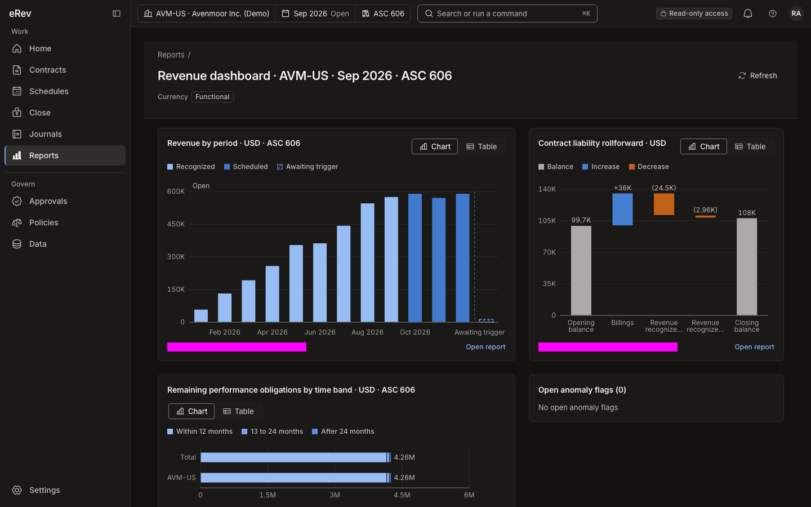

# eRev Cloud

eRev Cloud is a source-available, multi-tenant ASC 606 / IFRS 15 revenue subledger. It has a FastAPI and
PostgreSQL 17 backend, a pure Python revenue engine and a React 19 workbench, and it rebuilds the legacy
desktop application eRev.

[How to use it, in twelve examples](#how-to-use-it-twelve-examples) · [Quick start](#quick-start) ·
[Guides](#guides)

*Home for an approver: the key figures of the period, the requests that wait for her, the open exceptions,
the close status and revenue by period.*

## What it does

- **From a contract to the ledger.** A contract holds its performance obligations. What happens to it (a
  delivery, usage, an invoice, a change of estimate, a modification) is recorded as an event. From these the
  engine computes the revenue schedule of each obligation by period and the journal lines of the subledger,
  in an ASC 606 book and, beside it, an IFRS 15 book.
- **Every figure can be explained.** Select an amount and the product shows the narrative, the formula, the
  inputs and the stored calculation trace behind it. The explanation is deterministic; it is not AI.
- **Two people.** What changes a figure or a rule is prepared by one person and decided by another: a
  contract's activation, an estimate, a modification, an import, a journal run, the lock of a period, a policy
  version, a role. The requests wait in one inbox.
- **Close, journals and reports.** A period is closed through a checklist of gates, two reconciliations and
  a Controller's lock. Journal runs are approved and exported to the general ledger. Reports are stored,
  numbered runs with tie-outs, and an audit log records who did what under a verified hash chain.

This is the release candidate of 1.0. What it does not do is stated row by row in
[the limits of release 1.0](docs/release/LIMITS-1.0.md); an independent accountant's review of its
accounting decisions is still outstanding, and nothing is deployed.

## How to use it: twelve examples

The pictures are captures of the running product on its seeded demo workspace, "Avenmoor Holdings (Demo)";
the companies and people in them are fictitious. In the demo, Maya Chen prepares (Revenue Accountant), Priya
Raman reviews and approves (Revenue Reviewer) and Marcus Webb locks the period (Controller). A magenta block
in a picture covers a value that changes from run to run, such as a time or a hash. Each example ends with a
link to its full steps in the [illustrated guide](docs/guides/illustrated-guide.md), which describes every
screen; all 126 captured screens are in the [gallery](docs/screenshots/GALLERY.md), each with its twin in
the dark theme.

1. [Find a contract and read its revenue](#1-find-a-contract-and-read-its-revenue)
2. [Ask how a figure was computed](#2-ask-how-a-figure-was-computed)
3. [Draft a contract and have it activated](#3-draft-a-contract-and-have-it-activated)
4. [Change an active contract](#4-change-an-active-contract)
5. [Approve what waits for you](#5-approve-what-waits-for-you)
6. [Close a month](#6-close-a-month)
7. [Send the journals to the general ledger](#7-send-the-journals-to-the-general-ledger)
8. [Run a report, read its tie-outs, export it](#8-run-a-report-read-its-tie-outs-export-it)
9. [Import data and clear exceptions](#9-import-data-and-clear-exceptions)
10. [Set the rules: policies, SSP books and account mapping](#10-set-the-rules-policies-ssp-books-and-account-mapping)
11. [See who did what: the audit log](#11-see-who-did-what-the-audit-log)
12. [Set up and administer a workspace](#12-set-up-and-administer-a-workspace)

### 1. Find a contract and read its revenue

1. Choose "Contracts" in the rail at the left. The list shows the contracts of the entity named in the
   context pill, the three buttons at the start of the top bar for entity, period and book. Type part of
   an external id or a customer's name in "Search contracts", or narrow the list with "Filter".

   

   *The 106 contracts of Avenmoor Inc. (AVM-US) at September 2026.*

2. Select a contract's external id to open its workbench. The tracker walks the five steps of the revenue
   model, from "1 Contract" to "5 Recognition". Below it stand the key figures at the period: transaction
   price, billed, recognized, scheduled, awaiting trigger, and the contract's balance under its label.

   

   *Contract SF-ORD-10001: USD 135,000.00, fully billed and 77.8% recognized; the rest is its contract
   liability.*

3. Select an obligation to see how its amount came about. "SSP and allocation" shows the SSP range, the
   selected SSP, the obligation's weight in the contract and the amount allocated to it.

   

   *A stated price of EUR 90,000.00 lies inside the SSP range, weighs 82.57% of the contract and is allocated
   EUR 89,174.31.*

4. Open the tab "Schedules" for the revenue schedule: one line for each period and obligation, with its
   amount, the cumulative amount and its state, "Recognized" or "Scheduled".

   

   *Twenty-four monthly lines: January to September 2026 recognized, the later months scheduled.*

Full steps: [Contracts](docs/guides/illustrated-guide.md#contracts) in the illustrated guide.

### 2. Ask how a figure was computed

1. Select any computed figure: a key figure, a schedule amount, a balance, a journal amount. The Explain
   panel opens beside it with a narrative in sentences, the formula, the inputs and the calculation steps.

   

   *September's revenue of one obligation, USD 9,764.38: cumulative revenue to 30 September less that to
   31 August, each the allocation times the share of the term elapsed.*

2. Press "Verify" to have the figure recomputed from the stored trace, and "Open calculation trace" to see
   every node of the computation it belongs to; "Download JSON" saves the trace.

   

   *The trace behind that figure: 549 nodes, the row of 9,764.38 selected.*

Full steps: [Explain panel and calculation trace](docs/guides/illustrated-guide.md#explain-panel-and-calculation-trace).

### 3. Draft a contract and have it activated

1. On the contracts list press "New contract". Fill the sections "Contract", "Termination" and
   "Classification", add one line for each promised good or service, and press "Save draft".

   

   *One contract line of USD 120,000.00 that starts on 1 September 2026.*

2. Record the review of the five contract criteria with "Record Step 1 review" and submit it. A Revenue
   Reviewer approves it under Approvals.

   

   *The draft with its five criteria, each with a conclusion and the record that supports it; the review
   waits for a Revenue Reviewer.*

3. Press "Record assessment", then "Submit for activation". The contract reads "Pending approval" until an
   approver other than the submitter approves the request; it is then "Active".

   

   *"Activation is waiting for approval.": the preparer can follow the request or withdraw it.*

Full steps: [Draft contract form](docs/guides/illustrated-guide.md#draft-contract-form-sf-03new-and-sf-03edit)
and [Step 1 review and activation](docs/guides/illustrated-guide.md#step-1-review-and-activation).

### 4. Change an active contract

1. On an active contract press "New modification", or "Change subscription" for an upgrade, a downgrade, a
   co-term, a renewal or a cancellation. The wizard has five steps. In "Change" you say what changes and
   from when.

   

   *A co-term that adds obligation O2: 775 units for USD 60,000.00 from 16 September 2026.*

2. In "Questionnaire" the product proposes the answers that decide the accounting, whether the added goods
   are distinct and whether they are priced at SSP, with its reasons; you confirm or change them. "Treatment"
   then names the treatment with its reference in the standard.

   

   *The added price is below the SSP range, so the proposal is the prospective treatment
   (ASC 606-10-25-13(a)).*

3. "Impact preview" shows what the approval would do before anything is posted, and "Submit" sends the
   modification to its approvers.

   

   *The submitted modification: allocation and revenue by period before and after, the journal lines the
   approval would post, and two approval steps, a revenue review and then a Controller.*

Full steps: [Modifications and the wizard](docs/guides/illustrated-guide.md#modifications-and-the-wizard-sf-03modifications-sf-07-sf-07detail).

### 5. Approve what waits for you

1. Home lists the requests that wait for you, and "Approvals" in the rail is the inbox for every kind of
   request: contract activations, modifications, journal runs, period locks, imports, policy versions, role
   assignments and others.
2. Open a request and read its changes, its impact and its routing. Enter a comment of at least 10
   characters and press "Approve" or "Reject". The preparer of a request cannot approve it, and some requests
   ask for a fresh code from your authenticator.

   

   *Two requests wait for Priya Raman; the open one shows the comment field of the decision form, and the
   message confirms the approval she gave a moment before.*

3. To approve several like requests in one command, press "Select for bulk approval" and tick them.

   

   *Two of three role changes ticked, with "Approve 2 items".*

Full steps: [Approvals](docs/guides/illustrated-guide.md#approvals).

### 6. Close a month

1. "Close" in the rail opens the cockpit of the period: what still holds it, under "Blockers", and the
   checklist of 14 gates.

   

   *September 2026 of AVM-US while the period is open: 23 blockers, 4 of 14 gates passed.*

2. Clear the blockers: decide the pending approvals, resolve or dismiss the exceptions, release the holds.
   Press "Start soft close", then "Run close". The close run computes the changed contracts again, posts the
   period-end entries and calculates the journal run.

   

   *Close run CLS-000009, step by step. The strip above the tabs had not refreshed yet when the capture was
   taken.*

3. Have the journal run approved and exported, and record the ledger's reference
   ([example 7](#7-send-the-journals-to-the-general-ledger)).
4. Generate the two reconciliations, billing to subledger and subledger to GL. One person prepares each and
   another reviews it.

   

   *The subledger-to-GL reconciliation, prepared and frozen for review: three accounts and no difference.*

5. Press "Submit for lock". A Controller other than the submitter locks the period with "Lock period"; an
   event that arrives later posts to the next open period.

   

   *The month locked by the Controller: 14 of 14 gates passed.*

Full steps: [Close](docs/guides/illustrated-guide.md#close).

### 7. Send the journals to the general ledger

1. A journal run turns the subledger's lines of a period into balanced journal entries. The close run
   calculates it; "Run journals" in the Journals area does so directly. Press "Submit for approval".

   

   *The journal run of September 2026, balanced at 573,688.63 and ready to be submitted.*

2. A second person approves the run. It is then exported in batches: as CSV files, each with a manifest
   that carries its row count, totals and SHA-256, or to the entity's ledger connection. In release 1.0 the
   NetSuite and QuickBooks Online adapters run against built-in mock servers, and a production workspace
   exports by CSV.
3. Download the batch, import it into the ledger once, and press "Record ERP reference" with the ledger's
   document number. When every batch is acknowledged the run reads "Posted".

   

   *A posted run: its one batch acknowledged with the ledger's document number.*

4. To trace a journal line back, open the count under "Source lines": it lists every subledger line behind
   the journal line, contract by contract.

   

   *The 91 revenue postings of August behind one journal line.*

Full steps: [Journals](docs/guides/illustrated-guide.md#journals).

### 8. Run a report, read its tie-outs, export it

1. "Reports" in the rail opens the catalogue. A report runs for the entity, period and book of the context
   pill, and every run is a stored, numbered record with its parameters, totals and output hash.
2. Read the run stamp and the tie-outs. A tie-out compares the report with an independent total and reads
   "Pass" or "Difference".

   

   *Remaining performance obligations at 30 September 2026 by time band; the tie-out to the RPO rollforward
   passes at USD 4,257,068.46.*

3. Change the parameters and press "Run report" for a new run; press "Export" for an Excel workbook, a CSV
   with a manifest or a PDF.

   

   *The revenue waterfall: recognized, scheduled and awaiting-trigger revenue by month. Its tie-out to the
   journals reads "Difference" here, because the demo workspace holds journal runs for only two of the nine
   months with recognized revenue.*

4. The revenue dashboard draws four report runs as charts, each with a link to its report.

   

   *The revenue dashboard of AVM-US for September 2026.*

   

   *The same dashboard in the dark theme; every screen has both themes.*

Release 1.0 builds 37 of its 56 report definitions; a report without a builder answers "This report is not
available yet." Full steps: [Reports](docs/guides/illustrated-guide.md#reports).

### 9. Import data and clear exceptions

1. Choose "Data", then "New import". Pick the template, drop the CSV or XLSX file and press "Upload and
   validate". An import moves through "Upload", "Map columns", "Validate", "Review changes", "Approval" and
   "Committed", and nothing is committed before the approval.

   

   *The upload step, here for a legacy contract modification template.*

2. A file with errors is rejected whole. Read the findings row by row, correct the source file and upload
   it again.

   

   *A rejected file: 14 rows, 2 of them in error, nothing committed.*

3. The findings also stand in the exception queue. Open an item, read its message and where it comes from,
   and close it with the action the item offers: reprocess, mark resolved, dismiss or request a waiver.
   Blocking exceptions hold the close of their period.

   

   *One of that file's findings: the delivery exceeds the remaining quantity.*

Full steps: [Data](docs/guides/illustrated-guide.md#data).

### 10. Set the rules: policies, SSP books and account mapping

1. "Policies" in the rail holds the configuration under which contracts are computed, approved and posted:
   obligation templates, control rules, accounting policies, SSP books, the SSP calculator and the account
   mapping. Every object is versioned. A version is drafted, tested where it has tests, submitted and put in
   force by a second person's approval; a published version is never edited.

   

   *The accounting policies of the workspace: 112 parameters, each with its question, its value and the
   framework's defaults.*

2. An SSP book holds standalone selling prices by product and effective date. A new version carries its
   study and is approved by someone other than its preparer.

   

   *US list prices, version 2026-H1: prepared by Maya Chen, approved by Priya Raman.*

3. The SSP calculator computes statistics over a pool of standalone sales and proposes a range, from which
   a draft SSP book version is created.

   

   *Forty standalone sales of one product: a median of 112,000.00 and a proposed range of 95,200.00 to
   128,800.00.*

4. The account mapping gives each account role its GL account; journal lines need a published mapping
   before they can post.

   

   *The first of the 39 rules of the demo workspace's mapping.*

Full steps: [Policies](docs/guides/illustrated-guide.md#policies).

### 11. See who did what: the audit log

1. Choose "Reports", then the tab "Audit log". It lists the audit events of the workspace under the latest
   verification of their hash chain, and is read by a member who holds the audit permission, the Auditor in
   the demo.
2. Filter by object, actor, action or date, and press a sequence number to read one event: who acted, with
   which roles and sign-in method, and what changed.
3. Press "Verify chain now" to check the chain and record a digest.

   

   *The events that name one contract, and one of them open: a draft estimate version voided by Maya Chen.*

Full steps: [Audit log](docs/guides/illustrated-guide.md#audit-log).

### 12. Set up and administer a workspace

1. A new workspace starts on "Workspace setup": create a legal entity, generate a calendar and open a
   period, and invite a preparer and an approver.

   

   *Two of the three required items passed; setup completes when two different people can prepare and
   approve contracts.*

2. Under "Settings" an administrator keeps the legal entities and their books, the calendars and periods,
   the currencies and exchange rates, the customers and the products.

   

   *The four legal entities with their functional currency, time zone and calendar.*

3. Members are invited on "Users". Each role of an invitation is approved by a second administrator, and a
   role is revoked at once.

   

   *The eleven members with their roles and whether a second factor is enrolled.*

4. "Roles" lists the ten default roles and the custom roles of the workspace; the neighbouring tabs hold the
   separation-of-duties rules, the access reviews, the security settings and support access.

   

   *The ten default roles and one custom role, with the number of permissions and of members of each.*

Full steps: [Settings and administration](docs/guides/illustrated-guide.md#settings-and-administration) and
[Workspace structure, reference data and access](docs/guides/illustrated-guide.md#workspace-structure-reference-data-and-access).

## Quick start

Prerequisites: uv 0.11 or later with Python 3.12; Node.js 22 or later with npm; GNU Make; PostgreSQL 17 on
127.0.0.1:5432 with the roles `erev_owner` and `erev_app` and the databases `erev`, `erev_test` and `erev_e2e`.

1. Copy `.env.example` to `.env` and set the six database URLs.
2. Run `make setup`. It installs the backend and frontend dependencies from the lock files, adds any missing
   master keys to `.env` without printing them, and checks the database roles and privileges.
3. To see the product with its demo workspaces, run `make seed` (about six minutes) and then `make dev-up`,
   which starts the API, the worker and the web application. Open `http://127.0.0.1:5270` and sign in as a
   demo persona; the password is the value of `EREV_DEMO_PASSWORD` in `.env`, and
   [Sign in as a demo persona](docs/guides/illustrated-guide.md#sign-in-as-a-demo-persona) says how the
   second factor is set up.
4. To develop, run `make ci`: format and lint checks, type checks, backend and frontend tests, and the build.

| Sign in as | Person | Role in the demo |
|---|---|---|
| `maya@demo.erev` | Maya Chen | Revenue Accountant: prepares contracts, imports, the close and the journal run |
| `priya@demo.erev` | Priya Raman | Revenue Reviewer: reviews and approves what Maya prepares |
| `marcus@demo.erev` | Marcus Webb | Controller: locks the period |
| `hannah@demo.erev` | Hannah Lindqvist | Auditor: reads the audit log and the evidence |
| `tomas@demo.erev` | Tomás Rivera | Tenant Admin: settings, members and their approval |

To add a dependency, edit `backend/pyproject.toml` or `frontend/package.json` and run `make setup LOCK=1`.

Every developer and gate target, the repository layout and the conventions are described in
[docs/dev-guide.md](docs/dev-guide.md).

## Guides

- [Illustrated guide](docs/guides/illustrated-guide.md): running the demo and using every screen, with
  captures. It follows the user guide, which governs where the two differ.
- [Screenshots](docs/screenshots/README.md): every captured screen in the light and the dark theme, with an
  index; the [gallery](docs/screenshots/GALLERY.md) shows them on one page.
- [User guide](docs/guides/user-guide.md): the vocabulary, money and dates on the wire, every area of the
  rail, sandboxes, AI assistance, the map for people coming from eRev desktop and the demo workspaces.
- [Legacy migration guide](docs/guides/migration-guide.md): moving from `ASC606.db` — opening balances with a
  cutover, template replay, the reconciliation report, the legacy-parity preset and the field mapping.
- [Runbook](docs/guides/runbook.md): operating a deployment — start and stop, migrations, backup and restore,
  key rotation, monitoring, incidents and personal data erasure.
- [ITGC guide](docs/guides/itgc-guide.md): the controls a customer operates around eRev Cloud.
- [Limits of release 1.0](docs/release/LIMITS-1.0.md): what stands before production use, what the release
  does not do, what moved to the next release, and the fifteen tests that do not pass.
- Security: [threat model](docs/security/threat-model.md), [ASVS L2 checklist](docs/security/ASVS-L2.md),
  [subprocessors](docs/security/SUBPROCESSORS.md) and the [DPA template](docs/security/DPA-TEMPLATE.md)
  (the last two are drafts for counsel).

## Licence

This public release is licensed under **PolyForm Noncommercial 1.0.0**. Use, modification and
redistribution are permitted for the purposes specified in [LICENSE](LICENSE); commercial use is not
granted. See [NOTICE](NOTICE) for the required copyright notice and third-party components, which keep
their own licenses.

Because it restricts commercial use, this is **source-available, not OSI open source**. This release does
not revoke rights to copies previously received under MIT or other licenses. Historical design and
review documents may describe the former MIT license; the LICENSE and NOTICE files govern this release.

See [publication notes](docs/release/PUBLICATION-2026-10-05.md) for the source snapshot, excluded research
material and verification scope.
