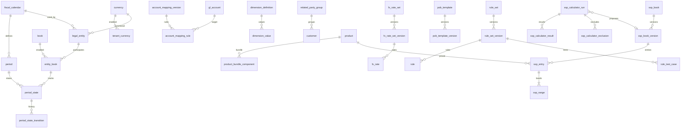
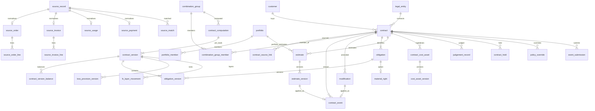
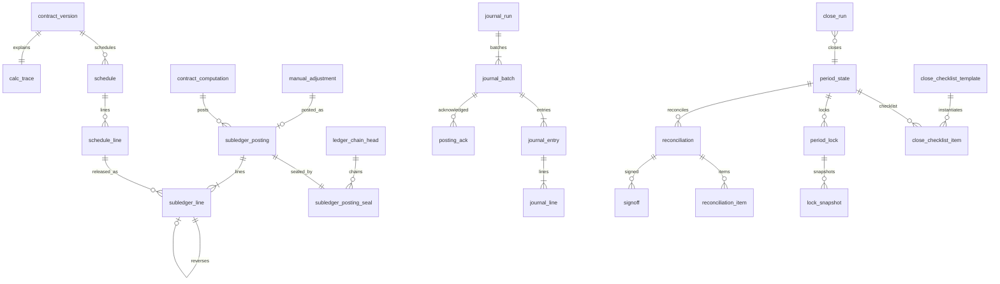
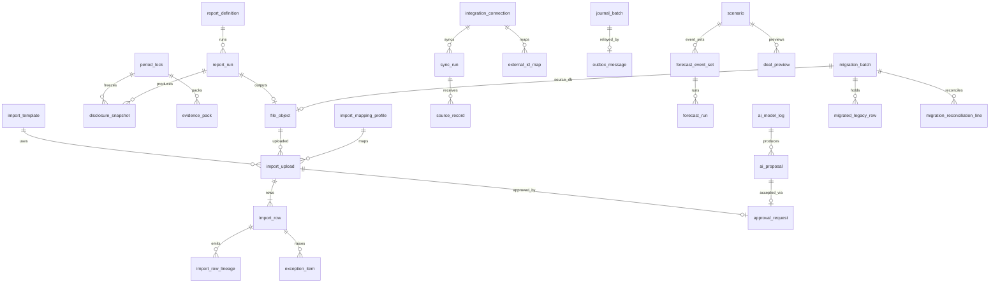

# eRev Cloud: data model and API surface

| Field | Value |
|---|---|
| Owner | Principal data architect, financial subledgers (design phase, slug `arch-data`) |
| Date | 2026-09-12 |
| Status | Binding build contract once accepted by the supervisor. Read-only for the build loop (`docs/01-DECISIONS.md` §0). |
| Precedence | Entities, tables and API surface: this document, then `docs/05-ARCHITECTURE.md` (D-§0). Below `docs/00-GOAL.md`, `docs/01-DECISIONS.md`, `docs/03-REQUIREMENTS.md` (priority), `docs/accounting/*` (calculation), `docs/dev-guide.md` (code structure). **Identifier authority (D-73):** enumeration literals (§3), permission codes (T-PLT-11), problem slugs (§15.2) and finding and exception codes (§15.4) are owned by this document; every other document cites them verbatim (§0.5). |
| Revision | 1.323 (2026-10-03), lane SECFIX-CLO (item PRODUCT-POLICY-VALUE-NOT-READ-1 — the second item placed behind the freeze of release 1.0: a policy value that a product or an obligation template could state and that no computation reads; supervisor ruling R-126 (c) and the supervisor's rulings of 2026-10-03 on the lane's list and words; docs first; number assigned by the supervisor, register index 309; no Alembic revision): T-REF-20 and T-REF-23 `policy_values` — the one check of level P values refuses, by every door that stores them, a value of `usage.tier_minimum_method` or `upfront_fee.recognition_period` other than the framework's default and every value of `pob.shipping_as_fulfilment`, 422 `validation-failed` under rule id `POLICY_PRODUCT_LEVEL_NOT_READ`; PRD rev 1.210; POLICIES rev 1.125; 1.322 (2026-10-03), lane SECFIX-PLT (item POLICY-OVERRIDE-WITHDRAW-1 — the one item placed behind the freeze of release 1.0: an override could be requested, approved and stored, and no computation reads it; supervisor ruling R-126 (b) (4) and (c) and the supervisor's rulings of 2026-10-03 on the lane's line; docs first; number assigned by the supervisor, register index 308; no Alembic revision): T-CON-23 — "Not offered in release 1.0": `POST /policy-overrides` refuses every creation by name, 422 `policy-level-not-allowed` under rule id `POLICY_OVERRIDE_NOT_OFFERED` with the sentence of what decides the parameter instead, after the route's 403 and the contract's 404 and before anything the body names is validated; the table, the subject, the reads, the submit and the approval keep their definition and meet no row; the premise — a workspace born on the release holds no row, an earlier database is reset and not migrated; T-PLT-32, T-PLT-33, §15.2, API-R-13 and §16.5 marked; PRD rev 1.209; POLICIES rev 1.124; 1.321 (2026-10-03), lane SECFIX-APR (item SUPPORT-GRANT-OPERATOR-SCOPE-1 — a regression of rev 1.319 found by the supervisor's whole suite on d3a1aa5f6, a release blocker; the supervisor's order of 2026-10-03; docs first; number assigned by the supervisor, register index 307): §16.10 "Who reads a subject in full" — the provider's operator at the command line, who holds no permission of the workspace, is asked by its entity scope as a SYSTEM principal is, so that `erev support-grant request` is taken again; an operator signed in under a grant, a person and an API client are asked by permission; dev-guide rev 1.297; 1.320 (2026-10-03), lane SECFIX-CLO (item USAGE-REPORT-PERIOD-ENDED-1 — a wrong reported figure of main under a lock, measured by this lane on 2498e096a; the supervisor's rulings of 2026-10-03 on the lane's measurement and pre-build line, on lane ACCT's reading; docs first; number assigned by the supervisor, register index 306; no Alembic revision): §16.3 — the usage period of a usage report or royalty statement ends on or before the event's effective date, a later end is refused by name (`USAGE_PERIOD_NOT_ENDED`, table 15.4-B) by every channel and for a stored submission at its approval; T-CON-13 — the usage period of an estimate version is not a report's; 1.319 (2026-10-03), lane QA-BE (item READ-SCOPE-BY-PERMISSION-1, a release blocker — data across an entity bound, measured by this lane on 6e04bc69d; the supervisor's rulings of 2026-10-03 on lane QA-BE's line and on lane SECFIX-APR's reading of it; docs first; numbers assigned by the supervisor, register index 301; 03 rev 1.146, PRD rev 1.207, dev-guide rev 1.295, build-spec header rev 1.282 with fragment `11-foundation-platform.md` rev 1.43; no Alembic revision): API-C-03 — the transaction of a route that declares a permission runs under the scope that permission is held for, not under the union of the entities of the member's roles, and a command on a row outside the scope of its own permission answers 404 without a `DENIED` event; §16.10 "Who reads a subject in full" and "The request's row is the kernel's" — the kernel asks a preparer, a delegate and the reader of a request's content for ONE permission that reads the subject, for every entity of it, and its own statements on a request's row run under the tenant's scope once that question has answered; T-REF-13 and T-REF-15 — a row of the workspace that names entities is changed by an author for them; with item PREVIEW-INLINE-SCOPE-1, found by the item's census — what a request states of its contract's stored schedule and postings does not depend on who submits it (API-S-ImpactSummary; T-SL-05 `amount_functional_abs`); 1.318 (2026-10-03), lane F-CLO-A (item CLO-APPROVALS-WAIVER-OWN-REQUEST-1 — PRODUCT DEFECT, a release blocker; found and measured by this lane on 2026-10-03 after index 296; the supervisor's ruling of 2026-10-03 00:44 on the lane's finding; docs first; number assigned by the supervisor, register index 303; PRD rev 1.206): §16.8 API-S-Period `blockers`, T-CLS-02 and T-CLS-03 — the request that asks to waive the approvals gate is no pending approval of its period, and T-CLS-03 states the order of that waiver among the other requests of the entity (lane F-CLO-B's passage; the supervisor's ruling of 2026-10-03 01:26 on that lane's reading and measurement; measured on 2a3d015e; documents only); 1.317 (2026-10-02), lane F-CLO-B (register index 299, item REC-OVERTAKEN-EARLIER-PERIOD-1, with the list of index 211; the supervisor's rulings of 2026-10-02 21:20, 21:57 and 23:47 on the lane's list and its measurement; documents only; number assigned by the supervisor): T-CLS-06 — the note "What the ledger kind's number rests on, and its limit" states what can move a reconciled balance after the sign-off, twelve movers each with how the gate sees it, and one stated limit — an event-less posting confined to an earlier period; no table, column, gate or test changes; 1.316 (2026-10-03), lane F-SNP (item IDENTITY-WITHHELD-BY-STATUS-1 — data across a workspace bound, measured through the routes; the supervisor's rulings of 2026-10-02 and 2026-10-03 on the lane's line; docs first; number assigned by the supervisor, register index 302): T-PLT-02 — a person who is not a member now is shown no last sign-in and no MFA state, and the name by the membership's status; 1.315 (2026-10-02), lane F-SNP (item IDENTITY-BEFORE-ACCEPTANCE-READERS-1 — PRODUCT DEFECT, a release blocker: data across a workspace bound, measured through the routes; the supervisor's ruling of 2026-10-02 on the lane's measurement; docs first; number assigned by the supervisor, register index 298): T-PLT-02 — what a workspace is shown of the person behind a membership is one rule, taken by every reader of a membership's person; 1.314 (2026-10-02), lane QA-BE (item PREVIEW-JOB-RESULT-SCOPE-1, a release blocker — data across an entity bound, measured by lane F-CTR-WEB; the supervisor's order of 2026-10-02; docs first; numbers assigned by the supervisor, register index 300; build-spec header rev 1.276 with fragment `13-reference-contracts-data.md` rev 1.76; no Alembic revision): API-S-Job `result` and §16.10 "Who reads a stored preview" — the summary of a dry run in the result of its job is answered to a reader of the job who holds the read permission of the dry run's subject for every entity the subject is bound to, by the rule of the stored preview, and to every other reader of the job — its initiator too — `result.summary` is null with the new member `result.summary_withheld` true; 1.313 (2026-10-02), lane FIX-D2 (item RPT-ROLLFWD-LOCKED-CLOSING-1; the supervisor's rulings of 2026-10-02 on lane WEB-QA's measurement and on this lane's two lines — PRODUCT DEFECT: a report's own tie-out fails on the journey of the PRD; docs first; number assigned by the supervisor, register index 297): §16.9 — a period end locked at the run's cutoff is read from the lock's datasets by `contract_balance_rollforward`, `contract_balances` and, for its opening, `revenue_from_opening_liability`, which lock, the period a billing document recorded after a lock enters in, the refusals by name, what a run records and a rerun reads, and the readers that keep the versions' basis; §16.10 — the limit of `NEW_SKU` owed from register index 260; ENGINE_SPEC_B rev 1.168; 1.311 (2026-10-02), lane F-CLO-A (item CLO-LOCK-REQUEST-OWN-GATE-1 — PRODUCT DEFECT, a release blocker; found and measured by lane WEB-QA through the browser, row C-10; measured again by this lane through the API on 2026-10-02; the supervisor's ruling of 2026-10-02 on the lane's pre-build line; docs first; number assigned by the supervisor, register index 296; PRD rev 1.205): §16.8 API-S-Period `blockers`, T-CLS-02 and T-CLS-03 — the period's own lock request is no pending approval of its period; §16.7 API-S-SubledgerLine `journal_run_id` — one sentence on a read at `known_at` or `as_of`, owed from register index 265; 1.310 (2026-10-02), lane API-GAPS (item IMPORT-HEADER-CELL-CONFLICT-1; the supervisor's ruling of 2026-10-02 on this lane's pre-build line of IMPORT-VALIDATE-COMMAND-1 — its rule 2 alone, a release blocker: the import stores a value the file contradicts and says nothing — PRODUCT DEFECT; docs first; number assigned by the supervisor, register index 295): table 15.4-B `HEADER_VALUE_CONFLICT` and §16.6 "Repeated cells" — a cell that the rows of one object of a CSV v2 file repeat, or the rows of one line of it, is blank or equal to the first row's, else the later row is refused at that column; 05 rev 1.210; PRD rev 1.204; amended in place while unlanded, 2026-10-02 (the supervisor's word of 2026-10-02 on the item's plan) — §16.6 names `effective_from` of `account_mapping` as a member compared by its text and held rule 1 of IMPORT-VALIDATE-COMMAND-1 as where that changes; 1.309 (2026-10-02), lane SECFIX-APR (item POLICY-TENANT-SCOPE-ALL-ENTITIES-1 — a release blocker; the supervisor's ruling of 2026-10-02 on lane F-SNP's measurement; docs first; number assigned by the supervisor, register index 291): §15.3 API-R-13 and §16.5 "Who authors a version" — the lifecycle commands of a registry version ask `config.author` for the version's scope, all entities for a tenant or book version and the entity of an entity version; §16.10 "Entity scope of a request" — the request of a tenant or book version spans every entity; 1.308 (2026-10-02), lane SECFIX-ACT (the supervisor's order of 2026-10-02, item RESET-EMAIL-OPEN-INVITATION-1 — a release blocker, measured by lane F-SNP; docs first; numbers assigned by the supervisor, register index 290; no Alembic revision): T-PLT-42 rule 1 — the reset email of a person without an ACTIVE membership is written in the workspace of that person's open invitation; 1.307 (2026-10-02), lane F-SNP (item ACCESS-LISTING-SECOND-LIFE-1 — a control total of an as-of register changed for a past instant after a later command, measured; the supervisor's ruling of 2026-10-02 18:40 PDT on the independent review of the head of register index 273, finding M4; docs first; number assigned by the supervisor, register index 289): T-PLT-07 `removed_at` — the row keeps its last removal, an earlier one is read from the trail, and RPT-24 reads a membership as removed at `as_of` so; 1.306 (2026-10-02), lane F-SNP (item INVITE-ENDS-STANDING-ASSIGNMENTS-1 — authority nobody gave for a second life, measured by state; the supervisor's ruling of 2026-10-02 18:40 PDT on the independent review of the head of register index 273, finding M5; docs first; number assigned by the supervisor, register index 288): T-PLT-07 — the invitation of a removed person revokes whatever role assignment stands on the row; 1.305 (2026-10-02), lane F-CLO-B (item CLO-WAIVER-COVERS-LATER-1 — PRODUCT DEFECT, a release blocker; the supervisor's ruling of 2026-10-02 17:32 on the lane's line; docs first; number and Alembic revision 0130 assigned by the supervisor, register index 283; PRD rev 1.202, 03 rev 1.145): T-CLS-03, E-60 and §16.8 — a waiver of a close gate covers the count it was approved for, which replaces the sentence of rev 1.106 under ruling R-55 (d); its lapse is audited whoever stores it, a reader's materialisation included (the supervisor's ruling of 2026-10-02 20:22; dev-guide rev 1.291); two DB-03 pairs lead out of `WAIVED`; 1.304 (2026-10-02), lane F-CLO-B (item CLOSE-PASS-BEHIND-GROUP-1 — PRODUCT DEFECT, a release blocker; read by lane ENG-FX, measured by this lane; the supervisor's ruling of 2026-10-02 17:30 on the lane's measurement; docs first; number assigned by the supervisor, register index 284; 05 rev 1.209): T-CLS-01 "Period-end steps" — a period-end pass leaves out a group its bundle is behind, as it leaves out a dirty group: nothing is posted from that bundle, the first step does not mark the group, and the gate reads the run as out of date; 1.303 (2026-10-02, lane ENG-FX, item BILLING-GROUP-SUBJECT-1 — PRODUCT DEFECT, release blocker; the supervisor's ruling of 2026-10-02 on the lane's measured finding; docs first; number assigned by the supervisor, register index 286: T-SL-04 `contract_id` — the lines of an entry that belongs to the group, `<group>@<entity>`, are listed under the member contract first by external id among the members the entry's entity posts for; what a report by contract then shows, and what happens to the listing when that member leaves the group; dev-guide rev 1.284); 1.302 (2026-10-02), lane SECFIX-PLT (item COMPUTE-BEHIND-CUTOFF-1 — PRODUCT DEFECT, a release blocker: the limit of clause (iii) of item COMPUTE-BEHIND-GROUP-1, measured by lane ENG-FX and by this lane; the supervisor's order of 2026-10-02 19:47 on lane ENG-FX's line; docs first; number assigned by the supervisor, register index 285; 05 rev 1.208, dev-guide rev 1.288): T-CON-07 gains `cutoff_at` — the cutoff a computation's bundle admitted by (revision 0129) — and §14.1 "A computation behind its group" compares the head's cutoff with the bundle's, bound with bound, so that no clock is assumed; a head stored before the column is read by its `created_at` until its group is computed again; 1.301 (2026-10-02), lane F-CLO-B (item PERMLOCK-DATASETS-1 — PRODUCT DEFECT, a release blocker; the supervisor's ruling of 2026-10-02 16:16 on the lane's measurement; docs first; number assigned by the supervisor, register index 280; ENGINE_SPEC_B rev 1.167): §16.8 API-S-Period — the member `dataset_lock`, the `LOCK` record whose datasets stand for the period; T-REF-06 `current_lock_id`, T-RPT-02 `period_lock_id`, API-C-10 and §16.9 — a report run "as locked" names a `LOCK` record, and a record that froze nothing is refused by name where the run is created; 1.300 (2026-10-02), lane QA-BE (item MOD-PREVIEW-READ-SCOPE-1, a release blocker; the supervisor's rulings of 2026-10-02 on the lane's line; docs first; number assigned by the supervisor, register index 276): §16.10 "Who reads a stored preview" — the impact preview a modification or a manual adjustment retains is answered to a caller who holds the read permission for every entity the subject is bound to; to another reader of the row API-S-Modification answers `impact_preview` and `impact_preview_file_id` null and API-S-ManualAdjustment `impact_preview_file_id` null, each with the new member `impact_preview_withheld` true, and both file routes answer the document 404; T-PLT-29 "Read access" states the two owners by that rule and "Shred scope" binds a destroying command to the same entities; 1.299 (2026-10-02), lane SECFIX-ACT (the supervisor's order of 2026-10-02, item HOLD-RELEASE-READ-1 — a release blocker, read by lane WEB-QA; docs first; numbers assigned by the supervisor, register index 281; no Alembic revision): §16.1 API-S-Contract and §16.2 API-S-Obligation — the reads list the OPEN holds, each with the id `release-hold` takes, who applied it and whether it is released by hand (`release_refusal`); 1.298 (2026-10-02, lane ENG-FX, item COMPUTE-BEHIND-GROUP-1 — PRODUCT DEFECT, release blocker; the supervisor's rulings of 2026-10-02 on the lane's measured finding; docs first; number assigned by the supervisor, register index 279: §14.1 "A computation behind its group" — a computation whose bundle is behind its group, by a member's event beyond its stream head, a mark later than its cutoff or a head computation made after its cutoff, is not stored and answers 409 `lock-conflict` with the detail of PRD ERR-52, and a mark is never moved back; §15.2 `lock-conflict` names it; 05 rev 1.207; dev-guide rev 1.282); 1.297 (2026-10-03, lane ENG-FX, item FX-REPUBLISH-DIRTY-1 — PRODUCT DEFECT, release blocker for a multi-currency workspace; supervisor ruling R-116 (b) and the supervisor's rulings of 2026-10-02 on the lane's pre-build line; docs first; numbers and Alembic revision 0128 assigned by the supervisor, register index 277; built by lane ENG-FX and taken over by lane SECFIX-PLT on 2026-10-03: T-REF-11 "The groups a changed rate reaches" — the approval of an FX rate set version marks the contract groups its changed rates reach, by pair and by the periods a group's lines can be made of, locked periods included, and the mark carries the trigger `FX_REPUBLISH`; what a correction behind a lock posts, by the amount, and where it posts nothing; the limits — what is committed, the gate's count by contracting entity; T-CON-03 — `dirty_trigger`, with the code; "A rate changed after a lock", T-CLS-01 "What a run read", §14.1 "The approval of a rate set version and the period states" and "What a reconciliation read" (movers 5 and 10) — the statements the item makes inexact; 05 rev 1.206; dev-guide rev 1.281; PRD rev 1.200); 1.296 (2026-10-02), lane SECFIX-ACT (the supervisor's rulings of 2026-10-02 on the lane's measurement and its pre-build line, item JDG-REJECTED-EXIT-1 — a release blocker; PRD rev 1.199; docs first; numbers assigned by the supervisor, register index 274; no Alembic revision): E-57, T-CON-19, API-R-33, table 15.4-I and §16.14 — `POST /judgements/{id}/discard` takes a rejected record as it takes a draft, through the two pairs DB-03 holds and inside one transaction; the activation checklist names a rejected record by its number (`JUDGEMENT_RECORD_REJECTED`); 1.295 (2026-10-02), lane QA-BE (item CTR-PREVIEW-GROUP-SCOPE-1, a release blocker; supervisor ruling R-103 (b) (5) and the supervisor's rulings of 2026-10-02 on the lane's note; docs first; numbers assigned by the supervisor, register index 275; dev-guide rev 1.279): §16.10 "Who may ask for a preview" — a preview is asked by who could submit the subject: the four preview routes answer 403 `forbidden` to a caller whose own entity scope does not cover every entity the subject is bound to, and create no job; that 403 and the 403 of a preparer at submission each write one `DENIED` audit event; `POST /modifications/{id}/submit` asks the question before its own findings; 1.293 (2026-10-02), lane F-SNP (item SBX-COPY-OPEN-INVITATION-1 — PRODUCT DEFECT, a release blocker; the supervisor's rulings of 2026-10-02 on the lane's measurement and on its line; docs first; numbers assigned by the supervisor, register index 273): T-PLT-07 — a removed membership is invited again on its row; `activated_at` is the first acceptance, set once; what a copy carries of an open invitation (05 SBX-03 rev 1.205); T-PLT-14 — the exceptions of a removed membership at its new invitation; API-R-05 — `POST /users` for a removed person; T-PLT-21 — a delegation ends when its delegate is removed, and its end event names the delegate's status; T-PLT-07 — the invitation of a removed person reads the role requests it voids under the tenant's SYSTEM entity scope (the last two grown inside the unmerged revision on the independent review of the item's head: the supervisor's rulings of 2026-10-02 17:09 and 17:30 PDT, R-112 (k)); 1.291 (2026-10-02), lane F-CLO-B (item CLO-RATE-AFTER-RUN-1; the supervisor's ruling of 2026-10-02 08:56 on the lane's pre-build line; docs first; number and Alembic revision 0127 assigned by the supervisor, register index 272): T-CLS-01 — the note "What a run read": the first period-end step of a close run records, as two digests, the exchange rates and the period-pinned policy values its passes can read, and `CLOSE_RUN_COMPLETED` fails by name while the same read differs; two columns, each written once; §16.8 "The close-run gate" — the third condition and its sentence; and, with the item's second part (the supervisor's ruling of 2026-10-02 08:56, point 4, and the ruling of 11:08 on the lane's line; PRD rev 1.197): T-REF-11 — the note "A rate changed after a lock": the approval of a rate set version raises `FX_RATE_CHANGED_AFTER_LOCK` for each entity, book and period that is closed and holds a date whose rate it changes, reads the period states `FOR SHARE`, and the close-run gate reads the rates whenever their version was published; T-IMP-05 — the item's key, its period and who resolves it; §14.1 — the approval among the holders of a period's state row; and, with the join of lane ENG-FX's item PINP-PERIOD-VALUE-1 (the supervisor's word of 2026-10-02 16:27; third row): T-CLS-01 "What a run read" and T-REF-11 — the period-pinned values are read for the run's period; 1.289 (2026-10-02), lane F-RPS-REG (item COMBINATION-PROPOSAL-DISCARD-1; the supervisor's rulings of 2026-10-02 on the lane's reading of the roads of a draft proposal and on its line before the build; docs first; numbers assigned by the supervisor, register index 266; Alembic revision 0126): §3.4 E-95, T-CON-03, T-CON-19, §15.3 API-R-28 and API-R-33, §16.10 and §16.14 — a proposed combination that was not submitted is discarded with its group (`VOIDED`) by any holder of what the proposal asked, and the record of a group is edited by nobody; 1.288 (2026-10-02), lane F-CLO-A (item SUBLEDGER-LINE-JOURNAL-RUN-1; the supervisor's ruling of 2026-10-02 on the lane's pre-build line and measurement; number assigned by the supervisor, register index 265; docs first: §16.7 API-S-SubledgerLine `journal_run_id` — the run that journalises the line, by the rule `JE_COMPLETE` reads, where the API answered null for every line; T-SL-06 drill-back — PRODUCT DEFECT, the drill reads the run's own record of the lines it left out, not the holds' timestamps, and refuses a run whose record cannot be read); 1.287 (2026-10-02), lane FIX-D2 (item ACT-FLAGS-1, a release blocker — REQ-CON-006, control CTL-005; the supervisor's rulings of 2026-10-02 on lane SECFIX-ACT's measurement and on this lane's pre-build line; supervisor ruling R-66 (4); docs first; number assigned by the supervisor, register index 260; Alembic revision 0125): T-CON-01 `acceptance_clause` and `side_letter`, the two terms a booking states (§16.1, §16.3: stored only when stated); T-PLT-17 `flags` and `amount_functional` of a `CONTRACT_ACTIVATION` request; §16.10 "Routing facts of an activation" — the flags the record states, the amount judged in one stated currency at the spot rate in force for the inception date, and what a rate that is not published means; §14.1 "A command recorded before a lock" — one sentence on the clock limit of the commit or run that is applied once more (item PIN-WINDOW-APPENDER-1, by the supervisor's word on its report); PRD rev 1.194, 05 rev 1.204, dev-guide rev 1.273; 1.286 (2026-10-02), lane SECFIX-ACT (the supervisor's ruling of 2026-10-02 on the lane's pre-build line, item MOD-CLASSIFICATION-KEYS-1; docs first; numbers assigned by the supervisor, register index 259): T-CON-06 `classification` and §16.14 API-S-Modification — the stored classification has three members, `proposal`, `obligations` and `price_tests`, so that no obligation key meets a member's name; the answer carries the obligations' proposals alone as `prefill_reasons` and the engine's detail beside them as `proposal_detail`; a classification stored before reads as none; 1.285 (2026-10-02), lane SECFIX-ACT (the supervisor's rulings of 2026-10-02 on the lane's pre-build lines, items STEP1-CITE-LATEST-1 and RPT-BRIDGE-STEP1-CHAIN-1 (the reader); PRD rev 1.193; dev-guide rev 1.271; docs first; numbers assigned by the supervisor, register index 258): §16.3 "Step 1 events on this route", §16.10, T-CON-19 and table 15.4-I — an assessment cites the newest reviewed Step 1 record of its subject and book across the two topics, a probable assessment that answers a significant-change flag cites a record reviewed at or after the flag, the judgement's answer carries `overtaken_by`, and the activation asks again (`STEP1_RECORD_OVERTAKEN`); 1.284 (2026-10-02), lane SECFIX-PLT (item AUTH-BEFORE-BODY-1; the supervisor's acceptance of 2026-10-02 of the lane's pre-build line and of its amendment; docs first; number assigned by the supervisor, register index 257): API-C-17 — every body is read after the session is established; the permission, the operator's and the tenant-status refusals and the key after the body is decoded; the identity store's answer kept for the request and for one second; 1.283 (2026-10-02), lane F-RPS-REG (item COMBINATION-PROPOSAL-RECORD-1; the supervisor's rulings of 2026-10-02 on the lane's probe of a record made by hand and on its line before the build; docs first; number assigned by the supervisor, register index 253): T-CON-19, T-CON-03, T-PLT-19, §15.3 API-R-33 and §16.10 — a `COMBINATION` record of a combination group is that group's proposal, written by the combination commands alone and decided with its group; the proposal the group's commands and its approval read is the record the command wrote, never the latest record of the topic; a `COMBINATION` record of another subject stays a record by hand and names its own contract; 1.282 (2026-10-02), lane ENG-FX (item ENG-COST-READBACK-1 — PRODUCT DEFECT, release blocker; supervisor ruling R-11 of 2026-09-29 as amended on 2026-10-02; number assigned by the supervisor, register index 248): T-SL-04 gains `subject_key` (text, nullable; revision 0124) — the subject of the entry a line belongs to, as the engine keys it, stored inside the sealed line document, required of every product writer at `subledger.post` and answered by the RCP-05 read-back; T-SL-02 `seal_sha256` — a column added to the sealed table changes the document of every line already sealed; T-CLS-01 "Period-end steps" — the case that the net rule of ruling R-114 (a) was made for no longer arises from a ledger the product wrote, and the rule stands; §18 rule 17 — revision 0124 backfills nothing and refuses a table that holds a line; 1.281 (2026-10-02), lane F-CLO-A (item JRN-JOB-MODE-1; the supervisor's rulings of 2026-10-02 on lane F-CLO-WEB's judgement K3 and on this lane's finding; number assigned by the supervisor, register index 244; docs first: §16.0 API-S-Job `mode` is answered for a `JOURNAL_EXPORT` job — `EXPORT`, `RETRY`, `CANCEL` and `HAND_OVER` — and §16.7 `retry`: the relay's result states `mode` and, for a retry, `batch`); 1.280 (2026-10-02), lane OPS (item AUDIT-LIST-PLAN-1; the supervisor's ruling of 2026-10-02 on the lane's two lines of measurement; docs first; number assigned by the supervisor, register index 241; no revision of the schema: no table, column, index or grant changes; build-spec header rev 1.232): §16.14 "Audit events", *Range* — a read of the log has an end as it has a start: `to` when the caller sends it, else one day after the request, so that PostgreSQL plans the months of the range and not every monthly partition after its start; the actors of a range the same; a read by `contract_id` or `chain_seq` takes neither; 1.278 (2026-10-02), lane SECFIX-APR (item API-CLIENT-COMMANDS-SCOPE-1; the supervisor's ruling of 2026-10-02 on the lane's finding; a release blocker; docs first; number assigned by the supervisor, register index 235): T-PLT-10 "Entity scope of a grant" and T-PLT-15 "Grant and secret" — an API client is listed, read, given a secret and revoked only by a holder of `api_client.manage` for every entity the client names; a client request beyond its creator's access is recorded as a denial; 1.277 (2026-10-02), lane SECFIX-APR (item SSP-ENTITY-SCOPE-1; supervisor ruling R-28, row N-29 of the ruled repairs, and the supervisor's rulings of 2026-10-02 on the lane's pre-build line; a release blocker; docs first; number assigned by the supervisor, register index 234; Alembic revision 0123): T-REF-28 "Reach" — an SSP book of an entity is listed, read and commanded only where the caller's permission covers that entity; T-REF-32 "Scope" — a calculator run stores its requester's `contract.read` scope, its provider reads within it and its readers are held to it; §16.4 — `GET /ssp/resolve` reads the approved versions under the tenant's scope; T-REF-34 — an observation of committed contract lines names the obligation's version of the computation that last held it (item SSP-CALC-LATEST-VERSION-1); §16.2 — an SSP override names a version its requester may read; 1.276 (2026-10-02), lane F-RPS-REG (item SCOPE-WORKSPACE-LISTS-1, part (d): the tenant's settings by every road; supervisor ruling R-28 and the supervisor's ruling of 2026-10-02 on the lane's measurement of the reference commands; docs first; number assigned by the supervisor, register index 233): §15.1 API-C-03, §15.3 API-R-17 and API-R-18 — a new entity, a book and a fiscal calendar with its years are the workspace's and ask the permission for all entities; an entity and the books it keeps ask it for that entity; a year's period states are written for every entity on the calendar; 1.275 (2026-10-02), lane F-RPS-REG (head R28-READS; supervisor ruling R-28 and the supervisor's rulings of 2026-10-02 on the lane's measurement of its remainder; docs first; number assigned by the supervisor, register index 232): §15.1 API-C-03, §15.3 API-R-28, API-R-33 and API-R-36, §16.1 API-S-Contract — a judgement record, a combination group and a posting carry no entity and are read through the contract, or the line, that binds them; an answer lists the members its reader reads and counts all of them; a record that names contracts without belonging to one is read by a session, and stated by a register run, that holds every contract it names; 1.274 (2026-10-02), lane SECFIX-PLT (item SBX-FILE-READ-1 — a PRODUCT DEFECT as measured; the supervisor's ruling of 2026-10-02 on the lane's pre-build line; docs first; number assigned by the supervisor, register index 231): T-PLT-29 `storage_key` — the workspace of the key is the one the content's associated data names; a copied row opens its source's object and no other workspace's; the identity of a stored file is unchanged; 1.273 (2026-10-02), lane SECFIX-CLO (the supervisor's rulings of 2026-10-02 on lane F-CTR-WEB's pre-build line for the event drawer and on its reading of the Events panel; docs first; number assigned by the supervisor, register index 230): §16.3 API-S-Event — the member `void_refusal`: the sentence `POST /events/{id}/request-void` would answer for the event, or null where the route would take it; and API-S-Event is one schema, answered whole by `GET /obligations/{id}/events` as by the events resource; no table, column, type, problem slug or Alembic revision changes; 1.272 (2026-10-02), lane F-SNP (item USERS-MEMBER-TENANT-1 — PRODUCT DEFECT, a release blocker; the supervisor's rulings of 2026-10-02 on the lane's measurement; docs first; numbers assigned by the supervisor, register index 228): §1.4 RLS-TM — the user policy holds in a tenant's transaction too, and a loaded sandbox holds the memberships of its source under their ids, so a statement that reads the members of a workspace names the tenant; which statements need no such condition, and which reads are meant to cross tenants; 1.271 (2026-10-02), lane SECFIX-ACT (the supervisor's rulings of 2026-10-01, items COMBINE-EMPTY-GROUP-DIRTY-1 (found by lane F-CLO-B) and MOD-SSP-PIN-CHAIN-1 (lane F-RPS-REG's finding S-3); docs first; numbers assigned by the supervisor, register index 227): T-CON-03 `dirty_since` — a group that an approved combination leaves without a member is cleared by that command, since no computation of it follows; 1.270 (2026-10-02), lane API-GAPS (supervisor rulings R-108 (2), the imports half, and R-105 (2), and the supervisor's rulings of 2026-10-02 on this lane's measurements — PRODUCT DEFECT; docs first; numbers assigned by the supervisor, register index 203, Alembic revision 0122): T-IMP-02 — the DB-03 pair `DIFFING` → `INVALID`; §15.4 table 15.4-A `IMPORT_PROCESSING_FAILED` and §16.6 "A failed job ends its import" — a validation, dry-run or commit job that ends `FAILED` ends the import that is still in the state the job found it in or in the job's own, with the finding under the job's reference and the uploader told; T-IMP-05 and §16.14 — the item of an import that failed before its commit holds no lock; §15.4 `JOB_FAILED` — the two kinds raise no `INFO` item beside it; 05 rev 1.185; PRD rev 1.186; 1.269 (2026-10-02), lane SECFIX-CLO (item MANUAL-EVENT-PREPARER-SCOPE-1; the supervisor's rulings of 2026-10-01 and 2026-10-02 on the lane's measurement; docs first; number assigned by the supervisor, register index 225; dev-guide rev 1.254): §16.10 "Entity scope of a request" and "Content of a request" — the preparer of an event submission is held to the contracting entity of the contract the events are recorded on, while the request stays bound to the contracting entities of the contract's group for its readers and its deciders; who decides such a request, stated with its remedy; no table, column, type, problem slug or Alembic revision changes; 1.268 (2026-10-02), lane SECFIX-CLO (item EVT-EVIDENCE-1; the supervisor's rulings of 2026-10-02 on the lane's measurement and pre-build line; docs first; number assigned by the supervisor, register index 224; dev-guide rev 1.253, 05 rev 1.192, PRD rev 1.185): T-PLT-29, T-PLT-30, T-CON-24 and §16.3 "Manual events" — the evidence of an event submission that is submitted, approved or applied is held and goes by an approved shred alone; its approval counts the evidence that can still be read, under the files' locks; after the approval every appended event carries every readable file of the request, and a direct append attaches the files its caller sent; a live attachment of a contract event holds its file; no table, column, type, problem slug or Alembic revision changes; 1.267 (2026-10-02), lane F-CLO-A (item JRN-HELD-AFTER-EXPORT-1 — PRODUCT DEFECT, release blocker; the supervisor's ruling of 2026-10-02 on the lane's measurement; number assigned by the supervisor, register index 223; docs first): T-SL-06 "Taking over" and its drill-back, §14.1 DB-16, §16.7 API-S-JournalRunCreate — the next run of an entity, book and period takes over the lines a run left out under a journal-export hold released since, names them in its `CALCULATE` event and detail file, and `JE_COMPLETE` counts them as journalised by it; 1.266 (2026-10-02), lane SECFIX-APR (item APR-DENIED-AUDIT-1; the supervisor's rulings of 2026-10-02 on the item's pre-build line; docs first; number assigned by the supervisor, register index 220): §16.10 "What the audit trail states" — every 403 of a decision and of a withdrawal leaves a `DENIED` audit event with its reason, a refusal before the request is read leaves one with the id as sent, and no such event states content of the request; 1.265 (2026-10-02), lane F-RPS-REG (item ACT-CHECKLIST-SUGGESTION-SCOPE-1; the supervisor's rulings of 2026-10-02 on the lane's finding C-1; docs first; number assigned by the supervisor, register index 217): §15.4 table 15.4-I `COMBINATION_SUGGESTIONS` and §16.14 API-S-ActivationChecklist — the line of an open combination suggestion names the other contract to a session that reads it and says "a contract outside your entities" to any other; stored in the item of a Contract Setup commit it names the contract only inside the contract's own entity and says "a contract of another entity" otherwise; 1.264 (2026-10-02), lane FIX-D2 (item RPT-PERIOD-KEY-CALENDARS-1; the supervisor's rulings of 2026-10-02 on the lane's measurements — PRODUCT DEFECT of the release-blocker class; docs first; number assigned by the supervisor, register index 216): T-RPT-01 rule 6 and §16.9 — a report run over entities of more than one fiscal calendar is refused a period named by key, and a report whose columns are period keys is refused over them with or without one, before a run exists; PRD rev 1.180 ERR-97; 1.263 (2026-10-02), lane SECFIX-CLO (item REGROUP-PERMISSION-PRD-1; the supervisor's ruling of 2026-10-02 06:19Z on the lane's two lines; docs first; number assigned by the supervisor, register index 214; PRD rev 1.179): §16.1 `regroup` — the command asks `contract.create`, as PRD ACT-04 and API-R-28 have it, and no `modification.create`: moving an obligation between two drafts is draft editing; the after-posting road, when it is rebuilt, asks what a modification asks; no table, column, type, problem slug or Alembic revision changes; 1.262 (2026-10-01), lane SECFIX-PLT (item EVIDENCE-COUNT-SHREDDED-1, the migration import job; the supervisor's word of 2026-10-01 for the one call in `domain/migration`; docs first; number assigned by the supervisor, register index 213): T-PLT-29 "A document a rule asks for" — the migration import job locks the row of its legacy database before it reads the source; 1.261 (2026-10-01), lane SECFIX-PLT (item DELEG-LIST-SCOPE-1; the supervisor's ruling of 2026-10-01 on the list clause of the R-111 slice, ruling R-28; docs first; number assigned by the supervisor, register index 208): §15.3 API-R-09 and T-PLT-21 "Limits and end" — an access administrator of named entities lists the delegations they may end and those they are a party to, not every delegation of the workspace; 1.259 (2026-10-02), lane F-CLO-B (item REC-GEN-LOCK-1; the supervisor's rulings of 2026-10-01 21:41 and 22:52 and of 2026-10-02 00:09 and 01:41 on the lane's pre-build lines, which replace the lock of supervisor ruling R-68 (b); docs first; number and Alembic revision 0121 assigned by the supervisor, register index 211): T-CLS-06 — the note "What a reconciliation read": a generation records the book's ledger chain position and the number of documents it depends on beside the ledger, a reviewed reconciliation is out of date by a posting sealed after that position or a number that differs, and the attach compares the lines sealed up to the position — no lock is taken; three nullable columns; a correcting clause on "Role basis"; §16.8 — the attach's refusal and the subledger side by the position, and the refusal of a superseded close run on resume ends "Run close again."; 1.258 (2026-10-01), lane API-GAPS (supervisor ruling R-116 (g) of 2026-09-30 with `fx_rates` as its fourth by the supervisor's word of 2026-10-01 on this lane's measurement — PRODUCT DEFECT of the release-blocker class; docs first; number assigned by the supervisor, register index 202): §15.4 table 15.4-B `IMPORT_CONTRACT_INCOMPLETE` and §16.6 "Quarantine mode" — the subject that loads whole or not at all is every object a file builds from several rows: the bundle, the mapping version, the version of an SSP book and the rate set version beside the contract and the legacy SSP version; 05 rev 1.184, PRD rev 1.177; 1.256 (2026-10-02), lane API-GAPS (supervisor ruling R-114 (g) and the supervisor's word of 2026-10-01 on this lane's measurement — one set, the contracting entities; R-41 (5)'s clause on performing and selling entities is replaced, as R-95 already read — PRODUCT DEFECT; docs first; number assigned by the supervisor, register index 204): T-IMP-02 `named_entity_ids`, table 15.4-B `IMPORT_ENTITY_NOT_AVAILABLE`, the §16.6 template scope table and §16.10 `IMPORT_COMMIT` — the entities an upload names are the ones its rows write for; a performing entity of a line must exist and need not be covered; 05 rev 1.186; 1.255 (2026-10-01), lane F-CLO-B (item CLO-GROUPS-EMPTY-MEMBER-1; the supervisor's order of 2026-10-01 16:43 and word of 19:14; docs first; number assigned by the supervisor, register index 201): a period-end step lists a group by its period-end mark only while the group holds a member contract — the group a combination left empty is read by no step; it qualifies the listing sentence of T-CLS-01 that rev 1.172 wrote and rev 1.228 kept, and rewrites no landed row — T-CLS-01; 1.254 (2026-10-01), lane F-SNP (item SBX-EMPTY-BOOTSTRAP-1 — PRODUCT DEFECT; the supervisor's ruling of 2026-10-01 on the lane's measurement, way (B); docs first; number assigned by the supervisor, register index 197): §14.3 item 2 and §16.10 — the bootstrap Tenant Admin is known by the grant's own request — the user of the `tenant_admin` assignment whose `approval_request_id` names its own `ROLE_ASSIGNMENT` request (the request's subject is that assignment), prepared by `SYSTEM` with no preparer and approved by rule `AUTO-BOOTSTRAP`, the pair the seed of a workspace writes — and no longer by the `OPERATOR` stamp of the assignment, so the requester of an EMPTY sandbox is its bootstrap Tenant Admin; the member of a `tenant_admin` grant an operator writes without a request is not; 1.253 (2026-10-01), lane F-CLO-B (BUILD_SPEC CLO-17, the role basis; supervisor rulings R-69 and R-74 of 2026-09-30 — an accounting ruling pending the independent accountant, candidate AD-47, and the ITGC owner — and the supervisor's order of 2026-10-01 18:35 and ruling of 21:23 on the lane's pre-build line; docs first; number and Alembic revision 0119 assigned by the supervisor, register index 196): T-CLS-06 — the note "Role basis": in a subledger-to-GL reconciliation the three contract balance roles are compared per role against the stored closing contract balances, a role the subledger cannot state in the functional currency is not stated, and a ledger document that is the ERP's own invoice or credit memo raises no item; T-CLS-07 — `item_kind` `NOT_STATED`, `account_role` and `origin_period_id`, and a downgrade refused by name while a row carries the kind; §16.8 — the members API-S-Reconciliation and API-S-ReconciliationItem gain, and who is named the contracts of a not-stated role; 1.252 (2026-10-01), lane SECFIX-APR (item APR-REQUEST-REASON-1; supervisor rulings R-83 (d) and R-104 (a) and the supervisor's ruling of 2026-10-01; docs first; number assigned by the supervisor, register index 193): API-S-Approval `reason_code` and `comment` — a request answers the reason code and the comment it was submitted with; §16.10 "Content of a request" — the two are content, and the preparer of a request reads the two she wrote; a decision's `reason_code` is content as its comment is, item APR-DECISION-CODE-CONTENT-1; 1.250 (2026-10-01), lane SECFIX-ACT (the supervisor's ruling of 2026-10-01, item MOD-PRICE-TEST-FACT-1; a fact of lane F-CTR-WEB's SCREENS §7.6; number assigned by the supervisor, register index 191): §16.14 and T-CON-06 `classification` — API-S-Modification carries `price_tests`, the engine's price test of each added line whatever the preparer answered, a member of its own and not a proposal; 1.249 (2026-10-01), lane OPS (item OPS-IDP-SESSIONS-1 (placed by the supervisor on the lane's report of register index 126, and ruled on the lane's pre-build line on 2026-10-01); number assigned by the supervisor, register index 188; 05 rev 1.178, dev-guide rev 1.238): T-PLT-03 `is_enabled` — the sign-in reads the row a second time in the transaction that opens the session; T-PLT-08 `auth_method` — which sessions are a provider's, and the command that ends them; 1.248 (2026-10-01), lane F-CLO-A (item JRN-EMPTY-RUN-1; the supervisor's ruling of 2026-10-01 on the lane's measurement; number assigned by the supervisor, register index 185; docs first): §16.7 API-S-JournalRunCreate — beside a run that is not cancelled no further run is made without a line, and the empty first run of a period without activity is the period's run as it stands; `submit` — a run without lines is not submitted; 1.247 (2026-10-01), lane F-CLO-A (item JRN-EXIT-SETTLE-1; the supervisor's ruling of 2026-10-01 on review finding F9 of the failed-run exits; number assigned by the supervisor, register index 184; docs first): §16.7 `cancel` and `hand-over` — neither is taken for 15 minutes after a failed batch's last attempt ended without the ledger's refusal, nor at any age for a batch the ledger accepted and did not show; T-SL-07 "The ways out of `failed`"; T-INT-03 `last_error`; 1.246 (2026-10-01), lane F-CLO-A (item JRN-EXIT-JOB-IDEMPOTENT-1; the supervisor's ruling of 2026-10-01 on review finding F10 of the failed-run exits; number assigned by the supervisor, register index 183; docs first): §16.7 `cancel` and `hand-over` — an attempt of an exit's job that is run again returns the decision its job already made, read from the decision event of its own job id, with the event's counts; 1.245 (2026-10-02), lane F-CLO-A (register index 182 — the reads of journal and subledger lines by a reader whose entities do not hold the line's contract or counterparty; the supervisor's rulings of 2026-10-01 and 2026-10-02 on the lane's pre-build line; number assigned by the supervisor; docs first: API-S-SubledgerLine gains `obligation_key`, joined through the contract's row; API-S-JournalLine's `contract.external_id` may be null where the read answered 500 (PRODUCT DEFECT, measured), its `obligation_key` follows the contract's name and its `counterparty_entity` is named to every reader of the line; a batch is downloaded as it leaves, whoever downloads it; T-CLS-01 says what evidences a taking run without a journal line); 1.244 (2026-10-01), lane F-CLO-A (item JRN-RUN-RETRY-1; the supervisor's ruling of 2026-10-01 on the lane's pre-build line; number assigned by the supervisor, register index 181; docs first): §16.7 `export` — the command retries the failed batches of its run under the rule of `retry`, all or nothing beside a claimed message; 1.243 (2026-10-01), lane F-RPS-REG (item SCOPE-WORKSPACE-LISTS-1, parts (c2) and (c3); supervisor rulings R-28, R-115 (c) and R-119 (b) and the supervisor's ruling of 2026-10-01 on the parts' pre-build line, answers Q1 to Q3; docs first; number assigned by the supervisor, register index 180): §15.1 API-C-03 — a row that names its own entities is reached through them, and the migrations, the access review campaigns and a version of a separation-of-duties rule are acts on the workspace; §15.3 API-R-07, API-R-45, API-R-48, API-R-51; §4 T-PLT-10, T-PLT-11, T-PLT-40 and §12 T-INT-01; 1.242 (2026-10-02), lane SECFIX-ACT (the supervisor's rulings of 2026-10-01 on the lane's pre-build line, item MOD-LINKED-JUDGEMENTS-1 and question J1 (a), the discard of a judgement record; PRD rev 1.169; docs first; numbers assigned by the supervisor, register index 174; revision 0118): E-57, T-CON-19, API-R-33 and §16.14 — the judgement records of a modification are reviewed or discarded before it is submitted (PRD ERR-95), and `POST /judgements/{id}/discard` moves a draft record to `VOIDED`; 1.241 (2026-10-01), lane SECFIX-ACT (the supervisor's rulings of 2026-10-01 on the lane's pre-build line, items EST-ONE-OPEN-VERSION-1, EST-EVIDENCE-AT-SUBMIT-1 and the constraint's judgement record; PRD rev 1.168; docs first; numbers assigned by the supervisor, register index 173; revision 0117): T-CON-13, T-PLT-29, API-R-32, §16.10, §16.14 and table 15.4-D — one open version of an estimated element; a version is submitted with its evidence, an attestation of no change with its reason, and a variable-consideration version with the `CONSTRAINT` record of its element, reviewed before the approval; 1.240 (2026-10-01), lane SECFIX-APR (item APR-REJECTION-REASON-PREPARER-1; the supervisor's ruling of 2026-10-01 on the preparer who is told a rejection without its reason; docs first; number assigned by the supervisor, register index 172): §16.10 "Content of a request" and API-S-Approval `content_withheld` — the preparer of a request is answered the comment of a rejection of it, on her read and in the notification, also where the content is withheld from her; 1.239 (2026-10-01), lane FIX-D2 (item RPT-EXPLAIN-READER-SCOPE-1; the supervisor's ruling of 2026-10-01 on the lane's measurement — PRODUCT DEFECT; docs first; number assigned by the supervisor, register index 168): §16.11 — a report cell is explained as the run's job read it; `contributors` names the records the caller's entity scope reaches, and the answer gains `other_entities`, the rest as one sum per entity; 1.238 (2026-10-01), lane SECFIX-CLO (item EVT-USAGE-MANUAL-1; the supervisor's ruling of 2026-10-01 on the lane's measurement; docs first; number assigned by the supervisor, register index 167; PRD rev 1.166, 05 rev 1.187, dev-guide rev 1.226): §3.3 E-03 `USAGE_REPORTED` and §16.3 "Manual events" — a usage report entered by a signed-in person is a manual event and waits for `event.approve`; an API client's and an import's usage are appended as before; evidence is offered, not required; no table, column, type, problem slug or Alembic revision changes; 1.237 (2026-10-02), lane SECFIX-PLT (item FILE-SHRED-DURABLE-ORDER-1; the supervisor's ruling of 2026-10-01 on finding B4 of the independent review of the `EVIDENCE_SHRED` merge 58eba434, and its acceptance of the lane's pre-build line; docs first; number assigned by the supervisor, register index 166): T-PLT-29 — `shred_completed_at` (revision 0120), "Decide, then destroy", the audit action `file_object.shred_complete` and what the row states; §15.3 API-R-12 and §16.10 `EVIDENCE_SHRED` — the command and the approval decide, the key is destroyed after their commit; 1.236 (2026-10-02), lane SECFIX-ACT (the supervisor's ruling of 2026-10-01, item MOD-REJECTED-REVISE-1; docs first; numbers assigned by the supervisor, register index 165): §16.14 — `PATCH /modifications/{id}` admits a `REJECTED` row and returns it to `DRAFT` (PRD SM-03 "Revise"); what was approved for the first attempt stays in effect; 1.235 (2026-10-01), lane SECFIX-ACT (the supervisor's ruling of 2026-10-01, item MOD-PREFILL-STORED-ANSWER-1; it replaces a rule of 1.210, measured on main by lane WEB-QA; docs first; number assigned by the supervisor, register index 164): §16.14 "Proposals on a read" — `prefill_reasons` names a question only while the row holds no answer of the preparer for it, the price test as the two class questions, and the reason `attested` is no longer answered; 1.234 (2026-10-01), lane SECFIX-CLO (items REGROUP-BEFORE-POSTING-1 — a PRODUCT DEFECT and a release blocker — and REGROUP-AFTER-POSTING-AMOUNT-1, both measured through the product; the supervisor's rulings of 2026-10-01 on the lane's measurements of the roads of item CLO-REOPEN-APPROVAL-1; docs first; number assigned by the supervisor, register index 163; 03 rev 1.136, dev-guide rev 1.224, ENGINE_SPEC rev 1.148): §16.1 `regroup` — in release 1.0 the command is taken between two `DRAFT` contracts and for nothing else: with a contract that is not a draft, before a posted line or after one, it is refused before anything is written; the pair is dated the contracting entity's current date; no table, column, type, problem slug or Alembic revision changes; 1.233 (2026-10-01), lane SECFIX-ACT (the supervisor's ruling of 2026-10-01, item EST-PREVIEW-HEAD-PIN-1; docs first; number assigned by the supervisor, register index 162): §16.10 and §16.14 — the content of an `ESTIMATE_VERSION` request pins the group and the head of the version's contract, so a version is approved on the head it was previewed on, or its decision is stale; 1.232 (2026-10-01), lane SECFIX-CLO (item EVT-BOUND-AFTER-MOD-1 — a PRODUCT DEFECT, measured through the product; the supervisor's ruling of 2026-10-01 on the lane's measurement; docs first; number assigned by the supervisor, register index 161; dev-guide rev 1.223): §16.3 new passage "The quantity a delivery is checked against" and the `DELIVERY_RECORDED` payload row — `PROGRESS_OVER_DELIVERY` reads the quantity in force, folded from the live stream: the last booking, every `REGROUPED`, every `CONTRACT_AMENDED` line after the booking; an obligation removed, moved out or reduced to nothing takes no further delivery; one function for the route, the approval that appends a stored request, the CSV v2 event imports and the adapters' documents; no table, column, type, problem slug, finding code or Alembic revision changes; 1.231 (2026-10-01), lane SECFIX-CLO (items EVT-VOID-OWN-COMMANDS-1 — a release blocker — and ATTR-SSP-PIN-1, PRODUCT DEFECTS measured through the product; the supervisor's rulings of 2026-10-01 on the lane's measurements of findings F-12 and F-15 of lane ACCT's control inventory; docs first; number assigned by the supervisor, register index 160; dev-guide rev 1.222): §16.3 — `POST /events/{id}/request-void` is taken for the twelve fact-capture types the events route records and refused for every other type, with the sentence that names what undoes the event, at the route and again where a stored void is appended; the events route and its preview refuse a `LINE_ATTRIBUTES_CHANGED` whose `changes` name an SSP version, which the SSP override command alone sets; §3.3 E-03 says both; no table, column, type, problem slug or Alembic revision changes; 1.230 (2026-10-01), lane FIX-D2 (item CLO-RUN-LEGACY-1; the supervisor's ruling of 2026-10-01 on the lane's pre-build line — PRODUCT DEFECT; docs first; number assigned by the supervisor, register index 151): T-REF-06 "The LEGACY book's rows" and §16.8 — a close run of the LEGACY book is refused by the name of PRD ERR-76 (rev 1.160) at `POST /close-runs`, at `resume` and in each result of `/multi-entity`, before anything is written; no close run of the LEGACY book comes to exist; 1.229 (2026-10-02), lane FIX-D2 (findings F4 and F11 of the independent review of 2026-10-01 with item PIN-WINDOW-APPENDER-1; the supervisor's rulings of 2026-10-01 13:57, R-122 (j) and (l) and of 2026-10-02 02:47 — PRODUCT DEFECTS; docs first; number assigned by the supervisor, register index 150): §14.1 — a transaction takes the period rows it shares with a lock decision before the ledger's chain head and never waits for one under it; the lock decision keeps no row of a next period it does not open; a transaction that records an event and stores no computation of it asks the period pin at its end; §15.2 `lock-conflict` names rule `PERIOD_LOCK_IN_FLIGHT`; PRD rev 1.187 ERR-98; 1.228 (2026-10-01), lane F-CLO-B (items CLO-GATE-RUN-2 and CLO-RUN-START-PIN-1; independent review of 2026-10-01, findings F1, F3, F5, F6 and F8; the supervisor's ruling of 2026-10-01 on the lane's pre-build line; docs first; number assigned by the supervisor, register index 146): a period-end mark moves forward only by the run of the period it stands at — the first period-end step is refused over a member before its period and marks no group whose earlier period ends are not recorded as posted; `CLOSE_RUN_COMPLETED` also counts a dirty group that holds a period end to post and a group of the entity without a member; a computation inside a window gives a group without a member its member; `POST /close-runs` and the resume pin the period's state row and only a period's latest run is resumed; gate results are stored only under the period's state row, so a closed period keeps the checklist its lock certified; second part (the supervisor's ruling of 2026-10-01 15:01): a member that lies in a closed period says no more than the closed periods do — the first period-end step is refused only by a postable period and names the earliest one, and the run of the earliest postable period marks every group it passed — T-CON-03, T-CLS-01, T-CLS-03, §14.1 and §16.8; 1.227 (2026-10-01), lane ENG-FX (item PINP-PERIOD-VALUE-1 — PRODUCT DEFECT, release blocker; supervisor ruling R-121 (e) of 2026-10-01 and the supervisor's rulings of the same day on the lane's measured finding and on its pre-build line; number assigned by the supervisor, register index 143): T-PLT-32 resolution — the value of a period: in force for the period's entity at the earlier of `known_at` and the period's last instant in the entity's time zone, among the versions published by `known_at`; a version without `effective_from` ([J], candidate AD-79); T-CON-07 `pinned_refs.registry_version_ids` — the versions in force at `known_at` and every version a resolved value came from; §16.5 and T-PLT-32 `effective_from` — before the tenant's first legal entity a version of an accounting category may supersede with a date that has passed, and the order of effective instants yields there against a PUBLISHED version that names no date (the supervisor's ruling of 2026-10-02); no table, column, key, enum or trigger changes; 1.226 (2026-10-01), lane OPS (item JOB-FAILED-ITEM-1 (supervisor ruling R-121 (n), from finding F-2 of lane ACCT's control inventory; the supervisor's rulings of 2026-10-01 on the lane's pre-build line and on its correction of the item's severity); number assigned by the supervisor, register index 141; 03 rev 1.135, 05 rev 1.165, PRD rev 1.157): §15.4 — the code `JOB_FAILED`, the `INFO` exception item of a failed job whose record names one legal entity; T-IMP-05 — its `dedupe_key`; T-PLT-27 — whom a failed job is told to; §16.14 — a person may dismiss the item; 1.225 (2026-10-01), lane SECFIX-PLT (item FILE-SHRED-SCOPE-1, release blocker; the supervisor's ruling of 2026-10-01 on the independent review of the `EVIDENCE_SHRED` merge 58eba434; docs first; number assigned by the supervisor, register index 140): §15.3 API-R-12 and §16.10 — `file.shred`, `request-shred` and the approval of an `EVIDENCE_SHRED` request are refused in a sandbox, which shares its stored files with the workspace it was copied from; T-PLT-29 Shred scope and API-R-12 (findings B3 and B5) — `file.shred` and `request-shred` need `settings.manage` for every legal entity of the records that reference the file, every entity where one names none or no record references it, and the scope is asked before any refusal that names a record; API-R-12, §16.10 and T-PLT-29 `storage_key` — the sandbox refusal is for a file whose storage key is not the sandbox's own; 1.224 (2026-10-01), lane SECFIX-APR (item APR-SETUP-RULE-2; the supervisor's ruling of 2026-10-01 on the independent review of the setup rule; docs first; number assigned by the supervisor, register index 139): T-PLT-01 `setup_completed_at` — setup completes with the command that makes its conditions true, a membership becoming ACTIVE among them; a role request reads the conditions before it is routed; the open period is the tenant's, whoever's command evaluates; §14.3 item 3 — the audit event of a setup grant states, beside its basis, the entities of the request that another approver has covered; §16.10 and API-R-09 — the approval commands refuse by name a pending request whose subject type has no specification; 1.223 (2026-10-01), lane API-GAPS (the product read model's `code_frozen`; supervisor ruling of 2026-10-01 on the lane's pre-build line; docs first; number assigned by the supervisor, register index 137): §15.3 API-R-23 — the product read model carries the derived, read-only boolean `code_frozen`, the predicate of DB-05 and of the update command's refusal, in every answer that is a product; no table, column, index, permission, problem slug or revision changes; 1.222 (2026-10-01), lane QA-BE (item SSP-STUDY-SERIES-BASIS-1 — PRODUCT DEFECT; supervisor ruling R-50 (c) of 2026-09-30 and the supervisor's rulings of 2026-10-01; docs first; number assigned by the supervisor, register index 134): §16.14 — a draft version from an SSP calculator run: what a result proposes (the approved entry's `value_basis` and `quantity_unit` stay), what a study proposes nothing for (422 by product) and the limit that a study does not compare booked terms; no table, column, enumeration, permission, route or problem slug changes; 1.221 (2026-10-01), lane F-CLO-A (item JRN-RETRY-CLAIMED-1; the supervisor's ruling of 2026-10-01 08:31 on the lane's finding; number assigned by the supervisor, register index 130; docs first; a PRODUCT DEFECT of BUILD_SPEC CLO-14): §16.7 `retry` — a retry writes no message beside one that is not settled: it is refused beside a claimed message and writes none beside one still to be sent or due again, and the `JOURNAL_EXPORT` job's `result` gains `waiting`; API-S-JournalRun `batches` gains `handed_over_at`; 1.219 (2026-10-01), lane F-RPS-REG (item SCOPE-WORKSPACE-LISTS-1; supervisor rulings R-28 and R-115 (c) and the supervisor's ruling of 2026-10-01 on the item's pre-build line; RELEASE BLOCKER; docs first; number assigned by the supervisor, register index 128): §15.2 API-C-03 — a tenant-wide list or act asks for its permission for all entities, with the jobs, the source records and three stated limits; §4 T-PLT-11 — the scope a tenant-wide route asks; §15.3 API-R-04, API-R-10, API-R-11, API-R-14, API-R-15, API-R-18, API-R-19, API-R-52, API-R-56, and API-R-41 — a run names no entity outside a permission its report declares; §16.8 — who reads a job; §16.10 — a `SUPPORT_GRANT` request spans every entity; 1.218 (2026-10-01), lane API-GAPS (item EXC-IMPORT-SCOPE-1, release blocker; the supervisor's rulings of 2026-10-01 on lane SECFIX-IMP's measurement and pre-build line and on this lane's reading line; docs first; number assigned by the supervisor, register index 127): T-IMP-05 "An item that names no entity: who reads it, and who acts on it" (new) — an exception item that names no entity is read, and acted on, by a member who may read, or holds `exception.resolve` for, everything it is about (its import, its sync run's connection, the contract or the contracts it names, every member of its group); `assign` takes an owner who reads the item; a waiver names the entities whose close the item holds (§16.10) and is offered to a member whose own entities cover them (§16.14); the attachments of an item follow its readers (T-PLT-30); API-R-44, API-R-28, §16.13, §16.14; no table, column, index, row policy or revision changes; 1.217 (2026-10-01), lane OPS (item OPS-IDP-DOMAINS-1 (supervisor ruling R-108 (b) (5), and the supervisor's ruling of 2026-10-01 for `erev idp disable` and `erev idp enable`); number assigned by the supervisor, register index 126; 03 rev 1.132, 05 rev 1.156): T-PLT-03 — `email_domains` is changed by `erev idp domains` alone after the provider's creation, and `is_enabled` by `erev idp disable` and `erev idp enable`; 1.216 (2026-10-01), lane SECFIX-PLT (item EVIDENCE-COUNT-SHREDDED-1, moved from lane SECFIX-IMP; supervisor rulings R-119 (g), R-120 (g) and R-121 (l); docs first; number assigned by the supervisor, register index 125): T-PLT-29 "A document a rule asks for" — a rule that asks for a document counts a file that can still be read, under the file row's lock; T-SL-05, T-CLS-06, §16.8, §16.10 and API-S-SspBookVersion say the same; an approved shred makes a pending adjustment request stale, and the shred request names the pending requests; 1.214 (2026-10-01), lane FIX-D2 (item PER-LEGACY-POSTING-PERIOD-1; supervisor ruling R-118 (h) and the supervisor's ruling of 2026-10-01 on the lane's finding; docs first; number assigned by the supervisor, register index 123): §14.1 DB-07 — the lock decision of a period of the primary book also takes the LEGACY book's state row of the next period when it is `future`, by the rule of the next period's own row, and opens it with the primary's (PRD BR-CLS-03 rev 1.143); T-REF-06 and T-REF-07 name that opening; dev-guide rev 1.197; 05 rev 1.153; 1.213 (2026-10-01), lane FIX-D2 (item RPT-RPO-ROLLFWD-1 — PRODUCT DEFECT; supervisor rulings R-78 (c) and R-121 (g); docs first; number assigned by the supervisor, register index 122): API-C-10 — at a cut before an obligation was satisfied its remainder is part of `kpis.rpo`; table 10-T, the note on the figures at the as-of — `rpo`, `rpo_rollforward` and `latest_contract_status` read a contract from the day it was activated, and `rpo_rollforward` and its frozen dataset carry the line `LATE_EVENTS`; ENGINE_SPEC_B rev 1.161; 1.210 (2026-10-01), lane SECFIX-ACT (supervisor rulings R-118 (e), R-119 (e) and R-120 (e) and the supervisor's rulings of 2026-10-01 on the lane's pre-build lines; items MOD-PREFILL-READ-1, MOD-PREVIEW-JOURNAL-RULE-1, JDG-SUBJECT-ESTIMATE-1, MOD-LINKED-ESTIMATES-1, EST-DISCARD-1 and EST-CONSTRAINT-KEYS-1; docs first; number assigned by the supervisor, register index 119; Alembic revision 0114): T-CON-06 `classification` — every answer of one modification carries the proposals of its classification — and a discarded draft frees its reference; API-S-ImpactSummary — what `journal_lines` are, with `computed_at` and `computed_period_key`; T-CON-19 — a judgement record of an estimate version takes the estimate's contract; T-CON-13 `modification_id`, E-12 `VOIDED` and API-R-32 `/discard` — an estimate version is created inside a draft modification and approved before the modification is submitted, and a draft version is discarded; T-CON-13 `constraint_checklist` names its five keys; T-CON-12 `ix_estimate__contract` — a contract's elements are read through an index; 1.209 (2026-10-01), lane SECFIX-ACT (the supervisor's rulings of 2026-10-01 on the lane's pre-build line and its two questions, and ruling R-23, second order; item STEP1-HOLD-RELEASE-1; docs first; number assigned by the supervisor, register index 118): T-CON-20 — the hold of a judgement record follows the contract the record names, is found by its reason, stays while the record is not reviewed and, for a `NOT_A_CONTRACT` record, until the not-probable assessment that cites it is recorded, the record is superseded or a `COLLECTIBILITY` record is reviewed after it; §16.1 `release-hold` — such a hold is not released by hand while its record waits; §16.3, items (b) and (g), and table 15.4-I `STEP1_CHANGE_NOT_FLAGGED` — a probable assessment rests on a `COLLECTIBILITY` record, and a not-probable assessment of an active book follows a significant-change flag; 1.208 (2026-10-01), lane SECFIX-APR (item APR-CONTENT-SCOPE-1, a release blocker; the supervisor's rulings of 2026-10-01 on the lane's finding and on its pre-build line; docs first; number assigned by the supervisor, register index 117): §16.10 "Content of a request" — a request is listed for a reader who covers one of its entities and its content is answered only to a reader who covers every one; API-S-Approval `content_withheld`; T-PLT-29 and T-PLT-30 — the files of a request are read by the readers of its content; API-R-09 — the sort key `amount` and the preview check; 1.207 (2026-10-01), lane F-CLO-B (item CLO-LOCKS-READ-1; the supervisor's ruling of 2026-10-01 on the lane's pre-build line; docs first; number assigned by the supervisor, register index 116): §16.8 API-S-PeriodLock — a record states its `certification`, its `ledger_head_sha256`, the datasets it froze (`snapshots`) and the number of its request (`approval_request_no`); `audit_head_hmac` is not stated; "Period transitions" — the members of `GET /periods/{id}/transitions`, with `approval_request_no`; 1.206 (2026-10-01), lane F-CLO-B (item CLO-QUARANTINE-READ-1; the supervisor's ruling of 2026-10-01 on the lane's pre-build line; docs first; number assigned by the supervisor, register index 115): §15.3 API-R-44 and §16.14 — `GET /exceptions` takes `blocking`, the id of one API-S-Period, and lists the items the close gates count for it by the gates' own predicate; an exception item states `combination_group_code`; T-IMP-05 (the supervisor's ruling of 2026-10-01 08:05 on a measurement by lane WEB-QA) — an item that names no entity, contract or group and is the item of an import holds the close of the entities its upload names, no longer of every entity; one attribution of an item to an entity (supervisor ruling R-121 (i)) — the item of a sync run is of the entities its connection serves and a failed import holds the interface gate of the entities it names (§16.8), the `entity` filter of `GET /exceptions` and API-S-DashboardHome `open_exceptions` read the gates' attribution, `close` states the period's `id` (§16.13), and `blockers` are read under the tenant's SYSTEM entity scope; 1.205 (2026-10-01), lane F-CLO-A (item JR-CLOSED-PERIOD-GUARD-1; supervisor ruling R-97 (7) of 2026-09-30; number assigned by the supervisor, register index 114; docs first; Alembic revision 0104): §14.1 DB-07 — `tg_journal_run__period_guard`, a journal run is neither calculated nor cancelled in a closed period, and the note's order for a run's writers; DB-16 — `tg_journal_line__batch_draft`, a batch takes lines only while it is `draft` (supervisor ruling R-112 (b) (6)); §15.2 `EREV-JE-003`; §16.7 — the two refusals by name; 1.204 (2026-10-01), lane F-CLO-A (item JRN-CANCEL-APPROVED-PENDING-1; supervisor ruling R-119 (c) of 2026-10-01; number assigned by the supervisor, register index 113; docs first): §16.7 `cancel` — refusal (c): a run without a failed batch is not cancelled while a batch waits to be sent again after a failed attempt; the message statuses a cancel or a hand-over decides on are read in one statement; §16.7 API-S-SubledgerLine — `contract_id` is typed not null, as T-SL-04 has it; 1.202 (2026-10-01), lane F-RPS-REG (item USER-ROLE-ENTITY-COUNT-1, found by lane WEB-QA; supervisor ruling R-120 (c) of 2026-10-01; docs first; number assigned by the supervisor, register index 111): T-PLT-10, entity scope of a grant, *Reading* — each role row of API-R-05 and each assignment of API-R-06 states `entity_count`, how many legal entities it names in all (0 for all entities, by the convention of API-S-Approval), so that a role which reaches beyond what the reader's session shows is not read as covered; two response members, no table, column, index or revision changes; 1.199 (2026-10-01), lane API-GAPS (item PERF-PERIODS-LIST-1; supervisor ruling of 2026-10-01 on the lane's pre-build line; docs first; number assigned by the supervisor, register index 108): §16.8 API-S-Period `blockers` — an object or null: null in a row of `GET /periods`, whose rows carry the newest close run and the current lock read for the whole page; the single read, the cockpit, the home dashboard and the commands' answers carry the counts as before; API-R-18 `GET /periods` takes `period` (API-C-11), which SCREENS_B §5.5 binds; no table, column, index, permission or revision changes; 1.198 (2026-10-01), lane SECFIX-APR (item IMP-FLOOR-AMOUNT-1, the reader; supervisor rulings R-109 item d and R-98 item 9 as refined by the supervisor on 2026-10-01; docs first; number assigned by the supervisor, register index 107): §16.10 — each approval an import's commit performs is routed with its own flags and functional amount, every instance by itself; an amount that was not evaluated reaches every rule that could win; an act of the commit names the approver who answered for it by ordinal; §16.6 `diff_summary` — the stated limit ends; 1.197 (2026-10-01), lane SECFIX-APR (item APR-WAITING-SPECLESS-1; supervisor ruling R-87 item 3 of 2026-09-30, with the supervisor's confirmation of 2026-10-01 of the lane's reading; docs first; number assigned by the supervisor, register index 106): §16.10 — a pending request of a subject type that has no specification is waiting for nobody; the stored-column rule of the earlier revision ends; §14.3 item 3 and the `ROLE_ASSIGNMENT` row of §16.10 — the bootstrap exception ends per request, once another person has held `access.approve` for every entity the request names (the supervisor's ruling of 2026-10-01 on the join with entity-scoped grants); 1.195 (2026-10-01), lane API-GAPS (item G-5, BUILD_SPEC CTR-28's API half; supervisor ruling R-116 (f); docs first; number assigned by the supervisor, register index 104): §16.13 API-S-SearchResult — a term matches the beginning of a word of `primary` or `secondary`, stated once in the form the database evaluates, an exact `primary` first; what a scope answers and to whom (invoices through the contract their lines name, obligations through their contract, customers to every holder of `contract.read`); API-R-55 `q`; no table, column, index or revision changes; 1.194 (2026-10-01), lane SECFIX-CLO part 2 (supervisor ruling R-120 (a) of 2026-10-01, BUILD_SPEC CTR-6 — the manual event maker-checker of 03 REQ-DAT-014 and control CTL-009, specified since B3 and never built; found by the lane's measurement for item CLO-REOPEN-APPROVAL-1; docs first; number assigned by the supervisor, register index 103): §16.3 "Manual events" — a signed-in person's delivery, progress, milestone, cost or return event waits in an event submission for another user's approval; `evidence_file_ids`; T-CON-24 — a submission is checked again where it is appended, and its approval computes; §3.3 E-03; T-CON-05 `is_manual`; API-S-Event `prepared_by` and `approved_by`; 1.189 (2026-10-01), lane SECFIX-PLT (independent review of the platform security merge a7d63e81; supervisor ruling R-111; docs first; number assigned by the supervisor, register index 98): T-PLT-29 Binding — a command that takes a file id from its caller binds it through one function, and a file that is missing and a file the caller may not read are one answer, given before anything of the file is looked at; the request members that name a file are tabled; T-PLT-30 Subjects — an attachment is voided by the person who attached it, and answers 404 to anyone else; T-PLT-49 `file_upload` — the uploads of a stored file, so that an uploader of the same bytes is shown their own file name, time and identity (revision 0103, §18 rule 16); E-79 `MFA_CHALLENGE_PASSED`, `MFA_PENDING_DENIED`; T-PLT-21 `ck_approval_delegation__ends`; DB-20 — an identity's provider and subject are written once; T-PLT-29 — a content read through the file route is audited, served or refused (`file.download`; API-C-17 — an upload is authenticated before its body is read and bounded by what the caller may upload; T-PLT-21 — a delegation that stands counts for the second factor and for the separation of duties; T-PLT-21 Limits and end, API-R-09 — a delegation is bounded, checked and ended as PRD BR-PLT-07 rev 1.118 states; T-PLT-30 Subjects — an attachment to an approval request of several entities needs the permission for every one of them; T-PLT-21 — a command counts a delegation from the moment it is given, started or not, and the conflict report counts it while it stands and never before it was given; T-RPT-01 rule 5 — the SoD conflict report lists a conflict held through a delegation and names the delegation); 1.188 (2026-10-01), lane SECFIX-ACT (supervisor ruling R-118 (e) of 2026-10-01 on the lane's pre-build line, item MOD-DISCARD-1; docs first; number assigned by the supervisor, register index 97): API-R-31 gains `POST /modifications/{id}/discard`; §16.14 — any `DRAFT` modification without a pending request is discarded, the rows of a regroup after posting together, and the discard is refused while a review of one of the modification's own judgement records is pending; `PATCH` clears a nullable member that is sent as null and `/submit`, `/withdraw` and `/discard` answer the row's retained preview (items MOD-PATCH-CLEAR-1 and MOD-ANSWER-PREVIEW-1; supervisor ruling R-119 (e)); 1.187 (2026-10-01), lane F-RPS-REG (item RPT-FORMER-GROUP-READERS-1 — PRODUCT DEFECTS of the cause of rev 1.175; supervisor ruling R-117 (a) of 2026-09-30 and the supervisor's ruling of 2026-10-01 on the lane's finding; docs first; number assigned by the supervisor, register index 96): T-CON-04 reading rule — form (1), the latest at a record cutoff, reads each contract from the last version along its chain and a version's row counts for a contract only when that version is the contract's (a contract whose new group awaits a deferred computation stays in the version it was last computed in; `GET /schedule-lines` and the inputs of the close monitors read by the rule); form (4), the number of a version in the contract history counts along the chain; API-C-10, API-R-35 and §17.1 rule 1 name it; T-PLT-10 — SECFIX-SCOPE item 1, the supervisor's answer of 2026-10-01 to its report: a grant request that reaches beyond the grantor's own access is recorded as a `DENIED` event and still answers 422; no table, column, index or revision changes; 1.185 (2026-10-01), lane SECFIX-CLO part 2 (supervisor ruling R-111 (j) of 2026-09-30, item DQ-RESOLVE-1, with the supervisor's confirmation of 2026-10-01 of the lane's rule for an entity that keeps two books; docs first; number assigned by the supervisor, register index 94): T-IMP-05 — a monitor run settles the open data-quality items whose finding no evaluated book of the entity makes any more (`RESOLVED` by `SYSTEM`), and keeps them while a book of the entity has locked the period; table 15.4-E; §16.8 note; 1.184 (2026-10-01), lane SECFIX-CLO part 2 (supervisor ruling R-117 (c) of 2026-09-30, item REOPEN-CLOSING-FLAG-1, from the lane's report on CLO-CANCEL-CLOSE-REOPENED-1; docs first; number and Alembic revision 0113 assigned by the supervisor, register index 93): T-SL-04 `is_post_reopen` and §14.1 DB-07 — the flag is read from the period's current lock record being a `REOPEN`, not from the state literal, for a LEGACY line from its own row's record or the primary book's; T-REF-06 `current_lock_id`; T-REF-07 — closing→open under a `REOPEN` record is admitted for replayed histories, and a missing reason is refused for each of the three pairs; 1.183 (2026-10-01), lane F-SNP (items REG-VERSION-WHOLE-SET-1 and CFG-PLATFORM-PIN-1 — PRODUCT DEFECT, release blocker; supervisor rulings R-115 (e) and R-117 (b) of 2026-09-30 and the supervisor's ruling of 2026-10-01 on the items' pre-build line; docs first; number assigned by the supervisor, register index 92): T-PLT-32 — a registry version holds the whole value set of its category at its scope key, made whole by the server at the submit from the PUBLISHED version of the key, the draft's stated values and its `unset`; one content from the tests to the request, with the predecessor and the difference by code; T-PLT-31 — the retention confirmation is the approval of the version that last changed, or first stated, the retention families; §16.5 — API-S-Policy gains `unset`, the request member `basis` and `diff_against_current[].change`; effective instants are ordered per scope key (PRD ERR-80, ERR-81); a version of a settings category (`PLATFORM`, `CLOSE`, `INTEGRATION`, `SECURITY`, `AI`) needs no effective date and no period start; a rejected or withdrawn version is not reopened once another version of its key has been published (PRD ERR-92); §16.2 — API-S-VersionSummary gains `published_at`; 1.182 (2026-09-30), lane FIX-D2 (supervisor ruling R-116 (h) of 2026-09-30; findings F7 (c), F8 and gaps G1, G3, G5 of the independent review of revision 0084, ruling R-97 (7); docs first; number assigned by the supervisor, register index 91): §14.1 DB-07 — the lock decision takes the `future` next period's row `FOR UPDATE NOWAIT` directly after the closing period's row, before the gates and the freeze, and a held row is 409 `lock-conflict` with rule `NEXT_PERIOD_HELD` (PRD ERR-78); the decision works on two connections — its own and ONE SYSTEM reader — and both transactions set `idle_in_transaction_session_timeout` for themselves; the lock and reopen hooks compare the approved basis again under the row lock; the subledger guard's trigger is held on every partition (DB-14 check (i)); and, by supervisor ruling R-119 (d) of 2026-10-01, BR-CLS-08's read of the earlier periods answers a held row by name (rule `EARLIER_PERIOD_HELD`, PRD ERR-85) and the idle bound is the dataset freeze's, set by every caller of the freeze; no table, column, constraint, grant, route or migration changes; 1.181 (2026-10-01), lane API-GAPS (item PERF-RLS-INDEX-1; supervisor ruling R-116; docs first; numbers assigned by the supervisor, register index 90 and Alembic revision 0112): NC-20 (new) and §1.4 "Index conditions under a policy" (new) — under a row-level-security policy a condition bounds an index scan only when its operator is leakproof, so an enumeration in an index key bounds nothing and neither does any column behind it; the Keys of sixteen tables — fifteen keys keep their name and their columns with the enumeration last (the posting's idempotency key, the seal's sequence, the identity and the order of a source record, the four source documents, the customer's external id, the outbox dedupe, the pending request of a subject, the two period-state keys, the schedule lines of a release, the contract events of a period) and six status indexes give way to five partial and three plain ones (jobs, approval requests, exception items, outbox messages, webhook deliveries); §18 rule 15; no table, column, type, function or grant changes; 1.180 (2026-10-01), lane ENG-FX (items PIN-READBACK-1 (release blocker) and MOD-SSP-OVERRIDE-PREVIEW-1 — PRODUCT DEFECTS; supervisor rulings R-116 (d) of 2026-09-30 and of 2026-10-01 on the lane's measured finding; docs first; number assigned by the supervisor, register index 89): PIN-READBACK-1 — T-CON-11 `ssp_book_version_id` is read back for the obligation's own pricing once the contract is activated, and T-CON-07 `pinned_refs` gains `ssp_weights`, the version each weight of a modification was priced from, per book, event and obligation, which the next computation reads back; MOD-SSP-OVERRIDE-PREVIEW-1 — T-CON-06 `ssp_basis`: an override on a modification that stays in its contract prices the weight of its obligation, and `/preview` refuses one without an approved version by name (422 `validation-failed`, rule `S06-R-11`); 1.179 (2026-10-01), lane QA-BE (item RPT-ASOF-FIGURES-1 — PRODUCT DEFECT, release blocker; supervisor ruling R-116 (c) of 2026-09-30, pending the accountant, candidate AD-63; docs first; number assigned by the supervisor, register index 88): table 10-T — the reports that state an obligation at a date read it at that date as the contract reads do, and the tie-outs compare those figures; API-S-RpoReportData `items` and the dashboard's `rpo` and `revenue_chart` say so; API-C-10 (supervisor ruling R-118 (a)) — revenue recognised since the version date leaves the scheduled amount first and the awaiting-trigger amount after it, whatever the pattern, and the pattern decides a look-back only; no table, column, constraint or migration changes; 1.178 (2026-10-03), lane SECFIX-CLO (item ENG-USAGE-FIXED-SCHEDULE-1 — PRODUCT DEFECT of the engine's classification, a release blocker; supervisor rulings R-116 (a) and R-118 (a) and the supervisor's rulings of 2026-10-03 on the lane's pre-build line; the reader's change read by lane QA-BE, whose module it is; docs first; number assigned by the supervisor, register index 87; ENGINE_SPEC_B rev 1.126; no Alembic revision): API-C-10 — the pattern of a look-back is the version's own, taken from the `scheduled_amount` node of its trace; the reader repeats no predicate of the engine, and a look-back without the node is refused by name; T-ENG-02 — `is_released_at_close` names the engine's predicate; 1.177 (2026-09-30), lane F-SNP (BUILD_SPEC SNP-5; supervisor rulings of 2026-09-30 on item CFG-PLATFORM-PIN-1 and on the Actor rule of lane API-GAPS; docs first; number assigned by the supervisor, register index 86): API-R-04 — a snapshot row names who asked for it as API-S-Actor in `created_by`; T-PLT-31 `platform.snapshot_retention_families` — the refusing default answers with the copy of PRD ERR-77, which says from when copies are possible; §16.14 API-R-45 — the connection test is a restricted command in a sandbox for every adapter that calls out (item SBX-PROBE-1); T-IMP-02 `named_entity_ids` — a snapshot copy exports a set that loses an entity to the cut as unresolved, never as the remaining subset (supervisor ruling R-98); 1.175 (2026-09-30), lane F-RPS-REG (item RPT-FORMER-GROUP-VERSIONS-1 — PRODUCT DEFECT, release blocker; supervisor ruling R-115 (a) of 2026-09-30; docs first; number assigned by the supervisor, register index 84): T-CON-04 gains the reading rule — a version counts for a member contract only while that contract is a member of the version's group — in its three forms (the latest at a record cutoff, the version at a date along the contract's chain of groups, the version that states a period's lines); API-C-10 and §17.1 rule 1 name it; no table, column, index or revision changes; 1.174 (2026-09-30), lane QA-BE (items CTR-TODATE-AWAITING-1, CTR-BALANCE-ROWS-1 and EXPLAIN-BALANCE-LINKS-1; browser-QA finding Q-55; supervisor rulings R-113 (g), R-114 (f) and (g) and R-115 (g); docs first; number assigned by the supervisor, register index 83): API-C-10 — the revenue recognised since the version date leaves the part of an obligation's remainder the engine placed it in (the scheduled amount of a time-elapsed obligation without a recognition hold, the awaiting-trigger amount of every other), so that at every `as_of` allocated = revenue to date + scheduled + awaiting trigger and neither part is below zero; API-S-Contract `kpis.awaiting_trigger` and `kpis_ratios.pending_trigger_count`, API-S-Obligation `awaiting_trigger` and `ratios.awaiting_trigger` are to-date measures; T-CON-09 — the rows of one version are stored each with the columns the engine names for it, so a group whose contracting entities keep different functional currencies is stored; API-S-Contract `kpis.balances[]` and API-S-ContractBalance gain `links` with the Explain address of the contract liability, the contract asset and the unbilled receivable, and §16.11 says which id `contract_version_balance` takes; no table, column, constraint or migration changes; 1.172 (2026-09-30), lane F-CLO-B (item CLO-GATE-RUN-1; supervisor rulings R-114 (b) and R-116 (e) of 2026-09-30; revision 0111; docs first; number assigned by the supervisor, register index 81): the lock requires the period's close run — T-CLS-02 gains the gate check code `CLOSE_RUN_COMPLETED`, the thirteenth system gate, never waivable, with the certification still the last; T-CON-03 gains `period_ends_open`, per entity and book the date before which a contract group's period-end amounts are posted — set by a close run's first period-end step, lowered by a computation inside a window, which holds the window's period state rows `FOR SHARE` so that the lock decision waits for it; T-CLS-01, T-CLS-04, the DB-07 lock order note and the lock gates of §16.8 follow; 1.171 (2026-09-30), lane F-CLO-B (BUILD_SPEC CLO-20; supervisor ruling R-114 (a) of 2026-09-30, refining R-112 (a); docs first; number assigned by the supervisor, register index 80): T-CLS-01 "Period-end steps" — the earlier period's amounts that refuse a close run's step are counted net per contract group, account role and currency; a set that nets to zero in every role is no unposted period end; 1.170 (2026-09-30), lane SECFIX-CLO part 2 (supervisor's package SECFIX-CLO part 2 of 2026-09-30, item CLO-CANCEL-CLOSE-REOPENED-1, from lane FIX-D2's report on LED-SEAL-REOPEN-RACE-1; docs first; number and Alembic revision 0107 assigned by the supervisor, register index 79): T-REF-07 — the pair closing→reopened, with a reason and without an approval or a lock record; table 3.4-R; §16.8 — `cancel-close` returns a period that has been locked before to `reopened`; 1.168 (2026-10-02), lane SECFIX-APR (supervisor ruling R-38 (iii) of 2026-09-30; docs first; numbers assigned by the supervisor, register index 77; Alembic revision 0110): E-103 `api_client_status` gains `PENDING_APPROVAL` and `REJECTED`; T-PLT-15 "Grant and secret" — the scopes of an API client are an access grant decided under the routing of `ROLE_ASSIGNMENT`, the secret is issued after the approval, `secret_rotated_at` is the instant the current secret was issued; §16.10 — a `ROLE_ASSIGNMENT` request may grant an API client its scopes; T-PLT-10 "Entity scope of a grant" — `POST /api-clients` takes entity codes within its creator's own scope, item API-CLIENT-ENTITY-SCOPE-1; T-PLT-01, API-R-18 and "Period commands" — the request of an API client's scopes and `POST /periods/{id}/open` read the completion conditions as a role request does; 1.164 (2026-09-30), lane FIX-D2 (supervisor rulings R-101 (a) and R-106 (a) of 2026-09-30; item CLO-LOCK-OPEN-REDIRTY-1; revision 0098; docs first; number assigned by the supervisor, register index 73): E-14 gains `PERIOD_OPEN_REDIRTY` — the lock decision that opens the next period defers the re-marking of 05 SCH-06 as a job of the opened period state; T-PLT-27 — `subject_type` admits `period_state`, that job's subject, so the job's audit facts name the period; §14.1 DB-07 note and T-REF-07 — no `combination_group` lock follows a `period_state` row; §16.8 — the opened period's `NO_DIRTY_GROUPS` gate fails by name until that job has succeeded, is not waivable for that reason, and `blockers.jobs_failed` counts the job once it ended `FAILED`; 1.163 (2026-09-30), lane F-CLO-B (BUILD_SPEC CLO-20; supervisor rulings R-79 (a), (c), (d), R-99 (a), R-103 (a) and R-112 (a) of 2026-09-30; docs first; number assigned by the supervisor, register index 72): T-ENG-02 — scheduled revenue is posted when the contract is computed and the release step posts what only a period end decides (candidate AD-50); T-CLS-01 — the step counts of steps 5 to 14, the period-end steps (a run posts the period-end amounts of its own period and is refused by name over an earlier period end no run has posted — supervisor ruling R-112), a failed invariant blocks the run, the datasets are frozen at one instant of the step and the lock's reuse of them is by content (BS4-D-04 as amended), the lock decision marks `LOCK`; 1.160 (2026-10-01), lane ENG-FX (items CFG-BACKDATE-1 (release blocker), PIN-K-COMBINATION-1 and PRODUCT-CODE-FREEZE-1 — PRODUCT DEFECTS; supervisor rulings R-112 (i) and R-113 (b) of 2026-09-30; docs first; number assigned by the supervisor, register index 69): CFG-BACKDATE-1 — §16.5 gains "Effective date of a superseding version" — a version that supersedes a PUBLISHED one is dated after today in every active entity's time zone when the engine chooses its kind by a contract date (`pob_template_version`; the `POB_ASSIGNMENT` and `SSP_ASSIGNMENT` rule sets) and takes effect no earlier than the instant of the check when the kind is chosen at an instant (`registry_version`; every other rule set), at `submit` and again at the decision, which leaves the request `PENDING` (422 `validation-failed`, rule `REQ-POL-007`, PRD ERR-75); a first version keeps a free date; `import_mapping_profile_version` and `account_mapping_version` are not checked; SC-V and API-S-Policy `effective_from` point to it; PIN-K-COMBINATION-1 — T-CON-08 `pinned_policies`: the first version of a group in a book takes the recorded pin-K values of the latest version of a member's former group — the member with the earliest inception date, then external id, first, and its most recent former group first, the order of the product pins; T-REF-20 `policy_values` says as built how the values of a product and of its default template version combine (ruling R-112 (i), documents only); PRODUCT-CODE-FREEZE-1 — DB-05 gains the `code` of a product in use: the `code` of a product is frozen once a contract line (T-CON-10 `obligation`), an SSP entry (T-REF-30) or an account mapping rule (T-REF-15) references the product (`tg_product__code_frozen`, Alembic revision 0115, `EREV-REF-001`), and `PATCH /products/{id}` refuses the change first with 422 `validation-failed` on `code`, rule `DB-05` (T-REF-20, §15.2 `immutable-record`, API-R-23, §16.14); 1.159 (2026-09-30), lane F-CLO-A (item JRN-FAILED-CANCEL-1; supervisor ruling R-112 (c) of 2026-09-30; number assigned by the supervisor, register index 68; docs first; Alembic revision 0108): E-34 gains `failed` → `cancelled`; §16.7 — `cancel` answers 202 with a job for a `failed` run, the ledger is asked before anything is cancelled, `hand-over` of a failed batch, and the download recounts a batch it renders; T-SL-07 "The ways out of `failed`"; §16.14 — one sentence on attachments to a draft adjustment; item JRN-DISPATCH-DEAD-1 (supervisor rulings R-118 (k) and R-119 (c)): T-INT-03 `last_error` keeps a problem's slug, and T-SL-07 — a dispatch that dies of an error of eRev's own leaves a `failed` batch; §16.7 API-S-SubledgerLine gains `contract_external_id` (supervisor ruling of 2026-10-01 on the e2e row `SF-06:run-lines`)); 1.158 (2026-09-30), lane F-CLO-A (item ADJ-VOID-REFUSE-1; supervisor ruling R-112 (b) of 2026-09-30; number assigned by the supervisor, register index 67; docs first; no column, type, grant, enum literal, transition pair or migration): §16.3 — `POST /events/{id}/request-void` refuses a `MANUAL_ADJUSTMENT_APPLIED` event; §16.14 API-R-37 — an adjustment is edited only by the person who created it); 1.157 (2026-10-01), lane FIX-D2 (the period pin — PRODUCT DEFECT; supervisor rulings R-105 (3) and of 2026-10-01 on the lane's measurement; docs first; number assigned by the supervisor, register index 66): §14.1 "A command recorded before a lock" — a computation that holds an event recorded in its own transaction reads the lock records after the window's rows and is refused 409 `lock-conflict` (rule `PERIOD_STATE_MOVED`, PRD ERR-72 rev 1.86) when a lock's cutoff is later than its record-time cutoff; §15.2 `lock-conflict` names the rule; 05 rev 1.96; dev-guide rev 1.140; 1.156 (2026-09-30), lane SECFIX-CLO part 2 (supervisor ruling R-83 (a) of 2026-09-30; item CLO-PERMLOCK-PERM-1; docs first; number assigned by the supervisor, register index 65): §15.3 API-R-18 names the permission of each period command — `request-permanent-lock` takes `period.lock` for the period's entity (PRD ACT-27, SM-07); §16.8 Period commands — the row of that command; §14.1 DB-07 note — the lock request and the lock decision read the state rows of the earlier periods `FOR SHARE NOWAIT` (BR-CLS-08); 1.155 (2026-09-30), lane FIX-D2 (supervisor rulings R-97 (2), R-112 (e) and R-114 (d) of 2026-09-30; item CLO-LOCK-LEGACY-1; revision 0105; docs first; number assigned by the supervisor, register index 64): §14.1 DB-07 — for a line of the LEGACY book the subledger guard reads the state row of the tenant's primary book for the entity and period first, `FOR SHARE`, and refuses the line when that state is not postable; T-SL-04 — `is_post_reopen` of a LEGACY line follows either state; T-REF-06 — the LEGACY book has no close of its own and follows the primary book's; §16.8 — API-S-Period gains `follows`, and `start-close`, `request-lock`, `request-reopen` and `request-permanent-lock` refuse a period of the LEGACY book by name (PRD ERR-76); no table, column, constraint, grant or route changes; 1.154 (2026-09-30), lane API-GAPS (item AUD-API-GAPS-1; supervisor rulings R-108 and R-114; docs first; number assigned by the supervisor, register index 63): T-PLT-19 — the contract key: an event of an object that belongs to a contract names it in `detail.contract_id`, an event of several contracts in `detail.contract_ids` (three closed lists of object types; the writer states the key, nothing is looked up when an event is appended, and no canonical form or stored hash changes); a stream append's event names the import or the sync run it came from; §1.7 says so for the audited classes; T-PLT-48 `audit_event_contract` (new; revision 0101) — the key once more as plain columns, the index a read by contract goes through, because under a row-level-security policy no index over `detail` serves the application (the `jsonb` operators are not leakproof); §2.1 and §18 rule 14 name the table; API-R-10 and §16.14 — the filters `outcome`, `contract_id` and `chain_seq` (an event is addressed by its sequence; `id` is no filter), a read always has a start, the members `object_label` (with the closed table "Audit event object labels") and `actor_membership_id`, `GET /audit-events/actors` and `GET /audit-events/verifications/{id}`; 1.153 (2026-09-30), lane F-CLO-A (supervisor ruling R-110 of 2026-09-30, pending the independent accountant as candidate AD-55; item JE-CSV-FUNCTIONAL-1; number assigned by the supervisor, register index 62; docs first; no column, type, grant, enum literal, transition pair or migration): T-SL-07 "The currencies of an exported batch" — the CSV states both amounts, an ERP adapter states the batch in the entity's functional currency with the transaction amounts as informational members, the sentence for the operator of the ledger and the two points stated for the accountant; §16.7 "Journal commands" — the fourteen CSV columns and the two totals of the manifest; 1.151 (2026-09-30), lane SECFIX-PLT (security review of 2026-09-29: the family of finding S2, finding P3-17 and the lead's finding 5; supervisor rulings R-48 (c), (e), (g), R-53 (h), R-86 (f), R-98, R-100 (b); docs first; number assigned by the supervisor, register index 60): T-PLT-29 Read access — a command that reads a stored file for its caller asks the file-read question first (`POST /imports`, `POST /ssp-calculator-runs`, `POST /migrations`), and the files of an import are read by the upload's own uploader and by a holder of `contract.read` or `import.approve` for every entity the upload names; T-PLT-30 Subjects — the requester of an approval request attaches to it while it is PENDING; T-INT-03 `payload`, T-PLT-07, T-PLT-42 — the token of an emailed link is in no table, and a password change supersedes open reset tokens; T-PLT-06 — the lockout of an email without an account is counted from the security log (index `ix_security_event__email_chain`, revision 0099); API-C-16 names the per-address 429 of the sign-in surface; 1.150 (2026-09-30), lane SECFIX-ACT (supervisor ruling R-102 of 2026-09-30 on the lane's three pre-build notes — items STEP1-DRAFT-REPLACE-1, STEP1-JR-STALE-1 and CTR-STEP1-REENTRY-1; docs first; number assigned by the supervisor, register index 59): §16.1 `replace-draft` voids the draft's standing Step 1 assessments with the booking they judged; §16.3 — an assessment cites a `REVIEWED` judgement record, reviewed at or after the latest standing booking; §16.1 `submit-activation`, table 15.4-I and §16.10 — the criteria-met path of a book that is not a contract under an `ACTIVE` header, with the code `STEP1_REENTRY_OTHER_REASON`; amended in place for supervisor rulings R-113 (f) and R-115 (f), item STEP1-CRITERIA-1: T-CON-19 — a Step 1 record carries the five criteria of 606-10-25-1 — and table 15.4-I `STEP1_CRITERION_NOT_MET`; 1.148 (2026-09-30), lane F-RPS-REG (SECFIX-SCOPE item 1; supervisor ruling R-63 (e) as refined by R-115 (c) of 2026-09-30, R-107 (d) and R-28; docs first; number assigned by the supervisor, register index 57): T-PLT-10 gains the entity scope of a grant — one resolver for `POST /users` and `POST /role-assignments` (one shape; codes that name legal entities the grantor's own permission covers; a grantor of named entities never grants all entities), the reads of a scoped assignment, and the scope a command on an assignment or a membership needs; a role's definition is a tenant-wide act; API-S-Me gains `permission_scopes` (item ME-SCOPE-PER-PERMISSION-1) and `entity_scope` is stated as built; API-R-05 and API-R-06 name the rule; no table, column, index or revision changes; 1.147 (2026-09-30), lane SECFIX-IMP (supervisor rulings R-98 and R-109 on the independent review of merge 4ac6c1d1, and item IMP-FLOOR-AMOUNT-1; docs first; numbers assigned by the supervisor, register index 56: T-IMP-02 gains `uploader_scopes` — revision 0102 — and `named_entity_ids` stays NULL when a row names a reference that does not resolve; table 15.4-B gains `IMPORT_CONTRACT_INCOMPLETE`, and `FILE_SHREDDED` covers the submission and the commit of an import whose source was shredded; API-R-43 and §16.6 — `submit` and `cancel` answer 404 outside the caller's read scope, keys are exact text, the job transaction of a template that can name an entity is narrowed to the write-permission scope, in quarantine mode a contract or an SSP version loads whole or not at all, `diff_summary.underlying_approvals` states the instances of each approval with their functional amounts, and the known properties of the import findings); 1.145 (2026-09-30), lane F-CLO-A, BUILD_SPEC CLO-15 NetSuite and QuickBooks Online mock adapters and trial balance pull (supervisor rulings R-54 (e) and R-74 (e) of 2026-09-30; number assigned by the supervisor, register index 54; docs first; no column, type, grant, enum literal, transition pair or migration): T-SL-07 "General ledger and chunks" — the adapter and the connection of a run are fixed when it is calculated, and each chunk is a batch row of its own; T-INT-01 `config` — `max_lines_per_chunk` and `realm_id`; §16.7 "Journal commands" — the export's `adapter` field, a batch whose connection is gone or disabled and a batch whose lines are no longer the ones approved (item JRN-DISPATCH-RECOUNT-1, ruling R-112 (b) (6)); 1.144 (2026-09-30), lane OPS (the kernel's error mapping — item IDEM-LOCK-CONFLICT-1, the answers of SQLSTATE 57014 and 40001 and of a pool timeout, the outbox row's last error; supervisor rulings R-97 (5) and (6), R-103 (c), R-105, R-108 (b) and R-112 (d) of 2026-09-30; docs first; number assigned by the supervisor, register index 53): API-C-04 — a request answered 409 `lock-conflict` or 409 `period-closed`, like one answered a 5xx, leaves no idempotency record and runs again under the same key; §15.2 — `statement-timeout` is new (503 with `Retry-After`) and `lock-conflict` gains SQLSTATE 40001; API-C-05 — a pool that gives no connection within its wait answers the slug-less 503; DB-07 — a lock decision answered `lock-conflict` is decided again; T-INT-03 — `last_error` is null once a message is `DISPATCHED`; no table, column, enum or migration changes; 1.143 (2026-09-30), lane QA-BE (items CTR-COMPUTE-CALLER-SCOPE-1 and COMPUTE-TRANSIENT-NOT-FAILURE-1; supervisor rulings R-95, R-103 (b) and R-106 (c); docs first; number assigned by the supervisor, register index 52): T-CON-07 — a computation is written by SYSTEM on behalf of the principal whose command asked for it; API-S-ContractHistoryItem — a `CALCULATION` item is SYSTEM's and appears with `include_system`; T-CON-09 — `net_position_txn` is the figure at the version's date; no table, column, constraint or migration changes; 1.142 (2026-09-30), lane SECFIX-IMP (security finding SC-6, supervisor rulings R-49 (a) and R-86 (b), (c), (e), (f); docs first; number assigned by the supervisor, register index 51: E-08 gains `EVIDENCE_SHRED` — the request to shred a file that a record holds as its evidence, decided by a Controller, Alembic 0094; T-PLT-29 evidence references — the source files of a signed reconciliation and of a migration whose capture is relied on, the SSP study of a submitted version and the attachment of a submitted manual adjustment at or above its threshold are evidence, each released by that approval like the source of a committed import; API-R-12 gains `POST /files/{id}/request-shred`; table 15.4-B gains `FILE_SHRED_APPROVAL_REQUIRED`; §16.10 states the subject's content, entities and routing; every refusal of `file.shred` is audited as `DENIED`; §16.6 states the template scope in one sentence); 1.140 (2026-09-30), lane FIX-D2 (supervisor ruling R-94 (a) and (d) of 2026-09-30; item CLO-FREEZE-SCOPE-1; docs first; number assigned by the supervisor, register index 49): T-CLS-05 — the producers of a lock's datasets read under the tenant's SYSTEM scope in a read-only transaction of the freeze's own, so the frozen dataset of an entity, book and period is the same whoever decides; §16.8 — API-S-PeriodLock states the record `GET /periods/{id}/locks` returns and adds `cutoff_known_at`; no table, column, enum, grant, route or problem slug changes; and the second row of the same day (supervisor ruling R-97 (1) on finding F2 of the independent review of revision 0084; item LED-SEAL-REOPEN-RACE-1): §14.1 DB-06 note, T-SL-02 and T-SL-04 — a seal covers the lines as stored: the writer takes `is_post_reopen`, which the DB-07 guard decides, back from the insert and hashes that value; no table, column, trigger or migration changes; 1.139 (2026-09-30), lane API-GAPS (item API-ACTOR-MEMBERS-1; browser-QA finding: the Policies grids show principal ids under "Author" and "Approver"; docs first; number assigned by the supervisor, register index 48): §16.0 API-S-Actor — a response member that names a person is an API-S-Actor, read with its row (what `display_name` and `kind` are for a user, an anonymised user, an API client, an operator and the system; identity is read whatever the reader's entity scope); API-S-Policy gains the rows `published_at` and `published_by` (API-S-Actor or null); §16.8 `current_lock.created_by` and the rows of `GET /periods/{id}/locks`; §16.14 the account mapping version's `created_by` and `published_by`, the exception item's `resolved_by` (in place of `resolved_by` and `resolved_by_kind`) and its `owner` (API-S-Actor or null beside `owner_membership_id`, the one sibling: the id is the key `assign` takes), and the audit event's `on_behalf_of` (in place of `on_behalf_of_id`); no table, column, grant, enum, route or problem-slug change; 1.138 (2026-09-30), lane SECFIX-ACT (supervisor rulings R-77, R-80 and R-82 of 2026-09-30 on the independent review of the fix of SN-13 / SN-12; docs first; number assigned by the supervisor: the dates Table 2.2-A depends on — §16.3 — no assessment or significant-change flag is dated before the latest Step 1 event it acts on, table 15.4-I `STEP1_RECORD` reads the assessment in force at the inception date of a draft; the criteria-met re-assessment rests on a collectibility record reviewed after the gate; an activation that leaves a book not a contract is not auto-approved; API-S-EventsAppended `step1_gate`; the preview decides the gate; an event submission holds no Step 1 event and its approval applies the refusals again; a gated contract does not join a group computed in a book its entity does not keep; table 15.4-I code `STEP1_ASSESSMENT_NOT_IN_FORCE`; E-132 `step1_gate_reason`; no Step 1 event is dated after the later of today and the inception date (ruling R-84); PRD rev 1.67, dev-guide rev 1.109); 1.134 (2026-09-30), lane F-CLO-B (BUILD_SPEC CLO-19; supervisor ruling R-79 of 2026-09-30; docs first; number assigned by the supervisor, register index 43): T-CLS-01 — the `steps` array is the display order and the job executes `FX_REMEASUREMENT` before `RELEASE_SCHEDULES` (R-79 (b)); "Execution" (what `POST /close-runs` inserts, one job per start or resume, a `SUCCEEDED` step is never executed again), the step `counts` of the first four steps and "Ends of a run" (a waived quarantine does not block a run); §15.4 `CLOSE_RUN_FAILED`; §16.8 API-S-CloseRunCreate (202 with the job, or 200 with the active run, R-79 (h)), API-S-CloseRun and the `resume` and `cancel` commands of API-R-39; 1.132 (2026-09-30), lane QA-BE (item CTR-ASOF-KPI-1; supervisor rulings R-76 (a) to (c), R-79 (f) and R-85 of 2026-09-30 on the lane's design note and question; docs first; number assigned by the supervisor, register index 41): API-C-10 states the cut and the source of the to-date measures, the returns reduction and the remaining billing among them; API-S-Context gains `computed_at` and `measured_period`; the to-date members of API-S-Contract, API-S-Obligation and API-S-ContractBalance are named; API-S-Obligation gains `links.explain_billed_to_date` and names its performing entity to every reader of its contract (item CTR-OBL-PERF-ENTITY-SCOPE-1); §16.11 — the Explain of an obligation's to-date measure is the node at the cut; API-S-ScheduleLine `state` is read from the ledger line; no table, column, constraint or migration changes; 1.128 (2026-09-30), lane F-RPS-REG (supervisor rulings R-63 (a) and R-63 (c) of 2026-09-30; docs first; number assigned by the supervisor, register index 37): API-R-41 — the routes are guarded per subject and the permission is the report's: `user_access_listing`, `sod_conflict_report` and `api_client_inventory` are run and read under `audit.read` in place of `report.run`, `config_change_register` and `approvals_register` declare `audit.read` beside `report.run`, a run is visible within the scope of its report's run permission, and a caller without `report.run` reads the definitions of the reports it may run; API-R-49 — the cell route takes the permission of the run's report; T-RPT-01 rule 4 — `out_of_period_register` and `late_entry_report` show an event an import commit wrote with its upload's uploader and approval request, `import_upload` among their `ipe_logic` sources (PRD rev 1.57; SCREENS_B rev 1.31); 1.127 (2026-09-30), lane F-CLO-A, BUILD_SPEC CLO-14 journal batch acknowledgement and retry (supervisor rulings R-32, R-52 (b), R-71 and R-75 of 2026-09-30; number assigned by the supervisor, register index 36; docs first; no column, type, grant, enum literal, transition pair or migration): §16.7 "Journal commands" — the two refusals of `cancel` (only the latest non-cancelled run of an entity, book and period; not while a batch is being sent), `acknowledge` and `retry`; T-SL-07 "Failed export and retry" and "Webhooks" — `journal_batch.exported` and `journal_batch.acknowledged` are emitted with the states (03 REQ-PLT-034); T-SL-10 — `REJECTED` carries the adapter's message; T-INT-03 — the `dedupe_key` of a retry message; T-PLT-35 — the `data` members of each event kind; table 15.4-B gains `JOURNAL_EXPORT_FAILED` (PRD IMP-130); 1.126 (2026-09-30), lane SECFIX-ACT (supervisor ruling R-61 (c), (f) of 2026-09-30 on the SN-13 / SN-12 report; docs first; number assigned by the supervisor: a criteria-met activation is never auto-approved — §16.1 `submit-activation`, §16.10; API-S-Approval `impact_preview.summary` gains `catch_up_total` and `criteria_met` (item ACT-STEP1-UI-1, backend half); T-CON-01 `status` — the header is the projection of the events and the status per book, T-CON-08, governs the accounting; PRD rev 1.55); 1.125 (2026-09-30), lane F-SNP round 2 (supervisor rulings R-43 (d) and R-60; number assigned by the supervisor, register index 34: BUILD_SPEC SNP-3 — T-PLT-01 `status` lifecycle of a sandbox; API-R-04 `POST /tenant/reset` and API-S-Tenant `sandbox_load`; API-S-Me membership tenants carry `status`, `source_tenant_id`, `source_known_at`; §16.14 reset audit and the `SANDBOX_RESET` params; API-R-04 the job refusal `SANDBOX_KEY_PROVISIONING_DENIED` (ruling R-60 (d)); no table, column, enum or migration; second line, BUILD_SPEC SNP-4 and security finding SF-1 under ruling R-33: DB-15 gains `tg_webhook_endpoint__sandbox` by revision 0091 — in a sandbox tenant a webhook endpoint row cannot become active; T-PLT-35 `is_active` and API-R-15 say so); 1.123 (2026-09-30), lane QA-BE (item ENG-CAL-PREBOOK-1; supervisor ruling R-58 (b) of 2026-09-30, option A; docs first; number assigned by the supervisor, register index 32): T-REF-03 `first_period_id` — an entity does not begin to keep a book, or keep it again, from a first period that starts after a contract of the entity began; `PUT /entities/{id}/books/{code}` (API-R-17) answers 422 `validation-failed` on `first_period_key` with rule id `T-REF-03` (PRD ERR-61); and, supervisor ruling R-61 (f), item STEP1-BOOK-ADOPTION-1: nor while a contract that would be computed in that book is behind the not-a-contract gate — 422 on `code` (PRD ERR-62); `PATCH /books/{code}` that enables a tenant book entity rows still keep takes the same two guards on `is_enabled` (supervisor ruling R-80); no column, constraint, trigger or migration changes; 1.121 (2026-09-30), lane F-CLO-B (BUILD_SPEC CLO-16, CLO-17; supervisor rulings R-54 and R-58 (e) of 2026-09-30; docs first; number assigned in the package): E-14 `job_kind` gains `RECONCILIATION_GENERATE` (revision 0095; `POST /reconciliations` answers 202 with that job) and T-PLT-27 `subject_type` names `reconciliation`; T-CLS-06 — `source_file_id` and `sync_run_id` are write-once updatable columns (set by `attach-trial-balance` while NULL), every generation inserts a new `DRAFT` row, the current reconciliation of a kind, entity, book and period is the latest generated, the gate, the unsigned count, the cockpit and the lock's certification read current rows only, and the DB-03 pair `REOPENED` → `DRAFT` is retired; §16.8 — API-S-ReconciliationCreate, API-S-Reconciliation, API-S-ReconciliationItem and the reconciliation commands of API-R-40 (`reopen` takes `recon.signoff` from `PREPARED` or `REVIEWED`; a `CERTIFIED` reconciliation answers 409); CLO-17 — API-S-ReconciliationAttach (`attach-trial-balance` answers 202 with the `RECONCILIATION_GENERATE` job; a pull is a `TRIAL_BALANCE_PULL` sync run), the subledger-to-GL comparison and its item classes, auto-certification at generation under a rule that carries `reconciliation.kind` (a subledger-to-GL reconciliation is never auto-certified, REC-AUTO-GL-1), T-CLS-07 `gl_document_reference` of a batch item; R-58 (e) — a reviewed reconciliation that the period has overtaken does not count as reviewed; read members for the reconciliation screens (BUILD_SPEC CLO-25; supervisor ruling R-68 (c)) — API-S-Reconciliation `summary` (key figures per currency), `trial_balance` (the latest attach request, its job state and the attached source) and `gl_connections` (for a holder of `recon.prepare`), and the list filter `is_current`; 1.120 (2026-09-30), lane F-CLO-A, BUILD_SPEC CLO-12 manual adjustments (supervisor ruling R-51 of 2026-09-30; number assigned by the supervisor, register index 29; docs first: E-94 / T-SL-05 — the DB-03 pairs of a manual adjustment gain `SUBMITTED` → `DRAFT`, `REJECTED` → `DRAFT` and `DRAFT` → `VOIDED`, Alembic revision 0093, no column, type, grant or enum literal change; T-PLT-17 flag `DEFER_PAST_LOCK`; API-R-37 gains `POST /manual-adjustments/{id}/discard`; §16.14 "API-R-37 shapes"; §16.3 — what the engine reads of `MANUAL_ADJUSTMENT_APPLIED`; T-SL-08 `manual_adjustment_id`); 1.117 (2026-09-30), lane ENG-FX (ENG-S14R10-FX-SIGN-1; supervisor ruling R-44 (a) of 2026-09-30; docs first; number assigned by the supervisor, register index 26): T-SL-04 `amount_functional` note — a role's movement whose transaction and functional amounts differ in sign is stored as a transaction row and a functional row (ENGINE_SPEC_B S14-R-10); no column, constraint, trigger or migration changes; 1.116 (2026-09-30), lane ACCT (supervisor ruling R-46 of 2026-09-30 on G12 AD-13; docs first; number assigned by the supervisor): T-CON-13 `RETURN_RATE` — the description of the parameter `window_end_date` aligned to D-87 L6-5-Q-25 (the last day of the return window; the right expires at the end of that date); it read "end of the return window, after which E = 0 for the cohort", which left the day open; no schema, enum, route or figure change; 1.115 (2026-09-30), lane F-CLO-A part 0 (supervisor ruling R-45 of 2026-09-30 on lane F-DIN's open points; number assigned in the package; no schema, grant, enum or route change: table 15.4-B `SOURCE_VERSION_GAP` is severity INFO; T-INT-01 `base_url` and §16.14 — under production a base URL must satisfy the static form of 05 SAR-15 at create and update; §16.14 — a probe records FAILURE when the secret store does not answer, and the probe of a chart-serving connection is one read of the chart); 1.114 (2026-09-30), lane OPS round 2 (supervisor ruling R-37 (d); docs first; number assigned by the supervisor): §14.3 step 5 and T-PLT-07 — the operator command `erev tenant resend-invitation` issues the first Tenant Admin's invitation again while it is open; supervisor ruling R-53 (5): API-C-05 — a database that could not serve the request at that moment answers 503 `about:blank` with `Retry-After`; no table, column, route or enum changes; 1.113 (2026-09-30), lane FIX-D2 slice 3 (supervisor ruling R-19 of 2026-09-30; number assigned by the supervisor, register index 22): T-CLS-04 note — a `LOCK` row's datasets are frozen at the later of the decision's application instant and its transaction timestamp (ENGINE_SPEC_B S15-R-18c) while `created_at` stays the application instant; §16.8 `request-lock` — the approval's execution is refused 409 `invalid-transition` with `rule_id` `S15-R-18c` (the freeze cutoff does not cover the period) or `S15-R-18` (a dataset cannot be frozen), the request staying `PENDING`; and the slice's rework of the same day (supervisor rulings R-31, R-40 (b) and (c), R-42; security finding SC-1; revision 0084): §14.1 DB-07 — both period guards read the period's state row `FOR SHARE` and a change of the state holds it `FOR UPDATE`, so a posting commits before the lock decision reads the period or is refused after it, with the lock order stated; T-CLS-04 gains the column `cutoff_known_at` with `ck_period_lock__cutoff_known_at` — the cutoff is part of the lock record, which supersedes "not a column" of the first row; and the third row of the same day: the lock decision takes a `future` next period's row `NOWAIT`, so it never waits for another period's state row while it holds the closing period's row; 1.111 (2026-09-30), lane F-SNP (supervisor ruling R-43; number assigned in the lane package: T-PLT-34 load note — the stream component loads row-ordered in one transaction, `derived_mismatches` counts monetary-state differences; table 15.4-B `SANDBOX_DETERMINISM_MISMATCH` names the comparison of 05 SBX-05 rev 1.50; no schema, grant, enum, code or route change); 1.110 (2026-09-30), lane SECFIX-CFG (security review findings SN-8 and SN-7; supervisor rulings R-27 and R-21; docs first; number assigned in the lane package, register index 19): SN-8 — §16.10 states the subject content of `SSP_BOOK_VERSION`, which gains the book's scope (`entity_id`, `currency`, `channel`, `segment`, `resolution_mode`), and API-S-SspBook / T-REF-28 the refusal of a scope change while a version is SUBMITTED (409 `configuration-frozen`, rule `REQ-PLT-014`); SN-7 — T-CON-07 `pinned_refs` gains `products`, the state of each product as a computation past `DRAFT` used it, which later computations read in place of T-REF-20; T-REF-20 `policy_values` and API-R-23: a change after creation goes through `POST /products/{id}/propose-policy-values-change` and an approved `PRINCIPAL_AGENT_CHANGE` request, whose content §16.10 states; no table, column, enum, trigger or migration changes; 1.108 (2026-09-30), lane SECFIX-PLT (security review of 2026-09-29, finding S21 and lead finding 6; supervisor rulings R-33 and R-48 (b) of 2026-09-30; docs first; number assigned in the supervisor's package SECFIX-PLT; no table, column, grant, enum or problem-slug change): API-C-03 — the second factor is demanded of the session's user before any permission: a cookie session that owes MFA enrolment or the sign-in challenge is refused 403 `mfa-required` on every route but `GET /session`, `POST /session/logout` and the routes that settle the step, with the `DENIED` audit event in an open workspace; §15.2 `mfa-required` row; §15.3 API-R-01 and API-R-03 name the routes that answer such a session; §16.12 API-S-Session gains `mfa_required` and `mfa_enrolment_required`; 1.107 (2026-09-30), lane SECFIX-IMP (security findings SC-2 and SC-3, imports part; supervisor rulings R-28, R-29 and R-41 item 5; docs first; number assigned by the supervisor: T-IMP-02 gains `named_entity_ids`, the legal entities an upload's rows name, written once by the validation job — revision 0087; table 15.4-B gains `IMPORT_ENTITY_NOT_AVAILABLE`; API-R-43 states that the import reads answer only inside the caller's `contract.read` scope; §16.6 gains the template scope table, `diff_summary.underlying_approvals` and the approval floor of ruling R-38 (ii); lane decision L5-1-Q-11 is narrowed, see 05 rev 1.46; and security finding SC-6, rulings R-30 and R-49 (b), (c): T-PLT-29 gains the evidence references — `file.shred` refuses by reference with the new table 15.4-B code `FILE_EVIDENCE_HELD` — and an import answers after its source was shredded); 1.106 (2026-09-30), lane SECFIX-CLO (security review of 2026-09-29/30; supervisor ruling R-32; docs first; number assigned by the supervisor): SC-7 — DB-16 and T-SL-06: journal-run coverage is keyed by (entity, book, period) whatever the run's `mode`, and the LEGACY ranges of `DELTA` runs are guarded the same way; revision 0085; SC-8 — T-CLS-03 and §16.8: the close cockpit and checklist GETs append no audit event, write a checklist row only when it differs from what the reader must see, and run no data-quality monitor (the monitors run before `start-close` and `request-lock`, and in SCH-10); CLO-GATE-SYNC-1 (rulings R-45 (d), R-56 (a)) — §16.8: `blockers.interface_failures` and the `INTERFACES_COMPLETE` gate count the uncleared failed sync runs of the entity's connections; CLO-GATE-SCOPE-1 (ruling R-42 (d)) — §16.8: the gates read every entity of the tenant, whoever evaluates them; SC-N4 (rulings R-54 (h), R-55) — §16.8 and T-CLS-04: an unsigned blocking close task refuses the lock, an approved waiver clears its item, three gates are never waivable, `is_waivable` on checklist items, the certification shape of a waived gate; ruling R-57 — Table 15.4-E and §16.8: a `DATA_QUALITY` finding of severity `WARNING` holds no lock; rulings R-50 (a) and R-62 (a), (b) — T-PLT-27: the jobs registry audits `job.start`, `job.finish` and `job.cancel`, the outbox transport kinds excepted; ruling R-62 (c) — T-IMP-05 and Table 15.4-E: a monitor finding whose latest item was waived by an approved request, unchanged in code, severity and message, is not raised again; rulings R-6 and R-58 (d) — §15.2 and §16.8: the ordinary lock is chronological (`earlier-period-open`) and a period opens only after its previous one; 1.105 (2026-09-30), lane SECFIX-ACT (security findings SN-13 / SN-12, supervisor ruling R-20 — no contract reaches recognition without the activation approval; number assigned by the supervisor 2026-09-30; narrows decision L4-1-Q-10 and supersedes the direct append of `CONTRACT_CRITERIA_MET`): E-03 — `CONTRACT_CRITERIA_MET` is appended only by the approved activation and a `COLLECTIBILITY_ASSESSED` names an enabled book of the contracting entity; §16.3 — the events route refuses `CONTRACT_CRITERIA_MET` and `CONTRACT_ACTIVATED` (409), appends the not-a-contract gate only when every book the contract is computed in is an enabled book assessed not probable (confirmed by the engine's dry run), and a Step 1 status event is not dated before the activation, voided, or carried in an attribute-change submission; §16.1 — `submit-activation` admits a `NOT_A_CONTRACT` contract whose criteria-met re-assessment is reviewed; T-CON-01 `status`, table 15.4-I `STEP1_RECORD`, §16.10 `CONTRACT_ACTIVATION` content and preview, API-S-ImpactSummary catch-up of a criteria-met activation; no schema change; 1.104 (2026-09-30), lane SECFIX-APR (supervisor ruling R-25 of 2026-09-30 on the security review's findings SN-4, SC-5 and SC-N5 — REQ-PLT-012 applies to approvals; docs first; the number and Alembic revision 0086 assigned by the supervisor in the lane package; the ruling is to be transcribed as D-100 and supersedes the lane judgements L3-1-Q-7, L4-2-Q-5, L5-2-Q-4 (its entity part), L6-3-Q-9 and L7-2-Q-7 where they left a request without an entity): T-PLT-17 `approval_request` gains `entity_ids` and `is_all_entities` beside `entity_id` — the legal entities a request freezes at submission — with `ck_approval_request__entity_scope`; §16.10 "Entity scope of a request" states the entity source of every subject type, that a decision needs ONE authority covering every entity while a request is listed for a scope covering at least one, and the 404 answers; T-PLT-18 `required_role_id` and the `PERIOD_REOPEN` quorum count a role only when it is held for the request's entities; T-CON-19 `reviewer_id` — the author of a judgement record is refused as the delegator of the deciding person as in person (the family sweep of the ruling's BR-JE-01 sentence); and, under supervisor ruling R-26 on finding SN-9 (approval rules cannot lower a subject's own approval; REQ-PLT-016): T-REF-26 — an `APPROVAL_ROUTING` or `AUTO_APPROVAL` rule holds a condition, an `AUTO_APPROVAL` rule names the subject types it covers, and the steps of a routing rule add to the subject's own steps and never lower them; §16.10 "Auto-approval and the routing floor" — the allow-list of system-originated standard items a rule may approve and the floor, validated at the rule upsert and at publication and enforced at submission; and, under supervisor rulings R-38 and R-41 of 2026-09-30 on the lane's two independent reviews (part 4): a decision takes the decider's OWN entity scope over every entity of the request (a delegation conveys the permission, not the view), approve / reject / withdraw answer 404 exactly where the read does, the entities are read again at the decision (a difference voids the request `STALE_SUBJECT`), `ROLE_ASSIGNMENT` and `ACCOUNT_MAPPING_VERSION` state their entities, the author of a combination proposal is an excluded decider, API-S-Approval gains `entities`, `entity_count` and `all_entities`; `MANUAL_ENTRY` reads the stream's authorship, `AUTO-BOOTSTRAP` applies to THE bootstrap Tenant Admin while no second approver exists, `ROLE_ASSIGNMENT` and `MIGRATION_SSP_REPLAY` are approved only by their seeded rule sets, the floor carries the step role of `PERIOD_LOCK` and the Controller's second step of `ESTIMATE_VERSION` (flag `PL_IMPACT_GE_50K`) and is counted as approvers per permission and role, and the evaluation of a rule set applies the same limits; part 5, on the lane's second independent reviews: a `MODIFICATION` names the entities of every member of its combination group, `MANUAL_ENTRY` also reads content an approval put in force, `PL_IMPACT_GE_50K` sums the group in the primary book and fails closed, the seeded approval rule sets take no further version, and the waiting list and the notifications follow `can_decide`; part 6, under supervisor rulings R-64, R-66, R-70, R-73 and R-87 of 2026-09-30 on the two independent reviews of commit e40bf7c7: the content, the entities and the routing facts of a subject are read under the tenant's SYSTEM scope whoever prepares or decides, every contract subject is bound to the contracting entities of its whole combination group and an `ACCOUNT_MAPPING_VERSION` also to the entities of the version it ends, a preparer submits only what its own entity scope covers, a `DRAFT` judgement record is changed only by its creator, the bootstrap exception ends one way, the only decider of a later step does not decide an earlier one, `entity.code` is the set of the request's entity codes, and a condition the matcher cannot evaluate is refused; part 7, under supervisor rulings R-92, R-96, R-98 and R-102 (f) of 2026-09-30: an import whose commit performs an approval keeps its own step — its approver holds, in their own right, what the first approver of each of those approvals needs — and takes one further step per further approver any of them takes (the underlying subject's second step; a step a routing rule of the workspace adds to that subject); each approver is checked at their own decision and a refusal is recorded as `DENIED`; the initial estimates of a setup import carry no second step; the uploader of an `fx_rates` import does not decide the version it created; part 8, under supervisor ruling R-38 (v): T-REF-26 — the rule check admits `reconciliation.kind` as the other discriminating condition of an `AUTO_APPROVAL` rule, now that CLO-17 (rev 1.121) is on the same tree; part 9, R-64 (6) for an import: the uploader is held to the entities of the rows that commit, the request to every entity any row names; part 10, ruling R-106 (b): only a named, non-empty set inside the request's entities narrows the preparer's check, and the imports domain alone states one; part 11, ruling R-64 (1) where it meets CLO-12 (rev 1.120) at the lane's merge of main 2cbd093d: §16.10 — a `MANUAL_ADJUSTMENT` request names the contracting entities of every current member of the combination group of the adjustment's contract, and a withdraw route addressed by the subject answers 403, not the approvals API's 404, to anyone but the preparer; part 12, at the lane's merge of main 5d679dd4: §16.10 — the SSP book example of "The entities are read again" follows rev 1.110, ruling R-27; 1.103 (2026-09-30), lane F-DIN (supervisor package F-DIN, number assigned in the package; no schema, grant, enum, route or problem-slug change — T-INT-01 `secret_ref` and §16.14 API-S-IntegrationConnection reconciled to 05 KEY-09 under supervisor ruling R-1: a key-provider secret reference, null for a connection to an in-process mock, and a reference the provider does not serve fails the probe and refuses the webhook under both providers; T-INT-02 `status`: every move of a run raises `row_version`, so the API-C-08 `ETag` of `GET /sync-runs/{id}` follows the status — two PRODUCT defects of DIN-12 corrected in code with their witnesses; and, for BUILD_SPEC DIN-13, docs first: table 15.4-B gains `SOURCE_VERSION_GAP`, the REQ-INT-007 exception of a source object version a reconciliation sweep found and the feed had not delivered; table 15.4-A `CONTRACT_NOT_FOUND` is also raised by a sync for a billing document whose subscription is linked to no contract; T-INT-01 `checkpoint` gains `swept_at` and T-INT-02 `problem` the failure step `bill`; and, for BUILD_SPEC DIN-14, §16.14 states the `COA_SYNC` run of `POST /integrations/{id}/sync`, T-INT-01 `config` the member `dimensions` and T-INT-02 `problem` the failure step `reference`); 1.99 (2026-09-30), lane F-RPS-REG (supervisor ruling R-13 of 2026-09-29; docs first; number assigned in the lane package): §15.3 API-R-41 — a report may declare further required permissions, because a report run must not reveal data whose own API route the caller's permissions refuse; runs of `audit_log_export` and `chain_verification_report` need `audit.read` (API-R-10) beside `report.run` to create, read, export and re-run, the audit log export at scope `*` (ruling R-28); refusal 403 `forbidden` after one `DENIED` audit event; `GET /report-runs` lists no such run to a caller without the permission); 1.97 (2026-09-29), lane FIX-E (FLMG-VC-ELEMENT-1 — a PRODUCT defect measured on the capture witnesses of `tests/pg/test_migration_capture_pg.py`: the T-MIG-01 mode (a) note states the contract-level VC element of a legacy `VC` row (ENGINE_SPEC S07-R-11 / S01-R-06; POLICIES POL-213) that the import's dry run writes between the booking and the activation — the T-CON-12 element, its APPROVED T-CON-13 version 1 and its `ESTIMATE_CHANGED` with origin `MIGRATION`; no schema, enum or route change; number assigned by the supervisor in the FIX-E package) — extended 2026-09-30 after part 1 landed, the same revision by the supervisor's assignment: FLMG-ONBOARDING-METHOD-PIN-1, the note states POL-210's mode (a) method at scope `CONTRACT`, level `C`, for a contract the migration opened, 05 RCP-15 rev 1.36; and supervisor rulings R-5 / R-5a, variant E, a contract whose legacy inception is after the cutover keeps it and carries its opening event on it with the batch's `cutover_date` and no cumulative amount, ENGINE_SPEC rev 1.38, with table 15.4-C and §16.3 following; 1.96 (2026-09-29), lane FIX-D2 (the code step of the PRV-07 a PRODUCT defect that rev 1.86 put docs first; the supervisor's lane package of 2026-09-29; number assigned by the supervisor; Alembic revision 0073 on 0072): §15.2 `forbidden` carries `EREV-PRV-001` — the binding that the rev 1.86 entry announced as landing with the catalogue code, made in the same commit as `erev_api.problems` (DG-ARC-09; the ERR-MAP-1 precedent): a change refused by DB-19 `tg_app_user__erasure_guard` answers 403 `forbidden` with `code` = `EREV-PRV-001`, no rule and no detail; §14.1 DB-19 row — the erased-form predicate is stated under the table, its text unchanged (the row held the SQL concatenation operator inside the cell, so neither a Markdown table nor DG-ARC-09's reader of the error-code cell could read the row: the binding was unprovable until the cell was free of pipe characters), and two precisions as revision 0073 implements the guard: a SET that leaves both columns at their stored values is not a change, and a predicate that does not evaluate to true refuses; the §14.2 `app_user` row and the T-PLT-02 notes stand as rev 1.86 wrote them; and, under supervisor ruling R-4 of 2026-09-29 (P1: the lock decision of a period with contract-balance activity failed), the T-CLS-05 "Producer registry" note — `CONTRACT_BALANCE_ROLLFORWARD` and `RPO_ROLLFORWARD` hold two row types under one key: a line row states `contract_external_id` empty and a by-contract row `line_code` (the builders name the inapplicable column on the row; they left it out, and the registry refused the row by name), a row with neither refuses by name; no table, column, type or enum change; 1.95 (2026-09-29), lane FIX-D1 (the sandbox load measured in a lane database for the first time; docs first; number assigned by the supervisor: T-PLT-34 load note and §14.3 — the load's provision step also writes one `ledger_chain_head` per book at sequence 0, the §14.3 seed that no copied dataset brings: T-SL-03 is never copied and the first posting of the recompute needs the head; no schema, grant or scope change; amended in place while unlanded, 2026-09-30 — §16.14 `tenant.snapshot_loaded` is the load's single summary event, not its first, and table 15.4-B `SANDBOX_DETERMINISM_MISMATCH` names the comparison of 05 SBX-05 rev 1.34; supervisor rulings R-7 and R-9); 1.92 (2026-09-29), lane FIX-A (the first database run of the CTR-17 acceptance tests past `/classify` — the built modification preview and classification brought to the governed figures and notes; number assigned by the supervisor 2026-09-29): API-S-ImpactSummary — catch-up is the engine's `catch_up_amount` of the dry-run version, never a difference of cumulative revenue between two versions, and a modification preview measures the remaining allocation and the RPO AT its candidate boundary (PRD WLD-X-05 / WLD-X-06); §16.14 — `/classify` returns the BR-MOD-01 questionnaire prefill with `prefill_reasons` and stores none of it; the retained `IMPACT_PREVIEW` document carries the §16.10 `before` / `after` members and `/submit` hands that file and hash to the `MODIFICATION` request; T-CON-06 `questionnaire` note; no schema change; 1.91 (2026-09-22), lane F-ADM (DIN-HISTORICAL-ALIAS-RENAME-1 — team-lead's ruling of 2026-09-22 on Codex production-20260922-1442 §1 as amended for 1508 §1: §16.14 API-R-45 class A compatibility path — a pre-1.81 row's alias target is matched against the product's code AT THE RECEIPT, established by chain position from the row's `source_order.create` audit anchor and the product's later code-bearing `product.update` events, never by clock and never the current code; missing or ambiguous history falls back to the current-code comparison as a conservative refusal; no schema change; number assigned by team-lead 2026-09-22; amended in place while unlanded); 1.90 (2026-09-22), lane F-ADM (SYNC-PROBLEM-SHAPE-1 — team-lead's ruling of 2026-09-22: §15.2 gains `sync-objects-not-applied` and `connection-test-failed` (422; PRD ERR-56 / ERR-57); T-INT-02 `problem` is the T-PLT-27 RFC 9457 envelope for every FAILED run, the failure records in the extension member `failures`; number assigned by the supervisor 2026-09-22); 1.89 (2026-09-22), lane F-CLO (twelve of twelve — F-CLO's `manual_adjustment_register` producer (BUILD_SPEC RPS-8 RPT-18; ENGINE_SPEC_B S15-R-20d) registered; the F-RPS registry auto-adopts it and `SNAPSHOT_DEPENDENCIES` is empty; team lead's sequencing ruling 2026-09-22 (the registry edits ride the producer commit under F-RPS's owner consent); numbers assigned by the team lead): T-CLS-05 "Producer registry" note — twelve adapters over the twelve registered builders (F-CLO's PERIOD-selected `manual_adjustment_register` the twelfth); `SNAPSHOT_DEPENDENCIES` empty, no named dependency; a kind absent from the registry still refused by name; 1.88 (2026-09-22), lane F-ADM (DOC-TINT02-PROBLEM-1 — team-lead's ruling of 2026-09-22 on the read-only shape / use facts: T-INT-02 `problem` documented as built — the run's own `{title, failures[]}`, the job hook's RFC 9457 object, the probe's `{title, detail}`; the divergence from T-PLT-27 named as SYNC-PROBLEM-SHAPE-1; number assigned by the supervisor 2026-09-22); 1.87 (2026-09-22), lane F-LMG, line CL55-RULE4-CURRENCY-1 (Codex production-20260922-0431 §4 OPEN item; the supervisor's ruling of 2026-09-22; docs first; number assigned by the supervisor): §17.1 rule 4 — the five exact columns require a POPULATED node currency equal to the version's transaction currency, matching rule 4a; a NULL on either side refuses by name (`currency missing`) inside the existing run-level refusal; 1.86 (2026-09-22), lane P8 (PRV-07 a PRODUCT defect surfaced by integrated batch #8 `ci` on main 0091cc21 — the supervisor's engineering ruling of 2026-09-22 on P8's read-only triage: path (i) with a compensating guard, path (ii) SECURITY DEFINER rejected; docs first; number assigned by the supervisor; revision 0073 reserved): §14.2 DB-13 `app_user` row — `erev_app`'s UPDATE grant gains exactly `email` and `external_id`, the two columns `user.anonymise` (05 PRV-07 a) must rewrite and the rev 1.2 grant never admitted (the command failed closed with 42501 → 403 `forbidden`); new §14.1 DB-19 `tg_app_user__erasure_guard` `BEFORE UPDATE OF email, external_id`: a change of either column is admitted only when `NEW.email = 'erased+' \|\| NEW.id::text \|\| '@invalid.erev' AND NEW.external_id IS NULL AND NEW.status = 'DISABLED'` holds in the same UPDATE, else `EREV-PRV-001` — a defect running as `erev_app` cannot repoint a login e-mail; T-PLT-02 `email` / `external_id` notes cross-reference 05 PRV-07 a; the §15.2 binding `EREV-PRV-001` → `forbidden` lands with the catalogue code in the same gated commit (DG-ARC-09 compares them; ERR-MAP-1 precedent); no other schema change; 1.85 (2026-09-22), lane F-SNP (supervisor engineering ruling on the SNP-2 loader's batch-#8 returns; Codex review): §14.3 the provisioning platform scope's second sanctioned use — the sandbox copy phase (05 SBX-04 rev 1.30), with its compensating controls; 1.84 (2026-09-21), lane F-CTR (MAIN DEFECT 3, engineering part — the supervisor's ruling of 2026-09-21; docs first; number assigned by the supervisor): API-S-Modification — classify / preview refuse a subscription-kind modification whose lines lack the ENGINE_SPEC S06-R-19 shape by name (422 `validation-failed`, `rule_id` "S06-R-19", PRD §5.5 ERR-55) instead of an escaped engine ValueError; §15.4 scope — a governed rule reference as `errors[].rule_id` follows the T-CON-06 / S06-R-03 precedent; 1.83 (2026-09-22), lane P4 (SOP7-PUBLISH-CONFIRM-1; note-only; number assigned by the supervisor 2026-09-22; 1.81 / 1.82 unlanded): API-R-20, API-R-24, API-R-25 and API-R-43 state the §16.5 publish note for their `/publish` routes — the final approval publishes in the approval transaction and `/publish` returns 200 unchanged, without a transition audit, for a version its approval already published; no semantic change; 1.82 (2026-09-22), lane P1, line P1-SCH-10 return SCH10-PERIOD-SCOPE-1 (Codex production-20260922-0505 §1 as corrected by 0511 and 0522; supervisor ruling 2026-09-22 — close-gate applicability, not accounting policy; number assigned by the supervisor): table 15.4-E `DQ_DUPLICATE_INVOICE` — period applicability: the finding is attributed to the period of its earliest dated invoice and to every later evaluated period while unresolved, never to an earlier period; an undated set surfaces in every evaluated period. T-IMP-05 (D-98 57) unchanged; 1.81 (2026-09-21), lane F-ADM on F-DIN's branch (DIN-12 remediation path; Codex 0339 §2 rulings; API-R-45 `POST /external-ids`; §16.14 API-S-ExternalIdMapIn, partial booking, SYNC reprocess (amended in place 2026-09-22 — Codex 0545 §2 R1 / 0603 §4 / 0606: the three-class reuse rule of the stored `source_order` rows, `SOURCE_ORDER_CONTENT_MISMATCH` / `SOURCE_ORDER_DERIVATION_CHANGED`, the re-booking's lineage, truthful `reprocessed_at`; Codex 0628 §1 (a): the complete settlement conjunction; Codex 0652 §1: the SOURCE product code stored from first ingestion, the booking on the resolved product, the compatibility path; T-SRC-03 `product_code` note); §15.4-I `PRODUCT_TEMPLATE_SSP` (amended in place: the fail-closed placeholder key); §15.4-B `BASIS_STALE` / `BASIS_UNSUPPORTED_TRANSFORMATION`; number assigned by the supervisor 2026-09-21); 1.80 (2026-09-21), lane F-CTR (MAIN DEFECT 2 — the supervisor's engineering ruling of 2026-09-21, (c)-QUALIFIED, composing CTR-17 design-note Q-3 / L5-1-Q-27 with D-98 140-A3 R2; docs first; number assigned by the supervisor): T-CON-05 `modification_id` NULL for a legacy-template `CONTRACT_AMENDED` — the synthetic id stays in the payload, `fk_contract_event__modification` stays for native rows; T-CON-06 `template_mode`, the `legacy_contract_modification` registry row and §17 LM-TPL-MOD qualified — a legacy upload creates no T-CON-06 row, the `modification` they describe is the payload projection; no schema change; 1.79 (2026-09-21), lane F-CTR (D-98 candidate 143 AMENDMENT 1 — the supervisor's engineering ruling of 2026-09-21, option (a); docs first; number assigned by the supervisor): T-CON-01 `status` note and §1.5 IM-S — the `contract` DB-03 pairs admit (DRAFT, ACTIVE), the STORED move of the approved (SM-02) and SYSTEM activation (L4-1-Q-18: the submit appends no event, so the row is DRAFT while the read model answers PENDING_REVIEW); (PENDING_REVIEW, ACTIVE) kept for the CTR-9 shape; revision 0070 re-renders `tg_contract__transition`; GUARD-TRN-1 (0069) had exposed the omission — every approved activation and the legacy import COMMIT raised `EREV-TRN-001` on main 0959b560; 1.78 (2026-09-21), lane F-CTR (CTR-17b; D-98 140 AMENDMENT 15 — the supervisor's engineering ruling of 2026-09-21; docs first; number assigned by the supervisor): T-CON-06 `ssp_basis` note — `is_override = false` marks the CLASSIFICATION DEFAULT `/classify` writes (the dry run's selected version per line, no justification; replaced at every classify; the engine re-derives the basis), `is_override = true` the AUTHORED OVERRIDE the S06-R-03 checks and the separate booking's pin apply to; an author's `PATCH` replaces the member wholesale; §16.14 `/classify` writes the defaults; 1.77 (2026-09-21), lane F-ADM on F-DIN's branch (DIN-12; D-98 candidate 146 amendment 1; E-72 type by `0072_din_12_integrations`; API-R-45 receiver id; §15.4-B `MODIFICATION_CANDIDATE_UNAPPLIED`; §16.14 API-R-45 shapes; number assigned by the supervisor 2026-09-21); 1.76 (2026-09-21, lane P7 PRF-2, docs first, number assigned by the supervisor; D-98 148 AMENDMENT 5 (1): T-PLT-01 `industry_cluster` carries `perf:<16 hex>` for the volume tenant and is set at provisioning only; API-R-54 request gains the optional `industry_cluster`; no schema change); 1.75 (2026-09-22), lane F-LMG, line F-LMG-CL55 (D-98 89 RULING 2 + AMENDMENT 1; D-98 candidate 149; ENG-T1F READY-5 = main 74899034): §17.1 rule 4a — LM-CL-55 `Current Rev Rec` bound through the posted node's own `params.exact_node` companion (own-version trace identity / hash, actual linkage, availability before the shared checker, `exact_companion_failures` with replay, the companion's own serialized value as exact text; `unavailable` literal on the adjusted branch; legacy / missing / redirected / invalid companions refuse the run by name); §17.2 LM-CL-55 row; 1.74 (2026-09-19), lane F-DIN amendment (D-97 (3), (3a); SSP-IMPORT-DECLARATION: `ssp_values` import admission of `lines.value_basis` / `lines.quantity_unit`, table 15.4-A `SSP_*` declaration codes; number assigned at the F-DIN-LAND merge, 2026-09-21); 1.73 (2026-09-21), lane P1, line FILES-SHRED-1 (D-98 145 Amendment 2; option (ii) ruled; number assigned by the supervisor): T-PLT-29 notes — an upload of identical bytes for the same tenant and purpose while the retained row is shredded is refused 409 `invalid-transition` / `FILE_SHREDDED` (the shredded row stays the sole row for that content identity; no fresh row, no deletion, no index change); table 15.4-B `FILE_SHREDDED` gains that second condition (Stage `read, command`). Class IM-A, `ux_file_object__sha_purpose` and `storage_key` unchanged; 1.72 (2026-09-21), lane F-LMG, line F-LMG-PG-7b (D-98 133 AMENDMENT 3 option (A) and AMENDMENT 4 option A2 with its addenda; the integrated batch #7 test-pg return B7-LMG-PG-2): §17.2 LM-CL-03 / LM-CL-10 and §17.3 LM-SSP-08 — mode (a) replays the legacy database's `SKU_SSP` as book `LEGACY-SKU-SSP` (one APPROVED version per label, entries per LM-SSP-01..09) through a third prerequisite writer under the limited migration writer authority, approved by the auto-approved `MIGRATION_SSP_REPLAY` request (§3 E-08 member; §16.10 content; §14.3 seed rule `AUTO-MIG-01`; 02-PRD 1.15); the PROFILE carries the `SKU_SSP` row findings and `sku_ssp_sha256`; `POST /migrations/{id}/import` refuses on stored findings and submits the request; the import re-verifies the source digest before writing versions; `_check_prerequisites` requires the APPROVED version per (label, SKU, stratification); the CONTROL FLAG (auto-approval of legacy-replayed SSP versions with the human control point at MIGRATION_PROMOTION) and the post-cutover SSP-of-record question are recorded OPEN for Ray / Technical Accounting; 1.71 (2026-09-21), lane P5, slice ERR-MAP-1 (supervisor engineering ruling D-98 candidate 141; docs and the catalogue change in one gated commit; number assigned by the supervisor): §15.2 `immutable-record` gains §14.1 code `EREV-REF-001` (DB-05 frozen `functional_currency` / `time_zone`; rule `ENTITY_FROZEN` for every EREV-REF-001 reference-data freeze; the detail names the frozen field and object — 141 amendment 1) and `lock-conflict` gains SQLSTATE 55P03 (`lock_not_available`, a wait beyond the 10 s `lock_timeout`; rule `LOCK_TIMEOUT`; its own detail) — no new slug; 1.70 (2026-09-21), lane F-CTR (CTR-17 Modifications; D-98 140 — supervisor engineering rulings; docs first; numbers assigned 2026-09-21 08:51): E-23 / E-24 / E-25 PostgreSQL types created by `0068_ctr_17_modifications` (the D-98 66 pending notes dropped); T-CON-06 gains `regroup_id` and `ix_modification__regroup` (the Q-4 link of a regroup-after-posting pair, approved as one spanning request); §16.10 `MODIFICATION` subject content; §16.14 API-S-Modification preview snapshot and the two 422 rule ids; amended in place 2026-09-21 (D-98 140-A3 / A4 / A5): T-CON-06 and T-CON-05 FK notes, §16.14 `ETag`, retained provenance and submit-time basis / FX rules; 1.69 (2026-09-21), lane ENG-C6 (GUARD-ORM-TYPE-1; D-98 candidate 136 amendment 1 — the supervisor's engineering ruling on the DG-ARC-15 guard's first real run; number assigned by the supervisor 2026-09-21: TY-03 and every domain reference `erev.fx_rate` → `erev.fx_rate_value` (the chain renamed the domain in revision 0030 because `erev.fx_rate` is the T-REF-12 table's row type; six mentions, all domain references); §1.3 states the generated-column convention — the `GENERATED ALWAYS AS (…) STORED` expression lives in the notes cell and is the column's default for the guard); 1.68 (2026-09-21), lane F-RPS RPS-SNAP (design PRODUCTION-F-RPS-RPS-SNAP-DESIGN.md; supervisor engineering GO D-98 139): T-CLS-05 producer-registry note — `erev_api.domain.reports.snapshots` (`SnapshotScope`, `SNAPSHOT_DATASETS`; eleven adapters over the registered builders (SNAP-2 (design §14; CTR-17 slice 1 landed): F-CTR's `modification_register` adopted, DATE-selected by the lock period's bounds); `MANUAL_ADJUSTMENT_REGISTER` the one named dependency refused by name; the builder's control totals verbatim; no source binding for a frozen file; A4, D-98 139 amendment 4 (Codex production-20260921-1653): identity / text cells RAW — the spreadsheet guard belongs to the export boundary; long-form `row_key` = the CV-21-encoded key tuple; T-RPT-02 `period_lock_id` — the as-locked CSV is the frozen rows rendered through the export guard, `output_sha256` = `file_sha256` whenever no cell needs it); 1.67 (2026-09-21), lane F-SNP SNP-2 (D-98 candidate 137 + amendment 1): API-R-04 `POST /tenant/sandboxes` — restore of a stored snapshot into a new sandbox by the `TENANT_SNAPSHOT` job in load-only mode (`X-Erev-Sandbox-Tenant-Id`; API-S-Job derived `mode`); the five load refusals as rule_ids on existing slugs; §15.4-B `SANDBOX_REPLAY_BLOCKED`; §16.14 `tenant.sandbox_requested` / `tenant.snapshot_loaded` / `tenant.sandbox_restored`; E-68 `AUDIT_DIGEST` widened to the SBX-05 load report; T-PLT-34 load note; 1.66 (2026-09-21), lane F-LMG, slice D-98 candidate 89 (supervisor dispatch after integrated batch #5; Codex production-20260921-1155 §1 qualification; numbers assigned 2026-09-21): §17.1 rule 4 — the legacy exports write DG-PAR-05 `exact(m)` (the row's own contract version's trace node `value + rounding_residue`, exact decimal text) for LM-CL-35 / 50 / 61 / 66 / 67 / 68 through RPT-10 and RPT-12 (RPT-53 out of scope), the whole run refused by name listing every offending version / column (trace missing, node absent, hash mismatch); an adjusted target's cumulative posted-only by rule; LM-CL-55 stays posted until the exact activity operand exists (ENG-T1F, T1F-89-1); §17.2 rows amended; LM-CL-03 — the created products carry LM-SSP-02's parity values (`principal_agent = PRINCIPAL`, the LEGACY_PARITY product-level policy values), the integrated batch #6 test-pg return; D-98 133 AMENDMENT 1 (a): those values conditioned on the migration, not the tenant preset (the accounting-policy question recorded open); (b): API-R-48 gains `GET /migrations/field-mapping` — the 71 §17.2 rows as data for SCREENS_B §10.3's read-only table; rule 4: the actual version / book / currency linkage of the exact node (Codex 1521 §3 (a)); 1.65 (2026-09-21), lane P5, slice P5-SUBJ-1 (supervisor engineering ruling D-98 candidate 135; docs first; number assigned by the supervisor 06:40): §16.10 the `IMPORT_COMMIT` approval subject content names every contract the upload's VALID / WARNING rows name — a contract template's keys and the contract of each contract-event / modification business key — so an event appended to a named contract between the request and the decision voids the request `STALE_SUBJECT`; the commit's `_check_bases` refusal retained; 1.64 (2026-09-21), lane F-LMG, slice LMG-W2 (D-98 candidate 133 — supervisor engineering ruling; numbers assigned 2026-09-21): §17.2 LM-CL-09 — the entity inputs the mapping does not carry (reporting currency; the tenant's only calendar or a confirmed value; a confirmed time zone; refusal by name otherwise; captured at /import; listed in the prerequisites event) and LM-CL-03 — `create_missing_products` (default true; name = code; the row's parity template; conflicting SKU refused before any write; flag false = named S07-R-03 refusal); 1.63 (2026-09-21), lane F-CLO (supervisor engineering ruling on the CLO-10 §15.4 question; number assigned by the supervisor): table §15.4 `FX_RATE_MISSING` raised as X `JOURNAL` too (stage journal) — journal generation's missing-rate finding (REQ-JE-022 / CTL-020) carries source JOURNAL; the mandatory-dimension finding stays under `ACCOUNT_MAPPING_MISSING`; 1.62 (2026-09-21), lane F-RPS frps3c-2 (design PRODUCTION-F-RPS-FRPS3C-INPUT-FAMILIES-DESIGN.md §8 row 3c-2): T-RPT-02 `members.subledger_line` bound for the balance family and `disaggregation`; `disaggregation`'s product labels retained; the subledger-line qualification withdrawn from their `open`; 1.61 (2026-09-21), lane ENG-C6 amendment (D-98 candidate 127, revision 1; Codex production-20260921-0442: §16.0 API-S-ExactMoney beside API-S-Money; §16.3 `OPENING_BALANCE_ESTABLISHED` payload version 2 — the eight money members of an opening obligation carry the exact legacy value; T-CON-05 `schema_version` note); 1.60 (2026-09-20), lane F-LMG MIGRATION_IMPORT (D-98 candidate 126; supervisor assignment 2026-09-20): T-MIG-04 `migration_population_version` and T-MIG-05 `migration_population_obligation` — the durable capture of the import dry run's computed comparison population (D-98 candidate 122); T-MIG-01 `capture_operation_id` and note (atomic capture, same-operation recovery, isolated migration principal, OPEN D-98 127); the capture's identity-token columns are declared per table and excluded from the D-98 candidate 106 element-wise array-reference rule; 1.59 (2026-09-20), lane F-SNP (D-98 candidate 125; Codex 0226 / 0408): T-PLT-47 `registry_parameter_correction` — append-only metadata corrections of seeded `registry_parameter` rows (complete snapshots; corrections only by governed revisions); T-PLT-31 rule 3: the effective relation (latest correction per code COALESCEd over the seed) drives API-R-13's list, filters, search and pagination; §14.2 global reference; §18 rule 12 first appearance by 0066 on 0065; 1.58 (2026-09-21), lane ENG-C4 (RPT-05 empty-report control totals; number assigned by the supervisor): T-CLS-05 note, currency entries of `revenue_total` / `prior_period_sum_total`; 1.57 (2026-09-20), lane F-RPS frps3c-1 (design contract PRODUCTION-F-RPS-FRPS3C-INPUT-FAMILIES-DESIGN.md; Codex fa64924e review D1 / D4): T-RPT-02 `source_binding` gains the evidence kinds `configuration` and `customer_association` and the label kinds `entity_code` / `customer_name`; the per-adapter consumed-configuration qualification withdrawn; the named `BOUND_INPUT_MISSING` refusal; 1.56 (2026-09-20), lane F-SNP amendment (T-PLT-34 `target_tenant_id` / DB-15: the target must be visible to the invoker under RLS-TN — an ACTIVE membership of the sandbox; provisioning reveals nothing; a hidden target is refused; §18 rule 4 reconciled with DG-MIG-04's append-only seed exception; T-PLT-31 retention schema admits `{}`; T-PLT-34 job subject `tenant`; D-98 candidate 118); 1.55 (2026-09-20), lane F-RPS frps3b (Codex 2131 dispatch; design contract PRODUCTION-F-RPS-FRPS3B-SOURCE-BINDING-DESIGN-e7c6dc77.md (SHA-256 `20b9a42f…`)): T-RPT-02 gains `source_binding`; §16.9 API-S-ReportRun gains `sources`; rerun and cell explanation of a live run resolve against its bound sources; an unbound live run refuses by name; 1.54 (2026-09-20), lane F-RPS CUTOFF-R1 (D-98 candidate 112): §16.9 API-S-ReportRunCreate gains `known_at_basis` (pre-parameter runs read as `record`; admitted on as-locked runs); 1.53 (2026-09-20), lane F-CLO CLO-8 (supervisor ruling D-98 candidate 96): T-RPT-02 / §16.9 as-locked runs read the lock_snapshot dataset or refuse by name; 1.52 (2026-09-20), lane ENG-T1F slice T1F-2 (D-98 candidates 88 / 90; number assigned by the supervisor): T-CON-11 `memo_1..3`, `original_unit_revenue_rate`, `remaining_unit_revenue_rate`, `remaining_ssp` notes; §17.1 rule 7 and LM-CL-14 / 31 / 34 / 49 / 53 — the export's `Current Remaining SSP` derived as `remaining_quantity × unit_ssp` (flagged for G12 review); 1.51 (2026-09-20), lane ENG-C4 (PRIOR_PERIOD_POB_REVENUE builder slice; number assigned by the supervisor): T-CLS-05 note, `control_totals` gains `prior_period_sum_total`; 1.50 (2026-09-19), lane F-CLO CLO-5 (supervisor ruling Q-4): §14.3 seeds the system `DATA_QUALITY` rule set `DQ-SYSTEM`; 1.49 (2026-09-20), lane P5 amendment (D-98 candidate 101c; §15.2 `lock-conflict`; §16.10 approval subject content of `COMBINATION_GROUP` and `JUDGEMENT_RECORD`); 1.48 (2026-09-20), lane ENG-C6 amendment (D-98 candidates 95 and 96; T-SL-12 `subledger_line_event`, T-SL-04 `contract_event_id` note, §3 SL list; 1.48 assigned at the supervisor's merge prep, authored as provisional 1.37); 1.47 (2026-09-20), lane F-SNP amendment (SNP-1: API-R-04 snapshot `{id}` routes and headers; T-PLT-31 `platform.snapshot_retention_families`, D-98 cand. 25 / 86); 1.45 (2026-09-19), lane F-CTR amendment (D-97 (30); table 15.4-B `INVOICE_IDENTITY_REPEATED`; §16.3 `BILLING_RECORDED` and API-R-30 channel refusals; §16.1 `request-void` note, BUILD_SPEC CTR-11; slices VOID-2 (D-98 92, 93), VOID-2b (D-98 101, 99a, 99), VOID-3a, VOID-3c (D-98 103), VOID-3d (D-98 99b); merge prep); 1.44 (2026-09-20), lane ENG-C8 COST_ROLLFORWARD producer (supervisor ruling D-98 85; number assigned at merge prep): T-CLS-05 `COST_ROLLFORWARD` dataset header and key; 1.43 (2026-09-20), lane ENG-C4 (D-98 candidates 91 / 91a — renumbered 1.43 at the merge of main 065e7f65): T-CON-08 `rpo_amount` note, gross of the ENGINE_SPEC_B S15-R-09 exemptions; 1.42 (2026-09-19), supervisor ruling on SPEC-Q-116 (lane P2); 1.41 (2026-09-19), lane ENG-C1b (D-93 (4) landing and D-97 (3): E-49 `PER_INCREMENT`, `PER_BOOKED_TERM`; 1.40 (2026-09-20), lane ENG-C4 (D-98 candidate 85; renumbered 1.40 at the merge of main a7347356): T-CLS-05 dataset identity companions of `PRIOR_PERIOD_POB_REVENUE`; 1.39 (2026-09-20), lane F-CLO CLO-7c / 7d (supervisor rulings D-98 85, D-98 87): T-CLS-05 frozen datasets carry their §15.2.7 row key as stable code columns; declared measure columns; 1.38 (2026-09-19), lane F-ADM amendment (D-98 candidates 20 and 24; E-79 `INVITATION_LOOKUP_FAILED`, API-S `InvitationLookupOut.has_password`; numbered 1.38 at the merge of 2026-09-20); 1.37 (2026-09-20), lane F-CLO CLO-7b (supervisor ruling D-98 79): T-CLS-06 regeneration after a reopen inserts new DRAFT rows, REOPENED rows kept as history; §20 OQ-15 resolved; 1.36 (2026-09-20), lane F-LMG amendment (D-98 candidate 52; T-MIG-03 required exception link CHECK); 1.35 (2026-09-20), lane F-LMG amendment (D-98 candidate 48; T-MIG-03 `measure` gains `ORIGINAL_ALLOCATION`); 1.34 (2026-09-20), lane F-CLO CLO-7 (reopen with dual approval and the re-lock diff): T-CLS-04 `REOPEN` row and `diff_report_file_id` content; T-CLS-06 reopen and re-lock certification rule (D-98 63); 1.33 (2026-09-19), lane ENG-C2 amendment (D-98 candidate 37, `RTI_EXPEDIENT_NOT_APPLICABLE`); 1.32 (2026-09-20), lane F-CLO CLO-5 conflict-path correction (supervisor ruling D-98 69): T-IMP-05 upsert winner reconciled in the same transaction; 1.31 (2026-09-20), lane F-CLO CLO-6 corrections (supervisor ruling D-98 63): T-CLS-06 `period_lock_id` write-once updatable at lock certification; 1.30 (2026-09-20), lane F-CLO CLO-5 corrections (supervisor rulings D-98 57 and 58): T-IMP-05 `dedupe_key` scope for `DATA_QUALITY` items; §14.3 AUTO-BOOTSTRAP bullet restored; 1.29 (2026-09-19), lane P5 amendment (D-96 (3) integration slices 1 and 1b: T-PLT-38 `validation_level` column lifted, stamping floor, §18 rule 9 with the E-125 to E-130 enum types; D-98 67 E-04 columns typed text + CHECK, D-98 68 E-82 value list only); 1.28 (2026-09-19), lane ENG-C4 (D-97 (20)): rev-pending note on `product.disaggregation` reaching the S15-R-15 tags; 1.27 (2026-09-19), lane ENG-C5 phase 3 amendment (D-98 35a, `component_owner_unresolved` narrowed to unresolvable owners); 1.26 (2026-09-19), lane ENG-C5 phase 2 amendment (D-98 candidate 22: `ONBOARDING_CUTOVER_NOT_PERIOD_END`, `ONBOARDING_MEMBER_MISSING`, `deposit_liability` member); 1.25 (2026-09-19), lane ENG-C5 phase 2 amendment (ONB-DIFF-ROLES, `ONBOARDING_DIFFERENCE_UNPOSTED` narrowed); 1.24 (2026-09-19), supervisor amendment (D-97 (27)–(29); the B4 follow-ups by lane ENG-C6: table 15.4-B `INVOICE_STATUS_UPDATE_TAX_MISMATCH`, `BILLING_IDENTITY_MISSING`; table 15.4-C `INVOICE_ON_NOT_A_CONTRACT` once per identity; §16.3 `BILLING_RECORDED` note); 1.23 (2026-09-19), supervisor amendment (D-97 v3 (5), (15); lane ENG-C6: channel contracts and bindings of `SFC_REVIEW_REQUIRED` and `CREDIT_MEMO_ON_MEMO_ONLY_LINE`); 1.22 (2026-09-19), supervisor amendment (D-97 (15); lane ENG-C6: table 15.4-B `CREDIT_MEMO_ON_MEMO_ONLY_LINE`); 1.21 (2026-09-19), lane P4 amendment (supervisor rulings on the SOP-1 questions; T-PLT-39 `run_ref_type` gains `RECONCILIATION_RUN` and `PERIOD_LOCK`); 1.20 (2026-09-19), lane P5 amendment (D-96 §15.2 lift: `release-validation-pending` row; PRD ERR-51); 1.19 (2026-09-19), lane P5 amendment (D-96 preparation slice: E-125 to E-130 rows lifted; T-CON-25 evidence encoding); 1.18 (2026-09-19), lane ENG-C5 amendment (D-97 (11), `ONBOARDING_DIFFERENCE_UNPOSTED`); 1.17 (2026-09-19), lane F-WEB-R amendment (D-90e L9-PLT-Q-5; API-S-ReportRun `job_id`); 1.16 (2026-09-19), lane ENG-D1 amendment (D-94 (2), T-CON-11 `revenue_cum` note); 1.15 (2026-09-19), supervisor follow-up amendment (D-96 draft v5; Codex v4 review: T-PLT-46 partial-origin rule); 1.14 (2026-09-19), supervisor follow-up amendment (D-96 draft v4; Codex v3 review); 1.13 (2026-09-19), supervisor amendment (D-96; schema items rev pending lane P5); 1.12 (2026-09-19), supervisor amendments (D-92, D-93); 1.11 (2026-09-18), supervisor amendment (D-91); 1.10 (2026-09-17), supervisor amendment (D-90b); 1.9 (2026-09-17), supervisor amendment (D-90b; MOD-JS-06, L8-D-Q-1 — table 15.4-C `MOD_UNIT_HISTORY_AMBIGUOUS`; header entry added by the docs lane at COMMIT 20: the 1.9 rows existed, the entry was missing); 1.8 (2026-09-17), supervisor amendment (D-90a); 1.7 (2026-09-17), supervisor amendments (D-90); 1.6 (2026-09-17), Level 8 merge-time supervisor amendment (D-88 L7-5-Q-6); 1.5 (2026-09-17), supervisor amendments (D-89a); 1.4 (2026-09-17), Level 7 merge-time supervisor amendments (D-88); 1.3 (2026-09-12), post-B3 residue sweep (slug `doc-residue`); see the revision log below. |
| Closes | C-04, C-05, M-ARCH-03, M-ARCH-06 (see §19). Contributes to C-02, C-06, C-19, M-ARCH-05, L-03. |
| Inputs | `docs/00-GOAL.md`; `docs/01-DECISIONS.md` (D-01 to D-71, amendments D-11a to D-75); `docs/reviews/B1-consistency.md`; `docs/03-REQUIREMENTS.md` (draft seen 2026-09-12, all areas and designated controls CTL-001 to CTL-049); `docs/accounting/POLICIES.md` §0 and §1 (POL keys, levels, pinning, approval codes); `docs/02-PRD.md` §5.2, §5.4, §5.5; `docs/legacy/DEVIATIONS.md` §5; `docs/05-ARCHITECTURE.md` open questions OQ-ARC-01 to OQ-ARC-09; `docs/dev-guide.md` DG-OQ-01 to DG-OQ-10; `docs/reviews/objections-ra-policies.md`, `objections-pm-register.md`; research 01b §4, 04 §0.3 and §14, 06 §3-§21, 07 §5, §7, §9; legacy 01 §1, 02 §1.3, 03 §4.5, 04 §1.3, 05 §1.3, 06 §1.3 and §4; `docs/legacy/golden/*/contract_live.csv` headers. Rev 1.2: D-25b, D-76, D-77; `docs/design/SCREENS.md` §16 (OQ-S-01 to OQ-S-21, table 16-A R-01 to R-40); `docs/design/SCREENS_B.md` §18 (OQ-B-01 to OQ-B-32); `docs/accounting/ENGINE_SPEC.md` §16 and `ENGINE_SPEC_B.md` §16.3, §17; `docs/05-ARCHITECTURE.md` §13 (OQ-ARC-10 to OQ-ARC-14); `docs/accounting/POLICIES.md` §8 (`POLICIES:OQ-13` to `POLICIES:OQ-15`); `docs/02-PRD.md` §9 (Q10 to Q14); `docs/design/DESIGN_SYSTEM.md` §15 (OQ-06, OQ-07); `docs/legacy/DEVIATIONS.md` OQ-D11; `docs/accounting/answer-keys/_coverage/*.md` |

**Revision log**

| Rev | Date | Findings and decisions applied | Sections changed |
|---|---|---|---|
| 1.85 | 2026-09-22 | Lane F-SNP (supervisor engineering ruling 2026-09-22 on the SNP-2 loader's batch-#8 returns; security-relevant, Codex review before code): §14.3 — the provisioning platform scope has a SECOND sanctioned use, the sandbox copy phase of a `TENANT_SNAPSHOT` load (05 SBX-04 rev 1.30): its transactions run as `erev_app` with `app.platform_scope = 'provisioning'` and the sandbox tenant context, so the DB-04 insert guard admits the copied configuration versions in their exported status; exactly five guards yield to the scope (the `tenant` INSERT policy, CONFIG_INSERT_GUARD, CONFIG_CHILD_BODY, the two SSP bodies) and every other invariant and RLS policy stays live; compensating controls: LOAD_ORDER carries no `tenant` table and the copy phase inserts only into LOAD_ORDER tables, a copy-phase session cannot write another tenant's row, one PLATFORM_SCOPE_USED event per transaction, a P0001 `EREV-…` refusal re-raised as the named `SNAPSHOT_NOT_LOADABLE`. Follow-up SBX-SCOPE-NARROW-1: a dedicated `sandbox_load` scope (a migration + the kernel's scope literals). |  |
| 1.0 | 2026-09-12 | Initial B1 publication | all |
| 1.1 | 2026-09-12 | B1-003 and D-13a (`DELTA`, `ENGINE` literals); B1-004 and D-75 (E-21 `DAILY`, `MONTHLY_EVEN`, `MID_MONTH`); B1-006 and D-73 (identifier authority, PRD state mapping); B1-007 (problem catalogue union, one type URI, synonym table); B1-013 (E-69 kinds, preference defaults); B1-014 (finding and exception code catalogue, severity mapping); B1-015 and D-14a (33 account roles, `clearing_purpose`); B1-016 and D-75 Q10 (per-purpose upload limits authoritative); B1-022 (E-25 `EARLY_RENEWAL`); B1-033, DG-OQ-01, DG-OQ-02 (per-item revisions, downgrades only in the round-trip test); B1-036 (anomaly and data-quality defaults); 05 OQ-ARC-03 (typed `estimate_version.parameters`); 05 OQ-ARC-06 (anonymise and shred routes); 05 OQ-ARC-09 (`GET /metrics`); D-72 (mock routes excluded); D-75 Q9 (operator tenant provisioning route, bootstrap seed, invitations); D-75 PRD Q8 (negative number style setting); DG-OQ-06 (missing idempotency key); DG-OQ-07 (list total count); §20 OQ-01 to OQ-07 resolved by D-75 | Header; §0.1, §0.2, §0.5 (new); §1.2, §1.4, §1.6; §2.1; §3.1, §3.2, §3.4 (E-21, E-25, E-43, E-69, E-109 new); T-PLT-01, T-PLT-07, T-PLT-25, T-PLT-29, T-PLT-31; T-REF-02, T-REF-15, T-REF-23; T-CON-09, T-CON-11, T-CON-13; T-SL-04, T-SL-06; T-IMP-05; §14.3; §15.1, §15.2, §15.3, §15.4 (new); §16.6; §18; §19; §20 |
| 1.2 | 2026-09-12 | Design phase B3 fix pass (slug `fix-data-model`). **Applied.** D-25b (E-86 `LIABILITY_LAYER_REMEASURED`; T-CON-18 monetary liability layers `REFUND_LIABILITY`, `DEPOSIT_LIABILITY`, `CONSIDERATION_PAYABLE`). D-76 schema and API additions: `SCREENS:R-01` to `R-40` (search, dashboard, contract steps and ratios, combination suggestions, jobs by subject, schedule and subledger drill fields, usage commitments, impact summaries, history, previews, distinct review, replace draft, explain history and verify, calc traces, source records, SSP override request, list filters and sort keys, version summaries, configuration test cases, simulation summaries, registry `section`, SSP diff and calculator additions, import finding counts, header match, error report and diff, exception actions, connection sync summaries); the API additions of `SCREENS_B:OQ-B-02`, `-03`, `-06` to `-11`, `-13`, `-14`, `-17` to `-20`, `-22` to `-26`, `-28` (tie-out codes, close-run step status, combined `reason_code` enum with per-command subsets, journal-run summary, report `parameters`, `disclosure_pack`, evidence pack create schema and manifest layout, deal preview save, AI document text and accept, AI disable, any-of permissions, `/me` and session read models, derived cockpit blockers, multi-entity close, engine release on `/me`, GL document reference on T-CLS-07, `exception_item` explanation subject, password and invitation endpoints); `ENGINE_SPEC:OQ-A-02`, `-04`, `-06` to `-13`, `-18` to `-21`, `-24` (natural layer keys, DB-17 V1, product assurance cost, noncash consideration, consideration payable, payment schedule, observable point, three proposed codes, `price_change_settlement`, `fair_value_contract_liability`, LM-TPL-MOD wording, questionnaire schemas, `status_reason_in_book`); `ENGINE_SPEC_B:OQ-B-02`, `-04`, `-05`, `-07`, `-08`, `-11`, `-12`, `-14`, `-18` literals (`BILL_AND_HOLD`, `BILL_AND_HOLD_CRITERIA_UNMET`, `uninstalled_materials_cost`, `refund_liability_target`, `INVOICE_STATUS_UPDATE_MISMATCH`, `cost_adjustment` `CLAWBACK`, `scope_605_35`, `EAC_IAS37`, `RECEIVABLE_CONTRA`); `05:OQ-ARC-12` (`TRACE_TOO_LARGE`, `FORMULA_NO_CACHED_VALUE`); `POLICIES:OQ-13`, `POLICIES:OQ-14` (`COST_INCURRED.purpose` `WARRANTY_CLAIM`, noncash `PAYMENT_RECEIVED`, E-09 `SHARE_BASED_CONSIDERATION`); `PRD:Q10` (`COMBINATION_SUGGESTED`), `PRD:Q14` (permanent lock subject); `DESIGN_SYSTEM:OQ-06`, `OQ-07` (negative style on `/me`, `read-all`); `SCREENS:OQ-S-04`, `-07`, `-15`, `-17`, `-18`, `-21`; `03:§11 Q4` (RPO result shape with ordered bands); `DEVIATIONS:OQ-D11` (aggregated finding rows); answer-key coverage defaults that touch 04 (`OQ-AK-06` to `-11`, `-13`, `-14`, `-16`; `OQ-AKI-03`, `-04`, `-10`, `-14`, `-20`; `OQ-AKT-05`, `-10`, `-12`, `-17`). §20 OQ-08 to OQ-12 resolved by D-76. **Decisions taken in B3:** table 1.2-D below | Header; revision log; §0.1, §0.5; §2.1, §2.2; §3 intro; §3.3; §3.4 (E-08, E-09, E-29, E-56, E-62, E-68, E-79, E-86 amended; E-110 to E-124 new; table 3.4-R new); T-PLT-01, T-PLT-02, T-PLT-07, T-PLT-24, T-PLT-27, T-PLT-31, T-PLT-32, T-PLT-37, T-PLT-42 (new); T-REF-07, T-REF-20, T-REF-30, T-REF-33; T-SRC-01; T-CON-01, T-CON-06, T-CON-08, T-CON-12, T-CON-13, T-CON-18, T-CON-19; T-CLS-01, T-CLS-04, T-CLS-07; T-RPT-01, T-RPT-02, T-RPT-04; T-IMP-05; T-FC-04; T-AI-01; §14.1 (DB-14, DB-17), §14.2; §15.1 (API-C-01, -03, -09, -10), §15.3 (API-R-55 to API-R-57 new), §15.4 (tables 15.4-B, -C, -D amended; 15.4-I new); §16.0 to §16.11; §16.12 to §16.14 (new); §17.4; §18 rule 6; §19; §20 |
| 1.3 | 2026-09-12 | Post-B3 residue sweep (slug `doc-residue`; detail in `docs/reviews/B4-doc-residue.md`). Notes, routes, trigger names and code raise paths only; no column, type, default, check or enumeration value changes. **Applied.** Requests R04-01 to R04-04 of `docs/reviews/B4-requests-for-04.md` (ADJUDICATION.md R-SGN-01, R-SCH-16): T-CON-08 `expected_returns_amount` and `consideration_payable_amount` carry the ≤ 0 member sign, and `revenue_cum` is Σ obligation `revenue_cum` less the cumulative JET-14 release; T-SRC-05 `tax_lines` members `{tax_type, jurisdiction?, amount, principal_or_agent}`. D-76 (`POLICIES:OQ-15`): E-01 row 29 no longer lists zero-margin uninstalled materials. BUILD_SPEC author decisions (D-70): BS4-D-02 DB-07 `tg_journal_line__period_guard` (`EREV-LED-003`); BS4-D-06 `/close-checklist-templates` routes (API-R-18; T-CLS-02); BS4-D-03 and BS4-D-04 T-CLS-01 observation steps, `LOCK` step and `counts.datasets`; BS4-D-07 checklist waiver subject `EXCEPTION_WAIVER`; BS4-D-08 `request-lock` refusal 409 `close-gates-failed`; BS4-D-11 scenario creation through `SANDBOX_COPY` (T-PLT-34); BS3-D-25 CSV v2 `contracts` template `opening.*` columns as the NC-19 exception, onboarding and acquisition batch parameters (T-IMP-01, T-IMP-02) and `OPENING_BALANCE_INCONSISTENT` raised as an import finding; BS3-D-26 mode (a) events staged until promotion (T-MIG-01; E-03 approval `MIGRATION_PROMOTION`); BS1-D-04, BS3-D-02, BS3-D-03 and PHASES BS-D-11 first appearances (§18 rule 7); BS1-D-05 and BS4-D-09 T-REF-26 fields for `APPROVAL_ROUTING` and `AUTO_APPROVAL`; BS3-D-15 T-REF-34 pool exclusion references; BS1-D-36 API-R-53 `/metrics` served by the api process only. The 05 §5.5 flag `PERIOD_IN_CLOSE` is listed among the T-PLT-17 `flags` examples. **Decisions taken in the sweep (D-77).** (1) `PERIOD_IN_CLOSE` joins the free-text `flags` examples, so no type changes; 05 SCH-05 drops `AUTO_OPEN` instead of E-110 gaining a value, because T-REF-07 requires no reason code for future → open. (2) The `opening.*` refusal reuses `OPENING_BALANCE_INCONSISTENT` instead of adding a code, which would need a new IMP row and drift-test change. | Header; revision log; NC-19; §3 E-01 row 29, E-03 `OPENING_BALANCE_ESTABLISHED`; T-PLT-17, T-PLT-34; T-REF-26, T-REF-34; T-SRC-05; T-CON-08; T-CLS-01, T-CLS-02; T-IMP-01, T-IMP-02; T-MIG-01; §14.1 DB-07; §15.3 API-R-18, API-R-53; §15.4 table 15.4-C; §16.8; §18 rule 7 |
| 1.4 | 2026-09-17 | Level 7 merge-time supervisor amendments (D-88). D-87 L6-5-Q-18: T-CON-09 gains `consideration_payable_functional` and `customer_incentive_asset_functional` (erev.money, NOT NULL DEFAULT 0, non-negative checks) as Alembic revision 0053 created them, listed after SC-C in physical column order. D-88 L7-3-Q-3: API-S-ReportRun `tie_out_results` members read `{code, result, expected, actual, difference}`; T-RPT-02 unchanged | Header; revision log; T-CON-09; §16.9 API-S-ReportRun |
| 1.5 | 2026-09-17 | Supervisor amendments (D-89a). D-89 L7-6-Q-9: T-CON-11 `billed_cum` note (ENGINE mode counts from the unconditional date, POL-123) and `billed_amount` note (an invoice counts in the version in which it becomes unconditional). D-88 L7-1-Q-5: every page of `GET /report-runs/{id}/data` carries the additive member `columns` `{key, header, kind}` in builder order; API-S-RpoReportData unchanged. Notes and response members only; no column, type, default, check or enumeration value changes | Header; revision log; T-CON-11; §16.9 |
| 1.6 | 2026-09-17 | Level 8 merge-time supervisor amendment (D-88 L7-5-Q-6). DB-17 V1 sums `obligation_version.allocated_amount` over the rows with `scope_flag = 'IN_SCOPE_606'` against `transaction_price − consideration_payable_amount`: the engine publishes the transaction price net of the allocation of routed-out `LEASE_842` obligations at the version date, while the allocation pool, P1 and `out_of_scope_amount` stay gross (POLICIES PT-09; ENGINE_SPEC S03-R-11). Alembic revision 0054 replaces the body of `tg_contract_version__allocation()` with the added predicate; the function's grants, its deferred constraint trigger and `EREV-ALC-001` are unchanged. No table, column, type, default, check or enumeration value changes | Header; revision log; §14.1 DB-17 |
| 1.7 | 2026-09-17 | Supervisor amendments (D-90). L8-C-Q-1: API-R-09 `entity` note (an unknown code, or a code outside the caller's entity scope, answers 422 `validation-failed` with API-C-11; an unknown id matches no rows). L8-R-Q-2: API-S-ReportRun `tie_out_results` `difference` note (actual − expected per currency for every result whose `expected` and `actual` are API-S-Money lists, so a PASS answers 0.00; null when either side is not a money list). Notes only; no column, type, default, check or enumeration value changes | Header; revision log; §15.3 API-R-09; §16.9 API-S-ReportRun |
| 1.8 | 2026-09-17 | Supervisor amendment (D-90a QA-L9-7; L8-C-Q-2). API-S-PeriodCockpit gains the response member `pending_requests` `[{subject_type, count}]` for `JUDGEMENT_RECORD` and `MANUAL_ADJUSTMENT` in that fixed order: `PENDING` approval requests of the entity, entity-only (not filtered by book), counts only, not filtered by the reader's request visibility (SCREENS_B §1.1 BLK-06 and BLK-15). Response member only; no column, type, default, check or enumeration value changes | Header; revision log; §16.8 API-S-PeriodCockpit |
| 1.9 | 2026-09-17 | Supervisor amendment (D-90b; MOD-JS-06, L8-D-Q-1). Table 15.4-C gains `MOD_UNIT_HISTORY_AMBIGUOUS` (`ERROR`, raised as F and P, stage engine): stage 06 refuses a unit history of a started time-elapsed obligation that is not a series or a VC line when net reconstruction cannot represent it (ENGINE_SPEC S06-R-08 and S06-R-11, rev 1.4). Catalogue row only; no column, type, default, check or enumeration value changes | Header; revision log; §15.4 table 15.4-C |
| 1.10 | 2026-09-18 | Supervisor amendment (D-90c). Table 15.4-C `MOD_UNIT_HISTORY_AMBIGUOUS`: the same-date opposite-direction condition is withdrawn; conditions kept are mixed-sign lines within one modification and an added-unit line re-terming the obligation. Finding text only | Header; revision log; table 15.4-C |
| 1.11 | 2026-09-18 | Supervisor amendment (D-91). Table 15.4-B `INVOICE_STATUS_UPDATE_MISMATCH`: `obligation_key` mismatch and remediation; §16.3 `BILLING_RECORDED` note: a status update adds no billing to any engine consumer, absent `is_cancellable` reads `false`, a repeated cancellable identity is another line pending the post-rc uniqueness ruling; T-CON-11 `billed_cum` note; T-CON-13 `SHARE_BASED_CONSIDERATION` scope and revenue driver; table 15.4-C gains `CPC_RELATED_SCOPE_INVALID` (`ERROR`, F and X `ENGINE`, stage engine; PRD IMP-107); table 15.4-A `VC_ALLOCATION_NEGATIVE` condition text; T-CON-19 `LICENCE_NATURE` ASC606 members (rev pending ENA-4b). Catalogue and note changes only; no column, type, default, check or enumeration value changes | Header; revision log; §15.4 tables 15.4-A, 15.4-B, 15.4-C; §16.3; T-CON-11; T-CON-13; T-CON-19 |
| 1.12 | 2026-09-19 | Supervisor amendments (D-92, D-93). T-CON-19 questionnaire rows `CONSTRAINT` and `OTHER` (D-93 (3)): the outcome `estimate_key` is the element code of the record's contract, the engine also accepts the §0.4 qualified key, and the record may sit on the contract or on the element's obligation (clarification of existing text). E-49 `ssp_value_basis` (D-93 (4)): notes column gains "rev pending ENG-C1b: `PER_INCREMENT`, `PER_BOOKED_TERM`"; the value list `AMOUNT`, `PERCENT_OF_LIST` is unchanged here (the architecture drift test compares it with `erev_api.enums`). T-REF-30 `value_basis`: was "\| `value_basis` \| erev.ssp_value_basis \| N \| `'AMOUNT'` \| \|" → now the E-49 note with the series pricing-basis semantics. §20 gains OQ-13 (T-CON-01 lacks `origin_modification_id`; D-93 (1)). Catalogue and note changes only; no column, type, default, check or enumeration value changes | Header; revision log; T-CON-19; §3.4 E-49; T-REF-30; §20 |
| 1.13 | 2026-09-19 | Supervisor amendment (D-96 SOP-3 release replay data contracts; draft v3 §7). **Ruled; schema items rev pending lane P5** — the parsed lists stay unchanged because the architecture drift tests compare them with the code (the E-49 / D-93 (4) form): E-08 notes gain `ENGINE_RELEASE_VALIDATION` (subject table `release_validation_attempt`; routed to `period.lock`; authority requires the frozen `required_entity_ids` set, §16.10 `find_authority` set form); E-68 notes gain `COMPUTATION_INPUT`, `COMPUTATION_OUTPUT`, `VALIDATION_DATASET` (PRV-06 encrypted); §3.4 gains the pending-enumerations paragraph E-125 `verification_outcome`, E-126 `release_validation_status`, E-127 `validation_attempt_status`, E-128 `posting_attribution_cause`, E-129 `validation_group_orchestration_state`, E-130 `upgrade_processing_state` with their ruled values; T-PLT-38 gains the pending column `validation_level` (text, default `'PATCH'`, CHECK PATCH/MINOR/MAJOR; the author's declaration from the REL-01 manifest); new sections T-CON-25 `computation_evidence` and T-CON-26 `computation_verification` (§7, with `process_*`, `engine_executed`, `executed_*`, `task_id`, `attempt` and the A/B CHECKs), T-PLT-43 `release_validation` (`effective_level` CHECK incl. `BASELINE`, `BOOTSTRAP`), T-PLT-44 `release_validation_attempt`, T-PLT-45 `release_validation_group` (`orchestration_state`, `accepted_verification_id`, `child_job_id`), T-PLT-46 `release_group_processing` (IM-A event log), T-SL-11 `posting_attribution` (`cause`, `input_comparison`) with the draft's column tables verbatim and the DB-03 transitions of §4b; T-RPT-01 pending seeds `upgrade_validation`, `engine_trueup_register` (kind `REGISTER`; `XLSX`, `CSV`, `JSON`) and rule 3; §15.2 pending problem `release-validation-pending` 503; §18 rule 8 (rev 1.13 first appearances); §20 OQ-14 (KEY-07 sidecar cost of the three encrypted purposes). Sequencing: lane D1's pending 04 rev 1.12 row (T-CON-11 note, D-94 (2)) on sprint/l1 is renumbered against main at its merge; D-96 | Header; revision log; §3 E-08, E-68, §3.4 pending paragraph; §4 T-PLT-38, T-PLT-43 to T-PLT-46; §7 T-CON-25, T-CON-26; §8 T-SL-11; §10 T-RPT-01; §15.2; §18 rule 8; §20 OQ-14 |
| 1.14 | 2026-09-19 | Supervisor follow-up amendment (D-96 draft v4 after Codex's v3 review; still rev pending lane P5 for the parsed items). T-CON-26: the executed-identity constraints become four named NULL-safe CHECKs (`ck_cv__executed_identity`, `ck_cv__no_output_without_execution`, `ck_cv__integrity_source`, `ck_cv__candidate_release`); the keys paragraph gains the execution serialisation (Procrastinate `lock = 'verify:<group id>'` beside `queueing_lock`; `pg_advisory_xact_lock` on (attempt, group) in the writing transaction). T-PLT-46: per portion (group × entity × book) — new columns `release_validation_attempt_id`, `entity_id`, `book_code`, `unresolved_origin_period_keys`; unique key gains `entity_id, book_code`; seeding only for effective MINOR/MAJOR rows with an accepted attempt; deferral by re-applying S08-R-08 to the portion's conservative origin set; a group terminal only when every portion is settled. T-SL-11: `cause` uses the attribution input view (`attribution_input_sha256` on both sides; full `InputBundle` incl. `known_at`; only `engine_version`/`format_version` normalised; `INPUT_TRANSFORMS` applied to the older side); literal `UPGRADE_AND_OTHER_INPUTS` replaces the retired v3 mixed-activity literal in the pending E-128 note; `input_comparison` = `{previous_attribution_input_sha256, current_attribution_input_sha256, transform_id}`; written while any portion is unsettled, MINOR/MAJOR with an accepted attempt only. T-PLT-43: the preparation artifact's own `engine_release` row named by the `BASELINE` row. E-08 note: `on_approved` seeding. T-RPT-01 rule 3: the register reads T-PLT-46 events, per portion, with the group's terminal flag. Sequencing: lane D1's pending 04 row on sprint/l1 is renumbered against main at its merge; D-96 (follow-up) | Header; revision log; §3 E-08, E-128 pending note; §4 T-PLT-43, T-PLT-46; §7 T-CON-26; §8 T-SL-11; §10 T-RPT-01 rule 3 |
| 1.21 | 2026-09-19 | Lane P4 amendment (supervisor rulings of 2026-09-19 on the two SOP-1 questions returned by lanes F-CLO and P4; record `docs/reviews/loop/prod/P4-doctor.md`): T-PLT-39 `run_ref_type` gains `RECONCILIATION_RUN` (an on-demand reconciliation, CTL-024/025/026, records against the reconciliation run's own row id; no execution row without a run reference) and `PERIOD_LOCK` (CTL-016 at lock time before CLO-19 exists binds to the `PERIOD_LOCK` approval request id; inside a close run it binds to the close run). The Python mirror `erev_api.controls.evidence.RunRefType` is named; the column stays text with the check (no §3 E-enum). The T-PLT-39 revision itself lands with lane P4's SOP-1 registry after revisions 0055 (P2) and 0056 (C1b); Supervisor rulings (SOP-1; lanes F-CLO, P4) | T-PLT-39 |
| 1.25 | 2026-09-19 | Lane ENG-C5 phase 2 amendment (ONB-DIFF-ROLES). Table 15.4-C `ONBOARDING_DIFFERENCE_UNPOSTED` narrowed to an unmappable role key (stages 07 and 14; detail `part` added for a stage 14 refusal); mappable onboarding differences post once at the cutover (ENGINE_SPEC rev 1.17 S07-R-07, ENGINE_SPEC_B rev 1.16 S14-R-26). Catalogue change only; no column, type, default, check or enumeration value changes | Header; revision log; §15.4 table 15.4-C |
| 1.26 | 2026-09-19 | Lane ENG-C5 phase 2 amendment (D-98 candidate 22 rulings on P2-Q-1 and P2-Q-3). Table 15.4-C gains `ONBOARDING_CUTOVER_NOT_PERIOD_END` (`ERROR`, X `MIGRATION`, stage 07; PRD IMP-112) and `ONBOARDING_MEMBER_MISSING` (`ERROR`, X `ENGINE`, stage 14; PRD IMP-113); §16.3 `OPENING_BALANCE_ESTABLISHED`: `cutover_date` must be a period end of every contracting entity, and the `obligations[]` array gains the optional Money member `deposit_liability` (explicit 0 posts the whole recomputed deposit at the cutover; absent with a non-zero recomputed deposit refuses). D-98 candidate 35: `ONBOARDING_DIFFERENCE_UNPOSTED` also covers `TERMINATION` / `VARIABLE_CONSIDERATION` / `UNCLAIMED_PROPERTY` refund components of a RECOMPUTE contract at or before the cutover (P2-Q-4); `ONBOARDING_MEMBER_MISSING` also covers an absent `billed_cum` with recomputed `ENGINE` billing (P2-Q-5). Catalogue and payload-note changes only; no column, type, default, check or enumeration value changes | Header; revision log; §15.4 table 15.4-C; §16.3 |
| 1.27 | 2026-09-19 | Lane ENG-C5 phase 3 amendment (D-98 35a). Table 15.4-C `ONBOARDING_DIFFERENCE_UNPOSTED`: the `component_owner_unresolved` condition becomes an unresolvable owner in a contract carrying openings (mixed baselines; detail `kind`, `contract`, `entity`, `owner_candidates`), replacing the rev 1.26 interim containment of the `TERMINATION` / `VARIABLE_CONSIDERATION` / `UNCLAIMED_PROPERTY` kinds (ENGINE_SPEC_B S14-R-26 rev 1.18). Catalogue note change only; no column, type, default, check or enumeration value changes | Header; revision log; §15.4 table 15.4-C |
| 1.29 | 2026-09-19 | Lane P5 amendment (D-96 (3), (7); integration slice 1, worktree l12; record `docs/reviews/loop/prod/P5-integration.md`). T-PLT-38: the rev 1.13 pending column `validation_level` (text N, default `'PATCH'`, `ck_engine_release__validation_level`) becomes a column row whose notes state the REL-03 persistence at first insert, the semver floor against the previous **global** release for a version-changing new row (team-lead ruling (5), 2026-09-19), no check on restart, and the same-version new build recorded and evaluated at T-PLT-43 creation through the REL-06 preparation path (Codex P5-PREP R2 closure; D-98 candidate REL-06-SAME-VERSION-REBUILD). §18 rule 9: the `ALTER TABLE` of the step-0002 table by revision 0055 on 0054 (assigned at slice 1c; not applied to any database). No column, type, default, check or enumeration value change elsewhere. Slice 1b (Codex 0515; D-98 59, 60): the same PROVISIONAL revision creates the six PostgreSQL enum types of E-125 to E-130 with the §3.4 labels, so DG-ARC-09's mirror check holds in both directions; the T-PLT-38 note records that a same-version rebuild's T-PLT-43 row starts `PENDING`. Renumbered 1.22 → 1.29 against the group-2 merges (C6 1.22–1.24, C5 1.25–1.27, C4 1.28). Slice 1c (D-98 66): the fourteen §3.4 enumerations whose tables are later-phase (E-23 to E-25, E-72 to E-76, E-83 to E-86, E-92, E-100) carry "PostgreSQL type pending (owed by <item>, <planned revision>)"; E-04 (text + CHECK by L1-1-Q-20, the table's row type owns the name) and E-82 (no typed column anywhere) are separate data-model findings in the P5 record, not pending entries. Slice 1d (D-98 67, 68; docs only): T-REF-06 `state` and T-REF-07 `from_state` / `to_state` are typed text with a CHECK of the E-04 literals (the row type `erev.period_state` belongs to table T-REF-06, so no enum type of that name can exist) and the E-04 row says no PostgreSQL enum type is owed; the E-82 row says value list only, no type owed unless a column appears; D-96 (3), (7); team-lead ruling (5); supervisor sequencing of provisional revisions | Header; revision log; T-PLT-38; §18 rule 9 |
| 1.19 | 2026-09-19 | Lane P5 amendment (D-96; preparation slice, worktree l12). §3.4: rows E-125 to E-130 lifted from the rev 1.13 pending paragraph into the enumeration table together with the `erev_api.enums` StrEnums (the drift test now compares E-01 to E-130; the paragraph records that the E-08 value `ENGINE_RELEASE_VALIDATION` and the E-68 values stay pending the integration slice, which needs the `SUBJECTS` entry and the file-store purpose policy). T-CON-25: the input evidence bytes are the type-tagged canonical JSON **evidence encoding** `erev_engine.upgrade.encode_input` — flat canonical JSON cannot distinguish `Decimal`, `date` and `datetime` from strings inside untyped payload members and stage 01 converts only `Decimal` payload members, so a flat encoding could not be replayed faithfully; `decode_input(encode_input(b)) == b`, the logical CV-25 hash is taken from the decoded bundle, and `output_file_sha256 = output_sha256` for `AT_COMPUTATION` rows. §15.2: `release-validation-pending` stays a pending paragraph — its lift needs a PRD §5.5 ERR copy row (ERR-51) and the PRD is read-only for the build loop; recorded as a supervisor docs item. No column, type, default or check changes. | Header; revision log; §3.4 E-125 to E-130 and the pending paragraph; T-CON-25; §15.2 note |
| 1.20 | 2026-09-19 | Lane P5 (D-96 (6); supervisor sequencing ruling 2026-09-19). §15.2 gains the `release-validation-pending` 503 row (T-PLT-43 `enabled_at IS NULL`; `computation.persist()` refuses; the worker re-defers at 30 s, unbounded, distinct from REL-05's cap; DB codes none); the rev 1.13 pending paragraph is lifted; PRD ERR-51 (PRD rev 1.6) carries the copy | Header; revision log; §15.2 |
| 1.54 | 2026-09-20 | Lane F-RPS (F-RPS-CUTOFF-R1; supervisor engineering ruling D-98 candidate 112 "CUTOFF-R1 basis"; docs first): §16.9 API-S-ReportRunCreate `parameters` gains the additive key `known_at_basis` (`record` \| `historical`, default `record`), stored with every run as a schema key (D-87): `historical` when the caller supplied `known_at` (an explicit as-of read keeps the supplied cutoff exactly), `record` when `known_at` defaulted to the application clock (versions recorded by the later of `known_at` and the job's transaction time); `historical` without `known_at` is 422; a run stored before the parameter carries no key and reads, reruns and explains on the `record` basis (never inferred from its stored `known_at`); the key is admitted on an as-locked run beside `period_lock_id` and `known_at` (S15-R-19 / CLO-8 composition, Codex 1913: not a selector, no scope change; other non-selector keys still refuse by name). Additive; no column, type or check change; T-RPT-02 unchanged; the report definitions' `parameters_schema` gain the key (0048 seed literal regenerated per DG-MIG-07). Row number assigned by the supervisor. | §16.9 API-S-ReportRunCreate; revision log; header |
| 1.55 | 2026-09-20 | Lane F-RPS (frps3b — CUTOFF-R1 consumed-source binding; supervisor dispatch on Codex 2131; design contract PRODUCTION-F-RPS-FRPS3B-SOURCE-BINDING-DESIGN-e7c6dc77.md (SHA-256 `20b9a42f…`); docs first): a fixed cutoff alone does not freeze a live run's sources — a deferred computation can persist a higher version whose `known_at` is still below the cutoff, and a live customer / product join can move a row key with versions and amounts unchanged. T-RPT-02 gains `source_binding` (jsonb, NULL): the job writes, once at SUCCEEDED and for a live run only, the sources the build ACTUALLY consumed — `binding_version`, the effective `cutoff` it applied, `versions` (book → the contract-version ids consumed), `labels` (the material grouping values the row keys used: `customer_segment` per customer id, `product_revenue_category` per product id) and `row_keys` (the output rows). A rerun (REQ-RPT-002) and `GET /explain/report-runs/{id}/cell` of a bound run resolve against the binding — versions by bound id, the bound cutoff, the bound labels; a row key absent from the original is refused — never against today's rows. A live run without a binding (created before this revision) is REFUSED by name on rerun (409 `invalid-transition`) and on cell explanation (404 `not-found`); its consumed sources are not recorded and are never reconstructed. As-locked runs are unchanged (their frozen dataset is their source, S15-R-19; `source_binding` NULL). §16.9 API-S-ReportRun gains the additive member `sources`. The Alembic revision adding the column takes its number from main's `versions` directory at commit time (DG-MIG-12 numbering, DG-MIG-04 downgrade): `0065_report_run_source_binding` on ENG-C6's 0064; DG-MIG-07 uninvolved (no seed). Amended in the same slice before landing (Codex 2154 / 2202 / 2216 / 2225 / 2245): strategies `adapter` / `retained_inputs` / `open` with `labels`, `members` (journal runs as contributors under the sum's scope), `evidence` and declared `open` dimensions (incl. consumed-configuration completeness); the cutoff kept as the exact instant; an incomplete binding refused by name; a `retained_inputs` rerun rebuilds from evidence, an `open` rerun is a labelled new live evaluation. Row number assigned by the lane per descending union. | T-RPT-02; §16.9 API-S-ReportRun; §16.11; revision log; header |
| 1.50 | 2026-09-19 | Lane F-CLO, CLO-5 implementation (supervisor ruling Q-4 of `docs/reviews/loop/prod/F-CLO-prep.md` §11; BUILD_SPEC CLO-5 Paths `provisioning.py`): §14.3 seeds `rule_set` `DQ-SYSTEM` (kind `DATA_QUALITY`, version 1 PUBLISHED) with one rule per table 15.4-E monitor (`rule_key` = code; `outputs.severity` the default, `outputs.message` the description), so the CLO-5 monitors bind severity by `rule_key` and a tenant's published set overrides it. No column, type or enumeration change. | §14.3 seed sentence and item 2 |
| 1.53 | 2026-09-20 | Lane F-CLO, CLO-8 (supervisor ruling D-98 candidate 96; ENGINE_SPEC_B S15-R-19 rev 1.31; SCREENS_B RV-04 rev 1.17): an as-locked report run (T-RPT-02 `period_lock_id`) reads the immutable `lock_snapshot` dataset of its report's E-64 kind and no live table — for a CSV run `output_sha256`, `row_count` and `control_totals` are the snapshot's — and fails with the named refusal when the report has no lock dataset kind or the lock holds no snapshot of that kind; API-S-ReportRun `period_lock_id` documented accordingly; the snapshot row is never written back (Q-10). CLO8-SCOPE-R1 (Codex 1554, same revision): an as-locked run's `entity_ids` / `book_code` / selector parameters are the lock's (mismatched or extra parameters refused by name at creation; reconciled again by the job); API-R-41 visibility additionally requires the row's full consistency with its lock (entity_ids, book_code, period selectors, admitted parameter keys, entity_codes), in the list predicate and on every addressed read in any status, so an inconsistent as-locked run is served to no one, completed runs included (Codex 1622 residual). No column, type or enumeration change. Number reserved by the supervisor (1.51 / 1.52 other lanes). | T-RPT-02 `period_lock_id` note; §16.9 API-S-ReportRun `period_lock_id` |
| 1.30 | 2026-09-20 | Lane F-CLO, CLO-5 correction set after Codex's composition review (`PRODUCTION-F-CLO-CLO5-REVIEW-b116741.md`; supervisor rulings D-98 57 and 58): T-IMP-05 `dedupe_key` for `DATA_QUALITY` items carries the affected scope `<entity_id>:<period_id>:<subject>`, so a recurrence in another scope is a distinct unresolved item and the existing-item path never changes a stored scope; an existing unresolved item re-evaluated at a different effective severity takes the current severity with an audited `exception_item.severity_changed` event (from, to, evaluated_at, cause), status unchanged. §14.3 item 2: the AUTO-BOOTSTRAP conditions sentence displaced by rev 1.50 returns to its own bullet. No column, type or enumeration change. | T-IMP-05 `dedupe_key`; §14.3 item 2 |
| 1.31 | 2026-09-20 | Lane F-CLO, CLO-6 corrections (Codex review `PRODUCTION-F-CLO-CLO6-REVIEW-c6620c9.md`; supervisor ruling D-98 63 on F-CLO Q-12): T-CLS-06 `reconciliation` gains `period_lock_id` in its IM-S updatable list as a write-once member — set by the lock certification while NULL, never changed afterwards (a second write refuses); the DB-03 `tg_reconciliation__transition` allow-list and the `erev_app` column grant follow through migration 0055. Ruling D-98 64 (F-CLO Q-13) confirms `period.close` requests the lock or permanent lock and `period.lock` decides. Ruling D-98 61 (Codex CLO6-R1) orders the lock writes: `period_lock` first (its transition edge is the 0047 deferred key), then the `period_state_transition` INSERT and the `period_state.current_lock_id` UPDATE that reference it; no schema change. | T-CLS-06 class; §14.1 DB-03 (allow-list generated from `erev_api.db.transitions`) |
| 1.32 | 2026-09-20 | Lane F-CLO, CLO-5 conflict-path correction after Codex's conflict projection (`PRODUCTION-F-CLO-CLO5-CONFLICT-REVIEW-6eaeabf.md`; supervisor ruling D-98 69): when the existing-item read of T-IMP-05 finds no open row but the insert's `ON CONFLICT` lands on one (a concurrent first creation of the same `(tenant_id, dedupe_key)` while open), the winning row is reconciled in the same transaction before the caller reads any gate — exactly one occurrence increment, the current effective severity applied when it differs, one audited `exception_item.severity_changed` event carrying the actual prior and current severities and the row version written, scope and status untouched. No column, type or enumeration change. | T-IMP-05 `dedupe_key` |
| 1.34 | 2026-09-20 | Lane F-CLO, CLO-7 (BUILD_SPEC CLO-7; PRD SM-07 `closed → reopened`, BR-CLS-05 to -07, NTF-07; REQ-CLS-011): T-CLS-04 — the `REOPEN` row is written by the `PERIOD_REOPEN` decision with `previous_lock_id` naming the lock reopened, `reason_code` and `comment` from `request-reopen`, `certification` `[]` (no gate is evaluated at reopen), no manifest; its T-REF-07 row is `closed → reopened` with the request and the `REOPEN` row (the lock-first write order of D-98 61). `diff_report_file_id` names the re-lock diff report (`file_object` purpose `REPORT_OUTPUT`, `application/json`) the re-lock of a reopened period stores in the lock transaction, comparing the previous `LOCK` with the new one: both lock ids and manifests; per E-64 kind the previous and current `file_sha256`, `row_count` and, by S15-R-18 row key, the rows added, removed and changed with each changed column's previous and current value (money columns also as a delta); the certification per gate before and after. T-CLS-06 — at reopen every `PREPARED`, `REVIEWED` or `CERTIFIED` reconciliation of the period moves to `REOPENED` (SM-09) keeping its write-once `period_lock_id`; at a re-lock the certification sets `period_lock_id` only where NULL and refuses by name (D-98 63) when a certifiable row already carries another lock's id — open question §20 OQ-15 whether regeneration after a reopen creates new rows (SM-09 `REOPENED → DRAFT` on the same row would make every re-lock refuse). No column, type or enumeration change. | T-CLS-04 `reason_code`, `previous_lock_id`, `diff_report_file_id`; T-CLS-06 class note; §20 OQ-15 |
| 1.37 | 2026-09-20 | Lane F-CLO, CLO-7b (supervisor ruling **D-98 79**, resolving §20 OQ-15): after a reopen the reconciliation regeneration of the re-lock cycle (CLO-19) INSERTS new `DRAFT` rows; the `REOPENED` rows keep their write-once `period_lock_id` as history and are never reused, so a re-lock certifies only the new rows (T-CLS-06 rev 1.34 rule) — SM-09's "`REOPENED` → `DRAFT` on the same row" reads "`REOPENED` (kept) → new `DRAFT` rows"; the DB-03 pair `REOPENED → DRAFT` is retired by CLO-19 with its regeneration (a trigger re-render, its own revision), nothing on this tree moves a row that way. No column, type or enumeration change. | T-CLS-06 class note; §20 OQ-15 |
| 1.39 | 2026-09-20 | Lane F-CLO, CLO-7c canonical export identity (Codex CLO7-DIFF-R2 / R3; supervisor ruling **D-98 85**): the frozen dataset (T-CLS-05 file) of every E-64 kind carries its ENGINE_SPEC_B §15.2.7 row key as stable code columns — `line_code`, `cost_kind`, `event_key` = `event:<external id>:<stream version>`, `dimension_code` / `dimension_value` / `timing_code`, `je_no` / `line_no`, `adjustment_no`, `modification_no`, `contract_external_id`, `obligation_key`, `period_key`, `entity_code` and the book column where the header carries them — and display labels (`line_label`, `category_label`, `dimension_value_label`, `timing`, `cause`, names) are non-key attribute columns; `DATASET_FREEZE` refuses by name when a governed key column cannot be obtained from the builder and never substitutes a proxy tuple, collapses distinct identities or rejects a row for matching date / type / contract; the re-lock diff keys on the code columns only and classifies changed columns by declared measure semantics, never by value shape (D-98 87, same provisional revision) (T-CLS-05 note; T-CLS-04 `diff_report_file_id`). The entity / book / period partition of a lock is a legitimate fixed scope of every kind. No column, type or enumeration change. | T-CLS-05 note |
| 1.17 | 2026-09-19 | Lane F-WEB-R amendment (D-90e (i) L9-PLT-Q-5 closure; PR-8.1). API-S-ReportRun gains the additive member `job_id` (uuid or null): the T-RPT-02 `job_id` of the run's `REPORT_RUN` job, stamped at creation from the `POST /report-runs` 202 `Location` job (a rerun's run carries the rerun's job), so a stored run names its own job on every report surface (SCREENS_B RV-14 rev 1.7). Serialisation only: no column, type, default, check or enumeration value change; T-RPT-02 unchanged; D-90e (i) L9-PLT-Q-5 | Header; revision log; §16.9 API-S-ReportRun |
| 1.16 | 2026-09-19 | Lane ENG-D1 amendment (D-94 (2), Q-8). T-CON-11 `revenue_cum` note: contract-accounting revenue of the obligation, excluding 606-10-25-7 releases (`deposit_to_revenue_cum` and its time share; JET-01b). Note only; no column, type, default, check or enumeration value changes | Header; revision log; T-CON-11 |
| 1.18 | 2026-09-19 | Lane ENG-C5 amendment (D-97 (11), v3). Table 15.4-C gains `ONBOARDING_DIFFERENCE_UNPOSTED` (`ERROR`, X `ENGINE`, stage 07, CV-15 no-output; subject and event bindings; never an input 422): a non-zero S07-R-07 difference fails closed as interim containment until stage 14 posts it and the other roles' differences are produced. Catalogue change only; no column, type, default, check or enumeration value changes | Header; revision log; §15.4 table 15.4-C |
| 1.33 | 2026-09-19 | Lane ENG-C2 amendment (D-98 candidate 37; ENC-6 POL-092 guard; docs first). Table 15.4-C gains `RTI_EXPEDIENT_NOT_APPLICABLE` (`ERROR`, F and X `ENGINE`, stage 09; `WARNING` when POL-092 `ALLOW` bypasses the guard, the policy reason recorded): the right-to-invoice expedient is refused when a `VARIABLE_CONSIDERATION` element of type `VOLUME_TIER`, `REBATE`, `PRICE_PROTECTION` or `USAGE` targets the obligation, or its line's `total_price` differs from `quantity × unit_price` (both present, total ≠ 0). Catalogue change only; no column, type, default, check or enumeration value changes. Numbered 1.33 at the post-C4 merge (supervisor assignment; 1.29 P5, 1.30–1.32 F-CLO) | Header; revision log; §15.4 table 15.4-C |
| 1.15 | 2026-09-19 | Supervisor follow-up amendment (D-96 draft v5 after Codex's v4 review; the parsed items stay rev pending lane P5). T-PLT-46 transition rule: was "the book's posting has lines for the entity → that portion `POSTED` with the posting id …; no lines for the portion → the orchestrator applies S08-R-08's own rule … any origin with no assignable posting period → `DEFERRED_NO_OPEN_PERIOD` …; every origin assignable and still no lines → `SETTLED_NO_POSTING`" → now: for each unsettled portion the orchestrator always (i) attributes every actual posting with lines for the portion (T-SL-11 row; posting id appended to `subledger_posting_ids`) and (ii) evaluates the unresolved origins by S08-R-08's rule whether or not postings were produced; any unassignable origin → `DEFERRED_NO_OPEN_PERIOD` retaining `unresolved_origin_period_keys` and the produced posting ids (non-empty postings never override unresolved work); only an empty unresolved set permits `POSTED` (when the portion's sequence holds posting ids) or `SETTLED_NO_POSTING`; a posting never settles an unresolved origin of its own or any other portion. Example: January closed / March reopened / June closed with no later postable period → the January carry posts into March and is attributed, the portion stays deferred with June unresolved; July opens → June posts and the portion is `POSTED`; D-96 (follow-up, v5) | Header; revision log; §4 T-PLT-46 |
| 1.22 | 2026-09-19 | Supervisor amendment (D-97 (15), the A19 ruling of the 2026-09-19 ruling set; applied by lane ENG-C6, docs first). Table 15.4-B gains `CREDIT_MEMO_ON_MEMO_ONLY_LINE` (`ERROR`, X `ENGINE`, stage engine): a `CREDIT_MEMO_RECORDED` against an invoice whose kept lines are still memo-only under S10-R-06 at the stage 04 position, while a `significant = true` SFC judgement derives its payment points from billing lines, fails closed instead of entering a negative point; the memo is memo-only with its document until the netting follow-up is built. Catalogue change only; no column, type, default, check or enumeration value changes; D-97 (15) | Header; revision log; §15.4 table 15.4-B |
| 1.23 | 2026-09-19 | Supervisor amendment (D-97 draft v3 items (5) and (15); applied by lane ENG-C6, docs first). Table 15.4-B `SFC_REVIEW_REQUIRED`: channel contract (ENGINE, `ERROR`, CV-15 no output; subject = the assessed obligation, no event; compute-time finding in the API / import / job channels, never an input 422) and the four S04-R-10a `[J]` boundaries. `CREDIT_MEMO_ON_MEMO_ONLY_LINE`: subject / event bindings, the same channel contract, the pre-netting scope (association by `credited_invoice_number`; the memo-only → unconditional transition, a memo dated before the document's earliest unconditional date rejected as well; repeated status updates; receipts-first) and the negative cases (ERP 15.00 / 3,381.48 an unchanged control). Catalogue text only; no column, type, default, check or enumeration value changes Prose corrected the same day after Codex's d99b90f retest: "any" kept line (never "all"); a later status update alone is not sufficient remediation for a memo dated before it; D-97 v3 (5), (15) | Header; revision log; §15.4 table 15.4-B |
| 1.24 | 2026-09-19 | Supervisor amendment (D-97 items (27), (28), (29) — the B4 follow-ups; applied by lane ENG-C6, docs first). Table 15.4-B gains `INVOICE_STATUS_UPDATE_TAX_MISMATCH` (`WARNING`, X `ENGINE`, stage engine: a status update whose `tax_amount` differs from the first line's; the update still dates its line, its tax is dropped, no value effect) and `BILLING_IDENTITY_MISSING` (`ERROR`, X `ENGINE`, stage engine (01): a `BILLING_RECORDED` without `invoice_number` or `line_external_id`, both required by §16.3; the API schema already requires both, so only an imported stream can carry a bare identity; CV-15 no output). Table 15.4-C `INVOICE_ON_NOT_A_CONTRACT`: raised once per (contract, S10-R-07 identity), not per event. §16.3 `BILLING_RECORDED` note gains both sentences. Catalogue and note changes only; no column, type, default, check or enumeration value changes; D-97 (27)–(29) | Header; revision log; §15.4 tables 15.4-B, 15.4-C; §16.3 |
| 1.28 | 2026-09-19 | Lane ENG-C4 (D-97 (20); renumbered 1.28 at the group-2 merge, main 6e33ef27). Note only: `product.disaggregation` gains a rev-pending note that its attributes reach the S15-R-15 disaggregation tags once `ProductInput` carries them (lane ENG-C4 phase 2 after C4-R1 and EDS-4; acceptance controls for product / template precedence and API-to-engine admission). No column, type, default, check or enumeration value changes | Header; revision log; T-REF-20 `product` (`disaggregation` row) |
| 1.35 | 2026-09-20 | Lane F-LMG amendment (D-98 candidate 48, ruling on F-LMG Q-4 after Codex's docs review of bfc05b7). T-MIG-03 `measure` CHECK gains `ORIGINAL_ALLOCATION`, the obligation's creation-time allocation (legacy `Original Allocation`, LM-CL-29; eRev `obligation_version.original_allocated_exact`), a measure distinct from the final `ALLOCATION` (revenue to date + remaining allocation), so the LMG-4 Contract 3 POB #5 line explained by DEV-052 (DEVIATIONS §7.2; PRD J-21.3) is a first-class reconciliation line under its own documented measure. Enumeration value of a CHECK only; no column, type, default or key changes. Code mirror: the T-MIG revision's CHECK, `erev_api.domain.migration.reconciliation.MEASURES`, `schemas.migrations.Measure`, RPT-41 labels (SCREENS_B rev 1.8). | T-MIG-03 |
| 1.36 | 2026-09-20 | Lane F-LMG amendment (D-98 candidate 52, Codex T-MIG review at 1b567e91, TMIG-R1). T-MIG-03 `exception_item_id`: the note "required when outside tolerance and no deviation reference" becomes the table CHECK `ck_migration_reconciliation_line__exception` (`is_within_tolerance OR deviation_ref IS NOT NULL OR exception_item_id IS NOT NULL`), so an unexplained difference cannot be stored without its exception item; the writer validates the whole line population before any insert. Constraint only; no column, type or default changes. | T-MIG-03 |
| 1.38 | 2026-09-19 | Lane F-ADM amendment (D-98 candidates 20 and 24; numbered 1.38 at the merge of 2026-09-20, provisional 1.19 on the branch before; BUILD_SPEC WEB-13; P4c SOP-7 audit). E-79 appends `INVITATION_LOOKUP_FAILED`: a `POST /session/invitations/lookup` or `POST /session/accept-invitation` whose token is malformed, unknown, expired or already used writes `security_event` kind `INVITATION_LOOKUP_FAILED`, outcome `FAILED`, `detail.reason` one of `malformed`, `unknown`, `expired`, `used`, `inactive`, no `user_id` (the caller is anonymous), in its own identity transaction after the read-only `tenant_directory` read (DG-KRN-DB-03 already writes `PLATFORM_SCOPE_USED` for the read); a successful lookup writes nothing else. §16.12 `POST /session/invitations/lookup` answers the additive member `has_password` (bool: the invitee already holds a `password_hash`), so SF-22:accept-invitation renders SCREENS_B §12.3 "Your eRev password" from it. Enum value and additive response member only; no column, type, default or check changes | Header; revision log; E-79; T-PLT-07 invitation paragraph; §16.12 |
| 1.40 | 2026-09-20 | Lane ENG-C4 (D-98 candidate 85; ENGINE_SPEC_B S15-R-20a on sprint/l18 aa90492b; renumbered 1.40 at the merge of main a7347356). T-CLS-05: dataset identity companions — the `PRIOR_PERIOD_POB_REVENUE` dataset carries `entity_code`, `contract_external_id`, `obligation_key` as code columns, one row per obligation, `cause` and the per-cause amounts as attributes, `control_totals` `row_count` and `revenue_total` per currency. Note only; no column, type, default, check or enumeration value changes | Header; revision log; T-CLS-05 |
| 1.41 | 2026-09-19 | Lane ENG-C1b (D-93 (4) landing; D-97 (3) `quantity_unit`; numbered 1.41 at the merge (supervisor assignment)). E-49 `ssp_value_basis`: was "`AMOUNT`, `PERCENT_OF_LIST`" with the notes "rev pending ENG-C1b: `PER_INCREMENT`, `PER_BOOKED_TERM`" → now "`AMOUNT`, `PERCENT_OF_LIST`, `PER_INCREMENT`, `PER_BOOKED_TERM`" (the values exist in `erev_api.enums.SspValueBasis`, `erev_engine.enums.SspValueBasis` and the Postgres type `erev.ssp_value_basis` through migration 0056 `add_enum_value`). T-REF-30 `value_basis` note: the "rev pending" sentence is replaced by the landed reading (`PER_INCREMENT` × the remaining increments in [d, e_p] × the remaining quantity, the increments counted as the pinned E-21 convention counts the term's periods — `MONTHLY_EVEN` whole periods plus day-prorated partial periods, `MID_MONTH` the counted periods, `DAILY` the days — and the quantity read as service units each spanning the term; `PER_BOOKED_TERM` × the remaining-service share of the term in force; `AMOUNT` taken as is). D-97 (3): new enumeration E-131 `ssp_quantity_unit` (`SERVICE_UNITS`, `INCREMENTS`); T-REF-30 gains `quantity_unit erev.ssp_quantity_unit NULL` (no default; never inferred; present iff `PER_INCREMENT`) with `CHECK ((value_basis::text = 'PER_INCREMENT') = (quantity_unit IS NOT NULL))` — under `SERVICE_UNITS` a line's quantity counts service units each spanning the term (the remaining-increment SSP at d = value × the remaining increments × the remaining quantity, the remaining increments = the term's increments under the pinned convention × ρ, entering once); under `INCREMENTS` the quantity itself counts increments (value × ρ × the remaining quantity); all dated entries of one product identity within one book agree, validated on insert / update and at selection (CV-45 refusal); the CV-25 hash view writes the member only when declared; migration 0056 creates the type, the column and the check. D-97 (3a): the API refuses (422 `validation-failed`) a `series` product's entry without an explicit `value_basis` and a `PER_INCREMENT` entry without `quantity_unit` (and one supplied with another basis); the `'AMOUNT'` default stays for non-series products; no backfill; the API-S-SspEntry shape table states the conditional default and the `quantity_unit` member. SSP-ADMISSION-R1: API-R-23's product read model gains the derived read-only `requires_explicit_ssp_basis`, computed by the admission guard's own predicate (default POB template has a `series` version), so the editor and the API classify a product alike; the `distinctness_default` / default-template inconsistency is recorded as D-98 candidate PRODUCT-CLASS-CONSISTENCY, not fixed here. | Header; revision log; §3.4 E-49, E-131; T-REF-30; API-S-SspEntry; API-R-23 |
| 1.42 | 2026-09-19 | Supervisor ruling on SPEC-Q-116 (Codex review of lane P2 candidate c37b002; lane P2 hosted providers): T-PLT-06 gains the immutable `hmac_key_id` and `canonical_version` columns with the versioned HMAC preimage and the explicit chain link over mixed-version rows; rows written before migration 0061 keep `security-hmac:1` and their preimage unchanged; new rows carry the pinned key id (05 KEY-03 rev 1.17, `EREV_SECURITY_HMAC_SECRET_VERSION`). Migration 0061. | T-PLT-06 |
| 1.43 | 2026-09-20 | Lane ENG-C4 (D-98 candidates 91 and 91a; ENGINE_SPEC_B S15-R-08 rev 1.26; renumbered 1.43 at the merge of main 065e7f65). T-CON-08 `rpo_amount`: note — the gross contractual remaining amount of the included obligations before the S15-R-09 practical expedients (EX42 contract A 9,000 under POL-198, never 0); the exempt amount is the `RPO` dataset's `excluded`; the time bands stay net. Note only; no column, type, default, check or enumeration value changes | Header; revision log; T-CON-08 |
| 1.49 | 2026-09-20 | Lane P5 (D-98 candidate 101c; Codex's sealed R3b source review `PRODUCTION-P5-LOCK-R3B-SOURCE-REVIEW-d2b1cdc3.md`; record `docs/reviews/loop/prod/P5-integration.md` slice P5-LOCK-R3c; number assigned by the team-lead). §15.2 gains `lock-conflict` 409: a PostgreSQL deadlock (SQLSTATE 40P01) surfaced as a named retryable refusal — the transaction rolled back, nothing was saved, the client may resubmit; no automatic retry exists (dev-guide DG-KRN-DB-08 rev 1.36, DG-KRN-ERR-02; PRD ERR-52). §16.10 states the approval subject content hashed into `subject.content_sha256` for `COMBINATION_GROUP` (the group, its submitted proposal and, per proposal contract, `{contract_id, combination_group_id, head_stream_version}`) and `JUDGEMENT_RECORD` (the record's reviewed content and, when it names a contract, that contract's `{combination_group_id, head_stream_version}`), so a member moved or appended between the request and the decision voids the request `STALE_SUBJECT` (the D-98 92 pattern). | §15.2; §16.10 |
| 1.45 | 2026-09-19 | Lane F-CTR amendment (D-97 (30) B4-Q-6; readiness rows CTR-17-IDR and PR-1.3; BUILD_SPEC CTR-11). Table 15.4-B gains `INVOICE_IDENTITY_REPEATED` (ERROR; F, P; cross-file): a `BILLING_RECORDED` whose (`invoice_number`, `line_external_id`) repeats an earlier line of the same contract with `is_cancellable = true` is refused before it is appended — 422 `validation-failed` with that `rule_id` at the API event commands, finding of that code at the CSV v2 `invoices` template — so a re-issued cancellable invoice carries a new identity; the engine's stream behaviour for stored history (a repeated cancellable line is a new line, ENGINE_SPEC_B S10-R-07) is unchanged. The `INVOICE_STATUS_UPDATE_MISMATCH` row states the same two channels (API 422 already stated since rev 1.2; the CSV v2 `invoices` finding added). §16.3 `BILLING_RECORDED` note: the "post-rc question" sentence is replaced by the D-97 (30) rule. §15.3 API-R-30: the `POST /contracts/{id}/events` clause names both channel refusals. §16.1 `request-void` row (the `CONTRACT_VOID` approval subject lands): the SM-02 guards, the pending-request refusal, the `POSTED_LINES` routing flag (T-PLT-17 examples), the SYSTEM append on approval and the `VOID_REVERSAL` posting under `void:<contract_event_id>` (T-SL-01, already listed). Slice F-CTR-VOID-2 (D-98 92, 93): T-REF-26 `outputs` gains the optional step member `role` (an active role code → T-PLT-18 `required_role_id`); T-PLT-18 `required_role_id` note; §16.1 `request-void` gains the freshness rule (posted-state basis in the subject content; `STALE_SUBJECT` / 409 `stale-approval` on a posted-state change; revalidation before execution), the published-route role sentence and the SOP-7 audit actions. Slice VOID-3c (D-98 103): the channel refund bound is the engine's cover rule (L6-5-Q-15; `LEGACY_PARITY` VC scope). Slice VOID-3d (D-98 99b): the stored void cutoff is a per-book chain position (`posted_through_seq`, T-SL-02 `chain_seq`); T-SL-01 derives the reversed set by position; §16.1 / §16.3 members; `CUTOFF_POPULATION_MISMATCH` refusal. Ruling on record §6 item 7: T-REF-26 — a routing step's `role` must name an existing active role at the rule upsert and at publication (422 on `outputs.steps[i].role`); the submission-time fail-closed check stays. Slice VOID-3a: §16.3 `CREDIT_MEMO_RECORDED` note — the channel refund bound reads kept lines and the CSV v2 `invoices` template raises `REFUND_EXCEEDS_BILLED` at validation. Slice VOID-2b (D-98 101, 99a): §16.1 lock order and final validation under the locks, the durable approved cutoff; §16.3 `CONTRACT_VOIDED` optional cutoff members. D-98 99: T-SL-01 `reverses_posting_id` stays NULL for `VOID_REVERSAL`; the reversed set is derived. Notes and one optional JSON member only; no column, type, default, check or enumeration value change. (Authored as rev 1.18 on the lane branch, provisionally 1.30 after the merge of main 316177c9, final 1.45 at merge prep.); D-97 (30); BUILD_SPEC CTR-11; D-98 92, 93, 99 | Header; revision log; §4 T-PLT-17, T-PLT-18, T-REF-26, T-SL-01; §15.3 API-R-30; §15.4 table 15.4-B; §16.1 `request-void`; §16.3 `BILLING_RECORDED`, `CREDIT_MEMO_RECORDED` |
| 1.44 | 2026-09-20 | Lane ENG-C8 (COST_ROLLFORWARD producer; supervisor ruling D-98 85; docs first; number assigned at merge prep). T-CLS-05: the `COST_ROLLFORWARD` frozen file's header, row key (`cost_kind`, `line_code`) with exactly one row per key, the eight S15-R-17 line codes, the signed functional-currency `amount`, labels as attributes, the lock's entity / book / period as fixed partition and `control_totals` `opening` / `closing` (ENGINE_SPEC_B S15-R-20b rev 1.27; SCREENS_B RPT-32 rev 1.14). No enumeration change: the line codes are report row codes, not an E-series literal set. | — |
| 1.47 | 2026-09-20 | Lane F-SNP amendment (SNP-1 slices I-4 and I-5; supervisor ruling 2026-09-20: a lane edits the governed documents docs-first for its own features under a provisional revision number, renumbered at merge preparation). §15.3 API-R-04 gains `GET /tenant/snapshots/{id}` (status read) and `GET /tenant/snapshots/{id}/manifest` (manifest read) under `tenant.snapshot`, beside the existing `POST` and `GET` list. T-PLT-31 catalogue rule 2 gains the platform parameter `platform.snapshot_retention_families` (PLATFORM; object of one retention literal per copied family; default `{}` = refusing: `TENANT_SNAPSHOT` refuses `precondition-failed` until a PUBLISHED `TENANT` version confirms all five families — ruling D-98 cand. 25 Q-4, human confirmation before production use); D-98 cand. 86: `AUTO_APPROVAL` disallowed for that parameter, the confirming version carries a named human approval, `RETENTION_UNCONFIRMED` otherwise. No enumeration, type, default or check of any existing row changes. Lane record: F-SNP lane record `docs/reviews/loop/prod/F-SNP-prep.md` §13.2.10, §13.2.14.| Header; revision log; T-PLT-31 catalogue rule 2; §15.3 API-R-04 |
| 1.48 | 2026-09-20 | Lane ENG-C6 amendment (D-98 candidates 95 and 96 — Codex C6-RPT-R3 on record 343e0392; docs first; 1.48 assigned by the supervisor's merge prep, authored as provisional 1.37). New T-SL-12 `subledger_line_event` (IM-A; RLS-T; AUD-FACT): the ordered set of contract events a cumulative posting line attributes to (ENGINE_SPEC_B S14-R-13a), one row per (line, event) with `ordinal`; first appearance in step 0006 by revision 0064 on 0063 (§18 rule 11; assigned at merge prep after F-SNP's 0062 / 0063; drafted as provisional 0057, then 0058 at the merge of main 065e7f65; the file landed with the merge of main f84770d4). T-SL-04 `contract_event_id` note: the single source event of a non-cumulative line, NULL for a cumulative delta whose events are its T-SL-12 rows. §3 SL list gains 12 and the missing 11 `posting_attribution` (one line; the rev 1.13 T-SL-11 entry had not listed it). No column, type, default or check of an existing table changes. | §3 SL list; T-SL-04 `contract_event_id` note; new T-SL-12; §18 rule 10 |
| 1.52 | 2026-09-20 | Lane ENG-T1F slice T1F-2 (D-98 candidates 88 and 90; supervisor rulings of 2026-09-20; docs first; number assigned by the supervisor). T-CON-11: `memo_1..3` passed through by the engine (latest `MEMO_UPDATED` memo on or before the version date, else the booking line's; §16.3 `MEMO_UPDATED` gains the presence set `named` — a supplied null clears a named memo, an event without `named` reads as strings replace / nulls are omissions; Codex T1F2-MEMO-R1, amended in place before landing), `original_unit_revenue_rate` = x_p ÷ Q, `remaining_unit_revenue_rate` = exact remaining allocation ÷ remaining quantity (0 when 0), `remaining_ssp` allocation-semantics note. §17.1 gains rule 7 and LM-CL-34 / LM-CL-49 derive `Current` / `Previous Remaining SSP` as `remaining_quantity × unit_ssp` (legacy per-delivery remaining SSP; the stored column unchanged); LM-CL-14 / 31 / 53 notes. A reporting-semantics alignment, not an allocation change — flagged for Ray's G12 review. Note only; no column, type, default, check or enumeration value changes | Header; revision log; T-CON-11; §17.1; §17.2 |
| 1.51 | 2026-09-20 | Lane ENG-C4 (PRIOR_PERIOD_POB_REVENUE builder slice; SCREENS_B RPT-05 rev 1.16; number assigned by the supervisor). T-CLS-05 dataset identity companions: `control_totals` of the `PRIOR_PERIOD_POB_REVENUE` dataset gains `prior_period_sum_total` per currency (Σ of the `revenue_prior_period_sum` nodes read over the complete obligation populations; the identity `PRIOR_PERIOD_ROWS_EQ_SUM_NODES` under the contracting entity's sum node, refused by name on a mismatch; equal to `revenue_total` when the scope covers every performing entity of the contracts read; C4-PP-R1 amended in place). Note only; no column, type, default, check or enumeration value changes | Header; revision log; T-CLS-05 |
| 1.58 | 2026-09-21 | Lane ENG-C4 (RPT-05 empty-report control totals — the integrated batch's ci stage on main 0cb36c14, first DB execution of `test_prior_period_report_k01_september_2026_is_empty`; number assigned by the supervisor). T-CLS-05 dataset identity companions of `PRIOR_PERIOD_POB_REVENUE`: currency entries of the control totals — `revenue_total` lists the currencies of the published rows; `prior_period_sum_total` lists a currency when a published row carries it or its Σ of sum nodes is non-zero; an empty report carries `{}` for both. Note only; no column, type, default, check or enumeration value changes | Header; revision log; T-CLS-05 |
| 1.56 | 2026-09-20 | Lane F-SNP amendment (returned item from the integrated DB gate batch on main 0cb36c14, `test_db_15_snapshot_target_must_be_sandbox`: a sandbox target set under `app.platform_scope = 'provisioning'` was refused as hidden — RLS-TN admits SELECT to the current tenant, ACTIVE memberships and the read-only `tenant_directory` scope only; number assigned by the supervisor; D-98 candidate 118). T-PLT-34 `target_tenant_id` and DB-15 state the visibility precondition (an ACTIVE membership of the sandbox); no schema change. §18 rule 4 reconciled with DG-MIG-04's append-only seed exception (dev-guide 1.48; 0063's downgrade is a documented no-op). ci-stage returned items: T-PLT-31 `platform.snapshot_retention_families` value schema admits `{}` explicitly (the refusing default validates against its own schema; a partial mapping still refuses); T-PLT-34 `job_id`: the `TENANT_SNAPSHOT` job carries T-PLT-13 `subject_type = 'tenant'` (`tenant_snapshot` is not a job subject type; the row names the job). Lane record §13.4.13. | T-PLT-31, T-PLT-34, §14.1 DB-15, §18 rule 4 |
| 1.59 | 2026-09-20 | Lane F-SNP (D-98 candidate 125 — the Codex 0226 production rollout gap: a database seeded before 04 1.56 advertises the earlier `value_schema` of `platform.snapshot_retention_families` through the catalogue API, because `registry_parameter` is append-only with primary key `code` and 0003 / 0063 only insert; a correction is therefore appended, never updated — Codex 0408 requirements folded). New T-PLT-47 `registry_parameter_correction` (code FK → `registry_parameter`, `correction_no` ≥ 1, complete metadata snapshots — `value_schema`, `description`, `source_ref`, `section` all NOT NULL — `applied_by_revision`; IM-A global reference; RLS-NONE-G; `erev_app` SELECT only; rows come only from governed Alembic revisions). T-PLT-31 catalogue rule 3: the effective metadata of a code = its latest correction COALESCEd over the seeded row, behavioural columns from the seed only; API-R-13 `GET /registry/parameters` lists, filters (`category`, `section`), searches (`q` over code and description) and paginates that one effective relation — one row per code, code order, totals and cursors on the same relation. §14.2: the global-reference grant row names the table. §18 rule 12: first appearance by revision 0066 on 0065 (upgrade creates the table and appends correction 1 of `platform.snapshot_retention_families` rendered from the Python catalogue; downgrade drops only the table). Lane record §13.4.16. | T-PLT-47 (new), T-PLT-31, §2 ERD, §4 PLT area, API-R-13, §14.2, §18 rule 12 |
| 1.60 | 2026-09-20 | Lane F-LMG, slice MIGRATION_IMPORT (supervisor assignment 2026-09-20 after the §24 design note of `docs/reviews/loop/prod/F-LMG.md`; D-98 candidate 126 adopting the O2 shape; D-98 candidate 122 durable capture; Codex PRODUCTION-LMG3-POPULATION-CORRECTION-d093acee.md, PRODUCTION-LMG3-MEMBERSHIP-0440b923.md, PRODUCTION-LMG3-EXPECTED-OUTPUT-c4d6b727.md; docs first). **Two tables.** T-MIG-04 `migration_population_version`: one row per contract version the opening-balance import's dry run computed for the batch — the version / group / computation / calc-trace identities as TOKENS of rows the dry run rolled back, the computation's provenance (`input_sha256`, `output_sha256`, `engine_version`, `engine_release_id`, `known_at`), `cutover_date` and `payload_migration_batch_id` read back from the computation's `OPENING_BALANCE_ESTABLISHED` input so the reconcile proves the producing computation used THAT batch and cutover, the AUTHORITATIVE member contracts (`members`, from `combination_group_member` at `known_at`), the captured EXPECTED output `obligation_version_ids` (possibly empty — D-98-78 admits a version without obligation rows), and the calc-trace mirror (`format_version`, `node_count`, `root_measures`, `trace_sha256`, `trace`) the reconcile rebuilds and hash-checks. T-MIG-05 `migration_population_obligation`: one row per captured obligation version — the nine T-MIG-03 measure sources typed as `obligation_version` types them, `trace_nodes`, the full row as canonical JSON with `row_sha256`. Both IM-A / RLS-T / PT-N / AUD-FACT; one set per batch. **T-MIG-01 note** gains the capture sentence: the import creates no `contract` row (BS3-D-26) and captures the dry run durably in T-MIG-04 / T-MIG-05; the reconcile reads the capture, never a live version. **Amended in place 2026-09-21 (slice LMG-API-1; D-98 candidates 128 and 129; record §25):** T-MIG-01 `cutover_date` becomes set-once with the CHECK `(mode = 'REPLAY' AND cutover_date IS NULL) OR mode = 'OPENING_BALANCES'` (the opening-balances cutover is captured at `/import`, not at creation; the CHECK replacement rides in 0067); the API-R-48 row is unchanged — its `POST /migrations/{id}/submit-promotion` lands with the promotion item and the `MIGRATION_PROMOTION` SubjectSpec as one unit (candidate 129) and is not advertised in `docs/api/openapi.json` until then. **Identity tokens (D-98 candidate 106 exclusion):** `contract_version_id`, `combination_group_id`, `contract_computation_id`, `calc_trace_id`, `obligation_version_ids` (T-MIG-04) and `contract_version_id`, `obligation_version_id`, `contract_id` (T-MIG-05) name rows that no longer exist; they are not references and the snapshot copy treats them as opaque values (declared per table in `snapshot_dataset.TOKEN_COLUMNS`), never element-wise; `payload_migration_batch_id` and `population_version_id` are REAL references, `engine_release_id` a shared key. **Folded from Codex 0408 / 0422 (PRODUCTION-FLMG-LANDING-DESIGN-STATUS-6a4eaf86, PRODUCTION-FLMG-CAPTURE-DESIGN-c02c4552, -LIFECYCLE-, PRODUCTION-LMG-SNAPSHOT-TOKEN-DESIGN-c02c4552):** T-MIG-01 gains `capture_operation_id` (the import's durable operation identity; IM-S updatable; the DB-03 trigger body replaced by revision 0067); T-MIG-04 gains `bundle_known_at` (the producing bundle's actual record-time cutoff, distinct from the version stamp `known_at`), `opening_event_id`, `expected_output_captured` and `capture_operation_id`; T-MIG-05 gains `capture_operation_id`; the reconcile binds the captured `trace_sha256` and validates the mirrored trace against it, and each T-MIG-05 row's typed columns against its canonical `row` / `row_sha256`; the capture and the `IMPORTED` transition commit atomically in one outer transaction after the savepoint rollback; same-operation recovery on a retry after the durable commit; the dry run runs in an isolated child unit of work of an internal migration principal; the T-MIG-01 note carries these contracts. **OPEN, D-98 candidate 127:** the actual WLD-X-27 dry run is blocked by the `OpeningObligationV1` money precision (S07-R-11 vs `MoneyStr`); the import refuses such values by name; the payload owner's exact representation is 04 rev 1.61 (ENG-C6 / B4). **Folded from Codex 0515 (PRODUCTION-FLMG-GOVERNING-CAPTURE-c3a0bf8f):** R1 — T-MIG-04 retains the producing bundle's T-CON-25 input evidence (`input_evidence`, `input_evidence_sha256`) so the input binding is independently recomputable and missing / tampered / mismatched evidence is refused by name; C1 — same-operation recovery over the permitted later states with the one-import-per-batch serialization rule; C2 — the 71-column legacy text is T-MIG-02 `legacy_row` / `legacy_row_sha256`, T-MIG-05 `row` is the computed `obligation_version` output. F-SNP review: token columns are uuid / uuid[] and disjoint from array references and shared keys. **Folded from Codex 0605 (PRODUCTION-FLMG-INPUT-EVIDENCE-READER-eed9b673):** T-MIG-04 gains `opening_event_key` and `opening_event_binding_sha256` so the declared opening event UUID is verifiably associated with the hash-bound logical event; the evidence lookup selects by batch + version and refuses ambiguity. **Folded from Codex 0533 (PRODUCTION-FLMG-IMPORT-*-77244a9d):** R2a — the reconcile validates `obligation_kind` against the canonical output row and the typed `contract_external_id` against the parent's retained UUID → external-id map; R2b — every T-MIG-05 row is bound to its durable parent, batch and operation before its identity columns are dropped, trace retrieval is scoped to the same capture, duplicate child ids are refused; L1 / L2 — the terminal expectation (job and batch FAILED under the one-attempt policy) and recovery checked before the source is reopened. D-98 127 consumer: the applier builds the registered LATEST `OPENING_BALANCE_ESTABLISHED` payload version (04 rev 1.61 `OpeningBalanceEstablishedV2` / `ExactMoneyIn` when landed; the interim four-place refusal applies while the latest is version 1). No enumeration or CHECK change elsewhere. | Header; revision log; §17 T-MIG-01 (class, `capture_operation_id`, note); T-MIG-04; T-MIG-05 |
| 1.61 | 2026-09-21 | Lane ENG-C6 amendment (D-98 candidate 127, revision 1 — the supervisor's ruling on Codex production-20260921-0442 `PRODUCTION-LMG-OPENING-PRECISION-0dea7b88.md`; docs first; number assigned by the supervisor). ENGINE_SPEC S07-R-03 requires the exact legacy full precision of an opening obligation's amounts and S07-R-11 the importer's shortest decimal string, while the eight money members of `OPENING_BALANCE_ESTABLISHED.obligations` were API-S-Money (at most four fractional digits): the WLD-F-15 legacy fixture carries `revenue_cum`, `remaining_allocation` and `netting_reclass_amount` to 14 places and `position_obligation` to 15, so the opening event could not be admitted. New §16.0 **API-S-ExactMoney**: the `{amount, currency}` shape of API-S-Money with `amount` a plain signed decimal string of at most 20 integer and 18 fractional digits (the `Decimal` bound of API-C-06), carried exactly and never quantized to the minor unit; a value outside the bound is refused by name (422 `validation-failed`, `rule_id` API-C-06 on the member path), never rounded; exponent notation is not admitted — producers normalise it to the exact plain decimal (`erev_api.money.exact_plain_decimal`) and keep the original text as T-MIG-02 evidence. §16.3 `OPENING_BALANCE_ESTABLISHED` moves to payload version 2 (`OpeningBalanceEstablishedV2`, members `OpeningObligationV2`; DG-KRN-EVT-03): the eight members are ExactMoney; version-1 bodies (every four-place amount is a valid exact amount) upcast to version 2 unchanged — stored bytes, hashes and replay results are preserved, and the engine's `engine_payload` / `to_fraction` path consumes the exact string as before. API-S-Money itself is unchanged (no global widening); `fair_value_contract_liability` and `deposit_liability` stay Money. No quantisation anywhere in input admission or transport — an amount change would be an accounting decision this amendment does not take; ENGINE_SPEC S07-R-04's posted allocation and baseline rounding is unchanged and remains required (Codex production-20260921-0459 §2 clarification, folded in before landing). | §16.0 API-S-ExactMoney; §16.3 type legend and the `OPENING_BALANCE_ESTABLISHED` row; T-CON-05 `schema_version` note |
| 1.64 | 2026-09-21 | Lane F-LMG, slice LMG-W2 (D-98 candidate 133; supervisor engineering ruling, numbers assigned 2026-09-21): §17.2 LM-CL-09 entity inputs (functional currency = tenant reporting currency; calendar = the only calendar or a confirmed value; time zone confirmed; 422 by name per unresolvable entity; captured at /import, D-98 128 set-once; prerequisites audit event) and LM-CL-03 `create_missing_products` (default true; name = code; parity template; conflicting SKU refused before any write; flag false = named S07-R-03 refusal). Writers run in the import job's outer transaction before the dry run, idempotent by code, never updating existing rows; `_check_prerequisites` unchanged. | §17.2 |
| 1.66 | 2026-09-21 | Lane F-LMG, slice D-98 candidate 89 (supervisor dispatch after integrated batch #5; Codex production-20260921-1155 §1 qualification; numbers assigned 2026-09-21): §17.1 rule 4 — the six legacy-named columns whose stored value is posted cents (LM-CL-35 / 50 / 61 / 66 / 67 / 68) are written as DG-PAR-05 `exact(m)` of the row's OWN contract version's trace node (`value + rounding_residue`; the previous version's own node for LM-CL-35), exact decimal text, by RPT-10 and RPT-12 through the shared `legacy_row` (RPT-53 has no builder — out of scope); a missing trace, an absent node (pre-provenance trace) or a hash mismatch refuses the WHOLE run by name listing every offending (contract version, obligation version, column) — never a posted fallback; an adjusted target's cumulative is posted-only by rule (residue 0); LM-CL-55 stays posted until the engine records an exact activity operand (ENG-T1F, T1F-89-1); tolerance and expected values unchanged. §17.2 rows LM-CL-35 / 50 / 55 / 61 / 66 / 67 / 68 export-rule cells. LM-CL-03 (integrated batch #6 test-pg return): the products the import creates carry `principal_agent = PRINCIPAL` and the `LEGACY_PARITY` product-level policy values exactly as LM-SSP-02 does, unconditionally — S03-R-09 had blocked the activated migrated contract with the CV-15 finding `PRINCIPAL_AGENT_NOT_ASSESSED` because the writer left the `ProductIn` default `NOT_ASSESSED`. D-98 133 AMENDMENT 1 (a): the parity values are conditioned on the migration itself, not on the tenant preset (the accounting-policy question — an explicit human assessment for migrated SKUs? — recorded open for Ray / Technical Accounting); (b): API-R-48 gains `GET /migrations/field-mapping`, the 71 §17.2 rows as data `{rows: [{id, legacy_column, target, rule}]}` for SCREENS_B §10.3's read-only "Field mapping" table (code in the next F-LMG line). | §16.1, §17.1, §17.2 |
| 1.57 | 2026-09-20 | Lane F-RPS (frps3c-1 — retained configuration evidence for every adapter + the balance family's consumed customer association / names; design contract PRODUCTION-F-RPS-FRPS3C-INPUT-FAMILIES-DESIGN.md §2.1 / §10.1 / §10.4 after Codex's review of fa64924e (D1: `tie_outs.balances_at` selected `customer.name` live for contract_balances / contract_balance_rollforward / revenue_from_opening_liability; D4: a named missing-input refusal on exact identities); docs first): T-RPT-02 `source_binding` evidence kinds `configuration` (entities, calendars' period definitions, default book — recorded live, read back bound) and `customer_association` (contract → customer as consumed; NULL retained vs absent refused); label kinds `entity_code`, `customer_name`; the consumed-configuration qualification withdrawn from every adapter's `open`; `BOUND_INPUT_MISSING` (409 `invalid-transition` by name, exact identities, never counts). Number assigned by the lane per descending union. | T-RPT-02; revision log; header |
| 1.62 | 2026-09-21 | Lane F-RPS (frps3c-2 — line members / product labels; design PRODUCTION-F-RPS-FRPS3C-INPUT-FAMILIES-DESIGN.md §2.2 / §8 row 3c-2; docs first): T-RPT-02 `source_binding` — `members.subledger_line` now records the liability / cost / revenue lines the balance family (`contract_balances` via `rollforwards`, `contract_balance_rollforward`, `contract_cost_rollforward`, `revenue_from_opening_liability`) and `disaggregation` consumed (the ids of the rows actually consumed, after each builder's own filters; the opening-liability sums take ids and amounts from ONE statement — the recorded population is the summed population, re-computed from those rows, never a retained aggregate (Codex production-20260921-1004 R2)); a bound run re-reads exactly those ids within today's scope predicates and refuses a bound id the read does not return by name; an ABSENT membership kind refuses by name (`INCOMPLETE_BINDING`, `members.subledger_line` — a pre-3c-2 binding is never completed from today's rows; an explicit empty `[]` is a captured empty population that reads nothing; Codex production-20260921-1004 R1); amended in place before landing; `disaggregation` binds `product_family` / `product_revenue_category` per product id through `label_for`; the subledger-line and product-label qualifications withdrawn from those five contracts' `open`. Number assigned by the supervisor; row appended at the table's tail. | T-RPT-02; revision log; header |
| 1.75 | 2026-09-22 | Lane F-LMG, line F-LMG-CL55 (supervisor engineering rulings D-98 89 RULING 2 and its AMENDMENT 1 — F-LMG the consumer, ENG-T1F the contract provider; D-98 candidate 149 — the `unavailable` literal, the numbers, rule 4a; record `docs/reviews/loop/prod/F-LMG.md` §27.9 design note; numbers assigned by the supervisor). **Applied.** §17.1 rule 4a: LM-CL-55 `Current Rev Rec` is the exact revenue activity of the row's OWN trace, bound through the posted `revenue_amount` node's `params.exact_node` companion (`revenue_amount_exact:<subject>`) in the order own-version identity / hash → actual linkage → availability BEFORE `erev_engine.trace.exact_companion_failures(trace, reevaluate(trace))` → the checker → the companion's OWN serialized value as exact decimal text; never `value + rounding_residue`, never Q18(A) = P + Q18(A − P) (D-98 134 AMENDMENT 1), never posted cents for an unavailable or legacy activity; branches: SUPPORTED → exact text, UNAVAILABLE (`params.exact_basis`) → the literal `unavailable`, LEGACY / MISSING / REDIRECTED / INVALID → the run refused by name (rule 4's shape). §17.2 LM-CL-55 row rewritten. dev-guide 1.66 DG-KRN-EXP-08; SCREENS_B 1.24 (the text cell in a decimal column). No engine, tolerance, oracle or accounting change: posted cents, journals and the 1e-4 comparison stay; the four remaining parity-all cells (the s13 witness's named activity cells) are expected to close, measured by the integrated batch. | §17.1, §17.2 |
| 1.72 | 2026-09-21 | Lane F-LMG, line F-LMG-PG-7b (supervisor engineering rulings D-98 133 AMENDMENT 3 — option (A), the prerequisite SSP writer — and AMENDMENT 4 — option A2, `MIGRATION_SSP_REPLAY` auto-approved under `AUTO-MIG-01` — with its three addenda; the integrated batch #7 test-pg return B7-LMG-PG-2 = Codex production-20260921-1909 §2; numbers assigned by the supervisor). **Applied.** §17.2 LM-CL-03: the mode-(a) writer also writes the SSP entries of the SKU's `SKU_SSP` rows (LM-CL-10); LM-CL-10: mode (a) replays `SKU_SSP` as book `LEGACY-SKU-SSP` — one APPROVED version per distinct `SSP Version` label (LM-SSP-08), entries per LM-SSP-01..09 over the planned products (a SKU present only in `SKU_SSP` is created under LM-SSP-02), the revenue account created when absent (LM-SSP-09) — by a third prerequisite writer after entities and products, under the limited migration writer authority, idempotent (an equal existing version / entry is reused; a conflicting existing entry for the same (label, SKU, stratification) is refused by name), audited in the same `migration_batch.prerequisites` event (versions, entry counts, source digest) and in the batch profile (`replayed_ssp_versions`); the versions reach APPROVED under the `MIGRATION_SSP_REPLAY` approval request (`approval_request_id`, `published_at` = the import's time, `published_by` null = automatic), which the DB control EREV-CFG-002 requires — never a bypass; a row whose key has no `SKU_SSP` row keeps the CV-15 refusal. §3 E-08 gains `MIGRATION_SSP_REPLAY` (Alembic 0071 adds the enum value; `enums.py` mirrors §3). §16.10: the `MIGRATION_SSP_REPLAY` content is the batch profile's `source_sha256`, `sku_ssp_sha256`, the labels, the row count and the (label, SKU, stratification) keys; the `MIGRATION_PROMOTION` content NAMES the replayed versions (label, version id, entry count, source digest) so the Controller's approval covers them (the content function with the D-98 129 line). §14.3 item 2: the provisioning seed gains `rule_set` `AUTO-MIG-01` (kind `AUTO_APPROVAL`, one rule: `subject.type eq MIGRATION_SSP_REPLAY`, `source.channel eq USER`, `{"auto_approve": true}`) for every tenant (the demo seed too; removed if the CONTROL FLAG is decided as A1). T-MIG-01 `profile` gains `sku_ssp_sha256` (SHA-256 of the canonical `SKU_SSP` row list) and `sku_ssp_findings` (the LM-SSP-01..09 row findings, typed as the `legacy_sku_ssp` template types them); `POST /migrations/{id}/import` refuses by name (422, the rows named) while `sku_ssp_findings` is non-empty and otherwise submits the `MIGRATION_SSP_REPLAY` request whose id travels in the `MIGRATION_IMPORT` job params beside `resolved_entities` (the batch's `approval_request_id` stays reserved for promotion); the import job re-verifies the spooled source's `SKU_SSP` digest against the bound `sku_ssp_sha256` before writing versions (a mismatch refuses by name, nothing written); `capture._check_prerequisites` requires an APPROVED `LEGACY-SKU-SSP` version per staged (label, SKU, stratification). CONTROL FLAG (recorded, not decided): the auto-approval of legacy-replayed SSP versions inside the migration flow, with the human control point at `MIGRATION_PROMOTION` — Ray / Technical Accounting confirm, or require a human approval before the job (A1); engineering proceeds because the human control point remains and the replayed versions are inert until promotion. OPEN beside §27.5: after cutover the replayed versions are APPROVED SSP of record for migration-created products under the parity preset — whether an eRev SSP book must supersede them, and from which date. | §3, §14.3, §16.1, §16.10, §17.2, §17.3 |
| 1.71 | 2026-09-21 | Lane P5, slice ERR-MAP-1 (supervisor engineering ruling D-98 candidate 141 after integrated batch #6 and F-RPS's PATCH /entities 500; record `docs/reviews/loop/prod/P5-integration.md` ERR-MAP-1 design note; number assigned by the supervisor). §15.2: `immutable-record` (409) lists `EREV-REF-001` beside `EREV-IMM-001` — DB-05 `tg_legal_entity__frozen` refusing a `functional_currency` / `time_zone` change once a subledger line of the entity exists; surfaced with rule `ENTITY_FROZEN` — the code-wide rule for every EREV-REF-001 reference-data freeze (legal entity, tenant identity, period, calendar, SSP book scope; D-98 candidate 141 amendment 1, Codex 2040) — and the trigger's own message as the detail (the frozen field and object); `lock-conflict` (409) also covers SQLSTATE 55P03 `lock_not_available` — a lock wait beyond the platform's `lock_timeout` (10 s) — with rule `LOCK_TIMEOUT` and its own detail, distinct from 40P01's deadlock detail; the transaction rolled back, nothing saved, the client may resubmit, no automatic retry. Both were unhandled 500s before this row. No new slug, PRD §5.5 row or copy-catalogue entry; the catalogue code (`problems.py` `_ROWS`, `from_db_error`) changes in the same commit because DG-ARC-09 compares them. | §15.2 |
| 1.74 | 2026-09-19 | Lane F-DIN amendment (D-97 (3), (3a); readiness rows SSP-IMPORT-DECLARATION and SSP-DECLARATION-CHAIN; Codex critical-path audit b2c0062 §4). Import channel of the SSP declarations: the CSV v2 `ssp_values` template carries `lines.value_basis` and `lines.quantity_unit` (T-REF-30 E-49 / E-125) with exactly the API-S-SspEntry refusals, raised at validation as row-located findings — new table 15.4-A codes `SSP_VALUE_BASIS_REQUIRED`, `SSP_QUANTITY_UNIT_REQUIRED`, `SSP_QUANTITY_UNIT_NOT_APPLICABLE`, `SSP_QUANTITY_UNIT_DISAGREES`, `SSP_QUANTITY_UNIT_CONTRADICTION` and, after Codex's review of the lane head (F-DIN-SSP-R1 / R2), `SSP_ENTRY_DECLARATION_DISAGREES` (all `ERROR`, F, cross-row; upload `INVALID`, nothing written) — plus the paragraph "SSP declarations on import" under T-IMP-01. No column, type or default changes: `quantity_unit` persistence and the E-49 `PER_INCREMENT` / `PER_BOOKED_TERM` values arrive with lane ENG-C1b (migration 0056; its 04 row landed as 1.41; this row number assigned at the F-DIN-LAND merge, 2026-09-21, provisional 1.19 on the branch before). No approved answer-key figure changes. | — |
| 1.77 | 2026-09-21 | Lane F-ADM on F-DIN's branch (DIN-12 persistence, routes, `SYNC_RUN`, `SYNC_REQUEST`; team-lead's rulings D-98 candidate 146 amendment 1 on Q-A / Q-B / Q-C; docs first; number assigned by the supervisor 2026-09-21). §3.4 E-72: the PostgreSQL type lands with `0072_din_12_integrations` (the D-98 66 pending note dropped). §15.3 API-R-45: the webhook receiver's `connection_id` is the receiver id `erevw_<tenant hex32>_<connection hex32>` derived from the row (the API-R-02 pattern), identifiers not secrets, the signature the authentication, every refusal one 401. §15.4-B: `MODIFICATION_CANDIDATE_UNAPPLIED` (ERROR, X `SYNC`, remediable) for an amended order whose parent is unknown or not ACTIVE. §16.14: the API-R-45 shapes stated explicitly from the T-INT-01 / 02 / 04 columns (`secret_ref` the reference name only), `/test` synchronous single-attempt probe, `/sync` 202 job with `X-Erev-Sync-Run-Id`, the drafted modification's provisional kind. | Header; revision log; §3.4 (E-72); §15.3 (API-R-45); §15.4-B; §16.14 |
| 1.81 | 2026-09-21 | Lane F-ADM on F-DIN's branch (DIN-12 remediation path; team-lead's engineering rulings on the Codex 0339 §2 plan — partial booking from the mapped lines, `POST /external-ids` under `masterdata.maintain`, `INBOUND_POLL` reuse with `source_record_ids` params, the DRAFT-replacement re-booking, the same item resolved; docs first; number assigned by the supervisor 2026-09-21). API-R-45 `POST /external-ids`; §16.14 API-S-ExternalIdMapIn, product alias resolution, partial booking, the SYNC reprocess semantics; table 15.4-I `PRODUCT_TEMPLATE_SSP` fails while an open `PRODUCT_UNMAPPED` item names the contract; §15.4-B `BASIS_STALE` and `BASIS_UNSUPPORTED_TRANSFORMATION` (ERROR, X `SYNC`, remediable) — the two named refusals of the amendment basis (team-lead's stale guard; Codex 0403 §3 (a)+(c)). Amended in place 2026-09-22 (team-lead's accepted design on Codex production-20260922-0545 §2 R1 / 0603 §4 / 0606, DIN12-REMEDIATION-1): §16.14 — the record's `source_order` / `source_order_line` rows reused by their unique identity, never stored again; the reuse check in three classes — (A) retained source-authored facts equal (the retained tokenised payload `payload_sha256`, header and line members incl. the SOURCE `product_code`) else `SOURCE_ORDER_CONTENT_MISMATCH`, (B) permitted repairs (product resolution re-derived; template / SSP downstream), (C) config- / mapping-derived members frozen at first ingestion else `SOURCE_ORDER_DERIVATION_CHANGED` — both refusals by name on the run's failure record, no partial writes; the re-booking's lineage is the `CONTRACT_BOOKED` event (`source_record_id`, `sync_run_id`) with the existing T-CON-02 link; `reprocessed_at` truthful, a re-raise keeps the same open item and its occurrence history; table 15.4-I — an item without `line_external_ids` fails `PRODUCT_TEMPLATE_SSP` with the placeholder key `-` (fail-closed; F-CTR owner review of dfb3d703). Amended in place 2026-09-22 (Codex production-20260922-0628 §1 (a)): §16.14 states the COMPLETE settlement conjunction — this exact record successfully applied in the current run (the distinct PROCESSED outcome, separate from the control-total boolean) AND the exact item / dedupe identity not raised again AND no failure record carrying the record's identity. Amended in place 2026-09-22 (Codex production-20260922-0652 §1, the R1 residual; team-lead's acceptance): §16.14 — T-SRC-03 `product_code` is the SOURCE code from first ingestion onward, `product_id` its resolution at that time; the booking uses the resolved product without persisting it over the source fact; a non-mutating compatibility path for rows stored with the alias target as their code; T-SRC-03 `product_code` note. | Header; revision log; §15.3 (API-R-45); §15.4-B; §15.4-I; §16.14; T-SRC-03 |
| 1.70 | 2026-09-21 | Lane F-CTR (CTR-17 Modifications; D-98 140 — the supervisor's engineering rulings on the CTR-17 design note `docs/reviews/loop/prod/F-CTR-CTR17-DESIGN-NOTE.md`; docs first; numbers assigned 2026-09-21 08:51). §3.4 E-23 / E-24 / E-25: the PostgreSQL types land with `0068_ctr_17_modifications` (the D-98 66 pending notes dropped). T-CON-06 gains `regroup_id` and `ix_modification__regroup` — the D-98 140 Q-4 link of the two modifications a regroup after posting creates, approved as ONE spanning `MODIFICATION` request and applied together or not at all. §16.10 states the `MODIFICATION` subject content (authored members, the contract and its group members' heads, both rows for a regroup pair; decision-derived fields excluded). §16.14 API-S-Modification: the preview snapshot as an `IMPACT_PREVIEW` file with `impact_preview_sha256`, the two 422 rule ids REQ-PLT-015 / REQ-MOD-002 (PRD ERR-53 / ERR-54), the second-step flags and `amount_functional` basis (Q-5). No engine change; the legacy-template projection of L5-1-Q-27 stays (Q-3). Amended in place 2026-09-21 (same revision; D-98 140-A3 / A4 / A5 on Codex production-20260921-1642 / 1703 / 1713): T-CON-06 FK notes (`import_upload`, `judgement_record` — the record's subject is this row —, `file_object`, `approval_request`); T-CON-05 `modification_id` FK → `modification`; §16.14 the `ETag`, list `catch_up_total` from the retained preview, `row_version` increments, the retained provenance (`basis_sha256`, `candidate`, `fx_basis`) and the submit-time basis comparison and FX rules. Amended in place 2026-09-21 (D-98 candidate 143 GUARD-TRN-1): §1.5 IM-S row — the DB-03 transition trigger enforces the status pairs in every status; an editable status relaxes only the column freeze. Amended in place 2026-09-21 (D-98 140-A6 on Codex 1727 / 1733): §16.3 `REGROUPED` gains `lines` (O) on the `IN` event; §16.14 the separate-contract choice (mode from `chosen_treatments`; input mapping and refusals by name before approval; the dry-run booking preview), the native `consideration_delta` normalisation and currency rule, and the regroup rules R2 … R5. Amended in place 2026-09-21 (D-98 140-A14 on Codex 2029): §16.14 the separate-contract `/preview` verifies the `ssp_basis` override — approved id, label, POL-070 `NAMED_VERSION`, the version actually selected — before a successful preview is retained; a failure fails the job by name with nothing retained. |  |
| 1.69 | 2026-09-21 | Lane ENG-C6 (GUARD-ORM-TYPE-1; D-98 candidate 136 amendment 1 — the supervisor's engineering ruling, not an accounting judgment, on the two documentation findings of the DG-ARC-15 guard's first real run (lane record `docs/reviews/loop/sprint/ENG-C6.md`); number assigned by the supervisor 2026-09-21; docs first). **F1:** revision 0030 renamed the TY-03 domain to `erev.fx_rate_value` because a table's composite type takes the table's name and `erev.fx_rate` is the T-REF-12 table; TY-03 (§1.2) and the five other domain references (§1.2 serialization note, T-REF-12 `rate`, `rate` of the ssp calculator row, T-SL-… `subledger_line.fx_rate`, API-C-06) now write `erev.fx_rate_value` — base type `NUMERIC(28,12)` and the check are unchanged; the ORM `FxRateType.domain` string follows in the guard's code commit. **F4:** §1.3 states the convention for generated columns (`account_mapping_rule.specificity`, `subledger_line.dr_cr`): the `GENERATED ALWAYS AS (…) STORED` expression is written in the notes cell, the Default cell stays empty, and for the guard that expression is the column's default — the guard rule now has its 04 anchor. No table, column, type or default changes. Sources: Lane ENG-C6 record; Codex production-20260921-1118; D-98 candidate 136. | §1.2 TY-03 and the serialization note; §1.3; T-REF-12; the `rate` and `fx_rate` cells; §16 API-C-06 |
| 1.67 | 2026-09-21 | Lane F-SNP, SNP-2 sandbox load and determinism verification (D-98 candidate 137 — supervisor engineering rulings (1) load-only mode of `TENANT_SNAPSHOT` for restores, (2) in-job sequential recompute that FAILS by name past the budget, (3) blocked replay transitions as WARNING `SANDBOX_REPLAY_BLOCKED` with fail-closed equivalence consumers, (4) ONE load report for `derived_mismatches`; amendment 1 — no new §15.2 slugs: the load refusals are rule_ids on existing slugs, the SNP-1 precedent). API-R-04: `POST /tenant/sandboxes` `{tenant_snapshot_id, name}` → 202 API-S-Job plus `sandbox_tenant_id` and header `X-Erev-Sandbox-Tenant-Id`; the job is `TENANT_SNAPSHOT` with `params.load` (never re-exports a `SUCCEEDED` row; T-PLT-13 subject = the pre-allocated sandbox tenant); API-S-Job gains the derived field `mode` (`export` / `restore`, from params, no stored column); refusals `precondition-failed` with rule_ids `SNAPSHOT_NOT_LOADABLE` / `SNAPSHOT_REGISTRY_MISMATCH` / `SNAPSHOT_DIGEST_MISMATCH`, `forbidden` with `SANDBOX_ACTOR_REQUIRED`, `validation-failed` on `name` with `SANDBOX_NAME_TAKEN`, and the existing `sandbox-restricted` for the DB-15 refusal. §15.4-B new WARNING `SANDBOX_REPLAY_BLOCKED` (05 SBX-04) with its 05-rule mapping row. §16.14: the three audit actions with their payloads. E-68: `AUDIT_DIGEST` widened to job-written verification artefacts — the SAR-31 digest and the SBX-05 load report (which inherits the audit-digest retention, conservative). T-PLT-34: the load note (sandbox creation by the load, the actor rule of rev 1.56, the load report, the mode). No schema change. Lane record §14. | API-R-04, API-S-Job (§16.0), §15.4-B and its 05 mapping, §16.14, E-68, T-PLT-34 |
| 1.65 | 2026-09-21 | Lane P5, slice P5-SUBJ-1 (supervisor engineering ruling D-98 candidate 135; docs first; number assigned by the supervisor 06:40; record `docs/reviews/loop/prod/P5-integration.md` P5-SUBJ-1 design note). §16.10 Subject content gains the `IMPORT_COMMIT` paragraph: the content is the upload's `file_sha256`, `template_code` / `template_version`, `parameters`, `diff_file_sha256` and `contracts[]` `[external_id, head_stream_version or null]` for every contract the upload's VALID / WARNING rows name — a contract template's keys and, for the contract-event / modification templates of both families (legacy v1 progress and modification: the first business-key segment; CSV v2: the business key), the contract of each business key — so an event appended to a named contract between the request and the decision voids the request `STALE_SUBJECT` (the 101c pattern); the commit's own check of the diff-time heads (`_check_bases`) is retained for a change an approval could not see. Before this row a progress / modification import's approval bound its contracts' heads only through `diff_file_sha256` and surfaced a later change as `FAILED` at the commit. No table, enumeration or API shape changes. | §16.10 |
| 1.63 | 2026-09-21 | Lane F-CLO (the supervisor's engineering ruling on the CLO-10 §15.4 question — CTL-020's `FX_RATE_MISSING` item raised by journal generation carries source JOURNAL, the domain that found it, for a truthful exception trail; source ENGINE without a docs change was rejected as mislabelling the origin; number assigned by the supervisor; docs first, before the code that raises the JOURNAL-sourced item). Table §15.4 `FX_RATE_MISSING`: "Raised as" gains X `JOURNAL`, stage gains `journal`, condition names the journal-generation line in a currency other than the entity's functional currency without its FX rate id (REQ-JE-022; BUILD_SPEC CLO-10 `validate_lines`), authority adds REQ-JE-022. The REQ-JE-022 mandatory-dimension finding stays under `ACCOUNT_MAPPING_MISSING` with the missing dimension named in the message (ruled; no catalogue change). Catalogue-source note only; no column, type, default, check or enumeration value changes | Header; revision log; §15.4 |
| 1.73 | 2026-09-21 | Lane P1, line FILES-SHRED-1 (D-98 145 Amendment 2; option (ii) ruled; number assigned by the supervisor). `files/store` returned a SHREDDED `file_object` row as the dedup match for identical bytes (same tenant, sha256, purpose), so a new upload bound silently to a row whose content `GET /files/{id}/content` refuses (F-CLO read-only finding, D-98 145 Amendment 1). Ruled: a shredded row never satisfies dedup — the upload is refused by name, 409 `invalid-transition` with `errors[0].rule_id = "FILE_SHREDDED"`, before any lock, sidecar or object write; the shredded row stays the sole row for that content identity. Option (i), a fresh row for re-uploaded bytes (partial unique index + storage-key discriminator), is not taken for 1.0; whether erased bytes may be re-admitted for the same tenant and purpose is an OPEN control question for the privacy owner. No migration, deletion, trigger bypass or new problem type; the existing code gains a second condition. | T-PLT-29 notes paragraph; table 15.4-B `FILE_SHREDDED`; revision header |
| 1.76 | 2026-09-21 | Lane P7 (PRF-2; docs first; number assigned by the supervisor; D-98 148 AMENDMENT 5 (1)). T-PLT-01 `industry_cluster`: the perf-volume value `perf:<16 hex>` and its provisioning-only setting; API-R-54 request gains the optional `industry_cluster`. No schema change. | §3 T-PLT-01 (`industry_cluster` row); §16 API-R-54 |
| 1.78 | 2026-09-21 | Lane F-CTR (CTR-17b; D-98 140 AMENDMENT 15 — the supervisor's engineering ruling of 2026-09-21 on the classify `ssp_basis` prefill designed in CTR-17 §b but not built; docs first; number assigned by the supervisor). T-CON-06 `ssp_basis` note: `is_override = false` = the CLASSIFICATION DEFAULT `/classify` writes — the dry run's actually selected version per line of the row (existing obligation: `ssp_book_version_key`; added line: the proposal's `ssp_version[<key>]`), no justification, replaced at every classify, `is_override = true` entries kept; `is_override = true` = the AUTHORED OVERRIDE the S06-R-03 checks and the booking pin apply to, ONLY; an author's `PATCH` replaces the member wholesale. §16.14 API-S-Modification: `/classify` writes the defaults. No schema, payload or OpenAPI change (D-18's existing members). | §3 T-CON-06 `ssp_basis` note; §16.14 API-S-Modification |
| 1.79 | 2026-09-21 | Lane F-CTR (D-98 candidate 143 AMENDMENT 1 — the supervisor's engineering ruling of 2026-09-21, option (a), on this lane's STOP report; docs first; number assigned by the supervisor). T-CON-01 `status` note: PRD SM-02 as STORED pairs; (DRAFT, ACTIVE) = the stored form of the approved SM-02 activation and the SYSTEM activation (L4-1-Q-18 / L4-1-Q-11; `events/stream._next_status`); (PENDING_REVIEW, ACTIVE) kept for CTR-9. §1.5 IM-S: pairs are stored moves. Cause: GUARD-TRN-1 (0069) put the pair guard before the editable early-return as ruled and exposed the omitted pair — every approved activation and the legacy import COMMIT raised `EREV-TRN-001` on main 0959b560 (found by this lane's parity run on its lane database). Revision 0070 re-renders `tg_contract__transition` (downgrade restores the 0069 literal). | §3 T-CON-01 `status`; §1.5 IM-S |
| 1.80 | 2026-09-21 | Lane F-CTR (MAIN DEFECT 2 — the supervisor's engineering ruling of 2026-09-21, (c)-QUALIFIED, composing CTR-17 design-note Q-3 / L5-1-Q-27 with D-98 140-A3 R2; docs first; number assigned by the supervisor). T-CON-05 `modification_id` note: NULL for a legacy-template `CONTRACT_AMENDED` — the synthetic id `uuid5(<import upload id>, <contract>)` stays in the payload (§16.3 (R)); `fk_contract_event__modification` stays and links the platform-created rows of native events. T-CON-06 `template_mode`, the `legacy_contract_modification` registry row (§13) and §17 LM-TPL-MOD qualified: a legacy upload creates no T-CON-06 row; the `modification` those rows describe is the L5-1-Q-27 payload projection (`bundles.named_modification_ids` / `_modifications`). Cause: revision 0068 (140-A3 R2) added the FK while the legacy import (`legacy_v1/modification.py`) stored the synthetic id in the column, so every legacy Contract Modification import failed at its IMPORT_DIFF dry run (`ForeignKeyViolation`) since main 0959b560 — masked by GUARD-TRN-1 (0069) until the 143 AMENDMENT 1 fix let imports reach it; found by this lane's full parity run (113 of 122 cases at golden step 08). Options (a) rows for legacy uploads (retires Q-3; a risk to golden figures; E-25 lacks a legacy kind) and (b) dropping the FK (weakens integrity for native rows) rejected by the supervisor. Observable contract: for a legacy-template event NEWLY APPENDED by the revised writer, API-S-Event / API-S-Obligation expose the column `null` while `payload.modification_id` keeps the uuid5 and snapshots export it `null`; historically stored outer ids stay unchanged in the column, in API responses and in snapshots (UPGRADE-0068-LEGACY-1; Codex 0349 §6 folded in place). UPGRADE CONSTRAINT stated in the T-CON-05 note: a database holding pre-0068 legacy-template CONTRACT_AMENDED rows with a synthetic id in the column cannot pass 0068 as landed (its FK is validated); the compatible upgrade is OPEN item UPGRADE-0068-LEGACY-1, a design note pending, which leaves historical rows, payloads, hashes and sealed snapshots unchanged. The F-LMG legacy-DB replay (`domain/migration/replay.py`) routes modification files through the same template and is unblocked by the same change. No schema change; no dev-guide row (no DG rule names the column). | §3 T-CON-05 `modification_id`, T-CON-06 `template_mode`, T-IMP-01 `legacy_contract_modification` row; §16.3 API-S-Event; §17.4 LM-TPL-MOD |
| 1.84 | 2026-09-21 | Lane f-ctr (main defect 3, engineering part — the supervisor's ruling of 2026-09-21; docs first; number assigned by the supervisor). API-S-Modification (§16.14): a modification of an E-25 subscription kind whose lines lack the ENGINE_SPEC S06-R-19 shape is refused by name — `validation-failed` 422, `errors[0].rule_id = "S06-R-19"`, `errors[0].field` = the offending `lines[<n>]`, `errors[0].message` = the engine's text (PRD §5.5 ERR-55): `POST /modifications/{id}/classify` synchronously; `POST /modifications/{id}/preview` answers 202 and the worker keeps the same named 422 Problem in `job.problem` (Codex production-20260922-0654 §2 precision, in place) — instead of the engine's CV-45 programming-error guard escaping as HTTP 500 (MAIN DEFECT 3, surfaced by the first database run of the CTR-17 acceptance tests). §15.4 scope: a governed RULE reference (`REQ-…`, `S06-R-…`, `T-CON-…`) may appear as `errors[].rule_id` when a PRD §5.5 ERR row names it (the T-CON-06 / S06-R-03 / REQ-PLT-015 / REQ-MOD-002 precedent) — not a new §15.4 code. The kind of the K-02 seat add stays TA-K02-MOD-KIND-1 (Technical Accounting; no label change); create- / PATCH-time shape validation stays MOD-SHAPE-AT-CREATE-1 (open). | §16.14 API-S-Modification; §15.4 scope |
| 1.83 | 2026-09-22 | Lane P4 (SOP7-PUBLISH-CONFIRM-1; note-only; number assigned by the supervisor 2026-09-22; 1.81 / 1.82 unlanded — the revision tables are declared allowed conflicts for the resolver). API-R-20, API-R-24, API-R-25 and API-R-43 gain the §16.5 publish note (rev 1.2) for `/account-mappings/{id}/publish`, `/pob-template-versions/{id}/publish`, `/rule-set-versions/{id}/publish` and `/import-mapping-profiles/{id}/publish`: the final approval publishes the version in the approval transaction (`lifecycle.approve` → `publish`; account mappings `mapping.approve` → `publish`), so `/publish` stays accepted for a version left APPROVED and returns 200, unchanged and without a transition audit, for a version its approval already published — the committed behaviour SOP-7 class (d) (BUILD_SPEC rev 1.16) reads its evidence from. Notes only; no column, type, default, check or enumeration value change. | §15.3 API-R-20, API-R-24, API-R-25, API-R-43 |
| 1.82 | 2026-09-22 | Lane P1, line P1-SCH-10 return SCH10-PERIOD-SCOPE-1 (Codex production-20260922-0505 §1 as corrected by 0511 and 0522; supervisor ruling 2026-09-22 — close-gate applicability, not accounting policy; number assigned by the supervisor). The all-period SCH-10 sweep exposed that a duplicate-invoice finding was raised for every evaluated period regardless of the invoices' dates, so a September duplicate became a BLOCKING item of P01–P08 too (Codex 0511 / 0522 corrected mechanism: nine distinct entity + period keyed items, D-98 57 keys intact). Table 15.4-E `DQ_DUPLICATE_INVOICE` now states the applicability: the period of the earliest dated participating invoice and every later evaluated period while unresolved — the gate is preventive (REQ-CLS-019), so an open period whose own invoice takes part is gated — never an earlier period; a wholly undated set keeps surfacing in every evaluated period (a stated limitation). Cross-period detection, the entity + period identity (T-IMP-05, D-98 57), repeat-run identity and the August → September recurrence are unchanged. Wording only; the code change is the same line's next commit. | Table 15.4-E row `DQ_DUPLICATE_INVOICE`; revision header |
| 1.87 | 2026-09-22 | Lane F-LMG, line CL55-RULE4-CURRENCY-1 (Codex production-20260922-0431 §4 — the OPEN item recorded at the F-LMG-CL55 landing: rule 4 compared the node's currency with the version's only when BOTH were populated, so a retained trace whose bound node carries no currency, or a version without a transaction currency, passed silently to the exact value; the supervisor's ruling of 2026-09-22; docs first; number assigned by the supervisor). **Applied.** §17.1 rule 4: the node's currency must be POPULATED and equal the version's `txn_currency` — as rule 4a already requires for the activity — and a NULL on either side refuses the whole run by name with the distinct reason `currency missing`, inside the same DG-PAR-05 refusal that lists every offending (contract version, obligation version, column); `currency mismatch` unchanged. Consumer only (`exact_sources.exact_texts_of`); no engine, tolerance, oracle, API or accounting change. Golden population measured read-only 2026-09-22: 50 computed versions, 1,010 rule-4 bindings, 0 NULL, 0 mismatch — unchanged. | §17.1 |
| 1.88 | 2026-09-22 | Lane F-ADM, line DOC-TINT02-PROBLEM-1 (team-lead's ruling of 2026-09-22 on the read-only facts: three writers with three shapes — `sync._finish` stores the run's own `{title, failures[]}` with fetch and object failure records; `sync.sync_failed` stores the job's RFC 9457 object when the job's last attempt failed; `commands.test_connection` stores `{title, detail}` for a failed probe — one pass-through reader (API-S-SyncRun), no domain reader). T-INT-02 `problem` notes cell documents what is built and names the divergence from T-PLT-27 `job.problem` as SYNC-PROBLEM-SHAPE-1 (open; a code line under a separate ruling). Docs-only; no other row changed. | T-INT-02 |
| 1.68 | 2026-09-21 | Lane F-RPS (RPS-SNAP — the lock-snapshot dataset registry; design PRODUCTION-F-RPS-RPS-SNAP-DESIGN.md D1–D8 + A1; supervisor engineering GO recorded as D-98 139; docs first): T-CLS-05 note — the frozen file of every E-64 kind is produced by `erev_api.domain.reports.snapshots.SNAPSHOT_DATASETS[kind](uow, SnapshotScope(entity_id, book_code, period_id, known_at, frozen_at))`; eleven adapters over the eleven registered report builders at the re-lock key contract's grain (SNAP-2 (design §14; CTR-17 slice 1 landed): `modification_register` is selected by the lock period's first / last day as `from_date` / `to_date`, SCREENS_B status / currency-view defaults from `PARAMETER_DEFAULTS`) (`WATERFALL` / `RPO` long-form from the real consumed populations; the eight others the real `build()` without presentation totals; required identity and currency columns refused by name when absent; the freeze instant for `JE_POPULATION`; normalised without the caller's `report.run` scope filter — A2, D-98 139 amendment 2); `MANUAL_ADJUSTMENT_REGISTER` (F-CLO) is the one named dependency refused by name — the lock refuses with exactly that kind, never an empty dataset (`MODIFICATION_REGISTER`'s producer landed: SNAP-2 (design §14; CTR-17 slice 1 landed)); `control_totals` the builder's verbatim; no source binding for a frozen file. A4, D-98 139 amendment 4 (Codex production-20260921-1653): the frozen cells are the CANONICAL DS-FMT-25 texts WITHOUT the spreadsheet formula guard (`csv_output.canonical`) — identity and text cells carry the admitted value itself (`=A` and `'=A` are two contracts; no admitted id is prohibited, nothing is stripped on read); the long-form `row_key` is `obligation:` + the declared key tuple with every component CV-21 percent-encoded (`out_of_period_register.encode_component`; D-98 candidate 104 precedent) — injective and reversible, never an unescaped join; the READ side (T-RPT-02 `period_lock_id`; S15-R-19) serves the as-locked CSV through the export formula guard: byte-identical to the frozen file and `output_sha256` = `file_sha256` whenever no text cell begins with a formula trigger, otherwise `output_sha256` = the served bytes' hash while the frozen `file_sha256` remains the dataset's identity (verified first); the frozen file is stored as a MACHINE ARTEFACT — `application/octet-stream`, `<kind>.snapshot` — so the generic `GET /files/{id}/content` serves exact bytes no spreadsheet opens by association (A4 13.5, Codex 1703). Note only; no column, type, default, check or enumeration change. Number assigned by the supervisor; row appended at the table's tail. | T-CLS-05 note; T-RPT-02 `period_lock_id`; revision log; header |
| 1.90 | 2026-09-22 | Lane F-ADM, line SYNC-PROBLEM-SHAPE-1 (team-lead's ruling of 2026-09-22 on the read-only proposal; docs first with the code catalogue entries in the same gated commit — the ERR-MAP-1 precedent, §15.2 rule 4). §15.2 gains `sync-objects-not-applied` (422) and `connection-test-failed` (422), each an entry of the code's `PROBLEMS`, PRD §5.5 ERR-56 / ERR-57 (rev 1.20). T-INT-02 `problem`: an RFC 9457 object of the T-PLT-27 shape for every FAILED run — the run's own object carries the failure records verbatim in the RFC 9457 EXTENSION member `failures` (`errors[]` stays API-C-05-shaped, so problems stay homogeneous), the job's object when the job's last attempt failed, the probe's object for a failed `TEST_CONNECTION`. SYNC-PROBLEM-SHAPE-1 closed; the optional OpenAPI tightening of API-S-SyncRun `problem` to API-S-Problem is NOT done (it would reject the `failures` extension unless API-S-Problem admitted extra members — a separate API decision, recorded as an optional follow-up). | §15.2; T-INT-02 |
| 1.89 | 2026-09-22 | Lane F-CLO (twelve of twelve — F-CLO's `manual_adjustment_register` producer (BUILD_SPEC RPS-8 RPT-18; ENGINE_SPEC_B S15-R-20d) registered; the F-RPS registry auto-adopts it and `SNAPSHOT_DEPENDENCIES` is empty; team lead's sequencing ruling 2026-09-22 (the registry edits ride the producer commit under F-RPS's owner consent); numbers assigned by the team lead; row appended at the table's tail): T-CLS-05 "Producer registry" note (rev 1.68) restated for twelve of twelve — F-CLO's `manual_adjustment_register` is the twelfth adapter (PERIOD-selected: the lock's period as `from_period_key` = `to_period_key`; functional currency view); `SNAPSHOT_DEPENDENCIES` is empty (shape kept for a future kind); a kind absent from the registry is refused by name with no partial manifest, never an empty dataset. No table, column, check or enum change. | T-CLS-05 `lock_snapshot` note "Producer registry"; revision header |
| 1.91 | 2026-09-22 | Lane F-ADM, line DIN-HISTORICAL-ALIAS-RENAME-1 (Codex production-20260922-1442 §1 and 1508 §1; team-lead's ruling of 2026-09-22 on the revised read-only proposal, option (A) as amended; docs first; number assigned by team-lead; amended in place while unlanded — the first text recovered the code by `occurred_at`, which Codex 1508 §1 showed cannot separate same-clock renames on either side of a receipt). §16.14 API-R-45 remediation, class A compatibility path for rows stored before rev 1.81 (the alias target as their code): the row is matched through the retained payload, the T-INT-04 link valid at the row's `created_at` whose target is the stored `product_id`, AND the product's code AT THE RECEIPT, which must equal the stored code. The code at receipt is established by CHAIN POSITION, never by clock: the receipt anchor is the row's own SUCCESS `source_order.create` audit event (`detail.ids` naming the row; tenant, action, object type, outcome and id membership; exactly one), and the product's code-bearing SUCCESS `product.update` events of the same tenant and exact product UUID after that position are walked back from the current `product.code` with a continuity check (each `after.code` equals the reconstructed value; `before` = `after` is a no-op) — no `occurred_at` predicate. A lawful rename (`PATCH /products/{id}`) at any instant therefore never refuses an unchanged pre-revision source whose history is anchored; altered content, another product or a line without `product_id` are still refused by name (`SOURCE_ORDER_CONTENT_MISMATCH`). Missing or ambiguous history (`anchor-missing`, `anchor-ambiguous`, `history-discontinuous`, `no-receipt-row`) falls back to the current-code comparison and the failure record's `history` names the state: a CONSERVATIVE REFUSAL, not historical recovery credit, never acceptance of altered content. Provenance: DB-09 append-time chain continuity and IM-A rows; no per-reprocess chain verification, a KRN-AUD FAIL result is not consulted. No concurrency coverage is claimed (chain order is append order, not the state a concurrent receipt observed). Portability: a restored sandbox regenerates the audit chain and the alias map and reports `anchor-missing`; PRV-09 has no deletion path. No schema change; nothing stored was wrong (the refusal precedes every write), so no backfill — a false refusal's open item is reprocessed again after the fix. | §16.14 |
| 1.86 | 2026-09-22 | Lane P8 (PRV-07 a PRODUCT defect; supervisor ruling 2026-09-22; docs first; revision 0073 reserved). DB-13 `app_user` UPDATE grant + `email`, `external_id` for `user.anonymise` (05 PRV-07 a); new DB-19 `tg_app_user__erasure_guard` admitting a change of either column only under `NEW.email = 'erased+' \|\| NEW.id::text \|\| '@invalid.erev' AND NEW.external_id IS NULL AND NEW.status = 'DISABLED'`, else `EREV-PRV-001`; T-PLT-02 notes. The `EREV-PRV-001` → `forbidden` §15.2 binding lands with problems.py (DG-ARC-09). Batch #8 ci: `test_prv_07a_*` 403 `forbidden` at the erasure UPDATE (P8 read-only triage 2026-09-22). | §14.1 DB-19; §14.2 `app_user`; T-PLT-02 `email`, `external_id` |
| 1.96 | 2026-09-29 | Lane FIX-D2 (the code step of the PRV-07 a PRODUCT defect that rev 1.86 put docs first; supervisor's lane package of 2026-09-29; number assigned by the supervisor; row appended at the table's tail). §15.2 `forbidden` row: §14 code `EREV-PRV-001` — the binding rev 1.86 announced as landing with the catalogue code, made in the same commit as `erev_api.problems.PROBLEMS` (DG-ARC-09 compares the two; the ERR-MAP-1 precedent); the refusal carries `code` = `EREV-PRV-001`, no rule and no detail (the trigger's message names a user row and is not surfaced). §14.1 DB-19 row: the erased-form predicate stated under the table with its text unchanged — the cell held the SQL concatenation operator, which split the row for a Markdown table and for DG-ARC-09's reader of the error-code cell (`error_codes_14_1` did not see `EREV-PRV-001`, so the binding failed the drift test until the cell was free of pipe characters); two precisions as revision 0073 implements the guard: a SET that leaves both columns at their stored values is not a change; a predicate that does not evaluate to true refuses (`IS NOT TRUE`). Alembic revision 0073 on 0072 implements rev 1.86: DB-19 `tg_app_user__erasure_guard` (`BEFORE UPDATE OF email, external_id`, installed before the grant) and the DB-13 UPDATE grant of `email` and `external_id` to `erev_app`. Witnesses: `tests/pg/test_app_user_erasure_guard.py` (the erased form admitted; every other change of either column refused with `EREV-PRV-001`, as `erev_app` and as `erev_owner`; the installed trigger, function and grant), `tests/pg/test_privacy_chain.py` (REQ-SEC-007, BUILD_SPEC SOP-5), `tests/unit/test_problems.py` (the binding), `tests/domain/platform/test_privacy_commands.py` (`test_prv_07a_*`, run green in the lane database). No table, column, type or enum change. | §14.1 DB-19; §15.2 `forbidden`; revision header |
| 1.96 | 2026-09-29 | Lane FIX-D2, second line (supervisor ruling R-4 of 2026-09-29 on lane FIX-C's finding — P1 product defect; number assigned by the supervisor; row appended at the table's tail). T-CLS-05 "Producer registry" note: the two rollforward kinds hold two row types under the one key of the dataset-identity paragraph (rev 1.39, D-98 85: `line_code` (+ `contract_external_id`, `currency` for the by-contract rows)) — a line row states `contract_external_id` empty and a by-contract row `line_code`; the builder names the inapplicable column on the row and never leaves it out; a row with neither refuses by name. Defect: `contract_balance_rollforward.build` and `rpo_rollforward.build` left the inapplicable key column out of their rows and the registry's admitted-empty set named `contract_external_id` only, so `encode_report` refused the first line row of every populated rollforward (`row OPENING lacks the required column contract_external_id`) and `freeze_datasets` failed the PERIOD_LOCK decision; unseen until a database ran the witnesses, whose cutoff on the frozen business clock preceded every contract version's server `known_at` and froze empty populations. Code: the two builders state the column as None; `snapshots.EMPTY_KEY_ADMITTED` admits both components for the two kinds; `snapshots.ROW_IDENTITY` refuses a row carrying neither. The REQUIRED rule itself (a row lacking a key column refuses by name) is unchanged. No table, column, type or enum change. | T-CLS-05 `lock_snapshot` note "Producer registry"; revision header |
| 1.97 | 2026-09-29 | Lane FIX-E, line FLMG-VC-ELEMENT-1 (supervisor package FIX-E of 2026-09-29: the four failing capture witnesses of batch #9; a PRODUCT defect — the code contradicted ENGINE_SPEC S07-R-11 "VC rows become VC lines with their VC element (POL-213)"; number assigned in the package). T-MIG-01 mode (a) note: a legacy `VC` row is a VC line of the booking AND its contract-level VC element — after `CONTRACT_BOOKED` and before `CONTRACT_ACTIVATED` the dry run writes the T-CON-12 element `VC-<obligation key>` (`VARIABLE_CONSIDERATION`, `ENTERED_AMOUNT`, `allocation_target = CONTRACT`, `DECREASE` for a negative stated price), its T-CON-13 version 1 (the stated price as a magnitude, effective on the inception date, `APPROVED`) and its `ESTIMATE_CHANGED` (origin `MIGRATION`) through the legacy template import's writer (S01-R-06); a contract with n `VC` rows stages 3 + n events; the transaction price carries the rows' amounts (WLD-X-27 Contract 2 900.00, Contract 4 950.00). Measured before the fix: the engine priced WLD-F-15 Contract 2 at 1,000.00 against Σ X_i 900 and refused the opening balance (`OPENING_BALANCE_INCONSISTENT`, S07-R-03 check `transaction_price`). The dry-run version carries no approval request; the promoted element's approval basis is the promotion item's (D-98 candidate 129). No schema change, no enum, route or problem-slug change. Not decided here (returned to the supervisor with the lane report): a contract whose legacy inception is after the cutover (S07-R-02 against S01-R-15), and the POL-210 mode (a) `onboarding.method` pin | T-MIG-01 (mode (a) note) |
| 1.104 | 2026-09-30 | Lane SECFIX-APR, part 1 (supervisor ruling R-25 of 2026-09-30 on the security review's findings SN-4, SC-5 and SC-N5; docs first; the number and Alembic revision 0086 assigned by the supervisor in the lane package; row appended at the table's tail). **Applied.** REQ-PLT-012 applies to approvals: every approval subject bound to legal entities states them and the request freezes them at submission. T-PLT-17 gains `entity_ids` (uuid[], N, `'{}'`) and `is_all_entities` (boolean, N, `false`) beside `entity_id`, with `ck_approval_request__entity_scope` (one entity, several, every entity or none), written at INSERT only; the class line states that a NULL `entity_id` is a tenant-level request or one of several / all entities, whose scope the queue and the engine apply; the snapshot copy treats `entity_ids` as a scope array. §16.10 gains "Entity scope of a request": the entity source per subject type (contract-bound subjects → the contracting entity; `JOURNAL_RUN` → the run's entity; entity-scope `REGISTRY_VERSION` → that entity; `EXCEPTION_WAIVER` of a checklist item → the item's entity; `COMBINATION_GROUP` → the contracting entities of every re-allocated contract; `IMPORT_COMMIT` → the entities its rows name, every entity where they cannot be stated exactly; tenant-level subjects named with their reason), ONE authority covering every entity to decide, at least one entity to be listed, 404 `not-found` for every other request on read, approve, reject and withdraw, and 404 instead of an escaped error when a subject row is not readable; the `entity` and `can_decide` rows say the same. T-PLT-18 `required_role_id`: the role counts only when held for the request's entities, and so does the Controller of the `PERIOD_REOPEN` quorum. Supersedes (to be transcribed as D-100) the lane judgements that left a request without an entity: L3-1-Q-7 (`REGISTRY_VERSION`), L4-2-Q-5 (`POLICY_OVERRIDE`, `SSP_OVERRIDE`), L5-2-Q-4 (`ESTIMATE_VERSION`, its entity part), L6-3-Q-9 (`JOURNAL_RUN`) and L7-2-Q-7 (checklist waiver). No enum, route, problem-slug or response-shape change; no money figure changes. | T-PLT-17 (class, `entity_id`, `entity_ids`, `is_all_entities`), T-PLT-18 (`required_role_id`), §16.10 (API-S-Approval `entity`, `can_decide`; "Entity scope of a request") |
| 1.104 | 2026-09-30 | Lane SECFIX-APR, part 2 (supervisor ruling R-26 of 2026-09-30 on the security review's finding SN-9; docs first; number assigned by the supervisor; row appended at the table's tail). **Applied, with one point reported UNDECIDED.** REQ-PLT-016 admits auto-approval of system-originated standard items only, and a published rule cannot lower a subject's own approval. T-REF-26 `conditions`: an `APPROVAL_ROUTING` or `AUTO_APPROVAL` rule holds a condition and an `AUTO_APPROVAL` rule names the subject types it covers (`subject.type` with `eq` or `in`), each on the allow-list; refused 422 at the rule upsert and at publication, and never matched at submission. T-REF-26 `outputs`: the steps of a routing rule add to the subject's own steps; a rule below that floor is refused 422. §16.10 gains "Auto-approval and the routing floor": the allow-list quoted from the documents (`CONTRACT_ACTIVATION` by an API client or SYSTEM — REQ-CON-006, `AUTO-CON-01`; `IMPORT_COMMIT` by an API client — `AUTO-IMP-01`; `MIGRATION_SSP_REPLAY` by a user at `/import` — `AUTO-MIG-01`), everything else decided by a person (rule sets of every kind, the other configuration subjects, access subjects, period lock and reopen, journal runs), and the floor raised at submission (`apply_floor`) with the `PERIOD_REOPEN` quorum following the subject's own step. UNDECIDED, reported to the supervisor: ruling R-26 (b) excludes every access subject, while §14.3 items 2 and 3, REQ-PLT-038 (P0) and PRD BR-PLT-02 promise that the bootstrap Tenant Admin's role assignments are approved by rule `AUTO-BOOTSTRAP` until setup completes; this revision keeps that behaviour, stated as the fourth row of the allow-list with its three facts established by the engine and its rule set fixed, until it is ruled. The §14.3 seeds (`AUTO-BOOTSTRAP`, `AUTO-MIG-01`) are unchanged; no table, enum, route or problem-slug change; no money figure changes. | T-REF-26 (`conditions`, `outputs`), §16.10 ("Auto-approval and the routing floor") |
| 1.104 | 2026-09-30 | Lane SECFIX-APR, part 3 (the family sweep of supervisor ruling R-25 over every self-approval comparison; docs first). T-CON-19 `reviewer_id`: was "Must differ from `created_by` (DB-10)." → the same sentence plus the engine rule — the author of a judgement record is an excluded decider of `JUDGEMENT_RECORD`, refused as approver and as the delegator of the approver (403 `self-approval`). DB-10 `tg_judgement_record__review` is unchanged: it compares `reviewer_id`, the deciding person, with `created_by`, and the author is not always the request's preparer (any holder of `judgement.create` for the contracting entity may submit a colleague's draft), so a delegate of the author could review it. No column, type, trigger, enum, route or problem-slug change; no money figure changes. | T-CON-19 (`reviewer_id`) |
| 1.104 | 2026-09-30 | Lane SECFIX-APR, part 4 (supervisor rulings R-38 and R-41 of 2026-09-30, with the addendum to R-38 (iv), on the lane's two independent reviews of its change; docs first; same revision number, assigned by the supervisor). **Applied.** *Entity scope (R-41).* §16.10 "Entity scope of a request": (1) a decision takes the decider's OWN entity scope over every entity of the request — a delegation conveys the permission, not the view; a delegation is effective, listed and notified for a request only under that condition; the decision is refused before anything is read, so no request is voided because its decider could not see part of it; (2) new paragraph "The entities are read again at the decision" — a difference from the frozen set voids the request `STALE_SUBJECT`, a request of every entity excepted; (3) new paragraph "Deciders a subject excludes" — the author of a combination proposal joins the owner of a waived item, the runner of a journal run and the author of a judgement record; (4) rows `ROLE_ASSIGNMENT` (the entities of the proposed grant; all entities for an all-entities grant) and `ACCOUNT_MAPPING_VERSION` (the entities its rules name) leave the tenant-level row; (5) row `IMPORT_COMMIT` — the per-template set is the imports domain's (SECFIX-IMP), a modification template spans every entity until then, one seam; (8) approve, reject and withdraw answer 404 exactly where the read does, else 403; among several delegations one whose delegator may decide is preferred; API-S-Approval gains `entities`, `entity_count`, `all_entities`; new paragraph "What the audit trail states" (`approval_request.submit` `after.entities`, step `role`). *Auto-approval and the floor (R-38, R-41 (7)).* §16.10 "Auto-approval and the routing floor": the allow-list table — `CONTRACT_ACTIVATION` is system-originated by CONTENT (every event of the stream written by an integration; SYSTEM only on behalf of no user) and T-PLT-17 `flags` `MANUAL_ENTRY` reads the stream's authorship; `IMPORT_COMMIT` never stands in for a stricter approval (class and underlying steps by the imports domain; seam `SubjectSpec.floor`); `MIGRATION_SSP_REPLAY` and `ROLE_ASSIGNMENT` are approved only by their seeded rule sets, the latter for THE bootstrap Tenant Admin while setup is incomplete and no other active member can approve the grant (the UNDECIDED point of part 2 is ruled: R-38 (iv)); the routing paragraph — the floor carries the subject's step role (`PERIOD_LOCK`: Controller) and the Controller's second step of `ESTIMATE_VERSION` (flag `PL_IMPACT_GE_50K`, T-PLT-17 `flags`), is counted as approvers per permission and role (a requirement a routed step already meets is not added again), and the evaluation of a rule set applies the same limits as a submission. §14.3 items 2 and 3 state the bootstrap condition and the seeded-only reading of `AUTO-BOOTSTRAP` and `AUTO-MIG-01`. T-REF-26 `conditions`: a tenant's auto-approval rule names only the two tenant-approvable subject types; the discriminating condition of R-38 (v) — `reconciliation.kind` arrives with CLO-17, whose lane admits it in the rule check. No table, column, enum, trigger or problem-slug change; API-S-Approval gains three members (OpenAPI regenerated with the code); no money figure changes. | T-PLT-17 (`flags`), T-REF-26 (`conditions`), §14.3 (items 2, 3), §16.10 (API-S-Approval `entities`, `entity_count`, `all_entities`, `can_decide`; "Entity scope of a request"; "The entities are read again at the decision"; "Deciders a subject excludes"; "What the audit trail states"; "Auto-approval and the routing floor") |
| 1.104 | 2026-09-30 | Lane SECFIX-APR, part 5 (the lane's second independent reviews of the R-38 / R-41 change; docs first; same revision number, assigned by the supervisor). **Applied.** Each point applies a ruling already given. *Entity scope.* §16.10 row `MODIFICATION`: the request also names the contracting entities of every current member of the contract's combination group — its content hashes each member's state and the approval recomputes the group, so an approver for the contracting entity alone would void the request as stale (R-41 (1), (4)). The paragraph under the table: `assigned_to_me` is `can_decide` and NTF-01 / NTF-04 follow it (rulings R-64 (4), (5)); a delegate without a role assignment is covered for a tenant-level request; a caller that is no person gets 403 on approve and reject for every id; a submission whose entities all lie outside the preparer's scope is refused 403 by name; the `entity` filter uses readable entities only. *Auto-approval and the floor.* T-PLT-17 `flags`: `MANUAL_ENTRY` is also set for content an approval put in force on the contract (R-38 (i); R-41 (7)), and `PL_IMPACT_GE_50K` sums the combination group in the primary book (ruling R-66 (4)) and is set when no book yields a figure. §14.3 item 2: the two seeded approval rule sets take no further version (409 `configuration-frozen`). §16.10 routing paragraph: the evaluation admits the `OPERATOR` channel of provisioning for `AUTO-BOOTSTRAP`; a routing reading that auto-approves beside a withheld auto-approval is refused (R-66 (9)). No table, column, enum, trigger or problem-slug change; no money figure changes. | T-PLT-17 (`flags`), §14.3 (item 2), §16.10 (row `MODIFICATION`; the paragraph under the entity table; the `CONTRACT_ACTIVATION` row of the allow-list; the routing paragraph) |
| 1.104 | 2026-09-30 | Lane SECFIX-APR, part 6 (supervisor rulings R-64, R-66, R-70, R-73 and R-87 of 2026-09-30 on the two independent reviews of commit e40bf7c7 — records `secfix-apr-entity-scope-review-e40bf7c7` and `secfix-apr-auto-approval-floor-review-e40bf7c7`; docs first; same revision number, assigned by the supervisor). **Applied.** *Entity scope (R-64; R-70 (b)).* §16.10, new paragraph "Content is reader-independent": the content a request hashes, the entities and routing facts of its subject, every staleness basis, the deciders it excludes and the hooks of a decision are read and run under the tenant's SYSTEM entity scope, never under the preparer's or the decider's. The entity table: every contract subject — `CONTRACT_ACTIVATION`, `CONTRACT_VOID`, `MANUAL_EVENT`, `ATTRIBUTE_CHANGE`, `POLICY_OVERRIDE`, `SSP_OVERRIDE`, `ESTIMATE_VERSION` of a contract element, `JUDGEMENT_RECORD` that names a contract, `MODIFICATION`, and an `IMPORT_COMMIT` of a contract-event template — names the contracting entities of every current member of the contract's combination group, performing entities not added; an `IMPORT_COMMIT` reads the set the imports domain stored for the upload, through the lifecycle that domain registers (R-87 (1); it read "until that lane lands"); `ACCOUNT_MAPPING_VERSION` also names the entities of the `PUBLISHED` version its approval ends (R-64 (2); no other subject has that shape). The paragraph under the table: a preparer whose own entity scope does not cover every entity is refused at submission (R-64 (6); it read "names only entities outside"); `can_decide` is false for a subject type without a specification (R-64 (7) (c)). T-CON-19: a `DRAFT` or `REJECTED` judgement record is changed only by its creator (R-64 (7) (a)). *Auto-approval and steps (R-66; R-73).* T-PLT-01 `setup_completed_at`, §14.3 items 2 and 3, §16.10 allow-list row `ROLE_ASSIGNMENT` and the paragraph below it: the bootstrap exception ends for good once a person other than the bootstrap Tenant Admin has been ACTIVE while holding `access.approve` (it read "no other active member holds"); no command is refused to keep a second approver (R-73). §16.10: the only decider of a later step is refused an earlier step, 409 `invalid-transition` (R-66 (7)). T-REF-26 `conditions`: `entity.code` is the set of the request's entity codes, `source.channel` of a job that acts for a user is `USER`, and the operator and value of a condition suit the type of the field (R-66 (8), (9)). No table, column, enum, trigger or problem-slug change (`system_entity_scope` changes one transaction-local setting the policies already read); no money figure changes. | T-PLT-01, T-REF-26, T-CON-19, §14.3 (items 2, 3), §16.10 (the entity table; the paragraph under it; "The entities are read again"; new "Content is reader-independent"; "Deciders a subject excludes"; the allow-list; the routing paragraph) |
| 1.104 | 2026-09-30 | Lane SECFIX-APR, part 7 (supervisor rulings R-92, R-96, R-98 and R-102 (f) of 2026-09-30, on how the approval floor of an import (R-38 (ii); lane SECFIX-IMP, rev 1.107) reaches the routing and on the independent review of that lane's part A; docs first; same revision number, assigned by the supervisor). **Applied.** §16.6 "Import commands" and §16.10 (allow-list row `IMPORT_COMMIT`; the routing paragraph; new paragraph "A subject's own check of its deciders"; "Deciders a subject excludes"; "What the audit trail states"). *The approvers of an import (R-92).* The `IMPORT_COMMIT` request of an upload whose commit performs an approval keeps its own step, and the n-th approver of the request answers for the n-th approver of every approval the commit performs: they hold — in their own right, for every entity of the request — the permission of that step of the underlying subject, and its role. The routing gains one step per further approver: the underlying subject's second step with its role, and (R-98) a step a PUBLISHED routing rule of the workspace adds to that subject, which is routed as a request of its own would be; two approvals that both take a second approver share one further step and one person. The check is made at EACH decision, approve and reject alike, and by `can_decide`, the waiting list and NTF-01 (it read "the approvers of the request satisfy", checked at the approving decision only, which left an import with an underlying second step without any possible approval); a refusal is recorded as a `DENIED` audit event (R-98). A delegation conveys `import.approve` and not the underlying permission. Known limit: the dry run states no amount, so a routing rule keyed on `amount.functional` of the underlying subject does not reach the import (item IMP-FLOOR-AMOUNT-1). *Estimates of a setup import (R-96, R-102 (f)).* A Contract Setup upload states the estimate versions it approves as evaluated, without a flag: they are approved on a DRAFT contract the same commit books, and a row naming a contract that is not DRAFT never reaches an approval (IMP-16). *Imported FX rates (R-98).* The uploader of an `fx_rates` import is an excluded decider of the `FX_RATE_SET_VERSION` request its commit submits. No table, column, enum, trigger or problem-slug change; no money figure changes. | §16.6 (Import commands), §16.10 (the allow-list; the routing paragraph; new "A subject's own check of its deciders"; "Deciders a subject excludes"; "What the audit trail states") |
| 1.104 | 2026-09-30 | Lane SECFIX-APR, part 8 (supervisor ruling R-38 (v) of 2026-09-30, at the merge of main c42fb1eb, which carries BUILD_SPEC CLO-17 of lane F-CLO-B, rev 1.121; docs first; same revision number, assigned by the supervisor). **Applied.** T-REF-26 `conditions`: an `AUTO_APPROVAL` rule carries one of the two discriminating conditions, and the rule check says so on both sides — the rule upsert and the publication accept a rule that carries a `reconciliation.kind` condition and names no subject type (an auto-certification rule, `AUTO-REC-01`), and refuse a rule with neither; the approvals engine reads only the rules that name subject types; and the evaluation of a case that states `reconciliation.kind` answers as the certification of a reconciliation reads the rule set (it read "CLO-17's lane admits `reconciliation.kind` … then; until it does, a rule without `subject.type` is refused": the two lanes met on this tree, where the rule check refused `AUTO-REC-01`). No table, column, enum, trigger or problem-slug change. | T-REF-26 (`conditions`) |
| 1.104 | 2026-09-30 | Lane SECFIX-APR, part 9 (supervisor ruling R-64 (6) where it meets the quarantine mode of an import — REQ-DAT-008 with R-29, rev 1.107; reported to the supervisor with both readings, this one built; docs first; same revision number, assigned by the supervisor). **Applied.** §16.10 "Entity scope of a request": the preparer of a request is held to the entities of what the request would put in force. For every subject but one these are the entities of the request; for an `IMPORT_COMMIT` request they are the entities named by the rows that commit — every data row, or in quarantine mode the usable rows — while the request stays bound, for readers and approvers, to every entity any row names (it read: refused whenever the preparer's scope does not cover every entity the subject names, which refused an uploader the submission of a quarantine-mode file whose refused rows name another entity — the case §16.6 and 05 IPL-08 admit). No table, column, enum, trigger or problem-slug change. | §16.10 (Entity scope of a request) |
| 1.104 | 2026-09-30 | Lane SECFIX-APR, part 10 (supervisor ruling R-106 (b) of 2026-09-30, which takes the reading of part 9 and adds two conditions; docs first; same revision number, assigned by the supervisor). **Applied.** §16.10 "Entity scope of a request": the statement of the entities a preparer is held to fails closed — only a set of named entities, at least one, all of them among the entities the request names, narrows the check; a statement that names an entity the request does not, an unresolved one (every entity), an empty one beside a request that names entities, and any statement beside a request that spans every entity hold the preparer to the request's entities and the stated ones together. For an import: `named_entity_ids` NULL (not resolved) holds the uploader to every entity, in quarantine mode too; `'{}'` is a tenant-level upload, which any holder submits as before. The imports domain is the only one that states such a set (dev-guide DG-ARC-08, an architecture test). No table, column, enum, trigger or problem-slug change. | §16.10 (Entity scope of a request) |
| 1.104 | 2026-09-30 | Lane SECFIX-APR, part 11 (supervisor ruling R-64 (1) — "MODIFICATION, CONTRACT_VOID and any other the lane finds" — where it meets CLO-12, rev 1.120 and ruling R-51 (d), at the lane's merge of main 2cbd093d; docs first; same revision number, assigned by the supervisor). **Applied.** §16.10 "Entity scope of a request": `MANUAL_ADJUSTMENT` joins the row of the contract subjects. The approval of its posting request appends `MANUAL_ADJUSTMENT_APPLIED` to the contract and recomputes the combination group (T-SL-05 "Approval and posting"), so the request names the contracting entities of every current member of the group of the adjustment's contract, and its approver holds `adjustment.approve` for each of them; a contract alone in its group names its own entity — the adjustment's `entity_id`, which is what rev 1.120 built. The deferral request (`DEFER_PAST_LOCK`) is a request of the same subject and names the same entities. §16.10 also states where the 404 of a request its caller cannot read applies: on the routes of the approvals API, which name the request; a withdraw route of a subject's own domain names the subject, and anyone but the preparer receives the 403 that PRD SM-01 and §16.14 (API-R-37 shapes, rev 1.120) state — measured at the merge: `POST /manual-adjustments/{id}/withdraw` answered 404 to a second preparer. No table, column, enum, trigger or problem-slug change. | §16.10 (Entity scope of a request) |
| 1.104 | 2026-09-30 | Lane SECFIX-APR, part 12 (the lane's merge of main 5d679dd4, which brings rev 1.110 — ruling R-27 on finding SN-8, lane SECFIX-CFG; docs first; same revision number, assigned by the supervisor). **Applied.** §16.10 "The entities are read again at the decision": the example of an SSP book re-scoped while its version waits no longer says "until the configuration lane puts the book's scope into the hashed content" — it has: the command refuses the change while a version is submitted, the scope is hashed, and a book moved by another path is voided `STALE_SUBJECT` with the new hash and the entities the subject states now. The rule itself (ruling R-41 (2)) is unchanged and holds for every subject. No table, column, enum, trigger or problem-slug change. | §16.10 (Entity scope of a request) |
| 1.92 | 2026-09-29 | Lane FIX-A (production-readiness programme, supervisor session of 2026-09-29; number assigned by the supervisor; docs first). Cause: the CTR-17 acceptance tests had never run past `/classify` (MAIN DEFECT 3); their first complete database run measured the built preview against PRD WLD-X-05 / WLD-X-06 and BUILD_SPEC CTR-17. **API-S-ImpactSummary.** `catch_up_by_obligation.amount` is the engine's catch-up of the events the dry run first includes — T-CON-11 `catch_up_amount` of the dry-run version (ENGINE_SPEC_B S09-R-36) — and `catch_up_total` their sum; the built summary took the change in `revenue_cum` between the stored and the dry-run version, whose dates differ, and so reported the revenue recognised between them as a catch-up (K-02: 84,949.04 for a prospective modification whose catch-up is 0.00; the false `CATCH_UP_GE_50K` flag then routed a second approval step). A modification preview names each obligation's chosen treatment and measures `remaining_allocation_before` / `remaining_allocation_after` and `rpo_before` / `rpo_after` AT its candidate boundary, before the modification date's own revenue (K-02: remaining O1 155,178.08 before; RPO at 16 Sep 2026 155,178.08 → 215,178.08), from the boundary's `catch_up@<event key>` nodes (ENGINE_SPEC S06-R-17); other previews keep the version-state reading. `journal_lines` is unchanged (the dry run's posting intents). **§16.14 API-S-Modification.** `/classify` returns the BR-MOD-01 prefill: `prefill_reasons` per obligation key and question as `{value, reason_key, params}`, read from the engine's proposal nodes of the row, and the response's `questionnaire` with the prefilled answers beside the stored ones; it stores none of them and does not prefill a question the preparer answered — a stored answer is the preparer's and the engine reads it as such (S06-R-04, S06-R-05). The retained `IMPACT_PREVIEW` document carries the §16.10 `before` / `after` members beside `summary` and `provenance`, and `/submit` hands that file and hash to the `MODIFICATION` request instead of storing a second document derived from it (REQ-PLT-015: one hashed snapshot). **T-CON-06.** `questionnaire` note. No table, column, enum, route or problem slug changes. The K-02 allocation split is not a data-model matter: the supervisor's ruling R-17 corrects the PRD row (PRD rev 1.21 WLD-X-06: 148,451.55 / 66,726.53, the figures this preview returns; policy question AD-41). The label of the K-02 kind (TA-K02-MOD-KIND-1) stays open. | §16 API-S-ImpactSummary; §16.14 API-S-Modification; T-CON-06 `questionnaire` |
| 1.95 | 2026-09-29 | Lane FIX-D1 (the 11 sandbox load / replay witnesses measured in a lane database for the first time; docs first; number assigned by the supervisor). T-PLT-34 load note and §14.3 rev 1.85 paragraph: the load's provision step writes, with the sandbox `tenant` row, its audit key and its `audit_chain_head`, one `ledger_chain_head` per book at sequence 0 (T-SL-03) — the §14.3 seed `tenant.provision` writes for a production tenant. T-SL-03 is REGENERATED (never copied: the sandbox's own ledger chain starts empty), so no dataset brought the rows and the first posting of the SBX-04 recompute failed for every group ("book ASC606 has no ledger chain head"). Same transaction, same scope as the `tenant` row and the audit chain head; no schema, grant, enum or route change. **Amended in place while unlanded (2026-09-30; supervisor rulings R-7 and R-9).** §16.14: `tenant.snapshot_loaded` is the load's single SUMMARY event in the sandbox, written after the verification — its detail members are unchanged; "the load's FIRST audit event" is withdrawn (05 SBX-06 rev 1.34: the replay and the recompute audit through their governed paths before it). Table 15.4-B: `SANDBOX_DETERMINISM_MISMATCH` describes the comparison of 05 SBX-05 rev 1.34 (the sandbox's output under the source computation's `input_sha256` against the source version's `output_sha256`). No schema, grant, enum, code or route change. | T-PLT-34 (load note), §14.3, §15.4-B, §16.14 |
| 1.103 | 2026-09-30 | Lane F-DIN (supervisor package F-DIN of 2026-09-30; number assigned in the package; row appended at the table's tail). No schema, grant, enum, route or problem-slug change. **(1) Ruling R-1 (supervisor, 2026-09-29).** T-INT-01 `secret_ref` and the §16.14 API-S-IntegrationConnection parenthesis said "environment variable name or Secret Manager path"; both now state 05 KEY-09 — a key-provider secret reference: under the hosted provider `<secret name>@<version number>`, a pinned version of a Secret Manager secret (`latest` is never read; `adapters/secrets/store.parse_secret_ref`); under the local provider null, because `EnvSecretStore` serves the three master keys only (dev-guide DG-KRN-KEY-01) and a connection to an in-process mock sends no credential. **(2) PRODUCT defect (hosted provider).** A reference the hosted store refuses as not pinned raised `SecretRefError`, which the test-connection probe and the webhook receiver did not catch (they caught the local `KeyError` only): `POST /integrations/{id}/test` and the receiver answered 500. T-INT-01 and §16.14 now state the rule both providers follow — a reference the provider does not serve (absent secret or version, a refused name, not pinned, or denied to the service identity) is a probe FAILURE and ADP-01's one 401; a provider outage is not a refusal and still fails the request (`KeyRing.adapter_secret`). **(3) PRODUCT defect (T-INT-02).** The sync job's moves stamped `updated_at` / `updated_by` and left `row_version` at 1, so `GET /sync-runs/{id}` answered `ETag "r1"` in every status against API-C-08; the `status` note states that every move raises `row_version` — the writer's statement, because an IM-S table has the DB-03 transition trigger and no DB-02 touch trigger (§1.5). Observation for the docs owner, not changed here: the §1.3 SC-M row attributes the increment to `tg_<table>__touch` without that IM-S exception. | T-INT-01 (`secret_ref`); T-INT-02 (`status`); §16.14 (API-R-45 shapes) |
| 1.103 | 2026-09-30 | Lane F-DIN, second line (BUILD_SPEC DIN-13; docs first, before the code that raises the item; row appended at the table's tail). Table 15.4-B gains `SOURCE_VERSION_GAP` (WARNING; X `SYNC`; stage adapter): 03 REQ-INT-007 has each inbound adapter's periodic sweep raise exceptions for gaps, and DIN-13's acceptance names the item — "a source object version absent from `source_record` raises an exception item naming the object and version" — while no §15.4 code existed for it (125 codes, PRD IMP-01 to IMP-125). Condition: a sweep run stored a version `source_record` did not hold, on a connection for which a sweep had already run to completion; the sweep processes the version in the same run, as DIN-12's sweeps do. The first sweep a connection completes is its baseline load — it ingests whatever the source held before the feed was read, which no feed ever promised — and raises nothing; T-INT-01 `checkpoint` gains the member `swept_at` for that, stamped by the sync job when a sweep completes (a sweep stopped by its page budget is not complete, so a baseline that spans several runs stays a baseline). The lane's decisions, reported to the supervisor for a ruling and changeable in place: the severity WARNING (after `STALE_SOURCE_VERSION`, the other feed anomaly; it counts in the close's open-exception blocker until cleared) against INFO, and the baseline rule against flagging every version a sweep stores. PRD rev 1.32 gives the copy (IMP-126). **Billing documents (05 ADP-17; REQ-INT-005).** Table 15.4-A `CONTRACT_NOT_FOUND` gains "Raised as" X `SYNC`: 05 §5.1 sends a referential failure of the canonical pipeline to the exception queue, and an invoice or credit note whose subscription is linked to no contract is that failure — remediable, so that a reprocess applies the stored document once the subscription is ingested (a failure record alone would leave the stored version unapplied for good: a later run finds its identity stored and skips it); the copy is PRD IMP-20, unchanged. T-INT-02 `problem`: the failure records gain the step `bill`, a billing document whose events the §16.3 identity rules or the 05 §3.9 bounds refuse (the DIN-12 precedent of `book` for an order the booking refuses). No schema, enum or route change. | Table 15.4-A (`CONTRACT_NOT_FOUND`); table 15.4-B; T-INT-01 (`checkpoint`); T-INT-02 (`problem`) |
| 1.103 | 2026-09-30 | Lane F-DIN, third line (BUILD_SPEC DIN-14; docs first; row appended at the table's tail). §16.14 API-R-45: `POST /integrations/{id}/sync` with `kind` `COA_SYNC` — the chart-of-accounts sync of 03 REQ-INT-008, a run kind T-INT-02 has carried since rev 1.0 and no route accepted. It is the run kind of a connection whose adapter serves a chart (`NETSUITE`; QuickBooks Online has no adapter in 1.0, `CSV_GL` no chart); what the run writes is stated from BUILD_SPEC DIN-14's acceptance: a new ERP account inserted with `source_system` `NETSUITE`, a changed name updated, an absent or inactive account deactivated and never deleted, each account and dimension value linked in T-INT-04, `record_count` the ERP accounts read. Two precisions the acceptance leaves open, decided by the lane: "an account absent from the ERP chart" deactivates the accounts that are the ERP's — created by a sync, or linked to an ERP record — and never a workspace account the ERP did not know; a workspace account of the ERP's code with another type or normal balance is a conflict, left alone and named in the run's `problem` (failure step `reference`), the run ending `FAILED` with the rest applied. A third, fail-closed: an EMPTY chart is a `fetch` failure and deactivates nothing (an ERP role without the permission to list accounts reads as an empty chart). T-INT-01 `config` gains the non-secret member `dimensions`. No schema, grant, enum or route change: the route, its request schema (`kind` is the T-INT-02 list) and its permission `integration.manage` exist since DIN-12. | §16.14 (API-R-45 shapes); T-INT-01 (`config`); T-INT-02 (`problem`) |
| 1.113 | 2026-09-30 | Lane FIX-D2 slice 3 (supervisor ruling R-19 of 2026-09-30 on the lane's finding — a period lock froze its version-based datasets empty beside a populated journal population and certified the period; number assigned by the supervisor, register index 22; row appended at the table's tail). T-CLS-04 gains the freeze-cutoff note: a `LOCK` row's datasets are frozen at the later of the decision's application instant and its transaction timestamp (ENGINE_SPEC_B S15-R-18c rev 1.61), the cutoff is recorded as `cutoff_known_at` on the row's `period.lock` audit event and on the CTL-016 control execution — not a column — and `created_at` stays the decision's application instant. §16.8 `request-lock`: the approval's execution is refused 409 `invalid-transition` with `rule_id` `S15-R-18c` (coverage) or `S15-R-18` (a dataset the registry refuses to freeze — until now an unhandled error), the request staying `PENDING`. No table, column, enum, grant or route change | T-CLS-04 (note); §16.8 `request-lock` |
| 1.97 | 2026-09-29 | Lane FIX-E, second row of rev 1.97 (written 2026-09-30, after part 1 landed on main with the row above; supervisor rulings of 2026-09-29 / 30: the `onboarding.method` pin, and R-5 / R-5a, variant E; docs first; the number stays the one assigned in the FIX-E package). The two items the row above left undecided. (1) FLMG-ONBOARDING-METHOD-PIN-1 — the T-MIG-01 mode (a) note states the POL-210 method of a contract the migration opened: `onboarding.method = OPENING_BALANCES_AT_CUTOVER` at scope `CONTRACT`, level `C`, derived from the contract's own `LEGACY_MIGRATION` opening event (05 RCP-15 rev 1.36), so the capture holds PRD WLD-X-27's cumulative amounts (Contract 1 revenue 295.69, net 4.31; Contract 2 58.85, -58.85); under the registry default the imported balances were ignored (Contract 1 captured with revenue 0.00). (2) A contract whose legacy minimum `Current Period` is after the cutover (WLD-F-15 Contracts 3 and 4: 1 Feb 2023 against 31 Jan 2023) keeps that inception and carries its one `OPENING_BALANCE_ESTABLISHED` on it, naming the batch's `cutover_date`, with no cumulative amount (ENGINE_SPEC rev 1.38: S07-R-01, S07-R-03, S07-R-11); T-MIG-04 / T-MIG-05 are unchanged — one opening event per captured version, the five opening columns of T-MIG-04 stay NOT NULL — and no schema revision is needed (the reserved 0079 is not used). Table 15.4-C `OPENING_BALANCE_INCONSISTENT` gains the check `history_before_inception`; §16.3 states the effective date. No schema, enum, route or problem-slug change | T-MIG-01 (mode (a) note); table 15.4-C; §16.3 |
| 1.99 | 2026-09-30 | Lane F-RPS-REG (supervisor ruling R-13 of 2026-09-29, with R-28 of 2026-09-30 for the scope; docs first; number assigned in the lane package, register index 8). BUILD_SPEC RPS-10 registered RPT-43 `audit_log_export` and RPT-44 `chain_verification_report` under `report.run` alone, as API-R-41 read; three default roles (viewer, ssp_analyst, ssp_approver) hold `report.run` without `audit.read`, so a report run opened what API-R-10 closes. API-R-41: a report may declare further required permissions; the two audit reports declare `audit.read` (the audit log export at scope `*`); create, read, data, export, re-run and cell explanation refuse a caller without it with 403 `forbidden` after one `DENIED` audit event, and the run list leaves such runs out. No schema change; no new problem slug; no new permission code. | §15.3 API-R-41; header |
| 1.115 | 2026-09-30 | Lane F-CLO-A, part 0 (supervisor ruling R-45 of 2026-09-30 on the open points of lane F-DIN's reports; package F-CLO-A; number assigned in the package; docs first). No schema, grant, enum or route change. **(a) Table 15.4-B `SOURCE_VERSION_GAP`: severity INFO** (was WARNING, the lane's default) — the sweep has recorded and processed the version, nothing is left to clear, and the item must not hold a period lock; PRD IMP-126 follows (PRD rev 1.44). **(c) T-INT-01 `base_url` and §16.14:** under `EREV_ENV=production` a base URL is refused at create and update unless it satisfies the static form of 05 SAR-15 — `https`, no credentials, a host that is neither a literal non-global address nor a local or single-label name, and no address written in a form other than dotted decimal or IPv6; the enforcing layer of the connection-URL rule, in front of the resolving guard that runs at every connection (05 rev 1.54). `dev`, `test` and `e2e` keep the mock URLs. **§16.14 probe:** a secret store that does not answer is a FAILURE of the probe — the person asked a question — while the webhook receiver keeps its 5xx so that the source retries; and the probe of a connection whose adapter serves a chart of accounts (`NETSUITE`) is one single-attempt read of the chart, where an inbound adapter reads one page of changes (until now such a connection's test failed for want of an inbound adapter). | Table 15.4-B (`SOURCE_VERSION_GAP`); T-INT-01 (`base_url`); §16.14 (API-R-45 shapes) |
| 1.117 | 2026-09-30 | Lane ENG-FX (ENG-S14R10-FX-SIGN-1; supervisor ruling R-44 (a) of 2026-09-30, option B; docs first; number assigned by the supervisor, register index 26; row appended at the table's tail). T-SL-04 `amount_functional` note: a role's movement in an entry whose transaction and functional amounts differ in sign is stored as two rows, a transaction row (`amount_functional = 0`) and a functional row (`amount_txn = 0`), each with the generated `dr_cr` of its own amount (ENGINE_SPEC_B S14-R-10, S14-INV-09). `ck_subledger_line__amounts` and the `dr_cr` expression already provide for a row with one amount at zero, and both rows carry the rate stamp (`ck_subledger_line__fx`). No column, constraint, trigger or migration changes; no figure changes. | T-SL-04 `amount_functional`; revision header |
| 1.116 | 2026-09-30 | Lane ACCT (supervisor ruling R-46 of 2026-09-30 on G12 AD-13; memo `docs/accounting/reviews/AD-13-14-34-MEMO-2026-09-29.md` §4.5; docs first; number assigned by the supervisor; row appended at the table's tail). T-CON-13 `RETURN_RATE`: the parameter `window_end_date` read "end of the return window, after which E = 0 for the cohort" and reads as the last day of the return window, the right expiring at the end of that date — a measurement dated on or after it has E = 0 and a return recorded on it still counts (ENGINE_SPEC_B S09-R-26 rev 1.64; D-87 L6-5-Q-25). No schema, enum, route or figure change; no migration | §7 T-CON-13 |
| 1.111 | 2026-09-30 | Lane F-SNP, slice 2 of FIX-D1 and item SNP-2c (supervisor ruling R-43; number assigned in the lane package; docs first). T-PLT-34 load note: the stream and the four tables whose frozen or NOT NULL references close a cycle with it (`contract_event`, `obligation`, `estimate`, `estimate_version`, `manual_adjustment`) load as one row-ordered component in one copy-phase transaction (05 SBX-04 rev 1.50), so `contract_event.estimate_version_id` and `.manual_adjustment_id` arrive with their event; `derived_mismatches` counts the pairs whose monetary state differs. Table 15.4-B: `SANDBOX_DETERMINISM_MISMATCH` is a difference in a named member of the monetary state, or — for a group's first computation — in the output under the source's input hash, or a version on one side only (05 SBX-05 rev 1.50). No schema, grant, enum, code or route change. | T-PLT-34 (load note), §15.4-B |
| 1.105 | 2026-09-30 | Lane SECFIX-ACT (production-readiness programme; security review findings SN-13 (P1) and SN-12; supervisor ruling R-20 of 2026-09-30; number assigned by the supervisor; docs first). Cause: the events route appended status-moving events on the recorder's authority. SN-13: a not-probable `COLLECTIBILITY_ASSESSED` naming a book the entity does not keep, with a merely submitted record, made the route append the not-a-contract gate; the engine reads an assessment only in the book it names (S02-R-01), so the gate ACTIVATED the book the entity keeps and revenue posted with no approval of anything. SN-12: after the gate, a `CONTRACT_CRITERIA_MET` with one reviewed judgement made the book ACTIVE with no `CONTRACT_ACTIVATION` request (no checklist, no routing, no second step). ENGINE_SPEC Table 2.2-A stands: the engine is a function of the events; the control is who may append them. **Narrowed:** decision L4-1-Q-10 (`docs/reviews/loop/sprint/L4-1.md`) — the gate is appended only when every enabled book of the contracting entity is assessed not probable and the engine's dry run confirms `NOT_A_CONTRACT` in every book the group is computed in. **Superseded:** the direct append of `CONTRACT_CRITERIA_MET` through `POST /contracts/{id}/events` (L4-1-Q-10, first bullet) — the approved activation appends it; and the 422 `API-R-30` refusal of `CONTRACT_ACTIVATED` on that route — now 409 `invalid-transition` for both. E-03: approval cells of `CONTRACT_ACTIVATED`, `COLLECTIBILITY_ASSESSED`, `CONTRACT_CRITERIA_MET`. T-CON-01 `status`: the per-book approval invariant; the stored row of a criteria-met activation. §15.3 API-R-30 and §16.3: the Step 1 paragraph (refusal of the activation events; enabled book, record and date of an assessment, `rule_id` `REQ-POL-008`; the gate; no void of a Step 1 status event; no assessment in an attribute-change submission) and the payload rows. §16.1 `submit-activation`: the criteria-met activation. Table 15.4-I `STEP1_RECORD`. §16.10: subject content and preview of `CONTRACT_ACTIVATION`. API-S-ImpactSummary: the catch-up of a criteria-met activation is the engine's `revenue_cum` at the dry-run version's date, because the engine classes `CONTRACT_CRITERIA_MET` as `NORMAL` and publishes no separate STEP1_MET amount. No table, column, enum, pair, slug or §15.4 code changes; no migration. Not decided here (reported to the supervisor): the header of a contract whose books differ after an approved activation; a book kept for an entity that already has contracts; the criteria-met path of a book left `NOT_A_CONTRACT` under an ACTIVE header. | §3.3 E-03; T-CON-01 `status`; §15.3 API-R-30; table 15.4-I; §16.0 API-S-ImpactSummary; §16.1 `submit-activation`; §16.3; §16.10 |
| 1.86 | 2026-09-22 | Lane P8 (PRV-07 a PRODUCT defect; supervisor ruling 2026-09-22; docs first; revision 0073 reserved). DB-13 `app_user` UPDATE grant + `email`, `external_id` for `user.anonymise` (05 PRV-07 a); new DB-19 `tg_app_user__erasure_guard` admitting a change of either column only under `NEW.email = 'erased+' || NEW.id::text || '@invalid.erev' AND NEW.external_id IS NULL AND NEW.status = 'DISABLED'`, else `EREV-PRV-001`; T-PLT-02 notes. The `EREV-PRV-001` → `forbidden` §15.2 binding lands with problems.py (DG-ARC-09). Batch #8 ci: `test_prv_07a_*` 403 `forbidden` at the erasure UPDATE (P8 read-only triage 2026-09-22). | §14.1 DB-19; §14.2 `app_user`; T-PLT-02 `email`, `external_id` |
| 1.121 | 2026-09-30 | Lane F-CLO-B, BUILD_SPEC CLO-16 (supervisor ruling R-54 of 2026-09-30; docs first; number assigned in the package; row appended at the table's tail). **E-14** `job_kind` gains `RECONCILIATION_GENERATE`: 04 API-R-40 and SCREENS_B §2.1 make the generation of a reconciliation a job and no literal existed; Alembic revision 0095 adds the label; T-PLT-27 `subject_type` names `reconciliation`. **T-CLS-06**: `source_file_id` and `sync_run_id` join the IM-S updatable list as write-once columns (`attach-trial-balance` sets one of them on a `DRAFT` row; the DB-03 trigger and the `erev_app` column grants follow in revision 0095); the "Current reconciliation" note — every generation inserts a new `DRAFT` row, the current reconciliation of a kind, entity, book and period is the latest generated, the `RECONCILIATIONS_GENERATED` gate, `blockers.reconciliations_unsigned`, the cockpit and the lock's certification read current rows only, a command on a superseded row is refused 409, and the DB-03 pair `REOPENED` → `DRAFT` is retired (D-98 79 extended). **§16.8**: API-S-ReconciliationCreate, API-S-Reconciliation (with `is_current` and the sign-offs), API-S-ReconciliationItem and the reconciliation commands of API-R-40 — `reopen` takes `recon.signoff` from `PREPARED` or `REVIEWED` and a `CERTIFIED` reconciliation answers 409 (R-54 (c)); a preparer's sign-off needs an MFA-verified session and the reviewer's a step-up. No table or column is added. **BUILD_SPEC CLO-17 (same revision).** §16.8 gains API-S-ReconciliationAttach and the paragraphs "Subledger to GL" and "Auto-certification": `POST /reconciliations` also generates `SUBLEDGER_TO_GL` (a `DRAFT` row without a source); `attach-trial-balance` answers 202 with the `RECONCILIATION_GENERATE` job, takes one uploaded file (`account`, `currency`, `amount`) or one GL connection (a `TRIAL_BALANCE_PULL` sync run, T-INT-02), writes the source once and compares the trial balance with the subledger as the reconciliation was generated — closing balances in the functional currency by account, itemised as `UNPOSTED_BATCH`, `TIMING`, `DIRECT_GL_ENTRY` (high risk, with the GL document) and `OTHER`; T-CLS-07 `gl_document_reference` also carries the ADP-10 external id of a batch item. A reconciliation compared at generation and without a variance is auto-certified under the published `AUTO_APPROVAL` rule that carries `reconciliation.kind` (supervisor ruling R-38 (v); BS4-D-09); the certifying rule is recorded at insert only, so a subledger-to-GL reconciliation is prepared and reviewed, never auto-certified, in 1.0 (known limitation REC-AUTO-GL-1; R-58 (e)). **Supervisor ruling R-58 (e).** T-CLS-06 "Current reconciliation" and API-S-Period `blockers`: a `REVIEWED` or `AUTO_CERTIFIED` current reconciliation does not count as reviewed once a subledger line of its entity, book and period — or, for billing to subledger, a source invoice of the period — was recorded after its `as_of_known_at`; the gate names it out of date. **Read members for the reconciliation screens (same revision; BUILD_SPEC CLO-25; supervisor ruling R-68 (c)).** API-S-Reconciliation gains `summary` — per currency the account count and the sums of `totals`, because a client does not sum money —, `trial_balance` — the latest `attach-trial-balance` request with its source, a reduced view of its job (state, requester, times and the four base members of its problem; API-S-Job stays with the initiator and `audit.read`) and the time the source was attached — and `gl_connections` — the connections a holder of `recon.prepare` may pull through, id and name only; API-R-40 gains the list filter `is_current`. No table or column is added; the members are derived at read. | E-14; T-PLT-27 `subject_type`; T-CLS-06 class and notes; T-CLS-07 `gl_document_reference`; T-INT-02 `kind` note; §16.8 API-S-Period `blockers`, reconciliation schemas, commands, "Subledger to GL", "Auto-certification"; API-R-40 filters; API-S-Reconciliation `summary`, `trial_balance`, `gl_connections` |
| 1.123 | 2026-09-30 | Lane QA-BE, item ENG-CAL-PREBOOK-1 (supervisor ruling R-58 (b) of 2026-09-30 on the lane's question, option A; docs first; number assigned by the supervisor, register index 32; row appended at the table's tail). **Finding.** An entity keeps a book from a first period and has no `period_state` row before it (T-REF-03, T-REF-06). A computation's calendar starts at its group's inception period (05 RCP-15 rev 1.62) and the engine refuses a period handed to it without a state for a kept book (ENGINE_SPEC CV-13), so a contract that begins before the first period of a book its entity keeps is quarantined in every book. `PUT /entities/{id}/books/{code}` let an entity keep a second book from a period after its contracts began (measured: ASC606 from FY2026-P01, IFRS15 kept from FY2026-P07, a contract of 1 March 2026 — CV-13 for IFRS15 at FY2026-P03, which also stops the contract's ASC606 postings), and nothing could repair it, because a kept book's first period does not change. No E-04 state and no posting rule exists for a period before a book's first period, and 03 REQ-BK-007 leaves the cumulative-effect entry of a later book to a later release. **Applied (1.0 does not support the case; refused at the source).** T-REF-03 `first_period_id`: an entity does not begin to keep a book, or keep it again after it was disabled, from a first period that starts after a contract of the entity began — the earlier of the inception date of a contract it contracts (any status) and of that contract's combination group; the command answers 422 `validation-failed` with `errors[].field = "first_period_key"` and `errors[].rule_id = "T-REF-03"`, naming the entity, the contract, its date, the period and the book (PRD ERR-61). The default first period, the calendar's earliest, always satisfies the rule, and the book then builds its history in its own periods once they are opened. Not covered, and still a quarantine that names rule, period and book (PRD IMP-75): a contract booked or migrated with an inception date before the first period of a book its entity already keeps (item CTR-PREBOOK-INCEPTION-1), and a line another entity performs for the contract (the performing entity's books). **Second rule, same command (supervisor ruling R-61 (f) of 2026-09-30; item STEP1-BOOK-ADOPTION-1; found by lane SECFIX-ACT).** A combination group is computed in every enabled book kept by an entity of the group and its whole stream is replayed there (05 RCP-15); the assessments behind a not-a-contract gate name the books that existed, so in a book adopted afterwards the engine activates the contract at its next event with no approved activation (measured by SECFIX-ACT: IFRS15 kept after a gate in ASC606, a receipt, IFRS15 ACTIVE with revenue 492.70 and no `CONTRACT_ACTIVATION` request) — against ruling R-20 (d). T-REF-03 `first_period_id`: an entity does not begin to keep a book, or keep it again, while a contract of a combination group that has a member it contracts stands behind the gate (`contract.status = 'NOT_A_CONTRACT'`, the stored status, so a pending criteria-met activation still holds it); 422 `validation-failed` with `errors[].field = "code"` and `errors[].rule_id = "T-REF-03"`, naming the contract (PRD ERR-62). The contract's void, or its approved criteria-met activation, clears it; a DRAFT or ACTIVE contract does not hold the adoption (an ACTIVE contract is computed in the adopted book on the strength of its approved activation — candidate AD-46, a known limitation). **The tenant book (supervisor ruling R-80 of 2026-09-30).** `PATCH /books/{code}` that enables a tenant book while entity rows still keep it (the state a user scoped to another entity leaves when disabling the book: the keeping row is outside that user's sight, RLS-TE) adopts the book for each of those entities and takes the same two guards, with `errors[].field = "is_enabled"`. Both commands lock the tenant's `book` row of their code `FOR UPDATE` before they read or write `entity_book`, and the guards read the contracts after that lock as fresh statements; a gate decision holds every `book` row `FOR SHARE` to its commit (lane SECFIX-ACT), so an adoption and a gate never interleave. The book commands lock no combination-group or contract row (dev-guide DG-KRN-DB-08). No column, constraint, trigger, grant or migration changes. | §5 T-REF-03 `first_period_id`; revision header |
| 1.126 | 2026-09-30 | Lane SECFIX-ACT (supervisor ruling R-61 (c), (f) of 2026-09-30 on the report of security findings SN-13 / SN-12; PRD rev 1.55; docs first; number assigned by the supervisor). **Refines** rev 1.105 (ruling R-20 (c)), which gave a criteria-met activation the routing of any activation: `submit-activation` offered a request without routing flags to the `AUTO_APPROVAL` rules, so a published rule that matched — an integration-originated contract below the threshold — approved the criteria-met activation at submission and the book recognised with no person's decision. §16.1 `submit-activation` and §16.10: a request that carries criteria-met books is never offered to those rules, whatever its flags and whoever wrote the stream (REQ-PLT-016: not a standard item). §16.10 API-S-Approval: `impact_preview.summary` gains `catch_up_total` and `criteria_met`, read from the stored preview's `after` (item ACT-STEP1-UI-1, backend half: the approval view names the books that move, their dates and records and the catch-up); `catch_up_total` is therefore also stated for a `MODIFICATION` and an `ESTIMATE_VERSION`, whose previews carry it. T-CON-01 `status`: the header is the projection of the events and the status per book (T-CON-08) governs the accounting; a book left NOT_A_CONTRACT under an ACTIVE header has no criteria-met path until item CTR-STEP1-REENTRY-1. No table, column, enum, pair, slug or §15.4 code changes; no migration. | T-CON-01 `status`; §16.1 `submit-activation`; §16.10 |
| 1.113 | 2026-09-30 | Lane FIX-D2 slice 3 rework, second row of rev 1.113 (supervisor rulings R-31, R-40 (b), R-40 (c) and R-42 of 2026-09-30; security finding SC-1 of the review of 2026-09-29; revision 0084; number and revision assigned by the supervisor; row appended at the table's tail). §14.1 DB-07: `tg_subledger_line__period_guard` and `tg_journal_line__period_guard` read the `period_state` row of the line's entity, book and period `FOR SHARE`. They read it without a lock, so a posting whose lines were inserted while the period was `closing` committed after the lock decision had frozen its datasets and recorded its ledger head, and the period closed with lines its lock did not hold (measured by the security review's two-session proof and by the lane's public-path lock). A line insert now holds the row until its transaction ends and a change of the state takes it `FOR UPDATE`: the lock decision waits for the postings in flight and sees their lines; a later posting waits and is refused `EREV-LED-003` (submitted again it lands in the next postable period as a late event) or 409 `lock-conflict` past `lock_timeout`. The lock order is stated under §14.1: for a posting the state row after the contract-side locks and before `ledger_chain_head`; for a change of a postable period's state the state row first, with no contract-side and no ledger-head lock after it; the lock decision locks the next period's row only when it is `future`; a close command that leaves the state as it is holds the row `FOR SHARE`. The two functions are replaced in revision 0084, not corrected in 0040 / 0046 (databases past them receive the bodies by upgrade); no function is added. T-CLS-04: new column `cutoff_known_at` (timestamptz; `ck_period_lock__cutoff_known_at`: present on a `LOCK` row and on no other kind) — the cutoff is part of the lock record, and the audit event and the CTL-016 detail carry the same instant; this supersedes "not a column" of the first row. Rows written before 0084 are not backfilled: the check is added `NOT VALID` and validated in the same revision, so it is validated on every database created at head and stays `NOT VALID`, enforced for new rows, on a pre-release database that holds earlier locks (01 D-99 (3); dev-guide DG-MIG-13). No enum, grant or route change | §14.1 DB-07 (row and note); T-CLS-04 (column, check, note) |
| 1.107 | 2026-09-30 | Lane SECFIX-IMP (security review of 2026-09-29 / 30: SC-2 "import pipeline runs as SYSTEM scope `*`" and the imports part of SC-3; supervisor rulings R-28, R-29, R-41 item 5; docs first; number assigned by the supervisor). Reproduced first: an accountant whose role covers one entity read another entity's transaction price and allocations as `before` in the dry-run diff of her own file, had a contract of the other entity created through an approval by a reviewer of her own entity, and read the rows and the diff of another entity's upload. T-IMP-02: new column `named_entity_ids` (uuid[], nullable, set once; the DB-03 column list and the app role's column grant follow in revision 0087) — the entities every data row names, resolved by the validation job; NULL = unresolved (spans every entity), empty = tenant-level. Table 15.4-B: new code `IMPORT_ENTITY_NOT_AVAILABLE` (ERROR; one copy for an entity outside the uploader's scope and for an entity that does not exist); a contract of such an entity is `CONTRACT_NOT_FOUND` in the contract-keyed templates. API-R-43: `GET /imports`, `/imports/{id}`, `/rows`, `/diff`, `/error-report` answer 404 for an upload naming an entity outside the caller's `contract.read` scope; the uploader always reads her own upload. An SSP book that does not exist, or whose entity is outside the scope, raises the same finding. §16.6 (rulings R-38 (ii), R-41 item 5): the template scope table — per template the entity source, the write permission and the approvals the commit performs by itself; `diff_summary.underlying_approvals`, written by the dry run; `submit` re-reads the uploader's scope (403); an upload whose commit performs an approval is never auto-approved and the decision that would approve it is refused unless the approvers satisfy the underlying subject's own steps. Supersedes the lane decision L5-1-Q-11 where it let an import act for every entity (05 rev 1.46 IPL-05, IPL-07 to IPL-10). Security finding SC-6 (rulings R-30, R-49 (b), (c)), reproduced first — a Tenant Admin shredded the source of a committed import and a frozen dataset of a closed period, after which the import answered 404 and the next lock failed: T-PLT-29 gains the evidence references, a ruling on every foreign key to `file_object`; `file.shred` refuses by reference with the new code `FILE_EVIDENCE_HELD` (409 `invalid-transition`, `DENIED` audit event), whatever the retention columns say; API-S-Import `header_match` is empty for an upload whose source was shredded and the import reads answer. The approved shred of a committed import's source (R-49 (a)) follows in the lane's last part. No enum, route or problem slug change | T-IMP-02; T-PLT-29; table 15.4-B; §15.3 API-R-12, API-R-43; §16.6 |
| 1.113 | 2026-09-30 | Lane FIX-D2 slice 3 rework, third row of rev 1.113 (security finding SC-1, the deadlock order of the package's SC-1 bullet; supervisor rulings R-40 (b) and R-54 (g); row appended at the table's tail). §14.1 DB-07 note: the lock decision takes the `future` next period's state row `FOR UPDATE NOWAIT`. With the guards' row lock of the second row a wait there could close a cycle through a third transaction — the decision holds the closing period's row and waits for the next period's row; `POST /periods/{id}/open` or the scheduled opening (05 SCH-05) holds that row and, re-dirtying combination groups (SCH-06), waits for a group row; a posting holds the group row and waits for the closing period's row — which the database would end as a deadlock. Without the wait the decision is answered 409 `lock-conflict` (SQLSTATE 55P03, §15.2) at once, nothing is saved, the request stays `PENDING`, and the Controller decides again once the opening has ended. No table, column, enum, route or problem slug changes | §14.1 DB-07 note |
| 1.108 | 2026-09-30 | Lane SECFIX-PLT (security review of 2026-09-29, finding S21 and lead finding 6; supervisor rulings R-33 and R-48 (b) of 2026-09-30; docs first; number assigned in the supervisor's package SECFIX-PLT; row appended at the table's tail). No table, column, grant, enum, route or problem-slug change. **API-C-03**: the MFA sentence covered MFA-gated permissions only, so a session whose user must use MFA was refused on `requires_mfa` routes and answered on every other one; the convention now states the second factor of the session — refused 403 `mfa-required` (ERR-27 enrolment or verification copy) before any permission is looked at, on every route except `GET /session`, `POST /session/logout`, `POST /me/mfa/enroll` and `POST /me/mfa/confirm` (enrolment owed) and `POST /session/mfa` (challenge owed); mandatory = a `requires_mfa` permission through any `ACTIVE` membership, or an operator; one `DENIED` audit event per refusal in an open workspace (`action` = the route's permission, else `session.second_factor`); bearer tokens are outside the check. **§15.2** `mfa-required`: the "Raised when" cell names the session refusal beside the permission check; Table 15.2-S keeps `mfa-enrolment-required` (ERR-27) as a synonym of 403 `mfa-required` — the enrolment refusal is that slug with the ERR-27 enrolment copy. **§15.3** API-R-01 and API-R-03: the routes that answer a session which owes a step. **§16.12** API-S-Session: `mfa_required` and `mfa_enrolment_required` on `GET /session` as on the sign-in answers — `GET /session` did not carry the step, which is how a page reload lifted the client's enrolment gate (S21). Regenerated: `docs/api/openapi.json`, `frontend/src/lib/api/schema.d.ts`. | §15.1 API-C-03; §15.2; §15.3 API-R-01, API-R-03; §16.12 API-S-Session |
| 1.108 | 2026-09-30 | Lane SECFIX-PLT, second line (security review of 2026-09-29, finding S3; supervisor ruling R-48 (a) of 2026-09-30; docs first; number assigned in the supervisor's package SECFIX-PLT; row appended at the table's tail). No table, column, grant, enum, route or problem-slug change. §15.3 API-R-09: `POST /approval-delegations` and `POST /approval-delegations/{id}/revoke` need the delegator's MFA-verified session (403 `mfa-required`) with a TOTP verification at most five minutes old (403 `mfa-step-up-required`), before the body is validated; the revoke of another member's delegation stays 403 `forbidden`. T-PLT-21: the purpose line says who inserts and revokes a row and under which session. As built the two routes asked for a signed-in member only, so approval authority could be handed over from a password-only session (S3). Regenerated: `docs/api/openapi.json`, `frontend/src/lib/api/schema.d.ts`. | §15.3 API-R-09; T-PLT-21 |
| 1.108 | 2026-09-30 | Lane SECFIX-PLT, third line (security review of 2026-09-29, findings S2 and P3-4 with the operator path ST-1; item ATT-SUBJECTS-1 of ruling R-47 (e); supervisor rulings R-33 and R-48 (c) of 2026-09-30; docs first; number assigned in the supervisor's package SECFIX-PLT; row appended at the table's tail). No table, column, grant, enum, route or problem-slug change. **T-PLT-29 Read access (new table).** Who reads a file was code alone: its creator, any holder of `audit.read`, or a reader of a subject type it was attached to. So an Auditor — and a platform operator under a read-only support grant, whose scope carries `audit.read` — downloaded every file of the workspace: import sources, contract documents, SSP studies, legacy databases, lock datasets (S2, ST-1). The table names, for every E-68 purpose, the records that own a file, the permission that reads each and the legal entity the owner names; the uploader of an upload reads it back; owners with a download route of their own (report outputs, journal export files, tenant snapshot manifests) are read there and not through the file routes, because those routes audit each export or check the record's state; `audit.read` opens chain digests and control exception lists only; an operator reads no file. **T-PLT-30 Subjects (new table).** Attaching and reading need the subject's permission for the subject's legal entity, where it had been the subject TYPE alone (an entity-restricted member read and attached across entities), and every subject type of the CHECK attaches — the code admitted two of the twelve (ATT-SUBJECTS-1). **API-R-12**: the permission cell cites the two tables. **API-R-09**: the readers of a request read its impact preview — an approver without `audit.read` got 404 and approved without it (P3-4) — and an approve of a request whose preview the caller cannot read is refused 409 `invalid-transition` with `rule_id` `REQ-PLT-015`. **T-PLT-33** `scope`: `READ_ONLY` names no file purpose. An architecture test holds both tables equal to the code registry (`domain/platform/file_access.py`). | T-PLT-29 Read access; T-PLT-30 Subjects; T-PLT-33 `scope`; §15.3 API-R-09, API-R-12 |
| 1.108 | 2026-09-30 | Lane SECFIX-PLT, fourth line (security review of 2026-09-29, finding S2; supervisor rulings R-28 and R-48 (c); docs first; row appended at the table's tail). The two tables of the third line, stated to the rule. **Readers.** "Read by" and "Read with" are the record's read permission of §15.3 (API-R-07, API-R-33, API-R-37, API-R-40, API-R-43, API-R-44 for SoD exceptions, judgements, manual adjustments, reconciliations, imports and exceptions) beside the permissions that prepare and approve the record; the third line had carried over the code's own read sets, which left out the record's read permission. **All entities (R-28).** A record that names no entity while its file shows entity financial data — an import's source and diff, a legacy database, an SSP calculator pool and result, an impact simulation of a tenant-wide configuration version, a control exception list or an evidence pack without an entity — is read only with the permission for all entities, until the record carries its entity. **Uploader.** Identical content of one purpose is one row, so a second uploader is recorded by the `file.upload` audit fact of its first upload of the row and may attach and read what it uploaded; otherwise attaching needs a file the caller may read, so that no file id becomes readable by attaching it to a record of one's own. An operator reads no file through the file routes; the attachment list of a record it reads still names the files. | T-PLT-29 Read access; T-PLT-30 Subjects |
| 1.108 | 2026-09-30 | Lane SECFIX-PLT, fifth line (supervisor ruling R-50 (b) of 2026-09-30 on the CTL-038 audit-coverage walk; docs first; revision 0092; row appended at the table's tail). **E-79** `security_event_kind` gains `MFA_ENROLMENT_STARTED` and `RECOVERY_CODES_REGENERATED`. `mfa.enroll` created or re-seeded the pending factor and returned the seed, and `regenerate_recovery_codes` replaced the batch, without a security event: the two commands were the only MFA writes the log did not show. T-PLT-04 and T-PLT-05 name the kinds and their `detail` members beside the existing ones. Enum values only; no table, column, function or trigger change. | §3.4 E-79; T-PLT-04; T-PLT-05 |
| 1.108 | 2026-09-30 | Lane SECFIX-PLT, sixth line (security review of 2026-09-29, finding P3-13; supervisor ruling R-48 (d); docs first; revision 0092; row appended at the table's tail). **T-PLT-03** `identity_provider` gains `email_domains text[] NOT NULL DEFAULT '{}'`: the domains the provider is authoritative for, set at creation by the operator; a sign-in is accepted only for a verified email of one of them. **T-PLT-02** `app_user` gains `identity_provider_subject text` with `CHECK (identity_provider_subject IS NULL OR identity_provider_id IS NOT NULL)` and the unique index `ux_app_user__idp_subject`; `identity_provider_id` is set when the identity is invited for the provider (`erev idp invite`) and no longer by the first sign-in. **§14.2** `app_user`: `erev_app` may update `identity_provider_subject`. As built any registered provider signed in, and linked, every ACTIVE user whose verified email it asserted. No enum, function or trigger change. | T-PLT-02; T-PLT-03; §14.2 |
| 1.108 | 2026-09-30 | Lane SECFIX-PLT, seventh line (security review of 2026-09-29, finding P3-23 and the lead's finding 4; supervisor ruling R-48 (f); docs first; row appended at the table's tail). No table, column, grant, enum, route or problem-slug change. T-INT-01 `secret_ref`: the reference names a secret of the workspace's own namespace of the secret store, `tenant-<tenant id>-…`, enforced at save (422 on `secret_ref`) and at resolve (not served). As built the key ring served a connection any secret name the service identity could read: an Integration Admin of one workspace could name the credential of another and point `base_url` at a host of its own. | T-INT-01 `secret_ref` |
| 1.128 | 2026-09-30 | Lane F-RPS-REG (supervisor rulings R-63 (a) and R-63 (c) of 2026-09-30; docs first; number assigned by the supervisor, register index 37; PRD rev 1.57; SCREENS_B rev 1.31). **R-63 (a).** Cause: the five access and approval registers ran under `report.run` alone — the Tenant Admin, who holds the access-administration permissions and no `report.run`, could not run the SoD conflict report of PRD J-22.8, while a Viewer and the two SSP roles read every grant, client and approval request. §15.3 API-R-41: the permission is the report's — `user_access_listing`, `sod_conflict_report` and `api_client_inventory` are run, read and listed under `audit.read` in place of `report.run`; `config_change_register` and `approvals_register` declare `audit.read` beside `report.run`; the routes are guarded per subject and open to a holder of `report.run` or `audit.read` (any other principal: 403 on every route after one `DENIED` event naming `report.run` and the route, whatever id it names); a run is visible within the caller's scope of its report's run permission, any other run answers 404; `/output` keeps `report.export`; a caller without `report.run` reads the definitions of the reports it may run. §15.3 API-R-49: the cell route takes the permission of the run's report. No table, column, enum or permission code changes. **R-63 (c).** T-RPT-01 rule 4: `out_of_period_register` and `late_entry_report` show an event an import commit wrote as `SYSTEM` with its upload's creator and the upload's approval request; `import_upload` joins the `ipe_logic` sources of both definitions (version 1 texts regenerated in place, dev-guide DG-MIG-07; no Alembic revision). | §15.3 API-R-41, API-R-49; T-RPT-01 (rule 4) |
| 1.134 | 2026-09-30 | Lane F-CLO-B, BUILD_SPEC CLO-19 (supervisor ruling R-79 of 2026-09-30; docs first; number assigned by the supervisor, register index 43; row appended at the table's tail). **T-CLS-01**: the `steps` array is the display order, and the job executes `FX_REMEASUREMENT` before `RELEASE_SCHEDULES` — 05 RCP-08 rev 1.9 governs execution (R-79 (b)); new notes "Execution" — what `POST /close-runs` inserts, that one job per start or resume executes steps 1 to 13 and never repeats a `SUCCEEDED` step, the meaning of `current_step_code`, that only the newest job of a run writes to it —, the step `counts` of `INTERFACE_COMPLETENESS`, `EXCEPTION_CHECK` and `RECOMPUTE_DIRTY`, and "Ends of a run": `BLOCKED` on a quarantined group unless its quarantine is waived and nothing moved since, `FAILED` with the step's problem, the exception item and the NTF-05 recipients, `CANCELLED` after the step in progress. **§15.4** gains `CLOSE_RUN_FAILED`: 05 JOB-07 and dev-guide DG-KRN-JOB-05 require a close-cockpit exception item for a failed close run and no code existed. **§16.8** gains API-S-CloseRunCreate (202 with the job, or 200 with the active run, as SCREENS_B §1.2 states it; R-79 (h)), API-S-CloseRun and the `resume` and `cancel` rows of the close run commands; the multi-entity row is unchanged (its example is corrected with BUILD_SPEC CLO-21, R-79 (h)). No table or column is added. | T-CLS-01 `steps` and notes; §15.4 `CLOSE_RUN_FAILED`; §16.8 close run schemas and commands |
| 1.132 | 2026-09-30 | Lane QA-BE, item CTR-ASOF-KPI-1 (browser-QA finding Q-1 and Q-2; design note `docs/reviews/loop/prod/QA-BE-CTR-ASOF-KPI-1-DESIGN-NOTE.md`; supervisor rulings R-76 (a) to (c) and R-79 (f) of 2026-09-30; docs first; number assigned by the supervisor, register index 41; row appended at the table's tail). **Finding (PRODUCT DEFECT against API-C-10 and 03 REQ-REC-021).** Every contract read returned the version's columns, which hold the value at the version's effective date d_v, whatever `as_of` was, and the header balances were the stored `contract_version_balance` row, the balance of the version's latest period: a daily ratable contract of 10,800.00 booked on 1 January read recognized 29.59 beside contract asset 8,077.81 at September. API-S-ScheduleLine `state` read `SCHEDULED` for posted revenue, because it looked for a link no posting writes. "Last computed" showed the read's cut-off. **Applied.** API-C-10: the to-date measures are served at the end of the period that contains `as_of`, not later than the version's horizon, from the period nodes of the version's trace (the reader of S15-R-07a, extended to `revenue_cum`, `billed_cum` and `progress_ratio`); a measure the trace cannot answer is refused by name with rule id `API-C-10`, never replaced by the stored figure; the version reads answer the version as stored. API-S-Context gains `computed_at` and `measured_period`. API-S-Contract (`kpis`, `kpis_ratios`, the RECOGNITION step's ratio), API-S-Obligation (`to_date.revenue`, `.billed`, `.progress_ratio`, `remaining.allocation`, `scheduled`, `ratios`, `position`, `satisfaction_status`, `links.explain_revenue_to_date`) and API-S-ContractBalance name their to-date members. API-S-ScheduleLine `state` is read from the ledger line of the contract, obligation, period and `REVENUE` role; `subledger_line.schedule_line_id` stays unwritten (R-79 (f)). **Supervisor ruling R-85 (the lane's question on the build).** (a) The returns reduction of an obligation returnable under POL-053 `REDUCE_CONTRACT_QUANTITY` moves without an event when its window expires (ENGINE_SPEC_B S09-R-23, S09-R-26), so it is measured at the cut, as the approved key `RET-CHK-029-S3-EX22` has it (transaction price 9,700.00 at 2026-02-28 and 9,800.00 at 2026-03-31 with no event between): `current.allocated_amount` and `kpis.transaction_price` follow it, and DB-17 holds at the cut. (b) `remaining.billing` moves with the billing (S10-R-05). `current.remaining_unit_revenue_rate` and `netting_reclass` stay the version's. (c) A period's end date is read from its node (`params.as_of`), not from a calendar the reader's entity scope may not cover. (d) Item CTR-OBL-PERF-ENTITY-SCOPE-1, PRODUCT DEFECT: the obligation reads raised on a performing entity outside the reader's scope (`legal_entity` is RLS-TE); who may read the contract reads its obligations whole, the performing entity's reference resolved under the tenant's scope for that reference alone. Also: API-S-Obligation `links.explain_billed_to_date` (the billing node's period is one of the contracting entity's, which the item's `measured_period` does not name), and §16.11 — the Explain of an obligation's to-date measure without `period` is the node at the cut of `as_of`, and `verify` takes `as_of`. No engine change, no table, column, constraint, trigger, grant or migration change; no answer key or expected figure moves (the answer-key runner already applied this overlay to its checkpoints, L4-3-Q-10, L5-3-Q-1). | §15.1 API-C-10; §16 API-S-Context; §16.1 API-S-Contract, API-S-ContractBalance; §16.2 API-S-Obligation, API-S-ScheduleLine; §16.11; revision header |
| 1.140 | 2026-09-30 | Lane FIX-D2 (supervisor ruling R-94 (a) and (d) of 2026-09-30; item CLO-FREEZE-SCOPE-1 — PRODUCT DEFECT; docs first; number assigned by the supervisor, register index 49; row appended at the table's tail). **T-CLS-05** `lock_snapshot`, new note "Reader-independence": the producers of a lock's datasets read under the tenant's SYSTEM scope — every entity — in a read-only transaction of the freeze's own (ENGINE_SPEC_B S15-R-18c rev 1.88), as the coverage guard of rev 1.113 does, so the frozen dataset of an entity, book and period is the same whoever decides. The producers read through the decider's session before: on WLD-K-04 a decider scoped to AVM-US could not freeze AVM-US's `PRIOR_PERIOD_POB_REVENUE` dataset (422 `RPT05_KEY_COLUMN_UNRESOLVED` — row-level security hides the contract AVM-UK concluded), a decider of every entity could. The file rows and the `lock_snapshot` rows stay in the decision's transaction. **§16.8**, new **API-S-PeriodLock**: the record of `GET /periods/{id}/locks` — the members the route returns since CLO-6, stated here for the first time — gains `cutoff_known_at` (T-CLS-04; null for a `REOPEN` or `PERMANENT_LOCK` record and for a `LOCK` written before revision 0084), for the close history screen (BUILD_SPEC CLO-24). No table, column, enum, grant, route or problem slug changes | T-CLS-05 (note); §16.8 (API-S-PeriodLock) |
| 1.114 | 2026-09-30 | Lane OPS, round 2 (supervisor ruling R-37 (d) of 2026-09-30; docs first; number assigned by the supervisor; row appended at the table's tail). §14.3 gains step 5: until the invited Tenant Admin accepts, the operator command `erev tenant resend-invitation --code <code> --admin <email>` runs `tenant_membership.resend_invitation` in the tenant under principal kind `OPERATOR` — new token, 7 days from the command time, one `EMAIL` outbox message, the audit event with `detail.channel` and `detail.os_user` — for an `INVITED` membership that an operator created in a `production` tenant; every other state is refused with nothing written (422 on `code` or `admin`, 409 `invalid-transition` `SM-13`). Found in the lane's bootstrap drill: a first invitation that is lost or expires leaves a workspace nobody can enter, because API-R-05 needs a Tenant Admin and an operator has no session without a grant one approves. T-PLT-07 `invitation_token_sha256` names both senders. **API-C-05 (supervisor ruling R-53 (5)).** A database error that says the server could not do it at that moment — PostgreSQL class 53 (insufficient resources: `53000`, `53100`, `53200`, `53300`, `53400`), the connection exceptions `08000`, `08001`, `08003`, `08004` and `08006`, and the server states `57P01` (shutting down), `57P02` (crashed) and `57P03` (not accepting connections yet); and, when the driver reports no SQLSTATE at all, a connection it lost or could not open — returns 503 `about:blank` with `Retry-After: 5` in place of 500; the transaction rolled back and the idempotency attempt is abandoned. Measured by the lane: SQLSTATE `53200` (out of shared memory, the lock table) surfaced as 500. No table, column, enum, route or Alembic revision. | §14.3 step 5; T-PLT-07 `invitation_token_sha256`; §15.1 API-C-05 |
| 1.120 | 2026-09-30 | Lane F-CLO-A (BUILD_SPEC CLO-12 manual adjustments; supervisor ruling R-51 of 2026-09-30; PRD rev 1.49; ENGINE_SPEC_B rev 1.63; number assigned by the supervisor, register index 29; docs first; row appended at the table's tail). **(a) E-94 / T-SL-05 transitions (R-51 (b)).** The DB-03 pairs of `manual_adjustment` gain `SUBMITTED` → `DRAFT` (the request withdrawn by its preparer, or voided as stale), `REJECTED` → `DRAFT` (revise and resubmit) and `DRAFT` → `VOIDED` (discard) — the pairs of T-CON-06: PRD SM-10 had no way back from `SUBMITTED` and no way to discard a `DRAFT`, so a mistaken draft counted as pending in every later close. Alembic revision 0093 re-renders `erev.tg_manual_adjustment__transition()`; no column, type, grant or enum literal changes. **(b) Deferral past lock (R-51 (c)).** T-PLT-17 `flags` gains `DEFER_PAST_LOCK`; T-SL-05 gains the paragraph "Deferral past lock": the deferral is a `MANUAL_ADJUSTMENT` request of the same adjustment that replaces its pending posting request on the same routing rows; approved, the adjustment stays `SUBMITTED` without a pending request and counts in neither gate; rejected, it counts; `MANUAL_ADJUSTMENTS_CLEARED` excludes deferred adjustments. **(c) API-R-37 (R-51 (d)).** The row gains `POST /manual-adjustments/{id}/discard` and names the `closing` permission of `/submit`; §16.14 gains "API-R-37 shapes" (API-S-ManualAdjustmentCreate, API-S-ManualAdjustment, the commands, their permissions and entity scope — rulings R-25, R-26, R-28); T-SL-05 states that `amount_functional_abs` is derived by the server and how, and what `content_sha256`, `impact_preview_file_id`, `approval_request_id`, `applied_event_id` and `subledger_posting_id` hold. **(d) Journal kinds (R-51 (a)).** T-SL-05 "Approval and posting": the approval appends `MANUAL_ADJUSTMENT_APPLIED` for every kind and posts the approved lines of a journal kind under key `adjustment:<id>`; §16.3 states what the engine reads of the event (the row's members in natural keys, resolved by the bundle builder) — the lines are stage 14 role targets, so a recomputation over a posted adjustment emits nothing. T-SL-05 `payload`: a journal kind may name its obligation. T-SL-08 `manual_adjustment_id`: set on the `manual` entry of an adjustment, whose lines are summarised apart (ENGINE_SPEC_B S14-R-19). | §3.4 E-94; T-PLT-17 `flags`; T-SL-05; T-SL-08; §15.3 API-R-37; §16.3; §16.14 |
| 1.127 | 2026-09-30 | Lane F-CLO-A (BUILD_SPEC CLO-14 journal batch acknowledgement and retry; supervisor rulings R-32, R-52 (b), R-71 and R-75 of 2026-09-30; PRD rev 1.56; 05 rev 1.66; number assigned by the supervisor, register index 36; docs first; row appended at the table's tail). No column, type, grant, enum literal, transition pair or migration changes. **(a) The failed state (R-71 (b)).** T-SL-07 gains "Failed export and retry": a refused batch reaches `failed` through `exported` inside one transaction because E-34 has no pair `approved` → `failed`; that leg is not observable (no `exported_at`, file, event, notification or webhook); the transaction writes a `posting_ack` `REJECTED` with the adapter's message, the exception item `JOURNAL_EXPORT_FAILED` (table 15.4-B; PRD IMP-130), `EXPORT_FAILED` and the CTL-021 execution, and rolls the run up. T-SL-10 states what each `ack_kind` records. **(b) Retry.** `POST /journal-batches/{id}/retry` writes a new export message whose `dedupe_key` is `<external_id>#<attempt_count>` (T-INT-03 has no way out of `DEAD`); the chunk's external id is unchanged. **(c) Acknowledge.** The row names the permission, the state rule and the control execution. **(d) Cancel (R-52 (b); SC-N1, R-32, R-71 (a) and R-75).** Only the latest non-cancelled run of an entity, book and period is cancelled; the cancel and the calculation of a run of one key exclude one another; a run is not cancelled while the export message of one of its batches is `DISPATCHING`, whatever the age of the claim — the relay that takes a stranded message again completes the export, the ledger answering with the document it already holds. **(e) Webhooks (R-75 (c)).** `journal_batch.exported` and `journal_batch.acknowledged` are emitted in the transaction that writes the state, with ids and hrefs only; before this revision no code emitted a T-PLT-35 kind (03 REQ-PLT-034). T-PLT-35 gains the table "Data members per event kind": the two journal kinds as built — `{id, href, journal_run_id, journal_run_href}` — and `period.locked` `{id, href}`, stated ahead of its emission; a kind without a row is not emitted yet (item WEBHOOK-EMIT-1). | T-SL-07; T-SL-10; T-INT-03 `dedupe_key`; T-PLT-35; table 15.4-B; §16.7 "Journal commands" |
| 1.140 | 2026-09-30 | Lane FIX-D2, second row of rev 1.140 (supervisor ruling R-97 (1) of 2026-09-30 on finding F2 of the independent review of revision 0084; item LED-SEAL-REOPEN-RACE-1 — DEFECT of ledger integrity; docs first; number assigned by the supervisor, register index 49; row appended at the table's tail). **§14.1**, new note "DB-06 seal over the stored lines": a seal's hash covers the lines as stored; `subledger.post` sends `is_post_reopen = false`, takes the value the DB-07 guard stored back from the insert (`INSERT … RETURNING`) and seals over it, and reads no period state of its own. The writer sealed a flag from an unlocked read before the insert: with start-close on a `reopened` period or a reopen approval in flight the guard — which waits for the change since revision 0084 — stored the other value, the seal did not match its posting and `verify_ledger_chain` failed at that sequence for good. **T-SL-02** `seal_sha256` and **T-SL-04** `is_post_reopen`: the cells say so. No table, column, trigger, grant, route or migration changes. | §14.1 (DB-06 note); T-SL-02; T-SL-04 |
| 1.106 | 2026-09-30 | Lane SECFIX-CLO, line SC-7 (security review of 2026-09-29/30, finding SC-7 — PoC `sec-close/test_poc_ledger_scope.py` part D: after an approved `GROSS` run of one entity, book and period a `DELTA` run over the same seals (0, 2] was created with the same 295.69; supervisor ruling R-32; docs first; number assigned by the supervisor). DB-16: the coverage key, its advisory lock and the covered maximum no longer include `mode`; the LEGACY range of a `DELTA` run is held to the same rule (`delta_from_chain_seq` = the maximum `delta_to_chain_seq` of the key's non-cancelled runs, or 0); error `EREV-JR-001` unchanged. Revision 0085 replaces the body of `tg_journal_run__coverage` (no table, column, type or function added). This supersedes the premise of D-87 L6-3-Q-32 ("DB-16 lets GROSS and DELTA runs coexist") as far as the same seals go: runs of both modes may still exist in one period, over disjoint seal ranges. No approved answer-key figure and no monetary figure changes. | §14.1 DB-16; T-SL-06 keys note |
| 1.106 | 2026-09-30 | Lane SECFIX-CLO, line SC-8 (security review of 2026-09-29/30, finding SC-8 — PoC `sec-close/test_poc_readonly_writes.py`: three cockpit GETs of a Viewer appended three `close.run_monitors` audit events whose actor is SYSTEM, and the first created thirteen checklist items with their audit events; supervisor ruling R-32; docs first; same revision as SC-7). T-CLS-03 keeps AUD-CMD and gains the exception for the reader's materialisation: no audit event, and a write only when a row differs. §16.8 states that the cockpit and checklist GETs run no monitor and where the monitors run instead (SCH-10, the close run, before `start-close` and `request-lock`). No schema change. | T-CLS-03 class; §16.8 API-S-PeriodCockpit |
| 1.106 | 2026-09-30 | Lane SECFIX-CLO, lines CLO-GATE-SYNC-1 and CLO-GATE-SCOPE-1 (supervisor rulings R-45 (d), R-56 (a) and R-42 (d); docs first; same revision). §16.8 defines `blockers.interface_failures` / `INTERFACES_COMPLETE`: until now only failed file imports counted (T-INT-02 did not exist when CLO-4 was built), so a period could lock over a control-total mismatch of a connection (CTL-002, BR-INT-03); the uncleared failed sync runs of the entity's connections count as well, with the clearing rule per run kind. §16.8 states the scope of gate evaluation: every entity of the tenant, whoever evaluates (the gates read under the caller's row scope until now, so an entity-restricted caller could pass a gate a tenant-wide caller failed). No schema change. | §16.8 API-S-Period notes |
| 1.106 | 2026-09-30 | Lane SECFIX-CLO, line SC-N4 (security review of 2026-09-29/30, finding SC-N4; supervisor rulings R-54 (h) and R-55; docs first; same revision). The lock decision read the evaluated system gates only: an unsigned blocking close task did not refuse the lock (PRD BR-CLS-01 lists "custom close tasks signed"), and a gate waived through an approved EXCEPTION_WAIVER still refused it (SCREENS_B SF-05: "The gate counts as cleared once another user approves it") — the rule of D-88 L7-2-Q-16 was applied by the screen alone. §16.8 states the rule for the server: the gating items, what clears them, the three gates never waivable, the `errors[]` entry of a task (`rule_id` = its template code). API-S-PeriodCockpit checklist items gain `is_waivable`. T-CLS-04 `certification` records a waived gate with its waiver request and both counts. No schema change. | §16.8 Period commands, lock gates paragraph, API-S-PeriodCockpit `checklist`; T-CLS-04 `certification` |
| 1.106 | 2026-09-30 | Lane SECFIX-CLO, ruling R-57 (exposed by SC-8: the monitors now run before `start-close` and `request-lock`, where they ran on a cockpit GET; docs first; same revision). Table 15.4-E said "`ERROR` results block lock" while the exceptions gate counted every open `WARNING` item, the monitors' own included: an ordinary period with an inactive contract or unbilled revenue (`DQ_INACTIVE_CONTRACT`, `DQ_REVENUE_WITHOUT_BILLING`, both `WARNING`) could be locked only by waiving the exceptions gate. The table states that a `WARNING` data-quality finding holds no lock and is not counted by `EXCEPTIONS_CLEARED` or `blockers.exceptions_open`. Open item DQ-WAIVER-STICKY-1 (a cleared finding whose condition persists is raised again) is measured, not changed. | §15.4 Table 15.4-E |
| 1.106 | 2026-09-30 | Lane SECFIX-CLO with lane FIX-C, supervisor ruling R-50 (a) (the SOP-7 audit-coverage walk, CTL-038: `POST /jobs/{id}/cancel`, `POST /audit-events/verify` and the three job-starting previews wrote no audit event; docs first; same revision). T-PLT-27 said "the commands that start and finish jobs are audited" and named no action, and the registry wrote none. The table now names `job.start`, `job.finish` and `job.cancel` with their transaction, actor, request id and payload; states that a job cancelled while `QUEUED` ends on `job.cancel`; and excepts the outbox transport kinds (`OUTBOX_RELAY`, `EMAIL_DELIVERY`, `WEBHOOK_DELIVERY`) from `job.start` and `job.finish` on T-INT-03's own rule that the originating command is audited. No schema change. | T-PLT-27 class line and Audit paragraph |
| 1.106 | 2026-09-30 | Lane SECFIX-CLO, supervisor ruling R-62 (c), item DQ-WAIVER-STICKY-1 (measured by the lane: a finding whose item was resolved, waived or dismissed and whose condition persists was raised again as a new OPEN item by the next monitor run; docs first; same revision). Since SC-8 the monitors run as the first statement of `request-lock`, so an approved `EXCEPTION_WAIVER` of a `BLOCKING` data-quality finding never reached the gate evaluation — PRODUCT DEFECT against PRD BR-CLS-01 ("exceptions resolved, waived or dismissed") and SM-06. T-IMP-05 gains the standing-waiver rule: a finding unchanged in code, severity and message since its approved waiver raises no item and moves the waived item's `last_seen_at`; a changed finding and a finding of a RESOLVED item are raised. Table 15.4-E points to it. No schema change. | T-IMP-05 Standing waiver paragraph; §15.4 Table 15.4-E |
| 1.106 | 2026-09-30 | Lane SECFIX-CLO, items CLO-LOCK-ORDER-1 and PERIOD-OPEN-GUARD-1 (supervisor rulings R-6 and R-58 (d); PRD rev 1.35; docs first; same revision). A later period could be locked while an earlier one of the same entity and book was postable, and a later period could be opened while earlier ones were `future` (after which the book posted nothing: the posting stage stops at the first `future` period). §15.2 gains `earlier-period-open` (409; ERR-65); §16.8 states the refusal on `request-lock` and on the lock decision, the `FOR SHARE NOWAIT` read of the earlier state rows that makes the answer hold, and the refusal of `open` while the previous period is `future`. Both rules are applied by the commands; DB-07 is unchanged. No schema change. | §15.2; §16.8 Period commands, Chronological lock and opening paragraph |
| 1.139 | 2026-09-30 | Lane API-GAPS, item API-ACTOR-MEMBERS-1 (browser-QA finding on the Policies grids; supervisor package API-GAPS; docs first; number assigned by the supervisor, register index 48; row appended at the table's tail). **Finding.** Seven response members named a person by a bare principal id: `published_by` of API-S-Policy, `created_by` and `published_by` of an account mapping version, `resolved_by` of an exception item, `on_behalf_of_id` of an audit event, and `created_by` of API-S-Period `current_lock` and of the rows of `GET /periods/{id}/locks`. A screen turns such an id into a name only through `GET /users`, which needs `user.manage` (API-R-05): the Policies grids showed the ids under "Author" and "Approver", and the exception pane showed "User <id prefix>" to everyone but a Tenant Admin. API-S-Policy had no row for `published_at` and `published_by`, which the route has always answered. **Applied.** §16.0 API-S-Actor states the rule — a response member that names a person is an API-S-Actor, read with its row: `display_name` is `app_user.display_name` as it stands when the row is read (an anonymised person shows the value 05 PRV-07 (a) wrote; a name is never taken from an event or audit payload), `api_client.name` for an API client, `System` for the system and for an id nobody answers; `kind` is the stored kind, or the identity table's where the column stores none (`published_by`, `on_behalf_of_id`); `app_user` is RLS-NONE-U and `api_client` RLS-T, so a reader scoped to one entity gets every Actor of a row it may read. The seven members are replaced, not doubled: `published_by` is API-S-Actor or null (null until published; the system for a published version nobody published), the mapping version's `created_by` is API-S-Actor, the exception item states `resolved_by` as API-S-Actor or null and no longer `resolved_by_kind`, the audit event states `on_behalf_of` and no longer `on_behalf_of_id`, and the two lock members are API-S-Actor. One member is added beside an id, by the supervisor's ruling on the item: the exception item's `owner` (API-S-Actor or null), because `owner_membership_id` is the key `assign` takes and answers — the exception pane showed "Member <id prefix>" for the owner to everyone without `user.manage`. No table, column, grant, enum, route or problem-slug change; the by-person members that still carry a bare id are listed in dev-guide DG-API-11. | §16.0 API-S-Actor; §16.5 API-S-Policy; §16.8 API-S-Period, API-S-PeriodLock; §16.14 |
| 1.110 | 2026-09-30 | Lane SECFIX-CFG, finding SN-8 (security review of 2026-09-29/30; supervisor ruling R-27; docs first; number assigned in the lane package, register index 19; row appended at the table's tail). Finding: the scope of an SSP book (entity, currency, channel, segment, resolution mode) was outside the approved content of its versions and editable while a version was SUBMITTED, so a version submitted for one entity and segment was approved, under an unchanged hash, for every entity and segment (reproduced: a book scoped AVM-US / PILOT-ONLY widened by `PATCH /ssp-books/{id}` between submission and approval). §16.10 gains the subject content of `SSP_BOOK_VERSION`, with the book's `scope` among its members (REQ-PLT-014: the approved content includes what the approval puts in force); API-S-SspBook and the T-REF-28 class line state the command's refusal of a scope change while a version is SUBMITTED (409 `configuration-frozen`, rule `REQ-PLT-014`). DB-05 (scope immutable once a version is APPROVED; the trigger) is unchanged. No table, column, enum, trigger or migration changes; no figure changes. Source: supervisor ruling R-27 (`docs/reviews/loop/prod/RULINGS-2026-09-29.md`); `docs/security/SECURITY-REVIEW-2026-09-29.md` SN-8. | §16.10 Subject content; API-S-SspBook; T-REF-28; revision header |
| 1.110 | 2026-09-30 | Lane SECFIX-CFG, finding SN-7, second row of rev 1.110 (security review of 2026-09-29/30; supervisor ruling R-21; docs first; number assigned in the lane package, register index 19; row appended at the table's tail). Finding: `PATCH /products/{id}` changed a product's level-P `policy_values` with `masterdata.maintain` alone, and the bundle builder read the product row on every computation, so the next recompute of an ACTIVE contract with posted lines took the new value (reproduced: `recognition.time_convention` `MONTHLY_EVEN` on a seat product re-timed 10,191.78 / 9,205.48 / 10,191.78 to 10,000.00 × 3 and doubled the posted lines, with no approval). (1) Pin — POLICIES §0.5 rule 3 pin K, REQ-POL-007: T-CON-07 `pinned_refs` gains `products`; a SUCCEEDED computation records each product carried by a member contract past `DRAFT` as it used it (the `ProductInput` members and the level-P values of the product's obligations), and the builder reads a recorded product from the group's latest SUCCEEDED computation instead of T-REF-20; a group without one takes the pins of its members' former groups. A contract still `DRAFT` in every book reads the product row (REQ-REF-014: the repair of a product must reach a draft). `apply_to_existing` for product changes is not offered in 1.0: existing contracts keep their pins. (2) Maker-checker — POLICIES §0.6, REQ-POL-003: `PATCH /products/{id}` refuses a changed `policy_values`; `POST /products/{id}/propose-policy-values-change` opens a `PRINCIPAL_AGENT_CHANGE` request (the subject `principal_agent` already uses, R-21) whose approval by another `config.approve` holder stores the map; §16.10 states the subject's content. Scope of (2), as the supervisor ruled on this lane's question: every key of `policy_values`, whatever the parameter's own approval code (of the 23 parameters that admit the product level 12 are coded CFG, 4 EST, 3 OVR, 3 JDG and 1 FIX). The request is one subject — the product's policy values, routed as configuration to `config.approve` — and a floor: it does not replace the estimate, override or judgement approval such a value gets elsewhere. No table, column, enum, trigger or migration changes; no canonical engine input changes, so the bundle of a contract whose products did not change is the same bundle and no input or output hash moves. Source: supervisor ruling R-21 (`docs/reviews/loop/prod/RULINGS-2026-09-29.md`); `docs/security/SECURITY-REVIEW-2026-09-29.md` SN-7. | T-CON-07 `pinned_refs`; T-REF-20 class line and `policy_values`; API-R-23; §16.10 Subject content; revision header |
| 1.138 | 2026-09-30 | Lane SECFIX-ACT (supervisor rulings R-77, R-80 and R-82 of 2026-09-30; independent review, by code reading, of the merged fix of security findings SN-13 / SN-12 (main 0c33ba0d); PRD rev 1.67, dev-guide rev 1.109; docs first; number assigned by the supervisor). The review confirmed the fix and found that it validated one of the date relations ENGINE_SPEC Table 2.2-A depends on and not the others. **Refines** rev 1.105 (ruling R-20) and rev 1.126 (ruling R-61). (1) §16.3, E-03: once the stream holds a `CONTRACT_ACTIVATED`, a `COLLECTIBILITY_ASSESSED` or `SIGNIFICANT_CHANGE_FLAGGED` dated before the latest Step 1 event it acts on is refused — a back-dated probable assessment cancelled a 606-10-25-5 transition on the recorder's authority. **Replaced:** "an assessment is corrected by a later assessment" (rev 1.105, §16.3 (d)) — under an active header the approved void of the flag undoes a wrong reassessment. (2) Table 15.4-I `STEP1_RECORD`, §16.1, §16.10: for a draft the assessment in force at the inception date is the book's latest; an activation that leaves a book not a contract is never auto-approved. (3) §16.1, §16.3: the criteria-met re-assessment rests on a `COLLECTIBILITY` record reviewed after the gate was recorded. (5) §16.10: a contract behind the gate does not join a group computed in a book its entity does not keep; §16.3 (c): the gate decision holds the tenant's `book` rows `FOR SHARE` (ruling R-80). (6), (8) §16.3: API-S-EventsAppended `step1_gate` — a withheld gate names its reason; the preview decides the gate. (7) Table 15.4-I: a record is read with its contract, topic and book. (9) §16.1, §16.3 (f), T-CON-24: a stored `PENDING_REVIEW` is not admitted; an event submission holds no Step 1 event and its approval applies the refusals again. Ruling R-82 accepts these designs and adds (g): table 15.4-I gains the code `STEP1_ASSESSMENT_NOT_IN_FORCE` (PRD IMP-131), the detail of `STEP1_RECORD` when a draft's assessment is not in force at the inception date. Ruling R-84 amends R-82 (c) and (e): §16.3 (b) — no assessment or flag is dated after the later of the contracting entity's current date and the contract's inception date; `step1_gate` carries the reason code alone, the API-only enumeration E-132 `step1_gate_reason`. One additive response member, one §15.4 code and one API-only enumeration; no table, column, database enum, pair or slug changes; no migration. | §3.3 E-03; §3.4 E-132; T-CON-24 `events`; table 15.4-I; §16.1 `submit-activation`; §16.3; §16.10 |
| 1.156 | 2026-09-30 | Lane SECFIX-CLO part 2, item CLO-PERMLOCK-PERM-1 (supervisor ruling R-83 (a) of 2026-09-30; PRODUCT DEFECT; docs first; number assigned by the supervisor, register index 65; row appended at the table's tail). **Finding.** `POST /periods/{id}/request-permanent-lock` took `period.close`, in the route and in the domain check, while PRD ACT-27 and SM-07 ("Permanently lock": `period.lock`; "Request `PERIOD_LOCK` approved by a second Controller") and SCREENS_B §1.1 give the action to `period.lock`. A Revenue Accountant requested the permanent lock and one Controller approved it: the lock that nothing reopens passed with one Controller instead of two. Measured on main 2cbd093d: the request of a holder of `period.close` alone answered 200. **Applied.** §15.3 API-R-18: the permission cell said "other commands `period.close`, `period.lock`, `period.reopen_request`" without saying which command takes which; it names one permission per period command, each held for the period's entity. §16.8 Period commands: the `request-permanent-lock` row states the permission, who decides the request and the refusals. The approval kernel's self-approval rule and the step-up at the decision are unchanged. **Lock order (the lane's open item LOCK-ORDER, accepted by the supervisor with package SECFIX-CLO part 2 of 2026-09-30).** §14.1 DB-07 note: the lock request and the lock decision read the state rows of the earlier periods `FOR SHARE NOWAIT` — the read BR-CLS-08 (rev 1.106) rests on, stated until now in §16.8 only. No table, column, enum, grant, trigger or migration changes. | §14.1 DB-07 note; §15.3 API-R-18; §16.8 Period commands |
| 1.163 | 2026-09-30 | Lane F-CLO-B, BUILD_SPEC CLO-20 (supervisor rulings R-79 (a), (c), (d), (e), R-99 (a), R-103 (a) and R-112 (a) of 2026-09-30; the DATASET_FREEZE instant accepted by the supervisor on 2026-09-30; docs first; number assigned by the supervisor, register index 72; row appended at the table's tail). **T-ENG-02**: the release rule and the `is_released_at_close` note are corrected to the engine as built — the revenue of a schedule is posted when the contract is computed, in every postable period, and the close step posts the loss provision and the dated 606-10-25-7 releases; K-01's 9,764.38 is posted by the computation (candidate AD-50). **T-CLS-01**: `counts` — the datasets are frozen at one instant of the step, the lock freezes again at its own cutoff and an unchanged dataset is the same file by the file store's deduplication; the step counts of steps 5 to 14; "Period-end steps" — one engine pass per step over the groups that touch the entity, the postings and their keys, the period-end amounts of the run's period, the refusal by name when a pass has an amount of an earlier period (supervisor ruling R-112: periods close in order), the reversal of the reclass in the next period, the dating of a line, what `INVARIANTS` checks, when `JOURNAL_SUMMARIZATION` calculates a run, the observation steps and the lock's mark; "Ends of a run" — a failed invariant ends the run `BLOCKED` with the step `FAILED` and raises `CLOSE_RUN_FAILED`, and a named refusal of the database, of the engine or of the order of closes (R-112) is the step's problem. **§15.4** `CLOSE_RUN_FAILED` is also raised by a failed `INVARIANTS` step. **§16.8** API-S-CloseRun: the `LOCK` step answers `locked_by`. **§14.1** DB-07 order: the lock decision updates the row of a `SUCCEEDED` close run while it holds the state row. **Supervisor ruling R-103 (a), in CLO-20's slice:** T-CLS-01 "Step counts" — `INTERFACE_COMPLETENESS` counts the imports and sync runs that name the run's entity or name none; §16.8 API-S-Period `blockers.jobs_failed` counts a close run or journal run by its newest job (item CLO-BLK08-NEWEST-1). No table or column is added. | T-ENG-02 release rule; T-CLS-01 `counts` and notes; §14.1 DB-07 order; §15.4 `CLOSE_RUN_FAILED`; §16.8 API-S-CloseRun `steps`, API-S-Period `blockers` |
| 1.125 | 2026-09-30 | Lane F-SNP round 2 (BUILD_SPEC SNP-3; supervisor rulings R-43 (d) and R-60 (c); docs first; number assigned by the supervisor, register index 34). T-PLT-01 `status`: the lifecycle of a sandbox tenant (`SUSPENDED` while its load runs, `ACTIVE` with `tenant.snapshot_loaded`, `ARCHIVED` by a failed load or a reset) and what a tenant that is not `ACTIVE` answers (05 SBX-04, SBX-07 rev 1.64). API-R-04: the body, answers and refusals of `POST /tenant/reset`; `GET /tenant` gains `sandbox_load`, the queryable home of `blocked_periods`. API-S-Me: a membership's `tenant` gains `status`, `source_tenant_id` and `source_known_at` — SCREENS_B §9.7 binds the sandboxes table to them and the picker needs the status. §16.14: the reset's audit actions, the `SANDBOX_RESET` job params and result, `tenant.sandbox_created`. API-R-04 also names the job refusal `SANDBOX_KEY_PROVISIONING_DENIED` (412 `precondition-failed`; 05 SBX-02 rev 1.64; supervisor ruling R-60 (d)): the load and the reset fail by that name, with no tenant row, where the provider denies the worker the new tenant's audit key. No table, column, enum, trigger, grant or migration: every column named exists and `tenant` is IM-M. | T-PLT-01 (`status`), API-R-04, API-S-Me (§16.12), §16.14 |
| 1.125 | 2026-09-30 | Lane F-SNP round 2, second line of rev 1.125 (BUILD_SPEC SNP-4; security finding SF-1, supervisor ruling R-33; docs first; a second row under the lane's own number, as rev 1.103 carries three; Alembic revision 0091 assigned in the package). DB-15 gains `tg_webhook_endpoint__sandbox`: a `BEFORE INSERT OR UPDATE` row trigger on `webhook_endpoint` that refuses, for a tenant of kind `sandbox`, a row that becomes active — an INSERT with `is_active = true` or an UPDATE turning it from false to true — with `EREV-SBX-001` — the list of DB-15 had no webhook trigger and no landed revision created one (0021 holds only the delivery transition trigger), while 05 SBX-08 forbade activation. T-PLT-35 `is_active` and API-R-15 (403 `sandbox-restricted` on `POST` and on an activating `PATCH`) follow; §18 rule 13 records the revision. One function is added (the round-trip test counts it). No table, column or enum. | DB-15, T-PLT-35, API-R-15, §18 rule 13 |
| 1.164 | 2026-09-30 | Lane FIX-D2 (supervisor rulings R-101 (a) and R-106 (a) of 2026-09-30; item CLO-LOCK-OPEN-REDIRTY-1 — PRODUCT DEFECT of the close path; docs first; numbers assigned by the supervisor, register index 73 and Alembic revision 0098; row appended at the table's tail). The lock decision that opens the next period (PRD BR-CLS-03) wrote the transition only: the groups with an effect in the opened period stayed clean, the selection of dirty groups found nothing and the period's scheduled revenue was not posted, while `POST /periods/{id}/open` and the schedule re-mark them (05 SCH-06). **E-14** `job_kind` gains `PERIOD_OPEN_REDIRTY`: the decision defers one job for the opened period state and the job re-marks the groups. **T-PLT-27** `subject_type` admits `period_state` (`ck_job__subject_type` is replaced with the list of revision 0095 plus that literal): the period state is the job's subject — `job.start` carries it, and the jobs of a period are found by subject — and `params.period_state_id` names it for the handler. **§14.1** DB-07 note and **T-REF-07** note: the re-marking is not in the decision's transaction — no `combination_group` lock follows a `period_state` row; one live job per period state behind a transaction advisory lock. **§16.8**: `request-lock` — the opened period fails `NO_DIRTY_GROUPS` (`count` null, the detail of SCREENS_B §1.1) until the newest job of its period state has succeeded; `/waive` — 409 for that gate while it fails for that reason, the item's `is_waivable` is false and a waived item does not clear it (the paragraph "Lock gates: tenant tasks and waivers"); API-S-Period `blockers.jobs_failed` counts the job once its newest ended `FAILED`. **T-CLS-03** `result`: `count` may be null. One CHECK constraint is replaced (`ck_job__subject_type`); no table, column, trigger, grant or route changes | E-14; T-PLT-27 (`subject_type`); §14.1 DB-07 note; T-REF-07 (note); T-CLS-03; §16.8 (`request-lock`, `/waive`, API-S-Period `blockers`) |
| 1.171 | 2026-09-30 | Lane F-CLO-B, BUILD_SPEC CLO-20 (supervisor ruling R-114 (a) of 2026-09-30, refining R-112 (a); docs first; number assigned by the supervisor, register index 80; row appended at the table's tail). **T-CLS-01** "Period-end steps": a period has such an amount when a contract group's `TIME` intents for it do not net to zero in some account role and currency, transaction or functional (debits less credits); a set that nets to zero in every role — a posted amount the engine emits again together with its own reversal, as it does for a loss unit's provision while the ledger stores no subject key (supervisor ruling R-11) — is no unposted period end: the later period's run is not refused over it and, sealing its own period only, seals none of it. Measured before the change on WLD-K-03 with the loss emerging at 31 Aug 2026: August's run posted the provision of 3,076.92 and September's run was refused naming August, a refusal no rerun cleared, because the engine does not read the provision back under the loss unit's key and emits it again with the reversal of the posted one; with the net rule September closes and seals no line of August. No table, column or member changes. | T-CLS-01 "Period-end steps" |
| 1.147 | 2026-09-30 | Lane SECFIX-IMP, the residuals of its part A (independent review of merge 4ac6c1d1 by code reading; supervisor rulings R-98 and R-109; item IMP-FLOOR-AMOUNT-1; docs first; numbers assigned by the supervisor, register index 56; row appended at the table's tail). **R-98 (1), an import needs its source:** `submit` and the commit lock the `file_object` row of the source and refuse a shredded source by name (`FILE_SHREDDED`); `file.shred` takes the same row lock first, so the two are serialised (§16.6; table 15.4-B). **R-98 (2), a reference that does not resolve is not "names no entity":** keys are looked up as exact text; `named_entity_ids` is NULL when a row names a reference that does not resolve; the job transaction of every template that can name an entity is narrowed to the scope of the write permission, never to the union of the uploader's roles (T-IMP-02; §16.6). **R-98 (4):** a legacy modification whose dry-run computation did not succeed states its approval unevaluated. **R-98 (5), (6):** the scope findings are raised before the cross-row and cross-file rules; a row aggregated into a refused lead row is left out of the fail-closed check. **R-98 (8):** `submit` and `cancel` answer 404 for an upload outside the caller's `contract.read` scope (API-R-43). **R-98 (10), R-109 (b), (c):** in quarantine mode the subject the rows build — a contract; the SSP version of a legacy SKU SSP file — loads whole or not at all: new code `IMPORT_CONTRACT_INCOMPLETE` (table 15.4-B; PRD IMP-134). **R-98 gap, R-109 (a):** T-IMP-02 gains `uploader_scopes` (text[], nullable, written at INSERT; revision 0102): an API client's upload is held to the narrower of the client's grants and what the creating token carried. **IMP-FLOOR-AMOUNT-1:** `diff_summary.underlying_approvals` entries gain `instances` — per approval the commit performs, the flags and the functional amount its own request would carry; the routing that reads them is lane SECFIX-APR's follow-up, and until then a workspace routing rule keyed on `amount.functional` does not reach an import. The residual oracles the review lists are stated as known properties (§16.6). No enum, route or problem slug change | T-IMP-02; table 15.4-B; §15.3 API-R-43; §16.6 |
| 1.175 | 2026-09-30 | Lane F-RPS-REG, item RPT-FORMER-GROUP-VERSIONS-1 (PRODUCT DEFECT, release blocker; supervisor ruling R-115 (a) of 2026-09-30; docs first; number assigned by the supervisor, register index 84; row appended at the table's tail). Cause: the reports read "each group's latest version", and a group keeps its last version when its contract joins another group, so each member of a group combined by the approved command after it had been computed in its own group was read twice. Measured: two `contract_balances` rows per member with one `row_key`; the lock's `CONTRACT_BALANCES` and `RPO` datasets refused for a duplicate row key, so the period and every later one could not be locked; RPO and its rollforward doubled (`NEW_CONTRACTS` 312,000.00 for 156,000.00). The reading rule: a version counts for a member contract only while that contract is a member of the version's group — the latest at a record cutoff of the groups that hold a member then; the version at a date along the contract's chain of groups; one version per contract and period among those a period's lines reference. No table, column, index or revision changes. | T-CON-04 (reading rule); API-C-10; §17.1 rule 1 |
| 1.154 | 2026-09-30 | Lane API-GAPS, item AUD-API-GAPS-1 (lane F-ADM-WEB's RPS-21 report: what the audit log screen waits for; supervisor rulings R-108 and R-114; docs first; number assigned by the supervisor, register index 63; row appended at the table's tail). **Finding.** T-PLT-19 keys an event by the table and the id of its object, and no column names a contract: the modification and estimate events of PRD J-17.5 carry their own object ids, and the AUD-FACT events of a booking, of the obligations and of the stream store no `object_id` at all, so `object_type=contract&object_id=<id>` does not answer "every event of this contract". The log had no outcome filter, no way to one event of any age, no business label of an event's object, no way from an actor to the user screen, no list of actors for a reader without `user.manage`, and no read of one chain verification. **Applied (the contract key).** An event of an object that belongs to a contract names the contract in `detail`: `contract_id` for one contract, `contract_ids` (ascending, two or more) for several. The writer states it — nothing is looked up when an event is appended — and `detail` is part of the canonical form already, so no canonical form and no stored hash changes; nothing is back-filled (D-99). Three closed lists of object types say which events carry it (always; where the object names a contract; other), with what each names: the row's contract, the members of a computed group, the contracts of a combination proposal, of a combination suggestion and of a posting's lines. An event of the first list without a key is refused when it is built; a `DENIED` event names the contract only where its writer holds one. A stream append's event carries `import_upload_id` or `sync_run_id`, so a contract's trail names the import commit or the sync run that touched it. Approval requests and decisions get the key with item APR-REQUEST-REASON-1. **Applied (T-PLT-48, the index of the key).** Measured on PostgreSQL 17 as `erev_app`: no index over `detail` serves a read by contract, because `audit_event` carries a row-level-security policy and the `jsonb` operators are not leakproof — a partial expression index was entered by its tenant prefix alone and a GIN index not at all (ruling R-108 had named those two; ruling R-114 replaces them). T-PLT-48 `audit_event_contract` holds the key as plain columns, one row for each contract an event names, written by the chain append in the event's transaction; `PRIMARY KEY (tenant_id, contract_id, chain_seq)`; IM-A, RLS-T, not partitioned; no key to the partitioned log or to `contract`; revision 0101. The event is the evidence and the link its index: derived, not covered by the chain, rebuilt from the events if ever in doubt. `audit_event` gets no column and no index. **Applied (the reads, API-R-10).** `outcome` (exact, repeatable, E-81); `contract_id` (every event that names the contract, through T-PLT-48; no default range); `chain_seq` — an event is addressed by its sequence, and `id` is no filter (no index leads with it, and its own time is not `occurred_at`); a read always has a start (`from`, else 30 days before `to`, else 30 days before the request); `object_label` and `actor_membership_id`, read in the event's own statement, with the closed table of labelled object types; `GET /audit-events/actors` (who acted in a range: the options of the actor filter, never the user list); `GET /audit-events/verifications/{id}`. R-28 (`audit.read`) and the redaction stand. No enum, permission or problem slug changes. | §1.7; §2.1; T-PLT-19; T-PLT-48 (new); §15.3 API-R-10; §16.14; §18 rule 14 |
| 1.145 | 2026-09-30 | Lane F-CLO-A (BUILD_SPEC CLO-15 NetSuite and QuickBooks Online mock adapters and trial balance pull; supervisor rulings R-54 (e) and R-74 (e) of 2026-09-30; 05 rev 1.84; number assigned by the supervisor, register index 54; docs first; row appended at the table's tail). No column, type, grant, enum literal, transition pair or migration changes. **(a) The run's general ledger.** T-SL-07 gains "General ledger and chunks": `adapter` and `integration_connection_id` are fixed when the run is calculated, from the one `ACTIVE` connection that takes the entity's journals; none, or a sandbox tenant, gives `CSV`; more than one refuses the calculation by name. **(b) Chunks.** Each chunk of a currency's batch is a `journal_batch` row with its own lines, totals, detail file, external id and export message; an entry that cannot be cut, and a chunk size that is not a whole number of at least 2, refuse the calculation by name (ENGINE_SPEC_B S14-R-21; 05 ADP-11). **(c) T-INT-01 `config`.** `max_lines_per_chunk` and `realm_id`. **(d) Export.** The `adapter` field of `POST /journal-runs/{id}/export` admits only the adapter the batches were calculated for; a batch whose connection is gone or disabled fails as a refused batch does and sends nothing. **The recount at dispatch** (item JRN-DISPATCH-RECOUNT-1; independent security review, finding N2 (a); supervisor ruling R-112 (b) (6)): §16.7 — before a batch is sent its lines are counted and totalled again against its stored `line_count` and totals; a difference fails the batch by name and nothing is sent. No column, trigger or grant changes (the BEFORE INSERT guard on `journal_line` is revision 0104, a later item). | T-SL-07; T-INT-01 `config`; §16.7 "Journal commands" |
| 1.153 | 2026-09-30 | Lane F-CLO-A (supervisor ruling R-110 of 2026-09-30, an accounting ruling pending the independent accountant, candidate AD-55; item JE-CSV-FUNCTIONAL-1; 03 rev 1.68; 05 rev 1.92; number assigned by the supervisor, register index 62; docs first; row appended at the table's tail). No column, type, grant, enum literal, transition pair or migration changes: every amount the rule states is already stored on the journal line and the batch. **(a) T-SL-07 gains "The currencies of an exported batch".** The CSV keeps `currency`, `debit` and `credit` as the transaction currency and amounts and gains `functional_currency`, `debit_functional` and `credit_functional`; the manifest states `totals` and `totals_functional`. A batch sent through an ERP adapter is stated in the entity's functional currency with the lines' functional amounts, the transaction currency and amounts as informational members; the run, the batch key, `txn_currency` and the external ids are unchanged, nothing is converted and no rounding line arises. A line whose functional amount is nil is sent without an amount. The paragraph states for the operator of the ledger that the accounts eRev posts to carry these balances in the functional currency only and that the ledger must not revalue them, and for the accountant the two points the ruling leaves open (the contract liability account under ERP billing mode; the journal APIs' limits read from documentation). **(b) §16.7.** The download row names the fourteen columns and the two totals; the export row names the functional-currency document. A run calculated earlier is exported as calculated. | T-SL-07; §16.7 "Journal commands" |
| 1.158 | 2026-09-30 | Lane F-CLO-A (item ADJ-VOID-REFUSE-1; supervisor ruling R-112 (b) of 2026-09-30; PRD rev 1.87; number assigned by the supervisor; docs first; row appended at the table's tail). No column, type, grant, enum literal, transition pair or migration changes. **(a) §16.3, `MANUAL_ADJUSTMENT_APPLIED`.** `POST /events/{id}/request-void` refuses an event of this type with 409 `invalid-transition`: approved, the void would take the adjustment back at the next computation while its T-SL-05 row stayed `POSTED`. A posted adjustment is corrected by a further adjustment; the reversal of PRD SM-10 has no command in 1.0. **(b) §16.14, `PATCH /manual-adjustments/{id}`.** Only the person who created the adjustment edits it, as a draft or after a rejection; anyone else is answered 403 `forbidden` before the `If-Match` is compared. `submit` and `discard` are unchanged. | §16.3; §16.14 "API-R-37 shapes" |
| 1.170 | 2026-09-30 | Lane SECFIX-CLO part 2, item CLO-CANCEL-CLOSE-REOPENED-1 (supervisor's package SECFIX-CLO part 2 of 2026-09-30, item CLO-CANCEL-CLOSE-REOPENED-1, from lane FIX-D2's report on LED-SEAL-REOPEN-RACE-1; PRODUCT DEFECT; docs first; number and Alembic revision 0107 assigned by the supervisor, register index 79; PRD rev 1.99; row appended at the table's tail). **Finding.** `cancel-close` moved every period in soft close to `open`. For a period that had been locked and reopened — `reopened` → `closing` → `open` — the DB-07 guard then stored `is_post_reopen = false` on its later lines (the guard reads `state = 'reopened'`), and the posting commands no longer asked for a human approval (PRD BR-CLS-06): one holder of `period.close` took a reopened period out of both with two commands. **Applied.** T-REF-07: the pair closing→reopened is allowed; its `reason_code` is of the cancel subset; unlike closed→reopened it names no approval request and no lock record — the end of a soft close approves nothing and writes no T-CLS-04 row, and a transition's `period_lock_id` is the record written with it (the sandbox replay pairs the two). Table 3.4-R names the pair. §16.8: `cancel-close` returns the period to `reopened` when its `current_lock_id` names a `REOPEN` record, else to `open`; for every history the commands write that is the state the soft close started from, and a period that the former behaviour left `open` returns to `reopened` at the end of its next soft close. **Revision 0107.** `tg_period_state__update` and `tg_period_state_transition__pair` admit the pair (both bodies replaced; no new function), and the three checks of T-REF-07 follow: `ck_period_state_transition__reason_code` asks the cancel subset of the pair, `…__approval` and `…__lock` ask that it names neither reference. DB-07's sentence is unchanged: `is_post_reopen = (state = 'reopened')`. | §3.4 table 3.4-R; T-REF-07; §16.8 Period commands |
| 1.155 | 2026-09-30 | Lane FIX-D2 (supervisor rulings R-97 (2), R-112 (e) and R-114 (d) of 2026-09-30; finding F1 of the independent review of revision 0084; item CLO-LOCK-LEGACY-1 — PRODUCT DEFECT; docs first; numbers assigned by the supervisor, register index 64 and Alembic revision 0105; row appended at the table's tail). The LEGACY book takes no journal run (T-SL-06), so a period of it could be put in soft close and never locked: its state rows stayed postable, and a LEGACY line was admitted into a period the primary book had locked — measured by the lane on 2026-09-30: 7,700.00 into a closed August — holding no row the lock decision of the primary book waits for. **§14.1 DB-07** and the note "DB-07 and the LEGACY book": for a LEGACY line `tg_subledger_line__period_guard` reads the state row of the tenant's primary book for the line's entity and period first, `FOR SHARE`, refuses the line (`EREV-LED-003`) when that state is not postable, then reads the line's own row as before; **T-SL-04** `is_post_reopen` is true when either state is `reopened`. `tg_journal_line__period_guard` is unchanged (no journal line is of the LEGACY book). **T-REF-06**: the LEGACY book has no close of its own in 1.0 and follows the primary book's. **§16.8**: API-S-Period `follows`; `start-close`, `request-lock`, `request-reopen` and `request-permanent-lock` refuse a period of the LEGACY book 409 `invalid-transition`, rule `LEGACY_FOLLOWS_PRIMARY` (PRD ERR-76); `open` and `cancel-close` are unchanged. The planner's half is 05 RCP-15 rev 1.94; the coverage guard of a lock of the primary book counts the LEGACY lines of the period (ENGINE_SPEC_B S15-R-18c rev 1.103). One function body is replaced; no table, column, constraint, grant or route changes | §14.1 DB-07 (row and note); T-SL-04 (`is_post_reopen`); T-REF-06 (note); §16.8 (API-S-Period `follows`; `start-close`, `cancel-close`, `request-lock`, `request-reopen`, `request-permanent-lock`) |
| 1.151 | 2026-09-30 | Lane SECFIX-PLT (security review of 2026-09-29: the family of finding S2, finding P3-17, the lead's finding 5; supervisor rulings R-48 (c), (e), (g), R-53 (h), R-86 (f), R-98, R-100 (b); docs first; number assigned by the supervisor, register index 60; revision 0099; row appended at the table's tail). No table, column, grant, enum, route or problem-slug change; one index. **T-PLT-29 Read access.** (1) A command that reads a stored file for its caller asks the file-read question first and answers a file the caller may not read as a missing one: `POST /imports` (`file_id`), `POST /ssp-calculator-runs` (`parameters.pool_file_id`), `POST /migrations` (`source_file_id`). As built each checked the file's purpose and media type only, so a holder of `import.upload`, `ssp.create` or `migration.run` had another member's upload parsed into an import, a run or a migration it could then read — an import also showing rows of entities outside its scope. (2) The source and the diff of an import are read by the upload's own uploader and by a holder of `contract.read` or `import.approve` for every entity the upload names (`import_upload.named_entity_ids`: any scope for a tenant-level upload, all entities while the list is not set) — no longer for all entities, and not by `import.upload` alone. **T-PLT-30 Subjects.** The requester of an approval request attaches evidence to it while it is PENDING, whatever permission they hold (item ATT-REQUESTER-1): the eleven subject write permissions left a Revenue Reviewer or Controller who requests the reopen of a period unable to attach the evidence. **T-INT-03 `payload`, T-PLT-07, T-PLT-42.** An `EMAIL` message never holds the token of a link: it names it by `link_token` `{purpose, reference, key_id}`, and the token of a reset or invitation link is derived from the platform security key (05 KEY-03) and is in no table. As built both links stood in clear, token included, in `outbox_message.payload` of the workspace for as long as the row lived: whoever read that table signed in as the invited person or reset a member's password. T-PLT-42 rule 4: one use, and a password change supersedes the open tokens. **T-PLT-06, API-C-16.** The index `ix_security_event__email_chain`; an `ACCOUNT_LOCKED` event may carry `email_sha256` and no user — the lockout of an email without an account, counted from the log, so that the fifth wrong sign-in answers 423 `account-locked` whether or not the account exists; API-C-16 names the per-address 429 of the unauthenticated routes of the sign-in surface (05 SAR-13). | T-PLT-06; T-PLT-07; T-PLT-29 Read access; T-PLT-30 Subjects; T-PLT-42; T-INT-03 `payload`; §15.1 API-C-16 |
| 1.144 | 2026-09-30 | Lane OPS, the kernel's error mapping (supervisor rulings R-97 (5) and (6), R-103 (c), R-105, R-108 (b) and R-112 (d) of 2026-09-30; docs first; number assigned by the supervisor, register index 53; row appended at the table's tail). **API-C-04** (item IDEM-LOCK-CONFLICT-1): which responses are kept for an `Idempotency-Key` is stated — every success and every problem except status 401, 403, 412, 428, 429, any 5xx and, by slug, `lock-conflict` and `period-closed`; a 409 `lock-conflict` was kept and replayed to the resubmission its own rule prescribes, so the command never ran again. **§15.2**: `statement-timeout` (503, `Retry-After: 30`) names SQLSTATE 57014, which answered 500; `lock-conflict` gains SQLSTATE 40001; `lock-conflict` and `period-closed` say that they are not kept. **API-C-05**: the pool timeout joins the slug-less 503 — the server's state, never a 409; a slug-less 503 shows PRD ERR-64. **DB-07**: a lock decision answered `lock-conflict` is decided again. **T-INT-03**: `last_error` is the class of the last failed attempt and null once the message is `DISPATCHED`. PRD rev 1.73 (ERR-64, ERR-66), 05 rev 1.83, dev-guide rev 1.127 (DG-KRN-ERR-06 states the answer per SQLSTATE class). No table, column, enum or migration changes. | §15.1 API-C-04, API-C-05; §15.2 `lock-conflict`, `period-closed`, `statement-timeout`; §14.1 (DB-07 row-lock note); T-INT-03 `last_error` |
| 1.174 | 2026-09-30 | Lane QA-BE, item CTR-TODATE-AWAITING-1 (browser-QA finding Q-55; supervisor rulings R-113 (g) and R-114 (f) of 2026-09-30; docs first; number assigned by the supervisor, register index 83; row appended at the table's tail). **Finding (PRODUCT DEFECT of rev 1.132).** At a cut the reads took the whole revenue recognised since the version date d_v out of the scheduled amount and served the awaiting-trigger amount as stored. ENGINE_SPEC_B S09-R-45 calls scheduled only what a deterministic pattern places in later periods; yet a computation recognises through its horizon amounts it called awaiting trigger at d_v — the consideration of a usage obligation that time alone recognises, a transfer dated after d_v. WLD-K-08 `SF-ORD-10003`, activated at 1 January 2026 with nine periods open, read scheduled −59,616.44 beside awaiting trigger 79,780.82 on an allocation of 80,000.00. **Applied.** API-C-10, the remainder at the cut: the movement since d_v — the revenue and the movement of the returns reduction — leaves the scheduled amount of an obligation recognised by time elapsed without an open recognition hold and the awaiting-trigger amount of every other; what that part cannot cover leaves the other; a remainder below zero is refused by name. API-S-Contract `kpis.awaiting_trigger` and `kpis_ratios.pending_trigger_count`, API-S-Obligation `awaiting_trigger` and `ratios.awaiting_trigger` become to-date measures. Measured on the answer-key corpus (252 keys, 1,092 obligation-checkpoints, 188 moved since d_v): the rule of rev 1.132 leaves one amount below zero, this rule none, and the two differ in two obligation-checkpoints, neither of which a key states. The version reads, the reports and the registers are not changed by this revision (the revenue waterfall family is measured for the supervisor's ruling; ENGINE_SPEC_B S15-R-01). No table, column, constraint, trigger, policy, grant or migration changes; no engine change | §15.1 API-C-10; §16.1 API-S-Contract `kpis`, `kpis_ratios`; §16.2 API-S-Obligation `scheduled`, `awaiting_trigger`, `ratios`; revision header |
| 1.174 | 2026-09-30 | Lane QA-BE, second row of rev 1.174 (item CTR-BALANCE-ROWS-1; supervisor ruling R-114 (g) of 2026-09-30; docs first; number assigned by the supervisor, register index 83). **Finding (PRODUCT DEFECT against T-CON-09).** A combination group whose contracting entities keep different functional currencies was not stored: the approval of the combination answered 200 and its computation was FAILED, for every caller. The T-CON-09 rows of the version went in one INSERT, which takes its columns from the first row; the engine names the functional figure of every measure for an entity at rate 1 and only the remeasured ones for an entity whose books are in another currency, so the second row lacked a column the first named. In the other order the statement is accepted and the column only the later row names is stored with its default: a functional figure lost without an error (no such group existed on the corpus or in a test world; 768 versions measured, none with rows of different columns). **Applied.** T-CON-09, rows of one version: each row is stored with the columns the engine names for it. No table, column, constraint, trigger, policy, grant or migration changes; no engine change | §6 T-CON-09; revision header |
| 1.174 | 2026-09-30 | Lane QA-BE, third row of rev 1.174 (item EXPLAIN-BALANCE-LINKS-1, found by lane WEB-QA on the real stack; supervisor ruling R-115 (g) of 2026-09-30; docs first; number assigned by the supervisor, register index 83). **Finding (PRODUCT DEFECT against §16.11).** `GET /explain/contract_version_balance/{id}/{measure}` resolves `{id}` as the id of a T-CON-09 row, and no response carried that id: API-S-Contract `kpis.balances[]` held the entity and four amounts, API-S-ContractBalance no `id` and no `links`. The three Explain triggers of the workbench's sixth KPI cell therefore sent the contract version's id and were answered 404 `not-found`. **Applied.** API-S-Contract `kpis.balances[]` and API-S-ContractBalance gain `links: {explain_contract_liability, explain_contract_asset, explain_unbilled_receivable}`: the Explain address of each balance with the `period` of the cut, null when the cut precedes the first period the version measures; inside API-S-ContractVersion the links name no period and explain the stored figure. §16.11 states which id the subject takes and where a client learns it. No table, column, constraint or migration changes; the OpenAPI document gains schema `BalanceLinksOut` | §16.1 API-S-Contract `kpis`; §16.1 API-S-ContractBalance; §16.11; revision header |
| 1.184 | 2026-10-01 | Lane SECFIX-CLO part 2, item REOPEN-CLOSING-FLAG-1 (supervisor ruling R-117 (c) of 2026-09-30, item REOPEN-CLOSING-FLAG-1, from the lane's report on CLO-CANCEL-CLOSE-REOPENED-1; PRODUCT DEFECT, a control point; docs first; number and Alembic revision 0113 assigned by the supervisor, register index 93; PRD rev 1.113; row appended at the table's tail). **Finding.** The DB-07 guard stored `is_post_reopen = (state = 'reopened')`. A reopened period in soft close again reads `closing`, so the lines posted there — the close run's period-end entries, submitted adjustments — were stored `false`; the line reads (API-S subledger line) and, through T-SL-08 `is_post_close`, the journal-entry reads and the JE population, live and as frozen by the re-lock, stated them as ordinary lines. The re-lock difference and the registers do not select by the flag and held the lines' amounts. **Applied.** T-SL-04 `is_post_reopen`: posted into a period that was locked once and is not locked now — the period's current lock record is a `REOPEN`. §14.1 DB-07 row and note: `tg_subledger_line__period_guard` takes `current_lock_id` with the state row it reads `FOR SHARE` and reads the record's kind in a second statement (revision 0113, on the body of revision 0105); the journal-line guard is unchanged; the DB-06 note says what still moves the stored flag. The LEGACY sentences of rev 1.155 (T-SL-04, the DB-07 row, the note "DB-07 and the LEGACY book") read "either row is under a `REOPEN` record" where they read "either state is `reopened`". T-REF-06 `current_lock_id`: what the record is in each state. T-REF-07: the table admits closing→open under a `REOPEN` record (a replayed history holds what its source recorded), and `ck_period_state_transition__reason_code` refuses a NULL reason for closing→open and closed→reopened (it let NULL pass; revision 0113). | T-REF-06; T-REF-07; T-SL-04; §14.1 DB-07 and DB-06 notes; revision header |
| 1.148 | 2026-09-30 | Lane F-RPS-REG, SECFIX-SCOPE item 1 (supervisor ruling R-63 (e) as refined by R-115 (c) of 2026-09-30, R-107 (d), R-28, R-73; docs first; number assigned by the supervisor, register index 57; row appended at the table's tail). Entity-scoped grants could not be created through the product: every entity code was refused and the reads of a scoped row answered 500. T-PLT-10 states the scope of a grant: one kernel resolver for both grant routes with three refusals, the approval content and summary naming the entities, what a reader of a scoped assignment sees, the scope a command on an assignment or a membership needs (403 by name, rule `T-PLT-10`, after the command's `DENIED` audit event), and a role's definition as a tenant-wide act. API-S-Me gains `permission_scopes`; its `entity_scope` row is corrected to ids, as built. No table, column, index or revision changes. | T-PLT-10 (entity scope of a grant); API-R-05; API-R-06; §16.12 API-S-Me |
| 1.185 | 2026-10-01 | Lane SECFIX-CLO part 2, item DQ-RESOLVE-1 (supervisor ruling R-111 (j) of 2026-09-30, item DQ-RESOLVE-1, with the supervisor's confirmation of 2026-10-01 of the lane's rule for an entity that keeps two books; PRODUCT DEFECT; docs first; number assigned by the supervisor, register index 94; PRD rev 1.114, 05 rev 1.124; row appended at the table's tail). **Finding.** `close.run_monitors` raised and re-counted items and closed none (ruling Q-11 of the F-CLO preparation: an item whose condition no longer holds stays open until a person resolves, waives or dismisses it). §16.14 offers a person neither resolve nor dismiss for an item of source `DATA_QUALITY`, so a corrected `BLOCKING` finding kept `DATA_QUALITY_CLEAR` and `EXCEPTIONS_CLEARED` failing until a waiver of a condition that no longer existed was approved. Measured by the lane on main 9b5e1e4c: the item's key carries no book while a run evaluates one, so a run of one book cannot tell on its own that a finding is gone. **Applied.** T-IMP-05: the note "A monitor finding that is gone" — the settling (`RESOLVED`, `SYSTEM`, the resolution text, the audit event), the rule for an entity that keeps several books (the other evaluated books are evaluated in the run; nothing of a period is settled while a book of the entity has locked it; a `future` state does not count), a stale pending waiver, a returning finding, the two counters of the run's audit event; `resolved_by_kind`. Table 15.4-E and the §16.8 note on the monitors say that a run settles. No table, column, constraint, index or route changes. | T-IMP-05; table 15.4-E; §16.8 note "Reads and the data-quality monitors"; revision header |
| 1.160 | 2026-10-01 | Lane ENG-FX, items CFG-BACKDATE-1 (release blocker) and PIN-K-COMBINATION-1 (PRODUCT DEFECTS); supervisor rulings R-112 (i) and R-113 (b) of 2026-09-30; docs first; number assigned by the supervisor, register index 69; row appended at the table's tail. **CFG-BACKDATE-1.** Finding (the lane's probe of 2026-09-30, reported with the SECFIX-CFG gates): the engine chooses an obligation template version by the contract's inception date at every computation, and `lifecycle.publish` admitted any effective date later than that of the published version — a second version of a template dated on or before the inception of an ACTIVE contract with posted lines and published months later re-timed that contract at its next computation, and the approver of the version was shown no contract; a registry version dated in the past changed what a past `known_at` answers. **Applied.** §16.5 gains "Effective date of a superseding version": the date form for the kinds the engine chooses by a contract date (`pob_template_version`; the `rule_set_version` of a `POB_ASSIGNMENT` or `SSP_ASSIGNMENT` rule set) and the instant form for the kinds chosen at an instant (`registry_version`; every other rule set), checked at `submit` and again in the decision's transaction (422 `validation-failed`, rule `REQ-POL-007`; the request stays `PENDING`); a first version keeps a free date, and the first version of an obligation template reaches a contract only through the product pin of T-CON-07; `import_mapping_profile_version` (named by id) and `account_mapping_version` (its own `mapping.publish`) are not checked. SC-V and API-S-Policy `effective_from` point to the paragraph. **PIN-K-COMBINATION-1.** Finding (the lane's probe P2 of 2026-09-30): the registry values of pin K are read back from the previous version of the group, and a group formed by an approved combination has none, so its first computation resolved every pin-K parameter at the instant of the combination — an order posted under `ssp.outside_range_point = NEAREST_BOUND` and combined with one activated after a tenant version had taken the parameter to `MIDPOINT` was allocated 96,000.00 / 32,000.00 where the combination alone gives 100,571.43 / 27,428.57. **Applied.** T-CON-08 `pinned_policies`: the first version of a group in a book takes the recorded pin-K values of the latest version of a member's former group — the member with the earliest inception date, then external id, first, and its most recent former group first, the order of the product pins; a parameter those values do not hold resolves at that computation. **T-REF-20 (documents only; ruling R-112 (i)).** `policy_values` says as built that the values of the product's default template version win over the product's and that the version's `ratable_convention` is the convention where neither names it. No table, column, constraint, enum or route changes; no Alembic revision. | §1.3 SC-V; T-REF-20 `policy_values`; T-CON-08 `pinned_policies`; §16.5 API-S-Policy, "Effective date of a superseding version"; revision header |
| 1.160 | 2026-10-01 | Lane ENG-FX, second row of rev 1.160, item PRODUCT-CODE-FREEZE-1 (PRODUCT DEFECT); supervisor ruling R-112 (i) of 2026-09-30; docs first; number assigned by the supervisor, register index 69; Alembic revision 0115; row appended at the table's tail. Finding (the lane's probe of 2026-09-30 on the K-02 world): `PATCH /products/{id}` gave a new code to a product that an ACTIVE contract with posted lines carried. The lines of a contract, the product pin of its computation and the engine's bundle name a product by its code, while SSP entries and account mapping rules hold its id: the contract's next computation failed at stage 5 with `SSP_KEY_NOT_FOUND`, and a new contract naming the old code was refused. **Applied.** §14.1 DB-05 gains `product.code`: the `code` of a product is frozen once a contract line (T-CON-10 `obligation`), an SSP entry (T-REF-30) or an account mapping rule (T-REF-15) references the product; the trigger `tg_product__code_frozen` raises `EREV-REF-001` and the command refuses the change first, by name (API-R-23: 422 `validation-failed` on `code`, rule `DB-05`). T-REF-20 states the freeze in its class line and on `code`; §15.2 `immutable-record` lists it among the freezes that share the code; §16.14 says that a rename is lawful only for a product nothing references. Every other member of a product changes as before. One trigger and one function (revision 0115); no table, column, constraint, enum or route changes. | T-REF-20 class line, `code`; §14.1 DB-05; §15.2 `immutable-record`; §15.3 API-R-23; §16.14 API-R-45 remediation; revision header |
| 1.150 | 2026-09-30 | Lane SECFIX-ACT (supervisor ruling R-102 of 2026-09-30 on the lane's three pre-build notes; PRD rev 1.79, dev-guide rev 1.133; docs first; number assigned by the supervisor, register index 59). **Refines** rev 1.105 (ruling R-20), rev 1.126 (ruling R-61) and rev 1.138 (ruling R-77). (c) Item STEP1-DRAFT-REPLACE-1 — a hole, measured through the routes: after `replace-draft` (another customer, another price) the reviewed record and its assessment still satisfied `STEP1_RECORD`, and a draft written by an API client was then activated under a published `AUTO_APPROVAL` rule with no person deciding anything after the replacement; behind a withheld gate the earlier book's not-probable assessment still counted. A Step 1 judgement is made on the booking it judges: the SYSTEM append that voids the replaced `CONTRACT_BOOKED` also voids every standing `COLLECTIBILITY_ASSESSED` of the draft, and the record an assessment cites was reviewed at or after the time the latest standing booking was recorded. (b) Item STEP1-JR-STALE-1: an assessment cites a `REVIEWED` record on every channel — **replaced:** "`SUBMITTED` or `REVIEWED`" (rev 1.105, §16.3 (b)); the review of a record is no longer made stale by the assessment that cites it, and the staleness basis of a `JUDGEMENT_RECORD` request stays whole. (a) Item CTR-STEP1-REENTRY-1: the criteria-met path of a book that Table 2.2-A put out as not probable under an `ACTIVE` header — `submit-activation` admits the contract, the approved `CONTRACT_ACTIVATION` request appends `CONTRACT_CRITERIA_MET` for each book that moves and no `CONTRACT_ACTIVATED`, and the header does not move; each book is confirmed from the engine's status trace of the dry run. **Replaced:** "until item CTR-STEP1-REENTRY-1 is built such a book has no criteria-met path" (rev 1.126, T-CON-01). Stated limit (ruling R-102 (a), Q1; candidate AD-56): a book that is not a contract for a reason other than collectibility is refused by name, `STEP1_REENTRY_OTHER_REASON` (PRD IMP-133). **Amended in place** (supervisor rulings R-113 (f) and R-115 (f); item STEP1-CRITERIA-1; browser findings Q-52, Q-53): 03 REQ-CON-003 asks that a Step 1 record capture criteria 606-10-25-1 (a) to (e); as built the five answers were a convention of the review form inside a free-form questionnaire, the gate honoured a record without them, and a No on (a), (b) or (c) changed nothing. T-CON-19: a record of topic `COLLECTIBILITY` or `NOT_A_CONTRACT` carries `questionnaire.criteria`, whole at submission; (e) agrees with the topic and (d) with the contract's `has_commercial_substance`; a record that answers No to (a), (b) or (c) serves no probable or criteria-met assessment and no activation — table 15.4-I `STEP1_CRITERION_NOT_MET` (PRD IMP-135). A record without the member — the legacy Contract Setup import's — serves as before. Stated limit (candidate AD-59): the engine models (d), (e) and 606-10-25-4. Two §15.4 codes in all; no table, column, enumeration, DB-03 pair or DDL. | §3.3 E-03; T-CON-01 `status`; T-CON-19; table 15.4-I; §16.1 `submit-activation`, `replace-draft`; §16.3; §16.10; revision header |
| 1.181 | 2026-10-01 | Lane API-GAPS, item PERF-RLS-INDEX-1 (supervisor ruling R-116 of 2026-09-30 on the lane's design note G-7; RELEASE ITEM; docs first; numbers assigned by the supervisor, register index 90 and Alembic revision 0112; row appended at the table's tail). **Finding.** Measured on PostgreSQL 17 as `erev_app` while T-PLT-48 was built (rev 1.154): under a row-level-security policy a caller's condition becomes an index condition only when the function behind its operator is leakproof, and the comparison of an enumeration is not. 57 of the 331 indexes of tables with a policy carried such a column in their key: in 36 a column the policy could use stood behind it and in 6 nothing but the tenant stood in front of it, and a read through any of those 42 was bounded by the columns in front alone. The replay check of every posting walked the tenant's whole idempotency key (2,731 index pages and 6.3 ms at 200,000 postings of one tenant; 3 pages and 0.07 ms through the same columns with the book last); for the stored version of every ingested source record and for the live jobs of a tenant — the pending check of a single-flight job, the job sweeper — the planner read the whole table (25.6 ms and 16.5 ms at 200,000 rows; 0.07 ms and 0.08 ms through keys of this revision's form). Correctness was never affected; the cost grew with a tenant's rows, on the write paths. **Applied.** NC-20 and §1.4 "Index conditions under a policy" state the rule: such a column last in a key, a status or a kind as the predicate of a partial index, a value inside `jsonb` written a second time as columns. Fifteen keys keep their name, their columns and what they keep unique, in that order: `ux_subledger_posting__idempotency`, `ux_subledger_posting_seal__chain`, `ux_source_record__identity`, `ix_source_record__order`, `ux_source_order`, `ux_source_invoice`, `ux_source_usage`, `ux_source_payment`, `ux_customer__external`, `ux_outbox_message__dedupe`, `ux_approval_request__pending_subject`, `ux_period_state`, `ix_period_state__open`, `ix_schedule_line__release`, `ix_contract_event__type`. Six status indexes give way to five partial and three plain ones: `ix_job__live` and `ix_job__created` (for `ix_job__state` and `ix_job__kind`), `ix_approval_request__pending` and `ix_approval_request__submitted` (for `ix_approval_request__status`), `ix_exception_item__open` and `ix_exception_item__created` (for `ix_exception_item__status`), and `ix_outbox_message__due` and `ix_webhook_delivery__due` as partial indexes under their own names — the outbox one on the messages that are not settled (`status NOT IN ('DISPATCHED','DEAD')`), because the relay's claim also takes a message left `DISPATCHING` and PostgreSQL proves that form from both arms of the claim. `erev_api.db.index_conditions` reads the catalogue for every other index of that kind and holds the closed list of the 25 that are meant so or wait for the next revision of their table (R-116 (c)). No table, column, type, function, trigger, grant, enumeration, permission, problem slug or API member changes; no data step (D-99). | §1.1 NC-20 (new); §1.4; the Keys of T-PLT-17, T-PLT-27, T-PLT-36, T-REF-06, T-REF-19, T-SRC-01, T-SRC-02, T-SRC-04, T-SRC-06, T-SRC-07, T-CON-05, T-ENG-02, T-SL-01, T-SL-02, T-IMP-05, T-INT-03; §18 rule 15 |
| 1.182 | 2026-09-30 | Lane FIX-D2 (supervisor ruling R-116 (h) of 2026-09-30; findings F7 (c) and F8 and gaps G1, G3 and G5 of the independent review of revision 0084, ruling R-97 (7); docs first; number assigned by the supervisor, register index 91; row appended at the table's tail; no Alembic revision). **§14.1 DB-07**, the note on the lock order: BR-CLS-03's `FOR UPDATE NOWAIT` on a `future` next period was the decision's LAST lock — a held row was learned after the decision had waited for the postings, frozen and stored twelve datasets, and it answered with the copy of a lock wait. It is now taken directly after the closing period's row; a held row is 409 `lock-conflict` with rule `NEXT_PERIOD_HELD` (PRD ERR-78) and nothing is produced or stored. **§14.1**, a new note "The lock decision's two connections": ONE read-only SYSTEM connection for the whole freeze phase (four checkouts before), and `idle_in_transaction_session_timeout` set by both transactions for themselves — PRODUCT DEFECT of the two-connection form since rev 1.140: with the connection default of 60 s a dataset that takes longer to produce ended the decision's session while it held the period's state row; known limitation LOCK-DECISION-SYNC-1. **§14.1**, a new note "A decision's basis under the row lock": the `PERIOD_LOCK` and `PERIOD_REOPEN` hooks compare the request's approved basis again once they hold the state row (409 `stale-approval`), and why a later period's lock decision in flight is never unseen by a reopen (BR-CLS-05 with BR-CLS-08). **§14.1 DB-07 and DB-14**: the subledger guard's trigger on every partition and the default partition, held by check (i). **Supervisor ruling R-119 (d) of 2026-10-01, three additions.** (1) §14.1 DB-07 note, §15.2 and §16.8: the `FOR SHARE NOWAIT` read of the earlier periods (BR-CLS-08) answered a held row with the copy of a lock wait, as the next period's read did; it is now 409 `lock-conflict` with rule `EARLIER_PERIOD_HELD` (PRD ERR-85) naming the earliest held period, on the request and on the decision. (2) §14.1, the note on the two connections: the idle bound belongs to the dataset freeze — the close run's DATASET_FREEZE step and the sandbox period replay set it as the lock decision does; the setting is `EREV_DATASET_FREEZE_IDLE_SECONDS`. (3) The tenant row's place and lock strength in the lock order are stated in dev-guide DG-KRN-DB-08 (item SETUP-COMPLETION-LOCK-1); 04 T-PLT-01 is unchanged. No table, column, constraint, grant or route changes | §14.1 DB-07 (row and notes), DB-14 (check (i)); §15.2 `lock-conflict`; §16.8 Chronological lock and opening |
| 1.159 | 2026-09-30 | Lane F-CLO-A (item JRN-FAILED-CANCEL-1; supervisor ruling R-112 (c) of 2026-09-30; 05 rev 1.98; PRD rev 1.88; number assigned by the supervisor, register index 68; docs first; row appended at the table's tail). **(a) E-34 gains the pair `failed` → `cancelled`** for `journal_run` and `journal_batch` (Alembic revision 0108 re-renders the two DB-03 triggers); no column, type, grant or enum literal changes. **(b) §16.7.** `POST /journal-runs/{id}/cancel` on a run with a `failed` batch answers 202 with a `JOURNAL_EXPORT` job that asks the ledger for every failed batch before one transaction cancels run and batches; a batch the ledger holds is acknowledged and the cancel refused in `result.refusal` (PRD ERR-73); a run partly in a ledger is refused at the command (ERR-74), as is a cancel beside a batch still to be sent or beside a cancellation under way. The job's `result.outcome` is what a screen reads; the request and the decision are the audit events `journal_run.request_cancel` and `journal_run.cancel` (`SUCCESS` or `DENIED`). New `POST /journal-batches/{id}/hand-over`: a failed batch of an ERP adapter leaves as its file for manual posting, after the same question. `GET /journal-batches/{id}/download` recounts a batch it renders (ERR-79; the supervisor's answer on BUILD_SPEC CLO-15). **(c) T-SL-07** gains "The ways out of `failed`" with the stated limit for wrong content in a run that is partly in a ledger. **(d) §16.14** `PATCH /manual-adjustments/{id}`: evidence another holder attaches to a draft is not an edit (the supervisor's answer on item ADJ-VOID-REFUSE-1). **(e) Item JRN-DISPATCH-DEAD-1** (supervisor rulings R-118 (k) and R-119 (c) of 2026-10-01; 05 ADP-31, ADP-32 rev 1.98): T-INT-03 `last_error` keeps the slug of a catalogue problem, else the class; T-SL-07 "Failed export and retry" — the last attempt records the batch `failed` whatever the class of the error. **(f) §16.7 API-S-SubledgerLine gains `contract_external_id`** (supervisor ruling of 2026-10-01 on the e2e row `SF-06:run-lines`): the drill of a journal line, the subledger register and the contract's subledger lines name the contract of each line from one outer join; null only for a contract outside the caller's entity scope; no row, order or statement count changes. | §2 E-34; T-SL-07; T-INT-03; §15.3 API-R-38; §16.7 API-S-SubledgerLine, "Journal commands"; §16.14 |
| 1.172 | 2026-09-30 | Lane F-CLO-B, item CLO-GATE-RUN-1 (supervisor rulings R-114 (b) and R-116 (e) of 2026-09-30; Alembic revision 0111; docs first; numbers assigned by the supervisor, register index 81; row appended at the table's tail). The lane found, with ruling R-112 (a) built, that no gate of the lock asked for a close run: a period could be locked with its remeasurement, loss provision and reclass unposted, and the next period's run no longer posts them into it. **T-CLS-02** `gate_check_code` gains `CLOSE_RUN_COMPLETED`, the thirteenth system gate; `CONTROLLER_CERTIFIED` stays the last; `ck_close_checklist_template__gate_check_code` is replaced with the fourteen literals; seeded by provisioning only (known limitation CLOSE-GATE-SEED-1). **T-CON-03** gains `period_ends_open` (`jsonb NOT NULL DEFAULT '{}'`, an object; the application role may update it; the DB-03 function of the table is replaced with the fresh rendering): per entity and book the date before which the group's period-end amounts are posted — set by a close run's first period-end step for every group it passes, lowered by a computation only inside a window (a close run of one of the group's entities with a `SUCCEEDED` first period-end step for a period that is still postable), by the three passes run without posting over the computation's own input. A digest of head computations was refused as the measure: it moves with every computation, also one that consumed only a later period's fact, and the gate is never waivable. **T-CLS-01** "Period-end steps": the first step sets the mark, and a step also passes over a group that holds a mark of its scope. **T-CLS-04** `certification`: `replayed` on the one result a sandbox replay takes from the source lock. **§16.8**: the gate's rule, its three failure details and what moves it ("The close-run gate"); never waivable (`is_waivable`, `/waive`, "Lock gates"); `request-lock`. **§14.1** "DB-07 row lock and lock order" (supervisor ruling of 2026-10-01 02:35): a computation inside a window reads the state rows of the window's periods `FOR SHARE` before its first insert, in one order, so that the lock decision — which reads the mark without a lock and takes no group row — waits for it as for a posting; an application read, no trigger. One CHECK constraint is replaced, one column with its check and column grant is added and one trigger function body is replaced; no table, route or enumeration literal changes | T-CON-03; T-CLS-01 "Period-end steps"; T-CLS-02 (`gate_check_code`); T-CLS-04 (`certification`); §14.1 ("DB-07 row lock and lock order"); §16.8 ("Scope of gate evaluation", API-S-PeriodCockpit `checklist`, `request-lock`, `/waive`, "Lock gates", "The close-run gate") |
| 1.197 | 2026-10-01 | Lane SECFIX-APR, item APR-WAITING-SPECLESS-1 (supervisor ruling R-87 (3) of 2026-09-30, with the supervisor's confirmation of 2026-10-01 of the lane's reading; docs first; number assigned by the supervisor, register index 106; row appended at the table's tail). **Finding.** Rev 1.104 part 6 left a pending request of a subject type without a specification in "waiting for me" on the stored columns: BUILD_SPEC RPS-17 counted a `MANUAL_ADJUSTMENT` request for `priya` before that subject had a specification, while `can_decide` already answered false for such a request (ruling R-64 (7) (c)), so the list and the flag disagreed for it. BUILD_SPEC CLO-12 registered `MANUAL_ADJUSTMENT`, and the reason for the exception is gone. **Applied.** §16.10: a pending request whose subject type has no specification is waiting for nobody — it is in no "waiting for me" list, total or Home count, as `can_decide` is false for it. The two subject types of phases that are not built (`AI_PROPOSAL_ACCEPTANCE`, `MIGRATION_PROMOTION`) keep no specification; an architecture test holds that every E-08 literal is registered or listed as pending, and no command submits a pending one. No table, column, enum or route changes. | §16.10 (the paragraph under the entity table: `can_decide`); revision header |
| 1.197 | 2026-10-01 | Lane SECFIX-APR, second row of rev 1.197: the bootstrap exception per request (the supervisor's ruling of 2026-10-01, reading B, on the lane's report of the join of its Parts 1 to 3 with lane F-RPS-REG's entity-scoped grants; docs first; same register index 106; PRD rev 1.126; row appended at the table's tail). **Finding.** Rev 1.104 ended rule `AUTO-BOOTSTRAP` once ANY other person had held `access.approve`. Since a grant can name entities (T-PLT-10), a request is decided by a holder of the permission for every entity it names (§16.10), and nobody grants beyond their own access, a workspace in setup whose first other administrator was for one entity lost the rule for every grant and could never again grant access for another entity or for all entities: the bootstrap Tenant Admin prepared such a request and the other administrator did not cover it. **Applied.** §14.3 item 3 and the `ROLE_ASSIGNMENT` row of §16.10: the exception ends per request — once another person has been active while holding `access.approve` for every entity the request names; one-way per coverage, read from history, the bootstrap Tenant Admin only, during setup only, the seeded rule set only; the `approval_request.auto_approve` event of such a grant states `after.basis`. No table, column, enum or route changes. | §14.3 item 3; §16.10 (allow-list row `ROLE_ASSIGNMENT`); revision header |
| 1.198 | 2026-10-01 | Lane SECFIX-APR, item IMP-FLOOR-AMOUNT-1, the reader (supervisor rulings R-109 (d) of 2026-09-30 and, on the lane's pre-build line, of 2026-10-01: both readings taken; R-98 (9) as refined on 2026-10-01; docs first; number assigned by the supervisor, register index 107; dev-guide rev 1.181, PRD rev 1.127; row appended at the table's tail). **Finding.** Rev 1.147 states, per approval an import's commit performs, the flags and the functional amount its own request would carry (`instances`); the routing of the `IMPORT_COMMIT` request still read the union of the flags per subject and no amount, so a workspace routing rule keyed on `amount.functional` of the underlying subject did not reach an import (the stated limit of rev 1.104 part 7). And the commit named the request's last approver on every act it performed, so with a second step a judgement record named as its reviewer a person of whom `judgement.review` was never asked. **Applied.** §16.10, the routing paragraph: each instance is routed by itself with its flags and its amount and none is reduced to the longest list; an amount that was not evaluated reaches every rule that could route the request for some amount — each rule the other facts meet, best first, down to and including the first without a condition on the amount, and the subject's own steps where every such rule needs it; unevaluated flags stay the subject's second-step flags; an act of the commit names the approver of the request's approval number k, k being the approvers the act's own subject takes. §16.6 `diff_summary`: the stated limit ends. No table, column, enum or route changes. | §16.6 `diff_summary` (last sentence); §16.10 (the routing paragraph: the import sentences, the attribution sentence); revision header |
| 1.188 | 2026-10-01 | Lane SECFIX-ACT (supervisor ruling R-118 (e) of 2026-10-01 on the lane's pre-build line, item MOD-DISCARD-1; PRD rev 1.117, SCREENS rev 1.26; docs first; number assigned by the supervisor, register index 97). Item MOD-DISCARD-1, a fact of lane F-CTR-WEB's CTR-27: PRD SM-03 has `DRAFT` → `VOIDED` "Discard draft" and T-CON-06 holds the DB-03 pair since rev 1.70, but no route served it — a mistaken draft stayed in the preparer's work for ever, with its reference. API-R-31 gains `POST /modifications/{id}/discard` (`modification.create` for the contracting entity; no body). ANY draft without a pending request is discarded, also one that was submitted before — withdrawn, edited back, or rejected and revised: its request history stays on the row and in the audit trail (**replaced** in PRD SM-03: "Never submitted"). The rows of a regroup after posting are discarded together. The discard is refused by name while a review of one of the modification's own judgement records is pending (PRD ERR-82): that request pins the contract and not the modification, and would stay to be decided for a voided modification; `POST /judgements/{id}/submit` requests no review for a record of a `VOIDED` modification. Items MOD-PATCH-CLEAR-1 and MOD-ANSWER-PREVIEW-1 (supervisor ruling R-119 (e); facts of lane F-CTR-WEB's CTR-27): `PATCH /modifications/{id}` left a member that was sent as null, so no client could remove `price_change_amount`, `judgement_record_id` or `reference` from a draft — a nullable authored member sent as null is now cleared; and the answers of `/submit` and `/withdraw` carried `impact_preview: null` while the row stored a preview — they, and `/discard`, answer as `GET` does. No table, column, enumeration, DB-03 pair or DDL. | §15.3 API-R-31; §16.14 API-S-Modification; T-CON-06 `status`; revision header |
| 1.177 | 2026-09-30 | Lane F-SNP (BUILD_SPEC SNP-5; supervisor rulings of 2026-09-30 on item CFG-PLATFORM-PIN-1 and on the Actor rule of lane API-GAPS, dev-guide DG-API-11; docs first; number assigned by the supervisor, register index 86; row appended at the table's tail). API-R-04: `GET /tenant/snapshots` and `GET /tenant/snapshots/{id}` name who asked for a snapshot as API-S-Actor in `created_by` — the name SCREENS_B §9.7 shows under "Created by", read in the statement that reads the row; the bare id and `created_by_kind` leave the response, and the T-PLT-34 columns are unchanged. T-PLT-31 `platform.snapshot_retention_families`: the refusing default keeps its status and slug (412 `precondition-failed`, raised by the `TENANT_SNAPSHOT` job before any read or write), names itself in `errors[].rule_id` as `RETENTION_UNSET` — the convention of a governed rule id on an existing slug (§15.4; PRD §5.5) — and its `detail` becomes the copy of PRD ERR-77 — with a confirmed version that is not yet in force at the snapshot's `known_at`, the instant from which copies are possible; with none, who sets and who approves the policy. No table, column, enum, trigger, grant or migration. **§16.14 API-R-45 (item SBX-PROBE-1; supervisor ruling of 2026-09-30 on the SNP-4 report).** `POST /integrations/{id}/test` in a sandbox is refused for every adapter but `CSV_GL` (05 SBX-08 rev 1.116): a sandbox reaches no external system, a probe included. **T-IMP-02 `named_entity_ids` (supervisor ruling R-98 on the lane's reading).** The column was copied as a scope array — an element cut by `known_at` dropped, a complete cut refusing the copy. It is a requirement set (a reader covers every element), so a dropped element widened who reads the upload in the sandbox: a set that loses an element is now exported NULL, for a partial and a complete cut alike, and no copy is refused for it. No table, column, enum, trigger, grant or migration in either. | API-R-04; T-PLT-31 (`platform.snapshot_retention_families`); §16.14 (API-R-45); T-IMP-02 (`named_entity_ids`) |
| 1.179 | 2026-10-01 | Lane QA-BE, item RPT-ASOF-FIGURES-1 (PRODUCT DEFECT, release blocker; supervisor ruling R-116 (c) of 2026-09-30, a ruling pending the independent accountant, candidate AD-63; docs first; number assigned by the supervisor, register index 88; row appended at the table's tail). **Finding.** The revenue waterfall, the RPO report and its rollforward, the dashboard panels on them and the WATERFALL and RPO datasets a lock freezes stated an obligation's awaiting-trigger amount as the version stores it, at the version's date, beside revenue posted through every open period since: for a usage obligation of 80,000.00 dated nine open periods back the waterfall total read 139,616.44, the RPO 79,780.82 for a remainder of 20,164.38 (99,945.21 at an earlier date), and the rollforward 59,616.44 unexplained; at an as-of before the last posted period the waterfall stated the periods in between twice for every pattern; `latest_contract_status` printed the version's revenue at its effective date beside the balance of its latest period. **Applied.** A paragraph under table 10-T: these reports read an obligation at their date through the reader of the contract reads (API-C-10; ENGINE_SPEC_B S15-R-01, S15-R-08 rev 1.127), the tie-outs compare those figures, and a figure that cannot be read refuses the run by name. API-S-RpoReportData `items`; API-S dashboard `rpo`, `revenue_chart`. API-C-10, the remainder at the cut (supervisor ruling R-118 (a) of 2026-10-01, refining R-114 (f)): the sentence of rev 1.174 that named the part a movement leaves by the obligation's pattern is restated — revenue recognised since the version date leaves the scheduled amount first and the awaiting-trigger amount for the rest, with no predicate, and the pattern decides only where revenue returns on a look-back; on the engine as built the figures are those of rev 1.174 in every case, and the rule follows the engine's one predicate when a usage obligation's fixed consideration becomes scheduled (R-116 (a)). No table, column, constraint, trigger, policy, grant or migration changes; no engine change | §10 table 10-T; §15.1 API-C-10; §16.9 API-S-RpoReportData; §16.13 dashboard; revision header |
| 1.204 | 2026-10-01 | Lane F-CLO-A (item JRN-CANCEL-APPROVED-PENDING-1; supervisor ruling R-119 (c) of 2026-10-01; 05 rev 1.143; PRD rev 1.133; number assigned by the supervisor, register index 113; docs first; row appended at the table's tail). **§16.7 `cancel` gains refusal (c)** — a run without a failed batch is not cancelled while the export message of one of its batches is `FAILED` and due again: an attempt was made, and only the ledger knows whether it holds the chunk. A `PENDING` message refuses nothing. **One statement.** The message statuses a cancel or a hand-over decides on are read in one statement — a repair of rev 1.159, whose two reads saw two snapshots and could both miss a message a relay claimed between them. The sentence on what follows a dispatch no longer says that such a run is not corrected by a cancel: since rev 1.159 a run with a failed batch is. **API-S-SubledgerLine `contract_id`** is typed `uuid`, not `uuid or null` (the supervisor's answer of 2026-10-01 on the report of item JRN-DRILL-CONTRACT-NAME-1): every subledger line has a contract (T-SL-04), and the schema follows the table; the OpenAPI document moves with it. No schema change. | §16.7 "Journal commands", API-S-SubledgerLine |
| 1.142 | 2026-09-30 | Lane SECFIX-IMP, security finding SC-6 (supervisor rulings R-49 (a) and R-86 (b), (c), (e), (f); docs first; numbers assigned by the supervisor; row appended at the table's tail). The documents require both that an uploaded document a record rests on is kept (03 REQ-DAT-001) and that it can be erased, because it is the only place the personal data of an upload lives in clear (05 PRV-06; runbook RB-14): both are served by a second person. **E-08** gains `EVIDENCE_SHRED` (Alembic 0094, the enum value only; the seeded `approvals_register` definition embedded in revision 0048 is regenerated in place, dev-guide DG-MIG-07, ruling R-90): the request to shred a file that a record holds as its evidence — subject row the `file_object`, hashed content the proposal (file, SHA-256, the records that hold it, reason) with the state of the file. **T-PLT-29 evidence references**: the references left open or not evidence at rev 1.107 are ruled (R-86). `reconciliation.source_file_id` is evidence while the reconciliation is in any status but `DRAFT`; `migration_batch.source_file_id` while the batch is `IMPORTING`, `IMPORTED`, `RECONCILED`, `SUBMITTED` or `PROMOTED`; `file_attachment.file_object_id` in exactly two cases — the live `SSP_STUDY` attachment of an SSP book version whose status is not `DRAFT`, `REJECTED` or `WITHDRAWN`, and the live attachment of a manual adjustment whose request carries `ABOVE_THRESHOLD` (from USD 10,000.00 the request needs an attachment, PRD §2.5) while the adjustment is `SUBMITTED`, `APPROVED` or `POSTED`, or `VOIDED` after it was applied; `tenant_snapshot.manifest_file_id` is not evidence. The hold of these four and of a `COMMITTED` import on its source is lifted by the approval; every other evidence file keeps no override. **API-R-12** gains `POST /files/{id}/request-shred` (`settings.manage`, a step-up, a reason of at least ten characters). **§16.10**: the request is bound to the legal entities of the records that hold the file (every entity when one of them has none; "Entity scope of a request" gains its row) and takes one step, `config.approve` with the Controller role as the step's role; never auto-approved; the requester never decides; on approval the SYSTEM principal shreds on behalf of the requester and the audit event names the approval request; the approval lifts the holds its proposal names and no other. **Table 15.4-B** gains `FILE_SHRED_APPROVAL_REQUIRED`, the answer of a direct `file.shred` on such a file (rev 1.107 answered `FILE_EVIDENCE_HELD` for the source of a committed import). Every refusal of `file.shred` — also under a legal hold or retention, once shredded and for a plaintext purpose — is written as a `DENIED` audit event (R-86 (f)). **§16.6** states the two halves of the template scope in one sentence (R-86 (e)). No table or column change; no change to the permission catalogue | §3.4 E-08; T-PLT-29; table 15.4-B; §15.3 API-R-12; §16.6; §16.10 |
| 1.208 | 2026-10-01 | Lane SECFIX-APR, item APR-CONTENT-SCOPE-1 (the supervisor's ruling of 2026-10-01 on finding 10 of the lane's report — a release blocker — and its rulings of the same day on the lane's pre-build line; docs first; number assigned by the supervisor, register index 117; 05 rev 1.147, dev-guide rev 1.191, PRD rev 1.137, SCREENS rev 1.32, BUILD_SPEC header 1.139; row appended at the table's tail). **Finding.** Rev 1.104 lists a request of several entities for a reader who covers ONE of them, and every read of what the request puts in force asked that same rule. An approver of imports for one entity read, through the request, the impact preview of an import that names two — the file and its bytes, with the other entity's contract by its external id and its figures — while the import's own routes answered 404; the summary named the record, the attachments and the deciders' comments were answered alike, and the list could be ordered by the amount. **Applied.** §16.10 gains "Content of a request": the header of a request is answered to whoever lists it; its content — `summary` and `subject.display`, `amount`, `flags`, `impact_preview` and its file, `attachments` and their files, each decision's `comment`, the content rows of the subject — only to a principal whose own entity scope covers every entity of the request and who prepared it, decided it or holds the permission of a step for every entity through one authority; the scope in force at the read decides, for the preparer too. API-S-Approval gains `content_withheld`; the summary of a withheld request is the subject type's name and the request's number, for every type. T-PLT-29 and T-PLT-30: the preview and the attachments of a request are read, and attached to, by the readers of its content (404, and an empty list, otherwise); the requester still attaches while the request is pending. API-R-09: the sort key `amount` orders a withheld row as one without an amount, a filter or a search on a content column reads NULL for it, and the preview check refuses only a reader of the content. The notifications to the preparer carry the summary the preparer is shown. No table, column, enum or route changes; one response member. | §16.10 (API-S-Approval `content_withheld`; the listing sentence and the uploader sentence of "Entity scope of a request"; "Content of a request", new); T-PLT-29 Read access (`IMPACT_PREVIEW` of `approval_request`); T-PLT-30 Subjects (`approval_request`); §15.3 API-R-09; revision header |
| 1.143 | 2026-09-30 | Lane QA-BE, items CTR-COMPUTE-CALLER-SCOPE-1 and COMPUTE-TRANSIENT-NOT-FAILURE-1 (supervisor rulings R-95, R-103 (b) and R-106 (c) of 2026-09-30; docs first; number assigned by the supervisor, register index 52; row appended at the table's tail). **Applied.** T-CON-07: every computation is stamped SYSTEM (`created_by` NULL), with its outputs, because the computation of a combination group is reader-independent and is written under the tenant's scope by SYSTEM on behalf of the principal whose command asked for it (05 rev 1.82 RCP-18, TXN-10); the audit events name that principal as `on_behalf_of_id`. API-S-ContractHistoryItem: a `CALCULATION` item is SYSTEM's, so the default History view lists none and `include_system=true` lists them — a deferred computation always read so, a synchronous one read as the caller's until now. T-CON-09: `net_position_txn` is the figure at the version's effective date beside balances of the latest measured period (it has no reader but the balance reads, which serve the figure of their cut since rev 1.132). No table, column, constraint, trigger, policy, grant or migration changes; no engine change | §6 T-CON-07, T-CON-09; §16.14 API-S-ContractHistoryItem; revision header |
| 1.187 | 2026-10-01 | Lane F-RPS-REG, item RPT-FORMER-GROUP-READERS-1 (PRODUCT DEFECTS of the cause of rev 1.175; supervisor ruling R-117 (a) of 2026-09-30 and the supervisor's ruling of 2026-10-01 on the lane's finding; docs first; number assigned by the supervisor, register index 96; row appended at the table's tail). Three readers still read a contract from a group it had left: the contract history numbered versions by `version_no`, which restarts in a combined group (two rows under one `row_key`, "Version" 1, 1); `GET /schedule-lines` listed each group's latest version (2,956.20 beside 3,202.55, the cost line twice); the close monitors' current version was "no later version of the same group" (two liability layers and two recognitions per order). And form (1) of rev 1.175 — each group's latest version, of the groups that hold a member — lost a contract while a change of members awaited a deferred computation: `contract_balances` and the revenue waterfall stated neither member of a combined group until its first computation had run, and a leaver twice. The rule: each contract is read from the last version along its chain, of the versions computed with it among their members; a row counts for a contract only in its own version; the history numbers a contract's versions along the chain. Stated property: while a group's computation is pending or has failed a live read states its contracts as last computed, and the lock gates refuse the period. Also SECFIX-SCOPE item 1, the supervisor's answer of 2026-10-01 to its report: T-PLT-10 records a grant request that reaches beyond the grantor's own access as a `DENIED` event, a code that names nothing as one that names an entity outside the scope. No table, column, index or revision changes. | T-CON-04 (reading rule, forms (1) and (4)); API-C-10; API-R-35; §17.1 rule 1; T-PLT-10 (entity scope of a grant) |
| 1.202 | 2026-10-01 | Lane F-RPS-REG, item USER-ROLE-ENTITY-COUNT-1 (found by lane WEB-QA on the user screen; supervisor ruling R-120 (c) of 2026-10-01; docs first; number assigned by the supervisor, register index 111; row appended at the table's tail). A role row showed a reader the entities of the role that the reader's session sees and nothing of the rest, so a role that also names an entity outside the reader's view read as covered: the screen offered the command and the server refused it (403, rule `T-PLT-10`). Each role row of `GET /users` and `GET /users/{membership_id}` and each assignment of `GET, POST /role-assignments` and of `/revoke` — an active or a revoked row and a pending request alike — now states `entity_count`: how many legal entities it names in all, greater than the length of `entities` when some lie outside the reader's session, 0 for all entities, by the convention of API-S-Approval `entity_count` (rev 1.104). A number, no entity. Two response members (OpenAPI regenerated with the code); no table, column, index or revision changes. | T-PLT-10 (entity scope of a grant, *Reading*) |
| 1.199 | 2026-10-01 | Lane API-GAPS, item PERF-PERIODS-LIST-1 (supervisor ruling of 2026-10-01 on the lane's pre-build line — the list without the member that costs; docs first; number assigned by the supervisor, register index 108; row appended at the table's tail). **Finding.** `GET /periods` answered the `blockers` of each row from the gate statement of that row — sixteen scalar subselects over 23 tables, built and planned for the row alone — beside a read of the row's scope and one of its close run: three statements a row. Every screen reads the list for its context (the shell's pill), with a page of 200; that page was 611 statements, and its read-only transaction ended holding the locks of one partition of `subledger_line` and its indexes for every row (1,187 for 180 rows). No reader takes the counts from the list: the close cockpit reads API-S-PeriodCockpit `period`, the home dashboard its own `close`. The same statement built ONCE over the page's rows was measured as well and is no remedy: its plan spans every partition, unpruned, and PostgreSQL compiles it just in time for ten seconds; with that switched off it still takes 0.7 s, most of it one scan of the tenant's exception items for every row. **Applied.** §16.8: API-S-Period `blockers` is an object or null — null in a row of `GET /periods`, and only there; `GET /periods/{id}`, API-S-PeriodCockpit `period`, API-S-DashboardHome `close` and every command that answers API-S-Period carry the twelve counts as before. A row of the list carries its newest close run and its current lock, read for the whole page in two statements (measured on the lane's e2e database under load, a calendar of seventeen fiscal years and four entities, the median of twenty reads of a page of 200: 611 statements and 3.8 s before, 13 statements and 57 ms after). API-R-18: `GET /periods` takes the context parameter `period` of API-C-11 — the period key or id — beside `entity` and `book` (the supervisor's ruling on the item's report): SCREENS_B §5.5 binds `GET /periods?period=<key>&book=<book>` for the close dashboard, and the route answered 422 for a parameter it did not know. No table, column, type, index, permission, problem slug or revision changes; no other member of API-S-Period changes. | §15.3 API-R-18 (`period`); §16.8 API-S-Period `blockers`; "`blockers` in a row of the list" (new) |
| 1.195 | 2026-10-01 | Lane API-GAPS, item G-5 — `GET /search`, the API half of BUILD_SPEC CTR-28 (supervisor ruling R-116 (f) on part 6 of the lane's design note G-7, with the supervisor's answer of 2026-10-01 that the minimum of two characters is for `q` as a whole; docs first; number assigned by the supervisor, register index 104; row appended at the table's tail). **Finding.** §16.13 said "prefix or substring on `primary`, substring on `secondary`". Under a row-level-security policy a substring is never an index condition (§1.4): a search by that sentence reads every row of each of its five scopes for ever, and the sentence cannot be changed after a release, because a search must not stop finding what it found. **Applied.** §16.13: an item matches when every term of `q` begins a word of its `primary` or its `secondary` — a word is a maximal run of letters or digits, compared case-folded — stated once, in §16.13 "Matching and order", in the form the database evaluates; the order is an exact `primary`, then a match by `primary` alone, then the rest, each by most recently updated. "What is answered": every scope under the caller's policies with `contract.read`; an invoice once, in its newest version, through the contract its lines name; an obligation through its contract; `status` as the scope's single read answers it (a contract under review, an obligation at the cut of today); customers to every holder of the permission; no total and no count; the cursor only with a scope and bound to `q` and the scope. API-R-55: `q` is trimmed and holds a letter or digit. 1.0 evaluates the rule by a scan under the request's statement timeout; item SEARCH-KEYS-1 (a key table that answers it by an index) is not built. The `q` of a list stays a substring filter (API-C-09). No table, column, type, index, permission, problem slug or revision changes. | §15.3 API-R-55; §16.13 API-S-SearchResult, "Matching and order" (new), "What is answered" (new) |
| 1.189 | 2026-10-01 | Lane SECFIX-PLT (independent review, by code reading, of the platform security merge a7d63e81 as it stands on main; supervisor ruling R-111; docs first; number assigned by the supervisor, register index 98; row appended at the table's tail). **T-PLT-29 Binding (R-111 (1), item FILE-BIND-READABLE-1).** A command that takes a file id from its caller binds it through `file_access.bound`, which answers the file's row only for a file the caller may read; a file that is missing and a file the caller may not read are one answer, given before the purpose, media type, shred state, name or content of the file is looked at. The new table names every request member that names a file, its route and that answer; an architecture test holds it to the request models of the API and each named function to the helper. As built `POST /reconciliations/{id}/attach-trial-balance` bound any `IMPORT_SOURCE` file id — a preparer named a colleague's upload, the job stored it as the reconciliation's source and the registry then served it to the reconciliation's readers — and its 422s told a missing file from one of a wrong shape; `POST /contracts/{id}/events` put `evidence_file_ids` on record unchecked; `POST /imports`, `POST /ssp-calculator-runs` and `POST /migrations` asked the read question each at a call of its own (rev 1.151). **T-PLT-30 Subjects, the void (R-111 (5); R-100 (b) as confirmed on the report of 1f37e25e).** `POST /attachments/{id}/void` belongs to the person who attached the file: with a permission of the "Attach with" cell held for the subject's legal entity, or as the requester of a `PENDING` approval request. An attachment the caller did not attach answers 404, as an id that names none, and so does the caller's own once its subject is outside their entity scope. As built a person who could attach to the subject and had not attached this file got 403 — an answer that told the attachment from a missing one — the entity rule held for a manual adjustment only (BUILD_SPEC CLO-12), and a requester could attach under R-100 (b) and not take the file back. **Revision 0103 (§18 rule 16).** *T-PLT-49 `file_upload` (R-111 (5), item FILE-DEDUPE-READER-1):* one row per file and uploader with the uploader's own file name and time; `POST /files`, and `GET /files/{id}` for a caller who reads the file only as an uploader, answer the stored id and content facts with the caller's own name, time and identity — as built the answer was the first uploader's row, which told who had stored the bytes first, when and under what name; the uploader rule of T-PLT-29 reads the table where it read the `file.upload` audit fact. The id stays the stored row's (one sentence states what that still tells). *E-79 (R-111 (6)):* `MFA_CHALLENGE_PASSED` and `MFA_PENDING_DENIED`. *T-PLT-21 (R-111 (4)):* `ck_approval_delegation__ends` — a delegation ends no later than 90 days after the command that creates it. *DB-20 (R-111 (7)):* `tg_app_user__identity_provider` — `identity_provider_id` moves only from NULL and `identity_provider_subject` is written once, cleared only by erasure; refused as `EREV-IMM-001`. Nothing is backfilled. **Content reads are audited (R-111 (6)).** `GET /files/{id}/content` writes one `file.download` audit event before it answers — `SUCCESS` when the bytes are served, `DENIED` when the id names a file of the workspace the caller may not read (the answer stays the 404 of an unknown id); an unknown id and the metadata read write nothing. As built no read through the file route was on record, where the report and journal downloads audit each export. E-79 states the detail members of the two kinds (`method`, `step_up`; `method`, `path`, `step`). **API-C-17 (R-111 (8)).** `POST /files` checks the session or token, the second factor, the synchronizer token, the rate and the idempotency key before the application receives a byte of the body, and then admits no more than the largest limit among the purposes the caller may upload — on the declared length and while reading. As built FastAPI parsed the multipart form before the guard: a client without a session had up to the route limit (500 MiB) received and spooled before its 401. **T-PLT-21, what counts a delegation (R-111 (2), (4)).** A delegation stands when `valid_from <= at < valid_to` and it was not revoked by then. A member with a standing delegation of a `requires_mfa` permission is MFA-mandatory like its holder, and a permission of a standing delegation is held for the separation of duties — role assignment, role change, delegation, conflict report (which names the delegations). As built the second factor and the SoD engine read role grants only: a member with no role and no factor read approval requests through a delegation with a password-only session, and SoD-3 was assembled by delegating the approval first and granting the preparing role second. **T-PLT-21 Limits and end; API-R-09 (R-111 (2), (4), (6)).** The delegation command refuses a delegate without a confirmed second factor, an end later than 90 days after the command, and permissions that meet an SoD rule with what the delegate holds; a delegation ends when its delegator revokes it, when an access administrator (`role.manage` for the delegator's entities) ends it, and when its delegator loses the membership or a permission it names — stamped and audited as `approval_delegation.end` by the command that takes the access away, and by the next grant for one no command saw. The MFA and step-up refusals of both commands are audited. As built a delegation whose delegator lost the role lay dormant and returned with the role, only the delegator could end one, and a revoke answered 403 to a member who was no party to it. **T-PLT-30 Subjects, a request of several entities (item ATT-MULTI-ENTITY-1, from lane SECFIX-APR's report).** The "Attach with" permission is needed for every entity an approval request names (`entity_id`, `entity_ids`), and for all entities when it spans every entity; as built the rule read `entity_id` alone and asked the permission at tenant level for a request of several. **T-PLT-21, what counts a delegation — the lane's own finding in its SoD part, measured through the product.** Counted only once it had started, a delegation given today for next week let the preparing role be granted in between: the delegate held both sides of SoD-3 from the delegation's first day and no command was left to refuse it; the same between two delegations (SoD-1). A command counts every delegation to the member that has not ended, started or not. The conflict report as of an instant lists what stood then, and counts a delegation from its creation at the earliest, so that a `valid_from` earlier than the command changes no report of an earlier instant. The Purpose line names the access administrator and the end by loss of support beside the delegator. **T-RPT-01 rule 5 (the supervisor's message of 2026-10-01 14:57Z).** `sod_conflict_report` lists a conflict held through a delegation that stood at `as_of` and names it (SCREENS_B rev 1.73); as built the report filtered the engine's conflicts by its own reading of roles and showed no row. `approval_delegation` joins the definition's `ipe_logic` source tables; the version 1 text is regenerated in place (dev-guide DG-MIG-07). | T-PLT-29 Binding; T-PLT-30 Subjects; §3.1 PLT list; §3.2 diagram; E-79; T-PLT-02; T-PLT-21; T-PLT-29 Read access, Uploads of the same bytes; T-PLT-49; §14.1 DB-20; §18 rule 16; T-PLT-29 Content reads are audited; §15.1 API-C-17; T-PLT-21 What a delegation gives; T-PLT-21 Limits and end; §15.3 API-R-09; T-PLT-30 Subjects (approval requests of several entities); T-PLT-21 What a delegation gives (a command counts a delegation given for a later start); T-RPT-01 rule 5 |
| 1.206 | 2026-10-01 | Lane F-CLO-B, item CLO-QUARANTINE-READ-1 (the supervisor's ruling of 2026-10-01 on the lane's pre-build line; from lane F-CLO-WEB's binding of BUILD_SPEC CLO-24; docs first; number assigned by the supervisor, register index 115; row appended at the table's tail). **Finding.** The close gates count an open exception item for a period when the item names the period or none, and for an entity when it names the entity, a contract of the entity, a contract group holding a contract of the entity, or none of the three. `GET /exceptions` filtered by `entity` and `period` compares the item's own columns: an engine item names no period, and the item of a quarantined group of several contracts names no entity and no contract (05 RCP-20, as built), so the count of `blockers.exceptions_open` stated items that the list behind it — SCREENS_B BLK-02's link and the quarantined grid of §1.2 — did not show. **Rule.** API-R-44 gains the filter `blocking`: the id of one API-S-Period; the list applies the predicate of the count itself and combines with every other filter. A value that is no id, and a second value, are 422 `validation-failed`; an id that names no period the caller can read lists nothing, as an unknown `contract` id does. An exception item states `combination_group_code`, the code of the contract group it names, read with the row; the member contracts are not listed, because a member may be outside the reader's entity scope. The item is not stamped with a period or an entity: a period on an engine item would end its hold on the next period's lock. **Whose close an item holds (same revision; the supervisor's ruling of 2026-10-01 08:05 on a measurement by lane WEB-QA).** Measured in a seeded world: two open findings of an import of AVM-US, which name no entity, contract or period, were counted in `blockers.exceptions_open` of AVM-DE — the last branch of the gates' rule took every item that names no entity, contract or group for every entity. T-IMP-05 gains the note "An item that names no entity: whose close it holds": the item of an import holds the entities its upload names (`named_entity_ids`), and every entity while the upload names none or is not resolved; an item of no import holds every entity, as before. The gate, the count and the list read the one rule. **One attribution everywhere (same revision; supervisor ruling R-121 (i)).** The home page stated two counts for one entity and period: its figure took the item's own column, its close row the gates' rule. The attribution of T-IMP-05 is now read wherever an item is taken as an entity's: the `entity` filter of `GET /exceptions` and API-S-DashboardHome `open_exceptions` read it, without the gate's status, severity and period conditions, so the figure equals the list behind its link and covers the close row. Two neighbours follow the same rule: the item of a sync run that names nothing is of the entities its connection serves, and a failed import with an open `CONTROL_TOTALS_MISMATCH` holds `INTERFACES_COMPLETE` for the entities its upload names. API-S-Period `blockers` are read under the tenant's SYSTEM entity scope: a count is a fact about the period's lock and the same for every reader, who is not shown an item he may not read. API-S-DashboardHome `close` states the period's `id`. No table, column, constraint, trigger, permission or enumeration literal changes | §15.3 API-R-44; T-IMP-05 ("An item that names no entity: whose close it holds"); §16.8 (`blockers`, "`blockers.interface_failures` and the `INTERFACES_COMPLETE` gate"); §16.13 (API-S-DashboardHome `open_exceptions`, `close`); §16.14 ("Exception items — what blocks a period") |
| 1.207 | 2026-10-01 | Lane F-CLO-B, item CLO-LOCKS-READ-1 (the supervisor's ruling of 2026-10-01 on the lane's pre-build line; from lane F-CLO-WEB's binding of BUILD_SPEC CLO-24; docs first; number assigned by the supervisor, register index 116; row appended at the table's tail). **Finding.** `GET /periods/{id}/locks` answered thirteen members of T-CLS-04 and left out what a record certified and froze: the close history could show neither the gate results of a lock nor its datasets nor the hash of the ledger head, and it read a request's number with `GET /approvals/{id}`, once per record, which only a reader inside the request's visibility may read. **Rule.** API-S-PeriodLock gains `certification` — the stored gate results, a waived gate with its waiver request's number —, `ledger_head_sha256`, `snapshots` — kind, row count and file hash of each T-CLS-05 row, in E-64 order — and `approval_request_no`; `GET /periods/{id}/transitions` gains `approval_request_no`, and its members are stated. A request number is read with the row under the reader's own row scope: a period's request names the period's entity. `audit_head_hmac`, the file id and the control totals of a dataset are not stated. The read permission of both routes stays `config.read` (API-R-18). A read change only: no table, column, constraint, trigger, permission or enumeration literal changes | §16.8 (API-S-PeriodLock, "Period transitions") |
| 1.217 | 2026-10-01 | Lane OPS (item OPS-IDP-DOMAINS-1 (supervisor ruling R-108 (b) (5), and the supervisor's ruling of 2026-10-01 for `erev idp disable` and `erev idp enable`); docs first; number assigned by the supervisor, register index 126; no revision of the schema: `erev_owner` is the table's only writer already, §14.2). **T-PLT-03** `identity_provider.email_domains`: the column was written at the provider's creation and by nothing afterwards. `erev idp domains` adds and removes domains — 1 to 20 at any time, the row held `FOR UPDATE`, one `PLATFORM_SCOPE_USED` event with the command, the provider, the domains added and removed and the number of identities left outside. A removed domain leaves the identities invited under it as they are; the callback refuses them by their domain. **`is_enabled`**: the column was read by the sign-in and written by no command, and its notes were empty. `erev idp disable` and `erev idp enable` write it, with their event; the row states what a provider that is not enabled answers — not listed, 404 at its start route, and at its callback `LOGIN_FAILED` with reason `provider_disabled` and 401, where the callback answered 404 and left no event — and what stays as it is. 03 rev 1.132, 05 rev 1.156. | T-PLT-03 |
| 1.180 | 2026-10-01 | Lane ENG-FX, items PIN-READBACK-1 (release blocker) and MOD-SSP-OVERRIDE-PREVIEW-1 — PRODUCT DEFECTS; supervisor rulings R-116 (d) of 2026-09-30 and of 2026-10-01 on the lane's measured finding; docs first; number assigned by the supervisor, register index 89; row appended at the table's tail. Finding (the lane's probes of 2026-09-30 and 2026-10-01): every computation selected the SSP book and version of every line again — the book by scope, the version by date among those approved by then — and the version recorded on the obligation was never read. SF-ORD-30201 (O1 30 seats 108,000.00, O2 10 seats 20,000.00, from 1 March 2026), ACTIVE with 35,718.53 of revenue posted under US-LIST 2026-H1, was re-allocated from 100,571.43 / 27,428.57 to 97,156.63 / 30,843.37 at its next computation — 14 posting intents over seven open periods — by an approval that named no contract and showed its approver no figure: a second version of the book dated 1 February, a first version of a narrower book dated 1 January, or a book of equal scope whose code sorts first. An applied modification was weighed again in the same way by a version dated before it and approved after it. T-CON-11 `ssp_book_version_id` now says what the version governs: the next computation of an activated contract prices the obligation itself from it. T-CON-07 `pinned_refs` gains `ssp_weights` — per book, modification event and obligation, the version the weight was priced from — written by the persisting transaction from the trace it computed and absent when no modification was weighed. T-CON-06 `ssp_basis` (item MOD-SSP-OVERRIDE-PREVIEW-1): the authored D-18 override of a modification that stays in its contract failed the preview inside the engine; it now prices the weight of its obligation, and an override without an approved version is refused by name before the dry run. No column, enum, trigger or migration changes. | T-CON-06 `ssp_basis`; T-CON-07 `pinned_refs`; T-CON-11 `ssp_book_version_id`; revision header |
| 1.223 | 2026-10-01 | Lane API-GAPS, the product read model's `code_frozen` (an API member the screens need, from lane F-ADM-WEB's report; supervisor ruling of 2026-10-01 on the lane's pre-build line; docs first; number assigned by the supervisor, register index 137; row appended at the table's tail). **Finding.** DB-05 freezes the code of a product that a contract line, an SSP entry or an account mapping rule references (rev 1.160), and no read said so: the product drawer offered the Code field of a product in use and the server refused the save with 422. **Applied.** API-R-23: the product read model carries the derived, read-only boolean `code_frozen` — true when a contract line (T-CON-10 `obligation`), an SSP entry or an account mapping rule of the tenant references the product: the predicate of DB-05 and of the refusal of rev 1.160, read from one function — in every answer that is a product (a row of the list, the single read, the answers of `POST` and `PATCH`); the write schemas do not take it. One predicate serves the member, the refusal of the update command and — in the database — the trigger of DB-05; the list reads the member for its page in one statement (dev-guide DG-LST-10). The three holder tables are tenant-level, so the member counts a reference in any entity whatever the caller's entity scope, as the refusal does; what uses the product is named by the 422 alone. No table, column, type, index, permission, problem slug or revision changes. | §15.3 API-R-23 (`code_frozen`) |
| 1.209 | 2026-10-01 | Lane SECFIX-ACT (the supervisor's rulings of 2026-10-01 on the lane's pre-build line and its two questions, and ruling R-23, second order; item STEP1-HOLD-RELEASE-1; PRD rev 1.138, dev-guide rev 1.192; docs first; number assigned by the supervisor, register index 118). Measured through the routes on an `ACTIVE` contract (K-09): (1) the SYSTEM recognition hold a submitted judgement record places (REQ-POL-010) was released by the record's review — for a `NOT_A_CONTRACT` record the book then recognised revenue from the review to the assessment that cites the record, under a reviewed "not a contract"; (2) a rejected, a withdrawn and a stale-voided review all left the hold open under the reason "… awaits review.", which was no longer true; (3) while the review was pending, one holder of `contract.create` released the SYSTEM hold by hand — the preparer alone ended the hold her own unreviewed record had placed; (4) on a contract WITHOUT a significant-change flag the reviewed `NOT_A_CONTRACT` record and the not-probable assessment citing it were both taken and the book stayed `ACTIVE` (ENGINE_SPEC Table 2.2-A moves an active book only on a not-probable assessment that follows a flag) — a fact for the accounting reviewer; (5) a record whose subject is a product or a combination group and which names the contract placed no hold at all, although its review recomputes that contract (ruling R-23, second order). T-CON-20 gains "Judgement holds": the hold follows the contract the record names, whatever its subject — a record of a modification or of an estimate version excepted, by ruling; one hold with one reason that is true while it stands, found by its reason text; released by the review, except for a `NOT_A_CONTRACT` record, whose hold is placed whatever the routing and released by the first not-probable assessment that cites it, with the record's supersession, or by the review of a later `COLLECTIBILITY` record of the same subject and book. **Replaced:** the reason "… awaits review."; in §16.3 (b), T-CON-19 and table 15.4-I `STEP1_RECORD`, "`COLLECTIBILITY` or `NOT_A_CONTRACT` otherwise" — a probable assessment rests on a `COLLECTIBILITY` record, and one that cites a review answering No to criterion (e) is refused by name (ruling R-113 (f) (3) extended to (e)). §16.1 `release-hold` refuses the hold of a record that waits. **Refines** rev 1.105 (ruling R-20), rev 1.138 (ruling R-77) and rev 1.150 (rulings R-102, R-113): §16.3 gains (g) — the route refuses a not-probable assessment of an active book that follows no flag (table 15.4-I `STEP1_CHANGE_NOT_FLAGGED`; PRD IMP-136) and appends the release behind the assessment. No table, column, enumeration, DB-03 pair or DDL. | T-CON-19 "Step 1 criteria"; T-CON-20; §15.4 table 15.4-I; §16.1 `release-hold`; §16.3 (b), (g); revision header |
| 1.210 | 2026-10-01 | Lane SECFIX-ACT (supervisor rulings R-118 (e), R-119 (e) and R-120 (e) and the supervisor's rulings of 2026-10-01 on the lane's pre-build lines; PRD rev 1.139, SCREENS rev 1.33, dev-guide rev 1.171; docs first; number assigned by the supervisor, register index 119). One revision for everything Alembic revision 0114 serves. **Item MOD-PREFILL-READ-1** (a fact of lane F-CTR-WEB's CTR-27): no read answered the proposals of a classified draft — `prefill_reasons` came only with the answer of `/classify`, which writes an event, moves the row version and clears a stored preview. T-CON-06 gains `classification`, written by `/classify` and cleared by every edit, and every API-S-Modification answer of one row carries it as `prefill_reasons`; the price test of an added line is reported whatever the preparer answered (reason `attested` when the engine passes it on the answer). **Item MOD-DISCARD-1, the supervisor's ruling on the lane's question:** a discarded draft frees its reference — `ux_modification__reference` no longer counts a `VOIDED` row that was never applied (**replaced** in §16.14: "the `reference` stays taken"). **Item MOD-PREVIEW-JOURNAL-RULE-1** (way (A)): the journal lines of a preview moved with the open period — the same K-02 draft answered other lines once October had opened — and no document said what they are. API-S-ImpactSummary states the rule as built (the entries the approval's computation would post at the preview's instant: the change's effect together with period amounts not posted yet) and gains `computed_at` and `computed_period_key`, so that a client says when and for which period the lines were computed and warns when the latest postable period has moved; a second dry run that isolates the change and a preview that goes stale with the period are recorded, not built. **Item JDG-SUBJECT-ESTIMATE-1** (a fact of lane F-CTR-WEB's CTR-25): `POST /judgements` checks an `estimate_version` and a `migration_batch` subject as it checks the others, and a record of an estimate version takes the contract of its estimate (T-CON-19 `contract_id`). **Item MOD-LINKED-ESTIMATES-1** (PRD BR-MOD-02): T-CON-13 `modification_id` — an estimate version names the draft modification it was created inside, from its INSERT on and never otherwise; API-S-Modification lists them (`linked_estimate_versions`); the versions are approved before the modification is submitted, which the submission refuses by name and the approval checks again (PRD ERR-87) — the only order the kernel admits, because a version's approval moves the head a modification's request pins; the modification's discard waits for a submitted version (PRD ERR-83) and a version of a voided modification is not submitted (PRD ERR-88). [J] The link orders two approvals and moves no figure. **Item EST-DISCARD-1** (PRD SM-04; SCREENS §8.4 offered a command no route served): E-12 gains `VOIDED`, T-CON-13 the DB-03 pair `DRAFT` → `VOIDED`, API-R-32 `POST /estimate-versions/{id}/discard`. **Item EST-CONSTRAINT-KEYS-1**: T-CON-13 `constraint_checklist` names its five keys after the factors of 606-10-32-12, and a checklist written from now on holds exactly those. **Lane API-GAPS' finding F1**: T-CON-12 gains `ix_estimate__contract (tenant_id, contract_id)` — no index served a read of a contract's elements, because the unique key holds the contract inside an expression. | §3.4 E-12; T-CON-06 `reference`, `questionnaire`, `classification`, keys; T-CON-12 keys; T-CON-13 `status`, `constraint_checklist`, `modification_id`, keys; T-CON-19 `contract_id`; §15.3 API-R-32; §16 API-S-ImpactSummary `journal_lines`, `computed_at`, `computed_period_key`; §16.10; §16.14 API-S-Modification, Estimates; revision header |
| 1.214 | 2026-10-01 | Lane FIX-D2 (item PER-LEGACY-POSTING-PERIOD-1; supervisor ruling R-118 (h) and the supervisor's ruling of 2026-10-01 on the lane's finding; docs first; number assigned by the supervisor, register index 123; row appended at the table's tail; no Alembic revision). PRODUCT DEFECT found by the lane while it traced the callers of the posting-period helper: PRD BR-CLS-03 opens the next period at a lock "so late events always have a first open period", and the decision opened it for the locked book alone. The LEGACY book follows the primary book's close and has no lock of its own, so after a lock decided while the next period was `future` its row of that period stayed `future`: a LEGACY amount dated in the locked period had no period postable in both books. Measured through the product (ONB-S11 world, September locked): the event was accepted, the computation succeeded, the amount was posted in no period, and the later opening of the LEGACY period re-marked nothing. **§14.1 DB-07**: the lock decision of a period of the primary book takes the LEGACY book's row of the next period when it is `future` — after the primary's, without waiting, refused under `NEXT_PERIOD_HELD` — and opens it, deferring a re-marking job of its own; the conditions (the book kept, the LEGACY row of the locked period not `future`); the lock order is unchanged in kind — the decision waits for no state row but the closing period's. T-REF-06 "The LEGACY book's rows" and T-REF-07 "Opening by a lock decision" name the opening. No table, column, constraint, trigger, grant or route changes | §14.1 DB-07 (the notes on the lock order and on the LEGACY book); T-REF-06; T-REF-07 |
| 1.194 | 2026-10-01 | Lane SECFIX-CLO part 2, BUILD_SPEC CTR-6 (supervisor ruling R-120 (a) of 2026-10-01, BUILD_SPEC CTR-6 — the manual event maker-checker of 03 REQ-DAT-014 and control CTL-009, specified since B3 and never built; found by the lane's measurement for item CLO-REOPEN-APPROVAL-1; PRODUCT DEFECT against REQ-DAT-014, P0, release blocker; docs first; number assigned by the supervisor, register index 103; PRD rev 1.123, dev-guide rev 1.177; no column, type, default, check or enumeration value changes; no Alembic revision; row appended at the table's tail). **Finding.** §3.3 E-03 and §16.3 say that an event whose type needs approval is not appended and waits in `event_submission`; the events route appended and computed every event of a holder of `event.record` (`contracts/events.py`: "waits for CTR-6 (deferred)"), so the `MANUAL_EVENT` approval was taken by voids alone. A second finding, measured while the item was prepared: the approval of an event submission appended its items without checking them against the stream as it stood by then (two pending deliveries beyond the booked quantity were both approved). **Applied.** §16.3: the paragraph "Manual events" — who, which five types, the request stored whole, the Step 1 refusal, the `ATTRIBUTE_CHANGE` case, evidence and where it is kept, the answer, the approval's append and computation, withdrawal and rejection, the API client's direct append, the impact preview left to item MANUAL-EVENT-PREVIEW-1; the row of `evidence_file_ids`. API-S-Event gains `prepared_by` and `approved_by` (the supervisor's addition of 2026-10-01): who recorded an event applied from a request and whose decision approved it, read from the request, null for an event without one. T-CON-24: the purpose names the five types; new paragraph "Checked again where it is appended" — the approval of a `MANUAL_EVENT` or an `ATTRIBUTE_CHANGE` request runs the checks again under its locks, a finding voids the request as stale, and the approval computes the group (a void's too). §3.3: what "when manual" means; E-03 `MATERIAL_RIGHT_EXERCISED` takes `MANUAL_EVENT` when manual, as PRD BR-REC-01 has it (no command records it in 1.0). T-CON-05 `is_manual`: the note states the column as built. | §3.3 E-03; T-CON-05; T-CON-24; §16.3 API-S-EventAppend, "Manual events", API-S-Event; revision header |
| 1.222 | 2026-10-01 | Lane QA-BE, item SSP-STUDY-SERIES-BASIS-1 (PRODUCT DEFECT; supervisor ruling R-50 (c) of 2026-09-30, which nobody had built, and the supervisor's rulings of 2026-10-01 on the lane's measurement of the CTL-038 audit walk; docs first; number assigned by the supervisor, register index 134; row appended at the table's tail). **Finding.** A draft version made from an SSP calculator run copied the replaced entry without its `value_basis` and `quantity_unit`. A series product's entry without a basis is refused (T-REF-30; D-97 (3a)), so no draft could be made from a study of a series product: PRD J-02.3 was refused on the demo seed (AVM-PLAT-100, `PER_BOOKED_TERM`) with `field` `entries[0].value_basis` — a field the dialog of SF-13 does not hold, so the dialog showed nothing — and the scenario of the audit walk failed with it. For a product that is not series the omission stored `AMOUNT`: an entry priced `PERCENT_OF_LIST` came out of a study as an amount entry without its list price, and nobody had chosen that. **Applied.** §16.14, a new item "SSP calculator — a draft version from a run": the entry a result proposes keeps the approved entry's `value_basis` and `quantity_unit`, as it keeps its distinctness, revenue account and observable point; a draft takes every result of its run; a result the study proposes nothing for refuses the command 422 `validation-failed` (rule T-REF-33, no `field`, the `detail` names each product, its reason and the remedy) — an approved entry priced per increment of a service unit, an approved entry priced as a share of list price, a series product without an approved entry of the result's key; nothing is converted and nothing is written; and the limit that a study does not compare booked terms (candidate AD-73). No table, column, enumeration, permission, route or problem slug changes. | §16.14 (a draft version from an SSP calculator run) |
| 1.213 | 2026-10-01 | Lane FIX-D2 (item RPT-RPO-ROLLFWD-1 — PRODUCT DEFECT; supervisor rulings R-78 (c) and R-121 (g); docs first; number assigned by the supervisor, register index 122; row appended at the table's tail; no Alembic revision). The RPO report, its rollforward, the Home figure and RPT-11 read a contract from the version at a date, and a version was dated by the latest of its causing events: a first version caused by the activation and by later measurements kept the contract out of every date before its last event, and revenue a later version recognises for an earlier period stood in no rollforward line (ENGINE_SPEC_B rev 1.161 holds the measurements). **API-C-10**: at a cut before an obligation was satisfied its remainder is in `kpis.rpo` — the contract read left it out and stated 108,710.14 where the report now states 118,430.14. **Table 10-T**, the note on the figures at the as-of: the entry at activation for `rpo`, `rpo_rollforward` and `latest_contract_status`, and the line `LATE_EVENTS` of `rpo_rollforward` and of the frozen `RPO_ROLLFORWARD` dataset. No table, column, constraint, grant or route changes | §15.1 API-C-10; T-RPT-01 table 10-T (the note) |
| 1.219 | 2026-10-01 | Lane F-RPS-REG (item SCOPE-WORKSPACE-LISTS-1; supervisor rulings R-28 and R-115 (c) and the supervisor's ruling of 2026-10-01 on the item's pre-build line; RELEASE BLOCKER; docs first; number assigned by the supervisor, register index 128; row appended at the table's tail). **Measured on main before the change**, by members whose roles the product granted for ONE entity: an Auditor was answered the whole audit log and its actors, queued a verification of the chain, was listed every job of the workspace and every control execution without an entity, and read by id a source record linked to another entity's contract; a Tenant Admin changed the tenant's settings and currencies and approved an operator's support grant; a Controller queued a snapshot of the workspace; an Integration Admin created a webhook endpoint; and a Viewer of two entities who audits one ran the approvals register over both. The rule: a tenant-wide list or act asks for its permission for all entities and refuses a holder of named entities with 403 after a DENIED event that states the scope; a job is its starter's; a source record is read through a contract in reach; the verifications of the chain stay at any scope, because they state no entity's data; a run names no entity outside a permission its report declares; a support grant's request spans every entity. Three limits of 1.0 are stated (the control executions' scoped reading, the jobs of a subject, the trail of one contract). The rows of the routes API-C-03 names state the scope in their permission cell, T-PLT-11 gains the note ruling R-28 asks for, and the two sentences of §16.8 on who reads a job follow API-R-11: they stated the rule before this revision. No schema change. | §4 T-PLT-11; §15.2 API-C-03; §15.3 API-R-04, API-R-10, API-R-11, API-R-14, API-R-15, API-R-18, API-R-19, API-R-41, API-R-52, API-R-56; §16.8 (the `job` members); §16.10 Entity scope of a request |
| 1.224 | 2026-10-01 | Lane SECFIX-APR, item APR-SETUP-RULE-2 (the supervisor's ruling of 2026-10-01 on the independent review of the setup rule, commit 4050c50d, read on main 4a3a6a4c; docs first; number assigned by the supervisor, register index 139; dev-guide rev 1.210; row appended at the table's tail). **Findings.** (A1, a consequence of rev 1.197, ruled as the accepted meaning.) The bootstrap exception ends for a request when ONE other person covers every entity it names, so a second approver for one entity does not constrain the bootstrap Tenant Admin's grant for that entity and another, or for all entities; the audit event stated its basis and nothing of what another approver did cover. (A2, PRODUCT DEFECT.) Setup completion was not evaluated when a membership became ACTIVE, and a role request was routed on the stamp alone: with a period open, an accountant and a reviewer accepted their invitations, the conditions of PRD BR-PLT-02 held, `setup_completed_at` stayed NULL, and the bootstrap Tenant Admin's next grant was approved by the rule — the stamp was set after it. Found with it: the open period was read under the entity scope of whoever's command evaluated setup. (A4.) `approve`, `reject`, `bulk-approve` and `withdraw` raised an unhandled error for a pending request of a subject type without a specification, where `can_decide` and the waiting lists answer as rev 1.197 says. **Applied.** T-PLT-01 `setup_completed_at`: the commands that evaluate setup, a membership becoming ACTIVE among them; a role request reads the conditions before it is routed and is kept from the rule where completion is due; the open period is read under the tenant's SYSTEM entity scope. §14.3 item 3: `after.entity_ids_with_another_approver` on the audit event `approval_request.auto_approve` of a setup grant, with its stated edge; the `ROLE_ASSIGNMENT` row of §16.10 says the same beside the basis — the list states the roles' permissions at the approval, not at an earlier time. §16.10 and §15.3 API-R-09: the four commands answer 409 `invalid-transition`, rule `SM-01`, by name. No table, column, enum, route or response member changes; one member of one audit event's `after`. | T-PLT-01 (`setup_completed_at`); §14.3 item 3; §16.10 (the paragraph under the entity table: `can_decide`; the `ROLE_ASSIGNMENT` row of the auto-approval table); §15.3 API-R-09; revision header |
| 1.235 | 2026-10-01 | Lane SECFIX-ACT (the supervisor's ruling of 2026-10-01, item MOD-PREFILL-STORED-ANSWER-1; build-spec header rev 1.176 with fragment 13 rev 1.31; docs first; number assigned by the supervisor, register index 164). It replaces a rule of rev 1.210, measured on main by lane WEB-QA's K-02 journey: in the modification wizard the confirmation of O2's two answers went away by itself and the change order could not be submitted. Rev 1.210 (item MOD-PREFILL-READ-1) had the price test of an added line "reported whatever the preparer answered" — `value` true with a reason `attested` for an answer of true, the computed outcome for an answer of false — while the two class questions were named only until answered: one member with two meanings. Measured as API calls: `PATCH` stores O2's `added_goods_distinct` true and `priced_at_ssp` false; `/classify` then names `priced_at_ssp` again (`below_range`, value false) and `added_goods_distinct` no more; a client that takes every named question for a proposal still to confirm sends its next `PATCH` without the price answer, the row stores that, and the next classification proposes it again. **Rule:** `prefill_reasons` names a question only while the row holds no answer of the preparer for it, the price test as the two class questions — the rule of rev 1.92, which rev 1.210 had left for the price test. **Replaced** in §16.14 "Proposals on a read": the sentences from "The price test of an added line is reported whatever the preparer answered" to "and no proposal". The reason `attested` is no longer answered; no catalogue row and no screen named it. **Not built**, recorded as MOD-PRICE-TEST-FACT-1: a member of its own for the price and the range or point of a price test that is read beside a stored answer. No table, column, enumeration, DB-03 pair or DDL. | §16.14 API-S-Modification; revision header |
| 1.228 | 2026-10-01 | Lane F-CLO-B, items CLO-GATE-RUN-2 and CLO-RUN-START-PIN-1 (independent review of 2026-10-01, findings F1, F3, F5, F6 and F8; the supervisor's ruling of 2026-10-01 on the lane's pre-build line; docs first; numbers assigned by the supervisor, register index 146; no Alembic revision; row appended at the table's tail). A review of the close merges found, and the lane measured through the product, five ways in which a period could be locked or left inconsistent beside its close run; each is a PRODUCT DEFECT of rev 1.172 or older. **F1** — the first period-end step of a later period's run wrote a lowered period-end mark forward, and the earlier period's lock was approved with its reclass unposted: the step is refused over a member before its period (R-112's refusal), marks a group only when its earlier period ends are recorded as posted, and the writer never raises a member that lies before the run's period start. **F3** — a group computed while the first period-end step ran was neither passed nor marked, and the gate read a group without a member as posted: the gate counts a group of the entity that holds no member, and a computation inside a window gives a group without a member its member, so that a contract booked during a close costs a rerun only when a period end of the period is to post. **F8** — a group that held a period end to post left the never waivable gate when it became dirty: it is counted dirty or not; the group whose quarantine stands waived stays `NO_DIRTY_GROUPS`'s alone. **F5** — a close run started, or an older failed run resumed, beside a lock decision ran in the closed period: both commands pin the period's state row, and only a period's latest run is resumed. **F6** — a cockpit read that met a lock decision stored its evaluation from before the lock on the closed period's checklist: gate results are stored only under the period's state row, for a state that is still evaluated. Two limits are accepted and stated in §16.8: a group that only performs for the entity and holds no member, and a period end left by the last computation before a refused and waived one. No table, column, constraint, trigger, route or enumeration literal changes; one refusal text is new (the resume of a superseded run). **Second part** (the supervisor's ruling of 2026-10-01 15:01), an own defect of the first part, found by the lane on re-reading its build and measured through the product before the merge: the refusal over a member named the period that holds it whatever that period's state, and a member can lie in a closed period — a waived quarantine leaves one — so the first period-end step of every later run was refused naming a period no close run can be started for. A member in a closed period says no more than the closed periods do: the step is refused only when a postable period ends on or after the member and starts before the run's period, naming the earliest such period, and the run of the earliest postable period marks every group it passed. What a closed period lacks is the engine's to carry (ENGINE_SPEC_B S14-R-05 to S14-R-07), a locked period's reclass excepted. §16.8's sentence on how an unposted remeasurement of a group that only performs is found is corrected to what was measured once the period is locked, and the limit of the two waivers says whose decisions they are | T-CON-03 ("Period-end mark"); T-CLS-01 ("Period-end steps"); T-CLS-03 (Class); §14.1 ("DB-07 row lock and lock order"); §16.8 ("The close-run gate", API-S-CloseRunCreate, `POST /close-runs/{id}/resume`) |
| 1.218 | 2026-10-01 | Lane API-GAPS, item EXC-IMPORT-SCOPE-1 (release blocker; measured by lane SECFIX-IMP, whose session stopped, then lane F-CLO-B's; moved to this lane with that lane's untested patch as a starting point; the supervisor's rulings of 2026-10-01 on lane SECFIX-IMP's measurement and pre-build line and on this lane's reading line; docs first; number assigned by the supervisor, register index 127; row appended at the table's tail). **Finding.** The row policy of T-IMP-05 lets an item without an entity through for every member, and the commands asked `exception.resolve` "for the item's entity", which no entity is anyone's: a member who was answered 404 for an import listed its finding, read it, assigned it, asked a waiver for it and dismissed it. Measured again on main a08d0104 for one item of every kind that names no entity and five people — an import's finding, the quarantine of a group of two entities' contracts and of two contracts of one entity, a suggestion across two entities, a sync run's finding: each was listed for, read by and acted on by all five; any active member was made its owner; and its waiver was a tenant-level request that any holder of `exception.waive` decided and that counted in no entity's `approvals_pending`. **Applied.** T-IMP-05 "An item that names no entity: who reads it, and who acts on it" (new): who reads an item that names no entity, who acts on it, who may own it, why it is a predicate and not a row policy, and what a finding of an import names from now on. §15.3 API-R-44: every route answers for the items the caller reads; the commands ask the permission for everything the item is about; `assign` takes an owner who reads the item. API-R-28 and §16.14 "Combination suggestions": a suggestion is listed and dismissed by the same rule. §16.10: an `EXCEPTION_WAIVER` request names the entities whose close its item holds — every entity where the attribution says every entity; `REQUEST_WAIVER` is offered to a member whose own entities cover them, the one preparer the approvals kernel takes the request from, so the waiver of an item about the workspace is asked by a member for all entities alone (measured on the lane's tree: offered to five members, taken from one). T-PLT-30 Subjects: the attachments of an exception item are read, and added, by the readers of the item. §16.13 `open_exceptions`: the figure holds what the caller reads. §16.14 `available_actions`. No table, column, type, index, row policy, permission, problem slug or revision changes. | T-IMP-05 "An item that names no entity: who reads it, and who acts on it" (new); T-PLT-30 Subjects (`exception_item`); §15.3 API-R-44, API-R-28; §16.10 (`EXCEPTION_WAIVER`); §16.13 API-S-DashboardHome `open_exceptions`; §16.14 `available_actions`, "Combination suggestions" |
| 1.183 | 2026-10-01 | Lane F-SNP (items REG-VERSION-WHOLE-SET-1 and CFG-PLATFORM-PIN-1 — PRODUCT DEFECT, release blocker; supervisor rulings R-115 (e) and R-117 (b) of 2026-09-30 and the supervisor's ruling of 2026-10-01 on the items' pre-build line; docs first; number assigned by the supervisor, register index 92; PRD rev 1.112, dev-guide rev 1.166; row appended at the table's tail). **Finding (measured through the product's commands on main 5d736130 and again on 815471c9; witness `backend/tests/domain/policies/test_registry_supersession.py`).** A registry version stored the values it was sent, publication superseded the PUBLISHED version of the key without merging, and resolution reads only the newest version in force at a level: a later version that stated one parameter returned every other parameter of its category to the framework default. `costs.obtain_expedient = DO_NOT_APPLY` from 1 October read `APPLY` again from 1 November, when a version stating only `sfc.one_year_expedient` took effect; a confirmed snapshot retention policy was unset by the next platform version; a `LEGACY_PARITY` workspace lost its 31 preset values and its preset with the first later accounting version. The order of effective instants was kept at the decision only, in a sentence for the author that the approver received without a detail, and `supersedes_version_id` kept the version of the draft's creation. A version of a settings category was held to the first day of a future period and needed a date, so the workspace settings screen, which sends none, could not submit a value and left a `TESTED` version that closed its category to the next attempt. A rejected version was reopened without the lock under which a create decides that no other version of the key is open. **Applied.** T-PLT-32: Purpose, `values`, `preset_code` and the paragraph "Whole value set" — the statement of a `DRAFT` or `TESTED` version (`unset` as JSON `null` members and the basis turned into `unset` at the write: no column, with the consequence for a dropped code in so many words), the whole set stored by the submit, the predecessor, the key's advisory lock at the create and at the reopening, what is checked, the one content, the stale basis before the decision's locks and under the hook's, what is shown, the reopened version and the request pending at the landing. T-PLT-31 `platform.snapshot_retention_families`: every later PLATFORM version carries the parameter; the confirmation is the approval of the version that last changed or first stated the families, and the manifest names the version in force beside it. §16.5: API-S-Policy `values`, `unset`, `basis`, `effective_from`, `diff_against_current[].change`; the `/submit` and preset rows; the paragraph "The statement, and the order of effective instants" with the refusal by name (`REGISTRY_EFFECTIVE_ORDER`; PRD ERR-80, ERR-81) and the instant form of the five settings categories. §16.2 API-S-VersionSummary gains `published_at` (the supervisor's ruling of 2026-10-01 on lane F-ADM-WEB's report: the list of a kind whose versions may be published without an instant could not say when such a version took effect). After the independent review of the change (the supervisor's messages of 2026-10-01): the reopened version names again what it returned to the default; the preset code follows what the statement keeps — cleared by a `PATCH` on `basis = DEFAULTS`, the predecessor's at the submit of a statement that keeps a value of a preset predecessor; and the named human approver is asked of a version that changes the parameter, not of one that carries it. After the supervisor's rulings of 2026-10-01 on the item's report: a rejected or withdrawn version is not reopened once another version of its key has been published since its last submit (`REGISTRY_BASIS_SUPERSEDED`; PRD ERR-92) — it had been restated on a predecessor its author never saw; a create reads its predecessor under the key's lock, after the look for an open version (an approval that committed between the two left a draft whose `supersedes_version_id` was the new version while its `unset` and preset came from the old one); the publication event states the whole set and the date and no list (RPT-23 counted four fields where two had changed); `diff_against_current` of a `PUBLISHED` or `SUPERSEDED` version is the difference it made to the version it superseded (every carried value answered `ADDED`); and PRD ERR-77 is worded from the confirming version (a version that carried the families gave its own approval day and its own date). After an independent reading of that change: the refusal of PRD ERR-92 is decided again after the look for an open version (a publication that committed between the refusal's read and the look was seen by neither, and the version was restated on a predecessor it never stood on); PRD ERR-77 steps over a version ahead that returned the families to the default (it answered that no policy was confirmed while an earlier one takes effect first). After the supervisor's ruling of 2026-10-01 on the tie: §16.5 "Order of effective instants" admits the tie with a PUBLISHED version that names no date. The sample world's `PLATFORM` and `INTEGRATION` versions were dated at the next period start, which kept every later change of a workspace setting refused until that day (PRD ERR-81); without a date they tied, on the one frozen instant a seed world is built on, with the provisioned `DEFAULT` version and were refused themselves. No table, column or revision changes. | T-PLT-32 (Purpose; `values`; `preset_code`; "Whole value set"); T-PLT-31 (`platform.snapshot_retention_families`); §16.2 (API-S-VersionSummary); §16.5 (API-S-Policy; the policy commands; "The statement of a version"; "Order of effective instants"); revision header |
| 1.250 | 2026-10-01 | Lane SECFIX-ACT (the supervisor's ruling of 2026-10-01, item MOD-PRICE-TEST-FACT-1; build-spec header rev 1.195 with fragment 13 rev 1.39; number assigned by the supervisor, register index 191). A fact of lane F-CTR-WEB's SCREENS §7.6: the screen shows the price test's range beside the SSP version, and since rev 1.235 — `prefill_reasons` names a question only while the row holds no answer for it — a draft whose answers are stored carried the price test in no member. API-S-Modification gains `price_tests`: obligation key of an added line → `{value, reason_key, params}`, the engine's price test as the latest `/classify` read it, whatever the preparer answered; a member of its own beside `prefill_reasons`, not a proposal. For an answer of true the entry states what the engine did — passed on the attestation, reason `attested` — with the price and the range or point complete; the platform computes nothing and draws no conclusion from the two figures. Kept under the key `price_tests` of T-CON-06 `classification`: no column, no DDL. **Refines** rev 1.235, which recorded the member as not built and said the reason `attested` was no longer answered: it is answered here, not among the proposals. | §16.14 API-S-Modification; T-CON-06 `classification`; revision header |
| 1.240 | 2026-10-01 | Lane SECFIX-APR, item APR-REJECTION-REASON-PREPARER-1 (the supervisor's ruling of 2026-10-01 on the preparer who is told a rejection without its reason, given with the seam of item MANUAL-EVENT-PREPARER-SCOPE-1; docs first; number assigned by the supervisor, register index 172; dev-guide rev 1.231; row appended at the table's tail). **Finding.** Rev 1.208 withholds every decision's comment from a reader who does not cover every entity of a request, the preparer among them: a preparer held to some of the request's entities — the uploader of an import in quarantine mode, and soon the accountant who records a manual event of one entity of a combination group — was told that her request was rejected and not why, in the notification and on her read. That breaks the loop the approval exists for: she cannot correct what she is not told. **Applied.** §16.10 "Content of a request": the comment of a REJECTION is answered to the preparer of the request, on her read of it and in `ITEM_REJECTED` — that decision's comment alone; the answer stays a header with `content_withheld` true, another reader of the header reads no comment, and the comment of an approving step stays content. API-S-Approval `content_withheld` says the same. No table, column, enum, route or response member changes. | §16.10 (API-S-Approval `content_withheld`; "Content of a request": the paragraph, what a withheld answer holds, and the notifications); revision header |
| 1.226 | 2026-10-01 | Lane OPS (item JOB-FAILED-ITEM-1 (supervisor ruling R-121 (n), from finding F-2 of lane ACCT's control inventory; the supervisor's rulings of 2026-10-01 on the lane's pre-build line and on its correction of the item's severity); docs first; number assigned by the supervisor, register index 141; no revision of the schema: the item uses six of the ten E-42 sources, no enum gains a literal). **§15.4** gains `JOB_FAILED` in table 15.4-D, beside `CLOSE_RUN_FAILED`: 05 JOB-07 and dev-guide DG-KRN-JOB-05 stated an exception item for every job that ends `FAILED`, BUILD_SPEC BS1-D-13 deferred it until the exception queue existed, and only the close run's was built (rev 1.134). The item is `INFO`: an open `WARNING` item is counted by `blockers.exceptions_open` and the gate `EXCEPTIONS_CLEARED` (§16.8), for every period when it names none, and a failed job would then hold the locks of its entity beside what it failed to produce. One open item per job kind and record; the system settles it at the next success; no item for a job whose record names no entity or several — an item without an entity is read by every scope, and its reading rule is item EXC-IMPORT-SCOPE-1's. **T-IMP-05** `dedupe_key`: the subject of a `JOB_FAILED` key. **T-PLT-27** `problem`: whom a failed job is told to. **§16.14**: `DISMISS` is available for a `JOB_FAILED` item — a record that sees no later job of that kind (an abandoned upload, a contract computed afterwards by a command) would keep its item open for good. 03 rev 1.135, 05 rev 1.165, PRD rev 1.157 (IMP-137, BR-DAT-04). | §15.4; T-IMP-05; T-PLT-27; §16.14 |
| 1.255 | 2026-10-01 | Lane F-CLO-B, item CLO-GROUPS-EMPTY-MEMBER-1 (the supervisor's order of 2026-10-01 16:43 and word of 19:14; docs first; number assigned by the supervisor, register index 201; no Alembic revision; row appended at the table's tail). A guard that lands before lane SECFIX-ACT clears the `dirty_since` of a group a combination left empty (item COMBINE-EMPTY-GROUP-DIRTY-1): T-CLS-01 "Period-end steps" listed every computed group that holds a mark of the entity and book, and such a group holds a mark and no contract — the bundle of a group without a member cannot be built, so the first period-end step of every close run of the entity would have failed on it once it was no longer dirty. A mark lists a group only while the group holds a member contract. The revision qualifies that sentence — written by rev 1.172 and kept by rev 1.228 — with a clause of its own and rewrites no landed row. No table, column, constraint, route or refusal text changes | T-CLS-01 ("Period-end steps") |
| 1.231 | 2026-10-01 | Lane SECFIX-CLO, items EVT-VOID-OWN-COMMANDS-1 and ATTR-SSP-PIN-1 (the supervisor's rulings of 2026-10-01 on the lane's measurements of findings F-12 and F-15 of lane ACCT's control inventory; PRODUCT DEFECTS, the first a release blocker; docs first; number assigned by the supervisor, register index 160; dev-guide rev 1.222; no PRD number — the sentences live in §16.3; no table, column, type, default, check, enumeration value or problem slug changes; no Alembic revision; row appended at the table's tail). **Finding 1, the void of an event that has a command of its own.** `POST /events/{id}/request-void` refused a void, a voided event, the Step 1 status events (rev 1.105) and an applied manual adjustment (rev 1.158), and took every other type under the `MANUAL_EVENT` approval: one step, `event.approve`, no stored preview. Measured through the product on the lane's tree (main `37b0c0ee` with BUILD_SPEC CTR-6): the void of an applied `CONTRACT_AMENDED` (K-02, the seat add) was approved by one holder of `event.approve` and computed — O1's allocation went from 233,273.47 back to 240,000.00 and the revenue posted from 91,660.21 to 89,753.42 while the modification still read `APPLIED`; the void of an `ESTIMATE_CHANGED` (K-06) took allocation and revenue from 51,750.00 back to 57,500.00 while the estimate version still read `APPROVED`; the void of a `CONTRACT_BOOKED` and of a `REGROUPED` left the computation `FAILED` with a blocking `ENGINE_INVARIANT_VIOLATION`; the void of a `CONTRACT_VOIDED` had the engine compute a voided contract as a live one. Each of these events is the trace of a command with its own approval — a modification, an estimate version, the activation, the contract void — and the event's void went round it. **Applied.** §16.3 "Voids on this route": the command takes the twelve fact-capture types the events route records and refuses every other type before anything is stored (409 `invalid-transition`, `rule_id` = `API-R-30` on `event_type`) with the sentence of its table, which names what undoes the event; the same list is read where a stored void is appended, so a void stored before the rule is stale at its approval. The `EVENT_VOIDED` rows of §3.3 and §16.3 say so. **Finding 2, the SSP version pin by an attribute change.** The `LINE_ATTRIBUTES_CHANGED` row said that `ssp_book_version_id` is set only by the SYSTEM principal when an `SSP_OVERRIDE` request is approved; the events route stored a person's change that named it — or `ssp_version_label` — as an `ATTRIBUTE_CHANGE` request, one step `event.approve`, no preview, and its approval pinned the obligation. Measured on K-02 O1 (US-LIST 2026-H1 to 2026-H2): decided by a holder of `event.approve` alone, while a holder of `ssp.approve` could not read the request, and listed in RPT-22 as an approved override — the approval of 03 REQ-SSP-006 reached by a lesser route. **Applied.** §16.3: the route and its preview refuse a `LINE_ATTRIBUTES_CHANGED` whose `changes` name a version (422 `validation-failed`, `rule_id` = `REQ-SSP-006`, on the member) and name the SSP override command; a stored submission that names one is stale at its approval; accounts and the performing entity change through the `ATTRIBUTE_CHANGE` request as before ([J] L4-1-Q-23). §3.3 E-03 `LINE_ATTRIBUTES_CHANGED` names the two approvals. | §3.3 E-03 `EVENT_VOIDED` and `LINE_ATTRIBUTES_CHANGED`; §16.3 "Voids on this route", the payload rows `EVENT_VOIDED` and `LINE_ATTRIBUTES_CHANGED`; revision header |
| 1.234 | 2026-10-01 | Lane SECFIX-CLO, items REGROUP-BEFORE-POSTING-1 and REGROUP-AFTER-POSTING-AMOUNT-1 (the supervisor's rulings of 2026-10-01 on the lane's measurements — road 2 of item CLO-REOPEN-APPROVAL-1; the security ruling R-22, never built; PRODUCT DEFECT, release blocker; docs first; number assigned by the supervisor, register index 163; 03 rev 1.136, dev-guide rev 1.224, ENGINE_SPEC rev 1.148; no PRD number; no table, column, type, default, check, enumeration value or problem slug changes; no Alembic revision; row appended at the table's tail). **Finding 1, before posting.** `POST /contracts/{id}/regroup` applies its pair at once, without an approval request, while neither contract has a posted line — "nothing has posted". The switch read posted lines alone, not either contract's status, and the target may be `ACTIVE`. Measured through the product on the lane's tree (main `37b0c0ee` with BUILD_SPEC CTR-6): an obligation in service since 1 January 2026 was moved by one holder of `modification.create` from a `DRAFT` into an `ACTIVE` contract that had posted nothing yet (its own line goes into service on 1 October): 201, no request, both rows `APPLIED`, and 18 lines posted at once — the obligation's revenue for January to September, 35,901.37, of which 3,945.21 into a June in soft close. The obligation was never part of an activation and entered an active contract without the `MODIFICATION` request an added obligation takes there: REQ-CON-012's "through an approved command" was not met. Read beside it and since measured: the pair was dated the UTC date, not the contracting entity's current date. **Finding 2, after posting.** After a posted line the command created a DRAFT pair of modifications for ONE spanning `MODIFICATION` request; no test took such a pair to `APPLIED`. Measured end to end on the same tree: the pair moved the remaining allocation of the obligation's latest version, which is not the remainder at the regroup's date — 95,868.49 of 96,000.00 with 35,901.37 posted; the addition was classified a separate contract, so the target received nothing and a third contract was booked with the obligation's original service dates; activated, it posted 35,852.19 for service the source had recognised already — 69,254.93 posted for the obligation by the end of September against service worth 35,901.37. **Applied.** §16.1 `regroup`: in release 1.0 the command is taken between two `DRAFT` contracts, where nothing can post (REQ-CON-002), and for nothing else. While no line has posted, a regroup whose source or target is not a `DRAFT` is refused before anything is written (409 `invalid-transition`), naming the contract, its status and, for an active contract, the approved road; after a posted line it is refused the same way, with the sentence that an obligation is moved between such contracts by a modification of each. The after-posting road is withdrawn from 1.0 until it is rebuilt (item REGROUP-AFTER-POSTING-AMOUNT-1; 03 REQ-CON-012 rev 1.136). The pair is dated the contracting entity's current date (05 TZ-03). | §16.1 Contract commands, `regroup`; revision header |
| 1.225 | 2026-10-01 | Lane SECFIX-PLT, item FILE-SHRED-SCOPE-1, part B1 (release blocker; the supervisor's ruling of 2026-10-01 on the independent review of the `EVIDENCE_SHRED` merge 58eba434; docs first; number assigned by the supervisor, register index 140; row appended at the table's tail). No table, column, enum or grant change. **A sandbox destroys nothing it shares.** `POST /files/{id}/shred`, `POST /files/{id}/request-shred` and the approval of an `EVIDENCE_SHRED` request answer 403 `sandbox-restricted` in a sandbox, with a `DENIED` event, before anything is read: a copy's `file_object` rows carry their source's storage keys, and a shred issued in the sandbox destroyed the production file outside production's holds, approval and audit (05 rev 1.164 SBX-08 has the measurement). **Parts B3 and B5 (same number, extended while unmerged): the destructive commands on a file are bound to the legal entities of the records that reference it.** T-PLT-29 gains "Shred scope": `file.shred` and `request-shred` need `settings.manage` for every legal entity of the records that reference the file — every owner of the Read access table whatever the purpose, every attachment through its subject, voided or not; every entity where a record names none and for a file no record references — and answer 403 `forbidden` otherwise (`file.shred`: rule `T-PLT-10`, a line of its own; `request-shred`: the preparer's line of §16.10), with a `DENIED` event that names no record. The question stands after the 404 and before every refusal that names a record, so a refusal by reference names its record only inside the caller's scope. Measured before the rule: an administrator for one of two entities shredded six files her permission did not cover, and read the number of the other entity's import in three of four refusals. T-PLT-29 Binding's sentence on `shred` and API-R-12's command and permission cells say the same. §16.10 `EVIDENCE_SHRED`: the decision names no record that has come to hold the file since the request — a hold without override included, which answered `FILE_EVIDENCE_HELD` by name to a decider whose scope need not cover it (measured: a Controller for one entity read the number of the other entity's import); it refuses because the holds changed (`PRV-07`), as the paragraph already said of every such record. **The own-key clause (the supervisor's ruling of 2026-10-01 on the lane's pre-build line):** the three commands are refused in a sandbox for a file whose `storage_key` does not begin with the sandbox's id, and run for a file the sandbox stored itself — which had no erasure path otherwise, a reset deleting nothing. | §15.3 API-R-12; §16.10 Subject content and routing of `EVIDENCE_SHRED`; T-PLT-29 Shred scope, Binding; §16.10 Subject content and routing of `EVIDENCE_SHRED` (the decision); T-PLT-29 `storage_key` |
| 1.216 | 2026-10-01 | Lane SECFIX-PLT, item EVIDENCE-COUNT-SHREDDED-1 (moved from lane SECFIX-IMP, whose session stopped; supervisor rulings R-119 (g), R-120 (g) and R-121 (l); docs first; number assigned by the supervisor, register index 125; row appended at the table's tail). No table, column, enum or grant change. **T-PLT-29 gains "A document a rule asks for".** A shred leaves the file's row and its attachment rows in place, and they counted: measured, a draft adjustment of USD 10,000.00 was submitted, an SSP version submitted and another approved, and a reconciliation signed by its preparer, each on a destroyed document. The three rules — the threshold attachment at submission and deferral, the SSP study at submission and approval, the reconciliation's source file at the preparer's sign-off — count a file whose `shredded_at` is NULL; the refusals are the rules' own, with a line of its own for the reconciliation. A signed reconciliation keeps its sign-offs (R-121 (l)). **Pending requests:** T-SL-05 `content_sha256` and the `MANUAL_ADJUSTMENT` content hash the attachments that can still be read, so an approved shred makes the pending request stale; the `EVIDENCE_SHRED` proposal gains `pending_requests`. **One lock (finding B2's residual of the review of the `EVIDENCE_SHRED` merge 58eba434):** the commands that count a file, the approval of a manual adjustment and `POST /attachments` read `shredded_at` under the file row's lock (`FOR SHARE`), as the shred takes it `FOR UPDATE` before it reads the holds: the later of the two sees what the earlier committed. Measured: the submission of an adjustment and of an SSP version, the approval of the version and the preparer's sign-off did not wait for a shred in flight, and an attachment waited only at its foreign key, after it had read the mark. | T-PLT-29 A document a rule asks for; T-SL-05 `content_sha256`, Approval and posting; T-CLS-06 `source_file_id`; §16.8 `prepare`; §16.10 `EVIDENCE_SHRED`; §16.4 API-S-SspBookVersion |
| 1.157 | 2026-10-01 | Lane FIX-D2 (the period pin; supervisor rulings R-105 (3) and of 2026-10-01 on the lane's measurement; docs first; number assigned by the supervisor, register index 66; row appended at the table's tail; no Alembic revision). PRODUCT DEFECT, measured through the product on main b90b74db in the world of POLICIES CHK-010, January 2026 in soft close on a succeeded close run and its lock decided while a command ran: DB-08 stamps an event with the start of its transaction, and the row lock of DB-07 orders a posting and a lock decision, not their stamps. A command that began before the decision and wrote after it — it waited at the read of the window's rows, or built its bundle after the lock — answered 201 (a progress report that waited at the window met the period guard instead: 409 `period-closed`); its version was known before the lock's cutoff, the frozen CONTRACT_BALANCES held a contract asset of 2,000.00 where a historical run at the cutoff stated 1,000.00 (an invoice) or 2,500.00 (a progress report posted in February with January as origin), and the late entry report listed neither event as entered after the lock. **§14.1** gains the note "A command recorded before a lock": the read of the `LOCK` records after the window's rows, the strict comparison with the record-time cutoff, the refusal before the first write, the decision's form of the sentence for an approval that meets the check, what is not judged, and the gap that stays — a transaction that records and computes nothing. **§15.2** `lock-conflict` names the rule `PERIOD_STATE_MOVED` (PRD ERR-72). No table, column, constraint, trigger, grant or route changes | §14.1 (the note "A command recorded before a lock"); §15.2 `lock-conflict` |
| 1.205 | 2026-10-01 | Lane F-CLO-A (item JR-CLOSED-PERIOD-GUARD-1; supervisor ruling R-97 (7) of 2026-09-30 on gap G2 of the independent review of revision 0084; 05 rev 1.144; PRD rev 1.134; dev-guide rev 1.188; numbers assigned by the supervisor, register index 114 and Alembic revision 0104; docs first; row appended at the table's tail). **(a) §14.1 DB-07** gains `tg_journal_run__period_guard` (`BEFORE INSERT OR UPDATE OF state`): a `journal_run` is neither inserted nor moved to `cancelled` while its period is `closed` or `permanently_locked` (`EREV-LED-003`); the guard reads the state row `FOR SHARE`. The note "DB-07 row lock and lock order" gains "A journal run": the application's own reads, their place in the order, and why the decision's comparison of the runs now states an invariant. **(b) §14.1 DB-16** gains `tg_journal_line__batch_draft` (`BEFORE INSERT`; supervisor ruling R-112 (b) (6); security finding N2): a line joins a batch only while the batch is `draft` (`EREV-JE-003`), the batch row read `FOR SHARE`. **(c) §15.2** `ledger-integrity` owns `EREV-JE-003`. **(d) §16.7** API-S-JournalRunCreate `period_key` and `cancel` (d): 409 `period-closed` by name (PRD ERR-86); `POST /journal-runs` also refuses a `future` period, 422 on `period_key`, at the command — the guard of PRD SM-08, not enforced until now. **(e) T-SL-06, T-SL-09**: one sentence each. Two functions and two triggers; no table, column, type, grant or enum literal changes. | §14.1 DB-07, DB-16 and "DB-07 row lock and lock order"; §15.2; §16.7 API-S-JournalRunCreate, "Journal commands"; T-SL-06; T-SL-09 |
| 1.221 | 2026-10-01 | Lane F-CLO-A (item JRN-RETRY-CLAIMED-1; the supervisor's ruling of 2026-10-01 08:31 on the lane's finding — a PRODUCT DEFECT of BUILD_SPEC CLO-14, measured by the lane; 05 rev 1.160; number assigned by the supervisor, register index 130; docs first; row appended at the table's tail). **§16.7 `POST /journal-batches/{id}/retry`** answers 409 `invalid-transition` under `E-34` while the batch's export message is `DISPATCHING`: the claimed message is the retry. A second message beside it left the first as the batch's message for no cancel and no hand-over while it was still due to be dispatched — measured: a run cancelled with a journal in the ledger. While the message the batch names is still to be sent or due again the command answers 202 as before and writes none; measured for the batch's first message, due again after the stop: a second message was written beside it by the same road. **T-SL-07 "Failed export and retry"** states the rule: a retry writes its message only when the message the batch names is settled. The `JOURNAL_EXPORT` job's `result` gains `waiting` (the supervisor's ruling of 2026-10-01 11:30): the batches whose message is due again, each with the instant — a retry beside such a message does not make it due earlier, and the job says what it left. **API-S-JournalRun `batches`** gains `handed_over_at`, derived: the instant a failed batch of an ERP adapter was handed over for manual posting, null otherwise (for the screens of lane F-CLO-WEB). No column, trigger, grant, enum literal or migration changes. | T-SL-07 "Failed export and retry", §16.7 "Journal commands" (`retry`), API-S-JournalRun (`batches`) |
| 1.258 | 2026-10-01 | Lane API-GAPS (supervisor ruling R-116 (g) of 2026-09-30 with `fx_rates` as its fourth by the supervisor's word of 2026-10-01 on this lane's measurement; docs first; number assigned by the supervisor, register index 202). **Finding (PRODUCT DEFECT of the release-blocker class), measured on main 69b21331 with `data.quarantine_failed_rows` on, one file per template whose object has two rows, one of them refused at validation.** A `bundles` file left a bundle that had two components with ONE, in force at once — the rows of one bundle replace its component rows, and master data has no DRAFT in between; an `account_mapping` file built a DRAFT version with one of its two rules; an `ssp_values` file a DRAFT version with one of its two entries; an `fx_rates` file submitted for approval a rate set version that held one of its two rates. Table 15.4-B and §16.6 of rev 1.147 named the contract and the SSP book version of `legacy_sku_ssp` as the subject that loads whole or not at all and left "the other templates" row by row. **R-116 (g):** in quarantine mode EVERY object a file builds from several rows loads whole or not at all — also the bundle of a `bundles` file, the DRAFT mapping version of an `account_mapping` file, the DRAFT version an `ssp_values` file builds for a book and the rate set version an `fx_rates` file submits (the fourth, found by the measurement: the same class). Each is named by the column its template groups the rows by (`product_code`, `name`, `ssp_book_code`, `fx_rate_set_code`); for `ssp_values` and `fx_rates` the unit is the book and the set, so a refused row refuses every row of that book or set in the file. The three templates each of whose rows is an object of its own (`customers`, `products`, `gl_accounts`) stay row by row. No table, column, type, index, row policy, permission, problem slug, finding code or revision changes (05 rev 1.184 IPL-05 (f); PRD rev 1.177 IMP-134). | §15.4 table 15.4-B `IMPORT_CONTRACT_INCOMPLETE`; §16.6 "Quarantine mode" |
| 1.230 | 2026-10-01 | Lane FIX-D2 (item CLO-RUN-LEGACY-1; the supervisor's ruling of 2026-10-01 on the lane's pre-build line; docs first; number assigned by the supervisor, register index 151; row appended at the table's tail; no Alembic revision). PRODUCT DEFECT, measured in the ONB-S11 world: `POST /close-runs` with `book` `LEGACY` for US01's September answered 202; the job ran `CUTOFF` to `INVARIANTS` — the three period-end steps among them — and failed at `JOURNAL_SUMMARIZATION` on an unhandled integrity error (no journal run exists for the book, T-SL-06); the LEGACY September row was then a row of a window (T-CON-03 "Period-end mark"). The same request for the primary book succeeds. **T-REF-06** "The LEGACY book's rows": a close run is a command of a close and is refused as the four period commands are; no LEGACY run comes to exist. **§16.8** API-S-CloseRunCreate, the `resume` row and the `/multi-entity` row state the refusal and its place after the permission check. No table, column, constraint, trigger, grant or route changes | T-REF-06 ("The LEGACY book's rows"); §16.8 (API-S-CloseRunCreate, `resume`, `/multi-entity`) |
| 1.239 | 2026-10-01 | Lane FIX-D2 (item RPT-EXPLAIN-READER-SCOPE-1; the supervisor's ruling of 2026-10-01 on the lane's measurement; docs first; number assigned by the supervisor, register index 168; row appended at the table's tail; no Alembic revision; dev-guide rev 1.227; build-spec header rev 1.180). PRODUCT DEFECT, measured in WLD-K-04 (`SF-ORD-UK-2001`, contracted by AVM-UK; O1 performed by AVM-US): the explainer of `GET /explain/report-runs/{id}/cell` read under the caller's entity scope, while the run's job reads every row a figure needs. For a reader of AVM-UK alone the RPO's cell of the contract — a cell of her own run — answered 422 under S15-R-01, O1's schedule lines being AVM-US's rows; for a reader of AVM-US alone the waterfall's cell of O1 answered 422 "The run holds no cell …" (RPT-R-09), the contract's row being AVM-UK's. **§16.11**: the cell is explained as the job read it, after the caller is authorised for the run and its report; `contributors` names the records the caller's scope reaches, judged as each record's own address judges it; the answer gains `other_entities`, one sum per entity the caller does not reach. No table, column, constraint, trigger or grant changes | §16.11 (`GET /explain/report-runs/{id}/cell`) |
| 1.243 | 2026-10-01 | Lane F-RPS-REG (item SCOPE-WORKSPACE-LISTS-1, parts (c2) and (c3); supervisor rulings R-28, R-115 (c) and R-119 (b) and the supervisor's ruling of 2026-10-01 on the parts' pre-build line, answers Q1 to Q3; RELEASE BLOCKER; docs first; number assigned by the supervisor, register index 180; row appended at the table's tail). **Finding.** Measured on WLD-K-04 with roles the product granted for AVM-US alone. An Integration Admin listed and read every connection of the workspace with its sync runs and external ids, renamed, tested and synced each, re-pointed AVM-UK's connection to AVM-US with one `PATCH` and created a connection that serves every entity. A Revenue Accountant listed and read a migration batch with its legacy rows — the 71 legacy columns of every contract in it — and profiled and cancelled it. A Tenant Admin proposed a new version of SoD-1, revoked the approved exception of a member of AVM-UK, created, started and decided an access review of the whole workspace — whose stored item of that member named AVM-UK by its id — and cancelled a campaign reviewed by another administrator. None of these rows carries an entity a row policy could read: the connection's entities are a list of its own, the others have none. **Applied.** API-C-03 states for each how the entity scope reaches it — a connection through the entities it serves, a migration, an access review campaign and a rule's version for all entities, an exception of a member by the rule of the membership commands — and the rows of the routes say so in their permission cells; T-PLT-11's note names the permissions; T-PLT-40 says who reviews and T-PLT-10 that the snapshot names codes; T-INT-01 says what the list of entities decides. Recorded, not built: MIG-BATCH-ENTITY-SCOPE-1, ACCESS-REVIEW-SCOPED-REVIEWERS-1. The route of the combination suggestions and its dismissal are not in this revision: the supervisor withdrew that answer on 2026-10-01, and item EXC-IMPORT-SCOPE-1 (rev 1.218) states who reads and dismisses a suggestion. No table, column, enum or read model changes. | §4 T-PLT-10, T-PLT-11, T-PLT-40; §12 T-INT-01; §15.1 API-C-03; §15.3 API-R-07, API-R-45, API-R-48, API-R-51 |
| 1.252 | 2026-10-01 | Lane SECFIX-APR, item APR-REQUEST-REASON-1 (supervisor rulings R-83 (d) and R-104 (a), and the supervisor's ruling of 2026-10-01 that what a request is submitted with is content its preparer always reads; docs first; number assigned by the supervisor, register index 193; row appended at the table's tail). **Finding.** T-PLT-17 stores the `reason_code` and the `comment` a request is submitted with, and API-S-Approval answered neither: an approver decided without the justification SCREENS §15.4 region 3 shows, and the banner of a pending reopen named no reason (SCREENS_B §1.1, "until it does"). **Applied.** API-S-Approval gains `reason_code` and `comment`, the two columns as written at the submission; a decision's own two stay under its step. Both are content: null where `content_withheld` is true — except to the preparer of the request, who reads the two she wrote, as she reads the comment of a rejection (rev 1.240) — and `reason_code` joins the content columns a list parameter reads only through the reader's own key. `GET /approvals` answers the same row, which is where the banner of a pending reopen takes its request. **A decision's code (item APR-DECISION-CODE-CONTENT-1; the supervisor's ruling of 2026-10-01 on the lane's own finding, a residue of item APR-CONTENT-SCOPE-1).** `POST /approvals/{id}/approve` and `/reject` take `reason_code` as free text of up to 100 characters, bound to no code table, and rev 1.208 named it a member of the header: a decider who covers every entity of a request could write there what a reader of one entity then read — the comment's channel under another name. It is content as the comment is: null on a withheld answer, and the preparer reads the code of a REJECTION of her request with its comment. No other member of a step or a decision is the decider's own text. No column, trigger, permission or problem slug changes. | T-PLT-17; §16.10 API-S-Approval, Content of a request; revision header |
| 1.254 | 2026-10-01 | Lane F-SNP, item SBX-EMPTY-BOOTSTRAP-1 — PRODUCT DEFECT (the supervisor's ruling of 2026-10-01 on the lane's measurement and on lane SECFIX-APR's word, way (B); docs first; numbers assigned by the supervisor, register index 197; dev-guide rev 1.242, 05 rev 1.181, build-spec header rev 1.199 with fragment 14 rev 1.58; no Alembic revision; row appended at the table's tail). **Finding (measured through the product on 1ecbdf87 and, as the witness's first run, on main ccd57182).** The approvals engine knew the bootstrap Tenant Admin by a stamp: the `tenant_admin` assignment the `OPERATOR` principal created (rev 1.104). The creation of an EMPTY sandbox (05 SBX-07) writes the seed of a workspace for its requester with the function `tenant.provision` uses, as the job's `SYSTEM` principal: its assignment is stamped `SYSTEM`, so its requester was not the bootstrap Tenant Admin, and the role request that member made answered 201 `REQUESTED` — PENDING, not decidable by its preparer, in a workspace of one member. The same request in a provisioned workspace was a setup grant, ACTIVE at once. An EMPTY sandbox could not be staffed. **Rule (way (B): the predicate, not the stamp).** The bootstrap Tenant Admin is the user of the `tenant_admin` assignment whose `approval_request_id` names its own `ROLE_ASSIGNMENT` request (the request's subject is that assignment), prepared by `SYSTEM` with no preparer and approved by rule `AUTO-BOOTSTRAP` — the pair the seed of a workspace writes, for `tenant.provision` and for the requester of an EMPTY sandbox alike. The stamps stay the record of who wrote the rows. **Held with it:** no command of a member makes another member the bootstrap Tenant Admin; the assignment counts whether or not it is still in force; the answer does not depend on the caller's entity scope. **One answer changes beside the sandbox's:** the member of a `tenant_admin` assignment an operator writes without a request (the recovery of item APR-RECOVERY-1, not built) is not the bootstrap Tenant Admin — a recovery grant is not the workspace's seed. A sandbox copy holds its source's pair and answers as before, to no effect: its setup is complete from its load, so the rule is not read there. **Replaced** in §14.3 item 2: the parenthesis "(the assignment of that role created by the OPERATOR principal)". No table, column, enum, route, response member or problem changes. | §14.3 item 2; §16.10 (the `ROLE_ASSIGNMENT` row of the auto-approval table); revision header |
| 1.246 | 2026-10-01 | Lane F-CLO-A (item JRN-EXIT-JOB-IDEMPOTENT-1; the supervisor's ruling of 2026-10-01 on review finding F10 of the independent review of the failed-run exits, confirmed by the lane's measurement; 05 rev 1.174; dev-guide rev 1.233; number assigned by the supervisor, register index 183; docs first; row appended at the table's tail). **§16.7 `POST /journal-runs/{id}/cancel` and `POST /journal-batches/{id}/hand-over`**: the job of either exit decides in one transaction and the kernel records the job's end in another. A worker that stopped between them had the decision made again by the next attempt, which found the run cancelled or the batch handed over and refused — a wrong ending for the page, and a `DENIED` event after the `SUCCESS` it contradicts (measured, both modes). An attempt now reads the decision event of its own job id first and returns what it records, asking no ledger and writing nothing. The events gain what that needs: `counts` on both outcomes, `job_id` on the hand-over's `SUCCESS`, `field` in the `detail` of a `DENIED` event. No state, no command's answer and no figure changes. | §16.7 "Journal commands" (`cancel`, `hand-over`) |
| 1.247 | 2026-10-01 | Lane F-CLO-A (item JRN-EXIT-SETTLE-1; the supervisor's ruling of 2026-10-01 on review finding F9 of the independent review of the failed-run exits, confirmed by the lane's measurement; 05 rev 1.175; PRD rev 1.173; number assigned by the supervisor, register index 184; docs first; row appended at the table's tail). The exits of a failed run ask the ledger and read "not found" as "holds nothing"; that is true only when no request can still land. Measured: a ledger that accepted eight attempts and showed none of them had its batch `failed`, the cancel was accepted at once, its job cancelled, and the journal then appeared in the ledger. **§16.7 `POST /journal-runs/{id}/cancel` and `POST /journal-batches/{id}/hand-over`** are refused 409 `invalid-transition` under `E-34`, at the command and in the job's deciding transaction: for 15 minutes after the last attempt of a failed batch of an ERP adapter ended otherwise than with the ledger's refusal — the answer names the minutes left — and at any age for a batch whose message died of an acceptance (`last_error` `Accepted`). The retry is not held back. The row states what such a batch can be for its exits and what the operator does in each case. **T-SL-07 "The ways out of `failed`"** says when the question to the ledger is asked; **T-INT-03 `last_error`** names the two values the exits read. No column, type, pair or migration; no figure changes. | T-SL-07 "The ways out of `failed`"; T-INT-03 `last_error`; §16.7 "Journal commands" (`cancel`, `hand-over`) |
| 1.232 | 2026-10-01 | Lane SECFIX-CLO, item EVT-BOUND-AFTER-MOD-1 (finding F-6 of lane ACCT's control inventory; the supervisor's ruling of 2026-10-01 on the lane's measurement; PRODUCT DEFECT; docs first; number assigned by the supervisor, register index 161; dev-guide rev 1.223; no PRD number — IMP-22's sentence does not name the booking; no table, column, type, default, check, enumeration value, finding code or problem slug changes; no Alembic revision; row appended at the table's tail). **Finding.** The over-delivery bound of the events channel (control CTL-008; REQ-REC-024) compared the delivered units with the quantities of the last booking and read nothing after it. Measured through the product on the lane's tree with BUILD_SPEC CTR-6 in place, on K-11 (O1: 200 gateways, 120 delivered), each modification applied through its commands: after an amendment of +50 a delivery of 100 was refused "requested 100, remaining 80" — units 201 to 250 could be delivered through this route by nobody; after an amendment of −60 a delivery of 40 was taken and approved — 160 delivered of 140 in force, the computation `SUCCEEDED`, revenue equal to the whole allocation; 15 units were taken on an obligation an amendment had added with 10. The approval of a stored request read the same booking. **Applied.** §16.3 "The quantity a delivery is checked against": the bound reads the quantity in force, folded from the live stream — the last booking's lines; every `REGROUPED` (an `OUT` event's keys leave, an `IN` event's lines join); and in stream order every `CONTRACT_AMENDED` line after the booking (`ADD` starts the obligation, `CHANGE` adds its `quantity_delta`, `REMOVE` ends it). An obligation removed, moved out or reduced to nothing takes no further delivery ("remaining 0"). One function serves the route and its preview, the approval that appends a stored request, the CSV v2 event imports and the adapters' documents. The `DELIVERY_RECORDED` payload row says "the quantity in force". **Not part of this revision, by the same ruling.** The engine's own check of an obligation that a quantity-changing boundary names (ENGINE_SPEC S06-R-08; lane ENG-FX) and the billing half of REQ-REC-024 on this route (UNDECIDED, with the accounting reviewer). | §16.3 "The quantity a delivery is checked against" (new), `DELIVERY_RECORDED` payload row; revision header |
| 1.233 | 2026-10-01 | Lane SECFIX-ACT (the supervisor's ruling of 2026-10-01, item EST-PREVIEW-HEAD-PIN-1; PRD rev 1.165; build-spec header rev 1.174 with fragment 13 rev 1.29; docs first; number assigned by the supervisor, register index 162). **Measured through the routes on K-03:** the request of an estimate version carried a dry run of the contract as it stood at the submission and nothing that held the decision to that state. Two versions of one contract waited together; the second request showed a catch-up of 120,000.00 and, once the first was approved, its approval posted 102,439.03. §16.10: the content of an `ESTIMATE_VERSION` gains `contract` and `members[]` as a modification's content carries them, for a version of a contract's element; six consequences are stated — a rejection of a stale request is stale too and the version ends `WITHDRAWN`; the request's own steps are not stale by each other; a record that holds the contract is reviewed before the version is submitted; a version's approval makes a pending review of that contract stale, as before; every append makes the request stale; a request pending at the deployment of this revision is stale at its first decision. §16.14 Estimates states the same from the preparer's side. No column, no DDL. | §16.10 subject content; §16.14 Estimates; revision header |
| 1.236 | 2026-10-02 | Lane SECFIX-ACT (the supervisor's ruling of 2026-10-01, item MOD-REJECTED-REVISE-1; build-spec header rev 1.177 with fragment 13 rev 1.32; docs first; numbers assigned by the supervisor, register index 165). **Measured on main:** a rejected modification could be neither edited (409) nor discarded (409, only a draft is), and its reference stayed taken — PRD SM-03 has the pair `REJECTED` → `DRAFT` ("Revise") and DB-03 admits it, but no command made it. §16.14 API-S-Modification: `PATCH` admits a `REJECTED` row and returns it to `DRAFT` with the resets of every edit; the rejected request stays closed; linked estimate versions stay linked, and what was approved for the first attempt stays in effect and posted whatever becomes of the modification (candidate AD-74); a revised draft that is given up is discarded and frees its reference; the rows of a regroup pair return together. No column, no DDL; the PRD row stands as written. | §16.14 API-S-Modification; revision header |
| 1.238 | 2026-10-01 | Lane SECFIX-CLO, item EVT-USAGE-MANUAL-1 (the supervisor's ruling of 2026-10-01 23:15Z on the lane's measurement of the event types of the route — rule (i) of item CLO-REOPEN-APPROVAL-1; PRODUCT DEFECT; docs first; number assigned by the supervisor, register index 167; PRD rev 1.166, 05 rev 1.187, dev-guide rev 1.226; no table, column, type, default, check, enumeration value or problem slug changes; no Alembic revision; row appended at the table's tail). **Finding.** E-03 gave `USAGE_REPORTED` no approval, so a usage report entered by a person was appended and computed at once. Measured through the product on the lane's tree with BUILD_SPEC CTR-6 in place, on K-08 (`SF-ORD-10003`, active): one holder of `event.record` reported 50,000 calls rated 5,000.00 for 1 to 10 September 2026 — 201, no request, the computation `SUCCEEDED`, and two lines posted the 5,000.00 as revenue, into a September in soft close. A usage statement keyed by a person moves revenue as a delivery does, and had no second person (REQ-DAT-014; control CTL-009). **Applied.** §3.3 E-03 `USAGE_REPORTED`: `MANUAL_EVENT` when manual. §16.3 "Manual events": `USAGE_REPORTED` is the sixth type a signed-in person's request does not append; the request reads "Record usage of <contract>"; evidence is offered, not required; an API client's usage (PRD J-11) and an import's are appended as before. | §3.3 E-03 `USAGE_REPORTED`; §16.3 "Manual events"; revision header |
| 1.241 | 2026-10-01 | Lane SECFIX-ACT (the supervisor's rulings of 2026-10-01 on the lane's pre-build line, items EST-ONE-OPEN-VERSION-1, EST-EVIDENCE-AT-SUBMIT-1 and the constraint's judgement record; PRD rev 1.168; build-spec header rev 1.181 with fragment 13 rev 1.34; docs first; numbers assigned by the supervisor, register index 173; Alembic revision 0117). **Measured on main:** a second version of an element could be prepared and submitted beside one that waited; a `VARIABLE_CONSIDERATION`, `EAC` or `RETURN_RATE` version was submitted and approved without a file; a variable-consideration version was approved with any judgement record or none. T-CON-13: `ux_estimate_version__open`, one `DRAFT` or `SUBMITTED` version of an element (revision 0117; an index only). §16.14 Estimates: the one-open rule with its refusal (PRD ERR-93); the evidence at the submission and again at the approval; the attestation of no change, told by its values, with its reason; the `CONSTRAINT` record named at the submission and reviewed before the approval (PRD ERR-94), with two stated limits; the CSV v2 template `estimates` states one version of an element a file. §16.10: the record's status and the attachments are not content. T-PLT-29 "A document a rule asks for": the evidence of an estimate version is the fourth document a rule asks for, read under the file's lock; its stated limit — it is no evidence reference, so its shred asks for no approval. Table 15.4-D: four codes of a submission. API-R-32: the `POST` of a version answers 409. | T-CON-13 `status`, `judgement_record_id`, Keys; T-PLT-29 A document a rule asks for; §15.3 API-R-32; table 15.4-D; §16.10 subject content; §16.14 Estimates; revision header |
| 1.263 | 2026-10-02 | Lane SECFIX-CLO, item REGROUP-PERMISSION-PRD-1 (the supervisor's ruling of 2026-10-02 06:19Z on the lane's two lines; docs first; number assigned by the supervisor, register index 214; PRD rev 1.179; no dev-guide number — the dev-guide names no permission for the command; no table, column, type, default, check, enumeration value or problem slug changes; no Alembic revision; row appended at the table's tail). **Finding.** `POST /contracts/{id}/regroup` asked `modification.create` — at the route and for each contract's entity — since BUILD_SPEC CTR-17, while PRD ACT-04 gives "regroup lines" `contract.create` and API-R-28 lists the route among the Contracts routes, whose write permission is `contract.create`. Of the ten default roles Revenue Accountant holds both permissions and Service Account holds `contract.create` alone; none holds `modification.create` alone. With release 1.0's limit (rev 1.234) the command moves obligations between two drafts, which is draft editing: an integration client that books and replaces drafts could not regroup two of them, and a caller who may prepare modifications and not create contracts could. **Applied.** §16.1 `regroup`: the command asks `contract.create` at the route and for the contracting entity of the source and of an existing target, and a new target is booked under it; the two T-CON-06 rows are written by a caller who may hold no `modification.create`; the after-posting road, when it is rebuilt, asks what a modification asks. | §16.1 Contract commands, `regroup`; revision header |
| 1.261 | 2026-10-01 | Lane SECFIX-PLT, item DELEG-LIST-SCOPE-1 (the supervisor's ruling of 2026-10-01 on the list clause of the R-111 slice; ruling R-28; docs first; number assigned by the supervisor, register index 208; row appended at the table's tail). No table, column, enum or grant change. **The delegation list follows what the caller may end.** `GET /approval-delegations` answered every delegation of the workspace to any holder of `role.manage`; measured, two administrators of one entity each were both answered all five delegations of a workspace. A holder for named entities is answered the delegations they may end — the delegator has no role assignment, revoked ones apart, for all entities or naming an entity beyond theirs, the test `POST /approval-delegations/{id}/revoke` applies — and those they gave or received, nothing else; a holder for all entities is answered every delegation. The revoke is unchanged: 403 `forbidden` with rule `T-PLT-10` remains for a delegation the administrator received from a delegator beyond their entities. | §15.3 API-R-09 (delegations); T-PLT-21 Limits and end |
| 1.262 | 2026-10-01 | Lane SECFIX-PLT, item EVIDENCE-COUNT-SHREDDED-1, the migration import job (the residual the item's report named; the supervisor's word of 2026-10-01 for the one call in `domain/migration`; docs first; number assigned by the supervisor, register index 213; row appended at the table's tail). No table, column, enum or grant change. **T-PLT-29 "A document a rule asks for", One lock: the migration import job.** A migration holds its legacy database from `IMPORTING` on, and the import job moves the batch there in the transaction that reads the source. The job read the file beside the lock: measured, a job started while a shred of its database was in flight did not wait and went on past it. It takes the row's lock (`lock_readable`) before the read, so the later of the two sees what the earlier committed — a job that waited finds the file shredded and fails with `FILE_SHREDDED`, the migration `FAILED` and nothing imported; a shred that waited finds the migration holding the file. | T-PLT-29 A document a rule asks for (One lock) |
| 1.271 | 2026-10-02 | Lane SECFIX-ACT (the supervisor's rulings of 2026-10-01, items COMBINE-EMPTY-GROUP-DIRTY-1 (found by lane F-CLO-B) and MOD-SSP-PIN-CHAIN-1 (lane F-RPS-REG's finding S-3); 05 rev 1.194; build-spec header rev 1.219 with fragment 13 rev 1.47; docs first; numbers assigned by the supervisor, register index 227). **Measured on main:** after an approved combination the two singleton groups the contracts came from stayed dirty, and so did a combined group after its last member had left it — `dirty_since` is cleared by a group's next computation, and a group without members has none. T-CON-03 `dirty_since`: the combination clears the group it leaves without a member, in its own transaction. No column, no DDL. The second item of the head, MOD-SSP-PIN-CHAIN-1, moves no sentence of this document. | T-CON-03 `dirty_since`; revision header |
| 1.237 | 2026-10-02 | Lane SECFIX-PLT, item FILE-SHRED-DURABLE-ORDER-1 (the supervisor's ruling of 2026-10-01 on finding B4 of the independent review of the `EVIDENCE_SHRED` merge 58eba434, and its acceptance of the lane's pre-build line on 2026-10-02; docs first; number assigned by the supervisor, register index 166; revision 0120; row appended at the table's tail). **T-PLT-29 gains `shred_completed_at` and "Decide, then destroy".** A shred marked the row after it had destroyed the key, in one transaction, so a commit that failed left the key destroyed and nothing recorded (measured on both paths: 409 `lock-conflict` with the content gone, `shredded_at` NULL, no event). The command's transaction now writes the decision — the four shred columns and `file_object.shred` — and the key is destroyed after that commit, recorded by `shred_completed_at` (timestamptz NULL, set once; `ck_file_object__shred_completed`; the column UPDATE grant; the DB-03 allow-list) and the audit action `file_object.shred_complete`, whose detail carries the store's report, the road (`command`, `retry`, `sweep`) and the instant of the decision. `ix_file_object__shred_incomplete` is what the sweep reads. The column is answered by `GET /files/{id}`, `file.shred` and `request-shred`. `file.shred` sent again for a file decided and not completed completes it (200) where it answered 409 `FILE_SHREDDED`; a key live again after the passes answers 409 `lock-conflict`. | T-PLT-29 (Class, `shredded_at`, `shred_completed_at`, Keys, Decide, then destroy); §15.3 API-R-12; §16.10 Subject content and routing of `EVIDENCE_SHRED` |
| 1.242 | 2026-10-02 | Lane SECFIX-ACT (the supervisor's rulings of 2026-10-01 on the lane's pre-build line, item MOD-LINKED-JUDGEMENTS-1 and question J1 (a), the discard of a judgement record; PRD rev 1.169; build-spec header rev 1.182 with fragment 13 rev 1.35; docs first; numbers assigned by the supervisor, register index 174; Alembic revision 0118). **Measured on main:** a modification was applied beside a judgement record of its own that waited for review, after which that review could only be stale; and a draft judgement record had no exit but its submission. §16.14 API-S-Modification: `/submit` refuses while a record whose subject is the modification is `DRAFT` or `SUBMITTED`, one entry a record (PRD ERR-95), behind the row's own findings; the approval repeats it for a record added since. §16.14, T-CON-19, E-57: `POST /judgements/{id}/discard` moves a draft to `VOIDED` — E-57 gains the label, DB-03 the pair (revision 0118; the function is re-rendered, nothing else is created) — for every holder of `judgement.create`; the draft proposal of a combination group is refused by name; the discard appends nothing to a contract, so an open hold of the record stays to be released by hand. API-R-33 gains the route. Table 15.4-I `JUDGEMENT_RECORDS` is said by the three statuses the check reads, with the discard as a remediation. The judgement register's `status` parameter lists E-57, so the 0048 seed literal is regenerated (DG-MIG-07). | §3.4 E-57; T-CON-19 `status`; §15.3 API-R-33; table 15.4-I `JUDGEMENT_RECORDS`; §16.14 API-S-Modification; revision header |
| 1.249 | 2026-10-01 | Lane OPS (item OPS-IDP-SESSIONS-1 (placed by the supervisor on the lane's report of register index 126, and ruled on the lane's pre-build line on 2026-10-01); docs first; number assigned by the supervisor, register index 188; no revision of the schema: no table, column, enum literal or grant changes). **T-PLT-03** `is_enabled`: the row is read twice by a sign-in, and a sign-in in flight at the disable is refused. **T-PLT-08** `auth_method`: the cell was empty. A session row holds the kind of its method and no provider, and nothing said how the sessions of a provider are found; they are the open `oidc` rows of the identities bound to it, exact because DB-20 keeps an identity on its provider. `erev idp end-sessions` ends them with `REVOKED` as `erev_app` (§14.2 grants it what the command writes), under the identities' row locks, with one `PLATFORM_SCOPE_USED` event that carries the two counts. 05 rev 1.178 (SAR-27), dev-guide rev 1.238. | T-PLT-03; T-PLT-08 |
| 1.244 | 2026-10-01 | Lane F-CLO-A (item JRN-RUN-RETRY-1; the supervisor's ruling of 2026-10-01 on the lane's pre-build line, on lane F-CLO-WEB's finding F1 and this lane's measurement; 05 rev 1.173; PRD rev 1.172; number assigned by the supervisor, register index 181; docs first; row appended at the table's tail). **§16.7 `POST /journal-runs/{id}/export`**: on a `failed` run the command wrote no message — each failed batch has its first one, `DEAD` — and its job ended `SUCCEEDED` over a run that stayed `failed`; the screen's header action sent it and said "exported". The command now retries each failed batch of the run under the rule of the batch's own `retry`: a retry message where the batch's message is settled, nothing where it is still to be sent or due again, and a refusal of the whole command, 409 by the batch's name with nothing written for any batch, where a failed batch's message is claimed. One read of the run's messages decides all of it. No state, schema or figure changes. | §16.7 "Journal commands" (`export`) |
| 1.248 | 2026-10-01 | Lane F-CLO-A (item JRN-EMPTY-RUN-1; the supervisor's ruling of 2026-10-01 on the lane's measurement, after lane WEB-QA's observation of an empty second run; PRD rev 1.174 with ERR-96; number assigned by the supervisor, register index 185; docs first; row appended at the table's tail). **§16.7 API-S-JournalRunCreate**: `POST /journal-runs` for an entity, book and period that a run already covers made a second `draft` run without lines; it could be submitted, approved and "exported" to no end, and while it stood the run before it could not be cancelled (measured). The command now answers 409 by name when a run that is not cancelled stands and the run asked for would hold no line, and its job asks again under the coverage key; the close run's step, which already asked, calculates nothing. The answer names the latest run and says that a new run would have nothing to summarize; it does not say that the period is journalised, and the row lists the four cases in which it is met — every posting journalised, the postings beyond the runs under a journal-export hold, postings a run left out under one, a cutoff before the postings — with the operator's way in each. The first run of a period without activity is still made — the lock gates need it — and the row says that the period locks on it as it stands. **§16.7 `submit`**: a run without lines is refused by name. No state, column or figure changes. | §16.7 "Journal commands" (API-S-JournalRunCreate, `submit`) |
| 1.267 | 2026-10-02 | Lane F-CLO-A (item JRN-HELD-AFTER-EXPORT-1 — PRODUCT DEFECT, release blocker; the supervisor's ruling of 2026-10-02 on the lane's measurement, way A; ENGINE_SPEC_B rev 1.164, PRD rev 1.184; number assigned by the supervisor, register index 223; docs first; row appended at the table's tail). Measured through the product before the item (WLD-K-01 and WLD-K-02, September 2026 of AVM-US): WLD-K-02 under a journal-export hold, the close run's journal run left its two lines out and was submitted, approved, exported and acknowledged; after the release a new calculation had nothing to summarize, the run could not be cancelled, the close run's step calculated nothing, the lock was refused on `JE_COMPLETE` and the gate cannot be waived — the period could not be locked and 9,863.01 of revenue reached no ledger. **T-SL-06 "Taking over"**: the next run of the key summarizes, beside the lines of its range, every line that a run which is not cancelled left out as held, that none has taken over and whose contract is under no open hold; it names them by id in its `CALCULATE` event and in a detail file with the run that left each out; a line is taken once, the cancel of the taking run gives it back, and a line left out by a cancelled run is in the next run's range and not in the set. `JE_COMPLETE` counts a line as journalised by the run whose range holds it and that did not leave it out, or by the run that took it over; the drill-back of a journal line reaches the lines its run took over. **§14.1 DB-16**: the ranges and the trigger are unchanged; the set is computed under the key's advisory lock. **§16.7 API-S-JournalRunCreate**: case (3) of the refusal is met only while the hold is open; the close run's step calculates for a released posting as for one beyond the runs (**T-CLS-01** "Period-end steps", `JOURNAL_SUMMARIZATION`). No table, column, type, trigger, function or migration. | T-SL-06; §14.1 DB-16; §16.7 API-S-JournalRunCreate; T-CLS-01 |
| 1.265 | 2026-10-02 | Lane F-RPS-REG (item ACT-CHECKLIST-SUGGESTION-SCOPE-1; the supervisor's rulings of 2026-10-02 on the lane's finding C-1; PRODUCT DEFECT of the class of supervisor ruling R-28; docs first; number assigned by the supervisor, register index 217; row appended at the table's tail; PRD rev 1.181). **Finding.** Measured on the candidate of main, in a world of three entities where a suggestion pairs an order of AVM-DE with an order of AVM-AT: Dee, Revenue Accountant of AVM-DE alone, is answered 404 for the Austrian order and read "Combination suggestion with NS-SO-AT-5001 is open." in the activation checklist of the German order and in the 409 of its `submit-activation`; Ana, of AVM-AT alone, read the German order's external id the same way. And in the legacy import world: a Contract Setup commit whose checklist failed stored that line, with the external id of an order of Mock Entity 2, in the message of an item that a Revenue Accountant of Mock Entity 1 alone lists and reads. The item of a pair across two contracting entities names neither entity and is in every member's session (T-IMP-05); rev 1.218 gave its list and its dismissal to the readers of every contract it names, and the activation checklist, which reads the item directly, still named the other contract to the reader of one — on the screen, in the 409, and in the item an import's commit stores under SYSTEM. **Applied.** Table 15.4-I: read by a session, the line names the other contract to a session that reads it and says "a contract outside your entities" to any other; stored, it names the contract only when it is of the contract's own contracting entity and says "a contract of another entity" otherwise; one line for each open suggestion stays. API-S-ActivationChecklist: `detail` is composed for the session that asks. No table, column, enum, route, permission or problem type changes; the count of failed items in ERR-31's detail is unchanged. | §15.4 table 15.4-I; §16.14 API-S-ActivationChecklist |
| 1.274 | 2026-10-02 | Lane SECFIX-PLT, item SBX-FILE-READ-1 (a PRODUCT DEFECT as measured; the supervisor's ruling of 2026-10-02 on the lane's pre-build line; docs first; number assigned by the supervisor, register index 231; row appended at the table's tail). No table, column, index or grant change. **T-PLT-29 `storage_key`.** The first segment of the key — the workspace that stored the object — is what the associated data of the content and of its wrapped key names, not the workspace of the row. A copy's row therefore opens its source's object, which no reader could before (measured: 500 on the download, `undecryptable` in the verifier). A row whose key names another workspace than its own or the source of its sandbox opens nothing. The identity `ux_file_object__sha_purpose` stands: a sandbox upload of content the copy carries binds to the copied row. | T-PLT-29 `storage_key` |
| 1.253 | 2026-10-01 | Lane F-CLO-B, BUILD_SPEC CLO-17, the role basis (supervisor rulings R-69 and R-74 of 2026-09-30 — an accounting ruling pending the independent accountant, candidate AD-47, and the ITGC owner — and the supervisor's order of 2026-10-01 18:35 and ruling of 21:23 on the lane's pre-build line; R-68 (a) for one column; docs first; number and Alembic revision 0119 assigned by the supervisor, register index 196; row appended at the table's tail). The role basis was written on 2026-09-30 under register index 40 (rev 1.131, revision 0097), set aside before it reached main and never landed; it returns on main's head under these numbers. **T-CLS-06**: new note "Role basis" — in a subledger-to-GL reconciliation the roles `CONTRACT_LIABILITY`, `CONTRACT_ASSET` and `UNBILLED_RECEIVABLE` are each one `totals` row whose subledger side is the stored closing contract balances of the entity's contracts (the S15-R-07a period balances of the latest versions at `as_of_known_at`) plus what other roles posted on the role's accounts, and whose ledger side is the sum of the role's accounts (every rule of the mapping in force for the role, and the accounts its lines reached); a role is not stated when a contract's balance is not held in the functional currency at the period (T-CON-09 stores it for a version's latest period only), when the reader refuses a balance, or when an account is reached by two of the roles; a ledger document that is the ERP's own invoice or credit memo raises no item. Measured before the first build on WLD-K-01, January 2026, `billing.posting = ERP`: the posted lines of account 2100 sum to 16,569.86 while the ledger holds −103,430.14 — the invoice of 120,000.00 the ERP posts; on the role basis the row ties. The `totals` cell names the three members a role row adds. **T-CLS-07**: `item_kind` admits `NOT_STATED` with `ck_reconciliation_item__not_stated`; new columns `account_role` (with its check) and `origin_period_id` (FK `period`; for the late billing document of supervisor ruling R-68 (a), whose rule is NOT built with this revision: the column is NULL in every row until it is), listed after SC-M as revision 0119 appends them; neither is updatable. The downgrade of revision 0119 is refused by name — `EREV-MIG-0119` — while a row carries `NOT_STATED`, and changes nothing: the application of the earlier revision answers 500 on the items of such a reconciliation (measured on main 5310275d), and no action in the product removes an item or changes its kind. These three registry-held rows are written with the code (supervisor ruling R-122 (b)). **§16.8**: API-S-Reconciliation `totals` gains `account_role`, `account_codes` and `not_stated` — `{reason, contracts, contract_count}`, the contracts named to a reader who reads them and counted for one who does not — and `difference` is null on a not-stated row; `summary.not_stated_count` counts those rows; API-S-ReconciliationItem gains `account_role`; "Subledger to GL" names the third controlled role, the role rows and the two members the CTL-025 evidence adds. No enum value is added (`item_kind` is text with a check); nothing of the close run's gate or steps changes. "Role basis" also says what a trial balance written from the subledger proves — the seeded close writes one, crediting the contract liability with the billing the ERP posts itself: consistency of the two sides, not the agreement of an independent ledger (the join with BUILD_SPEC CLO-22; the supervisor's word of 2026-10-02 03:46) | T-CLS-06 "Role basis" and `totals`; T-CLS-07 columns and checks; §16.8 reconciliation schemas and "Subledger to GL" |
| 1.259 | 2026-10-02 | Lane F-CLO-B, item REC-GEN-LOCK-1 (the supervisor's rulings of 2026-10-01 21:41 and 22:52 and of 2026-10-02 00:09 and 01:41 on the lane's pre-build lines, which replace the lock of supervisor ruling R-68 (b); docs first; number and Alembic revision 0121 assigned by the supervisor, register index 211; row appended at the table's tail). **Finding, measured before the revision** (WLD-K-01, January 2026, `billing.posting = ERP`): six ways a reviewed reconciliation missed a fact of its period while the `RECONCILIATIONS_GENERATED` gate counted it reviewed — (V1) a posting whose unit of work began before the generation and wrote its lines after it; (V2) the same posting with its lines written and uncommitted at the generation; (V3) a billing event that writes no subledger line, against billing to subledger; (V4) the same event against subledger to GL on the role basis (rev 1.253), whose subledger side for the contract balance roles is the stored closing balance; (V5) that event recorded before the generation and computed after the review; (V6) that event recorded and computed while the generation runs, after its instant is fixed and before it counts — found on the item's own build and closed in it; its mirror — a row recorded at or before a generation's instant in a transaction that commits after the generation counted — is stated in the note and witnessed (the supervisor's word of 2026-10-02 05:34). The test of rev 1.121 compared times, and a row's record time is the start of the unit of work that wrote it; it read lines where the reconciliation reads events; and a contract version is known at the record time of its newest event, not when it was computed. The lock of ruling R-68 (b) would have closed V2 alone. **T-CLS-06**: new note "What a reconciliation read" — `ledger_chain_seq`, the book's chain position read plainly and first by the generation; `source_documents_read` and `subledger_documents_read`, the numbers of rows it depends on beside the ledger, each kind by its own population — for subledger to GL the events dated through the period's last day plus their inclusions in a contract version of the book, counted by a generation up to its own instant and by the gate without a bound; why a void is counted whatever its date; a reviewed reconciliation is out of date by a line of its scope sealed after the position or a number that differs; the attach compares the lines of the postings sealed up to the position; no lock is taken; a row generated before revision 0121 keeps the earlier test; what the ledger kind's number rests on and its limit are stated — it is read for the built postings and not proved for every policy change, and the exact test is not built. "Overtaken reconciliation" gains a clause that names the rows its test still reads. "Role basis" gains a clause, a correction of rev 1.253: no built posting gives an entity a balance under a contract another entity contracted, so the contracts a not-stated role names are all read by its reader today. The three columns are registry-held rows and are written with the code (supervisor ruling R-122 (b)). **§16.8**: the attach's 409 and the subledger side of "Subledger to GL" each gain a clause for the position; and, with this head (the supervisor's word of 2026-10-02 02:51 on lane F-CLO-WEB's O1), the refusal of a superseded close run on `POST /close-runs/{id}/resume` ends "Run close again.", the words of the button that starts a run. No API member, enum value, grant or trigger changes | T-CLS-06 "What a reconciliation read", "Overtaken reconciliation", "Role basis" and columns; §16.8 API-S-ReconciliationAttach, "Subledger to GL" and `POST /close-runs/{id}/resume` |
| 1.272 | 2026-10-02 | Lane F-SNP, item USERS-MEMBER-TENANT-1 — PRODUCT DEFECT, a release blocker (the supervisor's rulings of 2026-10-02 on the lane's measurement; docs first; numbers assigned by the supervisor, register index 228; dev-guide rev 1.256, build-spec header rev 1.220 with fragment 11 rev 1.29; no Alembic revision; row appended at the table's tail). **Finding (measured through the product: a production workspace of four members, a loaded copy of it and an EMPTY sandbox).** RLS-TM gives `tenant_membership` a second, permissive SELECT policy, `user_id = current_user_id()`, for the workspace picker. It holds in every transaction that carries the user — a tenant's too — and a loaded sandbox holds the memberships of its source under their ids. Statements that read the members of the workspace without naming the tenant therefore read the caller's own memberships of other workspaces as well. `GET /users` listed a member of several workspaces once per workspace that person belongs to, in each of them — the only member of an EMPTY sandbox four times. For a member of a workspace and of its copy — which `sandbox.create` makes the administrator who asks for one — `GET /users/{id}` of that member's own membership, `POST /role-assignments` and `POST /sod-exceptions` for it, `GET /approvals` with it as `preparer` and `POST /access-reviews/{id}/start` answered 500, in production and in the copy alike; `GET /users/{id}` showed the caller's membership of another workspace, 200. The same defect had been repaired one statement at a time twice before (the preparer's membership in the approvals engine; the grants of an import's user). **Rule.** A statement that reads this table as the members of the workspace names the tenant: `tenant_id = (SELECT erev.current_tenant_id())`, a tenant id the caller holds, or the `tenant_id` of a row it joins. A locking SELECT and an UPDATE need no such condition for the rows they lock or write, which pass the policies of UPDATE too — a row the same statement only reads is read as a SELECT reads it; a transaction without a user reads the tenant alone. The reads meant to cross tenants are a closed list: the identity repositories and the memberships of API-S-Me. **Unchanged:** the policy itself — the picker needs it — and every table, column, route and response member; `GET /users/{id}` answers 404 `not-found` for a membership that is not the workspace's, as it does for an unknown id. | §1.4 (the RLS-TM row); revision header |
| 1.285 | 2026-10-02 | Lane SECFIX-ACT (the supervisor's rulings of 2026-10-02 on the lane's pre-build lines, items STEP1-CITE-LATEST-1 and RPT-BRIDGE-STEP1-CHAIN-1 (the reader); PRD rev 1.193; dev-guide rev 1.271; build-spec header rev 1.244 with fragment 13 rev 1.58; docs first; numbers assigned by the supervisor, register index 258; no Alembic revision). **Measured on main:** (i) after a significant-change flag a probable assessment cited the collectibility record of the activation, reviewed before the flag — 201, the flag cleared; (ii) a not-probable assessment cited a `NOT_A_CONTRACT` record that a later `COLLECTIBILITY` review had overtaken — 201, the book out; (iii) a `DRAFT` contract was activated, and (iv) criteria met was approved, on a probable assessment whose record a later `NOT_A_CONTRACT` review had overtaken. §16.3 (b): an assessment cites the newest reviewed Step 1 record of its subject and book across the two topics, the judgement number deciding between two reviews of one instant; a probable assessment that answers a flag cites a record reviewed at or after the flag, and the clause binds the probable assessment alone; two sentences under `REQ-POL-008`, one finding a record. T-CON-19 "Overtaken": what the word means, and the derived member `overtaken_by` of the judgement's answer. Table 15.4-I: `STEP1_RECORD_OVERTAKEN`, the reason the item `STEP1_RECORD` fails for such a book, at the submission and again at the approval. §16.10: an overtaken record changes the books a criteria-met request states, so its decision is stale. | §16.3 "Step 1 events on this route" (b); §16.10 "Subject content and impact preview of `CONTRACT_ACTIVATION`"; T-CON-19 "Overtaken"; table 15.4-I `STEP1_RECORD_OVERTAKEN`; revision header |
| 1.296 | 2026-10-02 | Lane SECFIX-ACT (the supervisor's rulings of 2026-10-02 on the lane's measurement and its pre-build line, item JDG-REJECTED-EXIT-1 — a release blocker; PRD rev 1.199; build-spec header rev 1.252 with fragment 13 rev 1.62; docs first; numbers assigned by the supervisor, register index 274; no Alembic revision). **Measured on main (through the API, with index 174):** a `DRAFT` contract whose Step 1 review was rejected, and for which a new record was then written, reviewed and cited — what the screens do after a rejection — was refused its activation, 409 `JUDGEMENT_RECORDS` with "Judgement record required: Collectibility."; the discard of the rejected record answered 409, by its creator too; another preparer's edit 403; and only the creator's own edit, which no screen sends, made the record a draft that could be discarded. §16.14, T-CON-19, E-57, API-R-33: `POST /judgements/{id}/discard` takes a `REJECTED` record as it takes a draft, for any holder of `judgement.create` for the record's entity — `REJECTED` → `DRAFT` → `VOIDED`, two pairs DB-03 holds, in one unit of work: the record passes the draft state inside the command's transaction and no reader sees it there; one audit event, from `REJECTED` to `VOIDED`; the refusal's sentence names the rejected record too, and the 403 of a second preparer's edit names the discard where it is taken. Table 15.4-I: `JUDGEMENT_RECORD_REJECTED`, the reason `JUDGEMENT_RECORDS` fails for a rejected record, named by its number (PRD IMP-145); a rejected record stays counted. | §3.4 E-57; T-CON-19 `status`, the creator's edit; §15.3 API-R-33; table 15.4-I `JUDGEMENT_RECORDS`, `JUDGEMENT_RECORD_REJECTED`; §16.14 "The discard of a judgement record"; revision header |
| 1.245 | 2026-10-02 | Lane F-CLO-A (register index 182; the supervisor's rulings of 2026-10-01 and 2026-10-02 on the lane's pre-build line, and its rulings of 2026-10-02 02:46 and 05:41 on the measurement and on points one, two and three; number assigned by the supervisor; docs first; row appended at the table's tail). **§16.7 API-S-SubledgerLine** gains `obligation_key` (string or null): the key of the line's obligation, joined through the contract's row so that it is null wherever `contract_external_id` is — T-CON-10 is RLS-T, the contract RLS-TE; one more outer join in the three reads of the schema, no statement added. **API-S-JournalLine**, PRODUCT DEFECT measured through the product on 2026-10-02 (WLD-K-04: a reader of AVM-US alone was answered 500 by `GET /journal-runs/{id}/lines` of a run of AVM-US): `contract.external_id` is a string or null, null where the contract is outside the caller's entity scope, the id kept — the screen's Contract cell then says "Outside your access"; `obligation_key` is joined through the contract's row; `counterparty_entity` is named — id, code and name — to every reader of the line, read under the tenant's scope for that one statement (R-85 (c), (d)); it failed the read the same way. **`GET /journal-batches/{id}/download`**: a batch rendered from its lines reads the contracts' external ids under the tenant's scope for that statement, so the file and the digest of its audit event are the same for every reader; permission and entity scope decide whether it is downloaded. **T-CLS-01 "Period-end steps"** (the supervisor's word of 2026-10-02 on the report of item JRN-HELD-AFTER-EXPORT-1): a taking run whose lines net to zero has no journal line, is not submitted, and is evidenced by its `CALCULATE` event and detail file alone. No table, constraint, trigger or migration; `docs/api/openapi.json` gains the member and the nullable name with the code. | §16.7 API-S-JournalLine, API-S-SubledgerLine, `GET /journal-batches/{id}/download`; T-CLS-01 |
| 1.281 | 2026-10-02 | Lane F-CLO-A (item JRN-JOB-MODE-1; the supervisor's rulings of 2026-10-02 on lane F-CLO-WEB's judgement K3 and on this lane's finding; number assigned by the supervisor, register index 244; docs first; row appended at the table's tail). **§16.0 API-S-Job `mode`**: a `JOURNAL_EXPORT` job answers `EXPORT`, `RETRY`, `CANCEL` and `HAND_OVER` by its `params.mode` — the run's export, the retry of a batch, the cancel and the hand-over — where the member was null for every such job, the exits' included (measured through the routes); null for a job whose params carry no mode, which is every export and retry deferred before this revision. **§16.7 `export`, `retry`**: the job's `result` states `mode` beside `waiting` and, for a retry, `batch` `{id, external_id}`; the exits' results are unchanged. No table, column, migration or schema member: `mode` exists on API-S-Job since rev 1.67 and `result` passes its members through, so `docs/api/openapi.json` does not move. | §16.0 API-S-Job; §16.7 journal run and batch commands |
| 1.264 | 2026-10-02 | Lane FIX-D2 (item RPT-PERIOD-KEY-CALENDARS-1; the supervisor's rulings of 2026-10-02 on the lane's measurements — PRODUCT DEFECT of the release-blocker class; docs first; number assigned by the supervisor, register index 216; row appended at the table's tail; no Alembic revision; PRD rev 1.180 with ERR-97; build-spec header rev 1.210). Cause, measured through the product in a world of two calendars (PRD WLD-K-01's AVM-US, whose fiscal year starts in January, beside an entity whose year starts in April, the same contract in each): a builder reads a period named by key in each entity's own calendar, and `POST /report-runs` admitted any entities with any key. At `FY2026-P09` — September 2026 for the one, December 2025 for the other — the RPO over both was 29,944.11 with two as-of dates in its control totals, where the two entities' September is 76,088.22; the contract balance roll-forward and the disaggregation left the second entity's September out (9,764.38 of the month's 19,528.76); the waterfall of `FY2026-P07` to `FY2026-P12` set its January to March 2026 into the columns of October to December. Without a key the two reports whose columns are period keys stated one month in a column per calendar: the waterfall each calendar's fiscal year beside the other, 24 month columns, and the disaggregation September 2026 twice, as `period:FY2026-P09` and `period:FY2027-P06`. **T-RPT-01 rule 6**: a run over entities of more than one fiscal calendar that names a period by key, and a run over them of a report whose columns are period keys, answers 422 `validation-failed` with `errors[].rule_id` `CALENDARS_DIFFER` on `parameters.entity_codes` and the sentence of PRD ERR-97, at `POST /report-runs` and at the rerun, before a run or a job exists. Any other run that names no period by key is not refused: each entity is read at its own period holding the run's date (measured: the RPO 76,088.22 with one as-of date). A parameter that names the period by date is not built, and calendars of different patterns are a recorded limit. **§16.9**: the two commands name the refusal. No table, column, constraint, trigger or grant changes | T-RPT-01 (rule 6); §16.9 (API-S-ReportRunCreate `parameters`; `POST /report-runs/{id}/rerun`) |
| 1.229 | 2026-10-02 | Lane FIX-D2 (findings F4 and F11 of the independent review of 2026-10-01 with item PIN-WINDOW-APPENDER-1; the supervisor's rulings of 2026-10-01 13:57, R-122 (j) and (l) and of 2026-10-02 02:47 — PRODUCT DEFECTS; docs first; number assigned by the supervisor, register index 150; row appended at the table's tail; no Alembic revision; PRD rev 1.187 with ERR-98; 05 rev 1.169 and rev 1.195; dev-guide rev 1.218). **F4.** `computation.persist` shares the period rows of a close run's window before ITS first write. A transaction that had posted already — the approval of a manual adjustment posts before it computes; a combination's leave and the two legacy imports that compute do so for a second contract group after the first — reached that read with the book's chain head held: while a lock decision held such a row it waited up to `lock_timeout`, and every posting of the book in the workspace queued behind it (measured in the approval of a manual journal: the head was taken at statement 97 of the transaction and the window read at statement 194, and while the approval waited there another session's read of the head answered SQLSTATE 55P03). §14.1: those commands take the rows before the head, and under a head the read does not wait — a held row ends the transaction 409 `lock-conflict` under rule `PERIOD_LOCK_IN_FLIGHT` (PRD ERR-98). **F11.** The lock decision read the next period's row without a lock and then took it `FOR UPDATE NOWAIT`; a period opened between the two reads stayed locked to the decision's end although the decision does not open it (measured for the primary book's row and for the LEGACY book's: a posting into that period waited for the whole decision). §14.1: the locking read runs in a savepoint and gives back a row that is no longer `future`. **The period pin for a transaction that stores no computation** (the known gap of rev 1.157): §14.1 states the check at the end of such a transaction, where it stands, that a draft is not judged, and what the commit of an import does when it is refused. **§15.2**: `lock-conflict` names the new rule. No table, column, constraint, trigger or grant changes | §14.1 ("A command recorded before a lock"; "The period rows before the ledger's head"; "The next period's row"); §15.2 (`lock-conflict`) |
| 1.268 | 2026-10-02 | Lane SECFIX-CLO, item EVT-EVIDENCE-1 (the supervisor's rulings of 2026-10-02 on the lane's measurement and pre-build line — three parts and the direct append; docs first; number assigned by the supervisor, register index 224; dev-guide rev 1.253, 05 rev 1.192, PRD rev 1.185; no table, column, type, default, check, enumeration value or problem slug changes; no Alembic revision; row appended at the table's tail). **Finding.** The evidence REQ-DAT-014 asks of a manual event is attached to the approval request, and stayed there. Measured through the product in WLD-K-01: after the approval of a progress event the Controller, the Auditor and a second Revenue Accountant read the appended event and were answered 404 for the file that supported it — only the preparer, the decider and a holder of `event.approve` opened it; `file.shred` took the evidence of a pending and of an applied request from one administrator; a progress event was approved after its requester had voided its only evidence; and the file sent with a direct append was attached to nothing, its id standing in the audit event of the record alone. **Applied.** T-PLT-29 "A document a rule asks for": a fourth rule, counted at the submission and at the approval; a pending request whose evidence was shredded is stale; the approval and the two attaching commands take the files' lock. T-PLT-29 "Evidence references": two more holds an approved request lifts — the evidence of an event submission that is submitted, approved or applied, and the attachment of a contract event. T-PLT-30 "Subjects": the two commands that write a `contract_event` attachment below the route, and their audit event. T-CON-24: a new passage "The evidence of a submission". §16.3 `evidence_file_ids` and "Manual events" (2), (4), (5): where the evidence is while the request waits, after the approval and after a rejection or a withdrawal. | T-PLT-29 "A document a rule asks for", "Evidence references"; T-PLT-30 "Subjects"; T-CON-24 "The evidence of a submission"; §16.3 API-S-EventAppend `evidence_file_ids`, "Manual events"; revision header |
| 1.269 | 2026-10-02 | Lane SECFIX-CLO, item MANUAL-EVENT-PREPARER-SCOPE-1 (the supervisor's rulings of 2026-10-01 and 2026-10-02 on the lane's measurement; docs first; number assigned by the supervisor, register index 225; dev-guide rev 1.254; no table, column, type, default, check, enumeration value or problem slug changes; no Alembic revision; row appended at the table's tail). **Finding.** A request of a contract subject names the contracting entities of the contract's whole combination group, and a preparer was held to every entity her request names (ruling R-64 (6)). Since BUILD_SPEC CTR-6 a manual event is a request: measured in a group of SF-ORD-UK-2004 (AVM-UK) and SF-ORD-NI-3001 (AVM-NI), a Revenue Accountant of AVM-UK alone recorded her contract's progress and was answered 403, "This item belongs to legal entities outside your roles, so you cannot submit it for approval." — ordinary work she did before. **Applied.** §16.10 "Entity scope of a request": `MANUAL_EVENT` and `ATTRIBUTE_CHANGE` state the entities their preparer is held to, as `IMPORT_COMMIT` does (the seam of ruling R-106 (b)) — the contracting entity of the contract the events are recorded on; the request itself is unchanged, and so are its readers and its deciders; the state of a group whose entities share no holder of `event.approve` is named with its remedy. "Content of a request" names this preparer beside the quarantine uploader: she is answered the header of her own request. | §16.10 "Entity scope of a request", "Content of a request"; revision header |
| 1.273 | 2026-10-02 | Lane SECFIX-CLO (the supervisor's rulings of 2026-10-02 on lane F-CTR-WEB's pre-build line for the event drawer and on its reading of the Events panel; docs first; number assigned by the supervisor, register index 230; no table, column, type, default, check, enumeration value or problem slug changes; no Alembic revision; row appended at the table's tail). **Finding 1** (lane F-CTR-WEB's pre-build line for the event drawer). Since rev 1.231 a void is taken for the twelve fact-capture types and refused, by a sentence that names what undoes the event, for every other type. Nothing the API answered carried that list: the drawer offers "Void event" for every event, and a member who has filled in the reason is told only then that a modification undoes a `CONTRACT_AMENDED`; a list in the web client would be a second copy. **Finding 2** (that lane's reading of the Events panel; measured by this lane on main 263e1431). API-S-Event had two models: `GET /obligations/{id}/events`, the route the panel and its drawer read, answered one of its own with neither `prepared_by` nor `approved_by` and with `source_row` null for every event — for an applied manual event of WLD-K-01 the two people were absent, and for a booking an approved import appended the member was null where `GET /contracts/{id}/events` named row 2 of the file. **Applied.** API-S-Event gains `void_refusal` (string or null): the value of the function the route and the approval of a stored void read; the route's answers are unchanged. API-S-Event is one schema: the obligation's route answers it whole, from the events resource's builder; the OpenAPI document loses the schemas `ObligationEventOut` and `ListOut_ObligationEventOut_`. The route's own rule for `obligation_keys` is stated and kept. | §16.3 API-S-Event, "Voids on this route"; revision header |
| 1.286 | 2026-10-02 | Lane SECFIX-ACT (the supervisor's ruling of 2026-10-02 on the lane's pre-build line, item MOD-CLASSIFICATION-KEYS-1; build-spec header rev 1.245 with fragment 13 rev 1.59; docs first; numbers assigned by the supervisor, register index 259; no Alembic revision). **Measured on main** (K-02, the upgrade's added line keyed `proposal`, then `price_tests`): the stored classification kept the obligations' entries beside its members `proposal` and `price_tests`, so the first key put the line's proposals in the place of the engine's detail, which was gone from the row, and the second lost the line's proposals to the price tests; `proposed_treatments` and `price_tests` were right in both. T-CON-06 `classification`: three members and no other — `proposal`, `obligations`, `price_tests`. §16.14: `prefill_reasons` holds the obligations alone, the engine's detail is the member `proposal_detail`. A classification stored before reads as none (01-DECISIONS D-99 (3)); no revision rewrites it and no reader reads two shapes. | T-CON-06 `classification`; §16.14 API-S-Modification (rev 1.92 sentence on the detail; "The price test beside the proposals"; new paragraph "Three members"); revision header |
| 1.295 | 2026-10-02 | Lane QA-BE (item CTR-PREVIEW-GROUP-SCOPE-1, a release blocker; supervisor ruling R-103 (b) (5) with R-64 (1) and (6) and R-87 (1), and the supervisor's rulings of 2026-10-02 on the lane's note; dev-guide rev 1.279; docs first; numbers assigned by the supervisor, register index 275). **Measured on main a101c4c0:** in a combination group of a contract of AVM-UK and one of AVM-US, `POST /contracts/{id}/events/preview`, `POST /modifications/{id}/preview`, `POST /estimate-versions/{id}/preview` and `POST /manual-adjustments/{id}/preview` each answered a Revenue Accountant of AVM-UK alone 202, and the summary of her job held the group's transaction price (73,000.00 for her contract of 68,000.00) and, for a change, the after side and the journal lines of both entities; the submission of a manual event by the same person was refused 403 and left no `DENIED` event; and `POST /modifications/{id}/submit` answered her 422 `REQ-PLT-015` for a stored preview that was not stale — her own, and a colleague's, which the colleague then submitted with 200. §16.10 gains "Who may ask for a preview": the four routes ask the question of a submission before anything is deferred — the caller's own entity scope covers every entity the subject is bound to — and otherwise answer 403 `forbidden` with a sentence of their own and create no job; the preview's 403 and a preparer's 403 at submission each write one `DENIED` audit event, a 404 none; a modification's submission asks first. Two things are said and not built (the supervisor's rulings of 2026-10-02 on the lane's report): a refused preview is no event of the contract's own trail, an `approval_request` event carrying no contract key; and the question is asked at the request, while the job reads the group as it stands when it runs. §16.3 and §16.14 name the 403 on each of the four routes. Not changed: what a plain read answers — API-S-Contract `kpis` are the group's version, answered to every reader of a member — and the stored preview on the read of a modification and its file (item MOD-PREVIEW-READ-SCOPE-1, register index 276). No table, column, type, problem slug, permission or Alembic revision changes. | §16.10 "Who may ask for a preview"; §16.3 `events/preview`; §16.14 API-S-Modification `preview` and `submit`, the estimate version's `preview`, the manual adjustment's `preview`; revision header |
| 1.291 | 2026-10-02 | Lane F-CLO-B, item CLO-RATE-AFTER-RUN-1 (the supervisor's ruling of 2026-10-02 08:56 on the lane's pre-build line; docs first; number and Alembic revision 0127 assigned by the supervisor, register index 272; row appended at the table's tail). **Finding, measured before the revision — a release blocker**: a closing rate corrected after a period's close run left the thirteen automatic gates `PASSED`, the lock was approved, and the period closed on a remeasurement of 50.00 where the rate in force gives 150.00; a second run would have posted the 100.00 and nothing asked for it. Publishing a rate version or a registry version marks no contract group and lowers no mark, and a close run recorded nothing of what its passes read. **T-CLS-01**: new note "What a run read" — the first period-end step reads first, and the run stores, two digests: the exchange rates in force for the tenant dated through the period's last day, by set, type, pair, date and value, through the statement a bundle reads them through; and the period-pinned policy values (pin `P`, derived) as the tenant, the run's book and every entity with a version of its own resolve them, by the bundle's resolver over one statement — the form is values, since a category is published as a whole set; `CLOSE_RUN_COMPLETED` reads a succeeded run as out of date while either differs from the same read; never a time (`published_at` is the start of the approval's unit of work); each column written once; a run before revision 0127 is read as before; what the rule does not do — event amounts (item FX-REPUBLISH-DIRTY-1 stays owed), the run it costs where nothing moves, the condition it puts on a skip of marked groups, and a period already closed. The two columns and the Class line are registry-held rows and are written with the code (supervisor ruling R-122 (b)). **§16.8 "The close-run gate"**: the third condition and its detail, with the price of a tenant-wide read in the sentence itself. No API member, enum value or trigger is added; `tg_close_run__transition()` is re-rendered | T-CLS-01 "What a run read", Class and columns; §16.8 "The close-run gate" |
| 1.291 | 2026-10-02 | Lane F-CLO-B, item CLO-RATE-AFTER-RUN-1, second part, second row of rev 1.291 (the supervisor's ruling of 2026-10-02 08:56, point 4, and the ruling of 11:08 on the lane's line; PRD rev 1.197, dev-guide rev 1.276; docs first; numbers assigned by the supervisor, register index 272; row appended at the table's tail). **Finding, measured before the revision**: a rate dated in a period that is already locked could be corrected with nothing raised — the next period's run posted the closed period's difference inside its own remeasurement, without an origin period, and nobody had decided it. **T-REF-11**: new note "A rate changed after a lock" — the approval of a version states what it changes (the rates in force with it against the rates in force without it, through the statement a bundle reads its rates through, by value) and raises, in its own transaction, one `WARNING` exception item `FX_RATE_CHANGED_AFTER_LOCK` of source `CLOSE` per entity, book and closed or permanently locked period that holds a changed date; the item is of the period the difference posts to, counts in that period's `EXCEPTIONS_CLEARED`, and leaves by the reopen of the closed period — whose decision settles it — or by the waiver of PRD SM-06; tenant-wide, with its price; no amount. **A hole of the first part, and its remedy**: a lock decision in flight while a version was approved had judged its gates before the approval committed, and the approval read the period `closing` — the period closed on the old rate with neither the gate nor a finding. The approval now reads the period states `FOR SHARE` (§14.1, new paragraph), and the close-run gate reads the rates whenever their version was published (T-CLS-01 "What a run read", "Never a time"; §16.8 "The close-run gate"): a decision whose transaction began before the approval's instant, or on a clock behind it, would not admit the version by `published_at`. The approval's wait is bounded by its request's `lock_timeout` and answered 409 `lock-conflict` under rule `LOCK_TIMEOUT`. **T-IMP-05**: `period_id`, `dedupe_key` and `resolved_by_kind` state the item's period, key and resolver. The row of table 15.4-D is a registry-held row and is written with the code (supervisor ruling R-122 (b)). No column, enum value, trigger or API member is added | T-REF-11 "A rate changed after a lock"; T-IMP-05; T-CLS-01 "What a run read"; §14.1; §15.4 table 15.4-D; §16.8 "The close-run gate" |
| 1.299 | 2026-10-02 | Lane SECFIX-ACT (the supervisor's order of 2026-10-02, item HOLD-RELEASE-READ-1 — a release blocker, read by lane WEB-QA; build-spec header rev 1.257 with fragment 13 rev 1.67; docs first; numbers assigned by the supervisor, register index 281; no Alembic revision). **Read on main and on the integration tip:** API-S-Contract had no member for a hold and API-S-Obligation answered `holds: []` whatever stood (`queries.obligation_outs`), so no read gave the id `POST /contracts/{id}/release-hold` takes. "Apply hold" is on the screens and "Release hold" could not be: a hold a person applied had no exit there, and a journal-export hold kept its contract's lines out of the journal run — the completeness gate of the close then fails on every held posting and the period is not locked from the screens. §16.2 API-S-Obligation `holds`: the obligation's open holds as `{id, level, hold_type, hold_source, reason, applied_by, applied_at, release_refusal}`; §16.1 API-S-Contract gains `holds`, the open holds of the whole contract in the same shape; `release-hold` names the member that answers its refusal beforehand. `id` is the id the release takes; `release_refusal` is the sentence of the command's 409 for the hold, or null. Open now, not at a cut; the version reads list none; a hold is read with its visible contract. | §16.1 API-S-Contract `holds`, `POST /contracts/{id}/release-hold`; §16.2 API-S-Obligation `holds`; revision header |
| 1.275 | 2026-10-02 | Lane F-RPS-REG (head R28-READS; supervisor ruling R-28 and the supervisor's rulings of 2026-10-02 on the lane's measurement of its remainder; PRODUCT DEFECT; docs first; number assigned by the supervisor, register index 232; row appended at the table's tail; 05 rev 1.197; dev-guide rev 1.258). **Finding.** Measured on main, as a Revenue Accountant whose role names AVM-DE alone, against a contract of US01 that her `GET` answers 404 for: she listed both judgement records of that contract with their conclusions and read each by id; listed and read its combination group with the member contract's id; and read each of its four postings by id with the seal's control totals by entity and period. The three tables are bound to the tenant alone (RLS-T) and their reads asked `contract.read` at any scope. **Applied.** API-C-03 gains the rule of a row that belongs to a contract and carries no entity: a judgement record is read with the contract it names and a proposal of a combination with every contract it names; a combination group through a contract the session reads, with `member_count` beside the members the reader reads and `contract_count` beside the contracts of a pending proposal; a posting with a line the session reads, its control totals those of the entities whose lines the session reads. The commands answer 404 for what the caller does not read. API-S-Contract's `combination_group` follows the same rule, and so does the judgement register by its run's entities (SCREENS_B rev 1.95). No table, column, enum, permission or problem type changes; the row policies are unchanged, and the rule is stated in the query of each resource (dev-guide DG-KRN-AUTH-03). | §15.1 API-C-03; §15.3 API-R-28, API-R-33, API-R-36; §16.1 API-S-Contract |
| 1.283 | 2026-10-02 | Lane F-RPS-REG (item COMBINATION-PROPOSAL-RECORD-1; the supervisor's rulings of 2026-10-02 on the lane's probe of a record made by hand and on its line before the build; PRODUCT DEFECT; docs first; number assigned by the supervisor, register index 253; row appended at the table's tail; build-spec header rev 1.242 with fragment 13 rev 1.57). **Finding.** Measured on the lane's base through the routes, in a workspace of two orders proposed for combination: `POST /judgements` wrote a `COMBINATION` record for the proposed group (201), and the group, its submission and the content its approval hashes then took THAT record for the proposal — each read the latest record of the topic. The command's own proposal could no longer be submitted (404, the other record named a contract the workspace does not have); a request already pending was voided as stale at its approval (409 `stale-approval`) and the other record was rejected in the proposal's place; the submission of a leave answered another record's contracts. `POST /judgements/{id}/submit` sent the command's draft for a review of its own (200), after which its group could not be submitted. The audit events of a `COMBINATION` record of any subject named the contracts of `questionnaire.contract_ids`: a record by hand on the caller's own contract named another contract in the trail and not its own, and a list that named no contract answered 500. **Applied.** T-CON-19 gains the paragraph "The `COMBINATION` topic": a `COMBINATION` record of a combination group is the group's proposal — written by the combination commands alone (`POST /judgements` answers 422 on `topic`), decided with its group (`POST /judgements/{id}/submit` answers 409) — and the proposal the group's commands, its answer, the content of its request and the author rule read is the record the command wrote: the record the group names for a combination, the group's `SUBMITTED` record of action `LEAVE` without a request of its own for a leave. A `COMBINATION` record of another subject stays a record by hand — the judgement that two orders were booked as one contract (answer key `POB-BR-01-ROBOTS-PLATFORM-EXTENDED-WARRANTY`) — and its audit events name its own contract: T-PLT-19 reads `questionnaire.contract_ids` from a group's record alone. T-CON-03 says what `judgement_record_id` names. `PATCH /judgements/{id}` is as it was. No table, column, enum, permission or problem type changes; no stored record is rewritten. | T-CON-19 ("The `COMBINATION` topic", the questionnaire table); T-CON-03 `judgement_record_id`; T-PLT-19 "Contract key"; §15.3 API-R-33; §16.10 "Subject content"; revision header |
| 1.276 | 2026-10-02 | Lane F-RPS-REG (item SCOPE-WORKSPACE-LISTS-1, part (d): the tenant's settings by every road; supervisor ruling R-28 and the supervisor's ruling of 2026-10-02 on the lane's measurement of the reference commands; PRODUCT DEFECT; docs first; number assigned by the supervisor, register index 233; row appended at the table's tail; PRD rev 1.188; 03 rev 1.141; dev-guide rev 1.259). **Finding.** Measured on main with a second entity AVM-DE beside US01, as a Revenue Accountant whose role names AVM-DE alone: `PATCH /books/IFRS15` with `is_enabled` false answered 200 — the guard read the entities her session saw keep the book, none — and the next computation of US01's contract wrote an ASC606 version and no IFRS15 version; `POST /calendars/{id}/generate-year` for FY2028 answered 200 with `inserted_count` 12 and wrote the period states of AVM-DE alone, so that an invoice of US01 dated 15 Jan 2028 was quarantined on CV-13, and a repeat by a member who read US01 answered `inserted_count` 0 and wrote 24 states; `PUT /entities/{AVM-DE}/books/LEGACY` enabled the Legacy book for the workspace. A Viewer of all entities with that role created an entity. She and an Auditor of US01 with that role renamed US01 and stopped its IFRS15 book. The six commands asked whether one of the two permissions was held at any scope, and what they read and wrote followed the union of the caller's roles. **Applied.** API-C-03 gains the rule of the workspace's reference data: four commands ask the permission for all entities, two for the entity, and the keeping of a book the workspace has not enabled for all entities; each refusal is by name after a `DENIED` event and says who makes the change. `generate-year` writes the period states of every book kept on the calendar whoever calls it and answers `inserted_state_count`. No table, column, enum, permission or problem type changes. | §15.1 API-C-03; §15.3 API-R-17, API-R-18 |
| 1.270 | 2026-10-02 | Lane API-GAPS (supervisor rulings R-108 (2), the imports half, and R-105 (2), and the supervisor's rulings of 2026-10-02 on this lane's measurements; docs first; numbers assigned by the supervisor, register index 203 and Alembic revision 0122; row appended at the table's tail). **Findings (PRODUCT DEFECT), measured on main 51f9bbbe** (05 rev 1.185 states them in full): a failed dry run left its import `DIFFING` for good with nobody told — no pair left `DIFFING` on a failure; a job that failed before the import entered its state left it `UPLOADED`, `VALIDATED` or `APPROVED`, and an `APPROVED` import can be neither cancelled nor submitted again; a database wait at the validation's first attempt was stored as a finding about the file. **T-IMP-02:** the pair `DIFFING` → `INVALID` joins the DB-03 pairs of `import_upload` (revision 0122 re-renders `tg_import_upload__transition`; no table, column, type, grant or function is added and no row is rewritten). **§16.6, new paragraph "A failed job ends its import":** what a handler stores and what it lets through; the one rule of the three failure hooks — the import still in the state its job found it in, or in the job's own, ends `INVALID` (validation, dry run) or `FAILED` (commit) with one `IMPORT_PROCESSING_FAILED` item under the job's reference; who is told and by what; what is left alone. **Table 15.4-A:** `IMPORT_PROCESSING_FAILED` is also that finding. **Table 15.4, `JOB_FAILED` (the supervisor's ruling of 2026-10-02):** the row names `IMPORT_VALIDATE` and `IMPORT_DIFF` beside `IMPORT_COMMIT` among the kinds that raise no such item — their hooks end the upload with its own — and loses the source `IMPORT`: rev 1.226 had them raise it for an upload that names one entity, an `INFO` item whose promise of a later run an ended import cannot keep. **T-IMP-05 "whose close it holds" and §16.14 (the supervisor's ruling of 2026-10-02 on lane OPS's reading of the gates):** an import that failed before its commit holds no lock — the `IMPORT_PROCESSING_FAILED` item of an upload that ended `INVALID` is counted for no period (`close.gates._open_exceptions`: the count `blockers.exceptions_open`, the gate `EXCEPTIONS_CLEARED` and the list under `blocking`, one predicate); measured before, with the hooks and without the clause: September of an entity counted two — a failed validation's item, whose upload is not resolved and so every entity's, and the failed dry run of an upload that names the entity. The item of a failed commit and the finding of a refused plan are counted as before. E-40 is unchanged: no status is added. | T-IMP-02 Class; T-IMP-05 "An item that names no entity: whose close it holds"; §15.4 table 15.4-A and the `JOB_FAILED` row; §16.6; §16.14; revision header |
| 1.298 | 2026-10-02 | Lane ENG-FX (item COMPUTE-BEHIND-GROUP-1 — PRODUCT DEFECT, release blocker; the supervisor's rulings of 2026-10-02 on the lane's measured finding; docs first; number assigned by the supervisor, register index 279; row appended at the table's tail). Measured before this revision, through the product: a computation that began before a second delivery of `NS-SO-UK-7001` was recorded and persisted after it reversed that delivery's revenue (USD 18,000.00), became the group's head and left the group clean; one that began before the approval of a rate set version ended the mark of a version it had not read; and where another computation had posted that version's difference meanwhile, it posted the difference back out. **§14.1** gains the note "A computation behind its group": why the group's row lock does not order what two computations read, the rule and its three ways of being behind, that a mark is never moved back, what a refused command, decision and job leave, the one refusal made where nothing would have been lost, and the limit that stays. **§15.2** `lock-conflict` names the refusal. No table, column, constraint, trigger, grant or route changes | §14.1 (the note "A computation behind its group"); §15.2 `lock-conflict` |
| 1.303 | 2026-10-02 | Lane ENG-FX (item BILLING-GROUP-SUBJECT-1 — PRODUCT DEFECT, release blocker; the supervisor's ruling of 2026-10-02 on the lane's measured finding; docs first; number assigned by the supervisor, register index 286; row appended at the table's tail). Measured before this revision, with no race in it: `BILLING_RECORDED` on a member of a two-contract group of a foreign-currency entity was answered 201 with a `FAILED` computation — `ValueError: subject CG-CON-000003@AVM-UK names no member contract`, an `ENGINE_INVARIANT_VIOLATION` item, nothing posted; and the FX_REMEASUREMENT step of the close run of an entity that held a group of three with an open balance stopped with an unexpected error: the run ended `FAILED` at that step with a `CLOSE_RUN_FAILED` item, nothing committed for it. **T-SL-04** `contract_id` gains its sentence: which contract a line carries, the rule for an entry of the group's own subject, and its two consequences — a report by contract, and a listing member that leaves the group. No table, column, constraint, trigger, grant or route changes | T-SL-04 `contract_id` |
| 1.168 | 2026-10-02 | Lane SECFIX-APR (supervisor ruling R-38 (iii) of 2026-09-30; docs first; numbers assigned by the supervisor, register index 77; 03 rev 1.83; PRD rev 1.97; row appended at the table's tail). **Applied.** **(a) E-103.** `api_client_status` gains `PENDING_APPROVAL` and `REJECTED` (Alembic revision 0110: `ALTER TYPE … ADD VALUE` in a revision of its own; the downgrade is refused while a row carries either). **(b) T-PLT-15 "Grant and secret".** `POST /api-clients` writes the row `PENDING_APPROVAL` and submits its scopes as a `ROLE_ASSIGNMENT` request (proposal `object_type = "api_client"`); approval sets `ACTIVE`, a rejection, withdrawal or void `REJECTED`; the secret is issued after the approval by rotate-secret, and at creation only when rule `AUTO-BOOTSTRAP` approved the request at once; `secret_rotated_at` is the instant the current secret was issued, and an `ACTIVE` client without one cannot authenticate; the token endpoint answers a pending or rejected client as an unknown one; API-S-ApiClient gains `approval_request_id` and `has_secret`. **(c) §16.10.** The entity row and the auto-approval row of `ROLE_ASSIGNMENT` name the second kind of grant. **(d) Entity scope (item API-CLIENT-ENTITY-SCOPE-1).** `POST /api-clients` refused every entity code; it resolves `is_all_entities` and `entity_codes` through the kernel resolver of T-PLT-10 with the creator's own `api_client.manage` scope, so a client is requested for named entities, its request is bound to them and decided by an approver of them. **(e) The setup state, read the same way everywhere (the supervisor's ruling of 2026-10-01 on the report of item APR-SETUP-RULE-2).** T-PLT-01: the request of an API client's scopes reads the completion conditions before it is routed, as a role request does since rev 1.224, and `POST /periods/{id}/open` takes `settings.manage` only while the stamp is not set and the conditions do not hold — it read the stamp alone, so a Tenant Admin opened one more period in a workspace whose completion was due. API-R-18 and "Period commands" say so. No table or column is added; no trigger, grant or problem slug changes. | §3.4 E-103; T-PLT-01; T-PLT-10 (Entity scope of a grant); T-PLT-15; §15.3 API-R-18; §16.8 Period commands; §16.10; revision header |
| 1.278 | 2026-10-02 | Lane SECFIX-APR, item API-CLIENT-COMMANDS-SCOPE-1 (the supervisor's ruling of 2026-10-02 on the lane's finding; a release blocker; 03 REQ-PLT-012; docs first; number assigned by the supervisor, register index 235; row appended at the table's tail). **Finding (the lane's own, while rev 1.168 was in its gate).** Rev 1.168 bounded who may REQUEST a client; nothing bounded who may act on one. `POST /api-clients/{id}/rotate-secret` and `/revoke` asked for `api_client.manage` for any entity and T-PLT-15 is RLS-T, so an administrator of one entity was answered the new secret of a client for all entities, or for another entity — a credential beyond her own scope — could revoke it, and was listed every client of the workspace. T-PLT-10 "Commands on what is granted" (rev 1.148) stated its rule for an assignment and a membership and was silent on a client. **Applied.** T-PLT-10: a command on a client needs the actor's `api_client.manage` for every entity the client names, and for all entities when the client is for all — 404 `not-found`, as the read answers and exactly as an id that names no client is answered (API-C-03: no command confirms an id the read denies), after one `DENIED` audit event of the command is written under the client (the permission, `detail.rule_id` `T-PLT-10` and, for a client of all entities, `detail.scope` `*`; no entity); a client is listed and read under the same rule, `GET /api-clients/{id}` answering 404 for a client beyond it; a holder for all entities reads and commands every client. A client request that reaches beyond its creator's own access is recorded as a denial of the creation, as rev 1.187 records an invitation's and an assignment's, and answers the 422 it answered. T-PLT-15 "Grant and secret" names the rule where it names the holder who issues the secret. No column, trigger, permission or problem slug changes; API-S-ApiClient keeps its members. | T-PLT-10 (Entity scope of a grant); T-PLT-15 (Grant and secret); revision header |
| 1.277 | 2026-10-02 | Lane SECFIX-APR, item SSP-ENTITY-SCOPE-1 (supervisor ruling R-28, row N-29 of the ruled repairs, and the supervisor's rulings of 2026-10-02 on the lane's pre-build line; a release blocker; 03 REQ-PLT-012; docs first; number assigned by the supervisor, register index 234; row appended at the table's tail). **Measured before (lane F-RPS-REG's rows 4 and 5 of the remainder of R-28, and this lane's probe of `GET /ssp/resolve`).** An SSP Analyst of AVM-DE alone listed the book of AVM-US with `entity_code` null, read its approved prices, renamed it and created a DRAFT version on it; read another member's calculator run with the order of AVM-US, whose contracts she cannot read; her own run read that order; and the resolve read answered her the prices of AVM-US's book — also for her own entity, an answer no computation gives — whenever that book's code sorted before the workspace's. T-REF-28 to T-REF-34 are RLS-T and carried no rule of their own. **Applied.** **(a) T-REF-28 "Reach".** A book of an entity is listed, read and commanded only where the caller's `ssp.read` or `ssp.create` covers that entity; 404 otherwise, for the book, its versions and their entries; a new book takes an entity the caller's `ssp.create` covers; a book of all entities stays as it is. **(b) T-REF-32 "Scope"** (Alembic revision 0123). A run stores `entity_ids` — its requester's `contract.read` scope, NULL for every entity, narrowed to the one entity a `committed_obligations` run names — the provider reads within it, and the run is read and commanded by members whose `contract.read` covers every entity of it; a run stored before reads as a run of every entity. T-REF-32 is copied into a sandbox: the column is declared in the snapshot inventory as a requirement set, as T-IMP-02 `named_entity_ids` is (ruling R-98). **(c) §16.4 API-S-SspResolution.** The resolve read loads the versions under the tenant's scope and takes the entity of its case only where the caller's `ssp.read` covers it. **(d) T-REF-34 `source_ref_id`** (item SSP-CALC-LATEST-VERSION-1, the supervisor's ruling of 2026-10-02, measured first). The provider of committed contract lines ordered an obligation's versions by `version_no` across every combination group and took the last, a number that counts within one group; measured on a contract computed twice on its own and then combined, the observation named version 2 of the group the contract had left. The provider takes the version of the computation that last held the obligation (`approvals.subjects.obligation_latest_computation`, item MOD-SSP-PIN-CHAIN-1). **(e) §16.2 `request-ssp-override`** (the supervisor's ruling of 2026-10-02 on the lane's sibling finding). The command asked `contract.create` for the contract's entity and took any approved version by its id: with the books scoped, a version of another entity's book is one its requester cannot read, and the command confirmed its id and stated the book's code and the version's label in the request's summary. It names a version its requester may read; any other id answers as an id that names no approved version. Whether a book of one entity may price another entity's line by an override at all is an accounting question and is not decided here. The approval of a version, already bound to the book's entity, and the run's two files (T-PLT-29) do not change. No permission and no problem slug changes. | T-REF-28 (Reach); T-REF-32 (Scope); T-REF-34 (`source_ref_id`); §16.2 (`request-ssp-override`); §16.4 API-S-SspResolution; revision header |
| 1.293 | 2026-10-02 | Lane F-SNP, item SBX-COPY-OPEN-INVITATION-1 — PRODUCT DEFECT, a release blocker (the supervisor's rulings of 2026-10-02 on the lane's measurement and on its line; docs first; numbers assigned by the supervisor, register index 273; PRD rev 1.201, 05 rev 1.205, build-spec header rev 1.251 with fragment 14 rev 1.80 and fragment 11 rev 1.37; no Alembic revision; row appended at the table's tail). **Findings (measured through the product).** (1) A workspace with one open invitation could not be copied: the export nulls the invitation's token (the copy must not accept production's link, and the token's hash is unique across all workspaces), the table's two checks tie the status, the token and the expiry, and the load refused the row; the job failed as an unexpected error and left an archived sandbox. An invitation past its expiry that nobody removed is `INVITED` too. (2) A person removed once could never be invited again: `POST /users` answered 422 "already a member" for any membership row, and no transition left `REMOVED`. **Rules.** (1) 05 SBX-03 rev 1.205: a snapshot carries an `INVITED` membership as the product leaves an invitation withdrawn before acceptance. (2) T-PLT-07 "Invited again": the invitation of a removed person is issued on that person's row — a new token and expiry, `removed_at` NULL, `invited_at` and `activated_at` as they were; the roles of before stay revoked; a pending role request of the first life is voided; T-PLT-14: the membership's exceptions are revoked or closed. `activated_at` is the first acceptance, set once — the acceptance wrote it unconditionally before — because the measure of "another approver has existed" and the sandbox load read it so. **Unchanged:** every table, column, check, index, route and response member; the 422 for a person who is invited, active or suspended in the workspace. **Grown inside the unmerged revision (R-112 (k)) on the independent review of the item's head; the supervisor's rulings of 2026-10-02 17:09 and 17:30 PDT.** Both findings were measured through the product on the head as first built, and both were reachable only since this revision made `REMOVED` no longer the last state of a membership. *T-PLT-21 Limits and end:* the removal of a member ended what the member had delegated and left what was delegated TO the member — the sweep read the delegator's row alone, and the engine asks nothing of the delegate but an active session; invited again and active on the same membership, a Viewer approved a Controller grant with it. A delegation now ends when its delegate is a `REMOVED` member, by the sweep every removal runs (a member's command, the erasure's in each workspace), with `detail.delegate_status` on its `approval_delegation.end` event; a suspended delegate keeps it. *T-PLT-07 Invited again:* the invitation voided the first life's role requests that its inviter's entity scope showed; a request for one entity outside that scope stayed `PENDING`, matched again once the status was `INVITED`, and was approved for the second life. The read is the invitation's own control and runs under the tenant's SYSTEM entity scope (`system_entity_scope`; supervisor rulings R-42 (d) and R-64 (1); dev-guide rev 1.286). | T-PLT-07 (`activated_at`, `removed_at`, Invitation acceptance, "Invited again"); T-PLT-14 "A removal and a new invitation"; T-PLT-21 Limits and end; §15.3 API-R-05; revision header |
| 1.288 | 2026-10-02 | Lane F-CLO-A (item SUBLEDGER-LINE-JOURNAL-RUN-1; the supervisor's ruling of 2026-10-02 on the lane's pre-build line and measurement; number assigned by the supervisor, register index 265; docs first; row appended at the table's tail). **T-SL-06 drill-back**, PRODUCT DEFECT measured through the product on 2026-10-02: the drill of a journal line decided which lines its run had left out as held by the holds' timestamps, the calculation by the holds open in its transaction, so at an instant shared by a hold or a release and the run the drill named lines the run had left out or hid lines it had summarized. The drill now reads the run's own record — its `CALCULATE` event's ids, else its held detail file — by the one rule the completeness assertion reads (`journals.completeness.summarized`), with the file store and the key ring; a run whose record cannot be read answers 409 `invalid-transition`, `RUN_RECORD_UNREADABLE` (PRD ERR-101), with the states of such a run and the operator's way in each. A second PRODUCT DEFECT of the drill, measured the same day: a journal line of an entry split by contract (S14-R-21) carries the grouping hash of `CONTRACT_ACCOUNT_DIMENSIONS`, the drill hashed at the run's grain alone and named no source line for it; it now traces a line at the grain it was summarised at. A third, measured the same day: the drill of a journal line of more than 65,535 source lines answered 503 — its page bound one value a line — and now binds the ids as one array value; three more statements of the package that bound their ids one value an id — the open holds of a run's contracts, the acknowledgements of a page's chunks, the names of a failed generation's findings — bind them so too. **§16.7 API-S-SubledgerLine `journal_run_id`**: the run that journalises the line by that rule — the run that took it over, else the run whose range holds its seal and whose record does not name it — null otherwise; a LEGACY line, which a `DELTA` run of each posting book of its entity can journalise, names the primary book's run first; the row said "the run whose seal range covers the line's posting" and the API answered null for every line. Three statements a page in the three reads; the page's own statement is not touched. No table, column, trigger or migration; `docs/api/openapi.json` gains the drill's 409 with the code. | T-SL-06 drill-back; §16.7 API-S-SubledgerLine |
| 1.284 | 2026-10-02 | Lane SECFIX-PLT, item AUTH-BEFORE-BODY-1 (the supervisor's acceptance of 2026-10-02 of the lane's pre-build line and of its amendment; docs first; number assigned by the supervisor, register index 257; row appended at the table's tail). No table, operation, schema or problem type changes. **API-C-17.** At an operation with a session guard the session or token, the synchronizer token, the request rate and the second-factor step are checked before the body is read or decoded — what rev 1.189 gave `POST /files` holds for every JSON body: a caller without a session is answered 401 whatever the body is, where a body that does not decode was answered 422. The permission, the operator's and the tenant-status refusals and the key stay after the body is decoded and before its members are validated. The identity store's answer is kept for the request and for at most one second of the application clock; the second check of an upload asks the store again only after a body that took longer. | API-C-17 |
| 1.304 | 2026-10-02 | Lane F-CLO-B, item CLOSE-PASS-BEHIND-GROUP-1 — PRODUCT DEFECT, a release blocker (read by lane ENG-FX on its item COMPUTE-BEHIND-GROUP-1; measured by this lane through the product on 2026-10-02; the supervisor's ruling of 2026-10-02 17:30 on the lane's measurement; docs first; number assigned by the supervisor, register index 284; 05 rev 1.209; row appended at the table's tail). **Finding, measured.** `close_run_worlds.eur_receivable` with a second contract of the same terms, SF-ORD-EU-3002 (EUR 10,000.00 delivered on 31 Aug 2026), whose group a step passes second; the command, an invoice of EUR 2,000.00 on it dated 31 Aug 2026 through `POST /contracts/{id}/events`, computed while a period-end step of August's close run stood between the two groups. Held so, the FX step posted a remeasurement of 50.00 — of EUR 10,000.00, a bundle without the invoice — where 40.00 is right, and wrote the group's mark forward: the run `SUCCEEDED`, no group left out, and the gate `CLOSE_RUN_COMPLETED` PASSED; nothing asked for the run that posts -10.00. Held so, the reclass step posted 11,050.00 where 8,840.00 is right; there, as in the release step, the mark the computation had lowered stood and the gate failed. **T-CLS-01 "Period-end steps"**: under the group's row lock and before the engine runs, a pass asks the question a computation is held to (§14.1 "A computation behind its group") and leaves out — counts as skipped, as a dirty group — a group its bundle is behind; nothing is posted from that bundle in any of the three steps; the first step does not mark the group, so the gate reads the run as out of date and the next run posts it; the cutoff is not moved. What the operator meets and what the window is are stated. No table, column, enum value, grant, trigger, API member or Alembic revision changes | T-CLS-01 "Period-end steps" |
| 1.300 | 2026-10-02 | Lane QA-BE (item MOD-PREVIEW-READ-SCOPE-1, a release blocker; the supervisor's rulings of 2026-10-02 on the lane's line, with R-64 (1) and R-87 (1); docs first; number assigned by the supervisor, register index 276). **Measured on the head of rev 1.295:** in a combination group of a contract of AVM-UK and one of AVM-US, `GET /modifications/{id}` answered a Revenue Accountant of AVM-UK alone the stored preview of her draft — the group's transaction price, 73,000.00 before and 78,000.00 after for her contract of 68,000.00, with the journal lines: the figures the preview route refuses her since rev 1.295 — and `GET /files/{id}` and `GET /files/{id}/content` answered the document 200, as they did for the preview a submitted manual adjustment of her contract retains. The same figures by another door. §16.10 gains "Who reads a stored preview": the document is answered to a caller who holds the read permission for every entity the subject is bound to — `contract.read` for a modification, one of the adjustment's four for a manual adjustment; to another reader of the row the two read models answer the preview members null with the new member `impact_preview_withheld` true, and both file routes answer 404. The question is the read permission, not the own entity scope of a preview request or a submission, and the paragraph says why. T-PLT-29 "Read access": the two owners are read by that rule (their "Entity" cell named the row's own entity), and "Shred scope" binds a command that destroys such a document to the same entities. Not changed: the row and its other members, `impact_preview_sha256`, `impact_summary.catch_up_total` in the read as in a list item, the modification register, and the impact preview of an approval request (rev 1.208). What a screen shows for a withheld preview is the web lane's. No table, column, type, problem slug, permission or Alembic revision changes; the OpenAPI document gains the member on both read models. | T-PLT-29 "Read access" (one sentence, two rows) and "Shred scope" (one sentence); §16.10 "Who may ask for a preview" (one clause) and "Who reads a stored preview"; §16.14 API-S-Modification, API-S-ManualAdjustment; revision header |
| 1.287 | 2026-10-02 | Lane FIX-D2 (item ACT-FLAGS-1, a release blocker — REQ-CON-006, control CTL-005; the supervisor's rulings of 2026-10-02 on lane SECFIX-ACT's measurement and on this lane's pre-build line; supervisor ruling R-66 (4); docs first; number assigned by the supervisor, register index 260; row appended at the table's tail; Alembic revision 0125; PRD rev 1.194; 05 rev 1.204; dev-guide rev 1.273; build-spec header rev 1.246; SCREENS rev 1.70). **The defect**, measured by lane SECFIX-ACT on main 84bc44e3: under the published rule `AUTO-CON-01` an integration's contract with an estimated element of variable consideration, and one with a customer option that is a material right, were activated by the rule with no person's decision. An activation derived four flags — `ABOVE_THRESHOLD`, `ABOVE_CONTROLLER_THRESHOLD`, `MANUAL_ENTRY` and `NON_STANDARD_TERMS` for termination for convenience — although T-PLT-17 has named `MATERIAL_RIGHT`, `VARIABLE_CONSIDERATION`, `NEW_SKU` and `SIDE_LETTER` since rev 1.0; and its two thresholds compared the booking's total with the bare numbers 100,000.00 and 1,000,000.00 whatever the contract's currency, while the request stated no amount when that currency was not the entity's. **Ruled and built.** The flags are derived from the record, each withholds auto-approval as every flag does, and two say what cannot be told: `TERMS_NOT_STATED` — a booking that does not state whether the contract holds an acceptance clause and a side letter (T-CON-01 gains the two columns, the booking the two members) — and `RATE_NOT_PUBLISHED`. The thresholds are US dollar amounts, read of the larger of the booked consideration and the transaction price of the activation's dry run (ruling R-66 (4)) at the spot rate in force for the inception date; an amount that cannot be judged is treated as above. `amount_functional` is stated in the entity's functional currency also where the contract's currency is another. A request that is pending when the revision is applied keeps the flags it was routed with. Not in this revision (register index 261): the booking form, the CSV contract template and the legacy templates do not state the two terms yet, so a contract a person books or imports carries `TERMS_NOT_STATED`. With this revision, by the supervisor's word of 2026-10-02 on the report of item PIN-WINDOW-APPENDER-1 (rev 1.229): §14.1 says in one sentence when a commit or a run that is applied once more after a lock is refused a second time — the runbook holds no line on such a run | T-PLT-17 (`amount_functional`, `flags`); T-CON-01 (two columns, with the code); §16.1 (API-S-ContractCreate); §16.3 (`CONTRACT_BOOKED`); §16.10 ("Routing facts of an activation"); §14.1 ("A command recorded before a lock") |
| 1.301 | 2026-10-02 | Lane F-CLO-B, item PERMLOCK-DATASETS-1 — PRODUCT DEFECT, a release blocker (read by lane F-CLO-WEB; measured by the lane through the product on 2026-10-02; the supervisor's ruling of 2026-10-02 16:16 on the lane's measurement; docs first; number assigned by the supervisor, register index 280; ENGINE_SPEC_B rev 1.167; row appended at the table's tail). **Finding, measured.** `worlds.k01_pellworth` through 31 Aug 2026, August locked through the product and then permanently locked by a second Controller's decision: the period's `current_lock` is the `PERMANENT_LOCK` record, which holds no dataset and names the `LOCK` as `previous_lock_id`; a `contract_balances` run given the current lock was created, queued and ended `FAILED` — "Lock <id> holds no CONTRACT_BALANCES dataset for contract_balances." — and the same run given the `LOCK` succeeded. API-S-Period named the current record alone, and the report screens pass the period's lock as `period_lock_id` (SCREENS_B RV-04): every report "as locked" of a permanently locked period — the periods that are final — ended in a failed run. **§16.8 API-S-Period** gains `dataset_lock`: the `LOCK` record whose datasets stand — the current record while it is a `LOCK`, the `LOCK` a current `PERMANENT_LOCK` names as `previous_lock_id`, null otherwise — read in the statement that reads the current lock, for one period and for a page. **§16.9**: `period_lock_id` names a `LOCK`; a `REOPEN` or a `PERMANENT_LOCK` record is refused when the run is created, and when a stored run that names one is rerun — 422 `validation-failed` on `parameters.period_lock_id` under rule `S15-R-19` — by a sentence that names the `LOCK` whose datasets stand for the period, or says that none stands and what the caller can do. T-REF-06 `current_lock_id`, T-RPT-02 `period_lock_id`, API-C-10 and API-S-PeriodLock `snapshots` say which record holds the datasets. No table, column, enum value, grant, trigger or Alembic revision changes. The two screens that pass the lock, and RV-04's sentence, are lane F-CLO-WEB's | T-REF-06 `current_lock_id`; T-RPT-02 `period_lock_id`; §15.1 API-C-10; §16.8 API-S-Period, API-S-PeriodLock; §16.9 API-S-ReportRunCreate, API-S-ReportRun, the rerun |
| 1.308 | 2026-10-02 | Lane SECFIX-ACT (the supervisor's order of 2026-10-02, item RESET-EMAIL-OPEN-INVITATION-1 — a release blocker, measured by lane F-SNP; build-spec header rev 1.268 with fragment 11 rev 1.39; docs first; numbers assigned by the supervisor, register index 290; no Alembic revision). T-PLT-42 rule 1: the reset email of a person without an ACTIVE membership is written in the tenant of an open invitation — `INVITED`, a token hash, not expired, as the acceptance reads it — the one whose `invited_at` is latest, a tie by tenant id; the security event states the tenant. A member is answered as before; no invitation, an expired one, an identity without a password or not ACTIVE: no email. | T-PLT-42 rule 1; revision header |
| 1.306 | 2026-10-02 | Lane F-SNP, item INVITE-ENDS-STANDING-ASSIGNMENTS-1 (the supervisor's ruling of 2026-10-02 18:40 PDT on the independent review of the head of register index 273, finding M5; docs first; number assigned by the supervisor, register index 288; build-spec header rev 1.266 with fragment 11 rev 1.38; no Alembic revision; row appended at the table's tail). No table, column, enum or grant change. **T-PLT-07 Invited again.** Rev 1.293 says of the role assignments of a removed member "none is revived", and rested on the removal having revoked them all. One can stand on the removed row all the same: the approval of a `ROLE_ASSIGNMENT` request locks the membership and inserts without reading its status again, so a decision that passed its check before a removal committed inserts after it. Measured by state (the race is not run): with an unrevoked Controller assignment on a removed row, the invitation of that person as a Viewer answered 201 and listed Controller `ACTIVE`, and from the acceptance the person held 26 permissions, `config.approve`, `period.lock` and `journal.approve` among them. The invitation now revokes whatever stands on the row before the status changes, each with its `role_assignment.revoke` event. The approval hook's missing second read is recorded, not changed here. | T-PLT-07 "Invited again"; revision header |
| 1.307 | 2026-10-02 | Lane F-SNP, item ACCESS-LISTING-SECOND-LIFE-1 (the supervisor's ruling of 2026-10-02 18:40 PDT on the independent review of the head of register index 273, finding M4; docs first; number assigned by the supervisor, register index 289; build-spec header rev 1.267 with fragment 14 rev 1.85; no Alembic revision; row appended at the table's tail). No table, column, enum or grant change. **T-PLT-07 `removed_at`.** Since rev 1.293 a removed person is invited again on the same membership and `removed_at` goes back to NULL, which the measure of "another approver has existed" needs; the user access listing (RPT-24) read the column as the membership's history. Measured: for an `as_of` inside the removal of a Controller the listing left the person out before a second invitation (`membership_count` 7; with removed members 8 and `assignment_count` 10, the grant shown revoked at the removal) and after it listed the person as a member without a role (`membership_count` 8, `assignment_count` 9 where 10) — a past instant's control totals changed by a later command. The row keeps its last removal only; an earlier one is read from the trail, where the invitation's event states the removal's instant and its own time ends it, and the listing reads a membership as removed at `as_of` by either. The events are read whatever their time, not up to the run's record cutoff (the supervisor's ruling of 2026-10-02 19:48 PDT on the lane's line): an invitation recorded after the cutoff is what states a removal that stood at it. The definition of `user_access_listing` names `audit_event` among its sources (the seed line of revision 0048 regenerated, dev-guide DG-MIG-07), and so does what a run of it says it read live. | T-PLT-07 `removed_at`; revision header |
| 1.256 | 2026-10-02 | Lane API-GAPS (supervisor ruling R-114 (g) and the supervisor's word of 2026-10-01 on this lane's measurement — one set, the contracting entities; R-41 (5)'s clause on performing and selling entities is replaced, as R-95 already read; docs first; number assigned by the supervisor, register index 204; row appended at the table's tail). **Finding (PRODUCT DEFECT), measured on main 69b21331** (05 rev 1.186 states it in full): the import refused for an uploader of the contracting entity a line another entity performs, which the API books for the same person, and bound the request to the performing entity too. **T-IMP-02 `named_entity_ids`:** the set holds the entities the rows write for; a performing entity — `lines.performing_entity_code`, the legacy `Selling Entity` of a contract's later rows and of a modification's added line — is looked up, must exist and is no element. **Table 15.4-B `IMPORT_ENTITY_NOT_AVAILABLE`:** a performing entity outside the uploader's scope raises nothing; one that does not exist raises the finding with the same copy. **§16.6 template scope table:** the rows of `legacy_contract_setup`, `legacy_contract_modification` and `contracts`. **§16.10 `IMPORT_COMMIT`:** the request's entities are the entities the rows write for, as a contract subject's are the entities that contract. No table, column, type, index, row policy, permission, finding code or revision changes; a stored set is not rewritten (pre-release, D-99) | T-IMP-02 `named_entity_ids`; table 15.4-B; §16.6 template scope table; §16.10; revision header |
| 1.289 | 2026-10-02 | Lane F-RPS-REG (item COMBINATION-PROPOSAL-DISCARD-1; the supervisor's rulings of 2026-10-02 on the lane's reading of the roads of a draft proposal and on its line before the build; docs first; numbers assigned by the supervisor, register index 266; Alembic revision 0126; row appended at the table's tail; PRD rev 1.196; build-spec header rev 1.249 with fragment 13 rev 1.61). **Finding.** Read on the lane's base: a `PROPOSED` group had one command, its submission (E-95 held no pair from `PROPOSED` but `SUBMITTED`). A proposal made by mistake was given up by submitting it and withdrawing the request; a proposal that named a contract since voided, or since combined elsewhere, answered 422 at its submission and could be neither submitted nor given up, standing `PROPOSED` with its `DRAFT` record for good; a second `POST /combination-groups` for the same contracts made a second group beside the first. The one edit was its creator's `PATCH` of the record (ruling R-64 (7) (a)), which rewrote the record and not the group row, from which the approver's request takes `criterion` and `rationale`. **Applied.** E-95 gains `VOIDED` and DB-03 the pair (`PROPOSED`, `VOIDED`). `POST /combination-groups/{id}/discard` gives up a proposal that was not submitted — the group and its draft record in one transaction — for a holder of what the proposal's `POST` asks (`contract.create` for the entity of every contract it names, `judgement.create` for any entity), with none of the members' checks; a `SUBMITTED` group and every other state answer 409. `PATCH /judgements/{id}` of the proposal of a group answers 409 for everybody: R-64 (7) (a)'s edit by the creator ends for this record, a correction being a discard and a new proposal. A `VOIDED` group is listed and read as history. No table, column, permission or problem type changes; no stored row is rewritten. The two sentences that stated the creator's edit for every record — T-CON-19 `reviewer_id` and §16.10 "Deciders a subject excludes" — say it, and API-R-33 names the refusal; §16.14 "The discard of a judgement record", which said that a `PROPOSED` group has one command, names the second. | §3.4 E-95; T-CON-03 `status`; T-CON-19 `reviewer_id` and "The `COMBINATION` topic"; §15.3 API-R-28, API-R-33; §16.10; §16.14; revision header |
| 1.310 | 2026-10-02 | Lane API-GAPS (item IMPORT-HEADER-CELL-CONFLICT-1; the supervisor's ruling of 2026-10-02 on this lane's pre-build line of IMPORT-VALIDATE-COMMAND-1 — its rule 2 alone, a release blocker: the import stores a value the file contradicts and says nothing; docs first; number assigned by the supervisor, register index 295; row appended at the table's tail). **Finding (PRODUCT DEFECT, class 1), measured on this lane's head 0152d583, each file through validation, dry run, submission, approval and commit, in whole-file mode and in quarantine mode:** an `account_mapping` file of one version on two rows, `effective_from` 1 July on the first and 1 October on the second, was `VALIDATED`, approved and `COMMITTED` as a DRAFT version effective 1 July with both rules — no finding at validation or at the dry run; with "first of July" on the later row the same, since nothing reads that cell. A multi-row CSV v2 template builds its command from the FIRST row's header cells and every row's `lines.*` (the `plans` of `csv_v2`) (05 rev 1.210 states it in full). **Table 15.4-B:** one code, `HEADER_VALUE_CONFLICT` (`ERROR`, cross-row), on the later row at the column, both rows and both values named. **§16.6 "Repeated cells":** the objects and their keys by template; the two templates whose rows repeat a line's cells; a blank later cell is the first row's value and a required one is asked of every row; equality as the template types the column; the rule's place before the entity scope's findings; quarantine mode. No table, column, type, index, row policy, permission or revision changes; a stored object is not rewritten (D-99). **Amended in place while unlanded (2026-10-02; the supervisor's word of 2026-10-02 on the item's plan).** §16.6 says in one clause that `effective_from` of `account_mapping` — a datetime the template types as text — conflicts by its text, and names rule 1 of item IMPORT-VALIDATE-COMMAND-1, held, as where that changes. | Table 15.4-B; §16.6; revision header |
| 1.315 | 2026-10-02 | Lane F-SNP, item IDENTITY-BEFORE-ACCEPTANCE-READERS-1 (PRODUCT DEFECT, a release blocker: data across a workspace bound; the supervisor's ruling of 2026-10-02 on the lane's measurement; docs first; number assigned by the supervisor, register index 298; dev-guide rev 1.293; build-spec header rev 1.277 with fragment 11 rev 1.41; no Alembic revision and no schema member; row appended at the table's tail). No table, column, enum or grant change. **T-PLT-02 "What a workspace is shown of a person".** D-80 (on SPEC-Q-182 (c)) rules that an invitation of a person who already had an identity exposes no global identity data before it is accepted. Measured through the routes alone on the base: of eleven readings of a person a workspace had only invited, API-S-User withheld the name and ten gave the name another workspace had typed — the summaries of the role requests and of an SoD exception, the role assignments and the answer for a pending one, the exception and its answer, the label of the membership's audit events, and an access review's item and snapshot file, which also gave the person's last sign-in elsewhere. Ten functions of five modules joined a membership to `app_user.display_name`, one of them to `last_login_at` too, past the rule. The rule is now stated once here and read from one expression by every reader of a membership's person. A text written once — a request's summary, a review's snapshot — holds what the workspace was shown when it was written and is not rewritten, and the notifications the kernel writes later copy the stored summary; the summary is no part of a request's frozen content, to which no name is added, and no workspace of this release holds a row written before the revision (01-DECISIONS D-99 (3)). §16.14 says the same of a membership's label. | T-PLT-02 "What a workspace is shown of a person"; §16.14 "Audit event object labels"; revision header |
| 1.314 | 2026-10-02 | Lane QA-BE (item PREVIEW-JOB-RESULT-SCOPE-1, a release blocker — data across an entity bound; the supervisor's order of 2026-10-02 on lane F-CTR-WEB's measurement, the follow-up of item MOD-PREVIEW-READ-SCOPE-1; docs first; numbers assigned by the supervisor, register index 300; build-spec header rev 1.276 with fragment `13-reference-contracts-data.md` rev 1.76; row appended at the table's tail; no Alembic revision). **API-S-Job** `result`: the members a job stored are answered as stored, with one exception — `summary`, the API-S-ImpactSummary of a dry run, which the four previews store, is answered to a reader of the job who holds the read permission of the dry run's subject for every entity the subject is bound to; to every other reader of the job, its initiator included, `summary` is null and the new member `summary_withheld` is true, on `GET /jobs/{id}` and in `GET /jobs`, and every other member of the result is answered; a summary that names no dry run of the four is answered to nobody. **§16.10** "Who reads a stored preview" gains "The job's answer": the job is a fourth door of the stored preview of a modification and of a manual adjustment and asks the same question at every read, and the two dry runs that retain no document — of an estimate version and of pending events — are read with `contract.read` for every entity their subject is bound to; "Who may ask for a preview" states that the limit it named — a combination approved between the request and the run — is closed for the answer, and that the job's summary follows the rule of the stored preview. Measured before, on 94241243c (lane F-CTR-WEB): a Revenue Accountant of AVM-UK who holds, for AVM-US, a role with `import.upload` alone was refused the stored preview by the read of her modification and answered the whole summary — the group's 73,000.00 and 78,000.00 with its journal lines — by `GET /jobs/{id}` of her own preview job. Census: no other job kind stores a figure of a subject in its result, and no notification, audit event or outbox message carries a summary. No table, column, permission or route changes; `docs/api/openapi.json` is unchanged, `result` being an open object. | §16.0 API-S-Job `result`; §16.10 "Who may ask for a preview" (two sentences) and "Who reads a stored preview" (the job's answer); revision header |
| 1.305 | 2026-10-02 | Lane F-CLO-B, item CLO-WAIVER-COVERS-LATER-1 — PRODUCT DEFECT, a release blocker; the supervisor's ruling of 2026-10-02 17:32 on the lane's line; docs first; number and Alembic revision 0130 assigned by the supervisor, register index 283; PRD rev 1.202, 03 rev 1.145; row appended at the table's tail. **Finding, measured**: in a first close `EXCEPTIONS_CLEARED` failed at count 1 and its waiver was asked for; a second exception arrived and the waiver was approved all the same; two more arrived and the item read `WAIVED`, 2; the lock was requested and approved, and its certification stores the gate `WAIVED` with count 4 and waived count 2. And a waiver given before a lock stayed `WAIVED` through the period's reopen, whatever arrived after it. **T-CLS-03, E-60.** A waiver covers the COUNT it was approved for, with the gate's sentence: the request's content (the hash its approver decides on) carries the item's stored count and detail, so a count that moves before the decision makes the request stale by the approval kernel's own rule — 409 `stale-approval`, the request void (NTF-04), the requester asks again. A gate that later counts MORE than its waiver covered fails again, with the count that stands and its sentence followed by "The waiver <request no> covered <m>.", at every evaluation, the lock request and the decision among them: the item leaves `WAIVED` for `FAILED`, names no request until another is asked for, and its stored result keeps the spent waiver's number and count (`waiver_outgrown`); the earlier request stays in the audit trail and in any certification that holds it. A count at or below the waived one stays `WAIVED`, both counts stated as before. The reopen of a period ends the waivers of the close it reopens: the `PERIOD_REOPEN` decision returns every `WAIVED` item of the period to `NOT_STARTED`, in its transaction, and the lock that was reopened keeps what it certified — a waiver accepts what stood before one certification. Limit, stated: a count does not see one item replaced by another; where the rows a gate counts have an identity — exception items — the waiver of the item itself is the exact road, and a waived item stops counting. A waiver approved for an item that stored no count covers the gate as before. A signed close task is not touched by a reopen, and `NOT_APPLICABLE` stays final. Revision 0130 re-renders `tg_close_checklist_item__transition()` with the pairs `WAIVED` → `FAILED` and `WAIVED` → `NOT_STARTED`; no table, column, grant or constraint changes; the downgrade restores the earlier function and refuses no row. **§16.8 "Lock gates: tenant tasks and waivers"** (the supervisor's ruling of 2026-10-02 20:22 on the lane's point): the sentence of rev 1.106 — "A waiver covers its gate for the period whatever the gate's count becomes afterwards; the two counts on the certification are the control (open item WAIVER-SPECIFICITY-1)", ruling R-55 (d), which left the question open — is replaced by the count rule; the item's name stays for the limit that remains. **T-CLS-03 Class** (the same ruling, on the lane's measurement; dev-guide rev 1.291, DG-CMD-13): When a gate counts more than its waiver covered, the item's move `WAIVED` → `FAILED` is a change of a control's state and is on the trail whoever stores it: the evaluation of a command audits it as its caller, and the reader's materialisation — when a read is the first to count more — audits it as SYSTEM, the one audit event a read appends (`close_checklist_item.evaluate`; its before and after state the status, count, detail and `waiver_approval_request_id`, and it is linked to the request that lapsed, so that the request's own trail shows its end). It is bounded: once per approved waiver — the item then names no request, and a second lapse needs a second approval. Measured before: a read that was the first to count 2 behind a waiver of 1 moved the item and left no event, and neither the refused lock request nor the next waiver's request recorded the move. A spent waiver does not cover again when the count falls back to what it covered: the item stays `FAILED`, with the sentence, until a new waiver is approved or the gate passes | T-CLS-03 Class and `waiver_approval_request_id`; §3.4 E-60; §16.8 |
| 1.317 | 2026-10-02 | Lane F-CLO-B, register index 299 (item REC-OVERTAKEN-EARLIER-PERIOD-1) with the list of index 211; the supervisor's rulings of 2026-10-02 21:20, 21:57 and 23:47 on the lane's list and its measurement; documents only; number assigned by the supervisor; row appended at the table's tail. **T-CLS-06, "What the ledger kind's number rests on, and its limit".** The sentence "found by reading; the list is not claimed complete" is replaced by the list: the writers of a ledger line and of a stored computation as a finite set, twelve movers each with how the gate sees it — a manual adjustment among those seen, by the event its approval appends —, what the list rests on, and the one mover the position does not see as the stated limit, with its measurement: an event-less posting confined to an earlier period. Measured, not class 1: in the one natural sequence the same close run's reversal into the reconciled period and `CLOSE_RUN_COMPLETED` hold the later period, and at no instant was its lock request taken. The test that would close the limit is not built; `close.gates.overtaken` is unchanged. No table, column, gate, problem slug, test or Alembic revision changes | T-CLS-06 |
| 1.311 | 2026-10-02 | Lane F-CLO-A, item CLO-LOCK-REQUEST-OWN-GATE-1 — PRODUCT DEFECT, a release blocker: a core flow stopped on its screen (found and measured by lane WEB-QA through the browser, row C-10; measured again by this lane through the API on 2026-10-02; the supervisor's ruling of 2026-10-02 on the lane's pre-build line; docs first; number assigned by the supervisor, register index 296; PRD rev 1.205; row appended at the table's tail). **Finding, measured.** PRD J-13.13 and J-13.14 on AVM-US, September 2026, every gate passed: after "Submit for lock" the `PERIOD_LOCK` request is `PENDING`, and `blockers.approvals_pending` counted every `PENDING` request of the entity — that request among them. The Controller's cockpit read 1, `APPROVALS_CLEARED` `FAILED` "Pending approvals: 1", twelve of fourteen gates passed, and the screen drew "Lock period" without taking the press; `GET /periods/{id}` said 1 as well. The read stored the failure on the item without an audit event. The decision itself answered 200 and the period closed: the approval kernel marks the request `APPROVED` before its hook evaluates the gates, so the decision counted none; its evaluation then wrote the item's one audit event, `FAILED` to `PASSED` — a failure no audited event had recorded. After the lock the stored row and the certification said `PASSED`, count 0, with or without a read between. **§16.8 API-S-Period `blockers`**: `approvals_pending` leaves out the period's own lock request — the `PENDING` `PERIOD_LOCK` request whose subject is the period state asked, the lock request of a period in soft close and the permanent-lock request of a closed one. One statement counts for every reader: the period read, the cockpit, the home's close panel and every evaluation of the gate. Counted as before: a request of another period state of the entity, another book's among them, and every `PERIOD_REOPEN` request, the period's own included (§14.1 rests on it). The home's `pending_approvals` and the approvals list keep the lock request. **T-CLS-02, T-CLS-03**: what `APPROVALS_CLEARED` reads, and what the item's trail holds between the request and the decision; a period whose item stood `WAIVED` did not meet the case. **§16.7 API-S-SubledgerLine `journal_run_id`** (register index 265, the independent review's point 6; not built in this release): one sentence — the member names the run that journalises the line at the time of the read, also at `known_at` or `as_of`. No table, column, enum value, grant, trigger, API member or Alembic revision changes | §16.8 API-S-Period `blockers`, API-S-PeriodCockpit `pending_requests`; T-CLS-02; T-CLS-03; §16.7 API-S-SubledgerLine |
| 1.280 | 2026-10-02 | Lane OPS (item AUDIT-LIST-PLAN-1; the supervisor's ruling of 2026-10-02 on the lane's two lines of measurement; docs first; number assigned by the supervisor, register index 241; no revision of the schema: no table, column, index or grant changes). §16.14 "Audit events", *Range*: a read of the log had a start and no end. Measured on 2026-10-02 with the route's own statement and values: `GET /audit-events` without `to` planned 77 of the 181 partitions of T-PLT-19 — September 2026 to December 2032 and the default — for rows that lie in one or two. Planning that statement on PostgreSQL 17.11 in a container, at load 52, took 34 to 39 ms in a fresh backend and 5.5 to 7.1 ms in a warm one; with an upper bound, two partitions and the same rows, 10 to 21 ms and 1.9 to 2.5 ms. The read now ends at `to`, else one day after the request: no event lies after a reader's request by more than the clocks of two processes differ, so the day removes no row, where an end at the request's own instant would hide for a moment an event another process had just written. `GET /audit-events/actors` takes the same end. A read by `contract_id` or `chain_seq` takes none: the trail of a contract is read through T-PLT-48, and a sequence is one event of any age — it still plans every month, one probe each. No response changes; the descriptions of the two `to` parameters say the end. | §16.14 "Audit events"; revision header |
| 1.302 | 2026-10-02 | Lane SECFIX-PLT (item COMPUTE-BEHIND-CUTOFF-1 — PRODUCT DEFECT, a release blocker: the limit stated with item COMPUTE-BEHIND-GROUP-1, measured by lane ENG-FX and by this lane; the supervisor's order of 2026-10-02 19:47 on lane ENG-FX's line; docs first; number assigned by the supervisor, register index 285; row appended at the table's tail). Measured before this revision, through the product, with the computing hosts' clock twenty seconds behind the database's: a computation that began before the approval of a rate version and persisted after another computation had posted the version's difference was behind in no way — the head's `created_at` lay before this computation's cutoff, the head's own cutoff after it — and was stored, posting the difference (GBP 540.00) back out. **T-CON-07** gains `cutoff_at` (timestamptz, nullable, the table's last column; revision 0129): the cutoff the computation's bundle admitted by, written by both writers of the table, NULL before the revision and where no bundle was built; its row says what `known_at` holds, as built, and changes nothing of it. **§14.1** — clause (iii) of "A computation behind its group" compares the head's `cutoff_at` with the bundle's cutoff, strictly later; the note "The head's own cutoff" states what was measured, the rule, why both causes of the stated limit close, the cost of a clock that runs ahead (unchanged), and what is left — a head stored before the column, until its group's next computation. No constraint, trigger, grant, enum value, route or API member changes | T-CON-07 (`cutoff_at`); §14.1 (clause (iii) of "A computation behind its group"; the note "The head's own cutoff") |
| 1.318 | 2026-10-03 | Lane F-CLO-A, item CLO-APPROVALS-WAIVER-OWN-REQUEST-1 — PRODUCT DEFECT, a release blocker, and a regression of the integration branch since rev 1.305 was merged (found and measured by this lane on 2026-10-03 after index 296; the supervisor's ruling of 2026-10-03 00:44 on the lane's finding; docs first; number assigned by the supervisor, register index 303; PRD rev 1.206; row appended at the table's tail). **Finding, measured.** AVM-US, September 2026 in soft close, one other request of the entity pending; the waiver of the gate `APPROVALS_CLEARED` is asked for. The waiver's request is itself a `PENDING` request of the entity, so the first read of the cockpit counted 2 and stored "Pending approvals: 2"; since rev 1.305 a waiver's request states the count it asks to waive, so the approval answered 409 `stale-approval` and voided the request. The waiver was approved only when nobody read the cockpit between the request and the approval; before rev 1.305 the same order approved it, at count 2. **§16.8 API-S-Period `blockers`**: the count leaves out that request as well — by its type, its subject and the gate of the item — and nothing else: the waiver request of another gate, of another period and of an exception item stays in every count it was in. **T-CLS-02, T-CLS-03**: what the gate reads, and what a waiver of this gate states and covers. Measured with it: without rev 1.311 a waived approvals gate lapsed by the period's own lock request at the Controller's cockpit read and the lock decision was refused; with rev 1.311 it does not. **T-CLS-03, the order of this gate's waiver** (lane F-CLO-B's passage; the supervisor's ruling of 2026-10-03 01:26 on that lane's reading and measurement on 2a3d015e; documents only, no code and no test): every other request of the entity still moves the count the waiver states, other waivers included, so the passage states the order that holds — every other waiver decided first, this one asked and approved last — and the three that end in a void request or a spent waiver, each with what the member reads. No table, column, enum value, grant, trigger, API member or Alembic revision changes | §16.8 API-S-Period `blockers`, API-S-PeriodCockpit `pending_requests`; T-CLS-02; T-CLS-03 |
| 1.313 | 2026-10-02 | Lane FIX-D2 (item RPT-ROLLFWD-LOCKED-CLOSING-1; the supervisor's rulings of 2026-10-02 on lane WEB-QA's measurement and on this lane's two lines — PRODUCT DEFECT: a report's own tie-out fails on the journey of the PRD; docs first; number assigned by the supervisor, register index 297; row appended at the table's tail; no Alembic revision; ENGINE_SPEC_B rev 1.168, SCREENS_B rev 1.104, build-spec header rev 1.273). Measured by lane WEB-QA on main d6e7d0f8: `contract_balance_rollforward` of AVM-US for `FY2026-P01` to `FY2026-P08`, eight locked months, run after September's close — `TO_ROLLFORWARD_BALANCES` FAIL, USD 2,355,697.29 expected against 2,270,897.29, the 84,800.00 between them under "Other" in the contract asset column: to the cent the February-to-August schedule of BG-AVM-0020 (inception 1 February 2026), whose activation was approved in September's close and whose eighteen subledger lines all stand in posting period `FY2026-P09`. Cause: both ends of a run were the balances of the contract versions known at the run's cutoff, and its movements the lines by posting period — the closing of the locked months held the late contract by its schedule and their movements did not; the run of the following period alone opened with it and counted it again in its lines. **§16.9**: a period end that is locked at the run's cutoff is the lock's: where the `LOCK` record whose datasets stand for the entity, book and period (S15-R-19 rev 1.167; `lock_records.dataset_lock_of`) was frozen at or before the run's cutoff, the balances at that period's end are those of that lock's datasets, in the roll-forward (the opening, where it is the end of t − 1; the closing, where it is the end of the range's last period), in `contract_balances` and, for its opening, in `revenue_from_opening_liability`; else they are the balances of the contract versions known at the run's cutoff — the first period, an open period, a period under a `REOPEN` record, and a run as of an instant before the lock's cutoff. The paragraph states which lock is read (`lock_records.dataset_lock_of`, where its cutoff is not later than the run's), what is read (the rows of the lock's `CONTRACT_BALANCES` dataset, checked against the closing control totals of its `CONTRACT_BALANCE_ROLLFORWARD` dataset), the four refusals by name under `S15-R-20`, the `LOCK` record without a manifest — which froze nothing, which only a test fixture writes and which is read from the versions —, what a run records and a rerun reads (S15-R-24), what the freeze reads, the period a billing document recorded after a lock enters in (the first whose end holds it; PRD J-04), the opening of `revenue_from_opening_liability`, and the seven readers that keep the versions' basis. **§16.10** (owed from register index 260, the supervisor's ruling of 2026-10-02): the limit of `NEW_SKU` on a criteria-met request of a contract that is `ACTIVE` already. No table, column, constraint, trigger, grant, route or parameter changes | §16.9 (rev 1.313 paragraph); §16.10 (Routing facts of an activation) |
| 1.266 | 2026-10-02 | Lane SECFIX-APR, item APR-DENIED-AUDIT-1 (the supervisor's rulings of 2026-10-02 on the item's pre-build line; 03 REQ-PLT-019; docs first; number assigned by the supervisor, register index 220; row appended at the table's tail). **Finding.** A decision can be refused 403 at seven places and a withdrawal at one, and one of the eight was recorded: the subject's own check of its deciders (rev 1.104 part 7; ruling R-98). A person who tried to approve a request of entities they do not cover, their own request, or a request whose subject excludes them, and a token that tried to decide at all, left no trace — the attempts REQ-PLT-019 asks the audit log for. **Applied.** §16.10 "What the audit trail states": each of those refusals leaves an audit event with `outcome = DENIED`, written in a transaction of its own. On a request the caller reads: the decision's action, the request as the object, the step's permission and number, the subject, and `reason` — `NO_AUTHORITY`, `ENTITIES_NOT_COVERED`, `STEP_ROLE` with the role's code, `SELF_APPROVAL`, `EXCLUDED_DECIDER`, `mfa-required` — with the delegator where a delegation carries the refusal; `approval_request.withdraw` with `NOT_PREPARER` for a withdrawal by anyone else. Before the request is read — a caller that is no person, a step-up that is not fresh — the action with the id as sent and nothing of a request, the same for an id that names a request and one that names none; a bulk approval refused as a whole is one event with the ids as sent. Bulk approval records each item it refuses and none it decides. No event states content of the request. 404, 409 and 422 record nothing. The answers do not change. No column, trigger, permission or problem slug changes. | §16.10 What the audit trail states; revision header |
| 1.309 | 2026-10-02 | Lane SECFIX-APR, item POLICY-TENANT-SCOPE-ALL-ENTITIES-1 (a release blocker, authority across an entity bound; the supervisor's ruling of 2026-10-02 on lane F-SNP's measurement; PRD BR-UX-06 rev 1.203; 03 REQ-PLT-012; docs first; number assigned by the supervisor, register index 291; row appended at the table's tail). **Finding.** Measured before (lane F-SNP for the five settings categories, this lane for the rest): a Revenue Accountant whose `config.author` names one entity created, changed, tested and submitted a `TENANT` version of `CLOSE`, `SECURITY`, `PLATFORM`, `INTEGRATION`, `AI` and of an accounting category, and a `BOOK` version; a Controller of that one entity read the request — it named no entity — and approved it; the version was `PUBLISHED` for the workspace. And a member whose `config.author` names one entity authored the `ENTITY` version of another entity that a second role let her session read. The routes asked `config.author` held for any entity and nothing of the version's scope; `subjects.registry_version_entity` answered no entity for a tenant- or book-scope version, so its request was a tenant-level subject. **Applied.** **(a) §15.3 API-R-13, §16.5 "Who authors a version".** `POST /policies`, the legacy-parity preset, `PATCH /policies/{id}` and `/test`, `/submit`, `/withdraw`, `/publish` ask `config.author` for the version's scope: all entities for a `TENANT` or `BOOK` version, the version's entity for an `ENTITY` version; otherwise 403 `forbidden` by name under rule `T-PLT-10`, after one `DENIED` audit event of the command — on a create once the scope key is resolved, on the other commands after the version is found and before its state is told. **(b) §16.10 "Entity scope of a request".** A `REGISTRY_VERSION` of tenant or book scope leaves the tenant-level row and spans every entity: listed for, read and decided by a holder of `config.approve` for all entities. A request stored before froze no entity and is voided at its decision by the rule that reads the entities again. Reads, permissions, problem slugs, columns and the OpenAPI document do not change. Who authors `SECURITY`, `PLATFORM` and `AI` is not decided here. | §15.3 API-R-13; §16.5 Who authors a version; §16.10 Entity scope of a request; revision header |
| 1.316 | 2026-10-03 | Lane F-SNP, item IDENTITY-WITHHELD-BY-STATUS-1 (data across a workspace bound; the supervisor's rulings of 2026-10-02 and 2026-10-03 on the lane's line, with what lanes F-RPS-REG and SECFIX-PLT asked to be kept; docs first; number assigned by the supervisor, register index 302; SCREENS_B rev 1.105, dev-guide rev 1.294, build-spec header rev 1.278 with fragment 11 rev 1.42 and rev 1.279 with fragment 14 rev 1.89; no Alembic revision; row appended at the table's tail). No table, column, enum or grant change; one schema member. **T-PLT-02 "What a workspace is shown of a person".** Rev 1.315 kept the rule as it stood: withheld while "never accepted" (`activated_at` NULL). Measured through the routes: the `REMOVED` row of a member who had accepted showed the person's current name, MFA state and last sign-in — a sign-in made in another workspace AFTER the removal among them — and so did a second invitation before its acceptance. The rule now goes by the membership's status: for an `INVITED` or a `REMOVED` membership the last sign-in and the MFA state are not given, whoever created the identity, and the name is the email unless this membership's invitation created the identity. API-S-User gains `sign_in_withheld`, so that null no longer means both "never" and "not shown". The owner of an exception item and the parties of a delegation's own row take the rule; a decision's `on_behalf_of`, RPT-26 and RPT-25's "Through delegations" keep the name of the person who acted. An erased identity (05 PRV-07 a) is not withheld: it reads by the erasure's label in every workspace — found by the gate of the item's first head, where the owner of an exception item read the erasure's address. One limit is stated: the null of an access review item's last sign-in. | T-PLT-02 "What a workspace is shown of a person"; revision header |
| 1.227 | 2026-10-01 | Lane ENG-FX (item PINP-PERIOD-VALUE-1 — PRODUCT DEFECT, release blocker; supervisor ruling R-121 (e) of 2026-10-01 and the supervisor's rulings of the same day on the lane's measured finding and on its pre-build line; docs first; number assigned by the supervisor, register index 143; row appended at the table's tail). Finding (the lane's probe of 2026-10-01): the bundle builder resolved every period-pinned parameter once — at the bundle's `known_at`, for the entity of the member with the earliest inception — and stamped that value on every period of every entity. SF-ORD-30201 (O1 30 seats 108,000.00, O2 10 seats 20,000.00, from 1 March 2026), posted with an invoice of 12,000.00 on O1 dated 15 March under POL-004 `ERP`: a TENANT version set `ENGINE` from 1 November, and at the contract's next computation after that day all 48 PERIOD rows read `ENGINE` and a BILLING intent of 12,000.00 was posted in FY2026-P03 (Dr ACCOUNTS_RECEIVABLE, Cr CONTRACT_LIABILITY). T-PLT-32 said "`pin = 'P'` values resolve per posting period" and the builder resolved them once. The resolution paragraph gains "The value of a period" — the instant, the entity, the versions, and the reading of a version without `effective_from` ([J], candidate AD-79) — and T-CON-07 `pinned_refs` says what `registry_version_ids` names: the versions in force at `known_at` and every version a resolved value came from, a superseded one included. §16.5 gains "Before the first legal entity" (the supervisor's ruling (A) of 2026-10-01; PRD ERR-75 rev 1.178): with a period read at its own end, a migrating tenant's first real policy version — a successor of the empty default — lay after its history, and on the golden parity scenario the legacy periods computed under the framework defaults (nine parity cases, "Current Reclass to UAR" 58.8462 to 58.85); while the tenant has no legal entity a version of an accounting category may now supersede with a date that has passed. §16.5 "Order of effective instants" states where the two readings of a version without a date meet (the supervisor's ruling of 2026-10-02, at the lane's join with rev 1.183; PRD ERR-80): for the order of versions it is in effect from its publication, for the value of a period the first version of a scope key answers for every earlier period, and the order yields there — before the first legal entity, for an accounting category, against a PUBLISHED version that names no date — and against no other. No table, column, key, enum or trigger changes; no Alembic revision. | T-PLT-32 (resolution, `effective_from`); T-CON-07 `pinned_refs`; §16.5; revision header |
| 1.282 | 2026-10-02 | Lane ENG-FX (item ENG-COST-READBACK-1 — PRODUCT DEFECT, release blocker; supervisor ruling R-11 of 2026-09-29 as amended on 2026-10-02; docs first; number assigned by the supervisor, register index 248; row appended at the table's tail). Finding (measured by lane F-ADM-WEB on its volume seed and by the lane on the answer-key corpus and on the K-09 seat world, 2026-10-02): T-SL-04 stored no subject key and the RCP-05 read-back spelled every line without an obligation `<contract>@<entity>` (decision L3-1-Q-32). A posted line of a cost asset, of a refund-liability component or of a contract-level loss unit was therefore read back under a subject it had not been posted under, and every computation whose input had moved took it back under that spelling and posted it again under its own — net nil per role and period: 73 of 309 corpus bundles, 989 entries; the K-09 ledger went from 6 to 14 lines at the computation after a capitalised commission. Behind a lock the pairs of the locked period posted into the open one with no source event, and the next close run stopped at its dataset freeze (S15-R-18b). T-SL-04 gains `subject_key`: every product writer stores the subject its lines were posted under and the read-back answers it, so a computation over its own postings finds each amount under the role key it was posted for. The column is nullable — `NOT NULL` needs the key in the shared test builders and is a later revision — and `journals.subledger.post` requires it of every caller inside `erev_api`; a line without a key reads back in the L3-1-Q-32 spelling. T-SL-02 says what a new column does to the seals of earlier postings. T-CLS-01 "Period-end steps": the engine no longer emits a loss unit's posted provision again, the case rev 1.171 names for the net rule of ruling R-114 (a); the rule stands as written. §18 rule 17: revision 0124 backfills nothing and refuses a table that holds a line (`EREV-MIG-0124`); seeds, sandbox copies and snapshot loads produce their ledgers through the product's writers. No enum, index, trigger, grant or route changes; not a member of API-S-SubledgerLine. | T-SL-04 (`subject_key`); T-SL-02 (`seal_sha256`); T-CLS-01 ("Period-end steps"); §18 rule 17; revision header |
| 1.291 | 2026-10-02 | Lane F-CLO-B, item CLO-RATE-AFTER-RUN-1, third row of rev 1.291 (the supervisor's word of 2026-10-02 16:27 on the join with lane ENG-FX's item PINP-PERIOD-VALUE-1; number of register index 272; row appended at the table's tail). **The registry digest is read for the run's period.** Since the join a bundle hands each period the period-pinned value in force at the earlier of its cutoff and that period's last instant; the digest of T-CLS-01 `registry_read` was read at the cutoff alone, so a version that came into force after a run's period would have moved the digest and not the period's value — a run asked for nothing (measured on the joined engine before the patch: the gate of August's run failed by the policies' sentence over a version effective 1 October). The read now asks, per legal entity, for the value in force at the earlier of the cutoff and the period's last instant, through the bundle's own reads; the digest is taken against the run's entity; an evaluation costs five statements more, where it cost four. T-REF-11 "A rate changed after a lock", what it does not do (i): a closed period keeps its value and nothing lands later for it. STALE EXPECTATION by the join: the witness of a period-pinned value that comes into force after the run (it failed the gate and a second run read it) now holds that such a value asks for nothing. No table, column, gate, problem slug or Alembic revision changes | T-CLS-01 "What a run read" and `registry_read`; T-REF-11 "A rate changed after a lock" |
| 1.319 | 2026-10-03 | Lane QA-BE (item READ-SCOPE-BY-PERMISSION-1, a release blocker — data across an entity bound; the supervisor's rulings of 2026-10-03 on lane QA-BE's line and on lane SECFIX-APR's reading of it; supervisor rulings R-28, R-41 (1), R-64 (1), (2), (4) and (6) and R-87 (1); docs first; numbers assigned by the supervisor, register index 301; 03 rev 1.146, PRD rev 1.207, dev-guide rev 1.295, build-spec header rev 1.282 with fragment `11-foundation-platform.md` rev 1.43; row appended at the table's tail; no Alembic revision). **API-C-03** gains "A guarded transaction is a transaction of the permission that admitted it": a role assignment gives each permission of its role the entities of the assignment, and the transaction of a route that declares a permission reads and writes under the scope THAT permission is held for — until this revision under the union of the entities of all the member's roles, so that a second role without the permission still opened its entity to the route; a command on a row outside the scope of its own permission answers 404 `not-found` with no `DENIED` event, also where the caller reads the row through another permission; the 72 operations that declare no single permission keep the union and ask in their handler. **§16.10** gains "Who reads a subject in full" — the kernel asks a preparer, a delegate and the reader of a request's content for ONE permission that reads the subject, for every entity it is bound to, by a table of the permissions that read each subject type; an approver in her own right is asked nothing further — and "The request's row is the kernel's": once that question has answered, the request is looked for, inserted, read back, locked through a subject and voided under the tenant's scope, whatever the route. The sentences that stated the old question are changed where they stood: `can_decide`; "Entity scope of a request" (the delegate, the listing, the notifications, the preparer, the uploader, the sentence of a refused decision and its condition); "Who may ask for a preview"; "Who reads a stored preview"; "Content of a request", whose last sentence — one rule for a request of one entity — no longer holds. **§16.12** API-S-Me `entity_scope` and **§16.13** `pending_approvals`: the Home's count asks what the inbox asks, under the tenant's scope (ruling R-64 (4)). **T-REF-13** `entity_ids` and **T-REF-15** `entity_id`: an entity a request adds is one the command's transaction reads, 422 otherwise; a GL account available to entities the caller does not author for, and a posting rule of one, answer 404 to a change and to a delete. **Item PREVIEW-INLINE-SCOPE-1** (found by the census of the item; a wrong figure in what an approver certifies, on the product before the item; the supervisor's ruling of 2026-10-03 10:52Z): API-S-ImpactSummary `revenue_by_period` and T-SL-05 `amount_functional_abs` — the stored schedule and the postings of the subject's own contract are read under the tenant's scope by the commands that summarise in their caller's transaction, as a preview's job reads them; a request stored before keeps the preview it stored. Measured before, on 6e04bc69d: a Viewer of AVM-UK who held the Service Account role for AVM-US read AVM-US's entity, books and period states; a Revenue Accountant of AVM-UK who was a Viewer of AVM-US stored a posting rule of AVM-US; a Revenue Accountant of AVM-UK with a role of `import.upload` alone for AVM-US read the contract of AVM-US, previewed and submitted a modification of the group and read the group's 73,000.00 in her request; and the void of a contract AVM-US performs for, asked by a preparer of AVM-UK alone, stored a preview with 16 posted lines of 28 and revenue before 0.00 in six periods. No table, column, enum value, permission or route changes; `docs/api/openapi.json` is unchanged. **At the join with the integration tip (68863f956), under the same number.** The eight places of index 291's text that rule 1 makes untrue for an `ENTITY` version are restated where they stand (lane SECFIX-APR's list: §16.5 "Who authors a version", the API-R-13 row, PRD BR-UX-06, fragment 11 PLF-23, DG-KRN-AUTH-04), and the definition of the reason `ENTITIES_NOT_COVERED` (index 220) is widened by the delegate who does not read the subject in full. Before them, that lane's corrections of its own landed text, which was too wide in these sentences before this rule too — Corrections of lane SECFIX-APR's own text, found by that lane's re-reading on 2026-10-03, text alone: §16.5 "Who authors a version" said that every holder of `config.read` reads every version — an `ENTITY` version is read by a session that reads its entity (T-PLT-32 is under the entity policy); the log row of rev 1.309 says that reads do not change — the read routes of a version did not, and who lists and reads the request of a tenant or book version did, as its (b) states; §16.10, the row of a tenant or book version, said that the author of a request voided by the rule submits the version again — a member whose `config.author` covers all entities does; §16.10 "What the audit trail states" (rev 1.266) said that the audit log is read by every holder of `audit.read` — it is read with that permission for all entities. And §16.6 "The job's scope" (rev 1.147), with 05 IPL-05 rev 1.213: a tenant-level import template is processed under the uploader's own entity scope, the union of the entities of her roles — the sentence said "under the scope of the uploader's own session, as the equivalent API command is", and an API command runs under the scope of its permission since this revision; nothing built changes there. | §15.1 API-C-03; §16.10 `can_decide`, "Entity scope of a request", "Who reads a subject in full" (new), "The request's row is the kernel's" (new), "Who may ask for a preview", "Who reads a stored preview", "Content of a request"; §16.0 API-S-ImpactSummary; §16.12 API-S-Me; §16.13 `pending_approvals`; T-REF-13; T-REF-15; T-SL-05; §16.6 "The job's scope"; revision header |
| 1.320 | 2026-10-03 | Lane SECFIX-CLO (item USAGE-REPORT-PERIOD-ENDED-1 — a wrong reported figure of main under a lock, measured by this lane on 2498e096a; the supervisor's rulings of 2026-10-03 on the lane's measurement and on its pre-build line; the rule's basis is lane ACCT's reading; docs first; number assigned by the supervisor, register index 306; PRD rev 1.208; dev-guide rev 1.296; 05 rev 1.214; 03 rev 1.148; no Alembic revision, no table, column, API member or permission; row appended at the table's tail). **§16.3, "The usage period of a report" (new).** Measured on main: a usage report dated inside its usage period — 5,000.00 for 1 to 31 August, dated 24 August, on K-08 — is rated at once and realised at the period's end (ENGINE_SPEC_B S09-R-19), so the version it makes, dated 24 August, holds the fee on a schedule line and in no allocation, revenue or remainder; every read of a date from that end on, taken while that version is the latest, subtracted the fee from a remainder that never held it — RPO report, waterfall and contract read 21,739.73 at 31 August where a version dated at the cut states 26,739.73, the tie-out passing — and the lock of August froze it. A usage report is evidence of usage that has occurred (lane ACCT; POL-240 `DERIVED` takes no expectation): its usage period ends on or before the report's date, the event's effective date; equal dates are accepted, a later-dated report is accepted as before, and the royalty statement — the same payload — is held alike. A later end is refused by name, `USAGE_PERIOD_NOT_ENDED` at `events.<n>.payload.usage_period_end`, by ONE finding of `events.check_bounds`: every channel passes it, and a stored submission passes it again at its approval, where it is stale. The CSV template `usage` states it for the row when the file is validated. What is stored is not read again; no workspace is deployed, so nothing is migrated. The date is the EFFECTIVE date because a version is dated at the latest effective date it includes (read at every place that dates one, and measured with a later-recorded billing dated before the report: the version stays dated at the report's date and no figure moves). **Table 15.4-B** gains `USAGE_PERIOD_NOT_ENDED` (ERROR; F, P). **T-CON-24, "Checked again where it is appended"** names the rule among the findings of the second check. **T-CON-13 `ROYALTY_ACCRUAL`**: one sentence — an estimate version's usage period is an estimate's, is not held to the rule, and is not measured. | §16.3 `USAGE_REPORTED` and "The usage period of a report"; table 15.4-B; T-CON-24; T-CON-13 `ROYALTY_ACCRUAL`; revision header |
| 1.321 | 2026-10-03 | Lane SECFIX-APR, item SUPPORT-GRANT-OPERATOR-SCOPE-1 (a regression of rev 1.319 — the provider's support access, CTL-035 — a release blocker; the supervisor's order of 2026-10-03 on the finding of its whole suite on d3a1aa5f6; docs first; number assigned by the supervisor, register index 307; row appended at the table's tail). **Finding.** Measured on d3a1aa5f6: `erev support-grant request` is answered 403 `forbidden`, "This item belongs to legal entities outside your roles, so you cannot submit it for approval.", and the five cases of `tests/domain/platform/test_support_grants.py` fail on it; they passed in the supervisor's whole suite on 68863f956, before rev 1.319. The command acts in the tenant as principal kind `OPERATOR`, built with no permission, no session and every entity (`support_grants.request_as_operator`). Since rev 1.319 the kernel's question of a preparer is asked by permission of every principal but `SYSTEM`; a `SUPPORT_GRANT` request is bound to every entity and read by any permission of the person's own, and this preparer holds none. **Applied.** §16.10 "Who reads a subject in full", *Who is not asked*: the clause of the `SYSTEM` principal — it holds no permission and no route admits it, so it covers what its entity scope covers, as before — holds for the provider's operator at the command line as well. One predicate names the principals for the question and for its SQL twin: kind `SYSTEM`; kind `OPERATOR` built by a command (`auth_method` `system`) that holds no permission. An operator signed in under an approved grant, a person and an API client are asked by permission, as rev 1.319 states, also where a job builds a person's principal. No other command of the command line reaches the question (read: `erev tenant create` writes its request rows itself, `erev tenant resend-invitation` asks for no approval). No table, column, enum value, permission, route or answer of a route changes. | §16.10 Who reads a subject in full; revision header |
| 1.178 | 2026-10-03 | Lane SECFIX-CLO (item ENG-USAGE-FIXED-SCHEDULE-1 — PRODUCT DEFECT of the engine's classification, a release blocker; supervisor rulings R-116 (a) and R-118 (a) and the supervisor's rulings of 2026-10-03 on the lane's pre-build line; the reader's change read by lane QA-BE, whose module it is; docs first; number assigned by the supervisor, register index 87; ENGINE_SPEC_B rev 1.126; dev-guide rev 1.292; no Alembic revision, no table, column, API member or permission; row appended at the table's tail). **API-C-10, "The remainder at the cut".** ENGINE_SPEC_B rev 1.126 makes the fixed fee of a usage obligation scheduled. Measured with the engine changed and the reader as it stood, whose look-back named the pattern by the row's method: K-08 with a version dated 31 March, read at 28 February, stated 60,273.97 scheduled and 6,794.52 awaiting trigger where 67,068.49 is scheduled and nothing awaits; the RPO report, the waterfall and the rollforward of an earlier period were refused (`ScheduleUnreadable`) and the Home answered 422. So engine and reader land in one change: at a look-back the reader takes the pattern from the version-state node `scheduled_amount:<obligation>:-` of the version's own trace (`pattern`, `held`), names no recognition method and no hold type, and refuses a look-back without the node by name. The paragraph states the two kinds of read in which the rule of rev 1.174 and the node part, with their counts over the corpus, and that a look-back returns all the revenue it gives back to one part — the usage fees reported since the cut included. A version computed before ENGINE_SPEC_B rev 1.126 keeps its stored split and its own node until its contract is next computed, and is read by them. Totals do not move: revenue, the remainder, the RPO and its rollforward are the figures of before. **T-ENG-02 `is_released_at_close`.** The row named "ratable, point in time, fixed milestones"; it names the predicate the engine flags by. | API-C-10; T-ENG-02 `is_released_at_close`; revision header |
| 1.297 | 2026-10-03 | Lane ENG-FX (item FX-REPUBLISH-DIRTY-1 — PRODUCT DEFECT, release blocker for a multi-currency workspace; supervisor ruling R-116 (b) and the supervisor's rulings of 2026-10-02 on the lane's pre-build line; docs first; numbers and Alembic revision 0128 assigned by the supervisor, register index 277; built by lane ENG-FX and taken over by lane SECFIX-PLT on 2026-10-03; row appended at the table's tail). *Measured before the revision* (AVM-UK in GBP, a contract in USD: 120 units delivered on 10 July 2026, revenue USD 54,000.00 at the July average 0.81, GBP 43,740.00; then version 2 of the average set states July at 0.82): with July open, the approval left `dirty_since` null and the ledger as it was — nothing asked for the GBP 540.00 before the lock; with July closed, the recompute the product issues posted the 540.00 in August with origin July under `COMMAND` and no source event, and the out-of-period register refused the run (`OUT_OF_PERIOD_ATTRIBUTION_MISSING`, the refusal that fails a close run's `DATASET_FREEZE`); or the contract's next event carried it, and the register listed it as that event's. **T-REF-11** gains "The groups a changed rate reaches": the changed keys (the statement of "What a version changes", read once for the finding and for the mark), the reach of a key, the four conditions of a marked group, why the rule leaves out no group a key can move and why it is not every group, the mark and its lock order, the trigger a bundle takes from the mark, locked periods inside the reach, what a correction behind a lock posts by the amount — and that a closing rate corrected between two closed periods may leave nothing to post — the limits (what is committed, in the three orders of a computation in flight as measured; the gate's count by contracting entity; the register's effects in the transaction currency) and the cost. "A rate changed after a lock": three statements the item makes inexact are amended in place (the next run's posting, *No amount*, what it does not do (ii)); PRD IMP-144's last part is restated with the code (PRD rev 1.200). **T-CLS-01** "What a run read", *What it does not do* (i): the event amounts are the marked groups' recompute's. **T-CON-03**: `dirty_since` names the trigger; the column `dirty_trigger`, its check `ck_combination_group__dirty_trigger` and the Class line are registry-held rows and are written with the code (revision 0128; supervisor ruling R-122 (b)). One column, one check, one column grant and one re-rendered transition function; no table, route, enumeration literal or problem slug changes | T-REF-11 ("The groups a changed rate reaches"; "A rate changed after a lock"); T-CON-03 (`dirty_since`; `dirty_trigger` with the code); T-CLS-01 ("What a run read"); §14.1 ("The approval of a rate set version and the period states"); "What a reconciliation read" (movers 5 and 10) |
| 1.322 | 2026-10-03 | Lane SECFIX-PLT, item POLICY-OVERRIDE-WITHDRAW-1 (the one item placed behind the freeze of release 1.0; supervisor ruling R-126 (b) (4) and (c), on Ray's delegation of 2026-10-03, and the supervisor's rulings of 2026-10-03 on the lane's line; docs first; number assigned by the supervisor, register index 308; no Alembic revision; row appended at the table's tail). **Finding (supervisor ruling R-124 (b) (8); read on 0372e7388).** A contract- or obligation-level policy override could be requested on the screens, approved by a second person and stored, and no computation read it: `contracts.bundles._policies` resolves the registry's levels, the values of the product and its obligation template, the SSP versions an obligation was priced from and the onboarding method of an import batch, and loads no `policy_override` row; the read of an approved override by a computation (item POLICY-OVERRIDE-BUNDLE-1, register index 112) is not built. **Applied.** **T-CON-23** gains "Not offered in release 1.0": why; the refusal — `POST /policy-overrides` answers every creation that passes the route's 403 (a caller without `contract.create`), the schema's 422 and the contract's 404 (an id that names no contract, or a contract of an entity the caller's `contract.create` does not cover) with 422 `policy-level-not-allowed`, one error on `policy_key` under rule id `POLICY_OVERRIDE_NOT_OFFERED`, message and detail the two sentences (that policy overrides are not offered in this release, and what decides the named parameter instead, POLICIES §0.5 rule 5), before anything the body names is validated, and stores nothing; what stays — the table, the subject and its routing rule, the two reads, the submit and the approval's effects, which meet no row; and the premise, as ruled: a workspace born on the release holds no row, a database written before it is not carried into release 1.0 (01-DECISIONS D-99 (3); revision 0124), and `GET /policies/resolve` is the one reader that would state a stored APPROVED row of before as the value in force, which is why such a database is reset and not migrated. The purpose line names the paragraph, and the `approved_at` cell no longer says that computations use the override. **T-PLT-32** "Resolution" and **T-PLT-33** `scope` say that the two override levels hold no row in release 1.0. **§15.2** the slug's row names the creation's refusal and its rule id; no slug is added. **§15.3 API-R-13** and **§16.5** API-S-PolicyOverride state the refusal at the route and at the body. The passing mentions of an approved override — as a mark's cause or a person's content (T-PLT-17, T-CLS-06, §14.1), as the source of a pinned value (T-CON-08) and among the reads of §15.1 — stay: the approval's code and the reads are kept. No table, column, enum value, permission, route, slug or schema is added or removed; the OpenAPI document changes in the description of one operation. | T-CON-23; T-PLT-32; T-PLT-33; §15.2; §15.3 API-R-13; §16.5 API-S-PolicyOverride; revision header |
| 1.323 | 2026-10-03 | Lane SECFIX-CLO, item PRODUCT-POLICY-VALUE-NOT-READ-1 (the second item placed behind the freeze of release 1.0; supervisor ruling R-126 (c) and the supervisor's rulings of 2026-10-03 on the lane's list and words; docs first; number assigned by the supervisor, register index 309; PRD rev 1.210; POLICIES rev 1.125; dev-guide rev 1.300; no Alembic revision, no table, column, API member or permission; row appended at the table's tail). **Finding (lane SECFIX-PLT's, met while it read the sentences of rev 1.322 against their readers; measured and counted by this lane on 783f340ea).** A product and an obligation template version hold level P policy values, and bundle assembly gives them to the engine for an obligation. The engine reads three parameters that list the product level for a contract — `usage.tier_minimum_method` (POL-240), `upfront_fee.recognition_period` (POL-029) and `pob.shipping_as_fulfilment` (POL-021) — and takes an obligation's row only for a read that names the obligation, so such a value was stored, approved with the template's version and used by no computation: on a corpus key a template's `ESTIMATE_MEASUREMENT_PERIOD_TP` moved no figure, and the same value stated for the contract moved ten. **Applied.** **T-REF-20 `policy_values`** states the rule: the one check of level P values, which the three doors of a product and the outputs of a template version pass, refuses a value of POL-240 or POL-029 other than the framework's default and every value of POL-021 — 422 `validation-failed`, one error on `policy_values.<key>` with `rule_id = "POLICY_PRODUCT_LEVEL_NOT_READ"` and the sentence of what applies instead (PRD ERR-103) — and stores nothing. **T-REF-23 `policy_values`** points to it for a version's creation and a draft's change. The rule id has the form of a command's refusal, as the rule ids of the other PRD ERR rows of its kind: it is no finding or exception code and joins no table of §15.4, whose codes each have a PRD IMP row. The engine's read is not changed, the catalogue keeps level P for the three (T-PLT-31) and `GET /registry/parameters` lists it. Not built: four further parameters that list the product level are read by no computation at any level (POL-015, POL-026, POL-142, POL-231) and keep being stored — a stated limit of the release. | T-REF-20 `policy_values`; T-REF-23 `policy_values`; revision header |

**Table 1.2-D Decisions taken in B3 (rev 1.2; D-77).** Each row is the most reasonable default where two adopted proposals differ or a proposal leaves a detail open. None opens a question.

| Id | Subject | Decision | Rationale |
|---|---|---|---|
| B3-D01 | `DESIGN_SYSTEM:OQ-06` names `ui.negative_money_style`; 04 rev 1.1 already defines `ui.negative_number_style` (T-PLT-31), which PRD rev 1.1 cites | Keep the 04 name `ui.negative_number_style` (values `PARENTHESES` default, `MINUS`); `GET /me` returns it as `tenant_settings.negative_number_style` | D-76 adopts literals "unless the owning document has renamed it"; 04 owns the literal (D-73) and a rename would break PRD |
| B3-D02 | Warranty cost rate: `ENGINE_SPEC:OQ-A-06` `assurance_cost_per_unit`; `OQ-AK-06` registry key or product field; `OQ-AKI-14` `assurance_cost_rate` | Product column `assurance_cost_per_unit erev.exact NULL` (T-REF-20) | The engine input `ProductInput.assurance_cost_per_unit` already reads this name |
| B3-D03 | Noncash consideration: `ENGINE_SPEC:OQ-A-07` payload member; `OQ-AK-07` line-level `noncash_units` plus estimate kind `NONCASH_FAIR_VALUE` | Payload member `noncash_consideration[]` only; no `NONCASH_FAIR_VALUE` kind | Fair value is measured once at the POL-048 date; the member carries it, so no estimate version is needed |
| B3-D04 | Consideration payable: `ENGINE_SPEC:OQ-A-08` members; `OQ-AK-08` `{reference, amount, promised_date, release_basis, expected_purchases_element}`; `OQ-AKI-04` amount-column encoding on `EXPECTED_PURCHASES` | Payload member `consideration_payable[]` with the OQ-A-08 members verbatim; the `EXPECTED_PURCHASES` version holds only the release base in `expected_total_amount` (S04-R-16). Answer keys map their encoding to these members through the DG §9.5 loader | The engine consumes the OQ-A-08 shape; one representation avoids two sources of the promised amount |
| B3-D05 | Payment schedule: `ENGINE_SPEC:OQ-A-09` `payment_schedule[] {date, amount}`; `OQ-AK-09` `billing_plan [{due_date, amount}]`; `OQ-AKI-19` class per line | `payment_schedule[] {date, amount}`; no receivable class member | `ENGINE_SPEC_B:OQ-B-10` and `OQ-B-23` (also adopted) keep the S10-R-21 and S10-R-25 derivations for 1.0 |
| B3-D06 | Observable point: `ENGINE_SPEC:OQ-A-10` on T-REF-30; `OQ-AKT-17` `observable_point_value` on T-REF-31 | Column `observable_point erev.exact NULL` on T-REF-30 (`ssp_entry`) | S05-R-07 multiplies the entry's `observable_point` by quantity; D-76 names "observable point on SSP entries" |
| B3-D07 | Price-change settlement: `ENGINE_SPEC:OQ-A-18` `price_change_settlement` ∈ {`FUTURE_PRICING`, `CREDIT_OR_REFUND`}; `OQ-AKT-05` `settlement` ∈ {`FUTURE_PRICING`, `CREDIT_MEMO`} | Questionnaire member `price_change_settlement` with the OQ-A-18 literals | The engine reads the OQ-A-18 member (S06-R-07); a refund also settles through JET-05c |
| B3-D08 | `INVOICE_STATUS_UPDATE_MISMATCH` proposed for table 15.4-A, whose rows are verbatim from DEVIATIONS §5 | Catalogued in table 15.4-B | Table 15.4-A stays a verbatim copy of DEVIATIONS §5 |
| B3-D09 | "Turn off AI now" is immediate (BR-AI-03), while platform registry parameters are pinned per period and approved | Tenant columns `ai_disabled_at`, `ai_disabled_by`, `ai_disabled_by_kind` (T-PLT-01) set by `POST /tenant/ai/disable`; publication of an AI registry version with `ai.enabled = true` clears them | An immediate switch cannot wait for a pinned, approved registry version; re-enabling keeps the approval |
| B3-D10 | Password reset needs a single-use token store | Global table T-PLT-42 `password_reset_token` (IM-E, RLS-NONE-U) and E-79 kinds `PASSWORD_RESET_REQUESTED`, `PASSWORD_RESET_COMPLETED` | Mirrors the invitation token pattern of T-PLT-07; security events are the evidence |
| B3-D11 | R-01 `href` in search items could be a UI route or an API link | API resource href (`/api/v1/<resource>/<id>`) | SCREENS owns routes (D-73); every other `href` in §16 is an API link |
| B3-D12 | R-10 asks subledger lines for `gl_account {code, name}`; API-S-SubledgerLine already returns `account` (API-S-Ref) | `account` is that field; no second field | Mechanical naming alignment; no duplicate field |
| B3-D13 | R-12 returns `status_label` | Field `status` with literals `IN_PROGRESS`, `MET`, `SHORTFALL`; the label is UI copy | D-73: the API returns literals, UI labels are copy |
| B3-D14 | Combination suggestions have no table | A suggestion is an `exception_item` with code `COMBINATION_SUGGESTED`; `dismiss` sets `DISMISSED` with the rationale in `resolution` | PRD BR-CON-03 already routes suggestions through the exception queue |
| B3-D15 | `GET /session` must list identity providers before sign-in (SF-22) | `GET /session` is callable without a session and then returns `authenticated = false` with `capabilities` only | The sign-in screen needs the providers; nothing tenant-specific is returned |
| B3-D16 | `OQ-AKT-10` VC direction | Column `direction` ∈ {`INCREASE`, `DECREASE`} (default `INCREASE`) on T-CON-12; amount columns of `VARIABLE_CONSIDERATION` and `IMPLICIT_PRICE_CONCESSION` versions hold magnitudes | Answer keys already hold magnitudes; the sign belongs to the element, not to each version |
| B3-D17 | `SHARE_BASED_CONSIDERATION` parameters (POLICIES PT-10) | Parameters `grant_date`, `grant_date_fair_value`, `vesting_probable`, optional `expected_forfeiture_ratio`; expected related revenue in `expected_total_amount` | PT-10 formula inputs; `expected_total_amount` already holds expected purchases |
| B3-D18 | `OQ-AKI-20` lapse without refund and rollover lineage | No new literal: `CONTRACT_TERMINATED` with `termination_kind` `FULL` or `PARTIAL` and no `refund_amount`; rollover lineage is `renewal_of_contract_id`, now accepted on `POST /contracts` | ENGINE_SPEC S06-R-21 defines only `FULL` and `PARTIAL`; both cases are expressible |
| B3-D19 | Report row keys: SCREENS_B uses `contract:<external id>`; `OQ-AK-11` C-14 uses bare handles | Report `row_key` values are prefixed (`contract:<external id>`, `entity:<code>`, `<dimension>:<value>`, `TOTAL:<currency>`); the answer-key loader prefixes C-14 handles | The prefix keeps row keys of different dimensions distinct |
| B3-D20 | Journal-run summary balance checks (OQ-B-07) per "entity and currency" | Rows carry `basis` ∈ {`TRANSACTION`, `FUNCTIONAL`}: one row per (entity, transaction currency) and one per (entity, functional currency) | DB-16 balances batches in both currencies |
| B3-D21 | `OQ-AK-14` franchisor eligibility attribute `franchisor_preopening_service` | Product column `is_franchisor_preopening_service boolean NOT NULL DEFAULT false` | NC-11 boolean naming (mechanical alignment) |
| B3-D22 | Activation checklist codes (R-05) appear in `errors[].rule_id`, which API-C-05 limits to §15.4 codes | Catalogued as table 15.4-I | Keeps §15.4 the single code catalogue |
| B3-D23 | A deal preview row is IM-A, but saving sets `saved_contract_id` | T-FC-04 becomes IM-S with `saved_contract_id` updatable once from NULL | Minimal change that keeps the preview immutable |

## 0. How to read this document

### 0.1 Structure

| § | Content |
|---|---|
| 1 | Conventions: naming, types, keys, standard columns, RLS templates, immutability, partitioning, audit behaviour |
| 2 | Entity-relationship diagrams by domain (mermaid) |
| 3 | Enumerations |
| 4 | Platform tables |
| 5 | Reference data tables |
| 6 | Raw source store and contract tables |
| 7 | Engine output tables |
| 8 | Subledger tables |
| 9 | Close tables |
| 10 | Report tables |
| 11 | Import tables |
| 12 | Integration tables |
| 13 | Forecast, AI and migration tables |
| 14 | Database-enforced invariants, triggers and grants |
| 15 | API conventions, problem catalogue, resource catalogue for `/api/v1`, and the finding and exception code catalogue (§15.4) |
| 16 | Full request and response schemas for the P0 resources, plus the rev 1.2 read models and commands adopted by D-76 (§16.12 to §16.14) |
| 17 | Legacy column mapping (71 `Contract_Live` columns, 9 `SKU_SSP` columns, template headers) |
| 18 | Build order for migrations |
| 19 | Gaps closed |
| 20 | Open questions for supervisor |

### 0.2 Identifier families

Every normative item has a stable id. Ids are never reused; a withdrawn item keeps its row marked "Withdrawn" in a supervisor amendment.

| Family | Format | Example |
|---|---|---|
| Naming convention | `NC-nn` | NC-03 |
| Type domain | `TY-nn` | TY-01 `erev.money` |
| Standard column set | `SC-x` | SC-T |
| RLS policy template | `RLS-x` | RLS-T |
| Immutability class | `IM-x` | IM-A |
| Partitioning class | `PT-x` | PT-MPE |
| Audit behaviour class | `AUD-x` | AUD-CMD |
| Enumeration | `E-nn` | E-01 `account_role` |
| Table | `T-<DOMAIN>-nn` | T-SL-04 `subledger_line` |
| Database invariant | `DB-nn` | DB-07 |
| API convention | `API-C-nn` | API-C-04 |
| API resource | `API-R-nn` | API-R-10 |
| API schema | `API-S-<name>` | API-S-Contract |
| Legacy mapping row | `LM-CL-nn`, `LM-SSP-nn`, `LM-TPL-<template>-nn` | LM-CL-29 |
| Problem slug (§15.2) | kebab-case slug | `period-closed` |
| Finding and exception code (§15.4) | `UPPER_SNAKE` code | `ACCOUNT_MAPPING_MISSING` |
| PRD state mapping row (§0.5) | `SMAP-nn` | SMAP-03 |
| Open question | `OQ-nn` (cited from other documents as `04:OQ-nn`) | OQ-02 |

Table domains: `PLT` platform, `REF` reference data, `SRC` raw source store, `CON` contracts, `ENG` engine outputs, `SL` subledger, `CLS` close, `RPT` reports, `IMP` imports, `INT` integrations, `FC` forecasts and scenarios, `AI` AI assistance, `MIG` migration.

"REQ areas" in table headers use the area codes of `docs/03-REQUIREMENTS.md` §1.1 (PLT, REF, SSP, POL, CON, POB, TP, ALC, REC, MOD, BIL, CST, LOS, BK, FX, ENT, CLS, JE, RPT, DAT, INT, FC, AI, MIG, CTL, SEC, OPS, UX, DEMO). Specific REQ ids are cited where the register already defines them.

### 0.3 Facts, assumptions and judgements

- **Fact** statements cite a decision (D-nn), a requirement (REQ-…), a research or legacy section, or a URL.
- **Assumption** statements are marked "Assumption" and listed again in §20 when they could change the schema.
- **Judgement** statements are design calls made in this document; each carries a one-line rationale ("Rationale:").
- Where this document departs from a research recommendation (research never overrides, D-§0), the departure is marked "Judgement (departs from research 06 …)".

### 0.4 Normative words

"Must", "is", "has" and imperative sentences are requirements for the build loop. "May" marks an allowed option. "Later" marks a hook reserved but not built in 1.0 (REQ register rule §1.2.3).

### 0.5 Identifier authority and PRD state mapping (D-73; rev 1.1)

**Authority.** D-73 adds a precedence row to D-§0. This document is the only authority for:

| Identifier class | Where defined | Consumers that must cite it verbatim |
|---|---|---|
| Enumeration literals | §3 (E-01 to E-124), and the literal tables of T-CLS-02 (gate check codes) and T-RPT-01 (tie-out codes, rev 1.2) | `docs/02-PRD.md` state machines and journeys, `docs/03-REQUIREMENTS.md`, `docs/05-ARCHITECTURE.md`, `docs/dev-guide.md` (DG-ARC-09 drift test), answer keys, seeds |
| Permission codes | T-PLT-11 | PRD §5.6, 05, route declarations (API-C-03) |
| Problem slugs, statuses and the type URI | §15.2, API-C-05 | PRD §5.5 ERR table, journeys, 05, DG `PROBLEMS` |
| Finding and exception codes and their severities | §15.4 | DEVIATIONS §5 (source of the import-stage rows), PRD IMP table, POLICIES codes, 05 failure codes, `deviations.json` probes, answer-key `exceptions` checkpoints |

UI labels (sentence case, product copy) are not identifiers. A document that needs a new literal proposes it through a supervisor amendment of this document; it never introduces the literal locally.

**PRD state-machine mapping rule.** A PRD state is either (a) an E literal of the enum named in the state machine, written in the enum's exact case, or (b) a behaviour, which maps to the `job` (T-PLT-27, E-13 `job_state`) that performs it, to an open `approval_request` (T-PLT-17) on the subject, or to a child row's own state. No PRD-only state is added to an enum. The mappings required by PRD §5.2 are:

| Id | PRD state machine and state | Maps to |
|---|---|---|
| SMAP-01 | SM-02 contract `COMBINED` | No contract status. Every contract is a member of a group (singletons are created `APPLIED`, T-CON-03). An absorbed contract keeps its E-17 status and has a current `combination_group_member` row (`valid_to_known_at IS NULL`, T-CON-04) in a group with `is_singleton = false` and `status = 'APPLIED'`; the UI label "Combined" is derived from that membership. The SM-02 `VOIDED` guard reads "any status except `VOIDED`, for a contract without such a current non-singleton membership". |
| SMAP-02 | SM-07 period `FUTURE`, `OPEN`, `CLOSING`, `CLOSED`, `REOPENED` | E-04 `future`, `open`, `closing`, `closed`, `reopened` (lowercase, REQ-CLS-001). |
| SMAP-03 | SM-07 period `PERMANENTLY_CLOSED` (label "Permanently locked") | E-04 `permanently_locked`. |
| SMAP-04 | SM-08 journal run `DRAFT`, `APPROVED`, `EXPORTED`, `ACKNOWLEDGED`, `FAILED`, `CANCELLED` | E-34 `draft`, `approved`, `exported`, `acknowledged`, `failed`, `cancelled` on `journal_run.state` (T-SL-06). |
| SMAP-05 | SM-08 `CALCULATING` and `CALCULATED` | `journal_run.state = 'draft'` with its `job` of kind `JOURNAL_RUN_CALCULATE` in `QUEUED` or `RUNNING` (calculating), then `SUCCEEDED` (calculated). A `JOURNAL_RUN_CALCULATE` job in `FAILED` is the SM-08 calculation failure; the run is not inserted until calculation succeeds, so no `journal_run` row exists for a failed calculation (the job's `problem` and exception items carry `ACCOUNT_MAPPING_MISSING` or `JOURNAL_UNBALANCED`). |
| SMAP-06 | SM-08 `SUBMITTED` | `journal_run.state = 'draft'` with an `approval_request` of subject `JOURNAL_RUN` in status `PENDING`. |
| SMAP-07 | SM-08 `EXPORTING` | `journal_run.state = 'approved'` with a `job` of kind `JOURNAL_EXPORT` in `QUEUED` or `RUNNING`. |
| SMAP-08 | SM-08 `PARTIALLY_ACKNOWLEDGED` | No run state. Acknowledgement is per batch (`journal_batch.state`, E-34); the run response shows batch counts by state (API-S-JournalRun `batches`). The run's `state` is rolled up in the transaction that changes a batch: `acknowledged` (with `acknowledged_at`) when every batch is `acknowledged`; `failed` when at least one batch is `failed` and none is `exported`; otherwise it stays `exported`. A retried batch (`failed` → `exported`) returns the run to `exported`. Judgement (rev 1.1). Rationale: the close cockpit and the unacknowledged-export gate read one run field. |
| SMAP-09 | SM-08 title "export (E-35)" | E-35 is withdrawn; export state is E-34 on `journal_batch`. |
| SMAP-10 | SM-11 AI proposal `PROPOSED`, `ACCEPTED`, `REJECTED`, `EXPIRED`, `FAILED` | E-74 `proposed`, `accepted`, `rejected`, `expired`, `failed` (lowercase, REQ-AI-003). |
| SMAP-11 | SM-11 `SUBMITTED` | `ai_proposal.status = 'proposed'` with an `approval_request` of subject `AI_PROPOSAL_ACCEPTANCE` in status `PENDING`. |
| SMAP-12 | SM-03 modification `APPROVED` (quarantined) | E-26 `APPROVED` with the latest `contract_computation.status = 'QUARANTINED'` (E-88) and an exception item `ENGINE_INVARIANT_VIOLATION` (§15.4). |
| SMAP-13 | SM-05 import `VALIDATING` → `INVALID` label "Rejected" | E-40 `INVALID`. E-40 `REJECTED` is only an approver rejection. The parity probe statuses `COMMITTED_WITH_FINDINGS` and `REJECTED` are runner mappings defined by `docs/dev-guide.md` DG-PAR-06 (B1-002), not stored statuses. |
| SMAP-14 | SM-13 role assignment "requested → active → revoked" | No status column. Requested = an `approval_request` of subject `ROLE_ASSIGNMENT` in `PENDING` with no `role_assignment` row; active = a `role_assignment` row with `revoked_at IS NULL`; revoked = `revoked_at IS NOT NULL` (T-PLT-10). |
| SMAP-15 | SM-14 hold "applied → released" | Events `HOLD_APPLIED` and `HOLD_RELEASED` (E-03) and `contract_hold` rows (T-CON-20); no enum. |

## 1. Conventions

### 1.1 Naming (NC)

| Id | Rule | Rationale |
|---|---|---|
| NC-01 | All application objects live in the PostgreSQL schema `erev`. Connections set `search_path = erev, public`. Procrastinate objects live in `public` with the library's `procrastinate_` prefix and are not tenant tables. | One namespace to lint; library objects stay separate. |
| NC-02 | Table and column names are `snake_case`, singular nouns (`contract`, `journal_line`), ASCII, at most 48 characters. No quoted identifiers; no SQL reserved words (`user` becomes `app_user`, `order` becomes `source_order`). | Portable SQL and ORM defaults. |
| NC-03 | Every tenant-owned table has `tenant_id uuid NOT NULL` as its first column and as the leading column of its primary key and of every index. | D-42; research 06 §16.3 #1. |
| NC-04 | Surrogate identifiers are `id uuid` holding UUIDv7 values generated by the application (`uuid-utils`). The database never generates ids. | Time-ordered index locality (research 06 §3.4); deterministic replay can inject ids. |
| NC-05 | Primary key of a non-partitioned tenant table: `PRIMARY KEY (tenant_id, id)`. Primary key of a partitioned tenant table: `PRIMARY KEY (tenant_id, <partition column>, id)`. Global tables: `PRIMARY KEY (id)` or a natural `code`. | PostgreSQL requires the partition key in unique constraints; tenant first per NC-03. |
| NC-06 | A reference to a tenant-owned row is a column `<target>_id uuid` plus a composite foreign key `(tenant_id, <target>_id) REFERENCES <target> (tenant_id, id)`. A reference to a partitioned row adds the partition column (`<target>_period_end_date` or `<target>_occurred_at`). | Cross-tenant references are impossible by construction (research 06 §16.3 #1, #6). |
| NC-07 | Business-unique constraints always include `tenant_id` first: `UNIQUE (tenant_id, <natural key>)`. | Prevents cross-tenant existence probing (research 06 §16.3 #6). |
| NC-08 | Timestamps are `timestamptz` in UTC and end in `_at` (`created_at`, `recorded_at`, `occurred_at`). Business dates are `date` and end in `_date` (`effective_date`, `start_date`). A business date is interpreted in the owning legal entity's IANA time zone (D-19, M-ARCH-05). | D-19. |
| NC-09 | Money columns end in `_amount` (or are named for a balance such as `revenue_cum`) and use `erev.money` with a sibling or inherited `currency` column. Exact unrounded values end in `_exact`. Rates end in `_rate`; ratios and percentages end in `_ratio` or `_pct` and store fractions (0.15, not 15). | D-11; legacy percentages are fractions (legacy 01 §1.3). |
| NC-10 | Cumulative measures end in `_cum`; period activity has no suffix; remaining balances start with `remaining_`. | Mirrors the legacy Previous / Current / Cumulative structure (legacy 06 §4.3). |
| NC-11 | Booleans start with `is_` or `has_`. Enumerations are PostgreSQL `ENUM` types named `erev.<enum_name>` (§3); values are `UPPER_SNAKE` except where `docs/03-REQUIREMENTS.md` fixes lowercase values (tenant kind, identity provider kind, SSP method, rate type, hold type, period state, modification template mode, journal state, JE type, distinctness, AI proposal status, exception disposition), which are lowercase verbatim. Enumerations that mirror a POLICIES.md option list use its literals exactly. | Enum values are part of the API contract. |
| NC-12 | Hash columns end in `_sha256` (lowercase hex, 64 characters) or `_hmac` (lowercase hex HMAC-SHA256). | REQ-PLT-018, D-43. |
| NC-13 | Human-facing sequential numbers end in `_no` (`contract_no`, `je_no`) and come from `numbering_series` (T-PLT-26). | Gapless where required (research 07 JE-01). |
| NC-14 | JSON columns are `jsonb`, end in `_json` only when their shape is free-form (`payload_json` is not used; typed payloads are named `payload`, `dimensions`, `params`). Every `jsonb` column has a Pydantic model in `erev_api.schemas.db_json` and a `CHECK (jsonb_typeof(col) = 'object')` or `'array'`. | Validated shapes; no hidden transformations. |
| NC-15 | Foreign keys are `ON DELETE RESTRICT ON UPDATE RESTRICT` everywhere. There is no cascading delete. | Immutability (D-43). |
| NC-16 | Index names: `ix_<table>__<col1>_<col2>`; unique: `ux_<table>__…`; foreign key: `fk_<table>__<target>`; check: `ck_<table>__<rule>`; trigger: `tg_<table>__<purpose>`; policy: `pl_<table>__<purpose>`. | Predictable lint and migrations. |
| NC-17 | Views are created `WITH (security_invoker = true)` and named `v_<purpose>`. There are no materialized views in 1.0. | REQ-PLT-002; research 06 §12.6. |
| NC-18 | Functions used by policies and triggers are `LANGUAGE plpgsql` or `sql`, `SECURITY INVOKER`, with `SET search_path = erev, pg_catalog`. No `SECURITY DEFINER` functions. No PostgreSQL extensions are required (no `citext`, `pgcrypto`, `pg_partman`). | Research 06 §16.3 #7; shared machine: no extension installs. |
| NC-19 | API field names equal column names unless §16 states otherwise. Modern CSV template columns equal the API command field names, nested fields flattened with `.` (§11). One documented exception (rev 1.3; BUILD_SPEC BS3-D-25): the optional `opening.*` columns of the CSV v2 `contracts` template (T-IMP-01), which have no API-S-ContractCreate field. | One vocabulary across DB, API and CSV. |
| NC-20 | In the key of an index of a table with a row-level-security policy, a column whose comparison is not leakproof — an enumeration, `numeric`, an array, a `jsonb` member — stands behind every column a read binds and never directly behind `tenant_id`; a status or a kind a read asks for is the predicate of a partial index, not a key column. An index that is meant otherwise is named with its reason in `erev_api.db.index_conditions.ALLOWED` (rev 1.181). | Under a policy a condition bounds an index scan only when its operator is leakproof (§1.4 "Index conditions under a policy"): an enumeration in a key bounds nothing, and neither does any column behind it. |

### 1.2 Type domains (TY)

Created in schema `erev` by the first schema revision (§18 dependency step 0001).

| Id | Domain | Definition | Use |
|---|---|---|---|
| TY-01 | `erev.money` | `NUMERIC(24,4) CHECK (VALUE <> 'NaN'::numeric)` | Posted and quantized amounts: schedules, journal lines, balances, allocated amounts, stated prices, invoice amounts (D-11). A value must be representable in its currency's minor unit (`erev.currency.minor_unit`); enforced by trigger on ledger tables (DB-06) and by validation elsewhere. |
| TY-02 | `erev.exact` | `NUMERIC(38,18) CHECK (VALUE <> 'NaN'::numeric)` | Full-precision values: unit prices, unit SSPs, unit revenue rates, extended SSPs, allocation weights, progress ratios, quantities, percentages, exact cumulative values (D-11). |
| TY-03 | `erev.fx_rate_value` | `NUMERIC(28,12) CHECK (VALUE <> 'NaN'::numeric AND VALUE > 0)` | FX rates (D-11, REQ-REF-005). |
| TY-04 | `erev.currency_code` | `CHAR(3) CHECK (VALUE ~ '^[A-Z]{3}$')` | ISO 4217 alphabetic codes. |
| TY-05 | `erev.sha256` | `CHAR(64) CHECK (VALUE ~ '^[0-9a-f]{64}$')` | Content hashes and HMAC values. |
| TY-06 | `erev.code` | `TEXT CHECK (VALUE ~ '^[A-Za-z0-9][A-Za-z0-9 _.:/#()+-]{0,127}$')` | Tenant business codes (entity code, product code, account code). Allows the legacy UAT values `POB #1`, `Contract 1`, `Hardware 1`. |
| TY-07 | `erev.label` | `TEXT CHECK (char_length(VALUE) BETWEEN 1 AND 400)` | Names and titles. |
| TY-08 | `erev.memo` | `TEXT CHECK (char_length(VALUE) <= 4000)` | Free text: memos, rationale, comments. |
| TY-09 | `erev.email` | `TEXT CHECK (VALUE = lower(VALUE) AND VALUE ~ '^[^@\s]+@[^@\s]+$')` | Normalized email. |
| TY-10 | `erev.tz_name` | `TEXT CHECK (VALUE ~ '^[A-Za-z_]+(/[A-Za-z0-9_+-]+)*$')` | IANA time zone name; the application validates against `zoneinfo`. |

Numeric columns with a declared precision reject infinity (PostgreSQL raises "numeric field overflow"), and the domain checks reject NaN, so inf and NaN are never persisted (REQ-MOD-009). Serialization: `erev.money`, `erev.exact` and `erev.fx_rate_value` are JSON strings with no exponent notation and with trailing zeros trimmed to the scale shown in §15 API-C-06.

### 1.3 Standard column sets (SC)

Tables list "SC-T, SC-C" instead of repeating these columns. Columns appear in the physical table in the order: SC-T, the table's own columns, SC-C, SC-M, SC-V. A generated column's `GENERATED ALWAYS AS (…) STORED` expression is written in the notes cell ("Constraints and notes") and its Default cell stays empty; for the DG-ARC-15 source-agreement guard that expression IS the column's default (rev 1.69; D-98 candidate 136 amendment 1).

| Set | Columns | Rules |
|---|---|---|
| SC-T | `tenant_id uuid NOT NULL` → `tenant (id)`; `id uuid NOT NULL` | NC-03 to NC-05. |
| SC-G | `id uuid NOT NULL PRIMARY KEY` or `code text PRIMARY KEY` | Global tables only. |
| SC-C | `created_at timestamptz NOT NULL DEFAULT now()`; `created_by uuid NULL`; `created_by_kind erev.principal_kind NOT NULL` | `created_by` is the principal id (`app_user.id`, `api_client.id`, or NULL for `SYSTEM`). `now()` is the transaction start time in UTC. |
| SC-M | `updated_at timestamptz NOT NULL DEFAULT now()`; `updated_by uuid NULL`; `updated_by_kind erev.principal_kind NOT NULL`; `row_version integer NOT NULL DEFAULT 1 CHECK (row_version >= 1)` | Trigger `tg_<table>__touch` (DB-02) sets `updated_at = now()` and `row_version = OLD.row_version + 1` on every UPDATE. The API `ETag` of the row is `"<row_version>"` (API-C-08). |
| SC-V | `version_no integer NOT NULL CHECK (version_no >= 1)`; `status erev.config_status NOT NULL DEFAULT 'DRAFT'`; `effective_from timestamptz NULL`; `effective_to timestamptz NULL`; `content_sha256 erev.sha256 NULL`; `approval_request_id uuid NULL` → `approval_request`; `published_at timestamptz NULL`; `published_by uuid NULL`; `supersedes_version_id uuid NULL` (self) | Versioned configuration (REQ-POL-003, REQ-SSP-001). `content_sha256` is set when status leaves DRAFT and never changes afterwards. `CHECK (effective_to IS NULL OR effective_to > effective_from)`. Lifecycle per §3 E-12 and DB-04. The `effective_from` of a version that supersedes a PUBLISHED one never reaches back (§16.5 "Effective date of a superseding version"; rev 1.160). |

### 1.4 Row-level security templates (RLS)

Helper functions (created by the first schema revision, §18 dependency step 0001):

```sql
CREATE FUNCTION erev.current_tenant_id() RETURNS uuid LANGUAGE sql STABLE
  SET search_path = erev, pg_catalog
  AS $$ SELECT nullif(current_setting('app.tenant_id', true), '')::uuid $$;
CREATE FUNCTION erev.current_user_id() RETURNS uuid LANGUAGE sql STABLE
  SET search_path = erev, pg_catalog
  AS $$ SELECT nullif(current_setting('app.user_id', true), '')::uuid $$;
CREATE FUNCTION erev.entity_in_scope(e uuid) RETURNS boolean LANGUAGE sql STABLE
  SET search_path = erev, pg_catalog
  AS $$ SELECT coalesce(current_setting('app.entity_scope', true), '') = '*'
           OR e = ANY (string_to_array(nullif(current_setting('app.entity_scope', true), ''), ',')::uuid[]) $$;
```

The API and worker set `app.tenant_id`, `app.user_id` and `app.entity_scope` with `set_config(..., true)` (transaction-local, equivalent to `SET LOCAL`) at the start of every transaction (REQ-PLT-001). `app.entity_scope` is `'*'` or a comma-separated list of entity ids derived from the principal's role assignments (T-PLT-10).

| Id | Applies to | Policy SQL (policy names per NC-16) |
|---|---|---|
| RLS-T | Every tenant-owned table | `ALTER TABLE t ENABLE ROW LEVEL SECURITY; ALTER TABLE t FORCE ROW LEVEL SECURITY; CREATE POLICY pl_t__tenant ON t FOR ALL TO erev_app USING (tenant_id = (SELECT erev.current_tenant_id())) WITH CHECK (tenant_id = (SELECT erev.current_tenant_id()));` An unset tenant yields NULL and therefore zero rows. |
| RLS-TE | Tenant tables owned by one legal entity (named in the table header with its entity column) | RLS-T plus `CREATE POLICY pl_t__entity ON t AS RESTRICTIVE FOR ALL TO erev_app USING ((SELECT erev.entity_in_scope(t.<entity column>))) WITH CHECK ((SELECT erev.entity_in_scope(t.<entity column>)));` (research 06 §10.4, REQ-PLT-012). |
| RLS-TN | `tenant` (T-PLT-01) | `USING (id = (SELECT erev.current_tenant_id()) OR id IN (SELECT m.tenant_id FROM erev.tenant_membership m WHERE m.user_id = (SELECT erev.current_user_id()) AND m.status = 'ACTIVE') OR current_setting('app.platform_scope', true) = 'tenant_directory')` for SELECT; UPDATE only where `id = current_tenant_id()`; no INSERT or DELETE by `erev_app` (tenants are created by the provisioning command running as `erev_app` with `app.platform_scope = 'provisioning'`, see DB-15). |
| RLS-TM | `tenant_membership` (T-PLT-07) | RLS-T for ALL, plus a permissive SELECT policy `USING (user_id = (SELECT erev.current_user_id()))` so a signed-in user can list their tenants before choosing one. Rev 1.272 (item USERS-MEMBER-TENANT-1): the second policy holds in EVERY transaction that carries the user, a tenant's included — there it shows the user's own memberships of other tenants beside the members of the tenant — and a loaded sandbox holds the memberships of its source under their ids (05 SBX-03), so that one id names a row in each. A statement that reads this table as the members of the workspace therefore names the tenant itself: `tenant_id = (SELECT erev.current_tenant_id())`, a tenant id the caller holds, or the `tenant_id` of a row it joins; a join on the membership id alone does not (dev-guide DG-KRN-DB-12). `SELECT … FOR UPDATE`, `SELECT … FOR SHARE` and `UPDATE` need no such condition for the row they lock or write: it must pass the policies of UPDATE too, and the tenant policy is the only one. A row the same statement only reads — of a joined table the clause does not lock, or in an `UPDATE` of another table — is read as a SELECT reads it. A transaction without a user — a job's — reads the tenant's rows alone. The reads that are meant to cross tenants are a closed list: the identity repositories (dev-guide DG-KRN-DB-02) and the memberships of API-S-Me. |
| RLS-NONE-G | Global reference tables (no `tenant_id`) | No RLS. `erev_app` has SELECT only. Listed explicitly in the lint allow-list (DB-14). |
| RLS-NONE-U | Global identity tables `app_user`, `identity_provider`, `user_mfa_factor`, `user_recovery_code`, `user_session`, `security_event`, `password_reset_token` (rev 1.2) | No RLS (they exist before a tenant is chosen). Column grants restrict `erev_app` (DB-13). The repository layer is the only code path that reads them. Listed in the lint allow-list. |

`app.platform_scope` values: `tenant_directory` (login tenant picker and scheduler fan-out; read-only), `provisioning` (tenant creation and sandbox copy). Setting either writes a `security_event` (T-PLT-06).

**Index conditions under a policy (rev 1.181; supervisor rulings R-114 (c) and R-116; item PERF-RLS-INDEX-1).** A table with a policy is read through a security barrier: PostgreSQL applies the policy first and lets a caller's condition bound an index scan only when the function behind its operator is LEAKPROOF — a function that is not could be used to learn about rows the policy hides — and evaluates every other condition afterwards, row by row. Leakproof in PostgreSQL 17 (`pg_proc.proleakproof`) are the comparisons of `uuid`, `text` (equality and range), the integer types, `date`, `timestamptz`, `boolean` and `bytea`, and `starts_with`. Not leakproof are the comparisons of an enumeration and of `numeric`, array equality, containment and overlap, the `jsonb` operators, `LIKE` and `ILIKE`, regular expressions, `lower()` and `upper()`; only a superuser can mark a function leakproof, and the product has none. Three consequences bind every index of a tenant table. (1) *Key order (NC-20).* A key column whose comparison is not leakproof bounds no scan, and neither does any column behind it: in `(tenant_id, book_code, idempotency_key)` the idempotency key is still listed as an index condition, and is compared entry by entry over every entry of the tenant. Such a column stands last, behind the columns the reads bind. (2) *A status or a kind is a predicate.* A partial index is chosen by proving its predicate from the statement, which needs no leakproof operator: a read of the few live rows of a large table enters `… WHERE state IN ('QUEUED','RUNNING')`. Every arm of the statement's condition must imply the predicate, and PostgreSQL must be able to prove it: it proves a list of values from an arm that names ONE of them, not from an arm that is itself a list. The outbox claim takes a message that is `PENDING` or `FAILED` and due, or one left `DISPATCHING`; its index is therefore partial on `status NOT IN ('DISPATCHED','DEAD')` — the same rows as the three statuses, in the form both arms prove. The proof also needs the value as a constant when the statement is planned: a value cast from text when the statement runs (`status = CAST(:text AS <enumeration>)`) proves nothing, so the list kernel binds an enumeration literal as a value of the column's type (dev-guide DG-LST-09). (3) *What lives in `jsonb` or an array is written a second time as columns* when a read filters on it (T-PLT-48 is the precedent); a prefix search is `starts_with` on a text key in "C" collation, never `LIKE`. Correctness never depends on any of this — the policy and every condition are always applied — only the cost does, and it grows with a tenant's rows. Measured as `erev_app` with 200,000 rows of one tenant: the lookup of a posting's replay check read 2,731 index pages in 6.3 ms through `(tenant_id, book_code, idempotency_key)` and 3 pages in 0.07 ms through `(tenant_id, idempotency_key, book_code)`; for the stored version of a source record and for the live jobs, whose keys began with an enumeration, the planner read the whole table, in 25.6 ms and 16.5 ms, and through keys of this revision's form the two reads took 0.07 ms and 0.08 ms. `erev_api.db.index_conditions.findings` reads the catalogue and names every index of a table with a policy that is not a b-tree, has an expression in its key, has a column the policy could use behind one it cannot, or has nothing but `tenant_id` in front of such a column; `ALLOWED` is the closed list of the indexes that are meant so, each with its reason, and `backend/tests/pg/test_index_conditions.py` holds the migrated schema to it. A read that depends on an index has a plan test read as `erev_app` which asserts that the columns the read binds LEAD the key of the index it enters and are its index conditions — the index name alone, or a column among the index conditions alone, proves nothing (`backend/tests/pg/test_rls_index_plans.py`, `test_audit_log_plans.py`). Revision 0112 (§18 rule 15) put fifteen keys in that order and replaced six status indexes; the list names what waits for the next revision of each table.

### 1.5 Immutability classes (IM)

| Id | Class | `erev_app` grants | Trigger enforcement |
|---|---|---|---|
| IM-A | Append-only | `SELECT, INSERT` | `tg_<t>__immutable` BEFORE UPDATE OR DELETE raises `EREV-IMM-001` (DB-01); BEFORE TRUNCATE statement trigger raises. |
| IM-S | Append-only with status transitions | `SELECT, INSERT, UPDATE (<listed columns>)` | DB-01 for DELETE; `tg_<t>__transition` BEFORE UPDATE rejects transitions not in the table's transition list in EVERY status (the pair guard precedes the editable early-return: an editable status such as DRAFT relaxes only the column freeze, never the state machine) and changes to unlisted columns once the row has left its editable statuses (DB-03; rev 1.70 in place 2026-09-21, D-98 candidate 143 GUARD-TRN-1; dev-guide DG-KRN-DB-09; revision 0069 re-renders the installed functions). Rev 1.79 (D-98 candidate 143 AMENDMENT 1): a spec's pairs are the STORED moves — where a submit appends no event (L4-1-Q-18) the approved decision moves the row from its stored status, not the read-model one; the `contract` spec gains (DRAFT, ACTIVE) and revision 0070 re-renders its function; the guard stays first for all seven editable specs — "first" INSIDE the transition function: on `contract` the DB-18 projection trigger (`tg_contract__projection`, `EREV-CON-001`) refuses a DIRECT status UPDATE before `tg_contract__transition` runs, so that table's pair guard is reached only through the event projection (`append_events`), which is the path the witnesses take (measured 2026-09-21 on the lane database: the GUARD-TRN-1 direct-UPDATE probe [contract], landed at 0959b560 and NOT RUN before, cannot reach the guard — a defect in landed test code, corrected in the same witness module). |
| IM-P | Publish-immutable configuration (SC-V) | `SELECT, INSERT, UPDATE` | DB-04: all columns editable while `status IN ('DRAFT','TESTED')`; after that only the lifecycle columns (`status`, `effective_to`, `published_at`, `published_by`, `approval_request_id`) may change and only along E-12; child rows are immutable unless the parent version is DRAFT or TESTED. No DELETE except DRAFT rows. |
| IM-M | Mutable master data with audit | `SELECT, INSERT, UPDATE` (DELETE only where the table says so) | DB-02 touch trigger; every change writes an `audit_event` with field-level before and after (AUD-CMD). |
| IM-X | Mutable projection | `SELECT, INSERT, UPDATE` | Written only by the orchestrator in the same transaction as the immutable facts it summarises; rebuildable from them by `erev_api.projections.rebuild(<table>)`. |
| IM-E | Operational, retention-managed | `SELECT, INSERT, UPDATE, DELETE` | Deleted only by the retention job for rows past `expires_at`. |

### 1.6 Partitioning classes (PT)

| Id | Class | Tables | Rule |
|---|---|---|---|
| PT-N | Not partitioned | All tables not listed below | |
| PT-MPE | `PARTITION BY RANGE (period_end_date)`, one partition per calendar month | `schedule_line` (T-ENG-02), `subledger_line` (T-SL-04) | Partition `<table>_pYYYYMM` holds `period_end_date >= YYYY-MM-01` and `< next month`. A 4-4-5 or 13-period calendar still maps every period end date into exactly one month. |
| PT-MOC | `PARTITION BY RANGE (occurred_at)`, one partition per calendar month (UTC) | `audit_event` (T-PLT-19) | Same naming. |

Common rules for PT-MPE and PT-MOC:

1. The revision that creates a PT-MPE or PT-MOC table also creates its monthly partitions from 2018-01 through 2032-12 plus a `DEFAULT` partition `<table>_pdefault` (DG-MIG-03; §18). Rationale: covers the legacy UAT dates (2023), answer keys and demo data with 180 partitions, below the "few thousand" planner guidance (research 06 §12.2).
2. A migration extends the window each year; the runbook item `partition-window` checks at startup that the current month plus 24 months exists and logs a warning otherwise.
3. RLS and grants are defined on the partitioned parent only. `erev_app` has no privileges on child partitions; access through the parent uses the parent's privileges and policies. The lint (DB-14) fails if `erev_app` holds any privilege on a child partition.
4. Indexes are created on the parent (propagated to partitions).
5. Detaching partitions is the archival mechanism after the retention period (research 06 §12.2); 1.0 never detaches (retention default 7 years, REQ-PLT-018 context, research 07 AU-02).

Judgement (departs from research 06 D12): `contract_event` and `calc_trace` are not partitioned in 1.0. Rationale: `contract_event` must enforce `UNIQUE (tenant_id, contract_id, stream_version)` for optimistic concurrency, which a range partition on `recorded_at` cannot enforce; `calc_trace` is retained as long as the ledger and read by contract version, so partition drops give no benefit. At the G9 volume (10,000 contracts, 50,000 POBs, 24 months) both tables stay below 5 million rows. Revisit with HASH partitioning on `contract_id` when a tenant exceeds 100,000 contracts.

### 1.7 Audit behaviour classes (AUD)

| Id | Class | Behaviour |
|---|---|---|
| AUD-CMD | Command-audited | The command that inserts or updates rows writes exactly one `audit_event` per command per affected object, with `action`, object type, id and version, and field-level `before` and `after` for updates (REQ-PLT-018). |
| AUD-FACT | Self-evidencing fact | The rows are themselves the evidence (events, journal lines, decisions). The command writes one summary `audit_event` naming the created ids (or, above 100 rows, the count, first and last id and a SHA-256 of the sorted id list). |
| AUD-OPS | Operational | No audit event for routine writes (progress counters, read markers, idempotency records). Listed exceptions in the table header. |

**Contract key (rev 1.154).** An AUD-CMD or AUD-FACT event of an object that belongs to a contract names the contract in `detail` — `contract_id`, or `contract_ids` for an event of several contracts — so that the events of one contract are read across object types (T-PLT-19 "Contract key" lists the object types and what each names).

### 1.8 Table header format

Each table in §4-§13 is specified as:

- **Purpose.**
- **Class.** Immutability (§1.5), RLS (§1.4), partitioning (§1.6), audit (§1.7).
- **REQ areas.**
- **Columns** table: `Column | Type | Null | Default | Constraints and notes`. "N" = `NOT NULL`, "Y" = nullable. Standard sets are listed first by id.
- **Keys and indexes.** Primary key, unique constraints, foreign keys beyond those implied by `_id` columns (NC-06), indexes.

## 2. Entity-relationship diagrams

Diagrams show tables and relationships only; columns are in §4-§13. Every tenant-owned table also references `tenant` (omitted from the diagrams). Cardinality notation is mermaid crow's foot.

### 2.1 Table index

| Domain | Tables |
|---|---|
| PLT | T-PLT-01 `tenant`, 02 `app_user`, 03 `identity_provider`, 04 `user_mfa_factor`, 05 `user_recovery_code`, 06 `security_event`, 07 `tenant_membership`, 08 `user_session`, 09 `role`, 10 `role_assignment`, 11 `permission`, 12 `role_permission`, 13 `sod_rule`, 14 `sod_exception`, 15 `api_client`, 16 `api_token`, 17 `approval_request`, 18 `approval_step`, 19 `audit_event`, 20 `approval_decision`, 21 `approval_delegation`, 22 `audit_chain_head`, 23 `audit_chain_verification`, 24 `notification`, 25 `notification_preference`, 26 `numbering_series`, 27 `job`, 28 `idempotency_record`, 29 `file_object`, 30 `file_attachment`, 31 `registry_parameter`, 32 `registry_version`, 33 `support_grant`, 34 `tenant_snapshot`, 35 `webhook_endpoint`, 36 `webhook_delivery`, 37 `saved_view`, 38 `engine_release`, 39 `control_execution`, 40 `access_review_campaign`, 41 `access_review_item`, 42 `password_reset_token` (rev 1.2), 47 `registry_parameter_correction` (rev 1.59), 48 `audit_event_contract` (rev 1.154), 49 `file_upload` (rev 1.189) |
| REF | T-REF-01 `legal_entity`, 02 `book`, 03 `entity_book`, 04 `fiscal_calendar`, 05 `period`, 06 `period_state`, 07 `period_state_transition`, 08 `currency`, 09 `tenant_currency`, 10 `fx_rate_set`, 11 `fx_rate_set_version`, 12 `fx_rate`, 13 `gl_account`, 14 `account_mapping_version`, 15 `account_mapping_rule`, 16 `dimension_definition`, 17 `dimension_value`, 18 `related_party_group`, 19 `customer`, 20 `product`, 21 `product_bundle_component`, 22 `pob_template`, 23 `pob_template_version`, 24 `rule_set`, 25 `rule_set_version`, 26 `rule`, 27 `rule_test_case`, 28 `ssp_book`, 29 `ssp_book_version`, 30 `ssp_entry`, 31 `ssp_range`, 32 `ssp_calculator_run`, 33 `ssp_calculator_result`, 34 `ssp_calculator_exclusion` |
| SRC | T-SRC-01 `source_record`, 02 `source_order`, 03 `source_order_line`, 04 `source_invoice`, 05 `source_invoice_line`, 06 `source_usage`, 07 `source_payment`, 08 `source_match` |
| CON | T-CON-01 `contract`, 02 `contract_source_link`, 03 `combination_group`, 04 `combination_group_member`, 05 `contract_event`, 06 `modification`, 07 `contract_computation`, 08 `contract_version`, 09 `contract_version_balance`, 10 `obligation`, 11 `obligation_version`, 12 `estimate`, 13 `estimate_version`, 14 `material_right`, 15 `contract_cost_asset`, 16 `cost_asset_version`, 17 `loss_provision_version`, 18 `fx_layer_movement`, 19 `judgement_record`, 20 `contract_hold`, 21 `portfolio`, 22 `portfolio_member`, 23 `policy_override`, 24 `event_submission` |
| ENG | T-ENG-01 `schedule`, 02 `schedule_line`, 03 `calc_trace` |
| SL | T-SL-01 `subledger_posting`, 02 `subledger_posting_seal`, 03 `ledger_chain_head`, 04 `subledger_line`, 05 `manual_adjustment`, 06 `journal_run`, 07 `journal_batch`, 08 `journal_entry`, 09 `journal_line`, 10 `posting_ack`, 11 `posting_attribution` (rev 1.13; listed rev 1.48), 12 `subledger_line_event` (rev 1.48) |
| CLS | T-CLS-01 `close_run`, 02 `close_checklist_template`, 03 `close_checklist_item`, 04 `period_lock`, 05 `lock_snapshot`, 06 `reconciliation`, 07 `reconciliation_item`, 08 `signoff` |
| RPT | T-RPT-01 `report_definition`, 02 `report_run`, 03 `disclosure_snapshot`, 04 `evidence_pack` |
| IMP | T-IMP-01 `import_template`, 02 `import_upload`, 03 `import_row`, 04 `import_row_lineage`, 05 `exception_item`, 06 `import_mapping_profile` |
| INT | T-INT-01 `integration_connection`, 02 `sync_run`, 03 `outbox_message`, 04 `external_id_map` |
| FC | T-FC-01 `scenario`, 02 `forecast_event_set`, 03 `forecast_run`, 04 `deal_preview` |
| AI | T-AI-01 `ai_proposal`, 02 `ai_model_log` |
| MIG | T-MIG-01 `migration_batch`, 02 `migrated_legacy_row`, 03 `migration_reconciliation_line` |

Reconciliation with the canonical entities of research 04 §14.1 and the table summary of research 06 §21 (closes C-05):

| Research 04 §14.1 entity | Table(s) here | Research 06 §21 table | Table(s) here |
|---|---|---|---|
| Tenant policy | `registry_version` (category ACCOUNTING_POLICY) | `tenant` | `tenant` |
| Legal entity | `legal_entity`, `entity_book` | `legal_entity`, `book`, `fiscal_calendar`, `period` | same names |
| Customer | `customer`, `related_party_group` | `period_status_history` | `period_state`, `period_state_transition` |
| Contract | `contract`, `combination_group` | `currency` | `currency`, `tenant_currency` |
| Contract version | `contract_computation`, `contract_version`, `contract_version_balance` | `fx_rate_set`, `fx_rate` | `fx_rate_set`, `fx_rate_set_version`, `fx_rate` |
| Contract line | `source_order_line`, booking payload on `contract_event`, `obligation_version` | `ssp_version`, `ssp_line` | `ssp_book`, `ssp_book_version`, `ssp_entry`, `ssp_range` |
| SKU and SSP version | `product`, `ssp_*` | `rule_set`, `rule` | `rule_set`, `rule_set_version`, `rule`, `pob_template*` |
| Performance obligation | `obligation`, `obligation_version` | `policy_version` | `registry_version` |
| Variable consideration element | `estimate` (kind VARIABLE_CONSIDERATION), `estimate_version` | `account_mapping_version` | `account_mapping_version`, `account_mapping_rule` |
| Option right | `material_right`, `estimate` (EXERCISE_LIKELIHOOD) | `source_record`, `import_file`, `import_row_result` | `source_record`, `file_object`, `import_upload`, `import_row`, `import_row_lineage` |
| Invoice and cash | `source_invoice*`, `source_payment`, events BILLING_RECORDED, CREDIT_MEMO_RECORDED, PAYMENT_RECEIVED | `contract` | `contract` |
| Fulfilment event | events DELIVERY_RECORDED, PROGRESS_RECORDED, MILESTONE_ACHIEVED, USAGE_REPORTED, COST_INCURRED, RETURN_RECORDED | `contract_event` | `contract_event` |
| Estimate version | `estimate_version` | `contract_version`, `pob_version` | `contract_version`, `obligation_version` |
| Modification | `modification`, event CONTRACT_AMENDED | `schedule_version`, `schedule_line` | `schedule`, `schedule_line` |
| Revenue schedule line | `schedule_line` | `fx_layer_movement` | `fx_layer_movement` |
| Contract position snapshot | `contract_version_balance`, `obligation_version` position columns | `subledger_line` | `subledger_line` |
| Cost asset | `contract_cost_asset`, `cost_asset_version`, `schedule_line` (kind COST_AMORTIZATION) | `journal_batch`, `journal_line` | `subledger_posting`, `subledger_posting_seal`, `journal_run`, `journal_batch`, `journal_entry`, `journal_line` |
| Loss provision | `loss_provision_version` | `posting_receipt`, `outbox` | `posting_ack`, `outbox_message` |
| Journal batch | `journal_run`, `journal_batch`, `journal_entry`, `journal_line` | `run`, `job`, `exception_item` | `contract_computation`, `close_run`, `job`, `exception_item` |
| Pre-606 revenue (delta mode) | event PRE_STANDARD_REVENUE_RECORDED, book LEGACY, `journal_run.mode = DELTA` (E-32; POL-005 `je.posting_mode`; B1-003) | `calc_trace` | `calc_trace` |
| Judgement record | `judgement_record` | `audit_event`, `approval` | `audit_event`, `approval_request`, `approval_step`, `approval_decision` |
| Disclosure snapshot | `disclosure_snapshot`, `lock_snapshot` | `report_run` | `report_run` |

### 2.2 Platform

```mermaid
erDiagram
  tenant ||--o{ tenant_membership : has
  app_user ||--o{ tenant_membership : joins
  app_user ||--o{ user_mfa_factor : enrols
  app_user ||--o{ user_recovery_code : holds
  app_user ||--o{ user_session : opens
  app_user ||--o{ password_reset_token : resets
  identity_provider ||--o{ app_user : authenticates
  tenant_membership ||--o{ role_assignment : granted
  role ||--o{ role_assignment : assigned
  role ||--o{ role_permission : contains
  permission ||--o{ role_permission : listed
  sod_rule ||--o{ sod_exception : excepted
  tenant ||--o{ api_client : owns
  api_client ||--o{ api_token : issues
  approval_request ||--|{ approval_step : routes
  approval_step ||--o{ approval_decision : decided
  approval_delegation }o--|| app_user : delegates
  tenant ||--|| audit_chain_head : chains
  audit_chain_head ||--o{ audit_event : heads
  audit_event ||--o{ audit_event_contract : indexed
  audit_chain_head ||--o{ audit_chain_verification : verified
  app_user ||--o{ notification : receives
  file_object ||--o{ file_attachment : attached
  file_object ||--o{ file_upload : uploaded
  registry_parameter ||--o{ registry_version : valued
  registry_parameter ||--o{ registry_parameter_correction : corrected
  tenant ||--o{ support_grant : approves
  tenant ||--o{ tenant_snapshot : copies
  webhook_endpoint ||--o{ webhook_delivery : delivers
  job }o--|| tenant : runs
  engine_release ||--o{ control_execution : stamps
  access_review_campaign ||--o{ access_review_item : items
  app_user ||--o{ security_event : logs
  tenant_membership ||--o{ notification_preference : prefers
  tenant_membership ||--o{ saved_view : saves
  tenant ||--o{ numbering_series : numbers
  tenant ||--o{ idempotency_record : deduplicates
```



### 2.3 Reference data



### 2.4 Raw source store and contracts



### 2.5 Engine outputs, subledger and close



### 2.6 Reports, imports, integrations, forecasts, AI and migration



## 3. Enumerations

All enumerations are PostgreSQL `ENUM` types in schema `erev`, mirrored by Python `StrEnum` classes in `erev_engine.enums` (engine-relevant) or `erev_api.enums` (platform), and exported in the OpenAPI document as string enums. Adding a value is a migration (`ALTER TYPE … ADD VALUE`) plus a supervisor amendment when the enum is fixed by a D-number.

Rev 1.2: an enumeration whose row says **API only** is a request or response literal set with no PostgreSQL type and no column. It exists as a `StrEnum` in `erev_api.enums` and as an OpenAPI string enum, and the DG-ARC-09 drift test covers it like any other enumeration (D-73).

### 3.1 E-01 `account_role` (D-14 as amended by D-14a: 33 values; closes C-04)

| # | Value | D-14 group | Research 04 §0.3 demo account |
|---|---|---|---|
| 1 | `REVENUE` | revenue | 4000 / 4010 / 4020 / 4030 |
| 2 | `CONTRACT_LIABILITY` | contract balances and receivables | 2100 |
| 3 | `CONTRACT_ASSET` | contract balances and receivables | 1200 |
| 4 | `UNBILLED_RECEIVABLE` | contract balances and receivables | 1105 |
| 5 | `ACCOUNTS_RECEIVABLE` | contract balances and receivables | 1100 |
| 6 | `BILLING_CLEARING` | contract balances and receivables | (tenant-defined clearing account) |
| 7 | `REFUND_LIABILITY` | returns, deposits and customer consideration | 2110 |
| 8 | `RETURN_ASSET` | returns, deposits and customer consideration | 1310 |
| 9 | `DEPOSIT_LIABILITY` | returns, deposits and customer consideration | 2105 |
| 10 | `CONSIDERATION_PAYABLE` | returns, deposits and customer consideration | 2400 |
| 11 | `CUSTOMER_INCENTIVE_ASSET` | returns, deposits and customer consideration | 1210 |
| 12 | `COST_TO_OBTAIN_ASSET` | contract costs | 1400 |
| 13 | `COST_TO_FULFILL_ASSET` | contract costs | 1410 |
| 14 | `CONTRACT_COST_AMORTIZATION` | contract costs | 5100 |
| 15 | `CONTRACT_COST_IMPAIRMENT` | contract costs | 6000 |
| 16 | `LOSS_PROVISION` | loss contracts and warranties | 2300 |
| 17 | `LOSS_EXPENSE` | loss contracts and warranties | 5300 |
| 18 | `WARRANTY_PROVISION` | loss contracts and warranties | 2600 |
| 19 | `WARRANTY_EXPENSE` | loss contracts and warranties | 5200 |
| 20 | `INTEREST_INCOME` | financing, FX and intercompany | 7000 |
| 21 | `INTEREST_EXPENSE` | financing, FX and intercompany | 7100 |
| 22 | `FX_GAIN_LOSS` | financing, FX and intercompany | (tenant-defined) |
| 23 | `INTERCOMPANY_DUE_TO` | financing, FX and intercompany | (tenant-defined) |
| 24 | `INTERCOMPANY_DUE_FROM` | financing, FX and intercompany | (tenant-defined) |
| 25 | `NONCASH_CONSIDERATION_ASSET` | other | 1500 |
| 26 | `SALES_TAX_PAYABLE` | other | 2200 |
| 27 | `PRE_STANDARD_REVENUE` | other | (LEGACY book revenue account) |
| 28 | `ROUNDING` | other | (tenant-defined) |
| 29 | `COST_OF_REVENUE` | D-14a: return-asset recognition and remeasurement (JET-07c); fulfilment-cost release where elected, which in 1.0 is the warranty-claim release under POL-022 `ENGINE` (JET-16). Uninstalled materials post no `COST_OF_REVENUE` line: the ERP posts their cost and the engine posts revenue equal to that cost (D-76 ruling on `POLICIES:OQ-15`; POL-091, JET-02; rev 1.3) | 5000 |
| 30 | `CONTRACT_COST_CLEARING` | D-14a: credit side of capitalising costs to obtain or fulfil a contract | 2020 (commissions payable; tenant-defined clearing account) |
| 31 | `RECEIVABLE_CONTRA` | D-14a: implicit price concessions and other receivable contras when `billing.posting = ENGINE` | 1101 (AR contra) |
| 32 | `RETAINED_EARNINGS` | D-14a: reserved; no 1.0 posting | (tenant-defined) |
| 33 | `FINANCING_OBLIGATION` | D-14a: reserved; no 1.0 posting | 2500 |

Rules (rev 1.1):

1. **Enum order.** Values 1 to 28 keep their D-14 order; values 29 to 33 are appended in D-14a order, so `ALTER TYPE erev.account_role ADD VALUE` needs no reordering (DG-MIG-06).
2. **Reserved roles.** `RETAINED_EARNINGS` and `FINANCING_OBLIGATION` exist in the type only. `subledger_line` (T-SL-04) and `account_mapping_rule` (T-REF-15) reject them by CHECK (`ck_subledger_line__reserved_role`, `ck_account_mapping_rule__reserved_role`); removing those checks is a supervisor amendment.
3. **Clearing purpose.** A line or mapping rule with role `BILLING_CLEARING` carries a non-null `clearing_purpose` (E-109); every other role carries NULL (T-REF-15, T-SL-04). The mapping resolves (`BILLING_CLEARING`, purpose) pairs to different GL accounts; a tenant may map several purposes to one account.
4. **Resolution of OBJ-01.** `docs/reviews/objections-arch-data.md` OBJ-01, `objections-pm-register.md` OBJ-PM-01 and `objections-ra-policies.md` O-1 are resolved by D-14a. D-14a adds `RECEIVABLE_CONTRA`, which B1-015 had recommended against, because the healthcare demo requires it.

### 3.2 E-02 `book_code` (D-24)

| Value | Meaning |
|---|---|
| `ASC606` | Primary book; ASC 606 and ASC 340-40, ASC 605-35 |
| `IFRS15` | IFRS 15 book; differences are book parameters from research 04 §13 |
| `LEGACY` | Pre-standard revenue for the `DELTA` JE mode (E-32; POL-005 `je.posting_mode`; the "adjustment" format of D-32 and D-34) |

### 3.3 E-03 `contract_event_type`

Event payloads are versioned Pydantic models `erev_api.events.payloads.<PascalCase>V<schema_version>` (payload fields in §16.3). "Approval" names the approval subject type (E-08) required before the event can be appended; "none" means the event is appended directly by an authorised principal. Events that need approval wait in `event_submission` (T-CON-24) and are appended by the SYSTEM principal, on behalf of the preparer, when the approval is granted. "Legacy" cites the legacy template or handler. Rev 1.194 (BUILD_SPEC CTR-6; supervisor ruling R-120 (a); PRD BR-REC-01): "`MANUAL_EVENT` when manual" means the event is recorded through `POST /contracts/{id}/events` by a signed-in person — any principal that is not an API client. The whole request then waits in `event_submission` for another user (§16.3 "Manual events"). An API client's event of the same type is appended directly with `is_manual` false (PRD ACT-10); an approved import and an adapter append theirs through their own commands.

| Value | Purpose | Approval | Legacy |
|---|---|---|---|
| `CONTRACT_BOOKED` | Establish the contract terms and obligation lines (booking). Creates `obligation` identities. | `CONTRACT_ACTIVATION` when routing rules match (REQ-PLT-013) | Contract Setup template, `browse_file_Contracts` |
| `CONTRACT_ACTIVATED` | Activation gate passed; status becomes ACTIVE (research 07 CT-01). Rev 1.105: also the not-a-contract gate the events route appends behind a not-probable assessment of a DRAFT contract (§16.3) | `CONTRACT_ACTIVATION`; none for the not-a-contract gate, which moves no book into recognition (§16.3; rev 1.105) | none |
| `COLLECTIBILITY_ASSESSED` | Step 1 criteria assessment per book; may set NOT_A_CONTRACT (research 04 §1.1-1.2) | none (judgement record required; the book is an enabled book of the contracting entity, §16.3, rev 1.105; once the contract has an activation event it is not dated before the latest Step 1 event of its book, rev 1.138; the record is `REVIEWED` and was reviewed at or after the latest standing booking, rev 1.150) | none |
| `CONTRACT_CRITERIA_MET` | NOT_A_CONTRACT becomes ACTIVE with catch-up (606-10-25-6) | `CONTRACT_ACTIVATION` (appended by the approved activation; reviewed judgement record required) (rev 1.105; supervisor ruling R-20); since rev 1.150 also for a book that is not a contract under an `ACTIVE` header (§16.1) | none |
| `CONTRACT_AMENDED` | Apply an approved `modification` (T-CON-06) | `MODIFICATION` | Prospective / Retrospective Mod and POB Specific VC buttons |
| `DELIVERY_RECORDED` | Quantity delivered or control transferred (negative quantity is a return under the legacy convention, D-22) | `MANUAL_EVENT` when entered manually (research 07 EV-02) | Progress Tracking `Current Delivery` |
| `PROGRESS_RECORDED` | Output-measure progress (percent complete, surveys) as a cumulative ratio | `MANUAL_EVENT` when manual | none |
| `MILESTONE_ACHIEVED` | Milestone reached | `MANUAL_EVENT` when manual | none |
| `USAGE_REPORTED` | Usage or royalty statement quantities and amounts for a usage period | `MANUAL_EVENT` when manual (rev 1.238: entered by a signed-in person; an API client's and an import's usage are appended directly) | none |
| `COST_INCURRED` | Costs for cost-to-cost progress, incremental and fulfilment costs for ASC 340-40, commission clawbacks (`cost_adjustment = CLAWBACK`), or warranty claim costs (`purpose = WARRANTY_CLAIM`, JET-16 claim release; rev 1.2, POLICIES OQ-13) | `MANUAL_EVENT` when manual | none |
| `BILLING_RECORDED` | Invoice or invoice line (unconditional or conditional right, D-13, D-15) | none | Progress Tracking `Current Billing` (positive) |
| `CREDIT_MEMO_RECORDED` | Credit memo against billing | none | Progress Tracking `Current Billing` (negative) |
| `PAYMENT_RECEIVED` | Cash receipt for FX layering (D-25) and deposit accounting, or a noncash receipt (`form = NONCASH`: units received at their carrying amount; JET-17 receipt line; rev 1.2, POLICIES OQ-13) | none | none |
| `RETURN_RECORDED` | Actual return of goods (D-22) | `MANUAL_EVENT` when manual | negative `Current Delivery` |
| `ESTIMATE_CHANGED` | Apply an approved `estimate_version` (D-20) | `ESTIMATE_VERSION` | POB-specific VC upload (value change) |
| `MATERIAL_RIGHT_EXERCISED` | Option exercised (D-21) | `MANUAL_EVENT` when manual (rev 1.194; PRD BR-REC-01). No command records the event in 1.0: §16.3 refuses the type by name | material right delivery by quantity |
| `MATERIAL_RIGHT_EXPIRED` | Option expired unexercised | none | none |
| `HOLD_APPLIED` | Recognition or journal-export hold on contract or obligation (REQ-POL-010) | none | none |
| `HOLD_RELEASED` | Hold released | none | none |
| `PRE_STANDARD_REVENUE_RECORDED` | Revenue booked in the ERP under legacy GAAP, for the LEGACY book (D-34) | none | Progress Tracking `Current Pre-ASC606 Revenue (Net Design Only)` |
| `MANUAL_ADJUSTMENT_APPLIED` | Apply an approved `manual_adjustment` that changes schedules (research 07 MA-01) | `MANUAL_ADJUSTMENT` | none |
| `CONTRACT_TERMINATED` | Full or partial termination with effective date | `MODIFICATION` | none |
| `COMBINATION_CHANGED` | This contract joins or leaves a combination group (payload `combination_group_id`, `action` JOIN or LEAVE, criterion 606-10-25-9(a), (b) or (c)); the group recomputes from its inception (REQ-CON-009) | `COMBINATION_GROUP` | none |
| `OPENING_BALANCE_ESTABLISHED` | Cutover state per obligation; payload `reason` is `LEGACY_MIGRATION` (D-31 mode a), `SYSTEM_ONBOARDING` (REQ-MIG-009) or `BUSINESS_COMBINATION` (REQ-MIG-008) | `IMPORT_COMMIT`; `MIGRATION_PROMOTION` for D-31 mode (a), which has no import upload (rev 1.3; BUILD_SPEC BS3-D-26) | legacy `ASC606.db` latest version |
| `EVENT_VOIDED` | Compensating void of an earlier event (never an update). Rev 1.231: only of an event of the twelve fact-capture types of §16.3 "Voids on this route" | `MANUAL_EVENT` | Purge Contract (destructive) |
| `CONTRACT_VOIDED` | Void the whole contract; all posted effects reverse in the first open period (D-01 purge, REQ-CON-015) | `CONTRACT_VOID` | Purge Contract |
| `SIGNIFICANT_CHANGE_FLAGGED` | Forces Step 1 reassessment (REQ-CON-004) | none (once the contract has an activation event it is not dated before the latest Step 1 event of any book, §16.3, rev 1.138) | none |
| `LINE_ATTRIBUTES_CHANGED` | Change of accounts, entity or SSP version pin of an existing obligation, with diff (REQ-MOD-021) | `ATTRIBUTE_CHANGE` for accounts and the performing entity; `SSP_OVERRIDE` for the SSP version pin, which the events route refuses (rev 1.231; §16.3) | modification template attributes silently ignored |
| `MEMO_UPDATED` | Non-accounting attribute edit: memos, custom attributes, dimension values (REQ-CON-008) | none | memos overwritten by later uploads |
| `REGROUPED` | Obligations moved out of or into this contract (REQ-CON-012); paired events on both contracts share `payload.regroup_id` | `MODIFICATION` | none |

### 3.4 Other enumerations

| Id | Enum | Values | Source / rationale |
|---|---|---|---|
| E-04 | `period_state` | `future`, `open`, `closing`, `closed`, `reopened`, `permanently_locked` | REQ-CLS-001 (verbatim); research 06 §6.1 (`closing` = soft close). Value list mirrored by the StrEnum; no PostgreSQL enum type is owed — T-REF-06 owns the row type `erev.period_state` and the E-04 columns are text with a CHECK (L1-1-Q-20; D-98 67, rev 1.29). |
| E-05 | `approval_request_status` | `PENDING`, `APPROVED`, `REJECTED`, `VOIDED`, `WITHDRAWN` | REQ-PLT-013/014: VOIDED = stale approval invalidated; WITHDRAWN = preparer cancelled before decision. |
| E-06 | `approval_step_status` | `WAITING`, `ACTIVE`, `APPROVED`, `REJECTED`, `SKIPPED`, `VOIDED` | Multi-level routing. |
| E-07 | `approval_decision_kind` | `APPROVE`, `REJECT`, `AUTO_APPROVE` | REQ-PLT-016 (rule-based auto-approval names the rule). |
| E-08 | `approval_subject_type` | `SSP_BOOK_VERSION`, `SSP_OVERRIDE`, `CONTRACT_ACTIVATION`, `MODIFICATION`, `MANUAL_EVENT`, `ESTIMATE_VERSION`, `MANUAL_ADJUSTMENT`, `REGISTRY_VERSION`, `RULE_SET_VERSION`, `POB_TEMPLATE_VERSION`, `ACCOUNT_MAPPING_VERSION`, `FX_RATE_SET_VERSION`, `ROLE_CHANGE`, `ROLE_ASSIGNMENT`, `SOD_EXCEPTION`, `PERIOD_LOCK`, `PERIOD_REOPEN`, `IMPORT_COMMIT`, `CONTRACT_VOID`, `COMBINATION_GROUP`, `JUDGEMENT_RECORD`, `JOURNAL_RUN`, `SUPPORT_GRANT`, `AI_PROPOSAL_ACCEPTANCE`, `PRINCIPAL_AGENT_CHANGE`, `ATTRIBUTE_CHANGE`, `EXCEPTION_WAIVER`, `MIGRATION_PROMOTION`, `MAPPING_PROFILE_VERSION`, `POLICY_OVERRIDE`, `MIGRATION_SSP_REPLAY`, `EVIDENCE_SHRED` | REQ-PLT-013 object list; rev 1.72: `MIGRATION_SSP_REPLAY` (D-98 133 AMENDMENT 4; Alembic 0071); rev 1.142: `EVIDENCE_SHRED` (rulings R-49 (a), R-86; Alembic 0094; §16.10); REQ-REF-012; REQ-PLT-036; REQ-MOD-021; REQ-DAT-009, -013; REQ-MIG-003. Rev 1.2 (PRD Q14, D-76): a permanent lock uses subject `PERIOD_LOCK` with `period_lock.kind = 'PERMANENT_LOCK'` (E-63), routed to `period.lock`; no separate subject exists. An SSP override request (`POST /obligations/{id}/request-ssp-override`) uses `SSP_OVERRIDE`. Rev 1.13 (D-96), rev pending lane P5: the value `ENGINE_RELEASE_VALIDATION` is ruled and lands with the `erev_api.enums` StrEnum change — subject table `release_validation_attempt`; routed to `period.lock`; authority requires the frozen `required_entity_ids` set (§16.10 `find_authority` set form); `SUBJECTS` entry `required_permission="period.lock"`, `revenue_affecting=True`, `min_approvers=1`, `preparer_kind=SYSTEM`; `on_approved` enables the release and seeds T-PLT-46 `PENDING` rows for every entity/book portion of every group (MINOR/MAJOR only; rev 1.14); the value list is unchanged here because the architecture drift test compares it with the code. |
| E-09 | `estimate_kind` | `VARIABLE_CONSIDERATION`, `RETURN_RATE`, `BREAKAGE`, `EAC`, `EXERCISE_LIKELIHOOD`, `IMPLICIT_PRICE_CONCESSION`, `RENEWAL_EXPECTATION`, `ROYALTY_ACCRUAL`, `EXPECTED_PURCHASES`, `SHARE_BASED_CONSIDERATION` | D-20; research 04 §1.2 (concessions), §8 (renewals for amortisation period), §5.9 (royalty accrual), §3.6 (expected purchases for consideration payable). `SHARE_BASED_CONSIDERATION` appended in rev 1.2 (POLICIES OQ-14, PT-10; D-76): share-based consideration payable to a customer measured under Topic 718 (parameters in T-CON-13). |
| E-10 | `estimate_method` | `EXPECTED_VALUE`, `MOST_LIKELY_AMOUNT`, `ENTERED_AMOUNT`, `RATE`, `COST_BUILDUP` | POL-040 literals (entered amount under parity); `RATE` for returns, breakage and likelihood; `COST_BUILDUP` for EAC. |
| E-11 | `recognition_method` | `POINT_IN_TIME`, `TIME_ELAPSED`, `UNITS_DELIVERED`, `OUTPUT_PERCENT`, `MILESTONE`, `COST_TO_COST`, `LABOUR_HOURS`, `RIGHT_TO_INVOICE`, `COST_RECOVERY`, `USAGE`, `ROYALTY`, `REDEMPTION_PATTERN`, `MANUAL` | Over-time measures use the POL-091 literals (`TIME_ELAPSED`, `UNITS_DELIVERED`, `MILESTONE`, `COST_TO_COST`, `LABOUR_HOURS`, `RIGHT_TO_INVOICE`, `COST_RECOVERY`); the others cover point in time (REQ-REC-001), percent-complete events (REQ-REC-006), usage and royalties (REQ-REC-010, -011), breakage and redemption (POL-055) and manual release (REQ-REC-023). Legacy method = `UNITS_DELIVERED`. |
| E-12 | `config_status` | `DRAFT`, `TESTED`, `SUBMITTED`, `APPROVED`, `PUBLISHED`, `SUPERSEDED`, `REJECTED`, `WITHDRAWN`, `VOIDED` | REQ-POL-003 and REQ-SSP-001. Transitions: config tables DRAFT→TESTED→SUBMITTED→APPROVED→PUBLISHED→SUPERSEDED; SSP book versions and FX rate set versions DRAFT→SUBMITTED→APPROVED→SUPERSEDED (APPROVED is the effective state; TESTED and PUBLISHED unused); any SUBMITTED→REJECTED→DRAFT (new edit round) or SUBMITTED→WITHDRAWN→DRAFT. Rev 1.210 (supervisor ruling R-119 (e); item EST-DISCARD-1; revision 0114): VOIDED is the status of a discarded DRAFT estimate version, DRAFT→VOIDED (T-CON-13), and of nothing else — a configuration version is inserted as DRAFT and moves along the DB-04 pairs, which do not hold it, and T-CON-23 keeps its own status check. |
| E-13 | `job_state` | `QUEUED`, `RUNNING`, `SUCCEEDED`, `SUCCEEDED_WITH_EXCEPTIONS`, `FAILED`, `CANCELLED` | REQ-PLT-029; quarantined contracts (research 06 §12.4). |
| E-14 | `job_kind` | `CONTRACT_COMPUTE`, `IMPORT_VALIDATE`, `IMPORT_DIFF`, `IMPORT_COMMIT`, `CLOSE_RUN`, `JOURNAL_RUN_CALCULATE`, `JOURNAL_EXPORT`, `REPORT_RUN`, `EVIDENCE_PACK`, `AUDIT_CHAIN_VERIFY`, `SSP_CALCULATOR`, `SYNC_RUN`, `TENANT_SNAPSHOT`, `SANDBOX_RESET`, `MIGRATION_IMPORT`, `MIGRATION_RECONCILE`, `REPLAY_VERIFY`, `POLICY_SIMULATION`, `FORECAST_RUN`, `DEAL_PREVIEW`, `AI_TASK`, `RETENTION_SWEEP`, `OUTBOX_RELAY`, `WEBHOOK_DELIVERY`, `EMAIL_DELIVERY`, `RECONCILIATION_GENERATE`, `PERIOD_OPEN_REDIRTY` | One kind per worker task. `RECONCILIATION_GENERATE` is the job of `POST /reconciliations` (API-R-40; rev 1.121, revision 0095; supervisor ruling R-54 (a)). `PERIOD_OPEN_REDIRTY` is deferred by the lock decision that opens the next period (PRD BR-CLS-03) for the opened period state — the job's subject (T-PLT-27 `subject_type` `period_state`), also named in `params.period_state_id` — and re-marks that period's combination groups (05 SCH-06; rev 1.164, revision 0098; supervisor rulings R-101 (a) and R-106 (a)). |
| E-15 | `principal_kind` | `USER`, `API_CLIENT`, `SYSTEM`, `OPERATOR` | AI is never a principal (D-46, REQ-PLT-011). |
| E-16 | `tenant_kind` | `production`, `sandbox` | REQ-PLT-003 (verbatim lowercase). |
| E-17 | `contract_status` | `DRAFT`, `PENDING_REVIEW`, `NOT_A_CONTRACT`, `ACTIVE`, `COMPLETED`, `TERMINATED`, `VOIDED` | REQ-CON-002 (exact list). |
| E-18 | `obligation_kind` | `STANDARD`, `VC_LINE`, `MATERIAL_RIGHT`, `SERVICE_WARRANTY`, `CUSTODIAL`, `LICENCE`, `SHIPPING` | `VC_LINE` is the legacy `ASC 606 Stratification = "VC"` pseudo-line (legacy 01 §3.4). |
| E-19 | `satisfaction_pattern` | `POINT_IN_TIME`, `OVER_TIME` | Research 04 §5.1. |
| E-20 | `over_time_criterion` | `OT_A`, `OT_B`, `OT_C`, `NOT_APPLICABLE` | Research 04 §5.1 (606-10-25-27). |
| E-21 | `ratable_convention` | `DAILY`, `MONTHLY_EVEN`, `MID_MONTH` | POL-090 `recognition.time_convention` as ruled by D-75 (B1-004): `MONTHLY_EVEN` replaces `MONTHLY_WHOLE_MONTHS` (identical on whole-month terms; partial first and last periods pro-rated by days), `MID_MONTH` counts a start month when the start is on or before the 15th and an end month when the end is on or after the 15th. POLICIES.md POL-090 and ALG-11 (§2.12, CHK-140 to CHK-145) govern the formulas. Satisfies REQ-REC-003 (`daily`, `monthly_even`, `mid_month` are descriptive spellings). `MONTHLY_WHOLE_MONTHS` is never created (rev 1.1). |
| E-22 | `satisfaction_status` | `UNSATISFIED`, `PARTIALLY_SATISFIED`, `SATISFIED`, `CANCELLED` | RPO and 50-12A disclosures. |
| E-23 | `modification_treatment` | `SEPARATE_CONTRACT`, `PROSPECTIVE`, `CUMULATIVE_CATCH_UP`, `MIXED`, `LEGACY_PROSPECTIVE`, `LEGACY_RETROSPECTIVE`, `LEGACY_POB_VC` | 606-10-25-12, 25-13(a)-(c); `LEGACY_*` routes only under POL-100 `USER_SELECTED_TEMPLATE` (parity, ALG-04 §2.5.7). PostgreSQL type created by `0068_ctr_17_modifications` (rev 1.70; the D-98 66 pending entry closes). |
| E-24 | `modification_template_mode` | `prospective`, `retrospective`, `pob_price_change` | REQ-DAT-003 (verbatim); legacy 03, 04, 05 handlers sharing the Contract Modification template. PostgreSQL type created by `0068_ctr_17_modifications` (rev 1.70; the D-98 66 pending entry closes). |
| E-25 | `modification_kind` | `ADD_OBLIGATION`, `REMOVE_OBLIGATION`, `QUANTITY_CHANGE`, `PRICE_CHANGE`, `TERM_CHANGE`, `UPGRADE`, `DOWNGRADE`, `CO_TERM`, `RENEWAL`, `CANCELLATION`, `TERMINATION`, `VC_CHANGE`, `OTHER`, `EARLY_RENEWAL` | GOAL §2.4 subscription changes; REQ-MOD-012. `EARLY_RENEWAL` appended in rev 1.1 (B1-022). API-R-31 subscription-change actions map to kinds: `upgrade` → `UPGRADE`, `downgrade` → `DOWNGRADE`, `co_term` → `CO_TERM`, `renew` → `RENEWAL`, `early_renew` → `EARLY_RENEWAL`, `cancel` → `CANCELLATION`. PostgreSQL type created by `0068_ctr_17_modifications` (rev 1.70; the D-98 66 pending entry closes). |
| E-26 | `modification_status` | `DRAFT`, `SUBMITTED`, `APPROVED`, `APPLIED`, `REJECTED`, `VOIDED` | Research 07 CM-02. |
| E-27 | `schedule_kind` | `REVENUE`, `COST_AMORTIZATION`, `FINANCING_INTEREST`, `BILLING_PLAN`, `LOSS_PROVISION_RELEASE` | Research 06 §7.1; research 04 §3.4, §7, §8. |
| E-28 | `schedule_line_type` | `NORMAL`, `CATCH_UP`, `TP_CHANGE`, `BREAKAGE`, `ROYALTY`, `RETURN`, `MODIFICATION`, `OPENING_BALANCE` | Research 04 §14.1 schedule line types plus modification and migration. |
| E-29 | `subledger_entry_kind` | `REVENUE_RECOGNITION`, `BILLING`, `CREDIT_MEMO`, `NETTING_RECLASS`, `NETTING_RECLASS_REVERSAL`, `REFUND_LIABILITY`, `RETURN_ASSET`, `DEPOSIT`, `CONSIDERATION_PAYABLE`, `CONTRACT_COST_CAPITALIZATION`, `CONTRACT_COST_AMORTIZATION`, `CONTRACT_COST_IMPAIRMENT`, `LOSS_PROVISION`, `WARRANTY_ACCRUAL`, `FINANCING_INTEREST`, `FX_REMEASUREMENT`, `FX_ROUNDING`, `INTERCOMPANY`, `PRE_STANDARD_REVENUE`, `NONCASH_CONSIDERATION`, `SALES_TAX`, `MANUAL_ADJUSTMENT`, `REVERSAL`, `RECEIVABLE_CONTRA` | Research 04 §14.3; D-13; D-16. Migration opening balances are engine state, not journal lines (T-MIG-01). `RECEIVABLE_CONTRA` appended in rev 1.2 (ENGINE_SPEC_B OQ-B-18; D-76): receivable contras of JET-04c under `billing.posting = ENGINE`. |
| E-30 | `je_type` | `automated`, `manual`, `reversal` | REQ-JE-003 (verbatim). `manual` headers come from manual adjustments; free-form topside journals are later (REQ-JE-020). |
| E-31 | `subledger_posting_kind` | `ENGINE_COMPUTE`, `CLOSE_RELEASE`, `FX_REMEASUREMENT`, `NETTING_RECLASS`, `MANUAL_ADJUSTMENT`, `VOID_REVERSAL` | Research 06 §6.4 close steps. |
| E-32 | `journal_run_mode` | `GROSS`, `DELTA` | POL-005 `je.posting_mode`; D-32, D-34 (legacy gross and adjustment formats). |
| E-33 | `journal_run_grain` | `ENTITY_BOOK_CURRENCY_PERIOD_ACCOUNT_DIMENSIONS`, `LEGACY_CONTRACT_POB`, `CONTRACT_ACCOUNT_DIMENSIONS` | POL-006 `je.summarization` literals plus the contract-level grain of REQ-JE-010 (OQ-05). `LEGACY_CONTRACT_POB` reproduces the legacy JE summary keys (legacy 06 §1.4). |
| E-34 | `journal_state` | `draft`, `approved`, `exported`, `acknowledged`, `failed`, `cancelled` | REQ-JE-004 (verbatim). Transitions: draft→approved→exported→{acknowledged, failed}; failed→exported (retry, or the manual hand-over); draft or approved→cancelled; failed→cancelled (rev 1.159, item JRN-FAILED-CANCEL-1: the cancel of a failed run, after its ledger was asked; Alembic revision 0108). Used by `journal_run` and `journal_batch`. |
| E-35 | withdrawn | Merged into E-34 `journal_state` | |
| E-36 | `posting_ack_kind` | `POSTED`, `REJECTED`, `DUPLICATE`, `MANUAL_CONFIRMATION` | Research 07 JE-03; CSV exports are confirmed manually. |
| E-37 | `gl_adapter` | `CSV`, `NETSUITE`, `QUICKBOOKS_ONLINE` | GOAL §2.8. |
| E-38 | `source_system` | `LEGACY_TEMPLATE_V1`, `CSV_V2`, `API`, `MANUAL_UI`, `SALESFORCE`, `STRIPE`, `NETSUITE`, `QUICKBOOKS_ONLINE`, `LEGACY_DB` | GOAL §2.10, §2.13. |
| E-39 | `source_object_type` | `ORDER`, `INVOICE`, `CREDIT_MEMO`, `USAGE`, `PAYMENT`, `CUSTOMER`, `PRODUCT`, `SSP_ROW`, `CONTRACT_SETUP_ROW`, `PROGRESS_ROW`, `MODIFICATION_ROW`, `GL_ACCOUNT`, `FX_RATE`, `LEGACY_CONTRACT_LIVE_ROW` | Raw source store (research 06 D14). |
| E-40 | `import_status` | `UPLOADED`, `VALIDATING`, `INVALID`, `VALIDATED`, `DIFFING`, `DIFF_READY`, `SUBMITTED`, `APPROVED`, `COMMITTING`, `COMMITTED`, `FAILED`, `REJECTED`, `CANCELLED` | D-30 flow. |
| E-41 | `import_row_status` | `VALID`, `WARNING`, `ERROR`, `BLANK`, `AGGREGATED` | `AGGREGATED` = summed into another row under the legacy duplicate-row rule (legacy 02 §1.3). |
| E-42 | `exception_source` | `IMPORT`, `SYNC`, `ENGINE`, `CLOSE`, `RECONCILIATION`, `JOURNAL`, `INTEGRATION`, `DATA_QUALITY`, `MIGRATION`, `ANOMALY` | Shared exception queue; `ANOMALY` items are the action items of REQ-AI-007; `DATA_QUALITY` items come from REQ-CLS-019 monitors. |
| E-43 | `exception_severity` | `BLOCKING`, `WARNING`, `INFO` | Mapping from finding severity (§15.4, B1-014): `ERROR` → `BLOCKING`; `WARNING` → `WARNING`; `INFO` → `INFO`. The mapping is one-to-one, so APIs, the parity runner and answer keys report the finding severity by the inverse mapping. |
| E-44 | `exception_status` | `OPEN`, `IN_PROGRESS`, `RESOLVED`, `WAIVED`, `DISMISSED` | Waive needs approval (research 06 §6.4 step 3). |
| E-45 | `hold_type` | `recognition`, `journal_export` | REQ-POL-010 (verbatim). |
| E-46 | `hold_source` | `SYSTEM`, `USER_RULE`, `MANUAL` | REQ-POL-010. |
| E-47 | `ssp_method` | `observable`, `adjusted_market`, `cost_plus_margin`, `residual`, `legacy_range`, `formula` | REQ-SSP-002; `formula` reserved (REQ-SSP-010, later). |
| E-48 | withdrawn | In-range and out-of-range SSP points are registry values POL-071 and POL-072; no enum or SSP book column holds them | |
| E-49 | `ssp_value_basis` | `AMOUNT`, `PERCENT_OF_LIST`, `PER_INCREMENT`, `PER_BOOKED_TERM` | REQ-SSP-003. D-93 (4), rev 1.41 (lane ENG-C1b): `PER_INCREMENT` and `PER_BOOKED_TERM` declare the pricing basis of a series product's SSP entry (T-REF-30 `value_basis`; ENGINE_SPEC S06-R-11 series row); `AMOUNT` on a series entry is the remaining-increments-at-d reading. Migration 0056 adds the two labels to `erev.ssp_value_basis`. D-97 (3), rev 1.41: a `PER_INCREMENT` entry also declares E-131 `quantity_unit` (T-REF-30; refused with any other basis); D-97 (3a): at the API a `series` product's entry carries an explicit basis (422 when omitted). |
| E-50 | `calendar_pattern` | `MONTHLY`, `P445`, `P454`, `P544`, `P13`, `W5253` | REQ-REF-002, REQ-REF-003. |
| E-51 | `rate_type` | `spot`, `closing`, `average` | REQ-REF-005 (verbatim). |
| E-52 | `account_type` | `ASSET`, `LIABILITY`, `EQUITY`, `REVENUE`, `EXPENSE` | REQ-REF-007. |
| E-53 | `registry_category` | `ACCOUNTING_POLICY`, `PRACTICAL_EXPEDIENT`, `DISCLOSURE_ELECTION`, `CLOSE`, `PLATFORM`, `SECURITY`, `AI`, `INTEGRATION` | REQ-POL-004, REQ-POL-011, REQ-REF-016. |
| E-54 | `registry_scope` | `TENANT`, `ENTITY`, `BOOK`, `PRODUCT`, `CONTRACT`, `OBLIGATION` | POLICIES.md §0.5 levels T, E, B, P, C, O; resolution O → C → P → B → E → T → framework default (T-PLT-32). |
| E-55 | `rule_set_kind` | `POB_ASSIGNMENT`, `SSP_ASSIGNMENT`, `APPROVAL_ROUTING`, `AUTO_APPROVAL`, `COMBINATION_DETECTION`, `HOLD`, `DATA_QUALITY` | Research 06 D13; REQ-PLT-013, -016; REQ-POL-010. |
| E-56 | `judgement_topic` | `NOT_A_CONTRACT`, `COLLECTIBILITY`, `CONTRACT_TERM`, `COMBINATION`, `POB_DISTINCT_OVERRIDE`, `SERIES_CLASSIFICATION`, `PRINCIPAL_AGENT`, `LICENCE_NATURE`, `WARRANTY_TYPE`, `CONSTRAINT`, `SFC_ASSESSMENT`, `MODIFICATION_TREATMENT_OVERRIDE`, `SSP_OVERRIDE`, `REPURCHASE_CLASSIFICATION`, `ESTIMATE_VS_ERROR`, `OTHER`, `BILL_AND_HOLD` | REQ-POL-008; research 06 §6.3. `BILL_AND_HOLD` appended in rev 1.2 (ENGINE_SPEC_B OQ-B-04; D-76): questionnaire of the four 606-10-55-83 criteria (T-CON-19 schemas). The interim `OTHER` key `bill_and_hold_55_83` is not used. |
| E-57 | `judgement_status` | `DRAFT`, `SUBMITTED`, `REVIEWED`, `REJECTED`, `SUPERSEDED`, `VOIDED` | REQ-POL-008 (unreviewed blocks lock). `VOIDED` since rev 1.242 (revision 0118): a discarded record, `DRAFT` → `VOIDED` by `POST /judgements/{id}/discard` (T-CON-19) — a draft and, since rev 1.296, a rejected record, which the command takes `REJECTED` → `DRAFT` → `VOIDED` (no pair is added); no pair leaves it. |
| E-58 | `reconciliation_kind` | `BILLING_TO_SUBLEDGER`, `SUBLEDGER_TO_GL`, `CONTRACT_BALANCE_ROLLFORWARD`, `RPO_ROLLFORWARD`, `MIGRATION_OPENING_BALANCE` | Research 07 RC-01, RC-02, RP-01, RP-02; D-31. |
| E-59 | `reconciliation_status` | `DRAFT`, `PREPARED`, `AUTO_CERTIFIED`, `REVIEWED`, `CERTIFIED`, `REOPENED` | Research 07 RC-03. |
| E-60 | `checklist_status` | `NOT_STARTED`, `IN_PROGRESS`, `PASSED`, `FAILED`, `WAIVED`, `NOT_APPLICABLE` | Rev 1.305: `WAIVED` is no longer final — `WAIVED` → `FAILED` when the gate counts more than the waiver covered, `WAIVED` → `NOT_STARTED` when the period is reopened (T-CLS-03; DB-03, revision 0130). |
| E-61 | `checklist_gate_kind` | `AUTOMATIC`, `MANUAL` | Research 07 PC-02. |
| E-62 | `close_run_status` | `PENDING`, `RUNNING`, `BLOCKED`, `SUCCEEDED`, `FAILED`, `CANCELLED` | Research 06 §12.4. Rev 1.2 (SCREENS_B OQ-B-03; D-76): also the literal set of `close_run.steps[].status` (T-CLS-01). |
| E-63 | `lock_kind` | `LOCK`, `REOPEN`, `PERMANENT_LOCK` | Research 06 §6.1; research 07 PC-05. |
| E-64 | `snapshot_kind` | `WATERFALL`, `CONTRACT_BALANCES`, `CONTRACT_BALANCE_ROLLFORWARD`, `RPO`, `RPO_ROLLFORWARD`, `DISAGGREGATION`, `PRIOR_PERIOD_POB_REVENUE`, `COST_ROLLFORWARD`, `JE_POPULATION`, `OUT_OF_PERIOD_REGISTER`, `MODIFICATION_REGISTER`, `MANUAL_ADJUSTMENT_REGISTER` | Research 07 §5.4 lock snapshot. |
| E-65 | `disclosure_kind` | `RPO`, `CONTRACT_BALANCE_ROLLFORWARD`, `REVENUE_FROM_OPENING_LIABILITY`, `PRIOR_PERIOD_POB_REVENUE`, `DISAGGREGATION`, `COST_ROLLFORWARD`, `EXPEDIENTS_USED` | 606-10-50-5 to 50-15, 50-22; 340-40-50-3. |
| E-66 | `evidence_pack_kind` | `CLOSE`, `CONTRACT_SAMPLE`, `CHANGE`, `ACCESS` | Research 06 §17.6; research 07 §5.11. |
| E-67 | `run_status` | `QUEUED`, `RUNNING`, `SUCCEEDED`, `FAILED` | Report runs, forecast runs, calculator runs, snapshots. |
| E-68 | `file_purpose` | `IMPORT_SOURCE`, `ATTACHMENT`, `SSP_STUDY`, `REPORT_OUTPUT`, `EVIDENCE_PACK`, `JOURNAL_EXPORT`, `LEGACY_DATABASE`, `SNAPSHOT_DATASET`, `IMPACT_PREVIEW`, `AI_PROMPT_LOG`, `AUDIT_DIGEST`, `POSTING_RESPONSE`, `AI_DOCUMENT_TEXT` | `AI_DOCUMENT_TEXT` appended in rev 1.2 (SCREENS_B OQ-B-14; D-76): the page text extracted from a contract document (05 AIA-13), served by `GET /ai/proposals/{id}/document-text` and never re-sent to a model. Rev 1.13 (D-96), rev pending lane P5: the values `COMPUTATION_INPUT`, `COMPUTATION_OUTPUT` and `VALIDATION_DATASET` are ruled (PRV-06 encrypted; T-CON-25 input and output evidence, T-PLT-44 frozen dataset) and land with the StrEnum change; the value list is unchanged here because the architecture drift test compares it with the code. Rev 1.67 (lane F-SNP, D-98 candidate 137 (4)): `AUDIT_DIGEST` covers job-written verification artefacts — the SAR-31 audit-chain digest and the SBX-05 sandbox load report `{sandbox_tenant_id, source_tenant_id, tenant_snapshot_id, known_at, derived_mismatches, mismatches[], blocked_periods[], loaded_at}` written by the `TENANT_SNAPSHOT` load and referenced by `tenant.snapshot_loaded`; the report inherits the audit-digest retention (conservative, stated). |
| E-69 | `notification_kind` | `APPROVAL_ASSIGNED`, `ITEM_REJECTED`, `APPROVAL_VOIDED`, `JOB_FAILED`, `CLOSE_BLOCKER_RAISED`, `CHAIN_VERIFICATION_FAILED`, `EXPORT_FAILED`, `EXCEPTION_ASSIGNED`, `SUPPORT_GRANT_REQUESTED`, `ITEM_APPROVED`, `PERIOD_LOCKED`, `PERIOD_REOPENED` | REQ-PLT-021 plus operational kinds. `ITEM_APPROVED` (PRD NTF-02), `PERIOD_LOCKED` (NTF-06) and `PERIOD_REOPENED` (NTF-07) appended in rev 1.1 (B1-013; PRD §9 Q4). Triggers, recipients, email defaults and the mandatory kind are PRD §5.4 (product-behaviour authority, D-§0); T-PLT-25 stores them. |
| E-70 | `outbox_topic` | `JOURNAL_EXPORT`, `WEBHOOK`, `EMAIL`, `SYNC_REQUEST` | Research 06 §14.5. |
| E-71 | `outbox_status` | `PENDING`, `DISPATCHING`, `DISPATCHED`, `FAILED`, `DEAD` | |
| E-72 | `sync_run_status` | `QUEUED`, `RUNNING`, `SUCCEEDED`, `CONTROL_TOTAL_MISMATCH`, `FAILED` | Research 07 IN-02. PostgreSQL type created by `0072_din_12_integrations` (DIN-12; the D-98 66 pending note dropped, rev 1.77). |
| E-73 | `ai_proposal_kind` | `CONTRACT_EXTRACTION`, `NUMBER_EXPLANATION`, `ANOMALY_FLAG`, `QA_ANSWER` | GOAL §2.12. PostgreSQL type pending (owed by AIX-1, `NNNN_ai_tables.py`; D-98 66, rev 1.29). |
| E-74 | `ai_proposal_status` | `proposed`, `accepted`, `rejected`, `expired`, `failed` | REQ-AI-003 (verbatim). PostgreSQL type pending (owed by AIX-1, `NNNN_ai_tables.py`; D-98 66, rev 1.29). |
| E-75 | `migration_mode` | `OPENING_BALANCES`, `REPLAY` | D-31. PostgreSQL type pending (owed by LMG-1, `NNNN_lmg_1_migration_batches.py`; D-98 66, rev 1.29). |
| E-76 | `migration_status` | `UPLOADED`, `PROFILING`, `PROFILED`, `IMPORTING`, `IMPORTED`, `RECONCILED`, `SUBMITTED`, `PROMOTED`, `FAILED`, `CANCELLED` | D-31. PostgreSQL type pending (owed by LMG-1, `NNNN_lmg_1_migration_batches.py`; D-98 66, rev 1.29). |
| E-77 | `scope_flag` | `IN_SCOPE_606`, `LEASE_842`, `INSURANCE_944`, `FINANCIAL_INSTRUMENT`, `GUARANTEE_460`, `CONTRIBUTION_958_605`, `NONFINANCIAL_ASSET_610_20`, `ALTERNATIVE_REVENUE_980_605`, `COLLABORATION_808` | REQ-CON-016 (line-level); GOAL §4. |
| E-78 | `membership_status` | `INVITED`, `ACTIVE`, `SUSPENDED`, `REMOVED` | |
| E-79 | `security_event_kind` | `LOGIN_SUCCEEDED`, `LOGIN_FAILED`, `LOGOUT`, `ACCOUNT_LOCKED`, `PASSWORD_CHANGED`, `MFA_ENROLLED`, `MFA_RESET`, `MFA_CHALLENGE_FAILED`, `RECOVERY_CODE_USED`, `SESSION_EXPIRED`, `TENANT_SELECTED`, `OIDC_LINKED`, `PLATFORM_SCOPE_USED`, `PASSWORD_RESET_REQUESTED`, `PASSWORD_RESET_COMPLETED`, `INVITATION_LOOKUP_FAILED`, `MFA_ENROLMENT_STARTED`, `RECOVERY_CODES_REGENERATED`, `MFA_CHALLENGE_PASSED`, `MFA_PENDING_DENIED` | REQ-PLT-004, -005, -019. `MFA_CHALLENGE_PASSED` and `MFA_PENDING_DENIED` appended in rev 1.189 (supervisor ruling R-111 (6); revision 0103): a passed second-factor challenge — at sign-in or as a step-up (`detail.step_up`), by code or by recovery code (`detail.method`) — was not in the log, where `LOGIN_SUCCEEDED` stands at the password step; and a request refused because its session still owes the second-factor step wrote nothing when no workspace was open (an operator, a user of several workspaces), where inside a workspace the audit log holds the `DENIED` event (`detail.method`, `detail.path` — the route's template — and `detail.step`; 05 SAR-26). `MFA_ENROLMENT_STARTED` and `RECOVERY_CODES_REGENERATED` appended in rev 1.108 (supervisor ruling R-50 (b); revision 0092): issuing a TOTP seed — a new pending factor or a new seed on it — and replacing the recovery-code batch are security-relevant writes (05 SAR-26). `PASSWORD_RESET_REQUESTED` and `PASSWORD_RESET_COMPLETED` appended in rev 1.2 (SCREENS_B OQ-B-28; T-PLT-42). `INVITATION_LOOKUP_FAILED` appended in rev 1.38 (D-98 candidate 20): a malformed, unknown, expired or used invitation token presented to the lookup or acceptance route. |
| E-80 | `identity_provider_kind` | `password`, `oidc`, `saml` | REQ-PLT-006, -007 (`saml` reserved, verbatim). |
| E-81 | `audit_outcome` | `SUCCESS`, `DENIED`, `FAILED` | REQ-PLT-018. |
| E-82 | `reporting_entity_type` | `PBE`, `NFP_CONDUIT`, `EBP_SEC`, `NONPUBLIC` | REQ-REF-016. Value list only (policy-registry values, T-PLT-31 / T-PLT-32); no column types it; no PostgreSQL enum type is owed unless a column appears (a ruling then) (D-98 68, rev 1.29). |
| E-83 | `cost_kind` | `OBTAIN`, `FULFILL` | ASC 340-40-25-1, 25-5. PostgreSQL type pending (owed by CTR-14, `NNNN_ctr_14_costs_material_rights_loss_fx.py`; D-98 66, rev 1.29). |
| E-84 | `amortization_pattern` | `STRAIGHT_LINE`, `PROPORTIONAL_TO_RELATED_REVENUE` | POL-143. PostgreSQL type pending (owed by CTR-14, `NNNN_ctr_14_costs_material_rights_loss_fx.py`; D-98 66, rev 1.29). |
| E-85 | `loss_unit` | `CONTRACT`, `POB` | POL-150. PostgreSQL type pending (owed by CTR-14, `NNNN_ctr_14_costs_material_rights_loss_fx.py`; D-98 66, rev 1.29). |
| E-86 | `fx_layer_movement_kind` | `LIABILITY_LAYER_CREATED`, `LIABILITY_LAYER_CONSUMED`, `ASSET_LAYER_CREATED`, `ASSET_LAYER_SETTLED`, `ASSET_LAYER_REMEASURED`, `LIABILITY_LAYER_REMEASURED` | Research 06 §9.4; D-25. `LIABILITY_LAYER_REMEASURED` appended in rev 1.2 (D-25b; ENGINE_SPEC_B OQ-B-14): remeasurement to the closing rate of a monetary liability layer (`REFUND_LIABILITY`, `DEPOSIT_LIABILITY`, `CONSIDERATION_PAYABLE`) in every book, and of a contract-liability layer under the approved D-25a override in the ASC606 book. The S12-R-12 interim storage (`ASSET_LAYER_REMEASURED` with `balance_role = CONTRACT_LIABILITY`) is not used. PostgreSQL type created with T-CON-18 in revision 0131 (October 7, 2026). |
| E-87 | `computation_trigger` | `COMMAND`, `REPLAY_VERIFY`, `RESTATE`, `UPGRADE_VALIDATE`, `FX_REPUBLISH`, `POLICY_RERUN`, `CLOSE_RELEASE`, `MIGRATION` | Research 06 §5.2, §12.3. |
| E-88 | `computation_status` | `SUCCEEDED`, `FAILED`, `QUARANTINED` | Research 06 §12.4. |
| E-89 | `principal_agent` | `PRINCIPAL`, `AGENT`, `NOT_ASSESSED` | Research 04 §2.5. |
| E-90 | `licence_nature` | `FUNCTIONAL`, `SYMBOLIC`, `NOT_APPLICABLE` | Research 04 §2.6. |
| E-91 | `warranty_type` | `ASSURANCE`, `SERVICE`, `NONE` | Research 04 §2.4. |
| E-92 | `option_type` | `DISCOUNT_VOUCHER`, `LOYALTY_POINTS`, `RENEWAL_OPTION`, `TIERED_DISCOUNT`, `OTHER` | Research 04 §2.3. PostgreSQL type pending (owed by CTR-14, `NNNN_ctr_14_costs_material_rights_loss_fx.py`; D-98 66, rev 1.29). |
| E-93 | `manual_adjustment_kind` | `SCHEDULE_OVERRIDE`, `MANUAL_RELEASE`, `MANUAL_DEFER`, `MANUAL_JOURNAL`, `ACCOUNT_RECLASS` | Research 07 §5.3. |
| E-94 | `manual_adjustment_status` | `DRAFT`, `SUBMITTED`, `APPROVED`, `POSTED`, `REJECTED`, `VOIDED` | PRD SM-10. DB-03 pairs (rev 1.120; supervisor ruling R-51 (b)): DRAFT → SUBMITTED, SUBMITTED → APPROVED, APPROVED → POSTED, SUBMITTED → REJECTED, SUBMITTED → DRAFT, REJECTED → DRAFT, DRAFT → VOIDED, POSTED → VOIDED (T-SL-05 `status`). |
| E-95 | `combination_status` | `PROPOSED`, `SUBMITTED`, `APPROVED`, `APPLIED`, `REJECTED`, `VOIDED` | Research 04 §1.3. `VOIDED` since rev 1.289 (revision 0126): a proposal discarded before its submission, `PROPOSED` → `VOIDED` by `POST /combination-groups/{id}/discard`; no pair leaves it. |
| E-96 | `grant_status` | `REQUESTED`, `APPROVED`, `REJECTED`, `REVOKED`, `EXPIRED` | REQ-PLT-036 support grants; REQ-PLT-010 SoD exceptions. |
| E-97 | `webhook_delivery_status` | `PENDING`, `SUCCEEDED`, `FAILED`, `ABANDONED` | REQ-PLT-034. |
| E-98 | `control_result` | `PASS`, `FAIL`, `NOT_APPLICABLE` | Research 07 EVD-02. |
| E-99 | `signoff_role` | `PREPARER`, `REVIEWER`, `CONTROLLER` | Research 07 §5.6. |
| E-100 | `scenario_status` | `ACTIVE`, `ARCHIVED` |PostgreSQL type pending (owed by FCS-1, `NNNN_forecast_tables.py`; D-98 66, rev 1.29). |
| E-101 | `tenant_status` | `ACTIVE`, `SUSPENDED`, `ARCHIVED` | |
| E-102 | `user_status` | `ACTIVE`, `LOCKED`, `DISABLED` | REQ-PLT-004 lockout. |
| E-103 | `api_client_status` | `ACTIVE`, `REVOKED`, `PENDING_APPROVAL`, `REJECTED` | REQ-PLT-033. Rev 1.168 (supervisor ruling R-38 (iii); Alembic revision 0110): `PENDING_APPROVAL` — requested, its scopes waiting for their approval; `REJECTED` — the request was rejected, withdrawn or voided, so the grant never took effect. Only `ACTIVE` authenticates. |
| E-104 | `session_end_reason` | `LOGOUT`, `IDLE_TIMEOUT`, `ABSOLUTE_TIMEOUT`, `REVOKED`, `PASSWORD_CHANGED` | REQ-PLT-004. |
| E-105 | `distinctness` | `distinct`, `nondistinct`, `series` | REQ-POB-003 (verbatim). |
| E-106 | `exception_disposition` | `remediable`, `discarded` | REQ-DAT-009 (verbatim). |
| E-107 | `access_review_status` | `DRAFT`, `IN_REVIEW`, `COMPLETED`, `CANCELLED` | REQ-CTL-006. |
| E-108 | `access_review_decision` | `PENDING`, `CERTIFIED`, `REVOKE_REQUESTED`, `REVOKED` | REQ-CTL-006 (revocations tracked to completion). |
| E-109 | `clearing_purpose` | `BILLING`, `UNAPPLIED_CASH`, `AP_SUPPLIER`, `INVENTORY`, `EQUITY`, `INVESTMENTS` | D-14a; B1-015 (rev 1.1). Required on `BILLING_CLEARING` lines and mapping rules and NULL otherwise (T-REF-15, T-SL-04). POLICIES.md JET templates cite these literals for each `BILLING_CLEARING` counter-entry. |
| E-110 | `reason_code` | `DUPLICATE`, `CREATED_IN_ERROR`, `CUSTOMER_CANCELLED`, `DATA_CORRECTION`, `ESTIMATE_CORRECTION`, `OTHER`, `ERROR_CORRECTION`, `LATE_SOURCE_DATA`, `AUDIT_ADJUSTMENT`, `CLOSE_RESTARTED`, `DATA_CORRECTION_PENDING` | Rev 1.2 (SCREENS OQ-S-17, SCREENS_B OQ-B-06; D-76): one enum for the reasons of voids, reopen and end of soft close, with the per-command subsets of table 3.4-R. A literal outside the command's subset returns 422 `validation-failed` with `errors[0] = {field: "reason_code", rule_id: "REASON_CODE_NOT_ALLOWED"}`. Other columns named `reason_code` (`subledger_line`, `manual_adjustment`, `approval_decision`) are not this enum. |
| E-111 | `contract_quick_list` | `RECENTLY_VIEWED`, `ON_HOLD`, `LARGEST_VALUE`, `MODIFIED_THIS_PERIOD`, `CREATED_MANUALLY`, `CREATED_FROM_INTEGRATIONS_THIS_PERIOD` | API only. Rev 1.2 (SCREENS OQ-S-04; REQ-CON-017): `quick_list` of API-R-28. `RECENTLY_VIEWED` = the caller's last 50 opened contracts, most recent first; `ON_HOLD` = `on_hold = true`; `LARGEST_VALUE` = sort `-transaction_price`; `MODIFIED_THIS_PERIOD` = an applied modification effective in the context period; `CREATED_MANUALLY` = `source_system = 'MANUAL_UI'`; `CREATED_FROM_INTEGRATIONS_THIS_PERIOD` = `source_system` ∈ {`SALESFORCE`, `STRIPE`, `API`} and created in the context period. |
| E-112 | `contract_step` | `CONTRACT`, `OBLIGATIONS`, `TRANSACTION_PRICE`, `ALLOCATION`, `RECOGNITION` | API only. Rev 1.2 (SCREENS R-05): the five-step strip of API-S-Contract `steps[]`. |
| E-113 | `contract_step_state` | `COMPLETE`, `NEEDS_ATTENTION`, `BLOCKED`, `IN_REVIEW`, `NOT_STARTED` | API only. Rev 1.2 (SCREENS R-05). |
| E-114 | `ssp_range_position` | `INSIDE`, `BELOW`, `ABOVE` | API only. Rev 1.2 (SCREENS R-06): stated price against the SSP range; `INSIDE` when low ≤ price ≤ high (ENGINE_SPEC S05-R-07). |
| E-115 | `material_right_status` | `OPEN`, `EXERCISED`, `EXPIRED` | API only. Rev 1.2 (SCREENS R-25): derived from `MATERIAL_RIGHT_EXERCISED` and `MATERIAL_RIGHT_EXPIRED` events. |
| E-116 | `history_item_kind` | `EVENT`, `CALCULATION`, `APPROVAL`, `IMPORT` | API only. Rev 1.2 (SCREENS R-14). |
| E-117 | `exception_action` | `ASSIGN`, `REPROCESS`, `RESOLVE`, `REQUEST_WAIVER`, `DISMISS` | API only. Rev 1.2 (SCREENS R-39): `available_actions[]` of an exception item. |
| E-118 | `import_diff_change` | `ADDED`, `CHANGED` | API only. Rev 1.2 (SCREENS R-38). |
| E-119 | `header_match_kind` | `EXACT`, `ALIAS`, `NOT_MAPPED`, `MISSING` | API only. Rev 1.2 (SCREENS R-36): `EXACT` = the source header equals a template header; `ALIAS` = matched through the published mapping profile (`alias_profile_code` set); `NOT_MAPPED` = a source column without a template field; `MISSING` = a required template field without a source column. |
| E-120 | `search_scope` | `contracts`, `customers`, `invoices`, `obligations`, `journals` | API only; lowercase verbatim (SCREENS §1.4, R-01; rev 1.2). |
| E-121 | `ai_field_decision` | `ACCEPT`, `EDIT`, `REJECT` | API only. Rev 1.2 (SCREENS_B OQ-B-14): per-field decision on `POST /ai/proposals/{id}/accept`. |
| E-122 | `derived_blocker_code` | `JOURNAL_RUN_NOT_CALCULATED`, `RECONCILIATIONS_NOT_GENERATED` | API only. Rev 1.2 (SCREENS_B OQ-B-22): derived close blockers returned with counts in API-S-PeriodCockpit `derived_blockers[]` (§16.8). They are not finding codes. |
| E-123 | `ui_theme` | `SYSTEM`, `LIGHT`, `DARK` | API only. Rev 1.2 (SCREENS_B OQ-B-20, §9.9): `preferences.theme`, default `SYSTEM`. |
| E-124 | `ui_density` | `COMFORTABLE`, `COMPACT` | API only. Rev 1.2 (SCREENS_B OQ-B-20, §9.9; DESIGN_SYSTEM DS-DEN-01): `preferences.density`, default `COMFORTABLE`. |
| E-125 | `verification_outcome` | `MATCH`, `MISMATCH`, `DIFFERENCES`, `UNVERIFIABLE`, `NO_SOURCE`, `ERROR` | D-96 (1), (B); T-CON-26. `REPLAY_VERIFY`: `MATCH`/`MISMATCH` on L0; `UPGRADE_VALIDATE`: `MATCH`/`DIFFERENCES` on L1/L2 after the evidence verified; a raw-digest, logical-hash or stored-hash disagreement is `MISMATCH` under either trigger (integrity incident, never approvable). Rev 1.19: lifted from the rev 1.13 pending paragraph by lane P5. |
| E-126 | `release_validation_status` | `PENDING`, `RUNNING`, `INCOMPLETE`, `PASSED`, `FAILED`, `PENDING_APPROVAL`, `APPROVED`, `REJECTED` | D-96 (4); T-PLT-43; DB-03 transitions PENDING→RUNNING→{INCOMPLETE, PASSED, FAILED, PENDING_APPROVAL}, INCOMPLETE→RUNNING, PENDING_APPROVAL→{APPROVED, REJECTED}; `enabled_at` only with →PASSED or →APPROVED. Rev 1.19: lifted by lane P5. |
| E-127 | `validation_attempt_status` | `SELECTED`, `RUNNING`, `COMPLETE`, `INCOMPLETE`, `SUPERSEDED` | D-96 (4); T-PLT-44. Rev 1.19: lifted by lane P5. |
| E-128 | `posting_attribution_cause` | `UPGRADE_CONTEXT`, `UPGRADE_ONLY`, `UPGRADE_AND_OTHER_INPUTS` | D-96 (F); T-SL-11. `UPGRADE_CONTEXT` is the default label; `UPGRADE_ONLY` only when the attribution input view — the full `InputBundle` including `known_at`, with only `engine_version` / `format_version` normalised and `INPUT_TRANSFORMS` applied — equals the previous head's evidence view; `UPGRADE_AND_OTHER_INPUTS` when they differ; `UPGRADE_CONTEXT` when no comparison is possible (rev 1.14 replaced v3's mixed-activity literal). Rev 1.19: lifted by lane P5. |
| E-129 | `validation_group_orchestration_state` | `PENDING`, `RUNNING`, `RETRYABLE`, `COMPLETE`, `FAILED_EXHAUSTED`, `CANCELLED` | D-96 (B); T-PLT-45; the group job's lifecycle, independent of the accepted comparison. Rev 1.19: lifted by lane P5. |
| E-130 | `upgrade_processing_state` | `PENDING`, `DEFERRED_NO_OPEN_PERIOD`, `SETTLED_NO_POSTING`, `POSTED` | D-96 (E); T-PLT-46, per group × entity × book portion. Rev 1.19: lifted by lane P5. |
| E-131 | `ssp_quantity_unit` | `SERVICE_UNITS`, `INCREMENTS` | REQ-SSP-003. D-97 (3), rev 1.41 (lane ENG-C1b): what a series line's `quantity` counts when its SSP entry is priced `PER_INCREMENT` (T-REF-30 `quantity_unit`; ENGINE_SPEC S06-R-11 series row) — `SERVICE_UNITS`: service units each spanning the term, the remaining-increment SSP at d = value × the remaining increments × the remaining quantity, where the remaining increments = the term's increments under the pinned E-21 convention × ρ (ρ enters once); `INCREMENTS`: the quantity counts increments over the full term (seat-months), value × ρ × the remaining quantity. The supported meaning is the declared one — never inferred, no default, never both on one entry; required for a `PER_INCREMENT` entry and refused with any other basis; migration 0056 creates `erev.ssp_quantity_unit`. |
| E-132 | `step1_gate_reason` | `BOOK_NOT_ASSESSED`, `GROUP_TOO_LARGE`, `ENGINE_REFUSED`, `BOOK_NOT_CONFIRMED` | API only. Rev 1.138 (supervisor rulings R-77 (6), R-82 (e), R-84 (b)): `step1_gate.reason` of API-S-EventAppend's 201 body (§16.3) — why the not-a-contract gate did not follow a not-probable assessment of a `DRAFT` contract. `BOOK_NOT_ASSESSED`: an enabled book of the contracting entity has no assessment in force or a probable one; `GROUP_TOO_LARGE`: the group is over the obligation budget of a request (RCP-18), so the engine cannot confirm the gate there; `ENGINE_REFUSED`: the dry run raised an engine error; `BOOK_NOT_CONFIRMED`: the dry run does not give `NOT_A_CONTRACT` in every book the group is computed in, or one of them is not a book the contracting entity keeps. The copy is the screen's. |

**Rev 1.13 pending enumerations (D-96) — lifted in rev 1.19 (lane P5).** The six ruled enumerations E-125 to E-130 are now `E-` rows of the table above and `erev_api.enums` StrEnums (`VerificationOutcome`, `ReleaseValidationStatus`, `ValidationAttemptStatus`, `PostingAttributionCause`, `ValidationGroupOrchestrationState`, `UpgradeProcessingState`); the architecture drift test compares E-01 to E-130 with the code. The E-08 value `ENGINE_RELEASE_VALIDATION` and the E-68 values `COMPUTATION_INPUT`, `COMPUTATION_OUTPUT`, `VALIDATION_DATASET` stay rev pending lane P5's integration slice (they need the `SUBJECTS` entry and the file-store purpose policy, which are DB-backed).

**Table 3.4-R Reason code subsets (E-110; rev 1.2; SCREENS_B OQ-B-06).**

| Command | Allowed literals | Stored in |
|---|---|---|
| `POST /contracts/{id}/request-void`; payload of `CONTRACT_VOIDED` | `DUPLICATE`, `CREATED_IN_ERROR`, `CUSTOMER_CANCELLED`, `DATA_CORRECTION`, `ESTIMATE_CORRECTION`, `OTHER` | `contract_event.payload.reason_code` |
| `POST /events/{id}/request-void`; payload of `EVENT_VOIDED` | `DUPLICATE`, `CREATED_IN_ERROR`, `CUSTOMER_CANCELLED`, `DATA_CORRECTION`, `ESTIMATE_CORRECTION`, `OTHER` | `contract_event.payload.reason_code` |
| `POST /periods/{id}/request-reopen` | `ERROR_CORRECTION`, `LATE_SOURCE_DATA`, `AUDIT_ADJUSTMENT`, `OTHER` | `period_lock.reason_code` (kind `REOPEN`) and `period_state_transition.reason_code` (closed → reopened) |
| `POST /periods/{id}/cancel-close` | `CLOSE_RESTARTED`, `DATA_CORRECTION_PENDING`, `OTHER` | `period_state_transition.reason_code` (closing → open, closing → reopened) |

Labels are copy (SCREENS OQ-S-17, SCREENS_B §1.1): "Duplicate", "Created in error", "Customer cancelled", "Data correction", "Estimate correction", "Other", "Error correction", "Late source data", "Audit adjustment", "Close restarted", "Data correction pending".

## 4. Platform tables

### T-PLT-01 `tenant`

- **Purpose.** A customer organisation's isolated data space: production or sandbox (REQ-PLT-003). Sandbox and scenario tenants are separate tenants (C-19).
- **Class.** IM-M; RLS-TN; PT-N; AUD-CMD.
- **REQ areas.** PLT (REQ-PLT-001, -003, -022 to -025), FC, DEMO.

| Column | Type | Null | Default | Constraints and notes |
|---|---|---|---|---|
| `id` | uuid | N | | PK |
| `code` | erev.code | N | | Unique. URL-safe slug used in logs. |
| `kind` | erev.tenant_kind | N | | Immutable after insert (DB-05). |
| `status` | erev.tenant_status | N | `'ACTIVE'` | Rev 1.125 (05 SBX-04, SBX-07): a production tenant is `ACTIVE`. A sandbox is inserted `SUSPENDED` by the load that creates it, set `ACTIVE` in the transaction that writes `tenant.snapshot_loaded`, and set `ARCHIVED` by the failure hook of a failed load or by the reset that supersedes it; a sandbox created empty is inserted `ACTIVE` (one transaction, nothing to load). Only an `ACTIVE` tenant can be opened (`POST /session/tenant`) or take a command: both answer 409 `invalid-transition` otherwise. Periodic jobs already address `ACTIVE` tenants only. No status is ever set back to `ACTIVE` from `ARCHIVED`. |
| `display_name` | erev.label | N | | |
| `reporting_currency` | erev.currency_code | N | | FK → `currency (code)` |
| `source_tenant_id` | uuid | Y | | FK → `tenant (id)`. Set for sandbox tenants copied from a production tenant (REQ-PLT-023). Immutable. `CHECK (kind = 'sandbox' OR source_tenant_id IS NULL)`. |
| `source_known_at` | timestamptz | Y | | `known_at` of the copy. |
| `is_demo` | boolean | N | `false` | Demo tenants (REQ-DEMO-001). |
| `industry_cluster` | text | Y | | Demo cluster code, free text; `perf:<first 16 hex characters of the generator manifest SHA-256>` for the PRF-2 volume tenant `perf-volume` (05 PERF-11). Set at provisioning (§14.3 `tenant.provision`, API-R-54 `industry_cluster`, optional); never changed by `TenantUpdateIn` (rev 1.76). |
| `audit_hmac_key_id` | text | N | | Identifier of the per-tenant HMAC key (D-43). Locally the key is derived by HKDF from the master key held through `EnvSecretStore` with this identifier as context (D-75 Q8; DG-ENV-17); hosted, it names the Secret Manager or KMS entry. The key itself is never stored in the database. |
| `default_locale` | text | N | `'en-US'` | BCP 47. |
| `setup_completed_at` | timestamptz | Y | | NULL while setup is incomplete. Set once, by the command that first finds the PRD BR-PLT-02 completion conditions true: at least one entity with an `open` period, and `contract.create` and `contract.approve` held by two different active memberships. While NULL, rule `AUTO-BOOTSTRAP` (§14.3) approves role assignments made by the bootstrap Tenant Admin — until another person has been an active access approver, which ends the exception for good (§14.3 item 3; rev 1.104). Immutable once set (rev 1.1; D-75 Q9). Rev 1.224 (item APR-SETUP-RULE-2; the supervisor's ruling of 2026-10-01 on the independent review of the setup rule): the rule ends when the conditions hold. They are evaluated by every command that can make one of them true — the creation of an entity, the opening of a period, the approval of a role assignment or of a role change, and a membership becoming ACTIVE: the acceptance of an invitation and a reactivation — each after the row locks the command takes (dev-guide DG-KRN-DB-08 (3a)). A role request (`POST /role-assignments`, and each role of `POST /users`) reads the conditions BEFORE it is routed: where they hold and the stamp is not set — two commands that each made one of them true and committed beside each other, or rows no command of this list wrote — the request is kept from rule `AUTO-BOOTSTRAP` and waits for a person, and its command sets the stamp. The conditions are the tenant's: the open period is read under the tenant's SYSTEM entity scope, so the result does not depend on whose command evaluates it — a member invited for one entity accepts while the only open period is another entity's, and setup completes. Rev 1.168 (the supervisor's ruling of 2026-10-01 on the report of item APR-SETUP-RULE-2): the two other commands that decide by the setup state read it the same way. The request that grants an API client its scopes (`POST /api-clients`, T-PLT-15) reads the conditions before it is routed and its command sets the stamp, as a role request does. `POST /periods/{id}/open` takes `settings.manage` only while setup is incomplete in fact — the stamp is not set and the conditions do not hold — so a Tenant Admin opens no further period on `settings.manage` in a workspace whose completion is due. A refused command sets no stamp; the next command of the list does. |
| `ai_disabled_at` | timestamptz | Y | | Set by `POST /tenant/ai/disable` ("Turn off AI now"; PRD BR-AI-03). While set, every AI command returns 409 `ai-disabled` whatever `ai.enabled` resolves to. Cleared in the transaction that publishes a `registry_version` of category `AI` whose `values` set `ai.enabled = true`, which needs the normal policy approval (BR-AI-02). `CHECK ((ai_disabled_at IS NULL) = (ai_disabled_by_kind IS NULL))` (rev 1.2; SCREENS_B OQ-B-18; B3-D09). |
| `ai_disabled_by` | uuid | Y | | Principal id of the disabling user. |
| `ai_disabled_by_kind` | erev.principal_kind | Y | | |
| SC-C, SC-M | | | | |

Keys and indexes: `PRIMARY KEY (id)`; `ux_tenant__code (code)`; `ix_tenant__source_tenant_id (source_tenant_id)`.

### T-PLT-02 `app_user`

- **Purpose.** Global human identity. One person may belong to several tenants (production, its sandboxes, demo tenants) through `tenant_membership`.
- **Class.** IM-M; RLS-NONE-U; PT-N; AUD-OPS for `failed_login_count`, `locked_until`, `last_login_at` (these events are in `security_event`); AUD-CMD for other changes, written to each tenant in which the user is ACTIVE.
- **REQ areas.** PLT (REQ-PLT-004 to -007), SEC.

| Column | Type | Null | Default | Constraints and notes |
|---|---|---|---|---|
| `id` | uuid | N | | PK |
| `email` | erev.email | N | | Unique. Rewritten only by `user.anonymise` to `erased+<user id>@invalid.erev` (05 PRV-07 a; DB-19, rev 1.86). |
| `display_name` | erev.label | N | | |
| `password_hash` | text | Y | | argon2id PHC string. NULL for OIDC-only users. |
| `password_changed_at` | timestamptz | Y | | |
| `status` | erev.user_status | N | `'ACTIVE'` | |
| `failed_login_count` | integer | N | `0` | `CHECK (failed_login_count >= 0)`; reset on success. |
| `locked_until` | timestamptz | Y | | Five failures lock for 15 minutes (REQ-PLT-004). |
| `identity_provider_id` | uuid | Y | | FK → `identity_provider (id)`; NULL = password. Set when the identity is invited for the provider (`erev idp invite`; rev 1.108): only such an identity signs in through it (REQ-PLT-006). Set once: it moves from NULL to a provider and never again (DB-20; rev 1.189). |
| `identity_provider_subject` | text | Y | | The subject (`sub`) under which the provider names the identity, recorded at its first sign-in through the provider (rev 1.108; REQ-PLT-006); NULL until then. A later sign-in must present the same subject. `CHECK (identity_provider_subject IS NULL OR identity_provider_id IS NOT NULL)`. Written once: NULL becomes the subject of the first sign-in, and a subject changes only by being cleared in the erased form of `user.anonymise` (05 PRV-07 a; DB-20; rev 1.189). |
| `external_id` | text | Y | | Reserved for SCIM (REQ-PLT-007, later). Cleared only by `user.anonymise` (05 PRV-07 a; DB-19, rev 1.86). |
| `is_operator` | boolean | N | `false` | Platform operator identity; may act in a tenant only under an active `support_grant` (REQ-PLT-036). |
| `preferences` | jsonb | N | `'{}'` | Display preferences written by `PATCH /me/preferences` (rev 1.2; SCREENS_B OQ-B-20). Object with optional members `format_locale` (BCP 47; absent = the active tenant's `default_locale`), `theme` (E-123; absent = `SYSTEM`), `density` (E-124; absent = `COMFORTABLE`), `shortcuts_enabled` (boolean; absent = `true`) and `tour_completed` (`{variant, completed_at}`). `CHECK (jsonb_typeof(preferences) = 'object')`. AUD-OPS. |
| `last_login_at` | timestamptz | Y | | |
| SC-C, SC-M | | | | |

Keys and indexes: `PRIMARY KEY (id)`; `ux_app_user__email (email)`; `ux_app_user__idp_external (identity_provider_id, external_id) WHERE external_id IS NOT NULL`; `ux_app_user__idp_subject (identity_provider_id, identity_provider_subject) WHERE identity_provider_subject IS NOT NULL` (rev 1.108: one identity per provider subject).

**What a workspace is shown of a person (rev 1.315; item IDENTITY-BEFORE-ACCEPTANCE-READERS-1; D-80 on SPEC-Q-182 (c); 05 THR-07, PRV-01).** The table is the directory of every workspace's people: a statement that joins a membership to its person can read the name and the last sign-in the person has elsewhere. While a person is not a member of the workspace NOW — the membership is `INVITED` or `REMOVED` — the workspace is shown none of it (rev 1.316; item IDENTITY-WITHHELD-BY-STATUS-1; the rule goes by the membership's status, where rev 1.315 had it by "never accepted", `activated_at` NULL, which let the row of a removed member show the person's current name, MFA state and last sign-in — measured through the routes: a sign-in made in another workspace after the removal). By field: `last_login_at` and the MFA state are the person's own facts and are not given for an `INVITED` or a `REMOVED` membership, whoever created the identity; the email stands where `display_name` would unless this membership's invitation created the identity (`app_user.created_at` and `created_by` equal the membership's `invited_at` and `created_by`) — that name the workspace typed itself, and no route changes a name after the person's first sign-in, so nothing reaches it from elsewhere; a self-service rename, when one is built, reopens this clause. An erased identity (05 PRV-07 a) is not withheld: the erasure removes every membership of the person and leaves the product's own label, `Erased user <8 hex>`, the same in every workspace — no name of a person is left to withhold, and a membership's row and an actor read by user id say the same of the person. API-S-User says which it is: `sign_in_withheld` (boolean, required) is true for an `INVITED` and a `REMOVED` row, whose `last_login_at` and `mfa_enrolled` are then null because they are not shown, not because the person never signed in or has no factor; the users screens read "Not shown" (SCREENS_B §9.10 rev 1.105). It is ONE rule, and every reader of the person of a membership takes it (dev-guide DG-KRN-DB-13): API-S-User with its `q` and sort; `member_name` of API-S-RoleAssignment, for a row and for the answer that stands for a pending request; `member_name` of API-S-SodException; `object_label` of an audit event whose object is a membership (§16.14); `display_name` and `last_login_at` of API-S-AccessReviewItem, the reviewers of API-S-AccessReview and the review's snapshot file; RPT-24 and RPT-25; the `summary` of a `ROLE_ASSIGNMENT` or `SOD_EXCEPTION` request, which names the member ("Grant <role> to <name>", "Allow <rule> for <name>"); and, since rev 1.316, the `owner` of an exception item and the two parties of a delegation's own row. Before rev 1.315 API-S-User and the two reports alone took it. Measured through the routes, nothing planted: workspace B invited a person under a name it typed, the person accepted and signed in there, and workspace A invited the same address — before any acceptance A read B's name in the summary of the invitation's role request and of a role asked for later, in `GET /role-assignments` and the answer for a pending assignment, in the SoD exception and its request, in the label of the membership's audit events and in an access review it started, whose item and snapshot file also gave the person's last sign-in at B. Whoever may invite an address learnt the name behind it. *What is written once.* A summary is written when its request is submitted; a review's snapshot file, the `last_login_at` of its items and their audit events when the review starts. Each holds what the workspace was shown at that moment and is not rewritten: a request submitted before the acceptance names the email after it too. The kernel copies the stored summary into what it writes later — the notifications "Approval needed", "Approved", "Rejected" and "Approval voided" — and the request's read answers it under the content rule (§16.10): a summary written with the identity withheld reads so in each of them, after the acceptance too. A row written before rev 1.315 names the person as `display_name` then stood and keeps that name; no workspace of release 1.0 holds one — no production data exists (01-DECISIONS D-99 (3), the pre-release data rule), and a seed or a test writes its rows with this revision's code. The summary is no part of what a request freezes: the hashed content of both subjects is the proposal by ids — the membership, the role and its entities; the exception's rule, control and validity — with its base state (§16.10), and the stored preview holds the same. Neither holds a name and none is added to them, so a request is decided as before whatever its summary reads. *What the rule does not cover (rev 1.316).* A person a row names by user id — API-S-Actor of a stamp, a preparer, an approver, the delegator a decision was taken on behalf of (`on_behalf_of`, in the approvals reads and in RPT-26) — acted in the workspace and stays named: it is the record of who acted. So does the delegator of a delegation in RPT-25's "Through delegations": the record of a delegation given while the workspace read that name. A delegation's OWN row follows the rule — the row of an ENDED delegation shows the email of a party who has been removed and whose identity this workspace did not create — and the two labels are meant: the row says who the parties are to the workspace now, the decision and the two registers who acted. A reviewer of an access review is `ACTIVE` when named, and a notification goes to `ACTIVE` members. *One limit, stated.* An access review's item stores no status of its membership, so its `last_login_at` is null both for a person who never signed in and, for an `INVITED` membership, because it is not shown; its screen prints "Never" for either (SCREENS_B §9.13). The remedy is a column on the item, which this revision does not add.

### T-PLT-03 `identity_provider`

- **Purpose.** Login methods: password, OIDC (tested against a mock IdP), SAML reserved.
- **Class.** IM-M; RLS-NONE-U; PT-N; AUD-CMD (security event `PLATFORM_SCOPE_USED` when changed by an operator).
- **REQ areas.** PLT (REQ-PLT-006, -007).

| Column | Type | Null | Default | Constraints and notes |
|---|---|---|---|---|
| `id` | uuid | N | | PK |
| `code` | erev.code | N | | Unique. |
| `kind` | erev.identity_provider_kind | N | | `saml` is rejected by the application in 1.0. |
| `display_name` | erev.label | N | | |
| `issuer_url` | text | Y | | Required for `oidc`. |
| `client_id` | text | Y | | |
| `client_secret_ref` | text | Y | | Secret store reference, never the secret. |
| `config` | jsonb | N | `'{}'` | Non-secret settings (scopes, claim names). |
| `email_domains` | text[] | N | `'{}'` | The email domains the provider is authoritative for, lower case, set at creation by the operator (`erev idp create --email-domain`; rev 1.108; REQ-PLT-006) and changed by the operator alone (`erev idp domains --add … --remove …`; rev 1.217): the command keeps 1 to 20 distinct host names, writes the row as `erev_owner` in one transaction with `PLATFORM_SCOPE_USED` (`detail.command` `idp.domains`, the provider, the domains added and removed, the number of identities left outside) and refuses with rule `T-PLT-03` otherwise. A sign-in through the provider is accepted only for a verified email whose domain is one of them, read at every sign-in; an empty list accepts none. An identity that was invited for the provider keeps its `identity_provider_id` when its domain is removed: the callback refuses it by its domain. |
| `is_enabled` | boolean | N | `true` | Whether the provider is a way to sign in. Set by the operator alone (`erev idp disable`, `erev idp enable`; rev 1.217), as `erev_owner` in one transaction with `PLATFORM_SCOPE_USED` (`detail.command` `idp.disable` or `idp.enable`, the provider, and `changed`: whether the row was written). The sign-in reads it at every request: a provider that is not enabled is not listed by `GET /session` (`capabilities.identity_providers`), its start route answers 404 `not-found` as for an unknown code, and its callback answers 401 `unauthenticated` with `LOGIN_FAILED` (`detail.reason` `provider_disabled`) before anything is sent to the provider. Its identities stay invited and linked and keep their passwords, and a session that was opened through it stays until it ends or expires. Rev 1.249 (item OPS-IDP-SESSIONS-1): the callback reads the row twice — at its start, and again in the transaction that opens the session, behind the identity's row lock — so a sign-in that was in flight when the provider was disabled is refused too, with the same `LOGIN_FAILED` on the identity. The sessions that stay are ended by a command of its own, `erev idp end-sessions` (T-PLT-08 `auth_method`), which takes a disabled provider only. |
| SC-C, SC-M | | | | |

Keys: `PRIMARY KEY (id)`; `ux_identity_provider__code (code)`.

### T-PLT-04 `user_mfa_factor`

- **Purpose.** TOTP factor per user (REQ-PLT-005).
- **Class.** IM-M; RLS-NONE-U; PT-N; AUD-OPS (`MFA_ENROLLED`, `MFA_RESET` go to `security_event` and to the tenant audit log of each ACTIVE membership; `MFA_ENROLMENT_STARTED` goes to `security_event` when `POST /me/mfa/enroll` issues a seed — `detail.factor_kind`, and `detail.reseeded` true when a pending factor got a new seed — never the seed; rev 1.108).
- **REQ areas.** PLT (REQ-PLT-005), SEC.

| Column | Type | Null | Default | Constraints and notes |
|---|---|---|---|---|
| `id` | uuid | N | | PK |
| `user_id` | uuid | N | | FK → `app_user (id)` |
| `factor_kind` | text | N | `'TOTP'` | `CHECK (factor_kind = 'TOTP')` |
| `secret_ciphertext` | bytea | N | | AES-256-GCM ciphertext of the TOTP seed. |
| `secret_key_id` | text | N | | Secret-store id of the encryption key. |
| `confirmed_at` | timestamptz | Y | | NULL until the first valid code. |
| `last_used_step` | bigint | Y | | Last accepted TOTP time step; a code for a step ≤ this is rejected (replay). |
| `disabled_at` | timestamptz | Y | | |
| SC-C, SC-M | | | | |

Keys: `PRIMARY KEY (id)`; `ux_user_mfa_factor__active (user_id) WHERE disabled_at IS NULL`.

### T-PLT-05 `user_recovery_code`

- **Purpose.** Ten single-use recovery codes per enrolment batch (REQ-PLT-005).
- **Class.** IM-S (UPDATE `used_at` only, NULL → value); RLS-NONE-U; PT-N; AUD-OPS (`RECOVERY_CODE_USED` in `security_event`; `RECOVERY_CODES_REGENERATED` when `POST /me/recovery-codes` replaces the batch — `detail.batch_id` and `detail.codes`, the number issued, never a code; rev 1.108).
- **REQ areas.** PLT.

| Column | Type | Null | Default | Constraints and notes |
|---|---|---|---|---|
| `id` | uuid | N | | PK |
| `user_id` | uuid | N | | FK → `app_user (id)` |
| `batch_id` | uuid | N | | Regenerating codes creates a new batch; older batches are invalid. |
| `code_hash` | text | N | | argon2id hash. |
| `used_at` | timestamptz | Y | | |
| `created_at` | timestamptz | N | `now()` | |

Keys: `PRIMARY KEY (id)`; `ix_user_recovery_code__user_batch (user_id, batch_id)`.

### T-PLT-06 `security_event`

- **Purpose.** Pre-tenant security log (login, lockout, MFA, platform scope use), hash-chained globally.
- **Class.** IM-A; RLS-NONE-U; PT-N; AUD-FACT.
- **REQ areas.** PLT (REQ-PLT-004, -005, -019), SEC.

| Column | Type | Null | Default | Constraints and notes |
|---|---|---|---|---|
| `id` | uuid | N | | PK |
| `chain_seq` | bigint | N | | Global monotonic sequence from `security_event_seq`; `UNIQUE`. |
| `occurred_at` | timestamptz | N | `now()` | |
| `kind` | erev.security_event_kind | N | | |
| `outcome` | erev.audit_outcome | N | | |
| `user_id` | uuid | Y | | FK → `app_user (id)`; NULL when the email matched no user. |
| `email_sha256` | erev.sha256 | Y | | SHA-256 of the attempted normalized email, when no user matched. No raw unknown emails are stored. The failed sign-ins of such an email are counted here: the fifth `LOGIN_FAILED` since its last `ACCOUNT_LOCKED` writes an `ACCOUNT_LOCKED` with the hash and no user, whose `detail.locked_until` ends the lock (rev 1.151; REQ-PLT-004). |
| `session_id` | uuid | Y | | |
| `tenant_id` | uuid | Y | | FK → `tenant (id)` for `TENANT_SELECTED` and `PLATFORM_SCOPE_USED`. |
| `ip_address` | inet | Y | | |
| `user_agent` | text | Y | | Truncated to 512 characters. |
| `request_id` | text | N | | |
| `detail` | jsonb | N | `'{}'` | Object. |
| `prev_hmac` | erev.sha256 | Y | | NULL only for the first row. |
| `hmac` | erev.sha256 | N | | HMAC-SHA256 with the platform security key named by `hmac_key_id` (rev 1.42; NULL → `security-hmac:1`) over the preimage form of `canonical_version`. `prev_hmac` is the previous row's `hmac` whatever that row's `canonical_version` or key, so the chain link is unchanged across a canonical-form change or a key rotation; along the chain `canonical_version` and the key version never decrease: the writer refuses to append a row whose form or key is behind the head's under the chain lock, before the INSERT (`StaleSecurityKeyWriter`, dev-guide DG-KRN-AUD-08), and the verifier refuses a row attributed to an earlier form or key after a later one. |
| `hmac_key_id` | text | Y | | Rev 1.42 (SPEC-Q-116 ruling). Key id `security-hmac:<n>` (05 KEY-03) the row's `hmac` was computed with; immutable with the row (IM-A). NULL on rows written before migration 0061, which are attributed to `security-hmac:1`; every row written since carries the pinned current key id. |
| `canonical_version` | smallint | N | `1` | Rev 1.42. Form of the HMAC preimage: `1` = `prev_hmac ‖ canonical(row without hmac, hmac_key_id, canonical_version)`, the form of every row written before 0061, whose stored hashes stay verifiable unchanged; `2` = `prev_hmac ‖ canonical(row without hmac)`, which includes `hmac_key_id` and `canonical_version`. New rows are written with `2`. `CHECK (canonical_version IN (1, 2))`; `CHECK ((canonical_version = 1) = (hmac_key_id IS NULL))`. |

Keys: `PRIMARY KEY (id)`; `ux_security_event__chain_seq (chain_seq)`; `ix_security_event__user_occurred (user_id, occurred_at)`; `ix_security_event__email_chain (email_sha256, chain_seq) WHERE email_sha256 IS NOT NULL` (rev 1.151, revision 0099: the lockout count of an email without an account); checks `ck_security_event__canonical_version`, `ck_security_event__key_attribution` (rev 1.42).

### T-PLT-07 `tenant_membership`

- **Purpose.** A user's membership of a tenant.
- **Class.** IM-M (DELETE forbidden; removal is `status = 'REMOVED'`); RLS-TM; PT-N; AUD-CMD.
- **REQ areas.** PLT (REQ-PLT-008, -010, -012).

| Column | Type | Null | Default | Constraints and notes |
|---|---|---|---|---|
| SC-T | | | | |
| `user_id` | uuid | N | | FK → `app_user (id)` (global table, single-column FK). |
| `status` | erev.membership_status | N | `'INVITED'` | |
| `invited_at` | timestamptz | N | `now()` | |
| `invitation_token_sha256` | erev.sha256 | Y | | SHA-256 of the 256-bit invitation token sent in the invitation email link; the token itself is never stored, neither here nor in the `outbox_message` of the invitation: it is derived from the platform security key, the purpose `invitation` and a reference of its own that each invitation email carries, when the row is written and again when the email is sent (05 KEY-03; T-INT-03 `payload`; rev 1.151). Required while `status = 'INVITED'`; set to NULL on acceptance. `CHECK ((status = 'INVITED') = (invitation_token_sha256 IS NOT NULL))`. Re-sending replaces it (rev 1.1): by a Tenant Admin through API-R-05, or — for an invitation an operator issued, while it is open — by the operator command of §14.3 step 5 (rev 1.114). |
| `invitation_expires_at` | timestamptz | Y | | `invited_at` (or the re-send time) + 7 days. `CHECK ((invitation_token_sha256 IS NULL) = (invitation_expires_at IS NULL))` (rev 1.1). |
| `activated_at` | timestamptz | Y | | The FIRST acceptance of the membership, set once (rev 1.293): the acceptance of a later invitation of the same membership leaves it. |
| `removed_at` | timestamptz | Y | | Set by the removal; NULL again when the person is invited again (rev 1.293) — the removal stands in the audit trail. Rev 1.307 (item ACCESS-LISTING-SECOND-LIFE-1): the row so keeps its LAST removal only, and an earlier one is read from the trail. The `tenant_membership.invite` event of an invitation that found the membership `REMOVED` states that status and the `removed_at` it cleared in its `before`, and the event's own time ends the removal: one such event for each removal a later invitation ended, written by `POST /users` alone (a first invitation and the `DENIED` event of a refused one have no `before`). RPT-24 reads a membership as removed at `as_of` by the row or by these intervals, and it reads the events whatever their time: this one read is not bounded by the run's record cutoff, because an event is read to recover a state the row has overwritten, not to learn a later one — an interval holds `as_of` only if its removal is at or before it, and a read bounded by the event's time would drop exactly the invitation that ended a removal standing at the cutoff. A sandbox copy holds its own trail: a removal that ended before the cut is not stated there. |
| `last_opened_at` | timestamptz | Y | | Set by `POST /session/tenant` each time the user opens the workspace; returned on each membership of API-S-Me. AUD-OPS (rev 1.2; SCREENS_B OQ-B-20). |
| SC-C, SC-M | | | | |

Keys: `PRIMARY KEY (tenant_id, id)`; `ux_tenant_membership__user (tenant_id, user_id)`; `ix_tenant_membership__user_id (user_id)` (for the RLS-TN subquery); `ux_tenant_membership__invitation (invitation_token_sha256) WHERE invitation_token_sha256 IS NOT NULL` (rev 1.1).

Invitation acceptance (rev 1.1; PRD BR-PLT-01, J-01.3): `POST /api/v1/session/accept-invitation` (API-R-01) looks up the token hash through `app.platform_scope = 'tenant_directory'`. It refuses an expired or unknown token with 404 `not-found`. When the user has no `password_hash` and no OIDC link, it sets the password under the password policy (422 `password-policy`). It then sets `status = 'ACTIVE'` and, where it is NULL, `activated_at = now()` (set once; rev 1.293, "Invited again" below), clears both invitation columns, writes `security_event` `TENANT_SELECTED` and an `audit_event` `membership.accept`, and returns the session with that tenant active. MFA enrolment follows API-C-03 when a held permission `requires_mfa`.

Invited again (rev 1.293; item SBX-COPY-OPEN-INVITATION-1; PRD SM-13 rev 1.201). `POST /users` for a person whose membership of the workspace is `REMOVED` — a removed member, or a person whose invitation was withdrawn — invites that person on THAT row; for a person who is `INVITED`, `ACTIVE` or `SUSPENDED` there it answers 422 as before, and so it does for the identity an erasure left (05 PRV-07 a: `DISABLED`, under the address `erased+<user id>@invalid.erev` that the members list shows) — its membership stays `REMOVED`, and the person's own address is a new person's. The command locks the row, sets `status = 'INVITED'` with a new token and expiry and `removed_at = NULL`, and leaves `invited_at` (as a re-send does: the reading of D-80 rules 5 and 6 is the one before the removal), `activated_at` and the creation stamps; it audits `tenant_membership.invite` on the same object, `before` the `REMOVED` status with its `removed_at`, and requests the invitation's roles as for any invitation. The role assignments the removal revoked stay revoked — none is revived; the new ones are new rows (`ux_role_assignment__active` admits them). Rev 1.306 (item INVITE-ENDS-STANDING-ASSIGNMENTS-1): an assignment can stand on the removed row all the same — an approval that passed its check before the removal committed inserts after it — and it was inert only while `REMOVED` was the last state of a membership. The invitation revokes whatever stands on the row before the status changes, each with its `role_assignment.revoke` event and the inviter's stamp, whatever left it there (measured by state on the head before this revision: a Controller assignment on a removed row was listed `ACTIVE` by the invitation of that person as a Viewer, who held Controller — 26 permissions — from the acceptance). Before the status changes, what the membership's first life left open is ended, so that none of it is decided for or covers the second: a `ROLE_ASSIGNMENT` request for the membership that is still `PENDING` is voided — its content hashed "the membership is not removed" (§16.10), so it has been stale since the removal and would match again once the status is `INVITED` — and the membership's SoD exceptions end as T-PLT-14 says. These requests are read under the tenant's SYSTEM entity scope: a request for ONE legal entity is a row the inviter's entity scope may hide (§16.10; RLS-TE on `entity_id`), and what an invitation ends does not depend on who invites — on the head as first built an administrator of another entity left such a request `PENDING`, and it was approved for the second life (measured: the person invited as a Viewer for AVM-DE held Controller for AVM-US). The inviter is still answered only what the inviter may read. What was delegated to the member ended with the removal (T-PLT-21). A refusal of the invitation (422, 409 `sod-conflict`) undoes this with everything else. **`activated_at` stays the first acceptance.** Two readers take it as set once: the measure of "another approver has existed" (§14.3 item 3), which counts an assignment from the later of its `valid_from` and the member's `activated_at` to its end — an acceptance stamped anew would put a past approver's revoked assignment before that person's "acceptance", take it out of the measure, and rule `AUTO-BOOTSTRAP` would approve again; and the sandbox load (05 SBX-04), which holds back a membership that was once active so that its past decisions load under the live guard. `removed_at` goes to NULL for the same measure: kept, no assignment of the second life would count. One edge, on the side that measure already errs ("towards a person deciding"): an assignment approved with the second invitation counts from its approval, not from the acceptance of that invitation. **In a snapshot** (05 SBX-03 rev 1.205) an `INVITED` membership is carried as an invitation withdrawn before acceptance — `REMOVED`, both invitation columns NULL, `removed_at` the snapshot's `known_at`, its role assignments in force revoked at `known_at` by SYSTEM — and is invited again in the copy by this command.

Invitation lookup failures (rev 1.38; D-98 candidate 20, from the P4c SOP-7 audit): `POST /api/v1/session/invitations/lookup` and `POST /api/v1/session/accept-invitation` resolve the token through the same read-only `tenant_directory` read, which writes `PLATFORM_SCOPE_USED` (DG-KRN-DB-03). A token that is malformed (not the 43 URL-safe characters of `secrets.token_urlsafe(32)`), unknown (no membership carries its hash), expired (`invitation_expires_at <= now()`), used (the membership is no longer `INVITED`) or whose user is not `ACTIVE` is answered 404 `not-found` and, in its own identity transaction after the read, writes `security_event` kind `INVITATION_LOOKUP_FAILED`, outcome `FAILED`, `user_id` NULL, `detail = {"reason": <malformed | unknown | expired | used | inactive>, "route": <"lookup" | "accept">}` with the request's `ip_address`, `user_agent` and `request_id`. A successful lookup writes nothing else; the token hash is never stored in the event.

### T-PLT-08 `user_session`

- **Purpose.** Server-side session for browser users (REQ-PLT-004).
- **Class.** IM-E (rows deleted 30 days after `ended_at`); RLS-NONE-U; PT-N; AUD-OPS (login and logout in `security_event`).
- **REQ areas.** PLT, SEC.

| Column | Type | Null | Default | Constraints and notes |
|---|---|---|---|---|
| `id` | uuid | N | | PK |
| `user_id` | uuid | N | | FK → `app_user (id)` |
| `token_sha256` | erev.sha256 | N | | SHA-256 of the 256-bit random session token held in the cookie. Unique. |
| `csrf_token_sha256` | erev.sha256 | N | | |
| `auth_method` | erev.identity_provider_kind | N | | The kind of the method that opened the session. The row names no provider (rev 1.249; item OPS-IDP-SESSIONS-1): the sessions opened through a provider are the rows with `oidc` and no `ended_at` of the identities bound to it (`app_user.identity_provider_id`; an identity keeps its provider, DB-20). `erev idp end-sessions --code <code>` ends them for a provider that is disabled — `ended_at`, `end_reason` `REVOKED` and `expires_at` as at any end — as `erev_app`, in one transaction that first locks those identities' rows in id order (`FOR NO KEY UPDATE`: the row a sign-in through the provider holds while it opens its session) and writes `PLATFORM_SCOPE_USED` (`detail.command` `idp.end-sessions`, the provider, `identities` that had such a session, `sessions_ended`). Refused with rule `T-PLT-03`: an unknown provider, and a provider that is enabled. A session the identity opened with a password (`password`) stays. |
| `mfa_verified_at` | timestamptz | Y | | |
| `active_tenant_id` | uuid | Y | | FK → `tenant (id)`; set by `POST /api/v1/session/tenant`. |
| `created_at` | timestamptz | N | `now()` | |
| `last_seen_at` | timestamptz | N | `now()` | |
| `idle_expires_at` | timestamptz | N | | `last_seen_at` + tenant idle timeout (default 30 minutes, 5-240). |
| `absolute_expires_at` | timestamptz | N | | `created_at` + 12 hours. |
| `ended_at` | timestamptz | Y | | |
| `end_reason` | erev.session_end_reason | Y | | `CHECK ((ended_at IS NULL) = (end_reason IS NULL))` |
| `operator_support_grant_id` | uuid | Y | | Set when an operator session acts under a support grant. |
| `ip_address` | inet | Y | | |
| `user_agent` | text | Y | | |
| `expires_at` | timestamptz | Y | | Retention: `ended_at + 30 days`. |

Keys: `PRIMARY KEY (id)`; `ux_user_session__token (token_sha256)`; `ix_user_session__user (user_id, ended_at)`.

### T-PLT-09 `role`

- **Purpose.** Named permission set. Default roles (REQ-PLT-008) are seeded per tenant with `is_system = true`; custom roles are created by Tenant Admin under approval (REQ-PLT-009).
- **Class.** IM-M; RLS-T; PT-N; AUD-CMD (with permission diff).
- **REQ areas.** PLT (REQ-PLT-008, -009, -010).

| Column | Type | Null | Default | Constraints and notes |
|---|---|---|---|---|
| SC-T | | | | |
| `code` | erev.code | N | | Default codes: `revenue_accountant`, `revenue_reviewer`, `controller`, `ssp_analyst`, `ssp_approver`, `integration_admin`, `tenant_admin`, `auditor`, `viewer`, `service_account`. |
| `name` | erev.label | N | | |
| `description` | erev.memo | Y | | |
| `is_system` | boolean | N | `false` | System roles cannot be deleted or have permissions changed. |
| `is_active` | boolean | N | `true` | |
| `content_sha256` | erev.sha256 | N | | SHA-256 of the sorted permission code list; used for stale-approval checks (REQ-PLT-014). |
| SC-C, SC-M | | | | |

Keys: `PRIMARY KEY (tenant_id, id)`; `ux_role__code (tenant_id, code)`.

### T-PLT-10 `role_assignment`

- **Purpose.** Grants a role to a membership, for all entities or a named subset (REQ-PLT-012). Source of `app.entity_scope`.
- **Class.** IM-S (UPDATE `revoked_at`, `revoked_by`, `revoked_by_kind`, `valid_to` only); RLS-T; PT-N; AUD-CMD.
- **REQ areas.** PLT (REQ-PLT-010, -012).

| Column | Type | Null | Default | Constraints and notes |
|---|---|---|---|---|
| SC-T | | | | |
| `membership_id` | uuid | N | | FK → `tenant_membership` |
| `role_id` | uuid | N | | FK → `role` |
| `is_all_entities` | boolean | N | `true` | |
| `entity_ids` | uuid[] | N | `'{}'` | `CHECK (is_all_entities = (cardinality(entity_ids) = 0))`. Trigger DB-12 validates every id against `legal_entity` of the tenant. Snapshot copy (SNP-1; ruling D-98 cand. 106a; rev 1.47): a **scope** array paired with `is_all_entities` — a partial cut by `known_at` keeps the remaining non-empty scope (drops counted in the manifest `array_drops`; the flag is never flipped), a complete cut of a non-empty scope refuses `SNAPSHOT_SCOPE_UNREPRESENTABLE` (the copy never turns a restriction into all entities), rows empty at the source keep `{}` and their flag. |
| `valid_from` | timestamptz | N | `now()` | |
| `valid_to` | timestamptz | Y | | |
| `approval_request_id` | uuid | Y | | FK → `approval_request`; required when the tenant setting `platform.role_assignment_requires_approval` is true (default true). |
| `sod_exception_id` | uuid | Y | | FK → `sod_exception` when the assignment conflicts (REQ-PLT-010). |
| `revoked_at` | timestamptz | Y | | |
| `revoked_by` | uuid | Y | | |
| `revoked_by_kind` | erev.principal_kind | Y | | |
| SC-C | | | | |

Keys: `PRIMARY KEY (tenant_id, id)`; `ux_role_assignment__active (tenant_id, membership_id, role_id) WHERE revoked_at IS NULL`; `ix_role_assignment__membership (tenant_id, membership_id)`.

**Entity scope of a grant (rev 1.148; SECFIX-SCOPE item 1; supervisor ruling R-63 (e) as refined by R-115 (c) of 2026-09-30; 03 REQ-PLT-012; PRD J-22.1, J-22.2).** *Granting.* `POST /users` (`roles[]`), `POST /role-assignments` and `POST /api-clients` (rev 1.168; item API-CLIENT-ENTITY-SCOPE-1) carry `is_all_entities` and `entity_codes`; one kernel resolver (`erev_api.auth.entity_scope`) decides them all, and nothing else reads the codes of a grant: (i) one shape — all entities and no code, or named entities and at least one code (422, rule `T-PLT-10`); (ii) every code names a legal entity of the workspace that the grantor's own permission covers — `user.manage` for an invitation, `role.manage` for an assignment, `api_client.manage` for an API client (whose findings of shape carry rule `T-PLT-15`) — and a code outside the grantor's scope answers exactly as a code that names no entity (422 `EREV-REF-002`, the DB-12 code; no entity is named in the answer); (iii) a grantor whose permission covers named entities only does not grant all entities (422 on `is_all_entities`, rule `T-PLT-10`: "Your own access covers named entities only. Choose from those entities, not all entities."). The `ROLE_ASSIGNMENT` request's content carries the entity codes in code order and its summary names them ("Grant <role> to <member> for <codes>"); the row the approval writes holds the ids, which DB-12 validates. *Reading.* An assignment that names entities shows a reader the entities the reader's session sees (API-S-Ref members, code order); an all-entities assignment is shown to every holder; the access-review snapshot is evidence and states every entity by its code: since rev 1.243 a campaign is started only by an approver of all entities (API-C-03), whose session reads every entity — started under a narrower scope, as it could be before, it stated an entity the starter's session did not see by its id. Each role row of `GET /users` and `GET /users/{membership_id}` and each assignment of API-R-06 also states `entity_count` (rev 1.202; item USER-ROLE-ENTITY-COUNT-1): how many legal entities the assignment, or the pending request for one, names in all — greater than the length of `entities` when some lie outside the reader's session, 0 for an all-entities assignment, as API-S-Approval `entity_count` counts those of a request (rev 1.104). It is a number and names no entity: a reader who is shown fewer entities than the count knows that the role reaches beyond the session's own view, before a command on it is refused by the rule that follows. An API client is listed and read by a holder of `api_client.manage` whose permission covers every entity the client names, and all entities when the client is for all (rev 1.278; item API-CLIENT-COMMANDS-SCOPE-1): a list holds what its reader may act on, and `GET /api-clients/{id}` answers 404 `not-found` for any other client, as for an id that names none; a holder for all entities reads every client. `entity_ids` of a client therefore names only entities its reader covers, and its `approval_request_id` only a request of those entities (T-PLT-15). *Commands on what is granted.* A command on an assignment (`/revoke`) needs the actor's `role.manage` for every entity the assignment names, and for all entities when the assignment is for all; every command on a membership of API-R-05 (`PATCH`, `/suspend`, `/reactivate`, `/remove`, `/reset-mfa`, `/resend-invitation`, `/anonymise`) needs the actor's `user.manage` for every entity any of the member's unrevoked assignments names, and for all entities when one of them is for all; a member without an assignment is covered by every administrator. A command on an API client (`/rotate-secret`, `/revoke`) needs the actor's `api_client.manage` for every entity the client names, and for all entities when the client is for all (rev 1.278; item API-CLIENT-COMMANDS-SCOPE-1): the secret a rotation answers is a credential for the client's entities, so an administrator of one entity is not answered the secret of a client for another, or for all, and does not revoke it. Such a command answers 404 `not-found`, as the read answers and exactly as an id that names no client is answered (API-C-03: no command confirms an id the read denies), after one `DENIED` audit event of the command is written under the client (the permission, `detail.rule_id` `T-PLT-10` and, for a client of all entities, `detail.scope` `*`; no entity) (T-PLT-15 "Grant and secret"). The reads and the commands of a client ask one rule, so no client is shown to a reader whose command on it is then refused: the 403 by rule that follows has no case for a client. For an assignment and a membership the refusal is 403 `forbidden` with `errors[].rule_id` `T-PLT-10` and names no entity; it first writes one `DENIED` audit event of the command (dev-guide DG-KRN-AUTH-05) — the command's action, the membership or assignment as its object, the permission and `detail.rule_id`, and no entity. A grant request that reaches beyond the grantor's own access (rev 1.187; SECFIX-SCOPE item 1, the supervisor's answer of 2026-10-01 to its report) — all entities asked by a grantor of named entities, or a code the grantor does not cover — is recorded as one `DENIED` event of the invitation, of the assignment or — rev 1.278 — of the client's creation (`api_client.create`, no object) as well (`detail.rule_id`; `detail.scope` `*` for all entities; the member an assignment was asked for; no entity) and still answers the 422 of (ii) or (iii). A code that names no entity is recorded as one that names an entity outside the grantor's scope: the grantor may read the audit log, and an event for the existing entity alone would tell what the answer withholds. A grantor of all entities who names an unknown code has made a mistake, and nothing is recorded. Offboarding is never refused for lack of a second approver (supervisor ruling R-73); it is refused for lack of scope like any command. *A role's definition is a tenant-wide act:* `POST /roles` and `POST /roles/{id}/propose-change` need `role.manage` for all entities (403 by name otherwise, with its `DENIED` event, whose `detail.scope` is `*`; R-115 (c), as tenant-wide lists under R-28). Before this revision every entity code was refused (the BS1-D-06 stub was never lifted), the security proofs wrote their restricted principals as rows, and a read of such a row answered 500.

### T-PLT-11 `permission`

- **Purpose.** Global permission catalogue, seeded by migration from `erev_api.auth.permissions.CATALOGUE`.
- **Class.** IM-A (changes only by migration as `erev_owner`); RLS-NONE-G; PT-N; AUD-OPS.
- **REQ areas.** PLT (REQ-PLT-008, -033).

| Column | Type | Null | Default | Constraints and notes |
|---|---|---|---|---|
| `code` | text | N | | PK. `CHECK (code ~ '^[a-z_]+(\.[a-z_]+)+$')` |
| `area` | text | N | | REQ area code. |
| `description` | erev.label | N | | |
| `is_approval` | boolean | N | | Approval permissions are excluded from API client scopes (REQ-PLT-033) and from service accounts. |
| `is_access_admin` | boolean | N | | Function A of SoD-1. |
| `requires_mfa` | boolean | N | | Holding it forces MFA enrolment (REQ-PLT-005). |

Seeded catalogue (1.0):

| Code | Area | Approval | Access admin | MFA |
|---|---|---|---|---|
| `contract.read` | CON | no | no | no |
| `contract.create` | CON | no | no | no |
| `contract.approve` | CON | yes | no | yes |
| `contract.void` | CON | no | no | no |
| `modification.create` | MOD | no | no | no |
| `modification.approve` | MOD | yes | no | yes |
| `event.record` | REC | no | no | no |
| `event.approve` | REC | yes | no | yes |
| `estimate.create` | TP | no | no | no |
| `estimate.approve` | TP | yes | no | yes |
| `judgement.create` | POL | no | no | no |
| `judgement.review` | POL | yes | no | yes |
| `ssp.read` | SSP | no | no | no |
| `ssp.create` | SSP | no | no | no |
| `ssp.approve` | SSP | yes | no | yes |
| `adjustment.create` | JE | no | no | no |
| `adjustment.approve` | JE | yes | no | yes |
| `config.read` | POL | no | no | no |
| `config.author` | POL | no | no | no |
| `config.approve` | POL | yes | no | yes |
| `masterdata.maintain` | REF | no | no | no |
| `import.upload` | DAT | no | no | no |
| `import.approve` | DAT | yes | no | yes |
| `journal.run` | JE | no | no | no |
| `journal.approve` | JE | yes | no | yes |
| `journal.export` | JE | no | no | no |
| `period.close` | CLS | no | no | no |
| `period.lock` | CLS | yes | no | yes |
| `period.reopen_request` | CLS | no | no | no |
| `period.reopen_approve` | CLS | yes | no | yes |
| `recon.prepare` | CLS | no | no | no |
| `recon.signoff` | CLS | yes | no | yes |
| `exception.resolve` | DAT | no | no | no |
| `exception.waive` | DAT | yes | no | yes |
| `report.run` | RPT | no | no | no |
| `report.export` | RPT | no | no | no |
| `evidence.export` | RPT | no | no | no |
| `audit.read` | PLT | no | no | no |
| `user.manage` | PLT | no | yes | yes |
| `role.manage` | PLT | no | yes | yes |
| `access.approve` | PLT | yes | yes | yes |
| `support_grant.approve` | PLT | yes | yes | yes |
| `settings.manage` | PLT | no | yes | yes |
| `integration.manage` | INT | no | no | yes |
| `api_client.manage` | PLT | no | yes | yes |
| `webhook.manage` | PLT | no | no | no |
| `ai.use` | AI | no | no | no |
| `scenario.use` | FC | no | no | no |
| `tenant.snapshot` | PLT | no | no | yes |
| `sandbox.reset` | PLT | no | no | yes |
| `migration.run` | MIG | no | no | no |
| `migration.approve` | MIG | yes | no | yes |

Default role grants are seeded from `erev_api.auth.permissions.DEFAULT_ROLES` and must satisfy: `tenant_admin` holds only access-admin permissions plus `*.read`, `audit.read`, `settings.manage`; `auditor` holds only `*.read`, `report.run`, `report.export`, `evidence.export`, `audit.read`; `service_account` holds no approval permission.

**The scope a tenant-wide route asks (rev 1.219; supervisor ruling R-28; API-C-03).** A permission is held for all entities or for named entities (T-PLT-10), and the catalogue carries no scope: the route decides. The routes API-C-03 names as tenant-wide are opened by a grant for all entities only — `audit.read` on the audit events, their actors, the command that verifies the chain and the control executions; `settings.manage` on the tenant's settings and currencies and on the commands of the close checklist templates; `support_grant.approve`, `tenant.snapshot`, `sandbox.reset` and `webhook.manage` on every route they guard. Held for named entities, the permission answers 403 `forbidden` there. `audit.read` opens another principal's job only when held for all entities (API-R-11), and `contract.read` a source record no contract in reach names only when held for all entities (API-R-56). Rev 1.243: so are `migration.run` on every route of the migrations (API-R-48), `access.approve` on every route of the access reviews (API-R-51) and `role.manage` on the command that proposes a version of a separation-of-duties rule (API-R-07); `integration.manage` opens a connection only where the grant covers every entity the connection serves (API-R-45).

### T-PLT-12 `role_permission`

- **Purpose.** Permission membership of a role.
- **Class.** IM-M (INSERT and DELETE allowed while the role change is applied under an approved `ROLE_CHANGE` request; DB-01 blocks UPDATE); RLS-T; PT-N; AUD-CMD (recorded as the role's diff).
- **REQ areas.** PLT.

| Column | Type | Null | Default | Constraints and notes |
|---|---|---|---|---|
| `tenant_id` | uuid | N | | |
| `role_id` | uuid | N | | FK → `role` |
| `permission_code` | text | N | | FK → `permission (code)` |
| SC-C | | | | |

Keys: `PRIMARY KEY (tenant_id, role_id, permission_code)`.

### T-PLT-13 `sod_rule`

- **Purpose.** Conflicting permission pairs SoD-1 to SoD-7 (research 07 §5.8), seeded per tenant, versioned under the configuration lifecycle (REQ-POL-003).
- **Class.** IM-P (SC-V); RLS-T; PT-N; AUD-CMD.
- **REQ areas.** PLT (REQ-PLT-010), POL.

| Column | Type | Null | Default | Constraints and notes |
|---|---|---|---|---|
| SC-T | | | | |
| `code` | erev.code | N | | `SoD-1` … `SoD-7`, or tenant codes. |
| `name` | erev.label | N | | |
| `function_a_permissions` | text[] | N | | Non-empty; each code exists in `permission`. |
| `function_b_permissions` | text[] | N | | Non-empty. |
| `rationale` | erev.memo | N | | |
| SC-C, SC-M, SC-V | | | | |

Keys: `PRIMARY KEY (tenant_id, id)`; `ux_sod_rule__code_version (tenant_id, code, version_no)`; `ux_sod_rule__published (tenant_id, code) WHERE status = 'PUBLISHED'`.

### T-PLT-14 `sod_exception`

- **Purpose.** Approved exception allowing a conflicting role combination, with a compensating control and an expiry (REQ-PLT-010).
- **Class.** IM-S (UPDATE `status`, `approved_at`, `revoked_at`, `revoked_by`, `revoked_by_kind`); RLS-T; PT-N; AUD-CMD.
- **REQ areas.** PLT.

| Column | Type | Null | Default | Constraints and notes |
|---|---|---|---|---|
| SC-T | | | | |
| `sod_rule_code` | erev.code | N | | |
| `membership_id` | uuid | N | | FK → `tenant_membership` |
| `compensating_control` | erev.memo | N | | |
| `status` | erev.grant_status | N | `'REQUESTED'` | |
| `valid_from` | timestamptz | N | | |
| `valid_to` | timestamptz | N | | `CHECK (valid_to > valid_from AND valid_to <= valid_from + interval '366 days')` |
| `approval_request_id` | uuid | Y | | FK → `approval_request` |
| `approved_at` | timestamptz | Y | | |
| `revoked_at` | timestamptz | Y | | |
| `revoked_by` | uuid | Y | | |
| `revoked_by_kind` | erev.principal_kind | Y | | |
| SC-C | | | | |

Keys: `PRIMARY KEY (tenant_id, id)`; `ix_sod_exception__membership (tenant_id, membership_id, status)`.

A removal and a new invitation (rev 1.293; item SBX-COPY-OPEN-INVITATION-1; PRD SM-13 rev 1.201). The removal of a member leaves the member's exceptions as they are: an `APPROVED` one stays `APPROVED` until its `valid_to` or its revocation, and is listed so. The SoD check takes an exception in force as cover for the rule without being named (an invitation's roles, a delegation), so the invitation of the removed person on the same membership (T-PLT-07) ends them first: each `APPROVED` exception whose `valid_to` has not passed — begun or not — is `REVOKED` by the inviter with its `sod_exception.revoke` event, and each `REQUESTED` one is closed with its request, which is voided as stale (§16.10). An exception was granted to circumstances that ended with the removal; it does not cover a second life.

### T-PLT-15 `api_client`

- **Purpose.** OAuth2 client-credentials integration principal (REQ-PLT-033).
- **Class.** IM-M; RLS-T; PT-N; AUD-CMD (create, rotate, revoke; `api_client.activate` and `api_client.reject` by the decision of the client's grant request, rev 1.168).
- **REQ areas.** PLT (REQ-PLT-033, -037), INT, CTL.

| Column | Type | Null | Default | Constraints and notes |
|---|---|---|---|---|
| SC-T | | | | |
| `name` | erev.label | N | | |
| `client_id` | text | N | | `erevc_<tenant id hex>_<22 random base64url chars>`; unique globally (`ux_api_client__client_id (client_id)` is safe because the value embeds the tenant). |
| `secret_hash` | text | N | | argon2id; the secret is shown once. Rev 1.168: a client that waits for a person's approval keeps the hash of a secret nobody was told. |
| `secret_rotated_at` | timestamptz | Y | | |
| `scopes` | text[] | N | | Permission codes; trigger DB-12 rejects approval permissions. |
| `is_all_entities` | boolean | N | `true` | |
| `entity_ids` | uuid[] | N | `'{}'` | Same rule as `role_assignment`. |
| `status` | erev.api_client_status | N | `'ACTIVE'` | Rev 1.168: the creating command writes `PENDING_APPROVAL`; see "Grant and secret" below. |
| `expires_at` | timestamptz | N | | Default `created_at + 365 days`. |
| `rate_limit_per_minute` | integer | N | `600` | REQ-PLT-037. |
| `last_used_at` | timestamptz | Y | | |
| SC-C, SC-M | | | | |

Keys: `PRIMARY KEY (tenant_id, id)`; `ux_api_client__client_id (client_id)`.

Grant and secret (rev 1.168; supervisor ruling R-38 (iii); REQ-PLT-033; PRD §2.5, ACT-46). The scopes of an API client are an access grant: a Tenant Admin holds no finance permission by design, and a client with `event.record`, `import.upload` or `contract.create` is that permission under another name. `POST /api-clients` therefore writes the row `PENDING_APPROVAL` and submits an approval request of subject `ROLE_ASSIGNMENT` whose `subject_id` is the client's id and whose proposal (the stored preview's `after`) is the grant: `{object_type: "api_client", api_client_id, name, client_id, scopes, is_all_entities, entity_ids, expires_at, rate_limit_per_minute}`. The request takes the routing of `ROLE_ASSIGNMENT` whole (§16.10): one step, `access.approve`, held for the client's entities — for all entities when the client covers all of them — by a person other than the requester; the seeded rule `AUTO-BOOTSTRAP` approves it at once for the bootstrap Tenant Admin during setup, under the same four facts and the same one-way end as a role assignment (§14.3), and its command reads the completion conditions before the request is routed and evaluates setup after it, as a role request does (T-PLT-01): a client requested in a workspace whose completion is due waits for a person. Its content hashes the proposal with the row's status and granted members as stored, so a client that is no longer pending, or no longer what was proposed, makes the decision stale. The approval sets `ACTIVE` (audit `api_client.activate`); a rejection, a withdrawal by the requester or a void sets `REJECTED` (audit `api_client.reject`), and another request needs another client. No command changes the scopes of a client. The secret is issued after the approval: `POST /api-clients/{id}/rotate-secret`, under step-up, gives a holder of `api_client.manage` the first secret of an `ACTIVE` client, as it gives every later one; the approver sees no secret. Rev 1.278 (item API-CLIENT-COMMANDS-SCOPE-1): that holder's permission covers every entity of the client — T-PLT-10 "Commands on what is granted" — as does the permission of whoever revokes it, lists it or reads it; until this revision `api_client.manage` for any entity admitted all four, and an administrator of one entity was answered the new secret of a client for all. `rotate-secret` and `revoke` on a client the caller's permission does not cover answer 404 `not-found`, as the read answers and exactly as an id that names no client is answered (API-C-03: no command confirms an id the read denies), after one `DENIED` audit event of the command is written under the client (the permission, `detail.rule_id` `T-PLT-10` and, for a client of all entities, `detail.scope` `*`; no entity). It is the one 404 that records. A 404 elsewhere confirms nothing and records nothing — an approval request its caller cannot read (§16.10), an id that names no client — but here the client exists and a member reached for its credential, the secret of a client for entities beyond her own scope: the attempt is kept under the client, and the answer tells her what an unknown id tells her. The audit log is read by a holder of `audit.read` for all entities only, so the event tells her nothing either. Only a request approved at its submission returns the secret from `POST /api-clients`. `secret_rotated_at` is the instant the current secret was issued — at creation in that one case, else by rotate-secret; while it is NULL nobody holds a secret that verifies, so an `ACTIVE` client without a first secret cannot authenticate, and the inventory report (RPT-27) shows "Not issued" under "Secret issued" beside its approval. `POST /oauth/token` answers a `PENDING_APPROVAL` or `REJECTED` client 401 `unauthenticated` with the Basic challenge, exactly as an unknown client. `rotate-secret` and `revoke` answer 409 `invalid-transition` for a client that is not `ACTIVE`. API-S-ApiClient gains `approval_request_id` (the latest `ROLE_ASSIGNMENT` request of the client, null when the reader may not read it) and `has_secret` (a secret was issued: the client was granted and `secret_rotated_at` is set); `client_secret` of `POST /api-clients` is null while the client waits for approval. The client's entities are its creator's to give (item API-CLIENT-ENTITY-SCOPE-1): `is_all_entities` and `entity_codes` are resolved as for a role grant ("Entity scope of a grant", T-PLT-10) with the creator's own `api_client.manage` scope — before this revision every entity code was refused — so the row holds the ids, the request is bound to the client's entities and names them by code, its approver holds `access.approve` for every one of them, and the bootstrap exception ends for them as for a role assignment (§14.3 item 3).

### T-PLT-16 `api_token`

- **Purpose.** Issued access tokens (60 minutes, REQ-PLT-033). Token format `erevt_<tenant id hex>_<43 random base64url chars>`; the server parses the tenant, sets the tenant context, then looks up the hash.
- **Class.** IM-E (deleted 7 days after `expires_at`); RLS-T; PT-N; AUD-OPS.
- **REQ areas.** PLT.

| Column | Type | Null | Default | Constraints and notes |
|---|---|---|---|---|
| SC-T | | | | |
| `api_client_id` | uuid | N | | FK → `api_client` |
| `token_sha256` | erev.sha256 | N | | |
| `scopes` | text[] | N | | Subset of the client's scopes at issue time. |
| `issued_at` | timestamptz | N | `now()` | |
| `expires_at` | timestamptz | N | | `issued_at + 60 minutes` |
| `revoked_at` | timestamptz | Y | | |

Keys: `PRIMARY KEY (tenant_id, id)`; `ux_api_token__hash (tenant_id, token_sha256)`.

### T-PLT-17 `approval_request`

- **Purpose.** One approval routing instance for one subject (REQ-PLT-013 to -017).
- **Class.** IM-S (UPDATE `status`, `decided_at`, `voided_at`, `void_reason`, `current_step_no` only); RLS-TE on `entity_id` when not NULL; PT-N; AUD-CMD. Rev 1.104: a row whose `entity_id` is NULL is a tenant-level subject, or one that names several entities (`entity_ids`) or spans all of them (`is_all_entities`); no policy hides such a row, and the approval queue and the engine apply the entity scope to it (§16.10 "Entity scope of a request").
- **REQ areas.** PLT (REQ-PLT-011, -013 to -017), CON, MOD, SSP, JE, CLS, DAT, POL, AI.

| Column | Type | Null | Default | Constraints and notes |
|---|---|---|---|---|
| SC-T | | | | |
| `request_no` | text | N | | From series `APPROVAL` (for example `APR-000123`). |
| `subject_type` | erev.approval_subject_type | N | | |
| `subject_id` | uuid | N | | Id of the subject row (soft reference; the subject table is determined by `subject_type`, mapping in §14 DB-10). |
| `subject_row_version` | integer | Y | | For IM-M subjects. |
| `subject_content_sha256` | erev.sha256 | N | | Canonical content hash of the subject at submission (REQ-PLT-014). |
| `summary` | erev.label | N | | One-line description shown in the inbox. |
| `entity_id` | uuid | Y | | FK → `legal_entity`; routing and scoping. Rev 1.104: the ONE legal entity of a subject bound to one entity (§16.10 "Entity scope of a request"); NULL otherwise. |
| `entity_ids` | uuid[] | N | `'{}'` | Rev 1.104 (R-25; revision 0086): the legal entities of a subject that names several — a combination or a regroup pair across entities, an import — frozen at submission; empty otherwise. `CHECK ((entity_id IS NULL OR cardinality(entity_ids) = 0) AND (NOT is_all_entities OR (entity_id IS NULL AND cardinality(entity_ids) = 0)))` (`ck_approval_request__entity_scope`): one entity, several, every entity or none. Written at INSERT only (not among the UPDATE columns). The ids come from `contract.contracting_entity_id`; the database declares no FK on the array. Snapshot copy (SNP-1; ruling D-98 cand. 106a): a **scope** array (`empty_means_all`, no paired flag) — a partial cut by `known_at` keeps the remaining non-empty set, a complete cut refuses `SNAPSHOT_SCOPE_UNREPRESENTABLE` (an emptied set would read as a tenant-level request that any holder decides). |
| `is_all_entities` | boolean | N | `false` | Rev 1.104 (R-25; revision 0086): the subject spans every legal entity of the tenant — an import whose named entities cannot be stated exactly, a portfolio-scoped estimate; only the step permission held for all entities lists and decides it. Written at INSERT only. |
| `amount_functional` | erev.money | Y | | Absolute impact used by threshold routing. Rev 1.287 (item ACT-FLAGS-1): on a `CONTRACT_ACTIVATION` request the amount the activation is judged by, in the contracting entity's functional currency — converted where the contract's currency is another, and NULL only while that rate is not published (§16.10 "Routing facts of an activation"); on a `CONTRACT_VOID` request the booked consideration, converted the same way. Until rev 1.287 both were NULL whenever the two currencies differed. |
| `amount_currency` | erev.currency_code | Y | | `CHECK ((amount_functional IS NULL) = (amount_currency IS NULL))` |
| `flags` | text[] | N | `'{}'` | Routing flags, for example `NON_STANDARD_TERMS`, `NEW_SKU`, `MATERIAL_RIGHT`, `VARIABLE_CONSIDERATION`, `SIDE_LETTER`, `METHODOLOGY_CHANGE`, `ABOVE_THRESHOLD`, `PERIOD_IN_CLOSE` (an import whose effective dates fall in a `closing` period, REQ-CLS-003; 05 §5.5 rules; rev 1.3), `POSTED_LINES` (a `CONTRACT_VOID` request of a contract with subledger lines, PRD §2.5; rev 1.45), `DEFER_PAST_LOCK` (a `MANUAL_ADJUSTMENT` request whose approval defers the adjustment past the period lock instead of posting it, T-SL-05; REQ-JE-019; rev 1.120). Rev 1.104 (supervisor rulings R-38 (i) and R-41 (7)): `MANUAL_ENTRY` on a `CONTRACT_ACTIVATION` request reads the AUTHORSHIP of the contract's stream, not `contract.source_system` alone — it is set when the contract was created in the UI or when any event of its stream (the booking, a replacement of the draft, a memo or line change, a hold, any recorded event) was written by a principal other than an API client or SYSTEM, or by SYSTEM committing an import a person uploaded, or when a person's content was put in force on the contract through an approval — an event marked `is_manual`, an event that names an approval request no API client prepared (an SSP override, an estimate version, an attribute change, which SYSTEM appends on behalf of the people who prepared and approved them), a `COMBINATION_CHANGED` event, or an approved policy override of the contract, which writes no event; `PL_IMPACT_GE_50K` on an `ESTIMATE_VERSION` request: the absolute P&L impact of the version — the catch-up of its submission's dry run — is USD 50,000.00 or more (PRD §2.5), measured at the `spot` rate to USD on the version's effective date and set when that rate is missing. The impact sums the catch-up of every member contract of the combination group (supervisor ruling R-66 (4)), read in the tenant's primary book or, where the dry run holds no such book, in every book it holds with the largest absolute amount taken; when no book yields a figure the flag is set. Rev 1.287 (item ACT-FLAGS-1): a `CONTRACT_ACTIVATION` request carries `MATERIAL_RIGHT`, `VARIABLE_CONSIDERATION`, `NEW_SKU` and `SIDE_LETTER` wherever the contract's record states the fact — named in this row since rev 1.0 and set by no command until now —, `TERMS_NOT_STATED` where the booking does not state the two terms of T-CON-01, and `RATE_NOT_PUBLISHED` where the amount cannot be stated in US dollars or in the entity's functional currency for want of a spot rate — a second-step flag of the subject, as `ABOVE_CONTROLLER_THRESHOLD` is; `NON_STANDARD_TERMS` gains the facts that §16.10 "Routing facts of an activation" lists. |
| `routing_rule_set_version_id` | uuid | Y | | FK → `rule_set_version` (kind `APPROVAL_ROUTING`). |
| `routing_rule_id` | uuid | Y | | FK → `rule`. |
| `status` | erev.approval_request_status | N | `'PENDING'` | |
| `current_step_no` | integer | N | `1` | |
| `preparer_id` | uuid | Y | | NULL only for `preparer_kind = 'SYSTEM'`. |
| `preparer_kind` | erev.principal_kind | N | | |
| `submitted_at` | timestamptz | N | `now()` | |
| `decided_at` | timestamptz | Y | | |
| `voided_at` | timestamptz | Y | | |
| `void_reason` | text | Y | | `STALE_SUBJECT`, `SUBJECT_VOIDED`, `WITHDRAWN_BY_PREPARER`. |
| `impact_preview_file_id` | uuid | Y | | FK → `file_object` (purpose `IMPACT_PREVIEW`); required for revenue-affecting subject types (REQ-PLT-015). |
| `impact_preview_sha256` | erev.sha256 | Y | | |
| `reason_code` | text | Y | | Rev 1.252: the reason code the request was submitted with, where its command takes one (E-110: a reopen, a void, a combination, a manual adjustment); written at INSERT; answered as API-S-Approval `reason_code` (§16.10). |
| `comment` | erev.memo | Y | | Rev 1.252: the comment the request was submitted with; written at INSERT; answered as API-S-Approval `comment` (§16.10). |
| SC-C | | | | |

Keys: `PRIMARY KEY (tenant_id, id)`; `ux_approval_request__no (tenant_id, request_no)`; `ux_approval_request__pending_subject (tenant_id, subject_id, subject_type) WHERE status = 'PENDING'`; `ix_approval_request__pending (tenant_id, submitted_at) WHERE status = 'PENDING'`; `ix_approval_request__submitted (tenant_id, submitted_at)` (rev 1.181, NC-20: the subject's id in front of its type; the two date indexes replace `ix_approval_request__status`, whose status column bounded no scan — the pending requests through the partial index, the list over every status through the plain one).

### T-PLT-18 `approval_step`

- **Purpose.** A level in a multi-level approval.
- **Class.** IM-S (UPDATE `status`, `activated_at`, `completed_at`); RLS-T; PT-N; AUD-OPS (decisions are audited).
- **REQ areas.** PLT (REQ-PLT-013).

| Column | Type | Null | Default | Constraints and notes |
|---|---|---|---|---|
| SC-T | | | | |
| `approval_request_id` | uuid | N | | FK → `approval_request` |
| `step_no` | integer | N | | `CHECK (step_no >= 1)` |
| `name` | erev.label | N | | |
| `required_permission` | text | N | | FK → `permission (code)`; must be an approval permission. |
| `required_role_id` | uuid | Y | | FK → `role`; optional narrowing — set from the routing rule step's `role` (T-REF-26 outputs; D-98 93) or from the subject's fallback second-step role (BUILD_SPEC CTR-9); `decide` enforces it for every approver of the step (rev 1.45). Rev 1.104 (R-25; finding SC-N5): the approver holds the role only through assignments that cover every entity of the request (T-PLT-10 `is_all_entities`, `entity_ids`; §16.10 "Entity scope of a request") — a role assigned for another entity does not count. |
| `min_approvers` | integer | N | `1` | `CHECK (min_approvers BETWEEN 1 AND 5)`. Reopen uses 2 (research 07 PC-05). |
| `status` | erev.approval_step_status | N | `'WAITING'` | |
| `activated_at` | timestamptz | Y | | |
| `completed_at` | timestamptz | Y | | |

Keys: `PRIMARY KEY (tenant_id, id)`; `ux_approval_step__request_step (tenant_id, approval_request_id, step_no)`.

### T-PLT-19 `audit_event`

- **Purpose.** Tenant audit log, append-only and HMAC-chained per tenant (D-43, REQ-PLT-018).
- **Class.** IM-A; RLS-T; PT-MOC; AUD-FACT.
- **REQ areas.** PLT (REQ-PLT-018 to -020), CTL, RPT.

| Column | Type | Null | Default | Constraints and notes |
|---|---|---|---|---|
| `tenant_id` | uuid | N | | |
| `occurred_at` | timestamptz | N | `now()` | Partition key. |
| `id` | uuid | N | | |
| `chain_seq` | bigint | N | | Assigned from `audit_chain_head` under row lock (DB-09). |
| `actor_id` | uuid | Y | | |
| `actor_kind` | erev.principal_kind | N | | |
| `actor_roles` | text[] | N | `'{}'` | Role codes held at the time. |
| `auth_method` | text | Y | | `password`, `oidc`, `client_credentials`, `system`. |
| `mfa_verified` | boolean | Y | | |
| `on_behalf_of_id` | uuid | Y | | Delegation or operator support context. |
| `api_client_id` | uuid | Y | | |
| `support_grant_id` | uuid | Y | | |
| `source_ip` | inet | Y | | |
| `request_id` | text | N | | |
| `action` | text | N | | `CHECK (action ~ '^[a-z_]+\.[a-z_]+$')`, for example `contract.book`, `ssp_book_version.approve`. |
| `object_type` | text | N | | Table name of the subject. |
| `object_id` | uuid | Y | | |
| `object_version` | text | Y | | `row_version`, `version_no` or stream version. |
| `before` | jsonb | Y | | Redacted per `erev_api.audit.REDACT` (never secrets or hashes of credentials). |
| `after` | jsonb | Y | | |
| `diff` | jsonb | Y | | Array of `{path, before, after}`. |
| `reason_code` | text | Y | | |
| `comment` | erev.memo | Y | | |
| `approval_request_id` | uuid | Y | | |
| `outcome` | erev.audit_outcome | N | | |
| `detail` | jsonb | N | `'{}'` | Facts of the event that are no column. The members `contract_id` and `contract_ids` are the contract key (below; rev 1.154) and have one way in. |
| `prev_hmac` | erev.sha256 | Y | | NULL only for `chain_seq = 1`. |
| `hmac` | erev.sha256 | N | | HMAC-SHA256 with the tenant key (`tenant.audit_hmac_key_id`) over `prev_hmac ‖ canonical(event)`; canonical = sorted-key JSON of every column except `hmac`, timestamps ISO 8601 UTC with microseconds. |
| `hmac_key_id` | text | N | | Supports key rotation. |

Keys: `PRIMARY KEY (tenant_id, occurred_at, id)`; `ix_audit_event__chain (tenant_id, chain_seq)`; `ix_audit_event__object (tenant_id, object_type, object_id, occurred_at)`; `ix_audit_event__actor (tenant_id, actor_id, occurred_at)`; `ix_audit_event__action (tenant_id, action, occurred_at)`. Sequence uniqueness is guaranteed by DB-09 and verified by T-PLT-23, not by a unique index (partitioned table).

**Contract key (rev 1.154; supervisor ruling R-108).** An auditor asks for every event of one contract, and most objects of a contract are rows of another table, which `object_type` and `object_id` name. So an event of an object that belongs to a contract names the contract in `detail`: `contract_id` (the id as text) when the event concerns one contract; `contract_ids` (two or more ids as text, ascending) and no `contract_id` when it concerns several — the contracts as the event is written. The writer of the event states the key (the keywords `contract_id` and `contract_ids` of the audit writer, dev-guide DG-KRN-AUD-09): nothing is looked up when an event is appended, and `detail` has always been part of the canonical form, so no canonical form and no stored hash changes. An event written before this revision carries no key (D-99: nothing is back-filled). A read by contract does not search `detail`: the append writes the key a second time as plain columns, one T-PLT-48 `audit_event_contract` row a contract, and `GET /audit-events?contract_id=` joins through it (T-PLT-48 says why no index over `detail` can do this). The object types are three closed lists (`erev_api.audit.contract_key`); a type in none of them fails `backend/tests/architecture/test_audit_contract_key.py`, which reads every writer, and the audit-coverage walk (CTL-038), which reads the events of every command route.

| List | Object types | What the event names |
|---|---|---|
| Always | `contract`, `obligation`, `modification`, `event_submission`, `contract_event`, `contract_hold`, `policy_override`, `manual_adjustment`, `contract_source_link`, `combination_group_member` | The row's contract. |
| Always | `contract_version`, `obligation_version`, `contract_version_balance`, `schedule`, `schedule_line`, `calc_trace` (the outputs of a computation, which is keyed by group) | The members of the computed group. |
| Where the object names one | `estimate`, `estimate_version` | The element's contract; none for an element of a portfolio. |
| Where the object names one | `judgement_record` | The record's `contract_id`; the proposal of a combination group — a `COMBINATION` record whose subject is the group — names the contracts of its proposal (`questionnaire.contract_ids`), and an edit of one those before and after it. Rev 1.283 (item COMBINATION-PROPOSAL-RECORD-1): a `COMBINATION` record of another subject names its `contract_id` like any record — its questionnaire is evidence; before, the list of any `COMBINATION` record was read, so a record by hand on the caller's own contract named other contracts and not its own. |
| Where the object names one | `exception_item` | The item's `contract_id`; a `COMBINATION_SUGGESTED` item names the contracts it would combine; an item about a group and no one contract (a refused computation of several members) names the group's members. |
| Where the object names one | `combination_group`, `contract_computation` | The contracts of the proposal a group event records or decides; the members of the computed group. |
| Where the object names one | `subledger_posting`, `subledger_line`, `subledger_posting_seal` | The contracts of the posting's lines. |
| Other | every other object type | None. |

An event of the first list without a key is refused when it is built, so the command fails rather than write an event the contract's trail would miss. A `DENIED` event is the exception: a permission is refused before the object is read, so a refusal names the contract only where its writer holds one (a contract command, a manual adjustment), and it is recorded either way. An import commit and a sync run touch many contracts, and their own events (`import_upload`, `sync_run`) name none: a contract's trail names them through its stream appends — the `contract_event.append` event carries `import_upload_id` or `sync_run_id` beside the key (`import_upload_ids`, `sync_run_ids` when one append has several) — and the commit and its approval are read by `object_type=import_upload`. An approval request and its decisions (`approval_request`) carry no key in this revision; they get it with item APR-REQUEST-REASON-1.

### T-PLT-20 `approval_decision`

- **Purpose.** An individual approve, reject or rule-based auto-approve decision.
- **Class.** IM-A; RLS-T; PT-N; AUD-FACT plus AUD-CMD summary on the request.
- **REQ areas.** PLT (REQ-PLT-011, -013, -016, -017).

| Column | Type | Null | Default | Constraints and notes |
|---|---|---|---|---|
| SC-T | | | | |
| `approval_request_id` | uuid | N | | FK → `approval_request` |
| `approval_step_id` | uuid | N | | FK → `approval_step` |
| `decision` | erev.approval_decision_kind | N | | |
| `approver_id` | uuid | Y | | `app_user.id`; NULL for `AUTO_APPROVE`. |
| `approver_kind` | erev.principal_kind | N | | `CHECK ((decision = 'AUTO_APPROVE') = (approver_kind = 'SYSTEM'))`; `CHECK (approver_kind IN ('USER','SYSTEM'))` (service accounts and AI never approve, REQ-PLT-011). |
| `delegation_id` | uuid | Y | | FK → `approval_delegation` |
| `on_behalf_of_id` | uuid | Y | | The delegator. |
| `auto_rule_set_version_id` | uuid | Y | | Required for `AUTO_APPROVE` (REQ-PLT-016). |
| `auto_rule_id` | uuid | Y | | |
| `subject_content_sha256` | erev.sha256 | N | | Must equal the request's value; otherwise the insert is rejected and the request is voided (DB-10). |
| `impact_preview_sha256` | erev.sha256 | Y | | The preview the approver saw. |
| `mfa_verified_at` | timestamptz | Y | | Required when `approver_kind = 'USER'`. |
| `reason_code` | text | Y | | |
| `comment` | erev.memo | Y | | `CHECK (decision <> 'REJECT' OR comment IS NOT NULL)` |
| `decided_at` | timestamptz | N | `now()` | |

Keys: `PRIMARY KEY (tenant_id, id)`; `ux_approval_decision__step_approver (tenant_id, approval_step_id, approver_id) WHERE approver_id IS NOT NULL`; `ix_approval_decision__approver (tenant_id, approver_id, decided_at)`.

### T-PLT-21 `approval_delegation`

- **Purpose.** Time-boxed delegation of approval permissions (REQ-PLT-013). A row is inserted only by its delegator and revoked by its delegator or an access administrator, each in an MFA-verified session with a fresh step-up (rev 1.108, rev 1.189; PRD BR-PLT-06, BR-PLT-07; API-R-09): the command checks it, so every caller of the command is held to it. A command that takes its delegator's support away ends it ("Limits and end" below).
- **Class.** IM-S (UPDATE `revoked_at`, `revoked_by`, `revoked_by_kind`); RLS-T; PT-N; AUD-CMD.
- **REQ areas.** PLT.

| Column | Type | Null | Default | Constraints and notes |
|---|---|---|---|---|
| SC-T | | | | |
| `delegator_membership_id` | uuid | N | | FK → `tenant_membership` |
| `delegate_membership_id` | uuid | N | | `CHECK (delegate_membership_id <> delegator_membership_id)` |
| `permissions` | text[] | N | | Approval permissions held by the delegator at creation. |
| `valid_from` | timestamptz | N | | |
| `valid_to` | timestamptz | N | | `CHECK (valid_to > valid_from AND valid_to <= valid_from + interval '90 days')`; `ck_approval_delegation__ends`: `CHECK (valid_to <= created_at + interval '90 days')` (rev 1.189; PRD BR-PLT-07, ruling R-111 (4)): a delegation ends no later than 90 days after the command that creates it — the first check let the 90 days run from a `valid_from` of any date. |
| `reason` | erev.memo | N | | |
| `revoked_at` | timestamptz | Y | | |
| `revoked_by` | uuid | Y | | |
| `revoked_by_kind` | erev.principal_kind | Y | | |
| SC-C | | | | |

Keys: `PRIMARY KEY (tenant_id, id)`; `ix_approval_delegation__delegate (tenant_id, delegate_membership_id, valid_to)`.

**What a delegation gives, and what counts it (rev 1.189; supervisor rulings R-111 (2) and (4)).** A delegation *stands* at an instant when `valid_from <= at < valid_to` and it was not revoked by then (the rule of a role assignment as of a date, D-80). The approval engine honours a standing delegation at a decision only while its delegator is an `ACTIVE` member who still holds the permission for the request's entity, and the decision is recorded on the delegator's behalf (API-R-09; §16.10). Two rules count every delegation that stands, whatever its delegator's state, so that neither falls behind what the engine will honour: (a) *the second factor* — a member with a standing delegation of a `requires_mfa` permission is MFA-mandatory like its holder, for every route, reads included (03 REQ-PLT-005; 05 SAR-26); every approval permission of T-PLT-11 requires MFA, so every delegate is; (b) *the separation of duties* — a permission of a delegation is held by the delegate. A COMMAND counts it from the moment the delegation is given until it ends, started or not: a delegation given for a later start comes into force without a further command, so a command that waited for the start would grant the other side of a rule in between and leave no command to refuse the conflict. It counts at a role assignment to the delegate, at a change of a role they hold and at a delegation to them, and an approved `sod_exception` (T-PLT-14) covers such a conflict as it covers one held through roles. The engine's conflict REPORT answers for an instant: it lists a conflict held through a delegation that stood then and names the delegations (`SodConflict.delegation_ids`; 03 REQ-PLT-010; `erev_api.auth.sod`), and it counts a delegation from its creation at the earliest — the command accepts a `valid_from` earlier than itself, which gives nothing earlier, and no report of an earlier instant changes with it. The reader of both rules is `erev_api.auth.permissions.standing_delegations` (`scheduled=True` for a command).

**Limits and end (rev 1.189; supervisor ruling R-111 (2), (4) and (6); PRD BR-PLT-07 rev 1.118).** `POST /approval-delegations` refuses: a delegate without a confirmed second factor (422 on `delegate_membership_id`, rule `BR-PLT-07`) — a delegation never turns a password-only account into an approver; a `valid_to` later than 90 days after the command (422 on `valid_to`, rule `BR-PLT-07`; `ck_approval_delegation__ends` stands behind it); a permission its delegator holds only through a delegation (422, as one not held); and permissions that, with what the delegate holds, meet an SoD rule no approved exception covers (409 `sod-conflict`, `errors[].field` = `permissions[i]`, checked after the delegate's membership row is locked, as a role assignment is). A delegation ends — `revoked_at`, `revoked_by` and `revoked_by_kind` are set, once — in three ways. Its delegator revokes it. An access administrator ends it: a holder of `role.manage` for every entity the delegator's role assignments name (REQ-PLT-012, as a command on the delegator's membership; 403 `forbidden` by name, rule `T-PLT-10`, with its `DENIED` event otherwise). Or its support is lost: its delegator is no longer an `ACTIVE` member, or no longer holds every permission it names; or — rev 1.293 (item SBX-COPY-OPEN-INVITATION-1; PRD BR-PLT-07 rev 1.201) — its delegate is a `REMOVED` member. A removal ends what was delegated TO the member as it ends what the member delegated. The engine honours a delegation for the session of an `ACTIVE` member and asks nothing else of its delegate, so a delegation to a removed member stood, inert, while `REMOVED` was the last state of a membership; with T-PLT-07 "Invited again" the person is active again on the same membership and decided with it (measured: a Viewer of the second life read a Controller grant as one to decide and approved it). A suspended delegate keeps what was delegated, as a suspended member keeps the roles; and a delegate removed before this revision is met by the same sweep when the person is invited again — it runs before the status changes. That end is stamped by the command that takes the access away — a role assignment revoked, a role changed, a membership suspended or removed, an identity erased — and, for a delegation that lost its support by a path no command saw, by the next command that gives access, before its grant, so that a delegation never returns with a later grant. It is audited as `approval_delegation.end` with `detail.cause`, `detail.delegator_status` and `detail.lost_permissions` — and, rev 1.293, `detail.delegate_status` (`REMOVED`) where the delegate's removal ended it, and only there — and the stamp names the principal of that command. The loss of one of several permissions ends the whole delegation: the row is IM-S, and its delegator gives a new one for what they still hold. Both commands audit their 403 `mfa-required` and 403 `mfa-step-up-required` as `DENIED` events of the command (`detail.reason`; ruling R-111 (6)). `GET /approval-delegations` answers the delegations the caller gave or received and, to an access administrator, the delegations they may end: every delegation of the workspace for a holder of `role.manage` for all entities, and for a holder of named entities those whose delegator has no role assignment — revoked ones apart — for all entities or naming an entity beyond theirs, which is the test the revoke applies; nothing else (rev 1.261; item DELEG-LIST-SCOPE-1, ruling R-28: a list of the workspace is not answered to a holder of named entities, who until then was answered every delegation); `POST /approval-delegations/{id}/revoke` answers 404 `not-found` to a member who is neither a party to the delegation nor an access administrator — as for an id that names none — and 403 `forbidden` to its delegate. `erev_api.approvals.delegations.end_unsupported` is the sweep, and `backend/tests/architecture/test_delegation_end.py` holds every function that writes `role_assignment`, `role_permission` or `tenant_membership` to a call of it or to a stated exemption.

### T-PLT-22 `audit_chain_head`

- **Purpose.** Per-tenant chain pointer; its row lock serialises audit appends (DB-09).
- **Class.** IM-X; RLS-T; PT-N; AUD-OPS.
- **REQ areas.** PLT (REQ-PLT-018).

| Column | Type | Null | Default | Constraints and notes |
|---|---|---|---|---|
| `tenant_id` | uuid | N | | PK |
| `last_chain_seq` | bigint | N | `0` | |
| `last_hmac` | erev.sha256 | Y | | |
| `last_occurred_at` | timestamptz | Y | | |
| `updated_at` | timestamptz | N | `now()` | |

Keys: `PRIMARY KEY (tenant_id)`.

### T-PLT-23 `audit_chain_verification`

- **Purpose.** Result of a chain verification run and its digest (REQ-PLT-020).
- **Class.** IM-A; RLS-T; PT-N; AUD-FACT.
- **REQ areas.** PLT, CTL.

| Column | Type | Null | Default | Constraints and notes |
|---|---|---|---|---|
| SC-T | | | | |
| `trigger` | text | N | | `CHECK (trigger IN ('SCHEDULED','ON_DEMAND'))` |
| `from_chain_seq` | bigint | N | | |
| `to_chain_seq` | bigint | N | | |
| `events_checked` | bigint | N | | |
| `result` | erev.control_result | N | | |
| `first_failure_seq` | bigint | Y | | |
| `failure_detail` | jsonb | Y | | |
| `digest_last_hmac` | erev.sha256 | Y | | |
| `digest_file_id` | uuid | Y | | FK → `file_object` (purpose `AUDIT_DIGEST`). |
| `job_id` | uuid | Y | | FK → `job` |
| `started_at` | timestamptz | N | | |
| `finished_at` | timestamptz | N | | |
| SC-C | | | | |

Keys: `PRIMARY KEY (tenant_id, id)`; `ix_audit_chain_verification__finished (tenant_id, finished_at)`.

### T-PLT-24 `notification`

- **Purpose.** In-app notification (REQ-PLT-021).
- **Class.** IM-S (UPDATE `read_at`, `email_sent_at`); RLS-T; PT-N; AUD-OPS.
- **REQ areas.** PLT (REQ-PLT-021), UX.

| Column | Type | Null | Default | Constraints and notes |
|---|---|---|---|---|
| SC-T | | | | |
| `recipient_membership_id` | uuid | N | | FK → `tenant_membership` |
| `kind` | erev.notification_kind | N | | |
| `subject_type` | text | Y | | |
| `subject_id` | uuid | Y | | |
| `title` | erev.label | N | | |
| `body` | erev.memo | Y | | |
| `link_path` | text | Y | | The route that `docs/design/SCREENS.md` (RT table) assigns to the notification kind's target SF id (PRD §5.4 Link column, NTF-R6), with its route parameters filled when the row is written. This document fixes no route literal; the backend reads routes only from the table generated from SCREENS (D-73; rev 1.2). |
| `read_at` | timestamptz | Y | | |
| `email_sent_at` | timestamptz | Y | | |
| SC-C | | | | |

Keys: `PRIMARY KEY (tenant_id, id)`; `ix_notification__recipient (tenant_id, recipient_membership_id, read_at, created_at)`.

### T-PLT-25 `notification_preference`

- **Purpose.** Per-user subscription preferences (REQ-PLT-021).
- **Class.** IM-M; RLS-T; PT-N; AUD-OPS.
- **REQ areas.** PLT.

| Column | Type | Null | Default | Constraints and notes |
|---|---|---|---|---|
| SC-T | | | | |
| `membership_id` | uuid | N | | FK → `tenant_membership` |
| `kind` | erev.notification_kind | N | | |
| `in_app` | boolean | N | `true` | |
| `email` | boolean | N | `false` | Seeded per kind from the PRD §5.4 "Email default" column when the membership becomes ACTIVE (rev 1.1, B1-013): on for `APPROVAL_ASSIGNED`, `ITEM_REJECTED`, `APPROVAL_VOIDED`, `JOB_FAILED`, `PERIOD_REOPENED`, `CHAIN_VERIFICATION_FAILED`, `EXPORT_FAILED`, `SUPPORT_GRANT_REQUESTED`; off for `ITEM_APPROVED`, `PERIOD_LOCKED`, `CLOSE_BLOCKER_RAISED`, `EXCEPTION_ASSIGNED`. |
| SC-M | | | | |

Keys: `PRIMARY KEY (tenant_id, id)`; `ux_notification_preference__kind (tenant_id, membership_id, kind)`; `ck_notification_preference__mandatory CHECK (kind <> 'CHAIN_VERIFICATION_FAILED' OR (in_app AND email))` (PRD NTF-R2: NTF-09 cannot be turned off; rev 1.1). One row exists per (membership, E-69 kind); a kind appended to E-69 is back-filled by its migration with the PRD §5.4 default.

### T-PLT-26 `numbering_series`

- **Purpose.** Human-facing sequential numbers; gapless series allocate inside the business transaction under a row lock.
- **Class.** IM-X; RLS-T; PT-N; AUD-OPS.
- **REQ areas.** PLT, JE (research 07 JE-01).

| Column | Type | Null | Default | Constraints and notes |
|---|---|---|---|---|
| SC-T | | | | |
| `series_code` | text | N | | `CONTRACT`, `MODIFICATION`, `APPROVAL`, `IMPORT`, `JOURNAL_RUN`, `JE`, `ADJUSTMENT`, `RECONCILIATION`, `REPORT_RUN`, `CLOSE_RUN`, `EXCEPTION`, `EVIDENCE_PACK`, `MIGRATION`, `JUDGEMENT`. |
| `scope_key` | text | N | `''` | Entity id for `JE` (numbers per tenant and entity); empty otherwise. |
| `prefix` | text | N | | `CON-`, `MOD-`, `APR-`, `IMP-`, `JR-`, `JE-`, `ADJ-`, `REC-`, `RPT-`, `CLS-`, `EXC-`, `EVP-`, `MIG-`, `JDG-`. |
| `next_value` | bigint | N | `1` | `CHECK (next_value >= 1)` |
| `padding` | integer | N | `6` | |
| `is_gapless` | boolean | N | | True for `JE`; false otherwise. |
| SC-M | | | | |

Keys: `PRIMARY KEY (tenant_id, id)`; `ux_numbering_series__code_scope (tenant_id, series_code, scope_key)`. Allocation: `UPDATE numbering_series SET next_value = next_value + :k WHERE tenant_id = :t AND series_code = :c AND scope_key = :s RETURNING next_value - :k`, executed as the last statement before commit for gapless series.

### T-PLT-27 `job`

- **Purpose.** API-visible job resource for long operations (REQ-PLT-029); wraps a Procrastinate task.
- **Class.** IM-S (UPDATE `state`, `progress_done`, `progress_total`, `result`, `problem`, `procrastinate_job_id`, `started_at`, `finished_at`, `cancel_requested_at`, SC-M columns); RLS-T; PT-N; AUD-OPS (the commands that start and finish jobs are audited: `job.start`, `job.finish` and `job.cancel`, "Audit" below).
- **REQ areas.** PLT (REQ-PLT-029), OPS.

| Column | Type | Null | Default | Constraints and notes |
|---|---|---|---|---|
| SC-T | | | | |
| `kind` | erev.job_kind | N | | |
| `state` | erev.job_state | N | `'QUEUED'` | Transitions: QUEUED→RUNNING→{SUCCEEDED, SUCCEEDED_WITH_EXCEPTIONS, FAILED}; QUEUED or RUNNING→CANCELLED. |
| `params` | jsonb | N | | Object. |
| `queue` | text | N | `'default'` | |
| `priority` | integer | N | `0` | |
| `progress_done` | bigint | N | `0` | |
| `progress_total` | bigint | Y | | |
| `result` | jsonb | Y | | Object with result links (`{"href": "/api/v1/…"}`) and counts. |
| `problem` | jsonb | Y | | RFC 9457 object when FAILED. Whom a job that ends `FAILED` is told to (rev 1.226; 05 JOB-07): notification `JOB_FAILED` to the user who started it; the operator alert `JOB_FAILED` when no user did (05 OPR-24); and the exception item `JOB_FAILED` (§15.4) when the record `subject_type` and `subject_id` name belongs to one legal entity. |
| `procrastinate_job_id` | bigint | Y | | |
| `parent_job_id` | uuid | Y | | FK → `job` |
| `started_at` | timestamptz | Y | | |
| `finished_at` | timestamptz | Y | | |
| `cancel_requested_at` | timestamptz | Y | | |
| `subject_type` | text | Y | | Resource the job works on: `contract`, `combination_group`, `modification`, `estimate_version`, `import_upload`, `journal_run`, `close_run`, `report_run`, `evidence_pack`, `ssp_calculator_run`, `sync_run`, `migration_batch`, `registry_version`, `ai_proposal`, `reconciliation` (rev 1.121), `period_state` (rev 1.164: the period state a `PERIOD_OPEN_REDIRTY` job re-marks) or `tenant`. `CHECK ((subject_type IS NULL) = (subject_id IS NULL))`. Set at insert (rev 1.2; SCREENS R-09). |
| `subject_id` | uuid | Y | | |
| SC-C, SC-M | | | | |

Keys: `PRIMARY KEY (tenant_id, id)`; `ix_job__live (tenant_id, created_at) WHERE state IN ('QUEUED','RUNNING')`; `ix_job__created (tenant_id, created_at)` (rev 1.181, NC-20: they replace `ix_job__state` and `ix_job__kind`, whose state and kind bounded no scan — the pending check of a single-flight job and the sweeper read the live jobs through the partial index, a list over every state reads by date); `ix_job__subject (tenant_id, subject_type, subject_id, created_at)` (rev 1.2).

**Audit (rev 1.106; supervisor rulings R-50 (a) and R-62 (a), (b)).** The listed exception of the class line is three actions of `object_type` `job`, the job id as `object_id`, written by the jobs registry and the cancel command — never by a handler:

| Action | Written | Actor and request id | Payload |
|---|---|---|---|
| `job.start` | In the transaction that inserts the row | The deferring principal under its request id: the user or API client of the command that defers the job; SYSTEM under `job-<id of the deferring job>` when a job's own unit of work defers another job; SYSTEM under the sweep's request id for the scheduler fan-out (05 SCH-01, SCH-07) | `after` = `{kind, state, queue, priority, parent_job_id, subject_type, subject_id}`; never `params` |
| `job.finish` | In the transaction that records a terminal state (`SUCCEEDED`, `SUCCEEDED_WITH_EXCEPTIONS`, `FAILED`, or `CANCELLED` when the handler stopped after a cancellation request) | SYSTEM under `job-<id>` | `after` = `{kind, state, problem}`; `problem` is the slug of the stored RFC 9457 object — its `type` without the catalogue base, so `about:blank` for an unexpected error — and null for a job that did not fail |
| `job.cancel` | By `POST /jobs/{id}/cancel`, when the request changes the job | The caller, under the command's request id | `before` = `{state, cancel_requested_at: null}`; `after` = `{kind, state, cancel_requested_at}` |

A `QUEUED` job is `CANCELLED` by the cancel command itself: `job.cancel` is the event of its terminal state and no `job.finish` is written for it. A `RUNNING` job is asked to stop (`job.cancel`, `after.state` `RUNNING`) and its `job.finish` follows with state `CANCELLED`. A repeated request on a job already asked to stop changes nothing and writes nothing. A command that defers only when no job of the kind is pending (the on-demand audit chain verification, dev-guide DG-KRN-AUD-07) writes `job.start` only when it defers. The transport kinds of the outbox — `OUTBOX_RELAY`, `EMAIL_DELIVERY` and `WEBHOOK_DELIVERY` — write neither `job.start` nor `job.finish`: they deliver what an audited command wrote (T-INT-03 "the originating command is audited"; T-PLT-36), and their evidence is the message and delivery rows; `job.cancel` is written for every kind. Progress, heartbeats, retries, re-dispatches and the `QUEUED` ↔ `RUNNING` moves of an attempt are routine writes and append nothing. Every job of another kind therefore has exactly one `job.start`, and every such job in a terminal state exactly one terminal event: `job.finish`, or `job.cancel` for a job cancelled while `QUEUED`.

### T-PLT-28 `idempotency_record`

- **Purpose.** Stored first response per `Idempotency-Key` (REQ-PLT-026).
- **Class.** IM-E (deleted after `expires_at`); RLS-T; PT-N; AUD-OPS.
- **REQ areas.** PLT (REQ-PLT-026), DAT.

| Column | Type | Null | Default | Constraints and notes |
|---|---|---|---|---|
| `tenant_id` | uuid | N | | |
| `principal_id` | uuid | N | | User or API client. |
| `idempotency_key` | text | N | | `CHECK (char_length(idempotency_key) BETWEEN 8 AND 255)` |
| `principal_kind` | erev.principal_kind | N | | |
| `method` | text | N | | |
| `path` | text | N | | Route template plus path parameters. |
| `request_sha256` | erev.sha256 | N | | SHA-256 of the canonical request body and query. A different hash for the same key returns 422 (REQ-PLT-026). |
| `state` | text | N | `'IN_PROGRESS'` | `CHECK (state IN ('IN_PROGRESS','COMPLETED'))`; a concurrent repeat while IN_PROGRESS returns 409. |
| `response_status` | integer | Y | | |
| `response_headers` | jsonb | Y | | `Location`, `ETag`. |
| `response_body` | jsonb | Y | | Bodies above 1 MiB are stored as a file and referenced by `response_file_id`. |
| `response_file_id` | uuid | Y | | |
| `created_at` | timestamptz | N | `now()` | |
| `completed_at` | timestamptz | Y | | |
| `expires_at` | timestamptz | N | | `created_at + 7 days`. |

Keys: `PRIMARY KEY (tenant_id, principal_id, idempotency_key)`; `ix_idempotency_record__expires (expires_at)`.

### T-PLT-29 `file_object`

- **Purpose.** Immutable, content-addressed file store metadata (imports, attachments, outputs, evidence).
- **Class.** IM-A (UPDATE of `legal_hold` and `retention_until` only, by retention commands, and of `shredded_at`, `shredded_by`, `shredded_by_kind`, `shred_reason` once from NULL, by `file.shred` or by the approved `EVIDENCE_SHRED` request, which shreds as SYSTEM — `shredded_by` NULL, `shredded_by_kind = 'SYSTEM'` (rev 1.142); and of `shred_completed_at` once from NULL, by the completion of the shred (rev 1.237); DB-03); RLS-T; PT-N; AUD-FACT (upload audited by its command).
- **REQ areas.** PLT (REQ-PLT-035), DAT, RPT, MIG, SEC.

| Column | Type | Null | Default | Constraints and notes |
|---|---|---|---|---|
| SC-T | | | | |
| `sha256` | erev.sha256 | N | | Of the plaintext bytes (05 PRV-06). |
| `size_bytes` | bigint | N | | `CHECK (size_bytes > 0)`; `ck_file_object__size_limit CHECK ((purpose NOT IN ('ATTACHMENT','SSP_STUDY') OR size_bytes <= 26214400) AND (purpose <> 'IMPORT_SOURCE' OR size_bytes <= 52428800) AND (purpose <> 'LEGACY_DATABASE' OR size_bytes <= 524288000))` (upload limits table below). |
| `media_type` | text | N | | Allow-list per purpose (REQ-PLT-035 types for attachments; `.xlsx`, `.csv` for imports; `application/vnd.sqlite3` for legacy databases). |
| `original_filename` | text | Y | | |
| `purpose` | erev.file_purpose | N | | |
| `storage_backend` | text | N | | `CHECK (storage_backend IN ('local','gcs'))`. Local root `${EREV_FILE_ROOT}` (default `.data/files`). |
| `storage_key` | text | N | | `<tenant_id>/<purpose>/<sha256>`. The first segment is the workspace that stored the object: the rows of a sandbox copy keep their source's keys (05 SBX-03), and a sandbox shreds only a file whose key is its own (rev 1.225; 05 SBX-08). Rev 1.274 (item SBX-FILE-READ-1; 05 SBX-03 rev 1.196): that workspace is the one the associated data of the content and of its wrapped key names, so a copied row opens its source's object; a row whose key names any workspace but its own or the source of its sandbox opens nothing (500; the verifier's `foreign_storage_key`). The identity `ux_file_object__sha_purpose` is unchanged: an upload in a sandbox of content the copy already carries answers the copied row, and that file stays shared with the source. |
| `retention_until` | date | Y | | |
| `legal_hold` | boolean | N | `false` | |
| `shredded_at` | timestamptz | Y | | Set by `file.shred` (05 PRV-07 b) when the shred is DECIDED, before anything of the store is touched; the wrapped data-encryption key sidecar is destroyed after that commit (rev 1.237, "Decide, then destroy" below; until then the column was set after the sidecar was destroyed, in one transaction). The row and `sha256` remain as evidence (rev 1.1; OQ-ARC-06). |
| `shredded_by` | uuid | Y | | |
| `shredded_by_kind` | erev.principal_kind | Y | | |
| `shred_reason` | erev.memo | Y | | `CHECK ((shredded_at IS NULL) = (shredded_by_kind IS NULL) AND (shredded_at IS NULL) = (shred_reason IS NULL))` |
| `shred_completed_at` | timestamptz | Y | | Rev 1.237 (revision 0120). Set once, when the store's part of the shred is recorded — the sidecar destroyed under its marker — by whatever finished it (audit action `file_object.shred_complete`). NULL for a file that is not shredded, and for one whose shred is decided and not yet completed. `ck_file_object__shred_completed CHECK (shred_completed_at IS NULL OR shredded_at IS NOT NULL)`. |
| SC-C | | | | |

Keys: `PRIMARY KEY (tenant_id, id)`; `ux_file_object__sha_purpose (tenant_id, sha256, purpose)`; `ix_file_object__shred_incomplete (tenant_id, shredded_at) WHERE shredded_at IS NOT NULL AND shred_completed_at IS NULL` (rev 1.237, revision 0120: the rows the sweep SCH-16 reads; both key columns bound a scan under the policy, NC-20).

**Upload limits (authoritative; D-75 Q10, B1-016; rev 1.1).** These limits govern REQ-SEC-012, PRD NFR-50 and ERR-37, and 05 DPL-12 mirrors them in nginx. `POST /files` accepts only the four uploadable purposes. Every other E-68 purpose is written by the system and has no upload route.

| Purpose | Maximum `size_bytes` | Rows | Media types |
|---|---|---|---|
| `ATTACHMENT` | 26,214,400 (25 MiB) | n/a | pdf, docx, xlsx, csv, png, jpg, eml (REQ-PLT-035) |
| `SSP_STUDY` | 26,214,400 (25 MiB) | n/a | as `ATTACHMENT` |
| `IMPORT_SOURCE` | 52,428,800 (50 MiB) | at most 50,000 data rows per sheet (REQ-SEC-012 default); more raises finding `IMPORT_ROW_LIMIT_EXCEEDED` (§15.4) and the import becomes `INVALID` | `.xlsx`, `.csv`; `.xlsm`, `.xlsb` and archives rejected |
| `LEGACY_DATABASE` | 524,288,000 (500 MiB) | n/a | `application/vnd.sqlite3` |

An upload over its purpose limit, or of a media type outside its list, returns 422 `upload-type-not-allowed` (§15.2), whose `detail` names the purpose's limit. `GET /files/{id}/content` of a shredded file returns 404 `not-found` with `errors[0].rule_id = "FILE_SHREDDED"`. An upload of identical bytes for the same tenant and purpose while the retained row is shredded is refused with 409 `invalid-transition` and `errors[0].rule_id = "FILE_SHREDDED"`; the shredded row stays the sole row for that content identity (rev 1.73; D-98 145 Amendment 2).

**Read access (authoritative; rev 1.108, rev 1.151; REQ-PLT-012, REQ-PLT-035, REQ-PLT-036).** A file has no readers of its own. `GET /files/{id}` and `GET /files/{id}/content` answer a caller who reads a record that owns the file — the caller holds one of the "Read by" permissions of the owner's row for the owner's legal entity: the record's read permission (§15.3) or a permission that prepares or approves the record — or who uploaded the file, for the four uploadable purposes. The "Entity" cell names the column that holds the owner's entity; `tenant` is a tenant-level record, read with the permission at any scope; `all entities` is a record that names no entity while its file shows entity financial data, read only with the permission for all entities (ruling R-28) until the record carries its entity. A record that names a list of entities — an import upload's `named_entity_ids` (T-IMP-02) — is read with the permission for every entity of the list: an empty list is a tenant-level record, and a list that is not set yet asks for all entities (rulings R-86 (f), R-98; rev 1.151). The files of an import are read by the readers of the import and by its approver — the upload's own uploader, and a holder of `contract.read` or of `import.approve` for every entity the upload names — and not by `import.upload` alone: another uploader has no business with a colleague's source. An uploader is the principal that stored the file or that uploaded the same bytes again: identical content of one purpose is one row, and each principal's first upload of it writes a row of T-PLT-49 `file_upload` with that principal's own file name and time (rev 1.189; until then the `file.upload` audit fact was read for it; for a file stored before revision 0103 the first uploader is the stored row's `created_by`). Every other caller gets 404 `not-found`, exactly as for an unknown id. A command that reads a stored file for its caller asks the same question before it opens the file, and answers a file the caller may not read exactly as it answers one that does not exist: `POST /imports` for `file_id` (422 `validation-failed` on the member, rule `API-R-43`), `POST /ssp-calculator-runs` for `parameters.pool_file_id` (422 `validation-failed` on the member, rule `BR-SSP-04`) and `POST /migrations` for `source_file_id` (404 `not-found`; rev 1.151). `audit.read` opens the audit artefacts it owns in the table and nothing else (an audit-log export is a report output, read at the report route). An owner whose record has a download route of its own is read there, under that route's rule and audit, and not through the file routes (`route:`); `route: internal` marks a file only the component that wrote it reads. A platform operator reads no file through these routes, content or metadata: the scope of a support grant (T-PLT-33 `READ_ONLY`) names no file purpose. A purpose nothing owns yet has no reader. The impact preview that a modification or a manual adjustment retains is read by a rule of its own (rev 1.300; item MOD-PREVIEW-READ-SCOPE-1; §16.10 "Who reads a stored preview"): the document is the dry run of the row's whole combination group, so its reader holds the owner's read permission for every entity the subject is bound to, and the entity of the row alone — the "Entity" cell of both owners until this revision — does not decide. The code registry is `erev_api.domain.platform.file_access.FILE_READ_ACCESS`; `backend/tests/architecture/test_file_access.py` holds this table equal to it and fails on an E-68 purpose, or a column that holds a file id, without a row.

| Purpose | Owner | Read by | Entity |
|---|---|---|---|
| `IMPORT_SOURCE` | uploader | the principal that uploaded the file | - |
| `IMPORT_SOURCE` | `import_upload.file_object_id` | `contract.read`, `import.approve`; the upload's own uploader | `import_upload.named_entity_ids`; all entities without one |
| `IMPORT_SOURCE` | `ssp_calculator_run.parameters` | rule: ssp.read for all entities, for the pool a run names in parameters.pool_file_id | - |
| `IMPORT_SOURCE` | `reconciliation.source_file_id` | `contract.read`, `recon.prepare`, `recon.signoff` | `reconciliation.entity_id` |
| `ATTACHMENT` | uploader | the principal that uploaded the file | - |
| `ATTACHMENT` | `file_attachment.file_object_id` | rule: the subject of a live attachment (T-PLT-30) | - |
| `SSP_STUDY` | uploader | the principal that uploaded the file | - |
| `SSP_STUDY` | `file_attachment.file_object_id` | rule: the subject of a live attachment (T-PLT-30) | - |
| `LEGACY_DATABASE` | uploader | the principal that uploaded the file | - |
| `LEGACY_DATABASE` | `migration_batch.source_file_id` | `migration.approve`, `migration.run` | all entities |
| `REPORT_OUTPUT` | `report_run.output_file_id` | route: GET /report-runs/{id}/output | - |
| `REPORT_OUTPUT` | `report_run.manifest_file_id` | route: GET /report-runs/{id}/output | - |
| `REPORT_OUTPUT` | `registry_version.impact_simulation_file_id` | `config.read` | `registry_version.entity_id`; all entities without one |
| `REPORT_OUTPUT` | `rule_set_version.impact_simulation_file_id` | `config.read` | all entities |
| `REPORT_OUTPUT` | `account_mapping_version.impact_simulation_file_id` | `config.read` | all entities |
| `REPORT_OUTPUT` | `ssp_calculator_run.result_file_id` | `ssp.read` | all entities |
| `REPORT_OUTPUT` | `period_lock.diff_report_file_id` | `config.read` | `period_lock.entity_id` |
| `REPORT_OUTPUT` | `access_review_campaign.snapshot_file_id` | `access.approve` | tenant |
| `REPORT_OUTPUT` | `control_execution.exceptions_file_id` | `audit.read` | `control_execution.entity_id`; all entities without one |
| `REPORT_OUTPUT` | `idempotency_record.response_file_id` | route: internal | - |
| `EVIDENCE_PACK` | `evidence_pack.file_id` | `evidence.export` | `evidence_pack.entity_id`; all entities without one |
| `JOURNAL_EXPORT` | `journal_batch.export_file_id` | route: GET /journal-batches/{id}/download | - |
| `JOURNAL_EXPORT` | `journal_batch.detail_file_id` | route: internal | - |
| `SNAPSHOT_DATASET` | `lock_snapshot.file_id` | `report.run` | `period_lock.entity_id` |
| `SNAPSHOT_DATASET` | `tenant_snapshot.manifest_file_id` | route: GET /tenant/snapshots/{id}/manifest | - |
| `IMPACT_PREVIEW` | `approval_request.impact_preview_file_id` | rule: the readers of the request's content (API-R-09) | - |
| `IMPACT_PREVIEW` | `modification.impact_preview_file_id` | rule: contract.read for every entity the modification is bound to (§16.10) | - |
| `IMPACT_PREVIEW` | `manual_adjustment.impact_preview_file_id` | rule: adjustment.approve, adjustment.create, contract.read or report.run for every entity the adjustment is bound to (§16.10) | - |
| `IMPACT_PREVIEW` | `import_upload.diff_file_id` | `contract.read`, `import.approve`; the upload's own uploader | `import_upload.named_entity_ids`; all entities without one |
| `AUDIT_DIGEST` | `audit_chain_verification.digest_file_id` | `audit.read` | tenant |
| `POSTING_RESPONSE` | `posting_ack.response_file_id` | route: internal | - |
| `AI_PROMPT_LOG` | none | nobody | - |
| `AI_DOCUMENT_TEXT` | none | nobody | - |

**Binding (authoritative; rev 1.189; REQ-PLT-012; ruling R-111 (1)).** A command that takes a file id from its caller — to parse the file, to make it the source or the evidence of a record, to attach it — binds it through one function, `erev_api.domain.platform.file_access.bound`, which answers the file's row only when the id names a file the caller may read (Read access above). A file that does not exist and a file the caller may not read are one answer, the answer of the table, and it is given before anything of the file is looked at — purpose, media type, shred state, name or content — so that no answer of the command tells an unreadable file from a missing one. The job that later works on a bound file reads it as SYSTEM. The request members that name a file:

| Request member | Route | A file that is missing or that the caller may not read |
|---|---|---|
| `AttachmentCreateIn.file_object_id` | `POST /attachments` | 422 `validation-failed` on `file_object_id` |
| `EventAppendIn.evidence_file_ids` | `POST /contracts/{id}/events` | 422 `validation-failed` on `evidence_file_ids[i]`, rule T-PLT-29 |
| `ImportCreateIn.file_id` | `POST /imports` | 422 `validation-failed` on `file_id`, rule API-R-43 |
| `MigrationCreateIn.source_file_id` | `POST /migrations` | 404 `not-found` |
| `ReconciliationAttachIn.file_id` | `POST /reconciliations/{id}/attach-trial-balance` | 422 `validation-failed` on `file_id`, rule REQ-CLS-016 |
| `ReplayPlanItemIn.file_id` | `POST /migrations/{id}/import` | refused before any use: mode REPLAY is not built |
| `SspCalculatorParametersIn.pool_file_id` | `POST /ssp-calculator-runs` | 422 `validation-failed` on `parameters.pool_file_id`, rule BR-SSP-04 |

The file's own routes ask the read question themselves: `GET /files/{id}` and `GET /files/{id}/content` answer 404 for a file that is missing and for one the caller may not read. `POST /files/{id}/shred` binds nothing — the administrator who erases a document need not be one of its readers — and answers 404 only for an id that names none; what holds it is the entity scope of its permission ("Shred scope" below; rev 1.225 — until then it destroyed the key of any file of the workspace for `settings.manage` at any scope). `POST /files/{id}/request-shred` (rev 1.142) needs the same permission for the same entities and states its refusals under "Evidence references" below. The code registry is `file_access.FILE_BINDINGS`; an architecture test holds it equal to this table and to the request models of the API, and holds each named function to `bound` (`tests/architecture/test_file_bindings.py`).

**Uploads of the same bytes (rev 1.189; ruling R-111 (5), item FILE-DEDUPE-READER-1).** `POST /files` with bytes the workspace already holds for the purpose stores nothing and answers the stored file's id and its content facts — purpose, media type, size, SHA-256, retention and shred state — with the CALLER's own file name, time and identity (`original_filename`, `created_at`, `created_by`, `created_by_kind`), never the first uploader's. `GET /files/{id}` answers the same to a caller who reads the file only as one of its uploaders; a caller who reads it through a record that owns it is shown the stored row. An uploader of the same bytes uses the upload as the first uploader does — attaches it, imports it, names it as a pool or a legacy database. What T-PLT-49 changes is who reads a deduplicated file, never what the second upload answers: identical content of one purpose answers with the stored file's id (API-R-12), to the same uploader under a new idempotency key and to another uploader alike, so a command sequence that sends an upload again continues with the same file (the web client's command keys rely on it: SCREENS W-23). One property stays, by decision: the id is the stored row's and ids are ordered in time, so known bytes uploaded again tell that they were stored before in this workspace and roughly when — never by whom or under what name; a handle per upload would change every reference to a file for a fact that stays inside one tenant. A match on shredded bytes is refused as before (409 `FILE_SHREDDED`; 05 PRV-07).

**Content reads are audited (rev 1.189; ruling R-111 (6)).** `GET /files/{id}/content` writes one audit event of action `file.download` on the `file_object`, in a transaction of its own and before it answers, as the report and journal downloads do at their routes (`report.export`, `journal_batch.download`): `SUCCESS` with `detail.purpose` and `detail.sha256` when the bytes are served, and `DENIED` with `detail.reason = "not-readable"` and `detail.purpose` when the id names a file of the workspace that the caller may not read — the answer stays the 404 of an unknown id, and the attempt is on record. An id that names no file writes nothing: nothing was refused. The metadata read `GET /files/{id}` writes nothing in either case.

**Shred scope (authoritative; rev 1.225; REQ-PLT-012; ruling R-28; item FILE-SHRED-SCOPE-1, findings B3 and B5).** `POST /files/{id}/shred` and `POST /files/{id}/request-shred` need `settings.manage` for every legal entity of the records that reference the file. The records are those of every owner of the Read access table, whatever the file's purpose, and of every attachment through its subject (T-PLT-30), voided or not: a voided attachment gives nobody the file to read, and the document was that record's all the same. A record's entity is the column of the "Entity" cell, and for an attachment the subject's; for the impact preview a modification or a manual adjustment retains it is every entity the subject is bound to (§16.10 "Who reads a stored preview"; rev 1.300 — until then the entity of the row alone). A record that names no entity — a tenant-level record, a list that is empty or not set, an owner read by a route or by a rule that names none — binds the command to every entity, and so does a file that no record references: nothing ties it to the entities of whoever asks. (Reading asks less of a tenant-level record; destroying its document asks for the whole workspace.) The upload record of T-PLT-49 names who brought the bytes and is no such record. The records are read over every entity of the tenant, as the evidence lookup reads. An administrator whose permission does not cover them all is refused 403 `forbidden`: `file.shred` by name with rule `T-PLT-10` — "This file belongs to records of legal entities outside your roles, so you cannot shred it." — and `request-shred` with the line of a preparer outside the scope of what it submits (§16.10 "Entity scope of a request"). The refusal is written as a `DENIED` audit event of the command's action whose detail holds the rule, the file's SHA-256 and purpose and the reason given; neither the answer nor the event names a record or an entity. The question is asked after the 404 of an unknown id and before every other refusal, so a refusal by reference ("Evidence references" below) names its record only to a caller whose permission covers that record's entity. The decision of an `EVIDENCE_SHRED` request names no record at all (§16.10): a record that has come to hold the file since the request may be another entity's, and refuses the decision because the holds changed (`PRV-07`). Measured before the rule, with an administrator for one of two entities: `file.shred` answered 200 for a file attached to a contract of the other entity, for one attached to a contract of each, for one whose attachment to the other entity was voided, for a file no record referenced and for the source of an uploaded import that named the other entity or none yet (B3); and where an import of the other entity held the file, the 409 of `file.shred` — and of `request-shred` for a hold without override — named the import by its number, and so did the 409 of an approval — to a Controller for the request's entity alone — once an import of the other entity had come to hold the file (B5). The approval of an `EVIDENCE_SHRED` request stays bound to the entities of the records that hold the file (§16.10).

**A document a rule asks for (authoritative; rev 1.216; rulings R-119 (g), R-120 (g), R-121 (l); item EVIDENCE-COUNT-SHREDDED-1).** A rule that asks for a document counts a document whose file can still be read — `shredded_at IS NULL`. A shred leaves the file's row, its SHA-256 and every attachment row in place, as evidence that the document existed; they are no document any more. Three rules ask for one: the attachment of a manual adjustment of USD 10,000.00 or more, at its submission and at a request to defer it (T-SL-05; PRD §2.5) — 422 `validation-failed` on `attachments`; the SSP study of a version, at its submission and again at its approval (REQ-SSP-008) — 422 `ssp-study-required`; and the file a reconciliation was compared with — the trial balance of a subledger-to-GL reconciliation — at the preparer's sign-off (REQ-CLS-016) — 409 `invalid-transition`, rule `REQ-CLS-016`: "The trial balance of <no> was shredded. Generate the reconciliation again and attach a trial balance before signing." (the source is written once, T-CLS-06). `study_attachment_ids` (API-S-SspBookVersion) lists the studies that count. Rev 1.268 (item EVT-EVIDENCE-1): a fourth rule asks for one — the evidence of a manual event a signed-in person records, where REQ-DAT-014 asks for it (a progress, a milestone or a cost event, or a delivery whose trigger is `ACCEPTANCE`), at its submission and again at its approval: 422 `validation-failed` on `evidence_file_ids`, rule `REQ-DAT-014`; at the approval the request stays `PENDING` (T-CON-24 "The evidence of a submission"). Rev 1.241 (item EST-EVIDENCE-AT-SUBMIT-1): a fourth rule asks for one — the evidence of a `VARIABLE_CONSIDERATION`, `EAC` or `RETURN_RATE` estimate version, at its submission — 422 `ESTIMATE_EVIDENCE_REQUIRED` — and again at its approval — 409 `invalid-transition`, rule `SM-04` (§16.14). It reads the files under the lock named below. A pending `ESTIMATE_VERSION` request whose evidence was shredded is refused by the rule at its approval and stays `PENDING` until a document is attached again. Stated limit: the evidence of an estimate version is not among the evidence references of this table, so a shred of it asks for no approval, also once the version is approved — the version then stands without a document that can be read. Measured before the rule: a draft adjustment was submitted, a version submitted and another approved, and a reconciliation signed by its preparer, each on a document that had been destroyed — by `file.shred`, or for the approved version by an approved `EVIDENCE_SHRED` request. What is signed stands: a reconciliation that is `PREPARED` or `REVIEWED` keeps its sign-offs when its trial balance is shredded by an approved request, and its reviewer signs the frozen statement (R-121 (l)). *Pending requests.* The content a `MANUAL_ADJUSTMENT` approval certifies names the attachments whose file can still be read (T-SL-05 `content_sha256`), so an approved shred of the document makes the decision of the adjustment's pending request — the posting request or a deferral — stale: the request is voided `STALE_SUBJECT`, the adjustment returns to `DRAFT` and is supported again (REQ-PLT-014). A pending `SSP_BOOK_VERSION` request is refused by the study rule at its approval and stays `PENDING` until the version is withdrawn or rejected and supported again. The proposal of the `EVIDENCE_SHRED` request names the approval requests that were pending on the holding records when the shred was requested (`pending_requests`, §16.10), so its approver sees what the shred stops. Rev 1.268: the decision of a pending `MANUAL_EVENT` or `ATTRIBUTE_CHANGE` request whose evidence was shredded is stale as well — by a check of the approval itself under the files' locks, not by the content hash: the evidence hangs on the request (T-PLT-30 subject `approval_request`), and a request exists only once its content has been hashed. The proposal of the `EVIDENCE_SHRED` request names that request by its own id. *One lock.* A command that counts a file — the three rules at each of their commands, and the approval of a manual adjustment, which reads its basis again — and `POST /attachments`, which can make a record hold the file, read `shredded_at` under the `file_object` row's lock (`FOR SHARE`, rows in id order, held to the commit; `erev_api.files.store.lock_readable`), as the import commit takes it `FOR UPDATE`. The migration import job takes the same lock on its legacy database before it reads the source: the transaction that reads it moves the batch to `IMPORTING`, from where the batch holds the file (rev 1.262; measured before it: the job did not wait for a shred in flight and went on past it). `file.shred` and the approved shred take the row `FOR UPDATE` before they read the records that hold the file. The later of the two therefore sees what the earlier committed: a shred that waited finds the record that now holds the file, and a command that waited finds the file shredded. Until rev 1.216 these commands read `shredded_at` without the lock — an attachment waited for the row only at its foreign key, after it had read the mark — and a command that committed between the shred's reading of the holds and its destruction was seen by neither side. Rev 1.268: the approval of an event submission takes the lock for the files of its request's evidence — under the submission, group and contract locks, before it reads its basis again — and so do the two commands that attach evidence to appended events (T-PLT-30).

**Decide, then destroy (authoritative; rev 1.237; item FILE-SHRED-DURABLE-ORDER-1, the supervisor's ruling on finding B4 of the review of the `EVIDENCE_SHRED` merge; 05 PRV-07 b rev 1.171).** The destruction of a file's key is irreversible, so the record of it is made durable first. *The decision.* The transaction of `file.shred` — or of the approval of an `EVIDENCE_SHRED` request — sets `shredded_at`, `shredded_by`, `shredded_by_kind` and `shred_reason` and writes the audit event `file_object.shred` (`before` / `after` the four columns; `detail`: `file_id`, `sha256`, `purpose`, `storage_key`, and `lifted_holds` for an approved shred; the approval request on the event). It calls nothing of the store. *The completion.* After that commit the wrapped key is destroyed, and `shred_completed_at` is set with the audit event `file_object.shred_complete` (object the file; `detail`: `file_id`, `sha256`, `purpose`, `storage_key`, `road` — `command`, `retry` or `sweep` —, `decided_at`, and the store's report: `marker_created`, `marker_at` (the marker's own instant in the store), `deleted_generations`, `retained_generations`, `irreversible_after`). Its actor is whoever finished: the principal of the decision on the command's own continuation — SYSTEM on behalf of the requester for an approved shred —, the administrator who sent `file.shred` again, SYSTEM for the sweep SCH-16. *What the row states.* `shredded_at` NULL: not shredded. `shredded_at` set and `shred_completed_at` NULL: decided — every read of the content, an upload of the same bytes, `POST /attachments` and every rule that asks for the document refuse by the row, as for a completed shred — and the key not yet recorded as destroyed. Both set: completed. A row never leaves a state backwards (DB-03: each column is set once). `GET /files/{id}`, `file.shred` and `request-shred` answer both columns: the first `file.shred` answers the decision — its body is built before its commit, so `shred_completed_at` is null there although the key is normally destroyed before the answer is sent — and `file.shred` sent again for a decided row, under a new `Idempotency-Key`, answers the completed row. *A sandbox.* A copy carries its source's rows and keys (05 SBX-03): a row copied between a decision and its completion carries the mark, refuses by it, and is never completed in the sandbox — the key is not the sandbox's own (SBX-08) — so its `shred_completed_at` stays NULL there while the source finishes its own. *Rows shredded before revision 0120* have `shred_completed_at` NULL; the sweep completes them — it finds the marker, deletes nothing and records the marker's instant — since a revision sees no tenant row and fills nothing (dev-guide DG-MIG-13). Measured before this order: a commit that lost its wait for the audit chain head answered 409 `lock-conflict` with the key destroyed, `shredded_at` NULL and no event.

**Evidence references** (rev 1.107, rev 1.142; security finding SC-6; supervisor rulings R-30, R-49 and R-86; 05 PRV-06, PRV-07 b). A file that a standing record references as its evidence is not shredded by one person: `file.shred` refuses by reference with 409 `invalid-transition`, whatever `legal_hold` and `retention_until` say — no retention date is invented. There are two kinds of hold (rev 1.142). A record that holds its file **without override** answers `errors[0].rule_id = "FILE_EVIDENCE_HELD"`. A record whose hold **an approval lifts** — an uploaded document that a record rests on and that may carry personal data: the source of a `COMMITTED` import, the source file of a reconciliation that has been signed, the legacy database of a migration whose capture is relied on, the SSP study of a version that has left `DRAFT`, the attachment a manual adjustment at or above its threshold needed and, since rev 1.268, the evidence of an event submission and of a recorded contract event — answers `"FILE_SHRED_APPROVAL_REQUIRED"`, and an approved `EVIDENCE_SHRED` request shreds the file (`POST /files/{id}/request-shred`; §16.10), so that no file is held without a path by which an erasure can still be approved. A file that records of both kinds hold is held without override. Every refusal of `file.shred` — by these two rules, by `FILE_RETENTION_ACTIVE`, by `FILE_SHREDDED` and for a plaintext purpose (05 PRV-06) — is written as a `DENIED` audit event of action `file_object.shred` that names its rule and, for an evidence file, the record (dev-guide DG-KRN-AUTH-05; rev 1.142, R-86 (f)). The lookup reads every entity of the tenant. Every foreign key to `file_object` is ruled on below; `erev_api.domain.platform.file_evidence` is this table in code, and an architecture test fails when a foreign key to `file_object` is in neither list.

| Reference | Evidence while | Basis |
|---|---|---|
| `lock_snapshot.file_id`; `period_lock.diff_report_file_id` | always: for the life of the lock (the rows are IM-A) | T-CLS-04, T-CLS-05; REQ-CLS-010; R-30 |
| `import_upload.file_object_id` | the import is `SUBMITTED`, `APPROVED`, `COMMITTING` or `COMMITTED`. Before the commit the source is released by rejecting the import or withdrawing its approval request (no override); from the commit on it is not shredded by one person: the hold of a `COMMITTED` import is lifted by an approved `EVIDENCE_SHRED` request (rev 1.142), whose entities are the import's `named_entity_ids` | T-IMP-02; REQ-DAT-001; R-30, R-49 (a) |
| `import_upload.diff_file_id` | always | 05 IPL-08: the diff the approval reviewed |
| `journal_batch.export_file_id`, `journal_batch.detail_file_id`; `posting_ack.response_file_id` | always | CTL-021; R-30 |
| `report_run.output_file_id`, `report_run.manifest_file_id` | the run is bound to a period lock (`period_lock_id IS NOT NULL`) | CTL-029; R-30 |
| `evidence_pack.file_id` | always | CTL-041 |
| `approval_request.impact_preview_file_id`; `modification.impact_preview_file_id`; `manual_adjustment.impact_preview_file_id` | always | REQ-PLT-015; R-30 |
| `account_mapping_version.impact_simulation_file_id`; `registry_version.impact_simulation_file_id`; `rule_set_version.impact_simulation_file_id` | always | REQ-POL-006 |
| `audit_chain_verification.digest_file_id` | always | CTL-039; R-49 (b) |
| `control_execution.exceptions_file_id`; `access_review_campaign.snapshot_file_id`; `ssp_calculator_run.result_file_id` | always | CTL-042; the outputs of a control or a study |
| `computation_evidence.input_file_id`, `computation_evidence.output_file_id` (T-CON-25; no code table yet) | always, from the revision that creates the table; the D-96 (6) retirement of computation evidence is not built in 1.0 | T-CON-25; R-49 (b) |
| `file_attachment.file_object_id` | rev 1.142 (R-86 (c)): evidence in the cases below — until rev 1.268 exactly the two in which the product makes the file a condition of a submission —, each lifted by an approved `EVIDENCE_SHRED` request — (1) the live (`voided_at IS NULL`) `SSP_STUDY` attachment of an SSP book version whose status is not `DRAFT`, `REJECTED` or `WITHDRAWN` (`ssp-study-required`; entity: the book's, every entity for a book without one); (2) the live attachment of a manual adjustment whose approval request (`approval_request_id`, T-SL-05) carries the flag `ABOVE_THRESHOLD` — from USD 10,000.00, compared in USD at the spot rate of the effective date, the request needs an attachment (PRD §2.5; §16.14) — while the adjustment is `SUBMITTED` (also when deferred past lock), `APPROVED` or `POSTED`, or `VOIDED` after it was applied (`applied_event_id` set); an adjustment that is `DRAFT` — never submitted, withdrawn, returned for revision — `REJECTED`, or discarded from `DRAFT` holds nothing (entity: the adjustment's). Rev 1.268 (item EVT-EVIDENCE-1; the supervisor's ruling of 2026-10-02), two more: (3) the live attachment of an approval request whose subject is an event submission — `MANUAL_EVENT` or `ATTRIBUTE_CHANGE` — that is `SUBMITTED`, `APPROVED` or `APPLIED` (T-CON-24): the evidence of events that wait for approval or were recorded; a `REJECTED` or `VOIDED` submission — rejected, withdrawn, voided as stale — put nothing in force and holds nothing (entity: the submission's contracting entity); (4) the live attachment of a contract event (T-PLT-30 subject `contract_event`), whichever road wrote it — the approval of a request or the caller of a direct append: a recorded fact rests on it (entity: the event's contracting entity). Every other attachment is not evidence: a document a person attached is the erasure target of 05 PRV-07 b; the attachment row and the SHA-256 remain | 05 PRV-06; runbook RB-14 step 3; REQ-SSP-008; PRD §2.5; R-86 (c) |
| `reconciliation.source_file_id` | rev 1.142 (R-86 (b)): the reconciliation carries a sign-off or a certification — every E-59 status but `DRAFT`: `PREPARED`, `REVIEWED` and `CERTIFIED` (also after a later generation has superseded the row), `AUTO_CERTIFIED`, and `REOPENED`, which is reached only from a signed status and keeps its sign-offs. Lifted by an approved `EVIDENCE_SHRED` request; entity: the reconciliation's | T-CLS-06, T-CLS-08; REQ-CLS-015 to -017; R-86 (b) |
| `migration_batch.source_file_id` | rev 1.142 (R-86 (b)): the batch's capture is relied on — `IMPORTING`, `IMPORTED`, `RECONCILED`, `SUBMITTED` or `PROMOTED`, from the import that writes `capture_operation_id` to the promotion. Not while `UPLOADED`, `PROFILING` or `PROFILED` (no capture exists), nor once `FAILED` or `CANCELLED` (the batch has released its source, `ux_migration_batch__source`). Lifted by an approved `EVIDENCE_SHRED` request; a batch has no entity, so the approval covers every entity | T-MIG-01; REQ-MIG-004; R-86 (b) |
| `tenant_snapshot.manifest_file_id` | not evidence: the manifest of a sandbox copy or stored backup is a copy, kept under the snapshot retention families (confirmed, R-86 (c)) | T-PLT-34 |
| `file_upload.file_object_id` | not evidence: the record that a principal uploaded the file's bytes names the file and holds nothing against a shred; the row and the SHA-256 remain (rev 1.189) | T-PLT-49 |

### T-PLT-30 `file_attachment`

- **Purpose.** Links a file to a subject record (REQ-PLT-035).
- **Class.** IM-S (UPDATE `voided_at`, `voided_by`, `voided_by_kind`, `void_reason`, allowed only while no APPROVED `approval_request` references the subject, DB-11); RLS-T; PT-N; AUD-CMD.
- **REQ areas.** PLT, CON, MOD, SSP, POL, CLS.

| Column | Type | Null | Default | Constraints and notes |
|---|---|---|---|---|
| SC-T | | | | |
| `file_object_id` | uuid | N | | FK → `file_object` |
| `subject_type` | text | N | | `CHECK (subject_type IN ('contract','modification','estimate_version','ssp_book_version','judgement_record','manual_adjustment','reconciliation','sod_exception','approval_request','exception_item','contract_event','event_submission'))` |
| `subject_id` | uuid | N | | |
| `description` | erev.label | Y | | |
| `voided_at` | timestamptz | Y | | |
| `voided_by` | uuid | Y | | |
| `voided_by_kind` | erev.principal_kind | Y | | |
| `void_reason` | erev.memo | Y | | |
| SC-C | | | | |

Keys: `PRIMARY KEY (tenant_id, id)`; `ix_file_attachment__subject (tenant_id, subject_type, subject_id)`.

**Subjects (authoritative; rev 1.108, rev 1.151; REQ-PLT-012, REQ-PLT-035).** A file attaches to a record of every type the CHECK names. `POST /attachments` needs a permission of the "Attach with" cell held for the subject's legal entity, and a file the caller may read (T-PLT-29 Read access: an upload of the caller's own, or a file a record the caller reads already owns; any other file id is answered like a missing one). `GET /attachments` needs a permission of the "Read with" cell — the record's read permission (§15.3) or a permission that prepares or approves it — held for the subject's entity. A subject the caller does not see — an unknown id, or one outside the entity scope of the permission — answers 404 `not-found` on attach and an empty list on read. The requester of an approval request attaches evidence to it while it is `PENDING`, whatever permission they hold — the permission to make the request is what brought them there — and uploads the file for it (`POST /files`, purpose `ATTACHMENT`) while a request of theirs is pending; nobody else gains anything, and once the request is decided, withdrawn or voided the requester attaches only with a permission of the cell, as anyone does (rev 1.151; ruling R-100 (b)). `POST /attachments/{id}/void` belongs to the person who attached the file: they void it with a permission of the "Attach with" cell held for the subject's legal entity, or — on an approval request — as its requester while it is `PENDING`. An attachment the caller did not attach answers 404 `not-found`, as an id that names none does, whatever the caller holds; so does the caller's own attachment once its subject lies outside the entity scope of their permission; the person who attached it and holds no permission of the cell any more gets 403 `forbidden`. A void that an approval relies on is refused by DB-11 (409 `invalid-transition`) (rev 1.189; rulings R-111 (5), R-100 (b)). An approval request names its legal entities in one of three ways (T-PLT-17 rev 1.104): one (`entity_id`), several (`entity_ids`) or every one (`is_all_entities`). The "Attach with" permission is needed for every entity the request names — one permission whose scope covers them all, as a decision needs one authority that does (§16.10 "Entity scope of a request") — and for all entities when the request spans every entity; a request that names none is tenant-level (rev 1.189; item ATT-MULTI-ENTITY-1). As built the rule read `entity_id` alone, so a request of several entities asked the permission at tenant level, and a holder of it for one entity attached to a request of two. `audit.read` reads no attachment as such. The code registry is `erev_api.domain.platform.file_access.ATTACHMENT_SUBJECTS`, held equal to this table by the same architecture test. Rev 1.268 (item EVT-EVIDENCE-1; the supervisor's ruling of 2026-10-02): two commands write a `contract_event` attachment below `POST /attachments`. The events route attaches the files a caller sent with a record (`evidence_file_ids`) to every event it appends, as the caller, who holds `event.record` for the contract's entity and may read each file; a file that cannot be attached — one of another purpose, or shredded — is refused on `evidence_file_ids[i]`, rule T-PLT-29, and nothing is appended. The approval of an event submission attaches every evidence file of its request that can still be read to every event it appends, as the SYSTEM principal acting for the preparer (`created_by` null, `created_by_kind` `SYSTEM`): the approver need not hold `event.record`, and no person voids such an attachment — a void is its uploader's own act — so its file goes by an approved shred alone (T-PLT-29 evidence references (4)). Each command writes ONE audit event of action `file_attachment.create` per file (AUD-FACT): the attachments, the file and, at an approval, the request; the event of an approval names the preparer as the principal the SYSTEM principal acts for. So whoever reads an event on its contract — `contract.read` for its entity — lists its evidence with `GET /attachments` for subject `contract_event` and opens the file through that attachment. An attachment a caller wrote on a direct append is hers to void, as any attachment of hers: evidence is offered there, not asked for, and the voided attachment holds nothing. Measured before the rule, in WLD-K-01: after the approval of a progress event the Controller, the Auditor and a second Revenue Accountant read the event and were answered 404 for its evidence; and the file sent with a direct append was attached to nothing — only its uploader opened it.

| Subject type | Attach with | Read with | Entity |
|---|---|---|---|
| `contract` | `contract.create` | `contract.read` | `contract.contracting_entity_id` |
| `modification` | `modification.create` | `contract.read` | `modification.contracting_entity_id` |
| `estimate_version` | `estimate.create` | `contract.read` | contract.contracting_entity_id of the contract the record names; tenant without one |
| `ssp_book_version` | `ssp.create` | `ssp.read` | `ssp_book.entity_id` |
| `judgement_record` | `judgement.create` | `config.read`, `contract.read` | contract.contracting_entity_id of the contract the record names; tenant without one |
| `manual_adjustment` | `adjustment.create` | `adjustment.approve`, `adjustment.create`, `contract.read`, `report.run` | `manual_adjustment.entity_id` |
| `reconciliation` | `recon.prepare` | `contract.read`, `recon.prepare`, `recon.signoff` | `reconciliation.entity_id` |
| `sod_exception` | `access.approve`, `user.manage` | `access.approve`, `role.manage`, `user.manage` | tenant |
| `exception_item` | `exception.resolve`; the readers of the item (API-R-44) | `contract.read`, `exception.resolve`, `exception.waive`; the readers of the item (API-R-44) | `exception_item.entity_id` |
| `contract_event` | `event.record` | `contract.read` | `contract_event.contracting_entity_id` |
| `event_submission` | `event.record` | `contract.read` | `event_submission.contracting_entity_id` |
| `approval_request` | `access.approve`, `adjustment.create`, `contract.create`, `estimate.create`, `event.record`, `exception.resolve`, `judgement.create`, `modification.create`, `recon.prepare`, `ssp.create`, `user.manage`; the readers of the request's content (API-R-09); its requester while it is PENDING | the readers of the request's content (API-R-09) | `approval_request.entity_id`, `entity_ids`; all entities with `is_all_entities` |

### T-PLT-31 `registry_parameter`

- **Purpose.** Global catalogue of tenant settings and accounting policy parameters with defaults and legacy-parity values. Accounting parameters are exactly the POL rows of `docs/accounting/POLICIES.md` §1, which governs their keys, options, defaults, levels, pinning and approval codes (D-§0); platform parameters are listed below.
- **Class.** IM-A (migration-seeded); RLS-NONE-G; PT-N; AUD-OPS.
- **REQ areas.** POL (REQ-POL-004, -005, -011), REF (REQ-REF-016), PLT, AI.
- **Rev 1.59 (D-98 candidate 125).** A seeded row is never updated. A correction of its four metadata columns (`value_schema`, `description`, `source_ref`, `section`) is appended to T-PLT-47 `registry_parameter_correction` by a governed Alembic revision, and every catalogue reader uses the effective relation of rule 3.

| Column | Type | Null | Default | Constraints and notes |
|---|---|---|---|---|
| `code` | text | N | | PK. The POL `Key` for accounting parameters (for example `billing.posting`); `CHECK (code ~ '^[a-z0-9_]+(\.[a-z0-9_]+)+$')` |
| `pol_id` | text | Y | | `POL-NNN`; NULL for platform parameters; unique when not NULL. |
| `category` | erev.registry_category | N | | |
| `value_schema` | jsonb | N | | JSON Schema of the value (enum of the option literals, number range or list). |
| `default_asc606` | jsonb | N | | Default for an `ASC606` book and for parameters that are not book-specific. |
| `default_ifrs15` | jsonb | Y | | NULL = same as `default_asc606`. |
| `is_forced_asc606` | boolean | N | `false` | POLICIES.md "FORCED": the value cannot be changed in that book. |
| `is_forced_ifrs15` | boolean | N | `false` | |
| `legacy_parity_value` | jsonb | Y | | Value of the `LEGACY_PARITY` preset (REQ-POL-005); NULL = `n/a` (the ASC606 default applies). |
| `allowed_levels` | erev.registry_scope[] | N | | POLICIES.md `Levels`. |
| `pin` | char(1) | N | | `CHECK (pin IN ('K','P'))` (POLICIES.md §0.5). |
| `approval_code` | text | N | | `CHECK (approval_code IN ('CFG','OVR','EST','JDG','FIX'))` (POLICIES.md §0.6). |
| `description` | erev.memo | N | | POL question text. |
| `source_ref` | text | N | | POL id, D-number or REQ id. |
| `section` | text | N | | Title of the POLICIES.md §1 subsection that holds the POL row (§1.1 to §1.14), or `Platform` for platform parameters (rev 1.2; SCREENS R-32). |

Registry catalogue content:

1. **Accounting parameters.** Every row of `docs/accounting/POLICIES.md` §1 that is not `Retired` is one `registry_parameter` row: `code` = the POL `Key`; `pol_id` = the POL id; `value_schema` enumerates the `Options` literals exactly; `default_asc606`, `default_ifrs15`, `legacy_parity_value` and the FORCED flags come from the `606`, `IFRS` and `Parity` columns; `allowed_levels` from `Levels`; `pin` from `Pin`; `approval_code` from `Appr`. Category: §1.12 rows other than POL-197 to POL-202 → `DISCLOSURE_ELECTION`; POL-015, POL-021, POL-045, POL-046, POL-140, POL-197 to POL-200 and POL-202 → `PRACTICAL_EXPEDIENT`; all other rows → `ACCOUNTING_POLICY`. Rows whose `Levels` is "import batch" (POL-210 to POL-214) have `allowed_levels = '{}'`; their values are stored in `import_upload.parameters` and `migration_batch` and pinned on the resulting computations. The seed module `erev_api.registry.policies` is generated from POLICIES.md by `make registry-seed`; a unit test fails when the module and the document differ.
2. **Platform parameters** (not in POLICIES.md; `allowed_levels = {TENANT}`, `pin = 'P'`, `approval_code = 'CFG'`):

| Code | Category | Values | Default | Legacy parity | Source |
|---|---|---|---|---|---|
| `approval.ssp_second_approver_threshold_ratio` | PLATFORM | decimal string | `"0.10"` | `"0.10"` | REQ-SSP-007 |
| `disclosure.mandatory_disaggregation_attributes` | DISCLOSURE_ELECTION | array of attribute codes | `[]` | `[]` | REQ-REF-012; research 07 RP-04 |
| `close.require_reconciliations_for_lock` | CLOSE | boolean | `true` | `true` | Research 07 PC-02 |
| `close.unacknowledged_export_block_days` | CLOSE | integer 0-30 | `5` | `5` | Research 07 JE-03 |
| `close.late_entry_window_days` | CLOSE | integer 0-31 | `5` | `5` | REQ-CLS-007 |
| `close.rollforward_other_threshold_ratio` | CLOSE | decimal string | `"0.01"` | `"0.01"` | REQ-RPT-006 |
| `platform.session_idle_minutes` | SECURITY | integer 5-240 | `30` | `30` | REQ-PLT-004 |
| `platform.role_assignment_requires_approval` | SECURITY | boolean | `true` | `true` | Research 07 AC-02 |
| `platform.job_concurrency` | PLATFORM | integer 1-16 | `4` | `4` | REQ-PLT-029 |
| `platform.audit_retention_years` | PLATFORM | integer 7-30 | `7` | `7` | Research 07 AU-02 |
| `ai.enabled` | AI | boolean | `false` | `false` | D-46; REQ-AI-002 |
| `ai.send_contract_text` | AI | boolean | `false` | `false` | D-46; REQ-AI-002 |
| `ai.model` | AI | string | `"claude-opus-5"` | same | D-46 |
| `ai.monthly_token_budget` | AI | integer ≥ 0 | `2000000` | `2000000` | REQ-AI-009 |
| `ai.redact_contact_details` | AI | boolean | `true` | `true` | REQ-AI-009 |
| `data.quarantine_failed_rows` | INTEGRATION | boolean | `false` | `false` | REQ-DAT-008 |
| `integration.grouping_fields` | INTEGRATION | array of at most five canonical order field names | `["order_number"]` | `["contract_unique_name"]` | REQ-CON-011 |
| `ai.anomaly.revenue_change_ratio` | AI | decimal string 0 to 10 | `"0.50"` | `"0.50"` | REQ-AI-007 ("threshold"); B1-036 (rev 1.1). Flags `ANOMALY_REVENUE_CHANGE` when \|period revenue − mean of the trailing three periods\| ÷ \|that mean\| exceeds the value; no flag when the mean is 0 |
| `ai.anomaly.revenue_ahead_of_billing_days` | AI | integer 1-365 | `60` | `60` | REQ-AI-007 ("N days"); B1-036. Flags `ANOMALY_REVENUE_AHEAD_OF_BILLING` |
| `ai.anomaly.allocation_adjustment_ratio` | AI | decimal string 0 to 1 | `"0.20"` | `"0.20"` | REQ-AI-007 ("X%"); B1-036. Flags `ANOMALY_ALLOCATION_ADJUSTMENT` when \|allocated − stated price\| ÷ stated price exceeds the value |
| `close.dq_revenue_without_billing_days` | CLOSE | integer 1-365 | `60` | `60` | REQ-CLS-019 ("N days"); B1-036. Monitor `DQ_REVENUE_WITHOUT_BILLING` |
| `close.dq_inactive_contract_days` | CLOSE | integer 1-730 | `90` | `90` | REQ-CLS-019 ("N days"); B1-036. Monitor `DQ_INACTIVE_CONTRACT` |
| `ui.negative_number_style` | PLATFORM | `"PARENTHESES"`, `"MINUS"` | `"PARENTHESES"` | `"PARENTHESES"` | REQ-UX-006; D-75 (PRD Q8, B1-030) (rev 1.1). `GET /me` returns the resolved value as `tenant_settings.negative_number_style` (DESIGN_SYSTEM OQ-06 as ruled by D-76 under the 04 name; B3-D01; rev 1.2) |
| `platform.snapshot_retention_families` | PLATFORM | object: `{}` (the refusing default, admitted by the schema explicitly — rev 1.56) or one retention literal (`TENANT_LIFETIME`, `AUDIT_RETENTION_YEARS`, `EXPIRES_AT_SWEEP`, `FILE_RETENTION`) per copied family `file_object`, `import_row`, `source_record`, `contract_event`, `manual_adjustment`; all five required, no other key | `{}` | same | F-SNP SNP-1 slice I-5; ruling D-98 cand. 25 Q-4 (rev 1.47). `{}` is the refusing default: no retention is confirmed and `TENANT_SNAPSHOT` refuses 412 `precondition-failed` before any write until a PUBLISHED `TENANT` version carries all five families (counsel confirms the periods; 05 PRV-06, PRV-07). The refusal carries `errors[].rule_id` `RETENTION_UNSET` and, as its `detail` and that entry's `message`, the copy of PRD ERR-77 (rev 1.177): it says from when copies are possible — the instant at which a confirmed version that is not yet in force at the snapshot's `known_at` takes effect — or, with none confirmed, who sets and who approves the policy. The snapshot manifest carries the confirmed families and the version that confirmed them. Approval CFG with a **required human approver**: `AUTO_APPROVAL` never applies to a version carrying this parameter; the confirming version records the approver and the instant (`approval_decision` APPROVE by a USER, `published_by` non-null); the manifest reads `CONFIRMED: registry version <id> approved by <approver> at <instant>`; an in-force version without that record refuses `TENANT_SNAPSHOT` 412 `precondition-failed` `RETENTION_UNCONFIRMED` before any count, read or write (ruling D-98 cand. 86; rev 1.47). Gap: the copied family `migrated_legacy_row` (T-MIG-02, `legacy_row` C2 payload) is not among the five families; adding it changes this parameter's schema and stays a ruling under D-98 cand. 25 (G12, Ray) — no default or check changes here (rev 1.47) Rev 1.183 (the whole value set, T-PLT-32): every later PLATFORM version of the workspace carries the parameter forward. A version that changes it — states it for the first time, changes a family or returns it to the default — waits for a named human approver; one that only carries it forward changes nothing of it and is approved as any other version. The confirming version is the one that last changed, or first stated, the families the version in force holds — found back along `supersedes_version_id` while the superseded version holds the same families: the person who approved a later change of another setting did not confirm a retention period. The manifest names the confirming version and its approver and, when another version is in force, that version beside them: `CONFIRMED: registry version <id> approved by <approver> at <instant>; in force as registry version <id>`. A confirming version without a named human approval refuses as before. The refusal of PRD ERR-77 is worded from the same version: the day its approver confirmed the families and the instant from which they are in force — also when a later version that carries them forward is the PUBLISHED one, whose own approval and date say nothing of the retention. The versions that are ahead of the snapshot's `known_at` are followed back in turn — an earlier state of the families, and a version that returned them to the default is stepped over — so the instant named is the first from which a confirmed policy is in force. |

3. **Metadata corrections (rev 1.59; D-98 candidate 125).** The effective catalogue row of a `code` is its seeded row with `value_schema`, `description`, `source_ref` and `section` taken from the latest T-PLT-47 `registry_parameter_correction` row of that code when one exists (`COALESCE(latest correction, seed)` per column; each correction is a complete snapshot of the four columns, so the latest row wins and nothing is inherited from an earlier correction). Behavioural columns (`category`, `pol_id`, the defaults, the forced flags, `legacy_parity_value`, `allowed_levels`, `pin`, `approval_code`) always come from the seeded row, and validation of a registry version's values uses the Python catalogue (`erev_api.registry`), never the persisted schema. One effective relation serves `GET /registry/parameters` (API-R-13) for its rows, its `category` / `section` filters, its `q` search over code and description and its pagination — one row per code, code order, totals and cursors on the same relation. The first correction is 0066's row for `platform.snapshot_retention_families` (04 1.56 admitted `{}`; databases seeded earlier advertised the all-five-required schema).

### T-PLT-32 `registry_version`

- **Purpose.** Versioned tenant values for one registry category at one scope: the tenant accounting policy set (REQ-POL-004), expedient flags, elections and platform settings. A version past `TESTED` holds the WHOLE value set of its category at its scope key, made whole by the server (rev 1.183; "Whole value set" below).
- **Class.** IM-P (SC-V); RLS-T (RLS-TE when `entity_id` is not NULL); PT-N; AUD-CMD (diff against the version it supersedes).
- **REQ areas.** POL (REQ-POL-003 to -007, -011), REF (REQ-REF-015, -016), PLT, AI.

| Column | Type | Null | Default | Constraints and notes |
|---|---|---|---|---|
| SC-T | | | | |
| `category` | erev.registry_category | N | | |
| `scope` | erev.registry_scope | N | | `CHECK (scope IN ('TENANT','ENTITY','BOOK'))`. PRODUCT values live on `pob_template_version.policy_values` and `product.policy_values`; CONTRACT and OBLIGATION values live in `policy_override` (T-CON-23), which holds no row in release 1.0 (rev 1.322). |
| `book_code` | erev.book_code | Y | | `CHECK ((scope = 'BOOK') = (book_code IS NOT NULL))` |
| `entity_id` | uuid | Y | | FK → `legal_entity`; `CHECK ((scope = 'ENTITY') = (entity_id IS NOT NULL))` |
| `values` | jsonb | N | `'{}'` | Object: parameter code → value. Each code's `allowed_levels` contains `scope`, a forced value is never set, and each value validates against `value_schema`; violations fail the TESTED transition with `POLICY_LEVEL_NOT_ALLOWED` or `POLICY_VALUE_INVALID`. Value shapes (rev 1.2; `_coverage/answer-keys-fx-entity-books:OQ-AK-16`): a plain option is its string literal; a parameterised option is an object `{option, <parameter>: <value>…}` (for example POL-020 `{"option": "APPLY_RELIEF", "immaterial_threshold_pct": "0.05"}`); a list value is a JSON array (for example POL-201 `[12, 24]`). `value_schema` declares the shape. **Rev 1.183 (the whole value set).** In a `DRAFT` or `TESTED` version the object is the author's statement: a member whose value is JSON `null` names a code the version returns to the next level (API-S-Policy `unset`). The statement in which the version becomes `SUBMITTED` replaces the object by the whole value set, and no version past `TESTED` holds a `null` member, so resolution reads the rows as before. |
| `preset_code` | text | Y | | `DEFAULT`, `LEGACY_PARITY`, `INDUSTRY_<cluster>`. Rev 1.183: the preset the value set stands on — a version drafted on the predecessor basis takes the predecessor's code when that is not `DEFAULT`, so that a `LEGACY_PARITY` workspace stays one through later versions (the workspace's preset is read from the TENANT `ACCOUNTING_POLICY` version in force); a version drafted with `basis = DEFAULTS` takes none, and a `PATCH` that states `basis = DEFAULTS` clears the draft's code: that is the one way a workspace leaves `LEGACY_PARITY`. No other `PATCH` changes the draft's code. At the submit a version whose statement keeps a value of its predecessor — a code neither stated nor unset — stands on that version and is stored with its code when that is not `DEFAULT`, whatever basis an earlier request stated: a workspace never holds a preset's values under no preset. A `DRAFT` or `TESTED` version answers, and its content names, the code the submit stores. |
| `test_evidence` | jsonb | Y | | Example-case results required for TESTED. |
| `impact_simulation_file_id` | uuid | Y | | FK → `file_object` (REQ-POL-006). |
| SC-C, SC-M, SC-V | | | | |

Keys: `PRIMARY KEY (tenant_id, id)`; `ux_registry_version__no (tenant_id, category, scope, coalesce(book_code::text,''), coalesce(entity_id, '00000000-0000-0000-0000-000000000000'::uuid), version_no)`; trigger DB-04 rejects overlapping `[effective_from, effective_to)` among PUBLISHED versions with the same category and scope key.

Resolution (engine and API; POLICIES.md §0.5): the value of parameter `p` for obligation `o` of contract `c` in book `b` and entity `e` at record instant `t` is the first value found, skipping levels not in `allowed_levels`, in: the APPROVED `policy_override` for (`c`, `o`, `p`) approved at or before `t`; the APPROVED `policy_override` for (`c`, `p`); `pob_template_version.policy_values[p]` of the obligation; `product.policy_values[p]`; the PUBLISHED BOOK version for `b` effective at `t`; the PUBLISHED ENTITY version for `e`; the PUBLISHED TENANT version; the framework default (`default_asc606` or `default_ifrs15` by `b`). Forced defaults are never overridden. In release 1.0 the two override levels hold no row (T-CON-23 "Not offered in release 1.0", rev 1.322): bundle assembly reads none (05 RCP-15), and the API's resolution reads the table only where a contract is named, which `GET /policies/resolve` alone does. For `pin = 'K'` the value resolved at the contract's inception is recorded in `contract_version.pinned_policies` and carried forward until an approved re-run applies a later version (REQ-POL-007); `pin = 'P'` values resolve per posting period. **The value of a period (rev 1.227; item PINP-PERIOD-VALUE-1).** The period of entity `e` takes the value in force for `e` at the earlier of the computation's `known_at` and the period's last instant in the entity's time zone, among the versions with `published_at ≤ known_at`. A version whose `effective_from` is NULL has no lower bound in its row. The first version of its scope key has none in fact and answers for every earlier period; a later one begins at its own `published_at` — the instant its predecessor was closed at (§16.5) — and answers for no instant before it, whether or not another version of the scope key holds that instant ([J], candidate AD-79 for the independent accountant; POLICIES §0.5 rule 3). Should two versions of one scope key still hold an instant — publication writes no such rows — the one whose `effective_to` is the smaller answers. A parameter without a framework default has no value where no version holds it. Every source consulted is pinned on the computation (REQ-REF-015).

**Whole value set (rev 1.183; supervisor ruling R-117 (b) of 2026-09-30; item REG-VERSION-WHOLE-SET-1).** A registry version holds the whole value set of its category at its scope key: resolution reads one version a level and never looks behind it, so a code a version does not hold passes to the next level and in the end to the framework default. The server makes the set whole. A `DRAFT` or `TESTED` version holds its author's *statement*: the values it states and, in `unset`, the codes it returns to the next level. Its *predecessor* is the PUBLISHED version of its scope key — one version of a key is open at a time (PRD SM-04) and effective instants are ordered (§16.5 "Order of effective instants"), so that version is the one in force immediately before the draft takes effect. The statement in which the version becomes `SUBMITTED` — the last in which DB-04 lets its content change — stores the predecessor's values overlaid with the stated ones, less `unset`, and the predecessor as `supersedes_version_id`. With `basis = DEFAULTS` the values sent are the whole set: the server names in `unset` every code the predecessor holds that the request does not state; a preset version (`POST /policies/presets/legacy-parity`) is drafted that way. *The basis is not stored* — it is turned into `unset` at the write that states it, and no column holds it. So a code that a draft made with `DEFAULTS` stated and a later request drops is then neither stated nor unset: it returns to the PREDECESSOR'S value, not to the default, unless the request names it in `unset` or states `basis = DEFAULTS` again. *One open version of a key.* The create and the reopening of a rejected or withdrawn version both take the transaction advisory lock of the scope key (`erev.registry_version:<tenant>:<category>:<scope>:<book>:<entity>`) before they look for an open version, so a create that has not committed is waited for and never missed. A create reads its predecessor only then — under the lock and after the look — so the `unset` of `basis = DEFAULTS`, the preset the draft carries and the `supersedes_version_id` it records are all of one version: with no open version of the key and the lock held, no other version of the key can be published before the create commits. An ENTITY or BOOK version overlays the predecessor of its own key only: it holds the codes overridden at its level, and a code it does not hold, or returns, passes to the next level (POLICIES §0.5 rule 2) — the level rule, not a loss. *What is checked.* Every check of this table and of §16.5 — allowed levels, forced values, `value_schema`, the nonpublic elections (REQ-REF-016) and the period start of a version that holds or returns a `pin = 'P'` parameter — reads the whole set, at every write and at the submit. A version that changes a parameter that needs a named human approver (T-PLT-31 `platform.snapshot_retention_families`; D-98 candidate 86) — states it for the first time, changes it or returns it to the default — is never auto-approved: the check reads the difference to the predecessor, not the codes of the set, so a version that only carries the parameter forward is not held to it. *One content.* The content of a version — hashed as SC-V `content_sha256` by its tests, kept by its row and compared by its approval request — is its category, scope key, number, effective date and preset, the whole value set (of a `DRAFT` or `TESTED` version, the set the submit would store), the predecessor's id and the difference to the predecessor by code: `changed`, `added` and `returned_to_default`. A predecessor that changes after the tests makes the submit answer as for any content changed after its tests (409 `invalid-transition`, REQ-POL-003). One that changes after the submit makes the request stale: the decision compares the content before it takes a lock, and the approval hook again under the row locks of the version and of the PUBLISHED version of its key (409 `stale-approval`; the request `VOIDED` with `STALE_SUBJECT`, the version `WITHDRAWN`). *What is shown.* API-S-Policy answers the statement of a `DRAFT` or `TESTED` version and the whole set of a later one, and `diff_against_current` says of each code whether the version changes it, adds it or returns it to the default — against the PUBLISHED version of its key while the version is not published, and, of a `PUBLISHED` or `SUPERSEDED` version, against the version it superseded: the difference it made; the audit event `registry_version.submitted` states the whole set and, in its detail, the predecessor and the three lists; `registry_version.published` states the whole set and the effective date, before and after — the content a publication changes, which is what the configuration change register counts (RPT-23 `changed_field_count`) — and not the lists, which say again what the values show; the request's summary names the codes the version returns to the default (the catalogue has no display name: T-PLT-31 `description` is a sentence), three at most and then the number of the others. A version reopened after a rejection or a withdrawal holds the whole set of its last submit as its statement: every value stated and, as `unset`, every code the PUBLISHED version of its key holds beyond them, so the next submit stores that set again. It is reopened only while the version it stood on — its `supersedes_version_id` — is still the PUBLISHED version of its key. Once another version of the key has been published since its last submit the reopening is refused under the key's lock — before the look for an open version, so that a version that can never be reopened is not told to wait for another one, and again after it, which is the answer that stands: a publication takes no such lock and may commit between the first read and the look, but with the lock held and no version of the key open none can be published before the reopening commits — 409 `invalid-transition` with `errors[].rule_id = "REGISTRY_BASIS_SUPERSEDED"` (PRD ERR-92; the supervisor's ruling of 2026-10-01 on the item's report). The row holds only the whole set of that submit, so what its author meant to change can no longer be told from what it would now revert, and a visible reversal of another person's published version is still not what the author stated; a new version starts from the published values. A request pending when this revision lands was made on the earlier content: it is voided as stale at its decision and its version is submitted again.

### T-PLT-33 `support_grant`

- **Purpose.** Tenant-approved, time-boxed operator access (REQ-PLT-036; research 07 AC-05).
- **Class.** IM-S (UPDATE `status`, `approved_at`, `revoked_at`, `revoked_by`, `revoked_by_kind`); RLS-T; PT-N; AUD-CMD.
- **REQ areas.** PLT, SEC, CTL.

| Column | Type | Null | Default | Constraints and notes |
|---|---|---|---|---|
| SC-T | | | | |
| `operator_user_id` | uuid | N | | FK → `app_user (id)` with `is_operator = true`. |
| `scope` | text | N | `'READ_ONLY'` | `CHECK (scope = 'READ_ONLY')` in 1.0. `READ_ONLY` names no file purpose, so a session under the grant reads records and no stored file (rev 1.108; T-PLT-29 Read access). |
| `reason` | erev.memo | N | | |
| `ticket_ref` | text | Y | | |
| `status` | erev.grant_status | N | `'REQUESTED'` | |
| `valid_from` | timestamptz | N | | |
| `valid_to` | timestamptz | N | | `CHECK (valid_to > valid_from AND valid_to <= valid_from + interval '72 hours')` |
| `approval_request_id` | uuid | Y | | |
| `approved_at` | timestamptz | Y | | |
| `revoked_at` | timestamptz | Y | | |
| `revoked_by` | uuid | Y | | |
| `revoked_by_kind` | erev.principal_kind | Y | | |
| SC-C | | | | |

Keys: `PRIMARY KEY (tenant_id, id)`; `ix_support_grant__operator (tenant_id, operator_user_id, valid_to)`.

### T-PLT-34 `tenant_snapshot`

- **Purpose.** A stored copy of a tenant as of `known_at`, used to create sandbox tenants and for "restore into sandbox" (REQ-PLT-023 to -025; D-01).
- **Class.** IM-S (UPDATE `status`, `target_tenant_id`, `manifest_file_id`, `manifest_sha256`, `row_counts`, `started_at`, `finished_at`); RLS-T (row belongs to the source tenant; the target tenant receives a mirrored audit event); PT-N; AUD-CMD.
- **REQ areas.** PLT, FC.
- **Rev 1.67 (SNP-2; D-98 candidate 137).** The load (05 SBX-04 to SBX-06): the `TENANT_SNAPSHOT` job creates the sandbox `tenant` row in provisioning scope (the id pre-allocated by the request; `kind = 'sandbox'`, `source_tenant_id` = the source, `source_known_at` = `known_at`, `code` from the requested name — `SANDBOX_NAME_TAKEN` on collision; its `audit_chain_head` and audit key; rev 1.95: and one `ledger_chain_head` per book at sequence 0 — the §14.3 seed, written in the same transaction, because T-SL-03 is never copied and the recompute's first posting needs the head), streams the COPIED datasets in `LOAD_ORDER` under the sandbox context after verifying each file's SHA-256 and row count against the manifest (rev 1.111: the stream and the four tables that close a reference cycle with it — `contract_event`, `obligation`, `estimate`, `estimate_version`, `manual_adjustment` — as one row-ordered component in one transaction, every row after the rows it names and the events in source `record_seq` order, 05 SBX-04 rev 1.50; the manifest and `LOAD_ORDER` are unchanged), then sets `target_tenant_id` under the requesting user's context — the user's ACTIVE membership of the sandbox (copied with the datasets) is what makes the target visible to DB-15 (rev 1.56); a request without a user principal is refused before any write (`SANDBOX_ACTOR_REQUIRED`). Periods load `open`, every group is recomputed (`MIGRATION` trigger, one transaction per group, the load FAILS by name listing the groups not recomputed when the job budget is exceeded — never a partial success), and the source's period states and locks are replayed through the normal close commands; a refused replay step is the WARNING `SANDBOX_REPLAY_BLOCKED` (§15.4-B). `derived_mismatches` (SBX-05; rev 1.111: the pairs whose monetary state differs, each naming its first differing member) and `blocked_periods` are recorded ONCE, in the load report — a job-written file of purpose `AUDIT_DIGEST` (E-68) referenced by `tenant.snapshot_loaded` (§16.14); the export manifest and this table are not extended. The job's API-S-Job `mode` is `export` or `restore`.

| Column | Type | Null | Default | Constraints and notes |
|---|---|---|---|---|
| SC-T | | | | |
| `known_at` | timestamptz | N | | |
| `purpose` | text | N | | `CHECK (purpose IN ('SANDBOX_COPY','STORED_BACKUP','SANDBOX_SEED'))`. `SANDBOX_COPY` also creates the scenario tenant of `POST /scenarios`; the job's completion writes the T-FC-01 row in the production tenant (rev 1.3; BUILD_SPEC BS4-D-11). |
| `status` | erev.run_status | N | `'QUEUED'` | |
| `target_tenant_id` | uuid | Y | | FK → `tenant (id)`; always a sandbox tenant (DB-15). Rev 1.56: the target row must be visible to the invoker under RLS-TN — the actor holds an ACTIVE membership of the sandbox (or the sandbox is the current tenant); `app.platform_scope = 'provisioning'` admits INSERT on `tenant` only and reveals nothing, and `tenant_directory` is read-only; a hidden target is refused as `EREV-SBX-001 … kind unknown or hidden`. |
| `manifest_file_id` | uuid | Y | | JSON manifest listing one JSONL dataset file per table with SHA-256 and row count. |
| `manifest_sha256` | erev.sha256 | Y | | |
| `row_counts` | jsonb | Y | | |
| `job_id` | uuid | Y | | The `TENANT_SNAPSHOT` job (T-PLT-13) carries `subject_type = 'tenant'` and `subject_id` = the source tenant — `tenant_snapshot` is not a T-PLT-13 subject type; the job reaches its row through `params.tenant_snapshot_id` and the row names the job here (rev 1.56). |
| `started_at` | timestamptz | Y | | |
| `finished_at` | timestamptz | Y | | |
| SC-C | | | | |

Keys: `PRIMARY KEY (tenant_id, id)`.

### T-PLT-35 `webhook_endpoint`

- **Purpose.** Outbound webhook subscription (REQ-PLT-034).
- **Class.** IM-M (DELETE forbidden; deactivate); RLS-T; PT-N; AUD-CMD.
- **REQ areas.** PLT (REQ-PLT-034), INT.

| Column | Type | Null | Default | Constraints and notes |
|---|---|---|---|---|
| SC-T | | | | |
| `url` | text | N | | `CHECK (url ~ '^https://' OR url ~ '^http://(127\.0\.0\.1|localhost)(:[0-9]+)?/')` |
| `description` | erev.label | Y | | |
| `event_kinds` | text[] | N | | Subset of `run.completed`, `import.committed`, `period.locked`, `journal_batch.exported`, `journal_batch.acknowledged`, `exception.raised`. |
| `secret_ciphertext` | bytea | N | | AES-256-GCM of the signing secret. |
| `secret_key_id` | text | N | | |
| `is_active` | boolean | N | `true` | Rev 1.125 (05 SBX-08; R-33): trigger DB-15 `tg_webhook_endpoint__sandbox` refuses a row that becomes active in a sandbox tenant — inserted `true`, or updated from `false` to `true` (`EREV-SBX-001`); the API refuses the creation and every change that leaves an endpoint active there first (API-R-15). |
| SC-C, SC-M | | | | |

Keys: `PRIMARY KEY (tenant_id, id)`.

**Data members per event kind (rev 1.127; 05 NTR-10; supervisor ruling R-75 (c)).** The envelope's `data` of a delivery holds the members below and nothing else: ids and hrefs only, `id` and `href` being the resource's own. A kind without a row is not emitted yet — item WEBHOOK-EMIT-1 names the four kinds still to be emitted (`run.completed`, `import.committed`, `period.locked`, `exception.raised`); `period.locked` has its members stated ahead of its emission, and the other three gain their rows with the lanes that emit them.

| Event kind | `data` members | Emitted |
|---|---|---|
| `journal_batch.exported` | `id`, `href` (the batch, `/api/v1/journal-batches/{id}`); `journal_run_id`, `journal_run_href` (its run, `/api/v1/journal-runs/{id}`) | In the transaction that moves the batch to `exported` (T-SL-07 "Webhooks"); a refused batch emits nothing. |
| `journal_batch.acknowledged` | `id`, `href`; `journal_run_id`, `journal_run_href` — as above | In the transaction that moves the batch to `acknowledged`. |
| `period.locked` | `id`, `href` (the period, `/api/v1/periods/{id}`) | Not yet (WEBHOOK-EMIT-1). |

### T-PLT-36 `webhook_delivery`

- **Purpose.** Delivery log with retries for 24 hours (REQ-PLT-034).
- **Class.** IM-S (UPDATE `status`, `attempt_count`, `next_attempt_at`, `last_response_status`, `last_error`, `succeeded_at`); RLS-T; PT-N; AUD-OPS.
- **REQ areas.** PLT.

| Column | Type | Null | Default | Constraints and notes |
|---|---|---|---|---|
| SC-T | | | | |
| `webhook_endpoint_id` | uuid | N | | FK → `webhook_endpoint` |
| `event_kind` | text | N | | |
| `payload` | jsonb | N | | |
| `payload_sha256` | erev.sha256 | N | | |
| `status` | erev.webhook_delivery_status | N | `'PENDING'` | |
| `attempt_count` | integer | N | `0` | |
| `next_attempt_at` | timestamptz | Y | | Exponential backoff 30 s × 2^n, capped at 1 hour. |
| `abandon_at` | timestamptz | N | | `created_at + 24 hours`. |
| `last_response_status` | integer | Y | | |
| `last_error` | text | Y | | |
| `succeeded_at` | timestamptz | Y | | |
| SC-C | | | | |

Keys: `PRIMARY KEY (tenant_id, id)`; `ix_webhook_delivery__due (tenant_id, next_attempt_at) WHERE status IN ('PENDING','FAILED')` (rev 1.181, NC-20: the status as the predicate; the key was `(tenant_id, status, next_attempt_at)`).

### T-PLT-37 `saved_view`

- **Purpose.** Saved grid filters, columns and favourites per user (UX; research 01b §4 favourites, M-PM-07).
- **Class.** IM-M (DELETE allowed); RLS-T; PT-N; AUD-OPS.
- **REQ areas.** UX.

| Column | Type | Null | Default | Constraints and notes |
|---|---|---|---|---|
| SC-T | | | | |
| `membership_id` | uuid | N | | FK → `tenant_membership` |
| `screen_code` | text | N | | Screen id from `docs/design/SCREENS.md`. |
| `name` | erev.label | N | | |
| `config` | jsonb | N | | Filters, columns, sort, density. A favourite (REQ-UX-017) is a row with `is_favourite = true` and `config = {target, path, label}` (SCREENS OQ-S-15, SCR-IA-08; rev 1.2). |
| `is_shared` | boolean | N | `false` | |
| `is_favourite` | boolean | N | `false` | |
| SC-C, SC-M | | | | |

Keys: `PRIMARY KEY (tenant_id, id)`; `ux_saved_view__name (tenant_id, membership_id, screen_code, name)`.

### T-PLT-38 `engine_release`

- **Purpose.** Release manifest stamped on every computation and run (research 07 CH-03, F-15).
- **Class.** IM-A; RLS-NONE-G (`erev_app` has SELECT, INSERT); PT-N; AUD-OPS.
- **REQ areas.** CTL, OPS.

| Column | Type | Null | Default | Constraints and notes |
|---|---|---|---|---|
| `id` | uuid | N | | PK |
| `engine_version` | text | N | | Semantic version of `erev_engine`; unique. |
| `build_sha` | text | N | | Git commit SHA. |
| `schema_revision` | text | N | | Alembic head revision. |
| `deployed_at` | timestamptz | N | `now()` | First start of this release. |
| `release_notes` | erev.memo | Y | | |
| `control_impact_tags` | text[] | N | `'{}'` | CTL ids affected. |
| `gate_results` | jsonb | N | `'{}'` | Gate name → `{"result", "output_sha256"}` for `ci`, `parity`, `answer-keys`, `properties`, `test-pg`, `controls-report` (REQ-CTL-003). |
| `validation_level` | text | N | `'PATCH'` | `CHECK (validation_level IN ('PATCH','MINOR','MAJOR'))` (`ck_engine_release__validation_level`, NC-16). The author's declaration from the REL-01 manifest key `validation_level` (absent → `'PATCH'`, undeclared), persisted by REL-03 stamping when the `(engine_version, build_sha)` row is first inserted. Floor (D-96 (3); team-lead ruling (5), 2026-09-19): for a new row whose `engine_version` differs from the previous **global** release (the latest `deployed_at` row at insert) the declaration must be at or above `semver_level(previous → candidate)`, else the process stops before the insert (REL-03 refusal); a restart (row present) checks nothing; a same-version new build is recorded with its declaration and evaluated at T-PLT-43 creation through the REL-06 preparation path (D-98 59: its T-PLT-43 row starts `PENDING`, reason `SAME_VERSION_REBUILD`, so production serving stays behind `release-validation-pending` until the preparation path or a validation enables it); the per-tenant chain is evaluated at T-PLT-43 creation, never at stamping (rev 1.29; revision 0055). |

Keys: `PRIMARY KEY (id)`; `ux_engine_release__version (engine_version, build_sha)`.

Rev 1.13 pending column (D-96) — lifted in rev 1.29 (lane P5, integration slice 1): `validation_level` is the column row above, `erev_api.db.tables.engine_release` and Alembic revision 0055 (`down_revision` `0054`, assigned at slice 1c — §18 rule 9).

### T-PLT-39 `control_execution`

- **Purpose.** Control evidence registry: one row per automated control execution (research 07 EVD-02).
- **Class.** IM-A; RLS-T (RLS-TE when `entity_id` is not NULL); PT-N; AUD-FACT.
- **REQ areas.** CTL, CLS, JE, DAT.

| Column | Type | Null | Default | Constraints and notes |
|---|---|---|---|---|
| SC-T | | | | |
| `control_id` | text | N | | `CHECK (control_id ~ '^CTL-[0-9]{3}$')` (`docs/03-REQUIREMENTS.md` §4). |
| `run_ref_type` | text | N | | `CLOSE_RUN`, `JOURNAL_RUN`, `IMPORT_UPLOAD`, `CONTRACT_COMPUTATION`, `REPORT_RUN`, `AUDIT_CHAIN_VERIFICATION`, `SYNC_RUN`, `JOURNAL_BATCH`, `RECONCILIATION_RUN`, `PERIOD_LOCK` (rev 1.21: an on-demand reconciliation records against its own run row as `RECONCILIATION_RUN`; CTL-016 evaluated at lock time before a close run exists records against the lock's approval request as `PERIOD_LOCK`; supervisor rulings of 2026-09-19 on the SOP-1 questions returned by lanes F-CLO and P4). The Python mirror is `erev_api.controls.evidence.RunRefType` (not an E-enum of §3: the column is text with this check). |
| `run_ref_id` | uuid | N | | |
| `entity_id` | uuid | Y | | |
| `book_code` | erev.book_code | Y | | |
| `period_id` | uuid | Y | | |
| `population_count` | bigint | N | | |
| `exception_count` | bigint | N | | |
| `result` | erev.control_result | N | | |
| `detail` | jsonb | N | `'{}'` | |
| `exceptions_file_id` | uuid | Y | | |
| `engine_release_id` | uuid | N | | FK → `engine_release (id)` |
| `executed_at` | timestamptz | N | `now()` | |

Keys: `PRIMARY KEY (tenant_id, id)`; `ix_control_execution__control (tenant_id, control_id, executed_at)`; `ix_control_execution__run (tenant_id, run_ref_type, run_ref_id)`.

### T-PLT-40 `access_review_campaign`

- **Purpose.** User access review campaign snapshotting users, roles, entity scopes, last login, grant date and grantor (REQ-CTL-006; research 07 AC-04).
- **Class.** IM-S (UPDATE `status`, `started_at`, `completed_at`, `snapshot_file_id`, SC-M); RLS-T; PT-N; AUD-CMD.
- **REQ areas.** CTL, PLT.

| Column | Type | Null | Default | Constraints and notes |
|---|---|---|---|---|
| SC-T | | | | |
| `name` | erev.label | N | | |
| `status` | erev.access_review_status | N | `'DRAFT'` | |
| `as_of` | timestamptz | N | | |
| `reviewer_membership_ids` | uuid[] | N | | A reviewer never reviews their own membership (DB-10). Rev 1.243: each reviewer is an `ACTIVE` member who holds `access.approve` for all entities through a role assignment of their own (API-C-03). |
| `snapshot_file_id` | uuid | Y | | |
| `started_at` | timestamptz | Y | | |
| `completed_at` | timestamptz | Y | | |
| SC-C, SC-M | | | | |

Keys: `PRIMARY KEY (tenant_id, id)`.

### T-PLT-41 `access_review_item`

- **Purpose.** One membership under review with the reviewer's decision and revocation tracking (REQ-CTL-006).
- **Class.** IM-S (UPDATE `decision`, `reviewer_id`, `decided_at`, `comment`, `revocation_completed_at`, SC-M); RLS-T; PT-N; AUD-CMD.
- **REQ areas.** CTL.

| Column | Type | Null | Default | Constraints and notes |
|---|---|---|---|---|
| SC-T | | | | |
| `access_review_campaign_id` | uuid | N | | |
| `membership_id` | uuid | N | | |
| `user_email_snapshot` | erev.email | N | | |
| `roles_snapshot` | jsonb | N | | `[{role_code, is_all_entities, entity_codes, granted_at, granted_by}]`. |
| `last_login_at` | timestamptz | Y | | |
| `decision` | erev.access_review_decision | N | `'PENDING'` | |
| `reviewer_id` | uuid | Y | | |
| `decided_at` | timestamptz | Y | | |
| `comment` | erev.memo | Y | | Required for `REVOKE_REQUESTED`. |
| `revocation_completed_at` | timestamptz | Y | | |
| SC-C, SC-M | | | | |

Keys: `PRIMARY KEY (tenant_id, id)`; `ux_access_review_item (tenant_id, access_review_campaign_id, membership_id)`.

### T-PLT-42 `password_reset_token`

- **Purpose.** Single-use password reset token (rev 1.2; SCREENS_B OQ-B-28; B3-D10).
- **Class.** IM-E (deleted by the retention job past `expires_at`); RLS-NONE-U; PT-N; AUD-OPS (evidence in `security_event` kinds `PASSWORD_RESET_REQUESTED`, `PASSWORD_RESET_COMPLETED`, `PASSWORD_CHANGED`).
- **REQ areas.** PLT (REQ-PLT-004), SEC.

| Column | Type | Null | Default | Constraints and notes |
|---|---|---|---|---|
| `id` | uuid | N | | PK |
| `user_id` | uuid | N | | FK → `app_user (id)` |
| `token_sha256` | erev.sha256 | N | | SHA-256 of the 256-bit token sent in the reset link. The token is never stored, neither here nor in the `outbox_message` of the reset email: it is derived from the platform security key, the purpose `password-reset` and this row's `id`, when the row is written and again when the email is sent (05 KEY-03; T-INT-03 `payload`; rev 1.151). It never appears in a URL path or query (SCREENS_B RT-112 carries it in the fragment). Unique. |
| `created_at` | timestamptz | N | `now()` | |
| `token_expires_at` | timestamptz | N | | `created_at` + 60 minutes. |
| `used_at` | timestamptz | Y | | Set once by `POST /session/password-reset/confirm`. |
| `superseded_at` | timestamptz | Y | | Set when a later request for the same user issues a new token. |
| `request_id` | text | N | | |
| `ip_address` | inet | Y | | |
| `expires_at` | timestamptz | N | | Retention: `token_expires_at` + 30 days. |

Keys: `PRIMARY KEY (id)`; `ux_password_reset_token__token (token_sha256)`; `ix_password_reset_token__user (user_id, created_at)`.

Rules (rev 1.2):

1. **Request.** `POST /session/password-reset` `{email}` always returns 202 with an empty body. When the email matches an `app_user` with `status = 'ACTIVE'` and a `password_hash`, the command supersedes the user's open tokens, inserts a token and writes `security_event` `PASSWORD_RESET_REQUESTED`. It also inserts one `outbox_message` of topic `EMAIL` for the link — the message names the token by reference and the link is composed when the email is sent (rev 1.151) — in the tenant of the user's ACTIVE membership with the latest `last_opened_at` (ties and NULLs by ascending `tenant.code`). A user with no ACTIVE membership receives the email in the tenant of an OPEN INVITATION — a membership `INVITED` that holds an `invitation_token_sha256` and whose `invitation_expires_at` lies after the request, which is what the acceptance reads — the one whose `invited_at` is latest, a tie by ascending tenant id (rev 1.308; item RESET-EMAIL-OPEN-INVITATION-1: before, such a person got no email, so someone removed from a workspace and invited again, there or elsewhere, who had forgotten the earlier password could neither accept the invitation, which asks for it, nor reset it). An ACTIVE membership comes first, always. A membership invited again keeps the `invited_at` of its first invitation (T-PLT-07). The token hash is named although no row lacks it: T-PLT-07's two checks give every `INVITED` membership a token hash and an expiry, so an invitation nobody can accept is never read as open. The tie is not by `tenant.code`, and the directory is joined outer: an identity transaction reads no directory row of a workspace the person has not joined (RLS-TN shows the rows of ACTIVE memberships alone), so the workspace of an invitation is read by its id. A user with neither — no invitation, or an expired one — receives no email; the token is written all the same. An identity that has no password — invited and never accepted — or is not ACTIVE gets neither token nor email, as before: the reset sets no first password, the invitation does. The tenant decides only where the `outbox_message` row lies: the deployment has one relay and one origin, the token is derived when the email is sent, the row holds no token and no route reads it — a sender or a template per workspace is to be judged against this rule. The event's `detail` states `email` and `email_tenant_id`, the tenant the email was written in or null.
2. **Rate limit.** At most 5 tokens per user and 20 requests per IP address per rolling hour. An excess request still returns 202, sends nothing and writes `PASSWORD_RESET_REQUESTED` with outcome `DENIED`.
3. **Confirm.** `POST /session/password-reset/confirm` `{token, new_password}` returns 404 `not-found` for an unknown, expired, used or superseded token and 422 `password-policy` for a weak password. On success it sets `password_hash`, `password_changed_at` and `used_at`, resets `failed_login_count` and `locked_until`, ends every session of the user with `end_reason = 'PASSWORD_CHANGED'`, writes `PASSWORD_RESET_COMPLETED` and `PASSWORD_CHANGED`, and returns 204.
4. **One use, and what ends a link (rev 1.151).** A token is good for one use: the confirmation sets `used_at`, and a second use answers the 404 of rule 3. A later request supersedes it (rule 1), it expires after 60 minutes, and `POST /me/password` supersedes the user's open tokens in its own transaction, so a link issued before a password change stops working. A user's email changes only through `user.anonymise`, which disables the user, and rule 3 refuses the token of a user who is not `ACTIVE`.

### T-PLT-43 `release_validation`

- **Purpose.** Per-tenant validation of a candidate engine release before its processes may persist (05 REL-06, RCP-28a; D-96 (4)).
- **Class.** IM-S; RLS-T; AUD-CMD.
- **REQ areas.** OPS, CTL, PLT (REQ-OPS-011, REQ-CTL-003, REQ-PLT-013).
- **Rev 1.13 (D-96); rev pending lane P5.** No code table exists yet; first appearance per §18 rule 8.

Columns (draft §4b verbatim): SC-T; `engine_release_id` N; `source_engine_release_id` Y; `effective_level` N (`CHECK (effective_level IN ('PATCH','MINOR','MAJOR','BASELINE','BOOTSTRAP'))`, C); `status` E-126 (`PENDING`, `RUNNING`, `INCOMPLETE`, `PASSED`, `FAILED`, `PENDING_APPROVAL`, `APPROVED`, `REJECTED`); `accepted_attempt_id` Y; `enabled_at` Y; SC-C, SC-M.

Keys and transitions (DB-03): `ux_release_validation__release (tenant_id, engine_release_id)`; created with `ON CONFLICT DO NOTHING` by whichever process stamps first (S05); transitions under `SELECT … FOR UPDATE`; `enabled_at` set only in the same statement as →`PASSED` or →`APPROVED`. `release_enabled(tenant, release) := EXISTS T-PLT-43 WHERE enabled_at IS NOT NULL` is enforced at one choke point, `computation.persist()` (`release-validation-pending`, 503); PATCH rows are `PASSED` at creation; `BOOTSTRAP` only for a tenant proven to have no `SUCCEEDED` `contract_computation` and no `ENGINE_COMPUTE` `subledger_posting` (recorded `population.bootstrap = {computations: 0, postings: 0}`); a non-empty tenant without a predecessor needs the `BASELINE` row written by the preparation artifact. Rev 1.14 (D-96 v4, C/E): the preparation artifact is stamped as its own `engine_release` row (same `engine_version`, new `build_sha`) and the `BASELINE` row names that row as `engine_release_id` (with `source_engine_release_id` = the historical build's row), because the gate is per process release — enabling only the historical build id would block the artifact's own recomputations; T-PLT-46 seeding and T-SL-11 attribution happen only for `effective_level IN ('MINOR','MAJOR')` rows with `accepted_attempt_id` set — `PATCH`, `BASELINE` and `BOOTSTRAP` rows seed nothing and produce no attribution.

### T-PLT-44 `release_validation_attempt`

- **Purpose.** The frozen snapshot of one validation attempt: population, required entity set, dataset and approval (D-96 (4); R4/R7).
- **Class.** IM-S; RLS-T; AUD-CMD.
- **REQ areas.** OPS, CTL, PLT.
- **Rev 1.13 (D-96); rev pending lane P5.** No code table exists yet; first appearance per §18 rule 8. Subject table of the pending E-08 value `ENGINE_RELEASE_VALIDATION`.

Columns (draft §4b verbatim): SC-T; `release_validation_id` N; `attempt_no` N; `seed` N (`platform.replay_seed`, T-PLT-31, default 20260912); `population` jsonb N (`{groups, open_activity, remaining, nominal, sampled, strata:[{book, method, present, sampled}], no_source, no_head}`); `required_entity_ids` uuid[] N (every entity with ≥ 1 group member at selection, R5); `status` E-127 (`SELECTED`, `RUNNING`, `COMPLETE`, `INCOMPLETE`, `SUPERSEDED`); `dataset_file_id` Y, `dataset_sha256` Y (purpose `VALIDATION_DATASET`, written once at →`COMPLETE`/`INCOMPLETE`); `report_run_id` Y; `approval_request_id` Y; SC-C, SC-M.

Transitions (DB-03): a re-run after `INCOMPLETE`, or any head/population change, creates attempt n+1 and marks n `SUPERSEDED` (rows kept; a pending approval on n is voided `STALE_SUBJECT`). Immutable selection columns are written once before any child job.

### T-PLT-45 `release_validation_group`

- **Purpose.** One row per (attempt, combination group): frozen selection, the group job's orchestration state and the pointer to the accepted verification (D-96 (4); B).
- **Class.** IM-S; RLS-T; AUD-CMD.
- **REQ areas.** OPS, CTL.
- **Rev 1.13 (D-96); rev pending lane P5.** No code table exists yet; first appearance per §18 rule 8.

Columns (draft §4b verbatim): SC-T; `release_validation_attempt_id` N; `combination_group_id` N; `source_computation_id` Y (frozen head; NULL → `NO_SOURCE`); `selection` N (`OPEN_ACTIVITY`, `SAMPLED`); `strata` jsonb N (all `{book, method}` pairs of the group over every enabled book); `rank_sha256` erev.sha256 N (SHA-256 of `seed‖tenant_id‖group_id`, ordered lexicographically, tie-break `combination_group_id`); `orchestration_state` E-129 (`PENDING`, `RUNNING`, `RETRYABLE`, `COMPLETE`, `FAILED_EXHAUSTED`, `CANCELLED`) — the group **job's** lifecycle, independent of any comparison (B); `accepted_verification_id` uuid Y (mutable pointer; only to a terminal non-`ERROR` T-CON-26 row; an `ERROR` never becomes accepted; set in the same transaction as the row insert); `child_job_id` uuid Y; SC-C, SC-M.

Keys and transitions (DB-03): `ux (tenant_id, release_validation_attempt_id, combination_group_id)`. Immutable selection columns are written once before any child job; retries and restarts read them and never redraw. The parent fan-out and the DG-KRN-JOB-06 sweeper re-defer children whose state is `PENDING`/`RETRYABLE` and mark `FAILED_EXHAUSTED` when the child job is `FAILED` and `CANCELLED` when it is `CANCELLED`; aggregation of the attempt runs once every group is terminal. Upgrade processing after enablement lives in T-PLT-46, not here (E).

### T-PLT-46 `release_group_processing`

- **Purpose.** Append-only event log of each group's upgrade processing after a MINOR or MAJOR release is enabled, kept per portion (group × entity × enabled book): pending until an explicit outcome per portion, the group terminal only when every portion is settled (D-96 (4); E; v4).
- **Class.** IM-A (event log); RLS-T; AUD-FACT.
- **REQ areas.** OPS, CTL.
- **Rev 1.13 (D-96); rev pending lane P5.** No code table exists yet; first appearance per §18 rule 8.

Columns (draft §4b verbatim; rev 1.14 per portion): SC-T; `release_validation_id` N; `release_validation_attempt_id` N (the accepted attempt); `combination_group_id` N; `entity_id` uuid N; `book_code` erev.book_code N; `seq` integer N; `upgrade_state` E-130 (`PENDING`, `DEFERRED_NO_OPEN_PERIOD`, `SETTLED_NO_POSTING`, `POSTED`); `contract_computation_id` Y; `subledger_posting_ids` uuid[] N default `'{}'`; `unresolved_origin_period_keys` text[] N default `'{}'`; `reason` text Y; SC-C.

Keys and rules (rev 1.14; rev 1.15 partial-origin rule, v5): `ux (tenant_id, release_validation_id, combination_group_id, entity_id, book_code, seq)`. **Seeding (C/E)**: only when a T-PLT-43 row with `effective_level IN ('MINOR','MAJOR')` reaches `PASSED`/`APPROVED` with `accepted_attempt_id` set; one `PENDING` row (`seq = 1`) per **portion** (group × entity × enabled book) for every group of the tenant, sampled or not. `PATCH`, `BASELINE` and `BOOTSTRAP` rows seed nothing and produce no attribution (preparation postings under the baseline are ordinary). The current state of a portion is its latest `seq`; a **group** is terminal only when every portion is `POSTED` or `SETTLED_NO_POSTING`; as-of reads (`created_at ≤ known_at`) are exact because rows are append-only. Transitions are appended by `persist()` per portion for a computation under the enabled release while the portion's latest state is `PENDING` or `DEFERRED_NO_OPEN_PERIOD`. For each such portion the orchestrator **always** does both of the following, whether or not the book's posting has lines for the entity (v5): (i) it attributes every actual posting that has lines for the portion — a T-SL-11 row, and the posting id appended to `subledger_posting_ids`; (ii) it evaluates the portion's unresolved origins by applying **S08-R-08's own rule** (`assign_posting_period`: closed origin → first later `open`/`closing`/`reopened` period of the entity's calendar for the book, else none) to the portion's conservative origin set = every `closed`/`permanently_locked` period of that entity holding a member event effective date, a sealed line or a schedule line of the group for that book, using the period states of the bundle (the engine output carries no marker for a dropped delta, `s14_posting/assign.py:377-380`, so this is the same rule re-applied, not a guess). If **any** origin has no assignable posting period → append `DEFERRED_NO_OPEN_PERIOD` retaining `unresolved_origin_period_keys` **and** the produced posting ids; non-empty postings never override unresolved work (example: January closed, March reopened, June closed and no later postable period → the January carry posts into March and is attributed, June stays unresolved, the portion stays deferred; when July opens, SCH-06 re-marks the group dirty, June posts into July and is attributed). Only an **empty** unresolved set permits a terminal state: `POSTED` when the portion's event sequence (this or an earlier event) holds posting ids, otherwise `SETTLED_NO_POSTING` (`reason = 'NO_POSTING_DELTA'`: every origin was assignable, so the engine would have posted any non-zero delta and zero is verified; no ledger row invented; trace-only approved differences settle this way). A first computation therefore never clears pending by itself, a posting never settles an unresolved origin of its own portion or any other portion, and a duplicate computation appends nothing once a portion is terminal. Rev 1.19 (lane P5; team-lead rulings (2) and (3), 2026-09-19): the portion's conservative origin set is assembled **inside the persistence boundary** from the frozen computation's own period keys — member events by effective date, posted rows with their origin periods, the book's schedule lines — never from a caller-supplied list, which could under-state it (`upgrade_report.conservative_origins`); the L2 categories the `engine_trueup_register` and `upgrade_validation` reports show follow the classification rule stated at T-CON-26 `difference_summary` (M by monetary section, `trace_nodes` → T, the three stamp paths → R, else T).

### T-PLT-47 `registry_parameter_correction`

- **Purpose.** Append-only metadata corrections of seeded T-PLT-31 `registry_parameter` rows (D-98 candidate 125; Codex 0226 rollout gap). The catalogue is append-only with primary key `code`, so a later change to a seeded row's advertised metadata is appended here as a complete snapshot and read through the effective relation of T-PLT-31 rule 3; the seeded row itself is never updated.
- **Class.** IM-A (global reference; rows written only by governed Alembic revisions as `erev_owner`); RLS-NONE-G (`erev_app` has SELECT only); PT-N; AUD-OPS.
- **REQ areas.** PLT (REQ-PLT-002), POL.
- **Rev 1.59.** First appearance by revision 0066 on 0065 (§18 rule 12); no application mutation path and no API writes it.

| Column | Type | Null | Default | Constraints and notes |
|---|---|---|---|---|
| `code` | text | N | | FK → `registry_parameter (code)`; the corrected parameter. |
| `correction_no` | integer | N | | `CHECK (correction_no >= 1)`; 1 for the first correction of a code, then +1 per correction. |
| `value_schema` | jsonb | N | | The corrected JSON Schema of the value (complete; T-PLT-31 `value_schema`). |
| `description` | text | N | | Complete corrected description. |
| `source_ref` | text | N | | Complete corrected source reference. |
| `section` | text | N | | Complete corrected section (the API-R-13 `section` filter reads the effective value). |
| `applied_by_revision` | text | N | | The Alembic revision id that appended the row (for example `0066`). |
| SC-C | | | | |

Keys and rules: `PRIMARY KEY (code, correction_no)` (the latest correction of a code is read through it; no further index). Every correction row is a complete snapshot of the four metadata columns (all NOT NULL) — the effective row takes them from the highest `correction_no` of the code and nothing else from earlier corrections. Behavioural columns are not correctable here: a behavioural change is a new parameter code (T-PLT-31 rules 1 and 2). Immutability: DB-01 refuses UPDATE and DELETE (IM-A); a wrong correction is superseded by the next `correction_no`. Seed drift oracle: the literal a revision appends equals the Python catalogue's rendering at that revision (`erev_api.registry.platform` / `policies`), checked on CPU as for report definitions (DG-MIG-07).

### T-PLT-48 `audit_event_contract`

- **Purpose.** The contracts an audit event names, one row a contract: the index of the contract key of T-PLT-19 (rev 1.154; supervisor rulings R-108 and R-114; item AUD-API-GAPS-1).
- **Class.** IM-A; RLS-T; PT-N; AUD-OPS (a row is written with the event it indexes and is no object of an event of its own).
- **REQ areas.** PLT (REQ-PLT-018, -019), CTL.
- **Rev 1.154.** First appearance by revision 0101 (§18 rule 14).

| Column | Type | Null | Default | Constraints and notes |
|---|---|---|---|---|
| `tenant_id` | uuid | N | | FK → `tenant`. |
| `contract_id` | uuid | N | | A contract the event names: its `detail.contract_id`, or one member of its `detail.contract_ids`. No foreign key: the row repeats what the event states. |
| `chain_seq` | bigint | N | | The event's `chain_seq`; `CHECK (chain_seq >= 1)`. |
| `occurred_at` | timestamptz | N | | The event's `occurred_at` — with `audit_event_id` the event's own key, so a read reaches one partition of T-PLT-19. |
| `audit_event_id` | uuid | N | | The event's `id`. No foreign key: T-PLT-19 is a partitioned parent whose monthly partitions are retired one at a time, and a key on the parent would make every partition a dependent object of the constraint (as T-SL-12 and revision 0040). |

Keys: `PRIMARY KEY (tenant_id, contract_id, chain_seq)` — the events of one contract, in chain order, under one b-tree prefix; no further index. The table is not partitioned: a read by contract is one index range, whatever the age of the events.

**Why a table and not an index over `detail`.** T-PLT-19 carries a row-level-security policy, and under a policy PostgreSQL makes a caller's condition an index condition only when every function in it is leakproof; a condition that is not is evaluated after the policy, row by row. The comparisons of `uuid`, `bigint`, `text` and `timestamptz` are leakproof; the `jsonb` operators `->>`, `->` and `@>` are not, and neither are array containment and enum equality (`pg_proc.proleakproof`, PostgreSQL 17), and only a superuser can mark a function leakproof. Measured before this table was chosen: a partial expression index on `(tenant_id, (detail ->> 'contract_id'), occurred_at)` was entered by `erev_app` through its tenant prefix alone, with the contract tested on every row, and a GIN index on `detail -> 'contract_ids'` was not used at all. Here every condition of the read compares plain columns: `contract_id` with the id asked for — one range of the link's key — and then `tenant_id`, `occurred_at` and `id` of the event with the link row's, which is the event's own primary key in the one partition `occurred_at` names. The read costs one index probe for each event of the contract, whatever the size and the age of the log, and takes no range of `occurred_at`. The lookup of the event is written LATERAL with a limit of one, so that the link always drives the read: joined plainly, the planner prices a probe of the partitioned log at a probe of every partition — it cannot know that `occurred_at` leaves one — and above a few hundred events it would read the whole log of the tenant instead. The sequence and the instant an event is sorted, paged and bounded by are the link's columns, so a cursor and a range are answered before any event is looked up. `backend/tests/pg/test_audit_log_plans.py` reads the plan as `erev_app`: the contract is an index condition of the link's key, the event is reached by its own key, and the link is the outer side of the join.

**The event is the evidence; the link is its index.** A row is derived from the event as it is stored — one for `detail.contract_id`, one for each member of `detail.contract_ids`, none for an event without the key — by the chain append (`erev_api.audit.chain.append_events`) in the event's transaction; no other code writes the table and nothing is looked up to write it. The audit chain does not cover it: T-PLT-19's canonical form and hashes are unchanged, a chain verification (T-PLT-23) does not read it, and if it is ever in doubt it is rebuilt from the events, which state the same key under the chain's protection. It is immutable as the log is (DB-01). `backend/tests/pg/test_audit_log_plans.py` holds that the rows are exactly the keys of the events, over events of one contract, of several and of none. A sandbox does not copy it, as it does not copy the source's audit events (05 SBX-03): the sandbox's own events write its own rows.

### T-PLT-49 `file_upload`

- **Purpose.** The uploads of a stored file: one row per principal that uploaded its bytes, with that principal's own file name and time (rev 1.189; supervisor ruling R-111 (5); item FILE-DEDUPE-READER-1). Identical content of one purpose is one `file_object` row (T-PLT-29); this table says who uploaded it, so that every uploader reads and uses the upload and is shown their own facts and not the first uploader's.
- **Class.** IM-A; RLS-T; PT-N; AUD-OPS (the `file.upload` audit fact of the upload names the file; a row is no object of an event of its own).
- **REQ areas.** PLT (REQ-PLT-012, -035), SEC.
- **Rev 1.189.** First appearance by revision 0103 (§18 rule 16).

| Column | Type | Null | Default | Constraints and notes |
|---|---|---|---|---|
| `tenant_id` | uuid | N | | FK → `tenant`. |
| `file_object_id` | uuid | N | | FK → `file_object` (`tenant_id`, `id`). |
| `uploaded_by` | uuid | N | | The principal that uploaded the bytes. |
| `uploaded_by_kind` | erev.principal_kind | N | | `CHECK (uploaded_by_kind IN ('USER', 'API_CLIENT'))`: `POST /files` is the only writer, and only a member or an API client calls it. |
| `original_filename` | text | Y | | The file name of this uploader's upload — the name this uploader is shown. |
| `uploaded_at` | timestamptz | N | | The time of this uploader's first upload of the bytes. |

Keys: `PRIMARY KEY (tenant_id, file_object_id, uploaded_by, uploaded_by_kind)` — one row per file and uploader, and no surrogate id (NC-04: the database generates none; the key is the rule). A later upload of the same bytes by the same principal adds no row and keeps the first name and time: uploaded again under another name, the file is still shown to that principal under the name of their first upload (IM-A: the row is never changed).

**Written by `POST /files` only** (`erev_api.domain.platform.attachments.upload_file`): for the principal that stores a file and for each other principal that uploads the same bytes, in the transaction of the upload. Files the system writes — report outputs, snapshots, previews — have no upload. Nothing is backfilled (§18 rule 16; D-99 (3): a revision runs without a tenant context and sees no row of `file_object` under the forced policy): for a file stored before revision 0103 the first uploader is the stored row's `created_by`, which the read rule of T-PLT-29 keeps, and a second uploader of such a file has no row here — that member reads the file again by uploading it again (supervisor ruling R-119 (f); no revision lifts the forced policy to read a tenant's rows). A sandbox does not copy the table: a copied file keeps its first uploader on its row, and an upload made in the sandbox writes its own row (05 SBX-03).

## 5. Reference data tables

### T-REF-01 `legal_entity`

- **Purpose.** Legal entity with functional currency, time zone and calendar (REQ-REF-001; research 06 §10.1).
- **Class.** IM-M (DELETE forbidden); RLS-TE (`id`); PT-N; AUD-CMD.
- **REQ areas.** REF (REQ-REF-001), ENT, FX, CLS.

| Column | Type | Null | Default | Constraints and notes |
|---|---|---|---|---|
| SC-T | | | | |
| `code` | erev.code | N | | Legacy `Selling Entity` values map here by exact text (LM-CL-09). |
| `name` | erev.label | N | | |
| `functional_currency` | erev.currency_code | N | | FK → `currency (code)`. Immutable once any `journal_line` exists for the entity (DB-05). |
| `time_zone` | erev.tz_name | N | | Immutable once any `journal_line` exists (DB-05). Effective dates of events are interpreted in this zone (D-19). |
| `calendar_id` | uuid | N | | FK → `fiscal_calendar` |
| `parent_entity_id` | uuid | Y | | FK → `legal_entity`; reporting hierarchy only. |
| `country_code` | char(2) | Y | | ISO 3166-1 alpha-2. |
| `tax_id` | text | Y | | |
| `is_active` | boolean | N | `true` | |
| SC-C, SC-M | | | | |

Keys: `PRIMARY KEY (tenant_id, id)`; `ux_legal_entity__code (tenant_id, code)`.

### T-REF-02 `book`

- **Purpose.** Accounting books enabled for the tenant (D-24).
- **Class.** IM-M (DELETE forbidden; `code` immutable); RLS-T; PT-N; AUD-CMD.
- **REQ areas.** BK, JE, CLS.

| Column | Type | Null | Default | Constraints and notes |
|---|---|---|---|---|
| SC-T | | | | |
| `code` | erev.book_code | N | | |
| `name` | erev.label | N | | |
| `is_primary` | boolean | N | `false` | Exactly one primary book per tenant (partial unique index). |
| `is_enabled` | boolean | N | `true` | |
| `posting_target` | text | N | | `CHECK (posting_target IN ('GL_PRIMARY','GL_SECONDARY','NONE'))`; `CHECK (code <> 'LEGACY' OR posting_target = 'NONE')` (LEGACY lines leave only through `DELTA` runs, E-32). |
| SC-C, SC-M | | | | |

Keys: `PRIMARY KEY (tenant_id, id)`; `ux_book__code (tenant_id, code)`; `ux_book__primary (tenant_id) WHERE is_primary`.

### T-REF-03 `entity_book`

- **Purpose.** Which books an entity keeps, from which first period.
- **Class.** IM-M; RLS-TE (`entity_id`); PT-N; AUD-CMD.
- **REQ areas.** BK, CLS.

| Column | Type | Null | Default | Constraints and notes |
|---|---|---|---|---|
| SC-T | | | | |
| `entity_id` | uuid | N | | FK → `legal_entity` |
| `book_code` | erev.book_code | N | | FK `(tenant_id, book_code)` → `book (tenant_id, code)` |
| `first_period_id` | uuid | N | | FK → `period`. Does not change once the book is kept. **First period and the entity's contracts (rev 1.123; supervisor ruling R-58 (b)).** An entity does not begin to keep a book, or keep it again after it was disabled, from a first period that starts after a contract of the entity began: the periods before a book's first period carry no `period_state` for it (T-REF-06), a computation's calendar starts at its group's inception period (05 RCP-15) and the engine refuses a period without a state for a kept book (ENGINE_SPEC CV-13), so that contract could be computed in no book. The date compared is the earlier of the inception date of a contract the entity contracts, whatever its status, and of that contract's combination group. `PUT /entities/{id}/books/{code}` (API-R-17) answers 422 `validation-failed` with `errors[].field = "first_period_key"` and `errors[].rule_id = "T-REF-03"` (PRD ERR-61) and writes nothing. The default first period — the calendar's earliest period — always satisfies the rule. **Contracts behind the not-a-contract gate (rev 1.123; supervisor ruling R-61 (f), item STEP1-BOOK-ADOPTION-1).** Nor does an entity begin to keep a book, or keep it again, while a contract that would be computed in that book is behind the not-a-contract gate: a group is computed in every enabled book kept by an entity of the group and its whole stream is replayed there, and the gate's assessments name the books that existed, so the adopted book would activate the contract with no approved activation (R-20 (d)). The contracts are those of every combination group that has a member the entity contracts; the condition is the stored `contract.status = 'NOT_A_CONTRACT'` (T-CON-01), which a pending criteria-met activation does not lift. The command answers 422 `validation-failed` with `errors[].field = "code"` and `errors[].rule_id = "T-REF-03"`, naming the contract (PRD ERR-62), and writes nothing; the contract's void or its approved criteria-met activation clears the refusal. When both rules apply both errors are returned. **The tenant book (supervisor ruling R-80).** `PATCH /books/{code}` (API-R-17) that enables a tenant book while entity rows still keep it is the same adoption for each of those entities and answers the same refusals with `errors[].field = "is_enabled"`. Both commands hold the tenant's `book` row of their code `FOR UPDATE` (T-REF-02) before they read or write `entity_book`, and the two rules read the contracts after that lock; the decision of a not-a-contract gate holds every `book` row `FOR SHARE` to its commit, so neither can pass the other unseen. |
| `is_enabled` | boolean | N | `true` | |
| SC-C, SC-M | | | | |

Keys: `PRIMARY KEY (tenant_id, id)`; `ux_entity_book (tenant_id, entity_id, book_code)`.

### T-REF-04 `fiscal_calendar`

- **Purpose.** Fiscal calendar definition (REQ-REF-002, -003).
- **Class.** IM-M (`pattern`, `fiscal_year_start_month`, anchors immutable once any period of the calendar has postings, DB-05); RLS-T; PT-N; AUD-CMD.
- **REQ areas.** REF.

| Column | Type | Null | Default | Constraints and notes |
|---|---|---|---|---|
| SC-T | | | | |
| `code` | erev.code | N | | |
| `name` | erev.label | N | | |
| `pattern` | erev.calendar_pattern | N | `'MONTHLY'` | |
| `fiscal_year_start_month` | smallint | N | `1` | `CHECK (fiscal_year_start_month BETWEEN 1 AND 12)` |
| `week_end_day` | smallint | Y | | ISO weekday 1-7; required for P445, P454, P544, P13, W5253. |
| `year_end_anchor` | text | Y | | `CHECK (year_end_anchor IN ('LAST_WEEKDAY_OF_MONTH','NEAREST_WEEKDAY_TO_MONTH_END'))`; required for week-based patterns. |
| SC-C, SC-M | | | | |

Keys: `PRIMARY KEY (tenant_id, id)`; `ux_fiscal_calendar__code (tenant_id, code)`.

### T-REF-05 `period`

- **Purpose.** Accounting period of a calendar; generated by the command `calendar.generate_year`.
- **Class.** IM-M (UPDATE and DELETE rejected when any `journal_line` or `period_state` in a state other than `future` references the period, DB-05); RLS-T; PT-N; AUD-CMD.
- **REQ areas.** REF (REQ-REF-002, -003), CLS.

| Column | Type | Null | Default | Constraints and notes |
|---|---|---|---|---|
| SC-T | | | | |
| `calendar_id` | uuid | N | | FK → `fiscal_calendar` |
| `fiscal_year` | integer | N | | Year in which the fiscal year ends. |
| `period_no` | smallint | N | | `CHECK (period_no BETWEEN 1 AND 13)` |
| `quarter_no` | smallint | N | | `CHECK (quarter_no BETWEEN 1 AND 4)`; period 13 belongs to quarter 4. |
| `period_key` | text | N | | `FY<fiscal_year>-P<period_no two digits>`, for example `FY2023-P01`. |
| `name` | erev.label | N | | For MONTHLY: `Jan 2023`. |
| `start_date` | date | N | | |
| `end_date` | date | N | | `CHECK (end_date >= start_date)` |
| SC-C, SC-M | | | | |

Keys: `PRIMARY KEY (tenant_id, id)`; `ux_period__no (tenant_id, calendar_id, fiscal_year, period_no)`; `ux_period__key (tenant_id, calendar_id, period_key)`; `ix_period__dates (tenant_id, calendar_id, start_date, end_date)`. Trigger DB-05 rejects overlapping or gapped date ranges within a calendar.

### T-REF-06 `period_state`

- **Purpose.** Current state of a period per entity and book (D-19; research 06 §6.1). Projection of `period_state_transition`.
- **Class.** IM-X (updated only together with an insert into `period_state_transition`, DB-07); RLS-TE (`entity_id`); PT-N; AUD-OPS (transitions are the evidence).
- **REQ areas.** CLS, JE, REC.

| Column | Type | Null | Default | Constraints and notes |
|---|---|---|---|---|
| SC-T | | | | |
| `entity_id` | uuid | N | | FK → `legal_entity` |
| `book_code` | erev.book_code | N | | |
| `period_id` | uuid | N | | FK → `period` |
| `period_end_date` | date | N | | Copy of `period.end_date`. |
| `state` | text | N | `'future'` | text with `CHECK` ∈ the E-04 literals; the PostgreSQL row type `erev.period_state` belongs to table T-REF-06 (L1-1-Q-20), so an enum type of that name cannot exist (D-98 67, rev 1.29). |
| `current_lock_id` | uuid | Y | | FK → `period_lock`. The latest T-CLS-04 record of the period, NULL for a period never locked: its `LOCK` while `closed`, its `REOPEN` from the reopen until the next lock, its `PERMANENT_LOCK` afterwards. "Locked once and not locked now" is this record being a `REOPEN`: it decides T-SL-04 `is_post_reopen` (DB-07) and the approval rule of PRD BR-CLS-06 (rev 1.184). Rev 1.301: only a `LOCK` record freezes datasets (T-CLS-05), so this record is not always the one whose datasets stand — for a permanently locked period that is the `LOCK` its `PERMANENT_LOCK` record names as `previous_lock_id`, and under a `REOPEN` record it is none. API-S-Period `dataset_lock` (§16.8) names it. |
| `state_changed_at` | timestamptz | N | `now()` | |
| SC-M | | | | |

Keys: `PRIMARY KEY (tenant_id, id)`; `ux_period_state (tenant_id, entity_id, period_id, book_code)`; `ix_period_state__open (tenant_id, entity_id, state, period_end_date, book_code)` (first open period lookup) (rev 1.181, NC-20: the book last in both — the DB-07 guards read a state by entity and period for every line they admit).

**The LEGACY book's rows (rev 1.155; supervisor rulings R-97 (2), R-112 (e) and R-114 (d) of 2026-09-30; item CLO-LOCK-LEGACY-1).** A period of the LEGACY book has no close of its own in 1.0: no journal run exists for the book (T-SL-06), so no lock could ever follow a soft close. Its row is opened like any other (`future` → `open`: §16.8 `open`, 05 SCH-05) — and by the lock decision of the primary book's preceding period, with the primary's own next period (rev 1.214; §14.1; PRD BR-CLS-03) — and then stays as it is — `start-close`, `request-lock`, `request-reopen` and `request-permanent-lock` refuse it by name (§16.8; PRD ERR-76). What the row answers for is decided together with the row of the tenant's primary book for the same entity and period: a LEGACY line is admitted only while both are postable (DB-07), the planner hands the engine the primary's state where that state is not postable (05 RCP-15), and API-S-Period `follows` names the primary book and its state beside the row's own. A LEGACY row that an earlier release left in `closing` is returned to `open` by `cancel-close`, which stays available for it; `closing` is postable, so such a row refused no line. A close run is a command of a close too (rev 1.230; item CLO-RUN-LEGACY-1; the supervisor's ruling of 2026-10-01): `POST /close-runs` with `book` `LEGACY`, `POST /close-runs/{id}/resume` of a run of the LEGACY book and each entity's result of `POST /close-runs/multi-entity` are refused by the same name (§16.8; PRD ERR-76 rev 1.160) before anything is written. So no close run of the LEGACY book comes to exist, and no deployment holds one: the read that finds the window of a close run (T-CON-03 "Period-end mark") meets a LEGACY state row through no run.

### T-REF-07 `period_state_transition`

- **Purpose.** Append-only history of period state changes with reasons and approvals.
- **Class.** IM-A; RLS-TE (`entity_id`); PT-N; AUD-FACT.
- **REQ areas.** CLS (research 07 PC-01 to PC-05).

| Column | Type | Null | Default | Constraints and notes |
|---|---|---|---|---|
| SC-T | | | | |
| `period_state_id` | uuid | N | | FK → `period_state` |
| `entity_id` | uuid | N | | |
| `book_code` | erev.book_code | N | | |
| `period_id` | uuid | N | | |
| `from_state` | text | Y | | NULL on creation. text with `CHECK` ∈ the E-04 literals; the PostgreSQL row type `erev.period_state` belongs to table T-REF-06 (L1-1-Q-20), so an enum type of that name cannot exist (D-98 67, rev 1.29). |
| `to_state` | text | N | | text with `CHECK` ∈ the E-04 literals; the PostgreSQL row type `erev.period_state` belongs to table T-REF-06 (L1-1-Q-20), so an enum type of that name cannot exist (D-98 67, rev 1.29). Allowed: NULL→future, future→open, open→closing, closing→open, closing→reopened (rev 1.170: the end of a soft close of a period that has been locked before), closing→closed, closed→reopened, reopened→closing, closed→permanently_locked (DB-07). The table admits closing→open under a `REOPEN` record as well (rev 1.184; supervisor ruling R-117 (c)): `cancel-close` no longer writes that pair for such a period (§16.8), but a replayed history must be able to hold what its source recorded, and the lines posted into such a period are post-reopen lines whatever its state reads (T-SL-04). |
| `reason_code` | erev.reason_code | Y | | Required for closing→open and closing→reopened (subset `CLOSE_RESTARTED`, `DATA_CORRECTION_PENDING`, `OTHER`; rev 1.170 for the second pair) and closed→reopened (subset `ERROR_CORRECTION`, `LATE_SOURCE_DATA`, `AUDIT_ADJUSTMENT`, `OTHER`); table 3.4-R (rev 1.2; E-110; type changed from `text`). A missing reason is refused for each of the three pairs (rev 1.184; revision 0113): `ck_period_state_transition__reason_code` compared a NULL reason with the subset, which is unknown and passes a `CHECK`, for closing→open and closed→reopened; both terms now refuse NULL, as the term of closing→reopened did from revision 0107. |
| `comment` | erev.memo | Y | | |
| `approval_request_id` | uuid | Y | | Required for →closed (approver ≠ preparer), closed→reopened (two approvers other than the requester, at least one Controller, REQ-CLS-011) and →permanently_locked. NULL for closing→reopened (rev 1.170): the end of a soft close is no approval. |
| `period_lock_id` | uuid | Y | | The T-CLS-04 record written with the transition: required for →closed, closed→reopened and →permanently_locked. NULL for closing→reopened (rev 1.170), which writes none — the period stays under its `REOPEN` record (`period_state.current_lock_id`). |
| `close_run_id` | uuid | Y | | FK → `close_run` |
| `created_txid` | bigint | N | `txid_current()` | Used by DB-07 to require a transition in the transaction that changes `period_state`. |
| SC-C | | | | |

Keys: `PRIMARY KEY (tenant_id, id)`; `ix_period_state_transition__state (tenant_id, period_state_id, created_at)`.

Opening by a lock decision (rev 1.164; supervisor rulings R-101 (a) and R-106 (a); item CLO-LOCK-OPEN-REDIRTY-1). A `future` → `open` row is written by `POST /periods/{id}/open`, by the scheduled opening (05 SCH-05) or by the lock decision of the preceding period (PRD BR-CLS-03). The first two re-mark the period's combination groups (05 SCH-06) in the transaction that writes the row. The lock decision writes the row and, in the same transaction, defers one `PERIOD_OPEN_REDIRTY` job (E-14) whose subject is the period state (T-PLT-27 `subject_type` `period_state`; `params.period_state_id` names it for the handler); the re-marking runs in that job (§14.1, the DB-07 note). While the newest job of a period state has not succeeded the period cannot be locked (§16.8 `request-lock`). A lock decision of a period of the primary book writes a second such row and defers a second job, for the `LEGACY` book's state of the same next period, when that state is `future` and the entity keeps the book (rev 1.214; §14.1, "The book that follows").

### T-REF-08 `currency`

- **Purpose.** ISO 4217 currency table with minor units 0-4 (D-11; REQ-REF-004; research 06 §8.1).
- **Class.** IM-A (seeded and updated by migration only); RLS-NONE-G; PT-N; AUD-OPS.
- **REQ areas.** REF, FX, JE.

| Column | Type | Null | Default | Constraints and notes |
|---|---|---|---|---|
| `code` | erev.currency_code | N | | PK |
| `numeric_code` | char(3) | N | | |
| `name` | erev.label | N | | |
| `minor_unit` | smallint | N | | `CHECK (minor_unit BETWEEN 0 AND 4)`; for example JPY 0, USD 2, BHD 3, CLF 4. |
| `is_active` | boolean | N | `true` | |

### T-REF-09 `tenant_currency`

- **Purpose.** Currencies enabled for the tenant (REQ-REF-004).
- **Class.** IM-M (DELETE forbidden; disable instead); RLS-T; PT-N; AUD-CMD.
- **REQ areas.** REF.

| Column | Type | Null | Default | Constraints and notes |
|---|---|---|---|---|
| `tenant_id` | uuid | N | | |
| `currency_code` | erev.currency_code | N | | FK → `currency (code)` |
| `is_enabled` | boolean | N | `true` | |
| SC-C, SC-M | | | | |

Keys: `PRIMARY KEY (tenant_id, currency_code)`.

### T-REF-10 `fx_rate_set`

- **Purpose.** Identity of a rate series by rate type and source (research 06 §9.5).
- **Class.** IM-M; RLS-T; PT-N; AUD-CMD.
- **REQ areas.** FX (REQ-REF-005, -006).

| Column | Type | Null | Default | Constraints and notes |
|---|---|---|---|---|
| SC-T | | | | |
| `code` | erev.code | N | | |
| `name` | erev.label | N | | |
| `rate_type` | erev.rate_type | N | | |
| `source` | text | N | | `MANUAL`, `CSV_IMPORT`, or a provider code. |
| SC-C, SC-M | | | | |

Keys: `PRIMARY KEY (tenant_id, id)`; `ux_fx_rate_set__code (tenant_id, code)`.

### T-REF-11 `fx_rate_set_version`

- **Purpose.** Immutable published batch of rates covering a date range (REQ-REF-005). A rate for a date resolves from the highest APPROVED `version_no` whose coverage contains the date.
- **Class.** IM-P (SC-V; lifecycle DRAFT→SUBMITTED→APPROVED→SUPERSEDED); RLS-T; PT-N; AUD-CMD.
- **REQ areas.** FX.

| Column | Type | Null | Default | Constraints and notes |
|---|---|---|---|---|
| SC-T | | | | |
| `fx_rate_set_id` | uuid | N | | FK → `fx_rate_set` |
| `coverage_from` | date | N | | |
| `coverage_to` | date | N | | `CHECK (coverage_to >= coverage_from)` |
| `rate_count` | integer | N | `0` | Set at submission. |
| `import_upload_id` | uuid | Y | | FK → `import_upload` when loaded by CSV (REQ-REF-006). |
| SC-C, SC-M, SC-V | | | | |

Keys: `PRIMARY KEY (tenant_id, id)`; `ux_fx_rate_set_version__no (tenant_id, fx_rate_set_id, version_no)`.

**A rate changed after a lock (rev 1.291; item CLO-RATE-AFTER-RUN-1, second part; the supervisor's ruling of 2026-10-02 08:56, point 4, and the ruling of 11:08 on the lane's line; PRD IMP-144, BR-DAT-04, SM-06; dev-guide DG-KRN-DB-08 (1a)).** The approval of a version puts its rates in force for every later reader. A period that can still be run is asked for another run by its close-run gate (T-CLS-01 "What a run read"); a period that is `closed` or `permanently_locked` takes no run, and the next postable period's run posts the difference as an amount of its own (rev 1.297: that is the remeasurement of a balance still open; what else is posted, by what, and where nothing is, is "The groups a changed rate reaches" below, *What a correction behind a lock posts*). *Measured before the revision* (the world of T-CLS-01 "What a run read"): after the closing rate of a locked August 2026 was corrected from 1.105000 to 1.115000, no exception item and no notification followed the approval, and September's run posted 150.00 of remeasurement — August's 100.00 with its own 50.00 — in one amount without an origin period. *What a version changes.* In the approval's transaction, once the version is `APPROVED`, ONE statement compares the rates in force of the version's set with the version against the rates in force as if it did not exist — both through the statement a bundle reads its rates through (the admission of this table's Purpose: the highest version in force whose coverage holds the date), read whenever a version was published — and keeps the rows whose value is distinct: a rate that differs, a rate that appears and a rate that disappears (a higher version whose coverage holds a date answers for every pair of that date). By value: a version that repeats the rates in force changes nothing, raises nothing and reads nothing more. *The finding.* For each period state (T-REF-06) that is `closed` or `permanently_locked` and whose period holds a changed date, ONE exception item (T-IMP-05): code `FX_RATE_CHANGED_AFTER_LOCK` (§15.4), source `CLOSE`, severity `WARNING`, `entity_id` the entity, `dedupe_key` `CLOSE:FX_RATE_CHANGED_AFTER_LOCK:<period state id>:<rate set version id>` — the version is part of the key, so a second correction of the same period is a second item and never an occurrence of one that was accepted — and `period_id` the period the difference posts to: the earliest postable period of the entity and book after the closed one (dev-guide DG-KRN-TIME-04), or NULL while none is postable, and an item without a period is every period's of its entity (§16.8). The message (PRD IMP-144) names the closed period, its state, the entity and book, the set and version, the first changed rate by date and pair with both values and the number of the others, the roads the states leave, and where the difference is posted; it names and counts the rates a person entered — the inverses a submission derives change with them. `source_payload` carries the version, its approval request, the period state, the posting period and up to fifty of the changed rates. The Revenue Accountants and the Controllers whose roles cover the entity are told (PRD NTF-11; 05 NTR-02) — the Controllers because one of them certified the lock. *It holds a lock.* A `WARNING` item of a source other than `DATA_QUALITY` counts in `EXCEPTIONS_CLEARED` and in `blockers.exceptions_open` of its period (§16.8; [J] D-88 L7-2-Q-1), so the cockpit of the period the amount lands in shows it, with no screen change, and that period is not locked until one of two roads is taken: the control exists so that the next period is not certified with a closed period's amount in it and nothing decided. No exemption of the kind table 15.4-E gives a monitor's warning. *Road 1, the reopen.* The `PERIOD_REOPEN` decision of the entity, book and period settles the open items of that period state in its own transaction — `RESOLVED` by the system (`resolved_by_kind` `SYSTEM`, no `resolved_by`), `resolution` "<period> was reopened for <entity> in book <book>. Its next lock needs a close run that read the rates in force.", each with its AUD-CMD event `exception_item.resolve`; an item a person's command holds is waited for. The period is no longer closed, and its close-run gate holds its next lock. The road does not exist for a `permanently_locked` period, and is not open while a later period of the entity and book is closed (PRD BR-CLS-05): the message states which of the three it is, as the states stand when the item is raised. *Road 2, the acceptance.* The waiver of PRD SM-06, nothing new: asked with a comment under `exception.resolve`, approved under `exception.waive` by a person other than the requester and the item's owner, with step-up MFA; the item is `WAIVED` under the request, with its comment. No person resolves or dismisses the item (§16.14: its input is committed, and only the system finds its condition gone). *The item states the operator meets.* `OPEN` or `IN_PROGRESS`: assign it; request its waiver; or have the period reopened, which resolves it. `WAIVED` and `RESOLVED` are final; a later version that changes a rate of the period again raises a new item. *Tenant-wide*, as the gate's read is and for its reason: which rates a period's passes read is not derived from a list of pairs or groups. The price: an entity the rate cannot touch gets its item, and its acceptance is one waiver. *No amount.* Nothing computes the difference at the approval, and the run that posts it gives its lines no origin period (T-SL-04 `origin_period_id` is the period of an effective date that lies in a closed period, D-19; a period-end pass posts the cumulative amount at its own period's last day and names no origin — measured: September's 150.00 carries none): the message says both. Rev 1.297 (PRD IMP-144 rev 1.200): the message's last part now says three things — the contracts the changed rates reach are recalculated by the next close run of their contracting entity or by the next change to them, and what the rates change in the amounts of their events is posted with the closed period of each event as origin period; the close run of the posting period posts what remains of a period-end remeasurement, without one; and nothing is posted where nothing remains. *The period states are shared.* Before it judges a state, the approval reads `FOR SHARE`, in one statement ordered by period start and state id, every period state that is not `future` and whose period ends on or after the first changed date, and holds the rows to the end of its transaction (§14.1 "The approval of a rate set version and the period states"). A lock decision holds its row `FOR UPDATE` before it evaluates its gates, so a decision in flight either ends first — the approval waits and then reads the period `closed` — or evaluates after the approval's commit, when its close-run gate reads the version (T-CLS-01 "Never a time"). Without the share a decision that had judged its gates closed the period on the old rate while the approval read it `closing`: neither the gate nor a finding. *The wait is bounded.* The approval waits for a held row for its request's `lock_timeout` (10 s) and is then answered 409 `lock-conflict` with `errors[].rule_id = "LOCK_TIMEOUT"` and that rule's sentence (§15.2: "The records this request needed were held by another change for longer than the platform waits, so nothing was saved. Resubmit the request."): the version is still `SUBMITTED`, its request `PENDING`, no item is raised, and the decision is sent again. *Cost.* A version that changes nothing: one statement. One that changes rates of periods that are not closed — the rates of a month still open — two, the second being the shared read. Each item then costs the reads of its posting period, its insert with a number of the `EXCEPTION` series, and its notifications. *Fail closed.* The hook is registered where every version is submitted (`reference.commands`); a decision in a process that registered none rolls back. *What it does not do.* (i) Policies: the publication of a registry version raises no such item. A period-pinned value comes into force on the first day of a period that has not started (§16.5), with no transaction on that day, and a pass gives each period the value in force at the earlier of its cutoff and that period's last instant (third row of rev 1.291; item PINP-PERIOD-VALUE-1; 05 RCP-15): a closed period keeps its value and nothing of the new one lands later for it, so there is nothing for such an item to name. Until the join a pass gave every period it computed the value in force at its cutoff, and what that posted for the periods closed under the earlier value was named by no item. (ii) Rev 1.297: event amounts translated at a corrected average or spot rate are no longer left to the contract's next event — the approval marks the groups the changed rates reach, and their recompute posts them ("The groups a changed rate reaches" below). (iii) It does not say whether the rate moved anything for the entity.

**The groups a changed rate reaches (rev 1.297; item FX-REPUBLISH-DIRTY-1; supervisor ruling R-116 (b) and the supervisor's rulings of 2026-10-02 on the lane's pre-build line; revision 0128; 05 RCP-17; dev-guide DG-KRN-DB-08; ENGINE_SPEC_B S15-R-18b rev 1.166; PRD IMP-144 rev 1.200).** The approval of a version marks the contract groups its changed rates can move, in its own transaction, and the mark carries the trigger `FX_REPUBLISH` (T-CON-03 `dirty_trigger`). *Measured before the revision* (AVM-UK in GBP, a contract in USD: 120 units delivered on 10 July 2026, revenue USD 54,000.00 at the July average 0.81, GBP 43,740.00; then version 2 of the average set states July at 0.82): with July open, the approval left `dirty_since` null and the ledger as it was — nothing asked for the GBP 540.00 before the lock; with July closed, the recompute the product issues posted the 540.00 in August with origin July under `COMMAND` and no source event, and the out-of-period register refused the run (`OUT_OF_PERIOD_ATTRIBUTION_MISSING`, the refusal that fails a close run's `DATASET_FREEZE`); or the contract's next event carried it, and the register listed it as that event's. *The changed keys* are the rows of "What a version changes" above (`close.rate_changes.changes_statement`): one statement of what a version changes, for the finding and for this mark — a rate whose value differs, a rate that appears, a rate that disappears, the inverses a submission derives being rows of their own (T-REF-12 `is_derived`). *The reach of a key*, per entity whose functional currency is the key's quote currency. Stage 12 reads one pair per group and posting entity — base the group's transaction currency, quote the entity's functional currency, explicit rows only — in three lookups (ENGINE_SPEC_B §12.2.1): the average of a period at a revenue flow dated in it, the spot rate that is the latest on or before a flow's date, the closing of a period at its end. So an average or closing key reaches its own period; a spot key dated d reaches from the period that holds d to the period that holds the day before the pair's next spot date in force, in any set, and onward where there is none. A key dated after the last day of the entity's last postable period has no reach: the replay ends there (ENGINE_SPEC CV-13), and 05 SCH-06 marks when its period opens. *The groups.* A group is marked when, for one changed key, (1) its transaction currency is the key's base currency and the reach's entity posts for it, as contracting entity of a member contract or as performing entity of one of its obligations; (2) it has been computed, or is dirty; (3) it has begun by the reach's last day — its inception, or an event of a member, lies on or before it; and (4) it is not at rest before the reach's first day — an event of a member, a schedule line or a sealed ledger line (by its posting period) is dated on or after it, or a balance of its head version holds a position that is not nil (T-CON-09, in the transaction currency: contract liability, contract asset, unbilled or accounts receivable, refund liability, return asset, deposit liability, customer incentive asset, consideration payable). *Why the rule leaves out no group a key can move.* A sealed line of a period is made of rates dated on or before that period's last day — the average and the closing of the period or of an earlier one, a spot rate on or before a date in it — and a carry is made of its origin's. A group at rest before the reach therefore holds no sealed amount the key enters and no position left to remeasure, and what it posts later comes from a computation or a pass that reads the rates then in force; a group that has not begun replays from a later day. The argument lists no kind of flow, and it is held against the engine (BUILD_SPEC PRP-7): after every republication of the property machine, whenever a line the platform would post moves — of the recompute or of a period-end pass — the group is at work in the reach of a changed key. *Why not every group.* Over-marking costs one recompute that posts nothing and one contract version, so the rule errs on that side: a group at work in the reach that reads another rate type there is marked too, and a schedule line of an earlier version counts. It does not mark a contract finished and settled before the reach, nor a group of another pair. The inverse pair is marked through the derived row, a key of its own: a group in the quote currency of an entity whose functional currency is the base. *The mark.* `dirty_since` becomes the later of the stamp that stands and the approval's instant (05 RCP-17: a mark is never moved back) and `dirty_trigger` `FX_REPUBLISH`. The group rows are taken `FOR UPDATE` in ascending id order, in one statement, BEFORE the period-state rows the finding shares (dev-guide DG-KRN-DB-08: group rows precede state rows, as a computation takes them): a computation or a close step that holds a group row is waited for, and its group is marked once it has ended. Past the request's `lock_timeout` (10 s) the approver is answered 409 `lock-conflict` — "Another change was in progress", rule `LOCK_TIMEOUT`: "The records this request needed were held by another change for longer than the platform waits, so nothing was saved. Resubmit the request." — as for a held state row, and nothing of the decision is stored: the version is still submitted and its request pending, no group is marked and no item is raised; sent again once the row is free, it is approved and marks (measured, `backend/tests/domain/close/test_rate_reach_db.py`). The rows are held to the approval's commit: while the approval then waits for a period-state row that a lock decision holds, a computation of a marked group waits behind it, each for its own `lock_timeout` (read, not measured). A period-end step of a close run that meets such a row waits likewise, then finds the group dirty, leaves it out and counts it (T-CLS-01 "Period-end steps"): no pass posts from a marked group, `NO_DIRTY_GROUPS` keeps the lock closed for it, and the next run recomputes it and posts (read; measured once: a step that waited beyond its `lock_timeout`, behind an approval that had not committed, ended `FAILED` and posted nothing). The marked groups wait, as every dirty group does, for the next command on them or the next close run's `RECOMPUTE_DIRTY` (05 RCP-19); the approval defers no job. *The trigger.* A bundle asked under `COMMAND` that first-includes no event — no member event beyond the stream heads of the group's latest computation — takes the trigger of the mark, so the close run's recompute, a job and a command's recompute store the computation under `FX_REPUBLISH` without knowing of it, and the computation ends the mark and its trigger together. A computation that brings an event stays `COMMAND`, and its lines carry the event; a caller that names another trigger keeps it. *Behind a lock.* The reach holds locked periods: the engine carries the difference at the group's next computation whatever is marked, so leaving them out would only delay it and give it another event's name. The recompute posts the amounts of events at the changed rate into the first open period with the period of each event as origin (T-SL-04 `origin_period_id`), and the out-of-period register lists them as one row of attribution `TRIGGER` — its proof is the non-event trigger and the empty lineage — and only for lines whose transaction amount is nil, so a line re-posted behind a lock by a defect is refused although its group carried the mark (ENGINE_SPEC_B S15-R-18b). Measured with the revision, in the same world: with July open the approval marks the group and posts nothing, and the recompute posts the GBP 540.00 in July under `FX_REPUBLISH`; with July closed it posts them in August with origin July, and the register lists one row — `TRIGGER`, `trigger:FX_REPUBLISH:<computation>`, "Fx republish", origin FY2026-P07, posting FY2026-P08, two lines; a delivery recorded before any recompute carries the 540.00 as its own, under `COMMAND`, and ends the mark. Whether a spot rate of a locked period should re-rate a historical layer at all stays open (item FX-LOCKED-SPOT-REPUBLISH-1) and is not decided by the mark. *What a correction behind a lock posts* (the supervisor's ruling of 2026-10-02 21:37Z; PRD IMP-144), by the amount. (a) Amounts of events — revenue at a corrected average or spot rate, the difference at a settlement — by the recompute, with their origin, as above. (b) What remains of a period-end remeasurement — by the close run of the next postable period, as an amount of that period and without an origin: a pass posts the cumulative difference at its own period's last day ("A rate changed after a lock", *No amount*). (c) Nothing, where nothing remains: a closing rate corrected in a closed period that is followed by another closed period moves an amount between the two — the corrected period's remeasurement by one amount, the next period's by its opposite — and for a balance that stayed open through both the cumulative difference at the second period's end is nil. Measured (`backend/tests/domain/close/test_rate_reach_db.py`; AVM-US in USD, three contracts in EUR; July closed, August closed on its own run, which posted 50.00 of remeasurement for each open balance at 1.105000 against 1.100000; then July's closing rate corrected from 1.100000 to 1.110000): the approval marked the two groups at work in July and not the one that begins in August, and raised one finding, of July, as an item of September, past August. September's run computed both marked groups under `FX_REPUBLISH` and posted, for the balance open through both closed periods, September's own 150.00 and no more; for the balance settled in August, the difference at the settlement, -100.00 with August as origin, by the recompute — the register lists it as "Fx republish" — and 100.00 of remeasurement without an origin, by the pass: nil in all; and for the contract that began in August its own 150.00. The finding of "A rate changed after a lock" is raised for the closed period that holds the changed date and is an item of the first postable period after it, past every closed period in between; it holds that period's lock whether or not anything remains to post there, and its waiver or the reopening is the decision. *Limits.* (i) What is committed. The statements read what is committed when they run, and a computation in flight across the approval does not read the version. Where its group is one the version reaches, the approval waits for the group's row and marks it afterwards; and a transaction that began before the approval and computes after it finds the mark later than its cutoff and is not stored (§14.1 "A computation behind its group"). A group the version does NOT reach as its facts stand committed — at rest in the reach until the very event that computation brings, or not committed at all yet: a contract booked and computed in flight, the new contracts of an import's commit — is not marked, and what becomes of its computation turns on where the approval's commit falls; three orders, each measured. (a) The approval commits between the bundle's read and the posting, and the version's `published_at` is not later than the computation's cutoff: the computation is NOT stored on the earlier rate. When it posts it reads again which rates are in force at its cutoff (`bundles.fx_rate_ids`) and finds the version; the rates its bundle pinned are no longer the ones in force, `computation._rate_stamp` refuses the line (REQ-FX-006), and the computation is stored `FAILED` with its exception item: nothing is posted, its event stays recorded, the group stays owed, and the next computation posts at the rate in force. (b) The approval reads the groups and commits only after the computation has posted and committed: the computation is stored on the earlier rate, and the group is clean and unmarked. (c) The version is published after the computation's cutoff — the approval began later, on a clock in step with the server's: as (b), whenever the approval commits. In (b) and (c) the group's amounts stay at the earlier rate until its next computation: that is the limit. Measured (the same module; a contract booked on 1 August with nothing delivered, its first delivery of 50 hours on 10 September computed across the approval of the version that states September's average at 1.120000 where 1.110000 stood): in (b) and in (c) the delivery's revenue stood at USD 5,550.00 where the rate in force gives 5,600.00, the group clean and without a trigger, and its next computation posted the 50.00 under `COMMAND`. In (a) the delivery's computation was stored `FAILED`, nothing was posted, the group stayed dirty without a trigger, and its next computation posted USD 5,600.00. Order (a) is not made by this revision — it was measured the same with the mark switched off — but the revision lengthens the approval's transaction by the wait for the rows it marks (read, not measured). Its exception item — `ENGINE_INVARIANT_VIOLATION`, blocking, of the contract's entity — holds that entity's `EXCEPTIONS_CLEARED` gate until it is reprocessed, which computes the group at the rate in force and lets the system resolve it; a successful computation by another road does not end it and only offers "Mark resolved" (measured). Two things would close (b) and (c), neither built: a row the approval and every rate-reading computation share — the rate set's row, shared by a bundle and taken by the approval before it reads the groups — which orders set rows against group rows and makes an approval wait for every pass step in flight; or a net at the lock — a computation records the rate set versions it read (T-CON-07 `pinned_refs.fx_rate_set_version_ids`), and `RECOMPUTE_DIRTY` and `NO_DIRTY_GROUPS` could count a group whose head computation pinned a version that no longer answers for a key it read. (ii) The gate counts by contracting entity. `RECOMPUTE_DIRTY` and `NO_DIRTY_GROUPS` take a dirty group for the entity that contracts one of its members (§16.8). A group the rate reaches through a performing entity alone is marked and holds the lock of its contracting entity only, as for every mark: the performing entity's period can lock before the group is recomputed, and the difference is then posted behind that lock with its origin, as above. (iii) The register's row states its effects in the transaction currency, by its own rule: for an FX correction both are 0.00, and the functional amount is on no row. *Cost.* A version that changes no rate adds one statement to its approval, the lock of the candidate rows, which finds none. One that reaches a group adds a second, the update of the rows it locked, whatever their number. The candidate statement reads, per group of a reached pair, its members' events, schedule lines and sealed lines by date and the balances of its head version; at volume it is not measured. Witnesses: `backend/tests/unit/close/test_rate_reach.py` and `backend/tests/unit/close/test_rate_reach_statements.py` (the rule and the statements), `backend/tests/unit/test_marked_trigger.py`, `backend/tests/domain/contracts/test_fx_republish_mark.py` (the mark, the trigger, the register, the reach), `backend/tests/domain/close/test_rate_reach_db.py` (the close runs around a corrected rate, the lock order), `backend/tests/pg/test_migration_0128_dirty_trigger.py`, `backend/tests/properties/test_prop_rate_reach.py`.

### T-REF-12 `fx_rate`

- **Purpose.** One rate: 1 unit of `base_currency` = `rate` units of `quote_currency`.
- **Class.** IM-P child (immutable once the parent version leaves DRAFT); RLS-T; PT-N; AUD-FACT (version approval is audited).
- **REQ areas.** FX.

| Column | Type | Null | Default | Constraints and notes |
|---|---|---|---|---|
| SC-T | | | | |
| `fx_rate_set_version_id` | uuid | N | | FK → `fx_rate_set_version` |
| `rate_type` | erev.rate_type | N | | Copy of the set's type. |
| `base_currency` | erev.currency_code | N | | |
| `quote_currency` | erev.currency_code | N | | `CHECK (base_currency <> quote_currency)` |
| `effective_date` | date | N | | `spot`: the day; `closing` and `average`: the period end date. |
| `period_id` | uuid | Y | | Required for `closing` and `average`. |
| `rate` | erev.fx_rate_value | N | | Never zero or NULL (REQ-REF-005). |
| `is_derived` | boolean | N | `false` | Inverse or triangulated at publication (research 06 §9.5). |

Keys: `PRIMARY KEY (tenant_id, id)`; `ux_fx_rate (tenant_id, fx_rate_set_version_id, base_currency, quote_currency, effective_date)`; `ix_fx_rate__lookup (tenant_id, rate_type, base_currency, quote_currency, effective_date)`.

### T-REF-13 `gl_account`

- **Purpose.** Chart of accounts (REQ-REF-007).
- **Class.** IM-M (DELETE forbidden; deactivate); RLS-T; PT-N; AUD-CMD.
- **REQ areas.** REF (REQ-REF-007, -009), JE.

| Column | Type | Null | Default | Constraints and notes |
|---|---|---|---|---|
| SC-T | | | | |
| `code` | erev.code | N | | Legacy account numbers (21001, 15001, 5001) map here as text (LM-CL-11). |
| `name` | erev.label | N | | |
| `account_type` | erev.account_type | N | | |
| `normal_balance` | char(1) | N | | `CHECK (normal_balance IN ('D','C'))` |
| `entity_ids` | uuid[] | N | `'{}'` | Empty = applicable to all entities. Snapshot copy (SNP-1; ruling D-98 cand. 106a; rev 1.47): a **scope** array (`empty_means_all`) — a partial cut by `known_at` keeps the remaining non-empty scope (drops counted in the manifest `array_drops`), a complete cut of a non-empty scope refuses `SNAPSHOT_SCOPE_UNREPRESENTABLE` (never rewritten to `{}`, which would apply the account to every entity), rows empty at the source stay empty. Rev 1.319 (item READ-SCOPE-BY-PERMISSION-1; ruling R-28): the table is the workspace's and every author reads every row, and an account that NAMES entities is changed by an author for them. Each entity a `POST` or a `PATCH` adds to the list is one the command's transaction reads — under the scope of `config.author` (API-C-03) — and 422 `validation-failed` on `entity_ids` (rule `T-REF-13`, "Choose entities that exist in this workspace.") otherwise, the answer of an id that names no entity; a `PATCH` of an account available to an entity the caller's `config.author` does not cover answers 404 `not-found` with no `DENIED` event, before the row's version is told. An account available to all entities stays any author's. Until this revision the list was checked for repetition alone: any id was stored, and an author of one entity deactivated or re-scoped an account available to another alone. |
| `required_dimensions` | text[] | N | `'{}'` | Dimension codes mandatory on lines to this account (REQ-REF-009). |
| `source_system` | erev.source_system | N | `'MANUAL_UI'` | |
| `is_active` | boolean | N | `true` | |
| SC-C, SC-M | | | | |

Keys: `PRIMARY KEY (tenant_id, id)`; `ux_gl_account__code (tenant_id, code)`.

### T-REF-14 `account_mapping_version`

- **Purpose.** Versioned, effective-dated account-role mapping (D-14; REQ-REF-008).
- **Class.** IM-P (SC-V); RLS-T; PT-N; AUD-CMD.
- **REQ areas.** REF (REQ-REF-008), JE, POL.

| Column | Type | Null | Default | Constraints and notes |
|---|---|---|---|---|
| SC-T | | | | |
| `name` | erev.label | N | | |
| `notes` | erev.memo | Y | | |
| `impact_simulation_file_id` | uuid | Y | | REQ-POL-006. |
| SC-C, SC-M, SC-V | | | | |

Keys: `PRIMARY KEY (tenant_id, id)`; `ux_account_mapping_version__no (tenant_id, version_no)`; DB-04 rejects overlapping effective ranges among PUBLISHED versions.

### T-REF-15 `account_mapping_rule`

- **Purpose.** Resolves an account role (× entity × optional book, product or revenue category) to a GL account.
- **Class.** IM-P child; RLS-T; PT-N; AUD-FACT (via version approval diff).
- **REQ areas.** REF, JE.

| Column | Type | Null | Default | Constraints and notes |
|---|---|---|---|---|
| SC-T | | | | |
| `account_mapping_version_id` | uuid | N | | FK → `account_mapping_version` |
| `account_role` | erev.account_role | N | | `ck_account_mapping_rule__reserved_role CHECK (account_role NOT IN ('RETAINED_EARNINGS','FINANCING_OBLIGATION'))` (D-14a; rev 1.1). |
| `clearing_purpose` | erev.clearing_purpose | Y | | `ck_account_mapping_rule__clearing_purpose CHECK ((account_role = 'BILLING_CLEARING') = (clearing_purpose IS NOT NULL))` (D-14a, E-109; rev 1.1). Part of the rule key. |
| `entity_id` | uuid | Y | | NULL = any entity. Rev 1.319 (item READ-SCOPE-BY-PERMISSION-1; ruling R-28): a rule that names an entity is added by an author for it — the entity is looked up in the command's transaction, which reads under the scope of `config.author` (API-C-03): 422 on `entity_id`, rule `T-REF-15`, "Choose an existing entity." otherwise — and deleted by one: `DELETE` answers 404 `not-found`, with no `DENIED` event, for a rule of an entity the caller's `config.author` does not cover. A rule that names no entity stays any author's. Until this revision an author of one entity who read another through a second role stored a rule of it, and any author deleted any rule of a draft. |
| `book_code` | erev.book_code | Y | | NULL = any book. |
| `product_id` | uuid | Y | | FK → `product` |
| `revenue_category` | text | Y | | `CHECK (product_id IS NULL OR revenue_category IS NULL)` |
| `gl_account_id` | uuid | N | | FK → `gl_account` |
| `default_dimensions` | jsonb | N | `'{}'` | Dimension code → value code. |
| `priority` | integer | N | `0` | |
| `specificity` | smallint | N | | `GENERATED ALWAYS AS ((CASE WHEN entity_id IS NOT NULL THEN 8 ELSE 0 END) + (CASE WHEN book_code IS NOT NULL THEN 4 ELSE 0 END) + (CASE WHEN product_id IS NOT NULL OR revenue_category IS NOT NULL THEN 2 ELSE 0 END)) STORED` |

Keys: `PRIMARY KEY (tenant_id, id)`; `ix_account_mapping_rule__role (tenant_id, account_mapping_version_id, account_role, clearing_purpose)`. Publish lint rejects two rules with equal role, equal clearing purpose, equal key columns, equal specificity and equal priority (REQ-POL-002). A missing (`BILLING_CLEARING`, purpose) rule is detected at posting, which fails closed (step 4 below).

Resolution order for a journal line (fail closed with an exception naming contract, obligation, role and, for `BILLING_CLEARING`, the clearing purpose; REQ-REF-008). The override key is the role literal, or `BILLING_CLEARING:<clearing_purpose>` for clearing lines (rev 1.1).
1. The obligation's account override for the key (`obligation_version.account_overrides`, populated from legacy templates). The legacy-parity preset maps both `CONTRACT_ASSET` and `UNBILLED_RECEIVABLE` to the POB `Unbilled A/R Account`.
2. The POB template version's `account_role_overrides` for the key.
3. The highest-`specificity`, then highest-`priority`, rule of the PUBLISHED mapping version effective at the journal line's `recorded_at`, matching `account_role` and `clearing_purpose` exactly.
4. Otherwise, exception item `ACCOUNT_MAPPING_MISSING` (§15.4; formerly the example `JE-UNMAPPED-ROLE`).

### T-REF-16 `dimension_definition`

- **Purpose.** Built-in (department, class, location, product, customer) and up to five tenant-defined dimensions (REQ-REF-009).
- **Class.** IM-M; RLS-T; PT-N; AUD-CMD.
- **REQ areas.** REF, JE, RPT.

| Column | Type | Null | Default | Constraints and notes |
|---|---|---|---|---|
| SC-T | | | | |
| `code` | text | N | | `CHECK (code ~ '^[a-z][a-z0-9_]{1,31}$')`; built-ins `department`, `class`, `location`, `product`, `customer`. |
| `name` | erev.label | N | | |
| `is_builtin` | boolean | N | | Trigger rejects a sixth non-built-in row (DB-12). |
| `position` | smallint | N | | Display and export order. |
| `is_active` | boolean | N | `true` | |
| SC-C, SC-M | | | | |

Keys: `PRIMARY KEY (tenant_id, id)`; `ux_dimension_definition__code (tenant_id, code)`.

### T-REF-17 `dimension_value`

- **Purpose.** Allowed values of a dimension. `product` and `customer` values are taken from `product.code` and `customer.code` and are not stored here.
- **Class.** IM-M (DELETE forbidden); RLS-T; PT-N; AUD-CMD.
- **REQ areas.** REF, JE.

| Column | Type | Null | Default | Constraints and notes |
|---|---|---|---|---|
| SC-T | | | | |
| `dimension_definition_id` | uuid | N | | FK → `dimension_definition` |
| `code` | erev.code | N | | |
| `name` | erev.label | N | | |
| `parent_value_id` | uuid | Y | | FK → `dimension_value` |
| `is_active` | boolean | N | `true` | |
| SC-C, SC-M | | | | |

Keys: `PRIMARY KEY (tenant_id, id)`; `ux_dimension_value__code (tenant_id, dimension_definition_id, code)`.

### T-REF-18 `related_party_group`

- **Purpose.** Group of related customers for combination detection and disclosure (REQ-REF-011).
- **Class.** IM-M; RLS-T; PT-N; AUD-CMD.
- **REQ areas.** REF, CON.

| Column | Type | Null | Default | Constraints and notes |
|---|---|---|---|---|
| SC-T | | | | |
| `code` | erev.code | N | | |
| `name` | erev.label | N | | |
| `description` | erev.memo | Y | | |
| SC-C, SC-M | | | | |

Keys: `PRIMARY KEY (tenant_id, id)`; `ux_related_party_group__code (tenant_id, code)`.

### T-REF-19 `customer`

- **Purpose.** Customer master (REQ-REF-010). Business identity only; no contact details (M-ARCH-01 minimisation).
- **Class.** IM-M (DELETE forbidden); RLS-T; PT-N; AUD-CMD.
- **REQ areas.** REF (REQ-REF-010, -011), CON, RPT.

| Column | Type | Null | Default | Constraints and notes |
|---|---|---|---|---|
| SC-T | | | | |
| `code` | erev.code | N | | Tenant customer number. |
| `name` | erev.label | N | | |
| `related_party_group_id` | uuid | Y | | FK → `related_party_group` |
| `parent_customer_id` | uuid | Y | | FK → `customer` |
| `credit_grade` | text | Y | | |
| `segment` | text | Y | | |
| `country_code` | char(2) | Y | | |
| `source_system` | erev.source_system | N | `'MANUAL_UI'` | |
| `external_id` | text | Y | | |
| `is_active` | boolean | N | `true` | |
| SC-C, SC-M | | | | |

Keys: `PRIMARY KEY (tenant_id, id)`; `ux_customer__code (tenant_id, code)`; `ux_customer__external (tenant_id, external_id, source_system) WHERE external_id IS NOT NULL` (rev 1.181, NC-20: the external id in front of its source system).

Legacy note: legacy eRev has no customer. Legacy template imports create one customer per contract with `code = 'LEGACY-' || <Contract Unique Name>` and `source_system = 'LEGACY_TEMPLATE_V1'` (judgement: keeps activation gates satisfiable without inventing data; rationale: 1:1 is the only mapping the source supports).

### T-REF-20 `product`

- **Purpose.** Product or SKU master (REQ-REF-012).
- **Class.** IM-M (DELETE forbidden; `principal_agent` changes need an approved `PRINCIPAL_AGENT_CHANGE` request, and so do changes of `policy_values` — rev 1.110; `code` is frozen once the product is in use, DB-05 — rev 1.160); RLS-T; PT-N; AUD-CMD.
- **REQ areas.** REF (REQ-REF-012 to -014), SSP, POB, RPT.

| Column | Type | Null | Default | Constraints and notes |
|---|---|---|---|---|
| SC-T | | | | |
| `code` | erev.code | N | | Legacy `SKU Name` (LM-SSP-02). Frozen once a contract line (T-CON-10 `obligation`), an SSP entry (T-REF-30) or an account mapping rule (T-REF-15) references the product (DB-05; rev 1.160; item PRODUCT-CODE-FREEZE-1, supervisor ruling R-112 (i)): the lines of a contract, the product pin of its computation and the engine's bundle name a product by this code, while SSP entries and account mapping rules hold its id, so a product given a new code while in use left its contracts' lines without an SSP entry at their next computation. A product that needs another code is a new product. |
| `sku_number` | text | Y | | Legacy `SKU Unique ID` (LM-SSP-01). |
| `name` | erev.label | N | | |
| `product_family` | text | Y | | |
| `revenue_category` | text | Y | | |
| `default_pob_template_id` | uuid | Y | | FK → `pob_template` |
| `disaggregation` | jsonb | N | `'{}'` | Attribute code → value. Attributes listed in registry parameter `disclosure.mandatory_disaggregation_attributes` must be present before the product is usable (REQ-REF-012). Rev pending (rev 1.28, D-97 (20)): these product-level attributes reach the S15-R-15 tags once `ProductInput` carries them — required implementation work of lane ENG-C4 (phase 2, after C4-R1 and EDS-4) with acceptance controls for product / template precedence and API-to-engine admission; until then only the template `disaggregation` mapping, product family and revenue category reach the tags. |
| `principal_agent` | erev.principal_agent | N | `'NOT_ASSESSED'` | |
| `distinctness_default` | erev.distinctness | N | `'distinct'` | REQ-REF-012; legacy `Distinct or Nondistinct` (LM-SSP-03). |
| `unit_of_measure` | text | N | `'EA'` | |
| `is_bundle` | boolean | N | `false` | |
| `assurance_cost_per_unit` | erev.exact | Y | | Expected assurance-warranty cost per unit transferred, applied in the obligation's transaction currency: POL-022 `ENGINE` accrues round(`assurance_cost_per_unit` × units transferred) on the product obligation (ENGINE_SPEC S03-R-08, S04-R-19; JET-16). NULL = no accrual. `CHECK (assurance_cost_per_unit IS NULL OR assurance_cost_per_unit >= 0)` (rev 1.2; ENGINE_SPEC OQ-A-06; B3-D02). |
| `is_franchisor_preopening_service` | boolean | N | `false` | Pre-opening service eligible for the franchisor practical expedient (POL-202; 952-606-25-2) (rev 1.2; `_coverage/answer-keys-fx-entity-books:OQ-AK-14`; B3-D21). |
| `policy_values` | jsonb | N | `'{}'` | Level P values set on the SKU; the template version's `policy_values` take precedence (POLICIES.md §0.5). Rev 1.110 (security ruling R-21): the values of a new product are recorded as sent; a later change needs an approved `PRINCIPAL_AGENT_CHANGE` request (API-R-23 `propose-policy-values-change`; REQ-POL-003), and a contract past `DRAFT` keeps the values its first such computation used (T-CON-07 `pinned_refs.products`; POLICIES.md §0.5 rule 3, pin K; REQ-POL-007). As built (rev 1.160; supervisor ruling R-112 (i)): for an obligation of the product the builder takes the pin-K members of these values overlaid with those of the `policy_values` of the product's default template version in force at the contract's inception — where both set a key, the template version's value is used — and that version's `ratable_convention` (T-REF-23) is the value of `recognition.time_convention` (POL-090) where neither names it. Rev 1.323 (item PRODUCT-POLICY-VALUE-NOT-READ-1; POLICIES.md §0.5 rule 1 rev 1.125; PRD ERR-103): a value that no computation reads is not stored. Bundle assembly gives these values to the engine for an obligation (05 RCP-15), and the engine reads three parameters that list the product level for a contract: `usage.tier_minimum_method` (POL-240), `upfront_fee.recognition_period` (POL-029) and `pob.shipping_as_fulfilment` (POL-021). The one check of level P values — at `POST /products`, at `PATCH /products/{id}`, at `POST /products/{id}/propose-policy-values-change` and for the `policy_values` of an obligation template version (T-REF-23) — refuses a value of POL-240 or POL-029 other than the framework's default, and every value of POL-021: 422 `validation-failed`, one error on `policy_values.<key>` with `rule_id = "POLICY_PRODUCT_LEVEL_NOT_READ"` and a message that names the parameter and says what applies instead — the framework's default for every contract; for POL-021 the legal entity's or the workspace's value, set by a policy version, where the framework does not fix it. The check comes after those of the key, its levels and a value both frameworks fix, and before the value's schema; nothing is stored and no request is opened. The catalogue keeps level P for the three (T-PLT-31). No stored row is changed and there is no Alembic revision: a workspace born on the release holds no such value. |
| `is_active` | boolean | N | `true` | |
| SC-C, SC-M | | | | |

Keys: `PRIMARY KEY (tenant_id, id)`; `ux_product__code (tenant_id, code)`.

### T-REF-21 `product_bundle_component`

- **Purpose.** Bundle explosion map (REQ-REF-013).
- **Class.** IM-M (INSERT, UPDATE, DELETE while no contract references the bundle; afterwards changes create new rows and set `valid_to`); RLS-T; PT-N; AUD-CMD.
- **REQ areas.** REF (REQ-REF-013), POB, ALC.

| Column | Type | Null | Default | Constraints and notes |
|---|---|---|---|---|
| SC-T | | | | |
| `bundle_product_id` | uuid | N | | FK → `product` with `is_bundle = true`. |
| `component_product_id` | uuid | N | | `CHECK (component_product_id <> bundle_product_id)` |
| `quantity_per_bundle` | erev.exact | N | `1` | `CHECK (quantity_per_bundle > 0)` |
| `split_basis` | text | N | `'relative_ssp'` | `CHECK (split_basis IN ('relative_ssp','fixed_percentage'))` |
| `split_ratio` | erev.exact | Y | | Required for `fixed_percentage`; `CHECK (split_ratio IS NULL OR (split_ratio > 0 AND split_ratio <= 1))`; ratios per bundle sum to 1 (validated at activation). |
| `sequence` | integer | N | | |
| `valid_from` | date | N | | |
| `valid_to` | date | Y | | |
| SC-C, SC-M | | | | |

Keys: `PRIMARY KEY (tenant_id, id)`; `ux_product_bundle_component (tenant_id, bundle_product_id, component_product_id, valid_from)`.

### T-REF-22 `pob_template`

- **Purpose.** Identity of a performance obligation template (REQ-POL-001).
- **Class.** IM-M; RLS-T; PT-N; AUD-CMD.
- **REQ areas.** POL, POB.

| Column | Type | Null | Default | Constraints and notes |
|---|---|---|---|---|
| SC-T | | | | |
| `code` | erev.code | N | | |
| `name` | erev.label | N | | |
| `description` | erev.memo | Y | | |
| SC-C, SC-M | | | | |

Keys: `PRIMARY KEY (tenant_id, id)`; `ux_pob_template__code (tenant_id, code)`.

### T-REF-23 `pob_template_version`

- **Purpose.** Versioned outputs of a POB template (REQ-POL-001). Every obligation version records the template version it used.
- **Class.** IM-P (SC-V); RLS-T; PT-N; AUD-CMD.
- **REQ areas.** POL (REQ-POL-001, -003), POB, REC.

| Column | Type | Null | Default | Constraints and notes |
|---|---|---|---|---|
| SC-T | | | | |
| `pob_template_id` | uuid | N | | FK → `pob_template` |
| `obligation_kind` | erev.obligation_kind | N | `'STANDARD'` | |
| `distinctness` | erev.distinctness | N | `'distinct'` | REQ-POB-003. |
| `series_increment_unit` | text | Y | | `CHECK (series_increment_unit IN ('day','month','transaction','unit'))`; `CHECK ((distinctness = 'series') = (series_increment_unit IS NOT NULL))` (REQ-POB-005). |
| `satisfaction_pattern` | erev.satisfaction_pattern | N | | |
| `over_time_criterion` | erev.over_time_criterion | N | `'NOT_APPLICABLE'` | `CHECK ((satisfaction_pattern = 'OVER_TIME') = (over_time_criterion <> 'NOT_APPLICABLE'))` |
| `recognition_method` | erev.recognition_method | N | | `CHECK (satisfaction_pattern <> 'POINT_IN_TIME' OR recognition_method IN ('POINT_IN_TIME','UNITS_DELIVERED','MANUAL'))` |
| `ratable_convention` | erev.ratable_convention | Y | | `CHECK ((recognition_method = 'TIME_ELAPSED') = (ratable_convention IS NOT NULL))` |
| `start_date_rule` | text | N | `'LINE_START'` | `CHECK (start_date_rule IN ('LINE_START','BOOKING_DATE','CONTROL_TRANSFER','FIRST_USAGE','LICENCE_START_OR_AVAILABLE'))` |
| `end_date_rule` | text | N | `'LINE_END'` | `CHECK (end_date_rule IN ('LINE_END','START_PLUS_TERM','NONE'))` |
| `term_months` | integer | Y | | Required for `START_PLUS_TERM`. |
| `principal_agent` | erev.principal_agent | N | `'PRINCIPAL'` | |
| `warranty_type` | erev.warranty_type | N | `'NONE'` | |
| `licence_nature` | erev.licence_nature | N | `'NOT_APPLICABLE'` | |
| `sfc_assessment_required` | boolean | N | `false` | |
| `revenue_category` | text | Y | | |
| `disaggregation` | jsonb | N | `'{}'` | |
| `account_role_overrides` | jsonb | N | `'{}'` | Override key → `gl_account.id`; the key is an `account_role` literal or `BILLING_CLEARING:<clearing_purpose>` (T-REF-15; rev 1.1). |
| `stratification_label` | text | Y | | Legacy `ASC 606 Stratification` value this template represents. |
| `is_excluded_from_netting_attribution` | boolean | N | `false` | True for `VC_LINE` (legacy excludes VC lines from the reclass attribution, legacy 06 §3.6). |
| `policy_values` | jsonb | N | `'{}'` | POLICIES.md level P values (POL key → value) for obligations built from this version. Rev 1.323 (item PRODUCT-POLICY-VALUE-NOT-READ-1; PRD ERR-103): checked as a product's values are (T-REF-20 `policy_values`), at the creation of a version and at the change of a draft — a value of `usage.tier_minimum_method` or `upfront_fee.recognition_period` other than the framework's default, and every value of `pob.shipping_as_fulfilment`, is refused, 422 `validation-failed` with `rule_id = "POLICY_PRODUCT_LEVEL_NOT_READ"` on `policy_values.<key>`. The version is not written, so its example cases (T-REF-27) never run on such a value. |
| SC-C, SC-M, SC-V | | | | |

Keys: `PRIMARY KEY (tenant_id, id)`; `ux_pob_template_version__no (tenant_id, pob_template_id, version_no)`.

### T-REF-24 `rule_set`

- **Purpose.** Identity of a decision table (research 06 D13): POB assignment, SSP assignment, approval routing, auto-approval, combination detection, holds, data-quality monitors.
- **Class.** IM-M; RLS-T; PT-N; AUD-CMD.
- **REQ areas.** POL (REQ-POL-001 to -003, -010), PLT (REQ-PLT-013, -016), CON.

| Column | Type | Null | Default | Constraints and notes |
|---|---|---|---|---|
| SC-T | | | | |
| `code` | erev.code | N | | |
| `name` | erev.label | N | | |
| `kind` | erev.rule_set_kind | N | | Immutable. |
| `description` | erev.memo | Y | | |
| SC-C, SC-M | | | | |

Keys: `PRIMARY KEY (tenant_id, id)`; `ux_rule_set__code (tenant_id, code)`.

### T-REF-25 `rule_set_version`

- **Purpose.** Immutable published version of a decision table.
- **Class.** IM-P (SC-V); RLS-T; PT-N; AUD-CMD.
- **REQ areas.** POL.

| Column | Type | Null | Default | Constraints and notes |
|---|---|---|---|---|
| SC-T | | | | |
| `rule_set_id` | uuid | N | | FK → `rule_set` |
| `kind` | erev.rule_set_kind | N | | Copy of the set's kind. |
| `lint_result` | jsonb | Y | | Overlap lint output; must be empty of errors for TESTED (REQ-POL-002). |
| `impact_simulation_file_id` | uuid | Y | | |
| SC-C, SC-M, SC-V | | | | |

Keys: `PRIMARY KEY (tenant_id, id)`; `ux_rule_set_version__no (tenant_id, rule_set_id, version_no)`; DB-04 non-overlap of PUBLISHED effective ranges per set.

### T-REF-26 `rule`

- **Purpose.** One row of a decision table.
- **Class.** IM-P child; RLS-T; PT-N; AUD-FACT.
- **REQ areas.** POL.

| Column | Type | Null | Default | Constraints and notes |
|---|---|---|---|---|
| SC-T | | | | |
| `rule_set_version_id` | uuid | N | | FK → `rule_set_version` |
| `rule_key` | erev.code | N | | Stable id cited in calc traces (research 06 §13.6). |
| `priority` | integer | N | `0` | |
| `conditions` | jsonb | N | | Array of `{"field": <allowed field>, "op": "eq"\|"in"\|"range"\|"prefix"\|"gte"\|"lte", "value": …}`; allowed fields per kind are `erev_engine.rules.FIELDS[kind]` (for POB_ASSIGNMENT: `product.code`, `product.product_family`, `bundle_parent.code`, `contract.region`, `contract.channel`, `customer.segment`, `contract.contract_type`, `line.term_band`, `contract.currency`, `effective_date`; for APPROVAL_ROUTING: `subject.type`, `entity.code`, `amount.functional`, `flags`; for AUTO_APPROVAL: `subject.type`, `preparer.role_codes`, `tenant.setup_completed`, `source.channel`, `reconciliation.kind`, `reconciliation.variance_count`, `reconciliation.unexplained_other_amount`; rev 1.3, BUILD_SPEC BS1-D-05, BS4-D-09). Rev 1.104 (supervisor ruling R-26 (a); finding SN-9): a rule of kind `APPROVAL_ROUTING` or `AUTO_APPROVAL` holds at least one condition, and an `AUTO_APPROVAL` rule names the subject types it covers — a `subject.type` condition with `eq` or `in` — each of them one a tenant's rule may approve (the first two rows of the allow-list of §16.10 "Auto-approval and the routing floor"; never a subject only its seeded rule set approves); the rule upsert and the publication refuse another rule with 422 `validation-failed` (rule `T-REF-26` on `conditions`), and a stored rule that breaks the first two never matches at submission. The other kinds keep their unconditional rules (`DQ-SYSTEM`, a catch-all assignment). Ruling R-38 (v): an `AUTO_APPROVAL` rule carries a DISCRIMINATING condition — `subject.type` for the rules the approvals engine matches, `reconciliation.kind` for the auto-certification rules of BUILD_SPEC BS4-D-09 / CLO-17 (`AUTO-REC-01`), which only the reconciliation certification path matches; a rule with neither is invalid, the approvals engine never matches a rule without `subject.type`, and the certification path never one without `reconciliation.kind`. The `reconciliation.*` fields join `erev_engine.rules.FIELDS[AUTO_APPROVAL]` with CLO-17, and the rule check admits `reconciliation.kind` as the other discriminator (rev 1.104 part 8): the rule upsert and the publication accept an `AUTO_APPROVAL` rule that carries a `reconciliation.kind` condition and names no subject type, and refuse a rule with neither (422 `validation-failed`, rule `T-REF-26` on `conditions`); a rule that names subject types is held to the allow-list as before. The evaluation of a case follows the path that would read the rule set: a case that states `reconciliation.kind` is answered from the rules that carry that condition alone, and never matches when it states a variance count other than zero (T-CLS-06 "Auto-certification": a variance is never certified whatever a rule states); every other case is answered as a submission to the approvals engine would be. Rev 1.104 part 6 (supervisor rulings R-66 (8), (9)). *What the matcher can evaluate:* the operator and the value of a condition suit the type of the field's fact. A field that holds a list of values (`flags`, `preparer.role_codes`, `entity.code`) or true / false (`tenant.setup_completed`) takes `eq` or `in` — with text, or with true / false; a number (`amount.functional`, the `reconciliation.*` numbers) or a date (`effective_date`) takes `eq`, `in`, `gte`, `lte` or `range`, with a number as text or a date `YYYY-MM-DD`; a text field takes every operator, with text. The rule upsert and the publication refuse another condition — 422 `validation-failed`, rule `T-REF-26` on `conditions[i].op` or `conditions[i].value` — because the matcher raises on it for every request that reads the rule set, the one that would publish its correction included; the engine is unchanged. *Two facts.* `entity.code` is the set of the codes of the legal entities a request names (every entity of the tenant for a request that spans them all; none for a tenant-level request): a condition on it holds when any of them meets it. `source.channel` is the kind of principal an item comes from (E-15), and `USER` for a `SYSTEM` principal that acts on behalf of a user. |
| `outputs` | jsonb | N | | Kind-specific object: POB_ASSIGNMENT `{"pob_template_code"}`; SSP_ASSIGNMENT `{"ssp_book_code"}`; APPROVAL_ROUTING `{"steps": [{"name","permission","min_approvers","role"?}]}` (`role`, optional: an active role code every approver of the step must hold, parsed into T-PLT-18 `required_role_id`; an unknown or inactive code is refused at the rule upsert and at publication (422 `T-REF-26` on `outputs.steps[i].role`; lane F-CTR record §6 item 7 ruling, rev 1.45) and, should the role be deactivated afterwards, still refuses the submission (fail closed); absent = no narrowing; a step name is never an enforced role; D-98 93, rev 1.45; rev 1.104, supervisor ruling R-26 (c): the steps ADD to the subject's own steps and never lower them — §16.10 "Auto-approval and the routing floor"; a rule whose steps fall below the own steps of a subject it can match is refused at the rule upsert and at publication, 422 `validation-failed`, rule `T-REF-26` on `outputs.steps`); AUTO_APPROVAL `{"auto_approve": true}`; COMBINATION_DETECTION `{"window_days", "match": "same_customer"\|"related_party"}`; HOLD `{"hold_type", "level": "contract"\|"obligation"}`; DATA_QUALITY `{"severity", "message"}`. |
| `specificity` | smallint | N | | Number of distinct fields in `conditions`; set by the application and verified by lint. |
| `description` | erev.memo | Y | | |

Keys: `PRIMARY KEY (tenant_id, id)`; `ux_rule__key (tenant_id, rule_set_version_id, rule_key)`.

### T-REF-27 `rule_test_case`

- **Purpose.** Example cases that must pass before a configuration version becomes TESTED (REQ-POL-003). Serves rule set, POB template, account mapping and registry versions.
- **Class.** IM-P child (editable while the subject version is DRAFT or TESTED); RLS-T; PT-N; AUD-FACT.
- **REQ areas.** POL.

| Column | Type | Null | Default | Constraints and notes |
|---|---|---|---|---|
| SC-T | | | | |
| `subject_type` | text | N | | `CHECK (subject_type IN ('rule_set_version','pob_template_version','account_mapping_version','registry_version'))` |
| `subject_id` | uuid | N | | |
| `name` | erev.label | N | | |
| `input` | jsonb | N | | |
| `expected_output` | jsonb | N | | |
| `last_result` | text | Y | | `CHECK (last_result IN ('PASS','FAIL'))` |
| `last_run_at` | timestamptz | Y | | |
| SC-C, SC-M | | | | |

Keys: `PRIMARY KEY (tenant_id, id)`; `ix_rule_test_case__subject (tenant_id, subject_type, subject_id)`.

### T-REF-28 `ssp_book`

- **Purpose.** SSP book identity and scope (REQ-SSP-001).
- **Class.** IM-M (scope columns immutable once any version is APPROVED, DB-05; while a version is SUBMITTED the command refuses a change of them, because they are part of the content under approval — rev 1.110, §16.10 Subject content of `SSP_BOOK_VERSION`); RLS-T; PT-N; AUD-CMD.
- **REQ areas.** SSP (REQ-SSP-001, -005, -006, -013).

| Column | Type | Null | Default | Constraints and notes |
|---|---|---|---|---|
| SC-T | | | | |
| `code` | erev.code | N | | Legacy imports use `LEGACY-SKU-SSP`. |
| `name` | erev.label | N | | |
| `description` | erev.memo | Y | | |
| `entity_id` | uuid | Y | | Scope; NULL = all entities. |
| `currency` | erev.currency_code | Y | | Scope; NULL = any. |
| `channel` | text | Y | | Scope. |
| `segment` | text | Y | | Scope. |
| `resolution_mode` | text | N | `'EFFECTIVE_DATE'` | `CHECK (resolution_mode IN ('EFFECTIVE_DATE','BY_LABEL'))`. `BY_LABEL` books resolve a version only by `legacy_version_label` (legacy per-POB version choice, REQ-SSP-006) and skip the overlap rule. |
| SC-C, SC-M | | | | |

Keys: `PRIMARY KEY (tenant_id, id)`; `ux_ssp_book__code (tenant_id, code)`.

**Reach (rev 1.277; item SSP-ENTITY-SCOPE-1; supervisor ruling R-28; 03 REQ-PLT-012).** T-REF-28 to T-REF-31 are RLS-T: no row policy knows the entity a book is for, so the SSP reads and commands ask it. A book of an entity (`entity_id`) is listed, read and commanded only by a member whose permission covers that entity — `ssp.read` for a read, `ssp.create` for a command, each asked for that entity and not held for another — and is absent for anyone else: the list leaves it out, and every read and command of API-R-26 that names the book, one of its versions or one of their entries answers 404 `not-found`, as for an id that names none (API-C-03). `POST /ssp-books` and a `PATCH` of `entity_code` take an entity the caller's `ssp.create` covers; another answers as an entity that does not exist. `entity_code` is therefore never null for a book that has an entity. A book of all entities (`entity_id` NULL) is the workspace's configuration and stays every holder's. Until this revision an SSP Analyst of one entity listed the book of another with `entity_code` null — the join to an entity her session does not read hid the scope, so the book read as one of all entities — read its approved prices, renamed it and created a DRAFT version on it. The approval of a version is bound to the book's entity as before (§16.10: the request of an `SSP_BOOK_VERSION` names it).

### T-REF-29 `ssp_book_version`

- **Purpose.** Immutable approved set of SSP values (REQ-SSP-001, -007, -008, -013).
- **Class.** IM-P (SC-V with lifecycle DRAFT→SUBMITTED→APPROVED→SUPERSEDED; SC-V `effective_from`/`effective_to` are unused and `CHECK (effective_from IS NULL AND effective_to IS NULL)`; business dates below); RLS-T; PT-N; AUD-CMD (with diff against the prior version, REQ-SSP-007).
- **REQ areas.** SSP.

| Column | Type | Null | Default | Constraints and notes |
|---|---|---|---|---|
| SC-T | | | | |
| `ssp_book_id` | uuid | N | | FK → `ssp_book` |
| `legacy_version_label` | text | Y | | Legacy `SSP Version` string as normalized by the importer (`YYYY-MM-DD` when the cell is a date). |
| `effective_from_date` | date | Y | | Required when the book's `resolution_mode = 'EFFECTIVE_DATE'` (DB-04). |
| `effective_to_date` | date | Y | | Inclusive. `CHECK (effective_to_date IS NULL OR effective_to_date >= effective_from_date)` |
| `methodology_label` | erev.label | N | | REQ-SSP-008. |
| `is_methodology_change` | boolean | N | `false` | Forces a second approver (REQ-SSP-007). |
| `entry_count` | integer | N | `0` | |
| `diff_summary` | jsonb | Y | | Counts of added, removed and changed entries against the prior APPROVED version. |
| `ssp_calculator_run_id` | uuid | Y | | FK → `ssp_calculator_run` |
| `import_upload_id` | uuid | Y | | FK → `import_upload` |
| SC-C, SC-M, SC-V | | | | |

Keys: `PRIMARY KEY (tenant_id, id)`; `ux_ssp_book_version__no (tenant_id, ssp_book_id, version_no)`; `ux_ssp_book_version__label (tenant_id, ssp_book_id, legacy_version_label) WHERE legacy_version_label IS NOT NULL`. DB-04 rejects overlapping `[effective_from_date, effective_to_date]` among APPROVED versions of an `EFFECTIVE_DATE` book (REQ-SSP-001).

### T-REF-30 `ssp_entry`

- **Purpose.** SSP value for a product, stratification and dimension key within a version (REQ-SSP-002, -003).
- **Class.** IM-P child; RLS-T; PT-N; AUD-FACT.
- **REQ areas.** SSP, ALC.

| Column | Type | Null | Default | Constraints and notes |
|---|---|---|---|---|
| SC-T | | | | |
| `ssp_book_version_id` | uuid | N | | FK → `ssp_book_version` |
| `product_id` | uuid | N | | FK → `product` |
| `stratification` | text | N | `''` | Legacy `ASC 606 Stratification` (LM-SSP-05). |
| `region` | text | Y | | |
| `channel` | text | Y | | |
| `segment` | text | Y | | |
| `deal_size_band` | text | Y | | |
| `term_band` | text | Y | | |
| `currency` | erev.currency_code | N | | Legacy imports use the tenant reporting currency. |
| `method` | erev.ssp_method | N | | `formula` rejected in 1.0. |
| `value_basis` | erev.ssp_value_basis | N | `'AMOUNT'` | E-49. D-93 (4): for a `series` product the basis declares what the entry prices — `PER_INCREMENT` (one increment; under `quantity_unit` `SERVICE_UNITS` the remaining-increment SSP at d = value × the remaining increments × the remaining quantity, where the remaining increments = the term's increments under the pinned E-21 convention — `MONTHLY_EVEN` whole periods plus day-prorated partial periods, `MID_MONTH` the counted periods, `DAILY` the days — × ρ, ρ entering once; under `INCREMENTS` the quantity itself counts increments over the full term and the SSP at d = value × ρ × the remaining quantity (D-97 (3), rev 1.19)), `PER_BOOKED_TERM` (the term in force; the remaining-increment SSP at d = value × the remaining-service share of that term) or `AMOUNT`, the remaining increments at d as today, taken as is (ENGINE_SPEC S06-R-11). Rev 1.16 (lane ENG-C1b): the two values exist in `erev_api.enums` and `erev.ssp_value_basis` (migration 0056). |
| `quantity_unit` | erev.ssp_quantity_unit | Y | | E-131. D-97 (3), rev 1.41: what the line's `quantity` counts for a `PER_INCREMENT` entry — `SERVICE_UNITS` (each unit spans the term; SSP at d = value × the remaining increments × the remaining quantity, the remaining increments = the term's increments under the pinned convention × ρ) or `INCREMENTS` (the quantity counts increments; value × ρ × the remaining quantity). Present iff `PER_INCREMENT` (`CHECK ((value_basis::text = 'PER_INCREMENT') = (quantity_unit IS NOT NULL))`; CV-45 in the engine at bundle check and at selection, and in the answer-key loader; 422 at the API), never inferred from a quantity, no default. Agreement scope: all dated entries of one product identity within one book carry the same unit, validated on insert / update (the request and the book's stored entries) and again when a dated entry is selected; an earlier entry is never reinterpreted by a later declaration. Compatibility: an undeclared existing `PER_INCREMENT` entry fails closed for new computations; version-pinned replay (RCP-28) runs under its original schema and runtime; the CV-25 hash view writes the member only when declared (an entry without a declaration hashes as before the member existed; no byte-identical cross-version claim). |
| `unit_list_price` | erev.exact | Y | | Legacy `SKU Unit List Price` (LM-SSP-04). |
| `midpoint_discount_ratio` | erev.exact | Y | | Legacy `Midpoint Discount Percentage` (LM-SSP-06). |
| `range_ratio` | erev.exact | Y | | Legacy `SSP Range Method (+-)` (LM-SSP-07). |
| `cost_basis` | erev.exact | Y | | `cost_plus_margin`. |
| `margin_ratio` | erev.exact | Y | | `cost_plus_margin`. |
| `observable_point` | erev.exact | Y | | Per-unit observable selling price. When POL-072 resolves to `OBSERVABLE_POINT` and the stated price is outside the range, SSP = quantity × `observable_point`; when NULL, the nearer bound applies with `OBSERVABLE_POINT_MISSING` (ENGINE_SPEC S05-R-07). `CHECK (observable_point IS NULL OR observable_point >= 0)` (rev 1.2; ENGINE_SPEC OQ-A-10; B3-D06). |
| `revenue_gl_account_id` | uuid | Y | | FK → `gl_account`; legacy `Revenue Account` (LM-SSP-09); snapshotted as the obligation's REVENUE override (REQ-SSP-014). |
| `distinctness` | erev.distinctness | N | | Legacy `Distinct` → `distinct`, `Nondistinct` → `nondistinct`; any other value is a row error (REQ-POB-003; LM-SSP-03). |
| SC-C | | | | |

Checks: `CHECK (method <> 'legacy_range' OR (unit_list_price IS NOT NULL AND midpoint_discount_ratio IS NOT NULL AND range_ratio IS NOT NULL))`; `CHECK ((value_basis::text = 'PER_INCREMENT') = (quantity_unit IS NOT NULL))` (D-97 (3), rev 1.19); `CHECK (midpoint_discount_ratio IS NULL OR (midpoint_discount_ratio >= 0 AND midpoint_discount_ratio < 1))`; `CHECK (range_ratio IS NULL OR range_ratio >= 0)` (legacy M-08). Keys: `PRIMARY KEY (tenant_id, id)`; `ux_ssp_entry__key (tenant_id, ssp_book_version_id, product_id, stratification, coalesce(region,''), coalesce(channel,''), coalesce(segment,''), coalesce(deal_size_band,''), coalesce(term_band,''), currency)` (rejects the legacy duplicate-key fan-out, legacy 01 M-04).

### T-REF-31 `ssp_range`

- **Purpose.** Per-unit point or low/mid/high values of an entry, optionally banded by quantity, deal size or term (REQ-SSP-003, -004).
- **Class.** IM-P child; RLS-T; PT-N; AUD-FACT.
- **REQ areas.** SSP, ALC.

| Column | Type | Null | Default | Constraints and notes |
|---|---|---|---|---|
| SC-T | | | | |
| `ssp_entry_id` | uuid | N | | FK → `ssp_entry` |
| `band_dimension` | text | N | `'NONE'` | `CHECK (band_dimension IN ('NONE','QUANTITY','DEAL_SIZE','TERM_MONTHS'))` |
| `band_from` | erev.exact | Y | | Inclusive. |
| `band_to` | erev.exact | Y | | Exclusive. |
| `point_value` | erev.exact | Y | | Per unit (amount) or ratio of list (percent basis). |
| `low_value` | erev.exact | Y | | |
| `mid_value` | erev.exact | Y | | |
| `high_value` | erev.exact | Y | | `CHECK (low_value IS NULL OR mid_value IS NULL OR high_value IS NULL OR (low_value <= mid_value AND mid_value <= high_value))`; `CHECK (point_value IS NOT NULL OR mid_value IS NOT NULL)` |
| SC-C | | | | |

For `legacy_range` the importer stores one `NONE` band with `mid_value = L × (1 − d)`, `high_value = mid × (1 + r)`, `low_value = mid × (1 − r)` at full precision; the engine multiplies by quantity at allocation (REQ-SSP-004). Keys: `PRIMARY KEY (tenant_id, id)`; `ux_ssp_range (tenant_id, ssp_entry_id, band_dimension, coalesce(band_from, -1))`.

### T-REF-32 `ssp_calculator_run`

- **Purpose.** Historical SSP calculator run producing statistics and a Draft SSP version (REQ-SSP-009).
- **Class.** IM-S (UPDATE `status`, `observation_count`, `result_file_id`, `draft_ssp_book_version_id`, `started_at`, `finished_at`); RLS-T; PT-N; AUD-CMD.
- **REQ areas.** SSP (REQ-SSP-009).

| Column | Type | Null | Default | Constraints and notes |
|---|---|---|---|---|
| SC-T | | | | |
| `name` | erev.label | N | | |
| `parameters` | jsonb | N | | `{"source": "source_order_lines"\|"committed_obligations", "product_ids": [...], "dimensions": {...}, "date_from", "date_to", "band_ratio": "0.15", "currency"}` |
| `status` | erev.run_status | N | `'QUEUED'` | |
| `observation_count` | integer | Y | | |
| `result_file_id` | uuid | Y | | Distribution data for the chart. |
| `draft_ssp_book_version_id` | uuid | Y | | FK → `ssp_book_version` |
| `job_id` | uuid | Y | | |
| `started_at` | timestamptz | Y | | |
| `finished_at` | timestamptz | Y | | |
| `entity_ids` | uuid[] | Y | | Rev 1.277 (item SSP-ENTITY-SCOPE-1; revision 0123): the entities the run's provider may read — "Scope" below. NULL = every entity; never empty: `CHECK (entity_ids IS NULL OR cardinality(entity_ids) > 0)` (`ck_ssp_calculator_run__entity_ids`). Written at INSERT only. Elements name `legal_entity` rows (no FK on an array). Snapshot copy (SNP-1; supervisor ruling R-98): a **requirement** set, not a grant — a run is read only by a caller whose `contract.read` scope covers EVERY element, so an element cut by `known_at` is never dropped from the set (the copy of a run over two entities would be read by a reader of one). A set that loses any element to the cut, in part or whole, is exported NULL — a run of every entity, read by an all-entities scope alone — and its cut elements are counted; no copy is refused for it. None is lost as the run is built: the set is written at INSERT, and the run and its entities are both cut by `created_at`. |
| SC-C | | | | |

Keys: `PRIMARY KEY (tenant_id, id)`.

**Scope (rev 1.277; item SSP-ENTITY-SCOPE-1; supervisor ruling R-28; Alembic revision 0123).** What a run shows is contract data — the order, its unit price, its customer — and its job runs as SYSTEM. A run therefore stores the scope its provider may read, in the shape an upload states the entities it names (T-IMP-02 `named_entity_ids`): `entity_ids`, NULL for every entity and the named set otherwise, never empty, written at INSERT and never again. It is the requester's `contract.read` scope at the request — taken in `POST /ssp-calculator-runs`, where the caller is known — narrowed to one entity when a `committed_obligations` run names, in `parameters.dimensions.entity`, an entity inside that scope; a code outside it matches nothing, as a code nobody knows does, and tells nothing. A requester who reads no contract starts no run (403 `forbidden`, with its `DENIED` event). The provider of `committed_obligations` reads the contracts of those entities only; the provider of `source_order_lines` reads the file its requester named, whose rows are her upload and not rows of the workspace, so the scope filters none of them. A run is read and commanded — the run, its results, its observations, an exclusion, the draft version — by a member whose `contract.read` covers the run's scope, under the route's `ssp.read` or `ssp.create` as before, and is absent for anyone else: left out of the list and 404 `not-found`, for a read and a command alike. `parameters.ssp_book_id` names a book the requester's `ssp.create` reaches (T-REF-28 "Reach"); another answers as a book that does not exist, and the draft version needs the run and its book. A run of every entity is read by a holder of `contract.read` for all entities alone. A run stored before this revision reads as a run of every entity — the column's NULL: its provider read every entity. The set is a requirement, not a grant — a reader covers it only with every element — so a sandbox copy never shortens it (the column's row; supervisor ruling R-98). The run's pool and result file stay under T-PLT-29 (`ssp.read` for all entities). Until this revision an SSP Analyst of one entity read another member's run with the order of an entity whose contracts she cannot read, her own run read that order, and she made a draft version from the other run.

### T-REF-33 `ssp_calculator_result`

- **Purpose.** Statistics per product and key for a calculator run (REQ-SSP-009).
- **Class.** IM-A; RLS-T; PT-N; AUD-FACT.
- **REQ areas.** SSP.

| Column | Type | Null | Default | Constraints and notes |
|---|---|---|---|---|
| SC-T | | | | |
| `ssp_calculator_run_id` | uuid | N | | FK → `ssp_calculator_run` |
| `product_id` | uuid | N | | |
| `stratification` | text | N | `''` | |
| `dimension_key` | jsonb | N | `'{}'` | |
| `currency` | erev.currency_code | N | | |
| `observation_count` | integer | N | | |
| `excluded_count` | integer | N | | |
| `median_unit_price` | erev.exact | N | | |
| `mean_unit_price` | erev.exact | N | | |
| `p10_unit_price` | erev.exact | N | | |
| `p25_unit_price` | erev.exact | N | | |
| `p75_unit_price` | erev.exact | N | | |
| `p90_unit_price` | erev.exact | N | | |
| `band_ratio` | erev.exact | N | | Half-width of the band around the median. |
| `compliance_ratio` | erev.exact | N | | Share of observations inside the band. |
| `inside_count` | integer | N | | Number of non-excluded observations inside the proposed band (rev 1.2; SCREENS R-34). |
| `proposed_low` | erev.exact | N | | |
| `proposed_mid` | erev.exact | N | | |
| `proposed_high` | erev.exact | N | | |
| `histogram` | jsonb | N | | Array of `{from, to, count}`. |

Keys: `PRIMARY KEY (tenant_id, id)`; `ix_ssp_calculator_result__run (tenant_id, ssp_calculator_run_id)`.

### T-REF-34 `ssp_calculator_exclusion`

- **Purpose.** Observations excluded as outliers, with a reason (REQ-SSP-009).
- **Class.** IM-A; RLS-T; PT-N; AUD-FACT.
- **REQ areas.** SSP.

| Column | Type | Null | Default | Constraints and notes |
|---|---|---|---|---|
| SC-T | | | | |
| `ssp_calculator_run_id` | uuid | N | | |
| `source_ref_type` | text | N | | `CHECK (source_ref_type IN ('source_order_line','obligation_version'))` |
| `source_ref_id` | uuid | N | | For an observation of an uploaded pool file (source `source_order_lines`), `uuid5(NAMESPACE_URL, "https://erev.dev/ns/ssp-pool/<pool file sha256>/<order_line_external_id>")` with `source_ref_type = 'source_order_line'`, because pool rows are not stored as T-SRC rows (rev 1.3; BUILD_SPEC BS3-D-15). For an observation of committed contract lines (source `committed_obligations`), the obligation's version in the primary book with `source_ref_type = 'obligation_version'` — the version of the computation that last held the obligation (rev 1.277; item SSP-CALC-LATEST-VERSION-1, the supervisor's ruling of 2026-10-02, measured first): `version_no` counts within one combination group (T-CON-08), so the highest number across the groups a contract has been in can be a version of a group it left. Until this revision an order computed twice on its own and then combined was observed in version 2 of its former group, where the joint group holds its version 1; an obligation whose latest version is outside the run's products is not observed, and no earlier version stands in for it. |
| `reason` | erev.memo | N | | |
| SC-C | | | | |

Keys: `PRIMARY KEY (tenant_id, id)`; `ux_ssp_calculator_exclusion (tenant_id, ssp_calculator_run_id, source_ref_type, source_ref_id)`.

## 6. Raw source store and contract tables

### 6.0 Unit of computation and unit of concurrency

| Concept | Table | Rule |
|---|---|---|
| Commercial contract | `contract` | Owns an append-only event stream (`contract_event`). Commands on a contract use optimistic concurrency on `contract.head_stream_version` (ETag, research 06 D2). |
| Accounting unit | `combination_group` | Every contract belongs to exactly one current group; a new contract creates a singleton group. The engine computes a group over the merged event streams of its members, ordered by `(effective_date, record_seq, id)` (D-10, REQ-CON-009). |
| Computed state | `contract_computation` → `contract_version` (per book) → `obligation_version`, `contract_version_balance`, `schedule`, `calc_trace` | Immutable; one computation per applied command or run over the group (REQ-CON-014, REQ-MOD-022). |

Judgement: the stream stays per contract while computation is per group. Rationale: combination and uncombination (REQ-CON-009) change membership without rewriting any stream, and concurrent commands on different member contracts do not conflict on one stream version; a group computation takes a transaction-level advisory lock `pg_advisory_xact_lock(hashtextextended('erev.group:' || group_id::text, 0))`.

### T-SRC-01 `source_record`

- **Purpose.** Immutable raw payload received from any channel, keyed by source identity and version (research 06 D14; REQ-INT-001, REQ-DAT-011).
- **Class.** IM-A; RLS-T; PT-N; AUD-FACT.
- **REQ areas.** INT, DAT, BIL, MIG.

| Column | Type | Null | Default | Constraints and notes |
|---|---|---|---|---|
| SC-T | | | | |
| `source_system` | erev.source_system | N | | |
| `object_type` | erev.source_object_type | N | | |
| `external_id` | text | N | | Adapter and API: the source object id. File imports: `<import_upload.id>:<sheet name>:<row number>`. |
| `external_version` | text | N | | Source version (Stripe event id, Chargebee `resource_version`, Salesforce `SystemModstamp`); `'1'` for file rows. |
| `version_order` | bigint | N | | Monotonic ordering key within `(source_system, object_type, external_id)`; processing orders by it, never by arrival (REQ-INT-001). |
| `payload` | jsonb | N | | Original payload; file rows store the raw cell values keyed by header. |
| `payload_sha256` | erev.sha256 | N | | |
| `received_at` | timestamptz | N | `now()` | |
| `import_upload_id` | uuid | Y | | FK → `import_upload` |
| `import_row_id` | uuid | Y | | FK → `import_row` |
| `sync_run_id` | uuid | Y | | FK → `sync_run` |
| `request_id` | text | Y | | API request id. |
| `idempotency_key` | text | Y | | `Idempotency-Key` of the API request that delivered the record; NULL for file rows and adapter pulls (rev 1.2; SCREENS R-22). |
| SC-C | | | | |

Keys: `PRIMARY KEY (tenant_id, id)`; `ux_source_record__identity (tenant_id, external_id, external_version, source_system, object_type)`; `ix_source_record__order (tenant_id, external_id, version_order, source_system, object_type)` (rev 1.181, NC-20: the external id in front and the two enumerations last; the identity and its uniqueness are unchanged — the stored record and the highest version of an object are read once for every record ingested); `ix_source_record__upload (tenant_id, import_upload_id)`.

### T-SRC-02 `source_order`

- **Purpose.** Normalized order or contract header (CRM, CPQ, Stripe subscription, legacy Contract Setup file grouped by `Contract Unique Name`).
- **Class.** IM-A; RLS-T; PT-N; AUD-FACT.
- **REQ areas.** INT, DAT, CON (REQ-CON-011).

| Column | Type | Null | Default | Constraints and notes |
|---|---|---|---|---|
| SC-T | | | | |
| `source_record_id` | uuid | N | | FK → `source_record` |
| `source_system` | erev.source_system | N | | |
| `external_order_id` | text | N | | |
| `external_version` | text | N | | |
| `order_number` | text | N | | Legacy: `Contract Unique Name`. |
| `order_date` | date | N | | Legacy: minimum `Current Period` of the contract's setup rows. |
| `customer_external_id` | text | N | | Legacy: `'LEGACY-' || Contract Unique Name` (T-REF-19 note). |
| `customer_id` | uuid | Y | | Resolved at normalization. |
| `legal_entity_code` | text | Y | | Header-level entity when the source has one. |
| `transaction_currency` | erev.currency_code | N | | Legacy: tenant reporting currency. |
| `po_number` | text | Y | | |
| `amendment_reason` | text | Y | | |
| `parent_order_external_id` | text | Y | | |
| `grouping_values` | jsonb | N | | Values of `integration.grouping_fields` (REQ-CON-011). |
| `payment_terms` | text | Y | | |
| `signature_date` | date | Y | | |
| `document_ref` | text | Y | | |
| `termination_rights` | jsonb | Y | | `{party, penalty, notice_days}`. |
| `custom_attributes` | jsonb | N | `'{}'` | |
| SC-C | | | | |

Keys: `PRIMARY KEY (tenant_id, id)`; `ux_source_order (tenant_id, external_order_id, external_version, source_system)` (rev 1.181, NC-20: the source system last).

### T-SRC-03 `source_order_line`

- **Purpose.** Normalized order line; one legacy Contract Setup row.
- **Class.** IM-A; RLS-T; PT-N; AUD-FACT.
- **REQ areas.** INT, DAT, CON, POB.

| Column | Type | Null | Default | Constraints and notes |
|---|---|---|---|---|
| SC-T | | | | |
| `source_order_id` | uuid | N | | FK → `source_order` |
| `line_external_id` | text | N | | Legacy: `POB Unique ID`. |
| `line_no` | integer | N | | Row order in the source. |
| `product_code` | text | N | | The source's product code, never the alias target; the resolution is `product_id` (rev 1.81, Codex 0652 §1). Legacy: `SKU Name`. |
| `product_id` | uuid | Y | | Resolved at normalization. |
| `stratification` | text | Y | | Legacy: `ASC 606 Stratification`. |
| `quantity` | erev.exact | N | | Legacy: `Original POB Total Qty`. `CHECK (quantity <> 0)` for native templates (REQ-DAT-005); legacy rows with 0 are rejected at validation. |
| `unit_list_price` | erev.exact | Y | | |
| `unit_price` | erev.exact | Y | | |
| `total_price` | erev.money | N | | Legacy: `Original POB Total Selling Price` (may be 0 or negative for VC rows). |
| `start_date` | date | Y | | Legacy: `POB Start Date`. `CHECK (end_date IS NULL OR start_date IS NULL OR end_date >= start_date)` |
| `end_date` | date | Y | | Legacy: `POB End Date`. |
| `selling_entity_code` | text | Y | | Legacy: `Selling Entity`. |
| `performing_entity_code` | text | Y | | |
| `ssp_version_label` | text | Y | | Legacy: `SSP Version`. |
| `account_codes` | jsonb | N | `'{}'` | Role → account code; legacy `Deferred Revenue Account` → `CONTRACT_LIABILITY`, `Unbilled A/R Account` → `CONTRACT_ASSET` and `UNBILLED_RECEIVABLE`. |
| `effective_date` | date | Y | | Legacy: `Current Period`. |
| `memo_1` | text | Y | | |
| `memo_2` | text | Y | | |
| `memo_3` | text | Y | | |
| `is_usage_line` | boolean | N | `false` | |
| `bundle_parent_line_external_id` | text | Y | | |
| `scope_flag` | erev.scope_flag | N | `'IN_SCOPE_606'` | REQ-CON-016. |
| `out_of_scope_amount` | erev.money | Y | | |
| `custom_attributes` | jsonb | N | `'{}'` | |
| SC-C | | | | |

Keys: `PRIMARY KEY (tenant_id, id)`; `ux_source_order_line (tenant_id, source_order_id, line_external_id)`.

### T-SRC-04 `source_invoice`

- **Purpose.** Normalized invoice or credit memo header (REQ-BIL-001).
- **Class.** IM-A; RLS-T; PT-N; AUD-FACT.
- **REQ areas.** BIL, INT, CLS (REQ-CLS-015).

| Column | Type | Null | Default | Constraints and notes |
|---|---|---|---|---|
| SC-T | | | | |
| `source_record_id` | uuid | N | | |
| `source_system` | erev.source_system | N | | |
| `external_invoice_id` | text | N | | Legacy progress rows: `<import_upload.id>:<contract>:<POB>` (one synthetic invoice per aggregated row with non-zero billing). |
| `external_version` | text | N | | |
| `invoice_number` | text | N | | |
| `document_kind` | text | N | | `CHECK (document_kind IN ('INVOICE','CREDIT_MEMO'))` |
| `issue_date` | date | N | | |
| `due_date` | date | Y | | |
| `is_cancellable` | boolean | N | `false` | REQ-BIL-008. |
| `customer_external_id` | text | Y | | |
| `customer_id` | uuid | Y | | |
| `legal_entity_code` | text | N | | |
| `currency` | erev.currency_code | N | | |
| `total_amount` | erev.money | N | | Signed: credit memos negative. |
| `tax_amount` | erev.money | N | `0` | |
| `credited_invoice_external_id` | text | Y | | |
| `custom_attributes` | jsonb | N | `'{}'` | |
| SC-C | | | | |

Keys: `PRIMARY KEY (tenant_id, id)`; `ux_source_invoice (tenant_id, external_invoice_id, external_version, source_system)` (rev 1.181, NC-20: the source system last); `ix_source_invoice__number (tenant_id, invoice_number)`.

### T-SRC-05 `source_invoice_line`

- **Purpose.** Invoice or credit memo line with its contract and obligation reference.
- **Class.** IM-A; RLS-T; PT-N; AUD-FACT.
- **REQ areas.** BIL, INT.

| Column | Type | Null | Default | Constraints and notes |
|---|---|---|---|---|
| SC-T | | | | |
| `source_invoice_id` | uuid | N | | FK → `source_invoice` |
| `line_external_id` | text | N | | |
| `order_line_external_id` | text | Y | | |
| `contract_ref` | text | Y | | Legacy: `Contract Unique Name`. |
| `obligation_ref` | text | Y | | Legacy: `POB Unique ID`. |
| `product_code` | text | Y | | |
| `quantity` | erev.exact | Y | | |
| `amount` | erev.money | N | | Signed. |
| `tax_lines` | jsonb | N | `'[]'` | Array of `{tax_type, jurisdiction?, amount, principal_or_agent}`. The `BILLING_RECORDED` payload carries `{tax_type, amount, principal_or_agent}` (§16.3); `jurisdiction` is stored evidence and is not an event member (rev 1.3; post-B3 residue sweep R-SCH-16). |
| `service_period_start` | date | Y | | |
| `service_period_end` | date | Y | | |
| `custom_attributes` | jsonb | N | `'{}'` | |
| SC-C | | | | |

Keys: `PRIMARY KEY (tenant_id, id)`; `ux_source_invoice_line (tenant_id, source_invoice_id, line_external_id)`.

### T-SRC-06 `source_usage`

- **Purpose.** Normalized usage record or royalty statement line (REQ-REC-010, -011).
- **Class.** IM-A; RLS-T; PT-N; AUD-FACT.
- **REQ areas.** REC, INT.

| Column | Type | Null | Default | Constraints and notes |
|---|---|---|---|---|
| SC-T | | | | |
| `source_record_id` | uuid | N | | |
| `source_system` | erev.source_system | N | | |
| `external_usage_id` | text | N | | |
| `external_version` | text | N | | |
| `usage_date` | date | N | | |
| `usage_period_start` | date | Y | | |
| `usage_period_end` | date | Y | | |
| `order_line_external_id` | text | Y | | |
| `contract_ref` | text | Y | | |
| `obligation_ref` | text | Y | | |
| `product_code` | text | Y | | |
| `metric` | text | N | | |
| `quantity` | erev.exact | N | | |
| `rated_amount` | erev.money | Y | | |
| `currency` | erev.currency_code | Y | | `CHECK ((rated_amount IS NULL) = (currency IS NULL))` |
| `is_royalty_statement` | boolean | N | `false` | |
| `custom_attributes` | jsonb | N | `'{}'` | |
| SC-C | | | | |

Keys: `PRIMARY KEY (tenant_id, id)`; `ux_source_usage (tenant_id, external_usage_id, external_version, source_system)` (rev 1.181, NC-20: the source system last).

### T-SRC-07 `source_payment`

- **Purpose.** Normalized cash receipt for FX layering and deposit accounting (REQ-BIL-012, REQ-CON-003).
- **Class.** IM-A; RLS-T; PT-N; AUD-FACT.
- **REQ areas.** BIL, FX, CON.

| Column | Type | Null | Default | Constraints and notes |
|---|---|---|---|---|
| SC-T | | | | |
| `source_record_id` | uuid | N | | |
| `source_system` | erev.source_system | N | | |
| `external_payment_id` | text | N | | |
| `external_version` | text | N | | |
| `receipt_date` | date | N | | |
| `customer_external_id` | text | Y | | |
| `legal_entity_code` | text | N | | |
| `currency` | erev.currency_code | N | | |
| `amount` | erev.money | N | | `CHECK (amount <> 0)` |
| `applied_invoice_external_ids` | text[] | N | `'{}'` | |
| `contract_ref` | text | Y | | |
| `custom_attributes` | jsonb | N | `'{}'` | |
| SC-C | | | | |

Keys: `PRIMARY KEY (tenant_id, id)`; `ux_source_payment (tenant_id, external_payment_id, external_version, source_system)` (rev 1.181, NC-20: the source system last).

### T-SRC-08 `source_match`

- **Purpose.** Result of matching a source record to internal objects (grouping, explicit reference, legacy key, manual).
- **Class.** IM-A (a re-match inserts a new row; the latest `created_at` wins); RLS-T; PT-N; AUD-FACT.
- **REQ areas.** INT, DAT, CON (REQ-CON-011, -012).

| Column | Type | Null | Default | Constraints and notes |
|---|---|---|---|---|
| SC-T | | | | |
| `source_record_id` | uuid | N | | |
| `target_type` | text | N | | `CHECK (target_type IN ('contract','obligation','contract_event','customer','product','ssp_entry','gl_account','fx_rate','estimate_version','contract_cost_asset'))` |
| `target_id` | uuid | N | | |
| `match_method` | text | N | | `CHECK (match_method IN ('GROUPING_FIELDS','EXPLICIT_REFERENCE','LEGACY_KEY','MANUAL','ADAPTER_MAPPING'))` |
| `match_detail` | jsonb | N | `'{}'` | |
| SC-C | | | | |

Keys: `PRIMARY KEY (tenant_id, id)`; `ix_source_match__record (tenant_id, source_record_id, created_at)`; `ix_source_match__target (tenant_id, target_type, target_id)`.

### T-CON-01 `contract`

- **Purpose.** Commercial contract identity and header projection (REQ-CON-001, -002, -005). Header values are established and changed only by events; this row is the orchestrator's projection of them.
- **Class.** IM-X (updated only by the orchestrator in the transaction that appends events; DELETE forbidden); RLS-TE (`contracting_entity_id`); PT-N; AUD-FACT (events are the evidence).
- **REQ areas.** CON (REQ-CON-001 to -019), MOD, BIL, RPT.

| Column | Type | Null | Default | Constraints and notes |
|---|---|---|---|---|
| SC-T | | | | |
| `contract_no` | text | N | | Series `CONTRACT` (`CON-000001`). |
| `external_id` | text | N | | Tenant-unique business id; legacy `Contract Unique Name` (LM-CL-01). |
| `customer_id` | uuid | N | | FK → `customer` |
| `contracting_entity_id` | uuid | N | | FK → `legal_entity`; header default for obligations. |
| `transaction_currency` | erev.currency_code | N | | Single currency (REQ-CON-019). |
| `inception_date` | date | N | | |
| `status` | erev.contract_status | N | `'DRAFT'` | E-17; PRD SM-02 as STORED (DB-03 pairs of `db/transitions.py` "contract"): DRAFT → PENDING_REVIEW, DRAFT → ACTIVE, PENDING_REVIEW → ACTIVE, PENDING_REVIEW → DRAFT, DRAFT → NOT_A_CONTRACT, NOT_A_CONTRACT → PENDING_REVIEW, ACTIVE ↔ COMPLETED, ACTIVE → TERMINATED, any but VOIDED → VOIDED. Rev 1.79 (D-98 candidate 143 AMENDMENT 1): (DRAFT, ACTIVE) is the STORED form of the approved SM-02 activation and of the SYSTEM activation (BS3-D-19 / L4-1-Q-11) — `/submit-activation` appends no event and DB-18 admits no header change without one (L4-1-Q-18), so the row is DRAFT (the read model answers PENDING_REVIEW) when the approved `activate` writes ACTIVE; `events/stream._next_status` projects CONTRACT_ACTIVATED from DRAFT or PENDING_REVIEW. (PENDING_REVIEW, ACTIVE) stays for a future stored PENDING_REVIEW (CTR-9). GUARD-TRN-1 (rev 1.70 in place; 0069) exposed the omitted pair — every approved activation and the legacy `Contract Setup` import COMMIT raised `EREV-TRN-001` on main 0959b560; revision 0070 re-renders `tg_contract__transition`. The APPROVAL INVARIANT is the domain's, not the table's: a DB-03 pair is unconditional (it admits the column move itself), so a DRAFT becomes ACTIVE only through `activation.activate` — the approved SM-02 request or the SYSTEM path (BS3-D-19). The authorization context is the approvals engine's decision path: the CONTRACT_ACTIVATION request of THIS contract, decided by an approver who is not the preparer (SoD), whose status the engine writes APPROVED before `on_approved` runs; the hook's `assert_own_fresh_basis` then refuses a request that is not this subject's, not fresh under the hook's locks, or not APPROVED (rev 1.79 / 1.70 in place; Codex 0147 §2). A domain witness exercises that context (the events endpoint refuses `CONTRACT_ACTIVATED` by name; a self-approval is refused; PENDING / REJECTED / another contract's requests activate nothing; the reviewer's approval moves the stored DRAFT to ACTIVE) — Codex production-20260922-0121 §2 and 0147 §2. Rev 1.105 (supervisor ruling R-20 on security findings SN-13 / SN-12): the APPROVAL INVARIANT is stated per book — a book status in {ACTIVE, COMPLETED, TERMINATED} implies an APPROVED `CONTRACT_ACTIVATION` request of the contract, the SYSTEM activation path (BS3-D-19) or a MIGRATION-origin activation — and the events that move a book there are appended by `activation.activate` alone: the events route refuses `CONTRACT_CRITERIA_MET` and `CONTRACT_ACTIVATED` with 409 `invalid-transition` (§16.3; before this revision `CONTRACT_ACTIVATED` was refused with 422 `API-R-30`). NOT_A_CONTRACT → PENDING_REVIEW is no longer the projection of a recorded `CONTRACT_CRITERIA_MET`: the row stays NOT_A_CONTRACT while the `CONTRACT_ACTIVATION` request of a criteria-met activation is PENDING (the read model answers PENDING_REVIEW, the L4-1-Q-18 pattern) and after its rejection, withdrawal or void; on approval `activate` appends `CONTRACT_CRITERIA_MET` for each book that moves (NOT_A_CONTRACT → PENDING_REVIEW) and then `CONTRACT_ACTIVATED` (PENDING_REVIEW → ACTIVE) in the deciding transaction — two appends, because DB-03 holds those two pairs and no pair NOT_A_CONTRACT → ACTIVE. DRAFT → NOT_A_CONTRACT is projected only for the pair the events route appends — a not-probable `COLLECTIBILITY_ASSESSED` with the not-a-contract gate right behind it; a not-probable assessment recorded without the gate leaves the row DRAFT. No pair is added or removed. Witness: `tests/domain/contracts/test_step1.py` (SN-13 and SN-12 as refusals with positive controls; the invariant after every Step 1 step). Rev 1.126 (supervisor ruling R-61 (f)): the header `status` is the projection of the contract's events (`events/stream.header_projection`) and says where the contract stands in SM-02; the accounting follows the status per book, T-CON-08 `status_in_book`. After an approved activation the two can differ: a book the engine leaves NOT_A_CONTRACT under an ACTIVE header — books assessed differently (S02-R-01), a significant change with a not-probable re-assessment (606-10-25-5), a status the engine determines — recognises nothing (V4). Rev 1.150 (supervisor ruling R-102 (a); item CTR-STEP1-REENTRY-1): a book that Table 2.2-A put out as not probable returns to recognition through the approved criteria-met path of the book (§16.1 `submit-activation`): the approval appends `CONTRACT_CRITERIA_MET` for the book and no `CONTRACT_ACTIVATED`, and the header, already ACTIVE, moves no pair (`events/stream._next_status` projects `CONTRACT_CRITERIA_MET` only from NOT_A_CONTRACT). A book that is not a contract for another reason has no such path (a known limitation; table 15.4-I `STEP1_REENTRY_OTHER_REASON`). |
| `combination_group_id` | uuid | N | | FK → `combination_group`; current group. |
| `head_stream_version` | integer | N | `0` | Last appended `stream_version`; the contract ETag (API-C-08). |
| `latest_computation_id` | uuid | Y | | FK → `contract_computation` |
| `signature_date` | date | Y | | |
| `document_ref` | text | Y | | CRM/CPQ id or e-signature id; required for activation (REQ-CON-005). |
| `payment_terms` | text | Y | | |
| `termination_party` | text | Y | | `CHECK (termination_party IN ('NONE','CUSTOMER','ENTITY','BOTH'))` |
| `termination_has_penalty` | boolean | Y | | |
| `termination_notice_days` | integer | Y | | `CHECK (termination_notice_days >= 0)` |
| `has_commercial_substance` | boolean | N | `true` | |
| `region` | text | Y | | |
| `channel` | text | Y | | |
| `contract_type` | text | Y | | |
| `memo_1` | text | Y | | |
| `memo_2` | text | Y | | |
| `memo_3` | text | Y | | |
| `custom_attributes` | jsonb | N | `'{}'` | |
| `activation_checklist` | jsonb | Y | | Stored checklist result (REQ-CON-005): `{items: [{code, passed, detail}], evaluated_at}`. |
| `activated_at` | timestamptz | Y | | |
| `completed_at` | timestamptz | Y | | |
| `terminated_at` | timestamptz | Y | | |
| `voided_at` | timestamptz | Y | | |
| `renewal_of_contract_id` | uuid | Y | | FK → `contract`; prepaid credit rollover lineage (REQ-MOD-017). |
| `portfolio_id` | uuid | Y | | Reserved (REQ-TP-019, later); unused in 1.0. |
| `scope_605_35` | boolean | N | `false` | Contract in the ASC 605-35 loss scope; the ASC606 book tests it under POL-151 `SCOPED_605_35_ONLY` (ENGINE_SPEC_B S11-R-15). Established by the booking payload and changed only by a `CONTRACT_AMENDED` payload that carries the member (T-CON-06). The interim `custom_attributes.scope_605_35` is never read (rev 1.2; ENGINE_SPEC_B OQ-B-12; `OQ-AK-10`, `OQ-AKI-03`). |
| `source_system` | erev.source_system | N | | |
| SC-C, SC-M | | | | |
| `acceptance_clause` | boolean | Y | | Rev 1.287 (item ACT-FLAGS-1; revision 0125): whether the contract holds a customer acceptance clause, as its booking states it — true, false, or NULL: the booking did not state it (§16.1 API-S-ContractCreate; §16.3 `CONTRACT_BOOKED`). Written with the header projection, at a booking and at a draft's replacement; read by the routing facts of the contract's activation (§16.10). No default and no backfill: a contract booked before the revision did not state it. |
| `side_letter` | boolean | Y | | Rev 1.287 (revision 0125): whether a side letter exists beside the contract, as its booking states it — true, false, or NULL as for `acceptance_clause`. |

Keys: `PRIMARY KEY (tenant_id, id)`; `ux_contract__no (tenant_id, contract_no)`; `ux_contract__external_id (tenant_id, external_id)`; `ix_contract__customer (tenant_id, customer_id)`; `ix_contract__status (tenant_id, status)`; `ix_contract__group (tenant_id, combination_group_id)`.

### T-CON-02 `contract_source_link`

- **Purpose.** Links a contract to the source records that established or changed it.
- **Class.** IM-A; RLS-T; PT-N; AUD-FACT.
- **REQ areas.** CON, INT, RPT (REQ-RPT-017 drill to source row).

| Column | Type | Null | Default | Constraints and notes |
|---|---|---|---|---|
| SC-T | | | | |
| `contract_id` | uuid | N | | |
| `source_record_id` | uuid | N | | |
| `link_role` | text | N | | `CHECK (link_role IN ('BOOKING','AMENDMENT','INVOICE','USAGE','PAYMENT','DOCUMENT','PROGRESS','MIGRATION'))` |
| `contract_event_id` | uuid | Y | | FK → `contract_event` |
| SC-C | | | | |

Keys: `PRIMARY KEY (tenant_id, id)`; `ux_contract_source_link (tenant_id, contract_id, source_record_id, link_role)`.

### T-CON-03 `combination_group`

- **Purpose.** Accounting unit for Steps 2-5, netting and loss provisions (REQ-CON-009, -019; research 04 §1.3).
- **Class.** IM-S (UPDATE `status`, `criterion`, `rationale`, `judgement_record_id`, `approval_request_id`, `inception_date`, `head_computation_id`, `dirty_since`, `dirty_trigger`, `period_ends_open`, SC-M columns); RLS-T; PT-N; AUD-CMD.
- **REQ areas.** CON (REQ-CON-009, -010, -013), ALC, BIL, LOS, CLS (REQ-CLS-009, REQ-CLS-013).

| Column | Type | Null | Default | Constraints and notes |
|---|---|---|---|---|
| SC-T | | | | |
| `code` | text | N | | `CG-<contract_no>` for singletons; series `CONTRACT` number with prefix `CG-` for proposed groups. |
| `is_singleton` | boolean | N | | |
| `status` | erev.combination_status | N | | Singletons are created `APPLIED`. E-95; DB-03 `tg_combination_group__transition`. Rev 1.289 (item COMBINATION-PROPOSAL-DISCARD-1; revision 0126): `VOIDED`, a proposal given up before its submission — the pair (`PROPOSED`, `VOIDED`) and no other pair into or out of it (T-CON-19 "The `COMBINATION` topic"). |
| `transaction_currency` | erev.currency_code | N | | All members share it (REQ-CON-019). |
| `criterion` | text | Y | | `CHECK (criterion IN ('25_9_A','25_9_B','25_9_C'))`; required unless singleton. |
| `rationale` | erev.memo | Y | | |
| `judgement_record_id` | uuid | Y | | Rev 1.283: the `COMBINATION` record `POST /combination-groups` wrote for the group — the group's proposal while the group is `PROPOSED` or `SUBMITTED` (T-CON-19 "The `COMBINATION` topic"). NULL for a singleton. |
| `approval_request_id` | uuid | Y | | |
| `inception_date` | date | N | | Earliest member inception. |
| `head_computation_id` | uuid | Y | | Latest successful computation. |
| `dirty_since` | timestamptz | Y | | Set when an input changes (new or voided event, FX republication, re-pin, manual adjustment, engine true-up); cleared by a successful computation (REQ-CLS-013). Rev 1.271 (item COMBINE-EMPTY-GROUP-DIRTY-1): and by the approved combination that leaves the group without a member. The last member's `COMBINATION_CHANGED` stamps the group it leaves, and a group without members is never computed again; before this revision a singleton group whose contract had joined a combined group, and a combined group every member had left, stayed dirty for good. Such a group keeps its versions; it is stamped and computed again when a contract returns to it. Rev 1.297 (item FX-REPUBLISH-DIRTY-1): the FX republication is the approval of an FX rate set version, which stamps the groups its changed rates reach and gives the mark its trigger, `dirty_trigger` (T-REF-11 "The groups a changed rate reaches"); whoever ends a mark ends its trigger with it. |
| SC-C, SC-M | | | | |
| `period_ends_open` | jsonb | N | `'{}'` | Rev 1.172 (item CLO-GATE-RUN-1): the group's period-end mark, one date per entity and book ("Period-end mark" below). `CHECK (jsonb_typeof(period_ends_open) = 'object')`. |
| `dirty_trigger` | erev.computation_trigger | Y | | Rev 1.297 (item FX-REPUBLISH-DIRTY-1; revision 0128): the non-event trigger (E-87) the mark of `dirty_since` carries — set with the stamp by the approval of an FX rate set version for the groups a changed rate reaches (T-REF-11 "The groups a changed rate reaches"), and ended with it by whoever ends the mark. `ck_combination_group__dirty_trigger`: `CHECK (dirty_trigger IS NULL OR (dirty_since IS NOT NULL AND dirty_trigger = 'FX_REPUBLISH'))` — a trigger is carried by a mark only, and `FX_REPUBLISH` is the one a mark carries today; a mark of another kind widens the check by a revision of its own. A computation that consumes the mark without first-including an event is stored under the trigger (05 RCP-17). |

Keys: `PRIMARY KEY (tenant_id, id)`; `ux_combination_group__code (tenant_id, code)`; `ix_combination_group__dirty (tenant_id, dirty_since) WHERE dirty_since IS NOT NULL`.

Period-end mark (rev 1.172; item CLO-GATE-RUN-1; supervisor rulings R-114 (b) and R-116 (e); revision 0111; 05 RCP-08). `period_ends_open` is an object with one member per entity and book for which the group has been marked. The member is named by the entity code, a vertical bar and the book code (`"AVM-US|ASC606"`) and its value is a date (`"2026-10-01"`): the group's period-end amounts of that entity and book — the `TIME` amounts a close run's period-end steps post (T-CLS-01 "Period-end steps") — are posted for every period that ends before the date. A scope without a member has not been marked. Rev 1.228: an absent member says nothing more than the closed periods do — the group's period ends of that scope count as posted up to the first day of the earliest postable period of the entity and book, and no further; the step and the gate read it so (rule (1) below; §16.8 "The close-run gate"). A member that lies in a closed period reads the same (second part of rev 1.228; the supervisor's ruling of 2026-10-01 15:01): a close run posts nothing into a closed period, so such a member says no more than the closed periods do. Two writers move the column, each under the group's row lock. (1) A close run: the first period-end step of a run of an entity, book and period sets the member of that scope, for every group the step passes, to the day after the period's last day, in the step's transaction; a step that is refused keeps nothing of it. Rev 1.228 (item CLO-GATE-RUN-2; review finding F1): the step marks a group only when its period ends are recorded as posted up to the run's period — the group holds a member on or after the period's first day, or no earlier period of the entity and book is postable, and then it is every group the step passed: one without a member, and (second part) one whose member lies in a closed period. A member BEFORE the period's first day, with a postable period that ends on or after it and starts before the run's period, is a recorded fact that an earlier period end is to post: the step is refused by name before anything is sealed (T-CLS-01 "Period-end steps"). A group without a member while an earlier period is postable is passed and left unmarked. While an earlier period is postable the writer never raises a member that lies before the run's period start, whoever calls it. Until then the step set the member of every group it passed, whatever the group held: the first step of a later period's run wrote a lowered member forward — the run then stopped at the pass that saw the earlier amount — and the earlier period's gate passed with that period end unposted (measured: the lock was approved). (2) A computation, in the statement that writes `head_computation_id`: only inside a window — a close run of one of the group's entities has a `SUCCEEDED` first period-end step for a period that is still `open`, `closing` or `reopened` — the three period-end passes are run over the computation's own input without posting, and each member is lowered to the first day of the earliest period whose `TIME` intents do not net to zero (the rule of T-CLS-01 "Period-end steps", rev 1.171), per entity and book; a scope without a member gains one; a pass the engine refuses lowers the members the group holds, and those of its contracting entities, to the first day of the earliest postable period. Rev 1.228: a member that exists is only ever lowered by a computation. A scope WITHOUT a member that has a window gains one whenever the group is computed inside that window: the first day of the earliest period the dry passes leave unposted, at most the day after the last day of the window's latest period — and that day when they leave nothing unposted. A contract booked while a period is in close therefore holds that period's gate only when a period end of it is to post. The read that finds the window holds the `period_state` rows of the window's periods `FOR SHARE`, and the computation makes it before it writes anything, so that a lock decision waits for it (§14.1 "DB-07 row lock and lock order"). Outside a window a computation leaves the column as it is. A member therefore moves forward one period at a time, by the run of the period it stands at, or is set at a window's frontier by a computation whose dry passes left nothing unposted (rev 1.228; until then this paragraph concluded that outside a window no member lies beyond the first day of the earliest postable period — a later period's run could put one there, finding F1). The lock's gate `CLOSE_RUN_COMPLETED` reads the member of its entity and book (§16.8 "The close-run gate"), and a period-end step also passes over a group that holds a member of its scope. The column travels with the group into a sandbox copy (05 SBX-03): entity codes are the same there, and the sandbox's gate still asks for a close run of its own. Rows that predate revision 0111 take the default — no member — which the gate reads as not posted for a group of the entity (§16.8 "The close-run gate", rev 1.228). Until then the default was called sound "because a close run sets the member of every group it passes": a run's first period-end step can leave a group out — one computed while that step runs (finding F3) — and such a group, holding no member, was read as posted.

### T-CON-04 `combination_group_member`

- **Purpose.** Membership of contracts in groups over record time.
- **Class.** IM-S (UPDATE `valid_to_known_at`, `leave_event_id` only); RLS-T; PT-N; AUD-FACT.
- **REQ areas.** CON.

| Column | Type | Null | Default | Constraints and notes |
|---|---|---|---|---|
| SC-T | | | | |
| `combination_group_id` | uuid | N | | |
| `contract_id` | uuid | N | | |
| `valid_from_known_at` | timestamptz | N | | `recorded_at` of the join event. |
| `valid_to_known_at` | timestamptz | Y | | `recorded_at` of the leave event. |
| `join_event_id` | uuid | N | | FK → `contract_event` (`COMBINATION_CHANGED` or `CONTRACT_BOOKED` for singletons). |
| `leave_event_id` | uuid | Y | | |
| SC-C | | | | |

Keys: `PRIMARY KEY (tenant_id, id)`; `ux_combination_group_member__current (tenant_id, contract_id) WHERE valid_to_known_at IS NULL`; `ix_combination_group_member__group (tenant_id, combination_group_id)`.

**Reading rule (rev 1.175; item RPT-FORMER-GROUP-VERSIONS-1; supervisor ruling R-115 (a) of 2026-09-30).** A contract version is a group's (T-CON-08), and a group keeps its versions when a contract leaves it: after an approved combination (ENGINE_SPEC S02-R-10) the former group of each member holds its last version unchanged, with the balance and obligation rows of its contract. A version counts for a member contract only while that contract is a member of the version's group; the versions of a group it has left are history and are never read for it beside those of its present group. (1) *The latest at a record cutoff* — `contract_version_balance` "of the latest version" (API-C-10; the balance reports, the opening and closing of the contract balance rollforward, the revenue waterfall, `GET /schedule-lines`, the inputs of the close monitors; rev 1.187, item RPT-FORMER-GROUP-READERS-1): each contract is read from the last version along its chain recorded by the cutoff — the chain of form (2), of the versions computed with the contract among their members (`contract_computation.stream_heads`): the one of its latest membership that has one, and there the latest. A row of a version counts for a contract only when that version is the contract's. Wherever each group's latest version was computed with exactly its present members this is the latest version of the group the contract is a member of. *Stated property:* while a group's computation is pending — deferred for a group above the inline budget (dev-guide DG-CMD-09) — or has failed, a live read states its contracts as last computed: a contract whose new group has no version yet stays in the version it was last computed in, and a group's version that still carries the rows of a contract read elsewhere does not state it a second time. The lock gates refuse the period meanwhile (`NO_DIRTY_GROUPS`), so no frozen dataset holds such a state. A cutoff before the combination was recorded still reads the former group. A version whose computation names no member — rows written outside the product's commands — takes no part in a chain and is read as recorded: the latest of its group, when the group holds a member contract at the cutoff (`valid_from_known_at ≤ cutoff`, `valid_to_known_at` null or later) or has no membership row. (2) *The version at a date* — RPO and its rollforward, the latest contract status (§17.1 rule 1): each contract is read along its own chain, the versions of each group it has been a member of that were recorded during that membership (`valid_from_known_at ≤ contract_version.known_at`, and before `valid_to_known_at` where the membership ended), in the order of the memberships; the version at a date is the last of the chain effective on or before it. A date before the combination took effect answers the former group's version; the combination is one step of the chain, and the RPO rollforward states the re-allocation between the members under `MODIFICATIONS` (cause `COMBINATION_CHANGED`). (3) *The version that states a period's lines* — the prior-period revenue report selects, per group and period, the latest version the period's `REVENUE` lines reference; of the selected versions that hold a contract for a period, the one recorded last states it. (4) *The number of a version* (rev 1.187; supervisor ruling R-117 (a) of 2026-09-30 and the supervisor's ruling of 2026-10-01 on the lane's finding) — `contract_version.version_no` counts the versions of one group; the contract history (§17.1 rule 1; SCREENS_B RPT-09 to RPT-11) numbers a contract's versions along its chain in record order, from 1 for the first version computed with it, whatever its group. For a contract that never changed its group that is `version_no`. A version a group computes after a contract has left it is no version of that contract, whatever its record time: `contract_version.known_at` is that of the latest event, and the members that stay may have none after the leave. A bound report run reads its bound version ids (ENGINE_SPEC_B S15-R-24). Rows without a membership (written outside the product's commands) are read as recorded. Measured before the rule (two orders each computed in its own group, then combined by the approved command): `contract_balances` held two rows per member with one `row_key`; the lock's `CONTRACT_BALANCES` and `RPO` datasets were refused (`duplicate row_key`), so no later period could be locked; the RPO rollforward stated `NEW_CONTRACTS` 312,000.00 for 156,000.00 of contracts. Measured before rev 1.187, in the same world: the contract history listed both versions of an order under one `row_key` (`version:SF-ORD-10417:1:O1`, "Version" 1, 1); `GET /schedule-lines` listed 2,956.20 beside 3,202.55 of September revenue for one contract and its cost line twice; the close monitors read two liability layers and two recognitions per order; and with the combined group's first computation deferred, `contract_balances` and the revenue waterfall stated neither order until the job had run (the group that held them had no version, and the groups with their versions held no member); after an approved LEAVE with both computations deferred `contract_balances` held the leaver twice (44,054.79 and 44,794.52 under one `row_key`).

### T-CON-05 `contract_event`

- **Purpose.** The bitemporal, append-only event stream of a contract (D-10, D-19; research 06 §3.3-3.4).
- **Class.** IM-A; RLS-TE (`contracting_entity_id`); PT-N (judgement §1.6); AUD-FACT.
- **REQ areas.** CON, POB, TP, REC, MOD, BIL, CST, BK, FX, CLS (REQ-CLS-004, -005), DAT, INT, MIG.

| Column | Type | Null | Default | Constraints and notes |
|---|---|---|---|---|
| SC-T | | | | |
| `contract_id` | uuid | N | | FK → `contract` |
| `contracting_entity_id` | uuid | N | | Copy of the contract's entity (RLS). |
| `stream_version` | integer | N | | `CHECK (stream_version >= 1)`; consecutive per contract (DB-08). |
| `event_type` | erev.contract_event_type | N | | |
| `schema_version` | smallint | N | `1` | Payload model version (upcasting). `OPENING_BALANCE_ESTABLISHED` is at version 2 (rev 1.61; D-98 candidate 127); its stored version-1 bodies upcast to version 2 unchanged. |
| `effective_date` | date | N | | Business date in the contracting entity's time zone; API timestamps are converted before period assignment (REQ-CLS-005). |
| `recorded_at` | timestamptz | N | `now()` | Server UTC; never client-supplied. |
| `record_seq` | bigint | N | `nextval('erev.contract_event_record_seq')` | Monotonic; tie-break after `effective_date`. |
| `origin` | text | N | | `CHECK (origin IN ('API','UI','IMPORT','ADAPTER','SYSTEM','MIGRATION'))` |
| `is_manual` | boolean | N | `false` | Manual progress, acceptance and cost events (REQ-DAT-014). As built (rev 1.194): true for an event a signed-in person recorded — directly through §16.3 for a type whose E-03 approval is none, or through `update-memos` — and for every event the approval of an event submission appended (T-CON-24); false for an API client's, an adapter's, an import's and a system command's events. |
| `obligation_ids` | uuid[] | N | `'{}'` | Obligations the event names. |
| `payload` | jsonb | N | | Validated by `erev_api.events.payloads` (§16.3). No personal data beyond ids (REQ-SEC-007). |
| `payload_sha256` | erev.sha256 | N | | |
| `idempotency_key` | text | Y | | Derived from source identity and version for adapters (REQ-INT-001); the request key for API commands. |
| `supersedes_event_id` | uuid | Y | | Target of `EVENT_VOIDED`. `CHECK ((event_type = 'EVENT_VOIDED') = (supersedes_event_id IS NOT NULL))` |
| `approval_request_id` | uuid | Y | | Required for event types whose approval column in §3.3 is not "none", when the tenant routing rule requires it. |
| `modification_id` | uuid | Y | | For `CONTRACT_AMENDED`, `CONTRACT_TERMINATED`, `REGROUPED`. FK → `modification` (T-CON-06; `fk_contract_event__modification`, created with the target table by `0068_ctr_17_modifications`; rev 1.70 in place 2026-09-21; D-98 140-A3 R2). NULL for a legacy-template `CONTRACT_AMENDED` (`legacy_contract_modification`, LM-TPL-MOD): a CTR-17 Q-3 / L5-1-Q-27 projection with no T-CON-06 row — its payload `modification_id` carries the synthetic id `uuid5(<import upload id>, <contract>)` (§16.3 (R) satisfied), and the bundle projects the modification from the payload (`domain.contracts.bundles.named_modification_ids`); the FK links the platform-created rows of native `CONTRACT_AMENDED` / `CONTRACT_TERMINATED` / `REGROUPED` only (rev 1.80; the supervisor's engineering ruling of 2026-09-21, (c)-QUALIFIED, composing CTR-17 design-note Q-3 / L5-1-Q-27 with D-98 140-A3 R2). For a legacy-template `CONTRACT_AMENDED` NEWLY APPENDED by the revised writer (rev 1.80 on), API-S-Event and API-S-Obligation expose this column as `null` while `payload.modification_id` keeps the uuid5, and a T-PLT-38 snapshot exports it `null` (the `*_id` name-resolver needs nothing for NULL); a HISTORICALLY stored outer id stays unchanged in the column, in API responses and in snapshots — exactly OPEN item UPGRADE-0068-LEGACY-1 (Codex 0349 §6, in place). UPGRADE CONSTRAINT — a database holding pre-0068 legacy-template `CONTRACT_AMENDED` rows with a synthetic id in this column cannot pass `0068_ctr_17_modifications` as landed (its FK is validated). The compatible upgrade is OPEN item UPGRADE-0068-LEGACY-1, a design note pending, which leaves historical rows, payloads, hashes and sealed snapshots unchanged. Whether any such database exists is an open question for Ray. |
| `estimate_version_id` | uuid | Y | | For `ESTIMATE_CHANGED`. |
| `manual_adjustment_id` | uuid | Y | | For `MANUAL_ADJUSTMENT_APPLIED`. |
| `import_upload_id` | uuid | Y | | Lineage (REQ-DAT-001). |
| `source_record_id` | uuid | Y | | Lineage. |
| `sync_run_id` | uuid | Y | | |
| `request_id` | text | N | | |
| SC-C | | | | |

Keys: `PRIMARY KEY (tenant_id, id)`; `ux_contract_event__stream (tenant_id, contract_id, stream_version)`; `ux_contract_event__idempotency (tenant_id, contract_id, idempotency_key) WHERE idempotency_key IS NOT NULL`; `ix_contract_event__order (tenant_id, contract_id, effective_date, record_seq)`; `ix_contract_event__recorded (tenant_id, recorded_at)`; `ix_contract_event__type (tenant_id, effective_date, event_type)` (rev 1.181, NC-20: the date in front — the events of a period are read by their date and their type is tested).

Append protocol (DB-08): `UPDATE contract SET head_stream_version = head_stream_version + :n, … WHERE tenant_id = :t AND id = :c AND head_stream_version = :expected` must affect one row, otherwise 412; then the `n` events are inserted with versions `expected + 1 … expected + n`.

### T-CON-06 `modification`

- **Purpose.** Modification object with questionnaire, proposed and chosen treatments, impact preview and approval (REQ-MOD-001, -002, -013, -014).
- **Class.** IM-S (all columns editable while `status = 'DRAFT'`; afterwards UPDATE of `status`, `approval_request_id`, `applied_event_id`, SC-M columns only, DB-03); RLS-TE (`contracting_entity_id`); PT-N; AUD-CMD.
- **REQ areas.** MOD (REQ-MOD-001 to -022), CON, DAT (REQ-DAT-003).

| Column | Type | Null | Default | Constraints and notes |
|---|---|---|---|---|
| SC-T | | | | |
| `modification_no` | text | N | | Series `MODIFICATION`. |
| `contract_id` | uuid | N | | |
| `contracting_entity_id` | uuid | N | | |
| `effective_date` | date | N | | |
| `kind` | erev.modification_kind | N | | |
| `template_mode` | erev.modification_template_mode | Y | | The E-24 mode of a Contract Modification template upload (REQ-DAT-003) on a platform-created row. A `legacy_contract_modification` (LM-TPL-MOD) upload creates NO T-CON-06 row (CTR-17 Q-3 / L5-1-Q-27; rev 1.80): its mode lives in the `CONTRACT_AMENDED` payload's `treatments` and the bundle projects it (`bundles.TEMPLATE_MODES`); nothing sets this column for a legacy upload today. |
| `status` | erev.modification_status | N | `'DRAFT'` | `DRAFT` → `VOIDED` by `POST /modifications/{id}/discard` (rev 1.188; §16.14) |
| `reference` | text | Y | | External modification reference; a repeat is rejected (REQ-MOD-019). Rev 1.210 (the supervisor's ruling of 2026-10-01 on item MOD-DISCARD-1; revision 0114): the reference of a discarded draft — `VOIDED` and never applied — is free for the contract again; an applied modification that was voided keeps its reference. |
| `questionnaire` | jsonb | N | `'{}'` | `{added_goods_distinct, priced_at_ssp, remaining_goods_distinct_from_transferred}` per obligation key, plus the contract-level member `price_change_settlement` ∈ {`FUTURE_PRICING` (default), `CREDIT_OR_REFUND`}, read when `price_change_amount` is not NULL: `FUTURE_PRICING` settles through JET-05b, `CREDIT_OR_REFUND` through JET-05c (rev 1.2; ENGINE_SPEC OQ-A-18, S06-R-07; B3-D07). The stored answers are the preparer's: `/classify` proposes the computable ones in its response (`prefill_reasons`, §16.14) and never writes them (rev 1.92); the proposal itself is kept in `classification` (rev 1.210). |
| `lines` | jsonb | N | | Array of `{obligation_key, action: ADD\|REMOVE\|CHANGE, product_code, quantity_delta, consideration_delta, start_date, end_date, stratification, selling_entity_code, account_codes, ssp_version_label, memo_1..3}`; legacy `Mod Billing` = `consideration_delta`, `Mod Qty` = `quantity_delta` (LM-TPL-MOD). |
| `price_change_amount` | erev.money | Y | | Amount attributed to satisfied performance (ENGINE_SPEC S06-R-07). |
| `noncash_consideration` | jsonb | Y | | Array of API-S-NoncashConsideration items (§16.1). NULL = unchanged; an array replaces the contract's list from `effective_date` and is copied to the `CONTRACT_AMENDED` payload (rev 1.2; ENGINE_SPEC OQ-A-07). |
| `consideration_payable` | jsonb | Y | | Array of API-S-ConsiderationPayable items (§16.1); NULL = unchanged; replacement as for `noncash_consideration` (rev 1.2; ENGINE_SPEC OQ-A-08). |
| `scope_605_35` | boolean | Y | | NULL = unchanged; otherwise the contract flag from `effective_date`, copied to the `CONTRACT_AMENDED` payload (rev 1.2; ENGINE_SPEC_B OQ-B-12). |
| `currency` | erev.currency_code | N | | |
| `proposed_treatments` | jsonb | N | `'{}'` | Obligation key → `modification_treatment`, from the engine decision tree. |
| `chosen_treatments` | jsonb | N | `'{}'` | Obligation key → `modification_treatment`; differences from proposed require `judgement_record_id` (REQ-MOD-002). |
| `treatment_summary` | erev.modification_treatment | Y | | Single value when all chosen treatments are equal, else `MIXED`. |
| `ssp_basis` | jsonb | N | `'{}'` | Obligation key → `{ssp_book_version_id, is_override, justification}` (D-18, REQ-SSP-006). Rev 1.78 (D-98 140 AMENDMENT 15): `is_override = false` marks a CLASSIFICATION DEFAULT — `/classify` writes, for every obligation key of the row's lines, the SSP book version the dry run ACTUALLY selected (an existing obligation's `ssp_book_version_key`; an added line's price-test selection, the proposal detail `ssp_version[<key>]`, CV-16) as `{ssp_book_version_id, is_override: false, justification: null}` — a default carries NO justification and IS the dry run's selected version; every earlier non-override entry is replaced, an `is_override = true` entry is left untouched, and a key the engine resolved no version for carries no entry. `is_override = true` marks an AUTHORED OVERRIDE: the S06-R-03 checks (the line's `ssp_version_label`, an APPROVED id, POL-070 `NAMED_VERSION`, the version actually selected at preview / submit / apply) and the separate booking's `custom_attributes.ssp_book_version_id` pin apply to override entries ONLY; a default is informational and the engine re-derives the basis. An author's `PATCH` of `ssp_basis` replaces the member wholesale. Rev 1.180 (item MOD-SSP-OVERRIDE-PREVIEW-1): on a modification that stays in its contract (no `SEPARATE_CONTRACT` choice) an override prices the weight of its obligation from the named version (01-DECISIONS D-18; ENGINE_SPEC S06-R-11). `/preview` refuses an override without an `APPROVED` `ssp_book_version_id` by name before the dry run — the job fails with 422 `validation-failed`, `errors[].field = "ssp_basis.<key>.ssp_book_version_id"`, `rule_id = "S06-R-11"`, and no preview is retained — and the bundle hands the engine the version's key beside the stored id (05 RCP-15). |
| `rationale` | erev.memo | Y | | |
| `judgement_record_id` | uuid | Y | | FK → `judgement_record`; the reviewed `MODIFICATION_TREATMENT_OVERRIDE` record whose subject is (`'modification'`, this row) on this row's contract — a record of another modification does not satisfy REQ-MOD-002 (rev 1.70 in place 2026-09-21; D-98 140-A5 JUDGEMENT-1). |
| `impact_preview_file_id` | uuid | Y | | FK → `file_object` (purpose `IMPACT_PREVIEW`; the retained preview and its provenance, §16.14). |
| `impact_preview_sha256` | erev.sha256 | Y | | |
| `content_sha256` | erev.sha256 | Y | | Set at submission (REQ-PLT-014). |
| `approval_request_id` | uuid | Y | | FK → `approval_request` |
| `applied_event_id` | uuid | Y | | FK → `contract_event` |
| `regroup_id` | uuid | Y | | Set on both modifications a regroup after posting creates (REQ-CON-012; equals `REGROUPED.regroup_id`); the pair is approved as ONE spanning `MODIFICATION` request (§16.10) and applied together or not at all (rev 1.70; D-98 140 Q-4). |
| `import_upload_id` | uuid | Y | | FK → `import_upload` (the legacy import that recorded the row; rev 1.70 in place 2026-09-21; D-98 140-A3 R2). |
| `classification` | jsonb | Y | | Rev 1.210 (supervisor ruling R-119 (e) and the supervisor's ruling of 2026-10-01 on the lane's pre-build line; item MOD-PREFILL-READ-1; revision 0114). What `/classify` last answered as `prefill_reasons` (§16.14): the engine's proposal detail under `proposal` and, per obligation key and question, `{value, reason_key, params}`. Rev 1.250 (item MOD-PRICE-TEST-FACT-1): and, under the key `price_tests`, the engine's price test of each added line, answered as the member `price_tests` and not among the proposals (§16.14); the key is written last, so an obligation that bore this very key would lose its proposals to it. Rev 1.286 (item MOD-CLASSIFICATION-KEYS-1; the supervisor's ruling of 2026-10-02): the document has exactly three members — `proposal`, the engine's proposal detail (CV-16); `obligations`, obligation key → question → `{value, reason_key, params}`; `price_tests`, obligation key → `{value, reason_key, params}` — and an obligation key, which is free text, stands only inside the last two. Before, the obligations' entries lay beside `proposal` and `price_tests`. Measured on the K-02 upgrade: with its added line keyed `proposal` the line's two proposals were stored under `proposal` and the engine's detail was gone from the row; keyed `price_tests`, the price tests took the place of the line's proposals and no answer named the added obligation's questions again. A classification written before this revision is not of the three members and reads as NONE — `prefill_reasons`, `proposal_detail` and `price_tests` answer `{}` until the row is classified again — by 01-DECISIONS D-99 (3): no deployed workspace holds such a row, a revision does not see a tenant's rows (dev-guide DG-MIG-13) and there is one reader (`modifications.stored_classification`), which reads the members by name and by shape, so that a flat document whose only obligation was keyed `obligations` is none as well. Nothing else of the row is read from this column. Written by `/classify`; set to NULL by every edit of the row, as `proposed_treatments` is reset. `CHECK (classification IS NULL OR jsonb_typeof(classification) = 'object')` (`ck_modification__classification`). Kept so that a read answers the proposal the row's `proposed_treatments` came with; it is no answer of the preparer and no part of the approval content (§16.10). |
| SC-C, SC-M | | | | |

Keys: `PRIMARY KEY (tenant_id, id)`; `ux_modification__no (tenant_id, modification_no)`; `ux_modification__reference (tenant_id, contract_id, reference) WHERE reference IS NOT NULL AND NOT (status = 'VOIDED' AND applied_event_id IS NULL)` (the predicate's second half: rev 1.210, revision 0114 — a discarded draft does not hold its reference); `ix_modification__contract (tenant_id, contract_id, effective_date)`; `ix_modification__regroup (tenant_id, regroup_id) WHERE regroup_id IS NOT NULL` (rev 1.70).

### T-CON-07 `contract_computation`

- **Purpose.** One engine invocation over a combination group: pinned inputs, input hash, engine release, outcome (D-10; research 06 §5; REQ-REF-015).
- **Class.** IM-A; RLS-T; PT-N; AUD-FACT.
- **REQ areas.** CON (REQ-CON-014), CLS (REQ-CLS-013), CTL, RPT (REQ-RPT-018).

| Column | Type | Null | Default | Constraints and notes |
|---|---|---|---|---|
| SC-T | | | | |
| `combination_group_id` | uuid | N | | |
| `stream_heads` | jsonb | N | | Object: member contract id → included `stream_version`. |
| `known_at` | timestamptz | N | | Maximum `recorded_at` of included events (record-time cutoff). |
| `trigger` | erev.computation_trigger | N | | |
| `engine_release_id` | uuid | N | | FK → `engine_release (id)` |
| `engine_version` | text | N | | Copy. |
| `input_sha256` | erev.sha256 | N | | SHA-256 of the canonical input bundle (research 06 §5.1 rule 5). |
| `pinned_refs` | jsonb | N | | `{ssp_book_version_ids, registry_version_ids, rule_set_version_ids, pob_template_version_ids, account_mapping_version_id, fx_rate_set_version_ids, calendar_ids, estimate_version_ids}`. Rev 1.110 (security ruling R-21, finding SN-7): a SUCCEEDED computation also records `products` — per product code the state of the product as the computation used it: the `ProductInput` members (`sku_number`, `product_family`, `revenue_category`, `default_template_code`, `principal_agent`, `distinctness_default`, `unit_of_measure`, `is_bundle`, `policy_values`, `assurance_cost_per_unit`, `components`, `is_franchisor_preopening_service`; ENGINE_SPEC §0.4) and `obligation_policies`, the level-P values resolved for the product's obligations (POL key → `{value, source}`; present once a line of the product was computed). A product is listed from the first computation in which a member contract that carries it — on a line, or through a bundle it carries — is past `DRAFT` in a book; before that nothing of the contract posts (ENGINE_SPEC S02-R-02) and the product row is read, so a repair of the product still reaches a draft (REQ-REF-014). The builder takes a listed product from the latest SUCCEEDED computation of the group, not from T-REF-20 (dev-guide DG-KRN-REG-02; 05 RCP-15): a product is a master-data row without versions, so the pin is the value itself. A product that computation does not list is looked up, before T-REF-20 is read, in the latest SUCCEEDED computation of each member's former groups (T-CON-04 history) — as in the first computation after an approved combination — the member with the earliest inception date, then external id, first, and its most recent former group first; a contract taken out of a group again computes in its own group on the pin recorded there. Rev 1.180 (item PIN-READBACK-1): a SUCCEEDED computation that weighed a modification also records `ssp_weights` — per book code, id of the modification's `contract_event` and `obligation` id, the id of the SSP book version the obligation's weight in that event was priced from (ENGINE_SPEC S06-R-11), for every obligation that existed before the event; an obligation the event adds is priced for itself and T-CON-11 records that version. The member is absent when no modification was weighed. It is machine state, written by the persisting transaction from the trace it computed, and never an authored member: no route accepts it, and a modification's `ssp_basis` (T-CON-06) is not changed by it. The builder hands the recorded versions to the next computation (05 RCP-15 rev 1.119), so an SSP book version approved later does not weigh an applied modification again. **`registry_version_ids` (rev 1.227; item PINP-PERIOD-VALUE-1).** The registry versions in force at the computation's `known_at` and every version a resolved value of the bundle came from: a period's value may come from a version that was superseded before `known_at` (T-PLT-32), and a contract-pinned value from the version of the contract's first computation. |
| `status` | erev.computation_status | N | | |
| `problem` | jsonb | Y | | RFC 9457 object for FAILED and QUARANTINED. |
| `duration_ms` | integer | N | | |
| `job_id` | uuid | Y | | |
| `close_run_id` | uuid | Y | | |
| SC-C | | | | Rev 1.143 (supervisor ruling R-95; 05 TXN-10): `created_by` is NULL and `created_by_kind` is `SYSTEM` for every computation, synchronous or deferred. A computation is written — with its versions, balances, schedule and ledger lines, trace, exception items and control execution — by SYSTEM on behalf of the principal whose command asked for it, under the tenant's scope; its AUD-FACT events carry that principal as `on_behalf_of_id` (T-PLT-19). |
| `cutoff_at` | timestamptz | Y | | Rev 1.302 (item COMPUTE-BEHIND-CUTOFF-1; revision 0129): the record-time cutoff of the bundle the computation was made from — the later of its unit of work's instant and its transaction's start (05 RCP-15) — the bound the bundle admitted by. Written by both writers of the table: a `SUCCEEDED` computation, and a `FAILED` or `QUARANTINED` one that had a bundle. NULL for a `FAILED` or `QUARANTINED` computation whose bundle could not be built — nothing was admitted, and such a row is never a group's head — and for every computation stored before revision 0129: none is backfilled, since the bound of a stored computation is kept nowhere. It is not `known_at`, which holds, as built and unchanged, the latest `recorded_at` of the included events for a stored computation and the bundle's cutoff for a `FAILED` or `QUARANTINED` row. §14.1 "A computation behind its group" reads it of a group's head. The last column of the table. |

Keys: `PRIMARY KEY (tenant_id, id)`; `ux_contract_computation__idempotent (tenant_id, combination_group_id, input_sha256, engine_version) WHERE status = 'SUCCEEDED'`; `ix_contract_computation__group (tenant_id, combination_group_id, created_at)`.

### T-CON-08 `contract_version`

- **Purpose.** Immutable computed version of a combination group for one book (REQ-CON-014, REQ-MOD-022).
- **Class.** IM-A; RLS-T; PT-N; AUD-FACT.
- **REQ areas.** CON, TP (REQ-TP-001), ALC, REC (REQ-REC-021), BIL, RPT (REQ-RPT-012, -013).

| Column | Type | Null | Default | Constraints and notes |
|---|---|---|---|---|
| SC-T | | | | |
| `combination_group_id` | uuid | N | | |
| `contract_computation_id` | uuid | N | | |
| `book_code` | erev.book_code | N | | |
| `version_no` | integer | N | | Consecutive per group and book. |
| `previous_version_id` | uuid | Y | | |
| `known_at` | timestamptz | N | | Copy of the computation's `known_at`. |
| `cause_event_ids` | uuid[] | N | | Events first included in this version. |
| `output_sha256` | erev.sha256 | N | | |
| `calc_trace_id` | uuid | N | | FK → `calc_trace` |
| `transaction_currency` | erev.currency_code | N | | |
| `status_in_book` | erev.contract_status | N | | Step 1 outcome can differ by book (research 04 §13 #1-2). |
| `status_reason_in_book` | text | Y | | Reason of the latest status segment in the book (ENGINE_SPEC §2.1 `StatusSegment.reason`): `CHECK (status_reason_in_book IN ('BOOKED','ACTIVATED','NOT_PROBABLE','NO_COMMERCIAL_SUBSTANCE','MUTUAL_TERMINATION_UNPERFORMED','CRITERIA_MET','EVENT_25_7_A','EVENT_25_7_B','EVENT_25_7_C','TERMINATED','VOIDED'))`. NULL when the engine emits no reason. The contract response shows it, for example `MUTUAL_TERMINATION_UNPERFORMED` for a `NOT_A_CONTRACT` status (rev 1.2; ENGINE_SPEC OQ-A-24). |
| `transaction_price` | erev.money | N | | REQ-TP-001 build-up total. |
| `fixed_consideration` | erev.money | N | | |
| `vc_constrained_amount` | erev.money | N | `0` | |
| `vc_excluded_amount` | erev.money | N | `0` | Constrained-out amount for the 50-15 narrative (REQ-TP-003). |
| `expected_returns_amount` | erev.money | N | `0` | ≤ 0. The build-up member `expected_returns` of ENGINE_SPEC S04-R-02, −Σ round(r × (Y + E)) (S04-R-08). Answer keys assert the signed figure, for example `"-300.00"` (rev 1.3; post-B3 residue sweep R-SGN-01). |
| `consideration_payable_amount` | erev.money | N | `0` | ≤ 0. The build-up member `consideration_payable` of ENGINE_SPEC S04-R-02, −Σ R of the promises dated on or before the version date (S04-R-14). DB-17 V1 subtracts it, which restores the allocation basis that excludes consideration payable released by JET-14 (rev 1.3; R-SGN-01). |
| `financing_adjustment_amount` | erev.money | N | `0` | |
| `noncash_consideration_amount` | erev.money | N | `0` | |
| `sales_tax_excluded_amount` | erev.money | N | `0` | |
| `out_of_scope_amount` | erev.money | N | `0` | REQ-CON-016. |
| `total_ssp` | erev.exact | N | | |
| `revenue_cum` | erev.money | N | | Σ obligation `revenue_cum` less the cumulative JET-14 release, including share-based reductions (ENGINE_SPEC S04-R-02 rev 1.3). Obligation `revenue_cum` is gross of consideration payable. |
| `billed_cum` | erev.money | N | | |
| `net_position` | erev.money | N | | D-12 sign (billed − revenue), group total across entities; KPI only. |
| `rpo_amount` | erev.money | N | | Gross RPO at d_v (rev 1.43; ENGINE_SPEC_B S15-R-08 rev 1.26; D-98 candidates 28, 91, 91a): Σ (`allocated_amount` − `revenue_cum`) of the group's `UNSATISFIED` / `PARTIALLY_SATISFIED` obligations before the S15-R-09 practical expedients — the contractual remaining amount, so a right-to-invoice contract under POL-198 carries 12,000 − 3,000 = 9,000, never 0. The exempt amount is the `RPO` dataset's `excluded` (ENGINE_SPEC_B §15.2.7), not netted here; the disclosed time bands stay net. |
| `scheduled_amount` | erev.money | N | | REQ-REC-021. |
| `awaiting_trigger_amount` | erev.money | N | | REQ-REC-021. |
| `modification_boundary_no` | integer | N | `0` | Number of 25-13(a) boundaries applied (REQ-MOD-020). |
| `pinned_policies` | jsonb | N | | Resolved policy values: POL key → `{value, level, source_id}` where `source_id` is the registry version, template version, product or policy override used (T-PLT-32 resolution). A later version of the group reads its pin-K values from here; the first version of a group in a book takes the recorded pin-K values of the latest version of a member's former group — the member with the earliest inception date, then external id, first, and its most recent former group first, the order of the product pins, and a parameter those values do not hold resolves at that computation (rev 1.160; item PIN-K-COMBINATION-1; dev-guide DG-KRN-REG-02). |
| SC-C | | | | |

Keys: `PRIMARY KEY (tenant_id, id)`; `ux_contract_version__no (tenant_id, combination_group_id, book_code, version_no)`; `ux_contract_version__computation (tenant_id, contract_computation_id, book_code)`; `ix_contract_version__known (tenant_id, combination_group_id, book_code, known_at)`.

### T-CON-09 `contract_version_balance`

- **Purpose.** Labelled balances per member contract and legal entity at a version (D-12, D-15, D-23; REQ-BIL-003, -004, -007, -010; REQ-ENT-002).
- **Rows of one version (rev 1.174; CTR-BALANCE-ROWS-1; supervisor ruling R-114 (g)).** A version holds one row per member contract and contracting entity. The engine names a `_functional` column only where it measures one: at rate 1 — the entity's functional currency is the transaction currency — the functional figure of every measure, otherwise the figures stage 12 remeasures (ENGINE_SPEC_B §12). So the rows of one version may differ in the columns they name; each is stored with its own, and a column a row does not name holds the default `0`, as it does in a version of one row. A combination group whose contracting entities keep different functional currencies is stored like any other.
- **Class.** IM-A; RLS-TE (`entity_id`); PT-N; AUD-FACT.
- **REQ areas.** BIL, ENT, FX, RPT (REQ-RPT-005).

| Column | Type | Null | Default | Constraints and notes |
|---|---|---|---|---|
| SC-T | | | | |
| `contract_version_id` | uuid | N | | |
| `contract_id` | uuid | N | | |
| `entity_id` | uuid | N | | Contracting entity of the obligations summarised. |
| `book_code` | erev.book_code | N | | |
| `txn_currency` | erev.currency_code | N | | |
| `functional_currency` | erev.currency_code | N | | |
| `revenue_cum_txn` | erev.money | N | | |
| `billed_cum_txn` | erev.money | N | | |
| `net_position_txn` | erev.money | N | | Billed or unconditionally due − revenue (D-12); positive = contract liability. Rev 1.143 (supervisor ruling R-106 (c)): the stored figure is that of the version's effective date d_v, as `revenue_cum_txn` and `billed_cum_txn` are, beside labelled balances of the version's latest measured period; a read serves the figure of its cut (API-C-10, API-S-ContractBalance). |
| `contract_liability_txn` | erev.money | N | `0` | `CHECK (contract_liability_txn >= 0)` (labelled balances are non-negative; same rule for every balance column below). |
| `contract_liability_functional` | erev.money | N | `0` | |
| `contract_liability_current_txn` | erev.money | N | `0` | Expected satisfaction within 12 months of period end (REQ-BIL-010). |
| `contract_asset_txn` | erev.money | N | `0` | |
| `contract_asset_functional` | erev.money | N | `0` | |
| `contract_asset_current_txn` | erev.money | N | `0` | |
| `unbilled_receivable_txn` | erev.money | N | `0` | |
| `unbilled_receivable_functional` | erev.money | N | `0` | |
| `accounts_receivable_txn` | erev.money | N | `0` | Only with registry value `billing.posting = ENGINE` (POL-004; D-13a). |
| `accounts_receivable_functional` | erev.money | N | `0` | |
| `refund_liability_txn` | erev.money | N | `0` | Never netted (D-15). |
| `refund_liability_functional` | erev.money | N | `0` | |
| `return_asset_txn` | erev.money | N | `0` | |
| `return_asset_functional` | erev.money | N | `0` | |
| `deposit_liability_txn` | erev.money | N | `0` | |
| `deposit_liability_functional` | erev.money | N | `0` | |
| `customer_incentive_asset_txn` | erev.money | N | `0` | |
| `consideration_payable_txn` | erev.money | N | `0` | |
| `cost_asset_carrying_txn` | erev.money | N | `0` | Sum of obtain and fulfil assets; detail in `cost_asset_version`. |
| `loss_provision_txn` | erev.money | N | `0` | |
| SC-C | | | | |
| `consideration_payable_functional` | erev.money | N | `0` | D-87 L6-5-Q-18 (revision 0053): the open consideration-payable layers at the closing rate (S12-R-21). `CHECK (consideration_payable_functional >= 0)` (`ck_contract_version_balance__consideration_payable_functional`). Listed after SC-C because revision 0053 appends the column to the existing table. |
| `customer_incentive_asset_functional` | erev.money | N | `0` | D-87 L6-5-Q-18 (revision 0053): historical functional amount at spot on the promise date, less releases at historical carrying; never remeasured (POL-164). `CHECK (customer_incentive_asset_functional >= 0)` (`ck_contract_version_balance__incentive_asset_functional`, shortened to the 63-byte identifier limit). Listed after SC-C because revision 0053 appends the column to the existing table. |

Keys: `PRIMARY KEY (tenant_id, id)`; `ux_contract_version_balance (tenant_id, contract_version_id, contract_id, entity_id)`.

### T-CON-10 `obligation`

- **Purpose.** Continuous identity of a performance obligation across versions (REQ-POB-004).
- **Class.** IM-A; RLS-T; PT-N; AUD-FACT.
- **REQ areas.** POB, MOD, CON (REQ-CON-012).

| Column | Type | Null | Default | Constraints and notes |
|---|---|---|---|---|
| SC-T | | | | |
| `contract_id` | uuid | N | | |
| `obligation_key` | text | N | | Legacy `POB Unique ID` (LM-CL-02); the "POB line key" of the D-11 tie-break (ascending text order, C collation). |
| `product_id` | uuid | N | | Product at creation. |
| `legacy_record_key` | text | N | | `<Contract Unique Name> <POB Unique ID> <SKU Name>` (legacy `Record Unique ID without time`, LM-CL-70). |
| `created_by_event_id` | uuid | N | | |
| `parent_obligation_id` | uuid | Y | | Integration target for non-distinct lines, or bundle parent line (REQ-POB-001, REQ-REF-013). |
| `regrouped_from_obligation_id` | uuid | Y | | REQ-CON-012. |
| `line_sequence` | integer | N | | Display order. |
| SC-C | | | | |

Keys: `PRIMARY KEY (tenant_id, id)`; `ux_obligation__key (tenant_id, contract_id, obligation_key)`; `ix_obligation__product (tenant_id, product_id)`.

### T-CON-11 `obligation_version`

- **Purpose.** Full state of one obligation at one contract version and book: terms, SSP snapshot, allocation, cumulative, activity, remaining, position and lineage. It is the successor of a legacy `Contract_Live` row; §17 maps every legacy column here.
- **Class.** IM-A; RLS-T; PT-N; AUD-FACT.
- **REQ areas.** POB, TP, ALC (REQ-ALC-008, -009), SSP (REQ-SSP-011, -014), REC (REQ-REC-004, -021), MOD (REQ-MOD-015, -020), BIL (REQ-BIL-003, -006), ENT, RPT (REQ-RPT-012, -013), MIG.

| Column | Type | Null | Default | Constraints and notes |
|---|---|---|---|---|
| SC-T | | | | |
| `contract_version_id` | uuid | N | | |
| `obligation_id` | uuid | N | | |
| `contract_id` | uuid | N | | |
| `combination_group_id` | uuid | N | | |
| `book_code` | erev.book_code | N | | |
| `version_no` | integer | N | | Copy of the contract version's number. |
| `previous_obligation_version_id` | uuid | Y | | Source of every legacy "Previous …" column (LM-CL-32 to 47). |
| `obligation_key` | text | N | | |
| `legacy_record_key` | text | N | | |
| `product_id` | uuid | N | | |
| `product_code` | text | N | | Snapshot (legacy `SKU Name`). |
| `sku_number` | text | Y | | Snapshot (legacy `SKU Unique ID`). |
| `stratification` | text | N | `''` | Legacy `ASC 606 Stratification`. |
| `obligation_kind` | erev.obligation_kind | N | | |
| `distinctness` | erev.distinctness | N | | |
| `series_increment_unit` | text | Y | | |
| `pob_template_version_id` | uuid | N | | REQ-POL-001; legacy imports use seeded parity templates (T-MIG-01 note). |
| `scope_flag` | erev.scope_flag | N | `'IN_SCOPE_606'` | |
| `satisfaction_pattern` | erev.satisfaction_pattern | N | | |
| `over_time_criterion` | erev.over_time_criterion | N | | |
| `recognition_method` | erev.recognition_method | N | | One active measure per version (REQ-REC-018). |
| `ratable_convention` | erev.ratable_convention | Y | | |
| `principal_agent` | erev.principal_agent | N | | |
| `licence_nature` | erev.licence_nature | N | | |
| `warranty_type` | erev.warranty_type | N | | |
| `start_date` | date | Y | | Legacy `POB Start Date`. |
| `end_date` | date | Y | | Legacy `POB End Date`. |
| `contracting_entity_id` | uuid | N | | |
| `performing_entity_id` | uuid | N | | Default = contracting entity (REQ-ENT-001). |
| `txn_currency` | erev.currency_code | N | | |
| `memo_1` | text | Y | | Passed through by the engine (ENGINE_SPEC CV-47 (a); D-98 candidate 88): the latest `MEMO_UPDATED` memo on or before the version date that names it (§16.3 `named`; a supplied null clears), else the booking line's memo. |
| `memo_2` | text | Y | | As `memo_1`. |
| `memo_3` | text | Y | | As `memo_1`. |
| `account_overrides` | jsonb | N | `'{}'` | Override key → `gl_account.id` (T-REF-15 resolution step 1); the key is an `account_role` literal or `BILLING_CLEARING:<clearing_purpose>` (rev 1.1). |
| `legacy_deferred_revenue_account` | text | Y | | Raw legacy value for the legacy export. |
| `legacy_unbilled_ar_account` | text | Y | | |
| `legacy_revenue_account` | text | Y | | |
| `original_quantity` | erev.exact | N | | Inception quantity (legacy `Original POB Total Qty`). |
| `original_stated_price` | erev.money | N | | Inception stated price (legacy `Original POB Total Selling Price`). |
| `quantity` | erev.exact | N | | Contracted quantity after modifications. |
| `stated_price` | erev.money | N | | Stated price after modifications. |
| `ssp_book_version_id` | uuid | Y | | NULL only for `VC_LINE` under the parity preset. Rev 1.180 (item PIN-READBACK-1): the version the obligation's own pricing was made from. Once the contract is activated the next computation prices the obligation itself from this version (05 RCP-15 rev 1.119; ENGINE_SPEC S05-R-03), so it changes only through an approved override (`ssp_override_approval_request_id`) or a `LINE_ATTRIBUTES_CHANGED` that names another version. |
| `ssp_entry_id` | uuid | Y | | |
| `ssp_range_id` | uuid | Y | | |
| `ssp_method` | erev.ssp_method | Y | | |
| `ssp_version_label` | text | Y | | Legacy `SSP Version`. |
| `ssp_unit_list_price` | erev.exact | Y | | Legacy `SKU Unit List Price`. |
| `ssp_midpoint_discount_ratio` | erev.exact | Y | | Legacy `Midpoint Discount Percentage`. |
| `ssp_range_ratio` | erev.exact | Y | | Legacy `SSP Range Method (+-)`. |
| `ssp_override_approval_request_id` | uuid | Y | | REQ-SSP-006. |
| `original_ssp_mid` | erev.exact | Y | | Legacy `Original SSP - Midpoint` (extended). |
| `original_ssp_high` | erev.exact | Y | | Legacy `Original SSP - Higher`. |
| `original_ssp_low` | erev.exact | Y | | Legacy `Original SSP - Lower`. |
| `original_ssp_selected` | erev.exact | N | | Legacy `Original Extended SSP`; 0 for VC lines. |
| `original_ssp_in_range` | boolean | Y | | REQ-SSP-011. |
| `original_total_contract_price` | erev.money | N | | Group transaction price at inception (legacy `Original Total Contract Price`). |
| `original_total_contract_ssp` | erev.exact | N | | Legacy `Original Total Contract SSP`. |
| `original_allocated_amount` | erev.money | N | | Largest-remainder allocation at inception (legacy `Original Allocation`). |
| `original_allocated_exact` | erev.exact | N | | Exact quota at inception. |
| `original_unit_ssp` | erev.exact | Y | | Legacy `Original Unit SSP`; NULL when quantity is 0. |
| `original_unit_revenue_rate` | erev.exact | Y | | Legacy `Original Unit Rev Rec` = x_p ÷ Q (ENGINE_SPEC S05-R-16, produced per CV-47 (b); D-98 candidate 88); NULL when the original quantity is 0. |
| `allocation_weight` | erev.exact | N | | Current relative-SSP weight (display; the exact fraction is in the trace). |
| `allocated_amount` | erev.money | N | | Current allocation after modifications and TP changes. |
| `allocated_exact` | erev.exact | N | | |
| `allocation_adjustment` | erev.money | N | | `allocated_amount − stated_price` (REQ-ALC-008; D-02 "Allocation adjustment"). |
| `unit_ssp` | erev.exact | Y | | Legacy `Current Unit SSP`. |
| `remaining_unit_revenue_rate` | erev.exact | Y | | Legacy `Current Remaining Unit Rev Rec` = exact remaining allocation ÷ `remaining_quantity`, 0 when the remaining quantity is 0 (ENGINE_SPEC CV-47 (b); D-98 candidate 88). |
| `delivered_quantity_cum` | erev.exact | N | `0` | Legacy `Current Delivery - Cumulative`. |
| `returned_quantity_cum` | erev.exact | N | `0` | |
| `progress_ratio` | erev.exact | N | `0` | `CHECK (progress_ratio >= 0)` |
| `revenue_cum` | erev.money | N | `0` | Legacy `Current Rev Rec - Cumulative`. The contract-accounting revenue of the obligation (stage 09, including the STEP1_MET catch-up net of the 25-7 revenue attributed); it excludes 606-10-25-7 releases, which live in `deposit_to_revenue_cum` and its time share (S02-R-08) and reach the GL through JET-01b, so GL `REVENUE` may exceed Σ `revenue_cum` by the 25-7 revenue (D-94 (2), Q-8; rev 1.16). |
| `billed_cum` | erev.money | N | `0` | Legacy `Current Billing - Cumulative`. ENGINE mode: from the unconditional date (POL-123; ENGINE_SPEC_B S10-R-03, S10-R-06; D-89 L7-6-Q-9). The refund-liability base of a returnable obligation counts the same lines from the same date (ENGINE_SPEC_B S09-R-23a; D-91). |
| `ssp_delivered_cum` | erev.exact | N | `0` | Legacy `Current SSP Delivered - Cumulative`. |
| `catch_up_cum` | erev.money | N | `0` | Legacy `Current Cumulative Catchup - Cumulative - Disclosure Only`. |
| `catch_up_modification_cum` | erev.money | N | `0` | REQ-MOD-015 by cause. |
| `catch_up_tp_change_cum` | erev.money | N | `0` | |
| `catch_up_estimate_cum` | erev.money | N | `0` | |
| `pre_standard_revenue_cum` | erev.money | N | `0` | Legacy `Current Pre-ASC606 Revenue (Net Design Only) - Cumulative`; rolls on every version (REQ-BK-005). |
| `delivered_quantity` | erev.exact | N | `0` | Activity in this version (legacy `Current Delivery`). |
| `revenue_amount` | erev.money | N | `0` | Legacy `Current Rev Rec`. |
| `billed_amount` | erev.money | N | `0` | Legacy `Current Billing`. An invoice counts in the version in which it becomes unconditional (ENGINE_SPEC_B S10-R-06; D-89 L7-6-Q-9). |
| `ssp_delivered` | erev.exact | N | `0` | Legacy `Current SSP Delivered`. |
| `catch_up_amount` | erev.money | N | `0` | Legacy `Current Cumulative Catchup - Disclosure Only`. |
| `pre_standard_revenue_amount` | erev.money | N | `0` | Legacy `Current Pre-ASC606 Revenue (Net Design Only)`; zero unless supplied by a progress event (REQ-BK-005). |
| `remaining_quantity` | erev.exact | N | | Legacy `Current Remaining Qty`. |
| `remaining_ssp` | erev.exact | N | | Legacy `Current Remaining SSP`; `CHECK (remaining_ssp >= 0 OR obligation_kind = 'VC_LINE')` under native policies is enforced by the engine, not the database. Allocation semantics: the extended SSP re-based at stage-06 modification boundaries only; the legacy export's `Current Remaining SSP` is DERIVED per §17.1 rule 7 (`remaining_quantity × unit_ssp`; D-98 candidate 90; ENGINE_SPEC CV-47 (c)). |
| `remaining_allocation` | erev.money | N | | Legacy `Current Remaining Allocation`. |
| `remaining_billing` | erev.money | N | | Legacy `Current Remaining Billing`. |
| `scheduled_amount` | erev.money | N | `0` | REQ-REC-021. |
| `awaiting_trigger_amount` | erev.money | N | `0` | REQ-REC-021; invariant `allocated_amount = revenue_cum + scheduled_amount + awaiting_trigger_amount` (DB-17). |
| `position_obligation` | erev.money | N | | `billed_cum − revenue_cum` (D-12; legacy `Current Contract Position - POB`, same sign). |
| `position_contract_entity` | erev.money | N | | Sum of `position_obligation` over the obligations of the same contract and contracting entity (legacy `Current Contract Position - Contract Level`, REQ-ENT-002). |
| `netting_reclass_amount` | erev.money | N | `0` | Attribution of the period-end netting reclass to this obligation (legacy `Current Reclass to UAR`; REQ-BIL-006). |
| `netting_reclass_role` | erev.account_role | Y | | `CONTRACT_ASSET` or `UNBILLED_RECEIVABLE` when the reclass is non-zero (D-15). |
| `satisfaction_status` | erev.satisfaction_status | N | | |
| `satisfied_date` | date | Y | | |
| `hold_types` | erev.hold_type[] | N | `'{}'` | Open holds at this version. |
| `modification_boundary_no` | integer | N | `0` | REQ-MOD-020. |
| `last_modification_id` | uuid | Y | | |
| `gross_amount_memo` | erev.money | Y | | Agent obligations: gross billings memo (REQ-POB-009). |
| `effective_date` | date | N | | Latest effective date included (legacy `Current Period`). |
| `previous_effective_date` | date | Y | | Legacy `Previous Period`. |
| `trace_nodes` | jsonb | N | `'{}'` | Measure name → calc trace node id (REQ-RPT-018). |
| SC-C | | | | |

Checks on every `erev.exact` and `erev.money` column are inherited from the domains (no NaN or infinity, REQ-MOD-009). Keys: `PRIMARY KEY (tenant_id, id)`; `ux_obligation_version (tenant_id, contract_version_id, obligation_id)`; `ix_obligation_version__obligation (tenant_id, obligation_id, book_code, version_no)`; `ix_obligation_version__contract (tenant_id, contract_id, book_code, version_no)`.

### T-CON-12 `estimate`

- **Purpose.** Identity of an estimated element: VC element, return rate, breakage, EAC, exercise likelihood and the other E-09 kinds (D-20; REQ-TP-002, -004, -017).
- **Class.** IM-A; RLS-T; PT-N; AUD-FACT.
- **REQ areas.** TP, POB (REQ-POB-006), REC (REQ-REC-007, -016), CST (REQ-CST-007), LOS.

| Column | Type | Null | Default | Constraints and notes |
|---|---|---|---|---|
| SC-T | | | | |
| `contract_id` | uuid | Y | | |
| `portfolio_id` | uuid | Y | | FK → `portfolio`; `CHECK ((contract_id IS NULL) <> (portfolio_id IS NULL))` |
| `obligation_id` | uuid | Y | | |
| `estimate_kind` | erev.estimate_kind | N | | |
| `element_code` | erev.code | N | | For example `VC-BONUS-1`, `EAC`, `RETURNS-HW`. `EAC_IAS37` is reserved for the IAS 37.68A cost estimate of an `EAC` element that the IFRS15 book reads instead of the `EAC` element when present (ENGINE_SPEC_B S11-R-15; rev 1.2, OQ-B-12). |
| `vc_element_type` | text | Y | | `CHECK (vc_element_type IN ('BONUS','PENALTY','PERFORMANCE_INCENTIVE','REBATE','VOLUME_TIER','PRICE_PROTECTION','SLA_CREDIT','DISCOUNT','RETURN','REFUND','IMPLICIT_PRICE_CONCESSION','CLAIM','UNPRICED_CHANGE_ORDER','USAGE','ROYALTY','MILESTONE'))`; required for `VARIABLE_CONSIDERATION`. Union of REQ-TP-002 and POLICIES.md table 1.4-A; REQ "price concession" = `IMPLICIT_PRICE_CONCESSION`. |
| `direction` | text | N | `'INCREASE'` | `CHECK (direction IN ('INCREASE','DECREASE'))`; `CHECK (estimate_kind <> 'IMPLICIT_PRICE_CONCESSION' OR direction = 'DECREASE')`; `CHECK (estimate_kind IN ('VARIABLE_CONSIDERATION','IMPLICIT_PRICE_CONCESSION') OR direction = 'INCREASE')`. The amount columns of the element's versions are magnitudes (validated ≥ 0 at submission), and a `DECREASE` element reduces the transaction price (rev 1.2; `_coverage/answer-keys-topics:OQ-AKT-10`; B3-D16). |
| `method` | erev.estimate_method | N | | Locked after the first APPROVED version (research 04 §3.1). |
| `allocation_target` | text | N | `'CONTRACT'` | `CHECK (allocation_target IN ('CONTRACT','OBLIGATIONS','INCREMENTS'))` (REQ-ALC-005). |
| `target_obligation_ids` | uuid[] | N | `'{}'` | |
| `allocation_criteria_evidence` | erev.memo | Y | | 606-10-32-40 evidence. |
| SC-C | | | | |

Keys: `PRIMARY KEY (tenant_id, id)`; `ux_estimate__code (tenant_id, coalesce(contract_id, portfolio_id), element_code)`; `ix_estimate__contract (tenant_id, contract_id)` (rev 1.210, revision 0114; lane API-GAPS' finding F1, NC-20): every read of a contract's elements compares `contract_id`, which the expression key of `ux_estimate__code` cannot serve — the list of API-R-32, the code check of every create, the estimates import for every row, the close gates' count of pending approvals — so each entered by the tenant alone. `ux_estimate__code` stays as it is: it keeps the code unique.

### T-CON-13 `estimate_version`

- **Purpose.** Immutable approved estimate with preparer, approver, rationale and evidence; a reassessment is a new version (D-20; REQ-TP-004, -005).
- **Class.** IM-S (editable while DRAFT; afterwards UPDATE `status`, `approval_request_id`, `applied_event_ids`, SC-M only); RLS-T; PT-N; AUD-CMD.
- **REQ areas.** TP, REC, CST, LOS, RPT (REQ-RPT-023).

| Column | Type | Null | Default | Constraints and notes |
|---|---|---|---|---|
| SC-T | | | | |
| `estimate_id` | uuid | N | | |
| `version_no` | integer | N | | |
| `status` | erev.config_status | N | `'DRAFT'` | Allowed: DRAFT, SUBMITTED, APPROVED, SUPERSEDED, REJECTED, WITHDRAWN, VOIDED (`ck_estimate_version__status`). VOIDED since rev 1.210 (supervisor ruling R-119 (e); item EST-DISCARD-1; revision 0114): a discarded draft, `DRAFT` → `VOIDED` by `POST /estimate-versions/{id}/discard` (§16.14), the DB-03 pair added by that revision. Rev 1.241 (item EST-ONE-OPEN-VERSION-1; revision 0117): at most one version of an element is `DRAFT` or `SUBMITTED` (`ux_estimate_version__open`; §16.14); `REJECTED` and `WITHDRAWN` are not open. |
| `effective_date` | date | N | | |
| `scenarios` | jsonb | N | `'[]'` | `[{outcome, amount, probability}]`; probabilities sum to 1 for `EXPECTED_VALUE`. Holds outcomes only; the interim `RETURN_PARAMETERS` element of 05 EMOD-15 is not used (rev 1.1). |
| `parameters` | jsonb | N | `'{}'` | Kind-specific typed parameters (rev 1.1; 05 OQ-ARC-03). `CHECK (jsonb_typeof(parameters) = 'object')`. Validated at insert, update and submission by the Pydantic discriminated union `erev_api.schemas.db_json.EstimateParameters`, keyed on the parent `estimate.estimate_kind` and exported as the JSON Schemas in the table below. Included in `content_sha256`. |
| `unconstrained_amount` | erev.money | Y | | |
| `most_conservative_amount` | erev.money | Y | | |
| `constrained_amount` | erev.money | Y | | `CHECK (constrained_amount IS NULL OR unconstrained_amount IS NULL OR most_conservative_amount IS NULL OR constrained_amount BETWEEN least(most_conservative_amount, unconstrained_amount) AND greatest(most_conservative_amount, unconstrained_amount))` (V6). |
| `rate` | erev.exact | Y | | Return rate, breakage rate, likelihood of exercise, redemption rate. |
| `expected_total_amount` | erev.money | Y | | EAC total costs, expected purchases, expected consideration. |
| `expected_quantity` | erev.exact | Y | | Expected total hours or redemptions. |
| `amortization_months` | integer | Y | | `RENEWAL_EXPECTATION` (REQ-CST-007). |
| `currency` | erev.currency_code | Y | | |
| `constraint_checklist` | jsonb | Y | | Five 606-10-32-12 factors. Rev 1.210 (supervisor ruling R-120 (e); item EST-CONSTRAINT-KEYS-1): the factors that increase the likelihood or the magnitude of a revenue reversal, one boolean per key — `true`: the factor is present; `false`: considered and not present — `susceptible_to_outside_factors` (606-10-32-12(a)), `long_resolution_period` (b), `limited_experience` (c), `price_concession_practice` (d), `broad_range_of_amounts` (e). A checklist written from this revision on is NULL or holds exactly these five keys (§16.14); a row stored before is read as stored. No engine stage, report or register reads the member: it is part of what the version's approver certifies (§16.10). |
| `rationale` | erev.memo | N | | |
| `judgement_record_id` | uuid | Y | | Constraint conclusions (REQ-TP-003). Rev 1.241: a `VARIABLE_CONSIDERATION` version names the `CONSTRAINT` record of its element when it is submitted, and is approved once that record is `REVIEWED` (§16.14). |
| `content_sha256` | erev.sha256 | Y | | Set at submission. |
| `approval_request_id` | uuid | Y | | |
| `applied_event_ids` | uuid[] | N | `'{}'` | `ESTIMATE_CHANGED` events (one per member contract for portfolio estimates). |
| `supersedes_version_id` | uuid | Y | | |
| `modification_id` | uuid | Y | | FK → `modification`. Rev 1.210 (supervisor ruling R-118 (e); item MOD-LINKED-ESTIMATES-1; PRD BR-MOD-02; revision 0114): the modification the version was created inside. Written by the INSERT and never changed — the column has no UPDATE grant for `erev_app`, so the application cannot update it in any status. [J] The link orders two approvals and moves no figure: a linked version is approved before its modification is submitted (§16.14) and posts its own change at its own effective date, like any estimate change; whether an estimate change made inside a modification must take effect only WITH the modification, as one boundary and one catch-up, is a matter of the engine's event order and is not answered by the link. |
| SC-C, SC-M | | | | |

Keys: `PRIMARY KEY (tenant_id, id)`; `ux_estimate_version__no (tenant_id, estimate_id, version_no)`; `ix_estimate_version__status (tenant_id, status)`; `ix_estimate_version__modification (tenant_id, modification_id) WHERE modification_id IS NOT NULL` (rev 1.210); `ux_estimate_version__open (tenant_id, estimate_id) WHERE status IN ('DRAFT', 'SUBMITTED')`, unique (rev 1.241; revision 0117): one open version of an element, also for a writer below the commands. The revision's upgrade fails on a database that holds two open versions of one element — one of them is discarded, withdrawn or decided first.

**Parameter schemas by estimate kind (rev 1.1).** Every schema is JSON Schema 2020-12 with `"type": "object"` and `"additionalProperties": false`. Decimal values are strings matching `^[0-9]+(\.[0-9]+)?$` (non-negative; D-11; API-C-06). Dates are strings in `YYYY-MM-DD`. A kind whose schema has no properties requires `{}`; its measurements live in the columns above or in the owning table.

| Estimate kind (E-09) | Properties | Required | Source |
|---|---|---|---|
| `RETURN_RATE` | `carrying_cost_per_unit` (decimal; k, carrying amount of a returned unit); `recovery_cost_per_unit` (decimal; c_rec, expected cost to recover a unit); `window_end_date` (date; the last day of the return window: the right expires at the end of this date, so a measurement dated on or after it has E = 0 for the cohort, and a return recorded on it still counts; ENGINE_SPEC_B S09-R-26, D-87 L6-5-Q-25; rev 1.116) | all three | POLICIES ALG-06 §2.7.1, §2.7.2 step 4 (RA = round(max(0, k − c_rec) × E)); 606-10-55-27; 05 EMOD-15, OQ-ARC-03. E stays in `expected_quantity`; the portfolio rate stays in `rate`. |
| `VARIABLE_CONSIDERATION` | `no_change_attestation` (boolean, default `false`; when true the version attests that the previous estimate still applies at `effective_date`, and its amount columns equal those of `supersedes_version_id`); `refund_liability_target` (decimal; refund liability of a refund-settled element whose `vc_element_type` ∈ {`REBATE`, `PRICE_PROTECTION`, `REFUND`, `SLA_CREDIT`, `DISCOUNT`}, net of credit memos issued by `effective_date`; absent = 0; rev 1.2, ENGINE_SPEC_B OQ-B-07, §10.2.4, JET-04b) | none | POL-042 `REQUIRE_VERSION_OR_ATTESTATION`; 05 EMOD reassessment gate (`VC_REASSESSMENT_MISSING`); ALG-10 §2.11.1 |
| `ROYALTY_ACCRUAL` | `usage_period_start_date` (date); `usage_period_end_date` (date, not before the start) | both | POL-056 `ACCRUE_ESTIMATE` (accrual per usage period, replaced by the statement for the same period); 05 royalty close gate (`ROYALTY_ACCRUAL_MISSING`) Rev 1.320: the usage period of an estimate version is an estimate's and not a report's — it is not held to §16.3 "The usage period of a report" and may end after the version's date; not measured |
| `BREAKAGE` | none (`rate`, `expected_quantity`) | none | POL-055; 05 EMOD breakage (`BREAKAGE_EXPECTED_ZERO`) |
| `EAC` | `uninstalled_materials_cost` (decimal; expected total cost of uninstalled materials excluded from the cost-to-cost measure; absent = the materials incurred to date; rev 1.2, ENGINE_SPEC_B OQ-B-05, S09-R-14); totals stay in `expected_total_amount`, `expected_quantity` | none | REQ-REC-007; POL-091 `COST_TO_COST`, `LABOUR_HOURS` |
| `EXERCISE_LIKELIHOOD` | none (`rate`; option terms in `material_right`, T-CON-14) | none | D-21a; POL-026 |
| `IMPLICIT_PRICE_CONCESSION` | none (amount columns or `rate`) | none | 606-10-32-7(b) |
| `RENEWAL_EXPECTATION` | none (`amortization_months`) | none | REQ-CST-007 |
| `EXPECTED_PURCHASES` | none (`expected_total_amount` = expected related purchases, the release base of consideration payable, ENGINE_SPEC S04-R-16; the promised payment is the payload member `consideration_payable[]`, §16.1; rev 1.2, B3-D04) | none | 606-10-32-25 to 32-27; `_coverage/answer-keys-industries:OQ-AKI-04` |
| `SHARE_BASED_CONSIDERATION` | `grant_date` (date); `grant_date_fair_value` (decimal, in `currency`); `vesting_probable` (boolean; the Topic 718 conclusion, 606-10-55-88C); `expected_forfeiture_ratio` (decimal not above 1; evidence only). `expected_total_amount` holds the expected related revenue and is required at submission | `grant_date`, `grant_date_fair_value`, `vesting_probable` | POLICIES PT-10, POL-246: cumulative reduction = `grant_date_fair_value` × (1 when `vesting_probable`, else 0) × cumulative related revenue ÷ `expected_total_amount`, capped at the fair value; JET-14 with `clearing_purpose` `EQUITY` (rev 1.2; POLICIES OQ-14; B3-D17); the related obligations are the `related_obligation_keys` of the contract's `consideration_payable[]` promises with `share_based = true` (empty = every obligation), else the element's `target_obligation_keys` / `obligation_key`, else every obligation; element keys, when set, must equal the promise scope and name obligations of the contract (`CPC_RELATED_SCOPE_INVALID`); cumulative related revenue is posted recognised revenue (returns- and concession-adjusted, each concession counted once, ENGINE_SPEC_B S10-R-26), not invoiced purchases; `expected_total_amount` is measured on the same population (ENGINE_SPEC S04-R-17; D-91, rev 1.11). A `related_revenue_start` window parameter is post-rc |

A later amendment that adds a property adds it as optional first, so approved versions stay valid (IM-S immutability).

### T-CON-14 `material_right`

- **Purpose.** Option terms of a material-right obligation (D-21; REQ-POB-006, -007).
- **Class.** IM-A; RLS-T; PT-N; AUD-FACT.
- **REQ areas.** POB, ALC, REC.

| Column | Type | Null | Default | Constraints and notes |
|---|---|---|---|---|
| SC-T | | | | |
| `obligation_id` | uuid | N | | Obligation with `obligation_kind = 'MATERIAL_RIGHT'`. |
| `contract_id` | uuid | N | | |
| `option_type` | erev.option_type | N | | |
| `incremental_discount_ratio` | erev.exact | Y | | |
| `is_discount_available_without_contract` | boolean | N | `false` | |
| `expected_purchase_amount` | erev.money | Y | | |
| `currency` | erev.currency_code | N | | |
| `ssp_method` | text | N | | `CHECK (ssp_method IN ('DISCOUNT_X_LIKELIHOOD','RENEWAL_ALTERNATIVE','ENTERED_AMOUNT'))` (POL-026). |
| `expiry_date` | date | Y | | |
| `likelihood_estimate_id` | uuid | Y | | FK → `estimate` (kind `EXERCISE_LIKELIHOOD`). |
| `is_legacy_quantity_ssp_dollars` | boolean | N | `false` | Legacy convention L = 1, d = 0, r = 0, Q = SSP dollars (REQ-POB-007). |
| SC-C | | | | |

Keys: `PRIMARY KEY (tenant_id, id)`; `ux_material_right__obligation (tenant_id, obligation_id)`.

### T-CON-15 `contract_cost_asset`

- **Purpose.** Identity and terms of a capitalised cost to obtain or fulfil a contract (REQ-CST-001 to -003).
- **Class.** IM-A; RLS-TE (`entity_id`); PT-N; AUD-FACT.
- **REQ areas.** CST, RPT (REQ-CST-006).

| Column | Type | Null | Default | Constraints and notes |
|---|---|---|---|---|
| SC-T | | | | |
| `contract_id` | uuid | N | | |
| `entity_id` | uuid | N | | |
| `cost_kind` | erev.cost_kind | N | | |
| `payee` | text | Y | | Identifier of the payee, not a personal name (REQ-SEC-007). |
| `plan_code` | text | Y | | |
| `capitalized_by_event_id` | uuid | N | | `COST_INCURRED` event. |
| `capitalization_date` | date | N | | |
| `amount_capitalized` | erev.money | N | | `CHECK (amount_capitalized > 0)` |
| `currency` | erev.currency_code | N | | |
| `related_obligation_ids` | uuid[] | N | | |
| `amortization_pattern` | erev.amortization_pattern | N | | |
| `amortization_start_date` | date | N | | |
| `amortization_months` | integer | N | | Includes anticipated renewals where renewal commissions are not commensurate. `CHECK (amortization_months >= 1)` |
| `has_clawback` | boolean | N | `false` | |
| SC-C | | | | |

Keys: `PRIMARY KEY (tenant_id, id)`; `ix_contract_cost_asset__contract (tenant_id, contract_id)`.

### T-CON-16 `cost_asset_version`

- **Purpose.** Engine-computed state of a cost asset at a contract version and book (REQ-CST-003 to -006).
- **Class.** IM-A; RLS-T; PT-N; AUD-FACT.
- **REQ areas.** CST.

| Column | Type | Null | Default | Constraints and notes |
|---|---|---|---|---|
| SC-T | | | | |
| `contract_version_id` | uuid | N | | |
| `contract_cost_asset_id` | uuid | N | | |
| `book_code` | erev.book_code | N | | |
| `capitalized_cum` | erev.money | N | | |
| `amortized_cum` | erev.money | N | | |
| `impaired_cum` | erev.money | N | `0` | |
| `impairment_reversed_cum` | erev.money | N | `0` | IFRS15 book only (research 04 §13 #10). |
| `clawback_cum` | erev.money | N | `0` | |
| `carrying_amount` | erev.money | N | | `capitalized_cum − amortized_cum − impaired_cum + impairment_reversed_cum − clawback_cum` |
| `remaining_months` | integer | N | | |
| `renewal_estimate_version_id` | uuid | Y | | |
| SC-C | | | | |

Keys: `PRIMARY KEY (tenant_id, id)`; `ux_cost_asset_version (tenant_id, contract_version_id, contract_cost_asset_id)`.

### T-CON-17 `loss_provision_version`

- **Purpose.** Loss provision test result at a contract version (REQ-LOS-001 to -003).
- **Class.** IM-A; RLS-T; PT-N; AUD-FACT.
- **REQ areas.** LOS.

| Column | Type | Null | Default | Constraints and notes |
|---|---|---|---|---|
| SC-T | | | | |
| `contract_version_id` | uuid | N | | |
| `book_code` | erev.book_code | N | | |
| `unit` | erev.loss_unit | N | | |
| `obligation_id` | uuid | Y | | `CHECK ((unit = 'POB') = (obligation_id IS NOT NULL))` |
| `measurement_basis` | text | N | | `CHECK (measurement_basis IN ('ASC_605_35','IAS_37'))` |
| `eac_estimate_version_id` | uuid | Y | | |
| `currency` | erev.currency_code | N | | |
| `expected_consideration` | erev.money | N | | Unconstrained, credit-adjusted. |
| `expected_total_costs` | erev.money | N | | |
| `costs_to_date` | erev.money | N | | |
| `revenue_to_date` | erev.money | N | | |
| `expected_margin` | erev.money | N | | |
| `provision_balance` | erev.money | N | | `CHECK (provision_balance >= 0)` |
| `provision_movement` | erev.money | N | | |
| SC-C | | | | |

Keys: `PRIMARY KEY (tenant_id, id)`; `ux_loss_provision_version (tenant_id, contract_version_id, unit, coalesce(obligation_id, '00000000-0000-0000-0000-000000000000'::uuid))`.

### T-CON-18 `fx_layer_movement`

October 7, 2026 implementation: revision 0131 adds this table. Every new successful computation
persists its complete engine movement set atomically with its version and audit facts. Existing
versions are not backfilled or rewritten. Movement ownership is the originating layer's contract,
including consumption by another group member. The engine supplies that decoded contract key;
the writer does not infer ownership from a delimited layer key. `layer_key` is retained verbatim,
including generated source keys and repeat suffixes. A real source event is linked when supplied;
time-driven and estimate-driven synthetic sources retain their calculation trace instead.
The rate value is the engine's applied conversion rate, rounded to the column's 12 decimal places;
its `fx_rate_id` identifies the pinned rate row, including an inverse rate when applicable.
The movements alone do not constitute the balance-aging presentation or implement the report.

- **Purpose.** Contract liability layers at historical rates, remeasured contract asset layers and, from rev 1.2, the monetary liability layers of D-25b, as computed by a version (D-25, D-25a, D-25b; REQ-FX-002 to -004). Refund liabilities, deposit liabilities and consideration payable denominated in a currency other than the entity's functional currency are remeasured at the closing rate at every period end and at settlement, against `FX_GAIN_LOSS`, in every book (ASC 830-20-35-1; IAS 21.16, 21.23(a)). Contract liabilities stay non-monetary except under the approved D-25a override.
- **Class.** IM-A (a later version's movements supersede an earlier version's; layer balances are projections); RLS-TE (`entity_id`); PT-N; AUD-FACT.
- **REQ areas.** FX, BIL, RPT (REQ-FX-007).

| Column | Type | Null | Default | Constraints and notes |
|---|---|---|---|---|
| SC-T | | | | |
| `contract_version_id` | uuid | N | | |
| `contract_id` | uuid | N | | |
| `book_code` | erev.book_code | N | | |
| `entity_id` | uuid | N | | |
| `layer_key` | text | N | | Stable within the group: `<balance role>:<global event key>`, where the global event key is the natural key `<contract external_id>/EV-<stream_version, 6 digits>` of the event that created the layer (ENGINE_SPEC CV-22). The orchestrator stores the engine value verbatim (rev 1.2; ENGINE_SPEC OQ-A-02). |
| `movement_kind` | erev.fx_layer_movement_kind | N | | |
| `balance_role` | erev.account_role | N | | `CHECK (balance_role IN ('CONTRACT_LIABILITY','CONTRACT_ASSET','UNBILLED_RECEIVABLE','ACCOUNTS_RECEIVABLE','REFUND_LIABILITY','DEPOSIT_LIABILITY','CONSIDERATION_PAYABLE'))` (rev 1.2; D-25b adds the last three). `ck_fx_layer_movement__liability_kinds CHECK (movement_kind NOT IN ('LIABILITY_LAYER_CREATED','LIABILITY_LAYER_CONSUMED','LIABILITY_LAYER_REMEASURED') OR balance_role IN ('CONTRACT_LIABILITY','REFUND_LIABILITY','DEPOSIT_LIABILITY','CONSIDERATION_PAYABLE'))`; `ck_fx_layer_movement__asset_kinds CHECK (movement_kind NOT IN ('ASSET_LAYER_CREATED','ASSET_LAYER_SETTLED','ASSET_LAYER_REMEASURED') OR balance_role IN ('CONTRACT_ASSET','UNBILLED_RECEIVABLE','ACCOUNTS_RECEIVABLE'))` (rev 1.2). |
| `effective_date` | date | N | | |
| `txn_currency` | erev.currency_code | N | | |
| `amount_txn` | erev.money | N | | |
| `functional_currency` | erev.currency_code | N | | |
| `amount_functional` | erev.money | N | | |
| `fx_rate_id` | uuid | Y | | FK → `fx_rate`; NULL only when `txn_currency = functional_currency`. |
| `rate` | erev.fx_rate_value | Y | | |
| `source_event_id` | uuid | Y | | |
| `trace_node_id` | text | Y | | |
| SC-C | | | | |

Keys: `PRIMARY KEY (tenant_id, id)`; `ix_fx_layer_movement__version (tenant_id, contract_version_id)`; `ix_fx_layer_movement__layer (tenant_id, contract_id, book_code, layer_key)`.

### T-CON-19 `judgement_record`

- **Purpose.** Documented accounting judgement with preparer and reviewer (REQ-POL-008; research 04 §14.1, V11).
- **Class.** IM-S (editable while DRAFT; afterwards UPDATE `status`, `reviewer_id`, `reviewed_at`, `approval_request_id`, SC-M only; a change of conclusion is a new record with `supersedes_id`); RLS-T; PT-N; AUD-CMD.
- **REQ areas.** POL, CON, POB, TP, MOD, SSP, CLS (REQ-CLS-009), RPT (REQ-RPT-023), MIG.

| Column | Type | Null | Default | Constraints and notes |
|---|---|---|---|---|
| SC-T | | | | |
| `judgement_no` | text | N | | Series `JUDGEMENT`. |
| `topic` | erev.judgement_topic | N | | |
| `subject_type` | text | N | | `CHECK (subject_type IN ('contract','obligation','combination_group','modification','estimate_version','product','registry_version','migration_batch'))` |
| `subject_id` | uuid | N | | |
| `contract_id` | uuid | Y | | For cockpit blockers. Rev 1.210 (the supervisor's ruling of 2026-10-01; item JDG-SUBJECT-ESTIMATE-1, a fact of lane F-CTR-WEB's CTR-25): `POST /judgements` sets it from the subject — the contract itself, an obligation's or a modification's contract, and the contract of an estimate version's estimate (an estimate of a portfolio names none) — and refuses a `contract_id` that differs (422, `rule_id` = `T-CON-19`); a subject without a contract of its own (combination group, product, registry version, migration batch) keeps the one sent. Every subject must exist and be visible to the caller (404). Before, an `estimate_version` or `migration_batch` subject was not checked at all and a record of an estimate version named no contract: the engine reads judgement records by contract, the audit events name the contract, and the record's review request takes its entity from it. No stored record is rewritten. |
| `book_code` | erev.book_code | Y | | NULL = all books. |
| `conclusion` | erev.memo | N | | |
| `rationale` | erev.memo | N | | |
| `alternatives_considered` | erev.memo | Y | | |
| `codification_refs` | text[] | N | `'{}'` | For example `606-10-25-9(b)`. |
| `questionnaire` | jsonb | Y | | Structured outcome members, validated per `topic` against the schemas below by the Pydantic union `erev_api.schemas.db_json.JudgementQuestionnaire` at insert, update and submission. Members not listed are allowed as evidence (for example principal/agent control indicators) and are never read by the engine (rev 1.2; ENGINE_SPEC OQ-A-21). Rev 1.150 (supervisor rulings R-113 (f), R-115 (f)): for the two Step 1 topics the member `criteria` is read by the platform ("Step 1 criteria" below). |
| `status` | erev.judgement_status | N | `'DRAFT'` | E-57; DB-03 `tg_judgement_record__transition`. Rev 1.242 (the supervisor's ruling of 2026-10-01 on the lane's question J1 (a); revision 0118): `VOIDED`, a discarded draft — the pair `DRAFT` → `VOIDED` by `POST /judgements/{id}/discard` (§16.14). A voided record is no judgement of its subject: no computation, gate or hold reads it. Rev 1.296 (item JDG-REJECTED-EXIT-1; the supervisor's rulings of 2026-10-02): a `REJECTED` record is discarded too. DB-03 holds no pair `REJECTED` → `VOIDED` and gains none: the command sends two updates, `REJECTED` → `DRAFT` and `DRAFT` → `VOIDED`, in one unit of work under the row's lock. The record passes the draft state inside the command's transaction and no reader ever sees it there; a refusal after the first step leaves it `REJECTED`. |
| `reviewer_id` | uuid | Y | | Must differ from `created_by` (DB-10). Rev 1.104 (supervisor ruling R-25, family sweep; REQ-PLT-011): the approvals engine refuses the author also as the DELEGATOR of the person who decides — the author is an excluded decider of the `JUDGEMENT_RECORD` subject (`subjects.judgement_record_author`), 403 `self-approval` — because DB-10 compares the deciding person only and the author need not be the request's preparer. Supervisor ruling R-64 (7) (a): so that the author the rule reads is the author of the content, a `DRAFT` or `REJECTED` record — a `COMBINATION` record included — is changed (`PATCH /judgements/{id}`) only by its creator; anyone else receives 403 `forbidden` ("Only the person who created this judgement record can change it. Create a new record instead."). Rev 1.296: where the record can be discarded — a `DRAFT` or `REJECTED` record that is not the proposal of a combination group — the sentence ends "Create a new record instead and discard this one."; who may act is answered before the record's state, so the sentence follows the state, and a record in review or reviewed keeps it without that half. Whoever may prepare the record may still submit it. Rev 1.289 (item COMBINATION-PROPOSAL-DISCARD-1): the proposal of a combination group is changed by nobody, its creator included — 409 `invalid-transition`; see "The `COMBINATION` topic" below. |
| `reviewed_at` | timestamptz | Y | | |
| `approval_request_id` | uuid | Y | | |
| `content_sha256` | erev.sha256 | Y | | |
| `supersedes_id` | uuid | Y | | |
| SC-C, SC-M | | | | |

Keys: `PRIMARY KEY (tenant_id, id)`; `ux_judgement_record__no (tenant_id, judgement_no)`; `ix_judgement_record__subject (tenant_id, subject_type, subject_id)`; `ix_judgement_record__status (tenant_id, status)`.

**Questionnaire schemas by topic (rev 1.2; ENGINE_SPEC Table 0.4-A, OQ-A-21; ENGINE_SPEC_B OQ-B-04).** Each schema is a JSON Schema 2020-12 object. Booleans are JSON booleans, dates are `YYYY-MM-DD` strings, and rates and amounts are decimal strings (API-C-06). The orchestrator renders every member read by the engine as a string in `JudgementInput.outcome` (`true` or `false` for booleans). A record whose questionnaire fails its schema cannot be submitted (422 `validation-failed` with field errors).

| Topic (E-56) | Members read by the engine | Required |
|---|---|---|
| `COLLECTIBILITY` | none (the `COLLECTIBILITY_ASSESSED` payload decides; the record is evidence) | none; `criteria` at submission (rev 1.150, below) |
| `NOT_A_CONTRACT` | `consideration_nonrefundable` (boolean); `event_c_met_on` (date) | `consideration_nonrefundable`; `criteria` at submission (rev 1.150, below) |
| `CONTRACT_TERM` | `enforceable_end_date` (date); `termination_penalty_substantive` (boolean) | both |
| `COMBINATION` | none | none. Rev 1.283: of a combination group — the group's proposal — the combination commands write `action`, `contract_ids` and `criterion`, which the platform reads; of another subject every member is evidence ("The `COMBINATION` topic" below) |
| `POB_DISTINCT_OVERRIDE` | `obligation_key` (string); `distinctness` (E-105); `integrates_into_obligation_key` (string) | `obligation_key`, `distinctness` |
| `SERIES_CLASSIFICATION` | `obligation_key` (string); `series_increment_unit` (`day`, `month`, `transaction`, `unit`) | both |
| `PRINCIPAL_AGENT` | exactly one of `product_code` and `obligation_key` (string); `conclusion` (E-89); `gross_to_net_basis` (`COMMISSION_RATE`, `FIXED_FEE`, `SUPPLIER_COST`); `rate` (decimal) or `amount` (decimal) | `conclusion`; when `AGENT`, also `gross_to_net_basis` and `rate` (for `COMMISSION_RATE`) or `amount` (otherwise) |
| `LICENCE_NATURE` | `obligation_key` (string); `nature` (E-90); `activities_significantly_affect_ip` (boolean; IFRS15 book); `functionality_expected_to_change_substantively` (boolean; ASC606 book; 606-10-55-62(a): functionality expected to change substantively through the entity's activities that transfer no promised good or service; upgrade rights and separately promised updates are not such activities); `customer_required_to_use_updated_ip` (boolean; ASC606 book; 606-10-55-62(b)). The two ASC606 members are answered together (one without the other is 422) and are permitted only when `nature = FUNCTIONAL` (D-91; rev pending ENA-4b: 1.0-rc stores and ignores them) | `obligation_key`, `nature` |
| `WARRANTY_TYPE` | `obligation_key` (string); `warranty_type` (E-91) | both |
| `SFC_ASSESSMENT` | `obligation_key` (string; `""` = the contract); `significant` (boolean); `exception_32_17` (`A`, `B`, `C`, `NONE`) | all three |
| `CONSTRAINT` | `estimate_key` (string: the element code of the record's contract; the engine also accepts the ENGINE_SPEC §0.4 qualified key `<contract external_id>/<element_code>`; the record may sit on the contract or on the element's obligation — D-93 (3), rev 1.12); `remote` (boolean) | both |
| `REPURCHASE_CLASSIFICATION` | `obligation_key` (string); `outcome` (`FINANCING`, `LEASE`, `RIGHT_OF_RETURN`, `SALE`) | both |
| `BILL_AND_HOLD` | `obligation_key` (string); `reason_substantive` (boolean; 606-10-55-83(a)); `identified_as_customer_product` (boolean; (b)); `ready_for_physical_transfer` (boolean; (c)); `cannot_use_or_direct_to_another_customer` (boolean; (d)) | all five. Control transfers on a `BILL_AND_HOLD` trigger only when a REVIEWED record has all four criteria `true` (ENGINE_SPEC_B S09-R-12) |
| `OTHER` | `pol_044_override` (boolean) with `estimate_key`; `claim_enforceable` (boolean) with `estimate_key` (the element code of the record's contract; the engine also accepts the §0.4 qualified key; the record may sit on the contract or on the element's obligation — D-93 (3), rev 1.12; ENGINE_SPEC S04-R-04); `returns_immaterial` (boolean) with `obligation_key`; `discount_exception_bundle` (bundle product code) | none |
| `MODIFICATION_TREATMENT_OVERRIDE`, `SSP_OVERRIDE`, `ESTIMATE_VS_ERROR` | none (evidence only) | none |

**The `COMBINATION` topic: a group's record and a contract's (rev 1.283; item COMBINATION-PROPOSAL-RECORD-1; the supervisor's rulings of 2026-10-02 on the lane's probe of a record made by hand and on its line before the build; 03 REQ-CON-009; PRD BR-CON-03).** *A group's record is the group's proposal.* A `COMBINATION` record whose subject is a combination group is written by the combination commands and by nothing else — `POST /combination-groups` for a combination, `POST /combination-groups/{id}/submit` with `leave_contract_ids` for a leave — with the questionnaire `{action, contract_ids, criterion}` (`action` `JOIN` or `LEAVE`) and a conclusion that names the contracts. `POST /judgements` with that topic for that subject answers 422 `validation-failed` on `topic` ("A combination record of a combination group is written by the combination commands: propose the combination, or the leave, of its contracts."). The record is decided with its group: the group's submission submits it and the `COMBINATION_GROUP` request reviews or rejects it, so `POST /judgements/{id}/submit` of such a record answers 409 `invalid-transition` ("This record is the proposal of a combination group. It is decided with its group.") — the sentence its discard answers. *Which record is the proposal.* The group's commands, its answer (`proposal`), the content its approval hashes (§16.10) and the author rule read THE RECORD THE COMMAND WROTE: for a combination, the record the group names (T-CON-03 `judgement_record_id`) while the group is `PROPOSED` or `SUBMITTED`; for a leave from an `APPLIED` group, the group's `SUBMITTED` record of action `LEAVE` that carries no approval request of its own — the command submits it without one, and one request is pending per subject, so there is at most one. Never the latest record of the topic: another `COMBINATION` record of the group that stands in a workspace's table is evidence beside the proposal and moves nothing. *What the operator does, by the group's status (supervisor ruling R-122 (b)).* `PROPOSED`: submit the group. `SUBMITTED`: an approver decides its request, or its preparer withdraws it. `APPLIED`: propose a leave through the group's submission. `REJECTED`: propose the combination again. *A contract's record is a record by hand.* A `COMBINATION` record of another subject is written, edited, submitted and reviewed like any record: on a contract it documents that the contract combines what was negotiated as a package — two orders booked as ONE contract (606-10-25-9 (a); answer key `POB-BR-01-ROBOTS-PLATFORM-EXTENDED-WARRANTY`, judgement `JDG-BR01-COMBINE`) — with no group and no proposal. It names its contract through `contract_id`; its questionnaire is evidence, and whatever it lists names no contract (T-PLT-19 "Contract key"). Rev 1.289 (item COMBINATION-PROPOSAL-DISCARD-1; the supervisor's rulings of 2026-10-02 on the lane's reading of the roads of a draft proposal and on its line before the build): **a proposal that was not submitted is given up with its group, and the record of a group is edited by nobody.** `POST /combination-groups/{id}/discard` (no body) moves the group `PROPOSED` → `VOIDED` (E-95) and its record `DRAFT` → `VOIDED` (E-57) in one transaction, each with its audit event; a record the group names that is no longer a draft is left as it is. It asks what the proposal's `POST` asks, and not its author alone — `contract.create` for the contracting entity of every contract the proposal names, each read by the caller, and `judgement.create` held for any entity, the guard of the record's own writer and of its discard: 404 otherwise, as the `POST` answers. None of the members' checks of a submission runs, so a proposal that names a contract since voided, or since combined elsewhere — which can no longer be submitted — is discarded. It takes no `If-Match`, as the group's other commands take none: the group's row is locked, then its record, and both are read again under the locks. Refused, 409 `invalid-transition` on `status`: a `SUBMITTED` group ("This combination waits for approval. Withdraw its request, or have it rejected.") and every other state, a repeat on a `VOIDED` group included ("Only a proposed combination that is not submitted can be discarded."). A correction is therefore a discard and a new proposal, and `PATCH /judgements/{id}` of the proposal of a group answers 409 `invalid-transition` for everybody, its creator included ("This record is the proposal of a combination group and is not edited. To change a proposal that is not submitted, discard it and propose the combination again.") — until this revision its creator's edit (ruling R-64 (7) (a)) rewrote the record and not the group row, from which the approver's request takes `criterion` and `rationale`. What the operator does, by the group's status, now reads: `PROPOSED` — submit the group, or discard it; `SUBMITTED` — an approver decides its request, or its preparer withdraws it; `APPLIED` — propose a leave; `REJECTED` and `VOIDED` — propose the combination again. A `VOIDED` group is history: it is listed (`status=VOIDED`) and read by the readers of a contract its record names (API-C-03), names no proposal and no member, and is the group of no contract, version or posting; its record stands `VOIDED` in the judgement register. An open `COMBINATION_SUGGESTED` item of its contracts stays open, to be combined again or dismissed (PRD BR-CON-03).

**Step 1 criteria (rev 1.150; supervisor rulings R-113 (f) and R-115 (f); item STEP1-CRITERIA-1; 03 REQ-CON-003).** A record of topic `COLLECTIBILITY` or `NOT_A_CONTRACT` — a record that serves Step 1 — carries `criteria`: an object of the keys `a`, `b`, `c`, `d`, `e`, the criteria of 606-10-25-1 (a) to (e), each `"YES"` or `"NO"`, and no other key. The engine reads none of it: ENGINE_SPEC Table 2.2-A models (d) through the contract's `has_commercial_substance`, (e) through `COLLECTIBILITY_ASSESSED`, and 606-10-25-4; the platform reads it. (1) While the record is `DRAFT` the member is optional and may be partial; at `POST /judgements/{id}/submit` all five keys are answered — 422 `validation-failed`, `rule_id` = `T-CON-19`, on `questionnaire.criteria` or `questionnaire.criteria.<key>`. (2) At every write that holds the answer, and again at submission, (e) agrees with the topic — `YES` with `COLLECTIBILITY`, `NO` with `NOT_A_CONTRACT` — and (d) agrees with T-CON-01 `has_commercial_substance` of the record's contract; each is refused by name on `questionnaire.criteria.e` or `questionnaire.criteria.d`. (3) A record that answers `NO` to (a), (b) or (c) serves no probable assessment (§16.3 (b)) and no criteria-met book, and the activation checklist fails by name while the latest assessment of ANY enabled book rests on such a record — a not-probable one too, so that a contract whose books differ is not activated on a review that says its parties have not approved it (table 15.4-I `STEP1_CRITERION_NOT_MET`). The record still serves a not-probable assessment and its gate. A criteria-met re-assessment, where the engine does not test commercial substance again, is served by no record that answers `NO` to (d) either. Rev 1.209 (item STEP1-HOLD-RELEASE-1; the supervisor's ruling of 2026-10-01 on the lane's question 1): a record that answers `NO` to (e) — every `NOT_A_CONTRACT` record does — serves no PROBABLE assessment either, on the route (§16.3 (b)) and in the checklist; (e) is not read for a not-probable assessment, which rests on exactly such a record. (4) A record WITHOUT `criteria` serves as before: the legacy Contract Setup import writes its collectibility record below the route with none — the legacy system recorded no such answers, and five invented ones would be a judgement nobody made — and the workbench reads "Not recorded" for (a) to (c) of a migrated contract. *Stated limit (candidate AD-59):* eRev models the not-a-contract accounting of 606-10-25-7 for (d), (e) and 606-10-25-4; a contract that fails (a), (b) or (c) is not activated, and consideration received before it exists is outside the subledger.

### T-CON-20 `contract_hold`

- **Purpose.** Current and historical holds (REQ-POL-010, REQ-REC-022, REQ-JE-017); projection of `HOLD_APPLIED` and `HOLD_RELEASED` events.
- **Class.** IM-X; RLS-T; PT-N; AUD-FACT (events).
- **REQ areas.** REC, JE, CLS (REQ-CLS-008).

| Column | Type | Null | Default | Constraints and notes |
|---|---|---|---|---|
| SC-T | | | | |
| `contract_id` | uuid | N | | |
| `obligation_id` | uuid | Y | | NULL = contract-level hold. |
| `hold_type` | erev.hold_type | N | | |
| `hold_source` | erev.hold_source | N | | |
| `reason` | erev.memo | N | | |
| `rule_set_version_id` | uuid | Y | | |
| `rule_id` | uuid | Y | | |
| `applied_event_id` | uuid | N | | |
| `applied_at` | timestamptz | N | | |
| `released_event_id` | uuid | Y | | |
| `released_at` | timestamptz | Y | | |

Keys: `PRIMARY KEY (tenant_id, id)`; `ix_contract_hold__open (tenant_id, contract_id) WHERE released_at IS NULL`.

**Overtaken (rev 1.285; item STEP1-CITE-LATEST-1; the supervisor's rulings of 2026-10-02).** A `REVIEWED` record of topic `COLLECTIBILITY` or `NOT_A_CONTRACT` is overtaken when a record of the other of the two topics, of the same subject and the same book (an equal `book_code`, or none on both), is reviewed after it — the later `reviewed_at`, and on one instant the higher `judgement_no`. Nothing is stored for it and the record keeps its status; "Judgement holds" (c') releases the hold of an overtaken `NOT_A_CONTRACT` record. Every answer of the judgement routes (API-R-33) carries `overtaken_by` — `{id, judgement_no}` of the newest such record, or null — derived at the read by the reader the events route asks, so a record reads as overtaken exactly where an assessment that cites it is refused (§16.3 (b)) and where the activation checklist fails for it (table 15.4-I `STEP1_RECORD_OVERTAKEN`). Within one topic PRD SM-10 leaves one `REVIEWED` record, so nothing is said of a superseded one; a record of every book and a record of one book are not compared.

**Judgement holds (rev 1.209; item STEP1-HOLD-RELEASE-1; the supervisor's rulings of 2026-10-01 and ruling R-23; 03 REQ-POL-010, REQ-POL-008).** A judgement record holds the contract it names — T-CON-19 `contract_id`, whatever the record's subject — while the record is not reviewed: at `POST /judgements/{id}/submit`, when that contract is `ACTIVE` and the request waits for a person, the SYSTEM principal appends `HOLD_APPLIED` — type `recognition`, source `SYSTEM`, contract level, so every obligation and every book is held — before the request's content is hashed (dev-guide DG-KRN-APR-05). Ruling R-23, second order: before this revision only a record whose SUBJECT was a contract or an obligation held; a record of a product or of a combination group that names a contract placed nothing, although its review recomputes that contract (measured). A record that names no contract holds nothing. **The exception:** a record whose subject is a `modification` or an `estimate_version` places no hold. Its subject changes nothing of the contract before its own approval, which the record's review precedes — PRD ERR-54 for a treatment override; item MOD-LINKED-JUDGEMENTS-1 and the CONSTRAINT rule of the estimate items for the rest, which this revision does not build: until they are, a modification can be approved over a `SUBMITTED` record whose subject it is (measured) — so no revenue is recognised on the unreviewed judgement, which is all the hold is for; and a hold would move the contract's head twice and make stale the preview or the pending version the record belongs to. The table has no column that names the record: **the hold is found by its reason text**, one sentence that the submission writes and every release reads, so the sentence changes only with a revision that also re-reads the stored holds. One hold with one reason that is true for as long as the hold stands; a hold is not released and applied again at the review, because its reason is stored with the event and the engine would catch up on the day the second hold began. (a) Every topic but `NOT_A_CONTRACT`: the reason is "Judgement record <judgement no> (<topic>) is not reviewed." The review releases the hold in its own unit of work (`HOLD_RELEASED` by SYSTEM, comment "Judgement record <judgement no> was reviewed."). A review that is rejected, withdrawn or voided as stale releases nothing — the record is `REJECTED` and still not reviewed (PRD SM-10); a record revised and sent again finds its hold open and places no second one. **Replaced:** the reason "Judgement record <judgement no> (<topic>) awaits review.", untrue after a rejected, a withdrawn or a stale-voided review; no seed and no fixture stored it, so one form is written and read. (b) Topic `NOT_A_CONTRACT`: the reason is "Judgement record <judgement no> (NOT_A_CONTRACT) is not reviewed, or the Step 1 assessment that cites it is not recorded." The hold is placed at the submission whatever the routing — also for a request an `AUTO_APPROVAL` rule decides — and the review does NOT release it: from the review to the assessment the book would recognise revenue under a reviewed "not a contract". It is released in the unit of work that appends the first NOT-PROBABLE `COLLECTIBILITY_ASSESSED` citing the record (§16.3 (g)): the assessment, then `HOLD_RELEASED` by SYSTEM with the comment "The Step 1 assessment that cites judgement record <judgement no> was recorded.", then one computation. A probable assessment does not cite the record: §16.3 (b) refuses it. (c) The hold of a record that becomes `SUPERSEDED` is released in the review of the record that supersedes it (comment "Judgement record <judgement no> was superseded by judgement record <judgement no>."); the later record carries a hold of its own until its assessment is recorded. (c') The review of a `COLLECTIBILITY` record also releases the open hold of every `REVIEWED` `NOT_A_CONTRACT` record of the same subject and the same book — an equal book, or none on both, as PRD SM-10 reads a supersession — by SYSTEM, with the comment "Judgement record <judgement no> was overtaken by the review of judgement record <judgement no>." and the audit event a release writes: a second person has since concluded the opposite, and a record that is never assessed with — the significant-change flag it answered voided by an approved request, or the facts changed before the assessment — would otherwise hold the contract for good. The overtaken record keeps its status; the hold of a record that is still `SUBMITTED` is not touched and follows its own review. (d) A contract that leaves `ACTIVE` keeps its open holds. `POST /contracts/{id}/release-hold` refuses the hold of a record that waits (§16.1). *Stated limits.* The hold is the contract's: a `COLLECTIBILITY` record of one book holds every book while it waits for its review. A record of a combination group holds the one contract it names, not the group's other members (T-CON-19 has one `contract_id`). A `NOT_A_CONTRACT` record of every book — no `book_code` — is not overtaken by the review of a `COLLECTIBILITY` record of one book, nor the reverse: its hold ends at its assessment or its supersession.

### T-CON-21 `portfolio`

- **Purpose.** Named set of similar contracts for portfolio-scoped estimates (REQ-TP-017).
- **Class.** IM-M; RLS-T; PT-N; AUD-CMD.
- **REQ areas.** TP.

| Column | Type | Null | Default | Constraints and notes |
|---|---|---|---|---|
| SC-T | | | | |
| `code` | erev.code | N | | |
| `name` | erev.label | N | | |
| `product_group` | text | Y | | |
| `description` | erev.memo | Y | | |
| SC-C, SC-M | | | | |

Keys: `PRIMARY KEY (tenant_id, id)`; `ux_portfolio__code (tenant_id, code)`.

### T-CON-22 `portfolio_member`

- **Purpose.** Contracts in a portfolio over record time.
- **Class.** IM-S (UPDATE `valid_to_known_at` only); RLS-T; PT-N; AUD-CMD.
- **REQ areas.** TP.

| Column | Type | Null | Default | Constraints and notes |
|---|---|---|---|---|
| SC-T | | | | |
| `portfolio_id` | uuid | N | | |
| `contract_id` | uuid | N | | |
| `valid_from_known_at` | timestamptz | N | `now()` | |
| `valid_to_known_at` | timestamptz | Y | | |
| SC-C | | | | |

Keys: `PRIMARY KEY (tenant_id, id)`; `ux_portfolio_member__current (tenant_id, portfolio_id, contract_id) WHERE valid_to_known_at IS NULL`.

### T-CON-23 `policy_override`

- **Purpose.** Contract-level (C) or obligation-level (O) policy value with OVR approval (POLICIES.md §0.5, §0.6). **Not offered in release 1.0** (rev 1.322; the paragraph below the keys): the table and its code stay, and no row is created.
- **Class.** IM-S (editable while DRAFT; afterwards UPDATE `status`, `approval_request_id`, `approved_at`, SC-M only); RLS-T; PT-N; AUD-CMD.
- **REQ areas.** POL, CON, POB, MOD, SSP (REQ-SSP-006).

| Column | Type | Null | Default | Constraints and notes |
|---|---|---|---|---|
| SC-T | | | | |
| `contract_id` | uuid | N | | |
| `obligation_id` | uuid | Y | | |
| `level` | erev.registry_scope | N | | `CHECK (level IN ('CONTRACT','OBLIGATION') AND ((level = 'OBLIGATION') = (obligation_id IS NOT NULL)))`; the parameter's `allowed_levels` must contain it. |
| `policy_key` | text | N | | FK → `registry_parameter (code)` |
| `value` | jsonb | N | | Validated against `value_schema`, with the value shapes of T-PLT-32. For POL-047 `sfc.discount_rate_basis` the value is `{basis, annual_rate, compounding}` with `compounding` ∈ {`MONTHLY` (default), `ANNUAL`}; MONTHLY uses annual_rate ÷ 12 with cumulative rounding (rev 1.2; ENGINE_SPEC OQ-A-16; D-76 financing-rate ruling). |
| `rationale` | erev.memo | N | | |
| `judgement_record_id` | uuid | Y | | Required when the parameter's `approval_code` is `JDG`. |
| `status` | erev.config_status | N | `'DRAFT'` | Allowed: DRAFT, SUBMITTED, APPROVED, SUPERSEDED, REJECTED, WITHDRAWN. |
| `content_sha256` | erev.sha256 | Y | | |
| `approval_request_id` | uuid | Y | | Subject `POLICY_OVERRIDE`. |
| `approved_at` | timestamptz | Y | | Record-time of the approval, from which the T-PLT-32 resolution answers the override; approval marks the group dirty. Until rev 1.322 the cell read "Record-time from which computations use the override": no computation reads one ("Not offered in release 1.0" below). |
| `supersedes_id` | uuid | Y | | |
| SC-C, SC-M | | | | |

Keys: `PRIMARY KEY (tenant_id, id)`; `ux_policy_override__active (tenant_id, contract_id, coalesce(obligation_id, '00000000-0000-0000-0000-000000000000'::uuid), policy_key) WHERE status = 'APPROVED'`.

**Not offered in release 1.0 (rev 1.322; item POLICY-OVERRIDE-WITHDRAW-1, register index 308; supervisor ruling R-126 (b) (4) and (c) and the supervisor's rulings of 2026-10-03 on the lane's line; PRD ERR-102; POLICIES.md §0.5 rule 5).** *Why.* No computation reads this table. Bundle assembly loads no override (05 RCP-15), so an override could be requested, approved by a second person and stored, and the books did not use it; the read of an approved override by a computation (item POLICY-OVERRIDE-BUNDLE-1, register index 112) is not built. *The refusal.* `POST /policy-overrides` refuses every creation by name. What answered a creation before its own rule still answers first: 403 `forbidden` at the route for a caller who holds `contract.create` for no entity, the schema's 422 `validation-failed` for a body that is not of the shape of §16.5 API-S-PolicyOverride, and 404 `not-found` for an id that names no contract or a contract of an entity the caller's `contract.create` does not cover. A request that passes them is answered, whatever it names, 422 `policy-level-not-allowed` with one error — `field = "policy_key"`, `rule_id = "POLICY_OVERRIDE_NOT_OFFERED"` — whose `message` is the problem's `detail` as well and has two sentences: "Policy overrides for a contract or an obligation are not offered in this release." and the sentence of what decides the named parameter instead. POLICIES.md §0.5 rule 5 states that sentence for each of the 23 parameters that list level C or O; a parameter that lists neither is told the levels it can be set at (the form of PRD ERR-47), that the framework fixes its value, or that it can be set at no level of the registry; a key the registry does not hold, that the registry holds no parameter of it. Nothing the body names is validated first — not the key, the level, the obligation key, the value or the judgement record — and nothing is stored: no row of this table, no approval request, no audit event. *What stays.* The table with its columns, keys and status guard, the subject `POLICY_OVERRIDE` with its routing rule (PRD §2.5), `GET /policy-overrides`, `GET /policy-overrides/{id}`, `POST /policy-overrides/{id}/submit` and the approval's effects keep their definition and their code; in a workspace of the release they meet no row. *The premise.* A workspace born on the release holds no row of this table: the creation was its one writer besides the dataset copy of a snapshot or a sandbox, which copies what its source holds. A database written before the release is not carried into release 1.0 — the pre-release data rule (01-DECISIONS D-99 (3)); revision 0124 already refuses a database that holds a ledger line (`EREV-MIG-0124`), which is reset and seeded anew. Of the readers of a stored row — the two reads, the approvals kernel, the activation's routing (an approved override marks an activation as written by a person), the dataset copy — one would state a value the books do not use: `GET /policies/resolve` with a contract named answers a stored APPROVED row of before as the value in force, with level `CONTRACT` or `OBLIGATION` and `source.type = policy_override` (T-PLT-32 "Resolution"). That is why such a database is reset and not migrated.

### T-CON-24 `event_submission`

- **Purpose.** Holds events that need approval (the delivery, progress, milestone, cost and return events a signed-in person records — §16.3 "Manual events", rev 1.194 —, line attribute changes, and voids) until an approver other than the preparer approves them; the SYSTEM principal then appends them on the preparer's behalf (REQ-DAT-014; research 07 EV-02).
- **Class.** IM-S (editable while DRAFT; afterwards UPDATE `status`, `approval_request_id`, `applied_event_ids`, SC-M only); RLS-TE (`contracting_entity_id`); PT-N; AUD-CMD.
- **REQ areas.** DAT, REC, CST, CON.

| Column | Type | Null | Default | Constraints and notes |
|---|---|---|---|---|
| SC-T | | | | |
| `contract_id` | uuid | N | | |
| `contracting_entity_id` | uuid | N | | |
| `events` | jsonb | N | | Array of `{event_type, effective_date, obligation_key, payload}` validated as API-S-EventAppend items. Rev 1.138 (supervisor ruling R-77 (9)): never a Step 1 event — `COLLECTIBILITY_ASSESSED`, `SIGNIFICANT_CHANGE_FLAGGED`, `CONTRACT_CRITERIA_MET`, `CONTRACT_ACTIVATED` — nor the void of an assessment or of an activation event; the routes refuse to store them and the approval hook refuses to append them (§16.3). |
| `status` | erev.modification_status | N | `'DRAFT'` | DRAFT → SUBMITTED → APPROVED → APPLIED; SUBMITTED → REJECTED; DRAFT or SUBMITTED → VOIDED (withdrawn). |
| `comment` | erev.memo | Y | | |
| `content_sha256` | erev.sha256 | Y | | |
| `approval_request_id` | uuid | Y | | Subject `MANUAL_EVENT`. |
| `applied_event_ids` | uuid[] | N | `'{}'` | |
| SC-C, SC-M | | | | |

Keys: `PRIMARY KEY (tenant_id, id)`; `ix_event_submission__contract (tenant_id, contract_id, status)`.

**Checked again where it is appended (rev 1.194; BUILD_SPEC CTR-6; PRODUCT DEFECT measured on main 965ed2bd; supervisor ruling R-77 (9) for the Step 1 half).** The items of a submission are validated when it is stored, against the contract's stream as it stood then, and its approval appends them at whatever the head is by then. The approval — of a `MANUAL_EVENT` and of an `ATTRIBUTE_CHANGE` request alike — therefore runs the checks again under the group and contract locks, before it appends: the bounds of table 15.4-A against the stream as it stands; the obligation keys; the closed-period mirror (ERR-15); and, for a void, that its target is still unvoided. (The field locks of PRD BR-CON-02 need no second look: the payload of a stored attribute change cannot name a locked member.) Measured before the rule: two requests of 60 units against 80 remaining were both approved and left 240 of 200 units delivered, a quarantined computation and a `BLOCKING` item — control CTL-008 by-passed through the approval. A finding voids the request as stale — `STALE_SUBJECT`, 409 `stale-approval` (§16.10; PRD ERR-04) —, the submission becomes `VOIDED` and nothing is appended; the preparer records the events again against the stream as it is. The stream's head is not part of the request's content: an event another channel appended to the contract between submission and approval does not by itself make a pending request stale. After the append the approval computes the group as an append does (05 RCP-18): at once, or by a `CONTRACT_COMPUTE` job beyond 200 obligations or 30 seconds of engine time — for a void too, whose reversal is therefore posted with its approval (before rev 1.194 the `MANUAL_EVENT` approval left the group marked for the next computation). Rev 1.320 (item USAGE-REPORT-PERIOD-ENDED-1): the usage period of a report is one of those findings — `events.check_bounds` holds it (§16.3 "The usage period of a report") — so a submission stored before that rule, or built below the route, whose usage period ends after its report's date is stale at its approval.

**The evidence of a submission (rev 1.268; item EVT-EVIDENCE-1; the supervisor's rulings of 2026-10-02; 03 REQ-DAT-014; control CTL-009).** The evidence of a submission is attached to its approval request (T-PLT-30 subject `approval_request`), not to the submission: while the request waits it is read by the readers of the request's content (§16.10) and by nobody else. (1) *Held.* While the submission is `SUBMITTED`, `APPROVED` or `APPLIED`, a live attachment of its request holds its file (T-PLT-29 evidence references (3)): `file.shred` answers `FILE_SHRED_APPROVAL_REQUIRED`, and an approved `EVIDENCE_SHRED` request erases it. The evidence of a `REJECTED` or `VOIDED` submission is held by nothing. (2) *Counted at the approval.* Under the submission, group and contract locks, and before the basis is read again, the approval locks the files of the request's live attachments (T-PLT-29 "One lock") and reads them. A live attachment whose file was shredded — only an approved shred reaches the evidence of a pending request — makes the request stale: 409 `stale-approval`, the request voided `STALE_SUBJECT`, the submission `VOIDED`, nothing appended, as for the shredded document of a manual adjustment. The check is the approval's own: the content of the request was hashed before the request, and so its evidence, existed. Where the stored items are checked again, a signed-in person's event that needs evidence (REQ-DAT-014) with no readable file left — its requester voided her attachment while the request waited (T-PLT-30) — is refused: 422 `validation-failed` on `evidence_file_ids`, rule `REQ-DAT-014`; the request stays `PENDING`. The person who meets this refusal is the approver, on the approval pane, which shows the detail of a refused decision: "This request no longer has an evidence file attached. Reject it, or ask the preparer to attach a file to it or withdraw it." — not the preparer's sentence of the submission (an approver cannot attach to another person's request). Each road it names exists: the requester of a pending request attaches to it with `POST /attachments`, whatever permission she holds (T-PLT-30 "Subjects", ruling R-100 (b)), and the approver reads the file on the same request at once, with no new submission; or she withdraws the request and records the events again with their evidence. As built, no screen offers the first road, nor the void that leads to this state: both are acts of an API caller, while the withdrawal is an action of the approval pane. (3) *Carried by the events.* The approval attaches every evidence file of the request that can be read to EVERY event it appends — the invoice recorded beside a delivery as the delivery itself; files times events — as the SYSTEM principal that appends them, acting for the preparer (T-PLT-30). The request keeps its own attachment, which DB-11 holds once it is approved. Whoever reads an event on its contract lists and opens its evidence there. Measured before the rule, in WLD-K-01: the Controller, the Auditor and a second Revenue Accountant read the appended event and were answered 404 for the file that supported it; one administrator shredded the evidence of a pending and of an applied request; and a progress event was approved after its requester had voided its only evidence.

## 7. Engine output tables

### T-ENG-01 `schedule`

- **Purpose.** Header of a versioned schedule produced by a contract version (research 06 D6; REQ-REC-020).
- **Class.** IM-A; RLS-T; PT-N; AUD-FACT.
- **REQ areas.** REC, CST (REQ-CST-003), TP (REQ-TP-011), BIL (REQ-BIL-009), LOS, RPT (REQ-RPT-004).

| Column | Type | Null | Default | Constraints and notes |
|---|---|---|---|---|
| SC-T | | | | |
| `contract_version_id` | uuid | N | | |
| `combination_group_id` | uuid | N | | |
| `book_code` | erev.book_code | N | | |
| `schedule_kind` | erev.schedule_kind | N | | |
| `currency` | erev.currency_code | N | | Transaction currency. |
| `line_count` | integer | N | | |
| `total_amount` | erev.money | N | | Sum of `amount` of its lines. |
| SC-C | | | | |

Keys: `PRIMARY KEY (tenant_id, id)`; `ux_schedule (tenant_id, contract_version_id, schedule_kind)`.

### T-ENG-02 `schedule_line`

- **Purpose.** Planned amount per subject, period and line type, cumulative-rounded (D-11; REQ-REC-019, -020, -021).
- **Class.** IM-A (superseded by later versions, never deleted); RLS-TE (`entity_id`); PT-MPE; AUD-FACT.
- **REQ areas.** REC, CST, TP, BIL, LOS, CLS (REQ-CLS-012), JE (REQ-JE-005), RPT (REQ-RPT-004, -009).

| Column | Type | Null | Default | Constraints and notes |
|---|---|---|---|---|
| `tenant_id` | uuid | N | | |
| `period_end_date` | date | N | | Partition key; copy of `period.end_date`. |
| `id` | uuid | N | | |
| `schedule_id` | uuid | N | | |
| `contract_version_id` | uuid | N | | |
| `contract_id` | uuid | N | | |
| `book_code` | erev.book_code | N | | |
| `subject_type` | text | N | | `CHECK (subject_type IN ('obligation','contract_cost_asset','contract'))` |
| `subject_id` | uuid | N | | Obligation, cost asset or contract id. |
| `entity_id` | uuid | N | | Performing entity for revenue; asset-owning entity for costs. |
| `period_id` | uuid | N | | |
| `line_type` | erev.schedule_line_type | N | | |
| `amount` | erev.money | N | | `round_half_up(cumulative_exact) − round_half_up(previous cumulative_exact)` at the currency minor unit (D-11). |
| `cumulative_amount` | erev.money | N | | |
| `cumulative_exact` | erev.exact | N | | |
| `quantity` | erev.exact | Y | | Scheduled units where meaningful. |
| `currency` | erev.currency_code | N | | |
| `is_released_at_close` | boolean | N | | True for the `NORMAL` lines of a deterministic component in a period whose realised usage did not move — (rev 1.178) the predicate of ENGINE_SPEC_B S09-R-45 and S09-R-49 rev 1.126: an obligation recognised by time elapsed, the fixed fee or minimum of a usage obligation, the guarantee of a right-to-access royalty; false for every other line. (Until rev 1.178 this row named "ratable, point in time, fixed milestones", which is not what the engine flags: a point-in-time transfer and a milestone are event-driven.) Rev 1.163 (supervisor ruling R-79 (a)): the flag describes the line and defers nothing — the revenue of every schedule line is posted when the contract is computed (the release rule below); research 06 §7.4 described the earlier design. |
| `trace_node_id` | text | N | | |
| `created_at` | timestamptz | N | `now()` | |

Keys: `PRIMARY KEY (tenant_id, period_end_date, id)`; `ux_schedule_line (tenant_id, period_end_date, schedule_id, subject_id, line_type, period_id)`; `ix_schedule_line__contract (tenant_id, contract_id, period_end_date)`; `ix_schedule_line__release (tenant_id, period_end_date, period_id, entity_id, is_released_at_close, book_code)` (rev 1.181, NC-20: the book last, so the entity bounds the lines of a period).

Release rule (close step "release schedules", REQ-CLS-012; rev 1.163, supervisor ruling R-79 (a); candidate AD-50 for the independent accountant). Scheduled revenue is posted when the contract is computed, not at the close: each computation posts, for every period that is `open`, `closing` or `reopened`, the revenue the schedule states for that period less what is already posted (05 RCP-06), so a month's revenue is in the ledger as soon as the contract that earns it is computed, and the close run has no schedule line to release. For period `P`, entity `E` and book `B` the step posts what only a period end decides (ENGINE_SPEC_B S14-R-05, Table 14-A): the provision for an anticipated loss at the period end (POLICIES JET-12) and the revenue of a contract that does not meet the Step 1 criteria when a dated condition of 606-10-25-7 is met (JET-01b) — each the required amount less what is already posted, so a zero difference inserts nothing and a second run posts nothing. One `subledger_posting` per combination group, kind `CLOSE_RELEASE`, key `release:<close_run_id>:<combination_group_id>` (T-SL-01). For WLD-K-01 the step posts nothing: O1's September 2026 revenue of 9,764.38 (PRD WLD-X-02) is posted by the contract's computation. The set-based selection of research 06 §7.4 (`INSERT … SELECT` over the `is_released_at_close` lines) is not built.

### T-ENG-03 `calc_trace`

- **Purpose.** Calculation DAG behind every computed number of a contract version (D-10, D-45; research 06 §19; REQ-RPT-018).
- **Class.** IM-A; RLS-T; PT-N (judgement §1.6); AUD-FACT.
- **REQ areas.** RPT (REQ-RPT-017, -018), AI (REQ-AI-006), CTL.

| Column | Type | Null | Default | Constraints and notes |
|---|---|---|---|---|
| SC-T | | | | |
| `contract_version_id` | uuid | N | | |
| `combination_group_id` | uuid | N | | |
| `book_code` | erev.book_code | N | | |
| `format_version` | smallint | N | `1` | |
| `engine_version` | text | N | | |
| `trace_sha256` | erev.sha256 | N | | SHA-256 of the canonical trace JSON. |
| `node_count` | integer | N | | |
| `root_measures` | jsonb | N | | Object: measure key → node id. |
| `trace` | jsonb | N | | `{"nodes": [{"id", "measure", "value", "currency", "formula_id", "inputs": [{"node"} \| {"ref_type", "ref_id", "detail"}], "params", "rounding_residue", "narrative_key"}]}`. Node ids are deterministic: `<measure>:<subject key>:<period key or '-'>` (for example `revenue:POB #2:FY2026-P03`). Maximum size 64 MiB; a larger trace fails the computation with problem type `eng-trace-too-large`. |
| SC-C | | | | |

Keys: `PRIMARY KEY (tenant_id, id)`; `ux_calc_trace__version (tenant_id, contract_version_id)`; `ix_calc_trace__sha (tenant_id, trace_sha256)`.

### T-CON-25 `computation_evidence`

- **Purpose.** The full canonical input and output bytes of a computation, their raw-file digests, the logical hashes, the per-book ledger cutoff and the predecessor, captured in the persisting transaction so that a replay can prove what was computed (05 RCP-15, RCP-28; D-96 (2)).
- **Class.** IM-A; RLS-T; PT-N; AUD-FACT.
- **REQ areas.** OPS, CTL (REQ-OPS-011, REQ-CTL-003).
- **Rev 1.13 (D-96); rev pending lane P5.** No code table exists yet; first appearance per §18 rule 8. `PRIMARY KEY (tenant_id, contract_computation_id)`.

| Column | Notes |
|---|---|
| `input_file_id` uuid N → T-PLT-29 (`purpose = COMPUTATION_INPUT`); `input_file_sha256` erev.sha256 N | bytes = the canonical JSON **evidence encoding** of the **full** `InputBundle` including `known_at` — `erev_engine.upgrade.encode_input`: `canonical_bytes` over `{"evidence_format": 1, "bundle": …}` in which every `Decimal`, `date` and `datetime` scalar is type-tagged (`{"$decimal": …}`, `{"$date": …}`, `{"$datetime": …}`), because flat canonical JSON cannot distinguish them from strings inside untyped payload members and the engine converts only `Decimal` payload members (rev 1.19, lane P5; RCP-28a). `decode_input(encode_input(b)) == b`, the decoded bundle's CV-25 hash equals the stored `input_sha256`, and its re-execution reproduces the stored output hash. The logical hash is always taken from the decoded bundle, never from the bytes; the digest is computed by `persist()` over the bytes it writes, in the same transaction, before any read-back (a trusted original digest, R1) |
| `input_sha256` erev.sha256 N | logical CV-25 hash, `CHECK`ed by the application equal to T-CON-07 `input_sha256` |
| `output_file_id` uuid N (`purpose = COMPUTATION_OUTPUT`); `output_file_sha256` erev.sha256 N; `output_sha256` erev.sha256 N | canonical `OutputBundle` (`erev_engine.upgrade.encode_output` = `canonical_bytes(output)`, untagged: outputs are compared at the JSON level and never rebuilt, so for an `AT_COMPUTATION` row `output_file_sha256 = output_sha256` by construction — an invariant the replay checks; rev 1.19); `output_sha256` equals every T-CON-08 row of the computation; `book_codes` text[] N = books with a contract version |
| `codec` jsonb N | `{format_version, engine_version}` of the bytes |
| `ledger_cutoff` jsonb N | `{book_code: chain_seq}` = `ledger_chain_head.last_chain_seq` per book read in the assembling transaction before its own posting; the original `posted` is reproducible from sealed lines with `subledger_posting_seal.chain_seq <= cutoff` as a cross-check |
| `previous_computation_id` uuid Y | source of `previous_stream_heads` |
| `captured` text N | `CHECK (captured IN ('AT_COMPUTATION','BACKFILL_VERIFIED'))`; `backfill_verification_id` uuid Y → T-CON-26 |
| SC-C | |

Rows without evidence make a replay `UNVERIFIABLE` (reason `INPUT_EVIDENCE_MISSING`), never a current-state rebuild; a `BACKFILL_VERIFIED` row proves the defined logical input identity and output identity, not byte equality of the original bytes or of the original `known_at` (05 RCP-28a). Retention and retirement (`file.shred`, `shred_reason = 'EVIDENCE_RETIRED'`) follow D-96 (6); the row is never mutated.

### T-CON-26 `computation_verification`

- **Purpose.** One immutable row per verification execution attempt of a stored computation, for the integrity replay (`REPLAY_VERIFY`) and the candidate validation (`UPGRADE_VALIDATE`) (05 RCP-28, RCP-28a; D-96 (1)).
- **Class.** IM-A; RLS-T; PT-N; AUD-FACT.
- **REQ areas.** OPS, CTL (REQ-OPS-011, REQ-CTL-003).
- **Rev 1.13 (D-96); rev pending lane P5.** No code table exists yet; first appearance per §18 rule 8.

| Column | Notes |
|---|---|
| SC-T; `source_computation_id` uuid Y (FK → T-CON-07; NULL only for outcome `NO_SOURCE`); `combination_group_id` uuid N | |
| `trigger` erev.computation_trigger N | `CHECK (trigger IN ('REPLAY_VERIFY','UPGRADE_VALIDATE'))` |
| `source_engine_release_id` uuid Y, `source_engine_version` text Y, `source_codec` jsonb Y (`{format_version, engine_version}`) | copies from the source |
| `process_engine_release_id` uuid N, `process_engine_version` text N | the **orchestrating** process release (CTL-032 stamp), recorded whether or not the engine ran (A) |
| `engine_executed` boolean N; `executed_engine_release_id` uuid Y; `executed_engine_version` text Y | A (NULL-safe in both directions, so PostgreSQL's UNKNOWN cannot open a partial-null loophole): `ck_cv__executed_identity CHECK ((engine_executed AND executed_engine_release_id IS NOT NULL AND executed_engine_version IS NOT NULL) OR (NOT engine_executed AND executed_engine_release_id IS NULL AND executed_engine_version IS NULL))`; `ck_cv__no_output_without_execution CHECK (engine_executed OR actual_output_sha256 IS NULL)` (a started-but-failed execution keeps `engine_executed = true` and NULL `actual_output_sha256`); `ck_cv__integrity_source CHECK (NOT (engine_executed AND trigger = 'REPLAY_VERIFY') OR (source_computation_id IS NOT NULL AND source_engine_version IS NOT NULL AND executed_engine_version = source_engine_version))` (an executed integrity replay names its source and runs its version); `ck_cv__candidate_release CHECK (NOT (engine_executed AND trigger = 'UPGRADE_VALIDATE') OR executed_engine_release_id = process_engine_release_id)` |
| `input_transform_id` text Y; `candidate_input_sha256` erev.sha256 Y | `UPGRADE_VALIDATE` only |
| `input_sha256` erev.sha256 Y (source logical CV-25 hash, copied); `input_file_sha256_expected`, `input_file_sha256_observed` erev.sha256 Y | R1: raw digests kept apart from the logical hash |
| `expected_output_sha256` erev.sha256 Y = T-CON-08 `output_sha256` of the source (the specified oracle); `evidence_output_sha256` erev.sha256 Y = T-CON-25 copy; `expected_book_codes` text[] Y | disagreement between T-CON-08 rows, or between T-CON-08 and T-CON-25, → outcome `MISMATCH` reason `EXPECTED_HASH_DISAGREEMENT` (SEV-1 like any mismatch). The S02 altered-T-CON-08 test is therefore preserved: actual ≠ expected → `MISMATCH`, and the report shows which stored copy moved |
| `actual_output_sha256` erev.sha256 Y | NULL when the engine did not run or did not complete (`engine_executed` says which) |
| `normalised_expected_sha256`, `normalised_actual_sha256` erev.sha256 Y; `normalised_input_match` boolean Y | 05 RCP-28a L1 |
| `outcome` erev.verification_outcome N (E-125: `MATCH`, `MISMATCH`, `DIFFERENCES`, `UNVERIFIABLE`, `NO_SOURCE`, `ERROR`); `reason` text Y | `REPLAY_VERIFY`: `MATCH`/`MISMATCH` on L0. `UPGRADE_VALIDATE`: `MATCH`/`DIFFERENCES` on L1/L2 **only after the source evidence verified**; a raw-digest, logical-hash or stored-hash disagreement (`INPUT_EVIDENCE_HASH_MISMATCH`, `LOGICAL_HASH_MISMATCH`, `OUTPUT_EVIDENCE_HASH_MISMATCH`, `EXPECTED_HASH_DISAGREEMENT`) is outcome `MISMATCH` under either trigger — an **integrity incident** (SEV-1) that makes the attempt `INCOMPLETE` and is never a MAJOR-approvable business difference (B). `reason` required unless `MATCH` |
| `difference_summary` jsonb Y (`{M, P, T, R}` counts + changed R paths); `difference_file_id` uuid Y | 05 RCP-28a L2. **Classification rule (rev 1.19; team-lead ruling on lane P5's returned question (3), 2026-09-19; `erev_engine.upgrade.representation_diff`):** a changed leaf path is `R` only when it is one of the three stamp paths `engine_version`, `input_sha256`, `books[*].trace.engine_version`; `P` when it lies under `books[*].posting_intents`; `M` when it lies under one of the monetary sections `contract_version`, `obligation_versions`, `balances`, `schedules`, `cost_asset_versions`, `loss_provision_versions`, `fx_layer_movements` of a book **by section** — every leaf of those sections counts as `M`, including non-amount members such as `status_in_book`, except the lineage key `trace_nodes`, which is `T`; every other path is `T`. Documented so the reviewer checks the rule, not an implicit choice; refining it is a supervisor amendment. |
| `release_validation_attempt_id` uuid Y; `job_id` uuid N; `task_id` bigint N; `attempt` integer N; `duration_ms` integer N; `problem` jsonb Y | **Stable execution token (B)**: `(job_id, task_id, attempt)` where `task_id` is the Procrastinate task the `job` row names and `attempt` its attempt number — the registry already carries both (`jobs/registry.py:264,281,506-508,594-622`); `JobContext` gains read-only `task_id` and `attempt` so the handler can bind them (`jobs/context.py:79-103` today passes neither). No `1 + prior rows` counting |
| SC-C | |

Keys: `PRIMARY KEY (tenant_id, id)`; `ux_computation_verification__token (tenant_id, release_validation_attempt_id, combination_group_id, job_id, task_id) WHERE release_validation_attempt_id IS NOT NULL` — duplicate redelivery of the same task locates the same row (insert is `ON CONFLICT DO NOTHING` then read); a legitimate retry has a new task id and a new row; `ix_computation_verification__source (tenant_id, source_computation_id, created_at)`. Rows are never updated; result insertion and the T-PLT-45 pointer/state update happen in **one transaction**, fenced like `_move(…, task_id)` (D-80): the write applies only while the `job` row still names this task, so a replaced stale worker records nothing. **Execution serialisation (B, v4)**: a `queueing_lock` only deduplicates WAITING jobs and does not stop two distinct same-group jobs from running at once (installed Procrastinate 3.9.0 `tasks.py:207-211`), so two primitives are used together: (i) `dispatch()` gains a `lock` parameter and `REPLAY_VERIFY` children are deferred with Procrastinate `lock = 'verify:<group id>'` (no simultaneous running jobs) beside the existing per-job `queueing_lock`; (ii) inside the writing transaction the handler takes `pg_advisory_xact_lock(hashtextextended('erev.verify:' || release_validation_attempt_id || ':' || combination_group_id, 0))` (the TXN-05 pattern, `repo.lock_group`), so the shared-state transition (row insert, pointer, `orchestration_state`) is serialised even if the scheduler lock is ever bypassed. The task-token fence stays. All three are to be implemented, not assumed.

## 8. Subledger tables

### 8.0 Layers

| Layer | Tables | Grain | Balance enforcement |
|---|---|---|---|
| Detail subledger | `subledger_posting`, `subledger_posting_seal`, `subledger_line` | Contract × obligation × book × entity × period × account role × currency (research 06 §4.1) | Seal trigger per posting: Σ debits = Σ credits per (entity, book, currency, period, entry) in transaction currency and per (entity, book, period, entry) in functional currency (D-16, DB-06). |
| GL journal | `journal_run`, `journal_batch`, `journal_entry`, `journal_line` | Entity × book × period × account × dimensions × currency, at the run grain (REQ-JE-003, -010) | Deferred constraint trigger on batch approval (REQ-JE-001, DB-16). |
| Receipts | `posting_ack` | One per ERP response or manual confirmation | Lock blocked while any batch of the period is unacknowledged (REQ-JE-016). |

Sign convention: detail lines are debit positive, credit negative (research 06 §4.2; legacy 06 §3); journal lines carry separate non-negative debit and credit columns (REQ-JE-003).

### T-SL-01 `subledger_posting`

- **Purpose.** Atomic container of detail lines written by one engine commit, close release, FX remeasurement, netting reclass, manual adjustment or void reversal.
- **Class.** IM-A; RLS-T; PT-N; AUD-FACT.
- **REQ areas.** JE (REQ-JE-001, -002, -006), CLS, BIL (REQ-BIL-005), FX (REQ-FX-003), CON (REQ-CON-015).

| Column | Type | Null | Default | Constraints and notes |
|---|---|---|---|---|
| SC-T | | | | |
| `book_code` | erev.book_code | N | | |
| `posting_kind` | erev.subledger_posting_kind | N | | |
| `combination_group_id` | uuid | Y | | |
| `contract_computation_id` | uuid | Y | | Required for `ENGINE_COMPUTE`. |
| `close_run_id` | uuid | Y | | Required for `CLOSE_RELEASE`, `FX_REMEASUREMENT`, `NETTING_RECLASS`. |
| `manual_adjustment_id` | uuid | Y | | Required for `MANUAL_ADJUSTMENT`. |
| `reverses_posting_id` | uuid | Y | | For `VOID_REVERSAL`: stays NULL (D-98 99) — one FK cannot name the many postings a void reverses, and it is not the traceability mechanism. Provenance: the approved `CONTRACT_VOID` request, reached through the posting's `contract_computation_id` and the `CONTRACT_VOIDED` event its key names (`void:<contract_event_id>`), whose payload carries the approved cutoff (`approval_request_id`, `posted_line_count`, `posted_through`; D-98 99a) that the posting's `description` repeats. The reversed set is derived, never stored, from the STORED cutoff, by POSITION and not by time (D-98 99b): the payload's `posted_through_seq` holds, per book, the T-SL-02 `chain_seq` of the contract's last posting as read under the execution's locks, and the reversed set of a book is every posting of the contract in that book whose seal `chain_seq` is at or below that position — the reversal's own seal is later by construction, so it is excluded without an entry-kind filter, and postings sealed in one clock instant (a frozen clock; equal `recorded_at`) no longer fall on both sides of the cutoff; the derived population's line count must equal the stored `posted_line_count`, else the execution refuses by name `CUTOFF_POPULATION_MISMATCH` (409 `stale-approval`; nothing appended, nothing posted); `posted_through` stays as the readable time. Identity: Σ(reversed set) + reversal = 0 per account role and book (CTL-046 conservation test, with and without a clock advance between the postings and the approval). No link table before 1.0; whether an auditor needs a stored reversal set is a G12 question (rev 1.45). |
| `idempotency_key` | text | N | | Deterministic: `compute:<contract_computation_id>`, `release:<close_run_id>:<combination_group_id>`, `fx:<close_run_id>:<entity_id>`, `reclass:<close_run_id>:<entity_id>`, `adjustment:<manual_adjustment_id>`, `void:<contract_event_id>`. A retry with the same key is a no-op (research 06 P9). |
| `created_txid` | bigint | N | `txid_current()` | Lines may be inserted only in the creating transaction (DB-06). |
| `description` | text | N | | |
| SC-C | | | | |

Keys: `PRIMARY KEY (tenant_id, id)`; `ux_subledger_posting__idempotency (tenant_id, idempotency_key, book_code)` (rev 1.181, NC-20: the key in front of the book — the replay check of every posting reads one row); `ix_subledger_posting__group (tenant_id, combination_group_id, created_at)`.

### T-SL-02 `subledger_posting_seal`

- **Purpose.** Seals a posting: validates balance, quantization and period guard, assigns the chain sequence and stores control totals and the hash chain (D-16, D-43; research 06 §4.3).
- **Class.** IM-A; RLS-T; PT-N; AUD-FACT.
- **REQ areas.** JE (REQ-JE-001, -005), CLS (REQ-CLS-002, -010), CTL.

| Column | Type | Null | Default | Constraints and notes |
|---|---|---|---|---|
| `tenant_id` | uuid | N | | |
| `subledger_posting_id` | uuid | N | | |
| `book_code` | erev.book_code | N | | |
| `chain_seq` | bigint | N | | Assigned by trigger from `ledger_chain_head` (DB-06). |
| `line_count` | integer | N | | Must equal the number of lines of the posting. `CHECK (line_count >= 2)` |
| `control_totals` | jsonb | N | | Array of `{entity_id, period_id, currency, debit_txn, credit_txn, debit_functional, credit_functional}`. |
| `prev_seal_sha256` | erev.sha256 | Y | | NULL only for `chain_seq = 1`. |
| `seal_sha256` | erev.sha256 | N | | SHA-256 over `prev_seal_sha256 ‖ canonical(posting header, control_totals, lines sorted by id)`, computed by the application over the lines as stored (rev 1.140: `is_post_reopen` is taken back from the insert; §14.1, the DB-06 note); the verification job recomputes it. Rev 1.282: the document of a line holds every stored column of T-SL-04 except the generated `dr_cr` (`subledger.LINE_MEMBERS`), so a column added to the sealed table changes the document of every line already sealed and the seals of the postings written before it no longer verify. Before the first release that is a reset — revision 0124, which adds `subject_key`, refuses a table that holds a line (§18 rule 17; 01-DECISIONS D-99 (3)); after a release, adding a column to T-SL-04 needs a seal format of its own, by which a posting is verified over the members it was sealed with. |
| `sealed_at` | timestamptz | N | `now()` | |
| SC-C | | | | |

Keys: `PRIMARY KEY (tenant_id, subledger_posting_id)`; `ux_subledger_posting_seal__chain (tenant_id, chain_seq, book_code)` (rev 1.181, NC-20: the sequence in front of the book).

### T-SL-03 `ledger_chain_head`

- **Purpose.** Per tenant and book ledger chain pointer; its row lock serialises seals.
- **Class.** IM-X; RLS-T; PT-N; AUD-OPS.
- **REQ areas.** JE, CLS (REQ-CLS-010 head hash at lock).

| Column | Type | Null | Default | Constraints and notes |
|---|---|---|---|---|
| `tenant_id` | uuid | N | | |
| `book_code` | erev.book_code | N | | |
| `last_chain_seq` | bigint | N | `0` | |
| `last_seal_sha256` | erev.sha256 | Y | | |
| `updated_at` | timestamptz | N | `now()` | |

Keys: `PRIMARY KEY (tenant_id, book_code)`.

### T-SL-04 `subledger_line`

- **Purpose.** Detail accounting line: the revenue subledger of record (research 06 §4.2; D-16, D-19).
- **Class.** IM-A; RLS-TE (`entity_id`); PT-MPE; AUD-FACT.
- **REQ areas.** JE (REQ-JE-002, -005, -006, -022), CLS (REQ-CLS-002, -004, -006, -011), FX (REQ-FX-001, -006), ENT (REQ-ENT-003), BIL, CST, LOS, RPT (REQ-RPT-017, -028).

| Column | Type | Null | Default | Constraints and notes |
|---|---|---|---|---|
| `tenant_id` | uuid | N | | |
| `period_end_date` | date | N | | Partition key; copy of the posting period's end date. |
| `id` | uuid | N | | |
| `subledger_posting_id` | uuid | N | | |
| `book_code` | erev.book_code | N | | |
| `entity_id` | uuid | N | | |
| `period_id` | uuid | N | | Posting period; must be `open`, `closing` or `reopened` for (entity, book) (DB-07). |
| `origin_period_id` | uuid | Y | | Period of the effective date when it is closed (D-19; REQ-CLS-004). |
| `is_post_reopen` | boolean | N | `false` | Posted into a period that was locked once and is not locked now: the period's current lock record (T-REF-06 `current_lock_id`) is of kind `REOPEN` — while the period is `reopened`, and through the soft close that follows a reopen (rev 1.184; supervisor ruling R-117 (c); REQ-CLS-011). Until rev 1.184 it was read from the state literal, "posted while the period was `reopened`", so a line of that soft close was stored `false`. Decided by the DB-07 guard from the state row it reads `FOR SHARE` and the lock record that row names — after a wait, what the holder committed; the writer sends `false` and seals the stored value (rev 1.140; §14.1, the DB-06 note). A line of the LEGACY book carries `true` when its own period state row or the primary book's row for its entity and period is under a `REOPEN` record (rev 1.155; the record instead of the state literal since rev 1.184; §14.1, the note "DB-07 and the LEGACY book"). |
| `effective_date` | date | N | | |
| `recorded_at` | timestamptz | N | `now()` | |
| `entry_no` | integer | N | | Lines derived from one rounded amount share an `entry_no` within the posting (D-16). |
| `entry_kind` | erev.subledger_entry_kind | N | | |
| `account_role` | erev.account_role | N | | `ck_subledger_line__reserved_role CHECK (account_role NOT IN ('RETAINED_EARNINGS','FINANCING_OBLIGATION'))` (D-14a; rev 1.1). |
| `clearing_purpose` | erev.clearing_purpose | Y | | `ck_subledger_line__clearing_purpose CHECK ((account_role = 'BILLING_CLEARING') = (clearing_purpose IS NOT NULL))` (D-14a, E-109; rev 1.1). Set from the POLICIES.md JET template of the line. |
| `gl_account_id` | uuid | N | | Resolved per T-REF-15; unresolvable roles fail the posting (REQ-JE-022). |
| `dimensions` | jsonb | N | `'{}'` | Dimension code → value code. |
| `dimension_set_sha256` | erev.sha256 | N | | SHA-256 of the sorted dimension object. |
| `txn_currency` | erev.currency_code | N | | |
| `amount_txn` | erev.money | N | | Debit positive, credit negative; quantized to the currency minor unit (DB-06). |
| `functional_currency` | erev.currency_code | N | | Entity functional currency. |
| `amount_functional` | erev.money | N | | `CHECK (amount_txn <> 0 OR amount_functional <> 0)`. One role's movement in an entry is stored as two rows — a transaction row with `amount_functional = 0` and a functional row with `amount_txn = 0`, each with the `dr_cr` of its own amount — when its two amounts differ in sign (ENGINE_SPEC_B S14-R-10; rev 1.117). |
| `dr_cr` | char(1) | N | | `GENERATED ALWAYS AS (CASE WHEN amount_functional > 0 OR (amount_functional = 0 AND amount_txn > 0) THEN 'D' ELSE 'C' END) STORED` |
| `fx_rate_set_version_id` | uuid | Y | | `CHECK ((txn_currency = functional_currency) OR (fx_rate_set_version_id IS NOT NULL AND fx_rate_id IS NOT NULL))` (REQ-FX-006). |
| `fx_rate_id` | uuid | Y | | |
| `fx_rate` | erev.fx_rate_value | Y | | |
| `fx_layer_key` | text | Y | | |
| `contract_id` | uuid | N | | The contract of the entry: its obligation's; else the one the engine names for it (the `contract_key` dimension, given to a line whose subject has one member contract); else the only member of its group; else the contract a `<contract>@<entity>` subject names. Rev 1.303 (item BILLING-GROUP-SUBJECT-1; the supervisor's ruling of 2026-10-02 on the lane's measured finding): an entry whose subject is the group's own, `<group>@<entity>` — every JET-10 part, the remeasurement of a foreign-currency balance and the difference at its settlement, is one entry per group and entity (ENGINE_SPEC_B Table 14-A) — names no contract where the group has several. Its lines are listed under the member contract FIRST BY EXTERNAL ID AMONG THE MEMBERS THE ENTRY'S ENTITY POSTS FOR — as their contracting entity, or as the performing entity of one of their obligations — so that a line's entity and its contract's never part. The line belongs to the group; the contract is where it is listed, and the choice moves no amount: a posted JET-10 amount is read back for its group and entity (05 RCP-05). Measured before this revision, with no race in it: `BILLING_RECORDED` on a member of a two-contract group of a foreign-currency entity was answered 201 with a `FAILED` computation — `ValueError: subject CG-CON-000003@AVM-UK names no member contract`, an `ENGINE_INVARIANT_VIOLATION` item, nothing posted; and the FX_REMEASUREMENT step of the close run of an entity that held a group of three with an open balance stopped with an unexpected error: the run ended `FAILED` at that step with a `CLOSE_RUN_FAILED` item, nothing committed for it. Two consequences. A report by contract shows a group's remeasurement and settlement lines under that one member, whichever members hold the balances they measure. When that member leaves the group, the lines already posted stay under it and leave the group with it — posted amounts are read back by the members' lines: its own group takes them back, the group that remains posts them again, listed under the member that is then first, and later lines are listed under that member. For a period end that is still open this is the period's own close run again, and until it has run the run of a later period is refused ("… has period-end amounts no close run has posted; run its close first."). Measured: the group's 50.00 of August listed under the member that left; September's run refused; August's second run posts −50.00 under the member that left and 50.00 under the next; September's run then posts its 150.00 under the next. Witnesses: `backend/tests/unit/test_line_contract.py`, `backend/tests/domain/contracts/test_group_subject_lines.py`. |
| `obligation_id` | uuid | Y | | NULL for contract-level lines (netting reclass, financing interest). |
| `contract_version_id` | uuid | Y | | |
| `contract_event_id` | uuid | Y | | The single source event of a non-cumulative line (ENGINE_SPEC_B S14-R-13); NULL for a cumulative delta, whose first-included events are its T-SL-12 rows (S14-R-13a; rev 1.48). |
| `schedule_line_id` | uuid | Y | | |
| `schedule_period_end_date` | date | Y | | `CHECK ((schedule_line_id IS NULL) = (schedule_period_end_date IS NULL))` |
| `contract_cost_asset_id` | uuid | Y | | |
| `counterparty_entity_id` | uuid | Y | | `CHECK ((account_role IN ('INTERCOMPANY_DUE_TO','INTERCOMPANY_DUE_FROM')) = (counterparty_entity_id IS NOT NULL))` (REQ-ENT-003). |
| `reverses_line_id` | uuid | Y | | |
| `reverses_period_end_date` | date | Y | | |
| `reason_code` | text | Y | | Required when `origin_period_id` is not NULL. |
| `legacy_key` | text | Y | | Legacy JE key: `legacy_record_key` for REVENUE lines, `Contract Unique Name` for balance-sheet lines (REQ-JE-007). |
| `calc_trace_id` | uuid | Y | | |
| `trace_node_id` | text | Y | | |
| `description` | text | Y | | |
| SC-C | | | | |
| `subject_key` | text | Y | | Rev 1.282 (item ENG-COST-READBACK-1; supervisor ruling R-11 as amended; revision 0124): the subject of the entry the line belongs to, as the engine keys it (`PostingIntent.subject_key`; ENGINE_SPEC_B S14-R-12), in the CV-21 spelling of ENGINE_SPEC: an obligation `<contract>/<obligation>`, `<contract>@<entity>`, `<group>@<entity>` (FX remeasurement), a refund-liability component `<group>@<entity>/<kind>/<source>`, a cost asset `<contract>/<event>`, or a contract-level loss unit `<contract>`. Every line of an entry carries the entry's subject. The RCP-05 read-back answers it (05 RCP-05 rev 1.202), so a posted amount is found under the role key it was posted for. Every product writer supplies it: `journals.subledger.post` refuses a line without it for a caller that passes `require_subject_key`, and every caller inside `erev_api` does — the computation's posting and the period-end passes (`computation.book_lines` writes the intent's subject), and the posting of an approved manual adjustment, whose subject is the one stage 14 gives its role target: the obligation's when the adjustment names an obligation, else `<contract>@<entity>` with the adjustment's entity (ENGINE_SPEC_B S14-R-09a). NULL only on a line no product command wrote — a test builder's — which reads back in the spelling of decision L3-1-Q-32; `NOT NULL` is a later revision (the ruling's point 4). The key is sealed with its line (T-SL-02 `seal_sha256`). Not a member of API-S-SubledgerLine for 1.0 (supervisor ruling R-44 (b)). Listed after SC-C because revision 0124 appends the column to the table of 0040. |

Keys: `PRIMARY KEY (tenant_id, period_end_date, id)`; `ix_subledger_line__ledger (tenant_id, period_end_date, entity_id, book_code, account_role)`; `ix_subledger_line__contract (tenant_id, contract_id, period_end_date)`; `ix_subledger_line__posting (tenant_id, subledger_posting_id)`; `ix_subledger_line__schedule (tenant_id, period_end_date, schedule_line_id)` (completeness anti-join, REQ-JE-005).

### T-SL-05 `manual_adjustment`

- **Purpose.** Maker-checker manual adjustment: schedule override, manual release or defer, account reclass, manual journal tied to a contract (REQ-JE-019, REQ-REC-023; research 07 MA-01).
- **Class.** IM-S (editable while DRAFT; afterwards UPDATE `status`, `approval_request_id`, `applied_event_id`, `subledger_posting_id`, `is_deferred_past_lock`, SC-M along the DB-03 pairs of the `status` row; `applied_event_id` and `subledger_posting_id` are set once); RLS-TE (`entity_id`); PT-N; AUD-CMD.
- **REQ areas.** JE, REC, CLS (REQ-CLS-003, -009), RPT (REQ-RPT-022).

| Column | Type | Null | Default | Constraints and notes |
|---|---|---|---|---|
| SC-T | | | | |
| `adjustment_no` | text | N | | Series `ADJUSTMENT`. |
| `kind` | erev.manual_adjustment_kind | N | | |
| `status` | erev.manual_adjustment_status | N | `'DRAFT'` | E-94; PRD SM-10 (rev 1.49). DB-03 pairs of `db/transitions.py` "manual_adjustment" (rev 1.120; Alembic revision 0093; supervisor ruling R-51 (b) — the pairs of T-CON-06): DRAFT → SUBMITTED (submit); SUBMITTED → APPROVED → POSTED (the approval of the posting request, in one transaction); SUBMITTED → REJECTED (its rejection); SUBMITTED → DRAFT (the request withdrawn by its preparer or voided as stale; a submit that routes again an adjustment without a pending request passes through DRAFT in its own transaction); REJECTED → DRAFT (an edit: revise and resubmit); DRAFT → VOIDED (discard, with a reason); POSTED → VOIDED (through an approved reversal). |
| `contract_id` | uuid | N | | |
| `obligation_id` | uuid | Y | | The obligation of a schedule kind (required); of a journal kind when its lines belong to one obligation (optional: without it they belong to the contract). |
| `entity_id` | uuid | N | | The contract's contracting entity; the approval request names it (T-PLT-17 `entity_id`; supervisor ruling R-25). |
| `book_code` | erev.book_code | N | | A posting book, never `LEGACY`; default the tenant's primary book. The adjustment applies in this book only. |
| `period_id` | uuid | N | | Posting period of the effective date (first open or the reopened period). |
| `effective_date` | date | N | | |
| `payload` | jsonb | N | | Kind-specific: `SCHEDULE_OVERRIDE {obligation_id, periods: [{period_id, amount}]}`; `MANUAL_RELEASE`/`MANUAL_DEFER {obligation_id, amount \| ratio \| remaining}`; `MANUAL_JOURNAL`/`ACCOUNT_RECLASS {lines: [{account_role, gl_account_id, amount_txn, dimensions}]}` (lines must balance). Rev 1.120: money members are API-S-Money in the contract currency; exactly one of `amount` (> 0), `ratio` (a decimal string in (0, 1]) and `remaining` (`true`) is stored; `periods[].amount` is the revenue the obligation recognises in the period; `lines[].amount_txn` is signed, a debit positive and a credit negative, at least two lines, none 0; a journal kind may carry `obligation_id`; `dimensions` never carries the identity dimensions the posting sets (`contract`, `contract_key`, `obligation_key`). |
| `amount_functional_abs` | erev.money | N | | Absolute impact for threshold routing, in the entity's functional currency. Derived by the server, never sent (rev 1.120; supervisor ruling R-51 (d)): for a schedule kind the sum, over the periods the adjustment names (its period for a release or a deferral, the listed periods for an override), of the absolute change of the obligation's revenue, measured by a dry run of the group with the adjustment applied; for a journal kind the debit total; converted at the spot rate of the effective date. Measured at create and edit and again at submit. Rev 1.319 (item PREVIEW-INLINE-SCOPE-1; ruling R-64 (1)): the obligation's stored revenue, which the change is measured against, is read under the tenant's scope — a schedule line is a row of the entity that performs the obligation (T-ENG-02). Measured before, on 6e04bc69d: a release of 100.00 on an obligation another entity performs was measured, stored and routed as 4,890.61 — the period's whole revenue — for a preparer of the contracting entity alone, and as 100.00 for a preparer of every entity. |
| `currency` | erev.currency_code | N | | The contract currency of the payload's money. |
| `reason_code` | text | N | | An E-110 literal. |
| `memo` | erev.memo | N | | |
| `impact_preview_file_id` | uuid | Y | | The `{before, after}` of the dry run retained at submit (REQ-PLT-015). |
| `content_sha256` | erev.sha256 | Y | | The hash of the content the submit routed (T-PLT-17 `subject_content_sha256` of the request it opened): the authored members, the contract's group and stream head, and the hashes of the live attachments whose file can still be read (rev 1.216: an approved shred of an attachment makes a pending request stale; T-PLT-29 "A document a rule asks for"). |
| `approval_request_id` | uuid | Y | | The adjustment's latest request: the posting request, or the deferral request that replaced it. |
| `applied_event_id` | uuid | Y | | The `MANUAL_ADJUSTMENT_APPLIED` event appended by the approval of the posting request, for every kind (rev 1.120: a journal kind appends it too — stage 14 reads the approved lines from it, ENGINE_SPEC_B S14-R-09a). |
| `subledger_posting_id` | uuid | Y | | For journal kinds: the `MANUAL_ADJUSTMENT` posting of the approved lines (T-SL-01 key `adjustment:<id>`). |
| `is_deferred_past_lock` | boolean | N | `false` | Pending item explicitly deferred with approval; does not block lock (REQ-JE-019). Set by the approval of a request flagged `DEFER_PAST_LOCK`; cleared when the adjustment returns to `DRAFT` (rev 1.120). |
| SC-C, SC-M | | | | |

Keys: `PRIMARY KEY (tenant_id, id)`; `ux_manual_adjustment__no (tenant_id, adjustment_no)`; `ix_manual_adjustment__period (tenant_id, entity_id, book_code, period_id, status)`.

Approval and posting (rev 1.120; BUILD_SPEC CLO-12; supervisor ruling R-51). `submit` routes the adjustment under subject `MANUAL_ADJUSTMENT` with the dry run as its impact preview; an absolute amount of USD 10,000.00 or more needs a live T-PLT-30 attachment whose file can still be read (rev 1.216; 422 `validation-failed` naming `attachments`) and sets flag `ABOVE_THRESHOLD`, whose second step a Controller holds (PRD §2.5); no auto-approval rule applies. The person who prepared the adjustment (`created_by`) may not decide a request about it, whoever submitted it. The approval of the posting request, under the DG-KRN-DB-08 locks and a fresh basis, appends `MANUAL_ADJUSTMENT_APPLIED` as SYSTEM, posts the approved lines of a journal kind (posting kind `MANUAL_ADJUSTMENT`, the accounts as approved; in the adjustment period, or once that is closed in the first open period with the adjustment period as origin) and recomputes the group: a schedule kind changes the stage 09 targets (ENGINE_SPEC_B S09-R-38 to R-41), and the lines of a journal kind are stage 14 role targets (S14-R-09a), so a computation over the posted lines emits nothing for them. A pending adjustment changes no balance. Accepted limits of 1.0 (ruling R-51): a journal kind is refused for a contract whose currency is not its entity's functional currency, and an adjustment applies in the book it names — the other book of the entity is not adjusted by it.

Deferral past lock (rev 1.120; REQ-JE-019; supervisor ruling R-51 (c)). `request-defer-past-lock` replaces the pending posting request of a `SUBMITTED` adjustment by a `MANUAL_ADJUSTMENT` request flagged `DEFER_PAST_LOCK` on the same routing rows (the replaced request is voided `SUBJECT_VOIDED`). Approved, the adjustment is marked `is_deferred_past_lock`, stays `SUBMITTED` without a pending request and counts neither in `MANUAL_ADJUSTMENTS_CLEARED` nor in `APPROVALS_CLEARED`; a later submit routes it for posting — also when its period has closed since, the approval then posting late with the period as origin. Rejected, it stays `SUBMITTED`, not deferred, and counts. `MANUAL_ADJUSTMENTS_CLEARED` counts the `DRAFT` and `SUBMITTED` adjustments of the period that are not deferred.

### T-SL-06 `journal_run`

- **Purpose.** Summarisation of detail lines for an entity, book and period into GL batches (REQ-JE-001, -004, -007, -008, -010; D-34).
- **Class.** IM-S (UPDATE `state`, `approval_request_id`, `approved_at`, `exported_at`, `acknowledged_at`, `cancelled_at`, SC-M); RLS-TE (`entity_id`); PT-N; AUD-CMD.
- **REQ areas.** JE, BK (REQ-BK-004), CLS (REQ-CLS-008, -009, -012), ENT (REQ-ENT-006).

| Column | Type | Null | Default | Constraints and notes |
|---|---|---|---|---|
| SC-T | | | | |
| `run_no` | text | N | | Series `JOURNAL_RUN`. |
| `entity_id` | uuid | N | | |
| `book_code` | erev.book_code | N | | `CHECK (book_code <> 'LEGACY')` |
| `period_id` | uuid | N | | |
| `mode` | erev.journal_run_mode | N | | |
| `delta_book_code` | erev.book_code | Y | | `CHECK (((mode = 'DELTA') = (delta_book_code IS NOT NULL)) AND (delta_book_code IS NULL OR delta_book_code = 'LEGACY'))` |
| `grain` | erev.journal_run_grain | N | | |
| `state` | erev.journal_state | N | `'draft'` | |
| `cutoff_known_at` | timestamptz | N | | |
| `from_chain_seq` | bigint | N | | Exclusive lower bound of seals covered for `book_code`. |
| `to_chain_seq` | bigint | N | | Inclusive upper bound. `CHECK (to_chain_seq >= from_chain_seq)` |
| `delta_from_chain_seq` | bigint | Y | | For the LEGACY book when `mode = 'DELTA'`. |
| `delta_to_chain_seq` | bigint | Y | | |
| `functional_currency` | erev.currency_code | N | | |
| `line_count` | integer | N | | |
| `total_debit_functional` | erev.money | N | | |
| `total_credit_functional` | erev.money | N | | `CHECK (total_debit_functional = total_credit_functional)` |
| `close_run_id` | uuid | Y | | |
| `job_id` | uuid | Y | | |
| `approval_request_id` | uuid | Y | | |
| `approved_at` | timestamptz | Y | | |
| `exported_at` | timestamptz | Y | | |
| `acknowledged_at` | timestamptz | Y | | |
| `cancelled_at` | timestamptz | Y | | |
| SC-C, SC-M | | | | |

Keys: `PRIMARY KEY (tenant_id, id)`; `ux_journal_run__no (tenant_id, run_no)`; `ix_journal_run__period (tenant_id, entity_id, book_code, period_id, created_at)`. DB-16 requires that the non-cancelled runs of one (entity, book, period), whatever their `mode`, cover contiguous, non-overlapping seal ranges starting at 0, and that the LEGACY ranges (`delta_from_chain_seq`, `delta_to_chain_seq`] of those runs do the same (rev 1.106; supervisor ruling R-32 on security finding SC-7). A `DELTA` run outputs the primary-book lines a `GROSS` run outputs plus the LEGACY lines (S14-R-23), so a seal journalised under one mode is never journalised again under the other: a run of either mode starts where the key's non-cancelled runs end. POL-005 is period-scoped (one posting mode per period); the gross and adjustment views of one period are the report `legacy_je_summary` (REQ-JE-007, REQ-JE-008), not two runs. A run is inserted, and moved to `cancelled`, only while the period of its entity and book is not `closed` or `permanently_locked` (DB-07 `tg_journal_run__period_guard`; rev 1.205).

Drill-back (REQ-JE-010, REQ-RPT-017): the detail lines of a journal line are the `subledger_line` rows of the run's entity, book and period whose posting seal `chain_seq` lies in `(from_chain_seq, to_chain_seq]` and whose grouping key (account, dimension set, currency, plus contract, obligation or legacy key per grain) hashes to `journal_line.source_grouping_sha256` at the grain the journal line was summarised at — the run's, or `CONTRACT_ACCOUNT_DIMENSIONS` for a line of an entry that was larger than its ledger's chunk and split by contract (ENGINE_SPEC_B S14-R-21) — and, since rev 1.267, the lines the run took over (below) with that grouping key. Rev 1.288 (item SUBLEDGER-LINE-JOURNAL-RUN-1 — PRODUCT DEFECT of the drill, measured through the product on 2026-10-02; the supervisor's ruling of that day): of the lines of the range, those the run left out as held are not its detail lines, and WHICH those are is read from the run's own record — the ids its `CALCULATE` event names, or else its hash-verified held detail file — as the completeness assertion reads it (`journals.completeness.summarized`), with the file store and the key ring the gate reads it with. So the detail lines of a journal line are the lines its run summarized, and their amounts sum to the journal line. Until rev 1.288 the drill decided by the holds' timestamps — held when a hold was applied by the run's `created_at` and released later or never — while the calculation had decided by the holds open in its own transaction: where a hold or a release shared the run's instant the drill named lines the run had left out (hold, calculation, release: four lines under a journal line of one) or left out lines it had summarized (calculation, hold: one line under a journal line of two). Until rev 1.288 the drill also hashed every line at the run's own grain: for a journal line of a split entry, which carries the hash of `CONTRACT_ACCOUNT_DIMENSIONS`, it answered an empty list (PRODUCT DEFECT, measured through the product on 2026-10-02: an entry of three lines split by contract under `max_lines_per_chunk = 2`, four journal lines of one source line each, none of them named). And until rev 1.288 the drill's page bound the ids of a journal line's source lines one value a line, and a statement carries at most 65,535 bound values: the drill of a journal line of more source lines than that answered 503, as for an unavailable server (PRODUCT DEFECT, measured through the product on 2026-10-02: a journal line of 66,000 source lines). The ids are bound as one array value, whatever their number — in the drill's page and in the read of the lines a run took over. Three more statements of the journals package were handed ids with no bound on their number, bound them one value an id and now bind them the same way (read in the code on 2026-10-02, not met through the product): the open holds of the contracts of a run's range, on the path of every calculation (`summarise.open_holds`); the acknowledgements of the chunks of a page of runs (`queries.batch_outs`); and the names of the contracts and the obligations of a failed generation's findings (`validation.names_of`). A limit that stands (register index 278, held): a page of the drill still reads every line of its run's range, 8.9 s and 9.7 s a page for that journal line of 66,000 source lines. A run whose record cannot be read — no ids in its event and no readable held detail file — journalises nothing: `JE_COMPLETE` names it, the lines of its range answer `journal_run_id` null (API-S-SubledgerLine), and the drill of its journal lines answers 409 `invalid-transition`, `rule_id` `RUN_RECORD_UNREADABLE`, "Journal run <run> cannot be traced to its source lines: the record of the lines it left out cannot be read." (PRD ERR-101), rather than lines by a guess. Only a run calculated before its event recorded the ids can be in that case. The states such a run can be in, and what the operator does (ruling R-122 (b)): `draft` or `approved` — cancel the run, the latest run of its period first, and calculate the period again: the new run records what it leaves out in its event; `exported`, `acknowledged` or `failed` — the run stays as it left, its held detail file is restored from a backup, and until then the period does not lock. The run also stores the detail file (`journal_batch.detail_file_id`).

Taking over (rev 1.267; item JRN-HELD-AFTER-EXPORT-1 — PRODUCT DEFECT, release blocker; the supervisor's ruling of 2026-10-02 on the lane's measurement; ENGINE_SPEC_B S14-R-17 rev 1.164). A run leaves the lines of a contract under an open journal-export hold out of its batches and records them by id in its `CALCULATE` audit event (`held_subledger_line_ids`). They lie inside its range, and every later run starts where the runs end (DB-16), so no later range holds them. **The next run of the entity, book and period takes them over once the hold is released**: beside the lines of its range it summarizes every line that a run of the key which is not cancelled left out as held, that no such run has taken over since, and whose contract is under no open journal-export hold when it is calculated. It names them by id in its own `CALCULATE` event — `taken_over_subledger_line_ids`, an empty list where it took none — and lists them, each with the id and number of the run that left it out, in a detail file of its own (`taken_over_detail_file_id`, `taken_over_detail_sha256` in the same event). The run's row states nothing of it: its range may be empty (`from_chain_seq` = `to_chain_seq`) while it has lines. *One run journalises a line.* The set is computed under the key's coverage lock; a line a run took over is in no later set; the cancel of the taking run gives its lines back, because the record of a cancelled run counts for nothing, and they are then left out by the run that left them out, as before; a line left out by a run that was itself cancelled lies in the next run's range, which starts at the earlier runs' end, and is not taken over as well. A line whose contract is still under a hold is not taken and is not listed as held again by the later run: it stays with the record of the run that left it out. A LEGACY line is taken over by a `DELTA` run alone. *What `JE_COMPLETE` counts (T-CLS-02).* A line is journalised by the run whose range holds it and that did not leave it out, or by the run that took it over; a line left out and not taken over is a finding — held while its contract is under a hold, uncovered once that is released. *Where the run is made.* `POST /journal-runs` (§16.7 API-S-JournalRunCreate: after a release the run asked for holds a line, so the refusal of PRD ERR-96 is not met) and the close run's `JOURNAL_SUMMARIZATION` step, which calculates whenever a posting of the period is journalised by no run and is under no hold — beyond the runs or left out by one. Measured through the product before the item (WLD-K-01 and WLD-K-02, September 2026 of AVM-US): WLD-K-02 under a journal-export hold, the close run's journal run left its two lines out and was submitted, approved, exported and acknowledged; after the release a new calculation had nothing to summarize, the run could not be cancelled, the close run's step calculated nothing, the lock was refused on `JE_COMPLETE` and the gate cannot be waived — the period could not be locked and 9,863.01 of revenue reached no ledger. No table, column, type, trigger or migration: the record is the audit event the run already writes.

### T-SL-07 `journal_batch`

- **Purpose.** Balanced GL document for one currency of a run, chunked for ERP limits, with a deterministic external id (REQ-JE-001, -011 to -016).
- **Class.** IM-S (UPDATE `state`, `export_file_id`, `export_sha256`, `outbox_message_id`, `attempt_count`, `last_error`, `exported_at`, `acknowledged_at`, SC-M); RLS-TE (`entity_id`); PT-N; AUD-CMD.
- **REQ areas.** JE, INT, CLS.

| Column | Type | Null | Default | Constraints and notes |
|---|---|---|---|---|
| SC-T | | | | |
| `journal_run_id` | uuid | N | | |
| `batch_no` | integer | N | | |
| `chunk_no` | integer | N | `1` | |
| `entity_id` | uuid | N | | |
| `book_code` | erev.book_code | N | | |
| `period_id` | uuid | N | | |
| `txn_currency` | erev.currency_code | N | | |
| `functional_currency` | erev.currency_code | N | | |
| `state` | erev.journal_state | N | `'draft'` | |
| `line_count` | integer | N | | |
| `total_debit_txn` | erev.money | N | | |
| `total_credit_txn` | erev.money | N | | |
| `total_debit_functional` | erev.money | N | | |
| `total_credit_functional` | erev.money | N | | |
| `engine_release_id` | uuid | N | | |
| `adapter` | erev.gl_adapter | N | | Sandbox tenants may only use `CSV` download and never export through an adapter (REQ-PLT-022, DB-15). |
| `integration_connection_id` | uuid | Y | | |
| `external_id` | text | N | | `erev:<tenant code>:<run_no>:<batch_no>:<chunk_no>` (NetSuite `eid:`, QBO `requestid`; REQ-JE-012). |
| `export_file_id` | uuid | Y | | CSV plus JSON manifest (REQ-JE-011). |
| `export_sha256` | erev.sha256 | Y | | |
| `detail_file_id` | uuid | Y | | Retained detail file (REQ-JE-010). |
| `detail_sha256` | erev.sha256 | Y | | |
| `outbox_message_id` | uuid | Y | | |
| `attempt_count` | integer | N | `0` | |
| `last_error` | text | Y | | |
| `exported_at` | timestamptz | Y | | |
| `acknowledged_at` | timestamptz | Y | | |
| SC-C, SC-M | | | | |

Keys: `PRIMARY KEY (tenant_id, id)`; `ux_journal_batch__no (tenant_id, journal_run_id, batch_no, chunk_no)`; `ux_journal_batch__external (tenant_id, external_id)`; `ix_journal_batch__state (tenant_id, entity_id, period_id, state)`.

**General ledger and chunks (rev 1.145; BUILD_SPEC CLO-15; ENGINE_SPEC_B S14-R-21; 05 ADP-11).** The calculation of a run fixes where its batches go. `adapter` and `integration_connection_id` are those of the one `ACTIVE` connection that takes the entity's journals: adapter `NETSUITE`, `QUICKBOOKS_ONLINE` or `CSV_GL`, direction `OUTBOUND` or `BOTH`, `entity_ids` empty or naming the run's entity (T-INT-01). Without such a connection, and always in a sandbox tenant (DB-15), the batches are `CSV` and name no connection. Two or more such connections refuse the calculation — 422 `validation-failed` on `entity_code`, rule `T-SL-07`, "<entity> has more than one active general ledger connection (<codes>). Disable all but one before calculating journals." — so that journals never go to a ledger picked by sort order. A connection changed later does not move a calculated run: the run is cancelled and calculated again. The batch of a transaction currency is cut into chunks of at most the connection's `config.max_lines_per_chunk` lines (default by adapter, 05 ADP-11; `CSV` has no limit): whole entries in line order (S14-R-20), an entry larger than the limit summarised again at grain `CONTRACT_ACCOUNT_DIMENSIONS` and split by contract. Each chunk is a `journal_batch` row of its own — `batch_no` the currency's batch, `chunk_no` from 1 — with its lines, its totals, its retained detail file, its `external_id` and its export message, and it balances in transaction and functional currency; lines held back by a `journal_export` hold are listed in the detail file of the currency's first chunk. The calculation is refused by name, rule `S14-R-21`, when an entry cannot be cut — the part of one contract alone exceeds the limit, or the entry's lines do not balance contract by contract — and when `max_lines_per_chunk` is not a whole number of at least 2.

**The currencies of an exported batch (rev 1.153; supervisor ruling R-110, pending the independent accountant as candidate AD-55; item JE-CSV-FUNCTIONAL-1).** A journal line holds a transaction and a functional amount (T-SL-09) and a batch is one document of one transaction currency with totals in both. What leaves eRev states both, each target in the form it can book. *CSV* (03 REQ-JE-011): the columns `currency`, `debit` and `credit` are the transaction currency and amounts, and `functional_currency`, `debit_functional` and `credit_functional` follow the eleven columns; the manifest states `totals` (transaction) and `totals_functional`. *ERP adapters* (05 ADP-10): the batch is stated in the entity's FUNCTIONAL currency with the lines' functional amounts, and the transaction currency and amounts travel as informational members. The run, the batch key (one batch per run and transaction currency), `txn_currency` and the external ids are unchanged; nothing is converted and no rounding line arises, because every line has its functional amount and the functional debits of an entry equal its credits (ADP-11). A line whose functional amount is nil — its transaction amount is not — is sent without an amount and books nothing. So the ledger holds what the subledger holds, whatever the ledger's own rates: both lines of a foreign-currency remeasurement (entry kind `FX_REMEASUREMENT`, JET-10), whose transaction amount is nil, reach it, and revenue and the contract balances reach it at the rates the engine measured them at. *For the operator of the ledger:* the accounts eRev posts to carry these balances in the functional currency only; the transaction-currency detail stays in eRev; and the ledger must not revalue them itself — eRev's JET-10 is the only remeasurement of these balances. *Stated for the accountant, not decided here:* in ERP billing mode the ledger posts its own invoices to the contract liability account in the transaction currency (ruling R-74 (e)), so that account holds entries in two currencies whose functional sum is right and whose transaction-currency balance is not meaningful; and the limits of the two journal APIs the adapters model — one currency and one rate per document, one amount per line — are read from their documentation and not verified against a live system. A run calculated before this revision is exported as it was calculated; the rule changes what an export states, not a stored row.

**Failed export and retry (rev 1.127; BUILD_SPEC CLO-14; supervisor ruling R-71).** A batch is `failed` when its adapter refuses it — a `Permanent` error — or when the last attempt of the 05 ADP-12 schedule fails. E-34 has no pair `approved` → `failed`, so a batch refused before anything was exported moves `approved` → `exported` → `failed` inside one transaction, and the `exported` leg is not observable: `exported_at` stays NULL, no export file is stored, and no audit event, notification, webhook or acknowledgement wait is written for it. The same transaction inserts a `posting_ack` of kind `REJECTED` with the adapter's message (T-SL-10), raises the exception item `JOURNAL_EXPORT_FAILED` (table 15.4-B) for the batch's entity and period, sends notification `EXPORT_FAILED` (PRD NTF-10), records the CTL-021 execution (run reference the batch, result `FAIL`) and rolls the run up (SMAP-08); a run that becomes `failed` from `approved` passes `exported` the same way and takes no `exported_at`. `attempt_count` counts the dispatches that ended in an export or a refusal, and `last_error` holds the adapter's message of the last refusal (NULL after an export). `outbox_message_id` names the batch's latest export message: `POST /journal-batches/{id}/retry` writes a new one (T-INT-03 has no way out of `DEAD`), and the batch stays `failed` until the adapter accepts it — then `exported`, or `acknowledged` when the adapter answers with its document id — at which point its exception item is resolved. The chunk's `external_id` never changes and a retry first asks the ledger for the posting (05 ADP-12), so the ledger posts a chunk at most once (PRD BR-JE-02). A `failed` batch counts as unacknowledged (`BATCHES_ACKNOWLEDGED`, REQ-JE-016). Rev 1.159 (item JRN-DISPATCH-DEAD-1; 05 ADP-31 rev 1.98): the last attempt records the batch `failed` whatever the class of the error — an error of eRev's own (a cancelled transaction, a lock conflict) with the `last_error` "eRev could not complete the export (<slug or class>); the ledger may hold the batch." — so an export message is never `DEAD` beside a batch that is still `approved`, and the ways out of `failed` below, each of which asks the ledger, apply to it. Rev 1.221 (item JRN-RETRY-CLAIMED-1; the supervisor's ruling of 2026-10-01 08:31): the retry writes its message only when the message the batch names is settled (T-INT-03 `DEAD` or `DISPATCHED`), so a batch never has two export messages that are still to be dispatched: beside a claimed message the command is refused, and beside one still to be sent or due again it writes none — that message is the retry (§16.7 `retry`).

**The ways out of `failed` (rev 1.159; item JRN-FAILED-CANCEL-1; supervisor ruling R-112 (c) of 2026-09-30).** A failed batch leaves that state in three ways, and a batch its ledger can never accept as generated no longer holds its period for good. (1) *Retry*, above: the cause is removed in the ledger or in the chart and the batch is sent again under its external id. (2) *Cancel the run* (§16.7 `cancel`): when no batch of the run is `exported` or `acknowledged` and the job that asks the ledger finds none of the failed batches there, the run and its batches become `cancelled` and the period is calculated again — the new run covers the cancelled run's seals and whatever was sealed since, so a correction made in the subledger nets with the lines it corrects before anything leaves eRev. (3) *Hand the batch over* (§16.7 `hand-over`): when part of the run is already in a ledger, the failed batch of an ERP adapter is exported as its file after the same question to the ledger, posted by hand and acknowledged with the ledger's document. The question to the ledger is what makes (2) and (3) safe: a `REJECTED` receipt does not say whether the ledger answered or eight attempts timed out, and a timeout can follow an acceptance. Rev 1.247 (item JRN-EXIT-SETTLE-1): the question is asked only once the ledger has had its time — (2) and (3) are refused for 15 minutes after a failed batch's last attempt ended without the ledger's refusal, and outright for a batch the ledger accepted and did not show (§16.7) — because "not found" says that the ledger holds nothing only when no request can still land there. *Stated limit:* in a run that is partly in a ledger, a batch whose CONTENT is wrong is corrected in the subledger and posted by hand together with its correction; eRev does not cancel one batch of such a run and does not net the two batches.

**Webhooks (rev 1.127; 03 REQ-PLT-034; supervisor ruling R-75 (c)).** The transaction that moves a batch to `exported` emits `journal_batch.exported`, and the one that moves it to `acknowledged` emits `journal_batch.acknowledged` (T-PLT-35 `event_kinds`) — the relay's recording of an export, of an ERP receipt (both kinds in one transaction) or of a retry, and `POST /journal-batches/{id}/acknowledge`. The envelope's `data` is `{id, href, journal_run_id, journal_run_href}` (05 NTR-10: ids and hrefs only). A refused batch emits neither: its `exported` leg is not observable.

### T-SL-08 `journal_entry`

- **Purpose.** JE header with a gapless number per tenant and entity (REQ-JE-003, -005, -018).
- **Class.** IM-A; RLS-TE (`entity_id`); PT-N; AUD-FACT.
- **REQ areas.** JE.

| Column | Type | Null | Default | Constraints and notes |
|---|---|---|---|---|
| SC-T | | | | |
| `journal_batch_id` | uuid | N | | |
| `entity_id` | uuid | N | | |
| `je_seq` | bigint | N | | From series `JE` scoped to the entity (gapless; allocated when the run is calculated). |
| `je_no` | text | N | | `JE-<entity code>-<je_seq padded to 6>`. |
| `je_type` | erev.je_type | N | | |
| `entry_kind` | erev.subledger_entry_kind | Y | | Set when every contributing detail line has the same kind. |
| `description` | text | N | | |
| `source_event_ids` | uuid[] | N | `'{}'` | |
| `manual_adjustment_id` | uuid | Y | | The adjustment of a `manual` entry (rev 1.120): the lines of a `MANUAL_ADJUSTMENT` posting are summarised apart from every other line, one entry per adjustment (ENGINE_SPEC_B S14-R-19 rev 1.63). Null for every other entry, and for lines of entry kind `MANUAL_ADJUSTMENT` that stage 14 posted. |
| `reverses_journal_entry_id` | uuid | Y | | |
| `is_post_close` | boolean | N | `false` | True when any contributing detail line has `origin_period_id` or `is_post_reopen` (REQ-JE-018). |
| SC-C | | | | |

Keys: `PRIMARY KEY (tenant_id, id)`; `ux_journal_entry__no (tenant_id, je_no)`; `ux_journal_entry__seq (tenant_id, entity_id, je_seq)`; `ix_journal_entry__batch (tenant_id, journal_batch_id)`.

### T-SL-09 `journal_line`

- **Purpose.** Summarised GL line with debit and credit in transaction and functional currency (REQ-JE-003, -011).
- **Class.** IM-A; RLS-TE (`entity_id`); PT-N; AUD-FACT.
- **REQ areas.** JE, RPT (REQ-JE-018, REQ-RPT-028).

| Column | Type | Null | Default | Constraints and notes |
|---|---|---|---|---|
| SC-T | | | | |
| `journal_entry_id` | uuid | N | | |
| `journal_batch_id` | uuid | N | | |
| `line_no` | integer | N | | |
| `entity_id` | uuid | N | | |
| `book_code` | erev.book_code | N | | |
| `period_id` | uuid | N | | |
| `account_role` | erev.account_role | N | | |
| `gl_account_id` | uuid | N | | |
| `gl_account_code` | text | N | | Snapshot. |
| `dimensions` | jsonb | N | `'{}'` | |
| `dimension_set_sha256` | erev.sha256 | N | | |
| `txn_currency` | erev.currency_code | N | | |
| `debit_txn` | erev.money | N | `0` | `CHECK (debit_txn >= 0 AND credit_txn >= 0 AND (debit_txn = 0 OR credit_txn = 0))` |
| `credit_txn` | erev.money | N | `0` | |
| `functional_currency` | erev.currency_code | N | | |
| `debit_functional` | erev.money | N | `0` | `CHECK (debit_functional >= 0 AND credit_functional >= 0 AND (debit_functional = 0 OR credit_functional = 0))` |
| `credit_functional` | erev.money | N | `0` | |
| `contract_id` | uuid | Y | | Grains `LEGACY_CONTRACT_POB` and `CONTRACT_ACCOUNT_DIMENSIONS`. |
| `obligation_id` | uuid | Y | | Grain `LEGACY_CONTRACT_POB` (revenue lines). |
| `legacy_key` | text | Y | | Grain `LEGACY_CONTRACT_POB`. |
| `counterparty_entity_id` | uuid | Y | | |
| `origin_period_id` | uuid | Y | | |
| `fx_rate_set_version_ids` | uuid[] | N | `'{}'` | Distinct versions used by the contributing detail lines (REQ-FX-006). |
| `fx_rate_ids` | uuid[] | N | `'{}'` | |
| `memo` | text | Y | | |
| `source_line_count` | integer | N | | |
| `source_grouping_sha256` | erev.sha256 | N | | |
| SC-C | | | | |

Keys: `PRIMARY KEY (tenant_id, id)`; `ux_journal_line__no (tenant_id, journal_entry_id, line_no)`; `ix_journal_line__batch (tenant_id, journal_batch_id)`; `ix_journal_line__account (tenant_id, entity_id, period_id, gl_account_id)`. A line is inserted only while its batch is `draft` (DB-16 `tg_journal_line__batch_draft`; rev 1.205).

### T-SL-10 `posting_ack`

- **Purpose.** ERP acknowledgement or manual confirmation of a batch (REQ-JE-012, -016).
- **Class.** IM-A; RLS-T; PT-N; AUD-FACT (manual confirmation is also an audited command).
- **REQ areas.** JE, CLS, INT.

| Column | Type | Null | Default | Constraints and notes |
|---|---|---|---|---|
| SC-T | | | | |
| `journal_batch_id` | uuid | N | | |
| `ack_kind` | erev.posting_ack_kind | N | | `POSTED` and `DUPLICATE`: the adapter's receipt with the ERP document id. `REJECTED`: the adapter refused the batch, or its last attempt failed (T-SL-07 "Failed export and retry"; rev 1.127). `MANUAL_CONFIRMATION`: `POST /journal-batches/{id}/acknowledge`, recorded by the caller (PRD BR-JE-03). |
| `gl_document_id` | text | Y | | Required for `POSTED`, `DUPLICATE`, `MANUAL_CONFIRMATION`. |
| `gl_posted_date` | date | Y | | |
| `response_sha256` | erev.sha256 | Y | | |
| `response_file_id` | uuid | Y | | FK → `file_object` (purpose `POSTING_RESPONSE`). |
| `message` | text | Y | | For `REJECTED`: the adapter's message (PRD SM-08; rev 1.127). |
| `received_at` | timestamptz | N | `now()` | |
| SC-C | | | | |

Keys: `PRIMARY KEY (tenant_id, id)`; `ix_posting_ack__batch (tenant_id, journal_batch_id, received_at)`.

### T-SL-11 `posting_attribution`

- **Purpose.** Attribution metadata for every posting a group produces under an enabled release while its upgrade processing is pending: which validation, which computation, and a conservative cause label (D-96 (4); R6, F).
- **Class.** IM-A; RLS-T; AUD-FACT.
- **REQ areas.** OPS, CTL, RPT.
- **Rev 1.13 (D-96); rev pending lane P5.** No code table exists yet; first appearance per §18 rule 8.

Columns (draft §4b verbatim; rev 1.14 attribution input view): SC-T; `subledger_posting_id` N (`PRIMARY KEY (tenant_id, subledger_posting_id)`); `release_validation_attempt_id` N; `combination_group_id` N; `contract_computation_id` N; `previous_computation_id` Y; `cause` E-128 (F, v4: `UPGRADE_CONTEXT` is the default label. `UPGRADE_ONLY` is written **only** when the **attribution input view** of the current bundle equals that of the previous head's T-CON-25 input evidence. The attribution view is distinct from CV-25: it is the canonical **full** `InputBundle` — `known_at` **retained**, since the engine reads it for the event cutoff and SSP/template version selection, plus every other engine-read state (events, pins, resolved policies, period states, posted totals, master data, calendars) — with only the explicit release/schema representation fields normalised: `engine_version := ""`, `format_version := 0`, and the registered `INPUT_TRANSFORMS` applied to the older side so a schema-only representation change (the D-93 (5) `direction` default) does not count as an input change. Its SHA-256 is `attribution_input_sha256`, recorded for both sides; the CV-25 financial hash contract is untouched. `UPGRADE_AND_OTHER_INPUTS` when the two views differ — any proven non-release input change, including a `known_at`-only or period-state-only change, is "other inputs"; `UPGRADE_CONTEXT` when the comparison cannot be made (no previous-head evidence, no transform chain)); `sampled` boolean N; `origin_periods` jsonb N (period keys with `origin_period_id`, and open-period deltas without one); `input_comparison` jsonb Y (`{previous_attribution_input_sha256, current_attribution_input_sha256, transform_id}`); SC-C.

Rules (rev 1.14): written by `persist()` for **every posting** of a group produced under release R while **any** portion of the group's T-PLT-46 state is `PENDING` or `DEFERRED_NO_OPEN_PERIOD` (E) — first computation or a later one that finally posts a deferred portion into its first open period, sampled or not, closed or open origins; only for validations with `effective_level IN ('MINOR','MAJOR')` and an accepted attempt (`release_validation_attempt_id` is that attempt). Labels are attribution metadata only: amounts, RCP-04/06/08 posting behaviour and line `reason_code` are untouched — S14's `LATE_EVENT`/`VOID` stay, open-period deltas keep none, and `ENGINE_TRUE_UP` is only a register label, never a line reason. Repetition cannot double-post (RCP-06 zero delta; idempotency key `compute:<computation id>`). Read by the `engine_trueup_register` report as of `known_at` (T-RPT-01 rule 3).

### T-SL-12 `subledger_line_event`

- **Purpose.** The contract events a cumulative posting line attributes to: the events of the delta's subject first included in the computation, in ENG-06 order (ENGINE_SPEC_B S14-R-13a; D-98 candidate 95). One row per (line, event); a non-cumulative line carries its single event on T-SL-04 and has no rows here.
- **Class.** IM-A; RLS-T; PT-N; AUD-FACT.
- **REQ areas.** JE, CLS (REQ-CLS-004, -006), RPT (REQ-RPT-017), PLT (REQ-PLT-030).
- **Rev 1.48 (D-98 candidate 95); first appearance in step 0006 by revision 0064 on 0063 (§18 rule 11; assigned at merge prep).**

| Column | Type | Null | Default | Constraints and notes |
|---|---|---|---|---|
| `tenant_id` | uuid | N | | |
| `subledger_line_id` | uuid | N | | |
| `subledger_line_period_end_date` | date | N | | The line's partition key. The pair `(subledger_line_period_end_date, subledger_line_id)` names a T-SL-04 row without a foreign key: `subledger_line` is a partitioned parent whose monthly partitions are removed one by one (L3-1-Q-24), and a key on the parent would make every partition a dependent object — the reason T-SL-04's own `schedule_line_id` and `reverses_line_id` carry none (revision 0040; L3-1-Q-28). |
| `contract_event_id` | uuid | N | | `fk_subledger_line_event__contract_event`. |
| `ordinal` | integer | N | | 1-based position in ENG-06 order; `ck_subledger_line_event__ordinal CHECK (ordinal >= 1)`. |
| SC-C | | | | Stamped with the posting (the T-SL-04 lines of the same posting carry the same values). |

Keys: `PRIMARY KEY (tenant_id, subledger_line_id, contract_event_id)`; `ux_subledger_line_event__ordinal (tenant_id, subledger_line_id, ordinal)`; `ix_subledger_line_event__event (tenant_id, contract_event_id)`.

## 9. Close tables

### T-CLS-01 `close_run`

- **Purpose.** Persisted, resumable close state machine per entity, book and period (REQ-CLS-012, -013; research 06 §6.4, §12.4).
- **Class.** IM-S (UPDATE `status`, `current_step_code`, `steps`, `counts`, `started_at`, `finished_at`, `rates_read`, `registry_read`, SC-M); RLS-TE (`entity_id`); PT-N; AUD-CMD.
- **REQ areas.** CLS, JE, FX, BIL.

| Column | Type | Null | Default | Constraints and notes |
|---|---|---|---|---|
| SC-T | | | | |
| `close_run_no` | text | N | | Series `CLOSE_RUN`. |
| `entity_id` | uuid | N | | |
| `book_code` | erev.book_code | N | | |
| `period_id` | uuid | N | | |
| `status` | erev.close_run_status | N | `'PENDING'` | |
| `cutoff_known_at` | timestamptz | N | | |
| `current_step_code` | text | Y | | |
| `steps` | jsonb | N | | Array in this fixed order of `{step_code, status, started_at, finished_at, counts, problem}`: `CUTOFF`, `INTERFACE_COMPLETENESS`, `EXCEPTION_CHECK`, `RECOMPUTE_DIRTY`, `RELEASE_SCHEDULES`, `FX_REMEASUREMENT`, `NETTING_RECLASS`, `INVARIANTS`, `JOURNAL_SUMMARIZATION`, `EXPORT`, `ACKNOWLEDGEMENT_WAIT`, `GL_TIE_OUT`, `DATASET_FREEZE`, `LOCK` (REQ-CLS-012). `status` is an E-62 literal (rev 1.2; SCREENS_B OQ-B-03). Rev 1.3 (BUILD_SPEC BS4-D-03): one `CLOSE_RUN` job executes the steps once, in this order. Rev 1.134 (supervisor ruling R-79 (b)): the array is the display order; the job executes `FX_REMEASUREMENT` before `RELEASE_SCHEDULES` — the FX pass, then the release pass, then the netting reclass, each reading the earlier ones as posted (05 RCP-08 rev 1.9) — and every other step in the order of the array. `EXPORT`, `ACKNOWLEDGEMENT_WAIT` and `GL_TIE_OUT` are observation steps: they record the current state (batches exported, batches acknowledged, the `SUBLEDGER_TO_GL` difference, or that no trial balance is attached) and end `SUCCEEDED`; they never export, acknowledge or reconcile, which stay separate audited commands. `LOCK` stays `PENDING` when the run finishes, and the lock job sets it `SUCCEEDED`. The run `status` is `SUCCEEDED` when steps 1 to 13 succeeded. |
| `counts` | jsonb | N | `'{}'` | `{groups_recomputed, groups_quarantined, postings, lines, batches, datasets}`: `postings` and `lines` are what the three period-end steps sealed under the run, `batches` the batches of the journal run the run calculated, and `datasets` maps each of the twelve E-64 kinds to the SHA-256 of the `SNAPSHOT_DATASET` file that `DATASET_FREEZE` writes (rev 1.3; BUILD_SPEC BS4-D-04). Rev 1.163 (BS4-D-04 as amended; ENGINE_SPEC_B S15-R-18 rev 1.82): the step freezes all twelve at one instant of its own — the later of its application instant and its transaction timestamp, the lock's rule — and not at `cutoff_known_at`, which is the instant the run began and lies before everything the run itself posts. The lock decision freezes again at its own cutoff (S15-R-18c) and takes nothing it did not compute there; the file store keeps one file per content (T-PLT-29 `sha256` and purpose), so a dataset whose bytes are unchanged at the lock is the file the run wrote and `lock_snapshot.file_id` names it, and one whose content moved — `JE_POPULATION` in an ordinary close, because its journal run is approved, exported and acknowledged in between — is a file of its own. |
| `job_id` | uuid | Y | | |
| `started_at` | timestamptz | Y | | |
| `finished_at` | timestamptz | Y | | |
| SC-C, SC-M | | | | |
| `rates_read` | text | Y | | A SHA-256 digest, in hex, of every exchange rate in force for the tenant dated on or before the period's last day — set, rate type, pair, date and rate — as the run's first period-end step read them at its cutoff ("What a run read"). Written once, by that step; NULL until then and in a run started before revision 0127. Listed after SC-M because revision 0127 appended it (rev 1.291). |
| `registry_read` | text | Y | | A SHA-256 digest, in hex, of the values of the period-pinned policy parameters for the run's period — per legal entity, the value in force at the earlier of the cutoff and the period's last instant (third row of rev 1.291) —, read by the same step at the same cutoff ("What a run read"). Written once, by that step; NULL until then and in a run started before revision 0127 (rev 1.291). |

Keys: `PRIMARY KEY (tenant_id, id)`; `ux_close_run__no (tenant_id, close_run_no)`; `ux_close_run__active (tenant_id, entity_id, book_code, period_id) WHERE status IN ('PENDING','RUNNING','BLOCKED')`.

Execution (rev 1.134; BUILD_SPEC CLO-19; supervisor ruling R-79; 05 RCP-19, RCP-20, JOB-03, JOB-07). `POST /close-runs` inserts the run `PENDING` with its fourteen `steps` `PENDING`, `cutoff_known_at` — the later of the command's application instant and its transaction timestamp, the record-time rule of `contract_version.known_at` — and `job_id`, the `CLOSE_RUN` job the command defers with the run as its subject (T-PLT-27 `subject_type` `close_run`); a resume defers a further job with the same subject and `job_id` keeps naming the first. The job moves the run to `RUNNING` (`started_at`, set once) and executes steps 1 to 13 in the execution order of the `steps` cell above. A step is recorded `RUNNING` with its `started_at` when it begins and with its `status`, `finished_at` and `counts` when it ends; a step that ended `SUCCEEDED` is never executed again, so a resumed run restarts at the first step, in execution order, that is not `SUCCEEDED`. `current_step_code` names the step that runs and the step a `BLOCKED` or `FAILED` run stopped at; it is null before the first step and on a run that ended `SUCCEEDED` or `CANCELLED`. Only the newest `CLOSE_RUN` job of a run writes to it: an attempt that a resume has replaced stops at its next step.

Step `counts` (rev 1.134): `INTERFACE_COMPLETENESS` `{interface_runs_complete, interface_failures}` — the imports `COMMITTED` (T-IMP-01) and the sync runs `SUCCEEDED` (T-INT-02) created since the latest `LOCK` record of an earlier period of the entity and book (all of them when it has none) that name the run's entity or name none (rev 1.163, supervisor ruling R-103 (a): an import by its `named_entity_ids`, T-IMP-02 — the entity is among them, or the upload is workspace-level or its entities are not resolved; a sync run by its connection's `entity_ids`, T-INT-01 — the entity is among them, or the connection serves every entity; a figure of one entity's close is not drawn from another entity's interfaces), and API-S-Period `blockers.interface_failures`; `EXCEPTION_CHECK` `{blocking_exceptions}` — `blockers.exceptions_open` after the data-quality monitors ran for the period (REQ-CLS-019); `RECOMPUTE_DIRTY` `{groups_recomputed, groups_quarantined, groups_waived}`. The two checks record and never stop the run: the lock's gates decide on what they count. BUILD_SPEC CLO-20 (rev 1.163): `FX_REMEASUREMENT`, `RELEASE_SCHEDULES` and `NETTING_RECLASS` `{postings, lines, groups, groups_skipped}` — the postings and lines the step sealed, the computed combination groups it ran over and the dirty groups it left out; `INVARIANTS` `{invariants_checked, invariant_failures, lines_checked}`; `JOURNAL_SUMMARIZATION` `{batches, journal_lines}` of the journal run it calculated, zero when it calculated none; `EXPORT` `{batches, batches_exported}` and `ACKNOWLEDGEMENT_WAIT` `{batches, batches_acknowledged}` over the batches of the period's journal runs that are not cancelled; `GL_TIE_OUT` `{trial_balance_attached}` and, when the period's current `SUBLEDGER_TO_GL` reconciliation has a trial balance, `{reconciliation_id, currency, difference, variance_count}` — `difference` is the amount of its API-S-Reconciliation `summary` in the entity's functional currency; `DATASET_FREEZE` `{datasets, datasets_frozen, frozen_known_at, ledger_chain_seq}` — the hashes, their number, the instant they are frozen at and the book's ledger chain position then; `LOCK`, once the lock decision marked it, `{period_lock_id, locked_by_id}`.

Period-end steps (rev 1.163; BUILD_SPEC CLO-20; supervisor ruling R-79; 05 RCP-08). `FX_REMEASUREMENT`, `RELEASE_SCHEDULES` and `NETTING_RECLASS` each run one pass of the engine, group by group, over every computed combination group that touches the entity — a member contract is the entity's, or carries ledger lines of the entity in the book, or the group holds a period-end mark of the entity and book (rev 1.172; T-CON-03) and at least one member contract (rev 1.255, item CLO-GROUPS-EMPTY-MEMBER-1: the group a combination left empty keeps its head computation and its mark and holds no contract — no bundle is built of it, it has no period end and the gate `CLOSE_RUN_COMPLETED` never counts it; until then only its `dirty_since`, which the combination sets and nothing cleared, kept every step from reading it) — and seal what the pass posts, in one transaction per step: one `FX_REMEASUREMENT` posting of the entity (`fx:<close_run_id>:<entity_id>`), one `CLOSE_RELEASE` posting per group (the release rule of T-ENG-02) and one `NETTING_RECLASS` posting of the entity (`reclass:<close_run_id>:<entity_id>`). Periods close in order (supervisor ruling R-112). The engine's pass emits the period-end amounts of every postable period (ENGINE_SPEC_B S14-R-05); a step seals those of the run's period, and a later period's amounts are left to its own run. When the pass has an amount of an earlier period of the entity and book — a period end no close run has posted — the step is refused by name, 409 `invalid-transition` with the detail "<period name> has period-end amounts no close run has posted; run its close first.": nothing of the step is sealed, neither the run's own amounts nor the reversal of a reclass that was never posted; the run ends `FAILED` at that step, the message of its `CLOSE_RUN_FAILED` item names the earlier period, and the run is resumed after that period's own close run. The refusal names the earliest such period over every group of the step. Rev 1.171 (supervisor ruling R-114 (a)): a period has such an amount when a contract group's `TIME` intents for it do not net to zero in some account role and currency, transaction or functional (debits less credits); a set that nets to zero in every role — a posted amount the engine emits again together with its own reversal, as it does for a loss unit's provision while the ledger stores no subject key (supervisor ruling R-11) — is no unposted period end: the later period's run is not refused over it and, sealing its own period only, seals none of it. Rev 1.282 (item ENG-COST-READBACK-1): the ledger stores the subject of every line a product command writes (T-SL-04 `subject_key`), the engine finds a loss unit's posted provision under its own key and emits nothing again, so a ledger the product wrote no longer holds that case; the rule of rev 1.171 stands as written. The netting reclass also posts its reversal, dated the first day of the next period, when that period is postable; when it is not, the next period's run posts it. A line is dated the last day of its period, a reversal line the first day of its period. The postings carry the close run and no computation, contract version or stored calculation trace (known limitation CLOSE-PASS-TRACE-1, R-79 (d)); a group that is dirty is left out and counted, and `NO_DIRTY_GROUPS` keeps the lock closed for it. Rev 1.172 (item CLO-GATE-RUN-1; supervisor ruling R-116 (e)): the first of the three steps in execution order, `FX_REMEASUREMENT`, also sets the period-end mark of every group it passes — the member of the run's entity and book in `combination_group.period_ends_open` becomes the day after the period's last day (T-CON-03 "Period-end mark") — in its own transaction and under the group locks it holds; the lock's gate `CLOSE_RUN_COMPLETED` reads the mark (§16.8 "The close-run gate"). Rev 1.228 (item CLO-GATE-RUN-2; review finding F1): that step is also refused, with the same 409 and the same detail, when a group it would pass holds a member of the run's entity and book before the period's first day and a POSTABLE period ends on or after that member and starts before the run's period. The member says that a period end of an earlier period is to post, whichever pass would post it, and this is the step that would write the member forward; the refusal names the earliest such postable period — the earliest over such members and over the amounts of the step's own pass. Nothing is sealed, the run ends `FAILED` at the step and is resumed after that period's own run; the resumed step then marks. And the step marks only the groups that rule (1) of T-CON-03 "Period-end mark" names: a group without a member while an earlier period is postable is passed and left unmarked — no refusal, since nothing recorded says that an amount exists, and the passes still refuse over one they see. [J] The detail is the one sentence of ruling R-112. Where the member was left by the run of the period before, it says "has period-end amounts no close run has posted" of a period whose run has not run: true of the run, not known of the amounts. Second part of rev 1.228 (the supervisor's ruling of 2026-10-01 15:01, on a defect of the first part that the lane found on re-reading its build and measured before the merge): a member that lies in a CLOSED period refuses nothing and names nothing — it says no more than the closed periods do. A pass emits the `TIME` amounts of postable periods only, so R-112's refusal over an amount never names a closed period, and no close run is started for one. What a closed period lacks is the engine's to carry into a later open period, never a close run's of that period (ENGINE_SPEC_B S14-R-05 to S14-R-07; ALG-09 step 5): the remeasurement pass of the first later open period posts the cumulative `TIME` difference of the locked periods, a computation posts the other closed-period amounts as carries, and a locked period's netting reclass is NOT carried. A waived quarantine leaves such a member ("Ends of a run"): the group is dirty, every step leaves it out, it keeps the member it held, and its period locks by the two approved waivers of §16.8. The first part refused the first period-end step of every later run over it, naming the locked period, once the group computed again — measured through the product: "Jan 2026 has period-end amounts no close run has posted; run its close first." with January `closed`. BR-CLS-05 refuses the reopening of a period while a later one is closed, and a permanently locked period is not reopened, so the entity's close stopped there. Rev 1.304 (item CLOSE-PASS-BEHIND-GROUP-1; the supervisor's ruling of 2026-10-02 17:30 on the lane's measurement): a group the pass's bundle is behind is left out. A period-end step is one transaction over every group of the entity and builds each group's bundle at the STEP's cutoff — what was recorded by the start of the step. A command recorded and computed for a group after the step began and before the pass reached that group leaves the group clean, so the pass did not skip it, and the bundle without the command's facts: the pass posted target minus posted against a state the group had left. Measured before the revision — `close_run_worlds.eur_receivable` with a second contract of the same terms, SF-ORD-EU-3002 (EUR 10,000.00 delivered on 31 Aug 2026), whose group a step passes second; the command, an invoice of EUR 2,000.00 on it dated 31 Aug 2026 through `POST /contracts/{id}/events`, computed while a period-end step of August's close run stood between the two groups. Held so, the FX step posted a remeasurement of 50.00 — of EUR 10,000.00, a bundle without the invoice — where 40.00 is right, and wrote the group's mark forward: the run `SUCCEEDED`, no group left out, and the gate `CLOSE_RUN_COMPLETED` PASSED; nothing asked for the run that posts -10.00. Held so, the reclass step posted 11,050.00 where 8,840.00 is right; there, as in the release step, the mark the computation had lowered stood and the gate failed. So, under the group's row lock and before the engine runs, each of the three passes asks whether its bundle is behind the group — the question a computation is held to (§14.1 "A computation behind its group", rev 1.298): a member contract's stream head beyond the bundle's, a mark set after the cutoff, or a head computation made after it — and such a group is left out and counted with the groups the step skipped, as a dirty group is. Nothing is posted from that bundle. In the first step the group is not passed, so its mark is not written: the mark the computation left stands, `CLOSE_RUN_COMPLETED` reads the run as out of date ("Close run out of date, run it again: <n> contracts"), and the next run — whose cutoff covers the command — posts the group; in the release and the reclass the mark the computation lowered does the same. The cutoff is not moved to the read: what a step read stays one instant (T-CLS-01 `cutoff_known_at`). What the operator meets: a run that `SUCCEEDED` with a step that counts groups skipped, and a gate that asks for the run again — the states of a dirty group, with nothing to waive; the run again is the remedy, and it posts what the first run would have posted had the command come before it (measured: 40.00, 8,840.00). The window is the step: every command computed for a group of the entity while a step stands, and before the step reaches that group, leaves the group to the next run. No state, column, enum value or API member changes; `groups_skipped` of a step counts these groups with the dirty ones. `INVARIANTS` reads the period's subledger lines of the entity and book: per transaction currency the transaction amounts sum to zero, and the functional amounts sum to zero — the balance DB-06 enforces at every seal, read for the period as a whole; the close-gate facts of 05 (`VC_REASSESSMENT_MISSING`, `ROYALTY_ACCRUAL_MISSING`) join the step when the engine states them (BUILD_SPEC CLO-18). `JOURNAL_SUMMARIZATION` calculates one `draft` journal run under the run (T-SL-06 `close_run_id`, mode and grain of POL-005 and POL-006) when the period has no journal run that is not cancelled, or a sealed posting of the period lies beyond what its runs cover; otherwise it calculates none. Rev 1.267 (item JRN-HELD-AFTER-EXPORT-1): or a run left a sealed posting of the period out under a journal-export hold released since — the run the step calculates takes it over (T-SL-06 "Taking over"). Rev 1.245 (the supervisor's word of 2026-10-02 on that item's report): where the lines taken over net to zero the taking run has no journal line (S14-R-18) — it covers what it took over all the same, is not submitted (§16.7 `submit`), and the period locks on it; the take-over is then evidenced by the run's `CALCULATE` event and its detail file alone, since no entry leaves. The step asks for every posting that no run journalises and that is under no hold; the calculation decides what it would hold, and where that is nothing it makes no run and the step succeeds. `EXPORT`, `ACKNOWLEDGEMENT_WAIT` and `GL_TIE_OUT` record what they observe and write nothing else. The lock decision marks `LOCK` in its own transaction, after the lock is written: the step of the latest `SUCCEEDED` run of the entity, book and period becomes `SUCCEEDED` with the lock and the user who decided it; a decision that is refused, or answered 409 `lock-conflict` and decided again, leaves the step `PENDING`.

What a run read (rev 1.291; item CLO-RATE-AFTER-RUN-1; the supervisor's ruling of 2026-10-02 08:56 on the lane's pre-build line). A period-end pass builds one bundle per contract group at the step's record-time cutoff, and a bundle takes from the tenant's reference data what that cutoff admits: every exchange rate of the group's currencies in force at it, of every date, and, for each period, the value of every period-pinned policy parameter ("The registry", below). Publishing either lowers no period-end mark, and until rev 1.297 marked no contract group (T-CON-03), so a rate corrected after a period's close run left every gate as it was; since rev 1.297 the approval of a rate version marks the groups its changed rates reach (T-REF-11 "The groups a changed rate reaches"), and a registry version still marks none. *Measured before the revision* (a EUR receivable of AVM-US, EUR 10,000.00 recognised at 1.100000; August 2026): the run posts the remeasurement at the closing rate 1.105000, 50.00; a version with 1.115000 for August's closing date is approved afterwards; no checklist row changes, the lock is approved, and August closes on 50.00 where the rate in force gives 150.00 — a second run would have posted the 100.00 with its reclassification, and nothing asked for it. *The read.* The first period-end step of a run — `FX_REMEASUREMENT`, the step that writes the marks — reads FIRST, before it lists a group, what its passes can read, and the run stores it with the step's end as two SHA-256 digests, `rates_read` and `registry_read`. First, so that a version which commits while the step runs counts as not read, whatever a later group's bundle took of it. *The rates* are read by value: set, rate type, pair, date and rate of every rate in force at the cutoff (T-REF-10 to T-REF-12: a version `APPROVED` or `SUPERSEDED`, published by the cutoff, the highest version whose coverage holds the date) dated on or before the period's last day — through the statement a bundle reads its rates through (one admission, two callers) and for the whole tenant. By value and not by version: a version that extends a set's coverage repeats the earlier rates, and by version every month's publication would ask each open period for a run that posts nothing. Every date through the period's last day and not the closing date alone: stage 12 runs a unit's FX book from its inception and a pass posts cumulative target minus posted; a rate dated after the period's last day moves no amount of the period (witnessed: such a rate changes, the gate passes, a second run posts nothing). For the whole tenant, so that the read does not depend on which groups a step lists — a detective control must not rest on such a list; its price is that a correction which moves nothing for this entity costs one run that posts nothing, and the gate's sentence says so. *The registry* is read by value as well, and for the RUN'S PERIOD (third row of rev 1.291; item PINP-PERIOD-VALUE-1; the supervisor's word of 2026-10-02 16:27): the parameters a bundle hands to every period — pin `P` of the catalogue (T-PLT-31), derived from the pin and never listed — as a bundle built at the cutoff hands them to that period: per legal entity, the value in force at the earlier of the cutoff and the period's last instant in the entity's time zone, among the versions published by the cutoff (T-PLT-32: `PUBLISHED` or `SUPERSEDED`), through the bundle's own reads — the versions known at the cutoff in ONE statement, the legal entities in one more, and the bundle's resolver per entity. Until the join a bundle gave every period the value in force at its cutoff, and the digest was read there; read there on the joined engine, a version that comes into force after the period's last instant would move the digest and not the period's value, and the gate would ask for a run that reads and posts nothing (measured on the joined engine with the read left at the cutoff: a version effective 1 October failed the gate of a run of August by the policies' sentence). The form is the values and not the version ids of the categories that hold such a parameter, because a category is published as a whole set (§16.5): a version that changes a contract-pinned parameter beside them — the accounting policies hold both kinds — or a setting of another category asks for nothing; and the values cost one statement, as the ids would. Every entity and not the run's alone, because a pass over a group that another entity contracted resolves that entity's values (05 RCP-15); an entity that resolves every parameter as the run's entity does is no part of the digest, so a new entity moves nothing. A period-pinned value comes into force on the first day of a period that has not started (§16.5; POLICIES §0.5 rule 3), and no version takes effect at a past instant: the value of a period that has started does not change afterwards; a value that comes into force after a period's last instant is not that period's and asks its run for nothing (witnessed: a version effective 1 October leaves the gate of August's run passed, and a second run records the two digests of the first and posts nothing); and a later period's value is its own run's. What can change after a run is therefore the DAY, for one run only — a run made before the first day of its own period is asked again when that day has come, with no publication on the day. Both reads run under the tenant's SYSTEM entity scope (dev-guide DG-KRN-DB-05): a version at the level of an entity is a row of that entity, and what a control reads must not depend on who reads it (supervisor ruling R-42 (d)). *Out of date.* `CLOSE_RUN_COMPLETED` (§16.8 "The close-run gate") reads a `SUCCEEDED` latest run that holds the two digests as out of date while either differs from the same read at the evaluation, and names what changed; the remedy is another run. The evaluation's read takes the rates in force whenever their version was published, and the period's policy values among the versions published by its cutoff ("Never a time"). *Never a time.* T-REF-11 `published_at` is the application instant of the approval's unit of work — its start. An approval that began before the step and committed after the run is "published before" the run by every clock stored, and the run did not read it (witnessed: the run posts 50.00, the version's `published_at` precedes the run's `cutoff_known_at`, and the gate fails). The other way round as well (second part of the item; T-REF-11 "A rate changed after a lock"): an evaluation in a transaction that began before an approval's instant — a lock decision that waited for that approval — or on a clock behind it would not admit by `published_at` a version that is committed and in force for every later reader. So the gate reads the rates with no bound on `published_at`. The step's own read keeps its cutoff, which is what its passes can read: a version that cutoff left out is one more thing the run did not read, and the gate asks for a run. A registry version is in force over an effective range and keeps the cutoff — one that is not yet effective, or that takes effect after the period's last instant, changes nothing a pass of the period reads (witnessed: the decision begins, the version is approved at a later instant and commits, and the decision is refused by the gate's sentence). *Written once.* The two columns join the IM-S updatable columns; DB-03 refuses a second write of either, and a `SUCCEEDED` run changes neither. A run resumed after a later step failed keeps what its first period-end step read. *A run started before revision 0127* holds NULL in both and is read as before. *Cost.* For a period whose latest run succeeded and holds the digests, an evaluation of the gates issues five statements more — the entity scope it finds, the transaction timestamp of the cutoff, the rates, the registry's versions known at the cutoff and the legal entities with their time zones — and none per contract group; at volume it is not measured. *What it does not do.* (i) EVENT amounts. A run posts period-end amounts only; revenue translated at a corrected average or spot rate is posted by a computation, and — rev 1.297, item FX-REPUBLISH-DIRTY-1 (supervisor ruling R-116 (b)) — the approval of the version marks the groups its changed rates reach (T-REF-11 "The groups a changed rate reaches"), which this rule does not replace: the new run's `RECOMPUTE_DIRTY` computes those its entity contracts before its period-end steps. After "Run close again" the period-end amounts are right for the rates in force and the event amounts are those of that recompute; in the measured case, a closing rate, the second run makes the books right. The two are different controls: marking at publication is preventive, per group, and as good as its list of groups; this gate is detective and asks nothing of such a list. (ii) It over-asks where a publication moves nothing for the entity's contracts: the second run posts nothing and the gate passes. (iii) A rerun that skips the groups a run has marked (item PERF-CLOSE-RERUN-MARK-1 (b), not built) would post nothing of a changed rate: such a skip may hold only while the run's two reads equal the ones its mark was written under. (iv) A period already `closed` takes no run and its gates are not evaluated: the approval of a version that changes a rate dated in it raises a finding instead (T-REF-11 "A rate changed after a lock").

Ends of a run (rev 1.134). `BLOCKED`, with the step `BLOCKED`, when `RECOMPUTE_DIRTY` leaves a quarantined group (05 RCP-20); and `BLOCKED`, with the step `FAILED` and its problem `ledger-unbalanced`, when `INVARIANTS` finds the period out of balance (rev 1.163; PRD SM-14 "failed invariant"): nothing after the step has run, the item `CLOSE_RUN_FAILED` is raised, and a resumed run executes the step again. A dirty group is not computed again, is counted in `groups_waived` and does not block the run when its latest computation is `QUARANTINED` or `FAILED`, no member stream has moved since (the computation's `stream_heads` are the members' heads) and the latest blocking engine exception item of the group is `WAIVED`: computing it again would raise the waived item anew. It stays dirty, so `NO_DIRTY_GROUPS` fails until the contract is corrected or that gate is waived. `FAILED`, with the step `FAILED` and its `problem` (the four base members of the job's RFC 9457 object), when a step raises or the job is dead-lettered — rev 1.163: a refusal of the database that §15.2 names (the period was closed meanwhile, `period-closed`; a lock wait ran out, `lock-conflict`; an entry does not balance, `ledger-unbalanced`), a contract group the engine refuses in a period-end pass (`validation-failed` naming the pass, the group and the engine's code) and an earlier period whose period end no close run has posted (`invalid-transition` naming the period; "Period-end steps") are the step's problem: nothing of that step is kept, except that the groups `RECOMPUTE_DIRTY` had computed stay computed (one transaction per group, §6.0); the exception item `CLOSE_RUN_FAILED` (§15.4) is raised, and the initiator and the holders of `period.lock` for the entity — PRD NTF-05 "Controllers of the entity" — are notified. `CANCELLED` when a cancellation was requested: the step in progress ends first and the steps not reached stay `PENDING`. A run that ends `SUCCEEDED` settles the open `CLOSE_RUN_FAILED` item of its entity, book and period.

### T-CLS-02 `close_checklist_template`

- **Purpose.** System gates and tenant-defined close tasks (REQ-CLS-008, -009, -021). Tenant-defined tasks are maintained through `GET, POST /close-checklist-templates` and `PATCH /close-checklist-templates/{id}` (API-R-18; rev 1.3, BUILD_SPEC BS4-D-06).
- **Class.** IM-M (system rows `is_system = true` cannot be deleted or changed except `owner_role_id`, `due_offset_days`); RLS-T; PT-N; AUD-CMD.
- **REQ areas.** CLS.

| Column | Type | Null | Default | Constraints and notes |
|---|---|---|---|---|
| SC-T | | | | |
| `code` | erev.code | N | | |
| `name` | erev.label | N | | |
| `description` | erev.memo | Y | | |
| `gate_kind` | erev.checklist_gate_kind | N | | |
| `gate_check_code` | text | Y | | Required for AUTOMATIC: `INTERFACES_COMPLETE`, `JE_BALANCED`, `JE_COMPLETE`, `APPROVALS_CLEARED`, `EXCEPTIONS_CLEARED`, `HOLDS_REVIEWED`, `BATCHES_ACKNOWLEDGED`, `RECONCILIATIONS_GENERATED`, `JUDGEMENTS_REVIEWED`, `DATA_QUALITY_CLEAR`, `NO_DIRTY_GROUPS`, `MANUAL_ADJUSTMENTS_CLEARED`, `CLOSE_RUN_COMPLETED`, `CONTROLLER_CERTIFIED` (REQ-CLS-008, -009). Rev 1.172 (item CLO-GATE-RUN-1; supervisor rulings R-114 (b) and R-116 (e); revision 0111 replaces the check): `CLOSE_RUN_COMPLETED` is the thirteenth system gate in `sequence` and `CONTROLLER_CERTIFIED` stays the last. The system rows are seeded by provisioning (§14.3) and by nothing else: a database seeded before revision 0111 enforces the gate — the lock decision reads the evaluated results — and lacks its checklist line until it is seeded again. No workspace is deployed; a system gate added after a first deployment needs a seeding step of its own (known limitation CLOSE-GATE-SEED-1). Rev 1.311 (item CLO-LOCK-REQUEST-OWN-GATE-1): `APPROVALS_CLEARED` reads `blockers.approvals_pending` (§16.8) — the `PENDING` approval requests of the entity other than the period's own lock request. Rev 1.318: nor does the count hold the request that asks to waive this gate. |
| `is_blocking` | boolean | N | `true` | |
| `is_system` | boolean | N | `false` | |
| `owner_role_id` | uuid | Y | | |
| `due_offset_days` | integer | Y | | Business days after period end. |
| `sequence` | integer | N | | |
| `is_active` | boolean | N | `true` | |
| SC-C, SC-M | | | | |

Keys: `PRIMARY KEY (tenant_id, id)`; `ux_close_checklist_template__code (tenant_id, code)`.

### T-CLS-03 `close_checklist_item`

- **Purpose.** Checklist instance per entity, book and period with gate result, sign-off or waiver.
- **Class.** IM-M (DELETE forbidden); RLS-TE (`entity_id`); PT-N; AUD-CMD. Exception (rev 1.106; supervisor ruling R-32 on security finding SC-8): `GET /periods/{id}/cockpit` and `GET /periods/{id}/checklist` bring the stored rows up to date for the reader — when an active template has no item for the period, or an automatic gate's stored `status`, `count` or `detail` is not the evaluated one, the missing items are created and the changed results stored as SYSTEM **without an audit event**; when nothing differs nothing is written. A read appends no audit event — with one exception (rev 1.305; item CLO-WAIVER-COVERS-LATER-1; the supervisor's ruling of 2026-10-02 20:22; dev-guide rev 1.291, DG-CMD-13), the lapse of a waiver. When a gate counts more than its waiver covered, the item's move `WAIVED` → `FAILED` is a change of a control's state and is on the trail whoever stores it: the evaluation of a command audits it as its caller, and the reader's materialisation — when a read is the first to count more — audits it as SYSTEM, the one audit event a read appends (`close_checklist_item.evaluate`; its before and after state the status, count, detail and `waiver_approval_request_id`, and it is linked to the request that lapsed, so that the request's own trail shows its end). It is bounded: once per approved waiver — the item then names no request, and a second lapse needs a second approval. Measured before: a read that was the first to count 2 behind a waiver of 1 moved the item and left no event, and neither the refused lock request nor the next waiver's request recorded the move. Every other store of a read stays silent. The commands that evaluate gates (`sign`, `waive`, `request-lock`, the lock decision) audit what they create and change (`close_checklist_item.create`, `close_checklist_item.evaluate`), and the certified results are the ones the lock stores (T-CLS-04). Rev 1.228 (item CLO-GATE-RUN-2; review finding F6): gate results are stored on a period's items only by a transaction that holds the period's state row and has read, under that lock, a state that is `open`, `closing` or `reopened` (§14.1 "DB-07 row lock and lock order"). The lock decision holds the row `FOR UPDATE`; `sign`, `waive` and the three requests pin it `FOR SHARE`; the evaluation of the gates pins it `FOR SHARE` itself, which covers the close run's `EXCEPTION_CHECK` step; and the reader's materialisation pins it once it has found something to store, reads the state again and stores nothing for a period that is no longer evaluated. A read with nothing to store takes no lock. Until then a cockpit read that met a lock decision evaluated the gates of a period in soft close, waited for the decision on the item rows and then stored that evaluation on the closed period — "Pending approvals: 1", the lock request itself, and "Awaiting Controller certification at lock" — without an audit event. [J] A reader that still finds the period evaluated stores the evaluation it made before it waited; a command may have stored a newer one meanwhile, and the next read corrects it. Evaluating again under the pin would double the cost of every first read after a change. Rev 1.311 (item CLO-LOCK-REQUEST-OWN-GATE-1; the supervisor's ruling of 2026-10-02): the count named above was the defect of every period between its lock request and the decision, not of that race alone. The period's own lock request counted as a pending approval of the period, so any reader's evaluation read `APPROVALS_CLEARED` `FAILED` "Pending approvals: 1" and stored it without an audit event, and the cockpit called the lock unavailable; the decision, whose request is `APPROVED` before its hook reads the gates, counted none and wrote the item's audit event `FAILED` to `PASSED` — a failure no audited event had recorded. Since rev 1.311 `blockers.approvals_pending` leaves that request out (§16.8): between the request and the decision the evaluation is the one the request stored, a read stores nothing, and the item's trail holds what the commands wrote and no `FAILED` of the request's own making. A period whose `APPROVALS_CLEARED` item stood `WAIVED` did not meet the case — a final item is not evaluated again — and the rule removes it for a waiver that covers a count as well. Rev 1.318 (item CLO-APPROVALS-WAIVER-OWN-REQUEST-1; the supervisor's ruling of 2026-10-03): both halves of that sentence were measured once rev 1.305 was in force, and one more case with them. Without rev 1.311 the Controller's cockpit read counted the period's own lock request above a waiver approved for the other requests, stored the waiver's lapse, and the lock decision was refused; with rev 1.311 the waiver holds and the period locks. And the waiver of `APPROVALS_CLEARED` could not be approved once anybody had read the cockpit: its request is a pending approval of the entity, a read stored one more than the request stated, and the approval answered 409 `stale-approval` and voided it. Since rev 1.318 `blockers.approvals_pending` leaves that request out (§16.8): the count a waiver of `APPROVALS_CLEARED` states and covers is the other requests alone, before and after it is asked, and the lock certifies the gate `WAIVED` at that count. Rev 1.318, the order of this gate's waiver (lane F-CLO-B; the supervisor's ruling of 2026-10-03 01:26 on that lane's reading and measurement; documents only). The count leaves out the period's own lock request and this waiver's own request, and no other, so every other request of the entity still moves the count this waiver states — the other waiver requests of the same close among them: another gate's item of the period, an exception item's own waiver, an item of another book or period of the entity — and since rev 1.305 a count that moved makes the waiver's request stale or ends the waiver. A stored count moves when the cockpit or the checklist is read, or a command evaluates the gates: the waive command evaluates and then submits, so a request states the count stored before it existed, and the approval of a waiver evaluates nothing. **The order that holds**, whatever is read: every other waiver of the entity is decided first, and the waiver of `APPROVALS_CLEARED` is asked and approved last, with no request of the entity asked or decided between its request and its approval. **Three orders do not hold.** A is the waiver of `APPROVALS_CLEARED` and X another waiver request of the entity. (1) X is asked while A waits: the next read counts X, and A's approval answers 409 `stale-approval`, "Approval voided"; the request is void (NTF-04) and is asked again. (2) A is asked while X waits, and X is decided first: A states a count that holds X and the next read counts one fewer — the kernel compares what the request stated with what stands, and a count that fell has moved — so A's approval answers 409 `stale-approval` in the same way. Where nothing is read between the two decisions A is approved as it was asked, and the waiver covers one more than stands. (3) X is asked after A's approval: the next read counts X above the waiver, and the item leaves `WAIVED` for `FAILED` with "The waiver <request no> covered <m>.", the lapse audited (above) and the waiver spent (`waiver_approval_request_id`, below); when X is decided the count is back at what the waiver covered and the item stays `FAILED`, with the sentence, until a second waiver is asked and approved. Where nothing is read while X waits the waiver stands. No order is a dead end: after a void or a lapse the waiver is asked again while no other request of the entity is in motion. **Measured** on lane F-CLO-A's commit 2a3d015e (2026-10-03; a scratch probe kept in lane F-CLO-B's record, no test committed), in the world of the finding — AVM-US, September 2026 in soft close, one other request of the entity pending — with one open blocking exception, X the waiver of the period's `EXCEPTIONS_CLEARED` item. The order that holds: X asked, a read says 2; X approved, a read says 1; A asked, a read says 1; A approved; both items `WAIVED` at 1, the period locked, and the lock certifies both gates `WAIVED`, count 1, waived count 1. (1): A asked at 1, then X; a read stores "Pending approvals: 2"; A's approval 409, the request `VOIDED`, `STALE_SUBJECT`; the gate `FAILED`, 2. (2): X asked, A asked at 2, X approved; a read stores "Pending approvals: 1"; A's approval 409, the request `VOIDED`, `STALE_SUBJECT`; the gate `FAILED`, 1 — and with no read between the two approvals A was approved and the item read `WAIVED`, 2, "Pending approvals: 2" while the period's count read 1. (3): A approved at 1, X asked; a read stores `FAILED`, 2, "Pending approvals: 2 The waiver APR-000002 covered 1."; X approved; a read stores `FAILED`, 1, "Pending approvals: 1 The waiver APR-000002 covered 1."; a second waiver asked and approved, `WAIVED`, 1; the item's audit trail reads request, waiver, lapse, request, waiver — and with no read while X waited the item stayed `WAIVED`, 1. An exception item's own waiver asked after A's approval did as X in (3): `FAILED`, 2 with the sentence while it waited, `FAILED`, 1 after its approval, and `EXCEPTIONS_CLEARED` then `PASSED`, 0.
- **REQ areas.** CLS, CTL.

| Column | Type | Null | Default | Constraints and notes |
|---|---|---|---|---|
| SC-T | | | | |
| `close_checklist_template_id` | uuid | N | | |
| `entity_id` | uuid | N | | |
| `book_code` | erev.book_code | N | | |
| `period_id` | uuid | N | | |
| `status` | erev.checklist_status | N | `'NOT_STARTED'` | |
| `owner_membership_id` | uuid | Y | | |
| `due_date` | date | Y | | |
| `result` | jsonb | Y | | `{count, detail, evaluated_at}` for automatic gates. `count` is null where the gate has no count: `NO_DIRTY_GROUPS` while the period's re-marking has not succeeded (§16.8 `request-lock`; rev 1.164). |
| `control_execution_id` | uuid | Y | | |
| `signoff_id` | uuid | Y | | Manual tasks. |
| `waiver_approval_request_id` | uuid | Y | | Required for WAIVED. Rev 1.305 (item CLO-WAIVER-COVERS-LATER-1; the supervisor's ruling of 2026-10-02 17:32 on the lane's line; revision 0130). Measured before the revision: in a first close `EXCEPTIONS_CLEARED` failed at count 1 and its waiver was asked for; a second exception arrived and the waiver was approved all the same; two more arrived and the item read `WAIVED`, 2; the lock was requested and approved, and its certification stores the gate `WAIVED` with count 4 and waived count 2. And a waiver given before a lock stayed `WAIVED` through the period's reopen, whatever arrived after it. A waiver covers the COUNT it was approved for, with the gate's sentence: the request's content (the hash its approver decides on) carries the item's stored count and detail, so a count that moves before the decision makes the request stale by the approval kernel's own rule — 409 `stale-approval`, the request void (NTF-04), the requester asks again. A gate that later counts MORE than its waiver covered fails again, with the count that stands and its sentence followed by "The waiver <request no> covered <m>.", at every evaluation, the lock request and the decision among them: the item leaves `WAIVED` for `FAILED`, names no request until another is asked for, and its stored result keeps the spent waiver's number and count (`waiver_outgrown`); the earlier request stays in the audit trail and in any certification that holds it. A count at or below the waived one stays `WAIVED`, both counts stated as before. The reopen of a period ends the waivers of the close it reopens: the `PERIOD_REOPEN` decision returns every `WAIVED` item of the period to `NOT_STARTED`, in its transaction, and the lock that was reopened keeps what it certified — a waiver accepts what stood before one certification. Limit, stated: a count does not see one item replaced by another; where the rows a gate counts have an identity — exception items — the waiver of the item itself is the exact road, and a waived item stops counting. A waiver approved for an item that stored no count covers the gate as before. A signed close task is not touched by a reopen, and `NOT_APPLICABLE` stays final. A spent waiver does not cover again when the count falls back to what it covered: the item stays `FAILED`, with the sentence, until a new waiver is approved or the gate passes. The lapse is audited whoever stores it (Class, above). |
| `comment` | erev.memo | Y | | |
| SC-C, SC-M | | | | |

Keys: `PRIMARY KEY (tenant_id, id)`; `ux_close_checklist_item (tenant_id, close_checklist_template_id, entity_id, book_code, period_id)`.

### T-CLS-04 `period_lock`

- **Purpose.** Lock, reopen or permanent-lock record with certification, head hashes and snapshot manifest (REQ-CLS-009 to -011).
- **Class.** IM-A; RLS-TE (`entity_id`); PT-N; AUD-FACT.
- **REQ areas.** CLS, JE, RPT (REQ-RPT-014).

| Column | Type | Null | Default | Constraints and notes |
|---|---|---|---|---|
| SC-T | | | | |
| `kind` | erev.lock_kind | N | | |
| `entity_id` | uuid | N | | |
| `book_code` | erev.book_code | N | | |
| `period_id` | uuid | N | | |
| `period_state_transition_id` | uuid | N | | |
| `approval_request_id` | uuid | N | | LOCK: Controller certification; REOPEN: two approvers (REQ-CLS-011). |
| `reason_code` | erev.reason_code | Y | | Required for REOPEN, with a literal of the `request-reopen` subset of table 3.4-R: `CHECK (kind <> 'REOPEN' OR reason_code IN ('ERROR_CORRECTION','LATE_SOURCE_DATA','AUDIT_ADJUSTMENT','OTHER'))` (rev 1.2; E-110; type changed from `text`). |
| `comment` | erev.memo | Y | | |
| `certification` | jsonb | N | | Every gate result at lock (REQ-CLS-009): `[{gate_check_code, status, count, evaluated_at}]`, the system gates in T-CLS-02 order. A gate waived through an approved `EXCEPTION_WAIVER` (rev 1.106; supervisor ruling R-55 (b)) is recorded as `{gate_check_code, status: "WAIVED", count, evaluated_at, waiver_approval_request_id, waived_count}`: `count` is the gate's computed result at the decision, `waived_count` the item's stored result when the waiver was approved. Tenant close tasks are not part of the certification; a task's evidence is its T-CLS-08 sign-off (R-55 (a)). Rev 1.172 (supervisor ruling R-116 (e)): a result that the replay of a source lock into a sandbox took from that lock's certification — `CLOSE_RUN_COMPLETED` alone — carries `replayed: true` (05 SBX-04). |
| `ledger_head_chain_seq` | bigint | N | | `ledger_chain_head.last_chain_seq` for the book at lock. |
| `ledger_head_sha256` | erev.sha256 | Y | | |
| `audit_head_chain_seq` | bigint | N | | |
| `audit_head_hmac` | erev.sha256 | Y | | |
| `snapshot_manifest_sha256` | erev.sha256 | Y | | SHA-256 of the sorted `lock_snapshot` hashes. |
| `previous_lock_id` | uuid | Y | | The row current when this one was written: a `REOPEN` names the `LOCK` it reopens, a re-lock names the `REOPEN` (rev 1.34). |
| `diff_report_file_id` | uuid | Y | | Re-lock diff against the previous lock's snapshots (REQ-CLS-011): a `REPORT_OUTPUT` JSON stored in the re-lock transaction — both lock ids and manifests; per E-64 kind the previous and current `file_sha256` and `row_count` and, by S15-R-18 row key, the rows added, removed and changed with each changed column's previous and current value (money columns also as a delta); the certification per gate before and after (rev 1.34; S15-R-20; BR-CLS-07). |
| `cutoff_known_at` | timestamptz | Y | | The instant the datasets of a `LOCK` row are frozen at (rev 1.113; ENGINE_SPEC_B S15-R-18c; supervisor ruling R-40 (c)). A `LOCK` row carries it and no other kind does: `ck_period_lock__cutoff_known_at CHECK ((kind = 'LOCK') = (cutoff_known_at IS NOT NULL))`; written once with the row (IM-A). |
| SC-C | | | | |

Keys: `PRIMARY KEY (tenant_id, id)`; `ix_period_lock__period (tenant_id, entity_id, book_code, period_id, created_at)`.

Freeze cutoff (rev 1.113; ENGINE_SPEC_B S15-R-18c; supervisor rulings R-19 and R-40 (c)): the datasets of a `LOCK` row are frozen at the later of the decision's application instant and the decision's transaction timestamp — the rule `contract_version.known_at` follows — never at the application clock alone. The cutoff is part of the lock record: `cutoff_known_at`, written with the row; the row's `period.lock` audit event (`after.cutoff_known_at`, RFC 3339) and the `detail` of the CTL-016 control execution of the decision carry the same instant. `created_at` is the decision's application instant, as for every other row the decision writes; locks and reopens are ordered by it. A `REOPEN` or `PERMANENT_LOCK` row freezes nothing and carries no cutoff. The decision refuses by name, before and after its lock writes, a period whose retained rows lie beyond the cutoff or moved while the lock was being decided (S15-R-18c; §16.8 `request-lock`). Rows written before revision 0084 (01 D-99 (3); dev-guide DG-MIG-13): nothing is backfilled — a migration cannot update an append-only row it does not see under row-level security, and `created_at` is not the cutoff of a lock decided on a server clock ahead of the application clock. Revision 0084 therefore adds the check `NOT VALID` and validates it in the same transaction: it is validated on every database created at head, and on a pre-release database that holds earlier `LOCK` rows it stays `NOT VALID` — enforced for every row written from 0084 on — and those rows keep NULL.

### T-CLS-05 `lock_snapshot`

- **Purpose.** Immutable dataset frozen at lock; "as locked" reports reference it (REQ-CLS-010).
- **Class.** IM-A; RLS-T; PT-N; AUD-FACT.
- **REQ areas.** CLS, RPT.

| Column | Type | Null | Default | Constraints and notes |
|---|---|---|---|---|
| SC-T | | | | |
| `period_lock_id` | uuid | N | | |
| `snapshot_kind` | erev.snapshot_kind | N | | |
| `report_run_id` | uuid | Y | | |
| `file_id` | uuid | N | | FK → `file_object` (purpose `SNAPSHOT_DATASET`). |
| `file_sha256` | erev.sha256 | N | | |
| `row_count` | bigint | N | | |
| `control_totals` | jsonb | N | | |
| SC-C | | | | |

Keys: `PRIMARY KEY (tenant_id, id)`; `ux_lock_snapshot (tenant_id, period_lock_id, snapshot_kind)`.

Dataset identity (rev 1.39; supervisor ruling D-98 85): the file of every kind carries its ENGINE_SPEC_B §15.2.7 row key as stable code columns, exactly one row per key — `CONTRACT_BALANCE_ROLLFORWARD` and `RPO_ROLLFORWARD` `line_code` (+ `contract_external_id`, `currency` for the by-contract rows); `COST_ROLLFORWARD` `cost_kind`, `line_code`; `OUT_OF_PERIOD_REGISTER` `origin_period_key`, `posting_period_key`, `event_key` = `event:<external id>:<stream version>`; `DISAGGREGATION` `dimension_code`, `dimension_value`, `timing_code`, `currency`; `JE_POPULATION` `entity_code`, `book`, `je_no`, `line_no`; `MODIFICATION_REGISTER` `contract_external_id`, `modification_no`, `obligation_key`; `MANUAL_ADJUSTMENT_REGISTER` `entity_code`, `adjustment_no`; `WATERFALL` `entity_code`, `contract_external_id`, `obligation_key`, `period_key`; `CONTRACT_BALANCES` `entity_code`, `contract_external_id`; `RPO` and `PRIOR_PERIOD_POB_REVENUE` `entity_code`, `contract_external_id`, `obligation_key`. Display labels are attribute columns, never key. `DATASET_FREEZE` refuses by name when a key column cannot be obtained from the builder; the entity / book / period of the lock is the dataset's fixed partition. The re-lock diff classifies a changed column by the kind's declared measure columns (its money and quantity columns; S15-R-20a — for the cost rollforward the signed `amount` of its long shape per (cost kind, line code), D-98 candidate 97), every other non-key column as an attribute whatever its values look like, and refuses by name a declared measure whose value is not a decimal — never by value shape (rev 1.39 amended; supervisor ruling D-98 87).

Dataset identity companions (rev 1.40; D-98 candidate 85; ENGINE_SPEC_B S15-R-20a on sprint/l18 aa90492b): the frozen dataset of `snapshot_kind = 'PRIOR_PERIOD_POB_REVENUE'` (report `revenue_from_prior_period_obligations`) carries its §15.2.7 row key as the code columns `entity_code`, `contract_external_id`, `obligation_key` with exactly one row per obligation; `cause`, `satisfied_period_key`, `product_code` and the per-cause amounts are attribute columns; `control_totals` = `{"row_count": <n>, "revenue_total": {<ISO>: <amount at the currency's minor units>}, "prior_period_sum_total": {<ISO>: <amount>}}` (the third total, rev 1.51: Σ of the `revenue_prior_period_sum` nodes the builder read over the contracts' complete obligation populations — the identity `PRIOR_PERIOD_ROWS_EQ_SUM_NODES` of SCREENS_B RPT-05 rev 1.16, reconciled per contract and period key against the obligation nodes under the contracting entity's sum node and refused by name on a mismatch; it equals `revenue_total` per currency when the run's entity scope covers every performing entity of the contracts read and differs from it by the signed sum of the out-of-scope rows otherwise; C4-PP-R1). Currency entries (rev 1.58; the integrated batch's first DB execution of the RPT-05 report on main 0cb36c14): `revenue_total` lists the currencies of the published rows (no row, no entry); `prior_period_sum_total` lists a currency when a published row carries it or its Σ of sum nodes is non-zero — an empty report carries `{}` for both totals, rows netting to 0.00 carry "0.00" in both, a non-zero out-of-scope population still appears in the sum total, and a population of zero-valued sum nodes with no row adds no entry; `DATASET_FREEZE` refuses by name when a key column is missing from the header (S15-R-20a). The lane owning the report (ENG-C4) delivers the builder; the relock diff's `KeySpec` for this kind keys on the three code columns only.

`COST_ROLLFORWARD` dataset (rev 1.44; supervisor ruling D-98 85; ENGINE_SPEC_B S15-R-20b; lane ENG-C8): the frozen file of the `contract_cost_rollforward` run carries the header `entity_code`, `cost_kind`, `line_code`, `category_label`, `line_label`, `currency`, `amount` — the row key is (`cost_kind`, `line_code`) with exactly one row per key (the lock's entity, book and period are the fixed partition; `entity_code` is a constant attribute, no book column); `cost_kind` ∈ {`OBTAIN`, `FULFILL`} (E-83); `line_code` ∈ {`OPENING`, `ADDITIONS`, `CLAWBACKS`, `AMORTIZATION`, `ACCELERATION`, `IMPAIRMENT`, `IMPAIRMENT_REVERSAL`, `CLOSING`} in that order; `amount` is the signed movement (or carrying amount) in the entity's functional currency with exactly its minor-unit places; the labels are display attributes, never key. `control_totals` = `{"opening": {<ISO>: <amount>}, "closing": {<ISO>: <amount>}}`. The builder refuses by name when a row's `cost_kind` or `line_code` cannot be supplied; `DATASET_FREEZE` never substitutes a proxy (S15-R-20a).
Producer registry (rev 1.68; RPS-SNAP; supervisor engineering GO D-98 139; design note PRODUCTION-F-RPS-RPS-SNAP-DESIGN.md): the frozen file of every kind is produced by the F-RPS registry `erev_api.domain.reports.snapshots` — `SNAPSHOT_DATASETS[snapshot_kind](uow, SnapshotScope(entity_id, book_code, period_id, known_at))` returns the engine `Encoded` (S15-R-18 bytes, `file_sha256`, `row_count`, `control_totals`) that F-CLO's `close/snapshots.py::freeze_datasets` stores as this row. Twelve adapters over the twelve registered report builders (`revenue_waterfall`, `contract_balances`, `contract_balance_rollforward`, `rpo`, `rpo_rollforward`, `disaggregation`, `revenue_from_prior_period_obligations`, `contract_cost_rollforward`, `je_population`, `out_of_period_register`, F-CTR's `modification_register` — SNAP-2 (design §14; CTR-17 slice 1 landed), a DATE-selected report that takes the lock period's first and last day as `from_date` / `to_date` with the SCREENS_B status / currency-view defaults — and, rev 1.89, F-CLO's `manual_adjustment_register` (BUILD_SPEC RPS-8 RPT-18; ENGINE_SPEC_B S15-R-20d), a PERIOD-selected register that takes the lock's period as `from_period_key` = `to_period_key` with the functional currency view; no named dependency remains — `SNAPSHOT_DEPENDENCIES` is empty, its shape kept for a future kind, and a kind absent from the registry is refused by name with no partial manifest): each freezes the report's CONSUMED population for the lock's entity, book and period at the kind's cutoff (historical basis; the report's own period selector; no `period_lock_id`, filter, view, dimension or band choice), the request normalised as the framework normalises one — `PARAMETER_DEFAULTS`, false booleans, the closed schema — but without the caller's `report.run` scope filter (the freeze's authorisation is the lock decision's, never a second report-permission check). A2 (Codex production-20260921-1546; D-98 139 amendment 2): the canonical shape of every kind is the re-lock consumer's key contract (`close/relock_diff.py::KEY_COLUMNS`, §15.2.7 / S15-R-20a), not the report's default presentation — `WATERFALL` and `RPO` are produced LONG-FORM from the builders' real consumed populations (`revenue_waterfall.population` at (entity, contract, obligation, period_key); `rpo._run` at (entity, contract, obligation), `section` a discriminator, exempt obligations as rows, the RPO-relief election recorded in `control_totals`, never a row filter), the ten other kinds wrap the real `build()` with the presentation `TOTAL:<ISO>` rows removed (their totals are the control totals); REQUIRED columns (the key columns and the kind's currency column(s)) are read by name and refused by name when absent or, outside the kind's admitted-empty components, empty — optional cells encode None as the empty string; the two rollforwards hold two row types under the one key of the dataset-identity paragraph above — a line row states `contract_external_id` empty and a by-contract row `line_code`, the builder naming the inapplicable column on the row instead of leaving it out, and a row with neither refuses by name (rev 1.96; supervisor ruling R-4 of 2026-09-29: the builders left the column out of the row, so the freeze refused every populated rollforward by name and the lock decision of a period with contract-balance activity failed); every money-bearing row carries its currency as an explicit code column bound to each money column (`currency`; `txn_currency` / `functional_currency` for `JE_POPULATION`); the cutoff is per kind — `known_at` for eleven kinds and the FREEZE INSTANT (`SnapshotScope.frozen_at`, default the cutoff) for `JE_POPULATION` (S15-R-18b Q5; CLO-20 passes both instants). `MANUAL_ADJUSTMENT_REGISTER` (producer lane F-CLO, manual adjustments) is the NAMED DEPENDENCY (`SNAPSHOT_DEPENDENCIES`) absent from the registry until its producer lands: the lock refuses by name with exactly that kind and no partial manifest — never an empty dataset or a stub (`MODIFICATION_REGISTER` left the dependency table when CTR-17 slice 1 registered its builder: SNAP-2 (design §14; CTR-17 slice 1 landed)). `control_totals` are the builder's own totals verbatim (the nested per-currency entries of the notes above); no source binding is stored for a frozen file (the manifest hash is the binding). A4, D-98 139 amendment 4 (Codex production-20260921-1653): every frozen cell is the CANONICAL DS-FMT-25 text WITHOUT the spreadsheet formula guard (`outputs/csv.py::canonical`; the live exports' `cell` = `guard(canonical)` and are unchanged) — identity and text cells carry the admitted value itself, so `=A` and `'=A` (both admitted: `Key` is length-only, uniqueness raw) are two rows for the re-lock consumer, never one; the formula defence is applied at every EXPORT boundary, including the as-locked CSV (S15-R-19), never inside the artefact — no apostrophe is stripped on read, no id is prohibited. The long-form `row_key` (`WATERFALL`, `RPO`) is `obligation:` + the kind's key columns, each component CV-21 percent-encoded (`%` first, then `/` `@` `#` `:`, and `|`; `out_of_period_register.encode_component`, D-98 candidate 104) and joined with `:` — a pure function of the identity columns, injective and reversible (`decode_row_key`), so `(A:B, C)` and `(A, B:C)` are two keys; the wrapped kinds keep their builders' presentation keys, injective within a per-entity snapshot (constant entity suffix, fixed-shape currency / vocabulary suffixes, `OUT_OF_PERIOD_REGISTER` already CV-21-encoded). The frozen file is stored as a MACHINE ARTEFACT (A4 13.5 (ii), Codex production-20260921-1703): `application/octet-stream`, `original_filename` `<kind>.snapshot` (UTF-8 CSV bytes) — the generic `GET /files/{id}/content` (05 UPL-10: the stored media type; `attachments.file_content`) serves the EXACT bytes (hash = `file_object.sha256` = `file_sha256`) under a representation no spreadsheet opens by association; the only spreadsheet deliveries of a frozen dataset are the report outputs. The read side (S15-R-19 as-locked runs) serves the CSV through the export guard (`locked.export_csv`): byte-identical to the frozen file — `output_sha256` = `file_sha256` — whenever no text cell begins with a formula trigger; otherwise `output_sha256` is the served bytes' hash and the frozen `file_sha256` remains the dataset's identity (two identities: the artefact's `file_sha256` / `snapshot_manifest_sha256`, the delivered output's `output_sha256` / RV-02 manifest — equality a property, never the contract).

Reader-independence (rev 1.140; supervisor ruling R-94 (a); item CLO-FREEZE-SCOPE-1): the producers of a lock's datasets read under the tenant's SYSTEM scope — every entity, tenant isolation only — in a read-only transaction of the freeze's own (ENGINE_SPEC_B S15-R-18c), never under the row-level scope of the person or client who decides the lock. The frozen dataset of an entity, book and period — its bytes, `file_sha256`, `row_count` and `control_totals` — is therefore the same whoever decides. Before rev 1.140 the producers read through the decider's session: for WLD-K-04 a decider whose roles name AVM-US alone does not see the contract AVM-UK concluded, of which AVM-US performs an obligation, and the freeze of AVM-US's `PRIOR_PERIOD_POB_REVENUE` dataset was refused (422 `RPT05_KEY_COLUMN_UNRESOLVED`) where a decider of every entity froze it. The authorisation of the freeze stays the lock decision's (BR-CLS-02, BR-PLT-06, the gates); the dataset files and the `lock_snapshot` rows are written in the decision's transaction.

### T-CLS-06 `reconciliation`

- **Purpose.** Billing-to-subledger, subledger-to-GL, rollforward and migration reconciliations with certification (REQ-CLS-015 to -017, REQ-MIG-003).
- **Class.** IM-S (UPDATE `status`, `totals`, `variance_count`, `unexplained_other_amount`, `report_run_id`, `certified_at`, `period_lock_id` (write-once: set at lock certification only while NULL, never changed afterwards — a second write is a refusal, not an overwrite; rev 1.31, supervisor ruling D-98 63), SC-M; nothing after CERTIFIED except →REOPENED — at reopen every PREPARED, REVIEWED or CERTIFIED row of the period moves to REOPENED keeping its `period_lock_id`; a re-lock certification sets `period_lock_id` only where NULL and refuses by name when a certifiable row already carries another lock's id (rev 1.34); regeneration after a reopen inserts new DRAFT rows and never reuses a REOPENED row (rev 1.37; supervisor ruling D-98 79); `source_file_id` and `sync_run_id` (write-once: set by `attach-trial-balance` only while NULL, never changed afterwards; rev 1.121, revision 0095)); RLS-TE (`entity_id`); PT-N; AUD-CMD.
- **Current reconciliation (rev 1.121; supervisor ruling R-54 (a), (b); extends D-98 79).** Every generation — on demand, after a reopen, or after the data changed — INSERTS a new `DRAFT` row with its own number and `as_of_known_at`; no row returns to `DRAFT`, so the DB-03 pair `REOPENED` → `DRAFT` is retired (revision 0095). The current reconciliation of a kind, entity, book and period is the latest generated one (the greatest `as_of_known_at`, then id); earlier rows are history. The `RECONCILIATIONS_GENERATED` gate, `blockers.reconciliations_unsigned`, the cockpit KPI and the lock's certification read current rows only: a required kind counts while its current reconciliation is missing or not `REVIEWED`, `AUTO_CERTIFIED` or `CERTIFIED`, and a lock certifies current `REVIEWED` and `AUTO_CERTIFIED` rows. A command on a row that is not current (`attach-trial-balance`, explain, `prepare`, `sign`) is refused 409 `invalid-transition`.
- **Overtaken reconciliation (rev 1.121; supervisor ruling R-58 (e)).** A `REVIEWED` or `AUTO_CERTIFIED` current reconciliation counts as reviewed only while its `as_of_known_at` is not earlier than the record time of the latest subledger line of its entity, book and period (T-SL-04 `recorded_at`) and, for `BILLING_TO_SUBLEDGER`, of the latest source invoice of the entity issued in the period (T-SRC-04 `created_at`) — rev 1.259: that is the test of a row generated before revision 0121; a row generated from it on is read by what it recorded ("What a reconciliation read"). Otherwise the `RECONCILIATIONS_GENERATED` gate counts the kind with the detail "Reconciliation out of date, generate it again: <kind label>", and `blockers.reconciliations_unsigned` and the cockpit KPI read it the same way; the row itself is not changed. Generating, preparing and reviewing the reconciliation again satisfies the gate. A `CERTIFIED` row is its lock's and is never overtaken.
- **What a reconciliation read (rev 1.259; item REC-GEN-LOCK-1; the supervisor's rulings of 2026-10-01 21:41 and 22:52 and of 2026-10-02 00:09 and 01:41 on the lane's pre-build lines, which replace the lock of supervisor ruling R-68 (b)).** A generation records what it read as a position and as numbers of rows, not as a time. *The position.* `ledger_chain_seq` is the book's ledger chain position (T-SL-03 `last_chain_seq`) as the generation read it — a plain read, the first of the generation, without a lock; a book that has sealed nothing reads 0. A seal takes the chain head's row lock and holds it to commit (DB-06), so the chain sequence is the commit order of the book's postings: every seal up to the position read is committed, and a posting that commits later is sealed after it. *The numbers.* `source_documents_read` and `subledger_documents_read` count the rows the generation depends on beside the ledger. For `BILLING_TO_SUBLEDGER`: the stored source invoices of the entity issued in the period (T-SRC-04, every version), and — of the contracts that hold a billing event dated in the period — their billing events (`BILLING_RECORDED`, `CREDIT_MEMO_RECORDED`) dated on or before the period's last day and their voids of any date. The identity of a billed line is fixed in the order of effective date (ENGINE_SPEC_B S10-R-07: the first-seen event of an identity is the line, a repeat is a status update), so an event dated after the period cannot change which events of the period are lines: a later period's invoice is not counted and does not put this period's reconciliation out of date; an event dated earlier and recorded late is counted. A void is counted whatever its date, because a void is not applied in the order of dates: it removes its target — one event, or every event of a voided contract — from the documents of the period whenever the void itself is dated. For `SUBLEDGER_TO_GL` (`source_documents_read` is NULL) the number has two terms: the contract events of the entity's contracts dated on or before the period's last day, of any type, PLUS the number of times a contract version of the book includes one of those events (T-CON-08 `cause_event_ids`: a version names the events it was the first to include, those beyond the stream heads of the group's last `SUCCEEDED` computation). On the role basis the subledger side of a contract balance role is the stored closing balance of the contract versions known at `as_of_known_at`, and a version is known at the record time of its newest event, not at the time it was computed. So the first term moves when such an event is recorded and the second when it is first computed into the book; neither moves for an event dated in a later period, nor for a computation that includes no new event. A generation counts the rows it will be able to read — the events recorded, and the inclusions in versions known, at or before its own `as_of_known_at`: the attach reads the contract versions known at or before that instant, so a row beyond it is one the reconciliation does not hold, even when it was committed while the generation ran; the gate counts every row there is. The mirror case holds by the same statement (the supervisor's word of 2026-10-02 05:34): a row whose record time lies at or before that instant but whose transaction commits after the generation counted is not in the generation's number and is in the gate's, so the gate reads the reconciliation short of it and asks for a new generation — the bound cannot let it through, because it only ever takes rows out of a generation's count. The populations are append-only (T-SRC-04, T-CON-05 and T-CON-08 are IM-A), so a number that differs is a row the reconciliation did not read, and the sum of the two terms differs exactly when one of them grew; the generation reads its rows under the conditions the gate counts under. *Out of date.* A `REVIEWED` or `AUTO_CERTIFIED` current reconciliation counts as reviewed only while no subledger line of its entity, book and period belongs to a posting sealed after its `ledger_chain_seq` and the numbers it recorded are the numbers now; otherwise the gate names it as "Overtaken reconciliation" states, and `blockers.reconciliations_unsigned` and the cockpit KPI read it the same way. *Why not a time.* T-SL-04 `recorded_at`, T-SRC-04 `created_at` and T-CON-05 `recorded_at` are the START of the unit of work or transaction that wrote the row, so "recorded after" is not "committed after": whatever begins before a generation and commits after it is older than the reconciliation by every clock stored. *Measured before the revision* (WLD-K-01, January 2026, `billing.posting = ERP`). V1 and V2: a posting begun at T and committed after a subledger-to-GL reconciliation that was generated, compared and reviewed at T + 1 s left it reviewed, current and without a variance, two lines short of the ledger — whether its lines were written after the generation or stood written and uncommitted at it. V3: a billing event recorded after the billing reconciliation was reviewed wrote no line and no source invoice, and the gate passed while a second difference was missing. V4: on the role basis the same event moved the stored contract liability by 500.00 while the reviewed subledger-to-GL reconciliation stayed current. V5: the same event recorded BEFORE the generation and computed after the review — the reconciliation tied on the balance of before, the computation moved the stored contract liability by 500.00 without a line, and the position and the count of events were what the generation had recorded; the second term is there for this case. V6, measured on the item's own build before a generation's count took its bound: the same event recorded and computed WHILE the generation ran — after its instant was fixed and before it counted — was counted as read and lay beyond what the attach read; the gate passed over a contract liability 500.00 from the one the subledger stated. The mirror of V6 is witnessed on the build: the same event recorded and computed in a unit of work that begins before both generations and commits after both reviews — no line, no later seal, a record time before each reconciliation's instant — and the gate names both kinds out of date, each by its own number. With a generation's count left unbounded that witness passes all the same: the bound is not what catches this case; the count is. *The attach.* A `SUBLEDGER_TO_GL` reconciliation compares the lines of the postings sealed up to its position; a line of the entity and book through the period end that was sealed later refuses the attach (§16.8). *No lock.* The generation takes no lock beyond the two it took — the state row `FOR SHARE` and the advisory lock of its series: nothing waits for a generation, and a generation waits for no posting. The `FOR UPDATE` of ruling R-68 (b) would have closed one of the measured cases — the lines written and uncommitted at the generation — and held every posting into the period for the length of a generation; it is not built. *A row generated before revision 0121* holds NULL in the three columns and keeps the test of "Overtaken reconciliation". *What the ledger kind's number rests on, and its limit.* (1) It counts the events of the entity's OWN contracts, and that is complete as the engine stands: a contract's balances are held with the contract's own contracting entity (ENGINE_SPEC_B stage 10: the unit is the group, the contracting entity and the book; a performing entity holds no balance; T-CON-09 rows are written for no other entity), so no balance of an entity lies under a contract another entity contracted, and no event of another entity's contract moves it. T-CON-09's key (contract, entity) would allow such a row; were a later revision to write one, the number would have to take that contract's events too, which a reader of the entity alone does not read. (2) It rests on this: the closing balance of a contract balance role at a period end moves only with a subledger line of that period — the position sees it — or with an event dated through that period being first included in a contract version — the number sees it. That is READ for the built postings: revenue, financing and cost amounts post when a contract is computed, into the open period; a billing event under `billing.posting = ERP` is the event without a line; a reclassification and a period-end remeasurement post at the period-end pass, which the period-end mark asks for again when a computation leaves one unposted (T-CLS-01). It is NOT proved for every policy change; what is stated in its place (rev 1.317; the supervisor's rulings of 2026-10-02 21:20, 21:57 and 23:47 on the lane's list and its measurement) is the list of what can move a reconciled balance after the sign-off, each with how the gate sees it, what the list rests on, and its one limit. *What can move a reconciled balance after the sign-off.* The writers are a finite set. A ledger line is written by three calls and no other: a contract's computation, a period-end pass of a close run, and the posting of a manual adjustment. A computation is stored through three doors — the computation of a group (the close run's `RECOMPUTE_DIRTY`, holds, the event append and the manual event's approval, the `CONTRACT_COMPUTE` job, combination, the provisional computation of a draft, the sandbox load, the imports of legacy modifications, legacy progress and recorded events, the judgement review), the recomputation a command asks for (estimates, void, regroup, modifications, activation, manual adjustments) and the cutover's capture — and contract events, contract versions and source invoices are append-only (IM-A). Mover 1: a line sealed later INTO the reconciled period, whoever wrote it — seen by the position, exact, both kinds. Mover 2: a line sealed later into an EARLIER period of the same entity and book — NOT seen by the position: the gate asks for a line whose period is the reconciled one, while the ledger kind sums through the period end (the attach reads that whole range and refuses a later seal anywhere in it); it is seen only when an event caused it; the stated limit, below. Mover 3: a contract event dated through the period's last day and recorded later — seen, the ledger kind's first term; for the billing kind the billing events through the period's last day and the voids of the contracts billed in it. Mover 4: an event recorded before the generation and first computed after the review — seen, the ledger kind's second term. Mover 5: a computation that includes no new event dated through the period's last day — the review of a judgement record, the approval of a policy override and the re-marking a period's opening causes append none, and a new SSP book version or rule set version, which marks no group, takes effect with such a computation or with one a later period's event causes, as a rate version did until rev 1.297 — its approval now marks the groups its changed rates reach (T-REF-11 "The groups a changed rate reaches"), and the computation that ends the mark is of this kind unless an event comes first; neither term moves. What it changes reaches a reconciled balance in three ways: amounts it posts at once, dated in the period — lines of the period, mover 1; amounts it posts dated in an earlier postable period — mover 2; and period-end amounts it leaves unposted (a reclassification, a remeasurement, a loss provision), which the close-run gate holds until a run posts them into the period (T-CLS-01; then mover 1). Mover 6: a source invoice stored later, any version — seen by the billing kind's first number. Mover 7: the period's own close run after the review — its lines are of the period, mover 1; a group it computes with an event not yet included, mover 4. Mover 8: a manual adjustment — its approval appends `MANUAL_ADJUSTMENT_APPLIED` dated at the adjustment's effective date, a contract event of the entity's contract, so the ledger kind's first term sees it in whichever period its line lands (mover 3). Mover 9: the cutover's capture and a sandbox load — computations like any other; a sandbox is a workspace of its own and reconciles its own ledger. Mover 10: configuration published after the review — an exchange rate or a period-pinned policy value moves no balance until a run posts — or, rev 1.297, until a group the rate version's approval marked is computed (mover 5) — and `CLOSE_RUN_COMPLETED` fails while what the run read differs (T-CLS-01 "What a run read"; then mover 1); an account mapping version moves none, a posted line keeps its account; an SSP book, rule set or policy version moves one only through a computation, mover 5. Mover 11: the source side — the attached trial balance is written once; another file is another generation, and the earlier reconciliation is no longer the current one. Mover 12: a reopen of the period — its reconciliations go to `REOPENED` in the decision's transaction (SM-09). What moves no reconciled balance: an event dated after the period's last day and a posting into a later period (both kinds read through the period end at most); a computation that is refused (no version and no line; `NO_DIRTY_GROUPS` holds the group); a preview. *What the list rests on.* (i) The completeness of the writers: three calls that write a ledger line, three doors to a stored computation, and append-only events, versions and source invoices — a new caller joins a door, not the list. (ii) One identity, READ and not proved: a contract balance role's stored closing balance differs from the lines of that role only by billing documents under `billing.posting = ERP` (counted: movers 3 and 4) and by period-end amounts not yet posted (held by the close-run gate: mover 5). *The stated limit (mover 2).* An event-less posting confined to an earlier period — that period's own period-end passes after its reopen, or a computation that appends no event and moves an amount dated there — is not seen by the position. BR-CLS-08 asks for the earlier periods closed at the lock request and at the decision, not when a reconciliation is generated or reviewed, and BR-CLS-05 lets an earlier period be reopened while the later one is in its soft close. Measured on 2026-10-02 in the world of T-REF-11's note "A rate changed after a lock" (one EUR contract, EUR 10,000.00 delivered and unbilled; August closed; September run and both its reconciliations reviewed; then the August closing rate corrected from 1.105000 to 1.115000, August reopened, run again and closed again, and September run again): August's second run sealed a remeasurement of 100.00 into August — lines the position does not see — and, in the same run, the netting reclassification of 100.00 into August with its reversal into September, lines of the reconciled period, so that the gate named both of September's reconciliations out of date at once; `CLOSE_RUN_COMPLETED` failed for September from the rate's correction until September was run again, which posted -100.00 into September; the two terms did not move, no event being appended; and September's lock request was refused at every step. In that sequence two independent holds stand in front of the limit. A period-end posting into an earlier period that reverses nothing into the reconciled period, where the later period's run has nothing to post, would pass it. The test that would close it — the ledger kind's later seal read over the range the kind sums, as the attach reads it — is not built. (3) The exact test — the three role balances computed again at every evaluation of the gate and compared with the stored `totals` — reads the calculation trace of every contract of the entity and is not built. The cost of the two numbers at volume is not measured.
- **Role basis (rev 1.253; supervisor rulings R-69 (a) and R-74 of 2026-09-30 — an accounting ruling pending the independent accountant, candidate AD-47, and the ITGC owner; BUILD_SPEC CLO-17).** In a `SUBLEDGER_TO_GL` reconciliation the three contract balance roles `CONTRACT_LIABILITY`, `CONTRACT_ASSET` and `UNBILLED_RECEIVABLE` (E-01) are compared per role, each in one `totals` row, and every other subledger-controlled account per account on its posted lines. The subledger side of a role row is the closing contract balances the engine stores for the entity's contracts at the period end — the member balances of the latest contract versions recorded by `as_of_known_at`, read at the period end as ENGINE_SPEC_B S15-R-07a reads them: the source of the contract balance rollforward, not a second derivation — signed as a trial balance states them (a liability negative), plus what another account role posted on the role's accounts (T-SL-04 `account_role`). It therefore holds what a ledger kept by the ERP carries on those accounts and the subledger never posts: the invoices of `billing.posting = ERP` (POLICIES POL-123, JET-03) and the opening balances of a migrated tenant. The ledger side is the sum of the role's accounts: the accounts the published account mapping in force gives the role for the entity and book (T-REF-15) — every rule of that version for the role whose entity is null or the entity and whose book is null or the book, whatever product or category it names, so an account no contract of the entity uses yet is controlled all the same — and the accounts that carry subledger lines posted with the role. The row carries `account_role`, `account_codes` (code order) and, when the role has exactly one account, `account_code`; a role without an account and without a balance has no row. *Not stated.* A stored balance is in the contract's transaction currency, and its functional amount is stored for the latest period of its contract version only (T-CON-09). A role is stated when every contract of the entity with a balance in the role either has the entity's functional currency as its transaction currency or has the reconciled period as the latest period of its version. Otherwise the row is not stated: `subledger_amount` and `difference` are null and `not_stated` is `{reason, contracts: [{id, external_id}]}`; the platform translates no balance (item ENG-FUNC-BALANCE-NODE-1). A role is also not stated when the reader refuses a balance by name (S15-R-07a; then all three roles, the contracts named), and when one of its accounts is reached by another of the three roles — the ledger does not tell them apart; that account's ledger balance is carried once, on the row of the first of those roles in the order contract liability, contract asset, unbilled receivable. A not-stated row yields one item `NOT_STATED` (T-CLS-07), a variance the preparer explains and the reviewer signs; it keeps its `DIRECT_GL_ENTRY` items and has no batch item and no `OTHER`. *Who is named the contracts.* The stored `not_stated` names every contract concerned. A role of an entity can hold the balance of a contract another entity contracted (the entity performs an obligation of it) — rev 1.259, a correction: as the engine stands it cannot; a contract's balances are held with the contract's own contracting entity ("What a reconciliation read"), so every contract a not-stated role names today is one its reader reads and `contract_count` equals the number named; T-CON-09's key allows the other case, and the rule that follows is what the read does in it — and T-CON-01 is RLS-TE on the contracting entity: the read names the contracts its reader reads and counts all of them (§16.8 `not_stated.contract_count`), so a reader of the reconciliation's entity alone is told how many contracts lie outside her entities and is not given their ids. *Classification on a role row.* `UNPOSTED_BATCH` and `TIMING` are the batch's lines on the role's accounts, one item per batch and account; a ledger document without an ADP-10 external id whose number is the number of a source invoice or credit memo of the entity (T-SRC-04), or of a billing event of one of its contracts that is not voided, is ERP billing — the stored balance holds it — and raises no item; every other such document is `DIRECT_GL_ENTRY`; the rest is `OTHER`, which names the role and, when the role has one account, that account. The items of a role row carry `account_role`. *What follows for the close.* Nothing changes in the gate or in the steps of a close run: a reclass the run posts after a reconciliation's `as_of_known_at` makes it out of date ("Overtaken reconciliation"), so the order is run, journal, reconcile, lock. *A trial balance written from the subledger.* A seed that closes a period writes its trial balance from the subledger's lines and, on the contract liability account, the billing the ERP posts itself under `billing.posting = ERP` — the billing the engine counts in the position (ENGINE_SPEC_B S10-R-08) less what the subledger posted of it (`reconciliations.erp_posted_billing`; the seeded close of the demo world, BUILD_SPEC CLO-22). Both that billing and the stored balance are the engine's figures, so such a file ties by construction: its tie shows that the two sides of the reconciliation are computed consistently — not that an independent ledger agrees.
- **Auto-certification (rev 1.121; REQ-CLS-017; BUILD_SPEC BS4-D-09, CLO-17; supervisor rulings R-38 (v), R-58 (e)).** `auto_certify_rule_set_version_id` and `auto_certify_rule_id` are written at INSERT only. A reconciliation whose comparison is complete at generation and shows no variance is inserted with the published `AUTO_APPROVAL` rule that matches its facts and moved `DRAFT` → `AUTO_CERTIFIED` in the same transaction; only rules carrying a `reconciliation.kind` condition are read, and a variance is never certified whatever a rule states. A `SUBLEDGER_TO_GL` reconciliation is compared when its trial balance is attached, after its INSERT, so it is prepared and reviewed and never auto-certified in 1.0 (known limitation REC-AUTO-GL-1).
- **REQ areas.** CLS, BIL, RPT (REQ-RPT-006, -010), MIG.

| Column | Type | Null | Default | Constraints and notes |
|---|---|---|---|---|
| SC-T | | | | |
| `reconciliation_no` | text | N | | Series `RECONCILIATION`. |
| `kind` | erev.reconciliation_kind | N | | |
| `entity_id` | uuid | N | | |
| `book_code` | erev.book_code | N | | |
| `period_id` | uuid | N | | |
| `status` | erev.reconciliation_status | N | `'DRAFT'` | |
| `as_of_known_at` | timestamptz | N | | |
| `period_lock_id` | uuid | Y | | |
| `source_file_id` | uuid | Y | | Trial balance or billing extract. Written once; the preparer signs only while the file can still be read (rev 1.216; T-PLT-29 "A document a rule asks for"). |
| `sync_run_id` | uuid | Y | | Adapter pull (REQ-INT-009). |
| `totals` | jsonb | N | `'{}'` | `[{account_code, currency, subledger_amount, source_amount, difference}]`; a role row of a subledger-to-GL reconciliation adds `account_role`, `account_codes` and `not_stated` (rev 1.253; "Role basis"). |
| `variance_count` | integer | N | `0` | |
| `unexplained_other_amount` | erev.money | Y | | Rollforward "other" (REQ-RPT-006). |
| `auto_certify_rule_set_version_id` | uuid | Y | | REQ-CLS-017. |
| `auto_certify_rule_id` | uuid | Y | | |
| `report_run_id` | uuid | Y | | |
| `certified_at` | timestamptz | Y | | |
| SC-C, SC-M | | | | |
| `ledger_chain_seq` | bigint | Y | | The book's ledger chain position (T-SL-03 `last_chain_seq`) as the generation read it: a posting is in the reconciliation exactly when its seal is not later ("What a reconciliation read"). NULL in a row generated before revision 0121. Written by the INSERT; not updatable. Listed after SC-M because revision 0121 appended it (rev 1.259). |
| `source_documents_read` | integer | Y | | `BILLING_TO_SUBLEDGER`: the number of source invoices of the entity issued in the period that the generation read, every stored version; NULL for every other kind and in a row generated before revision 0121. Written by the INSERT; not updatable (rev 1.259). |
| `subledger_documents_read` | integer | Y | | What the generation depends on beside the ledger, as a number of rows — `BILLING_TO_SUBLEDGER`: of the contracts that hold a billing event dated in the period, the billing events dated on or before the period's last day and the voids of any date; `SUBLEDGER_TO_GL`: the contract events of the entity's contracts dated on or before the period's last day, plus the number of times a contract version of the book includes one of them (T-CON-08 `cause_event_ids`) — "What a reconciliation read". NULL in a row generated before revision 0121. Written by the INSERT; not updatable (rev 1.259). |

Keys: `PRIMARY KEY (tenant_id, id)`; `ux_reconciliation__no (tenant_id, reconciliation_no)`; `ix_reconciliation__period (tenant_id, entity_id, book_code, period_id, kind)`.

### T-CLS-07 `reconciliation_item`

- **Purpose.** Itemised difference with classification and explanation.
- **Class.** IM-S (UPDATE `explanation`, `resolved_at`, `resolved_by`, `resolved_by_kind`, SC-M while the parent is not CERTIFIED); RLS-T; PT-N; AUD-CMD.
- **REQ areas.** CLS.

| Column | Type | Null | Default | Constraints and notes |
|---|---|---|---|---|
| SC-T | | | | |
| `reconciliation_id` | uuid | N | | |
| `item_kind` | text | N | | `CHECK (item_kind IN ('UNMATCHED_SOURCE','UNMATCHED_SUBLEDGER','AMOUNT_VARIANCE','UNPOSTED_BATCH','TIMING','DIRECT_GL_ENTRY','OTHER','NOT_STATED'))`. `NOT_STATED` (rev 1.253, revision 0119; T-CLS-06 "Role basis"): the one item of a role the subledger does not state — `account_role` set, `subledger_amount` NULL (`ck_reconciliation_item__not_stated`), `source_amount` and `difference` the ledger's balance of the role's accounts (0 when the trial balance names none). |
| `account_code` | text | Y | | |
| `contract_id` | uuid | Y | | |
| `invoice_number` | text | Y | | |
| `subledger_amount` | erev.money | Y | | |
| `source_amount` | erev.money | Y | | |
| `difference` | erev.money | N | | |
| `currency` | erev.currency_code | N | | |
| `is_high_risk` | boolean | N | `false` | True for `DIRECT_GL_ENTRY` (REQ-CLS-016). |
| `gl_document_reference` | text | Y | | GL document number of the trial balance detail behind the item, filled from the pulled trial balance detail when the adapter provides it (`SUBLEDGER_TO_GL` items; rev 1.2; SCREENS_B OQ-B-25). For an `UNPOSTED_BATCH` item the ADP-10 external id of the batch; for a `TIMING` item the GL document of the batch's acknowledgement, else that external id (rev 1.121; BUILD_SPEC CLO-17). |
| `explanation` | erev.memo | Y | | |
| `resolved_at` | timestamptz | Y | | |
| `resolved_by` | uuid | Y | | |
| `resolved_by_kind` | erev.principal_kind | Y | | |
| SC-C, SC-M | | | | |
| `origin_period_id` | uuid | Y | | The period a billing document is dated in when it is compared in a later period because it was recorded after its own period's lock (supervisor ruling R-68 (a)); NULL for a document compared in its own period and for every other item. The rule that writes it is not built with revision 0119: the column is NULL in every row until item R-68 (a) lands. FK `period`. Listed after SC-M because revision 0119 appended it (rev 1.253). |
| `account_role` | text | Y | | The contract balance role of the `totals` row a subledger-to-GL item belongs to (T-CLS-06 "Role basis"); NULL for an item of an account row and for every billing item. `CHECK (account_role IS NULL OR account_role IN ('CONTRACT_LIABILITY','CONTRACT_ASSET','UNBILLED_RECEIVABLE'))` (`ck_reconciliation_item__account_role`). Revision 0119 (rev 1.253). |

Keys: `PRIMARY KEY (tenant_id, id)`; `ix_reconciliation_item__recon (tenant_id, reconciliation_id)`. Neither column of revision 0119 is updatable (the IM-S list above is unchanged). The downgrade of revision 0119 is refused by name (`EREV-MIG-0119`) while a row carries `NOT_STATED`, and changes nothing: no action in the product removes an item or changes its kind, so a database that holds one stays at that revision or a later one (rev 1.253).

### T-CLS-08 `signoff`

- **Purpose.** Preparer, reviewer or controller sign-off on a close object (research 07 §5.6).
- **Class.** IM-A; RLS-T; PT-N; AUD-FACT.
- **REQ areas.** CLS, CTL (REQ-CTL-006).

| Column | Type | Null | Default | Constraints and notes |
|---|---|---|---|---|
| SC-T | | | | |
| `subject_type` | text | N | | `CHECK (subject_type IN ('reconciliation','close_checklist_item','period_lock','journal_run','access_review_campaign'))` |
| `subject_id` | uuid | N | | |
| `role` | erev.signoff_role | N | | |
| `signer_id` | uuid | N | | A REVIEWER or CONTROLLER signer differs from every PREPARER signer of the subject (DB-10). |
| `statement` | text | N | | Fixed text per subject type and role. |
| `subject_content_sha256` | erev.sha256 | N | | |
| `mfa_verified_at` | timestamptz | N | | |
| `signed_at` | timestamptz | N | `now()` | |

Keys: `PRIMARY KEY (tenant_id, id)`; `ux_signoff (tenant_id, subject_type, subject_id, role, signer_id)`.

## 10. Report tables

### T-RPT-01 `report_definition`

- **Purpose.** Global, versioned standard report catalogue that tenants cannot modify (REQ-RPT-001, -027).
- **Class.** IM-A (migration-seeded); RLS-NONE-G; PT-N; AUD-OPS.
- **REQ areas.** RPT, CTL (REQ-RPT-002).

| Column | Type | Null | Default | Constraints and notes |
|---|---|---|---|---|
| `code` | text | N | | |
| `version` | integer | N | | |
| `name` | erev.label | N | | |
| `kind` | text | N | | `CHECK (kind IN ('STANDARD','REGISTER','DISCLOSURE','EXTRACT','PACK','LEGACY_EXPORT'))` |
| `description` | erev.memo | N | | |
| `parameters_schema` | jsonb | N | | JSON Schema; `known_at` and entity scope are always present. |
| `output_formats` | text[] | N | | Subset of `XLSX`, `CSV`, `PDF`, `JSON`, `ZIP`. |
| `ipe_logic` | jsonb | N | | Source tables, joins, filters, parameters (REQ-RPT-027). |
| `tie_outs` | text[] | N | `'{}'` | Tie-out codes printed on the report (REQ-RPT-003); every element is a code of table 10-T (rev 1.2). |
| `is_current` | boolean | N | `true` | |

Keys: `PRIMARY KEY (code, version)`; `ux_report_definition__current (code) WHERE is_current`.

Seeded codes (version 1): `revenue_waterfall`, `contract_balances`, `contract_balance_rollforward`, `revenue_from_opening_liability`, `revenue_from_prior_period_obligations`, `rpo`, `rpo_rollforward`, `disaggregation`, `contract_history`, `legacy_contract_history_export`, `latest_contract_status`, `legacy_latest_contract_export`, `legacy_je_summary`, `modification_register`, `je_population`, `out_of_period_register`, `late_entry_report`, `manual_adjustment_register`, `ssp_change_log`, `ssp_version_diff`, `allocations_by_ssp_version`, `ssp_override_listing`, `config_change_register`, `user_access_listing`, `sod_conflict_report`, `approvals_register`, `api_client_inventory`, `judgement_register`, `estimate_change_listing`, `scope_exclusion_register`, `loss_provision_register`, `contract_cost_rollforward`, `book_bridge`, `adoption_bridge`, `intercompany_pairs`, `balance_aging`, `bookings_billings_revenue`, `variance_between_closes`, `forecast_outputs`, `actual_vs_forecast`, `migration_reconciliation`, `parallel_run_comparison`, `audit_log_export`, `chain_verification_report`, `extract_contracts`, `extract_obligations`, `extract_contract_versions`, `extract_schedule_lines`, `extract_subledger_lines`, `extract_journal_lines`, `extract_balances`, `extract_events`, `extract_legacy_contract_live`, `period_evidence_pack`, `contract_sample_pack`, `disclosure_pack` (rev 1.2; kind `DISCLOSURE`; formats `XLSX`, `PDF`, `JSON`; SCREENS_B OQ-B-09).

Rev 1.13 pending seeds (D-96; rev pending lane P5): `upgrade_validation` (kind `REGISTER`; `XLSX`, `CSV`, `JSON`; parameters `{release_validation_attempt_id (R), entity_codes, known_at}`) and `engine_trueup_register` (kind `REGISTER`; `XLSX`, `CSV`, `JSON`; parameters `{release_validation_attempt_id (R), known_at}`) join the seeded codes with lane P5's catalogue change; the list above is unchanged here because `test_seeded_codes` compares it with the code.

Rules (rev 1.2; SCREENS_B OQ-B-08, OQ-B-09):

1. **Parameters.** Each definition's `parameters_schema` declares exactly the keys that SCREENS_B §5.6 lists for the report, with `additionalProperties: false`; `known_at` and the entity scope are always present. Report-specific keys include `time_bands` and `row_dimension` (`rpo`) and `from_period_lock_id` and `to_period_lock_id` (`variance_between_closes`, SCREENS_B OQ-B-17).
2. **Disclosure pack.** A `disclosure_pack` run creates one child run per data section, of codes `revenue_waterfall`, `contract_balances`, `contract_balance_rollforward`, `revenue_from_opening_liability`, `revenue_from_prior_period_obligations`, `rpo`, `rpo_rollforward` and `disaggregation` (SCREENS_B RPT-01 to RPT-08), and stores their ids in `report_run.child_report_run_ids`. When the period is locked, section values come from the `disclosure_snapshot` rows frozen at lock, whose ids the run stores in `report_run.disclosure_snapshot_ids`.
3. **Rev 1.13 (D-96; rev 1.14 per portion).** `upgrade_validation` reads only the `VALIDATION_DATASET` file of its attempt (T-PLT-44) — never T-PLT-43/44/45 or live tables — so any rerun reproduces the `dataset_sha256`-derived totals and output hash; failed, `UNVERIFIABLE` and `NO_SOURCE` rows are retained. `engine_trueup_register` reads T-PLT-46 processing events, T-SL-11 and T-SL-01/02/04 as of `known_at`, all append-only; per group and per entity/book portion it shows the latest `upgrade_state` at `known_at` (`PENDING`, `DEFERRED_NO_OPEN_PERIOD` with its unresolved origin periods, `SETTLED_NO_POSTING`, `POSTED`), the group's terminal flag, the attributed postings with signed amounts by entity/book/period/currency/role, the `cause` label and whether the group was sampled (D-96). Both use the existing API-R-41 surfaces and `report.run`/`report.export`; no new API or screen.
4. **Imported events in the event registers (rev 1.128; supervisor ruling R-63 (c)).** `out_of_period_register` and `late_entry_report` show, for each contract event, who recorded it and the approval that admitted it (T-CON-05 `created_by`, `created_by_kind`, `approval_request_id`). An import commit appends its events as the `SYSTEM` principal, and the control over them is the upload's `IMPORT_COMMIT` request (T-IMP-02 `approval_request_id`): an event written by `SYSTEM` for an import — `created_by_kind = SYSTEM` with an `import_upload_id` — is therefore shown with its upload's creator as the recorder and the upload's approval request as the approval, by one reader for both registers (`builders.event_provenance`); an upload that holds no request leaves the event its own. An event with no upload, and an event a person or an API client recorded, keeps its own fields. `import_upload` is among the `ipe_logic` source tables of both definitions, with the joins `contract_event.import_upload_id = import_upload.id` and `import_upload.approval_request_id = approval_request.id`; the version 1 texts are regenerated in place from the catalogue (dev-guide DG-MIG-07).
5. **Delegations in the SoD conflict report (rev 1.189; supervisor ruling R-111 (4)).** `sod_conflict_report` lists a conflict held through an approval delegation that stood at `as_of` and names the delegation in the column `delegations` (T-PLT-21 "What a delegation gives"; SCREENS_B RPT-25 rev 1.73). A delegation counts for those of its permissions that its delegator held at `as_of` through the role assignments the run's entity scope counts — the delegate decides with it only while the delegator holds the permission (API-R-09) — and from its creation at the earliest; one whose delegator had lost the permission, or holds it for other entities only, adds nothing. `approval_delegation` is among the `ipe_logic` source tables of the definition, with the joins `approval_delegation.delegate_membership_id = tenant_membership.id` and `approval_delegation.delegator_membership_id = tenant_membership.id` and one filter line; the version 1 text is regenerated in place from the catalogue (dev-guide DG-MIG-07), so a development database migrated before this revision keeps the earlier text until it is rebuilt.
6. **One calendar for a period named by key (rev 1.264; item RPT-PERIOD-KEY-CALENDARS-1; the supervisor's rulings of 2026-10-02).** A period key belongs to a fiscal calendar (T-REF-05): `FY2026-P09` is September 2026 where the fiscal year starts in January and December 2025 where it starts in April. A builder reads a period named by key in each entity's own calendar (T-REF-01 `calendar_id`), so a run over entities of more than one calendar can state different months under one key. Such a run is refused where its entities are resolved, before a run or a job exists. *What is refused.* (a) A run whose entities keep more than one fiscal calendar and whose parameters name a period by key — a parameter whose name ends in `period_key` and that holds a value: `period_key`, `from_period_key`, `to_period_key` and `origin_period_key`. (b) A run over such entities of a report whose columns are period keys — `revenue_waterfall` and `disaggregation`, the builders that name their columns `period:<key>` — whether or not it names a key: each calendar's entities fill their own columns, so one month stands in a column per calendar (the waterfall's default range is each entity's own fiscal year, SCREENS_B RPT-01). The rule asks which calendar each entity keeps, not what the calendar's periods are: entities on two calendars of one pattern are refused as well. *The answer.* 422 `validation-failed` with `errors[].rule_id` `CALENDARS_DIFFER` on `errors[].field` `parameters.entity_codes` — the member that is the way out, also where no key is named — and the sentence of PRD ERR-97 as the `detail` and as the message: "The entities of this run keep different fiscal calendars, so a period key can name different months for them. Run the report for entities of one calendar." *Where.* At both commands that write a run (§16.9). `POST /report-runs` judges the entities the run would store: those `entity_codes` names or, without it, every entity in the caller's scope for the report; it does so before it asks whether the report has a builder, so a definition without one answers this refusal first. `POST /report-runs/{id}/rerun` copies a stored run and judges its entities and parameters the same way; an entity's calendar does not change after creation (T-REF-01), so the run that meets the rule there is one stored before this revision, and that run stays readable — its record, its data, its output and its cell explanations. *What is not refused.* A run of one entity, whose key is read in that entity's calendar; a run over entities of one calendar; a run as locked, which is one entity's (S15-R-19); and a run of any other report over entities of several calendars that names no period by key — each entity is then read at its own period holding the run's date (`as_of`, else `known_at` in the entity's time zone). *Limits of release 1.0.* No parameter names these reports' period by date; the way out is a run for entities of one calendar. Where the calendars' patterns differ — a monthly calendar beside a week-based one — the periods holding one date are not the same days, so a run without a key states each entity's figure for its own period (`rpo`: `control_totals.as_of` then lists the dates); read in the code and not measured, no world holding a week-based calendar.

**Table 10-T Tie-out codes (rev 1.2; SCREENS_B RPT-R-08, RPT-33, OQ-B-02).** Results are E-98 literals `PASS`, `FAIL`, `NOT_APPLICABLE`. Names are copy.

| Code | Name | Reports |
|---|---|---|
| `TO_WATERFALL_EQ_JE_REVENUE` | Waterfall revenue equals revenue journal total | `revenue_waterfall` |
| `TO_ROLLFORWARD_EQ_GL` | Rollforward closing equals GL balance (`NOT_APPLICABLE` without a trial balance) | `contract_balances`, `contract_balance_rollforward` |
| `TO_RPO_ROLLFORWARD_EQ_RPO` | RPO rollforward closing equals RPO report total | `rpo`, `rpo_rollforward` |
| `TO_DISAGGREGATION_EQ_JE_REVENUE` | Disaggregation total equals revenue journal total | `disaggregation` |
| `TO_ROLLFORWARD_BALANCES` | Opening plus activity equals closing | `contract_balance_rollforward`, `rpo_rollforward` |
| `TO_BALANCES_EQ_ROLLFORWARD` | Contract balances equal rollforward closing | `contract_balances`, `contract_balance_rollforward` |
| `TO_JE_POPULATION_EQ_RUNS` | Population totals equal journal run totals | `je_population` |
| `TO_AGING_EQ_BALANCES` | Aging totals equal contract balances | `balance_aging` |
| `TO_COST_ROLLFORWARD_BALANCES` | Cost opening plus activity equals closing | `contract_cost_rollforward` |
| `TO_BBR_EQ_JE_REVENUE` | Revenue equals revenue journal total | `bookings_billings_revenue` |
| `TO_IC_UNMATCHED_ZERO` | Unmatched intercompany balance is zero | `intercompany_pairs` |
| `TO_MIGRATION_UNEXPLAINED_ZERO` | Unexplained differences are zero | `migration_reconciliation` |
| `TO_BRIDGE_DRIVERS_EQ_DIFFERENCE` | Driver effects equal the book difference | `book_bridge` |

**Figures at the as-of (rev 1.179; item RPT-ASOF-FIGURES-1; supervisor ruling R-116 (c), pending the accountant — candidate AD-63; ENGINE_SPEC_B S15-R-01 and S15-R-08 rev 1.127).** The reports that state an obligation at a date read it as the contract reads do (API-C-10, the remainder at the cut): `revenue_waterfall` states recognised revenue for the periods up to the as-of period, scheduled amounts after it for obligations whose remainder has a scheduled part, and the awaiting-trigger amount of the as-of — so recognised + scheduled + awaiting trigger is the allocation at every as-of; `rpo` and `rpo_rollforward` state the remainder of the obligation at their dates; `latest_contract_status` states every figure of its row at its as-of. `TO_WATERFALL_EQ_JE_REVENUE` therefore compares the periods up to the as-of period on both sides; `TO_RPO_ROLLFORWARD_EQ_RPO` and the `TO_ROLLFORWARD_BALANCES` of `rpo_rollforward` compare remainders read at their dates. A figure the version's trace cannot answer refuses the run by name (API-C-10); a version whose later schedule lines do not add up to its scheduled amount at the date is refused with rule `S15-R-01`. **Entry and late events (rev 1.213; item RPT-RPO-ROLLFWD-1; ENGINE_SPEC_B S15-R-24a, S15-R-12 and S15-R-08 rev 1.161).** `rpo`, `rpo_rollforward` and `latest_contract_status` read a contract from the day it was activated: its first included version counts from the effective date of the contract's `CONTRACT_ACTIVATED`, `CONTRACT_CRITERIA_MET` (for the run's book) or `OPENING_BALANCE_ESTABLISHED` event among that version's causes, not from the latest of them; `legacy_latest_contract_export` and `scope_exclusion_register` keep the stored rule. `rpo_rollforward` carries the line `LATE_EVENTS` "Late events" between `VC_ESTIMATE_CHANGES` and `REVENUE` — the revenue the closing version states to the day before the range less what the opening version states to that day — and so does the frozen `RPO_ROLLFORWARD` dataset (T-CLS-05: a row of that `line_code` and, in the by-contract rows, the column `late_events`, which the re-lock difference compares as a measure); a dataset frozen before rev 1.213 holds neither, and an as-locked run shows it under its own header.

### T-RPT-02 `report_run`

- **Purpose.** IPE-grade report and export run record (REQ-RPT-002, CTL-029; research 07 §5.10 RPT-01 and feature F-13 "standard report catalogue with run records"; the design brief's reference to F-14 denotes this capability).
- **Class.** IM-S (UPDATE `status`, output columns, `row_count`, `control_totals`, `tie_out_results`, `ledger_heads`, `source_binding` (rev 1.55), `child_report_run_ids`, `disclosure_snapshot_ids`, `started_at`, `finished_at`, `problem`, SC-M while QUEUED or RUNNING; immutable afterwards, DB-03); RLS-T; PT-N; AUD-CMD.
- **REQ areas.** RPT, CTL, FC, MIG.

| Column | Type | Null | Default | Constraints and notes |
|---|---|---|---|---|
| SC-T | | | | |
| `report_run_no` | text | N | | Series `REPORT_RUN`. |
| `report_code` | text | N | | FK `(report_code, report_version)` → `report_definition (code, version)`. |
| `report_version` | integer | N | | |
| `status` | erev.run_status | N | `'QUEUED'` | |
| `parameters` | jsonb | N | | Every parameter including defaults. |
| `entity_ids` | uuid[] | N | | Resolved scope. |
| `book_code` | erev.book_code | Y | | |
| `as_of_date` | date | Y | | |
| `known_at` | timestamptz | N | | |
| `period_lock_id` | uuid | Y | | "As locked" runs: the run reads the `lock_snapshot` dataset of its report's E-64 kind under this lock and no live table (ENGINE_SPEC_B S15-R-19 rev 1.31) — for a CSV run `row_count` and `control_totals` are the snapshot's and the output is the frozen rows rendered through the export formula guard (rev 1.68, RPS-SNAP A4): byte-identical to the frozen file, `output_sha256` = `file_sha256`, whenever no text cell begins with a formula trigger, otherwise `output_sha256` = the served bytes' hash while the frozen `file_sha256` remains the dataset's identity; a report without a lock dataset kind or a lock without that kind's snapshot fails the run with the named refusal (`problem`). The snapshot row is not written back (T-CLS-05 `report_run_id` stays NULL, ruling Q-10). Scope (CLO8-SCOPE-R1): an as-locked run's `entity_ids` is exactly `[period_lock.entity_id]`, its `book_code` the lock's `book_code`, and its `parameters` carry only `period_lock_id`, `known_at` and the lock-derived `entity_codes`, `book` and period selector(s) equal to the lock's period key — an explicit selector that differs, or any other parameter, is refused by name at creation; the REPORT_RUN job reconciles these columns with the lock before reading the dataset and refuses by name on any difference; API-R-41 visibility of an as-locked run requires, in addition to the caller's entity scope, the FULL consistency of the row with its lock — `entity_ids = ARRAY[period_lock.entity_id]`, `book_code = period_lock.book_code`, every period selector in `parameters` = the lock's `period.period_key`, `parameters` holding no key outside {`period_lock_id`, `known_at`, `entity_codes`, `book`, `period_key`, `from_period_key`, `to_period_key`} and `entity_codes` = the lock's entity code — evaluated in the list predicate and again on every addressed read whatever the row's `status`, so a run whose persisted scope differs from its lock's is served to no one, completed runs included (Codex 1622 residual). (rev 1.53; D-98 candidate 96) Rev 1.301 (item PERMLOCK-DATASETS-1; ENGINE_SPEC_B S15-R-19 rev 1.167): the record is a `LOCK`. A `REOPEN` or a `PERMANENT_LOCK` record froze nothing (T-CLS-05) and is refused when the run is created and when a stored run that names one is rerun (§16.9); a run stored before the revision that names one stays `FAILED` on its missing dataset. |
| `engine_release_id` | uuid | N | | |
| `output_format` | text | N | | |
| `output_file_id` | uuid | Y | | |
| `output_sha256` | erev.sha256 | Y | | |
| `manifest_file_id` | uuid | Y | | JSON manifest for CSV and ZIP outputs. |
| `row_count` | bigint | Y | | |
| `control_totals` | jsonb | Y | | |
| `tie_out_results` | jsonb | Y | | `[{code, result, expected, actual}]`; `code` from table 10-T, `result` an E-98 literal (rev 1.2). |
| `ledger_heads` | jsonb | Y | | Book → `{chain_seq, seal_sha256}` at run time. |
| `source_binding` | jsonb | Y | | Rev 1.55 (frps3b; S15-R-24; Codex 2154 / 2202 / 2216 / 2225). The sources a LIVE run's build actually consumed, written once at SUCCEEDED: `{binding_version: 1, strategy: adapter | retained_inputs | open, report_version, cutoff, versions: {book → [contract_version_id]}, labels: {kind → {id → value}}, members: {kind → [ids]}, evidence: {kind → JSON}, open: [string], dataset: {output_sha256, format}, row_keys: [string]}`. Rev 1.57 (frps3c-1; design PRODUCTION-F-RPS-FRPS3C-INPUT-FAMILIES-DESIGN.md §2.1 / §10.1 / §10.4): evidence kinds `configuration` (`{entities: {id → {code, calendar_id, functional_currency, time_zone}}, periods: {calendar_id → [{id, key, name, fiscal_year, period_no, quarter_no, start, end}]}, book_code}` — the consumed entity rows, the period definitions of each consumed calendar and the default book, recorded by the live build's `tie_outs.entities` / `calendars` / `book_of` and read back by a bound run) and `customer_association` (`{contract_id → customer_id | null}` — the contract → customer association AS CONSUMED by the balance family; a retained `null` is "no customer", an absent contract key refuses by name); label kinds `entity_code` (per entity id) and `customer_name` (per customer id; a retained `null` is "no name", an absent customer key refuses by name). A bound read that needs an entity, calendar, book, association or name the binding does not hold refuses 409 `invalid-transition` by NAME with the exact identities (`BOUND_INPUT_MISSING`) before any figure — never today's rows, never a count comparison. `cutoff` is the EXACT tz-aware instant the build applied (microsecond precision, RFC 3339; never truncated to the second — a version stamped inside the cutoff second stays selected on the bound read). `strategy` is the builder's (ENGINE_SPEC_B S15-R-24 table): `adapter` — a rerun or cell explanation re-executes the builder against these sources; `retained_inputs` — no contract version binds the builder: the live build records the input facts it consumed as `evidence` and a same-source rerun REBUILDS through the same builder logic from that evidence (never a replay of the saved output — a calculation change still shows as a CTL-029 mismatch; missing or unreadable evidence refuses by name); `open` — no source adapter yet: only the cutoff is recorded, nothing else is bound, and a rerun is a NEW live evaluation labelled `open` (never a reproduction claim). A binding that does not hold a label or evidence the bound read needs is refused by name (`invalid-transition`), never completed from today's rows. `labels` are the material consumed values the rows used — `customer_segment` and `customer_name` per customer id, `product_family`, `product_name` and `product_revenue_category` per product id — as each builder declares them (not exhaustive by construction); `members` the non-version rows consumed (`subledger_line` — the recognized lines the waterfall sums and, rev 1.62 (frps3c-2), the liability / cost / revenue lines the balance family (`contract_balances`, `contract_balance_rollforward`, `contract_cost_rollforward`, `revenue_from_opening_liability`) and `disaggregation` consumed: a bound run re-reads exactly those ids WITHIN today's tenant / book / entity / period scope and refuses a bound id the read does not return by name (`BOUND_INPUT_MISSING`, `members.subledger_line`); an ABSENT membership kind refuses by name (`INCOMPLETE_BINDING`, `members.subledger_line` — a pre-3c-2 binding is never completed from today's rows; an explicit empty `[]` is a captured empty population that reads nothing; Codex production-20260921-1004 R1); the opening-liability sums take ids and amounts from ONE statement — the recorded population is the summed population, re-computed from those rows, never a retained aggregate (Codex production-20260921-1004 R2); `journal_run` — the runs whose revenue lines lie in the summed population, captured under the sum's own book / entity / period predicates, not the broader eligible set; `api_client`); `open` the source dimensions the builder's contract leaves unbound (declared, never silently narrowed; rev 1.57: the consumed-configuration qualification is WITHDRAWN from every adapter — configuration is retained as evidence — and the balance family binds its customer association and names; rev 1.62: the subledger-line membership qualification is WITHDRAWN from the balance family and `disaggregation`, and `disaggregation`'s product grouping labels (`product_family`, `product_revenue_category` per product id) are retained as labels — the only adapter dimension still open is `revenue_from_prior_period_obligations`' subledger-line reference population (3c-3)). NULL for an as-locked run (its frozen dataset is the source, S15-R-19), for a QUEUED / RUNNING run (pending) and for a FAILED run (failed before capture: a rerun is a NEW evaluation, never a reproduction); a SUCCEEDED live run without it was created before this revision (legacy: for an `adapter` / `retained_inputs` builder rerun and cell explanation refuse by name, never reconstructed from today's rows; an `open` builder's legacy run reruns as a new live evaluation). A rerun copies the original's binding into the new run (an `open` builder's rerun carries none and captures its own); a binding this release cannot read refuses by name. |
| `child_report_run_ids` | uuid[] | N | `'{}'` | `disclosure_pack` runs: the section runs (T-RPT-01 rule 2; rev 1.2). |
| `disclosure_snapshot_ids` | uuid[] | N | `'{}'` | `disclosure_pack` runs on a locked period: the `disclosure_snapshot` rows read (rev 1.2). |
| `job_id` | uuid | Y | | |
| `started_at` | timestamptz | Y | | |
| `finished_at` | timestamptz | Y | | |
| `problem` | jsonb | Y | | |
| SC-C, SC-M | | | | |

Keys: `PRIMARY KEY (tenant_id, id)`; `ux_report_run__no (tenant_id, report_run_no)`; `ix_report_run__code (tenant_id, report_code, created_at)`.

### T-RPT-03 `disclosure_snapshot`

- **Purpose.** Frozen disclosure dataset per entity, book and period (research 04 §14.1; REQ-CLS-010; REQ-RPT-007 to -011).
- **Class.** IM-A; RLS-TE (`entity_id`); PT-N; AUD-FACT.
- **REQ areas.** RPT, CLS, CST.

| Column | Type | Null | Default | Constraints and notes |
|---|---|---|---|---|
| SC-T | | | | |
| `disclosure_kind` | erev.disclosure_kind | N | | |
| `entity_id` | uuid | N | | |
| `book_code` | erev.book_code | N | | |
| `period_id` | uuid | N | | |
| `period_lock_id` | uuid | Y | | NULL for on-demand drafts. |
| `report_run_id` | uuid | N | | |
| `data` | jsonb | N | | Kind-specific rows. |
| `data_sha256` | erev.sha256 | N | | |
| SC-C | | | | |

Keys: `PRIMARY KEY (tenant_id, id)`; `ix_disclosure_snapshot__period (tenant_id, entity_id, book_code, period_id, disclosure_kind)`.

### T-RPT-04 `evidence_pack`

- **Purpose.** Period and contract sample evidence packs with manifest and per-file hashes (REQ-RPT-014, -015).
- **Class.** IM-S (UPDATE `status`, `manifest`, `manifest_sha256`, `file_id`, `report_run_ids`, SC-M while not SUCCEEDED); RLS-T; PT-N; AUD-CMD.
- **REQ areas.** RPT, CTL.

| Column | Type | Null | Default | Constraints and notes |
|---|---|---|---|---|
| SC-T | | | | |
| `pack_no` | text | N | | Series `EVIDENCE_PACK`. |
| `kind` | erev.evidence_pack_kind | N | | |
| `entity_id` | uuid | Y | | |
| `book_code` | erev.book_code | Y | | |
| `period_id` | uuid | Y | | |
| `period_lock_id` | uuid | Y | | |
| `contract_ids` | uuid[] | N | `'{}'` | CONTRACT_SAMPLE packs. |
| `as_of_date` | date | Y | | CONTRACT_SAMPLE and ACCESS packs (rev 1.2; SCREENS_B OQ-B-10). |
| `from_date` | date | Y | | CHANGE packs (rev 1.2). |
| `to_date` | date | Y | | CHANGE packs. `CHECK (to_date IS NULL OR from_date IS NULL OR to_date >= from_date)` (rev 1.2). |
| `status` | erev.run_status | N | `'QUEUED'` | |
| `manifest` | jsonb | Y | | `{files: [{path, sha256, bytes, report_run_id}]}`. |
| `manifest_sha256` | erev.sha256 | Y | | |
| `file_id` | uuid | Y | | ZIP. |
| `report_run_ids` | uuid[] | N | `'{}'` | |
| `job_id` | uuid | Y | | |
| SC-C, SC-M | | | | |

Keys: `PRIMARY KEY (tenant_id, id)`; `ux_evidence_pack__no (tenant_id, pack_no)`.

Checks (rev 1.2; SCREENS_B OQ-B-10): `ck_evidence_pack__close CHECK (kind <> 'CLOSE' OR (entity_id IS NOT NULL AND book_code IS NOT NULL AND period_id IS NOT NULL AND period_lock_id IS NOT NULL))`; `ck_evidence_pack__sample CHECK (kind <> 'CONTRACT_SAMPLE' OR (cardinality(contract_ids) >= 1 AND as_of_date IS NOT NULL))`; `ck_evidence_pack__change CHECK (kind <> 'CHANGE' OR (from_date IS NOT NULL AND to_date IS NOT NULL))`; `ck_evidence_pack__access CHECK (kind <> 'ACCESS' OR as_of_date IS NOT NULL)`.

**Manifest layout (rev 1.2; SCREENS_B OQ-B-11, §6.2).** `manifest.files[].path` of a `CLOSE` pack starts with one of these prefixes. Tests assert the prefixes and the per-file SHA-256, never file order.

| Content | Path prefix | Source |
|---|---|---|
| Close certification | `certification.json` | `period_lock.certification` |
| Lock snapshot ids and hashes | `lock/snapshots.json` | T-CLS-05 |
| Journal batch register with balancing and completeness | `journals/` | `je_population` and the batch register |
| Reconciliations with sign-offs | `reconciliations/` | T-CLS-06, T-CLS-08 |
| Rollforwards | `reports/contract_balance_rollforward.`, `reports/rpo_rollforward.` | report runs |
| RPO and disaggregation | `reports/rpo.`, `reports/disaggregation.` | report runs |
| Registers: manual adjustments, modifications, SSP, configuration | `registers/` | `manual_adjustment_register`, `modification_register`, `ssp_change_log`, `config_change_register` |
| Late-entry and out-of-period reports | `registers/late_entries.`, `registers/out_of_period.` | `late_entry_report`, `out_of_period_register` |
| User listing and SoD report as of period end | `access/` | `user_access_listing`, `sod_conflict_report` |
| Audit chain digest | `audit/chain_digest.json` | T-PLT-23 |
| Re-lock diff report (re-lock packs only) | `relock/` | `variance_between_closes` |
| Manifest | `manifest.json` | this manifest |

## 11. Import tables

### T-IMP-01 `import_template`

- **Purpose.** Global template registry: the four legacy templates as v1 and the modern CSV templates (D-30; REQ-DAT-002, -004, -016).
- **Class.** IM-A (migration-seeded); RLS-NONE-G; PT-N; AUD-OPS.
- **REQ areas.** DAT, SSP (REQ-SSP-013), MIG.

| Column | Type | Null | Default | Constraints and notes |
|---|---|---|---|---|
| `code` | text | N | | |
| `version` | integer | N | | |
| `name` | erev.label | N | | |
| `family` | text | N | | `CHECK (family IN ('LEGACY_V1','CSV_V2'))` |
| `target_object` | text | N | | Command family the rows emit. |
| `file_format` | text | N | | `CHECK (file_format IN ('XLSX','CSV'))`; legacy templates also accept `.xlsx` only. |
| `sheet_rule` | text | N | `'FIRST_SHEET'` | Legacy templates read the first worksheet only (legacy 01 §1.3). |
| `header_match` | text | N | | `CHECK (header_match IN ('EXACT_SET','ALIASES'))`; `EXACT_SET` = case- and whitespace-sensitive set equality, order ignored (legacy VR-setup-02). |
| `headers` | jsonb | N | | Ordered array of `{name, type, required, rule_ids}`. |
| `required_parameters` | jsonb | N | `'[]'` | For example `effective_date`, `mode`. |
| `row_model` | text | N | | Pydantic model import path. |
| `aggregation_rule` | text | Y | | `SUM_BY_KEY` for progress rows (REQ-REC-025). |
| `is_current` | boolean | N | `true` | |

Keys: `PRIMARY KEY (code, version)`.

Seeded templates:

| Code (version 1) | Family | Headers (exact) | Parameters | Emits |
|---|---|---|---|---|
| `legacy_sku_ssp` | LEGACY_V1 | `SKU Unique ID`, `SKU Name`, `Distinct or Nondistinct`, `SKU Unit List Price`, `ASC 606 Stratification`, `Midpoint Discount Percentage`, `SSP Range Method (+-)`, `SSP Version`, `Revenue Account` | none | Products (created when absent), one `ssp_book_version` per distinct `SSP Version` in book `LEGACY-SKU-SSP`, entries and ranges (REQ-SSP-013) |
| `legacy_contract_setup` | LEGACY_V1 | `Contract Unique Name`, `POB Unique ID`, `SKU Name`, `POB Start Date`, `POB End Date`, `ASC 606 Stratification`, `Original POB Total Selling Price`, `Original POB Total Qty`, `Selling Entity`, `SSP Version`, `Deferred Revenue Account`, `Unbilled A/R Account`, `Current Period`, `Memo 1`, `Memo 2`, `Memo 3` | none | `source_order`, `source_order_line`, `CONTRACT_BOOKED` per contract; an existing contract is rejected (REQ-DAT-017) |
| `legacy_progress_tracking` | LEGACY_V1 | `Contract Unique Name`, `POB Unique ID`, `SKU Name`, `Current Delivery`, `Current Billing`, `Current Pre-ASC606 Revenue (Net Design Only)`, `Memo 1`, `Memo 2`, `Memo 3` | `effective_date` (legacy "Current Period" prompt) | Rows summed per key (REQ-REC-025); per aggregated row: `DELIVERY_RECORDED` or `RETURN_RECORDED`, `BILLING_RECORDED` or `CREDIT_MEMO_RECORDED`, `PRE_STANDARD_REVENUE_RECORDED`, `MEMO_UPDATED` as applicable; one computation per contract |
| `legacy_contract_modification` | LEGACY_V1 | `Contract Unique Name`, `POB Unique ID`, `SKU Name`, `Mod Start Date`, `Mod End Date`, `ASC 606 Stratification`, `Mod Billing`, `Mod Qty`, `Selling Entity`, `Deferred Revenue Account`, `Unbilled A/R Account`, `SSP Version`, `Memo 1`, `Memo 2`, `Memo 3` | `effective_date`, `mode` ∈ `prospective`, `retrospective`, `pob_price_change` (REQ-DAT-003) | One `modification` per contract — the L5-1-Q-27 PAYLOAD modification of one `CONTRACT_AMENDED` (no T-CON-06 row; the T-CON-05 column NULL; Q-3; rev 1.80) — applied after approval |
| `customers`, `products`, `bundles`, `ssp_values`, `contracts`, `invoices`, `progress_events`, `usage`, `modifications`, `estimates`, `fx_rates`, `cost_events`, `pre_standard_revenue`, `gl_accounts`, `account_mapping` | CSV_V2 | Columns equal the field names of the corresponding API command request (§16), nested objects flattened with `.`, arrays of lines as one row per line with the header fields repeated (NC-19) | per template | Same commands as the API (REQ-DAT-012) |

Onboarding through template `contracts` (rev 1.3; BUILD_SPEC BS3-D-25; REQ-MIG-008, REQ-MIG-009). The template also onboards in-flight contracts from another system and contracts acquired in a business combination. Such an upload carries batch parameters in `import_upload.parameters` (T-IMP-02): `onboarding.method` (a POL-210 literal), `cutover_date`, `onboarding_reason` (`SYSTEM_ONBOARDING` or `BUSINESS_COMBINATION`, the E-03 `OPENING_BALANCE_ESTABLISHED` reasons) and, for a business combination, the acquisition parameters `bc.expedient_modification_aggregation` and `bc.expedient_ssp_at_acquisition` (POL-216, POL-217). The template accepts optional columns `opening.<member>` for each member of `OPENING_BALANCE_ESTABLISHED.obligations[]` (§16.3) except `obligation_key`, plus `opening.fair_value_contract_liability`. The values apply to the obligation built from the row's line; a line that expands into several obligations while carrying `opening.` values is refused at validation with `OPENING_BALANCE_INCONSISTENT` (table 15.4-C) naming the column. These columns are the one documented exception to NC-19. API-S-ContractCreate is unchanged, because only an import commit appends `OPENING_BALANCE_ESTABLISHED` (E-03). On approval (`IMPORT_COMMIT`) the commit appends `CONTRACT_BOOKED`, `CONTRACT_ACTIVATED` and `OPENING_BALANCE_ESTABLISHED`, and the activation checklist is satisfied as BUILD_SPEC BS3-D-23 states. No template code is added.

**SSP declarations on import (rev 1.74; D-97 (3), (3a); readiness SSP-IMPORT-DECLARATION).** The `ssp_values` columns `lines.value_basis` (E-49) and `lines.quantity_unit` (E-125) are the import channel of the T-REF-30 declarations and are refused exactly as API-S-SspEntry refuses them, at validation and as row-located findings (table 15.4-A; `ERROR`; the upload ends `INVALID` and nothing is written): a row of a product whose default POB template is `series` without a `lines.value_basis` (`SSP_VALUE_BASIS_REQUIRED`; a non-series product keeps the T-REF-30 default `AMOUNT`); a `PER_INCREMENT` row without a `lines.quantity_unit` (`SSP_QUANTITY_UNIT_REQUIRED`); a `lines.quantity_unit` on any other basis (`SSP_QUANTITY_UNIT_NOT_APPLICABLE`); rows of one product that disagree on the unit among themselves or with the book's retained stored entries (`SSP_QUANTITY_UNIT_DISAGREES`, naming the stored unit); a product whose stored entries already contradict each other (`SSP_QUANTITY_UNIT_CONTRADICTION`, naming every stored unit, whatever basis the row declares; the rows are neither discarded nor reinterpreted); band rows of one entry (L5-1-Q-22: one row per band, the entry members repeated) that declare different bases or units (`SSP_ENTRY_DECLARATION_DISAGREES`, on the later row), so merging bands never collapses a declaration into the first row's, and the commit refuses defensively, before its first mutating command, if it ever would. A value outside the E-49 / E-125 literals is refused at the same columns. Saved entries round-trip their declarations through `GET /ssp-book-versions/{id}/entries`. The declarations are never inferred and have no import-side default. The legacy `sku_ssp` template (J-01 part 1) carries no basis column and is otherwise unchanged; a row of it naming a series product is refused at validation with `SSP_VALUE_BASIS_REQUIRED` at the SKU column, and its commit refuses defensively, so the T-REF-30 default `AMOUNT` never applies silently to a series product through either template (ruling (c), F-DIN).

### T-IMP-02 `import_upload`

- **Purpose.** One uploaded file through upload → validate → dry-run diff → approval → atomic commit (D-30; REQ-DAT-001, -008, -010, -015).
- **Class.** IM-S (UPDATE `status`, counts, `control_totals`, `diff_file_id`, `diff_summary`, `approval_request_id`, `committed_at`, `job_id`, `named_entity_ids` (set once by the validation job; rev 1.107), SC-M; transitions per E-40, DB-03 — rev 1.270, revision 0122: the pair `DIFFING` → `INVALID`, by which a dry run whose job ended `FAILED` ends its upload (§16.6); `uploader_scopes` is written at INSERT and is not updatable, rev 1.147); RLS-T; PT-N; AUD-CMD (upload, validate, approve, commit, REQ-PLT-019).
- **REQ areas.** DAT, SSP, CON, REC, MOD, FX, MIG, FC (REQ-FC-002).

| Column | Type | Null | Default | Constraints and notes |
|---|---|---|---|---|
| SC-T | | | | |
| `import_no` | text | N | | Series `IMPORT`. |
| `template_code` | text | N | | FK `(template_code, template_version)` → `import_template`. |
| `template_version` | integer | N | | |
| `file_object_id` | uuid | N | | |
| `file_sha256` | erev.sha256 | N | | |
| `parameters` | jsonb | N | `'{}'` | The template's `required_parameters` and optional batch parameters; for template `contracts`, the onboarding and acquisition parameters of T-IMP-01 (rev 1.3; BUILD_SPEC BS3-D-25). |
| `mapping_profile_id` | uuid | Y | | FK → `import_mapping_profile` (PUBLISHED). |
| `status` | erev.import_status | N | `'UPLOADED'` | |
| `row_count` | integer | Y | | |
| `valid_row_count` | integer | Y | | |
| `warning_count` | integer | Y | | |
| `error_count` | integer | Y | | |
| `is_quarantine_mode` | boolean | N | `false` | Copy of `data.quarantine_failed_rows` at upload (REQ-DAT-008). |
| `control_totals` | jsonb | Y | | `{source: {rows, amount_sums, sha256}, loaded: {rows, amount_sums, sha256}}` (REQ-DAT-010). |
| `diff_summary` | jsonb | Y | | Affected contracts, allocation, schedule and journal deltas (REQ-DAT-015). |
| `diff_file_id` | uuid | Y | | |
| `approval_request_id` | uuid | Y | | Approver ≠ uploader (CTL-044). |
| `committed_at` | timestamptz | Y | | |
| `job_id` | uuid | Y | | |
| `named_entity_ids` | uuid[] | Y | | Rev 1.107 (rulings R-28, R-29, R-41 (5); SC-2, SC-3). The legal entities the upload's rows name, resolved by the validation job over EVERY data row whatever its status and written once with the validation result: the entity a row writes for, stated by code or id (the contracting entity of a contract row; the entity of an account-mapping rule) — rev 1.256 (ruling R-114 (g) and the supervisor's word of 2026-10-01: one set, the contracting entities): a performing entity is no element — the CSV line's `lines.performing_entity_code`, the legacy `Selling Entity` of a contract's later rows, whose first row names the contracting entity, and of a modification's added line are looked up, must exist and are not stored here —, the contracting entity of every existing contract a row names (the key of a contract template, the contract column of a contract-event, estimate or modification template) and the entity of a named SSP book that has one. Rev 1.147 (ruling R-98 (2)): a name is looked up as the exact text of its cell, as the template's own rules read it — nothing is stripped, so the scope and the template never read two different keys from one cell; and a row that names a reference which does not resolve — an entity code or id, the contract of a template that books none, an SSP book — leaves the set unresolved, because "names something unknown" is not "names no entity" (the key of a contract template that names no contract yet is the contract the row books, not such a reference). NULL = not resolved (validation has not finished, the file could not be read, or a reference of a row does not resolve): the upload spans every entity. `'{}'` = a tenant-level upload — every reference resolves and no row names an entity (customers, products, bundles, FX rates, GL accounts, SSP values of a book without an entity, the legacy SKU SSP template). Reads answer only when the caller's `contract.read` scope covers every element (§15.3 API-R-43); the entities of the upload's `IMPORT_COMMIT` request are this set (§16.10; `domain/imports/scope.named_entity_ids`). Elements name `legal_entity` rows (no FK on an array). Snapshot copy (SNP-1; ruling D-98 cand. 106a; rev 1.177, supervisor ruling R-98): a **requirement** set, not a grant — a read is answered only to a caller whose scope covers EVERY element, so an element cut by `known_at` is never dropped from the set (the copy of an upload that names two entities would be read by a reader of one). A set that loses any element to the cut, in part or whole, is exported NULL — not resolved, read by an all-entities scope alone — and its cut elements are counted; no copy is refused for it. A set that loses nothing, an empty set (a tenant-level upload) and an unresolved one are exported as they are. |
| `uploader_scopes` | text[] | Y | | Rev 1.147 (rulings R-98 and R-109 (a); revision 0102). The permission codes the access token of an API client carried when it created the upload (§15.3 API-R-02: the token's scopes that the client held); NULL for a person's upload. Written at INSERT and never updated — the column is outside the DB-03 updatable column list and the app role holds no column grant on it. The jobs that validate, dry-run and commit the upload, and its submission, hold it to the narrower of the client's grants in force at that moment and these codes (`domain/imports/scope.uploader_bounds`; 05 IPL-05, IPL-07, IPL-08, IPL-10): a scope the client gains after the upload widens nothing. An API client's upload stored without them — created before revision 0102 — holds nothing (fail closed). |
| SC-C, SC-M | | | | |

Keys: `PRIMARY KEY (tenant_id, id)`; `ux_import_upload__no (tenant_id, import_no)`; `ux_import_upload__duplicate (tenant_id, template_code, template_version, file_sha256) WHERE status NOT IN ('INVALID','REJECTED','CANCELLED','FAILED')` (REQ-DAT-001).

### T-IMP-03 `import_row`

- **Purpose.** Each data row as read, normalized and validated, with its row number (REQ-DAT-006, -007).
- **Class.** IM-A (rows are written once by the validation job; a corrected file is a new upload); RLS-T; PT-N; AUD-FACT.
- **REQ areas.** DAT.

| Column | Type | Null | Default | Constraints and notes |
|---|---|---|---|---|
| SC-T | | | | |
| `import_upload_id` | uuid | N | | |
| `sheet_name` | text | N | | |
| `row_number` | integer | N | | Excel row number (header row = 1). |
| `raw` | jsonb | N | | Header → cell text; numbers converted through their shortest decimal string (REQ-DAT-007). |
| `normalized` | jsonb | Y | | Typed values after coercion. |
| `row_sha256` | erev.sha256 | N | | |
| `status` | erev.import_row_status | N | | |
| `business_key` | text | Y | | For example `Contract 1 / POB #1 / Hardware 1`. |
| `aggregated_into_row_id` | uuid | Y | | FK → `import_row`; `CHECK ((status = 'AGGREGATED') = (aggregated_into_row_id IS NOT NULL))` |
| SC-C | | | | |

Keys: `PRIMARY KEY (tenant_id, id)`; `ux_import_row (tenant_id, import_upload_id, sheet_name, row_number)`; `ix_import_row__status (tenant_id, import_upload_id, status)`.

### T-IMP-04 `import_row_lineage`

- **Purpose.** Row-level lineage from a row to every object it emitted (D-30, D-43; REQ-RPT-017).
- **Class.** IM-A; RLS-T; PT-N; AUD-FACT.
- **REQ areas.** DAT, RPT, CTL (CTL-047).

| Column | Type | Null | Default | Constraints and notes |
|---|---|---|---|---|
| SC-T | | | | |
| `import_row_id` | uuid | N | | |
| `import_upload_id` | uuid | N | | |
| `target_type` | text | N | | `CHECK (target_type IN ('source_record','contract_event','modification','ssp_book_version','ssp_entry','product','customer','estimate_version','fx_rate','gl_account','account_mapping_rule','contract_cost_asset','product_bundle_component','migrated_legacy_row'))` |
| `target_id` | uuid | N | | |
| SC-C | | | | |

Keys: `PRIMARY KEY (tenant_id, id)`; `ix_import_row_lineage__row (tenant_id, import_row_id)`; `ix_import_row_lineage__target (tenant_id, target_type, target_id)`.

### T-IMP-05 `exception_item`

- **Purpose.** Shared exception queue for imports, adapters, engine quarantines, close blockers, data-quality monitors, anomaly action items and migration (REQ-DAT-009; REQ-CLS-013, -019; REQ-AI-007).
- **Class.** IM-M (DELETE forbidden); RLS-T plus a restrictive policy `USING (entity_id IS NULL OR (SELECT erev.entity_in_scope(entity_id)))`; PT-N; AUD-CMD for status, owner and waiver changes; AUD-OPS for `occurrence_count`, `last_seen_at`.
- **REQ areas.** DAT, INT, CLS, JE, AI, MIG, REF (REQ-REF-014).

| Column | Type | Null | Default | Constraints and notes |
|---|---|---|---|---|
| SC-T | | | | |
| `exception_no` | text | N | | Series `EXCEPTION`. |
| `source` | erev.exception_source | N | | |
| `code` | text | N | | A §15.4 code only, for example `TEMPLATE_HEADER_MISMATCH`, `PRODUCT_UNMAPPED`, `ACCOUNT_MAPPING_MISSING`, `ENGINE_INVARIANT_VIOLATION`, `FX_RATE_MISSING`, `DQ_DUPLICATE_INVOICE` (rev 1.1, B1-014). `CHECK (code ~ '^[A-Z][A-Z0-9]*(_[A-Z0-9]+)+$')`; membership in the catalogue is validated by `erev_api.findings.CODES`, which is generated from §15.4. |
| `severity` | erev.exception_severity | N | | Finding severity mapped by E-43: `ERROR` → `BLOCKING`, `WARNING` → `WARNING`, `INFO` → `INFO`. Data-quality rule outputs use `ERROR` or `WARNING` (REQ-CLS-019 `error`, `warning`). |
| `disposition` | erev.exception_disposition | N | `'remediable'` | |
| `status` | erev.exception_status | N | `'OPEN'` | |
| `priority` | smallint | N | `3` | `CHECK (priority BETWEEN 1 AND 5)` |
| `title` | erev.label | N | | Copy from the shared catalogue `finding.<code>.title` at creation (SCREENS OQ-S-21; rev 1.2). |
| `message` | erev.memo | N | | Names worksheet, row, column and key where applicable (REQ-DAT-006). A finding on a key aggregated from several worksheet rows names every contributing row in ascending order; `import_row_id` is the lowest contributing Excel row, and the parity runner reports `worksheet_row` = that row and `worksheet_rows` = every contributing row, ascending (DEVIATIONS OQ-D11; rev 1.2). |
| `suggestion` | erev.memo | Y | | |
| `field` | text | Y | | |
| `business_key` | text | Y | | |
| `source_payload` | jsonb | Y | | |
| `import_upload_id` | uuid | Y | | |
| `import_row_id` | uuid | Y | | |
| `sync_run_id` | uuid | Y | | |
| `source_record_id` | uuid | Y | | |
| `contract_id` | uuid | Y | | |
| `obligation_id` | uuid | Y | | |
| `combination_group_id` | uuid | Y | | |
| `entity_id` | uuid | Y | | |
| `period_id` | uuid | Y | | The period whose close the item holds (§16.8 `blockers.exceptions_open`); NULL: every period's of its entity. For `FX_RATE_CHANGED_AFTER_LOCK` the period the difference posts to, not the closed period the item names (rev 1.291; T-REF-11 "A rate changed after a lock"). |
| `close_run_id` | uuid | Y | | |
| `journal_run_id` | uuid | Y | | |
| `owner_membership_id` | uuid | Y | | |
| `dedupe_key` | text | N | | `<source>:<code>:<subject id or business key>`. For `COMBINATION_SUGGESTED` the subject is the ascending list of the suggested contract ids joined by `,` (rev 1.2; B3-D14). For `JOB_FAILED` the subject is `<job kind>:<record>`: the kind of the failed job and the record it works on — its subject id, or the business key of a record that each job of the kind creates anew (§15.4; rev 1.226). For `FX_RATE_CHANGED_AFTER_LOCK` the subject is `<period state id>:<rate set version id>`: the closed period of an entity and book, and the version whose approval changed a rate dated in it (rev 1.291; T-REF-11 "A rate changed after a lock"). For `DATA_QUALITY` items the business key carries the affected scope: `<entity_id>:<period_id>:<subject>` (the subject already names the contract or obligation where the monitor is contract-scoped), so a recurrence in another entity or period is a distinct unresolved item and never an occurrence bump on the first; the existing-item and upsert paths never change a stored `entity_id`, `period_id` or `contract_id` (rev 1.30; supervisor ruling D-98 57). When the existing-item read finds no open row and the insert's `ON CONFLICT` lands on one, that winning row is reconciled in the same transaction before any gate is read: exactly one occurrence increment, the current effective severity applied when it differs, with one audited `exception_item.severity_changed` event (actual prior and current severities, evaluated_at, cause, the row version written); scope and status untouched (rev 1.32; supervisor ruling D-98 69). |
| `occurrence_count` | integer | N | `1` | |
| `last_seen_at` | timestamptz | N | `now()` | |
| `resolution` | erev.memo | Y | | |
| `resolved_at` | timestamptz | Y | | |
| `resolved_by` | uuid | Y | | |
| `resolved_by_kind` | erev.principal_kind | Y | | `SYSTEM`, with no `resolved_by`, for an item the system resolved: after a reprocess under the system principal, and always for a data-quality item whose finding is gone (rev 1.185; the note "A monitor finding that is gone"); and for an item `FX_RATE_CHANGED_AFTER_LOCK` whose period is reopened (rev 1.291; T-REF-11 "A rate changed after a lock"). |
| `waiver_approval_request_id` | uuid | Y | | Required for WAIVED (subject `EXCEPTION_WAIVER`). |
| `reprocessed_at` | timestamptz | Y | | |
| SC-C, SC-M | | | | |

Keys: `PRIMARY KEY (tenant_id, id)`; `ux_exception_item__no (tenant_id, exception_no)`; `ux_exception_item__open (tenant_id, dedupe_key) WHERE status IN ('OPEN','IN_PROGRESS')`; `ix_exception_item__open (tenant_id, created_at) WHERE status IN ('OPEN','IN_PROGRESS')`; `ix_exception_item__created (tenant_id, created_at)` (rev 1.181, NC-20: they replace `ix_exception_item__status`, whose status and severity bounded no scan); `ix_exception_item__contract (tenant_id, contract_id)`.

**An item that names no entity: whose close it holds (rev 1.206; item CLO-QUARANTINE-READ-1; the supervisor's ruling of 2026-10-01 08:05 on a measurement by lane WEB-QA, and supervisor ruling R-121 (i)).** *Whose an item is.* An exception item is an entity's when it names the entity; or names no entity and a contract of the entity; or names no entity or contract and a contract group that holds a contract of the entity; or names none of the three and is the item of an import (`import_upload_id`) whose upload names the entity (T-IMP-02 `named_entity_ids`), or the item of a sync run (`sync_run_id`) whose connection serves the entity (T-INT-01 `entity_ids`). An upload that names no entity (`'{}'`: tenant-level data) or is not resolved (NULL), and a connection that serves every entity (the empty set), are every entity's, as the `INTERFACE_COMPLETENESS` count reads them (T-CLS-01 "Step counts"; supervisor ruling R-103 (a)). An item that names none of the three and belongs to no import and no sync run — a workspace-level item — is every entity's, as before. *One attribution.* That rule is read wherever an item is taken as an entity's (`close.gates.item_of_entity`): by the close gates and `blockers.exceptions_open`, by `GET /exceptions` under `entity` and under `blocking` (§15.3 API-R-44, §16.14), and by the home page's `open_exceptions` (§16.13). An open item holds the lock of a period of an entity when it is the entity's and the gate counts it for the period (§16.14). Until this revision every item that named none of the three held every entity, whatever its import or its connection named — measured, two findings of an import of one entity held the close of another — and the `entity` filter and the home figure took the item's own column, so one page stated two counts for one entity. *Holding is not reading.* An import that names two entities is every named entity's and holds the close of each; who reads its item is a question of the import's readers (T-IMP-02). The counts of a period (`blockers`, §16.8) are therefore read under the tenant's SYSTEM entity scope and are the same for every reader of the period: a count is a fact about the period's lock, not content of an item, so a reader of one entity is told the count and is not shown an item he may not read (supervisor ruling R-42 (d)). A list — under `entity` or `blocking` — and the home figure hold what the caller may read. *An import that failed before its commit holds no lock (rev 1.270; the supervisor's ruling of 2026-10-02).* The `IMPORT_PROCESSING_FAILED` item of an upload that ended `INVALID` — its validation or its dry run failed, by the handler's own ending or by the job's failure hook (§16.6) — is an entity's by the attribution above and is counted for no period: nothing was written, and nothing is owed to any period. It is in neither `blockers.exceptions_open` nor the gate `EXCEPTIONS_CLEARED` nor the list under `blocking`; it stays in the queue, under `entity` and in the home figure, for the upload's readers, who open it and dismiss it (§16.14). The item of a failed commit is counted as before — its upload is `FAILED` — and so is the finding of a plan a dry run refused, whose upload goes on. Before, such an item held `EXCEPTIONS_CLEARED` of every period of the entities the upload names, and of every entity while the upload was not resolved — which an upload that failed in its validation always is.

**An item that names no entity: who reads it, and who acts on it (rev 1.218; item EXC-IMPORT-SCOPE-1; the supervisor's rulings of 2026-10-01 on lane SECFIX-IMP's measurement and pre-build line and on this lane's reading line).** *The hole.* The row policy of this table binds an item to the entity it names and lets an item without an entity through for every member. Until this revision such an item was therefore listed, read by id, assigned, waived and dismissed by every holder of the route's permission, whatever it was about. Measured: a Revenue Accountant of one entity was answered 404 for an import of another entity, and listed its finding, read it by id, assigned it, asked a waiver for it and dismissed it; the quarantine of a contract group names every member contract in its message and was read by a member of another entity, as were a suggestion to combine a contract with another entity's and the finding of a sync run of another entity's connection. *Who reads it.* An item that names an entity is the row policy's. An item that names none is read by a member who may read EVERYTHING it is about, each clause that applies: (1) its import — the readers of the import (§15.3 API-R-43; T-IMP-02 `named_entity_ids`): its uploader, or a holder of `contract.read` for every entity the upload names — every holder for a tenant-level upload, a holder for all entities for an upload that is not resolved; (2) its sync run — a holder of `contract.read` for every entity the run's connection serves (T-INT-01 `entity_ids`), for all entities when the connection names none; (3) the contract it names — a holder of `contract.read` for that contract's contracting entity, and for a combination suggestion (`COMBINATION_SUGGESTED`) for the contracting entity of each contract its `source_payload.contract_ids` names; (4) the contract group it names, when it names no contract — a holder of `contract.read` for the contracting entity of every current member of the group (T-CON-04, the open memberships; a group that no membership names is read by a holder for all entities). An item about none of these — a finding about the workspace — is read by every holder of `contract.read`, as before. To anyone else the item is not listed, under no filter and by no search, its id answers 404 `not-found` exactly as an unknown id on the read and on every command, and no total counts it for him: a list and the home page's figure hold what the caller reads (§16.13). *Who acts on it.* The commands of API-R-44 ask `exception.resolve` for the item's entity; for an item that names none, for the entities of everything it is about by the same clauses — every entity the upload names, and ALL entities for an upload that names none or is not resolved (the finding of a tenant-level upload is read by every holder and acted on by a holder for all entities); every entity the connection serves; the entity of each contract; of every member of the group. Being the uploader gives reading, not acting: the uploader of a file refused for scope reads the finding on her own row and neither assigns nor dismisses it, and the finding of an unresolved upload is acted on by a holder for all entities alone. A member who reads an item and may not act on it is answered `available_actions` `[]` and 404 on each command — the answer a holder of the permission for another entity has for an entity-named item (dev-guide DG-KRN-AUTH-04); the screen offers him no action. An item about none of these is acted on by a holder for any entity, as before. *Who asks its waiver.* `REQUEST_WAIVER` is offered to, and the request taken from, a member who acts on the item and whose own entities cover every entity the waiver names (§16.10): the approvals kernel takes a request from no other preparer — 403 `forbidden`, by name. A member who acts on an item covers everything it is about, so the condition adds one case: the waiver of an item about the workspace spans every entity and is asked by a member for all entities alone; another member takes such an item in hand (`ASSIGN`) and is not offered its waiver. *The owner.* `POST /exceptions/{id}/assign` names an owner who reads the item by this rule: the owner is told of the item (PRD NTF-11) and opens it from that message. Another member is refused — 422 `validation-failed` on `owner_membership_id`, with the reason as the problem's `detail` — and nobody is notified. *The waiver.* §16.10. *A predicate, not a row policy.* The rule asks one permission for EVERY entity an item is about, or being the uploader of its import; a policy knows the session's union of roles and no permission, and no set-valued scope of the model has a row policy (T-IMP-02, T-PLT-17). And a count reads the row whoever the caller is (the paragraph above: holding is not reading), which a policy would shrink. The rule is stated once in the code and read by `GET /exceptions`, `GET /exceptions/{id}`, the five commands, `GET /combination-suggestions` and its dismissal (API-R-28), the attachments of an item (T-PLT-30 Subjects) and the home page's figure; it is asked in the caller's own session and needs no widened entity scope — T-CON-04 and T-IMP-02 are tenant-level in the policy and T-CON-01 is bound to its entity, so a member contract the caller may not read is no row for him. *What a finding names from now on.* A finding on a row of an import names the contract the row names and that contract's contracting entity, when the contract exists and lies inside the scope the upload writes with — at validation, and for a plan the dry run refuses — and the item of a legacy Contract Setup commit whose activation checklist fails names the entity of the contract it names: each is then an item of that entity like any other. A row refused because its contract lies outside the uploader's scope names neither contract nor entity, so that the uploader reads the finding on her own row and an existing contract answers as an unknown one (REQ-PLT-012).

**Standing waiver of a monitor finding (rev 1.106; supervisor ruling R-62 (c), item DQ-WAIVER-STICKY-1).** The data-quality monitors evaluate the facts on every run (table 15.4-E), so a finding whose condition persists is found again after its item was cleared. When a finding of source `DATA_QUALITY` has no `OPEN` or `IN_PROGRESS` item, the latest item of its `dedupe_key` is `WAIVED` under an `APPROVED` `EXCEPTION_WAIVER` request, and the finding's `code`, `severity` and `message` equal that item's, the finding stands waived: no item is raised and no notification is sent; the waived item's `last_seen_at` moves (AUD-OPS, with SC-M) and nothing else of it changes. A finding that differs in severity or message — the facts changed after the approver decided — is raised as a new `OPEN` item. The key carries entity and period (rev 1.30), so a waiver never reaches another entity or period. A finding whose latest item is `RESOLVED` is raised again, as before: the resolution claimed the condition was gone. An item of source `DATA_QUALITY` is never dismissed: its input is committed (§16.14 `dismiss_blocked_reason` `INPUT_COMMITTED`; PRD BR-DAT-04). One approved waiver of a `BLOCKING` finding therefore clears it for both gates that count it, `DATA_QUALITY_CLEAR` and `EXCEPTIONS_CLEARED`, at the lock request and at the lock decision, although the monitors run first (§16.8). The `close.run_monitors` audit event counts the findings standing waived in `after.waived`, beside `created` and `seen_again`.

**A monitor finding that is gone (rev 1.185; supervisor ruling R-111 (j), item DQ-RESOLVE-1).** The data-quality monitors evaluate the facts on every run, so a run also knows which open items have lost their finding. A run for an entity, book and period settles each `OPEN` or `IN_PROGRESS` item of source `DATA_QUALITY` of that entity and period whose `dedupe_key` no evaluation finds: `status` `RESOLVED`, `resolved_by_kind` `SYSTEM` with no `resolved_by` — whoever started the run —, `resolved_at` the run's instant, `resolution` "No longer found by the data-quality monitors for <period key> (books evaluated: <codes>).", with the AUD-CMD event `exception_item.resolve`. No notification is sent, and `occurrence_count` and `last_seen_at` stay. Until rev 1.185 such an item stayed open until a person cleared it (ruling Q-11 of the F-CLO preparation) — but an item of this source offers a person neither resolve nor dismiss (§16.14), so a `BLOCKING` item whose condition had been corrected held the lock of its period until a second person approved a waiver of a condition that no longer existed. *Books.* The key carries entity and period and not the book (rev 1.30), and the gate counts by entity and period, while a run evaluates one book: three monitors read rows of the book and two thresholds resolve per book. A finding is gone only when no book of the entity makes it. When a run has an open item that its own evaluation does not find, it evaluates the entity's other books whose state for the period is `open`, `closing` or `reopened`, in the same unit of work, and settles the item only when none finds it. While another book's state for the period is `closed` or `permanently_locked` the run settles nothing of that period: that book is not evaluated and keeps its open items (table 15.4-E), so a finding corrected between the locks of two books of one period still needs a waiver ([J]; 05 SCH-10). A `future` state does not count. *Afterwards.* A pending `EXCEPTION_WAIVER` request of a settled item is stale — its content hashes "still open" — and is voided at its decision (§15.2 `stale-approval`). A finding that returns is raised as a new `OPEN` item, as after any `RESOLVED` item ("Standing waiver"). The `close.run_monitors` audit event counts the items settled in `after.settled` and the items a locked book kept in `after.kept_for_locked_book`.

### T-IMP-06 `import_mapping_profile`

- **Purpose.** Versioned column mapping for modern CSV imports: aliases, constants and custom attribute columns (REQ-DAT-013).
- **Class.** IM-P (SC-V); RLS-T; PT-N; AUD-CMD.
- **REQ areas.** DAT.

| Column | Type | Null | Default | Constraints and notes |
|---|---|---|---|---|
| SC-T | | | | |
| `code` | erev.code | N | | |
| `name` | erev.label | N | | |
| `template_code` | text | N | | CSV_V2 templates only. |
| `mappings` | jsonb | N | | `{aliases: {source column → template column}, constants: {template column → value}, custom_attributes: [source columns]}`. |
| SC-C, SC-M, SC-V | | | | |

Keys: `PRIMARY KEY (tenant_id, id)`; `ux_import_mapping_profile__version (tenant_id, code, version_no)`.

## 12. Integration tables

### T-INT-01 `integration_connection`

- **Purpose.** Configured adapter instance (REQ-INT-002 to -009, REQ-JE-012 to -015).
- **Class.** IM-M (DELETE forbidden); RLS-T; PT-N; AUD-CMD (except `checkpoint`, AUD-OPS).
- **REQ areas.** INT, JE, CLS (REQ-CLS-016).

| Column | Type | Null | Default | Constraints and notes |
|---|---|---|---|---|
| SC-T | | | | |
| `code` | erev.code | N | | |
| `name` | erev.label | N | | |
| `adapter` | text | N | | `CHECK (adapter IN ('SALESFORCE','STRIPE','NETSUITE','QUICKBOOKS_ONLINE','CSV_GL'))` |
| `direction` | text | N | | `CHECK (direction IN ('INBOUND','OUTBOUND','BOTH'))` |
| `entity_ids` | uuid[] | N | `'{}'` | Empty = all entities. Rev 1.243: the entities a connection serves decide who reaches it — a scope that covers every one of them — and a command names only entities inside its caller's scope (API-C-03, API-R-45). |
| `base_url` | text | Y | | Mock server URL in tests and demos. Under `EREV_ENV=production` a value is refused at create and update (422 `validation-failed`, field `base_url`) unless it satisfies the static form of 05 SAR-15: scheme `https`, no credentials, a host, and that host neither a literal loopback, private, link-local or otherwise non-global address nor `localhost`, a `.localhost`, `.local` or `.internal` name or a single-label name. A host that is no dotted-decimal or IPv6 literal must be a DNS name written in ASCII whose last label is not a number: every other way of writing an address (`127.1`, `0x7f.0.0.1`, full-width digits) is refused, not interpreted. `dev`, `test` and `e2e` keep the in-process mock URLs (rev 1.115; ruling R-45 (c)). |
| `config` | jsonb | N | `'{}'` | Non-secret settings (chunk size, field mapping references); for a connection whose adapter serves a chart of accounts, `dimensions` — the dimension codes a `COA_SYNC` syncs, default `department` (rev 1.103). For a connection that takes journals (rev 1.145; BUILD_SPEC CLO-15): `max_lines_per_chunk` — the lines one chunk of a journal batch may hold, a whole number of at least 2 (default NetSuite 500, QuickBooks Online 250, none for `CSV_GL`; 05 ADP-11), read when a run is calculated (T-SL-07); `realm_id` — the QuickBooks Online company the connection posts to, required by that adapter. |
| `secret_ref` | text | Y | | A key-provider secret reference (05 KEY-09, ADP-14); never the secret (REQ-INT-006). Hosted provider: `<secret name>@<version number>`, a pinned version of a Secret Manager secret — `latest` is never read. Local provider: null — `EnvSecretStore` serves the three master keys only (dev-guide DG-KRN-KEY-01), so a connection to an in-process mock carries no reference and sends no credential. A reference the provider does not serve (absent secret or version, a refused name, not pinned, or denied to the service identity) fails the test-connection probe and refuses the webhook with ADP-01's one 401, under both providers (rev 1.103). **Tenant namespace (rev 1.108; supervisor ruling R-48 (f)).** The secret's name begins with `tenant-<tenant id>-` (the workspace's id in its canonical lower-case form) followed by at least one character; a reference outside the workspace's own namespace is refused when the connection is saved — `POST /integrations` and `PATCH /integrations/{id}` answer 422 `validation-failed` on `secret_ref` — and is not served when it is resolved, exactly as a reference the provider does not serve, whichever provider runs. |
| `status` | text | N | `'DISABLED'` | `CHECK (status IN ('ACTIVE','DISABLED'))`; trigger DB-15 rejects `ACTIVE` outbound GL adapters other than `CSV_GL` in sandbox tenants. |
| `checkpoint` | jsonb | N | `'{}'` | Replay id, cursor or last-modified watermark; and `swept_at`, when a reconciliation sweep of the connection last ran to completion — stamped by the sync job on its clock, absent until then, and read by the REQ-INT-007 gap rule (table 15.4-B `SOURCE_VERSION_GAP`; rev 1.103). |
| `last_test_at` | timestamptz | Y | | |
| `last_test_result` | text | Y | | `CHECK (last_test_result IN ('SUCCESS','FAILURE'))` |
| `last_test_detail` | text | Y | | |
| SC-C, SC-M | | | | |

Keys: `PRIMARY KEY (tenant_id, id)`; `ux_integration_connection__code (tenant_id, code)`.

### T-INT-02 `sync_run`

- **Purpose.** Interface run ledger with control totals (REQ-DAT-010; research 07 IN-02).
- **Class.** IM-S (UPDATE `status`, `checkpoint_after`, totals, counts, `problem`, `started_at`, `finished_at`, SC-M); RLS-T; PT-N; AUD-CMD.
- **REQ areas.** INT, DAT, CLS (REQ-CLS-009).

| Column | Type | Null | Default | Constraints and notes |
|---|---|---|---|---|
| SC-T | | | | |
| `integration_connection_id` | uuid | N | | |
| `kind` | text | N | | `CHECK (kind IN ('INBOUND_POLL','WEBHOOK_BATCH','RECONCILIATION_SWEEP','COA_SYNC','TRIAL_BALANCE_PULL','JOURNAL_EXPORT','TEST_CONNECTION'))`. A `TRIAL_BALANCE_PULL` run is inserted by `POST /reconciliations/{id}/attach-trial-balance` (§16.8 API-S-ReconciliationAttach; rev 1.121): its `job_id` is the `RECONCILIATION_GENERATE` job, whose subject (T-PLT-27 `subject_type` `reconciliation`, `subject_id`) names the reconciliation and with it the entity, book and period the run is for. |
| `status` | erev.sync_run_status | N | `'QUEUED'` | Every move — QUEUED → RUNNING → a terminal status — raises `row_version` with the other SC-M columns in the writer's own statement (an IM-S table has the DB-03 transition trigger and no DB-02 touch trigger, §1.5), so the API-C-08 `ETag` of `GET /sync-runs/{id}` changes with every status (rev 1.103). |
| `checkpoint_before` | jsonb | Y | | |
| `checkpoint_after` | jsonb | Y | | |
| `source_totals` | jsonb | Y | | `{count, amount_by_currency, sha256}`. |
| `loaded_totals` | jsonb | Y | | Same shape; a difference sets `CONTROL_TOTAL_MISMATCH`. |
| `record_count` | integer | N | `0` | |
| `exception_count` | integer | N | `0` | |
| `problem` | jsonb | Y | | `null` while QUEUED / RUNNING and for SUCCEEDED or CONTROL_TOTAL_MISMATCH (the mismatch is a `CONTROL_TOTALS_MISMATCH` exception item); for a FAILED run an RFC 9457 object of the T-PLT-27 shape — `type`, `title`, `status`, `detail`, `instance` (`/api/v1/sync-runs/<id>`), `code`, `errors[]` (API-C-05-shaped) — one of: the run's own `sync-objects-not-applied` object, whose RFC 9457 extension member `failures[]` carries the failure records verbatim (each names the source object: `step` `fetch` \| `normalise` \| `book` \| `rebook` \| `amendment` \| `candidate` \| `reuse` \| `bill` — a billing document whose events the §16.3 rules or the 05 §3.9 bounds refuse, rev 1.103 — \| `reference` — a chart account or dimension value a `COA_SYNC` left alone: a workspace account of the same code with another type or normal balance, or a record the reference command refuses, with the member `code`, rev 1.103 —, `object_type`, `external_id`, `external_version` or the fetch's `external_versions`, `error`, and optionally `rule_id` with its `detail` and `errors[]`); the job's object (`failure_problem`, T-PLT-27) when the job's last attempt failed; or the `connection-test-failed` object of a failed `TEST_CONNECTION` probe (rev 1.90; SYNC-PROBLEM-SHAPE-1 closed — every shape is the T-PLT-27 envelope) |
| `job_id` | uuid | Y | | |
| `started_at` | timestamptz | Y | | |
| `finished_at` | timestamptz | Y | | |
| SC-C, SC-M | | | | |

Keys: `PRIMARY KEY (tenant_id, id)`; `ix_sync_run__connection (tenant_id, integration_connection_id, created_at)`.

### T-INT-03 `outbox_message`

- **Purpose.** Transactional outbox for journal export, webhooks, email and sync requests (research 06 §14.5; REQ-JE-013). The relay is a Procrastinate job enqueued in the same transaction, carrying `tenant_id` and the message id.
- **Class.** IM-S (UPDATE `status`, `attempt_count`, `next_attempt_at`, `last_error`, `dispatched_at`, SC-M); RLS-T; PT-N; AUD-OPS (the originating command is audited).
- **REQ areas.** JE, PLT (REQ-PLT-021, -034), INT.

| Column | Type | Null | Default | Constraints and notes |
|---|---|---|---|---|
| SC-T | | | | |
| `topic` | erev.outbox_topic | N | | |
| `aggregate_type` | text | N | | |
| `aggregate_id` | uuid | N | | |
| `dedupe_key` | text | N | | For JOURNAL_EXPORT: `journal_batch.external_id`; the message of a retry of a `failed` batch: `<external_id>#<attempt_count>` (rev 1.127), so a repeated retry command writes no second message and the chunk's external id (05 ADP-10) is unchanged. |
| `payload` | jsonb | N | | Topic `EMAIL`: `to`, `subject`, `text`, `link_path`, `reference`, `notification_id`. A link that carries a secret — the password-reset link, the invitation link — is never stored: `link_path` holds the place `{token}` and the payload adds `link_token` `{purpose, reference, key_id}`, from which the sender derives the token when the email goes out (05 NTR-04, KEY-03; rev 1.151). |
| `status` | erev.outbox_status | N | `'PENDING'` | |
| `attempt_count` | integer | N | `0` | |
| `next_attempt_at` | timestamptz | N | `now()` | |
| `last_error` | text | Y | | Rev 1.247 (item JRN-EXIT-SETTLE-1): for a `JOURNAL_EXPORT` message the name `Accepted` says that the ledger took the chunk and did not show it when it was read back (05 ADP-12), and `Permanent` that the ledger, or eRev's own check, refused it; the cancel of a failed run and the hand-over of a failed batch read the name and the `updated_at` of a `DEAD` message (§16.7). The class name of the last failed dispatch attempt; null again once the message is `DISPATCHED` (rev 1.144; supervisor ruling R-108 (b) (5)) — `attempt_count` keeps how often delivery failed. Rev 1.159 (item JRN-DISPATCH-DEAD-1; supervisor rulings R-118 (k) and R-119 (c)): the slug of a catalogue problem when the error is one — a database error mapped at a commit is `lock-conflict` or `statement-timeout`, and the class of every problem is the same word — else the class name; never the error's message. |
| `dispatched_at` | timestamptz | Y | | |
| SC-C, SC-M | | | | |

Keys: `PRIMARY KEY (tenant_id, id)`; `ux_outbox_message__dedupe (tenant_id, dedupe_key, topic)`; `ix_outbox_message__due (tenant_id, next_attempt_at) WHERE status NOT IN ('DISPATCHED','DEAD')` (rev 1.181, NC-20: the dedupe key in front of the topic; the due index holds the messages that are not settled — the relay's claim takes one that is due or one left `DISPATCHING`, and both arms of the claim prove that predicate (§1.4) — and its key was `(tenant_id, status, next_attempt_at)`).

### T-INT-04 `external_id_map`

- **Purpose.** Mapping between internal ids and external system ids per connection (research 06 §14.4; REQ-INT-008).
- **Class.** IM-S (UPDATE `valid_to` only; a re-link inserts a new row); RLS-T; PT-N; AUD-FACT.
- **REQ areas.** INT, JE, REF.

| Column | Type | Null | Default | Constraints and notes |
|---|---|---|---|---|
| SC-T | | | | |
| `integration_connection_id` | uuid | N | | |
| `object_type` | text | N | | `CHECK (object_type IN ('legal_entity','gl_account','dimension_value','customer','product','contract','obligation','journal_batch'))` |
| `internal_id` | uuid | N | | |
| `external_id` | text | N | | |
| `external_version` | text | Y | | |
| `valid_from` | timestamptz | N | `now()` | |
| `valid_to` | timestamptz | Y | | |
| `sync_run_id` | uuid | Y | | |
| SC-C | | | | |

Keys: `PRIMARY KEY (tenant_id, id)`; `ux_external_id_map__external (tenant_id, integration_connection_id, object_type, external_id) WHERE valid_to IS NULL`; `ux_external_id_map__internal (tenant_id, integration_connection_id, object_type, internal_id) WHERE valid_to IS NULL`.

## 13. Forecast, AI and migration tables

### T-FC-01 `scenario`

- **Purpose.** Registers a scenario (sandbox) tenant created from a production snapshot (REQ-FC-001, -004). The row lives in the production tenant.
- **Class.** IM-M (DELETE forbidden; archive); RLS-T; PT-N; AUD-CMD (mirrored in the scenario tenant).
- **REQ areas.** FC, PLT (REQ-PLT-022, -023).

| Column | Type | Null | Default | Constraints and notes |
|---|---|---|---|---|
| SC-T | | | | |
| `name` | erev.label | N | | |
| `purpose` | erev.memo | Y | | |
| `scenario_tenant_id` | uuid | N | | FK → `tenant (id)` with `kind = 'sandbox'`. |
| `tenant_snapshot_id` | uuid | N | | Latest seeding snapshot. |
| `base_known_at` | timestamptz | N | | |
| `status` | erev.scenario_status | N | `'ACTIVE'` | |
| `last_refreshed_at` | timestamptz | Y | | |
| SC-C, SC-M | | | | |

Keys: `PRIMARY KEY (tenant_id, id)`; `ux_scenario__tenant (tenant_id, scenario_tenant_id)`.

### T-FC-02 `forecast_event_set`

- **Purpose.** Named, versioned set of forecast inputs re-applied in order on refresh (REQ-FC-002, -004). Lives in the scenario tenant.
- **Class.** IM-P (SC-V); RLS-T; PT-N; AUD-CMD.
- **REQ areas.** FC.

| Column | Type | Null | Default | Constraints and notes |
|---|---|---|---|---|
| SC-T | | | | |
| `code` | erev.code | N | | |
| `name` | erev.label | N | | |
| `production_scenario_id` | uuid | N | | `scenario.id` in the production tenant (soft reference; tenants never share foreign keys). |
| `import_upload_ids` | uuid[] | N | `'{}'` | Ordered. |
| `api_commands` | jsonb | N | `'[]'` | Ordered `[{method, path, body}]` recorded from API calls into the scenario tenant. |
| SC-C, SC-M, SC-V | | | | |

Keys: `PRIMARY KEY (tenant_id, id)`; `ux_forecast_event_set__version (tenant_id, code, version_no)`.

### T-FC-03 `forecast_run`

- **Purpose.** Forecast computation over a scenario producing revenue, billing, balances, RPO and journal preview reports (REQ-FC-003, -005).
- **Class.** IM-S (UPDATE `status`, `report_run_ids`, `started_at`, `finished_at`, `problem`, SC-M); RLS-T; PT-N; AUD-CMD.
- **REQ areas.** FC, RPT.

| Column | Type | Null | Default | Constraints and notes |
|---|---|---|---|---|
| SC-T | | | | |
| `forecast_event_set_id` | uuid | N | | |
| `status` | erev.run_status | N | `'QUEUED'` | |
| `parameters` | jsonb | N | | `{horizon_periods, entity_ids, book_code}`. |
| `report_run_ids` | uuid[] | N | `'{}'` | |
| `job_id` | uuid | Y | | |
| `started_at` | timestamptz | Y | | |
| `finished_at` | timestamptz | Y | | |
| `problem` | jsonb | Y | | |
| SC-C, SC-M | | | | |

Keys: `PRIMARY KEY (tenant_id, id)`.

### T-FC-04 `deal_preview`

- **Purpose.** Audited deal-desk allocation preview (REQ-FC-006). Nothing else persists unless saved as a scenario contract.
- **Class.** IM-S (UPDATE `saved_contract_id` once, from NULL, by `POST /deal-previews/{id}/save`; DB-03; rev 1.2, B3-D23); RLS-T; PT-N; AUD-FACT.
- **REQ areas.** FC, ALC, SSP.

| Column | Type | Null | Default | Constraints and notes |
|---|---|---|---|---|
| SC-T | | | | |
| `input` | jsonb | N | | Products, quantities, prices, dates, entity. |
| `input_sha256` | erev.sha256 | N | | |
| `result` | jsonb | N | | Allocation, range compliance, material-right and VC indicators, revenue by period. |
| `result_sha256` | erev.sha256 | N | | |
| `engine_release_id` | uuid | N | | |
| `pinned_refs` | jsonb | N | | Same shape as `contract_computation.pinned_refs`. |
| `saved_contract_id` | uuid | Y | | Contract id in the scenario tenant when saved. Saving is allowed only in a scenario tenant (T-FC-01); elsewhere it returns 409 `invalid-transition` with `errors[0].rule_id = "DEAL_PREVIEW_SAVE_NOT_ALLOWED"`. Production previews are never saved and write only the `deal_preview.run` audit event (REQ-FC-006; SCREENS_B OQ-B-13; rev 1.2). |
| SC-C | | | | |

Keys: `PRIMARY KEY (tenant_id, id)`; `ix_deal_preview__created (tenant_id, created_at)`.

### T-AI-01 `ai_proposal`

- **Purpose.** AI output as a proposal with citations; acceptance is an audited human command (D-46; REQ-AI-003, -005 to -008).
- **Class.** IM-S (UPDATE `status`, acceptance and rejection columns, `problem`, SC-M; `content` and `citations` immutable); RLS-T; PT-N; AUD-CMD.
- **REQ areas.** AI, CON (REQ-AI-005), RPT (REQ-AI-006, -008).

| Column | Type | Null | Default | Constraints and notes |
|---|---|---|---|---|
| SC-T | | | | |
| `kind` | erev.ai_proposal_kind | N | | |
| `status` | erev.ai_proposal_status | N | `'proposed'` | |
| `subject_type` | text | Y | | |
| `subject_id` | uuid | Y | | |
| `file_object_id` | uuid | Y | | Contract document for extraction. |
| `document_text_file_id` | uuid | Y | | FK → `file_object` (purpose `AI_DOCUMENT_TEXT`): the page text extracted in the worker (05 AIA-13), written with the proposal, served by `GET /ai/proposals/{id}/document-text` and never re-sent to a model. Set for `CONTRACT_EXTRACTION` proposals (rev 1.2; SCREENS_B OQ-B-14). |
| `content` | jsonb | N | | Proposed fields `[{path, value, confidence}]`, narrative or answer. |
| `citations` | jsonb | N | `'[]'` | `[{ref_type: 'record'\|'report_run'\|'document', ref_id, page, char_start, char_end}]`; an uncited figure marks the answer unsupported (REQ-AI-008). |
| `ai_model_log_id` | uuid | N | | |
| `accepted_command` | text | Y | | For example `contract.create_draft`. |
| `field_decisions` | jsonb | Y | | Array of `{path, decision (E-121), value, reason}` recorded by `POST /ai/proposals/{id}/accept` (§16.14); set once, with the acceptance columns (rev 1.2; SCREENS_B OQ-B-14). |
| `accepted_object_type` | text | Y | | |
| `accepted_object_id` | uuid | Y | | |
| `accepted_by` | uuid | Y | | Human user only. |
| `accepted_at` | timestamptz | Y | | |
| `rejected_by` | uuid | Y | | |
| `rejected_at` | timestamptz | Y | | |
| `rejection_reason` | erev.memo | Y | | |
| `expires_at` | timestamptz | N | | Default `created_at + 30 days`. |
| `problem` | jsonb | Y | | For `failed`. |
| SC-C, SC-M | | | | |

Keys: `PRIMARY KEY (tenant_id, id)`; `ix_ai_proposal__status (tenant_id, kind, status, created_at)`.

### T-AI-02 `ai_model_log`

- **Purpose.** Configuration evidence per AI call (REQ-AI-004). Hashes only; prompt and response text are not stored.
- **Class.** IM-A; RLS-T; PT-N; AUD-FACT.
- **REQ areas.** AI, CTL (CTL-045).

| Column | Type | Null | Default | Constraints and notes |
|---|---|---|---|---|
| SC-T | | | | |
| `provider` | text | N | | `CHECK (provider IN ('fake','anthropic'))` |
| `model_id` | text | N | | |
| `prompt_template_id` | text | N | | |
| `prompt_template_version` | text | N | | |
| `parameters` | jsonb | N | | |
| `input_sha256` | erev.sha256 | N | | |
| `response_sha256` | erev.sha256 | Y | | |
| `input_tokens` | integer | N | `0` | |
| `output_tokens` | integer | N | `0` | |
| `latency_ms` | integer | N | | |
| `outcome` | text | N | | `CHECK (outcome IN ('SUCCESS','ERROR','TIMEOUT','BUDGET_EXCEEDED','DISABLED'))` |
| `error_detail` | text | Y | | |
| SC-C | | | | |

Keys: `PRIMARY KEY (tenant_id, id)`; `ix_ai_model_log__created (tenant_id, created_at)`.

### T-MIG-01 `migration_batch`

- **Purpose.** Legacy `ASC606.db` import in opening-balance or replay mode, with profiling, reconciliation and promotion (D-31; REQ-MIG-001 to -006).
- **Class.** IM-S (UPDATE `status`, `profile`, `import_upload_ids`, `reconciliation_id`, `reconciliation_report_run_id`, `approval_request_id`, `registry_version_id`, `job_id`, `started_at`, `finished_at`, `problem`, `capture_operation_id` (rev 1.60), `cutover_date` set once (rev 1.60, D-98 candidate 128), SC-M); RLS-T; PT-N; AUD-CMD.
- **REQ areas.** MIG, POL (REQ-POL-005), DAT.

| Column | Type | Null | Default | Constraints and notes |
|---|---|---|---|---|
| SC-T | | | | |
| `migration_no` | text | N | | Series `MIGRATION`. |
| `mode` | erev.migration_mode | N | | |
| `status` | erev.migration_status | N | `'UPLOADED'` | |
| `source_file_id` | uuid | N | | Purpose `LEGACY_DATABASE`; opened from a copy, never modified (REQ-MIG-004). |
| `source_sha256` | erev.sha256 | N | | |
| `cutover_date` | date | Y | | `CHECK ((mode = 'REPLAY' AND cutover_date IS NULL) OR mode = 'OPENING_BALANCES')` (rev 1.60, D-98 candidate 128; replaces `(mode = 'OPENING_BALANCES') = (cutover_date IS NOT NULL)` through revision 0067). Set once: NULL at creation (`POST /migrations {mode, source_file_id}`), written exactly once by `POST /migrations/{id}/import` for OPENING_BALANCES (J-20.2 "Confirm mapping"; refused by name when absent or failing `validate_cutover` against the stored profile) before the `MIGRATION_IMPORT` import phase is deferred, never changed afterwards (DB-03 set-once); REPLAY never carries one. Every boundary moves together (Codex production-20260921-0727): the repository's creation refusal admits an OPENING_BALANCES row without a cutover and still refuses REPLAY with one; the `MIGRATION_IMPORT` import phase refuses by name an OPENING_BALANCES batch whose cutover is still NULL before any staging, dry run or capture; the validated date is bound in the same transaction that defers the import. Downgrade of 0067: the 0056 CHECK is restored only when no OPENING_BALANCES row carries a NULL cutover — otherwise the downgrade is refused by name; no date is synthesized and no row is deleted. |
| `sandbox_tenant_id` | uuid | Y | | REPLAY mode target (REQ-MIG-002). |
| `profile` | jsonb | Y | | Row counts, contracts, POBs, date range, timestamps. Rev 1.72: `sku_ssp_sha256` (SHA-256 of the canonical `SKU_SSP` row list, values as stored text) and `sku_ssp_findings` (`[{row, code, column, message}]` — the LM-SSP-01..09 row findings, typed as the `legacy_sku_ssp` template types them); after the import phase `replayed_ssp_versions` (`[{legacy_version_label, ssp_book_version_id, entry_count, source_sha256}]`). |
| `import_upload_ids` | uuid[] | N | `'{}'` | REPLAY: ordered legacy template uploads. Snapshot copy (SNP-1; ruling D-98 cand. 106; rev 1.47): an array reference whose elements name `import_upload` rows — per element, in order: kept when the upload is in the copied set, dropped and counted in the snapshot manifest (`array_drops`) when the upload is cut by `known_at`, refused by name when it names no source row. |
| `registry_version_id` | uuid | Y | | Legacy-parity preset applied (REQ-MIG-005). |
| `reconciliation_id` | uuid | Y | | Kind `MIGRATION_OPENING_BALANCE`. |
| `reconciliation_report_run_id` | uuid | Y | | Report `migration_reconciliation` (REQ-MIG-003). |
| `approval_request_id` | uuid | Y | | Subject `MIGRATION_PROMOTION`. |
| `job_id` | uuid | Y | | |
| `started_at` | timestamptz | Y | | |
| `finished_at` | timestamptz | Y | | |
| `problem` | jsonb | Y | | |
| `capture_operation_id` | uuid | Y | | Rev 1.60: the durable identity of the import's consumption — written once when the `MIGRATION_IMPORT` job starts (with `IMPORTING`), carried into every T-MIG-04 / T-MIG-05 row of the capture; a retry after the durable commit recognises the complete capture of the SAME operation and returns its result instead of re-running; a token, not a reference (D-98 candidate 106 exclusion); `job_id` is not that identity (later phases overwrite it). |
| SC-C, SC-M | | | | |

Keys: `PRIMARY KEY (tenant_id, id)`; `ux_migration_batch__no (tenant_id, migration_no)`; `ux_migration_batch__source (tenant_id, source_sha256, mode) WHERE status NOT IN ('FAILED','CANCELLED')` (REQ-MIG-004).

Opening-balance mode (a) emits, per contract, `CONTRACT_BOOKED` (terms and inception allocation from the latest version's `Original …` columns), `CONTRACT_ACTIVATED` and `OPENING_BALANCE_ESTABLISHED` (cumulative delivered, revenue, billed, SSP delivered, catch-up, pre-standard revenue, remaining quantity, SSP, allocation and billing, positions and reclass, as of `cutover_date`). These events are staged until promotion (rev 1.3; BUILD_SPEC BS3-D-26). `POST /migrations/{id}/import` writes `migrated_legacy_row` rows and computes, in a dry run, the per-contract events and the reconciliation lines without creating contracts. The `MIGRATION_PROMOTION` approval appends the three events in one transaction, and publishes the legacy-parity preset version when the tenant policy is not already the preset. Rev 1.97 (lane FIX-E, FLMG-VC-ELEMENT-1; ENGINE_SPEC S07-R-11, S01-R-06; POLICIES POL-213; LM-CL-06): a legacy `VC` row is a VC line of the booking AND its contract-level VC element — after `CONTRACT_BOOKED` and before `CONTRACT_ACTIVATED` the dry run writes, per `VC` row, the T-CON-12 element `VC-<obligation key>` (`VARIABLE_CONSIDERATION`, `ENTERED_AMOUNT`, `allocation_target = CONTRACT`, direction `DECREASE` for a negative stated price) with its T-CON-13 version 1 (constrained amount = the stated price as a magnitude, effective on the inception date, `APPROVED`) and appends its `ESTIMATE_CHANGED` (origin `MIGRATION`) through the writer of the legacy template import (S01-R-06), so a contract with n `VC` rows stages 3 + n events and its transaction price carries the rows' amounts (PRD WLD-X-27: Contract 2 900.00, Contract 4 950.00); without the element the engine's price omits them and S07-R-03 refuses the opening balance (`OPENING_BALANCE_INCONSISTENT`, check `transaction_price` — the batch-#9 return). Inside the dry run the version carries no approval request (its rows roll back with the savepoint); the approval basis of the promoted element belongs to the promotion item (D-98 candidate 129). The computation of a contract the migration opened runs under POL-210's mode (a) method (rev 1.97, FLMG-ONBOARDING-METHOD-PIN-1; 05 RCP-15 rev 1.36; ENGINE_SPEC §7.1): its bundle carries `onboarding.method = OPENING_BALANCES_AT_CUTOVER` at scope `CONTRACT`, level `C`, derived from the contract's own `OPENING_BALANCE_ESTABLISHED` event with `reason = LEGACY_MIGRATION` — never from this row — so the imported cumulative amounts are the opening state (S07-R-04, S07-R-05) in the dry run and in every later computation of the promoted contract; under the registry default `RECOMPUTE_FROM_INCEPTION` they were ignored and WLD-F-15 Contract 1 was captured with revenue 0.00 instead of PRD WLD-X-27's 295.69. A contract whose legacy minimum `Current Period` is after the cutover (rev 1.97, second row; supervisor rulings R-5 / R-5a, variant E; ENGINE_SPEC rev 1.38: S07-R-01, S07-R-03, S07-R-11) keeps that inception — it is never moved onto the cutover — and stages the same events: its `OPENING_BALANCE_ESTABLISHED` names the batch's `cutover_date`, is effective on the inception (the later of the two dates) and carries the rows as stored, which hold no cumulative amount; T-MIG-04 / T-MIG-05 capture it like every other contract, one opening event per captured version, its imported and computed cumulative amounts nil (WLD-F-15 Contracts 3 and 4: inception 1 Feb 2023, cutover 31 Jan 2023, TP 1,300.00 and 950.00). The entity calendar must hold the period of that inception (PRD J-20: periods Feb-Dec 2023 open); a row of such a contract that carries a cumulative amount is refused (`OPENING_BALANCE_INCONSISTENT`, check `history_before_inception`). Rev 1.72 (D-98 133 AMENDMENTS 3 and 4): before the dry run the import phase's prerequisite writers create the confirmed entities, the products and the legacy SSP replay — `SKU_SSP` as book `LEGACY-SKU-SSP`, one APPROVED version per label (LM-CL-10) — the versions approved under the `MIGRATION_SSP_REPLAY` request that `POST /migrations/{id}/import` submitted and `AUTO-MIG-01` approved (its id in the job params beside `resolved_entities`); the job re-verifies the spooled source's `SKU_SSP` digest against the profile's `sku_ssp_sha256` first (a mismatch refuses by name, nothing written); `/import` itself refuses by name while the profile's `sku_ssp_findings` is non-empty (no request opened). The promotion approval stands in for `IMPORT_COMMIT`, because mode (a) has no import upload (`import_upload_ids` serves `REPLAY`); the activation checklist is satisfied as BUILD_SPEC BS3-D-23 states, with `document_ref = migration:<migration_no>`. No subledger lines are posted for cutover balances; the rollforward's opening balance for the first period after cutover comes from the resulting contract version (judgement: the ERP already holds these balances; posting them would double-count). The dry run's `contract`, `combination_group`, `contract_version`, `obligation_version` and `calc_trace` rows are rolled back — the import creates no `contract` row (BS3-D-26) — and its computed comparison population is captured DURABLY in T-MIG-04 / T-MIG-05 (rev 1.60; D-98 candidates 122 and 126): the reconcile (`MIGRATION_RECONCILE`) reads that capture and never a live version; a batch without a capture is refused by name. The dry run runs in an isolated child unit of work of an internal migration principal (the `imports.diff.import_principal` pattern: SYSTEM with the scopes the operation needs — `contract.create`, `masterdata.maintain` — every entity), inside a savepoint; its rows, audit events and after-commit hooks never reach the outer job (Codex 0422 (c), (e)); the computation is the platform's own bundle → engine → persist call, synchronous, never deferred, and the capture reads the ACTUAL producing bundle (its record-time cutoff, its selected members, its `OPENING_BALANCE_ESTABLISHED` input) before the rollback (0422 (a), (b), (d), (g)). **Atomicity (Codex 0408):** the T-MIG-04 / T-MIG-05 inserts and the `IMPORTING → IMPORTED` transition commit in ONE outer transaction after the savepoint rollback; any failure — a named refusal, a hash mismatch, an insert error — leaves no capture row and no `IMPORTED` status. **Recovery (Codex 0422 lifecycle; 0515 C1):** `capture_operation_id` (a token — `snapshot_dataset.TOKEN_COLUMNS`) is written with `IMPORTING`; a retry of the same operation that finds the batch in `IMPORTED` OR any permitted later state (`RECONCILED`, `SUBMITTED`, `PROMOTED`) with a complete capture of that operation (operation ids, batch / cutover binding, row hashes, trace hashes, input evidence validated) returns that result without re-running, re-inserting, consuming numbers, overwriting a later phase's `job_id` or moving the status backward; a foreign, conflicting or incomplete capture is refused by name. Serialization rule: one import per batch — E-76 admits `PROFILED → IMPORTING` once, the capture is unique per batch (`ux_migration_population_version__version`, IM-A) and the DB-03 trigger refuses a second `IMPORTING`; the job's terminal failure hook moves a batch still `PROFILED` to `FAILED` with its problem and never degrades a verified completed capture (the `MIGRATION_IMPORT` retry policy is one attempt, so the first named refusal is terminal: job and batch end `FAILED` together). The registered handler checks completed-operation recovery BEFORE it reopens the stored legacy source (Codex 0533 L2): a source that cannot be opened never prevents the recovery that needs only the stored capture. **OPEN (D-98 candidate 127):** the `OPENING_BALANCE_ESTABLISHED` money members are typed `MoneyIn` (≤ 4 decimal places) while ENGINE_SPEC S07-R-11 says "values as stored" and WLD-F-15 carries 14–15 places — the import refuses such a value BY NAME (never rounds or widens) until the payload owner's exact representation lands (04 rev 1.61, lane ENG-C6 / B4); the actual WLD-X-27 dry run is OPEN. Seeded parity POB templates: `LEGACY-DISTINCT`, `LEGACY-NONDISTINCT`, `LEGACY-VC`, `LEGACY-MATERIAL-RIGHT`, all `UNITS_DELIVERED`.

### T-MIG-02 `migrated_legacy_row`

- **Purpose.** Read-only migrated `Contract_Live` history labelled "migrated, unattributed" (D-31 mode a; REQ-MIG-001; research 07 K4).
- **Class.** IM-A; RLS-T; PT-N; AUD-FACT.
- **REQ areas.** MIG, RPT (REQ-RPT-012).

| Column | Type | Null | Default | Constraints and notes |
|---|---|---|---|---|
| SC-T | | | | |
| `migration_batch_id` | uuid | N | | |
| `source_rowid` | bigint | N | | SQLite `rowid`. |
| `contract_external_id` | text | N | | `Contract Unique Name`. |
| `obligation_key` | text | N | | `POB Unique ID`. |
| `product_code` | text | N | | `SKU Name`. |
| `current_period` | date | Y | | Parsed `Current Period`. |
| `processing_time_log` | text | N | | Raw legacy text. |
| `record_unique_id` | text | N | | |
| `legacy_row` | jsonb | N | | All 71 columns keyed by their exact legacy names, values as text exactly as stored. |
| `legacy_row_sha256` | erev.sha256 | N | | |
| `contract_id` | uuid | Y | | |
| `obligation_id` | uuid | Y | | |
| `label` | text | N | `'migrated, unattributed'` | `CHECK (label = 'migrated, unattributed')` |
| SC-C | | | | |

Keys: `PRIMARY KEY (tenant_id, id)`; `ux_migrated_legacy_row (tenant_id, migration_batch_id, source_rowid)`; `ix_migrated_legacy_row__contract (tenant_id, contract_id)`.

### T-MIG-03 `migration_reconciliation_line`

- **Purpose.** Per contract and obligation comparison of eRev values with the source database (REQ-MIG-003).
- **Class.** IM-A; RLS-T; PT-N; AUD-FACT.
- **REQ areas.** MIG, CTL (CTL-048).

| Column | Type | Null | Default | Constraints and notes |
|---|---|---|---|---|
| SC-T | | | | |
| `migration_batch_id` | uuid | N | | |
| `contract_external_id` | text | N | | |
| `obligation_key` | text | Y | | NULL = contract-level measure. |
| `measure` | text | N | | `CHECK (measure IN ('POB_COUNT','TRANSACTION_PRICE','ORIGINAL_ALLOCATION','ALLOCATION','REVENUE_CUM','BILLED_CUM','NET_POSITION','RECLASS','REMAINING_QTY'))`. `ORIGINAL_ALLOCATION` (rev 1.35; D-98 candidate 48): the obligation's creation-time allocation — legacy `Original Allocation` (LM-CL-29), eRev `obligation_version.original_allocated_exact` — distinct from the final `ALLOCATION` (revenue to date + remaining allocation); the measure DEV-052 documents for Contract 3 POB #5 (`docs/legacy/DEVIATIONS.md` §7.2; PRD J-21.3). Contract-level rows carry no `ORIGINAL_ALLOCATION`. |
| `source_value` | erev.exact | N | | |
| `erev_value` | erev.exact | N | | |
| `difference` | erev.exact | N | | |
| `tolerance` | erev.exact | N | `0.0001` | D-17. |
| `is_within_tolerance` | boolean | N | | |
| `deviation_ref` | text | Y | | `docs/legacy/DEVIATIONS.md` id. |
| `exception_item_id` | uuid | Y | | Required when outside tolerance and no deviation reference: `CHECK (is_within_tolerance OR deviation_ref IS NOT NULL OR exception_item_id IS NOT NULL)` (`ck_migration_reconciliation_line__exception`; rev 1.36, D-98 candidate 52). |
| SC-C | | | | |

Keys: `PRIMARY KEY (tenant_id, id)`; `ix_migration_reconciliation_line__batch (tenant_id, migration_batch_id)`.

### T-MIG-04 `migration_population_version`

- **Purpose.** The durable capture of one contract version the opening-balance import's dry run computed for a migration (rev 1.60; D-98 candidates 122 and 126): the identities, provenance, authoritative membership, expected obligation output and calc-trace mirror the reconcile (`MIGRATION_RECONCILE`) binds and reads instead of a live version. The dry run's engine rows are rolled back (T-MIG-01 note; BS3-D-26), so the id columns here are identity TOKENS of rows that no longer exist — not references (D-98 candidate 106 exclusion) — and the trace mirror is the evidence the reconcile hash-checks (DG-KRN-EXP-05).
- **Class.** IM-A; RLS-T; PT-N; AUD-FACT.
- **REQ areas.** MIG (REQ-MIG-001, REQ-MIG-003).

| Column | Type | Null | Default | Constraints and notes |
|---|---|---|---|---|
| SC-T | | | | |
| `migration_batch_id` | uuid | N | | |
| `contract_version_id` | uuid | N | | Token: the dry run's `contract_version.id`. |
| `version_no` | integer | N | | |
| `book_code` | erev.book_code | N | | `CHECK (book_code = 'ASC606')` — the legacy database is an ASC 606 book. |
| `combination_group_id` | uuid | N | | Token. |
| `status_in_book` | text | N | | The version's `contract_status` value as text (`VOIDED` for a D-98-78 version without obligation rows). |
| `contract_computation_id` | uuid | N | | Token. |
| `input_sha256` | erev.sha256 | N | | T-CON-07 `input_sha256` of the producing computation. |
| `output_sha256` | erev.sha256 | N | | |
| `engine_version` | text | N | | |
| `engine_release_id` | uuid | Y | | |
| `known_at` | timestamptz | N | | The persisted version's stamp (`contract_version.known_at` = max event `recorded_at`, `computation.persist`). |
| `bundle_known_at` | timestamptz | N | | The ACTUAL record-time cutoff of the producing bundle (`bundles.record_cutoff`: the later of the application instant and the transaction timestamp) — the instant at which `members` were selected; distinct from `known_at` (Codex 0422 (a)); never reconstructed from a clock, the version stamp or `cutover_date`. |
| `cutover_date` | date | N | | Read back from the computation's `OPENING_BALANCE_ESTABLISHED` input (§16.3) as found in the producing bundle's events — not copied from the batch. |
| `payload_migration_batch_id` | uuid | N | | Read back from the same input; `CHECK (payload_migration_batch_id = migration_batch_id)`. A REAL reference to T-MIG-01 (the snapshot copy resolves it), which the CHECK binds to the row's own batch. |
| `opening_event_id` | uuid | N | | Token: the `contract_event.id` of the `OPENING_BALANCE_ESTABLISHED` event the capture read, verified present in the producing bundle's events (Codex 0422 (b), (g)). |
| `opening_event_key` | text | N | | The logical event key (CV-22 `<external_id>/EV-<stream_version>`) of that event as the producing bundle names it — the codec has no event-UUID bridge, so the key is the hash-bound side of the association (Codex 0605 R1). |
| `opening_event_binding_sha256` | erev.sha256 | N | | SHA-256 of `opening_event_id \| opening_event_key \| <the bundle event's payload_sha256>`, computed at capture time from the stored event row and the bundle's logical event: the reconcile recomputes it from the row and the decoded evidence and refuses a token-only change of `opening_event_id` by name. |
| `members` | jsonb | N | | Array of `{contract_id, contract_external_id}`: the member contracts the producing bundle selected at `bundle_known_at` (T-CON-04 `combination_group_member`) — authoritative, never inferred from rows; `CHECK (jsonb_typeof(members) = 'array' AND jsonb_array_length(members) >= 1)`. `contract_id` members are tokens. |
| `expected_output_captured` | boolean | N | | `true` when the capture READ the version's obligation versions (an empty `obligation_version_ids` then means an admitted empty result, D-98-78); the reconcile refuses a row with `false` — omitted evidence is never observed emptiness (Codex 0422 (d)). |
| `obligation_version_ids` | uuid[] | N | `'{}'` | The captured EXPECTED output: the `obligation_version.id` tokens the computation persisted for the version; empty for an admitted empty result (D-98-78). Not an array reference (D-98 candidate 106 exclusion). |
| `capture_operation_id` | uuid | N | | The T-MIG-01 `capture_operation_id` of the import that wrote this row (token). |
| `calc_trace_id` | uuid | N | | Token: the version's own `calc_trace.id`. |
| `format_version` | smallint | N | `1` | Mirror of T-ENG-03. |
| `node_count` | integer | N | | |
| `root_measures` | jsonb | N | | Mirror of T-ENG-03. |
| `trace_sha256` | erev.sha256 | N | | Mirror of T-ENG-03 — the CAPTURED hash, carried into the reconcile's binding (`VersionRef.trace_sha256`); the reconcile rebuilds the mirrored trace and refuses a mismatch against the bound hash (Codex 0408). |
| `trace` | jsonb | N | | Mirror of T-ENG-03 `trace` (≤ 64 MiB, the T-ENG-03 bound). |
| `input_evidence` | jsonb | N | | The producing bundle's T-CON-25 input evidence document — `erev_engine.upgrade.encode_input(bundle)` parsed: `{"evidence_format", "bundle"}`, the tagged dataclass-shaped bundle — retained so `input_sha256`, `bundle_known_at`, `members` and the admitted `OPENING_BALANCE_ESTABLISHED` event / batch / cutover binding are INDEPENDENTLY recomputable later (`decode_input` → `bundle.sha256()`, `bundle.known_at`, `group.member_contract_keys`, `events`; Codex 0515 R1). Not the engine rows (rolled back) and not a copy of T-MIG-02 (the legacy text lives there); the bundle is the accepted input itself. |
| `input_evidence_sha256` | erev.sha256 | N | | `raw_digest` of the canonical evidence bytes (plain SHA-256 of `canonical_bytes(input_evidence)`); re-encoding the stored document must reproduce it. |
| SC-C | | | | |

Keys: `PRIMARY KEY (tenant_id, id)`; `ux_migration_population_version__version (tenant_id, migration_batch_id, contract_version_id)`; `ix_migration_population_version__batch (tenant_id, migration_batch_id)`.

Evidence of record (rev 1.60): this table and T-MIG-05 are what the reconcile reads — the version and trace identities are tokens of rows the dry run rolled back, so the capture, not a live `calc_trace` row, is the evidence the reconcile validates against (the bound `trace_sha256`, each T-MIG-05 `row_sha256`, and the retained `input_evidence`: the reconcile and any later reviewer decode it and refuse by name when its raw digest, its CV-25 `input_sha256`, its `known_at`, its member keys or its `OPENING_BALANCE_ESTABLISHED` event (payload `migration_batch_id` = the row's, `cutover_date` = the row's) do not agree with the row — missing, tampered or mismatched evidence is never read past; the evidence row is selected by batch AND contract version — the unique key — and ambiguity or duplicates are refused; the declared `opening_event_id` is bound to the decoded event through `opening_event_key` and `opening_event_binding_sha256`). Snapshot copy (SNP-1): COPIED fact, cutoff TIMESTAMP on `created_at` with the real-parent cascade through `migration_batch_id` / `payload_migration_batch_id`; `engine_release_id` is a shared-key column of the SHARED `engine_release` catalogue; the token columns (`contract_version_id`, `combination_group_id`, `contract_computation_id`, `calc_trace_id`, `opening_event_id`, `capture_operation_id`, `obligation_version_ids`) are declared per table (`snapshot_dataset.TOKEN_COLUMNS`) and copied as read — never resolved, nulled or cut element-wise.

### T-MIG-05 `migration_population_obligation`

- **Purpose.** One captured obligation version of a T-MIG-04 row (rev 1.60): the nine T-MIG-03 measure sources exactly as `obligation_version` stores them (DG-PAR-05 `exact(m)`), the `trace_nodes` binding into the mirrored trace, and the full row as evidence. The reconcile's `exact(m)` extraction runs over these rows unchanged; the import never pre-computes a comparison value.
- **Class.** IM-A; RLS-T; PT-N; AUD-FACT.
- **REQ areas.** MIG (REQ-MIG-003).

| Column | Type | Null | Default | Constraints and notes |
|---|---|---|---|---|
| SC-T | | | | |
| `migration_batch_id` | uuid | N | | |
| `population_version_id` | uuid | N | | → T-MIG-04 (a real reference). |
| `capture_operation_id` | uuid | N | | The T-MIG-01 `capture_operation_id` of the import that wrote this row (token). |
| `contract_version_id` | uuid | N | | Token; equals the T-MIG-04 row's. |
| `obligation_version_id` | uuid | N | | Token: the dry run's `obligation_version.id` — one of the T-MIG-04 row's `obligation_version_ids`. |
| `contract_id` | uuid | N | | Token: a member of the T-MIG-04 row. |
| `contract_external_id` | text | N | | |
| `obligation_key` | text | N | | |
| `obligation_kind` | text | N | | E-18 value as text (`VC_LINE` rows are kept and excluded from `POB_COUNT`). |
| `original_allocated_exact` | erev.exact | N | | As stored by `obligation_version` (T-MIG-03 `ORIGINAL_ALLOCATION`). |
| `remaining_quantity` | erev.exact | N | | `REMAINING_QTY`. |
| `billed_cum` | erev.money | N | | `BILLED_CUM`, the posted billing fact. |
| `revenue_cum` | erev.money | N | | Posted cents; the exact value is the mirrored trace node (`trace_nodes.revenue_cum`). |
| `remaining_allocation` | erev.money | N | | Posted cents; node `trace_nodes.remaining_allocation`. |
| `position_obligation` | erev.money | N | | Posted cents; node `trace_nodes.position_obligation`. |
| `netting_reclass_amount` | erev.money | N | | Posted cents; node `trace_nodes.netting_reclass_amount`. |
| `trace_nodes` | jsonb | N | | Copy of `obligation_version.trace_nodes` (measure name → node id in the T-MIG-04 `trace`). |
| `row` | jsonb | N | | The full `obligation_version` row as canonical JSON (every column; values as stored text). |
| `row_sha256` | erev.sha256 | N | | SHA-256 of the canonical `row`. |
| SC-C | | | | |

Keys: `PRIMARY KEY (tenant_id, id)`; `ux_migration_population_obligation__obligation (tenant_id, migration_batch_id, obligation_version_id)`; `ix_migration_population_obligation__version (tenant_id, population_version_id)`.

Two representations, one truth (rev 1.60; Codex 0422 (g), 0533 R2a / R2b): before the reconcile extracts a measure, the typed source columns AND `obligation_kind` must equal the values the canonical `row` holds, `row_sha256` must equal the hash of `row`, the typed `contract_external_id` must be the external id the parent T-MIG-04 `members` map retains for the row's `contract_id`, and the row must belong to its durable parent — `population_version_id` names a T-MIG-04 row of the same `migration_batch_id`, `contract_version_id` and `capture_operation_id`; a duplicate `obligation_version_id` among the loaded rows is refused; a disagreement is refused by name. Snapshot copy: COPIED fact, cutoff TIMESTAMP on `created_at`, parent cascade through `population_version_id` → T-MIG-04; token columns `contract_version_id`, `obligation_version_id`, `contract_id`, `capture_operation_id` (`snapshot_dataset.TOKEN_COLUMNS`).

## 14. Database-enforced invariants, triggers and grants

Every invariant below is implemented in migrations as SQL, tested in `make test-pg` against PostgreSQL 17 as `erev_app` (never a superuser), and raises a SQLSTATE `P0001` exception whose message starts with the listed error code. The API maps codes to RFC 9457 problem types (API-C-05).

### 14.1 Invariants

| Id | Invariant | Mechanism | Error code | Controls |
|---|---|---|---|---|
| DB-01 | Append-only tables cannot be updated, deleted or truncated | Function `erev.tg_forbid_mutation()`; `BEFORE UPDATE OR DELETE … FOR EACH ROW` on IM-A tables and `BEFORE DELETE` on IM-S tables; `BEFORE TRUNCATE … FOR EACH STATEMENT` on both; `erev_app` lacks UPDATE, DELETE and TRUNCATE grants on IM-A tables. The trigger permits a change only when `current_user = 'erev_owner'` and `current_setting('app.data_fix_ticket', true)` is non-empty (provider data-fix procedure, research 07 §6.5); application code never sets that setting. | `EREV-IMM-001` | CTL-038, CTL-047, CTL-023 |
| DB-02 | Mutable rows carry a monotonic version | `erev.tg_touch()` `BEFORE UPDATE` sets `updated_at = now()`, `row_version = OLD.row_version + 1`; rejects client-changed `created_at`, `created_by`, `tenant_id`, `id`. | `EREV-ROW-001` | REQ-PLT-027 |
| DB-03 | Status tables change only allowed columns along allowed transitions | Per IM-S table `erev.tg_<table>__transition()` `BEFORE UPDATE`, generated from `erev_api.db.transitions.TRANSITIONS` (one source of truth for column allow-lists and transition pairs, exported to migration SQL). | `EREV-TRN-001` | CTL-007, CTL-013 |
| DB-04 | Configuration versions are immutable after DRAFT or TESTED; published effective ranges never overlap; child rows follow the parent | `erev.tg_config_version()` on IM-P tables: after `status NOT IN ('DRAFT','TESTED')` only lifecycle columns change; `status → APPROVED` requires `approval_request_id` whose request is APPROVED; `content_sha256` non-null outside DRAFT; overlap check against rows with the same scope key and status PUBLISHED (APPROVED for SSP and FX versions). `erev.tg_config_child()` on child tables (`account_mapping_rule`, `rule`, `rule_test_case`, `ssp_entry`, `ssp_range`, `fx_rate`) rejects INSERT, UPDATE and DELETE unless the parent version is DRAFT or TESTED. | `EREV-CFG-001` (overlap), `EREV-CFG-002` (frozen) | CTL-011, CTL-031 |
| DB-05 | Identity and reference attributes freeze once used | Triggers: `tenant.kind` and `tenant.source_tenant_id` immutable; `legal_entity.functional_currency`, `time_zone` immutable when any `subledger_line` of the entity exists; `period` rows immutable when referenced by a `subledger_line` or a non-`future` `period_state`; periods of a calendar contiguous without overlap; `fiscal_calendar` pattern fields immutable when any of its periods is referenced; `ssp_book` scope columns immutable when any version is APPROVED; `product.code` immutable when an `obligation`, an `ssp_entry` or an `account_mapping_rule` of the tenant references the product (rev 1.160; revision 0115). | `EREV-REF-001` | REQ-REF-001, -002 |
| DB-06 | Every committed subledger posting is sealed, balanced and quantized (D-16) | (1) `tg_subledger_line__insert` `BEFORE INSERT`: posting exists with `created_txid = txid_current()` and no seal; `book_code` equals the posting's; `period_end_date` equals `period.end_date`; `amount_txn = round(amount_txn, minor_unit(txn_currency))` and the same for functional amounts. (2) `tg_subledger_posting_seal__insert` `BEFORE INSERT`: `line_count` equals the number of lines; for each `(entity_id, book_code, period_id, entry_no, txn_currency)` `Σ amount_txn = 0`; for each `(entity_id, book_code, period_id, entry_no)` `Σ amount_functional = 0`; recomputes and overwrites `control_totals`; locks `ledger_chain_head` for the book, requires `NEW.prev_seal_sha256 = last_seal_sha256`, sets `chain_seq = last_chain_seq + 1` and updates the head. (3) `tg_subledger_posting__sealed`: `CREATE CONSTRAINT TRIGGER … AFTER INSERT ON subledger_posting DEFERRABLE INITIALLY DEFERRED FOR EACH ROW` raises at commit when no seal row exists. | `EREV-LED-001` (unbalanced), `EREV-LED-002` (unsealed or sealed twice), `EREV-LED-004` (quantization), `EREV-LED-005` (chain mismatch) | CTL-022, CTL-047 |
| DB-07 | Closed-period guard and period state history | `tg_subledger_line__period_guard` `BEFORE INSERT`: the `period_state` of `(entity_id, book_code, period_id)` is `open`, `closing` or `reopened`; `is_post_reopen` is true when the state row's `current_lock_id` names a `period_lock` of kind `REOPEN` (rev 1.184; revision 0113; it was `state = 'reopened'`); `origin_period_id`, when set, refers to a period ending before `period_id`'s start. `tg_journal_line__period_guard` `BEFORE INSERT` applies the same state rule to `journal_line` `(entity_id, book_code, period_id)`, with the same error code (rev 1.3; BUILD_SPEC BS4-D-02; REQ-CLS-002). Both guards read the state row `FOR SHARE` (rev 1.113; revision 0084; the note under this table). `tg_journal_run__period_guard` `BEFORE INSERT OR UPDATE OF state` (rev 1.205; revision 0104; item JR-CLOSED-PERIOD-GUARD-1; supervisor ruling R-97 (7)): a `journal_run` is neither inserted nor moved to `cancelled` while the state of its `(entity_id, book_code, period_id)` is `closed` or `permanently_locked`, with the same error code. It reads the state row `FOR SHARE` as the line guards do and leaves every other change of a run's state alone; a period that is `future` refuses nothing here — the command refuses a calculation for it by itself (§16.7), and a run that stands there can be cancelled. DB-14 check (i) holds this guard as it holds the line guards'. The subledger guard's trigger is created on the partitioned parent and exists, enabled and bound to the same function, on each of its monthly partitions and on the default partition (PostgreSQL clones a row trigger of a partitioned table to every partition); a database test and DB-14 check (i) hold that (rev 1.182; ruling R-97 (7)). `journal_line` is not partitioned (§1.6). A partition carries no row-level security policy, so an insert addressed to a partition by the owner role without a tenant context passes the guard's scope test unguarded; `erev_app` holds no privilege on a partition (DB-14 (f)) and cannot. For a line of the `LEGACY` book the subledger guard first reads the state row of the tenant's primary book for the same entity and period, `FOR SHARE`, and refuses the line when that state is not `open`, `closing` or `reopened`; `is_post_reopen` of such a line is true when either row is under a `REOPEN` record (rev 1.155, revision 0105; the record instead of the state literal since rev 1.184, revision 0113; the note "DB-07 and the LEGACY book"). `period_state_transition` carries `created_txid bigint NOT NULL DEFAULT txid_current()`; `tg_period_state__update` `BEFORE UPDATE` requires a transition row for the state with `created_txid = txid_current()` and `to_state = NEW.state`, and rejects pairs not listed in T-REF-07. | `EREV-LED-003` (closed period), `EREV-PER-001` (transition) | CTL-015, CTL-017, CTL-018 |
| DB-08 | Event streams are consecutive and server-timestamped | `tg_contract_event__insert` `BEFORE INSERT`: overwrites `record_seq` from the sequence and `recorded_at = now()`; requires `NEW.stream_version <= contract.head_stream_version` and, when `stream_version > 1`, that `stream_version − 1` exists; `contracting_entity_id` equals the contract's. `ux_contract_event__stream` rejects duplicates. | `EREV-EVT-001` | CTL-047, REQ-PLT-027 |
| DB-09 | Audit events chain per tenant | `tg_audit_event__chain` `BEFORE INSERT`: locks `audit_chain_head` for the tenant, requires `NEW.prev_hmac = last_hmac` and `NEW.chain_seq = last_chain_seq + 1`, then updates the head. The application reads the head `FOR UPDATE`, computes the HMAC, inserts, and does so as the last statement before commit. | `EREV-AUD-001` | CTL-038, CTL-039 |
| DB-10 | Self-approval and reviewer separation | `tg_approval_decision__sod` `BEFORE INSERT`: `approver_id <> approval_request.preparer_id`; `approver_id` has no earlier decision on the same request; the approver's membership is ACTIVE; `subject_content_sha256` equals the request's; the step is ACTIVE. `tg_judgement_record__review`: `reviewer_id <> created_by`. `tg_signoff__separation`: REVIEWER and CONTROLLER signers differ from every PREPARER signer of the subject. `tg_access_review_item__separation`: the reviewer is not the reviewed membership's user. Subject type → table mapping for hashing is `erev_api.approvals.SUBJECTS`. | `EREV-APR-001` (self), `EREV-APR-002` (repeat approver), `EREV-APR-003` (stale subject) | CTL-014, CTL-034, CTL-007, CTL-049 |
| DB-11 | Attachments cannot be voided once an approval relies on them | `tg_file_attachment__void` `BEFORE UPDATE`: rejects a void when an APPROVED `approval_request` exists for the attachment's subject. | `EREV-ATT-001` | REQ-PLT-035 |
| DB-12 | Array references and catalogue limits | Triggers validate `role_assignment.entity_ids` and `api_client.entity_ids` against `legal_entity`; `api_client.scopes` contain no approval permission; `sod_rule` permission codes exist; at most five non-built-in `dimension_definition` rows per tenant. | `EREV-REF-002` | CTL-037, REQ-REF-009 |
| DB-13 | Least-privilege grants | See §14.2. | n/a | CTL-036 |
| DB-14 | Catalogue lint (REQ-PLT-002) | `make test-pg` runs `erev_api.db.lint` queries and fails when: (a) a table in schema `erev` with a `tenant_id` column lacks `relrowsecurity`, `relforcerowsecurity` or at least one policy; (b) a table without `tenant_id` is not in the allow-list {`tenant`, `app_user`, `identity_provider`, `user_mfa_factor`, `user_recovery_code`, `user_session`, `security_event`, `password_reset_token` (rev 1.2), `permission`, `currency`, `registry_parameter`, `report_definition`, `import_template`, `engine_release`}; (c) `tenant` lacks forced RLS; (d) `erev_app` has `rolsuper` or `rolbypassrls`; (e) a view lacks `security_invoker = true`; (f) `erev_app` holds any privilege on a child partition; (g) an IM-A table lacks an enabled DB-01 trigger; (h) any function in schema `erev` is `SECURITY DEFINER`; (i) a table whose inserts a DB-07 period guard decides (`journal_line`, `subledger_line`, and since rev 1.205 `journal_run`), or a partition of it — the default partition included — lacks the guard's trigger (`tg_<table>__period_guard`): enabled, a row trigger before insert, bound to the guard's function (rev 1.182; ruling R-97 (7)). | n/a | CTL-036 |
| DB-15 | Sandbox tenants never post or overwrite production | `tenant` INSERT policy `WITH CHECK (current_setting('app.platform_scope', true) = 'provisioning')`; `tg_tenant_snapshot__target`: `target_tenant_id` must be `kind = 'sandbox'` (read as the invoker under RLS-TN — a hidden target counts as not a sandbox; rev 1.56); `tg_integration_connection__sandbox`: in a sandbox tenant an outbound adapter other than `CSV_GL` cannot be ACTIVE; `tg_journal_batch__sandbox`: in a sandbox tenant `state → exported` is allowed only for `adapter = 'CSV'` and then only as a download (no outbox message); `tg_webhook_endpoint__sandbox` (rev 1.125, revision 0091; supervisor ruling R-33 on security finding SF-1): in a sandbox tenant a `webhook_endpoint` row cannot become active — `is_active = true` is refused at INSERT and when an UPDATE turns it from false to true (the tenant kind is read as the invoker; a row of a tenant the invoker cannot see is not a row it could write, RLS-T). | `EREV-SBX-001` | CTL-043 |
| DB-16 | Journal runs cover contiguous ranges; approved batches balance; JE numbers have no gaps; a batch takes lines only while it is `draft` | `tg_journal_run__coverage` `BEFORE INSERT`: `from_chain_seq` equals the maximum `to_chain_seq` of non-cancelled runs of the same `(entity_id, book_code, period_id)`, whatever their `mode`, or 0; when the run states a LEGACY range, `delta_from_chain_seq` equals the maximum `delta_to_chain_seq` of those runs, or 0. The writers of one key's runs are serialised by a transaction-level advisory lock on `(tenant_id, entity_id, book_code, period_id)` (rev 1.106, revision 0085; R-32 / SC-7 — until then key, lock and maximum included `mode`, so a `DELTA` run journalised again the seals a `GROSS` run had covered). Rev 1.267 (item JRN-HELD-AFTER-EXPORT-1): the ranges are as before — a run starts where the runs end — and beside its range a run summarizes the lines it takes over (T-SL-06 "Taking over"): a set named by id, outside the range of every later run. The same advisory lock serialises the calculation that computes that set and the cancel that gives it back, so one run journalises a line. No trigger, function or column changes. `tg_journal_batch__approve` `BEFORE UPDATE` of `state` to `approved`: `Σ debit_txn = Σ credit_txn`, `Σ debit_functional = Σ credit_functional` over its lines and `line_count` matches; the same check re-runs in a deferred constraint trigger `AFTER UPDATE … DEFERRABLE INITIALLY DEFERRED`. `tg_journal_run__je_sequence` on approval: the run's `je_seq` values per entity form a contiguous range starting at the previous maximum plus one. `tg_journal_line__batch_draft` `BEFORE INSERT` (rev 1.205; revision 0104; supervisor ruling R-112 (b) (6); independent security review, finding N2): a line joins a batch only while the batch is `draft`. `journal_line` is IM-A, so an insert is the only way a batch's lines change; the approval of a run covers each batch's stored count and totals, and a line that reached an approved batch changed what would leave and none of those figures. The guard reads the batch row `FOR SHARE`: an approval, which updates that row, waits for a line in flight and its balance check then counts it, and a line that arrives later is refused. The recount at every exit of a batch (05 ADP-31) stays as the layer behind the guard. | `EREV-JE-001` (unbalanced), `EREV-JE-002` (sequence gap), `EREV-JE-003` (a line for a batch that is not `draft`), `EREV-JR-001` (coverage) | CTL-019, CTL-022 |
| DB-17 | Computed versions satisfy the allocation identities | Deferred constraint trigger `tg_contract_version__allocation` `AFTER INSERT … DEFERRABLE INITIALLY DEFERRED`: `Σ obligation_version.allocated_amount` over the obligation versions of the version with `scope_flag = 'IN_SCOPE_606'` `= contract_version.transaction_price − contract_version.consideration_payable_amount` (V1; rev 1.2, ENGINE_SPEC OQ-A-04 and ENGINE_SPEC_B OQ-B-02: the `allocated_amount` of a returnable obligation is returns-adjusted, ENGINE_SPEC_B S09-R-23, and the allocation basis excludes consideration payable released by JET-14, ENGINE_SPEC S04-R-02; rev 1.6, D-88 L7-5-Q-6, revision 0054: routed-out `LEASE_842` obligation versions leave the sum because the transaction price excludes their allocation, while the allocation pool stays gross, POLICIES PT-09); `CHECK (allocated_amount = revenue_cum + scheduled_amount + awaiting_trigger_amount)` on `obligation_version` (REQ-REC-021). | `EREV-ALC-001` | CTL-012 |
| DB-18 | Contract header changes only with events | `tg_contract__projection` `BEFORE UPDATE`: when `head_stream_version` is unchanged, only `status`-independent SC-M columns and `latest_computation_id`, `combination_group_id` may change; any other change requires `NEW.head_stream_version > OLD.head_stream_version`. | `EREV-CON-001` | CTL-006 |
| DB-19 | Login identity rewritten only by erasure | `tg_app_user__erasure_guard` `BEFORE UPDATE OF email, external_id … FOR EACH ROW` (rev 1.86; P8 PRV-07 a): a change of `email` or `external_id` is admitted only when, in the same UPDATE, the erased-form predicate stated under this table holds (rev 1.96: the predicate's text stands there unchanged — it holds the SQL concatenation operator, and a cell of this table holds no pipe character) — the 05 PRV-07 a erased form (`erev_api.domain.platform.privacy.erased_email`; Python `str(UUID)` equals `uuid::text`), the cleared external id and the disabled status together; any other change of either column is refused by name, so a defect running as `erev_app` cannot repoint a login e-mail. A SET that leaves both columns at their stored values is not a change; a predicate that does not evaluate to true refuses (rev 1.96, as revision 0073 implements the guard). Compensates the §14.2 rev 1.86 grant extension; `erev_owner` paths are unaffected in intent but the trigger fires for every role. | `EREV-PRV-001` | REQ-SEC-007; CTL-036 |
| DB-20 | An identity's provider and subject are written once | `tg_app_user__identity_provider` `BEFORE UPDATE OF identity_provider_id, identity_provider_subject … FOR EACH ROW` (rev 1.189; revision 0103; supervisor ruling R-111 (7)): `identity_provider_id` changes only from NULL; `identity_provider_subject` changes only from NULL, or to NULL in the erased form of DB-19 (`user.anonymise`: the erased email and status `DISABLED` in the same UPDATE). `erev_app` keeps the UPDATE grant of both columns (§14.2: the invitation and the first sign-in write them), so without the guard a defect running as the application could move an identity to another provider or rebind its subject. The trigger fires for every role; its message names the row and no value. | `EREV-IMM-001` | REQ-PLT-006; REQ-SEC-007 |

**DB-19 erased-form predicate (rev 1.86; stated here by rev 1.96).** `NEW.email = 'erased+' || NEW.id::text || '@invalid.erev' AND NEW.external_id IS NULL AND NEW.status = 'DISABLED'`

**DB-07 row lock and lock order (rev 1.113; revision 0084; supervisor rulings R-31 and R-40 (b); security finding SC-1).** The two period guards read the `period_state` row of the line's entity, book and period `FOR SHARE`: a transaction that inserts a subledger line or a journal line holds that row until it ends. A transaction that changes a period's state takes the same row `FOR UPDATE` as its first read of the period — start-close and cancel-close, the lock, permanent-lock and reopen decisions, the opening of a `future` period. Hence: (1) the lock decision waits for the postings in flight and then sees their lines in its gates, in its frozen datasets and in the ledger head it records (T-CLS-04); (2) a posting that reaches a guard while the row is held waits and reads the state the holder commits — it is refused with `EREV-LED-003` when that state is `closed` and nothing of its transaction is saved; submitted again, the amount is planned into the earliest later postable period with the closed period as origin (dev-guide DG-KRN-TIME-04); (3) either side is answered 409 `lock-conflict` (§15.2) when its wait outlives `lock_timeout`. Neither that refusal nor the guard's `period-closed` of (2) is kept for the request's `Idempotency-Key` (API-C-04 rev 1.144): the same request, sent again as it is, runs — a lock decision that answered `lock-conflict` is simply decided again. Before revision 0084 the guards read the state without a lock, so a posting whose lines were inserted while the period was `closing` committed after the lock decision had frozen its datasets and recorded its head. Start-close and cancel-close freeze nothing and leave the period postable — a posting on either side of them is in the period — so they need no protection against postings; their row lock orders the state changes among themselves. A permanent lock and a reopen start from `closed`, into which no posting is in flight; a posting that reaches the guard beside them waits and reads the committed state. *Order (dev-guide DG-KRN-DB-08).* A posting takes the state row — of each period it posts into, at the line insert — after its contract-side locks and before the book's `ledger_chain_head` (DB-06). A change of the state of a postable period takes the state row first and, holding it, takes no `combination_group` or `contract` row and no `ledger_chain_head` lock (the lock decision reads the head without a lock). The lock decision also marks the `LOCK` step of the period's latest `SUCCEEDED` close run (T-CLS-01; rev 1.163): it updates that `close_run` row while it holds the state row, and no running job holds the row of a `SUCCEEDED` run — a period-end step locks the row of its own `RUNNING` run, last, after its ledger writes — so no wait and no cycle follows. The lock decision takes the next period's state row only when that period is `future` (BR-CLS-03 opens it then); a next period that is already open is read without a lock, because the postings into it hold its row. It takes that row without waiting (`FOR UPDATE NOWAIT`): while another transaction holds it — an opening of that period in flight, whose re-dirtying of combination groups (05 SCH-06) can itself wait for a posting — the decision is answered 409 `lock-conflict` at once and saves nothing, so the lock decision never waits for another period's state row while it holds the closing period's row. It takes it directly after the closing period's row — before the gates, the read of the earlier periods and the freeze (rev 1.182; supervisor ruling R-116 (h); review finding F8); until then it was the decision's last lock, learned after the wait for the postings and after twelve datasets had been produced and stored. A held row is answered 409 `lock-conflict` with rule `NEXT_PERIOD_HELD` and the detail of PRD ERR-78 — not the copy of a lock wait, since nothing was waited for — and any lock refuses: an opening in flight, or the `FOR SHARE` pin of a close command addressed to that period. The decision then holds the `future` row to its commit: `POST /periods/{id}/open` and the scheduled opening (05 SCH-05) of that period wait behind a decision in flight, up to `lock_timeout`; the scheduled opening then leaves the period for its next tick (05 SCH-05 rev 1.83). An opening takes the `future` row first and its combination groups after, and the decision waits for no state row while it holds both, so no cycle follows. *The book that follows (rev 1.214; item PER-LEGACY-POSTING-PERIOD-1; the supervisor's ruling of 2026-10-01 on the lane's finding).* A lock decision of a period of the tenant's primary book takes one more row, directly after the next period's and by the same rule — read without a lock first, `FOR UPDATE NOWAIT` only when it is `future`, a held row answered under rule `NEXT_PERIOD_HELD` with the detail of PRD ERR-78, which names the period and not the book: the `LEGACY` book's state row of the same entity for that next period. It opens that row with the primary's (PRD BR-CLS-03 rev 1.143) and defers a `PERIOD_OPEN_REDIRTY` job for it as well. The LEGACY book has no close of its own, so no lock of its own would open its next period, and a LEGACY amount is posted only in a period postable in both books (the note "DB-07 and the LEGACY book"): with the LEGACY row left `future`, an amount dated in the period just locked found none — the event was accepted and the amount was posted in no period. The row is taken only when the entity keeps the LEGACY book (T-REF-03 `is_enabled`) and the LEGACY row of the period being locked exists and is not `future`: the periods of a book open in order (§16.8), and a book the entity does not keep opens none. Both `future` rows are held to the decision's commit; the decision still waits for no state row but the closing period's, and a `future` row is no row of a window (below: a window's rows are postable), so the hold meets no computation's share lock. A close command that leaves the state as it is — the three requests for a lock, a permanent lock and a reopen, the checklist sign-off and waiver — holds the row `FOR SHARE`, which pins the state and neither waits for a posting nor makes one wait; the three requests are serialised per period state by a transaction-level advisory lock taken before the row. Rev 1.228 (items CLO-RUN-START-PIN-1 and CLO-GATE-RUN-2; review findings F5 and F6): three more paths hold the row `FOR SHARE` in the same way. `POST /close-runs` and `POST /close-runs/{id}/resume` read it before they ask whether the period is open, and hold it to their commit: one that arrives while the lock is decided waits and is refused once the period is `closed`; one that came first makes the decision wait and read the new run as the period's latest. Both take their advisory key (05 §5.6) and then the row; the resume then takes its `close_run` row. The evaluation of the gates takes it for every caller, and the reader's materialisation when it has something to store (T-CLS-03). The state row comes before a `close_run` row on every path — the lock decision, a period-end step, the resume — and before the checklist item rows for every writer of them; none of these pins is taken while a `combination_group` row is held, and none of their holders then waits for one. The lock request and the lock decision of kind `LOCK` also read the state row of every EARLIER period of the entity and book `FOR SHARE NOWAIT` (rev 1.156; PRD BR-CLS-08; `close.commands._earlier_postable`): the answer "no earlier period is postable" then holds until the transaction ends, and a row that a state change of an earlier period holds `FOR UPDATE` answers 409 `lock-conflict` at once (55P03) instead of a decision on a state that is about to change — under rule `EARLIER_PERIOD_HELD` with the detail of PRD ERR-85, which names the earliest held period (rev 1.182; supervisor ruling R-119 (d)); until then with the copy of a lock wait, though nothing was waited for. The read never waits, so it cannot close a cycle with the earlier period's own lock decision, which takes the next period's row; the postings share the rows it reads. Neither side therefore waits for the other in a cycle. *The opening inside a lock decision (rev 1.164; supervisor ruling R-101 (a)).* The decision that opens the next period (PRD BR-CLS-03) does not re-mark that period's combination groups (05 SCH-06) in its own transaction: it holds the closing period's state row, and the re-marking takes `combination_group` rows, which a posting may hold while it waits for that state row. It defers a `PERIOD_OPEN_REDIRTY` job (E-14) for the opened period state — behind a transaction advisory lock keyed by the period state, which keeps one live job per period state — and the job's handler marks the groups as SYSTEM in a transaction of its own that reads the state row without a lock. No `combination_group` lock follows a `period_state` row on this path. *The post-reopen flag (rev 1.184; revision 0113; supervisor ruling R-117 (c)).* The subledger guard takes `current_lock_id` from the state row it has locked and, when it is not null, reads the `kind` of that `period_lock` row in a statement of its own: `is_post_reopen` is true when the kind is `REOPEN`. It is a second statement and not a join of the first: a row the guard waited for is re-read under the first statement's snapshot, which does not hold a `REOPEN` record committed during the wait. The flag therefore does not follow the state literal: start-close and cancel-close of a reopened period leave it true; the lock decision replaces the record with a `LOCK` as it closes the period; a row that reads `open` under a `REOPEN` record (T-REF-07) stores true; a period never locked has no record, stores false and costs no read. A `period_lock` row is append-only and the guard reads it without a lock: it follows no row but the state row the same transaction already shares, so the lock order above is unchanged. For a line of the `LEGACY` book the guard reads the primary book's row first (the note "DB-07 and the LEGACY book") and takes its `current_lock_id` the same way: the flag is true when either row is under a `REOPEN` record. The journal-line guard stores no flag (T-SL-08 `is_post_close` is derived from the detail lines) and keeps the body of revision 0084. *A computation inside a window (rev 1.172; item CLO-GATE-RUN-1; supervisor ruling of 2026-10-01 02:35).* The lock's gate `CLOSE_RUN_COMPLETED` reads `combination_group.period_ends_open` (T-CON-03) without a lock, and the lock decision takes no group row. A computation that lowers a member and inserts no line into the period — an invoice dated in the period where the workspace bills in its ERP moves the reclass and posts nothing — would hold no row the decision waits for. A computation inside a window therefore reads the `period_state` rows of the window's periods `FOR SHARE` before its first insert — the periods of its entities that are postable and have a close run whose first period-end step is `SUCCEEDED` — in one statement ordered by period start, then id, and holds them until it ends. It is the application's read (`contracts.period_ends.window_held`), not a guard's: no trigger, function or grant changes. Its place in the order is the guards': after the contract-side locks, before the `ledger_chain_head`. Hence (1) and (2) above hold for such a computation as for a posting: the lock decision waits for it and then reads the member it wrote, and a computation that arrives while the row is held waits and reads the state the holder commits — a period that is `closed` is no row of a window, so the computation runs no pass, and a line it then inserts into that period is refused by the guard as before. Outside a window the read returns no row and locks nothing. *A journal run (rev 1.205; revision 0104; item JR-CLOSED-PERIOD-GUARD-1; supervisor ruling R-97 (7); review gap G2).* A journal run had no period read of its own: only its lines met a guard. A run without lines could be calculated into a locked period, and the only run of a period could be cancelled after its lock — or beside it, between the decision's gates and its count of the period's runs. `tg_journal_run__period_guard` therefore reads the `period_state` row of the run's entity, book and period `FOR SHARE` when a run is inserted and when it is moved to `cancelled`, and refuses with `EREV-LED-003` when the state is `closed` or `permanently_locked`. The application reads the row itself before that, to refuse by name (PRD ERR-86): the calculation directly after the coverage key of its entity, book and period (DB-16) and before it reads where the key's runs end; the cancel — of a run with or without a failed batch, at the command and in the job of a failed run's cancel — after the run row, the batch rows and the coverage key. Its place in the order is the guards': after the journal rows and the coverage key, which are domain rows of (1) in dev-guide DG-KRN-DB-08, and before the `numbering_series` rows of the run number and the entry numbers, which the calculation takes after any wait for the state row. Hence (1) and (2) above hold for a run as for a line: the lock decision waits for a calculation or a cancel in flight and then sees the run in its gates and in its frozen journal population, and one that arrives while the row is held waits and is refused. The decision's comparison of the period's runs before and after its freeze therefore states an invariant, as its comparison of the lines does. No cycle follows: a change of a period's state takes no journal row and no coverage key, and the three writers of a run take the coverage key before the state row. Measured before this revision: a period whose only run was a `draft` run without batches locked, that run was then cancelled (200), and `POST /journal-runs` put a new `draft` run into the closed period.

**DB-06 seal over the stored lines (rev 1.140, second row; supervisor ruling R-97 (1); item LED-SEAL-REOPEN-RACE-1).** A seal's hash covers the posting's lines as they are stored. One stored member is not the writer's to decide: the DB-07 guard sets `is_post_reopen` from the state row it reads `FOR SHARE` — after a wait, the state the holder committed. The writer (`subledger.post`) therefore sends `is_post_reopen = false`, takes the stored value of every line back from the insert (`INSERT … RETURNING`) and seals over that; it reads no period state of its own. Before this revision the writer sealed a flag it had read without a lock before the insert. A change of the state in flight at the insert — start-close on a `reopened` period (`reopened` → `closing`: sealed `true`, stored `false`) or a reopen approval (`closed` → `reopened`: sealed `false`, stored `true`) — then left a seal that does not match its posting, and the ledger-chain verification (`verify_ledger_chain`) failed at that sequence for good, the rows being append-only. Revision 0084 made the case certain: the insert waits for the change. The guards' bodies are those of revision 0084; no table, column, trigger, grant or migration changes. Since rev 1.184 (revision 0113) the guard reads the flag from the period's lock record and not from the state literal, so start-close no longer changes what it stores; the reopen approval, which writes the `REOPEN` record, still does, and the writer keeps sealing the stored value.

**DB-07 and the LEGACY book (rev 1.155; revision 0105; supervisor rulings R-97 (2), R-112 (e) and R-114 (d) of 2026-09-30; finding F1 of the independent review of revision 0084; item CLO-LOCK-LEGACY-1).** The LEGACY book (D-24) holds pre-standard revenue for delta posting. It takes no journal run of its own (T-SL-06) and has no close of its own (T-REF-06; §16.8), so its `period_state` rows stay postable while the primary book's periods are locked one after another. A LEGACY line therefore follows the PRIMARY book. For a line whose `book_code` is `LEGACY`, `tg_subledger_line__period_guard` reads the state row of the tenant's primary book (T-REF-02 `is_primary`) for the line's entity and period first, `FOR SHARE`, and refuses the line with `EREV-LED-003` when that state is not `open`, `closing` or `reopened` — a missing row included: a period the entity keeps for the LEGACY book alone is not postable. It then reads the line's own state row as for every line, and stores `is_post_reopen = true` when either row is under a `REOPEN` record (T-SL-04; REQ-CLS-011; the lock record of each row instead of its state literal since rev 1.184, revision 0113). The lock decision of the primary book takes no LEGACY state row of the period it locks: it holds the primary's row `FOR UPDATE`, which every LEGACY line of the entity and period shares, so it waits for a LEGACY posting in flight and sees its lines, and a LEGACY posting that arrives later waits and is refused — as a line of the primary book is. Its coverage guard counts the LEGACY lines of the entity and period with the primary book's (ENGINE_SPEC_B S15-R-18c rev 1.103). Inside a posting the order is the primary's row, then the LEGACY row, both shared; a change of a LEGACY row's own state (`open`, `cancel-close`) takes that row alone and no primary row, so no cycle follows. The rule holds for every LEGACY line whatever the journal mode (POL-005): under `GROSS` no run reads the LEGACY range, under `DELTA` the run of the period a line is posted in does (ENGINE_SPEC_B S13-R-09). The LEGACY book follows the PRIMARY book alone: a lock of a second posting book covers no LEGACY line. The planner agrees with the guard — bundle assembly hands the engine the primary's state for such a period (05 RCP-15 rev 1.94) — so a LEGACY amount dated in a period the primary book has locked is posted in the first later period postable in both books, with the dated period as `origin_period_id`. The lock decision that closes the primary's period opens that later period in the LEGACY book as it opens the primary's (rev 1.214; the note on the lock order, "The book that follows"): until then a lock decided while the next period was `future` left the LEGACY row `future`. `tg_journal_line__period_guard` keeps the body of revision 0084: a journal line is never of the LEGACY book.

**The lock decision's two connections (rev 1.182; supervisor ruling R-116 (h); review finding F7 (c)).** A lock decision works on two pooled connections and no more: its own, and ONE read-only connection of the tenant's SYSTEM scope (T-CLS-05, reader-independence) that it opens before the first read of the freeze — the period's activity — and returns after the last coverage read; the twelve producers and both coverage reads (ENGINE_SPEC_B S15-R-18c) go through it. Before, the decision checked a second connection out four times while it held the period's state row. The reader's transaction is READ COMMITTED and stays so: each coverage read then sees what is committed when it runs — a journal run committed while the datasets are produced is refused by the read that follows them — where a reader at REPEATABLE READ would repeat what it saw before the freeze and the lock would certify a population that is not the period's. A pool that gives no connection in time (§15.1 API-C-05) can therefore surface at two places: the command's own checkout, before anything is held, and the reader's checkout, while the decision holds the closing period's row and the `future` next period's. Each of the two transactions is idle while the other works — the decision's while a dataset is produced, the reader's while the decision stores the files and writes the lock — so both set `idle_in_transaction_session_timeout` for themselves (transaction-local) to `EREV_DATASET_FREEZE_IDLE_SECONDS` (05 TXN-03, CFG-29; 900 by default). The bound is the dataset freeze's, not the decision's (supervisor ruling R-119 (d)): the close run's DATASET_FREEZE step and the sandbox period replay freeze in the same two-connection form — their reader is the one the freeze opens, which the freeze sets the bound for — and each sets it for its own transaction before it freezes, through the one function every caller of the freeze calls (`close.freeze.allow_idle`). PRODUCT DEFECT of the two-connection form, on main since rev 1.140: under the connection default of 60 s a dataset that took longer to produce ended the decision's session (SQLSTATE 25P03) while it held the period's state row; before rev 1.140 the producers read on the decision's connection, which was then never idle. Known limitation LOCK-DECISION-SYNC-1: the datasets are produced inside the deciding request; at volume the freeze belongs in a job.

**A decision's basis under the row lock (rev 1.182; supervisor ruling R-116 (h); review gap G3).** The approval kernel compares a request's `subject_content_sha256` with the subject's present content BEFORE the hook takes any lock (§16.10). The `PERIOD_LOCK` and `PERIOD_REOPEN` hooks compare it again directly after they hold the period's state row `FOR UPDATE` and before their first write (dev-guide DG-KRN-APR-05): a change of the period committed while the hook waited for the row — a cancel-close in flight, another decision — ends the decision 409 `stale-approval` and voids the request `STALE_SUBJECT`, as the comparison before the lock would have; until rev 1.182 the hook decided on the changed row by its state alone and left the request `PENDING`. A reopen reads the later periods of the entity and book (PRD BR-CLS-05) after it holds its own row, and a lock decision of a later period reads the rows of the earlier periods `FOR SHARE NOWAIT` (BR-CLS-08), so a later period's lock decision in flight is never unseen by a reopen: it is answered 409 `lock-conflict` at once while the reopen holds the row (rule `EARLIER_PERIOD_HELD`, PRD ERR-85), 409 `earlier-period-open` once the reopen has committed, and when it shared the row first the reopen waits for its commit, then reads `closed` and is refused 409 `later-period-closed`. That third order needs the reopen to be REQUESTED after the lock decision judged its gates: a `PENDING` request of the entity — a reopen request of another period among them — fails the decision's `APPROVALS_CLEARED` gate (PRD BR-CLS-01), so while a reopen request waits for its approvers no `closing` period of the entity moves to `closed`.

**The approval of a rate set version and the period states (rev 1.291; item CLO-RATE-AFTER-RUN-1, second part; T-REF-11 "A rate changed after a lock"; dev-guide DG-KRN-DB-08 (1a)).** The hook of a version's approval reads `FOR SHARE`, in ONE statement ordered by period start and state id — the order the rows of a window are taken in — every `period_state` row that is not `future` and whose period ends on or after the first date whose rate the version changes, and holds the rows until the decision's transaction ends. A version that changes no rate takes none. A change of a period's state takes that period's row `FOR UPDATE` as its first read ("DB-07 row lock and lock order"), and the lock decision evaluates its gates under it, so the two are ordered: (1) a lock decision in flight ends first — the approval waits for its row, then reads the period `closed` and raises its item; (2) a lock decision that arrives while the approval's transaction is open waits for its commit and then evaluates, and its close-run gate reads the version, whatever the two transactions' instants (T-CLS-01 "Never a time"). A reopen decision is ordered the same way: it ends first and the period is no longer closed, or it waits and settles the items the approval raised. *Order (dev-guide DG-KRN-DB-08).* The approval takes the state rows after its own rows — the request and the version — and before the number of an exception item; a rate set version is never approved by a rule (§16.10 "Auto-approval"), so no number of a series is held before them. A change of a period's state takes neither the request's row nor the version's, and this hook takes no `combination_group`, `contract` or `ledger_chain_head` lock, so the share adds a wait and no cycle. Rev 1.297 (item FX-REPUBLISH-DIRTY-1; T-REF-11 "The groups a changed rate reaches", *The mark*): the approval itself now holds `combination_group` rows when it comes to this read — the hook that marks the groups the changed rates reach runs first and takes their rows `FOR UPDATE`, in ascending id order, in one statement — and that is the order of a computation, which takes its group row and then the state rows of its window. A lock, a permanent lock and a reopen take no group row while they hold their period's row, and neither does a move between postable states nor a step of a sandbox replay (`platform/sandbox_periods.py`), the other holders of a state row `FOR UPDATE`; the opening of a period takes group rows while it holds a `future` row, which this read never asks for: the share still adds a wait and no cycle (dev-guide DG-KRN-DB-08 rev 1.281, with the cycle the other order would close). `future` rows are left alone: a lock decision takes the next period's `future` row `NOWAIT`, and an approval in flight would refuse it. The approval's wait is that of every holder of the row: beyond `lock_timeout` it is answered 409 `lock-conflict` (rule `LOCK_TIMEOUT`), nothing is saved and it is sent again.

**A command recorded before a lock (rev 1.157; PRD ERR-72; supervisor rulings R-105 (3) and of 2026-10-01 on the lane's measurement).** DB-08 stamps an event with the start of the transaction that records it, and a contract version is known at the latest stamp of its events (T-CON-08 `known_at`). The row lock above orders a posting and a lock decision; it does not order their stamps. A command that began before a lock decision's cutoff could write after the decision had committed — it waited at the read of the window's rows (T-CON-03 "Period-end mark"), or built its bundle only after the lock — and its version then counted as known at the cutoff, while the lock's frozen datasets (T-CLS-05) did not hold it and the late entry report did not list its event, which was recorded before the lock's record (measured in the world of POLICIES CHK-010 with January 2026 locked: a contract asset of 2,000.00 as locked against 1,000.00 in a historical run at the cutoff). So `computation.persist`, once it holds the window's rows and before its first insert, judges a computation whose bundle holds an event recorded in its own transaction: it reads the `LOCK` records (T-CLS-04) of the bundle's entities and books, and one whose `cutoff_known_at` is later than the computation's record-time cutoff — the later of the application instant and the transaction timestamp, the rule a lock's cutoff follows (ENGINE_SPEC_B S15-R-18c) — ends the command 409 `lock-conflict` with rule `PERIOD_STATE_MOVED` and the detail of PRD ERR-72. Nothing is written, the command's events included. The read is conclusive because it follows the share of the window's rows: a lock decision has by then either committed, and its record is read, or it waits for this transaction and sees it. The comparison is strict, so that under an application clock that stands still an event recorded after a lock at the same instant is not refused. The refusal is not kept for the request's `Idempotency-Key` (§15.2 `lock-conflict`): sent again, the command is recorded after the lock — its event is a late event (dev-guide DG-KRN-TIME-04), its version is known after the cutoff. Not judged: a computation that records nothing — a job, a recomputation, a close run's step — whose events carry the stamps of their own transactions. A command that waits for an approval does not straddle the lock of an entity its request names: while the request is pending, that decision's `APPROVALS_CLEARED` gate refuses the lock (measured for a person's manual event, §16.3 "Manual events"). The request names the contracting entity (T-PLT-17). The lock of an entity that performs in the contract without contracting it is not held by that gate, and an approval in flight across it is judged as a command is — its hook records the event and computes in the decision's transaction (measured in PRD WLD-K-04: April 2026 of AVM-US was locked while the approval of an event of `SF-ORD-UK-2001` ran). The approval kernel then answers in the decision's form — the sentence ends "Decide again: it is then recorded after the lock." — the decision is rolled back whole, and the request stays pending with its submission not applied. Known gap, measured and not closed by this revision: a transaction that records an event and computes nothing — the commit of a CSV import of recorded facts, a command whose computation is deferred to `CONTRACT_COMPUTE` — reads no window row and meets no check; when it straddles a lock decision its event is stamped before the cutoff, and the next computation of the group that brings no later event is known at that stamp. Rev 1.229 (supervisor rulings R-122 (j) and (l) and of 2026-10-02; item PIN-WINDOW-APPENDER-1): the gap is closed. The pin stands where a computation is stored; a transaction that records an event and stores no computation of it asks the same at its end (`contracts.period_ends.refuse_appends_a_lock_met`): for the contract groups it names, those whose stream ends in an event recorded in that transaction on a contract that is not a draft; their window rows, shared as a computation shares them; then the `LOCK` records of the groups' entities — the contracting entities and those the booking and amendment lines name as performing, read from the stream — against the transaction's record-time cutoff; a later one ends it 409 `lock-conflict` under rule `PERIOD_STATE_MOVED`. It stands in five places: where a command defers its computation (`compute_job.defer_compute`: over the obligation budget, or beyond the engine's time); where a computation is stored without a version, `QUARANTINED` or `FAILED` (`compute_job`: the command's events stay, and the computation that later succeeds with no new event would be known at their stamp); in the commit of an import, after its plans, for every group the plans appended to; in an adapter's sync run, inside the savepoint of a document, after its appends — the refusal is not that document's failure, which would leave its stored record with no way back (no exception item names it, and neither the feed nor a sweep brings a stored version again; measured: the invoice was never recorded): it ends the run's transaction, which holds every object of the run, the job applies the objects it fetched once more in a new transaction, and a second refusal fails the job — the run ends `FAILED` with the rule's problem, its checkpoint where it was, and the next run fetches the same objects (05 §5.6 rev 1.195). The second apply repeats the whole apply phase: an object of an entity whose period did not move is recorded by it as well, with the later stamp, and no object is applied twice, the first transaction having been rolled back whole. A webhook batch moves no checkpoint, so the next poll brings what it named; a reprocess that is refused twice settles nothing and leaves its item open to be reprocessed again; and in the approval hook of an SSP override, which appends the line attributes and computes nothing — inside a decision the sentence takes the decision's form. A draft is not judged: nothing of a draft is in a frozen dataset or in the ledger, and its activation records events of its own; so the booking of a draft, the hold rules of a new contract and the records of a contract that is being set up end without the check. The commit of an import that is refused under this rule — by this check, or by the pin of a computation its plans made — wrote nothing and left the upload `COMMITTING`; its job runs the commit's transaction once more, stamped after the lock, and a second refusal ends the upload `FAILED` with the rule's sentence before its reference (05 §5.6 rev 1.195). Rev 1.287 (the supervisor's word of 2026-10-02 on the report of item PIN-WINDOW-APPENDER-1): once more cures only where the second transaction's record-time cutoff lies after the lock's. Each is the later of an application instant and the server's, so a lock decided by a process whose clock runs ahead of the database server's by more than the second attempt takes is refused twice: the upload, or the run, ends `FAILED` as said here, and a new import, or the next run, is recorded after the lock once the server's clock has passed the lock's cutoff. An architecture test names every function that appends to a stream with how its transaction ends (dev-guide DG-ARC-19).

**The period rows before the ledger's head (rev 1.229; finding F4 of the independent review of 2026-10-01; the supervisor's rulings of 2026-10-01 13:57 and of 2026-10-02; PRD ERR-98).** A computation shares the state rows of a close run's window — the postable periods of its entities that a close run has taken up (T-CON-03 "Period-end mark") — before its first write, and a lock decision holds its period's row from its first read to its end. The ledger's chain head of a book (DB-06) is taken by the first posting of a transaction and serialises every posting of that book in the workspace. A transaction must therefore not wait for a state row while it holds a head, and two rules keep it from doing so. (1) A command that posts before it computes, or that computes a second contract group after the first one posted, shares the window rows of every group it will compute before its first posting (`contracts.period_ends.hold_windows`): the approval of a manual adjustment, before the adjustment's own posting; a combination's leave, before its first recomputation; the legacy imports of progress and of modifications, before their first plan, for every contract the plans name. There the wait for a lock decision is taken with no head held, and the reads of the computations that follow find their rows shared. The regroup and the pair of modifications that an approval applies together are not among them: the regroup is taken between two drafts, which post nothing and take no head, and the pair after a posting is reached by no route; rule (2) covers both the day such a road is built. (2) Once a transaction holds a chain head, its read of the window rows does not wait: a row a lock decision holds ends the transaction at once, 409 `lock-conflict` with rule `PERIOD_LOCK_IN_FLIGHT` and the detail "A period of this contract is being locked. Nothing was saved. Send it again." (PRD ERR-98) — nothing was waited for, so the detail of a lock wait would be untrue of it. The read runs in a savepoint, so the refusal leaves the transaction able to answer. Measured before this revision in PRD WLD-K-01, with August's row held as a lock decision holds it: the approval of a manual journal of September took the head at statement 97 of its transaction and read the window at statement 194, waited there with the head held, and another session's read of the head answered SQLSTATE 55P03 meanwhile.

**The next period's row (rev 1.229; finding F11 of the independent review of 2026-10-01; the supervisor's ruling of 2026-10-01 13:57).** The lock decision opens the next period while that period is `future`, and takes its row for that (rev 1.182): it reads the row without a lock and, when it is `future`, takes it `FOR UPDATE NOWAIT`. A period that another request opened between the two reads was locked all the same and stayed so to the decision's end, although the decision does not open it: a posting into the period that had just opened waited for the whole decision (measured for the primary book's row and for the row of the LEGACY book the entity keeps: another session's `FOR SHARE NOWAIT` on that row answered SQLSTATE 55P03 while the decision ran). The locking read now runs in a savepoint, and a row that is not `future` once it is locked is given back by the savepoint's rollback: the decision holds nothing of a period it does not open. A state condition in the locking statement does not serve: measured, a statement `… WHERE state = 'future' FOR UPDATE` that meets a row changed after its snapshot locks the row's newest version, returns no row, and keeps the lock to the end of the transaction.

**A computation behind its group (rev 1.298; item COMPUTE-BEHIND-GROUP-1; the supervisor's rulings of 2026-10-02 on the lane's measured finding; PRD ERR-52).** The row lock of T-CON-03 orders two computations of one group; it does not order what each of them read. A bundle admits what was recorded by its cutoff — the later of the application instant and the transaction timestamp, both fixed when the unit of work and its transaction began (05 RCP-15) — while the posted amounts, the previous version and the period states are read as committed when the bundle is built. What another transaction commits for the group in between is in the second and not in the first, and a computation posts target minus posted. Measured before this revision, through the product: a computation that began before a second delivery of `NS-SO-UK-7001` was recorded and persisted after it reversed that delivery's revenue (USD 18,000.00), became the group's head and left the group clean; one that began before the approval of a rate set version ended the mark of a version it had not read; and where another computation had posted that version's difference meanwhile, it posted the difference back out. **Rule:** a computation whose bundle is behind its group is not stored. With the group row held and before its first write, `computation.persist` reads how the group stands and answers 409 `lock-conflict` with the detail of PRD ERR-52 as it stands — another change to the same records was being saved at the same moment, so nothing was saved — when the group holds something the bundle's cutoff precedes: (i) an EVENT of a member contract beyond the bundle's stream head for it (`contract.head_stream_version`), which is exact and on the database's clock, since an event carries the start of the transaction that recorded it (DB-08); a combination is seen here, by the `COMBINATION_CHANGED` it appends to every member; (ii) a MARK later than the cutoff (`combination_group.dirty_since`): whatever set it — the approval of a policy override, a period's opening, an event whose computation is still to come — began after the instant the bundle admits by; (iii) a HEAD computation that admitted by a later cutoff than this bundle's (`contract_computation.cutoff_at` of `head_computation_id`, strictly later; rev 1.302, "The head's own cutoff" below): a later computation has read at least what this one read, and a writer that computes in its own transaction — a judgement review, an event within the engine's budget — leaves no mark behind; the review appends no event either, so the stream heads cover as well. So that (ii) holds, a mark is never moved back: every writer of `dirty_since` stamps the later of the stamp that stands and its own instant, and a command that began before a mark and appends an event after it leaves the mark where it was. Nothing is written by a refused computation. A command's own event, request and audit rows go with it, and the command sent again under the same idempotency key computes on a later cutoff (the refusal is not kept, §15.2); inside an approval's decision the request stays pending and is decided again; a job's attempt ends with it and the group is as it was — marked, or computed by the later computation that made this one late (05 RCP-22 says how each caller ends). What the engine, or a crash, answers to such a bundle is not stored `QUARANTINED` or `FAILED` either (05 RCP-20). A replay returns before the check, as it returns before every write (05 RCP-21). Each refusal is logged once, as `contract.computation_behind_group` with its ways in `behind_codes`. The cutoff itself is not moved to the read: "A command recorded before a lock" above stands on its being the start of the transaction. One refusal is made where nothing would have been lost: a computation that began before a period's opening and reads after it has read the opened state, and is refused once by the opening's mark; its repetition passes. The limit the rule was built with — (iii) compared the head's `created_at` with the cutoff — is closed by rev 1.302: "The head's own cutoff" below. Witnesses: `backend/tests/domain/contracts/test_computation_behind_group.py`.

**The head's own cutoff (rev 1.302; item COMPUTE-BEHIND-CUTOFF-1 — PRODUCT DEFECT, a release blocker; the supervisor's order of 2026-10-02 19:47 on lane ENG-FX's line).** Until this revision clause (iii) of "A computation behind its group" compared the head's `created_at` — the instant of its unit of work — with the bundle's cutoff, and a head stored that instant, not the cutoff it admitted by. A head whose instant was earlier than its transaction's start, as the database tells that start, admitted more than its `created_at` said: a computation whose cutoff lay between the two was not told apart, and what a third transaction stamped in between — an override's approval, a rate version — whose mark that head had ended was then in the ledger and not in the bundle. Two things give a unit of work such an instant: to stand idle between taking its instant and its first statement, which `backend/tests/architecture/test_unit_of_work_instant.py` holds out of reach as units of work are built, and an application clock that runs behind the database's, which no test can hold out. Measured through the product with the computing hosts' clock twenty seconds behind: a computation that began before the approval of a rate version, and persisted after another computation had posted that version's difference and ended its mark, was behind in none of the three ways; it was stored, posted the difference (GBP 540.00) back out, became the group's head and left the group clean. **Rule:** a computation stores the cutoff its bundle admitted by (T-CON-07 `cutoff_at`), and (iii) compares bound with bound — the head's cutoff strictly later than this bundle's. No clock is assumed and neither cause is left: whatever a head's instant says, its cutoff is the later of that instant and its transaction's start. Equal cutoffs refuse nothing: two computations of one transaction share one. A refusal names every way that holds: where the other transaction recorded an event and computed it, (i) and (iii) both — also under a clock behind the database's, where (iii) saw nothing. Where a host's clock runs AHEAD of the database's its cutoff is ahead with it, as its `created_at` was: a computation begun on another host within that lead after such a head is refused once more than it need be — sent again, never stored behind its head. What is left: a computation stored before revision 0129 has no cutoff and none is backfilled; while it is its group's head (iii) reads its `created_at`, as before, and the limit stands for that group until its next computation. An event is never lost either way: (i) goes by the stream version. Witnesses: `backend/tests/domain/contracts/test_computation_behind_cutoff.py`, `backend/tests/unit/test_computation_head_cutoff.py`, `backend/tests/pg/test_migration_0129.py`.

### 14.2 Grants

| Object class | `erev_owner` | `erev_app` |
|---|---|---|
| Schema `erev` | Owner; runs Alembic | `USAGE`; `REVOKE ALL ON SCHEMA erev FROM PUBLIC` |
| IM-A tables | Owner | `SELECT, INSERT` |
| IM-S tables | Owner | `SELECT, INSERT, UPDATE (<allow-listed columns>)` |
| IM-P tables | Owner | `SELECT, INSERT, UPDATE, DELETE` (DELETE limited to DRAFT by DB-04) |
| IM-M tables | Owner | `SELECT, INSERT, UPDATE`; `DELETE` only on `role_permission`, `saved_view`, `product_bundle_component` |
| IM-X tables | Owner | `SELECT, INSERT, UPDATE` |
| IM-E tables | Owner | `SELECT, INSERT, UPDATE, DELETE` |
| Global reference tables (RLS-NONE-G) | Owner | `SELECT` (plus `INSERT` on `engine_release`); T-PLT-47 `registry_parameter_correction` included — its rows come only from governed revisions (rev 1.59) |
| `app_user` | Owner | `SELECT, INSERT, UPDATE (display_name, password_hash, password_changed_at, status, failed_login_count, locked_until, identity_provider_id, last_login_at, preferences, updated_at, updated_by, updated_by_kind, row_version, email, external_id, identity_provider_subject)` (rev 1.108 adds `identity_provider_subject`, written at the first sign-in through the provider and cleared by `user.anonymise`; rev 1.2 adds `preferences`; rev 1.86 adds `email` and `external_id` for `user.anonymise`, 05 PRV-07 a — admitted only in the erasure form by DB-19) |
| `identity_provider` | Owner | `SELECT` |
| `user_mfa_factor`, `user_recovery_code` | Owner | `SELECT, INSERT, UPDATE` (column lists per table class) |
| `user_session` | Owner | `SELECT, INSERT, UPDATE, DELETE` |
| `password_reset_token` (rev 1.2) | Owner | `SELECT, INSERT, UPDATE (used_at, superseded_at), DELETE` (retention) |
| `security_event` | Owner | `SELECT, INSERT` |
| Sequences `erev.contract_event_record_seq`, `erev.security_event_seq` | Owner | `USAGE` |
| Child partitions | Owner | none |
| Functions in `erev` | Owner | `EXECUTE` |
| Procrastinate objects in `public` | Owner | As required by Procrastinate (`SELECT, INSERT, UPDATE, DELETE` on its tables; `EXECUTE` on its functions) |

### 14.3 Tenant provisioning seed

The `tenant.provision` command (as `erev_app` with `app.platform_scope = 'provisioning'`, then the new tenant context) inserts, in one transaction: the `tenant` row; `audit_chain_head`; `book` rows `ASC606` (primary, `GL_PRIMARY`), `IFRS15` (disabled, `GL_SECONDARY`), `LEGACY` (disabled, `NONE`); `ledger_chain_head` per book; `numbering_series` for every series code in T-PLT-26 (JE series are created per entity when the entity is created); the ten default `role` rows and their permissions; `sod_rule` SoD-1 to SoD-7 as PUBLISHED version 1; built-in `dimension_definition` rows; system `close_checklist_template` rows for every gate check code; `rule_set` `DQ-SYSTEM` (kind `DATA_QUALITY`, version 1 PUBLISHED, one `rule` per table 15.4-E monitor keyed by its code; rev 1.21); `tenant_currency` for the reporting currency; `registry_version` DEFAULT versions (PUBLISHED, `preset_code = 'DEFAULT'`) for every category, approved by the SYSTEM principal with an audit event `registry_version.seed`.

**Rev 1.85 — the scope's second sanctioned use: the sandbox copy phase (05 SBX-04 rev 1.30).** The `TENANT_SNAPSHOT` load provisions a sandbox from a snapshot as `tenant.provision` provisions a tenant from the seeds: after the sandbox `tenant` row and its chain heads — its `audit_chain_head` and, rev 1.95, one `ledger_chain_head` per book as in the seed above — (already written under `app.platform_scope = 'provisioning'`), every transaction of the copy phase — the copied datasets, the approval-graph restoration, the finalization of held statuses, the deferred-reference fixup — runs as `erev_app` under the same scope with the sandbox tenant context set inside, so the DB-04 insert guard admits a copied configuration version in its exported PUBLISHED / TESTED / APPROVED status and the DB-04 child guard admits its children, exactly as for the seeds. The scope yields in exactly five places — the `tenant` INSERT policy (RLS-TN), CONFIG_INSERT_GUARD, CONFIG_CHILD_BODY and the two SSP bodies — and nowhere else: DB-01 / 02 / 03 / 07 / 08 / 10 / 12 / 15 and every RLS-T / TE / TM policy stay live. Compensating controls (all required): LOAD_ORDER carries no `tenant` table and the copy phase inserts only into LOAD_ORDER tables (CPU guard); a copy-phase session cannot write a row of any tenant but the sandbox (DB witness); one PLATFORM_SCOPE_USED security event per copy-phase transaction naming the sandbox tenant and the requester; a P0001 `EREV-…` refusal raised in the copy phase is re-raised as the named `SNAPSHOT_NOT_LOADABLE` refusal (05 §15.2) with the guard's first line as its detail, while any other error propagates as a defect. The recompute, the period replay, the load report and the audit steps do NOT carry the scope. Least-privilege follow-up SBX-SCOPE-NARROW-1: a dedicated `sandbox_load` scope honoured only by the four DB-04 functions (one migration re-creating them; the kernel's scope literals), not widening RLS-TN, scheduled after 0071 / 0072.

Invocation and bootstrap (rev 1.1; D-75 Q9 REQ-PLT-038; PRD BR-PLT-01, BR-PLT-02):

1. **Callers.** The command has two callers, both principal kind `OPERATOR`:
   - the CLI `erev tenant create --code <code> --name <display name> --reporting-currency <ISO 4217> [--demo] --admin <email>`;
   - the route `POST /operator/tenants` (API-R-54).

   Both write `security_event` `PLATFORM_SCOPE_USED`. A duplicate `code` returns 422 `validation-failed` with `errors[0] = {field: "code", rule_id: "TENANT_CODE_EXISTS"}`.
2. **Additional rows in the same transaction:**
   - `tenant.kind = 'production'`, `is_demo` from `--demo`, `setup_completed_at = NULL`.
   - The admin `app_user`, created with `password_hash = NULL` when the email is unknown.
   - A `tenant_membership` in `INVITED` with an invitation token (T-PLT-07).
   - A `role_assignment` of role `tenant_admin` for all entities, with an `approval_request` of subject `ROLE_ASSIGNMENT` decided `AUTO_APPROVE` by rule `AUTO-BOOTSTRAP`.
   - One `outbox_message` of topic `EMAIL` carrying the invitation link (never the token hash).
   - `rule_set` code `AUTO-BOOTSTRAP`, kind `AUTO_APPROVAL`, with version 1 PUBLISHED and one `rule` whose `rule_key` is `AUTO-BOOTSTRAP`. Its conditions are `subject.type eq ROLE_ASSIGNMENT`, `preparer.role_codes in [tenant_admin]` and `tenant.setup_completed eq false`; its output is `{"auto_approve": true}`. Rev 1.104 (supervisor rulings R-38 (iv) and its addendum; PRD BR-PLT-02 "the bootstrap Tenant Admin", "a new tenant has no second approver"): this rule set, and no other, is read for a `ROLE_ASSIGNMENT`, and only when the approvals engine has established four facts from the tenant's rows, none of which rule data can change: the preparer is THE bootstrap Tenant Admin — the user of the `tenant_admin` assignment this command wrote (how that assignment is known: rev 1.254, at the end of this bullet), not every holder of the role; the preparer still holds the role; `tenant.setup_completed_at` is NULL; and no person other than the bootstrap Tenant Admin has ever been ACTIVE in the workspace while holding `access.approve` (supervisor rulings R-66 (2) and R-73: the exception ends one way). That is read from rows nothing erases — the member's acceptance (T-PLT-07 `activated_at`) and the period of an assignment of a role that carries the permission (T-PLT-10 `valid_from` to the earlier of `valid_to` and `revoked_at`), which must reach past the acceptance — so a later suspension, removal, revocation or expiry of that approver does not bring the exception back; a suspension inside the period is not subtracted, and a role's permissions are read as they are now. Stated edge, accepted (ruling R-87 (4); a control-design point for the ITGC owner): the exception can open again only when `access.approve` is taken out of a custom role by a `ROLE_CHANGE` — which a second access approver decided while one existed; offboarding, suspension and revocation never reopen it. From the moment a second access approver has existed, every grant waits for a person, whatever the setup state. Rev 1.254 (item SBX-EMPTY-BOOTSTRAP-1; the supervisor's ruling of 2026-10-01): the bootstrap Tenant Admin is known by the grant's own request, not by a stamp. The seed of a workspace writes one pair — a `ROLE_ASSIGNMENT` request prepared by `SYSTEM` with no preparer, approved by rule `AUTO-BOOTSTRAP`, and the `tenant_admin` assignment that is its subject and whose `approval_request_id` names it (the `role_assignment` row above) — and the bootstrap Tenant Admin is the user of that assignment. Three properties hold. No command of a member makes another member the bootstrap Tenant Admin: the approvals engine reads this rule set for a signed-in member only, so a request the rule approves at a submission carries the member who prepared it, and a Tenant Admin whose grant the rule itself approved is not one; a request has one subject, so no second assignment shares the seed's; and the rows of the pair are written once — an assignment keeps its member, its role and its request, a request its subject and its preparer, and a decision is only ever added (T-PLT-10, T-PLT-17, T-PLT-20). The assignment counts whether or not it is still in force: that the preparer still holds the role is the second fact. And the answer does not depend on the caller's entity scope: the seed's request is for all entities, which the policy of T-PLT-17 shows to every scope. The seed is written by this command and, with the same rows, by the creation of an EMPTY sandbox for its requester (05 SBX-07), whose assignment and request are stamped `SYSTEM` — the principal of the job that wrote them — where this command stamps `OPERATOR`: `created_by_kind` stays the record of who wrote a row and decides nothing. Read as the mark (rev 1.104), it left the sole member of an EMPTY sandbox with role requests that waited for an approver who did not exist. A `tenant_admin` grant that an operator writes without a request — the recovery that item 3 names (item APR-RECOVERY-1) — does not make its member the bootstrap Tenant Admin: a recovery grant is not the workspace's seed. A sandbox copy holds the pair of its source, the rows as they are, so the same user is the bootstrap Tenant Admin there — to no effect, because the rule is not read in a copy: a loaded sandbox's `setup_completed_at` is set at its load.
   - `rule_set` code `DQ-SYSTEM`, kind `DATA_QUALITY`, name "Data-quality monitors", with version 1 PUBLISHED and one `rule` per table 15.4-E monitor: `rule_key` = the monitor code, no conditions (`FIELDS[DATA_QUALITY]` is empty), `outputs = {severity: <the table's default>, message: <the table's description>}`. CLO-5 monitors bind their severity by `rule_key`; a tenant's own published `DATA_QUALITY` set overrides the seed (rev 1.21; supervisor ruling Q-4, `docs/reviews/loop/prod/F-CLO-prep.md` §11; BUILD_SPEC CLO-5).
   - `rule_set` code `AUTO-MIG-01`, kind `AUTO_APPROVAL`, name "Legacy SSP replay", with version 1 PUBLISHED and one `rule` whose `rule_key` is `AUTO-MIG-01`. Its conditions are `subject.type eq MIGRATION_SSP_REPLAY` and `source.channel eq USER`; its output is `{"auto_approve": true}` (rev 1.72; D-98 133 AMENDMENT 4 option A2 on the `AUTO-IMP-01` precedent, 02-PRD §2.5). The two ruling conditions that are not rule facts — zero LM-SSP-01..09 `ERROR` findings over the `SKU_SSP` rows and the content bound to the source digest — are enforced by `POST /migrations/{id}/import` BEFORE submission. The seed is removed if the CONTROL FLAG (04 1.72) is decided as a human approval before the job (A1). Rev 1.104 (ruling R-41 (7)): this rule set, and no other, is read for a `MIGRATION_SSP_REPLAY`; a tenant's own rule that names the subject is refused (§16.10). The two seeded approval rule sets, `AUTO-BOOTSTRAP` and `AUTO-MIG-01`, take no further version: `POST /rule-sets/{id}/versions` answers 409 `configuration-frozen` (rule `T-REF-24`) for them, because a further version would supersede the seeded rule and could not restore it.
3. **Setup grants.** Grants approved by `AUTO-BOOTSTRAP` are listed as "Setup grants" in the access listing and in the next access review campaign (T-PLT-40). The rule stops matching once `tenant.setup_completed_at` is set (T-PLT-01), and — rev 1.104 — stops applying earlier, and for good, once a person other than the bootstrap Tenant Admin has been an active access approver (item 2; supervisor rulings R-66 (2), R-73). Rev 1.197 (the supervisor's ruling of 2026-10-01 on the join with entity-scoped grants, T-PLT-10): the end is per request — the rule approves the bootstrap Tenant Admin's grant while no OTHER person has ever been active in the workspace while holding `access.approve` for EVERY legal entity the request names, one person's grants covering them all, as a decision needs (a grant for all entities is covered only by a holder for all entities). A grant another person could decide waits for that person; a grant nobody else could ever have decided is still the case the rule exists for, so a workspace whose first other administrator is for one entity is not stranded for the others. The end stays one-way, per coverage: once another person has held the permission for every entity of a set, the rule never again approves a request of that set or of a subset of it, also after that person is suspended, removed or loses the role. It is read from history as before, without a stored flag; it still applies only to the bootstrap Tenant Admin, only while setup is incomplete and only through the seeded rule set; and the audit event `approval_request.auto_approve` of such a grant states its basis, `after.basis = "NO_OTHER_APPROVER_FOR_ENTITIES"`. Rev 1.224 (item APR-SETUP-RULE-2; the supervisor's ruling of 2026-10-01 on the independent review of the setup rule): the end is for a request that ONE other person covers whole, so a second approver for some of its entities does not constrain it — the rule still approves a grant for AVM-DE and AVM-US, or for all entities, when another approver covers AVM-DE alone. That is the meaning, and the event says so: `after.entity_ids_with_another_approver` lists, in ascending order, the legal entities of the request that another person has covered as an access approver, read as the end itself is read — for a grant for all entities, every entity another approver's assignments name — and is empty when nobody else has approved access. Stated edge: like the end, the list reads a role's permissions as they are now, so after the accepted edge of ruling R-87 (4) — `access.approve` taken out of a custom role — it no longer names the entities the holders of that role covered; the `ROLE_CHANGE` has its own event. No command is refused in order to keep a second approver: taking access away from a person who has left never waits. A workspace that falls back to one access approver is shown as such (item APR-NO-APPROVER-1) and is repaired by the operator, who invites a named person as Tenant Admin under a support reference (item APR-RECOVERY-1); the exception does not return.
4. **Notification preferences.** `notification_preference` rows (T-PLT-25) are created when the membership becomes ACTIVE.
5. **Issuing the admin's invitation again (rev 1.114; supervisor ruling R-37 (d)).** Until the invited Tenant Admin accepts, nobody in the tenant can run API-R-05's re-send, and an operator has no session in a tenant without a support grant that a Tenant Admin approves: a lost or expired first invitation left the workspace unreachable. The operator command `erev tenant resend-invitation --code <code> --admin <email>` therefore runs the membership command `tenant_membership.resend_invitation` in that tenant under principal kind `OPERATOR`: a new token replaces `invitation_token_sha256` (the earlier link stops working), `invitation_expires_at` is the command time + 7 days, one `outbox_message` of topic `EMAIL` carries the new link, and the `audit_event` of that action records `detail.channel = "CLI"` and `detail.os_user` as `tenant.provision` does. The tenant directory is read under `app.platform_scope = 'tenant_directory'`, which writes `security_event` `PLATFORM_SCOPE_USED`. Preconditions, each refused with nothing written: the code names a tenant of kind `production` (else 422 `validation-failed`, `errors[0] = {field: "code", rule_id: "BR-PLT-01"}`); the email has a membership there (else 422 `validation-failed`, `{field: "admin", rule_id: "T-PLT-07"}`); that membership is `INVITED` and was created by an operator (`created_by_kind = 'OPERATOR'`: the admin of `tenant.provision`) — an accepted, suspended or removed membership, and an invitation a Tenant Admin sent, answer 409 `invalid-transition` with `rule_id` `SM-13`. The command prints `{admin_membership_id, invitation_expires_at, tenant: {code, id}}` as one JSON line and never the token. There is no route: the operator surface of API-R-54 provisions, and this is a command-line repair.

## 15. API conventions and resource catalogue (`/api/v1`)

### 15.1 Conventions (API-C)

| Id | Convention | Rule |
|---|---|---|
| API-C-01 | Base and contract | REST over JSON under `/api/v1`; OpenAPI 3.1 generated by FastAPI, committed and checked for staleness (REQ-PLT-032). Unauthenticated routes: `/api/v1/healthz`, `/api/v1/readyz`, `/api/v1/openapi.json`, `/api/v1/session/login`, `/api/v1/session/accept-invitation` (token in body; rev 1.1), `/api/v1/session/invitations/lookup`, `/api/v1/session/password-reset`, `/api/v1/session/password-reset/confirm` (tokens in the body; rev 1.2), `GET /api/v1/session` (without a session it returns `authenticated = false` and `capabilities` only; rev 1.2, B3-D15), `/api/v1/session/oidc/*`, `/api/v1/oauth/token`, inbound adapter webhooks. The only route outside `/api/v1` is `GET /metrics` (API-R-53; bearer-protected; rev 1.1). Mock adapter routes under `/api/v1/__mocks__/<adapter>` mount only when `EREV_ENV` ∈ {`dev`, `test`, `e2e`}, are excluded from the OpenAPI document and from §15.3, and are never an API contract (D-72; DG-API-09; rev 1.1). |
| API-C-02 | Authentication and tenant | Browser: HttpOnly cookie `erev_session` plus header `X-CSRF-Token` on state-changing requests (REQ-SEC-004); the tenant is the session's `active_tenant_id`. API clients: `Authorization: Bearer <access token>` from `POST /api/v1/oauth/token` (client credentials); the tenant is embedded in the token (T-PLT-16). No path or query parameter selects the tenant. Responses carry `X-Erev-Tenant-Kind: production` or `sandbox` (REQ-PLT-003). |
| API-C-03 | Authorisation | Each route declares one permission code (T-PLT-11), or an any-of set where §15.3 lists one; the caller needs one permission of the set (rev 1.2; SCREENS_B OQ-B-19). Entity scope is enforced by RLS; an id outside scope returns 404 (REQ-PLT-012). MFA-required permissions return 403 `mfa-required` until the session is MFA-verified (REQ-PLT-005). **Second factor of the session (rev 1.108; REQ-PLT-005; 05 SAR-26).** Before any permission is looked at, a cookie session that still owes its second factor is refused with 403 `mfa-required` on every route: with the ERR-27 enrolment copy while its user must enrol (MFA is mandatory for the user and no factor is confirmed), with the ERR-27 verification copy while it owes the sign-in challenge (the user has a confirmed factor and `mfa_verified_at` is null). The only routes that answer such a session are `GET /session`, `POST /session/logout` and the routes that settle the step it owes: `POST /me/mfa/enroll` and `POST /me/mfa/confirm` for enrolment, `POST /session/mfa` for the challenge. `POST /session/tenant`, `GET /me` and `POST /me/password` are not among them. MFA is mandatory for a user who holds a `requires_mfa` permission through any `ACTIVE` membership and for an operator (`app_user.is_operator`). In an open workspace the refusal writes one `DENIED` audit event whose `action` is the route's permission code, or `session.second_factor` for a route that declares none, with `detail.reason` = the slug. A bearer token never passes this check: an API client carries no second factor. **A tenant-wide list or act asks for all entities (rev 1.219; supervisor rulings R-28 and R-115 (c) and the supervisor's ruling of 2026-10-01 on the item's pre-build line; REQ-PLT-012).** A row that carries no entity may hold the data of any, and an act on the workspace reaches every entity, so the routes named here need their permission held for ALL entities. A principal that holds it for named entities is answered 403 `forbidden` — never a list that looks filtered — after one `DENIED` audit event whose `detail` states `method`, `path`, `permission` and `scope` `"*"`. They are: `GET /audit-events`, `GET /audit-events/actors` and `POST /audit-events/verify` (API-R-10); `GET /control-executions` (API-R-52); `GET, PATCH /tenant`, `PUT /tenant-currencies`, `GET, POST /tenant/snapshots`, `GET /tenant/snapshots/{id}` with its manifest, `POST /tenant/sandboxes` and `POST /tenant/reset` (API-R-04, API-R-19); `GET, POST /support-grants` and `POST /support-grants/{id}/revoke` (API-R-14); `GET, POST /webhook-endpoints`, `GET, PATCH /webhook-endpoints/{id}` and `GET /webhook-deliveries` (API-R-15); `POST` and `PATCH /close-checklist-templates` (API-R-18: a template applies to every entity's close). The verifications of the chain — `GET /audit-events/verifications`, one of them, the digest file (T-PLT-29) and the report RPT-44 — state counts and chain values and no entity's data: they are read with `audit.read` at any scope, and only the command that starts one is tenant-wide. *Jobs (API-R-11).* A job is listed for and read by the principal that started it; every job only with `audit.read` for all entities; another principal's job answers 404 `not-found` by id and to `cancel`. *Source records (API-R-56).* A source record is read with `contract.read` for all entities, or through a contract the caller reads that names it (T-CON-02); otherwise 404 `not-found`, as an id that names none. *Stated limits of 1.0.* (1) `GET /control-executions` refuses a holder of named entities although an execution of one entity carries it (T-PLT-39 `entity_id`): listing the executions of the caller's entities, and those without an entity for all entities only, is the better rule and a later slice. (2) A member of named entities sees no job another principal started on a record he reads — the commit job of his own import, a colleague's export, a computation an approval queued; the screens show no job there. Listing the jobs of a subject the member reads is item JOBS-BY-SUBJECT-SCOPE-1. (3) The audit trail of one contract or record is refused with the rest of the log; a trail scoped by its contract is later. **A row that names its own entities, and three more acts on the workspace (rev 1.243; supervisor rulings R-28, R-115 (c) and R-119 (b) and the supervisor's ruling of 2026-10-01, answers Q1 to Q3; REQ-PLT-012).** *Integration connections (API-R-45).* A connection serves the entities of `entity_ids`, and every entity when the list is empty (T-INT-01); the three tables are RLS-T and no row policy reads the list, so the readers of the resource decide. A principal reaches a connection when its scope of the route's permission covers EVERY entity the connection serves; a connection that serves every entity is reached only with the permission for all entities. Out of reach, the connection, its sync runs and the external ids kept under it are absent from the lists — also under their `connection` filter — and answer 404 `not-found` by id, to a read and to a command alike (`PATCH`, `/test`, `/sync`; `POST /external-ids` under `masterdata.maintain`), with no `DENIED` event, as any id outside scope. Nobody makes a connection serve more than their own scope covers: `POST /integrations` and a `PATCH` of `entity_ids` name only entities inside the caller's scope — an entity outside it answers as an id that names no legal entity — and the empty list, every entity, is for a holder of all entities; either is 422 `validation-failed` on `entity_ids` (rule `T-INT-01`) after one `DENIED` event of the command whose `detail` states the rule and, for the empty list, `scope` `"*"`. The worker's paths and the webhook receiver act as SYSTEM and reach every connection; the close and the journals read a connection that serves the entity they work on under their own permissions (T-SL-07; §16.8 `gl_connections`). *Migrations (API-R-48).* A migration is an act on the workspace — a legacy database holds the contracts of any entity, the batch carries no entity (T-MIG-01) and its import creates entities: every route of `/migrations` asks `migration.run` for all entities, 403 `forbidden` after the `DENIED` event otherwise, as above. *Separation of duties (API-R-07).* A rule binds every member: `POST /sod-rules/{code}/versions` asks `role.manage` for all entities. An exception is a member's: `POST /sod-exceptions` and `POST /sod-exceptions/{id}/revoke` need `role.manage` for every entity the member's role assignments name, and for all entities when one of them is for all entities — the rule of the commands on a membership (T-PLT-10) — and are refused by name otherwise: 403 `forbidden` with rule `T-PLT-10`, after a `DENIED` event that names the command and the member, before the compensating control, the validity, the reason or the exception's state is judged; an exception id that names none answers 404 first. The two lists state a rule and a member and no entity's data, and are read at any scope. *Access reviews (API-R-51).* A campaign snapshots every member of the workspace with the roles and entities each holds: every route asks `access.approve` for all entities, and a reviewer named in a campaign holds it for all entities through a role assignment of their own — a delegate is no reviewer — 422 `validation-failed` on `reviewer_membership_ids[i]` (rule `T-PLT-40`) otherwise. A snapshot is therefore taken by a principal whose session reads every entity and names each by its code (T-PLT-10 "Reading"). *Recorded, not built.* A reader per migration batch, by the entities its mapping names (item MIG-BATCH-ENTITY-SCOPE-1); reviewers of named entities with the items of their entities (item ACCESS-REVIEW-SCOPED-REVIEWERS-1). **A row that belongs to a contract and carries no entity (rev 1.275; supervisor ruling R-28 and the supervisor's rulings of 2026-10-02 on the lane's measurement of its remainder; REQ-PLT-012).** Three kinds of row carry no entity, pass the row policy for every member and say what a contract is: a judgement record (T-CON-19), a combination group with its memberships (T-CON-03, T-CON-04) and a posting with its seal (T-SL-01, T-SL-02). Each is read through the row that binds it. *Judgement records (API-R-33).* A record that names a contract (`contract_id` — its subject's, or the one a record of a product or a group names) is listed, and read by id, only with that contract. *A record that names contracts without belonging to one.* A `COMBINATION` record — the proposal of a combination or of a leave — carries no `contract_id` and names its contracts in `questionnaire.contract_ids` and in its conclusion: it is read, listed and found by a session that reads EVERY contract it names, 404 and unlisted otherwise — the rule of an exception item that names no entity (T-IMP-05 "An item that names no entity: who reads it, and who acts on it"; item EXC-IMPORT-SCOPE-1), and the rule the next record of this kind stands under. A member of one entity of a combination across entities reads the group and not the record. Another record of a combination group that names no contract is read with the group; a record of a product, a registry version or a migration batch that names no contract stays the workspace's. The judgement register (RPT-28) states such a record by the same rule with the run's entities in the place of the session — a run is read by every member whose scope covers its entities, so that a stored run says the same to whoever runs or opens it: a proposal is stated by a run whose entities hold every contract it names, and a run that holds some and not all counts it in `record_count` beside `row_count`. The precedent is the registers of requests, which state a request when the run's entities cover every entity it names (API-R-41 "A run names no entity outside a permission its report needs", rev 1.219; supervisor ruling R-121 (c); `register_support.requests_in_scope`). A command on a record the caller does not read answers 404 as the read does, and so does `POST /judgements` for a contract, an obligation, a modification, an estimate or a group the caller does not read. *Combination groups (API-R-28).* A group is listed, and read by id, through a contract the session reads that is or was a member of it, or that a proposal of it names — a proposed group has no member before its approval; a group that names no contract at all is the workspace's. `member_contract_ids` holds the members the caller reads and `member_count` says how many the group has in all: a member of one entity reads that her contract's figures are a group's, of how many contracts, and not which the others are. A pending proposal states `contract_ids` and `contract_count` the same way, and so does `combination_group` of API-S-Contract (§16.1). The list's filter `contract` matches a contract the caller reads. `POST /combination-groups/{id}/submit` answers 404 for a group the caller does not read. *Postings (API-R-36).* `GET /subledger-postings/{id}` answers a posting to a session that reads one of its lines (T-SL-04) and 404 to any other; `seal.control_totals` holds the totals of the entities whose lines the session reads, and the seal's chain sequence, hashes and line count are of the whole posting. A session of all entities reads every posting. **The workspace's reference data (rev 1.276; supervisor ruling R-28 and the supervisor's ruling of 2026-10-02 on the lane's measurement of the reference commands; REQ-PLT-012; PRD ACT-44).** A legal entity that does not exist yet, a book and a fiscal calendar with its years belong to no one entity — every entity may keep the book and computes into the year — so `POST /entities` and `PATCH /books/{code}` (API-R-17), `POST /calendars` and `POST /calendars/{id}/generate-year` (API-R-18) ask `masterdata.maintain` or `settings.manage` held for ALL entities. A holder of either for named entities is refused 403 `forbidden` by name (rule `T-PLT-10`) before the body is judged, after one `DENIED` audit event under the command's action whose `detail` states the rule, the permissions and `scope` `"*"`; the refusal says that an administrator of all entities makes the change. The guards of a book — an entity keeps it, a contract began before its first period, a contract stands behind the not-a-contract gate — therefore read every entity, and the check of an entity's code sees every entity. `PATCH /entities/{id}` and `PUT /entities/{id}/books/{code}` ask the permission FOR that entity: an entity the caller does not read answers 404, and one the caller reads through another role 403 by name after a `DENIED` event — the permission for another entity and some role on this one open nothing. Keeping a book the workspace has not enabled would enable it for the workspace (T-REF-02 `is_enabled`): that is the workspace's act, and such a `PUT` asks the permission for all entities; where the book is enabled, the entity's permission suffices — an administrator of all entities enables the book (`PATCH /books/{code}`), after which the entity's maintainer keeps it. `generate-year` writes the period states (T-REF-06) of every enabled book kept on the calendar, of every entity, whoever calls it, and answers `inserted_state_count` — the states it wrote — beside `inserted_count`, the periods: a year whose periods exist is answered 0 and the states it still lacked. **A guarded transaction is a transaction of the permission that admitted it (rev 1.319; item READ-SCOPE-BY-PERMISSION-1, register index 301 — a release blocker; the supervisor's rulings of 2026-10-03 on lane QA-BE's line and on lane SECFIX-APR's reading of it; REQ-PLT-012).** A role assignment gives each permission of its role the entities of the assignment (T-PLT-10), so a member with two roles over different entities holds each permission for its own entities. Until this revision a route asked whether its permission was held for ANY entity and then read and wrote under the union of the entities of all the member's roles: a second role that did not hold the permission still opened its entity to the route. Now the transaction of a route that declares a permission runs under the scope that permission is held for — all entities, or the entities of the assignments whose role holds it — for its reads and its writes alike (`app.entity_scope`; RLS-TE). A row of an entity outside that scope does not exist for the route: a read lists none of them and answers 404 by id, and a write that names such an entity answers as for an id that names nothing. *A command on a row its caller reads through another permission (the supervisor's word of 2026-10-03; ruling R-28).* 404 `not-found`, as for an id that names nothing, and no `DENIED` event — for every command: an id outside the scope of the command's own permission is no id of that command. *A route that declares no single permission* keeps the union of the member's roles and asks its permission for the entity in its handler, as before: the session's routes and `/me`, the approvals and their delegations, the files and attachments, the jobs, the reports and saved views, and the commands that take one of several permissions or a permission that depends on the record (the reference data of rev 1.276, the FX rate sets, a manual adjustment's submission, withdrawal and deferral, `POST /periods/{id}/open`) — 72 of the 422 operations at this revision, those without `x-erev-permission` in the OpenAPI document; there the answers of rev 1.276 stand, a 403 by name for an entity read through another role among them. *The workspace's tables.* A table without an entity policy (RLS-T) is read whole by every holder of the route's permission, as before; a row there that NAMES entities is changed only by a holder for those entities (T-REF-13, T-REF-15). *The approvals kernel asks another question* — whether a preparer, a delegate and the reader of a request's content READ the subject in full — and its own statements on a request's row do not depend on the route (§16.10 "Who reads a subject in full", "The request's row is the kernel's"). `GET /me` states `entity_scope` as before, the union, and `permission_scopes` each permission with its own entities (API-S-Me): a client decides what to offer from the permission's scope. *Measured before, on 6e04bc69d.* A Viewer of AVM-UK who held the Service Account role for AVM-US — a role with `contract.read` and without `config.read` — was answered AVM-US's entity row, its books and its period states by the reads of `config.read`; a Revenue Accountant of AVM-UK who was a Viewer of AVM-US stored a posting rule that names AVM-US; a Revenue Accountant of AVM-UK who held, for AVM-US, a role with `import.upload` alone read the contract of AVM-US by id. Of the 42 `GET` routes of `config.read`, fourteen read rows under the entity policy, read through one or resolve for a named entity — the entities, the period states with their checklist, cockpit, locks and transitions, the policy versions and their resolution, the policy overrides and the resolution of an account mapping — and answered such a member more than a reader of her own entity alone; the other twenty-eight read the workspace's tables and answer every reader alike, before and after. |
| API-C-04 | Idempotency | Every POST, PUT, PATCH and DELETE requires `Idempotency-Key` (8-255 characters). A repeat with the same key and body returns the stored response with `Idempotent-Replay: true`; the same key with a different body returns 422 `idempotency-key-reused`; a repeat while the first is in progress returns 409 `idempotency-in-progress` (REQ-PLT-026, T-PLT-28). A missing or malformed key returns 422 `validation-failed` with `errors[0] = {field: "Idempotency-Key", rule_id: "API-C-04"}` (DG-OQ-06; rev 1.1). Rev 1.144 (item IDEM-LOCK-CONFLICT-1; supervisor rulings R-97 (6) and R-112 (d)): the stored response is every success and every problem except those of status 401, 403, 412, 428 and 429, any 5xx, and — by slug — the two 409s whose rule is to submit the request again, `lock-conflict` and `period-closed` (DB-07 (2) and (3)). A request answered one of these leaves no record: sent again with the same key and body, it runs (dev-guide DG-KRN-IDEM-03). |
| API-C-05 | Errors | RFC 9457 `application/problem+json` with `type`, `title`, `status`, `detail`, `instance`, `code` (§14 error code when the database raised it), `errors[]` of `{field, sheet, row, rule_id, message}` (REQ-PLT-028). One type URI pattern (rev 1.1, B1-007): `type = "https://erev.dev/problems/<slug>"`, an identifier only (nothing is fetched); `urn:erev:problem:<slug>` is not used. `instance = "urn:erev:request:<request id>"` (DG-KRN-ERR-01). An unhandled error returns 500 with `type = "about:blank"`, `title = "Internal Server Error"` and no catalogue slug (DG-KRN-ERR-03). `errors[].rule_id` holds a §15.4 code, or the API-C id of the violated convention (API-C-04, API-C-06, API-C-17). Problem catalogue in §15.2. Rev 1.114 (supervisor ruling R-53 (5)): a database error that says the server could not do it at that moment returns **503** with `type = "about:blank"`, `title = "Service Unavailable"`, header `Retry-After: 5` and no catalogue slug (it answered 500). The set is exact: PostgreSQL class 53 (insufficient resources: `53000`, `53100`, `53200`, `53300`, `53400`), the connection exceptions `08000`, `08001`, `08003`, `08004` and `08006`, and the server states `57P01` (shutting down), `57P02` (crashed) and `57P03` (not accepting connections yet); and, when the driver reports no SQLSTATE at all, a connection it lost or could not open. Not in it: `08007` (the outcome of a commit is unknown) and `08P01` (a protocol violation is a defect), which stay 500 with every other code, and `57014` (a cancelled statement, the platform's own `statement_timeout` included), which answered 500 until rev 1.144 named it. The command's transaction rolled back; the attempt is abandoned, not stored, under its `Idempotency-Key` (DG-KRN-IDEM-03), so the same request with the same key runs again — or, when a lost connection hid a commit that did succeed, replays the stored response. `40P01` and `55P03` stay 409 `lock-conflict` (§15.2). Rev 1.144 (supervisor rulings R-97 (5) and (6), R-103 (c)): `57014` returns the named problem 503 `statement-timeout` with header `Retry-After: 30` (§15.2); `40001` (a serialization failure) joins `40P01` and `55P03` as 409 `lock-conflict`; and the application's own connection pool that gives no connection within its wait — no database error, nothing reached a server — returns the slug-less 503 with `Retry-After: 5` of the set above: the server's state, never a 409, and never kept for the `Idempotency-Key`. The interface shows the copy of PRD ERR-64 for a slug-less 503. |
| API-C-06 | Money and decimals | Monetary values are objects `{"amount": "<string>", "currency": "<ISO 4217>"}`. `amount` of an `erev.money` value is a string with exactly the currency's minor-unit decimals (`"1200"` JPY, `"12.30"` USD, `"1.250"` BHD). `erev.exact` and `erev.fx_rate_value` values are strings with trailing zeros trimmed and no exponent. A JSON number in a money or decimal field returns 422 `validation-failed` with `errors[].rule_id = "API-C-06"` (REQ-PLT-031; rev 1.1). |
| API-C-07 | Dates and times | Business dates `YYYY-MM-DD`, interpreted in the owning entity's time zone. Timestamps RFC 3339 in UTC with `Z`. A command that supplies `effective_at` (timestamp) instead of `effective_date` has it converted to the entity-local date before period assignment (REQ-CLS-005). |
| API-C-08 | Concurrency | Single-resource GETs return `ETag`: contracts `"s<head_stream_version>"`; IM-M and IM-P rows `"r<row_version>"`; IM-S rows `"r<row_version>"` where they carry SC-M. Contract commands and configuration updates require `If-Match`; a mismatch returns 412 `precondition-failed` and a missing header 428 `precondition-required` (REQ-PLT-027). |
| API-C-09 | Lists | `?limit=` (default 50, maximum 500) and opaque `?cursor=`; response `{"items": [...], "next_cursor": string \| null}`. Default order `id` descending; `?sort=` accepts the per-resource keys listed in the catalogue. A key with a leading `-` sorts descending and a key without it ascending, unless the catalogue states the direction; ties break by `id` descending (rev 1.2). Filters are exact-match query parameters named after fields; `q` is free-text search where listed. Optional `?count=true` adds response header `X-Erev-Total-Count` with the filtered total, written `100000+` above 100,000 (DG-OQ-07, DG-LST-06; rev 1.1). |
| API-C-10 | Time travel | `as_of` (date; default today in the context entity's time zone) and `known_at` (timestamp; default now) on contract, version, obligation, schedule, ledger, balance and report reads (REQ-PLT-030). Semantics: the contract version used is the latest with `contract_version.known_at ≤ known_at` of the group the contract is a member of at `known_at` (T-CON-04 reading rule, rev 1.175) — in a list or a report of many contracts each contract's last version along its chain, which is that version except while the group awaits a computation (reading rule form (1), rev 1.187); to-date measures include activity with `effective_date ≤ as_of`; ledger reads include lines with `recorded_at ≤ known_at` and `period_end_date ≤` the end of the period containing `as_of`. A client holding a `period_lock.id` reads contract, list and ledger data as locked by passing `known_at` = the lock's `created_at`; report runs take `period_lock_id` instead (SCREENS OQ-S-18; rev 1.2). The lock is the `LOCK` record whose datasets stand, API-S-Period `dataset_lock` (rev 1.301): for a permanently locked period the lock its `PERMANENT_LOCK` record follows, not that record. **To-date measures (rev 1.132; CTR-ASOF-KPI-1; supervisor ruling R-76 (a)).** A contract version stores its measures at the version's effective date d_v (ENGINE_SPEC CV-50, Table 0.9-A). A read serves the to-date measures at the *cut*: the end of the period that contains `as_of` in the calendar of the entity the measure belongs to (the performing entity for revenue and progress, the contracting entity for billing and the balances), and not later than the version's *horizon*, the last period its member-balance nodes carry (05 RCP-03). They are read from the period nodes of the version's calculation trace (T-ENG-03): `revenue_cum`, `billed_cum` and `progress_ratio` per obligation and the member balances per contract and entity, through the reader of ENGINE_SPEC_B S15-R-07a. Each of these nodes carries the end date of its period (`params.as_of`), and the period that contains a date is found among the nodes: the read does not depend on a calendar the reader's entity scope may not cover (supervisor ruling R-85 (c)); only the start of the first period a series measures is read from T-REF-05, by that period's key and end date. With Δ = an obligation's revenue at the cut less its revenue at d_v: revenue to date rises by Δ; the remaining allocation and the gross RPO fall by Δ; an obligation satisfied at the cut leaves the RPO. The remainder at the cut decides in the other direction as well (rev 1.213; item RPT-RPO-ROLLFWD-1; supervisor ruling R-121 (g)): an obligation that is satisfied at d_v, so that the version's RPO holds nothing of it, and was not yet satisfied at a cut before d_v is in the RPO of that cut with its remainder there — `kpis.rpo` is then the scheduled plus the awaiting-trigger amount of the cut, as the RPO report states the contract at that date (ENGINE_SPEC_B S15-R-08 rev 1.161). An obligation stage 15 left out of the RPO for another reason — a contract that is not a contract in the book, a cancelled obligation — stays out at every cut. **The remainder at the cut (rev 1.174; CTR-TODATE-AWAITING-1; supervisor ruling R-114 (f)).** A version splits an obligation's remainder at d_v by its pattern (ENGINE_SPEC_B S09-R-45): what a deterministic pattern places in later periods is scheduled — the remainder of an obligation the engine calls deterministic (rev 1.178, ENGINE_SPEC_B S09-R-45 rev 1.126: one recognised by time elapsed, the fixed fee or minimum of a usage obligation, the guarantee of a right-to-access royalty) with no open recognition hold (S09-R-44) — and every other remainder awaits its trigger. A computation recognises through its horizon, past d_v, amounts of both kinds: a transfer dated after d_v was never scheduled, and until ENGINE_SPEC_B rev 1.126 neither was the consideration of a usage obligation that time alone recognises — a version computed before that revision still stores it as awaiting trigger. So Δ is taken from the split the version stores, not from a second reading of the pattern (rev 1.179; supervisor ruling R-118 (a), refining R-114 (f)): revenue recognised since d_v leaves the scheduled amount first and the awaiting-trigger amount for what the scheduled amount cannot cover, whatever the pattern — between d_v and a later cut nothing but time passes, and what time alone recognises is what S09-R-45 calls scheduled; revenue that a cut before d_v gives back returns to the part the obligation's pattern names, because the stored amounts do not say which part it had left. **The pattern is the version's own (rev 1.178; item ENG-USAGE-FIXED-SCHEDULE-1; supervisor rulings R-116 (a) and R-118 (a)).** The reader repeats no predicate of the engine: it takes the pattern from the version-state node `scheduled_amount:<obligation>:-` of the version's trace (ENGINE_SPEC_B §9.5, formula `rec.scheduled.v1`), whose parameters `pattern` (`DETERMINISTIC` or `EVENT_DRIVEN`) and `held` are what stage 09 decided at d_v. The revenue returns to the scheduled amount when the node says `DETERMINISTIC` and not held, to the awaiting-trigger amount otherwise. A look-back on an obligation whose trace holds no such node is refused by name, as a measure the trace cannot answer is; the engine writes the node for every obligation it measures revenue for (measured over the answer-key corpus on 2026-10-03: 1,065 obligations with a revenue series, 1,065 nodes, and no read refused for a missing one). A look-back returns ALL the revenue it gives back to that one part, and the allocation stays the version's: for a deterministic usage obligation the usage fees reported between the cut and d_v count as scheduled at the cut — on the key `REC-USAGE-STAND-READY-FEE-SCHEDULED-TO-TERM-END`, read from its version of 30 September 2026 at 31 January 2026, 63,750.00 of fees. It is the documented look-back, and what the reports require of the version's later schedule lines, which hold those fees (ENGINE_SPEC_B S15-R-01). Until rev 1.178 the reader named the pattern itself: the scheduled amount for an obligation of method `TIME_ELAPSED` without a recognition hold, the awaiting-trigger amount for every other. The two rules part in two kinds of read, and both now follow the engine: (i) a usage obligation with a fixed fee, or a royalty with a guarantee, computed since ENGINE_SPEC_B rev 1.126 — deterministic by its node, where the reader's own rule said awaiting trigger; (ii) a time-elapsed obligation without a hold that the engine does not call scheduled at d_v and whose version stores nothing scheduled — its contract is not a contract in the book (ENGINE_SPEC S02-R-03, S02-R-05), or its custodial term has not begun (ENGINE_SPEC_B S09-R-09) — event-driven by its node, where the reader's own rule returned the revenue to a scheduled amount the version does not hold. Measured on 2026-10-03 over the corpus, at every period end of each computation, a week before each and the day before the first period: of 9,711 obligation reads before a version's date the rules part on 59 — kind (i) 22, the candidate key's obligation; kind (ii) 37, six obligations, five of a contract that is not a contract in the book and one custodial; no leaf of a key differs. A remainder below zero is refused by name, as a measure the trace cannot answer is. At every `as_of` and for every obligation, allocated = revenue to date + scheduled + awaiting trigger and neither part of the remainder is below zero (03 REQ-REC-021; DB-17 at the cut), and `pending_trigger_count` counts the obligations whose awaiting-trigger amount at the cut is not zero. (Rev 1.132 took Δ from the scheduled amount whatever the pattern and served the awaiting-trigger amount as stored: a usage obligation whose version lay nine open periods back read a scheduled amount of −59,616.44 beside 79,780.82 awaiting trigger; browser-QA finding Q-55.) The returns reduction ρ = round(r × (Y + E)) of an obligation returnable under POL-053 `REDUCE_CONTRACT_QUANTITY` (ENGINE_SPEC_B S09-R-23) moves without an event when its return window expires (S09-R-26), so it is measured at the cut as well (supervisor ruling R-85 (a); the approved key `RET-CHK-029-S3-EX22`): with s = ρ at the cut less ρ at d_v, read from the `revenue_target_exact:<obligation>#FIXED` nodes, the obligation's reported allocation falls by s, its remaining allocation and RPO by Δ + s — the amount that leaves its scheduled or its awaiting-trigger amount, as above (rev 1.174) — and the contract's transaction price by Σs, so that DB-17 holds at the cut. The remaining billing falls by the billing since d_v (S10-R-05; R-85 (b)). A contract's revenue, which the version holds net of the cumulative JET-14 release of the period of d_v (ENGINE_SPEC S04-R-02), is net of the release of the period of the cut. The to-date members are named in API-S-Contract, API-S-Obligation, API-S-ContractBalance and API-S-ScheduleLine (§16.1, §16.2); every other member, and the version reads (`/versions`, `/versions/{version_no}`, `/versions/compare`, `/obligations/{id}/versions`), answer the version as stored. An `as_of` before d_v is a look-back on these amounts, not a replay of the contract at that date: quantities, catch-ups and the allocation stay the version's (the replay is `known_at`). An `as_of` beyond the horizon — a later period, or a contract not computed since its period turned — answers at the horizon, and API-S-Context `measured_period` names the period read. An `as_of` before the first period the version measures answers zero revenue, billing and balances with `measured_period` null. A measure the engine does not take per period — the revenue and progress of an obligation outside Topic 606 (REQ-CON-016) or routed to Topic 842 (ENGINE_SPEC_B S09-INV-05, S09-R-13) — has no period node and a version figure of 0: it stays 0 at every `as_of` and the obligation keeps the version's status; a non-zero figure without a period node is refused. A measure the trace cannot answer at the cut is refused by name — 422 `validation-failed` with `errors[].rule_id = "API-C-10"`, naming the contract, the obligation or entity, the measure and the period — and is never replaced by the version's stored figure; a `GET /contracts` row of such a contract carries `kpis: null`, and so does the API-S-Contract a command answers with, because a command is not undone by the read of its result. |
| API-C-11 | Context parameters | `entity` (entity code or id; repeatable; default all in scope), `book` (`ASC606`, `IFRS15`, `LEGACY`; default the primary book), `period` (`period_key` such as `FY2023-P01`, or id), `currency_view` (`transaction`, `functional`, `reporting`; default `transaction`). |
| API-C-12 | Long operations | Return `202 Accepted`, header `Location: /api/v1/jobs/{id}` and body API-S-Job. Clients poll the job; `result.href` links the produced resource (REQ-PLT-029). |
| API-C-13 | Commands | Accounting objects change only through commands `POST /{resource}/{id}/{verb}` (or `POST /{resource}` for creation) returning the resulting resource (200/201) or a job (202). There is no PUT, PATCH or DELETE on IM-A, IM-S or IM-X resources. IM-M master data use PATCH with `If-Match`. IM-P versions are created with POST, edited with PATCH while DRAFT or TESTED, and moved through `test`, `submit`, `withdraw`, `publish` commands. |
| API-C-14 | Naming | Paths kebab-case plural nouns; fields snake_case equal to column names (NC-19); enum values are the §3 literals; ids are UUID strings; human numbers are `*_no`. |
| API-C-15 | Request ids and audit | `X-Request-Id` is echoed or generated and stored as `audit_event.request_id`. |
| API-C-16 | Rate limits | Per API client, default 600 requests per minute; 429 `rate-limited` with `Retry-After` (REQ-PLT-037). The unauthenticated routes of the sign-in surface answer the same 429 per client address (05 SAR-13; rev 1.151). |
| API-C-17 | Body limits | The api rejects a request body above the route limit before reading it. The default is 1 MiB. File uploads use the per-purpose limits of T-PLT-29 and return 422 `upload-type-not-allowed`; other bodies return 422 `validation-failed` with `errors[0].rule_id = "API-C-17"`. A bare 413 emitted by the reverse proxy (05 DPL-12) is not a problem response; the UI shows the PRD ERR-37 copy (rev 1.1; replaces the 413 `validation-failed` of 05 §2.5 step 3). **An upload is authenticated before its body is read (rev 1.189; supervisor ruling R-111 (8)).** `POST /files` checks the session or token — with the second-factor step, the synchronizer token, the request rate, the refusal of an operator and of a workspace that is not active, and the `Idempotency-Key` header — before the application receives a byte of the body; as built the multipart form was parsed and spooled first, up to the route limit, for a client without a session. The caller then sends no more than it could store: a body whose declared length is above the largest T-PLT-29 limit among the purposes the caller may upload (an attachment counts for the requester of a `PENDING` approval request, T-PLT-30), plus the multipart envelope, is refused before it is read — 403 `forbidden` with its `DENIED` audit event for a caller who may upload for no purpose, 422 `upload-type-not-allowed` naming that largest limit otherwise — and the same bound is counted while the body is read, whatever length was declared. The limit of the purpose the form names is applied by the command as before, and the session or token is checked again there. **Every body is read after the session is established (rev 1.284; item AUTH-BEFORE-BODY-1; 05 §2.5 rev 1.203).** What holds for an upload holds for a JSON body: at an operation with a session guard the session or token, the synchronizer token, the request rate and the second-factor step are checked before the application reads or decodes the body, so a caller without a session is answered 401 `unauthenticated` whatever the body is; as built such a caller was answered 422 `validation-failed` for a body that does not decode. The permission, the refusal of an operator's command and of a workspace that is not active, and the `Idempotency-Key` are checked after the body is decoded and before its members are validated, as before, except at `POST /files`; an undecodable body from a signed-in caller answers 422 whatever she may do. The identity store's answer is kept for the request and for at most one second of the application clock: the command's guard — the second check of an upload named above — asks the store again only after a body that took longer, and an operator's request writes one `support_grant.access` event either way. |

### 15.2 Problem catalogue

Rules (rev 1.1; B1-007; D-73):

1. **Composition.** The catalogue is the union of the rev 1.0 slugs, the distinct PRD §5.5 ERR slugs and the two 05 job slugs. Other spellings of the same meaning are synonyms (table 15.2-S) and are never emitted.
2. **One status, one title.** Each slug has exactly one HTTP status. `title` is stable per slug (PRD CPY-07); PRD §5.5 supplies the UI and `detail` text.
3. **One type URI.** `type = "https://erev.dev/problems/<slug>"` (API-C-05). An unhandled error is 500 with `type = "about:blank"` and has no slug (DG-KRN-ERR-03).
4. **Generated code.** `docs/dev-guide.md` `PROBLEMS` equals these rows exactly (DG-ARC-09).
5. **Database codes.** A §14 code maps to at most one slug.

| Slug | Status | Raised when | §14 code |
|---|---|---|---|
| `validation-failed` | 422 | Request or row validation fails | none |
| `unauthenticated` | 401 | No valid session or token | none |
| `forbidden` | 403 | Permission missing; or a change of `app_user.email` / `external_id` outside the 05 PRV-07 a erased form, refused by DB-19 `tg_app_user__erasure_guard` (rev 1.96, the binding rev 1.86 announced: `code` is `EREV-PRV-001`, with no rule and no detail — the answer SQLSTATE 42501 gave while the DB-13 grant withheld both columns) | `EREV-PRV-001` |
| `mfa-required` | 403 | A session that still owes its second factor — its user must enrol, or it owes the sign-in challenge — on any route but the ones API-C-03 names (rev 1.108); or an MFA-gated permission while the caller is not MFA-verified | none |
| `not-found` | 404 | Unknown id or out of entity scope | none |
| `precondition-failed` | 412 | `If-Match` mismatch or stale `expected_stream_version` | `EREV-EVT-001` |
| `precondition-required` | 428 | `If-Match` missing | none |
| `idempotency-key-reused` | 422 | Same key, different body | none |
| `idempotency-in-progress` | 409 | Same key while first request runs | none |
| `immutable-record` | 409 | Update of an append-only row; a DB-05 reference-data freeze (`EREV-REF-001` is shared by the freeze triggers — a legal entity's `functional_currency` / `time_zone` once a subledger line exists, a tenant's `kind` / `source_tenant_id`, a referenced period, a calendar's period set, an SSP book's scope, the `code` of a product in use (rev 1.160; the command refuses that change first, API-R-23) — and rule `ENTITY_FROZEN` is raised for every one of them; the detail is the trigger's message and names the frozen field and object; rev 1.71, D-98 candidate 141 amendment 1) | `EREV-IMM-001`, `EREV-REF-001` |
| `invalid-transition` | 409 | Status change, or a state-dependent command, not allowed in the current state | `EREV-TRN-001`, `EREV-PER-001` |
| `configuration-frozen` | 409 | Edit of a non-draft configuration version | `EREV-CFG-002` |
| `configuration-overlap` | 409 | Overlapping effective ranges | `EREV-CFG-001` |
| `period-closed` | 409 | Posting into a closed or permanently locked period. Rev 1.144 (supervisor ruling R-112 (d)): not kept for the request's `Idempotency-Key` (API-C-04) — the resubmission of a posting the period guard refused is planned into the next open period (DB-07 (2)), and a request that names the closed period itself is refused again and writes nothing | `EREV-LED-003` |
| `ledger-unbalanced` | 422 | Posting or batch does not balance | `EREV-LED-001`, `EREV-JE-001` |
| `ledger-integrity` | 500 | Unsealed posting, chain or sequence mismatch, or a journal line inserted for a batch that is not `draft` (rev 1.205) | `EREV-LED-002`, `EREV-LED-005`, `EREV-JE-002`, `EREV-JE-003`, `EREV-AUD-001` |
| `self-approval` | 403 | Approver is the preparer (rev 1.1: the earlier-approver case moved to `approver-already-decided`) | `EREV-APR-001` |
| `stale-approval` | 409 | Subject changed after submission | `EREV-APR-003` |
| `sod-conflict` | 409 | Role assignment conflicts without exception | none |
| `sandbox-restricted` | 403 | Posting, export or conversion attempted from a sandbox | `EREV-SBX-001` |
| `duplicate-import` | 409 | Same template version and file hash, or a legacy database already imported; `errors[0].rule_id = "IMPORT_FILE_DUPLICATE"` (B1-002) | none |
| `allocation-invariant` | 422 | Allocations do not sum to the allocation basis (DB-17 V1 as amended in rev 1.2) | `EREV-ALC-001` |
| `unmapped-account-role` | 422 | No account for a needed role | none |
| `missing-fx-rate` | 422 | Required rate absent | none |
| `policy-level-not-allowed` | 422 | Policy value at a level POLICIES.md does not allow; in release 1.0 also every creation of a policy override, under rule id `POLICY_OVERRIDE_NOT_OFFERED` (T-CON-23, rev 1.322) | none |
| `rate-limited` | 429 | Client over its limit | none |
| `eng-trace-too-large` | 422 | Calc trace above 64 MiB | none |
| `close-gates-failed` | 409 | Lock requested while a close gate has not passed (PRD BR-CLS-01, ERR-14; rev 1.1) | none |
| `later-period-closed` | 409 | Reopen requested while a later period of the same entity and book is `closed` or `permanently_locked` (ERR-16; rev 1.1) | none |
| `earlier-period-open` | 409 | Lock requested or decided while an earlier period of the same entity and book is `open`, `closing` or `reopened` (PRD BR-CLS-08, ERR-65; rev 1.106) | none |
| `activation-checklist-failed` | 409 | Activation submitted while the activation checklist fails (REQ-CON-005; ERR-31; rev 1.1) | none |
| `field-locked-after-activation` | 409 | Edit of a field that is locked after activation (REQ-CON-007; ERR-11; rev 1.1) | none |
| `option-already-exercised` | 409 | Exercise of a material-right option that is already exercised or expired (ERR-12; rev 1.1) | none |
| `ai-disabled` | 409 | AI command while `ai.enabled = false` or the AI kill switch is set (ERR-18; rev 1.1) | none |
| `production-reset-forbidden` | 409 | Reset or restore requested for a production tenant (REQ-PLT-024; ERR-25; rev 1.1) | none |
| `tenant-kind-immutable` | 409 | Change of `tenant.kind` requested (DB-05; ERR-26; rev 1.1) | none |
| `approver-already-decided` | 409 | Approver already decided an earlier step of the same request (DB-10; ERR-03; rev 1.1) | `EREV-APR-002` |
| `ssp-study-required` | 422 | SSP book version submitted without its study attachment and methodology label (ERR-10; rev 1.1) | none |
| `eac-below-costs-incurred` | 422 | EAC estimate version below costs incurred to date (ERR-13; rev 1.1) | none |
| `legacy-database-unrecognized` | 422 | Legacy database upload without table `Contract_Live` (ERR-20; rev 1.1) | none |
| `scope-not-allowed` | 422 | API client scopes include an approval permission (REQ-PLT-033; ERR-24; rev 1.1) | none |
| `password-policy` | 422 | Password fails the password policy (REQ-PLT-004; ERR-21; rev 1.1) | none |
| `upload-type-not-allowed` | 422 | Upload media type or size outside the limits of its purpose (T-PLT-29; API-C-17; ERR-37; rev 1.1) | none |
| `account-locked` | 423 | Sign-in while `app_user.locked_until` is in the future (REQ-PLT-004; ERR-23; rev 1.1) | none |
| `session-expired` | 401 | Session ended by idle or absolute timeout (REQ-PLT-004; ERR-29; rev 1.1) | none |
| `mfa-step-up-required` | 403 | Command needs a fresh TOTP step-up although the session is MFA-verified (ERR-28; rev 1.1) | none |
| `job-stalled` | 500 | Job `RUNNING` without progress for 10 minutes; stored in `job.problem` (05 JOB-06; rev 1.1) | none |
| `release-mismatch` | 503 | Worker engine release differs from the enqueuing release after 10 re-defers; stored in `job.problem`. Judgement: 503 because the condition is transient during a rolling deploy (05 REL-05; rev 1.1) | none |
| `release-validation-pending` | 503 | The process release is not enabled for the tenant (T-PLT-43 `enabled_at IS NULL`); `computation.persist()` refuses and the worker re-defers `CONTRACT_COMPUTE`, `CLOSE_RUN`, `JOURNAL_RUN_CALCULATE`, `IMPORT_COMMIT` for that tenant at 30 s, unbounded, distinct from REL-05's cap (05 REL-06; D-96 (6)) | none |
| `lock-conflict` | 409 | Two units of work took the same rows in an order PostgreSQL had to break (SQLSTATE 40P01, deadlock detected), or a transaction could not be serialized against a concurrent one (SQLSTATE 40001; rev 1.144), or a lock wait outlived the platform's `lock_timeout` (SQLSTATE 55P03 `lock_not_available`, 10 s; rule `LOCK_TIMEOUT`, its own detail; rev 1.71): the request's transaction rolled back and nothing was saved; the client may resubmit — no automatic retry exists (dev-guide DG-KRN-DB-08 rev 1.36, DG-KRN-ERR-02 rev 1.61; D-98 candidates 101c, 141; rev 1.49). Rev 1.144 (item IDEM-LOCK-CONFLICT-1; supervisor ruling R-97 (6)): the refusal is not kept for the request's `Idempotency-Key` (API-C-04), so the same key and body run the command again. Rev 1.182 (supervisor rulings R-116 (h) and R-119 (d)): where a close command reads a period's state row without waiting and the row is held, it raises this problem itself, under a rule and detail of its own — nothing was waited for, so the detail of a lock wait would be wrong: `NEXT_PERIOD_HELD` (the lock decision's `future` next period; PRD ERR-78) and `EARLIER_PERIOD_HELD` (an earlier period of a lock request or decision; PRD ERR-85). Rev 1.157 (PRD ERR-72): a computation raises it under rule `PERIOD_STATE_MOVED` when a period lock was decided between the start of the transaction that recorded its event and its first write (§14.1 "A command recorded before a lock") — nothing was waited for there either, and the detail is the rule's own, in the command's form or, inside an approval's decision, in the decision's. Rev 1.229 (PRD ERR-98): a transaction that holds a ledger chain head reads the period rows it shares with a lock decision without waiting (§14.1 "The period rows before the ledger's head"); a row a decision holds raises this problem under rule `PERIOD_LOCK_IN_FLIGHT` with the rule's own detail — nothing was waited for there either. Rev 1.298 (item COMPUTE-BEHIND-GROUP-1; PRD ERR-52): a computation raises it, with the detail of the deadlock's row and no rule, when its bundle is behind its group (§14.1 "A computation behind its group") — another change to the same records was saved while it ran, which is what that detail says | none |
| `sync-objects-not-applied` | 422 | A sync run finished with source objects it did not apply (refused by name, or failed at fetch, normalise, book or rebook) or was cancelled; stored in `sync_run.problem` (T-INT-02) with the failure records in the RFC 9457 extension member `failures` (ERR-56; rev 1.90, SYNC-PROBLEM-SHAPE-1) | none |
| `connection-test-failed` | 422 | `POST /integrations/{id}/test` probed the connection and the probe failed; stored in `sync_run.problem` of the `TEST_CONNECTION` run (T-INT-02) (ERR-57; rev 1.90, SYNC-PROBLEM-SHAPE-1) | none |
| `statement-timeout` | 503 | PostgreSQL cancelled a statement of the request (SQLSTATE 57014 `query_canceled`): it ran into the platform's `statement_timeout` — 60 s in a unit of work — or was cancelled on request. The transaction rolled back and nothing was saved. It is the server's state, not a fault of the request and not a conflict with another command: header `Retry-After: 30`, and like every 5xx it is never kept for the `Idempotency-Key`. It answered 500 `about:blank` (ERR-66; rev 1.144; supervisor rulings R-97 (6) and R-112 (d)) | none |

Rev 1.13 pending problem (D-96) — lifted: `release-validation-pending` is a catalogue row above, an entry of the code's `PROBLEMS` (`erev_api.problems`) and PRD §5.5 ERR-51 "Release validation in progress" (lane P5, docs first, under the supervisor's sequencing ruling of 2026-09-19, so the architecture drift tests never see a one-sided catalogue).

**Table 15.2-S Synonyms (rev 1.1).** These spellings appear in rev 1.0 PRD §5.5 or in 05. They are not slugs; the build emits the canonical slug.

| Synonym (source) | Canonical response |
|---|---|
| `permission-denied` (PRD ERR-01) | 403 `forbidden` |
| `self-approval-blocked` (ERR-02) | 403 `self-approval` |
| `approval-stale` (ERR-04) | 409 `stale-approval` |
| `idempotency-key-required` (ERR-05) | 422 `validation-failed`, `errors[0].rule_id = "API-C-04"` (DG-OQ-06) |
| `approved-version-immutable` (ERR-09) | 409 `configuration-frozen` |
| `sandbox-cannot-post` (ERR-17) | 403 `sandbox-restricted` |
| `migration-source-duplicate` (ERR-19) | 409 `duplicate-import`, `errors[0].rule_id = "IMPORT_FILE_DUPLICATE"` |
| `mfa-enrolment-required` (ERR-27) | 403 `mfa-required` |
| `ssp-effective-range-overlap` (ERR-32) | 409 `configuration-overlap` |
| `unexpected-error` (ERR-34); `internal-error` and `eng-internal-error` (05 §3.9) | 500 with `type = "about:blank"` and no slug (DG-KRN-ERR-03); ERR-34 text is UI copy |
| `money-must-be-string` (ERR-35) | 422 `validation-failed`, `errors[].rule_id = "API-C-06"` |
| `fx-rate-missing` (ERR-36, 409) | 422 `missing-fx-rate` |
| 413 `validation-failed` (05 §2.5 step 3) | API-C-17: 422 `upload-type-not-allowed` for files, otherwise 422 `validation-failed` with `rule_id = "API-C-17"` |

### 15.3 Resource catalogue (API-R)

"P0 schema" names the §16 schema. Permissions are the T-PLT-11 codes.

| Id | Resource | Routes (methods and commands) | Key query parameters | Async | Permission (read / write) | REQ areas |
|---|---|---|---|---|---|---|
| API-R-01 | Session | `GET /session`; `POST /session/login`; `POST /session/mfa`; `POST /session/tenant`; `POST /session/logout`; `POST /session/accept-invitation` (body `{token, password}`; T-PLT-07; rev 1.1); `POST /session/invitations/lookup` (body `{token}`; rev 1.2); `POST /session/password-reset`; `POST /session/password-reset/confirm` (T-PLT-42; rev 1.2); `GET /session/oidc/{provider}/start`; `GET /session/oidc/{provider}/callback`. Schemas §16.12 (rev 1.2) | none | no | authenticated; `GET /session` without a session returns capabilities only (B3-D15); `accept-invitation`, `invitations/lookup` and `password-reset*` need no session (rev 1.2); `GET /session` and `POST /session/logout` answer a session that still owes its second factor, `POST /session/mfa` one that owes the challenge, `POST /session/tenant` neither (API-C-03; rev 1.108) | PLT |
| API-R-02 | OAuth token | `POST /oauth/token` (`grant_type=client_credentials`) | none | no | client credentials | PLT |
| API-R-03 | Me | Schema API-S-Me (§16.12; rev 1.2): `GET /me`; `PATCH /me/preferences` (rev 1.2); `POST /me/password` (rev 1.2); `GET /me/notifications`; `POST /me/notifications/{id}/read`; `POST /me/notifications/read-all` (body `{before}`; rev 1.2, DESIGN_SYSTEM OQ-07); `GET, PUT /me/notification-preferences`; `POST /me/mfa/enroll`; `POST /me/mfa/confirm`; `POST /me/recovery-codes` | `unread` | no | authenticated; `POST /me/mfa/enroll` and `POST /me/mfa/confirm` answer a session that owes MFA enrolment, no other route of this row does (API-C-03; rev 1.108) | PLT, UX |
| API-R-04 | Tenant | `GET, PATCH /tenant`; `POST /tenant/snapshots` (202 API-S-Job plus `tenant_snapshot_id`; `Idempotency-Key` per API-C-04; response headers `Location` = the job and `X-Erev-Tenant-Snapshot-Id`, the §16.14 `X-Erev-Evidence-Pack-Id` precedent; rev 1.47); `GET /tenant/snapshots`; `GET /tenant/snapshots/{id}` (status, counts, manifest digest) — both name who asked for the snapshot as API-S-Actor in `created_by`, and `created_by_kind` is not a member (rev 1.177; §16.0; dev-guide DG-API-11); `GET /tenant/snapshots/{id}/manifest` (the stored manifest bytes, `application/json`, `ETag` = `manifest_sha256`; 404 `not-found` until it exists) (rev 1.47, F-SNP SNP-1 slice I-4); `POST /tenant/sandboxes` (rev 1.67, F-SNP SNP-2; D-98 candidate 137): body `{tenant_snapshot_id, name}` — a stored `SUCCEEDED` snapshot of the current tenant restored into a NEW sandbox tenant; 202 API-S-Job plus `sandbox_tenant_id`, headers `Location` = the job and `X-Erev-Sandbox-Tenant-Id`; `Idempotency-Key` per API-C-04; the job is `TENANT_SNAPSHOT` in load-only mode (`params.load = {sandbox_tenant_id, name, requested_by}`; it never re-exports a `SUCCEEDED` row; its T-PLT-13 subject is the pre-allocated sandbox tenant; API-S-Job `mode` = `restore`); `POST /tenant/snapshots` with purpose `SANDBOX_COPY` or `SANDBOX_SEED` requires `sandbox_name` and its job exports and then loads the sandbox (`mode` = `export`). Load refusals ride existing slugs as rule_ids (the rev 1.47 pattern): 412 `precondition-failed` `SNAPSHOT_NOT_LOADABLE` (the row is not `SUCCEEDED`, has no manifest, or a `STORED_BACKUP` is requested through `/snapshots`), `SNAPSHOT_REGISTRY_MISMATCH` (manifest stamp / format / dataset list differ from the running registry), `SNAPSHOT_DIGEST_MISMATCH` (a dataset file's SHA-256 or row count differs from the manifest) — job refusals leave the T-PLT-34 row `FAILED` with the rule id in the problem detail; 403 `forbidden` `SANDBOX_ACTOR_REQUIRED` (the requester is not a user principal: the sandbox row could never become visible for the target write — rev 1.56); 422 `validation-failed` on `name` `SANDBOX_NAME_TAKEN`; the DB-15 refusal surfaces as the existing 403 `sandbox-restricted` (`EREV-SBX-001`); rev 1.125 (05 SBX-02; ruling R-60 (d)): 412 `precondition-failed` `SANDBOX_KEY_PROVISIONING_DENIED` — a job refusal of the load and of the reset: the provider denies the worker the audit key of the tenant it is about to create (hosted: the worker's identity does not hold the provisioning role); no tenant row is committed and the refusal carries no field; `POST /tenant/reset` (sandbox only; rev 1.125, SNP-3; 05 SBX-07): body `{mode, tenant_snapshot_id, reason}` — `mode` `SNAPSHOT` (back to the sandbox's seed snapshot: the server resolves it from the sandbox's own `tenant.snapshot_loaded`, and `tenant_snapshot_id`, when sent, must name it) or `EMPTY` (`tenant_snapshot_id` absent or null), `reason` 10 to 2,000 characters; 202 API-S-Job of the `SANDBOX_RESET` job plus `sandbox_tenant_id`, headers `Location` = the job and `X-Erev-Sandbox-Tenant-Id` = the pre-allocated successor; `Idempotency-Key` per API-C-04; MFA step-up (PRD ACT-51). Answers: 409 `production-reset-forbidden` in a production tenant; 403 `mfa-step-up-required`; 403 `forbidden` `SANDBOX_ACTOR_REQUIRED` without a user principal; 422 `validation-failed` on `tenant_snapshot_id` (`SANDBOX_SEED_REQUIRED`: not the seed, or a sandbox without one) and on `reason`. The job lives in the sandbox it supersedes: once its session has moved, the caller reads the outcome as `GET /tenant` of the successor (`id` = `sandbox_tenant_id`), and the job row stays in the archived tenant as evidence. `GET /tenant` of a sandbox loaded from a snapshot carries `sandbox_load` (§16.14; null otherwise); `POST /tenant/ai/disable` (body `{comment}`; MFA step-up; effective at once; audit event `ai.disabled`; §16.14; rev 1.2, SCREENS_B OQ-B-18) | none | snapshots, sandboxes, reset | `settings.manage`; `tenant.snapshot`; `sandbox.reset`; `ai/disable`: `settings.manage` — each for all entities (API-C-03, rev 1.219) | PLT, AI |
| API-R-05 | Users | `GET, POST /users`; `GET, PATCH /users/{membership_id}`; `POST /users/{id}/suspend`, `/reactivate`, `/remove`, `/reset-mfa`; `POST /users/{membership_id}/resend-invitation` (T-PLT-07; rev 1.1); `POST /users/{membership_id}/anonymise` (command `user.anonymise`, request `{reason}` R; 05 PRV-07 a; MFA-gated per API-C-03; rev 1.1, OQ-ARC-06); `roles[]` of an invitation and every membership command follow the entity scope of T-PLT-10 (rev 1.148); `POST /users` for a person whose membership of the workspace is `REMOVED` invites that person again on the membership and answers 201 with it (T-PLT-07 "Invited again", rev 1.293) | `status`, `q` | no | `user.manage` | PLT |
| API-R-06 | Roles and permissions | `GET /permissions`; `GET, POST /roles`; `GET /roles/{id}`; `POST /roles/{id}/propose-change`; `GET, POST /role-assignments`; `POST /role-assignments/{id}/revoke`; a grant, a revocation and a role's definition follow the entity scope of T-PLT-10 (rev 1.148) | `membership_id`, `role_id` | no | `role.manage` / `access.approve` via approvals | PLT |
| API-R-07 | SoD | `GET /sod-rules`; `POST /sod-rules/{code}/versions`; `GET, POST /sod-exceptions`; `POST /sod-exceptions/{id}/revoke` | `status` | no | `role.manage`; `POST /sod-rules/{code}/versions` for all entities, `POST /sod-exceptions` and the revoke for every entity of the member's role assignments (API-C-03, rev 1.243) | PLT |
| API-R-08 | API clients | `GET, POST /api-clients`; `GET /api-clients/{id}`; `POST /api-clients/{id}/rotate-secret`, `/revoke` | `status` | no | `api_client.manage` | PLT |
| API-R-09 | Approvals | `GET /approvals`; `GET /approvals/{id}`; `POST /approvals/{id}/approve`, `/reject`, `/withdraw`; `POST /approvals/bulk-approve`; `GET, POST /approval-delegations`; `POST /approval-delegations/{id}/revoke` | `status`, `subject_type`, `assigned_to_me`, `entity`, `preparer` (`me` or a membership id), `sort` (`submitted_at`, `-submitted_at`, `amount` largest first; rev 1.208: a request whose content the caller is not answered sorts as one without an amount, §16.10) (rev 1.2; SCREENS R-03, R-04). `entity`: an unknown code, or a code outside the caller's entity scope, answers 422 `validation-failed` (API-C-11); an unknown id matches no rows (rev 1.7; D-88 L7-2-Q-13; D-90 L8-C-Q-1) | no | any approval permission of the active step; `POST /approval-delegations` and `POST /approval-delegations/{id}/revoke` (rev 1.108; PRD BR-PLT-06, BR-PLT-07): the delegator's MFA-verified session — 403 `mfa-required` otherwise — with a TOTP verification at most five minutes old — 403 `mfa-step-up-required` otherwise; the refusal comes before the body is validated and is audited (rev 1.189). A delegation is ended by its delegator or by an access administrator — `role.manage` for the delegator's entities — and a revoke answers 403 `forbidden` to its delegate and 404 `not-found` to any other member; `GET /approval-delegations` answers an access administrator, beside their own, the delegations they may end — every delegation of the workspace only where `role.manage` is held for all entities (rev 1.261); `POST /approval-delegations` also answers 409 `sod-conflict` (rev 1.189; T-PLT-21 "Limits and end"). The readers of a request's content (§16.10 "Content of a request", rev 1.208) read its stored impact preview (T-PLT-29 Read access), and `POST /approvals/{id}/approve` and `/bulk-approve` refuse a request whose stored preview a reader of its content cannot read — not that caller's to read, shredded or gone — with 409 `invalid-transition`, `errors[0].rule_id = "REQ-PLT-015"`, before any decision is written (rev 1.108); a caller who is not answered the content cannot decide the request and receives the decision's own answer (rev 1.208); a pending request whose subject type has no specification is refused by `approve`, `reject`, `bulk-approve` and `withdraw` with 409 `invalid-transition`, `errors[0].rule_id = "SM-01"` (rev 1.224; §16.10) | PLT, all |
| API-R-10 | Audit | `GET /audit-events`; `GET /audit-events/actors`; `GET /audit-events/verifications`; `GET /audit-events/verifications/{id}`; `POST /audit-events/verify` (rev 1.154: the actors of a range and one verification, §16.14) | `object_type`, `object_id`, `actor_id`, `action`, `outcome`, `contract_id`, `chain_seq`, `from`, `to` (rev 1.154: `outcome`, `contract_id`, `chain_seq`, and a read always has a start, §16.14) | verify | `audit.read`; for all entities on the events, the actors and `verify`, at any scope on the verifications (API-C-03, rev 1.219) | PLT, CTL |
| API-R-11 | Jobs | `GET /jobs`; `GET /jobs/{id}`; `POST /jobs/{id}/cancel` | `kind`, `state`, `subject_type`, `subject_id` (rev 1.2; SCREENS R-09) | n/a | owner, or `audit.read` for all entities (API-C-03, rev 1.219) | PLT |
| API-R-12 | Files and attachments | `POST /files` (multipart, `purpose` ∈ {`IMPORT_SOURCE`, `ATTACHMENT`, `SSP_STUDY`, `LEGACY_DATABASE`}; limits T-PLT-29); `GET /files/{id}`; `GET /files/{id}/content`; `POST /files/{id}/shred` (command `file.shred`, request `{reason}` R; in a sandbox it and `request-shred` answer 403 `sandbox-restricted` for a file the sandbox shares with the workspace it was copied from — the first segment of `storage_key` is not the sandbox's id — and the approval of an `EVIDENCE_SHRED` request for such a file is refused the same way; a file the sandbox stored itself is its own (rev 1.225; 05 SBX-08 rev 1.164); 404 for an id that names no file; 403 `forbidden`, rule `T-PLT-10`, for an administrator whose `settings.manage` does not cover every legal entity of the records that reference the file, asked before any refusal below (rev 1.225; T-PLT-29 Shred scope); refused with 409 `invalid-transition` and `rule_id = "FILE_RETENTION_ACTIVE"` while `legal_hold` or `retention_until` applies, and with `rule_id = "FILE_EVIDENCE_HELD"` while a standing record references the file as its evidence (rev 1.107; T-PLT-29 evidence references) — `"FILE_SHRED_APPROVAL_REQUIRED"` where an approval lifts the hold (rev 1.142); every refusal is written as a `DENIED` audit event (rev 1.142); 200 with the file as decided — `shredded_at` set — and the key destroyed after the command's commit, which sets `shred_completed_at`; sent again under a new `Idempotency-Key` for a file decided and not completed (the same key replays the first answer, API-C-04) the command completes the shred and answers the completed file, and a wrapped key that is live again after the passes answers 409 `lock-conflict` (rev 1.237; T-PLT-29 Decide, then destroy); 05 PRV-07 b; rev 1.1, OQ-ARC-06); `POST /files/{id}/request-shred` (rev 1.142; rulings R-49 (a), R-86; command `file.request_shred`, request `{reason}` R of at least ten characters, a TOTP step-up at most five minutes old; 200 `{approval_request_id, file}`; opens the `EVIDENCE_SHRED` approval for a file whose hold an approval lifts and changes nothing else; 409 `invalid-transition` with `rule_id = "PRV-07"` for a file no record holds, with the `file.shred` rules for a file shredded, under hold, stored in plaintext or held without override, and while a request for the file is pending; 403 `forbidden` for a requester whose `settings.manage` does not cover every legal entity of the records that reference the file — asked after the 404 and before any refusal that names a record (rev 1.225; T-PLT-29 Shred scope) — or whose own entity scope does not cover every legal entity of the records that hold it — §16.10 "Entity scope of a request"); `GET, POST /attachments`; `POST /attachments/{id}/void` | `subject_type`, `subject_id`; attachments also `contract_id`: every attachment whose subject is the contract or one of its events, event submissions, estimate versions or modifications (rev 1.2; SCREENS R-15) | no | per subject: files by T-PLT-29 Read access, attachments by T-PLT-30 Subjects, each for the owner's or subject's legal entity (rev 1.108); `shred` and `request-shred` (rev 1.142): `settings.manage` (MFA-gated per API-C-03; `request-shred` also needs the step-up), held for every legal entity of the records that reference the file (rev 1.225; T-PLT-29 Shred scope) | PLT |
| API-R-13 | Policies (registry) | P0 schema API-S-Policy: `GET /registry/parameters`; `GET, POST /policies`; `GET, PATCH /policies/{id}`; `POST /policies/{id}/test`, `/submit`, `/withdraw`, `/publish`; `POST /policies/presets/legacy-parity` (creates a DRAFT version); `GET /policies/resolve`; `GET, POST /policy-overrides`; `GET /policy-overrides/{id}`; `POST /policy-overrides/{id}/submit` | `category`, `scope`, `entity`, `book`, `status`; resolve: `key`, `entity`, `book`, `contract`, `obligation`, `known_at` | no | `config.read` / `config.author` | POL, REF, PLT, AI Rev 1.59: `GET /registry/parameters` reads the T-PLT-31 rule 3 effective relation (latest T-PLT-47 correction COALESCEd over the seed) for its rows, `category` / `section` filters, `q` search and pagination — one row per code. Rev 1.309 (item POLICY-TENANT-SCOPE-ALL-ENTITIES-1; PRD BR-UX-06 rev 1.203): the lifecycle commands ask `config.author` for the version's scope — all entities for a `TENANT` or `BOOK` version, its entity for an `ENTITY` version; 403 `forbidden` by name otherwise (§16.5 "Who authors a version"). Rev 1.319: for an `ENTITY` version of an entity the permission does not name the answer comes before the command asks — 404, or 422 at a create (API-C-03) — and the 403 by name is a `TENANT` or `BOOK` version's. Rev 1.322 (item POLICY-OVERRIDE-WITHDRAW-1): `POST /policy-overrides` refuses every creation in release 1.0 — 422 `policy-level-not-allowed` under rule id `POLICY_OVERRIDE_NOT_OFFERED`, after the route's 403 and the contract's 404 and before anything the body names is validated (T-CON-23 "Not offered in release 1.0"); the two reads and `POST /policy-overrides/{id}/submit` keep their definition and meet no row. |
| API-R-14 | Support grants | `GET, POST /support-grants`; `POST /support-grants/{id}/revoke` | `status` | no | `support_grant.approve` for all entities (API-C-03, rev 1.219) | PLT |
| API-R-15 | Webhooks | `GET, POST /webhook-endpoints`; `GET, PATCH /webhook-endpoints/{id}`; `GET /webhook-deliveries`. Rev 1.125 (05 SBX-08; supervisor ruling R-33, security finding SF-1): in a sandbox tenant `POST` and a `PATCH` whose result is an active endpoint answer 403 `sandbox-restricted` with a `DENIED` audit event (`webhook_endpoint.create` / `webhook_endpoint.update`) and write nothing; reads, and a `PATCH` that leaves the endpoint inactive, are unaffected | `status` | no | `webhook.manage` for all entities (API-C-03, rev 1.219) | PLT |
| API-R-16 | Saved views | `GET, POST /saved-views`; `PATCH, DELETE /saved-views/{id}` | `screen_code` | no | authenticated | UX |
| API-R-17 | Entities and books | `GET, POST /entities`; `GET, PATCH /entities/{id}`; `GET /books`; `PATCH /books/{code}`; `PUT /entities/{id}/books/{code}` | `is_active` | no | `config.read` / any of `masterdata.maintain`, `settings.manage` (rev 1.2; SCREENS_B OQ-B-19) — rev 1.276: for all entities on `POST /entities` and `PATCH /books/{code}`; for the entity on `PATCH /entities/{id}` and `PUT /entities/{id}/books/{code}`, and for all entities where that `PUT` would enable the book for the workspace (API-C-03 "The workspace's reference data") | REF, BK, ENT |
| API-R-18 | Calendars and periods | `GET, POST /calendars`; `POST /calendars/{id}/generate-year`; P0 schema API-S-Period: `GET /periods`; `GET /periods/{id}`; `GET /periods/{id}/cockpit`; `GET /periods/{id}/checklist`; `POST /periods/{id}/checklist/{item_id}/sign`, `/waive`; `POST /periods/{id}/open`, `/start-close`, `/cancel-close`, `/request-lock`, `/request-reopen`, `/request-permanent-lock`; `GET /periods/{id}/locks`; `GET /periods/{id}/transitions`; `GET, POST /close-checklist-templates`; `PATCH /close-checklist-templates/{id}` (T-CLS-02 tenant-defined tasks; IM-M with `If-Match`; rev 1.3, BUILD_SPEC BS4-D-06) | `entity`, `book`, `period` (`GET /periods`: the period key or id of API-C-11 — the rows of that period for the entities in scope; a key or id no calendar holds matches no rows; rev 1.199), `state`, `fiscal_year` | lock and reopen execution after approval | `config.read` / calendars and `generate-year`: any of `masterdata.maintain`, `settings.manage`, for all entities (rev 1.276; API-C-03 "The workspace's reference data"; `generate-year` answers `inserted_state_count` beside `inserted_count`); `open`: `period.close`, or `settings.manage` while `tenant.setup_completed_at IS NULL` and the completion conditions of T-PLT-01 do not hold (rev 1.168); `start-close`, `cancel-close`, `request-lock` and the checklist `sign` and `waive`: `period.close`; `request-permanent-lock`: `period.lock`; `request-reopen`: `period.reopen_request` — each held for the period's entity (rev 1.2, SCREENS_B OQ-B-19; one permission per command since rev 1.156: PRD ACT-25 to ACT-28 and SM-07, supervisor ruling R-83 (a)); `/close-checklist-templates`: read `config.read`, write `settings.manage` (rev 1.3), for all entities (API-C-03, rev 1.219) | REF, CLS |
| API-R-19 | Currencies and FX | `GET /currencies`; `GET, PUT /tenant-currencies`; `GET, POST /fx-rate-sets`; `GET, POST /fx-rate-sets/{id}/versions`; `GET, PATCH /fx-rate-set-versions/{id}`; `POST /fx-rate-set-versions/{id}/submit`, `/withdraw`; `GET /fx-rates` | `rate_type`, `base`, `quote`, `date`, `period` | no | `config.read` / rate set versions and rates: any of `config.author`, `masterdata.maintain`; `PUT /tenant-currencies`: `settings.manage` (rev 1.2; SCREENS_B OQ-B-19), for all entities (API-C-03, rev 1.219) | REF, FX |
| API-R-20 | Chart of accounts and mapping | `GET, POST /gl-accounts`; `GET, PATCH /gl-accounts/{id}`; `GET, POST /account-mappings`; `GET, PATCH /account-mappings/{id}`; `GET, POST /account-mappings/{id}/rules`; `DELETE /account-mappings/{id}/rules/{rule_id}`; `POST /account-mappings/{id}/test`, `/submit`, `/publish`; `GET /account-mappings/resolve` `/publish` follows the §16.5 policies note (rev 1.2): the final approval publishes the version in the approval transaction (`lifecycle.approve` → `publish`; account mappings: `mapping.approve` → `publish`), so `/publish` stays accepted for a version left APPROVED and returns 200, unchanged and without a transition audit, for a version its approval already published (rev 1.83; SOP7-PUBLISH-CONFIRM-1). | resolve: `role`, `entity`, `book`, `product`, `revenue_category`, `known_at` | no | `config.read` / `config.author` | REF, JE |
| API-R-21 | Dimensions | `GET, POST /dimensions`; `GET, POST /dimensions/{code}/values`; `PATCH /dimensions/{code}/values/{id}` | `is_active` | no | `config.read` / `masterdata.maintain` | REF |
| API-R-22 | Customers | `GET, POST /customers`; `GET, PATCH /customers/{id}`; `GET, POST /related-party-groups`; `PATCH /related-party-groups/{id}` | `q`, `related_party_group_id`, `source_system`, `external_id`, `is_active`, `sort` (`code`, `name`, `updated_at`); related-party group items add `member_count` (rev 1.2; SCREENS R-28) | no | `contract.read` / `masterdata.maintain` | REF |
| API-R-23 | Products and bundles | `GET, POST /products`; `GET, PATCH /products/{id}`; `POST /products/{id}/propose-principal-agent-change`; `POST /products/{id}/propose-policy-values-change`; `GET, PUT /products/{id}/bundle-components` | `q`, `product_family`, `is_active`, `sort` (`code`, `name`, `updated_at`; rev 1.2, SCREENS R-28). Rev 1.19 (SSP-ADMISSION-R1; D-97 (3a)): the product read model carries the derived, read-only boolean `requires_explicit_ssp_basis` — true when the product's default POB template (T-REF-22) has a version of `series` distinctness — computed by the same predicate the SSP entry admission guard applies (a `series` product's entry sends `value_basis` explicitly, 422 when omitted); the stored `distinctness_default` plays no part in it (its consistency with the default template is D-98 candidate PRODUCT-CLASS-CONSISTENCY); the SSP editor keys its required-basis and quantity-unit fields to this member. Rev 1.110 (security ruling R-21, finding SN-7): `PATCH /products/{id}` refuses a `policy_values` that differs from the stored one — 422 `validation-failed` with one error per added, removed or changed key on `policy_values.<key>`, rule `REQ-POL-003` — and writes nothing; `POST /products/{id}/propose-policy-values-change` `{policy_values, rationale}` (the whole proposed map) opens a `PRINCIPAL_AGENT_CHANGE` request and answers 200 `{approval_request_id}`: 404 for an unknown product; 422 for a value the product level does not admit (the findings of `POST /products`), for a map equal to the stored one, or for a blank rationale; 409 `invalid-transition` while a request for the product is PENDING. The approval of a `config.approve` holder other than the proposer stores the map (audit `product.policy_values_change`); until then, and after a rejection, the product keeps its values. The request is one subject for every key, whatever the parameter's own approval code (POLICIES.md §0.6), and a floor: the estimate, override or judgement approval a value needs elsewhere is not replaced by it. The values of a new product are recorded as sent, as its `principal_agent` is. Members that are not accounting inputs of this kind (`name`, `sku_number`, `product_family`, `disaggregation`, `is_active`, and the other members of T-REF-20) stay a direct `PATCH`. Rev 1.160 (item PRODUCT-CODE-FREEZE-1; supervisor ruling R-112 (i)): a `PATCH` that changes `code` while a contract line, an SSP entry or an account mapping rule references the product answers 422 `validation-failed` with one error on `code`, rule `DB-05`, whose message names what uses the product, and writes nothing; a product that nothing references yet takes a new code as before. Rev 1.223 (lane API-GAPS; register index 137; supervisor ruling of 2026-10-01 on the lane's pre-build line): the product read model carries the derived, read-only boolean `code_frozen` — true when a contract line (T-CON-10 `obligation`), an SSP entry or an account mapping rule of the tenant references the product: the predicate of DB-05 and of the refusal of rev 1.160, read from one function — in every answer that is a product (a row of the list, the single read, the answers of `POST` and `PATCH`); the write schemas do not take it. The list reads it for its page in one statement (dev-guide DG-LST-10). The three tables are tenant-level, so the member — like the refusal and the trigger — counts a reference in any entity, whatever the caller's entity scope; the 422 names what uses the product, the member does not | no | `contract.read` / `masterdata.maintain` | REF, POB |
| API-R-24 | POB templates | `GET, POST /pob-templates`; `GET, POST /pob-templates/{id}/versions`; `GET, PATCH /pob-template-versions/{id}`; `POST /pob-template-versions/{id}/test`, `/submit`, `/publish`. List items add `current_version` and `latest_version` (API-S-VersionSummary; rev 1.2, SCREENS R-29) `/publish` follows the §16.5 policies note (rev 1.2): the final approval publishes the version in the approval transaction (`lifecycle.approve` → `publish`; account mappings: `mapping.approve` → `publish`), so `/publish` stays accepted for a version left APPROVED and returns 200, unchanged and without a transition audit, for a version its approval already published (rev 1.83; SOP7-PUBLISH-CONFIRM-1). | `status` | no | `config.read` / `config.author` | POL |
| API-R-25 | Rule sets | `GET, POST /rule-sets`; `GET, POST /rule-sets/{id}/versions`; `GET, PATCH /rule-set-versions/{id}`; `GET, POST /rule-set-versions/{id}/rules` (POST upserts by `rule_key` while the version is DRAFT or TESTED; rev 1.2, SCREENS R-30); `DELETE /rule-set-versions/{id}/rules/{rule_id}`; `GET, POST /rule-set-versions/{id}/test-cases`; `POST /rule-set-versions/{id}/lint`, `/test`, `/submit`, `/publish`; `POST /rule-sets/{id}/evaluate`. List items add `current_version` and `latest_version` (API-S-VersionSummary; rev 1.2, SCREENS R-29) `/publish` follows the §16.5 policies note (rev 1.2): the final approval publishes the version in the approval transaction (`lifecycle.approve` → `publish`; account mappings: `mapping.approve` → `publish`), so `/publish` stays accepted for a version left APPROVED and returns 200, unchanged and without a transition audit, for a version its approval already published (rev 1.83; SOP7-PUBLISH-CONFIRM-1). | `kind`, `status` | no | `config.read` / `config.author` | POL, PLT |
| API-R-26 | SSP books | P0 schema API-S-SspBook: `GET, POST /ssp-books`; `GET, PATCH /ssp-books/{id}`; `GET, POST /ssp-books/{id}/versions`; `GET, PATCH /ssp-book-versions/{id}`; `GET, POST /ssp-book-versions/{id}/entries`; `DELETE /ssp-book-versions/{id}/entries/{entry_id}`; `GET /ssp-book-versions/{id}/diff`; `POST /ssp-book-versions/{id}/submit`, `/withdraw`; `GET /ssp/resolve` | `status`, `product`, `stratification`; diff: `against`; resolve: `product`, `stratification`, `date`, `currency`, `quantity`, `stated_price`, `book_version` | no | `ssp.read` / `ssp.create` | SSP |
| API-R-27 | SSP calculator | `GET, POST /ssp-calculator-runs`; `GET /ssp-calculator-runs/{id}`; `GET /ssp-calculator-runs/{id}/results`; `GET /ssp-calculator-runs/{id}/observations` (§16.14; rev 1.2, SCREENS R-34); `POST /ssp-calculator-runs/{id}/exclusions`; `POST /ssp-calculator-runs/{id}/create-draft-version` | `status` | run | `ssp.read` / `ssp.create` | SSP |
| API-R-28 | Contracts | P0 schema API-S-Contract: `GET, POST /contracts`; `GET /contracts/{id}`; `POST /contracts/{id}/submit-activation`, `/request-void`, `/apply-hold`, `/release-hold`, `/update-memos`, `/regroup`, `/replace-draft` (rev 1.2, SCREENS R-18); `GET /contracts/{id}/activation-checklist` (rev 1.2, R-05); `GET /contracts/{id}/versions`; `GET /contracts/{id}/versions/{version_no}`; `GET /contracts/{id}/versions/compare`; `GET /contracts/{id}/balances`; `GET /contracts/{id}/allocation`; `GET /contracts/{id}/schedule`; `GET /contracts/{id}/subledger-lines`; `GET /contracts/{id}/history` (schema §16.14; rev 1.2, R-14); `GET /contracts/{id}/usage-commitments` (rev 1.2, R-12); `POST /contracts/{id}/obligations/{obligation_key}/distinct-review` (rev 1.2, R-17); `GET /contracts/{id}/sources`; `GET, POST /combination-groups`; `GET /combination-groups/{id}`; `POST /combination-groups/{id}/submit` (rev 1.275: a group is read through a contract the caller reads, with the members the caller reads and the count of all — API-C-03 "A row that belongs to a contract and carries no entity"); `POST /combination-groups/{id}/discard` (rev 1.289: a proposal that was not submitted is given up with its record — T-CON-19 "The `COMBINATION` topic"); `GET /combination-suggestions`; `POST /combination-suggestions/{id}/dismiss` (rev 1.2, R-08; §16.14; rev 1.218: a suggestion is an exception item and is listed and dismissed for a member who reads it — T-IMP-05 "An item that names no entity: who reads it, and who acts on it") | list: `entity`, `customer`, `status`, `on_hold`, `modified_in_period`, `value_min`, `value_max`, `has_exceptions`, `quick_list` (E-111), `q`, `sort` (`contract_no`, `inception_date`, `transaction_price`, `updated_at`); combination suggestions: `contract` (rev 1.2); usage commitments: `period` (rev 1.2); reads: `as_of`, `known_at`, `book`, `currency_view`; compare: `from`, `to` | no | `contract.read` / `contract.create`, `contract.void` | CON, POB, TP, ALC, BIL, RPT |
| API-R-29 | Obligations | P0 schema API-S-Obligation: `GET /contracts/{id}/obligations`; `GET /obligations/{id}`; `GET /obligations/{id}/versions`; `GET /obligations/{id}/schedule`; `GET /obligations/{id}/events`; `GET /obligations/{id}/material-right`; `POST /obligations/{id}/request-ssp-override` (§16.2; rev 1.2, SCREENS R-26) | `as_of`, `known_at`, `book` | no | `contract.read` / `request-ssp-override`: `contract.create` | POB, ALC, REC |
| API-R-30 | Events | P0 schema API-S-Event: `GET /contracts/{id}/events`; `POST /contracts/{id}/events` (1-500 events appended atomically; `If-Match`; events needing approval create an `event_submission`; a `BILLING_RECORDED` that repeats a billing identity of the contract is refused before append — 422 `INVOICE_IDENTITY_REPEATED` when flagged cancellable, 422 `INVOICE_STATUS_UPDATE_MISMATCH` when a status update changes the amount or re-attributes the line; table 15.4-B; rev 1.45; `CONTRACT_CRITERIA_MET` and `CONTRACT_ACTIVATED` are refused for every caller — 409 `invalid-transition`, §16.3, rev 1.105); `POST /contracts/{id}/events/preview` (202; rev 1.2, SCREENS R-16); `GET /events/{id}`; `POST /events/{id}/request-void`; `GET /event-submissions`; `GET /event-submissions/{id}`; `POST /event-submissions/{id}/withdraw` | `known_at`, `effective_from`, `effective_to`, `event_type`, `obligation` | no (the computation runs in the request up to 30 s, otherwise 202) | `contract.read` / `event.record` | REC, BIL, TP, CST, BK, CLS |
| API-R-31 | Modifications | Schema API-S-Modification (§16.14; rev 1.2): `GET, POST /contracts/{id}/modifications`; `GET, PATCH /modifications/{id}`; `POST /modifications/{id}/classify`, `/preview`, `/submit`, `/withdraw`, `/discard` (rev 1.188); `POST /contracts/{id}/subscription-changes` (`upgrade`, `downgrade`, `co_term`, `renew`, `early_renew`, `cancel`; each action maps to an E-25 kind, `early_renew` → `EARLY_RENEWAL`) | `status`, `effective_from`, `effective_to` | preview | `contract.read` / `modification.create` | MOD |
| API-R-32 | Estimates and portfolios | `GET, POST /contracts/{id}/estimates`; `GET, POST /estimates/{id}/versions` (the `POST` answers 409 while another version of the element is open; rev 1.241); `GET, PATCH /estimate-versions/{id}`; `POST /estimate-versions/{id}/submit`, `/withdraw`, `/discard` (rev 1.210); `POST /estimate-versions/{id}/preview` (202; rev 1.2, SCREENS R-16); `GET, POST /portfolios`; `GET, POST /portfolios/{id}/members`; `POST /portfolios/{id}/members/{contract_id}/remove` | `estimate_kind`, `status`, `modification_id` (versions; rev 1.210) | no | `contract.read` / `estimate.create` | TP, REC, CST, LOS |
| API-R-33 | Judgements | `GET, POST /judgements`; `GET, PATCH /judgements/{id}`; `POST /judgements/{id}/submit` (rev 1.275: a record is read with the contract it names, a proposal of a combination with every contract it names — API-C-03 "A row that belongs to a contract and carries no entity"; rev 1.283: `POST` refuses topic `COMBINATION` for a combination group, 422 on `topic`, and `/submit` refuses the proposal of a group, 409; rev 1.289: `PATCH` refuses it too, 409 — T-CON-19 "The `COMBINATION` topic"), `/discard` (rev 1.242; rev 1.296: a rejected record too) | `topic`, `status`, `subject_type`, `subject_id` | no | `contract.read` / `judgement.create` | POL |
| API-R-34 | Cost assets and loss provisions | `GET /contracts/{id}/cost-assets`; `GET /cost-assets/{id}`; `GET /contracts/{id}/loss-provisions` | `as_of`, `known_at`, `book`, `period` (list items add `period_amortization`, the amortisation of that period; rev 1.2, SCREENS R-11) | no | `contract.read` | CST, LOS |
| API-R-35 | Schedules | `GET /schedule-lines` (rev 1.187: the lines of the version each contract is read from, T-CON-04 reading rule form (1) — a combined contract's lines once) | `contract`, `obligation`, `book`, `entity`, `from_period`, `to_period`, `line_type`, `schedule_kind` (rev 1.2; SCREENS R-10), `as_of`, `known_at` | no | `contract.read` | REC, RPT |
| API-R-36 | Subledger | `GET /subledger-lines`; `GET /subledger-postings/{id}` (rev 1.275: a posting is read with a line the caller reads, and its control totals are those of the entities whose lines the caller reads — API-C-03 "A row that belongs to a contract and carries no entity") | `entity`, `book`, `period`, `account_role`, `contract`, `origin_period`, `known_at` | no | `contract.read` | JE, CLS |
| API-R-37 | Manual adjustments | `GET, POST /manual-adjustments`; `GET, PATCH /manual-adjustments/{id}`; `POST /manual-adjustments/{id}/preview`, `/submit`, `/withdraw`, `/discard` (rev 1.120), `/request-defer-past-lock` | `entity`, `book`, `period`, `status`, `kind` | preview | `contract.read` / `adjustment.create` (`/submit` in a `closing` period: `period.lock`, PRD BR-CLS-04; §16.14) | JE, REC |
| API-R-38 | Journal runs | P0 schema API-S-JournalRun: `GET, POST /journal-runs` (POST calculates, 202); `GET /journal-runs/{id}`; `GET /journal-runs/{id}/batches`; `GET /journal-runs/{id}/entries`; `GET /journal-runs/{id}/lines`; `GET /journal-runs/{id}/summary` (§16.7; rev 1.2, SCREENS_B OQ-B-07); `GET /journal-lines/{id}/drill`; `POST /journal-runs/{id}/submit`, `/cancel`, `/export`; `GET /journal-batches/{id}`; `GET /journal-batches/{id}/download`; `POST /journal-batches/{id}/acknowledge`, `/retry`, `/hand-over` (rev 1.159) | `entity`, `book`, `period`, `state`, `mode` | calculate, export | `contract.read` / `journal.run`, `journal.export` | JE, BK, CLS, INT |
| API-R-39 | Close runs | `GET, POST /close-runs`; `GET /close-runs/{id}`; `POST /close-runs/{id}/resume`, `/cancel`; `POST /close-runs/multi-entity` (one close run and job per entity; §16.8; rev 1.2, SCREENS_B OQ-B-23) | `entity`, `book`, `period`, `status` | yes | `contract.read` / `period.close` | CLS, ENT |
| API-R-40 | Reconciliations | `GET, POST /reconciliations`; `GET /reconciliations/{id}`; `GET /reconciliations/{id}/items`; `PATCH /reconciliations/{id}/items/{item_id}`; `POST /reconciliations/{id}/attach-trial-balance`, `/prepare`, `/sign`, `/reopen` | `kind`, `entity`, `book`, `period`, `status` | generate | `contract.read` / `recon.prepare`, `recon.signoff` | CLS |
| API-R-41 | Reports | P0 schema API-S-ReportRun: `GET /report-definitions`; `GET /report-definitions/{code}`; `GET, POST /report-runs`; `GET /report-runs/{id}`; `GET /report-runs/{id}/data`; `GET /report-runs/{id}/output`; `POST /report-runs/{id}/rerun` | `report_code`, `status`, `created_from`, `created_to` | yes | `report.run` / `report.export`. **Further required permissions (rev 1.99; ruling R-13).** A report run must not reveal data whose own API route the caller's permissions refuse, so a report may declare permissions it needs beside `report.run` (and `report.export` for a file). `audit_log_export` and `chain_verification_report` declare `audit.read` (API-R-10); the audit log export needs it at scope `*`, because an audit event carries no entity attribution and may hold entity financial data (ruling R-28). The chain verification report keeps `audit.read` at any scope (rev 1.219), as the verifications are read (API-C-03): it states counts and chain values, where the export states the events themselves. **A run names no entity outside a permission its report needs (rev 1.219; rulings R-13 and R-28; item SCOPE-WORKSPACE-LISTS-1).** The entities of a run lie inside the caller's scope of the report's run permission AND of every permission the report declares: the default is the entities inside all of them, an entity outside one is refused as a code that names none (422 on `parameters.entity_codes`), and a stored run is listed and read only within those scopes. Measured before: a Viewer of two entities who audits one of them ran the approvals register over both. The approvals register and the configuration change register state a request when the run's entities cover every entity it names (SCREENS_B RPT-26 and RPT-23, rev 1.76; T-PLT-17). Rev 1.275: the judgement register states the proposal of a combination the same way — in a run whose entities hold every contract it names — and a run that holds some and not all counts it (SCREENS_B RPT-28, rev 1.95; API-C-03 "A row that belongs to a contract and carries no entity"). For a caller without a declared permission `POST /report-runs`, `GET /report-runs/{id}`, `/data`, `/output`, `POST /report-runs/{id}/rerun` and the cell explanation of API-R-49 answer 403 `forbidden` after one `DENIED` audit event (action = the missing permission, object `report_run`, `detail.report_code`), and `GET /report-runs` lists no run of such a report. `GET /report-definitions` still lists the definition: it is catalogue text, never rows. **The permission is the report's (rev 1.128; ruling R-63 (a)).** A report is run, read and listed under its run permission: `report.run`, except `user_access_listing`, `sod_conflict_report` and `api_client_inventory`, which hold no accounting data and are run under `audit.read` in its place (it already opens the audit log, which carries every grant) — so a Tenant Admin and an Auditor run them and a holder of `report.run` alone does not. `config_change_register` and `approvals_register` declare `audit.read` beside `report.run`, as the two audit reports do. The routes therefore carry no single permission: they are guarded per subject (the pattern of API-R-12) and open to a principal that holds `report.run` or `audit.read`; any other principal gets 403 `forbidden` on every route of this row and on the cell route of API-R-49 after one `DENIED` audit event (action `report.run`, object `route`, the method and path), whatever id it names — it cannot tell a run's id from an unknown one. For an admitted caller: `POST /report-runs` of a report whose run permission or declared permission it lacks answers 403 after one `DENIED` event (action = the missing permission, object `report_run`, `detail.report_code`); the entities a run may name are those of the caller's scope of the report's run permission; a run is visible — `GET /report-runs`, `GET /report-runs/{id}`, `/data`, `POST /report-runs/{id}/rerun`, the cell explanation — when each of its entities lies in the caller's scope of its report's run permission, and any other run answers 404 `not-found` like an unknown id; `/output` stays guarded by `report.export` and also needs the run visible and within the caller's `report.export` scope, so a principal without `report.export` (the default Tenant Admin) reads the three registers on screen and downloads no file. `GET /report-definitions` and `GET /report-definitions/{code}`: a holder of `report.run` reads every definition, as above; a caller without it reads the definitions of the reports whose run permission it holds, and any other code answers 404 | RPT |
| API-R-42 | Disclosures and evidence | `GET /disclosure-snapshots`; `GET /disclosure-snapshots/{id}`; `GET, POST /evidence-packs` (request schema API-S-EvidencePackCreate, §16.14; rev 1.2); `GET /evidence-packs/{id}`; `GET /evidence-packs/{id}/download` | `disclosure_kind`, `entity`, `book`, `period` | packs | `report.run` / `evidence.export` | RPT, CTL |
| API-R-43 | Imports | P0 schema API-S-Import: `GET /import-templates`; `GET /import-templates/{code}/download`; `GET, POST /imports`; `GET /imports/{id}`; `GET /imports/{id}/rows` (filters `row_number`, `sheet_name`, `code`, `status`; `sort=status`; rev 1.2, SCREENS R-27); `GET /imports/{id}/diff` (API-S-ImportDiff; rev 1.2, R-38); `GET /imports/{id}/error-report` (CSV; rev 1.2, R-37); `POST /imports/{id}/submit`, `/cancel`; `GET, POST /import-mapping-profiles`; `GET, PATCH /import-mapping-profiles/{id}`; `POST /import-mapping-profiles/{id}/test`, `/submit`, `/publish` `/publish` follows the §16.5 policies note (rev 1.2): the final approval publishes the version in the approval transaction (`lifecycle.approve` → `publish`; account mappings: `mapping.approve` → `publish`), so `/publish` stays accepted for a version left APPROVED and returns 200, unchanged and without a transition audit, for a version its approval already published (rev 1.83; SOP7-PUBLISH-CONFIRM-1). Rev 1.107 (rulings R-28, R-29; SC-2, SC-3): `GET /imports`, `GET /imports/{id}`, `/rows`, `/diff` and `/error-report` answer only for an upload whose `named_entity_ids` (T-IMP-02) the caller's `contract.read` scope covers entirely — a tenant-level upload (the empty set) for every holder of the permission, an unresolved upload (NULL) for an all-entities holder only — and for the caller's own upload; every other id answers 404 `not-found` exactly as an unknown id does and the list omits it (REQ-PLT-012). Rev 1.147 (ruling R-98 (8)): `POST /imports/{id}/submit` and `/cancel` answer the same 404 for such an upload, before anything tells it from an unknown id; 403 `forbidden` is the answer to a caller who may read the upload and did not upload it. | `status`, `template_code`, `created_from`; rows: `status` | validate, diff, commit | `contract.read` / `import.upload` | DAT, SSP, MIG |
| API-R-44 | Exceptions | `GET /exceptions`; `GET /exceptions/{id}`; `POST /exceptions/{id}/assign`, `/resolve`, `/reprocess`, `/request-waiver`, `/dismiss` | `status`, `severity`, `source`, `code`, `contract`, `entity` (rev 1.206: the items that are the entity's by the attribution of T-IMP-05 "An item that names no entity", not only those whose own column holds it), `owner`, `period`, `blocking` (rev 1.206: the id of one API-S-Period — the items its close gates count, §16.14), `import_upload_id`, `sync_run_id`, `sort` (`severity`: `BLOCKING`, `WARNING`, `INFO`, then `created_at` descending; `created_at`; `-created_at`) (rev 1.2; SCREENS R-03, R-39). Rev 1.218 (item EXC-IMPORT-SCOPE-1): every route answers for the items the caller reads (T-IMP-05 "An item that names no entity: who reads it, and who acts on it") — an item that names no entity is listed, found by `q`, counted and read by id only for a member who may read everything it is about, and its id answers 404 `not-found` to anyone else, on the read and on each command, exactly as an unknown id. The commands ask `exception.resolve` for the item's entity or, for an item that names none, for the entities of everything it is about; a member who reads an item and may not act on it is answered 404 on each command and no `available_actions`. `assign` takes an owner who reads the item: 422 `validation-failed` on `owner_membership_id` otherwise, the reason as the problem's `detail` | reprocess | `contract.read` / `exception.resolve` | DAT, CLS, AI |
| API-R-45 | Integrations | `GET, POST /integrations`; `GET, PATCH /integrations/{id}`; `POST /integrations/{id}/test`, `/sync`; `GET /sync-runs` (filter `connection`; rev 1.2); `GET /sync-runs/{id}`; `GET /external-ids` (filter `connection`; rev 1.2, SCREENS R-40); `POST /external-ids` (rev 1.81: `{integration_connection_id, object_type, internal_id, external_id, external_version?}` — a live T-INT-04 link written AUD-FACT, the superseded live link of the same external id or internal id closed by `valid_to`; `masterdata.maintain`, the J-23.5 actor); `POST /webhooks/{adapter}/{connection_id}` (unauthenticated, signature-verified; rev 1.77, D-98 candidate 146 amendment 1: `connection_id` is the receiver id `erevw_<tenant hex32>_<connection hex32>`, DERIVED from the T-INT-01 row — no column — after the API-R-02 client-id pattern, because RLS-T admits no cross-tenant lookup of a bare uuid; the route parses it, opens that tenant's session, loads an ACTIVE connection whose `adapter` matches the path, resolves `secret_ref` through the key ring and verifies through the adapter; the ids are identifiers, not secrets — the signature is the authentication; every refusal is one 401 `unauthenticated` with one detail, the reason logged and never the secret, so the route is no enumeration oracle) | `adapter`, `status`, `kind` | sync | `integration.manage` (`POST /external-ids`: `masterdata.maintain`, rev 1.81); a connection, its sync runs and its external ids are reached by a scope that covers every entity the connection serves (API-C-03, rev 1.243) | INT, JE |
| API-R-46 | Scenarios and forecasts | `GET, POST /scenarios`; `POST /scenarios/{id}/refresh`, `/archive`; in the scenario tenant: `GET, POST /forecast-event-sets`; `GET, PATCH /forecast-event-sets/{id}`; `POST /forecast-event-sets/{id}/publish`; `GET, POST /forecast-runs`; `GET /forecast-runs/{id}`; `GET, POST /deal-previews`; `POST /deal-previews/{id}/save` (scenario tenants only; T-FC-04; rev 1.2, SCREENS_B OQ-B-13) | `status` | scenario creation, refresh, runs | `scenario.use` | FC |
| API-R-47 | AI | `GET /ai/proposals`; `GET /ai/proposals/{id}`; `POST /ai/contract-extractions`; `POST /ai/explanations`; `POST /ai/questions`; `GET /ai/proposals/{id}/document-text` (rev 1.2); `POST /ai/proposals/{id}/accept` (request schema §16.14; rev 1.2, SCREENS_B OQ-B-14), `/reject`; `GET /ai/model-logs` | `kind`, `status` | extraction, questions | `ai.use` (accept runs the underlying command's permission) | AI |
| API-R-48 | Migrations | `GET, POST /migrations`; `GET /migrations/{id}`; `POST /migrations/{id}/profile`, `/import`, `/reconcile`, `/submit-promotion`, `/cancel`; `GET /migrations/{id}/reconciliation-lines`; `GET /migrations/{id}/legacy-rows`; `GET /migrations/field-mapping` (rev 1.66, D-98 133 AMENDMENT 1 (b): the 71 rows of §17.2 as data — 200 `{rows: [{id, legacy_column, target, rule}]}` in legacy order, the exact legacy column names as text; tenant-scoped like the resource under the migration read permission, static content, no database row; declared before `/migrations/{id}`; SCREENS_B §10.3's read-only "Field mapping" table renders it verbatim — the frontend holds no legacy name literal; code, OpenAPI and `schema.d.ts` in the next F-LMG line); `/import` (rev 1.72) refuses by name while the profile's `sku_ssp_findings` is non-empty and otherwise submits the `MIGRATION_SSP_REPLAY` approval request (auto-approved under `AUTO-MIG-01`; its id in the job params) | `status`, `mode` | profile, import, reconcile, promote | `migration.run` for all entities (API-C-03, rev 1.243) | MIG |
| API-R-49 | Explain | P0 schema API-S-Explain: `GET /explain/{object_type}/{id}/{measure}`; `GET /explain/report-runs/{id}/cell`; `POST /explain/{object_type}/{id}/{measure}/verify` (rev 1.2, SCREENS R-20); `GET /calc-traces/{id}` (rev 1.2, SCREENS R-21) | `period`, `book`, `as_of`, `known_at`; cell: `row_key`, `column_key` | no | `contract.read`; the cell route `GET /explain/report-runs/{id}/cell` takes the permission of the run's report, guarded per subject as API-R-41 states (rev 1.128; ruling R-63 (a)) | RPT, AI |
| API-R-50 | Dashboard | Schema API-S-DashboardHome (§16.13; rev 1.2, SCREENS R-02): `GET /dashboard/home` | `entity`, `period`, `book` | no | `contract.read` | RPT, UX |
| API-R-51 | Access reviews | `GET, POST /access-reviews`; `GET /access-reviews/{id}`; `POST /access-reviews/{id}/start`, `/complete`, `/cancel`; `GET /access-reviews/{id}/items`; `POST /access-reviews/{id}/items/{item_id}/decide`, `/confirm-revocation` | `status` | no | `access.approve` for all entities (API-C-03, rev 1.243) | CTL |
| API-R-52 | Control evidence and releases | `GET /control-executions`; `GET /releases` | `control_id`, `from`, `to` | no | `audit.read`; `GET /control-executions` for all entities (API-C-03, rev 1.219) | CTL |
| API-R-53 | Health, OpenAPI and metrics | `GET /healthz`; `GET /readyz`; `GET /openapi.json`; `GET /metrics` outside `/api/v1` (Prometheus text format; served by the api process only, when `EREV_METRICS_ENABLED = true`; worker-side figures are read from the database at scrape time (rev 1.3; BUILD_SPEC BS1-D-36); `Authorization: Bearer <EREV_METRICS_TOKEN>`; not proxied by nginx; labels never carry tenant ids, user ids or amounts; 05 §7.4; rev 1.1, OQ-ARC-09) | none | no | none; `/metrics`: metrics bearer token | OPS |
| API-R-54 | Operator tenant provisioning (rev 1.1; D-75 Q9) | `POST /operator/tenants` (request `{code, display_name, reporting_currency, is_demo, admin_email, industry_cluster?}` — `industry_cluster` optional, T-PLT-01, rev 1.76; 201 `{tenant: {id, code, kind, display_name, reporting_currency, is_demo}, admin_membership_id, invitation_expires_at}`; runs `tenant.provision`, §14.3). There is no tenant context and no tenant permission (API-C-02 does not apply) | none | no | operator session: `app_user.is_operator = true` and MFA-verified; writes `security_event` `PLATFORM_SCOPE_USED` | PLT |
| API-R-55 | Search (rev 1.2; SCREENS R-01) | Schema API-S-SearchResult (§16.13): `GET /search` | `q` (2 to 200 characters after trimming, with a letter or digit; rev 1.195), `scope` (E-120), `limit` (default 8, maximum 50; for each scope), `cursor` (only with `scope`) | no | `contract.read`; results are filtered by entity scope (API-C-03) | UX, CON |
| API-R-56 | Source records (rev 1.2; SCREENS R-22) | Schema API-S-SourceRecord (§16.14): `GET /source-records/{id}` | none | no | `contract.read` for all entities, or through a contract the caller reads (API-C-03, rev 1.219) | INT, DAT |
| API-R-57 | Configuration test cases (rev 1.2; SCREENS R-30) | `GET, POST /config-test-cases`; `PATCH, DELETE /config-test-cases/{id}`: rows of T-REF-27 for any subject type, writable while the subject version is DRAFT or TESTED (DB-04) | `subject_type` (`rule_set_version`, `pob_template_version`, `account_mapping_version`, `registry_version`), `subject_id` | no | `config.read` / `config.author` | POL |

SCIM (`/scim/v2/*`) and SAML routes are reserved and not built (REQ-PLT-007).

Mock adapter routes under `/api/v1/__mocks__/<adapter>` (D-72; DG-API-09) are excluded from this catalogue and from the OpenAPI document. They mount only when `EREV_ENV` ∈ {`dev`, `test`, `e2e`}, and no problem slug, permission code or schema in this document applies to them (rev 1.1).

### 15.4 Finding and exception code catalogue (rev 1.1; B1-014; D-73)

**Scope.** Every code in this section is one of the following:
- stored in `exception_item.code` (T-IMP-05);
- reported in `import_row` messages (§16.6);
- asserted by the parity runner (`findings[].code`, `error_code`; DG-PAR-06) or by answer-key `exceptions` checkpoints;
- returned as `errors[].rule_id` (API-C-05, except API-C ids) — or a governed RULE reference (`REQ-…`, `S06-R-…`, `T-CON-…`) named by a PRD §5.5 ERR row, for example `"S06-R-19"` (ERR-55; rev 1.84), not a code of this section;
- stored as `problem.code` on a job, computation or AI proposal;
- returned as `contract.activation_checklist.items[].code` (table 15.4-I; rev 1.2).

Rev 1.2: every code added in rev 1.2 states its remediation at the end of its Condition cell.

No other code format is valid. The rev 1.0 examples (`DAT-HDR-001` and similar) and the hyphenated 05 codes are synonyms (table 15.4-S).

**Format.** `UPPER_SNAKE`, matching `^[A-Z][A-Z0-9]*(_[A-Z0-9]+)+$`. Codes are never renamed or reused; a withdrawn code keeps its row.

**Finding severity.**

| Literal | Meaning | Exception severity (E-43) |
|---|---|---|
| `ERROR` | Blocks what the stage protects: import commit (all-or-nothing, REQ-DAT-008), activation, posting or lock, as the row states | `BLOCKING` |
| `WARNING` | Logged; processing continues | `WARNING` |
| `INFO` | Notice only | `INFO` |

Parity and answer-key assertions use finding severities; the stored exception severity is derived by E-43. Import-stage codes (table 15.4-A) use only `ERROR` and `WARNING` (DEVIATIONS §5).

**Raised as.**
- `F`: import finding. An `import_row` message plus an `exception_item` with source `IMPORT`, or `MIGRATION` for migration batches.
- `X <source>`: an `exception_item` with the named E-42 source.
- `P`: problem detail. `errors[].rule_id` of an HTTP problem, or `problem.code` of a job, computation or AI proposal.
- `V`: a validation result on a configuration version (`lint_result`, `test_evidence` or the approval record).

**Table 15.4-A Import and validation findings.** Codes, severities and stages are verbatim from `docs/legacy/DEVIATIONS.md` §5, which remains the source of the legacy behaviour and DEV ids.

| Code | Severity | Raised as | Stage | Condition | Authority |
|---|---|---|---|---|---|
| `TEMPLATE_HEADER_MISMATCH` | ERROR | F | header | Missing or extra columns against the template's exact header set | DEVIATIONS §5 #1; REQ-DAT-002 |
| `VALUE_NOT_NUMERIC` | ERROR | F | type | Non-numeric value in a numeric column; every failing cell reported | DEVIATIONS §5 #2; REQ-DAT-006, -007 |
| `REQUIRED_VALUE_BLANK` | ERROR | F | type | Required identifier, price, quantity or amount blank | DEVIATIONS §5 #3; REQ-DAT-005 |
| `PROGRESS_MEMO_BLANK` | WARNING | F | type | Blank memo on a progress row; row processed, prior memo kept | DEVIATIONS §5 #4; REQ-REC-025; D-30a |
| `IMPORT_FILE_DUPLICATE` | ERROR | F, P | file | (tenant, template version, file SHA-256) equals a committed import; the upload is refused with 409 `duplicate-import` | DEVIATIONS §5 #5; REQ-DAT-001; B1-002 |
| `IMPORT_NO_DATA_ROWS` | ERROR | F | file | Header-only workbook | DEVIATIONS §5 #6 |
| `IMPORT_PROCESSING_FAILED` | ERROR | F | file | Unexpected exception during validation or computation; nothing committed. Rev 1.270: also the finding of an import whose validation, dry-run or commit job ended `FAILED` without the handler's own ending; it states the job's reference (§16.6, "A failed job ends its import") | DEVIATIONS §5 #7 |
| `SSP_DUPLICATE_KEY` | ERROR | F | cross-row | SSP key repeated in the file or equal to an approved version row | DEVIATIONS §5 #8; REQ-SSP-013 |
| `SSP_KEY_NOT_FOUND` | ERROR | F | cross-file | No approved SSP row for SKU, stratification and version | DEVIATIONS §5 #9 |
| `SSP_DISTINCT_FLAG_INVALID` | ERROR | F | type | Distinct flag not exactly `Distinct` or `Nondistinct` | DEVIATIONS §5 #10 |
| `SSP_PERCENT_OUT_OF_RANGE` | ERROR | F | type | Midpoint discount below 0 or not below 1; range method below 0 | DEVIATIONS §5 #11 |
| `SSP_VALUE_BASIS_REQUIRED` | ERROR | F | cross-row | `ssp_values` row of a product whose default POB template is `series` without `lines.value_basis`, or a basis outside E-49; a legacy `sku_ssp` row naming a series product, which that template cannot declare (at the SKU column; ruling (c)) (rev 1.74) | D-97 (3a); T-REF-30; SSP-IMPORT-DECLARATION |
| `SSP_QUANTITY_UNIT_REQUIRED` | ERROR | F | cross-row | `PER_INCREMENT` row without `lines.quantity_unit`, or a unit outside E-125 (rev 1.74) | D-97 (3); T-REF-30; SSP-IMPORT-DECLARATION |
| `SSP_QUANTITY_UNIT_NOT_APPLICABLE` | ERROR | F | cross-row | `lines.quantity_unit` on a row whose basis is not `PER_INCREMENT` (rev 1.74) | D-97 (3); T-REF-30; SSP-IMPORT-DECLARATION |
| `SSP_QUANTITY_UNIT_DISAGREES` | ERROR | F | cross-row | Rows of one product declare different units among themselves or another unit than the book's retained stored entries (rev 1.74) | D-97 (3) agreement scope; SSP-IMPORT-DECLARATION |
| `SSP_QUANTITY_UNIT_CONTRADICTION` | ERROR | F | cross-row | The book's stored entries of the row's product already disagree on the unit, whatever basis the row declares; resolve them before importing entries of that product (rev 1.74; F-DIN-SSP-R2) | D-97 (3); Codex 8/9 supplemental; SSP-IMPORT-DECLARATION |
| `SSP_ENTRY_DECLARATION_DISAGREES` | ERROR | F | cross-row | Band rows of one SSP entry (one entry key within one version) declare different `lines.value_basis` or `lines.quantity_unit`; the later row is refused at the differing column, so a merge never collapses declarations (rev 1.74; F-DIN-SSP-R1) | D-97 (3), (3a); L5-1-Q-22 band rows; SSP-IMPORT-DECLARATION |
| `SETUP_DUPLICATE_POB` | ERROR | F | cross-row | Contract and POB key repeated in a setup file | DEVIATIONS §5 #12 |
| `SETUP_QUANTITY_ZERO` | ERROR | F | type | Original POB total quantity is 0 | DEVIATIONS §5 #13 |
| `TOTAL_SSP_ZERO` | ERROR | F | cross-row | Contract total SSP is 0 | DEVIATIONS §5 #14; POL-077 |
| `NEGATIVE_BOOKING_LINE` | ERROR | F | type | Negative setup quantity with a stratification other than VC | DEVIATIONS §5 #15; POL-078 |
| `SETUP_CONTRACT_EXISTS` | ERROR | F | cross-file | Setup row for an activated contract | DEVIATIONS §5 #16; REQ-DAT-017 |
| `DATE_INVALID` | ERROR | F | type | Cell or prompt is not a calendar date | DEVIATIONS §5 #17; REQ-DAT-007 |
| `DATE_RANGE_INVERTED` | ERROR | F | type | End date before start date, or report range start after end | DEVIATIONS §5 #18 |
| `PROGRESS_OUTSIDE_POB_TERM` | WARNING | F | cross-file | Progress event dated outside the POB term | DEVIATIONS §5 #19 |
| `CONTRACT_NOT_FOUND` | ERROR | F, X `SYNC` | cross-file | Row for a contract that does not exist. Rev 1.103: also raised by a sync run, at stage adapter, for a billing document of an inbound adapter (05 ADP-17) whose contract reference — a Stripe subscription id — is linked to no contract of the connection (T-INT-04); disposition `remediable`: the item names the stored record, nothing of the document is stored, and a reprocess applies it once the contract exists | DEVIATIONS §5 #20; REQ-MOD-019; 05 §5.1; BUILD_SPEC DIN-13 |
| `POB_NOT_FOUND` | ERROR | F | cross-file | Row for an unknown POB key that is not an add-POB row | DEVIATIONS §5 #21 |
| `PROGRESS_OVER_DELIVERY` | ERROR | F | cross-file | Aggregated delivery exceeds the remaining quantity | DEVIATIONS §5 #22; REQ-REC-024 |
| `PROGRESS_OVER_BILLING` | ERROR | F | cross-file | Aggregated non-VC billing exceeds the remaining billing plan | DEVIATIONS §5 #23; REQ-REC-024 |
| `RETURN_EXCEEDS_DELIVERED` | ERROR | F, P | cross-file | A return would make cumulative delivered quantity negative; API event commands return 422 `validation-failed` with this `rule_id` | DEVIATIONS §5 #24; REQ-TP-009 |
| `REFUND_EXCEEDS_BILLED` | ERROR | F, P | cross-file | A credit would make non-VC cumulative billing negative; API event commands return 422 `validation-failed` with this `rule_id` | DEVIATIONS §5 #25; REQ-TP-009 |
| `VC_CREDIT_EXCEEDS_ESTIMATE` | ERROR | F | cross-file | Credit on a VC element exceeds its current estimate | DEVIATIONS §5 #26; REQ-TP-016 |
| `MOD_DUPLICATE_KEY` | ERROR | F | cross-row | Duplicate modification rows for one contract, POB and SKU | DEVIATIONS §5 #27 |
| `MOD_SIGN_MISMATCH` | ERROR | F | type | `Mod Qty` and `Mod Billing` both non-zero with opposite signs | DEVIATIONS §5 #28 |
| `MOD_POB_SKU_MISMATCH` | ERROR | F | cross-file | Existing POB uploaded with a different SKU | DEVIATIONS §5 #29 |
| `MOD_ATTRIBUTE_CONFLICT` | ERROR | F | cross-file | Stratification, entity or account differs from the stored POB | DEVIATIONS §5 #30; REQ-CON-007 |
| `MOD_REMAINING_NEGATIVE` | ERROR | F | engine | Remaining quantity or non-VC billing below 0 after a change | DEVIATIONS §5 #31; REQ-MOD-007, -008 |
| `MOD_PROGRESS_UNDEFINED` | ERROR | F | engine | Delivered plus remaining quantity is 0 while cumulative revenue is not 0 | DEVIATIONS §5 #32; 606-10-25-13(b) |
| `VC_QUANTITY_NOT_ALLOWED` | ERROR | F | type | Price-change row with `Mod Qty` other than 0 | DEVIATIONS §5 #33 |
| `VC_TARGET_INVALID` | ERROR | F | cross-file | Price change targets a VC element | DEVIATIONS §5 #34; REQ-TP-016 |
| `VC_ALLOCATION_NEGATIVE` | ERROR | F | engine | An obligation's exact allocation quota moved from at or above 0 to below 0 by a targeted allocation or by a later transaction-price change on any routing path (ENGINE_SPEC S05-R-15, S08-R-06; rev 1.11, D-91) | DEVIATIONS §5 #35; 606-10-32-44 |
| `ACCOUNT_MAPPING_MISSING` | ERROR | F, X `JOURNAL` | journal | A role, or a (`BILLING_CLEARING`, purpose) pair, needed by a line has no account | DEVIATIONS §5 #36; REQ-REF-008, REQ-JE-022; T-REF-15 |
| `JOURNAL_UNBALANCED` | ERROR | F, X `JOURNAL` | journal | Deferred balance guard at batch commit | DEVIATIONS §5 #37; D-16; DB-06, DB-16 |
| `NON_FINITE_AMOUNT` | ERROR | F, X `ENGINE` | engine | A formula would divide a non-zero amount by zero or produce an undefined value | DEVIATIONS §5 #38; D-11 |
| `LATE_EVENT` | WARNING | F, X `ENGINE` | engine | Event effective in a closed period, or earlier than a committed later event of the same contract | DEVIATIONS §5 #39; D-19 |
| `EVENT_BEFORE_INCEPTION` | ERROR | F | cross-file | Event effective before the contract inception date | DEVIATIONS §5 #40; D-19 |

**Table 15.4-B Additional import, integration and platform codes.**

| Code | Severity | Raised as | Stage | Condition | Authority |
|---|---|---|---|---|---|
| `PRODUCT_UNMAPPED` | ERROR | F, X `SYNC` | cross-file | Source product has no approved product record; disposition `remediable` | PRD IMP-41; REQ-REF-014 |
| `IMPORT_ROW_LIMIT_EXCEEDED` | ERROR | F | file | A sheet has more than 50,000 data rows | REQ-SEC-012; T-PLT-29 |
| `CONTROL_TOTALS_MISMATCH` | ERROR | X `IMPORT`, X `SYNC` | commit | Source and loaded control totals differ; the import becomes `FAILED` and a sync run `CONTROL_TOTAL_MISMATCH` (E-72) | 05 IPL-12; REQ-DAT-010; CTL-002 |
| `STALE_SOURCE_VERSION` | WARNING | X `INTEGRATION` | adapter | Source version lower than the highest processed version; stored and skipped | 05 ADP-02 |
| `SOURCE_VERSION_GAP` | INFO | X `SYNC` | adapter | A reconciliation sweep — a `RECONCILIATION_SWEEP` run (05 SCH-09), or a poll the adapter turned into a sweep (ADP-16) — stored a source object version that `source_record` did not hold, on a connection for which a sweep had already run to completion (T-INT-01 `checkpoint.swept_at`): the feed never delivered it. The sweep stores the version and processes it in the same run as a delivered version; the item names the object, the version and the run. The first sweep a connection completes is its baseline load and raises nothing (rev 1.103). Severity INFO (rev 1.115; ruling R-45 (a)): the sweep has recorded and processed the version, so nothing is left to clear and the item never counts in the close's open-exception blocker; a version that does not apply cleanly raises its own remediable item or fails the run | 03 REQ-INT-007; 05 SCH-09; BUILD_SPEC DIN-13 |
| `MODIFICATION_CANDIDATE_UNAPPLIED` | ERROR | X `SYNC` | adapter | An amended source order (05 ADP-05) whose parent order is linked to no contract, or whose parent contract is not ACTIVE, or whose lines equal the parent's: the candidate's `source_order` rows are stored, no modification is drafted and no event appended; disposition `remediable` (rev 1.77; D-98 candidate 146 amendment 1) | 05 ADP-05; BUILD_SPEC DIN-12 |
| `BASIS_STALE` | ERROR | X `SYNC` | adapter | An amended source order whose parent contract's latest computation does not record the contract's current stream head, or whose group awaits a recompute (`dirty_since` set): the projected basis would be stale, so the amendment is refused by name — no candidate rows, no modification drafted; disposition `remediable` (retry after the recompute) (rev 1.81; team-lead's guard on Codex 0339 §1) | 05 ADP-05; BUILD_SPEC DIN-12 |
| `BASIS_UNSUPPORTED_TRANSFORMATION` | ERROR | X `SYNC` | adapter | An amended source order whose parent contract's obligations are not one unchanged source line each — an obligation key that is no booked line (split), an inception quantity or stated price that differs from the booked gross line (netted or reallocated), agent presentation, a bundle component, a regrouped obligation, or a booked line without an obligation of its own (merged): the amendment is refused by name — no candidate rows, no modification drafted; disposition `remediable` (make the modification by hand) (rev 1.81; Codex 0403 §3) | 05 ADP-05; ENGINE_SPEC s03; BUILD_SPEC DIN-12 |
| `SANDBOX_DETERMINISM_MISMATCH` | WARNING | X `ENGINE` | sandbox copy | The sandbox's recomputed result differs from the source version (rev 1.111; 05 SBX-05 rev 1.50): a member of the monetary state — contract version, balances, obligation versions, schedule lines, without the per-version activity columns — named in the item and in the load report with both values; for a version that is its group's first computation also the output, hashed with the source computation's `input_sha256` in place of its own (rev 1.95 — the raw hashes are never compared); or a version on one side only | 05 SBX-05 |
| `SANDBOX_REPLAY_BLOCKED` | WARNING | X `ENGINE` | sandbox copy | Rev 1.67 (D-98 candidate 137 (3)): a source period transition or lock the normal close command refuses in the sandbox; the period stays at its last reachable state and the load still succeeds; the load report and `tenant.snapshot_loaded` name the period in `blocked_periods`, and a consumer requiring point-in-time equivalence (GPB-3 / GK-06 replay) refuses by name while `blocked_periods` is non-empty | 05 SBX-04 |
| `POLICY_LEVEL_NOT_ALLOWED` | ERROR | V, P | configuration | Registry value stored at a level the POL row does not allow (422 `policy-level-not-allowed`) | POLICIES §0.5; T-PLT-32 |
| `POLICY_VALUE_INVALID` | ERROR | V, P | configuration | Registry value fails its `value_schema` or sets a forced value (422 `validation-failed`) | T-PLT-32 |
| `TENANT_CODE_EXISTS` | ERROR | P | command | Tenant provisioning with an existing tenant code (422 `validation-failed`) | §14.3; D-75 Q9 |
| `FILE_RETENTION_ACTIVE` | ERROR | P | command | `file.shred` while `legal_hold = true` or `retention_until` is in the future (409 `invalid-transition`) | 05 PRV-07 b; T-PLT-29 |
| `FILE_SHREDDED` | ERROR | P | read, command | Content requested for a shredded file (404 `not-found`); an upload of identical bytes for the same tenant and purpose while the retained row is shredded (409 `invalid-transition`; the shredded row stays the sole row for that content identity; rev 1.73); `POST /imports/{id}/submit` for an import whose source file was shredded (409 `invalid-transition`), and the commit of such an import, which ends `FAILED` with an `IMPORT_PROCESSING_FAILED` item that names the shredded source (rev 1.147; ruling R-98 (1); §16.6) | 05 PRV-07 b, IPL-08, IPL-10; T-PLT-29; PRD IMP-50 |
| `FILE_EVIDENCE_HELD` | ERROR | P | command | Rev 1.107 (rulings R-30, R-49; SC-6). `file.shred` of a file that a standing record references as its evidence (409 `invalid-transition`): a frozen dataset of a period lock, the source of an import that is submitted, approved or being committed, a journal batch file, a report output of a locked run, an approval impact preview, an audit digest and the further references of the T-PLT-29 evidence table. Refused by reference, whatever `legal_hold` and `retention_until` say; the message names the record, and the refusal is written as a `DENIED` audit event. The source of an import that is not yet committed is released by rejecting the import or withdrawing its approval request | 05 PRV-06, PRV-07 b; T-PLT-29; PRD IMP-128 |
| `FILE_SHRED_APPROVAL_REQUIRED` | ERROR | P | command | Rev 1.142 (rulings R-49 (a), R-86 (b), (c)). `file.shred` of a file whose hold an approval lifts (409 `invalid-transition`): the source of a `COMMITTED` import, the source file of a reconciliation that has been signed, the legacy database of a migration whose capture is relied on, the SSP study of a version that has left `DRAFT`, and the attachment a manual adjustment at or above its threshold needed (T-PLT-29 evidence references). The file is shredded only through an approved `EVIDENCE_SHRED` request (`POST /files/{id}/request-shred`); the message names the record, and the refusal is written as a `DENIED` audit event | 05 PRV-07 b; T-PLT-29; §16.10; PRD IMP-129 |
| `FORMULA_NO_CACHED_VALUE` | ERROR | F | type | An XLSX cell holds a formula without a cached value; the upload becomes `INVALID` and the message names sheet, row and column. Remediation: recalculate and save the workbook in a spreadsheet application, then upload it again | 05 UPL-06, OQ-ARC-12; REQ-DAT-006 (rev 1.2) |
| `INVOICE_STATUS_UPDATE_MISMATCH` | ERROR | F, P | cross-file | A `BILLING_RECORDED` status update (same `invoice_number` and `line_external_id` as an earlier line of the contract, `is_cancellable = false`) carries a different `amount`, or a non-null `obligation_key` different from the first line's non-null `obligation_key` (an amount mismatch keeps the existing detail, `invoice_number`, `line_external_id` and `rule`; only an `obligation_key` mismatch, both keys non-null and different, adds the detail member `obligation_key`; a null `obligation_key` on either side means no change); API event commands return 422 `validation-failed` with this `rule_id` and append nothing, and the CSV v2 `invoices` template raises it at validation against the stored stream (the upload becomes `INVALID`; rev 1.45, D-97 (30) companion). Remediation: send the status update with the original amount and obligation (or no `obligation_key`); record an amount change as a credit memo or a new invoice line, and a re-attribution as a credit memo of the original line and a new invoice line | ENGINE_SPEC_B S10-R-07, OQ-B-08; B3-D08 (rev 1.2); D-91 (rev 1.11) |
| `INVOICE_IDENTITY_REPEATED` | ERROR | F, P | cross-file | A `BILLING_RECORDED` whose `invoice_number` and `line_external_id` repeat an earlier line of the same contract (the stored stream or an earlier event of the same append or file) with `is_cancellable = true`. The API event commands return 422 `validation-failed` with this `rule_id` and append nothing; the CSV v2 `invoices` template raises it at validation (the upload becomes `INVALID`, one exception item; nothing is appended at commit either). The engine's stream behaviour for stored history is unchanged: a repeated cancellable line already stored is a new line (ENGINE_SPEC_B S10-R-07). Remediation: a re-issued cancellable invoice carries a new `invoice_number` or `line_external_id`; a status of the original line is a non-cancellable update with the original amount | D-97 (30) B4-Q-6 (rev 1.45); ENGINE_SPEC_B S10-R-07; PRD IMP-115 |
| `CREDIT_MEMO_ON_MEMO_ONLY_LINE` | ERROR | X `ENGINE` | engine | A `CREDIT_MEMO_RECORDED` names an invoice (`credited_invoice_number`) ANY of whose kept `BILLING_RECORDED` lines is still memo-only under ENGINE_SPEC_B S10-R-06 at the stage 04 position, or is dated before that invoice's earliest unconditional date (`ENGINE` mode, cancellable, no same-amount noncancellable status update and no applied receipt before the position) while the governing `SFC_ASSESSMENT` (`significant = true`, `exception_32_17 = NONE`) derives its S04-R-10a payment points from billing lines: the memo would otherwise enter the schedule as a negative point at its own date while the line contributes nothing. The engine fails closed (CV-15) and posts nothing; the credit memo is memo-only with its document and nets only when and where the line becomes unconditional (that netting is a recorded follow-up). Remediation: the credited invoice must be unconditional on or before the memo's effective date — an applied receipt or a same-amount noncancellable status update dated on or before the memo — or the memo is re-issued dated at or after the invoice's unconditional date; a later status update alone is NOT sufficient remediation for a memo dated before it (the transition rule rejects it); otherwise hold the position until the netting is built. Detail: `credit_memo_number`, `credited_invoice_number`, `memo_only_lines` (event keys), `rule = S04-R-10a` Bindings and channel contract (D-97 (15) v3): subject = the assessed obligation's subject key (the first judged obligation of the contract; one finding per memo), event = the credit memo's event key; ENGINE channel, `ERROR`, CV-15 stops the compute with no output; the API, import and job channels that execute the engine surface it as a compute-time finding, never an input 422. A temporary rejection kept separate from the pending A19 premise. Scope before the netting is built: the memo is associated by `credited_invoice_number` with the document's kept lines; the memo-only → unconditional transition is covered (a memo dated before the document's earliest S10-R-06 date is rejected as well, since it would precede the line's contribution); repeated status updates do not move the association (the first valid update dates the line); under receipts-first (S04-R-10a (a)) credit memos enter no point and the finding never raises. Negative cases: a memo against a line unconditional at or before the memo's date nets at its own date (ERP 15.00 / 3,381.48 and the same figures for a noncancellable ENGINE line are unchanged controls, not ENGINE acceptance) (rev 1.23) | ENGINE_SPEC S04-R-10a [J]; ENGINE_SPEC_B S10-R-06; 606-10-32-20; D-97 (15) [G12] |
| `INVOICE_STATUS_UPDATE_TAX_MISMATCH` | WARNING | X `ENGINE` | engine | A `BILLING_RECORDED` status update (S10-R-07: same `invoice_number` and `line_external_id` as an earlier line of the contract, `is_cancellable` not true) carries a `tax_amount` different from the first line's (an absent `tax_amount` reads 0.00; an unparsable one is a mismatch). The update keeps its S10-R-07 role — it still dates its line when its `amount` and `obligation_key` match — and its tax is dropped: a status update adds no billing and no tax anywhere, so there is no value effect. Subject = the contract, event = the update; ENGINE channel, compute-time finding in the API / import / job channels, never an input 422. Detail: `invoice_number`, `line_external_id`, `member = tax_amount`, `rule = S10-R-07` | ENGINE_SPEC_B S10-R-07; D-97 (27) |
| `BILLING_IDENTITY_MISSING` | ERROR | X `ENGINE` | engine | A `BILLING_RECORDED` whose payload lacks `invoice_number` or `line_external_id` (both R in §16.3): the S10-R-07 identity is bare, so no consumer can classify the line against its status updates. Raised by stage 01 for every such event of the stream (CV-42), subject = the contract, event = the event; CV-15 stops the compute with no output. The API event schema already requires both members, so only an imported stream can carry a bare identity; the import channel should reject it before the engine. Detail: `event_key`, `missing` (`invoice_number`, `line_external_id` or both), `rule = S01-R-15a` | 04 §16.3; ENGINE_SPEC S01-R-15a; D-97 (28) |
| `REASON_CODE_NOT_ALLOWED` | ERROR | P | command | `reason_code` is an E-110 literal outside the command's subset (table 3.4-R); 422 `validation-failed`. Remediation: choose a literal of the command's subset | SCREENS_B OQ-B-06; E-110 (rev 1.2) |
| `DEAL_PREVIEW_SAVE_NOT_ALLOWED` | ERROR | P | command | `POST /deal-previews/{id}/save` outside a scenario tenant; 409 `invalid-transition`. Remediation: run the preview in a scenario workspace and save it there | SCREENS_B OQ-B-13; T-FC-04 (rev 1.2) |
| `IMPORT_ENTITY_NOT_AVAILABLE` | ERROR | F | cross-file | Rev 1.107 (ruling R-29; SC-2). A row names a legal entity outside the uploader's entity scope for the template's write permission — the permission of the equivalent API command: `contract.create` (`contracts`, `legacy_contract_setup`), `modification.create` (`legacy_contract_modification`), `config.author` (`account_mapping`), `ssp.create` (`ssp_values` of a book with an entity) — through an entity code or id column, through the SSP book a row names, or, in a contract template, through the key of an existing contract of such an entity. An entity or an SSP book that does not exist raises the same finding with the same copy, so the finding never tells whether an entity or a book exists (REQ-PLT-012). Rev 1.256 (ruling R-114 (g)): the entity code columns that count are the ones a row writes for — `contracting_entity_code`, the legacy `Selling Entity` of a contract's first row. The performing entity of a line (`lines.performing_entity_code`; the legacy `Selling Entity` of a later row and of a modification's added line) must exist and need not be covered: outside the uploader's scope it raises nothing, as in the booking command (05 RCP-18), and a code that names no entity raises this finding with the same copy. For a performing entity the difference tells the uploader that the code names an entity of the workspace: ruling R-114 (g) accepts that at the booking, and the import tells no more than the booking does. A row of a contract-event, estimate or modification template whose contract belongs to such an entity raises `CONTRACT_NOT_FOUND`, exactly as an unknown contract does: the cross-file rules read stored state inside that scope only (05 IPL-05). The upload is `INVALID`, or the row stays behind in quarantine mode (REQ-DAT-008). Remediation: upload the rows of each entity under a role that covers it. Rev 1.147 (ruling R-98 (6)): raised before the cross-row and cross-file rules, which do not examine a row it refuses | PRD IMP-127; 05 IPL-05; REQ-PLT-012 |
| `IMPORT_CONTRACT_INCOMPLETE` | ERROR | F | cross-row | Rev 1.147 (rulings R-98 (10) and R-109 (b), (c)). Quarantine mode only (REQ-DAT-008; outside it one refused row already stops the file). A usable row of an approval or accounting subject the rows of the file build, another row of which was refused — by a type rule, a cross-row or cross-file rule, or `IMPORT_ENTITY_NOT_AVAILABLE`: the subject loads whole or not at all. The subject is the contract for every template with a contract column (`contracts`, `invoices`, `progress_events`, `usage`, `cost_events`, `pre_standard_revenue`, `estimates`, `legacy_contract_setup`, `legacy_progress_tracking`, `legacy_contract_modification`) and the SSP book version for `legacy_sku_ssp` (the column `SSP Version`); rev 1.258 (ruling R-116 (g)): and every other object a file builds from several rows — the bundle for `bundles` (the column `product_code`), the DRAFT mapping version for `account_mapping` (`name`), the DRAFT version of an SSP book for `ssp_values` (`ssp_book_code`: every row of that book in the file) and the rate set version for `fx_rates` (`fx_rate_set_code`: every row of that set in the file); it is read as the exact text of the row's typed cell. The row stays behind with the refused one. Remediation: correct the refused row and upload the rows of that contract, version, bundle, book or rate set again | PRD IMP-134; 05 IPL-05, IPL-10; REQ-DAT-008 |
| `HEADER_VALUE_CONFLICT` | ERROR | F | cross-row | Rev 1.310 (item IMPORT-HEADER-CELL-CONFLICT-1; the supervisor's ruling of 2026-10-02). CSV v2 templates. A cell that the rows of one object repeat — or, in `invoices` and `ssp_values`, the rows of one line of it — states another value on a later row than on the first of those rows, from which the template reads it (§16.6 "Repeated cells"). Raised on the later row at that column; the message names both rows and both values. A blank later cell is the first row's value and raises nothing; a cell that is not of its column's type keeps that finding alone. Remediation: repeat the first row's value or leave the cell blank, and upload the rows again | PRD IMP-147; 05 IPL-05 |
| `JOURNAL_EXPORT_FAILED` | ERROR | X `JOURNAL` | adapter | The GL adapter refused a journal batch (05 ADP-12 `Permanent`), or the last attempt of the ADP-12 schedule failed: the batch is `failed` (T-SL-07 "Failed export and retry") and a `posting_ack` `REJECTED` carries the adapter's message, which is the item's message. One open item per batch (`business_key` = the batch's external id; the batch's entity and period); a repeated refusal adds no second item; the item is resolved when a retry exports the batch. Remediation: correct the cause the message names, then `POST /journal-batches/{id}/retry` (rev 1.127) | PRD IMP-130, SM-08, NTF-10; 05 ADP-12, ADP-31; BUILD_SPEC CLO-14 |
| `USAGE_PERIOD_NOT_ENDED` | ERROR | F, P | type | Rev 1.320 (item USAGE-REPORT-PERIOD-ENDED-1; the supervisor's rulings of 2026-10-03). The `usage_period_end` of a `USAGE_REPORTED` event — a usage report or a royalty statement — is after the event's effective date: a report states usage that has occurred. Refused where it is sent and nothing is stored: event commands return 422 `validation-failed` with this `rule_id` at `events.<n>.payload.usage_period_end`; the CSV template `usage` states it for the row at `usage_period_end`. Equal dates are accepted (§16.3 "The usage period of a report") | PRD IMP-148, BR-REC-01; ENGINE_SPEC_B S09-R-19 |

**Table 15.4-C Engine and policy findings (POLICIES.md codes).**

| Code | Severity | Raised as | Stage | Condition | Authority |
|---|---|---|---|---|---|
| `NEGATIVE_WEIGHT` | ERROR | F, X `ENGINE` | engine | An allocation weight is negative | POLICIES ALG-01 |
| `TOTAL_WEIGHT_ZERO` | ERROR | F, X `ENGINE` | engine | The allocation weights sum to 0 | POLICIES ALG-01; POL-077 |
| `MOD_QTY_ON_SATISFIED_POB` | ERROR | F, P | engine | A quantity line targets a satisfied POB | POLICIES ALG-04 |
| `MOD_UNIT_HISTORY_AMBIGUOUS` | ERROR | F, P | engine | An obligation that is not a series and not a VC line, whose segment in force measures time elapsed with a cause other than termination, whatever its class D or N treatment, has started (effective date after the start of the term in force), and (a) the lines of one modification on it carry both a negative and a positive `quantity_delta`, or (b) a line adding units carries a start date other than that of the term in force. The event is blocked and nothing is appended. Remediation: record the removal and the addition as modifications effective on different dates, or add the new units as a new obligation (rev 1.9) | ENGINE_SPEC S06-R-08, S06-R-11; D-90b |
| `CPC_RELATED_SCOPE_INVALID` | ERROR | F, X `ENGINE` | engine | A share-based consideration element whose `target_obligation_keys` / `obligation_key` differ from the related-obligation scope of the contract's share-based promise (`MISMATCH`), or whose scope names no obligation of the contract (`UNKNOWN_OBLIGATION`). Remediation: align the element's keys with the promise's `related_obligation_keys`, or leave both empty to relate the award to every obligation (rev 1.11) | ENGINE_SPEC S04-R-17; ENGINE_SPEC_B S10-R-26; D-91 |
| `RESIDUAL_REJECTED` | ERROR | X `ENGINE` | activation | Residual approach refused under POL-075 `REQUIRE_ESTIMATED_SSP`, or the residual R is not above 0 or falls outside the entry's `low_value` to `high_value` band (606-10-55-269; rev 1.2, `_coverage/answer-keys-topics:OQ-AKT-12`); the contract stays in draft | POL-075 |
| `OBSERVABLE_POINT_MISSING` | WARNING | X `ENGINE` | engine | Price outside the range and no observable point; the range bound is used | POL-072 |
| `RANGE_TOO_WIDE` | `WARNING` when POL-073 is `WARN`; `ERROR` when `BLOCK` | V | SSP publication | Range half-width above `max_half_width_pct` | POLICIES §3.3; POL-073 |
| `COVERAGE_TOO_LOW` | as `RANGE_TOO_WIDE` | V | SSP publication | Coverage not above `min_coverage_pct` | POLICIES §3.3; POL-073 |
| `COVERAGE_UNKNOWN` | as `RANGE_TOO_WIDE` | V | SSP publication | No transaction population attached outside parity | POLICIES §3.3; POL-073 |
| `INVOICE_ON_NOT_A_CONTRACT` | WARNING | X `ENGINE` | engine | ERP invoice ingested for a `NOT_A_CONTRACT` contract; nothing posts. `WARNING` confirmed (OQ-10, resolved by D-76). Raised once per (contract, S10-R-07 identity), not per event: a status update or repeated line of the same `invoice_number` / `line_external_id` while `NOT_A_CONTRACT` adds no second finding (rev 1.24; D-97 (29)); the deferral of every such event to the transition date (S02-R-11) is unchanged | POLICIES JET-01b; 606-10-25-7, 25-8 |
| `COMBINATION_SUGGESTED` | WARNING | X `ENGINE` | engine | Contracts of one related-party group with inception dates within POL-016 `combination.detection_window_days`; disposition `remediable`. Remediation: combine the contracts through a `COMBINATION_GROUP` request, or dismiss the suggestion with a rationale (`POST /combination-suggestions/{id}/dismiss`) | PRD Q10, BR-CON-03; REQ-CON-010; B3-D14 (rev 1.2) |
| `PRINCIPAL_AGENT_NOT_ASSESSED` | ERROR | X `ENGINE` | activation | An obligation's principal-or-agent conclusion is `NOT_ASSESSED` on a contract whose status is not `DRAFT`. Remediation: record and review a `PRINCIPAL_AGENT` judgement, or set the principal-or-agent value on the product or the obligation | ENGINE_SPEC S03-R-09, OQ-A-11; POL-030 (rev 1.2) |
| `VC_TARGET_TOLERANCE_EXCEEDED` | ERROR | X `ENGINE` | engine | A targeted VC element's allocation ratio departs from the contract ratio by more than the POL-044 tolerance. Remediation: record a reviewed `OTHER` judgement with `pol_044_override = true` naming the element, or retarget the element | ENGINE_SPEC S05-R-14, OQ-A-12; POL-044 (rev 1.2) |
| `OPENING_BALANCE_INCONSISTENT` | ERROR | X `MIGRATION`; F (rev 1.3) | engine; cross-row (rev 1.3) | An `OPENING_BALANCE_ESTABLISHED` payload fails the S07-R-03 checks: signs, magnitudes, remaining quantity, the sum of exact allocations against the transaction price within 1e-4, a missing or unknown obligation, or (rev 1.97, second row) a cumulative amount on a contract that begins after the cutover (check `history_before_inception`; ENGINE_SPEC S07-R-01, S07-R-03). Remediation: correct the source rows or the opening-balance file and import it again. Rev 1.3 (BUILD_SPEC BS3-D-25): also raised as an import finding of the CSV v2 `contracts` template, naming the column, when `opening.*` values sit on a line that expands into several obligations (T-IMP-01) | ENGINE_SPEC S07-R-03, OQ-A-13; D-31 (rev 1.2) |
| `RTI_EXPEDIENT_NOT_APPLICABLE` | ERROR; `WARNING` when POL-092 is `ALLOW` (the bypass and its policy reason are recorded) | F, X `ENGINE` | engine (stage 09) | The right-to-invoice expedient (606-10-55-18) is refused for a `RIGHT_TO_INVOICE` obligation whose pricing terms do not correspond directly to the value of its performance to date: a `VARIABLE_CONSIDERATION` element of type `VOLUME_TIER`, `REBATE` or `PRICE_PROTECTION` (a tier, rebate or declining rate) or `USAGE` (a minimum commitment) targets the obligation, or its booking line's `total_price` differs from `quantity × unit_price` while both are present and the total is not 0 (an upfront fee or a non-constant rate; a rate line books total 0, D-87 L6-5-Q-16). Detail: `reasons` (`ELEMENT:<type>:<estimate key>` and/or `NONLINEAR_PRICE:<total>≠<quantity>×<unit price>`), `policy`, `rule` S09-R-18. Remediation: re-template the obligation to another POL-091 measure, remove or retarget the element, or set POL-092 `ALLOW` with a reviewed rationale (the finding then stays as a `WARNING`). Flagged for the G12 accountant package as the expedient-applicability predicate (rev 1.33, D-98 candidate 37) | POL-092; ENGINE_SPEC_B S09-R-18 rev 1.21; D-98 candidate 37 |
| `ONBOARDING_DIFFERENCE_UNPOSTED` | ERROR | X `ENGINE` | engine (stages 07 and 14; CV-15) | Under POL-210 `RECOMPUTE_FROM_INCEPTION` an `ONBOARDING_DIFFERENCE` (ENGINE_SPEC S07-R-07: recomputed cumulative role target at the cutover − the imported cumulative) cannot be posted because the family's Table 14-A template cannot map the imported amount to the role key (an agent split, an intercompany counterparty, a split side that is not the family's plain debit or credit), or because a refund-liability component's owner cannot be resolved while its contract carries openings (rev 1.27; D-98 35a; ENGINE_SPEC_B S14-R-26 rev 1.18): no `<contract>@<entity>` opening covers a `TERMINATION` or `VARIABLE_CONSIDERATION` component (an obligation without a baseline, or differing cutovers or methods), or the obligation a `RETURN`, `CONCESSION` or `UNCLAIMED_PROPERTY` component names carries no baseline — for the component's parts in periods ending on or before the latest candidate cutover (detail `reason` = `component_owner_unresolved`, `kind`, `contract`, `entity`, `owner_candidates`; the rev 1.26 interim containment of the three kinds is withdrawn). Bindings: `subject_key` = the obligation subject key, `event_key` = the `OPENING_BALANCE_ESTABLISHED` event; detail `amount`, `cutover_date`, `imported`, `recomputed`, `role` (and `part` for a stage 14 refusal), `rule` S07-R-07. Behaviour: a compute-time finding of severity ERROR — the computation produces no output (CV-15: the compute raises the finding's own code with the findings in its detail) and every channel that executes the engine (API compute, import commit, close-run and replay jobs) reports it as that computation's finding; it is never an input 422. Rev 1.25 narrows the rev 1.18 interim containment, which refused every non-zero revenue difference: mappable differences now post once at the cutover (S14-R-26). Remediation: onboard the contract under `OPENING_BALANCES_AT_CUTOVER`, or import a payload whose cumulative equals the recomputed target. |
| `ONBOARDING_CUTOVER_NOT_PERIOD_END` | ERROR | X `MIGRATION` | engine (stage 07; CV-15) | The `cutover_date` of an `OPENING_BALANCE_ESTABLISHED` payload is not the end of an accounting period of a contracting entity of the contract's obligations (ENGINE_SPEC S07-R-01 rev 1.18; D-98 candidate 22): the deemed-posted baseline (S07-R-05) and the onboarding difference (S07-R-07) must contain pre-cutover history only, so a mid-period cutover fails closed instead of folding the cutover period's later movements into the opening line. Bindings: `subject_key` = the contract key, `event_key` = the `OPENING_BALANCE_ESTABLISHED` event; detail `cutover_date`, `entity`, `period_key`, `period_end`, `rule` S07-R-01. Behaviour: a compute-time finding of severity ERROR — the computation produces no output (CV-15: the compute raises the finding's own code with the findings in its detail) and every channel that executes the engine reports it as that computation's finding; it is never an input 422. Remediation: onboard at the period end (the last day of the period containing the intended cutover). Measuring a mid-period cutover at D exactly is post-rc |
| `ONBOARDING_MEMBER_MISSING` | ERROR | X `ENGINE` | engine (stage 14; CV-15) | Under POL-210 `RECOMPUTE_FROM_INCEPTION` the recomputed pre-cutover cumulative of a role family is non-zero while the `OPENING_BALANCE_ESTABLISHED` payload omits the family's imported member (`deposit_liability` for the JET-01b deposit family; `billed_cum` for JET-03 where `ENGINE` lines are recomputed through the cutover, D-98 candidate 35; §16.3; ENGINE_SPEC S07-R-07 rev 1.18; D-98 candidate 22): an absent member is never read as 0, so the S07-R-07 difference cannot be measured. Bindings: `subject_key` = the obligation or `<contract>@<entity>` subject of the role target, `event_key` = the `OPENING_BALANCE_ESTABLISHED` event; detail `cutover_date`, `member`, `part`, `recomputed`, `rule` S07-R-07. Behaviour: as `ONBOARDING_DIFFERENCE_UNPOSTED` (CV-15; never an input 422). Remediation: import the member (an explicit 0 posts the whole recomputed pre-cutover amount at the cutover), or onboard the contract under `OPENING_BALANCES_AT_CUTOVER` |

**Table 15.4-D Engine module failure codes (05 §3.6, renamed per B1-014).**

| Code | Severity | Raised as | Stage | Condition | Authority |
|---|---|---|---|---|---|
| `COST_NO_EAC` | INFO | X `ENGINE` | period end | Contract-cost impairment test with no EAC version; remaining direct costs taken as 0; once per asset | 05 §3.6 contract costs |
| `COST_RELATED_POB_MISSING` | ERROR | X `ENGINE` | engine | Related obligation ids do not belong to the group | 05 §3.6 contract costs |
| `COST_PATTERN_INVALID` | ERROR | X `ENGINE` | engine | `PROPORTIONAL_TO_RELATED_REVENUE` with a period different from the contract term | 05 §3.6; POL-143 |
| `LOSS_EAC_MISSING` | WARNING | X `ENGINE` | period end | Scoped contract with cost-to-cost progress and no approved EAC version; the `EXCEPTIONS_CLEARED` gate blocks lock while open | 05 §3.6 loss contracts |
| `SFC_REVIEW_REQUIRED` | ERROR | X `ENGINE` | activation | Payment timing requires a significant financing component assessment Channel contract (D-97 (5) v3): ENGINE channel, `ERROR`, CV-15 stops the compute with no output; subject = the assessed obligation's subject key, event = none (a position finding); the API, import and job channels that execute the engine surface it as a compute-time finding, never an input 422. Raised under a `significant = true` judgement without a payment schedule only at boundary (ii) of ENGINE_SPEC S04-R-10a `[J]` (billing lines exist and every kept line is memo-only); boundaries (i) no billing line, (iii) unconditional lines netting to zero beside memo-only lines and (iv) receipts-first never raise it (rev 1.23) | 05 §3.6 financing; POL-046 |
| `SFC_RATE_MISSING` | ERROR | X `ENGINE` | engine | Adjustment required and no approved rate override | 05 §3.6 financing |
| `SFC_SCHEDULE_UNSETTLED` | ERROR | X `ENGINE` | engine | Payment events exceed the financed balance by more than one minor unit | 05 §3.6 financing |
| `RETURN_ESTIMATE_MISSING` | ERROR | X `ENGINE` | activation | POB with resolved POL-051 `EXPECTED_RETURNS` and no return-rate version or immateriality judgement | 05 §3.6 returns |
| `BREAKAGE_EXPECTED_ZERO` | ERROR | X `ENGINE` | engine | `expected_quantity` not above 0 on a `PROPORTIONAL_TO_EXERCISE` version | 05 §3.6 breakage |
| `BREAKAGE_OVER_REDEMPTION` | WARNING | X `ENGINE` | engine | Cumulative redemptions exceed expected total redemptions | 05 §3.6 breakage |
| `ROYALTY_ACCRUAL_MISSING` | ERROR | X `CLOSE` | lock | Royalty usage period ended with neither a statement nor an accrual version | 05 §3.6 royalties; POL-056 |
| `ESTIMATE_METHOD_LOCKED` | ERROR | P | submission | Version method differs from the method of version 1 | 05 §3.6 estimates; POL-040 |
| `VC_REASSESSMENT_MISSING` | ERROR | X `CLOSE` | close run | Open VC element without a version effective at period end or an approved no-change attestation | 05 §3.6 estimates; POL-042 |
| `ESTIMATE_VERSION_NOT_APPROVED` | ERROR | X `ENGINE`, P | engine | An event references a non-APPROVED estimate version | 05 §3.6 estimates |
| `ESTIMATE_CONSTRAINT_RANGE` | ERROR | P | submission | Constraint range V6 violated (T-CON-13 check) | 05 §3.6 estimates |
| `ESTIMATE_EVIDENCE_REQUIRED` | ERROR | P | submission | A `VARIABLE_CONSIDERATION`, `EAC` or `RETURN_RATE` version is submitted without an attachment that is not voided and whose file can still be read; not asked of an attestation of no change (§16.14 rev 1.241) | 03 REQ-TP-004; PRD SM-04 |
| `ESTIMATE_ATTESTATION_REASON` | ERROR | P | submission | An attestation of no change — a `VARIABLE_CONSIDERATION` version whose values equal the approved version's — states its reason in fewer than ten characters (§16.14 rev 1.241) | 03 REQ-TP-005; POL-042 |
| `ESTIMATE_CONSTRAINT_RECORD` | ERROR | P | submission | A `VARIABLE_CONSIDERATION` version names no `CONSTRAINT` judgement record of its contract and element that is `SUBMITTED` or `REVIEWED` (§16.14 rev 1.241) | 03 REQ-POL-008; CTL-049 |
| `ESTIMATE_ATTESTATION_VALUES` | ERROR | P | submission | `parameters.no_change_attestation` is true and the values differ from the approved version's, or the element has no approved version (§16.14 rev 1.241) | 03 REQ-TP-005; POL-042 |
| `ENGINE_INVARIANT_VIOLATION` | ERROR | X `ENGINE` | engine | Invariant V1, V2 or balance violated; computation `QUARANTINED` | 05 §3.9; CTL-012; REQ-CLS-013 |
| `BILL_AND_HOLD_CRITERIA_UNMET` | WARNING | X `ENGINE` | engine | A `DELIVERY_RECORDED` with trigger `BILL_AND_HOLD` on an obligation without a REVIEWED `BILL_AND_HOLD` judgement whose four 606-10-55-83 criteria are all true; the quantity is delivered, control has not transferred and the amount stays awaiting trigger. Remediation: record and review the `BILL_AND_HOLD` judgement, or record the physical delivery | ENGINE_SPEC_B S09-R-12, OQ-B-04 (rev 1.2) |
| `CLOSE_RUN_FAILED` | ERROR | X `CLOSE` | close run | A close run of the entity, book and period stopped at a step that failed, or its job was dead-lettered; nothing of that step was kept (T-CLS-01 "Ends of a run"). One open item per entity, book and period — `dedupe_key` `CLOSE:CLOSE_RUN_FAILED:<period state id>`, T-IMP-05 `close_run_id` the run — raised `BLOCKING` in the transaction that ends the job `FAILED`, or that records a failed `INVARIANTS` step (the run is then `BLOCKED`; BUILD_SPEC CLO-20, rev 1.163), and settled `RESOLVED` when a close run of the period ends `SUCCEEDED` (rev 1.134; BUILD_SPEC CLO-19) | 05 JOB-07; REQ-OPS-006; CTL-040 |
| `FX_RATE_CHANGED_AFTER_LOCK` | WARNING | X `CLOSE` | approval | Rev 1.291 (item CLO-RATE-AFTER-RUN-1, second part; T-REF-11 "A rate changed after a lock"). The approval of an FX rate set version changed the rate in force for a date in a period that is `closed` or `permanently_locked` for an entity and book — its value, or whether there is one. One item per entity, book, period and version — `dedupe_key` `CLOSE:FX_RATE_CHANGED_AFTER_LOCK:<period state id>:<rate set version id>` — raised in the transaction of the approval; T-IMP-05 `entity_id` the entity and `period_id` the period the difference posts to (NULL while no later period is postable), whose `EXCEPTIONS_CLEARED` gate counts it. A version that repeats the rates in force raises none. A person clears it by the waiver alone; the system settles it `RESOLVED` when the period it names is reopened | REQ-CLS-009; REQ-REF-005; PRD BR-DAT-04 |
| `JOB_FAILED` | INFO | X `ENGINE`, X `JOURNAL`, X `RECONCILIATION`, X `SYNC`, X `CLOSE` | job | Rev 1.226 (item JOB-FAILED-ITEM-1). A job ended `FAILED` after its last attempt (T-PLT-27; 05 JOB-07) and the record it works on names one legal entity: the contract, or the contract group of one entity, of a `CONTRACT_COMPUTE` job that is no preview, and the registry version of an entity of a `POLICY_SIMULATION` job (`ENGINE`); the journal run of a `JOURNAL_RUN_CALCULATE` job (`JOURNAL`); the reconciliation of a `RECONCILIATION_GENERATE` job (`RECONCILIATION`); the sync run of a `SYNC_RUN` job whose connection serves one entity (`SYNC`); the period state of a `PERIOD_OPEN_REDIRTY` job (`CLOSE`). The item names that entity, the period where the record has one, and the record. One open item per job kind and record — `dedupe_key` `<source>:JOB_FAILED:<job kind>:<record>` — raised `INFO` in the transaction that ends the job `FAILED`, counted again by a later failure, and settled `RESOLVED` by the system when a later job of that kind and record ends `SUCCEEDED` or `SUCCEEDED_WITH_EXCEPTIONS`. The record is the job's `subject_id`, except where each job works on a new id: a journal run calculation and a reconciliation generation create their record, so theirs is the entity, the book and the period (with the reconciliation's kind), and every sync is a run of its own, so its record is the connection and the run's kind. It holds no close (E-43: an `INFO` item is counted by no gate); what the failed job should have produced does (03 REQ-OPS-006). A person may dismiss it with a comment (§16.14). No item is raised for a `CLOSE_RUN` (`CLOSE_RUN_FAILED`), a `JOURNAL_EXPORT` (`JOURNAL_EXPORT_FAILED`) or an `IMPORT_COMMIT` job (the upload ends `FAILED` with `IMPORT_PROCESSING_FAILED`), nor — rev 1.270, the supervisor's ruling of 2026-10-02 — for an `IMPORT_VALIDATE` or `IMPORT_DIFF` job, whose failure hook ends the upload `INVALID` with `IMPORT_PROCESSING_FAILED` (§16.6): until then the two kinds raised this item, with the source `IMPORT`, for an upload that names one entity, and its promise of a later run did not hold for an import that is `INVALID` for good; for the transport kinds, or for a job whose record names no entity or several | 05 JOB-07; REQ-OPS-006; CTL-040 |
| `TRACE_TOO_LARGE` | ERROR | X `ENGINE` | engine | The calc trace of a computation exceeds 64 MiB (T-ENG-03); the computation is `QUARANTINED` with problem `eng-trace-too-large` and the group stays dirty, so `NO_DIRTY_GROUPS` blocks lock. Remediation: reduce the group (regroup obligations or split the combination group) and recompute | 05 RCP-20, OQ-ARC-12; T-ENG-03 (rev 1.2) |

**Table 15.4-E Data-quality monitors (REQ-CLS-019; source `DATA_QUALITY`).** The severity is the default of the system-seeded monitor rule. A published tenant `DATA_QUALITY` rule may set `outputs.severity` to `ERROR` or `WARNING` (T-REF-26). `ERROR` results block lock. A `WARNING` result raises its exception item and its notification and holds no lock (rev 1.106; supervisor ruling R-57): an item of source `DATA_QUALITY` counts in the `EXCEPTIONS_CLEARED` gate and in `blockers.exceptions_open` only when its severity is `BLOCKING`; D-88 L7-2-Q-1 ("exceptions count while OPEN or IN_PROGRESS with severity BLOCKING or WARNING") predates the monitors and is read as silent on them. A result whose latest item was waived by an approved request, and whose code, severity and message are unchanged, stands waived and is not raised again (T-IMP-05 "Standing waiver"; supervisor ruling R-62 (c)). A result that no evaluated book of the entity makes any more settles its open item (T-IMP-05 "A monitor finding that is gone"; rev 1.185).

| Code | Severity | Raised as | Stage | Condition | Authority |
|---|---|---|---|---|---|
| `DQ_DUPLICATE_INVOICE` | ERROR | X `DATA_QUALITY` | monitor | Two source invoices with the same external invoice id from one source system. Period applicability (rev 1.82): the finding is attributed to the period of its earliest dated invoice and to every later evaluated period while unresolved; never to an earlier period; an undated set surfaces in every evaluated period | REQ-CLS-019 |
| `DQ_REVENUE_WITHOUT_BILLING` | WARNING | X `DATA_QUALITY` | monitor | Revenue recognised without billing for more than `close.dq_revenue_without_billing_days` | REQ-CLS-019; T-PLT-31 |
| `DQ_NEGATIVE_LIABILITY_LAYER` | ERROR | X `DATA_QUALITY` | monitor | A contract-liability layer (T-CON-18) has a negative open balance | REQ-CLS-019 |
| `DQ_RECOGNITION_AFTER_POB_END` | WARNING | X `DATA_QUALITY` | monitor | Revenue recognised in a period that starts after the POB end date | REQ-CLS-019 |
| `DQ_INACTIVE_CONTRACT` | WARNING | X `DATA_QUALITY` | monitor | Active contract without any event for more than `close.dq_inactive_contract_days` | REQ-CLS-019; T-PLT-31 |
| `FX_RATE_MISSING` | ERROR | X `DATA_QUALITY`, X `ENGINE`, X `JOURNAL` | monitor, engine, journal | A required FX rate is absent; journal generation raises it (source `JOURNAL`, rev 1.63) for a line in a currency other than the entity's functional currency that carries no FX rate id (REQ-JE-022; CTL-020), failing the run by name; API commands return 422 `missing-fx-rate` | REQ-CLS-019; REQ-FX-006; REQ-JE-022 |

**Table 15.4-F Anomaly detectors (REQ-AI-007; source `ANOMALY`).** Detectors are deterministic and never change data. Each item is an action item with an owner, priority and status.

| Code | Severity | Raised as | Stage | Condition | Authority |
|---|---|---|---|---|---|
| `ANOMALY_REVENUE_CHANGE` | WARNING | X `ANOMALY` | detector | Period revenue departs from the trailing three-period mean by more than `ai.anomaly.revenue_change_ratio` | REQ-AI-007; T-PLT-31 |
| `ANOMALY_NEGATIVE_REVENUE` | WARNING | X `ANOMALY` | detector | Negative period revenue for a contract | REQ-AI-007 |
| `ANOMALY_RECOGNITION_AFTER_POB_END` | WARNING | X `ANOMALY` | detector | Recognition after the POB end date | REQ-AI-007 |
| `ANOMALY_REVENUE_AHEAD_OF_BILLING` | WARNING | X `ANOMALY` | detector | Revenue ahead of billing for more than `ai.anomaly.revenue_ahead_of_billing_days` | REQ-AI-007; T-PLT-31 |
| `ANOMALY_ALLOCATION_ADJUSTMENT` | WARNING | X `ANOMALY` | detector | \|allocated − stated price\| ÷ stated price above `ai.anomaly.allocation_adjustment_ratio` | REQ-AI-007; T-PLT-31 |

**Table 15.4-G AI task codes.**

| Code | Severity | Raised as | Stage | Condition | Authority |
|---|---|---|---|---|---|
| `AI_REFUSAL` | ERROR | P | AI task | Provider stop reason `refusal`; the proposal becomes `failed` | 05 AIA-05 |
| `AI_TEXT_DISABLED` | ERROR | P | AI task | Extraction requested while `ai.send_contract_text = false` | 05 AIA-13 |

**Table 15.4-I Activation checklist codes (rev 1.2; SCREENS R-05; REQ-CON-005; B3-D22).** A failed item appears in `contract.activation_checklist.items[]` and in `GET /contracts/{id}/activation-checklist` with `passed = false`, and as `errors[].rule_id` of 409 `activation-checklist-failed`. Every failed item blocks activation.

| Code | Severity | Raised as | Stage | Condition | Authority |
|---|---|---|---|---|---|
| `MANDATORY_FIELDS` | ERROR | P | activation | A mandatory header or line field is blank. Remediation: complete the fields named in `errors[].field` | REQ-CON-005 |
| `SOURCE_REFERENCE` | ERROR | P | activation | `document_ref` is blank. Remediation: record the CRM, CPQ or e-signature reference | REQ-CON-005 |
| `PRODUCT_TEMPLATE_SSP` | ERROR | P | activation | A line has no approved product, no published POB template or no resolvable SSP entry. Remediation: map the product, publish its template and approve an SSP entry. Rev 1.81: an open `PRODUCT_UNMAPPED` item naming the contract fails the item whether or not the group's latest computation was refused (the adapter's partial booking, DIN-12); an item whose detail carries no `line_external_ids` still fails it, named with the placeholder key `-` (fail-closed) | REQ-CON-005; REQ-REF-014 |
| `DISTINCT_REVIEW` | ERROR | P | activation | An obligation has no distinct review. Remediation: record it with `POST /contracts/{id}/obligations/{obligation_key}/distinct-review` and obtain the review | REQ-POB-001; SCREENS R-17 |
| `COMBINATION_SUGGESTIONS` | ERROR | P | activation | An open `COMBINATION_SUGGESTED` item names the contract. Remediation: combine the contracts or dismiss the suggestion with a rationale. Rev 1.265 (item ACT-CHECKLIST-SUGGESTION-SCOPE-1): `detail` holds one line for each open suggestion (PRD IMP-103). Read by a session — `GET /contracts/{id}/activation-checklist`, and `errors[].message` of 409 `activation-checklist-failed`, which the submission and the approval of an activation answer — the line names the other contract by its external id to a session that reads that contract and says "a contract outside your entities" to any other. Stored — the message of the exception item a Contract Setup commit raises when the checklist fails (T-IMP-05; PRD BR-DAT-06), which runs as SYSTEM and is read by the members of the contract's entity — the line has readers and no session: it names the other contract only when that contract is of the contract's own contracting entity and says "a contract of another entity" otherwise; a member who reads both contracts finds the id on the checklist. A suggestion to combine contracts of two entities names neither entity, so its item is in the session of every reader of either contract; it is listed for, combined and dismissed by a member who reads every contract it names (T-IMP-05 "An item that names no entity: who reads it, and who acts on it"). The line stays for the reader of one contract: the open suggestion blocks the activation she asks for, and that one is open is a fact of her contract, not content of the other | REQ-CON-010; PRD BR-CON-03, IMP-103 |
| `JUDGEMENT_RECORDS` | ERROR | P | activation | A judgement record of the contract is `DRAFT`, `SUBMITTED` or `REJECTED` (rev 1.242: said by its statuses, as the check reads them — a superseded and a discarded record hold nothing). Rev 1.296: a record that waits — `DRAFT` or `SUBMITTED` — is named by its topic (PRD IMP-104), a `REJECTED` record by its number (`JUDGEMENT_RECORD_REJECTED`). Remediation: submit it and obtain the review; discard a draft or a rejected record (`POST /judgements/{id}/discard`) | REQ-POL-008 |
| `JUDGEMENT_RECORD_REJECTED` | ERROR | P | activation | Rev 1.296 (item JDG-REJECTED-EXIT-1; the supervisor's rulings of 2026-10-02). Not an item of its own: the reason `JUDGEMENT_RECORDS` fails while a judgement record of the contract is `REJECTED`. The item's `detail` carries this code's copy (PRD IMP-145), one sentence per record, naming the record by its number and its topic; `errors[].rule_id` of the 409 stays `JUDGEMENT_RECORDS`. Measured before: a contract that carried a rejected record beside a newer reviewed one of its topic read "Judgement record required: <topic>." — true and misleading — and was not activated from a screen: the screens write a new record after a rejection, the rejected one could not be discarded, and only its creator's edit made it a draft again. A rejected record stays counted: it is a reviewer's No that nobody has answered, and this item is the one place that shows it — the close gate counts the records that wait for review. Remediation: discard the rejected record (`POST /judgements/{id}/discard`, any holder of `judgement.create` for the record's entity), or its author revises it and sends it for review again | REQ-POL-008 |
| `STEP1_RECORD` | ERROR | P | activation | An enabled book has no `COLLECTIBILITY_ASSESSED` event with a reviewed judgement record; or (rev 1.105) the contract is `NOT_A_CONTRACT` and no enabled book has the criteria-met re-assessment — its latest assessment probable, dated on or after the not-a-contract gate, with a reviewed record (§16.1). Rev 1.138 (supervisor ruling R-77 (2), (3), (7)): the record is read with its facts — a `REVIEWED` record of the contract, of the assessed book or of no book, of topic `NOT_A_CONTRACT` for a not-probable assessment and `COLLECTIBILITY` otherwise (rev 1.209; before it "`COLLECTIBILITY` or `NOT_A_CONTRACT` otherwise") — so a record re-reviewed for another book passes nothing for the first; for a `DRAFT` contract the item also fails while, in any enabled book, the book's latest assessment is not the one in force at the contract's inception date (the latest in ENG-06 order dated on or before it): the activation event is dated the inception date and an assessment dated after it would not be read; and the criteria-met re-assessment rests on a `COLLECTIBILITY` record reviewed after the not-a-contract gate was recorded. Rev 1.150 (supervisor ruling R-102): after `replace-draft` a draft has no assessment (§16.1), so the item fails until one is recorded again, on a record reviewed at or after the replacement; and for an `ACTIVE` contract of which a book is not a contract as not probable the item reads "at least one such book has its criteria-met re-assessment" (§16.1) and asks nothing of the books that stay as they are. Supervisor ruling R-113 (f): the item also fails, by name, while the latest assessment of any enabled book — a not-probable one too — rests on a record that answers No to criterion (a), (b) or (c) (`STEP1_CRITERION_NOT_MET`) — or, where that assessment is probable, to (e) (rev 1.209). Remediation: record the Step 1 assessment for every enabled book — for a draft, dated on or before the inception date | REQ-CON-004 |
| `STEP1_ASSESSMENT_NOT_IN_FORCE` | ERROR | P | activation | Rev 1.138 (supervisor rulings R-77 (2), R-82 (g)). Not an item of its own: the reason `STEP1_RECORD` fails for a `DRAFT` contract when the latest assessment of an enabled book is reviewed but is not the one in force at the contract's inception date. The item's `detail` then carries this code's copy (PRD IMP-131), one sentence per book; `errors[].rule_id` of the 409 stays `STEP1_RECORD`. Remediation: record the book's assessment again, dated on or before the inception date | REQ-CON-004 |
| `STEP1_REENTRY_OTHER_REASON` | ERROR | P | activation | Rev 1.150 (supervisor ruling R-102 (a), Q1). Not an item of its own: the reason `submit-activation` of an `ACTIVE` contract is refused when a book of the contract is not a contract for a reason other than collectibility — ENGINE_SPEC Table 2.2-A: no commercial substance (606-10-25-1(d)), or mutual termination rights with nothing performed (606-10-25-4). The 409 `activation-checklist-failed` carries this code's copy (PRD IMP-133), one sentence per book, under `errors[].rule_id` = `STEP1_RECORD`. A known limitation (candidate AD-56): the criteria-met path of a book serves a book put out as not probable only. Remediation: none in this release | REQ-CON-004 |
| `STEP1_CRITERION_NOT_MET` | ERROR | P | activation | Rev 1.150 (supervisor rulings R-113 (f), R-115 (f); item STEP1-CRITERIA-1). Not an item of its own: the reason `STEP1_RECORD` fails while the latest assessment of an enabled book rests on a judgement record that answers No to criterion (a), (b) or (c) of 606-10-25-1 (T-CON-19 `questionnaire.criteria`) — or, for a criteria-met re-assessment, to (d); rev 1.209: or, for a probable assessment, to (e). The item's `detail` carries this code's copy (PRD IMP-135), one sentence per criterion, naming the criterion by its label; `errors[].rule_id` of the 409 stays `STEP1_RECORD`. The events route refuses a probable assessment that cites such a record with the same sentence (§16.3 (b)). Remediation: record a Step 1 review that answers Yes once the criterion is met | REQ-CON-003 |
| `STEP1_CHANGE_NOT_FLAGGED` | ERROR | P | command | Rev 1.209 (item STEP1-HOLD-RELEASE-1; the supervisor's ruling of 2026-10-01). Not a checklist item: the events route and its preview refuse a not-probable `COLLECTIBILITY_ASSESSED` of a book that is active by the Step 1 replay when no `SIGNIFICANT_CHANGE_FLAGGED` stands that an assessment of the book has not followed (§16.3 (g)) — 422 `validation-failed` with this code as `errors[].rule_id` on `events.<i>.payload.is_probable` and the copy of PRD IMP-136. ENGINE_SPEC Table 2.2-A moves an active book out only on a not-probable assessment that follows a flag (606-10-25-5), so the refused entry would have changed nothing. Remediation: record the significant-change flag first, in the same request or before it | REQ-CON-004 |
| `STEP1_RECORD_OVERTAKEN` | ERROR | P | activation | Rev 1.285 (item STEP1-CITE-LATEST-1; the supervisor's rulings of 2026-10-02). Not an item of its own: the reason `STEP1_RECORD` fails while the latest assessment of an enabled book rests on a judgement record that a later review of the other Step 1 topic has overtaken (T-CON-19 "Overtaken"). The events route refuses such a record when an assessment is recorded (§16.3 (b)); a record can be overtaken afterwards, and it stays `REVIEWED`. Measured before: a `DRAFT` contract was activated, and a contract behind the not-a-contract gate was approved as criteria met, each against a `NOT_A_CONTRACT` record reviewed after its probable assessment. The item's `detail` carries this code's copy (PRD IMP-143), one sentence per book, naming both records; `errors[].rule_id` of the 409 stays `STEP1_RECORD`. The criteria-met re-assessment that rests on an overtaken record moves no book, and for an `ACTIVE` contract of which a book is not a contract the item names the book when no book moves. The checklist is evaluated again where the approval executes, so a record overtaken while a draft's request waits stops the approval with the same item; a criteria-met request states the books that move (§16.10), so its decision voids the request `STALE_SUBJECT`. Remediation: record the book's assessment on the latest reviewed Step 1 record | REQ-CON-004 |

**Table 15.4-H Withdrawn codes.**

| Code | Severity | Raised as | Stage | Condition | Authority |
|---|---|---|---|---|---|
| `TERM_NOT_WHOLE_MONTHS` | withdrawn | none | none | Withdrawn in rev 1.1: `MONTHLY_EVEN` accepts partial first and last periods, so no term is rejected | D-75 (ratable conventions); POLICIES rev 1.1 POL-090 (retires the validation error); ALG-11 |

**Table 15.4-S Synonyms (never stored or emitted).**

| Synonym (source) | Code |
|---|---|
| `DAT-HDR-001` (04 rev 1.0 example) | `TEMPLATE_HEADER_MISMATCH` |
| `REF-UNMAPPED-PRODUCT` (04 rev 1.0 example) | `PRODUCT_UNMAPPED` |
| `JE-UNMAPPED-ROLE` (04 rev 1.0), `COST-ROLE-UNMAPPED`, `RET-ROLE-UNMAPPED` (05) | `ACCOUNT_MAPPING_MISSING` |
| `ENG-QUARANTINE` (04 rev 1.0), `ENG-INVARIANT` (05) | `ENGINE_INVARIANT_VIOLATION` |
| `FX-MISSING-RATE` (04 rev 1.0) | `FX_RATE_MISSING` |
| `DQ-DUPLICATE-INVOICE` (04 rev 1.0) | `DQ_DUPLICATE_INVOICE` |
| `DAT-CONTROL-TOTALS` (05) | `CONTROL_TOTALS_MISMATCH` |
| `INT-STALE-VERSION` (05) | `STALE_SOURCE_VERSION` |
| `SBX-DETERMINISM` (05) | `SANDBOX_DETERMINISM_MISMATCH` |
| `SBX-REPLAY` (05 SBX-04; rev 1.67) | `SANDBOX_REPLAY_BLOCKED` |
| `RET-QTY-001`, `RET-AMT-001` (05) | `RETURN_EXCEEDS_DELIVERED`, `REFUND_EXCEEDS_BILLED` |
| `RET-ESTIMATE-MISSING`, `BRK-EXPECTED-ZERO`, `BRK-OVER-REDEMPTION`, `ROY-ACCRUAL-MISSING` (05) | `RETURN_ESTIMATE_MISSING`, `BREAKAGE_EXPECTED_ZERO`, `BREAKAGE_OVER_REDEMPTION`, `ROYALTY_ACCRUAL_MISSING` |
| `COST-NO-EAC`, `COST-RELATED-POB-MISSING`, `COST-PATTERN-INVALID`, `LOSS-EAC-MISSING` (05) | `COST_NO_EAC`, `COST_RELATED_POB_MISSING`, `COST_PATTERN_INVALID`, `LOSS_EAC_MISSING` |
| `SFC-REVIEW-REQUIRED`, `SFC-RATE-MISSING`, `SFC-SCHEDULE-UNSETTLED` (05) | `SFC_REVIEW_REQUIRED`, `SFC_RATE_MISSING`, `SFC_SCHEDULE_UNSETTLED` |
| `EST-METHOD-LOCKED`, `EST-VERSION-NOT-APPROVED`, `EST-CONSTRAINT-RANGE`, `VC-REASSESSMENT-MISSING` (05) | `ESTIMATE_METHOD_LOCKED`, `ESTIMATE_VERSION_NOT_APPROVED`, `ESTIMATE_CONSTRAINT_RANGE`, `VC_REASSESSMENT_MISSING` |

## 16. Request and response schemas for the P0 resources

### 16.0 Notation and shared schemas

Field tables use `Field | Type | Req | Notes`. Types: `uuid`, `string`, `boolean`, `integer`, `date`, `datetime`, `Decimal` (string per API-C-06), `Rate` (FX rate string), `Money` (API-S-Money), `ExactMoney` (API-S-ExactMoney; rev 1.61), enum names from §3, `object`, `array<T>`. `Req`: `R` required in the request, `O` optional in the request, `—` response only. Response schemas include every request field unless stated. Unknown request fields return 422 (`extra = "forbid"`).

**API-S-Money.** `amount` (string, quantized to the currency minor unit), `currency` (string, ISO 4217).

**API-S-ExactMoney** (rev 1.61; D-98 candidate 127). The `{amount, currency}` shape of API-S-Money with `amount` a plain signed decimal string of at most 20 integer and 18 fractional digits — the `Decimal` bound of API-C-06 — carried exactly and never quantized to the currency minor unit on input admission and transport (the admitted, stored and engine-read value; ENGINE_SPEC S07-R-04's posted allocation and baseline rounding is unchanged and remains required); `currency` (string, ISO 4217). Used only where a governing rule requires the exact legacy value: the eight money members of an `OPENING_BALANCE_ESTABLISHED` obligation (§16.3; ENGINE_SPEC S07-R-03, S07-R-11). A value outside the bound is refused by name (422 `validation-failed`, `rule_id` API-C-06 on the member path) — never rounded; exponent notation is not admitted, and a producer normalises it to the exact plain decimal (`erev_api.money.exact_plain_decimal`, exact or refused) while keeping the original text as T-MIG-02 evidence. The engine reads the amount string exactly (`engine_payload`, `money.to_fraction`).

**API-S-Ref.** `id` (uuid), `code` (string), `name` (string). Used as EntityRef, CustomerRef, ProductRef, AccountRef.

**API-S-Actor.** `id` (uuid or null), `kind` (`principal_kind`), `display_name` (string). **A response member that names a person is an API-S-Actor, read with its row (rev 1.139).** A row names a principal by id (SC-C: `app_user.id`, `api_client.id`, or NULL for `SYSTEM`); the response says who that is, so that no client resolves an id through another route (`GET /users` needs `user.manage`, API-R-05). `display_name` is `app_user.display_name` as it stands when the row is read — for an anonymised person the value `user.anonymise` wrote, `Erased user <8 hex>` (05 PRV-07 a); a name is never taken from an event or audit payload — `api_client.name` for an API client, and `System` for the system (`id` null) and for an id that names no user and no API client of the workspace. `kind` is the kind the row stores beside the id (`created_by_kind`, `resolved_by_kind`, `actor_kind`); a column that stores none (SC-V `published_by`, T-PLT-19 `on_behalf_of_id`) takes the kind of the identity table that answers: `OPERATOR` for an `app_user` with `is_operator`, `USER` for any other, `API_CLIENT` for an `api_client` row, and `USER` where neither answers. Identity belongs to the workspace, not to an entity: `app_user` is RLS-NONE-U and `api_client` RLS-T, so a reader scoped to one legal entity gets every Actor of a row it may read. A member that may name nobody is `API-S-Actor or null`: `published_by` until the version is published, `resolved_by` until the item is resolved, `on_behalf_of` where the event names nobody; a version that is published and that nobody published (an automatic approval, the provisioned defaults) and an item the system resolved name the system. The Actor replaces the id; it does not sit beside it — except where the id is a key a command takes, which then stays with the Actor as its read-only sibling (the exception item's `owner` beside `owner_membership_id`, §16.14). The name is read in the statement that reads the row, or once for the page — never once per row (dev-guide DG-API-11, which lists the by-person members that still carry a bare id).

**API-S-List.** `items` (array), `next_cursor` (string or null).

**API-S-Problem.** `type`, `title`, `status`, `detail`, `instance`, `code` (string or null), `errors` (array of `{field, sheet, row, rule_id, message}`).

**API-S-Job.**

| Field | Type | Req | Notes |
|---|---|---|---|
| `id` | uuid | — | |
| `kind` | `job_kind` | — | |
| `state` | `job_state` | — | |
| `progress` | object | — | `{done: integer, total: integer or null}` |
| `result` | object or null | — | `{href: string, counts: object}` and the other members the job stored. Rev 1.314 (item PREVIEW-JOB-RESULT-SCOPE-1, a release blocker; the supervisor's order of 2026-10-02 on lane F-CTR-WEB's measurement): they are answered as stored, with one exception. `summary` — the API-S-ImpactSummary of a dry run, which the four previews store (`CONTRACT_COMPUTE` with `params.mode` `PREVIEW`, `ESTIMATE_PREVIEW`, `MODIFICATION_PREVIEW` or `ADJUSTMENT_PREVIEW`) — holds figures of the whole combination group, so it is answered by the rule of §16.10 "Who reads a stored preview": to a reader of the job who holds the read permission of the dry run's subject for EVERY entity the subject is bound to. To every other reader of the job, its initiator included, `summary` is null and `summary_withheld` is true; `href`, `counts` and every other member of the result (`impact_preview_sha256`, `step1_gate`) are answered, with the job's state and its problem. `summary_withheld` is absent from every other result. The rule holds on `GET /jobs/{id}` and for every item of `GET /jobs`, the two answers of a finished job; the 202 of a command answers a job that has no result yet. A result that holds a `summary` and names no dry run of the four is answered without it: a summary is answered by this rule or not at all |
| `problem` | API-S-Problem or null | — | |
| `created_by` | API-S-Actor | — | |
| `created_at`, `started_at`, `finished_at` | datetime | — | |
| `mode` | text or null | — | Rev 1.67 (D-98 candidate 137 (1)): derived from `params` for `TENANT_SNAPSHOT` jobs — `export` (a copy or backup, `POST /tenant/snapshots`) or `restore` (`params.load` present, `POST /tenant/sandboxes`); null for every other kind. No stored column; operators tell a restore from an export in the job list and read. Rev 1.281 (item JRN-JOB-MODE-1; the supervisor's rulings of 2026-10-02 on lane F-CLO-WEB's judgement K3 and on this lane's finding): the member answers a kind's words as that kind states them. Per kind: `TENANT_SNAPSHOT` answers `export` or `restore` (lower case since rev 1.67); `JOURNAL_EXPORT` answers `EXPORT` for the run's export (`POST /journal-runs/{id}/export`), `RETRY` for the retry of a batch (`POST /journal-batches/{id}/retry`), `CANCEL` and `HAND_OVER` for the two ways out of `failed` (T-SL-07) — the four words the job's `params.mode` stores, in upper case as an enumerated literal of this product is (`kind` and `state` beside it, `result.outcome` of the same jobs); every other kind answers null. A `JOURNAL_EXPORT` job answers its mode on the 202 of its command and on every read of the job — `GET /jobs/{id}` and the list `GET /jobs` —, so that a frame which finds such a job under way tells the four apart. Until rev 1.281 the member was null for every `JOURNAL_EXPORT` job, the exits' included: their mode stood in the job's params alone, which no route answers (measured through the routes on 2026-10-02). Null still for a `JOURNAL_EXPORT` job whose params carry no mode — every export and retry deferred before rev 1.281: it may have been either, and the member does not guess. |

**API-S-Context.** Present on computed reads: `book` (`book_code`), `as_of` (date), `known_at` (datetime), `contract_version_id` (uuid), `version_no` (integer); and (rev 1.132; supervisor ruling R-76 (c)) `computed_at` (datetime): the `created_at` of the `contract_computation` that produced the version — what a screen shows as "Last computed" — and `measured_period` (`{period_key, end_date}` or null): the period at which the to-date measures of the response were read (API-C-10) in the calendar of the response's entity (the contracting entity of a contract or balance, the performing entity of an obligation) — the period of `as_of`, or the version's horizon when `as_of` lies beyond it; null on a read that answers the version as stored, when `as_of` precedes the first period the version measures, and on an obligation whose revenue the engine does not measure per period. `known_at` stays the read's record cut-off.

**API-S-ImpactSummary** (rev 1.2; SCREENS §7.7, R-13, R-16). Result of modification, event and estimate-version previews. Money values are in the contract currency.

| Field | Type | Req | Notes |
|---|---|---|---|
| `transaction_price_before`, `transaction_price_after` | Money | — | |
| `catch_up_total` | Money | — | Signed. Σ `catch_up_by_obligation` (rev 1.92). In the preview of a criteria-met activation it is the POL-013 catch-up of the primary book (rev 1.105; next row). |
| `catch_up_by_obligation` | array | — | `{obligation_key, treatment (E-23 or null), amount (Money)}`. Rev 1.92: `amount` is the engine's catch-up of the events the dry run first includes — T-CON-11 `catch_up_amount` of the dry-run version (ENGINE_SPEC_B S09-R-36) — never the change in `revenue_cum` between the stored and the dry-run version, whose dates differ; a modification preview names the obligation's chosen treatment, other previews null. Rev 1.105 (supervisor ruling R-20 (c)): the dry run of a criteria-met activation (§16.1) reads the POL-013 catch-up instead. ENGINE_SPEC S02-R-04 states the revenue of a contract whose Step 1 criteria are met as the obligation's posted target net of the 606-10-25-7 revenue attributed to it, max(C_p(d) − R25_p, 0), and ENGINE_SPEC_B S09-R-35 classes `CONTRACT_CRITERIA_MET` as `NORMAL`, so `catch_up_amount` is 0 for it; `amount` is therefore `revenue_cum` of the dry-run version less `revenue_cum` of the stored version (a book that is not a contract recognises nothing, V4) — the target at the dry-run version's date, which is the criteria-met date unless the stream already holds a later-dated event. `PROSPECTIVE_FROM_TRANSITION` shows the revenue since the transition, 0.00 at the transition date. The revenue the approval posts in the transition period (JET-02) is that period's `revenue_by_period` amount, which contains the catch-up. |
| `remaining_allocation_before`, `remaining_allocation_after` | array | — | `{obligation_key, amount (Money)}`; added obligations appear only after. `allocated_amount − revenue_cum` of the stored and of the dry-run version; rev 1.92: a modification preview measures both AT its candidate boundary, before the modification date's own revenue, for every obligation the boundary gives a segment — A_p − R_p before and the unrecognised part of the new allocation after (ENGINE_SPEC S06-R-13, S06-R-17; PRD WLD-X-05, WLD-X-06). |
| `revenue_by_period` | array | — | `{period_key, before, after, change}` Money, six periods from the effective period. Rev 1.319 (item PREVIEW-INLINE-SCOPE-1, found by the census of register index 301 — a wrong figure in what an approver certifies, on the product before that item; the supervisor's ruling of 2026-10-03 10:52Z; ruling R-64 (1); REQ-PLT-015): `before` is the stored schedule of the subject's own contract — every obligation of it, whichever entity performs it — and what a request states does not depend on who submits it. A schedule line and a posted line are rows of the entity that PERFORMS (T-ENG-02, T-SL-04: RLS-TE on `entity_id`). The job of a preview reads them as SYSTEM; the commands that summarise their dry run in the caller's transaction — `POST /contracts/{id}/request-void`, `POST /contracts/{id}/submit-activation`, `POST /estimate-versions/{id}/submit` and the measure of a manual adjustment (T-SL-05 `amount_functional_abs`) — read them under the tenant's scope since this revision, and so does the posted-state basis of a void's preview (`before.posted_basis`). Measured before, on 6e04bc69d (`SF-ORD-UK-2001`, contracted by AVM-UK, O1 performed by AVM-US; a Revenue Accountant of AVM-UK alone): her void request stored a preview with `posted_line_count` 16 of 28 and `before` 0.00 in each of the six periods, where a preparer of every entity stored 4,790.61, 4,950.29, 4,790.61, 4,950.29, 4,950.30 and 4,471.23 — with the same content hash, amount, flag and journal lines for both. The activation of a draft showed no difference, nothing being scheduled before it. None of the commands answers the summary: a void answers the request's id, an activation the contract, an estimate version and a manual adjustment their own row; the stored preview is read through the request, by the rule of its content (§16.10 "Content of a request"), as the summary of a preview's job is (API-S-Job `result`). *Requests stored before.* No stored preview is rewritten: a request submitted before this revision keeps the document it stored, and its decision compares the hash the request holds of it with the hash the approver sends, so it is decided as it stands; its content hash is of the subject and was the same for every preparer. |
| `rpo_before`, `rpo_after` | Money | — | At `rpo_date`. Rev 1.92: a modification preview states the RPO immediately before and after its candidate boundary — T-CON-08 `rpo_amount` with the re-measured obligations at their boundary amounts. |
| `rpo_date` | date | — | |
| `balances_before`, `balances_after` | array | — | `{balance, amount (Money)}`; `balance` is a labelled balance name of API-S-ContractBalance (D-12). |
| `journal_lines` | array | — | `{gl_account (API-S-Ref), account_role, debit, credit}` Money. Rev 1.210 (supervisor ruling R-119 (e) and the supervisor's ruling of 2026-10-01 on the lane's pre-build line; item MOD-PREVIEW-JOURNAL-RULE-1) — the rule as built, stated: the lines are the entries the approval's computation would post if it ran at `computed_at`, totalled per account role and account. They are the dry run's posting intents (ENGINE_SPEC_B §14.2.2): for every postable period the cumulative target less what the subledger already holds. So they hold the change's effect TOGETHER WITH every period amount that is not posted yet — the first computation after a period opens posts that period's scheduled amount, whatever causes the computation — and not the change's effect alone. A retained preview is a snapshot of its instant: it is not recomputed, and it does not go stale when a later period opens (its basis is the subject's content, §16.14), so the entries the approval posts can differ from the lines it shows. [J] Not built: the change's own effect by a second dry run without the pending event, and a preview that goes stale with the open period; no request is voided and no decision refused because a period opened. |
| `progress_before`, `progress_after` | Decimal or null | — | Cost-to-cost obligations only. |
| `replay_from_date` | date | — | |
| `posting_period_key`, `origin_period_key` | string or null | — | `origin_period_key` is set when the effective date is in a closed period (D-19). |
| `computed_at` | datetime or null | — | Rev 1.210 (item MOD-PREVIEW-JOURNAL-RULE-1): the instant the dry run was computed at — the clock of the request or job that ran it. Null in a preview stored before the member existed. |
| `computed_period_key` | string or null | — | Rev 1.210: the latest period of the contracting entity's calendar that was postable (`open`, `closing` or `reopened`) for the summary's book at `computed_at` — the last period the dry run could post into (a `future` period posts nothing, ENGINE_SPEC_B S14-R-06). `posting_period_key` is another fact: where an amount dated `replay_from_date` posts. A client that shows `journal_lines` states both members, and warns that the entries at approval will differ when the entity's latest postable period of the book (`GET /periods`) is no longer this one. Null when the entity keeps no postable period of the book, or in a preview stored before the member existed. |

**API-S-VersionSummary** (rev 1.2; SCREENS R-29). `{id, version_no, status (config_status), effective_from (datetime or null), rule_count (integer or null; rule set versions only), lint_status (`PASS`, `FAIL`, `NOT_APPLICABLE`, or null when lint has not run)}`. `current_version` is the latest `PUBLISHED` version, `latest_version` the highest `version_no`. Rev 1.183: with `published_at (datetime or null)`, when the version was published — a version published without an effective instant takes effect then (§16.5 "Effective date of a superseding version", the instant form), so the lists of rule sets and obligation templates can say from when; `effective_from` is not stamped.

**API-S-SimulationSummary** (rev 1.2; SCREENS R-31). `{contracts_affected (integer), revenue_delta_by_period: array<{period_key, amount}>, balance_delta: array<{balance, amount}>, journal_delta: array<{account_role, debit, credit}>}` with Money amounts in the tenant reporting currency; returned as `impact_simulation.summary` on registry, POB template, rule set and account mapping versions.

### 16.1 Contracts (API-R-28)

**API-S-ContractLine** (booking line; request and response).

| Field | Type | Req | Notes |
|---|---|---|---|
| `obligation_key` | string | R | Unique within the contract (legacy `POB Unique ID`). |
| `product_code` | string | R | Existing product (REQ-REF-014). |
| `stratification` | string | O | Legacy `ASC 606 Stratification`. |
| `quantity` | Decimal | R | Non-zero (REQ-DAT-005). |
| `total_price` | Money | R | Contract currency; negative only under the parity preset for `VC` rows (POL-213). |
| `unit_price` | Decimal | O | |
| `start_date`, `end_date` | date | O | `end_date ≥ start_date`. |
| `performing_entity_code` | string | O | Default: the contracting entity. |
| `ssp_version_label` | string | O | Named SSP version (POL-070 `NAMED_VERSION` or per-POB override). |
| `ssp_override_justification` | string | O | Required when a named version departs from the policy basis. |
| `account_overrides` | object | O | `account_role` → GL account code. |
| `scope_flag` | `scope_flag` | O | Default `IN_SCOPE_606`. |
| `out_of_scope_amount` | Money | O | Required when `scope_flag` ≠ `IN_SCOPE_606`. |
| `bundle_parent_obligation_key` | string | O | |
| `memo_1`, `memo_2`, `memo_3` | string | O | |
| `custom_attributes` | object | O | |

**API-S-ContractCreate** (`POST /contracts`; creates the contract in DRAFT, appends `CONTRACT_BOOKED` and computes a provisional version; no subledger lines while not ACTIVE, REQ-CON-002).

| Field | Type | Req | Notes |
|---|---|---|---|
| `external_id` | string | R | Tenant-unique. |
| `customer_id` | uuid | O | One of `customer_id` or `customer` is required. |
| `customer` | object | O | `{code, name}`; created when absent. |
| `contracting_entity_code` | string | R | |
| `transaction_currency` | string | R | Enabled tenant currency. |
| `inception_date` | date | R | |
| `signature_date` | date | O | |
| `document_ref` | string | O | Required before activation. |
| `payment_terms` | string | O | |
| `termination` | object | O | `{party: NONE\|CUSTOMER\|ENTITY\|BOTH, has_penalty: boolean, notice_days: integer}` |
| `acceptance_clause` | boolean | O | Rev 1.287: the contract holds a customer acceptance clause. Absent: the booking does not state it (T-CON-01; §16.10 "Routing facts of an activation"). |
| `side_letter` | boolean | O | Rev 1.287: a side letter exists beside the contract. Absent: the booking does not state it. |
| `has_commercial_substance` | boolean | O | Default true. |
| `region`, `channel`, `contract_type` | string | O | |
| `memo_1`, `memo_2`, `memo_3` | string | O | |
| `custom_attributes` | object | O | |
| `scope_605_35` | boolean | O | Default false (T-CON-01; rev 1.2). |
| `renewal_of_contract_id` | uuid | O | Renewal and rollover lineage (T-CON-01; rev 1.2; `OQ-AK-14`, B3-D18). |
| `payment_schedule` | array<API-S-PaymentPoint> | O | 0 to 500 (rev 1.2; ENGINE_SPEC OQ-A-09). |
| `noncash_consideration` | array<API-S-NoncashConsideration> | O | 0 to 50 (rev 1.2; ENGINE_SPEC OQ-A-07). |
| `consideration_payable` | array<API-S-ConsiderationPayable> | O | 0 to 50 (rev 1.2; ENGINE_SPEC OQ-A-08). |
| `lines` | array<API-S-ContractLine> | R | 1 to 500. |
| `submit_for_activation` | boolean | O | Default false. |

**API-S-PaymentPoint** (rev 1.2; ENGINE_SPEC OQ-A-09, S04-R-10). Expected payment schedule for the POL-046 financing gap test.

| Field | Type | Req | Notes |
|---|---|---|---|
| `date` | date | R | Expected payment date; unique within the list, ascending. |
| `amount` | Money | R | Above 0, contract currency. |

**API-S-NoncashConsideration** (rev 1.2; ENGINE_SPEC OQ-A-07; POL-048; B3-D03).

| Field | Type | Req | Notes |
|---|---|---|---|
| `units` | Decimal | R | Above 0. |
| `fair_value_per_unit` | Decimal | R | At least 0, contract currency, at `measurement_date`. |
| `measurement_date` | date | R | The POL-048 measurement date. |
| `variability` | string | R | `FORM` (variability due to the form of the consideration) or `PERFORMANCE` (variability for other reasons); 606-10-32-23. |
| `asset_type` | string | O | For example `SHARES` or `EQUIPMENT`; matches `PAYMENT_RECEIVED.asset_type` of the receipt. |

**API-S-ConsiderationPayable** (rev 1.2; ENGINE_SPEC OQ-A-08; POL-049; B3-D04).

| Field | Type | Req | Notes |
|---|---|---|---|
| `amount` | Money | R | Above 0; the promised payment. |
| `promise_date` | date | R | Date the entity promised the payment. |
| `related_obligation_keys` | array<string> | O | Obligations whose revenue the payment reduces; empty = every obligation. |
| `distinct_good_fair_value` | Money | O | Fair value of a distinct good or service received from the customer (606-10-32-26). |
| `committed_purchases` | Money | O | Release base under POL-049 `COMMITTED_PURCHASES` (S04-R-16). |
| `share_based` | boolean | O | Default false; true = equity instruments measured by a `SHARE_BASED_CONSIDERATION` estimate element (POLICIES PT-10). |

**API-S-Contract** (response of `GET /contracts/{id}`, list items omit `kpis.balances` and `links`).

| Field | Type | Req | Notes |
|---|---|---|---|
| `id` | uuid | — | |
| `contract_no` | string | — | |
| `external_id` | string | — | |
| `status` | `contract_status` | — | |
| `customer` | API-S-Ref | — | |
| `contracting_entity` | API-S-Ref | — | |
| `transaction_currency` | string | — | |
| `inception_date` | date | — | |
| `combination_group` | object | — | `{id, code, is_singleton, member_contract_ids: array<uuid>, member_count: integer}`. Rev 1.275: `member_contract_ids` holds the members the caller reads and `member_count` says how many the group has in all — greater than the length of the list when some are contracts the caller does not read (API-C-03 "A row that belongs to a contract and carries no entity"). |
| `head_stream_version` | integer | — | Also the ETag `"s<n>"`. |
| `signature_date`, `document_ref`, `payment_terms` | | — | |
| `termination` | object | — | |
| `has_commercial_substance` | boolean | — | |
| `region`, `channel`, `contract_type` | string | — | |
| `memo_1`, `memo_2`, `memo_3` | string | — | |
| `custom_attributes` | object | — | |
| `activation_checklist` | object or null | — | |
| `activated_at`, `completed_at`, `terminated_at`, `voided_at` | datetime or null | — | |
| `renewal_of_contract_id` | uuid or null | — | |
| `source_system` | `source_system` | — | |
| `on_hold` | boolean | — | Any open hold. |
| `holds` | array | — | Rev 1.299 (item HOLD-RELEASE-READ-1). The OPEN holds of the WHOLE contract — the T-CON-20 rows that name no obligation — oldest first, each in the shape of API-S-Obligation `holds` (§16.2) with `level` `contract`. The hold of one obligation is listed by that obligation and counts in `on_hold` all the same: a screen that wants every open hold of a contract reads this list and the lists of its obligations. Answered by `GET /contracts/{id}` and by every command that answers API-S-Contract — `apply-hold` and `release-hold` among them — and not on a row of `GET /contracts`. Before, no read named a hold of the contract: `release-hold` took an id that nothing answered. |
| `open_exception_count` | integer | — | |
| `status_reason` | string or null | — | `status_reason_in_book` of the primary book (T-CON-08; rev 1.2, ENGINE_SPEC OQ-A-24). |
| `scope_605_35` | boolean | — | Rev 1.2. |
| `payment_schedule`, `noncash_consideration`, `consideration_payable` | array | — | Current terms: the member of the latest `CONTRACT_BOOKED` or `CONTRACT_AMENDED` payload that carries it (rev 1.2). |
| `steps` | array | — | Five items in E-112 order `{step (E-112), state (E-113), status_code (a §15.4 code or null), detail}` derived by the §16.14 step rule (rev 1.2; SCREENS R-05). `detail` members: `enforceable_term` `{end_date, basis}` (step `CONTRACT`; ENGINE_SPEC §2.1 `EnforceableTerm`); `financing_note` `{assessed (boolean), significant (boolean or null), exception_32_17 (string or null), financing_adjustment (Money)}` (step `TRANSACTION_PRICE`); `recognized_ratio` (Decimal or null; revenue to date ÷ transaction price, a to-date measure of API-C-10, rev 1.132; step `RECOGNITION`); `obligations` `array<{obligation_key, next_trigger: {recognition_method (E-11), expected_date (date or null)}}>` (step `RECOGNITION`). |
| `kpis_ratios` | object | — | `{billed, recognized}` Decimal ratios of billed to date and revenue to date to the transaction price (null when it is 0), and `pending_trigger_count` (integer; obligations with a non-zero awaiting-trigger amount) (rev 1.2; SCREENS R-07). `billed` and `recognized` are to-date measures (API-C-10; rev 1.132), and `pending_trigger_count` is counted at the cut (rev 1.174). |
| `context` | API-S-Context | — | |
| `kpis` | object | — | `{transaction_price, revenue_to_date, billed_to_date, scheduled, awaiting_trigger, rpo}` each Money; `balances: array<{entity: API-S-Ref, contract_liability, contract_asset, unbilled_receivable, refund_liability}>` each Money. (rev 1.174; EXPLAIN-BALANCE-LINKS-1) Each entry also carries `links: {explain_contract_liability, explain_contract_asset, explain_unbilled_receivable}`, the Explain address of that balance at the cut — `/api/v1/explain/contract_version_balance/<id of the T-CON-09 row>/<measure>?period=<period key of the cut>` (§16.11) —, each null when the cut precedes the first period the version measures: the figure is 0 and no node holds it. Signed net position is never returned here (D-12). `revenue_to_date`, `billed_to_date`, `scheduled`, `awaiting_trigger` (rev 1.174), `rpo` and `balances` are to-date measures at the cut of API-C-10 (rev 1.132): the contract figures are the version's, moved by the sum over the group's obligations of their movement between d_v and the cut, and `revenue_to_date` is net of the cumulative JET-14 release of the period of the cut — the `incentive_release_cum` period node of each member contract and entity — where the version holds the release of the period of d_v (T-CON-08; ENGINE_SPEC S04-R-02); `scheduled` and `awaiting_trigger` each fall by what left them since d_v (API-C-10, the remainder at the cut; rev 1.174), and `transaction_price` is the version's except for the returns reduction of a returnable obligation, which is measured at the cut (API-C-10; supervisor ruling R-85 (a)). `kpis` is null while no version exists, and on a list row or a command's answer whose measures the trace cannot answer (`GET /contracts/{id}` refuses by name). |
| `created_at`, `updated_at` | datetime | — | |
| `links` | object | — | `{self, obligations, events, versions, allocation, schedule, balances, history, explain_transaction_price}` hrefs. |

**Contract commands** (all require `Idempotency-Key` and `If-Match: "s<head_stream_version>"`).

| Command | Request fields | Response |
|---|---|---|
| `POST /contracts/{id}/submit-activation` | `comment` (string, O) | 200 API-S-Contract (status `PENDING_REVIEW` when routing requires approval, `ACTIVE` otherwise) with header `X-Erev-Approval-Request` when an approval was created. Rev 1.105 (supervisor ruling R-20 (c); PRD SM-02): admitted for a `DRAFT` contract and for a `NOT_A_CONTRACT` contract, 409 `invalid-transition` in any other status and while a `CONTRACT_ACTIVATION` request is pending. Rev 1.138 (supervisor ruling R-77 (2), (9)): the stored status of a contract in review is `DRAFT` or `NOT_A_CONTRACT` (T-CON-01), so a stored `PENDING_REVIEW` — which no path produces outside the approved activation's own two appends — is not admitted; and a request is not offered to the `AUTO_APPROVAL` rules while the latest assessment of any enabled book is not probable: the activation would leave that book `NOT_A_CONTRACT` (S02-R-01), which is not a standard item (REQ-PLT-016). For a `NOT_A_CONTRACT` contract it is the criteria-met activation: the checklist, the routing flags and the second step are those of any activation (REQ-CON-005, REQ-CON-006), but the request is never offered to the `AUTO_APPROVAL` rules, whatever its flags and whoever wrote the stream — a person decides every criteria-met activation (rev 1.126; supervisor ruling R-61 (c); REQ-PLT-016: not a standard item) — and `STEP1_RECORD` also needs the criteria-met re-assessment of at least one enabled book of the contracting entity — the book's latest non-voided `COLLECTIBILITY_ASSESSED`, probable, dated on or after the not-a-contract gate, with a `REVIEWED` judgement record of topic `COLLECTIBILITY` that was reviewed after the gate was recorded (rev 1.138; supervisor ruling R-77 (3): T-CON-19 `reviewed_at` later than the gate event's T-CON-05 `created_at` — criteria are met on a new judgement, not on the gate's own `NOT_A_CONTRACT` record and not on a collectibility record reviewed before the contract was found not to be one). The books with such an assessment are the books that move. The dry run and the approval carry, per book that moves, `CONTRACT_CRITERIA_MET` `{book, judgement_record_id}` with that assessment's effective date (the date the criteria were met, as the preparer recorded it) and its record, and then `CONTRACT_ACTIVATED` dated the latest of those dates (at the inception date it would sort before the gate in ENG-06 order and activate the contract from inception). On approval the SYSTEM principal appends them on behalf of the preparer with the request id — first the `CONTRACT_CRITERIA_MET` events, then `CONTRACT_ACTIVATED` (T-CON-01 `status`) — and the group is computed and persisted, failing closed. The stored status stays `NOT_A_CONTRACT` while the request is pending (the read model answers `PENDING_REVIEW`) and after a rejection, a withdrawal or a void. Rev 1.150 (supervisor ruling R-102 (a); item CTR-STEP1-REENTRY-1): the command is also admitted for an `ACTIVE` contract of which a book is not a contract as not probable — the books differed at the approved activation, or a 606-10-25-5 reassessment took the book out — and has its criteria-met re-assessment: the book's latest non-voided `COLLECTIBILITY_ASSESSED`, probable, with a `REVIEWED` record of topic `COLLECTIBILITY` reviewed after the event that put the book out was recorded (the activation event that read a not-probable assessment of the book, or the not-probable re-assessment that followed a `SIGNIFICANT_CHANGE_FLAGGED`). The request is a `CONTRACT_ACTIVATION` with the checklist, routing flags, thresholds and second step of any activation and is never offered to the `AUTO_APPROVAL` rules; `STEP1_RECORD` reads "at least one book moves" and asks no assessment of a book that stays as it is. The dry run carries `CONTRACT_CRITERIA_MET` per book that moves and confirms each from the engine's status trace (ENGINE_SPEC §2.1 `StatusSegment`): the pending event takes the book from NOT_A_CONTRACT with reason `NOT_PROBABLE`, the segment that event of the stream began, to ACTIVE with reason `CRITERIA_MET`. A book the dry run does not confirm is refused (409 `invalid-transition`); a book that is not a contract for another reason — no commercial substance; mutual termination rights, unperformed — is refused by name (409 `activation-checklist-failed`, `STEP1_RECORD` with the copy of `STEP1_REENTRY_OTHER_REASON`, table 15.4-I) and stays a known limitation. On approval the SYSTEM principal appends the `CONTRACT_CRITERIA_MET` events on behalf of the preparer with the request id, each dated its re-assessment's date, and no `CONTRACT_ACTIVATED`; the stored status does not move, the read model stays `ACTIVE` while the request is pending, and the group is computed and persisted with the catch-up (POL-013), failing closed. A rejected, withdrawn or voided request changes nothing. An `ACTIVE` contract of which no book is not a contract, and a contract that is `COMPLETED`, `TERMINATED` or `VOIDED`, answers 409 `invalid-transition`. Subject content and impact preview: §16.10 |
| `POST /contracts/{id}/request-void` | `reason_code` (E-110, R; subset of table 3.4-R), `comment` (string, R) | 200 `{approval_request_id}`: a `CONTRACT_VOID` request whose impact preview is the dry run with the pending `CONTRACT_VOIDED` (routing PRD §2.5: one `contract.approve` step, a Controller second when the contract has posted lines — T-PLT-17 flag `POSTED_LINES`). Permission `contract.void`. 409 `invalid-transition` for a `VOIDED` contract, for a current member of a non-singleton `APPLIED` group (SM-02, SMAP-01) and while a `CONTRACT_VOID` request is pending; 422 `REASON_CODE_NOT_ALLOWED` outside the subset. Nothing changes on the contract while the request is pending; on approval the SYSTEM principal appends `CONTRACT_VOIDED` on behalf of the preparer with the request id and the group is recomputed, so the reversal posts as `VOID_REVERSAL` under `void:<contract_event_id>` (T-SL-01; S14-R-08; REQ-CON-015; rev 1.45). Freshness (D-98 92): the request's subject content carries the contract's posted-state basis (its subledger line count and latest posting time), so a computation that posts between submission and decision changes the content hash and `decide` voids the pending request as `STALE_SUBJECT` with 409 `stale-approval` (REQ-PLT-014); the void is resubmitted and routed under the posted state it now has. Before executing, the approval revalidates the `POSTED_LINES` flag against the flags routed at submission and refuses a changed basis as 409 `stale-approval`; no step is ever added after approval and the Controller requirement is never weakened. Route (D-98 93): the published Avenmoor `ROUTE-VOID-02` second step names the `controller` role (T-REF-26 `role`), so the matched rule enforces the Controller like the SubjectSpec fallback does. Locks and final validation (D-98 101): the request and the approval take the financial locks in the posting path's order — the combination group, then the contract row `FOR UPDATE`, through the kernel helper `erev_api.db.locking.lock_group_then_contract` (D-98 101c: the group read unlocked, locked, the contract locked, its group membership re-verified — 412 `precondition-failed` when it changed) (the approval request row is locked first by `decide`; the posting path never takes it) — and the approval performs its final validation under those locks: `approvals.engine.assert_fresh_basis` recomputes the subject content hash (posted-state basis included) before the first write and a difference voids the request `STALE_SUBJECT` with 409 `stale-approval` (D-98 101d; the void is resubmitted), then the `POSTED_LINES` flag and the D-98 99b population are re-checked; a pre-lock check is a fast path only, never the last check; the locks are held through the append and the recompute in the same transaction (TXN-04 READ COMMITTED). Durable approved cutoff (D-98 99a, 99b): `posted_line_count`, `posted_through` and `posted_through_seq` (per book, the T-SL-02 `chain_seq` of the contract's last posting; the ordered position the reversed set is derived from) are readable members of the request's stored impact preview (`before.posted_basis`), of the `CONTRACT_VOIDED` payload (with `approval_request_id`), of the execution audit event `contract.void_executed` (`detail`) and of the `VOID_REVERSAL` posting's `description`; the derived reversed set (T-SL-01) reads the stored position, never the latest state and never the timestamps; under the execution's locks the approval derives that population and refuses `CUTOFF_POPULATION_MISMATCH` (409 `stale-approval`) when its line count departs from the stored `posted_line_count`. Audit (SOP-7 catalogue, AUD-CMD): `contract.void_requested` on the request, `contract.void_executed` and `contract.voided` (the stream head projection) on approval, `contract.void_request_closed` on rejection or void of the request |
| `POST /contracts/{id}/apply-hold` | `hold_type` (R), `obligation_key` (O), `reason` (R) | 200 API-S-Contract |
| `POST /contracts/{id}/release-hold` | `hold_id` (uuid, R), `comment` (R) | 200 API-S-Contract. Rev 1.209 (item STEP1-HOLD-RELEASE-1; the supervisor's addition): the hold of a judgement record (T-CON-20 "Judgement holds") is not released by hand while the record is `SUBMITTED` — 409 `invalid-transition`, `rule_id` = `DB-03`, "This hold is released by the review of judgement record <judgement no>." — because one holder of `contract.create` would end alone the hold her own unreviewed record placed (measured); and the hold of a `NOT_A_CONTRACT` record not while the record is `REVIEWED` — "This hold is released when the Step 1 assessment that cites judgement record <judgement no> is recorded." Once the record is `REJECTED`, back in `DRAFT` or `SUPERSEDED` its hold is released by hand as any other. A hold of source `MANUAL` or `USER_RULE` and a `SYSTEM` hold of no record are not asked. The head does not move at a refusal. Rev 1.299: what this command would answer for an open hold is read beforehand — `holds[].release_refusal` of API-S-Contract and API-S-Obligation carries the sentence of its 409 for that hold as it stands (the two above, and "A voided or terminated contract takes no hold." for a contract in one of those states), or null where the command would take it; `hold_id` is the `id` those reads list |
| `POST /contracts/{id}/update-memos` | `obligation_key` (O), `memo_1..3` (O), `custom_attributes` (O), `dimensions` (O), `comment` (R) | 200 API-S-Contract |
| `POST /contracts/{id}/regroup` | `obligation_keys` (array<string>, R), `target_contract_id` (uuid, O; new contract when absent), `comment` (R) | 201 `{modification_ids: array<uuid>}`. Rev 1.234 (items REGROUP-BEFORE-POSTING-1 and REGROUP-AFTER-POSTING-AMOUNT-1; 03 REQ-CON-012 rev 1.136; ENGINE_SPEC S06-R-27): in release 1.0 the command is taken between two `DRAFT` contracts and for nothing else. (a) *Two drafts* — the pair is applied at once, without a request: both rows `APPLIED`, the paired `REGROUPED` events appended and both groups computed; a new target (no `target_contract_id`) is booked as a `DRAFT`. Nothing has posted and nothing can: a draft posts nothing (REQ-CON-002). (b) *No posted line, and the source or the target is not a `DRAFT`* — refused before anything is written: 409 `invalid-transition`, `errors[].field` = `status`, `rule_id` = `DB-03`; for an `ACTIVE` contract "{external_id} is active and has posted nothing yet. A regroup is applied at once only between two drafts: change {external_id} with a modification, which is approved.", for another status "{external_id} is {status}. A regroup is applied at once only between two drafts." A contract that is not a draft posts as soon as it has something to recognise, so a regroup applied at once would recognise the moved obligation, or stop recognising it, without the approval REQ-CON-012 asks for. (c) *A line of either contract has posted* — refused before anything is written, in the same shape: "{external_id} has posted. After a posting an obligation is moved between contracts by a modification of each: a removal on the one and an addition on the other, each with its own approval." Until this revision the command created a DRAFT pair of modifications for ONE spanning `MODIFICATION` request. Measured end to end, that road moved the remaining allocation of the obligation's latest version, which is not the remainder at the regroup's date, and where the addition was classified a separate contract it booked the obligation with its original service dates, so that the new contract's activation recognised service the source had recognised already. The road is withdrawn from 1.0 until it is rebuilt (item REGROUP-AFTER-POSTING-AMOUNT-1); what T-CON-06 `regroup_id` and §16.10 say of a pair holds for a pair made before this revision. The pair's `effective_date` is the contracting entity's current date (05 TZ-03). Rev 1.263 (item REGROUP-PERMISSION-PRD-1; PRD ACT-04 rev 1.179; API-R-28): the command asks `contract.create` — at the route, for the contracting entity of the source and for that of an existing target; a new target is booked under the same permission. Moving an obligation between two drafts is draft editing, so whoever books and replaces drafts regroups two of them, an integration client included, and needs no `modification.create`: the two T-CON-06 rows are written as the trace of the move, by a caller who may be no preparer of modifications. Until this revision the command asked `modification.create`, against PRD ACT-04 and against API-R-28. The permission is the two-drafts command's: when the after-posting road is rebuilt it asks what a modification asks. |
| `POST /contracts/{id}/replace-draft` | API-S-ContractCreate body whose `external_id` equals the contract's | 200 API-S-Contract. Allowed while `status = 'DRAFT'`, otherwise 409 `invalid-transition`. In one transaction the SYSTEM principal appends `EVENT_VOIDED` (reason `DATA_CORRECTION`) for the earlier `CONTRACT_BOOKED`, then the caller's new `CONTRACT_BOOKED` is appended and the provisional version recomputed. No approval is routed because nothing has posted (REQ-CON-002; rev 1.2, SCREENS R-18). Rev 1.150 (supervisor ruling R-102 (c); item STEP1-DRAFT-REPLACE-1): a Step 1 judgement is made on the booking it judges. The same SYSTEM append — behind the `EVENT_VOIDED` of the earlier `CONTRACT_BOOKED` — carries one `EVENT_VOIDED` (reason `DATA_CORRECTION`) for every standing (non-voided) `COLLECTIBILITY_ASSESSED` of the draft, in stream order, so a replaced draft has no assessment: `STEP1_RECORD` fails until an assessment is recorded again, and that assessment cites a record reviewed at or after the replacement (§16.3 (b)). A `DRAFT` header has no activation event, so Table 2.2-A gives DRAFT in every book before and after and no status is replayed. The judgement records are not changed — a `REVIEWED` record stays `REVIEWED` and is listed, but is not cited again for this contract — and a `SIGNIFICANT_CHANGE_FLAGGED` is not voided. The stream head moves by two plus the number of voided assessments, and the answer's ETag is the new head. The audit event `contract.replace_draft` lists `voided_assessment_event_ids`. The legacy Contract Setup import, the CSV v2 contracts import and the integration's re-book of a reprocessed order replace a draft through this command and void its assessments alike |
| `POST /contracts/{id}/obligations/{obligation_key}/distinct-review` | `distinctness` (E-105, R), `rationale` (R), `codification_refs` (array<string>, O; default `["606-10-25-19", "606-10-25-21"]`), `integrates_into_obligation_key` (O; required for `nondistinct`) | 201 `{judgement_record_id, approval_request_id}`: a `judgement_record` of topic `POB_DISTINCT_OVERRIDE` on the obligation with the T-CON-19 questionnaire, submitted for review. No `If-Match` (REQ-POB-001; rev 1.2, SCREENS R-17) |

**API-S-ContractVersion** (`GET /contracts/{id}/versions/{version_no}?book=`).

| Field | Type | Req | Notes |
|---|---|---|---|
| `id` | uuid | — | |
| `version_no` | integer | — | |
| `book` | `book_code` | — | |
| `known_at` | datetime | — | |
| `cause_events` | array | — | `{id, event_type, effective_date, recorded_at}` |
| `engine_version` | string | — | |
| `input_sha256`, `output_sha256` | string | — | |
| `status_in_book` | `contract_status` | — | |
| `status_reason_in_book` | string or null | — | T-CON-08 (rev 1.2; ENGINE_SPEC OQ-A-24). |
| `transaction_price_buildup` | object | — | `{fixed, vc_constrained, vc_excluded, expected_returns, consideration_payable, financing_adjustment, noncash, sales_tax_excluded, out_of_scope, total}` each Money (REQ-TP-001). |
| `total_ssp` | Decimal | — | |
| `revenue_to_date`, `billed_to_date`, `rpo`, `scheduled`, `awaiting_trigger` | Money | — | |
| `modification_boundary_no` | integer | — | |
| `pinned_refs` | object | — | As `contract_computation.pinned_refs`. |
| `pinned_policies` | object | — | |
| `obligations` | array<API-S-Obligation> | — | |
| `balances` | array<API-S-ContractBalance> | — | |

**API-S-ContractBalance** (`GET /contracts/{id}/balances`). Rev 1.132 (supervisor ruling R-76 (a)): the balances are to-date measures at the cut of API-C-10, read from the member-balance period nodes of the version's trace (`<measure>:<contract>@<entity>:<period>`; ENGINE_SPEC_B S15-R-07a), as report reads already are; `net_position`, which T-CON-09 holds as billed less revenue of the row's obligations at d_v (D-12; ENGINE_SPEC_B S10-R-12), is moved to the cut by their billing and revenue since d_v; inside API-S-ContractVersion they are the version's stored row, the balances of its latest period beside the net position of d_v.

| Field | Type | Req | Notes |
|---|---|---|---|
| `contract_id` | uuid | — | |
| `entity` | API-S-Ref | — | |
| `book` | `book_code` | — | |
| `net_position` | Money | — | D-12 sign; API consumers only, never rendered as a signed figure. |
| `contract_liability`, `contract_liability_current`, `contract_asset`, `contract_asset_current`, `unbilled_receivable`, `accounts_receivable`, `refund_liability`, `return_asset`, `deposit_liability`, `customer_incentive_asset`, `consideration_payable`, `cost_asset_carrying`, `loss_provision` | Money | — | Transaction currency. |
| `functional` | object | — | Same balance names in functional currency. (rev 1.132) The engine publishes no functional balance node per period, so at a cut earlier than the version's latest period every member is null. |
| `links` | object | — | (rev 1.174; EXPLAIN-BALANCE-LINKS-1) `{explain_contract_liability, explain_contract_asset, explain_unbilled_receivable}`, as in API-S-Contract `kpis.balances[]`: the Explain address of the balance with the `period` of the cut, null when the cut precedes the first period the version measures. Inside API-S-ContractVersion the links carry no `period` and explain the stored figure, the node of the version's latest period. |
| `context` | API-S-Context | — | |

**API-S-AllocationWalk** (`GET /contracts/{id}/allocation`; REQ-ALC-009).

| Field | Type | Req | Notes |
|---|---|---|---|
| `context` | API-S-Context | — | |
| `transaction_price` | Money | — | |
| `total_ssp` | Decimal | — | |
| `lines` | array | — | `{obligation_key, product: API-S-Ref, ssp_book_version: {id, label}, ssp_entry_id, ssp_method, low, mid, high (Decimal), stated_price (Money), in_range (boolean), range_position (E-114; rev 1.2), outside_range_point (the POL-072 literal resolved for the line, or null when `range_position = INSIDE`; rev 1.2, SCREENS R-06), selected_ssp (Decimal), weight (Decimal), exact_quota (Decimal), rounding_residue (Decimal), allocated (Money), allocation_adjustment (Money)}` |
| `totals` | object | — | `{allocated, allocation_adjustment}` Money; `allocated = transaction_price`. |

### 16.2 Obligations (API-R-29)

**API-S-Obligation.**

| Field | Type | Req | Notes |
|---|---|---|---|
| `id` | uuid | — | Obligation identity. |
| `obligation_version_id` | uuid | — | |
| `contract_id` | uuid | — | |
| `obligation_key` | string | — | |
| `legacy_record_key` | string | — | |
| `product` | API-S-Ref | — | |
| `stratification` | string | — | |
| `obligation_kind` | `obligation_kind` | — | |
| `distinctness` | `distinctness` | — | |
| `series_increment_unit` | string or null | — | |
| `pob_template_version` | object | — | `{id, template_code, version_no}` |
| `scope_flag` | `scope_flag` | — | |
| `satisfaction_pattern` | `satisfaction_pattern` | — | |
| `over_time_criterion` | `over_time_criterion` | — | |
| `recognition_method` | `recognition_method` | — | |
| `ratable_convention` | `ratable_convention` or null | — | |
| `principal_agent`, `licence_nature`, `warranty_type` | enums | — | |
| `start_date`, `end_date` | date or null | — | |
| `contracting_entity`, `performing_entity` | API-S-Ref | — | (rev 1.132; supervisor ruling R-85 (d), item CTR-OBL-PERF-ENTITY-SCOPE-1) Who may read the contract reads its obligations whole: the reference `{id, code, name}` of a performing entity outside the reader's entity scope is resolved under the tenant's scope, for that reference alone. Nothing else of that entity is disclosed; its schedule lines and ledger lines stay RLS-TE. |
| `currency` | string | — | |
| `memo_1`, `memo_2`, `memo_3` | string or null | — | |
| `account_overrides` | object | — | `account_role` → API-S-Ref of the account. |
| `original` | object | — | `{quantity, ssp_low, ssp_mid, ssp_high, ssp_selected, total_contract_ssp, unit_ssp, unit_revenue_rate}` Decimal; `{stated_price, allocated_amount, total_contract_price}` Money; `ssp_in_range` boolean. |
| `current` | object | — | `{quantity, allocation_weight, unit_ssp, remaining_unit_revenue_rate}` Decimal; `{stated_price, allocated_amount, allocation_adjustment}` Money. (rev 1.132) The version's, with one exception: `allocated_amount` of a returnable obligation follows its returns reduction to the cut (API-C-10; supervisor ruling R-85 (a)). `remaining_unit_revenue_rate` stays the version's: its exact numerator has no node per period. |
| `ssp` | object | — | `{book_version_id, version_label, entry_id, method, unit_list_price, midpoint_discount_ratio, range_ratio, override_approval_request_id, range_position (E-114), outside_range_point}`; `outside_range_point` is the resolved POL-072 literal, or null when `range_position = INSIDE` (rev 1.2; SCREENS R-06) |
| `to_date` | object | — | `{delivered_quantity, returned_quantity, progress_ratio, ssp_delivered}` Decimal; `{revenue, billed, catch_up, catch_up_modification, catch_up_tp_change, catch_up_estimate, pre_standard_revenue}` Money. `revenue`, `billed` and `progress_ratio` are to-date measures at the cut of API-C-10 (rev 1.132); the quantities, `ssp_delivered`, the catch-ups and `pre_standard_revenue` are the version's. |
| `remaining` | object | — | `{quantity, ssp}` Decimal; `{allocation, billing}` Money. `allocation` and `billing` are to-date measures (API-C-10; rev 1.132): `billing` is the version's plan less the billing at the cut (ENGINE_SPEC_B S10-R-05; supervisor ruling R-85 (b)). |
| `scheduled`, `awaiting_trigger` | Money | — | REQ-REC-021. Both are to-date measures: the two parts of the obligation's remainder at the cut, neither below zero (API-C-10; rev 1.132 for `scheduled`, rev 1.174 for `awaiting_trigger` and for the part the movement since d_v leaves). |
| `ratios` | object | — | `{recognized, scheduled, awaiting_trigger}` Decimal ratios to `current.allocated_amount`, null when it is 0 (rev 1.2; SCREENS R-07). `recognized`, `scheduled` and `awaiting_trigger` follow their to-date amounts (rev 1.132; rev 1.174). |
| `position` | object | — | `{label: CONTRACT_LIABILITY\|CONTRACT_ASSET\|NONE, amount: Money}` derived from `position_obligation` (D-12 labelled display), moved to the cut of API-C-10 by the obligation's billing and revenue since d_v (rev 1.132). |
| `netting_reclass` | object | — | `{amount: Money, role: account_role or null}`. The version's (rev 1.132: not re-measured at the cut). |
| `satisfaction_status` | `satisfaction_status` | — | At the cut of API-C-10 (rev 1.132; ENGINE_SPEC_B S09-R-46): `SATISFIED` when the progress at the cut is 1, `UNSATISFIED` when revenue and progress at the cut are 0, else `PARTIALLY_SATISFIED`; `CANCELLED` stays. |
| `satisfied_date` | date or null | — | The version's (rev 1.132: not re-measured at the cut). |
| `holds` | array | — | `{id, level, hold_type, hold_source, reason, applied_by, applied_at, release_refusal}` — rev 1.299 (item HOLD-RELEASE-READ-1): the obligation's OPEN holds (T-CON-20), oldest first; until then the member was stated and answered empty. `id` is the `hold_id` that `POST /contracts/{id}/release-hold` takes — the id of the hold's `HOLD_APPLIED` event (§16.3). `level` is `obligation` here and `contract` in API-S-Contract `holds` (§16.1), which lists the holds of the whole contract; an obligation does not repeat them. `hold_type` E-45; `hold_source` E-46; `applied_by` API-S-Actor — who recorded that event, SYSTEM for the hold of a judgement record; `applied_at` datetime. `release_refusal` string or null: the sentence `release-hold` would answer for this hold as it stands, or null where the command would take it — as `void_refusal` of API-S-Event is for a void (§16.3) — so that a screen offers the release only where it can be made, says why where it cannot and keeps no rule of its own; the caller's permission and `If-Match` are not answered, and the command's 409 stays the backstop. Open NOW, whatever `as_of` and `known_at` the answer is read at: a hold is released against the stream's head. The version reads — `GET /obligations/{id}/versions` and API-S-ContractVersion — list none: a hold is no fact of a version. Entity scope: the obligation's — T-CON-20 is RLS-T, and the read binds each hold to its visible contract. |
| `material_right` | object or null | — | `{option_type, incremental_discount_ratio, expected_purchase_amount, expiry_date, ssp_method, likelihood_estimate_id, status (E-115), status_date}`; `status_date` is the effective date of the exercise or expiry event, null while `OPEN` (rev 1.2; SCREENS R-25) |
| `context` | API-S-Context | — | |
| `links` | object | — | `{self, versions, schedule, events, explain_revenue_to_date, explain_billed_to_date, explain_allocated_amount}`. (rev 1.132) `explain_revenue_to_date` and `explain_billed_to_date` (string or null) name the nodes that hold `to_date.revenue` and `to_date.billed`: the obligation's `revenue_cum` and `billed_cum` period nodes read at the cut, as `…?period=<period key>`. The revenue node's period is one of the performing entity's, the item's `measured_period`; the billing node's is one of the contracting entity's, which may name its periods otherwise. Without `period` — the version reads, and an `as_of` before the first period the version measures — they name the version's nodes. |

**API-S-ScheduleLine** (`GET /obligations/{id}/schedule`, `GET /schedule-lines`).

| Field | Type | Req | Notes |
|---|---|---|---|
| `id` | uuid | — | |
| `period` | object | — | `{id, period_key, name, end_date}` |
| `obligation_key` | string or null | — | Null for contract-level lines (rev 1.2; SCREENS R-10). |
| `schedule_kind` | `schedule_kind` | — | |
| `line_type` | `schedule_line_type` | — | |
| `amount`, `cumulative_amount` | Money | — | |
| `quantity` | Decimal or null | — | |
| `state` | string | — | `RECOGNIZED` when a subledger line exists for it as of `known_at`, otherwise `SCHEDULED` (D-02 vocabulary). (rev 1.132; supervisor rulings R-76 (b) and R-79 (f)) The ledger line of a `REVENUE` schedule line is found by its contract, its obligation, its period — the line's origin period when it has one, else its posting period — its book and the account role `REVENUE`: the engine posts cumulative role deltas and a posting intent names no schedule line, so `subledger_line.schedule_line_id` stays unwritten and is not the rule. A line of another schedule kind reads `SCHEDULED`. |
| `entity` | API-S-Ref | — | |
| `contract_version_id` | uuid | — | |
| `links` | object | — | `{explain}` |

**Obligation commands (rev 1.2).**

| Command | Request fields | Response |
|---|---|---|
| `POST /obligations/{id}/request-ssp-override` | `ssp_book_version_id` (uuid, R; an `APPROVED` version its requester may read — a version of a book of all entities, or of a book of an entity her `ssp.read` covers (T-REF-28 "Reach"); any other id answers the 422 of REQ-SSP-006 that an id naming no approved version answers, the same body, and nothing is written; rev 1.277, item SSP-ENTITY-SCOPE-1), `justification` (R) | 200 `{approval_request_id}`; subject `SSP_OVERRIDE` (REQ-SSP-006; D-18). On approval the SYSTEM principal appends `LINE_ATTRIBUTES_CHANGED` with `changes.ssp_book_version_id` and `justification`, and `ssp.override_approval_request_id` names the request (SCREENS R-26) |

### 16.3 Events (API-R-30)

**API-S-EventAppend** (`POST /contracts/{id}/events`; `If-Match: "s<head_stream_version>"`).

| Field | Type | Req | Notes |
|---|---|---|---|
| `events` | array | R | 1 to 500 items `{event_type, effective_date (or effective_at), obligation_key (O), payload}`; applied atomically in array order. |
| `comment` | string | O | |
| `evidence_file_ids` | array<uuid> | O | Required for manual progress, acceptance and cost events (REQ-DAT-014): when a signed-in person's request holds a `PROGRESS_RECORDED`, a `MILESTONE_ACHIEVED`, a `COST_INCURRED` or a `DELIVERY_RECORDED` whose `trigger` is `ACCEPTANCE`, an empty list answers 422 `validation-failed` with `rule_id` = `REQ-DAT-014` on `evidence_file_ids` (rev 1.194; "Manual events" below). Optional otherwise. The files of a request that waits for approval become attachments of its approval request (T-PLT-30 subject `approval_request`). Rev 1.268: and attachments of every appended event (subject `contract_event`) — at the approval of that request, or at once on a direct append — so a file named here is an attachment or an SSP study whose content can be read; any other is refused on `evidence_file_ids[i]`, rule T-PLT-29, with nothing stored or appended. A request that waits has answered so since rev 1.194; rev 1.268 answers a direct append alike, with the same sentences — "Only attachments and SSP studies can be attached to a record." for a file of another purpose, "Upload the file first. No file with this id exists." for one whose content was shredded. *Who reaches it.* An API client, or a request made by hand: no screen sends such a file. The one screen that sends this member, the record-event drawer (SF-03), names no stored file — it uploads the files its user picks with purpose `ATTACHMENT` in the same act and sends the ids `POST /files` answered — and it shows the sentence of any refusal of the member in its banner. The CSV templates, the legacy import and the integration documents append without the member; a manual adjustment's document is an attachment of the adjustment (T-PLT-30), not evidence of this route. |

Response: 201 `{contract: API-S-Contract, events: array<API-S-Event>, computation: {id, status, contract_version_ids}, step1_gate}`; 202 API-S-Job when the computation exceeds 30 seconds; when any event type needs approval (§3.3), nothing is appended and the response is 201 `{event_submission_id, approval_request_id}` (T-CON-24). `step1_gate` (rev 1.138; supervisor rulings R-77 (6), R-84 (b)) is null for a request that decides no not-a-contract gate and otherwise `{appended (boolean), reason (E-132 or null)}`: what became of the gate of a not-probable assessment of a `DRAFT` contract (paragraph (c) below). The answer carries the code alone; the copy is the screen's. When the computation is deferred the job's `result.step1_gate` states the same two members.

`POST /contracts/{id}/events/preview` (rev 1.2; SCREENS R-16) takes the same body and `If-Match`, appends nothing, and returns 202 API-S-Job whose `result.summary` is API-S-ImpactSummary. Rev 1.138 (supervisor ruling R-77 (8)): the preview computes what recording would append — for a not-probable assessment of a `DRAFT` contract it decides the not-a-contract gate as the append does, computes the batch with the gate when it would follow, counts it in `result.counts.events` and states `result.step1_gate`. Rev 1.295 (item CTR-PREVIEW-GROUP-SCOPE-1): a caller whose own entity scope does not cover every contracting entity of the contract's combination group is answered 403 `forbidden` before the `If-Match` precondition is compared and the events are validated, and no job is created (§16.10 "Who may ask for a preview").

**Manual events (rev 1.194; BUILD_SPEC CTR-6; 03 REQ-DAT-014; PRD BR-REC-01, ACT-09, ACT-10; control CTL-009; supervisor ruling R-120 (a)).** A request sent by a signed-in person — any principal that is not an API client — that holds a `DELIVERY_RECORDED`, `PROGRESS_RECORDED`, `MILESTONE_ACHIEVED`, `USAGE_REPORTED` (rev 1.238), `COST_INCURRED` or `RETURN_RECORDED` (E-03: "`MANUAL_EVENT` when manual") appends nothing. (1) *Stored whole.* Every item is validated as an append validates it — the payloads, the bounds of table 15.4-A, the obligation keys, the closed-period mirror (ERR-15) — and the request is stored as ONE `event_submission` (T-CON-24) and submitted under subject `MANUAL_EVENT`: one step, `event.approve`, never offered to an auto-approval rule (§16.10). The other items of the request — the billing beside a delivery, the credit memo beside a return — wait with it. A `COLLECTIBILITY_ASSESSED` or a `SIGNIFICANT_CHANGE_FLAGGED` in such a request is refused: 422 `validation-failed`, `rule_id` = `API-R-30`, on `events.<i>.event_type` (no submission holds a Step 1 event, T-CON-24). A request that also names `LINE_ATTRIBUTES_CHANGED` is the `ATTRIBUTE_CHANGE` request of that event, as before, and follows the same rules. (2) *Evidence.* `evidence_file_ids` as the table above states; each id names a stored attachment the caller may read — otherwise 422 `validation-failed` on `evidence_file_ids[i]`, rule T-PLT-29 (the form of T-PLT-29 Binding) —, and the files are attached to the approval request, where the approver reads them and where DB-11 keeps them once the request is approved. The rule holds for the manual events of an `ATTRIBUTE_CHANGE` request too. While the request waits the evidence is the request's — read by the readers of its content (§16.10) — and one person does not shred it (T-PLT-29 evidence references (3); rev 1.268). (3) *Answer.* 201 `{event_submission_id, approval_request_id}` with the submission's `Location`; `If-Match` as for an append; the head does not move. (4) *Approval.* The preparer does not decide the request (403 `self-approval`). On approval the stored items are checked again (T-CON-24 "Checked again where it is appended") and appended by the SYSTEM principal on behalf of the preparer: `origin` `SYSTEM`, `is_manual` true, `approval_request_id` the request; `created_by` null with `created_by_kind` `SYSTEM` (SC-C) — the preparer is named by the request, by the submission and by the audit event's `on_behalf_of`, and the event read states both people (`prepared_by`, `approved_by`; API-S-Event). The submission becomes `APPLIED` with `applied_event_ids`, and the group is computed. Rev 1.268 (item EVT-EVIDENCE-1): the approval counts the evidence that can still be read and attaches it to every appended event, where the readers of the event open it (T-CON-24 "The evidence of a submission"). (5) *Withdrawal and rejection.* `POST /event-submissions/{id}/withdraw` by the preparer (`VOIDED`; the request is withdrawn), or a rejection (`REJECTED`): nothing is appended. The evidence of such a submission stays the request's alone and is no longer held (rev 1.268). (6) *An API client's request* is appended and computed directly, `is_manual` false (PRD ACT-10). Until item MANUAL-EVENT-PREVIEW-1 is built the request carries no stored impact preview (`impact_preview` null; 03 REQ-PLT-015): the approver reads the event fields and the evidence, and the preparer's preview (`/events/preview`) is not stored with the request. Rev 1.238 (item EVT-USAGE-MANUAL-1; the supervisor's ruling of 2026-10-01): a usage report entered by a signed-in person is a manual event — the request reads "Record usage of <contract>", and an evidence file (the usage statement) is offered, not required. Measured before the rule on K-08: one holder of `event.record` reported 50,000 calls rated 5,000.00 and two lines posted the revenue with the append, with no request. An API client's usage (PRD J-11) and an import's are appended as before.

**Voids on this route (rev 1.231; item EVT-VOID-OWN-COMMANDS-1; the supervisor's ruling of 2026-10-01; controls CTL-007, CTL-013, CTL-046).** `POST /events/{id}/request-void` (`reason_code` of table 3.4-R, `comment`) stores an `EVENT_VOIDED` as an `event_submission` and submits it under `MANUAL_EVENT`: one step, `event.approve`, never offered to an auto-approval rule. Approved, the void is appended by the SYSTEM principal and the group is computed, so its reversal is posted with the approval ("Manual events" (4)). The command undoes a FACT that was captured wrongly. (1) *Taken for the twelve fact-capture types* the events route records, whatever channel recorded the event: `DELIVERY_RECORDED`, `RETURN_RECORDED`, `PROGRESS_RECORDED`, `MILESTONE_ACHIEVED`, `USAGE_REPORTED`, `COST_INCURRED`, `BILLING_RECORDED`, `CREDIT_MEMO_RECORDED`, `PAYMENT_RECEIVED`, `PRE_STANDARD_REVENUE_RECORDED`, `SIGNIFICANT_CHANGE_FLAGGED` (the void of the flag is what undoes a reassessment that followed it; "Step 1 events on this route" (d)) and `MEMO_UPDATED`. (2) *Refused for every other type*, before anything is stored or routed. An event of another type is the trace of a command that has its own object, preview and approval — a modification, an estimate version, the activation, a contract void, a hold — and its void would undo that command under one `event.approve` step while the command's own object still read applied. 409 `invalid-transition`; `detail` and `errors[].message` are the sentence of the table below, which names what undoes the event; `errors[].field` = `event_type`, `rule_id` = `API-R-30`. The refusals that existed keep their sentences and shapes: a void or a voided event ("This event is a void or is already voided."), the Step 1 status events ("Step 1 events on this route" (d); no `errors[]`) and `MANUAL_ADJUSTMENT_APPLIED` (`rule_id` = `SM-10`; PRD ERR-70). A type added to E-03 is refused until it is put on the list. (3) *Checked again where it is appended* (T-CON-24): the approval reads the same list, so a void stored before this rule, or built below the route, is stale at its approval — 409 `stale-approval`, the request voided `STALE_SUBJECT`, nothing appended. A stored void of a Step 1 status event is refused there as before (409 `invalid-transition`; the request stays `PENDING`). Rev 1.273: every read of an event answers this route's answer in advance — API-S-Event `void_refusal`, null where the route would take the event.

| Event type | `detail` of the refusal |
|---|---|
| `CONTRACT_BOOKED` | A booking is not voided as an event. Replace the draft, or void the contract. |
| `CONTRACT_AMENDED` | An applied modification is not voided as an event. Record a modification that reverses it. |
| `ESTIMATE_CHANGED` | An applied estimate change is not voided as an event. Submit a new estimate version. |
| `REGROUPED` | A regroup is not voided as an event. Regroup the obligations back. |
| `CONTRACT_VOIDED` | A contract void is not voided as an event. A voided contract stays voided. |
| `COMBINATION_CHANGED` | A combination decision is not voided as an event. Change the combination with a new combination request. |
| `HOLD_APPLIED` | A hold is not voided as an event. Release the hold. |
| `HOLD_RELEASED` | The release of a hold is not voided as an event. Apply the hold again. |
| `LINE_ATTRIBUTES_CHANGED` | An attribute change is not voided as an event. Record a further attribute change, or request an SSP override. |
| `CONTRACT_TERMINATED` | A termination is not voided as an event. No command undoes it. |
| `MATERIAL_RIGHT_EXERCISED`, `MATERIAL_RIGHT_EXPIRED` | An option event is not voided as an event. No command undoes it. |
| `OPENING_BALANCE_ESTABLISHED` | An opening balance is not voided as an event. No command undoes it. |

The last three rows say that nothing undoes the event: no command of 1.0 records a termination or an option event, and an opening balance is established by its import or its migration batch and stands with its contract.

**The quantity a delivery is checked against (rev 1.232; item EVT-BOUND-AFTER-MOD-1; the supervisor's ruling of 2026-10-01; control CTL-008; 03 REQ-REC-024; ENGINE_SPEC table 0.8-A, S06-R-08).** `PROGRESS_OVER_DELIVERY` (table 15.4-A; PRD IMP-22) compares the units delivered, less the units returned, with the obligation's quantity **in force** — not with the quantity of its booking: a delivery is measured against the terms a modification put in force (REQ-REC-024 "unless a modification is processed first"). The quantity in force is folded from the contract's live events (an event that a void names is not live): (1) the lines of the last `CONTRACT_BOOKED`; (2) every `REGROUPED`, wherever it stands in the stream, as bundle assembly moves the lines (ENGINE_SPEC S06-R-27) — an `OUT` event takes its `obligation_keys` away, and an `IN` event gives each line of its `lines` the quantity it was booked with unless the booking names the key itself; (3) in stream order, the `lines` of every `CONTRACT_AMENDED` after that booking — an `ADD` line starts its obligation at its `quantity_delta` with its product, a `CHANGE` line adds its `quantity_delta` (a negative one reduces), and a `REMOVE` line ends the obligation (ENGINE_SPEC S06-R-21: the line removes the remaining quantity or term). An obligation that is ended — by a `REMOVE` line, by an `OUT` event, or because changes took its quantity from above zero to zero or below — takes no further delivery: the refusal reads "requested <quantity>, remaining 0". An obligation whose quantity was never above zero (a line that states no unit quantity) is not bound, as before, and neither is one whose quantity no event of the stream states (an `IN` event without `lines`). `CONTRACT_TERMINATED` and `MATERIAL_RIGHT_EXERCISED`, which no command of 1.0 records, change no quantity here. One function serves every reader of the bound: this route and its preview; the approval that appends a stored request (T-CON-24 "Checked again where it is appended" — a delivery stored within the quantity then in force is stale once a modification has reduced it); the CSV v2 event imports; and the adapters' documents. The fold reads the stream, not the latest obligation version: a group can be marked for recomputation, or its computation deferred, when the request arrives. Measured before the rule on K-11 (O1: 200 gateways, 120 delivered), each modification applied through its commands: after an amendment of +50 a delivery of 100 was refused "requested 100, remaining 80" — units 201 to 250 could be delivered through this route by nobody; after an amendment of −60 a delivery of 40 was taken and approved — 160 delivered of 140 in force, the computation `SUCCEEDED`, revenue equal to the whole allocation; and 15 units were taken on an obligation an amendment had added with 10. Not part of this revision: the engine's own check of an obligation that a quantity-changing boundary names (ENGINE_SPEC S06-R-08), the legacy progress import's fold of the same rule (DEVIATIONS §5 #22), and the billing half of REQ-REC-024 on this route.

**The usage period of a report (rev 1.320; item USAGE-REPORT-PERIOD-ENDED-1; the supervisor's rulings of 2026-10-03; PRD BR-REC-01, IMP-148; 03 REQ-REC-010; ENGINE_SPEC_B S09-R-19, ENGINE_SPEC S04-R-06).** A `USAGE_REPORTED` event — a usage report and a royalty statement alike, they are one payload — states usage that has occurred: its `usage_period_end` is on or before the event's effective date (`effective_date`, or `effective_at` taken once in the contracting entity's time zone, TZ-03). Equal dates are accepted, and a report dated after its period's end is accepted as before. A report whose period ends later is refused where it is sent and nothing is stored: 422 `validation-failed`, `errors[].field` = `events.<n>.payload.usage_period_end`, `rule_id` = `USAGE_PERIOD_NOT_ENDED` (table 15.4-B; PRD IMP-148). The rule is one finding of `events.check_bounds`, which every channel passes — this route for an API client and for a person's request, the two previews, the CSV templates and the integration documents — and which a stored submission passes again at its approval (T-CON-24): one stored before the rule, or built below the route, is stale there (409 `stale-approval`, PRD ERR-04). The CSV template `usage` states the same finding for the row, at `usage_period_end`, when the file is validated, before any commit. *Why the effective date.* The engine dates a contract version at the latest effective date of the events it includes (T-CON-11 `effective_date`) — a later-recorded event with an earlier date does not move it back — and counts a rated fee from the end of its usage period (ENGINE_SPEC_B S09-R-19). A report dated inside its usage period therefore left a version that carried the fee on a schedule line and in no allocation, revenue or remainder until a version dated at or after that period's end existed. Measured on main 2498e096a (K-08; a report of 5,000.00 for 1 to 31 August, dated 24 August): the RPO report, the revenue waterfall and the contract's to-date read stated a remainder of 21,739.73 at 31 August where a version dated at the cut states 26,739.73, their tie-out passed, and the lock of August froze the short figure. With the period's end on or before the report's date, and that date on or before the version's, every version that includes a report has realised it. Held against the instant of recording the rule would not close this: that report was recorded on 12 September. *What is stored is not read again.* An event recorded before the rule keeps its payload: a computation reads stored payloads as they are, and a sandbox copy and a snapshot load copy rows. Such a report can be voided — a void carries no usage payload — and recorded again. *Not a report.* The usage period of an estimate version — the `ROYALTY_ACCRUAL` parameters of T-CON-13 (POL-056 `ACCRUE_ESTIMATE`) — is an estimate's and not a report's: it is not held to this rule and may end after the version's date; whether a version dated inside an accrual's period states a short remainder is not measured.

**Step 1 events on this route (rev 1.105; supervisor ruling R-20 on security findings SN-13 / SN-12; narrows decision L4-1-Q-10).** ENGINE_SPEC Table 2.2-A makes a book's status a function of the contract's events, so the control is who may append the events that move it. (a) `CONTRACT_CRITERIA_MET` and `CONTRACT_ACTIVATED` are refused for every caller on this route and on `/events/preview` — 409 `invalid-transition`, `errors[].field` = `events.<i>.event_type`, `rule_id` = `DB-03`, the message naming the activation command — and are appended by the approved activation alone (§16.1 `submit-activation`). This supersedes the direct append of `CONTRACT_CRITERIA_MET` with a reviewed record (L4-1-Q-10) and the 422 `API-R-30` refusal of `CONTRACT_ACTIVATED`. (b) A `COLLECTIBILITY_ASSESSED` names an enabled book of the contract's contracting entity (T-REF-03 `entity_book` and its T-REF-02 `book` both enabled); its judgement record is a record of the contract, of that book or of no book (T-CON-19), of topic `NOT_A_CONTRACT` when not probable and `COLLECTIBILITY` otherwise (rev 1.209; item STEP1-HOLD-RELEASE-1, the supervisor's ruling of 2026-10-01 on the lane's question 1 — before it "`COLLECTIBILITY` or `NOT_A_CONTRACT` otherwise": a probable assessment could rest on a review that answers No to criterion (e), the entry saying one thing and its evidence the other, and with it the preparer alone ended the hold of a reviewed "not a contract" record and answered a significant-change flag; a contract that becomes one later is re-assessed on a NEW reviewed `COLLECTIBILITY` record, 606-10-25-6), `REVIEWED` (rev 1.150; supervisor ruling R-102 (b), item STEP1-JR-STALE-1 — before it "`SUBMITTED` or `REVIEWED`": the review of a record cited while it was pending went stale by the very assessment that cited it, because the `JUDGEMENT_RECORD` request pins the contract's head, §16.10) and reviewed at or after the time the contract's latest standing `CONTRACT_BOOKED` was recorded (rev 1.150; supervisor ruling R-102 (c): T-CON-19 `reviewed_at` not earlier than that event's T-CON-05 `created_at` — a record reviewed for a booking that `replace-draft` has since replaced is not cited again; the legacy Contract Setup import reviews its record in the transaction that books); and, once the stream holds a `CONTRACT_ACTIVATED`, its `effective_date` is on or after the effective date of the earliest one — an earlier date would be the assessment that event reads in ENG-06 order and would change the book's status retroactively. Otherwise 422 `validation-failed` with `rule_id` = `REQ-POL-008` on `events.<i>.payload.book`, `events.<i>.payload.judgement_record_id` or `events.<i>.effective_date`, and nothing is appended. Rev 1.138 (supervisor ruling R-77 (1), (3)): the date rule is the general one — once the stream holds a `CONTRACT_ACTIVATED`, a `COLLECTIBILITY_ASSESSED` is not dated before the latest non-voided Step 1 event that acts in its book (the book's assessments and `CONTRACT_CRITERIA_MET`, and every `SIGNIFICANT_CHANGE_FLAGGED` and `CONTRACT_ACTIVATED`), and a `SIGNIFICANT_CHANGE_FLAGGED`, which acts in every book, not before the latest Step 1 event of any book (422, `rule_id` = `REQ-POL-008` on `events.<i>.effective_date`; an event of the same date is read after it, by record order). Table 2.2-A reads the events in ENG-06 order: a probable assessment dated between a flag and the not-probable re-assessment behind it clears the flag, so the 606-10-25-5 transition never happened and the revenue since posts as catch-up; the mirror moves a book out retroactively. And the criteria-met re-assessment — a probable assessment of a `NOT_A_CONTRACT` contract — names a record of topic `COLLECTIBILITY` which, when it is already `REVIEWED`, was reviewed after the not-a-contract gate was recorded (§16.1). Rev 1.150 (supervisor ruling R-102 (a)): the same holds per book under an `ACTIVE` header — a probable assessment of a book that Table 2.2-A put out as not probable names a `COLLECTIBILITY` record reviewed after the event that put the book out was recorded (§16.1). Supervisor ruling R-113 (f): a record that answers No to criterion (a), (b) or (c) (T-CON-19 `questionnaire.criteria`) serves no probable assessment — 422, `rule_id` = `REQ-POL-008` on `events.<i>.payload.judgement_record_id`, with the copy of table 15.4-I `STEP1_CRITERION_NOT_MET` — and the criteria-met re-assessment is served by no record that answers No to (d) either; a not-probable assessment may cite such a record. Rev 1.209 (ruling R-113 (f) (3) extended to criterion (e)): a record that answers No to (e) serves no probable assessment and no criteria-met re-assessment — the same 422 with the label "Collectibility probable", beside the topic's own sentence "Use a judgement record of topic COLLECTIBILITY." Rev 1.285 (item STEP1-CITE-LATEST-1; the supervisor's rulings of 2026-10-02): a record that serves is also the NEWEST review of the judgement. `COLLECTIBILITY` and `NOT_A_CONTRACT` are one judgement with two outcomes, so a later review of either overtakes an earlier one of the other — of the same subject and the same book, the book read as T-CON-20 "Judgement holds" (c') reads it (an equal book, or none on both); "newest" is the later T-CON-19 `reviewed_at`, and of two reviews stamped with one instant the higher `judgement_no` (each review is a unit of work of its own, so only a clock that stands still makes such a pair). An assessment that cites an overtaken record is refused — 422, `rule_id` = `REQ-POL-008` on `events.<i>.payload.judgement_record_id`: "This judgement record was overtaken by the review of judgement record <judgement no>. Use the latest reviewed Step 1 record." Measured before: after a flag, a `NOT_A_CONTRACT` record was reviewed and then a `COLLECTIBILITY` record, and a not-probable assessment that cited the first was taken — the book out against its newest review. And a PROBABLE assessment that answers a significant-change flag — one stands that no assessment of the book has followed — cites a record reviewed at or after the time the flag was recorded (T-CON-19 `reviewed_at` not earlier than the flag's T-CON-05 `created_at`; not strict): "Use a judgement record reviewed after the significant change was flagged." A flag sent in the request of a probable assessment is refused the same way: no record can have been reviewed after a flag that is recorded with the assessment. Measured before: a flag was answered by a probable assessment on the collectibility record of the activation, reviewed before the flag — the flag was cleared and the book went on recognising, and no reviewer had looked at the change. The clause binds the probable assessment alone: a not-probable assessment acts on the change, a probable one could dismiss it — so the not-probable assessment of (g) may still follow a flag of its own request, and is bound by "newest". One finding is given about a record's review, in this order: not reviewed; before the booking; before the gate; overtaken; before the flag — and none of the last two for a record whose topic or book does not serve the assessment. A record can be overtaken after its assessment was recorded: the activation asks again (table 15.4-I `STEP1_RECORD_OVERTAKEN`). Supervisor rulings R-82 (c) and R-84 (a): a Step 1 judgement is not dated ahead of the day it is recorded — a `COLLECTIBILITY_ASSESSED` or `SIGNIFICANT_CHANGE_FLAGGED` whose `effective_date` is later than the LATER of the contracting entity's current date (05 TZ-03) and the contract's inception date is refused on every channel (422, `rule_id` = `REQ-POL-008` on `events.<i>.effective_date`), whatever the contract's status: with the date rule above and the refusal to void an assessment, one recorded with a future date could be neither preceded nor removed. A contract booked ahead of its inception is still assessed at that inception (the legacy Contract Setup import and the seeds do so). A wrong date that is not ahead is corrected from its date onwards (item CTR-STEP1-REDATE-1, a known limitation). (c) The not-a-contract gate — a `CONTRACT_ACTIVATED` (checklist: the single item `STEP1_RECORD` with the detail "Step 1 criteria not met (606-10-25-1).") the route appends for the recording principal right behind a not-probable assessment of a `DRAFT` contract, so that Table 2.2-A gives NOT_PROBABLE and receipts post to the deposit liability (L4-1-Q-10) — is appended only when (i) with the request's events applied, the assessment in force of EVERY enabled book of the contracting entity at the gate (the latest in ENG-06 order at or before it) is not probable, and (ii) the dry run of the batch gives the contract the status `NOT_A_CONTRACT` in every book the group is computed in, each of them an enabled book of the contracting entity. The group is computed in every book any of its entities keeps: a book without an assessment would be activated by the gate, or held `NOT_A_CONTRACT` for want of performance (606-10-25-4), which the first receipt, invoice or delivery ends. A group over the obligation budget, or a dry run the engine refuses, confirms nothing. Without (i) and (ii) the assessment is recorded, no gate is appended and the contract stays `DRAFT` in the header and in every book: its only way to a status is the approved activation, where the engine decides per book (S02-R-01). The CSV v2 import of recorded events applies the same rule. Rev 1.138 (supervisor rulings R-77 (5), (6) and R-80): a withheld gate is not silent — `step1_gate` of the answer is `{appended: false, reason}` with `reason` (E-132) `BOOK_NOT_ASSESSED` (condition (i)), `GROUP_TOO_LARGE`, `ENGINE_REFUSED` or `BOOK_NOT_CONFIRMED` (condition (ii)), and `{appended: true, reason: null}` when the gate follows; the record-events audit event carries the same two members. The decision reads the enabled books under a lock: the request takes every T-REF-02 `book` row of the tenant `FOR SHARE`, after its combination-group and contract locks and before it reads T-REF-03 `entity_book`, and holds it to the commit that appends the gate; `PUT /entities/{id}/books/{code}` and `PATCH /books/{code}` take the row of their code `FOR UPDATE` first, so a book is not kept, re-enabled or disabled between the reading and the gate (dev-guide DG-KRN-DB-08). (d) `POST /events/{id}/request-void` refuses a `COLLECTIBILITY_ASSESSED`, a `CONTRACT_CRITERIA_MET` and a `CONTRACT_ACTIVATED` with 409 `invalid-transition`: a void would replay Table 2.2-A under the `MANUAL_EVENT` approval. An activation is reversed by voiding the contract. Rev 1.138 (supervisor ruling R-77 (1)) replaces "an assessment is corrected by a later assessment": that holds before the activation, and behind the not-a-contract gate as the first step of the criteria-met activation; on an active contract no later assessment undoes a 606-10-25-5 reassessment (Table 2.2-A leaves NOT_A_CONTRACT only by `CONTRACT_CRITERIA_MET`) — a wrong one is undone by the approved void of the `SIGNIFICANT_CHANGE_FLAGGED` it followed, which stays admitted, and a cure is the criteria-met path of the book (rev 1.150; §16.1 `submit-activation`; item CTR-STEP1-REENTRY-1). The refusal's message says so. (e) A `COLLECTIBILITY_ASSESSED` is not carried in a request that creates an `ATTRIBUTE_CHANGE` submission (422 `validation-failed`, `rule_id` = `API-R-30`): it is validated where it is recorded. Rev 1.138: neither is a `SIGNIFICANT_CHANGE_FLAGGED` — its date is checked against the Step 1 events recorded when it is appended. (f) The approval hook that appends a stored event submission (T-CON-24) applies these refusals again under its locks, before its first write (supervisor ruling R-77 (9)): a submission that holds a `CONTRACT_CRITERIA_MET`, a `CONTRACT_ACTIVATED`, a `COLLECTIBILITY_ASSESSED`, a `SIGNIFICANT_CHANGE_FLAGGED` or the void of one of the first three is not appended — 409 `invalid-transition`, `rule_id` = `DB-03`, the refusal named in the detail; the decision is not taken and the request stays `PENDING` — the approver rejects it or its preparer withdraws it (supervisor ruling R-82 (f)). (g) Rev 1.209 (item STEP1-HOLD-RELEASE-1; the supervisor's ruling of 2026-10-01 on the lane's questions Q-H2 and Q-H3). A not-probable `COLLECTIBILITY_ASSESSED` of a book that is active by the Step 1 replay — the book left DRAFT at an activation event and is not out as not probable — is recorded only behind a `SIGNIFICANT_CHANGE_FLAGGED` that no assessment of the book has followed, stored or earlier in the same request: otherwise 422 `validation-failed`, `rule_id` = `STEP1_CHANGE_NOT_FLAGGED` (table 15.4-I; PRD IMP-136) on `events.<i>.payload.is_probable`, on this route and on `/events/preview`, and nothing is appended. Table 2.2-A takes an active book out only on a not-probable assessment that follows a flag (606-10-25-5); without one the assessment was recorded (201) and moved nothing — the book went on recognising under a reviewed `NOT_A_CONTRACT` record. An assessment of a `DRAFT` contract, an assessment of a book that is out and every probable assessment are not asked. The unit of work that appends a not-probable assessment also releases, as SYSTEM and behind it, the hold of the `NOT_A_CONTRACT` record it cites (T-CON-20 "Judgement holds" (b)): `events` of the answer lists the `HOLD_RELEASED` behind the caller's events, the audit event `contract.record_events` carries `released_hold_event_ids`, the stream head moves by one more and one computation follows both. The preview computes the release with the assessment and counts it in `result.counts.events`. Of the channels that record events for a caller this route alone takes an assessment.

**API-S-Event** (response). Rev 1.273 (the supervisor's ruling of 2026-10-02): ONE schema, answered whole by every read of an event — `GET /contracts/{id}/events`, `GET /events/{id}`, the 201 of an append and `GET /obligations/{id}/events` (API-R-29), the route the Events panel of an obligation reads — and built by one function. Until this revision the obligation's route answered a model of its own, which had fallen behind. Measured there: an applied manual event named neither `prepared_by` nor `approved_by`, so a reader of the panel saw the SYSTEM principal and neither of the event's two people (PRD J-08-AC-3; control CTL-009); and `source_row` was null for an imported event, which the events resource led back to its row. One member keeps a rule of that route: its `obligation_keys` also names the obligation of an event that names it only in its payload — the route lists such an event — where the events resource answers the keys the event was appended with.

| Field | Type | Req | Notes |
|---|---|---|---|
| `id` | uuid | — | |
| `contract_id` | uuid | — | |
| `stream_version` | integer | — | |
| `event_type` | `contract_event_type` | — | |
| `schema_version` | integer | — | |
| `effective_date` | date | — | |
| `recorded_at` | datetime | — | |
| `record_seq` | integer | — | |
| `origin` | string | — | |
| `is_manual` | boolean | — | |
| `obligation_keys` | array<string> | — | |
| `payload` | object | — | Per §16.3 payload table. |
| `payload_sha256` | string | — | |
| `supersedes_event_id`, `approval_request_id`, `modification_id`, `estimate_version_id`, `manual_adjustment_id`, `import_upload_id`, `source_record_id` | uuid or null | — | `modification_id` is the T-CON-05 COLUMN: the row id for a native `CONTRACT_AMENDED` / `CONTRACT_TERMINATED` / `REGROUPED`; `null` for a legacy-template `CONTRACT_AMENDED` newly appended by the revised writer (rev 1.80 on), whose `payload.modification_id` keeps the synthetic uuid5 — the L5-1-Q-27 projection key; a historically stored synthetic id is exposed unchanged (UPGRADE-0068-LEGACY-1). |
| `source_row` | object or null | — | `{import_upload_id, sheet, row_number}` from lineage. |
| `created_by` | API-S-Actor | — | |
| `prepared_by` | API-S-Actor or null | — | Rev 1.194 (BUILD_SPEC CTR-6; PRD J-08-AC-3; control CTL-009): the preparer of the approval request the event names (`approval_request_id`, T-PLT-17 `preparer_id`) — for an event applied from an event submission, the person who recorded it, where `created_by` is the SYSTEM principal that appended it. Null for an event that names no request. |
| `approved_by` | API-S-Actor or null | — | Rev 1.194: the principal whose decision completed the approval of that request — its last approving decision (T-PLT-20 `approver_id`); the SYSTEM actor for a rule's decision. Null for an event that names no request. Both members are read with the row, under the reader's own scope. |
| `void_refusal` | string or null | — | Rev 1.273 ("Voids on this route" above): the sentence `POST /events/{id}/request-void` would answer for this event, or null where the route would take it. Null for an event of one of the twelve fact-capture types that no void names; "This event is a void or is already voided." for a void and for an event a void already names; for every other type the sentence of its row, which names what undoes the event. It is the value the route and the approval of a stored void read, so a screen offers the void where the product takes the request and keeps no list of voidable types of its own; a type E-03 gains reads as refused until it is put on the list. The member states what the route answers for the event, not for the caller: the route's permission and its reason codes are asked as before, and its 409 stays the backstop. |
| `computation` | object or null | — | `{id, status}` of the computation that first included the event. |

**Event payloads** (amounts are non-negative unless marked signed; direction comes from the event type, POLICIES.md §0.9).

| Event type | Payload fields (Req) | Rules |
|---|---|---|
| `CONTRACT_BOOKED` | the API-S-ContractCreate header fields (rev 1.2: including `scope_605_35`, `renewal_of_contract_id`, `payment_schedule`, `noncash_consideration`, `consideration_payable`; rev 1.287: `acceptance_clause` and `side_letter`, each a member of the stored payload only when the booking states it, so that a booking which states neither is stored, and hashed, as it was before the two members existed) and `lines` (R) | Creates obligations; a second booking on the same contract is rejected (REQ-DAT-017), except by `replace-draft` while `DRAFT`, which voids the earlier booking first (rev 1.2; SCREENS R-18) and, with it, the draft's standing Step 1 assessments (rev 1.150; §16.1). |
| `CONTRACT_ACTIVATED` | `checklist` (R) | Allowed only when every checklist item passed and the approval, if routed, is APPROVED. Appended by the approved activation (§16.1) and, as the not-a-contract gate whose checklist is the single item `STEP1_RECORD` with the detail "Step 1 criteria not met (606-10-25-1).", by the events route (paragraph above; rev 1.105). |
| `COLLECTIBILITY_ASSESSED` | `book` (R), `is_probable` (R), `credit_grade` (O), `mitigation` (O; `ADVANCE_PAYMENT`, `STOP_SERVICE`), `expected_collectible_amount` (O, Money), `judgement_record_id` (R) | `book` is an enabled book of the contracting entity; the record and the date rules are in the paragraph above (rev 1.105). |
| `CONTRACT_CRITERIA_MET` | `book` (R), `judgement_record_id` (R) | POL-013. Appended only by the approved activation of a `NOT_A_CONTRACT` contract, one per book that moves, effective the date of the book's criteria-met re-assessment (§16.1; rev 1.105). Rev 1.150 (supervisor ruling R-102 (a)): and by the approved criteria-met request of an `ACTIVE` contract, for each book put out as not probable that moves; no `CONTRACT_ACTIVATED` follows it there. |
| `SIGNIFICANT_CHANGE_FLAGGED` | `description` (R) | Acts in every book; its date rule and its own-request rule are in the paragraph above (rev 1.138). Its void is admitted. |
| `CONTRACT_AMENDED` | `modification_id` (R), `treatments` (R, obligation key → `modification_treatment`), `lines` (R), `ssp_basis` (R), `price_change_settlement` (O; T-CON-06 questionnaire member), `noncash_consideration` (O), `consideration_payable` (O), `scope_605_35` (O) (rev 1.2) | Copies the approved modification. A member present replaces the contract's value from the effective date (T-CON-06). |
| `CONTRACT_TERMINATED` | `modification_id` (R), `termination_kind` (R; `FULL`, `PARTIAL`), `obligation_keys` (O), `refund_amount` (O, Money) | REQ-MOD-011. |
| `DELIVERY_RECORDED` | `obligation_key` (R), `quantity` (R, Decimal > 0), `trigger` (R; `DELIVERY`, `ACCEPTANCE`, `SELL_THROUGH`, `BILL_AND_HOLD`, `CONTROL_TRANSFER`), `source_ref` (O) | Cumulative delivered ≤ the quantity in force (REQ-REC-024; "The quantity a delivery is checked against" above, rev 1.232). |
| `RETURN_RECORDED` | `obligation_key` (R), `quantity` (R, Decimal > 0), `refund_amount` (O, Money), `reason` (O) | Returned ≤ cumulative delivered (REQ-TP-009). |
| `PROGRESS_RECORDED` | `obligation_key` (R), `cumulative_progress_ratio` (R, Decimal 0-1), `measure` (R; `OUTPUT_PERCENT`, `LABOUR_HOURS`), `hours_to_date` (O) | A decrease needs approval (REQ-REC-006). |
| `MILESTONE_ACHIEVED` | `obligation_key` (R), `milestone_code` (R), `cumulative_weight` (R, Decimal 0-1) | |
| `USAGE_REPORTED` | `obligation_key` (R), `usage_period_start` (R), `usage_period_end` (R), `metric` (R), `quantity` (R, Decimal), `rated_amount` (O, Money), `is_royalty_statement` (O) | Rev 1.320: `usage_period_end` is on or before the event's effective date — a report states usage that has occurred (`USAGE_PERIOD_NOT_ENDED`; above, "The usage period of a report") |
| `COST_INCURRED` | `purpose` (R; `PROGRESS_INPUT`, `COST_TO_OBTAIN`, `COST_TO_FULFILL`, `WARRANTY_CLAIM`), `obligation_key` (O; R for `WARRANTY_CLAIM`), `amount` (R, Money), `is_wasted` (O), `is_uninstalled_material` (O), `payee` (O), `plan_code` (O), `is_incremental` (O), `has_clawback` (O), `cost_adjustment` (O; `CLAWBACK`; only with `purpose = COST_TO_OBTAIN`, and then `payee` and `plan_code` are R) | REQ-REC-007, REQ-CST-001. `WARRANTY_CLAIM` (rev 1.2; POLICIES OQ-13): claim cost under the product obligation's assurance warranty; JET-16 releases the provision up to its balance and the excess stays in the ERP. `CLAWBACK` (rev 1.2; ENGINE_SPEC_B S11-R-12, OQ-B-11): a recovered commission that reduces the matching cost asset, oldest capitalisation first (JET-09f). |
| `BILLING_RECORDED` | `invoice_number` (R), `line_external_id` (R), `obligation_key` (O), `amount` (R, Money > 0), `issue_date` (R), `due_date` (O), `is_cancellable` (O), `tax_amount` (O, Money), `tax_lines` (O; array of `{tax_type (string), amount (Money), principal_or_agent (PRINCIPAL or AGENT)}`; when present their amounts sum to `tax_amount`; rev 1.2, `OQ-AK-13`), `service_period_start` (O), `service_period_end` (O), `source_invoice_id` (O) | Cumulative billing ≤ remaining billing plan for non-VC lines (REQ-REC-024). `amount` is net of tax, and the receivable is `amount` + `tax_amount` (rev 1.2; `OQ-AKI-10`). A line with the `invoice_number` and `line_external_id` of an earlier line of the same contract, `is_cancellable = false` (or absent: default `false`) and the same `amount` is a status update that adds no billing anywhere in the engine (not to `billed_cum`, not to ALG-06 units billed, not to the S04-R-10a payment points) and keeps the first line's attribution; a different amount, or an update whose `obligation_key` and the first line's are both non-null and differ, raises `INVOICE_STATUS_UPDATE_MISMATCH` (a null `obligation_key` on either side preserves the first line's attribution); a repeated line with `is_cancellable = true` already in the stored stream is a new line, and the API and the import channel refuse such a repeat before it is appended (422 `validation-failed` with `rule_id` `INVOICE_IDENTITY_REPEATED`; CSV v2 finding `INVOICE_IDENTITY_REPEATED`, ERROR), so a re-issued cancellable invoice carries a new identity; the mismatch of a status update is refused at the same two channels (422 / finding `INVOICE_STATUS_UPDATE_MISMATCH`, table 15.4-B) (rev 1.2; ENGINE_SPEC_B S10-R-07; D-91, rev 1.11; D-97 (30), rev 1.45). Both identity members are required: a `BILLING_RECORDED` lacking `invoice_number` or `line_external_id` raises `BILLING_IDENTITY_MISSING` (`ERROR`, stage 01; the API schema requires both, so only an imported stream can carry a bare identity); a status update whose `tax_amount` differs from the first line's raises `INVOICE_STATUS_UPDATE_TAX_MISMATCH` (`WARNING`) and its tax is dropped with no value effect (rev 1.24; D-97 (27), (28)). The 1.0 engine excludes every tax line from the transaction price (ENGINE_SPEC OQ-A-14); `principal_or_agent` is stored evidence. |
| `CREDIT_MEMO_RECORDED` | `credit_memo_number` (R), `credited_invoice_number` (O), `obligation_key` (O), `amount` (R, Money > 0), `issue_date` (R), `reason` (O) | Refund ≤ cumulative billing (REQ-TP-009). At the API and the CSV v2 import the bound reads kept lines only — the first-seen billing identity and every cancellable repeat; a status update adds nothing to the channel's cumulative billing either, mirroring `billing_identity.kept_lines` (S10-R-07) — so a credit above the kept billing is refused at the channel with 422 `REFUND_EXCEEDS_BILLED` (table 15.4-A #25) rather than left to the engine's CV-15 re-check, and the CSV v2 `invoices` template raises the finding at validation on the credit memo's row. The channel bound is the engine's cover rule, never stricter or looser (D-98 103; ENGINE_SPEC S01-R-16; `s01_canonicalize/ledger.py`): a referenced credit (payload `obligation_key`, else the event's single obligation) draws first on its obligation's kept billing, then on the contract's unreferenced billing not yet drawn by unreferenced credits or by the other obligations' excess credits (D-87 L6-5-Q-15), computed in stream order; an unreferenced credit draws on the whole non-VC stream of the contract; under the effective `LEGACY_PARITY` preset (the TENANT accounting policy set in force) the VC-stratified lines of the booking and of `CONTRACT_AMENDED` / `MATERIAL_RIGHT_EXERCISED` are out of scope — a credit on such a line is not checked and its billing and credits stay out of the stream (S03-R-18; DEV-022) — and outside that preset no VC exception exists (rev 1.45; slices VOID-3a and VOID-3c). |
| `PAYMENT_RECEIVED` | `receipt_reference` (R), `amount` (R, Money > 0), `receipt_date` (R), `applied_invoice_numbers` (O), `form` (O; `CASH` default, `NONCASH`), `units_received` (O; Decimal > 0; R when `form = NONCASH`, absent otherwise), `asset_type` (O) | Rev 1.2 (POLICIES OQ-13): `form = NONCASH` records a noncash receipt; `amount` is the carrying amount of the units received, and JET-17 posts the receipt line (Dr `NONCASH_CONSIDERATION_ASSET` / Cr `BILLING_CLEARING` with `clearing_purpose` `INVESTMENTS`). |
| `ESTIMATE_CHANGED` | `estimate_version_id` (R), `previous_estimate_version_id` (O) | Version must be APPROVED. |
| `MATERIAL_RIGHT_EXERCISED` | `obligation_key` (R), `exercised_quantity` (O), `additional_consideration` (O, Money), `new_lines` (O, array<API-S-ContractLine>) | POL-028. |
| `MATERIAL_RIGHT_EXPIRED` | `obligation_key` (R) | |
| `HOLD_APPLIED` | `hold_type` (R), `hold_source` (R), `obligation_key` (O), `reason` (R), `rule_id` (O) | |
| `HOLD_RELEASED` | `hold_id` (R), `comment` (R) | |
| `PRE_STANDARD_REVENUE_RECORDED` | `obligation_key` (R), `amount` (R, Money, signed) | LEGACY book input (POL-008). |
| `MANUAL_ADJUSTMENT_APPLIED` | `manual_adjustment_id` (R) | Appended by the SYSTEM principal when the posting request of a T-SL-05 adjustment is approved, never through `POST /contracts/{id}/events`. The stored payload names the adjustment only. The engine reads the event with the members of the approved row in natural keys, resolved by the bundle builder (rev 1.120; supervisor ruling R-51 (a)): `kind`, `book_code`, `entity_code`, `period_key` (the adjustment period), `obligation_key` when the row names an obligation, and `amount` \| `ratio` \| `remaining`, `periods: [{period_key, amount}]` or `lines: [{account_role, amount_txn}]` (ENGINE_SPEC_B S09-R-38 to R-41, S14-R-09a); the event's `manual_adjustment_key` is the adjustment number. Once the event exists the row is `POSTED` and only its status can move, so a replay reads the same members. Rev 1.158 (item ADJ-VOID-REFUSE-1; supervisor ruling R-112 (b) of 2026-09-30): `POST /events/{id}/request-void` refuses an event of this type — 409 `invalid-transition` with `errors[].rule_id` `SM-10` and `detail` "A posted manual adjustment cannot be voided. Correct it with a further adjustment." (PRD ERR-70) — because an approved void would be replayed as an adjustment that never applied while its T-SL-05 row, the register and the close gate still read it as `POSTED`. A posted adjustment is corrected by a further adjustment; the reversal of PRD SM-10 (`POSTED` → `VOIDED`) has no command in 1.0. |
| `COMBINATION_CHANGED` | `combination_group_id` (R), `action` (R; `JOIN`, `LEAVE`), `criterion` (O) | |
| `OPENING_BALANCE_ESTABLISHED` | `reason` (R), `cutover_date` (R; the end of an accounting period of every contracting entity of the contract's obligations, else `ONBOARDING_CUTOVER_NOT_PERIOD_END`, table 15.4-C, rev 1.26; the event is effective on it, or — rev 1.97, second row; never a business combination — on the inception date of a contract that begins after it, ENGINE_SPEC S07-R-01), `migration_batch_id` (O), `fair_value_contract_liability` (O, Money; only with `reason = BUSINESS_COMBINATION`; the IFRS15 acquisition-date fair value of the contract liability, ENGINE_SPEC S07-R-08; an inconsistent payload raises `OPENING_BALANCE_INCONSISTENT`, S07-R-03; rev 1.2, OQ-A-19), `obligations` (R; array of `{obligation_key, delivered_quantity_cum, ssp_delivered_cum, remaining_quantity, remaining_ssp (Decimal); revenue_cum, billed_cum, catch_up_cum, pre_standard_revenue_cum, remaining_allocation, remaining_billing, position_obligation, netting_reclass_amount (ExactMoney — payload version 2, rev 1.61, D-98 candidate 127: the exact legacy value, ENGINE_SPEC S07-R-03 / S07-R-11, at most 20 integer and 18 fractional digits, an out-of-bound value refused by name and never rounded; version 1 admitted API-S-Money's four fractional digits and upcasts to version 2 unchanged; signed where the legacy value is signed); deposit_liability (O, Money; rev 1.26: the deposit liability the ERP holds at the cutover — under POL-210 `RECOMPUTE_FROM_INCEPTION` an explicit 0 posts the whole recomputed pre-cutover deposit at the cutover as the S07-R-07 difference, and an absent member with a non-zero recomputed deposit raises `ONBOARDING_MEMBER_MISSING`, never read as 0; the same rule applies to an absent billed_cum where `ENGINE` billing is recomputed through the cutover, D-98 candidate 35)}`) | |
| `EVENT_VOIDED` | `reason_code` (R; E-110, subset of table 3.4-R), `comment` (R) | `supersedes_event_id` names the voided event; never a `COLLECTIBILITY_ASSESSED`, a `CONTRACT_CRITERIA_MET` or a `CONTRACT_ACTIVATED` (rev 1.105). Rev 1.231: an event of one of the twelve fact-capture types, and of no other ("Voids on this route" above). |
| `CONTRACT_VOIDED` | `reason_code` (R; E-110, subset of table 3.4-R), `comment` (R), `approval_request_id` (O, uuid), `posted_line_count` (O, integer), `posted_through` (O, datetime), `posted_through_seq` (O, object: book code → integer) | The four optional members are the approved posted-state cutoff the SYSTEM append carries from the `CONTRACT_VOID` request (D-98 99a, 99b; rev 1.45): the subledger line count, the latest posting time (readable) and, per book, the T-SL-02 `chain_seq` of the contract's last posting (the position the reversed set is derived from) at approval, under the locks of the execution. The engine reads none of them. |
| `LINE_ATTRIBUTES_CHANGED` | `obligation_key` (R), `changes` (R; `account_overrides`, `performing_entity_code`, `ssp_version_label`, `ssp_book_version_id` with `justification`), `diff` (R) | `ssp_book_version_id` is set only by the SYSTEM principal when an `SSP_OVERRIDE` request is approved (rev 1.2; SCREENS R-26). Rev 1.231 (item ATTR-SSP-PIN-1; 03 REQ-SSP-006): the events route and `/events/preview` refuse, for every caller and before anything is stored, a `LINE_ATTRIBUTES_CHANGED` whose `changes` name a version — a non-null `ssp_book_version_id` or `ssp_version_label` — with 422 `validation-failed`, `rule_id` = `REQ-SSP-006`, on `events.<i>.payload.changes.<member>`: "Change the SSP version of an obligation with an SSP override request, which an SSP approver decides." (§16.2 `request-ssp-override`). Until this revision the route stored such a change as an `ATTRIBUTE_CHANGE` request — one step, `event.approve`, no preview — and its approval pinned the obligation. A stored submission that names a version is stale at its approval (T-CON-24 "Checked again where it is appended"). `account_overrides` and `performing_entity_code` change through the `ATTRIBUTE_CHANGE` request as before ([J] L4-1-Q-23). |
| `MEMO_UPDATED` | `obligation_key` (O), `memo_1..3` (O), `custom_attributes` (O), `dimensions` (O), `named` (O: the members this event sets — any of `memo_1`, `memo_2`, `memo_3`, `custom_attributes`, `dimensions`, e.g. `["memo_1"]` or `["custom_attributes"]`; structured members keep their existing sent-replaces semantics) | `named` is an additive optional member (dev-guide DG-KRN-EVT-03 additive-optional-member clause; no V2, stored bytes untouched), server-derived at every producer from rev 1.52 (API `update-memos`: the request's supplied members; record-events / preview: the submitted payload members, a contradicting client value is a finding; legacy progress import: the non-blank memo cells); a named member takes the event's value, a supplied null clears it, unnamed members keep theirs although the stored form writes them as null; the T-CON-01 header projection at append time reads every header member from `named` alone — also for an approval submission's stored and re-parsed body, whose nulls for omitted members clear nothing; a submission stored before rev 1.52 (no `named`) keeps the earlier `model_fields_set` reading. An event without `named` (persisted earlier) is read by the ENGINE's obligation-version replay as strings replace / nulls are omissions — a narrow compatibility rule that recovers no historical writer intent; stored header rows and versions are preserved (ENGINE_SPEC CV-47 (a); Codex T1F2-MEMO-R1). |
| `REGROUPED` | `regroup_id` (R), `direction` (R; `OUT`, `IN`), `obligation_keys` (R), `counterpart_contract_id` (R), `modification_id` (R), `lines` (O; rev 1.70 in place 2026-09-21, D-98 140-A6 REGROUP-R1) | `lines` on an `IN` event carries the moved obligations' booked lines (the `CONTRACT_BOOKED` line shape) so the target group's bundle reconstructs the move from its own stream when the source contract sits in another combination group — the groups are never merged; an `OUT` event carries none. |

Legacy mapping of signed template values: a negative `Current Delivery` becomes `RETURN_RECORDED`; a negative `Current Billing` becomes `CREDIT_MEMO_RECORDED`; a positive value the corresponding positive event; zero emits nothing (REQ-TP-009, D-22).

### 16.4 SSP books (API-R-26)

**API-S-SspBook** (`GET, POST /ssp-books`; `PATCH /ssp-books/{id}` with `If-Match`). Rev 1.110 (security ruling R-27, finding SN-8): a `PATCH` that changes `entity_code`, `currency`, `channel`, `segment` or `resolution_mode` while a version of the book is SUBMITTED answers 409 `configuration-frozen` with one error per changed scope member (rule `REQ-PLT-014`) and writes nothing; the version is withdrawn first (`POST /ssp-book-versions/{id}/withdraw`), and the next submission hashes the new scope. Once a version is APPROVED the same change answers 422 (rule `DB-05`), as before. Members that are not scope (`code`, `name`, `description`) stay editable.

| Field | Type | Req | Notes |
|---|---|---|---|
| `id` | uuid | — | |
| `code` | string | R | |
| `name` | string | R | |
| `description` | string | O | |
| `entity_code` | string | O | Scope; absent = all entities. |
| `currency` | string | O | Scope. |
| `channel`, `segment` | string | O | Scope. |
| `resolution_mode` | string | O | `EFFECTIVE_DATE` (default) or `BY_LABEL`. |
| `current_version` | object or null | — | `{id, version_no, legacy_version_label, effective_from_date, effective_to_date}` of the latest APPROVED version. |
| `draft_version_id` | uuid or null | — | |
| `row_version` | integer | — | ETag `"r<n>"`. |
| `created_at`, `updated_at` | datetime | — | |

**API-S-SspBookVersion** (`POST /ssp-books/{id}/versions` creates DRAFT, optionally copying `copy_from_version_id`; `PATCH /ssp-book-versions/{id}` while DRAFT).

| Field | Type | Req | Notes |
|---|---|---|---|
| `id` | uuid | — | |
| `ssp_book_id` | uuid | — | |
| `version_no` | integer | — | |
| `status` | `config_status` | — | DRAFT, SUBMITTED, APPROVED, SUPERSEDED, REJECTED, WITHDRAWN. |
| `copy_from_version_id` | uuid | O | Create only. |
| `legacy_version_label` | string | O | |
| `effective_from_date` | date | O | Required for `EFFECTIVE_DATE` books before submission. |
| `effective_to_date` | date | O | |
| `methodology_label` | string | R | |
| `is_methodology_change` | boolean | O | Default false. |
| `entry_count` | integer | — | |
| `diff_summary` | object or null | — | |
| `study_attachment_ids` | array<uuid> | — | The live `SSP_STUDY` attachments whose file can still be read, in attachment order: at least one before submission and at approval (REQ-SSP-008; rev 1.216). |
| `approval_request_id` | uuid or null | — | |
| `content_sha256` | string or null | — | |
| `published_at` | datetime or null | — | Approval time. |
| `created_by` | API-S-Actor | — | |
| `row_version` | integer | — | |

**API-S-SspEntry** (`GET, POST /ssp-book-versions/{id}/entries`; POST accepts `{"entries": [...]}` of 1 to 5,000 items and upserts by key while DRAFT).

| Field | Type | Req | Notes |
|---|---|---|---|
| `id` | uuid | — | |
| `product_code` | string | R | |
| `stratification` | string | O | Default `""`. |
| `region`, `channel`, `segment`, `deal_size_band`, `term_band` | string | O | |
| `currency` | string | R | |
| `method` | `ssp_method` | R | `formula` rejected. |
| `value_basis` | `ssp_value_basis` | O | Default `AMOUNT` for a product whose default POB template is not `series`; a `series` product's entry sends it explicitly — 422 `validation-failed` at `entries[i].value_basis` when omitted (D-97 (3a), rev 1.19). |
| `quantity_unit` | `ssp_quantity_unit` | O | E-131. Present iff `value_basis` is `PER_INCREMENT`: 422 at `entries[i].quantity_unit` when absent on such an entry or supplied with another basis; all dated entries of one product identity within one book agree — the request's entries and the book's stored entries across its versions (D-97 (3), rev 1.19). |
| `unit_list_price` | Decimal | O | Required for `legacy_range`. |
| `midpoint_discount_ratio` | Decimal | O | `0 ≤ d < 1`. |
| `range_ratio` | Decimal | O | `≥ 0`. |
| `cost_basis`, `margin_ratio` | Decimal | O | `cost_plus_margin`. |
| `observable_point` | Decimal | O | At least 0; POL-072 `OBSERVABLE_POINT` (T-REF-30; rev 1.2). |
| `revenue_account_code` | string | O | |
| `distinctness` | `distinctness` | R | |
| `ranges` | array | R | 1 to 20 items `{band_dimension, band_from, band_to, point_value, low_value, mid_value, high_value}` (Decimal strings); for `legacy_range` the server derives the single `NONE` band and rejects client values. |

**Command responses.** `POST /ssp-book-versions/{id}/submit` (request `{comment}` O; `If-Match`) → 200 API-S-SspBookVersion with `approval_request_id`; `POST /ssp-book-versions/{id}/withdraw` → 200. `GET /ssp-book-versions/{id}/diff?against=<version id>` → `{added: array<API-S-SspEntry>, removed: array<API-S-SspEntry>, changed: array<{key, before: API-S-SspEntry, after: API-S-SspEntry, mid_change_ratio}>}`. `mid_change_ratio` (Decimal or null) = (after `mid_value` − before `mid_value`) ÷ before `mid_value` of the `NONE` band, null when either entry has no `mid_value` or the before value is 0 (rev 1.2; SCREENS R-33).

**API-S-SspResolution** (`GET /ssp/resolve`).

| Field | Type | Req | Notes |
|---|---|---|---|
| `ssp_book_version` | object | — | `{id, book_code, version_no, legacy_version_label}` |
| `ssp_entry_id` | uuid | — | |
| `method` | `ssp_method` | — | |
| `low`, `mid`, `high` | Decimal | — | Extended by `quantity`. |
| `stated_price` | Money | — | |
| `in_range` | boolean | — | |
| `selected_ssp` | Decimal | — | Per POL-071 and POL-072. |
| `policy_sources` | object | — | `{inside_range_point, outside_range_point}` each `{value, level, source_id}`. |

**The read answers what a computation takes (rev 1.277; item SSP-ENTITY-SCOPE-1).** `GET /ssp/resolve` loads the approved versions under the tenant's scope, as the computation's bundle does (05 TXN-10), so the scope entity of a book is the stored one whoever asks. `entity` names an entity the caller's `ssp.read` covers; one her session does not read, or one the permission does not cover, answers 422 on `entity` as an entity that does not exist. Without `entity` the case is booked by `SSP-RESOLVE`, which no book of an entity matches. Until this revision the versions were read in the caller's session: a book of an entity the row policy hides showed no scope entity, the engine took it for a book of all entities, and — whenever that book's code sorted first (S05-R-02: equal scope count, ascending code) — a member of one entity was answered the approved prices of another entity's book, also for her own entity, where a computation takes the workspace's book.

### 16.5 Policies (API-R-13)

**API-S-RegistryParameter** (`GET /registry/parameters`).

| Field | Type | Req | Notes |
|---|---|---|---|
| `code` | string | — | POL `Key` or platform code. |
| `pol_id` | string or null | — | |
| `category` | `registry_category` | — | |
| `value_schema` | object | — | |
| `default_asc606`, `default_ifrs15`, `legacy_parity_value` | any JSON | — | |
| `is_forced_asc606`, `is_forced_ifrs15` | boolean | — | |
| `allowed_levels` | array<`registry_scope`> | — | |
| `pin` | string | — | `K` or `P`. |
| `approval_code` | string | — | |
| `description` | string | — | |
| `source_ref` | string | — | |
| `section` | string | — | T-PLT-31 `section` (rev 1.2; SCREENS R-32). |

**API-S-Policy** (registry version; `POST /policies` creates DRAFT; `PATCH /policies/{id}` while DRAFT or TESTED).

| Field | Type | Req | Notes |
|---|---|---|---|
| `id` | uuid | — | |
| `category` | `registry_category` | R | |
| `scope` | `registry_scope` | R | `TENANT`, `ENTITY` or `BOOK`. |
| `entity_code` | string | O | Required for `ENTITY`. |
| `book` | `book_code` | O | Required for `BOOK`. |
| `values` | object | R | Parameter code → value. Rev 1.183: of a `DRAFT` or `TESTED` version, the values it states; of a later version, the whole value set (T-PLT-32 "Whole value set"). A stated value is never `null`. |
| `unset` | array<string> | O | Rev 1.183. The parameter codes a `DRAFT` or `TESTED` version returns to the next level of the resolution, in the end to the framework default: codes of the version's category, none of them stated in `values` by the same request. Empty for a later version, whose `diff_against_current` names what it returned. |
| `basis` | string | O | Rev 1.183. A request member of `POST /policies` and `PATCH /policies/{id}`, never answered: `PREDECESSOR` (the default) — the version stands on the PUBLISHED version of its scope key and states what it changes; `DEFAULTS` — the values sent are the whole set, and the server names in `unset` every code that version holds and `values` does not state. |
| `preset_code` | string | O | |
| `version_no` | integer | — | |
| `status` | `config_status` | — | |
| `effective_from` | datetime | O | Required before `publish`; must be the start of a future open period for `pin = 'P'` parameters (POLICIES.md §0.5). A version that supersedes a published one: not earlier than the instant of its submission and of its decision ("Effective date of a superseding version" below; rev 1.160). Rev 1.183: the period-start rule reads the whole value set and the codes the version returns to the default. A version of a settings category — `PLATFORM`, `CLOSE`, `INTEGRATION`, `SECURITY`, `AI` — is not held to it and needs no effective date: without one it takes effect at its publication (supervisor ruling R-115 (e), item CFG-PLATFORM-PIN-1, and the ruling of 2026-10-01). No version takes effect at or before the effective instant of the PUBLISHED version of its scope key ("Order of effective instants" below). Rev 1.227 (item PINP-PERIOD-VALUE-1): while the tenant has no legal entity, a version of category `ACCOUNTING_POLICY` or `PRACTICAL_EXPEDIENT` is held neither to the period start nor to the instant of its submission and of its decision ("Before the first legal entity" below), and may be dated before the publication of a PUBLISHED version that names no date ("Order of effective instants" below). |
| `effective_to` | datetime or null | — | Set when superseded. |
| `test_evidence` | object or null | — | |
| `impact_simulation` | object or null | — | `{file_id, summary: API-S-SimulationSummary}` (REQ-POL-006; rev 1.2, SCREENS R-31). |
| `approval_request_id` | uuid or null | — | |
| `content_sha256` | string or null | — | |
| `published_at` | datetime or null | — | When the version was published (SC-V; rev 1.139 — the route has always answered it). |
| `published_by` | API-S-Actor or null | — | Who published it: the approver whose decision published the version, or the caller of `publish`. Null until the version is published; the system for a published version that nobody published — an automatic approval, the provisioned defaults (SC-V `published_by`; rev 1.139, a bare id before). |
| `diff_against_current` | array | — | `{code, before, after}`. Rev 1.183: with `change` — `CHANGED`, `ADDED` or `RETURNED_TO_DEFAULT` — between the values of the PUBLISHED version of the scope key and the whole value set of this version (of a `DRAFT` or `TESTED` version, the set the submit would store); of a `PUBLISHED` or `SUPERSEDED` version, between the values of the version it superseded (`supersedes_version_id`; none for the first version of a key) and its own — the difference it made, which is the `changes` of its content; for an ENTITY or BOOK version `RETURNED_TO_DEFAULT` reads "passes to the next level". |
| `created_by` | API-S-Actor | — | |
| `row_version` | integer | — | |

**Policy commands.**

| Command | Request fields | Response |
|---|---|---|
| `POST /policies/{id}/test` | `run_simulation` (boolean, O; default true) | 202 API-S-Job; on success the version becomes TESTED with `test_evidence` and `impact_simulation` |
| `POST /policies/{id}/submit` | `comment` (O) | 200 API-S-Policy (SUBMITTED) with `approval_request_id`; rev 1.183: its `values` are the whole value set the submit stored and `supersedes_version_id` the predecessor |
| `POST /policies/{id}/withdraw` | `comment` (O) | 200 API-S-Policy (DRAFT) |
| `POST /policies/{id}/publish` | none | 200 API-S-Policy (PUBLISHED); allowed only after APPROVED; supersedes the prior PUBLISHED version of the same key. Rev 1.2 (SCREENS OQ-S-07; PRD BR-PLT-04): the final approval publishes the version in the approval transaction with the `effective_from` set before submission, so the UI renders no Publish button; `publish` stays accepted for a version left `APPROVED` and returns 200 for a version its approval already published |
| `POST /policies/presets/legacy-parity` | `scope` (R), `entity_code` (O), `book` (O; default `ASC606`) | 201 API-S-Policy (DRAFT) whose `values` are every `legacy_parity_value` (REQ-POL-005); rev 1.183: a preset is a whole value set, so the draft's `unset` names every code the PUBLISHED version of the key holds that the preset does not state |

**Effective date of a superseding version (rev 1.160; supervisor ruling R-113 (b) of 2026-09-30; PRD ERR-75; 03 REQ-POL-007).** A version that supersedes a PUBLISHED version of its scope does not take effect where a computation or an act has already chosen a version; the form of the rule follows how the kind is chosen. *By a contract date* — `pob_template_version` (ENGINE_SPEC S03-R-02: the contract's inception or the line's pricing date) and the `rule_set_version` of a `POB_ASSIGNMENT` or `SSP_ASSIGNMENT` rule set (S03-R-02, S05-R-02): `effective_from` is required and its UTC date is later than today's date in every active legal entity's time zone (the UTC date of the instant where the tenant has no active entity), so that a contract dated up to today never meets the version; the day of the decision itself is thereby closed. *At an instant* — `registry_version` (resolved at the `known_at` of a computation, DG-KRN-REG-03) and the `rule_set_version` of every other kind (`APPROVAL_ROUTING`, `AUTO_APPROVAL`, `COMBINATION_DETECTION`, `HOLD`, `DATA_QUALITY`: read at the instant of an act): `effective_from` is null — the version then takes effect at its publication — or not earlier than the instant of the check, so that no past instant changes its answer; the period-start rule of a `pin = 'P'` registry version (POLICIES §0.5) stands beside it. **Before the first legal entity (rev 1.227; item PINP-PERIOD-VALUE-1; supervisor ruling of 2026-10-01; PRD ERR-75 rev 1.178).** While the tenant has no `legal_entity` row — active or not — nothing has been computed: a `registry_version` of category `ACCOUNTING_POLICY` or `PRACTICAL_EXPEDIENT` may then supersede with an `effective_from` earlier than the check, and the period-start rule does not apply to it. Those are the categories every parameter of which is read by a computation or by an act on a legal entity's data; a category that holds a platform parameter (T-PLT-31), which acts read before any legal entity exists, keeps both rules, as do the rule sets and the versions chosen by a contract date. A tenant that migrates dates its policies at the first day of its history, and the resolution of T-PLT-32 ("The value of a period") then gives them to every period of it. The condition is read under the tenant's scope in the transaction of each check, the decision's included: a version submitted before the first legal entity and decided after it is refused as above and the request stays `PENDING`. Both forms are checked by `submit` and again in the transaction of the decision that publishes the version (and by `publish` of a version left `APPROVED`): 422 `validation-failed` with `errors[].field = "effective_from"` and `rule_id = "REQ-POL-007"`, whose message is the problem's `detail` as well — the version editors and the approval screen print the detail, and the approver has no effective-date field; at the decision nothing of it is kept and the request stays `PENDING`. A first version of its scope keeps a free date: the first version of an obligation template reaches a contract only as the default template of the contract's product, which a contract past `DRAFT` reads from its pin (T-CON-07 `pinned_refs.products`). Not checked: `import_mapping_profile_version`, which an import names by id, and `account_mapping_version`, which is left as it is — it has its own publication (`mapping.publish`: several PUBLISHED versions with ranges, chosen at the `known_at` of a computation, republished at one instant by design). SSP book versions have their own publication (PRD BR-SSP-02) and are not governed by this paragraph.

**The statement of a version (rev 1.183; supervisor ruling R-117 (b) of 2026-09-30; T-PLT-32 "Whole value set").** `POST /policies` and `PATCH /policies/{id}` write the statement of a `DRAFT` or `TESTED` version. A `PATCH` replaces the member it names — `values`, `unset` — and leaves the other as stored, except that a code the request states leaves the stored `unset` and a code it unsets leaves the stored values; a code in both members of one request, a stated value of `null` and an `unset` code outside the version's category are refused (422 `validation-failed`, `POLICY_VALUE_INVALID` on `values.<code>` or `unset.<code>`). With `basis = DEFAULTS` the request's `unset`, when it names none, is rebuilt from the PUBLISHED version of the key; the basis itself is not stored (T-PLT-32). A `PATCH` of a `REJECTED` or `WITHDRAWN` version returns it to `DRAFT` first (E-12). That reopening is refused — 409 `invalid-transition` with `errors[].field = "status"` and `rule_id = "REGISTRY_BASIS_SUPERSEDED"`, whose message is the problem's `detail` as well (PRD ERR-92) — once another version of the scope key has been published since the version's last submit; nothing is written.

**Order of effective instants (rev 1.183; supervisor rulings R-115 (e) and R-117 (b) of 2026-09-30 and the ruling of 2026-10-01; PRD ERR-80, ERR-81).** Effective instants are ordered per category and scope key: `submit` refuses a version that would take effect at or before the effective instant of the PUBLISHED version of its scope key, one tie apart (below) — 422 `validation-failed` with `errors[].field = "effective_from"` and `rule_id = "REGISTRY_EFFECTIVE_ORDER"`, whose message is the problem's `detail` as well; nothing is stored or routed. The effective instant of a version without an effective date is its publication: the instant of the submit for the version checked. *The tie (the supervisor's ruling of 2026-10-01).* A version takes effect together with the PUBLISHED version only when that version names no date: such a version is in effect from its own publication instant, so a version published at that same instant takes effect at it and supersedes it there. The superseded version's interval is then empty — its `effective_to` is the instant its successor starts — which is what the resolution reads: of the versions that hold an instant, the one whose `effective_to` is the smallest after it answers, so no instant is answered by both. On a real clock the tie does not arise; in a world built on one frozen instant, as every seed world is, it is the ordinary case at the first settings version, and the rule is right there too. A tie with a DATED published version stays refused, as the publication refuses it, and so does every instant before the PUBLISHED version's, one yield apart ("Before the first legal entity" below; rev 1.227). One version of a key is open at a time (PRD SM-04), so a pending version of the same key cannot stand beside the one submitted, and the publication keeps its own check behind this one. *Before the first legal entity (rev 1.227; item PINP-PERIOD-VALUE-1; the supervisor's ruling of 2026-10-02; PRD ERR-80 rev 1.178).* A version without a date is read in two ways, and both stand: for the ORDER of versions it is in effect from its publication; for the VALUE of a period the first version of a scope key answers for every earlier period (T-PLT-32 "The value of a period"; candidate AD-79). The order yields where the two meet, and nowhere else: while the tenant has no `legal_entity` row, a version of category `ACCOUNTING_POLICY` or `PRACTICAL_EXPEDIENT` may be dated before the publication instant of the PUBLISHED version of its scope key when that version names no date — the default provisioning writes, which has no lower bound for a period's value. The publication then closes that version at the successor's date, and every earlier period keeps it. Against a PUBLISHED version that names a date the order stands, before the first legal entity too: publication closes the predecessor at the successor's instant, and a successor dated before a dated predecessor would leave it an interval that ends before it begins. The refusal of a version without a date (PRD ERR-81) and the settings categories are untouched. From the first legal entity on, the passed date is refused by "Effective date of a superseding version" above (PRD ERR-75) and by the period-start rule before the order is asked. *The instant form alone.* A version of a settings category — `PLATFORM`, `CLOSE`, `INTEGRATION`, `SECURITY` or `AI` — takes the instant form of the paragraph above without the period-start rule: `effective_from` is null, and the version takes effect at its publication, or it is an instant not earlier than the check. These categories hold workspace settings, such as the snapshot retention policy, and no POL: every one of their parameters is read at the instant of an act — a session check, an upload, a sync, a close gate, a monitor run, a report — and none through the period rows of a computation, which resolve the POLICIES §1 parameters only (05 RCP-15). The workspace settings screen sends no `effective_from` (SCREENS_B §9.6). The accounting categories — `ACCOUNTING_POLICY`, `PRACTICAL_EXPEDIENT`, `DISCLOSURE_ELECTION` — keep the period-start rule and need their date.

**Who authors a version (rev 1.309; item POLICY-TENANT-SCOPE-ALL-ENTITIES-1; the supervisor's ruling of 2026-10-02 on lane F-SNP's measurement; PRD BR-UX-06 rev 1.203; 03 REQ-PLT-012).** The routes of a version's lifecycle are guarded by `config.author` held for any entity; each command then asks that permission for the version's scope. A `TENANT` version and a `BOOK` version are the workspace's — the first answers for every entity that states no value of its own, the second for every entity that keeps the book, ahead of the entity's own value (T-PLT-32 resolution reads the book level before the entity level; POLICIES §0.5 rule 2) — so `POST /policies`, `POST /policies/presets/legacy-parity`, `PATCH /policies/{id}` and `POST /policies/{id}/test`, `/submit`, `/withdraw` and `/publish` on such a version need `config.author` for ALL entities, whatever the category. An `ENTITY` version is its entity's: the permission covers that entity — held for another entity beside a role that merely reads this one, it does not. Rev 1.319 (item READ-SCOPE-BY-PERMISSION-1; API-C-03): through a route, an `ENTITY` version of an entity the caller's `config.author` does not name is not read by the command's transaction at all — 404 `not-found` on a change, a test request and a submission, and on a create 422 as for a code that names no entity, with no `DENIED` event; the 403 by name is the answer for a `TENANT` or `BOOK` version, and the command's own answer to a caller no route narrowed. A caller the scope does not cover is answered 403 `forbidden` by name, rule `T-PLT-10` — "A tenant or book policy version applies to every entity. Your own access covers named entities only; a member whose access covers all entities must author it." or "Your access to author policies does not cover the entity of this version. A member whose access covers it must author it." — after ONE `DENIED` audit event of the command (`registry_version.create`, `.update`, `.test_requested`, `.submitted`, `.withdrawn`, `.published`; the version as its object where one exists; `detail = {permission, rule_id}` and, for the workspace's version, `scope` `"*"`; no entity). The answers come in this order: on a create, 422 for a scope key that is malformed or names an entity the command's transaction does not read (rev 1.319: the scope of `config.author`, where it was the caller's session; such a code names no entity for her), then this 403, then the findings on the values; on every other command, 404 for an id that names no version — rev 1.319: or an `ENTITY` version of an entity outside the caller's `config.author` —, this 403, then the row's own state (412 for a stale `If-Match`, 409, 422) — a command tells a caller who may not author a `TENANT` or `BOOK` version that, and not the row's state, which she reads on the version itself like every holder of `config.read`; a `PATCH` without `If-Match` is 428 before anything is read, as before. Reads are unchanged by this rule: a holder of `config.read` reads every `TENANT` and `BOOK` version, and an `ENTITY` version of an entity her `config.read` names (T-PLT-32 is under the entity policy on `entity_id`; rev 1.319: the read's transaction runs under the scope of `config.read`, where it ran under the union of the entities of her roles). The request of a submitted version names the same entities (§16.10 "Entity scope of a request"), so its approver holds `config.approve` for them. The SYSTEM principal — provisioning, a seed, the test job — acts for the tenant. Measured before (lane F-SNP for the five settings categories, this lane for the rest): a Revenue Accountant whose `config.author` names one entity created, changed, tested and submitted a `TENANT` version of `CLOSE`, `SECURITY`, `PLATFORM`, `INTEGRATION`, `AI` and of an accounting category, and a `BOOK` version; a Controller of that one entity read the request — it named no entity — and approved it; the version was `PUBLISHED` for the workspace. And a member whose `config.author` names one entity authored the `ENTITY` version of another entity that a second role let her session read. The permissions themselves are unchanged for every category; whether `SECURITY`, `PLATFORM` and `AI` should be authored with `settings.manage` (PRD ACT-44, BR-AI-02) is not decided here.

**API-S-PolicyResolution** (`GET /policies/resolve?key=…`).

| Field | Type | Req | Notes |
|---|---|---|---|
| `key` | string | — | |
| `value` | any JSON | — | |
| `level` | `registry_scope` or `FRAMEWORK_DEFAULT` | — | |
| `source` | object | — | `{type: registry_version\|pob_template_version\|product\|policy_override\|framework_default, id}` |
| `is_forced` | boolean | — | |
| `known_at` | datetime | — | |
| `chain` | array | — | Every level consulted in order with `{level, found: boolean, source_id}`. |

**API-S-PolicyOverride** (`POST /policy-overrides`).

| Field | Type | Req | Notes |
|---|---|---|---|
| `id` | uuid | — | |
| `contract_id` | uuid | R | |
| `obligation_key` | string | O | Present = level `OBLIGATION`. |
| `policy_key` | string | R | |
| `value` | any JSON | R | |
| `rationale` | string | R | |
| `judgement_record_id` | uuid | O | Required when the parameter's approval code is `JDG`. |
| `status` | `config_status` | — | |
| `approval_request_id` | uuid or null | — | |
| `approved_at` | datetime or null | — | |

**Release 1.0 (rev 1.322; T-CON-23 "Not offered in release 1.0").** `POST /policy-overrides` stores nothing: a body of this shape is answered 422 `policy-level-not-allowed` with `errors[0].field = "policy_key"` and `errors[0].rule_id = "POLICY_OVERRIDE_NOT_OFFERED"`, after the contract's 404 and before the parameter key, its level, the obligation key, the value or the judgement record is validated; a body the schema itself refuses keeps the 422 `validation-failed` of every route (API-C-05), and a caller without `contract.create` the route's 403. The schema stays the body the route accepts and the row the two reads answer.

### 16.6 Imports (API-R-43)

**API-S-ImportTemplate** (`GET /import-templates`).

| Field | Type | Req | Notes |
|---|---|---|---|
| `code` | string | — | |
| `version` | integer | — | |
| `name` | string | — | |
| `family` | string | — | `LEGACY_V1` or `CSV_V2`. |
| `file_format` | string | — | |
| `headers` | array | — | `{name, type, required, rule_ids}` |
| `required_parameters` | array | — | `{name, type, allowed_values}` |
| `download_href` | string | — | Blank template with example rows and column definitions (REQ-DAT-016). |

**API-S-ImportCreate** (`POST /imports`; the file is uploaded first with `POST /files`, purpose `IMPORT_SOURCE`). Response 202 API-S-Job (validation), header `Location` of the job and `X-Erev-Import-Id`.

| Field | Type | Req | Notes |
|---|---|---|---|
| `file_id` | uuid | R | |
| `template_code` | string | R | |
| `template_version` | integer | O | Default current. |
| `parameters` | object | O | `effective_date` for progress and modification templates; `mode` (`prospective`, `retrospective`, `pob_price_change`) for the modification template. |
| `mapping_profile_id` | uuid | O | CSV_V2 only. |
| `forecast_event_set_id` | uuid | O | Scenario tenants only. |

**API-S-Import** (response of `GET /imports/{id}`).

| Field | Type | Req | Notes |
|---|---|---|---|
| `id` | uuid | — | |
| `import_no` | string | — | |
| `template` | object | — | `{code, version, name}` |
| `file` | object | — | `{id, original_filename, sha256, size_bytes}` |
| `parameters` | object | — | |
| `status` | `import_status` | — | |
| `counts` | object | — | `{rows, valid, warnings, errors, aggregated, blank}` |
| `is_quarantine_mode` | boolean | — | |
| `control_totals` | object or null | — | `{source, loaded}` |
| `finding_counts` | array | — | `{code, severity, rows}`: row messages grouped by §15.4 code and finding severity, with the number of distinct rows (rev 1.2; SCREENS R-36). |
| `header_match` | array | — | `{source_column, samples (array<string>; first three non-blank values), template_field (string or null), match (E-119), alias_profile_code (string or null)}` for `CSV_V2` uploads; empty for `LEGACY_V1` (rev 1.2; SCREENS R-36), and for an upload whose source file was shredded — the import, its rows, its diff and its error report still answer, with the state and the rows shown and `file` keeping its metadata and SHA-256 (rev 1.107; rulings R-30, R-49 (c)). |
| `diff_summary` | object or null | — | `{contracts_affected, contracts_created, allocation_changes: array<{contract_external_id, before, after}>, revenue_by_period_delta: array<{period_key, amount}>, journal_preview: array<{account_role, debit, credit}>}` (REQ-DAT-015). Rev 1.107 (ruling R-38 (ii)): for a template whose commit performs an approval by itself (template scope table below) the object also holds `underlying_approvals: array<{subject_type (E-08), flags: array<string>, evaluated: boolean}>` — the approvals the commit of this file performs, each with the routing flags the underlying subject states for the file's content as the dry run evaluated them; `evaluated` is false when the file does not let the flags be evaluated, and a second step of that subject then counts as applying. The member is also written to the diff file, whose hash the approved content holds (05 IPL-08). Rev 1.147 (item IMP-FLOOR-AMOUNT-1; rulings R-98 (4), R-109): each entry also holds `instances: array<{flags: array<string>, evaluated: boolean, amount: {amount, currency} or null, amount_evaluated: boolean, count: integer}>` — the distinct routing facts among the approvals of that subject the commit performs, each as a request of the underlying subject would carry them on its own path, with the number of approvals that carry them, in a fixed order; the entry's `flags` are the union of theirs and its `evaluated` is false when one of them is not evaluated. `amount` is the functional amount of that request: for `CONTRACT_ACTIVATION` the booked consideration of the contract in the functional currency of its entity, null while the contract currency differs from it; for `MODIFICATION` the absolute change of the transaction price, stated when the contract currency is the functional currency and not evaluated otherwise (a legacy upload retains no FX basis); for the `ESTIMATE_VERSION` of a legacy setup row a nil amount, evaluated, with no flag (the version is approved on a contract the same commit books and recognises nothing; rulings R-96 and R-102 (f)); null and evaluated for `JUDGEMENT_RECORD` and `SSP_BOOK_VERSION`, whose requests carry no amount. An instance that is not evaluated — a plan the dry run could not apply, a legacy modification whose dry-run computation did not end `SUCCEEDED`, an amount without an FX basis, an entry written before this revision — counts as the strictest outcome of a rule that reads the fact. The statement is what the routing of the `IMPORT_COMMIT` request reads, so that the request takes the steps the strictest instance would have drawn as a request of its own (§16.10; supervisor ruling R-92); rev 1.198: the routing reads them, every instance by itself (§16.10), so a workspace routing rule keyed on `amount.functional` of the underlying subject reaches an import. |
| `approval_request_id` | uuid or null | — | Approver ≠ uploader (CTL-044). |
| `committed_at` | datetime or null | — | |
| `exceptions_href` | string | — | `/api/v1/exceptions?import_upload_id=<id>` |
| `created_by` | API-S-Actor | — | |
| `created_at`, `updated_at` | datetime | — | |

**API-S-ImportRow** (`GET /imports/{id}/rows`).

| Field | Type | Req | Notes |
|---|---|---|---|
| `id` | uuid | — | |
| `sheet_name` | string | — | |
| `row_number` | integer | — | |
| `status` | `import_row_status` | — | |
| `business_key` | string or null | — | |
| `raw` | object | — | |
| `normalized` | object or null | — | |
| `messages` | array | — | `{rule_id, severity, field, message}` from exception items of the row. `rule_id` is a §15.4 code; `severity` is the finding severity (`ERROR`, `WARNING`, `INFO`), the E-43 inverse of the exception item's severity (rev 1.1). |
| `aggregated_into_row_id` | uuid or null | — | |
| `lineage` | array | — | `{target_type, target_id}` after commit. |

**API-S-ImportDiff** (`GET /imports/{id}/diff`; rev 1.2; SCREENS R-38). Available from `DIFF_READY`; earlier states return 409 `invalid-transition`.

| Field | Type | Req | Notes |
|---|---|---|---|
| `summary_counts` | object | — | `{contracts_added, contracts_changed, obligations_added, obligations_changed}` |
| `items` | array | — | `{change (E-118), contract_external_id, obligation_key (string or null), measure, before (string or null), after (string or null)}`; `measure` is a field or trace measure name (for example `transaction_price`, `allocated_amount`, `quantity`); values are strings (API-C-06). |
| `next_cursor` | string or null | — | |

**Error report** (`GET /imports/{id}/error-report`; rev 1.2; SCREENS R-37). `text/csv` (UTF-8, RFC 4180 quoting) with header `row,column,rule_id,message` and one line per row message of severity `ERROR` or `WARNING`, ordered by row, then column. `row` is the worksheet or CSV row number, `column` the source header.

**Import commands.** `POST /imports/{id}/submit` (request `{comment}` O; allowed in `DIFF_READY`) → 200 API-S-Import (`SUBMITTED`) with `approval_request_id`; the commit job starts automatically when the approval is granted and moves the import to `COMMITTING` then `COMMITTED`. `POST /imports/{id}/cancel` → 200 (`CANCELLED`), allowed before `APPROVED`. Validation and diff run automatically after upload; there is no client command for them. A validation failure leaves the import `INVALID` with exception items; a corrected file is a new import. Rev 1.107 (rulings R-29 and R-38 (ii)): `submit` answers 403 `forbidden` when the uploader's scope for the template's write permission, read from the uploader's grants at submission, no longer covers every entity the rows to commit name — every data row, or in quarantine mode the usable rows, the refused rows staying behind (REQ-DAT-008); an upload whose entities are not resolved needs every entity. An upload of a template whose commit performs an approval by itself is never auto-approved, and the decision that would approve its `IMPORT_COMMIT` request is refused with 403 `forbidden` — nothing is approved — unless the approvers of the request satisfy the own steps of every approval the commit performs: one approver holds the underlying subject's permission for every entity the upload names, and where that subject's second step applies to the file's content (`diff_summary.underlying_approvals`) a second approver does too, holding that step's role over those entities when the step names one. Rev 1.104 part 7 (supervisor rulings R-92, R-96, R-98 and R-102 (f) of 2026-09-30): the request is routed accordingly — its own step and one step per further approver the commit's approvals take (§16.10, the routing paragraph) — and the requirement is checked at each decision and by `can_decide`: the n-th approver of the request holds, in their own right, what the n-th approver of each of those approvals needs, so a person without it is refused by name — approve and reject alike, with a `DENIED` audit event — instead of stranding the request; the refusal above is the backstop. A Contract Setup upload states the `ESTIMATE_VERSION` approvals of its `VC` rows as evaluated, without a flag: the commit approves them on a DRAFT contract it books — before it activates it, or without activating it (`activate_on_approval` false) — where a version recognises nothing and its weight reaches the approval through the activation's own flags; a row that names a contract which is not DRAFT is refused at validation (`SETUP_CONTRACT_EXISTS`), so no other case reaches an approval. Rev 1.147 (ruling R-98): `submit` and `cancel` answer 404 `not-found` for an upload outside the caller's `contract.read` scope, as the import reads do (API-R-43), and 403 `forbidden` to a caller who may read it and is not its uploader. An import needs its source: `submit` locks the `file_object` row of the upload's source and answers 409 `invalid-transition` with `errors[0].rule_id = "FILE_SHREDDED"` when its content was shredded (PRD IMP-50; the import can be cancelled and the file uploaded again); the commit takes the same lock and, for an upload submitted before this rule, ends `FAILED` with nothing written. `file.shred` takes that row lock before it reads which records hold the file, so a shred and a submission are serialised on it — the later of the two sees what the earlier one committed (table 15.4-B `FILE_EVIDENCE_HELD`).

**A failed job ends its import** (rev 1.270; supervisor rulings R-108 (2) and R-105 (2) and the supervisor's rulings of 2026-10-02; 05 §5.6 rev 1.185; PRD SM-05 rev 1.186). The validation, the dry run and the commit are jobs (T-PLT-27). An error a handler stores is a result about the file: the import ends `INVALID` or `FAILED` with its findings and the job ends `SUCCEEDED_WITH_EXCEPTIONS`. A transient database error (dev-guide DG-CMD-09) is none: the handler stores nothing, the attempt fails, and the job is retried as its kind is. A job that ends `FAILED` — after its last attempt, or because its worker died — ends the import in the transaction that ends the job, when the import is still in the state the job found it in or in the job's own state: `UPLOADED` or `VALIDATING`, and `VALIDATED` or `DIFFING`, end `INVALID`; `APPROVED` or `COMMITTING` ends `FAILED`. Each move is a DB-03 pair, the found state left through the job's own (`VALIDATING`, `DIFFING`, `COMMITTING`); `DIFFING` → `INVALID` is the one new pair (revision 0122). The import carries one `IMPORT_PROCESSING_FAILED` item that states the job's reference — PRD IMP-07 with `job-<job id>` for `INVALID`, "The import could not be committed and nothing was committed. Reference: <job id>." for `FAILED` — and the rows a validation stored stay as they are. The item of an import that ended `INVALID` this way holds no lock of any period; the item of a failed commit does (T-IMP-05 "whose close it holds"). The uploader is told: by the job's notification for a validation, which the uploader started; by the same notification, sent by the import, for a dry run, which the system starts; by the item assigned to the uploader for a commit, whose job the approving decision started (PRD NTF-05, NTF-11). An import in any other state is left as it is — its result was stored before the job failed, or its uploader cancelled it — and so is one whose row another transaction holds. Nothing is retried by a person: a corrected file, or the same file again, is a new import. Before, a database wait at the validation's first attempt was stored as a finding about the file; an import whose worker died stayed `VALIDATING` or `COMMITTING`; a failed dry run left it `DIFFING` with nobody told; and a job that failed before the import entered its state left it `UPLOADED`, `VALIDATED` or `APPROVED` — the last with no way forward or back, since an approved import is neither cancelled nor submitted again.

**Repeated cells** (rev 1.310; item IMPORT-HEADER-CELL-CONFLICT-1; the supervisor's ruling of 2026-10-02; 05 IPL-05 rev 1.210; PRD IMP-147). The rows of a CSV v2 file that share an object's key make ONE object, and its header members — repeated on each of those rows (NC-19) — are read from the first of them. A header cell of a later row is blank or equal to the first row's; else the later row is refused at that column with `HEADER_VALUE_CONFLICT` (table 15.4-B), in whole-file mode and in quarantine mode alike. The objects and their keys: `account_mapping` — the version, by `name`; `contracts` — the contract, by `external_id`; `estimates` — the version of an element, by `contract`, `element_code` and `effective_date`; `invoices` — the document, by `contract`, `document_kind` and `invoice_number`; `ssp_values` — the version of a book, by `ssp_book_code`, `legacy_version_label` and `effective_from_date`. `bundles` (by `product_code`) and `fx_rates` (by `fx_rate_set_code`, `coverage_from` and `coverage_to`) have no header member outside their key, and in every other template a row is an object of its own. Two templates repeat the members of a LINE the same way, and the same rule holds for them: in `invoices` the rows of one `lines.line_external_id` of a document are one line and add a tax line each — every `lines.*` cell but the row's own `lines.tax_lines.*` is the line's; in `ssp_values` the rows of one entry key (`lines.product_code`, `lines.stratification`, `lines.region`, `lines.channel`, `lines.segment`, `lines.deal_size_band`, `lines.term_band`, `lines.currency`, `lines.method`) are one entry and add a band each — every `lines.*` cell but the row's own `lines.ranges.*` is the entry's, the two declarations `lines.value_basis` and `lines.quantity_unit` keeping their own code (`SSP_ENTRY_DECLARATION_DISAGREES`). **Blank and equal.** A blank later cell is the first row's value; a required cell is asked of every row as before (`REQUIRED_VALUE_BLANK`). A value on a later row where the first row leaves the cell blank is a conflict too, since it would not be stored — in an optional column: where the column is required the first row carries `REQUIRED_VALUE_BLANK` and the later rows are not held to it. Equality is of the cell as the template types its column: a date as a date, a number as a number (1 and 1.0 are one value), text exactly — a member the template carries as text, a datetime or an amount that is not named `amount` among them, is compared as its text: `effective_from` of `account_mapping`, a datetime the template types as text, conflicts by its text, and rule 1 of item IMPORT-VALIDATE-COMMAND-1 (the validation asks the command's model; held) is where that changes. A date cell of a CSV file is ISO `YYYY-MM-DD` and nothing else: another spelling is `DATE_INVALID` on its own row whatever the first row holds, and an upload has no date format. **Order.** The rule reads the file alone, every data row in file order, and stands before the entity scope's findings; a later row whose differing cell also names an entity outside the uploader's scope carries both findings. In quarantine mode the refused row takes its unit of that mode with it, as any refused row does (`IMPORT_CONTRACT_INCOMPLETE`): the mapping version, the contract — every row of it in `contracts`, `estimates` and `invoices` — or the SSP book stays behind whole. Not rewritten (D-99): an object committed before this revision keeps what its first row stated.

**Template scope** (rev 1.107; rulings R-29, R-38 (ii) and R-41 item 5). Per uploadable template: where its rows name a legal entity, the write permission — the permission of the equivalent API command — for which the uploader's entity scope bounds the import (05 IPL-05, IPL-07, IPL-10), and the approvals its commit performs by itself. `named_entity_ids` (T-IMP-02) holds the entities the rows of one upload name. A template whose rows cannot name an entity is tenant-level data: it is uploaded under `import.upload` and committed under the `IMPORT_COMMIT` approval, which any holder of the step's permission decides (R-41 item 5); its write permission is stated for reference and is not required of the uploader. In one sentence (rev 1.142; ruling R-86 (e)): a row that names an entity needs the template's write permission for that entity; an upload that names none needs `import.upload` alone — the control there is the `IMPORT_COMMIT` approval, whose approver holds the underlying subject's approval permission (R-38 (ii)). `erev_api.domain.imports.scope.TEMPLATE_SCOPES` is this table in code.

Rev 1.147 (rulings R-98 and R-109). **Exact keys.** The entity a row names is resolved from the exact text of the cell, as the template's own rules read it; nothing is stripped. **The job's scope.** The transaction that validates, dry-runs or commits a file of a template whose rows can name an entity is narrowed to the uploader's scope for the write permission — whatever the rows of the file name, and never to the union of the uploader's roles: the contract-event, legacy progress and legacy modification templates check no entity permission of their own, so a role that only reads another entity must not let a file write there. A tenant-level template is processed under the uploader's own entity scope — the union of the entities of the roles of a person, the entities of an API client (rev 1.319; 05 IPL-05 rev 1.213: until then this read "under the scope of the uploader's own session, as the equivalent API command is"; an API command now runs under the scope of the permission that admitted it, API-C-03, and the job of a tenant-level template is not narrowed to it). **An API client.** Its upload is held to the narrower of the client's grants in force and what the creating token carried (T-IMP-02 `uploader_scopes`). **Quarantine mode.** Every object the rows of a file build together loads whole or not at all (table 15.4-B `IMPORT_CONTRACT_INCOMPLETE`): the contract for a template with a contract column, the SSP book version for `legacy_sku_ssp`, and — rev 1.258, ruling R-116 (g) — the bundle for `bundles`, the mapping version for `account_mapping`, the version of an SSP book for `ssp_values` and the rate set version for `fx_rates`, because the reviewer of a DRAFT sees what the version holds and not what the file meant to put there, and a bundle's components are in force at once; `customers`, `products` and `gl_accounts`, each of whose rows is an object of its own, keep the row-by-row semantics of REQ-DAT-008.

**Known properties** (rev 1.147; ruling R-98 — residual oracles, stated and not closed in 1.0). (1) On a contract template (`contracts`, `legacy_contract_setup`) a key that names an existing contract of an entity outside the uploader's scope is refused by name (`IMPORT_ENTITY_NOT_AVAILABLE`, "Contract <key> is not available for this import."), while a key that names no contract books one: the uploader learns that the external id is taken somewhere in the workspace. An external id is unique per workspace (T-CON-01 `ux_contract__external_id`), so no answer could hide that without booking a second contract under one id; nothing else of the contract is disclosed. (2) The duplicate refusal of `POST /imports` (409 `duplicate-import`, PRD IMP-05) names the number and the date of the earlier import of the same file, which the caller may not be able to read: the uploader of identical bytes learns that this file was imported, and when. The third oracle the review listed — a colleague of the uploader's scope telling an upload that names an unknown key from one that names another entity's key — is closed by the unresolved set of T-IMP-02: such a reader sees neither upload.

| Template | Rows name a legal entity through | Write permission | The commit performs |
|---|---|---|---|
| `legacy_sku_ssp` | — (tenant-level: the book `LEGACY-SKU-SSP` has no entity) | `ssp.create` | `SSP_BOOK_VERSION`: the version is APPROVED (S01-R-05) |
| `legacy_contract_setup` | `Selling Entity` of a contract's first row (the contracting entity; rev 1.256: every row's is also its line's performing entity, which must exist and is not named); the key `Contract Unique Name`, when the contract exists | `contract.create` | `CONTRACT_ACTIVATION` unless the upload asks for no activation (BR-DAT-06), with the `JUDGEMENT_RECORD` reviews of its records; `ESTIMATE_VERSION` for a `VC` row (S01-R-06) |
| `legacy_progress_tracking` | the contract of `Contract Unique Name` | `event.record` | — |
| `legacy_contract_modification` | the contract of `Contract Unique Name` (rev 1.256: the `Selling Entity` of an added line is that line's performing entity, which must exist and is not named) | `modification.create` | `MODIFICATION`: the import approval approves the modification |
| `customers`, `products`, `bundles`, `gl_accounts` | — (tenant-level) | `masterdata.maintain` | — |
| `fx_rates` | — (tenant-level) | `masterdata.maintain` | — (the version is submitted for its own `FX_RATE_SET_VERSION` approval) |
| `ssp_values` | the entity of the book `ssp_book_code` names; tenant-level for a book without an entity | `ssp.create` | — (a DRAFT version) |
| `contracts` | `contracting_entity_code` (rev 1.256: `lines.performing_entity_code` must exist and is not named); the key `external_id`, when the contract exists | `contract.create` | — (DRAFT contracts) |
| `invoices`, `progress_events`, `usage`, `cost_events`, `pre_standard_revenue` | the contract of `contract` | `event.record` | — |
| `estimates` | the contract of `contract` | `estimate.create` | — (DRAFT versions) |
| `account_mapping` | `lines.entity_id`; tenant-level when no rule names an entity | `config.author` | — (a DRAFT version) |

### 16.7 Journal runs (API-R-38)

**API-S-JournalRunCreate** (`POST /journal-runs`; 202 API-S-Job; the job inserts the run in `draft` with its batches, entries and lines). Rev 1.248 (item JRN-EMPTY-RUN-1; the supervisor's ruling of 2026-10-01 on the lane's measurement): **no further run without a line.** When a journal run of the entity, book and period that is not cancelled exists and the run asked for would hold no line — no sealed posting lies beyond what those runs cover in the book or, for a `DELTA` run, in the LEGACY book, through the run's cutoff; a posting of a contract under a journal-export hold is left out, as a run leaves it out — the command answers 409 `invalid-transition` with `errors[].rule_id` `RUN_NOTHING_PENDING`, "Journal run <run no> is the latest run of <period> for <entity> in book <book>, and there is nothing for a new run to summarize." (PRD ERR-96), naming the latest such run, and defers no job. It asks on a plain read what the calculation itself would read for that mode and cutoff (`journals.summarise.read_detail`): a `DELTA` run beside `GROSS` runs holds the LEGACY book's lines and is made, where a question about the book's own postings alone would have refused it. The job asks again under the coverage key of the entity, book and period (DB-16), so two commands accepted at once end in one run: the second job ends `FAILED` with the same problem and writes no run — as any calculation that failed it leaves the `INFO` item of 05 JOB-07 for the entity, book and period, which no gate counts and which is dismissed with a comment or settled by the key's next calculation; the `JOURNAL_SUMMARIZATION` step of a close run, which asks its own question before it calculates, then calculates nothing and succeeds. Until this revision the second calculation made a `draft` run without lines, which stood after the run it followed and kept that run from being cancelled (refusal (a) of `cancel`) until it was cancelled itself. **The first run of a period without activity is made.** A period needs a run that is not cancelled to lock — `JE_BALANCED`, `JE_COMPLETE` and `BATCHES_ACKNOWLEDGED` fail "Journal run not calculated" without one — so where the key has no such run the run is inserted although it has no line: a `draft` run with `line_count` 0 and no batch. It is terminal by itself: it is never submitted (`submit`, below), so never approved or exported; it is cancelled like any draft run while its period is not closed; and the period locks on it as it stands. That is the ordinary end of an empty first run, not a run left unfinished. *What the entity, book and period can be for this command, and what the operator does:* no run that is not cancelled — the run is made, with or without lines; a run, and beyond the runs a posting that a run summarizes — the run is made and starts where the runs end; a run, and nothing for a new one to summarize — refused by name. The refusal names the latest run and says that much; it does not say that the period is journalised, which `JE_COMPLETE` says (T-CLS-02). It is met in four cases. (1) Every posting of the period is journalised by its runs: nothing is to be done, and the named run is cancelled first where the period is to be calculated again. (2) The postings beyond the runs are all of contracts under a journal-export hold: the hold is released and the command asked again — the run is made with them. (3) A run left postings out because their contract was under a journal-export hold when it was calculated, and the hold is still open: the hold is released and the command asked again — the run takes the postings over (rev 1.267, item JRN-HELD-AFTER-EXPORT-1; T-SL-06 "Taking over"), whether or not the run that left them out has been exported. Until rev 1.267 no later run reached such a posting, released or not: the runs had to be cancelled back to the one that left it out, and after that run's export nothing journalised it. (4) A `cutoff_known_at` before the postings beyond the runs: the command is asked again without one, or with a later one.

| Field | Type | Req | Notes |
|---|---|---|---|
| `entity_code` | string | R | |
| `book` | `book_code` | O | Default primary; `LEGACY` rejected. |
| `period_key` | string | R | Rev 1.205 (item JR-CLOSED-PERIOD-GUARD-1): a period that is `closed` or `permanently_locked` for the entity and book answers 409 `period-closed` with `errors[].rule_id` `RUN_PERIOD_CLOSED` on `period_key` — "<period> is closed for <entity> in book <book>. A journal run cannot be calculated for a closed period." (PRD ERR-86) — at the command on a plain read, and in the job, which reads the period's state row `FOR SHARE` and then fails with the same problem and writes nothing. A period that is `future` answers 422 `validation-failed` on `period_key` — "<period key> is not open yet for <entity> in book <book>. Open the period before running journals." — at the command only (PRD SM-08's guard, enforced since this revision; the supervisor's ruling of 2026-10-01 08:31): no posting can stand in a `future` period, so a run there would have no line. The cancel of a run that already stands in a `future` period is not refused. |
| `mode` | `journal_run_mode` | O | Default registry POL-005 value. |
| `grain` | `journal_run_grain` | O | Default registry POL-006 value. |
| `cutoff_known_at` | datetime | O | Default now. |
| `close_run_id` | uuid | O | |

**API-S-JournalRun.**

| Field | Type | Req | Notes |
|---|---|---|---|
| `id` | uuid | — | |
| `run_no` | string | — | |
| `entity` | API-S-Ref | — | |
| `book` | `book_code` | — | |
| `period` | object | — | `{id, period_key, name, start_date, end_date}` |
| `mode` | `journal_run_mode` | — | |
| `delta_book` | `book_code` or null | — | `LEGACY` in `DELTA` mode. |
| `grain` | `journal_run_grain` | — | |
| `state` | `journal_state` | — | |
| `cutoff_known_at` | datetime | — | |
| `coverage` | object | — | `{from_chain_seq, to_chain_seq, delta_from_chain_seq, delta_to_chain_seq}` |
| `totals` | object | — | `{line_count, debit_functional: Money, credit_functional: Money, balanced: boolean}` |
| `batches` | array | — | `{id, batch_no, chunk_no, txn_currency, state, line_count, total_debit_txn, total_credit_txn (Money), external_id, adapter, exported_at, acknowledged_at, handed_over_at, acknowledgements: array<API-S-PostingAck>}`. `handed_over_at` (datetime or null; rev 1.221, the supervisor's ruling of 2026-10-01 08:31): the instant a failed batch of an ERP adapter was handed over for manual posting (`POST /journal-batches/{id}/hand-over`), null for every other batch — also for a batch its adapter posted and for a `CSV` batch. It is derived, no column is added: the `exported_at` of a batch whose `adapter` is not `CSV` and that holds an export file, since an ERP adapter stores none. A screen tells by it which exported batch waits for a person to post its file |
| `je_range` | object | — | `{first_je_no, last_je_no, count}` |
| `approval_request_id` | uuid or null | — | |
| `approved_at`, `exported_at`, `acknowledged_at`, `cancelled_at` | datetime or null | — | |
| `created_by` | API-S-Actor | — | |
| `created_at`, `updated_at` | datetime | — | |
| `row_version` | integer | — | ETag. |

**API-S-JournalLine** (`GET /journal-runs/{id}/lines`, filters `account_code`, `account_role`, `contract`, `batch_id`).

| Field | Type | Req | Notes |
|---|---|---|---|
| `id` | uuid | — | |
| `je_no` | string | — | |
| `je_type` | `je_type` | — | |
| `line_no` | integer | — | |
| `account` | API-S-Ref | — | GL account. |
| `account_role` | `account_role` | — | |
| `dimensions` | object | — | |
| `debit_txn`, `credit_txn`, `debit_functional`, `credit_functional` | Money | — | |
| `contract` | object or null | — | `{id, external_id}`. Rev 1.245 (register index 182; the supervisor's ruling of 2026-10-02): `external_id` is a string or null — null in one case only: the contract is outside the caller's entity scope (T-CON-01 is RLS-TE), the case in which API-S-SubledgerLine answers `contract_external_id` null; `id` is the line's own `contract_id` and stays. Until rev 1.245 the member was typed as a string and the read answered such a caller 500 — a reader of the performing entity alone, of a run whose lines carry a contract of another entity (WLD-K-04: AVM-US performs O1 of AVM-UK's `SF-ORD-UK-2001`; measured on 2026-10-02). `contract` itself is null where the journal line carries no contract (the grain). Of the screen (the supervisor's word of 2026-10-02, from lane F-CLO-WEB): where a reader's entities do not hold a journal line's contract, the Contract cell says "Outside your access" — plain text, no code and no link — and the Obligation cell keeps its dash. |
| `obligation_key` | string or null | — | Rev 1.245: joined through the contract's row, as on API-S-SubledgerLine — null where the line carries no obligation and wherever the contract's `external_id` is null. |
| `legacy_key` | string or null | — | |
| `counterparty_entity` | API-S-Ref or null | — | Rev 1.245 (the supervisor's ruling of 2026-10-02; rulings R-85 (c) and (d)): the counterparty of an intercompany line is named — id, code and name — to every reader of the line. A reader of an entity's books knows her intercompany counterparty, and the line states its id already. Where T-ORG-02's row is outside the caller's entity scope (RLS-TE) the code and the name, and nothing else of the entity, are read under the tenant's scope for that one statement, as the performing entity of an obligation is. Until rev 1.245 the reference was built from an outer join that finds no row for such a caller, into members typed as strings, and the read answered 500. Null where the line names no counterparty: a line of any account role but the two intercompany ones (T-SL-04), and a line that summarizes lines of more than one counterparty. |
| `origin_period_key` | string or null | — | |
| `is_post_close` | boolean | — | |
| `fx_rate_ids` | array<uuid> | — | |
| `memo` | string or null | — | |
| `source_line_count` | integer | — | |
| `links` | object | — | `{drill: /api/v1/journal-lines/{id}/drill}` → API-S-List of subledger lines. |

**API-S-SubledgerLine** (drill and `GET /subledger-lines`).

| Field | Type | Req | Notes |
|---|---|---|---|
| `id` | uuid | — | |
| `posting_id` | uuid | — | |
| `posting_kind` | `subledger_posting_kind` | — | |
| `entity` | API-S-Ref | — | |
| `book` | `book_code` | — | |
| `period_key`, `origin_period_key` | string or null | — | |
| `is_post_reopen` | boolean | — | |
| `effective_date` | date | — | |
| `recorded_at` | datetime | — | |
| `entry_no` | integer | — | |
| `entry_kind` | `subledger_entry_kind` | — | |
| `account_role` | `account_role` | — | |
| `account` | API-S-Ref | — | |
| `dr_cr` | string | — | `D` or `C`. |
| `amount_txn`, `amount_functional` | Money | — | Signed per research 06 §4.2. |
| `fx_rate` | object or null | — | `{id, rate, rate_set_version_id}` |
| `contract_id` | uuid | — | Rev 1.204 (the supervisor's answer of 2026-10-01): never null — every subledger line has a contract (T-SL-04 `contract_id` is not null), and the schema follows the table. |
| `obligation_id`, `contract_version_id`, `contract_event_id`, `schedule_line_id` | uuid or null | — | |
| `contract_external_id` | string or null | — | Rev 1.159 (supervisor ruling of 2026-10-01 on the e2e row `SF-06:run-lines`): the external id of the line's contract (T-CON-01), so that a reader names the contract of every line without one read per contract — the source-lines drawer of a journal line read `GET /contracts/{id}` once for each contract of the line's source lines before it showed a row (91 reads for one line of the demo tenant). Null in one case only: the contract is outside the caller's entity scope (T-CON-01 is RLS-TE). Every subledger line has a contract (T-SL-04 `contract_id` is not null), but the reader of a line of one entity may be no reader of a contract of another; `contract_id` was and stays on the row. The three reads of this schema — `GET /subledger-lines`, `GET /contracts/{id}/subledger-lines` and `GET /journal-lines/{id}/drill` — answer it from one outer join by the contract's key, so no line is added, dropped or reordered and no statement is added. |
| `obligation_key` | string or null | — | Rev 1.245 (register index 182; the supervisor's ruling of 2026-10-01): the key of the line's obligation (T-CON-10 `obligation_key`), so that a reader names the obligation of every line without one read per obligation — the row carried the obligation's id and no key. Null where the line has no obligation, and wherever `contract_external_id` is null: T-CON-10 is RLS-T while the contract is RLS-TE, so the key is joined THROUGH the contract's row — by the obligation's id and the joined contract's id — and a caller who is not told the contract's name is not told its obligation's key either; `obligation_id` was and stays on the row. The three reads of this schema answer it from one more outer join of at most one row, so no line is added, dropped or reordered and no statement is added. |
| `journal_run_id` | uuid or null | — | Rev 1.288 (item SUBLEDGER-LINE-JOURNAL-RUN-1; the supervisor's ruling of 2026-10-02 on the lane's pre-build line and measurement): the journal run that journalises the line — in a posting book at most one, the one `JE_COMPLETE` counts for it (`journals.completeness.summarized`: one rule, read by this member, by the gate and by the drill). It is the run that took the line over — its `CALCULATE` event names the line — or else the run of the line's entity and period that is not cancelled, whose range holds the line's seal — the range of the line's own book, or for a LEGACY line the delta range of a `DELTA` run — and whose record of the lines it left out as held does not name the line. A LEGACY line takes no run of its own book ("DB-07 and the LEGACY book") and can be journalised in each posting book its entity keeps, by a `DELTA` run of each: the member then names the primary book's run — the LEGACY book follows the primary book — and another posting book's run only where no run of the primary book journalises the line. Null otherwise: a line beyond the runs; a line a run left out that no run has taken over, held still or released; a line whose runs are all cancelled; a line in the range of a run whose record cannot be read, which journalises nothing (T-SL-06 drill-back). A line in a group that nets to zero names its run: the run journalised it, though no entry carries it (S14-R-18). Until rev 1.288 this row said "the non-cancelled journal run whose seal range covers the line's posting" — not the whole answer since a run leaves held lines out and a later run takes them over — and the API answered null for every line, so the column "Journal run" of a contract's Journals tab (SCREENS §4.5) never showed its link. The three reads of this schema answer the member from three statements a page, whatever its number of lines, and leave the page's own statement as it is: the seals of the lines' postings, for their chain sequences; the runs of the page's entities and periods that are not cancelled; and those runs' `CALCULATE` events, asked at the instants the runs were created at — a calculation writes its run and its event at one instant, and the audit log is partitioned by it, so the read plans the months of those runs and not every month of the log; an event that is not at its run's instant, which the product does not write, is asked for again without that bound, by a fourth statement, so the record is the one the gate reads. A held detail file is read only for a run whose event names no ids, with the file store and the key ring, as the gate reads it. Rev 1.311 (the supervisor's ruling of 2026-10-02 on the independent review's point 6 of that item): on every read, also at `known_at` or `as_of`, `journal_run_id` names the run that journalises the line at the time of the read — the member is a pointer for the drill, not a figure of the as-known ledger. `account` above is the SCREENS R-10 `gl_account` (rev 1.2; B3-D12). |
| `reason_code` | string or null | — | |
| `links` | object | — | `{explain: /api/v1/explain/subledger_line/{id}/amount, event, schedule_line, source_row}` |

**API-S-PostingAck.**

| Field | Type | Req | Notes |
|---|---|---|---|
| `id` | uuid | — | |
| `ack_kind` | `posting_ack_kind` | — | |
| `gl_document_id` | string or null | R (manual confirmation) | |
| `gl_posted_date` | date or null | O | |
| `message` | string or null | O | |
| `response_sha256` | string or null | — | |
| `received_at` | datetime | — | |
| `recorded_by` | API-S-Actor | — | |

**Journal commands.**

| Command | Request fields | Response |
|---|---|---|
| `POST /journal-runs/{id}/submit` | `comment` (O) | 200 API-S-JournalRun with `approval_request_id`; approval moves the run and its batches to `approved` (DB-16). Rev 1.248 (item JRN-EMPTY-RUN-1): a run without journal lines (`line_count` 0) is not submitted — 409 `invalid-transition`, `rule_id` `E-34`, "Journal run <run no> has no journal lines: there is nothing to approve." — because there is nothing a second person could approve; the empty first run of a period is the period's run as it stands (API-S-JournalRunCreate) |
| `POST /journal-runs/{id}/cancel` | `reason` (R) | 200; allowed in `draft` or `approved`. Three refusals, each 409 `invalid-transition` with `rule_id` `E-34` (rev 1.127; the third rev 1.204). **(a) Only the latest run of a key.** A new run starts where the non-cancelled runs of its entity, book and period end (DB-16), so an earlier run cancelled while a later one stands would leave its seals to no run: the earlier run answers "Journal run <run_no> was calculated after this run for the same entity, book and period. Cancel <run_no> first." (ruling R-52 (b)). The cancel and the calculation of a run of the same entity, book and period exclude one another (a transaction advisory lock on the key), so neither decides on runs the other is changing. **(b) Not while a batch is being sent.** While the export message of one of the run's batches is `DISPATCHING` (05 ADP-31) the cancel answers "An export of this journal run is in progress: batch <external id> is being sent. It cannot be cancelled while a batch is being sent. An interrupted export resumes about 15 minutes after it stopped."; the relay's handler re-reads the batch under the same run and batch row locks before it calls the adapter, so a batch cancelled first is never sent and a batch being sent is never cancelled. The age of the claim is not read: a relay that stopped may have stopped after the ledger accepted the chunk, and only the ledger knows. The relay that takes the message again (05 ADP-32) completes the dispatch — a ledger that already holds the document answers with it (PRD BR-JE-02) — and the batch ends `exported` or `failed`; the run is then corrected by the means of that state — since rev 1.159 these include the cancel of a run with a failed batch, which asks the ledger first. While no worker runs, such a run cannot be cancelled (security finding SC-N1; rulings R-32, R-71 (a), R-75). **(c) Not after an attempt that did not complete** (rev 1.204; item JRN-CANCEL-APPROVED-PENDING-1; supervisor ruling R-119 (c) of 2026-10-01). While the export message of one of the run's batches is `FAILED` and due again — an attempt ended in a `Transient` failure or in an error of eRev's own (05 ADP-12, ADP-31) — the claim of (b) is gone and the batch still reads `approved`, but the adapter was called, or may have been, and only the ledger knows whether it took the chunk: a timeout can follow an acceptance. The cancel answers "An export of this journal run is in progress: an attempt to send batch <external id> failed and it will be sent again. It cannot be cancelled until the batch has been sent or has failed.", naming the first such batch; a batch being sent is named first. The relay that takes the message again asks the ledger for the posting before it sends (ADP-12 `get_posting`), so the batch ends `exported` or `acknowledged` — the run is then past cancelling — or, at the last attempt of the schedule, `failed`, and the cancel of a run with a failed batch asks the ledger (below). A message no relay has claimed (`PENDING`) refuses nothing: nothing was sent for it, and by (b) a batch cancelled first is never sent. The statuses of (b) and (c) are read in ONE statement under the run and batch locks, so a message a relay claims between two reads is not missed; the cancel of a failed run and the hand-over read them the same way. Measured before this revision: an attempt timed out after the ledger had stored the journal, the message was `FAILED` with one attempt, the cancel answered 200, and the run calculated next would have posted the period a second time under new external ids. **(d) Not in a closed period** (rev 1.205; item JR-CLOSED-PERIOD-GUARD-1; supervisor ruling R-97 (7)). While the run's period is `closed` or `permanently_locked` for its entity and book the cancel answers 409 `period-closed` with `errors[].rule_id` `RUN_PERIOD_CLOSED` — "<period> is closed for <entity> in book <book>. A journal run of a closed period cannot be cancelled." (PRD ERR-86). The lock certified the period's journal population, and a period needs a run that is not cancelled to lock. The command reads the period's state row `FOR SHARE` after the run row, the batch rows and the coverage key and holds it, so a lock decision in flight is waited for and the cancel is then refused (§14.1, "DB-07 row lock and lock order"); the cancel of a run with a failed batch refuses the same way, at the command and in its job's last transaction. Rev 1.159 (item JRN-FAILED-CANCEL-1; supervisor ruling R-112 (c) of 2026-09-30): **a run with a `failed` batch is cancelled too, after its ledger was asked** — the way out for a batch the ledger can never accept as generated, which would otherwise hold the acknowledgement gate of its period for good. A recalculation is a new run with new external ids, so the cancel is safe only when nothing of the run is outside eRev. **At the command.** A run one of whose batches is `failed` and another `exported` or `acknowledged` — the run is then `failed`, or `exported` after a hand-over — answers 409 `invalid-transition`, `rule_id` `E-34`, "Journal run <run no> has a batch that a ledger holds or that was handed out (<external id>). Retry its failed batch, or hand it over for manual posting." (PRD ERR-74), naming the first such batch. Otherwise the run is `failed` and every batch `failed` or `approved`; refusals (a) and (b) apply as they stand, and two more, each 409 `invalid-transition` with `rule_id` `E-34`, the first in place of (c) and wider: while the export message of a batch is still to be sent (`PENDING`, or `FAILED` and due again: a retry under way, or a batch the relay has not reached), "An export of this journal run is in progress: batch <external id> is waiting to be sent. It cannot be cancelled until the batch has been sent or has failed."; and while a cancellation of the run is `QUEUED` or `RUNNING`, "A cancellation of this journal run is already under way.". Rev 1.247 (item JRN-EXIT-SETTLE-1; the supervisor's ruling of 2026-10-01 on review finding F9): **not while the ledger may still take a failed batch.** A `failed` batch of an ERP adapter whose export message died of anything but the ledger's refusal — the message's `last_error` is not `Permanent`: the ledger never answered, or the dispatch ended in an error of eRev's own — may still be taken by the ledger, because a request it did not answer can be applied after the attempt ended. While that message died less than 15 minutes ago the cancel answers "The last attempt to send batch <external id> ended less than 15 minutes ago without the ledger's refusal, so the ledger may still take it. This journal run cannot be cancelled yet. Ask again in about <n> minutes, or retry the batch." — `<n>` is what is left of the 15 minutes in whole minutes, rounded up; "1 minute" for the last. A batch whose message died of an ACCEPTANCE — `last_error` `Accepted` (05 ADP-12): the ledger took the chunk and did not show it when it was read back — is refused at any age, "The ledger accepted batch <external id> and does not show it yet. This journal run cannot be cancelled. Retry the batch: a retry asks the ledger first.": the ledger said yes, so its "not found" is no evidence that it holds nothing. A batch the ledger accepted is named before a batch that waits, each the first in batch and chunk order. Both are decided on the message the batch names — `DEAD`, its `last_error`, and `updated_at`, the instant its last attempt ended — under the run and batch locks, at the command and again in the job's deciding transaction; a `CSV` batch has no ledger and is held back by neither, and the retry of a batch is held back by neither. The 15 minutes are the longest wait of the 05 ADP-12 schedule and the age at which a stranded claim is taken again (ADP-32): they shorten the time in which a late acceptance is missed and do not end it (05 ADP-12, the stated limit). *What a failed batch of an ERP adapter can be for the cancel and the hand-over, and what the operator does:* its message still to be sent, due again or claimed — refused by the sentences above: let that dispatch end; its message dead of the ledger's refusal — the exit asks the ledger at once; dead of anything else for less than 15 minutes — wait the minutes the answer names, or retry the batch now; dead of an acceptance — retry the batch: the retry asks the ledger first and acknowledges the batch once the ledger shows it, and until the ledger shows the journal or refuses the chunk the batch has no other exit. Measured before this revision: eight attempts were accepted and could not be read back, the batch was `failed` with "<external id> was accepted and cannot be read back yet", the cancel was accepted at once, its job read "not found" and cancelled, and the ledger then showed the journal — a cancelled run with a journal in the ledger. The command then answers **202 API-S-Job** (`JOURNAL_EXPORT`, with its `Location`), writes the audit event `journal_run.request_cancel` with the reason and changes nothing else: stored facts cannot say whether a ledger holds a failed batch — a timeout can follow an acceptance — so the job asks. **The job.** For every failed batch of an ERP adapter the worker calls `get_posting` by the external id, with no transaction open. A batch the ledger holds gets its `DUPLICATE` receipt and is `acknowledged` (the run rolls up; the batch's `JOURNAL_EXPORT_FAILED` item is resolved "The ledger holds the batch as <document>."), and the run is not cancelled: the job ends `SUCCEEDED_WITH_EXCEPTIONS` with `result.outcome` `NOT_CANCELLED` and the refusal as a problem object (API-S-Problem, its `instance` the job) in `result.refusal` — "<ledger> holds batch <external id> as <document>. The batch is acknowledged and journal run <run no> is not cancelled." (PRD ERR-73; `<ledger>` is the connection's name; the first batch held is named). A ledger that cannot be reached leaves everything as it is: the attempt fails and is tried again on the 05 ADP-12 schedule; after the last attempt the job is `FAILED` with the problem `invalid-transition`, "The ledger could not be reached, so nothing was changed: <the adapter's message>. Ask again when the ledger answers.". A ledger that cannot be asked at all is a refusal, not a failed attempt — "The ledger could not be asked, so nothing was changed: " followed by "batch <external id> names a general ledger connection that no longer exists.", "general ledger connection <code> is disabled." or the ledger's own refusal of the question — and no batch is asked before every failed batch can be. When the ledger holds none, ONE transaction under the run, batch and coverage locks decides again on what it reads there — the refusals of the command, and that every failed batch still has the attempt count it had when the ledger was asked ("Batch <external id> was sent again while the ledger was asked, so nothing was changed. Ask again.") — and cancels: every batch and the run become `cancelled` (E-34 `failed` → `cancelled`), the failed batches' `JOURNAL_EXPORT_FAILED` items are resolved "The journal run was cancelled: <reason>", a CTL-021 execution for each failed batch records it (`PASS`; `detail.status` `cancelled`, `detail.ledger_asked`), and the job ends `SUCCEEDED` with `result.outcome` `CANCELLED` and no `refusal`. **What a screen reads.** `result.outcome` alone tells "cancelled" from "not cancelled, acknowledged instead" and from every other refusal: `CANCELLED`, or `NOT_CANCELLED` with `result.refusal.detail` saying why; `result.counts` has `asked`, `held` and `cancelled`. The decision is also the audit event `journal_run.cancel` of the run, written by the job as SYSTEM with `on_behalf_of` the person who asked and the reason as its comment: outcome `SUCCESS` when the run was cancelled, `DENIED` with the refusal in `detail` when it was not — so a run can show `DENIED` cancel events before its `SUCCESS` one, and the one a reader wants is the `SUCCESS` event. Rev 1.246 (item JRN-EXIT-JOB-IDEMPOTENT-1; the supervisor's ruling of 2026-10-01 on review finding F10): **an attempt that is run again returns what its job decided.** The kernel runs a handler and records the job's end in a transaction of its own (05 §5.6), so a worker that stops between the two leaves a job that decided and is attempted again. An attempt therefore begins by reading the decision event of its OWN job — the `journal_run.cancel` event whose `after.job_id` (`SUCCESS`) or `detail.job_id` (`DENIED`) is the job's id. When there is one it asks no ledger and writes nothing, and ends as that event records: `CANCELLED`, or `NOT_CANCELLED` with the refusal rebuilt from `detail` — `problem`, `field`, `rule_id`, `message` — and in both cases with the `counts` the event carries (`after.counts`, `detail.counts`; both members since this revision, as is `detail.field`). A worker that stops between the decision and its `DENIED` event leaves no event, and the attempt decides again: nothing but an acknowledgement the ledger dictated was committed. Measured before this revision: the second attempt of a job that had cancelled its run ended `SUCCEEDED_WITH_EXCEPTIONS` with `NOT_CANCELLED`, "A journal run can be cancelled only before it is exported.", and wrote a `DENIED` event after the `SUCCESS` one. A `CSV` batch fails only before a file exists, so there is no ledger to ask (`counts.asked` 0). The next run starts where the non-cancelled runs of the key end (DB-16): it is a `draft` with a new run number, batches numbered from 1 and new external ids; the cancelled run's ids are never used again, and journal entry numbers continue after it. A run without a failed batch keeps its 200 and its refusals. Not in 1.0: cancelling one batch of a run that is partly in a ledger |
| `POST /journal-runs/{id}/export` | `adapter` (O; the adapter the run's batches were calculated for — the entity's GL connection or `CSV`, T-SL-07 — and no other: a different value answers 422 `validation-failed` on `adapter`) | 202 API-S-Job; writes outbox messages per batch (REQ-JE-013). The job's `result` holds `counts` and, since rev 1.221, `waiting` — the batches that are sent again later, each with the instant (stated at `retry` below) — and, since rev 1.281, `mode`, here `EXPORT`. Rev 1.145 (BUILD_SPEC CLO-15): a batch of an ERP adapter is sent to the connection it was calculated for, read again at each dispatch. A connection that no longer exists, or that is `DISABLED`, fails the batch as a refusal does (T-SL-07 "Failed export and retry") with "The batch's general ledger connection no longer exists." or "General ledger connection <code> is disabled. Enable it, then retry the batch."; nothing is sent. Before a batch of any adapter is sent its lines are counted and totalled again and compared with its stored `line_count` and totals in both currencies — the figures the run was approved with — and a difference fails the batch the same way with "Batch <external id> differs from what was calculated and approved: <differences>. Nothing was sent." (item JRN-DISPATCH-RECOUNT-1; independent security review, finding N2 (a); supervisor ruling R-112 (b) (6); 05 ADP-31). Rev 1.153 (ruling R-110): the document an ERP adapter sends is stated in the entity's functional currency (T-SL-07 "The currencies of an exported batch"). Rev 1.244 (item JRN-RUN-RETRY-1; the supervisor's ruling of 2026-10-01 on the lane's pre-build line): **a run with failed batches is retried by this command.** Until this revision it wrote nothing for a failed batch — the batch has its first message, which is `DEAD` — and its job ended `SUCCEEDED` over a run that stayed `failed` (measured: 0 messages written, 0 claimed, the run still `failed`). Now, under the run and batch locks and on ONE read of the messages the run's batches name, each `failed` batch is taken under the rule of `retry` (below). A batch whose message is settled gets its retry message `<external id>#<attempt count>`, is re-pointed to it and gets its `journal_batch.retry` event, as from its own command. A batch whose message is still to be sent, or failed and is due again, gets nothing: that message is the retry, and the job names the batch in `result.waiting` while it is due again. And a batch whose message is claimed refuses the WHOLE command — 409 `invalid-transition`, `rule_id` `E-34`, "Batch <external id> is being sent. It cannot be retried while it is being sent. An interrupted export resumes about 15 minutes after it stopped.", naming the first such batch in batch and chunk order — and nothing is written for any batch of the run, so that the answer says one thing. The run's `journal_run.request_export` event counts the retry messages in `messages_written`. A run without a failed batch reads no message and is exported as before; the sandbox refusal and the permission are unchanged; a failed batch of a closed period is retried as by its own command, and the wait of the two exits (`cancel`, rev 1.247) holds no retry back. *What a failed batch can be for this command, and what the operator does:* its message settled — it is retried now; still to be sent or due again — nothing to do, it is sent when it is due and `result.waiting` says when; claimed — the command is refused for the whole run: ask again once that dispatch has ended, about 15 minutes after a worker stopped |
| `GET /journal-batches/{id}/download` | none | `application/zip` with CSV and JSON manifest (REQ-JE-011). Rev 1.153 (ruling R-110): the CSV's fourteen columns are `posting_period`, `entity`, `currency`, `je_id`, `external_id`, `account`, `debit`, `credit`, `dimensions`, `memo`, `source_references`, `functional_currency`, `debit_functional`, `credit_functional`; the manifest's `totals` are the transaction totals and `totals_functional` the functional ones (T-SL-07 "The currencies of an exported batch"). Rev 1.159 (the supervisor's answer on BUILD_SPEC CLO-15, item JRN-DISPATCH-RECOUNT-1; built with item JRN-FAILED-CANCEL-1): a batch without a stored file — an `approved` batch not yet exported, a `failed` one, and a batch an ERP adapter posted, which leaves no file — is rendered from its lines, so the download counts and totals them first, as a dispatch does (05 ADP-31): a difference from the batch's stored `line_count` and totals answers 409 `invalid-transition`, `rule_id` `BATCH_RECOUNT` on `lines`, "Batch <external id> differs from what was calculated and approved: <differences>. It cannot be downloaded." (PRD ERR-79). A batch exported as a file — a `CSV` export or a hand-over — serves the stored file. Rev 1.245 (register index 182; the supervisor's ruling of 2026-10-02 on the lane's point three): what is downloaded is the batch as it leaves, whoever downloads it — one artifact, one digest. A line's `source_references` is part of the entry: its legacy key or, without one, the external id of its contract, then the identity of the journal line. A batch rendered from its lines reads those external ids under the tenant's scope for that one statement, as the export job reads them, so two readers of one batch receive equal bytes and their `journal_batch.download` events record one `sha256`; the caller's permission and entity scope go on deciding WHETHER the batch is downloaded (D-87 L6-3-Q-12). Until rev 1.245 the rendering ran under the caller's entity scope and lost the external id of a contract outside it, so the file and the digest in its audit event depended on the reader. API-S-JournalLine's `contract.external_id` of the same line may be null for that reader beside it: on the screen the name is a link to a record she may not open; in the file it is text of an entry of her entity's books, which she may export |
| `POST /journal-batches/{id}/acknowledge` | API-S-PostingAck fields `gl_document_id` (R; 1 to 200 characters after trimming), `gl_posted_date` (O), `message` (O) | 201 API-S-PostingAck of kind `MANUAL_CONFIRMATION`; batch `acknowledged` (REQ-JE-016), and the run once every batch is (SMAP-08). Needs `journal.export` for the batch's entity (404 outside the entity scope). Allowed in `exported`; any other state answers 409 `invalid-transition` "Only an exported batch can be acknowledged." Writes the CTL-021 execution (run reference the batch; rev 1.127) |
| `POST /journal-batches/{id}/retry` | none | 202 API-S-Job `JOURNAL_EXPORT` with its `Location`; allowed in `failed`, any other state answers 409 `invalid-transition` "Only a failed batch can be retried." Needs `journal.export` for the batch's entity; 403 `sandbox-restricted` in a sandbox. Writes a new export message for the batch (T-SL-07 "Failed export and retry"; T-INT-03 `dedupe_key`); the batch is `exported` again once the adapter accepts it (rev 1.127). Rev 1.221 (item JRN-RETRY-CLAIMED-1; the supervisor's ruling of 2026-10-01 08:31 on the lane's finding — a PRODUCT DEFECT of BUILD_SPEC CLO-14): **not while the batch's export message is claimed.** While that message is `DISPATCHING` the retry answers 409 `invalid-transition`, `rule_id` `E-34`, "Batch <external id> is being sent. It cannot be retried while it is being sent. An interrupted export resumes about 15 minutes after it stopped." and writes nothing: the claimed message is the retry — the relay that takes it again dispatches the failed batch once more and asks the ledger first (05 ADP-32). A batch is `failed` beside a claimed message when a worker stopped between the commit of the batch's failure and the record of the message's `DEAD`. Until this revision the retry wrote a second message and the batch named that one; the first, still due to be dispatched, was then the batch's message for no cancel and no hand-over, which read the message the batch names. Measured: the retry refused by the ledger as well, the cancel of the run was accepted beside the claim, its job found nothing in the ledger and cancelled, and the first message's dispatch then posted — a cancelled run with a journal in the ledger. **Nor a second message beside one still to be sent or due again.** The command writes its message only when the message the batch names is settled. While that message is `PENDING`, or `FAILED` and due again, the retry answers 202 with its job as a repeated retry always did, and writes none: that message is the retry, and the job dispatches it when it is due. This holds for the batch's first message too — taken again after the stop, with an attempt that failed and attempts left, it is due again under its own key, the external id, where the retry's key `<external id>#<attempt count>` found no message of its own; measured before this revision: a second message beside it, named by the batch, by the same road as beside a claim. **What the job says** (the supervisor's ruling of 2026-10-01 11:30). The message keeps its schedule: the wait a ledger stated (`Retry-After`, 05 ADP-12) is part of its `next_attempt_at` and is stored nowhere else, so a retry does not make the message due earlier. The `JOURNAL_EXPORT` job of `retry`, as that of `export`, ends `SUCCEEDED` with `result.counts` — `messages`, `claimed`, `dispatched`, `failed`, `dead`: the export messages of the run's batches and what this job did with them — and `result.waiting`: the run's batches whose export message is `FAILED` and due again when the job ends, in batch and chunk order, each `{journal_batch_id, external_id, next_attempt_at}`, `next_attempt_at` being the instant from which a relay takes the message again (RFC 3339, UTC); an empty array when none waits. A screen reads `waiting` to say that the job sent nothing for a batch, or failed to, and when the batch is sent next. Rev 1.281 (item JRN-JOB-MODE-1): the result also states which command deferred the job — `result.mode`, `RETRY` for this command and `EXPORT` for the run's `export`, the word API-S-Job `mode` answers — and, for a retry, `result.batch`: `{id, external_id}` of the batch the command named. A screen that follows a job it did not start says the batch's sentence for a retry and the run's for an export. The jobs of the two exits state their mode by API-S-Job `mode` alone; their `result` is unchanged. A job deferred before rev 1.281 has neither member, and a screen that reads none says the run's sentence, as before |
| `POST /journal-batches/{id}/hand-over` | none | Rev 1.159 (item JRN-FAILED-CANCEL-1; supervisor ruling R-112 (c) of 2026-09-30). 202 API-S-Job `JOURNAL_EXPORT` with its `Location`: the exit of a `failed` batch whose run cannot be cancelled because another batch is already in a ledger — a person posts the batch by hand. Needs `journal.export` for the batch's entity; 403 `sandbox-restricted` in a sandbox (05 SBX-08). Refusals of the command, each 409 `invalid-transition` with `rule_id` `E-34`: a batch that is not `failed` ("Only a failed batch can be handed over."); a `CSV` batch, which fails on eRev's own check of its accounts and leaves by its chart and a retry, or by the cancel ("A CSV batch is not handed over. Correct what its export named and retry it, or cancel the journal run."); a batch whose retry is under way ("Batch <external id> is being sent. It cannot be handed over while it is being sent.", or "Batch <external id> is waiting to be sent again. It cannot be handed over until that retry has ended."); and a hand-over of the batch that is already `QUEUED` or `RUNNING` ("A hand-over of this batch is already under way."); and, rev 1.247 (item JRN-EXIT-SETTLE-1), a batch the ledger may still take, as the cancel refuses it and in the hand-over's words — "The last attempt to send batch <external id> ended less than 15 minutes ago without the ledger's refusal, so the ledger may still take it. It cannot be handed over yet. Ask again in about <n> minutes, or retry the batch." for 15 minutes after the batch's last attempt ended without the ledger's refusal, and "The ledger accepted batch <external id> and does not show it yet. It cannot be handed over. Retry the batch: a retry asks the ledger first." at any age for a batch whose message died of an acceptance — read at the command and again in the job's deciding transaction. The command writes the audit event `journal_batch.request_hand_over` and changes nothing else. The job asks the ledger as the cancel does: a batch the ledger holds is `acknowledged` with its `DUPLICATE` receipt and nothing is handed over ("<ledger> holds batch <external id> as <document>. The batch is acknowledged and is not handed over.", PRD ERR-73); an unreachable ledger changes nothing and fails the attempt; a ledger that cannot be asked is a refusal, in the cancel's words. Otherwise one transaction under the run and batch locks decides again — the command's refusals, the attempt count the ledger was asked about — counts and totals the lines (05 ADP-31, the recount: "Batch <external id> differs from what was calculated and approved: <differences>. It cannot be handed over.", `rule_id` `BATCH_RECOUNT` on `lines`), stores the REQ-JE-011 file, moves the batch `failed` → `exported` with `exported_at` and writes no message and no receipt: the batch then waits, as an exported CSV batch does, for `acknowledge` with the ledger's document (`MANUAL_CONFIRMATION`; PRD BR-JE-03). The run rolls up (SMAP-08); the batch's `JOURNAL_EXPORT_FAILED` item is resolved ("The batch was handed over for manual posting."); `journal_batch.exported` is emitted. The job ends `SUCCEEDED` with `result.outcome` `HANDED_OVER`, or `SUCCEEDED_WITH_EXCEPTIONS` with `NOT_HANDED_OVER` and the problem in `result.refusal`; `result.counts` has `asked`, `held` and `handed_over`; the decision is the audit event `journal_batch.hand_over` of the batch (`SUCCESS`, or `DENIED` with the refusal in `detail`), written by the job as SYSTEM with `on_behalf_of` the person who asked. Rev 1.246 (item JRN-EXIT-JOB-IDEMPOTENT-1): an attempt that is run again returns what its job decided, as the cancel's does — it reads the `journal_batch.hand_over` event whose `after.job_id` or `detail.job_id` is its job's id, asks no ledger, writes nothing and ends `HANDED_OVER`, or `NOT_HANDED_OVER` with that event's refusal, with the event's `counts`; the `SUCCESS` event carries `job_id` and `counts` since this revision. Measured before it: the second attempt of a job that had handed its batch over ended `NOT_HANDED_OVER`, "Only a failed batch can be handed over.", with a `DENIED` event after the `SUCCESS` one. While it waits, `BATCHES_ACKNOWLEDGED` counts it |

**API-S-JournalRunSummary** (`GET /journal-runs/{id}/summary`; rev 1.2; SCREENS_B OQ-B-07; B3-D20). Computed server-side from the run's `journal_line` rows (DS-FMT-02).

| Field | Type | Req | Notes |
|---|---|---|---|
| `lines` | array | — | `{account_code, account_name, currency, debit, credit}` per (GL account, transaction currency), ordered by `account_code`, then `currency`; `debit` and `credit` are Money sums of `debit_txn` and `credit_txn`. |
| `balance_checks` | array | — | `{entity_code, currency, basis, debit, credit, difference}`: one row per (entity, transaction currency) with `basis = TRANSACTION` and one per (entity, functional currency) with `basis = FUNCTIONAL`; `difference` = `debit` − `credit`, 0 for a balanced run (DB-16). |

### 16.8 Periods (API-R-18)

**API-S-Period** (one row per entity × book × period; `id` is `period_state.id`).

| Field | Type | Req | Notes |
|---|---|---|---|
| `id` | uuid | — | |
| `entity` | API-S-Ref | — | |
| `book` | `book_code` | — | |
| `period` | object | — | `{id, period_key, name, fiscal_year, period_no, quarter_no, start_date, end_date}` |
| `state` | `period_state` | — | |
| `state_changed_at` | datetime | — | |
| `is_first_open` | boolean | — | |
| `current_lock` | object or null | — | `{id, kind, created_at, created_by, ledger_head_chain_seq, snapshot_manifest_sha256}`; `created_by` is API-S-Actor (rev 1.139, a bare id before), read in the statement that reads the lock. |
| `dataset_lock` | object or null | — | Rev 1.301 (item PERMLOCK-DATASETS-1; the supervisor's ruling of 2026-10-02 16:16 on the lane's measurement). The `LOCK` record whose datasets stand for the period, in the shape of `current_lock`: the current record while it is a `LOCK` — the period is `closed`; for a period whose current record is a `PERMANENT_LOCK`, the `LOCK` that record names as `previous_lock_id` — the period's last lock, since SM-07 admits the permanent lock from `closed` alone and every lock record names the record that was current when it was written; null otherwise — a period never locked, a period under a `REOPEN` record (`reopened`, and in the soft close that follows), a period of the LEGACY book, which has no lock record of its own, and a permanent lock that follows no `LOCK` of the same entity, book and period, which no writer of the product leaves. Only a `LOCK` record freezes datasets (T-CLS-05): this record, not `current_lock`, is the one a report run "as locked" names as `period_lock_id` (§16.9) and whose `created_at` a reader of data as locked passes as `known_at` (API-C-10). Measured before the revision — `worlds.k01_pellworth` through 31 Aug 2026, August locked through the product and then permanently locked by a second Controller's decision: the period's `current_lock` is the `PERMANENT_LOCK` record, which holds no dataset and names the `LOCK` as `previous_lock_id`; a `contract_balances` run given the current lock was created, queued and ended `FAILED` — "Lock <id> holds no CONTRACT_BALANCES dataset for contract_balances." — and the same run given the `LOCK` succeeded: every report "as locked" of a permanently locked period, the periods that are final, ended in a failed run. Read in the statement that reads the current lock, for one period and for a page: no statement is added to `GET /periods`, `GET /periods/{id}` or the cockpit. Optional in the schema for a reader built before it; the API always states it. |
| `blockers` | object or null | — | Null in a row of `GET /periods`, and only there (rev 1.199; "`blockers` in a row of the list" below). Counts by gate check code (REQ-CLS-008): `{exceptions_open, holds_open, unmapped_products, judgements_unreviewed, approvals_pending, interface_failures, jobs_failed, groups_dirty, batches_unexported, batches_unacknowledged, reconciliations_unsigned, manual_adjustments_pending}`. `reconciliations_unsigned` counts the current reconciliations of the period that are not `REVIEWED`, `AUTO_CERTIFIED` or `CERTIFIED`, or that are reviewed and overtaken (T-CLS-06 "Current reconciliation", "Overtaken reconciliation"; rev 1.121). `jobs_failed` counts the close runs and journal runs of the period whose newest job is `FAILED` (rev 1.163; supervisor ruling R-103 (a), item CLO-BLK08-NEWEST-1): a run that failed and was resumed to success, or a journal run whose later export succeeded, shows no failed job. `jobs_failed` also counts, for a period a lock decision opened, the `PERIOD_OPEN_REDIRTY` job of the period state by the same rule — the newest job of its subject, here the period state, ended `FAILED`; a job that waits or runs is not counted — the `NO_DIRTY_GROUPS` gate names it (rev 1.164; supervisor ruling R-106 (a)). Rev 1.206 (supervisor rulings R-42 (d) and R-121 (i)): the counts are read under the tenant's SYSTEM entity scope — a fact about the period's lock, the same for every reader of the period; an item the reader may not read is counted and not shown (T-IMP-05 "An item that names no entity"). Rev 1.311 (item CLO-LOCK-REQUEST-OWN-GATE-1 — PRODUCT DEFECT; the supervisor's ruling of 2026-10-02): `approvals_pending` counts the `PENDING` approval requests of the entity — entity-only, not filtered by book — other than the period's own lock request: the `PERIOD_LOCK` request whose subject is this period state, which is the lock request of a period in soft close and the permanent-lock request of a closed one. That request asks for the lock; it is no approval the lock waits for, and it is decided on the cockpit ("Lock period") or on its own page. Until then it counted itself, the gate `APPROVALS_CLEARED` read `FAILED` "Pending approvals: 1" from the request to its decision and the cockpit called the lock unavailable, while the decision counted none (T-CLS-03). Counted as before: a request of another period state of the entity — another period's or another book's — and every `PERIOD_REOPEN` request, the period's own included: while a reopen request waits for its approvers no `closing` period of the entity moves to `closed` (§14.1 "A decision's basis under the row lock"). The home's `pending_approvals` and the approvals list count and show the lock request: there it is a request someone has to decide, so SCREENS_B BLK-01's link lists one request more than its count while a lock request waits. Rev 1.318 (item CLO-APPROVALS-WAIVER-OWN-REQUEST-1 — PRODUCT DEFECT; the supervisor's ruling of 2026-10-03): `approvals_pending` also leaves out the request that asks to waive this count: the `PENDING` `EXCEPTION_WAIVER` request whose subject is the period's own `APPROVALS_CLEARED` item — the checklist item of this entity, book and period whose gate is that one. The request that asks to waive the count is no part of the count: counted, it raised the count it stated (T-CLS-03 rev 1.305), and after any read of the cockpit its approval answered 409 `stale-approval`. The waiver request of another gate's item of the period, of another period's `APPROVALS_CLEARED` item and of an exception item is counted as before. BLK-01's link lists that request too, as it lists the lock request |
| `close_run` | object or null | — | `{id, status, current_step_code}` |
| `row_version` | integer | — | ETag. |
| `follows` | object or null | — | (rev 1.155; supervisor rulings R-112 (e) and R-114 (d)) Null for a period of a posting book. For a period of the LEGACY book `{book_code, state}`: the tenant's primary book and the state of that book's period for the same entity — the close the LEGACY period follows (T-REF-06); `state` is null where the entity keeps no period of the primary book there. The row's own `state` is what the LEGACY row holds: the member, not a rewritten state, says what it follows. |

**`blockers.interface_failures` and the `INTERFACES_COMPLETE` gate (rev 1.106; supervisor rulings R-45 (d) and R-56 (a), item CLO-GATE-SYNC-1; CTL-002; PRD BR-INT-03; REQ-DAT-010).** The count is (1) the failed import uploads whose `CONTROL_TOTALS_MISMATCH` item is still `OPEN` or `IN_PROGRESS`, for every period and for the entities the upload names — T-IMP-02 `named_entity_ids`: the period's entity is among them, or the upload names no entity or is not resolved (rev 1.206, supervisor ruling R-121 (i); before, every failed import was counted for every entity) — plus (2) the sync runs (T-INT-02) of connections whose `entity_ids` is empty or holds the period's entity that ended `FAILED` or `CONTROL_TOTAL_MISMATCH` and are not cleared, whatever the run's date (a run carries documents of any period; fail closed). `TEST_CONNECTION` runs are not counted (a probe is no batch with control totals). A run is cleared (a) by a later run of the same connection and kind that `SUCCEEDED` over the same window — `INBOUND_POLL`: its `checkpoint_before` equals the failed run's; `RECONCILIATION_SWEEP` and `COA_SYNC`: it ran to completion (each reads the whole set); `WEBHOOK_BATCH`, `JOURNAL_EXPORT` and `TRIAL_BALANCE_PULL` have no window in `sync_run` and are never cleared this way — or (b) when it has failure items in the exception queue (`exception_item.sync_run_id`) and none of them is `OPEN` or `IN_PROGRESS`; a run without any item is not cleared by (b). A run neither limb clears holds the gate until the gate itself is waived (item SYNC-RUN-CLEAR-1). The gate's failure detail names the failing connections by `name`, then "File imports" when (1) counts, with the total of their runs (SCREENS_B §1.1).

**Scope of gate evaluation (rev 1.106; supervisor ruling R-42 (d), item CLO-GATE-SCOPE-1).** A gate's result must not depend on who evaluates it. The fourteen gates (thirteen before rev 1.172) are evaluated under the tenant's every-entity row scope at `sign`, `waive`, `request-lock` and the lock decision (and as SYSTEM for the cockpit), after the command has authorised the caller for the period's entity: the rows a gate counts can carry another entity than the period's (a failure item of a connection that serves every entity, a contract of another entity with lines in the period), and row-level security would hide them from a caller whose roles name the period's entity only. The read-model counts of API-S-Period `blockers` are still read under the reader's own scope.

**`blockers` in a row of the list (rev 1.199; supervisor ruling of 2026-10-01 on the lane's pre-build line, item PERF-PERIODS-LIST-1; dev-guide DG-LST-10).** `GET /periods` answers `blockers` null in every row. The twelve counts are one statement over the gate tables for ONE period state, built and planned for that state: `GET /periods/{id}`, API-S-PeriodCockpit `period`, API-S-DashboardHome `close` and every command that answers API-S-Period carry them as before, read under the reader's own scope. A reader that needs the counts of several periods reads each of them (the close dashboard of SCREENS_B §5.5 takes them from the cockpit read it makes per row). `close_run` — the newest close run of the row's entity, book and period — and `current_lock` are answered in a row of the list as in the single read, and are read for the whole page in two statements, so that a page of any size is a constant number of statements (measured on the lane's e2e database under load, a calendar of seventeen fiscal years and four entities, the median of twenty reads of a page of 200: 611 statements and 3.8 s before, 13 statements and 57 ms after). No other member of API-S-Period differs between the list and the single read.

**API-S-PeriodCockpit** (`GET /periods/{id}/cockpit`).

| Field | Type | Req | Notes |
|---|---|---|---|
| `period` | API-S-Period | — | |
| `checklist` | array | — | `{id, code, name, gate_kind, status, owner, due_date, result, signoff: {signer, signed_at} or null, waiver_approval_request_id, is_waivable}`. `is_waivable` (rev 1.106; R-55 (c)) is false for `JE_BALANCED`, `JE_COMPLETE` and `CONTROLLER_CERTIFIED` — and, rev 1.172 (R-114 (b)), for `CLOSE_RUN_COMPLETED` — and true for every other gate and task — except `NO_DIRTY_GROUPS` while the re-marking job of a period a lock opened has not succeeded, when it is false too (rev 1.164; R-106 (a)). |
| `journal_preview` | object | — | `{debit_functional, credit_functional (Money), balanced: boolean, by_account_role: array<{account_role, debit, credit}>}` |
| `kpis` | object | — | `{days_to_close_last_three: array<{period_key, days}>}` (REQ-CLS-020) |
| `derived_blockers` | array | — | `{code (E-122), count}`, both codes always present (rev 1.2; SCREENS_B OQ-B-22). `JOURNAL_RUN_NOT_CALCULATED`: 1 when no non-cancelled journal run exists for the entity, book and period, else 0. `RECONCILIATIONS_NOT_GENERATED`: the number of required reconciliation kinds without a reconciliation for the period; required kinds are `BILLING_TO_SUBLEDGER` and `SUBLEDGER_TO_GL` when `close.require_reconciliations_for_lock = true`, otherwise none. |
| `pending_requests` | array | — | `{subject_type (E-08), count}` for `JUDGEMENT_RECORD` then `MANUAL_ADJUSTMENT`, both always present in that fixed order (rev 1.8; D-90a QA-L9-7, L8-C-Q-2). `count`: the `PENDING` approval requests of the entity; entity-only like `blockers.approvals_pending`, not filtered by book (rev 1.311: the one request that count leaves out, the period's own lock request, is of neither type; rev 1.318: nor is the other it leaves out, the waiver request of the period's own approvals gate). Counts only: no request ids or summaries are returned, and API-R-09 request visibility does not apply to these counts. SCREENS_B §1.1 BLK-06 and BLK-15 subtract them. |

**Reads and the data-quality monitors (rev 1.106; supervisor ruling R-32, security finding SC-8).** The cockpit and checklist GETs are reads: they run no monitor, append no audit event and write nothing but the checklist rows of T-CLS-03's exception. The CLO-5 monitors (`close.run_monitors`: exception items raised and, since rev 1.185, settled; notifications; one audit event per run) run in the scheduled sweep (05 SCH-10), in the close run's `EXCEPTION_CHECK` step, and before `POST /periods/{id}/start-close` and `POST /periods/{id}/request-lock` evaluate — as SYSTEM, under the command's request id, in a unit of work of their own, so that a refused command keeps the findings it raised and `DATA_QUALITY_CLEAR` is evaluated on current findings at the certification request. They run only for a caller who holds `period.close` for the period's entity.

**API-S-PeriodLock** (`GET /periods/{id}/locks`: the T-CLS-04 records of the period, newest first; rev 1.140 states the schema the route has returned since CLO-6 and adds `cutoff_known_at` — supervisor ruling R-94 (d), for the close history screen, BUILD_SPEC CLO-24). Rev 1.207 (item CLO-LOCKS-READ-1): a record also states what it certified and froze — `certification`, `ledger_head_sha256` and `snapshots` — and the number of its request, `approval_request_no`; each is read from rows that exist, in a number of statements that does not grow with the records. `audit_head_hmac` is not stated: it is a keyed MAC over the audit chain head, and the route states the head's sequence.

| Field | Type | Req | Notes |
|---|---|---|---|
| `id` | uuid | — | |
| `kind` | `lock_kind` | — | `LOCK`, `REOPEN` or `PERMANENT_LOCK` |
| `created_at` | datetime | — | The decision's application instant. |
| `created_by` | API-S-Actor | — | The SC-C principal of the record (rev 1.139; a bare id before). |
| `approval_request_id` | uuid | — | The `PERIOD_LOCK` or `PERIOD_REOPEN` request whose decision wrote the record. |
| `approval_request_no` | string or null | — | Rev 1.207: the `request_no` of that request (T-PLT-17), read with the record under the reader's own row scope. A period's request names the period's entity, so whoever reads the period reads its number; null only for a request outside the reader's row scope. The request itself — its steps and decisions — stays behind API-R-09. |
| `reason_code` | `reason_code` or null | — | A `REOPEN` record's reason (E-110 subset of `request-reopen`). |
| `comment` | string or null | — | |
| `certification` | array | — | Rev 1.207: the record's gate results as stored (T-CLS-04 `certification`), the system gates in T-CLS-02 order: `{gate_check_code, status, count, evaluated_at, waiver_approval_request_id, waiver_approval_request_no, waived_count, replayed}`. The three waiver members are null except on a `WAIVED` gate, which names its waiver request, that request's number — read as `approval_request_no` is — and the count its item held when the waiver was approved; `replayed` is true only on the result the replay of a source lock laid over a sandbox's evaluation. A `LOCK` and a `PERMANENT_LOCK` record hold the fourteen results; a `REOPEN` record holds none. |
| `ledger_head_chain_seq` | integer | — | |
| `ledger_head_sha256` | string or null | — | Rev 1.207: T-CLS-04 `ledger_head_sha256`, the hash of the book's last seal when the record was written; null while the book has no seal. |
| `audit_head_chain_seq` | integer | — | |
| `snapshot_manifest_sha256` | string or null | — | A `LOCK` record's manifest over its twelve datasets. |
| `previous_lock_id` | uuid or null | — | |
| `diff_report_file_id` | uuid or null | — | A re-lock's diff report (REQ-CLS-011). |
| `cutoff_known_at` | datetime or null | — | T-CLS-04 `cutoff_known_at`: the instant the datasets of a `LOCK` record are frozen at (ENGINE_SPEC_B S15-R-18c). Null for a `REOPEN` and a `PERMANENT_LOCK` record, and for a `LOCK` record written before revision 0084. |
| `snapshots` | array | — | Rev 1.207: the datasets the record froze, one per T-CLS-05 row in E-64 order: `{snapshot_kind, row_count, file_sha256}`. A `LOCK` record holds twelve; a `REOPEN` and a `PERMANENT_LOCK` record freeze nothing and hold none. The file id and the control totals of a dataset are not stated here: a frozen dataset is read through the report run "as locked" (API-R-41). Rev 1.301: the record whose datasets stand for the period is API-S-Period `dataset_lock`. |

**Period transitions** (`GET /periods/{id}/transitions`: the T-REF-07 rows of the period state, newest first by default; sort `id` (default `-id`) or `created_at`. Rev 1.207 states the members the route has returned since BUILD_SPEC CLO-3 and adds `approval_request_no`). `id`, `period_state_id`, `from_state` (null for the row that created the state), `to_state`, `reason_code` (`reason_code` or null), `comment`, `approval_request_id` (uuid or null: the request whose decision made the transition — a lock, a reopen or a permanent lock; null for every other transition), `approval_request_no` (string or null, rev 1.207: the number of that request, read as API-S-PeriodLock `approval_request_no` is; null where the transition names no request), `period_lock_id`, `close_run_id`, `created_by` (API-S-Actor) and `created_at`.

**Period commands** (`If-Match` required).

| Command | Request fields | Response |
|---|---|---|
| `POST /periods/{id}/open` | `comment` (O) | 200 API-S-Period (`future` → `open`); permission `period.close`, or `settings.manage` while `tenant.setup_completed_at IS NULL` (rev 1.2; SCREENS_B OQ-B-19) and the completion conditions of T-PLT-01 do not hold (rev 1.168: the command reads them where it read the stamp); 409 `invalid-transition` while the previous period of the entity and book is `future` (PRD SM-07 guard; rev 1.106, supervisor ruling R-58 (d)) |
| `POST /periods/{id}/start-close` | `comment` (O) | 200 (`open` or `reopened` → `closing`); 409 `invalid-transition` with `errors[].rule_id = "LEGACY_FOLLOWS_PRIMARY"` for a period of the LEGACY book, whatever its state: the book has no close of its own (T-REF-06; PRD ERR-76; rev 1.155) |
| `POST /periods/{id}/cancel-close` | `reason_code` (R; E-110 subset `CLOSE_RESTARTED`, `DATA_CORRECTION_PENDING`, `OTHER`), `comment` (O) | 200: `closing` → `open`, or `closing` → `reopened` when the period has been locked before — its `current_lock_id` names a `REOPEN` record (rev 1.170; PRD SM-07, BR-CLS-06). The soft close returns to the state it started from: a reopened period stays `reopened`, its later subledger lines carry `is_post_reopen` (DB-07) and its postings keep needing a human approval. The T-REF-07 row carries the reason and neither an approval request nor a lock record: nothing is approved, and the period stays under the `REOPEN` record it had. Available for a period of the LEGACY book too (rev 1.155): it returns to `open` a LEGACY period that was put in soft close before `start-close` refused the book, and changes nothing for postings — `closing` and `open` are both postable |
| `POST /periods/{id}/request-lock` | `certification_comment` (R) | 200 `{approval_request_id, gate_results}`; 409 `earlier-period-open` while an earlier period of the entity and book is postable (PRD BR-CLS-08, ERR-65; rev 1.106, supervisor ruling R-6), before the gates are judged; 409 `close-gates-failed` with one `errors[]` entry per failing gate or unsigned blocking close task and the ERR-14 detail (REQ-CLS-009; §15.2; rev 1.3, BUILD_SPEC BS4-D-08). `rule_id` is the checklist item's code — the `gate_check_code` of a system gate, the T-CLS-02 `code` of a tenant task, whose message is "Close task not signed: <name>" (rev 1.106; R-55 (a)); the tasks count in ERR-14's number. A `gate_results` row is `{gate_check_code, status, count, detail, evaluated_at}`; the row of a waived gate has `status` `WAIVED` and also carries `waiver_approval_request_id` and `waived_count` beside the `count` the gate computes now (R-55 (b)). Approval executes the lock job: snapshots, `period_lock`, transition to `closed`. The execution is refused — nothing written, the request stays `PENDING`, the period in soft close — with 409 `close-gates-failed` when a gate no longer passes, and with 409 `invalid-transition` whose `errors[]` carry `rule_id = "S15-R-18c"` when the freeze cutoff does not cover the period (a subledger line or journal run of the period after the cutoff, a contract whose posting version is known only after it, or activity committed into the period while the lock was being decided) or `rule_id = "S15-R-18"` when a dataset cannot be frozen (the registry's named refusal of one kind); ENGINE_SPEC_B S15-R-18c (rev 1.113; supervisor ruling R-19) Rev 1.172 (supervisor rulings R-114 (b) and R-116 (e)): the request and the decision are refused the same way while `CLOSE_RUN_COMPLETED` fails — no close run of the period, its latest run not `SUCCEEDED`, or a contract group holding a period end still to post ("The close-run gate" below). Rev 1.164 (supervisor ruling R-106 (a)): a period that a lock decision opened fails `NO_DIRTY_GROUPS` — `count` null, message "Contracts not re-marked since the period was opened" — at the request and at the decision while the newest `PERIOD_OPEN_REDIRTY` job of its period state has not succeeded (queued, running, failed or cancelled alike): until then nothing has marked the contracts with an effect in the period, and the gate's count of dirty groups could not be trusted. A period opened by `POST /periods/{id}/open` or by the schedule has no such job. A period of the LEGACY book is refused 409 `invalid-transition` with `errors[].rule_id = "LEGACY_FOLLOWS_PRIMARY"`, whatever its state — the book has no close of its own (T-REF-06; PRD ERR-76; rev 1.155) — before the earlier periods and the gates are judged. |
| `POST /periods/{id}/request-reopen` | `reason_code` (R; E-110 subset `ERROR_CORRECTION`, `LATE_SOURCE_DATA`, `AUDIT_ADJUSTMENT`, `OTHER`), `comment` (R) | 200 `{approval_request_id}` requiring two approvers other than the requester, at least one Controller (REQ-CLS-011); 409 `invalid-transition` with `errors[].rule_id = "LEGACY_FOLLOWS_PRIMARY"` for a period of the LEGACY book, whatever its state: the book has no close of its own (T-REF-06; PRD ERR-76; rev 1.155) |
| `POST /periods/{id}/request-permanent-lock` | `comment` (R) | 200 `{approval_request_id}`: a `PERIOD_LOCK` request of lock kind `PERMANENT_LOCK`, decided with a step-up by a holder of `period.lock` other than the requester (PRD §2.5, BR-PLT-06). Permission `period.lock` for the period's entity (PRD ACT-27, SM-07 "Permanently lock"; rev 1.156, supervisor ruling R-83 (a)): the request is a Controller's and a second Controller decides it — the requester's own decision is 403 `self-approval`. 403 `forbidden` without the permission; 404 `not-found` when it is held for another entity only (REQ-PLT-012); 409 `invalid-transition` outside `closed`, or while an earlier period of the entity and book is not `permanently_locked` (SM-07); 409 `invalid-transition` with `errors[].rule_id = "LEGACY_FOLLOWS_PRIMARY"` for a period of the LEGACY book, whatever its state: the book has no close of its own (T-REF-06; PRD ERR-76; rev 1.155) |
| `POST /periods/{id}/checklist/{item_id}/sign` | `statement_accepted` (boolean, R) | 200 checklist item (MFA-verified session) |
| `POST /periods/{id}/checklist/{item_id}/waive` | `reason` (R) | 200 `{approval_request_id}`: subject `EXCEPTION_WAIVER`, whose `SUBJECTS` entry covers table `close_checklist_item`; routed to `exception.waive` held by a user other than the requester (PRD §2.5; rev 1.3, BUILD_SPEC BS4-D-07). 409 `invalid-transition` naming the gate for `JE_BALANCED`, `JE_COMPLETE` and `CONTROLLER_CERTIFIED`, which are never waivable (rev 1.106; R-55 (c)), and for `CLOSE_RUN_COMPLETED` (rev 1.172; R-114 (b)). 409 `invalid-transition` for the `NO_DIRTY_GROUPS` item while the period's re-marking has not succeeded — the gate is never waivable for that reason; the detail is the gate's, "Contracts not re-marked since the period was opened" (rev 1.164; supervisor ruling R-106 (a)) |

**Lock gates: tenant tasks and waivers (rev 1.106; supervisor rulings R-54 (h) and R-55; PRD BR-CLS-01; D-88 L7-2-Q-16).** `request-lock` and the lock decision refuse while a checklist item that gates the lock is not cleared. The gating items are the system gates other than `CONTROLLER_CERTIFIED` (which the decision itself passes) and the items of active `MANUAL` templates with `is_blocking = true`; a task with `is_blocking = false` never refuses. A system gate is cleared when its evaluated result is `PASSED` or its item is `WAIVED` or `NOT_APPLICABLE`; a task when its item is `PASSED` (signed), `WAIVED` or `NOT_APPLICABLE`. An item is `WAIVED` only by an approved `EXCEPTION_WAIVER` (another user than the requester); a pending, rejected or voided waiver has no effect. `JE_BALANCED`, `JE_COMPLETE` and `CONTROLLER_CERTIFIED` are never waivable: the first two are identities of the ledger against its journals that a journal run can always restore, the third is the certification itself. `CLOSE_RUN_COMPLETED` is never waivable either (rev 1.172; supervisor ruling R-114 (b)): a period end that was not posted is not a risk a signature accepts, and the close run can always be run again. A waiver covers the count it was approved for (rev 1.305; item CLO-WAIVER-COVERS-LATER-1; the supervisor's rulings of 2026-10-02 17:32 and 20:22; T-CLS-03 `waiver_approval_request_id`): a gate that counts more than its waiver covered fails again at the request and at the decision, by its own sentence followed by "The waiver <request no> covered <m>.", and is cleared by a waiver of what stands; a count at or below the waived one stays `WAIVED`, and the two counts on the lock request and on the certification state what the gate computes and what the waiver covered; the reopen of the period ends the waivers of the close it reopens. Until rev 1.305 a waiver covered its gate for the period whatever the gate's count became afterwards and the two counts were the control (supervisor ruling R-55 (d), which left the question open as item WAIVER-SPECIFICITY-1); the name stays for the limit that remains — a count does not see one item replaced by another. One gate is not waivable for one reason (rev 1.164; supervisor rulings R-106 (a) and R-112 (j)): while `NO_DIRTY_GROUPS` fails because the re-marking job of a period a lock opened has not succeeded, `/waive` refuses it and a `WAIVED` item does not clear it — nothing has marked the period's contracts yet, which no waiver can vouch for. The server applies this rule; the screen's lock guard shows the same one.

**The close-run gate (rev 1.172; item CLO-GATE-RUN-1; supervisor rulings R-114 (b) and R-116 (e); T-CLS-02 `CLOSE_RUN_COMPLETED`).** Periods close in order (T-CLS-01 "Period-end steps"; supervisor ruling R-112 (a)): a period locked without its close run would keep its period end — remeasurement, loss provision, reclass — unposted for good, because the next period's run no longer posts it. The lock therefore requires the period's close run. `CLOSE_RUN_COMPLETED` is `PASSED` when (1) the latest close run of the entity, book and period — the newest by `created_at`, then `id` — is `SUCCEEDED`, and (2) no computed contract group holds a period end of the period, or of an earlier one, still to post (T-CON-03 "Period-end mark"). Rev 1.228 (item CLO-GATE-RUN-2; review findings F3 and F8) states (2) as it is counted: a computed group that holds a contract and either holds a `period_ends_open` member of the entity and book on or before the period's last day — dirty or not — or holds no such member and has a contract of the entity. Until then (2) counted only a group that was not dirty and held a member. It is evaluated wherever the gates are (`sign`, `waive`, `request-lock`, the lock decision, the cockpit), is never waivable, and is listed in the lock's certification. Failure details (`result.detail`; SCREENS_B §1.1): "Close run not completed" with count 1 when the period has no close run; "Close run <close_run_no> is <status>" with count 1 when its latest run is not `SUCCEEDED`, the status as SCREENS_B §0.4 labels E-62 (Queued, Running, Blocked, Failed, Cancelled); "Close run out of date, run it again: <n> contracts" with the count of the groups of (2). Rev 1.291 (item CLO-RATE-AFTER-RUN-1; T-CLS-01 "What a run read"): the gate is `PASSED` when also (3) what the run's first period-end step read of the exchange rates and of the period-pinned policy values is what the same read finds at the evaluation — for the rates, whenever their version was published (T-CLS-01 "Never a time"). With (1) and (2) met and (3) not, it is `FAILED` with count 1 and the detail "Close run out of date, run it again: <what> changed since it ran. A run posts nothing where the change moves nothing for this entity." — <what> is "exchange rates", "policies" or "exchange rates and policies"; where (2) fails as well, the count and the detail of (2) are shown: the run that posts those period ends reads what is in force. A run that holds no digests is read by (1) and (2) alone. What moves (2): a computation after the run's first period-end step whose input changes a period end of the period or of an earlier one — a late event dated in the period, a rate of the period replaced, a contract activated with activity in the period — lowers the group's member, the gate fails with the count, and a new close run sets the member again. A computation that only consumed facts of a later period finds the period's amounts posted and moves nothing, so the gate holds from the run to the decision while later periods keep being recorded. A reopened period is postable again and its earlier run's first period-end step is `SUCCEEDED`: a correction computed in it is inside a window, and the re-lock is refused until a new close run. Rev 1.228, the dirty group: a group that holds a period end to post holds this gate whether or not it is dirty — it was counted while it was clean, and a fact recorded since does not post that period end; `NO_DIRTY_GROUPS` counts it as well, and its waiver clears that gate alone (before, the group left this gate the moment it became dirty, and with `NO_DIRTY_GROUPS` waived the lock was requested with the period end unposted — measured). One dirty group is left to `NO_DIRTY_GROUPS` alone: the group whose quarantine stands waived (T-CLS-01 "Ends of a run": its latest computation refused, no member stream moved since, its latest blocking engine item `WAIVED`). No run can pass it, and the two approved waivers — of its item and of `NO_DIRTY_GROUPS` — are what lets its period lock; they also let pass a period end that the group's last computation left to post before the refused one (accepted by the supervisor's ruling of 2026-10-01; closing it would need a member that says who wrote it). The two waivers are the tenant's decisions, not the system's: each is an `EXCEPTION_WAIVER` request approved by a holder of `exception.waive` other than its requester, and the lock that follows is the Controller's — the limit is accepted, not overlooked. What the locked period then lacks is carried as T-CLS-01 "Period-end steps" says (second part of rev 1.228): the remeasurement by the first later open period's pass, the other amounts by the group's next computation — and its netting reclass is not carried at all: the locked period's contract balances stay as its last run presented them, and the next period's reclass states that period's own position (measured: January locked with a reclass of 1,000.00 unposted; February's run posts Dr unbilled receivable 3,000.00, Dr contract asset 250.00 / Cr contract liability 3,250.00, the position at 28 Feb 2026). The group's member stays in the locked period until the next period's run passes the group and marks it. Rev 1.228, the group without a member: nothing recorded says that its period ends are posted, so a group of the entity holds the gate until a run of the period passes it or a computation inside the window finds nothing unposted (T-CON-03). A group computed while a run's first period-end step runs is such a group — the step left it out, the run succeeded and the gate passed without its remeasurement (finding F3, measured) — and now costs one more run of the period. Two limits, stated. A group that holds no contract is never counted: it has no period end (the groups a combination left). A group that only PERFORMS for the entity — its contracts are another entity's — and holds no member is not counted either: whether it has lines of the entity is not asked on every read of the gate. A run marks such a group when it passes it. Left out by a first step as above, its remeasurement stays unposted, and what follows depends on the period's state when the next period's run comes (second part of rev 1.228; both measured, on the EUR receivable of the entity itself — the pass is the one that runs over a group that only performs). While the period is still postable, the next period's remeasurement pass refuses naming it — "Aug 2026 has period-end amounts no close run has posted; run its close first." — and the period's own run, run again, posts the amount. Once the period is locked, nothing refuses and nothing is reopened: the remeasurement pass of the first later open period posts the cumulative difference into its own period (EUR 10,000.00 recognised at 1.100000; August, whose close at 1.105000 would post a gain of 50.00, locked without it; September's run posts 200.00 at 1.120000, dated 30 Sep 2026, of which 150.00 is September's own), so the amount reaches the ledger one period late and the locked period's figures stay without it. The latest run is the period's active run: `POST /close-runs/{id}/resume` is refused for a run that a newer one has superseded (below), so no run executes beside a succeeded latest run that the gate reads. A computation between a run's first and its last period-end step sees the later steps' amounts unposted and lowers the member: that run ends out of date and is run again. The decision and a computation serialise (supervisor ruling of 2026-10-01 02:35; §14.1 "DB-07 row lock and lock order"): a computation inside a window holds the state rows of the window's periods `FOR SHARE` from before it writes, and the lock decision takes its period's state row `FOR UPDATE` before it reads the gates — it waits for every computation in flight inside the window and then reads the member that computation wrote; a computation that arrives while the lock is decided waits and, once the period is `closed`, finds no window and moves nothing. Before this a computation that lowered a member and inserted no line into the period could commit between the decision's reading of the gates and its commit, unseen by a decision that locks no group row. A sandbox copies no close run: the replay of a source lock takes this gate's result from the source lock's certification (05 SBX-04; T-CLS-04 `replayed`).

**Chronological lock and opening (rev 1.106; supervisor rulings R-6 and R-58 (d); PRD BR-CLS-08, SM-07, ERR-65).** `request-lock` and the `PERIOD_LOCK` decision of kind `LOCK` refuse with 409 `earlier-period-open` while an earlier period of the same entity and book is `open`, `closing` or `reopened`; the detail names the earliest such period (ERR-65) and `errors` is empty, as for `later-period-closed`. The refusal precedes the gates. It is checked at the request and again at the decision, because a request can outlive the state of an earlier period; a refused decision leaves the request `PENDING`. An earlier `future` period does not block. The permanent lock keeps its own order rule (every earlier period `permanently_locked`) and BR-CLS-05 is unchanged, so periods reopen from the latest closed one backwards and lock again from the earliest forwards. The rule is applied by the commands, not by a trigger: the state rows of every earlier period are read `FOR SHARE NOWAIT`, so the answer holds until the transaction ends; when another transaction holds one of them for a change (a reopen or a lock being decided), the read fails at once and the command answers 409 `lock-conflict` instead of deciding on a state about to change — under rule `EARLIER_PERIOD_HELD` with the detail of PRD ERR-85, naming the earliest held period (rev 1.182; supervisor ruling R-119 (d)) — it never waits, so it cannot join a lock cycle with the earlier period's own lock decision, which locks the next period's row (BR-CLS-03). `POST /periods/{id}/open` and the scheduled opening (05 SCH-05) refuse with 409 `invalid-transition` while the previous period state of the entity and book is `future` (SM-07 guard "Previous period not `future`"); the first period a book keeps has no previous state and opens freely. Periods of a book therefore open in order and lock in order: no `future` period lies below an opened one, and no postable period lies below a closed one, unless a row predates these rules.

**Close runs (rev 1.134; API-R-39; BUILD_SPEC CLO-19).** Reads need `contract.read` and answer the runs of the entities it covers (another id returns 404, REQ-PLT-012); the three commands need `period.close` for the run's entity.

**API-S-CloseRunCreate** (`POST /close-runs`). 202 API-S-Job of kind `CLOSE_RUN` with `Location` and header `X-Erev-Close-Run-Id`. When the entity, book and period already have an active run (`PENDING`, `RUNNING` or `BLOCKED`) no run is started: 200 API-S-CloseRun of that run, with the same header (SCREENS_B §1.2; supervisor ruling R-79 (h)). Rev 1.230 (item CLO-RUN-LEGACY-1): `book` `LEGACY` is refused 409 `invalid-transition` under rule `LEGACY_FOLLOWS_PRIMARY` with the sentence of PRD ERR-76 — the LEGACY book has no close of its own (T-REF-06) — after the caller's `period.close` for the entity is checked and before anything else is read or written: no run, no job, no close-run number, no audit event. Rev 1.228 (item CLO-RUN-START-PIN-1; review finding F5): the command reads the period's state row `FOR SHARE` before it asks whether the period is `open`, `closing` or `reopened` (§14.1). While the lock is decided it waits, and once the period is `closed` it answers 409 `invalid-transition` ("<period key> of <entity> in book <book> is closed. A close run needs an open period, a period in soft close or a reopened one.") and starts nothing. Until then it read the state without the row: started between a lock decision's gates and its commit it answered 202 and left a `PENDING` run with its job in a period that was `closed` a moment later (measured).

| Field | Type | Req | Notes |
|---|---|---|---|
| `entity_code` | string | R | |
| `book` | `book_code` | O | Default the primary book. |
| `period_key` | string | R | The period is `open`, `closing` or `reopened`; otherwise 409 `invalid-transition`. |

**API-S-CloseRun.**

| Field | Type | Req | Notes |
|---|---|---|---|
| `id` | uuid | — | |
| `close_run_no` | string | — | |
| `entity` | API-S-Ref | — | |
| `book` | `book_code` | — | |
| `period` | object | — | `{id, period_key, name, start_date, end_date}` |
| `status` | `close_run_status` | — | E-62. |
| `cutoff_known_at` | datetime | — | |
| `current_step_code` | string or null | — | T-CLS-01 "Execution". |
| `steps` | array | — | The fourteen T-CLS-01 steps in the order of its array: `{step_code, status (E-62), started_at, finished_at, counts, problem}`; `counts` as T-CLS-01 "Step counts" states them, except that the `LOCK` step answers `{period_lock_id, locked_by}` with `locked_by` the API-S-Actor of the user who decided the lock, named as that user is named at the time of the read (rev 1.163); `problem` is `{type, title, status, detail}` of the step a `FAILED` run stopped at and of a failed `INVARIANTS` step, else null. |
| `counts` | object | — | T-CLS-01 `counts`. |
| `job` | object or null | — | The newest `CLOSE_RUN` job of the run: `{id, state (E-13), progress}` with `progress` `{done, total}` (groups while `RECOMPUTE_DIRTY` runs). A reduced view: API-S-Job and its problem are read by the job's initiator and holders of `audit.read` for all entities (API-R-11; rev 1.219), so a screen follows a run by reading the run. |
| `journal_run_id` | uuid or null | — | The journal run the run's `JOURNAL_SUMMARIZATION` step calculated (T-SL-06 `close_run_id`; a cancelled one is not named); null until then. |
| `started_at`, `finished_at` | datetime or null | — | |
| `created_by` | API-S-Actor | — | Who started the run. |
| `created_at`, `updated_at` | datetime | — | |
| `row_version` | integer | — | ETag. |

**Close run commands (rev 1.2; API-R-39).**

| Command | Request fields | Response |
|---|---|---|
| `POST /close-runs/{id}/resume` | none | 202 API-S-Job of kind `CLOSE_RUN` with `Location` and header `X-Erev-Close-Run-Id` (rev 1.134; BUILD_SPEC CLO-19). The run is `FAILED` or `BLOCKED`, its period is `open`, `closing` or `reopened`, and no other run of its entity, book and period is active; otherwise 409 `invalid-transition`. A run of the LEGACY book is refused by the name of PRD ERR-76 (rev 1.230; no such run comes to exist through the start), after the permission check; `cancel` stays available for it. Rev 1.228 (item CLO-RUN-START-PIN-1; review finding F5): the run is also the LATEST run of its entity, book and period — the newest by `created_at`, then `id`, the one the gate `CLOSE_RUN_COMPLETED` reads; a run that a newer one has superseded is refused 409 `invalid-transition`, "<close_run_no> is not the latest close run of this period. Start a new close run." (rev 1.259, the supervisor's word of 2026-10-02 02:51 on lane F-CLO-WEB's O1: the last sentence reads "Run close again." — the words of the button that starts a run, SCREENS_B §1.1) The command pins the period's state row `FOR SHARE` as the start does (§14.1). Until then a `FAILED` run resumed beside the period's succeeded latest run was `RUNNING` while the gate read the latest run alone: the lock was approved, and the resumed run executed its thirteen steps inside the closed period (measured). The run moves to `RUNNING` and the job continues at the first step, in execution order, that is not `SUCCEEDED` (PRD NFR-14) |
| `POST /close-runs/{id}/cancel` | `reason` (R; 10 to 4,000 characters) | 200 API-S-CloseRun (rev 1.134; BUILD_SPEC CLO-19). A `RUNNING` run whose job is running records the request and ends `CANCELLED` after its current step; a run whose job has not started, and a `BLOCKED` run, is `CANCELLED` at once. A `SUCCEEDED`, `FAILED` or `CANCELLED` run returns 409 `invalid-transition`. The reason is kept in the audit event |
| `POST /close-runs/multi-entity` | `entity_codes` (R; 1 to 50 codes), `book` (O; default primary), `period_key` (R), `cutoff_known_at` (O; default now) | 200 `{results: array<{entity_code, close_run_id, job_id, problem}>}`. Each entity starts independently, in `entity_codes` order, as `POST /close-runs` would start it; a refusal (for example 409 `invalid-transition` for an active close run) fills `problem` and does not stop the others (SCREENS_B OQ-B-23). With `book` `LEGACY` every result's `problem` is the refusal of PRD ERR-76 and nothing is started (rev 1.230) |

**Reconciliations (rev 1.121; API-R-40; BUILD_SPEC CLO-16; supervisor ruling R-54).**

**API-S-ReconciliationCreate** (`POST /reconciliations`; 202 API-S-Job of kind `RECONCILIATION_GENERATE` with `Location` and header `X-Erev-Reconciliation-Id`, the id the job inserts; permission `recon.prepare` for the entity).

| Field | Type | Req | Notes |
|---|---|---|---|
| `kind` | `reconciliation_kind` | R | `BILLING_TO_SUBLEDGER` or `SUBLEDGER_TO_GL` (the latter is generated `DRAFT` without a source, with empty `totals`, and is compared by `attach-trial-balance`). Another kind returns 422 `validation-failed`: the rollforward kinds are report runs and a migration's reconciliation is written by its batch. |
| `entity_code` | string | R | |
| `book` | `book_code` | O | Default the primary book. |
| `period_key` | string | R | The period is `open`, `closing` or `reopened`; otherwise 409 `invalid-transition`. |

**API-S-ReconciliationAttach** (`POST /reconciliations/{id}/attach-trial-balance`; 202 API-S-Job of kind `RECONCILIATION_GENERATE` with `Location`; permission `recon.prepare` for the entity; rev 1.121, BUILD_SPEC CLO-17). Exactly one source: a GL connection or an uploaded file.

| Field | Type | Req | Notes |
|---|---|---|---|
| `source` | string | O | `ADAPTER` with `integration_connection_id`; absent with `file_id`. |
| `integration_connection_id` | uuid | O | An `ACTIVE` connection (T-INT-01) of adapter `NETSUITE` or `QUICKBOOKS_ONLINE` that serves the entity; otherwise 422 `validation-failed`. The request inserts the `TRIAL_BALANCE_PULL` sync run (T-INT-02, `QUEUED`, `job_id` = the job); the job pulls through `GLAdapter.pull_trial_balance` (05 §5.2) for the subledger-controlled accounts and the run ends `SUCCEEDED` with both control totals, or `FAILED` with the job's `sync-objects-not-applied` problem naming the trial balance (`failures[].object_type` `trial_balance`, `external_id` `<entity code>:<period key>`). |
| `file_id` | uuid | O | A file of purpose `IMPORT_SOURCE` (`.csv` or `.xlsx`) with exactly the columns `account`, `currency`, `amount`: one row per GL account, the closing balance in the entity's functional currency, debits positive and credits negative, at most the currency's decimal places. A file that cannot be compared is refused by the request, 422 `validation-failed` with one `errors[]` entry per row (`sheet`, `row`, `field`). |

409 `invalid-transition`: the reconciliation is not `SUBLEDGER_TO_GL`, not `DRAFT`, not current, has a source (`source_file_id` and `sync_run_id` are written once: another trial balance needs another generation), has an attach in progress, or a subledger line of the entity and book through the period end was recorded after its `as_of_known_at` ("generate the reconciliation again") — rev 1.259: for a reconciliation that recorded its chain position (T-CLS-06 "What a reconciliation read"), a line of that scope whose posting was sealed after the position.

**API-S-Reconciliation.**

| Field | Type | Req | Notes |
|---|---|---|---|
| `id` | uuid | — | |
| `reconciliation_no` | string | — | |
| `kind` | `reconciliation_kind` | — | |
| `entity` | API-S-Ref | — | |
| `book` | `book_code` | — | |
| `period` | object | — | `{id, period_key, name, start_date, end_date}` |
| `status` | `reconciliation_status` | — | |
| `is_current` | boolean | — | False once a later reconciliation of the same kind, entity, book and period was generated (T-CLS-06 "Current reconciliation"). |
| `as_of_known_at` | datetime | — | |
| `period_lock_id`, `source_file_id`, `sync_run_id`, `report_run_id` | uuid or null | — | |
| `totals` | array | — | `{account_code, account_role, account_codes, currency, subledger_amount, source_amount, difference, not_stated}`: `account_code` is null for `BILLING_TO_SUBLEDGER` (one row per currency); the amounts are API-S-Money, `subledger_amount` and `source_amount` null where a side has none; `difference` = source − subledger. Rev 1.253 (T-CLS-06 "Role basis"): a row of a contract balance role carries `account_role` (`CONTRACT_LIABILITY`, `CONTRACT_ASSET` or `UNBILLED_RECEIVABLE`; null on every other row), `account_codes` (the role's accounts in code order; `[]` on every other row) and `account_code` only when the role has one account; `not_stated` is null or `{reason, contracts: [{id, external_id}], contract_count}`, and on a not-stated row `subledger_amount` and `difference` are null while `source_amount` stays stated. `contracts` names the contracts concerned that the reader reads (T-CON-01 is RLS-TE on the contracting entity) and `contract_count` counts all of them: it is greater than the length of `contracts` when a contract another entity contracted — and of which this entity holds a balance — lies outside the reader's entity scope; both are empty and 0 when the reason names no contract. |
| `summary` | array | — | The key figures of SCREENS_B §2.2, one row per currency of `totals` in currency order (empty while `totals` is empty): `{currency, account_count, subledger_amount, source_amount, difference, not_stated_count}`. The three amounts are API-S-Money and sum the currency's rows (a null amount counts as zero; `difference` = source − subledger); `account_count` is the number of distinct accounts the rows name (0 for `BILLING_TO_SUBLEDGER`); `not_stated_count` is the number of rows that state no subledger amount (supervisor ruling R-74; rev 1.253: the rows marked `not_stated`, which add nothing to `subledger_amount` and `difference`). A client never sums money (dev-guide DG-FE-08). |
| `trial_balance` | object or null | — | `SUBLEDGER_TO_GL`: the latest `attach-trial-balance` request of the reconciliation; null when none was made and for every other kind. `{source, integration_connection, file, job, attached_at}`: `source` is `ADAPTER` or `FILE`; `integration_connection` `{id, name}` for a pull, else null; `file` `{id, name}` (the stored file name) for an upload, else null; `job` `{id, state, created_by, created_at, finished_at, problem}` — the request's job with `state` (E-13), its requester (API-S-Actor) and, when it failed, `problem` `{type, title, status, detail}`; `attached_at` the time the trial balance was pulled (the end of its sync run) or the file compared, null until the reconciliation has its source. `job` is not API-S-Job: a job and its full problem are read by its initiator and holders of `audit.read` for all entities only (API-R-11; rev 1.219), so the members of the problem beyond the four named — the `failures` of a pull with the adapter's message — stay with `GET /jobs/{id}` and `GET /sync-runs/{id}`. After a failed request another one is admitted. |
| `gl_connections` | array | — | `SUBLEDGER_TO_GL`, for a caller whose `recon.prepare` covers the entity: `{id, name}` of every `ACTIVE` connection (T-INT-01) of an adapter that states a trial balance (`NETSUITE`, `QUICKBOOKS_ONLINE`) serving the entity, in name order — the connections `attach-trial-balance` accepts (supervisor ruling R-68 (c); `/integrations` gains no reader). Empty for every other caller and kind. |
| `variance_count` | integer | — | |
| `unexplained_other_amount` | Money or null | — | |
| `auto_certify_rule` | object or null | — | `{rule_set_version_id, rule_id, rule_set_code, version_no, rule_key}` (REQ-CLS-017). |
| `certified_at` | datetime or null | — | |
| `signoffs` | array | — | The T-CLS-08 rows of the reconciliation: `{id, role (E-99), signer (API-S-Actor), statement, subject_content_sha256, signed_at}`; both sign-offs carry the hash of the same snapshot (identity, source, totals and every difference with its explanation). |
| `created_by` | API-S-Actor | — | |
| `created_at`, `updated_at` | datetime | — | |
| `row_version` | integer | — | ETag. |

**API-S-ReconciliationItem** (`GET /reconciliations/{id}/items`; T-CLS-07).

| Field | Type | Req | Notes |
|---|---|---|---|
| `id`, `reconciliation_id` | uuid | — | |
| `item_kind` | string | — | T-CLS-07 literal. |
| `account_code` | string or null | — | |
| `account_role` | string or null | — | Rev 1.253: the contract balance role of the `totals` row the item belongs to; null for an item of an account row. The residual of a role with several accounts, and its `NOT_STATED` item, carry the role and no account. |
| `contract` | object or null | — | `{id, external_id}` |
| `invoice_number`, `gl_document_reference` | string or null | — | |
| `currency` | string | — | |
| `subledger_amount`, `source_amount` | Money or null | — | |
| `difference` | Money | — | Source − subledger; for `NOT_STATED` the ledger's balance. |
| `is_high_risk` | boolean | — | |
| `explanation` | string or null | — | |
| `resolved_at` | datetime or null | — | |
| `resolved_by` | API-S-Actor or null | — | The explainer. |
| `row_version` | integer | — | ETag of the item (`If-Match` of its explanation). |

**Reconciliation commands.**

| Command | Request fields | Response |
|---|---|---|
| `PATCH /reconciliations/{id}/items/{item_id}` | `explanation` (R; 10 to 4,000 characters); `If-Match` of the item | 200 API-S-ReconciliationItem; permission `recon.prepare`; only while the reconciliation is `DRAFT`, otherwise 409 `invalid-transition`; the explanation resolves the item (`resolved_at`, `resolved_by`) |
| `POST /reconciliations/{id}/prepare` | none | 200 API-S-Reconciliation (`DRAFT` → `PREPARED`); permission `recon.prepare`; MFA-verified session (403 `mfa-required`; T-CLS-08 `mfa_verified_at`); 409 `invalid-transition` while a difference has no explanation, and — rule `REQ-CLS-016` — for a subledger-to-GL reconciliation without a trial balance or for a reconciliation whose source file was shredded (rev 1.216; T-PLT-29 "A document a rule asks for"); the `PREPARER` sign-off stores the snapshot hash |
| `POST /reconciliations/{id}/sign` | `role` (R; `REVIEWER`), `statement_accepted` (R; true) | 200 API-S-Reconciliation (`PREPARED` → `REVIEWED`); permission `recon.signoff`; step-up verification (403 `mfa-step-up-required`); 403 `self-approval` for a preparer of the reconciliation (DB-10); 403 `forbidden` for a holder of `integration.manage` (SoD-7); 409 `invalid-transition` when the snapshot no longer hashes to the one the preparer signed |
| `POST /reconciliations/{id}/reopen` | `reason` (R; at least 10 characters) | 200 API-S-Reconciliation (`PREPARED` or `REVIEWED` → `REOPENED`); permission `recon.signoff`; a `CERTIFIED` reconciliation returns 409 `invalid-transition` — it leaves that state only through the reopen of its period (T-CLS-06) |

An explanation, `attach-trial-balance`, `prepare` or `sign` on a reconciliation that is not current, and every command on one whose period is not `open`, `closing` or `reopened`, returns 409 `invalid-transition`. `prepare` on a `SUBLEDGER_TO_GL` reconciliation without a source returns 409 `invalid-transition`. Reads return the reconciliations of the entities the caller's `contract.read` covers; another id returns 404 (REQ-PLT-012).

**Subledger to GL (rev 1.121; REQ-CLS-016, REQ-INT-009; BUILD_SPEC CLO-17; control CTL-025).** One measure on both sides: the closing balance at the period end in the entity's functional currency, debits positive; a balance sheet account (E-52 `ASSET`, `LIABILITY`, `EQUITY`) is cumulative, an income statement account (`REVENUE`, `EXPENSE`) is stated for the fiscal year to date. The subledger side is the sum of T-SL-04 `amount_functional` of the lines recorded at or before `as_of_known_at` (rev 1.259: of the lines of the postings sealed up to the reconciliation's `ledger_chain_seq`, T-CLS-06 "What a reconciliation read"; the time selects for a row generated before revision 0121). The accounts compared are the subledger-controlled ones (supervisor ruling R-69 (c)) — those carrying a subledger line of the entity and book through the period end, and those the account mapping in force gives the `CONTRACT_LIABILITY`, `CONTRACT_ASSET` and `UNBILLED_RECEIVABLE` roles for the entity (the third from rev 1.253, supervisor ruling R-74 (b)); other rows of a trial balance are not compared (their count is in the control evidence). Two limits of that scope: a clearing account (`BILLING_CLEARING`, `CONTRACT_COST_CLEARING`) carries engine lines and, by its definition, the other subledger's documents; and under `billing.posting = ERP` the contract liability account carries the invoices the ERP posts. `totals` holds one row per compared account; `difference` = GL − subledger; tolerance is zero and every item counts in `variance_count`. Items: `UNPOSTED_BATCH` — one per journal batch (T-SL-07, not cancelled, not `acknowledged`) and account, the batch's amount on the account as `subledger_amount`, `source_amount` 0; `TIMING` — an acknowledged batch whose GL posting date (T-SL-10 `gl_posted_date`) lies outside the window its period lies in, or inside it for a batch of another window; `DIRECT_GL_ENTRY` (`is_high_risk = true`) — a GL document of the period on a compared account without an ADP-10 external id of a batch of the entity, `source_amount` the document's amount, `subledger_amount` 0, `gl_document_reference` its number; `OTHER` — the account's difference less its other items, with neither amount. An uploaded file names no document, so it yields `UNPOSTED_BATCH`, `TIMING` and `OTHER` only. Under `billing.posting = ERP` (POL-004) the invoices the ERP posts to the contract liability account are not subledger lines: for the accounts of the three contract balance roles the subledger side is the closing contract balances the engine stores, compared per role (rev 1.253; T-CLS-06 "Role basis"; supervisor rulings R-69 and R-74, pending the accountant and the ITGC owner): those rows replace the per-account rows of the roles' accounts, a ledger document that is the ERP's own invoice or credit memo raises no item, and a role the subledger cannot state in the functional currency is a `NOT_STATED` item. Every other account is compared on its posted lines as above. The control evidence of CTL-025 adds `erp_billing_documents` and `roles_not_stated`.

**Auto-certification (rev 1.121; REQ-CLS-017; control CTL-026).** T-CLS-06 "Auto-certification". The control execution of CTL-026 (T-PLT-39, `RECONCILIATION_RUN`) is `PASS` with the rule for a certified reconciliation and `NOT_APPLICABLE` for one left to its preparer and reviewer.

### 16.9 Reports (API-R-41)

**API-S-ReportDefinition.** `code`, `version`, `name`, `kind`, `description`, `parameters_schema` (JSON Schema), `output_formats`, `tie_outs`, `ipe_logic` (object; returned only with `report.export`).

**API-S-ReportRunCreate** (`POST /report-runs`; 202 API-S-Job).

| Field | Type | Req | Notes |
|---|---|---|---|
| `report_code` | string | R | |
| `report_version` | integer | O | Default current. |
| `parameters` | object | R | Validated against `parameters_schema`; common keys `entity_codes`, `book`, `period_key` or `from_period_key` and `to_period_key`, `as_of`, `known_at`, `known_at_basis` (`record` \| `historical`; default `record`; stored with every run per D-87 — `historical` when the caller supplied `known_at`, `record` when `known_at` defaulted to the application clock; a caller-supplied `historical` without `known_at` is 422 `validation-failed`; a run stored before the parameter carries no `known_at_basis` and reads, reruns and explains on the `record` basis — the basis is the stored value, never inferred from a stored `known_at`; on an as-locked run the key is ADMITTED beside `period_lock_id` and `known_at` (S15-R-19 scope: the stored basis is not a selector and never widens or changes the frozen dataset's scope; every other non-selector parameter is still refused by name); rev 1.54, D-98 candidate 112), `period_lock_id`, `contract_external_id`, `mode` (`GROSS`, `DELTA` for `legacy_je_summary`), `time_bands` (RPO; ascending positive integers; default the resolved POL-201 value), `row_dimension` (RPO; `CONTRACT` default, `ENTITY`, `PRODUCT_FAMILY`, `CUSTOMER_SEGMENT`), `from_period_lock_id` and `to_period_lock_id` (`variance_between_closes`). Keys outside the definition's `parameters_schema` return 422 `validation-failed` (T-RPT-01 rule 1; rev 1.2, SCREENS_B OQ-B-08, OQ-B-17). Start after end is rejected (REQ-RPT-012). Rev 1.264 (T-RPT-01 rule 6; PRD ERR-97): entities of more than one fiscal calendar are refused a period named by key, and a `revenue_waterfall` or `disaggregation` run with or without one — 422 `validation-failed` with `errors[].rule_id` `CALENDARS_DIFFER` on `parameters.entity_codes`, before a run exists. `period_lock_id` names a `LOCK` record (rev 1.301; item PERMLOCK-DATASETS-1; ENGINE_SPEC_B S15-R-19 rev 1.167): a `REOPEN` or a `PERMANENT_LOCK` record froze no dataset (T-CLS-05) and is refused 422 `validation-failed` on `parameters.period_lock_id` under rule `S15-R-19` — after the refusal of a report without a lock dataset, which no lock serves — and no run is created. The sentence names the record, what it is and its period — "Lock <id> is the permanent lock of <period key>: it froze no dataset (E-63 PERMANENT_LOCK)." or "Lock <id> is a reopen record of <period key>: it froze no dataset (E-63 REOPEN)." — and then the `LOCK` whose datasets stand for the period (API-S-Period `dataset_lock`), "The datasets of <period key> are those of lock <id>; pass that lock.", or, where none stands, "No lock's datasets stand for <period key>: run the report current (known_at) instead, or pass a LOCK record of the period (GET /periods/{id}/locks)." The states the record can be in, and what the caller does in each: a `PERMANENT_LOCK` record — the period is final; pass the lock named. A `REOPEN` record of a period locked again since — pass the lock named, or the `LOCK` that was reopened for what that lock froze. A `REOPEN` record of a period not locked now — no lock's datasets stand; run the report current, or pass the `LOCK` that was reopened. Before the revision such a run was created and its job failed on the missing dataset. |
| `output_format` | string | R | `XLSX`, `CSV`, `PDF`, `JSON`, `ZIP` per definition. |

**API-S-ReportRun.**

| Field | Type | Req | Notes |
|---|---|---|---|
| `id` | uuid | — | |
| `report_run_no` | string | — | |
| `report` | object | — | `{code, version, name}` |
| `status` | `run_status` | — | |
| `parameters` | object | — | Every parameter including defaults. |
| `entity_scope` | array<API-S-Ref> | — | |
| `book` | `book_code` or null | — | |
| `as_of` | date or null | — | |
| `known_at` | datetime | — | |
| `period_lock_id` | uuid or null | — | The lock whose frozen dataset the run read (as locked, S15-R-19 rev 1.31); null for a current run (rev 1.53). A `LOCK` record: a run that names a record of another kind is not created (rev 1.301). |
| `engine_release` | object | — | `{engine_version, build_sha}` |
| `row_count` | integer or null | — | |
| `control_totals` | object or null | — | |
| `tie_out_results` | array | — | `{code, result: PASS\|FAIL\|NOT_APPLICABLE, expected, actual, difference}`. `difference` is actual − expected per currency for every result whose `expected` and `actual` are API-S-Money lists, so a PASS answers 0.00; it is null when either side is not an API-S-Money list (NOT_APPLICABLE) (rev 1.7; D-90 L8-R-Q-2). `difference` is computed when the run is serialised (D-88 L7-3-Q-3); the stored T-RPT-02 `tie_out_results`, the JSON dataset, manifests and file outputs do not carry it, so output hashes and rerun identity are unchanged. |
| `ledger_heads` | object | — | |
| `sources` | object | — | Rev 1.55 (frps3b; Codex 2154 / 2202): `{bound: boolean, kind, strategy, cutoff: datetime or null, versions: integer, labels: integer, members: integer, rows: integer, open: [string]}` — a summary of T-RPT-02 `source_binding`. `kind` ∈ `bound` (adapter strategy, binding present), `retained` (retained-inputs strategy, binding present: a rerun rebuilds from the retained evidence), `open` (open strategy, record present, `bound` false: a rerun is a new live evaluation), `as_locked` (S15-R-19), `pending` (QUEUED / RUNNING), `failed_without_capture` (FAILED: a rerun is a new evaluation), `legacy_unbound` (SUCCEEDED before the binding: rerun / explanation refuse). `open` lists the builder's unbound source dimensions (SCREENS_B RV-03 "Sources", rev 1.19). |
| `output` | object or null | — | `{file_id, format, sha256, href, manifest_href}` |
| `problem` | API-S-Problem or null | — | |
| `job_id` | uuid or null | — | The T-RPT-02 `job_id` of the run's `REPORT_RUN` job: the `POST /report-runs` 202 `Location` job (a rerun's run carries the rerun's job), stamped at creation; null only when the run record carries no job. Lets a stored run name its own job on every report surface (rev 1.17; D-90e L9-PLT-Q-5; SCREENS_B RV-14). |
| `run_by` | API-S-Actor | — | |
| `started_at`, `finished_at` | datetime or null | — | |

`GET /report-runs/{id}/data` returns API-S-List of row objects with `row_key` (string) and the definition's columns; money columns are API-S-Money. Every page also carries the additive member `columns`: an array of `{key, header, kind}` copied in order from the stored dataset document (`manifest.dataset_document`), so the definition's columns arrive in builder order, which is the output order (D-88 L7-1-Q-5). API-S-RpoReportData below stays as specified; conformance to it is post-rc (D-87 L6-3-Q-26). `POST /report-runs/{id}/rerun` creates a new run with identical parameters and returns 202; the job result includes `{output_sha256_equal: boolean, control_totals_equal: boolean}` (REQ-RPT-002 reproducibility).

Rev 1.55 (frps3b; S15-R-24; Codex 2154 / 2202 / 2216 / 2225): `POST /report-runs/{id}/rerun` of a SUCCEEDED live run copies the original's T-RPT-02 `source_binding` into the new run: an `adapter` builder re-executes against the same contract versions, the exact bound cutoff instant, grouping labels and non-version memberships; a `retained_inputs` builder rebuilds through its own logic from the retained input evidence (an api-client revoke after the run is not read; the saved output is never replayed); so the rerun compares like with like (CTL-029) even after a later computation, a later eligible version, a customer / product change, a journal-run cancellation or an api-client revoke. An `open` builder has no same-source support: its rerun is a NEW live evaluation labelled `open` (CTL-029 compares that new evaluation with the original, which is what it is), and its legacy runs rerun the same way. A binding that lacks a label or evidence the bound read needs refuses by name (never completed from today's rows). A FAILED original (nothing captured) reruns as a NEW evaluation that captures its own binding — CTL-029 stays NOT_APPLICABLE / ORIGINAL_WITHOUT_OUTPUT, never a reproduction claim. A SUCCEEDED live run of an `adapter` or `retained_inputs` builder without a binding (created before this revision) refuses 409 `invalid-transition` by name ("created before source binding") — an `open` builder's legacy run reruns as the new live evaluation above; a binding this release cannot read refuses likewise; an as-locked run reruns from its frozen dataset (S15-R-19 rev 1.31). Rev 1.301: the rerun of a stored as-locked run whose record is not a `LOCK` — a run created before the revision — is refused as its creation is, 422 `validation-failed` on `parameters.period_lock_id` under rule `S15-R-19`, and creates no run.

Rev 1.264 (T-RPT-01 rule 6; PRD ERR-97; item RPT-PERIOD-KEY-CALENDARS-1): `POST /report-runs/{id}/rerun` answers the refusal of rule 6 — 422 `validation-failed`, `CALENDARS_DIFFER` on `parameters.entity_codes` — for a stored run over entities of more than one fiscal calendar that names a period by key or is of a report whose columns are period keys: a run stored before that rule. No run is stored, and the stored run stays readable.

Rev 1.313 (ENGINE_SPEC_B S15-R-20 rev 1.168; item RPT-ROLLFWD-LOCKED-CLOSING-1; the supervisor's rulings of 2026-10-02): **a period end that is locked at the run's cutoff.** `contract_balance_rollforward` and `contract_balances` read the balances at a period's end from the lock's datasets where the period is locked at the run's cutoff, and from the contract versions known at that cutoff otherwise. `revenue_from_opening_liability` (S15-R-05) opens at the lock's balances the same way: the two reports of the disclosure state one opening, and a contract that is not in the lock's opening liability — one activated after the lock — contributes no revenue from the opening. *Which lock*: the `LOCK` record whose datasets stand for the entity, book and period — `lock_records.dataset_lock_of`, the one statement of that rule (T-CLS-04, T-CLS-05; API-S-Period `dataset_lock`, rev 1.301): the period's current record while it is a `LOCK`, the `LOCK` a current `PERMANENT_LOCK` names, none under a `REOPEN` record or for a period never locked — and only where that record's `cutoff_known_at` is not later than the run's cutoff. The two cutoffs can be equal — a cutoff is the later of an application instant and the transaction's timestamp, so under an application clock ahead of the server's a run started after the lock carries the lock's own cutoff (measured in the witness world) —, and a run that finds the record at its own cutoff reads it: it was started after the lock was taken. A run as of an instant before the lock's cutoff reads the versions; so does a historical run dated under an EARLIER lock of a period that was since reopened and locked again: it reads the versions at its own cutoff, not that earlier lock's datasets. *What is read*: per contract and contracting entity, the row of the lock's `CONTRACT_BALANCES` dataset (T-CLS-05; entity code and contract, its money columns); the contract's ids, its labels and the version the billing that posts no line is read from stay those of the run's cutoff. A contract the dataset does not hold has no balance at that end — a contract activated after the lock —, and its lines are movements of the period they are posted in. The three roll-forward balances of the rows read are compared per currency with the `closing_<balance>` control totals of the same lock's `CONTRACT_BALANCE_ROLLFORWARD` dataset. *Refused by name*, 422 `validation-failed` with `errors[].rule_id` `S15-R-20` on `balances[<entity code>@<period key>]`, nothing served and no figure of the versions in its place: a `LOCK` that holds no such dataset; a dataset whose file fails its `file_sha256` or its `row_count`; two datasets of one lock whose totals differ; a dataset row whose contract is not a contract of the entity. *A record that froze nothing*: A `LOCK` record whose `snapshot_manifest_sha256` is null froze nothing, and for such a record no datasets stand: the end is read from the versions (the supervisor's ruling of 2026-10-02 on the lane's finding). It is the record the product never writes — the lock decision and the sandbox replay both write the manifest with the twelve datasets, and the seeds lock through `request_lock`; the one place it is met is a test fixture (`support.close_world.periods_closed_before`: "No gate is evaluated and nothing is frozen"). A `LOCK` that NAMES a manifest and lacks the dataset is refused as stated. Recorded, not built: a check constraint that a `LOCK` names its manifest would let this condition go (no migration in this item). *Billing documents*: A billing document that posts no line (`billing.posting = ERP`) follows the same rule (the supervisor's ruling of 2026-10-02 on the lane's measurement of PRD J-04: with the lock's closing alone, August showed K-07's invoice of 31 August, recorded after August's lock, against the lock's closing — 89,285.71 under "Other"). A period end holds a document dated on or before it, unless the end is a lock's and the document was recorded after that lock's cutoff; a document is a movement of the first period whose end holds it and whose opening end does not. So a document recorded after the lock of the period it is dated in is the billing of the first period whose end is not locked at the run's cutoff, or whose lock was frozen after the document was recorded — as a line posted with an earlier origin is activity of the period it is posted in —, and it keeps its own date in the order of the path, as such a line does. After a reopen and a second lock the lock that stands holds what was recorded before it: a document recorded between the two locks is a movement of the period it is dated in again, while the late-entry report (RPT-17) still lists it as entered after the first lock. Limits: a document voided after the lock of its period leaves the stream, so the path differs from the lock by its amount, unexplained; and a document's record instant is the database's while a lock's cutoff is the later of the application's and the database's, so under an application clock ahead of the database a document recorded within that distance after a lock counts as the lock's. *A run records what it read* (S15-R-24): for every period end it asked, the lock id, the instant its datasets were frozen at and the two files' hashes, or that no lock stood; `POST /report-runs/{id}/rerun` reads those locks and no other, whatever was reopened or locked since, and a run recorded before this revision is rerun on the versions it bound. *The freeze* of a period reads that period's end from the versions, since its own record is written after its datasets, and the opening of its roll-forward from the datasets of the period before (05 PERF-25). *A lock of before this revision*: A lock taken before this revision keeps the datasets it froze (T-CLS-05 is immutable): where a contract was activated late before such a lock, that lock's roll-forward dataset opens at the versions' balances and states the late amount under "Other" — measured by lane WEB-QA on the journey of the PRD, September's lock: an opening contract asset of 2,255,987.91 above August's frozen closing of 2,171,187.91, and −84,800.00 under "Other". The as-locked run of that period shows it and states no tie-out; `TO_ROLLFORWARD_BALANCES` would have failed had the freeze evaluated it. A current run of that period foots under this rule, and the lock's closing balances, which a later period opens at, are right; the way to freeze the roll-forward anew is to reopen the period and lock it again (the re-lock difference report states the change). *Readers that keep the versions' basis* — a limit, each read at the run's cutoff: the Home's contract liability panel (the context period's end and the one before it), `contract_cost_rollforward` (its closing tie), `balance_aging`, `book_bridge` and `adoption_bridge` (the run's own period end), and the two reads of the `CONTRACT_BALANCE_ROLLFORWARD` reconciliation (its own period's end at the reconciliation's instant, a period under close). After a contract is activated late, those that read a locked end state it with the contract; the RPO pair is not changed.

**API-S-RpoReportData** (`GET /report-runs/{id}/data` of an `rpo` run; rev 1.2; 03 §11 Q4; POL-201; ENGINE_SPEC_B §15.2.3; B3-D19). POL-201 governs the band values, and DS-CH-03 renders the bands this response returns.

| Field | Type | Req | Notes |
|---|---|---|---|
| `as_of` | date | — | Months are counted from this date. |
| `bands` | array | — | Ordered bands `{index, key, from_month, to_month}` built from the run parameter `time_bands` [b1, …, bn]: index 0 is `{key: "within_<b1>_months", from_month: 1, to_month: b1}`; index i, for 1 ≤ i ≤ n − 1, is `{key: "months_<b(i)+1>_to_<b(i+1)>", from_month: b(i) + 1, to_month: b(i+1)}`; index n is `{key: "after_<bn>_months", from_month: bn + 1, to_month: null}`. The default [12, 24] gives `within_12_months`, `months_13_to_24`, `after_24_months`. |
| `items` | array | — | Section 1 rows `{row_key, contract_external_id, customer_name, entity_code, currency, total, bands, current, noncurrent}`. `bands` is an array of Money in `bands` order, and its elements sum to `total`. Amounts are placed by `band_index` against the bounds `add_months(as_of, b)` and scaled for exemptions (ENGINE_SPEC_B §15.2.3). (rev 1.179; ENGINE_SPEC_B S15-R-08 rev 1.127) `total` is the remainder of each obligation at `as_of`: its scheduled part, placed by the period ends of the later schedule lines, and its awaiting-trigger part at that date, placed by the obligation's end date. `current` + `noncurrent` = `total`, split at 12 months after `as_of` by the same placement. `row_key` is `contract:<external id>`, or `<row_dimension in lowercase>:<value>`, plus one `TOTAL:<currency>` row per currency; dimension and total rows have null `contract_external_id` and `customer_name`. |
| `exemptions` | array | — | Section 2 rows (POL-197 to POL-200 `APPLY` only) `{contract_external_id, obligation_key, expedient (POL id), nature, remaining_duration_months, excluded_amount (Money or null), excluded_descriptor (string or null)}` (ENGINE_SPEC_B S15-R-09). |
| `next_cursor` | string or null | — | Pages `items`. |

For `GET /explain/report-runs/{id}/cell` of an `rpo` run, `column_key` is `total`, `current`, `noncurrent` or a band `key`.

### 16.10 Approvals (API-R-09)

**API-S-Approval.**

| Field | Type | Req | Notes |
|---|---|---|---|
| `id` | uuid | — | |
| `request_no` | string | — | |
| `subject` | object | — | `{type: approval_subject_type, id, display, href, content_sha256, row_version}` |
| `summary` | string | — | |
| `status` | `approval_request_status` | — | |
| `entity` | API-S-Ref or null | — | The one entity of the request (T-PLT-17 `entity_id`); null for a tenant-level request and for a request of several or of all entities (rev 1.104). |
| `entities` | array<API-S-Ref> | — | Rev 1.104 (ruling R-41 (8)): the legal entities the request names — the one of `entity_id` or the several of `entity_ids` — that the reader may read (`legal_entity` is RLS-TE), in code order; empty for a tenant-level request and for one that spans every entity. |
| `entity_count` | integer | — | Rev 1.104: how many legal entities the request names in all; greater than the length of `entities` when some lie outside the reader's entity scope; 0 for a tenant-level request and for one that spans every entity. |
| `all_entities` | boolean | — | Rev 1.104: the request spans every entity of the workspace (T-PLT-17 `is_all_entities`). |
| `amount` | Money or null | — | |
| `flags` | array<string> | — | |
| `routing` | object | — | `{rule_set_version_id, rule_key}` |
| `preparer` | API-S-Actor | — | |
| `submitted_at`, `decided_at`, `voided_at` | datetime or null | — | |
| `void_reason` | string or null | — | |
| `reason_code`, `comment` | string or null | — | Rev 1.252 (item APR-REQUEST-REASON-1; supervisor rulings R-83 (d) and R-104 (a)): the reason code and the comment the request was SUBMITTED with (T-PLT-17 `reason_code`, `comment`), null where its command gave none — the justification an approver reads before deciding and the reason a pending reopen is shown with. A decision's own two are under its step. `reason_code` is a string, an E-110 literal at the commands that take one; its label is the client's. Both are content ("Content of a request" below): null when `content_withheld` is true — except to the preparer of the request, who reads the two she wrote. |
| `current_step_no` | integer | — | |
| `steps` | array | — | `{step_no, name, required_permission, min_approvers, status, decisions: array<{id, decision, approver: API-S-Actor, on_behalf_of, decided_at, comment, reason_code, auto_rule_key}>}`. Rev 1.252 (item APR-DECISION-CODE-CONTENT-1): a decision's `comment` and `reason_code` are what its decider wrote — the code is free text of up to 100 characters — and both are content ("Content of a request" below); every other member of a step and of a decision is of the header: a step's `name` and a decision's `auto_rule_key` are configuration text, the same for every request their rule routes or approves. |
| `impact_preview` | object or null | — | `{file_id, sha256, summary: {revenue_by_period_before, revenue_by_period_after, balances_before, balances_after, journal_lines, catch_up_total, criteria_met}}` (REQ-PLT-015). Rev 1.126 (supervisor ruling R-61 (f); item ACT-STEP1-UI-1): `catch_up_total` (Money or null) is `after.catch_up_total` of the stored preview — the catch-up the approval would recognise: the dry run's total for a `MODIFICATION` and an `ESTIMATE_VERSION` (API-S-ImpactSummary, §16.0), the POL-013 catch-up of the primary book for a criteria-met activation — and null when the preview states none. `criteria_met` (array or null) is `after.criteria_met`: per book a criteria-met activation moves, in book order, `{book, effective_date, judgement_record_id, catch_up_total (Money or null)}`; null for every other request |
| `attachments` | array | — | `{file_id, original_filename}` |
| `can_decide` | boolean | — | True when the caller holds the active step's permission and is not the preparer or an earlier approver. Rev 1.104: the permission, and the step's role when it names one, held for every entity of the request through one authority — a delegation only for a caller who reads the request's subject in full (rev 1.319; until then: by a caller whose own entity scope covered every one of them); never true for a decider the subject excludes ("Entity scope of a request" below). |
| `content_withheld` | boolean | — | Rev 1.208 (item APR-CONTENT-SCOPE-1): true when the caller is not answered the content of the request ("Content of a request" below) — it covers some of the request's entities and not every one. `summary` and `subject.display` then read the subject type's name and the request's number, `amount` and `impact_preview` are null, `flags` and `attachments` are empty and no decision carries its `comment` — but a rejection's, which the preparer of the request is answered (rev 1.240) — and every other member is answered as to any reader. |

**Approval commands.**

| Command | Request fields | Response |
|---|---|---|
| `POST /approvals/{id}/approve` | `subject_content_sha256` (R; the hash the approver reviewed), `impact_preview_sha256` (O; required when a preview exists), `comment` (O), `reason_code` (O) | 200 API-S-Approval; 409 `stale-approval` when the subject changed (the request becomes VOIDED); 403 `self-approval` |
| `POST /approvals/{id}/reject` | `comment` (R), `reason_code` (O) | 200 API-S-Approval (REJECTED) |
| `POST /approvals/{id}/withdraw` | `comment` (O) | 200 (WITHDRAWN); preparer only |
| `POST /approvals/bulk-approve` | `items` (R; 1 to 200 of `{approval_request_id, subject_content_sha256, impact_preview_sha256}`), `comment` (O) | 200 `{results: array<{approval_request_id, status, problem}>}`; each item is decided independently (REQ-PLT-017) |

**Entity scope of a request (rev 1.104; supervisor ruling R-25 on findings SN-4, SC-5 and SC-N5; REQ-PLT-012; to be transcribed as D-100).** Every approval subject bound to legal entities states them, and the request freezes them at submission in T-PLT-17 `entity_id` (one entity), `entity_ids` (several) or `is_all_entities` (every entity):

| Subject types | Entities of the request |
|---|---|
| `CONTRACT_ACTIVATION`, `CONTRACT_VOID`, `MANUAL_EVENT`, `ATTRIBUTE_CHANGE`, `POLICY_OVERRIDE`, `SSP_OVERRIDE`, `ESTIMATE_VERSION` of a contract element, `JUDGEMENT_RECORD` that names a contract, `MANUAL_ADJUSTMENT` (the adjustment's contract, T-SL-05 `contract_id`; rev 1.104 part 11) | The contracting entity of the contract and the contracting entities of every current member of its combination group (memberships read from T-CON-04): the approval recomputes or reverses the whole group — in its hook, or through the events it appends and the next computation — so every member's figures move on it and the approver holds the permission for each of them (supervisor rulings R-64 (1), R-70 (b)). A contract alone in its group names its own entity. The performing entities of the contract's obligations are not added: a contract subject belongs to the entity that contracts |
| `MODIFICATION` | As the row above, over the modification's contract and, for a regroup after posting, both contracts of the pair (the ONE spanning request): their contracting entities and those of every current member of their combination groups (rulings R-41 (1), (4), R-64 (1)) |
| `JOURNAL_RUN`; `PERIOD_LOCK`, `PERIOD_REOPEN` | The run's entity; the period state's entity |
| `REGISTRY_VERSION` of entity scope; `SSP_BOOK_VERSION` of an entity-scoped book | That entity |
| `EXCEPTION_WAIVER` | The checklist item's entity; the exception item's entity or, when the item names none, the entities whose close the item holds by the one attribution (T-IMP-05 "An item that names no entity: whose close it holds"; rev 1.218, item EXC-IMPORT-SCOPE-1): the contracting entity of the contract it names — of each contract a combination suggestion names, so that its approver reads what he waives —, of every current member of the contract group it names, the entities its upload names or the connection of its sync run serves; and EVERY entity where the attribution says every entity — an upload that names none or is not resolved, a connection that names none, an item about none of these. Until rev 1.218 an item that named no entity and no contract was a tenant-level subject: any holder of `exception.waive` read and decided its waiver, and the request counted in no entity's `approvals_pending` |
| `COMBINATION_GROUP` | The contracting entities of every contract the decision re-allocates: the contracts of the submitted proposal, the current members of the group and the current members of each group a proposal contract would leave (memberships read from T-CON-04); every entity when a member contract lies outside the preparer's entity scope |
| `IMPORT_COMMIT` | Every entity the upload's rows name. The imports domain states that set per template and stores it at validation (rulings R-29 and R-41 (5); lane SECFIX-IMP, `imports.scope.named_entity_ids`): a template whose rows name no legal entity — customers, products, FX rates, GL accounts, SSP values of a book without an entity — is a tenant-level subject; a template whose rows name entities takes the named set — rev 1.256 (ruling R-114 (g) and the supervisor's word of 2026-10-01, which replaces R-41 (5)'s clause): the entities its rows write for, so the contracting entity of a contract row and not the performing entity of a line, as a contract subject belongs to the entity that contracts (the rows above); only an unresolvable upload spans every entity. The approvals kernel reads the stored set (T-IMP-02 `named_entity_ids`) through the lifecycle the imports domain registers (`subjects.import_commit_entities` → `imports.scope.request_entities`; supervisor ruling R-87 (1)) and joins it, whenever it is read, with the contracting entities of every current member of the combination groups of the contracts the rows name: the commit appends to those contracts and computes their groups (ruling R-64 (1)) |
| `ESTIMATE_VERSION` of a portfolio element | Every entity, until BUILD_SPEC CTR-13 builds portfolio versions and states their members |
| `ROLE_ASSIGNMENT` | The entities of the grant it proposes (T-PLT-10 `entity_ids` of a role assignment; T-PLT-15 `entity_ids` of an API client whose scopes it grants, rev 1.168; read from the request's proposal at submission and again at the decision); every entity for an all-entities grant, which therefore takes `access.approve` for all entities — an approver for one entity does not hand out a role over another (ruling R-41 (4)) |
| `EVIDENCE_SHRED` | The legal entities of the records that hold the file and whose hold the approval lifts (T-PLT-29 evidence references), read from the request's proposal at submission and again at the decision, as for `ROLE_ASSIGNMENT`: an import's `named_entity_ids`, a reconciliation's or a manual adjustment's entity, an SSP book's entity; every entity when one of those records has none — a migration batch, a book without an entity, an import that names none or whose entities are not resolved (rev 1.142; supervisor rulings R-49 (a), R-86 and R-119 (g)). The approval reads the records again and refuses when their entities are no longer the ones the request froze ("Subject content and routing of `EVIDENCE_SHRED`") |
| `ACCOUNT_MAPPING_VERSION` | The entities its rules name (T-REF-15 `entity_id`) AND the entities named by the rules of the version its approval ends — the `PUBLISHED` version in force at its `effective_from`, which publication supersedes or closes at that instant: a superseding version binds what it ends, and dropping an entity's rules is that entity's change, not tenant configuration (rulings R-41 (4), R-64 (2)). A version that names no entity and ends none that does is a tenant-level subject; a version without an effective date ends nothing, because publication refuses it. Another version published before the decision changes the set, which voids the request ("The entities are read again", below). No other subject has this shape: a version of an SSP book or of an entity's registry supersedes a version of the same book or entity, a combination proposal already names the members of every group it touches, and the other versioned configuration is tenant-level |
| `SUPPORT_GRANT` | Every entity (rev 1.219; item SCOPE-WORKSPACE-LISTS-1; ruling R-115 (c)): provider access under a grant reaches the whole workspace, so the request is listed for, read and decided by a holder of `support_grant.approve` for all entities — an administrator of one entity does not open the workspace to the provider. Measured before: a Tenant Admin of one entity approved it |
| `REGISTRY_VERSION` of tenant or book scope | Every entity (rev 1.309; item POLICY-TENANT-SCOPE-ALL-ENTITIES-1; PRD BR-UX-06 rev 1.203): a tenant version answers for every entity that states no value of its own and a book version for every entity that keeps the book, ahead of the entity's own value (the book level is read before the entity level), whatever the category, so the request is listed for, read and decided by a holder of `config.approve` for all entities, and is submitted by a preparer whose own scope covers them all — an approver of one entity does not publish a version for the workspace. Until rev 1.309 it was a tenant-level subject that any holder of the permission decided (measured: §16.5 "Who authors a version"). A request submitted before this revision froze no entity; nothing rewrites it, and "The entities are read again" (below) voids it at its decision — the version then states every entity where the request froze none — so that it is decided by nobody; a member whose `config.author` covers all entities changes the version, which reopens it, and tests and submits it again |
| `ROLE_CHANGE`, `SOD_EXCEPTION`; `RULE_SET_VERSION`, `POB_TEMPLATE_VERSION`, `FX_RATE_SET_VERSION`, `MAPPING_PROFILE_VERSION`, `PRINCIPAL_AGENT_CHANGE`, `MIGRATION_SSP_REPLAY`; `SSP_BOOK_VERSION` of a book of all entities; a `JUDGEMENT_RECORD` or an exception item that names no contract and no entity | None: a tenant-level subject (access administration and tenant configuration), decided by any holder of the step permission |

A decision needs the active step's permission for EVERY entity of the request through ONE authority — the approver's own grants, or one delegation in force whose delegator still holds the permission for all of them; the scopes of several authorities are never added up (dev-guide DG-KRN-APR-06). A delegation is taken only by an approver who READS the subject in full in her own right ("Who reads a subject in full", below; rev 1.319 — until then, under either authority, the approver's own entity scope covered every entity of the request) (ruling R-41 (1); REQ-PLT-015: the approver sees what they approve): a delegation conveys the permission, not the view, so a delegate who does not read an entity does not decide for it, and the request is neither listed for nor notified to that delegate through the delegation. Among several delegations the first whose delegator may decide the request is taken, so a delegate of the preparer who also acts for another approver decides on that approver's behalf. A step's `required_role_id`, and the Controller of the `PERIOD_REOPEN` quorum (REQ-CLS-011), count only when the role is held through assignments that cover the same entities. A subject that spans every entity is decided only with the permission for all entities, and through a delegation only by a delegate who reads it for all entities. `can_decide` applies exactly these rules, and answers false — never an error — for a request of a subject type that has no specification yet (ruling R-64 (7) (c)); such a request is waiting for nobody — no "waiting for me" list, total or Home count holds it (rev 1.197; ruling R-87 (3), item APR-WAITING-SPECLESS-1: BUILD_SPEC CLO-12 registered `MANUAL_ADJUSTMENT`, the one subject the earlier rule was kept for; the subject types of phases not built yet stay without a specification, and no command submits one). Rev 1.224 (item APR-SETUP-RULE-2; the supervisor's ruling of 2026-10-01 on the independent review of the setup rule): the commands say the same. `POST /approvals/{id}/approve`, `/reject`, an item of `/approvals/bulk-approve` and `/withdraw` answer 409 `invalid-transition` for such a request, `errors[0] = {field: "subject.type", rule_id: "SM-01"}` — after the 404 for a caller who cannot read it, the 403 for a withdrawal by anyone but the preparer and the 409 for a request that is not pending — and nothing is decided, voided or audited. Until this revision the missing specification raised an error that no route answers; such a row comes only from a seed. A request is listed by `GET /approvals` and answered by `GET /approvals/{id}` only for a principal who prepared it, decided it, or holds the permission of one of its steps for at least one of its entities (for all entities, when the request spans every entity) — through its own grants, or through a delegation when it reads the request's subject in full — and only within the principal's entity scope: row-level security hides a request of one entity outside that scope and the queue applies the same rule to a request of several. Listing a request is not reading what it puts in force: its content is answered only to a principal who covers EVERY entity of the request ("Content of a request" below; rev 1.208). `assigned_to_me=true` — "Waiting for me" — is `can_decide`: the inbox list, its total and the home count hold exactly the pending requests the caller can decide now, so the step's role, the deciders the subject excludes and a delegator who is barred are part of the condition (supervisor ruling R-64 (4)). The `entity` filter uses only entities the caller may read: an id outside the caller's scope matches nothing, so the filter does not tell which other entities a listed request names. Approve, reject and withdraw answer 404 `not-found` exactly where the read does — for every request the caller cannot read, like an unknown id and before its status is told — and `POST /approvals/bulk-approve` reports such an item with that problem and a null `status` (ruling R-41 (8)). A caller that is no person never decides: approve and reject answer it 403 for every id, known or not, before the request is read. A caller who reads the request and may not decide it receives 403 `forbidden` — with the detail "Deciding this item takes the approval permission and the permission to read it, for every legal entity it names." when it holds the step's permission, in its own right or through a delegation, and no authority of its own decides: for some of the entities only, or through a delegation of a subject it does not read in full (rev 1.319: one sentence for both cases, which says what deciding takes; until then "Deciding this item takes the approval permission for every legal entity it names.", when it held the step's permission for some of the entities only) — and a reader other than the preparer 403 on withdraw. These are the answers of the approvals API, whose routes name the request. A withdraw route of a subject's own domain names the SUBJECT (`POST /manual-adjustments/{id}/withdraw`, and those of a modification, an estimate version, an event submission, a policy version, an SSP book version and an FX rate set version): its caller is authorised for the subject, whose read shows the pending request, so anyone but the preparer receives 403 `forbidden` there (PRD SM-01; §16.14 API-R-37 shapes) — also a second preparer who cannot read the request (rev 1.104 part 11). A person a later step of the request cannot do without does not decide an earlier step (supervisor ruling R-66 (7)): one decision per person per request, so when the people who could decide a later step would fall below that step's approver count once this person — or the delegator it acts for — has decided, approve and reject answer 409 `invalid-transition` ("You are the only person who can decide a later step of this item, so another approver must decide this step."; rule `T-PLT-18` on `current_step_no`), `can_decide` is false and the request is not "waiting for" that person until the later step is active — a tenant's only Controller does not approve the first step of a request whose second step takes a Controller. A later step that is short of approvers already refuses nobody, and a request that did stop at a later step is repaired by withdrawal and resubmission. A subject row the caller cannot read — while a command resolves the entities of a new request, or while a decision reads the subject — answers 404 as well: a bound subject never becomes a tenant-level request and never escapes as a server error. `APPROVAL_ASSIGNED` (NTF-01) and `APPROVAL_VOIDED` (NTF-04) go to the holders who cover every entity of the request and to those of their delegates who read its subject in full (rev 1.319; until then: whose own entity scope covered them too); they follow `can_decide` (ruling R-64 (5)): only those who hold the step's role for the same entities, when the step names one, and a delegate only through a delegator who may decide the request — not its preparer, an earlier decider or a decider its subject excludes. A tenant-level request names no entity, so every member's scope covers it — a delegate without any role assignment too. A preparer who does not read the subject in full — one permission that reads it, for every entity the subject names (rev 1.319; until then: a preparer whose own entity scope did not cover every entity) — is refused at submission, 403 `forbidden` ("This item belongs to legal entities outside your roles, so you cannot submit it for approval."), whether the subject names one entity or several (supervisor ruling R-64 (6)): a preparer asks others to approve only what it can read in full, and can always read and withdraw its own request. The preparer is held to the entities of what the request would put in force (rev 1.104 part 9). For an `IMPORT_COMMIT` request these are the entities named by the rows that commit — every data row, or in quarantine mode the usable rows, the refused rows staying behind (§16.6; 05 IPL-08; REQ-DAT-008) — so an uploader submits a quarantine-mode file whose refused rows name an entity outside their scope; the request itself stays bound to every entity any row names, the refused rows included, and readers and approvers are scoped by that set. The uploader reads and withdraws their own request — its header, and its content only while the uploader reads every entity the request names ("Content of a request" below, rev 1.208; the upload itself is the uploader's to read through the import's routes) — and the commit runs narrowed to the uploader's scope. The statement fails closed (supervisor ruling R-106 (b); rev 1.104 part 10): only a set of NAMED entities — at least one, every one of them among the entities the request names — narrows the preparer's check. A statement that names an entity the request does not, an unresolved one (every entity), an empty one beside a request that names entities, and any statement beside a request that spans every entity are no narrowing: the preparer is then held to the request's entities and the stated ones together. So an upload whose `named_entity_ids` is NULL (not resolved) is submitted only by an uploader who reads all entities (`contract.read`; rev 1.319), in quarantine mode too; an upload with `'{}'` is tenant-level data, which any holder of the template's permission submits as before (ruling R-41 (5)); and usable rows that name no entity beside refused rows that name one leave the uploader held to every entity the request names. Until rev 1.269 `IMPORT_COMMIT` was the only subject that stated such a set. Rev 1.269 (item MANUAL-EVENT-PREPARER-SCOPE-1; the supervisor's rulings of 2026-10-01 and 2026-10-02 on the lane's measurement): `MANUAL_EVENT` and `ATTRIBUTE_CHANGE` state one too — the contracting entity of the contract the events are recorded on (T-CON-24 `contracting_entity_id`). The preparer of an event submission records the facts of ONE contract, her entity's. The request names the contracting entities of every member of that contract's combination group because its approval computes the whole group — which its deciders answer for, with the permission for every entity (ruling R-41 (1)), and which the preparer neither authors nor reads. Since BUILD_SPEC CTR-6 made a manual event a request, the kernel held such a preparer to every entity of the group; measured: a Revenue Accountant of one of the two contracting entities of a group could no longer record her own contract's progress — 403, the sentence above — as she did before. She is answered the header of her own request ("Content of a request" below), reads her submission through the contract's routes and her evidence as its uploader — and, after the approval, on the recorded event (T-CON-24 "The evidence of a submission"). The narrowing is to the contract's own entity and no further: the events route asks `event.record` for that entity before anything is stored. *Who decides such a request.* It is decided, like every request of the group, by one holder of `event.approve` for EVERY entity it names. A group whose entities share no such holder leaves the request `PENDING` for nobody — no "Waiting for me" list holds it — until an administrator grants one person the permission for every entity of the group; that is the standing rule of every request of such a group, an activation's too, which this narrowing makes reachable in ordinary work.

**Who reads a subject in full (rev 1.319; item READ-SCOPE-BY-PERMISSION-1, register index 301 — a release blocker; the supervisor's rulings of 2026-10-03 on lane QA-BE's line and on lane SECFIX-APR's reading of it; supervisor rulings R-41 (1) and R-64 (6); REQ-PLT-012, REQ-PLT-015).** The kernel asks three people whether they read the WHOLE of what a request puts in force: its preparer, at a submission and at a preview; a delegate, at a decision, in the queue and in a notification; and the reader of a request's content. Until this revision the answer was the person's entity scope — the union of the entities of every role assignment. A role on an entity is not a read of it, and a guarded transaction no longer runs under that union (API-C-03). The question is asked by permission: the person holds, in her own right, ONE permission that reads the subject for EVERY entity the subject is bound to; the scopes of several permissions are never added up; a subject that spans every entity takes the permission for all entities; a tenant-level subject names no entity and asks nothing. The permissions that read a subject are those its own read routes admit (§15.3):

| Subject types | Read with |
|---|---|
| `CONTRACT_ACTIVATION`, `CONTRACT_VOID`, `COMBINATION_GROUP`, `MODIFICATION`, `MANUAL_EVENT`, `ATTRIBUTE_CHANGE`, `ESTIMATE_VERSION`, `SSP_OVERRIDE`, `JUDGEMENT_RECORD`, `EXCEPTION_WAIVER`, `IMPORT_COMMIT`, `JOURNAL_RUN`, `PRINCIPAL_AGENT_CHANGE`, `MAPPING_PROFILE_VERSION`; the pending events of a preview | `contract.read` |
| `MANUAL_ADJUSTMENT` | `contract.read`, `adjustment.create`, `adjustment.approve` or `report.run` (API-R-37) |
| `FX_RATE_SET_VERSION`, `ACCOUNT_MAPPING_VERSION`, `RULE_SET_VERSION`, `POB_TEMPLATE_VERSION`, `REGISTRY_VERSION`, `POLICY_OVERRIDE`, `PERIOD_LOCK`, `PERIOD_REOPEN` | `config.read` |
| `SSP_BOOK_VERSION` | `ssp.read` |
| `ROLE_ASSIGNMENT`, `ROLE_CHANGE`, `SOD_EXCEPTION`, `SUPPORT_GRANT`, `EVIDENCE_SHRED`, `MIGRATION_SSP_REPLAY` | Any permission of the person's own. No read permission of the catalogue names these subjects — access administration, the provider's access, a document read through the record that owns it, a legacy batch — so the entities that the permissions she holds name, taken together, cover the subject, as her entity scope did |

A subject type without a row is read in full by nobody: the table fails closed, and a test holds it against the registry of subjects and against the readers of a stored preview. *Who is asked.* A preparer, by this question alone (ruling R-64 (6): she asks others to approve only what she can read in full) — so a caller who may write and not read, such as an API client whose scopes hold `contract.create` and not `contract.read`, submits nothing that names an entity. A delegate, before a delegation is taken (ruling R-41 (1)). A reader of a request's content who prepared it, decided it or acts through a delegation ("Content of a request"). *Who is not asked.* An approver who holds the permission of a step for every entity of the request IN HER OWN RIGHT: the request is put before her, and what REQ-PLT-015 rests on for her — the approver sees what they approve — is the request's CONTENT, which the step's permission answers her, not the subject's own read routes. A role that approves without reading decides as before, and so does the approver of a step that a routing rule added under another permission. A SYSTEM principal — a job, provisioning, an import on behalf of its uploader — holds no permission, and no route admits it: it covers what its entity scope covers, as before. Rev 1.321 (item SUPPORT-GRANT-OPERATOR-SCOPE-1, register index 307 — a regression of rev 1.319, a release blocker): so does the provider's operator AT THE COMMAND LINE. `erev support-grant request` (T-PLT-33) acts in the tenant as principal kind `OPERATOR`, which the command builds: no permission of the workspace, no session, every entity. It is the preparer of the `SUPPORT_GRANT` request — a subject of every entity, read by any permission of a person's own — and holds none, so the question asked by permission refused the one request the command exists for: 403 `forbidden`, "This item belongs to legal entities outside your roles, so you cannot submit it for approval." (measured on d3a1aa5f6: the five cases of the support-grant module, CTL-035 among them). The clause names its principals, and one predicate holds them for the question and for its SQL twin (`engine.asked_by_entity_scope`): kind `SYSTEM`; and kind `OPERATOR` that a command built — `auth_method` `system` — and that holds no permission. Everyone else is asked by permission: a person and an API client, whoever built their principal — a job that acts as its requester carries her grants —, and the operator signed in under an approved grant, whom a route admitted and who holds the read-only permissions of T-PLT-33. *Measured before, on 6e04bc69d:* a Revenue Accountant of AVM-UK who held, for AVM-US, a role of the workspace's own with `import.upload` alone previewed and submitted a modification of a contract grouped across the two entities and read the content of her request — the group's price, 73,000.00, for her contract of 68,000.00 — because the union of her roles named both. A Revenue Accountant of AVM-UK who is a Viewer of AVM-US is kept: she prepares for one entity and reads both.

**The request's row is the kernel's (rev 1.319; the supervisor's ruling of 2026-10-03 09:35Z on lane SECFIX-APR's reading of the item; ruling R-64 (1)).** T-PLT-17 is under the entity policy on `entity_id`, and a command's transaction reads and writes under the scope of its route's own permission (API-C-03), while the kernel admits a preparer by what she READS. The two differ for a request that names ONE entity the route's permission does not hold: an import's route asks `import.upload`, its rows are bound by the template's write permission (ruling R-29) and its preparer is asked `contract.read`; a mapping version that ends another entity's rules names that entity alone (ruling R-64 (2)). So the question decides, not the route. Once the kernel's own question has answered for the caller — or a command of the subject's own domain has authorised its caller for the subject — the kernel's statements on the request's row run under the tenant's scope, where the content and the hooks already run: (a) the insert of a submission, with its auto-approval; (b) the look for a pending request of the subject — asked first under the caller's scope, as before, and again under the tenant's after the question, so that an admitted preparer is told by name (409 `invalid-transition`, "This item already has a pending approval request.") and a refused caller is told nothing of the request — and the read-back of the new row; (c) the lock of a withdrawal THROUGH A SUBJECT, and only through one: the approvals routes name the request, and there the lock stays behind the row policy, so that no wait confirms an id the caller cannot read (ruling R-41 (8)); (d) the look for, and the void of, a subject's pending request when a command changed or ended the subject. Whoever passes the kernel's question can insert, find, lock and void the request, whatever the route; nobody is refused by name a second time. *Measured before the statements moved, with the route's transaction already under its permission:* an SSP Analyst of AVM-UK who is a Revenue Accountant of AVM-US submitted her `ssp_values` file for a book of AVM-UK and was answered 403 `forbidden` without a detail — the row policy's check refused the insert — and the import stayed `DIFF_READY`. *The same shape elsewhere.* The waiver of an exception item cannot meet it: a waiver names the item's entity, which `exception.resolve` was asked for, or several entities or every entity, and such a request names none on its row. An evidence shred cannot: its route asks `settings.manage` for every entity of the records that hold the file.

**Who may ask for a preview (rev 1.295; item CTR-PREVIEW-GROUP-SCOPE-1; supervisor ruling R-103 (b) (5) with R-64 (1) and (6) and R-87 (1); the supervisor's rulings of 2026-10-02 on the lane's note).** A dry run reads its group whole, under the tenant's scope (05 RCP-18), and API-S-ImpactSummary holds figures of the whole group: `transaction_price_before`, `transaction_price_after`, `rpo_before` and `rpo_after` are the group's contract version, and `journal_lines` total every posting intent of the book — of every member and every entity. A preview is therefore asked by who could submit the subject. `POST /contracts/{id}/events/preview`, `POST /modifications/{id}/preview`, `POST /estimate-versions/{id}/preview` and `POST /manual-adjustments/{id}/preview` ask, before anything is deferred, the question the kernel asks a preparer at submission (above): the caller reads every entity the subject is bound to (rev 1.319: one permission that reads the subject, for each; until then her own entity scope covered them) — the contracting entities of every current member of the contract's combination group, read under the tenant's SYSTEM scope; pending events are no stored subject and take the set of their contract. Otherwise the route answers 403 `forbidden`, "This item belongs to legal entities outside your roles, so you cannot preview it.", and creates no job. The answers come in this order: 404 for a subject the caller cannot read, this 403, then the subject's own state (409, 412, 422). A contract subject belongs to the entity that contracts: a caller of the contracting entity previews a contract one of whose obligations another entity performs. The question is asked when the preview is requested, and the job reads the group as it stands when it runs, so a combination approved between the two can add a member of an entity the asker does not cover, and the summary of her job then holds that group. Until rev 1.314 that was a limit, stated and not built; since then the answer of the job asks the read's question whenever the job is read (API-S-Job `result`; "Who reads a stored preview", next), so such a summary is answered only to a reader who holds the read permission for the new member's entity as well. The standing figures of a group are not withheld by this rule — API-S-Contract `kpis` are the group's version and are answered to every reader of a member. The stored preview is withheld by a rule of its own since rev 1.300 ("Who reads a stored preview", next); until then the read of a modification answered it to every reader of the row (item MOD-PREVIEW-READ-SCOPE-1). The summary in the result of the preview's job follows that rule since rev 1.314 (item PREVIEW-JOB-RESULT-SCOPE-1); until then the job answered it to whoever had started it. **The refusal is on record** (dev-guide DG-KRN-AUTH-05): the 403 of this paragraph and the 403 of a preparer at submission each write one `DENIED` audit event, in a transaction of its own, before the answer. It is an event of the request that is not opened — object type `approval_request`, no object id — whose `detail` names the subject (`subject_type`, `subject_id`), the reason `PREPARER_SCOPE` and the permission. A submission's event has the action `approval_request.submit` and an empty `permission`, the kernel not knowing the command it serves. A preview's event has the action `contract.preview_events`, `modification.preview`, `estimate_version.preview` or `manual_adjustment.preview` and the route's permission; its `subject_type` is the E-08 type of the stored subject, and `contract` for pending events, which are stored nowhere. Neither the answer nor the event names an entity, and a 404, a 409 and a 422 write none. A refused preview is no event of the contract's own trail: an `approval_request` event carries no contract key (T-PLT-19; supervisor ruling R-108 (a) point 4), so it is found by its action and by `detail.subject_id`, not by the key of the contract. Until this revision the 403 at submission left no event. **A modification's submission asks first:** `POST /modifications/{id}/submit` asks the preparer's question right after its locks, before any finding of the submission. Until this revision it re-derived the basis of the stored preview under the preparer's entity scope, where a member of another entity is not read, and answered such a preparer 422 `REQ-PLT-015` ("The stored preview is not of this modification as it stands; run the preview again.") for a preview that was not stale, instead of the 403. The submission of an estimate version keeps its order: its own findings first. Rev 1.319: the basis a modification's submission re-derives, and the content whose hash a modification's and an estimate version's row keep, are read under the tenant's scope behind that question — the command runs under the scope of its own permission, which need not hold every contracting entity of the group though its preparer reads them all. Measured before: a Revenue Accountant of one contracting entity who is a Viewer of the other was answered the 422 of a stale preview for a preview that was not.

**Who reads a stored preview (rev 1.300; item MOD-PREVIEW-READ-SCOPE-1, register index 276; the supervisor's rulings of 2026-10-02 on the lane's line; supervisor rulings R-64 (1) and R-87 (1)).** A modification and a manual adjustment retain the document of their dry run (`impact_preview_file_id`; T-PLT-29 purpose `IMPACT_PREVIEW`), and the document holds what the summary of a dry run holds: figures of the whole combination group and the journal lines of every entity ("Who may ask for a preview", above). The stored preview is therefore answered to a caller who holds the read permission of the subject — `contract.read` for a modification; `adjustment.approve`, `adjustment.create`, `contract.read` or `report.run` for a manual adjustment — for EVERY entity the subject is bound to: the contracting entities of every current member of its contract's combination group, the set a request of the subject names, read under the tenant's SYSTEM scope. One permission covers all of those entities; the scopes of several are never added up. A subject whose entities cannot all be named asks for the permission for all entities. To every other reader of the row API-S-Modification answers `impact_preview` null and `impact_preview_file_id` null with `impact_preview_withheld` true; API-S-ManualAdjustment answers `impact_preview_file_id` null with `impact_preview_withheld` true, in the list as in the read; and `GET /files/{id}` and `GET /files/{id}/content` answer the document 404 `not-found`, exactly as for an unknown id (T-PLT-29 "Read access"). `impact_preview_withheld` is false in every other answer, so that a screen tells "no preview yet" from "a preview this reader is not shown", as `content_withheld` does for a request ("Content of a request", below). Once the subject is submitted the same document is the impact preview of its request, an owner with a rule of its own; a reader whom neither rule answers reads it through neither. Not withheld: the row itself — its lines, its classification, its status; `impact_preview_sha256`, a hash; and `impact_summary.catch_up_total`, in the read as in a list item, the catch-up of the contract's own obligations. Since rev 1.319 the question is the one a preview request and a submission are asked ("Who reads a subject in full", above): one table states the permissions that read each subject, and the kernel asks a preparer what this read asks its reader. Until then those commands held the preparer to her own entity scope — the union of the entities of her roles — while this read asked the read permission for the contract's entity, so a member whose roles reached an entity without that permission for it prepared what she was not shown. Read and left: the modification register prints the change of the transaction price and the catch-up by obligation of the row's own contract, no other member's figure; and the impact preview of an approval request is answered by the rule of the request's content (rev 1.208; "Content of a request"). **The job's answer (rev 1.314; item PREVIEW-JOB-RESULT-SCOPE-1, register index 300 — a release blocker; the supervisor's order of 2026-10-02 on lane F-CTR-WEB's measurement).** The job that runs a dry run answers its summary in `result.summary` (API-S-Job) — of a modification the summary the row then retains, of a manual adjustment a dry run of the subject, which retains one at its submission — so the job's answer is a fourth door of the stored preview, and it is asked the same question — at every read, and of the reader, who is the job's initiator or a holder of `audit.read` for all entities (API-R-11): the summary of a modification's or a manual adjustment's dry run is answered to a reader who holds a read permission of that subject, as above, for every entity it is bound to. The two dry runs that retain no document — the preview of an estimate version and the preview of pending events — answer their summary in the job's result alone; it is read with `contract.read`, the permission the routes of both subjects ask, for every entity the subject is bound to: the set the preview route asks its caller about ("Who may ask for a preview"). To every other reader the job answers `result.summary` null with `result.summary_withheld` true, and every other member of its result; the stored job is not changed, and a reader who gains the permission is answered the summary from then on. The set is the subject's as it stands at the read, as it is for the stored preview. A subject that is gone names no entity, and its summary is then answered only with the permission for all entities. Read and left (census of 2026-10-02): no other job kind stores a figure of a subject in its result — links, counts, ids, hashes and modes, and a migration batch's profile of its source, which is row counts, names and hashes — and a summary leaves the API through these doors and the content of an approval request (rev 1.208) alone: no notification, audit event or outbox message carries one. **Measured before, on 94241243c** (lane F-CTR-WEB; the group of the measurement below; Bea, a Revenue Accountant of AVM-UK who holds, for AVM-US, a role of the workspace's own with `import.upload` alone — her entity scope covers both entities, her `contract.read` AVM-UK): her preview of a modification was taken, 202, and its job ended `SUCCEEDED`; the read of the modification withheld the stored preview from her, and `GET /jobs/{id}` of that job answered her `result.summary` whole — 73,000.00 before and 78,000.00 after, the group's, with its journal lines. **Measured before, on the head of rev 1.295** (the combination group of a contract of AVM-UK and one of AVM-US; a Revenue Accountant of AVM-UK alone): `GET /modifications/{id}` of her draft, whose preview a colleague of every entity had run, answered her `impact_preview` with the group's transaction price — 73,000.00 before and 78,000.00 after, for her contract of 68,000.00 — and its journal lines, the figures the preview route refuses her since rev 1.295, and `impact_preview_file_id`; both file routes answered that document 200, and on main a101c4c0 they still did after the colleague's submission, while `GET /approvals/{id}` of the request answered her 404; and `GET /manual-adjustments/{id}` of an adjustment the colleague had submitted on her contract answered her `impact_preview_file_id`, the document again 200 by both routes.

**Content of a request (rev 1.208; the supervisor's ruling of 2026-10-01 on finding 10 of the lane's report — a release blocker — and its rulings of the same day on the lane's pre-build line; item APR-CONTENT-SCOPE-1; REQ-PLT-012).** Listing a request is not reading what it puts in force. A request has a HEADER — `id`, `request_no`, `status`, `subject.type`, `subject.id`, `subject.href`, `subject.content_sha256`, `subject.row_version`, `entity`, `entities`, `entity_count`, `all_entities`, `routing`, `preparer`, `submitted_at`, `decided_at`, `voided_at`, `void_reason`, `current_step_no`, the steps and, of each decision, who gave it, on whose behalf, when, which it is and its `auto_rule_key` (until rev 1.252 its `reason_code` too), and `can_decide` — and a CONTENT: `summary` and `subject.display`, which name the record; `amount` and `flags`; `impact_preview` with its file; `attachments` with their files; the `comment` and — rev 1.252, item APR-DECISION-CODE-CONTENT-1 — the `reason_code` of each decision; and the content rows of the subject (item APR-SUBJECT-CONTENT-1). The header is answered to every principal the request is listed for — the rule above, at least one entity. The content is answered only to a principal who covers EVERY entity of the request, which is the listing rule with "every" for "at least one". Rev 1.319 states who that is: a principal who holds the permission of one of its steps for every entity of the request in her own right — she is asked nothing further, the request being put before her (REQ-PLT-015) — and a principal who READS the request's subject in full ("Who reads a subject in full", above) and prepared the request, decided it, or holds the permission of one of its steps for every entity through one delegation in force. Until this revision the second condition was asked of everyone, and by the principal's own entity scope: every entity of the request in the union of the entities of her roles. The rule is stricter than "listed, and she reads the subject": a member who reads the subject through another role is answered no more of the request than the step's permission covers, and a delegate no more than its delegator; whoever can decide a request is answered its content (`can_decide` asks more). The scope in force at the read decides, for the preparer as for anyone — there is no exception for the requester. Such a preparer can exist from the submission on: an uploader in quarantine mode is held to the entities of the rows that commit (above) while the request names every entity any row names, so that uploader is answered the header of its own request — by this rule, which is no defect — and reads its upload through the import's own routes. So is the preparer of an event submission of a group of several contracting entities, who is held to her contract's own entity (above; rev 1.269): she reads her submission through `GET /event-submissions/{id}` and the contract's routes. A preparer or a decider who loses an entity is answered the header from then on. One comment is answered to such a preparer all the same (rev 1.240; item APR-REJECTION-REASON-PREPARER-1, the supervisor's ruling of 2026-10-01 on the preparer who is told a rejection without its reason): the `comment` of a REJECTION of her own request — on her read of the request, and in the notification of the rejection. It is written to her: the decider covers every entity and answers for what it says, and she cannot correct what she is not told. That decision's comment alone: her answer stays a header with `content_withheld` true — no summary beyond the label, no amount, no preview, no attachment, no comment of an approving step — and another reader of the header reads no comment. Rev 1.252 (item APR-REQUEST-REASON-1; supervisor rulings R-83 (d) and R-104 (a), and the supervisor's ruling of 2026-10-01 that what a request is submitted with is content its preparer always reads): the request's own `reason_code` and `comment` — what it was submitted with — are content as well, answered to who covers every entity of it; and such a preparer reads these two too, because she wrote them. Nothing else of the content comes with them, her answer is still a header, and another reader of the header reads neither. And a decision's `reason_code` is content as its `comment` is (item APR-DECISION-CODE-CONTENT-1; the supervisor's ruling of 2026-10-01 on the lane's own finding, a residue of item APR-CONTENT-SCOPE-1): `POST /approvals/{id}/approve` and `/reject` take it as free text of up to 100 characters, bound to no code table, so it is the decider's own words — until this revision it was answered with the header, and an approver of every entity could write there what a reader of one entity then read. It is null wherever the decision's `comment` is null, and the preparer reads the code of a REJECTION of her request with its comment: the reason of a rejection is the two. For a tenant-level request the two rules are one: it has no entity to cover. For a request of one entity they were one until rev 1.319 — row-level security hides a request of one entity from a reader outside it; since then a preparer whose roles still name the entity and who no longer reads it lists her request and is answered its header.

To a principal who is not answered the content, API-S-Approval states `content_withheld` true. `summary` and `subject.display` read the subject type's name (SCREENS §15.3 "Subject type labels"; one per value of E-08) and the request's number — "Import commit APR-000007" — for every subject type: each summary names the record the request is about (a contract by its external id or number, an import, a combination group, a judgement record or a mapping by its own number or name, a grant by the codes of its entities), and a request of several entities stores the set, not which of them that record belongs to. `amount` and `impact_preview` are null, `flags` and `attachments` are empty, and each decision's `comment` is null — but the comment of a rejection, for the preparer of the request (rev 1.240, above). Each decision's `reason_code` is null with its comment, and answered with it (rev 1.252, above). The request's own `reason_code` and `comment` are null — but for its preparer, who wrote them (rev 1.252, above). Nothing in the answer names an entity outside the principal's scope. `GET /approvals` answers the same row, and so do approve, reject and withdraw.

The files follow (T-PLT-29 Read access, T-PLT-30 Subjects): the impact preview of a request and a file attached to it are read by the readers of its content. To anyone else `GET /files/{id}` and `GET /files/{id}/content` answer 404 `not-found`, exactly as for an unknown id; `GET /attachments` lists nothing and `POST /attachments` answers 404, as for a subject the caller does not see. The requester of a `PENDING` request still attaches to it (T-PLT-30; ruling R-100 (b)) — a write — and reads back its own upload. Another owner of the same file keeps its own rule: a modification's and a manual adjustment's own preview, an import's diff. An approval by a principal who is not answered the content is refused by the decision itself — 403 `forbidden` with the detail above for a holder of the step's permission for some of the entities — and the check that a stored preview can be read (REQ-PLT-015; §15.3 API-R-09) refuses, 409, only a reader of the content whose preview is shredded, gone or not that caller's to read.

The list cannot be made to tell a member a row withholds. Its sort key `amount` orders such a row as a request without an amount — last, in every page — and `X-Erev-Total-Count` counts the listed rows whatever they withhold. A filter, a search column or a sort key that reads a content column of T-PLT-17 (`summary`, `amount_functional`, `amount_currency`, `flags`, `impact_preview_file_id`, `impact_preview_sha256`, `comment` and, since rev 1.252, `reason_code`) reads NULL for a row whose content the caller is not answered, so such a row is not found by it; at rev 1.208 the list has no search and no filter on a content column, and `amount` is its one such sort key. A notification is a read of the summary, composed for its recipient: `ITEM_APPROVED`, `ITEM_REJECTED` (NTF-02, NTF-03) and `APPROVAL_VOIDED` (NTF-04) tell a preparer who is not answered the content the withheld summary; the rejection carries the decider's comment for every preparer (rev 1.240: the comment of a rejection is written to the preparer); `APPROVAL_ASSIGNED` (NTF-01) goes only to people who can decide the request, who are answered its content.

**The entities are read again at the decision (ruling R-41 (2); REQ-PLT-014).** Before the content hash is compared, a decision reads the entities the subject states NOW — of its row, or of the stored proposal — under the tenant's SYSTEM scope (next paragraph). A difference from the set the request froze voids the request with `STALE_SUBJECT` (409 `stale-approval`; the `approval_request.void` audit event carries `after.entities = {entity_ids, all_entities}`): a subject that moved to another entity, gained one or lost its entity binding after submission was never approved for what it now touches — an SSP book re-scoped while its version waits. Since rev 1.110 (ruling R-27) the command refuses that change and the book's scope is part of the hashed content, so a book moved by another path is answered by both checks: the void carries the new hash and the entities the subject states now (rev 1.104 part 12). A request that spans every entity already takes the permission for all of them — its set cannot grow — and is not compared. The decision is refused before anything is read for a decider whose entity scope does not cover every entity of the request, so a request is never voided because the decider could not see part of its subject.

**Content is reader-independent (rev 1.104; supervisor rulings R-64 (1) and R-70 (b); the precedent of R-42 (d)).** The content a request hashes, the entities and the routing facts of its subject, every staleness basis compared later, the deciders the subject excludes, and the hook an approval, a rejection or a void runs — the recomputation of a combination group included — are read and written under the tenant's SYSTEM entity scope (tenant isolation only), never under the entity scope of the preparer or of the decider (`db.session.system_entity_scope`: the transaction's `app.entity_scope` is widened for that work and given back; the tenant and the user of the transaction stay, so every write remains attributed to the caller). What a control hashes or recomputes therefore never depends on who computes it — lines posted under a performing entity no longer reach a hash through the decider's row-level security — and the entity check of the paragraphs above is what refuses a preparer or a decider who does not cover the subject.

**Deciders a subject excludes (rev 1.104).** Besides the preparer and every earlier approver, a subject may exclude people from deciding it, and the engine compares them with the approver AND the delegator of a decision, so the exclusion holds in person, through a delegate and in bulk approval (403 `self-approval`): the owner of the item an `EXCEPTION_WAIVER` clears; the runner of a `JOURNAL_RUN` (PRD BR-JE-01); the author of a `JUDGEMENT_RECORD` (T-CON-19 `reviewer_id`); and the author of the combination proposal a `COMBINATION_GROUP` request approves — the creator of the group's SUBMITTED `COMBINATION` judgement record, who need not be the person who submitted it (ruling R-41 (3)). Who is excluded is read under the tenant's SYSTEM scope (ruling R-64 (1)), and a `DRAFT` or `REJECTED` judgement record — a `COMBINATION` record included — is changed only by its creator (T-CON-19; ruling R-64 (7) (a)) — the proposal of a combination group by nobody (rev 1.289) — so the author the rule reads is the author of the content. The uploader of an `fx_rates` import is excluded from the `FX_RATE_SET_VERSION` request its commit submits (T-REF-11 `import_upload_id`; ruling R-98): the commit submits as SYSTEM on behalf of the uploader, so the request names no preparer, and the rates are the uploader's all the same.

**A subject's own check of its deciders (rev 1.104 part 7; supervisor rulings R-92, R-98).** A subject may state a condition on the person who gives an approval of its request that only its domain can tell (`SubjectSpec.deciders`). It is asked at EACH decision — approve, reject and bulk alike — after the permission, role and separation checks and before anything is written, for the approval the decision would be: the first of the request, the second, and so on, counted over the whole request. `can_decide` asks the same, so "waiting for me", the home count and NTF-01 stay exact, a person who does not meet it takes no step and cannot strand the request, and the people counted for a later step (ruling R-66 (7)) are the people who could really take it. A refusal is the domain's own 403 `forbidden`, and the attempt is recorded: an audit event with `outcome = DENIED`, the decision's action, the request as its object and, in `detail`, the permission the person lacks, the rule and the subject, written in a transaction of its own so that it stays when the command rolls back (dev-guide DG-KRN-AUTH-05). `IMPORT_COMMIT` is the one subject that states it (`imports.scope.decider_refusals`; 05 IPL-09): the person who gives the n-th approval of the request holds — in their own right, in this workspace, for every entity of the request — the permission of the n-th approver of every approval the commit performs, and that step's role when it names one. A delegation conveys `import.approve`, the permission of the request's own step, and nothing of the underlying subject. The check of all approvers at the approving decision (`imports.scope.require_floor_met`) stays as the backstop.

**What the audit trail states (rev 1.104; rulings R-41 (7), (8)).** `approval_request.submit` carries `after.entities = {entity_ids: [ascending ids], all_entities}` — the set the request froze — and, in `after.steps`, the member `role` (a role code) on each step that is narrowed to a role. A decision that a subject's own check of its deciders refuses (previous paragraph) leaves `approval_request.approve` or `approval_request.reject` with `outcome = DENIED` and `detail = {permission, rule_id, subject_type, subject_id, underlying_subject_type, approval, role}` — `approval` is the ordinal of the approval refused (rev 1.104 part 7; ruling R-98). Rev 1.266 (item APR-DENIED-AUDIT-1; the supervisor's rulings of 2026-10-02 on the item's pre-build line; 03 REQ-PLT-019; dev-guide DG-KRN-AUTH-05): every 403 of a decision and of a withdrawal is on record, not only the one a subject's own check gives. *A request the caller reads.* A decision that one of the kernel's own checks refuses leaves `approval_request.approve` or `approval_request.reject` with `outcome = DENIED`, the request as its object and `detail = {permission, subject_type, subject_id, step_no, reason}` — the permission and the number of the step the decision was for — where `reason` is `NO_AUTHORITY` (the step's permission is not held), `ENTITIES_NOT_COVERED` (held, not for every entity of the request — or, rev 1.319, held for every entity through a delegation by a person who does not read the request's subject in full: one reason for both cases, as the answer has one sentence), `STEP_ROLE` (the role the step names is not held; `role` is its code), `SELF_APPROVAL` (the preparer of the request), `EXCLUDED_DECIDER` (a person the subject excludes) or `mfa-required` (a session without a verified second factor, under the slug, as the route guards record theirs); `on_behalf_of_id` names the delegator where the refusal reaches the person through a delegation. A withdrawal by anyone but the preparer — through the approvals API or through a command of the subject's own domain — leaves `approval_request.withdraw` with `detail = {permission, subject_type, subject_id, reason}`: `permission` is empty, because a withdrawal is its preparer's own act, and `reason` is `NOT_PREPARER`, or `NOT_A_PERSON` for a caller that is no person. *Before the request is read.* A decision command refused before it reads its request — a caller that is no person (`NOT_A_PERSON`), an approval whose step-up is not fresh (`mfa-step-up-required`) — leaves the action with the id AS SENT as its object id and `detail = {permission, reason}` with an empty `permission`: nothing of a request is read or stated, so the event is the same for an id that names a request and one that names none, as the answer is (ruling R-41 (8)). A bulk approval refused as a whole leaves ONE such event without an object id, with `approval_request_ids` (the ids as sent) and `items` (their count). *Bulk approval* decides item by item: an item it refuses leaves the event of that refusal, an item it decides leaves none. Each event is written in a transaction of its own and stays when the command rolls back. *No content.* None of these events states content of the request ("Content of a request" above) — no summary, amount, comment or reason code, neither the request's nor those sent with the decision that was tried: the audit log is read by a holder of `audit.read` for all entities, whatever a request withholds from that reader. *No denial, no event.* 404 — a request the caller cannot read: nothing is confirmed to that caller, and the trail confirms nothing either — 409 and 422 record nothing.

**Auto-approval and the routing floor (rev 1.104; supervisor ruling R-26 on finding SN-9; REQ-PLT-016, REQ-PLT-013; to be transcribed as D-100).** A published rule never lowers the approval a subject specification states for itself — the permission of its step, its approver count, its second step, its quorum and its role.

*Auto-approval (R-26 (b), as refined by rulings R-38 and R-41 (7)).* REQ-PLT-016 admits "system-originated standard items". An `AUTO_APPROVAL` rule is read only for a request whose subject type AND preparer principal kind are on this allow-list, which is the list the documents already name. The first two rows are the subjects a tenant's own rule may approve; the last two are approved only by the rule set provisioning seeds for them (§14.3 item 2) — for those no other rule set is read at submission, so a rule of another set neither approves the subject nor outranks the seeded one, and a tenant's rule that names either is refused:

| Subject type | Preparer principal kind (E-15) | Authority |
|---|---|---|
| `CONTRACT_ACTIVATION` | `API_CLIENT`; `SYSTEM` acting on behalf of no user (a job a person started carries that person's content; ruling R-41 (7)) | REQ-CON-006 "System-originated contracts matching an approved auto-approval rule auto-approve"; PRD §2.5 "Originated by `svc-salesforce`, TP < USD 100,000.00, no flags: auto-approve under rule `AUTO-CON-01`" (a flagged activation is withheld by the command). System-originated is a fact of the CONTENT, not only of the submitter (ruling R-38 (i)): the request carries no flag only when every event of the contract's stream up to the submission, and the draft itself, were written by an integration; a draft a person replaced, edited or recorded an event on — or changed through an approval of its own (an override, an estimate version, an attribute change, a combination) — carries `MANUAL_ENTRY` (T-PLT-17 `flags`) and its activation waits for a person |
| `IMPORT_COMMIT` | `API_CLIENT` | PRD §2.5 "Uploaded by an API client, control totals match, zero `ERROR` findings: auto-approve under rule `AUTO-IMP-01`" (the guards are the command's; BR-DAT-07 withholds a posting into a closing period). An import commit never stands in for a stricter approval (ruling R-38 (ii)): a template whose commit performs an approval-coded act — activates a contract, puts an SSP version, an estimate version, an account mapping or an FX rate set in force — is never auto-approved, and its human approval meets the underlying subject's own steps. The imports domain keeps that class per template and states the approvals a commit performs (lane SECFIX-IMP: `imports.commit._auto_approvable`, `imports.scope.approval_floor`). How they reach the request (supervisor rulings R-92 and R-98): the request keeps its own step, and the n-th approver of the request answers for the n-th approver of every approval the commit performs — the underlying subject's first step is met by the SAME person as the import's own step, who holds the underlying permission in their own right for every entity of the request; the routing gains only what one step cannot hold, one step per further approver (`subjects.import_commit_floor`, the `SubjectSpec.floor` seam); and each approver is checked at their own decision (`SubjectSpec.deciders`, below). The import path asks for exactly the approvers the direct path would, never fewer and never more: one person who holds both permissions approves an unflagged import, a flagged one takes two people |
| `MIGRATION_SSP_REPLAY` | `USER`, at `POST /migrations/{id}/import`; only through the seeded rule set `AUTO-MIG-01` | PRD §2.5 rev 1.15 and §14.3 `AUTO-MIG-01` (`source.channel eq USER`): the request the migration import submits after the route enforced zero LM-SSP-01..09 `ERROR` findings and bound the content to the source digest; the human control point stays `MIGRATION_PROMOTION` |
| `ROLE_ASSIGNMENT` (a role assignment, or the grant of an API client's scopes: the facts are the requester's) | THE bootstrap Tenant Admin — the `USER` of the `tenant_admin` assignment that `tenant.provision` wrote, still holding the role — while `tenant.setup_completed_at` is NULL and no OTHER person has ever been active in the workspace while holding `access.approve` for every entity the request names (rev 1.197; one way per coverage: rulings R-66 (2), R-73); only through the seeded rule set `AUTO-BOOTSTRAP` | §14.3 items 2 and 3; REQ-PLT-038; PRD BR-PLT-02 "A new tenant has no second approver; the grants stay reviewable" (rulings R-38 (iv) and its addendum). The four facts are established by the engine from the tenant's rows, not by rule data; another holder of `tenant_admin`, however granted, is not the bootstrap Tenant Admin. Rev 1.224 (item APR-SETUP-RULE-2): the rule is not read for a request submitted in a workspace whose conditions of setup hold already, stamped or not (T-PLT-01). The audit event of an approval by the rule states its basis and, beside it, the entities of the request that another approver has covered (§14.3 item 3). The list states the roles' permissions at the approval, not at an earlier time: after `access.approve` is taken out of a custom role — the accepted edge of ruling R-87 (4) — the next approval's basis and list are read from the role as it is now, and the trail's truth for the earlier time is the `ROLE_CHANGE`'s own event. Rev 1.254 (item SBX-EMPTY-BOOTSTRAP-1): who the bootstrap Tenant Admin is, is read from the grant's own request and not from a stamp — the user of the `tenant_admin` assignment whose `approval_request_id` names its own `ROLE_ASSIGNMENT` request (the request's subject is that assignment), prepared by `SYSTEM` with no preparer and approved by rule `AUTO-BOOTSTRAP`, the pair the seed of a workspace writes: `tenant.provision`, and the creation of an EMPTY sandbox for its requester. No command of a member writes it, and a copy holds the pair of its source (§14.3 item 2; 05 SBX-07) |

Every other request waits for a person whatever a published rule says: a `RULE_SET_VERSION` of any kind (so no rule approves a routing or auto-approval rule set), every other configuration subject (a `REGISTRY_VERSION` with or without a `HUMAN_APPROVAL_REQUIRED` value included), `ROLE_CHANGE`, `SOD_EXCEPTION`, `SUPPORT_GRANT`, `PERIOD_LOCK`, `PERIOD_REOPEN`, `JOURNAL_RUN`, and every item a user prepares. A rule that names a subject type outside the first two rows is refused at the rule upsert and at publication (T-REF-26). The bootstrap exception ends — whatever `setup_completed_at` says — once a person other than the bootstrap Tenant Admin has been an active access approver, and it ends for good (rulings R-66 (2), R-73): from then on every role assignment waits for a person, whatever became of that approver since (the prolonged window of a tenant that never meets the setup conditions is closed, and so is the way back through a suspension, a removal or a revocation).

*Routing (R-26 (c), as refined by ruling R-41 (7)).* The subject specification's own steps are the steps of a request without a matching rule and the floor under a matching one: one step with the subject's permission and approver count — held by the subject's step role where it names one (`PERIOD_LOCK`: a Controller, PRD §2.5 "1: `period.lock` (Controller)") — and the second step — same permission, held by the subject's second-step role where it names one — when the request carries one of the subject's second-step flags (PRD §2.5: `CONTRACT_ACTIVATION` at TP ≥ USD 1,000,000.00 and, since rev 1.287, with `RATE_NOT_PUBLISHED` — an amount that cannot be stated for want of a spot rate, "Routing facts of an activation" below —, `MODIFICATION` above its thresholds, `CONTRACT_VOID` with posted lines, `SSP_BOOK_VERSION` with a method or mid-value change, and `ESTIMATE_VERSION` with an absolute P&L impact of USD 50,000.00 or more — flag `PL_IMPACT_GE_50K`, second step held by a Controller; the request's `amount` is that impact in the entity's functional currency). The steps a subject's CONTENT demands (`SubjectSpec.floor`) are part of the floor too. For an import whose commit performs an approval (ruling R-92) each such approval is routed as a request of the underlying subject would be routed now — that subject's own steps raised by the workspace's PUBLISHED routing rules (ruling R-98) on the facts the dry run states for it (`diff_summary.underlying_approvals[].instances`, §16.6): the subject type, the codes of the request's entities, its flags and its functional amount (rev 1.198; item IMP-FLOOR-AMOUNT-1, ruling R-109 (d)) — and its approvers are counted in order. Every distinct instance is routed by itself and none is reduced to the longest list: two lists of one length can ask for different permissions or roles. What the dry run could not state counts as the strictest outcome. Flags that were not evaluated count as the subject's second-step flags. An amount that was not evaluated reaches every rule that could route the request for SOME amount: the rule that routes a request is the best one its facts meet, so each rule the other facts meet gives a list of its own, best first, down to and including the first rule that states no condition on `amount.functional` — it matches whatever the amount is, and nothing ranked below it can win — and the subject's own steps alone where every such rule needs the amount. The import's own step stands for the first approver of each list, and every further approver becomes one step of the request, with the permission and the role of the first approval, in template order, that takes such an approver; approvals that take a second approver share that step, so an import never asks for more people than its approvals have ordinals. Each act the commit performs names the approver who answered for it (ruling R-98 (9) as refined; rev 1.198): the approver of the request's approval number k, the approvals counted in the order they were given, where k is the number of approvers a request of the act's own subject takes for this upload — so a judgement record of a Contract Setup upload names as its reviewer the first approver, of whom `judgement.review` was asked, also when the activation of the same upload took a Controller's second approval; where the routing in force at the commit asks for more approvers than the request took, the last approver stands. A matching `APPROVAL_ROUTING` rule may add steps or raise a requirement; its steps are raised to the floor at submission. The floor is counted as approvers per permission and role, not as a sequence — one decision per person per request makes every step another person (DB-10): every approver of a routed step counts towards at most one approver of one floor step, floor steps that name a role first, so a requirement a routed step already meets is never added a second time, in whatever order the rule lists its steps (a rule that puts the Controller's step first still needs one Controller; one step of two approvers meets two floor steps of one approver each). For the approvers a floor step still lacks: a routed step with the permission, no role and no approver counted yet takes the floor's role in place when it asks for no more approvers than the floor step; otherwise a routed step with the same permission and role gets the missing approvers, up to five; and what remains becomes the floor step itself, placed behind the routed steps that serve the earlier floor steps. The `PERIOD_REOPEN` quorum (two approvers, at least one Controller of the period's entity) belongs to the first step that carries `period.reopen_approve`, wherever a rule placed it. The request records the rule that matched (`routing`) and the audit event `approval_request.submit` lists the steps as raised. Rule authoring refuses what it can judge from the rule alone — a step list that does not meet the subject's first step (permission, approver count, step role), or, for a rule whose `flags` condition guarantees a second-step flag, the second step and its role — counted the same way, for every subject type the rule can match (the ones its `subject.type` conditions name; every registered subject when it names none). The evaluation of a rule set — `POST /rule-sets/{id}/evaluate` and the example cases of `POST /rule-set-versions/{id}/test` — applies the same limits as a submission with the same facts: a rule that may not match is left out, an `AUTO_APPROVAL` case whose subject type and `source.channel` are not on the allow-list (a seeded-only subject: outside its seeded rule set) matches nothing, and the `outputs.steps` of a matching `APPROVAL_ROUTING` rule are returned raised to the own steps of the case's subject type, with the second step when the case carries a second-step flag. The evaluation admits one more channel than a tenant's submission: provisioning records the bootstrap admin's own grant on the `OPERATOR` channel and reads the seeded rule for it, so an `AUTO-BOOTSTRAP` case of that channel matches. A subject command that withholds auto-approval (`auto_approval = False`: a non-standard item) says so when it takes its routing reading; a reading that auto-approves beside a withheld auto-approval is refused (ruling R-66 (9)). Evaluation equals submission (ruling R-66 (8)): a submission states `entity.code` as the set of the codes of the legal entities the request names — every entity of the tenant for a request that spans them all, none for a tenant-level request — and a case may state one code or a list; `source.channel` is `USER` for a `SYSTEM` principal that acts on behalf of a user, so a case of channel `SYSTEM` is a job acting for no user on both paths; and one function applies the allow-list to a case and to a submission.

**Combination of a contract behind the not-a-contract gate (rev 1.138; supervisor rulings R-77 (5) and R-80; item STEP1-BOOK-ADOPTION-1).** A contract whose header is `NOT_A_CONTRACT` is assessed in the books its own contracting entity keeps. It does not join a combination group in which it would also be computed in another book — a book kept by another member's contracting entity or by the performing entity of a line: the gate would be replayed there with no assessment of that book, so nothing the preparer and the reviewer concluded governs the contract's status in it. `POST /combination-groups` and `POST /combination-groups/{id}/submit` answer 422 `validation-failed` (`errors[].field` = `contract_ids.<i>`, `rule_id` = `REQ-POL-008`, the message naming the contract, the book and the entity), and the approval of a `COMBINATION_GROUP` join asks again under its locks — 409 `invalid-transition`, nothing applied — because a book kept after the request moves no stream head and so is not seen by the staleness check. The books are read under the shared `book` lock of §16.3 (c).

**Subject content (rev 1.49; D-98 candidate 101c).** `subject.content_sha256` is the canonical hash of the content the approver reviews (REQ-PLT-014); `POST /approvals/{id}/approve` recomputes it and voids the request `STALE_SUBJECT` when it differs. For `COMBINATION_GROUP` the content is the group (`code`, `is_singleton`, `status`, `transaction_currency`, `criterion`, `rationale`), its submitted `COMBINATION` proposal (`judgement_no`, `questionnaire`) and, per proposal contract in ascending id order, `members[]` `{contract_id, combination_group_id, head_stream_version}` — the member's current group and stream head at the request. For `JUDGEMENT_RECORD` the content is the record's reviewed content (T-CON-19 `content_sha256` members) and, when the record names a contract, `contract` `{combination_group_id, head_stream_version}`. A member that moved to another group or received an event between the request and the decision therefore makes the decision stale (the D-98 92 pattern), never applied against rows the approver did not review. For `MODIFICATION` (rev 1.70; D-98 140) the content is the T-CON-06 row's authored members (`effective_date`, `kind`, `reference`, `lines`, `questionnaire`, `price_change_amount`, `noncash_consideration`, `consideration_payable`, `scope_605_35`, `proposed_treatments`, `chosen_treatments`, `treatment_summary`, `ssp_basis`, `rationale`, `judgement_record_id` with that record's `content_sha256`, `impact_preview_sha256`), the contract `{combination_group_id, head_stream_version}` and, per member of its group in ascending id order, `members[]` `{contract_id, combination_group_id, head_stream_version}`; for a regroup-after-posting pair (T-CON-06 `regroup_id`) the ONE spanning request's content holds both rows, both contracts and both groups' members, and its approval applies both amendments in one unit of work under `lock_groups_then_contracts` or neither. Decision-derived fields (status, approval linkage, approver) are excluded (D-98 101d note). Rev 1.72 (D-98 133 AMENDMENT 4): for `MIGRATION_SSP_REPLAY` (subject row = the `migration_batch`) the content is the batch profile's `source_sha256`, `sku_ssp_sha256`, the distinct `SSP Version` labels, `sku_ssp_rows` and the (label, SKU, stratification) keys — the file is the evidence; the request is submitted at `/import` and approved by the `AUTO_APPROVAL` rule `AUTO-MIG-01` (§14.3) in the same transaction, so the replayed `LEGACY-SKU-SSP` versions reach APPROVED under EREV-CFG-002 with that request. For `MIGRATION_PROMOTION` the content NAMES the replayed versions — per version `{legacy_version_label, ssp_book_version_id, entry_count, source_sha256}` from the profile's `replayed_ssp_versions` — so the Controller's approval covers them (the content function is built with the `/submit-promotion` line, D-98 129). Rev 1.210 (supervisor ruling R-118 (e); item MOD-LINKED-ESTIMATES-1): the content of a `MODIFICATION` also holds `linked_estimate_version_ids`, the ids of its linked estimate versions in ascending order — a discarded (`VOIDED`) version is not listed — when it has any, and the content of an `ESTIMATE_VERSION` holds `modification_id` when the version names one; a request made without a link carries neither member, so no request pending at this revision changes its hash. The versions' statuses are not content, and need not be: the approval of an estimate version appends `ESTIMATE_CHANGED` to the contract, which moves the head a modification's content pins — a modification submitted before its linked versions are approved goes stale with the first of those approvals. The only order the kernel admits is therefore the versions first, then the modification's preview and submission (§16.14). The content is the basis of the modification's stored preview as well (`basis_sha256`, §16.14): a version linked after a preview makes that preview stale, and its discard restores it. Rev 1.233 (the supervisor's ruling of 2026-10-01, item EST-PREVIEW-HEAD-PIN-1): **the content of an `ESTIMATE_VERSION` pins the contract.** For a version of a contract's element the content also holds `contract` `{combination_group_id, head_stream_version}` and, per member of the contract's group in ascending id order, `members[]` `{contract_id, combination_group_id, head_stream_version}` — the two members a `MODIFICATION`'s content carries. The request's impact preview is a dry run over the stream as it stood at the submission. Measured before, on K-03 through the routes: version 2 of the estimate of total costs (820,000.00) and version 2 of the bonus (200,000.00) waited together; the bonus request showed a catch-up of 120,000.00 — 60.0% progress on total costs of 700,000.00 — and once the other version was approved its approval posted 102,439.03 (51.2%): the approver decided on figures the approval no longer posted. Now a decision is taken on the head the dry run read, or it is stale. What follows: (1) the kernel compares the content before ANY decision, so a REJECTION of a stale request answers 409 `stale-approval` as an approval does and the version ends `WITHDRAWN`, not `REJECTED`: it is edited back to a draft and submitted again with a new dry run; (2) the version's own `ESTIMATE_CHANGED` is appended after the comparison, and the two steps of a request of USD 50,000.00 or more are not stale by each other — a step appends nothing; (3) a judgement review that places or releases a hold moves the head: a `CONSTRAINT` record that holds the contract (T-CON-20) is reviewed BEFORE the version is submitted, while a record whose subject is the estimate version — what SCREENS §8.4 sends — or the modification places no hold and moves nothing; (4) the other direction existed before: a version's approval makes a pending review of a record of that contract stale, since a `JUDGEMENT_RECORD` request pins the head; (5) every append to the contract or to a member of its group makes the request stale — an integration's billing, usage or payment event as well: the preparer submits again, with a preview of the contract as it then stands; (6) a request that is pending when this revision is deployed is stale at its first decision, since its hash was made without the two members. A version of a portfolio element names no contract and carries neither member (BUILD_SPEC CTR-13 is not built). `POST /estimate-versions/{id}/submit` takes the contract's group and row locks for every version, so the head the dry run read is the head the content states. Rev 1.241: the content names the version's judgement record by its id; the record's status and content and the version's attachments are not content. The approval reads them itself (§16.14), so a record of the version that is reviewed after the submission, and evidence that is attached or voided after it, do not make the request stale. Rev 1.283 (item COMBINATION-PROPOSAL-RECORD-1): **the submitted proposal of a `COMBINATION_GROUP` is the record the combination command wrote** — for a combination the record the group names, for a leave the group's `SUBMITTED` record of action `LEAVE` that carries no request of its own (T-CON-19 "The `COMBINATION` topic") — and the author of the proposal is that record's creator. Before, the content took the latest `SUBMITTED` `COMBINATION` record of the group, so a record somebody else wrote for the group changed the hash of a pending request, whose approval then voided it as stale; a request pending at this revision keeps its hash, since the command's record was the only one unless such a record stood beside it.

**Subject content of `IMPORT_COMMIT` (rev 1.65; lane P5 slice P5-SUBJ-1).** The content is the upload's `file_sha256`, `template_code` / `template_version`, `parameters`, `diff_file_sha256` and `contracts[]` `[external_id, head_stream_version or null]` for every contract the upload's VALID / WARNING rows name — a contract template's keys and, for the contract-event / modification templates of both families (legacy v1 progress and modification: the first business-key segment of T-IMP-03 `business_key`; CSV v2: the business key, which is the row's contract), the contract of each business key; `null` is a contract the upload will create — so an event appended to a named contract between the request and the decision voids the request `STALE_SUBJECT` (the 101c pattern). The commit's own check of the diff-time heads against the current heads (`_check_bases`, the import ends `FAILED` with nothing written) is retained for a change an approval could not see. Boundary (D-98 candidate 135): an `estimates` upload keys on a contract but targets an estimate version whose own approval revalidates its basis (DG-KRN-APR-05); binding the contract's head here as well would double-bind one change to two approvals, so `estimates` is not a contract-keyed template for this content.

**Subject content and impact preview of `CONTRACT_ACTIVATION` (rev 1.105; supervisor ruling R-20 (c)).** The content is the contract's `contract_no`, `external_id`, `head_stream_version`, `document_ref` and `combination_group_id` — an appended event raises the head, so the request becomes stale — and, for the activation of a `NOT_A_CONTRACT` contract, `criteria_met[]` `{book, effective_date, judgement_record_id}` in book order: the `CONTRACT_CRITERIA_MET` events the approval appends (§16.1). A book kept or disabled, or a record that is no longer `REVIEWED` or that a later review of the other Step 1 topic has overtaken (rev 1.285; T-CON-19 "Overtaken"), between the request and the decision changes them without an event and so voids the request `STALE_SUBJECT` (REQ-PLT-014). Every other activation keeps the five members, so its hash is unchanged. The preview document's `before` and `after` carry `status`, `transaction_price`, `rpo`, `revenue_by_period` and `balances`, and `after` also `journal_lines`; for a criteria-met activation `after` also carries `criteria_met[]` `{book, effective_date, judgement_record_id, catch_up_total (Money)}` — per book that moves, the POL-013 catch-up of that book — and, for the primary book, `catch_up_total` and `catch_up_by_obligation` (API-S-ImpactSummary, §16.0). Rev 1.126 (supervisor ruling R-61 (c), (f)): `impact_preview.summary` of API-S-Approval states `criteria_met[]` and `catch_up_total` from this document, so the approval view names the books that move, their criteria-met dates and records and the catch-up; `catch_up_by_obligation` is read from the stored `IMPACT_PREVIEW` file (`impact_preview.file_id`). A criteria-met activation is never auto-approved: `submit-activation` withholds the request from the `AUTO_APPROVAL` rules whenever it carries criteria-met books, whatever its routing flags and whoever wrote the stream (REQ-PLT-016: not a standard item), so the request is `PENDING` until a person decides (§16.1). Rev 1.138 (supervisor ruling R-77 (2)): the same holds for the activation of a `DRAFT` contract while the latest assessment of any enabled book is not probable. Rev 1.150 (supervisor ruling R-102 (a)): the criteria-met request of an `ACTIVE` contract carries `criteria_met[]` in the same form — the books put out as not probable that have their re-assessment — and is never auto-approved either; its preview's `before.status` and `after.status` are both `ACTIVE`, because the header does not move, and `after` names the books that move with their catch-up.

**Routing facts of an activation (rev 1.287; item ACT-FLAGS-1 — a release blocker: REQ-CON-006, control CTL-005; the supervisor's rulings of 2026-10-02; supervisor ruling R-66 (4); revision 0125).** `submit-activation` states the `flags` and the `amount_functional` of its request itself — from the contract's record and from its dry run, read under the tenant's SYSTEM scope ("Content is reader-independent": one of the flags asks about the other contracts of the workspace) — and hands them to the approvals kernel, which routes the request by them (dev-guide DG-KRN-APR-01). Any flag withholds the request from the `AUTO_APPROVAL` rules. Measured before the revision, on main 84bc44e3: under the published rule `AUTO-CON-01` an integration's contract with an estimated element of variable consideration, and one with a material right, were activated by the rule — the command derived the two threshold flags, `MANUAL_ENTRY` and `NON_STANDARD_TERMS` for termination for convenience, and nothing else. *The flags of the record.* `MANUAL_ENTRY` as T-PLT-17 states it. `TERMS_NOT_STATED`: T-CON-01 `acceptance_clause` or `side_letter` is NULL — the booking did not say whether the contract holds a customer acceptance clause, or whether a side letter exists, and what the record cannot tell is not presumed. `SIDE_LETTER`: `side_letter` is true. `NON_STANDARD_TERMS`: `termination_party` is `CUSTOMER` or `BOTH`; `acceptance_clause` is true; the latest booking holds a `consideration_payable` or a `noncash_consideration` entry, a line whose `scope_flag` is not `IN_SCOPE_606` or that states an `out_of_scope_amount`, or a line that states an `ssp_override_justification` or `account_overrides`; or the price build-up of the dry run holds a financing adjustment in any book (T-CON-08 `financing_adjustment_amount` not zero) — a significant financing component, which the record states only through its payment schedule. The activation takes those line members as booked: the computation prices the line by the SSP it names and posts to the accounts it names, so the activation's approval is the one decision on them (after activation each is a command with an approval of its own, PRD ACT-21 and ACT-54). A legacy contract setup states its accounts in the template's own columns, so its lines carry them by construction and its contract carries the flag; the activation is the import's, which no rule approves (ruling R-38 (ii)), so the flag routes nothing there. `MATERIAL_RIGHT`, by two facts: a line whose template is of the kind `MATERIAL_RIGHT` (E-18), or an estimated element of the contract of the kind `EXERCISE_LIKELIHOOD` (T-CON-12). A line's template is read in two places, and either sets the flag: the kind the activation's dry run states for the obligation of the line (T-CON-11 `obligation_kind`, of the contract's own obligations — a sibling of a combined group states nothing of it), because the template a line computes under is the engine's choice (ENGINE_SPEC S03-R-02, S03-R-18: under the parity preset a row of stratification `VC` takes the template of the kind `VC_LINE` whatever its product's default); and the product's default template in its `PUBLISHED` version, which is what the record states before any computation. T-CON-14 `material_right` is not one of them: the table is past this release (R-RC-1), and until it is built the element is the record of an option's terms. `VARIABLE_CONSIDERATION`: an estimated element of the contract of one of five kinds (E-09) — `VARIABLE_CONSIDERATION`, `RETURN_RATE`, `IMPLICIT_PRICE_CONCESSION`, `BREAKAGE`, `ROYALTY_ACCRUAL` (ASC 606-10-32-6; breakage 606-10-55-48) — whatever the status of its versions, or a line whose template, read in the same two places, is of the kind `VC_LINE`; the other kinds of E-09 (`EAC`, `RENEWAL_EXPECTATION`, `EXPECTED_PURCHASES`, `SHARE_BASED_CONSIDERATION`) estimate no consideration and set nothing. `NEW_SKU`: a line's product of which no OTHER contract of the workspace that is `ACTIVE`, `COMPLETED` or `TERMINATED` holds a line — every product's first activation carries it. Not flagged: a principal-or-agent conclusion that is not assessed (the engine refuses the computation of such a contract once it is no longer a draft) and bill-and-hold, which a booking cannot state. *The amount.* The two thresholds of PRD §2.5 are amounts of ONE currency, the US dollar — `THRESHOLD_CURRENCY`, a constant of the subject registry that every threshold of §2.5 reads (an activation's, an estimate version's, a modification's, a manual adjustment's), so that a workspace's own threshold currency, the day there is one, is one change. The amount judged is the LARGER of the booked consideration — the absolute sum of the line prices of the latest booking — and the transaction price of the activation's dry run, the largest of its books: an estimate version approved on a draft recognises nothing, so its weight reaches the approval of the activation (ruling R-66 (4)). Both are amounts of the transaction currency and are compared before any conversion. A contract version is the combination group's (T-CON-08), so for a member of a combined group the dry run's price is the GROUP's — one contract for the transaction price (ASC 606-10-25-9): every member of a combined group whose price reaches a threshold carries that threshold's flag at its own activation, the later member as the first; where the members were combined before the first of them was activated, a group at or above USD 1,000,000.00 therefore takes the Controller's step at each member's activation, and there is no exemption — each activation is its own act, and the group's price can move between the two. The amount is converted at the `spot` rate for the contract's inception date by the engine's own lookup over the rate rows a bundle of the currencies carries — the rate of the latest effective date on or before the day, an explicit pair or the inverse a version stores, no triangulation (ENGINE_SPEC_B S12-R-01; T-REF-12); no rate-selection rule is added, and the activation converts as the three other thresholds of PRD §2.5 do (§16.14 `fx_basis`): to US dollars for `ABOVE_THRESHOLD` (from 100,000.00) and `ABOVE_CONTROLLER_THRESHOLD` (from 1,000,000.00), each inclusive after rounding half up at the cent; and to the contracting entity's functional currency for `amount_functional`. An amount of zero needs no rate. *A rate that is not published.* `RATE_NOT_PUBLISHED` says that the amount cannot be stated in one of the two currencies — one flag for either rate — and is, with `ABOVE_CONTROLLER_THRESHOLD`, a second-step flag of the subject: a request that states no functional amount is one no tenant's amount rule can read, so it never passes such a rule unseen — a Controller decides it. The two threshold flags stay facts an approver reads. Without the rate to US dollars the amount cannot be judged and is treated as above, never as below: the request carries both threshold flags with `RATE_NOT_PUBLISHED`. With that rate and without the rate to the functional currency the dollar amount is judged by its value, the request carries `RATE_NOT_PUBLISHED`, and `amount_functional` and `amount_currency` are NULL. *Who states the facts where no dry run is at hand.* The subject's registered functions state the same flags and amount from the record and from the latest stored version of the contract's group in each book — for a draft its provisional version. Their one caller is the dry run of a legacy contract-setup import, which states the activation its commit performs (§16.6 `underlying_approvals`). A `CONTRACT_VOID` request states the booked consideration as its amount, converted the same way. *A request that is pending when revision 0125 is applied* keeps the flags it was routed with: a decision does not read a subject's flags again, and the content of an activation's request pins the contract's head, not its flags. *A limit of `NEW_SKU`* (stated under rev 1.313; the supervisor's ruling of 2026-10-02 on the lane's question): the flag names the product's standing among OTHER contracts — the contract's own activation does not count. A criteria-met request of a contract that is `ACTIVE` already therefore carries the flag while that contract is the only one of its product; such a request is never offered to the rules, so the flag routes nothing there, and the condition is narrowed the day a rule is to read it.

**Subject content of `SSP_BOOK_VERSION` (rev 1.110; security ruling R-27 on finding SN-8; REQ-PLT-014).** The content is the version — `book_code`, `ssp_book_id`, `version_no`, `legacy_version_label`, `effective_from_date`, `effective_to_date`, `methodology_label`, `is_methodology_change` — every entry with its bands in key order, and the book's `scope`: `entity_id`, `currency`, `channel`, `segment` and `resolution_mode` (T-REF-28). The approval puts the version's prices in force for exactly that scope, so the scope is part of what the approver certifies. Before this revision the scope lay outside the hash and stayed editable until a version was APPROVED: a version submitted for one entity and segment could be widened to every entity and segment while SUBMITTED, the hash did not move, and the approval applied the prices everywhere. Two rules close it, and both hold: `PATCH /ssp-books/{id}` refuses a change of a scope member while any version of the book is SUBMITTED (409 `configuration-frozen`, rule `REQ-PLT-014`; API-S-SspBook); and a scope that differs from the submitted one at the decision — by any other path — makes the request stale (`STALE_SUBJECT`, 409 `stale-approval`; DG-KRN-APR-02). `ssp_book_version.content_sha256` (T-REF-29) is the hash of the same content, so it names the scope too; a version submitted before this revision keeps the hash it has (D-99: no data exists to convert).

**Subject content of `PRINCIPAL_AGENT_CHANGE` (rev 1.110; security ruling R-21 on finding SN-7).** The request has no pending row, so its content is the proposal and the state it changes. The proposal names the product (`product_id`, `product_code`), the `rationale` and what is proposed: the `principal_agent` conclusion, or — a policy-values proposal — the whole `policy_values` map. The base is whether the product exists and its current `principal_agent`; a policy-values proposal adds the product's current `policy_values`. A product changed by another approval between the request and the decision therefore makes the decision stale (DG-KRN-APR-05). The approval applies exactly the proposed member and leaves the other as it is.

**Subject content and routing of `EVIDENCE_SHRED` (rev 1.142; supervisor rulings R-49 (a), R-86 (b), (c)).** The subject row is the `file_object`; the request is opened by `POST /files/{id}/request-shred` for a file whose hold an approval lifts (T-PLT-29 evidence references). The content is the proposal — `file_id`, `sha256`, `purpose`, `holds` (one `{table, column, record_id, record}` per record that holds the file, in one order), `entity_ids` and `is_all_entities` (the legal entities of those records), `pending_requests` (rev 1.216: one `{request_no, subject_type, record}` per approval request that was `PENDING` on a record that holds the file — for an attachment, on its subject — when the shred was requested, read over every entity; the decision of each is refused once the file is shredded) and `reason`, which is also the request's impact preview — with the state of the file: its `sha256`, whether it is shredded, its `legal_hold` and `retention_until`, read from the RLS-T row so that the content does not depend on the reader (R-64 (1)); a file shredded or put on hold between the request and the decision makes the decision stale. Entities and routing: the request is bound to the legal entities of the records that hold the file — an import's `named_entity_ids`, a reconciliation's or a manual adjustment's entity, an SSP book's entity — or to every entity when one of them has none (a migration batch, a book without an entity, an import that names none or whose entities are not resolved). The proposal states the set and the request freezes it ("Entity scope of a request" below; `SubjectSpec.proposal_entities`), so the rules of that paragraph hold for it as for every subject: the requester's own entity scope covers every entity of the set (403 `forbidden` otherwise), the request is listed and read only inside it, and one authority of the decider covers all of it. One step, `config.approve`, with the Controller role as the step's role (`SubjectSpec.step_role`; T-PLT-18 `required_role_id`), which no published rule lowers; the request is never auto-approved and is on no allow-list; the requester never decides it (REQ-PLT-011). At the approval the records that hold the file are read again over every entity: the approval lifts the holds its proposal names and no other, so a record that has come to hold the file, or ceased to, since the request — or the same records under other legal entities than the request froze — refuses the decision by name (409 `invalid-transition`, `rule_id = "PRV-07"`) and nothing is shredded. The answer names no record: the decider's scope covers the legal entities the request froze, not those of a record that has come to hold the file since, so such a record — one that holds the file without override included, which answered `FILE_EVIDENCE_HELD` with its name until rev 1.225 — is told to nobody at the decision, and the next request names it to a requester whose permission covers it (T-PLT-29 Shred scope). Otherwise the SYSTEM principal decides the shred on behalf of the requester in the decision's transaction — the row is marked, and the `file_object.shred` audit event carries the approval request id and the records — and the key is destroyed after that commit by the same principal, recorded as `file_object.shred_complete` (rev 1.237; T-PLT-29 Decide, then destroy): an approval that is not saved destroys nothing. A rejected or withdrawn request leaves the file unchanged. In a sandbox the approval of a request for a file the sandbox shares with its source is refused 403 `sandbox-restricted` with its `DENIED` event and the request stays `PENDING` — a request copied while pending included; a request for a file the sandbox stored itself is decided as in production (rev 1.225; 05 SBX-08 rev 1.164). A reader of the request sees its proposal — the file's id and SHA-256, the records by name and the reason — never the file's content.

### 16.11 Explain (API-R-49)

`GET /api/v1/explain/{object_type}/{id}/{measure}`; `object_type` ∈ `contract_version`, `obligation`, `obligation_version`, `schedule_line`, `subledger_line`, `journal_line`, `contract_version_balance`; `measure` is a node measure name (for example `transaction_price`, `allocated_amount`, `revenue_to_date`, `revenue`, `amount`, `contract_liability`). For `obligation` the server resolves the obligation version from `as_of`, `known_at` and `book`, and (rev 1.132) a to-date measure sent without `period` — `revenue_to_date` (`revenue_cum`), `billed_to_date` (`billed_cum`) or `progress_ratio` — is the period node at the cut of `as_of` (API-C-10), the figure `GET /obligations/{id}` serves: `object.period_key` and `context.measured_period` name its period, `verify` takes `as_of` and recomputes the same node, and an `as_of` before the first period the version measures answers 404 `not-found`, since the figure is 0 and no node holds it. `obligation_version` answers the version's node unless `period` names one. (rev 1.174; EXPLAIN-BALANCE-LINKS-1) `contract_version_balance` takes the id of the T-CON-09 row — not the contract version's — and answers the member balance node of `period`, or of the version's latest period when none is sent; a client learns that id only from the `links` of a balance entry (API-S-Contract `kpis.balances[]`, API-S-ContractBalance), which no response carried before this revision. For `journal_line` the response aggregates the explain trees of its detail lines.

**API-S-Explain.**

| Field | Type | Req | Notes |
|---|---|---|---|
| `object` | object | — | `{type, id, measure, period_key}` |
| `value` | Money or Decimal | — | Equals the stored number exactly (REQ-RPT-018). |
| `context` | API-S-Context | — | |
| `calc_trace_id` | uuid | — | |
| `engine_version` | string | — | |
| `root_node_id` | string | — | |
| `nodes` | array | — | `{id, measure, value, currency, formula_id, params, rounding_residue, inputs: array<{node_id} or {ref_type, ref_id, label, href}>}`; depth limited by `?depth=` (default 6, maximum 20). `ref_type` ∈ `contract_event`, `ssp_entry`, `ssp_range`, `rule`, `fx_rate`, `estimate_version`, `registry_version`, `policy_override`, `import_row`, `source_record`. |
| `narrative` | array<string> | — | Deterministic sentences rendered from `narrative_key` templates; never generated by AI (REQ-AI-006 is a separate endpoint). |
| `history` | array | — | `{contract_version_id, version_no, known_at, value, delta, cause, estimate_version_pair, origin_period_key}` for each contract version in which the measure changed, newest first; `cause` is the E-03 type of the causing event, or `RECOMPUTE` for a recompute without a new event; `estimate_version_pair` is `{before, after}` or null (rev 1.2; SCREENS R-19). |
| `drill` | object | — | `{contract_href, obligation_href, schedule_lines_href, subledger_lines_href, source_rows: array<{import_upload_id, sheet, row_number, href}>}` (REQ-RPT-017) |

`GET /api/v1/explain/report-runs/{id}/cell?row_key=&column_key=` returns `{value: Money, contributors: API-S-List<{object_type, id, measure, value, href}>}` so every report figure drills to its records. Rev 1.55 (frps3b; S15-R-24): for a live run the value and contributors are resolved against the run's T-RPT-02 `source_binding` — the bound contract versions, the bound cutoff and the bound grouping labels — so the explanation names the sources the saved output actually used even after a later computation, a later eligible version or a customer / product change; a `row_key` the original output did not hold is refused (RPT-R-09 UNKNOWN_CELL); a live run without a binding is refused 404 `not-found` by name ("created before source binding"); an as-locked run stays refused (S15-R-19 rev 1.31). Rev 1.239 (item RPT-EXPLAIN-READER-SCOPE-1; the supervisor's ruling of 2026-10-01; dev-guide DG-KRN-DB-05 rev 1.227): the answer is `{value: Money, contributors: API-S-List<…>, other_entities: array<{entity: API-S-Ref, value: Money}>}`. The cell is explained as the run's job read it — from every row the figure needs, whoever owns the row — once the caller is authorised for the run and its report. `contributors` names the records the caller's entity scope reaches, and reach is judged as the record's own address `GET /explain/{object_type}/{id}/{measure}` judges it: a schedule line and a subledger line by the line's entity, an obligation version by its contract's contracting entity. `other_entities` states the rest: one element per entity the caller does not reach, in entity-code order, with the entity's reference (id, code, name) and the sum of that entity's contributors in the cell's currency — no record, no id of a record, no address and no count; it is empty for a caller who reaches every contributor. The named contributors and these sums together are every contributor of the cell. In an `rpo` cell the contributors add up to `value`; a `revenue_waterfall` period cell names a schedule line and the subledger line that posted it — two records of one amount, not addends — and `value` is the amount. Before this revision the explainer read under the caller's own scope: for a reader of the contracting entity alone the RPO's cell of a contract whose obligation another entity performs answered 422 under S15-R-01, and for a reader of the performing entity alone the waterfall's cell of that obligation answered 422 "The run holds no cell …" (RPT-R-09).

`POST /api/v1/explain/{object_type}/{id}/{measure}/verify` (rev 1.2; SCREENS R-20) recomputes the node from the computation's pinned inputs with its engine release and returns 200 `{recomputed_value, stored_value, matches}`; when that takes more than 30 seconds it returns 202 API-S-Job with the same object in `result`. It changes no data. `GET /api/v1/calc-traces/{id}` returns API-S-CalcTrace (§16.14; SCREENS R-21).

### 16.12 Session and me (API-R-01, API-R-03; rev 1.2)

**API-S-Session** (`GET /session`; SCREENS_B OQ-B-20; B3-D15).

| Field | Type | Req | Notes |
|---|---|---|---|
| `authenticated` | boolean | — | `false` without a valid session; then only `capabilities` is returned. |
| `user` | object or null | — | `{id, email, display_name}` |
| `active_tenant` | object or null | — | `{id, code, display_name, kind}` |
| `mfa_verified_at` | datetime or null | — | |
| `mfa_required` | boolean | — | True while the session owes the sign-in challenge: its user has a confirmed factor and `mfa_verified_at` is null (rev 1.108; REQ-PLT-005). Absent without a valid session. |
| `mfa_enrolment_required` | boolean | — | True while the session's user must enrol: MFA is mandatory for the user (API-C-03) and no factor is confirmed (rev 1.108). Absent without a valid session. The two members state the step API-C-03 enforces; the sign-in answers (`POST /session/login`, `POST /session/accept-invitation`, `POST /session/tenant`) and `POST /session/mfa` return the same members, so a client that reloads reads the same step. |
| `idle_expires_at`, `absolute_expires_at` | datetime or null | — | T-PLT-08. |
| `capabilities` | object | — | `{identity_providers: array<{code, name}>}`: the enabled `identity_provider` rows (`code`, `display_name`), ordered by `code`. |

**API-S-Me** (`GET /me`; SCREENS_B OQ-B-20, OQ-B-24; DESIGN_SYSTEM OQ-06).

| Field | Type | Req | Notes |
|---|---|---|---|
| `user` | object | — | `{id, email, display_name, status}` |
| `memberships` | array | — | `{membership_id, tenant: {id, code, display_name, kind, is_demo, status, source_tenant_id, source_known_at}, status, last_opened_at}` for every membership not `REMOVED`, ordered by `last_opened_at` descending (NULLs last), then `tenant.code`. Rev 1.125: `tenant.status` (E-101), `tenant.source_tenant_id` and `tenant.source_known_at` (T-PLT-01; null for a production tenant) — a workspace is selectable when the membership and the tenant are both `ACTIVE`; an archived sandbox stays listed (SCREENS_B §9.7) and is not selectable (05 SBX-07). |
| `active_membership_id` | uuid or null | — | |
| `permissions` | array<string> | — | Permission codes held in the active tenant. |
| `entity_scope` | string or array<string> | — | `"*"` or the ids of the entities the session sees — the union of the entities of the member's roles (as built; rev 1.148 corrects "entity codes"). Rev 1.319: the transaction of a route that declares a permission no longer reads under this union (API-C-03) — the routes without a permission guard do — so a client decides what to offer from `permission_scopes`. |
| `permission_scopes` | object | — | Rev 1.148 (item ME-SCOPE-PER-PERMISSION-1; supervisor ruling R-107 (d)): per held permission code, `"*"` or the ids of the entities it is held for, in id order; the keys are exactly `permissions`. A client offers a command on a row of an entity by this member — `entity_scope` alone says which entities the session sees, not which permission reaches which entity (REQ-PLT-012). `{}` without an active workspace. |
| `mfa` | object | — | `{enrolled: boolean, verified_at: datetime or null}` |
| `preferences` | object | — | `app_user.preferences` with the T-PLT-02 defaults applied. |
| `tenant_settings` | object | — | `{negative_number_style, default_locale, ai_enabled}`: the resolved `ui.negative_number_style` (B3-D01), `tenant.default_locale`, and `ai_enabled` = true when `ai.enabled` resolves to true, `tenant.ai_disabled_at` is NULL and `EREV_AI_KILL_SWITCH` is false. |
| `engine_release` | object | — | `{engine_version, build_sha, schema_revision}` of the running process (T-PLT-38; SCREENS_B OQ-B-24). |
| `unread_notification_count` | integer | — | In the active tenant. |

**Me and session commands.**

| Command | Request fields | Response |
|---|---|---|
| `PATCH /me/preferences` | any of `format_locale` (string), `theme` (E-123), `density` (E-124), `shortcuts_enabled` (boolean), `tour_completed` (`{variant, completed_at}` or null) | 200 `{preferences}`; unknown members return 422 `validation-failed` |
| `POST /me/password` | `current_password` (R), `new_password` (R) | 204. A wrong current password returns 422 `validation-failed` with `errors[0].field = "current_password"`; a weak password 422 `password-policy`. Success ends the user's other sessions (`end_reason = 'PASSWORD_CHANGED'`) and writes `security_event` `PASSWORD_CHANGED` (SCREENS_B OQ-B-28) |
| `POST /me/notifications/read-all` | `before` (datetime, R) | 200 `{marked: integer}`: sets `read_at = now()` on the caller's unread notifications in the active tenant with `created_at ≤ before` (DESIGN_SYSTEM OQ-07) |
| `POST /session/invitations/lookup` | `token` (R) | 200 `{workspace_display_name, inviter_display_name, email, expires_at, has_password}`; `inviter_display_name` is the display name of the membership's `created_by` user, or null when `created_by_kind` is not `USER`; `has_password` (rev 1.38; D-98 candidate 24) is true when the invitee already holds a `password_hash`, so SF-22:accept-invitation asks for that password instead of a new one (SCREENS_B §12.3); 404 `not-found` for an unknown or expired token, which writes `security_event` `INVITATION_LOOKUP_FAILED` (T-PLT-07; rev 1.38). The token travels only in the body (SCREENS_B OQ-B-28) |
| `POST /session/password-reset` | `email` (R) | 202, empty body (T-PLT-42 rules 1 and 2) |
| `POST /session/password-reset/confirm` | `token` (R), `new_password` (R) | 204 (T-PLT-42 rule 3) |

### 16.13 Search and dashboard (API-R-55, API-R-50; rev 1.2)

**API-S-SearchResult** (`GET /search`; SCREENS R-01; B3-D11). With `scope`: `{scope, items, next_cursor}`. Without `scope`: `{results: array<{scope, items, next_cursor}>}` with one entry per E-120 scope, in E-120 order, each holding at most `limit` items and its own `next_cursor`, which a later request sends with that `scope`. An item is `{id, primary, secondary, status, href}`.

**Matching and order (rev 1.195; supervisor ruling R-116 (f); item G-5).** `q` is trimmed. Its terms are its words; a word is a maximal run of letters or digits, and words are compared case-folded. An item matches when EVERY term begins a word of its `primary` or of its `secondary`. The rule is stated once, in the form the database evaluates, and the database both splits `q` and reads the texts, with one character class: the terms are `array_remove(regexp_split_to_array(lower(q), '[^[:alnum:]]+'), '')`, and a text x matches a term t when `lower(x) ~ ('(^|[^[:alnum:]])' || t)`. So `10002` finds `SF-ORD-10002`, `sf ord` finds it too, `marrow` finds "Marrowby Ltd", and `rrow` finds neither. A `q` without a letter or digit has no term and is refused like a `q` shorter than two characters (422 `validation-failed`); a term of one character inside a longer `q` is a term like any other. Items order by: an exact `primary` first (`lower(primary) = lower(q)`); then the items whose `primary` alone matches every term; then the rest; within each by most recently updated — `updated_at`, or `created_at` of a row that is append-only (invoice, obligation) — then `id` descending. Until rev 1.195 the sentence read "prefix or substring on `primary`, substring on `secondary`": a substring is never an index condition (§1.4 "Index conditions under a policy"), and what a search finds must not change after a release. 1.0 evaluates the rule by a scan of each scope, one statement a scope, under the request's statement timeout (503 `statement-timeout`, §15.2); a table of search keys answers the same rule by an index (item SEARCH-KEYS-1, not built). The `q` of a list (API-C-09) is another thing and stays a substring filter over what the list's other filters leave.

**What is answered (rev 1.195; item G-5).** Every scope is read under the caller's row policies with the route's permission `contract.read`, which is also the permission of each scope's single read: a record the caller could not open is not answered and nothing counts it — the answer holds no total, and `next_cursor` speaks of the caller's own rows alone. Contracts and journal runs are bound by their entity. An obligation is read through its contract. An invoice is answered once — its newest stored version, the greatest `source_record.version_order` of its source system and `external_invoice_id` — and only when one of its lines names (`contract_ref`) a contract the caller can read; `secondary` and `href` name that contract, the first by external id where the lines name several. Customers are tenant master data without an entity: every holder of `contract.read` finds every customer, as `GET /customers` answers them. `status` is what the scope's single read answers without parameters: for a contract its E-17 literal as the contract reads show it (a contract under review reads `PENDING_REVIEW`, T-CON-01); for an obligation its E-22 literal in the newest version of its contract's group in the primary book AT THE CUT of today in the entity's time zone (API-C-10; API-S-Obligation `satisfaction_status`, rev 1.132), null while that book has no version of the contract or the version's trace cannot answer the cut; for a journal run its stored E-34 state. The `secondary` of a journal run is `<period_key> · <entity code>`. `cursor` is admitted only with `scope` and belongs to its `q` and its `scope`; any other use is 422 `validation-failed`.

| Scope | `id` | `primary` | `secondary` | `status` | `href` |
|---|---|---|---|---|---|
| `contracts` | contract id | `external_id` | customer name | E-17 literal | `/api/v1/contracts/{id}` |
| `customers` | customer id | `code` | `name` | null | `/api/v1/customers/{id}` |
| `invoices` | `source_invoice` id | invoice number | contract external id | null | `/api/v1/contracts/{contract id}` |
| `obligations` | obligation id | `<contract external_id> · <obligation_key>` | product name | E-22 literal | `/api/v1/obligations/{id}` |
| `journals` | journal run id | `run_no` | `<period_key> · <entity code>` | E-34 literal | `/api/v1/journal-runs/{id}` |

**API-S-DashboardHome** (`GET /dashboard/home`; SCREENS R-02). Parameters `entity` (repeatable; default all in scope), `book` (default primary), `period` (default the earliest `open` period of the context entities).

| Field | Type | Req | Notes |
|---|---|---|---|
| `context` | object | — | `{entity (API-S-Ref, or null for several entities), book, period: {period_key, name, end_date}, currency, known_at}`; `currency` is the entity's functional currency, or the tenant reporting currency across entities (API-C-11 `currency_view = reporting`). |
| `revenue` | object | — | `{current, prior (Money), change_ratio (Decimal or null), trend: array<{period_key, recognized (Money)}>}`: recognised revenue of the context period and the period before; `change_ratio` = (current − prior) ÷ absolute prior, null when prior is 0; `trend` covers the six periods ending with the context period. |
| `contract_liability` | object | — | `{closing, opening}` Money for the context period. |
| `rpo` | object | — | `{total, within_12_months}` Money at the period end date — the remainders at that date (rev 1.179; ENGINE_SPEC_B S15-R-08); `within_12_months` uses a 12-month bound whatever POL-201 holds. |
| `pending_approvals` | object | — | `{count, oldest_submitted_at}` over requests the caller can decide. Rev 1.319 (supervisor ruling R-64 (4); the supervisor's ruling of 2026-10-03): the count asks what the inbox asks, by the inbox's own statement and under the tenant's scope — each branch of that statement bounds a request's entities by a scope of the caller's own. The Home is a read of `contract.read` and its transaction runs under that permission's scope (API-C-03), where a request of an entity the caller approves for and does not read contracts of would be hidden from the count and listed by the inbox. |
| `open_exceptions` | object | — | `{total, blocking, warning, info}` counts of `OPEN` and `IN_PROGRESS` items in scope. Rev 1.206 (supervisor ruling R-121 (i)): with entities named, the items that are those entities' by the attribution of T-IMP-05 "An item that names no entity" — the list `GET /exceptions` answers under `entity` and the two open statuses, by severity. It states every open item of the entity that the caller reads (rev 1.218; T-IMP-05 "An item that names no entity: who reads it, and who acts on it"); `close.blockers.exceptions_open` states the subset that holds the context period's lock, whoever reads it, so the total covers that count for a caller who reads every item of it. |
| `close` | object | — | `{id, state (E-04), blockers, close_run}` with the API-S-Period shapes; `id` (rev 1.206) is the API-S-Period `id`, which `GET /exceptions` takes as `blocking`. |
| `revenue_chart` | object | — | `{periods: array<{period_key, recognized, scheduled}>, awaiting_trigger (Money), pending_trigger_count (integer)}`. (rev 1.179) As `revenue_waterfall` at the context period (ENGINE_SPEC_B S15-R-01 rev 1.127): `recognized` for the periods up to it, `scheduled` for the later ones, `awaiting_trigger` and `pending_trigger_count` at its end. |

### 16.14 Other read models and commands adopted in rev 1.2 (D-76)

**Contract step rule** (API-S-Contract `steps[]`; SCREENS R-05). Codes are assigned to steps as follows; a code not listed belongs to `RECOGNITION`.

| Step (E-112) | Codes |
|---|---|
| `CONTRACT` | `MANDATORY_FIELDS`, `SOURCE_REFERENCE`, `COMBINATION_SUGGESTIONS`, `JUDGEMENT_RECORDS`, `STEP1_RECORD`, `COMBINATION_SUGGESTED`, `INVOICE_ON_NOT_A_CONTRACT` |
| `OBLIGATIONS` | `PRODUCT_TEMPLATE_SSP`, `DISTINCT_REVIEW`, `PRODUCT_UNMAPPED`, `PRINCIPAL_AGENT_NOT_ASSESSED` |
| `TRANSACTION_PRICE` | `SFC_REVIEW_REQUIRED`, `SFC_RATE_MISSING`, `SFC_SCHEDULE_UNSETTLED`, `RETURN_ESTIMATE_MISSING`, `VC_REASSESSMENT_MISSING`, `ESTIMATE_VERSION_NOT_APPROVED`, `FX_RATE_MISSING` |
| `ALLOCATION` | `SSP_KEY_NOT_FOUND`, `TOTAL_SSP_ZERO`, `NEGATIVE_WEIGHT`, `TOTAL_WEIGHT_ZERO`, `RESIDUAL_REJECTED`, `OBSERVABLE_POINT_MISSING`, `VC_TARGET_TOLERANCE_EXCEEDED`, `VC_ALLOCATION_NEGATIVE` |

The state of a step is the first that applies: `BLOCKED` when an open `BLOCKING` exception item or a failed checklist item (evaluated at read time while the contract is `DRAFT` or `PENDING_REVIEW`) carries a code of the step; `IN_REVIEW` for step `CONTRACT` while a `CONTRACT_ACTIVATION` request is `PENDING`, and for the step of a `PENDING` `JUDGEMENT_RECORD` request on the contract (topics `POB_DISTINCT_OVERRIDE`, `SERIES_CLASSIFICATION`, `PRINCIPAL_AGENT`, `LICENCE_NATURE`, `WARRANTY_TYPE` → `OBLIGATIONS`; `CONSTRAINT`, `SFC_ASSESSMENT` → `TRANSACTION_PRICE`; `SSP_OVERRIDE` → `ALLOCATION`; other topics → `CONTRACT`); `NEEDS_ATTENTION` when an open `WARNING` item carries a code of the step; `NOT_STARTED` for steps other than `CONTRACT` while no contract version exists; otherwise `COMPLETE`. `status_code` is the code of the earliest-created item behind `BLOCKED` or `NEEDS_ATTENTION`, else null.

**API-S-ActivationChecklist** (`GET /contracts/{id}/activation-checklist`; SCREENS R-05). `{items: array<{code (table 15.4-I), passed (boolean), detail (string or null)}>, evaluated_at}`, evaluated without storing; `submit-activation` stores the same shape in `contract.activation_checklist` (T-CON-01). Rev 1.265 (item ACT-CHECKLIST-SUGGESTION-SCOPE-1): `detail` is composed for the session that asks — the line of `COMBINATION_SUGGESTIONS` names the other contract of a suggestion only to a session that reads it (table 15.4-I).

**API-S-ContractHistoryItem** (`GET /contracts/{id}/history`; SCREENS R-14). Items `{occurred_at, kind (E-116), actor (API-S-Actor), summary_key (string), params (object), links (object of hrefs)}`, newest first, with cursor paging and filters `kind` (repeatable) and `include_system` (boolean; default false). `EVENT` items come from `contract_event`, `CALCULATION` from `contract_computation`, `APPROVAL` from `approval_decision` on subjects of the contract, and `IMPORT` from uploads that appended events to the contract. Rev 1.143 (supervisor rulings R-95 and R-103 (b)): the actor of a `CALCULATION` item is SYSTEM whether the computation ran inside a person's command or in a job (T-CON-07), so the default view — what people did — lists none and `include_system=true` lists them.

**API-S-UsageCommitment** (`GET /contracts/{id}/usage-commitments?period=`; SCREENS R-12; B3-D13). `{items: array<{obligation_key, period_label, commitment (Money), usage_amount (Money), usage_quantity (Decimal), metric, shortfall (Money), status, status_date}>}` for the contract's usage obligations with a minimum commitment (ENGINE_SPEC_B S09-R-20) whose measurement period contains `period`. `period_label` is the measurement period's name; `shortfall` = max(0, `commitment` − `usage_amount`); `status` is `MET` when `usage_amount` ≥ `commitment`, else `SHORTFALL` when the measurement period has ended, else `IN_PROGRESS`; `status_date` is the date the status was reached (the measurement period end for `SHORTFALL`, null for `IN_PROGRESS`).

**API-S-Modification** (API-R-31; SCREENS R-13, R-23). The T-CON-06 columns as fields, plus `impact_preview` (API-S-ImpactSummary of the latest successful preview, or null). List items omit `lines`, `questionnaire` and `impact_preview`, and add `impact_summary: {catch_up_total (Money or null)}`. `POST /modifications/{id}/classify` returns 200 API-S-Modification with `proposed_treatments` and `prefill_reasons`: obligation key → question → `{value, reason_key, params}`. `/classify` also writes the `ssp_basis` classification defaults (T-CON-06 note; rev 1.78; D-98 140 AMENDMENT 15). Rev 1.92 (BR-MOD-01; SCREENS §7.5): `prefill_reasons` holds the questionnaire answers the system can compute, each as `{value, reason_key, params}` with `reason_key` = `modifications.prefill.<question>.<reason>`, read from the engine's proposal nodes of the row (`mod_class@…` and `mod_price_test@…`, ENGINE_SPEC CV-50) — for an added line `added_goods_distinct` from its S06-R-05 class reason (`new_distinct` true, `new_unstarted` false; a line without a class of its own is not prefilled) and `priced_at_ssp` from its POL-101 price test (`within_range` and `at_point` true; `below_range`, `above_range`, `off_point` and `no_ssp` false; `params` `price`, `ssp_version_key` and `low`, `high` or `point`, `point_tolerance_pct`); for an existing obligation `remaining_goods_distinct_from_transferred` (class D `unstarted`, `series`, `distinct_units` true; class N `partially_satisfied` false; `params` `progress`, `progress_measure`); the engine's proposal detail (CV-16) is answered beside them as `proposal_detail` (rev 1.286; before it, the member `proposal` of `prefill_reasons`). The response's `questionnaire` shows every prefilled answer beside the stored ones. `/classify` stores NONE of them and does not prefill a question the preparer answered: a stored answer is the preparer's, which the engine reads as such (S06-R-04 attestation, S06-R-05 class); the preparer confirms through `PATCH`. `POST /modifications/{id}/preview` returns 202 API-S-Job whose `result.summary` is API-S-ImpactSummary. The summary's canonical JSON is stored as an `IMPACT_PREVIEW` file (T-PLT-29) whose SHA-256 is `impact_preview_sha256`; `/submit` requires a preview of the row as submitted (422 `validation-failed`, `errors[0].rule_id = "REQ-PLT-015"`, PRD ERR-53) and a `chosen_treatments` departure from `proposed_treatments` without a reviewed `MODIFICATION_TREATMENT_OVERRIDE` judgement is refused likewise (`rule_id = "REQ-MOD-002"`, PRD ERR-54); the PRD §2.5 second-step flags are evaluated at submit from the stored preview, `amount_functional` = \|transaction_price_after − transaction_price_before\| converted at the preview's rate basis (rev 1.70; D-98 140 Q-5). `GET /modifications/{id}` answers `ETag` = `"r<row_version>"` (API-C-08); every command of the row increments `row_version` and its audit `object_version` is the resulting row's. List items' `impact_summary.catch_up_total` is read from the row's retained preview (null when none is stored). The `IMPACT_PREVIEW` document retains, beside `summary`, its `provenance`: `engine_version`, `input_sha256`, `known_at`, the `candidate` (`CONTRACT_AMENDED` payload, effective date, obligation keys), the target `contract_id` and `head_stream_version`, `basis_sha256` — the SHA-256 of the §16.10 subject content without the preview hashes (the authored members, the judgement record's hash, the contract's group and head and every group member's head) — and `fx_basis`: the pinned `spot` rates in force at `known_at` (T-REF-11 / T-REF-12; the latest on or before `effective_date`, the S12-R-01 selection) from the transaction currency to the entity's functional currency and to USD, the PRD §2.5 threshold currency, each with its rate key and version, or an explicit absence. Rev 1.92: the document also carries the `before` / `after` members of §16.10 (the two sides of `summary`), and `/submit` hands THIS file and hash to the `MODIFICATION` request — `approval_request.impact_preview_file_id` / `impact_preview_sha256` equal the row's — so one hashed snapshot is what the preparer ran and what the approver decides on (REQ-PLT-015); no second document is stored. `/submit` recomputes `basis_sha256` under the kernel locks and refuses a preview whose basis differs (422 `REQ-PLT-015`, copy `PREVIEW_STALE`) instead of re-labelling it with the current heads; `amount_functional` = \|ΔTP\| × the retained transaction→functional rate (1 when the currencies are equal) in the functional currency; the two flags compare \|catch-up\| and \|ΔTP\| in USD at the retained transaction→USD rate (1 for USD); a retained absence refuses the submission by name (422 `REQ-PLT-015`, copy `PREVIEW_BASIS_MISSING`) — no rate is read at submission (rev 1.70 in place 2026-09-21; D-98 140-A4, 140-A5 DOMAIN-R1 / ROUTING-FX-1 / ROWVERSION-1). **Separate contract and regroup (rev 1.70 in place 2026-09-21; D-98 140-A6 on Codex production-20260921-1727 / 1733).** The execution mode of an approval is read from the APPROVED `chosen_treatments`, never from `treatment_summary`: a modification whose every line's chosen treatment is `SEPARATE_CONTRACT` books the new contract (S06-R-03); a mix of `SEPARATE_CONTRACT` with another treatment, a non-`ADD` line under it, a `price_change_amount` or `price_change_settlement`, or an AUTHORED OVERRIDE (`ssp_basis` entry with `is_override = true`) naming an `ssp_book_version_id` without the line's `ssp_version_label` (a classification default, `is_override = false`, carries no such requirement — rev 1.78, Codex production-20260922-0121 §3 DOC-SCOPE-1, in place), is refused by name at `/submit` (422 `validation-failed`, rule `S06-R-03`) — before approval, never at apply. The booking maps the row's `noncash_consideration` and `consideration_payable` onto the new contract and an `ssp_basis` override onto the line's `ssp_override_justification`; a line whose `consideration_delta` currency differs from the modification's currency is refused at create / update (rule `T-CON-06`) and never retagged. `/preview` of such a choice is a genuine dry-run booking: the new contract is booked in its own combination group inside a savepoint that is rolled back after the single-group dry run, so the original stream and the database are unchanged; the retained `candidate` is the `CONTRACT_BOOKED` payload and the summary is that contract's (transaction price before 0). Before that booking runs, `/preview` verifies every AUTHORED OVERRIDE — an `ssp_basis` entry with `is_override = true` naming an `ssp_book_version_id` (classification defaults, `is_override = false`, are informational and re-derived by the engine; rev 1.78 in place, Codex 0121 §3 DOC-SCOPE-1): the id names an APPROVED version, the version's legacy label or `<book>@v<no>` key equals the line's `ssp_version_label`, and the entity's POL-070 basis is `NAMED_VERSION`; after the dry run the version the booking ACTUALLY selected for the line must equal the override's. Any failure FAILS the preview job by name (rule `S06-R-03`; `errors[i].field = "ssp_basis.<key>.ssp_book_version_id"`) and no `impact_preview_file_id` / `impact_preview_sha256` is retained — an unknown or unapproved id never yields a successful preview; `/submit` re-runs the same checks over the retained selection and apply over the persisted one (rev 1.70 in place 2026-09-21; D-98 140-A14 on Codex production-20260921-2029). A native line's `consideration_delta` reaches the engine as its amount (the bundle adapter normalises the Money object; a currency other than the modification's refuses by name). Regroup (REQ-CON-012): a target already holding a moved `obligation_key` is refused before any effect (`REGROUP-R2`); after posting the moved remaining consideration is the latest obligation version of the primary book at the record cutoff — a key without one refuses by name, never the booked price (`REGROUP-R3`); the moved lines' terms are the source's latest `CONTRACT_BOOKED` lines and a key without one refuses (`REGROUP-R4`); `/submit` of a pair locks both groups and contracts in the kernel order, then the rows, then revalidates (`REGROUP-R5`). A modification of an E-25 subscription kind whose lines lack the ENGINE_SPEC S06-R-19 shape is refused by name — `validation-failed` (422), `errors[0].rule_id = "S06-R-19"`, `errors[0].field` = the offending `lines[<n>]`, the engine's text as the message (PRD §5.5 ERR-55; rev 1.84): `POST /modifications/{id}/classify` answers that 422 SYNCHRONOUSLY; `POST /modifications/{id}/preview` still answers 202 (API-S-Job) and the worker keeps the same named status-422 Problem in `job.problem` (the job-failure semantics of this paragraph; no synchronous engine work is added to the preview POST) — the engine's CV-45 guard is never surfaced as a 500; create / PATCH do not validate the shape (MOD-SHAPE-AT-CREATE-1, open). **Discard (rev 1.188; supervisor ruling R-118 (e); item MOD-DISCARD-1; PRD SM-03 "Discard draft").** `POST /modifications/{id}/discard` takes no body and needs `modification.create` for the contracting entity — every holder: a discard writes no content, and an absent creator's draft must not stand in the way. It moves a `DRAFT` row to `VOIDED` and answers 200 API-S-Modification with the row's `ETag`. ANY draft without a pending request is discarded, also one that was submitted before (withdrawn, edited back, or rejected and revised): `approval_request_id` and the audit trail keep the request's history. The rows of a regroup after posting (one `regroup_id`) are discarded together or not at all — half a pair can never be submitted. Refused with 409 `invalid-transition`, `errors[].rule_id` = `SM-03`: a row that is not `DRAFT` or has a pending request ("Only a draft modification can be discarded."); and, one `errors[]` entry per record (PRD §5.5 ERR-82), while a review of one of the modification's own judgement records (T-CON-19 `subject_type = 'modification'`, `status = 'SUBMITTED'`) is pending — a `JUDGEMENT_RECORD` request pins the contract's group and head and not the modification (§16.10), so it would stay to be decided for a voided modification; the review's preparer withdraws it first (`POST /approvals/{id}/withdraw`). The mirror: `POST /judgements/{id}/submit` requests no review for a record whose modification is `VOIDED` (409 `invalid-transition`, `rule_id` = `DB-03`, `field` = `subject_id`). Both commands hold the contract's group and row locks (DG-KRN-DB-08), so neither passes the other. The discard writes nothing else — and the row's `reference` is free for the contract again (rev 1.210, revision 0114; **replaced:** "`reference` stays taken (`ux_modification__reference` holds every status)": a mistyped draft does not burn its change order's number, and an applied modification that was voided keeps its reference): the retained preview file stays, the judgement records stay as they are; one audit event `modification.discard` per row. **PATCH (rev 1.188; supervisor ruling R-119 (e); item MOD-PATCH-CLEAR-1).** A member that is left out of `PATCH /modifications/{id}` leaves the stored value. One of the nullable authored members — `reference`, `price_change_amount`, `noncash_consideration`, `consideration_payable`, `scope_605_35`, `rationale`, `judgement_record_id` — sent as `null` clears the column (before, null meant "left out" and no client could remove one); the audit event's `after` shows the null. `null` for a member that cannot be null (`effective_date`, `kind`, `lines`, `questionnaire`, `chosen_treatments`, `ssp_basis`) leaves the stored value, as before. **Revise (rev 1.236; the supervisor's ruling of 2026-10-01, item MOD-REJECTED-REVISE-1; PRD SM-03 `REJECTED` → `DRAFT`).** `PATCH /modifications/{id}` admits a `REJECTED` row, for a holder of `modification.create` for the contracting entity: the edit returns the row to `DRAFT`, resets what every edit resets — the proposal, the classification, the stored preview and the content hash — and its audit event `modification.update` states the pair (`before.status` `REJECTED`, `after.status` `DRAFT`). Measured before: a rejected modification was a dead end — `PATCH` answered 409, `/discard` answered 409 (only a draft is discarded) and the reference stayed taken, so the change order could not be entered again either. The rejected request was decided and stays closed; `approval_request_id` names it until the next `/submit` makes a new request. The estimate versions created inside the modification stay linked, and those approved for the first attempt pass PRD ERR-87 again. What stays true: an estimate change that was approved for the first attempt took effect by its own `ESTIMATE_CHANGED`, and it stays in effect and posted whatever becomes of the modification — rejected, revised or discarded (candidate AD-74). A revised draft that is given up is discarded (`/discard`), which frees its reference. The rows of one subject move together: each `REJECTED` row of the pair of a regroup after posting returns to `DRAFT` with the one that is edited, with an audit event of its own. The edit takes the subject's locks — for such a pair both contracts, in the kernel's order — and it takes them also when the row that is edited is `SUBMITTED`, before its pending request is voided. A row that is `APPROVED`, `APPLIED` or `VOIDED` answers 409 `invalid-transition` (`SM-03`): "Only a draft, submitted or rejected modification can be edited." **Answers (rev 1.188; item MOD-ANSWER-PREVIEW-1).** API-S-Modification carries the latest successful preview in every answer whose row stores one: `GET`, `/submit`, `/withdraw` and `/discard` (before, the three commands answered `impact_preview: null` and `impact_summary.catch_up_total: null` beside a stored preview). `PATCH` and `/classify` clear the stored preview themselves, so their answers carry null and `GET` agrees. **Proposals on a read (rev 1.210; supervisor ruling R-119 (e) and the supervisor's ruling of 2026-10-01 on the lane's pre-build line; item MOD-PREFILL-READ-1).** `prefill_reasons` is a member of every API-S-Modification answer of one row — `GET /modifications/{id}` and the commands — read from T-CON-06 `classification`: what the latest `/classify` answered, or `{}` for a row that is not classified or was edited since. Before, only the answer of `/classify` carried it, and `/classify` writes an audit event, moves the row version and clears a stored preview, so a client could not read a draft's proposals without undoing its preview. A read stays a read: no engine run, no event, no write. `questionnaire` on a read holds the stored answers alone; the answer of `/classify` still shows the prefilled ones beside them. **A stored answer is not a proposal (rev 1.235; the supervisor's ruling of 2026-10-01, item MOD-PREFILL-STORED-ANSWER-1; it replaces the sentences of rev 1.210 that had the price test of an added line "reported whatever the preparer answered", with a reason `attested`).** `prefill_reasons` names a question only while the row holds no answer of the preparer for it — `priced_at_ssp` as `added_goods_distinct` and `remaining_goods_distinct_from_transferred`, the rule of rev 1.92: once the preparer has answered, the classification holds what the engine computed from that answer (`proposal`) and no entry for the question, and an obligation whose questions are all answered is not named. Under rev 1.210 the price test was named beside a stored answer, so the one member carried proposals for two questions and a fact for the third: a client that takes every named question for a proposal still to confirm left the stored `priced_at_ssp` out of its next `PATCH`, the row lost the answer and the next classification proposed it again (measured on main by lane WEB-QA's K-02 journey — the confirmation of O2's two answers went away by itself and the change order could not be submitted). The reason `attested` is no longer answered among the proposals. A fact of the engine's node that is to be read beside a stored answer is a member of its own, never a proposal: `price_tests` (rev 1.250). **The price test beside the proposals (rev 1.250; the supervisor's ruling of 2026-10-01, item MOD-PRICE-TEST-FACT-1; a fact of lane F-CTR-WEB's SCREENS §7.6, which shows the price test's range beside the SSP version).** API-S-Modification carries `price_tests`: obligation key of an added line → `{value, reason_key, params}`, the engine's price test of that line as the latest `/classify` read it from the `mod_price_test@…` node, WHATEVER the preparer answered — `value` the test's outcome, `reason_key` = `modifications.prefill.priced_at_ssp.<reason>`, `params` `price`, `ssp_version_key` and `low`, `high` or `point`, `point_tolerance_pct`. It is a fact of the classification and not a proposal: it is answered beside `prefill_reasons`, never inside it — every key of `prefill_reasons` is an obligation with questions to confirm (rev 1.286; before it "every key but `proposal`") — and it changes nothing of what is proposed or confirmed. With `priced_at_ssp` answered true the engine passes the test on that attestation and compares nothing (S06-R-04): the entry reads `value` true, reason `attested`, and its `params` still state the price and the entry's range or point where the entry resolves — an attestation beside a price outside the range is the row a reviewer must be able to read. The platform computes nothing here and draws no conclusion from the two figures. An added line the engine does not test — one it integrates into an existing obligation, one that is not distinct — has no entry, and neither has a bundle line, whose tests sit on its components' keys (as for the proposal). `{}` for a row that is not classified or was edited since, and for a row classified before this revision until it is classified again. Kept under the key `price_tests` of T-CON-06 `classification`. **Three members (rev 1.286; the supervisor's ruling of 2026-10-02, item MOD-CLASSIFICATION-KEYS-1).** What the latest `/classify` answered is carried by three members of API-S-Modification, each read from its member of T-CON-06 `classification`: `prefill_reasons` — the proposals of the obligations alone, every key an obligation key; `proposal_detail` — the engine's proposal detail (CV-16: `class[<obligation key>]`, `modification_key`, `ssp_version[<obligation key>]`), which lay in `prefill_reasons` under the key `proposal`; and `price_tests`. An obligation key is free text, and one that read `proposal` met that member: the obligation's proposals stood where the detail was expected, and a reader that set `proposal` aside as no obligation showed neither (measured; T-CON-06 `classification` has the row's side, and the key `price_tests`). `proposal_detail` is never empty for a classified row, so a reader tells a classification that proposes nothing — `prefill_reasons` `{}` beside a detail — from a row whose proposals it cannot know: all three are `{}` for a row that is not classified or was edited since, and for a row classified before this revision until it is classified again. **Linked estimate versions (rev 1.210; supervisor rulings R-118 (e) and R-119 (e); item MOD-LINKED-ESTIMATES-1; PRD BR-MOD-02).** API-S-Modification of one row carries `linked_estimate_versions`: the versions whose T-CON-13 `modification_id` names the row, each `{id, estimate_id, element_code, estimate_kind, version_no, status, effective_date}`, by element code and version number; `[]` when there are none. The linked versions are approved BEFORE the modification is submitted — the only order the kernel admits, because a version's approval moves the contract's head and a `MODIFICATION` request pins it (§16.10). `/submit` therefore refuses, 409 `invalid-transition` with `errors[].rule_id` = `SM-03` and one entry per version (PRD ERR-87), while a linked version is `DRAFT`, `SUBMITTED`, `REJECTED` or `WITHDRAWN`; `APPROVED` and `SUPERSEDED` pass and a discarded (`VOIDED`) version is not counted. The approval repeats the check under its locks as a backstop (the same row; its last sentence names the approval) — it is not the rule: nothing links to a modification once it is submitted, an approved version does not go back, and a link written past the commands afterwards changes the content the request pins (§16.10), so that its decision is stale. `/discard` refuses by name while a linked version is `SUBMITTED` (PRD ERR-83: its request would stay to be decided for a voided modification; its preparer withdraws it first); linked versions that are `DRAFT`, `REJECTED` or `WITHDRAWN` go with the modification — they are not rewritten, and their own `submit` then answers 409 naming the modification (PRD ERR-88); an `APPROVED` linked version stays as it is: it took effect by its own event. One decision never stands for several subjects. [J] Not built: the grouping of the linked requests in the approvals inbox, and "the same session" of PRD SM-03 beyond this order. Rev 1.242 (the supervisor's rulings of 2026-10-01 on the lane's pre-build line, item MOD-LINKED-JUDGEMENTS-1 and question J1 (a), the discard of a judgement record; register index 174). **The modification's judgement records (PRD ERR-95).** A judgement record whose subject is the modification is reviewed, or discarded, before the modification is submitted. Measured before: a modification was submitted, approved and applied beside such a record that waited for review; the record's review then answered 409 `stale-approval` — the applied event had moved the head its `JUDGEMENT_RECORD` request pins (§16.10) — and the record ended `REJECTED`: a record that waits can never be reviewed once its modification is applied. `/submit` therefore refuses, 409 `invalid-transition` with `errors[].rule_id` = `SM-03` and one entry per record in number order (PRD ERR-95), while a record whose subject is the modification is `DRAFT` or `SUBMITTED`: "Judgement record <judgement no> of this modification is not reviewed. It is reviewed, or discarded, before the modification is submitted." It is asked behind the row's own findings, so a departure whose record is not reviewed still answers REQ-MOD-002 (PRD ERR-54). The approval repeats the check for a record added since the submission and ends "The modification is approved after it."; the decision is not recorded. The record is then reviewed — the review of a record of this subject appends nothing to the contract, so the modification's request stays fresh — or discarded. `REVIEWED` passes; a `REJECTED`, a `SUPERSEDED` and a discarded (`VOIDED`) record hold nothing. **The discard of a judgement record (PRD SM-10; T-CON-19, E-57).** `POST /judgements/{id}/discard` takes no body and needs `judgement.create` for the record's entity — every holder, not the creator alone, as an edit does: a discard writes no content. It moves a `DRAFT` record to `VOIDED` and answers 200 with the record; one audit event `judgement_record.voided`. Rev 1.296 (item JDG-REJECTED-EXIT-1; the supervisor's rulings of 2026-10-02): it takes a `REJECTED` record as it takes a draft — for the same holders, without the edit that is the creator's alone. PRD SM-10 has the pairs `REJECTED` → `DRAFT` and `DRAFT` → `VOIDED` and none between the two ends, and none is added (no revision): the command sends the two updates in one unit of work under the row's lock. The record passes the draft state inside the command's transaction and no reader ever sees it there; a refusal after the first step leaves it `REJECTED`; and the one audit event states the discard from `REJECTED` to `VOIDED`. ANY draft is discarded, also one that was submitted, rejected and edited again: `approval_request_id` and the audit trail keep the request's history. A record in any other status answers 409 `invalid-transition` (`errors[].rule_id` = `DB-03`, "Only a draft or rejected judgement record can be discarded." — rev 1.296; before it "Only a draft judgement record can be discarded."), and so does the draft `COMBINATION` record of a combination group — "This record is the proposal of a combination group. It is decided with its group." — because a `PROPOSED` group has one command, its submission, which reads that record. Rev 1.289 (item COMBINATION-PROPOSAL-DISCARD-1): the group has a second command since, its own discard, and the draft is voided with its group by that command and by nothing else (T-CON-19 "The `COMBINATION` topic"). A discarded record keeps its number and takes no further edit, submission or discard (409). It is no judgement of its subject: the engine reads reviewed records; the close gate counts records that wait for review; the scope exclusion register passes over it as over a rejected one; and the activation checklist (table 15.4-I `JUDGEMENT_RECORDS`) lists records that are `DRAFT`, `SUBMITTED` or `REJECTED`, so the discard is the exit of a record of a contract not yet active that will not be reviewed — before, such a record was reviewed after all or the contract was never activated. Rev 1.296: and it is the exit of a rejected record — a contract whose Step 1 review was once rejected was refused its activation although a new record had been reviewed and cited, because the rejected one stayed counted and had one exit, its creator's edit, which no screen sends. The discard is the record's alone and appends nothing to a contract: a draft that was sent for review before may still hold its active contract (REQ-POL-010 — the hold placed at the submission stays after a rejection), and that hold stays after the discard, to be released by hand (`release-hold`, §16.1) as after the rejection. `GET /judgements` and the judgement register, whose `status` parameter lists E-57 (the seeded definition is regenerated: dev-guide DG-MIG-07), filter by `VOIDED` as by any status. Rev 1.295 (item CTR-PREVIEW-GROUP-SCOPE-1): `POST /modifications/{id}/preview` and `POST /modifications/{id}/submit` answer 403 `forbidden` to a caller whose own entity scope does not cover every entity the modification is bound to — the preview with its own sentence and without a job, the submission before any of its findings (§16.10 "Who may ask for a preview"). Rev 1.300 (item MOD-PREVIEW-READ-SCOPE-1): API-S-Modification gains `impact_preview_withheld` (boolean; no member of a list item) — true when the row stores a preview this caller is not answered, `impact_preview` and `impact_preview_file_id` then being null, and false otherwise, in the read and in every command's answer (§16.10 "Who reads a stored preview").

**Estimates** (API-R-32; SCREENS R-16, R-24). List items add `current_version` (latest `APPROVED`) and `latest_version` (highest `version_no`), each `{id, version_no, status, effective_date, approver (API-S-Actor or null), approved_at}`. Versions add `approver` and `approved_at`; `VARIABLE_CONSIDERATION` versions add `excluded_amount` (Money; max(0, `unconstrained_amount` − `constrained_amount`)); `EAC` versions add `costs_incurred_to_date` (Money; `COST_INCURRED` progress inputs through `effective_date`) and `progress_ratio` (Decimal). `POST /estimate-versions/{id}/preview` returns 202 API-S-Job whose `result.summary` is API-S-ImpactSummary. Rev 1.210 (supervisor rulings R-118 (e), R-119 (e) and R-120 (e); register index 119). **Linked versions (item MOD-LINKED-ESTIMATES-1).** `POST /estimates/{id}/versions` takes `modification_id` (uuid, O): a `DRAFT` modification of the estimate's own contract, 422 on `modification_id` with `rule_id` = `T-CON-13` otherwise. The version answers it as `modification_id`; no command changes it (`PATCH` does not take the member); `GET /estimates/{id}/versions` filters by `modification_id`. `POST /estimate-versions/{id}/submit` of a version whose modification is `VOIDED` answers 409 `invalid-transition` with `errors[].rule_id` = `SM-04`, naming the modification (PRD ERR-88). **Discard (item EST-DISCARD-1; PRD SM-04).** `POST /estimate-versions/{id}/discard` takes no body and needs `estimate.create` for the contracting entity — every holder: a discard writes no content. It moves a `DRAFT` version to `VOIDED` and answers 200 with the version; one audit event `estimate_version.voided`. ANY draft is discarded, also one that was submitted before and is a draft again (rejected or withdrawn, then edited): `approval_request_id` and the audit trail keep the request's history; a `DRAFT` version has no pending request — a version waits for its decision as `SUBMITTED`. A version in any other status answers 409 `invalid-transition` (`errors[].rule_id` = `DB-03`, "Only a draft estimate version can be discarded."). A discarded version takes no further command, keeps its number — which is not given out again — and is no longer an element's `latest_version`: that member, and the `status` filter of `GET /contracts/{id}/estimates`, read the highest `version_no` that is not `VOIDED`. **Constraint checklist (item EST-CONSTRAINT-KEYS-1).** `constraint_checklist` on `POST /estimates/{id}/versions` and `PATCH /estimate-versions/{id}` is null or an object of exactly the five keys of T-CON-13, each a boolean — for every estimate kind; another key, a missing key or a value that is not a boolean is refused by its path, `constraint_checklist.<key>` (422). A version stored before this revision answers its checklist as stored, and a submission does not validate a stored checklist again. Rev 1.233 (the supervisor's ruling of 2026-10-01, item EST-PREVIEW-HEAD-PIN-1). **A version is approved on the head it was previewed on.** The request of a submitted version pins the group and the head of its contract (§16.10): once an event is appended to the contract or to a member of its group, or the group changes, the next decision on the request — an approval or a rejection — answers 409 `stale-approval`; the request is `VOIDED` (`STALE_SUBJECT`) and the version `WITHDRAWN`. `PATCH` returns the version to `DRAFT` and `/submit` makes a new request with a new dry run. Two versions of one contract that wait together are therefore decided one after the other: the approval of the first makes the request of the second stale. Rev 1.241 (the supervisor's rulings of 2026-10-01 on the lane's pre-build line, items EST-ONE-OPEN-VERSION-1, EST-EVIDENCE-AT-SUBMIT-1 and the constraint's judgement record; register index 173). **One open version (PRD ERR-93).** At most one version of an element is `DRAFT` or `SUBMITTED`. A second one is refused where it would become open — `POST /estimates/{id}/versions`, and the `PATCH /estimate-versions/{id}` that returns a `REJECTED` or `WITHDRAWN` version to `DRAFT` — with 409 `invalid-transition`, `errors[].rule_id` = `SM-04`, naming the open version: "Estimate version <element code> v<version no> is open. One version of an element is prepared at a time: approve or discard it first." Both commands hold the contract's group and row locks — the `PATCH` takes them for that return — and `ux_estimate_version__open` (T-CON-13) holds the same below the commands. `REJECTED` and `WITHDRAWN` are not open: such a version stays as history beside a new one and is revised once no other is open; `APPROVED`, `SUPERSEDED` and `VOIDED` versions are not counted, nor are the versions of another element. Before, two versions of one element could wait for approval together, each prepared on the same predecessor. **Evidence at the submission (PRD SM-04, IMP-138).** `/submit` of a `VARIABLE_CONSIDERATION`, `EAC` or `RETURN_RATE` version asks for its evidence: an attachment of subject `estimate_version` that is not voided and whose file can still be read (T-PLT-29 "A document a rule asks for", under the file's lock); none answers 422 `ESTIMATE_EVIDENCE_REQUIRED`, an entry without a field. The approval asks again — the uploader may void the attachment of a `SUBMITTED` version; DB-11 protects an `APPROVED` subject — and answers 409 `invalid-transition` (`SM-04`) "The evidence of this estimate version is no longer attached. Attach it before the version is approved."; the decision is not recorded and the request stays pending. PRD SM-04 named the evidence as required and no command asked for it. **Attestation of no change (PRD IMP-139, IMP-141; 03 REQ-TP-005; POL-042).** A `VARIABLE_CONSIDERATION` version whose values equal those of the element's approved version is an attestation of no change: it owes no file and names no record of its own — the reviewed record of the version it attests stands — and it states its reason, a `rationale` of at least ten characters; 422 `ESTIMATE_ATTESTATION_REASON` on `rationale` otherwise. It is told by its VALUES and not by the flag the caller sends: the scenarios (outcome, amount, probability), the three amounts, `rate`, `expected_total_amount`, `expected_quantity`, `amortization_months`, `currency`, the parameters other than `no_change_attestation`, and the constraint checklist BY ITS MARKED FACTORS — a checklist stored before rev 1.210 holds whatever object it stored, and the five booleans equal it when they mark the same factors. The effective date, the rationale and the judgement record are not values. Only this kind attests: an `EAC` or a `RETURN_RATE` version with unchanged figures owes its file. A version that sends `parameters.no_change_attestation` = true with values that differ from the approved version's, or for an element that has no approved version, is refused on the flag — 422 `ESTIMATE_ATTESTATION_VALUES` on `parameters.no_change_attestation`: the estimate change listing prints the flag. **The constraint's judgement record (PRD IMP-140, ERR-94; 03 REQ-POL-008, CTL-049).** The constrained amount of a `VARIABLE_CONSIDERATION` version is the constraint conclusion that REQ-POL-008 makes a reviewed judgement. At the submission the version names a record (`judgement_record_id`) of topic `CONSTRAINT`, of the version's contract, whose `questionnaire.estimate_key` names the element — its code, or one of the engine's two keys, the estimate key and the version key `<estimate key>@v<n>` — and whose status is `SUBMITTED` or `REVIEWED`; otherwise 422 `ESTIMATE_CONSTRAINT_RECORD` on `judgement_record_id`. At the approval the record is `REVIEWED`; otherwise 409 `invalid-transition` (`SM-04`) "Judgement record <judgement no> of this estimate version is not reviewed. It is reviewed before the version is approved." (PRD ERR-94), the decision is not recorded and the request stays pending: the approval posts the catch-up, and a review that then rejected the record would leave posted revenue on a refused judgement, which the close gate — it counts the records that wait for review — would no longer see. The record's subject is not asked: the version (what SCREENS §8.4 sends), its modification, the contract or an obligation, all of the version's contract. A record of the version or of the modification holds no contract (T-CON-20), so its review does not make the version's request stale (§16.10); a record that holds the contract is reviewed before the version is submitted. An attestation that names a record is asked the same of it. Stated limits: a reviewed `CONSTRAINT` record of an element can be named by every later version of that element — the binding is to the element, not to the version; and the request names the record by its id, not by its content (§16.10). **The CSV v2 template `estimates`** runs the same commands (REQ-DAT-012) and its versions stay `DRAFT`, so a file states ONE version of an element: rows of one element under two effective dates are two versions and the second is refused, as is a file that names an element whose version is `DRAFT` or `SUBMITTED` — by row at the dry run (`IMPORT_PROCESSING_FAILED`, quoting the sentence of ERR-93); the commit of such a file fails whole and stores nothing (PRD SM-05). Rev 1.295 (item CTR-PREVIEW-GROUP-SCOPE-1): `POST /estimate-versions/{id}/preview` answers 403 `forbidden` to a caller whose own entity scope does not cover every entity the version is bound to, and creates no job (§16.10 "Who may ask for a preview").

**API-R-37 shapes** (rev 1.120; BUILD_SPEC CLO-12; T-SL-05; supervisor ruling R-51 (d)). Reads need `contract.read` and show an adjustment only to a holder of it for the adjustment's entity — outside it 404, and the list holds none (supervisor ruling R-28). Commands need `adjustment.create` for the entity (404 outside it), with two exceptions: `/submit` needs `period.lock` in its place while the adjustment's period is `closing` (PRD BR-CLS-04; 403 `forbidden` otherwise), and `/withdraw` and `/request-defer-past-lock`, which post nothing, take either permission. Every command is an API-C-04 command (`Idempotency-Key`) and writes AUD-CMD.

- **API-S-ManualAdjustmentCreate** (`POST /manual-adjustments`; 201 API-S-ManualAdjustment with `Location` and `ETag`). `kind` (E-93, R), `contract_id` (uuid, R; an `ACTIVE`, `COMPLETED` or `TERMINATED` contract with a computed version in the book), `book` (`book_code`, O; default the primary book; never `LEGACY`), `effective_date` (date, R; its posting period per DG-KRN-TIME-04), `reason_code` (E-110, R), `memo` (string, 1 to 4,000 characters, R), `payload` (object, R): the members of the kind per T-SL-05 `payload` — `obligation_id` (uuid), `amount` (Money), `ratio` (Decimal), `remaining` (`true`), `periods` (array of `{period_id (uuid), amount (Money)}`, at most 120), `lines` (array of `{account_role (E-01), gl_account_id (uuid), amount_txn (Money, signed), dimensions (object of dimension code → value; optional)}`, at most 200). A member the kind does not carry is refused. No amount is sent for `amount_functional_abs`: the server derives it (T-SL-05). Every finding of the payload is returned together (422 `validation-failed`, `rule_id` `T-SL-05`, or `API-C-06` for a money member sent as a JSON number or with more decimals than its currency); lines that do not sum to 0 answer 422 `ledger-unbalanced` naming debits, credits and their difference. A manual journal or reclassification needs a contract in the entity's functional currency (accepted limit of 1.0: 422 `validation-failed` on `kind`, `rule_id` `S14-R-09a` — a line states one amount and no rate reference); its roles exclude the reserved roles (D-14a), `ROUNDING`, `BILLING_CLEARING` and the intercompany roles, and each account must be active, valid for the entity and given its required dimensions (REQ-JE-022).
- **`PATCH /manual-adjustments/{id}`** (`If-Match`, else 428): `effective_date`, `reason_code`, `memo`, `payload` — a member sent replaces the stored one while `DRAFT`; on a `REJECTED` adjustment the edit returns it to `DRAFT` (revise and resubmit). Any other status answers 409 `invalid-transition`. Rev 1.158 (item ADJ-VOID-REFUSE-1; supervisor ruling R-112 (b) of 2026-09-30): only the person who created the adjustment edits it, as a draft or after a rejection — anyone else is answered 403 `forbidden` with `errors[].rule_id` `SM-10` and `detail` "Only <creator> can change this adjustment." naming the creator (PRD ERR-71), before the `If-Match` is compared. T-SL-05 keeps no list of editors and the self-approval rule excludes the creator and the submitter of a request, so a second editor could otherwise approve what they wrote. `submit` and `discard` add nothing to the content and stay with every holder of the preparing permission for the entity: a discard keeps an absent creator's draft from standing in a close's way, and when B submits A's draft neither A nor B can approve it — A as the owner of the item, B as the request's preparer (403 `self-approval`; witness `test_neither_the_creator_nor_the_submitter_approves`). Rev 1.159: evidence another holder of the permission attaches to a draft is not an edit of the adjustment — an attachment names its uploader and only the uploader voids it.
- **`POST /manual-adjustments/{id}/preview`**: 202 API-S-Job (`CONTRACT_COMPUTE`, mode `ADJUSTMENT_PREVIEW`) whose `result.summary` is API-S-ImpactSummary of the group with the adjustment applied; for a journal kind `journal_lines` are the approved lines with their accounts. Writes nothing. The job works on the adjustment's contract (T-PLT-27 `subject_type` `contract`, as the preview of the events route; the list does not name the adjustment) and its `params` name the adjustment. Rev 1.295 (item CTR-PREVIEW-GROUP-SCOPE-1): 403 `forbidden` for a caller whose own entity scope does not cover every entity the adjustment is bound to — the group of its contract — and no job (§16.10 "Who may ask for a preview").
- **`POST /manual-adjustments/{id}/submit`** `{comment (O)}`: 200 API-S-ManualAdjustment, `SUBMITTED` with `approval_request_id`. Admitted from `DRAFT`, and from `SUBMITTED` without a pending request (after a decided deferral). The period must be postable, except for an adjustment deferred past lock (409 `period-closed` otherwise). From USD 10,000.00 an attachment is required: 422 `validation-failed` with `field` `attachments`.
- **`POST /manual-adjustments/{id}/withdraw`** `{comment (O)}`: the preparer of the pending request withdraws it (403 `forbidden` for anyone else) and the adjustment returns to `DRAFT`; a `SUBMITTED` adjustment without a pending request returns to `DRAFT` directly. **`POST /manual-adjustments/{id}/discard`** `{reason (R)}`: a `DRAFT` becomes `VOIDED`. **`POST /manual-adjustments/{id}/request-defer-past-lock`** `{comment (R)}`: T-SL-05 "Deferral past lock"; 409 `invalid-transition` when the adjustment is not `SUBMITTED`, is already deferred, or has a deferral request pending.
- **API-S-ManualAdjustment.** `id`, `adjustment_no`, `kind`, `status`, `contract` (`{id, external_id, contract_no}`), `obligation` (`{id, obligation_key}` or null), `entity` (API-S-Ref), `book`, `period` (`{id, period_key, name, start_date, end_date}`), `effective_date`, `payload` (as stored), `amount_functional_abs` (Money in the entity's functional currency), `currency` (the contract currency), `reason_code`, `memo`, `impact_preview_file_id`, `impact_preview_withheld` (rev 1.300, item MOD-PREVIEW-READ-SCOPE-1: true when the adjustment retains a preview this caller is not answered, `impact_preview_file_id` then being null; §16.10 "Who reads a stored preview"), `content_sha256`, `approval_request_id`, `pending_request` (`{id, purpose}` of the adjustment's `PENDING` request, `purpose` `POSTING` or `DEFER_PAST_LOCK`; else null), `applied_event_id`, `subledger_posting_id`, `is_deferred_past_lock`, `attachment_count` (live T-PLT-30 attachments), `created_by` (API-S-Actor), `created_at`, `updated_at`, `row_version` (the `ETag` is `"r<row_version>"`). List filters `entity` (code, repeatable), `book`, `period` (period key), `status` and `kind` (repeatable); sort `id` (default `-id`), `created_at`, `adjustment_no`, `effective_date`.

**API-S-CalcTrace** (`GET /calc-traces/{id}`; SCREENS R-21). `{id, contract_version_id, combination_group_id, book, format_version, engine_version, trace_sha256, node_count, root_measures, trace}` as stored in T-ENG-03.

**API-S-SourceRecord** (`GET /source-records/{id}`; SCREENS R-22). `{id, source_system, object_type, external_id, external_version, received_at, api_client, idempotency_key, request_id, payload_sha256, payload, import_upload_id, import_row_id, sync_run_id}`. `api_client` is `{id, name}` when `created_by_kind = 'API_CLIENT'`, else null. `payload` is redacted: values of members listed in `erev_api.redaction.CONTACT_FIELDS` (person names, email addresses, phone numbers, postal addresses) are replaced by `"[redacted]"` (REQ-SEC-007); `payload_sha256` is of the original payload.

**List additions** (SCREENS R-28, R-29, R-34, R-35, R-39, R-40).
- Related-party group items add `member_count` (integer).
- POB template and rule set list items add `current_version` and `latest_version` (API-S-VersionSummary).
- SSP calculator results add `inside_count`. `GET /ssp-calculator-runs/{id}/observations` pages `{date, source_reference, customer (API-S-Ref or null), quantity, unit_price, in_band (boolean), exclusion_reason (string or null)}` read from the run's `result_file_id`.
- **SSP calculator — a draft version from a run (API-R-27; rev 1.222; item SSP-STUDY-SERIES-BASIS-1; supervisor ruling R-50 (c)).** `POST /ssp-calculator-runs/{id}/create-draft-version` `{version_label (R), effective_from_date (O), effective_to_date (O), methodology_label (O)}`: 201 API-S-SspBookVersion — a `DRAFT` version of the run's book that copies the book's latest `APPROVED` version and names the run (`ssp_calculator_run_id`). 404; 409 `invalid-transition` unless the run is `SUCCEEDED` and names no draft version; 422 `validation-failed` on `version_label` when it is blank, and without a `field` (rule T-REF-33) for a run without results, its `detail` "This run has no results to propose." *What a result proposes.* A draft takes every current result of its run. None can be left out: the body names no result, a run's products are fixed when it starts, and an exclusion keeps one observation of each product and key. Each result replaces the bands of the entry of its key — product, stratification, dimension key and currency — with one band `proposed_low`, `proposed_mid`, `proposed_high` under method `observable`. The entry keeps what the approved entry of that key states of itself: its `distinctness`, its revenue account, its `observable_point`, its `value_basis` and its `quantity_unit` (T-REF-30). A result without an approved entry of its key proposes a `distinct` entry on the basis `AMOUNT`, unless its product is a series product (below). *What a study proposes nothing for.* A study states one price per unit of line quantity. That is what a band states under `AMOUNT`, under `PER_BOOKED_TERM`, and under `PER_INCREMENT` when `quantity_unit` is `INCREMENTS`; nothing is converted. The command is refused 422 `validation-failed` with rule T-REF-33 and no `field` when the approved entry of a result is priced `PER_INCREMENT` with `quantity_unit = SERVICE_UNITS` (a price per increment of a service unit), when it is priced `PERCENT_OF_LIST` (a share of list price), or when the result names a product whose default obligation template is `series` and no approved entry of the result's key states its basis (T-REF-30; D-97 (3a)). The `detail` is the sentence a person reads: it names each such product with its reason and the remedy, a run without those products; `errors` holds one item per product and reason. Nothing is written. *Limit.* A study does not compare booked terms: under `PER_BOOKED_TERM` the observations of one result may be sales of different terms, and the band is around their median whatever the terms (candidate AD-73).
- Account mapping list items add `rule_count` (integer). An account mapping version states `created_by` as API-S-Actor and `published_by` as API-S-Actor or null — null until the version is published, the system for a published version that nobody published (rev 1.139; bare ids before).
- Exception items state `resolved_by` as API-S-Actor or null — who resolved, waived or dismissed the item, null until then, the system for an item the system resolved — in place of the columns `resolved_by` and `resolved_by_kind` (rev 1.139). They state `owner` as API-S-Actor or null beside `owner_membership_id`: the person behind the owning membership, null while nobody owns the item, read-only. This is the one sibling the rule of §16.0 admits, and for this reason: `owner_membership_id` is the key `POST /exceptions/{id}/assign` takes and answers, and an Actor's `id` is a principal id, not a membership id (rev 1.139; supervisor ruling on item API-ACTOR-MEMBERS-1). Exception items add `available_actions` (array of E-117) and `dismiss_blocked_reason` (`INPUT_COMMITTED` or null). `ASSIGN` and `RESOLVE` are available while `OPEN` or `IN_PROGRESS` to holders of `exception.resolve` for the item's entity — for an item that names none, for the entities of everything it is about (rev 1.218; T-IMP-05 "An item that names no entity: who reads it, and who acts on it": a member who reads the item without that is answered no action); `RESOLVE` also needs the server to find the condition cleared. `REPROCESS` is available for `remediable` items of sources `IMPORT`, `SYNC`, `ENGINE`, `JOURNAL` and `MIGRATION`. `REQUEST_WAIVER` is available for `BLOCKING` and `WARNING` items without a pending waiver, to a caller whose own entities cover every entity the waiver names (rev 1.218; §16.10; T-IMP-05 "Who asks its waiver": for an item about the workspace a member for all entities). `DISMISS` is available only for items whose input was never committed (sources `IMPORT`, `SYNC` or `MIGRATION` before commit) and for `COMBINATION_SUGGESTED` items. Rev 1.226 (item JOB-FAILED-ITEM-1): and for `JOB_FAILED` items, whatever their source — the item says that a job failed and its dismissal discards no input; a record that sees no later job of that kind is closed this way, with the comment, and not by a waiver. An `OPEN` or `IN_PROGRESS` item without `DISMISS` has `dismiss_blocked_reason = 'INPUT_COMMITTED'` (PRD BR-DAT-04).
- **Exception items — what blocks a period (API-R-44; rev 1.206; item CLO-QUARANTINE-READ-1; supervisor ruling R-121 (i)).** *`blocking`.* `blocking` takes the `id` of one API-S-Period — a period of one entity and book — and lists the items the close gates count for it: the items of `blockers.exceptions_open` and of the gate `EXCEPTIONS_CLEARED` (§16.8) that the caller may read. An item is counted while it is `OPEN` or `IN_PROGRESS` with severity `BLOCKING` or `WARNING` — a `DATA_QUALITY` finding only when `BLOCKING` (table 15.4-E) — and its code is not `CONTROL_TOTALS_MISMATCH`, which counts in `interface_failures`, nor — rev 1.270 — is it the `IMPORT_PROCESSING_FAILED` item of an upload that ended `INVALID`, an import that failed before its commit (T-IMP-05); it names the period or no period; and it is the entity's (T-IMP-05 "An item that names no entity"). The list applies the predicate of the count itself, one definition in the code, so the count and the list behind it cannot part. `blocking` combines with every other filter and with `q`, `sort`, `count` and the cursor as any filter does: with `source=ENGINE` and `severity=BLOCKING` it lists the quarantined contract groups that hold the period (SCREENS_B §1.2). *`entity`.* `entity` lists the items that are an entity's by the same attribution, without the gate's conditions — every status, severity and period: the items under `blocking` are a subset of the entity's open items. Each value is an entity code or id (API-C-11), resolved among the entities the caller reads; a value that names none of them lists nothing. Until this revision `entity` compared the item's own column and left out what belongs to the entity without naming it — the item of a contract group of several contracts, which names no entity and no contract (05 RCP-20, as built) because its members may be contracts of different entities, the item of an import, a workspace-level item — so that the count of a period stated items the list did not show. *`period`.* `period` compares the item's own column. An engine item is raised for the whole computation of a contract group and names no period; the gates count it for every period of every entity it belongs to, for as long as it is open, and `blocking` lists it. The item is not given a period instead: a period on an engine item would end its hold on the next period's lock. *Values.* `blocking` is sent once: a second value is 422 `validation-failed`, and so is a value that is no id (field `blocking`, rule API-C-09). An id that names no period the caller can read — an unknown id, the id of a calendar period (T-REF-05) in place of the API-S-Period `id`, or a period of an entity outside the caller's scope (T-REF-06 is RLS-TE) — lists nothing: 200 with no item, as an unknown `contract` id does. *One member more.* An item states `combination_group_code` (string or null): the `code` of the contract group it names (T-CON-03), null for an item that names no group, read with the row. The item of a group of several contracts has no `contract_id`, and `contract_external_id` — the external id of the contract an item names, in the response since BUILD_SPEC DIN-11, null where the item names no contract or names one outside the reader's entity scope — is null for it; the group's code is what a screen shows in their place. The member contracts are not listed on the item: a member may be a contract of an entity outside the reader's scope (T-CON-03 is RLS-T, T-CON-01 RLS-TE).
- Audit events (API-R-10; rev 1.139): an item of `GET /audit-events` is the T-PLT-19 row without `tenant_id`; `actor_id` and `actor_kind` are the member `actor` (API-S-Actor), and `on_behalf_of_id` is the member `on_behalf_of` (API-S-Actor or null): the principal a system step acted for — the creator of its job, a user or an API client — null where the event names nobody.
- **Audit events — filters, range and the members read with the row (API-R-10; rev 1.154; item AUD-API-GAPS-1; supervisor ruling R-108).** *Filters.* `outcome` is exact over E-81 and repeatable: the events of any outcome sent; another literal is 422. `contract_id` answers every event that names the contract — `detail.contract_id` equal to it or a member of `detail.contract_ids` (T-PLT-19 "Contract key"), read through T-PLT-48 — whatever its object type, so the modification, estimate and hold events of PRD J-17.5 are read with the contract's own; a value that is no id is 422 and an id no event names lists nothing. `chain_seq` (an integer from 1) answers the event of that chain sequence. **An event is addressed by its sequence**: it is unique in the workspace and never changes, it is what a chain verification cites (`first_failure_seq`) and what an auditor writes down, and `ix_audit_event__chain` answers it with one probe a month at any age. `id` is no filter (422, API-C-09): no index leads with it, and its own time — a UUIDv7 of the system clock — is not `occurred_at`, the clock of the unit of work, so the id cannot name the month to read. *Range.* A read always has a start: `from` (inclusive) when the caller sends it, else 30 days before `to` (exclusive), else 30 days before the request. A range the caller sends is honoured whatever its length. A read has an end as well (rev 1.280; item AUDIT-LIST-PLAN-1): `to` when the caller sends it, else one day after the request. An event carries the instant of the unit of work that wrote it, and none lies after a reader's request by more than the clocks of two processes differ, so the end removes no row; it is there for the plan. T-PLT-19 is partitioned by month on `occurred_at`, and a read without an end planned every monthly partition from its start to the last one created and the default — 77 of 181 for the last thirty days, measured on 2026-10-02 — where it now plans the months of its range: two or three for the default range (`backend/tests/pg/test_audit_log_plans.py`). A read by `contract_id` or by `chain_seq` takes no default start and no default end — the trail of a contract is read whole, and a sequence is one event of any age — and `from` and `to` narrow those too when sent. *Members read with the row* (in the event's own statement, dev-guide DG-API-11): `object_label` (string or null) is the business identifier of the object the event names, by the table "Audit event object labels" below; it is null for a type the table does not list, for an event without `object_id` (an AUD-FACT summary names its rows in `detail`), for an id no row has, and for a row the reader's row-level security does not show — a label is read like any read of that table. `actor_membership_id` (uuid or null) is the membership of the person who acted, the key the user screen takes (SCREENS RT-108); null for the system, an API client and an operator, and for a member whose status is `REMOVED`. It is a member of the event and not of API-S-Actor: an Actor names any principal, in some twenty schemas, and the audit log alone opens the user screen from one. Every holder of `audit.read` reads it — no document withholds a membership id from the reader of a row (the exception item's `owner_membership_id`, a delegation's and an access review's are read the same way) — and the screen offers the link to a holder of `user.manage`. *`GET /audit-events/actors`* (`audit.read`; query `from`, `to`, `q`) answers `{items: [API-S-Actor], is_truncated}`: the users, operators and API clients the events of the range name as their actor, by `display_name` and then id, at most 100 — `is_truncated` is true when the range holds more — and `q` keeps the names that contain it, in any case. The range starts and ends as a read of the log does (rev 1.280). The system has no id and is not answered: `actor_id` cannot name it. These are the options of the log's actor filter for a reader without `user.manage` (API-R-05), and never the workspace's user list: a person who did nothing in the range is not answered. *`GET /audit-events/verifications/{id}`* (`audit.read`) answers one T-PLT-23 row in the shape of the list's items; 404 `not-found` for any other id.
- Integration connections add `last_sync_run` `{id, status, finished_at, result: {record_count, exception_count}}` or null; sync runs add `duration_seconds` (integer; `finished_at` − `started_at`, null while running).
- **API-R-45 shapes (rev 1.77; D-98 candidate 146 amendment 1; engineering — each field is a table column).** **API-S-IntegrationConnection**: the T-INT-01 columns `id`, `code`, `name`, `adapter`, `direction`, `entity_ids`, `base_url`, `config`, `secret_ref` (the reference NAME — a key-provider secret reference, null for a connection to an in-process mock; T-INT-01, 05 KEY-09 — never a value, REQ-INT-006), `status`, `checkpoint`, `last_test_at`, `last_test_result`, `last_test_detail`, SC-C `created_at`, SC-M `updated_at` / `row_version` (the `ETag`), plus `last_sync_run` above. **API-S-IntegrationConnectionIn** (`POST /integrations`, 201, starts `DISABLED`): `code`, `name`, `adapter`, `direction`, `entity_ids` (default empty = all), `base_url`, `config`, `secret_ref`. `PATCH /integrations/{id}` (If-Match on `row_version`): `name`, `entity_ids`, `base_url`, `config`, `secret_ref`, `status`; at create and update a `base_url` that fails the static SAR-15 form under production is 422 `validation-failed` (T-INT-01, rev 1.115); DB-15 refuses `ACTIVE` for an outbound GL adapter other than `CSV_GL` in a sandbox tenant (403 `sandbox-restricted`). `POST /integrations/{id}/test` answers the connection synchronously after a single-attempt probe (the secret resolved through the key ring and dropped — a reference the provider does not serve is a `FAILURE`, under both providers, rev 1.103, and so is a secret store that does not answer, rev 1.115: the person asked a question, whereas the webhook receiver keeps its 5xx so that the source retries — then one page of changes for an inbound adapter, or one read of the chart of accounts for a connection whose adapter serves a chart, `NETSUITE`, rev 1.115; 10 s): `last_test_at` (UTC), `last_test_result`, `last_test_detail` written, plus a `TEST_CONNECTION` T-INT-02 row. In a sandbox the test of every adapter that calls out — every adapter but `CSV_GL` — is a restricted command (05 SBX-08; rev 1.177, item SBX-PROBE-1): 403 `sandbox-restricted` with its `DENIED` event, before the secret store is asked and before a request leaves; `last_test_*` and the connection's sync runs stay as they were. `POST /integrations/{id}/sync` `{kind}` (default `INBOUND_POLL`; `WEBHOOK_BATCH` and `TEST_CONNECTION` are not requestable; a `DISABLED` connection is 409 `invalid-transition`; rev 1.103: `COA_SYNC` is the run kind of a connection whose adapter serves a chart of accounts — `NETSUITE` — and of no other, and such a connection runs no inbound kind, 422 either way; its run reads the ERP's chart and the configured dimensions and applies them through the reference commands — a new account inserted with `source_system` `NETSUITE`, a changed name updated, an account of ERP origin or mapped to the ERP that the chart no longer states, or states inactive, set `is_active` false and never deleted, each account and value linked in T-INT-04 as `gl_account` / `dimension_value`; `record_count` is the number of ERP accounts read, `source_totals` / `loaded_totals` count them and the ones the run reflected — held in the ERP's state, or inactive there and never brought in — with no amount; a chart the ERP refuses or states empty is a `fetch` failure that changes nothing) answers 202 API-S-Job with `Location` the job and `X-Erev-Sync-Run-Id` the T-INT-02 row created with it (the `X-Erev-Evidence-Pack-Id` precedent). **API-S-SyncRun**: the T-INT-02 columns (`id`, `integration_connection_id`, `kind`, `status`, `checkpoint_before`, `checkpoint_after`, `source_totals`, `loaded_totals`, `record_count`, `exception_count`, `problem`, `job_id`, `started_at`, `finished_at`, SC-C / SC-M) plus `duration_seconds` above; a `WEBHOOK_BATCH` run's notification ids travel in its job's params (`job_id`). **API-S-ExternalIdMap**: the T-INT-04 columns (`id`, `integration_connection_id`, `object_type`, `internal_id`, `external_id`, `external_version`, `valid_from`, `valid_to`, `sync_run_id`, `created_at`). A modification the sync drafts for an amended order (05 ADP-05) carries a PROVISIONAL rule-derived `kind` and `questionnaire.kind_provisional = true` until the preparer classifies it; the sync decides no treatment.
- **API-R-45 remediation (rev 1.81; team-lead's rulings on Codex 0339 §2, DIN12-REMEDIATION-1).** **API-S-ExternalIdMapIn** (`POST /external-ids`, 201 API-S-ExternalIdMap): `integration_connection_id`, `object_type` (the T-INT-04 CHECK list), `internal_id`, `external_id`, `external_version` (optional). Ingestion resolves a source product code through the product record's `code`, else through the connection's live T-INT-04 `product` link (the alias J-23.5 adds). An order with an unmapped line is booked as a DRAFT from its MAPPED lines (no placeholder product; the unmapped line stays in `source_order_line` with `product_id` null); its `PRODUCT_UNMAPPED` item names the contract, and table 15.4-I `PRODUCT_TEMPLATE_SSP` fails while an open `PRODUCT_UNMAPPED` item names the contract, so activation is blocked until it is resolved (PRD J-23.4; CTL-003). `REPROCESS` of a `remediable` `SYNC` item naming a `source_record_id` queues a `SYNC_RUN` of the item's run's connection — kind `INBOUND_POLL`, params `source_record_ids` and `exception_item_id`, listed as a reprocess by those params (no E-72 or CHECK change) — whose apply reads the STORED payload (no fetch; identity retained; the duplicate branch bypassed for the named records only), resolves products as above, re-books the DRAFT through the DRAFT-replacement path (the earlier booking voided and superseded; no duplicate event) — the record's `source_order` / `source_order_line` rows are reused by their unique identity (`ux_source_order`), never stored again (T-SRC-02 / T-SRC-03 are IM-A). Reuse is checked BEFORE any write, against the stored rows, in three classes: (A) RETAINED FACTS — source-authored, must be equal: the retained tokenised payload (`source_record.payload_sha256`, the representation stored at first receipt, which a reprocess reconstructs; never pre-tokenisation bytes), the header members `order_number`, `order_date`, `customer_external_id`, `transaction_currency`, `po_number`, `parent_order_external_id`, `amendment_reason`, `document_ref`, and per line (the same line set by `line_external_id`) the SOURCE `product_code`, `quantity`, `total_price`, `start_date`, `end_date` — otherwise the application is refused by name (rule `SOURCE_ORDER_CONTENT_MISMATCH` on the run's failure record, the differing members named; no candidate rows, no customer, no booking — no partial writes); (B) PERMITTED REPAIRS — the governed derived mapping, separate booking data never written to the stored rows: only the product resolution (`product_id` through `product.code`, else the connection's live T-INT-04 alias) is re-derived; a default POB template or SSP repair resolves DOWNSTREAM, at booking / activation, not through a normalised-order member; T-SRC-03 `product_code` is the SOURCE code from first ingestion onward and `product_id` its resolution at that time (through `product.code`, else the live T-INT-04 alias) — the booking uses the resolved product without persisting it over the source fact; rows stored before this revision may carry the alias target as their code and are matched through the retained payload and the alias lineage in force at their receipt (the T-INT-04 link valid at the row's `created_at` whose target is the stored `product_id`, and whose product's code AT THE RECEIPT equals the stored code — established from the audit trail by CHAIN POSITION, never by clock: the row's own SUCCESS `source_order.create` event (`detail.ids` naming the row; matched by tenant, action, object type, outcome and id membership; one and only one) is the receipt anchor, and the product's code-bearing SUCCESS `product.update` events of the same tenant and the exact product UUID after that chain position, walked back from the current `product.code` with each `after.code` agreeing with the reconstructed value (a `before` equal to its `after` is a no-op), give the code at receipt; no later code event = the current code, anchored) — a non-mutating compatibility path (Codex 0652 §1; rev 1.91, Codex production-20260922-1442 §1 and 1508 §1, DIN-HISTORICAL-ALIAS-RENAME-1). A lawful rename through `PATCH /products/{id}` — since rev 1.160 one of a product that no contract line, SSP entry or account mapping rule references (DB-05) —, at any clock instant, never refuses an unchanged pre-revision source whose history is anchored; `update_product` audits only the CHANGED members, so a rename always carries `before.code` ≠ `after.code` and a non-code update carries neither. When the anchor is missing or ambiguous, the history discontinuous, or the row unknown, the comparison falls back to the current code and the failure record's `history` names the state — a CONSERVATIVE REFUSAL of renamed rows, not historical recovery, never acceptance of altered content. Provenance: DB-09 append-time chain continuity and IM-A rows; no per-reprocess chain verification, and a KRN-AUD FAIL result is not consulted. Chain order is append order, not proof of the state a concurrent receipt observed — no concurrency coverage is claimed. Sandbox snapshots regenerate the audit chain and the alias map, so a restored sandbox reports `anchor-missing`; PRV-09 has no deletion path; (C) DERIVED FROM THE CURRENT CONNECTION CONFIG OR MAPPING — frozen at first ingestion and taken from the stored rows: `legal_entity_code` and the line `performing_entity_code` when the source names no entity (the connection's default), `custom_attributes.mapping_version`, `customer_id`, `grouping_values`; a current derivation that differs is refused by name (rule `SOURCE_ORDER_DERIVATION_CHANGED`; the operator restores the setting or ingests a new source version), so a changed default or mapping never alters the entity, dates, money or customer of a stored record silently. The re-booking's lineage is the `CONTRACT_BOOKED` event itself (`source_record_id`, `sync_run_id`; ADP-03) with the existing T-CON-02 BOOKING link. `reprocessed_at` is set only when a reprocess actually ran over the item's record; an item raised again stays the SAME open item with its occurrence increased — and resolves the SAME item ("Input processed") ONLY when this exact record was successfully applied in the current run (the distinct PROCESSED outcome — no failure recorded and no item raised for the record — kept SEPARATE from the control-total boolean, which counts the object whatever the ingestion outcome) AND this exact item's dedupe identity was not raised again AND no failure record of the run carries the record's identity (`external_id` + `external_version`); otherwise the item stays open with its occurrence counted by the re-run (Codex 0628 §1); the job is the 202 API-S-Job of `POST /exceptions/{id}/reprocess`. `ENGINE` reprocess is unchanged.

**Audit event object labels** (rev 1.154; `object_label` of an audit event, above). A closed list: an object type of T-PLT-19 that is not in it has no label, and `backend/tests/unit/test_audit_log_reads.py` holds it against the code. `v<n>` is the row's `version_no`; ` · ` separates the parts of a composed label, as the screens title those records (SCREENS §0.4).

| Object type | Label |
|---|---|
| `contract` | `external_id` |
| `obligation` | `<obligation_key> · <external_id of its contract>` |
| `modification` | `modification_no` |
| `estimate` | `element_code` |
| `estimate_version` | `<element_code of its estimate> v<n>` |
| `judgement_record` | `judgement_no` |
| `policy_override` | `policy_key` |
| `manual_adjustment` | `adjustment_no` |
| `combination_group` | `code` |
| `exception_item` | `exception_no` |
| `approval_request` | `request_no` |
| `import_upload` | `import_no` |
| `import_mapping_profile` | `<code> v<n>` |
| `migration_batch` | `migration_no` |
| `integration_connection` | `code` |
| `period` | `period_key` |
| `period_state`, `period_lock` | `<code of the entity> · <period_key> · <book_code>` |
| `close_run` | `close_run_no` |
| `close_checklist_template` | `code` |
| `reconciliation` | `reconciliation_no` |
| `journal_run` | `run_no` |
| `journal_entry` | `je_no` |
| `report_run` | `report_run_no` |
| `rule_set`, `pob_template`, `ssp_book`, `fx_rate_set` | `code` |
| `rule_set_version`, `pob_template_version`, `ssp_book_version`, `fx_rate_set_version` | `<code of its parent> v<n>` |
| `ssp_calculator_run` | `name` |
| `account_mapping_version` | `<name> v<n>` |
| `sod_rule` | `<code> v<n>` |
| `legal_entity`, `book`, `fiscal_calendar`, `customer`, `related_party_group`, `product`, `gl_account`, `dimension_definition`, `dimension_value`, `role` | `code` |
| `tenant_membership`, `app_user` | The person's `display_name` as it stands when the event is read (for an anonymised person the value 05 PRV-07 (a) wrote). For a membership it is the name the workspace is shown of the person — the email while the identity is withheld (T-PLT-02 "What a workspace is shown of a person", rev 1.315). |
| `api_client`, `access_review_campaign` | `name` |

**API-S-EvidencePackCreate** (`POST /evidence-packs`; SCREENS_B OQ-B-10). Fields `kind` (E-66, R), `entity_code`, `book`, `period_key`, `period_lock_id`, `contract_external_ids` (array<string>), `from_date`, `to_date`, `as_of` (date). Required per kind: `CLOSE` needs `entity_code`, `book`, `period_key` and `period_lock_id`; `CONTRACT_SAMPLE` needs `contract_external_ids` (1 to 50) and `as_of`; `CHANGE` needs `from_date` and `to_date`; `ACCESS` needs `as_of`. A field not used by the kind returns 422 `validation-failed`. Response 202 API-S-Job (kind `EVIDENCE_PACK`) with header `X-Erev-Evidence-Pack-Id`; the pack follows the T-RPT-04 checks and manifest layout.

**AI proposals and settings** (API-R-47, API-R-04; SCREENS_B OQ-B-14, OQ-B-18, OQ-B-26).
- `GET /ai/proposals/{id}/document-text` returns `{proposal_id, file_object_id, pages: array<{page_no, text}>}` from `ai_proposal.document_text_file_id`. It calls no model and works while AI is disabled; other proposal kinds return 404 `not-found`. Permission `ai.use`.
- `POST /ai/proposals/{id}/accept` takes `{field_decisions: array<{path (R), decision (E-121, R), value (R for EDIT), reason (R for EDIT and REJECT)}>, command (R; `contract.create_draft` in 1.0), entity_code (R)}`. Every `content[].path` of the proposal appears exactly once, otherwise 422 `validation-failed`. `ACCEPT` takes the proposed value, `EDIT` takes `value`, `REJECT` leaves the field unset. The command runs `POST /contracts` as the caller (permission `contract.create`) and returns 201 `{contract_id}`; the proposal becomes `accepted` with `field_decisions` stored. A proposal that is not `proposed`, or has expired, returns 409 `invalid-transition`.
- `POST /ai/explanations` accepts either `{object_type, id, measure, period}` (an API-R-49 object type; proposal kind `NUMBER_EXPLANATION`) or `{subject_type: "exception_item", subject_id}` (proposal kind `ANOMALY_FLAG`, an anomaly summary). It returns 202 API-S-Job (`AI_TASK`); flags and explanations never change data.
- `POST /tenant/ai/disable` takes `{comment (R)}` and returns 200 `{ai_disabled_at}`. It needs an MFA step-up (403 `mfa-step-up-required` otherwise), sets the T-PLT-01 columns, cancels the tenant's `QUEUED` `AI_TASK` jobs and writes audit event `ai.disabled`; when AI is already disabled it returns 200 with the existing timestamp.

**Deal preview save** (`POST /deal-previews/{id}/save`; SCREENS_B OQ-B-13). Request `{contract_external_id (R)}`; response 201 `{saved_contract_id}`: a `DRAFT` contract booked in the scenario tenant from the preview `input`; T-FC-04 governs where saving is allowed.

**Combination suggestions** (API-R-28; SCREENS R-08; B3-D14). `GET /combination-suggestions?contract=` lists open exception items of code `COMBINATION_SUGGESTED` as `{id (exception item id), contract_ids, contract_external_ids, related_party_group (API-S-Ref), inception_dates, detection_window_days, status, created_at}`. `POST /combination-suggestions/{id}/dismiss` takes `{rationale (R; at least 10 characters)}`, sets the item `DISMISSED` with `resolution` = rationale, writes audit event `exception_item.dismiss` and returns 200 with the item. Rev 1.218 (item EXC-IMPORT-SCOPE-1): a suggestion to combine contracts of two entities names neither entity; the list answers it, and the dismissal finds it, for a member whose `contract.read` covers the entity of each contract it names (T-IMP-05 "An item that names no entity: who reads it, and who acts on it") — to anyone else its id answers 404 — and the dismissal asks `contract.create` for the entity of each of those contracts, where a holder for any entity dismissed it before.

**Sandbox restore and load audit (rev 1.67; SNP-2; 05 SBX-06; D-98 candidate 137).** `POST /tenant/sandboxes` records `tenant.sandbox_requested` in the SOURCE tenant (AUD-CMD; detail `{tenant_snapshot_id, sandbox_tenant_id, name}`). The load's single SUMMARY event in the SANDBOX is `tenant.snapshot_loaded` (detail `{source_tenant_id, known_at, manifest_sha256, row_counts, source_audit_chain_head, load_report_file_id, load_report_sha256, derived_mismatches, blocked_periods}` — the source's `audit_chain_head` as of `known_at` read at load time), written after the verification (rev 1.95; 05 SBX-06 rev 1.34, supervisor ruling R-7: "the load's FIRST audit event" is withdrawn — every earlier event of the sandbox's chain is the load's own period replay or recompute, written under the load job's request ids, and the WARNING items raised beside the summary are audited after it in the same transaction); on completion the SOURCE records `tenant.sandbox_restored` (detail `{tenant_snapshot_id, sandbox_tenant_id, derived_mismatches, blocked_periods}`); a copy through `POST /tenant/snapshots` keeps `tenant.snapshot_created` at the manifest and adds `tenant.snapshot_loaded` in its sandbox. `audit_history_carried` stays false: no source audit event is copied.

**Sandbox reset and sandbox facts (rev 1.125; SNP-3; 05 SBX-04, SBX-07).** *API-S-Tenant `sandbox_load`* (object or null; `GET /tenant`, `PATCH /tenant`): `{tenant_snapshot_id, loaded_at, derived_mismatches, blocked_periods, load_report_file_id, load_report_sha256}` of the sandbox's own `tenant.snapshot_loaded` event — `tenant_snapshot_id` is the event's object id (the SEED snapshot, a row of the source tenant), `loaded_at` its `occurred_at`, `blocked_periods` the array of period state ids of its detail; null in a production tenant, in a sandbox created empty and while a load has not written the event. *Reset.* `POST /tenant/reset` records `tenant.sandbox_reset_requested` in the sandbox (AUD-CMD; object the sandbox `tenant`; detail `{mode, tenant_snapshot_id, sandbox_tenant_id, reason, job_id}`). The `SANDBOX_RESET` job params are `{mode, tenant_snapshot_id, reason, sandbox: {sandbox_tenant_id, name, requested_by, code}}` — the successor as a load block with its explicit `code` (the superseded sandbox's code and `-r` plus six hex digits of the successor's id), `tenant_snapshot_id` the resolved seed for mode `SNAPSHOT`; its T-PLT-13 subject is the successor tenant; its result is `{href: "/api/v1/tenant", counts, sandbox_tenant_id, archived_tenant_id}` with the load's counts for mode `SNAPSHOT`. On completion the OLD sandbox records `tenant.sandbox_reset` (object its `tenant` row; before `{status: ACTIVE}`, after `{status: ARCHIVED}`; detail `{mode, tenant_snapshot_id, successor_tenant_id, reason}`) and the SUCCESSOR records `tenant.sandbox_reset` (detail `{mode, tenant_snapshot_id, superseded_tenant_id, reason}`) after its load's own events. A successor created empty has `tenant.sandbox_created` as its first audit event (detail `{source_tenant_id, requested_by, purpose: "EMPTY"}`), then the `registry_version.seed` and setup-grant events of §14.3, and the SOURCE tenant records `tenant.sandbox_created` for it (object the successor's tenant id; detail `{sandbox_tenant_id, superseded_tenant_id, requested_by, purpose}`; 05 SBX-02). The `after` of `tenant.snapshot_loaded` carries `status: ACTIVE` beside `sandbox_tenant_id`: the load's summary event is also the record of the sandbox becoming a workspace. A failed load records `tenant.sandbox_load_failed` in the sandbox it leaves `ARCHIVED` (before `{status: SUSPENDED}`, after `{status: ARCHIVED}`; detail the job's problem type and status). The moved sessions are `security_event` rows `TENANT_SELECTED` naming the successor.

## 17. Legacy column mapping (supports D-31, D-33)

### 17.1 Export rules

The standard reports `legacy_contract_history_export` and `legacy_latest_contract_export` (REQ-RPT-012, -013; D-33) and the extract `extract_legacy_contract_live` (REQ-RPT-028) emit exactly the 71 legacy column names in legacy order, with legacy sign, from the `ASC606` book:

1. One row per `obligation_version` whose `effective_date` lies in the requested inclusive range (history) or, for "latest", per contract the obligation versions of the latest `contract_version` whose `effective_date ≤ as_of` among the versions the contract is read from (T-CON-04 reading rule, rev 1.175: recorded while the contract was a member of the version's group), tie-broken by the version's record time and then `record_seq` (REQ-RPT-013). Rows are ordered by contract external id, the version's number along the contract's chain (T-CON-04 reading rule form (4), rev 1.187: `version_no` for a contract that never changed its group), `line_sequence`. No index column is written.
2. "Previous …" columns come from `previous_obligation_version_id`; for a first version they are the setup values listed in legacy 01 §3.6 (Previous Period NULL, remaining values equal to the original values, cumulative and position values 0).
3. Dates are written `YYYY-MM-DD 00:00:00`; `Processing Time Log` is `contract_computation.created_at` in UTC formatted `YYYY-MM-DD HH:MM:SS.ffffff` (judgement: the legacy value was naive local time; UTC is the only unambiguous choice).
4. Amounts are written at full stored precision without trailing zeros; account codes as text. Rev 1.66 (D-98 candidate 89): the columns whose stored `erev.money` value is posted cents while legacy holds the unrounded value — LM-CL-35, LM-CL-50, LM-CL-61, LM-CL-66, LM-CL-67, LM-CL-68 — are written as the EXACT value the engine produced, dev-guide DG-PAR-05 `exact(m)` = the trace node `obligation_version.trace_nodes[column]` of the row's OWN contract version's stored calc trace, `value + rounding_residue` (LM-CL-35: the PREVIOUS obligation version's own node in ITS contract version's trace; a first version keeps `original_allocated_exact`, rule 2), rendered as exact decimal text (the finite expansion; never rounded, never re-scaled; the same source RPT-41 reads) — by the exports RPT-10 `legacy_contract_history_export` and RPT-12 `legacy_latest_contract_export` through the shared `legacy_row`; the RPT-53 extract `extract_legacy_contract_live` has no builder in the tree and is out of the scope of this revision. The linkage is ACTUAL, not a matching value (Codex production-20260921-1521 §3 (a)): the node is the one the row's own `trace_nodes` binds, in the stored calc trace of the row's own contract version (which fixes the book), and the node's currency is POPULATED and equals the version's transaction currency (`txn_currency`), as rule 4a requires (rev 1.87, CL55-RULE4-CURRENCY-1 — Codex production-20260922-0431 §4: the golden population carrying no NULL currency does not close a supported malformed retained trace) — a node carrying no currency, a version without a transaction currency, or a node in another currency refuses like a missing node (`currency missing` / `currency mismatch`). A version in the export population without a stored trace, whose trace fails its hash check, or whose trace lacks the bound node (or whose `trace_nodes` binds none — a pre-provenance trace) refuses the WHOLE run by name (422, rule `DG-PAR-05`; no partial file, no posted-cents fallback), naming EVERY offending (contract version, obligation version, column) in one finding list — never the first only — with the distinct reasons `trace missing`, `node absent (pre-provenance trace)`, `hash mismatch`, `currency missing` (rev 1.87) and `currency mismatch`. An ADJUSTED target's cumulative column (LM-CL-61) is posted-only BY RULE: the node's exact is the posted value (residue 0), rendered as that rule value, never as an approximation; ENG-T1F's UNAVAILABLE marking (T1F-89-1) governs the exact ACTIVITY operand of `revenue_amount` — a difference over two endpoints either of which may be adjusted — not the single-endpoint cumulative node. LM-CL-55 `Current Rev Rec` stayed the posted `revenue_amount` until the engine recorded that exact activity operand (ENG-T1F, T1F-89-1 with its D-98 134 AMENDMENT 1 correction, landed as main 74899034); rev 1.75 binds it under rule 4a — never derived from rounded output. Posted cents remain the journal representation (RPT-13). The tolerance and the expected values of the parity comparison are unchanged (DG-PAR-07).
4a. **LM-CL-55 `Current Rev Rec` (rev 1.75; D-98 89 RULING 2 + AMENDMENT 1; D-98 candidate 149).** The exact revenue activity is bound through the posted `revenue_amount` node's OWN companion, never through its `value + rounding_residue`: (1) the row's OWN contract version's stored calc trace (identity and hash first — `trace_from_row`; a missing trace or a hash mismatch refuses the whole run by name as rule 4); (2) `trace_nodes["revenue_amount"]` names a node IN that trace whose measure is `revenue_amount` in the version's transaction currency (rule 4's actual linkage); (3) availability BEFORE the shared checker — `params.exact_basis` present = UNAVAILABLE; neither `exact_node` nor `exact_basis` = LEGACY (a pre-provenance trace); `params.exact_node` present = the companion must be in the trace, exact-class (no residue) and the node's own `revenue_amount_exact:<subject>` (a redirected companion is a refusal); (4) THEN `erev_engine.trace.exact_companion_failures(trace, reevaluate(trace))` filtered to the posted node — any failure refuses by name; (5) the exported value is `exact_decimal_text` of the COMPANION's own serialized value (major units, Q18 text; nothing added, nothing rescaled) — the consumer never forms `value + rounding_residue`, never assumes Q18(A) = P + Q18(A − P) (D-98 134 AMENDMENT 1), never writes posted cents for an unavailable or legacy activity. Exported representation per branch: SUPPORTED → the exact text (negative, zero "0" and the defined empty-activity 0 included); UNAVAILABLE → the literal `unavailable` (a text cell in a decimal column — an adjusted target is a legitimate state, not a defect); LEGACY, MISSING, REDIRECTED or INVALID companion → the whole run refused by name listing every offending (contract version, obligation version, column), like rule 4. Q18(A) and Q18(A − P) stay the checker's two independent checks. Posted cents remain the journal representation (RPT-13); the tolerance and the expected values of the parity comparison are unchanged (DG-PAR-07).
5. For periods before a migration cutover, rows come from `migrated_legacy_row.legacy_row` unchanged and carry no eRev lineage (REQ-MIG-001).
6. Position sign: legacy `Contract Position` = billing − revenue, which equals D-12 `net_position`; no inversion is applied (D-12, D-33).
7. `Current Remaining SSP` (LM-CL-49) and `Previous Remaining SSP` (LM-CL-34) are DERIVED: `remaining_quantity × unit_ssp` of the version (exact), legacy's remaining SSP after deliveries (legacy 01 §3.7: remaining SSP −= delivery × unit SSP) — not the stored `obligation_version.remaining_ssp`, whose allocation semantics (re-based at stage-06 boundaries only) are unchanged (D-98 candidate 90; ENGINE_SPEC CV-47 (c); a reporting-semantics alignment flagged for Ray's G12 review). `Previous Remaining SSP` of a first version stays the setup value `original_ssp_selected` (rule 2).

### 17.2 `Contract_Live` (71 columns)

| Id | Legacy column | Legacy type | Target (table.column) | Transformation and export rule |
|---|---|---|---|---|
| LM-CL-01 | Contract Unique Name | TEXT | `contract.external_id` | Exact text; business key per tenant. |
| LM-CL-02 | POB Unique ID | TEXT | `obligation.obligation_key`, `obligation_version.obligation_key` | Exact text. |
| LM-CL-03 | SKU Name | TEXT | `product.code`; `obligation_version.product_code` | Snapshot at booking. Rev 1.64 (D-98 candidate 133): in D-31 mode (a) a product absent from the tenant is CREATED by the import under the import parameter `create_missing_products` (default true for legacy templates; mirrors LM-SSP-02): `name = code`, `default_pob_template_id` = the row's parity template (`LEGACY-DISTINCT`, `LEGACY-NONDISTINCT` per the POL-211 choice, `LEGACY-MATERIAL-RIGHT`, `LEGACY-VC`), distinctness from the row, the SSP entries of its `SKU_SSP` rows written by the prerequisite SSP writer (rev 1.72; LM-CL-10), and — rev 1.66 (integrated batch #6 test-pg return) — `principal_agent = PRINCIPAL` with the `LEGACY_PARITY` product-level policy values (`product_parity_values`, exactly as LM-SSP-02 creates a legacy SKU): legacy SKUs carry no agent concept, and S03-R-09 otherwise blocks the activated migrated contract with the CV-15 finding `PRINCIPAL_AGENT_NOT_ASSESSED` (the capture refuses, correctly); conditioned on the MIGRATION itself — a D-31 mode-(a) legacy-parity migration is the writer's only context — and NOT on the tenant preset (supervisor engineering ruling D-98 133 AMENDMENT 1 (a): SCREENS_B J-20.2 applies the preset at promotion, so a preset-conditional mirror would leave every capture `NOT_ASSESSED` and mode (a) could never succeed — the batch-#6 failure); CV-15 and the capture's fail-closed behaviour are untouched, the fix is writer-side; this assigns an accounting attribute (principal) to migrated SKUs by parity replication exactly as the landed LM-SSP-02 does for legacy SKUs — whether migrated SKUs should instead require an explicit human assessment is an accounting-policy question for Ray / Technical Accounting, recorded OPEN (lane record §27.5), no dependent blocked; a SKU mapped to two templates across rows is refused by name BEFORE any PREREQUISITE write (the phase's earlier status and T-MIG-02 writes roll back with the refusal); an existing product is never re-templated; with the parameter false a missing product is a named S07-R-03 refusal, never a silent skip; created products are listed in the batch's `migration_batch.prerequisites` audit event. |
| LM-CL-04 | POB Start Date | TIMESTAMP | `obligation_version.start_date` | Date part. |
| LM-CL-05 | POB End Date | TIMESTAMP | `obligation_version.end_date` | Date part. |
| LM-CL-06 | ASC 606 Stratification | TEXT | `obligation_version.stratification`; `ssp_entry.stratification` | `VC` rows become `obligation_kind = 'VC_LINE'` under the parity preset (POL-213; REQ-TP-016). |
| LM-CL-07 | Original POB Total Selling Price | REAL | `obligation_version.original_stated_price` | Money in contract currency. |
| LM-CL-08 | Original POB Total Qty | INTEGER/REAL | `obligation_version.original_quantity` | |
| LM-CL-09 | Selling Entity | TEXT | `obligation_version.contracting_entity_id` and `performing_entity_id` → `legal_entity.code` | Entity created from the text when absent (import parameter `create_missing_entities`, default true for legacy templates). Rev 1.64 (D-98 candidate 133): the inputs the mapping does not carry — `functional_currency` = the tenant reporting currency; `calendar_id` = the tenant's ONLY fiscal calendar when exactly one exists, else the value confirmed at `POST /migrations/{id}/import` (per entity `entity_mapping[].calendar_id`, or the batch default `entity_defaults.calendar_id`; the per-entity value wins); `time_zone` = the confirmed value (per entity or `entity_defaults.time_zone`); `/import` refuses by name (422, one finding per unresolvable entity, field named) when a "Will be created" entity has no resolvable calendar or time zone — no value is invented. The CONFIRMED mapping (legacy text → entity code) is applied to every staged contracting / performing entity identity — staging, booking, the dry run's prerequisites and the capture carry the TARGET code — while the legacy rows keep the original `Selling Entity` text (T-MIG-02) and the confirmation stays immutable in the job's parameters and the `/import` audit (Codex 1227 F1); rows sharing a target code are ONE entity, created once and NAMED BY ITS CODE, whose confirmed calendar / time zone must agree — a disagreeing row is refused by name before deferral (Codex 1227 F2). The confirmation covers EVERY selling entity of the source: a name without a submitted row is the identity mapping (exact legacy text = entity code) resolved from `entity_defaults`; a "Will be created" entity that no submitted or default value resolves is refused by name before deferral — a partial or omitted mapping never queues an unresolved entity (Codex 1106 R2). The resolved values are part of the confirmation captured at `/import` (set once with the cutover, D-98 candidate 128) and are listed in the `migration_batch.prerequisites` audit event; the writer runs in the import job's OUTER transaction before the dry run under the LIMITED migration writer authority — the job's outer unit of work is opened as `capture.migration_principal` (SYSTEM with exactly `MIGRATION_PERMISSIONS`, the `imports.diff.import_principal` pattern; tenant and on-behalf-of attribution, audit buffer and hooks unchanged), because the registered worker's plain SYSTEM principal holds no permission (Codex 1106 R1); no other job kind gains a permission and reference authorization is not bypassed; idempotent by code, never updating an existing entity. |
| LM-CL-10 | SSP Version | TEXT | `obligation_version.ssp_version_label`; `ssp_book_version.legacy_version_label` | Rev 1.72 (D-98 133 AMENDMENTS 3 and 4): in D-31 mode (a) the import replays the legacy database's `SKU_SSP` table as book `LEGACY-SKU-SSP` — one APPROVED version per distinct label (LM-SSP-08), entries per LM-SSP-01..09 — through a third prerequisite writer (after entities and products; a SKU present only in `SKU_SSP` is created under LM-SSP-02) under the limited migration writer authority, idempotent (an equal existing APPROVED version is reused — equal = exact numeric equality of the entry values, scale-insensitive, with the same account and flag; a differing one refuses by name), audited in `migration_batch.prerequisites` and in the profile's `replayed_ssp_versions`; the versions are approved by the auto-approved `MIGRATION_SSP_REPLAY` request (§16.10; `AUTO-MIG-01`, §14.3), the only approval basis EREV-CFG-002 admits; the dry run's S05 allocation reads them like any approved version, so the parity preset's `LEGACY-SKU-SSP` fallback and the label binding here are ACTUAL, not matching values; a staged row whose (label, SKU, stratification) has no `SKU_SSP` row keeps the engine's CV-15 `SSP_KEY_NOT_FOUND` refusal. |
| LM-CL-11 | Deferred Revenue Account | INTEGER | `obligation_version.account_overrides.CONTRACT_LIABILITY`; raw in `legacy_deferred_revenue_account` | |
| LM-CL-12 | Unbilled A/R Account | INTEGER | `obligation_version.account_overrides.CONTRACT_ASSET` and `.UNBILLED_RECEIVABLE`; raw in `legacy_unbilled_ar_account` | Both roles map to the one account under the parity preset (D-15, D-32). |
| LM-CL-13 | Current Period | TIMESTAMP | `obligation_version.effective_date` | Latest effective date included in the version. |
| LM-CL-14 | Memo 1 | TEXT | `obligation_version.memo_1` | Engine pass-through (CV-47 (a); D-98 candidate 88). |
| LM-CL-15 | Memo 2 | TEXT | `obligation_version.memo_2` | |
| LM-CL-16 | Memo 3 | TEXT | `obligation_version.memo_3` | |
| LM-CL-17 | SKU Unique ID | INTEGER | `obligation_version.sku_number`; `product.sku_number` | Text. |
| LM-CL-18 | Distinct or Nondistinct | TEXT | `obligation_version.distinctness` | Export `Distinct` / `Nondistinct` (series exports `Nondistinct`). |
| LM-CL-19 | SKU Unit List Price | INTEGER/REAL | `obligation_version.ssp_unit_list_price` | |
| LM-CL-20 | Midpoint Discount Percentage | REAL | `obligation_version.ssp_midpoint_discount_ratio` | Fraction. |
| LM-CL-21 | SSP Range Method (+-) | REAL | `obligation_version.ssp_range_ratio` | Fraction. |
| LM-CL-22 | Revenue Account | INTEGER | `obligation_version.account_overrides.REVENUE`; raw in `legacy_revenue_account` | From `ssp_entry.revenue_gl_account_id` at booking (REQ-SSP-014). |
| LM-CL-23 | Original SSP - Midpoint | REAL | `obligation_version.original_ssp_mid` | Extended (× quantity). |
| LM-CL-24 | Original SSP - Higher | REAL | `obligation_version.original_ssp_high` | |
| LM-CL-25 | Original SSP - Lower | REAL | `obligation_version.original_ssp_low` | |
| LM-CL-26 | Original Extended SSP | REAL | `obligation_version.original_ssp_selected` | |
| LM-CL-27 | Original Total Contract Price | INTEGER/REAL | `obligation_version.original_total_contract_price` | |
| LM-CL-28 | Original Total Contract SSP | REAL | `obligation_version.original_total_contract_ssp` | |
| LM-CL-29 | Original Allocation | REAL | `obligation_version.original_allocated_exact` (export); `original_allocated_amount` (posted basis) | Export writes the exact value to match legacy full precision (D-17). |
| LM-CL-30 | Original Unit SSP | REAL | `obligation_version.original_unit_ssp` | |
| LM-CL-31 | Original Unit Rev Rec | REAL | `obligation_version.original_unit_revenue_rate` | Engine-produced, exact (S05-R-16; CV-47 (b); D-98 candidate 88). |
| LM-CL-32 | Previous Period | TIMESTAMP | previous version `effective_date`; also `obligation_version.previous_effective_date` | NULL for the first version. |
| LM-CL-33 | Previous Remaining Qty | INTEGER/REAL | previous version `remaining_quantity` | |
| LM-CL-34 | Previous Remaining SSP | REAL | previous version: derived `remaining_quantity × unit_ssp` (§17.1 rule 7) | First version: `original_ssp_selected` (rule 2). D-98 candidate 90. |
| LM-CL-35 | Previous Remaining Allocation | REAL | previous version `remaining_allocation` | Rev 1.66 (D-98 candidate 89): the previous version's EXACT remaining allocation — its own `remaining_allocation` trace node `value + rounding_residue` — as exact decimal text (rule 4); a first version writes `original_allocated_exact` (rule 2). |
| LM-CL-36 | Previous Remaining Billing | INTEGER/REAL | previous version `remaining_billing` | |
| LM-CL-37 | Previous Unit SSP | REAL | previous version `unit_ssp` | |
| LM-CL-38 | Previous Remaining Unit Rev Rec | REAL | previous version `remaining_unit_revenue_rate` | |
| LM-CL-39 | Previous Delivery - Cumulative | INTEGER/REAL | previous version `delivered_quantity_cum` | |
| LM-CL-40 | Previous Rev Rec - Cumulative | INTEGER/REAL | previous version `revenue_cum` | |
| LM-CL-41 | Previous Pre-ASC606 Revenue (Net Design Only) - Cumulative | INTEGER/REAL | previous version `pre_standard_revenue_cum` | Rolled on every version (REQ-BK-005 fixes legacy D-10). |
| LM-CL-42 | Previous Billing - Cumulative | INTEGER/REAL | previous version `billed_cum` | |
| LM-CL-43 | Previous Cumulative Catchup - Cumulative - Disclosure Only | INTEGER/REAL | previous version `catch_up_cum` | |
| LM-CL-44 | Previous SSP Delivered - Cumulative | INTEGER/REAL | previous version `ssp_delivered_cum` | |
| LM-CL-45 | Previous Contract Position - POB | INTEGER/REAL | previous version `position_obligation` | Same sign. |
| LM-CL-46 | Previous Contract Position - Contract Level | INTEGER/REAL | previous version `position_contract_entity` | Same sign; per contract and entity (REQ-ENT-002). |
| LM-CL-47 | Previous Reclass to UAR | INTEGER/REAL | previous version `netting_reclass_amount` | |
| LM-CL-48 | Current Remaining Qty | INTEGER/REAL | `obligation_version.remaining_quantity` | |
| LM-CL-49 | Current Remaining SSP | REAL | derived: `obligation_version.remaining_quantity × unit_ssp` (§17.1 rule 7) | Legacy per-delivery remaining SSP; the stored `remaining_ssp` keeps its allocation semantics (D-98 candidate 90; ENGINE_SPEC CV-47 (c); G12 review flag). |
| LM-CL-50 | Current Remaining Allocation | REAL | `obligation_version.remaining_allocation` | Rev 1.66 (D-98 candidate 89): `exact(m)` of the version's `remaining_allocation` node (`rec.remaining.v1`; exact `x_fixed + realised − E` when unadjusted; an adjusted evaluation records residue 0 — posted-only by rule), exact decimal text (rule 4). |
| LM-CL-51 | Current Remaining Billing | INTEGER/REAL | `obligation_version.remaining_billing` | |
| LM-CL-52 | Current Unit SSP | REAL | `obligation_version.unit_ssp` | |
| LM-CL-53 | Current Remaining Unit Rev Rec | REAL | `obligation_version.remaining_unit_revenue_rate` | Engine-produced, exact (CV-47 (b); D-98 candidate 88). |
| LM-CL-54 | Current Delivery | INTEGER/REAL | `obligation_version.delivered_quantity` | Signed on export: returns in the version are written negative. |
| LM-CL-55 | Current Rev Rec | INTEGER/REAL | `obligation_version.revenue_amount` | Includes catch-ups, as legacy. Rev 1.75 (D-98 89 RULING 2 + AMENDMENT 1; D-98 candidate 149; ENG-T1F's T1F-89-1 landed as main 74899034): written as the exact activity of the row's OWN trace under §17.1 rule 4a — the companion `revenue_amount_exact:<subject>` the posted node names in `params.exact_node`, its own serialized value as exact decimal text; the literal `unavailable` where the producer names an adjusted endpoint (`params.exact_basis`); a legacy trace or a missing / redirected / invalid companion refuses the run by name; never `value + rounding_residue`, never derived from rounded output. (Rev 1.66 kept it posted until that operand existed.) |
| LM-CL-56 | Current Pre-ASC606 Revenue (Net Design Only) | INTEGER/REAL | `obligation_version.pre_standard_revenue_amount` | Zero on non-progress versions (REQ-BK-005). |
| LM-CL-57 | Current Billing | INTEGER/REAL | `obligation_version.billed_amount` | Signed on export: credit memos negative. |
| LM-CL-58 | Current Cumulative Catchup - Disclosure Only | INTEGER/REAL | `obligation_version.catch_up_amount` | |
| LM-CL-59 | Current SSP Delivered | INTEGER/REAL | `obligation_version.ssp_delivered` | |
| LM-CL-60 | Current Delivery - Cumulative | INTEGER/REAL | `obligation_version.delivered_quantity_cum` | Net of returns. |
| LM-CL-61 | Current Rev Rec - Cumulative | INTEGER/REAL | `obligation_version.revenue_cum` | Rev 1.66 (D-98 candidate 89): `exact(m)` of the version-date `revenue_cum` node (registered formula `rec.revenue_cum.v1`, D-98 134 §9.5; `value + rounding_residue`; the source RPT-41 `REVENUE_CUM` reads), exact decimal text (rule 4); an adjusted target's cumulative is posted-only by rule (residue 0). |
| LM-CL-62 | Current Pre-ASC606 Revenue (Net Design Only) - Cumulative | INTEGER/REAL | `obligation_version.pre_standard_revenue_cum` | |
| LM-CL-63 | Current Billing - Cumulative | INTEGER/REAL | `obligation_version.billed_cum` | |
| LM-CL-64 | Current Cumulative Catchup - Cumulative - Disclosure Only | INTEGER/REAL | `obligation_version.catch_up_cum` | |
| LM-CL-65 | Current SSP Delivered - Cumulative | INTEGER/REAL | `obligation_version.ssp_delivered_cum` | |
| LM-CL-66 | Current Contract Position - POB | INTEGER/REAL | `obligation_version.position_obligation` | Same sign (billing − revenue). Rev 1.66 (D-98 candidate 89): `exact(m)` of the `position_obligation` node (S10-R-12: exact `billed_cum − (revenue_cum + rounding_residue)`), exact decimal text (rule 4). |
| LM-CL-67 | Current Contract Position - Contract Level | INTEGER/REAL | `obligation_version.position_contract_entity` | Same sign. Rev 1.66 (D-98 candidate 89): `exact(m)` of the `position_contract_entity` node (Σ of the obligation exacts of the contract and contracting entity), exact decimal text (rule 4). |
| LM-CL-68 | Current Reclass to UAR | INTEGER/REAL | `obligation_version.netting_reclass_amount` | Rev 1.66 (D-98 candidate 89): `exact(m)` of the version-date `netting_reclass_amount` node (the exact quota before largest remainder, S10-R-22), exact decimal text (rule 4). |
| LM-CL-69 | Processing Time Log | TIMESTAMP | `contract_computation.created_at` | Export rule 3. |
| LM-CL-70 | Record Unique ID without time | TEXT | `obligation.legacy_record_key` | `<Contract Unique Name> <POB Unique ID> <SKU Name>`. |
| LM-CL-71 | Record Unique ID | TEXT | derived | `<Processing Time Log> <Record Unique ID without time>`; not stored. |

Migration (D-31 mode a) reads the same 71 columns from the latest version per `Record Unique ID without time`, selected by `Processing Time Log` then SQLite `rowid` (legacy 01 §4.3), and writes every row as `migrated_legacy_row`.

### 17.3 `SKU_SSP` (9 columns)

| Id | Legacy column | Legacy type | Target (table.column) | Transformation |
|---|---|---|---|---|
| LM-SSP-01 | SKU Unique ID | INTEGER | `product.sku_number` | Text; first value seen wins; a conflicting value for the same SKU Name is a row warning. |
| LM-SSP-02 | SKU Name | TEXT | `product.code`; `ssp_entry.product_id` | Product created when absent with `name = code`. Rev 1.72 (FLMG-SSP-EXISTING-PRODUCT-1, Codex 0644 §2): in the mode-(a) replay the existence check covers the COMPLETE population — the staged `Contract_Live` SKUs and every `SKU_SSP` SKU in one query; an existing product (staged, or found only in `SKU_SSP`) is kept, identity and facts unchanged, never recreated; only an absent SKU is created. |
| LM-SSP-03 | Distinct or Nondistinct | TEXT | `ssp_entry.distinctness`; `product.distinctness_default` when the product is created | `Distinct` → `distinct`; `Nondistinct` → `nondistinct`; other values are row errors (REQ-POB-003). |
| LM-SSP-04 | SKU Unit List Price | INTEGER | `ssp_entry.unit_list_price` | Numeric (REQ-DAT-007); blank is a row error (legacy 01 M-03). |
| LM-SSP-05 | ASC 606 Stratification | TEXT | `ssp_entry.stratification` | |
| LM-SSP-06 | Midpoint Discount Percentage | REAL | `ssp_entry.midpoint_discount_ratio`; `ssp_range.mid_value = L × (1 − d)` | `0 ≤ d < 1` (REQ-DAT-005). |
| LM-SSP-07 | SSP Range Method (+-) | REAL | `ssp_entry.range_ratio`; `ssp_range.low_value`, `high_value` | `r ≥ 0`. |
| LM-SSP-08 | SSP Version | TEXT | `ssp_book_version.legacy_version_label` in book `LEGACY-SKU-SSP` | One version per distinct label in the file; spreadsheet dates normalized to `YYYY-MM-DD` (legacy 01 §3.2 typing hazards become explicit). Rev 1.72: the same rule governs the mode-(a) replay of the database's `SKU_SSP` table (LM-CL-10); an existing APPROVED version with the same label is reused when every entry is equal — equal = exact numeric equality of unit list price, midpoint discount and range (scale-insensitive: the NUMERIC(38,18) storage against the file's text) with the same revenue account and flag — else refused by name (FLMG-SSP-REUSE-SCALE-1, Codex 0644 §2). |
| LM-SSP-09 | Revenue Account | INTEGER | `ssp_entry.revenue_gl_account_id` → `gl_account.code` | Account created when absent (`create_missing_accounts`, type `REVENUE`). |

### 17.4 Legacy template headers

| Id | Template and header | Target |
|---|---|---|
| LM-TPL-SETUP-01 to 16 | Contract Setup: `Contract Unique Name`, `POB Unique ID`, `SKU Name`, `POB Start Date`, `POB End Date`, `ASC 606 Stratification`, `Original POB Total Selling Price`, `Original POB Total Qty`, `Selling Entity`, `SSP Version`, `Deferred Revenue Account`, `Unbilled A/R Account`, `Current Period`, `Memo 1`, `Memo 2`, `Memo 3` | `source_order.order_number` (01); `source_order_line.line_external_id` (02), `product_code` (03), `start_date` (04), `end_date` (05), `stratification` (06), `total_price` (07), `quantity` (08), `selling_entity_code` (09), `ssp_version_label` (10), `account_codes.CONTRACT_LIABILITY` (11), `account_codes.CONTRACT_ASSET` and `.UNBILLED_RECEIVABLE` (12), `effective_date` (13; the `CONTRACT_BOOKED` event date and `inception_date` = minimum per contract), `memo_1..3` (14-16) |
| LM-TPL-PROG-01 to 09 | Contract Progress Tracking: `Contract Unique Name`, `POB Unique ID`, `SKU Name`, `Current Delivery`, `Current Billing`, `Current Pre-ASC606 Revenue (Net Design Only)`, `Memo 1`, `Memo 2`, `Memo 3` | Keys (01-03) resolve the obligation (an unknown key is a row error); after summing rows per key (REQ-REC-025): `Current Delivery` (04) → `DELIVERY_RECORDED` (> 0) or `RETURN_RECORDED` (< 0); `Current Billing` (05) → `BILLING_RECORDED` (> 0) or `CREDIT_MEMO_RECORDED` (< 0) with a synthetic `source_invoice`; `Current Pre-ASC606 Revenue (Net Design Only)` (06) → `PRE_STANDARD_REVENUE_RECORDED` (non-zero); memos (07-09) → `MEMO_UPDATED` when non-blank; all events take the upload's `effective_date` parameter |
| LM-TPL-MOD-01 to 15 | Contract Modification: `Contract Unique Name`, `POB Unique ID`, `SKU Name`, `Mod Start Date`, `Mod End Date`, `ASC 606 Stratification`, `Mod Billing`, `Mod Qty`, `Selling Entity`, `Deferred Revenue Account`, `Unbilled A/R Account`, `SSP Version`, `Memo 1`, `Memo 2`, `Memo 3` | One `modification` per contract (01) — the L5-1-Q-27 projection carried by the `CONTRACT_AMENDED` payload (`modification_id` = `uuid5(<import upload id>, <contract>)`; the T-CON-05 column NULL; no T-CON-06 row; rev 1.80) — with `template_mode` = upload `mode` and `effective_date` = upload parameter; each row → the payload's `lines[]`: `obligation_key` (02), `product_code` (03), `start_date` (04), `end_date` (05), `stratification` (06), `consideration_delta` (07), `quantity_delta` (08), `selling_entity_code` (09), `account_codes` (10-11), `ssp_version_label` (12), memos (13-15); `action` = `ADD` when the obligation key is unknown and every attribute is present, else `CHANGE`; attributes that differ from stored values on existing obligations raise `MOD_ATTRIBUTE_CONFLICT` (`ERROR`, table 15.4-A), so the upload does not commit; attribute changes use `LINE_ATTRIBUTES_CHANGED` (REQ-MOD-021; rev 1.2, ENGINE_SPEC OQ-A-20) |
| LM-TPL-SSP-01 to 09 | SKU SSP | §17.3 |

## 18. Migration build order

Rules (rev 1.1; B1-033; DG-OQ-01, DG-OQ-02; DG-MIG-01 to DG-MIG-06):

1. **Roles.** Alembic revisions run as `erev_owner` (DG-MIG-01). `make test-pg` applies them to `erev_test` and runs every test as `erev_app`. Test setup drops and recreates schema `erev` in `erev_test` as `erev_owner`.
2. **One revision per BUILD_SPEC item that changes the schema (DG-MIG-03).** A revision is self-contained for the objects it creates:
   - tables with their keys and indexes;
   - composite foreign keys to existing tables (NC-06);
   - the RLS template (§1.4), the IM-class triggers and grants (§1.5, §14.2) and transition triggers (DB-03);
   - partitions (§1.6);
   - the enum types or appended values its tables need (DG-MIG-06).

   A foreign key to a table created later is added by the revision that creates that later table. The DB-14 lint passes after every revision.
3. **Dependency order.** The step table below fixes the order in which object groups may first appear. It does not fix revision boundaries. A revision creates only objects whose dependencies already exist.
4. **Downgrades.** Every revision implements `downgrade()`, which removes exactly what `upgrade()` created, in reverse order (DG-MIG-04) — except a row a later revision seeds into an append-only table (DB-01 refuses DELETE), which that revision's `downgrade()` leaves in place as a documented no-op naming the row and the table-creating revision whose downgrade removes the table with it (DG-MIG-04 exception, dev-guide 1.48; rev 1.56; D-98 candidate 118; first instance 0063 `platform.snapshot_retention_families`). Downgrades run only in the round-trip test `test_upgrade_downgrade_upgrade` on test databases (DG-MIG-05). `make migrate` never downgrades, and the persistent `erev` database and production are forward-fix only (DG-MIG-08).
5. **Rev 1.1 enum values.** Assumption: no revision has been built before rev 1.1, so each enum type is created with its rev 1.1 values: E-01 with 33 values; E-21 with `MONTHLY_EVEN` and `MID_MONTH` and without `MONTHLY_WHOLE_MONTHS`; E-25 with `EARLY_RENEWAL`; E-69 with 12 kinds; and E-109. If a built revision already holds a rev 1.0 type, the next revision appends values with `add_enum_value` and renames `MONTHLY_WHOLE_MONTHS` to `MONTHLY_EVEN` with `ALTER TYPE … RENAME VALUE` (DG-MIG-06).
6. **Rev 1.2 additions.** Assumption, as in rule 5: no revision has been built before rev 1.2, so each object is created with its rev 1.2 definition. That covers the enum values E-09 `SHARE_BASED_CONSIDERATION`, E-29 `RECEIVABLE_CONTRA`, E-56 `BILL_AND_HOLD`, E-68 `AI_DOCUMENT_TEXT`, E-79 `PASSWORD_RESET_REQUESTED` and `PASSWORD_RESET_COMPLETED`, and E-86 `LIABILITY_LAYER_REMEASURED`; the new type E-110 `reason_code` (E-111 to E-124 are API only and have no type); the rev 1.2 columns and checks of T-PLT-01, 02, 07, 27, 31; T-REF-07, 20, 30, 33; T-SRC-01; T-CON-01, 06, 08, 12, 18; T-CLS-04, 07; T-RPT-02, 04; T-AI-01; T-FC-04 (IM-S); and table T-PLT-42 (step 0002 group). If a built revision already holds a rev 1.1 object, the next revision appends the enum values with `add_enum_value`, adds the columns and checks, and converts `period_lock.reason_code` and `period_state_transition.reason_code` from `text` to `erev.reason_code` with `USING reason_code::erev.reason_code`; a stored value outside E-110 fails that revision, which is the intended guard (DG-MIG-06).
7. **Rev 1.3 first appearances (BUILD_SPEC author decisions; D-70).** Three object groups first appear earlier than the step table places them; rule 2 still governs their foreign keys, and the object definitions do not change. (a) T-INT-03 `outbox_message` is created by the PLF revision that builds the event outbox, not with the other T-INT tables; the DIN revisions add topic handlers only (BS1-D-04, BS3-D-03). (b) T-IMP-05 `exception_item` is created by the CTR-5 revision, before T-IMP-02 to T-IMP-04; its foreign keys to `import_upload`, `import_row`, `sync_run` and `source_record` are added by the DIN revisions that create those tables (BS3-D-02). (c) T-REF-24 to T-REF-27 (rule sets) are created in PLF, before the other reference tables (PHASES BS-D-11).
8. **Rev 1.13 first appearances (D-96; rev pending lane P5).** T-PLT-43 to 46 in step 0003 (after `engine_release`, step 0002); T-CON-25/26 and T-SL-11 in step 0006; enum values E-08, E-68 appended by the same revision (DG-MIG-06); the E-125 to E-130 types are created ahead by the rule 9 revision (rev 1.29).
9. **Rev 1.29 (D-96 (3); lane P5).** T-PLT-38 `engine_release` gains `validation_level` by an `ALTER TABLE` of the step-0002 table, and the six enum types of E-125 to E-130 (`verification_outcome`, `release_validation_status`, `validation_attempt_status`, `posting_attribution_cause`, `validation_group_orchestration_state`, `upgrade_processing_state`) are created with the §3.4 labels ahead of the T-PLT-43 to 46, T-CON-26 and T-SL-11 tables that use them (rule 8; DG-MIG-06), so DG-ARC-09's mirror check holds in both directions (Codex 0515) — no new table. The revision is **0055** on `down_revision` `0054` — assigned by the supervisor at slice 1c (P5 is the first migration-bearing lane to merge; P2, C1b, F-ADM, P4, F-LMG and F-SNP re-parent at their turns); it is not applied to any database until the merge and the Ray-side migration of the dev database.
10. **Rev 1.42 (SPEC-Q-116 ruling; lane P2).** T-PLT-06 `security_event` gains `hmac_key_id` (text, NULL) and `canonical_version` (smallint, NOT NULL, default 1) with `ck_security_event__canonical_version` and `ck_security_event__key_attribution` by an `ALTER TABLE` of the step-0002 table; no new table, enum type or function, so the function count of the round-trip test is unchanged. Rows written before the revision keep NULL / 1 and are attributed to `security-hmac:1` under the unchanged preimage (05 KEY-03; dev-guide DG-KRN-AUD-08); the downgrade drops the two checks and the two columns (DG-MIG-04). The revision is **0061** on `down_revision` `0060` — assigned by the supervisor at merge prep (sequence after P5's 0055: LMG 0056, SOP-1 0057, F-ADM 0058, F-CLO 0059, C1b 0060 `0060_e49_series_ssp_basis`, P2 0061; F-SNP and C6 follow); the file is held out of the tree until 0060 is on main (single-head rule) and the head assertions of the migration and `/me` tests move to 0061 when it lands; it is not applied to any database until the merge and the Ray-side migration of the dev database.
11. **Rev 1.48 first appearance (D-98 candidate 95; lane ENG-C6).** T-SL-12 `subledger_line_event` in step 0006 by revision **0064** on `down_revision` **0063** — assigned by the supervisor at merge prep after F-SNP's 0062 / 0063 (drafted as provisional 0057, then 0058 at the merge of main 065e7f65, where P4's 0057 had landed; the revision landed with the merge of main f84770d4 into sprint/l6 and reached main at 7bf044a5, the Alembic head being 0064); rule 2 governs its foreign key to `contract_event`; its reference to the partitioned `subledger_line` carries no key (L3-1-Q-24, L3-1-Q-28; as revision 0040 left `schedule_line_id` and `reverses_line_id` without one).
12. **Rev 1.59 first appearance (D-98 candidate 125; lane F-SNP).** T-PLT-47 `registry_parameter_correction` (global reference; step 0002 object group) by revision **0066** on `down_revision` **0065**: its upgrade creates the table, its class and grants and appends correction 1 of `platform.snapshot_retention_families` rendered from the Python catalogue at authoring time (a DG-MIG-12 literal); its downgrade drops only the table it created (DG-MIG-04; no seeded row is touched). F-LMG's 0067 follows on 0066.
13. **Rev 1.125 (supervisor ruling R-33 on security finding SF-1; BUILD_SPEC SNP-4; lane F-SNP).** DB-15 `tg_webhook_endpoint__sandbox` on the step-0003 table T-PLT-35 by revision **0091**, whose `down_revision` is main's head at the moment the revision lands — **0085** at the lane's merge of main d0c5eceb, after 0095, 0087 and 0092 at its earlier merges (supervisor ruling R-68 (e): a revision keeps the number the register gave it and the chain follows merge order: 0073, 0095, 0084, 0087, 0092, 0093, 0085, 0091): one trigger function (`SECURITY INVOKER`, `search_path` pinned, `EXECUTE` to `erev_app`) and its `BEFORE INSERT OR UPDATE` row trigger; no table, column, grant or enum. Its `downgrade()` drops the trigger and the function. The function count of the round-trip test grows by one. No data step: a sandbox row that is active when the revision is applied is left as it is — pre-release (D-99), and `emit_webhook` and the delivery path refuse a sandbox on their own (05 SBX-08).
14. **Rev 1.154 first appearance (supervisor rulings R-108 and R-114; lane API-GAPS).** T-PLT-48 `audit_event_contract` (step 0003 object group) by revision **0101**, whose `down_revision` is main's head at the moment the revision lands — **0102** at the supervisor's merge of the lane, after 0098 at the lane's merge of main b4e293c5 and 0085 at its merge of ada3f6f0 (ruling R-68 (e)): the table with its class (IM-A), its policy (RLS-T) and its grants; no key to the partitioned `audit_event` (rule 11's reason) and none to `contract`; no index, column or trigger on `audit_event`; no enum type or function, so the function count of the round-trip test is unchanged. The downgrade drops the table.
15. **Rev 1.181 (supervisor ruling R-116; item PERF-RLS-INDEX-1; lane API-GAPS).** Index definitions only, by revision **0112**, whose `down_revision` is main's head at the moment the revision lands — **0086** at the supervisor's merge (0115 at the lane's merge of main 42d8f48f; ruling R-68 (e)): fifteen keys dropped and created again with their name and their columns in the order of NC-20, and six status indexes replaced by five partial and three plain ones (the Keys lines of the sixteen tables the revision log row names). No table, column, type, function, trigger, grant or data step; the function count of the round-trip test is unchanged. `schedule_line` is partitioned: its index is dropped and created on the parent, and the number of indexes on a partitioned table — the lock footprint of 05 §2.7 — does not change. The downgrade restores the definitions of the revisions that created the indexes.
16. **Rev 1.189 (supervisor ruling R-111; lane SECFIX-PLT).** One revision, **0103**, whose `down_revision` is main's head at the lane's merge of main (0099 at 20531d3b, 0113 at afab0c2a, 0086 at 965ed2bd, 0112 at 9b881b70, 0094 at 4a3a6a4c; ruling R-68 (e)): T-PLT-49 `file_upload` (step 0003 object group) with its class (IM-A), its policy (RLS-T), its grants, its key to `file_object` and its check; E-79 gains `MFA_CHALLENGE_PASSED` and `MFA_PENDING_DENIED`; T-PLT-21 gains `ck_approval_delegation__ends`; DB-20 `tg_app_user__identity_provider` on the step-0002 table T-PLT-02 — one function, which the round-trip test counts. Nothing is backfilled (D-99 (3); DG-MIG-13): a revision runs as `erev_owner` without a tenant context and sees no row of a tenant table under the forced policy; T-PLT-49 starts empty and the read rule of T-PLT-29 keeps the stored row's `created_by` for the first uploader, and `ck_approval_delegation__ends` is added `NOT VALID` and validated in the same transaction, a pre-release database with a longer delegation keeping it unvalidated (the 0084 precedent). The downgrade drops the trigger and its function, the check and the table, and rewrites the enum type without the two labels through `remove_enum_value` (DG-MIG-06), which fails while a row still carries one.
17. **Rev 1.282 (supervisor ruling R-11 as amended; item ENG-COST-READBACK-1; lane ENG-FX).** One revision, **0124**, whose `down_revision` is main's head at the lane's build: `ALTER TABLE erev.subledger_line ADD COLUMN subject_key text NULL` on the partitioned parent of step 0006, which reaches the partitions with it; no table, enum type, function, trigger, index or grant (the IM-A triggers and the table-level grants of the class cover the column). Nothing is backfilled, and the revision **refuses a table that already holds a line** (`EREV-MIG-0124`): the subject of a posted line cannot be derived from its row, a revision sees no tenant row under the forced policy, a sealed line is never rewritten, and the key is inside the sealed line document (T-SL-02). The refusal is asked through a constraint's validation scan (dev-guide DG-MIG-13): `CHECK (subject_key IS NOT NULL)` is added and dropped again, it fails exactly when a row exists, and only that `check_violation` is turned into the named refusal, which rolls the revision back; its sentence tells the person to reset the database and seed it anew (01-DECISIONS D-99 (3)). A ledger written under an earlier pre-release schema does not cross this revision; a sandbox copy and a snapshot load carry no ledger row (05 SBX-03 copies no posting, and SBX-04 recomputes every group on load), so a snapshot stored before the revision loads after it and the manifest format is unchanged. The downgrade drops the column.

| Step | Object group (dependency order) |
|---|---|
| 0001 | Schema `erev`; domains TY-01 to TY-10; sequences; RLS helper functions (§1.4); `tg_forbid_mutation`, `tg_touch`. Enum types are created by the first revision whose tables use them (rev 1.1). |
| 0002 | Global tables: `currency` (seeded), `permission` (seeded), `registry_parameter` (seeded from POLICIES.md via `make registry-seed`), `report_definition` (seeded), `import_template` (seeded), `engine_release`; identity tables `identity_provider`, `app_user`, `user_mfa_factor`, `user_recovery_code`, `user_session`, `security_event`, `password_reset_token` (rev 1.2) |
| 0003 | Platform tenant tables T-PLT-01, 07, 09 to 41 |
| 0004 | Reference tables T-REF-01 to 34 |
| 0005 | Source and contract tables T-SRC-01 to 08, T-CON-01 to 24 |
| 0006 | Engine output and subledger tables T-ENG-01 to 03, T-SL-01 to 10 (partitioned parents for `schedule_line`, `subledger_line`) |
| 0007 | Close, report, import, integration, forecast, AI and migration tables T-CLS, T-RPT, T-IMP, T-INT, T-FC, T-AI, T-MIG |
| 0008 | Withdrawn as a separate step (rev 1.1): foreign keys are created by the revision of the referencing table, or of the later referenced table (rule 2). |
| 0009 | Withdrawn as a separate step (rev 1.1): `ENABLE` and `FORCE ROW LEVEL SECURITY` and policies are applied by each table's revision. |
| 0010 | Withdrawn as a separate step (rev 1.1): triggers DB-01 to DB-18 and generated transition functions are created by the revision of the table they guard. |
| 0011 | Withdrawn as a separate step (rev 1.1): grants §14.2 are applied by each table's revision. |
| 0012 | Withdrawn as a separate step (rev 1.1): partitions 2018-01 to 2032-12 plus default for `audit_event`, `schedule_line`, `subledger_line` are created by the revision that creates each partitioned table (§1.6). |

## 19. Gaps closed

| Gap | Resolution in this document | Sections |
|---|---|---|
| C-04 Subledger account roles | `erev.account_role` has the 33 values of D-14 as amended by D-14a, with the research 04 §0.3 demo accounts; `clearing_purpose` (E-109) on `BILLING_CLEARING` mapping rules and subledger lines; reserved roles blocked by check constraints; resolution through versioned mapping rules and obligation overrides; OBJ-01 resolved by D-14a (rev 1.1) | §3.1, E-109; T-REF-14, T-REF-15; T-SL-04 |
| C-05 Canonical entities | One table set reconciling research 04 §14.1 and research 06 §21 entity by entity, including customer, product catalogue, VC element (estimate), estimate version, option right, cost asset, loss provision, judgement record and disclosure snapshot | §2.1; §4 to §13 |
| M-ARCH-03 One reconciled data model with ERD | Mermaid ERDs by domain, 152 tables (rev 1.2 adds T-PLT-42) with columns, keys, RLS, immutability, partitioning, audit and REQ areas; database invariants and grants | §1 to §14, §18 |
| M-ARCH-06 API surface gaps | Catalogue covers customers (API-R-22), product catalogue (API-R-23), approvals (API-R-09), users, roles and API clients (API-R-05 to -08; SCIM reserved), attachments (API-R-12), exception queue (API-R-44), reconciliations (API-R-40), disclosures and evidence packs (API-R-42), plus explain (API-R-49) and full P0 schemas | §15, §16 |
| C-02 Contract position sign (contributes) | D-12 sign in `net_position` and position columns; labelled balances only in contract responses; legacy export uses the same sign without inversion | T-CON-09, T-CON-11; API-S-Contract; §17.1 |
| C-06 Stored money precision (contributes) | `NUMERIC(24,4)` domain with currency-exponent quantization enforced at posting; ISO 4217 minor units 0-4 | TY-01, T-REF-08, DB-06 |
| C-19 Sandbox isolation (contributes) | Sandbox and scenario tenants only; database guards against posting and export | T-PLT-01, T-PLT-34, T-FC-01, DB-15 |
| M-ARCH-05 Time zones (contributes) | Entity time zone for effective dates; UTC `recorded_at`; API conversion rule | NC-08, T-REF-01, T-CON-05, API-C-07 |
| L-03 71 columns as a data contract (contributes) | Column-by-column mapping and extract | §17; T-RPT-01 `extract_legacy_contract_live` |

## 20. Open questions for supervisor

| Id | Question | Recommended default |
|---|---|---|
| OQ-01 | REQ-PLT-007 reserves `user.external_id`; `user` is a reserved word. | **Resolved by D-75** (default adopted): the reservation reads `app_user.external_id` (T-PLT-02); 03 cites it (B1-025). |
| OQ-02 | The first schema revision creates schema `erev`, which needs `CREATE` on each database for `erev_owner`. | **Resolved by D-75** (default adopted): keep schema `erev`. The supervisor confirms, or grants `CREATE ON DATABASE` on `erev`, `erev_test` and `erev_e2e` to `erev_owner`, before the first loop iteration (also DG-OQ-10). |
| OQ-03 | D-14 lacks counter-entry roles for return assets and cost capitalisation (OBJ-01; also ra-policies O-1 and OBJ-PM-01). | **Resolved by D-75 through D-14a:** `COST_OF_REVENUE`, `CONTRACT_COST_CLEARING` and `RECEIVABLE_CONTRA` are added; `RETAINED_EARNINGS` and `FINANCING_OBLIGATION` are reserved; `BILLING_CLEARING` carries `clearing_purpose`. E-01 has 33 values (§3.1, E-109, T-REF-15, T-SL-04). |
| OQ-04 | REQ-REC-003 names ratable conventions `daily`, `monthly_even`, `mid_month`; POLICIES.md POL-090 allowed `DAILY` and `MONTHLY_WHOLE_MONTHS`. | **Resolved by D-75** (ratable conventions ruling): E-21 = `DAILY`, `MONTHLY_EVEN`, `MID_MONTH`; POL-090 carries the formulas and CHK ids; `MONTHLY_WHOLE_MONTHS` and `TERM_NOT_WHOLE_MONTHS` are withdrawn. |
| OQ-05 | REQ-JE-010 asks for a contract-level journal grain; POL-006 offers only `ENTITY_BOOK_CURRENCY_PERIOD_ACCOUNT_DIMENSIONS` and `LEGACY_CONTRACT_POB`. | **Resolved by D-75** (default adopted): `CONTRACT_ACCOUNT_DIMENSIONS` stays in E-33, and POL-006 adds it as an option (B1-020). |
| OQ-06 | REQ-SSP-005 describes the range policy as an SSP book policy (`nearest_boundary`, `midpoint`); POLICIES.md sets POL-071 and POL-072 at levels T, E, P with more options. | **Resolved by D-75** (default adopted): registry values only, with no SSP book column; REQ-SSP-005 cites POL-071 and POL-072 (B1-021). |
| OQ-07 | D-13 writes `billing_posting ∈ {erp, engine}`; POLICIES.md POL-004 stores `billing.posting` as `ERP` or `ENGINE`. | **Resolved by D-75 through D-13a:** the registry key is `billing.posting` with literals `ERP` and `ENGINE`; the D-13 wording is descriptive (T-CON-09 updated). |
| OQ-08 | No document defined how an invited user accepts an invitation, although PRD BR-PLT-01 and J-01.3 send invitations. Rev 1.1 adds the token columns on T-PLT-07, `POST /session/accept-invitation` and `POST /users/{membership_id}/resend-invitation`. | **Resolved by D-76** (default adopted): as written, with a 7-day token lifetime; 05 and DG cite these ids. Rev 1.2 adds `POST /session/invitations/lookup` (SCREENS_B OQ-B-28; §16.12). |
| OQ-09 | PRD SM-08 shows a run-level acknowledgement state although acknowledgement is per batch. SMAP-08 rolls the run state up from its batches. | **Resolved by D-76** (default adopted): SMAP-08 as written. |
| OQ-10 | POLICIES JET-01b raises `INVOICE_ON_NOT_A_CONTRACT` without a severity. §15.4 assigns `WARNING`, because nothing posts and the preparer reassesses Step 1. | **Resolved by D-76** (default adopted): `WARNING` (table 15.4-C). |
| OQ-11 | 05 §2.5 step 3 returns 413 `validation-failed` for oversized bodies, but a slug has one status. | **Resolved by D-76** (default adopted): API-C-17, 422 `upload-type-not-allowed` for files, otherwise 422 `validation-failed` with `rule_id = "API-C-17"`; 05 aligns. |
| OQ-12 | 05 OQ-ARC-01 (default adopted by D-75) adds an IM-E `rate_limit_window` table "in a later data-model amendment". | **Resolved by D-76** (default adopted): per-process limiting in 1.0 and no `rate_limit_window` table; the table is added only by the amendment that makes more than one api instance a 1.0 requirement. |
| OQ-13 | T-CON-01 `contract` has no `origin_modification_id` column, although ENGINE_SPEC S06-R-03 and POLICIES ALG-04 §2.5.2 step 1 link a 606-10-25-12 separate contract to the modification that created it (CTR-17 separate-contract booking), so a declared separate contract in an answer key cannot express its lineage to the modification (D-93 (1)). | **Open (register note by D-93 (1), rev 1.12).** Default: add `origin_modification_id uuid NULL FK → contract_modification` with the CTR-17 lane (F-CTR); until then the lineage is the proposal-only record on the original contract. |
| OQ-14 | PRV-06 lists the encrypted purposes; D-96 adds `COMPUTATION_INPUT`, `COMPUTATION_OUTPUT`, `VALIDATION_DATASET` — confirm the KEY-07 sidecar cost on `perf-volume`. | Measured by lane P5 on `perf-volume` (D-96 retention paragraph: volume is measured, not inferred); no default adopted (rev 1.13) |
| OQ-15 | Reconciliations after a reopen (rev 1.34; lane F-CLO CLO-7): SM-09 shows `REOPENED → DRAFT` on the same row and "regeneration required before lock". If regeneration re-uses the REOPENED row, its write-once `period_lock_id` (D-98 63) makes every re-lock certification refuse; if regeneration inserts new DRAFT rows (the REOPENED row kept as history), the rule holds. **Resolved (rev 1.37): D-98 79 — regeneration inserts new DRAFT rows; REOPENED rows are history, never reused; a re-lock certifies only the new rows; CLO-19 retires the DB-03 pair `REOPENED → DRAFT` with its regeneration.** | Supervisor (ruled) |

Rev 1.2 raises no open question (D-77). The choices taken where adopted proposals differ are table 1.2-D (B3-D01 to B3-D23).

