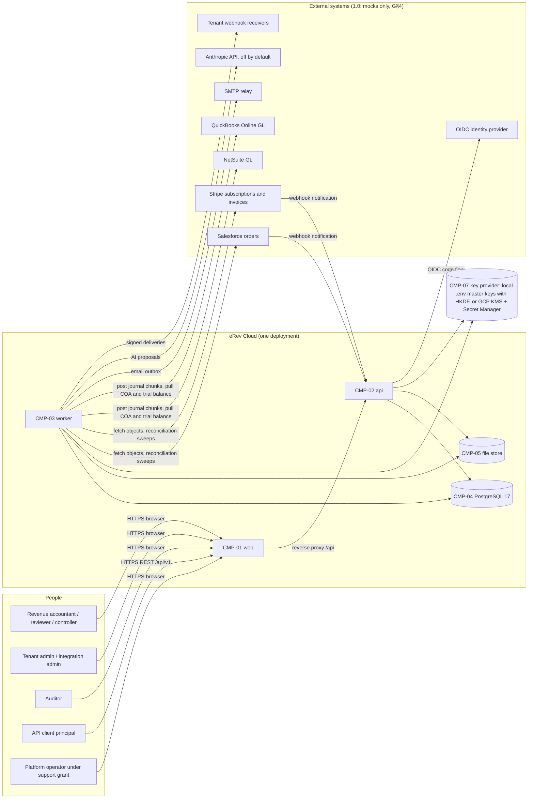

# eRev Cloud: platform architecture

| Field | Value |
|---|---|
| Owner | Principal platform architect (design phase, slug `arch-platform`) |
| Date | 2026-09-12 |
| Revision | 1.215 (2026-10-03, lane SECFIX-PLT, item POLICY-OVERRIDE-WITHDRAW-1 — supervisor ruling R-126 (b) (4) and (c) and the supervisor's rulings of 2026-10-03 on the lane's line; docs first; number assigned by the supervisor, register index 308: RCP-15 — bundle assembly loads no `policy_override`, the list named a table no code read; RCP-17 and the financing rate of §3.6.3 — the approval of an override and the rate it would carry are not delivered in release 1.0, where no override can be created; 04 rev 1.322); 1.214 (2026-10-03, lane SECFIX-CLO, item USAGE-REPORT-PERIOD-ENDED-1 — the supervisor's rulings of 2026-10-03; number assigned by the supervisor, register index 306: PERF-15 — generator version 13: a usage report of the dataset ends its usage period at its own date; version 12 withdrawn with register index 87); 1.213 (2026-10-03, lane SECFIX-APR at the join of lane QA-BE's item READ-SCOPE-BY-PERMISSION-1 — the supervisor's order of 2026-10-03, taken over with the rest of the join; number assigned by the supervisor, register index 301: §5.5 IPL-05 — the job of a tenant-level template runs under the uploader's own entity scope, the union of the entities of a person's roles; the sentence that named "the uploader's own session" is restated, since an API command runs under the scope of its permission; 04 rev 1.319); 1.212 (2026-10-03, lane SECFIX-CLO, item ENG-USAGE-FIXED-SCHEDULE-1 — the item's return behind register index 306, the supervisor's rulings of 2026-10-03; number assigned by the supervisor, register index 87: PERF-15 — generator version 14: a seed stores the fixed fee of every usage obligation as scheduled, with schedule lines to its term end); 1.210 (2026-10-02, lane API-GAPS, item IMPORT-HEADER-CELL-CONFLICT-1; the supervisor's ruling of 2026-10-02 on this lane's pre-build line of IMPORT-VALIDATE-COMMAND-1 — its rule 2 alone, a release blocker: the import stores a value the file contradicts and says nothing — PRODUCT DEFECT; docs first; number assigned by the supervisor, register index 295: §5.5 IPL-04 and IPL-05 — a cell that the rows of one object of a CSV v2 file repeat, or the rows of one line of it, is blank or equal to the first row's, else the later row is refused at that column with `HEADER_VALUE_CONFLICT`; 04 rev 1.310; PRD rev 1.204); 1.209 (2026-10-02, lane F-CLO-B, item CLOSE-PASS-BEHIND-GROUP-1 — PRODUCT DEFECT, a release blocker; the supervisor's ruling of 2026-10-02 17:30 on the lane's measurement; docs first; number assigned by the supervisor, register index 284: RCP-08 — a period-end pass leaves out a group its bundle is behind and the first step does not mark it; 04 rev 1.304); 1.208 (2026-10-02, lane SECFIX-PLT, item COMPUTE-BEHIND-CUTOFF-1 — PRODUCT DEFECT, a release blocker; the supervisor's order of 2026-10-02 19:47 on lane ENG-FX's line; docs first; number assigned by the supervisor, register index 285: RCP-22 — a computation is behind a head that admitted by a later cutoff than its bundle's, the cutoff each computation now stores; 04 rev 1.302, dev-guide rev 1.288); 1.207 (2026-10-02, lane ENG-FX, item COMPUTE-BEHIND-GROUP-1 — PRODUCT DEFECT, release blocker; the supervisor's rulings of 2026-10-02 on the lane's measured finding; docs first; number assigned by the supervisor, register index 279: RCP-22 — the group's lock orders two computations and not what each read, so a computation whose bundle is behind its group is not stored; RCP-17 — a mark is never moved back and outlives a computation whose cutoff precedes it; RCP-20 — what the engine or a crash answers to such a bundle is not stored either; 04 rev 1.298); 1.206 (2026-10-03, lane ENG-FX, item FX-REPUBLISH-DIRTY-1 — PRODUCT DEFECT, release blocker for a multi-currency workspace; supervisor ruling R-116 (b) and the supervisor's rulings of 2026-10-02 on the lane's pre-build line; docs first; numbers and Alembic revision 0128 assigned by the supervisor, register index 277; built by lane ENG-FX and taken over by lane SECFIX-PLT on 2026-10-03: RCP-17 — the approval of an FX rate set version marks the groups its changed rates reach, and a mark may carry a trigger that the computation consuming it without a new event is stored under; RCP-08 — a rate replaced after a run reaches the period-end mark through those groups; RCP-19 — the marked groups are among the dirty groups of a run; 04 rev 1.297; dev-guide rev 1.281); 1.205 (2026-10-02, lane F-SNP, item SBX-COPY-OPEN-INVITATION-1 — PRODUCT DEFECT, a release blocker, the supervisor's rulings of 2026-10-02 on the lane's measurement and on its line; docs first; number assigned by the supervisor, register index 273: SBX-03 — what a copy carries of an open invitation: the membership as an invitation withdrawn before acceptance, its role assignments revoked at the cut; SBX-04 — a backup written before this revision that holds an open invitation is not restorable; 04 rev 1.293, PRD rev 1.201); 1.204 (2026-10-02, lane FIX-D2, item ACT-FLAGS-1, a release blocker — REQ-CON-006, control CTL-005; the supervisor's rulings of 2026-10-02 on lane SECFIX-ACT's measurement and on this lane's pre-build line; supervisor ruling R-66 (4); docs first; number assigned by the supervisor, register index 260: §5.2 ADP-16 and ADP-17 — an order and a subscription state the two terms a booking carries, `Acceptance_Clause__c` and `Side_Letter__c`, the metadata keys `acceptance_clause` and `side_letter`; PERF-15 — the volume seed's generator version 9, the seeded state changes with the item (the supervisor's order of 2026-10-02 at the merge of the item, MANIFEST-BINDING-1); 04 rev 1.287); 1.203 (2026-10-02, lane SECFIX-PLT (item AUTH-BEFORE-BODY-1; the supervisor's acceptance of 2026-10-02 of the lane's pre-build line and of its amendment; docs first; number assigned by the supervisor, register index 257: §2.5 steps 3 and 10 — every body is read after the session is established: the route's session question in front of the body, the identity store's answer kept for the request and for one second of the application clock, the permission after the body is decoded; 04 rev 1.284, dev-guide rev 1.270); 1.202 (2026-10-02, lane ENG-FX, item ENG-COST-READBACK-1 — PRODUCT DEFECT, release blocker; supervisor ruling R-11 of 2026-09-29 as amended on 2026-10-02; number assigned by the supervisor, register index 248: RCP-05 — the subject of a posted amount is the `subject_key` stored on its lines (04 T-SL-04 rev 1.282), which every product writer supplies; a line without one answers the spelling of decision L3-1-Q-32, an FX remeasurement line the group's key); 1.201 (2026-10-02, lane OPS, item INVITE-ACCEPT-SESSION-1 — the fourth place a session is opened, found by the lane's family sweep in its head of register index 188; the supervisor's rulings of 2026-10-02; docs first; number assigned by the supervisor, register index 243: SAR-09 — the acceptance of an invitation looks at an existing person's password a second time, under the identity's row, in the transaction that opens her session, and takes the membership's row before the identity's; a sign-out behind a rotation of the same session is stated as a limit; SAR-27 — `erev idp list`; dev-guide rev 1.267); 1.200 (2026-10-02, lane OPS, item JOB-STALL-COMMIT-RACE-1 — found by the lane on 2026-10-02 with the commit of an import; the supervisor's ruling of 2026-10-02 on the lane's pre-build line; docs first; number assigned by the supervisor, register index 242: JOB-06 — the ten-minute rule stops a `RUNNING` job only while no transaction of the job is open, and the attempt of a stopped job commits nothing afterwards: a unit of work of a job holds the job's advisory lock, is refused at its beginning when the job is no longer its attempt's, and writes its heartbeat on the job's row at its commit; JOB-04 — a heartbeat or a progress write is its attempt's; §5.6 `IMPORT_VALIDATE` and `IMPORT_DIFF`, at the supervisor's join of 2026-10-03 — the holder of an upload's row that a failure hook passes over is never the job's own transaction; §5.6 the rows of the four failure hooks (`IMPORT_VALIDATE` and `IMPORT_DIFF`, `IMPORT_COMMIT`, `SSP_CALCULATOR`), by the supervisor's ruling of 2026-10-03 on the lane's report — what stays when another actor's command holds the record in the instant its job is ended: read per record and stated, not closed; dev-guide rev 1.266, PRD rev 1.191, 03 rev 1.147); 1.199 (2026-10-02, lane QA-BE, item MIGRATION-STATEMENT-TIMEOUT-1, the supervisor's ruling of 2026-10-02 on the lane's measurement; docs first; number assigned by the supervisor, register index 239: TXN-03 — a migration's connection is the one exception to the request's statement timeout: it carries `EREV_MIGRATION_STATEMENT_TIMEOUT_SECONDS` (CFG-29; 1800 s by default) and keeps the 10 s lock timeout, since a revision's statement may run long and its wait for a lock may not; RB-02 — what an operator does with a revision either limit cancels; dev-guide rev 1.264); 1.197 (2026-10-02, lane F-RPS-REG, head R28-READS, supervisor ruling R-28 and the supervisor's rulings of 2026-10-02 on the lane's measurement of its remainder; docs first; number assigned by the supervisor, register index 232: THR-08 — a row that carries no entity and belongs to a contract is read through the contract, or the line, that binds it, and what it names beyond the reader's contracts is counted and not named; 04 rev 1.275); 1.196 (2026-10-02, lane SECFIX-PLT (item SBX-FILE-READ-1 — a PRODUCT DEFECT as measured; the supervisor's ruling of 2026-10-02 on the lane's pre-build line; docs first; number assigned by the supervisor, register index 231: §10 SBX-03 — a copy reads the files it was copied with: the associated data of a stored file names the workspace of its storage key, a row opens its sandbox's source and no other workspace, a foreign key is an integrity fault with a status of its own; §6.4 SAR-07 — the tenant of a stored file's associated data; 04 rev 1.274); 1.195 (2026-10-02, lane FIX-D2, findings F4 and F11 of the independent review of 2026-10-01 with item PIN-WINDOW-APPENDER-1; the supervisor's rulings of 2026-10-01 13:57, R-122 (j) and (l) and of 2026-10-02 02:47; docs first; number assigned by the supervisor, register index 150: §5.6 `IMPORT_COMMIT` and `SYNC_RUN` — a commit, and the apply transaction of a sync run, refused under rule `PERIOD_STATE_MOVED` is run once more in its job; 04 rev 1.229); 1.194 (2026-10-02, lane SECFIX-ACT, item COMBINE-EMPTY-GROUP-DIRTY-1, the supervisor's ruling of 2026-10-01; docs first; number assigned by the supervisor, register index 227: RCP-17 — a group an approved combination leaves without a member is cleared by that command; 04 rev 1.271); 1.193 (2026-10-02, lane API-GAPS, the supervisor's ruling of 2026-10-02 on this lane's measurement; docs first; number assigned by the supervisor, register index 226: §2.6 TXN-03 — every connection of the application starts with `jit=off`, the API's and the worker's alike; a statement whose estimated cost passed `jit_above_cost` was compiled at every execution and lost by ten to forty times; dev-guide rev 1.255); 1.192 (2026-10-02, lane SECFIX-CLO, item EVT-EVIDENCE-1, the supervisor's rulings of 2026-10-02 on the lane's measurement and pre-build line; docs first; number assigned by the supervisor, register index 224: PRV-06 — the evidence of recorded events is an uploaded document a record rests on, erased through an approved request; PERF-15 — the seed's approvals attach the evidence document to the events they append, and the generator version is raised; 04 rev 1.268); 1.191 (2026-10-01, lane SECFIX-ACT, items EST-EVIDENCE-AT-SUBMIT-1 and the constraint's judgement record, the supervisor's rulings of 2026-10-01; docs first; number assigned by the supervisor, register index 173: PERF-15 — the seeding path gives an estimate version its evidence document and a variable-consideration version its reviewed `CONSTRAINT` record; 04 rev 1.241); 1.189 (2026-10-02, lane F-CLO-B, item REC-GEN-LOCK-1, the supervisor's rulings of 2026-10-01 21:41 and 22:52 and of 2026-10-02 00:09 and 01:41 on the lane's pre-build lines, which replace the lock of supervisor ruling R-68 (b); docs first; number assigned by the supervisor, register index 211: §5.6 `RECONCILIATION_GENERATE` — the generation reads the book's ledger chain head plainly and first and records it with the number of documents it read; it takes no lock on the period beyond `FOR SHARE` and waits for no posting; 04 rev 1.259); 1.187 (2026-10-01, lane SECFIX-CLO, item EVT-USAGE-MANUAL-1, the supervisor's rulings of 2026-10-01 and 2026-10-02; docs first; number assigned by the supervisor, register index 167: PERF-15 — a contract-month of the volume dataset that holds a usage report waits for the event reviewer too; generator version 6; 04 rev 1.238); 1.186 (2026-10-02, lane API-GAPS, supervisor ruling R-114 (g) and the supervisor's word of 2026-10-01 on this lane's measurement — one set, the contracting entities; R-41 (5)'s clause on performing and selling entities is replaced, as R-95 already read — PRODUCT DEFECT; docs first; number assigned by the supervisor, register index 204: §5.5 IPL-08 with IPL-05 — the entities an upload names are the ones its rows write for; a performing entity of a line must exist and need not be covered, in the row's finding, in the uploader's cover at submit and commit and in the request's entities alike; 04 rev 1.256); 1.185 (2026-10-02, lane API-GAPS, supervisor rulings R-108 (2), the imports half, and R-105 (2), and the supervisor's rulings of 2026-10-02 on this lane's measurements — PRODUCT DEFECT; docs first; number assigned by the supervisor, register index 203: §5.5 IPL-02, IPL-07 and IPL-10, §5.6 JOB-07 and the execution profiles — a transient database error met by the validation or the commit of an import is no result about the file: the handler stores nothing and lets it through, and the job is settled by its retry policy; a job of the three import kinds that ends FAILED ends its upload through the kind's failure hook when the upload is still in the state the job found it in or in the job's own — the validation and the dry run gain that hook, the commit's takes `APPROVED` too; 04 rev 1.270; PRD rev 1.186); 1.184 (2026-10-01, lane API-GAPS, supervisor ruling R-116 (g) of 2026-09-30 with `fx_rates` as its fourth by the supervisor's word of 2026-10-01 on this lane's measurement — PRODUCT DEFECT of the release-blocker class; docs first; number assigned by the supervisor, register index 202: §5.5 IPL-05 (f) and IPL-10 — in quarantine mode every object a file builds from several rows loads whole or not at all, the bundle, the mapping version, the version of an SSP book and the rate set version as the contract and the legacy SSP version; 04 rev 1.258; PRD rev 1.177); 1.183 (2026-10-01, lane F-CLO-B, item CLO-GROUPS-EMPTY-MEMBER-1, the supervisor's order of 2026-10-01 16:43 and word of 19:14; docs first; number assigned by the supervisor, register index 201: RCP-08 — a step passes over a group that holds a mark of its scope only while the group holds a member; it qualifies the sentence that stands before rev 1.167's and rewrites no landed row; 04 rev 1.255); 1.182 (2026-10-01, lane F-ADM-WEB, item PERF-SEED-LOCK-1; the supervisor's rulings of 2026-10-01 on the lane's pre-build line and its corrections; docs first; number assigned by the supervisor, register index 198: PERF-15 — months 1 to 23 are closed and locked through the commands a person presses, by a preparer, a reviewer and a controller; a contract-month is sent by effective date, which changes an estimate's impact and the steps of its approval; the requests, the waiting requests and the attachments counted under that order; the generator's late events are waived before a lock; the lock of the volume tenant asks no reconciliation; what waits beyond the test scale; the generator's version rises by one; the bulk recompute is not repeated behind a lock; step 5 stores a `STORED_BACKUP` once the seed has confirmed the retention families, and PERF-01, PERF-04 and PERF-11 name that snapshot; a journal run without lines is left as calculated; a sandbox restored from the snapshot holds the locked periods at `closing` until SNP-2b); 1.181 (2026-10-01, lane F-SNP, item SBX-EMPTY-BOOTSTRAP-1 — PRODUCT DEFECT; the supervisor's ruling of 2026-10-01 on the lane's measurement; docs first; number assigned by the supervisor, register index 197: SBX-07 — the requester of an EMPTY sandbox is its bootstrap Tenant Admin, so that member's role requests there are setup grants, as in a provisioned workspace); 1.180 (2026-10-01, lane F-RPS-REG, item NOTIFY-ROLE-HOLDERS-SCOPE-1, the supervisor's ruling of 2026-10-01 on the lane's measurement, answers Q1 to Q3; docs first; number assigned by the supervisor, register index 192: §5.8 NTR-02 — a recipient named by role is resolved against the assignments that cover the event's entity, and all entities for an event of the workspace; PRD rev 1.175); 1.178 (2026-10-01, lane OPS; docs first; number assigned by the supervisor, register index 188: item OPS-IDP-SESSIONS-1 (placed by the supervisor on the lane's report of register index 126, and ruled on the lane's pre-build line on 2026-10-01) — SAR-27: a sign-in in flight when its provider is disabled is refused by a second read of the provider under the identity's row lock, where the row had said that it does not complete; and the command `erev idp end-sessions`, which ends the sessions opened through a disabled provider; 04 rev 1.249, dev-guide rev 1.238; and item SESSION-ROTATION-END-1, found by the lane in this head before its gates and older than the command — SAR-09 and SAR-10: a rotation takes the identity's row and opens a successor only for a session it ended itself, and every act that ends an identity's sessions holds that row, so that no such act is outlived by a rotation under way; and item AUTH-LOCK-ORDER-1 (the supervisor's order of 2026-10-01 on a sign-in refused 409 beside the same member's code step, measured in lane F-CLO-WEB's e2e gate) — the identity's row is locked without its key and before the security event chain's lock, so that two steps of one member's sign-ins no longer end one of them in a deadlock); 1.175 (2026-10-01, lane F-CLO-A, item JRN-EXIT-SETTLE-1, the supervisor's ruling of 2026-10-01 on review finding F9; number assigned by the supervisor, register index 184: §5.2 ADP-12 — an acceptance is an error class of its own, `Accepted`, and the exits of a failed batch wait 15 minutes after a death the ledger did not refuse, with the stated limit; §5.3 ADP-21 — the fault kind `READ_LAG`; 04 rev 1.247); 1.174 (2026-10-01, lane F-CLO-A, item JRN-EXIT-JOB-IDEMPOTENT-1, the supervisor's ruling of 2026-10-01 on review finding F10; number assigned by the supervisor, register index 183: §5.6 — an attempt of `JOURNAL_EXPORT` in mode `CANCEL` or `HAND_OVER` that is run again reads the decision event of its own job id and ends as it records; 04 rev 1.246); 1.173 (2026-10-01, lane F-CLO-A, item JRN-RUN-RETRY-1, the supervisor's ruling of 2026-10-01 on the lane's pre-build line; number assigned by the supervisor, register index 181: §5.6 — `export` on a run with failed batches writes their retry messages, so the `JOURNAL_EXPORT` job without a mode is the run's retry too; 04 rev 1.244); 1.172 (2026-10-01, lane F-RPS-REG, item SCOPE-WORKSPACE-LISTS-1, parts (c2) and (c3), supervisor rulings R-28, R-115 (c) and R-119 (b) and the supervisor's ruling of 2026-10-01 on the parts' pre-build line; docs first; number assigned by the supervisor, register index 180: §6.2 THR-08 — a row that names its own entities is reached through them, and a migration, an access review and a rule's version ask for all entities; 04 rev 1.243); 1.171 (2026-10-02, lane SECFIX-PLT (item FILE-SHRED-DURABLE-ORDER-1; the supervisor's ruling of 2026-10-01 on finding B4 of the independent review of the `EVIDENCE_SHRED` merge 58eba434, and its acceptance of the lane's pre-build line; docs first; number assigned by the supervisor, register index 166: §6.17 PRV-07 b — a shred is decided in the command's transaction and its key destroyed after that commit, by one function on three roads, with the completion recorded; §7.2 OPR-10 — erasure counts from the completion; §7.3 OPR-13 — the order of a destruction; §7.4 OPR-24 — the alert `FILE_SHRED_INCOMPLETE`; §5.7 SCH-16; §2.6 TXN-07 — the sweep is a listed caller of the platform scope; §8.3 DPL-37 — its hosted policy; 04 rev 1.237); 1.169 (2026-10-02, lane FIX-D2, findings F4 and F11 of the independent review of 2026-10-01 with item PIN-WINDOW-APPENDER-1; the supervisor's rulings of 2026-10-01 13:57, R-122 (j) and (l) and of 2026-10-02 02:47 — PRODUCT DEFECTS; docs first; number assigned by the supervisor, register index 150: §3.8 RCP-18 — a command that appends and stores no computation asks the period pin at its end, and a transaction that has posted reads the window rows without waiting; 04 rev 1.229; dev-guide rev 1.218); 1.168 (2026-10-01, lane QA-BE, item MAP-RULE-FOREIGN-1 — PRODUCT DEFECT, release blocker; supervisor ruling of 2026-10-01 on the lane's measurement; docs first; number assigned by the supervisor, register index 148: RCP-15 — of the account mapping version the bundle carries the rules that name no product and no entity or one the bundle holds, and what becomes of a computation stored before); 1.167 (2026-10-01, lane F-CLO-B, items CLO-GATE-RUN-2 and CLO-RUN-START-PIN-1, independent review of 2026-10-01, findings F1, F3, F5, F6 and F8; the supervisor's ruling of 2026-10-01 on the lane's pre-build line; docs first; number assigned by the supervisor, register index 146: RCP-08 — a period-end mark moves forward only by the run of the period it stands at, the first period-end step is refused over a mark before its period, a computation inside a window gives a group without a mark its mark, two sentences the review refuted are corrected, and — second part, the supervisor's ruling of 2026-10-01 15:01 — a mark in a closed period says no more than the closed periods do; PERF-03 — one read more inside a window; §5.6 — the start and the resume of a close run pin the period's state row, and only a period's latest run is resumed; 04 rev 1.228); 1.166 (2026-10-01, lane ENG-FX, item PINP-PERIOD-VALUE-1 — PRODUCT DEFECT, release blocker; supervisor ruling R-121 (e) of 2026-10-01 and the supervisor's rulings of the same day on the lane's measured finding and on its pre-build line; number assigned by the supervisor, register index 143: RCP-15 — the value of a period: each `PERIOD` row of a period-pinned parameter is resolved for the period's own entity at the earlier of `known_at` and the period's last instant in that entity's time zone, among the versions published by `known_at`; a period without a value carries no row; `pinned_refs.registry_version_ids` names every version a row came from; where the stamped value had moved a figure of an earlier period, the next computation posts the difference back; a tenant that migrates dates its policies at the first day of its history, before its first legal entity); 1.165 (2026-10-01, lane OPS; docs first; number assigned by the supervisor, register index 141: item JOB-FAILED-ITEM-1 (supervisor ruling R-121 (n), from finding F-2 of lane ACCT's control inventory; the supervisor's rulings of 2026-10-01 on the lane's pre-build line and on its correction of the item's severity) — JOB-06 and JOB-07: whom a failed job is told to, its exception item and what settles it, and that a failed chain verification raises none; OPR-24: the operator alert `JOB_FAILED`; §5.6: the failure hooks of `IMPORT_COMMIT` and `SSP_CALCULATOR`; DPL-37: the hosted policy on the alert; 03 rev 1.135, 04 rev 1.226, dev-guide rev 1.212); 1.164 (2026-10-01, lane SECFIX-PLT (item FILE-SHRED-SCOPE-1, release blocker; the supervisor's ruling of 2026-10-01 on the independent review of the `EVIDENCE_SHRED` merge 58eba434; docs first; number assigned by the supervisor, register index 140: SBX-08 — a sandbox destroys nothing it shares: `file.shred`, `file.request_shred` and the effect of an `EVIDENCE_SHRED` decision are restricted commands; PRV-07 says so at the command; 04 rev 1.225, dev-guide rev 1.211, PRD rev 1.156; PRV-07 (b), findings B3 and B5 — `file.shred` and `file.request_shred` are bound to the legal entities of the records that reference the file, asked before any refusal names a record; SBX-08, the own-key clause — a sandbox shreds what it stored itself: the three commands are refused for a file whose storage key is not the sandbox's own); 1.163 (2026-10-01, lane F-ADM-WEB, item DEMO-CLOCK-1, supervisor ruling R-116 (k) of 2026-09-30 and the supervisor's messages of 2026-10-01 09:16 and 09:41; docs first; number assigned by the supervisor, register index 133: SCH-05 — the tick opens no period of a demo tenant, and what still serves such a tenant; PRD rev 1.153); 1.162 (2026-10-01, lane OPS; docs first; number assigned by the supervisor, register index 132: item DEPLOY-ALERT-NAMES-1 (supervisor ruling R-121 (n), from lane ACCT's control inventory; the supervisor's ruling of 2026-10-01 for the `outcome` field) — DPL-37: which of the alert policies that read a name of the application fire today, and the names they read; TXN-02 (a correction the supervisor placed with the lane on 2026-10-01) — the readers of the owner URL include the five `erev idp` commands and the preflight of a review database; dev-guide rev 1.206); 1.160 (2026-10-01, lane F-CLO-A, item JRN-RETRY-CLAIMED-1, the supervisor's ruling of 2026-10-01 08:31 on the lane's finding; number assigned by the supervisor, register index 130: §5.4 ADP-32 — the batch's `failed` and its message's `DEAD` are two transactions; a retry writes no message beside one that is not settled; §5.6 — the export job's `result.waiting`; 04 rev 1.221); 1.158 (2026-10-01, lane F-RPS-REG, item SCOPE-WORKSPACE-LISTS-1, supervisor rulings R-28 and R-115 (c) and the supervisor's ruling of 2026-10-01 on the item's pre-build line; docs first; number assigned by the supervisor, register index 128: §6.2 THR-08 — a row without an entity and an act on the workspace need the permission for all entities; THR-20 — an operator's grant is approved by a Tenant Admin of all entities; 04 rev 1.219); 1.157 (2026-10-01, lane API-GAPS, item EXC-IMPORT-SCOPE-1, the supervisor's rulings of 2026-10-01 on lane SECFIX-IMP's measurement and pre-build line and on this lane's reading line; docs first; number assigned by the supervisor, register index 127: §5.5 IPL-05 and IPL-07 — what a finding of an import names; §3.8 RCP-20 — who reads the quarantine of a group of several contracts; 04 rev 1.218); 1.156 (2026-10-01, lane OPS; docs first; number assigned by the supervisor, register index 126: item OPS-IDP-DOMAINS-1 (supervisor ruling R-108 (b) (5), and the supervisor's ruling of 2026-10-01 for `erev idp disable` and `erev idp enable`) — SAR-27: the operator changes a provider's email domains (`erev idp domains`) and takes a provider out of sign-in and puts it back (`erev idp disable`, `erev idp enable`), whose callback then refuses with `LOGIN_FAILED`; THR-05, SAR-40 and DPL-11 follow; item PLATFORM-SCOPE-ALLOWLIST-1 (supervisor ruling R-108 (b) (6)) — TXN-07: the callers of the platform session are stated by scope and held by an architecture test; the doctor's check of the index keys (the supervisor's item and ruling of 2026-10-01: a production check, a warning) — §2.7 and SAR-40: `erev doctor` evaluates the catalogue check of the index keys on a deployed schema as the production check `index-conditions`, a warning; 04 rev 1.217; dev-guide rev 1.200); 1.153 (2026-10-01, lane FIX-D2, item PER-LEGACY-POSTING-PERIOD-1, supervisor ruling R-118 (h); docs first; number assigned by the supervisor, register index 123: RCP-04 — the posting period of a `LEGACY` amount is judged by the LEGACY row and the primary book's row together; SCH-06 — a lock decision defers one re-marking job for each period state it opens; dev-guide rev 1.197; 04 rev 1.214; PRD rev 1.143); 1.147 (2026-10-01, lane SECFIX-APR, item APR-CONTENT-SCOPE-1, a release blocker; the supervisor's rulings of 2026-10-01; docs first; number assigned by the supervisor, register index 117: THR-08 — a record of several entities, which no row policy hides, is listed for a reader who covers one of them and answers its content only to a reader who covers every one; 04 rev 1.208); 1.144 (2026-10-01, lane F-CLO-A, item JR-CLOSED-PERIOD-GUARD-1, supervisor ruling R-97 (7) of 2026-09-30; number assigned by the supervisor, register index 114: §5.6 — the calculation of a journal run takes the coverage key, then the period's state row, and fails by name in a closed period; its two callers, as a fact of 2026-10-01; §5.4 ADP-31 — the line guard before the recount; 04 rev 1.205); 1.143 (2026-10-01, lane F-CLO-A, item JRN-CANCEL-APPROVED-PENDING-1, supervisor ruling R-119 (c) of 2026-10-01; number assigned by the supervisor, register index 113: §5.4 ADP-31 — the cancel of a run is refused after a failed attempt as during a claimed one, and the notification of an error of eRev's own does not say that the ledger rejected a chunk; 04 rev 1.204); 1.139 (2026-10-01, lane OPS, supervisor ruling of 2026-10-01 on R-118 (k); docs first; number assigned by the supervisor, register index 109: SCH-05 — the two reads per tenant are isolated as an opening is, the report counts the tenants with a skipped step, every error event of the tick names the place the exception was raised, and an opening is counted once; dev-guide rev 1.183); 1.137 (2026-10-01, lane SECFIX-APR, item IMP-FLOOR-AMOUNT-1, the reader; supervisor ruling R-109 item d and the supervisor's ruling of 2026-10-01 on the lane's question; docs first; number assigned by the supervisor, register index 107: IPL-07 — the routing of the import's approval reads the stated instances, every instance by itself, and the limit that 04 §16.6 stated has ended; 04 rev 1.198, dev-guide rev 1.181, PRD rev 1.127); 1.133 (2026-10-01, lane SECFIX-CLO part 2, supervisor ruling R-120 (a) of 2026-10-01, BUILD_SPEC CTR-6; docs first; number assigned by the supervisor, register index 103: RCP-18 — the approval of an event submission appends and computes on the command path, a void's too, and takes the share lock of a close window like any other computation; PERF-15 — a contract-month of the volume dataset that holds a manual event is the accountant's request and is appended by the reviewer's approval; 04 rev 1.194); 1.128 (2026-10-01, lane SECFIX-PLT, independent review of the platform security merge a7d63e81, supervisor ruling R-111; docs first; number assigned by the supervisor, register index 98: PRV-01 — `file_upload.original_filename` joins the C3 columns; 04 rev 1.189; SAR-26 — the second step is in the log: `MFA_CHALLENGE_PASSED` for a passed challenge, `MFA_PENDING_DENIED` for a pending session refused with no workspace open; UPL-10 — a content read through the file route is audited; §2.5 step 3, UPL-01, DPL-12 — an upload is authenticated before its body is read, bounded by what the caller may upload, and passed through the proxy unbuffered; SAR-26 — a permission held through an approval delegation that stands makes its member MFA-mandatory); 1.124 (2026-10-01, lane SECFIX-CLO part 2, supervisor ruling R-111 (j) of 2026-09-30, item DQ-RESOLVE-1, with the supervisor's confirmation of 2026-10-01 of the lane's rule for an entity that keeps two books; docs first; number assigned by the supervisor, register index 94: SCH-10 — a monitor run settles the open items no evaluated book of the entity finds any more, with the [J] for an entity whose other book has locked the period; 04 rev 1.185); 1.121 (2026-09-30, lane FIX-D2, supervisor ruling R-116 (h); docs first; number assigned by the supervisor, register index 91: TXN-03 — the transactions of a dataset freeze set `idle_in_transaction_session_timeout` for themselves, the lock decision's two, the close run step's and the sandbox replay's (supervisor ruling R-119 (d) of 2026-10-01); CFG-29 gains `EREV_DATASET_FREEZE_IDLE_SECONDS`; 04 rev 1.182); 1.120 (2026-10-01, lane API-GAPS, item PERF-RLS-INDEX-1, supervisor ruling R-116; docs first; number assigned by the supervisor, register index 90: §2.7 "Index conditions under the policy" — a condition whose operator is not leakproof bounds no index scan of `erev_app`; the check is `erev_api.db.index_conditions.findings` over the catalogue, held by `make test-pg`, and `erev doctor` can run it on a deployed schema (not built; lane OPS); revision 0112 changes index definitions only, the partition lock footprint F is unchanged and R grows by two; a descending list is ordered without `NULLS LAST` for a key that is never NULL; 04 rev 1.181); 1.119 (2026-10-01, lane ENG-FX, items PIN-READBACK-1 (release blocker) and MOD-SSP-OVERRIDE-PREVIEW-1 — PRODUCT DEFECTS; supervisor rulings R-116 (d) of 2026-09-30 and of 2026-10-01 on the lane's measured finding; number assigned by the supervisor, register index 89: RCP-15 — the bundle hands the engine, per obligation and book, the SSP versions an earlier computation priced it from, as POL-070 at obligation scope with the read-back value `{recorded, recorded@<event key>}`: the own pricing from T-CON-11 `ssp_book_version_id`, the weight in each modification from T-CON-07 `pinned_refs.ssp_weights`; the record follows the obligation through a combination, starts at the contract's activation and is read before a version-naming event; a first pricing and a modification computed for the first time select by date, an approved override wins, and an approved `ssp_basis` override reaches the engine by version key; the stated limits as [J]; REL-06 — the first bundle of a group that existed before carries rows its head did not, so its next computation is new and `release prepare` recomputes a head without evidence); 1.116 (2026-09-30, lane F-SNP, supervisor rulings of 2026-09-30 on the SNP-3 and SNP-4 reports, number assigned by the supervisor — register index 86: SAR-09 — the token rotation on a tenant change is that of a change the user asks for; a sandbox reset moves the requester's sessions in place; SBX-08 and NTR-04 — a sandbox reaches no external system: the connection test of an adapter that calls out is a restricted command, item SBX-PROBE-1, and a notification raised in a sandbox is delivered in the app only, item SBX-EMAIL-1); 1.111 (2026-09-30, lane F-CLO-B, item CLO-GATE-RUN-1, supervisor rulings R-114 (b) and R-116 (e) of 2026-09-30; docs first; number assigned by the supervisor, register index 81: RCP-08 — the period-end mark of a contract group, set by a close run's first period-end step and lowered by a computation inside a window through the three passes run dry over its own bundle, and the share lock on the window's period state rows that makes the lock decision wait for such a computation; PERF-03 — four engine runs per computation inside a window; SBX-03 and SBX-04 — the mark travels with the group, and a replayed lock takes the close-run gate from the source lock; 04 rev 1.172); 1.110 (2026-09-30, lane F-CLO-B, BUILD_SPEC CLO-20, supervisor ruling R-114 (a) of 2026-09-30, refining R-112 (a); docs first; number assigned by the supervisor, register index 80: RCP-08 as built for 1.0 — the earlier period's amounts that refuse a step are counted net per contract group, account role and currency; 04 rev 1.171); 1.107 (2026-10-02, lane SECFIX-APR, supervisor ruling R-38 (iii); docs first; number assigned by the supervisor, register index 77: THR-04 and SAR-28 — a new API client's scopes take effect only after a second person's approval, and a client that waits for it answers the token endpoint as an unknown client); 1.106 (2026-10-01, lane OPS, item 6 of supervisor ruling R-108 (b); docs first; number assigned by the supervisor, register index 76: DPL-10 — the `postgres` health check signs in as `erev_app` on `erev` with one statement, so the stack stops before `migrate` when the application role or the database is missing; dev-guide rev 1.150; SCH-05 — as ruled on the lane's question (R-118 (k)), the tick isolates every exception of an opening or a re-deferral outside the 503 set, logged at error level with its class, and only the server's own state ends it; §2.7 — the pool table states the api's and the worker's pools as built (`max_overflow = 10`, `pool_use_lifo`, no `pool_recycle`; Procrastinate `max_size = concurrency + 2`), a document defect the Terraform variables had recorded); 1.102 (2026-09-30, lane F-CLO-B, BUILD_SPEC CLO-20, supervisor rulings R-79 (a) to (e) and R-112 (a); docs first; number assigned by the supervisor, register index 72: RCP-08 (a) — scheduled revenue is posted by the computation and the release step posts what only a period end decides (candidate AD-50); RCP-08 as built for 1.0 — one pass per step, group by group, the period-end amounts of the run's period, a step refused by name over an earlier period end no run has posted (supervisor ruling R-112); PERF-22, PERF-23; 04 rev 1.163); 1.99 (2026-10-01, lane ENG-FX, item PIN-K-COMBINATION-1 — PRODUCT DEFECT; supervisor ruling R-112 (i) of 2026-09-30; number assigned by the supervisor, register index 69: RCP-15 — the first version of a group in a book takes the recorded pin-K values of the latest version of a member's former group — the member with the earliest inception date, then external id, first, and its most recent former group first, the order of the product pins; a parameter those values do not hold resolves at that computation; dev-guide rev 1.143); 1.98 (2026-09-30, lane F-CLO-A, item JRN-FAILED-CANCEL-1, supervisor ruling R-112 (c) of 2026-09-30; number assigned by the supervisor, register index 68: §5.2 ADP-12 — `get_posting` answers the cancel of a failed run and the hand-over of a failed batch; §5.4 ADP-33 — a handed-over batch waits for its acknowledgement as a CSV batch does; §5.6 — `JOURNAL_EXPORT` runs with a `mode`, and a decided refusal is a result, not a raised error; §10 SBX-08 — the hand-over joins the restricted commands; §5.4 ADP-31, ADP-32 — a journal export message never dies beside a batch that is not `failed` (item JRN-DISPATCH-DEAD-1, supervisor rulings R-118 (k) and R-119 (c)); 04 rev 1.159); 1.96 (2026-10-01, lane FIX-D2, the period pin — PRODUCT DEFECT; supervisor rulings R-105 (3) and of 2026-10-01 on the lane's measurement; docs first; number assigned by the supervisor, register index 66: RCP-18 — on the command path a computation that holds an event of its own transaction reads the lock records after the window's rows and is refused when a lock was decided since the transaction began; PRD ERR-72 rev 1.86; 04 rev 1.157); 1.94 (2026-09-30, lane FIX-D2, item CLO-LOCK-LEGACY-1, supervisor rulings R-112 (e) and R-114 (d); docs first; number assigned by the supervisor, register index 64: RCP-15 — the bundle hands the engine, as the LEGACY state of a period, the primary book's state where that state is not postable and the LEGACY row's is; 04 rev 1.155); 1.92 (2026-09-30, lane F-CLO-A, item JE-CSV-FUNCTIONAL-1, supervisor ruling R-110 pending the independent accountant as candidate AD-55; number assigned by the supervisor, register index 62: §5.2 ADP-10 — a batch sent through an ERP adapter is stated in the entity's functional currency with the lines' functional amounts, the transaction currency and amounts as informational members; the sentence for the operator of the ledger; 03 rev 1.68, 04 rev 1.153); 1.90 (2026-09-30, lane SECFIX-PLT, security review of 2026-09-29, finding P3-17 and the lead's finding 5, supervisor rulings R-48 (e), (g) and R-53 (h); docs first; number assigned by the supervisor, register index 60: SAR-13 — the per-address bucket of the login class counts every unauthenticated route of the sign-in surface; SAR-06 — an email without an account is locked out by the same count and answers the same; NTR-04 — a link that carries a secret is composed when the email is sent; KEY-03 — the platform security key also derives the tokens of emailed links; 04 rev 1.151); 1.87 (2026-09-30, lane F-RPS-REG, SECFIX-SCOPE item 1, supervisor ruling R-63 (e) as refined by R-115 (c) of 2026-09-30; docs first; number assigned by the supervisor, register index 57: THR-11 — a grant never exceeds the grantor's own entity scope, a command on a grant or a membership needs the actor's permission for every entity it covers, and a role's definition is changed by an administrator of all entities; 04 rev 1.148); 1.86 (2026-09-30, lane SECFIX-IMP, supervisor rulings R-98 and R-109 on the independent review of merge 4ac6c1d1, item IMP-FLOOR-AMOUNT-1; docs first; number assigned by the supervisor, register index 56: IPL-05 — scope findings first, exact keys, an unresolved reference leaves the upload unresolved, the write-permission scope, quarantine mode loads a contract or an SSP version whole or not at all, an API client's upload is held to its creating token; IPL-07 — the dry run states the instances of each approval with their amounts and evaluates nothing on a computation that did not succeed; IPL-08, IPL-10 — the source file row is locked and a shredded source refused; 04 rev 1.147); 1.84 (2026-09-30, lane F-CLO-A, BUILD_SPEC CLO-15, supervisor rulings R-54 (e) and R-74 (e); number assigned by the supervisor, register index 54: §5.2 ADP-10 — what the NetSuite and QuickBooks Online adapters send; ADP-11 — chunks are cut at calculation and an entry that cannot be cut is refused by name; ADP-12 — a stated `Retry-After` is honoured; §5.3 ADP-22 and ADP-23 — the mock ledgers, documents made in the ERP and the computed trial balance; §5.4 ADP-31 — the connection of a batch is read again at each dispatch, the two messages of a batch whose connection is gone or disabled, and the recount of a batch's lines against its stored count and totals before anything is sent (item JRN-DISPATCH-RECOUNT-1, security finding N2 (a), ruling R-112 (b) (6)); 04 rev 1.145); 1.83 (2026-09-30, lane OPS, the kernel's error mapping — item IDEM-LOCK-CONFLICT-1, a pool timeout, the SCH-05 tick, the outbox row's last error; supervisor rulings R-97 (6), R-103 (c), R-108 (b) and R-112 (d); docs first; number assigned by the supervisor, register index 53: SCH-05 — the tick isolates each period, an opening or a re-deferral of SCH-06 answered `lock-conflict` or `statement-timeout` is logged and left for the next tick and the periods and tenants after it are served; TXN-06 — a command answered a 5xx, 409 `lock-conflict` or 409 `period-closed` leaves no idempotency record; §2.7 — a pool that gives no connection within its wait answers 503 with `Retry-After`, never 409; ADP-31 — `DISPATCHED` clears the message's `last_error`; 04 rev 1.144, dev-guide rev 1.127); 1.82 (2026-09-30, lane QA-BE, items CTR-COMPUTE-CALLER-SCOPE-1 and COMPUTE-TRANSIENT-NOT-FAILURE-1, supervisor rulings R-95, R-97 (5), R-98 (3), R-103 (b) and R-105; docs first; number assigned by the supervisor, register index 52: the computation of a combination group is reader-independent — RCP-18 and new TXN-10: its bundle is read and its outputs are written under the tenant's scope by SYSTEM on behalf of the principal whose command asked for it, wherever it runs, and the settings in force before it are re-issued after it; RCP-20: what a computation stores and what it lets through — a transient database error (a lock wait, a deadlock, a serialization failure, a cancelled statement, resources, the connection, the period guard's refusal) is not stored as a failed computation, it propagates; a deterministic database refusal and a crash stay stored FAILED); 1.81 (2026-09-30, lane SECFIX-IMP, security finding SC-6; supervisor rulings R-49 (a) and R-86 (b), (c), (f); docs first; number assigned by the supervisor: PRV-06 and PRV-07 (b) — an uploaded document that a record rests on is shredded only through an approved `EVIDENCE_SHRED` request, decided by a Controller; every refusal of `file.shred` is audited as `DENIED`); 1.79 (2026-09-30, lane FIX-D2, item CLO-LOCK-OPEN-REDIRTY-1, supervisor rulings R-101 (a) and R-106 (a); docs first; number assigned by the supervisor, register index 49: SCH-06 — the opening a lock decision makes is re-marked by the `PERIOD_OPEN_REDIRTY` job that decision defers; SCH-05 — the tick defers again a job that ended without success; §5.6 — the execution profile gains `PERIOD_OPEN_REDIRTY`, queue `close`, 3 attempts; 04 rev 1.164); 1.73 (2026-09-30, lane F-CLO-B, BUILD_SPEC CLO-19, supervisor ruling R-79; docs first; number assigned by the supervisor, register index 43: RCP-19 — the close-run job computes the chunk of a child no worker has started by its second poll, and children compute at their own record time; JOB-07 — the close-run item is `CLOSE_RUN_FAILED`, raised by the handler's failure hook; 04 rev 1.134); 1.66 (2026-09-30, lane F-CLO-A, BUILD_SPEC CLO-14, supervisor rulings R-32, R-71 and R-75; number assigned by the supervisor, register index 36: §5.2 ADP-12 — how a refused batch becomes `failed`, and the last failed attempt; §5.4 ADP-31 — the handler re-reads the batch under the run and batch row locks before the adapter call, security finding SC-N1; ADP-32 — a stranded claim is taken again, the export completes and the cancel stays refused until then; ADP-33 — the acknowledgement command; §5.9 NTR-10 — the data of the two journal batch events; 04 rev 1.127); 1.64 (2026-09-30, lane F-SNP round 2, supervisor rulings R-43 (d) and R-60, number assigned by the supervisor — register index 34: BUILD_SPEC SNP-3 — SBX-04 a sandbox is provisioned `SUSPENDED` and becomes `ACTIVE` with its summary event, a failed load ends `ARCHIVED`, `blocked_periods` is a member of API-S-Tenant and point-in-time consumers refuse by name; SBX-07 the reset job, its seed snapshot, the successor, the session move and what a tenant that is not `ACTIVE` answers; SBX-02 a job that creates a sandbox provisions its audit key through the worker's authority and a denial is the named refusal `SANDBOX_KEY_PROVISIONING_DENIED`; second line, BUILD_SPEC SNP-4 and security finding SF-1 under ruling R-33: SBX-08 one guard `ensure_production` for every restricted command, a webhook endpoint can be neither created nor activated in a sandbox, no webhook is emitted or delivered from one, and the outbound-adapter activation is refused and audited before the DB-15 trigger); 1.62 (2026-09-30, lane QA-BE, item ENG-CAL-PREBOOK-1, supervisor ruling R-58 (a) and (b); docs first; number assigned by the supervisor, register index 32: RCP-15 states the period range of the bundle — per entity the calendar from the period containing the group's inception date on, preceded by the earlier periods that carry a state for every enabled book the entity keeps; a period before the inception that precedes a kept book's first period is not loaded; engine unchanged); 1.60 (2026-09-30, lane F-CLO-B, BUILD_SPEC CLO-16 and CLO-17, supervisor rulings R-54 (a), (e); number assigned in the package: §5.6 — the execution profile gains `RECONCILIATION_GENERATE`, queue `close`, 2 attempts, lock `recon:<entity>:<book>:<period>:<kind>`, also the job of `attach-trial-balance`; §5.2 — `TrialBalance` gains `lines` and `details`; 04 rev 1.121); 1.54 (2026-09-30, lane F-CLO-A part 0, supervisor ruling R-45 (c); number assigned in the package: SAR-15 — a connection's `base_url` is checked in its static form when saved under production, 04 rev 1.115; the resolving guard is unchanged); 1.53 (2026-09-30, lane OPS round 2, number assigned by the supervisor: lock budget — §2.7 gains the rule `max_locks_per_transaction × (max_connections + max_prepared_transactions) ≥ ⌊0.8 × max_connections⌋ × partition lock footprint + relations`, DPL-10 and DPL-32 set `max_locks_per_transaction = 4096`, SAR-40 gains the production check `lock-budget`, RB-12 names it; security review ruling R-34 — SAR-40 gains `master-keys` and the startup subset (a production api or worker refuses fake email and placeholder or repeated master keys), CFG-17, CFG-18, CFG-26; DPL-11, DPL-13, DPL-14: the owner URL is on `migrate` alone; SAR-09: cookie `Secure` follows `EREV_PUBLIC_ORIGIN`; SAR-20, DPL-40: `Strict-Transport-Security` at the TLS-terminating tier; CFG-20: `/metrics` answers 401 on any malformed bearer; DPL-03: no source map in the web image; NTR-05: STARTTLS against the configured host name; supervisor ruling R-39 — SAR-40: `integration-urls` stays a rollout gate; SAR-15, CFG-18, NTR-05, NTR-13, DPL-13: the operator's opt-in `EREV_SMTP_PRIVATE_RELAY` admits an SMTP relay on a private-use or loopback address and `EREV_SMTP_CA_FILE` names the bundle its certificate is verified against; OPR-12, RB-06: the rehearsal `make restore-drill`; DPL-03, DPL-12, DPL-40: nginx resolves the api upstream when it proxies, not when it starts; supervisor ruling R-53 — SAR-09: `Secure` unless the configured origin is an http loopback origin; supervisor ruling R-37 — SAR-20: `Cross-Origin-Resource-Policy`; R-53 point 4 — DPL-05, DPL-01: `make docker-build` writes its embedded manifest under the run directory and leaves no `release-manifest.json` at the repository root; R-37 point b — SAR-33, DPL-01, DPL-02, DPL-03, DPL-05: images without `pip` and without setuid or setgid files, probed by `make docker-build`; R-37 point c — OPR-20: the `erev` commands log through the pipeline on stderr; R-53 point 6 — SAR-40: operator commands other than `doctor` and `verify` refuse under `production` when the startup subset fails; DPL-10, DPL-16: the role-init script refuses the example's placeholder database passwords and the verification runs generate theirs; R-37 point e — JOB-06: the dead attempt's `doing` task row is inert and documented; R-53 point 5 and item RES-53-COMPUTE-1 — RCP-20: a database that could not do it now is answered 503 and never recorded as a computation result); 1.50 (2026-09-30, lane F-SNP, supervisor ruling R-43, number assigned in the lane package: SBX-04 the stream and the four tables that close a reference cycle with it load as one row-ordered component in one transaction, so an event arrives with the estimate version or manual adjustment it names; SBX-05 the verification compares the MONETARY STATE of the two versions and names the first differing member, the substituted output hash stays for a group's first computation, period attribution is SNP-2b's); 1.49 (2026-09-30, lane SECFIX-CFG, security review finding SN-7, supervisor ruling R-21; number assigned in the lane package, register index 19: RCP-15 — a product recorded in `pinned_refs.products` of the group's latest SUCCEEDED computation is taken from there, with its components and the level-P values of its obligations, and T-REF-20 is read only for a product not recorded yet; a group without a SUCCEEDED computation reads its members' former groups); 1.47 (2026-09-30, lane SECFIX-PLT, security review of 2026-09-29, finding S21 and lead finding 6; supervisor rulings R-33 and R-48 (b) of 2026-09-30; docs first; number assigned in the supervisor's package SECFIX-PLT: §2.5 step 8 and SAR-26 — the second factor is demanded of the session's user by the one dependency every cookie route passes, before any permission: a session that owes enrolment or the challenge reaches only the session read, sign-out and the routes that settle the step; `GET /session` carries the step); 1.46 (2026-09-30, lane SECFIX-IMP, security finding SC-2; supervisor ruling R-29; docs first; number assigned by the supervisor: IPL-05, IPL-07 and IPL-10 — the import runs as SYSTEM on behalf of the uploader WITHIN the uploader's entity scope for the template's write permission; the lane decision L5-1-Q-11 is narrowed; IPL-08 and IPL-09 — the scope is read again at submission, and an import commit never stands in for a stricter approval, ruling R-38 (ii); security finding SC-6, rulings R-30 and R-49 (b): PRV-06 and PRV-07 (b) — a file that is the evidence of a standing record is refused by reference, `FILE_EVIDENCE_HELD`); 1.45 (2026-09-30, lane SECFIX-CLO, number assigned by the supervisor: supervisor ruling R-62 (c), item DQ-WAIVER-STICKY-1 — SCH-10: a finding standing under an approved waiver is not raised again); 1.41 (2026-09-30, lane ENG-FX, ENG-FXREM-RATEPIN-1; docs first; number assigned by the supervisor: RCP-05 — each posted amount carries the distinct rate references stamped on its lines, `PostedAmountInput.rate_refs`, and the aggregate query also groups by `fx_rate_id`; the read-back subject rule of a line without an obligation recorded, with the stage 14 match of posted `FX_REMEASUREMENT` amounts); 1.37 (2026-09-29, lane OPS, number assigned by the supervisor: DPL-16 — `make compose-verify` writes the embedded release manifest of the executed source before the build; DPL-01 names both writers of the manifest the images carry; DPL-12 — `/assets/` is cached for a year only when served, `no-store` otherwise; OPR-21 — a stack trace logged as the message keeps its last 2,000 characters); 1.36 (2026-09-30, lane FIX-E, FLMG-ONBOARDING-METHOD-PIN-1 — supervisor ruling of 2026-09-30 (a product defect of D-31 mode (a)); docs first; number assigned in the FIX-E package: RCP-15 — a POL key at the import-batch level has no registry level; a contract whose stream carries `OPENING_BALANCE_ESTABLISHED` with `reason = LEGACY_MIGRATION` takes POL-210 `onboarding.method = OPENING_BALANCES_AT_CUTOVER` at scope `CONTRACT`, level `C`, derived only from that immutable event); 1.34 (2026-09-29, lane FIX-D1, the sandbox load measured in a lane database for the first time — docs first, number assigned by the supervisor: SBX-04 the load's provision step also writes one `ledger_chain_head` per book, 04 §14.3 rev 1.95; amended in place while unlanded, 2026-09-30 — SBX-05 the verification compares the sandbox's output under the source computation's `input_sha256`, supervisor ruling R-9, with its measured domain; SBX-06 `tenant.snapshot_loaded` is the load's single summary event written after the verification, "the sandbox's first audit event" withdrawn, supervisor ruling R-7); 1.30 (2026-09-22, lane F-SNP, batch-#8 ci returns on the SNP-2 loader — supervisor engineering ruling, Codex review: SBX-04 the copy phase runs under the provisioning platform scope with the sandbox tenant context, the four compensating controls, a P0001 `EREV-…` refusal of the copy phase re-raised as the named `SNAPSHOT_NOT_LOADABLE`); 1.29 (2026-09-22, lane P1, line P1-SCH-06-R1 (Codex production-20260922-0349 §1–§2; supervisor ruling 2026-09-22; number assigned by the supervisor): SCH-06 widened to 04:1937 — the affected groups of every future → open transition, manual or automatic, by POSTING entity (contracting or performing, JET-13): events and schedule lines in the opened period plus the deferred closed origins for which it is the first later postable period; rows 1.27 / 1.28 of the same lane land after this one); 1.28 (2026-09-22, lane P1, line P1-PROBES-1 (worker probe listener, matrix G17; design note ruled 2026-09-22; numbers assigned by the supervisor): OPR-23 — the worker probe listener `/startupz` / `/livez` on `$PORT` or `EREV_WORKER_PROBE_PORT`, status-only bodies, no per-request logging; DPL-31 — the worker services' startup and liveness probe values, Terraform blocks OWED to P3; CFG-32 the variable); 1.27 (2026-09-22, lane P1, line P1-ALERT-1 (RB-08 / RB-12 operator alert delivery; design note ruled 2026-09-21; numbers assigned by the supervisor): OPR-24 operator alerts — three kinds, log / non-durable file / EmailSender-port sinks, values-free fields, no live provider in source; RB-08 / RB-12 name their alert kinds; SCH-02 / SCH-13 raise them; CFG-31 the two variables; SAR-40 the `operator-alerts` doctor check); 1.26 (2026-09-21, lane F-ADM on F-DIN's branch, DIN-12; D-98 candidate 146 amendment 1 Q-A: ADP-01 receiver id `erevw_<tenant hex32>_<connection hex32>`, one 401 for every refusal; number assigned by the supervisor); 1.25 (2026-09-19, lane P6, number assigned by the supervisor at the merge into main: the `erev verify --json` document records an explicit empty head `{last_chain_seq: 0, last_hmac: null}` for a tenant without audit events; an omitted or null head is refused by the restore drill; OPR-11 rev 1.25 sentence); 1.24 (2026-09-19, lane F-DIN amendment after Codex's e5017ac adapter review: §5.2 `control_totals` over the fetched objects; ADP-16 / ADP-17 sweep exhaustion, Stripe recovery through the events feed and the Stripe API scale table; number assigned at the F-DIN-LAND merge, 2026-09-21); 1.23 (2026-09-21, lane P1, line FILES-SHRED-1 (D-98 145 Amendment 2; option (ii) ruled; number assigned by the supervisor): PRV-07 (b) — a shredded `file_object` row keeps its content identity; identical bytes uploaded later for the same tenant and purpose are refused by name, 04 `FILE_SHREDDED` 409 `invalid-transition`, never bound to the shredded row; no fresh row, no deletion, no schedule or control change); 1.21 (2026-09-21, lane P1, D-98 138 Amendment 2 from Codex production-20260921-1816 §2; number assigned by the supervisor: SCH-14 age boundary ruled inclusive — at least 24 hours, ≥ 24 h — and the row's "older than" aligned in place; wording only; F-SNP's unlanded 1.20 is a declared allowed conflict of this revision table); 1.20 (2026-09-21, lane F-SNP SNP-2, D-98 candidate 137 (3)/(4): SBX-04 a refused replay transition is the WARNING `SANDBOX_REPLAY_BLOCKED`, `blocked_periods`, fail-closed equivalence consumers; SBX-05 `derived_mismatches` recorded in the load report, not the export manifest; SBX-06 the load report identity, `derived_mismatches` and `blocked_periods` in `tenant.snapshot_loaded`; in place, amendments 6 / 7: guarded copied rows restored in their initial status and finalized after their dependants, restored memberships equal the source except the DB-02 stamps); 1.19 (2026-09-21, lane F-CTR as deployment owner, Codex production-20260921-0954 §3 next-touch wording; number assigned by the supervisor 03:16: DPL-12 / UPL-01 / log row 1.18 — the API checks the declared envelope before reading, counts received bytes, enforces each file's purpose limit during processing before persistent storage); 1.18 (2026-09-21, lane F-CTR as deployment owner, Codex packet production-20260921-0920 R2: DPL-12 / UPL-01 / §2.5 step 3 upload-limit alignment — nginx admits the largest purpose at the shared upload route, the api enforces per purpose); 1.17 (2026-09-19, supervisor ruling on SPEC-Q-116, lane P2); 1.16 (2026-09-20, lane P1 REL-01 `validation_level`: the author's declaration written only from `VALIDATION_LEVEL`, absent = undeclared PATCH; REL-02 answer-keys full-corpus evidence rule amended in place, REL-COV-1); 1.15 (2026-09-19, lane P5 D-96 integration slices 1 and 1b: REL-03 consumer stamping with the process release, fail-closed unless the remembered environment is dev / test (D-98 60), persisted validation_level, stamping floor, same-version rebuild PENDING (D-98 59)); 1.14 (2026-09-19, lane ENG-C8 docs first, D-98 candidate 19 (supervisor ruling on lane ENG-C8 Q-1, 2026-09-19): RCP-05 `reason_code` grouping member); 1.13 (2026-09-19, lane P8 docs-first amendment for SOP-5: PRV-01 catalogue attributes, `PENDING` entries and coverage tests; 1.12 (2026-09-19, lane P1 production continuation: DPL-01 / DPL-02 name the runtime-stage COPY of release-manifest.json that REL-03 requires — row renumbered from a duplicate 1.6 at COMMIT 19); 1.11 (2026-09-19, D-97 (33) docs lane: DPL-16 compose verification profile undoctored, outside SOP-6 evidence); 1.10 (2026-09-19, supervisor amendment through lane P4's dispatch: SAR-40 named production checks and the release-stamp, key-provider, key-version-pin and recovery-provider checks); 1.9 (2026-09-19, lane ENG-D1 amendment D-94 (3): RCP-08 period-close pass order); 1.8 (2026-09-19, supervisor follow-up amendment D-96 v4: §5.6 execution lock, RCP-28a, RCP-29 per-portion processing, REL-06 preparation release); 1.7 (2026-09-19, supervisor amendment D-96: SOP-3 release replay data contracts — RCP-15, RCP-28, RCP-28a, RCP-29, REL-06, §5.6 REPLAY_VERIFY row, PRV-06); 1.6 (2026-09-19, supervisor amendment D-95: hosted recovery provider — OPR-08, OPR-11, OPR-12, OPR-15, OPR-17, CFG-30, RB-04, RB-06, RB-11); 1.5 (2026-09-19, supervisor amendment: OPR-15 backup identity under FORCE ROW LEVEL SECURITY; RB-04, RB-11); 1.4 (2026-09-18, supervisor amendment D-91; rev pending ENA-2b, END-4b); see the Revision log |
| Status | Binding build contract once accepted by the supervisor. Read-only for the build loop (`docs/01-DECISIONS.md` §0). |
| Precedence | Entities, tables and API surface: `docs/04-DATA_MODEL.md`, then this document (D-§0). Below `docs/00-GOAL.md`, `docs/01-DECISIONS.md`, `docs/03-REQUIREMENTS.md` (priority and scope), `docs/accounting/*` (calculation; `ENGINE_SPEC.md` with `ENGINE_SPEC_B.md`, D-74) and `docs/dev-guide.md` (code structure, kernel contracts, process model, commands, configuration, testing and gates). Where this document names a module path, command, process, variable or test contract and `docs/dev-guide.md` names another, the dev guide wins and the architectural rule stays (B1-008). Enumeration literals, permission codes, problem slugs, and finding and exception codes are cited verbatim from `docs/04-DATA_MODEL.md` §3, T-PLT-11, §15.2 and §15.4 (D-73). Notification triggers, recipients, email defaults and mandatory kinds are `docs/02-PRD.md` §5.4 (B1-013). |
| Closes | M-ARCH-01, M-ARCH-02 (architecture level), M-ARCH-04, M-ARCH-05, C-19 (§12). Contributes to U-05, M-ARCH-09, M-PM-05. |
| Inputs | `docs/00-GOAL.md`; `docs/01-DECISIONS.md` (D-01 to D-71, the §7 amendments D-11a to D-75 and the §8 amendments D-25b, D-76 and D-77); `docs/accounting/ENGINE_SPEC.md` §0.3, §0.9, §4, §8 and §16 and `docs/accounting/ENGINE_SPEC_B.md` §10 to §14 and §17 (rev 1.2); `docs/accounting/answer-keys/_coverage/` (rev 1.2); `docs/reviews/objections-engine-spec-b.md` (rev 1.2); `docs/03-REQUIREMENTS.md` (REQ areas PLT, CLS, JE, DAT, INT, FC, AI, MIG, CTL, SEC, OPS; CTL-001 to CTL-049); `docs/04-DATA_MODEL.md` rev 1.1 (all sections); `docs/accounting/POLICIES.md` rev 1.1 §0, §1, §2.3, ALG-06 to ALG-10; `docs/02-PRD.md` §2, §5.4; `docs/dev-guide.md` rev 1.1; `docs/reviews/B1-consistency.md`; `docs/reviews/B2-fix-fix-dev-guide.md`; `docs/research/99-gaps.md`; research 04 §14-§15, 06 (all), 07 §5-§6, §9-§10; `docs/reviews/objections-*.md` |

## Revision log

Convention (annotation by the docs lane, 2026-09-20, supervisor-approved; no rule change): a revision may span several rows on the same date; rows are identified by revision + date + leading phrase; every revision number in the log has one header entry (a row numbered onto an existing revision without a header entry is a merge defect — the P1 rows were renumbered at COMMIT 19).

| Rev | Date | Change | Source | Sections and ids |
|---|---|---|---|---|
| 1.45 | 2026-09-30 | Lane SECFIX-CLO (number assigned by the supervisor; docs first). SCH-10 states what a monitor run does with a finding it finds again: an open item is counted again; a finding whose latest item was waived by an approved request and whose code, severity and message are unchanged raises nothing (04 T-IMP-05 "Standing waiver", rev 1.106); every other finding raises an item and its notification. The same rule holds wherever the monitors run — before `start-close` and `request-lock` (04 §16.8) and in the close run's `EXCEPTION_CHECK` step. | supervisor ruling R-62 (c) (2026-09-30), item DQ-WAIVER-STICKY-1 | SCH-10 |
| 1.30 | 2026-09-22 | Lane F-SNP, the SNP-2 loader's batch-#8 returns (supervisor engineering ruling, security-relevant, Codex review before code): SBX-04 — the copy phase of a sandbox load runs its transactions under the provisioning platform scope with the sandbox tenant context set inside (the shape the provisioning step uses for the tenant row and the chain head; the scope's second sanctioned use, 04 §14.3 rev 1.85), because the DB-04 insert guard admits a PUBLISHED / TESTED / APPROVED configuration version only there — the copy died at the first PUBLISHED `sod_rule` (LOAD_ORDER 20; `pob_template_version` 14 where templates exist); exactly five guards yield to that scope (the `tenant` INSERT policy, CONFIG_INSERT_GUARD, CONFIG_CHILD_BODY and the two SSP bodies), DB-01 / 02 / 03 / 07 / 08 / 10 / 12 / 15 and every RLS-T / TE / TM policy stay live; compensating controls: LOAD_ORDER carries no `tenant` table and the copy phase inserts only into LOAD_ORDER tables (CPU guard), a copy-phase session cannot write a row of another tenant (DB witness), one PLATFORM_SCOPE_USED security event per copy-phase transaction naming the sandbox and the requester, and a P0001 `EREV-…` refusal of the copy phase is re-raised as the named `SNAPSHOT_NOT_LOADABLE` with the guard's first line as detail (a defect still propagates as a defect). Follow-up SBX-SCOPE-NARROW-1: a dedicated `sandbox_load` scope honoured only by the four DB-04 functions (one migration + the kernel's PLATFORM_SCOPES), after 0071 / 0072. | F-SNP record §14.16, §14.17; 04 1.85 | SBX-04 |
| 1.0 | 2026-09-12 | Initial binding contract | Design phase B1 (`arch-platform`) | all |
| 1.1 | 2026-09-12 | Duplicate upload refused with 409 `duplicate-import` and `errors[0].rule_id = "IMPORT_FILE_DUPLICATE"`; probe status mapping owned by the dev guide; E-40 statuses `DIFFING` and `COMMITTING` cited; `ERROR` and `WARNING` finding severities | B1-002; D-30a; D-73 | §5.5 IPL-01, IPL-05, IPL-07, IPL-10, IPL-12 and rules |
| 1.1 | 2026-09-12 | Process model, PID files, packages, engine purity, SQLAlchemy Core, configuration names, key model, AI signatures and paths, adapters and mock routers, compose services aligned with the dev guide; mock ports withdrawn | B1-008; D-72; D-75 Q8; OQ-ARC-07 (superseded) | §2.1; §2.2 CMP-02, CMP-03, CMP-06 (withdrawn), CMP-07 to CMP-09; §2.3; §2.4 PKG-01 to PKG-08 (PKG-03 withdrawn); §2.5 step 3; §2.8 CFG-01, CFG-11, CFG-12 (withdrawn), CFG-15, CFG-17, CFG-19 (withdrawn), CFG-23, CFG-24, new CFG-26 to CFG-29; §3.2 ENG-02, ENG-04; §3.4, §3.5, §3.10 module names; §5.2 ADP-15; §5.3 ADP-20 to ADP-22; §5.10 AIA-01 to AIA-04, AIA-08, AIA-10; §6.1; §6.5 KEY-03 to KEY-05, KEY-09, SAR-21, SAR-23, SAR-24; §6.14; §7.1; §7.3; §7.4; §8.1 DPL-02, DPL-05; §8.2 DPL-10, DPL-13, DPL-15 (withdrawn), DPL-16; §8.3 DPL-30, DPL-31, DPL-42; also TXN-01, TXN-02; §3.3 STG-01, STG-14, STG-15; PERF-53, PERF-55; SAR-01, SAR-14, SAR-15, SAR-40; OPR-16, OPR-23; RB-02 |
| 1.1 | 2026-09-12 | Eight queues of §5.6 confirmed equal to DG-KRN-JOB-10; retention and delivery rows split; workers consume all queues by default; per-tenant slots and sweeper cadence per the dev-guide kernel | B1-009; D-75 Q5; D-§0 (kernel contracts) | §5.6 JOB-03, JOB-07, profile table; §5.7 SCH-01, SCH-04 |
| 1.1 | 2026-09-12 | Make targets cite dev guide §4: loop targets offline, supervisor targets never run by the loop; `make dev-up`, `make compose-verify`, `make db-reset`, `make perf-seed`, `make release-manifest`, `make backup`; gate evidence under `.run/reports/` | B1-010; D-48a | ARC-13; §2.3; §4.1, §4.2; SAR-17, SAR-43; OPR-15, OPR-17; RB-01, RB-02, RB-05; REL-01, REL-02, REL-04; DPL-05, DPL-16, DPL-42 |
| 1.1 | 2026-09-12 | Performance database: `perf-volume` in `erev`, idempotent `make perf-seed` to month 23 locked with a `SANDBOX_SEED` snapshot; `make perf` measures month 24 in a `perf-run-*` sandbox | D-75 Q7; OQ-ARC-08 | PERF-01, PERF-02, PERF-04, PERF-05, PERF-10, PERF-11, PERF-15, PERF-20, PERF-52; OPR-01, OPR-04 |
| 1.1 | 2026-09-12 | Notification rules renamed `NTR-nn`; triggers, recipients, email defaults and the mandatory kind defer to PRD §5.4; E-69 appended kinds cited; §0.2 collision claim corrected | B1-013; B1-027 | §0.2; §5.8 NTR-01 to NTR-06; §5.9 NTR-10 to NTR-13; CFG-17; KEY-08; JOB-07; §11 |
| 1.1 | 2026-09-12 | Finding and exception codes renamed to 04 §15.4 (table 15.4-S); problem responses per 04 §15.2 and API-C-17 | D-73 | §2.5 step 3; §3.6.1 to §3.6.8; §3.8 RCP-20; §3.9; IPL-12; ADP-02; UPL-02; UPL-06; SBX-05; PRV-07 |
| 1.1 | 2026-09-12 | Account roles and clearing purposes (`CONTRACT_COST_CLEARING`, `COST_OF_REVENUE`, JET-07d `INVENTORY`, JET-01b `UNAPPLIED_CASH`); catch-up and returns notation per POLICIES rev 1.1 (X′_p exact, A′_p posted; N units transferred) | D-14a; D-11a | §3.6.1, §3.6.4, §3.6.7, §3.6.8; EMOD-22 citation |
| 1.1 | 2026-09-12 | OQ-ARC-01 to OQ-ARC-09 closed by D-75; OQ-ARC-10 to OQ-ARC-14 opened | D-75 | §13; SAR-13; §3.6.4; §3.6.7; PRV-07; PRV-09; §7.4 |
| 1.1 | 2026-09-12 | Self-check fixes: pipes inside inline code escaped in three table rows that rendered with extra cells | B2 fix-pass rule (self-check) | SAR-19, SAR-21, PRV-01 |
| 1.2 | 2026-09-12 | Applied: foreign-currency refund liabilities, deposit liabilities and consideration payable are monetary items, remeasured at the closing rate at every period end and at settlement against `FX_GAIN_LOSS` in every book (JET-10d; POL-164 `ASSET_POSITIONS_ENGINE_AR_AND_MONETARY_LIABILITIES`; E-86 `LIABILITY_LAYER_REMEASURED`); the rev 1.1 deposit rule and the OQ-ARC-04 resolution are superseded | D-25b; `ENGINE_SPEC_B:OQ-B-14`, `OQ-B-15` (D-76) | ADO-D09; STG-10; RCP-07; RCP-08; EMOD-14; §3.6.4; §3.6.7; §13 OQ-ARC-04 |
| 1.2 | 2026-09-12 | Applied: contract-cost impairment includes consideration from anticipated renewals and extensions; clawback payload member `cost_adjustment = CLAWBACK` with JET-09f; acceleration cites JET-09e | D-76 (industries D-6; `ENGINE_SPEC_B:OQ-B-11`) | EMOD-16; §3.6.1 |
| 1.2 | 2026-09-12 | Applied: loss provisions are time-driven and posted by the `CLOSE_RELEASE` pass for groups with loss units in scope; computes post only closed-period carries; T-CON-01 `scope_605_35`; `EAC_IAS37` element for IFRS15 costs | D-76 (`ENGINE_SPEC_B:OQ-B-12`, `OQ-B-13`) | RCP-07; RCP-08; §3.6.2 |
| 1.2 | 2026-09-12 | Applied: financing accretion is in the net position; the financed balance is a separate measure; `sfc.discount_rate_basis` gains member `compounding` (`MONTHLY` default, `ANNUAL`); interest posts by cumulative rounding of the exact cumulative interest; CHK-136 re-baselined to `MONTHLY` with an `ANNUAL` row | D-76 (`ENGINE_SPEC_B:OQ-B-09`, `OQ-AK-04`, `OQ-AK-05`, `OQ-AKT-13`, `ENGINE_SPEC:OQ-A-16`; industries D-5) | EMOD-18; §3.6.3; §11 |
| 1.2 | 2026-09-12 | Applied: boundary events per ENGINE_SPEC Table 0.3-A and S01-R-14; boundary trace nodes `<measure>@<global event key>` and catch-up node `catch_up@<global event key>:<obligation key>:-`; prior-period decomposition over every boundary including measure changes; posted amounts grouped by origin period key and posting class | D-76 (`ENGINE_SPEC:OQ-A-03`, `OQ-A-23`; `ENGINE_SPEC_B:OQ-B-19`, `OQ-B-20`) | RCP-01; RCP-05; RCP-24; §3.2; §3.6.8 |
| 1.2 | 2026-09-12 | Applied: performance harness starts `perf-worker-<n>` processes by PID file, runs the PERF-01 step list for every entity and the primary book, keeps DG-PERF-03 as the latency pass criterion and reports the PERF-30 mix | D-76 (`05:OQ-ARC-10`) | §2.3; §2.7; PERF-01, PERF-02, PERF-20, PERF-52; §13 |
| 1.2 | 2026-09-12 | Applied: compose runs `EREV_ENV=production` with `EREV_KEY_PROVIDER=local`; codes `TRACE_TOO_LARGE` and `FORMULA_NO_CACHED_VALUE`; lint contracts for the secrets scan, business-date SQL tokens and web `new Date(`; close-run child jobs exempt from per-tenant slots | D-76 (`05:OQ-ARC-11` to `OQ-ARC-14`) | CFG-01, CFG-11; OPR-06; DPL-13; §3.9; RCP-20; UPL-06; SAR-18; TZ-09; TZ-10; JOB-03; §13 |
| 1.2 | 2026-09-12 | Applied: the fake AI provider is the only provider `Settings` accepts under `test`, `e2e` and `make perf`; loop network use limited to dependency installation in `make setup` | DG-AI-01 alignment (B2 follow-up); D-76 (`dev-guide:DG-OQ-13`) | AIA-02; CFG-14; ARC-13 |
| 1.2 | 2026-09-12 | Applied (mechanical alignment): posted allocations sum to the allocation basis and V1 compares Σ `allocated_amount` with `transaction_price − consideration_payable_amount`; `contract_version` absent from the LEGACY book output | D-76 (`ENGINE_SPEC:OQ-A-04`; `ENGINE_SPEC_B:OQ-B-02`, `OQ-B-16`) | §1.1 attribute 2; §3.2; §3.9 |
| 1.2 | 2026-09-12 | Decisions taken in B3: B3D-ARC-01 to B3D-ARC-08 (table below) | D-77 | as listed |
| 1.3 | 2026-09-12 | Post-B3 residue sweep (slug `doc-residue`; detail in `docs/reviews/B4-doc-residue.md`). Applied: RCP-20 names `TRACE_TOO_LARGE` beside the §3.9 row; TZ-10 names DESIGN_SYSTEM DS-LINT-23 and DG-FE-20; stage-12 wording follows ENGINE_SPEC_B S12-R-19 to S12-R-21 (JET-10d differences at recognition, settlements remeasured to spot, open consideration-payable layers); contract-cost impairment capped at the carrying amount (JET-09c; S11-R-08); financing month count m(a, b) and suspended accretion while expected returns exclude the whole consideration (S04-R-12, S04-R-12a); `expected_returns_amount` ≤ 0 with its memo on Y + E (S04-R-02, S04-R-08); the S3-EX26 acceptance cites key `SFC-S3-EX26-RETURN-RIGHT`; PERF-01 measures two close-run passes because export, acknowledgement and tie-out are observation steps; SCH-05 opens periods with no reason code; `PERIOD_IN_CLOSE` cites 04 T-PLT-17 `flags`; webhook header `X-Erev-Signature`; argon2id parameters of DG-KRN-AUTH-06; `readyz` 503 body; `/metrics` served by the api process only. Verified without change: PERF-01, PERF-02, PERF-20 and the §2.3 perf row no longer defer to the OQ-ARC-10 ruling; UPL-06 already cites `FORMULA_NO_CACHED_VALUE`; AIA-02 and CFG-14 agree with DG-AI-01 and DG-KRN-CFG-02 | ADJUDICATION.md R-COST-03, R-SFC-04, R-SFC-05, R-SGN-01 (`docs/reviews/B4-numeric-residue.md`); BUILD_SPEC BS1-D-07, BS1-D-08, BS1-D-10, BS1-D-36, BS4-D-03, BS4-D-04, BS4-D-16 (D-70); DESIGN_SYSTEM B3-DS03; 04 rev 1.3 | RCP-07; RCP-20; EMOD-14; §3.6.1; §3.6.3; §3.6.4; §3.6.7; PERF-01; §5.5 rules; SCH-05; NTR-11; SAR-08; OPR-23; §7.4; TZ-10; B3D-ARC-07 |
| 1.3 | 2026-09-12 | Decisions taken in the sweep (D-77): (1) SCH-05 writes `reason_code` null with a fixed comment instead of an unpublished literal, because 04 T-REF-07 requires a reason code only for closing → open and closed → reopened, and E-110 stays unchanged. (2) PERF-01 follows BUILD_SPEC BS4-D-16, because the BUILD_SPEC item and the dev-guide harness contract (DG-PERF-02) rank above this document for test contracts (B1-008) | D-77 | SCH-05; PERF-01 |
| 1.4 | 2026-09-18 | Supervisor (D-91; rev pending ENA-2b, END-4b). §3.6.7 EMOD-12: dated 25-7 evaluation triggers and per-obligation posting, STEP1_MET netting | — | §3.6.7 |
| 1.12 | 2026-09-19 | Wording alignment (lane P1, production continuation; renumbered from a duplicate 1.6 by the docs lane at COMMIT 19 — the merge resolver numbered the conflicting row HEAD + 1 instead of above the file maximum): DPL-01 and DPL-02 name the runtime-stage `COPY release-manifest.json /app/release-manifest.json` that REL-03 requires of a production image; `make docker-build` writes the manifest before `docker build` (DG-MK-docker-build); REL-02 names the GATE-BIND-1 `source_binding`, the NOT_RUN consumer rule and the evidence-population NOT_RUN rule | PRODUCTION-CONTINUATION-20260919 §3; `docs/reviews/loop/sprint/P1-release-manifest.md` | DPL-01; DPL-02 |
| 1.5 | 2026-09-19 | Supervisor amendment (lane P6 finding, `docs/reviews/loop/prod/P6-recovery.md` §5.3, §7b, §7c on sprint/l8: under 04 DB-14 `FORCE ROW LEVEL SECURITY` `erev_owner` cannot `pg_dump` or `pg_restore` tenant tables — `pg_dump` refused with "query would be affected by row-level security policy for table \"access_review_campaign\""). OPR-15: was "\| OPR-15 \| Local and self-hosted \| Self-hoster's choice; runbook default daily `pg_dump -Fc` (RB-04) \| n/a \| `make backup` (supervisor target, DG-MK-backup) writes `.data/backups/erev-<UTC timestamp>.dump`, a tarball of `.data/files`, a copy of `.env` with mode 0600 and a manifest of SHA-256 hashes \|" → now "\| OPR-15 \| Local and self-hosted \| Self-hoster's choice; runbook default daily `pg_dump -Fc` (RB-04) run as the DBA-provisioned read-only backup role `erev_backup` (`LOGIN NOSUPERUSER NOCREATEDB NOCREATEROLE NOREPLICATION BYPASSRLS`; `GRANT pg_read_all_data`; `CONNECT` on the database; `EREV_BACKUP_URL`) — never as `erev_owner` or `erev_app`, which `FORCE ROW LEVEL SECURITY` (04 DB-14; the owner holds no policy) bars from dumping or loading tenant rows: `pg_dump` refuses with "query would be affected by row-level security policy", `--enable-row-security` would dump zero rows silently, and `pg_restore` as `erev_owner` fails on the data load. Restore verification runs as an isolated restore-target admin (`EREV_RESTORE_ADMIN_URL`: `BYPASSRLS` with membership of `erev_owner`, or the isolated server's superuser) against an `erev_rv_*` database only; both scripts fail closed when their URL is absent; `check_env --db` requires both under `EREV_ENV=production` and notes their absence in every other environment. Hosted: the `erev_backup` Cloud SQL user is a Terraform variable (lane P3b) and RB-11 documents the provisioning (rev 1.5; lane P6 finding, P6-recovery.md §5.3, §7b, §7c) \| n/a \| `make backup` (supervisor target, DG-MK-backup rev 1.3 on lane P6) writes `.data/backups/erev-<UTC timestamp>.dump`, a tarball of `EREV_FILE_ROOT`, a copy of `.env` with mode 0600, the chain and key-version digests of `erev verify --all-tenants` and a manifest of SHA-256 hashes; `make restore-verify` (DG-MK-restore-verify, lane P6, pending merge) restores a backup into an isolated `erev_rv_*` database as the restore-target admin and verifies it (OPR-11 (3), OPR-12) \|". RB-04: was "\| RB-04 \| Backup and restore, local and hosted (OPR-11, OPR-15) \|" → now "\| RB-04 \| Backup and restore, local and hosted (OPR-11, OPR-15): backup as `erev_backup` (`EREV_BACKUP_URL`), restore verification as the isolated restore-target admin (`EREV_RESTORE_ADMIN_URL`); never as `erev_owner` (rev 1.5) \|". RB-11: was "\| RB-11 \| Who holds `erev_owner`; deployment pipeline identity; no standing human database write access (TB-7) \|" → now "\| RB-11 \| Who holds `erev_owner`; deployment pipeline identity; no standing human database write access (TB-7); provisioning of the backup role `erev_backup` (`CREATE ROLE erev_backup WITH LOGIN NOSUPERUSER NOCREATEDB NOCREATEROLE NOREPLICATION BYPASSRLS`; `GRANT pg_read_all_data TO erev_backup`; `GRANT CONNECT ON DATABASE erev TO erev_backup`) and of the restore-target admin of the isolated `erev_rv_*` database (OPR-15); the recovery drill's container superuser is drill-only (rev 1.5) \|". The same correction to DG-MK-backup rev 1.2 ("as `erev_owner`") is carried by lane P6's dev-guide rev 1.3 on sprint/l8, not by this commit; the `erev_backup` Cloud SQL user variable is a P3 follow-up; TXN-02, RB-02 (migrations as `erev_owner`) and KEY-06 are unchanged | — | Header; revision log; §7.2 OPR-15; §7.7 RB-04, RB-11 |
| 1.6 | 2026-09-19 | Supervisor amendment (D-95; lane P6 `docs/reviews/loop/prod/P6-recovery.md` §7g on sprint/l8, raised from lane P3b's Terraform `google_sql_user erev_backup`: specifying `BYPASSRLS` requires a superuser or an actor already holding `BYPASSRLS`; Cloud SQL customers have no superuser, `cloudsqlsuperuser` carries `CREATEROLE`/`CREATEDB`/`LOGIN` only and membership does not inherit the attribute, so no documented customer path grants `BYPASSRLS` — unestablished, so the design must not depend on it; lane P6 measured `pg_dump` as `erev_owner` refused under `FORCE ROW LEVEL SECURITY`). OPR-08: was "…restore by PITR clone (OPR-11)" → adds "The physical automated backup and PITR is the hosted backup of record: … `pg_dump` cannot be relied on for a complete logical dump there". OPR-11 (3): was "Run `erev doctor` and `erev verify --all-tenants` against the clone: …" → now "Verify the clone under the application roles — `erev migrate` as `erev_owner` (schema identity), then `erev verify --all-tenants` and `erev doctor` as `erev_app`, the identity that also runs `erev restore-applied` in (6): …; no `BYPASSRLS` role is needed". OPR-12: was "an automated job in staging restores the latest production backup into an isolated instance in a separate project, runs step (3) of OPR-11 and records `{backup id, restore duration, verification result}`" → now "an automated restore of the latest production backup, or a PITR instant, into a fresh instance named by the Terraform variable `restore_test_instance` (UI-P6-2) …; the restore test record … binds {backup id or PITR instant, project, instance, operation status, engine/schema/release identity, recovery interval, file generations and key references, tenant inventory, audit anchors, restore duration, verification result, recovery age}". OPR-15: scope "Local and self-hosted" → "Local and self-hosted only"; the rev 1.5 clause "Hosted: the `erev_backup` Cloud SQL user is a Terraform variable (lane P3b) and RB-11 documents the provisioning" is withdrawn and replaced by "This path exists only where a superuser can grant `BYPASSRLS` — self-hosted PostgreSQL and the compose drill — never on Cloud SQL …: hosted production has no `pg_dump` path (OPR-08 backup of record; OPR-12 drill). `EREV_RECOVERY_PROVIDER` (CFG-30) selects the path …"; `make backup` / `make restore-verify` refuse `MANAGED`. OPR-17: adds "`erev_backup` and the restore-target admin are self-hosted identities (OPR-15); hosted production has no logical-dump identity and relies on OPR-08". CFG-30 `EREV_RECOVERY_PROVIDER` ∈ {`NATIVE`, `MANAGED`} added (default from `EREV_KEY_PROVIDER`; contradiction or unknown value is a configuration error). RB-04 split by provider; RB-06 names the `restore_test_instance` clone and the recovery age; RB-11 marks `erev_backup` and the restore-target admin self-hosted-only. Rejected (D-95 (7)): a per-table `FOR SELECT TO erev_backup USING (true)` policy. Lane P6's dev-guide, runbook, `.env.example`, scripts and tests arrive with its merge, not with this commit. Sequencing: lane D1's pending 71e5069 on sprint/l1 (05 RCP-08 period-close pass order, D-94 (3)) also claims rev 1.5 and is renumbered against main at its merge; 1.6 is taken here for OPR-08, OPR-11, OPR-12, OPR-15 and OPR-17 | D-95 | Header; revision log; §2 CFG-30; §7.2 OPR-08, OPR-11, OPR-12, OPR-15, OPR-17; §7.7 RB-04, RB-06, RB-11 |
| 1.7 | 2026-09-19 | Supervisor amendment (D-96 SOP-3 release replay data contracts; draft v3 §7). RCP-15: adds the `computation_evidence` (T-CON-25) capture sentence. RCP-28: was "`REPLAY_VERIFY` recomputes a stored computation from its `pinned_refs`, included events (`stream_heads`) and stored `posted` totals under the running engine and compares `output_sha256`. A mismatch under the same `engine_version` is an integrity incident (RB-09)." → now "`REPLAY_VERIFY` re-executes the stored canonical input bundle of a computation (T-CON-25) under a runtime of the same `engine_version`, writes a `computation_verification` row (T-CON-26) and compares the raw `output_sha256` … a computation without evidence, or of another version, is `UNVERIFIABLE` with a reason, never a match". RCP-28a (new): L0/L1/L2, the candidate input transform and the non-executed `SOURCE_RUNTIME_UNAVAILABLE` / `NO_INPUT_TRANSFORM` outcomes (A), the execution token, orchestration states and terminal-job aggregation (B). RCP-29: appends the population definitions and the frozen-dataset report / T-PLT-46 / T-SL-11 sentence. REL-06: was "PATCH: golden corpus and answer keys only (gates). MINOR: gates plus RCP-29 replay sample; any output difference fails the release. MAJOR: gates plus RCP-29; differences produce an `UPGRADE_VALIDATE` report and need tenant approval before true-ups post" → now the per-tenant, per-level rule with `INCOMPLETE`, `BOOTSTRAP` / `BASELINE` and the process-release pause (C, D). §5.6 `REPLAY_VERIFY` row: lock gains the fan-out form `'verify:release:<validation id>'`. PRV-06: the three new purposes join the encrypted list. Sequencing: rev 1.6 is D-95's (43bdaf2); lane D1's pending 71e5069 (RCP-08, D-94 (3)) and lane P6's 05 rows on sprint/l8 are renumbered against main at their merges | D-96 | Header; revision log; §3.11 RCP-15, RCP-28, RCP-28a, RCP-29; §5.6; §6.17 PRV-06; §7.8 REL-06 |
| 1.8 | 2026-09-19 | Supervisor follow-up amendment (D-96 draft v4 after Codex's v3 review). §5.6 `REPLAY_VERIFY` row: was "`queueing_lock = 'verify:<group id>'` (group child) or `'verify:release:<validation id>'` (fan-out; D-96)" → now the Procrastinate execution `lock` beside the per-job `queueing_lock` plus `pg_advisory_xact_lock('erev.verify:<attempt>:<group>')` in the writing transaction (a queueing lock only deduplicates waiting jobs; installed Procrastinate 3.9.0). RCP-28a (B): the two-primitive serialisation sentence. RCP-29: was "on enablement every group of the tenant enters `release_group_processing` … every upgrade-context posting records `posting_attribution`" → now per group × entity × book portion, MINOR/MAJOR with an accepted attempt only, deferral by S08-R-08's assignment, a group settled only when every portion is, attribution for every posting while a portion is unsettled with the labels `UPGRADE_CONTEXT` / `UPGRADE_ONLY` / `UPGRADE_AND_OTHER_INPUTS`. REL-06: the preparation artifact's own `engine_release` row named by the `BASELINE` row; seeding restricted to MINOR/MAJOR rows with an accepted attempt. Sequencing: lane D1's pending 71e5069 (RCP-08) and lane P6's 05 rows on sprint/l8 are renumbered against main at their merges | D-96 (follow-up) | Header; revision log; §3.11 RCP-28a, RCP-29; §5.6; §7.8 REL-06 |
| 1.13 | 2026-09-19 | Lane P8 docs-first amendment (BUILD_SPEC SOP-5; `docs/reviews/loop/prod/P8-privacy-catalogue.md` on sprint/l16; supervisor acceptance at merge). PRV-01: `erev_api.privacy.CLASSIFICATION` entries carry purpose, retention, erasure handling, recipients and the basis of the class (`SPEC` / `PROPOSED`); `PENDING` entries for 04 tables and columns without a code table at the revision (the 22 later-phase tables, the D-96 tables T-PLT-43 to T-PLT-46, T-CON-25, T-CON-26, T-SL-11, T-PLT-38 `validation_level`, lane P2's T-PLT-06 `hmac_key_id` and `canonical_version`); the coverage test fails in both directions and on an unreconciled landing. No classification, erasure or retention policy is decided: every class not named by this document or 04 is `PROPOSED`. Sequencing: renumbered against main at the merge | lane P8 | Header; revision log; §6.17 PRV-01 |
| 1.15 | 2026-09-19 | Lane P5 (D-96 integration slice 1; record `docs/reviews/loop/prod/P5-integration.md`). REL-03 gains the consumer rule: the four stamping consumers write the process's own release row (`current_release()` via `controls.stamping.process_release_id`), never the latest row of the running engine version; version guard; a process without a stamped release fails closed with `release-mismatch` unless the remembered environment is explicitly `dev` / `test`, where the latest row is the fallback with the `release.stamp_fallback` WARN line (D-98 60: an unknown or unremembered environment is production; the environment is recorded at the entrypoint boundary; `e2e` fails closed by design, no e2e fallback); stamping persists `validation_level` (04 T-PLT-38 rev 1.29) and applies the semver floor against the previous global release for version-changing new rows (D-96 (3); team-lead ruling (5)); restart no check; same-version new build recorded, its T-PLT-43 row starts `PENDING` (D-98 59). Sequencing: renumbered 1.14 → 1.15 against C8's merge | lane P5; D-96 (3); team-lead ruling (5) 2026-09-19 | Header; revision log; §5 REL-03 |
| 1.16 | 2026-09-20 | Lane P1 (supervisor dispatch REL-01 `validation_level`, after P5's request in `docs/reviews/loop/prod/P5-integration.md`; row number confirmed by the supervisor at merge prep). REL-01: the manifest key list gains `validation_level` — the author's declaration (`PATCH` / `MINOR` / `MAJOR`), written only from `make release-manifest VALIDATION_LEVEL=…` through `controls.validation_level.with_validation_level`; absent = undeclared, read as `PATCH` by the consumer (T-PLT-38 default; REL-06 floor); never written implicitly. | Supervisor dispatch 2026-09-20; P5-integration.md "Requests to other lanes"; `docs/reviews/loop/sprint/P1-release-manifest.md` §4.11 | REL-01 |
| 1.10 | 2026-09-19 | Supervisor amendment under the production objective, applied through lane P4's dispatch (2026-09-19 13:35 PDT; source PRODUCTION-LOCAL-DISPATCH-AUDIT-bb6b845 item 3; not a ruling of Ray's; record `docs/reviews/loop/prod/P4-doctor.md` on sprint/l15). SAR-40: the six production conditions become named checks (`email-backend`, `integration-urls`, `cors-origins`, `session-cookie`, `defusedxml`, `partition-window`) with their observation rules stated (loopback or private URL classification; the cookie rule observed through `EREV_PUBLIC_ORIGIN`; a table without a bounded partition fails); the Anthropic warning is `WARN anthropic-key`; four production checks added in the same form: `release-stamp` (REL-03), `key-provider` (CFG-11, CFG-13), `key-version-pin` (KEY-03; `EREV_SECURITY_HMAC_SECRET_VERSION`, lane P2) and `recovery-provider` (CFG-30, D-95; lane P6); fail-closed rule for uncollected observations; `WARN` for settings the build does not define yet; production checks do not run outside `production`. Real database collection, the CLI wiring, REL-07 and `--analyze` stay with the later SOP-6 phases. Sequencing: authored as 1.9 against main 045a212 and renumbered 1.10 on the lane branch (supervisor, 2026-09-19) because main's 1.9 (lane D1 merge) landed first; the header lists 1.10 above 1.8 and the merge inserts main's 1.9 | Supervisor amendment (lane P4 dispatch; PRODUCTION-LOCAL-DISPATCH-AUDIT-bb6b845 item 3); BUILD_SPEC SOP-6 | Header; revision log; §6.18 SAR-40 |
| 1.11 | 2026-09-19 | Docs lane (D-97 (33), P4-Q-3; COMMIT 15). DPL-16: the compose verification profile stays undoctored (no `EREV_DOCTOR_PROFILE=verification` exemption) and outside SOP-6 evidence; SOP-6 evidence is `make doctor` on the production shape through P1's manifest and P4b's collectors. Runbook RB-03 "Production checks" carries the same sentence | D-97 | §8.3 DPL-16; §7.7 RB-03 (runbook) |
| 1.9 | 2026-09-19 | Lane ENG-D1 (D-94 (3), Q-3; lane C7's question). RCP-08: the period-close pass order is `FX_REMEASUREMENT` → `CLOSE_RELEASE` → `NETTING_RECLASS`, each reading the earlier passes as posted; the (a)/(b) listing is not an execution order; the answer-key runner mirrors it (dev-guide DG-AK-58) | — | RCP-08 |
| 1.14 | 2026-09-19 | Lane ENG-C8 (D-98 candidate 19 (supervisor ruling on lane ENG-C8 Q-1, 2026-09-19); docs first). RCP-05: the posted grain gains `reason_code` (the line's `subledger_line.reason_code`, NULL → None) as a grouping member and the aggregate query groups by it, so that stage 14 attributes posted amounts to the S14-R-27 reason variants; `PostedAmountInput.reason_code` (ENGINE_SPEC §0.4 rev 1.16). The DG-ENG-10 step 0.3.0 → 0.4.0 is owed at the next release cut, once (the lane stays at 0.3.0). No approved answer-key figure changes. | — | — |
| 1.17 | 2026-09-19 | Supervisor ruling on SPEC-Q-116 (lane P2): the platform security key version is a deployment pin (`EREV_SECURITY_HMAC_SECRET_VERSION`), required under `production`, verified requested == returned at readiness and worker startup; the readiness `keys` check also reads the chain head for admission, so it depends on the database (OPR-23, provisional; Codex terminal review of 4cba4f0a); `security_event` rows record their key id (04 T-PLT-06 rev 1.42) and verify under it across rotations | Codex review PRODUCTION-P2-SECURITY-PIN-INDEPENDENT-c37b002; lane P2 record | KEY-03; CFG-13; SCH-02; OPR-23 |
| 1.18 | 2026-09-21 | Lane F-CTR as deployment owner (Codex packet production-20260921-0920 R2; docs first). The shipped nginx capped the shared upload route `/api/v1/files` at `26m` while every purpose, `LEGACY_DATABASE` (500 MiB) included, uploads there, and carried upload-sized limits on JSON routes. DPL-12: `501m` for `/api/v1/files` (largest purpose plus the api's multipart envelope), `1m` for the JSON routes `/api/v1/attachments`, `/api/v1/imports`, `/api/v1/migrations`; UPL-01 and §2.5 step 3: nginx admits; the API checks the declared request envelope before reading, counts received bytes, and enforces each file's purpose limit during processing before persistent storage (T-PLT-29 / API-C-17; ASGI envelope, plaintext spool counting, the T-PLT-29 size CHECK unchanged; wording per rev 1.19). Inherited configuration; no deployed instance is claimed. | PRODUCTION-LMG-LEGACY-UPLOAD-LIMIT-4ceabf2c.md (SHA256 9156547d…); lane record `docs/reviews/loop/prod/F-CTR-prep.md` §7 | §2.5 step 3; §6.13 UPL-01; §8.2 DPL-12 |
| 1.19 | 2026-09-21 | Lane F-CTR as deployment owner (Codex production-20260921-0954 §3 next-touch wording; number assigned by the supervisor 03:16). Wording only: DPL-12, UPL-01 and the rev 1.18 log row no longer imply that per-purpose enforcement happens before the body is read; the API checks the declared request envelope before reading, counts received bytes, and enforces each file's purpose limit during processing before persistent storage (the declared-envelope refusal is API-C-17; the counting and purpose enforcement are the upload path of T-PLT-29 / UPL-01). No limit value, route or control changes; `deploy/docker/nginx/default.conf` line 5 comment aligned in the same touch. | PRODUCTION-FCTR-UPLOAD-R2-ALIGNMENT-576ded7b.md (SHA256 a8b92dbe…); lane record `docs/reviews/loop/prod/F-CTR-prep.md` §7 | §6.13 UPL-01; §8.2 DPL-12; revision log row 1.18 |
| 1.20 | 2026-09-21 | Lane F-SNP, SNP-2 sandbox load (D-98 candidate 137, supervisor engineering rulings (3) and (4)): SBX-04 — a period transition or lock the normal close command refuses in the sandbox is the WARNING exception item `SANDBOX_REPLAY_BLOCKED` (04 §15.4-B), the period stays at its last reachable state, the load succeeds, and any consumer requiring point-in-time equivalence (GPB-3 / GK-06 replay) refuses by name while `blocked_periods` is non-empty; SBX-05 — `derived_mismatches` are recorded in the job-written load report (04 E-68 `AUDIT_DIGEST`) that `tenant.snapshot_loaded` references, not in the export manifest, which is not extended; SBX-06 — the audit summary carries the load report id and SHA-256, `derived_mismatches` and `blocked_periods`; in place (D-98 137 amendments 6 and 7): SBX-04 — guarded copied rows (approval graphs, suspended / removed memberships) restored in their initial status and finalized after their dependants; a restored `tenant_membership` row equals the source except `tenant_id`, `updated_at`, `row_version` (the sandbox's DB-02 stamps); a refusal after the membership load applies the held final statuses first. | F-SNP record §14.2, §14.11, §14.13; 04 1.67 | SBX-04, SBX-05, SBX-06 |
| 1.21 | 2026-09-21 | Lane P1 (Codex production-20260921-1816 §2; D-98 138 Amendment 2; number assigned by the supervisor). Wording only: SCH-14 deletes file-store objects "at least 24 hours old (inclusive: age ≥ 24 h by the store object's own timestamp)" — the implementation and its boundary witness use ≥ 24 h and the lane record said "at least", while the row said "older than"; ruled inclusive and aligned in place. No schedule, control, oracle or route change. F-SNP's unlanded 1.20 row is a declared allowed conflict of this revision table. | Codex production-20260921-1816 §2 (D-98 138-A2); lane record `docs/reviews/loop/sprint/P1-release-manifest.md` §4.25 | §SCH row SCH-14; revision header |
| 1.24 | 2026-09-19 | Lane F-DIN (Codex review PRODUCTION-F-DIN-ADAPTERS-INDEPENDENT-e5017ac and the Stripe scale supplement; supervisor rulings DIN-R1 to DIN-R4, DIN-G1; record `docs/reviews/loop/prod/F-DIN-prep.md`; number assigned at the F-DIN-LAND merge, 2026-09-21, provisional 1.12 on the branch before). §5.2 `InboundAdapter.control_totals(objects: Sequence[SourceObject])` — the totals are of the fetched set (notifications carry no amounts; the implementation and the ADP-15 suite already used the fetched objects; the published `ChangePage` parameter was the deviation). ADP-16: the sweep follows `nextRecordsUrl` to exhaustion before the watermark advances; the watermark advances only past a fully consumed `LastModifiedDate`; a budget-stopped sweep resumes from the checkpoint's `sweep_cursor` (T-INT-01 `checkpoint`, additive member; both adapters). ADP-17: the poll cursor advances over the complete consumed event page (events about objects the adapter ignores included); reconciliation recovers changes through the events feed by `created` since the watermark plus the `created`-filtered lists of subscriptions, invoices and credit notes, every list paged to exhaustion before the watermark advances, never from a partial sweep; amounts follow Stripe's API scale table (zero-decimal list, ISK / UGX two-decimal; three-decimal BHD / JOD / KWD / OMR / TND refused `CURRENCY_NOT_ENABLED_FOR_ACCOUNT` until an account-level allowlist admits them), never the ISO exponent alone, and an unlisted currency is refused `Permanent`; the creation-only invoice sweep stays a distinct callable mode beside the default recovery sweep. ADP-12 unchanged: every 5xx is `Transient` (the adapters' status whitelist was the deviation). Text only; no table, API or job change | — | Header; revision log; §5.2 code block; ADP-16; ADP-17 |
| 1.25 | 2026-09-19 | Explicit empty head (supervisor ruling on lane P6 `docs/reviews/loop/prod/P6-recovery.md` §7k): the `erev verify --all-tenants --json` document (`erev-recovery-verify/1`) records a tenant without audit events as `head: {last_chain_seq: 0, last_hmac: null}`; an omitted or null head is refused by the restore drill. Document-contract change; every consumer listed in §7k tolerates it (authored as 1.7 on sprint/l8; 1.25 assigned by the supervisor at the merge into main). | OPR-11 | OPR-11 |
| 1.23 | 2026-09-21 | Lane P1, line FILES-SHRED-1 (D-98 145 Amendment 2; option (ii) ruled; number assigned by the supervisor). PRV-07 (b): one clause — the shredded row keeps its content identity and a later upload of identical bytes for the same tenant and purpose is refused by name (04 `FILE_SHREDDED`, 409 `invalid-transition`) rather than reusing the shredded row. Wording only; no schedule, control, oracle, route or storage-key change. | D-98 145 Amendment 1 (F-CLO read-only finding FILES-SHRED-REUSE-1) and Amendment 2 (P1 design note ruled, option (ii)); lane record `docs/reviews/loop/sprint/P1-release-manifest.md` §4.26 | §6.17 row PRV-07; revision header |
| 1.26 | 2026-09-21 | Lane F-ADM on F-DIN's branch (DIN-12; team-lead's ruling D-98 candidate 146 amendment 1 Q-A; docs first; number assigned by the supervisor 2026-09-21). ADP-01: the webhook receiver's `{connection_id}` is the derived receiver id `erevw_<tenant hex32>_<connection hex32>` (API-R-02 pattern; no column); the route's tenant resolution, ACTIVE / adapter checks, key-ring secret resolution and adapter verification; identifiers not secrets, the signature the authentication; one 401 for every refusal; the notification ids in the job's params. | D-98 candidate 146 amendment 1 (team-lead's engineering ruling); record `docs/reviews/loop/prod/F-DIN-prep.md`; BUILD_SPEC DIN-12 | Header; revision log; §5.1 ADP-01 |
| 1.29 | 2026-09-22 | Lane P1, line P1-SCH-06-R1 (Codex production-20260922-0349 §1–§2; supervisor ruling 2026-09-22; number assigned by the supervisor). SCH-06 was narrower than 04:1937: it named only "groups with events whose effective_date falls in the newly opened period" and only the SCH-05 trigger, while the public opening route re-marked nothing and the T-PLT-46 partial-origin rule requires the opening of a later assignable period to wake earlier deferred origins. The row now names both opening paths, the posting-entity scope (contracting or performing; Codex production-20260922-0403 §1 SCH06-PERFORMING-ENTITY-1) and the population: (a) events and the entity's schedule lines in the opened period; (b) events, posted lines' periods / origin periods and schedule lines in the closed / permanently locked periods of the entity and book for which the opened period is the first later postable one; a future period is not an origin; existing stamps kept; conservative by construction. Wording only; the code change is the same line's next commit. | Codex production-20260922-0349 §1–§2 (source-confirmed at 5d7d7012); supervisor ruling (engineering) 2026-09-22; lane record `docs/reviews/loop/sprint/P1-release-manifest.md` §4.31 | §SCH row SCH-06; revision header |
| 1.27 | 2026-09-22 | Lane P1, line P1-ALERT-1 (RB-08 / RB-12 operator alert delivery; design note ruled 2026-09-21; numbers assigned by the supervisor). New OPR-24 (operator alerts: `SECURITY_CHAIN_VERIFICATION_FAILED`, `AUDIT_CHAIN_VERIFICATION_FAILED`, `PARTITION_WINDOW_NEAR_END`; log, non-durable file-trail and EmailSender-port sinks with per-sink failure isolation; values-free fields; no chat / pager adapter — UI-9 Ray-side). RB-08 and RB-12 name the kinds that trigger them; SCH-02 and SCH-13 raise them (SCH-02's "incident channel" wording replaced); CFG-31 `EREV_OPERATOR_ALERT_EMAIL` / `EREV_OPERATOR_ALERT_DELIVERY`; SAR-40 gains the `operator-alerts` production check (fails when neither variable is set). A `platform_alert` table (alternative B) is deferred. | P1 design note (2026-09-21) ruled by the supervisor (engineering); lane record `docs/reviews/loop/sprint/P1-release-manifest.md` §4.31 | §6 OPR-24 (new), RB-08, RB-12, §SCH SCH-02 / SCH-13, §2 CFG-31 (new), SAR-40; revision header |
| 1.28 | 2026-09-22 | Lane P1, line P1-PROBES-1 (worker probe listener, matrix G17; design note ruled 2026-09-22; numbers assigned by the supervisor). OPR-23: the worker probe listener — `GET`/`HEAD /startupz` (200 once the runtime is built, the KEY-03 key verified and the DG-KRN-AUD-08 admission passed; 503 before), `/livez` (200 while the heartbeat file is fresh, the `--check` rule; 503 otherwise), 404 elsewhere, status-only bodies, no per-request logging, enabled only by `$PORT` / `EREV_WORKER_PROBE_PORT`. DPL-31: startup probe 5 s / 2 s / 36 and liveness probe 15 s / 2 s / 4 on `$PORT` for both worker services; the Terraform probe blocks are OWED to P3. CFG-32 (new). DPL-02's exec HEALTHCHECK unchanged. | P1 design note (2026-09-22) ruled by the supervisor (engineering); readiness matrix G17; lane record `docs/reviews/loop/sprint/P1-release-manifest.md` §4.32 | OPR-23; DPL-31; CFG-32 (new); revision header |
| 1.37 | 2026-09-29 | Lane OPS (number assigned by the supervisor; first run of the supervisor targets and of the compose stack with a Docker daemon on main `cf110ae6`, record `docs/reviews/loop/sprint/OPS.md`). DPL-16: before the build `make compose-verify` writes the embedded release manifest of the executed source at the build root (DG-MK-compose-verify step 2a, dev-guide rev 1.81), because the gate's execution context is a clone without the git-ignored `release-manifest.json` and the Dockerfiles' `COPY` (DPL-01, DPL-02; REL-03) failed there; the verification manifest carries no gate evidence and is never release acceptance. DPL-01: the manifest an image carries is written by `make docker-build` (release images) or by `make compose-verify` (the `erev-*:local` verification images). DPL-12: the `/assets/` location answers the one-year `immutable` `Cache-Control` only with status 200, 206 or 304 and `no-store` otherwise (a 404 for a missing asset carried the one-year header). OPR-21: a stack trace logged as the message keeps its last 2,000 characters instead of its first, so a refused startup names its reason in the api log (a production api that refused a mismatching manifest logged a trace cut before the `ReleaseManifestError` line). | D-99; D-48a; D-47 | DPL-01, DPL-12, DPL-16; OPR-21 |
| 1.34 | 2026-09-29 | Lane FIX-D1, the sandbox load measured in a lane database for the first time (docs first; number assigned by the supervisor): SBX-04 — the load's provision step writes, with the sandbox `tenant` row and its `audit_chain_head`, one `ledger_chain_head` per book at sequence 0 (04 T-SL-03; the 04 §14.3 seed). The table is REGENERATED — the sandbox's own ledger chain starts empty — so no copied dataset brought the rows, and the first posting of the recompute failed for every group. Same transaction and scope as the `tenant` row; nothing else of SBX-04 changes. **Amended in place while unlanded (2026-09-30; supervisor rulings R-7 and R-9 on the lane's questions).** SBX-05: the raw `output_sha256` of the sandbox's recompute can never equal the source's — it covers `input_sha256` (CV-26 (a)), which covers the re-stamped `record_seq` / `recorded_at` and the trigger (CV-25) — so the verification hashes the sandbox's `OutputBundle` with the source computation's stored `input_sha256` in place of its own and compares that with the source version's stored `output_sha256`; nothing else is substituted; the load report names both hashes of each side; an RCP-28a L1 comparison supersedes it when T-CON-25 evidence exists. The row also states the domain the lane measured: arrival stamps change nothing but the input hash (11 of 11 Avenmoor groups, multi-currency included), while a source version written by a second or later computation of its group is a mismatch by the engine's incremental design (18 of 18 pairs) — reported to the supervisor as an open question, no behaviour beyond R-9 changed. SBX-06: `tenant.snapshot_loaded` is the load's single summary event, written after the verification; the order copy → deferred references → periods opened → recompute → period states and locks replayed → verification → summary is stated; every earlier sandbox event is the load's own replay or recompute under the load job's request ids; "the sandbox's first audit event" (wording that predates rev 1.20) is withdrawn. | 04 rev 1.95; supervisor rulings R-7, R-9 | SBX-04, SBX-05, SBX-06 |
| 1.36 | 2026-09-30 | Lane FIX-E, line FLMG-ONBOARDING-METHOD-PIN-1 (supervisor ruling of 2026-09-30 on the measured capture witnesses: a product defect of D-31 mode (a) — without the pin a migrated contract recomputes from inception and the imported balances are ignored; docs first; number assigned in the FIX-E package). RCP-15 gains the import-batch level: the bundle builder resolves POL-210 `onboarding.method = OPENING_BALANCES_AT_CUTOVER` at scope `CONTRACT`, level `C`, for a contract whose own stream carries `OPENING_BALANCE_ESTABLISHED` with `reason = LEGACY_MIGRATION`; the source is that event's key; the value never reads the mutable `migration_batch` row, so a replay resolves the same value; the GROUP-scope registry value is unchanged. Measured before: the registry answered the framework default `RECOMPUTE_FROM_INCEPTION` (`onboarding.method` admits no registry level) and the dry run over PRD WLD-F-15 captured Contract 1 with revenue 0.00 and net position 300.00; ENGINE_SPEC EX-07-A and PRD WLD-X-27 state 295.69 and 4.31 | ENGINE_SPEC §7.1, EX-07-A; POLICIES POL-210; PRD WLD-X-27; D-31 | RCP-15 |
| 1.41 | 2026-09-30 | Lane ENG-FX (ENG-FXREM-RATEPIN-1; docs first; number assigned by the supervisor). RCP-05: each posted amount carries `rate_refs`, the distinct (`rate_key`, `version_key`) of the rates stamped on its summed lines (`subledger_line.fx_rate_id`), an attribute of the row and not a member of the grain; the aggregate query also groups by `fx_rate_id` and the sums are folded back per grain; a line that only reverses posted amounts names those rates and is stamped from the posted line's rate row even when its version has been superseded (ENGINE_SPEC §0.4 rev 1.43; ENGINE_SPEC_B S14-R-28 rev 1.50). The read-back subject rule of a line without an obligation (`<contract>@<entity>`, L3-1-Q-32) is recorded as built, with the stage 14 match of posted `FX_REMEASUREMENT` amounts to `<group>@<entity>` (S14-R-04) and the open item for the other non-contract subjects. No approved answer-key figure changes. | Lane P7 record §4.26; lane ENG-FX | RCP-05 |
| 1.53 | 2026-09-30 | Lane OPS, round 2 (number assigned by the supervisor; the lock budget and the R-34 text were first entered under rev 1.37 and moved here; record `docs/reviews/loop/sprint/OPS.md` §9 onwards). **Lock budget (supervisor addition, 2026-09-30).** §2.7: PostgreSQL's shared lock table was never budgeted — neither the compose server nor the Cloud SQL flags set `max_locks_per_transaction`, so a deployment ran on the default 64 (6,400 nominal slots at 100 connections) while one contract computation holds 2,253 relation locks, one audit-chain verification 1,134 and one revision of the install 4,854 distinct lock objects (measured on the compose PostgreSQL; a default server refused the tenth session holding the 3,094-relation partition footprint with SQLSTATE 53200). New rule: `max_locks_per_transaction × (max_connections + max_prepared_transactions) ≥ ⌊0.8 × max_connections⌋ × F + R` (F the partition lock footprint, R the relations of the database). DPL-10: the compose `postgres` service starts with `max_locks_per_transaction=4096`. DPL-32: the Cloud SQL flag is set from `var.db_max_locks_per_transaction` (default 4096, floor 3072). SAR-40: production check `lock-budget` evaluates the rule on the live settings and catalogue. RB-12 names the check; the runbook gains "PostgreSQL lock table". **Security review of 2026-09-29/30, ruling R-34 (findings SD-1 to SD-7, SF-5).** SAR-40: new production check `master-keys` (CFG-26: under the local provider the three master keys differ and none has fewer than 16 distinct byte values); `email-backend` also fails on `smtp` without host and sender (CFG-18); **startup subset** — the api and the worker evaluate `email-backend` and `master-keys` on their own settings and refuse to start under `production` before any database connection (SD-5: `erev doctor` was advisory; SD-6: the example file's `00…01` keys passed every check). `integration-urls` is deliberately not in the subset: the base URL is tenant data (`PATCH /integrations/{id}` stores any value), so a start that depended on it would let one workspace stop the platform; SAR-15 refuses the destination at call time (reported to the supervisor as a deviation from the wording of R-34 and confirmed by ruling R-39: startup refuses the configuration-only members, `integration-urls` stays a rollout gate, and R-45 (c) assigns the refusal of a non-public base URL at create and update to the integrations lane; SAR-40 names that refusal as the enforcing layer since it reached main with rev 1.54). DPL-11, DPL-13, DPL-14, DPL-16 (SD-1, SD-5, SD-6): the compose api and worker hold `EREV_DB_APP_URL` only and the owner URL is on `migrate` alone; the email backend is `smtp` from `EREV_COMPOSE_SMTP_*`; the example file ships no master key and `make compose-verify` generates the run's. SAR-09 (SD-2) supersedes the rev 1.0 wording: cookie `Secure` exactly when `EREV_PUBLIC_ORIGIN` is `https`, never from the request's Host. SAR-20, DPL-40 (SD-3): `Strict-Transport-Security` from the load balancer's backend services and from an nginx server that terminates TLS, from nothing else. CFG-20 (SD-4): `/metrics` answers 401 on a bearer that is not ASCII (it answered 500). DPL-03 (SF-5): the web image serves no `.map` file. NTR-05, CFG-18 (SD-7): the SMTP client verifies the certificate against the configured host name — it had kept an empty name and could deliver nothing. **Supervisor ruling R-39 (4), 2026-09-30.** SAR-15 applied the rule for tenant-supplied URLs to the operator's own SMTP host, so under `production` no relay on a private or loopback address could be used — one on the compose network included — and a self-hosted stack needed a relay with a public address before its first Tenant Admin could be invited. SAR-15, CFG-18, NTR-13: the opt-in `EREV_SMTP_PRIVATE_RELAY` (default `false`) admits loopback and private-use addresses for the SMTP host alone. CFG-18, NTR-05: `EREV_SMTP_CA_FILE` names the PEM bundle the relay's certificate is verified against; STARTTLS and verification are never relaxed. SAR-40: `email-backend` warns on the opt-in and fails on an unreadable bundle. DPL-13: compose passes both. **`make restore-drill` (the supervisor's addition, 2026-09-30).** OPR-12, RB-06: the NATIVE backup and restore procedure can be rehearsed as one command on a throwaway compose PostgreSQL, with its own record (DG-MK-restore-drill); the restore test of a deployment's own backup is unchanged. **nginx upstream (found while following the runbook, 2026-09-30).** DPL-12: nginx resolved `api` once at start, so an api container recreated by compose on another address left every `/api/` request at 502 until the web container was restarted; DPL-03, DPL-40: for the same reason the web image could not start where nothing is named `api`, which is the hosted web service. The proxy locations now pass to `$erev_api`, resolved per request through the compose network's DNS. **Supervisor ruling R-53 (on the lane's open points, 2026-09-30).** (1) SAR-09, SAR-40: cookie `Secure` fails closed — set unless the configured public origin is an `http` origin on a loopback host; SD-2 as first built followed the scheme alone, which gave an `http` production origin a working cookie in clear. (4) DPL-05, DPL-01: `make docker-build` writes the embedded manifest under the run directory and copies it into its exported context; it neither reads nor writes `release-manifest.json` at the repository root (its manifest step used to leave the file there, and the checkout's next development process refused to start once the schema revision moved). (6) SAR-40: every `erev` command that builds the operator services, except `doctor` and `verify`, evaluates the startup subset under `production` and refuses to run when it fails (`FAIL` lines on stderr, exit 3, before the key ring and any connection); `migrate` is not gated. DPL-10, DPL-16: `deploy/compose/initdb/01-roles.sql` refuses a superuser, `erev_owner` or `erev_app` password that begins `change-me` (the example file's placeholders) before any role exists; `make compose-verify` and `make zap-baseline` generate the three passwords of their run as they generate its master keys. (5) RCP-20 (item RES-53-COMPUTE-1): a computation that raises because the database could not do it at that moment — 04 API-C-05 rev 1.114 — records nothing; the transaction rolls back, the command answers 503 with `Retry-After` and a job attempt is retried by its policy. **Supervisor ruling R-37 (follow-ups of the lane's first report).** (a) SAR-20: `Cross-Origin-Resource-Policy: same-origin` joins the header set of nginx, the api and the Vite preview server (ZAP baseline had reported its absence); `Cross-Origin-Embedder-Policy` is not added. (b) SAR-33, DPL-01, DPL-02, DPL-03, DPL-05: the api and worker runtime stages remove the base interpreter's `pip` and `ensurepip` and clear the setuid and setgid bits of every regular file before they remove the shells; `make docker-build` probes the three built images for both and fails on a finding. (c) OPR-20: the `erev` commands that open a database connection or call domain code install the CFG-22 pipeline with the OPR-21 hygiene on stderr before their first log line; `migrate` and the `db` commands installed none. (e) JOB-06: after the ten-minute rule replaces a dead worker's attempt, that attempt's Procrastinate row stays `doing`; it is inert (no `queueing_lock` effect outside `todo`, no `lock` in use, no platform read outside `job.procrastinate_job_id`) and is documented in the runbook rather than swept. | D-99; D-47; D-48a; D-80; D-95; D-97 (33) | §2.7; §2.8 CFG-17, CFG-18, CFG-20, CFG-26; JOB-06; RCP-20; NTR-05, NTR-13; SAR-09, SAR-15, SAR-20, SAR-33, SAR-40; OPR-12, OPR-20; RB-06, RB-12; DPL-01, DPL-02, DPL-03, DPL-05, DPL-10, DPL-11, DPL-12, DPL-13, DPL-14, DPL-16, DPL-32, DPL-40 |
| 1.54 | 2026-09-30 | Lane F-CLO-A, part 0 (docs first; number assigned in the package). SAR-15: a tenant's `integration_connection.base_url` is checked in its static form at create and update under `production` — `https`, no credentials, a host that is neither a literal non-global address nor a local or single-label name, and no address written in a form other than dotted decimal or IPv6 — as the enforcing layer of the connection-URL rule; the resolving guard at connection time is unchanged. | Supervisor ruling R-45 (c) of 2026-09-30; 04 rev 1.115 | §6.14 SAR-15 |
| 1.50 | 2026-09-30 | Lane F-SNP, slice 2 of FIX-D1 and item SNP-2c (supervisor ruling R-43 on the lane's slice-1 report; number assigned in the lane package; docs first). **SBX-04, the row-ordered component.** `contract_event.estimate_version_id` and `.manual_adjustment_id` are frozen at insert (IM-A) and sit on a cycle — event, estimate version, estimate, obligation, the event that created the obligation — whose every edge is frozen or NOT NULL: no table order and no fixup UPDATE can restore them, and a snapshot holding an `ESTIMATE_CHANGED` event failed at the fixup step (42501; reproduced on the K-06 world). The five tables now load as one unit at `contract_event`'s position in one copy-phase transaction, their rows in one order in which every row follows the rows it names, the events in exactly their source `record_seq` order; `manual_adjustment.applied_event_id` is the one reference of the component left to the fixup step; an inconsistent component is refused `SNAPSHOT_NOT_LOADABLE`. No guard, grant, trigger or migration changes. **SBX-05, what is verified.** The engine is incremental and the sandbox recomputes each group once, so an output hash — raw, substituted or L1 — can equal the source's only for a group the source computed exactly once (finding of slice 1, accepted as measured). The verification becomes a comparison of the monetary state — RCP-28a L2 category M as stored (contract version, balances, obligation versions, schedules and schedule lines), without identity, lineage and the six per-version activity columns of T-CON-11 — naming the first differing member; the substituted-hash comparison of rev 1.34 stays as the stronger check where the source version is its group's first computation; ledger period attribution is stated as not verified (SNP-2b). The dated open paragraph of rev 1.34 is replaced. The ruling lists five activity columns; `catch_up_amount` is the sixth by the same criterion (ENGINE_SPEC Table 0.9-A: the boundary events first included in the version) and was measured to differ by history alone. | 04 rev 1.111; supervisor ruling R-43 | SBX-04, SBX-05 |
| 1.60 | 2026-09-30 | Lane F-CLO-B, BUILD_SPEC CLO-16 (supervisor ruling R-54 (a) of 2026-09-30; docs first; number assigned in the package). §5.6: the execution profile table gains the row `RECONCILIATION_GENERATE` — queue `close`, 2 attempts, lock `recon:<entity>:<book>:<period>:<kind>` held as a transaction advisory lock, statement timeout 600 s — the job of `POST /reconciliations` (04 API-R-40, E-14 rev 1.121; Alembic revision 0095). 26 job kinds. **BUILD_SPEC CLO-17 (same revision; supervisor ruling R-54 (e)).** §5.2: the `TrialBalance` a `GLAdapter.pull_trial_balance` answers gains, additively, `lines` (closing balance per account in the entity's functional currency, debits positive; income statement accounts fiscal year to date) and `details` (the GL documents of the period per account, with the ADP-10 external id of a document this subledger posted) — what the subledger-to-GL reconciliation compares and classifies. §5.6: the `RECONCILIATION_GENERATE` job also runs `attach-trial-balance` (the `TRIAL_BALANCE_PULL` sync run, the pull outside a transaction, the attach). | R-54; 04 rev 1.121 | §5.2 `GLAdapter`; §5.6 execution profile table |
| 1.62 | 2026-09-30 | Lane QA-BE, item ENG-CAL-PREBOOK-1 (supervisor ruling R-58 (a) and (b) of 2026-09-30 on the lane's measured report; docs first; number assigned by the supervisor, register index 32; row appended at the table's tail). **Finding.** Bundle assembly loaded every period of an entity's calendar (`domain/contracts/bundles.py`), while the engine's input is the calendar "from the group's inception through the horizon" (ENGINE_SPEC §0.4 `EntityInput.periods`, CV-12; RCP-03) and the engine refuses a period handed to it without a state for a kept book (CV-13). An entity keeps a book from a first period and has no `period_state` row before it (04 T-REF-03, T-REF-06), so every contract of an entity whose calendar holds periods before its book's first period was quarantined on the calendar's first period: the April-year entity of PRD WLD-P-05 kept from January 2026 (nine periods), a calendar generated a year early (twelve), and every contract of an entity once a second book was kept from a later period. **Applied.** RCP-15 gains the paragraph "Period range": per entity the calendar from the period containing the group's inception date on, preceded by the earlier periods that carry a state for every enabled book the entity keeps; a period before the inception that precedes a kept book's first period is not loaded; the pin-P policy rows follow the loaded periods. The range is a superset of the engine's minimum and equals the whole calendar wherever every kept book starts at the calendar's first period, so no input or output hash of a computation that succeeds today moves; the engine is unchanged. A period from the inception period on that lacks a state for a kept book (a contract that begins before the first period of a book its entity keeps) is loaded and refused by the engine (CV-13, RCP-20): not supported in 1.0 — 04 T-REF-03 rev 1.123 refuses the entity-book command that would create it, and the quarantine names rule, period and book (PRD IMP-75). Measured: a daily ratable contract of 24,000.00 over twelve months posts the same revenue per month, to the cent, on the April-year and the year-early calendars as on a calendar that starts with the book (`backend/tests/domain/contracts/test_prebook_periods.py`). | Supervisor ruling R-58 (a) and (b) of 2026-09-30; ENGINE_SPEC §0.4, CV-12, CV-13; 04 rev 1.123 | §3.8 RCP-15 |
| 1.46 | 2026-09-30 | Lane SECFIX-IMP, security finding SC-2 (supervisor ruling R-29; docs first; number assigned by the supervisor). The import pipeline ran every command as SYSTEM with the import permissions for scope `*` (lane decision L5-1-Q-11, recorded in `domain/imports/diff.py`): its premise — the upload permission and the approval authorise the file — fails under entity-restricted roles, because neither the uploader nor the approver need cover the entities the file names. IPL-05: the named entities are resolved and stored, the cross-file rules read inside the uploader's scope, a row outside it is `IMPORT_ENTITY_NOT_AVAILABLE`. IPL-07: the dry run, `before` included, runs inside that scope. IPL-10: so does the commit, with the scope read when it runs. The scope is the uploader's for the template's write permission; a tenant-level template (no entity named) is unchanged. IPL-08: submission re-reads that scope (403) and never auto-approves an upload whose commit performs an approval by itself. IPL-09 (ruling R-38 (ii)): the approval of such an upload satisfies the underlying subject's own steps or is refused; IPL-07 states what the commit performs, with the routing flags of the file's content. Security finding SC-6 (rulings R-30, R-49 (b)): `file.shred` took only the row's own retention columns into account, which nothing sets, so a Tenant Admin destroyed the source of a committed import and a frozen lock dataset. PRV-06: crypto-shredding does not reach the evidence of a standing record. PRV-07 (b): such a file is refused by reference with `FILE_EVIDENCE_HELD`, over every entity, with a `DENIED` audit event | Security review 2026-09-29 SC-2, SC-6; REQ-PLT-012; REQ-PLT-016; REQ-DAT-001; 04 rev 1.107 | IPL-05, IPL-07, IPL-08, IPL-09, IPL-10; PRV-06, PRV-07 |
| 1.47 | 2026-09-30 | Lane SECFIX-PLT (docs first; number assigned in the supervisor's package). §2.5 step 8: the MFA gate of the request lifecycle is the second factor of the session's user, checked before the route permission, on every route but the session read, sign-out and the step's own routes. SAR-26: the rule is the user's — mandatory through any `ACTIVE` membership's `requires_mfa` permission and for an operator; a confirmed factor is challenged at every sign-in whatever the permissions; the enforcing function is `authenticate_session`; `GET /session` and the sign-in answers carry `mfa_required` and `mfa_enrolment_required`; a verified session owes nothing; bearer tokens are outside the check. As built, the API enforced MFA per `requires_mfa` permission and the enrolment gate was the web client's alone. | Security review of 2026-09-29, finding S21 and lead finding 6; supervisor rulings R-33 and R-48 (b); 03 REQ-PLT-005 rev 1.23; 04 rev 1.108 | §2.5 step 8; §6 SAR-26 |
| 1.47 | 2026-09-30 | Lane SECFIX-PLT, second line (docs first; number assigned in the supervisor's package). THR-10: the delegation mitigation names the session a delegation is created and revoked in — the delegator's, MFA-verified, with a step-up — beside the 90 days and the held permissions. | Security review of 2026-09-29, finding S3; supervisor ruling R-48 (a); PRD rev 1.37 BR-PLT-06, BR-PLT-07; 04 rev 1.108 API-R-09 | §6 THR-10 |
| 1.47 | 2026-09-30 | Lane SECFIX-PLT, third line (docs first; number assigned in the supervisor's package). UPL-20 and THR-13: the formula-injection rule of the exports applies to the text a grid copies to the clipboard — the web client was the one writer of spreadsheet-bound customer text outside the server's neutraliser. | Security review of 2026-09-29, finding P3-5; 03 REQ-SEC-011 rev 1.23 | §6.2 THR-13; §6.13 UPL-20 |
| 1.47 | 2026-09-30 | Lane SECFIX-PLT, fourth line (docs first; number assigned in the supervisor's package). SAR-29 and THR-20: a support grant reads records and no stored file — file content is authorised by purpose and owner (04 T-PLT-29 Read access), where the grant's `audit.read` had opened every file of the tenant. | Security review of 2026-09-29, findings S2 and ST-1; supervisor rulings R-33 and R-48 (c); 04 rev 1.108 | §6.2 THR-20; §6.7 SAR-29 |
| 1.47 | 2026-09-30 | Lane SECFIX-PLT, fifth line (docs first; number assigned in the supervisor's package). THR-05 and SAR-27: an OIDC provider is bound to its email domains at creation, an identity is invited for a provider by the operator, and the callback links and signs in only such an identity under one provider subject. PRV-01: the provider subject is a C3 column. PRV-07 (a): the erasure clears it with the external id. | Security review of 2026-09-29, finding P3-13; supervisor ruling R-48 (d); 03 rev 1.23 REQ-PLT-006; 04 rev 1.108 T-PLT-02, T-PLT-03 | §6.2 THR-05; §6.7 SAR-27; §6.17 PRV-01, PRV-07 |
| 1.47 | 2026-09-30 | Lane SECFIX-PLT, sixth line (docs first; number assigned in the supervisor's package). KEY-09 and ADP-14: a connection's `secret_ref` names a secret of the tenant's own namespace of the secret store, refused at save and not served at resolve otherwise. ADP-01: the webhook receiver enforces a 300-second replay window where the source's signature scheme carries a timestamp. | Security review of 2026-09-29, finding P3-23 and the lead's finding 4; supervisor ruling R-48 (f); 03 rev 1.23 REQ-INT-006; 04 rev 1.108 T-INT-01 | §5.1 ADP-01; §5.2 ADP-14; §6.5 KEY-09 |
| 1.73 | 2026-09-30 | Lane F-CLO-B, BUILD_SPEC CLO-19 (supervisor ruling R-79 of 2026-09-30; docs first; number assigned by the supervisor, register index 43; row appended at the table's tail). RCP-19: a child `CONTRACT_COMPUTE` job still `QUEUED` at the second poll is cancelled and its chunk computed by the close-run job (a deployment whose workers are all held by waiting close runs would otherwise never start a child: the default worker runs four tasks and a tenant four jobs); children compute at their own record time. JOB-07: the item of a failed close run is `CLOSE_RUN_FAILED`, one per entity, book and period, raised by the handler's failure hook and settled by a later successful run. | R-79; 04 rev 1.134 | §3.8 RCP-19; §5.6 JOB-07 |
| 1.66 | 2026-09-30 | Lane F-CLO-A, BUILD_SPEC CLO-14 (docs first; number assigned by the supervisor, register index 36). **ADP-12**: a refused batch reaches `failed` through `exported` inside one transaction, with a `REJECTED` receipt that carries the adapter's message, the exception item `JOURNAL_EXPORT_FAILED` and the CTL-021 execution; the last failed attempt of a `Transient` error is recorded the same way; the retry command writes a new message and its dispatch calls `get_posting` first. **ADP-31** (security finding SC-N1): the handler re-reads the batch under the run and batch row locks between the committed claim and the adapter call, in a transaction of its own; the cancel of the run reads the claim under the same locks and is refused while the claim is live; the due-again state after a `Transient` failure is `FAILED` (decision L6-3-Q-10), as built since CLO-13. **ADP-32**: a stranded claim is taken again by the next relay — it does not return to `PENDING` — which completes the dispatch, the ledger answering `Duplicate` when it already holds the document; the claim refuses the cancel until then, whatever its age (R-75). **ADP-33**: names the acknowledgement command. **NTR-10**: the `data` of `journal_batch.exported` and `journal_batch.acknowledged`, the first kinds the product emits (R-75 (c)). No queue, job profile, schedule or configuration changes. | Supervisor rulings R-32, R-71 and R-75 of 2026-09-30; 04 rev 1.127 | §5.2 ADP-12; §5.4 ADP-31 to ADP-33; §5.9 NTR-10 |
| 1.49 | 2026-09-30 | Lane SECFIX-CFG (security review finding SN-7; supervisor ruling R-21; docs first; number assigned in the lane package, register index 19). RCP-15 gains "Product pins": bundle assembly read the product row on every computation, so an edit of a product reached contracts with posted lines at their next recompute. A product recorded in `pinned_refs.products` of the group's latest SUCCEEDED computation (04 T-CON-07 rev 1.110) is now taken from that computation — its `ProductInput` members, its components and the level-P values of its obligations — and T-REF-20 is read only for a product not recorded yet; the persisting transaction writes the member from the bundle it computed; a group without a SUCCEEDED computation reads its members' former groups. `REPLAY_VERIFY` (RCP-28) re-executes the stored bundle and is unaffected. | Supervisor ruling R-21 (`docs/reviews/loop/prod/RULINGS-2026-09-29.md`); lane SECFIX-CFG | RCP-15; revision header |
| 1.102 | 2026-09-30 | Lane F-CLO-B, BUILD_SPEC CLO-20 (supervisor rulings R-79 (a) to (e) and R-112 (a) of 2026-09-30; docs first; number assigned by the supervisor, register index 72; row appended at the table's tail). RCP-08 (a): the release step selects no schedule line — scheduled revenue, cost amortisation, financing interest and the return-asset movements are posted by the contract's computation in every postable period (lane decision L3-2-Q-15), and the `CLOSE_RELEASE` pass posts the loss provision and the dated 606-10-25-7 releases; K-01's September revenue is posted by the computation (candidate AD-50). RCP-08 "As built for 1.0": one pass per step in the order FX, release, netting; every computed group that touches the entity, group by group in the job's process; one transaction per step with the postings written last; the period-end amounts of the run's period, and a step refused by name when the pass has an amount of an earlier period (supervisor ruling R-112: periods close in order); the reversal with the reclass when the next period is postable; sealed postings only (CLOSE-PASS-TRACE-1). PERF-22 and PERF-23 state the same and name item PERF-CLOSE-FANOUT-1. | R-79; R-112; 04 rev 1.163 | §3.8 RCP-08; §9 PERF-22, PERF-23 |
| 1.64 | 2026-09-30 | Lane F-SNP round 2 (BUILD_SPEC SNP-3; supervisor ruling R-43 (d) on the lane's slice-1 findings and R-60 (c); docs first; number assigned by the supervisor, register index 34). **SBX-04.** (1) A sandbox is provisioned `SUSPENDED` and set `ACTIVE` in the transaction that writes `tenant.snapshot_loaded`; the failure hook of the job sets the sandbox of a failed load `ARCHIVED`. Before this line the tenant was `ACTIVE` from its first row, so a load that failed after the membership dataset left the requester — and every copied member — an openable, half-loaded workspace, and a load in progress could be opened and written to. (2) `blocked_periods` gets the queryable home the rule promised consumers: API-S-Tenant `sandbox_load`, and the named refusal `SANDBOX_PERIODS_BLOCKED` of `sandboxes.require_point_in_time`. **SBX-07.** The rule said what a reset is; this line says how: where the request runs and what it answers in production, that the chosen snapshot is the sandbox's seed, the job's three steps and their order, the successor's name and code, the empty successor, the session move, and the answers of a tenant that is not `ACTIVE` (selection and commands 409 `invalid-transition`; reads and the `GET /me` listing stay). `scenario.scenario_tenant_id` stays owed to FCS: T-FC-01 is a pending table. No migration: `tenant.status` is an updatable column of an IM-M table and E-101 already carries the three values. **SBX-02** (rulings R-43 (d) and R-60 (d)): the load derived the sandbox's audit key locally whatever the key provider, which hosted names a secret that does not exist; a job that creates a tenant now asks the worker's provisioning authority, and the provider's denial is a named refusal of the job rather than an unexpected error. Which hosted identity may create a sandbox's key is a deployment decision (item OPS-SBX-KEY-1); until it is taken a hosted sandbox copy fails closed by that name. | 04 rev 1.125; dev-guide rev 1.108; supervisor rulings R-43 (d), R-60 (d); BUILD_SPEC SNP-3 | SBX-02, SBX-04, SBX-07 |
| 1.64 | 2026-09-30 | Lane F-SNP round 2, second line of rev 1.64 (BUILD_SPEC SNP-4; security finding SF-1 of the review of 2026-09-29 / 30, CONFIRMED P2, supervisor ruling R-33; docs first; a second row under the lane's own number, as 04 rev 1.103 carries three). **SBX-08.** The rule said webhook endpoints "cannot be activated" and that attempts are audited; the product enforced it in the SPA only. Measured (the reviewer's proof, reproduced on this lane's head): in a sandbox `POST /webhook-endpoints` created an ACTIVE endpoint, `PATCH` re-activated one, an event was fanned out as a signed delivery to the endpoint's URL, and no `DENIED` event was written. The rule now names the three layers that each refuse on their own — the command guard, the emission and delivery path, the DB-15 trigger — and says that CREATION is refused too, because an endpoint is created active. It names the one guard, `ensure_production`, that every restricted command calls, and puts the outbound-adapter activation behind it so that the attempt is audited: until this line only the DB-15 trigger refused it, in the command's own transaction, which rolled the evidence back | 04 rev 1.125; supervisor ruling R-33; BUILD_SPEC SNP-4 | SBX-08 |
| 1.79 | 2026-09-30 | Lane FIX-D2, item CLO-LOCK-OPEN-REDIRTY-1 (supervisor rulings R-101 (a) and R-106 (a) of 2026-09-30; docs first; number assigned by the supervisor, register index 49; row appended at the table's tail). SCH-06 named two opening paths and the lock decision is a third (PRD BR-CLS-03): its opening re-marked nothing. SCH-06: the lock decision defers one `PERIOD_OPEN_REDIRTY` job for the opened period state and the handler applies the rule as SYSTEM in its own transaction, idempotently; the opened period's `NO_DIRTY_GROUPS` gate fails by name until a job has succeeded. SCH-05: the tick defers again, once per tick, the job of a period state whose newest job ended `FAILED` or `CANCELLED`. §5.6: the execution profile table gains the row `PERIOD_OPEN_REDIRTY` — queue `close`, 3 attempts, one live job per period state, statement timeout 60 s. 27 job kinds. | R-101 (a); R-106 (a); 04 rev 1.164 | §5.6 execution profile table; §SCH SCH-05, SCH-06 |
| 1.110 | 2026-09-30 | Lane F-CLO-B, BUILD_SPEC CLO-20 (supervisor ruling R-114 (a) of 2026-09-30, refining R-112 (a); docs first; number assigned by the supervisor, register index 80; row appended at the table's tail). RCP-08 "As built for 1.0": the amounts of an earlier period that refuse a close run's period-end step are counted net per contract group, account role and currency, transaction and functional; a set that nets to zero in every role is no unposted period end, so a later period closes over a posted amount the engine emits again with its own reversal (the loss unit of ruling R-11). | R-114 (a); 04 rev 1.171 | §3.8 RCP-08 |
| 1.86 | 2026-09-30 | Lane SECFIX-IMP, the residuals of its part A (independent review of merge 4ac6c1d1; supervisor rulings R-98 and R-109; docs first; number assigned by the supervisor, register index 56; row appended at the table's tail). Part A let a file write outside the uploader's scope where a role only read the other entity (the job was narrowed to the union of the uploader's roles when the rows named no entity, and a key with white space resolved to none), read an upload naming something unknown as tenant-level, committed an import whose source had been shredded before submission, and evaluated a modification's thresholds on a computation that had not succeeded. IPL-05: the scope findings are raised first and the rules that read stored state do not examine a refused row; keys are exact text; a reference that does not resolve leaves the upload unresolved; the job transaction of a template that can name an entity is narrowed to the write-permission scope; a row aggregated into a refused lead row is left out of the fail-closed check; in quarantine mode a contract or an SSP version loads whole or not at all; an API client's upload is held to the narrower of the client's grants and its creating token's scopes. IPL-07: the dry run states, per approval the commit performs, the flags and the functional amount its own request would carry, and nothing is evaluated on a legacy modification whose dry-run computation did not end SUCCEEDED. IPL-08, IPL-10: the source file row is locked and a shredded source refused; submit and cancel answer 404 outside the caller's read scope | Independent review of 2026-09-30 (`secfix-imp-part-a-review-4ac6c1d1`); REQ-PLT-012; REQ-DAT-001; REQ-DAT-008; 04 rev 1.147 | IPL-05, IPL-07, IPL-08, IPL-10 |
| 1.84 | 2026-09-30 | Lane F-CLO-A, BUILD_SPEC CLO-15 (docs first; number assigned by the supervisor, register index 54). **ADP-10**: the members of the journal the NetSuite and QuickBooks Online adapters send, and the read-back that gives the document number and posted date; amounts are transaction-currency amounts, and the amount of a line that has only a functional amount is left open (item JE-CSV-FUNCTIONAL-1). **ADP-11**: chunks are cut when the run is calculated and each is a batch row; the split by contract and the two refusals. **ADP-12**: the wait a 429 or 503 states is honoured by the relay. **ADP-22**, **ADP-23**: the mock ledgers — journals received, documents made in the ERP (packaged fixtures and the `__erp` administration routes), the computed trial balance with its details, fixed balances as a fixture member, and the faults of the journal route (rulings R-54 (e), R-74 (e)). **ADP-31**: the handler reads the batch's connection again at each dispatch; a connection that is gone or not `ACTIVE` is a `Permanent` refusal with one of two messages, which are the adapter's message of a failed batch (PRD IMP-130) and take no PRD number. **ADP-22**: the mocks hold no exchange rates; the QuickBooks Online mock's company keeps one currency. **ADP-31, the recount** (item JRN-DISPATCH-RECOUNT-1; independent security review, finding N2 (a)): before anything is sent the handler counts and totals the chunk's lines again and compares them with the batch's stored `line_count` and totals in both currencies — what the run was approved with; a difference fails the batch by name and nothing is sent. | Supervisor rulings R-54 (e) and R-74 (e) of 2026-09-30 and R-112 (b) (6); 04 rev 1.145; PRD rev 1.74 | §5.2 ADP-10 to ADP-12; §5.3 ADP-22, ADP-23; §5.4 ADP-31 |
| 1.92 | 2026-09-30 | Lane F-CLO-A, item JE-CSV-FUNCTIONAL-1 (supervisor ruling R-110 of 2026-09-30, an accounting ruling pending the independent accountant, candidate AD-55; docs first; number assigned by the supervisor, register index 62). **ADP-10**: a batch sent through an ERP adapter is stated in the entity's functional currency and each line's amount is its functional amount; for a batch of another transaction currency that currency and the lines' transaction amounts travel as informational members (NetSuite custom body and line fields, QuickBooks Online the line's description); nothing is converted, no rounding line is added, a line whose functional amount is nil is sent without an amount, and the run, the batch key and the external ids are unchanged. The row says why a transaction-currency document is not sent (one currency, one rate per document and one amount per line in both journal APIs, read from their documentation and not verified against a live system), states for the operator of the ledger that the accounts eRev posts to carry these balances in the functional currency only and must not be revalued there, and names the point put to the accountant (the contract liability account under ERP billing mode, ruling R-74 (e)). The CSV states both amounts (03 REQ-JE-011 rev 1.68). | Supervisor ruling R-110 of 2026-09-30, pending the independent accountant (candidate AD-55); 03 rev 1.68; 04 rev 1.153 | §5.2 ADP-10 |
| 1.94 | 2026-09-30 | Lane FIX-D2, item CLO-LOCK-LEGACY-1 (supervisor rulings R-97 (2), R-112 (e) and R-114 (d) of 2026-09-30; docs first; number assigned by the supervisor, register index 64; row appended at the table's tail). The LEGACY book has no close of its own, so its period states stayed postable and the engine assigned a LEGACY amount to a period the primary book had locked (measured: 7,700.00 into a closed August). RCP-15 states what bundle assembly hands the engine for such a period: the primary book's state. Bundle data only; the engine and its figures are unchanged. | R-97 (2); R-112 (e); R-114 (d); 04 rev 1.155 | §3.8 RCP-15 |
| 1.90 | 2026-09-30 | Lane SECFIX-PLT (docs first; number assigned by the supervisor, register index 60). SAR-13: the per-address bucket of the login class counts every unauthenticated route of the sign-in surface. SAR-06: an email without an account is locked out by the same count and answers the same. NTR-04: a link that carries a secret is composed when the email is sent; the outbox message names its token by reference. KEY-03: the platform security key also derives the tokens of emailed links. | Security review of 2026-09-29, finding P3-17 and the lead's finding 5; supervisor rulings R-48 (e), (g), R-53 (h); 03 rev 1.66 REQ-PLT-004, REQ-SEC-004; 04 rev 1.151 T-PLT-06, T-PLT-07, T-PLT-42, T-INT-03 | §5.8 NTR-04; §6.5 KEY-03; §6.7 SAR-06; §6.12 SAR-13 |
| 1.83 | 2026-09-30 | Lane OPS, the kernel's error mapping (supervisor rulings R-97 (6), R-103 (c), R-108 (b) and R-112 (d) of 2026-09-30; docs first; number assigned by the supervisor, register index 53; row appended at the table's tail). **SCH-05**: one SQLSTATE 55P03 on a row an opening needed left the periodic's loop and ended the tick for every remaining period and tenant; the tick now isolates each period — the conflict is logged `period_auto_open.lock_conflict`, counted, and the period opens at the next tick; a statement of an opening that PostgreSQL cancels (57014) is isolated in the same way and logged `period_auto_open.statement_timeout`; the later due periods of the same entity and book wait with the period that was left (PRD SM-07) and open in order at the next tick; the re-deferral of a failed `PERIOD_OPEN_REDIRTY` job in the same tick (SCH-06 rev 1.79, on main since the lane's merge of `303f2f47`) is isolated on the same two answers and logged `period_open_redirty.lock_conflict` or `period_open_redirty.statement_timeout`. **TXN-06**: the two 409s whose rule is to submit again leave no idempotency record, like a 5xx. **§2.7**: a pool that gives no connection within its wait is the server's state — 503 with `Retry-After`, never 409. **ADP-31**: a delivered message keeps no `last_error`. 04 rev 1.144, dev-guide rev 1.127, PRD rev 1.73. | Supervisor rulings R-97 (6), R-103 (c), R-108 (b) and R-112 (d) of 2026-09-30; 04 rev 1.144 | §2.6 TXN-06; §2.7; §5.4 ADP-31; §5.7 SCH-05 |
| 1.87 | 2026-09-30 | Lane F-RPS-REG, SECFIX-SCOPE item 1: THR-11 names the three mitigations entity-scoped grants need once they can be created through the product — the grantor's own scope bounds a grant, the actor's scope bounds a command on a grant or a membership, a role's definition is a tenant-wide act (04 rev 1.148) | supervisor ruling R-63 (e) as refined by R-115 (c) of 2026-09-30; docs first; number assigned by the supervisor, register index 57 | THR-11 |
| 1.124 | 2026-10-01 | Lane SECFIX-CLO part 2, item DQ-RESOLVE-1 (supervisor ruling R-111 (j) of 2026-09-30, item DQ-RESOLVE-1, with the supervisor's confirmation of 2026-10-01 of the lane's rule for an entity that keeps two books; docs first; number assigned by the supervisor, register index 94; 04 rev 1.185, PRD rev 1.114; row appended at the table's tail). SCH-10: the sweep's runs — like the runs before start-close and request-lock and in the close run — settle the open data-quality items of their entity and period whose finding no evaluated book of the entity makes any more; [J] the two-book case in which one book has locked the period (nothing is settled there). No schedule, job kind or setting changes. | Supervisor ruling R-111 (j) of 2026-09-30 and the supervisor's confirmation of 2026-10-01; 04 rev 1.185 | §5.7 SCH-10 |
| 1.99 | 2026-10-01 | Lane ENG-FX (item PIN-K-COMBINATION-1 — PRODUCT DEFECT; supervisor ruling R-112 (i) of 2026-09-30; docs first; number assigned by the supervisor, register index 69; row appended at the table's tail). RCP-15 gains "Pin K of a group's first version": Finding (the lane's probe P2 of 2026-09-30): the registry values of pin K are read back from the previous version of the group, and a group formed by an approved combination has none, so its first computation resolved every pin-K parameter at the instant of the combination — an order posted under `ssp.outside_range_point = NEAREST_BOUND` and combined with one activated after a tenant version had taken the parameter to `MIDPOINT` was allocated 96,000.00 / 32,000.00 where the combination alone gives 100,571.43 / 27,428.57. The first version of a group in a book now takes the recorded values of the latest version of a member's former group, in the order of the product pins; a parameter those values do not hold, and every parameter of a group none of whose members was computed in the book before, resolves at the computation. `REPLAY_VERIFY` re-executes the stored bundle and is unaffected. | lane ENG-FX record; supervisor ruling R-112 (i) | §3.8 RCP-15; revision header |
| 1.106 | 2026-10-01 | Lane OPS, item 6 of supervisor ruling R-108 (b) of 2026-09-30 (docs first; number assigned by the supervisor, register index 76; row appended at the table's tail). **DPL-10**: the `postgres` health check was `pg_isready -U erev_owner -d erev`, which answers 0 for any server that accepts connections, whether or not that role and database exist; after a first start that the role-init script refused, the container restarted, reported healthy, and `migrate` was the first to fail. The check now signs in over the container's loopback as `erev_app` on `erev` and runs one statement, so such a container is `unhealthy` and compose starts nothing that depends on it. dev-guide rev 1.150 (DG-RUN-08; and item 5, the build root that `make compose-verify` leaves as it stood). **SCH-05** (supervisor ruling R-118 (k) on the lane's question): the tick isolated two named answers and ended on any other exception, so a defect in one tenant's opening or re-deferral stopped every tenant after it at each run; every exception outside the 503 set is now logged at error level with its class and the tick goes on, as the scheduler fan-out and the sweeper do. **§2.7**: the pool table read `max_overflow = 5` and `pool_recycle = 1800` for the api and Procrastinate `max_size = 4`, SQLAlchemy `pool_size = concurrency + 2` for the worker; the code never had those values, and the Terraform variables recorded the difference. The table states the pools as built; `deploy/terraform/gcp` (`variables.tf`, the comment of `main.tf`, the README) says that it agrees. | Supervisor ruling R-108 (b), item 6, of 2026-09-30 and the supervisor's answer of 2026-10-01; dev-guide rev 1.150 | §2.7 pool table; §5.7 SCH-05; §8.2 DPL-10 |
| 1.139 | 2026-10-01 | Lane OPS, supervisor ruling of 2026-10-01 on R-118 (k), given on the lane's question (docs first; number assigned by the supervisor, register index 109; row appended at the table's tail). **SCH-05**: ruling R-118 (k) isolated an opening and a re-deferral, and the two reads that stand before them per tenant — the due periods, the failed re-marking jobs — still ended the tick for every tenant after the one whose read raised. Each read runs in a session of its own; a read that raises anything but the server's own state is logged at error level with the tenant (`period_auto_open.read_failed`, `period_open_redirty.read_failed`), its step is skipped for that tenant and the report counts the tenant (`tenants_skipped`). The read of the due periods computes each entity's local date from `legal_entity.time_zone`, whose domain holds the shape of a zone name (04 TY-10) while the API holds it to the zone database: a row written past the API can name a zone the worker does not know. The tick's error events name the place the exception was raised (`error_at`), as the fan-out's and the sweeper's do since dev-guide rev 1.183. An opening is counted once. | The supervisor's rulings of 2026-10-01 on the lane's report of ruling R-118 (k) (the per-tenant reads; the place of the exception; the count); dev-guide rev 1.183 | §5.7 SCH-05 |
| 1.120 | 2026-10-01 | Lane API-GAPS, item PERF-RLS-INDEX-1 (docs first; number assigned by the supervisor, register index 90; row appended at the table's tail). §2.7 gains "Index conditions under the policy" beside the lock budget: what a row-level-security policy keeps out of an index condition, that the check reads the catalogue (`erev_api.db.index_conditions.findings` with its closed list, held by `make test-pg`) and not the running system, that `erev doctor` can run the same function on a deployed schema (not built; lane OPS), that revision 0112 leaves the partition lock footprint F as it is and adds two relations to R, and that a descending list is ordered without `NULLS LAST` for a key that is never NULL. No component, port, setting or deployment object changes. | Supervisor ruling R-116 on the lane's design note G-7; 04 rev 1.181 NC-20, §1.4; dev-guide rev 1.164 | §2.7 |
| 1.121 | 2026-09-30 | Lane FIX-D2 (supervisor ruling R-116 (h) of 2026-09-30; docs first; number assigned by the supervisor, register index 91; row appended at the table's tail). PRODUCT DEFECT of the lock decision's two-connection form (04 rev 1.140): the decision's own connection is idle in its transaction while a dataset is produced on the SYSTEM reader's, and the connection default of 60 s (TXN-03) ended the decision's session when a dataset took longer. TXN-03 states the override: both transactions of a lock decision set the timeout for themselves. The form is the dataset freeze's, so its two other callers had the defect on their own transaction — the close run's DATASET_FREEZE step and the sandbox period replay — and set the bound too (supervisor ruling R-119 (d) of 2026-10-01). CFG-29 gains the bound, `EREV_DATASET_FREEZE_IDLE_SECONDS` (900; 60 to 86400), a process setting with a default, validated at start. | R-116 (h); R-119 (d); 04 rev 1.182 | §2.6 TXN-03; §2.8 CFG-29 |
| 1.98 | 2026-09-30 | Lane F-CLO-A, item JRN-FAILED-CANCEL-1 (docs first; number assigned by the supervisor, register index 68). **ADP-12**: `get_posting` is how the cancel of a `failed` run and the manual hand-over of a failed batch learn whether the ledger holds a chunk. **ADP-33**: a handed-over batch of an ERP adapter waits for `acknowledge` as a CSV batch does. **§5.6**: `JOURNAL_EXPORT` runs with `params.mode` `CANCEL` or `HAND_OVER`; the handler raises only for a ledger it could not reach and returns a decided refusal in `result.refusal`, because the kernel retries every raised error. **SBX-08**: the hand-over of a failed batch is a restricted command — it exports the batch as its file. **ADP-31, ADP-32** (item JRN-DISPATCH-DEAD-1): the relay's last failed attempt records the batch `failed` whatever the class of the error, before the message is `DEAD`; a message whose batch could not be recorded stays claimed and is taken again. | Supervisor rulings R-112 (c) of 2026-09-30, R-118 (k) and R-119 (c) of 2026-10-01; 04 rev 1.159; PRD rev 1.88 | §5.2 ADP-12; §5.4 ADP-31, ADP-32, ADP-33; §5.6; §10 SBX-08 |
| 1.111 | 2026-09-30 | Lane F-CLO-B, item CLO-GATE-RUN-1 (supervisor rulings R-114 (b) and R-116 (e) of 2026-09-30; docs first; number assigned by the supervisor, register index 81; row appended at the table's tail). The lock requires the period's close run (04 §16.8), and the measure of "nothing of the period is left to post" is kept on the contract group. RCP-08 "The period-end mark": `combination_group.period_ends_open`, per entity and book, is set by a close run's first period-end step for every group it passes and lowered by a computation only inside a window, through the three passes run dry over the computation's own bundle; why that bundle serves — the trigger is stage 14's alone, a `TIME` delta reads `TIME`-class posted amounts only, and a computation posts class `EVENT`; a digest of head computations was refused as the measure; and, by the supervisor's ruling of 2026-10-01 02:35, the window and the lock decision — a computation inside a window holds the state rows of the window's periods `FOR SHARE` from before it writes, so the decision waits for it and reads its mark, and a computation that arrives during the decision finds no window afterwards. PERF-03: four engine runs per computation inside a window, one outside; none in the PERF-01 scenario. SBX-03: the mark travels with the copied group and needs no rule of the inventory. SBX-04: a replayed lock takes `CLOSE_RUN_COMPLETED` from the source lock's certification, marked `replayed`. | R-114 (b), R-116 (e); 04 rev 1.172 | §3.8 RCP-08; §4.1 PERF-03; §10 SBX-03, SBX-04 |
| 1.137 | 2026-10-01 | Lane SECFIX-APR, item IMP-FLOOR-AMOUNT-1, the reader (supervisor ruling R-109 (d) of 2026-09-30 and the supervisor's ruling of 2026-10-01 on the lane's question; docs first; number assigned by the supervisor, register index 107; row appended at the table's tail). **IPL-07** said that the routing of the import's approval takes the steps the strictest of the stated instances would have drawn, "with its stated limit" — the limit of 04 §16.6 that a workspace routing rule keyed on `amount.functional` of the underlying subject did not reach an import. 04 rev 1.198 ends that limit and routes every instance by itself, so the row says what happens now: the routing reads every instance by itself, with its flags and its amount; the import asks, approver by approver, for what each of them would have drawn; none is reduced to the strictest. No component, port, setting or deployment object changes. | Supervisor ruling R-109 (d) of 2026-09-30; the supervisor's rulings of 2026-10-01 on the lane's pre-build line and on its question; 04 rev 1.198; dev-guide rev 1.181; PRD rev 1.127 | §5.5 IPL-07 |
| 1.116 | 2026-09-30 | Lane F-SNP (supervisor rulings of 2026-09-30 on the SNP-3 report, decision 2, and on the two open points of the SNP-4 report, items SBX-PROBE-1 and SBX-EMAIL-1, docs first; number assigned by the supervisor, register index 86; row appended at the table's tail). **SAR-09** said that the token rotates on tenant selection, while SBX-07 (c) (rev 1.64) moves the requester's sessions to the successor of a reset sandbox without a rotation. SAR-09 now says which change it means: the one the user asks for through `POST /session/tenant`. The session move of a reset is the one tenant change no request carries; it updates `active_tenant_id` in place and records `TENANT_SELECTED` with its reason and the tenant left. No behaviour changes. **SBX-08, NTR-04 (behaviour changes): a sandbox reaches no external system.** (a) SBX-PROBE-1: the connection test probed the source from a sandbox as from production — the secret store was asked and a request left for the connection's `base_url`. It joins the restricted commands for every adapter but `CSV_GL`: 403 `sandbox-restricted` with its `DENIED` event, before either. (b) SBX-EMAIL-1: `notify` enqueued an `EMAIL` message for a notification raised in a sandbox as it does in production. A sandbox now delivers in the app only, the mandatory kind included, and the preference screen says so | 04 rev 1.177; PRD rev 1.106; dev-guide rev 1.160; SCREENS_B rev 1.54; BUILD_SPEC SNP-3, SNP-4, SNP-5 | SAR-09; SBX-08; NTR-04 |
| 1.143 | 2026-10-01 | Lane F-CLO-A, item JRN-CANCEL-APPROVED-PENDING-1 (docs first; number assigned by the supervisor, register index 113; row appended at the table's tail). **ADP-31**: the cancel of a run answers 409 also while a message of the run is `FAILED` and due again — the sentence of rev 1.66 on every interleaving held while a claim stood, not for what a failed attempt leaves; a `PENDING` message refuses nothing; the cancel reads the statuses of the run's messages in one statement. The `EXPORT_FAILED` notification of a batch whose dispatch ended with an error of eRev's own says that the export did not complete and that the ledger may hold the batch (PRD NTF-10 rev 1.133). | Supervisor ruling R-119 (c) of 2026-10-01 and the supervisor's answer of 2026-10-01 on NTF-10; 04 rev 1.204; PRD rev 1.133 | §5.4 ADP-31 |
| 1.81 | 2026-09-30 | Lane SECFIX-IMP, security finding SC-6 (supervisor rulings R-49 (a) and R-86 (b), (c), (f); docs first; number assigned by the supervisor; row appended at the table's tail). REQ-DAT-001 keeps the original of an upload; PRV-06 and RB-14 make the uploaded document the erasure path for the personal data inside it — the only place the clear values live. Both are served by a second person. PRV-06: five kinds of uploaded document that a record rests on are evidence whose hold an approval lifts. PRV-07 (b): such a file is shredded only through `file.request_shred` and the `EVIDENCE_SHRED` approval it opens — one step, `config.approve` held by a Controller whose own scope covers the entities of the records that hold the file; the requester never decides; never auto-approved; on approval the SYSTEM principal shreds on behalf of the requester and the audit event names the approval; nothing changes while the request is pending. A direct `file.shred` answers `FILE_SHRED_APPROVAL_REQUIRED`, and every refusal of `file.shred` is written as a `DENIED` audit event | Security review 2026-09-29 SC-6; REQ-DAT-001; REQ-PLT-011; 04 rev 1.142 | PRV-06, PRV-07 |
| 1.147 | 2026-10-01 | Lane SECFIX-APR, item APR-CONTENT-SCOPE-1 (docs first; number assigned by the supervisor, register index 117; row appended at the table's tail). **THR-08** named the row policy and the 404 as the whole mitigation of a read outside the entity scope. A record of several entities is hidden by no row policy; the approvals kernel listed such a request for a reader who covers one of its entities and answered that reader everything the request puts in force — the impact preview of an import with the other entity's rows. THR-08 now states the two rules of such a record: listed with its header for at least one entity, its content answered for every entity, by one predicate that the read, the file routes and the attachment routes ask; the list, its order and the notifications tell nothing a row withholds. No component, port, setting or deployment object changes. | The supervisor's ruling of 2026-10-01 on finding 10 of the lane's report — a release blocker — and its rulings of the same day on the lane's pre-build line; 04 rev 1.208; dev-guide rev 1.191; PRD rev 1.137 | §7 THR-08 |
| 1.82 | 2026-09-30 | Lane QA-BE, items CTR-COMPUTE-CALLER-SCOPE-1 and COMPUTE-TRANSIENT-NOT-FAILURE-1 (supervisor rulings R-95, R-97 (5), R-98 (3), R-103 (b) and R-105 of 2026-09-30; docs first; number assigned by the supervisor, register index 52; row appended at the table's tail). **Finding (PRODUCT DEFECT).** The computation of a fact-capture command, of a decision command and of an import commit ran in the caller's session, and bundle assembly read the entity-owned tables under the caller's entity scope, or under the scope an import had narrowed: for WLD-K-04 (contracted by AVM-UK, one obligation performed by AVM-US) an invoice recorded by a Revenue Accountant of AVM-UK ended QUARANTINED on CV-12 ("the performing entity has no calendar"), while the same command by a user of every entity computed; a combination group of two entities would be recomputed and persisted from the members its caller saw. **Applied.** RCP-18: the computation is reader-independent, wherever it runs. New TXN-10: where the context changes and how it is restored. RCP-20: what is stored and what propagates, by the class of what the computation raised (R-105) — a transient database error (a lock wait, a deadlock, a serialization failure, a cancelled statement, resources, the connection, the period guard's refusal, an unlisted class) is not a failed computation: it propagates, nothing is saved and the retry plans again; a deterministic database refusal and a crash stay stored FAILED. No table, column, policy, grant or migration changes; no engine change | Lane QA-BE's probe of 2026-09-30 on WLD-K-04; `docs/reviews/loop/prod/RULINGS-2026-09-29.md` R-95, R-97 (5), R-98 (3), R-103 (b), R-105; `.run/sup2/reviews/fix-d2-lock-0084-review-7f9a4282.md` F4; `.run/sup2/reviews/secfix-imp-part-a-review-4ac6c1d1.md` finding 3 | RCP-18, RCP-20, TXN-10; revision header |
| 1.128 | 2026-10-01 | Lane SECFIX-PLT (docs first; number assigned by the supervisor, register index 98). PRV-01: `file_upload.original_filename` — each uploader's own name for a stored file (04 T-PLT-49) — joins the C3 columns, with no erasure path in 1.0, as `file_object.original_filename`. SAR-26 (R-111 (6)): a passed challenge writes `MFA_CHALLENGE_PASSED` — `LOGIN_SUCCEEDED` stands at the password step and did not say that a sign-in was completed; a pending session's refused call is recorded once, as the workspace's `DENIED` audit event or, with no workspace open (a user of several workspaces, an operator), as the security event `MFA_PENDING_DENIED` — as built such a refusal was in neither log. UPL-10: a content read through `GET /files/{id}/content` is audited, served or refused. §2.5 step 3, UPL-01 and DPL-12 (R-111 (8)): the upload route authenticates before it reads and bounds the body by the caller's largest uploadable purpose; nginx passes the upload body unbuffered (`proxy_request_buffering off`) — with buffering on, the proxy stored the whole body before the api saw the request. SAR-26 (R-111 (2)): MFA is mandatory for a member who holds a `requires_mfa` permission by grant or through an approval delegation that stands — as built the rule read role grants only, so a delegate without a role was not held to it. | Independent review of the platform security merge a7d63e81; supervisor ruling R-111 (5), item FILE-DEDUPE-READER-1; 04 rev 1.189 T-PLT-49 | §6.17 PRV-01; §6.7 SAR-26; §6.13 UPL-10; §2.5 step 3; §6.13 UPL-01; §8 DPL-12; §6.7 SAR-26 (delegations) |
| 1.156 | 2026-10-01 | Lane OPS, item OPS-IDP-DOMAINS-1 (supervisor ruling R-108 (b) (5), and the supervisor's ruling of 2026-10-01 for `erev idp disable` and `erev idp enable`) (docs first; number assigned by the supervisor, register index 126; row appended at the table's tail). **SAR-27**: a provider's email domains came from `erev idp create` and no command changed them, and `identity_provider.is_enabled` was read by the sign-in and set by no command. `erev idp domains` adds and removes domains as `erev_owner`, with its platform security event; the callback reads the provider's row at every sign-in, so the change holds from the next one, and an identity whose domain is removed is refused by its domain while it stays invited. `erev idp disable` and `erev idp enable` take a provider out of sign-in and put it back: it is not offered, its start route answers 404, and its callback — which answered 404 `not-found` and left no event — refuses with `LOGIN_FAILED`, reason `provider_disabled`, and 401 before anything is sent to the provider; passwords, links and open sessions are not touched. **THR-05** speaks of the domains the operator bound the provider to and names the disabled provider. **SAR-40**: the row's list of the operator commands that evaluate the startup subset named eight and not `idp invite`; that command and the three new ones are named now, with the test that holds the closed set. **DPL-11**: the owner-only commands that run through the `migrate` service are the five `erev idp` commands, not `idp create` alone. | Supervisor ruling R-108 (b) (5); the supervisor's ruling of 2026-10-01 on the lane's pre-build line; 04 rev 1.217; 03 rev 1.132 | §6.2 THR-05; §6.7 SAR-27; §6.18 SAR-40; §8.2 DPL-11 |
| 1.156 | 2026-10-01 | Lane OPS, second row of rev 1.156: item PLATFORM-SCOPE-ALLOWLIST-1 (supervisor ruling R-108 (b) (6)) (docs first; number assigned by the supervisor, register index 126; row appended at the table's tail). **TXN-07** named three uses of the platform scope — the login tenant picker, the scheduler fan-out and `erev doctor` — while thirteen modules opened a platform session, and the tenant picker no longer did. The row states every caller by scope and module with what it is for, says that `platform_session` is the one door, and names the architecture test that holds the list (dev-guide DG-ARC-18). `controls/reset.py` is on the list with the reset command of dev-guide DG-ENV-13. | Supervisor ruling R-108 (b) (6); dev-guide rev 1.200 | §2.6 TXN-07 |
| 1.156 | 2026-10-01 | Lane OPS, third row of rev 1.156: the doctor's check of the index keys (the supervisor's item and ruling of 2026-10-01: a production check, a warning) (docs first; number assigned by the supervisor, register index 126; row appended at the table's tail). **§2.7**, **SAR-40**: rev 1.120 named the doctor's reading of `erev_api.db.index_conditions.findings` as a production check beside `lock-budget` and left it unbuilt. It is the fifteenth production check, `index-conditions`, last in the order: collected once through the catalogue connection as `erev_app`, one warning for each finding and no failure — `make test-pg` holds the migrated schema to no finding, so on a deployment a finding says that the schema is not the tested one, which costs time at volume and never a wrong answer — and failing closed when its observation was not collected. The check builds nothing: no lock footprint changes. | The supervisor's item and ruling of 2026-10-01; 04 NC-20; dev-guide rev 1.200 | §2.7; §6.18 SAR-40 |
| 1.119 | 2026-10-01 | Lane ENG-FX (items PIN-READBACK-1 (release blocker) and MOD-SSP-OVERRIDE-PREVIEW-1 — PRODUCT DEFECTS; supervisor rulings R-116 (d) of 2026-09-30 and of 2026-10-01 on the lane's measured finding; docs first; number assigned by the supervisor, register index 89; row appended at the table's tail). RCP-15 gains "The SSP versions a contract was priced from": Finding (the lane's probes of 2026-09-30 and 2026-10-01): every computation selected the SSP book and version of every line again — the book by scope, the version by date among those approved by then — and the version recorded on the obligation was never read. SF-ORD-30201 (O1 30 seats 108,000.00, O2 10 seats 20,000.00, from 1 March 2026), ACTIVE with 35,718.53 of revenue posted under US-LIST 2026-H1, was re-allocated from 100,571.43 / 27,428.57 to 97,156.63 / 30,843.37 at its next computation — 14 posting intents over seven open periods — by an approval that named no contract and showed its approver no figure: a second version of the book dated 1 February, a first version of a narrower book dated 1 January, or a book of equal scope whose code sorts first. An applied modification was weighed again in the same way by a version dated before it and approved after it. The bundle now hands the engine the recorded version of each obligation's own pricing (04 T-CON-11) and of its weight in each modification (04 T-CON-07 `pinned_refs.ssp_weights`) as one POL-070 row at obligation scope, and the engine prices from a recorded version only the pricing it was recorded for. The record follows the obligation through a combination, starts at the contract's activation — a draft's computation is provisional — and is read before a version-naming `LINE_ATTRIBUTES_CHANGED`; a first pricing and a modification computed for the first time select by date (D-18); an approved override wins. No publication refusal is added: an SSP study is approved after its period began. Item MOD-SSP-OVERRIDE-PREVIEW-1: an approved `ssp_basis` override of a `CONTRACT_AMENDED` reaches the engine with the key of its version. Stated limits recorded as [J]. `REPLAY_VERIFY` re-executes the stored bundle and is unaffected. REL-06 gains "A builder change that adds bundle input": the effect on a group that existed before — one new computation and contract version per book, no posting intent, no figure moved, and a recomputation by `erev release prepare` where the head has no evidence. | lane ENG-FX record; supervisor rulings R-116 (d) and of 2026-10-01 | §3.8 RCP-15; §7.8 REL-06; revision header |
| 1.153 | 2026-10-01 | Lane FIX-D2 (item PER-LEGACY-POSTING-PERIOD-1; supervisor ruling R-118 (h); docs first; number assigned by the supervisor, register index 123; row appended at the table's tail). RCP-04 stated the posting assignment by one book's state. For the LEGACY book, which has no close of its own, the guard (04 DB-07 rev 1.155) and the bundle (RCP-15 rev 1.94) already follow the primary book; the platform's posting-period helper did not, and for a LEGACY date in a period the primary book had closed it answered the period the guard refuses. RCP-04 now states the rule for LEGACY: postable only where the LEGACY row and the primary book's row both are, else the first later period in which both are. SCH-06: the lock decision of the primary book's period also opens the LEGACY book's next period (PRD BR-CLS-03 rev 1.143; 04 DB-07 rev 1.214) and defers one `PERIOD_OPEN_REDIRTY` job for each period state it opens. No recipe, job kind or setting changes | R-118 (h) and the supervisor's ruling of 2026-10-01 on the lane's finding; dev-guide rev 1.197; 04 rev 1.214; PRD rev 1.143 | §3.4 RCP-04; §5.7 SCH-06 |
| 1.163 | 2026-10-01 | Lane F-ADM-WEB, item DEMO-CLOCK-1 (docs first; number assigned by the supervisor, register index 133; row appended at the table's tail; the module is lane OPS's, which was told the lines before the commit). **SCH-05**: the tick opens no period of a demo tenant (`tenant.is_demo`). PRD WLD-P-02 states the demo world's periods — Sep 2026 `open`, Oct 2026 to Dec 2027 `future` — and the tick opened every due period of every ACTIVE tenant whose setup is complete, so each stack that ran after 30 September 2026 left that world within a quarter of an hour (measured on 1 October 2026: 21 period states opened in the 7 demo tenants of one stack and 175 combination groups re-marked). The due periods of a demo tenant are no candidates; the tenant is listed and counted as before. Still served for a demo tenant: the re-deferral of a failed `PERIOD_OPEN_REDIRTY` job in the same tick (SCH-06), the opening a lock decision makes (PRD BR-CLS-03) and the opening by hand (`POST /periods/{id}/open`). A sandbox copy of a demo tenant is no demo tenant — it is created with `is_demo` false (SBX-04) — so the tick serves it as any tenant. No table, grant or event changes | Supervisor ruling R-116 (k) of 2026-09-30; PRD rev 1.153; BUILD_SPEC header 1.155 | §5.7 SCH-05 |
| 1.162 | 2026-10-01 | Lane OPS, item DEPLOY-ALERT-NAMES-1 (supervisor ruling R-121 (n), from lane ACCT's control inventory; the supervisor's ruling of 2026-10-01 for the `outcome` field) (docs first; number assigned by the supervisor, register index 132; row appended at the table's tail). **DPL-37**: the SLO-04, SLO-05 and SLO-06 alert policies were built from variables whose defaults named what another lane was expected to publish — the metric `custom.googleapis.com/erev/job_pickup_latency_seconds` and the log events `outbox.dead_letter` and `audit_chain.verification_failed` — and none of the three occurs in the application, so the policies could not fire and `terraform validate` could not see it. The row states the names the two log policies read now, both emitted today, and that the metric policy is inert until the application exports such a metric. No resource, no threshold and no notification channel changes. | Supervisor ruling R-121 (n); the supervisor's ruling of 2026-10-01 on the lane's pre-build line; dev-guide rev 1.206 | §8.3 DPL-37 |
| 1.162 | 2026-10-01 | Lane OPS, second row of rev 1.162: a correction the supervisor placed with the lane on 2026-10-01 (docs only; number assigned by the supervisor, register index 132; row appended at the table's tail). **TXN-02** named four readers of an `erev_owner` URL and not the operator's provider commands, which have written `identity_provider` as the owner since they were built (SAR-27; DPL-11 names them owner-only). The row states the readers in the product's code as they are: the migration step, `erev db reset`, `erev doctor --analyze`, the five `erev idp` commands and the preflight of a review database selected by name. No code changes. | The supervisor's message of 2026-10-01 on the lane's report of register index 126 (seen outside the package) | §2.6 TXN-02 |
| 1.133 | 2026-10-01 | Lane SECFIX-CLO part 2, BUILD_SPEC CTR-6 (supervisor ruling R-120 (a) of 2026-10-01 and the supervisor's rulings of 14:07 on the lane's addendum; docs first; number assigned by the supervisor, register index 103; row appended at the table's tail). RCP-18: the approval of an event submission (`MANUAL_EVENT`, `ATTRIBUTE_CHANGE`) is a command that appends events, so it computes the group — within the budget in the decision's transaction, by the job beyond — where the `MANUAL_EVENT` approval used to leave the group marked for the next computation; an approved void posts its reversal with its approval; the computation holds the state rows of a close window `FOR SHARE` like any other (RCP-08). PERF-15 (the supervisor's ruling of 2026-10-01 14:07, addition 3, approach (a)): the volume seed follows the product — a contract-month that holds a manual event waits as an event submission and `perf-reviewer` approves it; the resume ledger reads APPLIED submissions; generator version 5. At the supervisor's merge of the item RCP-18's first sentence was corrected to what the code and DG-CMD-09 state — a group of at most 200 obligations is computed in the request, and the events are not counted — **replaced:** "at most 2,000 events and 500 obligations" (a sentence of design phase B1 that no code followed). | R-120 (a); 04 rev 1.194; PRD rev 1.123; dev-guide rev 1.177 | §3.8 RCP-18; §4.2 PERF-15 |
| 1.168 | 2026-10-01 | Lane QA-BE, item MAP-RULE-FOREIGN-1 (PRODUCT DEFECT, release blocker; docs first; number assigned by the supervisor, register index 148; row appended at the table's tail). **Finding** (measured through the product's commands on the contract of answer key POS-CHK-012 and in a two-entity workspace): bundle assembly handed the engine every rule of the published account mapping version and read a rule's product and entity codes from the group's own; a rule written for a product or an entity the group does not hold was handed over without that condition and with its stored specificity, so it matched every line. A licence's revenue of 60,000.00 was posted to 4010, the account of another product's rule, where its own rule says 4020; a contract of one entity posted its contract liability to the account another entity's rule names. **Applied.** RCP-15 gains "Account mapping rules": such a rule is left out of the bundle; the pinned version key and content hash are the whole version's; a computation stored before is found drifted by its input hash and recomputed as a new computation that reposts nothing (ENGINE_SPEC_B S14-R-09). No table, column, route, permission or engine change; no answer key, golden or expected figure changes (the corpus's bundles are the oracle's). | The supervisor's ruling of 2026-10-01 on lane QA-BE's finding from the platform answer-key runner (POS-CHK-012) | §3.8 RCP-15 |
| 1.158 | 2026-10-01 | Lane F-RPS-REG (item SCOPE-WORKSPACE-LISTS-1; RELEASE BLOCKER; docs first; number assigned by the supervisor, register index 128). THR-08: row-level security scopes a row by its entity and cannot scope a row that has none, so the lists of such rows that may hold any entity's data, and the acts that reach the whole workspace, are refused to a holder of named entities at the route — the residual risk named until now ("tables without an entity column expose tenant-wide rows by design") is closed for the audit log, the control evidence, the jobs and the source records. THR-20: the request of an operator's grant spans every entity. No new call of the tenant's SYSTEM scope: the guard reads the caller's scopes (dev-guide DG-ARC-16) | supervisor rulings R-28 and R-115 (c) and the supervisor's ruling of 2026-10-01 on the item's pre-build line; 04 rev 1.219 API-C-03 | §6.2 THR-08, THR-20 |
| 1.167 | 2026-10-01 | Lane F-CLO-B, items CLO-GATE-RUN-2 and CLO-RUN-START-PIN-1 (independent review of 2026-10-01, findings F1, F3, F5, F6 and F8; the supervisor's ruling of 2026-10-01 on the lane's pre-build line; docs first; number assigned by the supervisor, register index 146; row appended at the table's tail). RCP-08 "The period-end mark": the first period-end step is refused over a mark before its period and marks only a group whose earlier period ends are recorded as posted; a computation inside a window gives a group without a mark its mark; the two sentences the review refuted — "no member then lies beyond the first day of the earliest postable period" and "a run succeeds only when its three steps passed every computed group that is not dirty" — are corrected with what was measured. Second part (the supervisor's ruling of 2026-10-01 15:01; an own defect of the first part, measured before the merge): the step is refused over a mark only by a postable period and names the earliest one, and the run of the earliest postable period marks every group it passed — a mark in a closed period, which a waived quarantine leaves, had stopped every later run. PERF-03: one read more per computation inside a window. §5.6 `CLOSE_RUN`: the start and the resume pin the period's state row after their advisory key, and only the period's latest run is resumed. | Review of 2026-10-01 (F1, F3, F5); 04 rev 1.228 | §3.8 RCP-08; §4.1 PERF-03; §5.6 |
| 1.157 | 2026-10-01 | Lane API-GAPS (item EXC-IMPORT-SCOPE-1, release blocker; docs first; number assigned by the supervisor, register index 127). IPL-05: a finding on a row names the contract the row names and its contracting entity when the contract exists and lies inside the scope the upload writes with; a row refused for scope, and a file-level finding, names neither. IPL-07: the finding of a plan the dry run refuses names the existing contract of its first row. RCP-20: the item of a group of several contracts names no entity and is read, acted on and waived for the entity of every member. Until this revision an item that named no entity was read and acted on by every member of the workspace (04 rev 1.218). | The supervisor's rulings of 2026-10-01 on lane SECFIX-IMP's measurement and pre-build line and on this lane's reading line; 04 rev 1.218 T-IMP-05 "An item that names no entity: who reads it, and who acts on it" | §5.5 IPL-05, IPL-07; §3.8 RCP-20 |
| 1.165 | 2026-10-01 | Lane OPS, item JOB-FAILED-ITEM-1 (supervisor ruling R-121 (n), from finding F-2 of lane ACCT's control inventory; the supervisor's rulings of 2026-10-01 on the lane's pre-build line and on its correction of the item's severity) (docs first; number assigned by the supervisor, register index 141; row appended at the table's tail). **JOB-07** stated an exception item and the notification `JOB_FAILED` for every job that ends `FAILED`. Measured on `ef9324eb`: a periodic job of the scheduler and a job of an API client that fail after their last attempt leave the job row, `job.finish` and the log line `job.failed`, and tell nobody; only a user's job notifies, and only the close run raises an item. The row states what the registry does at every `FAILED` end — the notification, the kind's failure hook, the item `JOB_FAILED` for a job whose record names one legal entity, and after the commit the operator alert for a job that no user started — and that a failed chain verification raises no item (NTF-09 and the `SEV-1` alert stand). The item is `INFO`: a `WARNING` item is counted by the gate `EXCEPTIONS_CLEARED` and would hold the locks of its entity beside what the job failed to produce. **JOB-06**: the stall rule raises no blocker of its own. **OPR-24**: the fourth alert kind. **§5.6**: two kinds whose record stayed as it was when a worker died gain a failure hook — an upload left `COMMITTING`, an SSP calculator run left `RUNNING`. **DPL-37**: the alert policy `ops_job_failed`. | Supervisor ruling R-121 (n); the supervisor's rulings of 2026-10-01 (18:30Z, 20:25Z); 03 rev 1.135; 04 rev 1.226; dev-guide rev 1.212 | §5.6 JOB-06, JOB-07, the execution profile table; §7.4 OPR-24; §8.3 DPL-37 |
| 1.183 | 2026-10-01 | Lane F-CLO-B, item CLO-GROUPS-EMPTY-MEMBER-1 (the supervisor's order of 2026-10-01 16:43 and word of 19:14; docs first; number assigned by the supervisor, register index 201; row appended at the table's tail). RCP-08 "The period-end mark": a step passes over a group that holds a mark of its scope only while the group holds a member contract — the group a combination left empty is read by no step. The revision qualifies the sentence that stands before rev 1.167's with a clause of its own and rewrites no landed row. | 04 rev 1.255 | §3.8 RCP-08 |
| 1.164 | 2026-10-01 | Lane SECFIX-PLT, item FILE-SHRED-SCOPE-1, part B1 (release blocker; docs first; number assigned by the supervisor, register index 140; row appended at the table's tail). **SBX-08: a sandbox destroys nothing it shares.** A copy's `file_object` rows carry the storage keys of their source (SBX-03), so a shred issued in a sandbox destroyed the production file outside production's holds, approval and audit. Measured through the product with a workspace and its copy: after the direct command in the sandbox, after a request approved there, and after the approval there of a request copied while pending, production's content read answered 404 `FILE_SHREDDED`, its row's `shredded_at` was NULL and its chain held neither an approval nor a `file_object.shred`. The three are restricted commands now, whatever the file's key. Stated with them: a production shred makes the copy's content unreadable too (the shared key), and a document uploaded into a sandbox has no erasure path in 1.0 — a reset supersedes and deletes nothing. **PRV-07 (b)** names the restriction at the command. **Parts B3 and B5 (same number, extended while unmerged). PRV-07 (b):** `file.shred` and `file.request_shred` need `settings.manage` for every legal entity of the records that reference the file — every entity where one of them names none or no record references it — and the scope is asked before any refusal that names a record; 04 rev 1.225 T-PLT-29 "Shred scope" is the rule and the measurement. **The own-key clause (same number, extended while unmerged; the supervisor's ruling of 2026-10-01 on the lane's pre-build line).** A sandbox's own upload lies under its own key and a reset deletes nothing, so the three commands are refused in a sandbox for a file it shares — the first segment of `storage_key` is not the sandbox's id — and admitted for a file it stored itself; the refusal's line names what it is about and no document. | Independent review of the `EVIDENCE_SHRED` merge 58eba434, findings B1, B3 and B5; the supervisor's ruling of 2026-10-01 | §10 SBX-08; §6.17 PRV-07; §6.17 PRV-07 (b); §10 SBX-08 (own key) |
| 1.96 | 2026-10-01 | Lane FIX-D2, the period pin (PRODUCT DEFECT; docs first; number assigned by the supervisor, register index 66; row appended at the table's tail). On the command path the event and its computation share one transaction and the event carries that transaction's start; a lock decision taken while the command ran froze its datasets without the event at a cutoff the stamp precedes, and the command then wrote a version known before that cutoff (measured: 04 rev 1.157). RCP-18 states the read of the lock records after the window's rows, the refusal 409 `lock-conflict` under rule `PERIOD_STATE_MOVED` before the first write, and what is not judged: a job's computation, a recomputation, and the transaction that appends and defers. No recipe, job kind, queue or setting changes | Supervisor rulings R-105 (3) and of 2026-10-01 on the lane's measurement; PRD rev 1.86; 04 rev 1.157; dev-guide rev 1.140 | §3.8 RCP-18 |
| 1.144 | 2026-10-01 | Lane F-CLO-A, item JR-CLOSED-PERIOD-GUARD-1 (docs first; number assigned by the supervisor, register index 114; row appended at the table's tail). **§5.6** `JOURNAL_RUN_CALCULATE`: the coverage key, then the period's state row `FOR SHARE`, before the key's runs are read and before the numbering series; a closed period fails the job 409 `period-closed` (PRD ERR-86). The handler's two callers are stated as a fact of 2026-10-01: the job, and the `JOURNAL_SUMMARIZATION` step of a close run, which is started and resumed only in a postable period and whose step fails by the rule's name should it meet a closed one; nothing in the close domain locks a journal run, a batch or the coverage key. **ADP-31**: `tg_journal_line__batch_draft` refuses a line for a batch that is not `draft`; the recount stays as the layer behind it. | Supervisor rulings R-97 (7) and R-112 (b) (6) of 2026-09-30 and the supervisor's answer of 2026-10-01 07:51; 04 rev 1.205; PRD rev 1.134 | §5.4 ADP-31; §5.6 |
| 1.160 | 2026-10-01 | Lane F-CLO-A, item JRN-RETRY-CLAIMED-1 (docs first; number assigned by the supervisor, register index 130; row appended at the table's tail). **ADP-32**: the sentence of rev 1.98, "`DEAD` and the batch's `failed` are written both or neither", held for a hook that raises and is corrected: the two are two transactions, and a worker that stops between them leaves a `failed` batch beside a claimed message. The message is taken again after 15 minutes and that dispatch is the retry; until then the retry command is refused, and while the message is due again after an attempt of that dispatch failed the command writes no second message beside it. **ADP-12** names that condition where it says that a retry writes a new message. **§5.6**: the `JOURNAL_EXPORT` job without a mode states `result.waiting`; a message keeps its schedule, whoever asks for a retry meanwhile. | The supervisor's rulings of 2026-10-01 08:31 and 11:30; 04 rev 1.221 | §5.4 ADP-12, ADP-32; §5.6 |
| 1.184 | 2026-10-01 | Lane API-GAPS (supervisor ruling R-116 (g) of 2026-09-30 with `fx_rates` as its fourth by the supervisor's word of 2026-10-01 on this lane's measurement; docs first; number assigned by the supervisor, register index 202; row appended at the table's tail). **Finding (PRODUCT DEFECT of the release-blocker class), measured on main 69b21331 with `data.quarantine_failed_rows` on, one file per template whose object has two rows, one of them refused at validation.** A `bundles` file left a bundle that had two components with ONE, in force at once — the rows of one bundle replace its component rows, and master data has no DRAFT in between; an `account_mapping` file built a DRAFT version with one of its two rules; an `ssp_values` file a DRAFT version with one of its two entries; an `fx_rates` file submitted for approval a rate set version that held one of its two rates. IPL-05 (f) of rev 1.86 named the contract and the legacy SSP version alone, and the unit test of that rule pinned the four as row by row. **IPL-05 (f):** in quarantine mode EVERY object the rows of a file build together loads whole or not at all, "because the reviewer of a DRAFT sees what the version holds, not what the file meant to put there" (R-116 (g)). The bundle is named by its product code, the mapping version by its name, the version of an SSP book by the book's code and the rate set version by the set's code — each the column its template already groups the rows by into one command. `fx_rates` is the fourth, which the ruling does not name and the measurement found: the same class. The unit is the book and the set: a file that builds several versions of one book, or of one set, loads every row of that book or set or none. A template each of whose rows is an object of its own (`customers`, `products`, `gl_accounts`) keeps the row-by-row semantics of REQ-DAT-008. **IPL-10** names the same objects where it says which rows stay behind together. No table, column, index, row policy, permission, problem slug, finding code or revision changes | Supervisor ruling R-116 (g) (2026-09-30), not built until now; the supervisor's word of 2026-10-01 on this lane's measurement; REQ-DAT-008; PRD rev 1.177 IMP-134; 04 rev 1.258 | §5.5 IPL-05, IPL-10 |
| 1.172 | 2026-10-01 | Lane F-RPS-REG (item SCOPE-WORKSPACE-LISTS-1, parts (c2) and (c3); RELEASE BLOCKER; docs first; number assigned by the supervisor, register index 180). THR-08: three kinds of row escaped the policy by entity without being tenant-wide by design — a row whose entities are a list of its own (an integration connection, and through it its sync runs and external ids), a row of an act on the whole workspace (a migration batch, an access review campaign, a version of a separation-of-duties rule) and a row about a member of other entities (an exception to a separation-of-duties rule) — and the routes answered a holder of one entity as they answer a holder of all. The mitigation names how the scope reaches each. No new call of the tenant's SYSTEM scope: the readers compare the caller's own scopes and read in the caller's session (dev-guide DG-ARC-16) | supervisor rulings R-28, R-115 (c) and R-119 (b) and the supervisor's ruling of 2026-10-01 on the parts' pre-build line; 04 rev 1.243 API-C-03 | §6.2 THR-08 |
| 1.180 | 2026-10-01 | Lane F-RPS-REG (item NOTIFY-ROLE-HOLDERS-SCOPE-1; PRODUCT DEFECT; docs first; number assigned by the supervisor, register index 192). NTR-02 said that recipients are resolved against the role assignments that cover the subject's entity; the reader of recipients by role took no entity, and eight calls used it — the lock and the reopen of a period, their replay in a sandbox load, the item of a data-quality monitor, a failed journal export, the audit chain's failed verification and an operator's request for access. The rule now names the reader, says what covers a subject of the whole workspace, and corrects its example of `EXPORT_FAILED` | the supervisor's ruling of 2026-10-01 on the lane's measurement, answers Q1 to Q3; PRD rev 1.175 NTF-09, NTF-10, NTF-12 | §5.8 NTR-02 |
| 1.181 | 2026-10-01 | Lane F-SNP, item SBX-EMPTY-BOOTSTRAP-1 (PRODUCT DEFECT; docs first; number assigned by the supervisor, register index 197; row appended at the table's tail). **Finding** (measured through the product: a provisioned workspace, its sandbox copy, an EMPTY reset, and one role request in the provisioned workspace and in the EMPTY sandbox): the sole member of an EMPTY sandbox — its Tenant Admin by the `AUTO-BOOTSTRAP` grant — was not the bootstrap Tenant Admin, because the approvals engine knew that member by the `OPERATOR` stamp of the assignment and the reset job writes as SYSTEM; that member's role request waited, PENDING and not decidable by its preparer, for an approver who did not exist. **Applied.** SBX-07 says that the requester is the successor's bootstrap Tenant Admin and why: the grant is the pair the seed of a workspace writes, and the bootstrap Tenant Admin is read from that grant's own request (04 §14.3 item 2 rev 1.254). The stamps are unchanged. No table, column, route, job or permission changes. | The supervisor's ruling of 2026-10-01 on lane F-SNP's measurement and on lane SECFIX-APR's word (way (B)); 04 rev 1.254 §14.3 item 2 | §10 SBX-07 |
| 1.174 | 2026-10-01 | Lane F-CLO-A, item JRN-EXIT-JOB-IDEMPOTENT-1 (docs first; number assigned by the supervisor, register index 183; row appended at the table's tail). **§5.6**, the profile of `JOURNAL_EXPORT`: the handler's return and the record of the job's end are two transactions, so a mode that decided can be attempted again; it then reads the decision event of its own job id and ends as that event records, asking no ledger and writing nothing. | The supervisor's ruling of 2026-10-01 on review finding F10 of the failed-run exits; 04 rev 1.246; dev-guide rev 1.233 | §5.6 |
| 1.175 | 2026-10-01 | Lane F-CLO-A, item JRN-EXIT-SETTLE-1 (docs first; number assigned by the supervisor, register index 184; row appended at the table's tail). **ADP-12**: `Accepted`, the error of an adapter whose ERP took the chunk and did not show it when read back — a `Transient` for the relay, its own name in the message's `last_error`; the cancel of a failed run and the hand-over refuse a batch that died of it at any age, and after any other death but the ledger's refusal they wait 15 minutes before they ask the ledger. The limit is stated: the wait shortens the time in which a late acceptance is missed and does not end it. **ADP-21**: the kind `READ_LAG` with its release route, so that the road is witnessed through the mock and not only at the adapter's read. | The supervisor's ruling of 2026-10-01 on review finding F9 of the failed-run exits; 04 rev 1.247; PRD rev 1.173 | §5.2 ADP-12; §5.3 ADP-21 |
| 1.187 | 2026-10-01 | Lane SECFIX-CLO, item EVT-USAGE-MANUAL-1 (docs first; number assigned by the supervisor, register index 167; row appended at the table's tail). PERF-15: a usage report entered by a person is a manual event (04 §16.3 rev 1.238), and the volume seed follows the product — `perf-accountant`'s contract-months that hold a usage report wait as event submissions and `perf-reviewer` approves them: 13,255 further contract-months of the dataset's 122,493, 95,013 in all (55,991 of its 1,262,407 events are usage reports; counted from the manifest). Evidence is not asked for a usage report. The seeded state changes, so the generator version is raised (5 to 6 in the lane's head; the supervisor sets the number at the merge, where two other lanes raise it the same evening). | The supervisor's rulings of 2026-10-01 23:15Z and 2026-10-02 02:41Z; 04 rev 1.238; PRD rev 1.166; dev-guide rev 1.226 | §4.2 PERF-15 |
| 1.191 | 2026-10-01 | Lane SECFIX-ACT (items EST-EVIDENCE-AT-SUBMIT-1 and the constraint's judgement record, the supervisor's rulings of 2026-10-01; docs first; number assigned by the supervisor, register index 173). PERF-15: the seeding path of an estimate change. The submission of an estimate version asks for its evidence and, for variable consideration, for the `CONSTRAINT` record of its element (04 §16.14 rev 1.241); the volume seed gives both through the product's commands — a generated document a version, a record of the version that the reviewer persona reviews — and resumes from the persisted state of each. The seeded state changes: files, attachments, judgement records with their requests and decisions, and one more computation of the group for each variable-consideration version. | 04 rev 1.241 | §4.2 PERF-15 |
| 1.194 | 2026-10-02 | Lane SECFIX-ACT (item COMBINE-EMPTY-GROUP-DIRTY-1, the supervisor's ruling of 2026-10-01; found by lane F-CLO-B; docs first; number assigned by the supervisor, register index 227). RCP-17: the dirty mark of a group that a combination leaves without a member is cleared by the combination itself. Measured before: the two singleton groups of a join, and a combined group after its last leave, stayed dirty for good, since only a computation cleared the mark and such a group is never computed. | 04 rev 1.271 | §3.8 RCP-17 |
| 1.171 | 2026-10-02 | Lane SECFIX-PLT, item FILE-SHRED-DURABLE-ORDER-1 (the supervisor's ruling of 2026-10-01 on finding B4 of the independent review of the `EVIDENCE_SHRED` merge 58eba434, and its acceptance of the lane's pre-build line on 2026-10-02; docs first; number assigned by the supervisor, register index 166; row appended at the table's tail). **A shred is decided before it is done.** The shred destroyed the wrapped key first — the marker and the delete — and marked the row and wrote its event afterwards, in one transaction. Measured: with the commit made to fail the way it fails in production (the audit chain head held by another transaction past the 10 s lock timeout) `file.shred` and the approval of an `EVIDENCE_SHRED` request each answered 409 `lock-conflict`, "… so nothing was saved", with the key destroyed, the content gone, the row unmarked and no event — an irreversible destruction the chain never recorded; the same command again answered 200 and its event said that nothing was deleted. **PRV-07 b**: the command's transaction writes the decision and touches nothing of the store; the key is destroyed after that commit and the completion is recorded (`shred_completed_at`, `file_object.shred_complete` with the store's report); one function on three roads — the command's continuation, the command sent again, the sweep; what every reader answers between the two; the crash between the delete and the event; own keys only. **OPR-10**: the seven days count from the completion. **OPR-13**: the order of a destruction is the reverse of the order of a write. **OPR-24**: a fifth alert kind, `FILE_SHRED_INCOMPLETE` (WARNING, RB-14), and why it is no exception item. **SCH-16** `file_shred_completion`, every ten minutes. **TXN-07**: the sweep reads the directory of tenants through `platform_session`, as the expiry of support grants does, and is named among the callers (dev-guide DG-ARC-18) — every tenant whatever its status, so that an archived sandbox's decided shred is still carried out. **DPL-37**: the hosted policy on that alert. | Finding B4 of the independent review of the `EVIDENCE_SHRED` merge; the lane's measurements (the two paths, the readers between decision and completion, a key restored beside the shred); 04 rev 1.237; dev-guide rev 1.225 | §6.17 PRV-07; §7.2 OPR-10; §7.3 OPR-13; §7.4 OPR-24; §5.7 SCH-16; §2.6 TXN-07; §8.3 DPL-37 |
| 1.178 | 2026-10-01 | Lane OPS, item OPS-IDP-SESSIONS-1 (placed by the supervisor on the lane's report of register index 126, and ruled on the lane's pre-build line on 2026-10-01) (docs first; number assigned by the supervisor, register index 188; row appended at the table's tail). **SAR-27**, two things. (1) A correction of the lane's own sentence of rev 1.156, "a sign-in that was started before the provider was disabled does not complete": read in the code, the callback reads the provider's row once, at its start, then discovers the provider, redeems the code and fetches the keys, and the function that opens the session read the row no more — a sign-in in flight completed after the disable, and its session lasts up to twelve hours. The session is now opened only after a second read of the row, behind the identity's row lock. (2) Disabling a provider ended no session and no command did: an operator who disables a provider that can no longer be trusted had only the database. `erev idp end-sessions` ends the sessions that were opened through a disabled provider, as `erev_app`, with one `PLATFORM_SCOPE_USED` event that counts the identities and the sessions; it is a command of its own because a disable is also a pause, which signs nobody out, and it refuses an enabled provider because its work would be undone by the next sign-in. The lock both take — the identity's row — makes the command exact against a sign-in under way. | The supervisor's placement on the report of register index 126; the supervisor's ruling of 2026-10-01 on the lane's pre-build line; 04 rev 1.249; dev-guide rev 1.238 | §6.7 SAR-27 |
| 1.178 | 2026-10-01 | Lane OPS, item SESSION-ROTATION-END-1 (found by the lane in its head of register index 188 before the gates; older than that head's command; the supervisor's ruling of 2026-10-01: in this head, under its numbers) (docs first; number assigned by the supervisor, register index 188; a second row of the same revision, which is not merged; row appended at the table's tail). **SAR-09**, **SAR-10** and one sentence of **SAR-27**. Read in the lane's own head: `sessions.reissue` ended the session it was given with a statement that ends nothing when the session has ended already, and opened the successor in any case; its request had been authenticated in an earlier transaction. A rotation in flight therefore carried its session past every act that ends sessions — the command of this revision, a password change, a password reset, an MFA reset, a sign-out — in two ways: the act committed between the request's authentication and its rotation, or the act waited for the old session's row, found it ended and did not see the successor. Both ways were reproduced before the repair. The rotation takes the identity's row and opens a successor only for a session it ended itself; `sessions.end_user_sessions` takes the same row. What stays as it was, with the reason: the enders of a membership's and of a support grant's sessions. The lock order, item AUTH-LOCK-ORDER-1, on the supervisor's order of 2026-10-01 on a sign-in refused 409 beside the same member's code step, measured in lane F-CLO-WEB's e2e gate (of two sign-ins of one member at the same moment one was lost): reproduced with two connections as a ring between the identity's row, which a password step locked with its key, and the security event chain's lock, which the event of a refused code held while its foreign key waited for that row. No statement locks an identity's row with its key any more (nine did), and the code step takes the identity's row before it writes an event. | The lane's own reading of its head of register index 188 before its gates; the supervisor's ruling of 2026-10-01 on the lane's two questions and order of the same day on the measured 409; dev-guide rev 1.238 | §6.9 SAR-09, SAR-10; §6.7 SAR-27 |
| 1.173 | 2026-10-01 | Lane F-CLO-A, item JRN-RUN-RETRY-1 (docs first; number assigned by the supervisor, register index 181; row appended at the table's tail). **§5.6**, the profile of `JOURNAL_EXPORT`: the run's `export` command writes the retry message of each failed batch whose message is settled, under the rule of the batch's `retry` and all or nothing beside a claimed message; the job without a mode then dispatches them as it dispatches a first message. | The supervisor's ruling of 2026-10-01 on the lane's pre-build line; 04 rev 1.244; PRD rev 1.172 | §5.6 |
| 1.193 | 2026-10-02 | Lane API-GAPS (the supervisor's ruling of 2026-10-02 on this lane's measurement; docs first; number assigned by the supervisor, register index 226; row appended at the table's tail). **Finding, measured on main 51f9bbbe at 400 contracts and 24,000 exception items, 4,000 of them open, as `erev_app` under row-level security through an application session; best of three executions; host load about 60.** PostgreSQL's just-in-time compilation is on by default and no connection of the application said otherwise. The reading predicate of the exception queue (04 T-IMP-05 rev 1.218) puts the two statements of `GET /exceptions` for a member of one entity of two at an estimated cost of 1.66 million, past `jit_above_cost` (100,000), so each execution compiled its plan first: the count took 684 ms — by the server's account of one execution 699 ms, of which 670 ms compiled 139 functions — and the page 1,067 ms (1,110 ms, of which 1,077 ms compiled 188 functions); the request took 2,199 ms. With the setting off on the connection the same two statements took 36 ms and 37 ms and the request 278 ms; the estimates are the same. A reader of every entity, whose statements stay under the threshold, is unchanged (22 ms and 24 ms; 25 ms and 33 ms). No test showed it: no plan reaches the threshold on a test world's rows. The second case is item PERF-PERIODS-LIST-1's one-pass statement, measured then and not built (2,753 functions; about 10 s against 0.7 s). **TXN-03:** `-c jit=off` joins the options every connection sends at connect time — the engines of the API, the worker and the command line, and the pool the worker's Procrastinate works on — as a setting of the application's own connections, not of a role or an instance. One sentence for the operator: the report builders at volume are the one place where a compiled plan could have helped, which is measured at `make perf` (item PERF-JIT-REPORTS-1). No table, column, index, row policy, permission, problem slug or revision changes | The supervisor's ruling of 2026-10-02 (JIT off for the application's sessions; register index 226); this lane's measurement of 2026-10-01 23:13 on item EXC-IMPORT-SCOPE-1's predicate; item PERF-PERIODS-LIST-1; dev-guide rev 1.255 | §2.6 TXN-03 |
| 1.199 | 2026-10-02 | Lane QA-BE, item MIGRATION-STATEMENT-TIMEOUT-1 (docs first; number assigned by the supervisor, register index 239; row appended at the table's tail). The product's migration road — `erev migrate`, `make migrate` and the migration job, each through Alembic's environment and `migration_engine` — carried the request's `statement_timeout` of 30 s. Measured: the owner connection Alembic opens answers 30000 with `pg_settings.source` `client`, the connect options of this rule; the role and the database set none, and neither the environment nor a revision does. TXN-03 names the exception: a migration's connection carries `EREV_MIGRATION_STATEMENT_TIMEOUT_SECONDS` (CFG-29: integer 30 to 86400, default 1800, the default of the hosted job's own time limit) and keeps `lock_timeout` 10 s and the idle bound — a revision's statement may run long, its wait for a lock may not. RB-02 says what an operator does with a revision either limit cancels. What showed it, on 2026-10-02: two revisions of an EMPTY schema were cancelled on the shared development server, each at a foreign key added over the 181 partitions of `schedule_line` or `subledger_line`. On a server with one client, at the same machine load, each of the two statements takes 0.14 s and the whole migration 14 s, where the shared server took 4.6 min — its processes run at a lower scheduling priority than every other process of that host. At production volume the same statement checks every row of every partition. No route, job or other connection changes its timeouts. | The supervisor's ruling of 2026-10-02 on the lane's measurement; dev-guide rev 1.264 | §2.6 TXN-03; §2.8 CFG-29; §7.7 RB-02 |
| 1.196 | 2026-10-02 | Lane SECFIX-PLT, item SBX-FILE-READ-1 (a PRODUCT DEFECT as measured; the supervisor's ruling of 2026-10-02 on the lane's pre-build line; docs first; number assigned by the supervisor, register index 231; row appended at the table's tail). **A copy reads the files it was copied with.** A sandbox copy carries its source's `file_object` rows with their storage keys (SBX-03), and every reader named the row's own workspace in the associated data of the content — which was sealed with the source's. Measured: in the sandbox the download of a copied attachment and of a copied import source answered 500 with no problem type and no `file.download` event; the verifier said `undecryptable` for both, so `erev verify --all-tenants` failed for every sandbox that carried a copied file of the five purposes stored under a data key. **SBX-03**: the associated data names the workspace of the storage key; a row opens another workspace's object only when that workspace is the source of the row's sandbox; any other foreign key opens nothing, answers 500 with a log line by name and is `foreign_storage_key` to the verifier; the write side is stated and unchanged (an upload of content the copy carries binds to the copied row), and so is what ends a copy's read: the destruction of the key, not production's decision. **SAR-07**: the tenant and the row id of a stored file's associated data. | The lane's measurement of every reader in a copy (the download, `open_file`, the verifier, the rewrap) and of the write side; the supervisor's ruling of 2026-10-02 (Q1 to Q4); 04 rev 1.274; dev-guide rev 1.257 | §10 SBX-03; §6.4 SAR-07 |
| 1.189 | 2026-10-02 | Lane F-CLO-B, item REC-GEN-LOCK-1 (the supervisor's rulings of 2026-10-01 21:41 and 22:52 and of 2026-10-02 00:09 and 01:41 on the lane's pre-build lines, which replace the lock of supervisor ruling R-68 (b); docs first; number assigned by the supervisor, register index 211; row appended at the table's tail). §5.6 `RECONCILIATION_GENERATE`: a generation reads the book's ledger chain head plainly and first and records it with the number of documents it read; a reviewed reconciliation is read as out of date by a posting sealed later or a number that differs, not by a time; the generation takes no lock on the period beyond `FOR SHARE`, so nothing waits. The revision adds a sentence to the row and rewrites none | 04 rev 1.259 | §5.6 |
| 1.169 | 2026-10-02 | Lane FIX-D2, findings F4 and F11 of the independent review of 2026-10-01 with item PIN-WINDOW-APPENDER-1; the supervisor's rulings of 2026-10-01 13:57, R-122 (j) and (l) and of 2026-10-02 02:47 (PRODUCT DEFECTS; docs first; number assigned by the supervisor, register index 150; row appended at the table's tail). RCP-18 said that beyond the budget a command appends and defers, reads no window row and is not judged — the known gap of rev 1.96. It is closed: the transaction asks the period pin at its end, as does every other transaction that records an event and stores no computation of it (04 §14.1 rev 1.229 names the five places). And a transaction that has posted — an approved manual adjustment, a combination's leave, a legacy import that computes — shares the window's rows before its first posting and, under the ledger's chain head, never waits for one (PRD ERR-98). No recipe, job kind, queue or setting changes | The supervisor's rulings of 2026-10-01 13:57, R-122 (j) and of 2026-10-02 02:47; PRD rev 1.187; 04 rev 1.229; dev-guide rev 1.218 | §3.8 RCP-18 |
| 1.195 | 2026-10-02 | Lane FIX-D2, findings F4 and F11 of the independent review of 2026-10-01 with item PIN-WINDOW-APPENDER-1; the supervisor's rulings of 2026-10-01 13:57, R-122 (j) and (l) and of 2026-10-02 02:47 (docs first; number assigned by the supervisor, register index 150; row appended at the table's tail). `IMPORT_COMMIT` takes no retry: a failed commit rolls back and the upload is submitted again. One refusal is not a failure of the import: a period lock decided while the commit ran (rule `PERIOD_STATE_MOVED`) — the commit wrote nothing, the upload is still `COMMITTING`, and sent again it would be recorded after the lock; but an import has no sender, and its file would be uploaded, validated, compared, submitted and approved a second time. The job runs the commit's transaction once more, for this rule alone (ruling R-122 (l): a policy retries only what another attempt can cure); a second refusal ends the upload `FAILED` with the rule's sentence before the reference. `SYNC_RUN` likewise: a document of a run asks the period pin inside its savepoint, and a refusal recorded as that document's failure left its stored record with no way back — no exception item names it, the checkpoint moves on, and a sweep finds a stored version a duplicate (measured: the invoice was never recorded). The refusal ends the run's apply transaction instead, the job applies the objects it fetched once more, and a second refusal fails the attempt: the run ends `FAILED` with the rule's problem and its checkpoint is not moved, so the next run fetches the same objects. The run's problem is then the job's own — `lock-conflict` with the rule's sentence — and not `sync-objects-not-applied`, whose advice to fix the named objects in the source would be untrue of it. Both apply transactions are opened as every transaction of this job is, by `sync.sync_unit_of_work` over the job's context. Measured also for a webhook batch (it moves no checkpoint; the next poll fetched and applied what it had named) and for a reprocess run (its item stayed open and unmarked, and a second reprocess applied the record and resolved it). No job kind, queue, lock or timeout changes | The supervisor's rulings R-122 (l) and of 2026-10-02; PRD rev 1.187; 04 rev 1.229 | §5.6 (`IMPORT_COMMIT`, `SYNC_RUN`) |
| 1.192 | 2026-10-02 | Lane SECFIX-CLO, item EVT-EVIDENCE-1 (docs first; number assigned by the supervisor, register index 224; row appended at the table's tail). PRV-06: PRV-07 b erases by an approved request "the uploaded documents PRV-06 names", and the list gains the evidence of recorded events — a file attached to the request of an event submission that is submitted, approved or applied, or to a contract event (04 T-PLT-29 evidence references rev 1.268). PERF-15: the volume seed follows the product — each approval of a contract-month that is sent with the entity's evidence document attaches the document to every event it appends: 343,807 attachments over months 1 to 23 (26,101 of 112,678 requests; counted from the manifest, not run). The seeded state changes, so the generator version is raised (PERF-15 states the number once; the supervisor sets it at the merge, where other lanes raise it too). | The supervisor's rulings of 2026-10-02 on the lane's measurement and pre-build line; 04 rev 1.268; dev-guide rev 1.253; PRD rev 1.185 | §6.17 PRV-06; §4.2 PERF-15 |
| 1.197 | 2026-10-02 | Lane F-RPS-REG, head R28-READS (PRODUCT DEFECT; docs first; number assigned by the supervisor, register index 232; row appended at the table's tail). **THR-08**: the row policy scopes a row by the entity it carries, and a judgement record, a combination group and a posting carry none — a member of one entity read them for the contracts of every other. Each is now read through the row that binds it, by a condition of the query; an answer lists the members of a group its reader reads and counts all of them, and a posting's control totals are those of the entities whose lines the reader reads. | supervisor ruling R-28 and the supervisor's rulings of 2026-10-02 on the lane's measurement of its remainder; 04 rev 1.275 API-C-03 | §6.2 THR-08 |
| 1.185 | 2026-10-02 | Lane API-GAPS (supervisor rulings R-108 (2), the imports half, and R-105 (2), and the supervisor's rulings of 2026-10-02 on this lane's measurements; docs first; number assigned by the supervisor, register index 203; row appended at the table's tail). **Findings (PRODUCT DEFECT), measured on main 51f9bbbe with a serialization failure (SQLSTATE 40001) raised by the server inside the job's unit of work, under a policy of one attempt and of two.** (1) The catch-alls of `IMPORT_VALIDATE` and `IMPORT_COMMIT` stored a failure for any exception: the validation made the upload `INVALID` with `IMPORT_PROCESSING_FAILED` at its first attempt and ended `SUCCEEDED_WITH_EXCEPTIONS`, so the second attempt of §5.6 was never made and a wait was recorded as a finding about the file; the commit failed the import and ended `SUCCEEDED_WITH_EXCEPTIONS`. (2) A dry run that failed at its last attempt left the upload `DIFFING` with no finding, the diff read answering 409, and nobody told: the validation job defers the dry run, so its initiator is the system. (3) A fault in the handler's first unit of work, before the upload enters the job's state, stands outside the catch-all: the job ended `FAILED` and the upload stayed `UPLOADED` (uploader told), `VALIDATED` (nobody told) or `APPROVED` — cancel 409, submit 409, the approver told and the uploader not. An upload whose validation worker died stayed `VALIDATING`. **IPL-02, IPL-10 (R-108 (2): the catch-alls that turn any exception into a stored result take the predicate of R-105):** a transient database error leaves the handler — the attempt fails, nothing is stored for the upload, and the job is settled by its retry policy; every other error is stored at once, as before. **§5.6, IPL-07 (the supervisor's rulings of 2026-10-02):** one rule for the three kinds — a job that ends `FAILED` ends its upload through the kind's failure hook, in the transaction that ends the job (JOB-07), when the upload is still in the state the job found it in or in the job's own. The commit's hook is rev 1.165's (item JOB-FAILED-ITEM-1) and takes `APPROVED` beside `COMMITTING`; the validation gains its own (`UPLOADED` or `VALIDATING` to `INVALID`); the dry run gains its own (`VALIDATED` or `DIFFING` to `INVALID`, the pair of revision 0122) and tells the uploader. An upload in another state, or one whose row another transaction holds, is left alone. **JOB-07 (the supervisor's ruling of 2026-10-02):** `IMPORT_VALIDATE` and `IMPORT_DIFF` register no reader for the item `JOB_FAILED` any more, as `IMPORT_COMMIT` never did — a kind whose failure hook raises an item of its own registers none, and an `INFO` item that closes with a later run of the record promised what an import that is `INVALID` for good cannot keep; no kind's item has the source `IMPORT`. The attempts of the kinds are unchanged — two for the validation and the dry run, one for the commit, whose second attempt for a transient error is item JOB-RETRY-TABLE-1's question (ruling R-108 (1)). No table, column, index, row policy, permission, problem slug or finding code changes; one DB-03 pair (04 rev 1.270) | Supervisor rulings R-108 (2) and R-105 (2) (2026-09-30), not built in the imports until now; the supervisor's rulings of 2026-10-02 on this lane's measurements; rev 1.165 (lane OPS, item JOB-FAILED-ITEM-1); 04 rev 1.270; PRD rev 1.186; dev-guide DG-CMD-09 (the transient table), DG-KRN-JOB-05 | §5.5 IPL-02, IPL-07, IPL-10; §5.6 JOB-07 and the execution profiles |
| 1.207 | 2026-10-02 | Lane ENG-FX (item COMPUTE-BEHIND-GROUP-1 — PRODUCT DEFECT, release blocker; the supervisor's rulings of 2026-10-02 on the lane's measured finding; docs first; number assigned by the supervisor, register index 279; row appended at the table's tail). RCP-22 said that the lock taken before bundle assembly keeps a second computation from loading the same posted totals; it does, and it does not keep a computation whose cutoff was fixed before another transaction's fact from being built after that fact. RCP-22 gains the rule and what a refused command, decision and job leave; RCP-17 the two sentences on the mark; RCP-20 that nothing is stored of the engine's or a crash's answer to a bundle behind its group. No recipe, job kind or setting changes | lane ENG-FX record; the supervisor's rulings of 2026-10-02; 04 rev 1.298; dev-guide rev 1.282 | §3.8 RCP-17, RCP-20, RCP-22 |
| 1.107 | 2026-10-02 | Lane SECFIX-APR (supervisor ruling R-38 (iii); docs first; number assigned by the supervisor, register index 77). THR-04: the mitigations gain the approval of a new client's scopes by a second person (04 T-PLT-15 rev 1.168). SAR-28: only an `ACTIVE` client whose first secret was issued authenticates; a `PENDING_APPROVAL`, a `REJECTED` and an unknown client receive the same 401 with the Basic challenge. No component, flow or configuration key changes. | Supervisor ruling R-38 (iii) (`docs/reviews/loop/prod/RULINGS-2026-09-29.md`); lane SECFIX-APR | THR-04; SAR-28; revision header |
| 1.205 | 2026-10-02 | Lane F-SNP, item SBX-COPY-OPEN-INVITATION-1 — PRODUCT DEFECT, a release blocker (docs first; number assigned by the supervisor, register index 273; row appended at the table's tail). Measured through the product: a production workspace with one invitation open at the snapshot's cut could not be copied — the job ended "The job stopped with an unexpected error.", the load having refused the membership row, `INVITED` with the token the export nulls (`ck_tenant_membership__invitation_expiry`), and an archived sandbox kept the copy's name; an invitation past its seven days that nobody removed failed the same way. SBX-03 states what a copy carries of such a membership — the row as an invitation withdrawn before acceptance, its role assignments revoked at the cut by SYSTEM — where it is decided (the dataset's one rule, in the export) and why the row is carried and not left out. SBX-04 states what becomes of a backup written before the rule. The person is invited again in the copy by the rule of 04 T-PLT-07 rev 1.293. The revision adds sentences to the two rows and rewrites none | The supervisor's rulings of 2026-10-02 on the lane's measurement and on its line; 04 rev 1.293; PRD rev 1.201 | §10 SBX-03, SBX-04 |
| 1.203 | 2026-10-02 | Lane SECFIX-PLT, item AUTH-BEFORE-BODY-1 (the supervisor's acceptance of 2026-10-02 of the lane's pre-build line and of its amendment; docs first; number assigned by the supervisor, register index 257; row appended at the table's tail). **Every body is read after the session is established.** §2.5 orders authentication (step 4) before validation (step 10), and the product did not keep the order for a JSON body: the framework reads and decodes a route's body before it solves the route's dependencies, the guard among them. Measured over the operations of the application that change something: a caller without a session was answered 401 for a body that decodes and, by 180 of them, 422 `validation-failed` for one that does not; `POST /files` alone asked first (rev 1.128). **Step 3**: at an operation with a session guard, steps 4 to 6 and the second-factor rule of step 8 run before the body is read; what the identity store answered is kept for the request — the store is asked once — for one second of the application clock, so that a session ended while a slow body arrived is still refused when the command starts; a handler that ends the session it was called with drops the kept answer. **Step 10**: the permission is asked after the body is decoded and before its members are validated; an undecodable body from a signed-in caller answers 422 whatever she may do. | The lane's measurement of every operation that changes something (finding of lane OPS's stack probe); the supervisor's rulings of 2026-10-02 (the line, the permission's place, the amendment and its condition); 04 rev 1.284; dev-guide rev 1.270 | §2.5 steps 3 and 10 |
| 1.209 | 2026-10-02 | Lane F-CLO-B, item CLOSE-PASS-BEHIND-GROUP-1 — PRODUCT DEFECT, a release blocker (the supervisor's ruling of 2026-10-02 17:30 on the lane's measurement; docs first; number assigned by the supervisor, register index 284; row appended at the table's tail). RCP-08: a period-end pass asks, under the group's row lock and before the engine runs, whether its bundle is behind the group (`computation.behind_its_group`, RCP-22) and leaves such a group out, counted with the skipped ones; the first step does not mark it. The bundle's index is read for every group of a pass. The row gains sentences and none is rewritten | 04 rev 1.304 | RCP-08 |
| 1.204 | 2026-10-02 | Lane FIX-D2, item ACT-FLAGS-1, a release blocker — REQ-CON-006, control CTL-005; the supervisor's rulings of 2026-10-02 on lane SECFIX-ACT's measurement and on this lane's pre-build line; supervisor ruling R-66 (4) (docs first; number assigned by the supervisor, register index 260; row appended at the table's tail). A booking states whether its contract holds a customer acceptance clause and whether a side letter exists (04 §16.1, T-CON-01 rev 1.287); a booking that states neither waits for a person as `TERMS_NOT_STATED`, so an integration whose contracts are to be standard items (PRD §2.5 `AUTO-CON-01`) has to state both. ADP-16: the two checkbox fields of a Salesforce order. ADP-17: two metadata keys of a Stripe subscription, read as `legal_entity` is — without them no subscription's contract could be a standard item. Each is true or false; a field or key that is absent states nothing, and a value that is neither is refused `Permanent`. The mock scenarios state both false. No job recipe, job kind, queue or setting changes. PERF-15 (added to this row at the supervisor's order of 2026-10-02 at the merge of the item, MANIFEST-BINDING-1): the item changes what the volume seed writes — every generated contract states the two terms false, and of the 10,000 contracts the activations of 335 gain the Controller's second step and those of 114 gain ABOVE_THRESHOLD alone — so `volume.GENERATOR_VERSION` is 9; the manifest and the event set are unchanged, and a tenant that version 8 seeded is another identity (`make perf-seed` exits 2 until the database is reset) | The supervisor's rulings of 2026-10-02 on the pre-build line (condition 1) and his order of 2026-10-02 at the merge of the item; 04 rev 1.287; PRD rev 1.194 | §5.2 ADP-16, ADP-17; PERF-15 |
| 1.186 | 2026-10-02 | Lane API-GAPS (supervisor ruling R-114 (g) and the supervisor's word of 2026-10-01 on this lane's measurement — one set, the contracting entities; R-41 (5)'s clause on performing and selling entities is replaced, as R-95 already read; docs first; number assigned by the supervisor, register index 204; row appended at the table's tail). **Finding (PRODUCT DEFECT), measured on main 69b21331:** the API books, activates and bills a contract of one entity with an obligation another entity performs for people of the contracting entity alone (RCP-18; ruling R-95), and the import refused that line for the same uploader (`IMPORT_ENTITY_NOT_AVAILABLE`): one table of the imports' scope fed the row's finding, the uploader's cover at submit and commit and the request's named entities with every entity code column, the performing entity's among them (ruling R-41 (5)). **IPL-08 (with a clause in IPL-05):** one set, the contracting entities — the entities the rows write for. A performing entity — the CSV line's `lines.performing_entity_code`, the legacy `Selling Entity` of a contract's later rows and of a modification's added line — must exist and need not be covered, in all three places. No table, column, index, row policy, permission, problem slug, finding code or revision changes | Supervisor ruling R-114 (g); the supervisor's word of 2026-10-01; R-95; RCP-18; 04 rev 1.256 | §5.5 IPL-05, IPL-08 |
| 1.210 | 2026-10-02 | Lane API-GAPS (item IMPORT-HEADER-CELL-CONFLICT-1; the supervisor's ruling of 2026-10-02 on this lane's pre-build line of IMPORT-VALIDATE-COMMAND-1 — its rule 2 alone, a release blocker: the import stores a value the file contradicts and says nothing; docs first; number assigned by the supervisor, register index 295; row appended at the table's tail). **Finding (PRODUCT DEFECT, class 1), measured on this lane's head 0152d583, each file through validation, dry run, submission, approval and commit, in whole-file mode and in quarantine mode:** an `account_mapping` file of one version on two rows, `effective_from` 1 July on the first and 1 October on the second, was `VALIDATED`, approved and `COMMITTED` as a DRAFT version effective 1 July with both rules — no finding at validation or at the dry run; with "first of July" on the later row the same, since nothing reads that cell. A multi-row CSV v2 template builds its command from the FIRST row's header cells and every row's `lines.*` (the `plans` of `csv_v2`), and nothing read a later row's header cells; in `invoices` the rows of one line id, and in `ssp_values` the band rows of one entry, are read the same way from the line's first row — the billed amount of an invoice line among those cells. Measured likewise on that head, each file committed without a finding: an invoice line whose first row states 54,000.00 and whose second row, of the same line id, 60,000.00 was stored at 54,000.00; an estimate's constrained amount, 1,620.00 on the first row and 9,999.00 on the second, at 1,620.00; a contract's inception date, 1 September and 15 September, as 1 September; the methodology label of an SSP book version as its first row's; an SSP entry that its second band row states nondistinct as distinct, with both bands. **IPL-05:** a cell the rows of one object repeat — or the rows of one line — is stated once: a later row's cell is blank or equal to the first row's, else that row is refused at that column with `HEADER_VALUE_CONFLICT`, naming both rows and both values; equality is of the cell as the template types its column; the rule reads the file alone and stands before the entity scope's findings. **IPL-04** says what stays: a required cell is asked of every row. The census: five templates have a header cell outside their key (`account_mapping`, `contracts`, `estimates`, `invoices`, `ssp_values`), two of them repeat a line's cells too (`invoices`, `ssp_values`), two have none (`bundles`, `fx_rates`) and in seven a row is an object of its own. No table, column, index, row policy, permission, problem slug or revision changes; one finding code (04 rev 1.310) | The supervisor's ruling of 2026-10-02 on this lane's pre-build line (rules 1 and 3 of that line are held); 04 rev 1.310; PRD rev 1.204 IMP-147 | §5.5 IPL-04, IPL-05 |
| 1.182 | 2026-10-01 | Lane F-ADM-WEB (item PERF-SEED-LOCK-1; docs first; number assigned by the supervisor, register index 198; row appended at the table's tail). Finding (measured on 2026-10-01 at 1/1000): the seed's first lock was refused by six gates, because the seed asked the lock without a close run, a journal run or a reconciliation; and after those steps by one, because a contract's events of a month were appended as the manifest lists them and three fifths of them arrived after a later-dated event of their contract, each raising a `LATE_EVENT` item that holds every lock of its entity. **Applied.** PERF-15: the months are closed by `demo.closing.close_period`, the helper of the demo world's close stage, with `perf-accountant` as preparer, `perf-reviewer` for the journal run and `perf-controller` for the lock; the close run is the product's, and the clause that limited `DATASET_FREEZE` to the rollforward snapshot is withdrawn — the run has no such switch. A contract-month is sent by effective date with its commands at their place, and the resume ledger knows the appends of a divided month by their part. A `LATE_EVENT` item of the engine that still holds a lock — a late event the generator plans — is waived (PRD BR-DAT-04: committed input is not dismissed), any other open item stops the seed by name. `close.require_reconciliations_for_lock` is false in the volume tenant at every scale by a `CLOSE` registry version. The row says what waits beyond the test scale, and the generator's version rises by one. Added before the revision landed, from the story's database runs: the bulk recompute is made with every period open and is not repeated behind a lock (the row's own condition; not the answer to the engine's defect ENG-COST-READBACK-1); the waivers of the dataset are counted on the full manifest; and step 5 stores a `STORED_BACKUP` — the `SANDBOX_SEED` the row named is asked a sandbox's name and loads it (04 API-R-04 rev 1.67), so the seed's request was refused — after the seed has stated the retention families the export asks (PRD ERR-77). PERF-01, PERF-04 and PERF-11 name the stored snapshot; a journal run without lines is left as the close run calculated it; and PERF-15 says that a sandbox restored from the snapshot holds the seed's locked periods at `closing` as the product stands (ruling R-10); and that the order of a contract-month changes an estimate's impact and the steps of its approval, with the requests of the dataset counted under that order (months 1 to 23: 118,740 requests, 90,259 waiting for the event reviewer, 318,985 events with the document) | The supervisor's rulings of 2026-10-01 on the lane's pre-build line and its corrections (the order of a contract-month, the cast, the parameter, the waiver in place of a dismissal, the months of the test story) and of 2026-10-02 on the story's runs (the recompute's condition, step 5); PRD BR-DAT-04, SM-06, WLD-R-02, ERR-77; 04 API-R-04; BUILD_SPEC PRF-2, PRF-3 (fragment 14 rev 1.59), CLO-22; dev-guide rev 1.243 | §4.2 PERF-01, PERF-04, PERF-11, PERF-15 |
| 1.200 | 2026-10-02 | Lane OPS, item JOB-STALL-COMMIT-RACE-1 (docs first; number assigned by the supervisor, register index 242; row appended at the table's tail). **JOB-06** gains what the ten-minute rule may stop and what a stopped job keeps. Measured before the change: the rule judged a `RUNNING` job by the age of `job.updated_at` alone, and a handler's work and its job's end are separate transactions, so a worker that was alive and silent for ten minutes had its job ended `FAILED` — or handed to a second attempt — beside it and then committed its work under that job. With the commit of an import, which is one unit of work without a heartbeat: the upload `COMMITTED`, its job `FAILED` with `job-stalled`, the failure hook of rev 1.165 having left the held upload alone, no exception item, and the member told "Nothing was committed." Seven of the 22 handlers are one unit of work without a beat, and four more are silent for one long stretch. The rule now: a unit of work of a job takes the job's advisory lock, shared, as its first statement, is refused at its beginning when the job is no longer its attempt's, and writes its heartbeat on the job's row as its last statement before the audit chain's head — no row, no commit; the sweeper stops a job only while it holds that lock exclusively, and says at every pass which job it passed over; a transaction that cannot reach the job's row — another workspace, a platform scope, a copy step — takes the lock and writes the heartbeat in the job's workspace first. The row states the bound as it is: TXN-03's two timeouts end a transaction that hangs, nothing ends one that is busy, and a handler silent outside a transaction for ten minutes is still stopped. **JOB-04**: a heartbeat or a progress write applies to the attempt's `RUNNING` job alone; until now it updated the row whatever its state and whichever attempt called, so a stopped attempt kept its successor's row fresh. No Alembic revision, no route and no OpenAPI change. At the supervisor's join of 2026-10-03 the row of `IMPORT_VALIDATE` and `IMPORT_DIFF` in §5.6 follows JOB-06: it had said, since rev 1.185, that an upload whose row another transaction holds when its job fails belongs to a job still in flight in a worker that only stopped reporting; such a job is no longer settled, so the holder is another actor's transaction, which is not waited for and to which the upload is left — the lane's base did not hold that row, and its head says the same of the commit's and the SSP calculator's hook in their docstrings. By the supervisor's ruling of 2026-10-03 on the lane's report the hooks are left as they are — no wait is built — and the three rows of the four failure hooks state what stays, read against every statement that locks an upload's or a calculator run's row: the holder is a command that locks the record before it checks anything — a cancellation or a submission of an import, an exclusion or a draft version of a run; only the uploader's cancellation of an upload that is not yet submitted ends its record, every other one is refused and rolls back, and the record then stays in the job's state under a job that has ended. An upload left `UPLOADED`, `VALIDATING`, `VALIDATED` or `DIFFING` is ended afterwards by its uploader's cancellation; an import left `APPROVED` or `COMMITTING` and a run left `QUEUED` or `RUNNING` by nothing. For an import the instant is not only chance — a command that waited for the job's transaction takes the row when it rolls back, the moment before the hook looks (lane API-GAPS's reading of 2026-10-03, read again by the lane and measured the same day: the hook met the row held in 0 of 240 cancellations refused behind a commit that failed on its last attempt, and in 10 of 10 once the holder was made 150 ms slow — one host, one process for both). | Lane OPS's measurement of 2026-10-02 on its test database (section 24 of the lane's record had named the case under register index 141) and its pre-build line; the supervisor's ruling of 2026-10-02 on the line's five questions, with five conditions; the supervisor's ruling of 2026-10-03 on the lane's report (the hooks of register index 141 are left as they are; what stays is stated); dev-guide rev 1.266; PRD rev 1.191; 03 rev 1.147 | §5.6 JOB-04, JOB-06, `IMPORT_VALIDATE` and `IMPORT_DIFF`, `IMPORT_COMMIT`, `SSP_CALCULATOR` |
| 1.201 | 2026-10-02 | Lane OPS, item INVITE-ACCEPT-SESSION-1 (docs first; number assigned by the supervisor, register index 243; row appended at the table's tail). **SAR-09** gains the fourth place a session is opened. Measured before the change, with the item's first witness on the code as it stood — two sessions of hers were open after her password change: the acceptance of an invitation verified an existing person's password in one transaction and opened her session in the next, so a password change or reset that committed between the two — which ends her sessions — was followed by a session opened on the old password. Its reach: the gap between two transactions of one request, the invitation's unused token and the old password at that instant; an acceptance cannot be repeated. The acceptance's transaction takes the membership's row, then the identity's, and verifies the password again under it; one that no longer verifies is 404 `not-found` and nothing of the acceptance is kept. Not one transaction for the check and the session: the check's own evidence — the count of wrong passwords, the lockout — must commit when the acceptance is refused. The first password of a person without one is written after the membership's row, where it stood before it. The row also states a limit that is left: a sign-out behind a rotation of the same session ends nothing and the successor stays open. **SAR-27** gains `erev idp list`, a read as `erev_app`. | The lane's report of register index 188 (the fourth opening; the acceptance's lock order; a sign-out behind a rotation; the providers' list); the supervisor's rulings of 2026-10-02 (the numbers; the item goes on as a session that outlives the act which should have ended it; the repair is the smallest that closes the gap); dev-guide rev 1.267 | §6.9 SAR-09; §6.7 SAR-27 |
| 1.208 | 2026-10-02 | Lane SECFIX-PLT (item COMPUTE-BEHIND-CUTOFF-1 — PRODUCT DEFECT, a release blocker; the supervisor's order of 2026-10-02 19:47 on lane ENG-FX's line; docs first; number assigned by the supervisor, register index 285; row appended at the table's tail). RCP-22 named the third way a bundle is behind its group as a head computation created after the bundle's cutoff; the instant of a head's unit of work is not the bound it admitted by, and under an application clock behind the database's a computation between the two was stored and posted the head's difference back out (measured). The way now reads: a head that admitted by a later cutoff — the cutoff a computation stores (04 T-CON-07 `cutoff_at`); a head stored before the column is read by its `created_at`. One clause of the row is restated; no recipe, job kind or setting changes | the supervisor's order of 2026-10-02 19:47 on lane ENG-FX's line; this lane's measurement; 04 rev 1.302; dev-guide rev 1.288 | §3.8 RCP-22 |
| 1.166 | 2026-10-01 | Lane ENG-FX (item PINP-PERIOD-VALUE-1 — PRODUCT DEFECT, release blocker; supervisor ruling R-121 (e) of 2026-10-01 and the supervisor's rulings of the same day on the lane's measured finding and on its pre-build line; docs first; number assigned by the supervisor, register index 143; row appended at the table's tail). RCP-15 gains "The value of a period": Finding (the lane's probe of 2026-10-01): the bundle builder resolved every period-pinned parameter once — at the bundle's `known_at`, for the entity of the member with the earliest inception — and stamped that value on every period of every entity. SF-ORD-30201 (O1 30 seats 108,000.00, O2 10 seats 20,000.00, from 1 March 2026), posted with an invoice of 12,000.00 on O1 dated 15 March under POL-004 `ERP`: a TENANT version set `ENGINE` from 1 November, and at the contract's next computation after that day all 48 PERIOD rows read `ENGINE` and a BILLING intent of 12,000.00 was posted in FY2026-P03 (Dr ACCOUNTS_RECEIVABLE, Cr CONTRACT_LIABILITY). The builder now reads the versions published at or before `known_at` once and resolves each `PERIOD` row for the period's own entity at the earlier of `known_at` and the period's last instant in the entity's time zone; a period without a value carries no row; the computation names every version a row came from. A group that was computed with a stamped value posts the difference of the earlier periods back at its next computation, as a re-run does. A tenant that migrates dates its policies at the first day of its history, which PRD ERR-75 rev 1.178 allows while it has no legal entity (the supervisor's ruling (A) of 2026-10-01, after the golden parity scenario's legacy periods had computed under the framework defaults). | lane ENG-FX record; supervisor rulings of 2026-10-01 | §3.8 RCP-15; revision header |
| 1.202 | 2026-10-02 | Lane ENG-FX (item ENG-COST-READBACK-1 — PRODUCT DEFECT, release blocker; supervisor ruling R-11 of 2026-09-29 as amended on 2026-10-02; docs first; number assigned by the supervisor, register index 248; row appended at the table's tail). RCP-05, "Subject": Finding (measured by lane F-ADM-WEB on its volume seed and by the lane on the answer-key corpus and on the K-09 seat world, 2026-10-02): T-SL-04 stored no subject key and the RCP-05 read-back spelled every line without an obligation `<contract>@<entity>` (decision L3-1-Q-32). A posted line of a cost asset, of a refund-liability component or of a contract-level loss unit was therefore read back under a subject it had not been posted under, and every computation whose input had moved took it back under that spelling and posted it again under its own — net nil per role and period: 73 of 309 corpus bundles, 989 entries; the K-09 ledger went from 6 to 14 lines at the computation after a capitalised commission. Behind a lock the pairs of the locked period posted into the open one with no source event, and the next close run stopped at its dataset freeze (S15-R-18b). The read-back now answers the stored key and groups by it; decision L3-1-Q-32 stands for a line without a key alone — a test builder's — with the group's key for an FX remeasurement line, where stage 14's entry-kind match put it until ENGINE_SPEC_B rev 1.165. At the supervisor's join of 2026-10-03 (condition 3 of the ruling of 2026-10-02 05:44: the generator versions are taken at the join): PERF-15 gains the sentence of generator version 11. | lane ENG-FX record; supervisor ruling R-11 as amended; lane F-ADM-WEB's database measurement | §3.3 RCP-05; §4.2 PERF-15; revision header |
| 1.213 | 2026-10-03 | Lane SECFIX-APR, at the join of lane QA-BE's item READ-SCOPE-BY-PERMISSION-1 (register index 301; the supervisor's order of 2026-10-03 to that lane, taken over with the rest of the join on its order of the same day; number assigned by the supervisor; row appended at the table's tail). §5.5 IPL-05 (c): rev 1.86 said that a tenant-level template "runs under the scope of the uploader's own session" — the union of the entities of her roles, under which the equivalent API command ran too. Since 04 API-C-03 rev 1.319 an API command's transaction runs under the scope of the permission that admitted it, so the sentence no longer said what the job runs under. It is restated to what is built, and nothing built changes: `imports.scope.uploader_bounds` narrows the job of a template whose rows can name an entity to the scope of the template's write permission — now also what the equivalent API command runs under — and leaves the job of a tenant-level template under the uploader's own entity scope (`db_scope` is `Grants.entity_scope`: the union of the entities of a person's roles in force, the entities of an API client), in validation, dry run and commit alike. Whether that job is to be narrowed to the write permission's scope as well is not decided here. | The supervisor's order of 2026-10-03; 04 API-C-03 rev 1.319; read in `domain/imports/scope.py` and at its three callers (`validate.py`, `diff.py`, `commit.py`) | §5.5 IPL-05; revision header |
| 1.214 | 2026-10-03 | Lane SECFIX-CLO (item USAGE-REPORT-PERIOD-ENDED-1; the supervisor's rulings of 2026-10-03 on the lane's measurement of main and pre-build line; number assigned by the supervisor, register index 306; row appended at the table's tail). PERF-15: the door refuses a usage report whose usage period ends after its date (04 §16.3 rev 1.320), and the volume generator was the one writer of that shape in the tree — 55,879 of its 55,991 usage reports named the whole month and were dated before its last day. A report now ends its period at its own date (`usage_period_end` is the event's effective date; the start stays the month's first day). The manifest, the recipe's other members and the event set do not hold the period and are unchanged; the seeded state changes, so the generator's version moves 11 to 13 (MANIFEST-BINDING-1) — 12 was withdrawn with register index 87 and is not reused. A `perf-volume` tenant seeded at the identity of version 11 is refused by the seed and by the harness and is seeded again. | The supervisor's rulings of 2026-10-03; the lane's count from the manifest; 04 rev 1.320; dev-guide rev 1.296 | §4.2 PERF-15; revision header |
| 1.212 | 2026-10-03 | Lane SECFIX-CLO (item ENG-USAGE-FIXED-SCHEDULE-1 — the item's return behind register index 306, on the supervisor's order of 2026-10-03; the number was the item's at its first join and stays its; register index 87; row appended at the table's tail). PERF-15: the item changes the engine's classification (ENGINE_SPEC_B S09-R-45 rev 1.126; no posting moves) and with it what a seed STORES, without touching the generator — the rule beside the constant binds the seeded state (MANIFEST-BINDING-1), so the same manifest must not keep one identity. PERF-15 gains the sentence of generator version 14 with the lane's counts from the manifest: 4,000 of the 50,000 obligations, in 3,227 of the 10,000 contracts, each with a stated price. At the item's first join the sentence named version 12; that version was withdrawn with the item and never seeded, and version 13 is register index 306's (rev 1.214). The manifest, the recipe's other members and the event set are unchanged; a `perf-volume` tenant seeded at the identity of version 13 is refused by the seed and by the harness and is seeded again. | The supervisor's rulings of 2026-10-03; the lane's count from the manifest; dev-guide rev 1.292 | §4.2 PERF-15; revision header |
| 1.206 | 2026-10-03 | Lane ENG-FX (item FX-REPUBLISH-DIRTY-1 — PRODUCT DEFECT, release blocker for a multi-currency workspace; supervisor ruling R-116 (b) and the supervisor's rulings of 2026-10-02 on the lane's pre-build line; docs first; numbers and Alembic revision 0128 assigned by the supervisor, register index 277; built by lane ENG-FX and taken over by lane SECFIX-PLT on 2026-10-03; row appended at the table's tail). RCP-17 named the publication of a rate set version among the writers of the mark and no code wrote it: its clause read "covering an open period for groups with foreign-currency balances in that period's entity" — narrower than what a rate moves, and blind to a contract settled inside the period. The clause is restated on the rule of 04 T-REF-11 and the row gains the trigger a mark may carry; RCP-08 no longer says "until item FX-REPUBLISH-DIRTY-1 is built"; RCP-19 names the computation of a marked group. No recipe, job kind or setting changes | lane ENG-FX record; supervisor ruling R-116 (b) and the rulings of 2026-10-02; 04 rev 1.297; dev-guide rev 1.281 | §3.8 RCP-08, RCP-17, RCP-19 |
| 1.215 | 2026-10-03 | Lane SECFIX-PLT (item POLICY-OVERRIDE-WITHDRAW-1; supervisor ruling R-126 (b) (4) and (c) and the supervisor's rulings of 2026-10-03 on the lane's line; docs first; number assigned by the supervisor, register index 308; row appended at the table's tail). RCP-15 listed `policy_override` among the tables bundle assembly loads; `contracts.bundles._policies` reads none, so an approved override changed no figure. The list loses the table and says so. RCP-17 keeps the approval of an override among the writers of the mark — the kept code — and says that in release 1.0 none is approved, since none can be created. The financing rate (§3.6.3): the basis and the annual rate are one contract-level override of POL-047, which is not delivered in release 1.0 — the framework's default basis applies to every contract and no discount rate can be given, so a contract whose financing needs an adjustment is not computed: stage 04 raises `SFC_RATE_MISSING` (`s04_transaction_price/financing`), an `ERROR` finding, and the engine stops the computation of the group after a stage that collected one (CV-15). No rule, job, lock order or figure changes. | Supervisor ruling R-126 (b) (4) and (c); the supervisor's rulings of 2026-10-03 on the lane's line; 04 rev 1.322; POLICIES rev 1.124 | §3.6.3 financing rate; §3.8 RCP-15, RCP-17; revision header |

Decisions taken in B3 (rev 1.2; D-77). Each is the most reasonable default where a D-76 ruling left a detail open. None is an open question.

| Id | Decision | Where |
|---|---|---|
| B3D-ARC-01 | PERF-01 measures the month-24 close runs of all three entities (`VOL-US`, `VOL-UK`, `VOL-DE`) in book `ASC606`, submitted together to `api-perf` and executed concurrently by the perf workers; wall-clock time runs from the first `POST /close-runs` accepted to the last run completing `DATASET_FREEZE`. Rationale: the ruling names every entity and the primary book; a monthly close of a group of entities runs in parallel, and the per-(entity, book, period) `CLOSE_RUN` lock keeps the runs independent | PERF-01; PERF-20 |
| B3D-ARC-02 | Perf workers are 4 processes `perf-worker-1` to `perf-worker-4` (`erev worker`, all eight queues, `EREV_WORKER_CONCURRENCY = 2`, no port), with PID files `.run/perf-worker-<n>.pid` and heartbeat files `.run/perf-worker-<n>.heartbeat`; the harness stops them by PID file in a `finally` block. Rationale: PERF-20 already fixed the count and concurrency; naming follows DG-RUN-05 | §2.3; §2.7; PERF-20; PERF-52 |
| B3D-ARC-03 | §2.7 perf pool row aligned with PERF-20 (`EREV_WORKER_CONCURRENCY = 2`); rev 1.1 said concurrency 1 per process | §2.7 |
| B3D-ARC-04 | `AI_PROVIDER = fake` is forced when `EREV_ENV` is `test` or `e2e` and when `EREV_PERF_RUN = 1`, because `make perf` runs `EREV_ENV=dev` and a check keyed on `EREV_ENV` alone cannot see it | AIA-02; CFG-14 |
| B3D-ARC-05 | A foreign-currency refund liability is remeasured through JET-10d; the return asset is not remeasured, because D-25b lists only refund liabilities, deposit liabilities and consideration payable | §3.6.4 |
| B3D-ARC-06 | RCP-08(a) names the group selection only and delegates the part list of the `CLOSE_RELEASE` pass to ENGINE_SPEC_B S14-R-05 and Table 14-A, so that the two documents cannot drift | RCP-08 |
| B3D-ARC-07 | Research 04 S3-EX26 has no answer key and stays a documentation example (`OQ-AKT-13`, adopted by D-76); the EMOD-15 and EMOD-18 acceptance rows cite it as documentation, not as acceptance. Rev 1.3: superseded; the post-B3 residue sweep added key `SFC-S3-EX26-RETURN-RIGHT` (ADJUDICATION.md R-SFC-05), which both acceptance rows now cite | §3.6.3; §3.6.4 |
| B3D-ARC-08 | Where D-76 adopts literals that `docs/04-DATA_MODEL.md` and `docs/accounting/POLICIES.md` publish in the same B3 pass (`TRACE_TOO_LARGE`, `FORMULA_NO_CACHED_VALUE`, `LIABILITY_LAYER_REMEASURED`, `ASSET_POSITIONS_ENGINE_AR_AND_MONETARY_LIABILITIES`, JET-09f, JET-10d, `cost_adjustment`, `scope_605_35`, `compounding`), this document cites the literal proposed in the ruling verbatim; the owning document's text governs any spelling difference (D-73) | §3.6; §3.9; UPL-06 |

## 0. How to read this document

### 0.1 Structure

| § | Content | Gap |
|---|---|---|
| 1 | Architecture principles and quality attributes | |
| 2 | System context, containers, packages, request and transaction lifecycle, configuration | |
| 3 | Engine architecture: adoption of research 06 D1-D22, engine contract, pipeline stages, engine modules, books and memoisation, incremental recompute | M-ARCH-02 |
| 4 | Performance plan for G9 | U-05 (contributes) |
| 5 | Integrations, outbox, adapters, mock servers, import pipeline, jobs and scheduling, notifications, webhooks, AI provider | |
| 6 | Security and privacy architecture | M-ARCH-01 |
| 7 | Operations and disaster recovery, observability, release manifest | M-ARCH-04 |
| 8 | Deploy artifacts: Dockerfiles, compose, nginx, Terraform | |
| 9 | Time zones | M-ARCH-05 |
| 10 | Sandbox and scenario tenants | C-19 |
| 11 | Traceability to requirements and controls | |
| 12 | Gaps closed | |
| 13 | Open questions for supervisor | |

### 0.2 Identifier families

Every normative item has a stable id. Ids are never renumbered or reused; a withdrawn item keeps its row marked "Withdrawn" with the revision and reason.

Rev 1.1 (B1-027) corrects the rev 1.0 claim that these families collide with no other document. Known collisions and the citation rule:

- `NTF-nn` is the PRD §5.4 notification catalogue. This document's notification and webhook rules were renamed `NTR-nn` in rev 1.1 with unchanged numbers; `NTF-nn` in this document always means a PRD row.
- `PT-` is used by `docs/04-DATA_MODEL.md` (partitioning classes, for example `PT-MPE`) and by `docs/accounting/POLICIES.md` (policy topics, for example PT-10). This document writes "04 PT-…" and "POL PT-nn".
- `CFG-nn` here is a configuration id; POLICIES uses the approval code `CFG` without a number. Other documents cite this document's ids with the prefix "05" (for example "05 CFG-09"), as `docs/dev-guide.md` §0.2 does.
- Unprefixed open questions of other documents are cited as `<document>:OQ-nn` (for example `04:OQ-12`, `POLICIES:OQ-13`). This document's own open questions are `OQ-ARC-nn`. Rev 1.2 follows D-76 and cites prefixed open questions with their document as well (for example `ENGINE_SPEC:OQ-A-03`, `ENGINE_SPEC_B:OQ-B-13`, `05:OQ-ARC-10`); the answer-key coverage questions `OQ-AK-nn`, `OQ-AKT-nn` and `OQ-AKI-nn` are unique and are cited bare.
- `B3D-ARC-nn` are the rev 1.2 "Decisions taken in B3" in the Revision log (D-77).

No other family of this document collides with `docs/03-REQUIREMENTS.md` (REQ, CTL), `docs/04-DATA_MODEL.md` (NC, TY, SC, RLS, IM, PT, AUD, E, T, DB, API, SMAP), `docs/accounting/POLICIES.md` (POL, ALG, JET, CHK, PT), `docs/dev-guide.md` (`DG-`), `docs/02-PRD.md` (NTF, SF, J, WLD, BR, ERR) or `docs/design/DESIGN_SYSTEM.md` (`DS-`).

| Family | Format | Object |
|---|---|---|
| Principle | `ARC-nn` | Architecture principle or cross-cutting rule |
| Component | `CMP-nn` | Runtime container or process |
| Package rule | `PKG-nn` | Code package boundary and import rule |
| Transaction rule | `TXN-nn` | Database session, tenant context and transaction rule |
| Configuration | `CFG-nn` | Environment variable |
| Research adoption | `ADO-Dnn` | Disposition of research 06 decision Dnn |
| Engine contract | `ENG-nn` | Engine purity, bundle and hashing rule |
| Stage | `STG-nn` | Computation pipeline stage |
| Engine module | `EMOD-nn` | Engine capability module |
| Recompute | `RCP-nn` | Incremental recompute, memoisation and concurrency rule |
| Performance | `PERF-nn` | Performance target, design rule or measurement rule |
| Adapter | `ADP-nn` | Adapter interface and contract-test rule |
| Import pipeline | `IPL-nn` | Import step |
| Job | `JOB-nn` | Job kind execution profile |
| Schedule | `SCH-nn` | Periodic task |
| Notification | `NTR-nn` | Notification, email and outbound webhook rule (rev 1.1: renamed from `NTF-nn`, B1-027) |
| AI | `AIA-nn` | AI provider architecture rule |
| Threat | `THR-nn` | STRIDE threat model row |
| Security rule | `SAR-nn` | Security architecture rule |
| Key | `KEY-nn` | Cryptographic key or secret |
| Upload rule | `UPL-nn` | File upload and export safety rule |
| Privacy | `PRV-nn` | Privacy rule |
| Operations | `OPR-nn` | Operations rule (environments, backup, restore, incident) |
| Service level | `SLO-nn` | Service level objective |
| Metric | `MET-nn` | Metric exported by the platform |
| Runbook entry | `RB-nn` | Runbook section required by REQ-OPS-003 |
| Release | `REL-nn` | Release manifest and stamping rule |
| Deploy | `DPL-nn` | Deploy artifact rule |
| Time zone | `TZ-nn` | Time zone rule |
| Sandbox | `SBX-nn` | Sandbox and scenario tenant rule |
| Open question | `OQ-ARC-nn` | Question for the supervisor |

### 0.3 Facts, assumptions and judgements

- **Fact** statements cite a decision (D-nn), a requirement (REQ-…, CTL-…), a data-model id (T-…, DB-…, API-…), a policy id (POL-…, ALG-…, JET-…), a research or legacy section, or a URL.
- **Assumption** statements are marked "Assumption" and are repeated in §13 when they could change the build.
- **Judgement** statements are design calls made here; each carries a one-line rationale.
- Where this document departs from a research recommendation (research never overrides, D-§0), the departure is marked "Judgement (departs from research 06 …)".

### 0.4 Normative words

"Must", "is", "has" and imperative sentences are requirements for the build loop. "May" marks an allowed option. "Later" marks a hook reserved but not built in 1.0 (register rule §1.2.3). "Hosted" means the GCP deployment described by the Terraform artifacts (D-47), which 1.0 validates but never applies (G§4).

## 1. Architecture principles and quality attributes

### 1.1 Quality attributes (priority order)

Adopted from research 06 §2.1 with G9 and the standing constraints added. When two attributes conflict, the higher one wins.

| # | Attribute | Engineering meaning in eRev Cloud | Primary mechanisms |
|---|---|---|---|
| 1 | Tenant safety | No principal can read or change another tenant's data through any channel | D-42 forced RLS (T-PLT-01, RLS-T), DB-13, DB-14, CTL-036 |
| 2 | Exactness | Posted amounts are exact at the ISO 4217 minor unit; posted allocations sum to the allocation basis, which is the transaction price excluding expected returns and consideration payable released by JET-14 (rev 1.2; `ENGINE_SPEC:OQ-A-04`, adopted by D-76); journals balance per entity, book, currency and period | D-11, D-16, DB-06, DB-16, DB-17, PROP:P1-P5 |
| 3 | Immutability with controlled correction | Posted history, versions, audit and lineage are append-only; corrections are reversals or deltas in an open period | D-43, DB-01, DB-07, ALG-09 |
| 4 | Reproducibility | The same input bundle and engine release produce byte-identical outputs | D-10, ENG-01 to ENG-12, PROP:P8 |
| 5 | Traceability | Every number traces GL line → journal line → subledger line → contract version → calc trace node → event → source row | D-45 `/explain`, T-ENG-03, T-IMP-04, REQ-RPT-017 |
| 6 | Auditability | Every change is attributable, hash-chained and exportable as evidence | REQ-PLT-018 to 020, T-PLT-19, T-PLT-39 |
| 7 | Performance at G9 | Monthly close ≤ 10 minutes and workbench p95 ≤ 300 ms at 10,000 contracts, 50,000 POBs, 24 months locally | §4 |
| 8 | Operability | Health, logs, metrics, runbook, backups and restore are defined and testable | §7 |
| 9 | Evolvability | Engine, event schema, policy, rule and report versions evolve without rewriting history | ENG-10, REL-01 to REL-07 |

### 1.2 Principles

| Id | Principle | Rule for the build loop | Rationale |
|---|---|---|---|
| ARC-01 | Pure engine, thin orchestrator | All accounting calculation lives in `erev_engine` as pure functions (D-10). The orchestrator in `erev_api` loads inputs, calls the engine once per combination group, and persists outputs. No SQL, HTTP, clock or environment access inside `erev_engine`. | Determinism and database-free engine tests (D-10, D-40). |
| ARC-02 | The database enforces invariants | Every invariant listed in `docs/04-DATA_MODEL.md` §14 is implemented as SQL and tested as `erev_app`. Application checks duplicate them for early, friendly errors; they never replace them. | Controls must hold when application code is wrong (research 07 §6.1, AS 2201.B29). |
| ARC-03 | One command path | UI, REST API, file import, adapters, AI acceptance, seed and migration all execute the same command services with the same validations, approvals and audit. There is no second write path. | CTL coverage by construction; REQ-DAT-012, REQ-AI-003, PRD WLD-R-02. |
| ARC-04 | Append, never mutate | Accounting facts are inserted; state changes go through IM-S transitions (DB-03); master data changes are audited (AUD-CMD). No code issues `DELETE` or `UPDATE` against IM-A tables, and no migration after 0001 relaxes a trigger. | D-43. |
| ARC-05 | Tenant context per transaction | Every database transaction that touches tenant data sets `app.tenant_id`, `app.user_id` and `app.entity_scope` with `set_config(…, true)` before its first tenant statement (TXN-01). A tenant statement outside such a transaction is a bug that the RLS default-deny makes visible. | D-42; research 06 §16.3 #5. |
| ARC-06 | No network by default | The product makes no outbound call unless an adapter connection, webhook endpoint, SMTP server or AI provider is explicitly configured (REQ-SEC-008). Tests never reach the network; adapters are exercised against the in-process mock routers (§5.3; D-72, DG-API-09) through `httpx.ASGITransport` or `httpx.MockTransport`, and AI through the fake provider (AIA-03). No process binds a port outside G§5. | G§5; D-72. |
| ARC-07 | Async for long work | A request finishes in ≤ 30 seconds or returns 202 with a job (API-C-12). Work that fans out over many contracts, files or periods runs in the worker. | D-45; REQ-PLT-029. |
| ARC-08 | Idempotent at every boundary | Commands use `Idempotency-Key` (T-PLT-28); adapters dedupe on source identity and version (T-SRC-01); postings use deterministic idempotency keys (T-SL-01); GL exports use deterministic external ids (T-SL-07); jobs are safe to re-run. | At-least-once delivery everywhere (research 06 §14.5). |
| ARC-09 | Fail closed | An engine invariant violation, unbalanced posting, missing mapping or missing FX rate stops the unit of work and raises an exception item. Nothing posts partially. | CTL-012, CTL-020, research 07 AL-01. |
| ARC-10 | Configuration is versioned data | Policies, rules, templates, mappings, SSP books and FX rates are immutable published versions pinned by computations (T-CON-07 `pinned_refs`). Code never reads "current configuration" during a computation. | Reproducibility; CTL-031. |
| ARC-11 | Secrets are references | The database stores secret references and key ids, never secret values (T-PLT-01 `audit_hmac_key_id`, T-INT-01 `secret_ref`). Secret values come from the key provider (KEY-01 to KEY-12). | REQ-SEC-003, REQ-INT-006. |
| ARC-12 | Personal data stays out of immutable stores | Events, versions, ledger, journals and audit diffs reference persons only by id or keyed hash (PRV-03, PRV-04). | REQ-SEC-007; research 06 §3.4. |
| ARC-13 | Everything the loop ships is local-first | Make targets and their exact semantics are `docs/dev-guide.md` §4 (D-48a). Loop targets (DG §4.2 to §4.4, for example `make ci`, `make test-pg`, `make parity`, `make answer-keys`, `make properties`, `make e2e`, `make perf-seed`, `make perf`, `make controls-report`, `make release-manifest`, `make db-reset`) run offline on the shared machine within the standing constraints (ports, databases, PID files, no `/tmp`). Supervisor targets (DG §4.5: `make audit-deps`, `make zap-baseline`, `make docker-build`, `make compose-verify`, `make tf-validate`, `make backup`) may need network or Docker and are never run by the loop (DG-MK-00h, DG-FORBID-12). Dependency installation in `make setup` is the only network use permitted to the loop (rev 1.2; D-76, `dev-guide:DG-OQ-13`). Hosted artifacts are validated, never applied. | G§5; D-47; D-48; D-48a. |
| ARC-14 | Legacy code is never executed | No test, tool or build step imports or executes `~/dev/erev-legacy/eRev.py` or any file under `~/dev/erev-legacy`. Parity uses only `docs/legacy/golden/*`. `make ci` fails on the path fragment `erev-legacy` outside `scripts/build_fixtures.py` (DG-ARC-05; DG-LAY-09). | Read-only legacy clone; closes the repeat risk of M-ARCH-09. |

## 2. System context and containers

### 2.1 System context



Facts: the external systems are exercised only against mock servers in 1.0 (G§4, REQ-INT-003); the AI provider is off by default per tenant (D-46, REQ-AI-002).

### 2.2 Container catalogue

| Id | Container | Technology | Responsibility | Scales by | State |
|---|---|---|---|---|---|
| CMP-01 | `web` | React 19 SPA built by Vite 6, served by nginx (D-41, D-47) | Static assets; reverse proxy `/api/` to CMP-02; security headers (SAR-20); upload size limits per route (DPL-12) | Replicas | None |
| CMP-02 | `api` | Python 3.12, FastAPI, Uvicorn, SQLAlchemy 2 Core only (no ORM mapped classes, DG-LAY-05), psycopg 3 (D-40) | REST `/api/v1` (API-C-01 to API-C-17); session and token authentication; permission checks; command services; synchronous group computation up to 30 seconds (API-R-30); enqueues jobs; `/metrics` (MET); in `dev`, `test` and `e2e` only, the in-process mock adapter routers under `/api/v1/__mocks__/<adapter>` (§5.3; D-72, DG-API-09) | Replicas (stateless) | None beyond DB and file store |
| CMP-03 | `worker` | Same image as CMP-02, entrypoint `erev worker` running Procrastinate (D-40) | All job kinds (E-14, §5.6) on all eight queues by default (DG-KRN-JOB-11); periodic deferrers (§5.7); outbox relay; adapter sync; email and webhook delivery; AI tasks | Processes × concurrency (JOB rules) | None beyond DB and file store |
| CMP-04 | `postgres` | PostgreSQL 17: Homebrew on 127.0.0.1:5432 locally; container on host port 5436 in compose; Cloud SQL for PostgreSQL 17 hosted (D-40, D-47) | System of record; RLS; triggers; Procrastinate queue tables in schema `public` (NC-01) | Vertical; read replica later | Durable |
| CMP-05 | file store | Local directory `${EREV_FILE_ROOT}` (default `.data/files`) or a GCS bucket (T-PLT-29 `storage_backend`) | Immutable content-addressed bytes: imports, attachments, report outputs, evidence packs, snapshots, digests | Backend | Durable |
| CMP-06 | Withdrawn (rev 1.1; D-72, B1-008) | none | Rev 1.0 defined a separate `mocks` process (`erev_mocks`). No such process or port exists: the mock servers are routers mounted in-process by CMP-02 (§5.3) | n/a | n/a |
| CMP-07 | key provider | `LocalKeyProvider` over `EnvSecretStore`: three master keys in `.env` (CFG-26), per-tenant and per-purpose keys derived with HKDF-SHA256 (DG §5.19, DG-KRN-KEY-02; D-75 Q8); or `GcpKeyProvider` (Cloud KMS + Secret Manager) hosted | HMAC keys, key-encryption keys, secret values (§6.5) | n/a | Durable outside the database; no keyring file (DG-KRN-KEY-05) |
| CMP-08 | `erev` CLI | Same package as CMP-02, entrypoint `erev` (Typer, `backend/erev_api/cli.py`, DG-LAY-10) | Commands named by `docs/dev-guide.md` §4 and §5: `db lint`, `db reset`, `doctor` (REQ-CTL-005), `seed demo`, `perf seed`, `tenant create` (REQ-PLT-038, DG §5.20), `registry-seed`, `openapi`, `controls-report`, `job run`, `worker`; container entrypoints used by DPL-01, DPL-02 and DPL-11: `api`, `healthcheck`, `migrate`. The release manifest is `scripts/release_manifest.py` (DG-MK-release-manifest); there is no `keys init` and no `mocks` command (rev 1.1) | n/a | None |
| CMP-09 | `migrate` job | Same image, Alembic `upgrade head` as `erev_owner` (DG-MK-migrate step 2) | Alembic upgrade to head (docs/04-DATA_MODEL.md §18); never run by the api or worker processes | One-shot | None |

Judgement: there is no separate scheduler container. Procrastinate periodic tasks are deferred by every worker and the database guarantees a single deferral per period ([external website reference removed]). Rationale: one fewer process to operate, and no single point of failure.

### 2.3 Process model, ports and PID files (local)

`docs/dev-guide.md` §3 is the binding process model: commands, PID files, logs and readiness checks (DG-RUN-01 to DG-RUN-15; B1-008). The table summarises it.

| Mode | Processes | Ports | Database | PID files (`.run/`) |
|---|---|---|---|---|
| dev (`make dev-up`, DG-MK-dev-up; stopped by `make dev-down`) | `api` (Uvicorn, no reload in background, DG-RUN-01), `worker` (1 process, all eight queues, DG-RUN-02), `web` (Vite dev server, DG-RUN-03); mock routers in-process in `api` | api 8190; web 5270 | `erev` via `EREV_DB_APP_URL` | `api.pid`, `worker.pid`, `web.pid` |
| e2e (`make e2e`, DG-MK-e2e) | `api-e2e`, `worker-e2e`, `web-e2e` (Vite preview over a production build) (DG-RUN-04 to DG-RUN-06); mock routers in-process in `api-e2e` | api 8199; web 5279 | `erev_e2e` via `EREV_E2E_DB_APP_URL` | `api-e2e.pid`, `worker-e2e.pid`, `web-e2e.pid` |
| test (`make ci`, `make test-pg`, `make parity`, `make answer-keys`, `make properties`) | pytest only; mock routers exercised through `httpx.ASGITransport` or `httpx.MockTransport` (no sockets, DG-API-09) | none | `erev_test` via `EREV_TEST_DB_APP_URL` | none |
| perf (`make perf`, DG-MK-perf) | pytest harness with `EREV_ENV=dev` and `EREV_PERF_RUN=1` (DG-ENV-10, DG-PERF-06); `api-perf` (DG-PERF-03), which accepts the measured close runs and serves the latency measurement; worker processes `perf-worker-1` to `perf-worker-4`, which execute the `CLOSE_RUN` jobs and their child `CONTRACT_COMPUTE` jobs and bind no port (PERF-20; rev 1.2, D-76, `05:OQ-ARC-10`); `run_inline` only for the unmeasured sandbox restore (DG-PERF-02 step 1); takes the e2e-ports lock (DG-MK-00e) | api-perf 8199 | `erev`: tenant `perf-volume` and a `perf-run-*` sandbox (PERF-11; D-75 Q7) | `api-perf.pid`, `perf-worker-<n>.pid` |
| compose (`make compose-verify`, supervisor target DG-MK-compose-verify) | postgres, migrate, api, worker, web in compose project `erev-verify`; no mock routers (`production`, DPL-15 withdrawn) | web 8195; postgres 5436; all bound to 127.0.0.1 | container database `erev` | none (compose owns lifecycle) |

Rules:

1. Ports 8190, 5270, 8199, 5279, 8195 and 5436 are fixed by G§5, and no process binds any other port (D-72). Rev 1.1 withdraws the rev 1.0 mock ports 8191 and 8198 (OQ-ARC-07, superseded by D-72).
2. Start and stop follow DG-RUN-10 and DG-RUN-11: `scripts/proc.sh start` writes the PID of the server process to `.run/<name>.pid` immediately after spawning it, then polls the readiness check for up to 60 seconds; `scripts/proc.sh stop` sends `SIGTERM` only to the PID in the file (G§5), polls for up to 15 seconds, then sends `SIGKILL` to that PID and removes the file. Nothing stops a process by pattern or port (DG-FORBID-02).
3. Scripts never write to `/tmp`. Temporary files go under `.run/tmp/` or `${EREV_FILE_ROOT}/tmp/`; `TMPDIR` is set to `.run/tmp` for every process started by make targets (DG-RUN-30).
4. Before starting, a script probes the port; if it is taken by a process not listed in any PID file, the script exits non-zero and never kills it (DG-RUN-10 step 2).

### 2.4 Packages and dependency rules

`docs/dev-guide.md` governs file layout (D-§0). The package boundaries and import rules below are architecture and hold whatever the file layout.

| Id | Package | Contents | May import | Must not import |
|---|---|---|---|---|
| PKG-01 | `erev_engine` (`backend/erev_engine/`) | Money and rounding kernels (ALG-01; `money.py`), enums (`enums.py`), input and output bundles as frozen dataclasses (`bundle.py`, DG §7), stage modules under `stages/` (§3.3, §3.5), calc trace builder and formula registry, canonical serialisation and hashing | Python standard library only, limited to the DG-ARC-02 allow-list (for example `decimal`, `fractions`, `dataclasses`, `datetime` date and timedelta types, `hashlib`, `json`, `enum`, `typing`, `itertools`, `functools`), and `erev_engine` itself. Rev 1.1: no `pydantic` (B1-008) | `pydantic`, `sqlalchemy`, `psycopg`, `fastapi`, `starlette`, `httpx`, `anthropic`, `procrastinate`, `os`, `time`, `random`, `uuid` (id generation), `math`, `statistics`, `datetime.datetime.now`, `locale`, any `erev_api` module |
| PKG-02 | `erev_api` (`backend/erev_api/`) | FastAPI app, API routers and schemas, domain command and query handlers, orchestrator, kernel modules (db, auth, audit, approvals, registry, jobs, events, files, explain), adapters (`adapters/`: GL, CRM, billing, IdP, email, AI, storage, secrets, keys, and the mock routers under `adapters/mocks/`), CLI; layer order per DG-LAY-03 and areas per DG-LAY-04 | `erev_engine`, third-party runtime libraries under the licence gate (REQ-SEC-010) | `~/dev/erev-legacy`; `adapters/mocks/` is imported only by `create_app()` under DG-API-09 and by test fixtures |
| PKG-03 | Withdrawn (rev 1.1; D-72, B1-008) | Rev 1.0 defined a separate `erev_mocks` package. The mock routers are `backend/erev_api/adapters/mocks/` (PKG-02, §5.3) | n/a | n/a |
| PKG-04 | `frontend/` | React application (DG §1.1, §8) | npm dependencies under the licence gate; generated API types from the committed OpenAPI document | Any non-vendored network resource (fonts, CDNs; DS-TYP-05) |
| PKG-05 | `backend/tests/`, `scripts/` | Tests, perf harness, fixture builder, release manifest builder (DG §1.1, §9.1) | All packages above | `~/dev/erev-legacy` (ARC-14) |

Enforcement:

- PKG-06: `make ci` runs the architecture tests of `docs/dev-guide.md` §6.8, which read sources with `ast`: DG-ARC-01 (layer order), DG-ARC-02 (engine import allow-list, float literals, builtin `round(`), DG-ARC-05 (forbidden patterns), DG-ARC-12 (network imports only under `erev_api/adapters/`) and DG-ARC-04 (mock routes absent from OpenAPI and from an app built with `EREV_ENV=production`). Rev 1.1: there is no `import-linter` (B1-008).
- PKG-07: `erev_engine` computes inside its own decimal context with `FloatOperation` trapped (ENG-03, DG-ENG-03), and a test asserts that importing `erev_engine` does not import `sqlalchemy` or `psycopg` (`sys.modules` check in a subprocess).
- PKG-08: The engine package carries its own semantic version `erev_engine.ENGINE_VERSION` (DG §7); it is the `engine_version` stamped on every computation (T-CON-07, REL-03).

### 2.5 Request lifecycle (api)

Middleware and dependency order for every `/api/v1` request. A step that fails returns the listed problem (API-C-05) and skips the remaining steps.

| # | Step | Behaviour | Problem on failure |
|---|---|---|---|
| 1 | Request id | Accept `X-Request-Id` when it matches `^[A-Za-z0-9._-]{8,128}$`, else generate a UUIDv7; bind to the log context and echo in the response (API-C-15) | none |
| 2 | Security headers | Set SAR-20 headers on every response, including errors | none |
| 3 | Body limits | Reject bodies above the route limit before reading (API-C-17; nginx admits up to the largest upload at `/api/v1/files` and 1 MiB elsewhere, DPL-12, rev 1.18; the api's route / purpose limit decides). A bare 413 emitted by nginx is not a problem response. An upload is authenticated first (rev 1.128; ruling R-111 (8); 04 API-C-17): at `POST /files` steps 4 to 6, the second-factor rule of step 8 and the key check of step 9 run before a byte of the body is read, and the body is then bounded by what the caller may upload. Rev 1.203 (item AUTH-BEFORE-BODY-1): **every body is read after the session is established.** At an operation with a session guard, steps 4 to 6 and the second-factor rule of step 8 run before a byte of the body is read or decoded — the route class asks the route's own session question in front of the handler that reads the body (dev-guide DG-KRN-AUTH-09) — so a caller without a session is answered 401 whatever the body is; as built, every guarded operation with a JSON body, 180 at the measurement, answered such a caller 422 for a body that does not decode. What the identity store answered in step 4 is kept for the request, so the store is asked once however many guards a route resolves. The answer is kept for one second of the application clock — the clock the tests move, no wall-clock promise under load: a guard asked later than that, or before the answer's own instant, merely asks the store again. So a body that takes its time is followed by a second question, and a session ended while the body arrived is refused when the command starts, as it was while the guard ran after the body; and a handler that ends the session it was called with (a rotation, the sign-out) drops the kept answer | File uploads: 422 `upload-type-not-allowed` (T-PLT-29 per-purpose limits); other bodies: 422 `validation-failed` with `errors[0].rule_id = "API-C-17"` (rev 1.1; 04:OQ-11) |
| 4 | Authentication | Browser: look up `erev_session` cookie by SHA-256 (T-PLT-08), enforce idle and absolute expiry, touch `last_seen_at` at most once per 60 seconds. API client: parse `erevt_<tenant hex>_…`, set tenant context, look up hash (T-PLT-16). Unauthenticated routes per API-C-01 skip this step | 401 `unauthenticated` |
| 5 | CSRF | Cookie-authenticated `POST`, `PUT`, `PATCH`, `DELETE`: `X-CSRF-Token` SHA-256 equals `user_session.csrf_token_sha256` and `Origin` (or `Referer` when `Origin` is absent) equals `EREV_PUBLIC_ORIGIN` (SAR-11) | 403 `forbidden` |
| 6 | Rate limit | SAR-13 buckets | 429 `rate-limited` |
| 7 | Tenant transaction | Open the unit of work (TXN-01) with tenant, user and entity scope | 500 `ledger-integrity` never; missing tenant → 401 |
| 8 | Authorisation | Second factor of the session's user first (REQ-PLT-005; SAR-26; rev 1.47): a browser session that owes MFA enrolment or the sign-in challenge is refused on every route but the session read, sign-out and the routes that settle the step, whatever permission the route declares. Then the route permission (API-C-03) with its own `requires_mfa` check, and the sandbox restrictions (SBX-08) | 403 `forbidden`, `mfa-required`, `sandbox-restricted` |
| 9 | Idempotency | Commands: T-PLT-28 protocol in its own short transaction before the command transaction (TXN-06) | 409 `idempotency-in-progress`; 422 `idempotency-key-reused` |
| 10 | Validation | Pydantic request model, `extra = "forbid"`, money as strings (API-C-06). Rev 1.203: the session is established before the body is read (step 3); the permission of step 8 is asked after the body is decoded and before its members are validated; an undecodable body from a signed-in caller answers 422 whatever she may do | 422 `validation-failed` |
| 11 | Command or query | Command service executes; audit events appended last (DB-09) | per catalogue |
| 12 | Commit and respond | Commit; store the idempotency response; emit metrics | per catalogue |

### 2.6 Database sessions, tenant context and transactions

| Id | Rule |
|---|---|
| TXN-01 | Every unit of work is opened by `erev_api.uow.unit_of_work(…)`, which yields a `UnitOfWork` (binding signature DG §5.18; rev 1.1). It executes `BEGIN`, then `SELECT set_config('app.tenant_id', :t, true), set_config('app.user_id', :u, true), set_config('app.entity_scope', :s, true)` as its first statement, then the work, then audit appends, then `COMMIT`. `:s` is `'*'` or the comma-separated entity ids of the principal's active role assignments (T-PLT-10) or API client scope (T-PLT-15). |
| TXN-02 | The runtime connects only as `erev_app` (`EREV_DB_APP_URL`, `EREV_TEST_DB_APP_URL`, `EREV_E2E_DB_APP_URL`). `erev_owner` URLs are read only by the migration step (`make migrate`, CMP-09), `erev db reset` (DG-MK-db-reset), the test schema reset and `erev doctor`'s catalogue queries (D-42). Rev 1.162 (a correction the supervisor placed with the lane on 2026-10-01): the list lacked the operator's provider commands. In the product's code an owner URL is read by Alembic's environment (the migration step), by `erev db reset`, by `erev doctor --analyze` (PERF-27; the doctor's checks read the catalogue as `erev_app`), by the five `erev idp` commands of SAR-27 — `create`, `invite`, `domains`, `disable` and `enable` write `identity_provider` and an identity's binding to its provider as `erev_owner` (DPL-11) — and by the preflight of a review database selected by name (`erev doctor`, `erev verify` and `erev restore-applied` with `--db erev_rv_*` ask the server behind each of the two URLs what it serves; dev-guide DG-ENV-13). No route and no job handler reads one. |
| TXN-03 | Every connection sets, at connect time through libpq `options`: `-c TimeZone=UTC -c search_path=erev,public -c statement_timeout=30000 -c idle_in_transaction_session_timeout=60000 -c lock_timeout=10000 -c jit=off -c application_name=erev-<component>`. These are session settings, not server settings (G§5). Worker job transactions override `statement_timeout` with `SET LOCAL statement_timeout = '600s'` where JOB rules allow. The transactions of a dataset freeze override `idle_in_transaction_session_timeout` for themselves with a transaction-local `set_config` to `EREV_DATASET_FREEZE_IDLE_SECONDS` (CFG-29): a freeze works on two connections — its caller's and a SYSTEM reader's (04 §14.1, the note "The lock decision's two connections") — each idle while the other works, and 60 s ended the caller while a dataset was produced. Every caller of the freeze sets it for its own transaction before it freezes — the lock decision, the close run's DATASET_FREEZE step, the sandbox period replay — the lock decision for the reader it holds as well, and the freeze for the reader it opens itself (rev 1.121; supervisor rulings R-116 (h) and R-119 (d)). Every statement stays under `statement_timeout`. Rev 1.193 (the supervisor's ruling of 2026-10-02 on lane API-GAPS's measurement): `jit=off`. The application is transaction processing — every statement is meant to end in milliseconds — and PostgreSQL, whose default is on, compiles a plan whose estimated cost passes `jit_above_cost` before it runs it, at every execution. The statements that crossed the threshold lost by ten to forty times: the exception queue's count and page for a member of one entity of two at 24,000 items (684 ms and 1,067 ms compiled, 36 ms and 37 ms not), and the one-pass form of the periods list measured under item PERF-PERIODS-LIST-1 (about 10 s compiled, 0.7 s not). The setting belongs to the application's connections, the API's and the worker's alike, and to no role and no instance: the application depends on no setting outside its repository. For the operator: the report builders at volume are the one place where a compiled plan could have helped; that is measured at `make perf`, not assumed (item PERF-JIT-REPORTS-1). Rev 1.199 (item MIGRATION-STATEMENT-TIMEOUT-1; the supervisor's ruling of 2026-10-02 on the lane's measurement): ONE connection carries another `statement_timeout` — a migration's. The engine Alembic's environment opens (`migration_engine`: `erev migrate`, `make migrate`, the migration job of CMP-09) sends the options above with `statement_timeout` = `EREV_MIGRATION_STATEMENT_TIMEOUT_SECONDS` × 1000 (CFG-29; 1800 s by default) in place of `30000`; every other setting is the one above, `lock_timeout=10000` included. A revision's statement may run long: a foreign key added over a partitioned table checks every partition in one statement, and 30 s is the bound of a request, not of a schema change. Its wait for a lock may not: an `ALTER TABLE` that queued behind a long reader would hold every later request on that table behind itself, so a migration keeps the request's lock timeout. Until this revision the migration's connection carried the request's 30 s, and such a statement was cancelled by it in an EMPTY schema on a loaded development server. A revision sets no timeout of its own (dev-guide DG-MIG-01). Every statement of every other connection stays under the `statement_timeout` of this rule. |
| TXN-04 | Isolation level is `READ COMMITTED` for commands and queries. Report runs and snapshot copies use `REPEATABLE READ, READ ONLY` so that one run sees one consistent snapshot. Rationale: bitemporal filters (`known_at`) give reproducibility; repeatable read adds statement consistency within a run. |
| TXN-05 | A group computation acquires `pg_advisory_xact_lock(hashtextextended('erev.group:' \|\| group_id, 0))` (docs/04-DATA_MODEL.md §6.0) before reading the group's streams. Close-run steps that iterate groups take the same lock per group. |
| TXN-06 | The idempotency record is inserted `IN_PROGRESS` in its own transaction and committed before the command transaction starts; the command transaction updates it to `COMPLETED` with the response as its last statement before audit appends. A crash leaves `IN_PROGRESS`; a repeat after 10 minutes in that state is treated as a new attempt (the record is updated with the new request id). Rev 1.83 (04 API-C-04 rev 1.144; item IDEM-LOCK-CONFLICT-1; supervisor ruling R-97 (6)): a command that ends in a 5xx, or in one of the two 409s whose rule is to submit it again (`lock-conflict`, `period-closed`), leaves no record — the attempt's row is deleted in a transaction of its own — so the same key runs the command again; which other problems are kept is dev-guide DG-KRN-IDEM-03. |
| TXN-07 | A platform-scope transaction (`app.platform_scope`) is opened only through `platform_session` (`db/session.py`), which sets the scope and writes `security_event` `PLATFORM_SCOPE_USED` in the same transaction (RLS-TN), and only by the callers named here (rev 1.156, supervisor ruling R-108 (b) (6): the row named three uses while thirteen modules opened the session, and its first use, the tenant picker at sign-in, reads through the identity session with the user's id and opens no platform session). The list is held by an architecture test, one reason for each caller (dev-guide DG-ARC-18); a new caller is a change of this row. Scope `tenant_directory`, read-only: the lookup of an invitation by its token before any tenant is known (`auth/invitations.py`); `erev doctor` (`controls/doctor.py`) and `erev verify --all-tenants` (`controls/recovery.py`); the count of tenants without the demo marker before `erev db reset` drops a development database (`controls/reset.py`); the scheduler fan-out and the minute sweeps of §5.7 (`jobs/registry.py`), the job sweeper (`jobs/sweeper.py`) and the orphan sweep of the file store (`files/sweep.py`); the expiry of support grants and the operator's grant request, which finds the tenant by its code (`domain/platform/support_grants.py`); the completion of decided shreds, which goes tenant by tenant whatever a tenant's status — an archived sandbox still owes the destruction of a key it decided (`domain/platform/shred_completion.py`; SCH-16, rev 1.171); the directory of ACTIVE tenants that the periodics SCH-05, SCH-09 and SCH-10 work through (`domain/platform/tenant_directory.py`, whose three callers the test lists as well); the re-issue of the first Tenant Admin's invitation, which finds the tenant by its code (`domain/platform/provisioning.py`); and the demo and performance seeds, which read whether their tenants exist (`domain/demo/seed.py`, `domain/demo/perf_seed.py`). Scope `provisioning`: the provisioning of a tenant (`domain/platform/provisioning.py`), the load of a snapshot into a sandbox and its copy phase (`domain/platform/sandboxes.py`; 04 §14.3) and the provisioning of an empty sandbox (`domain/platform/sandbox_reset.py`). Nothing else sets `app.platform_scope` |
| TXN-08 | A transaction never sets two tenant contexts. Cross-tenant operations (sandbox copy, scenario refresh) read the source in one transaction and write the target in another (SBX-04). |
| TXN-09 | Bulk inserts of more than 1,000 rows use `COPY … FROM STDIN` through psycopg 3 `cursor.copy()` inside the unit of work; triggers still fire (DB-06, DB-08). |
| TXN-10 | **The computation's context (rev 1.82; supervisor ruling R-95).** A group computation runs inside the transaction that asked for it (the savepoint of RCP-18, a decision command, the import commit, the job's chunk) and, for its own duration, re-issues two of the settings of TXN-01 — `app.user_id` as SYSTEM and `app.entity_scope` as `'*'` — and acts as the SYSTEM principal on behalf of the principal of the unit of work (`UnitOfWork.as_system`, dev-guide DG-KRN-UOW-05). Bundle assembly enters the tenant's scope for its own reads, so a dry run reads the whole group as well. At its end the values read at its entry are re-issued exactly: a scope an import narrowed returns narrowed. The switch is made before the computation's savepoint, so the rows of a refused computation are written under it. It never outlives the computation: a rollback to a savepoint the caller took before the computation restores the caller's settings by itself (PostgreSQL restores a transaction-local setting when the subtransaction that set it is rolled back), and a rollback of the transaction ends them. TXN-08 stands — the tenant never changes. Rows written inside carry `created_by` NULL and `created_by_kind` `SYSTEM`; the audit events carry the actor SYSTEM with `on_behalf_of_id`, as a job's do (DG-KRN-UOW-04). SYSTEM unlocks nothing: no function a computation calls reads what its principal may do, and the writer of a computation refuses by name when the transaction is not under the tenant's scope (supervisor ruling R-103 (b)). |

### 2.7 Connection pools

| Component | Pool | Size (default) | Rationale |
|---|---|---|---|
| api | SQLAlchemy `QueuePool` over psycopg 3 | `pool_size = 10`, `max_overflow = 10`, `pool_pre_ping = true`, `pool_use_lifo = true`, no `pool_recycle` (rev 1.106: `db/session.py` `build_engine` as built; the row read `max_overflow = 5` and `pool_recycle = 1800`, which the code never had) | Workbench p95 needs no queueing at 20 concurrent requests locally |
| worker | Procrastinate `PsycopgConnector` pool plus one SQLAlchemy pool per worker process | Procrastinate `min_size = 1`, `max_size = concurrency + 2`; SQLAlchemy as the api's, `pool_size = 10`, `max_overflow = 10` (rev 1.106: `worker.py` and `build_engine` as built; the row read Procrastinate `max_size = 4` and SQLAlchemy `pool_size = concurrency + 2`) | Each concurrent job holds at most one connection at a time |
| perf harness | as worker, in each `perf-worker-<n>` process | `EREV_WORKER_CONCURRENCY = 2` per process, 4 processes (PERF-20; rev 1.2, B3D-ARC-03) | CPU-bound engine work parallelises by process (RCP-23), not threads |

Hosted: the sum of `pool_size + max_overflow` over the maximum instance counts in DPL-31 stays below 80% of the Cloud SQL instance `max_connections`. The Terraform module computes and outputs the figure from variables whose defaults are the sizes of this table (`api_pool_size`, `api_max_overflow`, `worker_sqlalchemy_pool_size`, `worker_sqlalchemy_max_overflow`, `worker_concurrency`; rev 1.106: the table and those defaults are held to `build_engine` by a test).

A pool that gives no connection within its wait (SQLAlchemy's default, 30 s) is the server's state (rev 1.83; supervisor ruling R-103 (c); 04 API-C-05 rev 1.144): the api answers 503 with `Retry-After` and no catalogue slug — never a 409, because no other command is in conflict — and keeps nothing for the request's `Idempotency-Key`. The period lock decision holds two pooled connections at its peak, its own and a reader of `domain/close/freeze.py` (`system_reads`, `system_unit`), so it is among the first commands to meet an exhausted pool.

Lock budget (rev 1.53, lane OPS). The shared lock table of PostgreSQL is sized at server start as `max_locks_per_transaction × (max_connections + max_prepared_transactions)` slots for all databases of the server, and the three partitioned tables of docs/04-DATA_MODEL.md §1.6 are what fills it. A statement that reads a partitioned table without a value for the partition column locks the parent, its partitioned indexes, every partition and every index of every partition, and keeps those locks until its transaction ends; a statement that names the month by value locks one partition (10 relations for one month of `schedule_line`, 78 for twelve months of `subledger_line`). The **partition lock footprint** is F = Σ over the partitioned tables of `1 + parent indexes + partitions × (1 + indexes per partition)`: 1,092 for `audit_event`, 910 for `schedule_line` and 1,092 for `subledger_line`, 3,094 together, with 180 monthly partitions and the default partition each (measured at revision 0072 and equal to the catalogue formula; every year of window adds 204 and every further index on a partitioned table 182). Measured on the compose PostgreSQL (record `docs/reviews/loop/sprint/OPS.md`): one contract computation holds 2,253 locks in one backend (it reads `schedule_line` by contract version and `subledger_line` by contract, neither by month), one audit-chain verification 1,134, and one revision of `erev migrate` on an empty database 4,854 distinct lock objects. A server left at its defaults has 64 × 100 = 6,400 nominal slots; measured, it admitted nine sessions that each held the whole footprint and answered SQLSTATE 53200 to the tenth. **Rule:** `max_locks_per_transaction × (max_connections + max_prepared_transactions) ≥ ⌊0.8 × max_connections⌋ × F + R`, where 0.8 × `max_connections` is the session ceiling of the connection rule above (every session the budget admits may hold the whole footprint at once) and R is the number of relations of the database, 5,044 at revision 0072 (one DDL, dump or restore transaction may hold each of them once). The comparison is deliberately conservative: PostgreSQL sizes the per-session half of the table at twice the nominal figure and keeps 16 relation locks of each backend outside it. At revision 0072 the rule needs `max_locks_per_transaction ≥ 2,526` at 100 connections and `≥ 2,484` at 600. The compose server (DPL-10) and the Cloud SQL instance (DPL-32) set **4096**, which leaves room for nine more years of window or ten more indexes on partitioned tables; the Terraform variable refuses less than 3072. PostgreSQL 17 then computes 327 MB of shared memory instead of 143 MB at 100 connections and 1,136 MB instead of 168 MB at 600. `erev doctor` evaluates the rule on the live settings and catalogue as the production check `lock-budget` (SAR-40), so a change that uses up the margin fails the rollout gate before it fails a transaction. The setting is read at server start only. A full lock table answers SQLSTATE 53200 `out of shared memory` to the statement that needed the next slot, whichever session that is (runbook "PostgreSQL lock table").

Index conditions under the policy (rev 1.120, lane API-GAPS; supervisor ruling R-116; 04 NC-20 and §1.4 rev 1.181). Every read of `erev_app` is planned behind the row-level-security policy of its table, and a condition whose operator is not leakproof — on an enumeration, a `numeric`, an array, a `jsonb` member, a `LIKE` pattern — bounds no index scan: the index is entered by the key columns in front of that one, and the cost of the read grows with the tenant's rows while its SQL looks indexed (04 §1.4 states the rule and what was measured). The schema is what the revisions build, so the check reads the catalogue and nothing runs at run time: `erev_api.db.index_conditions.findings(connection)` names every index of a table with a policy whose key the policy cannot use and that the closed list `ALLOWED` does not name with its reason. `make test-pg` holds the migrated schema to it (`backend/tests/pg/test_index_conditions.py`), and the hot reads have plan tests read as `erev_app` (`backend/tests/pg/test_rls_index_plans.py`). The function takes any connection and reads no table, so `erev doctor` evaluates it on a deployed schema as the production check `index-conditions`, beside `lock-budget` (rev 1.156, lane OPS; SAR-40): there a finding is a warning — the deployed schema is not the one the release was tested with, which costs time at volume and never a wrong answer. Revision 0112 changes index definitions only: the number of indexes on the partitioned tables, and with it the partition lock footprint F, is unchanged, and R grows by two (`approval_request` and `exception_item` gain one index each). Lists: `ORDER BY <key> DESC NULLS LAST` is no order a b-tree yields — read backwards it gives `DESC NULLS FIRST` — so a descending list sorted its whole filtered set before the limit; the list kernel leaves the clause out for a key that is never NULL (dev-guide DG-LST-08), and such a list stops at its page. A list by status proves a partial index only from a constant, so the kernel binds an enumeration literal as a value of the column's type (DG-LST-09).

### 2.8 Configuration catalogue

Configuration is read once at process start by `pydantic-settings` into a frozen settings object. Secret values are `SecretStr` and never logged. `.env` is never committed (G§5). Rev 1.1 (B1-008): the binding names are `docs/dev-guide.md` §2.3 (`.env.example`, exactly those names) and §5.1 (`Settings`, validation DG-KRN-CFG-02); where this catalogue and the dev guide differ, the dev guide governs. Hosted-only variables (CFG-05, CFG-07, CFG-13, CFG-18, CFG-21) are read by the production adapters and never appear in `.env.example`.

| Id | Variable | Values (default) | Used by |
|---|---|---|---|
| CFG-01 | `EREV_ENV` | `dev`, `test`, `e2e`, `production` (`dev`); exactly these four (DG-ENV-10). Rev 1.1 withdraws `perf`, `compose` and `staging`: `make perf` runs `dev` with CFG-28, compose runs `production` with `EREV_KEY_PROVIDER=local` (rev 1.2; D-76, `05:OQ-ARC-11` resolved; DPL-13), hosted staging runs `production` in its own project | All; selects the database pair (DG-ENV-10); gates mock routers (D-72), SAR-15 localhost allowances and cookie `Secure` |
| CFG-02 | `EREV_DB_OWNER_URL`, `EREV_DB_APP_URL` | libpq URLs (none) | CMP-09, CMP-02, CMP-03 in dev and perf |
| CFG-03 | `EREV_TEST_DB_OWNER_URL`, `EREV_TEST_DB_APP_URL` | libpq URLs (none) | `make ci`, `make test-pg` |
| CFG-04 | `EREV_E2E_DB_OWNER_URL`, `EREV_E2E_DB_APP_URL` | libpq URLs (none) | `make e2e` |
| CFG-05 | `EREV_FILE_BACKEND` | `local`, `gcs` (`local`) | CMP-05 |
| CFG-06 | `EREV_FILE_ROOT` | path (`.data/files`) | `local` backend |
| CFG-07 | `EREV_GCS_BUCKET`, `EREV_GCS_DIGEST_BUCKET` | bucket names (none) | `gcs` backend; audit digests (SAR-31) |
| CFG-08 | `EREV_RUN_DIR` | path (`.run`) | PID files, `tmp/`, fake mail outbox, demo credentials |
| CFG-09 | `EREV_PUBLIC_ORIGIN` | origin (`http://127.0.0.1:5270` in dev) | CSRF origin check, OIDC redirect URI, links in email |
| CFG-10 | `EREV_CORS_ORIGINS` | comma list (empty) | CORS allow-list (SAR-12); empty disables CORS middleware |
| CFG-11 | `EREV_KEY_PROVIDER` | `local`, `gcp` (`local`) | CMP-07; `local` is required when `EREV_ENV` is `dev`, `test` or `e2e` (DG-KRN-KEY-03) and is permitted under `production` for compose, where `EREV_DB_*` come from the environment (rev 1.2; D-76, `05:OQ-ARC-11`) |
| CFG-12 | Withdrawn (rev 1.1; D-75 Q8): rev 1.0 `EREV_LOCAL_KEYRING_PATH` | none | No keyring file exists (DG-KRN-KEY-05); local keys derive from CFG-26 |
| CFG-13 | `EREV_GCP_PROJECT`, `EREV_GCP_KMS_KEK`, `EREV_GCP_SECRET_PREFIX`, `EREV_SECURITY_HMAC_SECRET_VERSION` (rev 1.17) | ids (none); the version a positive integer, required under `production` (`latest` and non-numeric values are refused at startup) | `GcpKeyProvider`; the version also selects the local derivation version of KEY-03 |
| CFG-14 | `EREV_AI_PROVIDER` | `fake`, `anthropic` (`fake`); only `fake` when `EREV_ENV` is `test` or `e2e` or `EREV_PERF_RUN = 1` (rev 1.2; DG-AI-01) | AI gateway (AIA-02) |
| CFG-15 | `EREV_AI_KILL_SWITCH` (rev 1.1; replaces the rev 1.0 name `EREV_AI_DISABLED`, DG §2.3) | `true`, `false` (`false`) | Platform-wide kill switch (REQ-AI-010; DG-AI-01) |
| CFG-16 | `ANTHROPIC_API_KEY` | secret (unset) | `AnthropicProvider` only; hosted from Secret Manager |
| CFG-17 | `EREV_EMAIL_BACKEND` | `fake`, `smtp` (`fake`) | NTR-05; `fake` is required when `EREV_ENV` is `dev`, `test` or `e2e` (DG-KRN-CFG-02) Rev 1.53 (R-34 SD-5): under `production` the api and the worker refuse to start on `fake` — it writes mail to files nobody reads — and on `smtp` without `EREV_SMTP_HOST` and `EREV_SMTP_FROM` (SAR-40 startup subset). |
| CFG-18 | `EREV_SMTP_HOST`, `EREV_SMTP_PORT`, `EREV_SMTP_USERNAME`, `EREV_SMTP_PASSWORD`, `EREV_SMTP_FROM`; `EREV_SMTP_PRIVATE_RELAY`, `EREV_SMTP_CA_FILE` (rev 1.53, R-39) | (none; port 587); `true`, `false` (`false`); path of a PEM file (unset) | `smtp` backend Rev 1.53 (R-34 SD-5, SD-7): the host and the sender are required with `smtp` under `production` (SAR-40 `email-backend`); the host resolves to global addresses only (SAR-15) and presents a certificate valid for its name, which STARTTLS verifies; a blank user name or password means no authentication. Rev 1.53 (R-39 (4)): `EREV_SMTP_PRIVATE_RELAY = true` is the operator's opt-in that also admits a relay on a private-use or loopback address (SAR-15); `EREV_SMTP_CA_FILE` names the PEM bundle of the certificate authorities the relay's certificate is verified against, in place of the system trust store — a relay on a private network usually presents a certificate of the operator's own authority — and a blank value is unset. Both are read by the SMTP sender alone; neither relaxes STARTTLS or certificate verification. SAR-40 `email-backend` prints the opt-in as a warning and fails on a bundle that cannot be read. |
| CFG-19 | Withdrawn (rev 1.1; D-72): rev 1.0 `EREV_MOCKS_BASE_URL` | none | Adapters reach the in-process mock routers at `http://127.0.0.1:<EREV_API_PORT, or EREV_E2E_API_PORT under e2e>/api/v1/__mocks__/<adapter>` (DG-API-09); demo integration connections (PRD WLD-R-05) use that base URL |
| CFG-20 | `EREV_METRICS_ENABLED`, `EREV_METRICS_TOKEN` | `true`/`false` (`false`); secret, required when enabled (DG-KRN-CFG-02) | `/metrics` (MET rules; 04 API-R-53) Rev 1.53 (R-34 SD-4): a missing, wrong or malformed bearer — one that is not ASCII included, which answered 500 — answers 401. |
| CFG-21 | `EREV_OTEL_EXPORTER` | `none`, `otlp` (`none`) | OPR-22 |
| CFG-22 | `EREV_LOG_LEVEL`, `EREV_LOG_FORMAT` | `INFO`; `json`, `console` (`json`) | OPR-20 |
| CFG-23 | `EREV_WORKER_CONCURRENCY`, `EREV_WORKER_QUEUES` | integer 1 to 64 (`4`); comma list of §5.6 queue names, empty meaning all eight (empty) | CMP-03; DG-KRN-JOB-11 |
| CFG-24 | `EREV_DEMO_PASSWORD`, `EREV_DEMO_TOTP_SECRET` | secrets; `.env.example` carries `EREV_DEMO_PASSWORD=Demo1234!Demo` (D-75); the seed and `make e2e` fail when it is absent (DG-MK-seed, DG-RUN-32) | Seed and e2e (REQ-DEMO-005, PRD WLD-U-R1, R2) |
| CFG-25 | `EREV_TRUSTED_PROXY_HOPS` | integer 0 to 5 (`0` dev, `1` compose, `2` hosted) | Client IP derivation from `X-Forwarded-For` (SAR-13) |
| CFG-26 | `EREV_ENCRYPTION_KEY`, `EREV_AUDIT_HMAC_MASTER_KEY`, `EREV_SECURITY_EVENT_HMAC_KEY` (rev 1.1) | 64 lowercase hex characters each (none); `scripts/check_env.py --ensure-keys` appends missing lines without printing values (DG-ENV-16) | `EnvSecretStore` and `LocalKeyProvider` (CMP-07; KEY-03 to KEY-05; DG-KRN-KEY-01, DG-KRN-KEY-02) Rev 1.53 (R-34 SD-6): under `production` with the local provider the three keys differ from each other and none is a placeholder — a key with fewer than 16 distinct byte values among its 32 (a generated key has about 30; `00…01` has two); the api and the worker refuse to start otherwise (SAR-40 `master-keys`, startup subset), and `deploy/compose.env.example` ships no key. |
| CFG-27 | `EREV_API_PORT`, `EREV_WEB_PORT`, `EREV_E2E_API_PORT`, `EREV_E2E_WEB_PORT` (rev 1.1) | `8190`, `5270`, `8199`, `5279` (G§5); overridden only in supervisor review worktrees (D-70) | §2.3; DG §3.1 |
| CFG-28 | `EREV_PERF_RUN` (rev 1.1) | `1` (unset); set only by `make perf`; not in `.env.example` | DG-ENV-10, DG-PERF-06: pytest keeps `EREV_ENV=dev` and collects only the perf tests |
| CFG-29 | `EREV_ENGINE_PROCESSES`, `EREV_SQL_PROFILE` (rev 1.1), `EREV_DATASET_FREEZE_IDLE_SECONDS` (rev 1.121), `EREV_MIGRATION_STATEMENT_TIMEOUT_SECONDS` (rev 1.199) | integer (`min(8, os.cpu_count() − 1)`); `true`, `false` (`false`); integer 60 to 86400 (`900`); integer 30 to 86400 (`1800`); process settings with defaults, not `.env.example` entries | RCP-23 process fan-out; PERF-51 SQL profile; TXN-03, the idle-in-transaction bound of a dataset freeze's transactions; TXN-03, the statement timeout of a migration's connection — its default is the default of the hosted migration job's own time limit (the Terraform variable `migrate_timeout_seconds`), and an operator raises both for one run (RB-02). Read through `Settings` fields added under DG §0.4 (additions allowed) |
| CFG-30 | `EREV_RECOVERY_PROVIDER` (rev 1.6) | `NATIVE`, `MANAGED` (default from `EREV_KEY_PROVIDER`: `local` → `NATIVE`, `gcp` → `MANAGED`) | D-95. `NATIVE`: logical `pg_dump` backup and restore verification as the self-hosted identities of OPR-15; `EREV_BACKUP_URL` and `EREV_RESTORE_ADMIN_URL` required under `EREV_ENV=production`. `MANAGED`: the hosted backup of record is OPR-08 and the drill is OPR-12; a set recovery URL is refused; `make backup` and `make restore-verify` refuse the provider. An explicit value that contradicts the key provider, or a value outside the two, is a configuration error (`check_env --db`; `recovery_preflight.resolve_recovery_provider`, lane P6 on sprint/l8, pending merge). Not in 04: no settings table exists for the key provider either |
| CFG-31 | `EREV_OPERATOR_ALERT_EMAIL`, `EREV_OPERATOR_ALERT_DELIVERY` (rev 1.27) | (none); `log-only` (unset) | OPR-24 operator alerts: the email sink's recipient through the CFG-17 backend; `log-only` is the operator's explicit acknowledgement that a `production` deployment delivers alerts by log and the non-durable local file trail only. `erev doctor` `operator-alerts` (SAR-40) fails under `production` when neither is set. Hosted variables, absent from `.env.example` like CFG-18 |
| CFG-32 | `EREV_WORKER_PROBE_PORT` (also read from `PORT`, the variable Cloud Run injects; rev 1.28) | integer 1–65535 (unset) | OPR-23 worker probe listener; DPL-31 worker services. Unset in `dev`, `test`, `e2e` and the pid-file runbook: no listener opens. Not in `.env.example` |

## 3. Engine architecture

`docs/accounting/ENGINE_SPEC.md` with `docs/accounting/ENGINE_SPEC_B.md` (one precedence rank, D-74) owns the calculation algorithms and `docs/accounting/POLICIES.md` owns policy choices and posting templates (D-§0). This section fixes the engine's shape: its contract, stage boundaries, module decomposition, persistence hand-off, memoisation and recompute. Where an algorithm is named, the ENGINE_SPEC or POLICIES id governs its arithmetic.

### 3.1 Disposition of research 06 decisions D1-D22

| Id | Research 06 decision | Disposition | Binding source |
|---|---|---|---|
| ADO-D01 | Hybrid event sourcing: immutable bitemporal stream, stored immutable versions, disposable projections | Adopted. Stream per contract; computation per combination group (docs/04-DATA_MODEL.md §6.0) | D-10; T-CON-05, T-CON-07, T-CON-08 |
| ADO-D02 | Contract after combination is the unit of consistency; optimistic concurrency on stream version | Adopted with refinement: optimistic concurrency per contract stream (`head_stream_version`), serialisation per group by advisory lock (TXN-05) | docs/04-DATA_MODEL.md §6.0 |
| ADO-D03 | Append-only subledger, DB-enforced balancing, closed-period guard, hash chain; corrections by reversal or delta | Adopted. Seal per posting with a per-book chain (T-SL-02, T-SL-03) instead of per journal batch | D-16, D-43; DB-06, DB-07 |
| ADO-D04 | Engine is a pure function of an input bundle; replay modes verify, what-if, restate, upgrade-validate | Adopted (§3.2). What-if runs in sandbox tenants only (§10) | D-10; E-87 |
| ADO-D05 | Period states per entity × book; late events post to first open period with `origin_period` | Adopted | D-19; E-04; ALG-09 |
| ADO-D06 | Versioned pre-computed schedules released set-based at close; waterfalls frozen at lock | Adopted | T-ENG-02; REQ-REC-020; REQ-CLS-010 |
| ADO-D07 | Money as integer minor units, exact rationals, `NUMERIC`, trapped floats | Amended by D-11: `decimal.Decimal` with `FloatOperation` trapped; ratios as `fractions.Fraction` or a 38-digit context; posted amounts `NUMERIC(24,4)` quantised to the ISO 4217 minor unit; unit rates `NUMERIC(38,18)`; FX `NUMERIC(28,12)` | D-11; TY-01 to TY-03 |
| ADO-D08 | Largest remainder with deterministic tie-breaks; cumulative rounding; no plug | Adopted with the D-11 tie-break order | D-11; ALG-01 |
| ADO-D09 | ASC 830: asset positions remeasured; liability layers historical; IFRIC 22 in IFRS; US layer flag | Amended by D-25, D-25a and POL-160 to POL-164. Rev 1.2 (D-25b): refund liabilities, deposit liabilities and consideration payable denominated in a currency other than the entity's functional currency are monetary items, remeasured at the closing rate at every period end and at settlement against `FX_GAIN_LOSS` in every book (JET-10d; POL-164 `ASSET_POSITIONS_ENGINE_AR_AND_MONETARY_LIABILITIES`); contract liabilities stay non-monetary except under the D-25a override | D-25, D-25a, D-25b; ALG-08; ENGINE_SPEC_B §12 |
| ADO-D10 | Contracting vs performing entity; intercompany pairs; no eliminations | Adopted | D-23; ALG-07; JET-13 |
| ADO-D11 | Multi-book parallel computation with memoised shared stages; LEGACY book for delta | Adopted (§3.7) | D-24, D-34; RCP-10 to RCP-14 |
| ADO-D12 | Monthly range partitioning of subledger, schedule, event and trace tables; dirty recompute; Procrastinate; per-tenant fairness | Partly adopted: `schedule_line`, `subledger_line`, `audit_event` partitioned; `contract_event` and `calc_trace` not partitioned (judgement in docs/04-DATA_MODEL.md §1.6); dirty recompute (§3.8); per-tenant fairness (JOB-03) | docs/04-DATA_MODEL.md §1.6 |
| ADO-D13 | Versioned maker-checker decision tables; most-specific match; publish-time overlap lint; rule ids in traces | Adopted | T-REF-24 to T-REF-27; REQ-POL-001 to -003 |
| ADO-D14 | Canonical ingestion; raw store; dedupe on identity + version; webhooks as notifications; sweeps | Adopted (§5.1) | REQ-INT-001; T-SRC-01 |
| ADO-D15 | Outbox with deterministic ERP external ids (NetSuite, QBO, Intacct, Xero); tie-out at close | Adopted for CSV, NetSuite and QuickBooks Online; Intacct and Xero later (REQ-JE-021) | REQ-JE-012 to -016; §5.2, §5.4 |
| ADO-D16 | Excel/CSV import: upload, validate, dry-run diff, atomic commit, file hash, row lineage; legacy templates v1 | Adopted with maker-checker approval before commit | D-30; §5.6 |
| ADO-D17 | REST + OpenAPI 3.1; Idempotency-Key; RFC 9457; money strings; ETag/If-Match; `as_of`/`known_at`; async jobs | Adopted; paths under `/api/v1` | D-45; API-C-01 to API-C-16 |
| ADO-D18 | Pooled RLS, non-owner role, `SET LOCAL`, `security_invoker` views, CI isolation suite; silo tier; no schema-per-tenant | Adopted; silo tier later (REQ-OPS-015); sandboxes are tenants, never schemas (§10) | D-42; C-19 |
| ADO-D19 | Append-only hash-chained audit; pgAudit; IPE report run records; evidence packs; ≥ 7 years retention | Adopted. pgAudit is a hosted Cloud SQL flag only (SAR-30); locally no extension is installed (NC-18) | D-43; REQ-PLT-018 to -020; REQ-RPT-002, -014 |
| ADO-D20 | Golden masters, Hypothesis invariants P1-P14, stateful tests, RLS and immutability tests | Adopted; tolerances per D-17 | G3 to G6 |
| ADO-D21 | Calc trace DAG produced by the computation, explain API, reverse drill, variance decomposition | Adopted (§3.10) | D-10, D-45; T-ENG-03; REQ-RPT-017 to -019 |
| ADO-D22 | Permissive-licence library defaults | Adopted as constrained by D-40 and D-41 (Recharts, no AG Grid Enterprise, no ECharts by default) and REQ-SEC-010 | D-40, D-41 |

### 3.2 Engine contract

Rev 1.1 (B1-008): the binding Python signature is `backend/erev_engine/__init__.py` and `bundle.py` in `docs/dev-guide.md` §7 (frozen dataclasses, standard library only), with field detail per ENGINE_SPEC. The block below lists the architectural content of the bundles; where field names differ, the dev guide and ENGINE_SPEC govern.

```text
compute(bundle: InputBundle) -> OutputBundle

InputBundle
  engine_version                 # erev_engine.ENGINE_VERSION (checked equal to the running package)
  combination_group              # id key, transaction currency, inception date, member contracts
  events                         # member streams merged, known_at-filtered, totally ordered (ENG-06)
  obligations                    # identities and keys created so far (T-CON-10)
  books                          # enabled books per entity with resolved policy values per level
  reference                      # pinned versions: SSP book versions and entries, POB template versions,
                                 # rule set versions, account mapping version, FX rate set versions,
                                 # calendars and periods, period states per (entity, book) at known_at
  estimates                      # APPROVED estimate versions referenced by events (T-CON-13)
  posted                         # posted cumulative amounts per (book, entity, subject, entry kind,
                                 # account role, posting period, origin period key, posting class)
                                 # through the latest posting of this group (RCP-05; rev 1.2)
  prior_version                  # previous contract version per book (for deltas and previous_* columns)
  mode                           # COMMAND | REPLAY_VERIFY | RESTATE | UPGRADE_VALIDATE | FX_REPUBLISH |
                                 # POLICY_RERUN | CLOSE_RELEASE | MIGRATION | DRY_RUN (E-87 plus DRY_RUN)

OutputBundle
  status                         # SUCCEEDED | QUARANTINED with problem (E-88)
  input_sha256, output_sha256
  per book:
    contract_version             # T-CON-08 fields without surrogate ids; absent for book LEGACY
                                 # (ENGINE_SPEC_B S13-R-11; rev 1.2)
    obligation_versions          # T-CON-11
    balances                     # T-CON-09 per member contract x entity
    schedules, schedule_lines    # T-ENG-01, T-ENG-02 keyed by (subject key, kind, line type, period key)
    cost_asset_versions          # T-CON-16
    loss_provision_versions      # T-CON-17
    fx_layer_movements           # T-CON-18
    posting_intents              # subledger line intents grouped by posting and entry_no (JET templates)
    calc_trace                   # T-ENG-03 nodes with deterministic node ids
  exceptions                     # structured findings (code, severity, subject key, message)
```

| Id | Rule |
|---|---|
| ENG-01 | `compute` performs no I/O, reads no clock, generates no random values or UUIDs, and reads no environment variable, locale or global mutable state. The orchestrator assigns UUIDv7 ids when it persists outputs (NC-04). |
| ENG-02 | Numbers follow DG-ENG-03: exact values and ratios are `fractions.Fraction`, posted amounts are integer minor units, and `decimal.Decimal` appears only in bundle fields. Floats are rejected at the bundle boundary by `guards.no_floats` on entry and on exit (`EngineError("FLOAT_DETECTED")`). Bundles are frozen dataclasses and the engine imports no `pydantic` (rev 1.1; DG-ARC-02, B1-008). |
| ENG-03 | The engine creates its own `decimal.Context(prec=38, rounding=ROUND_HALF_UP, traps=[FloatOperation, InvalidOperation, DivisionByZero, Overflow])` and uses it through `decimal.localcontext` for every calculation; it never mutates the thread's default context. |
| ENG-04 | Quantisation and apportionment happen only through the `erev_engine/money.py` helpers of DG §5.9: `round_half_up` (ALG-01 §2.1.1), `largest_remainder` (ALG-01 §2.1.2), and `cumulative_posted` with `period_amounts` (ALG-01 §2.1.3; D-11a). DG-ARC-06 fails on `Decimal("0.01")` or a two-decimal `quantize` literal outside `erev_engine/money.py`, and DG-ARC-02 fails on the builtin `round(` (rev 1.1). |
| ENG-05 | Every iteration over a mapping or set is sorted by a documented key. Dictionaries in outputs are emitted with sorted keys. |
| ENG-06 | Events are processed in the total order `(effective_date, record_seq, event_id)` (research 06 §5.1 rule 4). Member streams of a group are merged in the same order (docs/04-DATA_MODEL.md §6.0). |
| ENG-07 | Canonical serialisation: JSON with sorted keys, no insignificant whitespace, `Decimal` as strings with no exponent and trailing zeros trimmed (money at the currency minor unit), `Fraction` as `"<numerator>/<denominator>"` in lowest terms, dates ISO 8601, timestamps RFC 3339 UTC with microseconds, UUIDs lowercase. `input_sha256` and `output_sha256` are SHA-256 of the canonical bundles. Surrogate row ids and `created_at` are excluded from `output_sha256`; subject keys (obligation keys, period keys) are included. |
| ENG-08 | `input_sha256` covers everything that can change the output: engine version, events (with `payload_sha256`), pinned reference content hashes (`content_sha256` of each version), estimate versions, posted cumulative amounts and period states. `known_at` itself is excluded, so a verify replay with a later `known_at` and the same included events reproduces the hash. |
| ENG-09 | The engine is total over valid bundles: every failure is either a validation exception item with severity `BLOCKING` (status `QUARANTINED`, nothing persisted except the computation row) or a programming error (status `FAILED`). It never returns partial outputs. |
| ENG-10 | `engine_version` is semantic: MAJOR when any output for any valid input may change; MINOR when capabilities are added and the golden corpus, answer keys and property seeds give identical outputs; PATCH for changes that provably do not change outputs. REL-06 defines the upgrade validation each level requires. |
| ENG-11 | The engine exposes `explain(trace, node_id) -> ExplainTree` as a pure function over a stored trace, and `reevaluate(trace, node_id) -> Decimal` that recomputes a node from its inputs by `formula_id`. PROP:P14 asserts `reevaluate` equals the stored value for every node of generated contracts. |
| ENG-12 | A `DRY_RUN` compute is identical to `COMMAND` except that the orchestrator persists nothing; it powers the import dry-run diff (REQ-DAT-015), impact previews (REQ-PLT-015, REQ-MOD-013), deal previews (REQ-FC-006) and policy simulations (REQ-POL-006). |

### 3.3 Computation pipeline

The pipeline has three layers: platform stages that produce facts (STG-01, STG-02), pure engine stages inside `compute` (STG-03 to STG-12), and platform stages that persist and summarise (STG-13 to STG-15). Research 04 §14.2 steps are mapped in the last column.

```mermaid
flowchart LR
  S1[STG-01 Ingest] --> S2[STG-02 Combine and assemble bundle]
  subgraph compute["erev_engine.compute (pure)"]
    S3[STG-03 Step 1 gate] --> S4[STG-04 Build POBs] --> S5[STG-05 Transaction price] --> S6[STG-06 Allocate]
    S6 --> S7[STG-07 Schedule] --> S8[STG-08 Recognise] --> S9[STG-09 Measure specialist balances]
    S9 --> S10[STG-10 Balances and FX layers] --> S11[STG-11 Posting derivation] --> S12[STG-12 Trace and hash]
  end
  S2 --> S3
  S12 --> S13[STG-13 Persist and seal]
  S13 --> S14[STG-14 Journals]
  S14 --> S15[STG-15 Close]
```



| Id | Stage | Layer | Inputs | Outputs | Governing algorithms | Research 04 §14.2 |
|---|---|---|---|---|---|---|
| STG-01 | Ingest | Platform (`erev_api/domain/imports`, `erev_api/domain/integrations`, command services; DG-LAY-04) | Files, API commands, adapter payloads | `source_record` rows; validated domain events appended to contract streams; modifications, estimate versions, manual adjustments awaiting approval | D-30; REQ-INT-001; IPL-01 to IPL-12 | none |
| STG-02 | Combine and assemble bundle | Platform (orchestrator) | Group membership at `known_at` (T-CON-04); member events; pinned reference versions (RCP-15); posted cumulative amounts (RCP-05) | `InputBundle` (§3.2) | D-10; REQ-CON-009 | 2 Combination |
| STG-03 | Step 1 gate | Engine | Booking, collectibility, criteria-met and 25-7 events; POL-011 to POL-014 | Per-book contract status (`status_in_book`); deposit mode flag (EMOD-12) | POL-011 to POL-013, POL-128; JET-01b | 1 Step 1 gate |
| STG-04 | Build POBs | Engine | Booking and modification lines, POB template versions, rule set versions, product attributes, scope flags | Obligation state: kind, distinctness, series, material-right records, warranty split, principal/agent, licence nature, measure of progress, contracting and performing entity | POL-020 to POL-030, POL-202; ENGINE_SPEC POB stage | 3 POB build |
| STG-05 | Transaction price | Engine | Fixed consideration; estimate versions (VC, returns, implicit concessions, royalties); consideration payable; SFC assessment; noncash; tax exclusion | Transaction price build-up per version (T-CON-08 `transaction_price` and components) | POL-040 to POL-057; ALG-10 | 4 Transaction price |
| STG-06 | Allocate | Engine | TP, SSP resolution per POL-070 to POL-079, targeted VC, discount exception, residual, modification routes | Exact quotas and posted allocations per POB; allocation walk trace | D-11, D-18; ALG-01, ALG-04, ALG-05; POL-044, POL-070 to POL-081, POL-100 to POL-107 | 5 Allocation; 7 Changes |
| STG-07 | Schedule | Engine | Allocations, measures, conventions, calendars, expected timing | `schedule` and `schedule_line` per kind (E-27) with cumulative rounding and `is_released_at_close` | ALG-01 §2.1.3; POL-090 to POL-094, POL-141 to POL-143, POL-047 | 6 Recognition (scheduled part) |
| STG-08 | Recognise | Engine | Delivery, progress, milestone, usage, cost, return, material-right, hold events; schedules | Cumulative revenue per POB per period; catch-ups by cause (REQ-MOD-015); scheduled vs awaiting trigger split (REQ-REC-021) | ALG-01, ALG-04, ALG-06, ALG-10; POL-052, POL-053, POL-055, POL-056 | 6 Recognition; 7 Changes |
| STG-09 | Measure specialist balances | Engine | Recognised state, estimate versions, cost events, EAC | Refund liability and return asset targets (EMOD-15), cost asset versions (EMOD-16), loss provision versions (EMOD-17), financing interest (EMOD-18), breakage (EMOD-19), royalty accrual (EMOD-20), warranty provision (EMOD-21), incentive asset (EMOD-22), noncash asset (EMOD-23), deposit liability (EMOD-12) | JET-07, JET-09, JET-11, JET-12, JET-14, JET-16, JET-17; POL-140 to POL-153 | 8 Loss provision; 9 Contract costs; 10 Financing |
| STG-10 | Balances and FX layers | Engine | Billing and payment events, recognised revenue, rates, POL-120 to POL-127, POL-160 to POL-164 | `net_position` per contract × entity × book, including financing accretion (D-76); contract liability, contract asset, unbilled receivable split; FX layer movements, including the remeasurement of foreign-currency refund liabilities, deposit liabilities and consideration payable as monetary items (rev 1.2; D-25b) | D-12, D-15, D-25, D-25a, D-25b; ALG-02, ALG-03, ALG-07, ALG-08; ENGINE_SPEC_B §10, §12 | 11 Contract position |
| STG-11 | Posting derivation | Engine | Cumulative targets per subject, entry kind and role; `posted`; period states | Posting intents: balanced line pairs per `entry_no` with posting period, `origin_period`, reason codes | D-13, D-16, D-19; JET-01 to JET-17; ALG-09; RCP-06 to RCP-08 | 12 Journals (detail layer) |
| STG-12 | Trace and hash | Engine | All stage nodes | `calc_trace` DAG; `output_sha256` | D-10; ENG-07, ENG-11 | none |
| STG-13 | Persist and seal | Platform (orchestrator) | `OutputBundle` | `contract_computation`, `contract_version`, obligation versions, balances, schedules, traces, cost and loss versions, FX movements; one `subledger_posting` with seal per book (`compute:<computation id>`); exception items for quarantine | DB-06, DB-08, DB-17; T-CON-07 to T-SL-04 | none |
| STG-14 | Journals | Platform (`erev_api/domain/journals`) | Sealed postings in chain range; account mapping; grain (POL-006) | `journal_run`, `journal_batch`, `journal_entry`, `journal_line`; detail and export files | D-16; REQ-JE-001 to -022; DB-16 | 12 Journals (GL layer) |
| STG-15 | Close | Platform (`erev_api/domain/close`) | Close-run steps (T-CLS-01) | Released schedule postings, period-end engine pass postings, journal runs, exports, tie-outs, snapshots, lock | REQ-CLS-012; research 06 §6.4 | 13 Disclosures (frozen at lock) |

### 3.4 Event fold, period evaluation and posting assignment

| Id | Rule |
|---|---|
| RCP-01 | The engine folds events in ENG-06 order. Each event type has exactly one handler function in the engine stage modules under `erev_engine/stages/` (module names per ENGINE_SPEC, DG-ENG-07) that updates per-book state. **Boundary events** are the E-03 types of ENGINE_SPEC Table 0.3-A except the first `CONTRACT_BOOKED` of each member (S01-R-14): `COLLECTIBILITY_ASSESSED`, `CONTRACT_CRITERIA_MET`, `SIGNIFICANT_CHANGE_FLAGGED`, `CONTRACT_AMENDED`, `CONTRACT_TERMINATED`, `REGROUPED`, `LINE_ATTRIBUTES_CHANGED`, `MATERIAL_RIGHT_EXERCISED` (under both `material_right.exercise` options, POL-028), `OPENING_BALANCE_ESTABLISHED` and `ESTIMATE_CHANGED`; `CONTRACT_BOOKED` events have no boundary handler, because the inception fold absorbs them (CV-10). A boundary handler receives the state before the event and returns the state after it: it re-derives obligations, price, allocation and schedules (STG-04 to STG-07), adding allocation segments and never editing an earlier segment (CV-11). All other events are measure events that update measures (STG-08 to STG-10) only. `COMBINATION_CHANGED` is not a boundary: it changes the member set that bundle assembly loads (RCP-15), and the inception fold re-runs allocation over the group (CV-10, S02-R-09). ENGINE_SPEC `BOUNDARY_HANDLERS` is the executable list. Rev 1.2 (`ENGINE_SPEC:OQ-A-03`, resolved by D-76) replaces the rev 1.1 list, which omitted `COLLECTIBILITY_ASSESSED`, `SIGNIFICANT_CHANGE_FLAGGED` and `OPENING_BALANCE_ESTABLISHED`, listed `COMBINATION_CHANGED`, and limited `MATERIAL_RIGHT_EXERCISED` to `MODIFICATION`. |
| RCP-02 | The fold produces one contract version per book for the computation (T-CON-08), whose state is as of the latest included `effective_date`. The previous version's state supplies the `previous_*` columns (T-CON-11). |
| RCP-03 | Period evaluation: after the fold, the engine evaluates period-end measures for every period of each posting entity's calendar from the group's inception period through the **evaluation horizon** = the last period whose state in the bundle is `open`, `closing` or `reopened`. For each such period it computes cumulative targets as of the period end date. Future periods receive schedule lines only (research 06 §6.1). |
| RCP-04 | **Posting assignment** of an event-driven amount: the posting period is the period of the effective date in the posting entity's calendar when that period is `open`, `closing` or `reopened`; when it is `closed` or `permanently_locked`, the first later period whose state is `open`, `closing` or `reopened`, with `origin_period_id` and `reason_code = 'LATE_EVENT'` (ALG-09); when it is `future`, nothing is posted and the group is re-marked dirty when that period opens (SCH-06). **The `LEGACY` book (rev 1.153; item PER-LEGACY-POSTING-PERIOD-1; supervisor ruling R-118 (h)).** A LEGACY amount follows the primary book's close, as the DB-07 guard admits a LEGACY line (04 DB-07 rev 1.155) and as RCP-15 hands the engine its periods (rev 1.94): the period of the effective date is its posting period only when the LEGACY row AND the primary book's row for the same entity and period are `open`, `closing` or `reopened` — a missing primary row counts as not postable — and otherwise the first later period in which both are, with the origin period and the reason as above. The platform's helper answers so (`erev_api.periods.posting_period`; dev-guide DG-KRN-TIME-04 rev 1.197); until rev 1.153 it read the LEGACY row alone. A lock decision of the primary book's period opens the LEGACY book's next period with its own (PRD BR-CLS-03 rev 1.143; 04 DB-07 rev 1.214), so the later period a LEGACY amount of the locked period needs is open in both books as the lock commits. |
| RCP-05 | `posted` in the bundle holds, per (book, entity, subject, entry kind, account role, posting period, origin period key, posting class, reason code), the sum of `amount_txn` and `amount_functional` of sealed subledger lines of the group. `reason_code` is the line's `subledger_line.reason_code` (NULL → None; rev 1.14, D-98 candidate 19 (supervisor ruling on lane ENG-C8 Q-1, 2026-09-19); ENGINE_SPEC_B S14-R-27): stage 14 attributes the posted amounts of a role key to its template reason variants (`TERMINATION_ACCELERATION`, `CLAWBACK`) and treats a line carrying `LATE_EVENT`, `VOID` or any other value as unattributable. `origin_period_key` is the key of the line's `origin_period_id` when set, otherwise of its posting period. `posting_class` is `EVENT` for posting kinds `ENGINE_COMPUTE`, `MANUAL_ADJUSTMENT` and `VOID_REVERSAL`, and `TIME` for `CLOSE_RELEASE`, `FX_REMEASUREMENT` and `NETTING_RECLASS` (`subledger_posting.posting_kind`, E-31; ENGINE_SPEC_B S14-R-04). Both members are `PostedAmountInput` fields (ENGINE_SPEC §0.4). Rev 1.2 adds the two grouping members (`ENGINE_SPEC_B:OQ-B-19`, resolved by D-76), so that stage 14 separates closed-period carries from native amounts and event-driven from time-driven amounts. The orchestrator loads it with one aggregate query over `subledger_line` filtered by `contract_id = ANY(member ids)` using `ix_subledger_line__contract`, grouping also by `subledger_line.reason_code`. **Rate references (rev 1.41; ENG-FXREM-RATEPIN-1; ENGINE_SPEC_B S14-R-28).** Each posted amount also carries `rate_refs`, the distinct (`rate_key`, `version_key`) of the rates stamped on its summed lines (`subledger_line.fx_rate_id`; ENGINE_SPEC §0.4 rev 1.43): an attribute of the row, not a member of the grain — the query groups by `fx_rate_id` as well and the sums are folded back per grain. A line that only reverses posted amounts names these rates, and the orchestrator stamps it from the rate row of the posted line even when that row's version has been superseded and is no longer pinned (REQ-FX-006; T-SL-04 `ck_subledger_line__fx`). **Subject (rev 1.202; item ENG-COST-READBACK-1; supervisor ruling R-11 as amended; 04 T-SL-04 rev 1.282).** The subject of a posted amount is the `subject_key` stored on its lines — the subject the engine posted under — and the query groups by it, so an amount answers the role key it was posted for and a computation over its own postings emits nothing (ENGINE_SPEC_B S14-R-04 rev 1.165, S14-INV-02). Every line a product command writes stores one (`journals.subledger.post` with `require_subject_key`). A line without a key — one a test builder wrote — answers what it answered before (`bundles.posted_subject`): an `FX_REMEASUREMENT` line `<group>@<entity>` of the bundle's group, whatever else it names — where stage 14 put such an amount by its entry kind until ENGINE_SPEC_B rev 1.165 — and any other line the spelling of decision L3-1-Q-32, which stands for such lines alone: a line of an obligation its obligation subject key, any other `<contract>@<entity>`. Until this revision every line was read in that spelling: the subjects of cost assets, contract-level loss units and refund-liability components were not recoverable, and each computation whose input had moved reversed and re-posted their lines. |
| RCP-06 | **Delta posting.** For every (book, entity, subject, entry kind, role) the engine emits intents equal to cumulative target through the posting period minus posted cumulative through that period. A zero delta emits nothing. This makes a repeated compute with an unchanged bundle a no-op (PROP:P9) and turns late events, voids and estimate changes into deltas (research 06 §4.5). |
| RCP-07 | **Event-driven and time-driven amounts.** Every amount the engine produces is classified once in the engine constant `AMOUNT_CLASSES` (module per ENGINE_SPEC, DG-ENG-07) as **event-driven** (it changes only when an event is appended: revenue on delivery, progress, usage and milestones; catch-ups from modifications, estimate changes and late events; billing and credit memos under `ENGINE` mode; deposits; refund-liability and return-asset movements at transfer and return; capitalisation and clawbacks; warranty accruals; incentive and noncash assets; FX settlement differences at billing, payment or settlement of a monetary liability; JET-10d differences at the recognition of a monetary liability, ENGINE_SPEC_B S12-R-19, rev 1.3) or **time-driven** (it changes with the passage of periods: scheduled revenue with `is_released_at_close = true`, financing interest, straight-line cost amortisation, return-window expiry and period-end refund-liability and return-asset remeasurement, cost impairment tests, loss provision movements, period-end FX remeasurement of asset positions, `ENGINE`-mode receivables and foreign-currency monetary liabilities (D-25b), netting reclass and its reversal). ENGINE_SPEC_B Table 14-A is the class of each template part. Rev 1.2 reclassifies loss provision movements as time-driven, because the loss already recognised through margin to date moves with time-driven revenue (`ENGINE_SPEC_B:OQ-B-13`, resolved by D-76; Table 14-A JET-12 `TIME`). |
| RCP-08 | **Who posts what.** STG-11 at compute time posts event-driven deltas for open periods and **all** deltas (event-driven and time-driven) for periods that were already `closed` when the computation ran, into the first open period with `origin_period_id` (RCP-04). Time-driven amounts for `open`, `closing` and `reopened` periods are posted by the close run: (a) step `RELEASE_SCHEDULES` runs the engine in mode `CLOSE_RELEASE` and posts the time-driven intents of that pass per ENGINE_SPEC_B S14-R-05 and Table 14-A into one posting per group keyed `release:<close_run_id>:<combination_group_id>`. Rev 1.102 (supervisor ruling R-79 (a); candidate AD-50 for the independent accountant): the step selects no schedule line. Scheduled revenue — the revenue of a ratable, point-in-time or fixed-milestone schedule — is posted by the computation of the contract, in every postable period, and so are cost amortisation and impairment (JET-09), financing interest (JET-11) and the return-asset movements (JET-07): a month's revenue is in the ledger as soon as the contract that earns it is computed (lane decision L3-2-Q-15 of the first programme, which the answer keys and the parity corpus pin). What the pass posts is what only a period end decides: the provision for an anticipated loss (JET-12; ASC606 `scope_605_35 = true` under POL-151, IFRS15 every contract with an approved `EAC` version) and the revenue of a contract that does not meet the Step 1 criteria when a dated condition of 606-10-25-7 is met (JET-01b). For WLD-K-01 the step posts nothing: O1's September 2026 revenue of 9,764.38 is posted by the contract's computation. A computation posts JET-12 only as a closed-period carry (rev 1.2; `ENGINE_SPEC_B:OQ-B-13`, resolved by D-76; B3D-ARC-06); (b) steps `FX_REMEASUREMENT` and `NETTING_RECLASS` share one `CLOSE_RELEASE` pass over every group of the entity and book with a non-zero balance, open FX layer, open foreign-currency refund liability, deposit liability or consideration payable (D-25b), or period activity; its JET-10 intents (JET-10a, JET-10a′, JET-10b and, rev 1.2, JET-10d) go into `fx:<close_run_id>:<entity_id>` and its JET-06 intents (period-end reclass, and the reversal dated the first day of the next period, posted when that period opens) into `reclass:<close_run_id>:<entity_id>`. Because every path posts "cumulative target minus posted" for the same keys (RCP-06), no amount can post twice. **Pass order (rev 1.9; D-94 (3)).** Within a period close the passes run `FX_REMEASUREMENT` → `CLOSE_RELEASE` → `NETTING_RECLASS`, each reading the earlier passes as posted: the FX pass measures the period-end position (JET-10, JET-10d) first, the release pass then posts the period's `TIME` amounts (the released-at-close schedule lines and the dated 606-10-25-7 releases, JET-01b) at the remeasured carrying, and the netting reclass runs last; the listing order of (a) and (b) above is not an execution order. The answer-key runner mirrors it (dev-guide DG-AK-58). Rationale: clean groups cost no engine call for revenue release, and period-level measurements use period-end inputs (closing rates, released revenue). **As built for 1.0 (rev 1.102; supervisor ruling R-79 (b) to (e); BUILD_SPEC CLO-20).** Each of the three steps runs one pass of its own — `FX_REMEASUREMENT`, then `CLOSE_RELEASE`, then `NETTING_RECLASS` — over every computed group that touches the entity (a member contract is the entity's, or carries ledger lines of the entity in the book), group by group in the job's process with the group row locked (RCP-22), and seals what the pass posts in one transaction per step, the postings written after every group has been computed so that the ledger chain head is held for the writes only (PERF-26). Batch loading (RCP-16) and the process pool (RCP-23) are not used by the passes in 1.0 (item PERF-CLOSE-FANOUT-1, measured at G9). Periods close in order (supervisor ruling R-112): the engine's pass emits the period-end amounts of every postable period and a step seals those of the run's period; a later period's amounts are left to its own run, and an amount of an earlier period — a period end no close run has posted — refuses the step by name (409 `invalid-transition`, "<period name> has period-end amounts no close run has posted; run its close first."), so that the run ends `FAILED` there with nothing of the step sealed and is resumed after the earlier period's own run (04 T-CLS-01 "Period-end steps"). Rev 1.110 (supervisor ruling R-114 (a)): the earlier period's amounts are counted net per contract group, account role and currency, transaction and functional — a set that nets to zero in every role, as a posted amount the engine emits again with its own reversal, is no unposted period end. The reversal of the reclass is posted with the reclass when the next period is postable, and by the next period's run otherwise. A dirty group is left out and counted. Rev 1.209 (item CLOSE-PASS-BEHIND-GROUP-1; the supervisor's ruling of 2026-10-02 17:30 on the lane's measurement): so is a group the pass's bundle is behind. The bundle is built at the step's cutoff under the group's row lock; before the engine runs the pass asks `computation.behind_its_group` — RCP-22's question of a computation: a member's stream head beyond the bundle's, a mark set after the cutoff, a head computation made after it — and a group that answers any of the three is left out of the pass and counted with the skipped groups: nothing is posted from a bundle the group has left behind, and the first step, which writes the mark of the groups it passed, does not pass it (04 T-CLS-01 "Period-end steps": the measured case, 50.00 posted where 40.00 is right with the gate passed). The index of the bundle is read for every group of a pass, where it was read only for a group with something to post. The pass is bound in `domain/close` over the engine's public stages until the engine offers it as one entry (item ENG-COMPUTE-PASS-1), and it stores sealed postings only — no computation row, no contract version, no calculation trace (known limitation CLOSE-PASS-TRACE-1; item ENG-PASS-CANONICAL-1). **The period-end mark (rev 1.111; item CLO-GATE-RUN-1; supervisor rulings R-114 (b) and R-116 (e)).** The lock requires the period's close run (04 §16.8 "The close-run gate"), and what a run posted is kept on the group: `combination_group.period_ends_open` states, per entity and book, the date before which the group's period-end amounts are posted (04 T-CON-03). The first period-end step of a run sets it, for every group the step passes, to the day after the period's last day; a step also passes over a group that holds a mark of its scope — while that group holds a member contract (rev 1.183, item CLO-GROUPS-EMPTY-MEMBER-1: the group a combination left empty holds a mark and no contract, and no step reads it). Rev 1.167 (item CLO-GATE-RUN-2; review finding F1; 04 T-CON-03 rev 1.228): the step sets it only for a group whose period ends are recorded as posted up to the run's period — a mark on or after the period's first day, or, when no earlier period is postable, every group the step passed, with a mark or without. A mark BEFORE the period's first day refuses the step when a POSTABLE period ends on or after it and starts before the run's period — by the order of ruling R-112 and with its sentence, naming the earliest such period, before anything is sealed; a group without a mark while an earlier period is postable is passed and left unmarked; and while an earlier period is postable the writer never raises a mark that lies before the run's period start. A mark thus moves forward one period at a time, by the run of the period it stands at. Second part of rev 1.167 (the supervisor's ruling of 2026-10-01 15:01; 04 T-CLS-01 rev 1.228): a mark in a CLOSED period says no more than the closed periods do. A close run posts nothing into a closed period — what such a period lacks is the engine's to carry into a later open one (ENGINE_SPEC_B S14-R-05 to S14-R-07), a locked period's reclass excepted — so the run of the earliest postable period passes the group that holds such a mark and marks it. A waived quarantine leaves one: the group is dirty, every step leaves it out, and its period locks by the two waivers. The first part of this revision refused the first step of every later run over it, naming the locked period (measured). A computation moves it only inside a window — a close run of one of the group's entities has a `SUCCEEDED` first period-end step for a period that is still postable: in the statement that writes the group's head it runs the three passes dry over its own bundle and lowers each member to the first day of the earliest period whose `TIME` intents do not net to zero; a dry pass the engine refuses lowers to the first day of the earliest postable period — a period end that cannot be built, for example the reclass of a contract asset in a workspace whose account mapping has no account for that role, holds the lock by name: the gate counts the group, and the run that is run again stops at that pass with the group and the engine's code. Rev 1.167 (item CLO-GATE-RUN-2; review finding F3): a mark that exists is only ever lowered by a computation, and a scope WITHOUT a mark that has a window gains one whenever the group is computed inside it — the first day of the earliest period the dry passes leave unposted, at most the day after the last day of the window's latest period, and that day when they leave nothing unposted. The gate counts a group of the entity that holds no mark (04 §16.8), so without this every contract booked during a soft close would cost a rerun of the period. A run's first period-end step sets the mark of a group also when a later step of the same run stops; the gate reads a mark only beside a run that `SUCCEEDED`, and a run succeeds only when its three steps passed every computed group that is not dirty. Rev 1.167 corrects both halves of that sentence (review findings F1 and F3, measured). The run the gate reads is the period's own latest run, and a LATER period's run, stopped at a later step, had moved the mark past the earlier period beside that period's succeeded run — which the rule above now refuses. And the first step reads its groups once: a group computed while that step runs is passed by the release and the reclass and not by the first step, so a succeeded run does not prove that every group was passed; the gate therefore counts a group of the entity without a mark, and a dirty group that holds a period end to post. The computation's own bundle serves, and no second bundle is read, for three reasons: the trigger is read by stage 14 alone, so the role targets of stages 01 to 13 are those a close run would derive from the same events, rates and policies; a `TIME` delta is the target's time share less the posted amounts of class `TIME` (ENGINE_SPEC_B S14-R-04); and a computation posts class `EVENT` only (S14-R-05), so its own posting — also an `EVENT` line it puts into the period under close — moves no `TIME` net. The dry bundle is the computation's with the trigger `CLOSE_RELEASE` and every event counted as included, which is what a close run reads once the computation is the group's head. Outside a window a computation runs the engine once and writes no mark (rev 1.167: the conclusion drawn here until then — that no member then lies beyond the first day of the earliest postable period — was refuted by finding F1 and is replaced by the step's rule above). A digest of head computations was refused as the measure (R-116 (e)): it moves with every computation, also one that consumed only a later period's fact, and the gate is never waivable. **The window and the lock decision** (supervisor ruling of 2026-10-01 02:35): the read that finds the window takes the state rows of the window's periods `FOR SHARE`, in the order period start, then id, and the computation makes it before it writes anything (dev-guide DG-KRN-DB-08 (1c)) — what a posting into such a period holds through the DB-07 guards, here also for a computation that posts no line there. The lock decision holds its period's state row `FOR UPDATE` before it reads the gates, so it waits for every computation in flight inside the window and then reads the mark that computation wrote; a computation that arrives while the lock is decided waits and, the period closed, finds no window, runs no pass and writes no mark — its fact is recorded after the lock, as a late event is. Without the lock a computation that lowered a mark and inserted no line into the period — an invoice dated in the period under `billing.posting = ERP` moves the reclass and posts nothing — could commit between the decision's gate read and its commit, and the period was locked with that period end unposted (measured on the head before the lock: the approval answered 200 while such a computation was in flight). Outside a window the read returns no row, locks nothing and adds no statement. [J] Every computation inside a window takes the lock, not only one that lowers a mark: that is known after the three dry passes, and the lock has to precede the first posting; a decision therefore also waits for a computation of the entity's contracts that posts only into a later period, and such a computation waits while the lock is decided. [J] The mark is per entity and book because a run closes one scope: the run of one book cannot vouch for another book's period end. [J] A rate of the period that is replaced after the run reaches the mark through the computation of the groups the replacement marks dirty (RCP-17); rev 1.206: built (item FX-REPUBLISH-DIRTY-1, supervisor ruling R-116 (b); 04 T-REF-11 "The groups a changed rate reaches") — the approval of the version marks the groups its changed rates reach, and their computation inside the window lowers the mark where a period end is left to post. |
| RCP-09 | A computation never posts into a period for which a close run of the same entity and book is `RUNNING` in a step at or after `RELEASE_SCHEDULES`. The orchestrator re-queues such group computations until the close run reaches `LOCK` or is cancelled. Rationale: releases, reclass and journal coverage must see a stable population within one close run. |
| RCP-10 | **Time triggers.** The output bundle lists `time_triggers: [{kind, date, subject_key}]` for dated effects that need an event: in 1.0 only `MATERIAL_RIGHT_EXPIRY` (from `material_right.expiry_date`). The orchestrator defers a Procrastinate task `append_system_event` with `schedule_at` = 00:00 of that date in the contracting entity's time zone and `queueing_lock = 'trigger:<group id>:<kind>:<subject key>:<date>'`. At run time the task appends `MATERIAL_RIGHT_EXPIRED` as the SYSTEM principal unless the option was exercised or already expired (idempotency key `trigger:<kind>:<subject key>:<date>`). Rationale: expiry is an accounting fact with an audit trail, not an implicit clock read. |

### 3.5 Engine module catalogue

Module ids are architecture capability ids, each with a single public entry point per stage it participates in; algorithm ids are the POLICIES and ENGINE_SPEC authority. Rev 1.1 (B1-008): the code modules are the stage modules under `backend/erev_engine/stages/`, whose names and order ENGINE_SPEC fixes together with a recorded mapping from EMOD-01 to EMOD-28 (DG-ENG-07; B1-consistency §6.2 obligation 1). EMOD-01 is `erev_engine/money.py`, and EMOD-28 is `erev_engine/trace.py` with `formulas.py` (DG §1.1). The Module column is a capability name, not a package path.

| Id | Module | Stages | Responsibility | Governing ids | Answer-key families |
|---|---|---|---|---|---|
| EMOD-01 | `money` | all | Quantisation, largest remainder, cumulative rounding, currency minor units, canonical decimal strings | D-11; ALG-01; POL-001 to POL-003 | RND |
| EMOD-02 | `calendar` | STG-07, STG-11 | Map dates to periods per calendar pattern; day counts; period keys; first open period lookup over bundle period states | REQ-REF-002, -003; RCP-04 | REC, LATE |
| EMOD-03 | `policy` | all | Read resolved policy values from the bundle (T-PLT-32 resolution done by the orchestrator); enforce `K` pinning by inception date and `P` scoping by period | POLICIES §0.5 | all |
| EMOD-04 | `rules` | STG-04, STG-06 | Evaluate POB-template and SSP-assignment decision tables (most-specific match, priority); emit rule ids to the trace | ADO-D13; REQ-POL-001 | POB, SSP |
| EMOD-05 | `step1` | STG-03 | Contract existence per book, collectibility conclusions, enforceable term, 25-7 events, transition to active | POL-011 to POL-014; REQ-CON-002 to -004, -013 | STP1 |
| EMOD-06 | `pob` | STG-04 | Distinct and non-distinct grouping, $0 POBs, series, warranties split, principal or agent, licences, shipping election, immaterial promises, franchisor expedient, scope flags | POL-020 to POL-030, POL-202, POL-230 to POL-234; REQ-POB-001 to -013 | POB |
| EMOD-07 | `price` | STG-05 | Transaction price build-up: fixed, constrained VC, expected returns, rebates, consideration payable, SFC adjustment, noncash, tax exclusion, out-of-scope amounts | POL-040 to POL-049; REQ-TP-001 to -018 | VC, TAX, NCC, CPC |
| EMOD-08 | `allocation` | STG-06 | SSP resolution and range points, targeted VC, discount exception, residual, relative SSP, largest remainder, allocation walk | POL-070 to POL-079; REQ-ALC-001 to -010 | SSP, ALC |
| EMOD-09 | `progress` | STG-07, STG-08 | Measures of progress (time elapsed, units, milestones, output percent, cost-to-cost, labour hours, right to invoice, cost recovery, usage), special arrangements (acceptance, bill-and-hold, consignment), holds and manual release, scheduled vs awaiting trigger | POL-090 to POL-094; REQ-REC-001 to -026 | REC |
| EMOD-10 | `modification` | STG-06, STG-08 | 25-12 and 25-13 routes, SSP basis, catch-ups, price change on satisfied performance, legacy templates, terminations, subscription changes, post-modification VC routing | D-18; ALG-04; POL-100 to POL-107; REQ-MOD-001 to -022 | MOD, PAR |
| EMOD-11 | `material_right` | STG-04 to STG-08 | Option SSP, exercise under continuation or modification, expiry, legacy dollar-quantity convention; emits RCP-10 triggers | D-21; ALG-05; POL-026, POL-028, POL-212 | MR |
| EMOD-12 | `deposit` | STG-03, STG-09, STG-11 | Deposit accounting while a contract is `NOT_A_CONTRACT` (§3.6.7) | JET-01b; POL-012, POL-013, POL-128 | STP1 |
| EMOD-13 | `position` | STG-10 | Net position per contract × entity × book, contract asset vs unbilled receivable, current and noncurrent split, reclass attribution | D-12, D-15; ALG-02, ALG-03; POL-120 to POL-127 | POS |
| EMOD-14 | `fx` | STG-10, STG-11 | Liability layers, asset layers, remeasurement of asset positions, `ENGINE`-mode receivables and foreign-currency monetary liabilities (refund liabilities, deposit liabilities, consideration payable; rev 1.2, D-25b; layers created at spot on recognition and settled at spot, ENGINE_SPEC_B S12-R-19, S12-R-20; a consideration-payable layer has no settlement record, so it stays open and is remeasured at every period end, S12-R-21; rev 1.3), rate stamping, reporting-currency views (ENGINE_SPEC_B §12) | D-25, D-25a, D-25b; ALG-08; POL-160 to POL-164; JET-10 | FX |
| EMOD-15 | `returns` | STG-05, STG-08, STG-09 | Returns reserve: expected returns, refund liability, return asset, reversal rate, returned-unit scope, legacy mapping (§3.6.4) | D-22; ALG-06; POL-051 to POL-053 | RET |
| EMOD-16 | `contract_costs` | STG-07, STG-09 | ASC 340-40 capitalisation, amortisation, impairment including anticipated renewals and extensions (rev 1.2, D-76), reversal, clawback, termination acceleration (§3.6.1) | POL-140 to POL-146; JET-09; D-76 | COST |
| EMOD-17 | `loss` | STG-09 | ASC 605-35 and IAS 37 loss provisions (§3.6.2) | POL-150 to POL-153; JET-12 | LOSS |
| EMOD-18 | `financing` | STG-05, STG-07, STG-09 | Significant financing component test, effective-interest schedules with `MONTHLY` or `ANNUAL` compounding, accretion within the net position (rev 1.2, D-76) (§3.6.3) | POL-046, POL-047; JET-11; D-76 | SFC |
| EMOD-19 | `breakage` | STG-08 | Breakage on nonrefundable prepayments and points (§3.6.5) | POL-055; REQ-REC-016 | BRK |
| EMOD-20 | `royalty` | STG-08 | Sales- and usage-based royalty recognition, accrual of occurred but unreported sales, minimum guarantees (§3.6.6) | POL-056, POL-057; REQ-REC-011 | ROY |
| EMOD-21 | `warranty` | STG-09 | Assurance-type warranty cost accrual and consumption | POL-022; JET-16 | POB |
| EMOD-22 | `customer_consideration` | STG-05, STG-09 | Consideration payable, incentive asset release | POL-049; JET-14; POL PT-10 | CPC |
| EMOD-23 | `noncash` | STG-05, STG-09 | Noncash consideration measurement and asset | POL-048; JET-17 | NCC |
| EMOD-24 | `estimates` | STG-05 to STG-09 | Estimate version pinning, catch-up tracing, prior-period decomposition, portfolio estimates (§3.6.8) | D-20; ALG-10; POL-040 to POL-043, POL-182, POL-204 | VC, DISC |
| EMOD-25 | `late_events` | STG-11 | Posting assignment, origin tags, reason codes, rates for late events | D-19; ALG-09; POL-180, POL-181 | LATE |
| EMOD-26 | `books` | STG-02 to STG-12 | Per-book parameters (research 04 §13 switch list), stage memoisation, `LEGACY` book fold and JET-15 delta lines | D-24, D-34; POL-005, POL-007, POL-008 | IFRS, DLT |
| EMOD-27 | `posting` | STG-11 | JET templates to balanced intents; entry numbering; role resolution keys; dimension sets; intercompany pairs | D-13, D-14, D-16, D-23; JET-01 to JET-17; ALG-07 | JE, ENT |
| EMOD-28 | `trace` | STG-12 | Calc trace DAG, formula registry, deterministic node ids, narrative keys, re-evaluation | D-10, D-45; ENG-11 | all (PROP:P14) |

### 3.6 Engine modules required by research 04 and absent from research 06 (M-ARCH-02)

Each contract below fixes the module's triggers, inputs, persisted state, schedules, postings and failure codes. Arithmetic is governed by the cited POL, JET and ALG ids and by ENGINE_SPEC (`ENGINE_SPEC.md` and `ENGINE_SPEC_B.md`, D-74). Failure codes are codes of 04 §15.4 with their finding severities `ERROR`, `WARNING` or `INFO` (D-73); rev 1.1 renamed the rev 1.0 hyphenated codes per 04 table 15.4-S.

#### 3.6.1 EMOD-16 Contract costs (ASC 340-40)

| Aspect | Contract |
|---|---|
| Purpose | Capitalise incremental costs of obtaining and costs to fulfil a contract, amortise them, test impairment, reverse impairment in the IFRS15 book, accelerate on termination, apply clawbacks (REQ-CST-001 to -007) |
| Triggers | `COST_INCURRED` with `purpose` `COST_TO_OBTAIN` or `COST_TO_FULFILL` (event-driven capitalisation); `ESTIMATE_CHANGED` for `RENEWAL_EXPECTATION` (amortisation period, prospective per 340-40-35-2, and expected renewal consideration for the impairment test) and `EAC` (remaining costs for impairment); `CONTRACT_TERMINATED` (acceleration, POL-145); clawback as `COST_INCURRED` with `purpose = COST_TO_OBTAIN` and payload member `cost_adjustment = CLAWBACK`, naming the recovered commission by `payee` and `plan_code` (ENGINE_SPEC_B S11-R-12; rev 1.2, `ENGINE_SPEC_B:OQ-B-11` adopted by D-76; the rev 1.1 `has_clawback` wording is withdrawn) |
| Policies | POL-140 expedient; POL-141 period; POL-142 commensurate ratio; POL-143 pattern; POL-144 reversal (by book); POL-145 acceleration; POL-146 fulfilment attestation (JDG) |
| Gate at capitalisation | Obtain costs: `is_incremental = true`, related contract active in the book, derived amortisation period > 12 months or POL-140 `DO_NOT_APPLY`. Fulfil costs: an approved `judgement_record` topic `OTHER` with the 25-5 attestation referenced by the cost pool product (POL-146). Otherwise nothing is capitalised and a trace node records why |
| Persisted state | `contract_cost_asset` identity created by the orchestrator from the first capitalising event (T-CON-15); per version and book `cost_asset_version` (T-CON-16); `contract_version_balance.cost_asset_carrying_txn` |
| Schedules | `schedule_kind = COST_AMORTIZATION`, `subject_type = 'contract_cost_asset'`, `entity_id` = asset entity, `line_type = NORMAL`; `is_released_at_close = true` for `STRAIGHT_LINE`; `false` for `PROPORTIONAL_TO_RELATED_REVENUE` when any related POB uses an event-driven measure |
| Postings | Capitalisation: entry kind `CONTRACT_COST_CAPITALIZATION`, JET-09a/09a′ (Dr the cost asset role / Cr `CONTRACT_COST_CLEARING`, D-14a), event-driven. Amortisation: `CONTRACT_COST_AMORTIZATION`, JET-09b, time-driven (RCP-08a) or event-driven per schedule flag. Impairment and reversal: `CONTRACT_COST_IMPAIRMENT`, JET-09c/09d, time-driven in the `RELEASE_SCHEDULES` period-end pass. Acceleration: `CONTRACT_COST_AMORTIZATION`, JET-09e, with `reason_code = 'TERMINATION_ACCELERATION'`, event-driven. Clawback (rev 1.2): entry kind `CONTRACT_COST_CAPITALIZATION`, JET-09f (Dr `CONTRACT_COST_CLEARING` / Cr the cost asset role) with `reason_code = 'CLAWBACK'`, reducing the matching asset oldest capitalisation first by min(amount, carrying), event-driven (S11-R-12; D-76) |
| Period-end measurement | Impairment = min(carrying amount, max(0, carrying amount − (remaining expected consideration − remaining direct costs))) (REQ-CST-004; JET-09c). The impairment never exceeds the carrying amount, so the asset floors at 0.00; a shortfall beyond it is a matter for the Subtopic 605-35 loss test when the contract is in that scope (ENGINE_SPEC_B S11-R-08; rev 1.3, ADJUDICATION.md R-COST-03). Remaining expected consideration = the unconstrained, credit-adjusted TP of the related POBs minus revenue recognised through the period end, plus the consideration expected from anticipated renewals and extensions: `expected_total_amount` of the `RENEWAL_EXPECTATION` version effective at the period end (ASC 340-40-35-4 as amended by ASU 2016-20; D-76; ENGINE_SPEC_B S11-R-09). Remaining direct costs come from the latest `EAC` estimate version effective at the period end; with no `EAC` version they are 0 and an `INFO` finding `COST_NO_EAC` is raised once per asset. Rev 1.2 withdraws the rev 1.1 rule that counted the current contract only, under which an asset amortised over anticipated renewals would be fully impaired at the end of the initial term (industries coverage D-6) |
| Book differences | ASC606: impairment never reverses (POL-144). IFRS15: reversal capped at the unimpaired carrying amount. Memoised stages are shared up to the impairment stage (RCP-11) |
| Failure codes | `COST_RELATED_POB_MISSING` (`ERROR`): related obligation ids do not belong to the group. `COST_PATTERN_INVALID` (`ERROR`): `PROPORTIONAL_TO_RELATED_REVENUE` with a period different from the contract term (POL-143). `ACCOUNT_MAPPING_MISSING` (`ERROR` at posting): `COST_TO_OBTAIN_ASSET`, `COST_TO_FULFILL_ASSET`, `CONTRACT_COST_AMORTIZATION`, `CONTRACT_COST_IMPAIRMENT` or `CONTRACT_COST_CLEARING` not resolvable (REQ-JE-022) |
| Trace formula ids | `cost.capitalise.v1`, `cost.amortise.straight_line.v1`, `cost.amortise.proportional.v1`, `cost.impair.us.v1`, `cost.impair.ifrs_reversal.v1`, `cost.accelerate.v1` |
| Reports fed | `contract_cost_rollforward` (REQ-CST-006) from `cost_asset_version` movements and subledger lines by entry kind |
| Acceptance | AK:S8-CONTRACT-COSTS (CHK-130, CHK-131); key `COST-CAP-COMMISSION-EXPECTED-RENEWALS-IMPAIRMENT` (amortisation over expected renewals, then impairment when renewals are no longer expected; rev 1.2); AK-FAM:termination (FS-09); PROP:P6 for the cost rollforward |
| Counter-entry role | Resolved in rev 1.1 (D-14a; OBJ-01 in `docs/reviews/objections-arch-data.md`): the credit side of JET-09a and JET-09a′ is `CONTRACT_COST_CLEARING`. The module reads counter-entry roles from the engine constant `COUNTER_ROLES` (module per ENGINE_SPEC), so a later amendment changes one table |

#### 3.6.2 EMOD-17 Loss provisions (ASC 605-35 and IAS 37)

| Aspect | Contract |
|---|---|
| Purpose | Recognise and remeasure anticipated losses on contracts in scope (REQ-LOS-001 to -003) |
| Scope | ASC606 book: contracts whose T-CON-01 column `scope_605_35` is true (POL-151 `SCOPED_605_35_ONLY`; rev 1.2, `ENGINE_SPEC_B:OQ-B-12` adopted by D-76); IFRS15 book: every contract with an approved `EAC` estimate version (`ALL_CONTRACTS_WITH_EAC`, forced), with IAS 37.68A costs from the estimate element whose `element_code` is `EAC_IAS37` when present, otherwise the `EAC` element (ENGINE_SPEC_B S11-R-15) |
| Unit | POL-150: `CONTRACT` (default) or `POB` (ASC606 only) |
| Triggers | Period end (time-driven, RCP-07, RCP-08a; rev 1.2): the provision is remeasured at every period end, because the loss already recognised through margin to date moves with revenue. Events that change the inputs mark the group dirty and take effect at the next period-end measurement: `ESTIMATE_CHANGED` for `EAC`; `COST_INCURRED` with `purpose = PROGRESS_INPUT`; boundary events that change the transaction price; `ESTIMATE_CHANGED` for VC (the loss test uses unconstrained consideration, POL-153) |
| Measurement | `required(t) = max(0, total expected loss − loss already recognised through margin to date)` at period end t per POL-153, JET-12 and ENGINE_SPEC_B S11-R-14, where expected consideration is the unconstrained, credit-adjusted transaction price and expected costs are the `EAC` version effective at the period end (ASC606 costs per POL-152 `SUBTOPIC_605_35_COSTS`; IFRS15 `IAS37_68A_COSTS`) |
| Persisted state | `loss_provision_version` per version, book and unit (T-CON-17); `contract_version_balance.loss_provision_txn` |
| Schedules | `LOSS_PROVISION_RELEASE`, `subject_type = 'contract'` (or `'obligation'` under POL-150 `POB`), projected release per period assuming the current `EAC` and progress pattern; `is_released_at_close = false`. The schedule is informational for waterfalls and RPO context; postings come from measurement |
| Postings | Entry kind `LOSS_PROVISION`, JET-12 increase or release of required(t) − required(t − 1), time-driven: the `RELEASE_SCHEDULES` `CLOSE_RELEASE` pass posts it for open periods (RCP-08a), and a computation posts it only as a closed-period carry (RCP-08; ENGINE_SPEC_B Table 14-A). Rev 1.2 withdraws the rev 1.1 classification "event-driven" (`ENGINE_SPEC_B:OQ-B-13`, resolved by D-76) |
| Failure codes | `LOSS_EAC_MISSING` (`WARNING` at compute, blocking at lock through the `EXCEPTIONS_CLEARED` gate): a scoped contract with cost-to-cost progress and no approved `EAC` version at the period end |
| Trace formula ids | `loss.expected_margin.v1`, `loss.required_provision.v1`, `loss.movement.v1` |
| Reports fed | `loss_provision_register` (REQ-LOS-003); book bridge driver "onerous contracts" (REQ-BK-006) |
| Acceptance | AK:S7-LOSS-OWN (CHK-132) and its IFRS variant |

#### 3.6.3 EMOD-18 Significant financing component (effective-interest schedules)

| Aspect | Contract |
|---|---|
| Purpose | Test for a significant financing component, adjust the transaction price, and accrete interest with an effective-interest schedule (REQ-TP-011) |
| Test | Per POB at booking and at each boundary event: gap = \|weighted-average payment date − transfer date\| per POL-046; gap ≤ 12 months with `APPLY` → no adjustment; otherwise an SFC flag raises `SFC_REVIEW_REQUIRED` (`ERROR`, blocking at activation) until a `judgement_record` with topic `SFC_ASSESSMENT` concludes, or a 32-17 exception is attested |
| Rate | POL-047, locked at inception in `contract_version.pinned_policies`. The basis and the numeric annual rate are one contract-level `policy_override` of key `sfc.discount_rate_basis` whose `value` is `{"basis": "CUSTOMER_CREDIT_RATE" \| "ENTITY_BORROWING_RATE", "annual_rate": "<decimal string>", "compounding": "MONTHLY" \| "ANNUAL"}` (T-CON-23), approved under `EST` as POL-047 requires. **Not delivered in release 1.0 (rev 1.215; RCP-15, RCP-17; 04 T-CON-23 rev 1.322):** no policy override can be created and bundle assembly loads none, so no rate reaches the engine — the framework's default basis applies to every contract, and a contract whose financing needs an adjustment is not computed: `SFC_RATE_MISSING` is an `ERROR` finding, and an `ERROR` stops the computation of the contract's group (CV-15). `compounding` defaults to `MONTHLY` when absent (rev 1.2; D-76; `ENGINE_SPEC:OQ-A-16`, `OQ-AK-05`, `OQ-AKT-13`). Rationale: the rate is contract-specific and locked at inception, which is exactly the override object's shape; no new table is needed |
| Schedule construction | Monthly effective-interest schedule under Subtopic 835-30 over the financed balance from the later of inception and the first cash or transfer date to the settlement date; opening balance = cash selling price (deferred payment) or advance received (advance payment). Exact interest accrues at the periodic rate of the `compounding` member: `MONTHLY` uses j = annual_rate ÷ 12 on the exact balance each month; `ANNUAL` applies annual_rate to the opening balance of each contract year and spreads the year's interest over its months (ENGINE_SPEC S04-R-12). Months are counted as calendar month ends: m(a, b) = the number of month ends e with a < e ≤ b, and ⌊m ÷ 12⌋ whole years under `ANNUAL` (S04-R-12 rev 1.3; ADJUDICATION.md R-SFC-04). For a deferred payment nothing accretes while expected returns exclude the whole consideration; the suspended interest is then recognised over the remaining months with the inception schedule's weights, with no catch-up, and an advance payment is never suspended (S04-R-12a; rev 1.3, R-SFC-05). Posted cumulative interest through period t = round(exact cumulative interest through t), and period interest is the difference of consecutive posted cumulative amounts (ALG-01 §2.1.3; D-11a), so there is no final-period plug. Rev 1.2 withdraws the rev 1.1 rule period interest = round_minor(opening × monthly rate) with a cumulative-rounded final period (industries coverage D-5; D-76) |
| Persisted state | `contract_version.financing_adjustment_amount`; schedule `FINANCING_INTEREST`, `subject_type = 'contract'`, `is_released_at_close = true`; payment events (`PAYMENT_RECEIVED`) or billing-plan changes mark the group dirty and regenerate the schedule |
| Postings | Entry kind `FINANCING_INTEREST`: JET-11a (`INTEREST_INCOME`) or JET-11b (`INTEREST_EXPENSE`) against `CONTRACT_LIABILITY`, time-driven (RCP-08a); revenue at transfer through JET-02 at the cash selling price or accreted balance, event-driven |
| Position | Interest accreted under JET-11 is part of the carrying amount and therefore of the net position (D-76; ALG-02; CHK-137; ENGINE_SPEC_B S10-R-10; REQ-BIL-007 as amended). The engine also keeps the financed balance as a separate measure `financed_balance` (ENGINE_SPEC S04-R-13). Rev 1.2 withdraws the rev 1.1 exclusion of financing interest from the position and the orchestrator's position computation without interest lines (`ENGINE_SPEC_B:OQ-B-09`, `OQ-AK-04`) |
| Failure codes | `SFC_RATE_MISSING` (`ERROR`): adjustment required and no approved rate override; `SFC_SCHEDULE_UNSETTLED` (`ERROR`): payment events exceed the financed balance by more than one minor unit |
| Trace formula ids | `sfc.gap_test.v1`, `sfc.effective_interest.monthly.v1`, `sfc.accretion.v1` |
| Acceptance | AK:S3-EX29 (CHK-136, re-baselined to the `MONTHLY` values; the `ANNUAL` variant stays as a second CHK row, D-76), AK:S3-EX28-CASEB (CHK-137), key `SFC-CAP-DEFERRED-PAYMENT-ROBOT-SALE` (financing accretion in the net position), key `SFC-S3-EX26-RETURN-RIGHT` (accretion suspended while the return right excludes the consideration, S04-R-12a; rev 1.3). Rev 1.2 cited research 04 S3-EX26 as a documentation example (B3D-ARC-07); that key supersedes it |

#### 3.6.4 EMOD-15 Returns reserve

| Aspect | Contract |
|---|---|
| Purpose | Expected returns as variable consideration allocated to the returnable POB; refund liability and return asset remeasured at transfer, period end, return event and window expiry (D-22; REQ-TP-008, -009) |
| Estimate | Estimate kind `RETURN_RATE` per obligation or portfolio (T-CON-12). `estimate_version.expected_quantity` holds E and `rate` holds the return rate for portfolio versions. k, c_rec and the window end date are the T-CON-13 `parameters` keys `carrying_cost_per_unit`, `recovery_cost_per_unit` and `window_end_date`, validated by the discriminated union `erev_api.schemas.db_json.EstimateParameters` on `estimate_kind` (04 rev 1.1; OQ-ARC-03 resolved by D-75). The rev 1.0 interim `scenarios` element is withdrawn |
| Triggers | `DELIVERY_RECORDED` (transfer); `RETURN_RECORDED`; `ESTIMATE_CHANGED` (`RETURN_RATE`); `BILLING_RECORDED` and `CREDIT_MEMO_RECORDED` (billed share E_b); period end and window expiry (time-driven, RCP-08a) |
| Measurement | ALG-06 §2.7.2 steps 1 to 6 (POLICIES rev 1.1): revenue target C = round(r × (N − Y − E)), with r = X_p ÷ Q and N the cumulative units transferred; RL = round(p_ref × E_b); RA = round(max(0, k − c_rec) × E), of which a return event first derecognises round(max(0, k − c_rec) × min(units returned, E before the return)) through JET-07d; units returned beyond E reversed at POL-052 rate; POL-053 scope; window expiry sets E = 0 for the cohort whose `window_end_date` ≤ period end. The transaction price memo `expected_returns` = −Σ round(r × (Y + E)) (ENGINE_SPEC S04-R-08; rev 1.3) |
| Persisted state | `obligation_version.returned_quantity_cum`; `contract_version.expected_returns_amount` (≤ 0, the S04-R-02 member sign; rev 1.3, ADJUDICATION.md R-SGN-01); `contract_version_balance.refund_liability_*`, `return_asset_*` |
| Schedules | None; revenue for returnable units follows the POB's measure (JET-02 at the reduced allocation) |
| Postings | JET-02 (event-driven), JET-04a (window expiry and estimate changes; expiry is time-driven), JET-04b entry kind `REFUND_LIABILITY`, JET-07c entry kind `RETURN_ASSET` (Dr `RETURN_ASSET` / Cr `COST_OF_REVENUE`, D-14a), JET-07d entry kind `RETURN_ASSET` on `RETURN_RECORDED` (Dr `BILLING_CLEARING` with `clearing_purpose = INVENTORY` / Cr `RETURN_ASSET`). Refund liability and return asset are excluded from netting (POL-127) |
| Foreign currency | Rev 1.2 (D-25b): a refund liability denominated in a currency other than the entity's functional currency is a monetary item. It is remeasured at the closing rate at every period end (time-driven, `FX_REMEASUREMENT` pass, RCP-08b) and at settlement (event-driven), against `FX_GAIN_LOSS`, in every book, through JET-10d (POL-164 `ASSET_POSITIONS_ENGINE_AR_AND_MONETARY_LIABILITIES`; E-86 `LIABILITY_LAYER_REMEASURED`; ENGINE_SPEC_B §12). The return asset is not remeasured, because D-25b does not list it (B3D-ARC-05). Rev 1.3 (ENGINE_SPEC_B S12-R-19, S12-R-20): a refund-liability layer is created at spot on recognition, and the difference from the historical relief of contract-liability layers posts by JET-10d on that date; a credit memo or refund consuming the liability, return-window expiry and 606-10-25-7 derecognition are settlements, which remeasure the settled share to spot before relieving it |
| Parity | Under `LEGACY_PARITY` POL-051 `ACTUAL_RETURNS_ONLY` (E = 0), POL-052 `CURRENT_REMAINING_RATE`, POL-053 `RESTORE_REMAINING_QUANTITY`; legacy negative delivery and billing rows import as `RETURN_RECORDED` and `CREDIT_MEMO_RECORDED` (ALG-06 §2.7.4) |
| Validation | `RETURN_RECORDED.quantity` ≤ cumulative delivered; refund ≤ cumulative billing (REQ-TP-009): 422 `validation-failed` with `errors[].rule_id` `RETURN_EXCEEDS_DELIVERED` or `REFUND_EXCEEDS_BILLED` (04 table 15.4-A) |
| Failure codes | `RETURN_ESTIMATE_MISSING` (`ERROR`, blocking at activation of a POB whose resolved POL-051 is `EXPECTED_RETURNS`, unless a `JDG` immateriality record exists); `ACCOUNT_MAPPING_MISSING` (`ERROR` at posting, including a missing (`BILLING_CLEARING`, `INVENTORY`) pair) |
| Trace formula ids | `returns.revenue_target.v1`, `returns.refund_liability.v1`, `returns.return_asset.v1`, `returns.excess_reversal.v1` |
| Acceptance | AK:S3-EX22 (CHK-029), CHK-060, GT-08 (CHK-061); key `SFC-S3-EX26-RETURN-RIGHT` (return right with deferred payment; rev 1.3). Rev 1.2 cited research 04 S3-EX26 as a documentation example (B3D-ARC-07); that key supersedes it |

#### 3.6.5 EMOD-19 Breakage

| Aspect | Contract |
|---|---|
| Purpose | Recognise expected breakage on nonrefundable prepayments, gift cards, prepaid credits and loyalty points in proportion to the customer's exercise pattern, or when exercise becomes remote (REQ-REC-016; 606-10-55-46 to 55-49) |
| Applies to | Obligations whose resolved `recognition_method = REDEMPTION_PATTERN` (E-11) and material rights of `option_type = LOYALTY_POINTS` |
| Estimate | Kind `BREAKAGE`: `expected_quantity` = expected total redemptions; `rate` = constrained breakage rate; `rationale` states the portfolio evidence; the unclaimed-property share is excluded from the rate by the preparer and recorded in the version `constraint_checklist` as `{"unclaimed_property_excluded": true, "basis": "..."}` |
| Triggers | `DELIVERY_RECORDED` (redemption of units or points); `USAGE_REPORTED` (prepaid credit drawdown); `ESTIMATE_CHANGED` (`BREAKAGE`); `MATERIAL_RIGHT_EXPIRED` and `CONTRACT_TERMINATED` (remaining unredeemed balance) |
| Measurement | POL-055: `PROPORTIONAL_TO_EXERCISE` when an approved constrained breakage version exists: breakage revenue to date = round(expected breakage × cumulative redemptions ÷ expected total redemptions), cumulative rounding; otherwise `WHEN_REMOTE`: nothing until a `BREAKAGE` version with `rate` = remaining share and a `judgement_record` topic `CONSTRAINT` attests remoteness, then the remaining breakage posts at that version's effective date |
| Persisted state | `obligation_version.revenue_cum` (includes breakage); schedule lines of line type `BREAKAGE` for projected release under the current version (`is_released_at_close = false`) |
| Postings | JET-02 with `reason_code = 'BREAKAGE'` (event-driven); estimate changes post JET-04a with the version pair in the trace |
| Failure codes | `BREAKAGE_EXPECTED_ZERO` (`ERROR`): `expected_quantity` ≤ 0 on a `PROPORTIONAL_TO_EXERCISE` version; `BREAKAGE_OVER_REDEMPTION` (`WARNING`): cumulative redemptions exceed expected total redemptions, which caps breakage at the expected amount until a new version is approved |
| Trace formula ids | `breakage.proportional.v1`, `breakage.remote.v1` |
| Acceptance | AK:S5-BREAKAGE-OWN; CHK-053 (FASB Example 52) |

#### 3.6.6 EMOD-20 Royalty accrual

| Aspect | Contract |
|---|---|
| Purpose | Apply the sales- or usage-based royalty exception for licences of IP: recognise at the later of the subsequent sale or usage and satisfaction of the POB; accrue occurred but unreported sales; handle minimum guarantees (REQ-REC-011; 606-10-55-65 to 55-65B) |
| Applies to | Obligations with `recognition_method = ROYALTY` and `licence_nature` ≠ `NOT_APPLICABLE` (or a predominant licence in a combined POB, POL-232) |
| Estimate | Kind `ROYALTY_ACCRUAL`, one version per licensee reporting period with `effective_date` = period end: `expected_total_amount` = estimated royalties on occurred sales not yet reported; `rationale` and evidence (sell-through data) |
| Triggers | `ESTIMATE_CHANGED` (`ROYALTY_ACCRUAL`); `USAGE_REPORTED` with `is_royalty_statement = true` (actual report); `DELIVERY_RECORDED` or licence start (satisfaction) |
| Measurement | POL-056 `ACCRUE_ESTIMATE`: revenue for a usage period = reported royalties when the statement exists, else the approved accrual version; a statement replaces the accrual for the same usage period and the difference posts as a true-up. POL-057 `FIXED_ON_LICENCE_PATTERN`: the guarantee is fixed consideration allocated and recognised on the licence pattern; royalty revenue is recognised only for cumulative royalties above the cumulative guarantee |
| Satisfaction guard | Royalty revenue for sales dated before satisfaction of the licence POB is held as awaiting trigger and released at the satisfaction date (REQ-REC-021, V5) |
| Persisted state | Schedule line type `ROYALTY` for accrued and reported amounts per usage period (`is_released_at_close = false`); `obligation_version.revenue_cum` |
| Postings | JET-02 (accrual and reported royalties) and JET-04a (true-up) against `CONTRACT_LIABILITY`; in `ERP` billing mode the netting reclass presents the uninvoiced royalty as unbilled receivable (ALG-03 table 2.4-A "royalties on occurred sales" → `UNCONDITIONAL`) |
| Close gate | A royalty POB with a usage period ended on or before the period end and neither a statement nor an accrual version raises `ROYALTY_ACCRUAL_MISSING` (`ERROR`, source `CLOSE`, blocking at lock) unless POL-056 is `AS_REPORTED` with its approved attestation |
| Trace formula ids | `royalty.accrual.v1`, `royalty.report_true_up.v1`, `royalty.minimum_guarantee.v1` |
| Acceptance | AK:S5-EX60; AK-FAM:usage (TP-02) |

#### 3.6.7 EMOD-12 Deposit accounting while not a contract

| Aspect | Contract |
|---|---|
| Purpose | Account for consideration received while Step 1 criteria are not met in a book: deposit liability, no revenue, 25-7 derecognition events, transition to active with catch-up (REQ-CON-003; 606-10-25-6 to 25-8) |
| State | Per book `contract_version.status_in_book = 'NOT_A_CONTRACT'` (T-CON-08). The two books can differ (research 04 §13 #1-2) |
| Triggers | `COLLECTIBILITY_ASSESSED` with `is_probable = false` (enter); `PAYMENT_RECEIVED` (deposit and receipt test); `DELIVERY_RECORDED` and `CONTRACT_TERMINATED` (25-7 evaluation); the term end of a `TIME_ELAPSED` obligation and `event_c_met_on` (dated 25-7 evaluations, time-driven, RCP-07, posted in the `CLOSE_RELEASE` pass; D-91, rev pending ENA-2b); `CONTRACT_CRITERIA_MET` (exit); `BILLING_RECORDED` (exception only) |
| Measurement and postings | Receipt: entry kind `DEPOSIT`, Dr `BILLING_CLEARING` (`clearing_purpose = UNAPPLIED_CASH`, D-14a) / Cr `DEPOSIT_LIABILITY` (JET-01b). 25-7 event in a book where POL-012 enables it: Dr `DEPOSIT_LIABILITY` / Cr `REVENUE` for the nonrefundable consideration received. Refund on termination (`refund_amount`): Dr `DEPOSIT_LIABILITY` / Cr `BILLING_CLEARING` (`clearing_purpose = UNAPPLIED_CASH`). Criteria met: Dr `DEPOSIT_LIABILITY` / Cr `CONTRACT_LIABILITY` for the deposit balance, then a full five-step run from inception whose revenue for performance to date posts in the transition period with `reason_code = 'STEP1_MET'` (POL-013), net of the 25-7 revenue already attributed to each obligation (ENGINE_SPEC S02-R-04). Event-driven, except the dated 25-7 recognitions, which are time-driven (`CLOSE_RELEASE`); the 25-7 revenue posts per obligation by ENGINE_SPEC_B S14-R-25 (D-91, rev pending ENA-2b, END-4b) |
| Revenue guard | While `NOT_A_CONTRACT`, STG-07 builds schedules for display (awaiting trigger) and STG-11 emits no `REVENUE_RECOGNITION` intents (V4); a violation is a programming error (`FAILED`) |
| Exclusions | Deposit liability is excluded from the net position and netting (POL-128, REQ-BIL-007) |
| Invoices | A `BILLING_RECORDED` event on a contract `NOT_A_CONTRACT` in any book raises `INVOICE_ON_NOT_A_CONTRACT` (`WARNING`, 04 table 15.4-C) and has no posting in that book |
| Foreign currency | The deposit liability is recognised at the receipt-date spot rate. Rev 1.2 (D-25b): a deposit liability denominated in a currency other than the entity's functional currency is a monetary item, remeasured at the closing rate at every period end (time-driven, `FX_REMEASUREMENT` pass, RCP-08b) and at settlement (event-driven), against `FX_GAIN_LOSS`, in every book, through JET-10d (POL-164 `ASSET_POSITIONS_ENGINE_AR_AND_MONETARY_LIABILITIES`; E-86 `LIABILITY_LAYER_REMEASURED`; ENGINE_SPEC_B §12). Rev 1.2 withdraws the rev 1.1 rule that the engine does not remeasure deposits; D-25b supersedes the OQ-ARC-04 resolution. Rev 1.3 (ENGINE_SPEC_B S12-R-19, S12-R-20): the deposit layer is created at the receipt-date spot; a refund on termination, `CONTRACT_CRITERIA_MET` and 606-10-25-7 derecognition are settlements, and a deposit transferred on criteria met creates a contract-liability layer at the transfer-date spot (IFRIC 22.8) |
| Trace formula ids | `step1.deposit.v1`, `step1.event_25_7.v1`, `step1.transition_catch_up.v1` |
| Acceptance | AK:S1-EX1-CASEA; AK:S1-EX1-CASEB-C (CHK-021) |

#### 3.6.8 EMOD-24 Estimate versioning and catch-up tracing

| Aspect | Contract |
|---|---|
| Purpose | Pin approved estimate versions, derive catch-ups for reassessments, trace every catch-up to its version pair, and decompose prior-period revenue (D-20; REQ-TP-004, -005, -017; POL-182, POL-204) |
| Lifecycle (platform) | `estimate_version` DRAFT → SUBMITTED → APPROVED under approval subject `ESTIMATE_VERSION` by a user other than the preparer (CTL-013). On approval the command appends `ESTIMATE_CHANGED` to the contract stream (one per member contract for portfolio estimates, T-CON-13 `applied_event_ids`) in the same transaction, which marks the group dirty. Approval of a version with an `effective_date` in a closed period is allowed; its effect posts under ALG-09 |
| Pinning (engine) | For each estimate element, the engine uses, at any date d, the APPROVED version with the greatest `effective_date` ≤ d whose `ESTIMATE_CHANGED` event is included in the bundle. Versions whose events are not yet appended are invisible, so approval order and event order agree |
| Method lock | POL-040: the method recorded on version 1 is locked; a version with a different method is rejected at submission with `ESTIMATE_METHOD_LOCKED` (error correction path is a new element plus a judgement record topic `ESTIMATE_VS_ERROR`) |
| Import semantics | POL-043 `DELTA` rows create v(n) = v(n−1) + delta at import commit; the engine always receives full versions |
| Catch-up | ALG-10 §2.11.2 (POLICIES rev 1.1; D-11a): recompute with v_new pinned from d; per POB C′_p = round(X′_p × f_p(d)), where X′_p is the exact new allocation, bounded by the posted new allocation A′_p (ALG-01 §2.1.3), and CU_p = C′_p − posted cumulative revenue through d; posted by JET-04a and, for refund-settled elements, JET-04b. Several versions effective in one period apply in effective-date order |
| Trace | One node per boundary event and obligation, `catch_up@<global event key>:<obligation key>:-` (ENGINE_SPEC CV-50), with inputs: `estimate_id`, `v_old` and `v_new` version ids, ΔTP, ΔA_p, f_p(d) and the resulting intents; the sibling nodes `estimate_pin@<global event key>:<estimate key>:-`, `tp_delta@<global event key>:<group key>:-` and `tp_share@<global event key>:<obligation key>:-` carry the pin and the price change (ENGINE_SPEC §8); `/explain` returns the chain (D-45). Rev 1.2 withdraws the rev 1.1 name `catch_up:<obligation key>:<period key>`, which collides when two boundary events fall in one period (`ENGINE_SPEC:OQ-A-23`, resolved by D-76) |
| Prior-period decomposition | Node `revenue_prior_period:<obligation key>:<period key>` = Σ round(ΔX_p,k × f_p(s)), where ΔX_p,k is the change in the exact allocation of p caused by change k, over allocation changes effective in the period plus late-event deltas attributable to progress before the period start (ALG-10 §2.11.3). Rev 1.2: the decomposition covers every boundary event effective in the period that changes an obligation's exact cumulative revenue at the period start, including measure-only versions that change progress totals (for example `EAC`), as round(E_after,k(s) − E_before,k(s)) (ENGINE_SPEC S08-R-14; `ENGINE_SPEC_B:OQ-B-20`, adopted by D-76). Report `revenue_from_prior_period_obligations` (REQ-RPT-008) aggregates these nodes from the traces referenced by the period's subledger lines (`subledger_line.calc_trace_id`, `trace_node_id`). Journal lines are not split; answer keys assert single JET-04a lines |
| Reassessment gate | POL-042 `REQUIRE_VERSION_OR_ATTESTATION`: the close-run step `INVARIANTS` raises `VC_REASSESSMENT_MISSING` (`ERROR`, source `CLOSE`) for each open VC element without a version effective at the period end or an approved "no change" attestation version; the `EXCEPTIONS_CLEARED` gate blocks lock (REQ-CLS-009) |
| Failure codes | `ESTIMATE_VERSION_NOT_APPROVED` (`ERROR`): an event references a non-APPROVED version; `ESTIMATE_CONSTRAINT_RANGE` (`ERROR`, returned at submission): V6 violated (DB check on T-CON-13 duplicates it) |
| Trace formula ids | `estimate.pin.v1`, `estimate.catch_up.v1`, `estimate.prior_period.v1` |
| Acceptance | CHK-100, CHK-101; AK:S3-EX21-EXTENDED; AK:S3-EX23; AK:S3-EX24 (CHK-025); CTL-013 |

### 3.7 Books and stage memoisation

| Id | Rule |
|---|---|
| RCP-11 | One `compute` call computes every enabled book of every entity in the group (POL-007). Books are processed in the fixed order `ASC606`, `IFRS15`, `LEGACY`. |
| RCP-12 | Each stage STG-04 to STG-10 declares the policy keys it reads (engine constant `STAGE_POLICY_KEYS`, module per ENGINE_SPEC). The **stage key** of a book is SHA-256 over: stage id, the stage's formula versions, the canonical output of the previous stage for that book, and the sorted resolved values of the declared policy keys for that book. When two books have equal stage keys, the second reuses the first's stage output object and its trace nodes are aliased (`inputs: [{"alias_of": "<node id in book A>"}]`). |
| RCP-13 | Memoisation lives only inside one `compute` call (an in-memory dictionary). Nothing is cached across computations. Rationale: no invalidation risk and no effect on determinism; the reuse needed for PROP:P13 and REQ-BK-003 happens within one call. |
| RCP-14 | The `LEGACY` book folds only `PRE_STANDARD_REVENUE_RECORDED` events (POL-008 `PRE_STANDARD_EVENTS`) and never runs STG-04 to STG-10. It produces `PRE_STANDARD_REVENUE` lines for the delta mode (JET-15) and the `pre_standard_revenue_*` columns (T-CON-11). A journal run with `mode = DELTA` reads the primary book's seal range and the `LEGACY` book's seal range (T-SL-06 `delta_from_chain_seq`, `delta_to_chain_seq`). |

### 3.8 Incremental recompute, bundle assembly and concurrency

| Id | Rule |
|---|---|
| RCP-15 | **Bundle assembly** (STG-02) loads, for one group: member contracts and current membership at `known_at`; events of all member streams with `recorded_at ≤ known_at` ordered by ENG-06; obligations; `registry_version`, `pob_template_version`, `rule_set_version`, `ssp_book_version` and entries, `account_mapping_version`, `fx_rate_set_version` and rates, calendars, periods and `period_state` rows needed by the fold; APPROVED estimate versions referenced by included events; the previous contract version per book; `posted` per RCP-05. No `policy_override` is loaded (rev 1.215; item POLICY-OVERRIDE-WITHDRAW-1): this list named the table until then and no code read it, and in release 1.0 no override can be created (04 T-CON-23 rev 1.322). Pinned ids go to `contract_computation.pinned_refs` (T-CON-07). The assembled bundle, its output, the per-book ledger cutoff and the predecessor computation are stored as `computation_evidence` (T-CON-25) in the persisting transaction, with raw-file digests separate from the logical hashes (D-96). **Import-batch level (rev 1.36; FLMG-ONBOARDING-METHOD-PIN-1).** A POL key whose level is the import batch has no registry level (T-PLT-32), so its value is resolved from the member contract's own stream: a contract whose included events carry `OPENING_BALANCE_ESTABLISHED` with `reason = LEGACY_MIGRATION` (D-31 mode (a); ENGINE_SPEC S07-R-11) takes POL-210 `onboarding.method = OPENING_BALANCES_AT_CUTOVER` at scope `CONTRACT`, level `C`, its source the key of that event (ENGINE_SPEC §7.1 "pinned from the import batch onto the contract, level C"; POLICIES POL-210 "legacy database import per D-31: mode (a) `OPENING_BALANCES_AT_CUTOVER`"). The value derives only from that immutable event — never from the `migration_batch` row, whose status and profile change — so a replay at any `known_at` that includes the event resolves the same value; the GROUP-scope registry value stays beside it and governs every other member. **Period range (rev 1.62; ENG-CAL-PREBOOK-1; supervisor ruling R-58).** Per entity the bundle carries the calendar from the period containing the group's inception date on (ENGINE_SPEC §0.4 `EntityInput.periods`, CV-12; RCP-03), preceded by the earlier periods that carry a `period_state` for every enabled book the entity keeps — the periods from the latest first period of its enabled books (04 T-REF-03) on, when that period is earlier than the inception period. A period before the inception period that precedes the first period of a kept book has no state for that book (04 T-REF-06) and is not loaded: the engine evaluates nothing before the group's inception period (RCP-03) and refuses a period handed to it without a state for a kept book (ENGINE_SPEC CV-13). Where every kept book starts at the calendar's first period the range is the whole calendar. The pin-P policy rows (DG-KRN-REG-03) follow the loaded periods. A period from the inception period on that lacks a state for a kept book — a contract that begins before the first period of a book its entity keeps — is loaded and refused by the engine (CV-13), and the group is quarantined (RCP-20): 1.0 does not support that case, and the entity-book command refuses the first period that would create it (04 T-REF-03 rev 1.123). **Product pins (rev 1.49; security ruling R-21, finding SN-7).** A product is read from T-REF-20 only while the group's latest SUCCEEDED computation does not record it in `pinned_refs.products` (04 T-CON-07 rev 1.110); a recorded product, its bundle components and the level-P values of its obligations are taken from that computation, so a later edit of the product row does not reach a contract past `DRAFT` (POLICIES §0.5 rule 3; REQ-POL-007; dev-guide DG-KRN-REG-02). The member is written by the persisting transaction from the bundle it computed. A product that computation does not list is looked up, before T-REF-20 is read, in the latest SUCCEEDED computation of each member's former groups (T-CON-04 history) — as in the first computation after an approved combination — the member with the earliest inception date, then external id, first, and its most recent former group first; a contract taken out of a group again computes in its own group on the pin recorded there. `REPLAY_VERIFY` is unaffected: it re-executes the stored bundle (RCP-28). **Pin K of a group's first version (rev 1.99; item PIN-K-COMBINATION-1; supervisor ruling R-112 (i)).** The registry values of pin K are read from the previous contract version of the group in the book (`pinned_policies`); a group without one whose members were computed before — the first computation after an approved combination — takes those of the latest version, in the book, of a member's former group, in the order of the product pins, so that a combination posts the differences of the combination and none of a registry value that changed between its members' first computations. A parameter the inherited values do not hold, and every parameter of a group none of whose members was computed in the book before, resolves at the computation (dev-guide DG-KRN-REG-02). **The LEGACY book's states (rev 1.94; supervisor rulings R-112 (e) and R-114 (d); item CLO-LOCK-LEGACY-1).** The LEGACY book has no close of its own and follows the primary book's (04 T-REF-06 and DB-07 rev 1.155): the DB-07 guard admits a LEGACY line only while the primary book's period of the entity is postable too. The bundle therefore hands the engine, as the LEGACY state of a period, the PRIMARY book's state of the same entity and period wherever that state is not postable (`closed`, `permanently_locked` or `future`) and the LEGACY row's own state is; every other state is handed as stored. The engine is unchanged and assigns by the states it is handed (ENGINE_SPEC S08-R-08): a LEGACY amount dated in a period the primary book has locked is posted in the first later period postable in both books, with the dated period as its origin period. Bundle data only: no stored row changes, and the stored bundle (T-CON-25) records the states as handed. **The SSP versions a contract was priced from (rev 1.119; item PIN-READBACK-1; supervisor rulings R-116 (d) and of 2026-10-01).** An SSP book version is approved after the period it prices has begun, so its effective date is free; what it must not do is price again what is already in the book of account (03 REQ-SSP-014; ASC 606-10-32-43, IFRS 15.88). The bundle therefore hands the engine, per obligation and book, the versions an earlier computation priced it from: POL-070 at `OBLIGATION` scope, level `O`, source `RECORDED`, with the read-back value `{recorded: <version key>, recorded@<event key>: <version key>, …}`. `recorded` is the version of the obligation's own pricing, 04 T-CON-11 `ssp_book_version_id` at the latest version of the group in the book; `recorded@<event key>` is the version its weight in that modification event was priced from, 04 T-CON-07 `pinned_refs.ssp_weights` of that version's computation, which the persisting transaction writes from the weights it computed. A member the group has not computed yet — after an approved combination, or a contract that joined — is read at the latest version of its most recent former group that has one: the record follows the obligation, not the group. Only a computation that included the contract's `CONTRACT_ACTIVATED` is read: what was computed for a contract still `DRAFT` is provisional and posts nothing (ENGINE_SPEC S02-R-02), so the version in force reaches a draft until it is activated, as a repaired product does (REQ-REF-014). An obligation whose stream holds a `LINE_ATTRIBUTES_CHANGED` that names an SSP version is read before the first such event, so the correction stays a correction at its event (ENGINE_SPEC S06-R-26). The engine prices from a recorded version only the pricing it was recorded for (ENGINE_SPEC S05-R-03, S06-R-11): a first pricing, and the weights of a modification computed for the first time (01-DECISIONS D-18), select by date, and an approved override — the per-obligation `SSP_OVERRIDE`, a modification's `ssp_basis` — wins. The row is the obligation's, not its product's: `pinned_refs.products` does not record it, and `pinned_policies` keeps the GROUP value of POL-070. An approved `ssp_basis` override of a `CONTRACT_AMENDED` is handed to the engine with the key of its version beside the stored id (item MOD-SSP-OVERRIDE-PREVIEW-1; ENGINE_SPEC S06-R-11). Bundle data only: no stored row changes, the stored bundle (T-CON-25) carries the rows and `REPLAY_VERIFY` re-executes them (RCP-28). [J] Stated limits: a contract whose inception date is corrected keeps its recorded version until an override names another; a sandbox copy holds no computations, so its first computation selects by date; the modification SSP of a legacy template (ENGINE_SPEC S06-R-28) is not recorded and is selected again at every computation. The first computation of a group that existed before this revision carries rows its predecessor's bundle did not; no figure moves. **Account mapping rules (rev 1.168; item MAP-RULE-FOREIGN-1; supervisor ruling of 2026-10-01).** Of the PUBLISHED account mapping version the bundle carries the rules that can match a line of the group: a rule that names no product and no entity, or names one the bundle holds — a product of the members' lines or one of its components, an entity of the members or of their performing lines. A rule written for another product or for another entity is left out. The engine knows a rule's product and entity by their codes (dev-guide DG-ENG-02), a code the bundle does not hold cannot be stated, and a rule handed over without the condition it was written with stood for every product, or every entity, at its stored specificity (04 T-REF-15): it took the account from the rule written for the line — a licence's revenue was posted to the account of another product's rule, and one entity's contract liability to the account of another entity's rule. The version key and the content hash the bundle pins stay those of the whole version. A computation stored before this revision for a group of a tenant that holds such rules names a bundle that carried them: the bundle built now differs (CV-25), so a release preparation that walks the head finds it drifted and recomputes the group (REL-06), and any later computation of the group is a new one. It reposts nothing: an amount already posted keeps its account (ENGINE_SPEC_B S14-R-09), and moving it is an `ACCOUNT_RECLASS` manual adjustment. `REPLAY_VERIFY` is unaffected: it re-executes the stored bundle (RCP-28). **The value of a period (rev 1.166; item PINP-PERIOD-VALUE-1; supervisor ruling of 2026-10-01).** A period-pinned parameter reaches the engine as one `PERIOD` row per entity and period of the bundle (DG-KRN-REG-03). The builder reads the registry versions published at or before `known_at` once and resolves each row for the period's own entity at the earlier of `known_at` and the period's last instant in that entity's time zone (POLICIES §0.5 rule 3; 04 T-PLT-32): a version that takes effect at a later date never reaches a period that ended before it, the version it replaced keeps answering for the earlier periods, and an entity's version answers for that entity's periods only. Before this revision each parameter was resolved once — at `known_at`, for the entity of the member with the earliest inception — and the value was stamped on every period of every entity. A period for which no version holds a value and the framework has no default carries no row; the engine reads POL-123 per period (ENGINE_SPEC_B S10-R-06). `pinned_refs.registry_version_ids` names the versions in force at `known_at` and every version a row came from (04 T-CON-07). A replay at an earlier `known_at` reads the versions published by then. A tenant that migrates dates its policies at the first day of its history, which it may do while it has no legal entity (PRD ERR-75 rev 1.178; 04 §16.5): the periods of the history then take them, where a version dated at its publication leaves them to the framework defaults. The first computation of a group after this revision hands the periods that ended before a later version took effect their earlier value again: where the stamped value had moved a figure of such a period, that computation posts the difference back as a re-run does (RCP-04) — measured on SF-ORD-30201: the BILLING entry of 12,000.00 that the stamped `ENGINE` had posted into FY2026-P03 is reversed there, the receivable returns to 0.00 and the contract liability to its amount. A computation stored before this revision for such a group names a bundle that carried the stamped rows: the bundle built now differs (CV-25), so a release preparation that walks the head finds it drifted and recomputes the group (REL-06); `REPLAY_VERIFY` re-executes the stored bundle (RCP-28) and is unaffected. |
| RCP-16 | **Batch loading.** When a job computes more than one group, the orchestrator loads bundles for up to 250 groups with one query per table using `= ANY(:ids)` and splits them in memory. Reference data shared across groups (SSP book versions, templates, mappings, rates, calendars) is loaded once per job and shared read-only. |
| RCP-17 | **Dirty marking.** `combination_group.dirty_since` is set to `now()` in the same transaction as: an event append to any member; approval of a `policy_override` for a member (the kept code: in release 1.0 no override can be created, so none is approved — rev 1.215; 04 T-CON-23 rev 1.322); approval of a registry, template, rule set or mapping version with `apply_to_existing = true` (POLICIES §0.5 rule 3) for the groups it re-pins; approval of an FX rate set version, for the groups its changed rates reach (rev 1.206; 04 T-REF-11 "The groups a changed rate reaches": by pair, and by the periods a group's lines can be made of, locked periods included — until then this clause read "covering an open period for groups with foreign-currency balances in that period's entity", which is narrower than what a rate moves, and nothing was built); an engine upgrade true-up (REL-06); opening of a period containing event-driven effects dated in it (SCH-06); membership changes. It is cleared by a successful computation whose `stream_heads` include every member's `head_stream_version` at the time of clearing. Rev 1.194 (item COMBINE-EMPTY-GROUP-DIRTY-1; 04 T-CON-03 rev 1.271): a group that an approved combination leaves without a member is cleared by that command, in its transaction — the last member's leaving stamped it, and no computation of a group without members follows to clear it. Rev 1.207 (item COMPUTE-BEHIND-GROUP-1; 04 §14.1 "A computation behind its group" rev 1.298): the mark is never moved back — each writer stamps the later of the stamp that stands and its own instant — and a computation is stored, and so ends the mark, only when its bundle is not behind its group (RCP-22): a mark later than a computation's cutoff outlives that computation. Rev 1.206 (item FX-REPUBLISH-DIRTY-1; 04 T-CON-03 `dirty_trigger` rev 1.297): a mark may carry a trigger. The approval of an FX rate set version stamps `dirty_trigger = FX_REPUBLISH` with the mark, and a bundle asked under `COMMAND` that first-includes no event — no member event beyond the stream heads of the group's latest computation — takes it (`bundles.marked_trigger`): the computation that consumes such a mark without a new event is stored under `FX_REPUBLISH`, one that brings an event stays `COMMAND`, and a caller that names another trigger keeps it. The trigger ends with the mark, at the computation that clears it and at the combination that leaves the group without a member. The FX mark is decided on what is committed when the approval reads: a group that a computation in flight puts into the reach is not marked. That computation is stored on the earlier rate where it commits before the approval does or the version is published after its cutoff — the limit — and is not stored at all, `FAILED` with the group left owed, where the approval commits before it posts and its cutoff admits the version (04, same paragraph, *Limits* (i): three orders, as measured). |
| RCP-18 | **Command path.** A command that appends events computes the group synchronously in the request when the group has at most 200 obligations (DG-CMD-09; the events are not counted); otherwise it returns 202 with a `CONTRACT_COMPUTE` job (API-R-30). The synchronous path runs `compute` in the api process with a 30-second budget; on timeout the transaction has already committed the events, the group stays dirty and the response is 202 with the job. **The computation is reader-independent (rev 1.82; supervisor rulings R-95 and R-98 (3)).** Wherever a group is computed — the synchronous path of this row, a decision command, an approval's hook, an import commit or its dry run, the job — its bundle is read and its outputs (the computation, the versions, the balances, the schedule and ledger lines, the trace, the exception items and the control execution) are written under the tenant's scope by SYSTEM on behalf of the principal whose command asked for it (TXN-10). The entity scope of that principal, and a scope an import narrowed (IPL-07, IPL-10), bound the command and what its caller is shown; they never bound what the engine reads or what the orchestrator writes. The command's own writes — the events, its audit event — and every read after the computation stay the caller's. A caller is not refused a command because its group reaches an entity outside the caller's scope: a line names its performing entity by code, and that reference is resolved under the tenant's scope. Rev 1.133 (BUILD_SPEC CTR-6; supervisor ruling R-120 (a); 04 T-CON-24 rev 1.194): the approval of an event submission — subject `MANUAL_EVENT` or `ATTRIBUTE_CHANGE` — is such a command. Its hook appends the stored events and computes the group on this path, in the decision's transaction within the budget and by the `CONTRACT_COMPUTE` job beyond it; an approved void therefore posts its reversal with its approval. It is a computation like any other: inside a window of a close run it holds the state rows of the window's periods `FOR SHARE` from before it writes (RCP-08 "The period-end mark"), so a lock decision waits for it. Rev 1.96 (PRD ERR-72; supervisor rulings R-105 (3) and of 2026-10-01 on the lane's measurement; 04 §14.1 "A command recorded before a lock" rev 1.157): on this path the event and its computation share one transaction, and the event carries that transaction's start (04 DB-08). After the window's rows are held and before its first write the computation reads the lock records of its entities and books; a lock decided since that start — its cutoff later than the computation's record-time cutoff — ends the command 409 `lock-conflict` under rule `PERIOD_STATE_MOVED`: nothing is written, the events are not appended, and the command sent again is recorded after the lock. An approval whose hook appends and computes is judged alike where the lock is of an entity its request does not name; the decision is rolled back and answers in the decision's form of the sentence (04 §14.1). The job's computation and every recomputation record nothing and are not judged. Beyond the budget the command appends and defers; that transaction reads no window row and is not judged either (04, the known gap). Rev 1.169 (supervisor ruling R-122 (j); item PIN-WINDOW-APPENDER-1; 04 §14.1 rev 1.229): the gap is closed — a transaction that records an event and stores no computation of it asks the same at its end, for what it recorded on a contract that is not a draft: the deferral of this row, a computation stored `QUARANTINED` or `FAILED` (RCP-20), the commit of an import after its plans (IPL-10), a document of a sync run inside its savepoint (ADP-17) and the approval hook of an SSP override. Rev 1.169 (finding F4 of the independent review of 2026-10-01; PRD ERR-98): a transaction that posts before it computes, or computes a second group after the first one posted, shares the window's rows before its first posting, and once it holds the ledger's chain head it reads them without waiting — a row a lock decision holds ends it 409 `lock-conflict` under rule `PERIOD_LOCK_IN_FLIGHT` (04 §14.1 "The period rows before the ledger's head"). |
| RCP-19 | **Close path.** Step `RECOMPUTE_DIRTY` selects dirty groups of the entity and book with `ix_combination_group__dirty`, splits them into chunks of 250 groups and defers child `CONTRACT_COMPUTE` jobs (`job.parent_job_id` = the close-run job). The close-run job polls children every 2 seconds and continues when all have finished. A child job processes its chunk group by group, one transaction per group (docs/04-DATA_MODEL.md §6.0). Rev 1.73 (BUILD_SPEC CLO-19): a child that is still `QUEUED` at the second poll after it was deferred is cancelled and its chunk is computed by the close-run job itself, group by group in the same way, so that close runs which hold every worker while they wait cannot starve their own children; a worker that delivers the cancelled child's task later finds nothing to do (JOB-02). Children compute at their own record time, as every computation does (RCP-15): a run's `cutoff_known_at` does not bound them, because a computation at an earlier cutoff would reverse what a later command posted. Rev 1.206 (item FX-REPUBLISH-DIRTY-1): a group the approval of an FX rate set version marked is among the dirty groups of the entity that contracts one of its members, and its computation, which brings no event, is stored under `FX_REPUBLISH` (RCP-17) — the FX cause of 03 REQ-CLS-013. |
| RCP-20 | **Quarantine.** A group whose computation returns `QUARANTINED` or raises gets a `contract_computation` row with that status and an `exception_item` (`source = ENGINE`; `code` = the 04 §15.4 code of the blocking finding, `TRACE_TOO_LARGE` for a calculation trace above 64 MiB (§3.9; rev 1.3), or `ENGINE_INVARIANT_VIOLATION` for an invariant violation, which replaces the rev 1.0 `ENG-QUARANTINE` per table 15.4-S; `severity = BLOCKING`; `dedupe_key = 'ENGINE:<code>:<group id>'`); other groups continue; lock stays blocked through the `NO_DIRTY_GROUPS` and `EXCEPTIONS_CLEARED` gates (REQ-CLS-013). Rev 1.53 (item RES-53-COMPUTE-1; supervisor ruling R-53 (5)): what is recorded is a result of the computation. When the computation raises because the database could not do it at that moment (04 API-C-05 rev 1.114: class 53, a lost or refused connection, a server shutting down or starting) nothing is recorded — no `contract_computation` row, no `exception_item`: the transaction rolls back, a command answers 503 with `Retry-After`, and a job attempt fails and is retried by its policy (JOB-06). Before, a full lock table (`53200`) was stored as a FAILED computation with a BLOCKING item, which held the period's `EXCEPTIONS_CLEARED` gate for a fault that was the server's. **What is stored and what propagates (rev 1.82; supervisor rulings R-97 (5) and R-105).** A computation is stored as refused only for a reason about the group. It is `QUARANTINED` when the engine refuses the group (an engine error with its catalogue code). It is `FAILED` when the engine or the orchestrator crashes on the group, or when the database refuses its rows deterministically — a constraint, a trigger other than the period guard: a retry would meet the same refusal, so the command's fact is recorded, the item can be worked or waived, and the groups beside it are computed. *A wait is not a failure.* A transient database error — a lock timeout (SQLSTATE `55P03`), a deadlock (`40P01`), a serialization failure (`40001`), a cancelled statement (`57014`), a failure of resources or of the connection (classes `08`, `53`, `57`, `58`), an error of a class nobody listed, and the refusal of the period guard (`EREV-LED-003`, 04 DB-07) — says nothing about the group. The computation's savepoint is rolled back and the error propagates: no computation row, no exception item and no control execution is stored, and the group stays dirty. A command then answers 409 — 503 with `Retry-After` for the class of rev 1.53, which is part of this table — or the kernel's answer for that SQLSTATE, and saves nothing of its transaction (04 DB-07 (2) and (3)); a job fails its attempt, and its retry plans the postings again, into the period that is open by then. One predicate decides which is which (`db.errors.is_transient`, dev-guide DG-CMD-09); the mapping of database errors to problems and the retry of jobs read the same table. A problem raised inside a computation is the command's answer and is never stored. Rev 1.157 (item EXC-IMPORT-SCOPE-1; 04 rev 1.218): the item of a group of one contract names the contract and its entity; the item of a group of several contracts names the group alone and every member contract in its message — it is read by a holder of `contract.read`, acted on by a holder of `exception.resolve`, and its waiver decided by an approver, for the contracting entity of EVERY member, where every member of the workspace read it before. Rev 1.207 (item COMPUTE-BEHIND-GROUP-1; RCP-22): what the engine, or a crash, answers to a bundle that is behind its group is no result about the group as it stands. Nothing is stored — no `QUARANTINED` or `FAILED` row, no exception item — and it ends as the computation itself would have ended at its persist: 409 `lock-conflict`. |
| RCP-21 | **Idempotency.** Before persisting, the orchestrator checks `ux_contract_computation__idempotent` for `(group, input_sha256, engine_version)`; a hit returns the stored computation and persists nothing else. Postings are keyed `compute:<contract_computation_id>` (T-SL-01), so a retried persist cannot double post. |
| RCP-22 | **Concurrency.** Stream appends use optimistic concurrency on `contract.head_stream_version` (DB-08; API-C-08). Computations serialise per group with TXN-05. The advisory lock is taken before bundle assembly and held until commit, so no second computation can load the same `posted` totals concurrently. Rev 1.207 (item COMPUTE-BEHIND-GROUP-1 — PRODUCT DEFECT, release blocker; the supervisor's rulings of 2026-10-02 on the lane's measured finding; 04 §14.1 "A computation behind its group" rev 1.298; PRD ERR-52): the lock orders two computations of a group; it does not order what each of them read. A bundle admits by its cutoff, fixed when its unit of work and its transaction began (RCP-15), and reads the posted totals as committed when it is built; a command reaches the lock only after the work it does first. A computation that began before another transaction's fact for the group and is built after it would post that fact's reversal and become the head. `computation.persist` therefore stores no computation whose bundle is behind its group — a member's event beyond the bundle's stream head for it, a `dirty_since` later than its cutoff, or a head computation that admitted by a later cutoff (rev 1.208, item COMPUTE-BEHIND-CUTOFF-1: a computation stores the cutoff its bundle admitted by, 04 T-CON-07 `cutoff_at`, and the heads are compared bound with bound, so that no clock is assumed; a head stored before that column is read by its `created_at`) — and answers 409 `lock-conflict` before its first write, with the group row held. Who computed decides what ends: a command is sent again and computes on a later cutoff; an approval's decision is decided again with its request still pending; a job's attempt ends as its kind's attempts end — `CONTRACT_COMPUTE` is attempted once, so the job ends `FAILED` with the refusal as its problem (a retry predicate reads `problems.is_lock_conflict`), and a close run that waits for it fails `RECOMPUTE_DIRTY` by name and is resumed (RCP-19); an import's commit ends as every failure of its one transaction does (IPL-12), and in an import's preview the plan is an `IMPORT_PROCESSING_FAILED` finding of its row (IPL-07). In every case the group is as the other transaction left it: marked, or computed by the computation that made this one late. The cutoff is not moved to the read (RCP-18: a command recorded before a lock is judged by it). |
| RCP-23 | **Process fan-out for pure work.** Close-run period-end passes (RCP-08) and dry-run diffs of large imports load bundles in the job process and execute `compute` in a `concurrent.futures.ProcessPoolExecutor` with `EREV_ENGINE_PROCESSES` workers (default `min(8, os.cpu_count() − 1)`), passing canonical bundle bytes and returning canonical output bytes. Child processes have no database connection. Rationale: the engine is pure (ENG-01), so parallelism needs no locking and no shared state. |

### 3.9 Failure semantics

| Class | Examples | Engine status | Persisted | API or job outcome |
|---|---|---|---|---|
| Validation finding, blocking | Total SSP zero (`TOTAL_SSP_ZERO`, POL-077), unmapped product (`PRODUCT_UNMAPPED`, CTL-003), missing FX rate (`FX_RATE_MISSING`), residual ≤ 0 (REQ-ALC-006), over-delivery (`PROGRESS_OVER_DELIVERY`, REQ-REC-024) | `QUARANTINED` | Computation row with `problem`; exception item | Command: 422 with problem and nothing appended when detected before append; after append (late detection), 201 with `computation.status = QUARANTINED` |
| Validation finding, warning or info | `PROGRESS_MEMO_BLANK` (DEV-010; D-30a), `COST_NO_EAC` | `SUCCEEDED` | Exception item (`WARNING`/`INFO`) | Normal |
| Invariant violation | Allocation sum ≠ allocation basis (V1: Σ `allocated_amount` compared with `transaction_price − consideration_payable_amount`, DB-17; rev 1.2, `ENGINE_SPEC:OQ-A-04` and `ENGINE_SPEC_B:OQ-B-02` adopted by D-76), recognition above allocation (V2), unbalanced entry | `QUARANTINED`; DB-06, DB-17 duplicate the check | Computation row; exception `ENGINE_INVARIANT_VIOLATION` | Close blocked (CTL-012) |
| Programming error | Unhandled exception, float trap | `FAILED` | Computation row with a problem of `type = "about:blank"` and no slug (04 table 15.2-S; DG-KRN-ERR-03); stack trace only in logs | 500 with `type = "about:blank"` and the request id in `instance`; never `ledger-integrity` |
| Trace too large | Calc trace above 64 MiB (T-ENG-03) | `QUARANTINED` | Computation row with problem slug `eng-trace-too-large`; exception item with code `TRACE_TOO_LARGE` (`ERROR`, source `ENGINE`, 04 table 15.4-D) raised per RCP-20; the group stays dirty, so the `NO_DIRTY_GROUPS` and `EXCEPTIONS_CLEARED` gates block lock (rev 1.2; `05:OQ-ARC-12` resolved by D-76) | 422 `eng-trace-too-large` |

### 3.10 Calc trace and explain

| Id | Rule |
|---|---|
| RCP-24 | Every persisted amount of STG-04 to STG-11 is a trace node produced by the code that computed it (research 06 §19.1). Node ids follow T-ENG-03: `<measure>:<subject key>:<period key or '-'>`. Nodes of one boundary event use the measure `<name>@<global event key>` with period part `-` (ENGINE_SPEC CV-50; rev 1.2, `ENGINE_SPEC:OQ-A-23` resolved by D-76). |
| RCP-25 | `formula_id` values are registered in `FORMULAS` (`erev_engine/formulas.py`, DG §1.1) with a version suffix (`.v1`). Changing a formula's arithmetic creates a new suffix and is at least a MINOR engine version (ENG-10). A unit test fails when a registered formula has no re-evaluation function (ENG-11). |
| RCP-26 | Narratives are rendered from `narrative_key` templates in `erev_api.explain.narratives` (REQ-RPT-018). Templates contain placeholders for node values only; the renderer never formats a number that is not a node value. The optional AI narrative (REQ-AI-006) is validated against the same node set (AIA-11). |
| RCP-27 | Reverse drill (REQ-RPT-017): journal line → contributing subledger lines by `source_grouping_sha256` and seal range (T-SL-06) → `contract_version_id`, `trace_node_id` → trace node inputs → `contract_event` → `import_row_lineage` or `source_record`. `GET /journal-lines/{id}/drill` returns at most 500 subledger lines per page. |

### 3.11 Engine upgrades and verify replays

| Id | Rule |
|---|---|
| RCP-28 | `REPLAY_VERIFY` re-executes the stored canonical input bundle of a computation (T-CON-25) under a runtime of the same `engine_version`, writes a `computation_verification` row (T-CON-26) and compares the raw `output_sha256` with the source's T-CON-08 value. It writes no version, trace, posting or head. A `MISMATCH` under the same `engine_version`, an evidence digest mismatch or disagreeing stored hashes is an integrity incident (RB-09); a computation without evidence, or of another version, is `UNVERIFIABLE` with a reason, never a match (rev 1.7; D-96). |
| RCP-28a | **Comparison levels, candidate inputs and execution tokens (rev 1.7; D-96).** Three levels, all recorded, never substituted for one another: **L0 raw** — `actual_output_sha256 == expected_output_sha256`, the sole oracle for `REPLAY_VERIFY` and informational for `UPGRADE_VALIDATE` (unequal across versions by construction); **L1 normalised hash** — SHA-256 of the canonical `OutputBundle` after exactly these substitutions, `engine_version := ""`, `input_sha256 := ""`, `books[i].trace.engine_version := ""` for every book, nothing else (trace nodes, formula ids, inputs, params, `format_version`, diagnostics, proposals and every amount stay hashed), computed identically on the stored output evidence and the candidate output, with `normalised_input_match` recorded separately (CV-25 views of source and candidate with `engine_version := ""`, each under its own documented canonicalisation) and `UNVERIFIABLE` without output evidence; **L2 representation diff** — field-level differences classified `M` monetary (T-CON-08/09/11/16/17/18 amounts, schedule lines), `P` posting (intents: entity, period, origin, role, reason, amounts), `T` trace/lineage (node ids, formula ids, inputs, params, format versions), `R` representation = only the paths `engine_version`, `input_sha256`, `books[*].trace.engine_version` (counting the paths that actually changed: one book stamp-only → 3, n books → n + 2; any other path is `T` until a supervisor ruling adds it), signed before/after values kept per row. **Candidate input (A).** The integrity path requires `source.engine_version == ENGINE_VERSION` of the running process (raw hashes exclude `build_sha`); a source of another version is `UNVERIFIABLE` reason `SOURCE_RUNTIME_UNAVAILABLE`, stored with `engine_executed = false`, NULL executed identity and NULL `actual_output_sha256`, `compute` not invoked and the source never retagged. The candidate path decodes the source evidence with the source codec and applies the registered input transform `erev_engine.upgrade.INPUT_TRANSFORMS[(from_version, to_version)]` (identity when only the stamp changes; the D-93 (5) case inserts the default `direction`) to produce a separate candidate bundle stamped `ENGINE_VERSION`, hash recorded as `candidate_input_sha256`; source bytes and hashes are never replaced; transforms compose along the version chain and a missing link is `UNVERIFIABLE` reason `NO_INPUT_TRANSFORM`; mixed source versions are handled per group; a source already at the candidate version is still validated (identity transform, L0 as a bonus check). Evidence verification order before any run: raw input digest (`INPUT_EVIDENCE_HASH_MISMATCH`), logical CV-25 hash under the source canonicalisation (`LOGICAL_HASH_MISMATCH`), the same two for the output plus `book_codes` against the T-CON-08 rows (`OUTPUT_EVIDENCE_HASH_MISMATCH`, `EXPECTED_HASH_DISAGREEMENT`); missing evidence is `INPUT_EVIDENCE_MISSING`, counted as incomplete, never a current-state rebuild. **Execution token and orchestration (B).** Every verification row is bound to `(job_id, task_id, attempt)`; same-group execution is serialised by two primitives together (rev 1.8, v4) — a Procrastinate `lock = 'verify:<group id>'` on the child job (a `queueing_lock` only deduplicates waiting jobs) and `pg_advisory_xact_lock(hashtextextended('erev.verify:' || release_validation_attempt_id || ':' || combination_group_id, 0))` inside the writing transaction (the TXN-05 pattern) — with the task-token fence kept; the T-PLT-45 group row carries an `orchestration_state` (`PENDING`, `RUNNING`, `RETRYABLE`, `COMPLETE`, `FAILED_EXHAUSTED`, `CANCELLED`) independent of the accepted comparison, and the attempt is aggregated only when every group is terminal — never by waiting for an accepted result, which an exhausted error can never supply. Transient failure → the job's own retry (new task id, new row; the first non-`ERROR` row is accepted, prior rows kept); exhausted retries → `FAILED_EXHAUSTED` → attempt `INCOMPLETE`; operator re-run → a new attempt; a crash after the row insert → redelivery finds the row by token and completes the pointer/state step; a head or population change since selection → a new attempt. A raw-digest, logical-hash or stored-hash `MISMATCH` under either trigger is an integrity incident (SEV-1, RB-09) that makes the attempt `INCOMPLETE` and is never an approvable difference. |
| RCP-29 | On the first start of a new MAJOR or MINOR engine version (REL-06), the worker defers `REPLAY_VERIFY` jobs for every group with activity in an open period plus a stratified sample of 5% of the remaining groups per tenant (minimum 20 groups, stratified by recognition method and book) (REQ-OPS-011). Differences are written to an `UPGRADE_VALIDATE` report run; approved differences set `dirty_since` so the next computation posts true-ups in the first open period. Population (rev 1.7; D-96): open activity = a member has a `contract_event` effective in, or the group has a sealed line posted in, a period whose state for the contracting entity is `open`, `closing` or `reopened`; a group with open activity and `head_computation_id IS NULL` is included as `NO_SOURCE` (reported, never blocking); remaining N → nominal `min(N, max(20, ceil(0.05·N)))`; strata = distinct `{book, method}` pairs over all enabled books (secondary-book-only methods included); selection sorts the remaining groups by `rank_sha256` (SHA-256 of `seed‖tenant_id‖group_id`, seed `platform.replay_seed`, default 20260912), pass 1 takes for each stratum pair in RCP-11 book order then E-11 method order the lowest-rank unselected group whose `strata` contains it unless a selected group already covers it, pass 2 fills to nominal by rank; coverage may exceed nominal (recorded as `sampled > nominal`); a group is selected once regardless of how many pairs it covers; the selection is frozen in T-PLT-44/45 before any child job and never redrawn. Differences are written to the frozen-dataset report `upgrade_validation`; approved differences set `dirty_since` (preserving an earlier value); on enablement of a MINOR or MAJOR validation with an accepted attempt, every group × entity × book portion of the tenant enters `release_group_processing` (T-PLT-46) as `PENDING` and leaves it only by an explicit `POSTED`, `SETTLED_NO_POSTING` or `DEFERRED_NO_OPEN_PERIOD` outcome decided by S08-R-08's assignment over the portion's origin periods; a group is settled only when every portion is; every posting produced while a portion is unsettled records `posting_attribution` (T-SL-11) with a conservative cause label — `UPGRADE_CONTEXT`, `UPGRADE_ONLY`, `UPGRADE_AND_OTHER_INPUTS` (E, F; rev 1.8). |
| RCP-30 | Posted periods are never recomputed silently: an upgrade changes nothing already posted until an approved true-up posts deltas (research 06 §5.3). |

## 4. Performance plan (G9)

### 4.1 Targets and measurement definitions

| Id | Target | Definition | Gate |
|---|---|---|---|
| PERF-01 | Monthly close ≤ 10 minutes | Wall-clock time from the first `POST /close-runs` accepted by `api-perf` to the last close run reaching step `DATASET_FREEZE` completed, for every entity (`VOL-US`, `VOL-UK`, `VOL-DE`) and the primary book `ASC606`, period `FY2026-P12` (month 24). The three close runs are submitted together and executed concurrently as `CLOSE_RUN` jobs by the perf workers of PERF-20 (rev 1.2; D-76, `05:OQ-ARC-10`; B3D-ARC-01), in a `perf-run-*` sandbox restored from the stored snapshot of `perf-volume` (D-75 Q7; DG-PERF-02; rev 1.182: a `STORED_BACKUP`, PERF-15). Each run includes: `RECOMPUTE_DIRTY` over the month's new events, `RELEASE_SCHEDULES`, `FX_REMEASUREMENT`, `NETTING_RECLASS`, `INVARIANTS`, `JOURNAL_SUMMARIZATION`, `EXPORT`, `ACKNOWLEDGEMENT_WAIT`, `GL_TIE_OUT`, and the twelve E-64 datasets of `DATASET_FREEZE`. `EXPORT`, `ACKNOWLEDGEMENT_WAIT` and `GL_TIE_OUT` are observation steps (04 T-CLS-01; BUILD_SPEC BS4-D-03), so the measurement has two passes (rev 1.3; BUILD_SPEC BS4-D-16). A first close run per entity; then the harness approves, exports (CSV adapter) and acknowledges the journal runs as user commands, and attaches the trial balance CSV it produces from the export; then a second close run per entity, whose observation steps record the full export, acknowledgement and tie-out. Wall-clock time runs from the first `POST /close-runs` to the last second-pass `DATASET_FREEZE`. Excludes the Controller certification and `LOCK` approval wait | `make perf` fails above 600 seconds (DG-MK-perf). DG-PERF-02, amended under D-76, runs this step list for every entity and the primary book (rev 1.2) |
| PERF-02 | Workbench p95 ≤ 300 ms | Pass criterion: the DG-PERF-03 protocol in the perf sandbox after PERF-01 completes: seven endpoints, 20 warm-up and 200 measured requests per endpoint from 4 concurrent clients, nearest-rank p95 per endpoint. Reported, not asserted: the harness also replays 2,000 requests with concurrency 8 over the PERF-30 mix and records p50, p95 and p99 per endpoint family from structured request logs (`duration_ms`) in the perf report (rev 1.2; D-76, `05:OQ-ARC-10`) | `make perf` fails when any DG-PERF-03 endpoint p95 exceeds 300 ms (DG-MK-perf) |
| PERF-03 | Engine kernel budget | Median `compute` time per group ≤ 20 ms and p99 ≤ 150 ms for volume-tenant groups (pytest-benchmark on 1,000 sampled bundles). Rev 1.111 (item CLO-GATE-RUN-1; supervisor ruling R-116 (e)): the budget is of one engine run. A computation inside a window of RCP-08 — from a close run's first period-end step to the lock of that period, for the groups of that entity — runs the engine four times in its transaction, its own run and the three period-end passes dry, so four times the budget applies there (median ≤ 80 ms, p99 ≤ 600 ms per computation); outside a window a computation runs the engine once. Rev 1.167 (item CLO-GATE-RUN-2): inside a window a computation also makes one read more, the last day of the latest window period of each scope (04 T-CON-03 rev 1.228); outside a window it makes the statements it made before. The PERF-01 scenario holds no window — month 23 is locked — and the `RECOMPUTE_DIRTY` of a period's first run computes before that run's first period-end step | Warning only (diagnostic for PERF-01) |
| PERF-04 | Volume seed ≤ 60 minutes | `make perf-seed` (DG-MK-perf-seed) from an empty `perf-volume` tenant to month 23 locked for every entity and book, including the stored snapshot (rev 1.182: a `STORED_BACKUP`, PERF-15) | Warning only (above 3,600 s) |
| PERF-05 | Baseline and regression record | `make perf` writes `.run/reports/perf/report.json` (DG-PERF-05, DG-MK-00g) with every step duration, counts, p50/p95/p99 per endpoint family, host facts (CPU model, logical cores, RAM, PostgreSQL version) and the generator manifest hash. A result more than 25% slower than the most recent supervisor record under `docs/qa/perf/` with the same host facts prints a warning; the loop never writes `docs/qa/` (DG-LAY-01) | Warning only |

Assumption: "locally" means the shared development machine (Apple Silicon, 8 or more logical cores, 16 GB or more RAM) running Homebrew PostgreSQL 17 with its existing server settings, which the build never changes (G§5). Session-level settings (`work_mem`, `statement_timeout` through `SET LOCAL`) are allowed.

### 4.2 Volume tenant generator (REQ-OPS-009)

| Id | Rule |
|---|---|
| PERF-10 | Generator `erev_api.domain.demo.volume` (DG-PERF-01, DG-LAY-04; rev 1.1) with fixed seed `20260912` produces a manifest JSON and the event set; the manifest SHA-256 identifies the dataset. The same seed yields byte-identical manifests. |
| PERF-11 | Target database: `erev` through `EREV_DB_APP_URL`; tenant code `perf-volume` (`kind = production`, `is_demo = true`). Rationale: `erev_test` and `erev_e2e` are rebuilt by their gates, and pooled RLS isolates the tenant from demo tenants in `erev`. `make perf-seed` is idempotent (DG-MK-perf-seed; rev 1.1): when tenant `perf-volume` exists with `tenant.industry_cluster = 'perf:<first 16 hex characters of the manifest SHA-256>'`, month 23 locked for every entity and book, and a succeeded stored snapshot (rev 1.182: a `STORED_BACKUP`, PERF-15), it exits 0; with the same hash but incomplete, it resumes at the first unfinished step; with another hash it exits 2 with "perf tenant built from another generator version; run make db-reset" (DG-MK-db-reset). `make perf` never modifies `perf-volume`: it restores the snapshot into a new `perf-run-*` sandbox and measures there (D-75 Q7; DG-MK-perf). |
| PERF-12 | Shape: 3 entities (`VOL-US` USD America/New_York, `VOL-UK` GBP Europe/London, `VOL-DE` EUR Europe/Berlin), books `ASC606` everywhere and `IFRS15` on `VOL-UK`; 10,000 contracts (US 6,000, UK 2,500, DE 1,500); 50,000 obligations (5.0 per contract on average, 1 to 12); 24 monthly periods FY2025-P01 to FY2026-P12; 400 products; one SSP book with 2 versions; 12 POB templates. |
| PERF-13 | Recognition mix by obligation: 45% `TIME_ELAPSED` daily over 12 to 36 months; 20% `POINT_IN_TIME`; 15% `UNITS_DELIVERED`; 8% `USAGE`; 5% `MILESTONE`; 4% `COST_TO_COST` with EAC versions; 3% material rights. 10% of contracts have a foreign transaction currency different from the entity functional currency. 5% of contracts have a cross-entity performing entity. |
| PERF-14 | Event mix over 24 months: bookings spread evenly by inception month; invoices monthly, quarterly or annually in advance (70%) or in arrears (30%); 2 prospective and 1 cumulative catch-up modification per 100 contracts per year; VC estimate changes on 3% of contracts per quarter; 0.5% late events (effective in a closed period); 1% returns on point-in-time obligations; 2 contract cost assets per 10 contracts. Month 24 carries 8% of all events. Total events ≈ 1.3 million. |
| PERF-15 | Seeding path: reference data through command services; events appended through the orchestrator's batch append (TXN-09) as the seeded persona users; one bulk `RECOMPUTE` of all groups with every period open; then for months 1 to 23 in order, each entity and book is closed and locked as its people close a period (rev 1.182, below); then a stored snapshot as of the month-23 lock (T-PLT-34; rev 1.182, below: a `STORED_BACKUP`). Month-24 events are held back and appended to the `perf-run-*` sandbox before PERF-01 starts (DG-PERF-02). No direct table inserts except global catalogues (PRD WLD-R-02). Rev 1.182 (BUILD_SPEC PRF-2; item PERF-SEED-LOCK-1; the supervisor's rulings of 2026-10-01 on the lane's pre-build line and its corrections): a month is closed through the commands a person presses, by the helper of the demo world's close stage (`demo.closing.close_period`; BUILD_SPEC CLO-22), each deferred job run in the seed's process — the soft close, the close run as the product runs it, the journal run submitted, approved, exported as a CSV batch and acknowledged, the lock requested and decided. A journal run without a line — a month in which the entity posts nothing — is left as the close run calculated it: it holds nothing to approve (DG-MK-perf-seed). `perf-accountant@demo.erev` prepares all of it and requests the lock, `perf-reviewer@demo.erev` approves the journal run and `perf-controller@demo.erev` decides the lock (PRD WLD-R-02). Until this revision the row named the controller for the steps and the reviewer for the lock, and limited `DATASET_FREEZE` to the rollforward snapshot; the close run has no such switch and writes its datasets as in any close. The order of a contract-month: the events a contract records in a month are sent by effective date, an `ESTIMATE_CHANGED` and a `CONTRACT_AMENDED` through their own commands at their place among the dates and the events between two such commands as one append. Sent as the manifest lists them — by obligation, then by kind — 1,122 of the 1,877 events of the 1/1000 dataset arrived after a later-dated event of their contract, and the engine answers each such arrival with a `LATE_EVENT` item that holds every lock of its entity. Sent by date, those items are the ones of the late events PERF-14 plans: of the 7 events that dataset records a month after their effective date, 6 arrive after a later-dated event. The resume ledger knows the last append of a contract-month by the month's comment and an earlier append of a divided month by its part ("Volume month <n> part <k> of <parts>"); a divided month is walked again step by step on a resume. The input of such an item is committed, so it is not dismissed (PRD BR-DAT-04): before the lock of a period is asked, `perf-accountant` asks the waiver of every open `LATE_EVENT` item of source `ENGINE` that holds it, with a comment that names the generator, and `perf-reviewer` decides it (`exception.waive`). A request that an interrupted seed left pending is decided, not asked again. Any other open item that holds the lock stops the seed, which names it. `close.require_reconciliations_for_lock` is false in the volume tenant at every scale, by a `CLOSE` registry version of scope TENANT that `perf-accountant` authors and `perf-reviewer` approves before the reference data is seeded: the reconciliations of a period are witnessed by the demo world's close stage, not by this dataset. The bulk recompute is the one this row names, made with every period open: a run that finds a month of the dataset in soft close or locked does not repeat it — a seed starts the close of month 1 only after the recompute, so that state shows it was made. The condition is this row's own and stands on its own terms. It is not the answer to the engine's defect of item ENG-COST-READBACK-1 — a recomputation behind a lock posts the lines of a capitalised contract cost again, and one that includes no new event leaves them without the source event the dataset freeze of the next close run asks (ENGINE_SPEC_B S15-R-18b) — and does not stand in for it: that defect has its own item and its own witness in the engine's lane. The snapshot of step 5 is a stored backup. Until this revision the row named purpose `SANDBOX_SEED`, of which the product asks the name of the sandbox it creates and which loads that sandbox in the same job (04 API-R-04 rev 1.67); the seed asked it without a name and was refused, 422 "a sandbox copy or seed names the sandbox it creates (SNP-2).", before any export — a step no run had reached. A `STORED_BACKUP` is stored and loads nothing: `perf-controller` asks it with a fresh second factor, the job her request defers runs in the seed's process, so that none is left queued, and `make perf` restores the row into its `perf-run-*` sandbox by the product's own command (`POST /tenant/sandboxes`, a load-only job; DG-PERF-02). As the product stands that sandbox does not hold the seed's locks: until the sandbox-side close replay is built (SNP-2b; supervisor ruling R-10) the load leaves every period the seed locked at `closing`, named in its `blocked_periods` — the sandbox has no journal run of its own, and the generator's late events are open items there again (DG-PERF-02 (1)). The export asks a confirmed retention policy (PRD ERR-77), which no seed stated: before the reference data the seed states `platform.snapshot_retention_families` — the five families with the literals of the product's proposed catalogue — by a `PLATFORM` registry version of scope TENANT that `perf-accountant` authors and `perf-reviewer` approves. That is the seed's confirmation of a proposal for its own synthetic dataset: nobody's legal judgement, and no default for a workspace of real data. Waiting beyond the test scale, none of it measured there: the period-end passes of a close run (item PERF-CLOSE-FANOUT-1); the generator's deliveries beyond the booked quantity, which the product refuses (counted on the manifest: three at 1/1000, all recorded in month 24, which a seed holds back; thirty-three at 1/100 from month 19 on, sixteen of them in the months a seed locks); and the waivers — one request and one decision for each late event that arrives late: 6 of 1,877 events at 1/1000, 51 of 13,790 at 1/100 and, counted on the full manifest, 4,124 of 1,262,407 — 3,820 of them in the months a seed locks — of the 5,721 late events PERF-14 plans. Generator version 10 (numbered 6 on the lane's branch; restated at the supervisor's join of 2026-10-02, after the versions 6 to 9 of the revisions below): the seeded state changed with the order of a contract-month. The order also changes the impact of an estimate change, which is applied after the events dated before it, and with it the steps of its approval (DG-PERF-01; measured at 1/1000: GBP 30,918.98 to 46,378.46 on the first EAC change of VOL-C-000005, which takes the Controller's second step). Counted on the manifest under that order — a contract-month that a command of its own divides is several appends, each waiting for `perf-reviewer@demo.erev` where it holds a manual event and sent with the evidence document only where its own events ask for it —, months 1 to 23 are 118,740 requests where the 112,678 of rev 1.192 counted a contract-month as one (5,794 contract-months are divided), 90,259 of them wait for the event reviewer (87,411 as contract-months; with month 24 that is 97,861 where rev 1.187 states 95,013), and 26,689 carry the document and hold 318,985 of the 1,152,045 events, as many attachments (26,101 and 343,807 in rev 1.192), while month 24, which the harness sends whole, keeps its 9,771 requests, 7,602 of them waiting, and its 2,645 requests and 34,289 events with the document. Rev 1.133 (BUILD_SPEC CTR-6; 04 §16.3 "Manual events"): a contract-month whose request holds a manual event — a delivery, a return, a milestone, a cost — is not appended by the accountant's command. It waits as one event submission, with the entity's evidence document of the month where the product asks for one, and `perf-reviewer@demo.erev` approves it (`event.approve`); the approval appends it as SYSTEM for the accountant and computes the group. The resume ledger reads an APPLIED submission as it reads a direct append, and an interrupted run's waiting submission is approved, never sent again. The month-24 requests of the harness take the same road (DG-PERF-02). Generator version 5: the seeded state changed. Rev 1.187 (item EVT-USAGE-MANUAL-1; 04 §16.3 rev 1.238): a usage report is a manual event too, so a contract-month that holds one waits for `perf-reviewer@demo.erev` like the others — 13,255 further contract-months of the dataset's 122,493, 95,013 in all. Evidence is not asked for a usage report; where another event of the entity's month asks for the evidence document, the document lists the usage reports with the other manual events. Generator version 6: the seeded state changed again; the recipe's other members and the event set are those of version 3. Rev 1.191 (BUILD_SPEC CTR-12; 04 §16.14 rev 1.241): an estimate version is submitted with the evidence the product asks for — one generated document a version, attached by the accountant — and a variable-consideration version with a `CONSTRAINT` judgement record of that version, which `perf-reviewer@demo.erev` reviews (`judgement.review`) before the version is submitted; the reviewer then approves the version, and `perf-controller@demo.erev` its second step where the request has one. A resumed run finishes a version from its persisted state. Generator version 7: the seeded state changed again; the recipe's other members and the event set are those of version 3. Rev 1.192 (item EVT-EVIDENCE-1; 04 rev 1.268 T-CON-24): the approval of a contract-month attaches the entity's evidence document of the month to every event it appends. Counted from the manifest: 26,101 of the 112,678 requests of months 1 to 23 carry the document and hold 343,807 of their 1,152,045 events — as many attachments, and one audit event per such request; month 24, the harness's, 2,645 requests and 34,289 events more. Generator version 8: the seeded state changed again; the recipe's other members and the event set are those of version 3. Rev 1.204 (item ACT-FLAGS-1, register index 260; the supervisor's order of 2026-10-02 at the merge of the item, MANIFEST-BINDING-1): every generated contract states `acceptance_clause` and `side_letter` false, and the request of an activation states the flags of its record and its amount in US dollars (04 rev 1.287) — of the 10,000 contracts the activations of 335 gain the Controller's second step and those of 114 gain ABOVE_THRESHOLD alone. Generator version 9: the seeded state changed again; the manifest, the recipe's other members and the event set are those of version 3. Rev 1.202 (item ENG-COST-READBACK-1; RCP-05): the bulk `RECOMPUTE` and every later computation of a group read the posted amounts back under the subject each ledger line stores, so the seed's ledger holds no line a computation posted a second time. Generator version 11: the seeded state changed. Rev 1.214 (item USAGE-REPORT-PERIOD-ENDED-1, register index 306; the supervisor's rulings of 2026-10-03; 04 §16.3 "The usage period of a report", rev 1.320): a usage report states usage that has occurred, so a report of the dataset ends its usage period at its own date — the month's first day to the report's date — where it named the whole month; the year-end true-up alike. Counted from the manifest: 55,991 usage reports of 4,000 obligations in 3,227 contracts, 55,879 of them dated before the last day of their month — the shape the door refuses. Generator version 13: the seeded state changed (the fee of a report is realised on the report's date, so the version rows of a usage obligation hold it from that date); the manifest, the recipe's other members and the event set are those of version 3. Version 12 was withdrawn with register index 87 and never seeded. Rev 1.212 (item ENG-USAGE-FIXED-SCHEDULE-1, register index 87, returned behind register index 306; the supervisor's rulings of 2026-10-03, MANIFEST-BINDING-1; ENGINE_SPEC_B S09-R-45 rev 1.126): the engine calls the fixed fee of a usage obligation deterministic. Counted from the manifest: 4,000 of the 50,000 obligations are measured by usage, each with a stated price, in 3,227 of the 10,000 contracts; a seed stores each with its remainder scheduled where it was awaiting trigger, with schedule lines to its term end where they ended at the horizon, and with those lines flagged as released at close; no posting moves. Generator version 14: the seeded state changed; the manifest, the recipe's other members and the event set are those of version 3. |

### 4.3 Close-run design for throughput

| Id | Rule | Expected effect at G9 [J] |
|---|---|---|
| PERF-20 | Throughput configuration and harness process model (rev 1.2; D-76, `05:OQ-ARC-10` resolved; B3D-ARC-02): the harness starts 4 worker processes `perf-worker-1` to `perf-worker-4` (`erev worker` with `EREV_ENV=dev`, all eight queues, `EREV_WORKER_CONCURRENCY = 2`, binding no port), each with PID file `.run/perf-worker-<n>.pid` written at spawn and heartbeat file `.run/perf-worker-<n>.heartbeat`, and stops them by PID file in a `finally` block (§2.3 rule 2). The perf sandbox runs with `platform.job_concurrency = 8`, and period-end passes use `EREV_ENGINE_PROCESSES = 6`. The measured close runs are `CLOSE_RUN` jobs executed by these workers, whose child `CONTRACT_COMPUTE` jobs (RCP-19) run on the same workers; `run_inline` serves only the unmeasured sandbox restore (DG-PERF-02 step 1). Rev 1.2 withdraws the rev 1.1 statement that DG-PERF-02 runs the close through `run_inline` | 8 concurrent group transactions; CPU-bound passes on 6 cores |
| PERF-21 | `RECOMPUTE_DIRTY`: month-24 events touch about 4,500 groups; chunks of 250 with batch loading (RCP-16) | ≤ 180 s |
| PERF-22 | `RELEASE_SCHEDULES`: rev 1.102 (supervisor ruling R-79 (a), (e)) — the step selects no schedule line. Scheduled revenue is posted by the computations (RCP-08 (a)), so the month's about 40,000 revenue lines are written by `RECOMPUTE_DIRTY` and by the commands that computed the contracts before the run; the step runs the engine's `CLOSE_RELEASE` pass group by group in the job's process and writes one posting per group that has a loss provision or a dated 606-10-25-7 release to post, in one transaction. The keyset selection over `ix_schedule_line__release` and the `COPY` writer are not built | ≤ 90 s; measured at G9 with item PERF-CLOSE-FANOUT-1 |
| PERF-23 | `FX_REMEASUREMENT` + `NETTING_RECLASS`: one period-end pass (RCP-08b) with batch-loaded bundles and process fan-out (RCP-23); one posting per entity per step. Rev 1.102 (R-79 (b), (e)): as built each step runs its own pass, group by group in the job's process, over every computed group that touches the entity; batch loading and the process pool are item PERF-CLOSE-FANOUT-1 | ≤ 120 s; measured at G9 |
| PERF-24 | `INVARIANTS` and `JOURNAL_SUMMARIZATION`: set-based SQL over partition `subledger_line_p202612` restricted by `(tenant_id, period_end_date, entity_id, book_code)` and the seal range; grouping at the run grain in SQL; journal lines written with `COPY` | ≤ 60 s |
| PERF-25 | `DATASET_FREEZE` rollforward: aggregate over `subledger_line` for the period partition plus the prior lock snapshot's closing balances (T-CLS-05) rather than re-aggregating 24 months | ≤ 60 s |
| PERF-26 | The ledger chain head row lock (DB-06) is held only from the seal insert to commit; the seal is the last statement of each posting transaction | Serialises commits for milliseconds, not the work |
| PERF-27 | Planner statistics: `ANALYZE` needs the table owner, so application jobs never run it. `make perf-seed` runs `erev doctor --analyze schedule_line,subledger_line,contract_event,obligation_version` as `erev_owner` after the month-23 lock (DG-MK-perf-seed step 4); hosted deployments rely on autovacuum plus the RB-12 procedure after bulk migrations | Stable plans after bulk loads |

Judgement (refines the T-ENG-02 release rule wording "INSERT … SELECT"): release rows are selected set-based and written with application-assigned ids through `COPY`. Rationale: NC-04 forbids database-generated ids, and `COPY` gives the same throughput.

### 4.4 Workbench latency design

| Id | Endpoint family (PERF-02 mix share) | Design rule |
|---|---|---|
| PERF-30 | Mix: contract list 25%; contract header and KPI strip 20%; obligations 15%; schedule for a contract 10%; balances 10%; events page 10%; subledger lines for a contract 5%; explain one measure 5% | Harness replays against 200 sampled contracts stratified by obligation count |
| PERF-31 | Contract list (`GET /contracts`) | Keyset pagination on `(tenant_id, id)` or the sort key with `id` tie-break; `limit` ≤ 50 in the UI; KPI columns read from `contract.latest_computation_id` → `contract_version` (one join, primary book) with no aggregation over lines; total counts are not computed (the UI shows "50+") |
| PERF-32 | Contract header and KPIs (`GET /contracts/{id}`) | ≤ 4 statements: contract; latest `contract_version` per requested book via `ix_contract_version__known`; `contract_version_balance` rows; open exception count via `ix_exception_item__contract` |
| PERF-33 | Obligations (`GET /contracts/{id}/obligations`) | One statement over `obligation_version` by `ux_obligation_version (tenant_id, contract_version_id, obligation_id)` |
| PERF-34 | Schedule (`GET /contracts/{id}/schedule`) | `schedule_line` by `ix_schedule_line__contract (tenant_id, contract_id, period_end_date)` with the latest version filter and a period window defaulting to 24 periods around `as_of` |
| PERF-35 | Subledger lines (`GET /contracts/{id}/subledger-lines`) | `ix_subledger_line__contract`; page size 100; `period_end_date` window required (default the context period ± 12 months) so partition pruning applies |
| PERF-36 | Explain (`GET /explain/…`) | Load one `calc_trace` row by `ux_calc_trace__version`; extract the subtree in Python; cache nothing. Traces above 8 MiB are loaded with `jsonb_path_query` for the requested node's ancestors only |
| PERF-37 | Serialisation | Responses use `ORJSONResponse` (orjson, MIT OR Apache-2.0) with money pre-rendered as strings by the schema layer; no Pydantic re-validation of response models built from trusted rows (`model_construct`) |
| PERF-38 | Query budget | A test fixture counts SQL statements per request (SQLAlchemy `before_cursor_execute`); workbench endpoints fail the test above 8 statements |

### 4.5 Indexes and partitioning

The indexes of `docs/04-DATA_MODEL.md` cover the hot paths above. Mapping (facts from the data model):

| Path | Index or partition |
|---|---|
| Dirty groups | `ix_combination_group__dirty` |
| Latest version per group and book | `ix_contract_version__known`, `ux_contract_version__no` |
| Posted totals for a group (RCP-05) | `ix_subledger_line__contract` |
| Release selection | `ix_schedule_line__release`; `PT-MPE` partition pruning |
| Journal summarisation, tie-outs | `ix_subledger_line__ledger`; `ix_subledger_line__posting`; seal chain `ux_subledger_posting_seal__chain` |
| Completeness anti-join (REQ-JE-005) | `ix_subledger_line__schedule` |
| Exceptions on workbench | `ix_exception_item__contract` |
| Event stream reads | `ix_contract_event__order` |

| Id | Rule |
|---|---|
| PERF-40 | Additional indexes are allowed only when a perf run shows a statement above 50 ms p95 in the workbench mix or above 20 seconds in a close step. They are additive migrations named `0013_perf_<table>__<cols>` and listed in the perf record with the `EXPLAIN (ANALYZE, BUFFERS)` output that justified them. They never change a key or constraint of docs/04-DATA_MODEL.md. |
| PERF-41 | Every index created on a partitioned parent is created on the parent (docs/04-DATA_MODEL.md §1.6 rule 4). |
| PERF-42 | Row-level security predicates are wrapped as `(SELECT erev.current_tenant_id())` (RLS-T) and every index leads with `tenant_id` (NC-03), so policies add no per-row function calls. |

### 4.6 Profiling approach

| Id | Rule |
|---|---|
| PERF-50 | Close steps record `started_at`, `finished_at` and counts in `close_run.steps` (T-CLS-01); the perf record is built from them. |
| PERF-51 | SQL timing: `erev_api.db.instrumentation` hooks SQLAlchemy `before_cursor_execute` and `after_cursor_execute`, fingerprints statements (literals stripped) and, when `EREV_SQL_PROFILE = true`, writes a top-50 table (count, total, p95) to `.run/perf/sql-profile-<timestamp>.json`. `pg_stat_statements` and `auto_explain` are not used locally because they need server settings (G§5). |
| PERF-52 | Python profiling: `py-spy record` (MIT) against PIDs from the harness PID files (`.run/api-perf.pid` and `.run/perf-worker-<n>.pid`; rev 1.2, PERF-20), output under `.run/perf/`; never attach to processes not started by the harness. |
| PERF-53 | Engine kernels: pytest-benchmark (BSD-2-Clause) benchmarks for `largest_remainder`, `period_amounts` (DG §5.9), allocation of a 200-POB contract and a full `compute` of 1,000 sampled bundles (PERF-03). |
| PERF-54 | Query plans: the harness runs `EXPLAIN (ANALYZE, BUFFERS, FORMAT JSON)` for the release selection, journal summarisation and the PERF-30 endpoint queries on the volume tenant and stores the plans with the perf record. |
| PERF-55 | Escalation order when PERF-01 misses: (1) batch sizes and fan-out; (2) additive indexes (PERF-40); (3) set-based SQL for a step; (4) a compiled kernel for `money.largest_remainder` and `money.period_amounts` behind the same property tests (research 06 §12.5). Each escalation is recorded in the perf record. |
| PERF-56 | Research 06 §12.1 planning volumes (1 million contracts, 5 million POBs) remain design assumptions for partitioning only; the 1.0 acceptance criterion is G9 (docs/03-REQUIREMENTS.md §9 U-05). |

## 5. Integrations, import pipeline, jobs, notifications and AI

### 5.1 Canonical ingestion

All inbound channels (legacy v1 files, modern CSV, REST commands, Salesforce and Stripe adapters, legacy database migration) converge on one pipeline (REQ-INT-001; research 06 §14.1):

```text
receive (file | API command | webhook notification | poll | sweep)
  -> source_record: immutable raw payload, payload_sha256, (source_system, object_type, external_id, external_version)   T-SRC-01
  -> dedupe on identity + version (ux_source_record__identity); a duplicate is logged and skipped                          REQ-DAT-011
  -> normalise with a versioned mapping into source_order / source_invoice / source_usage / source_payment                  T-SRC-02..07
  -> validate (schema, referential, business rules) -> exception_item for failures                                          REQ-DAT-009
  -> match: grouping policy (REQ-CON-011), explicit reference, legacy key -> source_match                                   T-SRC-08
  -> command services: CONTRACT_BOOKED, BILLING_RECORDED, ... with idempotency key = SHA-256(source identity + version)     ARC-03
  -> reconcile: control totals per batch (sync_run, import_upload) and periodic sweeps                                      REQ-DAT-010, REQ-INT-007
```

| Id | Rule |
|---|---|
| ADP-01 | Webhooks are notifications. The webhook route (`POST /api/v1/webhooks/{adapter}/{connection_id}`, API-R-45) verifies the signature, stores nothing but a `sync_run` of kind `WEBHOOK_BATCH` with the notification ids, and defers a `SYNC_RUN` job. The job fetches each object from the source API before acting (REQ-INT-001). The route answers 2xx within 2 seconds. Rev 1.26 (D-98 candidate 146 amendment 1): `{connection_id}` is the receiver id `erevw_<tenant hex32>_<connection hex32>`, derived from the T-INT-01 row after the API-R-02 client-id pattern — RLS-T admits no cross-tenant lookup of a bare uuid; the route parses it, opens that tenant's session, requires an ACTIVE connection of `{adapter}`, resolves `secret_ref` through the key ring (KEY-09) and verifies through the adapter; the ids are identifiers, not secrets — the signature is the authentication; every refusal is one 401 `unauthenticated`, the reason logged and never the secret. The notification ids travel in the deferred job's params (T-INT-02 has no payload column). Rev 1.47 (ruling R-48 (f)): `secret_ref` resolves only inside the tenant's namespace (KEY-09), and where the source's signature scheme carries a timestamp — Stripe's `t` of `Stripe-Signature` — the receiver refuses a notification whose timestamp lies more than 300 seconds from the application clock, in either direction, with the same 401: a captured notification cannot be replayed later. A scheme without a timestamp (Salesforce) has no window; its notifications name ids that the job fetches from the source before acting. |
| ADP-02 | Processing order within `(source_system, object_type, external_id)` is `version_order` (T-SRC-01), never arrival order. A version lower than the highest processed version is stored and skipped with a `WARNING` exception `STALE_SOURCE_VERSION` (04 table 15.4-B). |
| ADP-03 | Adapter-originated events carry `origin = 'ADAPTER'`, `source_record_id`, `sync_run_id` and `idempotency_key = 'src:' ‖ hex(SHA-256(source_system ‖ ':' ‖ object_type ‖ ':' ‖ external_id ‖ ':' ‖ external_version ‖ ':' ‖ event ordinal))`. A replay of the same source version creates no event (`ux_contract_event__idempotency`). |
| ADP-04 | Personal data in adapter payloads is tokenised before `source_record` is written (PRV-05). `payload_sha256` is computed over the stored (tokenised) canonical payload. |
| ADP-05 | Order amendments from sources become candidate modifications in `DRAFT` requiring classification (REQ-INT-004, REQ-MOD-002); adapters never append `CONTRACT_AMENDED` directly. |

### 5.2 Adapter interfaces

Adapters implement Python protocols defined in kernel or domain modules and live under `backend/erev_api/adapters/` (`gl/`, `crm/`, `billing/`, `idp/`, `email/`, `ai/`, `storage/`, `secrets/`, `keys/`), wired only in composition roots (DG-LAY-03, DG §1.1; rev 1.1). Every method is synchronous, takes explicit inputs and returns typed results; HTTP goes through one shared `httpx.Client` factory with timeouts (connect 5 s, read 30 s), TLS verification on, and no proxies unless configured.

```python
class InboundAdapter(Protocol):
    code: Literal["SALESFORCE", "STRIPE"]
    def verify_webhook(self, headers: Mapping[str, str], body: bytes, secret: SecretStr) -> WebhookNotice: ...
    def fetch_changes(self, checkpoint: Checkpoint, limit: int) -> ChangePage: ...          # poll and sweep
    def fetch_object(self, object_type: str, external_id: str) -> SourceObject: ...          # truth before acting
    def normalise(self, obj: SourceObject, mapping_version: str) -> NormalisedRecords: ...    # pure
    def control_totals(self, objects: Sequence[SourceObject]) -> ControlTotals: ...          # count, amount by currency, sha256 of the fetched set (rev 1.24)

class GLAdapter(Protocol):
    code: Literal["CSV_GL", "NETSUITE", "QUICKBOOKS_ONLINE"]
    def validate_accounts(self, accounts: Sequence[AccountRef], dimensions: Sequence[DimensionRef]) -> ValidationResult: ...
    def post_chunk(self, chunk: JournalChunk) -> PostingResult: ...                          # idempotent by chunk.external_id
    def get_posting(self, external_id: str) -> PostingResult | None: ...                     # recovery after timeout
    def pull_chart_of_accounts(self) -> Sequence[AccountRef]: ...                            # REQ-INT-008
    def pull_trial_balance(self, entity: EntityRef, period: PeriodRef, accounts: Sequence[str]) -> TrialBalance: ...  # REQ-INT-009
```

`TrialBalance` (rev 1.60; supervisor ruling R-54 (e); BUILD_SPEC CLO-15, CLO-17): `entity_code`, `period_key`, `balances` (account code → signed balance), and additively `lines` — `TrialBalanceLine(account_code, currency, amount)`, the closing balance at the period end in the entity's functional currency, debits positive and credits negative, a balance sheet account cumulative and an income statement account stated for the fiscal year to date — and `details` — `TrialBalanceDetail(account_code, currency, amount, document_reference, external_id, posted_date)`, one row per GL document and account with a posting date inside the period, `external_id` the ADP-10 external id of the chunk when the document was posted by this subledger and null for a document made in the ERP. `accounts` names the subledger-controlled accounts the caller compares (04 §16.8 "Subledger to GL"). An adapter that fills only `balances` states them in the functional currency and supplies no document.

| Id | Rule |
|---|---|
| ADP-10 | **Deterministic external ids.** `journal_batch.external_id = 'erev:<tenant code>:<run_no>:<batch_no>:<chunk_no>'` (T-SL-07) is the idempotency identity of a chunk. NetSuite: `PUT /record/v1/journalEntry/eid:<external_id>` upsert with `externalId` in the body (research 06 §14.4 [S26, S27]). QuickBooks Online: `POST /v3/company/<realm>/journalentry?requestid=<uuid5(NAMESPACE_EREV, external_id)>` where `NAMESPACE_EREV = uuid5(NAMESPACE_URL, 'https://erev.dev/ns/journal')`, and `DocNumber` = `run_no` suffix `-<batch_no>-<chunk_no>` truncated to 21 characters with the full external id in `PrivateNote`. Rationale: a bounded, URL-safe request id derived only from the batch identity. Rev 1.84 (BUILD_SPEC CLO-15): what the two ERP adapters send. NetSuite — one journal entry per chunk: `externalId`, the subsidiary (the entity code) and the currency by name, `tranDate` the period's end date, `postingPeriod` the period key, a memo naming run, batch and chunk, and per line the account (number, name and, where the chart states it, its type), `debit` or `credit`, the journal entry number, the dimensions and the source references; after the upsert the adapter reads the record back (`GET /record/v1/journalEntry/eid:<external_id>`) for the document number and the posted date, which is also `get_posting`. QuickBooks Online — one `JournalEntry`: `DocNumber`, `PrivateNote`, `TxnDate`, `CurrencyRef` and `Line` items of `JournalEntryLineDetail` (`PostingType`, `AccountRef`); `get_posting` finds the document by its `DocNumber`; the company is the connection's `config.realm_id`. The document's currency and the amounts of its lines are those of rev 1.92. Rev 1.92 (supervisor ruling R-110, pending the independent accountant as candidate AD-55; item JE-CSV-FUNCTIONAL-1): a batch sent through an ERP adapter is stated in the entity's FUNCTIONAL currency — NetSuite `currency`, QuickBooks Online `CurrencyRef` — and the amount of each line is its functional amount. For a batch whose transaction currency is another one, that currency and each line's transaction debit or credit travel as informational members: NetSuite `custbody_erev_txn_currency` on the entry and `custcol_erev_txn_debit` / `custcol_erev_txn_credit` on the line; QuickBooks Online in the line's `Description`, after the memo, as `[USD debit 54000.00]`. The member states the line's transaction amount on its own side, which for a netted line can be the opposite of its functional side; a line without a transaction amount states no such member. Nothing is converted and no rounding line is added: every line has its functional amount and the functional debits of an entry equal its credits (ADP-11) — ENGINE_SPEC_B S14-R-24 converts a batch only into a currency its lines do not carry, and the functional currency is one they carry. A line whose functional amount is nil is sent without an amount (QuickBooks Online: `Amount` 0.00) and books nothing; both lines of a foreign-currency remeasurement (JET-10), whose transaction amount is nil, are sent with their functional amounts. The run, the batch key and the external ids are unchanged, and the CSV states both amounts (03 REQ-JE-011 rev 1.68; ADP-33). Why not a transaction-currency document: the two journal APIs take one currency and one exchange rate per document and one amount per line, so the ledger would book amount times its own rate where the engine measured at the period's average, at a liability layer's historical rate or at the closing rate, and a functional-only line could not be stated at all (read from the APIs' documentation; not verified against a live system). For the operator of the ledger: the accounts eRev posts to carry these balances in the functional currency only, the transaction-currency detail stays in eRev, and the ledger must not revalue them itself — eRev's JET-10 is the only remeasurement of these balances. In ERP billing mode the ledger's own invoices reach the contract liability account in the transaction currency (ruling R-74 (e)): that account then holds entries in two currencies whose functional sum is right — a point put to the accountant with AD-55, not decided here. |
| ADP-11 | **Chunking.** Chunk size is `integration_connection.config.max_lines_per_chunk` (default NetSuite 500, QuickBooks Online 250, CSV unlimited). Every chunk balances in transaction and functional currency by construction: lines are grouped by journal entry and entries are never split across chunks. Rev 1.84 (BUILD_SPEC CLO-15; ENGINE_SPEC_B S14-R-21): chunks are cut when the run is calculated, from the connection the run is calculated for (04 T-SL-07 "General ledger and chunks"), and each chunk is a batch row with its own external id and export message — an export never re-cuts. An entry larger than the limit is summarised again at grain `CONTRACT_ACCOUNT_DIMENSIONS` and split by contract; where a contract's own part still exceeds the limit, or the entry does not balance contract by contract, the calculation is refused by name. A limit that is not a whole number of at least 2 is refused as well: a balanced entry has two lines. |
| ADP-12 | **Error classes.** `Transient` (timeout, connection error, 408, 429 with `Retry-After`, 5xx): retry with exponential backoff (30 s × 2^n, cap 15 minutes, at most 8 attempts), calling `get_posting` before a retry that follows a timeout. `Duplicate` (the ERP reports the external id exists): record `posting_ack` `DUPLICATE` with the ERP document id. `Permanent` (4xx validation, unknown account): `journal_batch.state = failed`, `exception_item` `JOURNAL` with the ERP message, notification `EXPORT_FAILED`. Rev 1.66 (BUILD_SPEC CLO-14; ruling R-71 (b)): the refused batch reaches `failed` through `exported` inside one transaction (04 E-34 has no pair `approved` → `failed`; T-SL-07 "Failed export and retry"), with a `posting_ack` `REJECTED` that carries the adapter's message, the exception item `JOURNAL_EXPORT_FAILED` and the CTL-021 execution; the `exported` leg is not observable. The last failed attempt of a `Transient` error is recorded the same way. A `failed` batch is sent again by `POST /journal-batches/{id}/retry`, which writes a new message when the message the batch names is settled — beside one that is not, ADP-32 says what it answers (rev 1.160) — and that dispatch calls `get_posting` first. Rev 1.84 (BUILD_SPEC CLO-15): a 429 or 503 that states `Retry-After` is `Transient` with that wait, and the next attempt is due after the later of the schedule's wait and the wait the ERP stated — the relay never asks again earlier than it was told to. Rev 1.98 (item JRN-FAILED-CANCEL-1; supervisor ruling R-112 (c) of 2026-09-30): `get_posting` is also how the cancel of a `failed` run and the manual hand-over of a failed batch learn whether the ledger holds a chunk (04 §16.7): one attempt per batch, no transaction open; a document found is recorded as `DUPLICATE` and acknowledges the batch; `Transient` leaves everything unchanged and fails the job's attempt. Rev 1.175 (item JRN-EXIT-SETTLE-1; the supervisor's ruling of 2026-10-01 on review finding F9): **an acceptance is a class of its own**, `Accepted` — the ERP took the chunk and did not show the posting when the adapter read it back (NetSuite: the upsert answered and the read by external id found nothing; an adapter that reads the posting from the answer itself never raises it). For the relay it is a `Transient`: the schedule retries it and each retry calls `get_posting` first. It is kept apart for what it says — the ledger said yes. The message's `last_error` is the error's name, so a message that died of it reads `Accepted`, and the cancel of a failed run and the hand-over of a failed batch refuse such a batch at any age: only the retry is safe (04 §16.7 rev 1.247). After any other death that was not the ledger's refusal (`Permanent`) the two exits wait 15 minutes — this row's longest wait — from the end of the last attempt before they ask the ledger, because a request the ledger did not answer can still be applied. *Stated limit:* the 15 minutes shorten the time in which a late acceptance is missed and do not end it. A ledger that applies a request later than that is not seen by the exit that asks; the run is then cancelled, or the batch handed over, beside a journal in the ledger, and the period's next export posts it a second time. The retry has no such window: it asks first and sends under the same external id. |
| ADP-13 | **No deletes.** GL adapters expose no delete or update of posted documents. Corrections are new reversal batches (REQ-JE-012). |
| ADP-14 | **Credentials.** `integration_connection.secret_ref` names a key-provider secret (KEY-09); adapters receive `SecretStr` values at call time and never persist or log them (REQ-INT-006). The reference names a secret of the tenant's own namespace, `tenant-<tenant id>-…`: the integrations commands refuse any other reference when a connection is saved, and `KeyRing.adapter_secret` — the one function that reads an adapter credential — takes the tenant and serves nothing outside its namespace (rev 1.47; ruling R-48 (f)). |
| ADP-15 | **Contract-test suite.** `backend/tests/unit/adapters/` (DG-TST-03, DG-API-09; rev 1.1) runs one parametrised suite over every adapter against its mock router through `httpx.ASGITransport` (no sockets, ARC-06), with fixtures under `backend/tests/fixtures/adapters/` (DG §1.1). Required cases: happy path; duplicate webhook; out-of-order versions; 429 with `Retry-After`; 5xx then success; timeout then `get_posting` finds the document; permanent validation failure; checkpoint resume; reconciliation sweep finds a missed object; control-total mismatch sets `CONTROL_TOTAL_MISMATCH` (E-72). |
| ADP-16 | **Salesforce (mock).** Ingests activated orders and order products; persists replay-id checkpoints in `integration_connection.checkpoint`; a checkpoint older than 72 hours triggers a `RECONCILIATION_SWEEP` by `LastModifiedDate` (REQ-INT-004; research 06 §14.2 [S23]). Rev 1.24: the sweep orders by `LastModifiedDate`, asks for its page size through `Sforce-Query-Options: batchSize`, follows `nextRecordsUrl` until `done` and advances the watermark only past a fully consumed timestamp — a page budget exhausted mid-sweep returns `has_more` with the watermark at the last timestamp whose records were all consumed, never from a partial page, and the checkpoint's `sweep_cursor` carries the query locator and the still-open timestamp, so the next call resumes exactly where the sweep stopped (an expired locator restarts from the watermark). Rev 1.204 (item ACT-FLAGS-1; 04 §16.1, §16.10 rev 1.287): an order states the two terms a booking carries in two checkbox fields, `Acceptance_Clause__c` and `Side_Letter__c`, each true or false; an order without the field states nothing of that term, and a value that is neither true nor false is refused `Permanent`. The adapter hands them to the booking (`acceptance_clause`, `side_letter`); they are kept on the booking and in the raw source record, not in T-SRC-02. An order that states both false on products the workspace knows is the standard item rule `AUTO-CON-01` may approve; an order that states nothing waits for a person as `TERMS_NOT_STATED`. The mock's scenario states both false on its three orders. |
| ADP-17 | **Stripe (mock).** Dedupes on event id; fetches the subscription, invoice or credit note before applying; maps invoice lines with service periods to `BILLING_RECORDED` hints (REQ-INT-005; research 06 §14.2 [S20]). Rev 1.24: the poll cursor (`starting_after`) advances over the complete consumed event page, events about objects the adapter does not ingest included, and the mock reports `has_more` exactly; the reconciliation sweep recovers creations and changes of subscriptions, invoices and credit notes through the events feed filtered by `created` since the watermark (the authoritative recovery, within Stripe's event retention) plus the `created`-filtered lists of the three object types (the fallback for older creations), each paged (`limit`, `starting_after`, `has_more`) to exhaustion before the watermark advances; a page budget exhausted mid-sweep returns `has_more` with the watermark unchanged (Stripe lists are newest-first, so no partial timestamp is ever fully consumed) and the checkpoint's `sweep_cursor` carrying the sweep mode, the source index, the list's `starting_after` and the highest `created` seen, so the next call resumes exactly where the sweep stopped rather than re-reading the same prefix. Amounts follow Stripe's documented API scale, not the ISO exponent: the zero-decimal list; ISK and UGX as two-decimal values by backward compatibility; the three-decimal currencies BHD, JOD, KWD, OMR and TND (minor units with the last digit zero) refused `Permanent` with the reason `CURRENCY_NOT_ENABLED_FOR_ACCOUNT` until the connection's account-level allowlist `enabled_currencies` admits them (not in the general presentment list retrieved 2026-09-20; availability is account-dependent; the scale rule is kept for that day); every other supported presentment currency two-decimal; a currency outside these lists is refused `Permanent`. The original creation-only invoice sweep stays callable as the distinct mode `INVOICES_CREATED`, its ADP-15 expectation unchanged; `RECOVERY` is the default behind `fetch_changes` (sources: [external website reference removed]/currencies, retrieved 2026-09-20; Codex's PRODUCTION-STRIPE-CURRENCY-SOURCE-NOTE-20260920; KWD availability depends on account and payment context). Rev 1.204 (item ACT-FLAGS-1): a subscription states the two terms in its metadata, read as `legal_entity` is — the keys `acceptance_clause` and `side_letter`, each `true` or `false` (a metadata value is a string); a key that is absent states nothing of its term and any other value is refused `Permanent`. Both mock scenarios state both false on `sub_DEMO0001`. |

### 5.3 Mock servers

| Id | Rule |
|---|---|
| ADP-20 | Rev 1.1 (D-72, B1-008): the mock servers are routers in `backend/erev_api/adapters/mocks/`, mounted in-process by `create_app()` under `/api/v1/__mocks__/<adapter>` with `<adapter>` ∈ {`netsuite`, `qbo`, `salesforce`, `stripe`, `oidc`}, plus `/api/v1/__mocks__/__admin/reset`, `/api/v1/__mocks__/__admin/faults` and `/api/v1/__mocks__/__admin/state`. They are mounted only when `EREV_ENV` is `dev`, `test` or `e2e`, never under `production`; they are registered with `include_in_schema=False`, so the committed OpenAPI document never contains them, and they are unauthenticated in those environments (DG-API-09, DG-KRN-AUTH-03, DG-ARC-04). They never proxy to a real service and bind no port of their own. |
| ADP-21 | Fault injection: `POST /api/v1/__mocks__/__admin/faults` accepts `{route, kind: DUPLICATE \| OUT_OF_ORDER \| RATE_LIMIT \| SERVER_ERROR \| TIMEOUT \| PERMANENT_ERROR \| READ_LAG, count}`; faults apply to the next `count` matching requests. Rev 1.175 (item JRN-EXIT-SETTLE-1): `READ_LAG` is the ledger that accepts now and shows later. On the NetSuite mock's journal upsert it stores the journal and answers as accepted, and the mock's reads — the journal by external id, the trial balance — leave that journal out until `POST /api/v1/__mocks__/netsuite/__erp/journals/release` shows every journal the mock holds; the adapter's read-back then finds nothing and it raises `Accepted` (ADP-12). A route whose adapter reads no posting back handles the kind as no fault. |
| ADP-22 | State is in memory per api process and seeded at start from fixture JSON packaged with the routers under `backend/erev_api/adapters/mocks/fixtures/<tenant code>/`; demo tenants use the fixtures of PRD §2.12; `POST /api/v1/__mocks__/__admin/reset` restores the seeded state. Rev 1.84 (BUILD_SPEC CLO-15; supervisor rulings R-54 (e), R-74 (e)): the NetSuite and QuickBooks Online mocks keep a ledger — every journal received is a document with its external id, posting period, date, currency and one amount per account — beside documents made in the ERP, which carry no external id: those of the packaged fixtures (`fixtures/<tenant code>/netsuite-tb-*.json`; WLD-F-32 is `JE-NS-88121`, 250.00 on account 2100 of AVM-US in September 2026) and those a test or a seed states through `POST /api/v1/__mocks__/<adapter>/__erp/documents` — a manual journal, or an invoice or credit memo as an ERP in billing mode `ERP` posts it (Dr receivable / Cr contract liability, net of tax, at the issue date). `POST /api/v1/__mocks__/netsuite/__erp/accounts` adds accounts to the mock's chart. These are mock administration, mounted with the mocks and nowhere else. The mocks hold no exchange rates and convert nothing: a document is booked with the amounts and in the currency it states. The QuickBooks Online mock's company keeps one currency, that of its first document, and refuses a document in another one; the NetSuite mock answers per account and currency, so a document made in the ERP is stated in the subsidiary's own currency, as a real ledger's trial balance would hold it. |
| ADP-23 | The NetSuite and QuickBooks Online mocks implement idempotency exactly as ADP-10: repeated `eid` upserts return the same document id; repeated `requestid` returns the stored first response. Rev 1.84 (BUILD_SPEC CLO-15; 03 REQ-INT-009): the trial balance the mocks answer is computed from that ledger — per account the closing balance at the period end (a balance sheet account cumulative, an income statement account within the fiscal year) and one detail per document and account dated inside the period, with the document number and the external id (null for a document made in the ERP); a fixture that states `balances` for a workspace, subsidiary and period fixes them instead. On the journal route the faults of ADP-21 act as a ledger would: `RATE_LIMIT`, `SERVER_ERROR` and `PERMANENT_ERROR` answer before anything is stored; `TIMEOUT` stores the journal and answers 504, so `get_posting` finds the document; `DUPLICATE`, for an external id the ledger holds, answers that the document exists and names it (ADP-12 `Duplicate`). |
| ADP-24 | The OIDC mock implements authorization code flow with PKCE (S256), `nonce`, `state`, a JWKS endpoint with an RSA key generated at start, and users from fixtures. |

### 5.4 Outbox and GL export

| Id | Rule |
|---|---|
| ADP-30 | Approving a journal run (`journal_run.state → approved`) inserts, in the same transaction, one `outbox_message` per batch with `topic = JOURNAL_EXPORT` and `dedupe_key = journal_batch.external_id` (T-INT-03), and defers the Procrastinate task `outbox_relay` with args `{tenant_id, outbox_message_id}` (research 06 §14.5 [S15]). Webhook and email messages use the same table with topics `WEBHOOK` and `EMAIL`. |
| ADP-31 | The relay task sets `DISPATCHING` under `SELECT … FOR UPDATE SKIP LOCKED` on the message row, calls the adapter, then in one transaction records `posting_ack`, sets `journal_batch.state = exported` or `acknowledged` (ERP adapters acknowledge synchronously on success) and the message `DISPATCHED`. On `Transient` it sets `PENDING` with `next_attempt_at`; after the last attempt `DEAD`, an exception item and notification `EXPORT_FAILED`. Rev 1.66 (security finding SC-N1; rulings R-32, R-71 (a), R-75): between the committed claim and the adapter call the handler re-reads the batch under the row locks of its run and of the batch — the locks of the run commands, in their order — in a transaction of its own that ends before the call, so no transaction is held across the adapter call; a batch that is no longer `approved` or `failed` is not sent. `POST /journal-runs/{id}/cancel` reads the claim under the same locks and answers 409 `invalid-transition` while the message is `DISPATCHING`, whatever the age of the claim (ruling R-75). Every interleaving therefore ends either "cancelled, adapter never called" or "cancel refused, export completes". The due-again state after a `Transient` failure is `FAILED` with `next_attempt_at` (04 T-INT-03 has no pair `DISPATCHING` → `PENDING`; decision L6-3-Q-10). Rev 1.83 (supervisor ruling R-108 (b) (5)): recording `DISPATCHED` clears the message's `last_error` (04 T-INT-03 rev 1.144); `attempt_count` keeps how often delivery failed. Rev 1.84 (BUILD_SPEC CLO-15): a batch of an ERP adapter is sent to the `integration_connection` it was calculated for, and the handler reads that connection again at each dispatch, before the adapter is built. A connection that no longer exists, or that is not `ACTIVE`, is a `Permanent` refusal — the batch is `failed` as for a refusal of the ledger, nothing is sent — with the message "The batch's general ledger connection no longer exists." or "General ledger connection <code> is disabled. Enable it, then retry the batch." These two are the adapter's message of a failed batch (the receipt, `last_error` and the exception item of PRD IMP-130) and carry no PRD number of their own. The recount (item JRN-DISPATCH-RECOUNT-1; independent security review, finding N2 (a); supervisor ruling R-112 (b) (6)): the approval of a run covers each batch's stored `line_count` and totals in both currencies, and a line that reached a batch afterwards changes what would leave and none of those figures. So in the same transaction that re-reads the batch, before anything is sent and whatever the adapter, the handler counts and totals the lines of the chunk again and compares them with the stored figures; a difference is a `Permanent` refusal with the message "Batch <external id> differs from what was calculated and approved: <differences>. Nothing was sent." — each difference as "lines 5, stored 4" or "transaction debits 591.38 USD, stored 295.69" — a third message of a failed batch without a PRD number. A retry is refused the same way: the difference stands until the run is calculated again. Rev 1.98 (item JRN-DISPATCH-DEAD-1; supervisor rulings R-118 (k) and R-119 (c) of 2026-10-01): **a message of this topic never dies beside a batch that is not `failed`.** When the message dies — `Permanent`, or the last attempt of the ADP-12 schedule, whatever the class of the error — the relay records the batch `failed` before it records the message `DEAD` (dev-guide DG-KRN-EVT-05): with the adapter's message for an ADP-12 class, and for any other error — a database error while the dispatch read or recorded, an adapter nobody registered — with "eRev could not complete the export (<slug or class>); the ledger may hold the batch.", a fourth message of a failed batch without a PRD number. Such an error can follow the ledger's acceptance, so the batch says that the ledger may hold it; its retry, its hand-over and the cancel of its run each ask the ledger first (ADP-12; 04 §16.7). When the record of the failure cannot be written either, the message is not settled (ADP-32). Measured before this revision: a dispatch whose receipt transaction was cancelled at all eight attempts left the message `DEAD` beside a batch that stayed `approved` and that the ledger held — nothing sent it again, no retry or hand-over applied, and the cancel of its run answered 200. Rev 1.143 (item JRN-CANCEL-APPROVED-PENDING-1; supervisor ruling R-119 (c) of 2026-10-01): **the cancel is refused after a failed attempt as during a claimed one.** The sentence of rev 1.66 — every interleaving ends "cancelled, adapter never called" or "cancel refused, export completes" — held while a claim stood and not for what a failed attempt leaves: the message `FAILED` and due again, no claim, the batch still `approved`, and a ledger that may hold the chunk. `POST /journal-runs/{id}/cancel` therefore also answers 409 `invalid-transition` while a message of the run is `FAILED` (04 §16.7, refusal (c)); the next attempt asks the ledger first (ADP-12), and the schedule ends with the batch `exported` or `failed`. A `PENDING` message was never claimed: nothing was sent for it and it refuses nothing. The cancel reads the statuses of the run's messages in one statement under its locks. Measured before: one `TIMEOUT` of the mock ledger at the first attempt (the journal stored, the answer lost), the message `FAILED` with one attempt, the cancel 200. The notification of a batch that failed of an error of eRev's own says what the batch says — the export did not complete and the ledger may hold the batch — and not that the ledger rejected a chunk (PRD NTF-10 rev 1.133). Rev 1.144 (supervisor ruling R-112 (b) (6)): a line no longer reaches a batch that is not `draft` — `tg_journal_line__batch_draft` refuses the insert (04 DB-16 rev 1.205; `EREV-JE-003`). The recount stays as the layer behind that guard, for a writer that does not pass through it. |
| ADP-32 | A sweeper (SCH-03) re-defers relay tasks for messages `PENDING` with `next_attempt_at ≤ now()` and for `DISPATCHING` messages older than 15 minutes, so a lost task or crashed worker never strands a message. Rev 1.66 (rulings R-71 (a), R-75): such a message does not return to `PENDING` (T-INT-03 has no such pair) — the next relay takes it again (it stays `DISPATCHING` under a new claim stamp) and completes the dispatch. For a journal batch the first relay may have stopped after the ledger accepted the chunk: the second dispatch then gets the ledger's answer that it holds the document (`Duplicate`, ADP-12) and records it, so nothing posts twice. Until the dispatch completes the claim keeps refusing the cancellation of its journal run, whatever its age: the product cannot know what the ledger holds without asking it. While no worker runs, such a run cannot be cancelled (runbook, journal export messages). Rev 1.98 (item JRN-DISPATCH-DEAD-1): a journal export message whose batch could not be recorded `failed` at its death (ADP-31) is left `DISPATCHING` with that attempt uncounted, and is taken again here after 15 minutes as the last attempt once more: when the hook raises, neither `DEAD` nor the batch's `failed` is written (so corrected by rev 1.160; the sentence read "written both or neither"). Rev 1.160 (item JRN-RETRY-CLAIMED-1; the supervisor's ruling of 2026-10-01 08:31 on the lane's finding): the two are two transactions — the batch's `failed` first, by the hook, and the message's `DEAD` after it — so a worker that stops between them leaves a `failed` batch beside a message that is still `DISPATCHING`. That heals by itself: the message is taken again here 15 minutes after its claim and dispatched once more, as a retry, which asks the ledger first. While it is claimed `POST /journal-batches/{id}/retry` is refused, and while it is due again — an attempt of that dispatch failed and attempts remain — the command writes no message and leaves the message its schedule, and its job's `result.waiting` names the batch and the instant (04 §16.7 rev 1.221): a second message would leave the first as the batch's message for no cancel and no hand-over — they read the message the batch names — while it is still due to be dispatched. Measured before this revision: a retry beside such a claim, refused by the ledger as well; the cancel of the run accepted and done by its job; the first message dispatched after it — the run cancelled, one journal in the ledger; and, one step on, a retry beside the first message due again, which wrote a second message as well. |
| ADP-33 | `CSV_GL` export writes the REQ-JE-011 CSV and JSON manifest as a `file_object` (`JOURNAL_EXPORT`), sets the batch `exported`, and waits for a user acknowledgement command recording the ERP document reference (`posting_ack` `MANUAL_CONFIRMATION`, REQ-JE-016): `POST /journal-batches/{id}/acknowledge` with the ERP document id, allowed for an `exported` batch (04 §16.7; rev 1.66). Rev 1.98 (item JRN-FAILED-CANCEL-1): a `failed` batch of an ERP adapter can be handed over — `POST /journal-batches/{id}/hand-over` — and then waits here as a CSV batch does: the file is stored after the recount (ADP-31), the batch is `exported` with no message and no receipt, and `acknowledge` records the document a person posted by hand. |
| ADP-34 | Sandbox tenants: journal batches can only be downloaded as CSV; no outbox message is created (DB-15, SBX-08). |

### 5.5 Import pipeline (D-30)

| Id | Step | Actor and job | Behaviour | Status after (E-40) |
|---|---|---|---|---|
| IPL-01 | Upload | api, `POST /imports` (multipart) | Stream the file to the file store while computing SHA-256; enforce UPL rules (§6.13); reject an upload whose (tenant, template version, file SHA-256) equals a committed import with 409 `duplicate-import` and `errors[0].rule_id = "IMPORT_FILE_DUPLICATE"` (04 §15.2 and table 15.4-A; REQ-DAT-001; B1-002), inserting no `file_object` or `import_upload` row and running no validation (the streamed bytes are an orphan removed by SCH-14); otherwise create `file_object` (`IMPORT_SOURCE`) and `import_upload` with template code, version and parameters and defer `IMPORT_VALIDATE` | `UPLOADED` (nothing on refusal) |
| IPL-02 | Parse | worker, `IMPORT_VALIDATE` | XLSX: openpyxl `load_workbook(read_only=True, data_only=True)` on the first sheet for legacy templates (T-IMP-01 `sheet_rule`), with `defusedxml` installed ([external website reference removed]); CSV: UTF-8 with optional BOM, RFC 4180 through the `csv` module. Numbers through their shortest decimal string (REQ-DAT-007). Rev 1.185 (rulings R-108 (2) and R-105 (2)): a transient database error met by the job (`db.errors.is_transient`, the transient table of dev-guide DG-CMD-09: a lock timeout, a deadlock, a serialization failure, a cancelled statement, resources, the connection) is no result about the file — the handler stores nothing for the upload, which stays `VALIDATING`, and lets the error through, so the attempt is settled by the kind's retry policy (§5.6); every other error is stored at once, as before (`IMPORT_PROCESSING_FAILED`, `INVALID`). The job that ends `FAILED` ends the upload through the kind's failure hook (§5.6, JOB-07) | `VALIDATING` |
| IPL-03 | Header check | same job | Legacy templates: exact header set (T-IMP-01 `EXACT_SET`); modern CSV: required and unknown columns with the mapping profile's aliases (REQ-DAT-013). A failure lists expected and found headers | `INVALID` or continue |
| IPL-04 | Row validation | same job | Per-row Pydantic model with `Decimal` fields; `import_row` written once per row with `raw`, `normalized`, `status`, `business_key` (T-IMP-03); C3 columns tokenised (PRV-05); progress rows aggregated by key (REQ-REC-025). Rev 1.210: a CSV v2 row repeats the header members of its object (04 NC-19); a required one is asked of every row, and a later row that leaves an optional one blank states the first row's value (IPL-05) | continue |
| IPL-05 | Cross-row and cross-file validation | same job | Duplicate keys; unknown contract, POB or SKU; over-delivery and over-billing against current state (REQ-REC-024); existing contract on setup (REQ-DAT-017); REQ-DAT-005 defect list; messages name sheet, Excel row, column, rule id and key (REQ-DAT-006). Codes and severities are 04 §15.4: any `ERROR` finding makes the upload `INVALID`; `WARNING` findings (for example `PROGRESS_MEMO_BLANK`) are recorded and the rows are processed (D-30a). Rev 1.210 (item IMPORT-HEADER-CELL-CONFLICT-1; the supervisor's ruling of 2026-10-02): **a cell the rows of one object repeat is stated once.** A CSV v2 file repeats the header members of an object on each of its rows (04 NC-19) and the template's emitter reads them from the object's FIRST row; in `invoices` the rows of one line id repeat the line's members and add a tax line each, and in `ssp_values` the band rows of one entry repeat the entry's members and add a band each — read from the line's first row likewise. A later row that states another value states what the import would not store: it is refused at that column with `HEADER_VALUE_CONFLICT` (`ERROR`, 04 table 15.4-B and §16.6 "Repeated cells"), naming both rows and both values. A blank later cell is the first row's value; equality is of the cell as the template types its column — a date as a date, a number as a number, text exactly. The rule reads the file alone, every data row in file order, and no stored row: it stands before the entity scope's findings and discloses nothing. Before, an `account_mapping` file whose second row stated another `effective_from` was committed as a version of the first row's date and nothing said so. Rev 1.46 (ruling R-29; SC-2): before these rules run the job resolves the legal entities every data row names and stores them on the upload (04 T-IMP-02 `named_entity_ids`); the rules then read stored state INSIDE the uploader's entity scope for the template's write permission — the permission the equivalent API command needs — so a contract of another entity is `CONTRACT_NOT_FOUND` like an unknown one and no finding discloses another entity's stored state; a row naming an entity outside that scope, or one that does not exist, raises `IMPORT_ENTITY_NOT_AVAILABLE` (`ERROR`, 04 table 15.4-B) — rev 1.186: an entity the row writes for; the performing entity of a line must exist and need not be covered (IPL-08). Rev 1.86 (rulings R-98 and R-109): (a) the scope findings are raised FIRST, and a row they refuse is not examined by the cross-row and cross-file rules, some of which read tables no entity scope narrows (the entries of an SSP book); (b) a key is the exact text of its cell, as the template's own rules read it, and a row that names a reference which does not resolve leaves the upload unresolved (`named_entity_ids` NULL), never tenant-level; (c) the job transaction of a template whose rows can name an entity is narrowed to the uploader's scope for the template's write permission, whatever the rows of the file name, never to the union of the uploader's roles; a tenant-level template — one whose rows can name no entity — runs under the uploader's own entity scope: the union of the entities of the roles of a person, the entities of an API client (`imports.scope.uploader_bounds`: `db_scope` is `Grants.entity_scope`) — rev 1.213: until then this read "under the scope of the uploader's own session", the scope the equivalent API command ran under too; since 04 API-C-03 rev 1.319 an API command runs under the scope of the permission that admitted it, and the job of a tenant-level template is not narrowed to it; (d) an API client's upload is held, at every stage, to the narrower of the client's grants in force and the scopes its creating token carried (04 T-IMP-02 `uploader_scopes`); (e) before a row is kept as usable the job reads once more whether it names an entity outside the uploader's scope and fails closed if it does — a row aggregated into a refused lead row is left out, since the refusal of its key is carried by the lead row and such a row never commits; (f) in quarantine mode every object the rows of a file build together loads whole or not at all — rev 1.184, supervisor ruling R-116 (g); rev 1.86 named the contract and the legacy SSP version alone: the usable rows of a contract, of the SSP version of a legacy SKU SSP file, of a bundle (`bundles`, named by its `product_code`), of the DRAFT mapping version an `account_mapping` file builds (by its `name`), of the DRAFT version an `ssp_values` file builds for a book (by `ssp_book_code`: every row of that book in the file) and of the rate set version an `fx_rates` file submits (by `fx_rate_set_code`: every row of that set in the file), one of whose rows was refused, are refused with it (`IMPORT_CONTRACT_INCOMPLETE`), because the reviewer of a DRAFT sees what the version holds and not what the file meant to put there, and a bundle's components are in force at once; a template each of whose rows is an object of its own (`customers`, `products`, `gl_accounts`) keeps the row-by-row semantics of REQ-DAT-008 Rev 1.157 (item EXC-IMPORT-SCOPE-1; 04 rev 1.218 T-IMP-05 "An item that names no entity: who reads it, and who acts on it"): a finding on a row names the contract the row names and that contract's contracting entity, when the contract exists and lies inside the scope the upload writes with — the item is then that entity's, bound by the row policy; a file-level finding, and a row whose contract does not exist or lies outside that scope, names neither and is read by the readers of the import. | `VALIDATED` or `INVALID` |
| IPL-06 | Control totals | same job | `import_upload.control_totals.source` = row count, amount sums by currency column, SHA-256 of the canonical rows (REQ-DAT-010) | unchanged |
| IPL-07 | Dry-run diff | worker, `IMPORT_DIFF` | Build candidate events in memory; for every affected group assemble a bundle with the candidate events appended and run `compute` in `DRY_RUN` mode (ENG-12, RCP-23); summarise allocation, schedule, balance and journal deltas into `diff_summary` and a diff file (REQ-DAT-015). Rev 1.46 (ruling R-29, narrowing the lane decision L5-1-Q-11 "the command services an import runs, for every entity, as SYSTEM on behalf of the uploader"): the dry run acts as SYSTEM on behalf of the uploader WITHIN the uploader's entity scope for the template's write permission, read from the uploader's grants when the job runs — the transaction's entity scope (`app.entity_scope`, DG-KRN-DB-05) is that scope while `before` is read and the plans run, so `before` never reads another entity's contract and a plan for another entity fails as the uploader's own API command would. For a template whose commit performs an approval by itself the dry run also states those approvals with the routing flags of the file's content, read from the underlying subject's own flags while the plan's objects exist (`diff_summary.underlying_approvals`, 04 §16.6; ruling R-38 (ii)). Rev 1.86 (item IMP-FLOOR-AMOUNT-1; ruling R-98 (4)): it states them per approval — the flags and the functional amount a request of the underlying subject would carry on its own path (`instances`) — the statement the routing of the import's approval reads (04 §16.6); rev 1.137 (item IMP-FLOOR-AMOUNT-1, the reader; ruling R-109 (d)): that routing reads every instance by itself, with its flags and its amount, so the import asks, approver by approver, for what each of them would have drawn and none is reduced to the strictest (04 §16.10), and the limit 04 §16.6 stated has ended; and nothing is evaluated on a plan whose computation did not end `SUCCEEDED` (a computation that is quarantined or fails is stored, not raised, and leaves the earlier version in place: the figures would read "no change"), nor on a plan that failed — such an approval is stated unevaluated and counts as the strictest outcome Rev 1.157 (item EXC-IMPORT-SCOPE-1; 04 rev 1.218): the finding of a plan the dry run refuses (`IMPORT_PROCESSING_FAILED`) names the existing contract its first row names in the template's contract column, with that contract's contracting entity, read inside the uploader's scope — the plan's key is not always the contract's. Rev 1.185 (the supervisor's ruling of 2026-10-02): the job has no catch-all — a plan the dry run refuses is a finding of the diff, every other error leaves the handler and the attempt is settled by the kind's retry policy. A dry run whose job ends `FAILED` ends the upload `INVALID` with `IMPORT_PROCESSING_FAILED` under the job's reference through the kind's failure hook, and the uploader is told (§5.6); before, the upload stayed `DIFFING` and nobody was told. | `DIFFING`, then `DIFF_READY`; `INVALID` when the job fails |
| IPL-08 | Submit | api, `POST /imports/{id}/submit` | Create `approval_request` subject `IMPORT_COMMIT` with `subject_content_sha256` = SHA-256 of `(file hash, template version, parameters, diff file hash)` and the impact preview (REQ-PLT-015). Rev 1.46 (rulings R-29, R-38 (ii)): refused with 403 `forbidden` when the uploader's scope for the template's write permission, read from the uploader's grants at submission, no longer covers every entity the rows to commit name (in quarantine mode the usable rows; the refused rows stay behind, REQ-DAT-008); an upload of a template whose commit performs an approval by itself (04 §16.6 template scope table) is never auto-approved. Rev 1.186 (ruling R-114 (g) and the supervisor's word of 2026-10-01): **one set, the contracting entities.** The entities an upload names are the entities its rows write for — the contracting entity of a contract row, the contracting entity of an existing contract a row names, the entity of an account-mapping rule or of a named SSP book. A performing entity is none of them: the CSV line's `lines.performing_entity_code`, the legacy `Selling Entity` of a contract's later rows (its first row names the contracting entity) and of a modification's added line. It must exist — a code that names no entity raises `IMPORT_ENTITY_NOT_AVAILABLE` — and need not be covered, in the three places that read the set: the row's finding at validation (IPL-05), the uploader's cover here and at the commit (IPL-10), and the entities of the `IMPORT_COMMIT` request, by which its readers and approvers are scoped (04 T-IMP-02 `named_entity_ids`, §16.10). The booking command reads a line's performing entity so (RCP-18): who may write a contract writes its lines, whichever entity performs them. Before, the import refused for an uploader of the contracting entity a line the API booked for the same person, and a request for such a file asked its approver to cover the performing entity too. Rev 1.86 (ruling R-98 (1), (8)): an upload outside the caller's `contract.read` scope answers 404 before the uploader check; the submission locks the `file_object` row of the upload's source, after the upload row, and is refused with 409 `invalid-transition` (`FILE_SHREDDED`) when the source was shredded — `file.shred` takes that row lock before it reads the records that hold the file (PRV-07 b), so a shred and a submission are serialised: a submitted import holds its source, and a shredded source is never submitted | `SUBMITTED` |
| IPL-09 | Approve | api, approvals | Approver ≠ uploader (CTL-044, DB-10); approval defers `IMPORT_COMMIT`. Rev 1.46 (ruling R-38 (ii)): an import commit never stands in for a stricter approval — where the commit itself activates a contract or approves an SSP book version, an estimate version or a modification, the decision that would approve the request is refused (403 `forbidden`, nothing approved) unless the approvers of the request satisfy the underlying subject's own steps: its permission for every entity the upload names and, where its second step applies to the file's content, a second approver holding that step's role. The refusal is the backstop at the decision; the steps of the request are raised to the same floor when it is routed | `APPROVED` |
| IPL-10 | Commit | worker, `IMPORT_COMMIT` | One transaction: re-validate against current state (a change since the diff voids the approval, REQ-PLT-014); insert `source_record`, events, modifications, estimate versions and master data through command services; `import_row_lineage` for every emitted object; `control_totals.loaded`; mark groups dirty; audit summary (AUD-FACT). Default all-or-nothing; with `is_quarantine_mode` failing rows go to the exception queue and valid rows commit (REQ-DAT-008). Rev 1.46 (ruling R-29): the plans run inside the uploader's entity scope as at IPL-07, evaluated when the commit runs; when the uploader no longer covers an entity the rows to commit name the commit fails (`IMPORT_PROCESSING_FAILED`) and commits nothing. Rev 1.86 (ruling R-98 (1)): the commit locks the `file_object` row of the source after the upload row and before any other lock, and fails the same way, naming the source, when its content was shredded — no import is committed without its original file (REQ-DAT-001); in quarantine mode the rows of an object with a refused row — a contract, an SSP version and, from rev 1.184, a bundle, a mapping version, an SSP book or a rate set — stay behind together (IPL-05 (f)). Rev 1.185 (rulings R-108 (2) and R-105 (2)): a transient database error met by the commit is no result about the file — the handler stores nothing for it and lets it through. The job then ends `FAILED` (not `SUCCEEDED_WITH_EXCEPTIONS`, which says that the file was examined), its initiator is told (JOB-07), and the kind's failure hook ends the upload `FAILED` with `IMPORT_PROCESSING_FAILED` under the job's reference in the same transaction (§5.6), nothing committed | `COMMITTING`, then `COMMITTED` or `FAILED` |
| IPL-11 | Compute | worker, `CONTRACT_COMPUTE` children | Group computations run after commit in per-group transactions (RCP-19); quarantined groups raise exceptions and never roll back the committed events | unchanged |
| IPL-12 | Reconcile | same commit job | `source` and `loaded` totals compared; a mismatch sets `FAILED`, raises `CONTROL_TOTALS_MISMATCH` (`ERROR`, 04 table 15.4-B) and notifies the integration owner through `EXCEPTION_ASSIGNED` (PRD NTF-11, BR-INT-03; CTL-002) | `COMMITTED` or `FAILED` |

Rules: during soft close (`closing`) an import with effective dates in that period stops at `DIFF_READY` and its approval request carries flag `PERIOD_IN_CLOSE` (REQ-CLS-003; 04 T-PLT-17 `flags`, rev 1.3). Legacy migration replays use the same steps with batch parameters POL-210 to POL-214 (REQ-MIG-002). An approver rejection moves the upload to `REJECTED` (E-40; PRD SM-05). The parity probe statuses `COMMITTED_WITH_FINDINGS` and `REJECTED` of `docs/legacy/golden/deviations.json` are a test-side mapping owned by `docs/dev-guide.md` §9.6 (DG-PAR-10): `COMMITTED` with at least one `WARNING` finding, and `INVALID` or a 409 `duplicate-import` refusal, with `error_code` taken from the first `ERROR` finding or from `errors[0].rule_id` (B1-002). E-40 gains no value.

### 5.6 Jobs

Every long operation is a `job` row (T-PLT-27) wrapping one Procrastinate task. The binding kernel is `docs/dev-guide.md` §5.12: `task(kind, retry=…)` takes its queue from `JOB_QUEUE[kind]`, which equals the profile table below (DG-KRN-JOB-10; DG-ARC-08 fails on any difference; B1-009, D-75 Q5). The task declares its retry strategy and lock ([external website reference removed]).

| Id | Rule |
|---|---|
| JOB-01 | A task receives only `{tenant_id, job_id}` plus scalar arguments; it loads parameters from `job.params` inside a tenant unit of work (TXN-01) as the principal recorded on the job (`created_by`, `created_by_kind`). |
| JOB-02 | A task first transitions `job.state` from `QUEUED` to `RUNNING` under `SELECT … FOR UPDATE` and exits without work when the state is not `QUEUED` (duplicate delivery is a no-op). |
| JOB-03 | **Per-tenant fairness.** At most `platform.job_concurrency` (registry, integer 1 to 16, default 4, T-PLT-31) jobs of one tenant run at once. The binding mechanism is DG-KRN-JOB-03 (rev 1.1; D-§0 kernel contracts): after the conditional `QUEUED` → `RUNNING` update the task tries one of N per-tenant advisory slots with `pg_try_advisory_lock`; when no slot is free it returns the job to `QUEUED` and re-defers it with a 5-second delay. A job whose `job.parent_job_id` names a `RUNNING` `CLOSE_RUN` job (the child `CONTRACT_COMPUTE` jobs of RCP-19) skips slot acquisition, because the parent holds a slot while it polls and a tenant with `platform.job_concurrency = 1` would otherwise deadlock. D-76 adopts this exemption for DG-KRN-JOB-03 (rev 1.2; `05:OQ-ARC-14` resolved). |
| JOB-04 | Progress: `progress_done` and `progress_total` are updated at most every 2 seconds in a separate short transaction. Rev 1.200 (item JOB-STALL-COMMIT-RACE-1): a progress write and a heartbeat are their attempt's. Each applies to the job only while it is `RUNNING` under the task the attempt runs as, and ends the attempt when it finds no such row: a handler that beats between its chunks stops at the first beat after its job was stopped or handed to a later attempt (JOB-06). Until this revision a beat updated the row whatever its state and whichever attempt called, so a stopped attempt kept the row of its successor fresh. |
| JOB-05 | Cancellation: `POST /jobs/{id}/cancel` sets `cancel_requested_at`; tasks check it between chunks and finish with `CANCELLED` after completing the current transaction. |
| JOB-06 | Stuck detection: Procrastinate worker heartbeats (default every 10 seconds; stalled after 30 seconds, [external website reference removed]) detect dead workers; SCH-04 retries stalled Procrastinate jobs; additionally a `job` in `RUNNING` with no progress update for 10 minutes is marked `FAILED` with problem `job-stalled`, retried per its profile, and raises a close-cockpit blocker and notification `JOB_FAILED` (REQ-OPS-006, CTL-040). Rev 1.53 (ruling R-37 (e); observed in the lane's kill drills): when the ten-minute rule settles a `RUNNING` job whose worker died, the next attempt is a **new** Procrastinate task and the job row names it; the dead attempt's row in `public.procrastinate_jobs` keeps status `doing` for good, because Procrastinate does not reap it and SCH-04 retries a `doing` task in place only while a `QUEUED` job still names it. That row is inert and is documented, not swept (runbook RB-07): the `queueing_lock` index covers `todo` rows only, so it blocks no dispatch; the platform uses no Procrastinate `lock`; every platform read reaches a task through `job.procrastinate_job_id` (D-80), which names the successor; and the sweeper's stalled-task list carries its id without acting on it. A sweep would add a write path over Procrastinate's own table for no change in behaviour. Rev 1.165 (item JOB-FAILED-ITEM-1): a job the rule ends `FAILED` is told as JOB-07 states. It raises no close-cockpit blocker of its own: the cockpit blocks on what the job should have produced (03 REQ-OPS-006), and the `JOB_FAILED` exception item is information. Rev 1.200 (item JOB-STALL-COMMIT-RACE-1; the supervisor's ruling of 2026-10-02 on the lane's pre-build line). **What the ten-minute rule may stop, and what a stopped job keeps.** The rule judged a `RUNNING` job by the age of `job.updated_at` alone, and a handler's work and its job's end are separate transactions: a worker that was alive and silent for ten minutes — one long transaction, a slow machine — had its job ended `FAILED`, or handed to a second attempt, beside it, and then committed its work under that job. Three statements of the jobs kernel end that for every handler (DG-KRN-JOB-04, DG-KRN-JOB-06). (1) A heartbeat or a progress write is its attempt's (JOB-04). (2) A unit of work of a job takes the job's advisory lock, shared and transaction-level, as its first statement (key `erev-job-unit:<job id>`; DG-KRN-DB-08) and then reads the job's row: a unit of a job that is no longer its attempt's `RUNNING` job is refused there, before its work. At its commit it writes its heartbeat on the job's row under the same condition, as its last statement before the audit chain's head: no row, no commit. (3) The rule stops a `RUNNING` job only while it holds that lock exclusively — asked for without waiting, before the job's row, and held to the settlement's commit. A job with a transaction open is therefore passed over, and a unit of work that begins during a settlement waits for it and is then refused at its beginning. A transaction of a job that cannot read or write the job's row — a unit of work in another workspace, as a sandbox load and a sandbox reset open them; a platform-scope transaction; a copy step (SBX-04) — takes the lock and then writes the heartbeat in the job's own workspace, in a transaction of its own, before it does anything. What follows: a job `FAILED` with `job-stalled` and the detail "no heartbeat for 10 minutes" had no transaction open when it was stopped, and its attempt commits nothing afterwards; what the attempt had committed before stays, as for every failed job — the earlier chunks of a chunked job. No live transaction is thrown away, no second attempt starts beside a transaction of the first, and a failure hook (§5.6) never meets a record that a transaction of its own job holds: the import commit's "unless the commit's transaction is still open" is now a job that is passed over before the hook is reached. The transactions of the transport kinds — the relay's and the deliveries' claims — rest on their record's own claim stamp as before (ADP-32, NTR-12) and take no lock. **The bound.** The sign of life is "a transaction of the job is open", not "the worker makes progress". A transaction that hangs is ended by PostgreSQL whatever the network does — a statement after 30 or 60 s, a transaction that is idle after 60 s (TXN-03) — so the job of a dead or hung worker is stopped at the first pass after its ten minutes, as before; inside a dataset freeze the idle limit is CFG-29's (900 s by default), and such a job is stopped at the first pass after that. Nothing ends a transaction that is busy: a handler that sends statement after statement inside one transaction is passed over for as long as it does, and the sweeper says so in the log at every pass — `job.sweep_passed_over` with the job, its kind, the attempt and the seconds since its last heartbeat (runbook RB-07). A handler that is alive outside a transaction for ten minutes without a beat — a ledger pull, a fetch — is still stopped, and is refused at its next beat or unit of work. |
| JOB-07 | Dead letter: after the last attempt the job is `FAILED`, an `exception_item` (`source = CLOSE` for close runs, else `INTEGRATION`, `ENGINE` or `DATA_QUALITY` by kind) is raised, and notification `JOB_FAILED` goes to the PRD §5.4 NTF-05 recipients: the job initiator and, for close runs, Controllers of the entity (rev 1.1; B1-013). Rev 1.73 (BUILD_SPEC CLO-19): the close-run item is `CLOSE_RUN_FAILED` (04 §15.4), one open item per entity, book and period, raised by the failure hook of the `CLOSE_RUN` handler in the transaction that ends the job `FAILED` — the hook also records the run and its step `FAILED` and notifies the holders of `period.lock` for the entity — and settled when a close run of the period ends `SUCCEEDED`. Rev 1.165 (item JOB-FAILED-ITEM-1; BUILD_SPEC BS1-D-13 deferred the item of every kind but the close run's, and the sentence above named sources no job used). Every end of a job as `FAILED` — a failed last attempt, a stalled job, a queued job that cannot run, a release mismatch (REL-05) — passes one function of the jobs registry, which in the transaction that ends the job: (1) notifies the initiator when a user started the job (NTF-05); (2) runs the kind's failure hook, which ends the record the job works on (§5.6); (3) raises the exception item `JOB_FAILED` (04 §15.4) when the kind registered a reader of its subject with its handler and that reader finds one legal entity — each of (2) and (3) inside a savepoint of the unit of work: a hook or an item that fails is logged (`job.failure_hook_failed`, `job.failed_item_failed`), leaves neither a row nor a buffered audit event behind, and the job still ends `FAILED`. After the commit it raises the operator alert `JOB_FAILED` (OPR-24) for a job that no user started: the scheduler's periodic jobs and the jobs of an API client had told nobody. The item is `INFO` and holds no close; its source is the kind's — `ENGINE` (`CONTRACT_COMPUTE`, `POLICY_SIMULATION`), `JOURNAL` (`JOURNAL_RUN_CALCULATE`), `RECONCILIATION` (`RECONCILIATION_GENERATE`), `SYNC` (`SYNC_RUN`), `CLOSE` (`PERIOD_OPEN_REDIRTY`); there is one open item per kind and record, and the registry settles it, in a transaction of its own after the one that records the terminal state, when a later job of that kind and record ends `SUCCEEDED` or `SUCCEEDED_WITH_EXCEPTIONS` (a settlement that fails is logged `job.failed_item_unsettled`; the job keeps its state). Kinds without an item: `CLOSE_RUN` and `JOURNAL_EXPORT`, which raise their own; the three import kinds, whose hooks end the upload with its item — `IMPORT_COMMIT` `FAILED` and, from rev 1.185, `IMPORT_VALIDATE` and `IMPORT_DIFF` `INVALID` (§5.6; the supervisor's ruling of 2026-10-02: the two kinds had registered a reader under rev 1.165, with the source `IMPORT`, and that item's promise to close with a later run of the record does not hold for an import that has ended; a job of theirs that fails after its result was stored leaves the upload as it is and no item — the job's row, its notification or the operator alert stand for it); the transport kinds; and every job whose record names no legal entity or several — `AUDIT_CHAIN_VERIFY`, `RETENTION_SWEEP`, `TENANT_SNAPSHOT`, `SANDBOX_RESET`, a migration batch, a report run, an SSP calculator run, a preview of a computation, a registry version of the workspace's scope, a connection or a contract group of several entities — for which the notification or the alert stands. A failed chain verification raises no exception item either: it notifies every Tenant Admin and Controller (NTF-09) and raises the `SEV-1` operator alert (OPR-24); an item would be workspace-wide and add no reader. |

October 8, 2026 queue-readiness extension: handlers may register a read-only `ready(session,
job_id, params)` hook. It runs after release/delivery fencing and before tenant-slot acquisition
or QUEUED-to-RUNNING transition. False redispatches after 30 seconds with the same attempt and
release-deferral budget; a stale or cancelled delivery changes nothing. A domain Problem ends
the queued job through its ordinary failure/subject cleanup path. Unexpected exceptions or a
non-boolean return leave the task queued for existing stranded-task recovery. Hooks must use
retained dependency identities and must not mutate business state. The CLOSE evidence reader
checks its saved report/job population and is wired to the initial first-close EVIDENCE_PACK
handler; other pack kinds and re-lock variance remain incomplete. This preflight provides no
authorization or output-integrity substitute for the handler.

October 8, 2026 cancellation guard: a handler may register `cancel_guard(uow, params, job_id)`.
The job cancellation command calls it under the job row lock before either queued or running
cancellation. Evidence-pack completion takes locks in the same order (job, then pack), rejects
late cancellation once the pack is SUCCEEDED, and honors a cancellation flag present before its
completion transaction. Queued cancellation and terminal job failure settle an unfinished pack
as FAILED (E-67 has no CANCELLED), with `evidence.stop` and no completed output. The pack failure
hook is required and checks the owning FAILED job's immutable subject/params binding before
cleanup; a malformed foreign job cannot stop another pack. Worker source-reader capabilities
are internal and restricted to the retained entity; public creation/download still must authorize
the actual caller. This is first-close worker support, not public API or automatic generation.

Execution profiles (E-14):

| Job kind | Queue | Retry | Lock (`queueing_lock` or `lock`) | Statement timeout |
|---|---|---|---|---|
| `CONTRACT_COMPUTE` | `compute` | 3 attempts, exponential wait 5 s | `lock = 'group:<group id>'` per chunk member through TXN-05 | 120 s |
| `IMPORT_VALIDATE`, `IMPORT_DIFF` | `imports` | 2 attempts, wait 10 s. Rev 1.185 (rulings R-108 (2) and R-105 (2); the supervisor's rulings of 2026-10-02): **a failed import job ends its upload.** A transient database error met by `IMPORT_VALIDATE` is settled by this policy and stores nothing for the upload (IPL-02); `IMPORT_DIFF` has no catch-all and was always settled so (IPL-07). A job of the three import kinds that ends `FAILED` — its last attempt met an error the handler does not store, inside the job's work or before the upload entered the job's state, or its worker died — ends the upload through the kind's failure hook, in the transaction that ends the job (JOB-07), when the upload is still in the state the job found it in or in the job's own: `UPLOADED` or `VALIDATING`, and `VALIDATED` or `DIFFING`, end `INVALID` — `DIFFING` → `INVALID` is the pair of 04 T-IMP-02 rev 1.270 — and `APPROVED` or `COMMITTING` ends `FAILED` (the row below), each with `IMPORT_PROCESSING_FAILED` under the job's reference, the found state left through the job's own. The item of an upload that ends `INVALID` so holds no lock of any period — nothing was written — where the item of a failed commit does (04 T-IMP-05 rev 1.270). The uploader is told: of a failed validation as the job's initiator; of a failed dry run by the hook, which sends the notification of PRD NTF-05 to the uploader, because the system starts that job; of a failed commit by the item assigned to the uploader (NTF-11). An upload in any other state is left as it is, and so is one whose row another transaction holds: it is not waited for, and the upload is that transaction's to end — since JOB-06 rev 1.200 the holder is never the job's own transaction, because no job is settled while a unit of work of its attempt is open (until rev 1.200 the row named a job still in flight in a worker that only stopped reporting as the holder). What stays (stated, not closed; the supervisor's ruling of 2026-10-03, read against every statement that locks an upload's row): the holder is a cancellation or a submission — the two commands that lock an upload's row before they check anything (`POST /imports/{id}/cancel`, `/submit`). A decision is never the holder: it locks its request and changes an upload only from `SUBMITTED`, and the approval that makes an import `APPROVED` defers the commit in its own transaction, which has ended before the job can be run. The uploader's cancellation of an upload in `UPLOADED`, `VALIDATING`, `VALIDATED` or `DIFFING` ends it `CANCELLED`. Every other cancellation and every submission is refused and rolls back — a cancellation by a member who is not the uploader (403; 404 outside the upload's read scope), a cancellation of an import in `APPROVED` or `COMMITTING` (409), a submission of an upload that is not `DIFF_READY` (409; 403; 404) — and the upload stays in the job's state under a job that has ended, with no finding and no item: the job's failure is told as JOB-07 says, and of the three tellings above only the validation's, which is the job's own, reaches the uploader. The instant is not only chance: the validation, the dry run and the commit each hold the upload's row for the whole of their transaction, and a cancellation or a submission that arrives meanwhile waits for the row — up to the 10 s of TXN-03 — and takes it when that transaction ends; when it ends by the rollback that fails the job, the hook looks a moment later (lane API-GAPS's reading, read again by lane OPS and measured on 2026-10-03: the hook met the row held in 0 of 240 cancellations refused behind a commit that failed on its last attempt, and in 10 of 10 once the holder was made 150 ms slow — one host, one process for both). A worker that died is no such case: its lock went with its connection, long before its job is ended. Afterwards an upload left `UPLOADED`, `VALIDATING`, `VALIDATED` or `DIFFING` is ended by its uploader's cancellation and by nothing else; an import left `APPROVED` or `COMMITTING` by nothing: it is neither cancelled nor submitted, and no command runs a failed job again. While it stands, its file is refused as a duplicate (REQ-DAT-001), and an import left `APPROVED` or `COMMITTING` holds its source (`FILE_EVIDENCE_HELD`). No wait for the row is built. Before, a wait was stored as a finding about the file at the validation's first attempt; an upload whose validation worker died stayed `VALIDATING`; a failed dry run left its upload `DIFFING` with nobody told; and a job that failed before the upload entered its state left it `UPLOADED` or `VALIDATED` | `queueing_lock = 'import:<upload id>:<kind>'` | 600 s |
| `IMPORT_COMMIT` | `imports` | none (a failed commit rolls back; the user resubmits). Rev 1.165: a job that ends `FAILED` without its handler's own ending — a worker that died while the upload was `COMMITTING` — ends the upload `FAILED` with `IMPORT_PROCESSING_FAILED` through the kind's failure hook, unless the commit's transaction is still open or has committed; before, the upload stayed `COMMITTING`. Rev 1.185: a transient database error met by the commit is such an ending too — the handler lets it through (IPL-10), the job ends `FAILED` and the same hook ends the upload; and the hook takes an import that is still `APPROVED` as well, through `COMMITTING` — a commit job that failed before the import was `COMMITTING`, or whose worker died there, had left it `APPROVED` for good, where it can be neither cancelled nor submitted again. Whether the kind takes a second attempt for a transient error is item JOB-RETRY-TABLE-1's question. Rev 1.195 (supervisor rulings R-122 (l) and of 2026-10-02; 04 §14.1 rev 1.229; PRD ERR-72): one refusal is run again inside the job, once — a commit refused under rule `PERIOD_STATE_MOVED`, which wrote nothing and left the upload `COMMITTING`: the second transaction is stamped after the lock. A second refusal ends the upload `FAILED` with the rule's sentence before the reference; no other error is run again. Rev 1.200 (the supervisor's ruling of 2026-10-03; stated, not closed): the commit's own transaction is never open when its job is ended (JOB-06), so what the hook passes over is an import whose row a cancellation or a submission holds — one that waited for the commit's transaction and took the row at its rollback, or one that arrives in that instant. Both are refused for an import in `APPROVED` or `COMMITTING` and end nothing: the import stays there under a job that has ended, with no item, and nothing ends it afterwards (the row above: what stays) | `lock = 'import:<upload id>'` | 600 s |
| `CLOSE_RUN` | `close` | none automatically; `POST /close-runs/{id}/resume` restarts at the failed step — of the period's latest run only (rev 1.167; 04 §16.8 rev 1.228) | `lock = 'close:<entity>:<book>:<period>'`; rev 1.167 (item CLO-RUN-START-PIN-1): `POST /close-runs` and the resume take it and then read the period's state row `FOR SHARE`, held to their commit, so that neither runs beside a lock decision (04 §14.1) | 600 s per step transaction |
| `JOURNAL_RUN_CALCULATE` | `close` | 2 attempts | `lock = 'journal:<entity>:<book>:<period>'`. Rev 1.144 (item JR-CLOSED-PERIOD-GUARD-1; supervisor ruling R-97 (7)): the calculation takes the coverage key of its entity, book and period and then the period's state row `FOR SHARE` (04 §14.1, "DB-07 row lock and lock order"), before it reads the key's runs and before the numbering series; a period that is `closed` or `permanently_locked` fails the job with 409 `period-closed` (PRD ERR-86) and writes nothing. A fact of 2026-10-01, read from the code: the handler (`summarise.calculate_run`) has two callers — this job, and the `JOURNAL_SUMMARIZATION` step of a close run (`close_runs._journal_summarization`), which calls it in a transaction of its own when the period has no run or holds a sealed posting no run covers. A close run is started and resumed only in a period that is `open`, in soft close or `reopened` (`close_runs._require_open`), which the rule admits, and a period locks only when its latest close run ended `SUCCEEDED` (gate `CLOSE_RUN_COMPLETED`), so a close run should not be at work in a closed period. Should the step meet one all the same, it fails by the same name — 409 `period-closed`, PRD ERR-86 — the run ends `FAILED` at `JOURNAL_SUMMARIZATION` and no journal run is written. One way such a run could exist is read from the code and not measured: `POST /close-runs` and its resume read the period's state without its row (`gates.scope_of_period`), so a start that falls between a lock decision's gates and its commit would leave a `RUNNING` close run in a period that is then `closed`. Nothing in the close domain itself locks a journal run, a journal batch or the coverage key: only `domain/journals` does. | 600 s |
| `RECONCILIATION_GENERATE` | `close` | 2 attempts | `lock = 'recon:<entity>:<book>:<period>:<kind>'`, taken as a transaction advisory lock in the generating transaction: generations of one kind, entity, book and period run one at a time, so the latest generated reconciliation is one row (04 T-CLS-06; rev 1.60). The same kind runs `attach-trial-balance` (job parameter `attach`): it starts the `TRIAL_BALANCE_PULL` sync run, pulls with no transaction open while the adapter retries on the ADP-12 schedule, then attaches and finishes the run in one transaction under the same lock; a pull that fails after the last attempt ends the run `FAILED` with the job (04 §16.8 API-S-ReconciliationAttach). Rev 1.189 (item REC-GEN-LOCK-1): the first statement of a generation reads the book's ledger chain head (04 T-SL-03) without a lock, and the generation stores it with the number of documents it read (04 T-CLS-06 "What a reconciliation read"); the chain head's row lock is held by a seal to its commit (PERF-26), so the sequence read orders the postings by commit. The generation holds the period's state row `FOR SHARE` as before and takes no stronger lock: a posting does not wait for a generation, nor a generation for a posting | 600 s |
| `PERIOD_OPEN_REDIRTY` | `close` | 3 attempts | deferred behind the transaction advisory lock `period-open-redirty:<period state id>`: one `QUEUED` or `RUNNING` job per period state; the handler takes `combination_group` rows in id order and no `period_state` row (SCH-06; 04 DB-07; rev 1.79) | 60 s |
| `JOURNAL_EXPORT`, `OUTBOX_RELAY` | `outbox` | ADP-12 schedule. Rev 1.98 (item JRN-FAILED-CANCEL-1): `JOURNAL_EXPORT` also runs with `params.mode` `CANCEL` (the cancel of a failed run) or `HAND_OVER` (one failed batch) — the job that speaks to a run's ledger about the run's batches. Its handler raises only for a ledger it could not reach, which this schedule retries; a decided refusal is not raised — the kernel retries every raised error — and ends the job `SUCCEEDED_WITH_EXCEPTIONS` with the refusal in `result.refusal`. Rev 1.160 (item JRN-RETRY-CLAIMED-1; the supervisor's ruling of 2026-10-01 11:30): without a mode the job ends `SUCCEEDED` with `result.counts` and `result.waiting` — the run's batches whose export message is `FAILED` and due again, each with `next_attempt_at` (04 §16.7 rev 1.221). A message keeps its schedule, the wait a ledger stated included (ADP-12), whoever asks for a retry meanwhile. Rev 1.173 (item JRN-RUN-RETRY-1): `POST /journal-runs/{id}/export` on a run with failed batches writes each one's retry message under the rule of `retry` — all or nothing beside a claimed message (04 §16.7 rev 1.244) — so the job without a mode is the run's retry too, and what it leaves to a later attempt it names in `result.waiting`. Rev 1.174 (item JRN-EXIT-JOB-IDEMPOTENT-1; the supervisor's ruling of 2026-10-01 on review finding F10): the handler's return and the record of the job's end are two transactions, so an attempt of mode `CANCEL` or `HAND_OVER` can be run again after it decided — the worker stopped between them and the stalled job was queued again (JOB-06). Such an attempt reads the decision event of its own job id first and ends as it records, with its counts; it asks no ledger and writes nothing (04 §16.7 rev 1.246). Without a mode nothing is needed: the outbox settles each message once | `lock = 'outbox:<message id>'` | 120 s |
| `REPORT_RUN`, `EVIDENCE_PACK` | `reports` | 2 attempts | `queueing_lock = 'report:<run id>'` | 600 s |
| `AUDIT_CHAIN_VERIFY` | `maintenance` | 3 attempts | `lock = 'audit-verify:<tenant>'` | 600 s |
| `SYNC_RUN` | `integrations` | ADP-12 schedule. Rev 1.195 (supervisor ruling R-122 (l); 04 §14.1 rev 1.229; PRD ERR-72): the apply transaction of a run — every object, the run's end and the checkpoint — that the period pin of one of its documents refuses under rule `PERIOD_STATE_MOVED` is run once more inside the job, over the objects already fetched; a second refusal fails the attempt, the run ends `FAILED` with that problem and its checkpoint is not moved | `lock = 'sync:<connection id>'` | 300 s |
| `TENANT_SNAPSHOT`, `SANDBOX_RESET` | `maintenance` | none | `lock = 'tenant-copy:<source tenant>'` | 1,800 s |
| `MIGRATION_IMPORT`, `MIGRATION_RECONCILE` | `imports` | none | `lock = 'migration:<batch id>'` | 1,800 s |
| `REPLAY_VERIFY`, `POLICY_SIMULATION` | `compute` | 2 attempts | `lock = 'verify:<group id>'` (group child; no simultaneous running jobs) plus the per-job `queueing_lock` (WAITING-job dedup only; the execution lock and the advisory lock are the operative controls), and `pg_advisory_xact_lock('erev.verify:<attempt>:<group>')` in the writing transaction; `lock = 'verify:release:<validation id>'` (fan-out) (D-96; rev 1.8) | 300 s |
| `FORECAST_RUN`, `DEAL_PREVIEW` | `reports` | 1 attempt | `queueing_lock = 'forecast:<run id>'` | 600 s |
| `AI_TASK` | `ai` | AIA-06 schedule | `queueing_lock = 'ai:<proposal id>'` | 120 s |
| `SSP_CALCULATOR` | `reports` | 1 attempt. Rev 1.165: a job that ends `FAILED` without its handler's own ending ends the run `FAILED` through the kind's failure hook; before, a run whose worker died stayed `RUNNING`. Rev 1.200 (the supervisor's ruling of 2026-10-03; stated, not closed): the hook passes over a run whose row another transaction holds, which is never the job's own (JOB-06). Beside the job, two commands lock a run's row before they check anything — an exclusion and a draft version (`POST /ssp-calculator-runs/{id}/exclusions`, `/create-draft-version`) — and both are refused for a run that has not `SUCCEEDED` (409; 404 for a run out of the caller's reach) and roll back. When the job ends `FAILED` in that instant, the run stays `QUEUED` or `RUNNING` under a job that has ended, and nothing ends it afterwards: no command ends a run, and no command runs a failed job again. Here the instant is chance: an error of the computation is ended by the handler itself, which waits for the row, so the hook's cases are a worker that died and a job that never ran. A new run is not held back by it | `queueing_lock = 'ssp-calc:<run id>'` | 600 s |
| `RETENTION_SWEEP` | `maintenance` | 5 attempts, exponential wait 30 s | per row id | 120 s |
| `WEBHOOK_DELIVERY`, `EMAIL_DELIVERY` | `outbox` | 5 attempts, exponential wait 30 s | per row id | 120 s |

Queues are exactly the eight names `compute`, `imports`, `close`, `outbox`, `reports`, `maintenance`, `integrations` and `ai` (DG §5.12 `QueueName`); rev 1.1 splits the rev 1.0 row "`RETENTION_SWEEP`, `WEBHOOK_DELIVERY`, `EMAIL_DELIVERY` → `maintenance` / `outbox`" so that each kind has one queue, as DG-KRN-JOB-10 maps it. Worker processes consume all eight by default: `erev worker` without `--queues` and with `EREV_WORKER_QUEUES` empty (DG-KRN-JOB-11, DG-RUN-02, DG-RUN-05). `--queues` restricts a worker only for the hosted split: a dedicated `compute,close` worker service and an `imports,reports,outbox,integrations,ai,maintenance` worker service (DPL-31). The sweeper and the periodic fan-out tasks run on `maintenance` (DG-KRN-JOB-10).

**Audit verification retry identity — October 8, 2026.** An AUDIT_CHAIN_VERIFY outcome
includes `result.verification_id`, the exact T-PLT-23 row produced by that job. Before verifying,
the worker checks its tenant/job association. If one committed row exists with the same trigger,
it reuses that historical PASS or FAIL result. A crash after the verification transaction commits
and before job settlement therefore does not generate another digest, control execution or failure
notification. More than one retained result or a different trigger refuses; the normal three-attempt
policy applies. An uncommitted attempt is still retried normally. Reuse does not verify the current
chain or check downstream archive integrity. New evidence packs retain a dedicated audit job in their immutable v2 source binding.
Their parent waits for that exact successful result before verifying the digest and building output.
Automatic lock enqueue and delayed pack-availability notification remain pending.

### 5.7 Scheduling (periodic tasks)

Periodic tasks use `@app.periodic(cron=…)`; each fan-out task reads the tenant directory under `app.platform_scope = 'tenant_directory'` (TXN-07) and defers one tenant-scoped job per tenant.

| Id | Task | Cron (UTC) | Behaviour | Requirement |
|---|---|---|---|---|
| SCH-01 | `audit_chain_verify_all` | `0 2 * * *` (DG-KRN-JOB-07; rev 1.1) | Defer `AUDIT_CHAIN_VERIFY` per active tenant; export digest (SAR-31) | REQ-PLT-020, CTL-039 |
| SCH-02 | `security_chain_verify` | `30 2 * * *` | Verify the global `security_event` chain (T-PLT-06) under the key each row names (`hmac_key_id`, rev 1.17); failure raises the `SECURITY_CHAIN_VERIFICATION_FAILED` operator alert (OPR-24; RB-08; rev 1.27) | REQ-PLT-019 |
| SCH-03 | `outbox_sweeper` | `* * * * *` | ADP-32 | REQ-JE-013 |
| SCH-04 | `stalled_job_sweeper` | `* * * * *` (every 60 s, DG-KRN-JOB-06; rev 1.1) | Retry stalled Procrastinate jobs; apply JOB-06 to `job` rows | REQ-OPS-006, CTL-040 |
| SCH-05 | `period_auto_open` | `*/15 * * * *` | For each entity whose local date (TZ-06) has reached the `start_date` of a `future` period of an enabled book, transition it to `open` as SYSTEM with `reason_code` null and `comment` "Opened automatically on the period start date", because 04 T-REF-07 requires a reason code only for closing → open and closed → reopened (research 06 §6.1; rev 1.3 withdraws the rev 1.2 reason literal, which 04 never published). The same tick defers again the `PERIOD_OPEN_REDIRTY` job of a period state whose newest job ended without success (SCH-06; rev 1.79). Rev 1.83 (supervisor ruling R-97 (6)): the tick isolates each period. An opening that could not be done at that moment saves nothing for its period, is logged with the period and the SQLSTATE and counted as failed, and the tick goes on with the periods and tenants after it; the next tick finds the period still due. Two answers of the kernel are such an opening (04 §15.2): `lock-conflict` — another transaction holds the period's state row, or a combination group row SCH-06 marks, beyond the lock timeout (SQLSTATE 55P03), or the two deadlock (40P01) or cannot be serialized (40001) — logged `period_auto_open.lock_conflict`; and `statement-timeout` — PostgreSQL cancels a statement of the opening (57014) — logged `period_auto_open.statement_timeout`. The later due periods of the same entity and book wait with the one that was left: a period opens only after the one before it (PRD SM-07; 04 `POST /periods/{id}/open`), so each is refused `invalid-transition`, logged `period_auto_open.refused` and counted as failed, and the next tick opens them in order. The re-deferral of a failed `PERIOD_OPEN_REDIRTY` job in the same tick (SCH-06) is isolated in the same way: a deferral answered one of the two — the lock decision that opens the period still holds the deferral's advisory lock (§5.6), or a statement was cancelled — defers nothing for that period state, is logged `period_open_redirty.lock_conflict` or `period_open_redirty.statement_timeout`, and is made by the next tick. Rev 1.106 (supervisor ruling R-118 (k); as R-50 (a) for the scheduler fan-out and the sweeper): every other exception of an opening or of a re-deferral is isolated as well — logged at error level with its class and never its message (`period_auto_open.failed`, `period_open_redirty.failed`), an opening counted as failed — and the tick goes on with the periods and tenants after it. Only an error that says the server cannot serve ends the tick: the slug-less 503 set of 04 API-C-05, the pool timeout included, is the server's own state and no reason to go on (until rev 1.106 any other database error ended the tick). Rev 1.139 (supervisor ruling of 2026-10-01 on R-118 (k)): the two reads per tenant are isolated by the same rule. A tenant's due periods and its failed re-marking jobs are each read in a session of their own; a read that raises anything but the server's own state is logged at error level with the tenant (`period_auto_open.read_failed`, `period_open_redirty.read_failed`), the step behind it is skipped for that tenant — its other step still runs — and the tick goes on with the next tenant; the tick's report and its `period_auto_open.completed` event count the tenants with a skipped step (`tenants_skipped`). The list of tenants has nobody to go on with: an exception there ends the tick. Every error event of the tick carries the class of the exception and the place it was raised (`error_at`: the module and line of the last frame of `erev_api` or `erev_engine`, read from the origin of the exception's chain), never its message, as `job.fan_out_failed` and `job.sweep_failed` do (dev-guide DG-KRN-JOB-06 rev 1.183). An opening is counted once: a period refused by its own rules, whose unit of work then failed to discard, was counted twice. Rev 1.163 (item DEMO-CLOCK-1; supervisor ruling R-116 (k)): the tick opens no period of a demo tenant (`tenant.is_demo`) — the demo world keeps the month its seed states (PRD WLD-P-02: Oct 2026 to Dec 2027 `future`) whatever the day a stack runs. Such a tenant is listed and counted as before and has no due period. What still serves it: this tick's re-deferral of a failed `PERIOD_OPEN_REDIRTY` job, the opening a lock decision makes (PRD BR-CLS-03) and the opening by hand (`POST /periods/{id}/open`). A sandbox copy of a demo tenant is created with `is_demo` false and is served as any tenant | REQ-CLS-001 |
| SCH-06 | `period_open_redirty` | in the same transaction as a `future` → `open` transition that is manual (API-R-18 `POST /periods/{id}/open`) or automatic (SCH-05); for the opening a lock decision makes (PRD BR-CLS-03), in the `PERIOD_OPEN_REDIRTY` job that decision defers (§5.6; rev 1.79) — one job for each period state it opens: the next period of the locked book and, for a lock of the primary book, of the LEGACY book (rev 1.153) | Set `dirty_since` for the clean combination groups that post in the entity being opened — its contracts' groups and the groups of contracts whose obligations it performs (RCP-04, TZ-04: the posting entity; JET-13) — with (a) events whose `effective_date` falls in the newly opened period or schedule lines of the entity in it, and (b) unresolved closed origins — member events, posted lines' periods / origin periods and schedule lines in `closed` / `permanently_locked` periods of the entity and book for which the newly opened period is the first later postable period (`open` / `closing` / `reopened`; RCP-04; 04 T-PLT-46 partial-origin rule). A `future` period before the opened one is not an origin (it waits for its own opening); groups already dirty keep their stamp. Conservative by construction: over-marking costs a recompute, never a wrong posting (rev 1.29). Rev 1.79 (supervisor rulings R-101 (a), R-106 (a)): a lock decision holds the closing period's state row and cannot take `combination_group` rows (04 DB-07), so it defers one `PERIOD_OPEN_REDIRTY` job for the opened period state in its own transaction; the handler applies this rule as SYSTEM in a transaction of its own and is idempotent. Until a job of the period state has succeeded the period's `NO_DIRTY_GROUPS` gate fails by name (04 §16.8). The SCH-05 tick defers the re-marking again when the newest job of a period state ended `FAILED` or `CANCELLED` — once per tick, never beside a `QUEUED` or `RUNNING` job of that period state | REQ-CLS-004 |
| SCH-07 | `idempotency_purge` | `0 3 * * *` | Delete `idempotency_record` rows past `expires_at` (IM-E) | REQ-PLT-026 |
| SCH-08 | `session_purge` | `10 3 * * *` | Delete `user_session` and `api_token` rows past retention (IM-E) | REQ-PLT-004, -033 |
| SCH-09 | `integration_sweeps` | `0 */6 * * *` | Defer `SYNC_RUN` kind `RECONCILIATION_SWEEP` per active inbound connection | REQ-INT-007 |
| SCH-10 | `data_quality_monitors` | `0 4 * * *` | Evaluate published `DATA_QUALITY` rule sets per tenant; raise exception items and notifications (REQ-CLS-019). Rev 1.45: a finding found again counts its open item again; a finding whose latest item was waived by an approved request and whose code, severity and message are unchanged raises nothing (04 T-IMP-05 "Standing waiver"); every other finding raises an item and its notification. Rev 1.124: a run also settles the open items of its entity and period that no evaluated book of the entity finds any more (04 T-IMP-05 "A monitor finding that is gone"): resolved by the system, no notification. [J] An item's key carries entity and period and no book, so where an entity keeps two books and one of them has locked the period, a run of the other book settles nothing of that period — the locked book is not evaluated, and whether its finding still stands is not known — and a finding corrected between the two locks still needs a waiver | REQ-CLS-019 |
| SCH-11 | `ai_proposal_expiry` | `20 3 * * *` | Set `expired` on proposals past `expires_at` | REQ-AI-003 |
| SCH-12 | `webhook_delivery_due` | `* * * * *` | Deliver due `webhook_delivery` rows (T-PLT-36 backoff) | REQ-PLT-034 |
| SCH-13 | `partition_window_check` | `0 5 * * *` | Warn in logs and raise the `PARTITION_WINDOW_NEAR_END` operator alert (OPR-24; rev 1.27) when the partition window ends within 24 months (docs/04-DATA_MODEL.md §1.6 rule 2) | RB-12 |
| SCH-14 | `file_orphan_sweep` | `40 3 * * *` | Delete file-store objects at least 24 hours old (inclusive: age ≥ 24 h by the store object's own timestamp; rev 1.21) that no `file_object` row references (FS writes precede DB commits, OPR-13) | OPR-13 |
| SCH-15 | `support_grant_expiry` | `*/10 * * * *` | Set `EXPIRED` on grants past `valid_to`; end operator sessions under them | REQ-PLT-036 |
| SCH-16 | `file_shred_completion` | `*/10 * * * *` | Destroy the key of every file whose shred is decided and not completed (PRV-07 b, rev 1.171): per workspace, as SYSTEM, one transaction per file, rows decided at least 2 minutes ago — the command's own continuation has had its turn — under a key the workspace owns, at most 200 per workspace and run, oldest first; a file that fails stays for the next run. The run at the full hour raises `FILE_SHRED_INCOMPLETE` for a workspace that still holds one 60 minutes after its decision (OPR-24) | PRV-07, OPR-10, OPR-24 |
| SCH-17 | `dirty_contract_sweep` | `* * * * *` | Added October 7, 2026: queue durable CONTRACT_COMPUTE jobs for dirty APPLIED groups with booked current members in ACTIVE tenants. Skip locked groups and existing live non-preview jobs; deduplicate by dirty timestamp and group row version. Preserve FX_REPUBLISH marks, otherwise use COMMAND. Isolate tenant/group failures; retry an enqueue failure on the next tick. A terminal job for the same generation remains with job retry/exception remediation rather than spawning each minute. | RCP-17 to RCP-22; B3-7 |

### 5.8 Notifications and email

| Id | Rule |
|---|---|
| NTR-01 | Kinds, triggers and recipients are `docs/02-PRD.md` §5.4 NTF-01 to NTF-12, the product-behaviour authority (D-§0; B1-013), with the E-69 literals cited verbatim (D-73), including `ITEM_APPROVED`, `PERIOD_LOCKED` and `PERIOD_REOPENED` (04 rev 1.1). A notification is inserted in the same transaction as its cause, one row per recipient membership (T-PLT-24); identical notifications (kind, subject) within 10 minutes are merged (PRD NTF-R1). |
| NTR-02 | Recipients are resolved at insert time from the PRD §5.4 recipients column, against memberships whose role assignments cover the subject's entity. Rev 1.180 (item NOTIFY-ROLE-HOLDERS-SCOPE-1; PRD rev 1.175): the rule holds for a recipient named by ROLE as for one named by permission — `events.notifications.role_holders` takes the event's scope as a keyword every caller gives — and a subject of the whole workspace, which has no entity, is covered by an assignment for all entities alone: `CHAIN_VERIFICATION_FAILED` (NTF-09) and `SUPPORT_GRANT_REQUESTED` (NTF-12) go to the holders for all entities. Until this revision the reader by role took no scope, so a holder of a role for one entity was told of another entity's lock and reopen (NTF-06, NTF-07) and of the workspace's events. Examples: `EXPORT_FAILED` → the exporter and the Controllers whose role covers the batch's entity (PRD NTF-10); `JOB_FAILED` → the job initiator and, for close runs, Controllers of the entity (PRD NTF-05); `PERIOD_LOCKED` in a sandbox load's replay as in the product. Rev 1.1 withdraws the rev 1.0 recipient list of this rule. |
| NTR-03 | Email defaults per kind are the PRD §5.4 "Email default" column, which 04 T-PLT-25 seeds. Users set per-kind preferences, except for `CHAIN_VERIFICATION_FAILED` (PRD NTF-09), which cannot be turned off (PRD NTF-R2; CHECK `ck_notification_preference__mandatory`). Rev 1.1 withdraws the rev 1.0 email defaults and the rev 1.0 mandatory in-app rule for `APPROVAL_ASSIGNED`. |
| NTR-04 | Email is enqueued as `outbox_message` topic `EMAIL` in the same transaction; the body contains the object reference, the title, a one-line summary without amounts or customer data (PRD NTF-R3) or personal data beyond the recipient's own name, and a link built from `EREV_PUBLIC_ORIGIN` and `link_path`. A link that carries a secret — the password-reset link, the invitation link — is composed when the email is sent: the message names the link's token by purpose and reference (04 T-INT-03 `payload`), the sender derives it from the platform security key (KEY-03), and the token is in no table (rev 1.90; rulings R-48 (g), R-53 (h)). A notification raised in a sandbox enqueues none (SBX-08; rev 1.116). |
| NTR-05 | `EREV_EMAIL_BACKEND = fake` writes RFC 5322 files to `${EREV_RUN_DIR}/mail/<tenant code>/<UTC timestamp>-<notification id>.eml` for tests and e2e (PRD WLD-U-R4). `smtp` uses `smtplib.SMTP` with STARTTLS required and certificate verification; failures follow the outbox retry schedule. Rev 1.53 (R-34 SD-7): the client connects to the address SAR-15 checked and verifies the certificate against the configured host name, which it also sends as the TLS server name; the host name had been left empty, so STARTTLS failed and nothing was delivered. Rev 1.53 (R-39 (4)): the certificate is verified against the system trust store, or against the bundle `EREV_SMTP_CA_FILE` names when it is set (CFG-18); verification is never switched off. |
| NTR-06 | The web app polls `GET /me/notifications?unread=true` every 60 seconds while visible and on focus; there is no WebSocket in 1.0. Rationale: a stateless api behind Cloud Run needs no sticky connections, and one lightweight query per minute per user is negligible. |

### 5.9 Outbound webhooks (REQ-PLT-034)

| Id | Rule |
|---|---|
| NTR-10 | Event kinds and payload: `{id, kind, tenant_code, occurred_at, data: {resource ids and hrefs only}}`. Payloads never carry amounts, personal data or report content; receivers fetch through the API with their own credentials. Rev 1.66 (BUILD_SPEC CLO-14; ruling R-75 (c)): `journal_batch.exported` and `journal_batch.acknowledged` carry `data = {id, href, journal_run_id, journal_run_href}` — the batch and its run — and are emitted in the transaction that writes the batch state (04 T-SL-07 "Webhooks"). |
| NTR-11 | Signature header `X-Erev-Signature: t=<unix seconds>,v1=<hex HMAC-SHA256 over "<t>.<raw body>">` with the endpoint secret (KEY-08; DG-KRN-EVT-07; rev 1.3, BUILD_SPEC BS1-D-08). Receivers reject timestamps older than 5 minutes. |
| NTR-12 | Delivery: HTTP POST with a 10-second timeout; 2xx is success; retries per T-PLT-36 for 24 hours; redirects are not followed. |
| NTR-13 | Destination safety: SAR-15 (no private, loopback or link-local addresses outside `dev`, `test` and `e2e`). Rev 1.53 (R-39 (4)): the SMTP relay alone may be on a private-use or loopback address, by the operator's opt-in `EREV_SMTP_PRIVATE_RELAY` (CFG-18). |

### 5.10 AI provider architecture (D-46)

```text
command or job (user principal)
  -> AiGateway.run(template_id, inputs, user)
       1 kill switches: EREV_AI_KILL_SWITCH, registry ai.enabled (tenant)                   REQ-AI-002, -010
       2 permission ai.use and entity scope; revenue Q&A tools run as the user               REQ-AI-008
       3 budget: Σ ai_model_log tokens this UTC month < ai.monthly_token_budget              REQ-AI-009
       4 minimise + redact: identifiers and needed fields; emails and phones redacted        REQ-AI-009, PRV-08
       5 contract text only if ai.send_contract_text                                          D-46
       6 render prompt template <id>@<version> (hash)                                          REQ-AI-004
       7 provider.complete(request)  (FakeProvider | AnthropicProvider)                       REQ-AI-001
       8 validate: schema, citations, numbers-in-trace, uncited figures                       REQ-AI-003, -006, -008
       9 persist ai_model_log (hashes only) and ai_proposal (proposed | failed)                 T-AI-01, T-AI-02
  -> human accepts -> normal command as the accepting user, with approvals and SoD           CTL-045
```

| Id | Rule |
|---|---|
| AIA-01 | `AIProvider` protocol: `complete(request: AIRequest) -> AIResponse`. The binding signature is `docs/dev-guide.md` §6.7 (`backend/erev_api/adapters/ai/provider.py`; rev 1.1, B1-008): `AIRequest` carries `template_id`, `template_version`, `model`, `parameters`, `system`, `messages`, `input_sha256` and `max_tokens`; `AIResponse` carries `text`, `response_sha256`, `input_tokens`, `output_tokens`, `latency_ms`, `model` and `stop_reason`. `get_provider` returns `None` when `EREV_AI_KILL_SWITCH` is true or the tenant's `ai.enabled` is false (DG-AI-01). The gateway is the only caller, and only inside `AI_TASK` jobs (DG-AI-03). The rev 1.0 fields `model_id`, `tools`, `timeout_s`, `request_sha256`, tool calls and `provider_request_id` are withdrawn. |
| AIA-02 | Provider selection (rev 1.2; DG-AI-01 alignment; B3D-ARC-04): `EREV_AI_PROVIDER = fake` is the default, and it is the only value `Settings` accepts when `EREV_ENV` is `test` or `e2e` or when `EREV_PERF_RUN = 1` (DG-AI-01, DG-KRN-CFG-02). Settings construction fails with a validation error naming `EREV_AI_PROVIDER` otherwise, so `make ci`, the specialist test gates, `make e2e` and `make perf` never reach a provider (G§5: no network in tests). Rev 1.2 replaces the rev 1.1 harness-side check for e2e and perf with this settings rule. `anthropic` only when `ANTHROPIC_API_KEY` is configured and the tenant enables AI. `ai.model` (registry, default `claude-opus-5`, T-PLT-31) is the model id; changing it is a configuration change (REQ-AI-002, CTL-031). |
| AIA-03 | `FakeProvider` is deterministic: it answers from `backend/tests/fixtures/ai/<template_id>/v<version>/<input_sha256>.json`, falling back to `default.json` in the same directory; a missing fixture raises `FileNotFoundError` (DG-AI-02; rev 1.1). It never sleeps and never opens a socket. |
| AIA-04 | `AnthropicProvider` uses the official `anthropic` Python SDK (MIT), imported only in `backend/erev_api/adapters/ai/anthropic.py` (DG-AI-09): `anthropic.Anthropic(api_key=<KEY-10 value>, timeout=60.0, max_retries=0)` and `client.messages.create(model=…, max_tokens=…, system=…, messages=…)`. Retries are owned by the job profile (AIA-06), not the SDK, so every attempt is logged. Token counts come from `response.usage.input_tokens` and `response.usage.output_tokens`. |
| AIA-05 | Error classification uses the SDK's typed exceptions most-specific first: `NotFoundError` (invalid model id → `failed`, notify Tenant Admin), `RateLimitError` and `InternalServerError` and `APIConnectionError` and `APITimeoutError` (transient), `BadRequestError`, `AuthenticationError`, `PermissionDeniedError` (permanent). A `stop_reason` of `refusal` marks the proposal `failed` with `problem.code = 'AI_REFUSAL'`. |
| AIA-06 | Transient failures retry at most 2 times with exponential wait 5 seconds inside the `AI_TASK` job; the proposal stays `failed` after the last attempt (REQ-AI-010). |
| AIA-07 | No server-side model fallback is configured. Rationale: a different model answering would change the configuration evidence recorded as `model_id` without a configuration change (REQ-AI-002, REQ-AI-004). |
| AIA-08 | Prompt templates are files `backend/erev_api/domain/ai/prompts/<template_id>/v<n>.md` (DG-AI-05), immutable once used, with front matter `{id, version, purpose, output_schema}`; the SHA-256 of the file is the template hash logged per call. Templates are code and change only through program change management (REL rules). |
| AIA-09 | Outputs are parsed into the proposal schema of the kind (E-73). Extraction proposals carry `[{path, value, confidence, citation}]` with document page and character spans; a field without a citation is rejected. |
| AIA-10 | Revenue Q&A retrieval uses read-only query services (report runs, contract reads, explain) executed through the api's repositories as the asking user inside a read-only unit of work (`SET TRANSACTION READ ONLY`). The gateway runs them before the provider call and passes their results, with record ids and report run ids, in `messages`; answers cite those ids. Judgement (rev 1.1): single-turn retrieval instead of provider tool use, because the binding DG §6.7 `AIRequest` has no tool fields. |
| AIA-11 | Numeric validation: every number token in a narrative (after locale normalisation) must equal a value of the trace nodes or cited report cells provided as inputs, compared at the currency minor unit; otherwise the narrative is discarded and the deterministic narrative is shown (REQ-AI-006). |
| AIA-12 | `ai_model_log` stores hashes, token counts, latency, model id, template id and version, outcome and the user; prompt and response text are not stored (T-AI-02). |
| AIA-13 | Contract documents for extraction are text-extracted in the worker with `pypdf` (BSD-3-Clause) under UPL limits (page cap 600, text cap 2 MiB); the AI never receives the file bytes when `ai.send_contract_text` is false (the extraction task then fails with `AI_TEXT_DISABLED`). |

## 6. Security and privacy architecture (M-ARCH-01)

### 6.1 Assets and trust boundaries

| Asset | Classification (PRV-01) | Where held | Integrity mechanism |
|---|---|---|---|
| Subledger, journals, contract versions, calc traces | C2 confidential financial | CMP-04 | DB-01, DB-06, seal chain, `output_sha256` |
| Contract events, source records, import rows and files | C2; may contain C3 | CMP-04, CMP-05 | DB-01, DB-08, `payload_sha256`, `file_object.sha256` |
| Audit events, security events | C2 | CMP-04 | DB-09 HMAC chain, SCH-01, SCH-02, digests (SAR-31) |
| Users, sessions, MFA seeds, API client secrets | C3 and credentials | CMP-04 | argon2id hashes, AES-256-GCM envelopes (KEY-04), token hashes |
| Keys and secret values | Secret | CMP-07 | KMS, Secret Manager IAM; locally the `.env` master keys (never committed or printed, DG-FORBID-01; `make backup` copies `.env` with mode 0600) |
| Configuration and policies | C2 | CMP-04 | IM-P, DB-04, approvals |
| Contract documents and attachments | C2 and C3 | CMP-05 | per-file DEK (PRV-06) |

| Boundary | From → to | Controls |
|---|---|---|
| TB-1 | Internet → web | TLS 1.2+ at the load balancer (SAR-01); Cloud Armor (SAR-13); IAP optional for operator paths (DPL-40) |
| TB-2 | web → api | Same-origin reverse proxy; trusted proxy hops (CFG-25); request limits |
| TB-3 | api and worker → PostgreSQL | `erev_app` NOSUPERUSER NOBYPASSRLS; RLS per transaction (TXN-01); TLS or Cloud SQL connector hosted (SAR-02) |
| TB-4 | api and worker → file store and key provider | Service identity; tenant-prefixed keys; IAM least privilege (DPL-33) |
| TB-5 | worker → external systems (adapters, SMTP, AI, webhooks) | Explicit configuration only (ARC-06); TLS verification; SSRF guard (SAR-15); secrets by reference (ADP-14) |
| TB-6 | Mock routers and fake providers | Mock routers are mounted only when `EREV_ENV` is `dev`, `test` or `e2e` (DG-API-09), and DG-ARC-04 fails when an app built with `production` exposes them; `EREV_EMAIL_BACKEND = fake` under `production` fails `erev doctor` (SAR-40) |
| TB-7 | Operator → tenant data | Support grant only (REQ-PLT-036, CTL-035); no standing database access; `erev_owner` held by the deployment pipeline (RB-11) |

### 6.2 STRIDE threat model

Categories: S spoofing, T tampering, R repudiation, I information disclosure, D denial of service, E elevation of privilege. "Test" names the acceptance family that proves the mitigation. The ASVS level 2 checklist (SAR-41) references these ids.

| Id | Element | Threat | Cat | Mitigations | Test | Residual risk and owner |
|---|---|---|---|---|---|---|
| THR-01 | Login | Credential stuffing and brute force | S | argon2id (SAR-06); lockout after 5 failures for 15 minutes (REQ-PLT-004); common-password list; per-IP and per-account limits (SAR-13); `security_event` logging | UNIT; CTL-033 | Distributed low-rate attacks below limits; Cloud Armor hosted (Prov) |
| THR-02 | Session cookie | Theft through XSS or network | S | HttpOnly, Secure outside `dev`, SameSite=Lax (SAR-09); strict CSP without inline scripts (SAR-20); TLS; server-side session hashes; idle 30 min, absolute 12 h | E2E CSP violation check; UNIT | Malicious browser extensions on the user's device (Cust) |
| THR-03 | MFA | TOTP replay or seed disclosure | S | `last_used_step` replay block (T-PLT-04); seeds encrypted with KEY-04; recovery codes argon2id-hashed; MFA reset is an audited admin command | UNIT | Phished real-time codes (Cust: OIDC with phishing-resistant factor later) |
| THR-04 | API client tokens | Token theft or reuse | S | 60-minute expiry; SHA-256 at rest; tenant-embedded prefix; scopes exclude approvals (DB-12); a new client's scopes take effect only after a second person's approval (rev 1.107; REQ-PLT-033); revocation; inventory report | UNIT; CTL-037 | Leaked client secret until rotation (Cust CU-12) |
| THR-05 | OIDC login | ID token forgery, code interception, account takeover by email | S | PKCE S256, `state`, `nonce`, issuer and audience checks, JWKS signature validation; a provider signs in only a verified email of the domains the operator bound it to (at creation, and since rev 1.156 with `erev idp domains`) and nobody while the operator has it disabled (`erev idp disable`), links an identity only when that identity was invited for the provider, and afterwards accepts it only under the subject it was linked with (rev 1.47); roles never from the IdP (REQ-PLT-006) | UNIT against the in-process OIDC mock (ADP-24) | Compromised IdP account (Cust CU-04) |
| THR-06 | Webhook receiver | Forged Salesforce or Stripe notifications | S | Signature verification per adapter (ADP-01); notification only, object fetched before acting; per-connection secrets | ADP-15 | None beyond secret compromise |
| THR-07 | Tenant isolation | Cross-tenant read or write through missing tenant context, crafted ids or constraint probing | I, T | Forced RLS on every tenant table; composite tenant foreign keys (NC-06); tenant-leading unique keys (NC-07); catalogue lint (DB-14); no tenant selection by path parameter (API-C-02) | PG isolation suite; CTL-036 | Application bug in platform-scope code paths (TXN-07 limits and audits them) |
| THR-08 | Entity scope | User reads out-of-scope entity data | I | Restrictive RLS policy (RLS-TE); 404 on out-of-scope ids (API-C-03). Rev 1.147 (item APR-CONTENT-SCOPE-1): a record that names SEVERAL entities has no single `entity_id` for the policy to compare, so no row policy hides it — an approval request (04 T-PLT-17 `entity_ids`). Its read rule is written in the query and is two rules: the request is LISTED, with its header, for a reader who covers at least one of its entities, and its CONTENT — the summary that names the record, the amount and the flags, the impact preview and the attachments with their files, the deciders' comments, the subject's content rows — is answered only to a reader who covers every one (04 §16.10 "Content of a request"; one predicate, `approval_queries.content_visible`, asked by the read, the file routes and the attachment routes; dev-guide DG-KRN-APR-10). The list, its order and the notifications tell nothing the row withholds. Rev 1.158: a row that carries no entity cannot be scoped by RLS, so a tenant-wide list that may hold any entity's data — the audit log and its actors, the control executions — and an act on the whole workspace — its settings and currencies, a snapshot, a sandbox or its reset, a webhook endpoint, a support grant, a verification of the chain — ask for the permission for ALL entities and refuse a holder of named entities with 403 after a `DENIED` event; a job is read by the principal that started it and a source record through a contract in reach (04 API-C-03 rev 1.219; rulings R-28, R-115 (c)); rev 1.172: a row whose entities are a list of its own is reached through that list — an integration connection, with its sync runs and external ids, by a scope that covers every entity it serves, and nobody makes it serve more — a legacy migration, an access review campaign and a version of a separation-of-duties rule are acts on the workspace and ask for all entities, and an exception of a member follows the rule of the commands on a membership (04 API-C-03 rev 1.243); rev 1.197: a row that carries no entity and says what a contract is — a judgement record, a combination group with its members, a posting with its seal — is read through the row that binds it: the contract the record names, a contract of the group that the session reads, a line of the posting. What such a row names beyond the reader's own contracts is counted and not named (04 API-C-03 rev 1.275; ruling R-28) | PG; UNIT | Tables without an entity column whose rows hold no entity's data stay tenant-wide by design (configuration, master data, the chain's verifications; listed in docs/04-DATA_MODEL.md). Stated limits: 04 API-C-03 |
| THR-09 | Ledger and audit | Direct modification of posted lines or audit rows | T, R | INSERT-only grants; DB-01 triggers; seal chain (DB-06); HMAC chain (DB-09); daily verification and digests (SAR-31) | PG; CTL-038, CTL-039, CTL-047 | `erev_owner` holders can disable triggers; mitigated by pipeline-only owner credentials and pgAudit DDL logging (SAR-30) (Prov) |
| THR-10 | Approvals | Self-approval, stale approval, delegation abuse | E, T | DB-10; content hashes (REQ-PLT-014); delegation limited to 90 days and held permissions, created and revoked only in the delegator's MFA-verified session with a step-up (rev 1.47; PRD BR-PLT-06, BR-PLT-07); MFA at decision | UNIT; PG; CTL-014, CTL-034 | Collusion between two users (Cust CU-01) |
| THR-11 | Roles | Privilege escalation through role edits or assignments | E | Role changes under approval (REQ-PLT-009); SoD block (REQ-PLT-010); Tenant Admin holds no transaction permissions (T-PLT-11); rev 1.87: a grant never exceeds the grantor's own entity scope, a command on an assignment or a membership needs the actor's permission for every entity the grant covers, and a role's definition is changed by an administrator of all entities (04 T-PLT-10; REQ-PLT-012) | UNIT; CTL-034 | Two colluding admins (Cust CU-02) |
| THR-12 | Imports | Malicious spreadsheets (XML bombs, zip bombs, macros, formula payloads) | T, D | UPL-01 to UPL-12; openpyxl with `defusedxml`; values only (`data_only=True`) | UNIT with fixture files | Novel parser vulnerabilities (dependency updates, SAR-16) |
| THR-13 | Exports | CSV and XLSX formula injection into auditors' spreadsheets, through an export file or through text copied from a grid (rev 1.47) | T | UPL-20 to UPL-22 (REQ-SEC-011) | UNIT | None known |
| THR-14 | SQL | Injection through contract names, filters or sort keys | T, I | Bound parameters only; sort keys allow-listed per resource (API-C-09); ruff `S608` rule | UNIT; TC-REP-04, TC-REP-05 | None known |
| THR-15 | Outbound calls | SSRF through adapter base URLs or webhook endpoints | I, E | SAR-15 destination guard; no redirects; metadata IP ranges blocked | UNIT | DNS rebinding between check and connect is mitigated by connecting to the checked address |
| THR-16 | Journal export | Duplicate or partial ERP postings | T | Deterministic external ids, idempotent upserts, chunk balancing, acknowledgement matching (ADP-10 to ADP-13) | ADP-15; CTL-021 | ERP-side manual edits (Cust CU-08) |
| THR-17 | Repudiation of accounting actions | User denies a posting, approval or configuration change | R | Audit events with actor, roles, auth method, MFA flag, request id, before and after (REQ-PLT-018); signoffs with content hashes (T-CLS-08) | CTL-038 | None |
| THR-18 | Resource exhaustion | Large imports, long reports, request floods, runaway jobs | D | Body limits (DPL-12); row and file limits (UPL); async jobs with timeouts (JOB profiles); per-tenant job cap (JOB-03); rate limits (SAR-13); statement timeouts (TXN-03) | UNIT; PERF | Pooled-tenancy noisy neighbours on hosted database (silo tier later, REQ-OPS-015) |
| THR-19 | AI | Prompt injection in contract text leading to data exfiltration or fabricated numbers | I, T | Proposals only (REQ-AI-003); read-only tools as the user (AIA-10); citations and numeric validation (AIA-09, AIA-11); redaction (REQ-AI-009); no tool that writes; kill switch | UNIT; CTL-045 | Misleading narrative text without numbers (human review) |
| THR-20 | Operator access | Provider staff read tenant data | I | Support grants approved by a Tenant Admin of all entities (rev 1.158: the request spans every entity, 04 §16.10), 72 hours maximum, read-only and without access to stored files (rev 1.47; 04 T-PLT-29), audited in the tenant log (REQ-PLT-036); no standing access (TB-7) | UNIT; CTL-035 | Break-glass database access during an incident (RB-10, Prov) |
| THR-21 | Sandbox | Scenario tenant posts to production or overwrites production data | T | DB-15; separate tenant ids; restore only into sandbox (REQ-PLT-024) | CTL-043 | None |
| THR-22 | Secrets | Credentials in code, logs or database | I | ARC-11; `SecretStr`; log redaction (OPR-21); secret references only; `gitleaks`-style grep in `make ci` (SAR-18) | ART; UNIT | Developer workstation compromise (Prov) |
| THR-23 | Backups | Backup exfiltration or restore that erases history silently | I, T | Encrypted backups (SAR-04); restore only by clone and cutover with audit mirroring (OPR-11) | Restore test record (OPR-12) | Insider with project owner rights (Prov SO-01) |
| THR-24 | Supply chain | Malicious or vulnerable dependency | T, E | Locked dependencies (`uv.lock`, `package-lock.json`); licence gate (REQ-SEC-010); `make audit-deps` (SAR-17); images pinned by digest in hosted releases (DPL-05) | ART | Zero-day in pinned versions (Prov) |
| THR-25 | Clickjacking and UI redress | Framing the app to trick approvals | T | `frame-ancestors 'none'` and `X-Frame-Options: DENY` (SAR-20) | E2E header check | None |

### 6.3 Encryption in transit

| Id | Rule |
|---|---|
| SAR-01 | Hosted: the external Application Load Balancer terminates HTTPS with a Google-managed certificate, SSL policy `MODERN` (TLS 1.2 minimum), HTTP → HTTPS redirect; HSTS `max-age=31536000; includeSubDomains` set by nginx in hosted deployments, which run `EREV_ENV = production` (CFG-01) (REQ-SEC-001). |
| SAR-02 | Hosted database connections use the Cloud SQL Python Connector (Apache-2.0) with IAM-authorised service accounts over private IP; the connector encrypts with TLS 1.3. Self-hosted deployments set `sslmode=verify-full` in `EREV_DB_APP_URL` for any non-loopback host. Locally, the Homebrew server on 127.0.0.1 is reached without TLS (loopback only). |
| SAR-03 | Compose binds every published port to 127.0.0.1 and serves plain HTTP (REQ-SEC-001); the nginx image documents the TLS server block for self-hosting (`deploy/docker/nginx/tls.conf.example`). |
| SAR-05 | Outbound HTTP from adapters, SMTP, AI and webhooks verifies certificates with the `certifi` bundle; `verify=False` is forbidden by a ruff rule (`S501`). |

### 6.4 Encryption at rest

| Id | Rule |
|---|---|
| SAR-04 | Hosted Cloud SQL and GCS use customer-managed encryption keys in Cloud KMS (KEY-01, KEY-02) when the Terraform variable `use_cmek = true` (default `true`); backups inherit the instance key ([external website reference removed]). The runbook states the self-hoster's obligation to encrypt the database volume and file store (REQ-SEC-002). |
| SAR-07 | Application-level envelope encryption (AES-256-GCM, 96-bit random nonce, associated data = `tenant_id ‖ table ‖ column ‖ row id`) protects TOTP seeds (T-PLT-04 `secret_ciphertext`), webhook signing secrets (T-PLT-35) and per-file data keys (PRV-06). For a stored file — its content and its wrapped key — the tenant of the associated data is the workspace of the file's storage key and the row id is the storage key itself (rev 1.196, SBX-03: identical content shares one object, and a sandbox copy's row names its source's). Ciphertext format: `v1 ‖ key id length ‖ key id ‖ nonce ‖ ciphertext ‖ tag`. The data-encryption key is wrapped by KEY-04; rotation re-wraps keys, never re-encrypts immutable rows. |
| SAR-08 | Password hashes, recovery codes and API client secrets use argon2id (`argon2-cffi`, MIT) with the library defaults of DG-KRN-AUTH-06 (time cost 3, memory 65,536 KiB, parallelism 4), which exceed the OWASP minimum of memory 19,456 KiB, iterations 2, parallelism 1 ([external website reference removed]; rev 1.3, BUILD_SPEC BS1-D-07); parameters are stored in the PHC string so they can be raised later with rehash on login. Session tokens, CSRF tokens and API access tokens are 256-bit random values stored as SHA-256 (T-PLT-08, T-PLT-16). |

### 6.5 Key management

| Id | Key or secret | Purpose | Local provider (`EREV_KEY_PROVIDER = local`) | Hosted provider (`gcp`) | Rotation |
|---|---|---|---|---|---|
| KEY-01 | Cloud SQL CMEK | Database encryption at rest | n/a | Cloud KMS symmetric key `erev-cloudsql`, `rotation_period = 7776000s` | Automatic 90 days |
| KEY-02 | GCS CMEK | File store and digest bucket encryption | n/a | Cloud KMS key `erev-gcs` | Automatic 90 days |
| KEY-03 | Platform security HMAC key | `security_event` chain (T-PLT-06); the tokens of emailed links (password reset, invitation): HMAC-SHA256 under the key over a label of their own, the link's purpose and its reference, so that no table holds a token, and the message records the key id so that a link issued before a rotation is still sent and accepted after it (NTR-04; rev 1.90) | key id `security-hmac:<n>`: HKDF-SHA256 over `EREV_SECURITY_EVENT_HMAC_KEY` (DG-KRN-KEY-02); `<n>` = `EREV_SECURITY_HMAC_SECRET_VERSION` (1 unless set) | Secret Manager `erev-security-hmac`, version `<n>` = `EREV_SECURITY_HMAC_SECRET_VERSION` (CFG-13), never `latest` | Annual or on incident (rev 1.17, lane P2, SPEC-Q-116 ruling): add a Secret Manager version, pin it as `EREV_SECURITY_HMAC_SECRET_VERSION`, release. The pin is required under `EREV_ENV=production`; at readiness and worker startup the process verifies that the version served equals the version requested and that the pin is not behind the chain head, and stops otherwise; a writer behind the head is refused before it appends (DG-KRN-AUD-08 admission). Cutover is two steps: drain every writer that predates the admission check (revisions up to 76cbee4 have none and would append an undetected downgrade row) before the first form-2 or new-pin write, then add the version, pin and release; only admission-capable revisions may be left to fail closed. Each `security_event` row records the key id it was signed with (`hmac_key_id`, T-PLT-06 rev 1.42) and verification uses the key each row names, so historical rows verify across rotations |
| KEY-04 | Application key-encryption key | Wraps DEKs for SAR-07 and PRV-06 | key id `kek:<n>`: HKDF-SHA256 over `EREV_ENCRYPTION_KEY`, AES-256-GCM wrap (DG-KRN-KEY-02, DG-KRN-KEY-04) | Cloud KMS key `erev-app-kek` used through `encrypt`/`decrypt` calls on DEKs only | Automatic 90 days (KMS); locally a new `<n>` derived from the same master key, with old ids still derivable for decryption (DG-KRN-KEY-02) |
| KEY-05 | Per-tenant audit HMAC key | `audit_event` chain (T-PLT-19); referenced by `tenant.audit_hmac_key_id` | key id `audit-hmac:<tenant id>:<n>`: HKDF-SHA256 over `EREV_AUDIT_HMAC_MASTER_KEY` (DG-KRN-KEY-02) | Secret Manager `erev-audit-hmac-<tenant id>`, versions | Annual; rotation writes an `audit_event` `tenant.audit_key_rotated` signed with the old key, then later events use the new key id |
| KEY-06 | Database passwords `erev_owner`, `erev_app` | Database authentication | `.env` `EREV_DB_*_URL` (G§5; never read by agents) | Secret Manager `erev-db-owner-url`, `erev-db-app-url`; IAM database auth preferred for `erev_app` | 90 days |
| KEY-07 | Per-tenant PII data keys | Crypto-shredding of files (PRV-06) | wrapped under KEY-04 in the file store sidecar | same, KEK in KMS | Never rotated; destroyed on shred |
| KEY-08 | Webhook endpoint secrets | NTR-11 signatures | Stored encrypted in `webhook_endpoint.secret_ciphertext` | same | On demand by the tenant |
| KEY-09 | Adapter credentials | Salesforce, Stripe, NetSuite, QuickBooks Online | none: `EnvSecretStore` serves only the three master keys (DG-KRN-KEY-01). Connections to the in-process mock routers carry `secret_ref = null` (nullable, T-INT-01) and send no credential, because the mock routes are unauthenticated (DG-API-09) | Secret Manager secret named by `secret_ref`, inside the tenant's namespace `tenant-<tenant id>-…` (rev 1.47) | Tenant-driven; test-connection records UTC time |
| KEY-10 | Anthropic API key | AI provider | `ANTHROPIC_API_KEY` in `.env` (unset by default) | Secret Manager `erev-anthropic-api-key` | 90 days |
| KEY-11 | SMTP credentials | Email relay | `EREV_SMTP_PASSWORD` | Secret Manager `erev-smtp-password` | 90 days |
| KEY-12 | Metrics bearer token | `/metrics` scrape | `EREV_METRICS_TOKEN` | Secret Manager `erev-metrics-token` | 180 days |

| Id | Rule |
|---|---|
| SAR-21 | `KeyProvider` protocol (binding signature DG §5.19, `backend/erev_api/adapters/keys/provider.py`): `hmac_key(key_id) -> bytes`, `current_hmac_key_id(purpose, tenant_id \| None) -> str`, `wrap(dek: bytes, context: dict) -> bytes`, `unwrap(blob: bytes, context: dict) -> bytes`, `secret(ref: str) -> SecretStr`. `GcpKeyProvider` depends on `google-cloud-kms` and `google-cloud-secret-manager` (Apache-2.0), installed only in the `gcp` extra. |
| SAR-22 | HMAC keys are loaded into process memory at start and cached for the process lifetime (per-event KMS calls would add latency to every audited command). Unwrapped DEKs are cached for at most 5 minutes in an LRU of 1,000 entries. |
| SAR-23 | Rev 1.1 (D-75 Q8; B1-008): there is no keyring file and no `erev keys init`. `LocalKeyProvider` derives KEY-03, KEY-04 and KEY-05 with HKDF-SHA256 from the three `.env` master keys (CFG-26; DG-KRN-KEY-02, DG-KRN-KEY-05). `scripts/check_env.py --ensure-keys` appends missing master keys with fresh random values and never prints them (DG-ENV-16). Loss of `.env` makes audit verification fail and encrypted files unreadable, so `make backup` copies `.env` with mode 0600 (DG-MK-backup; RB-05). |
| SAR-24 | Tenant provisioning (docs/04-DATA_MODEL.md §14.3; `erev tenant create` or `POST /api/v1/operator/tenants`, REQ-PLT-038, DG §5.20) computes the KEY-05 id `audit-hmac:<tenant id>:1` (`KeyRing.new_tenant_audit_key_id`) before inserting the tenant row and stores only that id in `tenant.audit_hmac_key_id` (DG-KRN-KEY-06). |

### 6.6 Secrets management

| Id | Rule |
|---|---|
| SAR-18 | No secret values in code, fixtures, migrations, OpenAPI examples, logs or the database (REQ-SEC-003). `make ci` runs `scripts/secrets_check.py` from `make lint` (DG-MK-lint as amended under D-76; rev 1.2, `05:OQ-ARC-13` resolved), a pattern scan (private key blocks, `sk-ant-`, `AKIA`, `xoxb-`, `-----BEGIN`, password-like assignments in `*.py`, `*.ts`, `*.yaml`, `*.tf`) over tracked files, with an allow-list file for test placeholders. |
| SAR-19 | Settings expose secrets as `SecretStr`; structlog processors drop any key matching `(?i)(password\|secret\|token\|api_key\|authorization\|cookie)` and redact values matching those patterns in messages (OPR-21). |
| SAR-25 | Hosted services read secrets through Cloud Run secret environment references (`secret_key_ref`, version pinned per release), never baked into images. |

### 6.7 Authentication

| Id | Rule |
|---|---|
| SAR-06 | Password login: normalised lowercase email; constant-time comparison through argon2 verification; a missing user still runs one argon2 verification against a dummy hash to equalise timing; five consecutive failures lock for 15 minutes (REQ-PLT-004), and an email without an account is counted the same way from its `LOGIN_FAILED` events (04 T-PLT-06 `email_sha256`): the fifth answers 423 `account-locked`, further attempts answer it without a verification for 15 minutes, and the run of failures starts again afterwards — the answers of an account and of no account are the same, attempt for attempt (rev 1.90; ruling R-48 (e)); password rules per REQ-PLT-004 with the bundled 10,000-password list in `erev_api/auth/data/common-passwords.txt`. |
| SAR-26 | TOTP (RFC 6238, SHA-1, 6 digits, 30-second step, window ±1 step) through `pyotp` (MIT); enrolment requires a first valid code; ten recovery codes per batch shown once (REQ-PLT-005). The second factor is demanded of the user, not of the route (rev 1.47): the one dependency every cookie route passes through (`auth.dependencies.authenticate_session`) refuses a session that owes a step — enrolment, while MFA is mandatory for its user (a `requires_mfa` permission through any `ACTIVE` membership — by grant, or through an approval delegation that stands, rev 1.128, ruling R-111 (2), 04 T-PLT-21; an operator, SAR-29) and no factor is confirmed; the challenge, while the user has a confirmed factor and the session is not verified — with 403 on every route except `GET /session`, `POST /session/logout` and the routes that settle the step (`POST /me/mfa/enroll`, `POST /me/mfa/confirm`; `POST /session/mfa`). `GET /session` and the sign-in answers carry the step (`mfa_required`, `mfa_enrolment_required`), so the web client's gate is a convenience and never the control. A verified session owes nothing: only a confirmation or a challenge sets `mfa_verified_at`, and an MFA reset ends every session of the user (SAR-10). Bearer tokens do not pass this check. **The second step is in the log (rev 1.128; ruling R-111 (6); 04 E-79).** `LOGIN_SUCCEEDED` is written at the password step, so it does not say that a sign-in was completed: a passed challenge writes `MFA_CHALLENGE_PASSED` (`detail.method` = `code` or `recovery_code`; `detail.step_up` is true when the session was verified already — a step-up), beside `RECOVERY_CODE_USED` for a recovery code; a confirmed enrolment writes `MFA_ENROLLED`. A refused call of a session that still owes a step is recorded once, wherever it is made: in an open workspace as the `DENIED` audit event of that workspace (dev-guide DG-KRN-AUTH-03), and with no workspace open — a user of several workspaces before one is chosen, every operator session — as the security event `MFA_PENDING_DENIED` (`detail.method`, `detail.path`, `detail.step`; it names the session's support workspace when an operator has one open). Both are bounded by the session's request rate (SAR-13). |
| SAR-27 | OIDC login per THR-05 through `authlib` (BSD-3-Clause) client; the provider's client secret is read through KEY-09-style references (`identity_provider.client_secret_ref`). The operator binds a provider to its email domains at creation (`erev idp create --email-domain`), changes them afterwards with `erev idp domains` (rev 1.156: the callback reads the provider's row at every sign-in, so a change holds from the next one) and invites an identity for a provider (`erev idp invite`); the callback refuses an email outside the provider's domains, an identity that was not invited for the provider and a subject other than the linked one, each with `LOGIN_FAILED` and its reason — an identity is never linked by email alone (rev 1.47; REQ-PLT-006). Rev 1.156: the operator takes a provider out of sign-in with `erev idp disable` and puts it back with `erev idp enable` — `identity_provider.is_enabled`, written as `erev_owner` with `PLATFORM_SCOPE_USED`. The sign-in reads the row at every request: a provider that is not enabled is not offered by `GET /session`, its start route answers 404 `not-found` as for an unknown code, and its callback refuses with `LOGIN_FAILED` (reason `provider_disabled`) and 401 `unauthenticated` before anything is sent to the provider, so a sign-in that was started before the provider was disabled does not complete. Sign-in with a password, the identities' invitations and links and the sessions that are open are not touched: a session that was opened through the provider lasts as any session does. Rev 1.178 (item OPS-IDP-SESSIONS-1; a correction of the sentence of rev 1.156, and a sixth command). "A sign-in that was started before the provider was disabled does not complete" held for a callback that arrives after the disable. A callback that was past its first read of the provider's row when the operator disabled the provider went on, talked to the provider and opened its session. The sign-in now reads the row a second time, in the transaction that opens the session and behind the identity's row lock (`sessions.sign_in_external`), and refuses with `LOGIN_FAILED`, reason `provider_disabled`. The sessions that are open are ended by a command of its own, `erev idp end-sessions --code <code>`: every `user_session` row with `auth_method` `oidc` and no `ended_at` of an identity bound to the provider ends with `end_reason` `REVOKED` — a session names its method and no provider, and an identity has one provider for good (04 T-PLT-08, DB-20). The command runs as `erev_app`, which may write sessions and security events and read the provider's row (04 §14.2), so it needs no owner URL: one transaction that locks those identities' rows in id order, ends the sessions and writes `PLATFORM_SCOPE_USED` (`detail.command` `idp.end-sessions`, the provider, `identities`, `sessions_ended`). It refuses a provider that is enabled (422 `validation-failed`, rule `T-PLT-03`): a session it ended would be opened again by the next sign-in. With the second read the command is exact against a sign-in: it either commits before the command reaches the identity's row, and its session is ended, or takes the row afterwards and reads a disabled provider. It is exact against a rotation of one of the sessions as well (SAR-09, item SESSION-ROTATION-END-1): the rotation either commits before the command reaches that row, and its successor is ended, or runs afterwards, finds its session ended and opens none. The sessions those identities opened with a password stay open, and `erev idp disable` by itself stays the pause that signs nobody out. Ending a session undoes nothing its holder did: a session opened through a provider may enrol the identity's first second factor, though it cannot set a password, which asks for the current one, and it acts in a workspace as the identity may — the runbook says what the operator and the workspace's administrators read after a provider was not to be trusted. Rev 1.201: `erev idp list` prints every provider with its code, kind, name, issuer, email domains and whether it is enabled, ordered by code — the other commands take a provider's code and name none when they refuse an unknown one, and an operator had the code only from the line `erev idp create` printed. It runs as `erev_app` in one transaction, needs no owner URL, writes nothing and leaves no event. |
| SAR-28 | API clients: `POST /oauth/token` with `grant_type=client_credentials` and HTTP Basic client authentication; client secrets argon2id; access tokens 60 minutes (REQ-PLT-033). Rev 1.107: a client authenticates only while it is `ACTIVE` and after its first secret was issued; a client that waits for approval, a rejected one and an unknown one receive the same 401. |
| SAR-29 | Operators (`app_user.is_operator`) authenticate like users and act in a tenant only through an active support grant; their sessions carry `operator_support_grant_id` and every request writes audit events with `support_grant_id` (REQ-PLT-036). The grant's read-only permissions read records; they read no stored file, content or metadata — a file is read by purpose and owner (04 T-PLT-29 Read access), and the scope of a grant names no file purpose (rev 1.47). |

### 6.8 Authorisation

Layers, all mandatory: route permission (API-C-03) → MFA gate for permissions with `requires_mfa` → command preconditions (status, period state, sandbox) → approval engine and SoD (REQ-PLT-010, -011) → RLS tenant and entity policies (RLS-T, RLS-TE) → database invariants (DB-10, DB-15). A route without a declared permission fails a startup check (`erev_api.auth.routes_lint`), except the unauthenticated routes of API-C-01.

### 6.9 Session security

| Id | Rule |
|---|---|
| SAR-09 | Cookie `erev_session` (API-C-02): `HttpOnly`, `SameSite=Lax`, `Path=/`, no `Domain`, `Secure` unless `EREV_PUBLIC_ORIGIN` is an `http` origin on a loopback host — `127.0.0.1`, `localhost` or `::1` (rev 1.53; R-34 SD-2 and supervisor ruling R-53 (1): the attribute follows the configured origin and never the request's `Host` header, which the client chooses — the api had read the Host and omitted `Secure` for `Host: 127.0.0.1` in every environment; and it fails closed — a deployment whose configured origin is plain `http` on any other host still sets `Secure`, which a browser does not return over `http`, so it holds no session rather than one in clear; this replaces the rev 1.0 wording "unless `EREV_ENV = dev` on an `http://127.0.0.1` or `http://localhost` origin"). The local environments and the compose verification stack run on `http://127.0.0.1` origins and so set no `Secure`, which a browser would never return to them; a production origin that is not `https` fails `erev doctor` `session-cookie` (SAR-40). The token rotates on login, MFA verification, password change and tenant selection; the old session row ends with `REVOKED`. The rotation on a tenant change is that of a change the user asks for (`POST /session/tenant`). The one change that is not asked for by a request — the move of the requester's sessions from a superseded sandbox to its successor at the end of a `SANDBOX_RESET` (SBX-07 (c)) — updates `active_tenant_id` in place and records `TENANT_SELECTED` with its reason and the tenant left: the same user, a workspace of which they are an `ACTIVE` member, and no response in flight to carry a new cookie (rev 1.116; supervisor ruling of 2026-09-30 on SNP-3). Rev 1.178 (item SESSION-ROTATION-END-1). A rotation is the one way a session comes by a successor, and it opened that successor whatever had become of the session it was given. Its request is authenticated in a transaction of its own, so a session that ended after the authentication — by a sign-out, by another rotation of the same session, by a password change, an MFA reset or `erev idp end-sessions` — still left an open successor; and an act that ended sessions while a rotation held the old session's row waited for that row, passed it over as ended and never saw the successor. The rotation (`sessions.reissue`) now takes the identity's `app_user` row first (`FOR NO KEY UPDATE`) and opens the successor only when its own statement ended the session it was given; otherwise the request is answered 401 `unauthenticated` and the rotation writes nothing. Every act that ends an identity's sessions holds that row before it ends one (SAR-10, SAR-27), so a rotation either commits before the act reaches the row, and the act ends the successor, or runs after it and finds its session ended. An operator's support session (SAR-29) is opened by the same rotation, under the same rule. Two rotations of one identity therefore run one after the other, and the second of two requests that present the same session — two tabs that choose a workspace — is answered 401, where it used to open a second successor: the browser holds the first request's cookie by then, and the sign-in page it is sent to finds a live session and returns to the page the tab was on. The lock order (item AUTH-LOCK-ORDER-1; the supervisor's order of 2026-10-01 on a sign-in refused 409 beside the same member's code step, measured in lane F-CLO-WEB's e2e gate: of two sign-ins of one member at the same moment, one `POST /session/login` was answered 409 `lock-conflict`). A password step locked the identity's row with its key (`FOR UPDATE`) and asked for the security event chain's lock afterwards, for its event — the chain's writers serialise on one transaction-scoped advisory lock, held to the end of the transaction (KEY-03). An event that names the member and is written by a step that holds no row of hers — a refused code, a sign-out, an expiry, the denial of a session that owes its second factor — takes the chain's lock first and then waits, at its foreign key, for the identity's row: a ring, which PostgreSQL ends by refusing one of the two. Two rules put every step on one order, the identity's row before the chain's lock: no statement locks an identity's row with its key (`FOR NO KEY UPDATE` keeps every other writer of the identity out and lets a row that refers to it be inserted), and a step that locks the identity takes it before it writes a security event — the code step takes the factor's row, then the identity's, then writes. Rev 1.201 (item INVITE-ACCEPT-SESSION-1; the supervisor's rulings of 2026-10-02): the fourth place a session is opened. The acceptance of an invitation (04 T-PLT-07) verifies an existing person's password in a transaction of its own — that transaction counts a wrong password and sets the lockout, and its evidence has to commit when the acceptance is refused — and opened her session in the next, on a password nothing had looked at since: a password change or reset that committed between the two ended her sessions and was followed by a session opened on the old password. The acceptance's transaction now takes the membership's row and then the identity's (`FOR NO KEY UPDATE`) and verifies the password a second time under it. A password that no longer verifies, or an identity that is no longer active, is answered 404 `not-found` — as a first password set in the meantime already was — and nothing of the acceptance is kept: the invitation stands for the new password. A change or a reset holds the same row before it ends the identity's sessions, so it ran wholly before the second look or runs after the acceptance has committed and ends the session opened there with the others. The password is verified again, not compared with the hash the first transaction read: a sign-in rewrites the stored hash of an unchanged password when its parameters are out of date. The first password of a person who has none was written before the membership's row; it is written after it, the order of every other tenant transaction (membership before identity). One limit is stated and left: a sign-out whose request was authenticated before a rotation of the same session committed ends nothing — the session it presented has ended by then — and still writes `LOGOUT`; the successor stays open until it expires or is ended. The two requests are the member's own, in two tabs, and a session row does not name its successor. |
| SAR-10 | Idle timeout from registry `platform.session_idle_minutes` (5-240, default 30); absolute 12 hours; logout ends the row server-side; password change and MFA reset end all sessions of the user (E-104). Rev 1.178 (item SESSION-ROTATION-END-1): each of these acts holds the identity's `app_user` row before it ends a session — a password change, a password reset and an erasure by their own update of the identity, an MFA reset through `sessions.end_user_sessions`, which takes it — so that a rotation under way (SAR-09) leaves no successor behind the act. The enders that hold no such row need none: a suspended or removed membership and a support grant that has ended (SAR-29) are asked again at every request (`sessions.authenticate`), so a successor opens no workspace there. |

### 6.10 CSRF and CORS

| Id | Rule |
|---|---|
| SAR-11 | Synchronizer token: `POST /session/login` and `GET /session` return `csrf_token` in the body; the SPA sends it as `X-CSRF-Token` on state-changing requests; the api compares SHA-256 with `user_session.csrf_token_sha256` and checks `Origin` against `EREV_PUBLIC_ORIGIN` (REQ-SEC-004). Bearer-token requests are exempt. The login endpoint itself checks `Origin`. |
| SAR-12 | CORS is disabled by default: the SPA is served same-origin (nginx in compose and hosted; Vite dev server proxy `/api` → 8190 in dev). When `EREV_CORS_ORIGINS` is non-empty, `CORSMiddleware` allows exactly those origins, `allow_credentials = true`, methods `GET, POST, PUT, PATCH, DELETE`, headers `Content-Type, Idempotency-Key, If-Match, X-CSRF-Token, X-Request-Id`; wildcard origins are rejected at startup. |

### 6.11 Security headers

| Id | Rule |
|---|---|
| SAR-20 | Every response from nginx and api carries: `Content-Security-Policy: default-src 'self'; script-src 'self'; style-src 'self'; img-src 'self' data: blob:; font-src 'self'; connect-src 'self'; object-src 'none'; base-uri 'none'; form-action 'self'; frame-ancestors 'none'`; `X-Frame-Options: DENY`; `X-Content-Type-Options: nosniff`; `Referrer-Policy: same-origin`; `Permissions-Policy: camera=(), microphone=(), geolocation=(), payment=()`; `Cross-Origin-Opener-Policy: same-origin`; `Cross-Origin-Resource-Policy: same-origin` (rev 1.53); `Cache-Control: no-store` on `/api/`. The Vite dev server applies the same CSP through a plugin. An e2e fixture fails any journey that logs a CSP violation. Judgement: `style-src 'self'` without `'unsafe-inline'`; React style properties are set through the CSSOM and are not blocked, and a violation is fixed in code, not in the policy. Rev 1.53 (R-34 SD-3): `Strict-Transport-Security: max-age=31536000; includeSubDomains` is sent by the tier that terminates TLS and by no other. Hosted, the HTTPS load balancer adds it on every backend service (DPL-40); self-hosted, nginx sends it on every response of a server that terminates TLS itself (`$https`; the 8443 server documented in `default.conf`), and a TLS proxy in front of nginx must send it. It is never sent over plain HTTP (the compose stack on `127.0.0.1:8195`) and never by the api. Nothing sent it before. Rev 1.53 (supervisor ruling R-37 (a)): `Cross-Origin-Resource-Policy: same-origin` joins the set, from nginx, from the api and from the Vite preview server alike: no other origin may embed a response of the application (requests that a CORS allow-list admits are not affected, SAR-12). `Cross-Origin-Embedder-Policy` is not sent: the application needs no cross-origin isolation — it uses no `SharedArrayBuffer` and no high-resolution timer — and the header would bind every future embedded resource for no gain (`docs/security/security-notes.md`). |

### 6.12 Rate limiting

| Id | Rule |
|---|---|
| SAR-13 | In-process sliding-window limiter (`erev_api.security.ratelimit`, 1-second resolution) keyed as follows: login and MFA endpoints 10 requests per minute per (client IP, normalised email) and 50 per minute per client IP; `POST /oauth/token` 30 per minute per client id; the per-address bucket of the login class also counts every other unauthenticated route of the sign-in surface — `POST /oauth/token`, `POST /session/invitations/lookup`, `POST /session/accept-invitation`, `POST /session/password-reset/confirm` and the OIDC start and callback routes — and the token endpoint counts it before the client credentials are read, so that one address cannot try client ids, tokens or sign-in flows without limit (rev 1.90; ruling R-48 (e)); authenticated browser traffic 1,200 per minute per session; API clients `api_client.rate_limit_per_minute` (default 600, REQ-PLT-037). Exceeding returns 429 `rate-limited` with `Retry-After`. Client IP is taken from `X-Forwarded-For` counting `EREV_TRUSTED_PROXY_HOPS` from the right. Hosted: a Cloud Armor security policy adds a per-IP throttle of 1,000 requests per minute at the load balancer (DPL-41). Judgement: per-process counters make the effective API client limit the configured value times the number of api instances. OQ-ARC-01 is resolved by D-75 (default adopted): per-process limiting in 1.0, and the `rate_limit_window` table in a later data-model amendment (04:OQ-12); DG-API-07 states the same limitation for the runbook. |

### 6.13 File upload and export safety

| Id | Rule |
|---|---|
| UPL-01 | Purpose allow-lists and size limits of T-PLT-29 apply: attachments and SSP studies ≤ 25 MiB; import sources ≤ 50 MiB; legacy databases ≤ 500 MiB. The API checks the declared request envelope before reading, counts received bytes, and enforces each file's purpose limit during processing before persistent storage (API-C-17; §2.5 step 3; rev 1.19); nginx admits up to the largest purpose plus the multipart envelope at the shared upload route `/api/v1/files` and 1 MiB elsewhere (DPL-12; rev 1.18). Rev 1.128 (ruling R-111 (8)): the upload route authenticates before it reads — a client without a session, or with one that owes its second factor, is answered before the multipart form is received and spooled — and then bounds the body by the largest limit among the purposes the caller may upload, on the declared length and again while reading (04 API-C-17). The proxy passes the upload body through unbuffered (DPL-12), so the answer is given before the proxy has stored the body either. |
| UPL-02 | Type is decided by content, not extension or `Content-Type`: `.xlsx` must be a ZIP (`PK\x03\x04`) containing `[Content_Types].xml` and `xl/workbook.xml`; `.csv` must decode as UTF-8; PDF must start with `%PDF-`; PNG and JPEG by magic bytes; `.docx` by `word/document.xml`; `.eml` as RFC 5322 text; SQLite by the header `SQLite format 3\0`. A mismatch is rejected with 422 `upload-type-not-allowed` (04 §15.2; API-C-17); rev 1.1 withdraws the rev 1.0 hyphenated rule code (D-73). |
| UPL-03 | Rejected outright: macro-enabled workbooks (`.xlsm`, `.xltm`, or any ZIP entry `xl/vbaProject.bin`, or a content type containing `macroEnabled`); binary workbooks (`.xlsb`, `.xls`, OLE2 header `D0 CF 11 E0`); password-protected OOXML (OLE2 container); archives (`.zip`, `.7z`, `.rar`, `.gz`) as top-level uploads (REQ-SEC-012). |
| UPL-04 | ZIP bomb limits for OOXML before parsing: at most 10,000 entries; total uncompressed size ≤ 250 MiB; any entry ≤ 150 MiB uncompressed; compression ratio per entry ≤ 100:1; no nested ZIP entries; no absolute paths or `..` segments in entry names. |
| UPL-05 | XML parsing is protected against entity expansion: `defusedxml` is a runtime dependency and openpyxl uses it when installed ([external website reference removed]); a startup self-test asserts `openpyxl.DEFUSEDXML is True`. |
| UPL-06 | Workbooks are opened with `read_only=True, data_only=True, keep_links=False`; cached values are read, formulas never evaluated; external links, images, comments and hidden sheets are ignored; a cell containing a formula without a cached value is an `ERROR` finding `FORMULA_NO_CACHED_VALUE` (04 table 15.4-B, stage type; rev 1.2, `05:OQ-ARC-12` resolved by D-76), which makes the upload `INVALID` with a message naming sheet, row and column (REQ-DAT-006); rev 1.1 withdrew the rev 1.0 hyphenated code (D-73). |
| UPL-07 | Row and column limits: at most 50,000 data rows per sheet (REQ-SEC-012 default) and 200 columns; a cell longer than 32,767 characters is rejected (Excel's own limit). |
| UPL-08 | CSV: UTF-8 with optional BOM; `csv.field_size_limit(65536)`; at most 50,000 data rows; delimiter `,` only for modern templates. |
| UPL-09 | Legacy SQLite database (REQ-MIG-004): copied into the file store; opened from a worker-local copy under `.run/tmp/` with URI `file:<path>?mode=ro&immutable=1`, `PRAGMA trusted_schema = OFF`, `PRAGMA query_only = ON`, `PRAGMA integrity_check` must return `ok`; only the tables `Contract_Live` and `SKU_SSP` are read; SQL triggers and views in the file are ignored. |
| UPL-10 | Attachments and outputs are served with `Content-Disposition: attachment; filename*=UTF-8''<sanitised name>`, the stored media type, `X-Content-Type-Options: nosniff` and `Content-Security-Policy: sandbox`; the web app never renders uploaded HTML, SVG or PDF inline. SVG uploads are not allowed. A content read through `GET /files/{id}/content` is audited, served or refused (rev 1.128; 04 T-PLT-29 "Content reads are audited"). |
| UPL-11 | Filenames are metadata only (`original_filename`); storage keys are content-addressed (T-PLT-29), so user-controlled names never reach the filesystem. |
| UPL-12 | Judgement: no antivirus scanning in 1.0. Rationale: files are never executed or rendered, macro containers are rejected and parsers run in the worker; a hosted deployment may add an asynchronous scanner later without a schema change. Recorded as accepted risk in the ASVS checklist (SAR-41). |
| UPL-20 | CSV exports prefix any text cell beginning with `=`, `+`, `-`, `@`, tab or carriage return with an apostrophe; numeric cells are written as numbers (REQ-SEC-011). The web client applies the rule to the tab-separated text a grid copies to the clipboard (rev 1.47; `components/data-grid/clipboard.ts`): the apostrophe on a text cell, a plain decimal of a money or number column unchanged, and a tab or line break inside a cell replaced by a space — the clipboard has no quoting, so a break would start a new cell. |
| UPL-21 | XLSX exports use XlsxWriter with `{"strings_to_formulas": False, "strings_to_urls": False, "strings_to_numbers": False}`; text is written with `write_string`, amounts with `write_number` and the currency number format; the same apostrophe prefix applies to text cells. |
| UPL-22 | Legacy exports (D-33) keep legacy column names and legacy sign; they pass through the same UPL-20 and UPL-21 writers. |

### 6.14 Injection and outbound request safety

| Id | Rule |
|---|---|
| SAR-14 | All SQL uses bound parameters through SQLAlchemy Core (DG-LAY-05; rev 1.1); `text()` with string formatting is forbidden (ruff `S608`), and dynamic identifiers (sort columns) come from per-resource allow-lists (API-C-09) (REQ-SEC-006). |
| SAR-15 | Outbound destination guard for adapter base URLs, webhook endpoints, OIDC issuers and SMTP hosts: scheme `https` (SMTP with STARTTLS); resolve the host once, reject loopback (127.0.0.0/8, ::1), private (10/8, 172.16/12, 192.168/16, fc00::/7), link-local (169.254/16, fe80::/10), CGNAT (100.64/10) and the metadata address 169.254.169.254, then connect to the resolved address with SNI set to the host. When `EREV_ENV` is `dev`, `test` or `e2e` (DG-ENV-10) the loopback range and plain `http` are allowed so that adapters reach the in-process mock routers (DG-API-09). Rev 1.53 (supervisor ruling R-39 (4)) — the SMTP relay is the operator's configuration, not tenant data: with `EREV_SMTP_PRIVATE_RELAY = true` (CFG-18; default `false`) the SMTP host, and only it, may also resolve to loopback (127.0.0.0/8, ::1) and private-use addresses (10/8, 172.16/12, 192.168/16, fc00::/7) — a relay on the deployment's own network. Link-local addresses with the metadata address, CGNAT, multicast, reserved and unspecified addresses stay refused; the connection still goes to the checked address; STARTTLS and the verification of the certificate against the host name still apply (NTR-05). Adapter base URLs, webhook endpoints and OIDC issuers are tenant data and have no such opt-in. Rev 1.54 (ruling R-45 (c)): a tenant's `integration_connection.base_url` is also checked in its static form when it is saved — create and update, 04 T-INT-01 — under `production`: scheme `https`, no credentials, and a host that is neither a literal non-global address nor `localhost`, a `.localhost`, `.local` or `.internal` name or a single-label name — a host that is no dotted-decimal or IPv6 literal being a DNS name in ASCII whose last label is not a number, so that an address written another way is refused, not interpreted; the resolving guard above still runs at every connection, so the saved form is a first refusal, never the only one. |

### 6.15 Supply chain and build security

| Id | Rule |
|---|---|
| SAR-16 | Python dependencies are locked in `uv.lock` and installed with `uv sync --frozen`; npm dependencies are locked in `package-lock.json` and installed with `npm ci`. Upgrades are explicit commits. |
| SAR-17 | `make audit-deps` (DG-MK-audit-deps) runs `pip-audit` (Apache-2.0) and `npm audit --omit=dev`; it needs network access and is therefore a supervisor target that the loop never runs, not part of `make ci` (D-48a; DG §4.5). Its result is recorded in the release manifest when its report exists (REL-01). |
| SAR-32 | The licence gate (REQ-SEC-010) runs in `make ci` from the lockfiles' installed metadata (`pip-licenses`, MIT; `license-checker-rseidelsohn`, BSD-3-Clause) without network access. |
| SAR-33 | Container images run as a non-root user (uid 10001), with a read-only root filesystem, no shell in the runtime stage of the api and worker images (distroless-style final stage based on `python:3.12-slim-bookworm` with `/bin/sh` removed after build), and `HEALTHCHECK` defined (DPL-01 to DPL-05). Rev 1.53 (ruling R-37 (b)): the api and worker images carry no `pip` and no `ensurepip`, so nothing can be installed into a running container, and none of the three images carries a regular file with a setuid or setgid bit; `make docker-build` verifies both on the built images and fails otherwise (DPL-01, DPL-02, DPL-03, DPL-05). |

### 6.16 Audit architecture

| Id | Rule |
|---|---|
| SAR-30 | Hosted Cloud SQL sets `cloudsql.enable_pgaudit = on`, `pgaudit.log = 'ddl,role'` and `cloudsql.pgaudit_mask_literals = on` ([external website reference removed]), plus `log_connections = on` and `log_disconnections = on`; Cloud Logging retains these logs in a bucket with 400-day retention and a log sink to the digest bucket (DPL-37). Locally no extension is installed (NC-18). Rationale: DDL and role changes are the provider-side tampering path (THR-09); application writes are already audited by DB-09. |
| SAR-31 | Daily chain verification (SCH-01) exports a digest file per tenant `{tenant_id, last_chain_seq, last_hmac, hmac_key_id, events_checked, verified_at}` as `file_object` purpose `AUDIT_DIGEST` and, hosted, copies it to the digest bucket with a retention policy of 7 years (research 07 AU-01 "daily digest to write-once storage"). The retention policy is created unlocked by Terraform; locking it is a one-time manual step in RB-13 because a locked policy cannot be removed. |
| SAR-34 | Application logs (OPR-20) are operational, not audit evidence; audit evidence is `audit_event`, `security_event`, control executions and report runs. Nothing in the product treats a log line as evidence. |

### 6.17 Privacy

| Id | Rule |
|---|---|
| PRV-01 | **Classification.** `erev_api.privacy.CLASSIFICATION` maps every column in `docs/04-DATA_MODEL.md` to C0 public, C1 internal, C2 confidential financial or C3 personal data. C3 columns in 1.0: `app_user.email`, `app_user.display_name`, `app_user.external_id`, `app_user.identity_provider_subject` (rev 1.47), `security_event.email_sha256` (pseudonymous), `security_event.ip_address`, `security_event.user_agent`, `user_session.ip_address`, `user_session.user_agent`, `audit_event.source_ip`, `access_review_item.user_email_snapshot`, `file_object.original_filename`, `file_upload.original_filename` (rev 1.128: each uploader's own name for a file, 04 T-PLT-49), `contract_cost_asset.payee` (identifier), and C3 fields inside `source_record.payload` and `import_row.raw` declared by adapter and template mappings (PRV-05). A unit test fails when a column matching `(email\|name\|phone\|address\|ip_\|user_agent\|payee)` lacks a classification. Rev 1.9 (lane P8, SOP-5 catalogue; docs-first): every entry of `CLASSIFICATION` also records the processing purpose, the retention rule (PRV-09; 04 §1.5 IM-E; PRV-06 and PRV-07 b; PRV-11 deletion or return at contract end), the erasure handling (PRV-07 a, PRV-04, PRV-05, PRV-09; `NO_PATH` where 1.0 names none), the recipients beyond the hosted database (PRV-10, PRV-11) and the basis of the class: `SPEC` where this document or 04 names it, `PROPOSED` elsewhere, pending the accountant's and the privacy owner's confirmation. The catalogue proposes classes; it decides no erasure, legal-hold or retention policy. Columns ruled in 04, or on a lane branch, without a code table at the revision are `PENDING`. `backend/tests/unit/test_privacy_classification.py` fails when a column of `erev_api.db.tables` lacks an `ACTIVE` entry, when an `ACTIVE` entry names no code column, when a `PENDING` column lands in the code unreconciled, or when a 04 table heading or column list disagrees with the catalogue. |
| PRV-02 | **Roles.** The tenant is the controller of its data; the operator of a hosted deployment is a processor under GDPR Art. 28 ([external website reference removed]). Self-hosters are controllers with no processor in the loop. |
| PRV-03 | **Pseudonymous references in immutable stores.** `contract_event.payload`, versions, schedules, subledger and journal lines reference persons only by UUID (REQ-SEC-007); payload Pydantic models contain no free-text person fields. Memo fields (`memo_1..3`) are C2 free text; the user guide instructs tenants not to put personal data in memos. |
| PRV-04 | **Audit diffs for C3 fields.** `audit_event.before`, `after` and `diff` store C3 values as `{"hmac": "<hex HMAC-SHA256 with KEY-05 over the value>", "length": n}`, never the clear value (`erev_api.audit.REDACT`). An auditor can confirm that a given value matches without the log disclosing it, and erasure of the master record leaves no clear value in the chain. |
| PRV-05 | **Tokenisation at ingestion.** Adapter normalisation maps and modern CSV templates list their C3 paths (for example Stripe `customer_email`, `customer_name`, `customer_phone`, `customer_address.*`; CSV `customers.contact_email`). Before `source_record.payload` and `import_row.raw` are written, those values are replaced with `{"$pii": "hmac:<hex HMAC-SHA256 with KEY-05>"}`. The clear values are not stored anywhere in 1.0 because the customer master holds no contact details (T-REF-19). |
| PRV-06 | **Crypto-shredding of files.** Files of purposes `IMPORT_SOURCE`, `ATTACHMENT`, `SSP_STUDY`, `LEGACY_DATABASE`, `SNAPSHOT_DATASET` and (rev 1.7; D-96) `COMPUTATION_INPUT`, `COMPUTATION_OUTPUT` and `VALIDATION_DATASET` are stored encrypted with a per-file random 256-bit DEK (KEY-07, AES-256-GCM through SAR-07). The DEK wrapped under KEY-04 is stored as a sidecar object `<storage_key>.dek` in the file store, never in the database. `file_object.sha256` is the hash of the plaintext and stays as evidence. Destroying the sidecar (PRV-07 b) makes the bytes unreadable without touching the immutable `file_object` row (D-43). Rationale: erasure of personal data inside documents without deleting evidence rows. Rev 1.46 (rulings R-30, R-49; security finding SC-6): crypto-shredding does not reach the evidence of a standing record — a file that such a record references (04 T-PLT-29 evidence references) is refused by reference (PRV-07 b). Lock datasets, journal batch files, report outputs of locked runs, approval impact previews, computation evidence and audit digests are accounting records retained under PRV-09 (GDPR Art. 17(3)(b), (e)) and have no override in 1.0: the refusal is the recorded outcome of an erasure request (runbook RB-14). Rev 1.81 (rulings R-49 (a), R-86 (b), (c)): an uploaded document that a record rests on — the source of a `COMMITTED` import, the source file of a reconciliation that has been signed, the legacy database of a migration whose capture is relied on, the SSP study of a version that has left `DRAFT`, and the attachment a manual adjustment at or above its threshold needed (04 T-PLT-29 evidence references) — is evidence too, and is erased through an approved request (PRV-07 b), so that no file is held without a path by which a privacy erasure can still be approved. Rev 1.192 (item EVT-EVIDENCE-1; 04 rev 1.268): so is the evidence of recorded events — a file attached to the approval request of an event submission that is submitted, approved or applied, and a file attached to a contract event: it is erased through an approved request like the other uploaded documents a record rests on. |
| PRV-07 | **Erasure procedure.** 1.0 has no self-service erasure endpoint; erasure is runbook procedure RB-14, executed through two audited commands built in 1.0 and catalogued in 04 rev 1.1 (OQ-ARC-06, resolved by D-75). (a) `user.anonymise` (`POST /api/v1/users/{membership_id}/anonymise`, API-R-05; permission `user.manage`, MFA required): sets `display_name = 'Erased user <first 8 hex of SHA-256(user id)>'` and `email = 'erased+<user id>@invalid.erev'`, clears `password_hash`, `external_id` and `identity_provider_subject` (rev 1.47), sets `status = DISABLED`, ends all sessions and sets every membership to `REMOVED`; audit events keep the pseudonymous `actor_id` (REQ-SEC-007). (b) `file.shred` (`POST /api/v1/files/{id}/shred`, API-R-12; permission `settings.manage`, MFA required, reason required; in a sandbox it, `file.request_shred` and the effect of an `EVIDENCE_SHRED` approval answer 403 `sandbox-restricted` for a file the sandbox shares with the workspace it was copied from, and run for a file it stored itself, SBX-08 rev 1.164; the permission is needed for every legal entity of the records that reference the file — every entity where one of them names none, or where no record references it — and an administrator of other entities is refused 403 `forbidden` with a `DENIED` event that names no record, as the requester of `file.request_shred` is, before any refusal below names a record: rev 1.164, 04 T-PLT-29 Shred scope): refused with 409 `invalid-transition` and `errors[0].rule_id = "FILE_RETENTION_ACTIVE"` while `file_object.legal_hold = true` or `retention_until` is in the future (04 table 15.4-B); refused the same way with `FILE_EVIDENCE_HELD` while a standing record references the file as its evidence — by reference, whatever the retention columns say, read over every entity of the tenant, and written as a `DENIED` audit event that names the record (rev 1.46; rulings R-30, R-49; 04 T-PLT-29 evidence references; rev 1.81, ruling R-86 (f): every refusal of `file.shred`, also by `FILE_RETENTION_ACTIVE`, `FILE_SHREDDED` and the plaintext rule, is written as a `DENIED` audit event that names its rule): the source of an import from its submission on (before the commit the erasure path is to have the import rejected or its approval request withdrawn; from the commit on the source is not shredded by one person, REQ-DAT-001 — rev 1.81, rulings R-49 (a) and R-86 (b), (c): for the uploaded documents PRV-06 names, `file.shred` answers `FILE_SHRED_APPROVAL_REQUIRED`, and `file.request_shred` (`POST /api/v1/files/{id}/request-shred`; permission `settings.manage`, a TOTP step-up at most five minutes old, a reason that names the data-subject request) opens an `EVIDENCE_SHRED` approval: one step, `config.approve` held by a Controller whose own scope covers every entity of the records that hold the file, or every entity when one of them has none; the requester never decides it, it is never auto-approved, and nothing changes while it is pending; on approval the SYSTEM principal decides the shred on behalf of the requester in the decision's transaction — the `file_object.shred` audit event names the approval request — and the key is destroyed after that commit, as for the direct command (rev 1.171); the approval lifts the holds its request names and no other), lock datasets, journal batch files, report outputs of locked runs, approval impact previews and audit digests; otherwise the shred is DECIDED and then DONE (rev 1.171; item FILE-SHRED-DURABLE-ORDER-1, the supervisor's ruling on finding B4 of the review of the `EVIDENCE_SHRED` merge). **The decision:** the command's transaction sets `shredded_at` and its companions and writes the audit event `file_object.shred` — who, when, why, the file id, SHA-256 and storage key, the approval and the holds it lifted — and touches nothing of the store; a command that fails has saved nothing and destroyed nothing, so the sentence of 409 `lock-conflict` ("… so nothing was saved") is true of it. **The completion:** after that commit the `.dek` sidecar is destroyed including all object versions, under the durable marker, and that is recorded — `shred_completed_at` on the row and the audit event `file_object.shred_complete` with the store's report (the generations deleted, the soft-deleted generations still retained and their hard-delete horizon, the marker's own instant), the instant of the decision and the road it came by. One function finishes a decided shred, on three roads: (1) the command's own continuation, in a transaction of its own before the request is answered, as the principal that decided — the administrator, or SYSTEM on behalf of the requester for an approved shred; (2) `file.shred` sent again for a row decided and not completed — a new request under a new `Idempotency-Key`; a repeat under the same key replays the first answer (04 API-C-04) — which finishes it in its own transaction and answers the row — after the sandbox question, the scope and the reason, and without asking a hold again; a wrapped key that is live again after the passes answers 409 `lock-conflict`, and a row whose completion is recorded is refused `FILE_SHREDDED` as before; (3) the sweep SCH-16, as SYSTEM. Between the decision and the completion the marked row is the durable intent: the content read, an upload of the same bytes and every command that counts or binds the file refuse by the row, and the verifier names `shredded_sidecar_present`. A crash between the store's delete and the completion's event leaves the marker and no live key: the next road finds the marker, deletes nothing and records the completion with the marker's instant, which says when the destruction began. Only a key the workspace owns is destroyed (SBX-08): a sandbox's copy of a row that was decided in its source keeps the mark and the source's key and is finished there. A file still not completed 60 minutes after its decision raises the operator alert `FILE_SHRED_INCOMPLETE` (OPR-24), not an exception item: what fails is the store, its credentials or a lock, which no member of the workspace can repair, and an item would name a file to people who may not know it exists. Measured before this order — the marker and the delete came first, inside the command's transaction: a commit that lost its wait for the audit chain head answered 409 "nothing was saved" with the key destroyed, the row unmarked and no event on the chain, on `file.shred` and on the approval alike. The row remains and keeps its content identity — a later upload of identical bytes for the same tenant and purpose is refused by name (04 `FILE_SHREDDED`, 409 `invalid-transition`) rather than reusing the shredded row (rev 1.23; D-98 145 Amendment 2); the ciphertext is unrecoverable once backup and soft-delete retention have lapsed (OPR-10). |
| PRV-08 | **AI minimisation.** REQ-AI-009 redaction replaces email addresses and phone numbers matched by `erev_api.privacy.patterns` with `[email]` and `[phone]` before any provider call; tenant disabling of redaction is audited. |
| PRV-09 | **Retention and legal grounds.** Accounting records, audit events and security events are retained for `platform.audit_retention_years` (default 7, T-PLT-31) under the tenant's legal obligations (GDPR Art. 17(3)(b) and (e)); 1.0 has no archive or delete path (REQ-CTL-007 later). IP addresses and user agents in `security_event` are retained with the security log for the same period under legitimate interest in network and information security (GDPR recital 49); OQ-ARC-05 is resolved by D-75 (default adopted): when retention is built, IP addresses are truncated to /24 (IPv4) and /48 (IPv6) after 400 days through a documented data-fix procedure. |
| PRV-10 | **Data residency.** One deployment runs in one GCP region chosen by the Terraform variable `region` (Cloud SQL, Cloud Run, GCS and KMS in that region; GCS bucket location equal to the region). A tenant's data resides in its deployment's region; multi-region residency is served by separate deployments. The AI provider, when enabled, is a separate transfer disclosed in the sub-processor list (PRV-11). |
| PRV-11 | **DPA and sub-processors.** `docs/security/SUBPROCESSORS.md` (written by the loop, ART) lists, per hosted deployment: Google Cloud (hosting, database, storage, key management, logging) as a processor; Anthropic only for tenants that enable AI (D-46); the configured SMTP relay; no other sub-processor. `docs/security/DPA-TEMPLATE.md` provides the Art. 28(3) clauses mapped to features: processing on instructions (tenant configuration), confidentiality (support grants, TB-7), security (§6), sub-processors (PRV-11), assistance with data-subject requests (PRV-07), deletion or return at contract end (tenant export REQ-RPT-028 and database drop by the operator), audit (evidence packs, SOC reports later). |
| PRV-12 | **Breach notification.** A confirmed personal-data breach in a hosted deployment is notified to affected tenants without undue delay (processor duty, GDPR Art. 33(2)); the runbook sets a target of 24 hours from confirmation so that controllers can meet their 72-hour duty (Art. 33(1)) (RB-10). |

### 6.18 Security testing and assurance artifacts

| Id | Rule |
|---|---|
| SAR-40 | `erev doctor` (REQ-CTL-005) additionally exits non-zero when `EREV_ENV = production` (hosted staging included, CFG-01) and any of these hold, each reported as one named check in the RB-03 line format (rev 1.10): `email-backend`: `EREV_EMAIL_BACKEND = fake`; `integration-urls`: an active integration connection has a loopback or private base URL (a literal loopback, private, link-local or unspecified address, the name `localhost`, a `.localhost`, `.local` or `.internal` name, or a single-label host name); `cors-origins`: `EREV_CORS_ORIGINS` contains `*`; `session-cookie`: the session cookie would not be `Secure`, observed through `EREV_PUBLIC_ORIGIN` (a `127.0.0.1`, `localhost` or `::1` host, for which DG-KRN-AUTH-07 omits `Secure`, or a scheme other than `https`, to which a browser never returns a `Secure` cookie, SAR-09); `defusedxml`: `openpyxl.DEFUSEDXML` is false (UPL-05); `partition-window`: the partition window of any PT-MPE or PT-MOC table (docs/04-DATA_MODEL.md §1.6) ends within 12 months of the check, or a table has no bounded partition; `operator-alerts` (rev 1.27, OPR-24, CFG-31): neither `EREV_OPERATOR_ALERT_EMAIL` nor `EREV_OPERATOR_ALERT_DELIVERY = log-only` is set. It prints a warning (`WARN anthropic-key`, exit 0) when `EREV_AI_PROVIDER = anthropic` and no `ANTHROPIC_API_KEY` secret resolves (KEY-10). Rev 1.10 (supervisor amendment through lane P4's dispatch; SOP-6) adds four production checks in the same form: `release-stamp` (REL-03: `release-manifest.json` is present and names the running engine version and schema head); `key-provider` (CFG-11, CFG-13: under `gcp`, `EREV_GCP_PROJECT` and `EREV_GCP_KMS_KEK` are set and the provider probe is healthy; `local` is the compose shape and passes); `key-version-pin` (KEY-03: `EREV_SECURITY_HMAC_SECRET_VERSION` is set and equals the version of the provider's current `security-hmac` key id; the setting arrives with lane P2); `recovery-provider` (CFG-30, D-95: `EREV_RECOVERY_PROVIDER` is `NATIVE` or `MANAGED`, or defaults from `EREV_KEY_PROVIDER`, and is consistent with it; under `production`, `NATIVE` requires `EREV_BACKUP_URL` and `EREV_RESTORE_ADMIN_URL` and `MANAGED` refuses a set value of either; lane P6). The checks are pure predicates over observations collected once per run (settings snapshot, `openpyxl`, the release manifest, the key provider, the tenant directory's active connections, the partition catalogue); in `production` an observation the build cannot collect fails its check closed, and a check over a setting the build does not yet define prints `WARN` naming the pending lane. Outside `production` the production checks do not run and print nothing. Rev 1.53 (lane OPS) adds `lock-budget` (§2.7): it fails when `max_locks_per_transaction × (max_connections + max_prepared_transactions)`, read from the server, is smaller than `⌊0.8 × max_connections⌋ ×` the partition lock footprint of the live catalogue `+` the number of relations of the database; the finding names the settings, the requirement and the smallest sufficient `max_locks_per_transaction`. Its observation (the three settings and the two catalogue counts) is collected through the catalogue connection as `erev_app`. Rev 1.53 (R-34 SD-5, SD-6) — startup subset. `email-backend` also fails on `smtp` without `EREV_SMTP_HOST` and `EREV_SMTP_FROM` (CFG-18). New check `master-keys` (CFG-26): under `EREV_KEY_PROVIDER = local` two of the three master keys are equal or one is a placeholder (fewer than 16 distinct byte values); under `gcp` the keys are not used and the check passes. The api, before it stamps its release and serves, and the worker, before it stamps and consumes, evaluate `email-backend` and `master-keys` on their own settings and refuse to start under `production` when either fails, before any database connection (`controls/startup.py`; the log event `startup.refused` and the raised error carry the checks' `FAIL` lines, which name variables and rules and never a value). Only configuration is in the subset: `integration-urls` stays a rollout gate, because a connection's base URL is tenant data and a process start that depended on it would let one workspace stop the platform — the SAR-15 guard refuses such a destination when it is called (supervisor ruling R-39: a row a workspace can write must never be able to stop the platform). The rule is enforced where the row is written and where it is used, both in SAR-15: under `production` a connection's base URL is refused when the connection is created or updated unless it is a public `https` address in its saved form (422 `validation-failed` on `base_url`; `domain/integrations/commands.py`; rev 1.54, ruling R-45 (c)), and the resolving guard runs at every connection. `integration-urls` reports what neither refuses: an active row saved before that rule existed, or under another environment. Every other check stays a rollout gate (RB-02, RB-03). `session-cookie` words its two findings by SAR-09 rev 1.53: an origin whose scheme is not `https` cannot carry a deployment's session cookie — the cookie is `Secure` and a browser does not return it over `http`, or, on a loopback host, it is sent without `Secure` — and a `127.0.0.1`, `localhost` or `::1` origin is reported as a loopback host that only the machine itself reaches (the predicate is unchanged; R-53 (1)). Rev 1.53 (R-39 (4)): `email-backend` prints `WARN` (exit 0) when `EREV_SMTP_PRIVATE_RELAY` is on — the notice that the relay may be on a private or loopback address — and fails when `EREV_SMTP_CA_FILE` is set and is not a readable PEM bundle of certificates; the startup subset refuses on that failure and never on the warning. Rev 1.53 (ruling R-53 (6)): the operator commands join the startup subset. Every `erev` command that builds the operator services — `restore-applied`, `operator create`, `support-grant request`, `tenant create`, `tenant resend-invitation`, `idp create`, `seed demo`, `perf seed` — evaluates `email-backend` and `master-keys` on its settings under `production` and refuses to run when either fails: one `FAIL <check>: <finding>` line per finding and a closing line on stderr, the log event `startup.refused`, exit code 3, before the key ring is built and before any database connection. A workspace can therefore not be provisioned under placeholder master keys ahead of the first start. `erev doctor` and `erev verify` are exempt — they are how the operator finds the fault — and `erev migrate` is not an operator command in this sense: it applies the schema and uses neither mail nor keys. Rev 1.156 (lane OPS; SAR-27): `idp invite`, `idp domains`, `idp disable` and `idp enable` are operator commands in this sense as well — each builds the operator services and refuses to run on a failing `email-backend` or `master-keys`; the closed set of the commands that do is held by `backend/tests/unit/test_cli_logging.py`. Rev 1.156 (lane OPS; §2.7 "Index conditions under the policy"; 04 NC-20) adds `index-conditions`, the last check, in the form of `lock-budget`: its observation — the findings of `erev_api.db.index_conditions.findings` as text and the length of the list `ALLOWED` — is collected through the catalogue connection as `erev_app`. It prints one warning for each finding (`WARN index-conditions`, exit 0): an index of a table with a policy whose key the policy cannot use and that the list does not name, or an index of the list that the schema does not have so. `make test-pg` holds the migrated schema to no finding, so a finding says that the deployed schema is not the tested one — an index built or dropped by hand, another revision's; it costs time at volume and never a wrong answer, and it stops no rollout. An observation that was not collected fails the check closed, as with every production check. |
| SAR-41 | `docs/security/ASVS-L2.md` (loop artifact, REQ-SEC-005) lists every requirement of OWASP ASVS 5.0.0 level 2 ([external website reference removed]) with status `MET` (test id), `NOT_APPLICABLE` (reason) or `ACCEPTED_RISK` (THR id and owner). The threat model of §6.2 is its source; the loop never edits this document. |
| SAR-42 | Automated security tests in `make ci`: CSP and header assertions; CSRF rejection; session fixation (token rotation); IDOR tests that request another entity's and another tenant's ids and expect 404; upload fixtures for UPL-02 to UPL-09 (billion laughs XML, zip bomb, `vbaProject.bin`, OLE2, SQLite with triggers); formula-injection export test; SSRF guard tests. |
| SAR-43 | Hosted: an independent penetration test before the first production tenant and annually thereafter, plus after any change to authentication, tenancy or the approval engine; findings tracked in the provider's ticketing with severity SLAs (critical 7 days, high 30 days). An OWASP ZAP baseline scan (`make zap-baseline`, DG-MK-zap-baseline; requires Docker) against the compose stack is a supervisor target, never run by the loop, before each release (D-48a). |

## 7. Operations and disaster recovery (M-ARCH-04)

### 7.1 Environments

| Id | Environment | Purpose | Database | Data | Allowed providers |
|---|---|---|---|---|---|
| OPR-01 | `dev` | Local development and demo QA | Homebrew PG17 `erev` | Demo tenants (`make seed`), perf tenant `perf-volume` and `perf-run-*` sandboxes (PERF-11) | fake AI, fake email, in-process mock routers (DG-API-09) |
| OPR-02 | `test` | `make ci`, `make test-pg`, `make parity`, `make answer-keys`, `make properties` | `erev_test`; schema dropped and recreated as `erev_owner` per session (docs/04-DATA_MODEL.md §18) | Fixtures only | fake, in-process mocks |
| OPR-03 | `e2e` | Playwright journeys | `erev_e2e`; schema recreated by `make e2e` | Demo seed plus journey tenants (PRD §2.4) | fake, in-process mock routers on the e2e api port 8199 |
| OPR-04 | perf harness (`EREV_ENV = dev`, `EREV_PERF_RUN = 1`) | `make perf-seed`, `make perf` | `erev` | `perf-volume` tenant and `perf-run-*` sandboxes (D-75 Q7) | fake |
| OPR-05 | review worktrees | Supervisor reviews (D-70) | `erev_rv_*` provisioned by the supervisor | As the branch seeds | fake |
| OPR-06 | compose (`EREV_ENV = production`, `EREV_KEY_PROVIDER = local`; rev 1.2, D-76, `05:OQ-ARC-11`) | Container verification (G11; supervisor target DG-MK-compose-verify) | Postgres container, host port 5436 | None required by DG-MK-compose-verify | fake email; no mock routers |
| OPR-07 | hosted staging and production (both `EREV_ENV = production`, separate projects) | Hosted artifacts (validate only in 1.0) | Cloud SQL PostgreSQL 17 | Tenant data | configured providers |

Promotion rule for hosted releases: the same image digests pass `staging` before `production`; production never runs a build that staging did not run (research 07 CH-05).

### 7.2 Recovery objectives

| Id | Scope | RPO | RTO | Mechanism |
|---|---|---|---|---|
| OPR-08 | Hosted production database | ≤ 15 minutes (REQ-OPS-013) | ≤ 4 hours (REQ-OPS-013) | Cloud SQL automated daily backups (retained 30) and point-in-time recovery with transaction-log retention of 7 days; restore by PITR clone (OPR-11). The physical automated backup and PITR is the hosted backup of record: under `FORCE ROW LEVEL SECURITY` (04 DB-14) no documented Cloud SQL customer path grants `BYPASSRLS`, so `pg_dump` cannot be relied on for a complete logical dump there (rev 1.6; D-95) |
| OPR-09 | Hosted production file store | 0 for committed references (OPR-13) | ≤ 4 hours | Regional GCS bucket with object versioning and soft delete 7 days; CMEK |
| OPR-10 | Erasure completion (PRV-07) | n/a | n/a | Shredded sidecars remain recoverable from GCS soft delete (7 days) and database backups do not hold DEKs; erasure is complete 7 days after the completion of `file.shred` — the audit event `file_object.shred_complete`, which names the horizon (`irreversible_after`; PRV-07 b rev 1.171: the decision and the destruction are two instants) |
| OPR-14 | Staging | 24 hours | 24 hours | Daily backups, no PITR |
| OPR-15 | Local and self-hosted only (rev 1.6; D-95) | Self-hoster's choice; runbook default daily `pg_dump -Fc` (RB-04) run as the DBA-provisioned read-only backup role `erev_backup` (`LOGIN NOSUPERUSER NOCREATEDB NOCREATEROLE NOREPLICATION BYPASSRLS`; `GRANT pg_read_all_data`; `CONNECT` on the database; `EREV_BACKUP_URL`) — never as `erev_owner` or `erev_app`, which `FORCE ROW LEVEL SECURITY` (04 DB-14; the owner holds no policy) bars from dumping or loading tenant rows: `pg_dump` refuses with "query would be affected by row-level security policy", `--enable-row-security` would dump zero rows silently, and `pg_restore` as `erev_owner` fails on the data load. Restore verification runs as an isolated restore-target admin (`EREV_RESTORE_ADMIN_URL`: `BYPASSRLS` with membership of `erev_owner`, or the isolated server's superuser) against an `erev_rv_*` database only; both scripts fail closed when their URL is absent. This path exists only where a superuser can grant `BYPASSRLS` — self-hosted PostgreSQL and the compose drill — never on Cloud SQL, where no documented customer path grants the attribute (D-95 (1)): hosted production has no `pg_dump` path (OPR-08 backup of record; OPR-12 drill). `EREV_RECOVERY_PROVIDER` (CFG-30) selects the path: `NATIVE` requires both recovery URLs under `EREV_ENV=production` (`check_env --db`; their absence is noted in every other environment), `MANAGED` refuses a set value of either (rev 1.5 lane P6 finding, P6-recovery.md §5.3, §7b, §7c; rev 1.6 D-95, §7g) | n/a | `make backup` (supervisor target, DG-MK-backup rev 1.3 on lane P6) writes `.data/backups/erev-<UTC timestamp>.dump`, a tarball of `EREV_FILE_ROOT`, a copy of `.env` with mode 0600, the chain and key-version digests of `erev verify --all-tenants` and a manifest of SHA-256 hashes; `make restore-verify` (DG-MK-restore-verify, lane P6, pending merge) restores a backup into an isolated `erev_rv_*` database as the restore-target admin and verifies it (OPR-11 (3), OPR-12); both refuse `EREV_RECOVERY_PROVIDER=MANAGED` (D-95) |

Assumption: Cloud SQL retains at most 7 days of transaction logs for PITR on the edition selected here; the Terraform variable `pitr_log_retention_days` defaults to 7 and the RPO does not depend on a longer window. PITR always creates a new instance and cannot restore onto an existing one ([external website reference removed]).

### 7.3 Backup, restore and restore tests

| Id | Rule |
|---|---|
| OPR-11 | **Restore is clone and cutover.** (1) Declare an incident (RB-10). (2) Create a PITR clone at the chosen instant. (3) Verify the clone under the application roles — `erev migrate` as `erev_owner` (schema identity), then `erev verify --all-tenants` and `erev doctor` as `erev_app`, the identity that also runs `erev restore-applied` in (6): audit chain per tenant, security chain, ledger seal chains per book, and comparison of each tenant's `audit_chain_head` with its latest digest (SAR-31); no `BYPASSRLS` role is needed (rev 1.6; D-95). The verification document (`erev verify --json`, schema `erev-recovery-verify/1`) records every tenant's head explicitly: a tenant without audit events carries `head: {last_chain_seq: 0, last_hmac: null}`; an omitted or null head is not evidence of an empty chain and the restore drill refuses such a document (rev 1.25). (4) Record the gap between the restore point and each tenant's digest. (5) Point `erev-db-app-url` and `erev-db-owner-url` secrets to the clone and deploy a new Cloud Run revision. (6) Append `platform.restore_applied` to every tenant's audit log with the restore instant, the previous chain head from the digest and the new head, then notify Tenant Admins. Production data is never restored in place, and no tenant command performs a restore (REQ-PLT-024). |
| OPR-12 | **Restore tests.** Quarterly: an automated restore of the latest production backup, or a PITR instant, into a fresh instance named by the Terraform variable `restore_test_instance` (UI-P6-2) in the isolated restore-test project, verified per step (3) of OPR-11 under the application roles; the restore test record in the provider's evidence store binds {backup id or PITR instant, project, instance, operation status, engine/schema/release identity, recovery interval, file generations and key references, tenant inventory, audit anchors, restore duration, verification result, recovery age} (rev 1.6; D-95; RB-06). Annually: a full DR exercise of OPR-11 including cutover in staging, measuring RTO against OPR-08 (REQ-OPS-013; research 07 OP-02, OP-04). Rev 1.53 (lane OPS; the supervisor's addition): for the NATIVE provider the supervisor target `make restore-drill` (DG-MK-restore-drill) rehearses the whole procedure as one command on a throwaway compose PostgreSQL — demo seed, backup as `erev_backup`, destruction of the database volume, a fresh server, restore as the restore-target admin, the verification of step (3) and the row counts of the clone against the source — and writes its record under `.run/reports/restore-drill/`. It proves the recovery procedure and tooling of a release on demo data; the restore test of a deployment's own backup stays `make restore-verify` (RB-06). |
| OPR-13 | **Write ordering.** A file is written to the file store (and its `.dek` sidecar) before the database transaction that inserts its `file_object` row commits; a failed transaction leaves an orphan file that SCH-14 deletes after 24 hours. A committed row therefore always has its bytes. Rev 1.171: a destruction runs the other way round. A shred is decided in the database first and its key destroyed in the store after that commit (PRV-07 b), so that a failed transaction leaves nothing destroyed; a destruction that was interrupted is finished from the row, by the command sent again or by SCH-16. |
| OPR-16 | **Pre-migration backup.** Every hosted release with a schema migration takes an on-demand Cloud SQL backup before the migration job (CMP-09) runs; production is forward-fix only and downgrades run only in the round-trip test on test databases (docs/04-DATA_MODEL.md §18; DG-MIG-08), so rollback of a failed migration is restore by OPR-11. |
| OPR-17 | **Keys are backed up with data.** Hosted KMS keys have `prevent_destroy` in Terraform and destruction scheduling of 30 days; Secret Manager HMAC key versions are never destroyed. Locally `make backup` copies `.env`, which holds the master keys (DG-MK-backup; RB-05). `erev_backup` and the restore-target admin are self-hosted identities (OPR-15); hosted production has no logical-dump identity and relies on OPR-08 (rev 1.6; D-95). |

### 7.4 Observability

| Id | Rule |
|---|---|
| OPR-20 | **Logs.** structlog JSON to stdout with fields `ts` (RFC 3339 UTC), `level`, `logger`, `event`, `request_id`, `trace_id`, `span_id`, `tenant_id`, `principal_kind`, `principal_id`, `job_id`, `job_kind`, `route`, `status`, `duration_ms`, `db_statements`, `engine_version`, `component` (REQ-OPS-005). Messages contain no personal data, amounts, payloads or secret values; values allowed in `event` messages are ids, codes, counts and durations. Rev 1.53 (ruling R-37 (c)): the `erev` commands an operator or a job runs log through the same pipeline — the CFG-22 level and format and the OPR-21 hygiene — on **stderr**, so that stdout carries only a command's own output. Every command that opens a database connection or calls domain code installs it before its first log line: `migrate`, `db lint`, `db reset`, `db revision` and every command that builds the operator services (`doctor`, `verify`, `restore-applied`, `operator`, `support-grant`, `tenant`, `idp`, `seed`, `perf`). Before, `migrate` and the `db` commands installed none: a production `migrate` job printed structlog's default console lines on stdout, outside the hygiene processor, and dropped Alembic's own `Running upgrade` lines. The commands that open no database and emit no log line (`version`, `healthcheck`, `worker --check`, `registry-seed`, `openapi`, `controls-report`) install nothing; `api` and `worker` install the pipeline on stdout as their processes always did. |
| OPR-21 | **Log hygiene.** A processor removes keys outside the allow-list of OPR-20 plus a per-logger extension list, applies SAR-19 redaction, and truncates strings above 2,000 characters. A unit test logs a payload containing an email and an amount and asserts neither appears. Rev 1.37 (lane OPS): a stack trace logged as the message itself — uvicorn logs a failed lifespan startup that way — keeps its last 2,000 characters, which name the exception and its reason, behind a leading `[truncated]`; every other string keeps its first 2,000. Measured before the change: a production api refused a mismatching release manifest (REL-03) with exit 3 and a log whose stack trace was cut before the `ReleaseManifestError` line. |
| OPR-22 | **Traces.** OpenTelemetry SDK (Apache-2.0) instruments FastAPI, SQLAlchemy and httpx; worker tasks start spans from a `traceparent` stored in `job.params`. Exporter `none` by default (REQ-SEC-008); `otlp` sends to a collector sidecar hosted (Cloud Trace). Span attributes never contain personal data or amounts. |
| OPR-23 | **Health.** `GET /api/v1/healthz` returns 200 when the process runs (no database call). `GET /api/v1/readyz` returns 200 only when: a connection as `erev_app` executes `SELECT 1` (`database`); `alembic_version` equals the build's head (`migrations`); the file store root is writable (a probe object under `health/`; `files`); the key provider serves exactly the pinned KEY-03 key and the `security_event` chain head admits the build's pin and canonical form (`keys`; DG-KRN-AUD-08 admission; provisional rev 1.17 row, lane P2, Codex terminal review of 4cba4f0a: the admission read makes `keys` depend on the database as well, so a database outage fails `database`, `migrations` and `keys`). When a check fails, `readyz` returns 503 with `application/json` body `{"status": "not_ready", "failed": [<check names>]}`, which is not a problem response, because readiness is an unauthenticated operational probe (rev 1.3; BUILD_SPEC BS1-D-10). The worker writes Procrastinate heartbeats and its heartbeat file every 15 seconds (DG-KRN-JOB-08); container healthchecks read the heartbeat file through `erev worker --check` (DPL-02). Rev 1.28 (lane P1): the worker process also opens a probe listener on `$PORT` (or `EREV_WORKER_PROBE_PORT`, CFG-32) ONLY when one is set — `GET` / `HEAD /startupz` returns 200 `{"status": "ok"}` once the runtime is built, the KEY-03 current key verified and the DG-KRN-AUD-08 admission passed (503 `{"status": "starting"}` before); `GET` / `HEAD /livez` returns 200 while the heartbeat file is fresh (the `--check` rule; 503 `{"status": "stale"}` otherwise); any other path 404. Bodies carry status only — no version, key id, tenant or environment detail; no per-request logging (OPR-21), one `worker_probes.listening` / `.stopped` line; `make worker` and the pid-file runbook set no port, so nothing listens locally; DPL-02's exec HEALTHCHECK stays for docker / compose. |
| OPR-24 | **Operator alerts** (rev 1.27). `erev_api.controls.operator_alerts` raises platform-operator alerts of five kinds (three until rev 1.165, four until rev 1.171) — `SECURITY_CHAIN_VERIFICATION_FAILED` (SCH-02; RB-08; SEV-1), `AUDIT_CHAIN_VERIFICATION_FAILED` (the SCH-01 per-tenant job's FAIL, in addition to the tenant's NTF-09 notification; RB-08; SEV-1), `PARTITION_WINDOW_NEAR_END` (SCH-13; RB-12; WARNING), `JOB_FAILED` (rev 1.165, item JOB-FAILED-ITEM-1; JOB-07; RB-07; WARNING: a job that no user started ended `FAILED` — the fields are the tenant id, the job id, its kind, its queue, the attempt, the slug of its problem and the kind of its initiator) and `FILE_SHRED_INCOMPLETE` (rev 1.171, item FILE-SHRED-DURABLE-ORDER-1; PRV-07 b, SCH-16; RB-14; WARNING: a workspace holds a file whose shred was decided and is not completed 60 minutes later — the fields are the tenant id, the number of such files and the age of the oldest decision in minutes, and no file: a storage key holds the content's SHA-256; raised by the sweep's run at the full hour, so once an hour while it lasts) — through every configured sink, each sink's failure isolated and logged `operator_alert.sink_failed` (sink and exception type only): (1) the log sink, `operator_alert.raised` at ERROR for SEV-1 and WARNING otherwise — the destination every deployment has; (2) the file sink, one JSON line per alert under `<EREV_RUN_DIR>/operator-alerts/<YYYYMMDD>.jsonl` — a NON-DURABLE local trail (container disk in a hosted environment), never audit evidence: the audit and security chains remain the evidence; (3) the email sink through the NTR-05 `EmailSender` port to `EREV_OPERATOR_ALERT_EMAIL` when set (CFG-31) — under `dev`, `test` and `e2e` the port is the fake sender (CFG-17), so no test ever sends live. Alert summaries and fields are VALUES-FREE: identifiers, scopes, sequence ranges, table names and codes only — never a DSN, secret, token, personal data or financial amount (the module refuses such a field before any sink writes; one witness per sink). No chat or pager adapter exists in source; those channels are the hosted operator's (UI-9). `erev doctor` `operator-alerts` (SAR-40) fails a `production` deployment that configures neither the email nor `EREV_OPERATOR_ALERT_DELIVERY=log-only`. |

| Id | Metric (Prometheus name) | Type | Labels |
|---|---|---|---|
| MET-01 | `erev_http_requests_total` | counter | `route`, `method`, `status_class` |
| MET-02 | `erev_http_request_duration_seconds` | histogram (buckets 0.025 to 10 s) | `route`, `method` |
| MET-03 | `erev_jobs_total` | counter | `kind`, `outcome` |
| MET-04 | `erev_job_duration_seconds` | histogram | `kind` |
| MET-05 | `erev_job_queue_depth` | gauge (sampled every 30 s) | `queue` |
| MET-06 | `erev_computation_duration_seconds` | histogram | `trigger`, `status` |
| MET-07 | `erev_close_step_duration_seconds` | histogram | `step` |
| MET-08 | `erev_outbox_messages` | gauge | `topic`, `status` |
| MET-09 | `erev_export_failures_total` | counter | `adapter` |
| MET-10 | `erev_audit_chain_verification_failures_total` | counter | none |
| MET-11 | `erev_db_pool_in_use` | gauge | `component` |

Rules: `GET /metrics` (04 API-R-53; OQ-ARC-09 resolved by D-75) is served by the api process on the application port only, when `EREV_METRICS_ENABLED = true`; worker-side figures (job durations, queue depth, outbox messages) are read from the database when the endpoint is scraped, because a worker binds no port (DG-RUN-02; rev 1.3, BUILD_SPEC BS1-D-36), and requires `Authorization: Bearer <KEY-12>`; nginx does not proxy `/metrics`; labels never carry tenant ids, user ids or amounts (REQ-OPS-012).

### 7.5 Service level objectives

| Id | Objective | Window | Measurement | Alert |
|---|---|---|---|---|
| SLO-01 | API availability ≥ 99.5% of requests non-5xx, excluding 503 during declared maintenance | 30 days, hosted | MET-01 | Burn rate 14.4× over 1 hour or 6× over 6 hours |
| SLO-02 | Workbench latency p95 ≤ 300 ms at G9 volume | Per perf run (local) and 7 days (hosted) | MET-02 for PERF-30 routes; PERF-02 | p95 > 300 ms for 30 minutes |
| SLO-03 | Monthly close ≤ 10 minutes at G9 volume | Per perf run | PERF-01 | `make perf` failure |
| SLO-04 | Job pickup latency p95 ≤ 30 s for `compute`, `close`, `outbox` queues | 7 days | Procrastinate `scheduled_at` to start | p95 > 60 s for 15 minutes |
| SLO-05 | Journal export dispatch p95 ≤ 2 minutes after approval | 30 days | outbox `created_at` to `dispatched_at` | Any message `DEAD` |
| SLO-06 | Audit chain verification 100% success | Daily | MET-10, `audit_chain_verification.result` | Any failure: page (RB-08) |
| SLO-07 | Import validation of a 50,000-row file ≤ 180 s p95 | 30 days | `job` durations of `IMPORT_VALIDATE` | p95 > 300 s |

### 7.6 Incident response

| Severity | Definition | Examples | Acknowledge | Tenant communication |
|---|---|---|---|---|
| SEV-1 | Confidentiality or integrity of accounting evidence at risk, or total outage | Cross-tenant exposure (THR-07); audit or ledger chain verification failure; `REPLAY_VERIFY` mismatch under the same engine version; duplicate ERP postings across tenants; key compromise | 15 minutes | Affected Tenant Admins within 24 hours of confirmation (PRV-12) |
| SEV-2 | A control fails for one or more tenants, or a core flow is unavailable | Close runs failing; export relay dead-lettering; RLS lint failure on a deployed build; restore required | 1 hour | Within 1 business day |
| SEV-3 | Degraded performance or a non-core feature unavailable | SLO-02 breach; AI provider errors; webhook delivery failures | 1 business day | Status note |
| SEV-4 | Cosmetic or single-user issue | UI defect | Backlog | None |

Rules: evidence is preserved before remediation (database snapshots, logs, `security_event` and `audit_event` exports); no production data fix outside application commands (REQ-OPS-014 later; DB-01 bypass only under the provider data-fix procedure of research 07 §6.5); a post-incident review is written within 5 business days with timeline, root cause, control impact (CTL ids) and actions.

### 7.7 Runbook entries (REQ-OPS-003)

`docs/runbook.md` is a loop artifact (ART). It contains these sections with commands and expected outputs:

| Id | Section |
|---|---|
| RB-01 | Start and stop by PID files (§2.3; DG-RUN-10 to DG-RUN-12; `make dev-up`, `make dev-down`, `make status`); port probes |
| RB-02 | Migrations: `make migrate` locally (DG-MK-migrate) and the migration job hosted (CMP-09), as `erev_owner`; forward-fix in production; pre-migration backup (OPR-16). Rev 1.199: a revision's statement runs under the migration's own statement timeout and the 10 s lock timeout of every connection (TXN-03). A revision cancelled by the lock timeout left nothing applied and is run again when the transaction that held the table has ended — the lock timeout is not raised; one cancelled by the statement timeout is run again with `EREV_MIGRATION_STATEMENT_TIMEOUT_SECONDS` raised for that run |
| RB-03 | `erev doctor` and interpreting failures (REQ-CTL-005, SAR-40) |
| RB-04 | Backup and restore (OPR-08, OPR-11, OPR-15): NATIVE (self-hosted) — backup as `erev_backup` (`EREV_BACKUP_URL`), restore verification as the isolated restore-target admin (`EREV_RESTORE_ADMIN_URL`), never as `erev_owner` (rev 1.5); MANAGED (hosted) — automated backups and PITR only, no `pg_dump` path (rev 1.6; D-95) |
| RB-05 | Master-key backup (`.env` copied by `make backup`) and key rotation (KEY catalogue, SAR-23) |
| RB-06 | Restore-test procedure and record (OPR-12): the `restore_test_instance` clone, verification under the application roles, the record fields of OPR-12 and the recovery age (rev 1.6; D-95); the rehearsal `make restore-drill` on a throwaway server (rev 1.53) |
| RB-07 | Job monitoring, stuck jobs, dead letters (JOB-06, JOB-07) |
| RB-08 | Audit or security chain verification failure response (SEV-1); triggered by the `SECURITY_CHAIN_VERIFICATION_FAILED` and `AUDIT_CHAIN_VERIFICATION_FAILED` operator alerts (OPR-24; rev 1.27) |
| RB-09 | Replay verification mismatch and engine upgrade validation (RCP-28, RCP-29) |
| RB-10 | Incident handling, break-glass access with dual approval and post-incident review (§7.6) |
| RB-11 | Who holds `erev_owner`; deployment pipeline identity; no standing human database write access (TB-7); provisioning of the backup role `erev_backup` (`CREATE ROLE erev_backup WITH LOGIN NOSUPERUSER NOCREATEDB NOCREATEROLE NOREPLICATION BYPASSRLS`; `GRANT pg_read_all_data TO erev_backup`; `GRANT CONNECT ON DATABASE erev TO erev_backup`) and of the restore-target admin of the isolated `erev_rv_*` database (OPR-15); the recovery drill's container superuser is drill-only (rev 1.5); `erev_backup` and the restore-target admin are self-hosted identities provisioned by a superuser, never Cloud SQL users (rev 1.6; D-95) |
| RB-12 | Partition window extension; `ANALYZE` after bulk migrations (PERF-27, SCH-13); triggered by the `PARTITION_WINDOW_NEAR_END` operator alert (OPR-24; rev 1.27); a window extension or a new index on a partitioned table raises the lock footprint of §2.7, which `erev doctor` checks as `lock-budget` (rev 1.53) |
| RB-13 | Locking the digest bucket retention policy (SAR-31) |
| RB-14 | Personal data erasure procedure (PRV-07) |
| RB-15 | Adapter credentials: storing, rotating and testing connections (ADP-14) |
| RB-16 | Upgrade validation before enabling a new engine release (REL-06) |

### 7.8 Release manifest and engine version stamping

Research 07 F-15 (release stamping) and F-16 (tenant isolation, support sessions, data-fix pipeline) set the bar; CH-03 and AL-02 are the controls.

| Id | Rule |
|---|---|
| REL-01 | `make release-manifest` (loop target; offline; never runs a gate; DG-MK-release-manifest governs) writes `release-manifest.json` at the repository root (gitignored, DG-LAY-08): `{engine_version, build_sha, schema_revision, created_at, gate_results: {ci, parity, answer-keys, properties, test-pg, controls-report, e2e, perf}: {result, command, output_sha256, finished_at}, control_impact_tags, dependency_lock_sha256: {uv_lock, package_lock}, images: {api, worker, web}: {tag, digest or null}, audit_deps: {result, output_sha256} or null, validation_level}` (REQ-CTL-003). `validation_level` (rev 1.16; D-96 (3), REL-06, 04 T-PLT-38) is the author's declaration, one of `PATCH` / `MINOR` / `MAJOR`, written only from `make release-manifest VALIDATION_LEVEL=…` through `controls.validation_level.with_validation_level` — the key's only writer; when the author declares nothing the key is absent and the consumer reads the release as undeclared `PATCH` (T-PLT-38 default, `declared_validation_level`), which the REL-06 floor refuses for a MINOR / MAJOR version change; the generator never writes a level implicitly. |
| REL-02 | Gate evidence is `.run/reports/<gate>/report.json` (DG-MK-00g); rev 1.1 replaces the rev 1.0 `.run/gates/` logs (B1-010). `output_sha256` is the SHA-256 of that report file. `result` is `NOT_RUN` when the report is absent or carries another `build_sha`, `FAIL` when its `exit_code` is not 0, `NOT_RUN` when the report was produced on a dirty worktree, `NOT_RUN` when it lacks a `source_binding` of mode `immutable-context` whose `captured_sha` equals `build_sha` and whose tree and content hashes are equal before and after the run (GATE-BIND-1: every gate runs through `scripts/gate_context.sh` in a scratch detached checkout of the captured commit, dev-guide DG-MK-00i; rev 1.5), `NOT_RUN` when its `counts` carries no figure (no evidence population behind the exit code; rev 1.5), for `answer-keys` `NOT_RUN` unless the report is the one canonical G4 release run — started as `make answer-keys AK_SCOPE=full`, which clears inherited filters explicitly and runs on the database platform (`EREV_AK_PLATFORM=db`), every active key, complete coverage in the loader's six-section schema (REL-COV-1-COVERAGE-R1), membership equal to the corpus in the tree by key id and file hash, and the report bound to the wrapper run that produced it (`run_id`) so a previous file is never taken for new evidence (REL-COV-1 reconciled with the G4 release scope, dev-guide DG-MK-release-manifest step 2 and §10.1 rev 1.43; Codex 1450 / 1510; narrower modes — `answer-keys-filtered`, an implicit unfiltered run — are distinct named modes that never enter the manifest as PASS; amended in place under rev 1.16), and `PASS` otherwise (DG-MK-release-manifest step 2). |
| REL-03 | **Stamping.** At startup the api and worker read `release-manifest.json` (or, when absent in dev, derive `{engine_version, build_sha from git or "dev", schema_revision}`) and insert the `engine_release` row if the `(engine_version, build_sha)` pair does not exist (T-PLT-38). Every `contract_computation`, `report_run`, `journal_batch`, `control_execution` and `deal_preview` carries `engine_release_id` (docs/04-DATA_MODEL.md). **Consumers (rev 1.15; D-96; SOP-2 remainder, lane P5).** Every consumer that writes `engine_release_id` — `computation.persist()` and the compute job (`contract_computation`), `journals.summarise` (`journal_batch`), `reports.framework` (`report_run`) — stamps the row **this process** recorded at startup (`controls.release.current_release()`, through `controls.stamping.process_release_id`), never the latest row of the running `engine_version`; the stamped row's `engine_version` must equal the engine version of the output being stamped, else `release-mismatch`. The environment is established at the trusted entrypoint boundary — the api lifespan, the worker start and every CLI command record `EREV_ENV` into `controls.release` before any domain call (DG-KRN-CFG-01 is satisfied by that boundary, never by inference). A process without a stamped release fails closed (`release-mismatch`, 503) unless the remembered environment is explicitly `dev` or `test`, where the latest row of the running engine version is the documented fallback, logged as `release.stamp_fallback` (WARN); an unknown or unremembered environment is production, and a missing stamp never classifies a caller as non-production (D-98 60); `e2e` fails closed **by design** — there is no e2e fallback, the e2e api and worker stamp at startup exactly like production. Stamping persists the manifest's `validation_level` (T-PLT-38) and, for a new `(engine_version, build_sha)` row whose version differs from the previous global release, refuses a declaration below `semver_level` (D-96 (3); REL-06); a restart checks nothing; a same-version new build is recorded with its declaration and its T-PLT-43 row starts `PENDING` (`SAME_VERSION_REBUILD`), so production serving stays behind `release-validation-pending` until the REL-06 preparation path (BASELINE) or a validation enables it (D-98 59). |
| REL-04 | `control_impact_tags` are the sorted CTL ids whose `impact_paths` globs in `backend/erev_api/controls/controls.yaml` (REQ-CTL-001) match a path of `git diff --name-only <base>..HEAD`, where `<base>` is `git describe --tags --abbrev=0 --match "v*"`, or the empty tree when no tag exists (DG-MK-release-manifest step 3); for example CTL-022 declares `backend/erev_api/db/migrations/**`, `backend/erev_engine/money.py`, `backend/erev_engine/stages/**`. |
| REL-05 | **No mixed releases in a computation.** Each deferred job records the enqueuing process's `engine_release_id` in `job.params`; a worker whose release differs re-defers the job for 30 seconds up to 10 times, then fails it with `release-mismatch`. Rationale: a rolling deploy never computes one group with two engine versions. |
| REL-06 | **Upgrade validation by version level (ENG-10; rev 1.7, D-96).** PATCH: golden corpus and answer keys only (gates); no population; the tenant's `release_validation` row (T-PLT-43) is `PASSED` at creation. MINOR: gates plus the RCP-29 population; `PASSED` iff every verifiable group is L1 `MATCH` (RCP-28a); any `DIFFERENCES` → validation `FAILED`, terminal for (tenant, release), and no approval is offered — remediation is a new release (a fix, or the same change declared MAJOR). MAJOR: gates plus the RCP-29 population; all L1 `MATCH` → `PASSED` and enabled; otherwise `PENDING_APPROVAL` with the frozen `upgrade_validation` report, enabled only on `ENGINE_RELEASE_VALIDATION` approval (`APPROVED`; rejection → `REJECTED`). A group that is `FAILED_EXHAUSTED`, `CANCELLED`, or `COMPLETE` with an accepted `UNVERIFIABLE` or `MISMATCH` (integrity incident, RB-09) makes the attempt `INCOMPLETE` — cannot enable, never approvable; `NO_SOURCE` groups never block. The effective transition is per tenant (chain of declared `validation_level`s and semver between the tenant's last enabled release and the candidate: `max(semver_level(tenant_last_enabled → candidate), max(validation_level of every engine_release in (tenant_last_enabled, candidate]))`; a globally PATCH build is MINOR/MAJOR for a lagging tenant when the chain says so); a tenant without a predecessor is auto-passed (`BOOTSTRAP`) only when proven empty of successful computations and engine postings, otherwise it needs a `BASELINE` row written by the preparation artifact — a release carrying the enabled version's calculation code and `ENGINE_VERSION` unchanged plus the new evidence-capture, backfill, SOP-3 tables and release checks — before a candidate can validate, else `INCOMPLETE` (`PREPARATION_MISSING`) (C). L0, L1, L2 per RCP-28a are never substituted for one another. Writes by candidate-release processes pause until the tenant's validation is enabled (`release-validation-pending`, 503, enforced at the one choke point `computation.persist()`; the worker re-defers `CONTRACT_COMPUTE`, `CLOSE_RUN`, `JOURNAL_RUN_CALCULATE`, `IMPORT_COMMIT` for that tenant at 30 s, unbounded, distinct from REL-05's cap, with notification and close-cockpit blocker); enabled-release processes continue under REL-05 affinity (D). Class approval of unsampled groups is an engineering interpretation recorded in D-96 (5). The preparation artifact is stamped as its own `engine_release` row (same `engine_version`, new `build_sha`) and the `BASELINE` row names that release, so the artifact's own recomputations pass the per-process-release gate; T-PLT-46 seeding and T-SL-11 attribution happen only for `effective_level` MINOR/MAJOR rows with an accepted attempt — `PATCH`, `BASELINE` and `BOOTSTRAP` rows seed nothing (C/E; rev 1.8) (research 06 §5.3). **A builder change that adds bundle input (rev 1.119; item PIN-READBACK-1).** The SSP read-back rows of RCP-15 are bundle input, so the first bundle built for a group that existed before that revision differs from the one its head computation hashed. The group's next computation is therefore a new computation and a new contract version per book, with no posting intent and no figure moved, and `erev release prepare` finds the input of a head without evidence drifted and recomputes the group under the baseline instead of back-filling it — the designed outcome of a drift, not an integrity finding. A group computed for the first time after the revision gains no computation by it. |
| REL-07 | The data-fix pipeline of research 07 §6.5 is later (REQ-OPS-014). 1.0 contains no command that sets `app.data_fix_ticket`, and `erev doctor` fails if any database function or trigger references a setting other than those listed in docs/04-DATA_MODEL.md. |

## 8. Deploy artifacts (D-47)

### 8.1 Container images

| Id | Artifact | Rule |
|---|---|---|
| DPL-01 | `deploy/docker/api.Dockerfile` | Multi-stage. Stage `build`: `python:3.12-slim-bookworm`, `uv` copied from the official `ghcr.io/astral-sh/uv` image tag pinned in the Dockerfile, `uv sync --frozen --no-dev` into `/app/.venv`, bytecode compiled. Stage `runtime`: `python:3.12-slim-bookworm`, copies `/app`, then `COPY release-manifest.json /app/release-manifest.json` (the manifest `make docker-build` writes through `make release-manifest`; REL-03 refuses to start production without it; rev 1.5; rev 1.37: the `erev-*:local` images of `make compose-verify` carry the embedded manifest that target writes itself, DPL-16), creates uid/gid 10001 `erev`, `ENV PYTHONDONTWRITEBYTECODE=1 PYTHONUNBUFFERED=1 EREV_ENV=production`, `USER 10001`, `EXPOSE 8080`, `ENTRYPOINT ["/app/.venv/bin/erev"]`, `CMD ["api", "--host", "0.0.0.0", "--port", "8080"]`, `HEALTHCHECK` calling `erev healthcheck --url http://127.0.0.1:8080/api/v1/healthz`. Rev 1.53 (ruling R-53 (4)): the manifest that `COPY` takes is the one at the root of the build context — for `make docker-build` the exported context, into which the script copies the embedded manifest it wrote under the run directory (DPL-05); for a build from the working tree (`docker compose … up --build`, DPL-10) the file `make release-manifest EMBEDDED=1` writes at the repository root. Rev 1.53 (ruling R-37 (b)): the runtime stage's last `RUN` — the one that creates the user — also removes the base interpreter's `pip` — its package and metadata in `site-packages`, the `pip*` launchers and `ensurepip` with its bundled wheel; the virtual environment never held one — and clears the setuid and setgid bits of every regular file (`find / -xdev -type f -perm /6000 -exec chmod a-s {} +`: eleven files of the Debian base, among them `su`, `mount` and `passwd`, for which uid 10001 has no use), before it removes the shells. `make docker-build` probes the built image for both and fails the build on a finding (DPL-05). |
| DPL-02 | `deploy/docker/worker.Dockerfile` | `FROM` the same build stage (shared `deploy/docker/python-base.Dockerfile` target via `--target`), the same `COPY release-manifest.json /app/release-manifest.json` in its runtime stage (REL-03; rev 1.5), `CMD ["worker"]` (all eight queues by default, DG-KRN-JOB-11), `HEALTHCHECK` `erev worker --check`, which exits 0 when the heartbeat file was modified within 60 seconds (DG-KRN-JOB-08, DG-RUN-02). Judgement: two Dockerfiles over one base keep D-47's three artifacts while producing identical Python layers. Rev 1.53 (ruling R-37 (b)): the same `RUN` as DPL-01 — no `pip`, no `ensurepip`, no setuid or setgid file, then no shell. |
| DPL-03 | `deploy/docker/web.Dockerfile` | Stage `build`: `node:22-bookworm-slim`, `npm ci`, `npm run build` with `VITE_API_BASE=/api`. Stage `runtime`: `nginxinc/nginx-unprivileged:1.27-alpine`, copies `dist/` to `/usr/share/nginx/html` and `deploy/docker/nginx/default.conf`, listens on 8080, uid 101. Rev 1.53 (R-34 SF-5): the build stage moves the source maps Vite writes next to each asset (`build.sourcemap = "hidden"`) out of `dist/` into `/app/frontend/sourcemaps/` and fails the build if one is left, so the image serves no `.map` file (127 files, 9.2 MB of the 12.6 MB document root before); a release process that wants them exports that directory from the `build` stage. nginx also carries the SAR-20 `Strict-Transport-Security` line of `security-headers.conf`, empty on plain HTTP. Rev 1.53 (lane OPS; found with the built image): the image starts where no host named `api` resolves. nginx resolved the proxy upstream when it read its configuration and refused to start without it (`host not found in upstream "api"`), which is the hosted web service's situation (DPL-40); the upstream is now resolved when a request is proxied (DPL-12). Rev 1.53 (ruling R-37 (b)): the runtime image holds no `pip` and no regular file with a setuid or setgid bit (its base ships none); `make docker-build` probes it like the other two (DPL-05). |
| DPL-04 | `.dockerignore` | Excludes `.env`, `.data`, `.run`, `.scratch`, `.ralph`, `node_modules`, `.venv`, `docs/research/rightrev-ui`, `legacy-harness`, `research-harness`. |
| DPL-05 | Image pinning | Base images are referenced by tag in 1.0 (no network to resolve digests in the loop). `make docker-build` (supervisor target, DG-MK-docker-build) records the local image ids in `.run/reports/docker-build/report.json`, which `make release-manifest` reads into `images` (REL-01); images are never pushed (D-47), so no registry digest exists locally. Hosted Terraform references images by digest variable. Rev 1.53 (ruling R-53 (4)): `make docker-build` leaves the working tree as it found it. The script writes the embedded manifest (REL-03; no image identities) under the run directory — `.run/reports/docker-build/release-manifest.embedded.json`, the retained copy the attestation names — and copies it into the exported build context; it neither reads nor writes `release-manifest.json` at the repository root. Before, the target's manifest step wrote that file at the root and left it there, where the next development process of the checkout read it and refused to start once the schema revision had moved (`the release manifest names another schema revision`). A manifest at a checkout's root is now written only by `make release-manifest` and, for a run in place in a checkout with uncommitted changes, by `make compose-verify` (DPL-16), which builds from its root. Rev 1.53 (ruling R-37 (b)): after the builds the script probes every image as uid 0 without a network: no `pip` and no `ensurepip` for either interpreter of the api and worker images and none in the web image, and no regular file with a setuid or setgid bit in any of the three. A finding fails the run (stage `hardening`, the image named); the report records `images.<name>.hardened`. |

### 8.2 compose.yaml

| Id | Service | Rule |
|---|---|---|
| DPL-10 | `postgres` | `postgres:17-bookworm`; `ports: ["127.0.0.1:5436:5432"]`; volume `erev-pg`; init script `deploy/compose/initdb/01-roles.sql` creates roles `erev_owner` (NOSUPERUSER, CREATEDB off) and `erev_app` (NOSUPERUSER NOBYPASSRLS) and database `erev` owned by `erev_owner` with `CREATE` on the database granted to `erev_owner`; passwords from `deploy/compose.env.example` variables (DG §1.1, DG-RUN-08); healthcheck: a sign-in, `psql -h 127.0.0.1 -p 5432 -U erev_app -d erev -v ON_ERROR_STOP=1 -tAc "select 1"` (rev 1.106; until then `pg_isready -U erev_owner -d erev`). This container is separate from the Homebrew server; role creation happens only inside it (G§5). Rev 1.53 (lane OPS): `command: ["postgres", "-c", "max_locks_per_transaction=4096"]` — the lock budget of §2.7; the image default of 64 gives 6,400 slots for the whole server. Rev 1.53 (lane OPS): `make restore-drill` starts this service alone under project `erev-verify-drill` with `deploy/compose/drill/override.yaml` on top, which publishes its own loopback port and adds `deploy/compose/drill/02-recovery-roles.sql` — the recovery roles and the restore target of RB-11 — to the container's first start; the compose stack never mounts that file (DG-MK-restore-drill). Rev 1.53 (ruling R-53 (6)): the init script refuses the example file's placeholders. A password that begins `change-me` — the superuser's (`POSTGRES_PASSWORD`), `erev_owner`'s or `erev_app`'s — stops it before any role exists, as a missing or short one does; the message names the three variables and no value. The image has initialised the cluster by then, so the server comes up without an application role: the health check cannot sign in, the container is `unhealthy` and compose does not start `migrate` (rev 1.106; until then the container reported healthy and `migrate` failed to authenticate). The operator corrects the file, removes the volume (`down -v`) and starts again (runbook). The example keeps its placeholders, so a copy that was not edited starts nothing. Rev 1.106 (item 6 of supervisor ruling R-108 (b); lane OPS): `pg_isready` answers 0 for any server that accepts connections — the options `-U` and `-d` only name what it asks with — so it could not tell a server that holds the application role and database from one that holds neither. The health check is therefore a sign-in: over the container's loopback, where the image's `pg_hba.conf` trusts local connections, as the application role to the application database, with one statement. It proves that the role and the database exist — what a refused or failed first start leaves missing — and not the role's password, which `migrate`, the api and the worker prove when they connect. It keeps the TCP address: the image's temporary init server listens on the socket only, so the check cannot pass before `01-roles.sql` has run. `migrate` depends on `service_healthy`, so the stack stops one step earlier, at the database, and names it. |
| DPL-11 | `migrate` | api image, `command: ["migrate"]`, `EREV_DB_OWNER_URL` to `postgres:5432`, `restart: "no"`, `depends_on: postgres: condition: service_healthy`. Rev 1.53 (R-34 SD-1): `migrate` is the only service that holds `EREV_DB_OWNER_URL`; the owner-only commands (`erev migrate`, the five `erev idp` commands of SAR-27 (rev 1.156), `erev doctor --analyze`) run through it (`docker compose … run --rm migrate <command>`). |
| DPL-12 | `web` | web image; `ports: ["127.0.0.1:8195:8080"]`; nginx `client_max_body_size 1m` by default and `501m` for `/api/v1/files`, the one multipart upload route (T-PLT-29 `file_object`, every purpose): it admits the largest purpose, `LEGACY_DATABASE` 500 MiB, plus the api's multipart envelope (64 KiB) — nginx admits, the api decides: the API checks the declared request envelope before reading, counts received bytes, and enforces each file's purpose limit during processing before persistent storage (T-PLT-29, UPL-01, API-C-17; rev 1.19), and since rev 1.128 the location sets `proxy_request_buffering off`: nginx hands the body to the api as it arrives instead of spooling it first, so the api's authentication answers an upload before either has stored it (ruling R-111 (8)); `1m` for the JSON routes `/api/v1/attachments`, `/api/v1/imports`, `/api/v1/migrations` (file ids, not bytes; API-C-17 default); proxies `/api/` to `api:8080` with `X-Forwarded-For`, `X-Forwarded-Proto`, `X-Request-Id`; no `/metrics` location; SAR-20 headers (rev 1.18: replaces the rev 1.0 split `26m` files / attachments, `51m` imports, `501m` migrations, which capped the shared upload route below its largest purpose). Rev 1.37 (lane OPS): `/assets/` answers `Cache-Control: public, max-age=31536000, immutable` only with status 200, 206 or 304 and `no-store` with any other status (measured before the change: a 404 for a missing asset carried the one-year `immutable` header, which would pin a rolling deploy's transient 404 in the browser). Rev 1.53 (lane OPS; found while following the runbook): nginx resolved the name `api` once, when it started, so an api container that compose had recreated on another address — after a changed variable or a new image — was proxied at its old address, and every `/api/` request answered 502 until the web container was restarted. The five proxy locations pass to the variable `$erev_api` (`set $erev_api http://api:8080` in the server), which nginx resolves when a request is proxied, through the DNS of the compose network (`resolver 127.0.0.11 valid=10s ipv6=off`): a recreated api is followed within ten seconds and the web container needs no restart. `resolver_timeout 5s` bounds the wait where no resolver answers at that address, which is the case outside a compose network: the request is then answered 502 after five seconds instead of thirty. |
| DPL-13 | `api` | api image; no published port; `depends_on: migrate: condition: service_completed_successfully`; `EREV_ENV=production` (CFG-01), `EREV_KEY_PROVIDER=local` with the CFG-26 master keys and the database URLs from `deploy/compose.env.example`: when `EREV_KEY_PROVIDER=local`, DG-ENV-10 reads `EREV_DB_*` from the environment and `EnvSecretStore` serves the master keys (rev 1.2; D-76, `05:OQ-ARC-11` resolved), `EREV_EMAIL_BACKEND=fake`, `EREV_TRUSTED_PROXY_HOPS=1`, `EREV_FILE_ROOT=/data/files` on volume `erev-files`; no keyring volume (rev 1.1; D-75 Q8); read-only root filesystem with `tmpfs: /tmp` inside the container (the container's own `/tmp`, not the host's). Rev 1.53 (R-34 SD-1, SD-5, SD-6): the api receives `EREV_DB_APP_URL` only — the owner URL stays on `migrate` (DPL-11; DPL-33 least privilege, as hosted), so a compromised api or worker holds no credential of the role that owns the tables, triggers and policies; `EREV_EMAIL_BACKEND=smtp` with `EREV_SMTP_*` from the `EREV_COMPOSE_SMTP_*` variables replaces `fake`, which a production process refuses to start on; and `deploy/compose.env.example` ships no master key (generate three with `secrets.token_hex(32)`); and `EREV_PUBLIC_ORIGIN` comes from `EREV_COMPOSE_PUBLIC_ORIGIN` (SD-2: the example names the loopback origin `http://127.0.0.1:8195`; a deployment served over TLS names its `https` origin, which makes the session cookie `Secure`, SAR-09). Rev 1.53 (R-39 (4)): the shared environment also passes `EREV_SMTP_PRIVATE_RELAY` from `EREV_COMPOSE_SMTP_PRIVATE_RELAY` and `EREV_SMTP_CA_FILE` from `EREV_COMPOSE_SMTP_CA_FILE` (the example ships `false` and no path; a blank value, which an environment file written before this revision yields, leaves the opt-in off and the bundle unset), so that a stack can carry its relay on its own network; the operator's override file mounts the bundle into the api and the worker (runbook). |
| DPL-14 | `worker` | api image, `command: ["worker"]`, same environment and volumes, `depends_on: migrate`. Rev 1.53 (R-34 SD-1): the worker runs on the api's environment, without the owner URL: it needs the three master keys (envelope encryption of files and secrets, the audit and security-event chains) and the SMTP variables (it sends the mail), never `erev_owner`. |
| DPL-15 | Withdrawn (rev 1.1; D-72) | Rev 1.0 defined a `mocks` service on port 8191. Compose has no mocks service: mock routers are never mounted under `production` (DG-API-09). |
| DPL-16 | Verification | `make compose-verify` is a supervisor target that the loop never runs (DG-MK-compose-verify; D-48a). In compose project `erev-verify` it builds, starts, waits up to 180 seconds for `http://127.0.0.1:8195/api/v1/readyz`, checks that `GET /` returns 200 with a `Content-Security-Policy` header and that the worker container is healthy, and tears down. Without a Docker daemon it records `skipped-no-daemon`, prints "SUPERVISOR VERIFICATION NEEDED: Docker daemon unavailable" and exits 0 (G11). The compose verification profile (`production` + `EREV_KEY_PROVIDER=local` + a `127.0.0.1` origin, no recovery URLs) is undoctored — `make compose-verify` never runs `erev doctor` and no `EREV_DOCTOR_PROFILE` exemption exists, because an exemption would bypass a fail-closed production check — and it lies outside SOP-6 evidence; SOP-6 evidence is `make doctor` on the production shape through P1's manifest and P4b's collectors (D-97 (33); rev 1.11). Rev 1.37 (lane OPS; first run with a Docker daemon): before the build the script writes the embedded release manifest of the executed source at the build root (`scripts/release_manifest.py --embedded`; DG-MK-compose-verify step 2a), keeps its copy with the report and refuses a manifest of another build — the execution context is a clone without the git-ignored `release-manifest.json`, so the api and worker Dockerfiles' `COPY` (DPL-01, DPL-02) had nothing to copy; that manifest records every gate as `NOT_RUN` and is never release acceptance (REL-01, REL-03). Rev 1.53 (R-34 SD-5, SD-6): the verification run generates its three master keys — the example file ships none — and hands them to its compose calls through its environment only, writing them to no file and no report (DG-MK-compose-verify step 2b); its email settings are the example file's SMTP placeholders, whose host never resolves, so the verification stack starts as production does and sends no mail. Rev 1.53 (ruling R-53 (6)): the verification run also generates its three database passwords — `EREV_COMPOSE_POSTGRES_PASSWORD`, `EREV_COMPOSE_OWNER_PASSWORD`, `EREV_COMPOSE_APP_PASSWORD`, each `secrets.token_urlsafe(24)` unless the caller's environment carries it — and hands them to its compose calls through its environment only, as it does the master keys: the example file's placeholders are refused by the init script (DPL-10). The report records `database_passwords` as `generated`, `inherited` or `mixed`. |

### 8.3 Terraform (`deploy/terraform/gcp`)

| Id | Rule |
|---|---|
| DPL-30 | Layout (rev 1.1: where `docs/dev-guide.md` §1.1 names other Terraform file names, the dev guide governs the file names and the resource groups below map onto those files): root module files `versions.tf` (Terraform ≥ 1.6, `hashicorp/google` provider `~> 6.0`), `main.tf`, `variables.tf`, `outputs.tf`, `backend.tf.example` (GCS backend, never active), `envs/staging.tfvars.example`, `envs/production.tfvars.example`; child modules under `modules/`: `network`, `kms`, `sql`, `storage`, `secrets`, `registry`, `iam`, `run`, `lb`, `monitoring`. |
| DPL-31 | `run`: `google_cloud_run_v2_service` `erev-api` (min 1, max 10 instances, concurrency 40, 2 vCPU, 2 GiB, CPU always allocated off), `google_cloud_run_v2_service` `erev-worker-compute` (`erev worker --queues compute,close`, DG-KRN-JOB-11; min 1, max 4; CPU always allocated; 4 vCPU, 8 GiB; ingress internal only), `google_cloud_run_v2_service` `erev-worker-general` (other queues; min 1, max 2; CPU always allocated), `google_cloud_run_v2_job` `erev-migrate`; secrets through `secret_key_ref` pinned versions (SAR-25); Direct VPC egress to the private Cloud SQL IP. Output `max_db_connections_used` computed from pool sizes (§2.7). Rev 1.28 (lane P1; matrix G17): both worker services listen on `$PORT` for the OPR-23 probe listener — `startup_probe` `GET /startupz` (period 5 s, timeout 2 s, failure threshold 36 = 180 s, within the platform's startup ceiling) and `liveness_probe` `GET /livez` (period 15 s, timeout 2 s, failure threshold 4 = 60 s, the heartbeat freshness rule); the Terraform probe blocks pinning these values are OWED to the Terraform owner (P3) and are not part of this revision. |
| DPL-32 | `sql`: `google_sql_database_instance` `database_version = "POSTGRES_17"`, private IP only (`ipv4_enabled = false`), `edition` variable (default `ENTERPRISE`), `availability_type = "REGIONAL"` in production, `backup_configuration { enabled = true, point_in_time_recovery_enabled = true, transaction_log_retention_days = var.pitr_log_retention_days, backup_retention_settings { retained_backups = 30 } }`, `deletion_protection = true`, `encryption_key_name` from `kms` when `use_cmek`, database flags of SAR-30; `google_sql_database` `erev`; `google_sql_user` for `erev_owner` and `erev_app` with passwords generated by `random_password` and written to Secret Manager (no password in outputs). Rev 1.53 (lane OPS): the database flag `max_locks_per_transaction` is set from `var.db_max_locks_per_transaction` (default 4096; the variable refuses less than 3072), the lock budget of §2.7 — Cloud SQL would otherwise run on the default 64; changing the flag restarts the instance. |
| DPL-33 | `iam`: service accounts `erev-api`, `erev-worker`, `erev-migrate`; roles `roles/cloudsql.client`, `roles/secretmanager.secretAccessor` on named secrets only, `roles/storage.objectAdmin` on the files bucket and `roles/storage.objectCreator` on the digest bucket, `roles/cloudkms.cryptoKeyEncrypterDecrypter` on `erev-app-kek`; no project-wide editor roles. |
| DPL-34 | `kms`: key ring `erev`, keys `erev-cloudsql`, `erev-gcs`, `erev-app-kek` with `rotation_period = "7776000s"` and `lifecycle { prevent_destroy = true }` (OPR-17). |
| DPL-35 | `storage`: bucket `erev-files-<env>` (regional, uniform bucket-level access, public access prevention enforced, versioning on, soft delete 7 days, CMEK); bucket `erev-audit-digests-<env>` with `retention_policy { retention_period = 220752000 }` (7 years) unlocked (SAR-31). |
| DPL-36 | `secrets`: `google_secret_manager_secret` for KEY-03, KEY-05 template naming (created per tenant by the application through the key provider), KEY-06, KEY-10, KEY-11, KEY-12, with `replication { user_managed { replicas { location = var.region } } }` (PRV-10); no secret versions with real values in Terraform. |
| DPL-37 | `monitoring`: uptime check on `/api/v1/healthz`; alert policies for SLO-01, SLO-04, SLO-05, SLO-06; log bucket with 400-day retention for pgAudit and application logs (SAR-30). Rev 1.162 (item DEPLOY-ALERT-NAMES-1): three of the alert policies read a name the application must emit, each through a variable, and `terraform validate` cannot tell a name nobody emits. Two fire today. SLO-05 matches the outbox relay's log line `outbox.dispatch_failed` with `outcome` `DEAD`, written once a message is recorded `DEAD` (ADP-31; dev-guide DG-KRN-EVT-05); SLO-06 matches `operator_alert.raised` with kind `AUDIT_CHAIN_VERIFICATION_FAILED` or `SECURITY_CHAIN_VERIFICATION_FAILED` (OPR-24). SLO-04 is inert: no metric of MET-01 to MET-11 measures the pickup latency and no collector brings an application metric into Cloud Monitoring (BS1-D-36), so its policy has no time series; the variable's description and the policy's documentation say so. Until rev 1.162 the three defaults named an event or a metric that nothing emitted. `backend/tests/unit/deploy/test_terraform_alert_names.py` reads the defaults against the code: a live filter names only what a module logs, and an inert source names nothing that exists. Rev 1.165 (item JOB-FAILED-ITEM-1): a fourth policy reads a name of the application, `ops_job_failed`, at severity `WARNING`: it matches `operator_alert.raised` with kind `JOB_FAILED` (variable `job_failed_log_filter`), the alert of a job that no user started (JOB-07, OPR-24; runbook RB-07). The SLO-06 filter keeps its two kinds; the unit test reads the new default against the code as it reads the others. Rev 1.171 (item FILE-SHRED-DURABLE-ORDER-1): a fifth policy reads a name of the application, `ops_file_shred_incomplete`, at severity `WARNING`: it matches `operator_alert.raised` with kind `FILE_SHRED_INCOMPLETE` (variable `file_shred_incomplete_log_filter`), the alert of a shred decided and not completed 60 minutes later (PRV-07 b, OPR-24; runbook RB-14), with a notification rate limit of one hour, the pace at which the application raises it; the unit test reads this default too, and holds that every alert kind but the partition warning is read by a policy. |
| DPL-38 | `registry`: `google_artifact_registry_repository` format `DOCKER`, immutable tags enabled. |
| DPL-39 | `network`: VPC, subnet for Direct VPC egress, private services access range for Cloud SQL; no public IP on Cloud SQL. |
| DPL-40 | `lb`: global external Application Load Balancer, `google_compute_region_network_endpoint_group` of type `SERVERLESS` for `erev-api` and a Cloud Storage or Cloud Run backend for the web image (the web image runs as a Cloud Run service `erev-web`), managed SSL certificate, HTTPS proxy with SSL policy `MODERN`, HTTP-to-HTTPS redirect, and an `iap` block on the backend services controlled by variable `enable_iap` (default `false`). Rationale: the load balancer is needed anyway for Cloud Armor and custom domains; IAP on the backend service makes the deployment "IAP-ready" as D-47 requires, while Google also documents enabling IAP directly on Cloud Run ([external website reference removed]). Rev 1.53 (R-34 SD-3): every backend service of the HTTPS URL map adds `Strict-Transport-Security: max-age=31536000; includeSubDomains` as a custom response header (SAR-20); the HTTP listener only redirects. Rev 1.53 (lane OPS): behind this load balancer the web service serves the SPA only. The URL map sends `/api` and `/api/*` to the api service and the web service's ingress admits the load balancer alone, so the proxy locations of its nginx are never reached there and need no upstream setting; nothing on Cloud Run is named `api`, and the image starts without that name (DPL-03). A request that did reach one of them would be answered 502 after the resolver timeout (DPL-12). Not verifiable without a deployment: the first hosted rollout confirms that the web revision becomes ready and that `/api/v1/healthz` is answered by the api service. |
| DPL-41 | Cloud Armor: `google_compute_security_policy` with OWASP preconfigured rules in preview mode and a rate-based throttle of 1,000 requests per minute per client IP (SAR-13). |
| DPL-42 | Gate: `make tf-validate` is a supervisor target (DG-MK-tf-validate; D-48a): `terraform init -backend=false -input=false` with the plugin cache under `.run/`, `terraform fmt -check -recursive`, then `terraform validate` in `deploy/terraform/gcp`. Without Terraform it records `skipped-not-installed` and exits 0; when the provider download fails it exits 1 with "provider download failed; supervisor verification needed" (G11). `terraform plan`, `apply` and `import` appear in no make target, script or document command (G§4; DG-FORBID-07). |

## 9. Time zones (M-ARCH-05)

| Id | Rule |
|---|---|
| TZ-01 | Instants are `timestamptz` stored and computed in UTC; every connection sets `TimeZone=UTC` (TXN-03). Business dates are `date` values with no time zone (NC-08). |
| TZ-02 | The owning time zone of an event's `effective_date` is the **contracting entity's** `legal_entity.time_zone` (T-CON-05, T-REF-01). An event has one business date; it is never re-converted for another entity. |
| TZ-03 | A command that supplies `effective_at` (an instant) is converted once, at command validation, to `effective_date = effective_at.astimezone(ZoneInfo(contracting entity time zone)).date()` (API-C-07, REQ-CLS-005). The original instant is kept in the payload as `effective_at` for evidence. `zoneinfo` handles daylight-saving transitions because the input is an instant, not a local wall time. |
| TZ-04 | Period assignment maps the business date to the **posting entity's** calendar (EMOD-02). For intercompany pairs (JET-13) both entities map the same business date to their own calendars; when calendars differ the pair may fall into periods with different keys, and each entity's batch still balances on its own (D-23). |
| TZ-05 | Adapters: timestamps (Stripe epoch seconds, Salesforce `DateTime`) are instants and follow TZ-03; source date fields without a zone (Salesforce `Date`, invoice `issue_date`) are business dates taken as-is. Legacy templates: `Current Period`, `POB Start Date` and `POB End Date` are business dates as-is; an Excel serial number with a fractional part keeps only its integer day. |
| TZ-06 | "Today" for an entity is `now() AT TIME ZONE <entity time zone>` truncated to a date, computed by the platform only for defaults (`as_of` default, API-C-10), period auto-open (SCH-05) and the late-entry window (REQ-CLS-007). The engine never computes "today" (ENG-01). |
| TZ-07 | `known_at` and `recorded_at` are instants; `known_at` defaults to `now()` and a close run's `cutoff_known_at` is chosen by the user or defaults to the instant the run starts. |
| TZ-08 | Late-entry report (REQ-CLS-007): an event is "within ±N days of period end" when `recorded_at` converted to the contracting entity's local date lies within N days of the period end date. |
| TZ-09 | SQL never uses `CURRENT_DATE`, `now()::date`, `LOCALTIMESTAMP` or `date_trunc` on instants for business logic; `make ci` greps migration and repository SQL for these tokens and fails outside an allow-list (audit timestamps, retention purges); DG-ARC-05 lists these tokens with their allow-list (rev 1.2; D-76, `05:OQ-ARC-13` resolved). |
| TZ-10 | Web app: instants are displayed in the browser's time zone with an explicit abbreviation (`2026-09-30 17:05 EDT`); business dates are handled as `YYYY-MM-DD` strings (or `Temporal.PlainDate` where available) and never passed to `new Date(…)`, which would shift them across UTC. DESIGN_SYSTEM DS-LINT-23, run by `make design-check`, fails on `new Date(` and `Date.parse(` outside the format module and cannot be suppressed; DG-FE-20 enforces the same path rule through ESLint in `make lint` (rev 1.2; D-76, `05:OQ-ARC-13` resolved; rev 1.3 names the rule, whose path form replaces the rev 1.2 typed-field wording, DESIGN_SYSTEM B3-DS03). |
| TZ-11 | Tests: a property test generates instants within ±2 hours of local midnight and daylight-saving transitions for `America/New_York`, `Europe/London`, `Asia/Tokyo` and `Australia/Lord_Howe` and asserts TZ-03. Example: `2026-03-31T23:30:00-04:00` = `2026-04-01T03:30:00Z` gives `2026-03-31` for an `America/New_York` entity and `2026-04-01` for a `Europe/London` entity. |
| TZ-12 | Scheduled tasks run on UTC cron (§5.7); tasks that depend on local dates (SCH-05) evaluate each entity's local date inside the task, so no task needs per-zone cron entries. |

## 10. Sandbox and scenario tenants only (C-19)

| Id | Rule |
|---|---|
| SBX-01 | A sandbox is a `tenant` row with `kind = 'sandbox'` in the same pooled tables as production (T-PLT-01, D-42). There is no sandbox schema, database or table prefix. Research 06 §5.2 "sandbox schema/tenant" is read as "sandbox tenant". |
| SBX-02 | Sandboxes are created only by: snapshot copy of a production tenant as of `known_at` (REQ-PLT-023); restore of a stored snapshot (REQ-PLT-024); scenario creation (REQ-FC-001); legacy replay target (REQ-MIG-002); seeding for demos and e2e journeys (PRD WLD-T-30, WLD-T-31). Creation runs as `app.platform_scope = 'provisioning'` (DB-15) and writes audit events in both tenants. **The new tenant's audit key (rev 1.64; KEY-05; supervisor rulings R-43 (d) and R-60 (d)).** A job that creates a sandbox — the load, and the empty successor of a reset — asks the worker's provisioning authority for the tenant's audit key inside the transaction that inserts the tenant row, so a sandbox commits only with a key that can be read. Where the provider denies that authority the job fails by name, 412 `precondition-failed` `SANDBOX_KEY_PROVISIONING_DENIED`, and no tenant row is committed. Hosted, the worker's identity reads keys and does not hold the provisioning role (DPL-33), so until the deployment gives the worker an authority that may create a tenant's key, sandbox copies and empty resets are unavailable there and say so (item OPS-SBX-KEY-1); an outage of the provider is not this refusal and is retried as any job failure. |
| SBX-03 | **Copy content.** `TENANT_SNAPSHOT` writes one JSONL file per table to the file store (purpose `SNAPSHOT_DATASET`, encrypted per PRV-06) with a manifest of SHA-256 and row counts (T-PLT-34). It copies facts and configuration: reference data and all configuration versions, users' memberships and role assignments (not sessions or API clients), customers, products, contracts, streams (`contract_event` with `recorded_at ≤ known_at`), modifications, estimates and estimate versions, judgement records, policy overrides, manual adjustments, approval requests and decisions referenced by copied rows, `file_object` rows (sharing storage keys and sidecars), import uploads and lineage, period definitions. It does not copy derived data (computations, versions, schedules, traces, postings, journals, reports, snapshots), audit events, integration connections, webhook endpoints, support grants or API clients. Rev 1.111 (supervisor ruling R-116 (e)): a copied `combination_group` row carries its `period_ends_open` (04 T-CON-03) like every other column of the row — the inventory classes the table as a copied fact, and the column holds entity codes and dates and no id, so the copy needs no rule for it. Entity codes are the same in the copy, and the sandbox's lock gate still asks for a close run of the sandbox's own, whose first period-end step sets the mark of every group it passes. Rev 1.196 (item SBX-FILE-READ-1): **a copy reads the files it was copied with.** A copied `file_object` row keeps its source's storage key, and content stored under a data key (PRV-06) was sealed, as its wrapped key was, with the SOURCE's id in the associated data (SAR-07). The associated data of a stored file therefore names the workspace of its STORAGE KEY — the workspace that stored the object — and not the workspace of the row that names it. A row opens the object of another workspace only when the row's own workspace is a sandbox and that workspace is its source (`tenant.source_tenant_id`): one direction, one step — the source opens nothing its sandbox stored, and a sandbox's source is a production workspace (SBX-02). A row that names the object of any other workspace is an integrity fault and opens nothing: the read answers 500, writes no `file.download` event and logs `files.foreign_storage_key`, and the verifier names it `foreign_storage_key`, a failing status apart from `undecryptable`. The rule is one function (`files.store.content_tenant`) behind the three readers of the associated data — `open_file`, the verifier, the rewrap of a wrapped key (KEY-04), which reads the workspace from the key. Measured before: in a sandbox the download of every copied file stored under a data key answered 500 without a `file.download` event, and `erev verify --all-tenants` failed for every sandbox that carried one (`undecryptable`). What the rule does not change: a sandbox upload of content the copy already carries binds to the copied row (04 T-PLT-29: one row per workspace, content and purpose), so that file is shared — read in the sandbox, shredded in production (SBX-08) — and a file production has shredded is gone for its copy too: the copy's read answers `FILE_SHREDDED` by the marker and its verifier `shredded`. What ends the copy's read is the destruction of the key and not production's decision (PRV-07 b): the copy's row is never stamped, and the marker is written with the destruction. While a decided shred is not completed — within the request as a rule; until the sweep's next run or the command's repeat when the store's part failed (SCH-16) — production refuses by its row and the copy still reads; the owed completion is production's finding (`shredded_sidecar_present`, the alert of OPR-24), and the copy's verifier says `ok` until then. Rev 1.205 (item SBX-COPY-OPEN-INVITATION-1): **what a copy carries of an open invitation.** A membership that is `INVITED` at the cut — an invitation still open, or one past its expiry that nobody removed — is carried as the product leaves an invitation withdrawn before acceptance: `REMOVED`, `invitation_token_sha256` and `invitation_expires_at` NULL, `removed_at` the snapshot's `known_at`, `activated_at` as it is; and its role assignments still in force are carried revoked at `known_at` by SYSTEM, as a removal leaves them — a removed member's page shows no assignment in force that confers nothing. It cannot be carried as it is: the token is nulled on export, so that production's link is never accepted by a copy (its hash is unique across all workspaces besides), and the table's two checks tie the status, the token and the expiry (04 T-PLT-07) — measured, the load of a workspace with one open invitation failed and left an archived sandbox. Carried, every row that names the membership still resolves — its role assignments, an SoD exception of it, the requests they name; left out, they would dangle. Nobody becomes a member of a copy by an invitation meant for production: the person is invited again in the copy, on that membership, like anyone removed (04 T-PLT-07 "Invited again"; PRD SM-13 rev 1.201). The rule is the export's and it is one: `snapshot_dataset.close_open_invitations` beside `EXCLUDED_COLUMNS`, applied to the kept rows before anything is selected or encoded; the load does nothing of its own, and a restore reads what the export wrote. |
| SBX-04 | **Load.** The load reads the source in one repeatable-read transaction per table batch and writes the sandbox in separate transactions (TXN-08). Streams are inserted in `record_seq` order; DB-08 assigns new `recorded_at` and `record_seq` values, so copied facts are "known at copy time" in the sandbox; `tenant.source_known_at` records the source instant. All periods are loaded as `open`; then every group is recomputed (`MIGRATION` trigger, RCP-19), and the period states and lock records are replayed through the normal transitions to match the source (`closed` periods receive their released postings before transition); a transition or lock the normal command refuses in the sandbox is recorded as the WARNING exception item `SANDBOX_REPLAY_BLOCKED` (04 §15.4-B), the period stays at its last reachable state and the load still succeeds — the load report and `tenant.snapshot_loaded` name it in `blocked_periods`, and any consumer requiring point-in-time equivalence (GPB-3 / GK-06 replay) refuses by name while `blocked_periods` is non-empty (rev 1.20; D-98 candidate 137 (3)). Rev 1.111 (item CLO-GATE-RUN-1; supervisor ruling R-116 (e)): the gates of a replayed lock are evaluated in the sandbox, except `CLOSE_RUN_COMPLETED` — a sandbox copies no close run — which the replay takes from the source lock's certification and records with `replayed: true` in the sandbox lock's certification (04 T-CLS-04); a source lock that certified no such result, one decided before the gate existed, leaves the sandbox's own evaluation, which refuses the lock by name as any other gate does. Copied rows a live insertion guard admits only in an initial status (approval requests and steps under DB-10; a member's `tenant_membership` that ended SUSPENDED or REMOVED, whose historical decisions the guard checks against a CURRENT ACTIVE membership) are restored graph by graph in their initial status and moved to their exported final status once their dependants are in — through the DB-03 kernel where it governs the table, through the platform domain's own status UPDATE for `tenant_membership`; a restored `tenant_membership` row therefore equals the source on every column EXCEPT `tenant_id`, `updated_at` and `row_version` — the last two carry the sandbox's own DB-02 stamps (`row_version` = source + 1 on a finalized row, `updated_at` = the finalization instant), never a bypassed trigger; a supported refusal after the membership load applies the held final statuses before it returns, so no copied member is left ACTIVE behind a refusal (rev 1.20 in place; D-98 candidate 137 amendments 6 and 7). **Row-ordered component (rev 1.50; supervisor ruling R-43 (b)).** The stream and the four tables whose frozen or NOT NULL references close a cycle with it — `contract_event`, `obligation`, `estimate`, `estimate_version`, `manual_adjustment` — load as ONE unit at the position of `contract_event`, in one copy-phase transaction: their rows in one order in which every row follows the rows it names (an estimate version before the `ESTIMATE_CHANGED` event that names it, its estimate before the version, that estimate's obligation before the estimate, the event that created the obligation before the obligation; a manual adjustment before the event that names it), the events in exactly their source `record_seq` order. `contract_event.estimate_version_id` and `contract_event.manual_adjustment_id` therefore arrive with their event: the table is IM-A, so no fixup UPDATE can restore them — before rev 1.50 a snapshot holding either failed at the fixup step (42501), and no table order exists because the cycle through `obligation.created_by_event_id` is frozen or NOT NULL on every edge. The one reference of the component the fixup step restores is `manual_adjustment.applied_event_id`, the updatable back-edge of the adjustment and the event that name each other. An export whose rows would reorder the stream, name a row the component does not carry, or form a cycle is refused `SNAPSHOT_NOT_LOADABLE`. Ordering only: no guard, grant, trigger or migration changes, and `LOAD_ORDER` and the manifest are unchanged. The COPY PHASE — every transaction that inserts the copied datasets, restores an approval graph, finalizes held statuses or fixes up deferred references — runs under the provisioning platform scope with the sandbox tenant context set inside (`app.platform_scope = 'provisioning'`; 04 §14.3, the scope's second sanctioned use), the shape the provisioning step already uses for the sandbox's `tenant` row and chain heads (its `audit_chain_head` and, rev 1.34, one `ledger_chain_head` per book at sequence 0 — the 04 §14.3 seed, which no copied dataset brings and the recompute's first posting needs): a sandbox is provisioned from a snapshot as a new tenant is provisioned from the seeds, and the DB-04 insert guard admits a copied configuration version in its exported PUBLISHED / TESTED / APPROVED status only there. Exactly five guards yield to the scope — the `tenant` INSERT policy, the DB-04 version guard, the DB-04 child guard and the two SSP bodies — while DB-01 / 02 / 03 / 07 / 08 / 10 / 12 / 15 and every RLS-T / TE / TM policy stay live. Compensating controls: LOAD_ORDER carries no `tenant` table and the copy phase inserts only into LOAD_ORDER tables, so the retained tenant-creation capability is unused by construction (CPU guard); a copy-phase session cannot write a row of any tenant but the sandbox (DB witness); each copy-phase transaction records one PLATFORM_SCOPE_USED security event naming the sandbox tenant and the requester; a P0001 `EREV-…` guard refusal raised in the copy phase is re-raised as the named `SNAPSHOT_NOT_LOADABLE` refusal carrying the guard's first line, while any other error propagates as a defect (rev 1.30; supervisor engineering ruling 2026-09-22 on the batch-#8 returns; least privilege follow-up SBX-SCOPE-NARROW-1). **Not a workspace until loaded (rev 1.64; supervisor ruling R-43 (d)).** The load provisions the sandbox tenant `SUSPENDED` and sets it `ACTIVE` in the transaction that writes `tenant.snapshot_loaded` (SBX-06); when the load fails, the job's failure hook sets it `ARCHIVED`, and a worker that dies leaves it `SUSPENDED` until the sweeper fails the job and the hook runs. Only an `ACTIVE` tenant can be opened or take a command (SBX-07), so neither a load in progress nor a failed load is ever a workspace its requester or any copied member can work in; the loader itself writes as the sandbox's SYSTEM principal and through the copied membership's domain commands, which no tenant status gates. **`blocked_periods` and its consumers (same line).** API-S-Tenant of a loaded sandbox carries `sandbox_load` — the seed snapshot id, `loaded_at`, `derived_mismatches`, `blocked_periods` (period state ids) and the load report's file id and SHA-256 — read from the sandbox's own `tenant.snapshot_loaded` event (04 §16.14). A consumer that requires point-in-time equivalence calls `sandboxes.require_point_in_time` before it reads a derived figure and is refused 412 `precondition-failed`, rule id `SANDBOX_PERIODS_BLOCKED`, naming the blocked period states, while the list is non-empty. No such consumer is built yet: the GPB-3 / GK-06 replay loads an EMPTY sandbox, and scenario refresh and forecast runs (SBX-09) are FCS's — each calls the refusal when it lands. Rationale: DB-08 forbids client-supplied `recorded_at`, and recomputing derived data in the sandbox proves determinism instead of trusting copied hashes. Rev 1.205 (item SBX-COPY-OPEN-INVITATION-1): a stored backup written before this revision that holds an open invitation is not restorable — its dataset holds the row `INVITED` with a NULL token, which the table refuses; the load is not taught a second rule for it, and no release has shipped such a backup. A backup of the perf or demo worlds that holds one is written again by its seed. |
| SBX-05 | **Verification.** After load, the job compares, per book and group, the sandbox's recomputed result with the source's latest version as of `known_at` and records the differing pairs as `derived_mismatches` in the load report — a job-written file of purpose `AUDIT_DIGEST` (04 E-68 rev 1.67) that `tenant.snapshot_loaded` references by id and SHA-256; the export manifest is not extended (rev 1.20; D-98 candidate 137 (4)); a non-zero count raises `SANDBOX_DETERMINISM_MISMATCH` (`WARNING`, 04 table 15.4-B) in the sandbox and notifies the requester. **What is compared (rev 1.50; supervisor ruling R-43 (a)).** The MONETARY STATE of the two versions: RCP-28a L2 category M as the platform stores it — the contract version (T-CON-08), its balances (T-CON-09), its obligation versions (T-CON-11) and its schedules and schedule lines (T-ENG-01, T-ENG-02) — row by row under keys both tenants share (copied ids and natural keys, never a surrogate id the recompute assigned), every column except, by name: the row's identity, lineage and stamps (tenant, ids, version numbers, previous versions, the computation, its cause events, the pinned policy inputs, the trace references) and the six T-CON-11 columns that state the ACTIVITY OF ONE VERSION — `revenue_amount`, `billed_amount`, `pre_standard_revenue_amount`, `delivered_quantity`, `ssp_delivered`, `catch_up_amount` (what the events first included in the version delivered, recognised, billed and caught up; ENGINE_SPEC Table 0.9-A). Posting intents and the trace are not compared. T-CON-16, T-CON-17 and T-CON-18 belong to category M and join the comparison when their tables exist. A difference is a mismatch that names the first differing member with both values, in the load report and in the warning. **Why not the output hash.** The engine is incremental: what a computation outputs depends on what the group's earlier computations covered and posted (`previous_stream_heads`, `posted`), and the sandbox recomputes each group once. A source version written by a second or later computation therefore differs from the sandbox's output in posting intents, trace and activity columns by construction, and never in the monetary state (measured, lane FIX-D1: the Avenmoor key contracts, 18 of 18 pairs). **First computations (rev 1.34; supervisor ruling R-9).** Where the source version was written by its group's first succeeded computation, one recompute must reproduce the whole output, and the stronger comparison applies as well: the sandbox's `OutputBundle` hashed per CV-26 with the source computation's stored `input_sha256` (T-CON-07) in place of its own, against the source version's stored `output_sha256`. The raw hashes are never compared, because they can never be equal: `output_sha256` covers `input_sha256` (CV-26 (a)), and `input_sha256` covers each event's `record_seq` and `recorded_at` and the trigger (CV-25), which SBX-04 / DB-08 re-stamp and the load sets to `MIGRATION`; nothing else is substituted, so a first version computed under another engine release is a mismatch. Re-stamped arrivals change nothing but the input hash — also for a multi-currency group with same-date stage 12 layers, because the load keeps the arrival order and the CV-26 (b) regrouping does not occur (measured, 11 of 11 groups). A pair present on one side only is a mismatch. **Not verified here.** The period in which the ledger carries an amount: the sandbox recomputes with every period open, so where the source posted a late event into its first open period the two ledgers differ while the monetary state is equal; period attribution belongs to the sandbox-side close replay (SNP-2b). The load report lists each mismatch with its comparison (`MONETARY_STATE`, `OUTPUT_HASH`, `ONE_SIDED`), the member, both values and the hashes of both sides, and counts the pairs that were first computations. When the source's output evidence exists (T-CON-25, SOP-3), the RCP-28a comparison of the stored evidence supersedes the reading of stored rows. |
| SBX-06 | **Audit summary.** `tenant.snapshot_loaded` is the load's single summary event in the sandbox; it carries the source tenant id, `known_at`, manifest SHA-256, row counts, the source's audit chain head at `known_at`, the load report id and SHA-256, `derived_mismatches` and `blocked_periods` (rev 1.20); the source tenant records `tenant.snapshot_created` (REQ-PLT-023). **Order (rev 1.34; supervisor ruling R-7).** The load runs copy → deferred references → periods opened → recompute → period states and locks replayed → verification → `tenant.snapshot_loaded`. The event is written after the verification because its result members do not exist before the replay and the recompute, and those write their audit events as they run, each unit of work flushing its events with its own commit (DG-KRN-UOW-02 — none is held back). Every sandbox audit event before it was therefore written by this load's replay or recompute, under a request id of the load job (`job-<job id>-periods`, `-replay-<transition id>`, `-recompute-<group id>`); the WARNING items the load raises beside it (SBX-04, SBX-05) are audited after it, in the same transaction. "The sandbox's first audit event", the wording before rev 1.34, predates rev 1.20 and is withdrawn. The provenance of a sandbox does not rest on the event's position: it is on the sandbox `tenant` row (`source_tenant_id`, `source_known_at`) and in the source tenant's chain; a load that fails writes no summary event. |
| SBX-07 | **Reset is supersession.** "Reset a sandbox to empty or to its seed snapshot" (REQ-PLT-025, D-01) creates a new sandbox tenant from the chosen snapshot (or empty), sets the old sandbox `status = ARCHIVED`, repoints `scenario.scenario_tenant_id` where applicable (IM-M) and moves the user's session to the new tenant. No row is deleted. Rationale: append-only tables forbid delete (DB-01), and archiving keeps what-if evidence reproducible. Archived tenants are excluded from the tenant picker and reject every command with 409 `invalid-transition`. **How (rev 1.64; BUILD_SPEC SNP-3).** `POST /tenant/reset` runs in the sandbox — in a production tenant it answers 409 `production-reset-forbidden` to a caller holding `sandbox.reset`, before the step-up is asked — and defers `SANDBOX_RESET` there (§5.6: no retry; the lock `tenant-copy:<source tenant>` is taken as a transaction advisory lock in the job's first transaction, as `TENANT_SNAPSHOT` takes it, and one live reset per sandbox is kept by the request — the sandbox row is locked and a second request while a reset is queued or running answers 409 `invalid-transition`). The chosen snapshot is the sandbox's SEED, the snapshot its own `tenant.snapshot_loaded` names (API-S-Tenant `sandbox_load.tenant_snapshot_id`): the server resolves it, so the request need not name it; a request naming another snapshot, or mode `SNAPSHOT` in a sandbox that has none because it was created empty, is refused 422. The job runs three steps, each its own transaction in one tenant context (TXN-08). (a) The successor: mode `SNAPSHOT` is the SBX-04 load of the seed, read in the source tenant's context as every load reads it; mode `EMPTY` is a sandbox holding what `tenant.provision` writes (04 §14.3) with `kind = 'sandbox'`, `source_tenant_id` and no `source_known_at`, the requester's membership `ACTIVE` at once as its Tenant Admin — the grant approved by rule `AUTO-BOOTSTRAP`, no invitation — and `tenant.sandbox_created` as its first audit event. Rev 1.181 (item SBX-EMPTY-BOOTSTRAP-1; 04 §14.3 item 2 rev 1.254): the requester is the successor's bootstrap Tenant Admin, as the admin of a provisioned workspace is that one's — the grant is the pair the seed of a workspace writes, stamped here by the job's SYSTEM principal, and who the bootstrap Tenant Admin is, is read from that grant's own request and not from the stamp — so rule `AUTO-BOOTSTRAP` approves the role requests the requester makes while setup is incomplete and nobody else can approve access, and the sandbox can be staffed. The successor takes the old sandbox's display name and a code of its own. (b) The old sandbox is set `ARCHIVED` in its own context and `tenant.sandbox_reset` is written there and in the successor. (c) Every live session of the requester whose active tenant is the old sandbox moves to the successor, with `TENANT_SELECTED` per session naming the tenant it left; the requester's `ACTIVE` membership of the `ACTIVE` successor is read first, and a requester without one keeps the session where it is. The session row's `active_tenant_id` is updated in place: this is the one tenant change that does not rotate the token (SAR-09), because no request of the user is in flight to carry a new cookie — the user, the authentication method, the MFA verification and both expiries are unchanged, and a session under a support grant is never moved. The successor is complete before the old sandbox is archived, so a failure in between leaves the old sandbox usable and the job `FAILED` with the successor as its subject. **Writes outside the two sandboxes.** The source tenant receives exactly its own provenance records of a sandbox derived from it (SBX-02), written as its SYSTEM principal and carrying no sandbox data: for mode `SNAPSHOT` what every load writes there — the snapshot row's `target_tenant_id`, the completion event, the requester's notification (SBX-04, SBX-06) — and for mode `EMPTY` one `tenant.sandbox_created` event. Nothing else leaves the sandboxes (SBX-08). `scenario.scenario_tenant_id` is repointed in step (b) once T-FC-01 exists (FCS). **A tenant that is not `ACTIVE`** — `ARCHIVED` by a reset or a failed load, `SUSPENDED` while its load runs — cannot be opened: `POST /session/tenant` answers 409 `invalid-transition`, and a sign-in does not open it as the user's only workspace. Every command of a session or API client still inside it answers 409 `invalid-transition` before its handler runs; reads stay available to such a session, which is how archived what-if evidence stays readable until the session ends. `GET /me` keeps listing the membership, with the tenant's `status`, so the copies screen (SCREENS_B §9.7) can show an archived sandbox; the tenant picker offers `ACTIVE` tenants only. An operator under a support grant keeps its read-only access (SAR-29); jobs already queued in the tenant run to their end, and the periodic sweeps address `ACTIVE` tenants only. |
| SBX-08 | **Restrictions** (REQ-PLT-022, CTL-043): in a sandbox, outbound GL adapters cannot be activated and journal batches can only be downloaded as CSV (DB-15); inbound adapter connections cannot be created; webhook endpoints cannot be activated; no command writes to another tenant; the API response header `X-Erev-Tenant-Kind: sandbox` and a persistent banner are shown (REQ-PLT-003); conversion to production does not exist. Attempts return 403 `sandbox-restricted` and are audited. **How the restrictions are enforced (rev 1.64; BUILD_SPEC SNP-4; supervisor ruling R-33 on security finding SF-1).** One guard, `domain.platform.guards.ensure_production`, stands at the start of every restricted command: in a sandbox it writes the attempt as an audit event with outcome `DENIED` in a transaction of its own — the command's transaction rolls back, the evidence does not — and answers 403 `sandbox-restricted`; in production it does nothing. The restricted commands are the journal export (`POST /journal-runs/{id}/export`; the CSV download stays) with the retry of a failed batch (`POST /journal-batches/{id}/retry`, BUILD_SPEC CLO-14, which exports again) and its hand-over (`POST /journal-batches/{id}/hand-over`, rev 1.98, which exports the batch as its file), the creation and the activation of an inbound connection and its sync and webhook intake, the activation of an outbound adapter other than `CSV_GL`, and the creation and the activation of a webhook endpoint. **A sandbox destroys nothing it shares (rev 1.164; item FILE-SHRED-SCOPE-1, the supervisor's ruling of 2026-10-01 on the independent review of the `EVIDENCE_SHRED` merge).** A copy's `file_object` rows carry the storage keys of their source (SBX-03), and a shred destroys the wrapped key at that storage key: issued in a sandbox it destroyed the production file, outside production's holds, approval and audit — measured, production's content read answered `FILE_SHREDDED` while its row's `shredded_at` was NULL and its chain held no shred, by the direct command, by a request approved in the sandbox, and by the approval there of a request copied while pending. `file.shred` (`POST /files/{id}/shred`), `file.request_shred` (`POST /files/{id}/request-shred`) and the effect of an `EVIDENCE_SHRED` decision are therefore refused in a sandbox for a file it shares: once the file's row is read, the guard refuses when the first segment of `storage_key` — the id of the workspace that stored the object (04 T-PLT-29) — is not the sandbox's own id, with the line "This file belongs to the workspace this sandbox was copied from and cannot be shredded here." A request copied while `PENDING` stays `PENDING` in the sandbox, where it is rejected or withdrawn and never approved. **What a sandbox stored itself is its own** (the supervisor's ruling of 2026-10-01 on the lane's measurement): the object lies under the sandbox's own key, and a reset supersedes the sandbox and deletes nothing (SBX-07), so "refused whatever the key" would have left a document uploaded into a sandbox with no erasure path at all. The three commands are admitted for it under the rules they have in production. `erev_api.files.store.owns_key` reads the key, and a unit test pins it against the function that writes keys, so that a change of the key's form closes the door and does not open it. One consequence is stated: a shred in production makes the copy's content unreadable as well — the key is shared; the copy's row keeps `shredded_at` NULL and its read answers `FILE_SHREDDED` from the marker — which is the erasure reaching every copy. **A sandbox reaches no external system (rev 1.116; items SBX-PROBE-1 and SBX-EMAIL-1, supervisor ruling of 2026-09-30 on the two open points of the SNP-4 report).** The connection test, `POST /integrations/{id}/test`, is a restricted command for every adapter that calls out — every adapter but `CSV_GL`, whose export is a download: the guard refuses before the secret store is asked and before a request leaves the process, and the connection's `last_test_*` members and its sync runs stay as they were. A notification raised in a sandbox is delivered in the app only: `notify` writes the in-app row its recipient's preference asks for and enqueues no `EMAIL` message, for `CHAIN_VERIFICATION_FAILED` as for every other kind (NTR-03, NTR-04). Nothing is asked for and refused there, so no `DENIED` event is written; SF-15:notifications shows the email switches off and says that a sandbox sends no email (SCREENS_B §9.8). **Webhook endpoints.** An endpoint is created active (T-PLT-35), so in a sandbox it can be neither created nor activated; a copy carries none (SBX-03: the table is excluded, its signing secret is not copied), so a sandbox holds no endpoint at all unless a row was written before this rule; such a row can be deactivated, and edited once it is inactive — a change that would leave it active is refused like an activation. Three layers refuse independently: (1) the command guard above; (2) `emit_webhook` creates no delivery and no outbox message in a sandbox whatever the endpoint rows say, and a delivery already queued there is ended `ABANDONED` without a request leaving the process; (3) the DB-15 trigger `tg_webhook_endpoint__sandbox` refuses an endpoint row that becomes active in a sandbox tenant (`EREV-SBX-001`). **Outbound adapters.** The DB-15 trigger `tg_integration_connection__sandbox` stays the last line; the command guard in front of it is what audits the attempt. |
| SBX-09 | **Scenarios.** A scenario is a production-tenant `scenario` row pointing at a sandbox (T-FC-01). Forecast event sets, forecast runs and deal previews live in the sandbox (API-R-46). Refresh (REQ-FC-004) = SBX-07 supersession from a new snapshot, then re-application of the published forecast event set in its stored order as the requesting user. |
| SBX-10 | **Promotion of legacy replay** (REQ-MIG-002): after the reconciliation report is approved, the same import batches are re-executed into the production tenant through IPL-01 to IPL-12; the sandbox is never converted. |
| SBX-11 | **Isolation proof.** `make test-pg` includes: a sandbox copy test asserting zero rows changed in the source (row counts and latest `audit_chain_head` unchanged); DB-15 trigger tests; an attempt to append an event with the source tenant's context from a sandbox session that must fail by RLS. |

## 11. Traceability to requirements and controls

| Requirement or control | Architecture ids |
|---|---|
| REQ-PLT-001, -002; CTL-036 | ARC-05; TXN-01, TXN-02, TXN-07, TXN-08; THR-07, THR-08; SBX-11 |
| REQ-PLT-004, -005, -006; CTL-033 | SAR-06, SAR-08 to SAR-10, SAR-26, SAR-27; THR-01 to THR-03, THR-05 |
| REQ-PLT-018 to -020; CTL-038, CTL-039 | SAR-30, SAR-31, SAR-34; KEY-03, KEY-05; SCH-01, SCH-02; OPR-11; RB-08 |
| REQ-PLT-021 | NTR-01 to NTR-06; PRD §5.4 |
| REQ-PLT-022 to -025; REQ-FC-001, -004; CTL-043 | SBX-01 to SBX-11; ADP-34 |
| REQ-PLT-026, -027, -029, -030 | TXN-06; RCP-18, RCP-22; JOB-01 to JOB-07; TZ-06, TZ-07 |
| REQ-PLT-033, -037; CTL-037 | SAR-13, SAR-28; THR-04; KEY-12 |
| REQ-PLT-034 | NTR-10 to NTR-13; SCH-12; KEY-08 |
| REQ-PLT-036; CTL-035 | SAR-29; TB-7; THR-20; SCH-15 |
| REQ-PLT-038 | CMP-08; SAR-24 |
| REQ-CLS-004, -005, -012 to -014 | RCP-03 to RCP-09, RCP-19, RCP-20; TZ-01 to TZ-12; PERF-01, PERF-20 to PERF-27; SCH-05, SCH-06 |
| REQ-JE-012, -013, -016; CTL-021 | ADP-10 to ADP-13, ADP-30 to ADP-33; THR-16 |
| REQ-DAT-001 to -015; CTL-001, CTL-002, CTL-044 | IPL-01 to IPL-12; UPL-01 to UPL-12 |
| REQ-INT-001 to -009 | ADP-01 to ADP-05, ADP-10 to ADP-17, ADP-20 to ADP-24; SCH-09 |
| REQ-AI-001 to -010; CTL-045 | AIA-01 to AIA-13; PRV-08; THR-19 |
| REQ-MIG-002, -004 | UPL-09; SBX-10 |
| REQ-CTL-003; CTL-032 | REL-01 to REL-07; PKG-08 |
| REQ-CTL-004, -005 | SAR-40; RB-03; §6.4 self-hosted obligations (SAR-04) |
| REQ-SEC-001 to -012 | SAR-01 to SAR-43; UPL-01 to UPL-22; PRV-01 to PRV-12; THR-01 to THR-25 |
| REQ-OPS-001, -002 | DPL-01 to DPL-16, DPL-30 to DPL-42 |
| REQ-OPS-003 | RB-01 to RB-16 |
| REQ-OPS-005, -006, -012; CTL-040 | OPR-20 to OPR-23; MET-01 to MET-11; JOB-06, JOB-07; SCH-04 |
| REQ-OPS-008, -009; REQ-CLS-014 (G9) | PERF-01 to PERF-56 |
| REQ-OPS-007, -010 | §2.3; ARC-13 |
| REQ-OPS-011 | RCP-28 to RCP-30; REL-06 |
| REQ-OPS-013 | OPR-08 to OPR-17 |
| REQ-BK-003 | RCP-11 to RCP-14 |
| REQ-CST-001 to -007 | EMOD-16 (§3.6.1) |
| REQ-LOS-001 to -003 | EMOD-17 (§3.6.2) |
| REQ-TP-011 | EMOD-18 (§3.6.3) |
| REQ-BIL-007 (as amended by D-76) | EMOD-13; EMOD-18 (§3.6.3, accretion in the position); EMOD-12 (§3.6.7, deposit exclusion) |
| REQ-TP-008, -009 | EMOD-15 (§3.6.4) |
| REQ-REC-016 | EMOD-19 (§3.6.5) |
| REQ-REC-011 | EMOD-20 (§3.6.6) |
| REQ-CON-003 | EMOD-12 (§3.6.7) |
| REQ-TP-004, -005, -017; REQ-RPT-008; CTL-013 | EMOD-24 (§3.6.8) |
| REQ-RPT-017, -018; PROP:P14 | ENG-11; RCP-24 to RCP-27 |
| G5 (PROP:P8, P9, P13) | ENG-01 to ENG-12; RCP-06, RCP-12, RCP-21 |

## 12. Gaps closed

| Gap | Resolution | Sections |
|---|---|---|
| M-ARCH-01 Security and privacy architecture | Assets and trust boundaries; 25-row STRIDE threat model; encryption in transit and at rest; key catalogue with local and GCP providers and rotation; secrets management; authentication, authorisation and session security; CSRF, CORS, headers and rate limits; upload and export safety including zip bombs, XML bombs, macros and formula injection; SSRF; supply chain; audit architecture with pgAudit and write-once digests; privacy classification, pseudonymous references, keyed-hash audit diffs, tokenisation at ingestion, crypto-shredding of files, erasure procedure, retention grounds, residency by deployment region, DPA and sub-processor artifacts, breach notification; penetration testing cadence and ASVS 5.0.0 L2 checklist | §6 |
| M-ARCH-02 Engine modules absent from research 06 (architecture level) | Module catalogue EMOD-01 to EMOD-28 and full contracts for contract costs, loss provisions, SFC effective-interest schedules, returns reserve, breakage, royalty accrual, deposit accounting while not a contract and estimate versioning, each with triggers, state, schedules, postings, failure codes, trace formula ids and answer keys; event-driven vs time-driven posting classification | §3.5, §3.6, §3.4 |
| M-ARCH-04 Operations and DR | Environments; RPO and RTO; backups, PITR clone-and-cutover restore with audit mirroring; quarterly restore verification and annual DR exercise; observability (logs, metrics, traces, health); SLOs; incident severities; runbook index; release manifest with gate hashes, control-impact tags and engine release stamping; upgrade validation by version level | §7 |
| M-ARCH-05 Time zones | One business date per event in the contracting entity's zone; instant conversion rule; per-entity calendar mapping; "today" only in the platform; SQL and web lints; midnight and DST property tests | §9 |
| C-19 Sandbox isolation model | Sandbox and scenario tenants only, in pooled tables; copy of facts and recompute of derived data; reset by supersession without deletes; restrictions and isolation tests | §10 |
| U-05 Planning volumes (contributes) | G9 is the acceptance criterion; research 06 volumes are partitioning assumptions only | PERF-56 |
| M-ARCH-09 Legacy repository contamination (contributes) | No code or tool imports or executes the legacy clone; lint in `make ci` | ARC-14 |
| M-PM-05 Self-hosted ITGCs (contributes) | Self-hoster obligations for encryption, backups, keys and doctor checks | SAR-04, SAR-23, SAR-40, OPR-15, RB-11 |

## 13. Open questions for supervisor

Rev 1.1: D-75 closes OQ-ARC-01 to OQ-ARC-09; the Resolution column states each ruling. OQ-ARC-10 to OQ-ARC-14 were opened in rev 1.1 while aligning this document with `docs/dev-guide.md` rev 1.1 and `docs/04-DATA_MODEL.md` rev 1.1.

Rev 1.2: D-76 closes OQ-ARC-10 to OQ-ARC-14 with the recommended defaults. D-25b supersedes the OQ-ARC-04 resolution. No open question remains, and under D-77 this revision opens none.

| Id | Question | Recommended default | Resolution (rev 1.1 and rev 1.2) |
|---|---|---|---|
| OQ-ARC-01 | REQ-PLT-037 sets a per-API-client limit of 600 requests per minute. Without a shared counter, in-process limiting multiplies the effective limit by the number of api instances (SAR-13). docs/04-DATA_MODEL.md has no counter table. | Accept per-process limiting in 1.0 (G9 runs one api process; hosted adds Cloud Armor); add an IM-E table `rate_limit_window (tenant_id, key, window_start, count)` in a later data-model amendment. | **Resolved by D-75:** default adopted. Per-process limiting in 1.0 (SAR-13, DG-API-07); 04 rev 1.1 records the trigger for the table (04:OQ-12). |
| OQ-ARC-02 | D-47 names Cloud Run, Cloud SQL, Secret Manager, Artifact Registry and IAP-ready load balancing. §8.3 adds Cloud KMS, GCS buckets, VPC, Cloud Armor and Cloud Monitoring, which the security and DR objectives need. | Treat the additions as within D-47's intent (artifacts only, never applied). | **Resolved by D-75:** default adopted; the §8.3 additions stand as artifacts only. |
| OQ-ARC-03 | T-CON-13 `estimate_version` has no columns for return-asset carrying cost, recovery cost and return-window end date (ALG-06), so EMOD-15 stores them in `scenarios` as a kind-specific element. | Amend docs/04-DATA_MODEL.md with a typed `parameters jsonb` column on `estimate_version` validated by a union on `estimate_kind`; keep the interim `scenarios` element until then. | **Resolved by D-75:** default adopted and implemented by 04 rev 1.1 T-CON-13 `parameters`; the interim `scenarios` element is withdrawn (§3.6.4). |
| OQ-ARC-04 | POL-164 lists the balances remeasured at closing rates and does not mention deposit liabilities received in a foreign currency while a contract fails Step 1. A refundable deposit is economically monetary. | Revenue accountant adds a POL row; until then EMOD-12 measures deposits at the receipt-date rate without remeasurement, as POL-164 is written. | **Resolved by D-75:** default adopted; the §3.6.7 rule stands until a POL row is added. **Rev 1.2: superseded by D-25b.** Deposit liabilities, refund liabilities and consideration payable denominated in a foreign currency are monetary items remeasured at the closing rate at every period end and at settlement against `FX_GAIN_LOSS` in every book (JET-10d; POL-164 `ASSET_POSITIONS_ENGINE_AR_AND_MONETARY_LIABILITIES`; §3.6.4, §3.6.7). |
| OQ-ARC-05 | `security_event.ip_address` and `user_agent` are personal data in an append-only table retained with the audit period (7 years by default), which is long for security logs. | Keep 1.0 as designed (no delete path exists, REQ-CTL-007 later); when retention is built, truncate IP addresses to /24 (IPv4) and /48 (IPv6) after 400 days through a documented data-fix procedure. | **Resolved by D-75:** default adopted (PRV-09). |
| OQ-ARC-06 | PRV-07 needs two commands (`user.anonymise`, `file.shred`) that docs/04-DATA_MODEL.md §15.3 does not list as routes. | Add `POST /users/{membership_id}/anonymise` (permission `user.manage`) and `POST /files/{id}/shred` (permission `settings.manage`) to API-R-05 and API-R-12 in a data-model amendment; the build loop implements them as commands and marks both MFA-gated. | **Resolved by D-75:** default adopted and catalogued in 04 rev 1.1 (API-R-05, API-R-12, `FILE_RETENTION_ACTIVE`); PRV-07 cites the routes. |
| OQ-ARC-07 | G§5 fixes ports for api, Vite, e2e and compose but not for mock servers. | Use 8191 (dev mocks) and 8198 (e2e mocks) as in §2.3, and add them to the standing port list. | **Superseded by D-72 (D-75 ruling "Mock ports"):** no mock ports. Mock routers are mounted in-process under `/api/v1/__mocks__/<adapter>` in `dev`, `test` and `e2e` only (§2.3, §5.3; DG-API-09). |
| OQ-ARC-08 | `make perf` needs a persistent database; `erev_test` and `erev_e2e` are rebuilt by their gates. | Use `erev` with tenant `perf-volume` (PERF-11); `make db-reset` is the only way to rebuild it. | **Resolved by D-75 (Q7):** `perf-volume` in `erev`, built by an idempotent `make perf-seed` to month 23 locked with a `SANDBOX_SEED` snapshot; `make perf` runs the month-24 close in a `perf-run-*` sandbox copy; `make db-reset` followed by `make perf-seed` rebuilds it (DG-MK-db-reset, DG-MK-perf-seed, DG-MK-perf; PERF-11). |
| OQ-ARC-09 | REQ-OPS-012 asks for a Prometheus endpoint; API-R-53 lists only health and OpenAPI routes. | Serve `GET /metrics` outside `/api/v1`, bearer-protected and not proxied by nginx (§7.4); record it in API-R-53 in a data-model amendment. | **Resolved by D-75:** default adopted; 04 rev 1.1 API-R-53 records `GET /metrics` outside `/api/v1` (§7.4). |
| OQ-ARC-10 | Performance harness. D-75 Q7 fixed the database and the sandbox copy, but the harness contracts still differ. DG-PERF-02 runs the close through `run_inline` with no worker process, although RCP-19 defers child `CONTRACT_COMPUTE` jobs that only a worker executes. DG-PERF-02 also lists fewer steps than PERF-01 (no export, acknowledgement, GL tie-out or rollforward freeze), for every entity rather than `VOL-US`. DG-PERF-03 measures seven endpoints with 200 requests from 4 clients, not the PERF-30 mix of 2,000 requests at concurrency 8. PERF-20 names worker processes that DG §3.1 does not start. | The dev guide keeps the gate (D-§0). DG-PERF-02 starts `perf-worker-<n>` processes by PID file per PERF-20 (binding no port) and runs the PERF-01 step list for every entity and the primary book. DG-PERF-03 remains the pass criterion; the PERF-30 mix is reported, not asserted. | **Resolved by D-76** ("Perf protocol": perf-worker processes and the PERF-01 step list; DG-PERF-03 remains the pass criterion). Implemented in §2.3, §2.7, PERF-01, PERF-02, PERF-20 and PERF-52; details B3D-ARC-01 to B3D-ARC-03. |
| OQ-ARC-11 | Compose runtime environment. DG-ENV-10 allows only `dev`, `test`, `e2e` and `production`, and under `production` reads database URLs from the secret store adapter. Compose (DPL-13) has no Secret Manager, and rev 1.0 used `EREV_ENV=compose`. | Compose runs `EREV_ENV=production` with `EREV_KEY_PROVIDER=local`. DG-ENV-10 reads `EREV_DB_*` from the environment when `EREV_KEY_PROVIDER=local`, and `EnvSecretStore` serves the CFG-26 master keys from `deploy/compose.env.example`. | **Resolved by D-76:** default adopted. Implemented in CFG-01, CFG-11, OPR-06 and DPL-13. |
| OQ-ARC-12 | Codes missing from 04 §15.4. (a) Calc trace above 64 MiB: 04 §15.2 has the slug `eng-trace-too-large` (422) but no exception code, so RCP-20 cannot raise an exception item for this quarantine. (b) XLSX cell with a formula and no cached value (UPL-06): no finding code. | 04 adds `TRACE_TOO_LARGE` (`ERROR`, X `ENGINE`, stage engine; T-ENG-03) to table 15.4-D and `FORMULA_NO_CACHED_VALUE` (`ERROR`, F, stage type; UPL-06) to table 15.4-B. Until then the quarantined group stays dirty and blocks lock through `NO_DIRTY_GROUPS` (§3.9), and a formula cell without a cached value makes the upload `INVALID`, with the message naming sheet, row and column (REQ-DAT-006). | **Resolved by D-76:** 04 adopts `TRACE_TOO_LARGE` (table 15.4-D) and `FORMULA_NO_CACHED_VALUE` (table 15.4-B). Implemented in §3.9 and UPL-06 (B3D-ARC-08). |
| OQ-ARC-13 | Lints without a dev-guide contract. SAR-18 (secrets pattern scan in `make ci`), TZ-09 (business-date SQL tokens) and TZ-10 (web `new Date(` on business dates) require checks that DG-MK-lint, DG-ARC-05 and the DS-LINT rules do not list. | DG-MK-lint adds `scripts/secrets_check.py` with the SAR-18 patterns and an allow-list file; DG-ARC-05 adds the TZ-09 tokens with their allow-list; DESIGN_SYSTEM adds a DS-LINT rule for TZ-10. | **Resolved by D-76:** default adopted. Implemented in SAR-18, TZ-09 and TZ-10. |
| OQ-ARC-14 | Close-run child jobs and per-tenant slots. DG-KRN-JOB-03 gives every job a per-tenant slot. A close run holds a slot while it polls its child `CONTRACT_COMPUTE` jobs (RCP-19), so with `platform.job_concurrency = 1` (allowed range 1 to 16, T-PLT-31) the children can never start. | DG-KRN-JOB-03 exempts jobs whose `parent_job_id` names a `RUNNING` `CLOSE_RUN` job from slot acquisition, as JOB-03 states. | **Resolved by D-76:** default adopted. Implemented in JOB-03. |

