# eRev Cloud illustrated guide

How to run eRev Cloud and how to use it, screen by screen, with captures of its screens. The guide is written for a person who has not seen the system: a revenue accountant, a controller, an auditor, or a reviewer of the release. It says what each screen is for and gives the steps of each task.

- The rules behind the screens are in the [user guide](user-guide.md). This guide follows it and links to it; where the two differ, the user guide governs.
- Operating a deployment is in the [runbook](runbook.md); moving from the desktop application is in the [migration guide](migration-guide.md); the controls a customer operates are in the [ITGC guide](itgc-guide.md).
- What release 1.0 does not do is in [the limits of release 1.0](../release/LIMITS-1.0.md). Where a limit touches a screen, this guide says so in a sentence that begins "Limit in 1.0".

**About the captures.** Every image was written by the product's own end-to-end harness while it drove the built application in a browser, on 2026-10-04 at commit `b8f4b9e2`, whose code is that of the release candidate (`f8e46e542`). They show the seeded demo workspaces: the companies carry the suffix "(Demo)" and the people are the demo personas, all fictitious. A few captures show a small workspace that a test builds for one screen. Eighteen, the pages of Settings and of sign-in in the part "Workspace structure, reference data and access", were written by a supplementary capture spec that uses the same helper and is not one of the product's own end-to-end projects. A value that changes from run to run, such as the time of the last computation, is covered by the harness with a magenta block. This guide embeds the light theme; every capture in both themes, with an index, is in [docs/screenshots](../screenshots/README.md). Captures whose file name begins with a number come from the multi-role QA pass of record on the release candidate ([its record](../qa/RC-multi-role-qa-2026-10-03-f8e46e54.md)); some of them were taken while a panel was still loading.

**How this guide writes.** A label is quoted as the product shows it. A word in angle brackets inside a quoted label, as in "Approved: \
.", stands for a value the product fills in. A route is written with its parameters, as in `/contracts/:contractId`, and a permission by its code, as in `journal.approve`. A screen is named with its id in the screen specification, SF-01 to SF-24.

## Contents

1. [Run it on your machine](#run-it-on-your-machine)
   - [What you need](#what-you-need)
   - [First start](#first-start)
   - [Sign in as a demo persona](#sign-in-as-a-demo-persona)
   - [Stop, look and start again](#stop-look-and-start-again)
2. [How the system is organised](#how-the-system-is-organised)
3. [Signing in and getting around](#signing-in-and-getting-around)
   - [Sign in with a password and a second factor](#sign-in-with-a-password-and-a-second-factor)
   - [An expired session](#an-expired-session)
   - [Choose a workspace](#choose-a-workspace)
   - [The shell: rail and top bar](#the-shell-rail-and-top-bar)
   - [The context pill: entity, period and book](#the-context-pill-entity-period-and-book)
   - [What each role sees after sign-in](#what-each-role-sees-after-sign-in)
   - [Command palette and search](#command-palette-and-search)
   - [Notifications](#notifications)
   - [Home for an approver and for a viewer](#home-for-an-approver-and-for-a-viewer)
   - [A screen opened without its permission](#a-screen-opened-without-its-permission)
4. [Contracts](#contracts)
   - [Contracts list (SF-02)](#contracts-list-sf-02)
   - [Draft contract form (SF-03:new and SF-03:edit)](#draft-contract-form-sf-03new-and-sf-03edit)
   - [Contract workbench (SF-03)](#contract-workbench-sf-03)
   - [Obligations and the obligation detail (SF-03:obligation)](#obligations-and-the-obligation-detail-sf-03obligation)
   - [Step 1 review and activation](#step-1-review-and-activation)
   - [Recording delivery, usage and billing](#recording-delivery-usage-and-billing)
   - [Estimates (SF-03:estimates and SF-03:estimate)](#estimates-sf-03estimates-and-sf-03estimate)
   - [Modifications and the wizard (SF-03:modifications, SF-07, SF-07:detail)](#modifications-and-the-wizard-sf-03modifications-sf-07-sf-07detail)
   - [Schedules, Billing, Journals and History tabs](#schedules-billing-journals-and-history-tabs)
   - [Explain panel and calculation trace](#explain-panel-and-calculation-trace)
5. [Schedules](#schedules)
   - [Schedules grid (SF-04)](#schedules-grid-sf-04)
6. [Close](#close)
   - [The cockpit of an open period](#the-cockpit-of-an-open-period)
   - [What holds a period and how it is cleared](#what-holds-a-period-and-how-it-is-cleared)
   - [Start the soft close](#start-the-soft-close)
   - [Run the close](#run-the-close)
   - [Journal preview](#journal-preview)
   - [Generate the reconciliations](#generate-the-reconciliations)
   - [Prepare and review a reconciliation](#prepare-and-review-a-reconciliation)
   - [Attach a trial balance](#attach-a-trial-balance)
   - [Submit the period for lock](#submit-the-period-for-lock)
   - [Lock the period](#lock-the-period)
   - [The history of a close](#the-history-of-a-close)
   - [Several entities](#several-entities)
   - [Manual adjustments](#manual-adjustments)
   - [Reopen a period](#reopen-a-period)
7. [Journals](#journals)
   - [Journal runs](#journal-runs)
   - [A journal run from calculation to approval](#a-journal-run-from-calculation-to-approval)
   - [Lines and their source lines](#lines-and-their-source-lines)
   - [Batches, export and the ledger's reference](#batches-export-and-the-ledgers-reference)
   - [Entries by date range](#entries-by-date-range)
8. [Reports](#reports)
   - [Report catalogue](#report-catalogue)
   - [Running a report](#running-a-report)
   - [Remaining performance obligations](#remaining-performance-obligations)
   - [Legacy contract history export](#legacy-contract-history-export)
   - [Outputs and downloads](#outputs-and-downloads)
   - [Report runs and one run](#report-runs-and-one-run)
   - [Revenue dashboard](#revenue-dashboard)
   - [Reading a report as locked](#reading-a-report-as-locked)
9. [Audit log](#audit-log)
   - [Reading the log and its filters](#reading-the-log-and-its-filters)
   - [Verifying the chain](#verifying-the-chain)
10. [Data](#data)
   - [Imports](#imports)
   - [Uploading an import](#uploading-an-import)
   - [Validation](#validation)
   - [Reviewing the changes, approval and commit](#reviewing-the-changes-approval-and-commit)
   - [Import templates](#import-templates)
   - [Exception queue](#exception-queue)
   - [Working an exception](#working-an-exception)
   - [Integrations](#integrations)
   - [A connection and its sync runs](#a-connection-and-its-sync-runs)
11. [Policies](#policies)
   - [Revenue policies: the obligation templates](#revenue-policies-the-obligation-templates)
   - [An obligation template version](#an-obligation-template-version)
   - [Drafting a template version and sending it for approval](#drafting-a-template-version-and-sending-it-for-approval)
   - [Control rules](#control-rules)
   - [A rule set version](#a-rule-set-version)
   - [Accounting policies: the policy registry](#accounting-policies-the-policy-registry)
   - [A policy version: reading a parameter](#a-policy-version-reading-a-parameter)
   - [Creating a policy version at workspace or entity level](#creating-a-policy-version-at-workspace-or-entity-level)
   - [Account mapping](#account-mapping)
   - [A mapping version](#a-mapping-version)
   - [SSP books](#ssp-books)
   - [An SSP book version](#an-ssp-book-version)
   - [The historical SSP calculator](#the-historical-ssp-calculator)
   - [A calculator run](#a-calculator-run)
12. [Approvals](#approvals)
   - [The inbox: "Waiting for me"](#the-inbox-waiting-for-me)
   - [One request and its decision form](#one-request-and-its-decision-form)
   - [Submitted by me](#submitted-by-me)
   - [All requests](#all-requests)
   - [Deciding several at once](#deciding-several-at-once)
   - [Delegations](#delegations)
13. [Settings and administration](#settings-and-administration)
   - [The settings index](#the-settings-index)
   - [Profile](#profile)
   - [Notification preferences](#notification-preferences)
   - [Workspace settings](#workspace-settings)
   - [Workspace setup and its checklist](#workspace-setup-and-its-checklist)
   - [Chart of accounts](#chart-of-accounts)
   - [Sandbox copies](#sandbox-copies)
   - [Invite a member; the second administrator decides](#invite-a-member-the-second-administrator-decides)
14. [Workspace structure, reference data and access](#workspace-structure-reference-data-and-access)
   - [Entities](#entities)
   - [Calendars and periods](#calendars-and-periods)
   - [Currencies and rates](#currencies-and-rates)
   - [Customers](#customers)
   - [A customer](#a-customer)
   - [Related-party groups](#related-party-groups)
   - [Products](#products)
   - [A product](#a-product)
   - [Users](#users)
   - [A member](#a-member)
   - [Roles](#roles)
   - [Separation of duties](#separation-of-duties)
   - [Access reviews](#access-reviews)
   - [Security](#security)
   - [Support access](#support-access)
   - [API clients and webhooks](#api-clients-and-webhooks)
   - [Reset a forgotten password](#reset-a-forgotten-password)
   - [Change a password](#change-a-password)
   - [Accept an invitation and set up multi-factor authentication](#accept-an-invitation-and-set-up-multi-factor-authentication)
15. [What release 1.0 does not do](#what-release-10-does-not-do)
16. [Where to read more](#where-to-read-more)

## Run it on your machine

Nothing is deployed anywhere: release 1.0 is run from its repository. The steps below start the development stack on one machine and fill it with the demo workspaces. The commands are those of the repository's `Makefile`; the [runbook](runbook.md) holds the detail of each ("Start and stop by PID files", "Migrations", "Compose stack").

### What you need

- uv 0.11 or later with Python 3.12, Node.js 22 or later with npm, and GNU Make.
- PostgreSQL 17 on `127.0.0.1:5432` with the roles `erev_owner` and `erev_app` and the databases `erev`, `erev_test` and `erev_e2e`. The roles as the product expects them are written in `deploy/compose/initdb/01-roles.sql`.
- Instead of a local PostgreSQL and the three processes, the repository's compose stack can be used: runbook, "Compose stack: start, first operator and first workspace".

### First start

1. Copy `.env.example` to `.env` and set the database URLs in it.
2. Run `make setup`. It installs the backend and frontend dependencies from the lock files, adds any master key or demo authenticator secret that `.env` lacks without printing it, checks the database roles and privileges, and brings the development database to the current schema.
3. Run `make seed`. It provisions the eight demo workspaces through the same commands a customer would use: each workspace, its members with their roles, and its content. In the run that made the captures of this guide the seed of the eight workspaces took about six minutes.
4. Run `make dev-up`. It brings the development database to the current schema again, starts the API, the worker and the web application, each recorded by a PID file under `.run/`, and prints `API http://127.0.0.1:8190/api/v1` and `Web http://127.0.0.1:5270`.
5. Open `http://127.0.0.1:5270` in a browser and sign in as a demo persona (below).

`make seed CLOSE=1` also closes January to August 2026 for Avenmoor Inc. in its primary book, month by month as the personas would, so that locked months, their journals and their reconciliations can be seen. It takes considerably longer: each month's lock takes minutes. A workspace seeded without its close is not closed by a later seed; `make seed RESET=1 CLOSE=1` empties the development database and seeds it anew, once `make dev-down` has stopped the stack.

### Sign in as a demo persona

The seed creates one named person for each default role. Every assignment covers all legal entities of the workspace.

| Sign in as | Person | Roles | What this guide uses the person for |
|---|---|---|---|
| `maya@demo.erev` | Maya Chen | Revenue Accountant, SSP Analyst | Prepares contracts, imports, the close, the journal run and the reconciliations |
| `priya@demo.erev` | Priya Raman | Revenue Reviewer, SSP Approver | Reviews and approves what Maya prepares |
| `marcus@demo.erev`, `elena@demo.erev` | Marcus Webb, Elena Sokolova | Controller (Marcus also SSP Approver) | Decides the lock of a period and what needs a Controller |
| `robert@demo.erev` | Robert Adeyemi | Viewer | Reads Home, reports and dashboards |
| `hannah@demo.erev`, `samuel@demo.erev` | Hannah Lindqvist, Samuel Ortiz | Auditor | Reads the audit log and the evidence |
| `tomas@demo.erev`, `grace@demo.erev` | Tomás Rivera, Grace Okafor | Tenant Admin | Settings, members and their approval |
| `nikhil@demo.erev` | Nikhil Rao | Integration Admin | Integrations |
| `jordan@demo.erev` | Jordan Blake | Viewer and a custom deal desk role | A custom role |

- **Password.** The value of `EREV_DEMO_PASSWORD` in your `.env`; `.env.example` documents it. The seed never prints it.
- **Second factor.** The personas whose permissions require a second factor, and Maya Chen, are enrolled by the seed with the authenticator secret `EREV_DEMO_TOTP_SECRET` of your `.env`. Add that secret to an authenticator app as a time-based key and enter its six-digit code on the page "Verify your sign-in". The seed also writes each such persona's single-use recovery codes to `.run/demo-credentials.txt`; the page offers "Use a recovery code instead".
- **Tomás Rivera on the screens.** He is the first administrator of each workspace, provisioned by the operator with his email address alone: the screens show him as `tomas@demo.erev`, with the initial "T".
- **Workspace.** Choose "Avenmoor Holdings (Demo)": it carries the contracts, the imports and, with `CLOSE=1`, the closed months. The six industry workspaces carry their structure, chart of accounts, account mapping and draft templates.
- **The month of the demo.** Avenmoor is seeded as of September 2026. "Today" on a screen is the date of the wall clock, so a contract or an event dated today lies in a period that is still to come, and a contract in GBP, EUR or JPY finds no exchange rate for it. Date what you enter within September 2026 (user guide, "Demo workspaces").

### Stop, look and start again

- `make status` lists the three processes with their ports and whether each is ready; their logs are `.run/api.log`, `.run/worker.log` and `.run/web.log`.
- `make dev-down` stops the web application, the worker and the API by their PID files. `make dev-up` starts them again and reuses a process that is still running.
- The ports come from `EREV_API_PORT` and `EREV_WEB_PORT` in `.env` (defaults 8190 and 5270). A port held by a process that no PID file names belongs to someone else: the start refuses and names the port.
- `make doctor` checks the control-critical configuration of the development database (runbook, "erev doctor").

## How the system is organised

- **Workspace, legal entity, book, period.** A workspace holds one organisation's data. Inside it are legal entities, accounting books (the demo shows "ASC 606"; an IFRS 15 book exists beside it) and accounting periods. The context pill in the top bar names the entity, the period and the book that every screen is showing.
- **From a contract to the ledger.** A contract holds its performance obligations. What happens to it (a delivery, usage, an invoice, a change of estimate, a modification) is recorded as an event. From these the engine computes the revenue schedules of each obligation by period and the journal lines of the subledger. A journal run exports the lines to the general ledger. The close of a period checks, reconciles and locks it.
- **Two people.** What changes a figure or a rule is prepared by one person and decided by another: a contract's activation, an estimate, a modification, an import, a journal run, the lock of a period, a configuration version. A published auto-approval rule can decide some of them in a person's place. A reconciliation is prepared by one person and reviewed by another. The requests wait in the Approvals area.
- **Words for amounts.** "Scheduled" is an amount whose recognition pattern is known; "Awaiting trigger" waits for an event such as a delivery or an acceptance; "Allocation adjustment" is the difference between the allocated amount and the list amount. A contract's balance is always shown with its label ("Contract liability", "Contract asset", "Unbilled receivable"), never as a signed number. The full vocabulary is in the user guide ([Vocabulary](user-guide.md#vocabulary)).

## Signing in and getting around

This part covers the way into eRev Cloud and the frame around every screen: sign-in, the choice of a workspace, the rail, the top bar with its context pill, search, notifications and Home. The captures were taken on the seeded demo workspace Avenmoor Holdings (Demo), and the setup checklist on a new workspace; the demo personas are listed in the [user guide](user-guide.md#demo-workspaces).

### Sign in with a password and a second factor

Every session starts on the sign-in page (SF-22, `/sign-in`), which is open to anyone. It holds the fields "Email" and "Password" (with "Show" to reveal what was typed), the button "Sign in" and the link "Forgot password?".

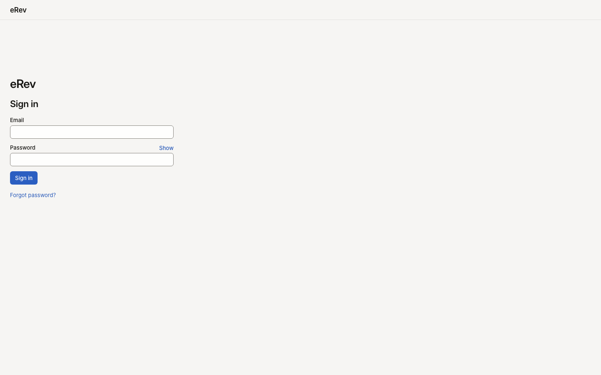

*SF-22: the empty sign-in form; no persona is signed in.*

1. Enter "Email" and "Password" and press "Sign in". A demo persona signs in as `<name>@demo.erev` with the demo password ([Sign in as a demo persona](#sign-in-as-a-demo-persona)).
2. If the account has a second factor, "Verify your sign-in" (SF-22:mfa-challenge, `/sign-in/mfa`) opens: enter the 6-digit code of your authenticator app in "Authentication code" and press "Verify".
3. Without the app, press "Use a recovery code instead" and enter a recovery code. "Sign in as someone else" returns to the sign-in page.
4. You arrive on Home. A person who belongs to several workspaces chooses one first; a holder of `settings.manage` in a workspace whose setup is not complete arrives on "Workspace setup".

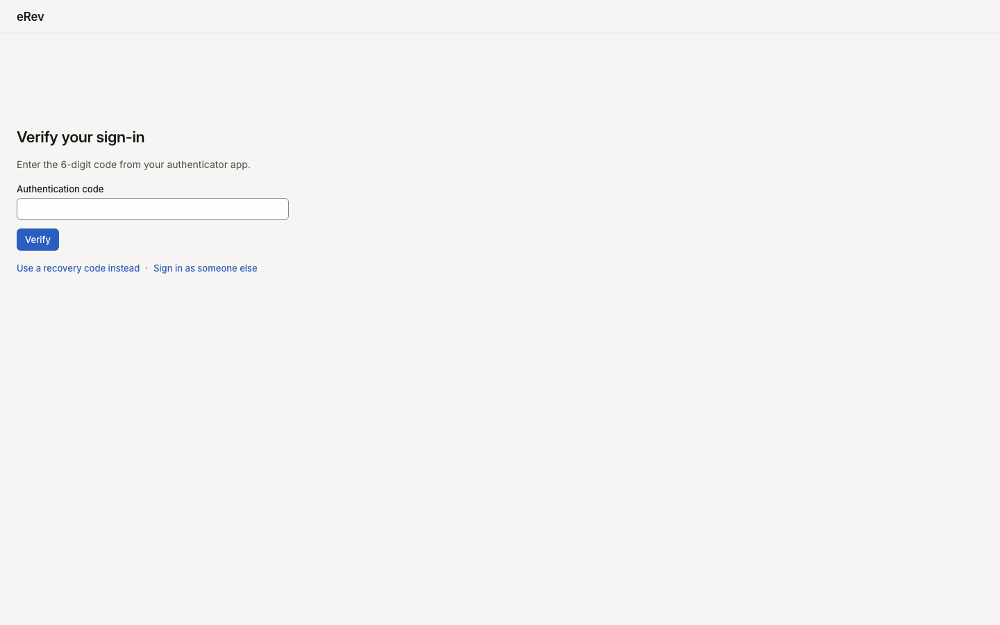

*SF-22:mfa-challenge: the code step after the password; Marcus Webb (Controller).*

A wrong email or password answers "The email or password is incorrect." without saying which, and a locked account answers "Too many failed sign-in attempts. Try again in 15 minutes or ask a workspace administrator." "Forgot password?" opens "Reset password", which sends a link that expires in 60 minutes. A member whose roles include approval or administration permissions and who has no second factor yet is led to "Set up multi-factor authentication" (scan, verify, recovery codes) before any other screen.

### An expired session

A session ends after a time without activity; the notice names the default of 30 minutes. Two minutes before the end, the dialog "Your session ends in 2 minutes." offers "Stay signed in" and "Sign out". After the end, your next action opens the sign-in page with the notice below; its address keeps the page you were on, so that signing in can return you to it.

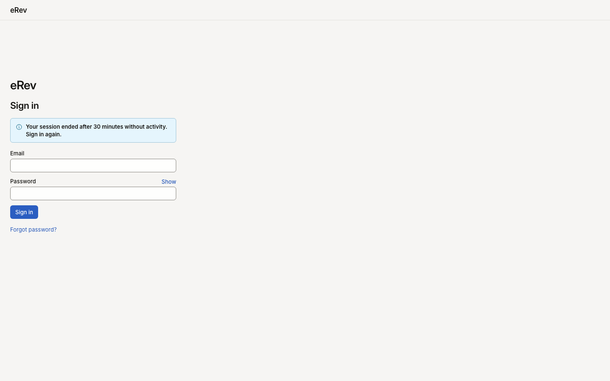

*SF-22: the notice "Your session ended after 30 minutes without activity. Sign in again." above the form; no persona is signed in.*

"Sign out" in the user menu ends the session on the server; an address typed afterwards leads to sign-in. Limit in 1.0: the sign-in page has no sentence for a revoked session (limits document, section B.9, "A revoked session").

### Choose a workspace

"Choose a workspace" (SF-23:select, `/select-workspace`) follows sign-in for a person who belongs to several workspaces; a member of one workspace arrives in it directly. The page has no rail, because no workspace is open yet. It lists your workspaces under "Production", "Demo workspaces" and "Sandboxes and scenarios", leaving out a group that holds none (the capture has the second alone), each workspace with its name, its code, "Last opened" with a date (a dash when it was never opened) and the button "Open".

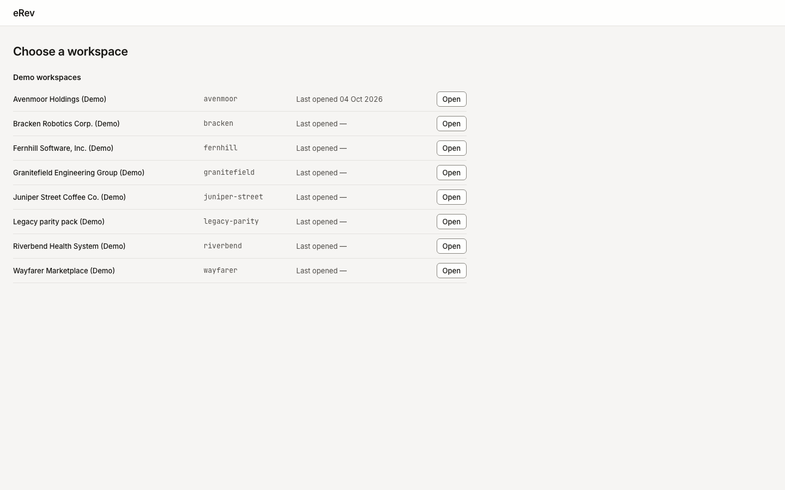

*SF-23:select: the eight demo workspaces, Avenmoor Holdings (Demo) first; Robert Adeyemi (Viewer).*

1. Press "Open" beside the workspace; its Home opens.
2. To change workspace later, open the user menu (your initials at the end of the top bar) and choose "Switch tenant"; the list marks the open workspace "Current", and "All workspaces" returns to this page.

Every workspace is either a production workspace or a sandbox, and the kind never changes. In a sandbox the shell shows the chip "Sandbox: \<workspace>" and the banner "Sandbox: \<workspace>. Nothing here posts or exports."

### The shell: rail and top bar

Every screen of an open workspace sits in one frame. The rail at the left holds the ten areas, in the groups "Work" and "Govern" with Settings at the foot; the control beside the wordmark ("Collapse navigation") reduces it to icons. The rail is the same for every role: permissions decide which screens open and which commands they offer.

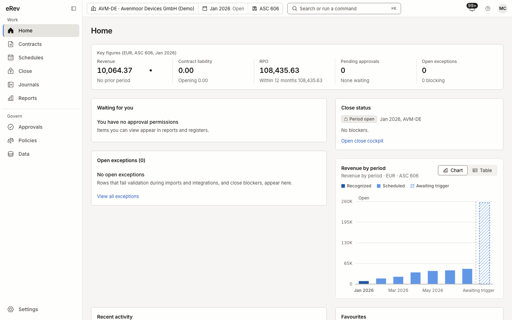

*SF-01 in the shell: the landing after sign-in, with the rail, the context pill, the search field, the bell, Help and the user menu; Maya Chen (Revenue Accountant).*

- **Home** (Work): the starting screen, with key figures and your queues.
- **Contracts** (Work): customer contracts and their versions.
- **Schedules** (Work): revenue schedules by obligation and period.
- **Close** (Work): period states and the close cockpit.
- **Journals** (Work): journal runs and GL export.
- **Reports** (Work): waterfalls, rollforwards, disclosures and audit evidence.
- **Approvals** (Govern): requests waiting for a decision.
- **Policies** (Govern): revenue policies, SSP books and account mapping.
- **Data** (Govern): imports, integrations and the exception queue.
- **Settings**: tenant, users, roles and developer settings.

The top bar holds, from the start: the context pill; the field "Search or run a command"; the chip "Read-only access" for a member whose roles hold no command permission; the bell; Help, with "About eRev Cloud"; and the user menu, with "Switch tenant" (for a member of several workspaces), "Theme", "Density" and "Sign out".

### The context pill: entity, period and book

The context pill (SF-23) is the group of three buttons at the start of the top bar. It names the legal entity, the period with its state and the book ("ASC 606", "IFRS 15" or "Legacy") that the screen reads.

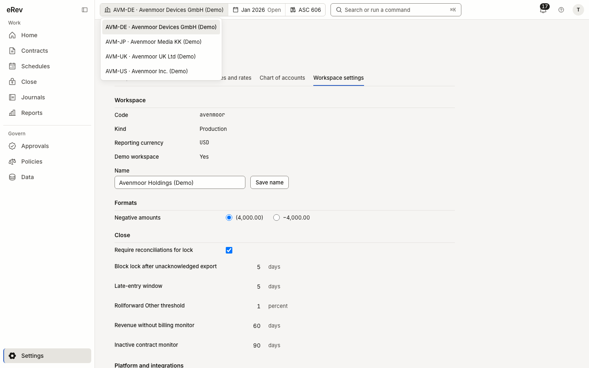

*SF-23: the entity list opened on "Workspace settings", with the four entities of Avenmoor; Tomás Rivera (Tenant Admin).*

1. Press the entity segment and choose an entity. The list holds the active entities your roles cover, by code and name.
2. Press the period segment and choose a period. Periods are grouped by fiscal year and marked "Open", "Soft close" or "Locked"; a period still to come carries no mark.
3. Press the book segment and choose one of the books the entity keeps.

The three values travel in the address as `entity`, `period` and `book` (for example `/home?entity=AVM-US&period=FY2026-P09&book=ASC606`), so a link reproduces the context, and the rail's links carry them from screen to screen. A new entity or book resets the period to the earliest open period of that pair. Where the address names no context, the pill starts from your last choice in the workspace, kept in the browser, and failing that from the first entity in code order, its primary book and its earliest open period. A segment that a screen does not use is greyed, keeps its value and carries the tooltip "Not used on this page": all three on Approvals, Policies, Integrations, the search results and the reference data pages of Settings; period and book on Imports; book on the exception queue. A member whose roles cover one entity is offered that entity alone.

### What each role sees after sign-in

A QA pass signed in as each of the eleven demo personas. All landed on Home for AVM-DE, Jan 2026 and ASC 606, with the same ten areas in the rail.

| Persona and role | Code asked | Workspaces offered | Chip in the top bar | "Waiting for you" on Home | Capture |
|---|---|---|---|---|---|
| Maya Chen, Revenue Accountant and SSP Analyst | yes | 8 | none | "You have no approval permissions" | [001](../screenshots/qa-pass/001-s-1-sign-in-landing-and-rail-maya.png) |
| Priya Raman, Revenue Reviewer and SSP Approver | yes | 8 | none | "Waiting for you (2)" | [002](../screenshots/qa-pass/002-s-1-sign-in-landing-and-rail-priya.png) |
| Marcus Webb, Controller and SSP Approver | yes | 8 | none | "Waiting for you (2)" | [003](../screenshots/qa-pass/003-s-1-sign-in-landing-and-rail-marcus.png) |
| Elena Sokolova, Controller | yes | 8 | none | "Waiting for you (2)" | [004](../screenshots/qa-pass/004-s-1-sign-in-landing-and-rail-elena.png) |
| Robert Adeyemi, Viewer | no | 8 | "Read-only access" | "You have no approval permissions" | [005](../screenshots/qa-pass/005-s-1-sign-in-landing-and-rail-robert.png) |
| Hannah Lindqvist, Auditor | no | 8 | "Read-only access" | "You have no approval permissions" | [006](../screenshots/qa-pass/006-s-1-sign-in-landing-and-rail-hannah.png) |
| Samuel Ortiz, Auditor | no | 1, opened without the list | "Read-only access" | "You have no approval permissions" | [007](../screenshots/qa-pass/007-s-1-sign-in-landing-and-rail-samuel.png) |
| Tomás Rivera, Tenant Admin | yes | 8 | none | "Waiting for you (0)" | [008](../screenshots/qa-pass/008-s-1-sign-in-landing-and-rail-tomas.png) |
| Grace Okafor, Tenant Admin | yes | 8 | none | "Waiting for you (0)" | [009](../screenshots/qa-pass/009-s-1-sign-in-landing-and-rail-grace.png) |
| Nikhil Rao, Integration Admin | yes | 7 | none | "You have no approval permissions" | [010](../screenshots/qa-pass/010-s-1-sign-in-landing-and-rail-nikhil.png) |
| Jordan Blake, Viewer and Deal desk analyst | no | 7 | none | "You have no approval permissions" | [011](../screenshots/qa-pass/011-s-1-sign-in-landing-and-rail-jordan.png) |

What differs lies inside the screens. In the same pass the commands "New contract", "Run journals", "New import", "Start soft close" and "Generate reconciliation" were all offered to Maya Chen, "Start soft close" alone to the two Controllers, and none of the five to the other personas. The panel beside "Favourites" at the foot of Home reads "Recently viewed" for Robert Adeyemi and Jordan Blake and "Recent activity" for the others.

### Command palette and search

"Search or run a command" in the top bar opens the command palette (SF-24) on every screen, as do Command K and Control K. It lists the pages ("Go to \<destination>" for each area of the rail) and the commands (the theme and density choices) that match what you type. For a holder of `contract.read` it also finds records, from two characters on: contracts, customers, invoices, obligations and journal runs, grouped by kind.

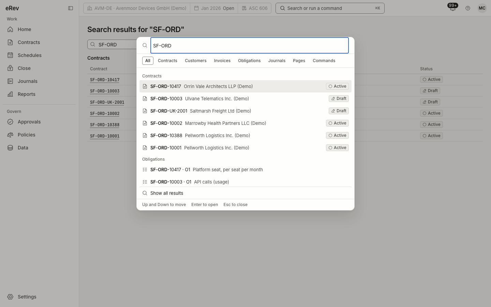

*SF-24: the palette after typing "SF-ORD": six contracts with their status, then obligations, then "Show all results"; Maya Chen (Revenue Accountant).*

1. Open the palette and type. The chips "All", "Contracts", "Customers", "Invoices", "Obligations", "Journals", "Pages" and "Commands" narrow the list to one kind.
2. Move with Up and Down and press Enter to open the highlighted row: a contract at its obligations, a customer at its page under Settings, an invoice at the Billing tab of its contract, an obligation at its pane and a journal run at its page.
3. Choose "Show all results" for the results page, or press Esc to close the palette.

The results page (SF-24:results, `/search`) shows one table per kind with 25 records each and adds the next 25 with "Show more contracts" and its like. It keeps the text and the "Scope" filter in its address, so a list of results can be sent as a link. A record is found when every word you type begins a word of its two texts: for a contract its external id and its customer's name.

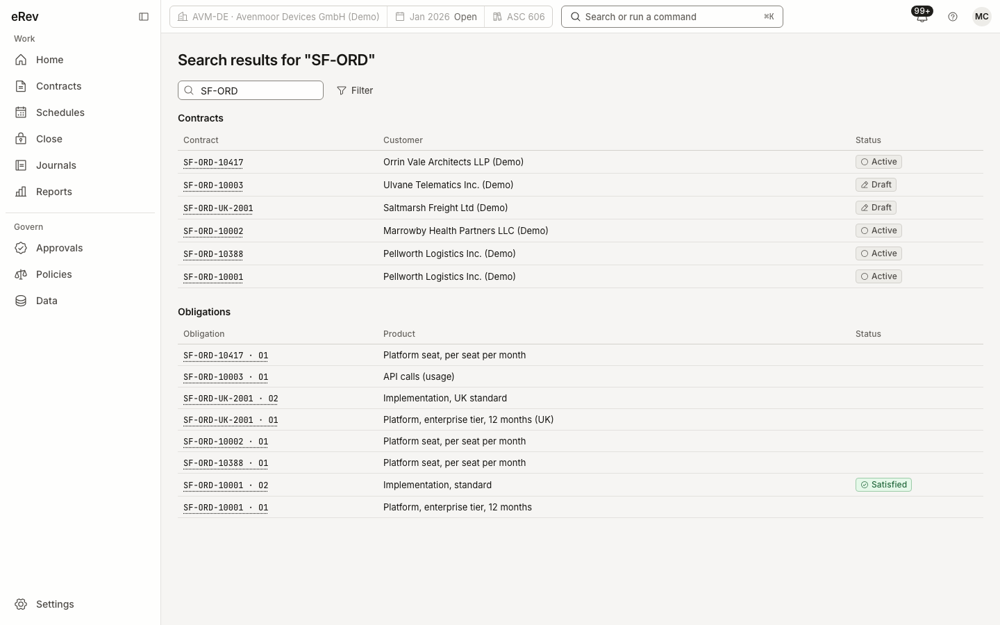

*SF-24:results: the results for the text "SF-ORD", six contracts and eight obligations; Maya Chen (Revenue Accountant).*

### Notifications

The bell in the top bar (SF-21) carries the number of unread notifications, up to 99 and then "99+". It opens the panel "Notifications" with the tabs "Unread" and "All". Notifications tell you of approval requests and decisions, period changes, close blockers, failures and assigned exceptions.

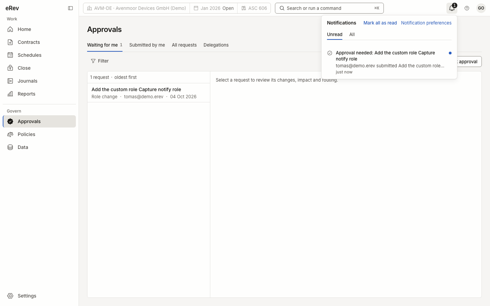

*SF-21: one unread item, "Approval needed: Add the custom role Capture notify role", over the inbox that lists the same request; Grace Okafor (Tenant Admin).*

1. Press the bell and select an item. The record it names opens, here the approval request, and the item is marked read.
2. Press "Mark all as read" to empty the "Unread" tab.
3. Follow "Notification preferences" to choose what is sent in the app and by email (see "Notification preferences" under Settings).

The count is read again every 60 seconds while the page is visible, when the window regains focus and after each successful command.

### Home for an approver and for a viewer

Home (SF-01, `/home`) is the landing screen of every member. For the entity, period and book of the context pill it shows five key figures, your queues, the close status, revenue by period, recent activity and your favourites; each figure and row leads to the screen that owns it.

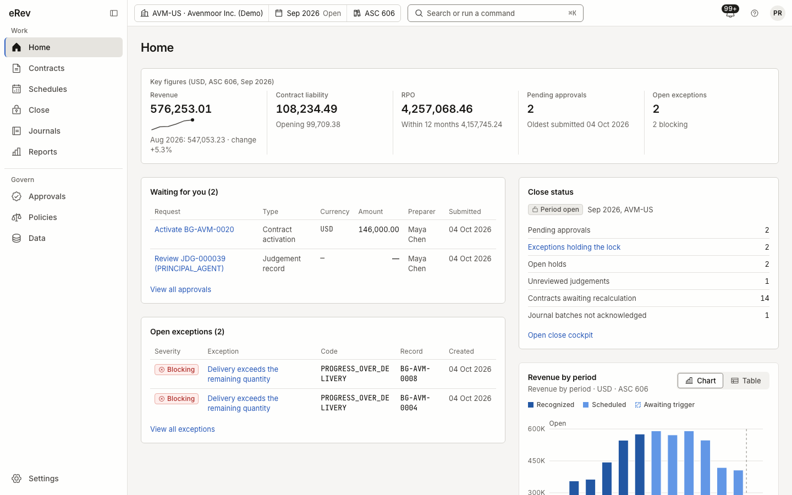

*SF-01: AVM-US, Sep 2026, ASC 606, with "Waiting for you (2)" and two blocking exceptions; Priya Raman (Revenue Reviewer).*

- "Key figures (USD, ASC 606, Sep 2026)": "Revenue" with the prior period and the change; "Contract liability" with its opening amount; "RPO" with the part within 12 months; "Pending approvals" with the oldest submission; "Open exceptions" with the number blocking. A figure opens, in this order, Schedules, the contract balance rollforward report, the RPO report, Approvals and the exception queue.
- "Waiting for you": up to eight pending requests assigned to you, oldest first, with "Request", "Type", "Currency", "Amount", "Preparer" and "Submitted". It lists requests of every entity, while "Pending approvals" counts those of the context entity, so the two can differ.
- "Open exceptions": up to eight open items of the context entity, blocking first, with "Severity", "Exception", "Code", "Record" and "Created".
- "Close status": the state of the period ("Period open") and one row for each kind of blocker with its count, or "No blockers."
- "Revenue by period": a "Chart" or a "Table" of "Recognized", "Scheduled" and "Awaiting trigger" amounts; at the foot of the page, "Recent activity" and "Favourites".

1. To decide a request, select its link in "Waiting for you", or "View all approvals" for the inbox.
2. To work an exception, select its link, or "View all exceptions" for the queue.
3. To see what holds the period, select "Exceptions holding the lock" or "Open close cockpit".

A member without an approval permission, such as a Viewer or an Auditor, sees the same panels and the same five figures. "Pending approvals" counts the requests that wait for the member in the context entity, so for such a member it reads 0 and "None waiting", while "Close status" goes on counting every pending approval of the period. "Waiting for you" then reads "You have no approval permissions" and "Items you can view appear in reports and registers.", and a member without any command permission carries the chip "Read-only access" in the top bar.

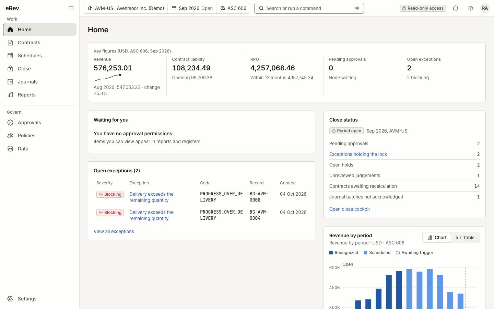

*SF-01: the same context with the chip "Read-only access" and no approvals queue; Robert Adeyemi (Viewer).*

On a workspace whose accounting policy set is the legacy-parity preset, Home also shows the dismissible panel "Coming from eRev desktop". Limit in 1.0: before a workspace has a legal entity, and while no period of its entities is open, Home shows three error banners with "Retry" (key figures, close status, revenue by period) where an empty state belongs (limits document, section B.9, HOME-NO-ENTITY-1).

### A screen opened without its permission

Because the rail is the same for everyone, a member can reach an address whose permission her roles do not hold. The screen then stays in the shell, reads none of the area's data and says "You do not have access to \<area>", naming the permission to ask a workspace administrator for and its code.

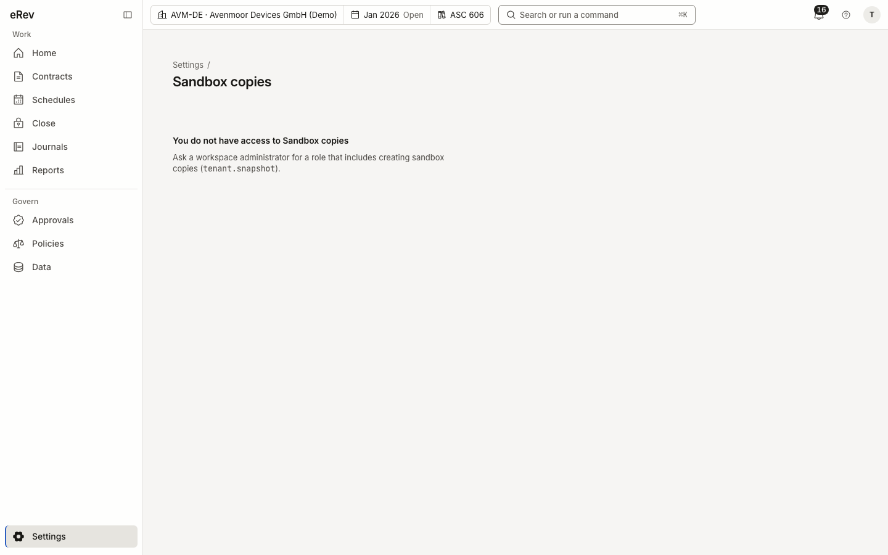

*SF-15:sandbox without `tenant.snapshot`: "You do not have access to Sandbox copies"; Tomás Rivera (Tenant Admin). Grace Okafor sees the same ([capture 043](../screenshots/qa-pass/043-m-2-one-screen-per-area-she-holds-no-permission-for-grace.png)).*

Commands follow the same rule: a control is shown only with its permission, and the API refuses what a screen does not offer. A command that is shown and cannot be used at the moment is unavailable: it does nothing when pressed and gives its reason in its tooltip, when the pointer or the keyboard focus is on it. The label of such a button is greyed, except on a primary (filled) button. Limit in 1.0: an unavailable primary button is drawn like an available one (limits document, section B.9, "An unavailable primary button"). Limit in 1.0: sixteen files of the web application ask for a command's permission without its entity scope, so a member can be offered a command that the API then answers 404 (limits document, row B6-3).

## Contracts

The Contracts area holds the customer contracts of a workspace: the list, the form that drafts a contract, and the workbench on which one contract is read through the five steps of the revenue model, acted on and traced figure by figure. A Revenue Accountant prepares here; a Revenue Reviewer or a Controller decides the resulting requests under [Approvals](#approvals); auditors and viewers read. Unless a caption says otherwise, the captures show the demo workspace Avenmoor Holdings (Demo) at September 2026 for entity AVM-US and book ASC 606, signed in as Maya Chen (Revenue Accountant, initials "MC"); the Approvals screens and the calculation trace do not read the context pill, which there names another entity and period. The routes, the statuses and the API of the area are in the user guide, [Contracts](user-guide.md#contracts). What release 1.0 does not do is in the [limits document](../release/LIMITS-1.0.md); a sentence that begins "Limit in 1.0:" names the row that concerns a screen.

A note on the captures: the key of an obligation begins with the letter O ("O1", "O2"), which the screen font draws much like a zero.

### Contracts list (SF-02)

The list is where a contract is found. "Contracts" in the rail opens it (address `/contracts`). It lists the contracts of the entity in the context pill, with figures measured at the end of the pill's period in its book. The header states the count ("106 contracts") and offers "New contract" and, under "More actions" (the three dots), "Import contracts". Above the grid stand the view selector ("All contracts"), the box "Search contracts", the "Filter" button and, at the right, the column chooser. A row shows "Contract" (the external id, which stays in view when the grid scrolls sideways), "Customer", "Status", "Entity", "Inception date", "Currency", "Transaction price", "Recognized to date", "Billed to date", "RPO" and "Open exceptions"; the column chooser adds "Scheduled", "Awaiting trigger", "Contract number", "Source", "Region", "Channel", "Contract type", "Signature date" and "Updated". The status reads "Draft", "Pending approval", "Active", "Completed", "Terminated", "Void" or "Not a contract", with "On hold" and "Combined" beside it where they apply.

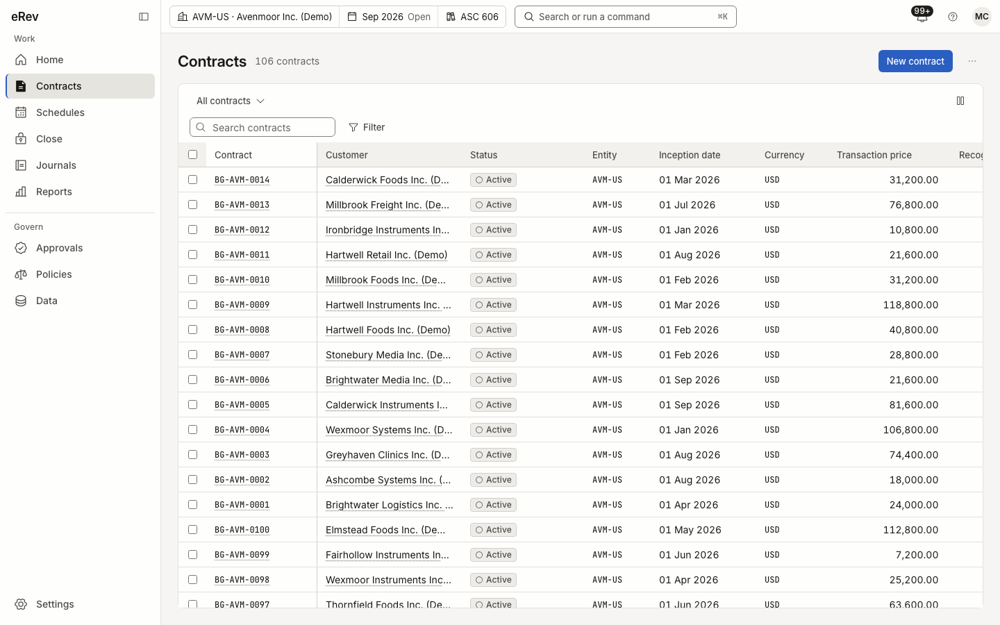

*SF-02: the contracts of AVM-US at September 2026, 106 in the view "All contracts"; Maya Chen, Revenue Accountant.*

To find a contract:

1. Type part of the external id, the contract number or the customer's name in "Search contracts". The key `/` puts the cursor there.
2. Choose "Filter", pick a field ("Entity", "Customer", "Status", "On hold", "Modified in period", "Transaction price" or "Has exceptions"), set its value and choose "Apply". The filter stays above the grid as a chip such as "Status is Active"; "Clear all" removes every chip.
3. Open the view selector for the quick lists "On hold", "Largest value", "Created manually" and "Created from integrations this period". "Save as new view" stores the filters, the sort and the columns in view under a "Name" ("Save view"); the address then names the view, so the view can be sent as a link.
4. Select the external id to open the contract's workbench. The menu at the end of a row offers "Open", "Open in new tab", "Pin to Home" and "Copy link".
5. To tighten the spacing, open the user menu (the initials at the top right) and choose "Compact" under "Density"; "Comfortable" is the default, and the choice applies to all screens.

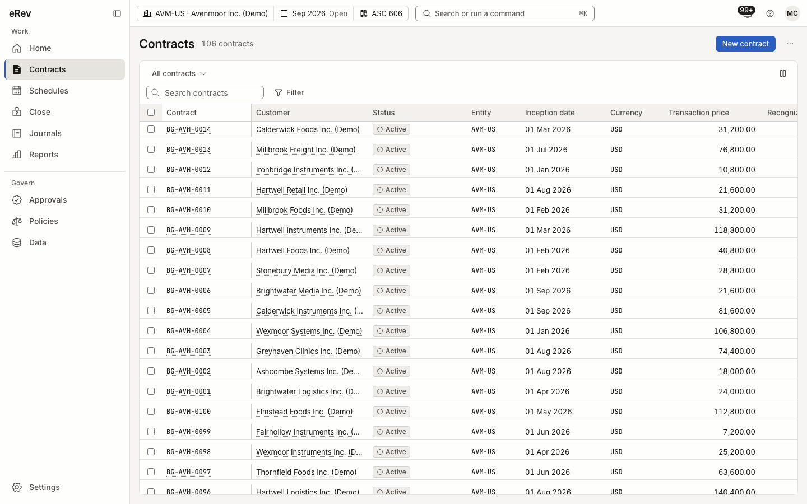

*SF-02: the same list after "Compact" was chosen: the header is tighter and the rows are lower, though in this capture they keep the pitch of the comfortable density; Maya Chen.*

A preparer can tick several rows. The bar that appears offers "Submit for activation", which skips a contract that is not a draft ("Not a draft"), and "Apply hold", which asks the "Hold type" ("Recognition hold" or "Journal export hold") and a "Reason"; a result window lists the contracts that were not processed. Limit in 1.0: the filters "Has exceptions" and "Modified in period" and the quick lists "Recently viewed" and "Modified this period", which the view selector also names, return no contract, and "Open exceptions" reads 0 for every contract (limits document, row B3-12).

### Draft contract form (SF-03:new and SF-03:edit)

A contract that does not come from an import or an integration is entered by hand. "New contract" on the list opens the form (address `/contracts/new`) for a holder of `contract.create`. The form has the sections "Contract", "Termination" and "Classification", the grid "Contract lines" and a footer with "Cancel", "Save draft" and "Save and submit for activation"; "More below" says that the form goes on below the visible part.

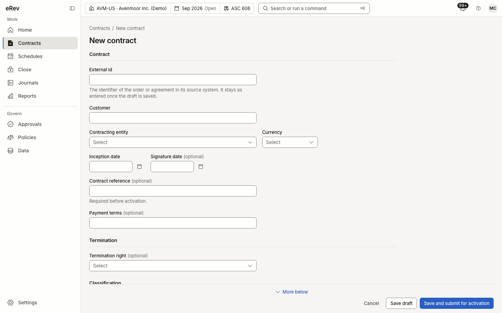

*SF-03:new: the empty form with its first section, "Contract"; Maya Chen.*

To draft a contract:

1. Under "Contract" enter the "External id", the identifier of the order or agreement in its source system; it stays as entered once the draft is saved. Choose the "Customer" from the customers on file; the option that begins "Create customer" adds one and asks its "Customer code".
2. Choose the "Contracting entity" and the "Currency" (the entity's functional currency is offered) and enter the "Inception date". "Signature date", "Contract reference" and "Payment terms" are optional on a draft; the reference is required before activation.
3. Under "Termination" choose the "Termination right" ("None", "Customer", "Entity" or "Both"); with a right the form also asks "Substantive penalty" and "Notice days".
4. Under "Classification", "Commercial substance" is ticked from the start; "Region", "Channel", "Contract type" and "Memo 1" to "Memo 3" are optional.
5. In "Contract lines" fill one line for each promised good or service: "Obligation key" (a new line takes O1, O2 and so on), "Product", "Stratification", "Quantity", "Total price (USD)", "Unit price", "Start date" and "End date"; further to the right stand "Performing entity", "SSP version", "Scope", "Out-of-scope amount" and "Memo 1" to "Memo 3". "Add line" adds a line, up to 500 on a contract; the bin at the end of a line removes it.
6. Choose "Save draft". The workbench of the draft opens with the message "Draft saved." and one obligation for each line.

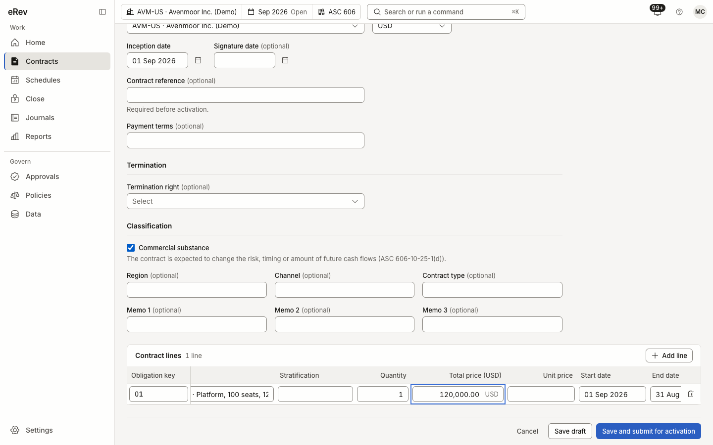

*SF-03:new: the lower half of the form with one line of USD 120,000.00 that starts on 01 Sep 2026; Maya Chen.*

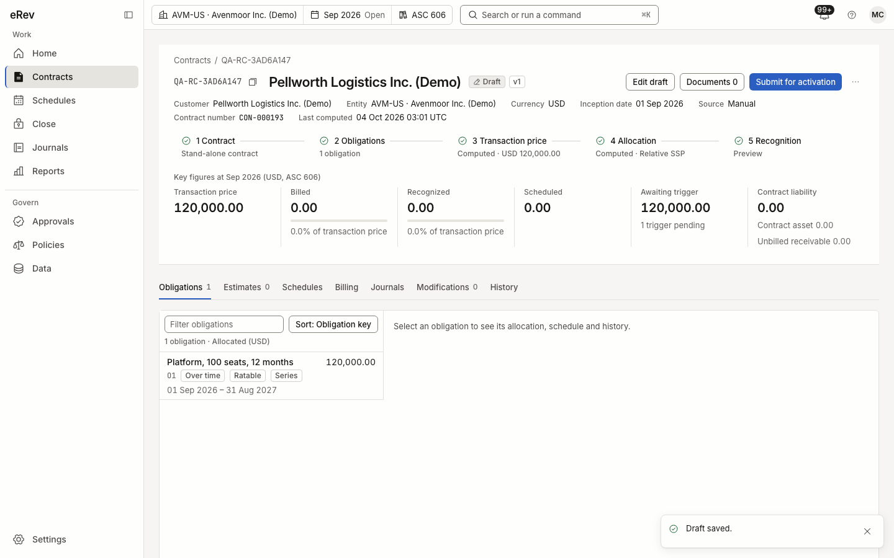

*SF-03 after "Save draft" (QA pass, step A-1): the draft QA-RC-3AD6A147 at version v1 with its one obligation; Maya Chen.*

"Save and submit for activation" saves the draft and then submits it. A contract entered by hand has no Step 1 review yet, so the message reads "Draft saved. Not submitted: record the Step 1 review first." and the workbench opens at step 1 of its tracker. In a demo workspace, date the contract within September 2026: a contract dated today lies in a period that is still to come (user guide, [Demo workspaces](user-guide.md#demo-workspaces)).

"Edit draft" on the workbench of a draft opens the same form (address `/contracts/:contractId/edit`). "External id", "Contracting entity" and "Currency" stay as booked; "Save draft" replaces the draft with the content of the form. Where a Step 1 assessment stands on the draft the form warns: "A Step 1 assessment is recorded on this draft." and "Saving voids it: a new Step 1 review is recorded and reviewed before the contract is activated." A draft that was changed after it was booked, for example by a memo update, reads "This draft was changed after it was booked; it cannot be edited here yet." A contract that is no longer a draft changes through a modification.

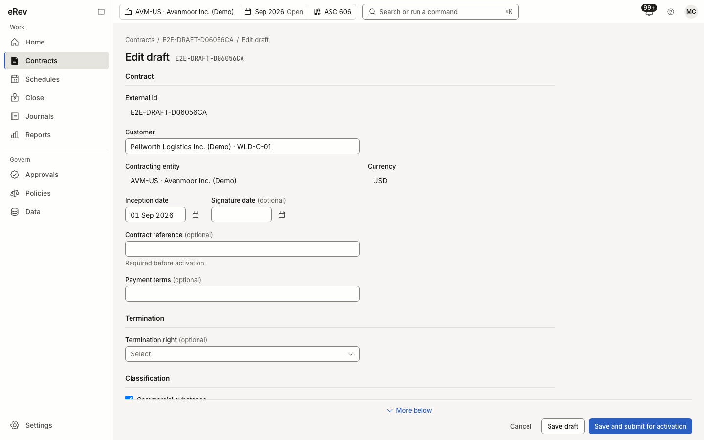

*SF-03:edit: the saved draft E2E-DRAFT-D06056CA; its external id, entity and currency are fixed; Maya Chen.*

### Contract workbench (SF-03)

The workbench is the page of one contract. It opens from the list, from the search of the top bar, or at `/contracts/:contractId`, which leads to the "Obligations" tab. From top to bottom it shows:

- the record header: the trail "Contracts" and the external id, the external id again with a copy button, the customer's name, the status, the version of the contract ("v6"), the commands, and the facts "Customer", "Entity", "Currency", "Inception date", "Source", "Contract number" and "Last computed";
- the tracker of five steps, "1 Contract", "2 Obligations", "3 Transaction price", "4 Allocation" and "5 Recognition", each with a status line (in the capture "Stand-alone contract", "2 obligations", "USD 135,000.00", "Relative SSP · US-LIST 2026-H1" and "77.8% recognized");
- the key figures under a heading that names the period they are measured at ("Key figures at Sep 2026 (USD, ASC 606)"): "Transaction price"; "Billed" and "Recognized", each with a bar and its share ("77.8% of transaction price"); "Scheduled"; "Awaiting trigger"; and "Contract liability" with "Contract asset" and "Unbilled receivable" beneath it;
- the tabs "Obligations", "Estimates", "Schedules", "Billing", "Journals", "Modifications" and "History", three of them with a count.

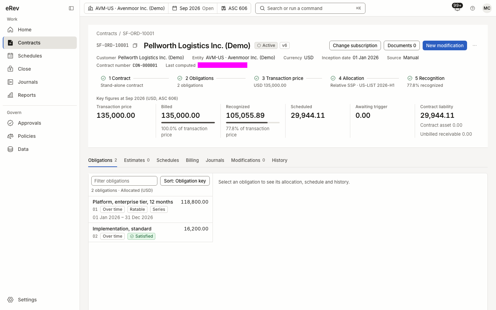

*SF-03: the workbench of SF-ORD-10001, Pellworth Logistics Inc. (Demo), status "Active", version v6, with its two obligations; Maya Chen.*

To read the workbench:

1. Read the status beside the name, then the tracker from left to right. A step with a tick is complete; a step under review shows "In review". For a draft the lines of steps 3 to 5 read "Computed" with the amount, "Computed · Relative SSP" and "Preview".
2. Select a step to open its evidence beneath the tracker: the criteria of step 1 (see "Step 1 review and activation"); the obligations of step 2 with "Kind", "Distinctness", "Template" and "Distinct review"; the "Transaction price build-up" of step 3; the "Allocation walk" of step 4 with the SSP range, the "Selected SSP", the "Weight" and the amount "Allocated" of each obligation; and "Recognition by obligation" of step 5 with the link "Open schedules".
3. Read the key figures. "Scheduled" is the part whose recognition pattern is known and "Awaiting trigger" the part that waits for an event such as delivery or acceptance; a balance is always shown with its label, never as a signed position (user guide, [Vocabulary](user-guide.md#vocabulary)).
4. Select a figure to see how it was computed (see "Explain panel and calculation trace"), and open a tab for the detail; the tabs are described below.

The commands of the header depend on the status:

| Status | Buttons | "More actions" (the three dots) |
|---|---|---|
| "Draft" | "Edit draft", "Documents", "Submit for activation" | "Record assessment" once the Step 1 review is reviewed, "Record Step 1 review", "Combine with another contract", "Copy link" |
| "Pending approval" | "Documents" | "Copy link" |
| "Active" | "Change subscription", "Documents", "New modification" | "Record delivery", "Record progress", "Record milestone", "Record cost", "Record return", "Apply hold", "Edit memos", "Combine with another contract", "Copy link" |

"Documents" carries the number of files ("Documents 0") and opens the drawer of the contract's documents with "Upload document". "Release hold" joins the menu while the contract is on hold, and a contract that reads "Not a contract" carries the next command of its Step 1 review. One banner may stand above the tracker: "Activation is waiting for approval.", for example, or, in a locked period, the notice that the period is locked for the entity and that late events post to the open period. Limit in 1.0: the workbench has no switch between transaction and functional currency (limits document, section B.9, "The Transaction and Functional switch"), and a policy override for one contract or one obligation is not offered (row B1-1).

The compact density tightens this page as it does the list.

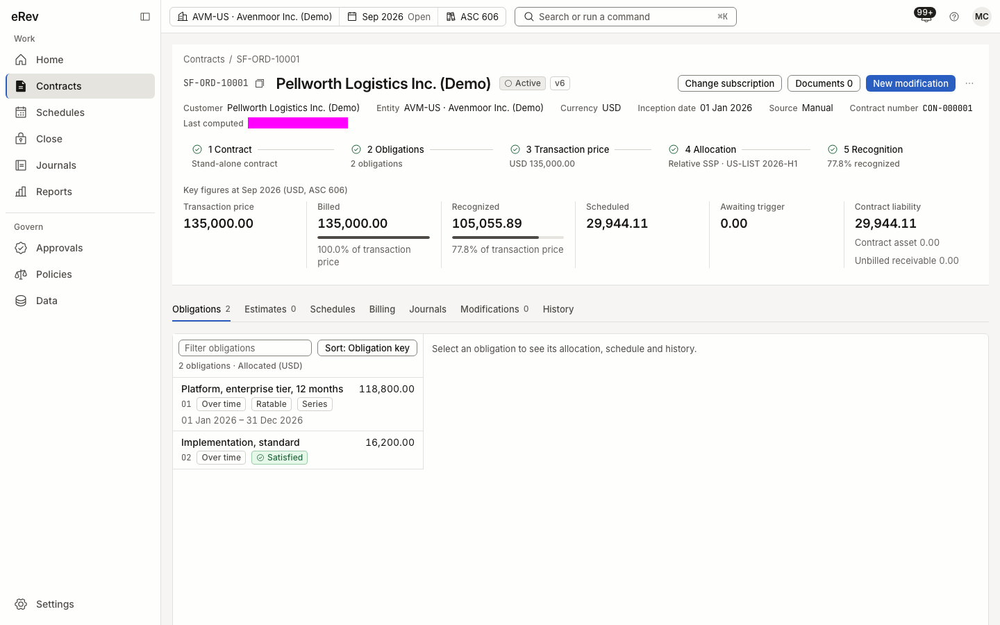

*SF-03: the same workbench at the compact density (see "Contracts list"); Maya Chen.*

### Obligations and the obligation detail (SF-03:obligation)

The "Obligations" tab lists the performance obligations of the contract at the left: the box "Filter obligations", the sort menu ("Sort: Obligation key"; also by "Start date" or "Product"), the count with the currency ("2 obligations · Allocated (USD)") and, for each obligation, the product's name, the allocated amount, the key, its chips ("Point in time" or "Over time", "Ratable", "Series", "Material right", "Satisfied", "On hold") and, where it has them, its dates. Selecting an obligation opens its detail at the right (address `/contracts/:contractId/obligations/:obligationId`).

To read an obligation:

1. Read "Obligation figures": "Allocated", then "Recognized", "Scheduled" and "Awaiting trigger", each of the three with a bar and its share "of allocation". The three add up to the allocated amount.
2. Open "Overview" for "Progress", "Billed to date", "Catch-up to date", "Remaining allocation", "Remaining billing", "Balance", "Satisfaction" and "Holds", and "Attributes" for the product, the kind, the template, the recognition method, the dates and the entities of the obligation.
3. Open "SSP and allocation" to see how the allocated amount came about. In the capture the "Stated price" EUR 90,000.00 lies "Inside range" of the SSP book version DE-LIST 2026 ("Low" 81,000.00, "High" 99,000.00), so the "Selected SSP" is 90,000.00; its "Weight" is 82.57% of the "Total contract SSP" 109,000.00, the amount "Allocated" is EUR 89,174.31 and the "Allocation adjustment" EUR (825.69).
4. Open "Schedule" for the obligation's lines by period (with "Open in Schedules") and "Events" for what was recorded on it: "Effective date", "Event", "Details", "Origin", "Approval" and "Recorded at".

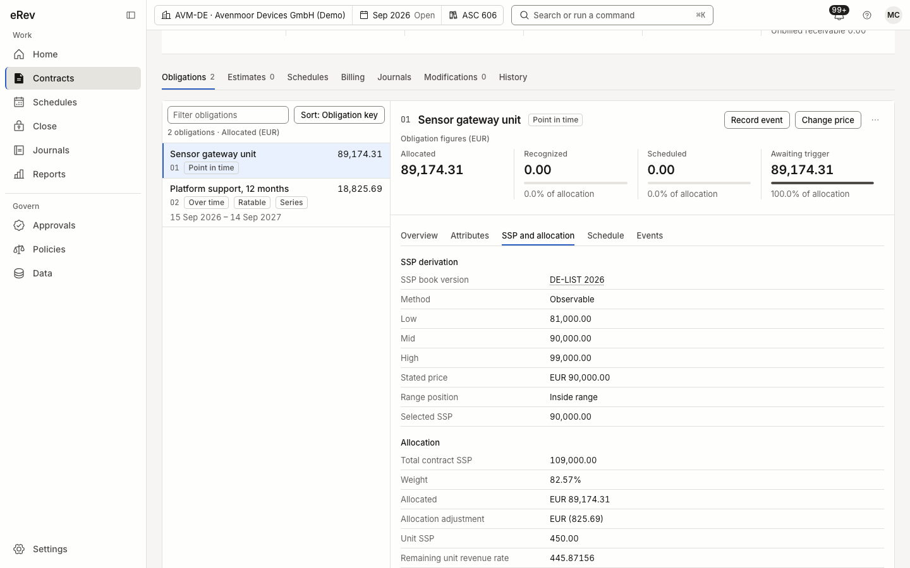

*SF-03:obligation: obligation O1 "Sensor gateway unit" of NS-SO-DE-5004 in entity AVM-DE (EUR), panel "SSP and allocation"; Maya Chen.*

### Step 1 review and activation

A draft becomes active through two decisions of a second person: the Step 1 review of the contract criteria, which a Revenue Reviewer reviews, and the activation, which someone other than its submitter approves. The captures of this task come from the QA pass on a demo workspace with closed months: Maya Chen prepares and Priya Raman (Revenue Reviewer) decides.

1. On the workbench of the draft select step "1 Contract". Its region shows the "Criteria" ("Criterion", "Conclusion", "Evidence", "Codification"), the "Enforceable term", the "Combination" and the line "No Step 1 review is recorded." with "Record Step 1 review". An open combination suggestion listed here is taken up with "Combine" or closed with "Dismiss suggestion" and a rationale first: the activation is refused while one is open.
2. Choose "Record Step 1 review". Answer Yes or No to "Approved and committed (ASC 606-10-25-1(a))", "Rights identified (ASC 606-10-25-1(b))", "Payment terms identified (ASC 606-10-25-1(c))", "Commercial substance (ASC 606-10-25-1(d))" and "Collectibility probable (ASC 606-10-25-1(e))"; fill "Credit grade", "Mitigation", "Termination right", "Substantive penalty" and "Notice days" as they apply; write the "Rationale", attach "Evidence" where there is any, and choose "Submit for review". The message names the record ("Step 1 review JDG-000198 submitted for review.") and step 1 reads "In review".

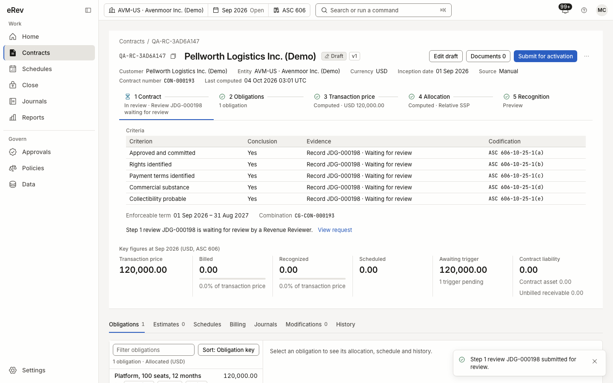

*SF-03, step 1 open (QA pass, step A-3): the Step 1 review JDG-000198 waits for review by a Revenue Reviewer; Maya Chen.*

3. The reviewer opens the request under "Approvals", "Waiting for me", and approves it; the message reads "Approved: Review JDG-000198 (COLLECTIBILITY)." A review that was rejected is recorded anew, and the rejected record is removed with "Discard" before the contract is submitted.

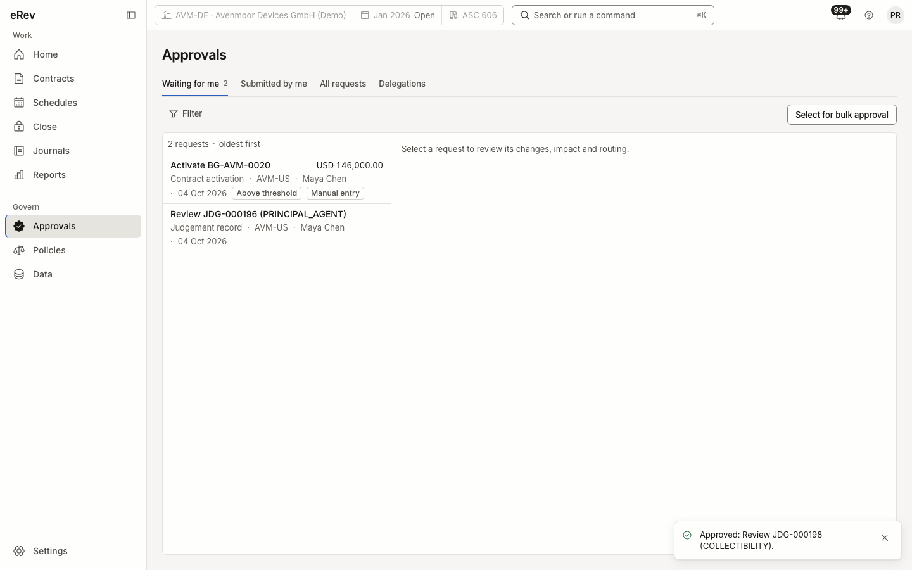

*Approvals, "Waiting for me" (QA pass, step A-4): the message confirms the review of JDG-000198; Priya Raman, Revenue Reviewer.*

4. Back on the workbench, step 1 reads "Step 1 review JDG-000198 was reviewed by Priya Raman on 04 Oct 2026 03:01 UTC. Record the assessment to continue." Choose "Record assessment": the drawer states the review, the "Conclusion", the "Outcome", the "Books" and the "Effective date", which for a draft is the inception date. "Record assessment" stores it ("Assessment recorded.").

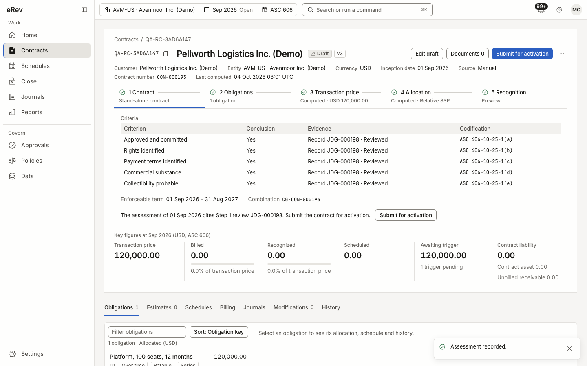

*SF-03, step 1 open (QA pass, step A-5): the criteria cite the reviewed record, and the line offers "Submit for activation"; Maya Chen.*

5. Choose "Submit for activation", on the line of step 1 or in the header. The message names the request ("Submitted for activation. Request APR-000458 is waiting for approval."), the status becomes "Pending approval", and the banner "Activation is waiting for approval." offers "View request" and, to the preparer, "Withdraw request". Where something is missing, the banner "Contract cannot be activated" lists each item with the way to it, such as "Edit draft", "Open documents", "Record distinct review" or "Open step 1".

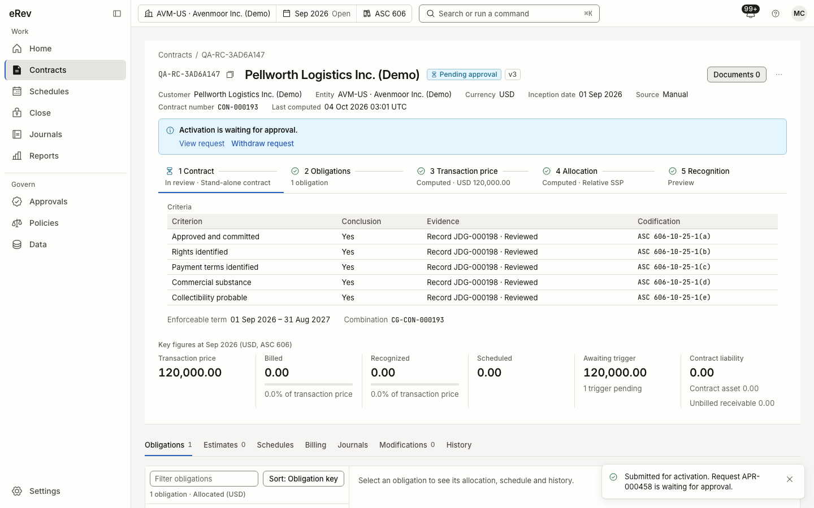

*SF-03 (QA pass, step A-6): the contract is "Pending approval" and its banner leads to the request; Maya Chen.*

6. An approver other than the submitter approves the request under "Approvals". The message reads "Approved: Activate QA-RC-3AD6A147." and the contract is "Active".

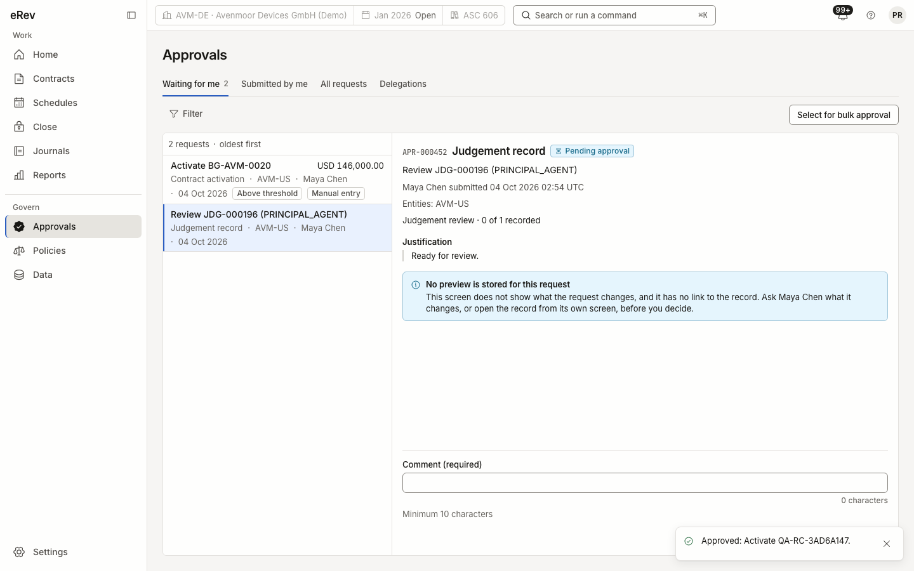

*Approvals, "Waiting for me" (QA pass, step A-7): the message confirms the approval of the activation; Priya Raman.*

A review that answers No to "Collectibility probable" leads to the outcome "Collectibility not probable". Once every book is assessed so, the contract reads "Not a contract" and its banner says "The contract criteria are not met. Receipts post to deposit liability until the criteria are met."; a later Step 1 review, once reviewed, is followed by "Record criteria met" and "Submit for activation".

Limit in 1.0: the activation of a contract that a person or an import books is approved by no auto-approval rule and always waits for a person (limits document, row B3-4); a contract whose financing needs an adjustment is refused at activation (row B3-14); and an arrangement that fails criterion (a), (b) or (c) cannot be booked and is accounted for outside the product until the criteria are met (row B3-16).

### Recording delivery, usage and billing

What happens under a contract reaches it as events. On the screens a person records a delivery, progress, a milestone, a cost or a return; invoices, credit memos and usage arrive from outside. The capture of the obligation detail above shows "Record event" and "Change price" in the header of the obligation.

1. On an "Active" contract select the obligation and choose "Record event", or use "More actions" of the header. The menu of an obligation offers what fits its recognition method: "Record delivery" and "Record return" (point in time, units delivered), "Record progress" (output percent, labour hours), "Record milestone" or "Record cost" (cost to cost).
2. Fill the drawer. A delivery asks "Quantity", "Trigger" ("Delivery", "Acceptance", "Sell-through", "Bill-and-hold" or "Control transfer"), "Effective date", "Reference", "Evidence" and "Comment"; the panel "Preview" shows the effect once the fields are valid. Progress, milestone and cost events and an acceptance need at least one evidence file.
3. Choose "Submit for approval". The event is not appended at once: a person other than the preparer who holds `event.approve` approves the request under "Approvals", and the contract is then computed.
4. Read the result in the obligation's figures and on its panel "Events". A row of the panel opens the event, where "Void event" sends the void to approval.

Invoices and credit memos are not typed in on the workbench ("Billing arrives from imports and integrations."); the "Billing" tab lists them. Usage reports and royalty statements are sent as events through the API, and the user guide says how to date them. "Change price" on the obligation opens the modification wizard for a price change of that obligation.

### Estimates (SF-03:estimates and SF-03:estimate)

The "Estimates" tab holds the estimated elements of a contract (variable consideration, return rates, estimated total costs, breakage and the other kinds), each as a series of numbered versions with a rationale, evidence, a preview and an approval. The left side lists the elements under their kind with the key figure, the number, the effective date and the status of the latest version; the right side shows the selected element (address `/contracts/:contractId/estimates/:estimateId`). The captures show the element EAC of contract PRJ-CB-2026-01, Castellan Build Group Inc. (Demo).

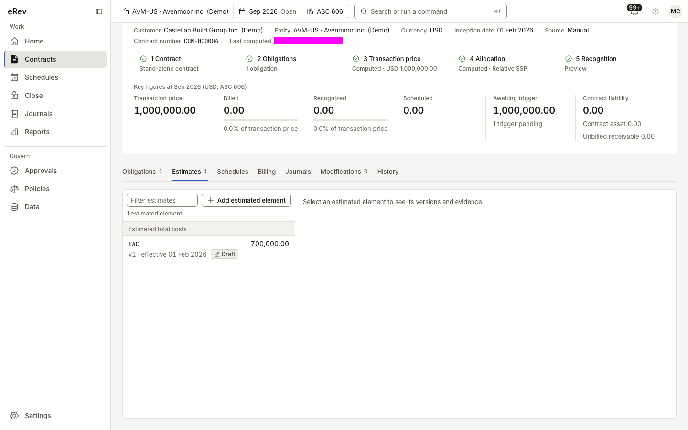

*SF-03:estimates: one estimated element, EAC, whose version 1 is a draft of 700,000.00; Maya Chen.*

To add an element and its first version:

1. Choose "Add estimated element". Choose the "Kind" (here "Estimated total costs"), enter the "Element code", which is unique on the contract (here EAC), keep or change the "Method" that the kind proposes (here "Cost build-up") and choose "Add element". The drawer of version 1 opens.
2. Enter the "Effective date" and the figures of the kind (here "Estimated total costs (USD)" and, optionally, "Expected total hours"), write the "Rationale" and attach the "Evidence". Estimated total costs also ask the "Classification": "Change in estimate" or "Error correction".
3. Choose "Save draft". The version is stored ("Version 1 saved as a draft.") and its preview runs: "Catch-up" and the table "Before and after (USD)" for "Transaction price", the revenue of the period, "Contract liability" and "Contract asset". "Run preview" runs it again.
4. Choose "Submit for approval", in the drawer or on the banner "Version 1 is a draft." of the element. The message names the request, and the banner then reads "Version 1 is waiting for approval." with "View request" and "Withdraw request".

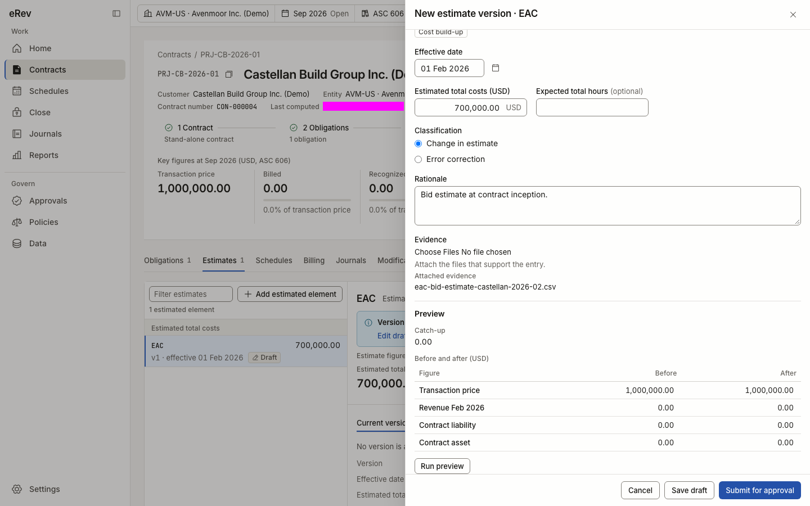

*SF-03:estimate: the drawer "New estimate version · EAC" with its evidence attached and its preview run; Maya Chen.*

An "Error correction" is not submitted as an estimate version; the drawer says "Error corrections go through a period reopen with dual approval."

To read an element and its versions:

1. Read the figures of the latest version under "Estimate figures of version 1 (USD)": for estimated total costs, "Estimated total costs", "Costs incurred to date" and "Progress".
2. Open "Versions" for every version with its "Status", "Effective date", "Figure", "Prepared by", "Approved by", "Approved at" and "Rationale". Tick two versions and choose "Compare versions" for a comparison field by field.
3. Open "Current version" for the approved version; until one is approved the panel says "No version is approved yet. The latest version is shown." It gives the fields of the version, the "Preview" with its "Catch-up" and "View request", and the "Evidence". The panel "Evidence" lists the attachments of every version.

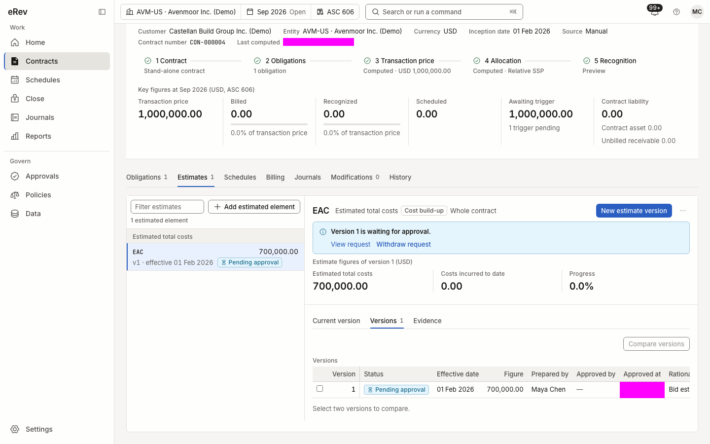

*SF-03:estimate: element EAC with version 1 "Pending approval", panel "Versions"; Maya Chen.*

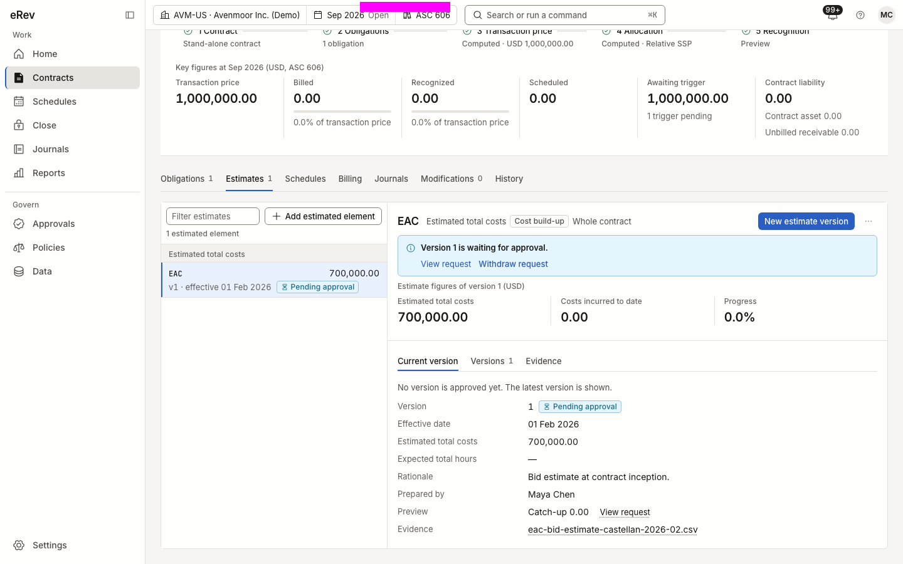

*SF-03:estimate: panel "Current version" of the pending version 1 with its preview and its evidence; the magenta block in the top bar is the mask of the line "Last computed", which is scrolled under the bar; Maya Chen.*

One version of an element is open at a time: "New estimate version" is unavailable while a version is a draft or waits for approval, although the button keeps its look, as in the two captures above; its tooltip gives the reason. "Withdraw request", with a comment, takes a pending version back ("Version 1 was withdrawn. Edit it to submit it again."), and "Edit draft" opens it again. "Discard draft" voids a draft after the question "Discard this draft version?": the version keeps its number, reads "Void" and can no longer be edited or submitted. Limit in 1.0: no finding is raised where a variable-consideration estimate was not reassessed for a period, so review the period's estimate versions before the lock (limits document, row B1-38).

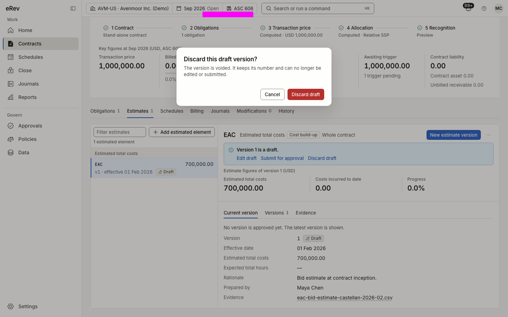

*SF-03:estimate: the confirmation "Discard this draft version?" over the draft version 1, with the same mask in the top bar; Maya Chen.*

### Modifications and the wizard (SF-03:modifications, SF-07, SF-07:detail)

A change of scope or price to an active contract is a modification. The "Modifications" tab lists the modifications of the contract with "Reference", "Kind", "Effective date", "Treatment", "Status", "Catch-up (USD)" and "Prepared by"; the status reads "Draft", "Pending approval", "Approved", "Applied", "Rejected" or "Void". A draft opens in the wizard, any other modification on its read-only page (address `/contracts/:contractId/modifications/:modificationId`).

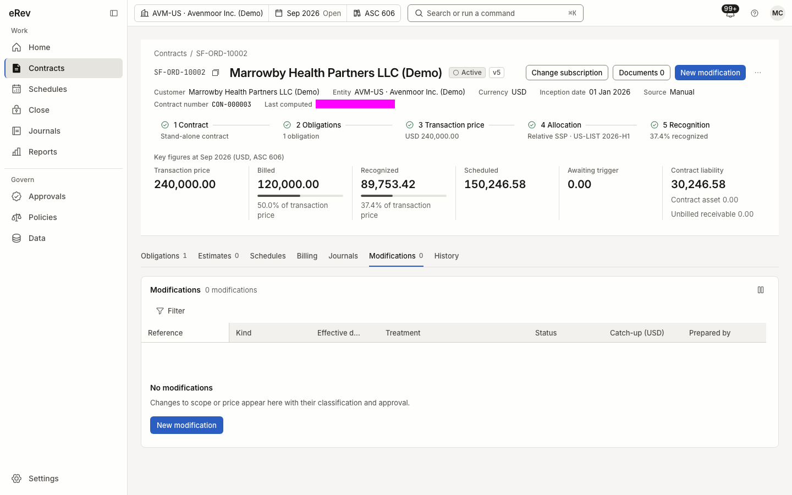

*SF-03:modifications: contract SF-ORD-10002, Marrowby Health Partners LLC (Demo), before its first modification; Maya Chen.*

To prepare a modification:

1. On an "Active" contract choose "New modification" in the header, or "Change subscription" and one of "Upgrade", "Downgrade", "Co-term", "Renew", "Early renew" and "Cancel". The wizard opens (address `/contracts/:contractId/modifications/new`) with its five steps: "Change", "Questionnaire", "Treatment", "Impact preview" and "Submit".
2. Step "Change". A subscription change asks the "Obligation", for a co-term or a renewal the "New obligation key", the "Quantity", the "Price", the "Effective date" and a "Reference" that is unique on the contract. The general form asks "Kind", "Reference", "Effective date", an optional "Scope description" and the "Lines", each with "Action" ("Add", "Remove" or "Change"), "Obligation", "Product", "Quantity change", "Consideration change (USD)", "Start date" and "End date"; "Linked estimate versions" and "Linked judgement records" stand below. "Next" stores the draft.

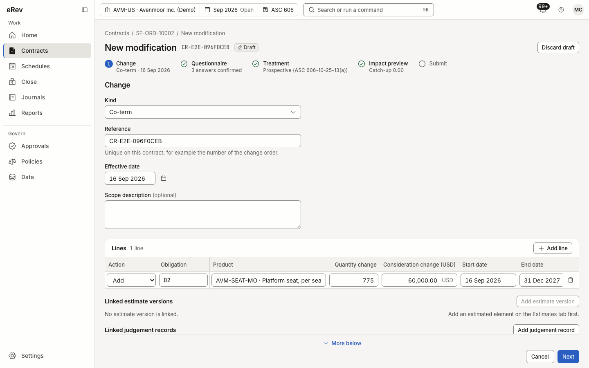

*SF-07: step "Change" of the draft CR-E2E-096F0CEB, a co-term that adds obligation O2 with 775 units for USD 60,000.00 from 16 Sep 2026; Maya Chen.*

3. Step "Questionnaire". For each obligation concerned the wizard asks "Are the added goods or services distinct?" and "Is the added price at SSP?", or "Are the remaining goods or services distinct from those already transferred?". A proposed answer is marked "Prefilled" with its reason, in the capture "60,000.00 is below the range low 69,750.00 (US-LIST 2026-H1)". Change an answer where the facts differ, then tick "I confirm these answers for O2" and the same box of every other obligation; until then the footer reads "Confirm every answer to continue." The "Proposed treatment" stands beneath the groups.

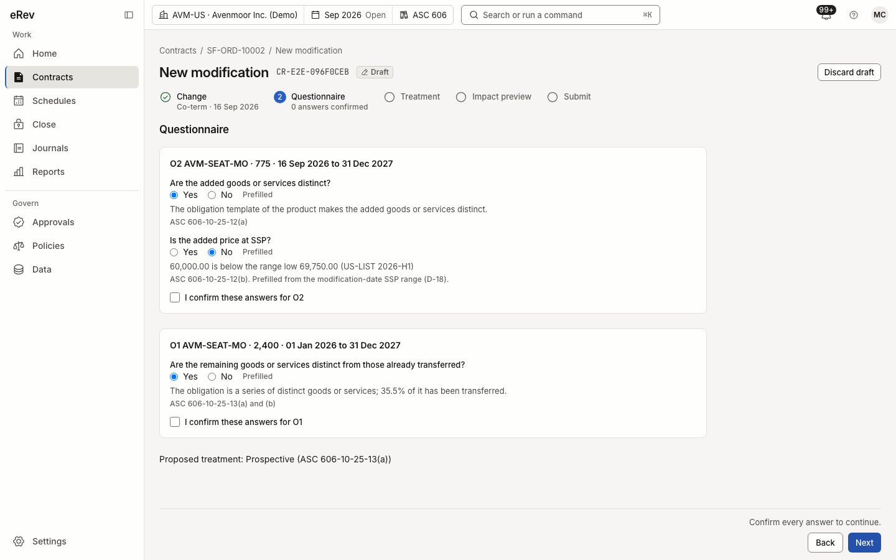

*SF-07: step "Questionnaire" with three prefilled answers and the proposed treatment "Prospective (ASC 606-10-25-13(a))"; Maya Chen.*

4. Step "Treatment". The table "Treatment by obligation" shows the "Proposed treatment", the "Chosen treatment" and the "SSP basis" of each obligation; the treatments are "Separate contract (ASC 606-10-25-12)", "Prospective (ASC 606-10-25-13(a))", "Cumulative catch-up (ASC 606-10-25-13(b))" and "Mixed (ASC 606-10-25-13(c))". A choice that departs from the proposal needs a judgement record: "Record why this treatment differs from the proposal.", "Record judgement".
5. Step "Impact preview". The preview is computed ("Calculating preview") and shown as the "Impact summary (USD)" with "Transaction price", "Catch-up", the revenue of the period, the RPO and the number of "Journal lines"; "Before" beneath a figure gives its value without the change. The tables "Allocation by obligation", "Revenue by period" and "Journal preview" follow.
6. Step "Submit". Check the summary, add a "Comment" where needed and choose "Submit for approval". The message names the request ("Submitted for approval. Request APR-000450 is waiting for approval.") and the page becomes the read-only detail.
7. Follow the approval on that page. It shows, in order, the "Change" with its "Lines", the "Answers", the "Treatments", the "Impact preview as submitted" with the note "Snapshot 2bc7b0642c8f reviewed by the approver.", the "Approval" and the "Linked requests". "Approval" names the request and one line for each step of its routing: in the capture "Revenue review · Approve contract modifications" is "Pending approval" and "Controller approval · Approve contract modifications" is "Waiting". The approvers decide the request under "Approvals", one step after the other.

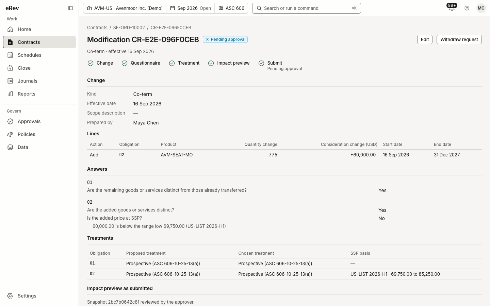

*SF-07:detail: the submitted modification CR-E2E-096F0CEB, "Pending approval", with its change, answers and treatments; Maya Chen.*

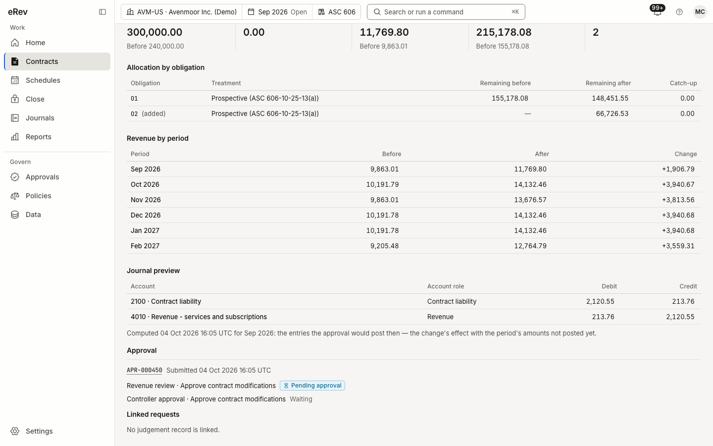

*SF-07:detail: the lower half of the same page with the stored impact preview and the routing of request APR-000450; Maya Chen.*

Until the decision the preparer can choose "Withdraw request", which makes the modification a draft again, or "Edit", which voids the pending request ("Edit this submitted modification?"). A rejected modification offers "Revise", which returns it to draft. "Discard draft" in the wizard voids a draft; it stays on the tab as "Void". Limit in 1.0: at a modification the allocation follows the SSP version the preparer names for an obligation, while the price test of an added line reads the version in force at the modification date (limits document, row B3-10).

### Schedules, Billing, Journals and History tabs

Four tabs of the workbench show what a contract has scheduled, billed and posted, and how it came to its present state. Each has its own address under the contract, for example `/contracts/:contractId/schedules`. To read them:

1. Open "Schedules" for the "Revenue schedule", one line for each period and obligation: "Period", "Obligation", "Line type" (such as "Normal", "Catch-up", "Modification" or "Transaction price change"), "State" ("Recognized" or "Scheduled"), "Amount (USD)" and "Cumulative (USD)". "Filter" narrows the lines by "From period", "To period", "Obligation" and "Line type". In the capture the months to September 2026 are "Recognized" and the later months "Scheduled".

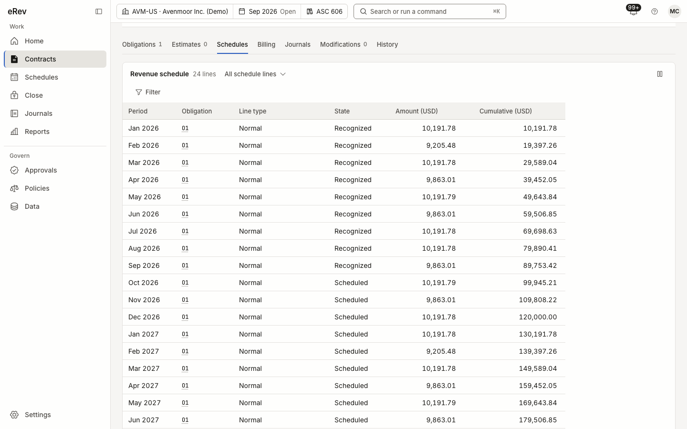

*SF-03:schedules: the 24 lines of obligation O1 of SF-ORD-10002, with 9,863.01 for Sep 2026; Maya Chen.*

2. Open "Billing" for "Balances by entity (USD)", one row for each labelled balance and one column for each entity ("Show zero balances" adds the balances that are zero), and for "Invoices and credit memos" with "Document", "Kind", "Issue date", "Obligation", "Invoiced (USD)", "Credited (USD)", "Effective date" and "Origin".

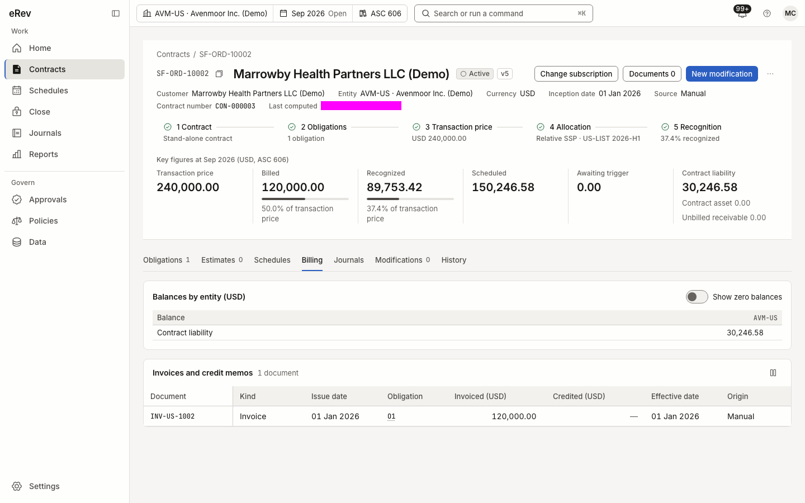

*SF-03:billing: SF-ORD-10002 with a contract liability of 30,246.58 and the invoice INV-US-1002 of 120,000.00; Maya Chen.*

3. Open "Journals" for the "Journal lines" of the contract: "Period", "Origin period", "Effective date", "Entry", "Account role", "Account", "Currency", "Debit", "Credit", "Obligation" and "Journal run", where "View run" opens the journal run that holds the line. "Filter" narrows the lines by "Period", "Origin period" and "Account role".

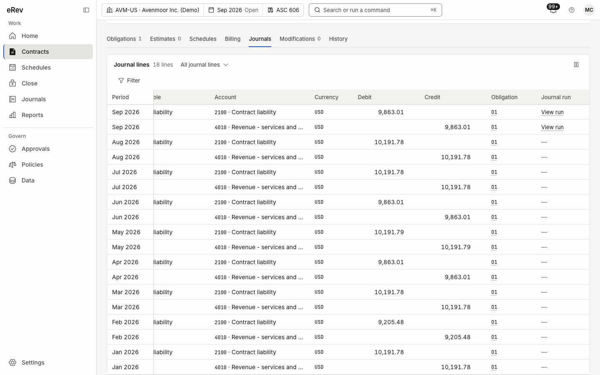

*SF-03:journals: the 18 lines of SF-ORD-10002, for each month a debit to 2100 · Contract liability and a credit to revenue account 4010; Maya Chen.*

4. Open "History" and choose one of its three views. "Activity" lists what happened to the contract and can be narrowed to "Changes", "Approvals" or "Calculations". "Versions" lists every computed version with "Known at", "Cause", "Engine", "Transaction price (USD)", "Revenue to date (USD)" and "Status in book"; tick two versions and choose "Compare versions" to see each changed field with its two values, under "Contract" and under each obligation. "Audit trail" is offered to a holder of `audit.read`.

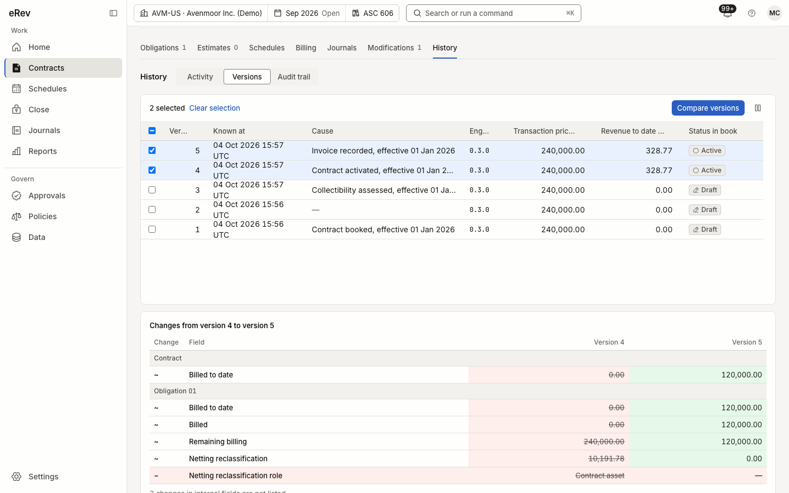

*SF-03:history: view "Versions" of SF-ORD-10002 with versions 4 and 5 compared; the invoice of 120,000.00 changed "Billed to date"; Maya Chen.*

### Explain panel and calculation trace

Every computed figure can be followed to its inputs. Explain shows how a figure was computed, from the stored calculation trace; it is deterministic and is not AI (user guide, Contracts).

1. Select a figure: a key figure, an obligation figure, a schedule amount, a balance or a journal amount. The panel opens at the right under the word "Explain" with the name of the figure, its period and its value. The address takes the parameter `explain`, so the copy button of the panel gives a link that opens it again.
2. Read the "Narrative", sentences that restate the computation with its numbers. In the capture the amount of Sep 2026, USD 9,764.38, is the cumulative revenue to 30 Sep 2026 (USD 88,855.89) less that to 31 Aug 2026 (USD 79,091.51), each stated as the allocation times the share of the term elapsed, counted in days.
3. Read the "Formula" (its sentence, its expression, the rounding rule and the identifier of the formula), the "Inputs" ("Name", "Value", "Source") and the "Calculation steps". An input that is itself computed carries a function button that opens the explanation of that input; the button that begins "Back to" returns.
4. Further down, "Source records" link the records the figure rests on, "Versions" names the engine version, the calculation trace and the contract version, and "History" lists the earlier values of the figure by contract version.
5. Choose "Verify" to have the figure recomputed; a figure that holds reads "Recomputed from the stored trace:" with the value and "Matches."
6. Choose "Open calculation trace" to see the whole computation. Esc closes the panel.

The "Billed", "Recognized" and "Scheduled" figures of a contract open a list "By obligation" first; "Explain O1" in a row leads to the figure of that obligation.

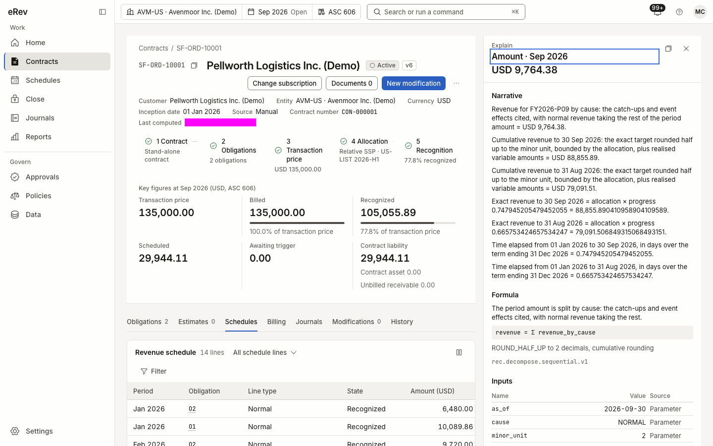

*Explain panel on SF-03:schedules: "Amount · Sep 2026", USD 9,764.38, of obligation O1 of SF-ORD-10001, with its narrative, formula and inputs; Maya Chen.*

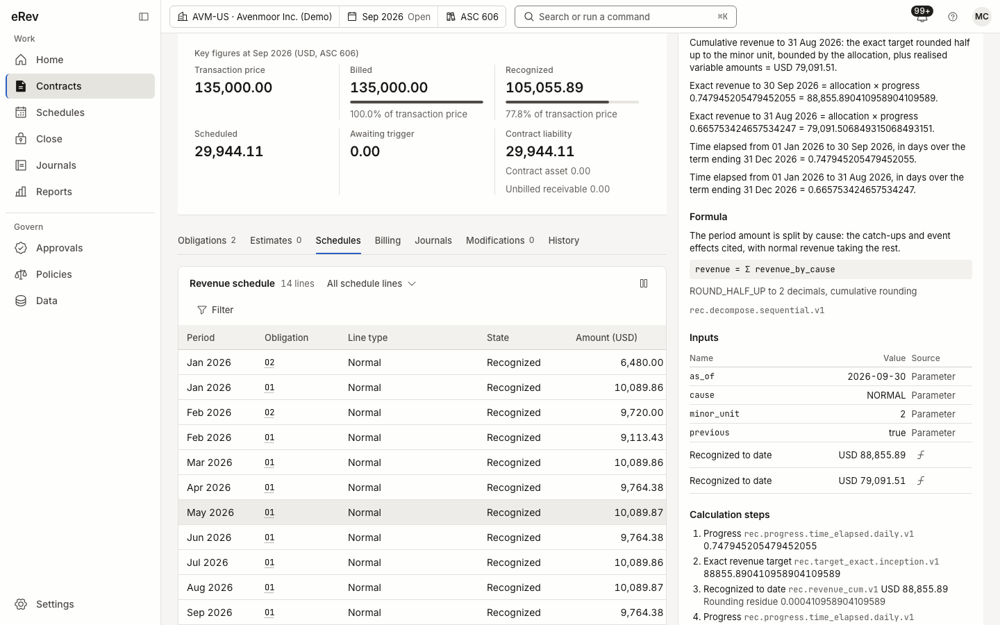

*SF-03:schedules with the panel scrolled to "Inputs" and "Calculation steps" (release smoke journey, step 6); the line of Sep 2026 is the last row in view; Maya Chen.*

The calculation trace (address `/trace/:calcTraceId`) lists every node of the computation the figure belongs to. Its header gives "Engine version", "Contract version", "Book", "Nodes" and "Trace id"; the grid gives "Node", "Formula", "Value", "Currency", "Rounding residue", "Inputs" and "Source", and a row expands to its inputs. Opened from Explain, the row of the figure is selected. "Expand all" and "Collapse all" open and close the tree; "Download JSON" saves the trace as a file.

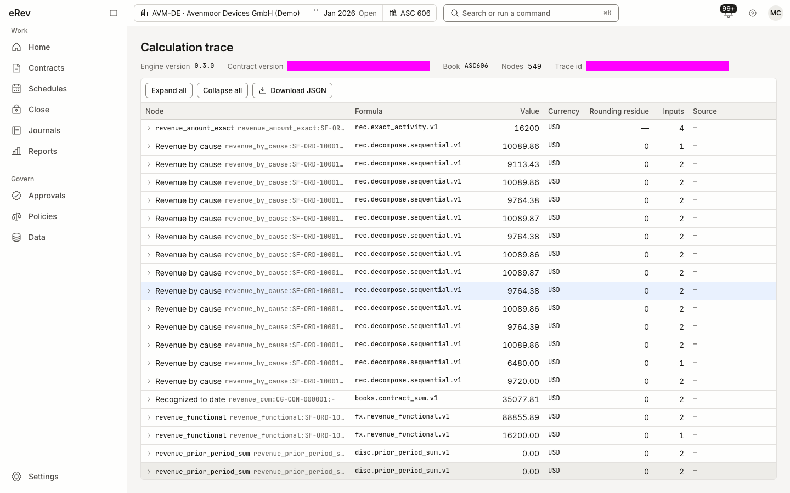

*X:trace: the trace behind the figure above, 549 nodes, with the row of 9764.38 selected; Maya Chen.*

## Schedules

The Schedules area shows revenue by period across the contracts of an entity: what is recognised, what is scheduled and what awaits a trigger. Anyone who may read contracts and run reports uses it; the two captures of the capture run show Marcus Webb (Controller, initials "MW"), and the capture of the QA pass shows Maya Chen. The route and the API are in the user guide, [Schedules](user-guide.md#schedules).

### Schedules grid (SF-04)

"Schedules" in the rail opens the screen (address `/schedules`) for the entity, the period and the book of the context pill. The screen runs the report "Revenue waterfall" with the parameters of its toolbar and shows that run; the address names the run. From top to bottom it shows:

- the header with "Run details" and "Export";
- the toolbar: "Rows" ("Contract", "Obligation", "Product" or "Revenue category"), the granularity "Month", "Quarter" or "Year", the range "From" and "To" (at first the fiscal year of the context period), the measure "Total" or "By state", the layout "Waterfall" or "Lines", and "Run report";
- the run stamp: "Report", "Run", "Entity", "Book", "As of", "Source", "Engine", "Run by", "Run at", "Rows" and "Output SHA-256";
- the strip "Tie-outs" with the check "Waterfall revenue equals revenue journal total", which reads "Pass" or "Difference" with the expected amount, the actual amount and the difference;
- at the granularity "Month" with the measure "Total", the chart "Revenue by period" (the two captures of the capture run here are by quarter and have none; the report view under [Reports](#reports) shows it);
- the grid "Revenue waterfall".

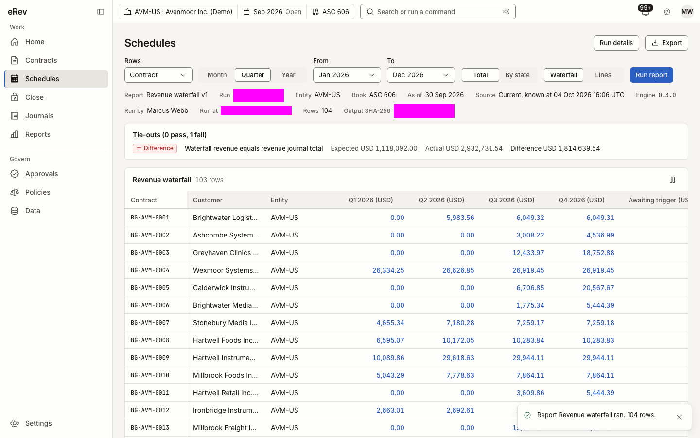

*SF-04: the revenue waterfall of AVM-US by contract and quarter, January to December 2026, 103 rows; Marcus Webb, Controller.*

In this capture the check reads "Difference": the months January to September 2026 of the demo workspace are open and recognise revenue, and journal runs existed for only some of them when the capture was taken.

To read the grid:

1. Read a row from left to right: the "Contract", its "Customer" and "Entity", one amount for each period of the range (here "Q1 2026 (USD)" to "Q4 2026 (USD)"), then "Awaiting trigger (USD)", which belongs to no period, and "Total (USD)". The last row is the "Total"; "Rows" of the run stamp counts it.
2. Each cell adds the recognised and the scheduled revenue of its period: revenue is recognised in the periods up to the "As of" date of the stamp and scheduled in the later ones. "By state" gives each period a "recognized" and a "scheduled" column.
3. Select a figure to open its explanation, as on the workbench; a figure of several obligations lists its contributors first.
4. Change "Rows", the granularity, the range or the measure and choose "Run report" for a new run. With "Rows" at "Obligation" each obligation has its own row, with "Obligation" and "Product".
5. Switch to "Lines" for the revenue schedule lines of the range: "Obligation", "Entity", "Period", "Line type", "Currency", "Amount", "Cumulative" and "Quantity". This layout reads the current schedule lines and has no run stamp.
6. Choose "Run details" for the record of the run ("Parameters", "Source", "Control totals", "Tie-outs", "Output") and "Export" for a file of it.

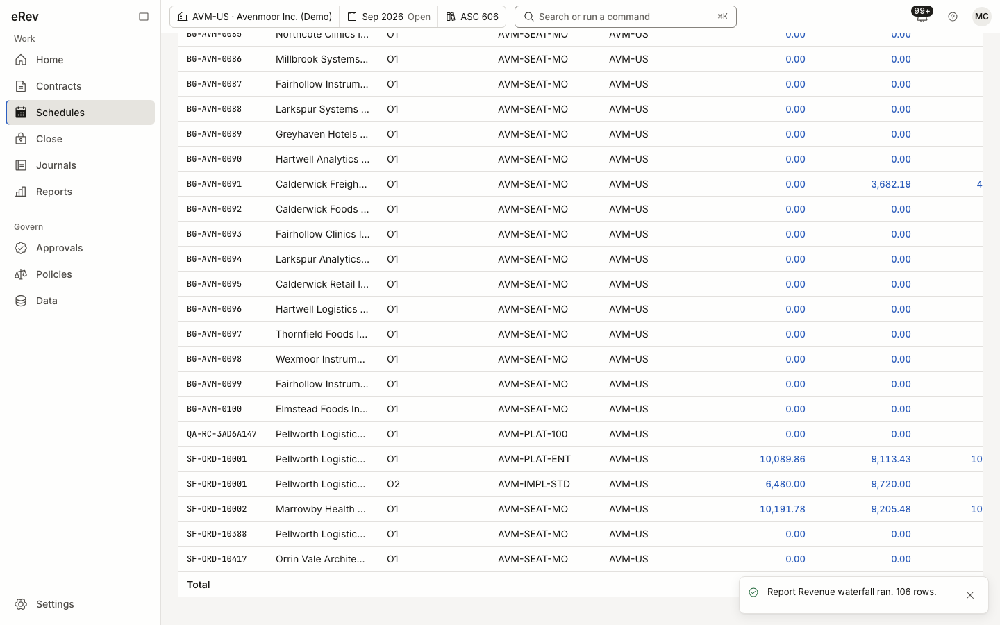

*SF-04 with "Rows" at "Obligation" (QA pass, step A-8): one row for each obligation and the "Total" row last; Maya Chen.*

An entity without a computed contract shows "No schedules for Sep 2026" with "Go to Contracts". In the capture below the entity is AVM-JP, whose fiscal year starts in April, so the range runs from "Apr 2026" to "Mar 2027".

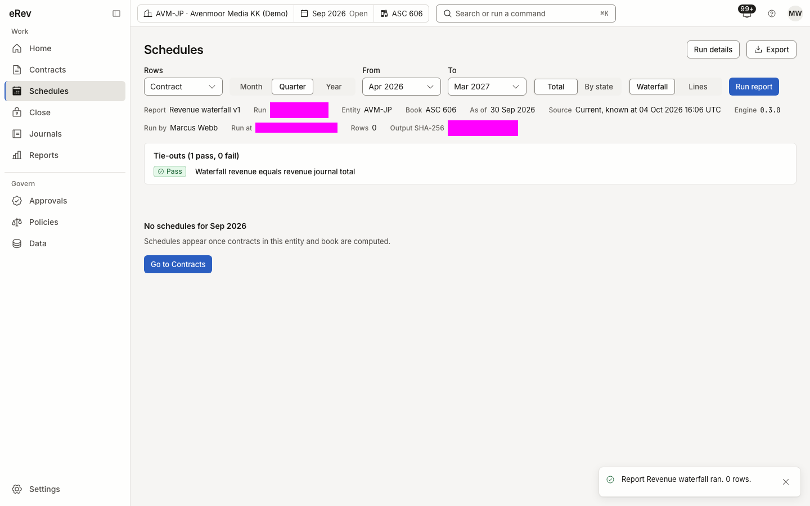

*SF-04: AVM-JP by quarter over its fiscal year from April 2026, without rows and with a tie-out that passes; Marcus Webb.*

For a locked period the screen first shows the figures as the lock froze them, says so with the time of the lock and offers "Show current figures"; while the lock is the source the toolbar takes no input ("Figures as locked take no parameters. Show current figures to change them."). Limit in 1.0: the waterfall lists every contract known at the run, so the frozen waterfall of a locked period also holds contracts that became contracts after its end, with no revenue and their allocation under awaiting trigger; for the position at the end of a locked period read the RPO report as locked (limits document, row B4-1). Limit in 1.0: a run over entities of more than one fiscal calendar is refused, so run the screen for one entity or for the entities of one calendar (row B4-5).

## Close

The Close area has one cockpit for each legal entity, book and period. A period is closed in this order: what holds it is cleared, the soft close is started, the close run posts the period-end entries and calculates the journal run, the journal run is approved, exported and given the ledger's reference, the two reconciliations are prepared and reviewed, the period is submitted for lock, and a Controller locks it. In the demo workspace Maya Chen (Revenue Accountant) prepares, Priya Raman (Revenue Reviewer) reviews and approves, and Marcus Webb (Controller) locks. The rules of every step are in the user guide ([Close](user-guide.md#close)).

Two sets of captures illustrate this part. Those of the capture run show Avenmoor Holdings as seeded, with every month of 2026 up to September open, and the states the run itself sets: a soft close, a blocked close run, new reconciliations. Those of the QA pass (the numbered files) follow September 2026 of Avenmoor Inc. (AVM-US) from the open period to its lock, in a workspace seeded with its close: January to August 2026 of AVM-US were already locked in the ASC 606 book.

### The cockpit of an open period

The close cockpit (SF-05) shows what still holds a period and carries the commands that move it. Whoever can read contracts can open it; a command is shown only to a person who holds its permission. Choose "Close" in the rail: `/close` opens the cockpit of the period named in the context pill, at `/close/:entity/:book/:period`.

- **Header.** The title, for example "Close · AVM-US · Sep 2026 · ASC 606"; the period's state as a chip ("Future", "Period open", "Soft close", "Locked", "Reopened", "Permanently locked"); the commands of that state; and a line with "Entity", "Book", "Period", "Close run" (the state of the latest close run, or "None") and "Current lock" (the first characters of the lock's id, or "None").
- **"Close status".** "Blockers" (the total of the blocker table), "Checklist" (for example "4 of 14 passed"), "Reconciliations reviewed" ("0 of 2"), "Journal difference (USD)" (a dash while the period has no journal run) and "Days to close" for the period and up to two before it, each with its number of days or "In progress".
- **Tabs.** "Checklist", "Close run", "Journal preview", "Reconciliations" and "History". The header and the strip stay in place on every tab.
- **"Blockers (23)".** One row for each kind of open item, with "Blocker", "Count" and "Owner". A row with a count of zero is not shown, and a name is a link to the list it counts where the product has such a list.
- **"Checklist".** The 14 system gates and any custom task, with "Status" (for example "Passed", "Not passed" or "Waived"), "Gate or task", "Kind" ("Automatic" or "Manual"), "Count" and "Owner"; "Due", "Signed", "Evaluated" and "Actions" follow to the right. The name of a gate opens a panel with its result in words.

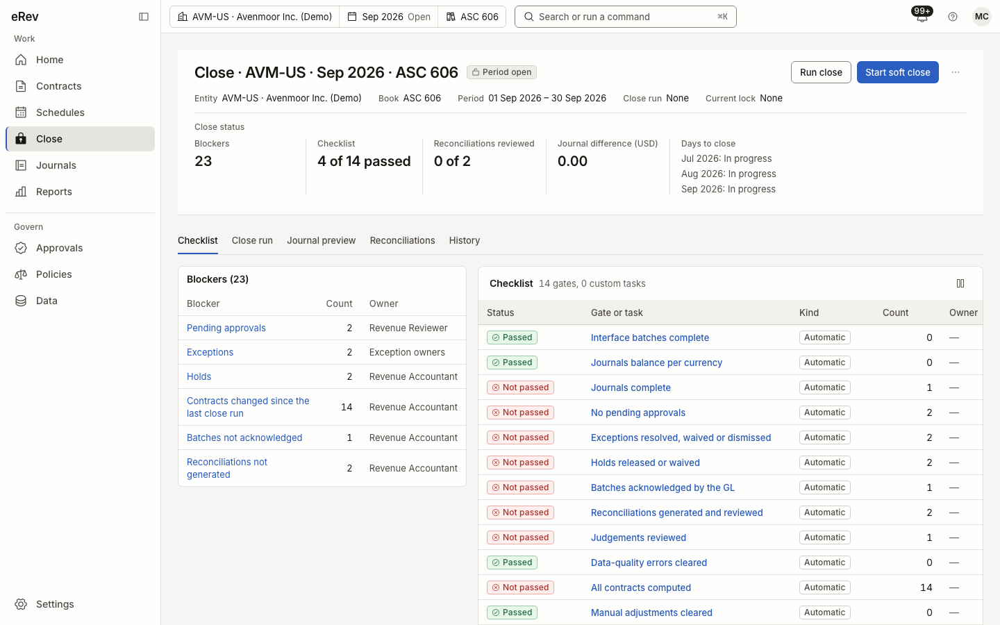

*SF-05: the cockpit of AVM-US, September 2026, open, with 23 blockers and 4 of 14 gates passed. Persona: Maya Chen.*

A holder of the lock permission, in the demo the Controller, also sees "Lock period". While the period cannot be locked the button is greyed and a line under the strip gives the reason, for example "Lock is not available: 10 close gates have not passed.", followed by those gates as links to their rows. A period that is still "Future" offers "Open period" alone, and periods open in order ("Open \<previous period> first."). Limit in 1.0: no notification is sent when a new blocker arises in a period in soft close, although the notification settings offer a switch for it; read the blockers on the cockpit (limits document, row B8-12).

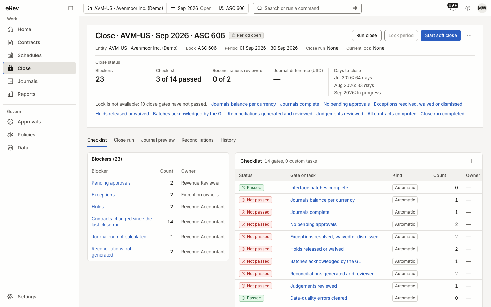

*SF-05, QA pass: September 2026 of AVM-US before the close, with "Lock period" greyed and the gates that have not passed listed as links. Persona: Marcus Webb.*

### What holds a period and how it is cleared

Most rows of "Blockers" count what one gate of the checklist waits for. The period can be submitted for lock when every gate except "Controller certification" has passed or is waived; the lock itself gives the certification.

| Blocker | Gate it holds | How it is cleared |
|---|---|---|
| "Pending approvals" | "No pending approvals" | The approver decides each request under [Approvals](#approvals). The link opens "All requests" with the entity's pending requests. |
| "Exceptions" | "Exceptions resolved, waived or dismissed" | Each item is resolved, dismissed with a reason or waived by an approved request in the exception queue ([Data](#data)). |
| "Holds" | "Holds released or waived" | The hold is released on its contract. The link opens the contracts on hold. |
| "Contracts changed since the last close run" | "All contracts computed" | Run the close: its step "Recompute changed contracts" calculates them again. |
| "Journal run not calculated" | "Journals complete", "Journals balance per currency" | Run the close, or "Run journals" in the Journals area. |
| "Batches not exported", "Batches not acknowledged" | "Batches acknowledged by the GL" | The approved journal run is exported and each batch is given the ledger's reference ([Journals](#journals)). |
| "Reconciliations not generated", "Reconciliations not signed" | "Reconciliations generated and reviewed" | Generate, prepare and review the two reconciliations (below). |
| "Judgements not reviewed" | "Judgements reviewed" | The judgement record is reviewed; a record whose request is pending counts under "Pending approvals". The link opens the report "Judgement register". |
| "Manual adjustments pending" | "Manual adjustments cleared" | The draft is submitted and approved, or discarded; a submitted adjustment counts under "Pending approvals" (below). The link opens the report "Manual adjustment register". |
| "Close tasks not signed" | the task's own row | "Sign task" in the row of the checklist. |

The table can also show "VC elements without a period-end estimate", "Unmapped products", "Interface batches failed" and "Failed jobs". Limit in 1.0: the close raises no finding where a variable-consideration estimate was not reassessed for the period or a royalty accrual is missing, so a period locks without either check; review the period's estimate versions and royalty statements before the lock (limits document, row B1-38).

**Exceptions.** The link of the row "Exceptions" opens the exception queue on exactly the items it counts; the queue says so ("Showing the exceptions that hold the lock of one period.") and "Show all exceptions" returns to the whole queue. The list is chosen by the period the items hold, not by the context pill, which keeps its own entity and period.

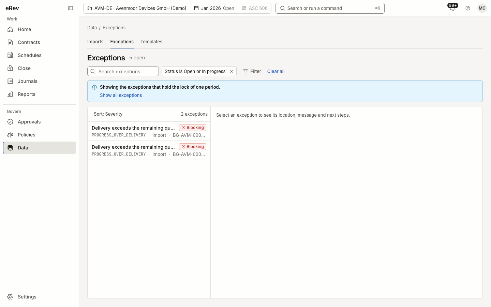

*SF-11: the two blocking exceptions that hold September 2026 of AVM-US, opened from the cockpit's row "Exceptions". Persona: Maya Chen.*

In the walkthrough Maya opened each item, pressed "Dismiss exception", gave the reason in the dialog and confirmed: "Dismissed \<item>. The item counts as cleared for the close gates." The item keeps its message, its location in the import and its resolution with the person and the time.

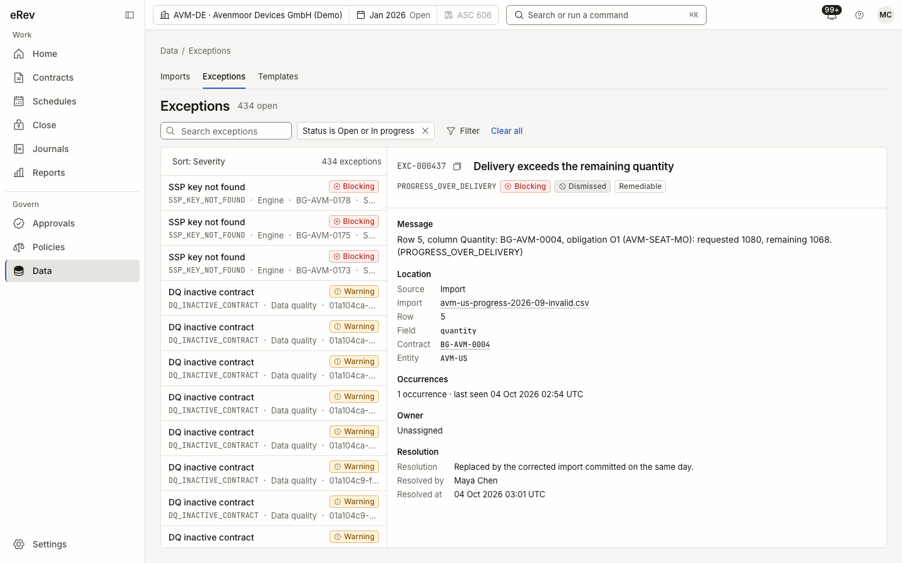

*SF-11:item, QA pass: item EXC-000437 of a rejected import, "Blocking" and "Dismissed", with its resolution by Maya Chen. Persona: Maya Chen.*

**Holds.** A hold is released on the contract workbench ([Contracts](#contracts)): "More actions", "Release hold", a comment in the drawer "Release hold", and "Release hold". The message "Hold released on \<contract>." confirms it.

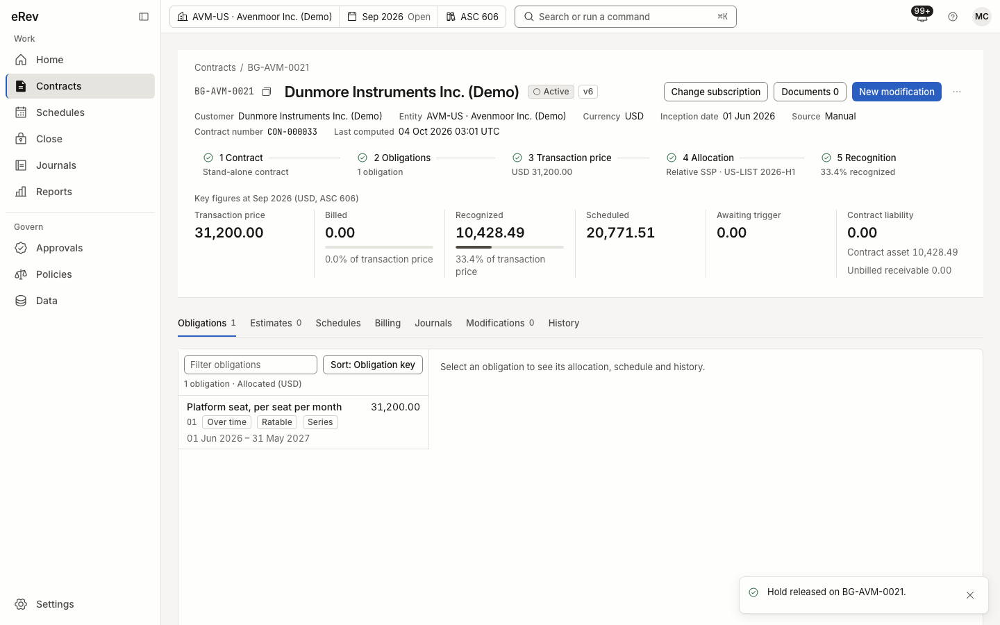

*SF-03, QA pass: contract BG-AVM-0021 with the message "Hold released on BG-AVM-0021." Persona: Maya Chen.*

**Gates.** An automatic gate turns to "Passed" by itself once what it counts is cleared. For a gate that can be waived, a holder of the close permission presses "Request waiver" in the row's "Actions", gives the "Reason (required)" in the dialog "Request a waiver of \<gate>?" and presses "Request waiver": "The waiver goes to approval. The gate counts as cleared once another user approves it." Until then the row shows "Pending approval" and "View request". "Journals balance per currency", "Journals complete", "Close run completed" and "Controller certification" cannot be waived. No capture shows a waiver. Limit in 1.0: a waiver covers the count it was approved for, not the items its approver was shown; where the rows have an identity, as exception items have, waive the item itself (limits document, row B1-10).

**Tasks.** A custom task is a "Manual" row. A holder of the close permission presses "Sign task", ticks "I confirm this statement" under "I completed this close task for \<entity> \<period>." and presses "Sign task". The demo checklist has no custom task ("14 gates, 0 custom tasks"), so no capture shows one. Limit in 1.0: signing does not compare the signer with the task's owner role, and a signature stays through a reopen (limits document, row B1-9).

### Start the soft close

The soft close moves an open or reopened period to the state from which it is submitted for lock; from then on only holders of the lock permission may submit manual adjustments for it, and imports wait for review. A holder of the close permission (Revenue Accountant, Controller) starts it; in the walkthrough Marcus Webb did.

1. On the cockpit of an open period press "Start soft close".
2. In the dialog "Start soft close for Sep 2026?" add a comment if wanted and press "Start soft close".

The message "Soft close started for AVM-US Sep 2026." appears, the chip and the context pill read "Soft close", and the banner "Soft close: only users with the lock permission may submit manual adjustments. Imports wait for review." stays on every tab. "Run close" becomes the main command and "Submit for lock" is offered. To go back, open the "…" menu ("More close actions"), choose "End soft close", pick a "Reason" ("Close restarted", "Data correction pending" or "Other"), write the "Comment (required)" and press "End soft close": the period returns to open, or to reopened if it had been locked before.

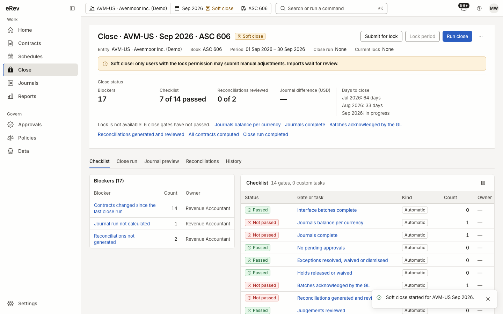

*SF-05, QA pass: September 2026 of AVM-US in soft close, with the banner, "Submit for lock" and "Run close". Persona: Marcus Webb.*

Limit in 1.0: a posting into a period in soft close, or into a reopened period, waits for a second person only when it comes from an import or a manual adjustment; other commands post there on their sender's word alone (limits document, row B1-2).

### Run the close

The close run (SF-05:close-run) recalculates the changed contracts, releases the schedules of the period, posts its period-end entries and calculates its journal run, in fourteen recorded steps: "Cut-off known at", "Interface completeness", "Exception check", "Recompute changed contracts", "Release schedules", "FX remeasurement", "Contract balance reclassification", "Invariant checks", "Journal summarization", "Export", "Acknowledgement wait", "Subledger to GL tie-out", "Dataset freeze" and "Lock". A holder of the close permission runs it in an open period, in soft close or in a reopened period.

1. Press "Run close" on the cockpit, or on the tab "Close run" ("No close run for Sep 2026" while the period has none). The tab opens and follows the run.
2. While it runs, the header reads "Close run CLS-…", "Running" and "Step \<n> of 14: \<step>"; each step shows its state ("Queued", "Running", "Succeeded", "Blocked", "Failed"), its result in words and its duration. "Cancel close run" stops the run after the current step and asks for a reason.
3. When it ends, the message "Close run CLS-000009 succeeded." appears and "Open journal run" leads to the journal run it calculated. In the walkthrough thirteen steps had succeeded and the last, "Lock", waited: the lock is the Controller's decision.

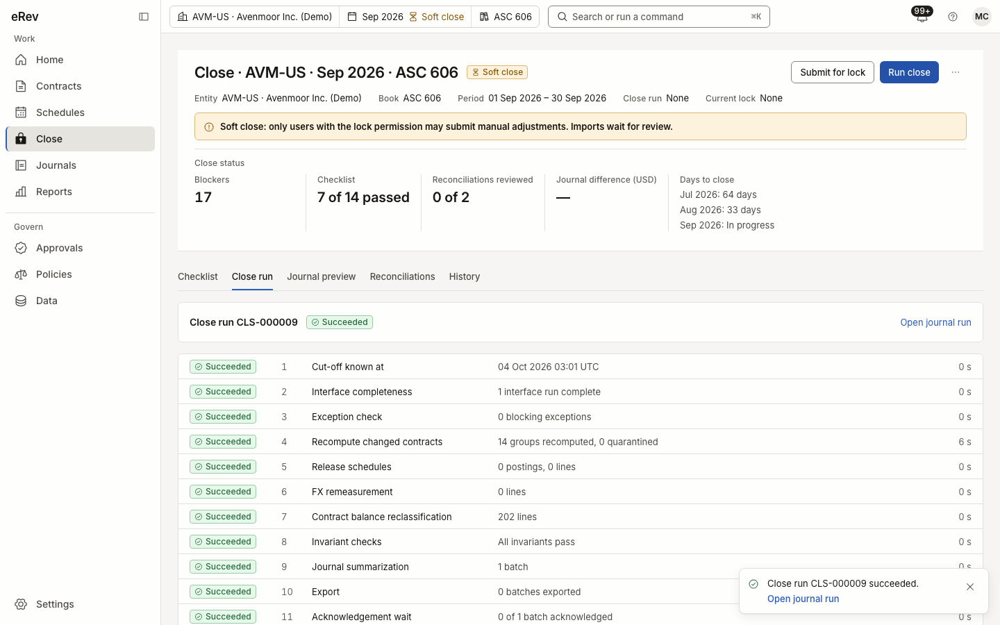

*SF-05:close-run, QA pass: close run CLS-000009 of AVM-US, September 2026, succeeded, with the link "Open journal run"; the strip above the tabs had not refreshed when the capture was taken and still reads "Close run None" and the blockers of before the run. Persona: Maya Chen.*

A run that cannot calculate a contract stops as "Blocked" at "Recompute changed contracts": "Close run CLS-000001 is blocked: 3 contracts were quarantined. Resolve or waive them, then resume." The grid "Quarantined contracts" under the steps names each contract with its code, its message and its exception. Resolve or waive each one, then press "Resume close run": the run starts again at the first step that has not succeeded. A run that failed at a step reads "Close run for \<entity> \<period> failed at \<step>. Nothing was committed for that step." and offers the same command. "Earlier close runs" lists the previous runs of the period.

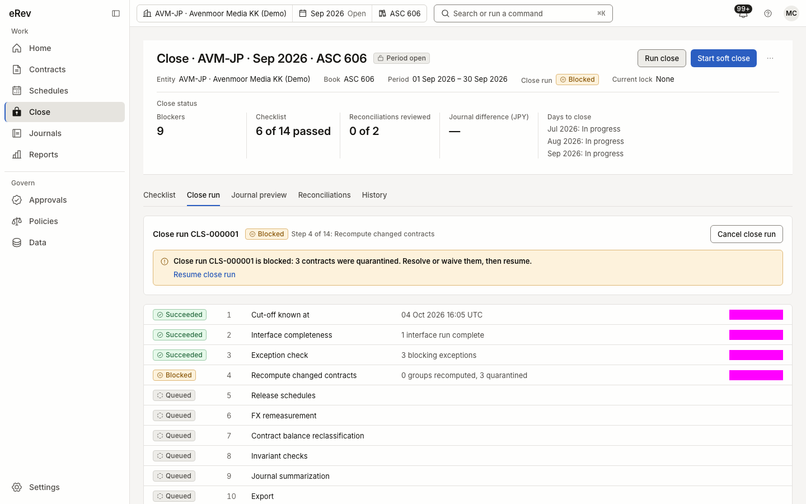

*SF-05:close-run: close run CLS-000001 of AVM-JP blocked at step 4 of 14, with "Resume close run" and "Cancel close run"; the magenta blocks cover the durations. Persona: Maya Chen.*

### Journal preview

The tab "Journal preview" (SF-05:journal-preview) shows the period's journal totals before or beside a run: "Debits", "Credits" and "Difference" with the check ("Pass" and "Balanced"), and the table "Journal preview by account role, USD" with "Account role", "Debit (USD)", "Credit (USD)" and a "Total" row. While the period has no run the tab reads "Journal run not calculated" and offers "Run journals"; afterwards it offers "Open journal run \<number>". A preview that does not balance says "The journal preview does not balance. Difference \<amount>. Journals cannot be submitted." The tab has no command of its own.

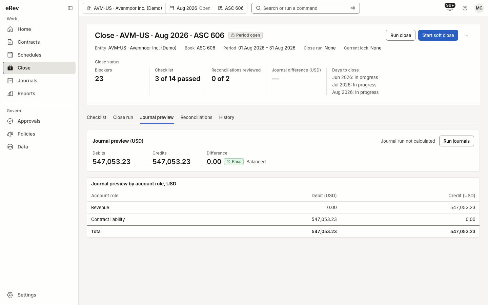

*SF-05:journal-preview: August 2026 of AVM-US, debits and credits of 547,053.23 by account role, balanced, before a journal run. Persona: Maya Chen.*

### Generate the reconciliations

Where the workspace requires reconciliations for the lock, as the demo workspace does, the lock asks for two of them, each prepared by one person and reviewed by another: "Billing to subledger" and "Subledger to GL". The tab "Reconciliations" (SF-05:reconciliations) lists the current one of each kind with "Number", "Kind", "Status" ("Draft", "Prepared", "Reviewed", "Auto-certified", "Reconciled", "Reopened", and "Difference" beside it while differences exist), "Variances", "Preparer" and "Reviewer". A holder of `recon.prepare` (Revenue Accountant) generates them while the period is open, in soft close or reopened.

1. Open the tab "Reconciliations".
2. Press "Generate reconciliation" and choose "Billing to subledger" or "Subledger to GL".
3. The message "Generated REC-000001 (Billing to subledger)." names the new reconciliation, and its number opens it. "Subledger to GL" opens the new reconciliation directly, where its trial balance is attached.

Every generation is a new reconciliation; the one it replaces moves under "Earlier generations (\<n>)". A billing reconciliation without a difference can be certified by a published rule and then reads "Auto-certified" with the rule's name; no capture shows it.

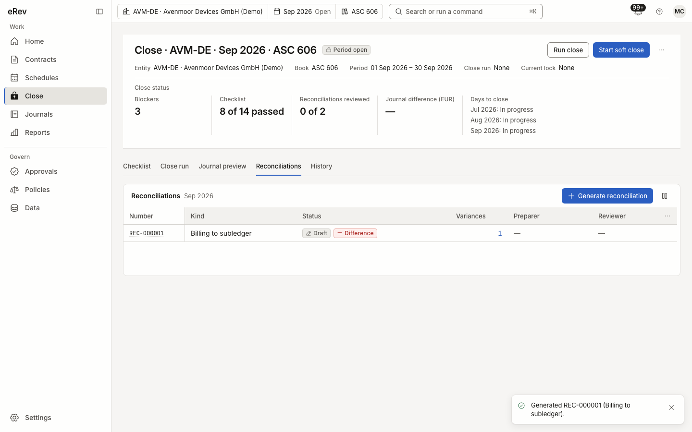

*SF-05:reconciliations: REC-000001, billing to subledger, of AVM-DE, September 2026, a draft with one difference. Persona: Maya Chen.*

### Prepare and review a reconciliation

A reconciliation (SF-05:reconciliation) shows its "Source", the "Key figures" ("Subledger total", "Billing total" or "GL total", "Difference", "Variances"), "Totals by account", the "Differences" one by one with "Kind", "Contract" or "Account", "Reference", the amounts and the "Explanation", and the "Sign-offs" of "Preparer" and "Reviewer".

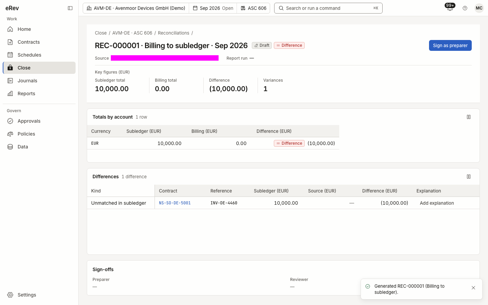

*SF-05:reconciliation: draft REC-000001 with one difference, (10,000.00) EUR, "Unmatched in subledger", and "Sign as preparer"; the magenta block covers the source and its time. Persona: Maya Chen.*

The preparer (Maya Chen):

1. For each difference press "Add explanation", write the "Explanation (required)" of at least 10 characters in the drawer "Explain difference" and press "Save explanation".
2. Press "Sign as preparer". Where an explanation is missing the page says "Explain \<n> differences above the threshold before signing."
3. In the dialog "Sign REC-000017 as preparer?" tick "I confirm this statement" under "I prepared this reconciliation and explained every difference above the threshold." and press "Sign as preparer". The signature needs a session verified with the second factor.

The reconciliation then reads "Prepared" and "Snapshot frozen for review."; its explanations can no longer be changed. The preparer reads "You prepared this reconciliation. Another user must review it." and is offered no review.

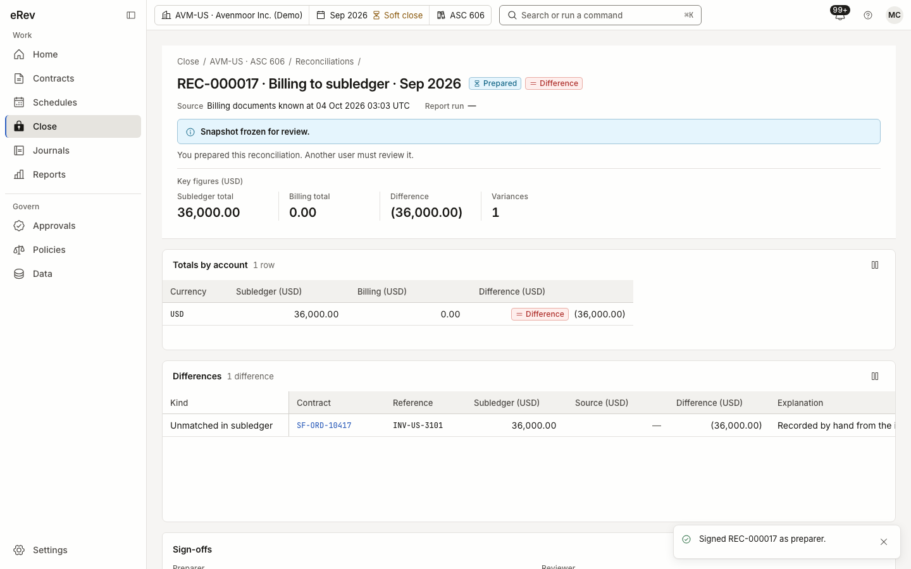

*SF-05:reconciliation, QA pass: REC-000017 of AVM-US, September 2026, "Prepared", with its explained difference and the message "Signed REC-000017 as preparer." Persona: Maya Chen.*

The reviewer (Priya Raman, who holds `recon.signoff`) opens the prepared reconciliation, reads the totals, the differences and their explanations, presses "Sign as reviewer", ticks "I confirm this statement" under "I reviewed this reconciliation, its differences and their explanations." and confirms with an authenticator code when asked. The reconciliation reads "Reviewed" and counts in "Reconciliations reviewed". A draft offers a reviewer nothing to sign, as the next capture shows. With "Reopen reconciliation", in the menu of a prepared or reviewed reconciliation, a holder of `recon.signoff` sends it back, after which it is generated and signed again.

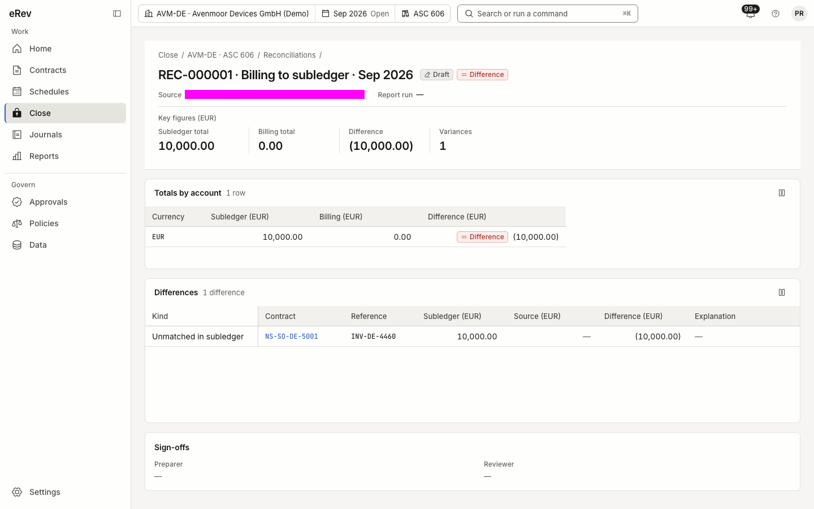

*SF-05:reconciliation: the same draft REC-000001 without a sign-off or explanation control. Persona: Priya Raman.*

### Attach a trial balance

A subledger-to-GL reconciliation compares the subledger's balances with the general ledger's trial balance, which has to be attached first.

1. Generate "Subledger to GL". The new reconciliation opens with "Source" "No source attached" and the section "Attach a trial balance".
2. Where the entity has a general ledger connection, choose "Pull from \<connection>" and press "Pull trial balance from \<connection>". Without one, as in the demo workspace, the section reads "No GL connection is set up for AVM-DE. Upload a CSV of account balances.": choose the file under "Trial balance file", a .csv or .xlsx of at most 50 MiB with the columns account, currency and amount.
3. Press "Upload and compare". The upload also needs the permission to upload imports. A file that cannot be compared is refused with its findings by row.

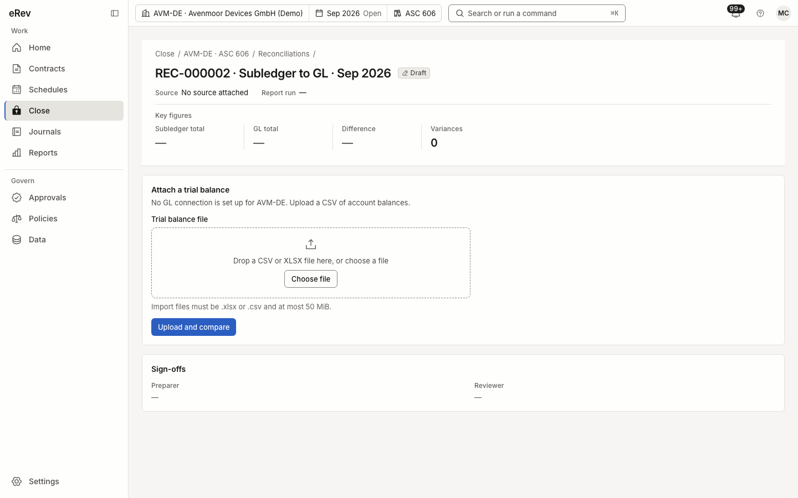

*SF-05:reconciliation: REC-000002, subledger to GL, of AVM-DE with "Attach a trial balance" and no general ledger connection. Persona: Maya Chen.*

After the comparison the page shows "Accounts", "Subledger total", "GL total", "Difference" and "Variances", one row for each account under "Totals by account" and one row for each difference, to be explained and signed as above.

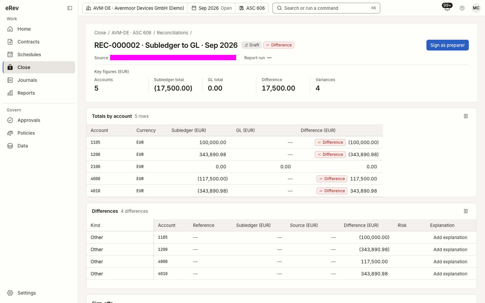

*SF-05:reconciliation: REC-000002 after the upload of a one-line trial balance, with four differences of the kind "Other" on five accounts; the magenta block covers the file's name and time. Persona: Maya Chen.*

In the walkthrough the uploaded file held the subledger's own balances, so its capture shows how an agreeing tie-out reads ("No differences": "Subledger and source totals agree for every account."), not two independent books.

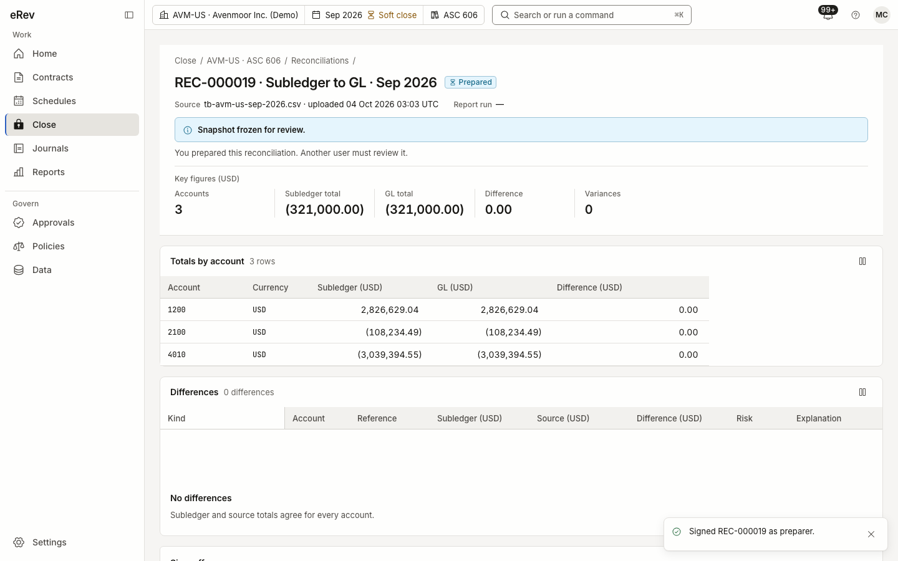

*SF-05:reconciliation, QA pass: REC-000019 of AVM-US, September 2026, "Prepared", three accounts, difference 0.00, source "tb-avm-us-sep-2026.csv". Persona: Maya Chen.*

Limit in 1.0: a subledger-to-GL reconciliation is never certified automatically at zero variance; people prepare and review it (limits document, row B1-30). Limit in 1.0: on an uploaded trial balance a direct entry in the general ledger on an account the subledger controls is not named; the difference is listed as "Other" and is not marked "High risk" (limits document, row B1-28). Limit in 1.0: a contract balance role is stated only for contracts in the entity's functional currency or with a stored functional balance; otherwise its row reads "Not stated" and is explained by the preparer (limits document, row B2-16).

### Submit the period for lock

When the blockers are cleared, a holder of the close permission submits the period in soft close; in the walkthrough Maya Chen did.

1. Press "Submit for lock".
2. The dialog "Submit Sep 2026 for lock" lists the "Close gates" with their state. Write the "Certification comment (required)" of at least 10 characters and press "Submit for lock".
3. If a gate has not passed, the submission is refused: the dialog stays open, says "\<n> close gates have not passed:" with each gate as a link to its row, and keeps the typed comment.

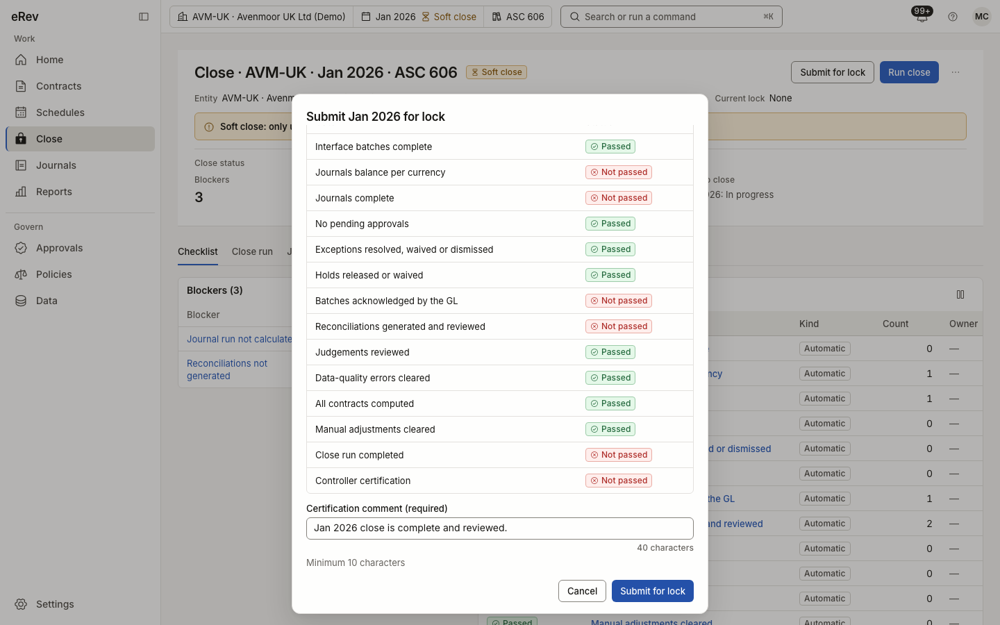

*SF-05: "Submit Jan 2026 for lock" for AVM-UK with the gates that read "Not passed" and the certification comment kept. Persona: Maya Chen.*

Periods are locked in their order. While an earlier period of the entity and book is open, in soft close or reopened, "Submit for lock" and "Lock period" are greyed and the cockpit says which period comes first, with a link to it.

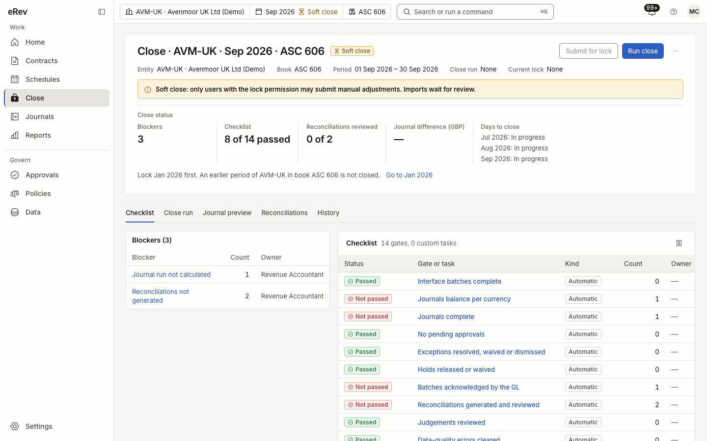

*SF-05: September 2026 of AVM-UK in soft close, with "Lock Jan 2026 first. An earlier period of AVM-UK in book ASC 606 is not closed." and "Go to Jan 2026". Persona: Maya Chen.*

A submission that is accepted answers "Submitted Sep 2026 for lock. A Controller other than you must lock it." The cockpit then shows "Submitted for lock by Maya Chen on 04 Oct 2026 03:03 UTC." with "View lock request", "No blockers" and "13 of 14 passed": only "Controller certification" is open.

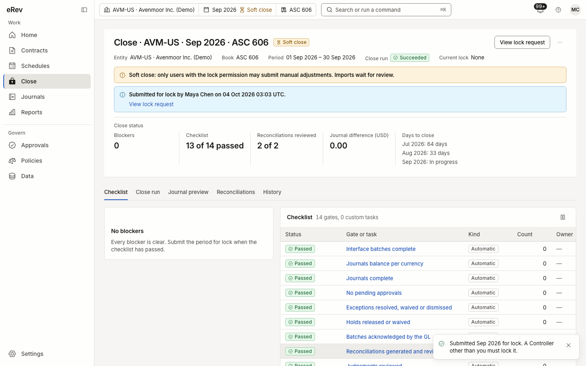

*SF-05, QA pass: September 2026 of AVM-US submitted for lock, no blockers, both reconciliations reviewed. Persona: Maya Chen.*

### Lock the period

The lock is decided by a holder of the lock permission (a Controller) other than the person who submitted the period; the submitter never locks alone. In the walkthrough Marcus Webb locked what Maya Chen had submitted.

1. Open the cockpit of the submitted period. "Lock period" is now the main command. "View lock request" opens the same request under Approvals, where it can be decided as well.
2. Press "Lock period". The dialog "Lock Sep 2026 for AVM-US?" lists the "Close gates" once more.
3. Write the "Reason (required)" and press "Lock period"; confirm with an authenticator code when "Confirm with your authenticator" asks for one.
4. The message "AVM-US Sep 2026 locked." appears. Locking freezes the twelve lock snapshots of the period and, where needed, opens the next period.

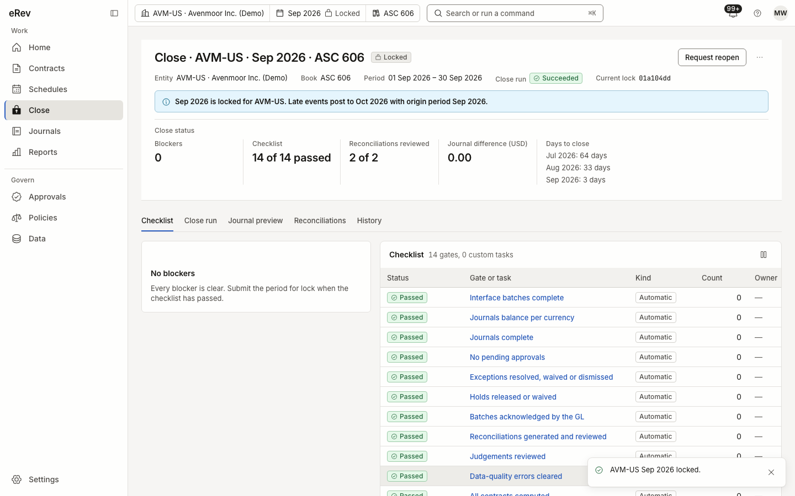

*SF-05, QA pass: September 2026 of AVM-US locked, 14 of 14 gates passed, with "Request reopen". Persona: Marcus Webb.*

A locked month reads "Locked" in the chip and in the context pill, names its lock under "Current lock" and carries the banner "Sep 2026 is locked for AVM-US. Late events post to Oct 2026 with origin period Sep 2026." Its reconciliations read "Reconciled" and are no longer changed ("Certified at lock on \<time>. Reopen the period to change it."), and "Days to close" gives its number of days ("Sep 2026: 3 days"). The commands left are "Request reopen", "Record estimate-versus-error judgement" for a holder of `judgement.create` and, in the "…" menu of a Controller, "Permanently lock".

Limit in 1.0: the lock produces its datasets inside the deciding request, so the press lasts as long as they take; on the demo workspace a lock took two and a half to three minutes when it was measured (limits document, row B2-9; user guide, "Demo workspaces"). Limit in 1.0: the dialog says that an evidence pack is generated, but the period evidence pack has no builder and none is produced (limits document, row B4-6). Limit in 1.0: until the cockpit has read the period's requests it says that the period has not been submitted and blocks "Lock period" (limits document, section B.9, "The cockpit of a submitted period").

**Permanent lock.** "Permanently lock" asks for a locked period to become one that can never be reopened: the dialog "Permanently lock \<period> for \<entity>?" takes a "Comment (required)" and "Request permanent lock" sends the request, once every earlier period of the entity and book is permanently locked. Another Controller decides it on the request's page; the cockpit shows the request meanwhile.

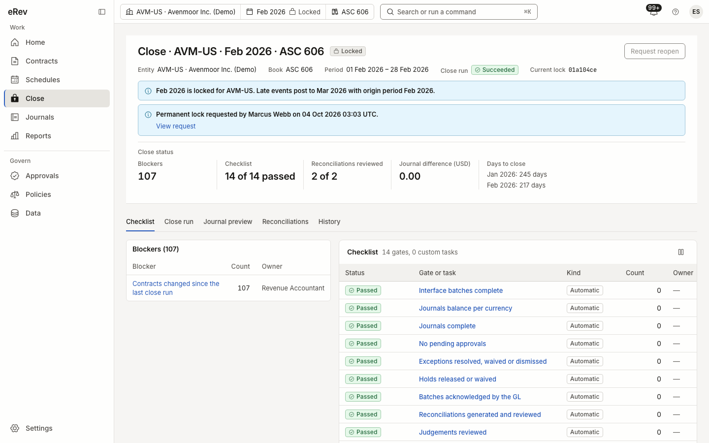

*SF-05, QA pass: February 2026 of AVM-US, locked, with "Permanent lock requested by Marcus Webb on 04 Oct 2026 03:03 UTC." and "View request". Persona: Elena Sokolova, the second Controller.*

The capture also shows "Blockers (107)" on this locked month: the table goes on counting the "Contracts changed since the last close run" after the lock, while all 14 gates read "Passed". The count does not touch the lock.

### The history of a close

The tab "History" (SF-05:history) shows who moved the period and when. "State transitions" lists every change of state, newest first, with the person, the two states, the time to the second and, where one was given, the reason and the comment; "Load older activity" reads further back. "Locks" lists the period's lock records with "Kind" ("Lock", "Reopen", "Permanent lock"), "Recorded", "By", "Approval" and "Diff report"; a record opens a drawer with its approval and decisions, its reason and comment, the instant it was frozen as known at, the hashes of the snapshot, the table "Certification" and the table "Frozen datasets" ("Dataset", "Rows", "File hash"). The period of the capture has never been locked ("No locks yet"), so no capture shows a lock record or its drawer.

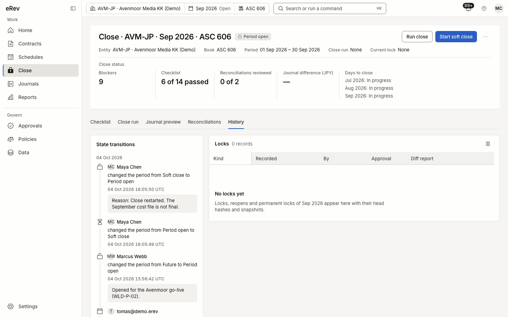

*SF-05:history: September 2026 of AVM-JP, a soft close started and ended with its reason "Close restarted", and no lock. Persona: Maya Chen.*

Limit in 1.0: the history names the submission of a lock or reopen request, not the decision that answered it; a rejection or a withdrawal is read on the request under Approvals (limits document, row B2-10).

### Several entities

The view of several entities (SF-05:multi-entity, `/close/multi-entity`) starts and follows the close runs of one period for more than one legal entity. A holder of the close permission opens it from the cockpit's "…" menu, "Close several entities".

1. Add the legal entities under "Entities"; each is a chip that can be removed.
2. Press "Start close runs". Without an entity the page says "Choose at least one entity."
3. Read the grid "Close runs": "Entity", "Period" with its state, "Close run" (a link to that run), "Status" with "Step \<n> of 14", "Exceptions" and "Cockpit" ("Open cockpit"). An entity whose run has not ended is not started twice: "AVM-JP already has a running close run. It was not started again."

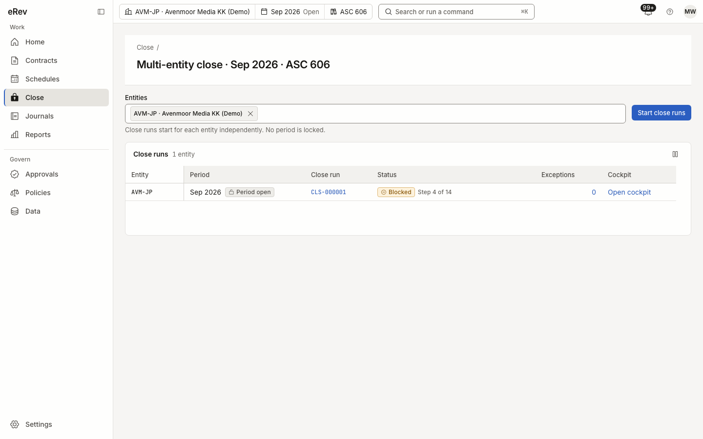

*SF-05:multi-entity: September 2026, with the blocked close run CLS-000001 of AVM-JP. Persona: Marcus Webb.*

The page states its bound itself: "Close runs start for each entity independently. No period is locked." Each entity is submitted and locked on its own cockpit. Limit in 1.0: a close run is started for one entity; the view starts one run for each entity chosen, and no command closes a group of entities at once (limits document, row B2-14).

### Manual adjustments

A manual adjustment changes one contract's accounting by hand, prepared by one person and approved by another. No screen prepares one in release 1.0 and no capture shows one: an adjustment is created, previewed, submitted, withdrawn or discarded through the API under `/api/v1/manual-adjustments`, and its request is decided under Approvals by a holder of `adjustment.approve` who neither prepared nor submitted it. From USD 10,000.00 it needs an attachment and a Controller decides a second step; while the period is in soft close only holders of the lock permission submit. Until it is approved an adjustment changes no schedule and no balance, and a draft or submitted adjustment of the period holds the gate "Manual adjustments cleared"; an approved request to defer it past the lock frees the gate. The report "Manual adjustment register" lists every adjustment with its preparer and approver. The kinds of adjustment and their rules are in the user guide ([Manual adjustments](user-guide.md#manual-adjustments)). Limit in 1.0: a posted adjustment cannot be voided or reversed, only corrected by a further adjustment (limits document, row B2-11). Limit in 1.0: a manual journal or an account reclassification is refused for a contract that is not in its entity's functional currency (limits document, row B2-12).

### Reopen a period

A locked period reopens only through an approved reopen request ([Reopen a period](user-guide.md#reopen-a-period)).

1. On the cockpit of the locked period a holder of the reopen-request permission (Revenue Reviewer, Controller) presses "Request reopen". The button is greyed while a later period of the entity and book is locked ("Reopen \<later period> first. A later period of \<entity> in book \<book> is closed."); a permanently locked period never reopens.
2. In the drawer "Request reopen of \<period>" choose the "Reason" ("Error correction", "Late source data", "Audit adjustment" or "Other"), write the "Comment (required)" of at least 10 characters and press "Submit reopen request": "Reopen requested for \<entity> \<period>. Two approvers must approve."
3. Two people who hold `period.reopen_approve` decide the request under Approvals, each with a fresh authenticator code. At least one is a Controller and neither is the requester; two Revenue Reviewers leave the request pending, and a second decision by the same person is refused. Meanwhile the cockpit reads "Reopen requested by \<name> on \<date>: \<reason>. Dual approval · \<n> of 2 recorded."
4. On the second qualifying approval the period reads "Reopened". The lock's snapshots stay, the period's reconciliations read "Reopened" and are generated and signed again, and the Controllers, Revenue Reviewers and Auditors of the entity are notified.
5. To lock it again, start the close, pass the gates and submit the period as before. The new lock stores a difference report against the previous lock, which the tab "History" offers under "Diff report".

No capture shows the drawer, a pending reopen request or a reopened period: the demo workspaces hold no reopened month. Limit in 1.0: the difference report is computed inside the decision of the new lock, so the Controller cannot read it before deciding, and "Open diff report" leads to a report that is not built; read the stored file afterwards (limits document, row B1-3). Limit in 1.0: the banner of a reopened period says that every posting needs a second approver, yet only imports and manual adjustments wait for one (limits document, row B1-2). Limit in 1.0: a reopen for an error correction names its judgement record in free text that nothing checks; the two approvers open the named record before they approve (limits document, row B1-12).

## Journals

The Journals area turns the subledger's lines of a period into balanced journal entries for the general ledger. A journal run belongs to one legal entity, book and period: it is calculated, submitted, approved by a second person, exported in batches and acknowledged with the ledger's document reference. Choose "Journals" in the rail: `/journals` lists the runs under "Journal runs", and "Entries by date range" shows the entries of any range of dates. In the demo workspace Maya Chen calculates, submits and exports, and Priya Raman approves. The rules are in the user guide ([Journals](user-guide.md#journals)).

### Journal runs

The list (SF-06) shows the runs of the entity, period and book of the context pill with "Run", "Entity", "Period", "Mode" ("Gross" or "Delta"), "State", "Lines", "Debit (USD)", "Credit (USD)" and "Acknowledged" (the acknowledged batches of all batches, "0/1"). "Filter" narrows the list by state or mode, and a run's number opens the run. A close run calculates the period's journal run as one of its steps; a holder of `journal.run` (Revenue Accountant) can also calculate one directly:

1. Press "Run journals".
2. In the dialog "Run journals" choose the "Entities", the "Book", the "Period" (an open, soft-closed or reopened one) and the "Mode". "Summarization" starts at the workspace's value, and "Cut-off known at", under "Advanced", is left empty to use the present time.
3. Press "Calculate journals". The message "Journals calculated for AVM-US Sep 2026." offers "Open run".

A locked period takes no journal run, and a new run is made only when there is something for it to summarise or the period has no run yet ([Approve a run](user-guide.md#approve-a-run)).

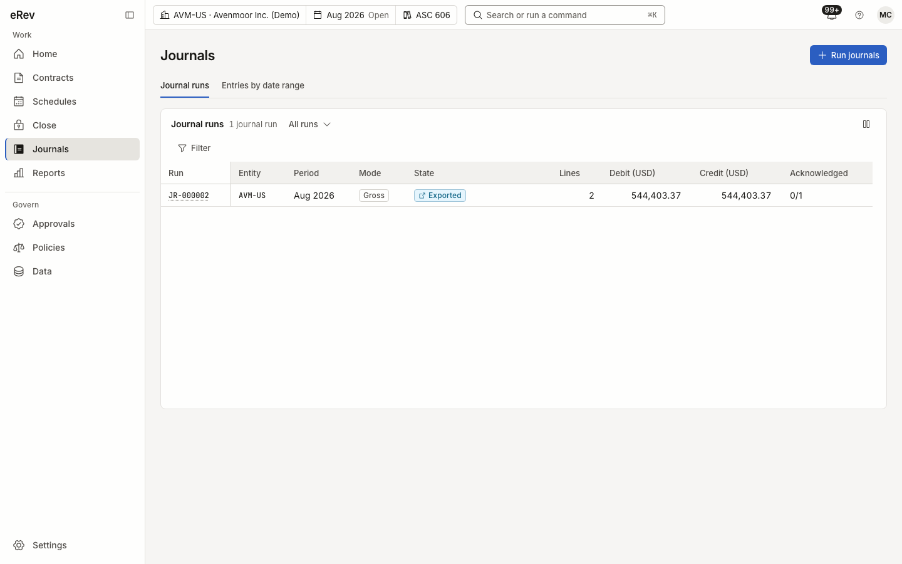

*SF-06: the one journal run of AVM-US for August 2026, JR-000002, "Exported", with none of its one batch acknowledged. Persona: Maya Chen.*

### A journal run from calculation to approval

A run (SF-06:run, `/journals/runs/:runId`) opens on its summary. The header carries the run's number, its state and its commands, and a line with "Entity", "Book", "Period", "Mode", "Summarization", "Cut-off known at", "Journal entries" (the first and the last entry number and their count) and, once it is submitted, "Approval" with the request's number. "Totals (USD)" gives "Debits", "Credits", "Difference" with "Balanced", "Lines" and "Batches acknowledged". The tabs are "Summary", "Lines" and "Batches". "Summary by account" lists each account with "Name", "Currency", "Debit (txn)" and "Credit (txn)"; "Balance checks" has one row for each entity and currency in "Transaction currency" and in "Functional currency", each with its difference.

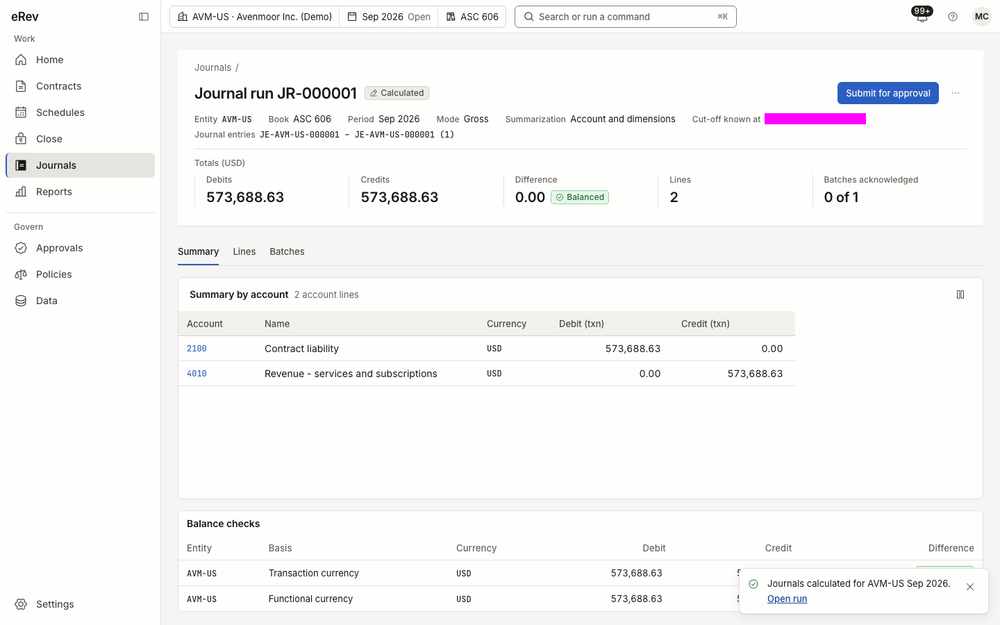

*SF-06:run: JR-000001 of AVM-US for September 2026, "Calculated" and balanced at 573,688.63, with "Submit for approval"; the magenta block covers the cut-off time. Persona: Maya Chen.*

1. Maya reads the totals and the balance checks and presses "Submit for approval".
2. In the dialog "Submit journal run JR-000009 for approval?" ("A user other than you must approve it before export.") she adds a comment and presses "Submit for approval". The run reads "Pending approval" with "Submitted", and "View approval request" opens the request.
3. Priya, who holds `journal.approve` and neither calculated nor submitted the run, opens the request under [Approvals](#approvals), reads it, writes her comment and presses "Approve", with an authenticator code when asked. The message reads "Approved: Approve journal run JR-000009 of AVM-US for Sep 2026."
4. The approval moves the run to "Approved" and writes the export of each batch. In the demo workspace, which has no general ledger connection, the batches are written as CSV files and the run reads "Exported" within seconds; in the walkthrough nothing had to be pressed. While a run still reads "Approved" its header offers "Export journals", or "Export to \<ledger>" where the entity has a connection.

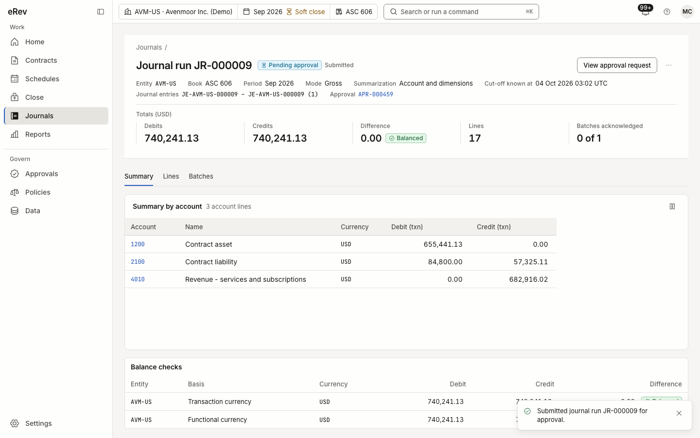

*SF-06:run, QA pass: JR-000009 of AVM-US for September 2026, "Pending approval", balanced at 740,241.13, with "View approval request". Persona: Maya Chen.*

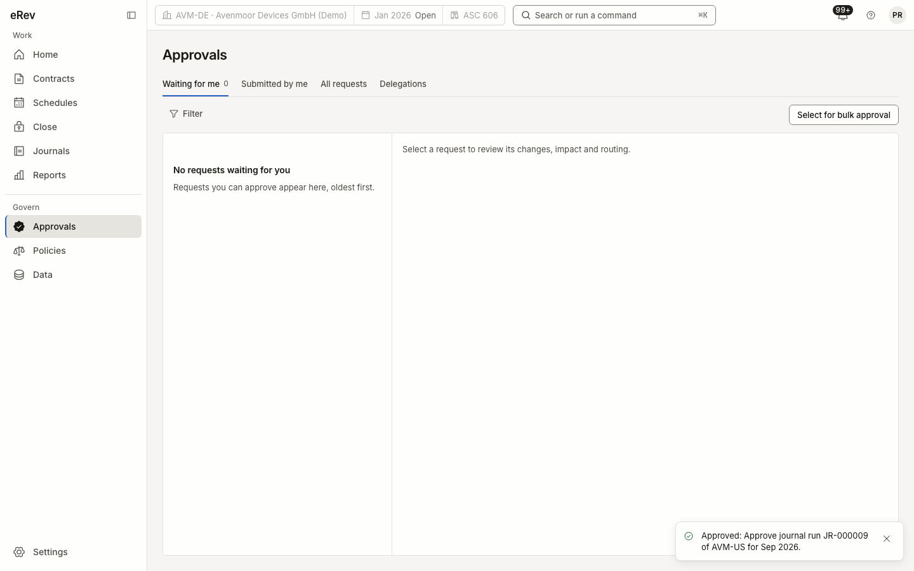

*SF-12, QA pass: the message "Approved: Approve journal run JR-000009 of AVM-US for Sep 2026." and no request left waiting. Persona: Priya Raman.*

An exported run offers "Download batch files", names its approval in the header's line and counts its acknowledged batches under "Batches acknowledged".

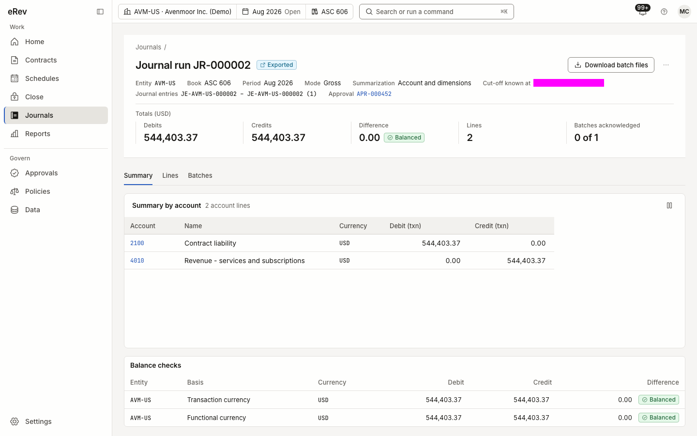

*SF-06:run: JR-000002 of AVM-US for August 2026, "Exported", with "Download batch files", its approval APR-000452 and 0 of 1 batches acknowledged. Persona: Maya Chen.*

The states a run shows are "Calculated", "Pending approval", "Approved", "Exported", "Posted" (every batch acknowledged), "Failed" (the ledger or the adapter refused a batch) and "Cancelled". The "…" menu ("More actions") holds "Cancel journal run", which asks for a reason and is offered for a run that is not exported yet or has a failed batch, and, for a holder of the audit permission, "History". Limit in 1.0: the history of a run names the submission of its approval request, not the decision that answered it (limits document, row B2-10).

### Lines and their source lines

The tab "Lines" (SF-06:run-lines) lists the journal lines of the run, with filters for "Account", "Account role", "Contract" and "Batch". The count under "Source lines" opens a panel beside the page: "Source lines for JE-AVM-US-000002 · 2" lists every subledger line behind the journal line with "Contract", "Debit or credit", "Amount (txn)", "Effective" and "Entry kind", and further columns to the right. "Contract (optional)" narrows the panel to one contract ("A contract external id, applied on Enter.").

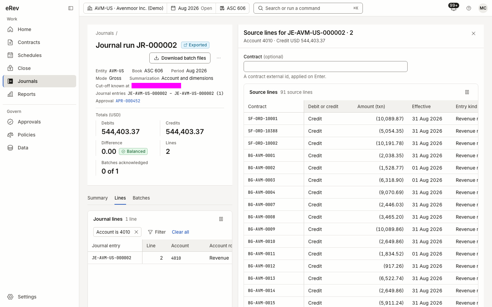

*SF-06:run-lines: the revenue line of account 4010 of JR-000002 and the first of its 91 source lines. Persona: Maya Chen.*

### Batches, export and the ledger's reference

The tab "Batches" (SF-06:run-batches) lists what leaves for the ledger: "Batch" (batch and chunk, "1 · 1"), "Currency", "State", "Lines", "Debit (txn)", "Credit (txn)", "External id" and "Adapter" ("CSV", "NetSuite" or "QuickBooks Online"), then "Exported", "Acknowledged", "GL document", "Attempts", "Last error" and "Actions". The external id, `erev:<workspace code>:<run no>:<batch no>:<chunk no>`, identifies the batch in the ledger.

*SF-06:run-batches: the one batch of JR-000001, "Exported" by the CSV adapter, with its external id. Persona: Maya Chen.*

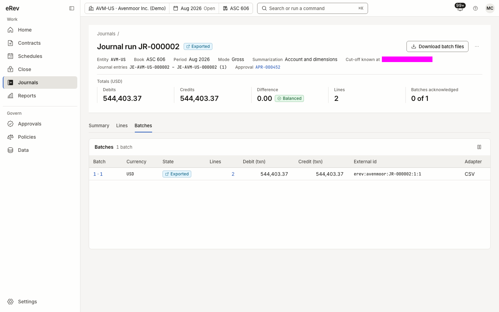

*SF-06:run-batches: the one batch of JR-000002 in the same state, external id `erev:avenmoor:JR-000002:1:1`. Persona: Maya Chen.*

For a batch exported as a file, a holder of `journal.export` brings it to the ledger and records the answer:

1. Download the file: "Download" in the batch's row, or "Download batch files" in the header, which lists each batch ("Batch 1 · chunk 1 · USD (CSV and manifest)"). The download is a ZIP with the CSV, one row for each journal line, and a JSON manifest with the row count, the totals and the SHA-256 of the CSV. Check the hash before the import ([Export and download](user-guide.md#export-and-download)).
2. Import the file into the general ledger once.
3. In the batch's row press "Record ERP reference", enter the ledger's document number under "ERP document reference", add "Posted date" and "Message" if wanted, and press "Record reference": "Batch 1 · 1 acknowledged with reference \<reference>."
4. When every batch is acknowledged the run reads "Posted", "Batches acknowledged" reads "1 of 1" and the cockpit's blocker "Batches not acknowledged" clears.

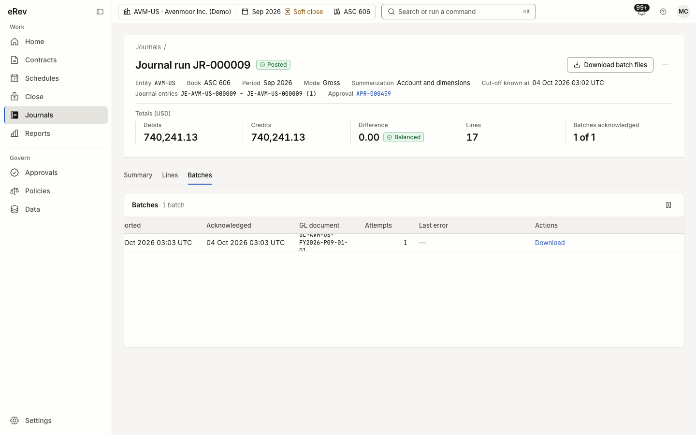

*SF-06:run-batches, QA pass: JR-000009 "Posted", its batch acknowledged with the document GL-AVM-US-FY2026-P09-01-01, the grid scrolled to its last columns. Persona: Maya Chen.*

Repeating an export posts nothing twice: "More actions", "Export again" answers "The export was already recorded. No batch was posted again." Where the entity has one active general ledger connection the run is sent to it, and a batch the ledger accepts is acknowledged with the ledger's document number without a manual step. A batch that is refused reads "Failed" with its error; "Retry export" in its row sends it again under the same external id, and "Hand over", for a batch of a ledger connection, gives it out as its file for posting by hand. A sandbox exports nothing ("Sandbox workspaces cannot post or export journals."). Limit in 1.0: the NetSuite and QuickBooks Online adapters run against the built-in mock servers of development, test and demo environments, and a production workspace exports by CSV (user guide, [Export to NetSuite or QuickBooks Online](user-guide.md#export-to-netsuite-or-quickbooks-online); limits document, row A-6). Limit in 1.0: a run that a ledger has partly posted cannot be cancelled; its failed batch leaves by a retry or by the hand-over (limits document, row B2-13). Limit in 1.0: the header of a failed run offers no "Retry export"; a failed batch is retried in its row (limits document, section B.9, the row on "Retry export" in the header).

### Entries by date range

The tab "Entries by date range" (SF-06:entries, `/journals/entries`) shows the journal lines of an inclusive range of dates as a run of the report "Legacy journal summary". Choose the "Entities", "From" and "To" and the view "Gross" or "Adjustment", and press "Run report"; running needs `report.run`. The stamp under the controls names the report and its run with "Entity", "Book", "Source", "Engine", "Run by", "Rows" and "Output SHA-256"; "Run details" shows the record of the run and "Export" offers it as a file to a holder of `report.export`. Three tables follow: "Journal lines by account" ("Account", "Debit (USD)", "Credit (USD)", "Net (USD)" and a "Total" row), "Journal lines by entity" (with "Balanced") and "Line items" ("Key", "Account", "Amount (USD)"). The "Adjustment" view needs the Legacy book of the entity.

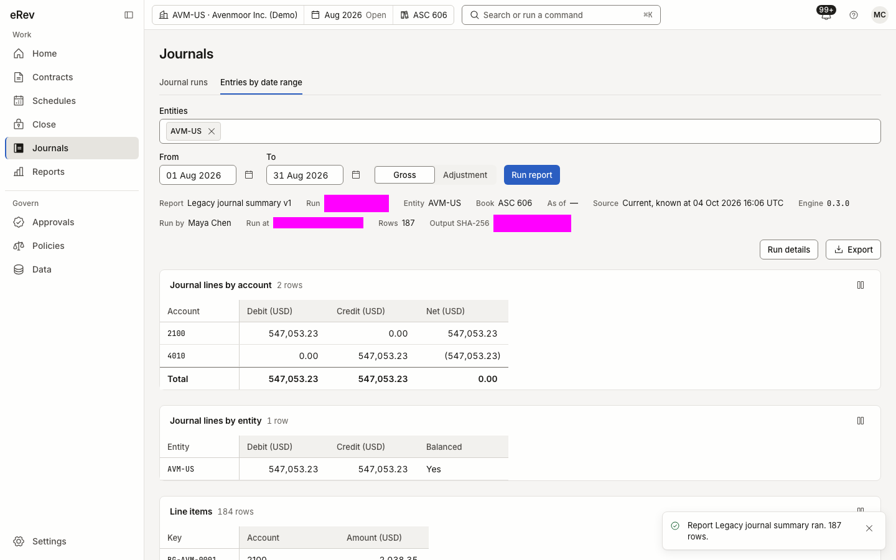

*SF-06:entries: August 2026 of AVM-US in the gross view, 547,053.23 on each side; the magenta blocks cover the run's number, time and hash. Persona: Maya Chen.*

The entries view and the journal preview of August show 547,053.23, while the August run of the captures totals 544,403.37. The demo workspace has a contract under a journal-export hold, BG-AVM-0021, and a run leaves the postings of such a contract out, here 2,649.86 of August, until the hold is released and the journals are calculated again ([Approve a run](user-guide.md#approve-a-run)).

## Reports

The Reports area holds the report catalogue, the register of report runs and the audit log. "Reports" in the rail opens it (route `/reports`), and its screens read the entity, period and book of the context pill in the top bar. The tabs are "Catalogue", "Report runs" and, for a member who holds `audit.read`, "Audit log" (see [Audit log](#audit-log)). Every report that is opened or exported is a report run: a stored, numbered record with its parameters, totals and output hash. The full rules are in the user guide, section [Reports](user-guide.md#reports). A citation such as "row B4-6" names a row of [the limits of release 1.0](../release/LIMITS-1.0.md).

Limit in 1.0: the Reports area has no "Evidence packs" and no "Scenarios and forecasts" tab; neither is routed (limits document, section B.9, "Screens the user guide names as not built or not routed").

### Report catalogue

The catalogue (screen SF-08) is where a member finds a report, a dashboard or one of their recent runs. Reading it and running a report need the permission `report.run`. The capture shows it for Robert Adeyemi, a Viewer, whose session the top bar marks "Read-only access".

- "Search reports" searches the names and the descriptions; "Filter" narrows the list by "Group" or by "Kind".
- "Dashboards" holds the link "Revenue dashboard".
- "Recent runs" lists the member's own latest runs; before the first one it reads "No report runs yet".
- One table for each group follows, its caption with the number of reports, for example "Revenue and analysis (6)" and "Balances and disclosures (10)". The columns are "Report", "Description", "Kind" ("Standard", "Register", "Disclosure", "Extract", "Pack" or "Legacy export"), "Outputs" (the file formats, for example XLSX, CSV and PDF) and "Version".

The further groups are "Contracts, modifications and judgements", "Journals and close", "SSP", "Access, configuration and audit", "Legacy exports", "Data extracts" and "Evidence packs". The group "Forecasts and migration" is not shown in release 1.0, and the two evidence packs are listed by name without a link.

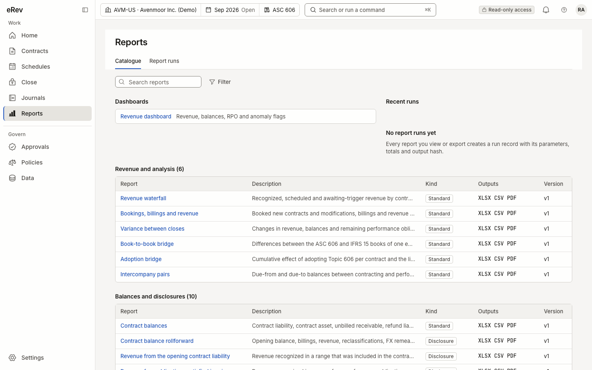

*SF-08: the catalogue with "Dashboards", the empty "Recent runs" and the first two groups; Robert Adeyemi (Viewer).*

To find a report:

1. Press "Reports" in the rail.
2. Type a part of the report's name or description in "Search reports", or press "Filter" and choose a "Group" or a "Kind".
3. Press the report's name in the column "Report". The report opens for the entity, period and book of the context pill.

Limit in 1.0: nineteen of the 56 report definitions have no builder, and a run of one is refused with "This report is not available yet." (row B4-6). They are the loss provision register, balance aging, "Bookings, billings and revenue", "Variance between closes", forecast outputs, actual vs forecast, the parallel-run comparison, the nine data extracts, the period evidence pack, the contract sample pack and the disclosure pack. Several of them are listed in the catalogue.

### Running a report

A report view (screen SF-08:report, route `/reports/:reportCode`) runs one report, shows it on screen with its tie-outs and exports it. Opening the view makes one run for the context of the pill. The capture shows the revenue waterfall of AVM-US at September 2026 for Marcus Webb, a Controller. From top to bottom the view holds:

- The header: the report's name and description, and the buttons "IPE documentation", "Run details" and "Export".
- The parameters. For the waterfall: "From" and "To" (periods), "Rows" ("Contract", "Obligation", "Product" or "Revenue category"), the switches "Month", "Quarter", "Year" and "Total", "By state", the field "Contract (optional)" and "Currency view" ("Transaction", "Functional" or "Reporting"), then "Run report".
- The run stamp: "Report", "Run", "Entity", "Book", "As of", "Source", "Engine", "Run by", "Run at", "Rows" and "Output SHA-256". For current figures "Source" reads "Current, known at" with the time.
- The strip "Tie-outs (\<n> pass, \<m> fail)", with one row for each tie-out of the report.
- The chart, with the switch "Chart" and "Table", and below it the grid of rows, which ends with the number of rows.

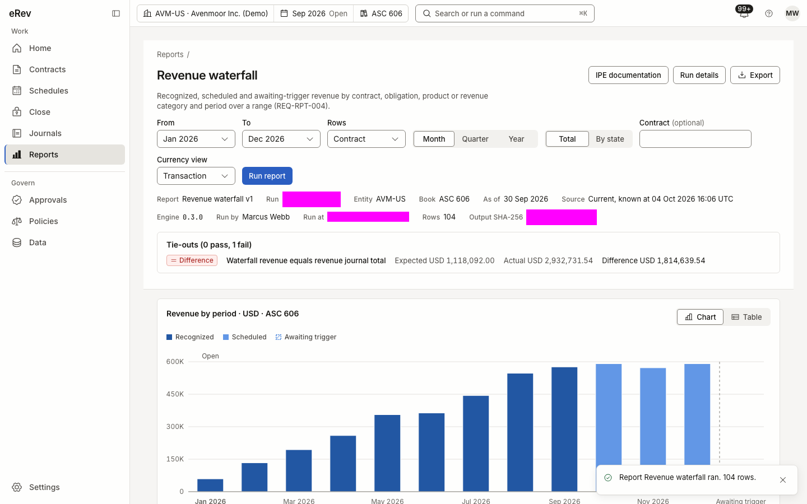

*SF-08:report: the revenue waterfall of AVM-US, January to December 2026, with its run stamp, tie-out strip and chart; Marcus Webb (Controller).*

The chart "Revenue by period" stacks "Recognized" and "Scheduled" revenue by period and ends with one column "Awaiting trigger", which has no period because it waits for an event; the caption "Open" stands over the first open period. Recognised revenue is the revenue posted in the periods up to the "As of" period, and scheduled revenue is the schedule amounts of the later periods.

To run a report with other parameters:

1. Open the report from the catalogue. The view runs it once and the stamp shows the run.
2. Change the parameters, for example "Rows" to "Obligation", or the range in "From" and "To".
3. Press "Run report". A new run is made and the stamp shows its number; when the run took more than two seconds, the message "Report \<name> ran. \<n> rows." confirms it. A start period after the end period is refused with "Start period must be on or before end period.", and a press while a run is still computing answers "\<name> is already running."
4. Press a figure in the grid to open the Explain panel, which lists the records that contribute to it; Esc returns to the cell.

To read the tie-outs, look at the chip of each row: "Pass", "Difference" or "Not applicable". The row then states the tie-out's name, "Expected" and "Actual", and for a failing tie-out the "Difference", which is the actual amount less the expected one. The waterfall's tie-out "Waterfall revenue equals revenue journal total" compares the report's recognised revenue ("Actual") with the revenue journal total of the same entity, book and periods ("Expected"). In both captures it reads "Difference": the months January to September 2026 of the demo workspace are open, and when the captures were taken a journal run existed for September alone (the capture below) or for August and September (the capture above), so the journal total is lower than the nine months of recognised revenue: expected USD 573,688.63 below and USD 1,118,092.00 above, against USD 2,932,731.54 recognised in both.

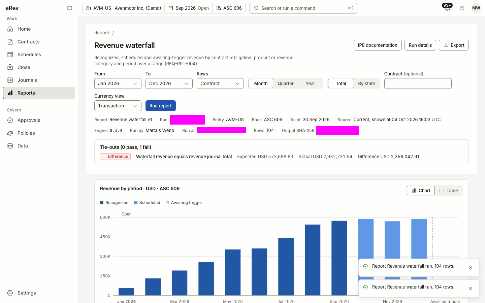

*SF-08:report: the waterfall in the smoke journey of the release candidate after "Run report", with one message for each of the two runs; Marcus Webb (Controller).*

Limit in 1.0: no report converts an amount: the "Functional" and "Reporting" views are served only where every contract of the run is in its entity's functional currency, and a run over any other contract is refused with "The functional and reporting views show contracts in the entity's functional currency only." (row B4-12). Limit in 1.0: a report view is filtered by the parameters of its run only; grid filters on report views are not built (row B4-8). Limit in 1.0: the tie-out "Rollforward closing equals GL balance" is never computed and reads "Not applicable" (row B4-4), and in the RPO rollforward a usage fee or royalty realised in a period makes "Opening plus activity equals closing" read failed by the amount of those fees (row B4-2).

### Remaining performance obligations

The report "Remaining performance obligations" (RPO) states the transaction price allocated to unsatisfied and partially satisfied obligations at a period end, by time band. Its parameters are "Time bands", which is read only ("12, 24 months", set by the policy `rpo.time_bands`), "Rows" ("Contract", "Entity", "Product family" or "Customer segment") and "Currency view". The stamp's "As of" is the last day of the context period. The chart "Remaining performance obligations by time band" draws the bands "Within 12 months", "13 to 24 months" and "After 24 months" for the total and for each row, and the grid has the sections "Remaining performance obligations" and "Exempt contracts". In the capture the tie-out "RPO rollforward closing equals RPO report total" reads "Pass": expected and actual are both USD 4,257,068.46.

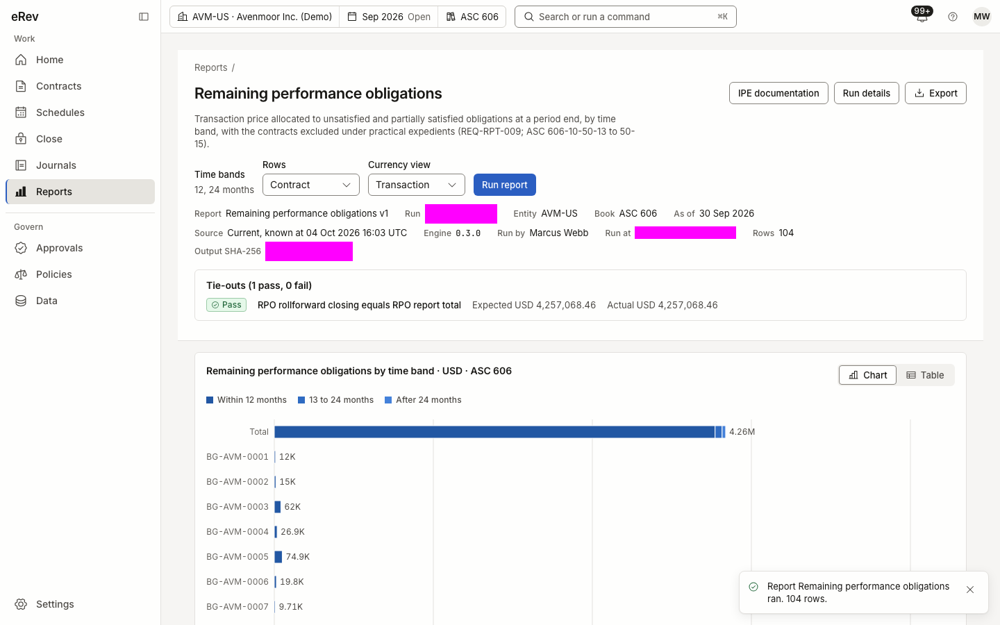

*SF-08:report: the RPO report of AVM-US at 30 Sep 2026 with a passing tie-out and the chart by time band; Marcus Webb (Controller).*

Limit in 1.0: two elected exemptions of the RPO report exclude nothing: the elections of POL-199 and POL-200 have no effect (row B4-3).

### Legacy contract history export

The legacy contract history export is a report of the kind "Legacy export" in the group "Legacy exports". It lists the history of contracts under the 71 column names of the legacy Contract_Live table, in legacy order. Its parameters are "Effective from", "Effective to" and "Contract (optional)". The capture shows it for the contract SF-ORD-10001 from 01 Jan 2026 to 30 Aug 2026: 12 rows, whose first headers are "Contract Unique Name", "POB Unique ID" and "SKU Name". The report states no "As of" date.

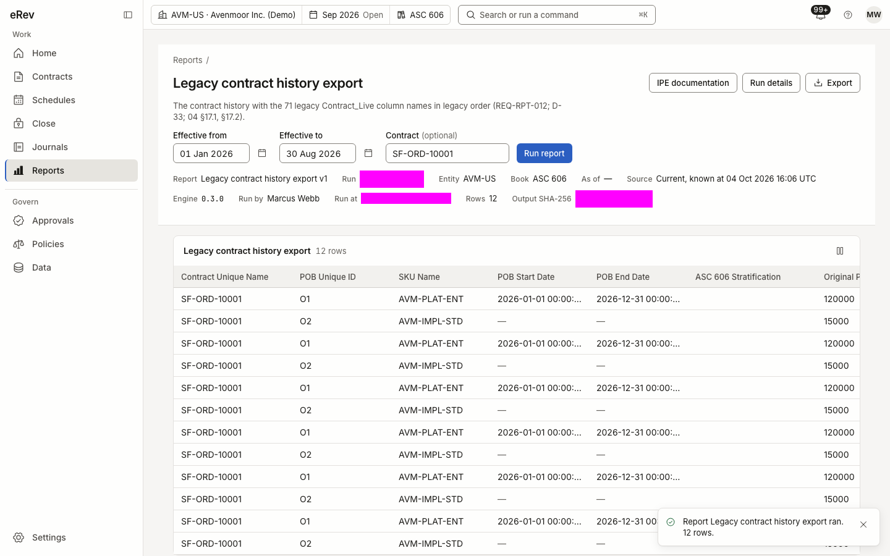

*SF-08:report: the legacy contract history export for SF-ORD-10001, 12 rows under the legacy column names; Marcus Webb (Controller).*

Limit in 1.0: the nine reports of the group "Data extracts" have no builder, so no extract is produced on screen or through the API (row B4-6); their schemas are in the user guide, section [Data extracts](user-guide.md#data-extracts).

### Outputs and downloads

"Export" lists the file formats of the report's definition: "Excel workbook (XLSX)", "CSV with manifest", "PDF", "JSON" or "ZIP archive". An export needs the permission `report.export`.

1. Run the report with the parameters wanted.
2. Press "Export" and choose a format. A new run with the same parameters and that format is made, and its file is downloaded.
3. Read the message "Exported \<name> as \<format>. Run \<run number>."; its action "Run details" opens the run.

What the files hold is stated in the user guide, section [Outputs](user-guide.md#outputs):

- XLSX: a header block with the report name and version, the run number, entity, book, as of, source, engine release, user, run time, row count, output SHA-256, every parameter and the control totals; amounts are numeric cells.
- CSV: raw values, with a JSON manifest that carries `row_count`, `control_totals` and `sha256`.
- PDF: the same stamp on the first page, and "Run \<run no> · page \<n> of \<m>" in every page footer.

"Run details" opens a panel with "Parameters", "Source", "Control totals", "Tie-outs", "Output" and "Ledger heads", with "Download manifest" and with "Rerun from the same source". "IPE documentation", for a holder of `report.export`, shows the definition with its source tables, joins, filters and parameters, and offers "Download definition (JSON)".

### Report runs and one run

The tab "Report runs" (screen SF-08:runs, route `/reports/runs`) is the register of every report and export run the member may see. It opens for a holder of `report.run` or `audit.read`. The capture shows it for Marcus Webb, filtered to the succeeded runs of one report. The columns are "Run", "Report", "Status" ("Queued", "Running", "Succeeded" or "Failed"), "Entity", "Book", "As of", "Source" ("Current" or "As locked"), "Format", "Rows", "Output SHA-256", "Run by", "Started" and "Finished"; the newest run stands first.

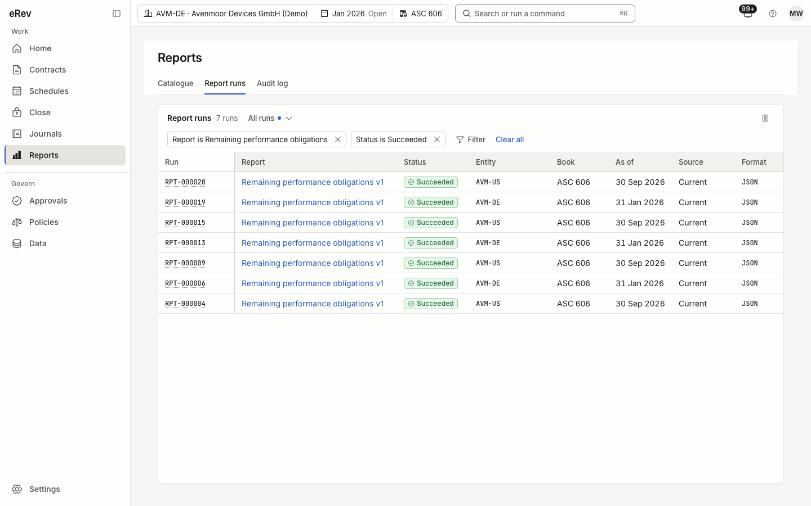

*SF-08:runs: the register filtered by "Report is Remaining performance obligations" and "Status is Succeeded", seven runs; Marcus Webb (Controller).*

To find and open a run:

1. Press "Reports" in the rail, then the tab "Report runs".
2. Press "Filter" and add "Report", "Status", "Created from" or "Created to"; "Clear all" removes the filters.
3. Press the run's number in the column "Run". Its page opens (screen SF-08:run, route `/reports/runs/:runId`).

The page of a run shows the title "Report run \<number>" with the status and the buttons "Open report view", "Download \<format>" and "Rerun from the same source". Below stand the report and version, entity, book, as of, source, engine, user and times, then the tables "Parameters" (every parameter, including the defaults eRev Cloud filled in), "Source" ("Period lock", "Known at", "Sources"), "Control totals", "Tie-outs", "Output" ("Format", "Output SHA-256", "Manifest", "Rows") and "Ledger heads". A failed run keeps its record with the status "Failed" and the sentence "The run failed: \<problem>. Nothing was exported."

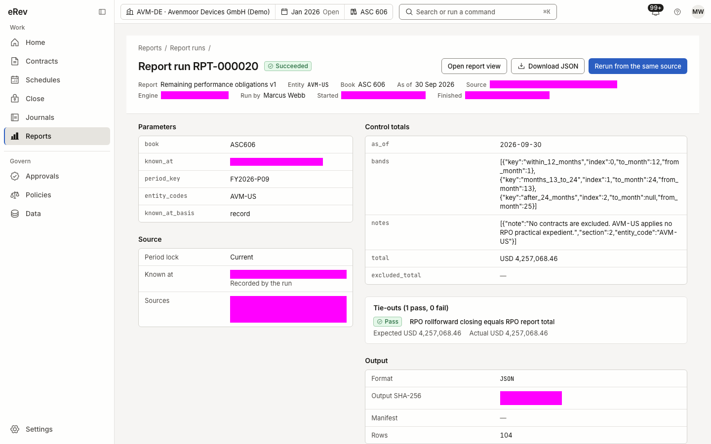

*SF-08:run: run RPT-000020 of the RPO report with its parameters, source, control totals, tie-out and output; Marcus Webb (Controller).*

To reproduce a run:

1. Open the run's page and press "Rerun from the same source".
2. Wait for the job. The page of the new run opens with the result "Rerun of \<number>" and the link "Open \<number>" to the first run.
3. Read "Output identical: Yes" and "Control totals identical: Yes". Both read "Yes" when the source data has not changed.

### Revenue dashboard

The revenue dashboard (screen SF-08:dashboard, route `/reports/dashboards/revenue`) draws four report runs as charts and lists the open anomaly flags. The link "Revenue dashboard" under "Dashboards" in the catalogue opens it; it needs `report.run`. The captures show it for Robert Adeyemi, a Viewer.

For one entity the title names the entity, period and book, for example "Revenue dashboard · AVM-US · Sep 2026 · ASC 606". The chip "Functional" beside "Currency" states the currency view of the four runs; the page has no switch. "Refresh" makes new runs for every panel. The panels are "Revenue by period" (the waterfall), "Contract liability rollforward" (a bridge from "Opening balance" to "Closing balance", with the legend "Balance", "Increase" and "Decrease"), "Remaining performance obligations by time band", "Open anomaly flags" and "Revenue by category". Each chart has the switch "Chart" and "Table". Its footer states the run and its time, masked in the captures, and the link "Open report" opens the report on that same run.

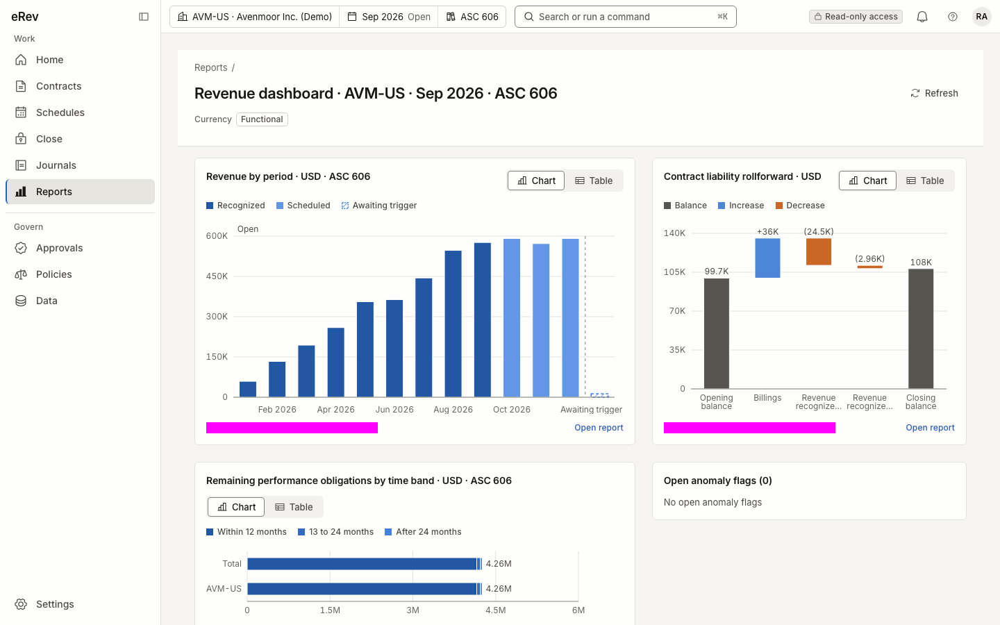

*SF-08:dashboard: the dashboard of AVM-US for Sep 2026 in USD, upper half; Robert Adeyemi (Viewer).*

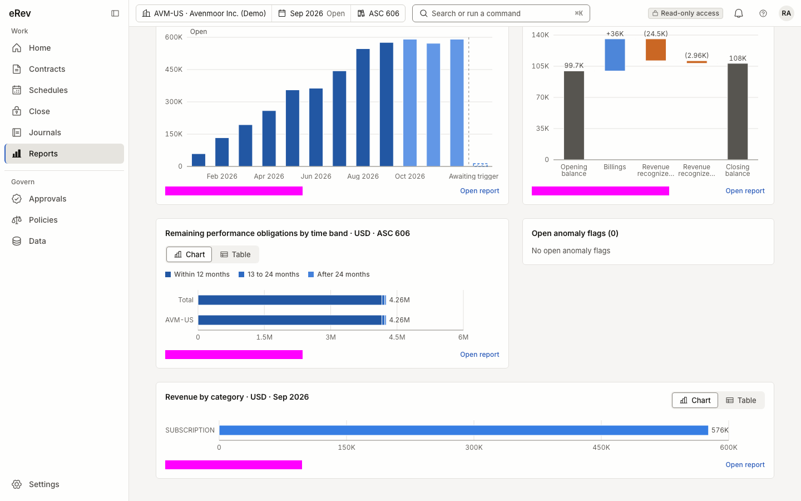

*SF-08:dashboard: the lower half, with the footer of the time bands and "Revenue by category · USD · Sep 2026"; Robert Adeyemi (Viewer).*

An address that names no entity takes the entity, period and book of the context pill. In the next capture that is AVM-DE at January 2026, so the charts are in EUR.

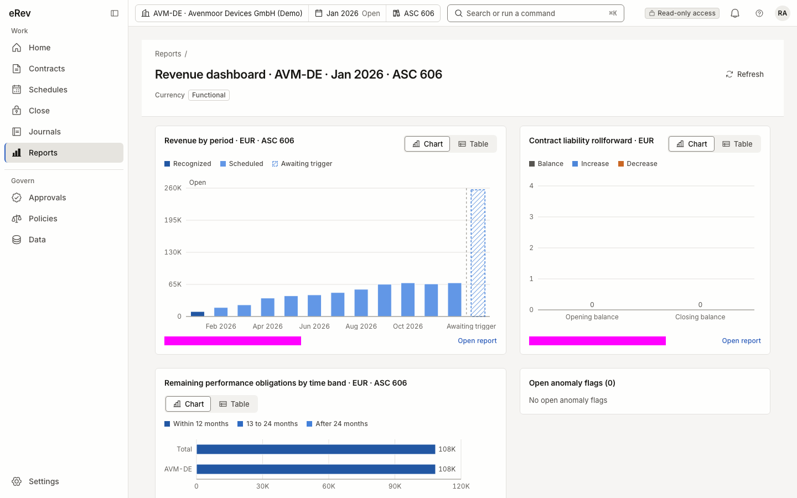

*SF-08:dashboard: the default view, "Revenue dashboard · AVM-DE · Jan 2026 · ASC 606"; Robert Adeyemi (Viewer).*

For all entities in the member's scope (an address with `entities=all`) the charts are drawn only where those entities keep one calendar and one functional currency. In the demo workspace they do not: no run is made, and the page shows one sentence and the flags panel.

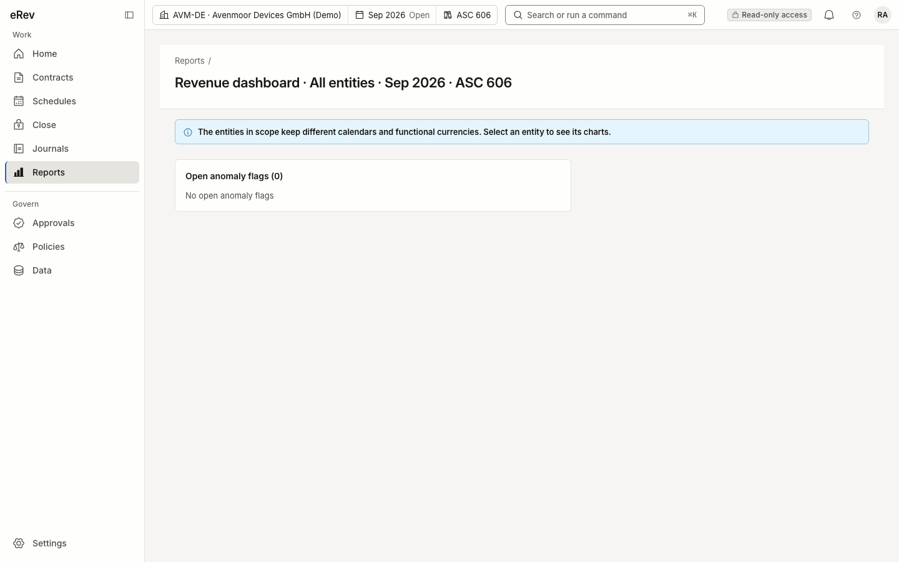

*SF-08:dashboard: all entities, with "The entities in scope keep different calendars and functional currencies. Select an entity to see its charts."; Robert Adeyemi (Viewer).*

To read the dashboard:

1. Choose the entity, period and book in the context pill, then open "Reports" and press "Revenue dashboard".
2. Read a chart, or press "Table" to read its figures as a table.
3. Press "Open report" under a chart to read the full report of that run with its stamp and tie-outs.
4. Press "Refresh" to run the four reports again.

The panel "Open anomaly flags" reads "No open anomaly flags" in every capture: nothing raises an anomaly flag in release 1.0, because the flags belong to AI assistance, which moved to the next release (row C-15). The panels of the dashboard show current figures, also for a locked period; the figures as locked are read in the report view (next section).

Limit in 1.0: the dashboard draws its panels for one entity, or for a scope of one calendar and one functional currency; a report run by period key over entities of more than one fiscal calendar, and the waterfall and the disaggregation over such entities, are refused with the rule `CALENDARS_DIFFER` (row B4-5). Run such reports for one entity, or for the entities of one calendar.

### Reading a report as locked

Locking a period freezes the twelve lock snapshots (user guide, section [Close and lock](user-guide.md#close-and-lock)). The reports they belong to are the revenue waterfall, contract balances, the contract balance rollforward, the contract cost rollforward, the disaggregation of revenue, revenue from obligations satisfied in prior periods, RPO, the RPO rollforward, the journal entry population, and the manual adjustment, modification and out-of-period registers. For a locked period such a report opens on the frozen figures, not on the current ones. The user guide does not describe the controls of this view; the steps below follow the labels of the product, its screen specification and the QA pass.

1. Choose the locked period in the context pill (it reads "Locked") and open the report from the catalogue.
2. Read the banner "Showing \<period> as locked on \<time>." The "Source" of the stamp reads "As locked on" with the same time.
3. Read the frozen rows in the grid. The parameter fields are shown and cannot be changed ("Figures as locked take no parameters. Show current figures to change them."), no chart is drawn, and the Explain panel is not offered. "Run report" and "Export" remain; the CSV export is the frozen file itself.
4. Press "Show current figures" to read the figures of the period as they stand now. The banner then reads "Showing current figures. \<period> was locked on \<time>." and offers "Show as locked".

A report that a lock does not freeze opens on current figures and says so: "A period lock does not freeze this report." In the register of runs the column "Source" tells the two kinds apart: "As locked" or "Current".

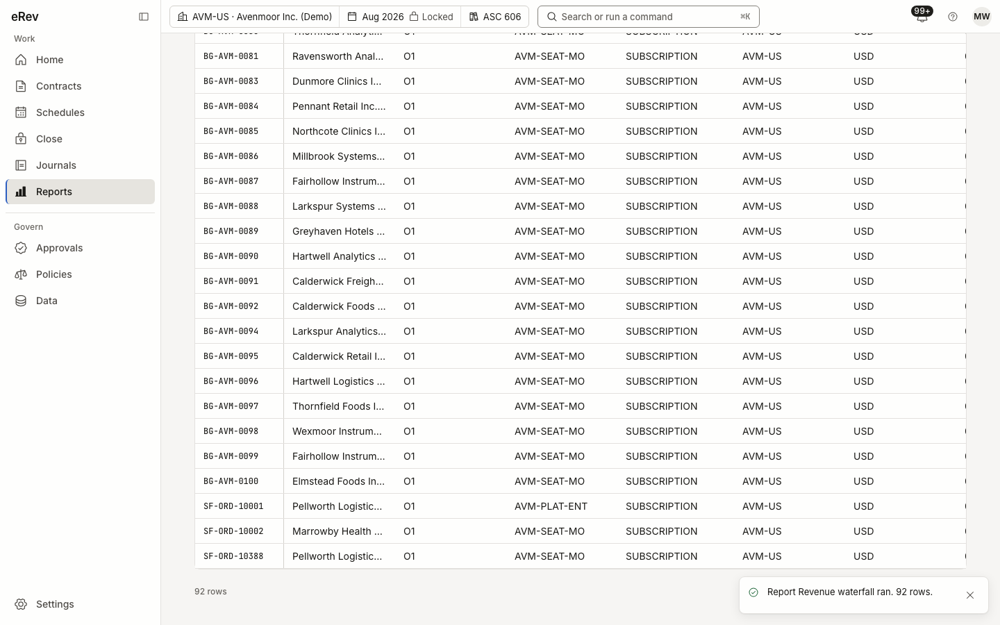

*SF-08:report, QA pass check E-4: the end of the revenue waterfall of AVM-US as locked for Aug 2026, its rows by obligation, 92 rows; Marcus Webb (Controller).*

In the QA pass this view stated no tie-out, and its stamp read "As of —". Home states the key figures for the same context, each leading to the screen that owns it. For the locked August 2026 of the QA pass it reads "Revenue" 547,053.23, "Contract liability" 99,709.38 and "RPO" 4,252,521.47.

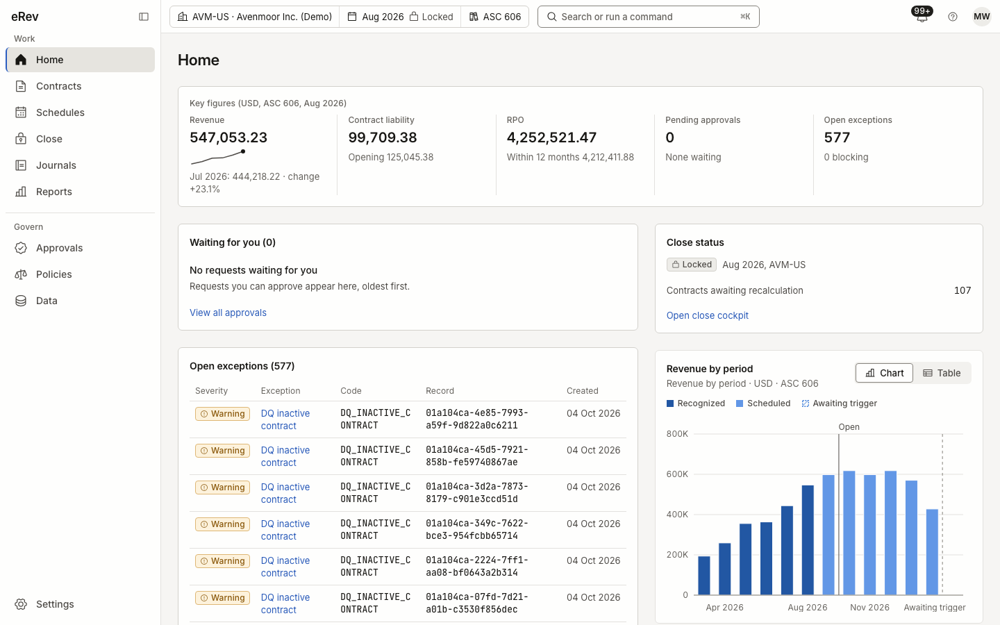

*Home, QA pass check E-5: the key figures of AVM-US for Aug 2026, "Locked"; Marcus Webb (Controller).*

Limit in 1.0: the frozen waterfall of a period lists every contract known at the run, so it can hold contracts that became contracts after the end of the period, with no revenue and their allocation under "Awaiting trigger"; for the position at the end of a locked period read the RPO report as locked (row B4-1). Limit in 1.0: a run made through the API with an explicit `known_at` cuts subledger lines by the time they were recorded, not by the time they were committed; for a locked period read the report as locked (row B4-11).

## Audit log

The audit log (screen SF-09:audit-log, route `/reports/audit-log`) lists the audit events of the whole workspace under the latest verification of their chain. It is the tab "Audit log" of the Reports area and is read with `audit.read` held for all entities, because an audit event carries no entity. The capture shows it for Hannah Lindqvist, an Auditor, with one event open.

### Reading the log and its filters

- The header shows the chip "Verified" or "Verification failed", the link "Audit chain verified \<time> · \<n> events" (masked in the capture), the link "Verification history" and the button "Verify chain now". Before the first verification it reads "The audit chain has not been verified yet."
- The grid "Audit events" has the columns "Sequence", "Occurred", "Actor", "Action", "Object type", "Object", "Outcome" ("Succeeded", "Denied" or "Failed"), "Reason", "MFA" and "On behalf of"; "Roles" and "Request id" are hidden until they are chosen. "Export" stands above the grid.
- The panel of one event opens beside the grid.

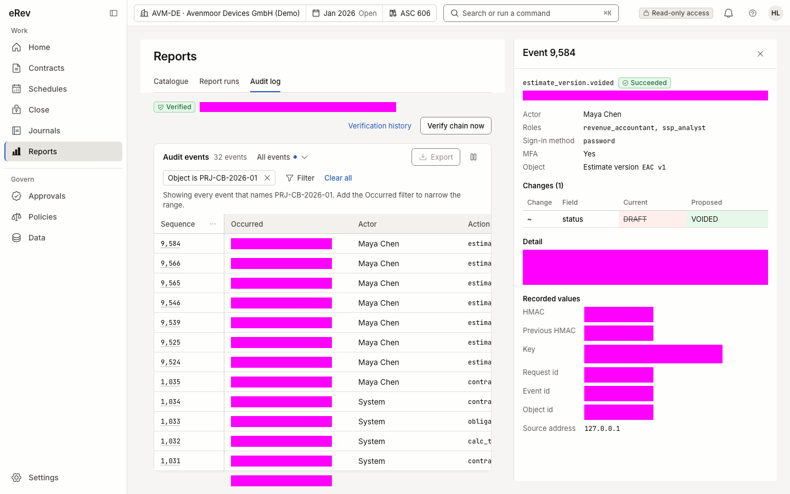

*SF-09:audit-log: the events that name the contract PRJ-CB-2026-01 under a verified chain, and the panel "Event 9,584"; Hannah Lindqvist (Auditor).*

To find and read the events of one contract:

1. Press "Reports" in the rail, then the tab "Audit log". Without a filter the log shows the last 30 days and says so: "Showing the last 30 days, \<from> – \<to> (UTC). Add the Occurred filter to read another range."
2. Press "Filter" and add "Object" with the external id of the contract, as in the capture ("Object is PRJ-CB-2026-01"). The log then lists every event that names the contract. The other filters are "Object type", "Actor", "Action", "Outcome" and "Occurred" ("Last 7 days", "Last 30 days", "Last 90 days", "Last 365 days" or a range of dates).
3. Press a number in the column "Sequence". The panel "Event \<sequence>" shows the action with its outcome and time; "Actor", "Roles", "Sign-in method", "MFA" and "Object"; the table "Changes (\<n>)" with the changed fields ("Change", "Field", "Current", "Proposed"); "Detail"; and "Recorded values": "HMAC", "Previous HMAC", "Key", "Request id", "Event id", "Object id" and "Source address".
4. Close the panel with its close button or with Esc.

"Export", for a holder of `report.export`, runs the audit log export for the range and the filters of the list. With an "Object" or an "Outcome" filter it is unavailable, as in the capture, and its tooltip gives the reason: "The export cannot apply the Object or Outcome filter. Remove that filter to export."

Limit in 1.0: a read of the log by contract or by sequence is slower than a read by date; give such a read its dates with "Occurred" (row B8-6).

### Verifying the chain

A verification checks the hash chain of the audit events over a range of sequences and records the events checked and a digest. The chain is verified daily ("Scheduled") and on demand ("On demand"); "Verify chain now" needs `audit.read`.

1. On the tab "Audit log" press "Verify chain now". The header reads "Verifying the audit chain" while the job runs.
2. Read the message "Audit chain verified: \<n> events, last chain value \<value>." The header then shows "Verified" and the link "Audit chain verified \<time> · \<n> events".
3. Press that link, or "View details" in the message, to open the verification (screen SF-09:verification, route `/reports/audit-log/verifications/:verificationId`).
4. Press "Download digest" to keep the digest file.

The page of a verification shows the chip "Verified" or "Verification failed", then "Trigger", "Started", "Finished" and "Sequences" (in the capture "1 to 9,790"), the key figures "Events checked", "First failure" and "Last chain value", and the table "Recent verifications" with "Finished", "Trigger", "Result", "Events checked" and "First failure". "Open register", like "Verification history" on the log, opens the report of past verifications. After a failed verification the header of the log reads "Audit chain verification failed at event \<n>" with "Open the verification details and follow the runbook."; the page of the verification then shows "Failure detail" and the link "Open event \<n>".

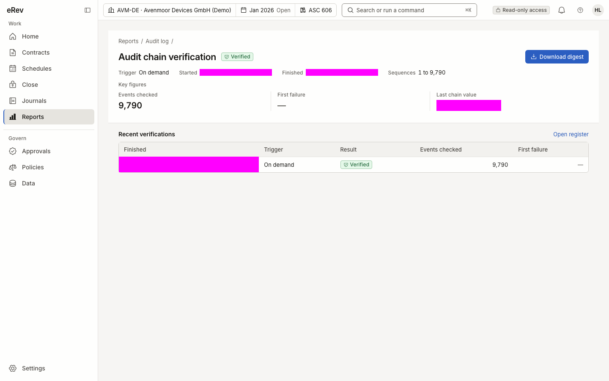

*SF-09:verification: an on-demand verification, "Verified", 9,790 events checked, with "Download digest" and "Recent verifications"; Hannah Lindqvist (Auditor).*

## Data

The Data area holds the imports, the exception queue, the integrations and the import templates. "Data" in the rail opens it on "Imports" (route `/data/imports`). The tabs "Imports", "Exceptions" and "Templates" are shown to a holder of `contract.read`, and "Integrations" to a holder of `integration.manage`: the captures of Maya Chen show three tabs, those of Nikhil Rao four. The full rules are in the user guide, section [Data](user-guide.md#data).

Limit in 1.0: the Data area has no "Migrations" tab: the migrations list and the new-migration screen are not routed (user guide, section Data), a legacy migration is started through the API, and it is a migration by opening balances only (row B5-9).

### Imports

The list (screen SF-10) shows every uploaded file with its status, its counts and its approval. The capture shows it for Maya Chen, a Revenue Accountant. The header holds the count, "Download templates" and "New import", which needs `import.upload`. The columns are "Import" (the file name, a link to the import), "Template", "Status", "Rows", "Errors", "Warnings", "Uploaded by", "Uploaded at", "Approval" and "Committed at"; "Filter" offers "Status", "Template" and "Uploaded from". The status of an import is "Queued", "Running", "Valid", "Error", "Pending approval", "Approved", "Rejected", "Committed", "Failed" or "Cancelled". In the capture two imports are "Committed" and one is "Error" with the caption "Rejected: fix the file and upload again".

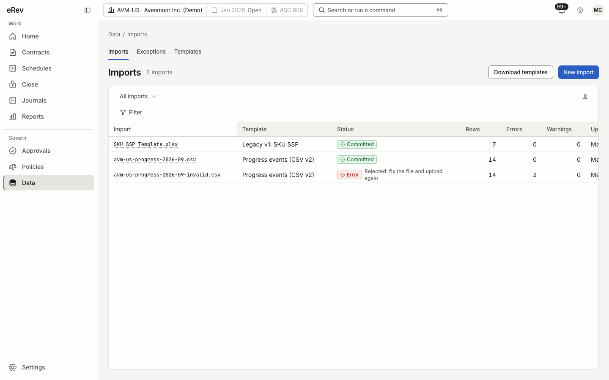

*SF-10: three imports of AVM-US, two committed and one rejected; Maya Chen (Revenue Accountant).*

### Uploading an import

An import moves through six steps, shown at the top of its screens: "Upload", "Map columns", "Validate", "Review changes", "Approval" and "Committed". Nothing is committed before the approval.

1. On "Imports" press "New import" (screen SF-10:new, route `/data/imports/new`).
2. Choose the "Template": one of the "Legacy v1 templates" or of the "CSV v2 templates".
3. Fill the fields the template asks for: "Effective date" where the template takes one; "Mode" ("Prospective", "Retrospective" or "Price change") for "Legacy v1: Contract Modification", as in the capture; "Mapping profile" for a CSV v2 file whose headers differ from those of the template.
4. Drop the file on "Drop a CSV or XLSX file here, or choose a file", or press "Choose file". A file must be .xlsx or .csv and at most 50 MiB.
5. Press "Upload and validate". The page of the import opens on "Validate". A file that was already imported is refused, and nothing is imported again.

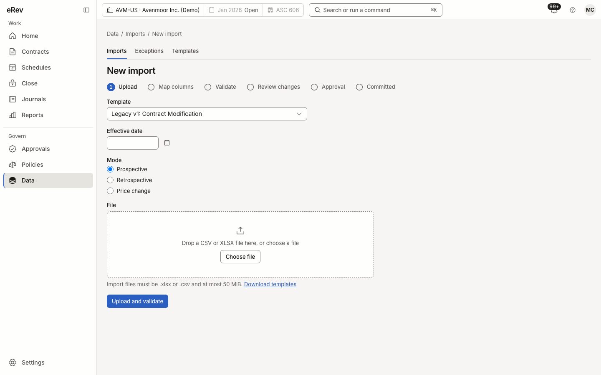

*SF-10:new: step 1 with the template "Legacy v1: Contract Modification", its effective date and mode, and the file field; Maya Chen (Revenue Accountant).*

Limit in 1.0: a modification that arrives by the legacy import stores no modification record and is not in the modification register, so keep the approval record of the import as its evidence (row B5-7); under the legacy-parity preset such an upload on a combined contract group quarantines the group (row B5-4).

### Validation

The page of an import (screen SF-10:detail, route `/data/imports/:importId/:step`) names the template, the file with its SHA-256, the uploader, the time and the status. Validation runs as a job, "Validating \<file>". Under "Map columns" a legacy template reads "Not needed: legacy template headers matched", and a CSV file with the headers of its template "Headers matched". When validation finds no error, the dry run starts by itself and the page moves on to "Review changes". The step "Validate" shows:

- The figures "Rows", "Valid", "Warnings", "Errors" and "Aggregated".
- One chip for each finding code with its number of rows, for example "PROGRESS_OVER_DELIVERY · 2 rows"; a chip filters the grid.
- The grid of the rows, which carries no title, with "Row", "Status" ("Valid", "Warning", "Error", "Blank" or "Aggregated"), "Messages" and "Business key", then the columns of the file; rows with errors stand first.
- "Download error report".

The capture shows a file with two errors. The banner reads "Rejected: fix the file and upload again" with "2 errors in 2 rows. Nothing was committed. Exception items were raised for each finding group.", and "Next" is held: "Validation found 2 errors in 2 rows. Upload a corrected file to continue."

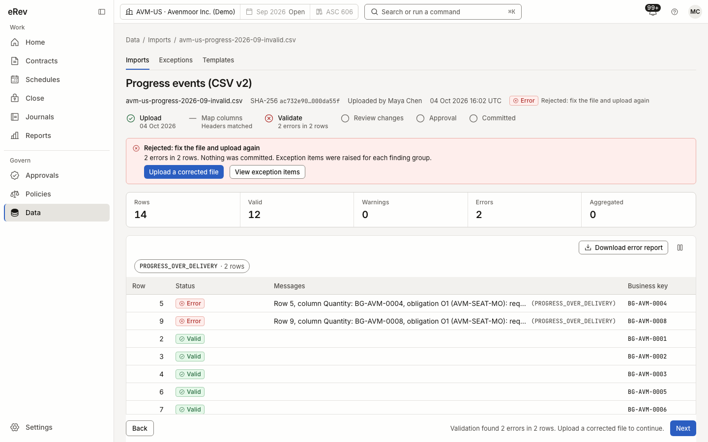

*SF-10:detail: step 3 "Validate" of avm-us-progress-2026-09-invalid.csv, 14 rows of which 2 are in error; Maya Chen (Revenue Accountant).*

To correct a rejected file:

1. Open a row to read its findings in the panel "Row \<n>", or press "Download error report".
2. Correct the source file. Rows are not edited on the screen: a corrected file is a new import.
3. Press "Upload a corrected file". The upload form opens with the same template and parameters.
4. Press "View exception items" to open the exception queue on the items this import raised.

Limit in 1.0: the column "Messages" cuts a long finding; it stands whole in the title of the cell, in the panel of the row and in the error report (limits document, section B.9, "The Messages column").

### Reviewing the changes, approval and commit

"Review changes" shows the dry-run difference: what the commit would change, before anything is committed. It holds the figures "Contracts affected", "Contracts created", "Allocation changes" and "Journal lines"; where the import changes them, the tables "Allocation changes", "Revenue change by period" and "Journal preview" and the "Warnings"; and the grid "Affected records" with "Change" ("Added" or "Changed"), "Contract", "Obligation", "Measure", "Before" and "After". The capture is the SKU SSP template of the smoke journey. The difference lists contracts and obligations, not SSP entries, so for this file it reads "No affected records"; the commit that followed the approval created the SSP book version with its seven entries.

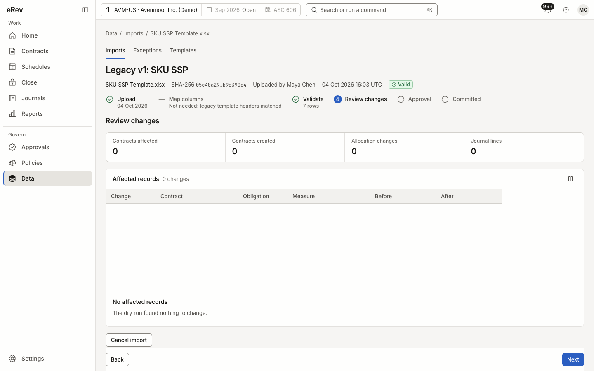

*SF-10:detail: step 4 "Review changes" of the legacy SKU SSP template, seven valid rows and no affected contract; Maya Chen (Revenue Accountant).*

1. On "Review changes" read the figures and the tables. "Cancel import" ends the import: "Cancel this import? Nothing is committed."
2. Press "Next" to open "Approval".
3. Enter a "Comment" for the approver and press "Submit for approval". The message reads "Submitted for approval. Request \<number> is waiting for approval."
4. A member who holds `import.approve` and is not the uploader decides the request under Approvals; in the smoke journey Priya Raman, the Revenue Reviewer, approves it. While the request waits, the step shows its "Routing" and "View request". A rejection reads "Rejected by \<name>: \<comment>".
5. The approval starts the commit, "Committing \<n> rows", and the import becomes "Committed". The step "Committed" shows "Committed at", the "Control totals" ("Measure", "Source", "Loaded", "Result") and the "Created records" ("Row", "Target", "Record"), each row with a link to the record it created.

An import of a legacy template whose commit itself approves something (an SSP book version, the activation of contracts, a modification) is approved by a member who could also approve that thing directly; the user guide states the rule.

Limit in 1.0: the same records sent in a second file are new records, and a changed record under a stored identity is skipped without an exception; read the dry-run difference before submitting, and do not send the same records in two files (row B1-18). Limit in 1.0: the loaded total of an import is compared with its source by the number of rows, so compare the amounts on the dry-run difference (row B1-19).

Limit in 1.0: behind a commit job that fails while a command holds the import, an import can stay "Approved" or "Running" for good; send no cancellation and no submission of an import while its commit job runs (row B5-3). Limit in 1.0: no webhook is delivered when an import is committed or an exception is raised; poll the API (row B8-8).

### Import templates

The tab "Templates" (screen SF-10:templates, route `/data/templates`) lists the import templates with their downloads; "Download templates" on the list of imports and on the upload form leads to it. The columns are "Template", "Code", "Family" ("Legacy v1" or "CSV v2"), "Format", "Version", "Parameters" and "Download"; "Filter" offers "Family". The four legacy templates are "Legacy v1: SKU SSP", "Legacy v1: Contract Setup", "Legacy v1: Contract Progress Tracking" (parameter "Effective date") and "Legacy v1: Contract Modification" ("Effective date and Mode"). The CSV v2 templates cover customers, products, bundles, SSP values, contracts, invoices and credit memos, progress events, usage, modifications, estimates, FX rates, cost events, pre-standard revenue, GL accounts and the account mapping.

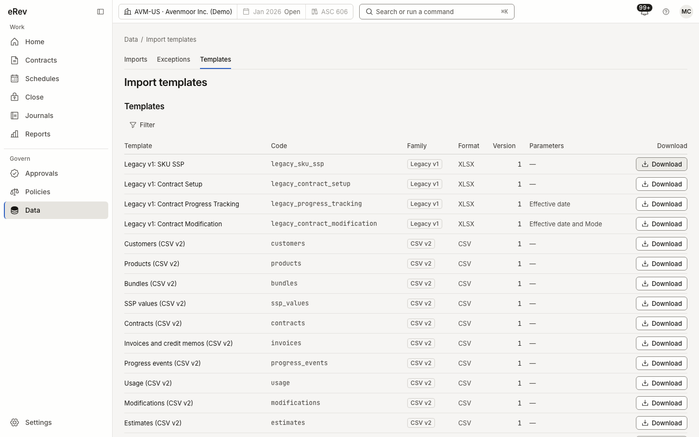

*SF-10:templates: the four legacy templates and the first CSV v2 templates, each with "Download"; Maya Chen (Revenue Accountant).*

1. Press "Data" in the rail, then the tab "Templates".
2. Press "Download" in the row of the template. The file is saved under the code of the template, for example `legacy_sku_ssp.xlsx`.
3. Fill the file and upload it with "New import". A legacy template is recognised by its exact set of headers on the first sheet, in any order.

Below the templates the panel "Mapping profiles" lists the profiles for CSV files whose headers differ from a template; a holder of `config.author` adds one with "New mapping profile" and sends its version on with "Run tests" and "Submit for approval".

Limit in 1.0: the four obligation templates of the legacy-parity preset are not seeded; author and publish them under their exact codes before the first legacy import, or the import refuses its SKUs (row B5-8). Limit in 1.0: a row of "Usage (CSV v2)" whose usage period ends after the date of the report is a validation finding, rule `USAGE_PERIOD_NOT_ENDED` (row B5-1).

### Exception queue

The exception queue (screen SF-11, route `/data/exceptions`) is one list for the findings of imports, syncs, the engine, the close, reconciliations, journals, integrations, data quality and migrations. It is read with `contract.read`; its commands need `exception.resolve`. The captures show it for Maya Chen.

- The header shows "Exceptions" with the number of open items.
- "Search exceptions" and the filters stand above the list. The queue opens with "Status is Open or In progress"; "Filter" offers "Status", "Severity", "Source", "Code", "Entity", "Owner", "Contract", "Period" and "Import".
- The list is sorted by "Severity" ("Blocking", then "Warning", then "Info"), or by "Newest" or "Oldest". Each item shows its title, its severity, its code, its source and the business key or contract.
- The pane beside the list shows the selected item; before a selection it reads "Select an exception to see its location, message and next steps."

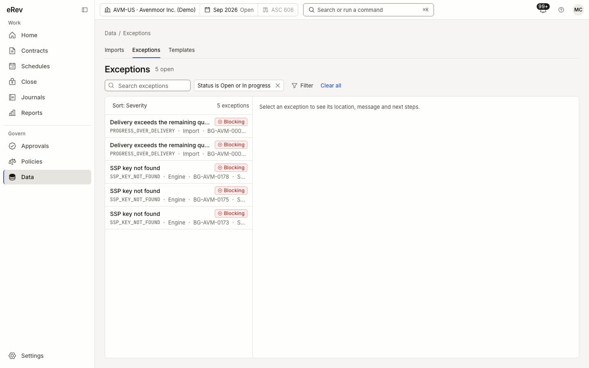

*SF-11: five open exceptions, all "Blocking", two from an import and three from the engine; Maya Chen (Revenue Accountant).*

The row "Exceptions" among the blockers of the close cockpit, and "Exceptions holding the lock" in the close status on Home, open the queue on the exceptions that hold the lock of one period. The banner says so, and "Show all exceptions" returns to the whole queue. The header keeps the count of every open exception: 5 open and 2 listed in the capture.

*SF-11: the queue opened from the close cockpit, with "Showing the exceptions that hold the lock of one period."; Maya Chen (Revenue Accountant).*

### Working an exception

Selecting an item opens it in the pane (screen SF-11:item, route `/data/exceptions/:exceptionId`). The pane shows the number and title of the item, its code, its severity, its status ("Open", "In progress", "Resolved", "Waived" or "Dismissed") and "Remediable" or "Discarded"; then "Message", "Location" (in the capture "Source", "Import", "Row", "Field", "Contract" and "Entity"), "Occurrences", "Owner" and the actions. A closed item also shows its "Resolution": the text, who resolved it and when, and the waiver request where there is one.

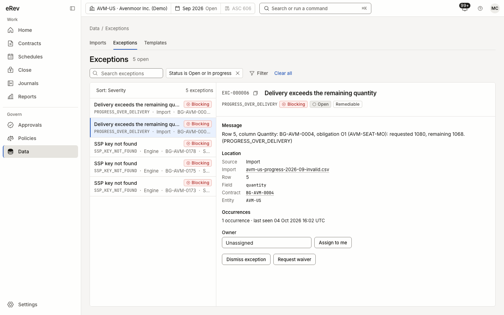

*SF-11:item: EXC-000006, "Delivery exceeds the remaining quantity", from row 5 of a rejected import, with "Dismiss exception" and "Request waiver"; Maya Chen (Revenue Accountant).*

1. Select the item and read "Message" and "Location". The links open the import and the contract.
2. Take the item: press "Assign to me", or choose a member in "Owner". An open item that is assigned becomes "In progress".
3. Correct the cause where it lies, for example with a corrected file.
4. Close the item with one of the actions the pane offers. Only the actions that apply to the item are shown:
   - "Reprocess" runs the item again ("Reprocessing \<code>"). When the finding is gone the message reads "Reprocessed. The exception is resolved."; otherwise the pane shows "Reprocessing raised the finding again" with the finding.
   - "Mark resolved", offered when the condition has cleared, asks for a "Resolution" of at least 10 characters.
   - "Request waiver" asks for a "Comment" of at least 10 characters and sends the waiver for approval: "Waiver requested. Request \<number> is waiting for approval." A holder of `exception.waive` decides it under Approvals.
   - "Dismiss exception" asks for a "Reason" of at least 10 characters. It applies only to input that was never committed, as in the capture, whose file was rejected; the item then counts as cleared for the close gates. Where it does not apply, the pane says "Dismissal applies only to input that was never committed. Request a waiver instead."

### Integrations

Integrations (screen SF-16, route `/data/integrations`) lists the connections of the workspace to CRM, billing and ERP systems. Every read and command needs `integration.manage`. The captures show it for Nikhil Rao, the Integration Admin. The header holds the count and "Add connection". The columns are "Connection", "Adapter" (with the chip "Mock" for a mock adapter), "Direction" ("Inbound", "Outbound" or "Both"), "Entities", "Status" ("Active" or "Disabled"), "Last test", "Last sync" and "Control totals".

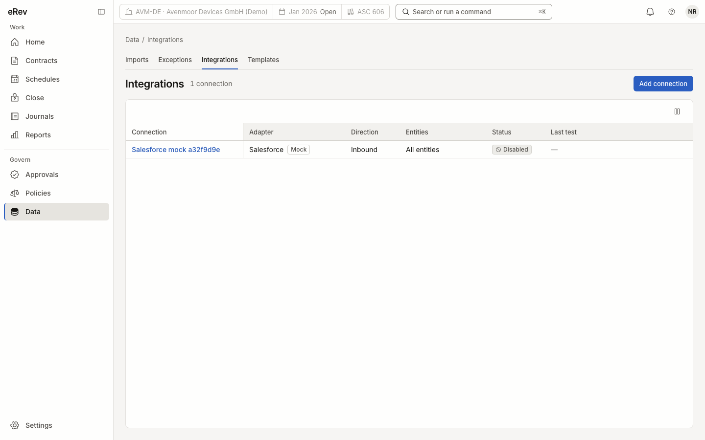

*SF-16: one connection, a Salesforce mock, inbound, for all entities, "Disabled"; Nikhil Rao (Integration Admin).*

To add a connection:

1. Press "Add connection".
2. Choose the "Adapter": "Salesforce", "Stripe", "NetSuite", "QuickBooks Online" or "CSV GL export". It cannot be changed after the connection is saved.
3. Enter the "Name" and the "Code", a short name that stays the same.
4. Check the "Direction" (the default of the adapter is preselected, "Inbound" for Salesforce) and choose the "Entities", or leave the field empty for all entities.
5. Enter the "Base URL".
6. Enter the "Credential reference": the rest of the name of the secret and its version number, for example netsuite-token@3, after the prefix of the workspace that stands before the field. The secret itself is never stored, and an empty field sends no credential.
7. Add the "Settings" the adapter reads with "Add setting". Never put a secret there.
8. Press "Save connection". The product may ask for an authenticator code first ("Confirm with your authenticator"). The page of the connection opens, and the new connection starts "Disabled".

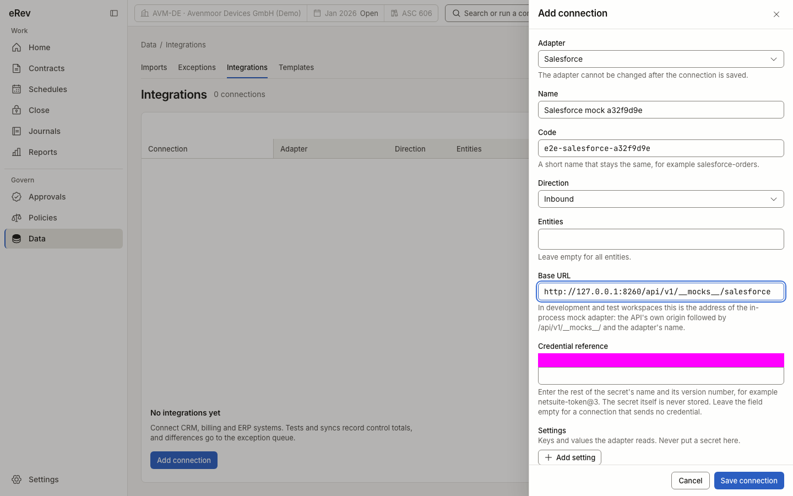

*SF-16: the panel "Add connection" filled for a Salesforce mock, over the empty list "No integrations yet"; Nikhil Rao (Integration Admin).*

Limit in 1.0: release 1.0 ships no live adapter (row A-6); a connection is made to a built-in mock adapter of a development, test or demo environment.

### A connection and its sync runs

The page of a connection (screen SF-16:connection, route `/data/integrations/:connectionId`) shows its name with the status, the adapter and "Mock", the buttons "Test connection", "Run sync" and "Enable" or "Disable", and the tabs "Settings", "Sync runs" and "External ids". The grid "Sync runs" has the columns "Started", "Kind", "Status", "Records", "Source totals", "Loaded totals", "Result" ("Reconciled" or "Difference"), "Exceptions" and "Duration". "Settings" shows the saved values and leads to "Edit connection"; "External ids" lists the source records that a sync has linked to records of the workspace.

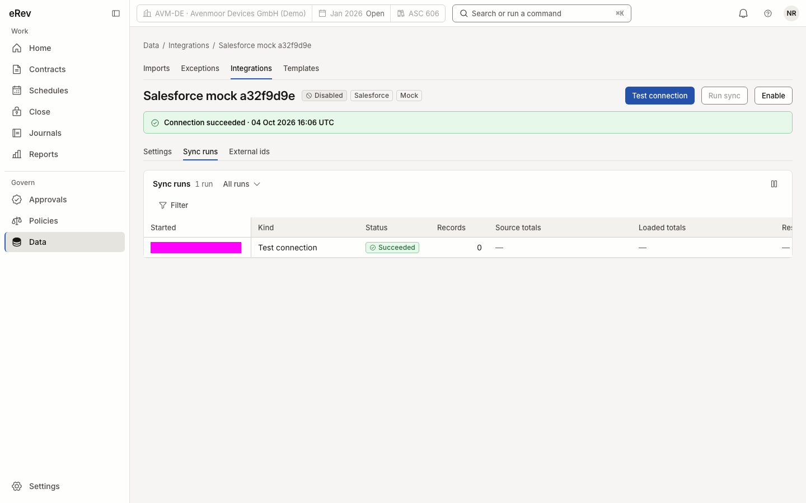

*SF-16:connection: the Salesforce mock after "Test connection", with "Connection succeeded" and the test in "Sync runs"; Nikhil Rao (Integration Admin).*

1. Open the connection from the list. Before its first test the page reads "This connection has not been tested."
2. Press "Test connection". The banner reads "Connection succeeded · \<time>" or "Connection failed · \<time>: \<detail>", and the test is recorded as a sync run of the kind "Test connection".
3. Press "Enable". On a disabled connection "Run sync" is unavailable: "Enable the connection to run a sync."
4. Press "Run sync" and choose a kind the adapter offers, for example "Inbound poll". When the run ends the message reads "Sync finished: \<n> records, control totals reconciled." or "Sync finished with a control total difference. Exceptions were raised."
5. Press the time in the column "Started" to open the run.

The page of a sync run (screen SF-16:sync-run) shows the title "Sync run · \<connection>" with the status, then "Kind", "Started", "Finished", "Duration", "Checkpoint before" and "Checkpoint after". "Control totals" compares "Source" and "Loaded" for each "Measure" ("Records" and "Amount (\<currency>)") and states the result of the run. "Exceptions" lists the items the run raised with "Title", "Code" and "Severity"; a title opens the item in the exception queue. The run of the capture is a test, which loads nothing: it reads "This run recorded no control totals." and "This run raised no exceptions."

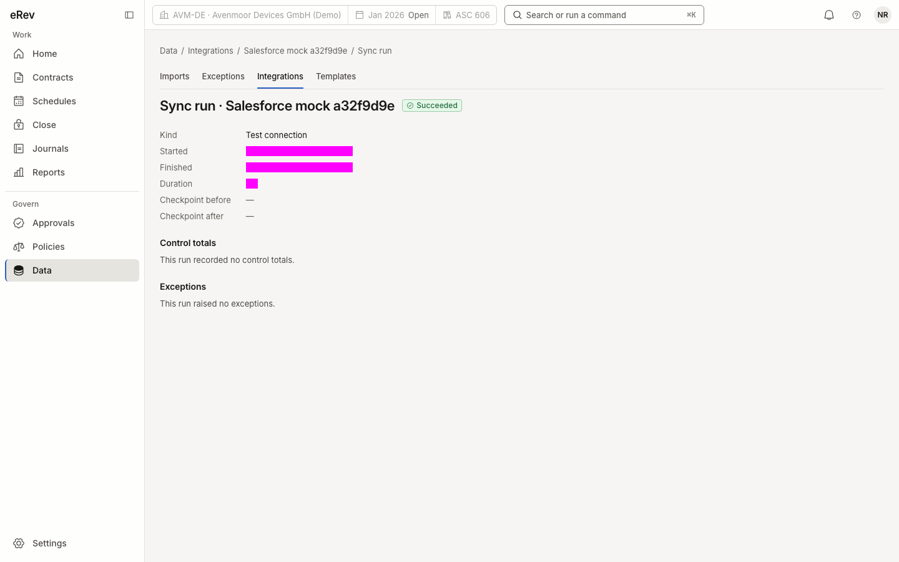

*SF-16:sync-run: the run of a connection test, "Succeeded", without control totals and without exceptions; Nikhil Rao (Integration Admin).*

Limit in 1.0: a control-total difference of a sync raises an exception item and notifies nobody; read the exception queue after a sync run (row B1-19).

## Policies

The Policies area holds the configuration under which contracts are computed, approved and posted: obligation templates, control rules, the policy registry, the account mapping, SSP books and the historical SSP calculator. It is the entry "Policies" under "Govern" in the rail. Route `/policies` opens the first of six tabs: "Revenue policies", "Control rules", "Accounting policies", "SSP books", "SSP calculator" and "Account mapping". On every screen of the area the three segments of the context pill are disabled, with the tooltip "Not used on this page".

Reading needs `config.read` (`ssp.read` on the two SSP tabs), authoring `config.author` (`ssp.create`) and approving `config.approve` (`ssp.approve`). The captures show Maya Chen (Revenue Accountant, SSP Analyst), who authors, and Marcus Webb (Controller, SSP Approver), who approves and does not author. The full rules and the API behind each tab are in the [user guide](user-guide.md#policies); what the release does not do is in [the limits of release 1.0](../release/LIMITS-1.0.md), cited below by row.

**Policy parameters and their levels.** A policy parameter is one registered choice of the product: an accounting policy, a practical expedient, an election or a judgement parameter. The registry gives each an identifier (`POL-076`), a key (`alloc.discount_exception`), the question it answers, a framework default for ASC 606 and for IFRS 15, the levels at which a value may be set, its pinning and its approval class. For an obligation the engine takes the first value it finds in the order obligation, contract, product, book, entity, workspace, and the framework default where no level holds one. A parameter takes a value only at the levels its registry row lists.

| Level | Printed as | Where a value is set | Release 1.0 |
|---|---|---|---|
| Workspace | "Tenant" | A policy version of scope "Tenant" on "Accounting policies" | Offered |
| Legal entity | "Entity" | A policy version of scope "Entity" | Offered |
| Book | "Book" | A policy version of scope "Book" | Offered |
| Product or obligation template | "Product" | "Policy values" of an obligation template version; for a product, the API | Offered, within the limits stated under the template editor |
| Contract | "Contract" | A policy override | Not offered |
| Obligation | "Obligation" | A policy override | Not offered |

Limit in 1.0: policy overrides for one contract or one obligation are not offered — `POST /api/v1/policy-overrides` refuses the creation and says what decides the parameter instead — while the registry screen still prints the levels "Contract" and "Obligation", and "Override" under "Approval", as the registry has them (row B1-1).

**Versions and their approval.** Every configuration object of this area is versioned: a published version is never edited, and a change is a new version. A version is authored as a draft, tested where the object has tests, submitted, and put in force by the approval of a second person. The approver is never the submitter, and no screen has a "Publish" command: the approval publishes the version with the effective date it was submitted with. A template, a rule set, the account mapping and each scope of the policy registry hold one open version at a time.

| Status chip | API literal | Meaning |
|---|---|---|
| "Draft" | `DRAFT` | Being authored. The content changes only while the version is "Draft" or "Tested" |
| "Tested" | `TESTED` | Its tests passed. A change made afterwards is refused at submission until the tests run again |
| "Pending approval" | `SUBMITTED` | Waiting for a decision in Approvals. Its author can "Withdraw" it |
| "Published" | `PUBLISHED` | Approved, and in force from its effective date. An SSP book version has no test step and ends as "Approved" (`APPROVED`) |
| "Superseded" | `SUPERSEDED` | A later version was published; its "Effective to" is the day the later version takes effect |
| "Rejected", "Withdrawn" | `REJECTED`, `WITHDRAWN` | The request was rejected, or withdrawn by its author |

Every version page carries the same lifecycle stepper: "Draft", "Tested", "Approval", "Published", and for an SSP book version "Draft", "Approval", "Approved". Each step carries a caption; in the capture of the rule set version below they read "Edited 04 Oct 2026", "32 of 32 tests passed", "Approved by Marcus Webb" and "Effective 01 Jan 2026". A request is decided under [Approvals](#approvals); its subject reads `REGISTRY_VERSION`, `RULE_SET_VERSION`, `POB_TEMPLATE_VERSION`, `ACCOUNT_MAPPING_VERSION` or `SSP_BOOK_VERSION`. "Effective from" is entered as a date; "Effective to" is never entered ("Set when a later version is published.").

Limit in 1.0: a date picked as the effective date of a configuration version is sent as noon UTC of that date, so for an entity beyond UTC+11 the version reads as in force on the next local day and a version dated today is refused once noon UTC has passed; date a configuration version from the next day on (row B8-14).

Limit in 1.0: the impact simulation has no source of contracts, so the approver of a configuration version reads "No contracts affected" where nothing was simulated, and reads the version's difference to the version in force instead (row B1-33).

Limit in 1.0: obligation templates, rule sets, an account mapping without entities and SSP books of all entities answer for the whole workspace and can be decided by an approver who holds the permission for one entity; policy versions of tenant and book scope ask the permission for all entities (row B6-1).

### Revenue policies: the obligation templates

This tab lists the obligation templates, each of which states how a booking line becomes a performance obligation and how it is recognised, and the rule sets that assign templates and SSP books to booking lines. The capture shows it as Maya Chen, Revenue Accountant, reads it. Reach it with "Policies" in the rail: `/policies` redirects to `/policies/revenue`.

- "Obligation templates" has one row per template: "Template" (the code), "Name", "Current version", "Latest status", "Satisfaction pattern", "Recognition method", "Convention", "Distinctness" and "Effective from". The demo workspace holds nine, from `TPL-ENG-C2C` "Engineering project, cost to cost" to `TPL-USAGE` "Usage series", each at "v1" and "Published". The tab has no command that creates a template; the user guide names the API for it (`/api/v1/pob-templates`).
- "Assignment rules" lists the rule sets of kind "Obligation assignment" and "SSP assignment": "Rule set", "Name", "Kind", "Current version", "Latest status", "Rules", "Lint" and "Effective from", with the command "New rule set". The demo workspace holds none ("0 rule sets").

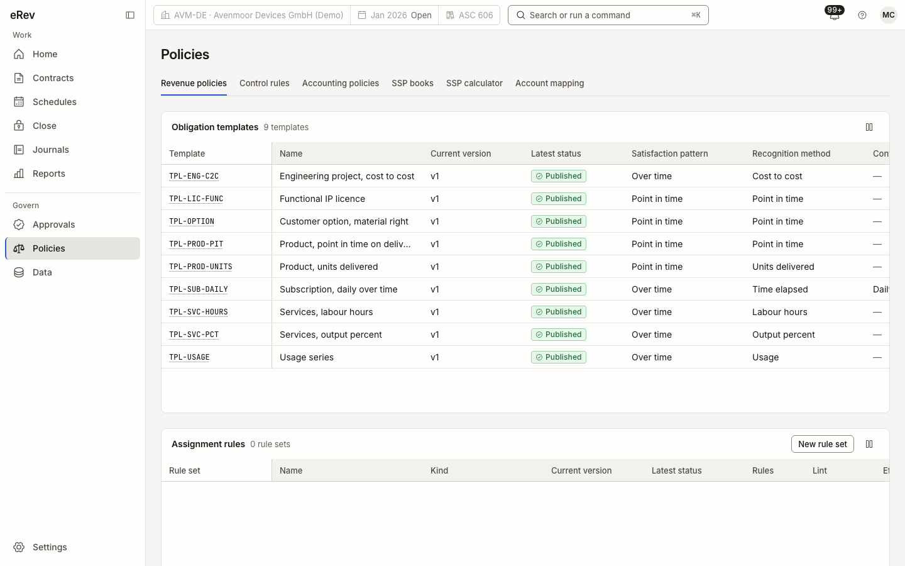

*SF-13:revenue: the nine obligation templates of the demo workspace above the empty "Assignment rules" grid; Maya Chen, Revenue Accountant.*

To open a template version:

1. Find the template in "Obligation templates".
2. Press its code in the column "Template". The page of its current version opens, or of its latest version where none is published.

### An obligation template version

The version page shows what an obligation receives from its template; the route is `/policies/templates/:templateId/versions/:versionId`. From top to bottom it shows the breadcrumb, the tabs of the area, the header with the code, the name, the status and the version number, the lifecycle stepper, the version details ("Effective from", "Effective to", "Author", "Approver", "Content SHA-256") and five panels:

| Panel | Content |
|---|---|
| "Outputs" | "Obligation kind"; "Distinctness" ("Distinct", "Not distinct", "Series") with "Series increment"; "Satisfaction pattern" ("Point in time", "Over time") with "Over-time criterion"; "Recognition method" with "Ratable convention"; "Start date rule"; "End date rule" with "Term months"; "Principal or agent"; "Warranty type"; "Licence nature"; "Revenue category"; "Legacy stratification"; the ticks "Significant financing assessment required" and "Excluded from netting attribution"; the list "Account role overrides" |
| "Policy values" | The policy parameters this version sets at product level: "Key", "Value" and "Approval code" |
| "Test cases", "Simulation" | The example cases of the version ("Name", "Input", "Expected output", "Last result", "Last run at") and their result. A template version carries no impact simulation |
| "Changes" | The outputs that differ from the version it replaces: "Field", "Before" and "After" |

The capture shows the published version 1 of `TPL-SUB-DAILY` as Maya Chen reads it: "Standard", "Series" with the increment "Day", "Over time" under "ASC 606-10-25-27(a)", "Time elapsed" with the convention "Daily", and the start date rule "Line start". The banner says why nothing can be changed: "This version is no longer a draft, so it is read-only. Create a new draft version to change values."

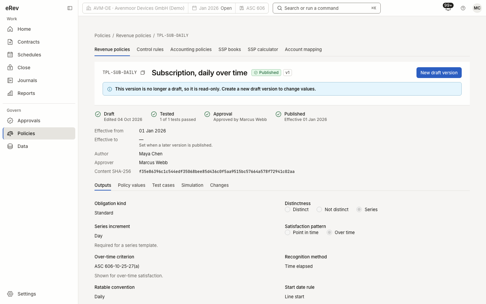

*SF-13:template-version: version 1 of `TPL-SUB-DAILY`, published and read-only, on the panel "Outputs"; Maya Chen, Revenue Accountant.*

### Drafting a template version and sending it for approval

A holder of `config.author` drafts the next version from one that is no longer open to changes, as a rule the published one. The capture shows version 2 of `TPL-OPTION` "Customer option, material right" as Maya Chen created it: the chip "Draft", the commands "Run tests" and "Submit for approval", an empty "Effective from" and, under "Tested", "0 of 1 tests passed".

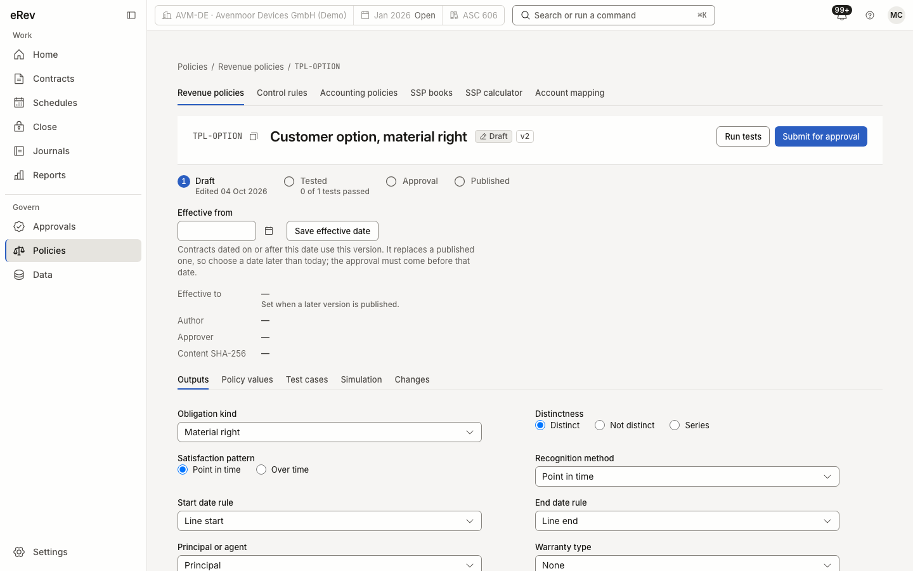

*SF-13:template-version: the draft version 2 of `TPL-OPTION` with its editable effective date and outputs; Maya Chen, Revenue Accountant.*

1. Open the version to start from and press "New draft version". The draft copies that version and opens under the next version number.
2. Under "Effective from" choose a date and press "Save effective date". A version that replaces a published one needs a date later than today in every entity's time zone; the field says: "Contracts dated on or after this date use this version. It replaces a published one, so choose a date later than today; the approval must come before that date."
3. On "Outputs" change the fields and press "Save outputs". A field appears with the choice it belongs to: "Series increment" for "Series", "Over-time criterion" for "Over time", "Ratable convention" for "Time elapsed", "Term months" for "Start plus term".
4. On "Policy values" choose a parameter under "Key", press "Add value", enter the "Value" and press "Save policy values". "Remove" takes a value out.
5. Read the example cases on "Test cases"; the panel lists them and has no command to add or change one. Press "Run tests". The screen answers with the count, as in "1 of 1 tests passed.", and when every case passed the status reads "Tested".
6. Press "Submit for approval". The status reads "Pending approval" and the request waits in Approvals for a holder of `config.approve`. Until it is decided, "Withdraw" takes it back and the version reads "Withdrawn".
7. When the request is approved the version reads "Published", and the version it replaces "Superseded".

Two refusals are answered on the page. A date that is not later than today is refused at "Submit for approval", at the field, under the banner "Check the highlighted fields": "This version replaces a published one. Choose an effective date later than today." A change made after the tests ran, a saved date included, is refused under "Action not available in this state" with "This version changed after its tests ran. Run the tests again."; "Run tests" clears it.

Limit in 1.0: on a product or an obligation template `usage.tier_minimum_method` and `upfront_fee.recognition_period` take the framework's default only and `pob.shipping_as_fulfilment` takes no value; "Key" still offers the three, and a refused value is shown in the form's banner under "Check the highlighted fields" with no row marked (rows B3-13 and B3-21; B.9 "The template editor's policy values").

### Control rules

This tab lists the control rule sets, whose kinds are "Approval routing", "Auto-approval", "Holds", "Combination detection" and "Data-quality monitors". An approval-routing rule adds steps to an item type's own approval and never lowers it; an auto-approval rule covers only what an integration originates. The capture shows the tab as Maya Chen reads it; reach it with the tab "Control rules" (`/policies/control-rules`).

The grid "Control rules" shows "Rule set" (the code), "Name", "Kind", "Current version", "Latest status", "Rules", "Lint" and "Effective from", under "Search rule sets" and a "Filter" by "Kind". The demo workspace holds five rule sets, all at "v1" and "Published": `APPROVAL_ROUTING` with 32 rules and `AUTO_APPROVAL` with 2, both with the lint "Valid", and `AUTO-BOOTSTRAP` "Setup grants", `AUTO-MIG-01` "Legacy SSP replay" and `DQ-SYSTEM` "Data-quality monitors".

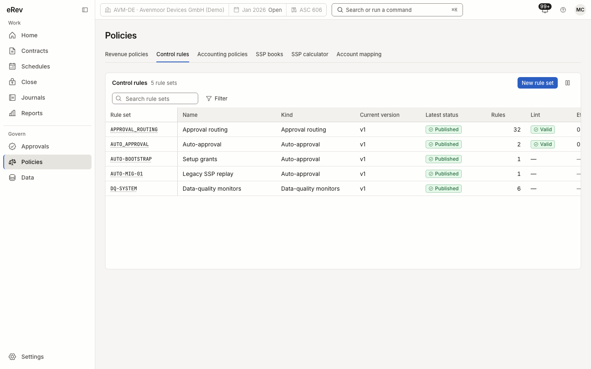

*SF-13:control-rules: the five rule sets of the demo workspace with their kind, version, status, rule count and lint; Maya Chen, Revenue Accountant.*

To create a rule set (`config.author`):

1. Press "New rule set".
2. Enter the "Code" and, as wanted, the "Name" and the "Description", and choose the "Kind". The kind cannot change after the rule set is created.
3. Press "Create rule set". The rule set is created with its draft version 1, which opens.

### A rule set version

The version page is the decision table of one rule set version. The capture shows version 1 of `APPROVAL_ROUTING` as Maya Chen reads it. Press a code in the column "Rule set" to open the current version of that rule set (`/policies/rule-sets/:ruleSetId/versions/:versionId`).

The header shows the code, the name, the status, the version number and the kind, with the lifecycle stepper; the version details follow ("Effective from", "Effective to", "Author", "Approver", "Content SHA-256"). The panels are "Rules", "Test cases", "Lint", "Simulation" and "Changes". The grid "Rules" shows "Priority", "Rule key", "Conditions", "Outputs", "Specificity" and "Description". In the capture `ROUTE-ADJ-01` reads "Subject is MANUAL_ADJUSTMENT" with the output "Step 1: adjustment.approve", and `ROUTE-CFG-01` routes `REGISTRY_VERSION` and the configuration subjects listed with it to "Step 1: config.approve".

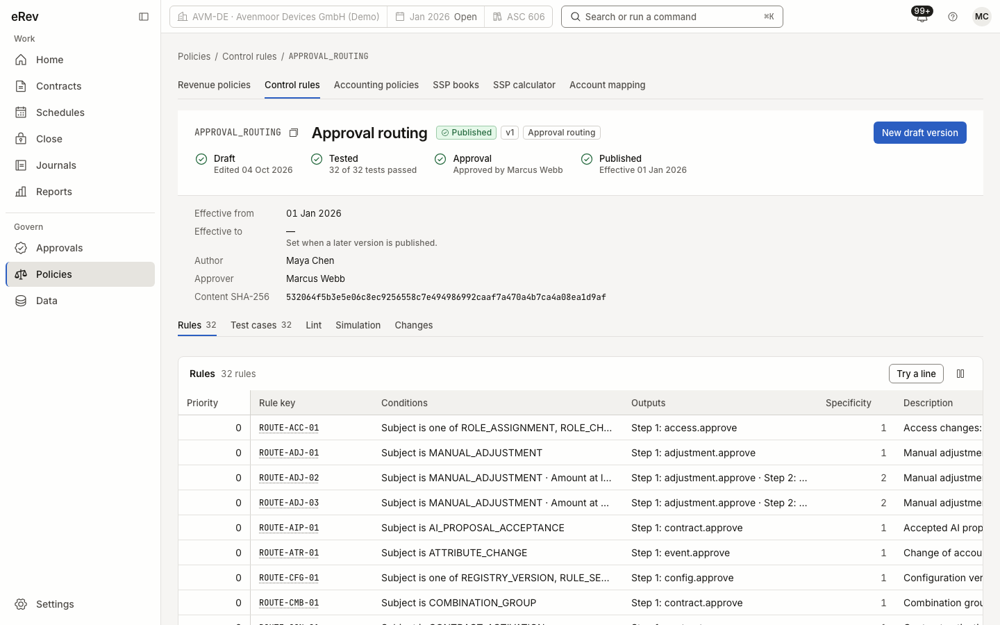

*SF-13:rule-set-version: version 1 of `APPROVAL_ROUTING`, published, with the first of its 32 rules; Maya Chen, Revenue Accountant.*

To read a rule, press its rule key: the drawer shows its conditions and its outputs, read-only on a published version. To try a case, press "Try a line", enter its facts (for approval routing "Subject", "Entity", "Amount" and "Flags") and press "Try line": the answer names the rule that matched, with its specificity, its priority and its output, or reads "No rule matched. A line like this goes to the exception queue."

To change the rules (`config.author`):

1. Press "New draft version". The draft copies this version and opens.
2. Press "Add rule" and enter the "Rule key", the "Priority", the "Conditions" and the "Outputs". A condition is a "Field", an "Operator" ("is", "is one of", "between", "starts with", "at least", "at most") and a "Value"; the outputs of approval routing are the "Approval steps", each with "Name", "Permission" and "Minimum approvers". Press "Save rule". Among rules of the same specificity the higher priority wins. An approval-routing or auto-approval rule without a condition, one that would lower an approval, or one whose condition cannot be evaluated on its field is refused when it is saved and again at publication.
3. With one rule selected, "Duplicate rule" and "Remove rule" act on it.
4. On "Test cases" press "Add test case" and give the "Name", the "Input" and the "Expected output", the last two as JSON objects.
5. Press "Run lint". The panel "Lint" answers "No lint findings." or names two rules of equal specificity and priority; a version with lint errors cannot be submitted.
6. Press "Run tests", then "Submit for approval". The date of a control rule set is optional: "Empty or today: the version takes effect when it is approved. A later date: it takes effect at 12:00 UTC on that date, and the approval must come before then."
7. While the request waits, its author reads "You authored this version. Another user with configuration approval must approve it." and can "Withdraw" it.

### Accounting policies: the policy registry

This tab lists the versions of the policy registry, one row per category, scope and version. The capture shows it as Marcus Webb, Controller, reads it: he approves these versions and is offered no authoring command. Reach it with the tab "Accounting policies" (`/policies/accounting`).

The grid "Policy versions" shows "Category", "Scope", "Version", "Status", "Preset", "Effective from", "Effective to", "Author" and "Approver". The categories are "Accounting policies", "Practical expedients", "Disclosure elections", "Close", "Platform", "Security", "AI" and "Integration". A scope reads "Tenant" (the workspace), "Entity" with the entity's code or "Book" with the book's label. A preset reads "Framework defaults", "Legacy parity" or "Industry template" with its cluster. "Platform", "Security" and "AI" are edited under Settings, so their rows show the link "Open in Settings" in place of a version number. In the capture the workspace's own seven versions stand first: "Disclosure elections" for each of the four entities, "Integration" and "Platform" for "Tenant", and "Accounting policies" for "Tenant" at "v2", "Published" with effect from 01 Nov 2026. Below them stand the versions of preset "Framework defaults" whose author reads "System"; version 1 of "Accounting policies" reads "Superseded", and its "Effective to" is the same 01 Nov 2026.

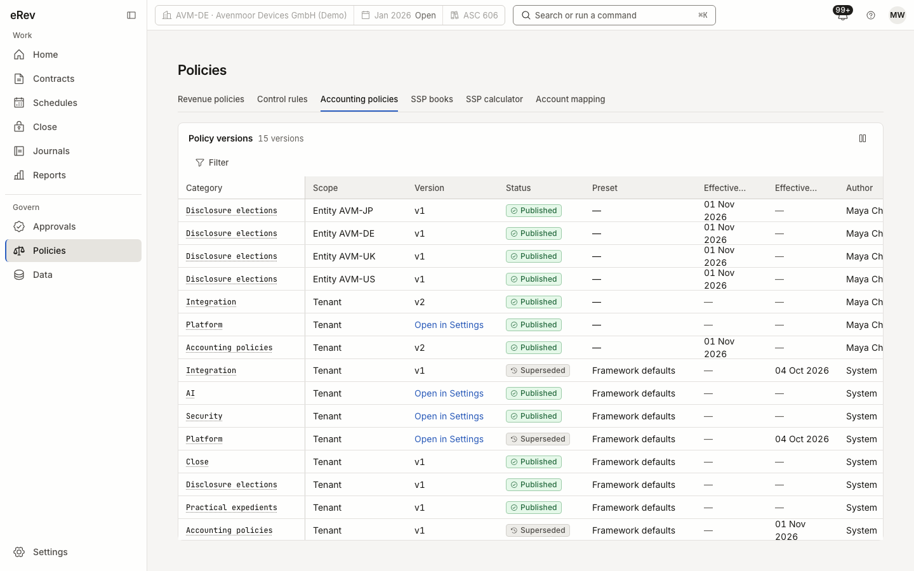

*SF-13:accounting: the 15 policy versions of the demo workspace by category and scope, without authoring commands; Marcus Webb, Controller.*

### A policy version: reading a parameter

The version page lists every parameter of one category with the value the version holds; press a category in the list to open its version (`/policies/accounting/:policyId`). Under the header and the stepper stand "Effective from", the filters "Search parameters", "Section" and "Changed only", and the sentence "Pinned-at-inception values apply to contracts computed after publication; per-period values apply from this period." The grid "Policy parameters" reads for each parameter:

| Column | Content |
|---|---|
| "POL", "Key", "Question" | The identifier, the key and the question, for example `POL-077`, `alloc.zero_total_ssp`, "What if every POB of a contract has SSP 0?". A chip "Changed" marks a parameter this version changes |
| "Current value" | The value of the published version of the same category and scope, or the framework default, with its source beside it ("Framework default" in every row of the capture) |
| "Proposed value" | The value this version holds. A lock marks a value that the framework forces and that cannot be set |
| "ASC 606 default", "IFRS 15 default", "Legacy parity" | The two framework defaults and the value of the legacy-parity preset ("n/a" where it has none) |
| "Levels", "Pinning", "Approval", "Source" | The levels the registry lists for the parameter; "At inception" or "Per posting period"; the approval class ("Configuration", "Override", "Estimate", "Judgement" or "Fixed"); the source reference |

The capture shows the published version 2 of "Accounting policies · Tenant", with 112 parameters, as Marcus Webb reads it. Below the grid, "Simulation" states the result of the example cases and of the impact simulation; it reads "Example cases have not run for this version." and "No contracts affected", to which the limit of row B1-33 above applies.

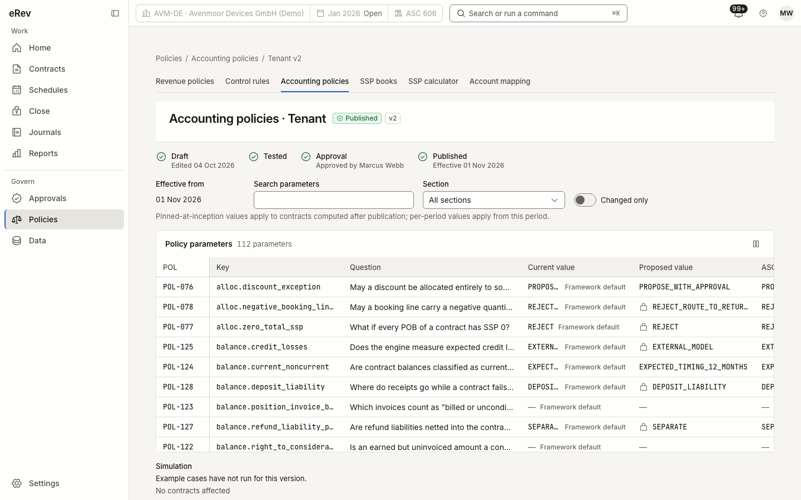

*SF-13:accounting-version: the published version 2 of "Accounting policies · Tenant" with the first of its 112 parameters and the "Simulation" block; Marcus Webb, Controller.*

Limit in 1.0: four parameters decide nothing at any level, namely `step1.portfolio_approach` (POL-015), `material_right.ssp_method` (POL-026), `costs.commensurate_ratio` (POL-142) and `scope.lessor_combination_expedient` (POL-231): a stated value is stored and published and changes no figure (row B3-22).

### Creating a policy version at workspace or entity level

A holder of `config.author`, Maya Chen in the demo workspace, changes a parameter by a new policy version of its category and scope. A policy version is not copied from its page: it is always created from the list.

1. On "Accounting policies" press "New policy version".
2. Choose the "Category" ("Accounting policies", "Practical expedients", "Disclosure elections", "Close" or "Integration") and the "Scope": "Tenant" for the workspace, "Entity", which asks for the "Entity", or "Book", which asks for the "Book". Check that the parameter's "Levels" list that scope.
3. Leave "Start from the current published values" ticked to state the published values of that category and scope; unticked, the draft starts from the framework defaults. Press "Create version". The draft opens.
4. Find the parameter with "Search parameters" or "Section" and set its "Proposed value". An emptied value returns the parameter to its default.
5. Enter "Effective from" and press "Save values".
6. Press "Run tests and simulation", and read the result under "Simulation".
7. Press "Submit". A version of an accounting category needs the date first ("Set the effective date before you submit."); a version of "Close" or "Integration" needs none: "Without a date the version takes effect when it is approved. Choose a date to start later."
8. The version reads "Pending approval" until another person approves it in Approvals; it then reads "Published", and the version it replaces "Superseded".

While the request waits, its preparer can "Withdraw" it, which makes the version a draft again. A rejected version offers "Edit" to the same end, unless another version of its scope was published or opened meanwhile. No command deletes a draft: a draft that nobody wants is finished by stating the values in force and submitting it. Beside "New policy version", "Apply legacy-parity preset" creates a draft that takes the legacy-parity value of every parameter that has one.

### Account mapping

This tab lists the versions of the account mapping, which gives each account role its GL account; journal lines need a published mapping before they can post. The capture shows it as Marcus Webb reads it. Reach it with the tab "Account mapping" (`/policies/account-mapping`).

The grid "Account mappings" shows "Mapping" (the name), "Version", "Status", "Effective from", "Effective to", "Rules", "Author" and "Approver", under "Search account mappings". The demo workspace holds one version: `AVM-MAP-2026-01` at "v1", "Published" with effect from 01 Jan 2026, with 39 rules, authored by Maya Chen and approved by Marcus Webb. A holder of `config.author` is offered "New mapping version" on this grid.

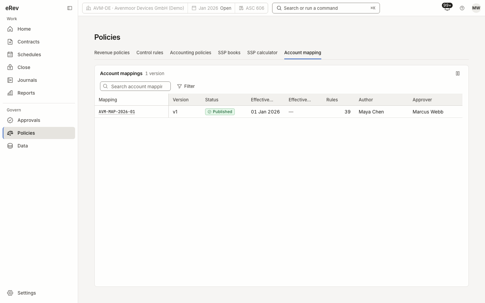

*SF-13:account-mapping: the one published mapping version of the demo workspace, `AVM-MAP-2026-01`; Marcus Webb, Controller.*

### A mapping version

The version page holds the rules of one mapping version; press the name in the column "Mapping" to open it (`/policies/account-mapping/:mappingVersionId`). The header shows the name with the status, the version number and the effective date, above the lifecycle stepper. The panels are:

| Panel | Content |
|---|---|
| "Rules" | The grid "Mapping rules": "Account role" (its label and its literal), "Clearing purpose" (for "Billing clearing" only), the keys "Entity", "Book", "Product" and "Revenue category" ("Any" where the rule does not key on one), "GL account", "Priority" and "Specificity" |
| "Coverage" | The table "Role coverage": one row per account role, and per clearing purpose of billing clearing, with the status "Mapped" and the number of rules, "Not mapped" ("Postings that need this role fail with ACCOUNT_MAPPING_MISSING.") or "Reserved: no mapping allowed" |
| "Test resolution" | A form of "Account role", "Entity", "Book", "Product", "Revenue category" and "Known at". "Resolve" answers the GL account with the priority and the specificity of the rule that gave it, or that no account is mapped. It reads the published mapping, not a draft |
| "Simulation", "Changes" | The impact simulation of the version, as a download; "Rules added" and "Rules removed" against the version it replaces |

The capture shows version 1 of `AVM-MAP-2026-01` as Marcus Webb reads it. Its first rules map "Accounts receivable" to `1100`, "Unbilled receivable" to `1105` and "Contract asset" to `1200` for any entity, book, product and revenue category, and "Billing clearing" to `2090` "Subledger clearing" once for the purpose "Billing" and once for "Unapplied cash".

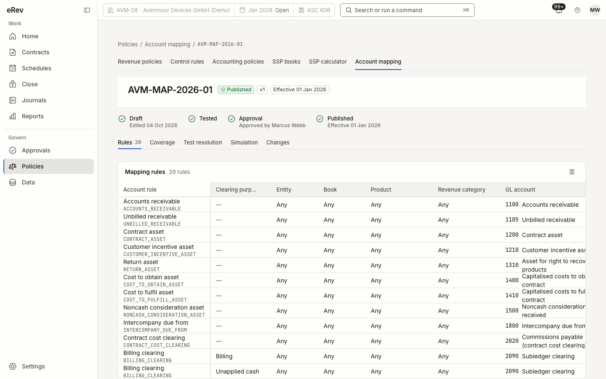

*SF-13:account-mapping-version: version 1 of `AVM-MAP-2026-01`, published, with the first of its 39 rules; Marcus Webb, Controller.*

To prepare a new mapping version and send it for approval (`config.author`):

1. On "Account mapping" press "New mapping version", enter the "Name" and, as wanted, "Effective from", and press "Create draft". The draft copies the rules of the published version and opens. "New draft version" on a version page copies that version instead.
2. Press "Add rule", choose the "Account role", the keys and the "GL account", and press "Save rule". A rule keys on a product or a revenue category, not both.
3. To change a rule, take it out with "Remove rule" and add it again: a rule is not edited.
4. Enter "Effective from" and press "Save effective date". "Submit for approval" needs the date: "Set the effective date before you submit."
5. Press "Run tests", then "Submit for approval". Until the request is decided, "Withdraw" takes it back.

### SSP books

An SSP book holds standalone selling prices by product and effective date. The capture shows the tab as Maya Chen, SSP Analyst, reads it. Reach it with the tab "SSP books" (`/policies/ssp-books`).

The grid "SSP books" shows "Book" (the code), "Name", "Scope", "Resolution", "Current version", "Effective from", "Effective to" and "Draft", which links an open draft. "Scope" joins the book's entity, currency, channel and segment, and reads "All entities" where the book names no entity. "Resolution" reads "By effective date", where a line is priced with the version in force on its date, or "By version label", where a line is priced with a named version. In the capture the four list-price books resolve by effective date (`US-LIST` at "2026-H1 · v1" from 01 Jan 2026), and `LEGACY-SKU-SSP` resolves by version label ("2023-01-01 · v1").

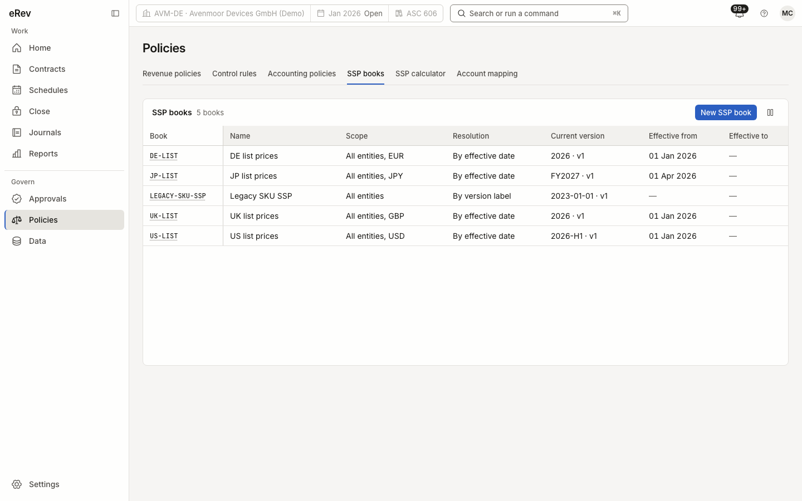

*SF-13:ssp-books: the five SSP books of the demo workspace with their scope, resolution and current version; Maya Chen, SSP Analyst.*

A holder of `ssp.create` adds a book with "New SSP book": the "Code", the "Name" and the "Resolution mode", as wanted the "Description", the "Entity", the "Currency", the "Channel" and the "Segment", then "Create SSP book". A book without versions says so on its page and offers "New draft version" for its first draft.

### An SSP book version

The version page holds the entries of one version of a book, a method with a range or a point for each product, with its study and its difference to the approved version. The capture shows the approved version "2026-H1" of `US-LIST` as Maya Chen reads it. Press a book's code to open its current version (`/policies/ssp-books/:bookId/versions/:versionId`).

The header shows the book's name, the version select, which lists every version of the book and reads "Version 2026-H1 (Approved)" in the capture, the status and the version number. The stepper has three steps, "Draft", "Approval" and "Approved". The details read "Version label", "Effective from", "Effective to" ("Set when a later version is approved."), "Methodology label", "Methodology change", "Prepared by", "Approver", "SSP study", "Calculator run" and "Content SHA-256". The panels are "Entries", "Diff", "Versions" and "Study".

The grid "SSP entries" shows "Product", "Stratification", "Currency", "Method", "Range (±)", "Low", "Mid", "High", "Point", "Distinctness" and "Bands"; the grid's "Columns" control adds "Basis", "Quantity unit", "Unit list price", "Midpoint discount" and "Revenue account". In the capture the version was prepared by Maya Chen and approved by Priya Raman (Revenue Reviewer, SSP Approver), carries the study `us-list-2026-h1-study.csv` and holds seven entries, among them `AVM-PLAT-100`, method "Observable", with 85,000.00, 100,000.00 and 115,000.00 as low, mid and high.

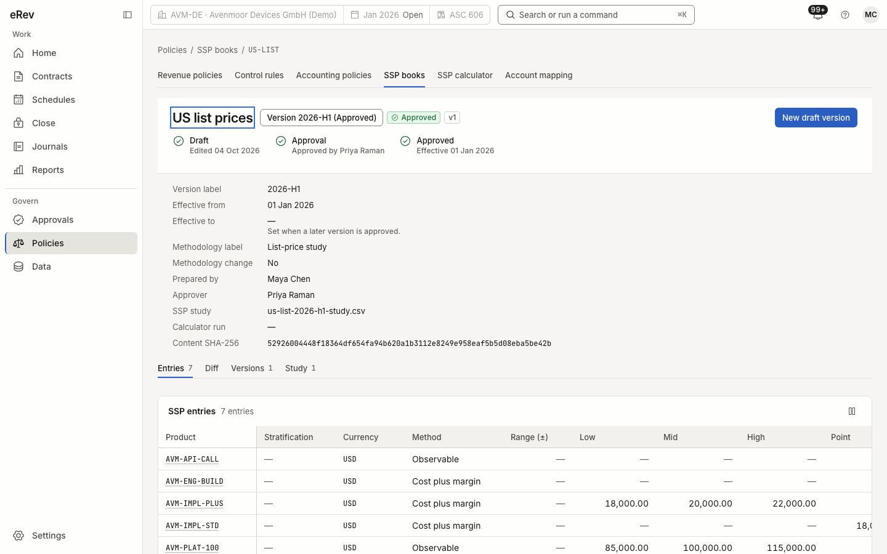

*SF-13:ssp-book-version: the approved version "2026-H1" of `US-LIST` with its details and the first of its seven entries; Maya Chen, SSP Analyst.*

To prepare a new version and send it for approval (`ssp.create`):

1. Press "New draft version". The draft copies this version and opens. A calculator run creates a draft as well (see below).
2. In the details enter the "Version label", "Effective from" (required for a book resolved by effective date) and the "Methodology label", tick "Methodology change" where the method changed, and press "Save version details".
3. On "Entries" change "Low", "Mid", "High" or "Point" in the grid, press a product code to edit the whole entry ("Save entry"), or press "Add entry". The number under "Bands" opens the bands of an entry.
4. On "Study" press "Upload SSP study". A version without a study is refused: "Attach the SSP study before submitting this version."
5. Read "Diff": it compares the draft with the approved version of the book, entry by entry, with a "Delta" column and the earlier value of each changed cell.
6. Press "Submit for approval". The page says that the version is waiting for approval and lists the steps of the request under "Approval routing"; its preparer can "Withdraw" it.
7. A holder of `ssp.approve` other than the preparer decides in Approvals. A methodology change needs a second approver, and the routing rules of the demo workspace ask a second one also where a mid value moves by more than 10%. Once approved, the version reads "Approved" and is read-only.

Limit in 1.0: whether a new SSP version is a methodology change is the preparer's own answer, so the approver reads the study and the "Diff" and asks for the second approver where the method changed (row B1-22).

Limit in 1.0: at a modification the allocation follows the SSP version the preparer named for an obligation, while the price test of an added line reads the version in force at the modification date (row B3-10).

Limit in 1.0: an SSP override can be priced from a version of another legal entity's SSP book, and its approver is not shown the mismatch (row B3-11).

Limit in 1.0: a contract whose inception date is corrected keeps the SSP version it was priced with until an SSP override names another, because an obligation's SSP is read back from the version recorded when it was priced (row B3-19).

### The historical SSP calculator

The calculator computes statistics over a pool of standalone sales and proposes a range for each product studied. Reach it with the tab "SSP calculator" (`/policies/ssp-calculator`). The panel "New run", offered to a holder of `ssp.create`, takes the parameters of a run. The table "Runs" lists the runs with "Run", "Products", "Observations", "Status" ("Queued", "Running", "Succeeded" or "Failed"), "Created" and "Draft version". The capture shows the tab as Maya Chen reads it, with one run of the demo workspace.

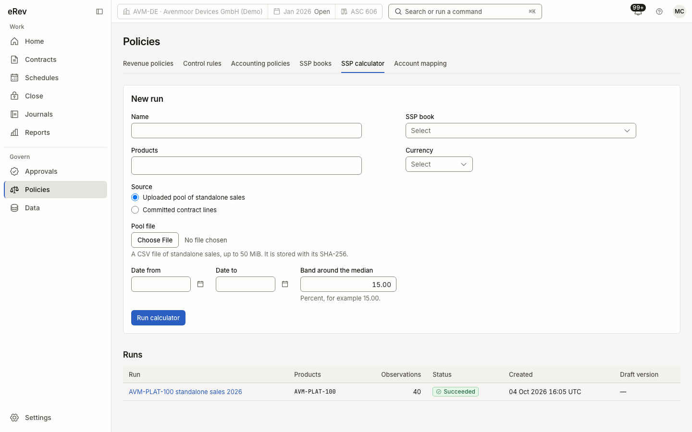

*SF-13:ssp-calculator: the empty "New run" form above the one run of the demo workspace, 40 observations, "Succeeded"; Maya Chen, SSP Analyst.*

To start a run:

1. Enter the "Name", and choose the "SSP book", one or more "Products" and the "Currency".
2. Choose the "Source": "Uploaded pool of standalone sales" or "Committed contract lines". For an uploaded pool choose the "Pool file": a CSV file of standalone sales, up to 50 MiB, which is stored with its SHA-256.
3. Enter "Date from", "Date to" and the "Band around the median" in percent; the form offers 15.00.
4. Press "Run calculator". The page of the run opens and reads "Calculating statistics" until the run has succeeded; a failed run reads "The calculator run failed. Nothing was created."

### A calculator run

The run page shows what one run observed and what it proposes. The capture shows the run "AVM-PLAT-100 standalone sales 2026" as Maya Chen reads it. Press the name of a run under "Runs" to open it (`/policies/ssp-calculator/runs/:runId`).

The header states the status and the parameters: "SSP book", "Dates", "Band around the median", "Source" and "Pool file". Each product studied has three blocks, and one grid of observations closes the page:

- The figures "Observations", "Excluded", "Median (USD)" and "Inside ±15%", the share of the observations inside the band with their count beneath. The capture reads 40 observations, none excluded, a median of 112,000.00 and 40.0% inside ("16 of 40").
- The table "Statistics": "P10", "P25", "Median", "P75", "P90", "Mean", "Proposed low", "Proposed mid" and "Proposed high". In the capture the proposal is 95,200.00, 112,000.00 and 128,800.00: the median, and the median less and plus 15%.
- The chart "Distribution" of the unit prices with the lines "Band −15%", "Median" and "Band +15%"; "Table" shows the same bins with their bounds and their "Count".
- Below the products, outside the capture, the grid "Observations" lists every sale of the run: "Date", "Source", "Product", "Customer", "Quantity", "Unit price (USD)", "In band" and "Excluded".

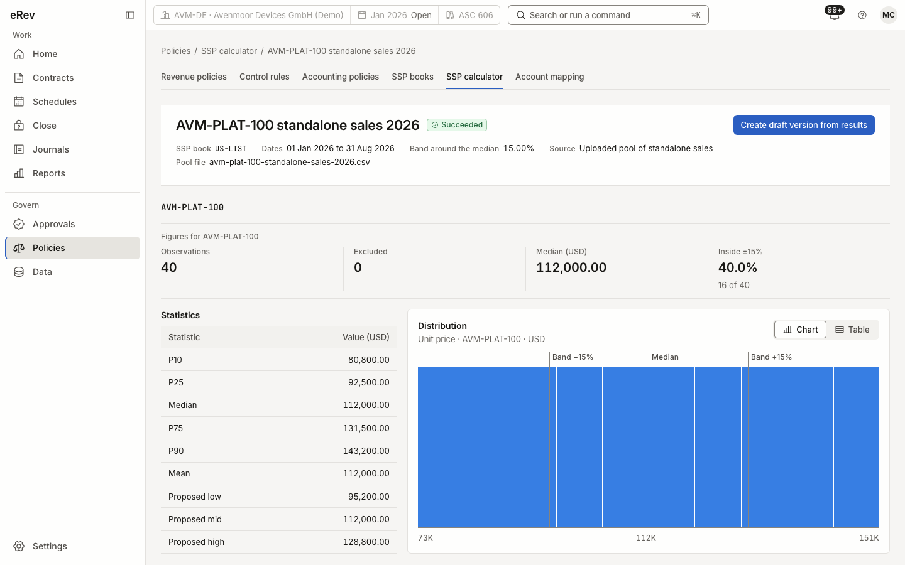

*SF-13:ssp-calculator-run: the succeeded run over 40 standalone sales of `AVM-PLAT-100` with its figures, statistics and distribution; Maya Chen, SSP Analyst.*

To exclude an observation (`ssp.create`):

1. In "Observations" press "Exclude observation" on its row.
2. Enter the "Reason", at least 10 characters, and press "Exclude". The statistics are recomputed without the observation, and the row shows the reason under "Excluded".

To create a draft SSP book version from the results:

1. Press "Create draft version from results".
2. Enter the "Version label" and, as wanted, "Effective from"; the dialog names the book.
3. Press "Create draft version". The draft opens on its SSP book version page, and the run links it with "Open draft version".

The draft copies the approved version of the book and replaces the band of every product the run studied; each entry keeps its value basis and its quantity unit. A study states a price per unit of line quantity, so the draft is refused, with a message that names the product and with nothing written, for an entry priced per increment of a service unit or as a percentage of list price, and for a series product of which the approved version holds no entry: start a run without that product. A study does not compare booked terms.

## Approvals

Approvals (SF-12) is the one inbox for requests that wait for a second person: "Contract activation", "Modification", "Judgement record", "Journal run", "Period lock", "Period reopen", "Import commit", "Policy version", "SSP book version", "Role change", "Role assignment" and others. Every member can open it; preparers follow their own requests there and approvers decide. Its tabs are "Waiting for me" (`/approvals`), "Submitted by me" (`/approvals/submitted`), "All requests" (`/approvals/all`) and, for a holder of an approval permission, "Delegations" (`/approvals/delegations`). The context pill is not used here: "Filter" narrows a list by "Type", by "Entity" and, on "All requests", by "Status". You see and decide requests within the legal entities your roles cover. The full rules are in the [user guide](user-guide.md#approvals).

### The inbox: "Waiting for me"

The tab lists the pending requests you can decide, oldest first, and shows their number beside its name. A row gives the summary and the amount, then the type, the entity, the preparer, the submission date and flags such as "Above threshold" or "Manual entry". Selecting a row opens the request in the pane beside the list. A member without an approval permission reads "You have no approval permissions" here.

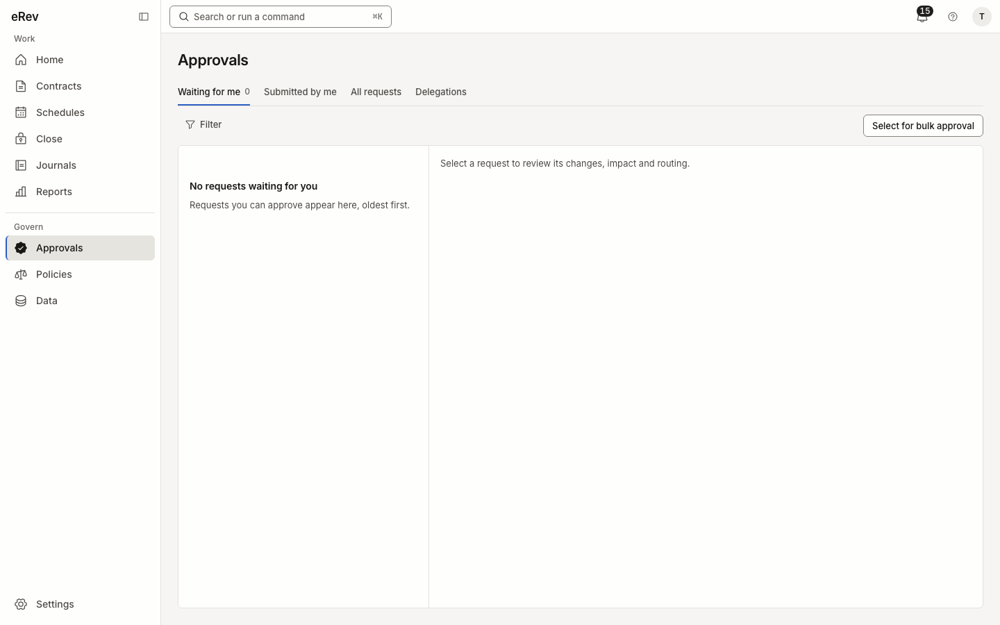

*SF-12: "No requests waiting for you" and the control "Select for bulk approval"; Tomás Rivera (Tenant Admin). The context pill is absent from this capture.*

### One request and its decision form

A request has its own address, `/approvals/requests/:requestId`, and opens inside the tab that contains it. From the top the pane shows: the request number, the type and the status; the summary; who submitted it and when; the entities it names; the routing steps, each with the decisions recorded out of those required and, for every decision, the approver, the time and the comment, where one was given (the decision in the capture carries none: an approval through the API need not give one); a link to the record where there is one, for example "Open contract"; the preparer's "Justification"; the impact, where "No impact on revenue or balances." stands for a stored preview that moves nothing and the notice "No preview is stored for this request" for a request without one; the table "Proposed changes" with "Change", "Field", "Current" and "Proposed" ("Show unchanged fields" adds the rest); and the attachments.

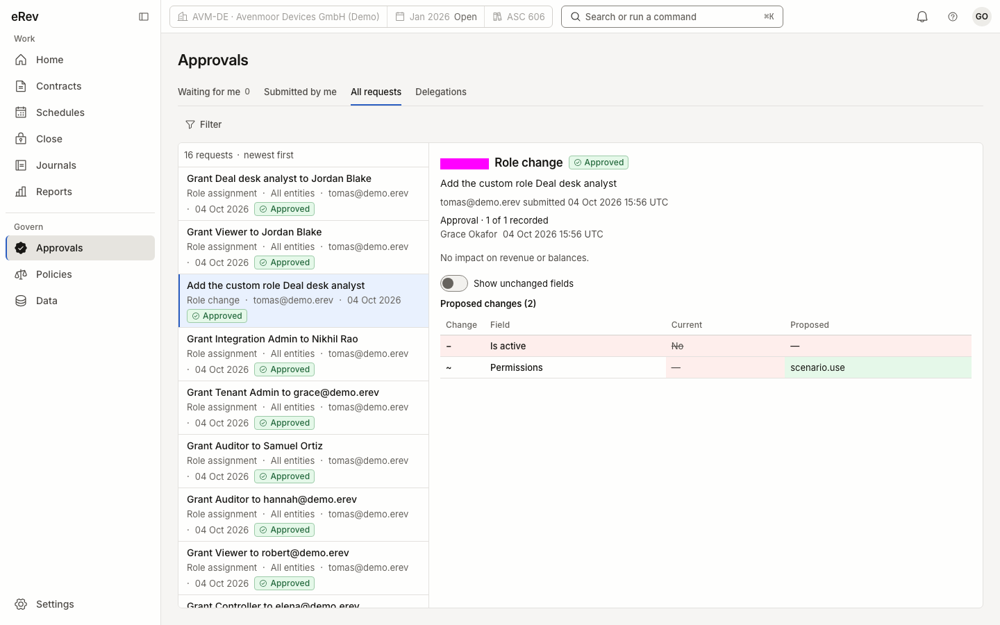

*SF-12:request: the approved "Add the custom role Deal desk analyst" with "Approval · 1 of 1 recorded" and two proposed changes; it is decided, so no form shows, and its number is masked in the capture; Grace Okafor (Tenant Admin).*

While a request is pending and you may decide it, the decision form stands at the foot of the pane: "Comment (required)", "Reject" and "Approve".

*SF-12 with a request open: two requests wait; "Review JDG-000196 (PRINCIPAL_AGENT)" is "Pending approval" and shows "Comment (required)"; the toast of the preceding approval covers the two buttons; Priya Raman (Revenue Reviewer).*

1. Select the request in "Waiting for me", or follow its link from Home or from a notification, and read its changes, impact and routing. "More below" on the form scrolls to what the form covers.
2. Enter a comment of at least 10 characters in "Comment (required)".
3. Press "Approve". Where the subject needs a fresh code, the dialog "Confirm with your authenticator" opens: enter the code in "Authentication code" and press "Confirm".
4. The toast "Approved: \
." confirms the decision; the status and the routing of the request change with it.
5. To reject instead, enter the comment, press "Reject" and confirm with "Reject request" in the dialog "Reject \
?", which states "The preparer is notified and the item returns to Draft." The toast reads "Rejected: \
."

Who may decide, and what stops a decision:

- The preparer of a request cannot approve it. On her own request she reads "You submitted this request. Another approver must review it." and finds "Withdraw request" in place of the form; the API refuses a self-approval, and the screen then reads "You prepared this item, so another user must approve it."
- A person who approved an earlier step reads "You approved an earlier step of this request. Another approver must decide this step."; a person without the step's permission reads "You do not have approval rights for this request type."
- A request whose record changed after submission is void: "Voided: this item changed after submission." The maker must resubmit it.
- While a stored impact preview cannot be loaded, "Approve" is unavailable and "Reject" stays.
- A request that names legal entities outside your access shows "You see part of this request" and no form; a request wholly outside them reads "Approval request not found".

Limit in 1.0: the approver is never the submitter but may be the author of a draft that another person submitted (limits document, row B1-14). Limit in 1.0: a request that nobody but its preparer can decide is not flagged when it is submitted, and it waits unseen (row B1-15). Limit in 1.0: thirteen kinds of subject that apply to the whole workspace, among them rule sets, obligation templates and FX rate sets, are decided by an approver who holds the permission for one entity (row B6-1).

### Submitted by me

The tab lists every request you prepared, newest first, each with its status once it is decided.

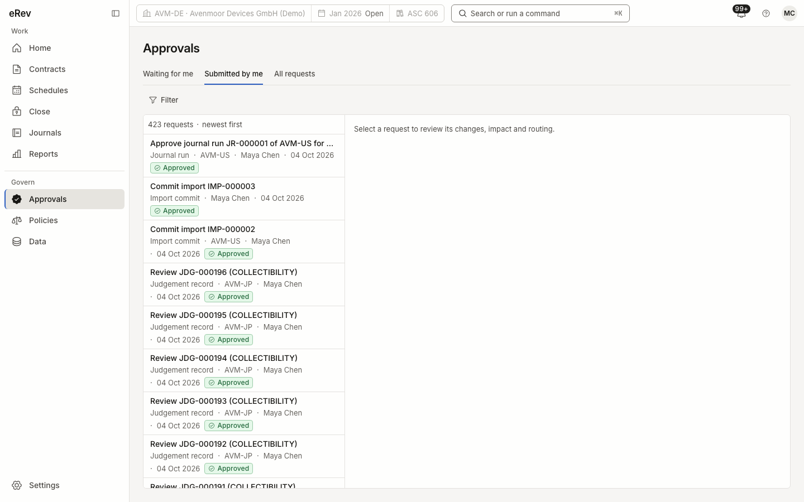

*SF-12:submitted: 423 requests, newest first; Maya Chen (Revenue Accountant), who holds no approval permission and so sees neither a count beside "Waiting for me" nor the tab "Delegations".*

1. Select a request to read its routing and the comments of its approvers.
2. To take back a pending request, press "Withdraw request" at the foot of its pane.
3. Confirm in the dialog "Withdraw this request?", with a comment if you wish: "The item returns to Draft and approvers are notified." The toast reads "Withdrawn: \
."

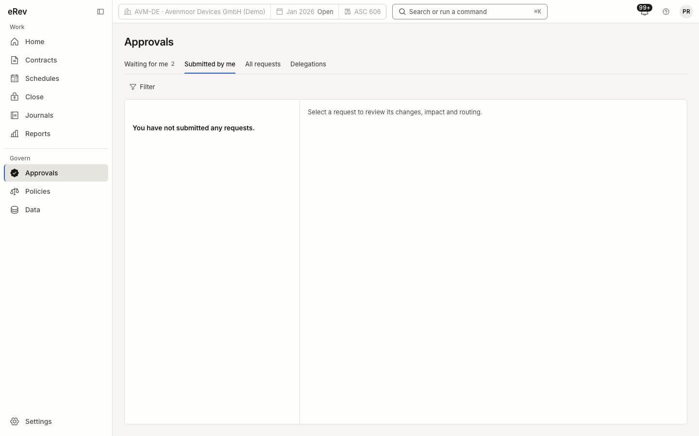

*SF-12:submitted: "You have not submitted any requests."; Priya Raman (Revenue Reviewer).*

### All requests

The tab lists every request within your entities, newest first, whatever its state. "Filter" offers "Status" here, with "Pending approval", "Approved", "Rejected", "Stale or void" and "Withdrawn". It is the place to look up a decided request: its pane keeps who submitted it, who decided each step and when, and the comment where one was given.

*SF-12:all: 16 requests, newest first, and the approved role change open in the pane; Grace Okafor (Tenant Admin).*

### Deciding several at once

An approver with several like requests approves them in one command, which answers for each request separately. Requests are rejected one at a time.

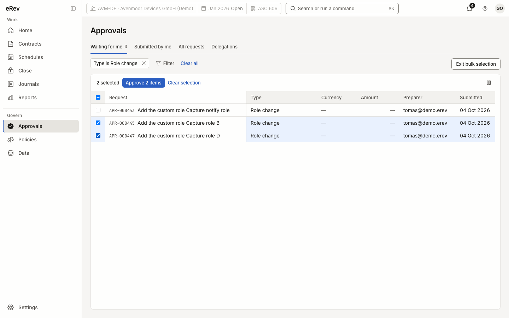

*SF-12 in bulk selection: the filter "Type is Role change", two requests ticked and "Approve 2 items"; Grace Okafor (Tenant Admin).*

1. On "Waiting for me", narrow the list with "Filter" if needed and press "Select for bulk approval". The list becomes a grid with "Request", "Type", "Currency", "Amount", "Preparer" and "Submitted" and a checkbox for each row.
2. Tick the requests, at most 200, and press "Approve \<n> items" in the bar that counts the selection ("2 selected" in the capture).
3. In the dialog, which lists the requests with a line on the impact of each, enter "Comment (required)" and tick "I reviewed the changes and impact of every selected item." Press "Approve \<n> items"; an authenticator code may be asked once.
4. The toast "Approved 2 items." confirms. Where some were refused, the dialog "Approved \<n> of \<total> items" lists them under "Requests that were not approved" with the problem and its detail.
5. Press "Exit bulk selection" to return to the list.

### Delegations

A delegation hands approval permissions to a colleague for a period, for example an absence. It passes the permission, not the view: the delegate decides only requests whose entities the delegate's own roles cover, and a decision made this way is recorded as "on behalf of \<name>". The tab lists the delegations you gave and received with "Delegate", "Delegator", "Permissions", "Valid from", "Valid to", "Reason" and "Status" ("Not started", "Active", "Expired" or "Revoked").

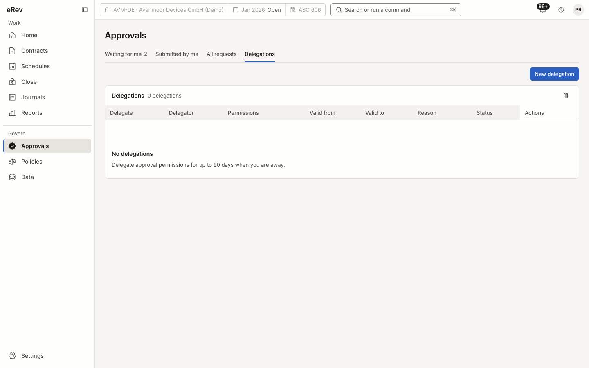

*SF-12:delegations: "No delegations" and the button "New delegation"; Priya Raman (Revenue Reviewer).*

1. Press "New delegation".
2. Choose the "Delegate", an active member other than you; tick the "Permissions" to hand over; set "Valid from" and "Valid to"; give a "Reason". "A delegation lasts at most 90 days."
3. Press "Create delegation"; an authenticator code may be asked. The toast reads "Delegated to \<name> until \<date>."
4. To end a delegation you gave, press "Revoke delegation" on its row and give a reason.

"New delegation" needs the member directory. For a member whose roles do not include it (`user.manage`), as Priya Raman in the capture, the button is unavailable: it is drawn like any other button, does nothing when pressed and gives its reason in its tooltip, "Choosing a delegate needs the member directory, which your roles do not include." Limit in 1.0: among the default roles only the Tenant Admin holds `user.manage`, so a Revenue Reviewer or a Controller creates a delegation through the API, with the delegate's membership id (limits document, row B6-8). Removing a member from the workspace ends every delegation given to that member.

## Settings and administration

Settings is the last area of the rail (`/settings`). It holds each member's own preferences and, for those whose roles allow it, the structure of the workspace, its reference data and its access. Entities, calendars, currencies, reference data, the access pages and the developer page are shown in the part [Workspace structure, reference data and access](#workspace-structure-reference-data-and-access), and their rules are in the [user guide](user-guide.md#settings); sandboxes in [Sandboxes and scenarios](user-guide.md#sandboxes-and-scenarios).

### The settings index

The index (SF-15) lists the pages by group: "Your preferences" ("Notifications", "Profile"); "Workspace" ("Setup", "Entities", "Calendars", "Currencies and rates", "Chart of accounts", "Workspace settings"); "Reference data" ("Customers", "Related-party groups", "Products"); "Access" ("Users", "Roles", "Separation of duties", "Access reviews", "Security", "Support access"); "Developer" ("API clients and webhooks"); and "Sandbox" ("Sandbox copies"). A link is shown only when you hold a read permission of its page, and a group without a link is not shown. Every settings page carries the breadcrumb "Settings /" and, where its group has more than one page, the tabs of its group.

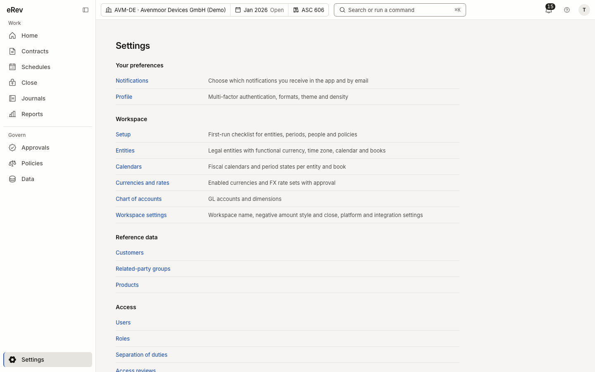

*SF-15: the index from "Your preferences" to "Access"; it continues below the capture; Tomás Rivera (Tenant Admin).*

### Profile

Profile (SF-15:profile, `/settings/profile`) is each member's own page: sign-in security, formats and display, and the workspaces the person belongs to.

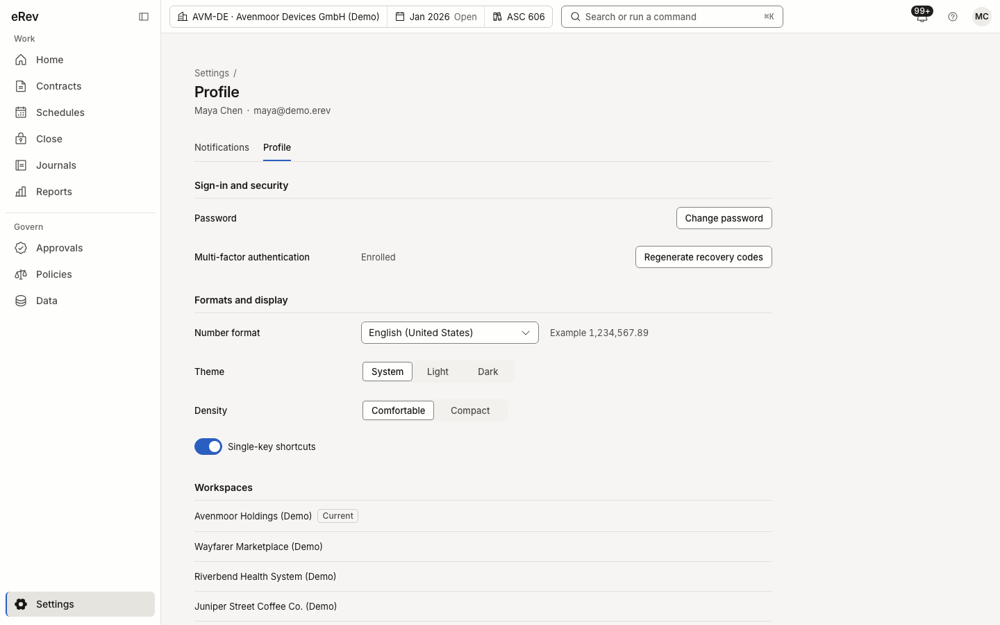

*SF-15:profile: "Sign-in and security" with the factor "Enrolled", "Formats and display" and "Workspaces"; Maya Chen (Revenue Accountant).*

1. To change your password, press "Change password" and enter "Current password", "New password" and "Confirm password" (at least 12 characters). Your other sessions are signed out.
2. To replace your recovery codes, press "Regenerate recovery codes" and confirm ("Your current recovery codes stop working."). Store the new codes with "Copy codes" or "Download codes (TXT)", tick "I have stored these recovery codes" and press "Done".
3. If "Multi-factor authentication" reads "Not enrolled", follow "Set up multi-factor authentication".
4. Set "Number format", "Theme" ("System", "Light", "Dark"), "Density" ("Comfortable", "Compact") and "Single-key shortcuts"; the theme, the density and the shortcuts apply at once. "Workspaces" lists your workspaces and marks the open one "Current".

### Notification preferences

"Notification preferences" (SF-15:notifications, `/settings/notifications`) has one row for each of the twelve kinds of notification, with "When it is sent" and two switches, "In app" and "Email". Each member sets only their own.

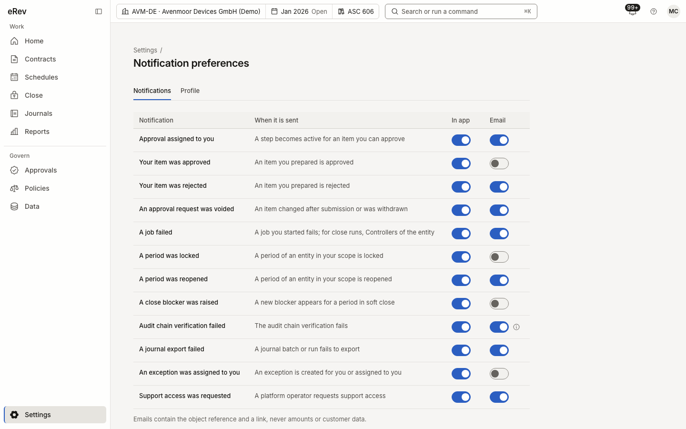

*SF-15:notifications: the twelve kinds, from "Approval assigned to you" to "Support access was requested"; Maya Chen (Revenue Accountant).*

1. Flip a switch. The change is saved at once and the toast reads "Preferences saved."
2. "Audit chain verification failed" cannot be switched off: "Audit chain failures are always sent in the app and by email."

"Emails contain the object reference and a link, never amounts or customer data." A sandbox sends no email; notifications raised there are delivered in the app only.

### Workspace settings

"Workspace settings" (SF-15:workspace, `/settings/workspace`) shows the identity of the workspace and the settings that are not accounting policies. The index lists it for a holder of `settings.manage` for all entities.

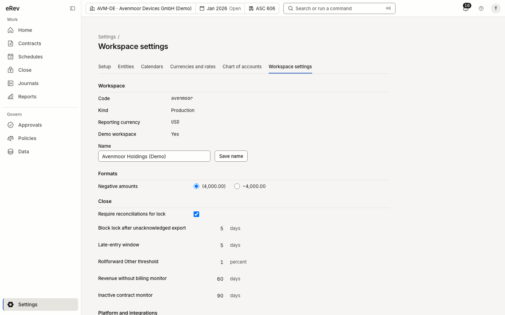

*SF-15:workspace: "Workspace" with code, kind, reporting currency and name; "Formats"; "Close"; "Platform and integrations" begins at the foot of the capture; Tomás Rivera (Tenant Admin).*

1. To rename the workspace, edit "Name" and press "Save name"; the name applies at once.
2. To change a setting, edit its value: for example "Negative amounts" ("(4,000.00)" or "−4,000.00"), "Require reconciliations for lock" or "Late-entry window". Then enter the "Comment" and press "Submit for approval". The form is editable for a holder of `config.author` for all entities; other readers see the values without the button.
3. The change does not apply yet: one policy version for each changed category ("Platform", "Close", "Integrations", "Disclosure elections") goes to Approvals for a second person, and the page reads "Changes to \<categories> are waiting for approval: request \<request>."
4. Where a draft or tested version of a category is already open, the form names it ("Version \<version> of \<category> is open. Finish it on its page.") and does not submit that category.

Accounting policies and practical expedients are set under Policies, "Accounting policies". Limit in 1.0: eleven settings are read by no code and this form offers three of them for approval; one is "Block lock after unacknowledged export", whose approved value changes nothing, although the lock's own block on an unacknowledged batch is built (limits document, row B1-17).

### Workspace setup and its checklist

A new workspace starts on "Workspace setup" (SF-15:setup, `/settings/setup`). Its first administrator, a holder of `settings.manage` for all entities, lands there after sign-in until setup is complete, and the settings index shows "Workspace setup is not complete." with the link "Finish setup".

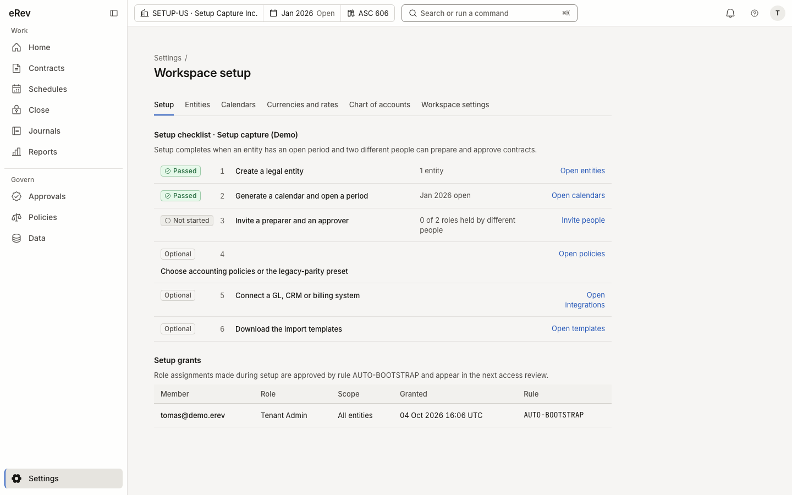

*SF-15:setup: the new workspace "Setup capture (Demo)" with one entity and an open period: items 1 and 2 "Passed", item 3 "Not started", items 4 to 6 "Optional"; Tomás Rivera (Tenant Admin).*

1. "Create a legal entity": follow "Open entities".
2. "Generate a calendar and open a period": follow "Open calendars".
3. "Invite a preparer and an approver": follow "Invite people". The item passes when the permissions to create and to approve contracts are held by two different people.
4. Optional, without a status: "Choose accounting policies or the legacy-parity preset" ("Open policies"), "Connect a GL, CRM or billing system" ("Open integrations") and "Download the import templates" ("Open templates").

"Setup completes when an entity has an open period and two different people can prepare and approve contracts." The page then reads "Setup is complete. Setup grants are listed in the access listing and the next access review." "Setup grants" lists the role assignments made during setup: while no second administrator exists, rule AUTO-BOOTSTRAP approves them, and they appear in the next access review.

### Chart of accounts

"Chart of accounts" (SF-15:chart-of-accounts, `/settings/chart-of-accounts`) holds the GL accounts and the dimensions that the account mapping and the journals use. It is read with `config.read`.

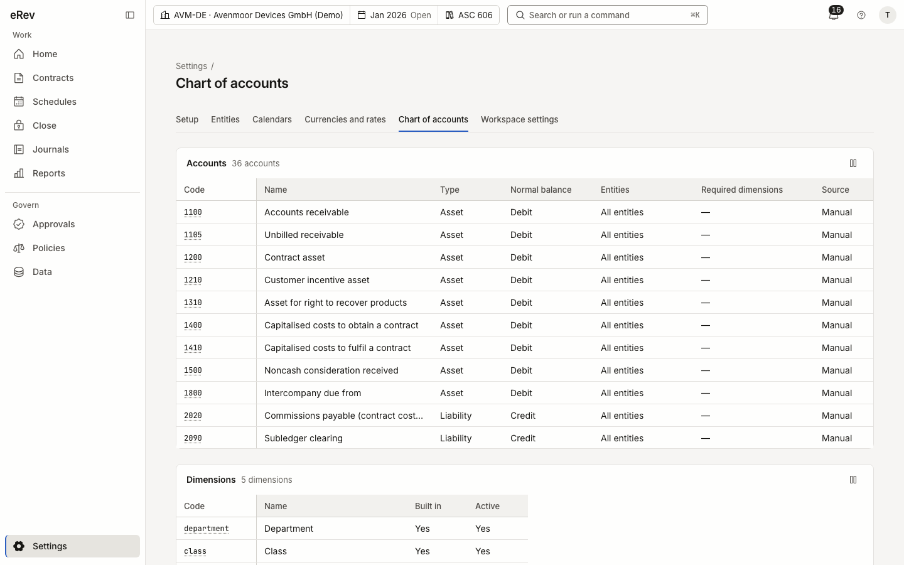

*SF-15:chart-of-accounts: 36 accounts and 5 dimensions of Avenmoor; Tomás Rivera (Tenant Admin). The buttons "New account" and "New dimension" are not in the capture; they are shown to holders of `config.author` and `masterdata.maintain`.*

"Accounts" has the columns "Code", "Name", "Type" ("Asset", "Liability", "Equity", "Revenue", "Expense"), "Normal balance", "Entities", "Required dimensions", "Source", "Active" and "Mapped roles"; "Dimensions" has "Code", "Name", "Built in" and "Active".

1. Select an account's code to open "Edit \<code>"; without `config.author` its controls are unavailable, with the reason "Your roles do not include authoring configuration."
2. Press "New account", fill "Code", "Name", "Type", "Normal balance", "Entities", "Required dimensions" and "Active", and press "Save account".
3. When you deactivate an account that the published mapping uses, read the warning "Account \<code> is mapped for \<roles>. Journal generation fails for those roles until the mapping changes." and tick "I have reviewed this warning".
4. Select a dimension's code for "Dimension values" and "Add value"; "New dimension" adds a custom dimension, of which a workspace can define at most five.

### Sandbox copies

"Sandbox copies" (SF-15:sandbox, `/settings/sandbox`) creates and lists copies of a production workspace: "A sandbox copy is a separate workspace. Nothing in a sandbox posts or exports, and production is never overwritten." The page needs `tenant.snapshot` for all entities. In the demo workspace Marcus Webb (Controller) opens it, and the two Tenant Admins are shown "You do not have access to Sandbox copies".

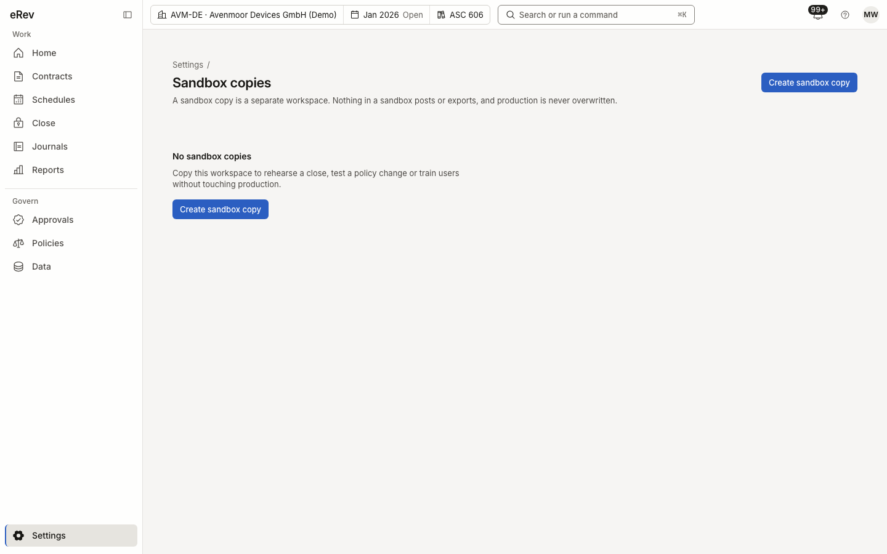

*SF-15:sandbox: "No sandbox copies" and the button "Create sandbox copy"; Marcus Webb (Controller).*

1. Press "Create sandbox copy".
2. Enter a "Name" and choose "Known at": "Now" or "A specific time", a time in UTC. The dialog states "The copy includes reference data, events, versions and memberships as known at the chosen time. Derived figures are recomputed in the sandbox."
3. Confirm with "Create sandbox copy" and enter a fresh authenticator code when asked.
4. Progress reads "Copying \<workspace> to a sandbox" until the toast "Sandbox \<name> is ready." with "Open sandbox".
5. The copy is listed under "Sandboxes" with "Open". "Stored snapshots" lists the snapshots, each with "Restore into a new sandbox", which creates a further sandbox and leaves production unchanged.

Inside a sandbox the page states what the workspace was copied from and offers "Reset sandbox" (`sandbox.reset`): choose "Reset to" ("Back to the copy taken on \<time>" or "Empty workspace") and give "Reason (required)". "The current sandbox is archived and a new sandbox replaces it. No data is deleted." A production workspace shows no reset control, and a sandbox can never export journals through an adapter or become a production workspace.

Limit in 1.0: a hosted deployment offers no sandbox copies (limits document, row B7-7). Limit in 1.0: a copy does not reproduce its source's locked periods and raises the warning `SANDBOX_REPLAY_BLOCKED`; read a locked period's figures in the source workspace (row B7-8). Limit in 1.0: after a copy has failed, its name cannot be used again (row B7-6).

### Invite a member; the second administrator decides

Members are invited on "Users" (`/settings/users`), which needs `user.manage`. Each role of an invitation is a "Role assignment" request that a second administrator decides: a holder of `access.approve` other than the inviter.

1. On "Users", press "Invite user".
2. Enter "Email" and "Display name". Choose a "Role" and its "Scope": "All entities", or "Selected entities" with the "Entities" it covers. "Add another role" adds a row. Nobody grants beyond their own access.
3. Press "Send invitation". The toast reads "Invitation for \<email> is waiting for approval.", and the member is listed as "Invited" with the role marked "Pending approval".

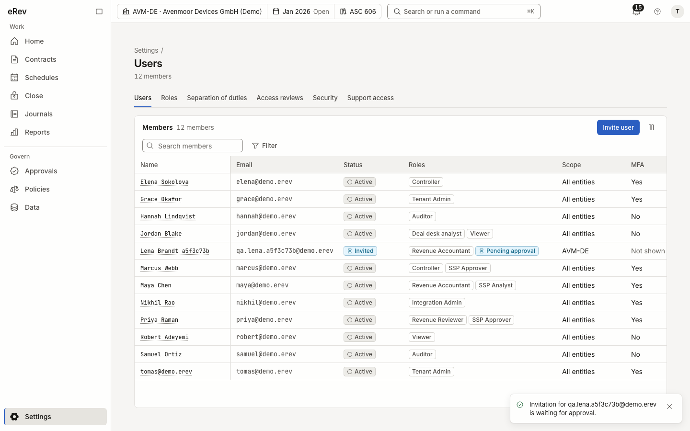

*SF-14 Users: Lena Brandt invited as Revenue Accountant for AVM-DE alone, her role "Pending approval" and her MFA "Not shown"; Tomás Rivera (Tenant Admin).*

4. The second administrator opens the request in Approvals, here "Grant Revenue Accountant to Lena Brandt a5f3c73b for AVM-DE", enters a comment and presses "Approve" ([capture 013](../screenshots/qa-pass/013-g-2-the-second-administrator-decides-grace.png) shows Grace Okafor's toast). The inviter is offered no decision on his own request.
5. The invited person opens the link in the invitation email. "Accept invitation" reads "\<inviter> invited \<email> to \<workspace>."; a new person enters "Choose a password" and "Confirm password" and presses "Accept invitation".
6. She arrives on Home ([capture 015](../screenshots/qa-pass/015-g-4-the-first-session-of-a-member-of-one-entity-lena.png)). Her context pill and every entity filter offer the entities of her role alone. Captures [014](../screenshots/qa-pass/014-g-3-acceptance-lena.png) and [016](../screenshots/qa-pass/016-g-5-sign-out-and-a-sign-in-with-the-chosen-password-lena.png) show Home while it loads, after the acceptance and after her next sign-in.

The member's own page offers "Add role", "Revoke role", "Suspend", "Reactivate", "Remove", "Resend invitation" and "Reset MFA". Role assignments need approval, as do role changes and separation-of-duties exceptions; a role is revoked at once, with a reason. During setup, while no second administrator exists, the toast of an invitation reads "Invitation sent. Setup grants are approved by rule AUTO-BOOTSTRAP."

Limit in 1.0: a workspace whose only other access approver has expired or was deprovisioned cannot change access until an operator restores an approver, and no operator command for that is built; keep at least three holders of `access.approve` (limits document, row A-8). Limit in 1.0: "Reset MFA" is offered on an invited member's page (section B.9, "Reset MFA").

## Workspace structure, reference data and access

These pages of Settings hold what every other area relies on: the legal entities and their books, the fiscal calendars and their periods, the currencies and exchange rates, the customers and products that contracts name, and who may do what. They are the groups "Workspace", "Reference data", "Access" and "Developer" of [the settings index](#the-settings-index); a page's link and its tab are shown only to a member who holds a read permission of the page. Setup, the chart of accounts, workspace settings and the invitation of a member are described under [Settings and administration](#settings-and-administration); the rules and the API behind each page are in the [user guide](user-guide.md#settings).

| Pages | Read with | Changed with | Default roles that can change |
|---|---|---|---|
| Entities, Calendars | `config.read` | `masterdata.maintain` or `settings.manage`; a period is opened with `period.close` | Revenue Accountant, Integration Admin, Tenant Admin; a period: Revenue Accountant, Controller |
| Currencies and rates | `config.read` | Currencies: `settings.manage` for all entities. Rate sets: `config.author` or `masterdata.maintain` | Tenant Admin; Revenue Accountant, Integration Admin |
| Customers, Related-party groups, Products | `contract.read` | `masterdata.maintain`; the import links: `import.upload` | Revenue Accountant, Integration Admin; Revenue Accountant |
| Users and a member's page | `user.manage` | `user.manage`; a member's roles: `role.manage` | Tenant Admin |
| Roles, Separation of duties | `role.manage` | `role.manage`; a role's definition: for all entities | Tenant Admin |
| Access reviews | `access.approve` for all entities | The same | Tenant Admin |
| Security | `settings.manage` for all entities | The page changes nothing | Tenant Admin |
| Support access | `support_grant.approve` for all entities | The same | Tenant Admin |
| API clients and webhooks | `api_client.manage`, or `webhook.manage` for all entities | The same, each for its own tab | Tenant Admin; Integration Admin |

Every default role except Service Account holds `config.read`, and every default role holds `contract.read`. A member who opens a page without its permission reads "You do not have access to \<area>" ([A screen opened without its permission](#a-screen-opened-without-its-permission)).

All captures of this part except the two password pages show Tomás Rivera, a Tenant Admin. The operator provisioned him as the first administrator of the workspace by his email address alone, so he is listed as `tomas@demo.erev`, and the user menu carries his initial "T". He holds none of `masterdata.maintain`, `config.author`, `import.upload`, `period.close` and `webhook.manage`, so his captures show the reference data, the rate sets and the periods without their commands. The text says where a control, a drawer or a dialog is described that no capture shows.

### Entities

"Entities" (SF-15:entities, `/settings/entities`) lists the legal entities of the workspace. An entity sets the functional currency, the time zone, the fiscal calendar and the books for its contracts and postings. The grid has the columns "Code", "Name", "Country", "Functional currency", "Time zone", "Calendar" (a link to the calendar on "Calendars"), "Parent entity", "Books" (the enabled books: "ASC 606", "IFRS 15", "Legacy") and "Active".

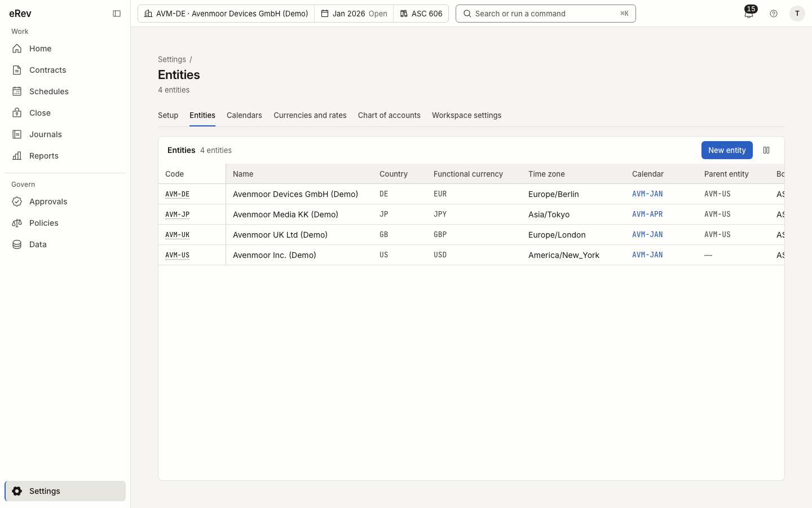

*SF-15:entities: the four legal entities of Avenmoor with their country, functional currency, time zone, calendar and parent entity; "Books" and "Active" follow to the right; Tomás Rivera (Tenant Admin).*

1. Press "New entity" and enter "Code" ("Use letters, digits and hyphens."), "Name", "Functional currency" (one of the enabled currencies), "Time zone" and "Calendar"; "Country", "Parent entity" and "Tax id" are optional.
2. Under "Books", enter "First period (ASC 606)" as a period key, for example `FY2026-P01`. The drawer notes "ASC 606 is the primary book. Enable IFRS 15 or Legacy after saving the entity."
3. Press "Save entity". The toast reads "Saved entity \<code>." and the drawer opens again on the new entity.
4. To change an entity, select its code: "Edit \<code>" opens. Tick a further book under "Books" and give its first period, or untick "Active", and press "Save entity". The code and the calendar stay as they were created.

"Functional currency" and "Time zone" are fixed after the first posting: the API then refuses a change, and both fields read "Fixed after the first posting." A reader without `masterdata.maintain` or `settings.manage` opens the same drawer without "Save entity". No capture shows the drawer.

### Calendars and periods

"Calendars" (SF-15:calendars, `/settings/calendars`) holds the fiscal calendars and shows the state of every period for each entity and book; an entity uses one calendar. The list at the left, "Calendars (\<n>)", names each calendar by its code with its pattern and first month ("Monthly · April"). For the selected calendar the page shows its code and name, the select "Fiscal year", "Generate fiscal year" and the grid "Periods": "Period" (the period key, such as `FY2027-P06`), "Name", "Start", "End", "Quarter", and one column for each entity and enabled book that uses the calendar, headed by both ("AVM-JP ASC 606").

The chip in such a column is the state of the period: "Future", "Period open", "Soft close", "Locked", "Reopened" or "Permanently locked". Selecting it opens the close cockpit of that entity, book and period ([The cockpit of an open period](#the-cockpit-of-an-open-period)). A fiscal year is named by the year in which it ends, so the year from April 2026 to March 2027 of the capture is FY2027. The address keeps the selection as `calendar` and `f.fiscal_year`.

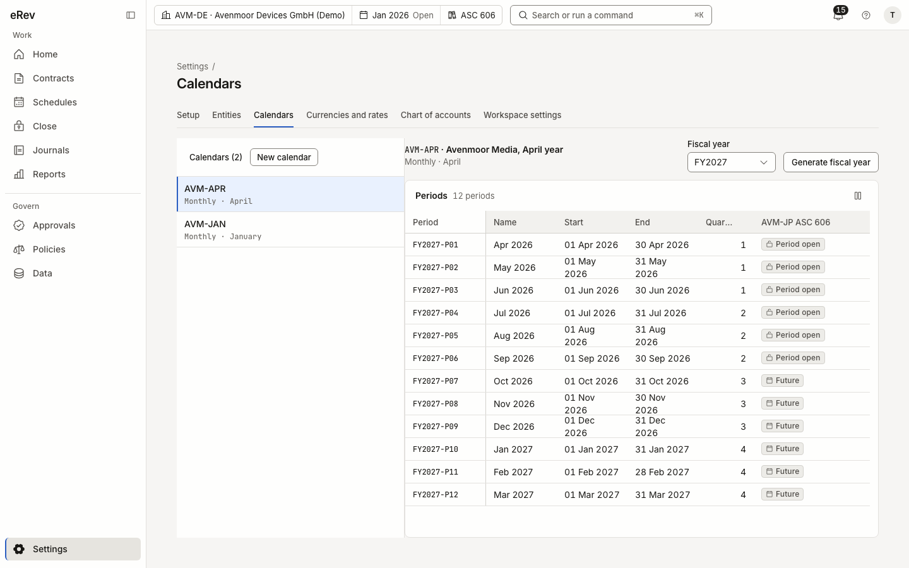

*SF-15:calendars: the calendar AVM-APR with the twelve periods of FY2027 for AVM-JP in the ASC 606 book, April to September 2026 "Period open" and October 2026 onwards "Future"; Tomás Rivera (Tenant Admin).*

1. To add a calendar, press "New calendar" and enter "Code", "Name", "Pattern" ("Monthly", "4-4-5 weeks", "4-5-4 weeks", "5-4-4 weeks", "13 four-week periods" or "52/53-week year") and "Fiscal year starts in"; a week-based pattern also asks "Week ends on" and "Year-end anchor". Press "Create calendar".
2. To create the periods of a year, select the calendar, press "Generate fiscal year", enter "Fiscal year" and confirm with "Generate fiscal year". The toast reads "Generated \<n> periods for \<fiscal year>." A year without periods reads "No periods for \<fiscal year>".
3. To open a period, press "Open" in the first "Future" cell of the entity's column and confirm "Open \<period> for \<entity> in book \<book>?" with "Open period": "The period accepts postings for this entity and book from now on."

"Open" is shown to a holder of `period.close` for the entity and, during [workspace setup](#workspace-setup-and-its-checklist), to the administrator who holds `settings.manage`; the capture shows neither case, and no capture shows the three dialogs. A period also opens when the period before it is locked. A calendar that no entity uses yet reads "No entity uses this calendar yet. Periods show once an entity with an enabled book uses it." The page has no command that changes a calendar once it is created.

Limit in 1.0: a report run by period key over entities of more than one fiscal calendar is refused; in the demo workspace AVM-JP keeps an April year, so such a report is run for one entity or for the entities of one calendar (limits document, row B4-5).

### Currencies and rates

"Currencies and rates" (SF-15:currencies, `/settings/currencies`) enables the currencies of the workspace and holds its exchange rates in rate sets, each version of which is approved before it is used.

- "Enabled currencies": "Code", "Name", "Minor unit", "Enabled" and "Used by", the entities whose functional currency it is; below the table, "Add currency" and "Save currencies".
- "FX rate sets (\<n>)": the select "Rate set" names each set by its code, its rate type ("spot", "closing" or "average") and its source; beside it stands "Latest approved v\<n> · coverage \<from> – \<to>". Each version is a tab, "v\<n> (\<status>)", with the line "Coverage \<from> – \<to> · \<n> rates" and the grid "Rates": "Base", "Quote", "Effective date", "Period", "Rate (base to quote)" and "Derived". The address keeps the selection as `rate_set` and `version`.

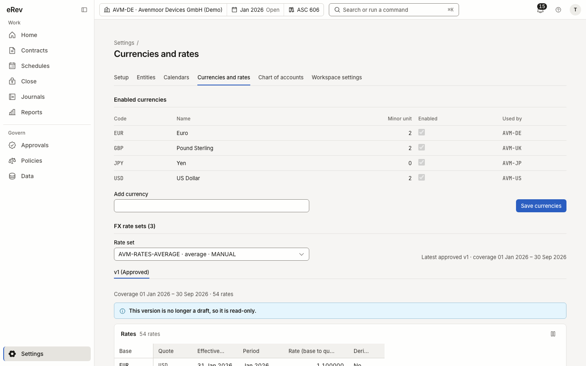

*SF-15:currencies: the four enabled currencies, each used by one entity, and the rate set AVM-RATES-AVERAGE with its approved version 1 of 54 rates; Tomás Rivera (Tenant Admin).*

The demo workspace holds three rate sets, one for each rate type, each with one approved version that covers 1 January to 30 September 2026. A contract in GBP, EUR or JPY that is dated later finds no exchange rate until a later version is approved.

1. To enable a currency, choose it in "Add currency" and press "Save currencies"; the toast reads "Saved the enabled currencies." A currency that an entity uses and the reporting currency stay enabled.
2. To start a rate set, press "New rate set", enter "Code", "Name", "Rate type" and "Source" and press "Create rate set".
3. Press "New version", enter "Coverage from" and "Coverage to" and press "Create version". The new tab reads "v\<n> (Draft)".
4. Load the rates with "Upload rates CSV", which opens the new import with the FX rates template ([Uploading an import](#uploading-an-import)). A rate of a draft is corrected in its cell of the grid; an empty or zero rate answers "Enter a rate above 0."
5. Press "Submit for approval" and confirm "Submit \<code> v\<n> with \<count> rates for approval?": "The version becomes read-only while the approver decides." The page then reads "Version v\<n> is waiting for approval." with the link "Review in Approvals".
6. A holder of `config.approve` other than the submitter decides the request under [Approvals](#approvals). The tab then reads "v\<n> (Approved)". An approved version is never changed ("This version is no longer a draft, so it is read-only."); a correction is a new version.

No capture shows the commands of steps 2 to 5: Tomás Rivera holds neither `config.author` nor `masterdata.maintain`.

Limit in 1.0: a computation that commits before a corrected rate is approved keeps the earlier rate until the next computation of its contract group; approve a corrected rate while no import and no computation runs (limits document, row B2-2). Limit in 1.0: an FX rate set answers for the whole workspace and can be decided by an approver who holds `config.approve` for one entity (limits document, row B6-1).

### Customers

"Customers" (SF-15:customers, `/settings/customers`) is the customer master: the parties that contracts name. Customers arrive with contracts from imports and integrations, or are added here. The grid has the columns "Customer" (a link to the customer's page), "Code", "Related-party group", "Country", "Segment", "Credit grade", "Source" (for example "Manual", "Salesforce", "NetSuite" or "CSV v2"), "External id", "Active" and "Updated". "Search customers" and "Filter" ("Related-party group", "Source", "External id", "Active") narrow it. The context pill is not used on the reference data pages.

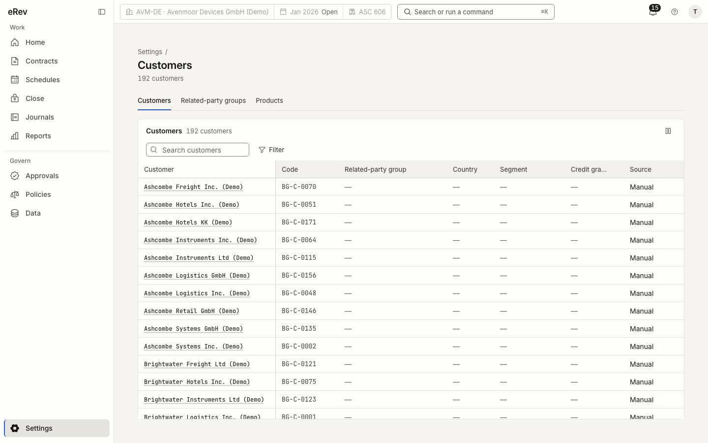

*SF-15:customers: the first rows of the 192 customers of the demo workspace, with the source "Manual"; "External id", "Active" and "Updated" follow to the right; Tomás Rivera (Tenant Admin).*

1. Press "New customer" and enter "Code" and "Name"; "Related-party group", "Parent customer", "Credit grade", "Segment", "Country" and "External id" ("The id of the customer in its source system.") are optional.
2. Press "Save customer". The toast reads "Saved customer \<code>."; a code that is taken answers "Customer code \<code> is already used."
3. To load many customers, follow "Import customers", which opens the new import with the customers template.

"New customer" is shown to a holder of `masterdata.maintain` and "Import customers" to a holder of `import.upload`; neither is in the capture, and no capture shows the drawer. Under "Name" the drawer states "Customer records hold business identity only. Do not enter personal contact details."

### A customer

A customer's page (SF-15:customer, `/settings/customers/:customerId`) shows the record and the contracts made with the customer. Its header carries the code with a copy button, the name, the chip "Active" or "Inactive" and "Related-party group", "Country", "Segment", "Credit grade", "Source" and "External id". "Contracts (\<n>)" lists the customer's contracts with "Contract" (a link to the contract), "Status", "Entity", "Inception date", "Currency", "Transaction price" and "Recognized to date"; a customer without contracts reads "No contracts for this customer yet." For a customer in a related-party group, "Related customers in \<group>" lists the other members with "Customer", "Code" and "Country".

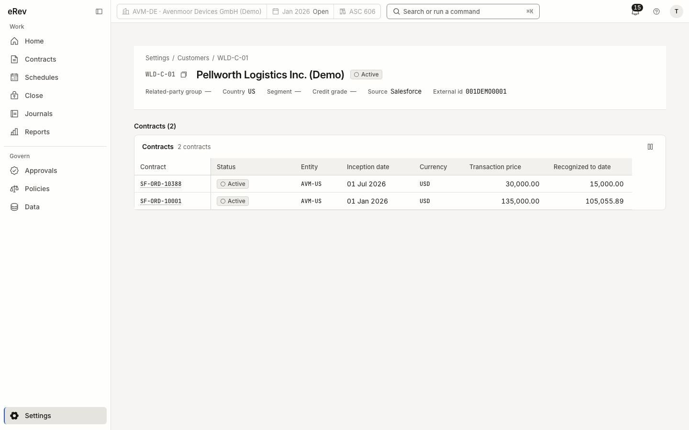

*SF-15:customer: Pellworth Logistics Inc. (Demo), code WLD-C-01, source "Salesforce", with its two active contracts SF-ORD-10388 and SF-ORD-10001 of AVM-US; Tomás Rivera (Tenant Admin).*

1. Press "Edit customer", change the fields and press "Save customer". The button is shown to a holder of `masterdata.maintain`; it is not in the capture.
2. To put the customer into a related-party group, choose the group in "Related-party group" of the same drawer, or "No group" to take it out. A customer belongs to at most one group.

The drawer says of the code "The code is fixed once a contract references the customer." For a customer that an import or an integration created, "Source" and "External id" are shown read-only.

### Related-party groups

"Related-party groups" (SF-15:related-party-groups, `/settings/related-party-groups`) groups customers under common control, "so combination suggestions and disclosures can find them". The grid has the columns "Group", "Name", "Description", "Members" and "Updated", with the field "Search groups".

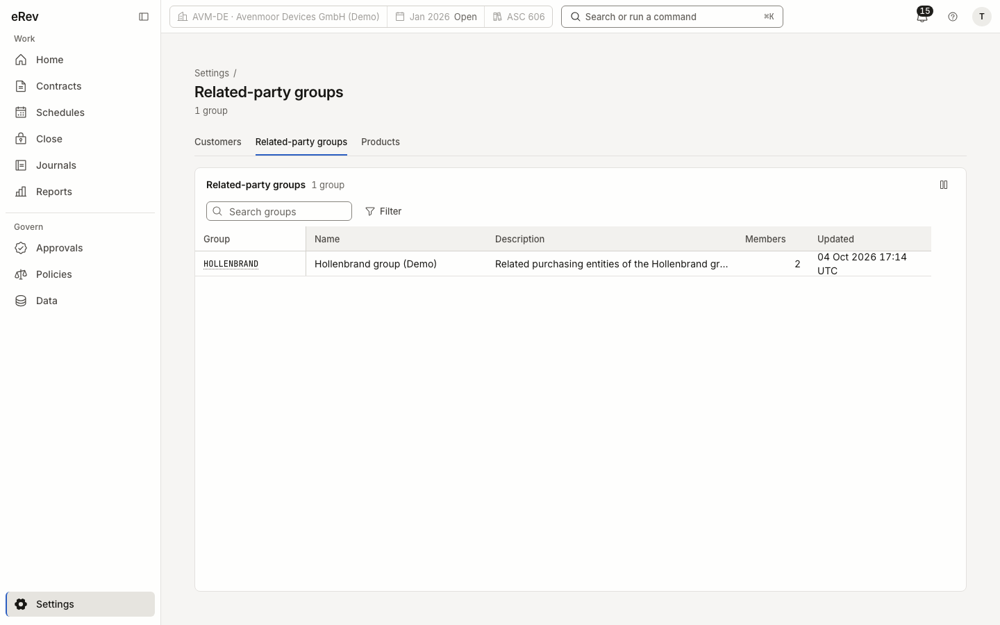

*SF-15:related-party-groups: the one group of the demo workspace, HOLLENBRAND "Hollenbrand group (Demo)", with two members; Tomás Rivera (Tenant Admin).*

1. Select a group's code. The drawer "Edit group" shows "Code", "Name", "Description" and "Members", the member customers with links to their pages.
2. To add a group, press "New group" (holders of `masterdata.maintain`; not in the capture), enter "Code", "Name" and "Description" and press "Save group". The toast reads "Saved group \<code>."
3. Members are not added in this drawer: "Add a customer to this group from the customer's page."

No capture shows the drawer.

### Products

"Products" (SF-15:products, `/settings/products`) is the product master: what a contract line sells, the obligation template it takes by default and how it is classified. The grid has the columns "Product" (the code, a link to the product's page), "Name", "SKU number", "Product family", "Revenue category", "Default template" (a link to the template version, see [An obligation template version](#an-obligation-template-version)), "Principal or agent" ("Principal", "Agent" or "Not assessed"), "Distinct by default" ("Distinct", "Not distinct" or "Series"), "Unit", "Bundle" and "Active". "Search products" and "Filter" ("Product family", "Active") narrow it.

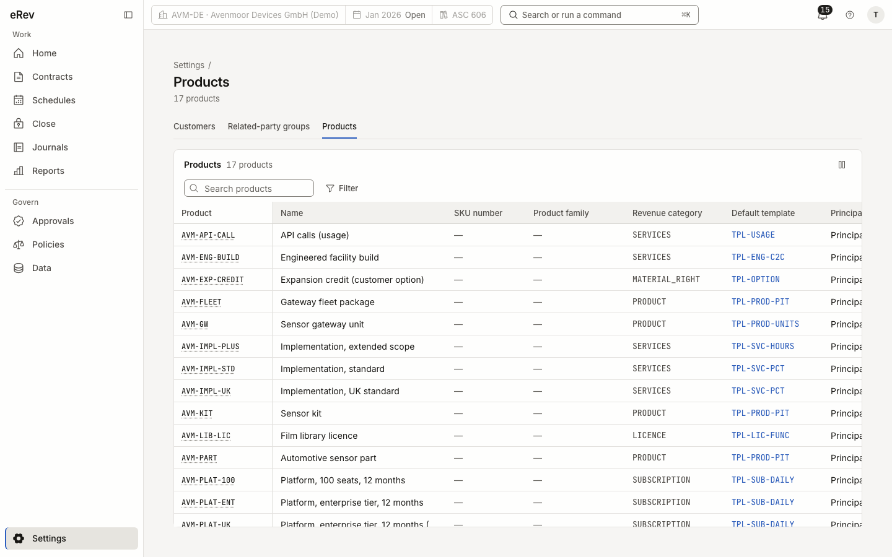

*SF-15:products: the first rows of the 17 products of the demo workspace with their revenue category and default template; the columns from "Principal or agent" on follow to the right; Tomás Rivera (Tenant Admin).*

1. Press "New product" and enter "Code", "Name" and "Unit of measure"; "SKU number", "Product family", "Revenue category" ("A category of the published account mapping, or a new one.") and "Default obligation template", which offers the templates with a published version, are optional.
2. Choose "Distinct by default": "Whether a contract line of this product is a distinct obligation, part of a combined one, or a series." Tick "Bundle" for a product that is made of other products.
3. Under "Disaggregation attributes", press "Add attribute" and enter "Attribute" and "Value" for each. The drawer names the attributes the workspace requires: "Required by the workspace: \<attributes>."
4. Press "Save product". The toast reads "Saved product \<code>.", and the new product reads "Not assessed" under "Principal or agent".

"New product" is shown to a holder of `masterdata.maintain`, and "Import products", which opens the new import with the products template, to a holder of `import.upload`; neither is in the capture, and no capture shows the drawer. The drawer says of the code "The code is fixed once a contract line, an SSP entry or an account mapping rule references the product." While a required attribute is missing it warns "This product cannot be used on contracts until \<attributes> are set."

Limit in 1.0: nothing refuses a contract for a product that lacks a mandatory disaggregation attribute; complete a product's attributes before its first contract (limits document, row B1-16). Limit in 1.0: a source order line or an integration alias does not fix a product's code; rename a product only while nothing refers to it and no import or sync runs (limits document, row B3-20).

### A product

A product's page (SF-15:product, `/settings/products/:productId`) shows one product on the tabs "Attributes", "Bundle components" (for a bundle only), "SSP" and "Policy values"; the address keeps the tab as `pane`. The header carries the code with a copy button, the name, the chip "Active" or "Inactive", "Revenue category", "Unit of measure" and "Principal or agent", and for a holder of `masterdata.maintain` the button "Edit product".

- "Attributes": "Code", "SKU number", "Name", "Product family", "Revenue category", "Default obligation template" (a link to the template version), "Distinct by default", "Unit of measure", "Bundle", "Active" and "Principal or agent"; below them, "Disaggregation attributes" lists "Attribute" and "Value" and marks a required attribute "Required".
- "Bundle components": the grid of the bundle's parts with "Component", "Quantity per bundle", "Split basis" ("Relative SSP" or "Fixed percentage"), "Split percentage", "Sequence", "Valid from" and "Valid to".
- "SSP": the table "SSP entries" with the entries that price the product in the current and the draft version of each SSP book ([SSP books](#ssp-books)): "Book", "Version", "Status", "Effective", "Method", "Low", "Mid", "High", "Point" and "Currency". A product without an entry reads "No SSP entry prices this product. Contracts with it cannot be activated."
- "Policy values": "Key", "Value" and "Level" ("Product" or "Template \<code> v\<n>"), with the note "Template values take precedence over product values (POLICIES §0.5)."

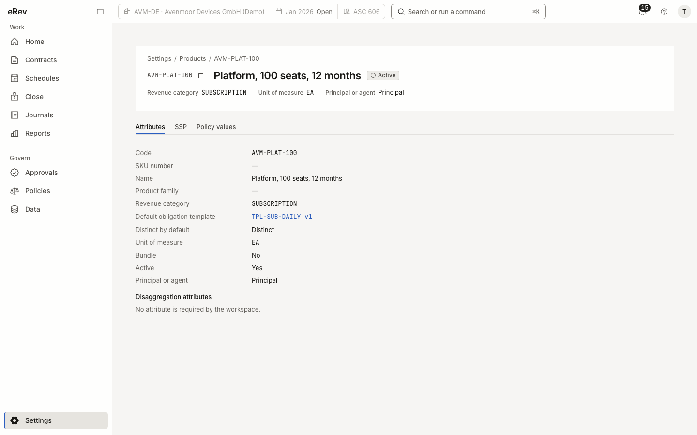

*SF-15:product: AVM-PLAT-100, "Platform, 100 seats, 12 months", on the tab "Attributes": revenue category SUBSCRIPTION, default template TPL-SUB-DAILY v1, "Distinct", not a bundle, "Principal"; Tomás Rivera (Tenant Admin).*

No capture shows the other tabs or the two tasks below; their commands are shown to a holder of `masterdata.maintain`. To change the components of a bundle:

1. On "Bundle components", press "Add component row" and choose "Component".
2. Enter "Quantity per bundle", choose "Split basis" (a fixed percentage also asks "Split percentage"), and enter "Sequence", "Valid from" and, where it applies, "Valid to".
3. Press "Save components"; the toast reads "Saved the bundle components." Stored rows are not edited: "Components change by adding rows with a later valid-from date."

To propose whether the workspace acts as principal or as agent for the product:

1. On "Attributes", press "Propose principal or agent change".
2. Choose "Conclusion": "Principal", "Agent" or "Not assessed". Under "Control indicators (ASC 606-10-55-39A)", answer "Yes" or "No", with a "Note", to "Primarily responsible for fulfilling the promise", "Has inventory risk" and "Has discretion in establishing the price".
3. Enter "Rationale" (at least 10 characters) and press "Submit for approval". The drawer states "The change applies prospectively after approval."
4. The page reads "A principal or agent change is waiting for approval." with the link "View request"; a holder of `config.approve` decides the request under [Approvals](#approvals).

Limit in 1.0: the conclusion answers for the whole workspace and can be decided by an approver who holds `config.approve` for one entity (limits document, row B6-1). Limit in 1.0: the page has no editor of a product's policy values; it shows them in a table, and they are set through the API (limits document, section B.9, "The template editor's policy values").

### Users

"Users" (SF-14, `/settings/users`) lists the members of the workspace. The grid "Members" has the columns "Name" (a link to the member's page), "Email", "Status" ("Invited", "Active", "Suspended" or "Removed"), "Roles" (one chip for each role that is not revoked, followed by "Pending approval" while its request waits), "Scope" ("All entities" or the entity codes), "MFA" ("Yes" or "No"), "Last login" (a time or "Never") and "Invited". "Search members" and the filter "Status" narrow it.

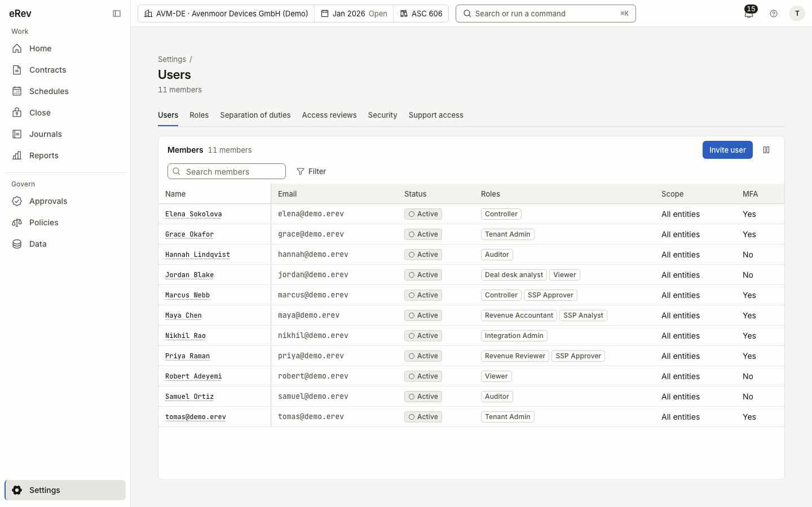

*SF-14: the eleven members of the demo workspace, all "Active" with their roles for "All entities"; "Last login" and "Invited" follow to the right; Tomás Rivera (Tenant Admin).*

A workspace is shown a person's MFA state and last sign-in only while the person is its member: for an invited or a removed member both columns read "Not shown" ([capture 012](../screenshots/qa-pass/012-g-1-invitation-for-one-entity-tomas.png)). To add a member, press "Invite user": see [Invite a member; the second administrator decides](#invite-a-member-the-second-administrator-decides).

### A member

A member's page (SF-14:user, `/settings/users/:membershipId`) shows one membership: the header with the name, the status and "Email", the table "Roles", and "Security", which reads "MFA enrolled" or "MFA not enrolled" and, for an invited or a removed member, "MFA and last sign-in are not shown while a membership is invited or removed." "Roles" has the columns "Role", "Scope", "Status" ("Pending approval", "Active" or "Revoked"), "Granted", "Granted by" (a person, or the chip "Setup grant" for a role that rule AUTO-BOOTSTRAP approved), "Approval" (the link "Request" to the approval request), "SoD exception", "Revoked" and "Actions".

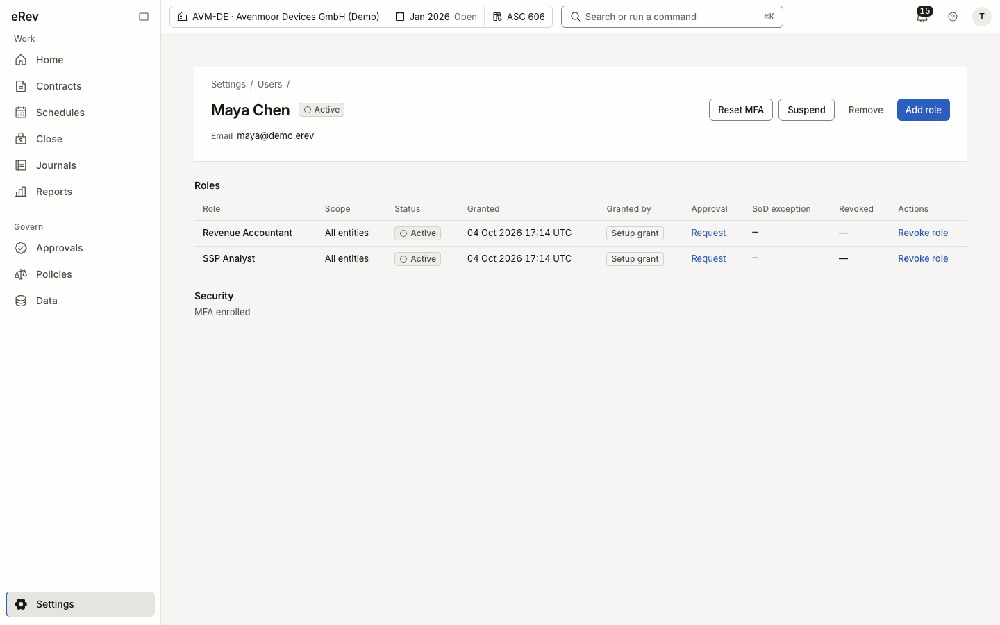

*SF-14:user: Maya Chen, "Active", with the roles Revenue Accountant and SSP Analyst for all entities, both setup grants, and "MFA enrolled"; the commands "Reset MFA", "Suspend", "Remove" and "Add role"; Tomás Rivera (Tenant Admin).*

1. **Add a role.** Press "Add role", choose "Role" and "Scope" ("All entities", or "Selected entities" with "Entities") and press "Add role". The toast reads "Role \<role> is waiting for approval.", and the row stays "Pending approval" until a holder of `access.approve` other than the requester approves the request under [Approvals](#approvals). Nobody grants beyond their own access.
2. **A role that conflicts.** Where the role would give the member both sides of a separation-of-duties rule, the drawer shows "Separation of duties conflict \<rule>: \<description>." with "Request an exception". "Request SoD exception" asks "Compensating control (required)", "Valid from" and "Valid to" ("Choose a validity of at most 366 days.") and "Comment (required)"; "Request exception" sends the request to Approvals ("Exception for \<rule> is waiting for approval."). The API takes a conflicting role only while an approved exception covers it.
3. **Revoke a role.** Press "Revoke role" in the row, enter "Reason (required)" with at least 10 characters and confirm with "Revoke role". The dialog states "Revoking the role ends its permissions for \<name> immediately."
4. **Suspend and reactivate.** "Suspend" asks "Suspend \<name>?" and a reason: "Suspending \<name> ends every session immediately. The membership and its history remain." The page then shows "This membership is suspended. The user's sessions ended on \<timestamp>." and offers "Reactivate": "\<name> can sign in again with the roles held before the suspension."
5. **Remove.** "Remove" asks "Remove \<name>?" and a reason: "Removing \<name> ends access to this workspace. History is kept." Every approval delegation given to the member ends. A removed person is invited again with "Invite user"; the earlier roles stay revoked.
6. **Resend the invitation.** For an invited member, "Resend invitation" confirms "Resend the invitation to \<email>?": "A new invitation link replaces the earlier one, which stops working."
7. **Reset MFA.** "Reset MFA" asks "Reset MFA for \<name>?", a reason and, where the API asks for it, a fresh code in "Confirm with your authenticator": "\<name> must enrol again at the next sign-in. Every session of the user ends."

The member commands are shown where your `user.manage` covers every entity that the member's roles name, "Add role" and "Revoke role" with `role.manage`. No capture shows the drawers and dialogs of these tasks.

Limit in 1.0: a request that nobody but its preparer can decide is not flagged when it is submitted; before you add a role, check that another person holds `access.approve` for its entities (limits document, row B1-15). Limit in 1.0: "Reset MFA" is also offered on the page of an invited member (limits document, section B.9, "Reset MFA").

### Roles

"Roles" (SF-14:roles, `/settings/roles`) lists the roles of the workspace: the ten default roles, which read "Yes" under "System", and the custom roles of the workspace. The grid has the columns "Role", "Code", "System", "Permissions" (their number), "Members" and "Active".

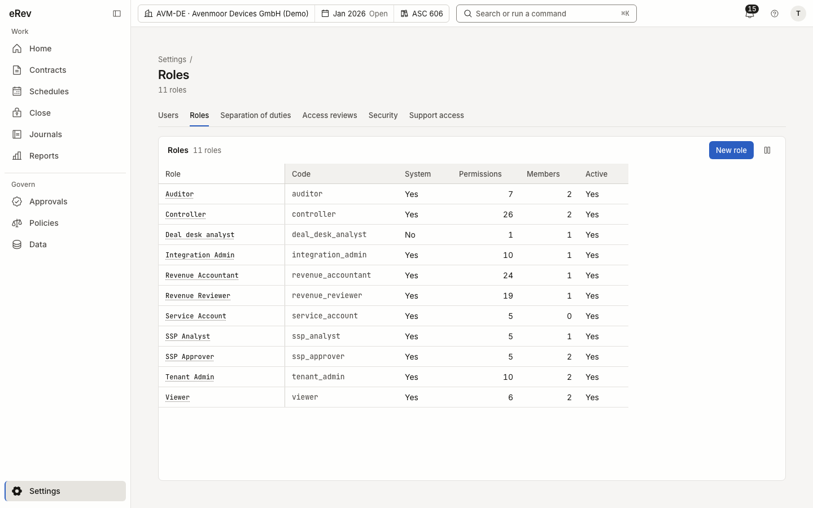

*SF-14:roles: the ten system roles and the custom role "Deal desk analyst" of the demo workspace, with the number of permissions and of members of each; Tomás Rivera (Tenant Admin).*

1. Select a role's name. A drawer beside the grid shows "Code \<code> · System role" or "Code \<code> · Custom role", the number of members, and the permissions of the role by area, each with its code, its description and the chips "Approval", "Access admin" and "MFA" where they apply.
2. To add a custom role, press "New role", enter "Name", "Code" ("Use lowercase letters and underscores.") and "Description", and tick its "Permissions". An approval permission adds the note "Holding an approval permission forces multi-factor authentication."
3. Where the ticked permissions meet a separation-of-duties rule, read the warning "This role combines \<function A> with \<function B> (\<rule>). Members will need an exception." and tick "I have reviewed this warning".
4. Press "Submit for approval". The toast reads "Role \<name> is waiting for approval."; a second holder of `access.approve` decides the request under [Approvals](#approvals), and the role can be assigned once it is approved.
5. To change a custom role, open it, press "Propose change", tick or untick permissions, add a "Comment" and press "Submit for approval": "Change to \<name> is waiting for approval." A default role is never changed: "System roles cannot change."

No capture shows the drawers. "New role" and "Propose change" are shown to a holder of `role.manage` for all entities.

Limit in 1.0: the default role Service Account does not hold `config.read`, and whether it is meant to is not decided (limits document, section B.9, "The Service Account role").

### Separation of duties

"Separation of duties" (SF-14:sod, `/settings/separation-of-duties`) shows, on the tabs "Rules" and "Exceptions", the rules that keep two functions apart and the exceptions granted from them. A rule names two sets of permissions that one member does not hold together without an approved exception. The grid "SoD rules" has the columns "Rule", "Name", "Function A permissions", "Function B permissions", "Rationale", "Version" and "Status".

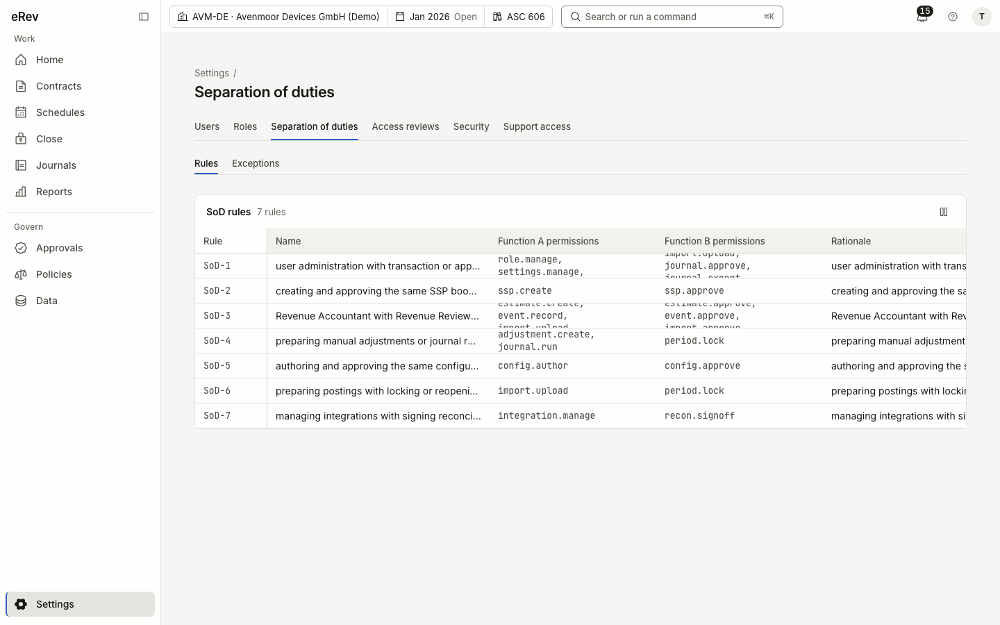

*SF-14:sod: the seven rules of the demo workspace on the tab "Rules", from SoD-1 to SoD-7, with the permissions of function A and of function B; "Version" and "Status" follow to the right; Tomás Rivera (Tenant Admin).*

The seven rules are: SoD-1 "user administration with transaction or approval permissions"; SoD-2 "creating and approving the same SSP book version"; SoD-3 "Revenue Accountant with Revenue Reviewer lets one person create and approve the same contract or modification"; SoD-4 "preparing manual adjustments or journal runs with locking periods"; SoD-5 "authoring and approving the same configuration"; SoD-6 "preparing postings with locking or reopening periods"; SoD-7 "managing integrations with signing reconciliations". The page has no command that changes a rule.

No capture shows the tab "Exceptions". Its grid "SoD exceptions" has the columns "User", "Rule", "Compensating control", "Valid from", "Valid to", "Status" ("Pending approval", "Approved", "Rejected", "Revoked" or "Expired"), "Approval" and "Actions", with the filter "Status".

1. An exception is requested on a member's page when a role conflicts with a rule ([A member](#a-member)) and is decided under Approvals. An invitation cannot carry the request: "Send the invitation without the conflicting role, then request the exception from the member's page."
2. To end an exception, press "Revoke exception" in its row, enter "Reason (required)" and confirm with "Revoke exception". The dialog states "Revoking the exception blocks the conflicting role assignment. Revoke the role first or it becomes a conflict without an exception."

### Access reviews

"Access reviews" (SF-14:access-reviews, `/settings/access-reviews`) runs review campaigns: "A campaign snapshots every membership and its roles so reviewers can certify or revoke access." The grid "Campaigns" has the columns "Name", "Status" ("Draft", "In review", "Completed" or "Cancelled"), "As of", "Reviewers", "Members", "Decided" ("\<n> of \<m>"), "Revocations completed", "Started" and "Completed".

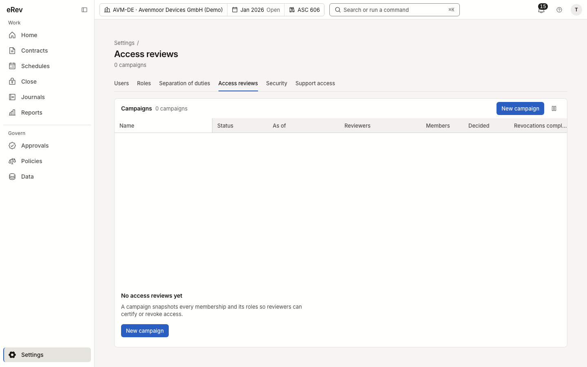

*SF-14:access-reviews: the demo workspace before its first campaign, "No access reviews yet", with "New campaign"; "Started" and "Completed" follow to the right; Tomás Rivera (Tenant Admin).*

No capture shows the dialog "New campaign" or the page of a campaign (SF-14:access-review, `/settings/access-reviews/:reviewId`). The page's header carries the name, the status, "As of" and "Reviewers"; "Key figures" count "Members", "Certified", "Revocations requested", "Revocations completed" and "Pending"; the grid "Items" has one row for each member with "Member", "Roles at snapshot", "Last login", "Granted", "Granted by" and "Decision".

1. Press "New campaign", enter "Name", "As of" with its "Time (UTC)" ("The snapshot reflects memberships and roles at this instant.") and choose the "Reviewers" among the members who hold `access.approve` for all entities. Press "Create campaign"; the campaign opens as "Draft".
2. Press "Start review" and confirm: "Starting snapshots every membership with its roles, scopes, last login, grant date and grantor as of the campaign instant." The campaign is then "In review", and "Download snapshot" saves the snapshot.
3. For each member press "Certify", or "Request revocation" with a "Comment (required)". Your own row reads "You cannot review your own access."; another reviewer decides it.
4. After "Request revocation", revoke the roles on the member's page and press "Confirm revocation": "Confirm once the roles were revoked on the member's page."
5. Press "Complete campaign": "The certification is kept as evidence and the campaign closes." While items are open the page answers "Decide \<n> pending items before completing the campaign." "Cancel campaign" ends a campaign without a certification and keeps the decisions already recorded.

Limit in 1.0: an access review needs two approvers who each hold `access.approve` for all entities; a workspace with fewer cannot decide an access review (limits document, row B6-4).

### Security

"Security" (SF-14:security, `/settings/security`) states how members of the workspace sign in. It has three regions and no field to change. "Sign-in methods" lists "Email and password" as "Active" and "OIDC", which reads "none configured" in the capture; an identity provider of the deployment is listed by its name. "Password rules" reads "At least 12 characters", "not your email address", "not a common password" and "five failed attempts lock for 15 minutes". "Multi-factor authentication" reads "Required for members holding approval, lock, access administration, integration or sandbox permissions."

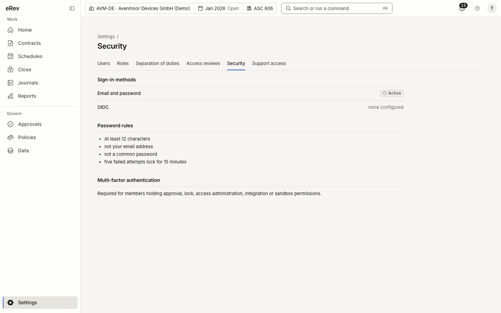

*SF-14:security: the three read-only regions "Sign-in methods", "Password rules" and "Multi-factor authentication"; Tomás Rivera (Tenant Admin).*

### Support access

"Support access" (SF-14:support-access, `/settings/support-access`) lists the grants under which an operator of the platform reads the workspace: "A platform operator can read this workspace only under a grant that a workspace administrator approves, for at most 72 hours." The grid "Support grants" has the columns "Operator", "Scope" ("Read-only"), "Reason", "Ticket", "Valid from", "Valid to", "Status" ("Pending approval", "Approved", "Rejected", "Revoked" or "Expired"), "Approval", "Approved", "Revoked" and "Actions", with the filter "Status".

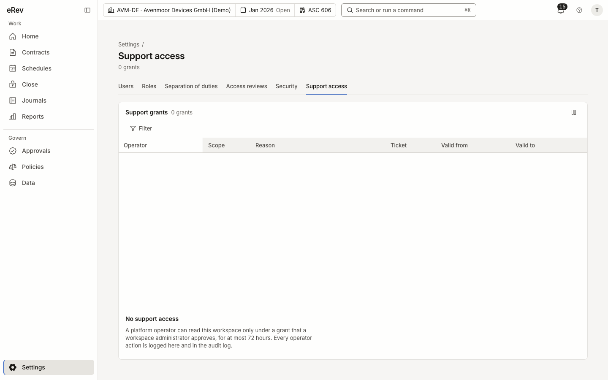

*SF-14:support-access: "No support access" in the demo workspace, which holds no grant; the columns from "Status" on follow to the right; Tomás Rivera (Tenant Admin).*

1. A request of an operator stands above the grid as "Support access requested by operator \<operator>: read-only from \<from> to \<to>." with the link "Review in Approvals". A holder of `support_grant.approve` approves or rejects it there.
2. To end an approved grant before it expires, press "Revoke" in its row, enter "Reason (required)" and confirm with "Revoke support access": "The operator's sessions end immediately."

The page has no command that creates a grant. No capture shows a request or a grant.

### API clients and webhooks

"API clients and webhooks" (SF-16:developer, `/settings/developer`) has three tabs, kept in the address as `pane`: "API clients" for a holder of `api_client.manage`, "Webhooks" for a holder of `webhook.manage` for all entities and "OpenAPI" for either. A tab whose permission you lack is unavailable and names the permission it needs. The grid "API clients" has the columns "Name", "Client id", "Status" ("Pending approval", "Active", "Rejected" or "Revoked"), "Scopes", "Entity scope", "Rate limit per minute", "Expires", "Last used", "Secret rotated" and "Actions".

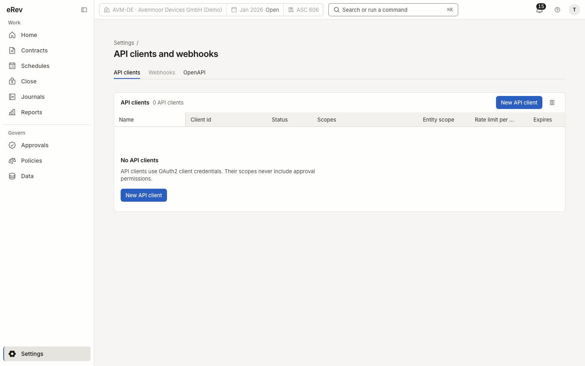

*SF-16:developer: the tab "API clients" of the demo workspace, "No API clients", with "New API client"; the tab "Webhooks" is unavailable to a Tenant Admin; Tomás Rivera (Tenant Admin).*

1. Press "New API client". Enter "Name" and tick the "Scopes" ("Non-approval permissions only. An approval scope is refused with ERR-24."). "Entity scope" stays on "All entities" ("An API client covers all entities."). Set "Expires" ("Defaults to 365 days from today.") and "Rate limit per minute", which starts at 600.
2. Press "Create API client" and enter a fresh code where "Confirm with your authenticator" asks for one. The toast reads "Created API client \<name>."
3. The client is listed as "Pending approval" and has no secret yet. Another person who holds `access.approve` for its entities approves the request under [Approvals](#approvals); the client is then "Active". During setup, while rule AUTO-BOOTSTRAP approves the first administrator's request at once, the dialog of step 5 follows the creation.
4. Press "Rotate secret" in the row of the active client and confirm "Rotate the secret of \<name>?": "The current secret stops working immediately." This issues the first secret as it issues every later one.
5. The dialog "Client secret for \<name>" shows the client id and the secret: "This secret is shown once. It cannot be shown again." Use "Show" and "Copy", store the secret, tick "I have stored this secret" and press "Done".
6. To end a client, press "Revoke", enter "Reason (required)" and confirm with "Revoke API client": "Tokens of \<name> stop working immediately."

An API client signs in with OAuth2 client credentials, and its scopes never include an approval permission. The page has no command that changes the scopes of a client: another set of scopes is another client and another request. No capture shows the drawer, the dialogs or the other two tabs.

- "Webhooks" holds the grid "Webhook endpoints" ("URL", "Description", "Events", "Active", "Created", "Actions") and the grid "Deliveries" ("Endpoint", "Event", "Status", "Attempts", "Next attempt", "Last response", "Last error", "Succeeded"). "New webhook endpoint" asks "URL" ("Use an https URL."), "Description" and "Events"; "Create endpoint" opens "Signing secret for \<url>", which is shown once in the same way. "Deactivate" and "Activate" switch an endpoint. "Endpoints receive signed notifications with resource ids only, never amounts or personal data."
- "OpenAPI" states "API base URL \<url>", the token endpoint ("tokens last 60 minutes") and the rate limit for each API client, and offers "Download the OpenAPI document (JSON)".

Limit in 1.0: an API client that holds a write permission without the matching read permission has its submissions refused; give a client the read scope with the write scope (limits document, row B6-2). Limit in 1.0: of the six event kinds an endpoint can subscribe to, only `journal_batch.exported` and `journal_batch.acknowledged` are delivered (limits document, row B8-8).

### Reset a forgotten password

"Reset password" (SF-22:password-reset, `/password/reset`) is open to anyone; "Forgot password?" on the sign-in page leads to it ([Sign in with a password and a second factor](#sign-in-with-a-password-and-a-second-factor)).

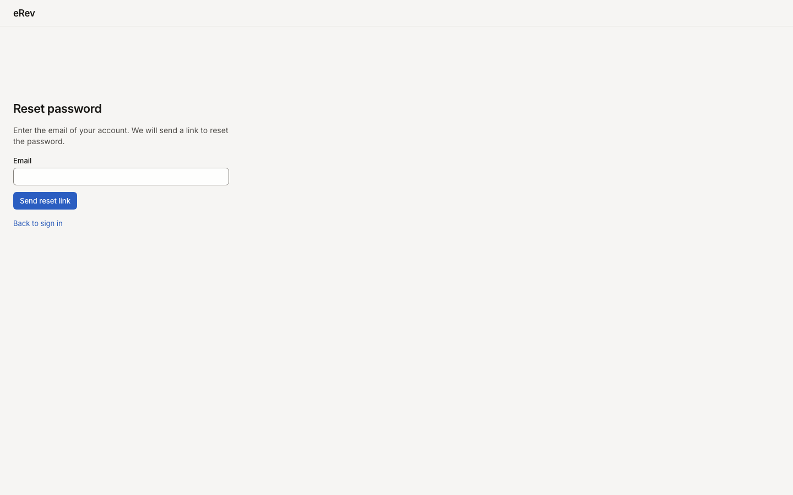

*SF-22:password-reset: the field "Email", "Send reset link" and "Back to sign in"; no persona is signed in.*

1. Enter the "Email" of your account and press "Send reset link".
2. The page answers the same for every address, so that it does not say whether an account exists: "If an account exists for \<email>, we sent a link to reset the password. The link expires in 60 minutes."
3. Open the link in the email. "Choose a new password" (SF-22:password-reset-confirm, `/password/reset/confirm`) asks "New password" and "Confirm password": "Use at least 12 characters. Do not use your email address or a common password."
4. Press "Reset password". The page reads "Password reset. Sign in with your new password." with the link "Sign in"; every session of the account has ended.

No capture shows the second page. An expired link reads "This reset link has expired. Request a new link.", and a link without its token "This reset link is incomplete. Open the link from the email."

### Change a password

"Change password" (SF-22:password-change, `/password/change`) is the page of a signed-in member; "Change password" on [Profile](#profile) opens it. It stands outside the shell, without the rail.

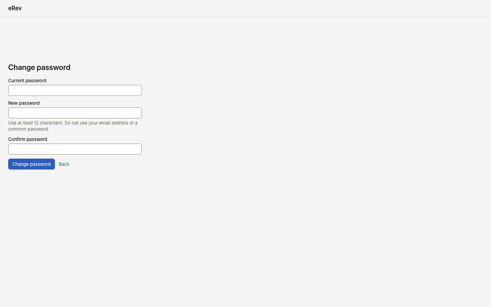

*SF-22:password-change: "Current password", "New password" with its rule and "Confirm password"; Maya Chen (Revenue Accountant).*

1. Enter "Current password", "New password" and "Confirm password".
2. Press "Change password". The toast reads "Password changed. Your other sessions were signed out.", and the landing page opens. "Back" leaves the page without a change.

A wrong current password answers "The current password is incorrect.", and two entries that differ "The passwords do not match."

Limit in 1.0: a wrong current password on this page is refused and is not counted towards the lockout (limits document, row B1-34).

### Accept an invitation and set up multi-factor authentication

No capture shows these two pages: a person reaches the first only by the emailed link, and the second as a forced step of sign-in or from [Profile](#profile).

"Accept invitation" (SF-22:accept-invitation, `/accept-invitation`) opens from the link of the invitation email and names the inviter, the invited address and the workspace ([Invite a member; the second administrator decides](#invite-a-member-the-second-administrator-decides)). A new person chooses a password twice, a person who already has an eRev password enters "Your eRev password" once, and "Accept invitation" opens the session. A link that has expired or was used reads "This invitation link has expired or was already used. Ask a workspace administrator to resend it."

"Set up multi-factor authentication" (SF-22:mfa-enrol, `/mfa/enrol`) is the only page open to a member whose roles require a second factor and who has none: "Set up multi-factor authentication to continue. Your roles include approval or administration permissions." It has the steps "Scan", "Verify" and "Recovery codes": scan the QR code with an authenticator app, or enter the "Key" by hand, and press "Next"; enter the 6-digit "Authentication code" and press "Verify code"; store the recovery codes with "Copy codes" or "Download codes", tick "I have stored these recovery codes" and press "Continue". Each recovery code works once, and "Sign out" in the header ends the session instead.

## What release 1.0 does not do

The release is the product as built, with its limits stated in one document: [the limits of release 1.0](../release/LIMITS-1.0.md). A person who uses the screens of this guide will meet these first; the row names the place in that document.

| What release 1.0 does not do | Where it shows | Row |
|---|---|---|
| A policy override for one contract or one obligation cannot be created. | The contract workbench offers no "Request policy override"; the policy registry still prints the levels "Contract" and "Obligation". | B1-1 |
| On a product or an obligation template, `usage.tier_minimum_method` and `upfront_fee.recognition_period` take the framework's default only, and `pob.shipping_as_fulfilment` takes no value. | The template editor shows the refusal in its banner. | B3-13, B3-21 |
| A contract whose financing needs an adjustment is not computed: no discount rate can be given. | A draft is refused at activation with `SFC_RATE_MISSING`. | B3-14 |
| Nineteen of the 56 report definitions have no builder. | The report answers "This report is not available yet." | B4-6 |
| The revenue waterfall of a locked period lists contracts that began after it; the RPO report states the position at the period's end. | Reports, Schedules. | B4-1 |
| No report converts an amount: the "Functional" and "Reporting" views show contracts in their entity's functional currency only. | A run over a contract in another currency is refused in either view. | B4-12 |
| On the screen only a holder of `user.manage`, among the default roles the Tenant Admin, creates an approval delegation. | Approvals, "Delegations": "New delegation" is unavailable to other approvers. | B6-8 |
| A posted manual adjustment cannot be voided or reversed. | Close, manual adjustments. | B2-11 |
| A close run is started for one entity at a time. | The view of several entities starts one run for each. | B2-14 |
| A regroup is taken for two draft contracts only. | Contracts. | B3-6 |
| The migration from the desktop application is by opening balances with a cutover; replay and promotion are not built. | Data, the migration guide. | B5-9 |
| Four of the six documented webhook kinds are never delivered. | Integrations. | B8-8 |

Before production use, and outside this release: no independent revenue accountant has reviewed the accounting decisions the product rests on (row A-1); nothing is deployed and no hosted evidence exists (A-4); performance at volume is not measured (A-7). Fifteen tests of the backend suite do not pass, each tied to its cause in the same document.

## Where to read more

| Document | What it holds |
|---|---|
| [User guide](user-guide.md) | The vocabulary, money and dates on the wire, the rules of every area, the demo workspaces |
| [Runbook](runbook.md) | Start and stop, migrations, backup and restore, keys, jobs, incidents |
| [Migration guide](migration-guide.md) | Moving from the desktop application's `ASC606.db` |
| [ITGC guide](itgc-guide.md) | The controls a customer operates around the system |
| [Limits of release 1.0](../release/LIMITS-1.0.md) | What stands before production use, what the release does not do, what moved to the next release |
| [Screenshots](../screenshots/README.md) and [gallery](../screenshots/GALLERY.md) | Every capture, in the light and the dark theme, with its screen and route |
| [QA record of the release candidate](../qa/RC-multi-role-qa-2026-10-03-f8e46e54.md) | The multi-role browser pass: 118 checks, their results and their captures |
| [Developer guide](../dev-guide.md) | The repository's layout, every Make target, the test and gate contracts |
| [`PROGRESS.md`](../../PROGRESS.md) | The state of the release candidate and what was measured on it |
